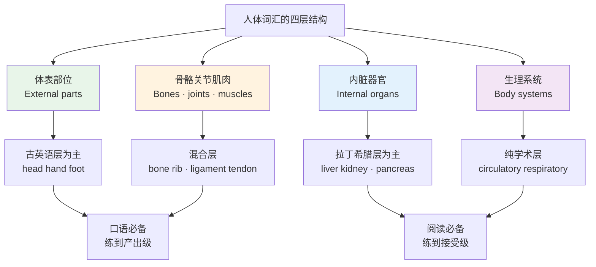
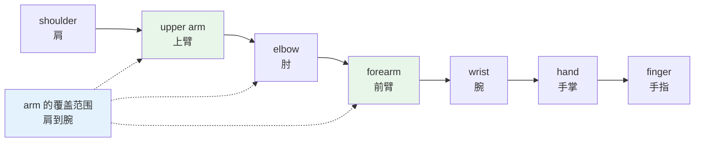
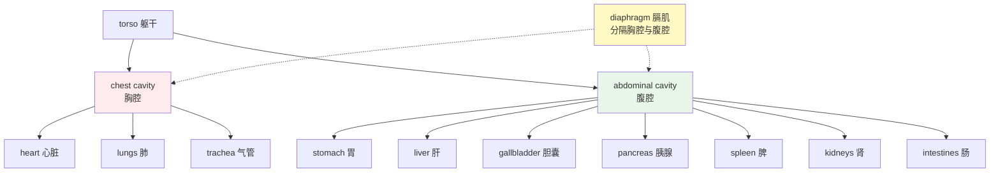
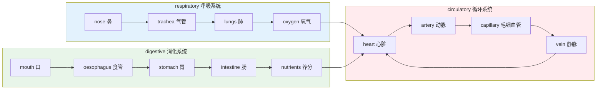
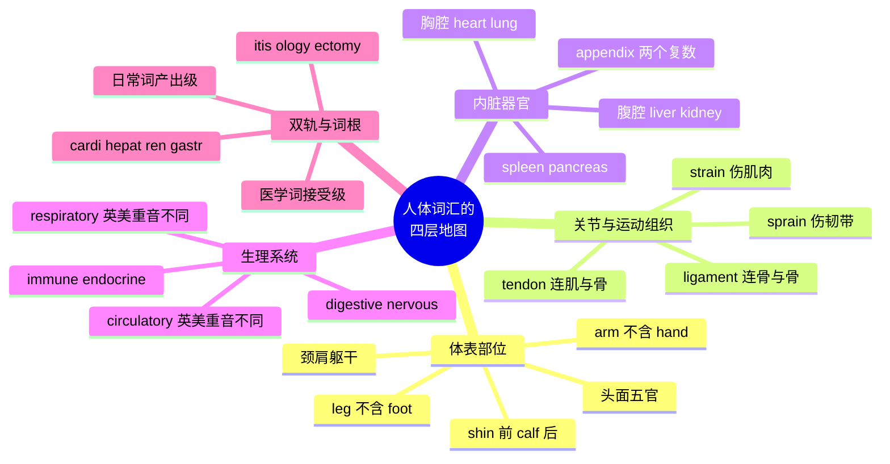

# 身体部位、内脏器官与生理系统

> [!info] 本篇定位
>
> 第七章的开篇，也是整章的名词地基。后面讲症状、讲就医、讲情绪，全部要指着身体部位说话——不知道 `shin` 是小腿前侧那根骨头，就没法跟医生描述哪里疼。
>
> 本篇给出约 230 个词条，分四层：体表部位、关节骨骼肌肉、内脏器官、生理系统。同时处理中文母语者最容易含糊的三组划分：`arm` 到底包不包括手、`leg` 和 `foot` 的边界在哪、中文的「手」为什么不能直接对译成 `hand`。
>
> 读完能做到两件事：看着自己身体从头到脚说出英文名；读英文体检报告和药品说明书时认得器官名与系统名。

---

## 1. 本篇导读：身体词难在哪

身体部位看起来是最简单的一类词——每个人都有一副身体，指着说就行。真正上手会撞上三堵墙。

**第一堵墙：中英的切分粒度不一样。** 中文说「胳膊」，英语要分 `arm`（整条上肢）、`upper arm`（上臂）、`forearm`（前臂）；中文说「腿」，英语要分 `leg`、`thigh`（大腿）、`calf`（小腿肚）、`shin`（小腿前侧）。反过来，中文的「手」在「他手上受伤了」里可能指整条胳膊，英语的 `hand` 严格只到腕关节为止。

**第二堵墙：内脏词是拉丁希腊层，跟体表词不在一个语域。** `hand`、`foot`、`heart` 是古英语层的短词，`pancreas`、`oesophagus`、`larynx` 是学术层的搬运词。前者小孩就会说，后者要到中学生物课才出现。这两层混用会出问题——跟护士说 `my epigastrium hurts` 是很怪的。

**第三堵墙：日常词与医学词各有一套。** 同一件事，病人说 `heart attack`，病历上写 `myocardial infarction`；病人说 `I threw up`，病历上写 `vomiting`。读英文资料要认得医学那套，跟人说话要用日常那套。



上图给出了本篇的学习优先级。体表部位和常见骨骼名要练到能主动说出来，因为看病、健身、描述外伤都用得上；内脏名和系统名先停在「读到能认」，能看懂体检报告即可，日常对话极少需要主动说出 `spleen` 这个词。这个分层判断沿用 [[01.词汇入门与学习方法/01.英语词汇的来源、分层与学习地图\|英语词汇的来源、分层与学习地图]] 里的接受性与产出性划分。

---

## 2. 头部与面部

### 2.1 头颅与轮廓

| 英文 | 英式音标 | 美式音标 | 词性 | 中文 | 搭配与说明 |
| --- | --- | --- | --- | --- | --- |
| **head** | /hed/ | /hed/ | n. | 头；头部 | nod one's head 点头；shake one's head 摇头 |
| **skull** | /skʌl/ | /skʌl/ | n. | 头骨；颅骨 | 医学词是 cranium /ˈkreɪniəm/ |
| **scalp** | /skælp/ | /skælp/ | n. | 头皮 | dry scalp 头皮干燥；洗发水广告高频词 |
| **forehead** | /ˈfɔːhed/ | /ˈfɔːrhed/ | n. | 额头 | 老派英音读 /ˈfɒrɪd/，与 horrid 押韵 |
| **temple** | /ˈtempl/ | /ˈtempl/ | n. | 太阳穴 | 与「寺庙」同形，靠语境区分 |
| **face** | /feɪs/ | /feɪs/ | n. | 脸 | wash one's face；face down 脸朝下 |
| **cheek** | /tʃiːk/ | /tʃiːk/ | n. | 脸颊 | cheekbone 颧骨 |
| **chin** | /tʃɪn/ | /tʃɪn/ | n. | 下巴（尖端） | double chin 双下巴；keep your chin up 别泄气 |
| **jaw** | /dʒɔː/ | /dʒɑː/ | n. | 颌；下颚 | jaw 指整个颌骨结构，chin 只是它前端的肉 |
| **hair** | /heə/ | /her/ | n. | 头发；毛发 | 整头头发不可数；单根可数用 a hair |

`chin` 和 `jaw` 是中文母语者最常混的一对。中文都叫「下巴」，英语里 `jaw` 是骨头结构（上下颌），`chin` 是下颌骨前端那块突出的部位。摔倒磕到的是 `chin`，牙医说的是 `jaw`。

### 2.2 五官细部

| 英文 | 英式音标 | 美式音标 | 词性 | 中文 | 搭配与说明 |
| --- | --- | --- | --- | --- | --- |
| **eye** | /aɪ/ | /aɪ/ | n. | 眼睛 | keep an eye on 留意 |
| **eyebrow** | /ˈaɪbraʊ/ | /ˈaɪbraʊ/ | n. | 眉毛 | raise an eyebrow 挑眉，表示怀疑 |
| **eyelash** | /ˈaɪlæʃ/ | /ˈaɪlæʃ/ | n. | 睫毛 | 常用复数 eyelashes |
| **eyelid** | /ˈaɪlɪd/ | /ˈaɪlɪd/ | n. | 眼皮 | upper / lower eyelid |
| **eyeball** | /ˈaɪbɔːl/ | /ˈaɪbɔːl/ | n. | 眼球 | eyeball it 口语指目测 |
| **pupil** | /ˈpjuːpl/ | /ˈpjuːpl/ | n. | 瞳孔 | 与「小学生」同形词 |
| **iris** | /ˈaɪrɪs/ | /ˈaɪrɪs/ | n. | 虹膜 | iris recognition 虹膜识别 |
| **cornea** | /ˈkɔːniə/ | /ˈkɔːrniə/ | n. | 角膜 | 形容词 corneal |
| **nose** | /nəʊz/ | /noʊz/ | n. | 鼻子 | blow one's nose 擤鼻涕 |
| **nostril** | /ˈnɒstrəl/ | /ˈnɑːstrəl/ | n. | 鼻孔 | 通常用复数 nostrils |
| **mouth** | /maʊθ/ | /maʊθ/ | n. | 嘴 | 动词形式读 /maʊð/，浊化 |
| **lip** | /lɪp/ | /lɪp/ | n. | 嘴唇 | upper lip 上唇；chapped lips 唇裂 |
| **tongue** | /tʌŋ/ | /tʌŋ/ | n. | 舌头 | 拼写与读音严重脱节，词尾 ue 不发音 |
| **palate** | /ˈpælət/ | /ˈpælət/ | n. | 上颚；味觉 | 引申义指品味，a refined palate |
| **gum** | /ɡʌm/ | /ɡʌm/ | n. | 牙龈 | 复数 gums；bleeding gums 牙龈出血 |
| **tooth** | /tuːθ/ | /tuːθ/ | n. | 牙齿 | 不规则复数 teeth /tiːθ/ |
| **ear** | /ɪə/ | /ɪr/ | n. | 耳朵 | 英式无 r 音，美式带 r，差别明显 |
| **earlobe** | /ˈɪələʊb/ | /ˈɪrloʊb/ | n. | 耳垂 | 打耳洞的部位 |
| **eardrum** | /ˈɪədrʌm/ | /ˈɪrdrʌm/ | n. | 耳膜 | 医学词 tympanic membrane |

> [!warning] tongue 的拼读陷阱
>
> `tongue` 是英语里拼写与读音落差最大的常用词之一：五个字母 `t-o-n-g-u-e` 读成 /tʌŋ/，`u` 和 `e` 都不发音，`o` 读 /ʌ/。
>
> - ❌ ~~/ˈtɒŋɡuː/~~（按字母硬拼）
> - ✅ **/tʌŋ/**（与 tongs、lung 的韵母一致）
>
> 同一批拼读失效词还有 `stomach` /ˈstʌmək/（ch 读 /k/）和 `muscle` /ˈmʌsl/（c 不发音）。处理办法见 [[01.词汇入门与学习方法/02.自然拼读：拼写与发音对应规则\|自然拼读：拼写与发音对应规则]] 的例外词一节。

---

## 3. 颈肩与躯干

### 3.1 颈部与肩背

| 英文 | 英式音标 | 美式音标 | 词性 | 中文 | 搭配与说明 |
| --- | --- | --- | --- | --- | --- |
| **neck** | /nek/ | /nek/ | n. | 脖子 | a stiff neck 落枕；a pain in the neck 讨厌鬼 |
| **nape** | /neɪp/ | /neɪp/ | n. | 后颈；颈背 | the nape of the neck，书面词 |
| **throat** | /θrəʊt/ | /θroʊt/ | n. | 喉咙 | a sore throat 嗓子疼，就医高频 |
| **Adam's apple** | /ˌædəmz ˈæpl/ | /ˌædəmz ˈæpl/ | n. | 喉结 | 固定说法，首字母 A 大写 |
| **shoulder** | /ˈʃəʊldə/ | /ˈʃoʊldər/ | n. | 肩膀 | shrug one's shoulders 耸肩 |
| **collarbone** | /ˈkɒləbəʊn/ | /ˈkɑːlərboʊn/ | n. | 锁骨 | 医学词 clavicle /ˈklævɪkl/ |
| **shoulder blade** | /ˈʃəʊldə bleɪd/ | /ˈʃoʊldər bleɪd/ | n. | 肩胛骨 | 医学词 scapula /ˈskæpjələ/ |
| **armpit** | /ˈɑːmpɪt/ | /ˈɑːrmpɪt/ | n. | 腋窝 | 医学词 axilla；日常用 armpit |
| **back** | /bæk/ | /bæk/ | n. | 背；后背 | lower back 腰部；back pain 背痛 |
| **spine** | /spaɪn/ | /spaɪn/ | n. | 脊柱 | 形容词 spinal；spinal cord 脊髓 |
| **vertebra** | /ˈvɜːtɪbrə/ | /ˈvɜːrtɪbrə/ | n. | 椎骨 | 拉丁复数 vertebrae /ˈvɜːtɪbriː/ |
| **tailbone** | /ˈteɪlbəʊn/ | /ˈteɪlboʊn/ | n. | 尾骨 | 医学词 coccyx /ˈkɒksɪks/ |
| **waist** | /weɪst/ | /weɪst/ | n. | 腰（外形部位） | 与 waste 同音，买裤子说 waist size |

中文的「腰」在英语里没有一对一的词。指身材曲线用 `waist`，指腰疼的那个部位用 `lower back`。「我腰疼」标准说法是 `I have lower back pain`，说成 `my waist hurts` 会让人以为你在说裤腰勒得慌。

### 3.2 胸腹与胯部

| 英文 | 英式音标 | 美式音标 | 词性 | 中文 | 搭配与说明 |
| --- | --- | --- | --- | --- | --- |
| **chest** | /tʃest/ | /tʃest/ | n. | 胸；胸腔 | chest pain 胸痛，急诊分诊关键词 |
| **rib** | /rɪb/ | /rɪb/ | n. | 肋骨 | a broken rib 肋骨骨折 |
| **ribcage** | /ˈrɪbkeɪdʒ/ | /ˈrɪbkeɪdʒ/ | n. | 胸廓 | 也写作 rib cage 两词 |
| **breast** | /brest/ | /brest/ | n. | 乳房；胸脯 | breast cancer 乳腺癌；ea 读 /e/ |
| **abdomen** | /ˈæbdəmən/ | /ˈæbdəmən/ | n. | 腹部 | 医学正式词，形容词 abdominal |
| **belly** | /ˈbeli/ | /ˈbeli/ | n. | 肚子 | 口语；belly button 肚脐（口语） |
| **tummy** | /ˈtʌmi/ | /ˈtʌmi/ | n. | 小肚子 | 儿语；对小孩说 tummy ache |
| **navel** | /ˈneɪvl/ | /ˈneɪvl/ | n. | 肚脐 | 正式词；日常说 belly button |
| **hip** | /hɪp/ | /hɪp/ | n. | 髋；胯 | hip replacement 髋关节置换 |
| **pelvis** | /ˈpelvɪs/ | /ˈpelvɪs/ | n. | 骨盆 | 形容词 pelvic /ˈpelvɪk/ |
| **buttock** | /ˈbʌtək/ | /ˈbʌtək/ | n. | 臀部（单侧） | 通常用复数 buttocks；口语英式 bum、美式 butt |
| **groin** | /ɡrɔɪn/ | /ɡrɔɪn/ | n. | 腹股沟 | a groin injury 是足球报道常见词 |
| **torso** | /ˈtɔːsəʊ/ | /ˈtɔːrsoʊ/ | n. | 躯干 | 也可用 trunk /trʌŋk/ |

> [!warning] stomach 不等于 belly
>
> `stomach` 在解剖学上是**胃**这个器官，但在日常口语里也被用来指整个肚子区域。这个双重身份导致两个方向的误用。
>
> - ✅ `My stomach hurts.`（日常，指肚子疼，位置模糊，完全自然）
> - ✅ `The food goes from the oesophagus into the stomach.`（解剖义，指胃）
> - ❌ ~~`The stomach connects the mouth to the intestine.`~~（连接口腔与肠的是 **oesophagus** 食管，不是胃）
>
> 另有一处不算错但不地道：健身语境说「我腹肌酸」，`my stomach muscles are sore` 听得懂，母语者会说 `my abs are sore`（`abs` 是 abdominal muscles 的口语缩略）。
>
> 三个词的分工：口语肚子 `belly` / `stomach`，正式书面 `abdomen`，具体器官 `stomach`。

---

## 4. 上肢：arm 与 forearm 的分界

### 4.1 从肩到指的完整分段

中文一句「胳膊」在英语里要落到具体段位上。`arm` 是从肩到腕的整条上肢，`upper arm` 是肩到肘，`forearm` 是肘到腕，`hand` 从腕关节开始。



上图的虚线是关键：`arm` 罩住的是 `upper arm` + `elbow` + `forearm` 三段，**不包括 hand**。所以 `He broke his arm` 是胳膊骨折，手没事；`He broke his hand` 是手骨折，胳膊没事。中文说「他手断了」可能指任意一段，英语必须说清楚。

| 英文 | 英式音标 | 美式音标 | 词性 | 中文 | 搭配与说明 |
| --- | --- | --- | --- | --- | --- |
| **arm** | /ɑːm/ | /ɑːrm/ | n. | 手臂（肩到腕） | 不含手掌；hold sb in one's arms 抱住 |
| **upper arm** | /ˌʌpər ˈɑːm/ | /ˌʌpər ˈɑːrm/ | n. | 上臂 | 打疫苗打在这里 |
| **forearm** | /ˈfɔːrɑːm/ | /ˈfɔːrɑːrm/ | n. | 前臂；小臂 | 重音在前，与动词 forearm 区分 |
| **elbow** | /ˈelbəʊ/ | /ˈelboʊ/ | n./v. | 肘；用肘挤 | elbow room 活动余地 |
| **wrist** | /rɪst/ | /rɪst/ | n. | 手腕 | w 不发音；wristwatch 手表 |
| **hand** | /hænd/ | /hænd/ | n. | 手（腕以下） | give sb a hand 帮忙 |
| **palm** | /pɑːm/ | /pɑːm/ | n. | 手掌心 | l 不发音；与「棕榈」同形 |
| **knuckle** | /ˈnʌkl/ | /ˈnʌkl/ | n. | 指关节 | k 不发音；crack one's knuckles 掰响手指 |
| **finger** | /ˈfɪŋɡə/ | /ˈfɪŋɡər/ | n. | 手指 | 严格说不含拇指 |
| **thumb** | /θʌm/ | /θʌm/ | n. | 拇指 | b 不发音；rule of thumb 经验法则 |
| **fingernail** | /ˈfɪŋɡəneɪl/ | /ˈfɪŋɡərneɪl/ | n. | 指甲 | 可简称 nail |
| **fingertip** | /ˈfɪŋɡətɪp/ | /ˈfɪŋɡərtɪp/ | n. | 指尖 | at one's fingertips 唾手可得 |
| **fist** | /fɪst/ | /fɪst/ | n. | 拳头 | clench one's fist 握拳 |

### 4.2 五根手指各有名字

| 英文 | 英式音标 | 美式音标 | 词性 | 中文 | 搭配与说明 |
| --- | --- | --- | --- | --- | --- |
| **thumb** | /θʌm/ | /θʌm/ | n. | 拇指 | thumbs up 点赞手势 |
| **index finger** | /ˈɪndeks ˌfɪŋɡə/ | /ˈɪndeks ˌfɪŋɡər/ | n. | 食指 | 也叫 forefinger |
| **middle finger** | /ˈmɪdl ˌfɪŋɡə/ | /ˈmɪdl ˌfɪŋɡər/ | n. | 中指 | 单独竖起是侮辱手势，慎用 |
| **ring finger** | /ˈrɪŋ ˌfɪŋɡə/ | /ˈrɪŋ ˌfɪŋɡər/ | n. | 无名指 | 戴婚戒的那根，名字直接来自用途 |
| **little finger** | /ˈlɪtl ˌfɪŋɡə/ | /ˈlɪtl ˌfɪŋɡər/ | n. | 小指 | 美式口语常说 pinky /ˈpɪŋki/ |

> [!tip] 五个词的记忆法
>
> 英语给手指起名的逻辑全部来自功能，不像中文那样靠序数。
>
> - `index` 本义是「指示」，指路用的那根，所以是食指。同一个词根还在 index（索引）、indicate（指示）里。
> - `ring finger` 直接说戴戒指的那根。
> - `pinky` 来自荷兰语 pink（小），跟颜色 pink 无关。
>
> `thumb` 不算 finger 是英语的固有区分：`I have ten fingers` 严格说是错的，应该是 `eight fingers and two thumbs`。日常没人较真，但读英文说明书时会遇到 `fingers and thumb` 这种并列写法。

---

## 5. 下肢：leg、thigh、calf、shin

### 5.1 从髋到趾的完整分段

```text
hip ─ thigh ─ knee ─┬─ shin  （前侧，硬骨） ─┬─ ankle ─ foot ─ toe
     大腿    膝      └─ calf  （后侧，肌肉） ─┘   踝      脚     脚趾

└──────────── leg 的覆盖范围：髋到踝，不含 foot ────────────┘
```

`leg` 和 `arm` 的逻辑完全平行：`leg` 覆盖髋到踝，**不包括 foot**。中文说「腿」有时含脚，英语不含。`He has long legs` 说的是腿长，跟脚多大没关系。

上面这张图的分叉是关键——膝盖到脚踝这一段，英语按前后各给了一个词，两者位置平行而不是先后相接。

膝盖以下这一段中文只有「小腿」一个词，英语按前后分成两个：`shin` 是前面那条硬邦邦的骨头（胫骨表面，没什么肉，撞到极痛），`calf` 是后面鼓起来的肌肉块（小腿肚）。跑步磕到桌角的是 `shin`，跑完拉伸的是 `calf`。

| 英文 | 英式音标 | 美式音标 | 词性 | 中文 | 搭配与说明 |
| --- | --- | --- | --- | --- | --- |
| **leg** | /leɡ/ | /leɡ/ | n. | 腿（髋到踝） | 不含脚；cross one's legs 翘二郎腿 |
| **thigh** | /θaɪ/ | /θaɪ/ | n. | 大腿 | gh 不发音；thigh muscle 大腿肌 |
| **knee** | /niː/ | /niː/ | n. | 膝盖 | k 不发音；on one's knees 跪着 |
| **kneecap** | /ˈniːkæp/ | /ˈniːkæp/ | n. | 膝盖骨 | 医学词 patella /pəˈtelə/ |
| **shin** | /ʃɪn/ | /ʃɪn/ | n. | 小腿前侧；胫部 | shin guard 护胫，踢球必备 |
| **calf** | /kɑːf/ | /kæf/ | n. | 小腿肚 | 复数 calves；与「小牛」同形同音 |
| **hamstring** | /ˈhæmstrɪŋ/ | /ˈhæmstrɪŋ/ | n. | 腘绳肌 | pull a hamstring 拉伤大腿后肌 |
| **ankle** | /ˈæŋkl/ | /ˈæŋkl/ | n. | 脚踝 | sprain one's ankle 崴脚 |
| **foot** | /fʊt/ | /fʊt/ | n. | 脚（踝以下） | 不规则复数 feet /fiːt/ |
| **heel** | /hiːl/ | /hiːl/ | n. | 脚后跟 | 也指鞋跟；high heels 高跟鞋 |
| **sole** | /səʊl/ | /soʊl/ | n. | 脚底板 | 也指鞋底；与 soul 同音 |
| **arch** | /ɑːtʃ/ | /ɑːrtʃ/ | n. | 足弓 | flat feet 扁平足 |
| **instep** | /ˈɪnstep/ | /ˈɪnstep/ | n. | 脚背 | 也说 the top of the foot |
| **toe** | /təʊ/ | /toʊ/ | n. | 脚趾 | big toe 大脚趾；little toe 小脚趾 |
| **toenail** | /ˈtəʊneɪl/ | /ˈtoʊneɪl/ | n. | 脚趾甲 | ingrown toenail 嵌甲 |

> [!warning] calf 的两个坑
>
> **坑一：英美元音差别大。** 英式 /kɑːf/ 用长音 /ɑː/，美式 /kæf/ 用 /æ/。同一批词还有 `half` /hɑːf/ · /hæf/、`bath` /bɑːθ/ · /bæθ/、`ask` /ɑːsk/ · /æsk/。这是英式 BATH 组元音与美式的系统性对应，不是个例。
>
> **坑二：复数不规则。** `calf` → `calves`，f 变 v 再加 -es，与 `wife`→`wives`、`leaf`→`leaves` 同一模式。
>
> - ❌ ~~calfs~~
> - ✅ **calves** /kɑːvz/ · /kævz/

### 5.2 中英切分差异总表

| 中文说法 | 常见误译 | 正确表达 | 说明 |
| --- | --- | --- | --- |
| 胳膊疼 | ~~my hand hurts~~ | **my arm hurts** | hand 只到腕，不含小臂 |
| 手腕扭了 | ~~my hand is twisted~~ | **I twisted my wrist** | 腕关节单独有词 |
| 小腿抽筋 | ~~my small leg cramps~~ | **I have a cramp in my calf** | 小腿肚用 calf |
| 撞到小腿骨 | ~~hit my leg bone~~ | **banged my shin** | 前侧胫部专用 shin |
| 腿麻了 | ~~my leg is paralyzed~~ | **my leg has gone to sleep** | paralyzed 是瘫痪；坐麻了说 gone to sleep 或 numb |
| 脚踝肿了 | ~~my foot swelled~~ | **my ankle is swollen** | 踝与脚要分开 |
| 大腿内侧 | ~~inside of big leg~~ | **inner thigh** | 大腿是 thigh 不是 big leg |
| 手指关节响 | ~~finger joint sound~~ | **crack one's knuckles** | 指关节是 knuckle |

---

## 6. 关节、骨骼与肌肉

### 6.1 关节结构词

关节相关词是运动伤和体检报告的高频区。中文一个「筋」在英语里对应三个不同结构，混用会说不清伤在哪。

| 英文 | 英式音标 | 美式音标 | 词性 | 中文 | 搭配与说明 |
| --- | --- | --- | --- | --- | --- |
| **joint** | /dʒɔɪnt/ | /dʒɔɪnt/ | n. | 关节 | joint pain 关节痛；stiff joints 关节僵硬 |
| **ligament** | /ˈlɪɡəmənt/ | /ˈlɪɡəmənt/ | n. | 韧带 | 连骨与骨；tear a ligament 韧带撕裂 |
| **tendon** | /ˈtendən/ | /ˈtendən/ | n. | 肌腱 | 连肌肉与骨；Achilles tendon 跟腱 |
| **cartilage** | /ˈkɑːtɪlɪdʒ/ | /ˈkɑːrtəlɪdʒ/ | n. | 软骨 | 关节缓冲层；worn cartilage 软骨磨损 |
| **socket** | /ˈsɒkɪt/ | /ˈsɑːkɪt/ | n. | 关节窝 | 球窝关节 ball-and-socket joint |
| **sprain** | /spreɪn/ | /spreɪn/ | n./v. | 扭伤 | 伤在韧带；a sprained ankle |
| **strain** | /streɪn/ | /streɪn/ | n./v. | 拉伤 | 伤在肌肉或肌腱；a muscle strain |
| **dislocate** | /ˈdɪsləkeɪt/ | /ˈdɪsloʊkeɪt/ | v. | 使脱臼 | dislocate one's shoulder |
| **fracture** | /ˈfræktʃə/ | /ˈfræktʃər/ | n./v. | 骨折 | 医学词；日常说 a broken bone |

> [!warning] ligament 与 tendon 不能互换
>
> 中文都可以含糊说成「筋」，英语里两者连接的东西不同。
>
> - **ligament** 连接骨与骨，负责固定关节。崴脚撕的是 ligament。
> - **tendon** 连接肌肉与骨，负责传力。跟腱 Achilles tendon 是最粗的一条。
>
> 相应地，`sprain` 与 `strain` 也分工明确：`sprain` 伤韧带（关节被扭超范围），`strain` 伤肌肉或肌腱（用力过猛拉伤）。两个词只差一个字母，意思差一个组织层。
>
> - ✅ `I sprained my ankle playing basketball.`（崴脚，韧带）
> - ✅ `He strained his back lifting the box.`（搬箱子闪了腰，肌肉）

### 6.2 骨骼与肌肉

| 英文 | 英式音标 | 美式音标 | 词性 | 中文 | 搭配与说明 |
| --- | --- | --- | --- | --- | --- |
| **bone** | /bəʊn/ | /boʊn/ | n. | 骨头 | bone density 骨密度 |
| **skeleton** | /ˈskelɪtn/ | /ˈskelɪtn/ | n. | 骨骼；骨架 | 形容词 skeletal |
| **marrow** | /ˈmærəʊ/ | /ˈmæroʊ/ | n. | 骨髓 | bone marrow transplant 骨髓移植 |
| **muscle** | /ˈmʌsl/ | /ˈmʌsl/ | n. | 肌肉 | c 不发音；build muscle 增肌 |
| **biceps** | /ˈbaɪseps/ | /ˈbaɪseps/ | n. | 二头肌 | 单复数同形，词尾 s 不是复数标记 |
| **triceps** | /ˈtraɪseps/ | /ˈtraɪseps/ | n. | 三头肌 | 同上，来自拉丁 tri- 三 + ceps 头 |
| **abs** | /æbz/ | /æbz/ | n. | 腹肌 | abdominal muscles 的口语缩略 |
| **quadriceps** | /ˈkwɒdrɪseps/ | /ˈkwɑːdrɪseps/ | n. | 股四头肌 | 口语缩略 quads /kwɒdz/ · /kwɑːdz/ |
| **bruise** | /bruːz/ | /bruːz/ | n./v. | 淤青；撞青 | ui 读 /uː/；bruise easily 容易淤青 |
| **tissue** | /ˈtɪʃuː/ | /ˈtɪʃuː/ | n. | 组织 | soft tissue 软组织；也指纸巾 |
| **cell** | /sel/ | /sel/ | n. | 细胞 | red blood cell 红细胞 |
| **skin** | /skɪn/ | /skɪn/ | n. | 皮肤 | dry skin；skin care 护肤 |
| **pore** | /pɔː/ | /pɔːr/ | n. | 毛孔 | clogged pores 毛孔堵塞 |

`biceps` 和 `triceps` 是英语里少见的「看着像复数其实是单数」的词。一条二头肌就叫 `a biceps`，两条也叫 `biceps`。健身语境里美式口语常说成 `bicep`（去掉 s），词典标注为非正式用法，写作时用 `biceps`。

---

## 7. 内脏器官

### 7.1 胸腔器官



上图给出内脏词的定位框架。`diaphragm`（膈肌）是胸腹两腔的分界，也是呼吸的主要动力肌——打嗝 `hiccup` 就是它痉挛引起的。记器官名时按腔分组比按字母表背有效得多，因为医生问诊时也是按区域问的。

| 英文 | 英式音标 | 美式音标 | 词性 | 中文 | 搭配与说明 |
| --- | --- | --- | --- | --- | --- |
| **organ** | /ˈɔːɡən/ | /ˈɔːrɡən/ | n. | 器官 | organ donation 器官捐献 |
| **heart** | /hɑːt/ | /hɑːrt/ | n. | 心脏 | ea 读 /ɑː/，是拼读例外 |
| **lung** | /lʌŋ/ | /lʌŋ/ | n. | 肺 | 通常用复数 lungs；lung capacity 肺活量 |
| **windpipe** | /ˈwɪndpaɪp/ | /ˈwɪndpaɪp/ | n. | 气管 | 日常词，正式词是 trachea |
| **trachea** | /trəˈkiːə/ | /ˈtreɪkiə/ | n. | 气管 | 英美重音位置不同，差别明显 |
| **larynx** | /ˈlærɪŋks/ | /ˈlærɪŋks/ | n. | 喉；喉头 | 口语叫 voice box |
| **diaphragm** | /ˈdaɪəfræm/ | /ˈdaɪəfræm/ | n. | 膈肌 | 词尾 g 不发音；呼吸主力肌 |
| **rib** | /rɪb/ | /rɪb/ | n. | 肋骨 | 保护胸腔器官 |
| **aorta** | /eɪˈɔːtə/ | /eɪˈɔːrtə/ | n. | 主动脉 | 心脏出口最粗的血管 |

### 7.2 腹腔器官

| 英文 | 英式音标 | 美式音标 | 词性 | 中文 | 搭配与说明 |
| --- | --- | --- | --- | --- | --- |
| **stomach** | /ˈstʌmək/ | /ˈstʌmək/ | n. | 胃 | ch 读 /k/；on an empty stomach 空腹 |
| **oesophagus** | /iːˈsɒfəɡəs/ | — | n. | 食管（英式拼写） | 美式拼 esophagus |
| **esophagus** | — | /ɪˈsɑːfəɡəs/ | n. | 食管（美式拼写） | 英式拼 oesophagus |
| **liver** | /ˈlɪvə/ | /ˈlɪvər/ | n. | 肝脏 | 形容词 hepatic；也指食用的肝 |
| **kidney** | /ˈkɪdni/ | /ˈkɪdni/ | n. | 肾 | 形容词 renal；kidney stone 肾结石 |
| **spleen** | /spliːn/ | /spliːn/ | n. | 脾 | ruptured spleen 脾破裂 |
| **pancreas** | /ˈpæŋkriəs/ | /ˈpæŋkriəs/ | n. | 胰腺 | 形容词 pancreatic；分泌胰岛素 |
| **gallbladder** | /ˈɡɔːlblædə/ | /ˈɡɔːlblædər/ | n. | 胆囊 | 储存 bile 胆汁 |
| **bladder** | /ˈblædə/ | /ˈblædər/ | n. | 膀胱 | 单说 bladder 指膀胱，加 gall- 才是胆囊 |
| **intestine** | /ɪnˈtestɪn/ | /ɪnˈtestɪn/ | n. | 肠 | small / large intestine 小肠、大肠 |
| **bowel** | /ˈbaʊəl/ | /ˈbaʊəl/ | n. | 肠道 | 常用复数；bowel movement 排便 |
| **gut** | /ɡʌt/ | /ɡʌt/ | n. | 肠道；内脏 | 口语；gut health 肠道健康 |
| **colon** | /ˈkəʊlən/ | /ˈkoʊlən/ | n. | 结肠 | 与标点「冒号」同形 |
| **rectum** | /ˈrektəm/ | /ˈrektəm/ | n. | 直肠 | 形容词 rectal |
| **appendix** | /əˈpendɪks/ | /əˈpendɪks/ | n. | 阑尾 | 也指书末附录，两义复数偏好不同 |
| **duodenum** | /ˌdjuːəˈdiːnəm/ | /ˌduːəˈdiːnəm/ | n. | 十二指肠 | 小肠第一段，紧接 stomach |
| **ureter** | /jʊəˈriːtə/ | /jʊˈriːtər/ | n. | 输尿管 | 连 kidney 与 bladder；肾结石卡在这里 |

> [!warning] appendix 的两个复数
>
> `appendix` 的两个意思偏好不同的复数形式，这是英语里少数按词义分化复数的词。
>
> - 阑尾（器官）→ **appendixes** 为主，`two appendixes removed`；医学文献里 appendices 也见得到
> - 附录（书末）→ **appendices** /əˈpendɪsiːz/ 为主，`See Appendices A and B`
>
> 记忆抓手：解剖学讲的是具体器官，走英语自己的规则复数 -es；书末附录是书面学术用法，保留拉丁复数 -ices。
>
> 同一批拉丁复数还有：`vertebra` → vertebrae（椎骨）、`bacterium` → bacteria（细菌）、`fungus` → fungi（真菌）。完整清单见 [[02.功能词与封闭词类速查/07.不规则动词形态分组与不规则复数全表\|不规则动词形态分组与不规则复数全表]]。

### 7.3 神经与内分泌相关

| 英文 | 英式音标 | 美式音标 | 词性 | 中文 | 搭配与说明 |
| --- | --- | --- | --- | --- | --- |
| **brain** | /breɪn/ | /breɪn/ | n. | 大脑 | brain damage 脑损伤 |
| **cerebrum** | /səˈriːbrəm/ | /səˈriːbrəm/ | n. | 大脑（解剖义） | 形容词 cerebral |
| **nerve** | /nɜːv/ | /nɜːrv/ | n. | 神经 | a pinched nerve 神经受压 |
| **spinal cord** | /ˌspaɪnl ˈkɔːd/ | /ˌspaɪnl ˈkɔːrd/ | n. | 脊髓 | 注意是 cord 不是 chord |
| **gland** | /ɡlænd/ | /ɡlænd/ | n. | 腺体 | swollen glands 淋巴结肿大 |
| **thyroid** | /ˈθaɪrɔɪd/ | /ˈθaɪrɔɪd/ | n. | 甲状腺 | thyroid function test 甲功检查 |
| **hormone** | /ˈhɔːməʊn/ | /ˈhɔːrmoʊn/ | n. | 激素；荷尔蒙 | hormone levels 激素水平 |
| **insulin** | /ˈɪnsjəlɪn/ | /ˈɪnsəlɪn/ | n. | 胰岛素 | 由 pancreas 分泌 |
| **tonsil** | /ˈtɒnsl/ | /ˈtɑːnsl/ | n. | 扁桃体 | 通常用复数；have one's tonsils out |
| **womb** | /wuːm/ | /wuːm/ | n. | 子宫 | 日常词；b 不发音 |
| **uterus** | /ˈjuːtərəs/ | /ˈjuːtərəs/ | n. | 子宫 | 医学词；形容词 uterine |
| **ovary** | /ˈəʊvəri/ | /ˈoʊvəri/ | n. | 卵巢 | 复数 ovaries |
| **prostate** | /ˈprɒsteɪt/ | /ˈprɑːsteɪt/ | n. | 前列腺 | 注意不是 prostrate（俯卧的） |

---

## 8. 人体生理系统

### 8.1 系统名清单

系统名是「形容词 + system」的固定组合，形容词几乎全部是拉丁希腊层的派生词。这批词在体检报告、药品说明书、科普文章里出现密度极高。

系统的数目各家教材不统一：多数英文生物课本按十一个系统划分，有的把 `muscular` 与 `skeletal` 合并成 `musculoskeletal` 算作十个，有的把 `integumentary`（皮肤系统）单列。下表按最细的分法列出十二个，实际读到的英文材料在这个范围内浮动。

| 英文 | 英式音标 | 美式音标 | 词性 | 中文 | 搭配与说明 |
| --- | --- | --- | --- | --- | --- |
| **circulatory system** | /ˌsɜːkjəˈleɪtəri/ | /ˈsɜːrkjələtɔːri/ | n. | 循环系统 | 英美重音位置完全不同 |
| **respiratory system** | /rəˈspɪrətri/ | /ˈrespərətɔːri/ | n. | 呼吸系统 | 同样英美重音不同 |
| **digestive system** | /daɪˈdʒestɪv/ | /daɪˈdʒestɪv/ | n. | 消化系统 | 动词 digest 消化 |
| **nervous system** | /ˈnɜːvəs/ | /ˈnɜːrvəs/ | n. | 神经系统 | central nervous system 中枢神经系统 |
| **skeletal system** | /ˈskelətl/ | /ˈskelətl/ | n. | 骨骼系统 | 来自 skeleton |
| **muscular system** | /ˈmʌskjələ/ | /ˈmʌskjələr/ | n. | 肌肉系统 | 也说 musculoskeletal 肌骨系统 |
| **immune system** | /ɪˈmjuːn/ | /ɪˈmjuːn/ | n. | 免疫系统 | boost the immune system 增强免疫 |
| **lymphatic system** | /lɪmˈfætɪk/ | /lɪmˈfætɪk/ | n. | 淋巴系统 | 名词 lymph /lɪmf/ 淋巴液 |
| **endocrine system** | /ˈendəʊkraɪn/ | /ˈendoʊkrɪn/ | n. | 内分泌系统 | 英美元音与词尾都有出入，两读都通行 |
| **urinary system** | /ˈjʊərɪnəri/ | /ˈjʊrəneri/ | n. | 泌尿系统 | UTI = urinary tract infection |
| **reproductive system** | /ˌriːprəˈdʌktɪv/ | /ˌriːprəˈdʌktɪv/ | n. | 生殖系统 | 动词 reproduce |
| **integumentary system** | /ɪnˌteɡjuˈmentəri/ | /ɪnˌteɡjuˈmentəri/ | n. | 皮肤系统 | 低频学术词，科普文章少见 |

> [!warning] circulatory 与 respiratory 的英美重音差
>
> 这两个词是英美重音差异最大的常用学术词。
>
> ```text
> circulatory   英 ˌsɜːkjəˈleɪtəri   重音在第三音节 -la-
>               美 ˈsɜːrkjələtɔːri   重音在第一音节 cir-
>
> respiratory   英 rəˈspɪrətri      重音在第二音节 -spi-
>               美 ˈrespərətɔːri    重音在第一音节 res-
> ```
>
> 听力里这两个词按英式念和按美式念听起来几乎是两个不同的词。差异来自两条独立的规律，叠加在同一个词尾上。
>
> 一是 `-ory` 词尾本身：美式给它一个次重音，读成 /ˌɔːri/ 两个饱满音节；英式把它弱化成 /əri/，语速一快甚至压成一个音节 /ri/。这条对所有 `-ory` 词都成立——`territory` 英 /ˈterətri/ 对美 /ˈterətɔːri/，`obligatory` 英 /əˈblɪɡətri/ 对美 /əˈblɪɡətɔːri/，主重音位置没变，只是词尾胖瘦不同。
>
> 二是主重音位置：`circulatory`、`respiratory`、`laboratory` 这一小批词在美式里把主重音拉回词首，英式则留在词中。这条不是普遍规律，只覆盖有限的一批词，得单个记。
>
> 两条叠在一起，`respiratory` 就成了英美听感落差最大的学术词之一。

### 8.2 三大系统的运作与词汇



上图把三个系统串成了一条链：呼吸系统取来 `oxygen`，消化系统取来 `nutrients`，两者都交给循环系统运送到全身。这个链条不只是生物学常识，它决定了词汇的搭配走向——`carry oxygen`、`absorb nutrients`、`pump blood` 这些动宾组合是固定的，换动词就不地道。

| 英文 | 英式音标 | 美式音标 | 词性 | 中文 | 搭配与说明 |
| --- | --- | --- | --- | --- | --- |
| **blood** | /blʌd/ | /blʌd/ | n. | 血液 | oo 读 /ʌ/，与 flood 同 |
| **artery** | /ˈɑːtəri/ | /ˈɑːrtəri/ | n. | 动脉 | 形容词 arterial；血从心脏出去 |
| **vein** | /veɪn/ | /veɪn/ | n. | 静脉 | 与 vain、vane 同音；血回心脏 |
| **capillary** | /kəˈpɪləri/ | /ˈkæpəleri/ | n. | 毛细血管 | 英美重音位置不同 |
| **plasma** | /ˈplæzmə/ | /ˈplæzmə/ | n. | 血浆 | plasma donation 献血浆 |
| **platelet** | /ˈpleɪtlət/ | /ˈpleɪtlət/ | n. | 血小板 | 血常规报告项 |
| **pulse** | /pʌls/ | /pʌls/ | n. | 脉搏 | take sb's pulse 量脉搏 |
| **oxygen** | /ˈɒksɪdʒən/ | /ˈɑːksɪdʒən/ | n. | 氧气 | oxygen level 血氧 |
| **breath** | /breθ/ | /breθ/ | n. | 呼吸；一口气 | 名词短音；take a deep breath |
| **breathe** | /briːð/ | /briːð/ | v. | 呼吸 | 动词长音加浊化，与名词差别大 |
| **nutrient** | /ˈnjuːtriənt/ | /ˈnuːtriənt/ | n. | 营养素 | 英式 nju-，美式 nu- |
| **enzyme** | /ˈenzaɪm/ | /ˈenzaɪm/ | n. | 酶 | digestive enzymes 消化酶 |
| **bile** | /baɪl/ | /baɪl/ | n. | 胆汁 | 由 liver 产生，存在 gallbladder |
| **saliva** | /səˈlaɪvə/ | /səˈlaɪvə/ | n. | 唾液 | 形容词 salivary；日常也说 spit |
| **mucus** | /ˈmjuːkəs/ | /ˈmjuːkəs/ | n. | 黏液 | 形容词 mucous，拼写差一个 o |
| **sweat** | /swet/ | /swet/ | n./v. | 汗；出汗 | ea 读 /e/；break into a sweat |
| **urine** | /ˈjʊərɪn/ | /ˈjʊrɪn/ | n. | 尿液 | 医学词；日常说 pee |
| **metabolism** | /məˈtæbəlɪzəm/ | /məˈtæbəlɪzəm/ | n. | 新陈代谢 | 形容词 metabolic /ˌmetəˈbɒlɪk/ |

> [!warning] breath 与 breathe 是两个词
>
> 拼写只差一个 e，读音和词性都不同，是中文母语者最高频的混淆点之一。
>
> ```text
> breath   /breθ/    名词   短元音 /e/，词尾清辅音 /θ/
> breathe  /briːð/   动词   长元音 /iː/，词尾浊辅音 /ð/
> ```
>
> - ✅ `Take a deep **breath**.`（名词，深吸一口气）
> - ✅ `**Breathe** in through your nose.`（动词，用鼻子吸气）
> - ❌ ~~`Take a deep breathe.`~~
> - ❌ ~~`Breath slowly.`~~
>
> 同一模式的名动配对还有 `bath` /bɑːθ/ 与 `bathe` /beɪð/、`cloth` /klɒθ/ 与 `clothe` /kləʊð/。规律有三条同时生效：加 e 之后词尾的清辅音 /θ/ 浊化成 /ð/，前面的短元音换成长元音或双元音，词性由名词转成动词。三条里最好用的是浊化那条——听到词尾是 /ð/ 就是动词，听到 /θ/ 就是名词，不必去分辨元音。

---

## 9. 生理动作动词

身体部位词只是名词，真正说得出话还要配上动作动词。这批词全是高频日耳曼层短词，必须练到产出级。

| 英文 | 英式音标 | 美式音标 | 词性 | 中文 | 搭配与说明 |
| --- | --- | --- | --- | --- | --- |
| **breathe** | /briːð/ | /briːð/ | v. | 呼吸 | breathe in / out 吸气、呼气 |
| **inhale** | /ɪnˈheɪl/ | /ɪnˈheɪl/ | v. | 吸入 | 正式词；对应 breathe in |
| **exhale** | /eksˈheɪl/ | /eksˈheɪl/ | v. | 呼出 | 正式词；对应 breathe out |
| **swallow** | /ˈswɒləʊ/ | /ˈswɑːloʊ/ | v. | 吞咽 | painful to swallow 吞咽疼痛 |
| **chew** | /tʃuː/ | /tʃuː/ | v. | 咀嚼 | chew your food properly |
| **digest** | /daɪˈdʒest/ | /daɪˈdʒest/ | v. | 消化 | hard to digest 不好消化 |
| **blink** | /blɪŋk/ | /blɪŋk/ | v. | 眨眼 | without blinking 眼都不眨 |
| **yawn** | /jɔːn/ | /jɑːn/ | v./n. | 打哈欠 | 词首 y 读 /j/ |
| **sneeze** | /sniːz/ | /sniːz/ | v./n. | 打喷嚏 | 别人打喷嚏说 Bless you |
| **cough** | /kɒf/ | /kɔːf/ | v./n. | 咳嗽 | gh 读 /f/；a dry cough 干咳 |
| **hiccup** | /ˈhɪkʌp/ | /ˈhɪkʌp/ | v./n. | 打嗝（膈肌） | 常用复数 have the hiccups |
| **burp** | /bɜːp/ | /bɜːrp/ | v./n. | 打嗝（胃气） | 正式词 belch /beltʃ/ |
| **sweat** | /swet/ | /swet/ | v. | 出汗 | break out in a sweat |
| **shiver** | /ˈʃɪvə/ | /ˈʃɪvər/ | v. | 打冷战 | shiver with cold |
| **tremble** | /ˈtrembl/ | /ˈtrembl/ | v. | 发抖 | 恐惧或虚弱引起 |
| **bend** | /bend/ | /bend/ | v. | 弯曲 | bend your knees 屈膝；不规则 bent |
| **stretch** | /stretʃ/ | /stretʃ/ | v. | 伸展 | stretch your legs 舒展腿脚 |
| **clench** | /klentʃ/ | /klentʃ/ | v. | 握紧；咬紧 | clench one's fist / teeth |
| **flex** | /fleks/ | /fleks/ | v. | 屈伸；收紧 | flex your muscles 秀肌肉 |
| **twitch** | /twɪtʃ/ | /twɪtʃ/ | v./n. | 抽动 | my eye keeps twitching 眼皮跳 |
| **numb** | /nʌm/ | /nʌm/ | adj./v. | 麻木的 | b 不发音；my foot went numb |
| **itch** | /ɪtʃ/ | /ɪtʃ/ | v./n. | 痒 | 形容词 itchy；医学词 pruritus |
| **scratch** | /skrætʃ/ | /skrætʃ/ | v. | 抓；挠 | scratch an itch 挠痒 |

> [!example] 生理动作的自然表达
>
> - Please **take a deep breath** and hold it.
>   - 请深吸一口气，屏住。
> - He **cleared his throat** before speaking.
>   - 他说话前清了清嗓子。
> - My leg **went numb** after sitting cross-legged for an hour.
>   - 盘腿坐了一小时后我腿麻了。
> - She **clenched her jaw** but said nothing.
>   - 她咬紧牙关，什么也没说。
> - I've had **the hiccups** for twenty minutes.
>   - 我打嗝打了二十分钟。

### 9.1 不自主反应与疼痛感觉

上面那批词多数可以主动控制，下面这批基本是身体自己发生的。描述症状时用得最多的就是这一组，因为医生问的往往是「哪里怎么个不舒服法」而不是「你做了什么动作」。

| 英文 | 英式音标 | 美式音标 | 词性 | 中文 | 搭配与说明 |
| --- | --- | --- | --- | --- | --- |
| **blush** | /blʌʃ/ | /blʌʃ/ | v. | 脸红（害羞） | blush with embarrassment |
| **flush** | /flʌʃ/ | /flʌʃ/ | v. | 发红（发热、激动） | 与 blush 的诱因不同 |
| **wink** | /wɪŋk/ | /wɪŋk/ | v. | 眨单眼；使眼色 | 与 blink 双眼眨不同 |
| **nod** | /nɒd/ | /nɑːd/ | v. | 点头 | nod off 打瞌睡 |
| **shrug** | /ʃrʌɡ/ | /ʃrʌɡ/ | v. | 耸肩 | shrug it off 满不在乎 |
| **gasp** | /ɡɑːsp/ | /ɡæsp/ | v. | 倒抽气；喘不上气 | gasp for air 拼命喘气 |
| **pant** | /pænt/ | /pænt/ | v. | 气喘吁吁 | 跑步后的状态 |
| **wheeze** | /wiːz/ | /wiːz/ | v. | 喘鸣；呼吸带哨音 | 哮喘症状描述常用 |
| **snore** | /snɔː/ | /snɔːr/ | v. | 打鼾 | snoring 名词形式 |
| **drool** | /druːl/ | /druːl/ | v. | 流口水 | 也引申为「垂涎」 |
| **swell** | /swel/ | /swel/ | v. | 肿胀 | 过去分词 swollen 作形容词 |
| **ache** | /eɪk/ | /eɪk/ | v./n. | 隐隐作痛 | ch 读 /k/；a dull ache 钝痛 |
| **throb** | /θrɒb/ | /θrɑːb/ | v. | 抽痛；一跳一跳地疼 | a throbbing headache |
| **sting** | /stɪŋ/ | /stɪŋ/ | v. | 刺痛；蜇 | 消毒水抹上去的那种痛 |
| **tickle** | /ˈtɪkl/ | /ˈtɪkl/ | v. | 发痒；挠痒 | a tickle in my throat 嗓子发痒 |
| **cramp** | /kræmp/ | /kræmp/ | n./v. | 抽筋；痉挛 | get a cramp in one's calf |
| **flinch** | /flɪntʃ/ | /flɪntʃ/ | v. | 畏缩；本能一躲 | without flinching 面不改色 |
| **wince** | /wɪns/ | /wɪns/ | v. | 疼得皱眉 | wince in pain |
| **gulp** | /ɡʌlp/ | /ɡʌlp/ | v. | 大口吞咽 | gulp down 一口气喝完 |

> [!warning] ache、throb、sting、sore 各指一种痛
>
> 中文一个「疼」，英语要按痛感类型选词，医生就是靠这些词判断病因的。
>
> - **ache** 持续的钝痛，程度不高。`My back aches.` / `a stomach ache`
> - **throb** 随心跳一跳一跳的痛，多见于头痛和发炎。`My finger is throbbing.`
> - **sting** 短促尖锐的刺痛。`The alcohol stings.`
> - **sore** 形容词，碰到才疼的酸痛。`a sore throat` / `sore muscles`
> - **hurt** 最通用的动词，任何痛都能用。`It hurts here.`
>
> 说不清具体是哪种时，`It hurts` 永远安全，`sore` 次之。这两个词先练熟，其余四个到症状描述篇再细分。

---

## 10. 日常词与医学词的双轨

同一个身体现象，病人说一套，病历写另一套。读英文医疗资料时会同时撞上两套词，必须能对上号。日常词多来自古英语层，医学词多来自拉丁希腊层——这正是 [[01.词汇入门与学习方法/01.英语词汇的来源、分层与学习地图\|三层结构]] 在实际语域中的体现。

| 概念 | 日常词（口语层） | 医学词（学术层） | 说明 |
| --- | --- | --- | --- |
| 肚子 | belly / tummy | **abdomen** | 医生问诊说 abdominal pain |
| 心脏病发作 | heart attack | **myocardial infarction** | 病历缩写 MI |
| 心跳停止 | — | **cardiac arrest** | 与 heart attack 不是一回事 |
| 高血压 | high blood pressure | **hypertension** | 药盒上写 hypertension |
| 呼吸困难 | shortness of breath | **dyspnoea** / dyspnea | 英美拼写不同 |
| 吐 | throw up | **vomit** | 儿语说 be sick（英式） |
| 拉肚子 | the runs | **diarrhoea** / diarrhea | 英式 -oea，美式 -ea |
| 便秘 | can't go | **constipation** | 药店直接问 constipation |
| 排便 | poo / poop | **bowel movement** | 病历缩写 BM |
| 小便 | pee | **urinate** | 名词 urination |
| 淤青 | bruise | **contusion** | 日常一律用 bruise |
| 骨折 | a broken bone | **fracture** | X 光报告写 fracture |
| 肿 | swollen | **oedema** / edema | 名词英美拼写不同 |
| 发烧 | a temperature | **pyrexia** | 日常说 I have a temperature |
| 眼科 | eye doctor | **ophthalmologist** | 验光师是 optometrist |
| 皮肤科 | skin doctor | **dermatologist** | 词根 derm 皮肤 |
| 骨科 | bone doctor | **orthopaedist** | 美式拼 orthopedist |
| 脚病科 | foot doctor | **podiatrist** | 词根 pod 脚 |

> [!tip] 双轨词的学习策略
>
> 两套词的学习目标不同，不必平均用力。
>
> - **日常词练到产出级。** 看病要靠这些词描述症状，说不出就说不清。`My stomach hurts`、`I've got a sore throat`、`I threw up twice` 这类句子要能脱口而出。
> - **医学词停在接受级。** 认得就行。看到 `hypertension` 知道是高血压，看到 `contusion` 知道是淤青，够用了。跟医生说话仍然用日常词，因为对方会自动切换。
>
> 唯一必须主动会说的医学词是自己的诊断名和药名——那是必须准确报出来的信息。

---

## 11. 人体词根：拉丁与希腊

内脏和系统词看起来毫无规律，实际上是一批词根的排列组合。掌握词根后，这一层从「逐个死记」变成「现场推导」。

| 词根 | 来源 | 含义 | 派生词举例 | 音标（英/美） |
| --- | --- | --- | --- | --- |
| cardi- | 希腊 | 心 | **cardiac** 心脏的 | /ˈkɑːdiæk/ · /ˈkɑːrdiæk/ |
| cardi- | 希腊 | 心 | **cardiology** 心脏病学 | /ˌkɑːdiˈɒlədʒi/ · /ˌkɑːrdiˈɑːlədʒi/ |
| hepat- | 希腊 | 肝 | **hepatitis** 肝炎 | /ˌhepəˈtaɪtɪs/ · /ˌhepəˈtaɪtɪs/ |
| ren- | 拉丁 | 肾 | **renal** 肾的 | /ˈriːnl/ · /ˈriːnl/ |
| nephr- | 希腊 | 肾 | **nephritis** 肾炎 | /nɪˈfraɪtɪs/ · /nɪˈfraɪtɪs/ |
| gastr- | 希腊 | 胃 | **gastric** 胃的 | /ˈɡæstrɪk/ · /ˈɡæstrɪk/ |
| pulmon- | 拉丁 | 肺 | **pulmonary** 肺的 | /ˈpʌlmənəri/ · /ˈpʊlməneri/ |
| pneum- | 希腊 | 肺；气 | **pneumonia** 肺炎 | /njuːˈməʊniə/ · /nuːˈmoʊniə/ |
| neur- | 希腊 | 神经 | **neurology** 神经病学 | /njʊəˈrɒlədʒi/ · /nʊˈrɑːlədʒi/ |
| oste- | 希腊 | 骨 | **osteoporosis** 骨质疏松 | /ˌɒstiəʊpəˈrəʊsɪs/ · /ˌɑːstioʊpəˈroʊsɪs/ |
| arthr- | 希腊 | 关节 | **arthritis** 关节炎 | /ɑːˈθraɪtɪs/ · /ɑːrˈθraɪtɪs/ |
| my- | 希腊 | 肌肉 | **myocardial** 心肌的 | /ˌmaɪəˈkɑːdiəl/ · /ˌmaɪəˈkɑːrdiəl/ |
| derm- | 希腊 | 皮肤 | **dermatology** 皮肤科 | /ˌdɜːməˈtɒlədʒi/ · /ˌdɜːrməˈtɑːlədʒi/ |
| haem-/hem- | 希腊 | 血 | **haemoglobin** 血红蛋白 | /ˌhiːməˈɡləʊbɪn/ · /ˈhiːməɡloʊbɪn/ |
| ophthalm- | 希腊 | 眼 | **ophthalmology** 眼科 | /ˌɒfθælˈmɒlədʒi/ · /ˌɑːfθælˈmɑːlədʒi/ |
| ot- | 希腊 | 耳 | **otitis** 耳炎 | /əʊˈtaɪtɪs/ · /oʊˈtaɪtɪs/ |
| dent-/odont- | 拉/希 | 牙 | **orthodontist** 正畸医生 | /ˌɔːθəˈdɒntɪst/ · /ˌɔːrθəˈdɑːntɪst/ |
| man- | 拉丁 | 手 | **manual** 手工的 | /ˈmænjuəl/ · /ˈmænjuəl/ |
| ped-/pod- | 拉/希 | 脚 | **pedestrian** 行人 | /pəˈdestriən/ · /pəˈdestriən/ |
| corp- | 拉丁 | 身体 | **corporal** 身体的 | /ˈkɔːpərəl/ · /ˈkɔːrpərəl/ |
| cerebr- | 拉丁 | 大脑 | **cerebral** 大脑的 | /ˈserəbrəl/ · /səˈriːbrəl/ |
| vas- | 拉丁 | 血管 | **vascular** 血管的 | /ˈvæskjələ/ · /ˈvæskjələr/ |

> [!warning] 美式拼写下 ped- 是两个不同的词根
>
> 拉丁语的 `ped-` 是脚，希腊语的 `paed-` 是小孩。英式拼写把两者分得很清楚：`pedestrian`（行人，脚）对 `paediatrics`（儿科，小孩）。美式把 ae 简化成 e 之后，两个词根在拼写上撞在了一起。
>
> - **pedestrian** /pəˈdestriən/ 行人、**pedal** /ˈpedl/ 踏板、**pedicure** /ˈpedɪkjʊə/ 修脚 —— 都是脚
> - **pediatrics** /ˌpiːdiˈætrɪks/ 儿科、**pedagogy** /ˈpedəɡɒdʒi/ 教育学 —— 都是小孩
>
> 判据不在拼写而在意思：碰到 `ped-` 开头的美式医学词，先问它讲的是脚还是孩子。`podiatrist`（足病医生）用的是希腊语的 `pod-`，那一支从来没跟小孩混过，可以当作「脚」的安全标记。

### 11.1 三个高产后缀

医学词的后缀数量少而稳定，认得这三个就能读懂大半个病历标题。

| 后缀 | 含义 | 例词 | 中文 |
| --- | --- | --- | --- |
| -itis | 炎症 | **arthritis** / **hepatitis** / **bronchitis** | 关节炎 / 肝炎 / 支气管炎 |
| -ology | 学科 | **cardiology** / **neurology** / **dermatology** | 心脏病学 / 神经病学 / 皮肤病学 |
| -ectomy | 切除术 | **appendectomy** / **tonsillectomy** | 阑尾切除 / 扁桃体切除 |

> [!tip] 词根的放大效应
>
> 记住 `cardi-`（心）和 `-ology`（学科）两个成分，`cardiology` 不需要单独背。再加上 `-itis`（炎症），`carditis`（心脏炎）也自动可解。
>
> 这就是拉丁希腊层与日耳曼层最大的操作差别：日耳曼层的 `heart` 只能死记，拉丁层的 `cardiac`、`cardiology`、`cardiovascular`、`myocardial`、`electrocardiogram` 是一组一起塌缩的。
>
> 完整的词根体系在 `15.词根、合成与缩略` 展开，`20.专业领域词汇` 里有医学英语专篇。本篇给出的这二十一个词根是人体相关的核心子集。

### 11.2 同源词对照：日常词与词根词

| 日常词（日耳曼层） | 音标（英/美） | 词根形容词（拉丁希腊层） | 音标（英/美） |
| --- | --- | --- | --- |
| **heart** | /hɑːt/ · /hɑːrt/ | **cardiac** | /ˈkɑːdiæk/ · /ˈkɑːrdiæk/ |
| **lung** | /lʌŋ/ · /lʌŋ/ | **pulmonary** | /ˈpʌlmənəri/ · /ˈpʊlməneri/ |
| **liver** | /ˈlɪvə/ · /ˈlɪvər/ | **hepatic** | /hɪˈpætɪk/ · /hɪˈpætɪk/ |
| **kidney** | /ˈkɪdni/ · /ˈkɪdni/ | **renal** | /ˈriːnl/ · /ˈriːnl/ |
| **stomach** | /ˈstʌmək/ · /ˈstʌmək/ | **gastric** | /ˈɡæstrɪk/ · /ˈɡæstrɪk/ |
| **brain** | /breɪn/ · /breɪn/ | **cerebral** | /ˈserəbrəl/ · /səˈriːbrəl/ |
| **skin** | /skɪn/ · /skɪn/ | **cutaneous** | /kjuːˈteɪniəs/ · /kjuːˈteɪniəs/ |
| **bone** | /bəʊn/ · /boʊn/ | **osseous** | /ˈɒsiəs/ · /ˈɑːsiəs/ |
| **eye** | /aɪ/ · /aɪ/ | **ocular** | /ˈɒkjələ/ · /ˈɑːkjələr/ |
| **ear** | /ɪə/ · /ɪr/ | **auditory** | /ˈɔːdətri/ · /ˈɔːdətɔːri/ |
| **tooth** | /tuːθ/ · /tuːθ/ | **dental** | /ˈdentl/ · /ˈdentl/ |
| **blood** | /blʌd/ · /blʌd/ | **vascular** | /ˈvæskjələ/ · /ˈvæskjələr/ |

这张表是三层结构最干净的证据：每一行左右两个词指同一个东西，左边是古英语层的名词，右边是拉丁希腊层的形容词，两者毫无形态关联。英语没有从 `heart` 直接造出形容词，而是整个借了 `cardiac` 过来。这也解释了为什么英语的名词和形容词经常「对不上」。

---

## 12. 身体部位习语与高频搭配

身体词是英语习语的最大产地。这批习语在口语和技术讨论里都高频出现，字面意思推不出来，必须整块记。

| 习语 | 音标要点 | 字面 | 实际含义 | 例句片段 |
| --- | --- | --- | --- | --- |
| **keep an eye on** | — | 眼睛盯着 | 留意、照看 | keep an eye on the logs |
| **give sb a hand** | — | 给只手 | 帮忙 | Can you give me a hand? |
| **shoulder the blame** | — | 用肩扛责 | 承担责任 | He shouldered the blame |
| **neck and neck** | — | 脖子挨脖子 | 势均力敌 | The two teams are neck and neck |
| **a pain in the neck** | — | 脖子疼 | 讨厌的人或事 | This bug is a pain in the neck |
| **get cold feet** | — | 脚变冷 | 临阵退缩 | He got cold feet before the demo |
| **pull sb's leg** | — | 拉某人的腿 | 开玩笑、逗人 | Are you pulling my leg? |
| **rule of thumb** | — | 拇指规则 | 经验法则 | As a rule of thumb, keep it under 80 |
| **elbow room** | — | 肘部空间 | 回旋余地 | We need more elbow room |
| **gut feeling** | /ɡʌt/ | 肠子的感觉 | 直觉 | My gut feeling says no |
| **have a sweet tooth** | — | 有颗甜牙 | 爱吃甜食 | She has a sweet tooth |
| **lend an ear** | — | 借只耳朵 | 倾听 | He lent a sympathetic ear |
| **head to head** | — | 头对头 | 正面交锋 | The two go head to head |
| **off the top of my head** | — | 从头顶上 | 一时想到、没细查 | Off the top of my head, three |
| **learn by heart** | — | 用心学 | 背下来 | Learn the list by heart |
| **cost an arm and a leg** | — | 花掉一臂一腿 | 极其昂贵 | That laptop cost an arm and a leg |
| **see eye to eye** | — | 眼对眼 | 意见一致 | We don't see eye to eye on this |
| **stab in the back** | /stæb/ | 背后捅刀 | 背叛 | It felt like a stab in the back |

> [!example] 习语在技术语境里的实际用法
>
> - As a **rule of thumb**, keep each function under fifty lines.
>   - 一条经验法则是，每个函数控制在五十行以内。
> - My **gut feeling** is that the race condition is in the retry logic.
>   - 我的直觉是竞态条件出在重试逻辑里。
> - **Off the top of my head**, there are three places that write to this table.
>   - 我一时想到的是有三处会写这张表。
> - Migrating the whole cluster would **cost an arm and a leg**.
>   - 整个集群迁移代价高得离谱。

### 12.1 身体部位的固定搭配句式

英语里描述「打在身体某处」有个固定结构：动词 + 人 + 介词 + **the** + 部位，用定冠词而不是物主代词。

> - He hit me **on the head**.
>   - 他打了我的头。
> - She grabbed him **by the arm**.
>   - 她抓住了他的胳膊。
> - The ball hit her **in the face**.
>   - 球打中了她的脸。

介词的选择有分工：表面用 `on`（on the head、on the shoulder），内凹或立体部位用 `in`（in the face、in the stomach、in the eye），抓握用 `by`（by the arm、by the hand）。

> [!warning] 这个结构不能换成物主代词
>
> - ❌ ~~He hit me on my head.~~
> - ✅ He hit **me on the head**.
>
> 但描述自身状态时反过来，必须用物主代词。
>
> - ❌ ~~The arm hurts.~~
> - ✅ **My arm** hurts.
>
> 判断依据很简单：句子里已经出现过「谁」（me、him、her）时，部位用 `the`；句子里没有出现过归属人时，部位用 `my`、`his`、`her`。

---

## 13. 易错点与英美差异

### 13.1 不规则复数集中区

人体词是英语不规则复数最密集的区域，因为这些词全部来自古英语层，高频使用保护了古老的形态。

| 单数 | 复数 | 音标（复数） | 变化类型 |
| --- | --- | --- | --- |
| **foot** | **feet** | /fiːt/ | 元音交替 |
| **tooth** | **teeth** | /tiːθ/ | 元音交替 |
| **calf** | **calves** | /kɑːvz/ · /kævz/ | f → v + es |
| **vertebra** | **vertebrae** | /ˈvɜːtɪbriː/ | 拉丁 -a → -ae |
| **appendix** | **appendices** | /əˈpendɪsiːz/ | 拉丁 -ix → -ices；器官义多用 appendixes |
| **thorax** | **thoraces** | /ˈθɔːrəsiːz/ | 希腊 -ax → -aces |
| **fungus** | **fungi** | /ˈfʌŋɡaɪ/ | 拉丁 -us → -i |
| **bacterium** | **bacteria** | /bækˈtɪəriə/ | 拉丁 -um → -a |

### 13.2 可数性陷阱

| 词 | 陷阱 | 正确用法 |
| --- | --- | --- |
| **hair** | 整头头发不可数，单根可数 | `She has long hair.` / `There's a hair in my soup.` |
| **brain** | 器官单数，才智常用复数 | `brain surgery` / `He's got brains.` |
| **glasses** | 眼镜恒复数 | `Where are my glasses?` 不说 a glasses |
| **bowels** | 肠道常用复数 | `bowel movement` 作定语时用单数 |
| **guts** | 内脏复数；单数 gut 指肠道或胆量 | `He's got guts.` 他有胆量 |
| **skin** | 通常不可数 | `dry skin` 不说 a dry skin |

### 13.3 英美拼写差异

人体与医学词是英美拼写分歧最集中的区域，规律是英式保留希腊拉丁的双元音字母，美式简化掉。

| 英式 | 美式 | 中文 | 规律 |
| --- | --- | --- | --- |
| **oesophagus** | esophagus | 食管 | oe- → e- |
| **oedema** | edema | 水肿 | oe- → e- |
| **foetus** | fetus | 胎儿 | oe- → e- |
| **haemoglobin** | hemoglobin | 血红蛋白 | hae- → he- |
| **haemorrhage** | hemorrhage | 出血 | hae- → he- |
| **anaemia** | anemia | 贫血 | ae- → e- |
| **diarrhoea** | diarrhea | 腹泻 | -oea → -ea |
| **paediatrics** | pediatrics | 儿科 | pae- → pe- |
| **orthopaedics** | orthopedics | 骨科 | pae- → pe- |
| **anaesthetic** | anesthetic | 麻醉剂 | ae- → e- |

> [!tip] 记一条规则代替记十个词
>
> 上表十组词只需要记一条规则：**英式保留 ae / oe 双字母，美式一律简化为 e**。
>
> 反过来推也成立——看到美式的 `hemo-`、`pedi-`、`fet-`，把 e 还原成 hae-、pae-、foe- 就是英式拼写。
>
> 例外要注意：`aesthetic`（美学的）虽然符合这个模式（美式 esthetic），但美式其实更常写 `aesthetic`；`archaeology` 也是两种拼写在美式里并存。这两个词不在医学范畴，规则的适用面主要是医学词。

### 13.4 形近词区分

| 易混对 | 音标 | 区分点 |
| --- | --- | --- |
| **breath** / **breathe** | /breθ/ · /briːð/ | 名词短音清辅音，动词长音浊辅音 |
| **prostate** / **prostrate** | /ˈprɒsteɪt/ · /ˈprɒstreɪt/ | 前列腺 / 俯卧的，差一个 r |
| **mucus** / **mucous** | /ˈmjuːkəs/ · /ˈmjuːkəs/ | 同音，名词黏液 / 形容词黏膜的 |
| **vein** / **vain** / **vane** | /veɪn/ | 静脉 / 徒劳的 / 风向标，三词同音 |
| **sole** / **soul** | /səʊl/ · /soʊl/ | 脚底 / 灵魂，同音 |
| **waist** / **waste** | /weɪst/ | 腰 / 浪费，同音 |
| **heal** / **heel** | /hiːl/ | 愈合 / 脚后跟，同音 |
| **cartilage** / **carriage** | /ˈkɑːtɪlɪdʒ/ · /ˈkærɪdʒ/ | 软骨 / 马车，音节数不同 |

---

## 14. 本篇小结



这张图把全篇压成五条主干。前两条是产出级内容——体表部位与关节组织的词必须能主动说出来，因为它们是描述受伤和不适的唯一手段；第三、四条是接受级，认得即可；第五条是方法论，双轨意识和词根拆解决定了后面几篇学起来是背还是推。复习时按主干回忆下一级，想不起来再翻回对应小节，比从头顺读一遍效率高。

> [!success] 本篇核心要点回顾
>
> 1. 英语对肢体的切分比中文细：`arm` 是肩到腕**不含手**，`leg` 是髋到踝**不含脚**。中文的「手」「腿」不能直接对译。
> 2. 上肢分三段 `upper arm` / `forearm` / `hand`，下肢分 `thigh` / `shin`（小腿前）/ `calf`（小腿后）/ `foot`。撞桌角的是 shin，抽筋的是 calf。
> 3. `ligament` 连骨与骨，`tendon` 连肌肉与骨；对应地 `sprain` 伤韧带、`strain` 伤肌肉，两个词只差一个字母。
> 4. 内脏词与系统词属于**拉丁希腊层**，先练到接受级即可；体表部位与生理动作词属于日耳曼层，必须练到产出级。
> 5. `circulatory` 与 `respiratory` 的英美重音位置完全不同，是听力里最容易失配的一对学术词。
> 6. 日常词与医学词是两套并行系统：病人说 `heart attack`，病历写 `myocardial infarction`。跟人说话用日常词，读资料认医学词。
> 7. 掌握 `cardi-`、`hepat-`、`ren-`、`gastr-` 等词根加 `-itis`、`-ology`、`-ectomy` 三个后缀，医学词从死记变成推导。
> 8. 英美拼写差异有一条规则统摄：**英式保留 ae / oe，美式简化为 e**，`oesophagus`/`esophagus`、`haemoglobin`/`hemoglobin` 都遵守它。

> [!success] 本篇练习清单
>
> - [ ] 从肩到指、从髋到趾各说出完整分段的英文名，检查 `forearm` 和 `shin` 有没有漏
> - [ ] 用英语说出「我崴了脚踝」「我小腿抽筋」「我腰疼」三句话，检查用词是不是 ankle / calf / lower back
> - [ ] 解释 `ligament` 与 `tendon`、`sprain` 与 `strain` 的区别，各造一个句子
> - [ ] 按胸腔、腹腔两组，默写出至少十个内脏器官的英文名
> - [ ] 说出六个生理系统的英文名，并把 `circulatory` 和 `respiratory` 的英美两种重音各读一遍
> - [ ] 给 `heart attack`、`throw up`、`high blood pressure`、`bruise` 各找出对应的医学词
> - [ ] 用 `cardi-` 和 `hepat-` 两个词根各推出三个派生词，再查词典验证
> - [ ] 把 `oesophagus`、`haemoglobin`、`diarrhoea`、`paediatrics` 改写成美式拼写

### 14.1 下一篇预告

> [!info] 下一篇：外貌体型、姿势动作与感官动词
>
> 本篇给的是身体的**静态清单**——每个部位叫什么。下一篇处理它的**动态与外观面**：身体长什么样、摆成什么姿势、在做什么动作。
>
> [[07.人体、健康与情绪/02.外貌体型、姿势动作与感官动词\|外貌体型、姿势动作与感官动词]]
>
> 会覆盖描述体型的形容词梯度（`slim` / `slender` / `skinny` / `thin` 的褒贬差别，以及为什么当面说别人 `fat` 是冒犯）、姿势动词（`crouch` / `squat` / `kneel` / `slouch` / `lean`）、步态动词（`stroll` / `stride` / `limp` / `stagger`），以及感官动词的双轨结构（`see` 与 `look at` 与 `watch` 的区别，`hear` 与 `listen to` 的区别）。
>
> 那一篇的词全部要练到产出级——描述一个人长什么样、在干什么，是口语里最高频的任务之一。
