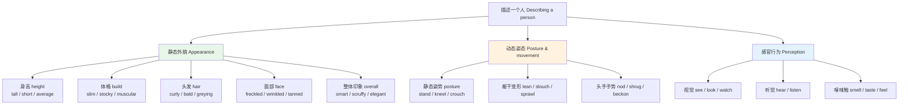
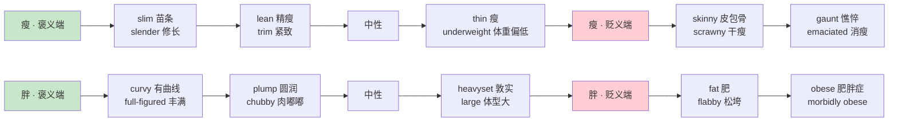
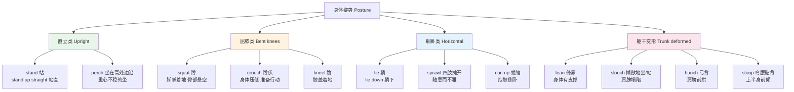
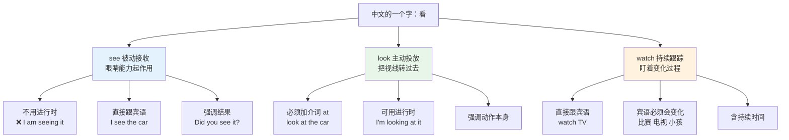
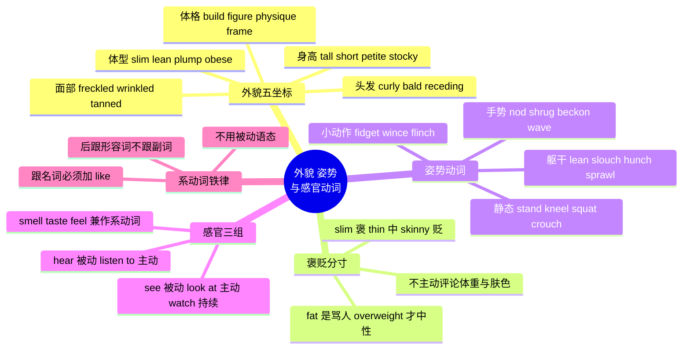

# 外貌体型、姿势动作与感官动词

> [!info] 本篇定位
>
> 上一篇给了身体的**零件清单**（部位、器官、系统），这一篇给身体的**外观与运动**：一个人长什么样、摆出什么姿势、以及他的五官在感知世界时用哪些动词。
>
> 三块内容的难度不一样。外貌词难在**褒贬分寸**——`slim` 和 `skinny` 中文都是「瘦」，说错一个就从夸人变成损人。姿势词难在**画面精度**——`lean`、`crouch`、`slouch`、`sprawl` 中文都能翻成「靠着」「蹲着」「趴着」，但各自锁定的身体形状完全不同。感官动词难在**语法分工**——`look`、`see`、`watch` 中文都是「看」，但一个是主动投放注意力、一个是被动接收信号、一个是持续跟踪变化，选错时态和被动语态都会跟着错。
>
> 读完能做到三件事：描述一个陌生人的长相而不冒犯对方；把一个人的身体姿态写清楚到读者能画出来；在 `I saw` / `I was looking at` / `I watched` 之间选对那个。

---

## 1. 本篇导读：描述一个人需要几个坐标

中文说「他挺高的，有点胖」，两个形容词就交代完了。英语描述外貌时习惯的信息颗粒度更细，通常会同时给出**身高、体格、年龄段、头发、面部特征**这五个坐标里的至少三个。护照描述、寻人启事、小说人物出场，都是按这个顺序展开的。

上图把本篇拆成三条并行的线。左边这条是名词与形容词为主的静态描写，词量最大也最容易踩雷；中间这条全是动词，考的是身体各部分空间关系的精确度；右边这条词量最小，但语法陷阱最密集——中文母语者在这三组动词上犯的错，比前两块加起来还多。

三条线共用一个原则：**英语描述外貌时高度回避直接的价值判断**。中文可以直说「他很胖」，英文对应的 `He's fat.` 在多数场合是失礼的，母语者会绕开成 `He's a big guy.` 或干脆不提体型。这不是虚伪，是语言习惯里固化下来的礼貌层级。整篇的词表都会标出每个词的冒犯度。

---

## 2. 体格的五个基础名词：build 与 figure 差在哪

描述体型之前先搞清楚容器。英语里有五个名词都能翻成「身材、体格」，但各自的侧重点不同，用错了句子会怪。

| 英文 | 英式音标 | 美式音标 | 词性 | 中文 | 搭配与说明 |
| --- | --- | --- | --- | --- | --- |
| **build** | /bɪld/ | /bɪld/ | n. | 体格；骨架 | 最中性通用，男女皆可：of medium build |
| **figure** | /ˈfɪɡə/ | /ˈfɪɡjər/ | n. | 身材 | 偏指女性曲线，keep one's figure 保持身材；英美读音差别大 |
| **physique** | /fɪˈziːk/ | /fɪˈziːk/ | n. | 体格；体魄 | 偏指经锻炼的男性肌肉线条，法语借词重音在后 |
| **frame** | /freɪm/ | /freɪm/ | n. | 骨架 | 强调骨骼尺寸：a small frame 骨架小 |
| **stature** | /ˈstætʃə/ | /ˈstætʃər/ | n. | 身高；身材 | 书面语，也引申为「声望」：a man of great stature |

> [!warning] figure 与 build 不能互换
>
> - ❌ ~~He has a great figure.~~（说男性时听感很怪，figure 默认指女性曲线）
> - ✅ **He has a good build.** / **He has a great physique.**
> - ❌ ~~She has a medium physique.~~（physique 暗示健身房练出来的肌肉）
> - ✅ **She is of medium build.**
>
> 最安全的中性表达是 `of medium build`（中等身材）。这个短语在护照描述、警方通报里是标准说法，任何性别、任何场合都不出错。

`frame` 单独用时几乎只出现在两种搭配里：`a slight frame`（骨架单薄）和 `a large frame`（骨架大）。它描述的是骨骼本身，跟胖瘦无关——一个人可以骨架大但很瘦（`a lean man on a large frame`）。这个区分在中文里没有对应词，中文只能说「骨架大」。

> [!example] 五个名词的实际句子
>
> - He was a man of **medium build**, neither tall nor short.
>   - 他中等身材，不高不矮。
> - She has kept her **figure** well into her fifties.
>   - 她五十多岁还保持着身材。
> - Years of swimming gave him a lean, powerful **physique**.
>   - 多年游泳给了他精瘦有力的体格。
> - Her coat hung loosely on her slight **frame**.
>   - 大衣松垮地挂在她单薄的骨架上。
> - He was short in **stature** but commanding in presence.
>   - 他身材矮小，气场却压得住场。

---

## 3. 身高：从 petite 到 towering 的完整梯度

身高是外貌描写里最安全的一项——直说 `He's short.` 通常不算冒犯，远不像说胖那么敏感。但英语在两端各有一批带情绪色彩的词，需要分清。

### 3.1 中性主干

| 英文 | 英式音标 | 美式音标 | 词性 | 中文 | 搭配与说明 |
| --- | --- | --- | --- | --- | --- |
| **height** | /haɪt/ | /haɪt/ | n. | 身高 | What's your height? 比 How tall are you? 正式 |
| **tall** | /tɔːl/ | /tɔːl/ | adj. | 高的 | 只用于人和细长物；山用 high |
| **short** | /ʃɔːt/ | /ʃɔːrt/ | adj. | 矮的 | 中性词，不算冒犯 |
| **average** | /ˈævərɪdʒ/ | /ˈævərɪdʒ/ | adj. | 平均的 | of average height 中等身高 |
| **medium** | /ˈmiːdiəm/ | /ˈmiːdiəm/ | adj. | 中等的 | of medium height / build 固定搭配 |
| **six-foot** | /ˌsɪks ˈfʊt/ | /ˌsɪks ˈfʊt/ | adj. | 六英尺高的 | 作定语时 foot 不加 s：a six-foot man |

> [!warning] tall 与 high 的分工
>
> - ❌ ~~He is 1.8 metres high.~~
> - ✅ **He is 1.8 metres tall.**
> - ❌ ~~a tall mountain~~
> - ✅ **a high mountain**
>
> 规则：**人、树、建筑这类底面小而竖直向上的东西用 tall**；山、墙、天花板、云层这类强调「离地距离」的用 high。建筑物两个都行，`a tall building` 强调它细高，`a high building` 强调它顶部很远。
>
> 询问身高的两种问法都对：`How tall are you?` 是口语默认，`What is your height?` 出现在表格与体检场合。

### 3.2 偏高的一端

| 英文 | 英式音标 | 美式音标 | 词性 | 中文 | 搭配与说明 |
| --- | --- | --- | --- | --- | --- |
| **towering** | /ˈtaʊərɪŋ/ | /ˈtaʊərɪŋ/ | adj. | 高耸的 | 带压迫感：a towering figure in the doorway |
| **lanky** | /ˈlæŋki/ | /ˈlæŋki/ | adj. | 瘦长的 | 高且瘦且显笨拙，略带贬义 |
| **gangly** | /ˈɡæŋɡli/ | /ˈɡæŋɡli/ | adj. | 瘦高笨拙的 | 常形容青春期男孩，比 lanky 更强调不协调 |
| **statuesque** | /ˌstætʃuˈesk/ | /ˌstætʃuˈesk/ | adj. | 身材高挑的 | 褒义，形容女性高大而端庄 |
| **strapping** | /ˈstræpɪŋ/ | /ˈstræpɪŋ/ | adj. | 高大健壮的 | 褒义，常说 a strapping young lad |
| **long-legged** | /ˌlɒŋ ˈleɡɪd/ | /ˌlɔːŋ ˈleɡɪd/ | adj. | 长腿的 | 复合形容词，重音在 leg |

### 3.3 偏矮的一端

| 英文 | 英式音标 | 美式音标 | 词性 | 中文 | 搭配与说明 |
| --- | --- | --- | --- | --- | --- |
| **petite** | /pəˈtiːt/ | /pəˈtiːt/ | adj. | 娇小的 | 褒义，只用于女性，法语借词 |
| **stocky** | /ˈstɒki/ | /ˈstɑːki/ | adj. | 矮壮的 | 矮而结实，中性偏褒，男性居多 |
| **squat** | /skwɒt/ | /skwɑːt/ | adj. | 矮胖的 | 贬义，暗示比例不佳 |
| **diminutive** | /dɪˈmɪnjətɪv/ | /dɪˈmɪnjətɪv/ | adj. | 小巧的 | 书面语，中性偏文学 |
| **little** | /ˈlɪtl/ | /ˈlɪtl/ | adj. | 小个子的 | a little old lady，带亲昵语气 |
| **compact** | /kəmˈpækt/ | /kəmˈpækt/ | adj. | 精悍的 | 矮而结实的委婉说法，运动报道常用 |

> [!tip] 高矮两端的礼貌换算
>
> 直接说 `She's short.` 在英语里不算冒犯，但如果想更客气：
>
> - 女性偏矮 → **petite**（这是夸奖，不是委婉）
> - 男性偏矮但结实 → **stocky** 或 **compact**
> - 高瘦到显得笨拙 → 别用 **lanky**，改说 **tall and slim**
>
> `stocky` 是本篇必须记牢的词，它同时锁定「矮」和「壮」两个信息，中文没有单词对应，只能说「墩实」「敦实」。描述一个一米七、肩宽、体重不轻但不是肥肉的男性，`stocky` 一个词就够了。

---

## 4. 体型的褒贬梯度：胖瘦各十四档

这是本篇风险最高的一节。中文的「胖」「瘦」是中性词，英语对应的词全都带情绪，用错会直接得罪人。

上图把胖瘦各排成一条从褒到贬的直线。两端的极值词（`emaciated`、`obese`）是医学术语，用在日常对话里等于给人下诊断；中间的中性词是描述性的；靠近褒义端的那几个是可以当面说的。判断标准很简单：**能不能当着本人的面说**——`You look slim.` 是夸奖，`You look skinny.` 是关切甚至担心，`You look thin.` 介于两者之间。

### 4.1 偏瘦的一侧

| 英文 | 英式音标 | 美式音标 | 词性 | 中文 | 搭配与说明 |
| --- | --- | --- | --- | --- | --- |
| **slim** | /slɪm/ | /slɪm/ | adj. | 苗条的 | 明确褒义，可当面说；也作动词 slim down 减重 |
| **slender** | /ˈslendə/ | /ˈslendər/ | adj. | 修长的 | 比 slim 更文雅，带优雅感 |
| **trim** | /trɪm/ | /trɪm/ | adj. | 紧致的 | 暗示自律与锻炼：keep trim |
| **lean** | /liːn/ | /liːn/ | adj. | 精瘦的 | 无赘肉但有肌肉；也指瘦肉 lean meat |
| **willowy** | /ˈwɪləʊi/ | /ˈwɪloʊi/ | adj. | 柳条般纤细的 | 文学用词，高且柔韧 |
| **wiry** | /ˈwaɪəri/ | /ˈwaɪri/ | adj. | 精干的 | 瘦但强韧有力，攀岩者体型 |
| **thin** | /θɪn/ | /θɪn/ | adj. | 瘦的 | 最中性，但用于人时略带担忧色彩 |
| **underweight** | /ˌʌndəˈweɪt/ | /ˌʌndərˈweɪt/ | adj. | 体重不足的 | 医学中性词，体检报告用语 |
| **skinny** | /ˈskɪni/ | /ˈskɪni/ | adj. | 皮包骨的 | 口语贬义，当面说不礼貌 |
| **scrawny** | /ˈskrɔːni/ | /ˈskrɔːni/ | adj. | 干瘦的 | 明确贬义，暗示营养不良 |
| **bony** | /ˈbəʊni/ | /ˈboʊni/ | adj. | 瘦骨嶙峋的 | 强调骨头凸出：bony shoulders |
| **gaunt** | /ɡɔːnt/ | /ɡɔːnt/ | adj. | 憔悴消瘦的 | 因病或操劳而瘦，带面容凹陷的画面 |
| **haggard** | /ˈhæɡəd/ | /ˈhæɡərd/ | adj. | 形容枯槁的 | 强调疲惫，常与 gaunt 连用 |
| **emaciated** | /ɪˈmeɪsieɪtɪd/ | /ɪˈmeɪsieɪtɪd/ | adj. | 极度消瘦的 | 医学术语，饥荒与重病语境 |

### 4.2 偏胖的一侧

| 英文 | 英式音标 | 美式音标 | 词性 | 中文 | 搭配与说明 |
| --- | --- | --- | --- | --- | --- |
| **curvy** | /ˈkɜːvi/ | /ˈkɜːrvi/ | adj. | 有曲线的 | 褒义，形容女性丰满而比例好 |
| **full-figured** | /ˌfʊl ˈfɪɡəd/ | /ˌfʊl ˈfɪɡjərd/ | adj. | 丰满的 | 服装行业的委婉标准用词 |
| **plump** | /plʌmp/ | /plʌmp/ | adj. | 圆润的 | 温和偏褒，常形容中年女性或婴儿 |
| **chubby** | /ˈtʃʌbi/ | /ˈtʃʌbi/ | adj. | 胖乎乎的 | 亲昵，用于小孩安全，用于成人略失礼 |
| **stout** | /staʊt/ | /staʊt/ | adj. | 敦实的 | 略旧的说法，中性偏文学 |
| **portly** | /ˈpɔːtli/ | /ˈpɔːrtli/ | adj. | 发福的 | 形容中老年男性，带体面感 |
| **heavyset** | /ˌheviˈset/ | /ˌheviˈset/ | adj. | 壮实厚重的 | 美式常用中性词，替代 fat |
| **burly** | /ˈbɜːli/ | /ˈbɜːrli/ | adj. | 魁梧的 | 高大结实带力量感，褒义 |
| **overweight** | /ˌəʊvəˈweɪt/ | /ˌoʊvərˈweɪt/ | adj. | 超重的 | 医学中性词，最安全的书面表达 |
| **fat** | /fæt/ | /fæt/ | adj. | 肥的 | 直白贬义，当面说等于骂人 |
| **flabby** | /ˈflæbi/ | /ˈflæbi/ | adj. | 松弛的 | 强调肌肉松垮，贬义 |
| **paunchy** | /ˈpɔːntʃi/ | /ˈpɔːntʃi/ | adj. | 大腹便便的 | 专指腹部凸出，名词 paunch |
| **pot-bellied** | /ˌpɒt ˈbelid/ | /ˌpɑːt ˈbelid/ | adj. | 啤酒肚的 | 名词 pot belly，口语常用 |
| **obese** | /əʊˈbiːs/ | /oʊˈbiːs/ | adj. | 肥胖症的 | 医学诊断词，名词 obesity |

> [!warning] 中文母语者在体型词上最常见的三个失误
>
> **失误一：把 fat 当中性词。** 中文「他有点胖」是随口一句，直译成 `He's a bit fat.` 在英语里是明确的负面评价。母语者会说 `He's a big guy.` 或 `He's carrying a bit of weight.`。
>
> - ❌ My colleague is fat but very kind.
> - ✅ My colleague is a **big guy**, but very kind.
>
> **失误二：用 thin 夸人。** 想说「你瘦了，真好看」，`You've got thin.` 听起来像在担心对方生病。
>
> - ❌ You look so thin! Great!
> - ✅ You look **so slim**! Have you been working out?
>
> **失误三：把 skinny 当褒义。** 受服装术语 skinny jeans 影响，很多人以为 skinny 是好词。形容人时它明确指「瘦得不健康」。
>
> - ❌ I want to become skinny.
> - ✅ I want to **slim down** / get **in shape**.

### 4.3 减重增重的动词表达

| 英文 | 英式音标 | 美式音标 | 词性 | 中文 | 搭配与说明 |
| --- | --- | --- | --- | --- | --- |
| **lose weight** | /luːz weɪt/ | /luːz weɪt/ | v. | 减重 | 不说 reduce weight |
| **put on weight** | /pʊt ɒn weɪt/ | /pʊt ɑːn weɪt/ | v. | 增重 | 美式也说 gain weight |
| **slim down** | /slɪm daʊn/ | /slɪm daʊn/ | v. | 瘦下来 | 口语常用短语动词 |
| **bulk up** | /bʌlk ʌp/ | /bʌlk ʌp/ | v. | 增肌 | 健身语境，指增加肌肉量 |
| **work out** | /wɜːk aʊt/ | /wɜːrk aʊt/ | v. | 健身 | 名词 workout 连写 |
| **be in shape** | /ɪn ʃeɪp/ | /ɪn ʃeɪp/ | phr. | 身材好 | 反义 out of shape 走样 |

---

## 5. 强壮与虚弱：肌肉线条的词汇

| 英文 | 英式音标 | 美式音标 | 词性 | 中文 | 搭配与说明 |
| --- | --- | --- | --- | --- | --- |
| **muscular** | /ˈmʌskjələ/ | /ˈmʌskjələr/ | adj. | 肌肉发达的 | 中性描述，健身房语境高频 |
| **toned** | /təʊnd/ | /toʊnd/ | adj. | 线条紧实的 | 有肌肉线条但不夸张，褒义 |
| **ripped** | /rɪpt/ | /rɪpt/ | adj. | 肌肉线条分明的 | 俚语，体脂极低 |
| **athletic** | /æθˈletɪk/ | /æθˈletɪk/ | adj. | 运动员型的 | 兼有力量与灵活，最安全的褒义词 |
| **brawny** | /ˈbrɔːni/ | /ˈbrɔːni/ | adj. | 强壮结实的 | 偏体力劳动者的粗壮 |
| **sturdy** | /ˈstɜːdi/ | /ˈstɜːrdi/ | adj. | 结实的 | 强调抗打，也形容家具 |
| **broad-shouldered** | /ˌbrɔːd ˈʃəʊldəd/ | /ˌbrɔːd ˈʃoʊldərd/ | adj. | 肩宽的 | 复合形容词构词法典型 |
| **well-built** | /ˌwel ˈbɪlt/ | /ˌwel ˈbɪlt/ | adj. | 体格健美的 | 男性褒义通用词 |
| **frail** | /freɪl/ | /freɪl/ | adj. | 虚弱的 | 常形容年迈者，含易受伤之意 |
| **fragile** | /ˈfrædʒaɪl/ | /ˈfrædʒl/ | adj. | 脆弱的 | 英美读音差别显著，注意词尾 |
| **feeble** | /ˈfiːbl/ | /ˈfiːbl/ | adj. | 无力的 | 体力衰弱，也形容借口站不住脚 |
| **delicate** | /ˈdelɪkət/ | /ˈdelɪkət/ | adj. | 纤弱的 | 兼指体质弱与精致美 |
| **puny** | /ˈpjuːni/ | /ˈpjuːni/ | adj. | 瘦小无力的 | 明确贬义 |

> [!example] 强弱的对照句
>
> - He is **well-built** without being **bulky**.
>   - 他体格健美但不显得粗壮。
> - Her grandmother has grown **frail** over the past year.
>   - 她奶奶这一年身体虚弱下来了。
> - Two years of climbing turned him from **puny** to **wiry**.
>   - 两年攀岩把他从瘦弱变成了精干。

---

## 6. 头发、胡须与脱发

头发是外貌描写里信息量最大的一块，因为它同时携带颜色、长度、质地、发型四个维度。

### 6.1 颜色与质地

| 英文 | 英式音标 | 美式音标 | 词性 | 中文 | 搭配与说明 |
| --- | --- | --- | --- | --- | --- |
| **blond / blonde** | /blɒnd/ | /blɑːnd/ | adj./n. | 金发的 | 词尾 e 传统上用于女性，现多不区分 |
| **brunette** | /bruːˈnet/ | /bruːˈnet/ | n./adj. | 深褐发女子 | 法语借词，男性对应 brunet 罕用 |
| **auburn** | /ˈɔːbən/ | /ˈɔːbərn/ | adj. | 赤褐色的 | 只用于头发，红中带棕 |
| **ginger** | /ˈdʒɪndʒə/ | /ˈdʒɪndʒər/ | adj. | 姜黄色的 | 英式说法，指红发；美式多说 red |
| **redhead** | /ˈredhed/ | /ˈredhed/ | n. | 红发者 | 名词，不说 red-haired person 时用它 |
| **greying / graying** | /ˈɡreɪɪŋ/ | /ˈɡreɪɪŋ/ | adj. | 花白的 | 英式 grey，美式 gray |
| **salt-and-pepper** | /ˌsɔːlt ən ˈpepə/ | /ˌsɔːlt ən ˈpepər/ | adj. | 黑白掺杂的 | 形象说法，形容半白头发 |
| **curly** | /ˈkɜːli/ | /ˈkɜːrli/ | adj. | 卷曲的 | 名词 curl，动词 curl 卷发 |
| **wavy** | /ˈweɪvi/ | /ˈweɪvi/ | adj. | 微卷的 | 波浪状，卷度小于 curly |
| **straight** | /streɪt/ | /streɪt/ | adj. | 直的 | 与 curly 相对 |
| **frizzy** | /ˈfrɪzi/ | /ˈfrɪzi/ | adj. | 毛躁蓬乱的 | 略带负面，湿度大时的头发 |
| **sleek** | /sliːk/ | /sliːk/ | adj. | 光滑柔顺的 | 褒义，也形容车身流线 |
| **greasy** | /ˈɡriːsi/ | /ˈɡriːsi/ | adj. | 油腻的 | 美式也读 /ˈɡriːzi/ |
| **thinning** | /ˈθɪnɪŋ/ | /ˈθɪnɪŋ/ | adj. | 变稀疏的 | thinning hair 是掉发的委婉说法 |

### 6.2 发型与长度

| 英文 | 英式音标 | 美式音标 | 词性 | 中文 | 搭配与说明 |
| --- | --- | --- | --- | --- | --- |
| **hairstyle** | /ˈheəstaɪl/ | /ˈherstaɪl/ | n. | 发型 | 口语也说 haircut |
| **fringe** | /frɪndʒ/ | /frɪndʒ/ | n. | 刘海 | 英式说法 |
| **bangs** | /bæŋz/ | /bæŋz/ | n. | 刘海 | 美式说法，恒为复数 |
| **ponytail** | /ˈpəʊniteɪl/ | /ˈpoʊniteɪl/ | n. | 马尾辫 | wear one's hair in a ponytail |
| **bun** | /bʌn/ | /bʌn/ | n. | 发髻 | 同形词也指小圆面包 |
| **braid** | /breɪd/ | /breɪd/ | n./v. | 辫子；编辫 | 美式常用 |
| **plait** | /plæt/ | /pleɪt/ | n./v. | 辫子；编辫 | 英式常用，英美读音完全不同 |
| **buzz cut** | /bʌz kʌt/ | /bʌz kʌt/ | n. | 板寸头 | 用推子推到极短 |
| **crew cut** | /kruː kʌt/ | /kruː kʌt/ | n. | 平头 | 顶部略长于两侧 |
| **shoulder-length** | /ˈʃəʊldə leŋθ/ | /ˈʃoʊldər leŋθ/ | adj. | 及肩的 | 长度描述的标准构词 |
| **cropped** | /krɒpt/ | /krɑːpt/ | adj. | 剪短的 | closely cropped hair |
| **parting** | /ˈpɑːtɪŋ/ | /ˈpɑːrtɪŋ/ | n. | 发缝 | 英式说法：a side parting 偏分 |
| **part** | /pɑːt/ | /pɑːrt/ | n. | 发缝 | 美式说法：a middle part 中分 |

### 6.3 脱发与胡须

| 英文 | 英式音标 | 美式音标 | 词性 | 中文 | 搭配与说明 |
| --- | --- | --- | --- | --- | --- |
| **bald** | /bɔːld/ | /bɔːld/ | adj. | 秃头的 | 完全无发，也说 bald-headed |
| **balding** | /ˈbɔːldɪŋ/ | /ˈbɔːldɪŋ/ | adj. | 正在秃的 | 进行中，比 bald 委婉 |
| **receding hairline** | /rɪˈsiːdɪŋ ˈheəlaɪn/ | /rɪˈsiːdɪŋ ˈherlaɪn/ | n. | 发际线后移 | 描述脱发最常用的委婉说法 |
| **bald patch** | /bɔːld pætʃ/ | /bɔːld pætʃ/ | n. | 秃斑 | 美式也说 bald spot |
| **shaved head** | /ʃeɪvd hed/ | /ʃeɪvd hed/ | n. | 光头 | 主动剃的，与 bald 区别在成因 |
| **beard** | /bɪəd/ | /bɪrd/ | n. | 络腮胡 | grow a beard 蓄胡子 |
| **moustache / mustache** | /məˈstɑːʃ/ | /ˈmʌstæʃ/ | n. | 八字胡 | 英式拼 moustache 重音在后，美式重音在前 |
| **goatee** | /ɡəʊˈtiː/ | /ɡoʊˈtiː/ | n. | 山羊胡 | 只留下巴一撮 |
| **sideburns** | /ˈsaɪdbɜːnz/ | /ˈsaɪdbɜːrnz/ | n. | 鬓角 | 恒为复数 |
| **stubble** | /ˈstʌbl/ | /ˈstʌbl/ | n. | 胡茬 | 不可数，形容词 stubbly |
| **clean-shaven** | /ˌkliːn ˈʃeɪvn/ | /ˌkliːn ˈʃeɪvn/ | adj. | 脸刮得干净的 | 复合形容词，无胡须 |

> [!tip] 描述头发的语序
>
> 英语形容头发时的默认顺序是**长度 → 质地 → 颜色**，中间不加 and：
>
> - **long straight black hair**（长直黑发）
> - **short curly grey hair**（短卷灰发）
>
> 这个顺序遵循的是形容词排序的通用规则（尺寸在前、形状居中、颜色靠后）。规则本身属于语法范畴，`02.英语基础语法` 里有完整序列，本篇只需要记住这三个词的固定站位。
>
> 另外注意 `hair` 指整头头发时**不可数**：`Her hair is long.`（不说 hairs are）。只有说「几根头发」时才可数：`There are two hairs in my soup.`

---

## 7. 面部特征：五官、肤色与斑痕

### 7.1 脸型与轮廓

| 英文 | 英式音标 | 美式音标 | 词性 | 中文 | 搭配与说明 |
| --- | --- | --- | --- | --- | --- |
| **oval** | /ˈəʊvl/ | /ˈoʊvl/ | adj. | 鹅蛋形的 | an oval face 最常被视为标准脸型 |
| **round** | /raʊnd/ | /raʊnd/ | adj. | 圆的 | a round face 圆脸 |
| **square** | /skweə/ | /skwer/ | adj. | 方的 | a square jaw 方下巴，男性褒义 |
| **cheekbone** | /ˈtʃiːkbəʊn/ | /ˈtʃiːkboʊn/ | n. | 颧骨 | high cheekbones 高颧骨，褒义 |
| **jaw** | /dʒɔː/ | /dʒɔː/ | n. | 下颌 | a strong jawline 下颌线清晰 |
| **chin** | /tʃɪn/ | /tʃɪn/ | n. | 下巴尖 | double chin 双下巴 |
| **forehead** | /ˈfɒrɪd/ | /ˈfɔːrhed/ | n. | 额头 | 英式传统读 /ˈfɒrɪd/，美式读字面 |
| **temple** | /ˈtempl/ | /ˈtempl/ | n. | 太阳穴 | 同形词也指寺庙 |
| **profile** | /ˈprəʊfaɪl/ | /ˈproʊfaɪl/ | n. | 侧脸 | in profile 从侧面看 |

### 7.2 五官细节

| 英文 | 英式音标 | 美式音标 | 词性 | 中文 | 搭配与说明 |
| --- | --- | --- | --- | --- | --- |
| **eyebrow** | /ˈaɪbraʊ/ | /ˈaɪbraʊ/ | n. | 眉毛 | bushy eyebrows 浓眉 |
| **eyelash** | /ˈaɪlæʃ/ | /ˈaɪlæʃ/ | n. | 睫毛 | long eyelashes 常作褒义 |
| **eyelid** | /ˈaɪlɪd/ | /ˈaɪlɪd/ | n. | 眼皮 | double eyelid 双眼皮 |
| **bushy** | /ˈbʊʃi/ | /ˈbʊʃi/ | adj. | 浓密的 | 只用于眉毛、胡子、尾巴 |
| **hooked** | /hʊkt/ | /hʊkt/ | adj. | 鹰钩的 | a hooked nose |
| **snub** | /snʌb/ | /snʌb/ | adj. | 短而上翘的 | a snub nose 塌鼻，也说 button nose |
| **nostril** | /ˈnɒstrəl/ | /ˈnɑːstrəl/ | n. | 鼻孔 | 单复数分明 |
| **lip** | /lɪp/ | /lɪp/ | n. | 嘴唇 | full lips 厚唇，thin lips 薄唇 |
| **dimple** | /ˈdɪmpl/ | /ˈdɪmpl/ | n. | 酒窝 | 形容词 dimpled |

### 7.3 肤色与皮肤状态

| 英文 | 英式音标 | 美式音标 | 词性 | 中文 | 搭配与说明 |
| --- | --- | --- | --- | --- | --- |
| **complexion** | /kəmˈplekʃn/ | /kəmˈplekʃn/ | n. | 肤色；面色 | a fair complexion 白皙肤色 |
| **fair** | /feə/ | /fer/ | adj. | 白皙的 | fair skin 中性描述 |
| **pale** | /peɪl/ | /peɪl/ | adj. | 苍白的 | 暗示生病或受惊 |
| **tanned** | /tænd/ | /tænd/ | adj. | 晒黑的 | 褒义，暗示度假与户外 |
| **olive** | /ˈɒlɪv/ | /ˈɑːlɪv/ | adj. | 橄榄色的 | olive skin 指地中海肤色 |
| **ruddy** | /ˈrʌdi/ | /ˈrʌdi/ | adj. | 红润的 | 健康的红脸膛，多形容户外劳动者 |
| **rosy** | /ˈrəʊzi/ | /ˈroʊzi/ | adj. | 粉嫩的 | rosy cheeks 红扑扑的脸颊 |
| **sallow** | /ˈsæləʊ/ | /ˈsæloʊ/ | adj. | 蜡黄的 | 贬义，暗示健康不佳 |
| **flushed** | /flʌʃt/ | /flʌʃt/ | adj. | 涨红的 | 因发热、羞愧或运动而红 |
| **freckle** | /ˈfrekl/ | /ˈfrekl/ | n. | 雀斑 | 可数，通常复数 freckles |
| **freckled** | /ˈfrekld/ | /ˈfrekld/ | adj. | 有雀斑的 | a freckled face 中性偏可爱 |
| **mole** | /məʊl/ | /moʊl/ | n. | 痣 | 同形词也指鼹鼠 |
| **birthmark** | /ˈbɜːθmɑːk/ | /ˈbɜːrθmɑːrk/ | n. | 胎记 | 合成词 birth + mark |
| **scar** | /skɑː/ | /skɑːr/ | n./v. | 疤痕；留疤 | 动词过去分词 scarred |
| **wrinkle** | /ˈrɪŋkl/ | /ˈrɪŋkl/ | n. | 皱纹 | 形容词 wrinkled |
| **crow's feet** | /ˈkrəʊz fiːt/ | /ˈkroʊz fiːt/ | n. | 鱼尾纹 | 字面「乌鸦脚」，固定说法 |
| **pimple** | /ˈpɪmpl/ | /ˈpɪmpl/ | n. | 痘痘 | 英式也说 spot |
| **acne** | /ˈækni/ | /ˈækni/ | n. | 痤疮 | 不可数，医学词 |
| **blemish** | /ˈblemɪʃ/ | /ˈblemɪʃ/ | n. | 瑕疵 | 皮肤上的斑点通称，也引申为污点 |

> [!warning] freckle 和 spot 的英美陷阱
>
> `spot` 在英式英语里指「痘痘」，在美式英语里主要指「斑点、污渍」。英国人说 `I've got a spot on my chin.` 是在说长了颗痘；美国人听到这句可能理解成下巴上沾了东西。
>
> - 英式：**spot** = 痘痘 → 美式对应 **pimple** / **zit**（俚语）
> - 英式：**freckle** = 雀斑 → 英美一致，不受影响
>
> 另外 `mole` 是痣，`birthmark` 是胎记，两者不能互换：`mole` 是后天出现的色素点，`birthmark` 是出生就有的印记。

---

## 8. 整体印象：从 gorgeous 到 unkempt

| 英文 | 英式音标 | 美式音标 | 词性 | 中文 | 搭配与说明 |
| --- | --- | --- | --- | --- | --- |
| **good-looking** | /ˌɡʊd ˈlʊkɪŋ/ | /ˌɡʊd ˈlʊkɪŋ/ | adj. | 好看的 | 最中性，男女通用 |
| **handsome** | /ˈhænsəm/ | /ˈhænsəm/ | adj. | 英俊的 | 传统上用于男性，d 不发音 |
| **pretty** | /ˈprɪti/ | /ˈprɪti/ | adj. | 漂亮的 | 用于女性和小孩，程度低于 beautiful |
| **beautiful** | /ˈbjuːtɪfl/ | /ˈbjuːtɪfl/ | adj. | 美丽的 | 程度高，也可形容景物音乐 |
| **gorgeous** | /ˈɡɔːdʒəs/ | /ˈɡɔːrdʒəs/ | adj. | 极美的 | 口语强调词，男女皆可 |
| **stunning** | /ˈstʌnɪŋ/ | /ˈstʌnɪŋ/ | adj. | 惊艳的 | 程度最高，字面「令人震住」 |
| **attractive** | /əˈtræktɪv/ | /əˈtræktɪv/ | adj. | 有吸引力的 | 比 beautiful 客观，含气质成分 |
| **cute** | /kjuːt/ | /kjuːt/ | adj. | 可爱的 | 美式常用于形容异性有魅力 |
| **charming** | /ˈtʃɑːmɪŋ/ | /ˈtʃɑːrmɪŋ/ | adj. | 迷人的 | 侧重气质与举止，不只看脸 |
| **elegant** | /ˈelɪɡənt/ | /ˈelɪɡənt/ | adj. | 举止讲究、有格调 | 强调仪态与穿着，不单看五官 |
| **presentable** | /prɪˈzentəbl/ | /prɪˈzentəbl/ | adj. | 拿得出手的 | 中性，指仪表过得去 |
| **well-groomed** | /ˌwel ˈɡruːmd/ | /ˌwel ˈɡruːmd/ | adj. | 打理得体的 | 头发衣着指甲都整洁 |
| **smart** | /smɑːt/ | /smɑːrt/ | adj. | 衣着整洁的 | 英式义项，美式 smart 主要指聪明 |
| **neat** | /niːt/ | /niːt/ | adj. | 整齐的 | neat appearance |
| **plain** | /pleɪn/ | /pleɪn/ | adj. | 长相普通的 | 委婉的「不好看」 |
| **ordinary-looking** | /ˈɔːdnri lʊkɪŋ/ | /ˈɔːrdneri lʊkɪŋ/ | adj. | 相貌平平的 | 中性描述 |
| **scruffy** | /ˈskrʌfi/ | /ˈskrʌfi/ | adj. | 邋遢的 | 衣着不整，贬义但语气轻 |
| **shabby** | /ˈʃæbi/ | /ˈʃæbi/ | adj. | 破旧寒酸的 | 强调衣物本身破旧 |
| **unkempt** | /ˌʌnˈkempt/ | /ˌʌnˈkempt/ | adj. | 蓬头垢面的 | 头发未梳、无人打理 |
| **ugly** | /ˈʌɡli/ | /ˈʌɡli/ | adj. | 丑的 | 直白伤人，日常避免 |
| **hideous** | /ˈhɪdiəs/ | /ˈhɪdiəs/ | adj. | 丑陋不堪的 | 极端贬义，多形容物不形容人 |

> [!warning] smart 在英美的义项分裂
>
> - 英式 `He looks smart today.` = 他今天穿得很整齐。
> - 美式 `He looks smart today.` = 他今天看起来很聪明。
>
> 说「衣着得体」时，美式的安全说法是 `He looks sharp.` 或 `He's dressed well.`。这类英美义项分裂在 `18.语域、英美差异与习语俚语` 里有系统整理，本篇只标出外貌相关的这一组。

> [!example] 整体印象的完整描写
>
> - She was a **striking** woman in her forties, **tall** and **slender**, with **shoulder-length auburn hair** and a **freckled** face.
>   - 她是个引人注目的四十多岁女性，高挑修长，一头及肩的赤褐色头发，脸上有雀斑。
> - He turned up **unshaven** and **scruffy**, wearing the same shirt as yesterday.
>   - 他来的时候胡子没刮、一身邋遢，穿着跟昨天同一件衬衫。
> - Even at seventy he remained **well-groomed** and **upright**.
>   - 他七十岁了依然衣着讲究、腰板笔直。

---

## 9. 静态姿势：身体摆成什么形状

姿势动词是本篇画面精度要求最高的一块。中文的「蹲」「趴」「靠」在英语里各自分裂成好几个词，区别在于**膝盖弯不弯、重心压在哪、躯干是直是弯**。

上图按身体形状把姿势动词分成四组。最容易混淆的是右下角的「躯干变形」组：四个词中文都能说成「弯着腰」，但 `lean` 一定有外部支撑物（墙、桌子、栏杆），`slouch` 是没骨头似的瘫着，`hunch` 是肩膀主动前拱护住胸口，`stoop` 是上半身习惯性前倾（常因年老或长期低头）。选词时先问一句「有没有靠着东西」，就能先排除掉 `lean`。

### 9.1 基础姿势动词

| 英文 | 英式音标 | 美式音标 | 词性 | 中文 | 搭配与说明 |
| --- | --- | --- | --- | --- | --- |
| **stand** | /stænd/ | /stænd/ | v. | 站 | 不规则 stand-stood-stood |
| **sit** | /sɪt/ | /sɪt/ | v. | 坐 | sit-sat-sat；sit down 坐下 |
| **lie** | /laɪ/ | /laɪ/ | v. | 躺 | lie-lay-lain；与 lay「放」易混 |
| **kneel** | /niːl/ | /niːl/ | v. | 跪 | kneel-knelt-knelt，美式也用 kneeled |
| **squat** | /skwɒt/ | /skwɑːt/ | v. | 蹲 | 脚掌平放、臀部悬空；健身动作也叫 squat |
| **crouch** | /kraʊtʃ/ | /kraʊtʃ/ | v. | 蹲伏 | 身体压低戒备，crouch down |
| **crawl** | /krɔːl/ | /krɔːl/ | v. | 爬 | 手脚并用移动，婴儿爬行 |
| **perch** | /pɜːtʃ/ | /pɜːrtʃ/ | v. | 栖坐 | 坐在高处或边沿：perch on a stool |
| **recline** | /rɪˈklaɪn/ | /rɪˈklaɪn/ | v. | 斜倚 | 半躺，形容词 reclining seat |
| **sprawl** | /sprɔːl/ | /sprɔːl/ | v. | 四肢摊开躺 | 随意不雅，sprawl on the sofa |
| **curl up** | /kɜːl ʌp/ | /kɜːrl ʌp/ | v. | 蜷缩 | 抱膝侧卧，带舒适感 |
| **stretch** | /stretʃ/ | /stretʃ/ | v. | 伸展 | stretch out 伸长身体或手臂 |

> [!warning] lie 和 lay 是中文母语者的高频错误
>
> 这两个词的混淆是英语母语者也会犯的错，但对中文学习者更致命，因为中文只有一个「躺／放」的语感。
>
> | 原形 | 含义 | 过去式 | 过去分词 | 及物性 |
> | --- | --- | --- | --- | --- |
> | **lie** | 躺 | lay | lain | 不及物，后面不跟宾语 |
> | **lay** | 放置 | laid | laid | 及物，必须跟宾语 |
> | **lie** | 说谎 | lied | lied | 不及物，规则变化 |
>
> - ❌ ~~I'm going to lay down for a while.~~（口语常见但不标准）
> - ✅ **I'm going to lie down for a while.**（我去躺一会儿）
> - ✅ **Lay the book on the table.**（把书放桌上）
>
> 记忆钩子：`lay` 需要一个「被放的东西」，`lie` 不需要。`lie` 的过去式恰好是 `lay`，这就是全部混乱的根源。

### 9.2 躯干变形的四个动词

| 英文 | 英式音标 | 美式音标 | 词性 | 中文 | 搭配与说明 |
| --- | --- | --- | --- | --- | --- |
| **lean** | /liːn/ | /liːn/ | v. | 倚靠；倾斜 | 必须有支撑或方向：lean against / on / forward |
| **slouch** | /slaʊtʃ/ | /slaʊtʃ/ | v. | 无精打采地坐站 | 肩膀塌陷、脊背弯曲，贬义 |
| **hunch** | /hʌntʃ/ | /hʌntʃ/ | v. | 弓起（背） | hunch over a laptop 弓着背对电脑 |
| **stoop** | /stuːp/ | /stuːp/ | v. | 弯腰；驼背 | 长期性驼背，也指弯腰捡东西 |
| **slump** | /slʌmp/ | /slʌmp/ | v. | 瘫倒 | 失去支撑地垮下：slump into a chair |
| **bend** | /bend/ | /bend/ | v. | 弯曲 | bend-bent-bent；bend down 弯下身 |
| **straighten** | /ˈstreɪtn/ | /ˈstreɪtn/ | v. | 挺直 | straighten up 挺直腰板 |
| **upright** | /ˈʌpraɪt/ | /ˈʌpraɪt/ | adj./adv. | 笔直的 | sit upright 坐直 |
| **erect** | /ɪˈrekt/ | /ɪˈrekt/ | adj. | 直立的 | 书面语，stand erect |
| **cross-legged** | /ˌkrɒs ˈleɡɪd/ | /ˌkrɔːs ˈleɡɪd/ | adv. | 盘腿地 | sit cross-legged 盘腿坐 |

> [!example] lean 的四个方向搭配
>
> - He **leaned against** the wall, arms folded.
>   - 他抱着胳膊靠在墙上。（背或肩接触墙面）
> - She **leaned on** the desk to steady herself.
>   - 她撑着桌子稳住身体。（用手或肘施加重量）
> - The driver **leaned out of** the window and shouted.
>   - 司机探出车窗喊了一声。（身体伸出去）
> - He **leaned back** in his chair and closed his eyes.
>   - 他往椅背上一靠，闭上了眼。（向后倾）
>
> `lean against` 与 `lean on` 的差别是**接触方式**：against 是贴着，on 是压着。压着的那个可以承重（`lean on a stick` 拄拐杖），贴着的只是接触。

> [!tip] 程序员最需要的那个词
>
> 描述长时间伏案的姿势，英语的固定说法是 **hunched over a keyboard / laptop / desk**。
>
> - He spent twelve hours **hunched over** his laptop.
>   - 他弓着背对着笔记本干了十二个小时。
>
> 医生说的「圆肩驼背」是 **rounded shoulders** 和 **a hunched posture**；提醒人坐直是 `Sit up straight.` 或 `Don't slouch.`。`slouch` 在这里几乎是家长和理疗师的专用词。

---

## 10. 头、手与全身的动作

### 10.1 头部动作

| 英文 | 英式音标 | 美式音标 | 词性 | 中文 | 搭配与说明 |
| --- | --- | --- | --- | --- | --- |
| **nod** | /nɒd/ | /nɑːd/ | v./n. | 点头 | nod in agreement 点头同意；双写 d：nodded |
| **shake one's head** | /ʃeɪk/ | /ʃeɪk/ | v. | 摇头 | 表否定，不说 shake head 少了物主代词 |
| **tilt** | /tɪlt/ | /tɪlt/ | v. | 歪；倾斜 | tilt one's head 歪头，表疑惑或好奇 |
| **bow** | /baʊ/ | /baʊ/ | v./n. | 鞠躬 | 与 bow /bəʊ/「弓、蝴蝶结」同形异音 |
| **turn** | /tɜːn/ | /tɜːrn/ | v. | 转头 | turn one's head / turn around |
| **glance up** | /ɡlɑːns/ | /ɡlæns/ | v. | 抬眼一瞥 | 头部小幅上抬同时看 |
| **duck** | /dʌk/ | /dʌk/ | v. | 低头躲闪 | duck under the beam 低头避开横梁 |

> [!warning] 点头摇头不是全球通用
>
> `nod` 表示同意、`shake one's head` 表示否定，这在英语文化圈是默认的，但英语写作里描述这两个动作时**必须带介词短语说明含义**，否则读者可能读不出情绪：
>
> - `He nodded.` 只交代动作。
> - `He nodded **in agreement**.` / `He nodded **slowly**.` 才带出态度。
>
> 另外中文的「点头哈腰」对应的是 `bow and scrape`，`bow` 单独用时在英语里是正式礼节（谢幕、觐见），不带贬义。

### 10.2 手部与手势

| 英文 | 英式音标 | 美式音标 | 词性 | 中文 | 搭配与说明 |
| --- | --- | --- | --- | --- | --- |
| **wave** | /weɪv/ | /weɪv/ | v. | 挥手 | wave goodbye 挥手告别 |
| **beckon** | /ˈbekən/ | /ˈbekən/ | v. | 招手示意过来 | beckon someone over；k 发音 |
| **point** | /pɔɪnt/ | /pɔɪnt/ | v. | 指 | point at 指着（略无礼）；point to 指向 |
| **shrug** | /ʃrʌɡ/ | /ʃrʌɡ/ | v./n. | 耸肩 | shrug one's shoulders；表不知道或无所谓 |
| **clap** | /klæp/ | /klæp/ | v. | 鼓掌 | 双写 p：clapped |
| **fold one's arms** | /fəʊld/ | /foʊld/ | v. | 抱臂 | 也说 cross one's arms，常被读作防御姿态 |
| **clench** | /klentʃ/ | /klentʃ/ | v. | 攥紧 | clench one's fist 握拳；clench one's teeth 咬牙 |
| **grip** | /ɡrɪp/ | /ɡrɪp/ | v./n. | 紧握 | 强调握力，a firm grip |
| **grasp** | /ɡrɑːsp/ | /ɡræsp/ | v. | 抓住 | 也引申为「理解」：grasp the concept |
| **reach** | /riːtʃ/ | /riːtʃ/ | v. | 伸手够 | reach for the salt 伸手拿盐 |
| **gesture** | /ˈdʒestʃə/ | /ˈdʒestʃər/ | n./v. | 手势；做手势 | gesture towards the door |
| **thumbs up** | /θʌmz ʌp/ | /θʌmz ʌp/ | n. | 竖大拇指 | give someone a thumbs up |

### 10.3 全身动作与小动作

| 英文 | 英式音标 | 美式音标 | 词性 | 中文 | 搭配与说明 |
| --- | --- | --- | --- | --- | --- |
| **stride** | /straɪd/ | /straɪd/ | v./n. | 大步走 | stride-strode-stridden；带自信感 |
| **stroll** | /strəʊl/ | /stroʊl/ | v. | 闲逛 | 悠闲缓行，go for a stroll |
| **stagger** | /ˈstæɡə/ | /ˈstæɡər/ | v. | 踉跄 | 醉酒、受伤或疲惫时的走法 |
| **limp** | /lɪmp/ | /lɪmp/ | v./n. | 跛行 | walk with a limp 一瘸一拐 |
| **tiptoe** | /ˈtɪptəʊ/ | /ˈtɪptoʊ/ | v. | 踮脚走 | on tiptoe 踮着脚 |
| **pace** | /peɪs/ | /peɪs/ | v. | 来回踱步 | pace up and down 焦虑时的动作 |
| **fidget** | /ˈfɪdʒɪt/ | /ˈfɪdʒɪt/ | v. | 坐立不安地动 | fidget with a pen 手里不停摆弄笔 |
| **squirm** | /skwɜːm/ | /skwɜːrm/ | v. | 扭动身体 | 尴尬或不适时的扭动 |
| **flinch** | /flɪntʃ/ | /flɪntʃ/ | v. | 畏缩 | 受惊时的瞬间躲闪 |
| **wince** | /wɪns/ | /wɪns/ | v. | 龇牙咧嘴 | 因疼痛而面部抽动 |
| **shiver** | /ˈʃɪvə/ | /ˈʃɪvər/ | v. | 发抖 | 因冷；因恐惧用 tremble |
| **tremble** | /ˈtrembl/ | /ˈtrembl/ | v. | 颤抖 | 因恐惧、愤怒或虚弱 |
| **yawn** | /jɔːn/ | /jɔːn/ | v./n. | 打哈欠 | w 不发音 |
| **stretch out** | /stretʃ aʊt/ | /stretʃ aʊt/ | v. | 伸懒腰 | 也指把肢体伸直 |

> [!example] 小动作在叙述中的作用
>
> - He **fidgeted** with his pen throughout the interview.
>   - 整场面试他都在手里摆弄笔。（暴露紧张）
> - She **winced** as the nurse pulled out the needle.
>   - 护士拔针时她疼得龇了下牙。（疼痛反应）
> - The candidate **shrugged** and said he had no idea.
>   - 那位候选人耸耸肩说他不知道。（表明无所谓或不知情）
> - He **paced** the corridor waiting for the results.
>   - 他在走廊里来回踱步等结果。（焦虑）
>
> 这四个动词在小说与新闻报道里承担的是「不写心理直接写身体」的功能。中文写作也有这个手法，但英语里这批动词的分工更细，`fidget`（手上小动作）、`squirm`（身体扭动）、`flinch`（瞬间躲闪）、`wince`（面部抽动）各锁定一个身体部位。

---

## 11. 视觉动词：see、look、watch 的三分

三个词中文都是「看」，但它们在英语里分属三种不同的行为。这是整篇语法陷阱最密的一节。

上图给出三个词的判别路径。判断顺序是这样的：先问「我是主动把眼睛转过去的吗」——不是就用 `see`；是的话再问「对象会不会持续变化」——会变化（球赛、电视、火苗、孩子）就用 `watch`，不变化（一幅画、一张照片、一栋楼）就用 `look at`。

### 11.1 三个核心词的用法差异

| 项目 | see | look (at) | watch |
| --- | --- | --- | --- |
| 施事性 | 被动，视觉能力起作用 | 主动转移视线 | 主动持续注视 |
| 介词 | 无，直接跟宾语 | 必须加 at | 无，直接跟宾语 |
| 进行时 | 一般不用（表「看见」时） | 常用 | 常用 |
| 时间性 | 瞬间 | 短暂 | 持续 |
| 宾语性质 | 任何可见物 | 静态或动态均可 | 会变化的事物 |
| 典型搭配 | see a doctor, see the point | look at a photo | watch TV, watch a match |

| 英文 | 英式音标 | 美式音标 | 词性 | 中文 | 搭配与说明 |
| --- | --- | --- | --- | --- | --- |
| **see** | /siː/ | /siː/ | v. | 看见 | see-saw-seen；也指「理解」「会面」 |
| **look** | /lʊk/ | /lʊk/ | v./n. | 看；显得 | 后接介词 at/for/after 义项不同 |
| **watch** | /wɒtʃ/ | /wɑːtʃ/ | v. | 观看 | 也作名词「手表」 |
| **sight** | /saɪt/ | /saɪt/ | n. | 视力；景象 | lose one's sight 失明 |
| **vision** | /ˈvɪʒn/ | /ˈvɪʒn/ | n. | 视觉；视野 | blurred vision 视线模糊 |
| **view** | /vjuː/ | /vjuː/ | n. | 视野；景观 | a room with a view |

> [!warning] 三个必背的反例
>
> **反例一：look 后面漏掉 at。**
>
> - ❌ ~~Look this photo.~~
> - ✅ **Look at this photo.**
> - ✅ **See this photo?**（口语，see 不用 at）
>
> **反例二：see 用进行时表示「看见」。**
>
> - ❌ ~~I am seeing a bird in the tree.~~
> - ✅ **I see a bird in the tree.** / **I can see a bird in the tree.**
>
> 例外：`see` 表示「约会、会见、就诊」时可以用进行时——`I'm seeing the dentist tomorrow.`（我明天去看牙医）、`She's seeing someone.`（她在跟人交往）。这是完全不同的义项。
>
> **反例三：把 watch 用在不会变化的对象上。**
>
> - ❌ ~~I watched the painting for ten minutes.~~
> - ✅ **I looked at the painting for ten minutes.**
> - ✅ **I watched the match for ten minutes.**（比赛在变化，成立）
>
> 电影是个特殊情形：在影院看用 `see a film`（强调「看过这部片」这件事），在家看用 `watch a film`（强调看的过程）。两个都对，侧重不同。

### 11.2 视觉动词的精细梯度

| 英文 | 英式音标 | 美式音标 | 词性 | 中文 | 搭配与说明 |
| --- | --- | --- | --- | --- | --- |
| **glance** | /ɡlɑːns/ | /ɡlæns/ | v./n. | 瞥一眼 | glance at；有意但极短 |
| **glimpse** | /ɡlɪmps/ | /ɡlɪmps/ | v./n. | 瞥见 | catch a glimpse of；无意且短 |
| **stare** | /steə/ | /ster/ | v. | 盯着看 | stare at；长时间不动，常显失礼 |
| **gaze** | /ɡeɪz/ | /ɡeɪz/ | v. | 凝视 | gaze at；带欣赏或出神，褒义 |
| **glare** | /ɡleə/ | /ɡler/ | v. | 怒视 | glare at；带敌意 |
| **peer** | /pɪə/ | /pɪr/ | v. | 眯眼细看 | peer at；因看不清而努力看 |
| **peep** | /piːp/ | /piːp/ | v. | 偷看 | peep through a keyhole |
| **peek** | /piːk/ | /piːk/ | v. | 偷瞄 | 比 peep 轻松，take a peek |
| **observe** | /əbˈzɜːv/ | /əbˈzɜːrv/ | v. | 观察 | 正式，带研究意味；也指「遵守」 |
| **notice** | /ˈnəʊtɪs/ | /ˈnoʊtɪs/ | v. | 注意到 | 结果动词，不是过程 |
| **spot** | /spɒt/ | /spɑːt/ | v. | 认出；发现 | 在众多目标中找出来 |
| **witness** | /ˈwɪtnəs/ | /ˈwɪtnəs/ | v./n. | 目击；证人 | 强调亲眼见到事件发生 |
| **examine** | /ɪɡˈzæmɪn/ | /ɪɡˈzæmɪn/ | v. | 检查 | 系统性细看，医学与法律高频 |
| **inspect** | /ɪnˈspekt/ | /ɪnˈspekt/ | v. | 检视 | 带官方检查意味 |
| **scan** | /skæn/ | /skæn/ | v. | 扫视 | 快速看一遍找目标 |
| **squint** | /skwɪnt/ | /skwɪnt/ | v. | 眯眼 | 强光或近视时眯起眼睛 |
| **blink** | /blɪŋk/ | /blɪŋk/ | v. | 眨眼 | 双眼，无意识 |
| **wink** | /wɪŋk/ | /wɪŋk/ | v. | 使眼色 | 单眼，有意 |

> [!tip] glance 与 glimpse 的一字之差
>
> 两个词都表示「很短的一眼」，区别在**主动还是被动**：
>
> - **glance** 是我主动瞥过去：`He glanced at his watch.`（他瞥了眼手表）
> - **glimpse** 是我碰巧瞥见：`I caught a glimpse of her in the crowd.`（我在人群里瞥见了她一眼）
>
> 记忆钩子：glance 跟 look 一样是主动动作，所以也带 at；glimpse 跟 see 一样是被动接收，所以常用固定搭配 `catch a glimpse of`。
>
> 同理，`stare`、`gaze`、`glare`、`peer` 全都是主动动作，全都带 `at`。这四个词的分工看情绪：中性长看是 stare，欣赏是 gaze，敌意是 glare，费劲是 peer。

> [!example] 视觉梯度的完整场景
>
> - She **glanced** at her phone, then **stared** at the screen in disbelief.
>   - 她瞥了眼手机，然后难以置信地盯着屏幕。
> - He **peered** at the tiny print, **squinting** in the dim light.
>   - 他在昏暗光线下眯着眼细看那些小字。
> - The customs officer **inspected** the passport and **glared** at him.
>   - 海关官员检查了护照，然后怒视着他。
> - I only **caught a glimpse** of the car before it turned the corner.
>   - 车子拐弯前我只瞥见了一眼。

---

## 12. 听觉动词：hear 与 listen 的同一套分工

听觉这一组的逻辑跟视觉完全平行：`hear` 对应 `see`（被动接收），`listen` 对应 `look`（主动投放），并且 `listen` 跟 `look` 一样要加介词。

| 英文 | 英式音标 | 美式音标 | 词性 | 中文 | 搭配与说明 |
| --- | --- | --- | --- | --- | --- |
| **hear** | /hɪə/ | /hɪr/ | v. | 听见 | hear-heard-heard；被动接收，一般不用进行时 |
| **listen** | /ˈlɪsn/ | /ˈlɪsn/ | v. | 听 | 必须加 to；t 不发音 |
| **sound** | /saʊnd/ | /saʊnd/ | n./v. | 声音；听起来 | 系动词用法：That sounds good. |
| **noise** | /nɔɪz/ | /nɔɪz/ | n. | 噪音 | 可数不可数皆可，带负面 |
| **overhear** | /ˌəʊvəˈhɪə/ | /ˌoʊvərˈhɪr/ | v. | 无意中听到 | 不是故意的偷听 |
| **eavesdrop** | /ˈiːvzdrɒp/ | /ˈiːvzdrɑːp/ | v. | 偷听 | 故意的，eavesdrop on a conversation |
| **hearing** | /ˈhɪərɪŋ/ | /ˈhɪrɪŋ/ | n. | 听力 | hearing loss 听力损失 |
| **deaf** | /def/ | /def/ | adj. | 聋的 | 拼写 ea 读 /e/，不读 /iː/ |
| **audible** | /ˈɔːdəbl/ | /ˈɔːdəbl/ | adj. | 听得见的 | 反义 inaudible |
| **deafening** | /ˈdefnɪŋ/ | /ˈdefnɪŋ/ | adj. | 震耳欲聋的 | a deafening roar |
| **muffled** | /ˈmʌfld/ | /ˈmʌfld/ | adj. | 沉闷模糊的 | 隔着东西传来的声音 |
| **faint** | /feɪnt/ | /feɪnt/ | adj. | 微弱的 | a faint sound；也指「晕倒」 |

> [!warning] listen 后面漏 to 是最高频错误之一
>
> - ❌ ~~I like listening music.~~
> - ✅ **I like listening to music.**
> - ❌ ~~Listen me!~~
> - ✅ **Listen to me!**
>
> `listen` 的介词 `to` 是硬性的，只有在没有宾语时才能省略：`Listen!`（听！）、`Are you listening?`（你在听吗？）。
>
> 对照记忆表：
>
> | 感官 | 被动接收（不加介词） | 主动投放（必须加介词） |
> | --- | --- | --- |
> | 视觉 | **see** something | **look at** something |
> | 听觉 | **hear** something | **listen to** something |
>
> 中文的「看」和「听」都不带介词，所以这两个介词是纯粹的机械记忆项，没有中文可以类推。

> [!example] hear 与 listen 的对照
>
> - I **heard** a noise outside, so I **listened** carefully.
>   - 我听见外面有动静，就仔细听了听。（先被动接收，再主动去听）
> - Sorry, I wasn't **listening**. Could you say that again?
>   - 抱歉我刚才没在听，能再说一遍吗？（listen 可用进行时）
> - Can you **hear** me?
>   - 能听到我说话吗？（不说 Are you hearing me?）
> - I **overheard** them talking about the layoffs.
>   - 我无意中听到他们在说裁员的事。

---

## 13. 嗅觉、味觉与触觉：一个词的两副面孔

`smell`、`taste`、`feel` 这三个词最麻烦的地方在于它们**同时是动作动词和系动词**，同一个拼写在两种句型里意思完全相反。

两种身份的分水岭是**主语是谁**。主语是感知者时，它是动作动词，后面跟被感知的东西；主语是被感知物时，它是系动词，后面跟形容词。

| 感官 | 动作动词：主语是感知者 | 系动词：主语是被感知物 |
| --- | --- | --- |
| 嗅觉 | She **smelled** the flowers.（她闻了闻花） | The flowers **smell** sweet.（花闻起来很香） |
| 味觉 | He **tasted** the soup.（他尝了尝汤） | The soup **tastes** salty.（汤尝起来咸） |
| 触觉 | I **felt** the fabric.（我摸了摸布料） | The fabric **feels** soft.（布料摸起来软） |

右边这一列是中文母语者最容易出错的地方。中文说「闻起来很香」，「很香」是形容词，直译过去恰好对——但中文没有「摸起来很柔软地」这种说法，学习者反而容易被英语的副词规则带偏，写出 `It feels softly` 这种句子。**系动词后面永远跟形容词，不跟副词**，这条规则对 `smell`、`taste`、`feel`、`sound`、`look` 五个感官系动词全部适用，第 14 节会给出完整句型表。

### 13.1 嗅觉

| 英文 | 英式音标 | 美式音标 | 词性 | 中文 | 搭配与说明 |
| --- | --- | --- | --- | --- | --- |
| **smell** | /smel/ | /smel/ | v./n. | 闻；气味 | 三种用法：闻、发出气味、有臭味 |
| **sniff** | /snɪf/ | /snɪf/ | v. | 嗅；抽鼻子 | 主动短促地闻 |
| **scent** | /sent/ | /sent/ | n. | 香味；气味 | c 不发音；也指动物留下的气味 |
| **fragrance** | /ˈfreɪɡrəns/ | /ˈfreɪɡrəns/ | n. | 芳香 | 褒义，香水行业用词 |
| **aroma** | /əˈrəʊmə/ | /əˈroʊmə/ | n. | 香气 | 多指食物咖啡的香味 |
| **odour / odor** | /ˈəʊdə/ | /ˈoʊdər/ | n. | 气味 | 中性偏负面；英式 odour 美式 odor |
| **stench** | /stentʃ/ | /stentʃ/ | n. | 恶臭 | 强烈负面 |
| **stink** | /stɪŋk/ | /stɪŋk/ | v./n. | 发臭 | stink-stank-stunk；口语 |
| **reek** | /riːk/ | /riːk/ | v. | 散发浓烈气味 | reek of alcohol 一身酒气 |
| **fragrant** | /ˈfreɪɡrənt/ | /ˈfreɪɡrənt/ | adj. | 芬芳的 | 修饰花草食物 |
| **musty** | /ˈmʌsti/ | /ˈmʌsti/ | adj. | 霉味的 | 久闭房间的气味 |
| **pungent** | /ˈpʌndʒənt/ | /ˈpʌndʒənt/ | adj. | 刺鼻的 | 中性，指气味强烈 |

> [!warning] smell 的三重含义都靠句型区分
>
> ① 主动闻：**I smelled the milk to check if it was off.**（我闻了闻牛奶看有没有坏）
> ② 系动词，中性：**These roses smell wonderful.**（这些玫瑰很香）
> ③ 系动词无补语，默认负面：**Your shoes smell.**（你的鞋臭了）
>
> 第三条是陷阱。`smell` 后面不接任何形容词时，默认理解为「发出难闻的气味」。想说「有味道」而不带贬义，必须补上形容词或用 `smell of`：
>
> - ❌ The kitchen smells.（这句是在说厨房有异味）
> - ✅ The kitchen **smells of garlic**.（厨房有蒜味，中性）
> - ✅ The kitchen **smells great**.（厨房闻起来很香）

### 13.2 味觉

| 英文 | 英式音标 | 美式音标 | 词性 | 中文 | 搭配与说明 |
| --- | --- | --- | --- | --- | --- |
| **taste** | /teɪst/ | /teɪst/ | v./n. | 尝；味道 | 也指「品味」：good taste in music |
| **flavour / flavor** | /ˈfleɪvə/ | /ˈfleɪvər/ | n. | 味道；口味 | 英式 flavour 美式 flavor |
| **savour / savor** | /ˈseɪvə/ | /ˈseɪvər/ | v. | 细细品味 | 也引申为享受某个时刻 |
| **sip** | /sɪp/ | /sɪp/ | v./n. | 小口喝 | take a sip 抿一口 |
| **lick** | /lɪk/ | /lɪk/ | v. | 舔 | lick an ice cream |
| **chew** | /tʃuː/ | /tʃuː/ | v. | 咀嚼 | chew gum 嚼口香糖 |
| **swallow** | /ˈswɒləʊ/ | /ˈswɑːloʊ/ | v. | 吞咽 | 同形名词也指燕子 |
| **sweet** | /swiːt/ | /swiːt/ | adj. | 甜的 | — |
| **sour** | /ˈsaʊə/ | /ˈsaʊər/ | adj. | 酸的 | 也指牛奶变质：go sour |
| **bitter** | /ˈbɪtə/ | /ˈbɪtər/ | adj. | 苦的 | 也形容怨恨情绪 |
| **salty** | /ˈsɔːlti/ | /ˈsɔːlti/ | adj. | 咸的 | 名词 salt，l 发音 |
| **savoury / savory** | /ˈseɪvəri/ | /ˈseɪvəri/ | adj. | 咸香的 | 与 sweet 相对，指非甜口食物 |
| **bland** | /blænd/ | /blænd/ | adj. | 寡淡的 | 没味道，略带负面 |
| **spicy** | /ˈspaɪsi/ | /ˈspaɪsi/ | adj. | 辣的；香辛的 | 纯辣可说 hot |
| **greasy** | /ˈɡriːsi/ | /ˈɡriːsi/ | adj. | 油腻的 | 也可形容头发 |

> [!warning] 中文的「辣」在英语里分两个词
>
> - **hot** = 辣椒的辣（也指温度高，靠语境区分）
> - **spicy** = 有香辛料味，不一定辣
>
> `This curry is spicy but not hot.`（这咖喱有香料味但不辣）在英语里是完全成立的句子，中文很难直译。点菜时说 `Not too spicy, please.` 通常能达意，但严格说 `Not too hot, please.` 才是「别太辣」。

### 13.3 触觉

| 英文 | 英式音标 | 美式音标 | 词性 | 中文 | 搭配与说明 |
| --- | --- | --- | --- | --- | --- |
| **touch** | /tʌtʃ/ | /tʌtʃ/ | v./n. | 触碰 | 瞬间接触，也指「感动」：be touched |
| **feel** | /fiːl/ | /fiːl/ | v. | 摸；感觉 | feel-felt-felt；三种用法见下 |
| **stroke** | /strəʊk/ | /stroʊk/ | v. | 抚摸 | 顺着一个方向轻抚，stroke a cat |
| **pat** | /pæt/ | /pæt/ | v. | 轻拍 | pat someone on the back |
| **rub** | /rʌb/ | /rʌb/ | v. | 揉；擦 | rub one's eyes 揉眼睛 |
| **squeeze** | /skwiːz/ | /skwiːz/ | v. | 挤压 | squeeze someone's hand |
| **pinch** | /pɪntʃ/ | /pɪntʃ/ | v./n. | 捏 | 也指「一小撮」：a pinch of salt |
| **poke** | /pəʊk/ | /poʊk/ | v. | 戳 | poke someone in the ribs |
| **tap** | /tæp/ | /tæp/ | v. | 轻敲 | tap on the shoulder；也指水龙头 |
| **caress** | /kəˈres/ | /kəˈres/ | v. | 爱抚 | 文学用词，重音在后 |
| **grab** | /ɡræb/ | /ɡræb/ | v. | 抓取 | 突然用力抓住 |
| **texture** | /ˈtekstʃə/ | /ˈtekstʃər/ | n. | 质地 | 触感的总称 |
| **smooth** | /smuːð/ | /smuːð/ | adj. | 光滑的 | th 发浊音 /ð/ |
| **rough** | /rʌf/ | /rʌf/ | adj. | 粗糙的 | gh 发 /f/ |
| **sticky** | /ˈstɪki/ | /ˈstɪki/ | adj. | 黏的 | — |
| **slippery** | /ˈslɪpəri/ | /ˈslɪpəri/ | adj. | 滑的 | — |
| **numb** | /nʌm/ | /nʌm/ | adj. | 麻木的 | b 不发音 |
| **tingle** | /ˈtɪŋɡl/ | /ˈtɪŋɡl/ | v. | 发麻刺痛 | 血液回流时的感觉 |
| **itch** | /ɪtʃ/ | /ɪtʃ/ | v./n. | 痒 | 形容词 itchy |

> [!warning] feel 的三种句型不能混
>
> ① **feel + 名词**（主动摸）：`She felt the fabric between her fingers.`（她用手指捻了捻布料）
> ② **feel + 形容词**（主语的感受）：`I feel tired.`（我累了）
> ③ **主语是物 + feel + 形容词**（摸起来）：`The fabric feels rough.`（这布料摸起来很粗）
>
> 中文母语者最常犯的是第二条的变体错误：
>
> - ❌ ~~I am feeling myself tired.~~
> - ✅ **I feel tired.** / **I'm feeling tired.**
> - ❌ ~~How do you feel yourself?~~
> - ✅ **How do you feel?** / **How are you feeling?**
>
> `feel` 表示身体感受时**不加反身代词**。这个错误的来源是中文的「感觉自己很累」和俄语等语言的反身结构，在英语里是明确的错句。
>
> 另外 `feel` 表示「感觉」时**可以用进行时**，这一点跟 `see`、`hear` 不同：`I'm feeling much better today.` 完全成立，语气比 `I feel better` 更强调当下这段时间。

---

## 14. 五个感官系动词的统一句型表

`look`、`sound`、`smell`、`taste`、`feel` 这五个词都能当系动词用，句型完全一致。把它们放在一起记效率最高。

| 感官 | 系动词 | 接形容词 | 接 like + 名词 | 接 as if / as though + 句子 |
| --- | --- | --- | --- | --- |
| 视觉 | **look** | You look tired. | You look like your father. | It looks as if it will rain. |
| 听觉 | **sound** | That sounds great. | It sounds like a good plan. | He sounds as if he has a cold. |
| 嗅觉 | **smell** | This smells odd. | It smells like burning rubber. | It smells as if something is burning. |
| 味觉 | **taste** | The soup tastes salty. | It tastes like chicken. | It tastes as though it's gone off. |
| 触觉 | **feel** | The sheets feel damp. | It feels like silk. | It feels as if we've been here before. |

> [!warning] 三条必须记牢的规则
>
> **规则一：后面跟形容词，不跟副词。**
>
> - ❌ ~~She looks beautifully.~~
> - ✅ **She looks beautiful.**
> - 对照：`She sings beautifully.`（sing 是实义动词，跟副词）
>
> **规则二：跟名词时必须加 like。**
>
> - ❌ ~~You look your mother.~~
> - ✅ **You look like your mother.**
> - ❌ ~~It tastes chicken.~~
> - ✅ **It tastes like chicken.**
>
> **规则三：这五个词做系动词时都不用被动语态。**
>
> - ❌ ~~The soup is tasted salty.~~
> - ✅ **The soup tastes salty.**
>
> 中文的「被看起来」这种说法不存在，所以规则三通常不会错。真正高频的错误是规则一和规则二。

> [!tip] 一个快速自检方法
>
> 遇到 `look` / `sound` / `smell` / `taste` / `feel` 时，把它替换成 `be` 试试：句子如果还通顺，那它就是系动词，后面必须跟形容词。
>
> - `You look tired.` → `You are tired.` 通顺 → look 是系动词 → tired 是形容词，正确。
> - `She looked at the map carefully.` → `She was at the map carefully.` 不通顺 → look 是实义动词 → 可以跟副词 carefully。
>
> 这个替换法对全部五个词都有效，是判断「该用形容词还是副词」最快的办法。

---

## 15. 综合应用：把一个人写清楚

把前面十四节的词组装起来，描写一个人的标准信息顺序是：**年龄段 → 身高体型 → 头发 → 面部 → 衣着仪表 → 姿态动作**。

> [!example] 三段完整人物描写
>
> **描写一：正式的目击者陈述**
>
> - The suspect was a man **in his late thirties**, of **medium height** and **stocky build**, with **short cropped hair** and a **receding hairline**. He had a **scar** above his left eyebrow and a **freckled** complexion. He was **hunched over** the counter when I saw him, and he **glanced** repeatedly **at** the door.
>   - 嫌疑人是个三十七八岁的男性，中等身高、体格敦实，短寸头，发际线后移。左眉上方有道疤，脸上有雀斑。我看见他时他正弓着背趴在柜台上，不停地瞟门口。
>
> **描写二：小说式的出场**
>
> - She was **tall** and **willowy**, with **wavy auburn hair** falling past her shoulders. Her **complexion** was **pale**, her **cheekbones high**, and there were faint **crow's feet** at the corners of her eyes. She **leaned against** the doorframe, **arms folded**, and **gazed** past him into the garden.
>   - 她高挑纤细，波浪状的赤褐色长发披过肩头。肤色苍白，颧骨很高，眼角有淡淡的鱼尾纹。她抱着胳膊靠在门框上，越过他凝视着花园。
>
> **描写三：口语化的介绍**
>
> - You'll spot him easily — he's a **big guy**, **balding**, **clean-shaven**, always **slouching** in the back row with headphones on. If you **wave**, he'll **nod** but he probably won't **look up**.
>   - 你一眼就能找到他——大个子，头顶有点秃，脸刮得干干净净，总是戴着耳机瘫在后排。你要是招手他会点个头，但多半不会抬头看。

三段的语域差别很明显：第一段用 `of medium height and stocky build` 这种法律文书结构；第二段用 `willowy`、`gaze` 这类文学词；第三段用 `big guy`、`spot him`、`slouching` 这些口语说法。同一个人在三种语域里要换一整套词，这就是第一篇讲的三层语域在具体主题上的落地。

> [!warning] 描述他人外貌的两条社交红线
>
> **红线一：体重和肤色不主动提。** 英语母语者在职场、社交场合描述陌生人时会刻意避开体型和肤色，改用衣着和位置定位：`the woman in the red jacket`（穿红外套那位）而不是 `the heavy woman`。
>
> **红线二：不评论他人的年龄外貌变化。** 中文里「你最近瘦了」「你看着年轻了」是寒暄，英语里对不熟的人说 `You've lost weight!` 会让对方尴尬——因为这暗示你在关注对方的体重。安全的替代是 `You look great!`，不提原因。

---

## 16. 本篇小结

> [!success] 本篇核心要点回顾
>
> 1. 体格的五个名词分工明确：**build** 最中性通用，**figure** 偏女性曲线，**physique** 偏男性肌肉，**frame** 指骨架尺寸，**stature** 是书面语。安全默认值是 `of medium build`。
> 2. 身高两端各有褒贬：**petite** 是夸女性娇小，**stocky** 是矮而结实的中性词，**lanky** 和 **squat** 带贬义。`tall` 用于人，`high` 用于山墙。
> 3. 胖瘦词是一条从褒到贬的直线：瘦的一端 **slim → thin → skinny → emaciated**，胖的一端 **curvy → overweight → fat → obese**。判断标准是**能不能当着本人的面说**。
> 4. **fat 是骂人，thin 带担忧，skinny 是贬义**。想中性表达超重用 `overweight`，口语替代用 `a big guy`；想夸人瘦用 `slim`，不用 `thin`。
> 5. 躯干变形四动词各锁一个画面：**lean** 有外部支撑，**slouch** 是塌肩瘫坐，**hunch** 是弓背前拱，**stoop** 是长期驼背。`hunched over a laptop` 是描述伏案的固定说法。
> 6. 视觉三分：**see** 被动接收不加介词不用进行时，**look at** 主动投放必须加 at，**watch** 持续跟踪且宾语必须会变化。听觉同构：**hear** 对应 see，**listen to** 对应 look at。
> 7. **glance 是主动瞥，glimpse 是碰巧瞥见**；stare 中性长看、gaze 欣赏、glare 敌意、peer 费劲，四个都加 at。
> 8. **look / sound / smell / taste / feel** 五个感官系动词句型统一：后跟形容词不跟副词，跟名词必须加 like，都不用被动语态。判断方法是替换成 `be` 看句子是否通顺。

> [!success] 本篇练习清单
>
> - [ ] 把 slim、thin、skinny、slender、scrawny 五个词按「能否当面对人说」排序，说明分界点在哪
> - [ ] 用 `of medium build`、`stocky`、`heavyset` 各造一个句子，描述三个不同体型的人
> - [ ] 区分 lean against 和 lean on 的差别，各写一个句子
> - [ ] 说出 lean、slouch、hunch、stoop 四个动词各自锁定的身体形状
> - [ ] 改错：`Look this photo.` / `I am seeing a bird.` / `I like listening music.` / `She looks beautifully.`
> - [ ] 解释 `The kitchen smells.` 和 `The kitchen smells of garlic.` 为什么一个是负面一个是中性
> - [ ] 用 look / sound / smell / taste / feel 各写一个「系动词 + like + 名词」的句子
> - [ ] 按「年龄 → 身高体型 → 头发 → 面部 → 姿态」的顺序，用英文写一段五十词左右的人物描写

### 16.1 下一篇预告

> [!info] 下一篇：症状、疾病、就医科室与用药
>
> 本篇讲的是**看得见的身体**，下一篇转向**出问题的身体**：从描述症状到走进诊室。
>
> [[07.人体、健康与情绪/03.症状、疾病、就医科室与用药\|症状、疾病、就医科室与用药]]
>
> 会覆盖三类词。**症状词**：`ache` / `pain` / `sore` 三个「疼」的分工，`dizzy`、`nauseous`、`swollen`、`stiff` 这类主观感受的描述方式。**疾病词**：从 `a cold` 到 `pneumonia` 的严重度阶梯，`flu`、`allergy`、`infection` 的可数性差异。**就医词**：GP、A&E、ER 这些英美医疗体系的科室缩写，`prescription`、`dosage`、`side effect` 这些药品标签上的高频词。
>
> 本篇的姿势动词会在那里复用一次——描述疼痛时的 `wince`、`clutch one's stomach`、`double over` 都要靠这一篇打的底子。
