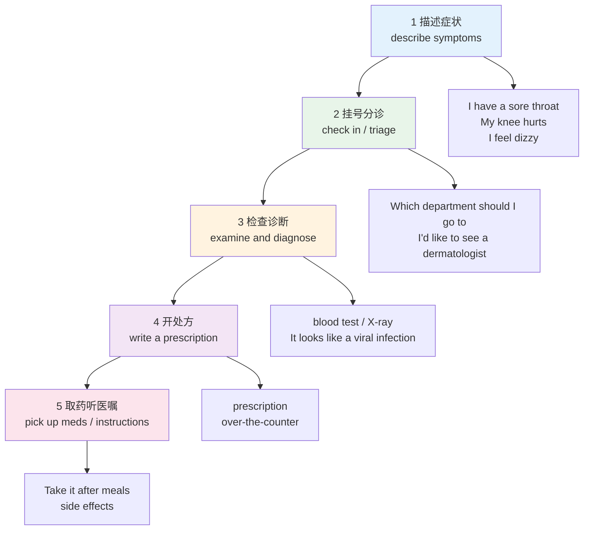
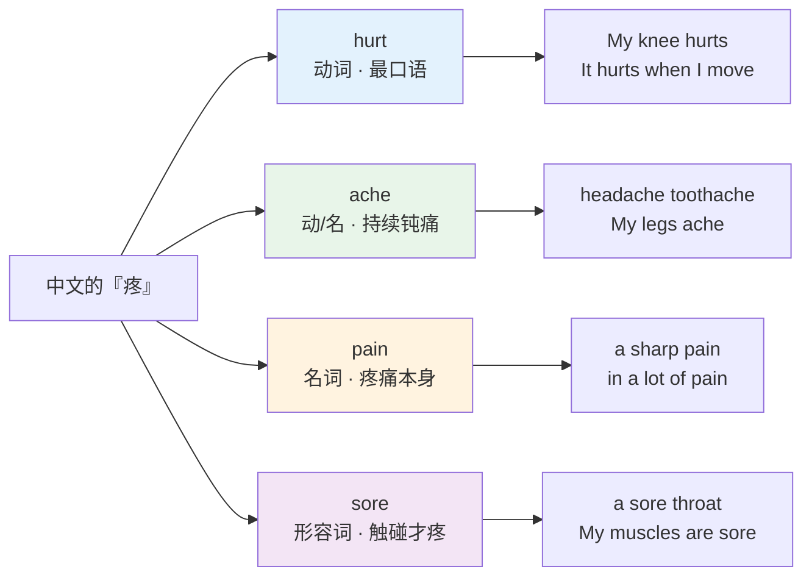
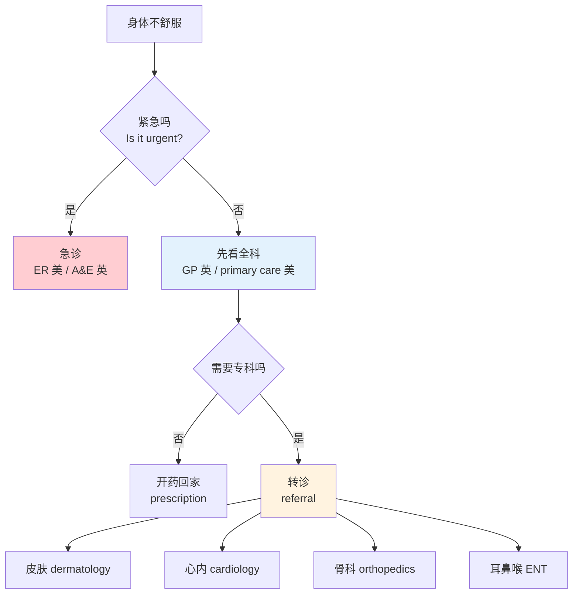
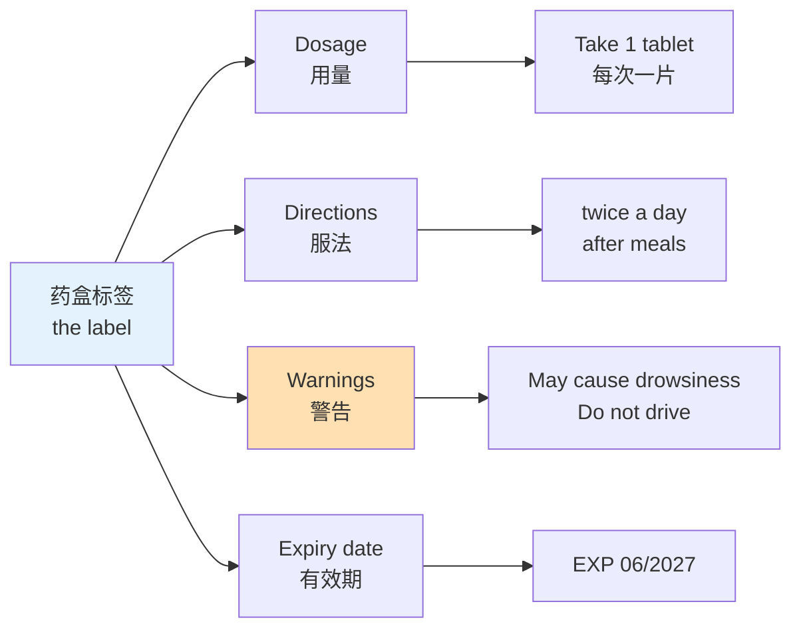
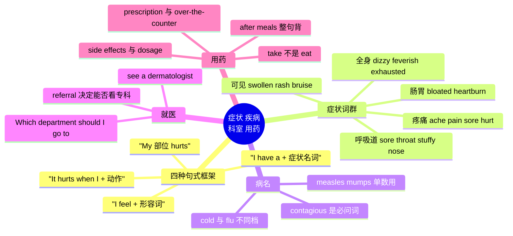

# 症状、疾病、就医科室与用药

> [!info] 本篇定位
>
> 07 章的第三篇，接在 `01.身体部位` 和 `02.外貌体型` 后面。前两篇教你指出身体的哪个部位，这一篇教你说清那个部位怎么了。
>
> 全篇只站在**病人这一侧**说话：你要能描述症状、听懂医生问什么、看懂药盒上写什么。解剖学名词、药理机制、化验单指标、病历论文措辞一律归 `20.专业领域词汇/10.医学英语`，本篇不碰。完整的就诊对话流程归 `04.英语场景/11.医疗与紧急场景实战`，本篇不写对话。
>
> 读完你能做到三件事：把「嗓子疼、鼻子堵、头晕、脚肿」这类中文症状准确说成英语；在陌生医院问出该挂哪个科；拿到药后看懂标签上的服用说明与副作用提示。

---

## 1. 本篇导读：一条从「不舒服」到「拿药」的线

生病相关的词最容易被学成一堆孤立名词——背了 `fever`、`cough`、`pill`，真到要开口时还是拼不成一句话。原因是这些词在真实使用里是**按流程串起来**的，不是按词性堆起来的。

一次完整的就医，词汇按顺序落在五个环节上：说症状 → 挂号问科室 → 医生检查诊断 → 开处方 → 取药并听医嘱。每个环节有自己的一小组高频词和一两个固定句式，学的时候按环节走，比按「名词表 / 形容词表」走要牢得多。

上图是全篇的骨架，五个方框对应下面第 2 到第 13 节的分组。环节 1 词量最大（症状词占了本篇一半以上的词条），环节 2 和环节 5 句式最固定（几乎可以整句背下来直接用），环节 3 和 4 只需要**听得懂**，不需要主动产出——医生说 `We'll run a blood test`，你能听懂就够了，不必自己造这个句子。

这个「有的要产出、有的只要接受」的区分在 `01.词汇入门与学习方法/01.英语词汇的来源、分层与学习地图` 里定义过。本篇每张词表的最后一列会用「说得出」「听得懂」标注取舍。

---

## 2. 说出不舒服的四种句式框架

### 2.1 四种框架各管什么

中文说不舒服的方式非常统一：「我 + 部位 + 疼／不舒服」。英语分成四种框架，选哪种取决于**症状是名词还是感受**。

① **I have a / an + 症状名词** —— 症状本身有专门的名词时用这个，覆盖面最广。

> - I **have** a sore throat and a runny nose.
>   - 我嗓子疼、流鼻涕。
> - I **have** a bad headache.
>   - 我头疼得厉害。
> - I **have** a fever of thirty-eight point five.
>   - 我发烧三十八度五。

② **My + 部位 + hurts / aches** —— 只想说某个部位疼，没有专门的症状名词时用这个。

> - My **lower back hurts** when I stand up.
>   - 我站起来的时候下背疼。
> - My **shoulders ache** after sitting all day.
>   - 坐一整天以后我肩膀酸。

③ **I feel + 形容词** —— 描述整体感受，不是某个部位。

> - I **feel dizzy** when I stand up too fast.
>   - 我起得太快就头晕。
> - I **feel sick**. I think I'm going to throw up.
>   - 我想吐，恶心。

④ **It hurts when I + 动作** —— 说明什么条件下疼，医生最想听的信息之一。

> - It **hurts when I** swallow.
>   - 我咽东西的时候疼。
> - It **hurts when I** put weight on it.
>   - 我一使劲踩就疼。

| 英文 | 英式音标 | 美式音标 | 词性 | 中文 | 搭配与说明 |
| --- | --- | --- | --- | --- | --- |
| **hurt** | /hɜːt/ | /hɜːrt/ | v. | 疼；弄伤 | 三态同形 hurt-hurt-hurt；主语可以是人也可以是部位 |
| **ache** | /eɪk/ | /eɪk/ | v./n. | 隐隐作痛 | ch 读 /k/ 不读 /tʃ/，中国学习者常读错 |
| **sore** | /sɔː/ | /sɔːr/ | adj. | 疼的；发炎的 | 症状语境里只作形容词，不说 It sores；另有名词义 a sore 指疮口 |
| **pain** | /peɪn/ | /peɪn/ | n. | 疼痛 | 名词，in pain 表示正在疼 |
| **feel** | /fiːl/ | /fiːl/ | v. | 感觉 | feel-felt-felt；后接形容词不接副词 |
| **symptom** | /ˈsɪmptəm/ | /ˈsɪmptəm/ | n. | 症状 | p 要发音；复数常用 |
| **swallow** | /ˈswɒləʊ/ | /ˈswɑːloʊ/ | v. | 吞咽 | 描述咽喉痛的关键动词 |
| **breathe** | /briːð/ | /briːð/ | v. | 呼吸 | 动词有 e 读 /briːð/，名词 breath /breθ/ 无 e |
| **breath** | /breθ/ | /breθ/ | n. | 呼吸；一口气 | out of breath 喘不上气 |
| **unwell** | /ʌnˈwel/ | /ʌnˈwel/ | adj. | 不适的 | 比 sick 委婉，英式书面更常见 |

### 2.2 程度、时长与变化：医生一定会追问的三件事

只说「我头疼」信息量不够。英语问诊里必答的三项是：多疼、疼多久了、在变好还是变坏。这三组词量小、复用率极高。

| 维度 | 常用说法 | 中文 | 用法说明 |
| --- | --- | --- | --- |
| 程度 | a slight / mild headache | 轻微头疼 | mild 是医疗语境的标准词 |
| 程度 | a bad / terrible headache | 头疼得厉害 | 口语用 bad，不用 serious |
| 程度 | The pain is about a seven out of ten. | 疼痛大概七分（满分十分） | 英美医院普遍用十分制 |
| 时长 | since Monday / for three days | 从周一开始／已经三天 | since 接时间点，for 接时间段 |
| 时长 | It started last night. | 昨晚开始的 | 用过去式，不用现在完成 |
| 变化 | It's getting worse. | 越来越严重 | get + 比较级是核心结构 |
| 变化 | It comes and goes. | 时好时坏 | 固定搭配，不能改成 goes and comes |
| 变化 | on and off for a week | 断断续续一周了 | 与 comes and goes 同义 |
| 变化 | It's a bit better today. | 今天好一点了 | a bit 比 a little 更口语 |

> [!warning] 中文母语者最容易漏掉的一项
>
> 中文习惯只报症状，英语问诊里**时长几乎是必答项**。医生问 `How long have you had this?`，答 `Three days` 就够，不需要造完整句子。
>
> 另外注意时态：症状还在持续用现在完成 `I've had a cough for a week`；症状开始的那个时点用一般过去 `It started on Monday`。混用会让医生误判病程。

---

## 3. 感冒与呼吸道症状

### 3.1 从头到肺的一条症状链

呼吸道症状是日常最高频的一组，也是中式英语出错最集中的一组——因为中文的「鼻子堵」「嗓子疼」「痰多」在英语里各有固定说法，逐字翻译一个也对不上。

| 英文 | 英式音标 | 美式音标 | 词性 | 中文 | 搭配与说明 |
| --- | --- | --- | --- | --- | --- |
| **cold** | /kəʊld/ | /koʊld/ | n. | 感冒 | catch a cold 得感冒；have a cold 正在感冒 |
| **flu** | /fluː/ | /fluː/ | n. | 流感 | 前面加 the：I have the flu，说得出 |
| **sore throat** | /ˌsɔː ˈθrəʊt/ | /ˌsɔːr ˈθroʊt/ | n. | 嗓子疼 | 固定搭配，不说 throat pain，说得出 |
| **stuffy nose** | /ˌstʌfi ˈnəʊz/ | /ˌstʌfi ˈnoʊz/ | n. | 鼻塞 | 美式口语首选，说得出 |
| **blocked nose** | /ˌblɒkt ˈnəʊz/ | /ˌblɑːkt ˈnoʊz/ | n. | 鼻塞 | 英式对应说法，同义 |
| **runny nose** | /ˌrʌni ˈnəʊz/ | /ˌrʌni ˈnoʊz/ | n. | 流鼻涕 | 不说 flowing nose，说得出 |
| **congested** | /kənˈdʒestɪd/ | /kənˈdʒestɪd/ | adj. | 鼻塞的；充血的 | 比 stuffy 正式，医生常用，听得懂 |
| **sneeze** | /sniːz/ | /sniːz/ | v./n. | 打喷嚏 | keep sneezing 一直打喷嚏 |
| **cough** | /kɒf/ | /kɔːf/ | v./n. | 咳嗽 | gh 读 /f/；a dry cough 干咳 |
| **dry cough** | /ˌdraɪ ˈkɒf/ | /ˌdraɪ ˈkɔːf/ | n. | 干咳 | 与 chesty cough 相对 |
| **chesty cough** | /ˌtʃesti ˈkɒf/ | /ˌtʃesti ˈkɔːf/ | n. | 有痰的咳嗽 | 英式常见；美式说 wet cough |
| **phlegm** | /flem/ | /flem/ | n. | 痰 | g 不发音，拼写与读音差距最大的词之一 |
| **mucus** | /ˈmjuːkəs/ | /ˈmjuːkəs/ | n. | 黏液；鼻涕 | 中性词，比 snot 得体，听得懂 |
| **hoarse** | /hɔːs/ | /hɔːrs/ | adj. | 嗓子哑的 | My voice is hoarse；与 horse 同音 |
| **lose one's voice** | /ˌluːz wʌnz ˈvɔɪs/ | /ˌluːz wʌnz ˈvɔɪs/ | phr. | 失声 | I've lost my voice 说不出话了 |
| **wheeze** | /wiːz/ | /wiːz/ | v./n. | 喘鸣；呼哧作响 | 哮喘与支气管炎的典型描述，听得懂 |
| **shortness of breath** | /ˌʃɔːtnəs əv ˈbreθ/ | /ˌʃɔːrtnəs əv ˈbreθ/ | n. | 气短 | 医疗标准表述，听得懂 |
| **out of breath** | /ˌaʊt əv ˈbreθ/ | /ˌaʊt əv ˈbreθ/ | phr. | 上气不接下气 | 口语版，说得出 |
| **chest pain** | /ˌtʃest ˈpeɪn/ | /ˌtʃest ˈpeɪn/ | n. | 胸痛 | 急诊分诊的关键词，必须会说 |
| **tight chest** | /ˌtaɪt ˈtʃest/ | /ˌtaɪt ˈtʃest/ | n. | 胸闷 | My chest feels tight |
| **watery eyes** | /ˌwɔːtəri ˈaɪz/ | /ˌwɔːtəri ˈaɪz/ | n. | 眼睛流泪 | 过敏与感冒都常见 |
| **sniffle** | /ˈsnɪfl/ | /ˈsnɪfl/ | v./n. | 抽鼻子 | the sniffles 指轻微感冒 |

### 3.2 三个必须记住的固定搭配

`sore throat`、`stuffy nose`、`runny nose` 这三个词组的共同点是：**形容词是不能替换的**。中文思维会想到「pain」「blocked」「flowing」，但英语已经把这三个组合固化了。

> - ❌ ~~My throat has pain.~~ / ~~I have throat pain.~~
> - ✅ I have a **sore throat**. / My **throat is sore**.
> - ❌ ~~My nose is blocking.~~ / ~~My nose has no air.~~
> - ✅ I have a **stuffy nose**.（美）/ My **nose is blocked**.（英）
> - ❌ ~~My nose is flowing.~~ / ~~My nose is running water.~~
> - ✅ I have a **runny nose**. / My **nose is running**.

注意最后一组：形容词形式是 `runny`，动词形式是 `My nose is running`，两个都对，但不能混成 `My nose is runny water`。

> [!tip] cold 与 flu 的实际差别
>
> 母语者区分这两个词很严格：`cold` 是普通感冒，症状集中在鼻子和嗓子，能照常上班；`flu` 是流感，会发烧、全身酸痛、下不了床。
>
> 中文的「感冒」两者通吃，所以中国学习者容易说 `I have the flu` 来指普通感冒，在英美同事听来等于「我病得很重要请几天假」。轻症一律说 `I have a cold` 或 `I'm coming down with something`（我好像要病了）。
>
> 冠词也不同：`a cold` 用不定冠词，`the flu` 用定冠词，这是习惯用法，没有道理可讲。

---

## 4. 疼痛四兄弟：ache、pain、sore、hurt

### 4.1 四个词的分工

中文一个「疼」字覆盖全部，英语拆成四个词，词性和语感都不同。这是本篇最值得花时间的一节。

上图按词性划了四条线。`hurt` 是动词，主语可以是人（`I hurt my back`，我伤了背）也可以是部位（`My back hurts`，我背疼）。`ache` 既作动词也作名词，指的是那种绵长的、说不清具体点的钝痛。`pain` 是名词，指疼痛这个东西本身，所以能被形容词修饰（`a sharp pain` 刺痛、`a dull pain` 钝痛）。`sore` 是形容词，核心语感是「碰一下才疼」或者「用多了发炎了」。

| 英文 | 英式音标 | 美式音标 | 词性 | 中文 | 搭配与说明 |
| --- | --- | --- | --- | --- | --- |
| **headache** | /ˈhedeɪk/ | /ˈhedeɪk/ | n. | 头疼 | 可数：a headache；说得出 |
| **toothache** | /ˈtuːθeɪk/ | /ˈtuːθeɪk/ | n. | 牙疼 | 英式常不加冠词，美式加 a |
| **stomachache** | /ˈstʌməkeɪk/ | /ˈstʌməkeɪk/ | n. | 肚子疼 | stomach 的 ch 读 /k/ |
| **backache** | /ˈbækeɪk/ | /ˈbækeɪk/ | n. | 背疼 | 美式更常说 back pain |
| **earache** | /ˈɪəreɪk/ | /ˈɪreɪk/ | n. | 耳朵疼 | 儿童常见症状 |
| **sharp pain** | /ˌʃɑːp ˈpeɪn/ | /ˌʃɑːrp ˈpeɪn/ | n. | 刺痛 | 医生会问 sharp or dull |
| **dull pain** | /ˌdʌl ˈpeɪn/ | /ˌdʌl ˈpeɪn/ | n. | 钝痛 | 与 sharp 成对出现 |
| **throbbing** | /ˈθrɒbɪŋ/ | /ˈθrɑːbɪŋ/ | adj. | 一跳一跳地疼 | a throbbing headache，说得出 |
| **stabbing** | /ˈstæbɪŋ/ | /ˈstæbɪŋ/ | adj. | 刀扎似的疼 | 比 sharp 更强烈 |
| **burning** | /ˈbɜːnɪŋ/ | /ˈbɜːrnɪŋ/ | adj. | 灼痛的 | a burning sensation |
| **tender** | /ˈtendə/ | /ˈtendər/ | adj. | 一按就疼的 | 医生按压时会说 Is it tender here |
| **stiff** | /stɪf/ | /stɪf/ | adj. | 僵硬的 | a stiff neck 落枕，说得出 |
| **cramp** | /kræmp/ | /kræmp/ | n./v. | 抽筋；绞痛 | get a cramp 抽筋；stomach cramps 绞痛 |
| **spasm** | /ˈspæzəm/ | /ˈspæzəm/ | n. | 痉挛 | back spasm，听得懂 |
| **ache all over** | /ˌeɪk ɔːl ˈəʊvə/ | /ˌeɪk ɔːl ˈoʊvər/ | phr. | 浑身酸痛 | 流感的标志性描述，说得出 |
| **be killing me** | /biː ˈkɪlɪŋ miː/ | /biː ˈkɪlɪŋ miː/ | phr. | 疼得要命 | My feet are killing me；只用进行时，说得出 |

### 4.2 -ache 复合词的一条规律

英语里带 `-ache` 的复合名词只有五个常用的：`headache`、`toothache`、`stomachache`、`backache`、`earache`。这个清单是封闭的，不能类推造新词。

> - ❌ ~~kneeache~~ / ~~throatache~~ / ~~shoulderache~~
> - ✅ **knee pain** / **My knee hurts**
> - ✅ **a sore throat** / **My throat is sore**
> - ✅ **shoulder pain** / **My shoulder hurts**

不在这五个之内的部位，一律用 `部位 + pain` 或者 `My 部位 hurts` 两种句式之一。

> [!warning] sore 与 painful 的分工
>
> 两个词都能翻成「疼的」，但适用对象不同。
>
> `sore` 用于肌肉酸痛、咽喉发炎、运动后的钝痛，语感是「用久了、发炎了」：`My legs are sore after the run.`
>
> `painful` 用于伤口、骨折、任何剧烈的疼，语感是「造成痛苦」：`The injection was painful.`
>
> - ❌ ~~My throat is painful.~~（语气过重，像重伤）
> - ✅ My throat is **sore**.
> - ❌ ~~It was a very sore injury.~~
> - ✅ It was a very **painful** injury.

---

## 5. 头晕、发烧与全身感受

### 5.1 说不清具体部位的那一类症状

`dizzy`、`nauseous`、`exhausted` 这类词描述的是整体状态，句式统一走 `I feel + 形容词`。它们的共同陷阱是：中文都能说成「我很……」，但英语里有几个词不能加 `very`，也有几个词形容词和名词长得很像。

| 英文 | 英式音标 | 美式音标 | 词性 | 中文 | 搭配与说明 |
| --- | --- | --- | --- | --- | --- |
| **dizzy** | /ˈdɪzi/ | /ˈdɪzi/ | adj. | 头晕的 | feel dizzy；不用 head spin，说得出 |
| **lightheaded** | /ˌlaɪtˈhedɪd/ | /ˌlaɪtˈhedɪd/ | adj. | 头轻飘飘的 | 比 dizzy 轻，快晕倒时用 |
| **faint** | /feɪnt/ | /feɪnt/ | v./adj. | 晕倒；虚弱的 | pass out 是口语同义词 |
| **pass out** | /ˌpɑːs ˈaʊt/ | /ˌpæs ˈaʊt/ | phr.v. | 昏过去 | 口语首选，说得出 |
| **fever** | /ˈfiːvə/ | /ˈfiːvər/ | n. | 发烧 | have a fever；不说 I am fever |
| **feverish** | /ˈfiːvərɪʃ/ | /ˈfiːvərɪʃ/ | adj. | 发烧的 | I feel feverish 我觉得在发烧 |
| **temperature** | /ˈtemprətʃə/ | /ˈtemprətʃər/ | n. | 体温 | 英式 have a temperature 就是发烧 |
| **chills** | /tʃɪlz/ | /tʃɪlz/ | n. | 发冷；寒战 | 恒用复数：I have chills / I've got the chills |
| **shiver** | /ˈʃɪvə/ | /ˈʃɪvər/ | v. | 发抖 | 冷得发抖 |
| **sweat** | /swet/ | /swet/ | v./n. | 出汗 | night sweats 盗汗 |
| **nauseous** | /ˈnɔːziəs/ | /ˈnɑːʃəs/ | adj. | 恶心的 | feel nauseous；英美读音差别大 |
| **nausea** | /ˈnɔːziə/ | /ˈnɑːziə/ | n. | 恶心 | 名词，副作用清单常见，听得懂 |
| **sick** | /sɪk/ | /sɪk/ | adj. | 生病的；想吐的 | 英美义项不同，见下文警示 |
| **tired** | /ˈtaɪəd/ | /ˈtaɪərd/ | adj. | 累的 | 最中性的一档 |
| **exhausted** | /ɪɡˈzɔːstɪd/ | /ɪɡˈzɔːstɪd/ | adj. | 精疲力竭的 | 已是极限，不加 very |
| **fatigue** | /fəˈtiːɡ/ | /fəˈtiːɡ/ | n. | 疲劳；乏力 | 医疗用词，重音在后，听得懂 |
| **weak** | /wiːk/ | /wiːk/ | adj. | 虚弱无力的 | I feel weak，说得出 |
| **run-down** | /ˌrʌn ˈdaʊn/ | /ˌrʌn ˈdaʊn/ | adj. | 身体透支的 | I've been feeling run-down |
| **numb** | /nʌm/ | /nʌm/ | adj. | 麻木的 | b 不发音；My fingers are numb |
| **tingling** | /ˈtɪŋɡlɪŋ/ | /ˈtɪŋɡlɪŋ/ | adj./n. | 发麻刺痛的 | pins and needles 是口语同义说法 |
| **blurred vision** | /ˌblɜːd ˈvɪʒn/ | /ˌblɜːrd ˈvɪʒn/ | n. | 视线模糊 | 副作用与急症都常见，听得懂 |
| **insomnia** | /ɪnˈsɒmniə/ | /ɪnˈsɑːmniə/ | n. | 失眠 | 口语可说 I can't sleep |

### 5.2 sick 这个词的英美分裂

`sick` 是本篇最容易踩坑的词，因为英美语义不一致。

| 用法 | 英式含义 | 美式含义 |
| --- | --- | --- |
| I feel sick. | 我想吐 | 我不舒服／我病了 |
| I'm sick. | 我想吐（或我病了，看语境） | 我病了 |
| I was sick this morning. | 我今早吐了 | 我今早病了 |
| be off sick | 请病假（英式固定说法） | 美式说 call in sick |

> [!warning] 在英国说 I feel sick 会被理解成「要吐了」
>
> 英式英语里 `be sick` 的第一义项是「呕吐」。想表达「我生病了」，英式要说 `I'm ill` 或 `I'm not feeling well`。
>
> - 英式：I'm **ill**. / I'm **not feeling well**.（我病了）
> - 英式：I feel **sick**. / I was **sick** twice.（我想吐／我吐了两次）
> - 美式：I'm **sick**.（我病了）
> - 美式通用：I feel **nauseous**. / I feel like I'm going to **throw up**.（我想吐）
>
> 最保险的中立说法是 `I'm not feeling well`，英美都理解成「不舒服」，不会产生歧义。

### 5.3 发烧怎么说度数

中文说「我发烧三十八度五」，英语有三种表达方式，难度递增。

> - I **have a fever**.
>   - 我发烧了。（最简单，永远够用）
> - I **have a temperature of** thirty-eight point five.
>   - 我体温三十八度五。（欧洲、中国通用摄氏）
> - My **temperature is** a hundred and one.
>   - 我体温一百零一度。（美国用华氏，正常值 98.6）

> [!tip] 华氏与摄氏的口头换算
>
> 美国医院一律用华氏度（Fahrenheit）。三个必须知道的数值：正常体温 **98.6 °F**（37 °C），低烧起点 **100.4 °F**（38 °C），高烧 **103 °F**（39.4 °C）。
>
> 在美国如果你说 `My temperature is thirty-eight`，对方会一头雾水——那个数字在华氏里接近冻死。加一句 `thirty-eight Celsius` 就能解决。摄氏与华氏的完整换算见 `03.数字与计量` 章的温度篇。

---

## 6. 看得见的症状：肿、疹、淤、伤

### 6.1 外观异常类词汇

前面几节讲的是感受，这一节讲的是能被看见、被指出来的症状。这组词在描述外伤和皮肤问题时不可替代。

| 英文 | 英式音标 | 美式音标 | 词性 | 中文 | 搭配与说明 |
| --- | --- | --- | --- | --- | --- |
| **swollen** | /ˈswəʊlən/ | /ˈswoʊlən/ | adj. | 肿的 | swell 的过去分词；My ankle is swollen |
| **swell** | /swel/ | /swel/ | v. | 肿起来 | swell-swelled-swollen，注意分词形式 |
| **swelling** | /ˈswelɪŋ/ | /ˈswelɪŋ/ | n. | 肿胀 | 名词形式，医生常用，听得懂 |
| **puffy** | /ˈpʌfi/ | /ˈpʌfi/ | adj. | 浮肿的 | 常用于眼睛：puffy eyes |
| **rash** | /ræʃ/ | /ræʃ/ | n. | 皮疹 | break out in a rash 起疹子，说得出 |
| **itchy** | /ˈɪtʃi/ | /ˈɪtʃi/ | adj. | 痒的 | It's really itchy |
| **itch** | /ɪtʃ/ | /ɪtʃ/ | v./n. | 发痒；痒 | 动词与名词同形 |
| **scratch** | /skrætʃ/ | /skrætʃ/ | v./n. | 抓挠；擦伤 | Try not to scratch it |
| **bruise** | /bruːz/ | /bruːz/ | n./v. | 淤青；碰伤 | 读 /bruːz/ 不是 /brjuːs/ |
| **swelling goes down** | /ˈswelɪŋ ɡəʊz daʊn/ | /ˈswelɪŋ ɡoʊz daʊn/ | phr. | 消肿 | 固定说法，不说 swelling disappears |
| **lump** | /lʌmp/ | /lʌmp/ | n. | 肿块；包 | I found a lump，就医高频词 |
| **blister** | /ˈblɪstə/ | /ˈblɪstər/ | n. | 水泡 | 烫伤与磨脚都用 |
| **cut** | /kʌt/ | /kʌt/ | n./v. | 割伤 | 三态同形；a deep cut |
| **wound** | /wuːnd/ | /wuːnd/ | n. | 伤口 | 读 /wuːnd/，与 wind 的过去式 /waʊnd/ 不同 |
| **scar** | /skɑː/ | /skɑːr/ | n. | 疤 | leave a scar 留疤 |
| **burn** | /bɜːn/ | /bɜːrn/ | n./v. | 烧伤；烫伤 | a minor burn 轻度烫伤 |
| **sprain** | /spreɪn/ | /spreɪn/ | v./n. | 扭伤 | I sprained my ankle，说得出 |
| **twist** | /twɪst/ | /twɪst/ | v. | 扭到 | twist one's ankle，与 sprain 同义更口语 |
| **fracture** | /ˈfræktʃə/ | /ˈfræktʃər/ | n./v. | 骨折 | 口语常说 break：I broke my arm |
| **dislocate** | /ˈdɪsləkeɪt/ | /ˈdɪsloʊkeɪt/ | v. | 脱臼 | dislocate one's shoulder，听得懂 |
| **bleed** | /bliːd/ | /bliːd/ | v. | 流血 | bleed-bled-bled；It won't stop bleeding |
| **infected** | /ɪnˈfektɪd/ | /ɪnˈfektɪd/ | adj. | 感染了的 | The cut looks infected |
| **pale** | /peɪl/ | /peɪl/ | adj. | 脸色苍白 | You look pale |
| **dry skin** | /ˌdraɪ ˈskɪn/ | /ˌdraɪ ˈskɪn/ | n. | 皮肤干燥 | 皮肤科高频描述 |
| **peeling** | /ˈpiːlɪŋ/ | /ˈpiːlɪŋ/ | adj./n. | 脱皮 | My skin is peeling |

### 6.2 swollen 与 swelling 的区别

这两个词形近义近，但一个是形容词、一个是名词，句子结构完全不同。

> - My ankle is **swollen**.
>   - 我脚踝肿了。（形容词作表语）
> - There's some **swelling** around the joint.
>   - 关节周围有些肿。（名词作主语）
> - The **swelling** should go down in a couple of days.
>   - 肿两天内应该会消。（名词，医生的常用句）

动词原形 `swell` 在口语里用得不多，主要出现在预测里：`Your foot may swell overnight`（你的脚可能一夜间肿起来）。

> [!warning] 骨折不要一上来就说 fracture
>
> `fracture` 是医学词，医生和放射科报告会用；病人自己描述时更自然的是 `break`。
>
> - ✅ I think I **broke** my wrist.（我觉得我手腕骨折了）
> - ✅ 医生回：It's a small **fracture** in the radius.（桡骨有个小骨折）
>
> 同理，`dislocate`（脱臼）病人也常说得更简单：`My shoulder popped out`。这条区分是本篇的主线之一——病人说日常词，医生说医学词，你需要**主动会说日常词、被动听懂医学词**。

---

## 7. 肠胃与消化道症状

### 7.1 从吃坏肚子到胃酸反流

肠胃症状的词形普遍不难，但拼写和搭配是重灾区——`diarrhea` 的拼法、`throw up` 与 `vomit` 的语域差、`bloated` 这个中文没有对应单词的概念，都要单独记。

| 英文 | 英式音标 | 美式音标 | 词性 | 中文 | 搭配与说明 |
| --- | --- | --- | --- | --- | --- |
| **stomachache** | /ˈstʌməkeɪk/ | /ˈstʌməkeɪk/ | n. | 胃疼；肚子疼 | 英式也写 stomach ache 分开 |
| **stomach cramps** | /ˈstʌmək kræmps/ | /ˈstʌmək kræmps/ | n. | 胃绞痛 | 恒用复数 |
| **throw up** | /ˌθrəʊ ˈʌp/ | /ˌθroʊ ˈʌp/ | phr.v. | 吐 | 口语首选，说得出 |
| **vomit** | /ˈvɒmɪt/ | /ˈvɑːmɪt/ | v./n. | 呕吐 | 医疗与书面用词，听得懂 |
| **diarrhea** | /ˌdaɪəˈrɪə/ | /ˌdaɪəˈriːə/ | n. | 腹泻 | 英式拼 diarrhoea，不可数 |
| **constipation** | /ˌkɒnstɪˈpeɪʃn/ | /ˌkɑːnstɪˈpeɪʃn/ | n. | 便秘 | 形容词 constipated |
| **constipated** | /ˈkɒnstɪpeɪtɪd/ | /ˈkɑːnstɪpeɪtɪd/ | adj. | 便秘的 | I'm constipated 说得出 |
| **bloated** | /ˈbləʊtɪd/ | /ˈbloʊtɪd/ | adj. | 胀气的；肚子发胀 | I feel bloated，中文难直译 |
| **gas** | /ɡæs/ | /ɡæs/ | n. | 胀气；肠胃气 | 美式常用；英式说 wind |
| **heartburn** | /ˈhɑːtbɜːn/ | /ˈhɑːrtbɜːrn/ | n. | 烧心；胃灼热 | 与心脏无关，不可数 |
| **acid reflux** | /ˌæsɪd ˈriːflʌks/ | /ˌæsɪd ˈriːflʌks/ | n. | 胃酸反流 | 听得懂即可 |
| **indigestion** | /ˌɪndɪˈdʒestʃən/ | /ˌɪndɪˈdʒestʃən/ | n. | 消化不良 | 不可数：I have indigestion |
| **upset stomach** | /ʌpˌset ˈstʌmək/ | /ʌpˌset ˈstʌmək/ | n. | 肠胃不适 | 最万能的模糊说法，说得出 |
| **food poisoning** | /ˈfuːd pɔɪznɪŋ/ | /ˈfuːd pɔɪzənɪŋ/ | n. | 食物中毒 | 不可数：I got food poisoning |
| **lose one's appetite** | /ˌluːz wʌnz ˈæpɪtaɪt/ | /ˌluːz wʌnz ˈæpətaɪt/ | phr. | 没胃口 | I've lost my appetite |
| **dehydrated** | /ˌdiːhaɪˈdreɪtɪd/ | /ˌdiːhaɪˈdreɪtɪd/ | adj. | 脱水的 | 腹泻后医生会强调 |
| **stomach bug** | /ˈstʌmək bʌɡ/ | /ˈstʌmək bʌɡ/ | n. | 肠胃型感冒 | 口语，指病毒性肠胃炎 |
| **cut down on** | /ˌkʌt ˈdaʊn ɒn/ | /ˌkʌt ˈdaʊn ɑːn/ | phr.v. | 减少摄入 | cut down on coffee，医嘱高频 |

### 7.2 throw up 与 vomit 怎么选

两个词的意思完全一样，差别只在语域。

| 场合 | 该用哪个 | 例句 |
| --- | --- | --- |
| 和朋友、家人说 | throw up | I threw up twice last night. |
| 和医生描述症状 | throw up 也可以 | I've been throwing up since morning. |
| 医生记录、药品说明书 | vomiting | May cause nausea and vomiting. |
| 英式口语 | be sick | I was sick three times. |

`vomit` 作动词在日常对话里显得过于正式，像在念病历。反过来，药盒的副作用清单不会写 `throwing up`，一定写 `vomiting`。

> [!tip] bloated 这个概念中文没有单字对应
>
> `bloated` 指的是「肚子胀鼓鼓、像充了气」的那种感觉，吃多了、胀气、经期都可能出现。中文要说「肚子发胀」三个字才能描述。
>
> - I feel really **bloated** after that meal.
>   - 那顿饭吃完我肚子特别胀。
> - Beans make me **bloated**.
>   - 豆子吃了我会胀气。
>
> 它是形容词，不能说 `I have bloated`。名词是 `bloating`：`I get bloating after eating dairy.`

---

## 8. 常见病名与传染病名

### 8.1 日常能叫得出名的病

病名这一组只需要认识，不需要能拼写。挑选标准是：日常对话会提到、请假会写、药盒上会出现。

| 英文 | 英式音标 | 美式音标 | 词性 | 中文 | 搭配与说明 |
| --- | --- | --- | --- | --- | --- |
| **infection** | /ɪnˈfekʃn/ | /ɪnˈfekʃn/ | n. | 感染 | a throat infection；最泛用的病因词 |
| **virus** | /ˈvaɪrəs/ | /ˈvaɪrəs/ | n. | 病毒 | 形容词 viral /ˈvaɪrəl/ |
| **bacteria** | /bækˈtɪəriə/ | /bækˈtɪriə/ | n. | 细菌 | 复数形式；单数 bacterium |
| **bronchitis** | /brɒŋˈkaɪtɪs/ | /brɑːŋˈkaɪtɪs/ | n. | 支气管炎 | 重音在第二音节 |
| **pneumonia** | /njuːˈməʊniə/ | /nuːˈmoʊniə/ | n. | 肺炎 | 开头 p 不发音 |
| **asthma** | /ˈæsmə/ | /ˈæzmə/ | n. | 哮喘 | th 不发音；an asthma attack 哮喘发作 |
| **migraine** | /ˈmaɪɡreɪn/ | /ˈmaɪɡreɪn/ | n. | 偏头痛 | 英式也读 /ˈmiːɡreɪn/ |
| **ulcer** | /ˈʌlsə/ | /ˈʌlsər/ | n. | 溃疡 | a stomach ulcer；mouth ulcer 口腔溃疡 |
| **appendicitis** | /əˌpendəˈsaɪtɪs/ | /əˌpendəˈsaɪtɪs/ | n. | 阑尾炎 | 急诊常见，听得懂 |
| **kidney stone** | /ˈkɪdni stəʊn/ | /ˈkɪdni stoʊn/ | n. | 肾结石 | 可数 |
| **anemia** | /əˈniːmiə/ | /əˈniːmiə/ | n. | 贫血 | 英式拼 anaemia |
| **arthritis** | /ɑːˈθraɪtɪs/ | /ɑːrˈθraɪtɪs/ | n. | 关节炎 | 重音在第二音节 |
| **concussion** | /kənˈkʌʃn/ | /kənˈkʌʃn/ | n. | 脑震荡 | 撞头后的标准词 |
| **stroke** | /strəʊk/ | /stroʊk/ | n. | 中风 | have a stroke |
| **heart attack** | /ˈhɑːt əˌtæk/ | /ˈhɑːrt əˌtæk/ | n. | 心脏病发作 | have a heart attack |
| **pink eye** | /ˈpɪŋk aɪ/ | /ˈpɪŋk aɪ/ | n. | 红眼病 | 美式口语；正式词 conjunctivitis |
| **UTI** | /ˌjuː tiː ˈaɪ/ | /ˌjuː tiː ˈaɪ/ | n. | 尿路感染 | urinary tract infection 的缩写 |
| **cavity** | /ˈkævəti/ | /ˈkævəti/ | n. | 蛀牙洞 | 牙医高频；I have two cavities |

### 8.2 传染病与防疫词

| 英文 | 英式音标 | 美式音标 | 词性 | 中文 | 搭配与说明 |
| --- | --- | --- | --- | --- | --- |
| **contagious** | /kənˈteɪdʒəs/ | /kənˈteɪdʒəs/ | adj. | 有传染性的 | Is it contagious 是就诊必问句 |
| **infectious** | /ɪnˈfekʃəs/ | /ɪnˈfekʃəs/ | adj. | 传染性的 | 与 contagious 日常可互换 |
| **measles** | /ˈmiːzlz/ | /ˈmiːzlz/ | n. | 麻疹 | 形式复数，作单数用 |
| **mumps** | /mʌmps/ | /mʌmps/ | n. | 腮腺炎 | 同为形式复数 |
| **chickenpox** | /ˈtʃɪkɪnpɒks/ | /ˈtʃɪkɪnpɑːks/ | n. | 水痘 | 不可数 |
| **shingles** | /ˈʃɪŋɡlz/ | /ˈʃɪŋɡlz/ | n. | 带状疱疹 | 水痘病毒复发所致 |
| **rubella** | /ruːˈbelə/ | /ruːˈbelə/ | n. | 风疹 | 口语也叫 German measles |
| **tuberculosis** | /tjuːˌbɜːkjuˈləʊsɪs/ | /tuːˌbɜːrkjəˈloʊsɪs/ | n. | 肺结核 | 常缩写为 TB |
| **hepatitis** | /ˌhepəˈtaɪtɪs/ | /ˌhepəˈtaɪtɪs/ | n. | 肝炎 | hepatitis A / B / C |
| **malaria** | /məˈleəriə/ | /məˈleriə/ | n. | 疟疾 | 出国旅行防疫高频 |
| **rabies** | /ˈreɪbiːz/ | /ˈreɪbiːz/ | n. | 狂犬病 | 被咬后必问的词 |
| **tetanus** | /ˈtetənəs/ | /ˈtetənəs/ | n. | 破伤风 | a tetanus shot 破伤风针 |
| **outbreak** | /ˈaʊtbreɪk/ | /ˈaʊtbreɪk/ | n. | 疫情爆发 | an outbreak of flu |
| **quarantine** | /ˈkwɒrəntiːn/ | /ˈkwɔːrəntiːn/ | n./v. | 隔离 | be in quarantine |
| **isolate** | /ˈaɪsəleɪt/ | /ˈaɪsəleɪt/ | v. | 隔离；使隔离 | 反身式 self-isolate 在 2020 年后成为高频词 |
| **vaccine** | /ˈvæksiːn/ | /vækˈsiːn/ | n. | 疫苗 | 英美重音位置不同 |
| **vaccinated** | /ˈvæksɪneɪtɪd/ | /ˈvæksɪneɪtɪd/ | adj. | 接种过的 | get vaccinated |
| **booster** | /ˈbuːstə/ | /ˈbuːstər/ | n. | 加强针 | a booster shot |
| **immune** | /ɪˈmjuːn/ | /ɪˈmjuːn/ | adj. | 免疫的 | be immune to something |
| **incubation period** | /ˌɪŋkjuˈbeɪʃn ˌpɪəriəd/ | /ˌɪŋkjuˈbeɪʃn ˌpɪriəd/ | n. | 潜伏期 | 听得懂即可 |

> [!warning] 三个「形式是复数、意义是单数」的病名
>
> `measles`、`mumps`、`shingles` 都以 -s 结尾，但都当单数用，谓语动词用单数形式。
>
> - ❌ ~~Measles are very contagious.~~
> - ✅ **Measles is** very contagious.（麻疹传染性很强）
> - ❌ ~~My son have mumps.~~
> - ✅ My son **has mumps**.（我儿子得了腮腺炎）
>
> 这三个词前面通常不加冠词。`chickenpox` 拼写虽然没有 -s，用法一样：`She has chickenpox.`

### 8.3 描述病情轻重与病程的口语说法

关于病情轻重和病程长短，本篇只给日常口语层，不展开医学定义。

| 说法 | 中文 | 语域 |
| --- | --- | --- |
| It's nothing serious. | 没什么大事 | 口语，医生安慰病人 |
| a mild case | 轻症 | 通用 |
| It's pretty bad. | 挺严重的 | 口语 |
| a long-term condition | 长期病症 | 中性，病人自述常用 |
| I've had it for years. | 我这毛病好多年了 | 口语，比说 chronic 自然 |

> [!tip] acute 与 chronic 不在本篇范围
>
> `acute`（急性）与 `chronic`（慢性）、`benign`（良性）与 `malignant`（恶性）这四个词属于医学专业层，主讲位置在 `20.专业领域词汇/10.医学英语`。
>
> 病人视角里，这些概念用日常词就能表达：慢性病说 `a long-term condition` 或 `something I've had for years`，突发说 `It came on suddenly`。真正需要用到专业词的场合是读检查报告，那属于另一篇的任务。

---

## 9. 过敏与长期病症

### 9.1 过敏相关词汇

过敏是出国生活、点餐、就医三个场景的交集，词量不大但错一个就可能出事故。

| 英文 | 英式音标 | 美式音标 | 词性 | 中文 | 搭配与说明 |
| --- | --- | --- | --- | --- | --- |
| **allergy** | /ˈælədʒi/ | /ˈælərdʒi/ | n. | 过敏 | a peanut allergy；重音在第一音节 |
| **allergic** | /əˈlɜːdʒɪk/ | /əˈlɜːrdʒɪk/ | adj. | 过敏的 | be allergic to；重音在第二音节 |
| **allergic reaction** | /əˌlɜːdʒɪk riˈækʃn/ | /əˌlɜːrdʒɪk riˈækʃn/ | n. | 过敏反应 | have an allergic reaction |
| **hay fever** | /ˈheɪ fiːvə/ | /ˈheɪ fiːvər/ | n. | 花粉过敏 | 与干草无关；英式最常用 |
| **pollen** | /ˈpɒlən/ | /ˈpɑːlən/ | n. | 花粉 | pollen count 花粉指数 |
| **hives** | /haɪvz/ | /haɪvz/ | n. | 荨麻疹 | 恒用复数；break out in hives |
| **swell up** | /ˌswel ˈʌp/ | /ˌswel ˈʌp/ | phr.v. | 肿起来 | My face swelled up |
| **lactose intolerant** | /ˌlæktəʊs ɪnˈtɒlərənt/ | /ˌlæktoʊs ɪnˈtɑːlərənt/ | adj. | 乳糖不耐 | 不是过敏，是不耐受 |
| **gluten-free** | /ˌɡluːtn ˈfriː/ | /ˌɡluːtn ˈfriː/ | adj. | 无麸质的 | 餐厅菜单高频 |
| **nut allergy** | /ˈnʌt ælədʒi/ | /ˈnʌt ælərdʒi/ | n. | 坚果过敏 | 最常见的严重过敏 |
| **shellfish** | /ˈʃelfɪʃ/ | /ˈʃelfɪʃ/ | n. | 贝类海鲜 | 过敏原清单常客 |
| **EpiPen** | /ˈepipen/ | /ˈepipen/ | n. | 肾上腺素笔 | 严重过敏者随身携带 |

> [!warning] allergy 与 allergic 的重音位置不同
>
> 名词 `allergy` 重音在第一音节 /ˈælədʒi/，形容词 `allergic` 重音移到第二音节 /əˈlɜːdʒɪk/。这是英语重音移位的典型例子，读错会导致对方听不懂。
>
> 句式也不能混：
>
> - ❌ ~~I have allergic to peanuts.~~
> - ✅ I'm **allergic to** peanuts.（形容词 + to）
> - ✅ I have a peanut **allergy**.（名词）
> - ✅ I have **allergies**.（我有过敏症，泛指）
>
> 点餐时最安全的一句是 `I'm allergic to nuts — is there any in this?`，把过敏原和确认问句放在一起。

### 9.2 长期用药与既往病史

医生问诊必问的三句，答案里的词也就这些。

| 医生的问句 | 中文 | 你要准备的词 |
| --- | --- | --- |
| Do you have any medical conditions? | 你有什么基础病吗 | diabetes / high blood pressure / asthma |
| Are you on any medication? | 你在吃什么药吗 | be on + 药名 |
| Any allergies? | 有过敏吗 | allergic to + 过敏原 |

| 英文 | 英式音标 | 美式音标 | 词性 | 中文 | 搭配与说明 |
| --- | --- | --- | --- | --- | --- |
| **diabetes** | /ˌdaɪəˈbiːtiːz/ | /ˌdaɪəˈbiːtiːz/ | n. | 糖尿病 | 词尾 -tes 读 /tiːz/ |
| **diabetic** | /ˌdaɪəˈbetɪk/ | /ˌdaɪəˈbetɪk/ | adj./n. | 糖尿病的；糖尿病人 | I'm diabetic |
| **high blood pressure** | /ˌhaɪ ˈblʌd preʃə/ | /ˌhaɪ ˈblʌd preʃər/ | n. | 高血压 | 口语首选，说得出 |
| **hypertension** | /ˌhaɪpəˈtenʃn/ | /ˌhaɪpərˈtenʃn/ | n. | 高血压 | 医学词，听得懂 |
| **cholesterol** | /kəˈlestərɒl/ | /kəˈlestərɔːl/ | n. | 胆固醇 | high cholesterol |
| **be on medication** | /biː ɒn ˌmedɪˈkeɪʃn/ | /biː ɑːn ˌmedɪˈkeɪʃn/ | phr. | 在服药 | 固定说法，不说 eat medicine |
| **medical history** | /ˌmedɪkl ˈhɪstri/ | /ˌmedɪkl ˈhɪstri/ | n. | 病史 | 表格上的固定栏目 |
| **condition** | /kənˈdɪʃn/ | /kənˈdɪʃn/ | n. | 病症；身体状况 | a heart condition 心脏病 |
| **flare-up** | /ˈfleər ʌp/ | /ˈfler ʌp/ | n. | 复发；急性发作 | an asthma flare-up |
| **under control** | /ˌʌndə kənˈtrəʊl/ | /ˌʌndər kənˈtroʊl/ | phr. | 控制住了 | My blood sugar is under control |

---

## 10. 挂号与科室：Which department should I go to

### 10.1 一句话问对科室

中国医院的「挂号」在英美没有完全对应的动作——英国走 GP 转诊，美国先约初级保健医生或者直接约专科。但无论哪套流程，下面这几句都能用。

① **Which department should I go to?** —— 最直接，医院前台一定听得懂。

② **I'd like to see a dermatologist.** —— 已知要看哪个专科时用，`see a + 专科医生` 是核心结构。

③ **Do I need a referral?** —— 问是否需要转诊单，英国和多数美国保险计划都需要。

④ **I'd like to make an appointment with a cardiologist.** —— 预约专科。

⑤ **Is there a walk-in clinic nearby?** —— 问附近有没有免预约诊所。

上图解释了为什么英美看病比国内多一道手续：绝大多数专科不能直接挂号，要先经全科医生（英国叫 GP，美国叫 primary care physician）判断，拿到 `referral` 才能转专科。这也是 `Do I need a referral?` 这句话的使用价值——它决定你今天能不能看上专科。只有急诊 `ER` / `A&E` 是不需要转诊、直接进的。

### 10.2 科室与医生名对照

| 英文 | 英式音标 | 美式音标 | 词性 | 中文 | 搭配与说明 |
| --- | --- | --- | --- | --- | --- |
| **department** | /dɪˈpɑːtmənt/ | /dɪˈpɑːrtmənt/ | n. | 科室 | Which department |
| **dermatologist** | /ˌdɜːməˈtɒlədʒɪst/ | /ˌdɜːrməˈtɑːlədʒɪst/ | n. | 皮肤科医生 | see a dermatologist |
| **dermatology** | /ˌdɜːməˈtɒlədʒi/ | /ˌdɜːrməˈtɑːlədʒi/ | n. | 皮肤科 | 门牌上的科室名 |
| **cardiologist** | /ˌkɑːdiˈɒlədʒɪst/ | /ˌkɑːrdiˈɑːlədʒɪst/ | n. | 心内科医生 | 心脏问题找他 |
| **cardiology** | /ˌkɑːdiˈɒlədʒi/ | /ˌkɑːrdiˈɑːlədʒi/ | n. | 心内科 | — |
| **pediatrician** | /ˌpiːdiəˈtrɪʃn/ | /ˌpiːdiəˈtrɪʃn/ | n. | 儿科医生 | 英式拼 paediatrician |
| **pediatrics** | /ˌpiːdiˈætrɪks/ | /ˌpiːdiˈætrɪks/ | n. | 儿科 | 形式复数作单数 |
| **neurologist** | /njʊəˈrɒlədʒɪst/ | /nʊˈrɑːlədʒɪst/ | n. | 神经科医生 | 头痛久治不愈时转诊 |
| **orthopedics** | /ˌɔːθəˈpiːdɪks/ | /ˌɔːrθəˈpiːdɪks/ | n. | 骨科 | 英式拼 orthopaedics |
| **ophthalmologist** | /ˌɒfθælˈmɒlədʒɪst/ | /ˌɑːfθælˈmɑːlədʒɪst/ | n. | 眼科医生 | 口语常说 eye doctor |
| **optometrist** | /ɒpˈtɒmɪtrɪst/ | /ɑːpˈtɑːmətrɪst/ | n. | 验光师 | 配眼镜找他，不治病 |
| **ENT** | /ˌiː en ˈtiː/ | /ˌiː en ˈtiː/ | n. | 耳鼻喉科 | ear, nose and throat 缩写 |
| **gynecologist** | /ˌɡaɪnəˈkɒlədʒɪst/ | /ˌɡaɪnəˈkɑːlədʒɪst/ | n. | 妇科医生 | 英式拼 gynaecologist |
| **psychiatrist** | /saɪˈkaɪətrɪst/ | /səˈkaɪətrɪst/ | n. | 精神科医生 | 能开药，与心理咨询师不同 |
| **dentist** | /ˈdentɪst/ | /ˈdentɪst/ | n. | 牙医 | go to the dentist |
| **surgeon** | /ˈsɜːdʒən/ | /ˈsɜːrdʒən/ | n. | 外科医生 | g 读 /dʒ/ |
| **GP** | /ˌdʒiː ˈpiː/ | /ˌdʒiː ˈpiː/ | n. | 全科医生 | 英式：general practitioner |
| **primary care** | /ˌpraɪməri ˈkeə/ | /ˌpraɪmeri ˈker/ | n. | 初级保健 | 美式对应 GP 的概念 |
| **specialist** | /ˈspeʃəlɪst/ | /ˈspeʃəlɪst/ | n. | 专科医生 | see a specialist |
| **physiotherapist** | /ˌfɪziəʊˈθerəpɪst/ | /ˌfɪzioʊˈθerəpɪst/ | n. | 理疗师 | 口语缩为 physio（英）/ PT（美） |

### 10.3 医院里的场所与流程词

| 英文 | 英式音标 | 美式音标 | 词性 | 中文 | 搭配与说明 |
| --- | --- | --- | --- | --- | --- |
| **appointment** | /əˈpɔɪntmənt/ | /əˈpɔɪntmənt/ | n. | 预约 | make / cancel an appointment |
| **referral** | /rɪˈfɜːrəl/ | /rɪˈfɜːrəl/ | n. | 转诊单 | get a referral |
| **check in** | /ˌtʃek ˈɪn/ | /ˌtʃek ˈɪn/ | phr.v. | 登记报到 | 到诊所第一件事 |
| **reception** | /rɪˈsepʃn/ | /rɪˈsepʃn/ | n. | 前台 | 问路首选目标 |
| **waiting room** | /ˈweɪtɪŋ ruːm/ | /ˈweɪtɪŋ ruːm/ | n. | 候诊室 | — |
| **walk-in clinic** | /ˈwɔːk ɪn klɪnɪk/ | /ˈwɔːk ɪn klɪnɪk/ | n. | 免预约诊所 | 小病首选，不用预约 |
| **urgent care** | /ˌɜːdʒənt ˈkeə/ | /ˌɜːrdʒənt ˈker/ | n. | 急症门诊 | 美式；比 ER 便宜快捷 |
| **ER** | /ˌiː ˈɑː/ | /ˌiː ˈɑːr/ | n. | 急诊室 | emergency room，美式 |
| **A&E** | /ˌeɪ ənd ˈiː/ | /ˌeɪ ənd ˈiː/ | n. | 急诊 | accident and emergency，英式 |
| **outpatient** | /ˈaʊtpeɪʃnt/ | /ˈaʊtpeɪʃnt/ | n./adj. | 门诊病人 | outpatient clinic 门诊部 |
| **inpatient** | /ˈɪnpeɪʃnt/ | /ˈɪnpeɪʃnt/ | n./adj. | 住院病人 | — |
| **ward** | /wɔːd/ | /wɔːrd/ | n. | 病房 | 英式常用 |
| **be admitted** | /biː ədˈmɪtɪd/ | /biː ədˈmɪtɪd/ | phr. | 被收治住院 | He was admitted last night |
| **be discharged** | /biː dɪsˈtʃɑːdʒd/ | /biː dɪsˈtʃɑːrdʒd/ | phr. | 出院 | 听得懂即可 |
| **insurance** | /ɪnˈʃʊərəns/ | /ɪnˈʃʊrəns/ | n. | 保险 | Do you take my insurance |
| **co-pay** | /ˈkəʊpeɪ/ | /ˈkoʊpeɪ/ | n. | 自付额 | 美式医保词，必须听得懂 |
| **medical card** | /ˈmedɪkl kɑːd/ | /ˈmedɪkl kɑːrd/ | n. | 就诊卡 | — |

> [!warning] 不要按中文直译科室名
>
> 中文的科室名对应英语有几处错位，逐字翻译会走错门。
>
> - 「内科」不是 ~~internal department~~，日常对应的是 **primary care**（美）或 **GP**（英）；医院里的正式说法是 **internal medicine**。
> - 「五官科」拆成两个：眼睛归 **ophthalmology**，耳鼻喉归 **ENT**。
> - 「精神科」和「心理咨询」不同：**psychiatrist** 是医生、能开药；**psychologist** / **therapist** 做谈话治疗、不开药。
> - 「体检」不是 ~~body check~~，是 **checkup** 或 **physical**（美式：I have a physical next week）。
>
> 记不住科室名时有一个万能兜底句：`I have a problem with my skin. Which department should I go to?` 把部位说清楚，让前台替你判断。

---

## 11. 检查、诊断与处置

### 11.1 医生会做什么、会说什么

这一节的词几乎全部只需要**听得懂**。你不需要主动说 `Please auscultate my chest`，但医生说 `I'm going to listen to your chest` 时你要知道该做什么。

| 英文 | 英式音标 | 美式音标 | 词性 | 中文 | 搭配与说明 |
| --- | --- | --- | --- | --- | --- |
| **examine** | /ɪɡˈzæmɪn/ | /ɪɡˈzæmɪn/ | v. | 检查 | Let me examine you |
| **checkup** | /ˈtʃekʌp/ | /ˈtʃekʌp/ | n. | 体检 | an annual checkup 年度体检 |
| **physical** | /ˈfɪzɪkl/ | /ˈfɪzɪkl/ | n. | 体检 | 美式名词用法 |
| **blood test** | /ˈblʌd test/ | /ˈblʌd test/ | n. | 血检 | run a blood test |
| **blood pressure** | /ˈblʌd preʃə/ | /ˈblʌd preʃər/ | n. | 血压 | take your blood pressure |
| **X-ray** | /ˈeksreɪ/ | /ˈeksreɪ/ | n./v. | X 光片 | get an X-ray |
| **scan** | /skæn/ | /skæn/ | n./v. | 扫描 | a CT scan / an MRI scan |
| **ultrasound** | /ˈʌltrəsaʊnd/ | /ˈʌltrəsaʊnd/ | n. | 超声 | an ultrasound scan |
| **sample** | /ˈsɑːmpl/ | /ˈsæmpl/ | n. | 样本 | a urine sample 尿样 |
| **swab** | /swɒb/ | /swɑːb/ | n./v. | 拭子；取样 | a throat swab |
| **result** | /rɪˈzʌlt/ | /rɪˈzʌlt/ | n. | 结果 | The results are back |
| **diagnose** | /ˈdaɪəɡnəʊz/ | /ˌdaɪəɡˈnoʊs/ | v. | 诊断 | be diagnosed with |
| **diagnosis** | /ˌdaɪəɡˈnəʊsɪs/ | /ˌdaɪəɡˈnoʊsɪs/ | n. | 诊断结果 | 复数 diagnoses |
| **treatment** | /ˈtriːtmənt/ | /ˈtriːtmənt/ | n. | 治疗 | a course of treatment |
| **injection** | /ɪnˈdʒekʃn/ | /ɪnˈdʒekʃn/ | n. | 注射 | 正式词 |
| **shot** | /ʃɒt/ | /ʃɑːt/ | n. | 打针 | 美式口语：a flu shot |
| **jab** | /dʒæb/ | /dʒæb/ | n. | 打针 | 英式口语，与 shot 对应 |
| **stitches** | /ˈstɪtʃɪz/ | /ˈstɪtʃɪz/ | n. | 缝针 | 恒用复数：I got five stitches |
| **cast** | /kɑːst/ | /kæst/ | n. | 石膏 | put a cast on |
| **bandage** | /ˈbændɪdʒ/ | /ˈbændɪdʒ/ | n./v. | 绷带；包扎 | — |
| **drip** | /drɪp/ | /drɪp/ | n. | 点滴 | 英式；美式说 IV /ˌaɪ ˈviː/ |
| **surgery** | /ˈsɜːdʒəri/ | /ˈsɜːrdʒəri/ | n. | 手术 | 英式还指诊所，见下 |
| **operation** | /ˌɒpəˈreɪʃn/ | /ˌɑːpəˈreɪʃn/ | n. | 手术 | have an operation |
| **recover** | /rɪˈkʌvə/ | /rɪˈkʌvər/ | v. | 康复 | recover from the flu |
| **rest** | /rest/ | /rest/ | n./v. | 休息 | Get plenty of rest |

### 11.2 medical 家族四个词的分工

拼写接近，用法完全不同，是本篇的第二个易混点。

| 英文 | 英式音标 | 美式音标 | 词性 | 中文 | 搭配与说明 |
| --- | --- | --- | --- | --- | --- |
| **medical** | /ˈmedɪkl/ | /ˈmedɪkl/ | adj. | 医学的；医疗的 | medical history 病史；不能当名词用 |
| **medicine** | /ˈmedsn/ | /ˈmedɪsn/ | n. | 药（泛指）；医学（学科） | take some medicine；英式常吞掉中间音节 |
| **medication** | /ˌmedɪˈkeɪʃn/ | /ˌmedɪˈkeɪʃn/ | n. | 药物（正在服用的） | be on medication；问诊表格固定用词 |
| **medicinal** | /məˈdɪsɪnl/ | /məˈdɪsɪnl/ | adj. | 有药效的 | medicinal herbs 药草；重音在第二音节 |

> [!warning] 药不是「吃」的
>
> 中文说「吃药」，英语动词是 `take`，不是 `eat` 也不是 `drink`。这条错误在中国学习者里出现率极高。
>
> - ❌ ~~I eat medicine three times a day.~~
> - ❌ ~~I drink this medicine after meals.~~
> - ✅ I **take** this medicine three times a day.
> - ✅ **Take** it after meals.
>
> 连药水、糖浆也用 `take`：`Take two spoonfuls of the syrup.` 唯一的例外是补水：`Drink plenty of fluids`（多喝水）这句用 drink，因为水不是药。

### 11.3 surgery 在英式英语里的第二个意思

`surgery` 在美式英语里只有「外科手术」一个常用义，英式英语里还指「全科诊所」或「门诊时间」。

> - 通用：She's having **surgery** on her knee next week.
>   - 她下周膝盖要动手术。
> - 英式：The **surgery** is open from nine to five.
>   - 诊所九点到五点开门。
> - 英式：I've booked a **surgery** appointment.
>   - 我预约了门诊。

在英国听到 `Come to the surgery tomorrow`，说的是「明天来诊所」，不是「明天来做手术」。

---

## 12. 用药：处方药与非处方药

### 12.1 两类药的分界

`prescription` 与 `over-the-counter` 是买药场景的核心对立。前者必须凭医生开的单子买，后者在货架上自取。

| 英文 | 英式音标 | 美式音标 | 词性 | 中文 | 搭配与说明 |
| --- | --- | --- | --- | --- | --- |
| **prescription** | /prɪˈskrɪpʃn/ | /prɪˈskrɪpʃn/ | n. | 处方 | fill a prescription 抓药，说得出 |
| **prescribe** | /prɪˈskraɪb/ | /prɪˈskraɪb/ | v. | 开药 | The doctor prescribed antibiotics |
| **over-the-counter** | /ˌəʊvə ðə ˈkaʊntə/ | /ˌoʊvər ðə ˈkaʊntər/ | adj. | 非处方的 | 缩写 OTC，说得出 |
| **pharmacy** | /ˈfɑːməsi/ | /ˈfɑːrməsi/ | n. | 药房 | 美英通用 |
| **chemist** | /ˈkemɪst/ | /ˈkemɪst/ | n. | 药店 | 英式：go to the chemist |
| **drugstore** | /ˈdrʌɡstɔː/ | /ˈdrʌɡstɔːr/ | n. | 药店 | 美式，兼卖日用品 |
| **pharmacist** | /ˈfɑːməsɪst/ | /ˈfɑːrməsɪst/ | n. | 药剂师 | 可以直接咨询用药 |
| **refill** | /ˈriːfɪl/ | /ˈriːfɪl/ | n./v. | 续方；再配一次药 | 美式高频：I need a refill |
| **generic** | /dʒəˈnerɪk/ | /dʒəˈnerɪk/ | adj. | 仿制的；通用名的 | the generic version 更便宜 |
| **brand name** | /ˈbrænd neɪm/ | /ˈbrænd neɪm/ | n. | 商品名 | 与 generic 相对 |

> [!example] 药房里最实用的四句
>
> - Can I get this **over the counter**?
>   - 这个不用处方能买吗？
> - I have a **prescription** to fill.
>   - 我要抓这张处方的药。
> - Is there a **generic** version?
>   - 有仿制药吗？（同成分，便宜很多）
> - What do you recommend for a **sore throat**?
>   - 嗓子疼吃什么好？（药剂师可以直接推荐 OTC 药）

注意 `over-the-counter` 作定语时带连字符（`over-the-counter medicine`），作表语时不带（`It's available over the counter`）。

### 12.2 常见药品类别

| 英文 | 英式音标 | 美式音标 | 词性 | 中文 | 搭配与说明 |
| --- | --- | --- | --- | --- | --- |
| **painkiller** | /ˈpeɪnkɪlə/ | /ˈpeɪnkɪlər/ | n. | 止痛药 | 口语首选，说得出 |
| **pain reliever** | /ˈpeɪn rɪliːvə/ | /ˈpeɪn rɪliːvər/ | n. | 止痛药 | 美式包装上的说法 |
| **antibiotic** | /ˌæntibaɪˈɒtɪk/ | /ˌæntibaɪˈɑːtɪk/ | n. | 抗生素 | 日常几乎只用复数：be on antibiotics |
| **antihistamine** | /ˌæntiˈhɪstəmiːn/ | /ˌæntiˈhɪstəmiːn/ | n. | 抗过敏药 | 过敏季必备 |
| **cough syrup** | /ˈkɒf sɪrəp/ | /ˈkɔːf sɪrəp/ | n. | 止咳糖浆 | 不可数 |
| **cough drop** | /ˈkɒf drɒp/ | /ˈkɔːf drɑːp/ | n. | 润喉糖 | 英式说 throat lozenge |
| **antacid** | /ænˈtæsɪd/ | /ænˈtæsɪd/ | n. | 抗酸药 | 治烧心 |
| **laxative** | /ˈlæksətɪv/ | /ˈlæksətɪv/ | n. | 通便药 | 听得懂即可 |
| **sleeping pill** | /ˈsliːpɪŋ pɪl/ | /ˈsliːpɪŋ pɪl/ | n. | 安眠药 | — |
| **eye drops** | /ˈaɪ drɒps/ | /ˈaɪ drɑːps/ | n. | 眼药水 | 恒用复数 |
| **ointment** | /ˈɔɪntmənt/ | /ˈɔɪntmənt/ | n. | 药膏 | 油性质地 |
| **cream** | /kriːm/ | /kriːm/ | n. | 药膏 | 比 ointment 清爽 |
| **inhaler** | /ɪnˈheɪlə/ | /ɪnˈheɪlər/ | n. | 吸入器 | 哮喘必备 |
| **supplement** | /ˈsʌplɪmənt/ | /ˈsʌplɪmənt/ | n. | 补充剂 | vitamin supplements |

### 12.3 剂型、剂量与包装

| 英文 | 英式音标 | 美式音标 | 词性 | 中文 | 搭配与说明 |
| --- | --- | --- | --- | --- | --- |
| **pill** | /pɪl/ | /pɪl/ | n. | 药丸 | 最口语的统称 |
| **tablet** | /ˈtæblət/ | /ˈtæblət/ | n. | 药片 | 压片状，包装上的正式词 |
| **capsule** | /ˈkæpsjuːl/ | /ˈkæpsl/ | n. | 胶囊 | 英美读音差别明显 |
| **dose** | /dəʊs/ | /doʊs/ | n. | 剂量；一次的量 | a single dose 单次剂量 |
| **dosage** | /ˈdəʊsɪdʒ/ | /ˈdoʊsɪdʒ/ | n. | 用量规格 | 说明书上的栏目名 |
| **milligram** | /ˈmɪlɪɡræm/ | /ˈmɪlɪɡræm/ | n. | 毫克 | 缩写 mg |
| **teaspoon** | /ˈtiːspuːn/ | /ˈtiːspuːn/ | n. | 茶匙 | 液体药的常用单位 |
| **bottle** | /ˈbɒtl/ | /ˈbɑːtl/ | n. | 瓶 | a bottle of cough syrup |
| **pack** | /pæk/ | /pæk/ | n. | 一板；一盒 | a pack of tablets |
| **label** | /ˈleɪbl/ | /ˈleɪbl/ | n. | 标签 | Read the label |
| **expiry date** | /ɪkˈspaɪəri deɪt/ | /ɪkˈspaɪri deɪt/ | n. | 有效期 | 美式说 expiration date |
| **expire** | /ɪkˈspaɪə/ | /ɪkˈspaɪər/ | v. | 过期 | These have expired |
| **side effect** | /ˈsaɪd ɪˌfekt/ | /ˈsaɪd ɪˌfekt/ | n. | 副作用 | 提到药物风险时习惯用复数 side effects，说得出 |
| **drowsy** | /ˈdraʊzi/ | /ˈdraʊzi/ | adj. | 犯困的 | May cause drowsiness |
| **overdose** | /ˈəʊvədəʊs/ | /ˈoʊvərdoʊs/ | n./v. | 过量服用 | 缩写 OD |
| **non-drowsy** | /ˌnɒn ˈdraʊzi/ | /ˌnɑːn ˈdraʊzi/ | adj. | 不犯困的 | 抗过敏药包装常见 |

上图把一个药盒拆成四块信息。买了非处方药以后，真正要读懂的就是这四栏：`Dosage` 说每次几片，`Directions` 说什么时候吃，`Warnings` 说吃了会不会犯困、能不能开车、能不能喝酒，`Expiry date` 说还能不能吃。四栏里 `Warnings` 最容易被跳过，也是最容易出事的一栏——`May cause drowsiness. Do not operate machinery.` 这句在美国的抗组胺药盒上几乎必然出现。

---

## 13. 医嘱口语：take it after meals 这类整句

### 13.1 服药时间的固定说法

医嘱句式高度模板化，整句背下来比拆词记效率高得多。

| 英文原句 | 中文 | 说明 |
| --- | --- | --- |
| Take it **after meals**. | 饭后吃 | meals 用复数，不说 after meal |
| Take it **before meals**. | 饭前吃 | 同上 |
| Take it **with food**. | 随餐服用 | 比 after meals 更宽松 |
| Take it **on an empty stomach**. | 空腹服用 | 固定搭配，冠词不能省 |
| **Twice a day.** | 一天两次 | once / twice / three times a day |
| **Every four hours.** | 每四小时一次 | — |
| **As needed.** | 需要时服用 | 处方缩写 PRN |
| **At bedtime.** | 睡前服 | — |
| **Finish the course.** | 把整个疗程吃完 | 抗生素必嘱 |
| **Don't skip a dose.** | 别漏服 | skip 是关键动词 |
| **Don't take it with alcohol.** | 服药期间别喝酒 | — |
| **Drink plenty of fluids.** | 多喝水 | 用 fluids 不用 water |
| **Get plenty of rest.** | 多休息 | plenty of 是这两句的共用结构 |
| **Come back if it gets worse.** | 加重了再来 | 就诊结束的标准送客句 |
| **It should clear up in a few days.** | 过几天就会好 | clear up 指症状消退 |

### 13.2 药效与病程的动词短语

**take**（服用）已经在第 11 节说过。下面八个短语描述的是药和病本身的动态——药什么时候起效、什么时候失效，病什么时候找上门、什么时候好利索。

| 英文 | 英式音标 | 美式音标 | 词性 | 中文 | 搭配与说明 |
| --- | --- | --- | --- | --- | --- |
| **clear up** | /ˌklɪər ˈʌp/ | /ˌklɪr ˈʌp/ | phr.v. | 痊愈；消退 | 主语是症状不是人 |
| **wear off** | /ˌweər ˈɒf/ | /ˌwer ˈɔːf/ | phr.v. | 药效消退 | The painkiller is wearing off |
| **kick in** | /ˌkɪk ˈɪn/ | /ˌkɪk ˈɪn/ | phr.v. | 药开始起效 | It takes an hour to kick in |
| **come down with** | /ˌkʌm ˈdaʊn wɪð/ | /ˌkʌm ˈdaʊn wɪð/ | phr.v. | 快病了 | I'm coming down with a cold |
| **get over** | /ˌɡet ˈəʊvə/ | /ˌɡet ˈoʊvər/ | phr.v. | 病愈；缓过来 | I'm getting over the flu |
| **run down** | /ˌrʌn ˈdaʊn/ | /ˌrʌn ˈdaʊn/ | phr.v. | 体力透支 | 见第 5 节形容词形式 |
| **pick up** | /ˌpɪk ˈʌp/ | /ˌpɪk ˈʌp/ | phr.v. | 取（药）；染上（病） | pick up a prescription 取药 |
| **stock up on** | /ˌstɒk ˈʌp ɒn/ | /ˌstɑːk ˈʌp ɑːn/ | phr.v. | 囤（药） | stock up on painkillers |

> [!example] 三个短语的完整用法
>
> - The painkiller takes about half an hour to **kick in**.
>   - 止痛药大概半小时起效。
> - It's starting to **wear off** — the pain is back.
>   - 药效在退了，又开始疼了。
> - The rash should **clear up** within a week.
>   - 疹子一周内应该会消。

`kick in` 和 `wear off` 是一对，分别指药效的开始和结束。`clear up` 的主语必须是症状（`the rash`、`the cough`、`the infection`），不能说 `I cleared up`。

### 13.3 请病假怎么说

生病之后的第二件事是通知公司，这几句在职场里复用率很高。

> - I'm **not feeling well** today. I'd like to **take a sick day**.
>   - 我今天不太舒服，想请一天病假。
> - I'm **calling in sick** — I've got a fever.
>   - 我打电话请病假，我发烧了。（美式）
> - I'll be **off sick** for a couple of days.
>   - 我要请两天病假。（英式）
> - I'll **work from home** today. I've got a bad cold but nothing serious.
>   - 我今天在家办公，感冒有点重但不严重。
> - I've got a **doctor's appointment** at two, so I'll be out for an hour.
>   - 我两点有个门诊预约，会离开一小时。

| 英文 | 英式音标 | 美式音标 | 词性 | 中文 | 搭配与说明 |
| --- | --- | --- | --- | --- | --- |
| **sick day** | /ˈsɪk deɪ/ | /ˈsɪk deɪ/ | n. | 病假（一天） | take a sick day |
| **sick leave** | /ˈsɪk liːv/ | /ˈsɪk liːv/ | n. | 病假（制度） | on sick leave |
| **call in sick** | /ˌkɔːl ɪn ˈsɪk/ | /ˌkɔːl ɪn ˈsɪk/ | phr. | 打电话请病假 | 美式固定说法 |
| **off sick** | /ˌɒf ˈsɪk/ | /ˌɔːf ˈsɪk/ | phr. | 休病假中 | 英式固定说法 |
| **sick note** | /ˈsɪk nəʊt/ | /ˈsɪk noʊt/ | n. | 病假条 | 英式；美式 doctor's note |
| **recover** | /rɪˈkʌvə/ | /rɪˈkʌvər/ | v. | 恢复 | 见第 11 节 |

---

## 14. 中文母语者的十个高频错误

把全篇的易错点集中成一张对照表，可以当检查清单用。

| 中文想说的 | 错误说法 | 正确说法 | 出错原因 |
| --- | --- | --- | --- |
| 我嗓子疼 | ~~My throat has pain.~~ | I have a **sore throat**. | 逐字翻译「有痛」 |
| 我鼻子堵 | ~~My nose is blocking.~~ | I have a **stuffy nose**. | 主动被动混淆 |
| 我发烧了 | ~~I am fever.~~ | I **have a fever**. | fever 是名词 |
| 我吃药 | ~~I eat medicine.~~ | I **take** medicine. | 动词误用 |
| 我对花生过敏 | ~~I have allergic to peanuts.~~ | I'm **allergic to** peanuts. | 形容词当名词 |
| 我膝盖疼 | ~~I have kneeache.~~ | My **knee hurts**. | -ache 复合词是封闭清单 |
| 我头晕 | ~~My head is spinning around.~~ | I **feel dizzy**. | 直译中文意象 |
| 我很累（重病级） | ~~I am very exhausted.~~ | I'm **exhausted**. | 极限形容词不加 very |
| 我要看皮肤科 | ~~I want to see skin department.~~ | I'd like to **see a dermatologist**. | 科室名不能拼中文结构 |
| 麻疹传染性很强 | ~~Measles are contagious.~~ | **Measles is** contagious. | 形式复数意义单数 |

> [!warning] 一个语气问题：不要把小病说成大病
>
> 中文里说「我病了」涵盖从流鼻涕到住院的所有情况。英语的强度分档很明确，说过头会让对方紧张。
>
> - 轻微不适：I'm **a bit under the weather**. / I'm **not feeling great**.
> - 普通感冒：I've got **a bit of a cold**.
> - 明确生病：I'm **not feeling well**. / I'm **ill**.（英）/ I'm **sick**.（美）
> - 病得较重：I'm **really unwell**. / I've got **a bad case of the flu**.
>
> `under the weather` 是英美通用的口语，指「有点不舒服但不严重」，写邮件请半天假特别合适。

> [!tip] 描述症状的三步法
>
> 卡壳时按这三步组织句子，永远能说清楚：
>
> 1. **哪里** —— My throat / My lower back / It's my stomach
> 2. **怎么了** —— is sore / hurts / feels tight
> 3. **多久 + 什么时候加重** —— for three days / when I swallow / it's getting worse
>
> 拼起来就是：`My throat is sore. It's been three days, and it hurts when I swallow.` 三句话，医生要的信息就齐了。词汇不足时宁可用这个笨结构，也不要为了找一个精确的病名而卡住。

---

## 15. 本篇小结

> [!success] 本篇核心要点回顾
>
> 1. 说不舒服只有四种框架：`I have a + 症状名词`、`My 部位 hurts`、`I feel + 形容词`、`It hurts when I + 动作`。选哪种取决于症状有没有专门的名词。
> 2. `sore throat`、`stuffy nose`、`runny nose` 三个搭配是固定的，形容词不能替换成 pain、blocked、flowing。
> 3. 疼痛四个词分工明确：`hurt` 是动词、`ache` 指钝痛、`pain` 是名词、`sore` 是形容词。`-ache` 复合词只有 head / tooth / stomach / back / ear 五个，其余部位用 `pain` 或 `hurts`。
> 4. `sick` 英美语义分裂：英式 `I feel sick` 是「想吐」，美式是「我病了」。中立说法用 `I'm not feeling well`。
> 5. `cold` 是普通感冒、`flu` 是流感，冠词也不同（a cold / the flu）。轻症说成 flu 会被理解成病得很重。
> 6. `measles`、`mumps`、`shingles` 形式是复数、意义是单数，谓语用单数、前面不加冠词。
> 7. 英美看专科要先经全科医生拿 `referral`，所以 `Which department should I go to` 和 `Do I need a referral` 是两句必备问句。
> 8. 药是 `take` 不是 `eat`；`prescription` 是处方药、`over-the-counter` 是非处方药；药盒要读的四栏是 Dosage、Directions、Warnings、Expiry date。

> [!success] 本篇练习清单
>
> - [ ] 用四种句式框架各造一句，描述你最近一次不舒服的情况
> - [ ] 不看词表说出「嗓子疼、鼻塞、流鼻涕、干咳、有痰的咳嗽」五个英语说法
> - [ ] 解释 `ache`、`pain`、`sore`、`hurt` 各自的词性，并说明为什么没有 `kneeache` 这个词
> - [ ] 判断这三句在英国分别是什么意思：`I feel sick.` / `I'm ill.` / `Come to the surgery tomorrow.`
> - [ ] 写出问科室的两句话，以及询问是否需要转诊的那一句
> - [ ] 找一盒你手边的药，把 Dosage、Directions、Warnings、Expiry 四栏对应的中文说出来
> - [ ] 复述五条医嘱：饭后吃、空腹吃、一天两次、把疗程吃完、加重了再来
> - [ ] 对着第 14 节的十条错误表自查，标出你会犯的那几条

### 15.1 下一篇预告

> [!info] 下一篇：情绪梯度词群与表情体态
>
> 本篇把身体的不适说清楚了，下一篇处理更难量化的一层：**心里的感受**。
>
> [[07.人体、健康与情绪/04.情绪梯度词群与表情体态\|情绪梯度词群与表情体态]]
>
> 会覆盖高兴、生气、难过、害怕、惊讶五个基本情绪各自的强度梯度（`annoyed` → `angry` → `furious` 这类阶梯），情绪形容词的 -ed 与 -ing 之争（`I'm bored` 与 `It's boring`），以及 `frown`、`blush`、`shrug` 这类表情体态动词。
>
> 心理健康相关的日常词（`stressed`、`burned out`、`anxious`）也在那一篇，与本篇的身体症状构成完整的一章。
