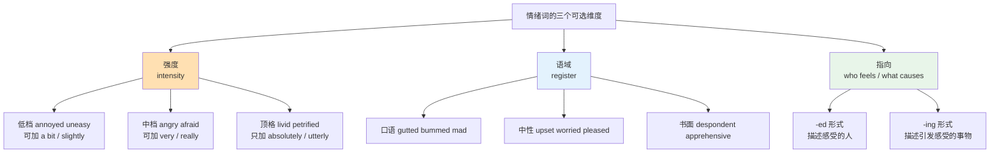
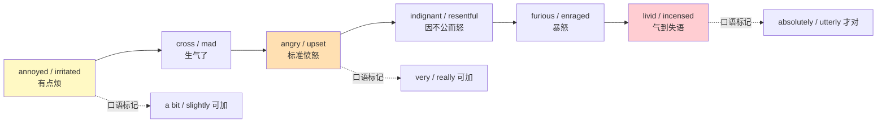
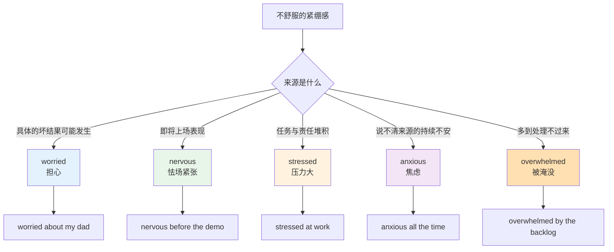
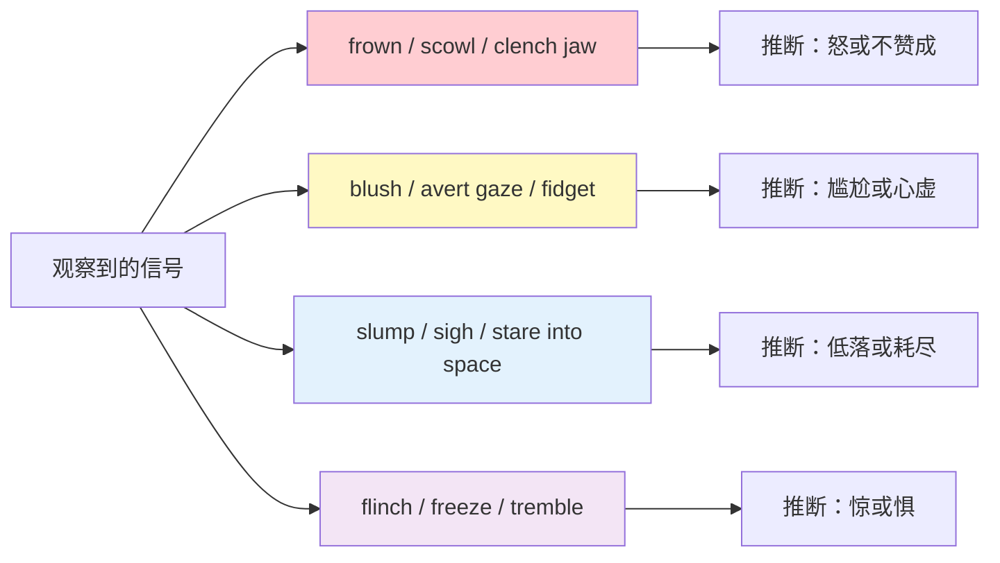
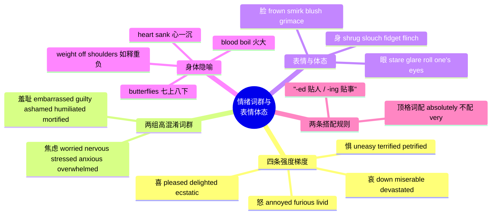

# 情绪梯度词群与表情体态

> [!info] 本篇定位
>
> 07 章的第四篇，也是这一章里唯一一篇不讲身体故障、只讲身体信号与内心状态的篇目。
>
> 上一篇 [[07.人体、健康与情绪/03.症状、疾病、就医科室与用药\|症状、疾病、就医科室与用药]] 处理的是「哪里不舒服、去哪个科」，本篇处理的是「感受有多强、脸上和身体表现成什么样」。两篇共用一套观察视角：先说得出程度，再说得出表现。
>
> 读完你会拿到四条按强度排好的情绪阶梯（喜、怒、哀、惧），两组高混淆词群（焦虑类、羞耻类）的分辨判据，一份表情与体态动词清单，以及一批以身体部位为喻体的固定表达。
>
> 本篇的选词逻辑贯穿三件事：这个词有多强、这个词用在书面还是口语、这个词描述的是感受者还是引发感受的事物。

---

## 1. 本篇导读：情绪词为什么必须按梯度记

中文里「生气」这个词可以从「有点不爽」一路盖到「暴跳如雷」，靠副词补足程度：有点生气、很生气、气死了。英语不是这样运作的——它把不同强度切成了不同的词，而且**强度高的词自带天花板**，再加副词反而不通。

这造成了两个方向的错误。

**方向一：只会中间档，说什么都是 angry / happy / sad。** 结果是读原版书时看到 `livid`、`elated`、`despondent` 全都只能笼统理解成「生气 / 高兴 / 难过」，作者精心挑的强度信息全部丢失。

**方向二：强弱不分，副词乱配。** 把「我非常愤怒」直译成 `I'm very furious`，母语者听着像「我非常很生气」。`furious` 本身已经在顶格，它接的是 `absolutely`、`utterly` 这类表示「完全到位」的副词，不接 `very`。

上图是本篇所有词表的排序依据。每张表里的词都按强度从上到下排，语域用「搭配与说明」列标注，指向问题集中在第 11 节处理。选一个情绪词时同时要过这三关：这个强度对不对、这个场合能不能用、这个形式指的是人还是事。

第四个隐含维度是**持续时间**。`angry` 描述一个瞬时状态，`bitter` 描述积攒多年的怨；`sad` 是当下难过，`melancholy` 是一种长期底色。中文里靠上下文区分，英语靠选词，这一点在各节的说明列里逐个标出。

---

## 2. 喜：从 pleased 到 ecstatic

### 2.1 低档与中档：满意、高兴

低档的「喜」在英语里往往不是强烈的正面情绪，而是「事情合意」。`pleased` 和 `content` 都属于这一档，但两者的着眼点不同：`pleased` 看的是某件具体的事有了好结果，`content` 看的是整体状态没有欠缺。

| 英文 | 英式音标 | 美式音标 | 词性 | 中文 | 搭配与说明 |
| --- | --- | --- | --- | --- | --- |
| **pleased** | /pliːzd/ | /pliːzd/ | adj. | 满意的；高兴的 | pleased with sth / pleased to do sth；比 happy 更克制 |
| **glad** | /ɡlæd/ | /ɡlæd/ | adj. | 高兴的 | 表「高兴」义时只作表语，不说 a glad person；glad that / glad to |
| **happy** | /ˈhæpi/ | /ˈhæpi/ | adj. | 快乐的 | 最中性的一档；happy with = 对某事满意 |
| **content** | /kənˈtent/ | /kənˈtent/ | adj. | 知足的；安于现状的 | 形容词重音在后；名词 content 重音在前，英 /ˈkɒntent/、美 /ˈkɑːntent/，义为「内容」 |
| **satisfied** | /ˈsætɪsfaɪd/ | /ˈsætɪsfaɪd/ | adj. | 满意的 | satisfied with；偏评价性，客服与问卷高频 |
| **cheerful** | /ˈtʃɪəfl/ | /ˈtʃɪrfl/ | adj. | 开朗的；愉快的 | 描述外显的样子，不是内心峰值 |
| **upbeat** | /ˈʌpbiːt/ | /ˈʌpbiːt/ | adj. | 乐观积极的 | 常修饰 mood、tone、message |
| **merry** | /ˈmeri/ | /ˈmeri/ | adj. | 欢乐的 | 现代日常英语里主要活在 Merry Christmas 与 make merry 中 |
| **joyful** | /ˈdʒɔɪfl/ | /ˈdʒɔɪfl/ | adj. | 欢欣的 | 书面、偏宗教与仪式语境 |
| **buoyant** | /ˈbɔɪənt/ | /ˈbuːjənt/ | adj. | 情绪高涨的；有浮力的 | 美音也常读 /ˈbɔɪənt/；财经语境指行情看涨 |

> [!warning] pleased 与 happy 不是同一档
>
> 中文的「我很高兴认识你」在英语里默认是 `Pleased to meet you.`，不是 `Happy to meet you.`。`pleased` 在社交场合是标准礼貌用语，`happy` 用在这里显得过于私人化。
>
> 反过来，「我对这份工作很满意」不能说成 `I'm happy about this job` 而丢掉了评价的意思，更准确的是 `I'm happy with this job` 或 `I'm satisfied with this job`。`with` 这个介词是「满意」义的标志。

### 2.2 高档：欣喜、狂喜

从 `delighted` 开始，词义进入明确的正向峰值区。这一档的词共同特点是**不接 very**。

| 英文 | 英式音标 | 美式音标 | 词性 | 中文 | 搭配与说明 |
| --- | --- | --- | --- | --- | --- |
| **delighted** | /dɪˈlaɪtɪd/ | /dɪˈlaɪtɪd/ | adj. | 非常高兴的 | 商务邮件的礼貌高档：delighted to announce |
| **thrilled** | /θrɪld/ | /θrɪld/ | adj. | 兴奋极了的 | thrilled to bits（英式口语）；thrilled about sth |
| **overjoyed** | /ˌəʊvəˈdʒɔɪd/ | /ˌoʊvərˈdʒɔɪd/ | adj. | 欣喜若狂的 | 用于人生大事，日常小事上用会显得夸张 |
| **elated** | /iˈleɪtɪd/ | /iˈleɪtɪd/ | adj. | 兴高采烈的 | 常与成绩、胜利搭配；书面偏多 |
| **ecstatic** | /ɪkˈstætɪk/ | /ɪkˈstætɪk/ | adj. | 狂喜的 | 顶格；ecstatic about / ecstatic at |
| **euphoric** | /juːˈfɒrɪk/ | /juːˈfɔːrɪk/ | adj. | 极度欣快的 | 带一点「不真实、会退潮」的暗示 |
| **jubilant** | /ˈdʒuːbɪlənt/ | /ˈdʒuːbɪlənt/ | adj. | 欢腾的 | 群体性欢庆，常写球迷、人群 |
| **exhilarated** | /ɪɡˈzɪləreɪtɪd/ | /ɪɡˈzɪləreɪtɪd/ | adj. | 兴奋振奋的 | 多由体力活动、速度、冒险引发 |
| **gleeful** | /ˈɡliːfl/ | /ˈɡliːfl/ | adj. | 幸灾乐祸般高兴的 | 常带贬义，暗示乐于看到别人吃亏 |
| **chuffed** | /tʃʌft/ | /tʃʌft/ | adj. | 挺得意的 | 纯英式口语，美式基本不用 |

> [!example] 同一件好消息的四种强度
>
> - I'm **pleased** the build finally passed.
>   - 构建终于通过了，我挺满意。（低档，就事论事）
> - I'm **happy** the build finally passed.
>   - 构建终于通过了，我很高兴。（中档，默认选项）
> - I'm **delighted** the build finally passed.
>   - 构建终于通过了，我非常高兴。（高档，也可用于正式书面）
> - I was **ecstatic** when the build finally passed.
>   - 构建通过的时候我简直乐疯了。（顶格，暗示此前折腾很久）

> [!tip] 商务邮件里 delighted 的位置
>
> `delighted` 是英文商务写作中「表达正面态度」的默认高档词，它比 `happy` 正式，又不像 `ecstatic` 那样失态。
>
> - We are **delighted** to announce the release of version 3.0.
>   - 我们很高兴宣布 3.0 版本发布。
> - I'd be **delighted** to join the call.
>   - 我很乐意参加这个会。
>
> 把这两句里的 `delighted` 换成 `happy` 不算错，但换成 `thrilled` 就偏口语了，换成 `ecstatic` 则明显失当。

---

## 3. 怒：从 annoyed 到 livid

### 3.1 六个档位

「怒」是英语梯度切得最细的一组，也是中文母语者最常压缩成一个 `angry` 的一组。

上图把「怒」排成六级。左端三级是可以叠加程度副词的可分级形容词，右端两级已经把强度写进了词义本身，再叠 `very` 就是语义重复。中间的 `indignant` / `resentful` 不是靠强度区分的，它们标注的是**怒的来源**——前者来自当下遭遇的不公，后者来自长期积压的委屈。

| 英文 | 英式音标 | 美式音标 | 词性 | 中文 | 搭配与说明 |
| --- | --- | --- | --- | --- | --- |
| **annoyed** | /əˈnɔɪd/ | /əˈnɔɪd/ | adj. | 恼火的 | annoyed at / with sb；annoyed about sth |
| **irritated** | /ˈɪrɪteɪtɪd/ | /ˈɪrɪteɪtɪd/ | adj. | 烦躁的 | 也指皮肤受刺激发炎，见上一篇症状表 |
| **peeved** | /piːvd/ | /piːvd/ | adj. | 不高兴的 | 口语；pet peeve = 让人特别受不了的小事 |
| **miffed** | /mɪft/ | /mɪft/ | adj. | 有点着恼的 | 口语，程度比 annoyed 还轻 |
| **cross** | /krɒs/ | /krɔːs/ | adj. | 生气的 | 英式口语，常用于对孩子说话 |
| **mad** | /mæd/ | /mæd/ | adj. | 生气的（美）；疯的（英） | mad at sb 是美式的「生某人气」 |
| **angry** | /ˈæŋɡri/ | /ˈæŋɡri/ | adj. | 生气的 | angry with sb / angry about sth；默认档 |
| **upset** | /ʌpˈset/ | /ʌpˈset/ | adj. | 心烦的；难过的 | 怒与哀的混合体，指向不明时的安全选项 |
| **indignant** | /ɪnˈdɪɡnənt/ | /ɪnˈdɪɡnənt/ | adj. | 义愤的 | 因受到不公正对待而怒，带道德正当性 |
| **resentful** | /rɪˈzentfl/ | /rɪˈzentfl/ | adj. | 忿忿不平的 | 长期积压型；名词 resentment |
| **exasperated** | /ɪɡˈzæspəreɪtɪd/ | /ɪɡˈzæspəreɪtɪd/ | adj. | 恼火到没辙的 | 重复受挫后的怒，带无力感 |
| **furious** | /ˈfjʊəriəs/ | /ˈfjʊriəs/ | adj. | 暴怒的 | 顶格常用词；furious with sb / at sth |
| **enraged** | /ɪnˈreɪdʒd/ | /ɪnˈreɪdʒd/ | adj. | 被激怒的 | 书面；强调有明确的激怒源 |
| **irate** | /aɪˈreɪt/ | /aɪˈreɪt/ | adj. | 愤怒的 | 新闻体，常写 irate customers |
| **incensed** | /ɪnˈsenst/ | /ɪnˈsenst/ | adj. | 被激怒的 | 书面，比 enraged 更正式 |
| **livid** | /ˈlɪvɪd/ | /ˈlɪvɪd/ | adj. | 气得脸色发青的 | 顶格口语；原义是「铅青色的」 |
| **outraged** | /ˈaʊtreɪdʒd/ | /ˈaʊtreɪdʒd/ | adj. | 义愤填膺的 | 群体性、公共事件语境高频 |
| **seething** | /ˈsiːðɪŋ/ | /ˈsiːðɪŋ/ | adj. | 憋着火的 | 强调怒在内部翻滚、表面还压着 |
| **fuming** | /ˈfjuːmɪŋ/ | /ˈfjuːmɪŋ/ | adj. | 冒火的 | 口语，画面感强；原义是「冒烟」 |

### 3.2 长期性的怒

上面几乎全是状态形容词，描述某一刻的情绪。还有一批词描述的是性格底色或长期态度，不能与状态词混用。

| 英文 | 英式音标 | 美式音标 | 词性 | 中文 | 搭配与说明 |
| --- | --- | --- | --- | --- | --- |
| **grumpy** | /ˈɡrʌmpi/ | /ˈɡrʌmpi/ | adj. | 脾气坏的；爱抱怨的 | 长期或半天的坏心情，不是一瞬间 |
| **irritable** | /ˈɪrɪtəbl/ | /ˈɪrɪtəbl/ | adj. | 易怒的 | -able 表倾向；对比 irritated 是当下状态 |
| **short-tempered** | /ˌʃɔːtˈtempəd/ | /ˌʃɔːrtˈtempərd/ | adj. | 脾气急的 | 同义 quick-tempered；反义 even-tempered |
| **bitter** | /ˈbɪtə/ | /ˈbɪtər/ | adj. | 心怀怨恨的 | 也指味觉的苦；bitter about sth |
| **hostile** | /ˈhɒstaɪl/ | /ˈhɑːstl/ | adj. | 有敌意的 | 英美读音差异明显；hostile to / towards |
| **spiteful** | /ˈspaɪtfl/ | /ˈspaɪtfl/ | adj. | 恶意的 | 带蓄意伤害的意思 |
| **wrath** | /rɒθ/ | /ræθ/ | n. | 震怒 | 英美元音不同；文学与宗教语域 |
| **rage** | /reɪdʒ/ | /reɪdʒ/ | n./v. | 狂怒；肆虐 | road rage 路怒；fly into a rage |
| **temper** | /ˈtempə/ | /ˈtempər/ | n. | 脾气 | lose one's temper 发火；keep one's temper 忍住 |
| **fury** | /ˈfjʊəri/ | /ˈfjʊri/ | n. | 暴怒 | in a fury；形容词即 furious |

> [!warning] mad 的英美分歧
>
> `mad` 在美式英语里第一义是「生气」，在英式英语里第一义是「疯的、发狂的」。
>
> - 美式：`Are you mad at me?` = 你在生我气吗？
> - 英式：`Are you mad?` = 你疯了吗？
>
> 跨英美的对话里想说「生气」，用 `angry` 或 `annoyed` 最安全。想说「疯」，英式还可以用 `crazy`、`bonkers`、`barmy`，其中 `crazy` 是两边通用的。
>
> 另有一个固定义：`mad about sth` = 极其喜欢某物，两边通用。`He's mad about jazz.` 是「他超级爱爵士乐」，不是生气。

---

## 4. 哀：从 down 到 devastated

### 4.1 三个档位

「哀」这一组的低档词大量是隐喻——`down`（向下）、`blue`（蓝色）、`low`（低），全部借空间或颜色表达情绪。这是英语情绪词的典型造词路径，第 10 节会集中处理。

| 英文 | 英式音标 | 美式音标 | 词性 | 中文 | 搭配与说明 |
| --- | --- | --- | --- | --- | --- |
| **down** | /daʊn/ | /daʊn/ | adj. | 情绪低落的 | feel down；口语最常用的低档词 |
| **low** | /ləʊ/ | /loʊ/ | adj. | 消沉的 | feel low；比 down 略书面 |
| **blue** | /bluː/ | /bluː/ | adj. | 忧郁的 | feel blue；略带文艺色彩 |
| **unhappy** | /ʌnˈhæpi/ | /ʌnˈhæpi/ | adj. | 不开心的 | unhappy with = 对某事不满，注意不只是难过 |
| **sad** | /sæd/ | /sæd/ | adj. | 难过的 | 默认档；sad about / sad that |
| **glum** | /ɡlʌm/ | /ɡlʌm/ | adj. | 阴郁的 | 强调表情写在脸上 |
| **gloomy** | /ˈɡluːmi/ | /ˈɡluːmi/ | adj. | 阴沉的；悲观的 | 既写人也写天气与前景 |
| **downcast** | /ˈdaʊnkɑːst/ | /ˈdaʊnkæst/ | adj. | 垂头丧气的 | 也指目光向下；英美元音不同 |
| **disappointed** | /ˌdɪsəˈpɔɪntɪd/ | /ˌdɪsəˈpɔɪntɪd/ | adj. | 失望的 | disappointed with sb / in sth / by sth |
| **dejected** | /dɪˈdʒektɪd/ | /dɪˈdʒektɪd/ | adj. | 沮丧的 | 书面；常写比赛输掉后的样子 |
| **despondent** | /dɪˈspɒndənt/ | /dɪˈspɑːndənt/ | adj. | 意志消沉的 | 书面高档；暗示看不到出路 |
| **melancholy** | /ˈmelənkəli/ | /ˈmelənkɑːli/ | adj./n. | 忧郁的；忧郁 | 长期底色，不是一时难过；文学语域 |
| **miserable** | /ˈmɪzrəbl/ | /ˈmɪzrəbl/ | adj. | 痛苦的；难受的 | 也可形容天气与处境糟糕 |
| **wretched** | /ˈretʃɪd/ | /ˈretʃɪd/ | adj. | 凄惨的 | 注意 -ed 读 /ɪd/；书面且强烈 |
| **heartbroken** | /ˈhɑːtbrəʊkən/ | /ˈhɑːrtbroʊkən/ | adj. | 心碎的 | 多用于失去至亲、感情破裂 |
| **devastated** | /ˈdevəsteɪtɪd/ | /ˈdevəsteɪtɪd/ | adj. | 被击垮的 | 顶格；也形容地区被摧毁 |
| **inconsolable** | /ˌɪnkənˈsəʊləbl/ | /ˌɪnkənˈsoʊləbl/ | adj. | 无法安慰的 | 顶格书面 |
| **crestfallen** | /ˈkrestfɔːlən/ | /ˈkrestfɔːlən/ | adj. | 垂头丧气的 | 原义是「鸡冠耷拉下来」 |

### 4.2 哀伤的名词与动词

情绪的名词形式在书面表达里比形容词更常用，尤其是叙述他人经历时。

| 英文 | 英式音标 | 美式音标 | 词性 | 中文 | 搭配与说明 |
| --- | --- | --- | --- | --- | --- |
| **sadness** | /ˈsædnəs/ | /ˈsædnəs/ | n. | 悲伤 | 最中性的名词形式 |
| **sorrow** | /ˈsɒrəʊ/ | /ˈsɔːroʊ/ | n. | 悲痛 | 书面；比 sadness 重且正式 |
| **grief** | /ɡriːf/ | /ɡriːf/ | n. | 哀恸 | 专指丧亲之痛；the five stages of grief |
| **grieve** | /ɡriːv/ | /ɡriːv/ | v. | 哀悼；悲痛 | grieve for sb；grieve over sth |
| **mourn** | /mɔːn/ | /mɔːrn/ | v. | 悼念 | 侧重外在的哀悼行为；mourning 服丧 |
| **bereaved** | /bɪˈriːvd/ | /bɪˈriːvd/ | adj. | 丧失亲人的 | the bereaved = 死者家属，正式讣告用语 |
| **despair** | /dɪˈspeə/ | /dɪˈsper/ | n./v. | 绝望 | in despair；despair of ever doing sth |
| **misery** | /ˈmɪzəri/ | /ˈmɪzəri/ | n. | 苦难；痛苦 | put sb out of their misery 让人别再煎熬 |
| **homesick** | /ˈhəʊmsɪk/ | /ˈhoʊmsɪk/ | adj. | 想家的 | 名词 homesickness |
| **nostalgic** | /nɒˈstældʒɪk/ | /nɑːˈstældʒɪk/ | adj. | 怀旧的 | nostalgic about the 90s；名词 nostalgia |
| **wistful** | /ˈwɪstfl/ | /ˈwɪstfl/ | adj. | 惆怅的 | 带向往的淡淡遗憾 |
| **gutted** | /ˈɡʌtɪd/ | /ˈɡʌtɪd/ | adj. | 极度失望的 | 纯英式口语，程度接近 devastated |
| **bummed** | /bʌmd/ | /bʌmd/ | adj. | 郁闷的 | 美式口语；bummed out 同义 |

> [!warning] upset 是最容易被误判的一个词
>
> `upset` 在中文里常被简化成「难过」，但它实际覆盖的是「怒 + 哀 + 慌」的混合区，具体是哪一种要看上下文。
>
> - She was **upset** that nobody told her.
>   - 没人告诉她，她很不舒服。（偏怒与委屈）
> - Don't be **upset** — it's only a test.
>   - 别难过，只是个测试。（偏哀）
> - My stomach is **upset**.
>   - 我肚子不舒服。（生理义，与情绪无关）
>
> 正因为指向模糊，它是**不确定对方是气还是伤心时最安全的词**。安慰人时说 `I can see you're upset` 几乎不会踩雷，说 `I can see you're angry` 则可能激化。

---

## 5. 惧：从 uneasy 到 petrified

### 5.1 四个档位

「惧」这一组的英语切分依据是**恐惧的对象是否明确**。低档的 `uneasy`、`apprehensive` 指向模糊的不安，中高档的 `scared`、`terrified` 指向具体威胁。

| 英文 | 英式音标 | 美式音标 | 词性 | 中文 | 搭配与说明 |
| --- | --- | --- | --- | --- | --- |
| **uneasy** | /ʌnˈiːzi/ | /ʌnˈiːzi/ | adj. | 不安的 | uneasy about sth；说不清哪里不对劲 |
| **wary** | /ˈweəri/ | /ˈweri/ | adj. | 警惕的 | wary of sth；理性防备，不是情绪失控 |
| **apprehensive** | /ˌæprɪˈhensɪv/ | /ˌæprɪˈhensɪv/ | adj. | 忧虑的 | 书面；apprehensive about 即将发生的事 |
| **nervous** | /ˈnɜːvəs/ | /ˈnɜːrvəs/ | adj. | 紧张的 | nervous about；面试演讲的标准词 |
| **timid** | /ˈtɪmɪd/ | /ˈtɪmɪd/ | adj. | 胆小的 | 性格特征，不是一时状态 |
| **afraid** | /əˈfreɪd/ | /əˈfreɪd/ | adj. | 害怕的 | 只作表语；afraid of sth / afraid to do |
| **scared** | /skeəd/ | /skerd/ | adj. | 吓到的 | 口语默认档；scared of / scared to death |
| **frightened** | /ˈfraɪtnd/ | /ˈfraɪtnd/ | adj. | 受惊的 | 比 scared 略书面；frightened of |
| **alarmed** | /əˈlɑːmd/ | /əˈlɑːrmd/ | adj. | 警觉不安的 | 突然察觉出事时的反应 |
| **spooked** | /spuːkt/ | /spuːkt/ | adj. | 被吓着的 | 口语；也用于市场「受惊下跌」 |
| **jumpy** | /ˈdʒʌmpi/ | /ˈdʒʌmpi/ | adj. | 神经过敏的 | 一惊一乍，持续状态 |
| **paranoid** | /ˈpærənɔɪd/ | /ˈpærənɔɪd/ | adj. | 疑神疑鬼的 | 口语已泛化，不一定是临床义 |
| **terrified** | /ˈterɪfaɪd/ | /ˈterɪfaɪd/ | adj. | 极度恐惧的 | 顶格常用；terrified of |
| **horrified** | /ˈhɒrɪfaɪd/ | /ˈhɔːrɪfaɪd/ | adj. | 惊骇的 | 恐惧混着厌恶，多因目睹惨状 |
| **petrified** | /ˈpetrɪfaɪd/ | /ˈpetrɪfaɪd/ | adj. | 吓呆的 | 顶格；原义是「石化」，强调不能动 |
| **panic-stricken** | /ˈpænɪk ˌstrɪkən/ | /ˈpænɪk ˌstrɪkən/ | adj. | 惊慌失措的 | 书面；同构还有 grief-stricken |

### 5.2 恐惧的名词与相关词

| 英文 | 英式音标 | 美式音标 | 词性 | 中文 | 搭配与说明 |
| --- | --- | --- | --- | --- | --- |
| **fear** | /fɪə/ | /fɪr/ | n./v. | 恐惧；害怕 | for fear of doing sth 唯恐 |
| **fright** | /fraɪt/ | /fraɪt/ | n. | 惊吓 | give sb a fright 吓某人一跳 |
| **terror** | /ˈterə/ | /ˈterər/ | n. | 恐怖 | in terror；派生 terrorism |
| **horror** | /ˈhɒrə/ | /ˈhɔːrər/ | n. | 惊骇；恐怖片 | horror film；to my horror 令我惊骇的是 |
| **dread** | /dred/ | /dred/ | n./v. | 畏惧 | 对将要发生的事的持续畏惧；dread doing sth |
| **phobia** | /ˈfəʊbiə/ | /ˈfoʊbiə/ | n. | 恐惧症 | 构词后缀 -phobia，见 15 章词根篇 |
| **panic** | /ˈpænɪk/ | /ˈpænɪk/ | n./v. | 惊慌 | 动词变形 panicked / panicking，加 k |
| **eerie** | /ˈɪəri/ | /ˈɪri/ | adj. | 阴森的 | 描述环境，不描述人 |
| **creepy** | /ˈkriːpi/ | /ˈkriːpi/ | adj. | 令人发毛的 | 描述人或事物，不描述感受者 |
| **spine-chilling** | /ˈspaɪn ˌtʃɪlɪŋ/ | /ˈspaɪn ˌtʃɪlɪŋ/ | adj. | 令人脊背发凉的 | 影评常用；也说 blood-curdling |

> [!warning] afraid 的三种含义不能混
>
> `afraid` 有三个常见用法，中文对应完全不同。
>
> - I'm **afraid of** spiders. — 我怕蜘蛛。（真实恐惧）
> - I'm **afraid to** ask. — 我不敢问。（因害怕而不做）
> - I'm **afraid** we're out of stock. — 抱歉，我们缺货了。（礼貌地传达坏消息，没有任何恐惧义）
>
> 第三个用法在客服与商务场合频率极高，`I'm afraid` 相当于中文的「不好意思，恐怕……」。把它理解成「我害怕」会完全读错语气。

---

## 6. 焦虑词群：担心、压力、崩溃

焦虑与第 5 节的恐惧最大的差别是：恐惧有对象，焦虑往往没有，或者对象是「未来的不确定」。中文母语者最常犯的错是把 `worried`、`anxious`、`nervous`、`stressed` 四个词当成同义词换着用。它们各自对应的触发条件是不同的。

上图的分叉条件就是选词依据。`worried` 后面必须能补出「担心什么」；`nervous` 挂在一个即将到来的表现场合上；`stressed` 挂在负荷上；`anxious` 可以没有宾语，单独成立；`overwhelmed` 强调的是量而不是难度。四个词描述的生理感受可能相同，但说出来传达的信息完全不同。

| 英文 | 英式音标 | 美式音标 | 词性 | 中文 | 搭配与说明 |
| --- | --- | --- | --- | --- | --- |
| **worried** | /ˈwʌrid/ | /ˈwɜːrid/ | adj. | 担心的 | 英美元音差异明显；worried about sb/sth |
| **worry** | /ˈwʌri/ | /ˈwɜːri/ | v./n. | 担心；忧虑 | worry about；Don't worry 是最高频安慰语 |
| **concerned** | /kənˈsɜːnd/ | /kənˈsɜːrnd/ | adj. | 关切的；忧虑的 | 比 worried 正式；concerned about |
| **anxious** | /ˈæŋkʃəs/ | /ˈæŋkʃəs/ | adj. | 焦虑的 | 注意 x 读 /kʃ/；anxious about |
| **anxiety** | /æŋˈzaɪəti/ | /æŋˈzaɪəti/ | n. | 焦虑 | 名词的 x 浊化并把重音让给第二音节，与形容词完全不同 |
| **nervous** | /ˈnɜːvəs/ | /ˈnɜːrvəs/ | adj. | 紧张的 | nervous about the interview |
| **tense** | /tens/ | /tens/ | adj. | 绷紧的 | 既写人也写气氛；a tense meeting |
| **stressed** | /strest/ | /strest/ | adj. | 有压力的 | stressed out 是口语加强版 |
| **stress** | /stres/ | /stres/ | n./v. | 压力；强调 | under stress；stress that 强调某事 |
| **pressure** | /ˈpreʃə/ | /ˈpreʃər/ | n. | 压力 | under pressure；注意与 stress 的分工 |
| **overwhelmed** | /ˌəʊvəˈwelmd/ | /ˌoʊvərˈwelmd/ | adj. | 应接不暇的 | overwhelmed by / with |
| **swamped** | /swɒmpt/ | /swɑːmpt/ | adj. | 被活儿淹了的 | 口语；swamped with work |
| **burnt out** | /ˌbɜːnt ˈaʊt/ | /ˌbɜːrnt ˈaʊt/ | adj. | 精疲力竭的 | 美式多拼 burned out；名词 burnout；长期耗竭，不是一天的累 |
| **frazzled** | /ˈfræzld/ | /ˈfræzld/ | adj. | 心力交瘁的 | 口语，形象是「烧焦磨破」 |
| **on edge** | /ɒn ˈedʒ/ | /ɑːn ˈedʒ/ | adj. | 心神不宁的 | 固定搭配，不说 on the edge 表此义 |
| **edgy** | /ˈedʒi/ | /ˈedʒi/ | adj. | 烦躁不安的 | 另有「前卫大胆」的褒义，看语境 |
| **jittery** | /ˈdʒɪtəri/ | /ˈdʒɪtəri/ | adj. | 神经紧张的 | 常写咖啡因过量或市场情绪 |
| **antsy** | /ˈæntsi/ | /ˈæntsi/ | adj. | 坐不住的 | 美式口语，字面「像有蚂蚁」 |
| **restless** | /ˈrestləs/ | /ˈrestləs/ | adj. | 静不下来的 | 也指睡眠不安稳 |
| **agitated** | /ˈædʒɪteɪtɪd/ | /ˈædʒɪteɪtɪd/ | adj. | 激动不安的 | 书面偏医疗语境 |
| **uptight** | /ˌʌpˈtaɪt/ | /ˌʌpˈtaɪt/ | adj. | 拘谨紧张的 | 带贬义，暗示对方过分较真 |
| **fret** | /fret/ | /fret/ | v. | 焦躁；发愁 | fret about / over；书面略旧 |
| **panic attack** | /ˈpænɪk əˌtæk/ | /ˈpænɪk əˌtæk/ | n. | 惊恐发作 | have a panic attack；临床术语已进日常 |

> [!warning] anxious 的两副面孔
>
> `anxious` 的形容词与名词发音不一样，这是英语里少见的同族词读音断层：
>
> - **anxious** /ˈæŋkʃəs/ — 字母 x 落成清辅音串 /kʃ/，重音在第一音节
> - **anxiety** /æŋˈzaɪəti/ — 字母 x 浊化成 /ŋz/ 的 /z/，重音后移到第二音节
>
> 另有一个语义陷阱：`anxious to do sth` 在书面语里表示「急切想做某事」，是正面的。
>
> - I'm **anxious to** get started. — 我急着想开始。（不是「我焦虑地开始」）
> - I'm **anxious about** starting. — 我对开始这件事很焦虑。
>
> 介词决定意思：`about` 是焦虑，`to do` 是急切。

> [!tip] stress 与 pressure 的分工
>
> 这两个词中文都译「压力」，但英语里一个在内一个在外。
>
> - **pressure** 是外部施加的：`pressure from management`（管理层给的压力）、`under pressure to deliver`（有交付压力）。
> - **stress** 是内部产生的反应：`work-related stress`（工作导致的压力状态）、`stress levels`（压力水平）。
>
> 所以「上级给我很大压力」是 `My boss puts a lot of pressure on me`，而「我压力很大」是 `I'm under a lot of stress` 或 `I'm really stressed`。把两者对调会显得别扭。

---

## 7. 羞耻词群：尴尬、惭愧、屈辱

这一组是本篇误用率最高的。中文的「不好意思」「难为情」「丢人」在英语里被切成了至少五个词，切分依据是**做错了什么、被谁看见、后果有多重**。

| 触发条件 | 对应词 | 严重度 | 典型场景 |
| --- | --- | --- | --- |
| 没做错事，只是被看到出丑 | embarrassed · awkward · self-conscious · sheepish | 轻 | 叫错名字、裤子开线、当众摔倒 |
| 做了违背自己标准的事 | guilty · ashamed · remorseful · contrite | 中到重 | 骗人、失约、把责任推给同事 |
| 被他人当众贬低 | humiliated · mortified · disgraced | 重 | 会上被点名批评、丑闻曝光 |

第二行的两个词最容易混。`guilty` 和 `ashamed` 都涉及道德，但 `guilty` 指向**行为**（我做了一件不该做的事），`ashamed` 指向**自我**（我这个人不像样）。所以工作日摸鱼一下午是 `I feel guilty`，把家人的秘密当笑话讲出去才是 `I'm ashamed of myself`。第一行与第三行的分界则在于有没有观众加上贬低意图：同一件出丑的事，自己觉得难堪是 `embarrassed`，被人拿来当众取笑就升级成 `humiliated`。

| 英文 | 英式音标 | 美式音标 | 词性 | 中文 | 搭配与说明 |
| --- | --- | --- | --- | --- | --- |
| **embarrassed** | /ɪmˈbærəst/ | /ɪmˈbærəst/ | adj. | 尴尬的 | 注意双 r 双 s 的拼写；embarrassed about |
| **embarrassing** | /ɪmˈbærəsɪŋ/ | /ɪmˈbærəsɪŋ/ | adj. | 令人尴尬的 | 描述事，不描述人 |
| **awkward** | /ˈɔːkwəd/ | /ˈɔːkwərd/ | adj. | 别扭的；笨拙的 | an awkward silence 尴尬的沉默 |
| **self-conscious** | /ˌself ˈkɒnʃəs/ | /ˌself ˈkɑːnʃəs/ | adj. | 不自在的 | 因觉得被注视而拘束，与「自觉」无关 |
| **shy** | /ʃaɪ/ | /ʃaɪ/ | adj. | 害羞的 | 性格特征；camera-shy 怕上镜 |
| **bashful** | /ˈbæʃfl/ | /ˈbæʃfl/ | adj. | 腼腆的 | 略旧，多用于孩子 |
| **sheepish** | /ˈʃiːpɪʃ/ | /ˈʃiːpɪʃ/ | adj. | 讪讪的 | 做错小事被抓包时的表情；a sheepish grin |
| **abashed** | /əˈbæʃt/ | /əˈbæʃt/ | adj. | 局促的 | 书面；否定式 unabashed 更常见 |
| **guilty** | /ˈɡɪlti/ | /ˈɡɪlti/ | adj. | 内疚的；有罪的 | feel guilty about；法律义见 19 章 |
| **guilt** | /ɡɪlt/ | /ɡɪlt/ | n. | 内疚；罪责 | guilt trip 让人内疚的话术 |
| **ashamed** | /əˈʃeɪmd/ | /əˈʃeɪmd/ | adj. | 羞愧的 | 只作表语；ashamed of sb/sth |
| **shame** | /ʃeɪm/ | /ʃeɪm/ | n. | 羞耻；遗憾 | What a shame! = 真可惜，不是「真丢人」 |
| **shameful** | /ˈʃeɪmfl/ | /ˈʃeɪmfl/ | adj. | 可耻的 | 评价行为；对比 shameless 无耻的 |
| **remorse** | /rɪˈmɔːs/ | /rɪˈmɔːrs/ | n. | 悔恨 | show remorse；法庭与新闻高频 |
| **remorseful** | /rɪˈmɔːsfl/ | /rɪˈmɔːrsfl/ | adj. | 懊悔的 | 比 sorry 重得多 |
| **regret** | /rɪˈɡret/ | /rɪˈɡret/ | v./n. | 后悔；遗憾 | regret doing 后悔做过；regret to say 遗憾地说 |
| **contrite** | /kənˈtraɪt/ | /kənˈtraɪt/ | adj. | 痛悔的 | 书面高档，宗教色彩 |
| **humiliated** | /hjuːˈmɪlieɪtɪd/ | /hjuːˈmɪlieɪtɪd/ | adj. | 受辱的 | 强调被他人当众贬低 |
| **humiliation** | /hjuːˌmɪliˈeɪʃn/ | /hjuːˌmɪliˈeɪʃn/ | n. | 屈辱 | a public humiliation |
| **mortified** | /ˈmɔːtɪfaɪd/ | /ˈmɔːrtɪfaɪd/ | adj. | 无地自容的 | 顶格；比 embarrassed 强得多 |
| **disgraced** | /dɪsˈɡreɪst/ | /dɪsˈɡreɪst/ | adj. | 名誉扫地的 | 常作定语：the disgraced official |
| **cringe** | /krɪndʒ/ | /krɪndʒ/ | v./n. | 尴尬得缩起来 | cringe at sth；网络义「太尬了」 |
| **cringeworthy** | /ˈkrɪndʒwɜːði/ | /ˈkrɪndʒwɜːrði/ | adj. | 尴尬到看不下去的 | 描述内容，不描述人 |

> [!warning] embarrassed 与 ashamed 是两件事
>
> 中文都能说「不好意思」，英语必须分开。
>
> - ❌ ~~I'm ashamed — I forgot your name.~~（忘名字不涉及道德，用 ashamed 太重）
> - ✅ **I'm embarrassed** — I forgot your name.
> - ❌ ~~I'm embarrassed that I lied to her.~~（撒谎涉及道德，embarrassed 太轻）
> - ✅ **I'm ashamed** that I lied to her.
>
> 判据是：只是丢面子用 `embarrassed`，良心不安用 `ashamed` 或 `guilty`。

> [!warning] shame 不等于「丢人」
>
> 单独一个 `shame` 在口语里最常见的用法是表示惋惜，与羞耻无关。
>
> - It's a **shame** you can't come. — 你来不了真可惜。
> - What a **shame**! — 太遗憾了！
> - **Shame on you.** — 你真该羞愧。（这一句才是羞耻义）
>
> 前两句里如果理解成「丢脸」，整句意思就反了。区分标志是 `a shame` / `what a shame` 这种带冠词的结构固定表遗憾。

---

## 8. 表情动词：脸上发生了什么

情绪在书面英语里往往不是直接说出来的，而是通过一个表情动词交代。读原版书时这类词的密度远高于形容词，是阅读的实际瓶颈。

### 8.1 嘴与眉的动作

| 英文 | 英式音标 | 美式音标 | 词性 | 中文 | 搭配与说明 |
| --- | --- | --- | --- | --- | --- |
| **smile** | /smaɪl/ | /smaɪl/ | v./n. | 微笑 | smile at sb；中性默认 |
| **grin** | /ɡrɪn/ | /ɡrɪn/ | v./n. | 咧嘴笑 | 露齿的大笑容；grin from ear to ear |
| **beam** | /biːm/ | /biːm/ | v. | 眉开眼笑 | 强调整张脸发亮；也指光束、横梁 |
| **smirk** | /smɜːk/ | /smɜːrk/ | v./n. | 得意地坏笑 | 带贬义，暗示自满或幸灾乐祸 |
| **sneer** | /snɪə/ | /snɪr/ | v./n. | 讥笑 | 嘴角上扬的轻蔑；sneer at sb |
| **smile wryly** | /smaɪl ˈraɪli/ | /smaɪl ˈraɪli/ | phr. | 苦笑 | wry /raɪ/ 意为「揶揄自嘲的」 |
| **frown** | /fraʊn/ | /fraʊn/ | v./n. | 皱眉 | frown at sb；frown on sth = 不赞成 |
| **scowl** | /skaʊl/ | /skaʊl/ | v./n. | 怒目而视地皱眉 | 比 frown 带更多敌意 |
| **glower** | /ˈɡlaʊə/ | /ˈɡlaʊər/ | v. | 沉着脸瞪 | 书面，比 scowl 更文学 |
| **grimace** | /ɡrɪˈmeɪs/ | /ˈɡrɪməs/ | v./n. | 做痛苦鬼脸 | 英美重音位置不同，是常见听力障碍 |
| **wince** | /wɪns/ | /wɪns/ | v. | 疼得一缩 | 瞬间动作；wince at the sound |
| **pout** | /paʊt/ | /paʊt/ | v. | 撅嘴 | 表示不满或撒娇 |
| **purse one's lips** | /pɜːs wʌnz ˈlɪps/ | /pɜːrs wʌnz ˈlɪps/ | phr. | 抿紧嘴唇 | 表示不认同却不说出口 |
| **bite one's lip** | /baɪt wʌnz ˈlɪp/ | /baɪt wʌnz ˈlɪp/ | phr. | 咬住嘴唇 | 忍住不说话或忍住情绪 |
| **grit one's teeth** | /ɡrɪt wʌnz ˈtiːθ/ | /ɡrɪt wʌnz ˈtiːθ/ | phr. | 咬紧牙关 | 忍痛或强撑 |
| **clench one's jaw** | /klentʃ wʌnz ˈdʒɔː/ | /klentʃ wʌnz ˈdʒɔː/ | phr. | 咬紧下颌 | 压住怒气的典型描写 |
| **yawn** | /jɔːn/ | /jɔːn/ | v./n. | 打哈欠 | 也喻指「无聊透顶」 |

### 8.2 眼睛的动作

| 英文 | 英式音标 | 美式音标 | 词性 | 中文 | 搭配与说明 |
| --- | --- | --- | --- | --- | --- |
| **stare** | /steə/ | /ster/ | v. | 盯着看 | stare at；长时间不移开，可能失礼 |
| **glare** | /ɡleə/ | /ɡler/ | v. | 怒视 | glare at；比 stare 多一层敌意 |
| **glance** | /ɡlɑːns/ | /ɡlæns/ | v./n. | 瞥一眼 | glance at；英美元音不同 |
| **peek** | /piːk/ | /piːk/ | v. | 偷看 | peek at；同音异形词 peak 山峰、pique 恼怒 |
| **squint** | /skwɪnt/ | /skwɪnt/ | v. | 眯眼看 | 光太强或看不清时 |
| **blink** | /blɪŋk/ | /blɪŋk/ | v. | 眨眼 | didn't even blink 面不改色 |
| **wink** | /wɪŋk/ | /wɪŋk/ | v. | 使眼色 | 单眼；表示心照不宣 |
| **roll one's eyes** | /rəʊl wʌnz ˈaɪz/ | /roʊl wʌnz ˈaɪz/ | phr. | 翻白眼 | 表示不耐烦或觉得对方荒唐 |
| **avert one's gaze** | /əˈvɜːt wʌnz ˈɡeɪz/ | /əˈvɜːrt wʌnz ˈɡeɪz/ | phr. | 移开视线 | 书面；口语说 look away |
| **well up** | /wel ˈʌp/ | /wel ˈʌp/ | phr.v. | 眼里涌出泪水 | her eyes welled up |
| **tear up** | /ˈtɪər ʌp/ | /ˈtɪr ʌp/ | phr.v. | 眼眶湿润 | 注意与 tear /teə/「撕」同形不同音 |
| **raise an eyebrow** | /reɪz ən ˈaɪbraʊ/ | /reɪz ən ˈaɪbraʊ/ | phr. | 挑眉 | 表示惊讶或怀疑 |

### 8.3 脸色与出声反应

| 英文 | 英式音标 | 美式音标 | 词性 | 中文 | 搭配与说明 |
| --- | --- | --- | --- | --- | --- |
| **blush** | /blʌʃ/ | /blʌʃ/ | v./n. | 脸红 | 尴尬或害羞导致；也指腮红 |
| **flush** | /flʌʃ/ | /flʌʃ/ | v./n. | 涨红脸 | 生气、发烧、运动都可致；也指冲水 |
| **go pale** | /ɡəʊ ˈpeɪl/ | /ɡoʊ ˈpeɪl/ | phr. | 脸色发白 | 受惊或不适 |
| **blanch** | /blɑːntʃ/ | /blæntʃ/ | v. | 脸色骤白 | 书面；烹饪义为「焯水」 |
| **sigh** | /saɪ/ | /saɪ/ | v./n. | 叹气 | 拼写有 gh 但不发音；a sigh of relief |
| **gasp** | /ɡɑːsp/ | /ɡæsp/ | v./n. | 倒抽一口气 | 震惊或喘不上气；gasp for air |
| **groan** | /ɡrəʊn/ | /ɡroʊn/ | v./n. | 呻吟；哀叹 | 因痛苦或厌烦发出的低沉声 |
| **moan** | /məʊn/ | /moʊn/ | v./n. | 呻吟；抱怨 | 英式口语里「抱怨」义很常用 |
| **snort** | /snɔːt/ | /snɔːrt/ | v. | 从鼻子里哼一声 | 表示不屑或忍笑 |
| **scoff** | /skɒf/ | /skɑːf/ | v. | 嗤之以鼻 | scoff at sth；也有「狼吞虎咽」义 |
| **chuckle** | /ˈtʃʌkl/ | /ˈtʃʌkl/ | v./n. | 轻声笑 | 自己觉得好笑的低笑 |
| **giggle** | /ˈɡɪɡl/ | /ˈɡɪɡl/ | v./n. | 咯咯笑 | 忍不住的短促笑声 |
| **snigger** | /ˈsnɪɡə/ | /ˈsnɪɡər/ | v. | 窃笑 | 英式主用形；带轻蔑或不怀好意 |
| **snicker** | /ˈsnɪkə/ | /ˈsnɪkər/ | v. | 窃笑 | 美式主用形，与 snigger 同义 |
| **sob** | /sɒb/ | /sɑːb/ | v./n. | 抽泣 | 有声、断续；sob story 卖惨故事 |
| **weep** | /wiːp/ | /wiːp/ | v. | 流泪 | 书面；不规则变化 weep-wept-wept |
| **whimper** | /ˈwɪmpə/ | /ˈwɪmpər/ | v. | 呜咽 | 声音很小，常写孩子或动物 |
| **choke up** | /tʃəʊk ˈʌp/ | /tʃoʊk ˈʌp/ | phr.v. | 哽咽 | 说话被情绪堵住 |
| **break down** | /breɪk ˈdaʊn/ | /breɪk ˈdaʊn/ | phr.v. | 情绪崩溃 | 也指机器故障、数据分解 |

> [!example] 表情动词替代形容词的效果
>
> - He was angry. → He **scowled** at the screen and **clenched his jaw**.
>   - 他很生气。→ 他冲着屏幕沉着脸，咬紧了牙关。
> - She was embarrassed. → She **blushed** and looked at her shoes.
>   - 她很尴尬。→ 她脸红了，低头看自己的鞋。
> - I was in pain. → I **winced** and **grimaced**.
>   - 我很疼。→ 我一缩，做出痛苦的表情。
>
> 三组对照的区别不是难度，而是信息量。左边只给出结论，右边给出可观察的证据。写作里这是从「说」到「显示」的最省力手段。

---

## 9. 体态动词：身体在说什么

体态是比表情更难藏的信号。这一组词在小说、剧本、面试与谈判类内容里出现密度极高。

### 9.1 姿态与移动

| 英文 | 英式音标 | 美式音标 | 词性 | 中文 | 搭配与说明 |
| --- | --- | --- | --- | --- | --- |
| **shrug** | /ʃrʌɡ/ | /ʃrʌɡ/ | v./n. | 耸肩 | 表示不知道或不在乎；shrug sth off 不当回事 |
| **nod** | /nɒd/ | /nɑːd/ | v./n. | 点头 | nod in agreement；nod off 打瞌睡 |
| **shake one's head** | /ʃeɪk wʌnz ˈhed/ | /ʃeɪk wʌnz ˈhed/ | phr. | 摇头 | 中间的 one's 不能省，不说 shake head |
| **slouch** | /slaʊtʃ/ | /slaʊtʃ/ | v. | 懒散地弓着身 | 坐姿或站姿都可 |
| **slump** | /slʌmp/ | /slʌmp/ | v./n. | 瘫坐下去 | slump into a chair；也指经济下滑 |
| **hunch** | /hʌntʃ/ | /hʌntʃ/ | v./n. | 弓背；预感 | hunch over a keyboard 伏在键盘上 |
| **stoop** | /stuːp/ | /stuːp/ | v. | 弯腰；驼背 | stoop to doing sth 堕落到做某事 |
| **straighten up** | /ˈstreɪtn ʌp/ | /ˈstreɪtn ʌp/ | phr.v. | 挺直身子 | 也指收拾整理 |
| **lean in** | /liːn ˈɪn/ | /liːn ˈɪn/ | phr.v. | 身体前倾 | 表示投入；lean back 表示疏离 |
| **fold one's arms** | /fəʊld wʌnz ˈɑːmz/ | /foʊld wʌnz ˈɑːrmz/ | phr. | 抱臂 | 常被解读为防御姿态 |
| **clench one's fists** | /klentʃ wʌnz ˈfɪsts/ | /klentʃ wʌnz ˈfɪsts/ | phr. | 攥紧拳头 | 压抑的怒或紧张 |
| **fidget** | /ˈfɪdʒɪt/ | /ˈfɪdʒɪt/ | v. | 坐立不安地小动作 | fidget with a pen 手里不停摆弄笔 |
| **squirm** | /skwɜːm/ | /skwɜːrm/ | v. | 扭动；尴尬到坐不住 | squirm in one's seat |
| **pace** | /peɪs/ | /peɪs/ | v./n. | 来回踱步 | pace up and down；也指速度、步伐 |
| **stomp** | /stɒmp/ | /stɑːmp/ | v. | 跺着脚走 | stomp off 气冲冲走掉 |
| **storm off** | /stɔːm ˈɒf/ | /stɔːrm ˈɔːf/ | phr.v. | 怒气冲冲地离开 | 常与 slam the door 连用 |
| **slam** | /slæm/ | /slæm/ | v. | 摔（门）；猛击 | slam the door；也指媒体猛批 |

### 9.2 不自主反应

| 英文 | 英式音标 | 美式音标 | 词性 | 中文 | 搭配与说明 |
| --- | --- | --- | --- | --- | --- |
| **flinch** | /flɪntʃ/ | /flɪntʃ/ | v. | 畏缩一下 | 瞬间；without flinching 眉头都不皱 |
| **recoil** | /rɪˈkɔɪl/ | /rɪˈkɔɪl/ | v. | 后退躲开 | recoil in horror；也指枪支后坐 |
| **freeze** | /friːz/ | /friːz/ | v. | 僵住 | 恐惧的三种本能之一；freeze-froze-frozen |
| **stiffen** | /ˈstɪfn/ | /ˈstɪfn/ | v. | 身体绷紧 | 察觉不对时的第一反应 |
| **tremble** | /ˈtrembl/ | /ˈtrembl/ | v. | 发抖 | 恐惧、寒冷、虚弱都可致 |
| **shiver** | /ˈʃɪvə/ | /ˈʃɪvər/ | v./n. | 打寒战 | 多因冷；send shivers down one's spine |
| **shudder** | /ˈʃʌdə/ | /ˈʃʌdər/ | v./n. | 打冷战；不寒而栗 | 多因厌恶或恐惧；I shudder to think |
| **quiver** | /ˈkwɪvə/ | /ˈkwɪvər/ | v. | 微微颤动 | 声音、嘴唇的轻微抖动 |
| **jump** | /dʒʌmp/ | /dʒʌmp/ | v. | 吓一跳 | You made me jump! 你吓我一跳 |
| **sweat** | /swet/ | /swet/ | v./n. | 出汗 | break out in a cold sweat 冒冷汗 |
| **go weak at the knees** | /ˌɡəʊ wiːk ət ðə ˈniːz/ | /ˌɡoʊ wiːk ət ðə ˈniːz/ | phr. | 腿发软 | 因恐惧或强烈爱慕 |
| **catch one's breath** | /kætʃ wʌnz ˈbreθ/ | /kætʃ wʌnz ˈbreθ/ | phr. | 倒吸一口气；喘匀气 | 注意 breath /breθ/ 名词与 breathe /briːð/ 动词 |

### 9.3 描述整体状态的名词

| 英文 | 英式音标 | 美式音标 | 词性 | 中文 | 搭配与说明 |
| --- | --- | --- | --- | --- | --- |
| **posture** | /ˈpɒstʃə/ | /ˈpɑːstʃər/ | n. | 姿势；体态 | good posture 坐姿端正 |
| **gesture** | /ˈdʒestʃə/ | /ˈdʒestʃər/ | n./v. | 手势；姿态 | a kind gesture 善意之举 |
| **body language** | /ˈbɒdi ˌlæŋɡwɪdʒ/ | /ˈbɑːdi ˌlæŋɡwɪdʒ/ | n. | 肢体语言 | read sb's body language |
| **eye contact** | /ˈaɪ ˌkɒntækt/ | /ˈaɪ ˌkɑːntækt/ | n. | 眼神接触 | make / avoid eye contact |
| **demeanour** | /dɪˈmiːnə/ | /dɪˈmiːnər/ | n. | 举止神态 | 美式拼作 demeanor；书面 |
| **expression** | /ɪkˈspreʃn/ | /ɪkˈspreʃn/ | n. | 表情 | a blank expression 面无表情 |
| **poker face** | /ˈpəʊkə feɪs/ | /ˈpoʊkər feɪs/ | n. | 不动声色的脸 | keep a poker face |
| **composure** | /kəmˈpəʊʒə/ | /kəmˈpoʊʒər/ | n. | 镇定 | regain / lose one's composure |

上图把体态词按它们通常指向的情绪归了四束。这个映射不是一一对应的——`blush` 也可以是被夸奖时的高兴，`tremble` 也可以是冷。读英文时的正确用法是把体态词当成线索而不是结论，配合上下文再定性。写英文时反过来：先想清楚要表达哪种情绪，再从对应束里挑一个具体动作。

---

## 10. 情绪的身体隐喻

英语描述情绪时大量借用身体部位，而且这些搭配是固定的，不能自由替换。中文也有类似机制（怒火中烧、心凉了半截），但喻体选择与英语只有部分重合，逐字直译几乎必然出错。

### 10.1 短固定表达

| 英文 | 英式音标 | 美式音标 | 词性 | 中文 | 搭配与说明 |
| --- | --- | --- | --- | --- | --- |
| **see red** | /siː ˈred/ | /siː ˈred/ | phr. | 火冒三丈 | 突然爆怒；口语 |
| **hit the roof** | /hɪt ðə ˈruːf/ | /hɪt ðə ˈruːf/ | phr. | 暴跳如雷 | 美式也说 hit the ceiling |
| **blow up** | /bləʊ ˈʌp/ | /bloʊ ˈʌp/ | phr.v. | 发火 | blow up at sb；也指爆炸、放大 |
| **lose it** | /luːz ˈɪt/ | /luːz ˈɪt/ | phr. | 失控发作 | 可指发怒也可指崩溃大哭 |
| **let off steam** | /let ɒf ˈstiːm/ | /let ɔːf ˈstiːm/ | phr. | 发泄一下 | 无害地释放压力 |
| **bottle up** | /ˈbɒtl ʌp/ | /ˈbɑːtl ʌp/ | phr.v. | 把情绪憋着 | bottle up one's feelings |
| **cool off** | /kuːl ˈɒf/ | /kuːl ˈɔːf/ | phr.v. | 消消气 | 也说 cool down |
| **calm down** | /kɑːm ˈdaʊn/ | /kɑːm ˈdaʊn/ | phr.v. | 冷静下来 | calm 里的 l 不发音 |
| **freak out** | /friːk ˈaʊt/ | /friːk ˈaʊt/ | phr.v. | 吓坏；抓狂 | 口语；可指恐惧也可指崩溃 |
| **cheer up** | /tʃɪər ˈʌp/ | /tʃɪr ˈʌp/ | phr.v. | 振作起来 | Cheer up! 是常用安慰语 |
| **perk up** | /pɜːk ˈʌp/ | /pɜːrk ˈʌp/ | phr.v. | 打起精神 | 也指使某物更有生气 |
| **on cloud nine** | /ɒn klaʊd ˈnaɪn/ | /ɑːn klaʊd ˈnaɪn/ | phr. | 乐上了天 | 顶格喜悦 |
| **over the moon** | /ˌəʊvə ðə ˈmuːn/ | /ˌoʊvər ðə ˈmuːn/ | phr. | 欣喜若狂 | 偏英式 |
| **down in the dumps** | /daʊn ɪn ðə ˈdʌmps/ | /daʊn ɪn ðə ˈdʌmps/ | phr. | 情绪低落 | 口语 |
| **fed up** | /fed ˈʌp/ | /fed ˈʌp/ | phr. | 受够了 | fed up with sth |
| **scared stiff** | /skeəd ˈstɪf/ | /skerd ˈstɪf/ | phr. | 吓僵了 | 同义 scared to death |
| **on tenterhooks** | /ɒn ˈtentəhʊks/ | /ɑːn ˈtentərhʊks/ | phr. | 提心吊胆 | 英式；美式说 on pins and needles |
| **get cold feet** | /ɡet kəʊld ˈfiːt/ | /ɡet koʊld ˈfiːt/ | phr. | 临阵退缩 | 常用于婚礼、签约前反悔 |

### 10.2 以身体部位为核心的表达

> [!example] 心（heart）
>
> - My **heart sank** when I saw the test results.
>   - 看到测试结果，我的心一沉。
> - It **broke my heart** to see the project cancelled.
>   - 看到项目被砍，我心都碎了。
> - He had a **change of heart** and stayed on the team.
>   - 他改了主意，留在了团队里。
> - She spoke **from the heart**.
>   - 她说的是心里话。
> - Take **heart** — the next release will be better.
>   - 打起精神，下个版本会更好。

> [!example] 胃与喉咙（stomach / throat）
>
> - I had **butterflies in my stomach** before the demo.
>   - 演示之前我心里七上八下。
> - I couldn't **stomach** another meeting about it.
>   - 关于这件事我再也开不动会了。
> - There was **a lump in my throat** when she said goodbye.
>   - 她道别时我喉咙发紧。
> - I had to **swallow my pride** and ask for help.
>   - 我只好放下面子去求助。

> [!example] 血与神经（blood / nerves）
>
> - That kind of code review **makes my blood boil**.
>   - 那种代码评审让我火大。
> - The witness said the man was shot **in cold blood**.
>   - 证人说那个人是被冷血地枪杀的。
> - The constant pings are **getting on my nerves**.
>   - 不停的提示音快把我烦死了。
> - She kept **her nerve** and shipped it anyway.
>   - 她稳住了，还是把它发布了。
> - I didn't have **the nerve** to say no.
>   - 我没胆量说不。

> [!example] 头发、下巴与肩膀（hair / jaw / shoulders）
>
> - My **hair stood on end** when the alert fired at 3 a.m.
>   - 凌晨三点告警响起时我汗毛都立起来了。
> - His **jaw dropped** when he saw the bill.
>   - 他看到账单时下巴都掉了。
> - Her **face fell** when I said the deadline moved up.
>   - 我说截止日提前时，她的脸沉了下来。
> - Passing the audit was **a weight off my shoulders**.
>   - 通过审计让我如释重负。
> - He has **a chip on his shoulder** about being self-taught.
>   - 他对自己是自学出身这件事一直耿耿于怀。

> [!warning] 中英喻体不重合的几处
>
> - 中文「眼红」指嫉妒，英语的 `see red` 指暴怒。表示嫉妒要用 `green with envy`。
> - 中文「面子」的「丢面子」有对应的 `lose face`，但英语里这个说法本身就是从东亚语言借来的，语域偏正式，日常口语更常说 `embarrassing` 或 `it was humiliating`。
> - 中文「心凉了」在英语里是 `my heart sank`（心沉下去），方向是往下不是变冷。`cold-hearted` 指的是人冷酷，不是失望。
> - 中文「上火」既指情绪也指身体，英语没有对应词。情绪上的急躁说 `worked up`，身体上的症状要具体到 `a sore throat`、`mouth ulcer` 等，见上一篇症状表。

---

## 11. -ed 与 -ing：同一个词的两个形式

情绪词大量成对出现：`bored` / `boring`、`excited` / `exciting`。中文母语者的高频错误是把两个形式当成同义词，说出 `I am boring`（我这个人很无聊）来表达「我好无聊」。

判据只有一条：**-ed 形式贴在感受者身上，-ing 形式贴在引发感受的事物上**。

| 英文 | 英式音标 | 美式音标 | 词性 | 中文 | 搭配与说明 |
| --- | --- | --- | --- | --- | --- |
| **bored** | /bɔːd/ | /bɔːrd/ | adj. | 觉得无聊的 | 对应 boring 无聊的（事）；bored with sth |
| **interested** | /ˈɪntrəstɪd/ | /ˈɪntrəstɪd/ | adj. | 感兴趣的 | 对应 interesting 有意思的（事）；interested in |
| **excited** | /ɪkˈsaɪtɪd/ | /ɪkˈsaɪtɪd/ | adj. | 兴奋期待的 | 对应 exciting 令人兴奋的（事）；excited about |
| **tired** | /ˈtaɪəd/ | /ˈtaɪərd/ | adj. | 累的 | 对应 tiring 累人的（事）；tired of 是厌倦 |
| **confused** | /kənˈfjuːzd/ | /kənˈfjuːzd/ | adj. | 糊涂的 | 对应 confusing 让人糊涂的（事） |
| **frustrated** | /frʌˈstreɪtɪd/ | /ˈfrʌstreɪtɪd/ | adj. | 受挫的 | 对应 frustrating 令人受挫的（事）；英美重音不同 |
| **annoyed** | /əˈnɔɪd/ | /əˈnɔɪd/ | adj. | 恼火的 | 对应 annoying 烦人的（事或人） |
| **embarrassed** | /ɪmˈbærəst/ | /ɪmˈbærəst/ | adj. | 尴尬的 | 对应 embarrassing 令人尴尬的（事） |
| **frightened** | /ˈfraɪtnd/ | /ˈfraɪtnd/ | adj. | 受惊的 | 对应 frightening 吓人的（事） |
| **terrified** | /ˈterɪfaɪd/ | /ˈterɪfaɪd/ | adj. | 吓坏的 | 对应 terrifying 恐怖的（事） |
| **shocked** | /ʃɒkt/ | /ʃɑːkt/ | adj. | 震惊的 | 对应 shocking 令人震惊的（事） |
| **disappointed** | /ˌdɪsəˈpɔɪntɪd/ | /ˌdɪsəˈpɔɪntɪd/ | adj. | 失望的 | 对应 disappointing 令人失望的（结果） |
| **worried** | /ˈwʌrid/ | /ˈwɜːrid/ | adj. | 担心的 | 对应 worrying 令人担心的（情况） |
| **relaxed** | /rɪˈlækst/ | /rɪˈlækst/ | adj. | 放松的 | 对应 relaxing 令人放松的（地方或活动） |
| **satisfied** | /ˈsætɪsfaɪd/ | /ˈsætɪsfaɪd/ | adj. | 满意的 | 对应 satisfying 令人满足的（结果） |
| **overwhelmed** | /ˌəʊvəˈwelmd/ | /ˌoʊvərˈwelmd/ | adj. | 招架不住的 | 对应 overwhelming 压倒性的（数量或证据） |

> [!warning] 三个必须记牢的对照
>
> - ❌ ~~I am boring.~~（我这个人很无聊）
> - ✅ **I am bored.**（我觉得无聊）
> - ❌ ~~The meeting was bored.~~（会议感到无聊，不合逻辑）
> - ✅ **The meeting was boring.**（会议很无聊）
> - ❌ ~~I'm very interesting in backend work.~~
> - ✅ **I'm very interested in** backend work.（介词是 in，不是 about）

> [!tip] 例外要单独记
>
> 少数几个词的 -ing 形式可以贴在人身上，因为那个人确实在**引发**别人的感受。
>
> - He is very **annoying**. — 他这个人很烦人。（他让别人烦）
> - She is **charming**. — 她很有魅力。（她让别人着迷）
> - That kid is **exhausting**. — 那孩子太累人了。（他让照顾的人累）
>
> 判据没变，还是「谁引发」。说 `He is annoying` 是在说他让别人烦，不是说他自己烦。

---

## 12. 程度副词与情绪词的搭配

英语的情绪形容词分两类：可分级的（gradable）与不可分级的（ungradable）。搭配的副词是分开的，混用会立刻显出非母语痕迹。

| 类型 | 典型词 | 可配的副词 | 不可配的副词 |
| --- | --- | --- | --- |
| 可分级 | angry, happy, sad, scared, worried, tired | a bit, slightly, quite, very, really, extremely | absolutely（多数情况） |
| 不可分级 | furious, delighted, terrified, devastated, exhausted, livid | absolutely, utterly, completely, totally | very |

| 英文 | 英式音标 | 美式音标 | 词性 | 中文 | 搭配与说明 |
| --- | --- | --- | --- | --- | --- |
| **absolutely** | /ˌæbsəˈluːtli/ | /ˌæbsəˈluːtli/ | adv. | 完全地 | 配顶格词：absolutely furious |
| **utterly** | /ˈʌtəli/ | /ˈʌtərli/ | adv. | 彻底地 | 书面；utterly devastated |
| **completely** | /kəmˈpliːtli/ | /kəmˈpliːtli/ | adv. | 完全地 | completely overwhelmed |
| **totally** | /ˈtəʊtəli/ | /ˈtoʊtəli/ | adv. | 完全地 | 口语色彩最重的一个 |
| **really** | /ˈrɪəli/ | /ˈriːəli/ | adv. | 真的很 | 万能口语强调词，配可分级词 |
| **quite** | /kwaɪt/ | /kwaɪt/ | adv. | 相当；十分 | 英式常表「有点」，美式常表「很」，是分歧点 |
| **rather** | /ˈrɑːðə/ | /ˈræðər/ | adv. | 颇为 | 英式偏多；rather annoyed |
| **slightly** | /ˈslaɪtli/ | /ˈslaɪtli/ | adv. | 略微 | slightly worried |
| **a bit** | /ə ˈbɪt/ | /ə ˈbɪt/ | phr. | 有点 | 口语；a bit down |
| **deeply** | /ˈdiːpli/ | /ˈdiːpli/ | adv. | 深深地 | 配负面情绪：deeply concerned |
| **genuinely** | /ˈdʒenjuɪnli/ | /ˈdʒenjuɪnli/ | adv. | 真心地 | genuinely sorry；强调不是客套 |

> [!warning] very furious 是最容易暴露的一处
>
> - ❌ ~~I was very furious.~~
> - ✅ I was **absolutely furious**. / I was **furious**.
> - ❌ ~~She was very delighted.~~
> - ✅ She was **absolutely delighted**. / She was **delighted**.
> - ❌ ~~We were very devastated.~~
> - ✅ We were **utterly devastated**. / We were **devastated**.
>
> 记忆办法：顶格词本身已经等于「非常 + 中档词」，`very furious` 拆开就是「非常非常生气」。

> [!warning] quite 的英美分歧
>
> `quite good` 在英式英语里通常是「还行、马马虎虎」，带保留；在美式英语里通常是「相当好」，是称赞。
>
> - 英式：`The talk was quite interesting.` — 讲座还算有点意思（弱评价）
> - 美式：`The talk was quite interesting.` — 讲座相当有意思（正评价）
>
> 跨英美场合想明确表达「很」，用 `really` 或 `very` 更安全。更多英美用法差异见 `18.语域、英美差异与习语俚语`。

---

## 13. 中文母语者的六个高频误用

### 13.1 用 very 修饰顶格词

已在第 12 节展开。检查办法：写完一句带副词的情绪句，问自己这个形容词是不是已经含「极」义。含了就删掉 `very`，或换成 `absolutely`。

### 13.2 把 excited 用在负面情境

中文的「激动」可以用于负面（气得激动），英语的 `excited` 只用于正面期待。

- ❌ ~~He was so excited that he shouted at me.~~（听起来他是高兴地冲我喊）
- ✅ He was so **worked up** that he shouted at me.
- ✅ He got so **agitated** that he shouted at me.

### 13.3 把 sensible 当「敏感」

`sensible` 是「明智的」，`sensitive` 才是「敏感的」。这一对是英语里最著名的近形词陷阱之一。

| 英文 | 英式音标 | 美式音标 | 词性 | 中文 | 搭配与说明 |
| --- | --- | --- | --- | --- | --- |
| **sensitive** | /ˈsensətɪv/ | /ˈsensətɪv/ | adj. | 敏感的；体贴的 | sensitive to criticism；sensitive data 敏感数据 |
| **sensible** | /ˈsensəbl/ | /ˈsensəbl/ | adj. | 明智的；讲道理的 | a sensible decision |
| **touchy** | /ˈtʌtʃi/ | /ˈtʌtʃi/ | adj. | 一碰就炸的 | 贬义；a touchy subject 敏感话题 |
| **thin-skinned** | /ˌθɪn ˈskɪnd/ | /ˌθɪn ˈskɪnd/ | adj. | 脸皮薄的 | 反义 thick-skinned |

### 13.4 用 sorry 表达所有歉意与同情

`sorry` 覆盖太广，用多了会让表达失去精度。

- **I'm sorry.** — 抱歉（认错）
- **I'm sorry to hear that.** — 听到这个消息很难过（同情，不是认错）
- **I apologise / apologize.** — 正式道歉，书面与公开场合
- **My apologies for the delay.** — 邮件里为延迟致歉的固定说法
- **I regret that…** — 正式且带距离感，多用于公告
- **That's on me.** — 这是我的问题（口语担责）

### 13.5 把 upset 只当「难过」

已在第 4 节展开。写作时如果确实只想说难过，用 `sad` 或 `disappointed` 更准确；`upset` 留给指向不明或混合情绪的场合。

### 13.6 情绪词后的介词配错

介词是情绪词最容易出错的部分，中文没有对应结构可以类推，只能整块记。

| 结构 | 例句 | 中文 |
| --- | --- | --- |
| angry **with** sb | I'm angry with my teammate. | 我生队友的气 |
| angry **about** sth | I'm angry about the decision. | 我对这个决定很生气 |
| annoyed **at / with** sb | She's annoyed with me. | 她被我惹烦了 |
| worried **about** sth | I'm worried about the deadline. | 我担心截止日期 |
| anxious **about** sth | He's anxious about the review. | 他对评审很焦虑 |
| nervous **about** sth | I'm nervous about the demo. | 我对演示很紧张 |
| afraid **of** sth | She's afraid of heights. | 她恐高 |
| scared **of** sth | I'm scared of losing the data. | 我怕丢数据 |
| ashamed **of** sth | I'm ashamed of what I said. | 我为说过的话羞愧 |
| guilty **about** sth | I feel guilty about leaving early. | 我为早退感到内疚 |
| embarrassed **about / by** sth | He was embarrassed by the typo. | 他为那个拼写错误尴尬 |
| pleased **with** sth | We're pleased with the result. | 我们对结果满意 |
| delighted **with / by** sth | She was delighted with the offer. | 她对这个 offer 很高兴 |
| disappointed **with / in** sb | I'm disappointed in him. | 我对他失望 |
| fed up **with** sth | I'm fed up with the flaky tests. | 我受够了这些不稳定的测试 |
| tired **of** sth | I'm tired of repeating myself. | 我厌倦了重复说同样的话 |

> [!tip] 介词的一条弱规律
>
> `about` 大多接**事**，`with` 大多接**人或结果**，`of` 大多接**恐惧或羞耻的对象**。
>
> 这条规律有例外（`angry about` 接事、`worried about` 接事都符合；但 `afraid of the dark` 接的也是事），所以它只能用来减轻记忆负担，不能当判据。真正可靠的办法是把「形容词 + 介词」当成一个整体词条来记，写作时整块调用。

---

## 14. 本篇小结

> [!success] 本篇核心要点回顾
>
> 1. 英语把情绪强度切进了**不同的词**，不像中文靠副词补足。选词要同时过三关：强度、语域、指向。
> 2. 四条梯度的顶格词是 `ecstatic`、`livid`、`devastated`、`petrified`；它们自带「极」义，配 `absolutely` / `utterly`，不配 `very`。
> 3. 焦虑词群的分辨依据是**触发来源**：`worried` 有具体担心对象，`nervous` 挂在即将到来的表现上，`stressed` 挂在负荷上，`anxious` 可以没有对象，`overwhelmed` 强调量。
> 4. 羞耻词群的分辨依据是**是否涉及道德**：只丢面子用 `embarrassed`，行为有愧用 `guilty`，自我否定用 `ashamed`，被公开贬低用 `humiliated`。
> 5. `stress` 是内生反应，`pressure` 是外部施加；`upset` 是怒哀慌的混合体，是安慰他人时最安全的词。
> 6. 表情体态动词（`frown`、`smirk`、`blush`、`shrug`、`flinch`）在原版阅读中的密度高于情绪形容词，是实际的阅读瓶颈。
> 7. 身体隐喻是固定搭配，喻体不能替换，中英也不完全重合：中文「眼红」是嫉妒，英语 `see red` 是暴怒。
> 8. `-ed` 形式贴在感受者身上，`-ing` 形式贴在引发感受的事物上；`I am boring` 说的是「我这个人很无聊」。

> [!success] 本篇练习清单
>
> - [ ] 把「怒」的六个档位按强度从弱到强默写一遍，并给每档配一个能用的副词
> - [ ] 用 `worried` / `nervous` / `stressed` / `anxious` / `overwhelmed` 各造一句，句中必须写出各自的触发来源
> - [ ] 判断下面两句该用哪个词：忘了同事名字（embarrassed / ashamed）；把同事的私事说出去（embarrassed / ashamed）
> - [ ] 找一段你读过的英文小说或剧本，圈出其中所有表情体态动词，统计它们与情绪形容词的数量比
> - [ ] 把 `heart sank`、`blood boil`、`butterflies in my stomach`、`a weight off my shoulders` 各用一句自己的经历造句
> - [ ] 检查自己最近写的英文邮件或消息，找出所有 `very + 情绪词` 的搭配，判断哪些该改成 `absolutely` 或直接删掉 `very`
> - [ ] 把第 13.6 节的介词表遮住右列，只看结构默写例句
> - [ ] 用五个不同强度的词描述同一件让你高兴的事，从 `pleased` 一路写到 `ecstatic`

### 14.1 下一篇预告

> [!info] 下一篇：从一时情绪到长期状态
>
> 本篇讲的全是**一时**的情绪与它当下的身体表现。下一篇转向长期层面：一个人的性格是什么样、心理状态是否健康、睡眠营养体能这些底层条件如何描述。
>
> [[07.人体、健康与情绪/05.性格形容词、心理健康与睡眠营养体能\|性格形容词、心理健康与睡眠营养体能]]
>
> 会覆盖褒贬成对的性格形容词（`confident` / `arrogant`、`careful` / `fussy`）、心理健康领域的日常与临床用词（`therapy`、`counselling`、`coping`、`resilience`）、睡眠与作息词（`insomnia`、`jet lag`、`nap`、`oversleep`），以及营养与体能词（`nutrient`、`stamina`、`workout`、`stretch`）。
>
> 本篇的 `anxious`、`stressed`、`burnt out` 在下一篇会接上它们的长期版本与应对词，两篇配合起来才是完整的一套。
