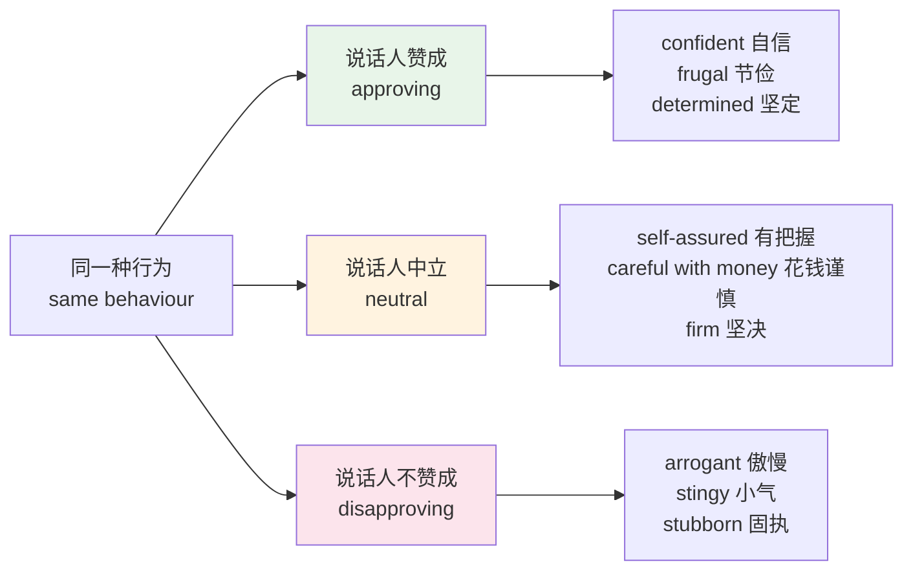
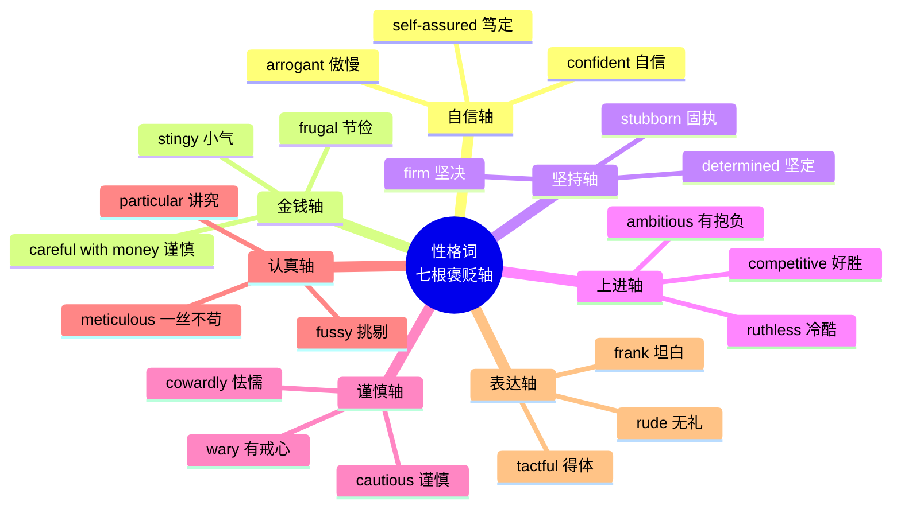
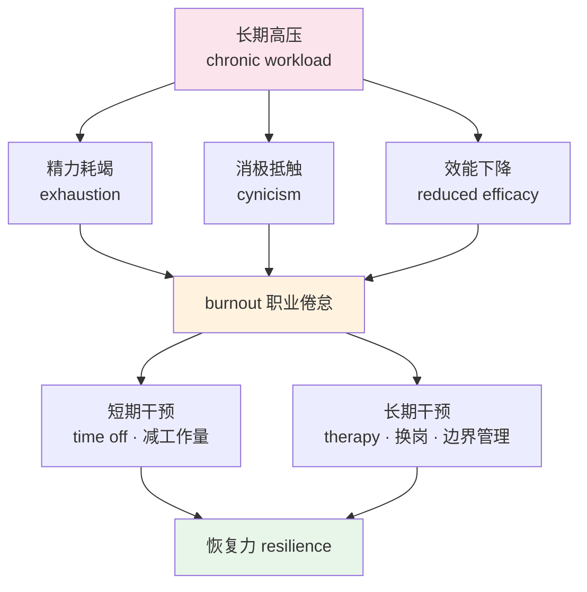
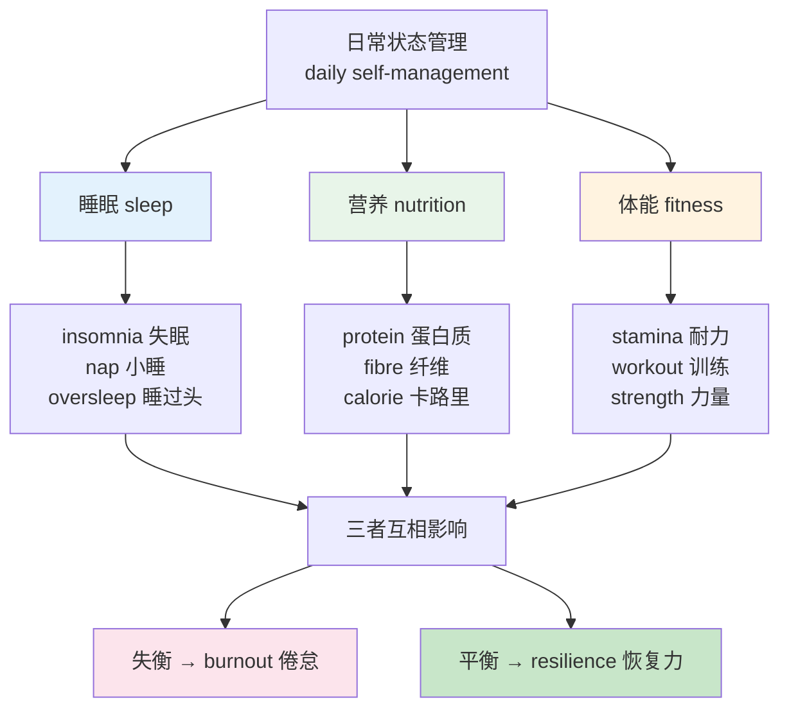
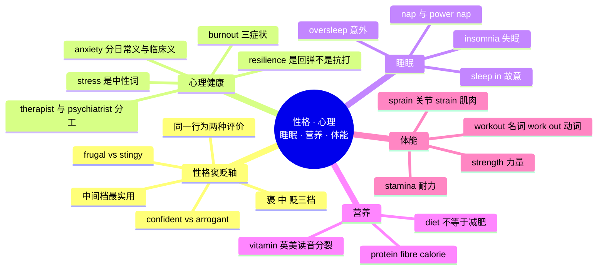

# 性格形容词、心理健康与睡眠营养体能

> [!info] 本篇定位
>
> 第七章的收尾篇，也是唯一一篇同时处理「怎么形容人」和「怎么照顾自己」两件事的篇目。
>
> 上一篇 [[07.人体、健康与情绪/04.情绪梯度词群与表情体态\|情绪梯度词群与表情体态]] 讲的是**一时的情绪**——现在高兴、刚才生气。这一篇讲的是**长期的性情**，以及支撑这份性情的心理与身体状态：睡得好不好、吃得对不对、体力跟不跟得上。
>
> 读完能做三件事：用一个褒义词和一个贬义词描述同一个人（`confident` 与 `arrogant` 说的是同一种行为），用病人视角的日常词说清自己的心理状况（不用医学术语也能约到咨询），以及看懂英文食品标签和健身 App 的界面词。
>
> 本篇共 400 多个词条，性格形容词约占四成，其余分给心理健康、睡眠、营养、体能四块。

---

## 1. 本篇导读：一个特质，两个名字

形容人的词有一个中文学习者常忽略的性质：**大量性格形容词是成对出现的，两个词描述的是完全相同的行为，区别只在说话人赞成还是不赞成**。

同一个人在会上坚持自己的方案，喜欢他的人说他 `confident`（自信），不喜欢他的人说他 `arrogant`（傲慢）。同一个人下馆子从不点贵菜，赞赏的说法是 `frugal`（节俭），刻薄的说法是 `stingy`（小气）。行为没变，评价变了。

这个现象在语言学里叫 **euphemism / dysphemism 对**，日常里可以理解成「褒贬轴」。掌握它有两个直接好处：

第一，**记忆成本减半**。`confident` 和 `arrogant` 不是两个孤立的词，是一根轴的两端。记住轴，两个词一起进来。本篇的性格词表全部按轴组织，一次记一对。

第二，**避免无意冒犯**。中文里「他这人挺犟的」语气不算太重，直译成 `He's pigheaded` 就非常难听。不知道褒贬轴的人会在中性场合随手用出贬义词，说话方完全无感，听话方却记住了。



这张图是本篇前半部分的骨架。绝大多数性格轴都有三个位置：褒、中、贬。中间那个位置最实用——描述不熟的人、写工作评价、翻译一句不带立场的中文时，中性词是唯一安全的选择。可惜教材几乎只教两端，中间那格常常是空的，本篇会把它填上。

后半部分转向健康。三块内容（睡眠、营养、体能）的共同点是：**这些词绝大多数不是医学术语，而是普通人聊天、看包装、用 App 时天天见的词**。`protein` 印在每一盒酸奶上，`stamina` 出现在每一款跑步软件里，`insomnia` 是任何一个熬夜的人都要会说的词。第七章前四篇处理的是「身体出问题以后」，这一篇处理的是「怎么让它别出问题」。

---

## 2. 自信与傲慢：confident 这根轴

### 2.1 轴的三个位置

`confident` / `arrogant` 是所有性格轴里最需要说透的一对，因为中国学习者在这根轴上最容易翻车——中文的「自信」几乎纯褒义，英文里稍微用错程度词就滑向贬义。

| 英文 | 英式音标 | 美式音标 | 词性 | 中文 | 搭配与说明 |
| --- | --- | --- | --- | --- | --- |
| **confident** | /ˈkɒnfɪdənt/ | /ˈkɑːnfɪdənt/ | adj. | 自信的 | confident about/in sth；褒义，最安全的默认词 |
| **self-confident** | /ˌself ˈkɒnfɪdənt/ | /ˌself ˈkɑːnfɪdənt/ | adj. | 有自信的 | 比 confident 更强调「对自己」，用于长期性格 |
| **self-assured** | /ˌself əˈʃʊəd/ | /ˌself əˈʃʊrd/ | adj. | 从容笃定的 | 偏书面，形容举止镇定不慌 |
| **assertive** | /əˈsɜːtɪv/ | /əˈsɜːrtɪv/ | adj. | 敢于表态的 | 中性偏褒；职场评价高频词 |
| **self-important** | /ˌself ɪmˈpɔːtnt/ | /ˌself ɪmˈpɔːrtnt/ | adj. | 自以为了不起的 | 贬义，指高估自己的分量 |
| **cocky** | /ˈkɒki/ | /ˈkɑːki/ | adj. | 自负轻狂的 | 口语贬义，常形容年轻人 |
| **arrogant** | /ˈærəɡənt/ | /ˈærəɡənt/ | adj. | 傲慢的 | 强贬义，指看不起别人 |
| **conceited** | /kənˈsiːtɪd/ | /kənˈsiːtɪd/ | adj. | 自以为是的 | 贬义，重点在过分欣赏自己 |
| **smug** | /smʌɡ/ | /smʌɡ/ | adj. | 洋洋自得的 | 贬义，指对自己的处境沾沾自喜 |
| **vain** | /veɪn/ | /veɪn/ | adj. | 虚荣的 | 多指在意外表；vanity 是名词 |
| **boastful** | /ˈbəʊstfl/ | /ˈboʊstfl/ | adj. | 爱吹嘘的 | 动词 boast about sth |
| **big-headed** | /ˌbɪɡˈhedɪd/ | /ˌbɪɡˈhedɪd/ | adj. | 自大的 | 英式口语色彩更浓 |
| **humble** | /ˈhʌmbl/ | /ˈhʌmbl/ | adj. | 谦逊的 | 轴的另一端；也指出身低微 |
| **modest** | /ˈmɒdɪst/ | /ˈmɑːdɪst/ | adj. | 谦虚的 | 比 humble 更中性；也指「数量不大」 |
| **self-deprecating** | /ˌself ˈdeprəkeɪtɪŋ/ | /ˌself ˈdeprəkeɪtɪŋ/ | adj. | 自我调侃的 | 英美文化里的褒义特质 |
| **insecure** | /ˌɪnsɪˈkjʊə/ | /ˌɪnsɪˈkjʊr/ | adj. | 缺乏安全感的 | 轴的负向端，不是「不安全」 |

### 2.2 confident 与 arrogant 的分界线

两个词的分界不在「自信程度」，而在**是否贬低他人**。

`confident` 描述一个人对自己能力的评估；`arrogant` 描述一个人对自己与他人**相对位置**的评估。一个人可以极度自信而毫不傲慢——他相信自己能做成，但也认真听别人说话。

> [!example] 同一场会议的两种描述
>
> - She was **confident** that the design would scale, and she walked us through her reasoning.
>   - 她确信这个设计能扩展，并且带我们过了一遍她的推理。
> - She was **arrogant** about the design, and she cut everyone off.
>   - 她对这个设计很傲慢，谁说话都被她打断。
> - He came across as a bit **cocky** in the interview, but the code was solid.
>   - 他面试时显得有点自负，但代码是扎实的。
> - I'm **confident in** my Python, but not so **confident about** the deployment part.
>   - 我对自己的 Python 有信心，但对部署这块信心不足。

> [!warning] confident 的两个搭配陷阱
>
> 介词分工是固定的，写作里错了很显眼：
>
> - ✅ **confident in** + 人 / 能力 / 系统：`confident in the team`
> - ✅ **confident about** + 事件 / 结果：`confident about the launch`
> - ✅ **confident that** + 从句：`confident that it will work`
> - ❌ ~~confident to do sth~~ —— 这是中式表达，英语里说 `confident enough to do sth`
>
> 另外，`confidence` 有两个完全不同的义项：`self-confidence` 是自信，`in confidence` 是保密。`I'm telling you this in confidence` 意思是「这话你别外传」，跟自信无关。

### 2.3 中性表达：夸不夸都不表态时怎么说

英语在正式评价里有一批「不表态」的说法，用来描述行为本身而不下判断。这一组在写推荐信、做绩效评估、翻译中立文本时用得最多。

| 英文 | 英式音标 | 美式音标 | 词性 | 中文 | 搭配与说明 |
| --- | --- | --- | --- | --- | --- |
| **outspoken** | /aʊtˈspəʊkən/ | /aʊtˈspoʊkən/ | adj. | 直言不讳的 | 中性；上下文决定褒贬 |
| **strong-willed** | /ˌstrɒŋ ˈwɪld/ | /ˌstrɔːŋ ˈwɪld/ | adj. | 意志坚强的 | 中性；贬义版是 stubborn |
| **forthright** | /ˈfɔːθraɪt/ | /ˈfɔːrθraɪt/ | adj. | 坦率的 | 书面中性词 |
| **direct** | /dəˈrekt/ | /dəˈrekt/ | adj. | 直接的 | 描述沟通风格的最中性词 |
| **reserved** | /rɪˈzɜːvd/ | /rɪˈzɜːrvd/ | adj. | 内敛的 | 比 shy 中性，不含「怯」的意思 |
| **measured** | /ˈmeʒəd/ | /ˈmeʒərd/ | adj. | 审慎克制的 | measured response 分寸得当的回应 |

---

## 3. 节俭与吝啬：frugal 这根轴

### 3.1 花钱这根轴上的六个位置

关于钱的性格词是褒贬轴最密集的区域，因为对同一种花钱方式，社会评价高度分裂。

| 英文 | 英式音标 | 美式音标 | 词性 | 中文 | 搭配与说明 |
| --- | --- | --- | --- | --- | --- |
| **frugal** | /ˈfruːɡl/ | /ˈfruːɡl/ | adj. | 节俭的 | 褒义偏书面；a frugal lifestyle |
| **thrifty** | /ˈθrɪfti/ | /ˈθrɪfti/ | adj. | 会过日子的 | 褒义口语；强调把钱花在刀刃上 |
| **economical** | /ˌiːkəˈnɒmɪkl/ | /ˌekəˈnɑːmɪkl/ | adj. | 省钱的；经济的 | 更常形容物品：an economical car |
| **careful with money** | — | — | phr. | 花钱谨慎 | 中性表达，最安全的描述方式 |
| **stingy** | /ˈstɪndʒi/ | /ˈstɪndʒi/ | adj. | 小气的 | 贬义；注意 g 读 /dʒ/ |
| **mean** | /miːn/ | /miːn/ | adj. | 吝啬的（英） | 英式此义高频；美式 mean 主要是「刻薄」 |
| **tight-fisted** | /ˌtaɪt ˈfɪstɪd/ | /ˌtaɪt ˈfɪstɪd/ | adj. | 一毛不拔的 | 强贬义口语 |
| **penny-pinching** | /ˈpeni pɪntʃɪŋ/ | /ˈpeni pɪntʃɪŋ/ | adj. | 斤斤计较的 | 贬义；也可作名词 |
| **generous** | /ˈdʒenərəs/ | /ˈdʒenərəs/ | adj. | 慷慨的 | 轴的另一端；generous with sth |
| **extravagant** | /ɪkˈstrævəɡənt/ | /ɪkˈstrævəɡənt/ | adj. | 挥霍的 | 贬义；超出承受能力地花钱 |
| **wasteful** | /ˈweɪstfl/ | /ˈweɪstfl/ | adj. | 浪费的 | 贬义；也用于时间与资源 |
| **materialistic** | /məˌtɪəriəˈlɪstɪk/ | /məˌtɪriəˈlɪstɪk/ | adj. | 物质至上的 | 贬义 |

> [!warning] mean 的英美差异是本轴最大的坑
>
> 同一句 `He's really mean`，英国人和美国人理解完全不同：
>
> - 英式主流义：**他很小气**（不肯花钱）
> - 美式主流义：**他很刻薄**（对人不好）
>
> 这是本教程遇到的最典型的一词两义英美分裂。安全做法是在美国场合用 `stingy` 表示小气，在英国场合用 `nasty` 或 `unkind` 表示刻薄，避开 `mean` 这个词。
>
> `mean` 还有第三个高频义项——动词「意思是」，以及统计学的「平均数」。四个义项都常用，靠语境区分。

### 3.2 描述花钱方式的动词短语

形容词说的是性格，动词短语说的是行为，写作里两者搭配使用效果最好。

| 英文 | 英式音标 | 美式音标 | 词性 | 中文 | 搭配与说明 |
| --- | --- | --- | --- | --- | --- |
| **save up** | /ˌseɪv ˈʌp/ | /ˌseɪv ˈʌp/ | v. | 攒钱 | save up for a house |
| **splurge** | /splɜːdʒ/ | /splɜːrdʒ/ | v./n. | 大手笔花一次 | splurge on sth；不含长期贬义 |
| **cut back on** | /ˌkʌt ˈbæk ɒn/ | /ˌkʌt ˈbæk ɑːn/ | v. | 削减（开支） | cut back on eating out |
| **live within one's means** | — | — | phr. | 量入为出 | 中性褒义表达 |
| **be short of cash** | — | — | phr. | 手头紧 | 比 poor 委婉得多 |
| **haggle** | /ˈhæɡl/ | /ˈhæɡl/ | v. | 讨价还价 | haggle over the price |

> [!example] 同一个人的三种说法
>
> - He's **frugal** — he cooks at home and it saves him a fortune.
>   - 他很节俭，自己做饭，省下不少钱。
> - He's **careful with money**, so he rarely joins us for dinner.
>   - 他花钱比较谨慎，所以很少跟我们一起吃饭。
> - He's so **stingy** that he never buys a round.
>   - 他小气到从来不请一轮酒。

---

## 4. 其余七根褒贬轴

前两根轴讲透了原理，剩下的按轴成组给出。每根轴的排列顺序统一是：**褒 → 中 → 贬**。

### 4.1 坚持这根轴：determined 到 pigheaded

| 英文 | 英式音标 | 美式音标 | 词性 | 中文 | 搭配与说明 |
| --- | --- | --- | --- | --- | --- |
| **determined** | /dɪˈtɜːmɪnd/ | /dɪˈtɜːrmɪnd/ | adj. | 坚定的 | 褒义；determined to do sth |
| **persistent** | /pəˈsɪstənt/ | /pərˈsɪstənt/ | adj. | 锲而不舍的 | 褒义；也可形容持续存在的问题 |
| **tenacious** | /təˈneɪʃəs/ | /təˈneɪʃəs/ | adj. | 顽强的 | 书面褒义 |
| **firm** | /fɜːm/ | /fɜːrm/ | adj. | 坚决的 | 中性；firm on the deadline |
| **strong-minded** | /ˌstrɒŋ ˈmaɪndɪd/ | /ˌstrɔːŋ ˈmaɪndɪd/ | adj. | 主见强的 | 中性 |
| **stubborn** | /ˈstʌbən/ | /ˈstʌbərn/ | adj. | 固执的 | 贬义，但语气不算最重 |
| **obstinate** | /ˈɒbstɪnət/ | /ˈɑːbstɪnət/ | adj. | 顽固的 | 书面贬义，比 stubborn 正式 |
| **pigheaded** | /ˌpɪɡˈhedɪd/ | /ˌpɪɡˈhedɪd/ | adj. | 死脑筋的 | 强贬义口语，慎用 |
| **inflexible** | /ɪnˈfleksəbl/ | /ɪnˈfleksəbl/ | adj. | 不知变通的 | 贬义；对应褒义 flexible |
| **flexible** | /ˈfleksəbl/ | /ˈfleksəbl/ | adj. | 灵活的 | 褒义；也指时间可调整 |

### 4.2 上进这根轴：ambitious 到 ruthless

| 英文 | 英式音标 | 美式音标 | 词性 | 中文 | 搭配与说明 |
| --- | --- | --- | --- | --- | --- |
| **ambitious** | /æmˈbɪʃəs/ | /æmˈbɪʃəs/ | adj. | 有抱负的 | 褒义为主；an ambitious plan 也指目标高 |
| **driven** | /ˈdrɪvn/ | /ˈdrɪvn/ | adj. | 有强烈内驱力的 | 褒义；职场高频 |
| **competitive** | /kəmˈpetətɪv/ | /kəmˈpetətɪv/ | adj. | 好胜的 | 中性；也指价格有竞争力 |
| **pushy** | /ˈpʊʃi/ | /ˈpʊʃi/ | adj. | 强势逼人的 | 贬义；指硬推别人接受 |
| **aggressive** | /əˈɡresɪv/ | /əˈɡresɪv/ | adj. | 咄咄逼人的 | 贬义为主；商业语境可中性 |
| **ruthless** | /ˈruːθləs/ | /ˈruːθləs/ | adj. | 冷酷无情的 | 强贬义；为达目的不择手段 |
| **cut-throat** | /ˈkʌt θrəʊt/ | /ˈkʌt θroʊt/ | adj. | 你死我活的 | 多形容行业竞争 |
| **laid-back** | /ˌleɪd ˈbæk/ | /ˌleɪd ˈbæk/ | adj. | 淡定不争的 | 轴的另一端，褒义口语 |

`aggressive` 在商业英语里是个特例。`an aggressive timeline`（激进的排期）、`aggressive pricing`（进攻性定价）里它是中性偏褒的，但形容人时几乎总是贬义。这个分裂在技术文档里很常见，读到 `aggressive caching` 时不要理解成「凶狠的缓存」，它的意思是「尽可能激进地缓存」。

### 4.3 好奇这根轴：curious 到 nosy

| 英文 | 英式音标 | 美式音标 | 词性 | 中文 | 搭配与说明 |
| --- | --- | --- | --- | --- | --- |
| **curious** | /ˈkjʊəriəs/ | /ˈkjʊriəs/ | adj. | 好奇的 | 褒义；curious about sth |
| **inquisitive** | /ɪnˈkwɪzətɪv/ | /ɪnˈkwɪzətɪv/ | adj. | 求知欲强的 | 褒义书面；形容孩子最常用 |
| **interested** | /ˈɪntrəstɪd/ | /ˈɪntrəstɪd/ | adj. | 感兴趣的 | 中性；interested in sth |
| **nosy** | /ˈnəʊzi/ | /ˈnoʊzi/ | adj. | 爱打听的 | 贬义口语；也拼 nosey |
| **intrusive** | /ɪnˈtruːsɪv/ | /ɪnˈtruːsɪv/ | adj. | 侵犯隐私的 | 贬义书面 |
| **prying** | /ˈpraɪɪŋ/ | /ˈpraɪɪŋ/ | adj. | 刺探的 | 贬义；prying eyes 窥探的目光 |

### 4.4 谨慎这根轴：careful 到 cowardly

| 英文 | 英式音标 | 美式音标 | 词性 | 中文 | 搭配与说明 |
| --- | --- | --- | --- | --- | --- |
| **careful** | /ˈkeəfl/ | /ˈkerfl/ | adj. | 小心的 | 褒义；careful with/about sth |
| **cautious** | /ˈkɔːʃəs/ | /ˈkɔːʃəs/ | adj. | 谨慎的 | 褒义偏书面 |
| **prudent** | /ˈpruːdnt/ | /ˈpruːdnt/ | adj. | 审慎的 | 书面褒义；财务语境高频 |
| **wary** | /ˈweəri/ | /ˈweri/ | adj. | 有戒心的 | 中性；wary of sth |
| **hesitant** | /ˈhezɪtənt/ | /ˈhezɪtənt/ | adj. | 犹豫的 | 中性偏贬 |
| **timid** | /ˈtɪmɪd/ | /ˈtɪmɪd/ | adj. | 胆小的 | 贬义 |
| **cowardly** | /ˈkaʊədli/ | /ˈkaʊərdli/ | adj. | 怯懦的 | 强贬义；名词 coward |
| **bold** | /bəʊld/ | /boʊld/ | adj. | 大胆的 | 轴的另一端，褒义 |
| **reckless** | /ˈrekləs/ | /ˈrekləs/ | adj. | 鲁莽的 | 另一端的贬义；不顾后果 |
| **brave** | /breɪv/ | /breɪv/ | adj. | 勇敢的 | 褒义；日耳曼层短词，最常用 |
| **courageous** | /kəˈreɪdʒəs/ | /kəˈreɪdʒəs/ | adj. | 有勇气的 | 褒义书面；比 brave 正式 |

### 4.5 认真这根轴：meticulous 到 fussy

| 英文 | 英式音标 | 美式音标 | 词性 | 中文 | 搭配与说明 |
| --- | --- | --- | --- | --- | --- |
| **meticulous** | /məˈtɪkjələs/ | /məˈtɪkjələs/ | adj. | 一丝不苟的 | 强褒义；简历高频词 |
| **thorough** | /ˈθʌrə/ | /ˈθɜːroʊ/ | adj. | 彻底周全的 | 褒义；英美读音差别大 |
| **conscientious** | /ˌkɒnʃiˈenʃəs/ | /ˌkɑːnʃiˈenʃəs/ | adj. | 尽责的 | 褒义书面 |
| **detail-oriented** | /ˈdiːteɪl ˌɔːrientɪd/ | /ˈdiːteɪl ˌɔːrientɪd/ | adj. | 注重细节的 | 美式职场高频 |
| **particular** | /pəˈtɪkjələ/ | /pərˈtɪkjələr/ | adj. | 讲究的 | 中性；particular about sth |
| **fussy** | /ˈfʌsi/ | /ˈfʌsi/ | adj. | 挑剔难伺候的 | 贬义；英式更常用 |
| **picky** | /ˈpɪki/ | /ˈpɪki/ | adj. | 挑三拣四的 | 贬义口语；a picky eater 挑食的人 |
| **nitpicking** | /ˈnɪtpɪkɪŋ/ | /ˈnɪtpɪkɪŋ/ | adj./n. | 吹毛求疵 | 贬义；代码评审语境常见 |
| **careless** | /ˈkeələs/ | /ˈkerləs/ | adj. | 粗心的 | 轴的另一端，贬义 |
| **sloppy** | /ˈslɒpi/ | /ˈslɑːpi/ | adj. | 马虎邋遢的 | 贬义；sloppy code 潦草的代码 |

### 4.6 说话方式这根轴：tactful 到 blunt

| 英文 | 英式音标 | 美式音标 | 词性 | 中文 | 搭配与说明 |
| --- | --- | --- | --- | --- | --- |
| **tactful** | /ˈtæktfl/ | /ˈtæktfl/ | adj. | 得体委婉的 | 褒义；名词 tact |
| **diplomatic** | /ˌdɪpləˈmætɪk/ | /ˌdɪpləˈmætɪk/ | adj. | 会说话的 | 褒义；不只用于外交 |
| **frank** | /fræŋk/ | /fræŋk/ | adj. | 坦白的 | 中性偏褒；to be frank 说实话 |
| **candid** | /ˈkændɪd/ | /ˈkændɪd/ | adj. | 直言坦率的 | 中性褒义书面 |
| **blunt** | /blʌnt/ | /blʌnt/ | adj. | 说话冲的 | 中性偏贬；也指刀钝 |
| **tactless** | /ˈtæktləs/ | /ˈtæktləs/ | adj. | 不会说话的 | 贬义 |
| **rude** | /ruːd/ | /ruːd/ | adj. | 无礼的 | 强贬义 |
| **abrasive** | /əˈbreɪsɪv/ | /əˈbreɪsɪv/ | adj. | 咄咄伤人的 | 贬义书面；职场评价用词 |
| **talkative** | /ˈtɔːkətɪv/ | /ˈtɔːkətɪv/ | adj. | 健谈的 | 中性 |
| **chatty** | /ˈtʃæti/ | /ˈtʃæti/ | adj. | 爱聊天的 | 中性口语，语气轻松 |

### 4.7 心软这根轴：sensitive 到 thin-skinned

| 英文 | 英式音标 | 美式音标 | 词性 | 中文 | 搭配与说明 |
| --- | --- | --- | --- | --- | --- |
| **empathetic** | /ˌempəˈθetɪk/ | /ˌempəˈθetɪk/ | adj. | 有共情力的 | 褒义；名词 empathy |
| **sympathetic** | /ˌsɪmpəˈθetɪk/ | /ˌsɪmpəˈθetɪk/ | adj. | 有同情心的 | 褒义；注意不等于「同情心泛滥」 |
| **compassionate** | /kəmˈpæʃənət/ | /kəmˈpæʃənət/ | adj. | 有恻隐之心的 | 褒义书面 |
| **considerate** | /kənˈsɪdərət/ | /kənˈsɪdərət/ | adj. | 体贴的 | 褒义；considerate of sb |
| **sensitive** | /ˈsensətɪv/ | /ˈsensətɪv/ | adj. | 敏感的 | 两义：善解人意 / easily hurt |
| **thin-skinned** | /ˌθɪn ˈskɪnd/ | /ˌθɪn ˈskɪnd/ | adj. | 玻璃心的 | 贬义；反义 thick-skinned |
| **insensitive** | /ɪnˈsensətɪv/ | /ɪnˈsensətɪv/ | adj. | 不顾他人感受的 | 贬义 |
| **selfish** | /ˈselfɪʃ/ | /ˈselfɪʃ/ | adj. | 自私的 | 强贬义 |
| **self-centred** | /ˌself ˈsentəd/ | /ˌself ˈsentərd/ | adj. | 以自我为中心的 | 英式 -centred，美式 -centered |
| **detached** | /dɪˈtætʃt/ | /dɪˈtætʃt/ | adj. | 抽离冷静的 | 中性；医生、法官的褒义特质 |

> [!warning] sensitive 的两义必须靠语境分开
>
> - `He's very sensitive to other people's feelings.` → 褒义，善解人意。
> - `Don't tease him, he's very sensitive.` → 贬义偏中性，指容易受伤。
> - `This is sensitive data.` → 第三义，指敏感数据，程序员语境最常见。
>
> 还要跟 `sensible` 区分开。`sensible` 是「明智的、合情理的」，跟「敏感」毫无关系。
>
> - ❌ ~~He's a sensible person, he cries easily.~~
> - ✅ **He's a sensitive person, he cries easily.**（他很敏感，容易哭）
> - ✅ **That's a sensible decision.**（那是个明智的决定）

---

## 5. 中性性格词与内外向词群

### 5.1 内外向：现在最常被误用的一组

`introvert` / `extrovert` 这组词在中文互联网被简化成了「社恐 / 社牛」，但英语原义指的是**精力从哪里恢复**，不是「怕不怕生」。一个内向的人可以完全不怕演讲，只是演讲完需要独处两小时缓过来。

| 英文 | 英式音标 | 美式音标 | 词性 | 中文 | 搭配与说明 |
| --- | --- | --- | --- | --- | --- |
| **introvert** | /ˈɪntrəvɜːt/ | /ˈɪntrəvɜːrt/ | n. | 内向的人 | 名词；不含贬义 |
| **introverted** | /ˈɪntrəvɜːtɪd/ | /ˈɪntrəvɜːrtɪd/ | adj. | 内向的 | 形容词形式 |
| **extrovert** | /ˈekstrəvɜːt/ | /ˈekstrəvɜːrt/ | n. | 外向的人 | 也拼 extravert（心理学文献） |
| **extroverted** | /ˈekstrəvɜːtɪd/ | /ˈekstrəvɜːrtɪd/ | adj. | 外向的 | — |
| **ambivert** | /ˈæmbivɜːt/ | /ˈæmbivɜːrt/ | n. | 中间型的人 | 较新的词，非正式场合用 |
| **outgoing** | /ˈaʊtɡəʊɪŋ/ | /ˈaʊtɡoʊɪŋ/ | adj. | 开朗好交往的 | 褒义；也指「即将离任的」 |
| **sociable** | /ˈsəʊʃəbl/ | /ˈsoʊʃəbl/ | adj. | 合群的 | 褒义 |
| **gregarious** | /ɡrɪˈɡeəriəs/ | /ɡrɪˈɡeriəs/ | adj. | 爱扎堆的 | 书面褒义 |
| **shy** | /ʃaɪ/ | /ʃaɪ/ | adj. | 害羞的 | 中性；指怕生，不等于内向 |
| **withdrawn** | /wɪðˈdrɔːn/ | /wɪðˈdrɔːn/ | adj. | 封闭退缩的 | 偏贬；常暗示心理问题 |
| **aloof** | /əˈluːf/ | /əˈluːf/ | adj. | 冷淡疏离的 | 贬义；刻意保持距离 |
| **antisocial** | /ˌæntiˈsəʊʃl/ | /ˌæntaɪˈsoʊʃl/ | adj. | 不合群的；反社会的 | 重音位置相同，美式 anti- 常读 /ˌæntaɪ/ |
| **socially awkward** | — | — | phr. | 社交笨拙的 | 中性口语，最接近中文「社恐」 |

> [!warning] 「社恐」不要直译成 antisocial
>
> `antisocial` 在英式英语里主要指「妨害公共秩序的」（antisocial behaviour 指扰民行为），在美式英语里则常指临床上的反社会人格。两个义项都跟「怕社交」无关。
>
> - ❌ ~~I'm antisocial, I hate parties.~~（听起来像在自称反社会人格）
> - ✅ **I'm not a big party person.**（我不太喜欢聚会）
> - ✅ **I'm a bit socially awkward.**（我社交上有点笨拙）
> - ✅ **I have social anxiety.**（我有社交焦虑——这是临床说法，别随口用）

### 5.2 靠谱这根轴与其余中性词

| 英文 | 英式音标 | 美式音标 | 词性 | 中文 | 搭配与说明 |
| --- | --- | --- | --- | --- | --- |
| **reliable** | /rɪˈlaɪəbl/ | /rɪˈlaɪəbl/ | adj. | 可靠的 | 褒义；人和系统都能用 |
| **dependable** | /dɪˈpendəbl/ | /dɪˈpendəbl/ | adj. | 值得依靠的 | 褒义，语气更暖 |
| **trustworthy** | /ˈtrʌstwɜːði/ | /ˈtrʌstwɜːrði/ | adj. | 可信赖的 | 褒义；强调品德不是能力 |
| **flaky** | /ˈfleɪki/ | /ˈfleɪki/ | adj. | 靠不住的 | 贬义口语；也形容测试不稳定 |
| **unreliable** | /ˌʌnrɪˈlaɪəbl/ | /ˌʌnrɪˈlaɪəbl/ | adj. | 不可靠的 | 贬义中性说法 |
| **loyal** | /ˈlɔɪəl/ | /ˈlɔɪəl/ | adj. | 忠诚的 | 褒义；loyal to sb |
| **honest** | /ˈɒnɪst/ | /ˈɑːnɪst/ | adj. | 诚实的 | h 不发音 |
| **sincere** | /sɪnˈsɪə/ | /sɪnˈsɪr/ | adj. | 真诚的 | 褒义 |
| **sly** | /slaɪ/ | /slaɪ/ | adj. | 狡猾的 | 贬义 |
| **cunning** | /ˈkʌnɪŋ/ | /ˈkʌnɪŋ/ | adj. | 精明狡黠的 | 贬义为主，偶带欣赏 |
| **devious** | /ˈdiːviəs/ | /ˈdiːviəs/ | adj. | 阴险绕弯的 | 贬义 |
| **patient** | /ˈpeɪʃnt/ | /ˈpeɪʃnt/ | adj./n. | 有耐心的；病人 | 同形异义，靠词性区分 |
| **impatient** | /ɪmˈpeɪʃnt/ | /ɪmˈpeɪʃnt/ | adj. | 没耐心的 | impatient with sb |
| **short-tempered** | /ˌʃɔːt ˈtempəd/ | /ˌʃɔːrt ˈtempərd/ | adj. | 脾气急的 | 贬义 |
| **irritable** | /ˈɪrɪtəbl/ | /ˈɪrɪtəbl/ | adj. | 易怒烦躁的 | 贬义；也是睡眠不足的症状词 |
| **even-tempered** | /ˌiːvn ˈtempəd/ | /ˌiːvn ˈtempərd/ | adj. | 性情平和的 | 褒义 |
| **moody** | /ˈmuːdi/ | /ˈmuːdi/ | adj. | 情绪起伏大的 | 贬义；跟第 4 篇的 mood 同源 |
| **optimistic** | /ˌɒptɪˈmɪstɪk/ | /ˌɑːptɪˈmɪstɪk/ | adj. | 乐观的 | 褒义 |
| **pessimistic** | /ˌpesɪˈmɪstɪk/ | /ˌpesɪˈmɪstɪk/ | adj. | 悲观的 | 中性偏贬 |
| **cynical** | /ˈsɪnɪkl/ | /ˈsɪnɪkl/ | adj. | 愤世嫉俗的 | 贬义；认定人皆自私 |
| **naive** | /naɪˈiːv/ | /naɪˈiːv/ | adj. | 天真的 | 贬义为主；也拼 naïve |
| **gullible** | /ˈɡʌləbl/ | /ˈɡʌləbl/ | adj. | 好骗的 | 贬义 |
| **open-minded** | /ˌəʊpən ˈmaɪndɪd/ | /ˌoʊpən ˈmaɪndɪd/ | adj. | 思想开放的 | 强褒义 |
| **narrow-minded** | /ˌnærəʊ ˈmaɪndɪd/ | /ˌnæroʊ ˈmaɪndɪd/ | adj. | 心胸狭窄的 | 贬义 |
| **judgmental** | /dʒʌdʒˈmentl/ | /dʒʌdʒˈmentl/ | adj. | 爱评判人的 | 贬义；英式也拼 judgemental |
| **down-to-earth** | /ˌdaʊn tu ˈɜːθ/ | /ˌdaʊn tu ˈɜːrθ/ | adj. | 务实接地气的 | 强褒义 |
| **practical** | /ˈpræktɪkl/ | /ˈpræktɪkl/ | adj. | 讲实际的 | 褒义 |
| **witty** | /ˈwɪti/ | /ˈwɪti/ | adj. | 机智幽默的 | 褒义；名词 wit |
| **charismatic** | /ˌkærɪzˈmætɪk/ | /ˌkærɪzˈmætɪk/ | adj. | 有魅力感召力的 | 褒义；名词 charisma /kəˈrɪzmə/ |
| **diligent** | /ˈdɪlɪdʒənt/ | /ˈdɪlɪdʒənt/ | adj. | 勤勉的 | 褒义书面 |
| **hardworking** | /ˌhɑːdˈwɜːkɪŋ/ | /ˌhɑːrdˈwɜːrkɪŋ/ | adj. | 勤奋的 | 褒义口语，最常用 |
| **industrious** | /ɪnˈdʌstriəs/ | /ɪnˈdʌstriəs/ | adj. | 勤劳的 | 书面褒义，略旧 |
| **lazy** | /ˈleɪzi/ | /ˈleɪzi/ | adj. | 懒的 | 贬义 |
| **idle** | /ˈaɪdl/ | /ˈaɪdl/ | adj./v. | 闲着的；空转 | 中性；机器 idle 是「空转」 |
| **workaholic** | /ˌwɜːkəˈhɒlɪk/ | /ˌwɜːrkəˈhɑːlɪk/ | n. | 工作狂 | 中性偏贬；-aholic 是能产后缀 |



这张图把七根轴压成一页。使用方法是反向的：想描述某个人的时候先定位到轴，再根据自己的态度取三档中的一档。中间那档在不确定该不该表态时永远是安全牌——`He's firm on this` 比 `He's stubborn` 少了立场，也少了得罪人的风险。

---

## 6. 心理健康：从 stress 到 anxiety

### 6.1 压力这一层的日常词

心理健康词群的入口是 `stress`。它是个中性词，本身不是病——`stress` 在合理范围内是正常的，问题出在长期得不到缓解。

| 英文 | 英式音标 | 美式音标 | 词性 | 中文 | 搭配与说明 |
| --- | --- | --- | --- | --- | --- |
| **stress** | /stres/ | /stres/ | n./v. | 压力；强调 | under stress 处于压力下 |
| **stressed** | /strest/ | /strest/ | adj. | 有压力的（人） | 形容人；stressed out 更口语 |
| **stressful** | /ˈstresfl/ | /ˈstresfl/ | adj. | 令人有压力的（事） | 形容事；a stressful week |
| **pressure** | /ˈpreʃə/ | /ˈpreʃər/ | n. | 压力 | under pressure；偏外部施加 |
| **overwhelmed** | /ˌəʊvəˈwelmd/ | /ˌoʊvərˈwelmd/ | adj. | 招架不住的 | 最常用的「顶不住了」 |
| **swamped** | /swɒmpt/ | /swɑːmpt/ | adj. | 被活埋了的 | 口语；I'm swamped this week |
| **on edge** | /ɒn ˈedʒ/ | /ɑːn ˈedʒ/ | phr. | 紧绷易惊的 | 比 nervous 更持续 |
| **tense** | /tens/ | /tens/ | adj. | 紧张的 | 人和气氛都能形容 |
| **worn out** | /ˌwɔːn ˈaʊt/ | /ˌwɔːrn ˈaʊt/ | phr. | 累垮了的 | 身心都可用 |
| **run-down** | /ˌrʌn ˈdaʊn/ | /ˌrʌn ˈdaʊn/ | adj. | 虚弱疲惫的 | 常暗示快生病了 |

> [!warning] stressed 与 stressful 不能互换
>
> 这是中国学习者最高频的一个错误，分工非常清楚：
>
> - **人** 用 stressed：`I'm stressed.`（我压力很大）
> - **事** 用 stressful：`The job is stressful.`（这份工作让人有压力）
>
> - ❌ ~~I'm very stressful.~~ —— 字面意思变成「我这个人让别人有压力」
> - ✅ **I'm very stressed.**
>
> 同一模式适用于 `bored / boring`、`confused / confusing`、`interested / interesting`。`-ed` 描述人的感受，`-ing` 描述引起感受的事物。

### 6.2 anxiety：焦虑的日常义与临床义

`anxiety` 有一条清晰的分界：小写的日常义指「担心」，加上限定词后的 `an anxiety disorder` 才是临床诊断。搞混这条线是英文里最容易冒犯人的一类失误。

| 英文 | 英式音标 | 美式音标 | 词性 | 中文 | 搭配与说明 |
| --- | --- | --- | --- | --- | --- |
| **anxiety** | /æŋˈzaɪəti/ | /æŋˈzaɪəti/ | n. | 焦虑；担忧 | 重音在第二音节，不在第一 |
| **anxious** | /ˈæŋkʃəs/ | /ˈæŋkʃəs/ | adj. | 焦虑的；急切的 | 注意与名词发音不同 |
| **worried** | /ˈwʌrid/ | /ˈwɜːrid/ | adj. | 担心的 | 最日常的说法 |
| **nervous** | /ˈnɜːvəs/ | /ˈnɜːrvəs/ | adj. | 紧张的 | 短期的、有具体对象的 |
| **uneasy** | /ʌnˈiːzi/ | /ʌnˈiːzi/ | adj. | 心里不踏实的 | 说不出原因的不安 |
| **panic** | /ˈpænɪk/ | /ˈpænɪk/ | n./v. | 恐慌 | panicked / panicking 加 k |
| **panic attack** | /ˈpænɪk əˌtæk/ | /ˈpænɪk əˌtæk/ | n. | 惊恐发作 | 临床词，别用来形容一般紧张 |
| **phobia** | /ˈfəʊbiə/ | /ˈfoʊbiə/ | n. | 恐惧症 | 构词后缀 -phobia |
| **overthink** | /ˌəʊvəˈθɪŋk/ | /ˌoʊvərˈθɪŋk/ | v. | 想太多 | overthink it 是高频口语 |
| **dread** | /dred/ | /dred/ | v./n. | 提前发怵 | dread doing sth |
| **restless** | /ˈrestləs/ | /ˈrestləs/ | adj. | 坐立不安的 | 也用于形容睡不安稳 |
| **racing thoughts** | — | — | n. | 思绪停不下来 | 描述失眠原因的常用说法 |

> [!example] anxious 的两个义项
>
> - I've been feeling **anxious** about the review all week.
>   - 我为这次评审焦虑了一整周。（担忧义）
> - She was **anxious to** get started.
>   - 她急着想开始。（急切义，后接 to do）
> - He has **anxiety**, and he's been in therapy for a year.
>   - 他有焦虑症，已经做了一年心理治疗。（临床义）
> - Don't **overthink** it — just ship the thing.
>   - 别想太多，先把东西发出去。

### 6.3 抑郁与情绪低落

| 英文 | 英式音标 | 美式音标 | 词性 | 中文 | 搭配与说明 |
| --- | --- | --- | --- | --- | --- |
| **depression** | /dɪˈpreʃn/ | /dɪˈpreʃn/ | n. | 抑郁症；低落 | 也指经济萧条 |
| **depressed** | /dɪˈprest/ | /dɪˈprest/ | adj. | 抑郁的 | 临床义强，慎作口头形容 |
| **down** | /daʊn/ | /daʊn/ | adj. | 情绪低落的 | feeling down 最日常安全 |
| **low** | /ləʊ/ | /loʊ/ | adj. | 状态低迷的 | feeling low 英式常用 |
| **numb** | /nʌm/ | /nʌm/ | adj. | 麻木无感的 | b 不发音 |
| **hopeless** | /ˈhəʊpləs/ | /ˈhoʊpləs/ | adj. | 绝望的 | 也可指「不擅长」：hopeless at maths |
| **mood swing** | /ˈmuːd swɪŋ/ | /ˈmuːd swɪŋ/ | n. | 情绪波动 | 常用复数 mood swings |
| **bipolar** | /ˌbaɪˈpəʊlə/ | /ˌbaɪˈpoʊlər/ | adj. | 双相的 | bipolar disorder 双相情感障碍 |
| **self-esteem** | /ˌself ɪˈstiːm/ | /ˌself ɪˈstiːm/ | n. | 自尊水平 | low self-esteem 自我评价低 |
| **trauma** | /ˈtrɔːmə/ | /ˈtraʊmə/ | n. | 创伤 | 英美元音差异明显 |
| **traumatic** | /trɔːˈmætɪk/ | /trəˈmætɪk/ | adj. | 造成创伤的 | — |
| **stigma** | /ˈstɪɡmə/ | /ˈstɪɡmə/ | n. | 污名 | the stigma around mental health |

> [!warning] depressed 不是「我今天不开心」
>
> 中文里「今天有点抑郁」是随口说的，英语里 `I'm depressed` 会被理解成临床状态，对方可能真的开始担心你。
>
> - ❌ ~~I'm so depressed, my build failed again.~~（构建失败说不上抑郁）
> - ✅ **I'm so frustrated, my build failed again.**（我烦死了）
> - ✅ **I've been feeling a bit down lately.**（最近有点低落）
>
> 同一条线上还有 `OCD`（强迫症）和 `ADHD`（注意缺陷多动障碍）。中文互联网把「强迫症」用成了「有点讲究」，英文里说 `I'm so OCD about my code style` 在很多场合会被认为是拿病症开玩笑。安全说法是 `I'm quite particular about my code style`。

---

## 7. burnout：职业倦怠的完整词群

### 7.1 burnout 与 tired 的层级差

`burnout` 不是「累」，是**长期高压后能力和意愿一起塌掉**。世界卫生组织在 ICD-11 里把它归为职业现象而非疾病，这个定位决定了它的语域：可以在工作场合坦然说出口，不像 `depression` 那样带临床重量。

| 英文 | 英式音标 | 美式音标 | 词性 | 中文 | 搭配与说明 |
| --- | --- | --- | --- | --- | --- |
| **burnout** | /ˈbɜːnaʊt/ | /ˈbɜːrnaʊt/ | n. | 职业倦怠 | 名词连写；suffer from burnout |
| **burn out** | /ˌbɜːn ˈaʊt/ | /ˌbɜːrn ˈaʊt/ | v. | 把自己耗干 | 动词分写；I burned out last year |
| **burnt out** | /ˌbɜːnt ˈaʊt/ | /ˌbɜːrnt ˈaʊt/ | adj. | 耗尽了的 | 美式多用 burned out |
| **exhaustion** | /ɪɡˈzɔːstʃən/ | /ɪɡˈzɔːstʃən/ | n. | 精疲力竭 | 比 tiredness 重得多 |
| **exhausted** | /ɪɡˈzɔːstɪd/ | /ɪɡˈzɔːstɪd/ | adj. | 筋疲力尽的 | 注意 ex- 读 /ɪɡz/ 不是 /ɪks/ |
| **drained** | /dreɪnd/ | /dreɪnd/ | adj. | 被抽空的 | emotionally drained 情绪耗竭 |
| **fatigue** | /fəˈtiːɡ/ | /fəˈtiːɡ/ | n. | 疲劳 | 偏医学书面；重音在后 |
| **workload** | /ˈwɜːkləʊd/ | /ˈwɜːrkloʊd/ | n. | 工作量 | a heavy workload |
| **overwork** | /ˌəʊvəˈwɜːk/ | /ˌoʊvərˈwɜːrk/ | v./n. | 过劳 | 动词重音在后，名词在前 |
| **cynicism** | /ˈsɪnɪsɪzəm/ | /ˈsɪnɪsɪzəm/ | n. | 消极抵触 | burnout 三大症状之一 |
| **disengaged** | /ˌdɪsɪnˈɡeɪdʒd/ | /ˌdɪsɪnˈɡeɪdʒd/ | adj. | 心不在焉的 | 职场评估用词 |
| **work-life balance** | — | — | n. | 工作生活平衡 | 固定搭配，不加 the |
| **sick leave** | /ˈsɪk liːv/ | /ˈsɪk liːv/ | n. | 病假 | on sick leave |
| **time off** | /ˌtaɪm ˈɒf/ | /ˌtaɪm ˈɔːf/ | n. | 休假时间 | take time off |
| **sabbatical** | /səˈbætɪkl/ | /səˈbætɪkl/ | n. | 长假；学术休假 | on sabbatical |



这张图给出的是 burnout 的三症状结构：**耗竭、抵触、效能下降**三者同时出现才叫 burnout，只有第一条那是 `exhaustion`。分清这一点在英文语境里很实际——跟主管说 `I'm exhausted` 换来的是「那你早点下班」，说 `I think I'm burning out` 换来的通常是一次正式的工作量对话。

### 7.2 表达求助与设置边界

这一组是**产出性词汇**，必须练到能主动说出来。它们不难，但中国学习者往往只会 `I'm tired`，说不出后面的层次。

| 英文 | 英式音标 | 美式音标 | 词性 | 中文 | 搭配与说明 |
| --- | --- | --- | --- | --- | --- |
| **reach out** | /ˌriːtʃ ˈaʊt/ | /ˌriːtʃ ˈaʊt/ | v. | 主动联系求助 | reach out to sb |
| **open up** | /ˌəʊpən ˈʌp/ | /ˌoʊpən ˈʌp/ | v. | 敞开谈 | open up to sb about sth |
| **vent** | /vent/ | /vent/ | v. | 倾诉发泄 | vent to a friend；不含贬义 |
| **bottle up** | /ˌbɒtl ˈʌp/ | /ˌbɑːtl ˈʌp/ | v. | 把情绪憋着 | bottle it up 是负面做法 |
| **set boundaries** | — | — | phr. | 设立边界 | 心理健康语境高频 |
| **say no** | — | — | phr. | 学会拒绝 | 常与 boundaries 同现 |
| **delegate** | /ˈdelɪɡeɪt/ | /ˈdelɪɡeɪt/ | v. | 把活分出去 | 同形名词读 /ˈdelɪɡət/，词尾元音弱化 |
| **unwind** | /ˌʌnˈwaɪnd/ | /ˌʌnˈwaɪnd/ | v. | 放松下来 | unwind after work |
| **recharge** | /ˌriːˈtʃɑːdʒ/ | /ˌriːˈtʃɑːrdʒ/ | v. | 充电恢复 | 人和电池共用 |
| **switch off** | /ˌswɪtʃ ˈɒf/ | /ˌswɪtʃ ˈɔːf/ | v. | 下班不想工作 | 英式高频 |

> [!example] 层层递进的四句话
>
> - I'm **exhausted** — I need an early night.
>   - 我累坏了，今晚得早点睡。
> - I've been feeling pretty **overwhelmed** with the release.
>   - 这次发版让我有点招架不住。
> - Honestly, I think I'm **burning out**. Can we talk about my **workload**?
>   - 说实话我觉得自己快倦怠了，能聊聊我的工作量吗？
> - I'm taking two weeks off to **recharge**, and I'm going to **switch off** completely.
>   - 我要休两周恢复一下，会完全不看工作。

---

## 8. resilience 与恢复侧词群

### 8.1 resilience：从材料学借来的词

`resilience` 的拉丁词根 `resilire` 意思是「弹回来」。材料科学拿它指材料受力形变后的**回弹**能力，心理学再从材料学借走这个比喻，含义没变：不是「不受打击」，而是「被打击后能回来」。这层比喻对记忆很有帮助——`resilient` 不是硬，是弹。

| 英文 | 英式音标 | 美式音标 | 词性 | 中文 | 搭配与说明 |
| --- | --- | --- | --- | --- | --- |
| **resilience** | /rɪˈzɪliəns/ | /rɪˈzɪliəns/ | n. | 恢复力；韧性 | 也用于系统：system resilience |
| **resilient** | /rɪˈzɪliənt/ | /rɪˈzɪliənt/ | adj. | 有韧性的 | 褒义；人和架构都能形容 |
| **bounce back** | /ˌbaʊns ˈbæk/ | /ˌbaʊns ˈbæk/ | v. | 恢复过来 | resilience 的口语版 |
| **cope** | /kəʊp/ | /koʊp/ | v. | 应对撑住 | cope with sth；不及物加 with |
| **coping mechanism** | — | — | n. | 应对机制 | 心理学常用搭配 |
| **manage** | /ˈmænɪdʒ/ | /ˈmænɪdʒ/ | v. | 勉强应付 | I'm managing 意为「还撑得住」 |
| **adapt** | /əˈdæpt/ | /əˈdæpt/ | v. | 适应 | adapt to sth |
| **perspective** | /pəˈspektɪv/ | /pərˈspektɪv/ | n. | 视角；分寸感 | keep things in perspective |
| **mindfulness** | /ˈmaɪndfəlnəs/ | /ˈmaɪndfəlnəs/ | n. | 正念 | 不可数 |
| **meditation** | /ˌmedɪˈteɪʃn/ | /ˌmedɪˈteɪʃn/ | n. | 冥想 | 动词 meditate |
| **breathing exercise** | — | — | n. | 呼吸练习 | 常用复数 |
| **journaling** | /ˈdʒɜːnəlɪŋ/ | /ˈdʒɜːrnəlɪŋ/ | n. | 写日记 | 心理自助语境的固定说法 |
| **grounding** | /ˈɡraʊndɪŋ/ | /ˈɡraʊndɪŋ/ | n. | 落地感练习 | grounding technique |
| **self-care** | /ˌself ˈkeə/ | /ˌself ˈker/ | n. | 自我照顾 | 不带贬义的日常词 |
| **support group** | — | — | n. | 互助小组 | — |
| **support network** | — | — | n. | 支持网络 | 指亲友圈 |

> [!tip] resilient 在技术文档里同样高频
>
> 程序员读英文文档时会在完全不同的语境里遇到这个词族：
>
> - `a resilient architecture` —— 有容错恢复能力的架构
> - `retry with exponential backoff for resilience` —— 为提高恢复能力做指数退避重试
> - `graceful degradation` —— 优雅降级，跟 resilience 是同一套思路
>
> 心理学义和工程义共享同一个隐喻，一起记比分开记省力。第 19 章的 IT 词汇篇会再遇到它。

### 8.2 正向心理特质词

| 英文 | 英式音标 | 美式音标 | 词性 | 中文 | 搭配与说明 |
| --- | --- | --- | --- | --- | --- |
| **grit** | /ɡrɪt/ | /ɡrɪt/ | n. | 长期坚持力 | 心理学专有概念，不可数 |
| **motivation** | /ˌməʊtɪˈveɪʃn/ | /ˌmoʊtɪˈveɪʃn/ | n. | 动力 | lose/regain motivation |
| **motivated** | /ˈməʊtɪveɪtɪd/ | /ˈmoʊtɪveɪtɪd/ | adj. | 有干劲的 | self-motivated 自驱的 |
| **resourceful** | /rɪˈsɔːsfl/ | /rɪˈsɔːrsfl/ | adj. | 能想办法的 | 强褒义 |
| **adaptable** | /əˈdæptəbl/ | /əˈdæptəbl/ | adj. | 适应力强的 | 简历高频 |
| **level-headed** | /ˌlevl ˈhedɪd/ | /ˌlevl ˈhedɪd/ | adj. | 冷静清醒的 | 褒义 |
| **composed** | /kəmˈpəʊzd/ | /kəmˈpoʊzd/ | adj. | 镇定自若的 | 书面褒义 |
| **content** | /kənˈtent/ | /kənˈtent/ | adj. | 知足的 | 形容词重音在后，名词在前 |
| **fulfilled** | /fʊlˈfɪld/ | /fʊlˈfɪld/ | adj. | 有充实感的 | feel fulfilled |
| **well-adjusted** | /ˌwel əˈdʒʌstɪd/ | /ˌwel əˈdʒʌstɪd/ | adj. | 心态健全的 | 褒义；形容适应良好、不易崩 |

`content` 是本篇少数几个重音变位词之一。名词 /ˈkɒntent/ 是「内容」，形容词 /kənˈtent/ 是「满足的」。程序员每天用前者，后者在心理健康语境里才出现，读错了很容易被听成在说数据。

---

## 9. therapy 与心理就诊路径

### 9.1 三个头衔的分工

英美的心理服务体系里有三个容易混的头衔，分工由**能不能开药**和**受训背景**决定。

| 英文 | 英式音标 | 美式音标 | 词性 | 中文 | 搭配与说明 |
| --- | --- | --- | --- | --- | --- |
| **therapist** | /ˈθerəpɪst/ | /ˈθerəpɪst/ | n. | 治疗师 | 最通用的称呼，不限流派 |
| **counsellor** | /ˈkaʊnsələ/ | /ˈkaʊnsələr/ | n. | 咨询师 | 美式拼 counselor，一个 l |
| **psychologist** | /saɪˈkɒlədʒɪst/ | /saɪˈkɑːlədʒɪst/ | n. | 心理学家 | 不能开药（多数司法辖区） |
| **psychiatrist** | /saɪˈkaɪətrɪst/ | /səˈkaɪətrɪst/ | n. | 精神科医生 | 医学背景，可开药 |
| **psychotherapy** | /ˌsaɪkəʊˈθerəpi/ | /ˌsaɪkoʊˈθerəpi/ | n. | 心理治疗 | 正式说法 |
| **therapy** | /ˈθerəpi/ | /ˈθerəpi/ | n. | 心理治疗 | in therapy 在做治疗 |
| **counselling** | /ˈkaʊnsəlɪŋ/ | /ˈkaʊnsəlɪŋ/ | n. | 心理咨询 | 美式拼 counseling |
| **session** | /ˈseʃn/ | /ˈseʃn/ | n. | 一次治疗 | a 50-minute session |
| **CBT** | — | — | n. | 认知行为疗法 | cognitive behavioural therapy 缩写 |
| **referral** | /rɪˈfɜːrəl/ | /rɪˈfɜːrəl/ | n. | 转诊 | get a referral from your GP |
| **GP** | /ˌdʒiː ˈpiː/ | /ˌdʒiː ˈpiː/ | n. | 全科医生（英） | 美式对应 primary care physician |
| **diagnosis** | /ˌdaɪəɡˈnəʊsɪs/ | /ˌdaɪəɡˈnoʊsɪs/ | n. | 诊断 | 复数 diagnoses /-siːz/ |
| **prescription** | /prɪˈskrɪpʃn/ | /prɪˈskrɪpʃn/ | n. | 处方 | on prescription 凭处方 |
| **antidepressant** | /ˌæntidɪˈpresnt/ | /ˌæntaɪdɪˈpresnt/ | n. | 抗抑郁药 | 英美 anti- 读音不同 |
| **medication** | /ˌmedɪˈkeɪʃn/ | /ˌmedɪˈkeɪʃn/ | n. | 药物 | on medication 在服药 |
| **side effect** | /ˈsaɪd ɪfekt/ | /ˈsaɪd ɪfekt/ | n. | 副作用 | 常用复数 |
| **waiting list** | — | — | n. | 排队名单 | 英国心理服务的高频现实词 |
| **confidential** | /ˌkɒnfɪˈdenʃl/ | /ˌkɑːnfɪˈdenʃl/ | adj. | 保密的 | 首次咨询必谈的词 |

> [!warning] psychologist 与 psychiatrist 一个字母之差
>
> 两个词的重音位置和音节数都不同，读混了对方会真的听错：
>
> - **psychologist** /saɪˈkɒlədʒɪst/ —— 重音在 -chol-，四音节
> - **psychiatrist** /saɪˈkaɪətrɪst/ —— 重音在 -chi-，四音节但元音完全不同
>
> 记忆抓手：`psychiatrist` 里有 `-iatr-`，这个词根出现在所有「医科」词里——`pediatrics`（儿科）、`geriatrics`（老年科）。有 `-iatr-` 就是医生，能开药。
>
> `psycho-` 前缀本身来自希腊语 psychē「心灵」，第 15 章讲希腊词根时会成组处理。

### 9.2 约咨询时的实用说法

> [!example] 从预约到第一次咨询
>
> - I'd like to **book a session** with a therapist.
>   - 我想约一次心理咨询。
> - Do you take **self-referrals**, or do I need a **GP referral**?
>   - 你们接受自行预约吗，还是需要全科医生转诊？
> - Everything we discuss is **confidential**, right?
>   - 我们谈的内容都是保密的，对吗？
> - I've been struggling with **anxiety** for about six months.
>   - 我大概被焦虑困扰了六个月。
> - I'd rather try **CBT** before going on **medication**.
>   - 在吃药之前我想先试试认知行为疗法。
> - How long is the **waiting list**?
>   - 要排多久的队？

`struggle with` 是这一组里最值得记的搭配。它比 `I have anxiety` 柔和，比 `I'm anxious` 严肃，是英语里描述持续困扰的默认动词：`struggle with insomnia`、`struggle with motivation`、`struggle with the workload` 全都成立。

---

## 10. 睡眠词群

### 10.1 睡与醒的核心动词

睡眠这块的难点不在生词，而在**同一个动作有太多说法，而且大部分是短语动词**。

| 英文 | 英式音标 | 美式音标 | 词性 | 中文 | 搭配与说明 |
| --- | --- | --- | --- | --- | --- |
| **sleep** | /sliːp/ | /sliːp/ | v./n. | 睡；睡眠 | 不规则 sleep-slept-slept |
| **asleep** | /əˈsliːp/ | /əˈsliːp/ | adj. | 睡着的 | 只作表语，不能放名词前 |
| **fall asleep** | /ˌfɔːl əˈsliːp/ | /ˌfɔːl əˈsliːp/ | v. | 入睡 | 强调「睡着」这一瞬间 |
| **doze off** | /ˌdəʊz ˈɒf/ | /ˌdoʊz ˈɔːf/ | v. | 打盹睡过去 | 常指不该睡的场合 |
| **nod off** | /ˌnɒd ˈɒf/ | /ˌnɑːd ˈɔːf/ | v. | 点头就睡着 | 同上，更口语 |
| **drift off** | /ˌdrɪft ˈɒf/ | /ˌdrɪft ˈɔːf/ | v. | 慢慢睡着 | 语感柔和 |
| **wake up** | /ˌweɪk ˈʌp/ | /ˌweɪk ˈʌp/ | v. | 醒来 | wake-woke-woken |
| **get up** | /ˌɡet ˈʌp/ | /ˌɡet ˈʌp/ | v. | 起床 | 与 wake up 不同：醒了不等于起了 |
| **oversleep** | /ˌəʊvəˈsliːp/ | /ˌoʊvərˈsliːp/ | v. | 睡过头 | overslept-overslept |
| **sleep in** | /ˌsliːp ˈɪn/ | /ˌsliːp ˈɪn/ | v. | 故意睡懒觉 | 美式常用；主动选择 |
| **have a lie-in** | /ˌhæv ə ˈlaɪ ɪn/ | — | phr. | 睡懒觉（英） | 英式对应说法 |
| **stay up** | /ˌsteɪ ˈʌp/ | /ˌsteɪ ˈʌp/ | v. | 熬夜不睡 | stay up late |
| **pull an all-nighter** | — | — | phr. | 通宵 | 学生和程序员高频 |
| **nap** | /næp/ | /næp/ | n./v. | 小睡 | take a nap；动词 napped |
| **power nap** | /ˈpaʊə næp/ | /ˈpaʊər næp/ | n. | 高效小睡 | 通常 20 分钟以内 |
| **snooze** | /snuːz/ | /snuːz/ | v./n. | 打盹；贪睡 | 闹钟的 snooze 键就是这个词 |
| **snore** | /snɔː/ | /snɔːr/ | v./n. | 打呼噜 | — |
| **yawn** | /jɔːn/ | /jɔːn/ | v./n. | 打哈欠 | w 不发音 |
| **toss and turn** | — | — | phr. | 翻来覆去睡不着 | 固定搭配，顺序不能颠倒 |

> [!warning] oversleep 与 sleep in 不是一回事
>
> 中文都可以说「多睡了会儿」，英语的区别是**是否出于本意**：
>
> - **oversleep** = 睡过头，误事了。`I overslept and missed the stand-up.`
> - **sleep in** = 主动睡懒觉，通常是周末。`I slept in until eleven on Sunday.`
> - **have a lie-in**（英式）= 同 sleep in，但更强调赖在床上不起。
>
> 另一组容易混的是 `wake up` 和 `get up`。醒了但还躺着是 `awake`，离开床才是 `get up`。
>
> - ✅ I **woke up** at six but didn't **get up** until seven.（六点醒的，七点才起）

### 10.2 睡眠问题与作息

| 英文 | 英式音标 | 美式音标 | 词性 | 中文 | 搭配与说明 |
| --- | --- | --- | --- | --- | --- |
| **insomnia** | /ɪnˈsɒmniə/ | /ɪnˈsɑːmniə/ | n. | 失眠 | 不可数；have insomnia |
| **insomniac** | /ɪnˈsɒmniæk/ | /ɪnˈsɑːmniæk/ | n. | 失眠者 | — |
| **sleep deprivation** | /ˌsliːp ˌdeprɪˈveɪʃn/ | /ˌsliːp ˌdeprɪˈveɪʃn/ | n. | 睡眠剥夺 | 书面；口语说 not enough sleep |
| **sleep-deprived** | /ˌsliːp dɪˈpraɪvd/ | /ˌsliːp dɪˈpraɪvd/ | adj. | 严重缺觉的 | — |
| **restless night** | — | — | n. | 睡不安稳的一夜 | — |
| **nightmare** | /ˈnaɪtmeə/ | /ˈnaɪtmer/ | n. | 噩梦 | 也比喻「糟糕的经历」 |
| **sleepwalk** | /ˈsliːpwɔːk/ | /ˈsliːpwɔːk/ | v. | 梦游 | 名词 sleepwalking |
| **sleep apnoea** | /ˌsliːp æpˈniːə/ | /ˌsliːp ˈæpniə/ | n. | 睡眠呼吸暂停 | 美式拼 sleep apnea，重音也前移 |
| **jet lag** | /ˈdʒet læɡ/ | /ˈdʒet læɡ/ | n. | 时差反应 | jet-lagged 是形容词 |
| **body clock** | /ˈbɒdi klɒk/ | /ˈbɑːdi klɑːk/ | n. | 生物钟 | 正式说法 circadian rhythm |
| **circadian rhythm** | /sɜːˈkeɪdiən/ | /sɜːrˈkeɪdiən/ | n. | 昼夜节律 | 科普文章高频 |
| **night owl** | /ˌnaɪt ˈaʊl/ | /ˌnaɪt ˈaʊl/ | n. | 夜猫子 | 中性，无贬义 |
| **early bird** | /ˌɜːli ˈbɜːd/ | /ˌɜːrli ˈbɜːrd/ | n. | 早起的人 | — |
| **bedtime** | /ˈbedtaɪm/ | /ˈbedtaɪm/ | n. | 就寝时间 | bedtime routine 睡前流程 |
| **wind down** | /ˌwaɪnd ˈdaʊn/ | /ˌwaɪnd ˈdaʊn/ | v. | 逐渐放松 | wind 此处读 /waɪnd/ 不是 /wɪnd/ |
| **drowsy** | /ˈdraʊzi/ | /ˈdraʊzi/ | adj. | 昏昏欲睡的 | 药盒警示语常用 |
| **groggy** | /ˈɡrɒɡi/ | /ˈɡrɑːɡi/ | adj. | 迷迷糊糊的 | 刚醒时那种状态 |
| **refreshed** | /rɪˈfreʃt/ | /rɪˈfreʃt/ | adj. | 神清气爽的 | wake up refreshed |
| **melatonin** | /ˌmeləˈtəʊnɪn/ | /ˌmeləˈtoʊnɪn/ | n. | 褪黑素 | 美国可作保健品售卖 |
| **caffeine** | /ˈkæfiːn/ | /ˈkæfiːn/ | n. | 咖啡因 | 不可数 |
| **duvet** | /ˈduːveɪ/ | /duːˈveɪ/ | n. | 羽绒被 | 英式重音在前，美式在后 |
| **pillow** | /ˈpɪləʊ/ | /ˈpɪloʊ/ | n. | 枕头 | — |
| **mattress** | /ˈmætrəs/ | /ˈmætrəs/ | n. | 床垫 | — |

> [!tip] 描述睡眠质量的四句话
>
> 这四句覆盖了绝大多数日常场景，值得整句背下来：
>
> - `I slept like a log.` —— 睡得很沉（log 是木头，比喻一动不动）
> - `I barely slept a wink.` —— 几乎一夜没合眼
> - `I'm running on four hours of sleep.` —— 我只睡了四小时在硬撑
> - `I'm still jet-lagged from the flight.` —— 航班的时差还没倒过来

---

## 11. 营养词群

### 11.1 三大营养素与热量

食品包装上的营养成分表是这套词最集中的地方。看懂一张 nutrition label，这块词就算过关了。

| 英文 | 英式音标 | 美式音标 | 词性 | 中文 | 搭配与说明 |
| --- | --- | --- | --- | --- | --- |
| **nutrition** | /njuˈtrɪʃn/ | /nuˈtrɪʃn/ | n. | 营养 | 英式有 /j/，美式没有 |
| **nutrient** | /ˈnjuːtriənt/ | /ˈnuːtriənt/ | n. | 营养素 | 可数 |
| **protein** | /ˈprəʊtiːn/ | /ˈproʊtiːn/ | n. | 蛋白质 | 不可数；重音在首 |
| **carbohydrate** | /ˌkɑːbəʊˈhaɪdreɪt/ | /ˌkɑːrboʊˈhaɪdreɪt/ | n. | 碳水化合物 | 常缩略为 carb |
| **carb** | /kɑːb/ | /kɑːrb/ | n. | 碳水 | 口语；low-carb diet |
| **fat** | /fæt/ | /fæt/ | n./adj. | 脂肪；胖的 | 形容人时不礼貌 |
| **saturated fat** | /ˌsætʃəreɪtɪd ˈfæt/ | /ˌsætʃəreɪtɪd ˈfæt/ | n. | 饱和脂肪 | 标签必列项 |
| **unsaturated fat** | /ʌnˌsætʃəreɪtɪd ˈfæt/ | /ʌnˌsætʃəreɪtɪd ˈfæt/ | n. | 不饱和脂肪 | — |
| **fibre** | /ˈfaɪbə/ | — | n. | 膳食纤维（英） | 英式拼写 |
| **fiber** | — | /ˈfaɪbər/ | n. | 膳食纤维（美） | 美式拼写；同音 |
| **calorie** | /ˈkæləri/ | /ˈkæləri/ | n. | 卡路里 | 常用复数 calories |
| **kilocalorie** | /ˈkɪləˌkæləri/ | /ˈkɪləˌkæləri/ | n. | 千卡 | 标签上写作 kcal |
| **sugar** | /ˈʃʊɡə/ | /ˈʃʊɡər/ | n. | 糖 | su- 读 /ʃ/ |
| **salt** | /sɔːlt/ | /sɔːlt/ | n. | 盐 | 美式标签多用 sodium |
| **sodium** | /ˈsəʊdiəm/ | /ˈsoʊdiəm/ | n. | 钠 | — |
| **cholesterol** | /kəˈlestərɒl/ | /kəˈlestərɔːl/ | n. | 胆固醇 | ch 读 /k/ |
| **vitamin** | /ˈvɪtəmɪn/ | /ˈvaɪtəmɪn/ | n. | 维生素 | 英美首元音差别极大 |
| **mineral** | /ˈmɪnərəl/ | /ˈmɪnərəl/ | n. | 矿物质 | — |
| **calcium** | /ˈkælsiəm/ | /ˈkælsiəm/ | n. | 钙 | — |
| **iron** | /ˈaɪən/ | /ˈaɪərn/ | n. | 铁 | 拼写有 r 但英式不发 |
| **zinc** | /zɪŋk/ | /zɪŋk/ | n. | 锌 | — |
| **supplement** | /ˈsʌplɪmənt/ | /ˈsʌplɪmənt/ | n./v. | 补充剂；补充 | take supplements |

> [!warning] vitamin 是英美差异最大的营养词
>
> - 英式 /ˈvɪtəmɪn/ —— 第一个音节读 /vɪt/，像 "vit"
> - 美式 /ˈvaɪtəmɪn/ —— 第一个音节读 /vaɪt/，像 "vite"
>
> 这个差别跟本教程第一篇提到的 `schedule` 属于同一类：拼写一致、读音分裂。听力材料里出现哪个版本取决于说话人来自哪边，两个都要能听懂。
>
> 同一批差异词还有 `nutrition`（英式带 /j/，美式不带）和 `processed`（英式 /ˈprəʊsest/，美式 /ˈprɑːsest/）。

### 11.2 饮食方式与身体状态

| 英文 | 英式音标 | 美式音标 | 词性 | 中文 | 搭配与说明 |
| --- | --- | --- | --- | --- | --- |
| **diet** | /ˈdaɪət/ | /ˈdaɪət/ | n./v. | 饮食；节食 | 两义要靠语境分 |
| **balanced diet** | — | — | n. | 均衡饮食 | 固定搭配 |
| **on a diet** | — | — | phr. | 在节食 | be/go on a diet |
| **portion** | /ˈpɔːʃn/ | /ˈpɔːrʃn/ | n. | 份量 | portion size 每份大小 |
| **serving** | /ˈsɜːvɪŋ/ | /ˈsɜːrvɪŋ/ | n. | 一份 | 标签上的计量单位 |
| **intake** | /ˈɪnteɪk/ | /ˈɪnteɪk/ | n. | 摄入量 | daily calorie intake |
| **metabolism** | /məˈtæbəlɪzəm/ | /məˈtæbəlɪzəm/ | n. | 新陈代谢 | 重音在第二音节 |
| **digest** | /daɪˈdʒest/ | /daɪˈdʒest/ | v. | 消化 | 动词重音在后 |
| **digestion** | /daɪˈdʒestʃən/ | /daɪˈdʒestʃən/ | n. | 消化 | — |
| **appetite** | /ˈæpɪtaɪt/ | /ˈæpɪtaɪt/ | n. | 食欲 | lose one's appetite 没胃口 |
| **craving** | /ˈkreɪvɪŋ/ | /ˈkreɪvɪŋ/ | n. | 强烈想吃 | a craving for sugar |
| **snack** | /snæk/ | /snæk/ | n./v. | 零食；吃零食 | snack on sth |
| **processed food** | /ˌprəʊsest ˈfuːd/ | /ˌprɑːsest ˈfuːd/ | n. | 加工食品 | 不可数 |
| **wholegrain** | /ˌhəʊlˈɡreɪn/ | /ˌhoʊlˈɡreɪn/ | adj. | 全谷物的 | 美式常写 whole grain |
| **dairy** | /ˈdeəri/ | /ˈderi/ | n./adj. | 乳制品 | dairy-free 无乳制品 |
| **hydrated** | /haɪˈdreɪtɪd/ | /ˈhaɪdreɪtɪd/ | adj. | 水分充足的 | stay hydrated 多喝水 |
| **dehydration** | /ˌdiːhaɪˈdreɪʃn/ | /ˌdiːhaɪˈdreɪʃn/ | n. | 脱水 | — |
| **obesity** | /əʊˈbiːsəti/ | /oʊˈbiːsəti/ | n. | 肥胖症 | 医学词，非日常形容 |
| **overweight** | /ˌəʊvəˈweɪt/ | /ˌoʊvərˈweɪt/ | adj. | 超重的 | 比 fat 委婉 |
| **underweight** | /ˌʌndəˈweɪt/ | /ˌʌndərˈweɪt/ | adj. | 体重过轻的 | — |
| **malnutrition** | /ˌmælnjuˈtrɪʃn/ | /ˌmælnuˈtrɪʃn/ | n. | 营养不良 | mal- 前缀表「坏」 |
| **deficiency** | /dɪˈfɪʃnsi/ | /dɪˈfɪʃnsi/ | n. | 缺乏 | iron deficiency 缺铁 |
| **allergy** | /ˈælədʒi/ | /ˈælərdʒi/ | n. | 过敏 | allergic to sth 是形容词形式 |
| **intolerant** | /ɪnˈtɒlərənt/ | /ɪnˈtɑːlərənt/ | adj. | 不耐受的 | lactose intolerant 乳糖不耐 |
| **gluten** | /ˈɡluːtn/ | /ˈɡluːtn/ | n. | 麸质 | gluten-free 无麸质 |
| **organic** | /ɔːˈɡænɪk/ | /ɔːrˈɡænɪk/ | adj. | 有机的 | 也指化学上的「有机」 |
| **additive** | /ˈædətɪv/ | /ˈædətɪv/ | n. | 添加剂 | 常用复数 |
| **label** | /ˈleɪbl/ | /ˈleɪbl/ | n./v. | 标签；贴标签 | read the label 看配料表 |
| **vegan** | /ˈviːɡən/ | /ˈviːɡən/ | n./adj. | 纯素食者 | 比 vegetarian 严格 |
| **vegetarian** | /ˌvedʒəˈteəriən/ | /ˌvedʒəˈteriən/ | n./adj. | 素食者 | 吃蛋奶，不吃肉 |

> [!warning] diet 不等于「减肥」
>
> `diet` 的第一义是**一个人平常吃什么**，不含任何减肥意味：
>
> - `a healthy diet` = 健康的饮食结构（不是「健康的减肥法」）
> - `the Mediterranean diet` = 地中海饮食
> - `I'm on a diet` = 我在节食（这一句才是减肥义）
>
> 说自己饮食健康要用 `I eat a fairly healthy diet`，说成 `I'm on a healthy diet` 会被理解成在执行某个减肥方案。

---

## 12. 体能与健身词群

### 12.1 stamina、strength、fitness 的分工

三个词在中文里都能落到「体能」上，英语里分工明确：

| 概念 | 英文 | 指的是什么 | 怎么练 |
| --- | --- | --- | --- |
| 耐力 | **stamina** / **endurance** | 能持续多久 | 有氧、长跑、游泳 |
| 力量 | **strength** | 一次能出多大力 | 举重、抗阻训练 |
| 柔韧 | **flexibility** | 关节活动范围 | 拉伸、瑜伽 |
| 总体状态 | **fitness** | 上面三项的综合 | 混合训练 |

`stamina` 和 `endurance` 高度重合，细分的话 `stamina` 更偏「精力上撑得住」（也可用于工作），`endurance` 更偏「身体上熬得住」（多用于运动）。日常里两个词大多可以互换。

| 英文 | 英式音标 | 美式音标 | 词性 | 中文 | 搭配与说明 |
| --- | --- | --- | --- | --- | --- |
| **stamina** | /ˈstæmɪnə/ | /ˈstæmɪnə/ | n. | 耐力；精力 | 不可数；build stamina |
| **endurance** | /ɪnˈdjʊərəns/ | /ɪnˈdʊrəns/ | n. | 耐久力 | 英式有 /j/，美式没有 |
| **strength** | /streŋθ/ | /streŋθ/ | n. | 力量；强项 | 也指个人优势 |
| **flexibility** | /ˌfleksəˈbɪləti/ | /ˌfleksəˈbɪləti/ | n. | 柔韧性 | 也指工作安排的弹性 |
| **fitness** | /ˈfɪtnəs/ | /ˈfɪtnəs/ | n. | 身体状态 | 不可数 |
| **fit** | /fɪt/ | /fɪt/ | adj. | 身体好的 | 英式口语也指「好看」 |
| **in shape** | /ɪn ˈʃeɪp/ | /ɪn ˈʃeɪp/ | phr. | 状态好 | get back in shape 恢复状态 |
| **out of shape** | — | — | phr. | 状态差了 | 最常用的自嘲说法 |
| **sedentary** | /ˈsedntri/ | /ˈsednteri/ | adj. | 久坐的 | a sedentary lifestyle |
| **active** | /ˈæktɪv/ | /ˈæktɪv/ | adj. | 活动量大的 | stay active |

### 12.2 训练动作与器械

| 英文 | 英式音标 | 美式音标 | 词性 | 中文 | 搭配与说明 |
| --- | --- | --- | --- | --- | --- |
| **workout** | /ˈwɜːkaʊt/ | /ˈwɜːrkaʊt/ | n. | 一次训练 | 名词连写 |
| **work out** | /ˌwɜːk ˈaʊt/ | /ˌwɜːrk ˈaʊt/ | v. | 健身；算出；解决 | 动词分写，三个义项都高频 |
| **exercise** | /ˈeksəsaɪz/ | /ˈeksərsaɪz/ | n./v. | 运动；练习 | 作「锻炼」义时不可数 |
| **gym** | /dʒɪm/ | /dʒɪm/ | n. | 健身房 | go to the gym |
| **cardio** | /ˈkɑːdiəʊ/ | /ˈkɑːrdioʊ/ | n. | 有氧运动 | cardiovascular 的缩略 |
| **aerobic** | /eəˈrəʊbɪk/ | /eˈroʊbɪk/ | adj. | 有氧的 | aerobic exercise |
| **strength training** | — | — | n. | 力量训练 | 也叫 resistance training |
| **reps** | /reps/ | /reps/ | n. | 次数 | repetitions 的缩略；常用复数 |
| **set** | /set/ | /set/ | n. | 组 | three sets of ten reps |
| **warm-up** | /ˈwɔːm ʌp/ | /ˈwɔːrm ʌp/ | n. | 热身 | 动词写作 warm up |
| **cool down** | /ˌkuːl ˈdaʊn/ | /ˌkuːl ˈdaʊn/ | v. | 放松整理 | 名词 cool-down |
| **stretch** | /stretʃ/ | /stretʃ/ | v./n. | 拉伸 | — |
| **squat** | /skwɒt/ | /skwɑːt/ | n./v. | 深蹲 | — |
| **push-up** | /ˈpʊʃ ʌp/ | /ˈpʊʃ ʌp/ | n. | 俯卧撑（美） | 英式称 press-up |
| **sit-up** | /ˈsɪt ʌp/ | /ˈsɪt ʌp/ | n. | 仰卧起坐 | 常用复数 |
| **plank** | /plæŋk/ | /plæŋk/ | n. | 平板支撑 | 本义是木板 |
| **treadmill** | /ˈtredmɪl/ | /ˈtredmɪl/ | n. | 跑步机 | 也比喻单调的日复一日 |
| **dumbbell** | /ˈdʌmbel/ | /ˈdʌmbel/ | n. | 哑铃 | b 不发音 |
| **barbell** | /ˈbɑːbel/ | /ˈbɑːrbel/ | n. | 杠铃 | — |
| **weights** | /weɪts/ | /weɪts/ | n. | 重量器械 | lift weights 举铁 |
| **jog** | /dʒɒɡ/ | /dʒɑːɡ/ | v./n. | 慢跑 | go for a jog |
| **sprint** | /sprɪnt/ | /sprɪnt/ | v./n. | 冲刺 | 敏捷开发里的迭代也叫 sprint |
| **pace** | /peɪs/ | /peɪs/ | n. | 配速；节奏 | keep a steady pace |

### 12.3 训练后的身体反应

| 英文 | 英式音标 | 美式音标 | 词性 | 中文 | 搭配与说明 |
| --- | --- | --- | --- | --- | --- |
| **muscle** | /ˈmʌsl/ | /ˈmʌsl/ | n. | 肌肉 | c 不发音 |
| **sore** | /sɔː/ | /sɔːr/ | adj. | 酸痛的 | 训练后的正常酸痛 |
| **soreness** | /ˈsɔːnəs/ | /ˈsɔːrnəs/ | n. | 酸痛 | 不可数 |
| **ache** | /eɪk/ | /eɪk/ | v./n. | 隐隐作痛 | ch 读 /k/ |
| **cramp** | /kræmp/ | /kræmp/ | n./v. | 抽筋 | get a cramp |
| **sprain** | /spreɪn/ | /spreɪn/ | v./n. | 扭伤 | 关节：sprain your ankle |
| **strain** | /streɪn/ | /streɪn/ | v./n. | 拉伤 | 肌肉：strain a muscle |
| **injury** | /ˈɪndʒəri/ | /ˈɪndʒəri/ | n. | 伤 | 动词 injure |
| **recovery** | /rɪˈkʌvəri/ | /rɪˈkʌvəri/ | n. | 恢复 | recovery day 恢复日 |
| **rest day** | — | — | n. | 休息日 | 训练计划固定用语 |
| **sweat** | /swet/ | /swet/ | v./n. | 出汗；汗 | 不读 /swiːt/ |
| **out of breath** | — | — | phr. | 喘不上气 | 最常用说法 |
| **breathless** | /ˈbreθləs/ | /ˈbreθləs/ | adj. | 气喘的 | 偏书面 |
| **heart rate** | /ˈhɑːt reɪt/ | /ˈhɑːrt reɪt/ | n. | 心率 | resting heart rate 静息心率 |
| **burn calories** | — | — | phr. | 消耗热量 | — |
| **tone up** | /ˌtəʊn ˈʌp/ | /ˌtoʊn ˈʌp/ | v. | 练紧实 | toned 是形容词 |
| **bulk up** | /ˌbʌlk ˈʌp/ | /ˌbʌlk ˈʌp/ | v. | 增肌变壮 | — |
| **lose weight** | — | — | phr. | 减重 | ❌ 不说 reduce weight |
| **put on weight** | — | — | phr. | 长胖 | 美式也说 gain weight |

> [!warning] sprain 与 strain 一字之差，伤的部位不同
>
> - **sprain** = 韧带、关节扭伤。`I sprained my ankle.`（我崴脚了）
> - **strain** = 肌肉、肌腱拉伤。`I strained my back lifting boxes.`（搬箱子把背拉伤了）
>
> 记忆抓手：`sprain` 里有 `p`，对应 joint 的「拗」；`strain` 里有 `t`，对应 muscle 的「拉」。这个抓手不严谨，但足以在急诊室里说对词。
>
> 另外 `sore` 和 `painful` 不同：`sore` 是训练后那种发酸发胀，`painful` 是真的疼。跟教练说 `My knee is painful` 会立刻停训，说 `My legs are sore` 只会被回一句「正常」。



这张图把本篇后半段的三块内容串成一个系统。三块词表看起来互不相干，实际在英语健康类文章里几乎总是同时出现——讲 burnout 的文章一定会提到 sleep 和 exercise，讲 stamina 的文章一定会提到 protein。按这个结构一起记，读任何一篇英文健康科普都不会卡壳。

---

## 13. 集中辨析：本篇十组高频混淆

| 易混对 | 分界线 | 正确示例 |
| --- | --- | --- |
| stressed / stressful | 人 / 事 | I'm **stressed**. The job is **stressful**. |
| sensitive / sensible | 敏感 / 明智 | a **sensitive** person / a **sensible** choice |
| mean（英）/ mean（美） | 小气 / 刻薄 | 英式 He's mean = 他小气 |
| oversleep / sleep in | 意外 / 故意 | I **overslept** and missed it. I **slept in** on Sunday. |
| wake up / get up | 醒 / 起 | I **woke up** at six, **got up** at seven. |
| sprain / strain | 关节 / 肌肉 | **sprain** your ankle / **strain** a muscle |
| sore / painful | 酸胀 / 真疼 | legs are **sore** / knee is **painful** |
| psychologist / psychiatrist | 不开药 / 开药 | 有 -iatr- 就是医生 |
| diet（饮食）/ on a diet（节食） | 结构 / 行为 | a healthy **diet** / I'm **on a diet** |
| workout / work out | 名词 / 动词 | a hard **workout** / I **work out** daily |

> [!warning] 中式直译的四个高频错误
>
> - ❌ ~~My body is not good.~~ —— 中文「身体不好」直译，英语不这么说
> - ✅ **I'm not in great shape.** / **My health isn't great.**
>
> - ❌ ~~I want to reduce my weight.~~ —— reduce 用于数值不用于自己
> - ✅ **I want to lose weight.**
>
> - ❌ ~~I have a bad sleep last night.~~ —— sleep 作名词时不这么搭
> - ✅ **I slept badly last night.** / **I had a rough night.**
>
> - ❌ ~~He is a very confident to speak.~~ —— confident 不直接接 to do
> - ✅ **He's confident enough to speak up.**

---

## 14. 怎么把这四百个词装进脑子

### 14.1 性格词按轴背，不按字母背

性格形容词是本篇最大的一块，也是最容易背了就忘的一块，原因是它们抽象、没有画面、彼此相似。可行的做法有三个。

**做法一：给每根轴配一个真人。** 从认识的人里挑一个最符合的，把三档词挂在这个人身上。`confident / self-assured / arrogant` 这根轴挂到某个前同事身上，比挂在词表上牢固得多。

**做法二：写成对的句子，不写单词。** 每根轴造两句，一句褒一句贬，主语是同一个人：

```text
Positive: She's determined — she rewrote the parser three times.
Negative: She's stubborn — she rewrote the parser three times.
```

同一件事，换一个形容词，评价就翻转。这个练习同时训练了词义和语用。

**做法三：用 -ed / -ing、-ful / -less 的对称关系成组收。** 本篇出现的对称组包括 `careful / careless`、`tactful / tactless`、`thoughtful / thoughtless`、`hopeful / hopeless`、`stressed / stressful`。收一组等于收四到六个词。

### 14.2 健康词按场景背

后半段的词天然带场景，跟着场景走比背表快：

| 场景 | 一次能激活的词 |
| --- | --- |
| 读一盒酸奶的成分表 | protein · fat · saturated fat · sugar · calorie · serving · additive · label |
| 用一次跑步 App | pace · heart rate · calories burned · workout · warm-up · cool down |
| 记一周睡眠 | bedtime · fall asleep · wake up · nap · restless · refreshed · groggy |
| 跟同事聊工作强度 | workload · stressed · overwhelmed · burnout · time off · switch off |
| 第一次约心理咨询 | therapist · session · confidential · struggle with · referral · CBT |

> [!tip] 一个针对程序员的取巧办法
>
> 本篇有一批词在技术语境里也高频，两个义项一起记等于打折：
>
> - **resilience / resilient** —— 系统容错能力
> - **stress** —— stress test 压力测试
> - **flaky** —— flaky test 不稳定的测试
> - **sprint** —— 敏捷开发的迭代周期
> - **idle** —— 进程空闲
> - **starvation** —— 线程饥饿（跟 malnutrition 同一隐喻）
> - **sensitive** —— sensitive data 敏感数据
> - **aggressive** —— aggressive caching 激进缓存
>
> 这些词你在文档里已经见过成百上千次，只是从没往「人」的方向想过。补上人的义项几乎零成本。

### 14.3 自测：能不能用三档说同一个人

检验本篇是否学会的标准不是认词，是能不能**同一个人换三种说法**。挑一个身边的人，按下面三格各写一句：

| 位置 | 要求 | 示例 |
| --- | --- | --- |
| 褒 | 你欣赏他的地方 | He's **meticulous** — he catches every edge case. |
| 中 | 不表态的描述 | He's **particular** about how things are done. |
| 贬 | 别人可能的抱怨 | He's a bit **nitpicking** in code review. |

三句都写得出来，这根轴就掌握了。写不出中间那格，说明只学了两端——这也是最常见的状态。

---

## 15. 本篇小结



> [!success] 本篇核心要点回顾
>
> 1. 大量性格形容词是**成对**的：同一种行为，`confident` 和 `arrogant` 只差说话人的态度。记轴不记单词，成本减半。
> 2. 每根轴都有**褒、中、贬三档**，中间那档（`firm`、`careful with money`、`particular`）在不表态的场合是唯一安全的选择，也是教材最少教的一档。
> 3. `mean` 在英式主要指「小气」，在美式主要指「刻薄」，这是本篇最典型的英美语义分裂；`vitamin` 则是最典型的英美读音分裂。
> 4. `stressed` 形容人、`stressful` 形容事，`-ed / -ing` 这条分工线同样适用于 `bored / boring` 一整批词。
> 5. `depressed`、`OCD`、`panic attack` 是**临床词**，日常低落要用 `feeling down` / `feeling low`，随口用临床词在英语环境里会被当成拿病症开玩笑。
> 6. `burnout` 由**耗竭、抵触、效能下降**三症状构成，只有累不算倦怠；它被定位为职业现象而非疾病，可以在工作场合坦然说出口。
> 7. `resilience` 来自材料学的「回弹」，指被打击后能恢复，不是「打不倒」；这个词在技术文档里指系统容错，两个义项共享同一隐喻。
> 8. `oversleep`（意外睡过头）与 `sleep in`（故意睡懒觉）、`sprain`（关节扭伤）与 `strain`（肌肉拉伤）、`sore`（训练后酸胀）与 `painful`（真疼），三组分界都必须分清。

> [!success] 本篇练习清单
>
> - [ ] 挑三根褒贬轴，给每根轴的褒、中、贬三档各造一个句子，主语是同一个人
> - [ ] 说出 `mean` 在英式和美式里各自的主流义项，并各造一句避开歧义的替代说法
> - [ ] 用 `stressed` / `stressful` 各写一句，检查主语是人还是事
> - [ ] 解释 `exhausted` 和 `burnt out` 的差别，并说出 burnout 的三个症状
> - [ ] 用 `struggle with` 造三句，分别搭配 insomnia、motivation、workload
> - [ ] 找一盒手边的进口食品，把包装上的营养成分表逐项读出英文
> - [ ] 用 `oversleep` 和 `sleep in` 各写一句，让两句的语境明显不同
> - [ ] 区分 `psychologist` 和 `psychiatrist`，说出记忆抓手是哪个词根

### 15.1 下一篇预告

> [!info] 下一篇：亲属称谓全表
>
> 第七章到这里结束。从身体部位、症状就医、情绪梯度到性格与保健，整章处理的都是「一个人自己」。
>
> 下一章转向「人和人之间」，第一篇就是中文学习者公认最难对齐的一块——**亲属称谓**。中文有伯、叔、舅、姑、姨、堂、表这一整套精确到血缘与长幼的系统，英语只有 `uncle`、`aunt`、`cousin` 三个词兜住全部。这种不对称在翻译和自我介绍时都会立刻暴露。
>
> [[08.家庭、人际与社会身份/01.亲属称谓全表\|亲属称谓全表]]
>
> 会覆盖直系与旁系全表、`in-law` 姻亲体系、`step-` 与 `half-` 的重组家庭称谓、`first cousin once removed` 这类精确表述的读法，以及中英称谓不对称时的三种处理策略。
