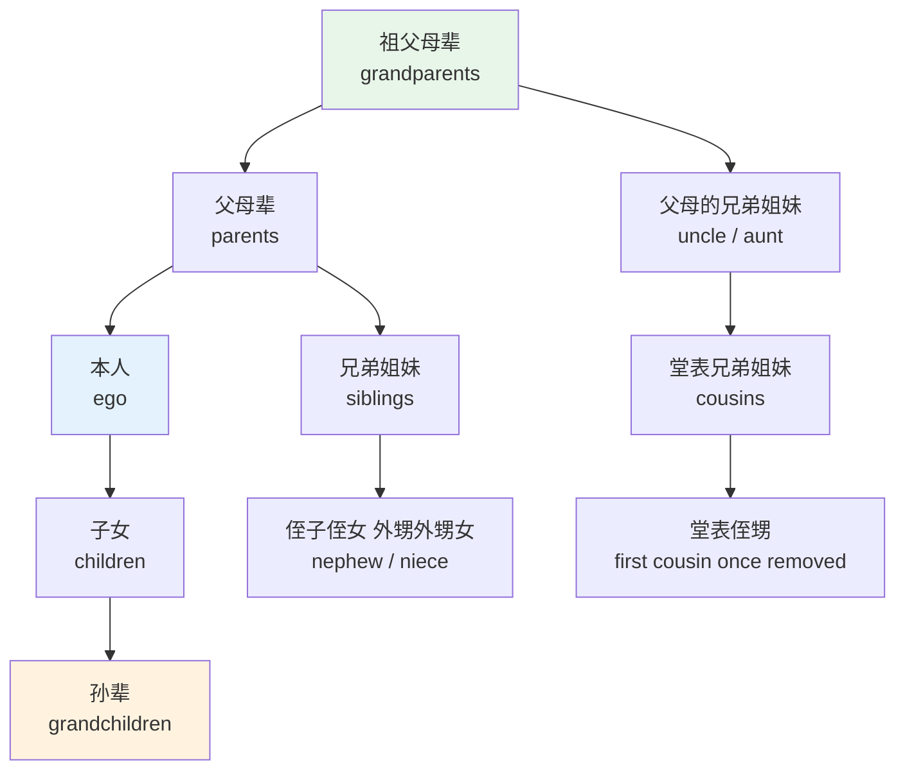
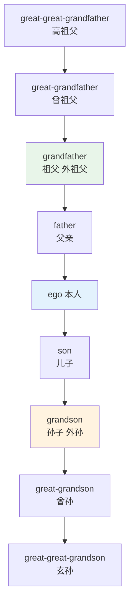
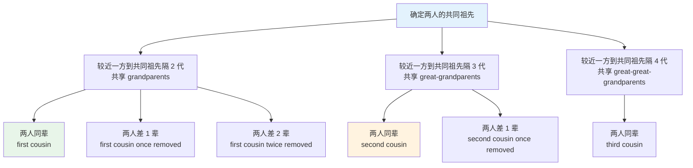
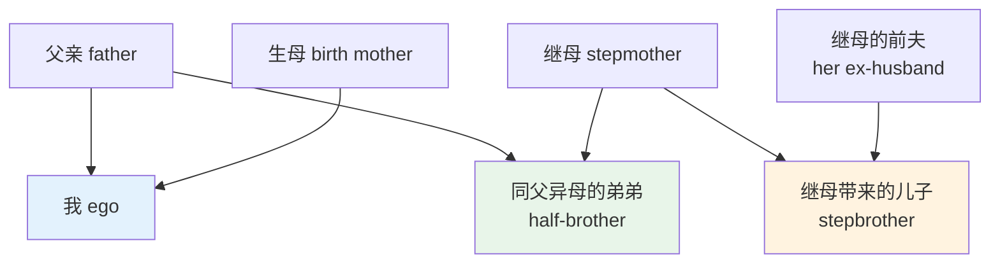
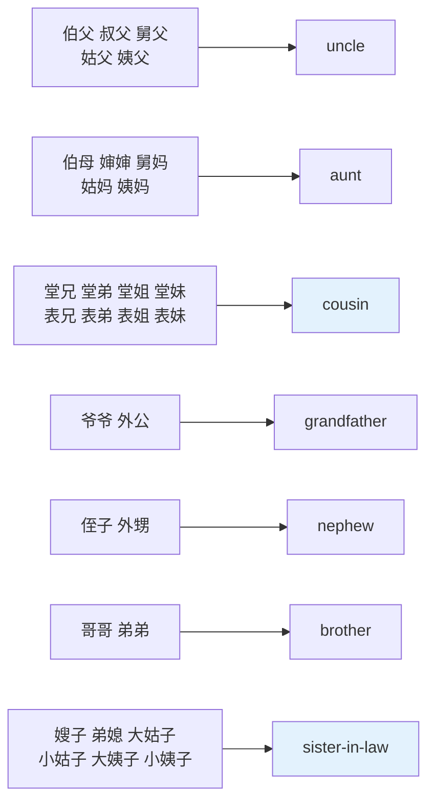
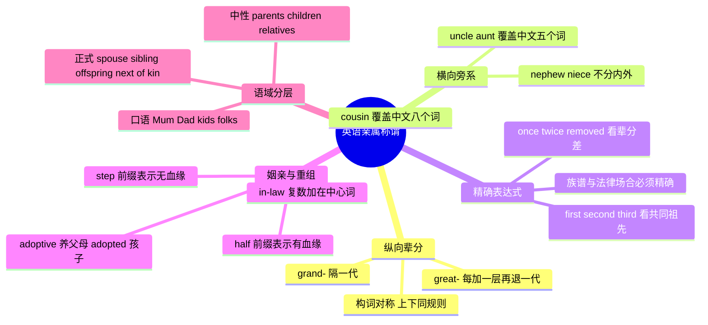

# 亲属称谓全表

> [!info] 本篇定位
>
> 第八章的第一篇，也是全书里中英差异最刺眼的一篇。
>
> 读完你会拿到三样东西：一份约一百五十条的亲属称谓词表（含直系、旁系、姻亲、重组家庭四组）；一套能把「我表姐的儿子」翻译成英语的推算规则；以及 `sibling`、`spouse`、`offspring`、`next of kin` 这类正式词的使用边界——它们出现在合同、保险单、医院表格里，不出现在饭桌上。
>
> 本篇只讲称谓词本身。婚恋流程（`propose`、`engagement`、`wedding`）、育儿动作（`raise`、`nurture`、`toddler`）和人生仪式属于下一篇的范围。

---

## 1. 本篇导读：亲属称谓是一套翻译不过来的系统

多数词汇书把亲属称谓当成简单主题——`father` 爸爸、`mother` 妈妈，背完就过。实际上这是中文母语者最容易出系统性错误的一块，原因不在词难，而在两套系统的**颗粒度不同**。

中文的亲属称谓区分四个维度：父系还是母系（爷爷/外公）、直系还是旁系（哥哥/堂哥）、长还是幼（哥哥/弟弟）、血亲还是姻亲（哥哥/姐夫）。英语基本只区分性别和辈分，其余三个维度全部塌缩掉。结果是中文的八个词（堂兄、堂弟、堂姐、堂妹、表兄、表弟、表姐、表妹）在英语里只剩一个 `cousin`。

这带来两个方向的困难。**中译英方向**：想说「我小姨」，找不到对应词，只能说 `my mother's younger sister` 或者干脆 `my aunt`。**英译中方向**：读到 `He lives with his aunt`，无法确定是姑妈、姨妈还是舅妈，而这在中文语境里往往是必须知道的信息。

反过来，英语在另外两个地方比中文精细。一是**旁系代际差**：中文说「远房表亲」就完了，英语有 `first cousin once removed` 这样能精确到辈分的表达式。二是**重组家庭**：中文的「继父」「同母异父的弟弟」要靠短语描述，英语有 `stepfather`、`half-brother`、`stepbrother` 三个词形整齐的构词族，而且 `half-` 和 `step-` 的区分非常严格。



上图是本篇的骨架，也是英语亲属系统的全貌。以本人（英语学术文献里叫 `ego`）为原点，纵向是辈分轴（祖—父—己—子—孙），横向是亲疏轴（本人 → 兄弟姐妹 → 堂表兄弟姐妹）。英语的每个格子只放一个词，而中文的同一个格子里往往塞了四到八个词。整篇的词表就是在填这张图，再加上姻亲和重组家庭两层覆盖。

---

## 2. 核心家庭：直系亲属的基本词

### 2.1 三代直系的基本词表

英语把父母子女这一圈叫 `the nuclear family`（核心家庭），把加上祖辈、旁系的更大范围叫 `the extended family`（大家庭）。这两个术语在社会学、人口统计、公司福利政策里都会出现。

| 英文 | 英式音标 | 美式音标 | 词性 | 中文 | 搭配与说明 |
| --- | --- | --- | --- | --- | --- |
| **family** | /ˈfæməli/ | /ˈfæməli/ | n. | 家庭；家人 | 集合名词，英式常接复数谓语 My family are all here |
| **parent** | /ˈpeərənt/ | /ˈperənt/ | n. | 家长；父或母 | 单数指一位，双亲要说 parents |
| **father** | /ˈfɑːðə/ | /ˈfɑːðər/ | n. | 父亲 | 中性偏正式，日常口语用 dad |
| **mother** | /ˈmʌðə/ | /ˈmʌðər/ | n. | 母亲 | 也作动词，mother sb 意为溺爱式照顾 |
| **son** | /sʌn/ | /sʌn/ | n. | 儿子 | 与 sun 同音，靠上下文区分 |
| **daughter** | /ˈdɔːtə/ | /ˈdɔːtər/ | n. | 女儿 | gh 不发音 |
| **child** | /tʃaɪld/ | /tʃaɪld/ | n. | 孩子 | 复数 children /ˈtʃɪldrən/，不规则 |
| **brother** | /ˈbrʌðə/ | /ˈbrʌðər/ | n. | 兄；弟 | 不分长幼，需要时加 older / younger |
| **sister** | /ˈsɪstə/ | /ˈsɪstər/ | n. | 姐；妹 | 同上 |
| **husband** | /ˈhʌzbənd/ | /ˈhʌzbənd/ | n. | 丈夫 | s 读 /z/ |
| **wife** | /waɪf/ | /waɪf/ | n. | 妻子 | 复数 wives |
| **household** | /ˈhaʊshəʊld/ | /ˈhaʊshoʊld/ | n. | 户；家庭单位 | 统计与账单用词，强调同住不强调血缘 |

### 2.2 family 是集合名词，谓语要留意

`family` 属于集合名词（collective noun），谓语单复数在英美两地不一样。这个差别在写邮件、写简历时会露馅。

> [!example] 同一句话的英美两版
>
> - My family **is** planning a trip to Japan.
>   - 我家在计划去日本旅行。（美式：把家庭看作一个整体单位）
> - My family **are** planning a trip to Japan.
>   - 同上。（英式：把家庭看作一群人，强调成员各自的行为）

判断依据是语义焦点：强调「一个单位」用单数，强调「里面的一个个人」用复数。美式英语几乎一律用单数，英式两种都常见。同类集合名词还有 `team`、`staff`、`government`、`couple`、`jury`，处理方式一致。完整讨论在 [[18.语域、英美差异与习语俚语/01.英式与美式词汇差异\|英式与美式词汇差异]]。

### 2.3 parent 单数与复数的陷阱

中文的「父母」是一个双数概念，英语的 `parent` 是单数，`parents` 才是双数。中文母语者常写出 `my parent came to see me`，本意是「我父母来看我」，读者理解成「我父母中的某一位来看我」。

> [!warning] parent 的三个常见误用
>
> - ❌ ~~My parent are teachers.~~（单复数不一致）
> - ✅ My **parents** are teachers.
> - ❌ ~~a single parents family~~（复合修饰语里不加复数）
> - ✅ a **single-parent** family（单亲家庭）
> - ❌ ~~My parents is very strict.~~
> - ✅ My **parents** are very strict.
>
> 另外，`parent` 作动词是「养育」（to parent a child），`parenting` 是「育儿」，这两个词在教育类文章里高频出现。

---

## 3. 兄弟姐妹：长幼靠修饰语补出来

### 3.1 长幼与排行的表达

英语的 `brother` 不含长幼信息。要表达「哥哥」必须加修饰语，而修饰语有三套，语域不同。

| 英文 | 英式音标 | 美式音标 | 词性 | 中文 | 搭配与说明 |
| --- | --- | --- | --- | --- | --- |
| **elder brother** | /ˈeldə ˈbrʌðə/ | /ˈeldər ˈbrʌðər/ | n. | 哥哥 | 英式偏好，只用于人，不能说 elder than |
| **older brother** | /ˈəʊldə ˈbrʌðə/ | /ˈoʊldər ˈbrʌðər/ | n. | 哥哥 | 美式偏好，通用度最高 |
| **big brother** | /bɪɡ ˈbrʌðə/ | /bɪɡ ˈbrʌðər/ | n. | 哥哥 | 口语亲昵，大写 Big Brother 指老大哥式监控 |
| **younger sister** | /ˈjʌŋɡə ˈsɪstə/ | /ˈjʌŋɡər ˈsɪstər/ | n. | 妹妹 | 中性通用 |
| **little sister** | /ˈlɪtl ˈsɪstə/ | /ˈlɪtl ˈsɪstər/ | n. | 妹妹 | 口语，带感情色彩 |
| **eldest** | /ˈeldɪst/ | /ˈeldɪst/ | adj. | 最年长的 | the eldest of three children |
| **firstborn** | /ˈfɜːstbɔːn/ | /ˈfɜːrstbɔːrn/ | n./adj. | 长子女 | 略正式，常见于心理学与宗教文本 |
| **only child** | /ˈəʊnli tʃaɪld/ | /ˈoʊnli tʃaɪld/ | n. | 独生子女 | 固定搭配，不说 single child |
| **twin** | /twɪn/ | /twɪn/ | n./adj. | 双胞胎（之一） | 一个孩子叫 a twin，两个叫 twins |
| **identical twins** | /aɪˈdentɪkl twɪnz/ | /aɪˈdentɪkl twɪnz/ | n. | 同卵双胞胎 | 医学词 monozygotic |
| **fraternal twins** | /frəˈtɜːnl twɪnz/ | /frəˈtɜːrnl twɪnz/ | n. | 异卵双胞胎 | 不论性别都叫 fraternal |
| **triplets** | /ˈtrɪpləts/ | /ˈtrɪpləts/ | n. | 三胞胎 | 四胞胎 quadruplets，口语缩为 quads |

> [!warning] elder 与 older 不能互换
>
> `elder` 只能作**前置定语**修饰人，不能跟 `than`，也不能作表语。
>
> - ❌ ~~My brother is elder than me.~~
> - ✅ My brother is **older** than me.
> - ✅ my **elder** brother = my **older** brother（都对）
> - ✅ He is the **eldest** son. = He is the **oldest** son.（都对）
>
> `elder` 另有名词用法，指教会长老或部落长者：`the village elders`（村中长老）。这个义项和长幼排行无关。

### 3.2 「独生子女」这个概念的英语落点

`only child` 是固定说法，复数是 `only children`，不能说 `single child`（那读起来像「单身的孩子」）。相关的还有 `sibling rivalry`（手足竞争）、`middle child`（排行中间的孩子），后者在美国流行心理学里衍生出 `middle child syndrome` 这个半戏谑的说法。

> [!example] 排行相关的自然表达
>
> - I'm an **only child**, so I never had to share a room.
>   - 我是独生子女，从来不用跟人合住一间房。
> - She's the **eldest of four**.
>   - 她是四个孩子里最大的。
> - He's the **middle child** — the classic peacemaker.
>   - 他排行中间，典型的和事佬。

---

## 4. 祖辈与后代：grand- 与 great- 的层级机制

### 4.1 两个前缀的分工

英语用两个前缀搭出无限深的纵向辈分，规则只有两条：

- `grand-` 表示**隔一代**，加在 `father`、`mother`、`son`、`daughter`、`parent`、`child` 前。
- `great-` 表示**再往外推一代**，可以叠加，写作 `great-great-grandfather`。

| 英文 | 英式音标 | 美式音标 | 词性 | 中文 | 搭配与说明 |
| --- | --- | --- | --- | --- | --- |
| **grandparent** | /ˈɡrænpeərənt/ | /ˈɡrænperənt/ | n. | 祖父母（一位） | 双数说 grandparents |
| **grandfather** | /ˈɡrænfɑːðə/ | /ˈɡrænfɑːðər/ | n. | 祖父；外祖父 | 不分父系母系 |
| **grandmother** | /ˈɡrænmʌðə/ | /ˈɡrænmʌðər/ | n. | 祖母；外祖母 | 同上 |
| **grandchild** | /ˈɡræntʃaɪld/ | /ˈɡræntʃaɪld/ | n. | 孙辈（一位） | 复数 grandchildren |
| **grandson** | /ˈɡrænsʌn/ | /ˈɡrænsʌn/ | n. | 孙子；外孙 | — |
| **granddaughter** | /ˈɡrændɔːtə/ | /ˈɡrændɔːtər/ | n. | 孙女；外孙女 | 拼写有两个 d，常被漏掉 |
| **great-grandfather** | /ˌɡreɪt ˈɡrænfɑːðə/ | /ˌɡreɪt ˈɡrænfɑːðər/ | n. | 曾祖父 | 连字符不能省 |
| **great-grandmother** | /ˌɡreɪt ˈɡrænmʌðə/ | /ˌɡreɪt ˈɡrænmʌðər/ | n. | 曾祖母 | — |
| **great-grandchild** | /ˌɡreɪt ˈɡræntʃaɪld/ | /ˌɡreɪt ˈɡræntʃaɪld/ | n. | 曾孙辈 | — |
| **great-great-grandfather** | /ˌɡreɪt ˌɡreɪt ˈɡrænfɑːðə/ | /ˌɡreɪt ˌɡreɪt ˈɡrænfɑːðər/ | n. | 高祖父 | 再往上口语说 my fourth great-grandfather |



上图把纵向辈分轴摊平了。往上和往下的构词完全对称：`grand-` 处理隔一代，之后每往外一代加一个 `great-`。中文这一轴上是六个各不相干的字（高、曾、祖、父、子、孙、曾孙、玄孙），英语只是两个前缀的叠加，认得规则就不用背。族谱网站上还会看到 `2× great-grandfather` 这种写法，等于 `great-great-grandfather`。

### 4.2 父系母系怎么补出来

英语的 `grandfather` 不区分爷爷和外公。要区分，有三种办法，正式度递减：

| 表达式 | 语域 | 例子 | 中文 |
| --- | --- | --- | --- |
| paternal / maternal + 称谓 | 正式，书面、法律、族谱 | my **paternal** grandfather | 我爷爷 |
| on my father's / mother's side | 中性，口语书面通用 | my grandfather **on my mother's side** | 我外公 |
| 直接叫昵称区分 | 口语，家庭内部约定 | Grandpa Chen 和 Grandpa Li | 靠姓氏区分 |

| 英文 | 英式音标 | 美式音标 | 词性 | 中文 | 搭配与说明 |
| --- | --- | --- | --- | --- | --- |
| **paternal** | /pəˈtɜːnl/ | /pəˈtɜːrnl/ | adj. | 父系的；父亲般的 | paternal grandmother 指奶奶 |
| **maternal** | /məˈtɜːnl/ | /məˈtɜːrnl/ | adj. | 母系的；母亲般的 | maternal instinct 母性本能 |
| **fraternal** | /frəˈtɜːnl/ | /frəˈtɜːrnl/ | adj. | 兄弟般的 | fraternal twins 异卵双胞胎 |
| **filial** | /ˈfɪliəl/ | /ˈfɪliəl/ | adj. | 子女的 | filial piety 是「孝」的标准译法 |
| **avuncular** | /əˈvʌŋkjələ/ | /əˈvʌŋkjələr/ | adj. | 叔伯般的；和蔼可亲的 | 来自拉丁语 avunculus 舅父 |

> [!tip] paternal 和 maternal 的另一组高频用法
>
> 这两个词在职场语境里指产假育儿假，跟族谱无关：`maternity leave`（产假）、`paternity leave`（陪产假）、`parental leave`（育儿假，不分性别）。拼写是 `-ity` 不是 `-al`，容易混。
>
> - She's on **maternity leave** until March.
>   - 她休产假到三月。

---

## 5. 旁系亲属：uncle、aunt、nephew、niece

### 5.1 四个词覆盖中文十几个词

| 英文 | 英式音标 | 美式音标 | 词性 | 中文 | 搭配与说明 |
| --- | --- | --- | --- | --- | --- |
| **uncle** | /ˈʌŋkl/ | /ˈʌŋkl/ | n. | 伯父；叔父；舅父；姑父；姨父 | 血亲与姻亲都能用 |
| **aunt** | /ɑːnt/ | /ænt/ | n. | 伯母；婶婶；舅妈；姑妈；姨妈 | 英美读音差异大，美音与 ant 同音 |
| **nephew** | /ˈnefjuː/ | /ˈnefjuː/ | n. | 侄子；外甥 | 英式老派读 /ˈnevjuː/ |
| **niece** | /niːs/ | /niːs/ | n. | 侄女；外甥女 | ie 读 /iː/ |
| **great-uncle** | /ˌɡreɪt ˈʌŋkl/ | /ˌɡreɪt ˈʌŋkl/ | n. | 叔公；舅公 | 祖父母的兄弟，也写 granduncle |
| **great-aunt** | /ˌɡreɪt ˈɑːnt/ | /ˌɡreɪt ˈænt/ | n. | 姑婆；姨婆 | 也写 grandaunt |
| **great-nephew** | /ˌɡreɪt ˈnefjuː/ | /ˌɡreɪt ˈnefjuː/ | n. | 侄孙；外甥孙 | 也写 grandnephew |
| **nepotism** | /ˈnepətɪzəm/ | /ˈnepətɪzəm/ | n. | 任人唯亲 | 词源就是 nephew，教皇提拔侄子 |
| **auntie** | /ˈɑːnti/ | /ˈænti/ | n. | 阿姨；姑姑 | 昵称形式，也拼 aunty |
| **kin** | /kɪn/ | /kɪn/ | n. | 亲属（总称） | 不可数，next of kin 是法律固定搭配 |

> [!warning] aunt 的读音是英美差异最典型的例子之一
>
> 英式 /ɑːnt/，美式 /ænt/。美式读音跟「蚂蚁」`ant` 完全同音，这是英美笑话的常见素材。
>
> 同一组 BATH 元音差异还有：`can't`（英 /kɑːnt/，美 /kænt/）、`dance`（英 /dɑːns/，美 /dæns/）、`half`（英 /hɑːf/，美 /hæf/）。规则在 [[01.词汇入门与学习方法/03.音标、词重音与词典读音体例\|音标、词重音与词典读音体例]] 里有完整讨论。
>
> 学习建议是**选定一套读到底**，不要英式美式混着用。

### 5.2 中文母语者最危险的一个用法：不能拿 uncle 叫陌生人

中文里管陌生的中年男性叫「叔叔」、中年女性叫「阿姨」，这是社交礼貌。英语里 `uncle` 和 `aunt` 严格用于真实亲属关系，或者关系极近、被家庭默认接纳的长辈朋友（那时会说 `Uncle Bob`，用名不用姓）。

> [!warning] 称呼陌生人的错误与正确写法
>
> - ❌ ~~Excuse me, uncle, where is the station?~~（对陌生人用 uncle）
> - ✅ Excuse me, **sir**, where is the station?
> - ❌ ~~Thank you, auntie.~~（对店员、邻居用 auntie）
> - ✅ Thank you, **ma'am**.（美式）/ Thank you.（英式更常见，直接省略称呼）
>
> 反向也要注意：读到英文里的 `Uncle Bob`，不要默认翻成「鲍勃叔叔」就等于血缘上的叔叔，很可能只是父母的老朋友。

### 5.3 需要精确时怎么说

英语在需要精确时不造新词，而是用**关系链描述**。这是英语亲属表达的基本策略。

> [!example] 把中文的精确度还原成英语
>
> - 我大伯 → my father's **elder** brother
>   - 也可以说 my uncle on my father's side，精确度降一档但更自然。
> - 我小姨 → my mother's **younger** sister
>   - 日常场合直接说 my aunt 就够，除非确实需要区分。
> - 我表哥 → my cousin **on my mother's side**
>   - 中文的「表」在英语里无对应，只能靠 side 表达。
> - 我堂妹 → my **younger** cousin on my father's side
>   - 三重信息（旁系、父系、年幼）全靠修饰语补。

关键在于放弃「一定要有对应词」的期待。母语者听到 `my cousin` 时不会追问是堂是表，那个区分在英语文化里不承载信息量。

---

## 6. cousin 的精确表述：second 与 removed 怎么算

### 6.1 两个独立维度

`cousin` 单说时默认指 `first cousin`——共享一对祖父母的同辈人。要精确表达更远的亲戚关系，英语用两个互相独立的参数：

- **序数（first / second / third）**：衡量共同祖先有多远。共享祖父母是 first，共享曾祖父母是 second，共享高祖父母是 third。
- **removed（once / twice / three times）**：衡量两人差几辈。同辈是 0，差一辈是 once removed，差两辈是 twice removed。



上图是完整的推算流程。先找共同祖先定序数，再比辈分定 removed，两个参数互不干扰。注意序数看的是**离共同祖先较近的那一方**——你和你表姐的孙子共享的是你的祖父母，对你来说隔两代，所以基数仍是 first，只是差了两辈，所以是 `first cousin twice removed`。

### 6.2 三组具体推算

| 关系描述 | 共同祖先 | 辈分差 | 英语表达 | 中文近似 |
| --- | --- | --- | --- | --- |
| 我 与 我叔叔的儿子 | 我的祖父母 | 0 | **first cousin** | 堂弟 |
| 我 与 我表姐的儿子 | 我的祖父母 | 1 | **first cousin once removed** | 表外甥 |
| 我 与 我父亲的表哥 | 我的曾祖父母 | 1 | **first cousin once removed** | 表叔 |
| 我 与 我父亲表哥的儿子 | 我的曾祖父母 | 0 | **second cousin** | 远房堂兄弟 |
| 我 与 我祖父表弟的孙子 | 我的高祖父母 | 0 | **third cousin** | 远亲 |

| 英文 | 英式音标 | 美式音标 | 词性 | 中文 | 搭配与说明 |
| --- | --- | --- | --- | --- | --- |
| **cousin** | /ˈkʌzn/ | /ˈkʌzn/ | n. | 堂表兄弟姐妹 | ou 读 /ʌ/，s 读 /z/ |
| **first cousin** | /fɜːst ˈkʌzn/ | /fɜːrst ˈkʌzn/ | n. | 一代堂表亲 | 共享祖父母，单说 cousin 时默认此义 |
| **second cousin** | /ˈsekənd ˈkʌzn/ | /ˈsekənd ˈkʌzn/ | n. | 二代堂表亲 | 共享曾祖父母 |
| **once removed** | /wʌns rɪˈmuːvd/ | /wʌns rɪˈmuːvd/ | phr. | 差一辈 | 后置修饰 cousin |
| **twice removed** | /twaɪs rɪˈmuːvd/ | /twaɪs rɪˈmuːvd/ | phr. | 差两辈 | 三辈说 three times removed |
| **distant relative** | /ˈdɪstənt ˈrelətɪv/ | /ˈdɪstənt ˈrelətɪv/ | n. | 远亲 | 说不清具体关系时的兜底说法 |
| **close relative** | /kləʊs ˈrelətɪv/ | /kloʊs ˈrelətɪv/ | n. | 近亲 | close 此处读 /s/ 不读 /z/ |

> [!warning] second cousin 被误用得很厉害
>
> 母语者自己也经常把 `first cousin once removed` 叫成 `second cousin`。严格意义上这是错的，但在日常对话里几乎没人纠正。
>
> **要精确的场合**：族谱研究（genealogy）、遗产继承、婚姻法（很多司法辖区对表亲结婚有限制）、遗传病咨询。这些场合必须用严格定义。
>
> **不必精确的场合**：闲聊。直接说 `a cousin of mine` 或 `some distant relative` 就够了，硬掰 `first cousin twice removed` 反而显得刻意。

> [!example] 实际语境里的用法
>
> - Technically she's my **first cousin once removed**, but we just say cousin.
>   - 严格说她是我的表侄女辈，不过我们就叫表姐妹。
> - He's a **distant cousin** on my father's side — we met at a funeral.
>   - 他是我父亲那边的远房表亲，我们在一场葬礼上见过。
> - In some states, marriage between **first cousins** is prohibited.
>   - 在一些州，一代表亲之间禁止通婚。

---

## 7. 姻亲：-in-law 的构词与复数

### 7.1 六个基本词

英语用 `-in-law` 后缀统一处理配偶方亲属和自己方亲属的配偶。字面意思是「法律上的」——不是血亲，是通过婚姻这个法律关系建立的亲属。

| 英文 | 英式音标 | 美式音标 | 词性 | 中文 | 搭配与说明 |
| --- | --- | --- | --- | --- | --- |
| **father-in-law** | /ˈfɑːðər ɪn lɔː/ | /ˈfɑːðər ɪn lɔː/ | n. | 公公；岳父 | 复数 fathers-in-law |
| **mother-in-law** | /ˈmʌðər ɪn lɔː/ | /ˈmʌðər ɪn lɔː/ | n. | 婆婆；岳母 | 复数 mothers-in-law |
| **son-in-law** | /ˈsʌn ɪn lɔː/ | /ˈsʌn ɪn lɔː/ | n. | 女婿 | 复数 sons-in-law |
| **daughter-in-law** | /ˈdɔːtər ɪn lɔː/ | /ˈdɔːtər ɪn lɔː/ | n. | 儿媳 | 复数 daughters-in-law |
| **brother-in-law** | /ˈbrʌðər ɪn lɔː/ | /ˈbrʌðər ɪn lɔː/ | n. | 姐夫；妹夫；大伯子；小叔子；大舅子；小舅子 | 覆盖面极广 |
| **sister-in-law** | /ˈsɪstər ɪn lɔː/ | /ˈsɪstər ɪn lɔː/ | n. | 嫂子；弟媳；大姑子；小姑子；大姨子；小姨子 | 同上 |
| **in-laws** | /ˈɪn lɔːz/ | /ˈɪn lɔːz/ | n. | 配偶的家人（总称） | 只用复数，my in-laws are visiting |
| **stepfamily** | /ˈstepfæməli/ | /ˈstepfæməli/ | n. | 重组家庭 | 也说 blended family |

### 7.2 复数与所有格的写法

复合名词加 `-in-law` 时，复数记号加在**中心词**上，所有格记号加在**整个短语末尾**。这两条规则方向相反，是笔试和邮件里最常错的点。

```text
单数         mother-in-law
复数         mothers-in-law        ← 复数 s 加在 mother 上
单数所有格   my mother-in-law's car   ← 撇号 s 加在末尾
复数所有格   my two brothers-in-law's wives
```

> [!warning] 三种典型写法错误
>
> - ❌ ~~mother-in-laws~~ / ~~mother-in-law's are visiting~~
> - ✅ **mothers-in-law**（复数）
> - ❌ ~~my mother's-in-law house~~
> - ✅ my **mother-in-law's** house（所有格加在最后）
> - ❌ ~~in-law~~ 单独用来指「亲家一大家子」
> - ✅ my **in-laws**（这个总称义只有复数形式）
>
> 同类复合名词的复数规则一致：`passers-by`、`attorneys-general`、`courts-martial`、`runners-up`。

### 7.3 sister-in-law 覆盖了中文的六个词

这是中英颗粒度差异最悬殊的一个格子。

| 中文 | 具体关系 | 英语 |
| --- | --- | --- |
| 嫂子 | 兄之妻 | sister-in-law |
| 弟媳 | 弟之妻 | sister-in-law |
| 大姑子 | 夫之姐 | sister-in-law |
| 小姑子 | 夫之妹 | sister-in-law |
| 大姨子 | 妻之姐 | sister-in-law |
| 小姨子 | 妻之妹 | sister-in-law |

> [!tip] 需要区分时怎么说
>
> 英语不造词，靠短语还原：
>
> - **my wife's sister**（妻子的姐妹）
> - **my brother's wife**（哥哥或弟弟的妻子）
> - **my husband's older sister**（丈夫的姐姐）
>
> 反过来，中文里的「连襟」（两个男人娶了姐妹）和「妯娌」（两个女人嫁给兄弟）在英语里连描述都很拗口，一般只能说 `our wives are sisters`。这类概念在英语文化里不构成一个需要命名的社会角色。

---

## 8. 重组家庭：step-、half-、foster、adoptive

### 8.1 step- 与 half- 的严格区分

这两个前缀在英语里承载了确切的血缘信息，混用会传达错误事实。规则只有一条：

- `half-` 表示**有一个共同的亲生父母**。同父异母或同母异父的兄弟姐妹是 `half-brother` / `half-sister`。
- `step-` 表示**没有血缘关系**，仅因父母再婚而成为家人。继父带来的儿子是 `stepbrother`。

| 英文 | 英式音标 | 美式音标 | 词性 | 中文 | 搭配与说明 |
| --- | --- | --- | --- | --- | --- |
| **stepfather** | /ˈstepfɑːðə/ | /ˈstepfɑːðər/ | n. | 继父 | 口语也说 stepdad |
| **stepmother** | /ˈstepmʌðə/ | /ˈstepmʌðər/ | n. | 继母 | 童话里的固定反派，带贬义联想 |
| **stepson** | /ˈstepsʌn/ | /ˈstepsʌn/ | n. | 继子 | 配偶与前任所生的儿子 |
| **stepdaughter** | /ˈstepdɔːtə/ | /ˈstepdɔːtər/ | n. | 继女 | — |
| **stepchild** | /ˈsteptʃaɪld/ | /ˈsteptʃaɪld/ | n. | 继子女 | 复数 stepchildren |
| **stepbrother** | /ˈstepbrʌðə/ | /ˈstepbrʌðər/ | n. | 继兄弟 | 无血缘，父母一方再婚带来 |
| **stepsister** | /ˈstepsɪstə/ | /ˈstepsɪstər/ | n. | 继姐妹 | 灰姑娘故事里的 stepsisters |
| **stepparent** | /ˈsteppeərənt/ | /ˈstepperənt/ | n. | 继父母（一位） | — |
| **half-brother** | /ˈhɑːf brʌðə/ | /ˈhæf brʌðər/ | n. | 同父异母或同母异父的兄弟 | 有一半血缘 |
| **half-sister** | /ˈhɑːf sɪstə/ | /ˈhæf sɪstər/ | n. | 同父异母或同母异父的姐妹 | — |
| **half-sibling** | /ˈhɑːf sɪblɪŋ/ | /ˈhæf sɪblɪŋ/ | n. | 半血缘手足 | 不分性别的正式说法 |
| **blended family** | /ˌblendɪd ˈfæməli/ | /ˌblendɪd ˈfæməli/ | n. | 重组家庭 | 比 stepfamily 中性、更受偏好 |

> [!warning] step- 与 half- 混用会传达错误信息
>
> - 你父亲再婚，新妻子带来一个儿子 → 他是你的 **stepbrother**（零血缘）
> - 你父亲再婚，与新妻子又生一个儿子 → 他是你的 **half-brother**（共享父亲）
>
> 这两个词在遗产继承、医疗家族史、移民材料里都有实际后果，不能随口互换。
>
> 中文的「继兄弟」不区分这两种情况，直接照译会丢信息。



上图把两种关系放在同一张家谱里对比。`half-brother` 与本人共享一条血线（父亲），`stepbrother` 与本人一条血线都不共享，两人的连接完全来自父亲和继母的婚姻。判断方法很机械：数一数两人是否至少共享一位亲生父母，共享就是 `half-`，不共享就是 `step-`。

### 8.2 收养、寄养与监护

这一组词在移民材料、领养程序、社会福利文档里高频出现，词形接近但法律含义不同。

| 英文 | 英式音标 | 美式音标 | 词性 | 中文 | 搭配与说明 |
| --- | --- | --- | --- | --- | --- |
| **adopt** | /əˈdɒpt/ | /əˈdɑːpt/ | v. | 收养；采纳 | 另有「采用方案」义，adopt a policy |
| **adoption** | /əˈdɒpʃn/ | /əˈdɑːpʃn/ | n. | 收养 | put a child up for adoption |
| **adoptive** | /əˈdɒptɪv/ | /əˈdɑːptɪv/ | adj. | 收养的（指养父母） | adoptive parents |
| **adopted** | /əˈdɒptɪd/ | /əˈdɑːptɪd/ | adj. | 被收养的（指孩子） | an adopted child |
| **foster** | /ˈfɒstə/ | /ˈfɔːstər/ | v./adj. | 寄养；培养 | foster care 寄养体系 |
| **foster parent** | /ˈfɒstə ˈpeərənt/ | /ˈfɔːstər ˈperənt/ | n. | 寄养家长 | 不转移法定亲权 |
| **birth parent** | /bɜːθ ˈpeərənt/ | /bɜːrθ ˈperənt/ | n. | 亲生父母 | 也说 biological parent |
| **guardian** | /ˈɡɑːdiən/ | /ˈɡɑːrdiən/ | n. | 监护人 | 表格上常写 parent or guardian |
| **ward** | /wɔːd/ | /wɔːrd/ | n. | 被监护人 | 也指医院病房 |
| **orphan** | /ˈɔːfn/ | /ˈɔːrfn/ | n./v. | 孤儿；使成孤儿 | orphanage 孤儿院 |
| **surrogate** | /ˈsʌrəɡət/ | /ˈsɜːrəɡət/ | n./adj. | 代孕者；替代的 | surrogate mother |
| **godparent** | /ˈɡɒdpeərənt/ | /ˈɡɑːdperənt/ | n. | 教父母 | 宗教仪式指定的精神监护人 |
| **godfather** | /ˈɡɒdfɑːðə/ | /ˈɡɑːdfɑːðər/ | n. | 教父 | 电影 The Godfather 后带黑帮联想 |
| **godchild** | /ˈɡɒdtʃaɪld/ | /ˈɡɑːdtʃaɪld/ | n. | 教子女 | 复数 godchildren |

> [!warning] adoptive 与 adopted 指向不同的人
>
> 这一对形容词方向相反，写错会把父母和孩子说反。
>
> - ✅ his **adoptive** parents（收养他的父母）
> - ✅ their **adopted** son（他们收养的儿子）
> - ❌ ~~his adopted parents~~（读起来像「被他收养的父母」）
>
> 同一模式还有 `foster parents` 与 `foster child`——`foster` 作定语时不分主客，两边都用同一形式，靠中心词区分。

> [!tip] adopt 与 foster 的实质差别
>
> `adoption` 转移法定亲权，孩子在法律上成为收养家庭的正式成员，通常改姓，关系永久。
>
> `fostering` 不转移亲权，是临时安置，孩子仍在原生父母或国家的法定监护之下，随时可能回归或转往别处。
>
> 英美新闻里 `foster care system`（寄养体系）与 `adoption agency`（收养机构）是两套不同的制度，看新闻时不要混。

---

## 9. 中英颗粒度差异：一张对照总表

### 9.1 塌缩关系全图



上图展示的是单向塌缩：中文左侧的每一组词在英语里只对应右侧一个词。塌缩最厉害的两处是 `cousin`（八对一）和 `sister-in-law`（六对一）。反过来从英语回中文时，这些词全部是**信息不足**的——必须靠上下文或者追问才能确定具体是哪一个。翻译文学作品时这是译者最头疼的地方之一。

### 9.2 完整对照表

| 中文称谓 | 具体关系 | 英语 | 需要精确时的说法 |
| --- | --- | --- | --- |
| 爷爷 | 父之父 | grandfather | paternal grandfather |
| 外公 | 母之父 | grandfather | maternal grandfather |
| 奶奶 | 父之母 | grandmother | grandmother on my father's side |
| 外婆 | 母之母 | grandmother | grandmother on my mother's side |
| 伯父 | 父之兄 | uncle | my father's elder brother |
| 叔父 | 父之弟 | uncle | my father's younger brother |
| 舅父 | 母之兄弟 | uncle | my mother's brother |
| 姑父 | 姑母之夫 | uncle | my aunt's husband |
| 姨妈 | 母之姐妹 | aunt | my mother's sister |
| 堂哥 | 伯叔之子 | cousin | my cousin on my father's side |
| 表妹 | 姑舅姨之女 | cousin | my younger cousin on my mother's side |
| 侄子 | 兄弟之子 | nephew | my brother's son |
| 外甥 | 姐妹之子 | nephew | my sister's son |
| 孙子 | 子之子 | grandson | my son's son |
| 外孙 | 女之子 | grandson | my daughter's son |
| 姐夫 | 姐之夫 | brother-in-law | my elder sister's husband |
| 小舅子 | 妻之弟 | brother-in-law | my wife's younger brother |
| 儿媳 | 子之妻 | daughter-in-law | — |
| 连襟 | 妻姐妹之夫 | 无对应词 | our wives are sisters |
| 妯娌 | 兄弟之妻互称 | 无对应词 | we're married to brothers |

### 9.3 反过来看：英语更精细的两处

英语并非全面粗糙，它在两个维度上比中文精细，这两处中文母语者反而容易漏。

**第一处是代际差表达式。** 中文对「远房亲戚」只有模糊的说法，英语的 `first cousin once removed` 能算到具体格子。族谱软件、遗产文件里必须用这套。

**第二处是血缘的有无。** 中文的「继兄弟」不区分是否共享父母一方，英语的 `half-` 与 `step-` 强制区分。医疗问诊、保险核保、遗嘱执行都依赖这个区分。

| 英文 | 英式音标 | 美式音标 | 词性 | 中文 | 搭配与说明 |
| --- | --- | --- | --- | --- | --- |
| **blood relative** | /blʌd ˈrelətɪv/ | /blʌd ˈrelətɪv/ | n. | 血亲 | 对应 relative by marriage 姻亲 |
| **relative by marriage** | /ˈrelətɪv baɪ ˈmærɪdʒ/ | /ˈrelətɪv baɪ ˈmerɪdʒ/ | n. | 姻亲 | 正式表述，等于 in-law |
| **immediate family** | /ɪˈmiːdiət ˈfæməli/ | /ɪˈmiːdiət ˈfæməli/ | n. | 直系亲属 | 公司丧假、签证政策的关键定义 |
| **extended family** | /ɪkˈstendɪd ˈfæməli/ | /ɪkˈstendɪd ˈfæməli/ | n. | 大家庭 | 含祖辈、旁系 |
| **nuclear family** | /ˈnjuːkliə ˈfæməli/ | /ˈnuːkliər ˈfæməli/ | n. | 核心家庭 | 社会学术语，父母加未成年子女 |
| **consanguinity** | /ˌkɒnsæŋˈɡwɪnəti/ | /ˌkɑːnsæŋˈɡwɪnəti/ | n. | 血缘关系 | 法律与遗传学用词 |

---

## 10. 正式度分层：sibling、spouse、offspring 什么时候用

### 10.1 三层语域对照

亲属称谓和第一篇讲的三层来源结构完全吻合：日耳曼层的短词是口语，法语拉丁层的词是正式书面。填一张表格时用错层，比语法错误更容易暴露非母语身份。

| 概念 | 口语层 | 中性层 | 正式 / 法律层 |
| --- | --- | --- | --- |
| 父母 | Mum / Mom, Dad | parents | parent or guardian |
| 兄弟姐妹 | bro, sis | brothers and sisters | **siblings** |
| 配偶 | my other half, hubby | husband, wife, partner | **spouse** |
| 子女 | kids | children | **offspring**, issue, **dependants** |
| 亲戚 | folks, relatives | relatives | **next of kin**, **kin** |
| 祖先 | — | ancestors | **forebears**, **progenitors** |
| 后代 | — | descendants | **progeny**, **posterity** |

| 英文 | 英式音标 | 美式音标 | 词性 | 中文 | 搭配与说明 |
| --- | --- | --- | --- | --- | --- |
| **sibling** | /ˈsɪblɪŋ/ | /ˈsɪblɪŋ/ | n. | 兄弟姐妹（不分性别） | 古英语 sibb 复活的技术词 |
| **spouse** | /spaʊs/ | /spaʊs/ | n. | 配偶 | 复数 spouses /ˈspaʊzɪz/，表格与法律文本用词 |
| **offspring** | /ˈɒfsprɪŋ/ | /ˈɔːfsprɪŋ/ | n. | 子女；后代 | 单复数同形，生物学与调侃语境 |
| **progeny** | /ˈprɒdʒəni/ | /ˈprɑːdʒəni/ | n. | 后代 | 书面语，比 offspring 更文雅 |
| **progenitor** | /prəʊˈdʒenɪtə/ | /proʊˈdʒenɪtər/ | n. | 始祖；先驱 | 也指某事物的最早原型 |
| **descendant** | /dɪˈsendənt/ | /dɪˈsendənt/ | n. | 后裔 | 对应 ancestor |
| **ancestor** | /ˈænsestə/ | /ˈænsestər/ | n. | 祖先 | 也用于生物演化与软件版本树 |
| **forebear** | /ˈfɔːbeə/ | /ˈfɔːrber/ | n. | 先辈 | 多用复数 forebears，略文言 |
| **posterity** | /pɒˈsterəti/ | /pɑːˈsterəti/ | n. | 后世 | for posterity 为了留给后人 |
| **next of kin** | /ˌnekst əv ˈkɪn/ | /ˌnekst əv ˈkɪn/ | n. | 最近亲属 | 医院、警方、保险的固定表格项 |
| **dependant** | /dɪˈpendənt/ | /dɪˈpendənt/ | n. | 受抚养人 | 英式名词拼 -ant，美式一律 -ent |
| **issue** | /ˈɪʃuː/ | /ˈɪʃuː/ | n. | 子嗣（法律） | died without issue 无子嗣而终 |
| **kindred** | /ˈkɪndrəd/ | /ˈkɪndrəd/ | n./adj. | 亲属；同类的 | kindred spirit 志趣相投的人 |

### 10.2 sibling 的用法边界

`sibling` 是这一组里最实用的一个，因为它填补了英语的一个空缺——中文有「兄弟姐妹」这个不分性别的总称，英语日常表达只能说 `brothers and sisters`，啰嗦且暗示两种性别都有。

> [!example] sibling 的典型使用场合
>
> - Do you have any **siblings**?
>   - 你有兄弟姐妹吗？（比 Do you have brothers or sisters 更简洁，问卷与初次见面常用）
> - The study followed 400 pairs of **siblings** over ten years.
>   - 该研究追踪了四百对兄弟姐妹十年。（学术论文）
> - **Sibling** rivalry peaks between the ages of three and seven.
>   - 手足竞争在三到七岁间最激烈。（心理学）

`sibling` 在英美口语里也进入了日常，但仍带一点书面感。跟朋友闲聊时说 `my brother` 比 `my sibling` 自然得多；`my sibling` 现在常见于刻意不透露对方性别的场合。

### 10.3 spouse 与 partner 的选择

`spouse` 是法律和行政用语，几乎不出现在对话里。日常提及配偶有三个选项，社会含义各不相同。

| 英文 | 英式音标 | 美式音标 | 词性 | 中文 | 搭配与说明 |
| --- | --- | --- | --- | --- | --- |
| **partner** | /ˈpɑːtnə/ | /ˈpɑːrtnər/ | n. | 伴侣 | 不指明婚姻状态与性别，最中性 |
| **significant other** | /sɪɡˌnɪfɪkənt ˈʌðə/ | /sɪɡˌnɪfɪkənt ˈʌðər/ | n. | 另一半 | 略带调侃，缩写 S.O. |
| **hubby** | /ˈhʌbi/ | /ˈhʌbi/ | n. | 老公 | husband 的亲昵缩写，口语 |
| **widow** | /ˈwɪdəʊ/ | /ˈwɪdoʊ/ | n. | 寡妇 | — |
| **widower** | /ˈwɪdəʊə/ | /ˈwɪdoʊər/ | n. | 鳏夫 | 加 -er 表男性，是英语里少见的方向 |
| **bereaved** | /bɪˈriːvd/ | /bɪˈriːvd/ | adj. | 丧亲的 | the bereaved 指遗属，讣告用词 |

> [!tip] partner 在当代英语里的地位
>
> 过去二十年里 `partner` 已经成为很多英美职场和正式场合的默认词，因为它不预设婚姻状态，也不预设性别。写邀请函、填活动名单时用 `you and your partner` 比 `you and your wife` 安全得多。
>
> 注意 `partner` 有歧义：在商业语境里指「合伙人」（a partner at a law firm）。靠上下文区分，必要时说 `my business partner` 或 `my life partner`。

---

## 11. 称呼语：Mum 与 Mom、Grandma 与 Nan

### 11.1 称谓词与称呼语是两套东西

`father` 是**称谓词**（用于描述关系：`my father is a doctor`），`Dad` 是**称呼语**（用于当面叫人：`Dad, can you help?`）。中文母语者常把两者混用，写出 `Father, I'm home` 这种听起来像十九世纪小说的句子。

| 英文 | 英式音标 | 美式音标 | 词性 | 中文 | 搭配与说明 |
| --- | --- | --- | --- | --- | --- |
| **Mum** | /mʌm/ | — | n. | 妈妈 | 英式拼写与读音 |
| **Mom** | — | /mɑːm/ | n. | 妈妈 | 美式拼写与读音 |
| **Mummy** | /ˈmʌmi/ | — | n. | 妈咪 | 英式儿语，也指木乃伊 |
| **Mommy** | — | /ˈmɑːmi/ | n. | 妈咪 | 美式儿语 |
| **Dad** | /dæd/ | /dæd/ | n. | 爸爸 | 英美通用 |
| **Daddy** | /ˈdædi/ | /ˈdædi/ | n. | 爸比 | 儿语，成人使用有特殊含义 |
| **Papa** | /pəˈpɑː/ | /ˈpɑːpə/ | n. | 爸爸 | 重音位置英美不同 |
| **Grandma** | /ˈɡrænmɑː/ | /ˈɡrænmɑː/ | n. | 奶奶；外婆 | 最通用的称呼语 |
| **Grandpa** | /ˈɡrænpɑː/ | /ˈɡrænpɑː/ | n. | 爷爷；外公 | — |
| **Granny** | /ˈɡræni/ | /ˈɡræni/ | n. | 奶奶；外婆 | 亲昵，个别老人嫌它显老 |
| **Nan** | /næn/ | — | n. | 奶奶 | 英式尤其英格兰北部，也说 Nana |
| **folks** | /fəʊks/ | /foʊks/ | n. | 爸妈；乡亲 | my folks 指父母，美式口语 |

### 11.2 称呼语的大写规则

称呼语当名字用时**首字母大写**，前面不加冠词或物主代词；当普通名词用时**小写**，前面必须有限定词。这条规则英美一致，写邮件时经常暴露。

```text
✅ Mom, where are my keys?              称呼语，大写，无限定词
✅ I asked my mom for advice.           普通名词，小写，有 my
❌ I asked my Mom for advice.           有 my 就不该大写
❌ mom, where are my keys?              直接称呼就该大写
✅ Happy birthday, Grandma!             称呼语
✅ My grandma turns eighty this year.   普通名词
```

同一规则适用于 `Uncle Bob`、`Aunt Mary`、`Grandpa Chen`——称谓加名字时称谓大写，因为它成了名字的一部分。

> [!warning] 中文母语者的两个称呼语误区
>
> **误区一：把 father / mother 当称呼语用。** 现代英语里当面叫 `Father` 只出现在两种场合：非常保守的家庭，和对天主教神父的称呼（`Father O'Brien`）。日常叫爸爸就用 `Dad`。
>
> - ❌ ~~Mother, I'm going out.~~（除非你在演一部时代剧）
> - ✅ **Mum**, I'm going out.（英式）/ **Mom**, I'm going out.（美式）
>
> **误区二：以为 Mum 和 Mom 是拼写变体。** 它们的读音也不同：英式 /mʌm/，美式 /mɑːm/。写英式文本用 Mum，美式用 Mom，不要英式拼写配美式读音。

### 11.3 姓名相关的家族词

| 英文 | 英式音标 | 美式音标 | 词性 | 中文 | 搭配与说明 |
| --- | --- | --- | --- | --- | --- |
| **surname** | /ˈsɜːneɪm/ | /ˈsɜːrneɪm/ | n. | 姓 | 英式偏好，美式常说 last name |
| **maiden name** | /ˈmeɪdn neɪm/ | /ˈmeɪdn neɪm/ | n. | 娘家姓 | 女性婚前姓氏，银行密保问题常见 |
| **namesake** | /ˈneɪmseɪk/ | /ˈneɪmseɪk/ | n. | 同名者 | 常指以某人命名的后辈 |
| **junior** | /ˈdʒuːniə/ | /ˈdʒuːniər/ | n./adj. | 小（同名之子） | 缩写 Jr.，父亲用 Sr. |
| **hyphenated name** | /ˈhaɪfəneɪtɪd neɪm/ | /ˈhaɪfəneɪtɪd neɪm/ | n. | 复姓 | 夫妻双姓合并，如 Smith-Jones |

> [!example] Jr. 与 Sr. 的实际用法
>
> - Martin Luther King **Jr.** was named after his father.
>   - 小马丁·路德·金的名字取自他父亲。
> - He's the third in the family to carry the name — technically he's **the third**, written III.
>   - 他是家里第三个用这个名字的人，正式写作 III。
>
> 这个传统在美国比英国常见，中文里没有对应机制，翻译时统一加「小」字。

---

## 12. 家系与血统：族谱、遗传与家族叙事

### 12.1 描述家族纵向历史的词

这一组词在读原版小说、历史书、家族史时高频出现，也是学术写作里的常见词。

| 英文 | 英式音标 | 美式音标 | 词性 | 中文 | 搭配与说明 |
| --- | --- | --- | --- | --- | --- |
| **family tree** | /ˈfæməli triː/ | /ˈfæməli triː/ | n. | 家谱图 | 最通用的说法 |
| **genealogy** | /ˌdʒiːniˈælədʒi/ | /ˌdʒiːniˈɑːlədʒi/ | n. | 族谱学；家系 | 英美重音后的元音不同 |
| **lineage** | /ˈlɪniɪdʒ/ | /ˈlɪniɪdʒ/ | n. | 血统；世系 | trace one's lineage back to… |
| **bloodline** | /ˈblʌdlaɪn/ | /ˈblʌdlaɪn/ | n. | 血脉 | 多用于王室、赛马、奇幻文学 |
| **pedigree** | /ˈpedɪɡriː/ | /ˈpedɪɡriː/ | n. | 血统证明；家世 | 本义指纯种动物的血统档案 |
| **ancestry** | /ˈænsestri/ | /ˈænsestri/ | n. | 祖籍；血统来源 | of Chinese ancestry 华裔 |
| **heritage** | /ˈherɪtɪdʒ/ | /ˈherɪtɪdʒ/ | n. | 传承；遗产 | 偏文化，物质遗产用 inheritance |
| **heredity** | /həˈredəti/ | /həˈredəti/ | n. | 遗传（现象） | 生物学名词 |
| **hereditary** | /həˈredɪtri/ | /həˈredəteri/ | adj. | 遗传的；世袭的 | a hereditary disease |
| **heir** | /eə/ | /er/ | n. | 继承人 | h 不发音，读音同 air |
| **heiress** | /ˈeəres/ | /ˈeres/ | n. | 女继承人 | 现在多用 heir 兼指两性 |
| **inheritance** | /ɪnˈherɪtəns/ | /ɪnˈherɪtəns/ | n. | 遗产；继承 | 编程里的「继承」也是这个词 |
| **scion** | /ˈsaɪən/ | /ˈsaɪən/ | n. | 名门之后 | 文学语域，sc 读 /s/ |
| **dynasty** | /ˈdɪnəsti/ | /ˈdaɪnəsti/ | n. | 王朝；世家 | 英美重音元音差别大 |
| **clan** | /klæn/ | /klæn/ | n. | 宗族；家族 | 源自苏格兰盖尔语 |
| **patriarch** | /ˈpeɪtriɑːk/ | /ˈpeɪtriɑːrk/ | n. | 家族男性长者 | 形容词 patriarchal |
| **matriarch** | /ˈmeɪtriɑːk/ | /ˈmeɪtriɑːrk/ | n. | 家族女性长者 | 形容词 matriarchal |
| **kinship** | /ˈkɪnʃɪp/ | /ˈkɪnʃɪp/ | n. | 亲属关系 | 人类学核心术语 |

### 12.2 heir 的读音是一个高频坑

`heir` 的 h 不发音，英式读 /eə/，美式读 /er/，与 `air` 完全同音。同一批 h 不发音的词还有 `honest`、`hour`、`honour`、`herb`（美式不发音，英式发音）。

> [!warning] heir 的冠词要用 an
>
> 因为实际发音以元音开头，冠词必须用 `an` 不用 `a`。
>
> - ❌ ~~a heir to the throne~~
> - ✅ **an heir** to the throne（王位继承人）
> - ✅ **an hour**、**an honest man**、**an honour**
>
> 冠词看的是**读音**不是拼写，这是英语冠词规则的核心。反例是 `a university`（读音以 /j/ 开头，用 a）和 `a European country`。

### 12.3 编程里的 inheritance 与家族词的重合

`inheritance`、`parent`、`child`、`ancestor`、`descendant`、`sibling` 这一整套词在面向对象编程和 DOM 树里被完整借用，含义与家族关系严格对应。

| 英文 | 家族义 | 编程义 | 例子 |
| --- | --- | --- | --- |
| **inheritance** | 遗产继承 | 类继承 | `class Dog extends Animal` |
| **parent class** | — | 父类 | 也说 superclass、base class |
| **child element** | — | 子元素 | DOM 里的 `childNodes` |
| **ancestor** | 祖先 | 祖先节点 | CSS 选择器的后代匹配 |
| **descendant** | 后裔 | 后代节点 | `querySelectorAll` 匹配所有后代 |
| **sibling** | 兄弟姐妹 | 同级节点 | `nextSibling`、`previousElementSibling` |
| **orphan** | 孤儿 | 无父进程的进程 | Linux 的 orphan process |

> [!tip] 这组重合对程序员是白送的
>
> 读技术文档时这些词的含义与家族义完全平行：`parent` 是直接上一级，`ancestor` 是所有上级，`sibling` 是同一 `parent` 下的其他节点。理解了家族关系图，DOM 树和类继承树的术语就不需要另外记。
>
> 反过来也成立：不确定 `ancestor` 和 `parent` 在文档里的差别时，回到家谱图上想——父亲是 parent，祖父和曾祖父只是 ancestor 不是 parent。

---

## 13. 易错点汇总

### 13.1 十条高频错误

| 错误写法 | 正确写法 | 出错原因 |
| --- | --- | --- |
| ~~mother-in-laws~~ | mothers-in-law | 复数加在中心词 |
| ~~My parent are doctors.~~ | My parents are doctors. | parent 是单数 |
| ~~My brother is elder than me.~~ | My brother is older than me. | elder 不能跟 than |
| ~~a heir~~ | an heir | 冠词看读音，h 不发音 |
| ~~cousin brother~~ | cousin | 印度英语用法，非标准 |
| ~~Excuse me, uncle.~~ | Excuse me, sir. | uncle 不用于陌生人 |
| ~~his adopted parents~~ | his adoptive parents | adoptive 指养父母 |
| ~~I asked my Mom.~~ | I asked my mom. | 有限定词就小写 |
| ~~single child~~ | only child | 固定搭配 |
| ~~My family is all doctors.~~ | My family are all doctors. | 强调成员时用复数 |

### 13.2 几个容易混的近形词

| 词对 | 差别 | 记忆抓手 |
| --- | --- | --- |
| `nephew` / `niece` | 男 / 女 | niece 与 nice 形近，都是女性化联想 |
| `half-brother` / `stepbrother` | 有血缘 / 无血缘 | half 就是「一半血」 |
| `adoptive` / `adopted` | 养父母 / 被收养的孩子 | -ive 主动，-ed 被动 |
| `maternity` / `maternal` | 产假的 / 母系的 | -ity 是行政词，-al 是描述词 |
| `heritage` / `inheritance` | 文化传承 / 具体遗产 | inheritance 能折算成钱 |
| `dependant` / `dependent` | 名词（英式）/ 形容词 | 美式两者都写 dependent |
| `relation` / `relative` | 关系或亲戚 / 亲戚 | relative 只指人，relation 兼指抽象关系 |
| `spouse` / `partner` | 法律配偶 / 中性伴侣 | spouse 出现在表格上 |

> [!warning] relation 与 relative 的实际用法
>
> `relative` 只能指人：`I have relatives in Canada.`
>
> `relation` 有两个义项：指人时与 relative 同义（英式更常见），指抽象关系时是「关联」：`the relation between price and demand`。
>
> - ✅ He's a distant **relative** of mine.
> - ✅ He's a distant **relation** of mine.（英式常见）
> - ❌ ~~the relative between the two events~~
> - ✅ the **relation** / **relationship** between the two events

### 13.3 一段综合练习文本

> [!example] 把这段中文说成英语
>
> 原文：「我表姐的儿子今年上小学。她是我妈那边的，我们从小一起长大。我还有个同父异母的弟弟，是我爸再婚后生的；我继母还带了个女儿过来，比我大三岁。」
>
> 参考译文：
>
> - My **cousin's son** started primary school this year.
>   - 「表姐的儿子」直接说 cousin's son，不必套 first cousin once removed。
> - She's a cousin **on my mother's side**, and we grew up together.
>   - 「表」这个信息只能靠 on my mother's side 传达。
> - I also have a **half-brother** from my father's second marriage.
>   - 同父异母，共享父亲，所以是 half-。
> - My **stepmother** brought a **stepsister** into the family — she's three years older than me.
>   - 继母带来的女儿与我零血缘，所以是 step-。

---

## 14. 本篇小结



> [!success] 本篇核心要点回顾
>
> 1. 中文亲属称谓区分父系母系、直系旁系、长幼、血亲姻亲四个维度，英语基本只区分**性别和辈分**，其余全部塌缩。`cousin` 一个词覆盖中文八个词，`sister-in-law` 覆盖六个。
> 2. 纵向辈分靠两个前缀无限延伸：`grand-` 隔一代，`great-` 每加一层再退一代，上下方向的构词完全对称。
> 3. 需要精确时英语不造新词，而是用**关系链描述**：`my father's elder brother`、`my cousin on my mother's side`。放弃「必须有对应词」的期待是学好这一块的前提。
> 4. `first cousin once removed` 由两个独立参数构成：序数看共同祖先隔几代，removed 看两人差几辈。族谱、继承、婚姻法场合必须严格，闲聊时说 `a cousin of mine` 就够。
> 5. `-in-law` 的复数加在**中心词**上（mothers-in-law），所有格加在**整个短语末尾**（my mother-in-law's）。这两条规则方向相反。
> 6. `half-` 表示共享一位亲生父母，`step-` 表示零血缘。这个区分在医疗、保险、继承文件里有实际后果，不能互换。
> 7. `adoptive` 指养父母，`adopted` 指被收养的孩子，方向相反。`adoption` 转移法定亲权，`fostering` 不转移。
> 8. 称呼语与称谓词是两套：当面叫人用 `Dad`、`Grandma`，描述关系用 `father`、`grandmother`。前面有 `my` 就必须小写。`uncle`、`aunt` 严禁用于陌生人。

> [!success] 本篇练习清单
>
> - [ ] 不看词表，写出 `grandfather` 到 `great-great-grandson` 的完整纵向链条
> - [ ] 给「我大伯」「我小姨」「我堂妹」各写出两种英语说法：日常简说与精确描述
> - [ ] 判断：你父亲再婚后与继母生的弟弟，是 half-brother 还是 stepbrother
> - [ ] 推算：你和你表姐的儿子是什么关系（写出完整的英语表达式）
> - [ ] 写出 `mother-in-law` 的复数、单数所有格、复数所有格三种形式
> - [ ] 区分 `adoptive parents` 与 `adopted son`，各造一个句子
> - [ ] 把第 13.3 节的中文段落遮住参考译文重说一遍，检查 half- 与 step- 有没有用反
> - [ ] 在最近读的一份英文技术文档里找出 `parent`、`child`、`ancestor`、`sibling` 各一处，确认它们的含义与家谱义如何对应

### 14.1 下一篇预告

> [!info] 下一篇：人生阶段、婚恋、育儿与人生仪式
>
> 本篇处理的是**静态的关系名词**——谁是谁的什么人。下一篇转向**动态的过程动词**：一个人从出生到去世要经过哪些阶段，每个阶段有哪些固定表达。
>
> [[08.家庭、人际与社会身份/02.人生阶段、婚恋、育儿与人生仪式\|人生阶段、婚恋、育儿与人生仪式]]
>
> 会覆盖 `infant`、`toddler`、`teenager`、`adolescent`、`middle-aged`、`elderly` 的年龄边界与语域差别；`date`、`propose`、`engagement`、`wedding`、`honeymoon`、`divorce` 的完整流程链；`pregnant`、`due date`、`give birth`、`raise`、`bring up` 的搭配；以及 `christening`、`graduation`、`retirement`、`funeral` 这类人生仪式的固定说法。
>
> 本篇的 `spouse`、`in-law`、`adoption` 会在下一篇的婚姻与育儿流程里重新出现，两篇合起来构成完整的家庭主题。
