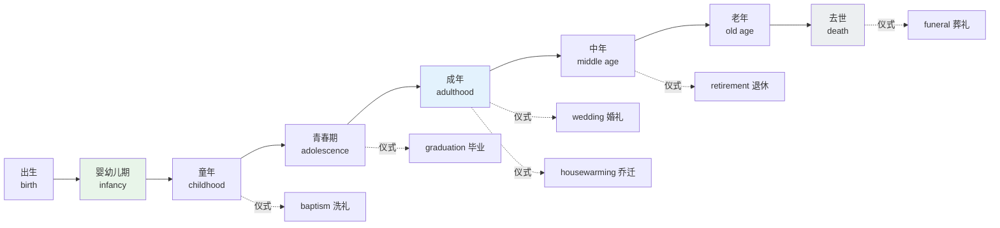
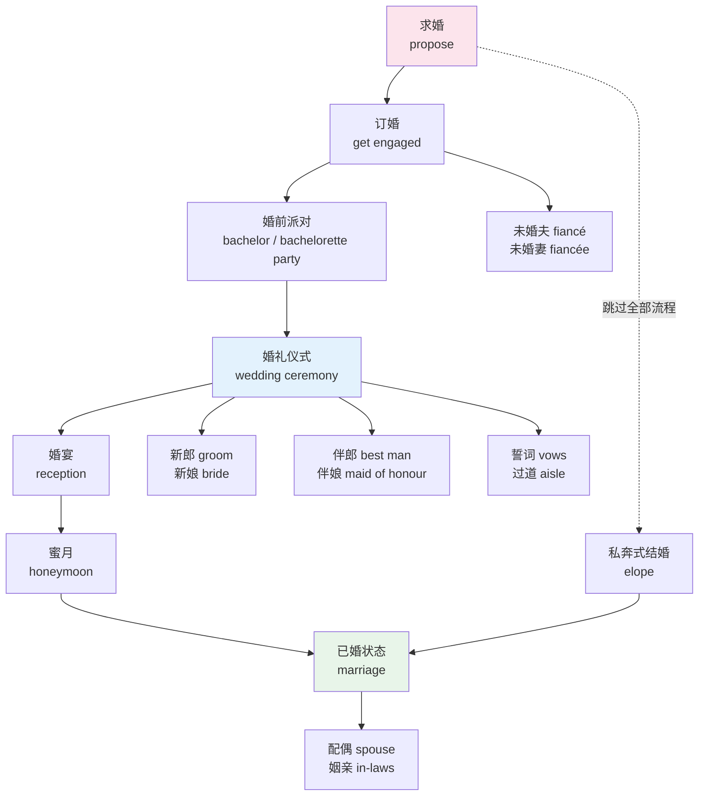
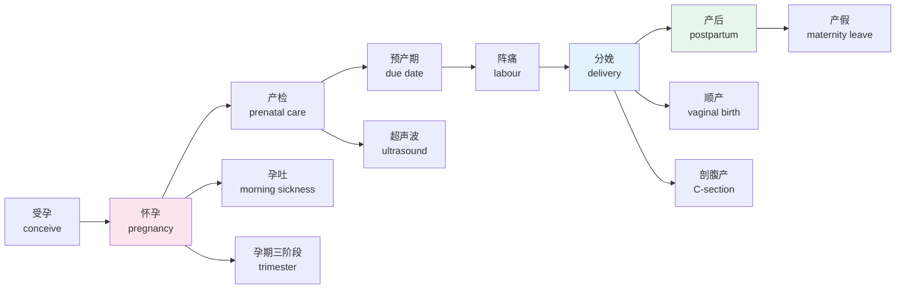
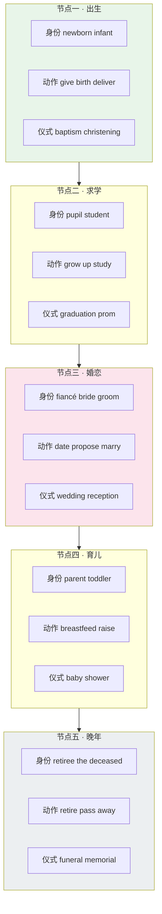
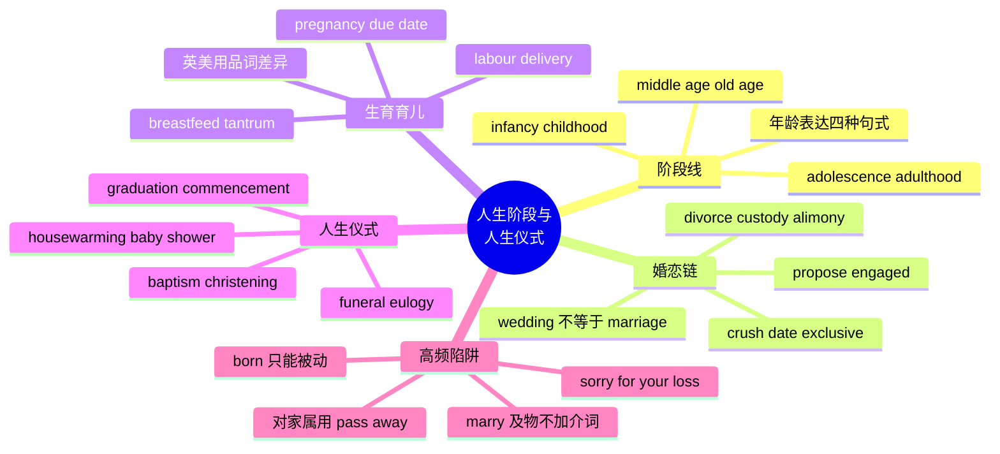

# 人生阶段、婚恋、育儿与人生仪式

> [!info] 本篇定位
>
> 上一篇 `08/01.亲属称谓全表` 处理的是**静态的关系网**：谁是谁的什么人。这一篇处理**动态的时间线**：一个人从出生到去世会经过哪些阶段、哪些关系变动、哪些被社会正式承认的节点。
>
> 两篇是互补的。`brother-in-law` 是称谓，属于上一篇；一个人**怎么变成**别人的 brother-in-law（求婚、订婚、结婚），属于这一篇。
>
> 读完能做到三件事：读英文小说与美剧字幕时看懂婚丧嫁娶的整套流程词；填英文表格时正确选择 marital status 的四个选项；给外国同事的婚礼、生子、乔迁、丧事写出语域合适的一句话。
>
> 本篇不讲语法（不定式、虚拟语气见 `02.英语基础语法`），也不写对话脚本（贺卡与吊唁的完整句式见 `04.英语场景`）。这里只管词。

---

## 1. 本篇导读：为什么按时间线组织

人生阶段类词汇有一个特点：**它们本身就是有序的**。`infancy` 一定在 `childhood` 前，`engagement` 一定在 `wedding` 前，`labor` 一定在 `delivery` 前。这种天然顺序是免费的记忆脚手架，不用白不用。

按时间线组织还能解决一个具体问题：中文母语者最容易在这一类词上出的错，不是记不住单词，而是**把中文的一个词对应到英文的一串词**。

中文说「结婚」，英文要分成 `get engaged`（订婚）、`get married`（结婚这个动作）、`be married`（处于已婚状态）、`wedding`（婚礼这场活动）、`marriage`（婚姻这段关系）。中文说「生孩子」，英文要分成 `get pregnant`（怀上）、`be in labor`（阵痛中）、`give birth`（分娩）、`have a baby`（口语总称）。中文的一个词，英文是一条链条上的若干环。

上图是本篇的骨架。上排是**生理与社会阶段**，下排挂着每个阶段对应的**仪式**。英语把这些仪式统称为 `rites of passage`（人生过渡仪式），这个说法本身就是一个值得记住的词组——它来自人类学，但已经进了日常英语。

本篇的排列顺序完全跟着这条线走：先阶段（第 2、3 节），再婚恋链条（第 5 到 8 节），再生育育儿（第 9、10 节），再仪式（第 11、12 节），最后是衰老与身后事（第 13、14 节）。第 15、16 节收辨析和中式英语，第 17 节给记忆法。

---

## 2. 人生阶段总表：从 infancy 到 retirement

### 2.1 阶段名词与对应的人称名词

英语的人生阶段词有一个规律：**阶段名**和**处于该阶段的人**通常是两个不同的词，不能混用。说 `He is an infancy` 是错的，要说 `He is an infant`。

| 英文 | 英式音标 | 美式音标 | 词性 | 中文 | 搭配与说明 |
| --- | --- | --- | --- | --- | --- |
| **birth** | /bɜːθ/ | /bɜːrθ/ | n. | 出生 | give birth to；date of birth 出生日期 |
| **newborn** | /ˈnjuːbɔːn/ | /ˈnuːbɔːrn/ | n./adj. | 新生儿；新生的 | 医学上一般指出生 28 天内 |
| **infant** | /ˈɪnfənt/ | /ˈɪnfənt/ | n. | 婴儿 | 比 baby 正式，用于医学与法律文本 |
| **infancy** | /ˈɪnfənsi/ | /ˈɪnfənsi/ | n. | 婴儿期 | 引申义「初创期」：still in its infancy |
| **baby** | /ˈbeɪbi/ | /ˈbeɪbi/ | n. | 宝宝 | 日常口语首选，覆盖 0 到 1 岁多 |
| **toddler** | /ˈtɒdlə/ | /ˈtɑːdlər/ | n. | 学步儿 | 约 1 到 3 岁；来自动词 toddle 蹒跚学步 |
| **preschooler** | /ˈpriːskuːlə/ | /ˈpriːskuːlər/ | n. | 学龄前儿童 | 约 3 到 5 岁 |
| **child** | /tʃaɪld/ | /tʃaɪld/ | n. | 儿童 | 复数 children；法律上常指未满 18 岁 |
| **childhood** | /ˈtʃaɪldhʊd/ | /ˈtʃaɪldhʊd/ | n. | 童年 | early childhood 幼儿期 |
| **kid** | /kɪd/ | /kɪd/ | n. | 小孩 | 口语，正式文书不用 |
| **youngster** | /ˈjʌŋstə/ | /ˈjʌŋstər/ | n. | 年轻人 | 略带长辈口吻，偏英式 |
| **preteen** | /ˌpriːˈtiːn/ | /ˌpriːˈtiːn/ | n. | 十岁上下的孩子 | 约 9 到 12 岁；同义 tween |
| **adolescent** | /ˌædəˈlesnt/ | /ˌædəˈlesnt/ | n./adj. | 青少年；青春期的 | 偏医学与心理学语域 |
| **adolescence** | /ˌædəˈlesns/ | /ˌædəˈlesns/ | n. | 青春期 | 社会心理层面的青春期 |
| **puberty** | /ˈpjuːbəti/ | /ˈpjuːbərti/ | n. | 发育期 | 纯生理概念，与 adolescence 不同 |
| **teenager** | /ˈtiːneɪdʒə/ | /ˈtiːneɪdʒər/ | n. | 十几岁的人 | 严格指 13 到 19 岁，词尾都带 -teen |
| **teens** | /tiːnz/ | /tiːnz/ | n. | 十几岁 | in her teens 她十几岁时 |
| **youth** | /juːθ/ | /juːθ/ | n. | 青年期；青年 | 复数 youths 指具体的年轻人，常含负面色彩 |
| **adult** | /ˈædʌlt/ | /əˈdʌlt/ | n./adj. | 成年人；成年的 | 英美重音位置不同，是常见听力障碍 |
| **adulthood** | /ˈædʌlthʊd/ | /əˈdʌlthʊd/ | n. | 成年期 | reach adulthood 步入成年 |
| **grown-up** | /ˈɡrəʊn ʌp/ | /ˈɡroʊn ʌp/ | n./adj. | 大人；成熟的 | 儿童视角的用词，对孩子说话时用 |
| **middle age** | /ˌmɪdl ˈeɪdʒ/ | /ˌmɪdl ˈeɪdʒ/ | n. | 中年 | 约 45 到 65 岁，界限模糊 |
| **middle-aged** | /ˌmɪdl ˈeɪdʒd/ | /ˌmɪdl ˈeɪdʒd/ | adj. | 中年的 | 作定语时连字符必须写 |
| **old age** | /ˌəʊld ˈeɪdʒ/ | /ˌoʊld ˈeɪdʒ/ | n. | 老年 | 中性叙述用词 |
| **elderly** | /ˈeldəli/ | /ˈeldərli/ | adj. | 年长的 | 比 old 委婉；the elderly 指老年群体 |
| **senior** | /ˈsiːniə/ | /ˈsiːnjər/ | n./adj. | 老年人；年长的 | 美式 senior citizen 是标准委婉说法 |
| **retirement** | /rɪˈtaɪəmənt/ | /rɪˈtaɪərmənt/ | n. | 退休 | take early retirement 提前退休 |
| **lifespan** | /ˈlaɪfspæn/ | /ˈlaɪfspæn/ | n. | 寿命 | average lifespan 平均寿命 |
| **milestone** | /ˈmaɪlstəʊn/ | /ˈmaɪlstoʊn/ | n. | 里程碑 | a major life milestone 人生重大节点 |

### 2.2 阶段划分的模糊地带

英语的人生阶段词彼此重叠，边界随语境浮动。硬记年龄区间会踩坑，抓住区分维度更可靠。

| 一组容易混的词 | 区分维度 | 结论 |
| --- | --- | --- |
| adolescence 与 puberty | 社会心理 vs 纯生理 | puberty 是身体发育，可能 10 岁就开始；adolescence 是社会角色过渡，可延到二十出头 |
| teenager 与 adolescent | 语域 | teenager 口语与新闻；adolescent 医学、心理学、教育学论文 |
| child 与 kid | 语域 | 法律文书、学校通知用 child；朋友闲聊用 kid |
| elderly 与 old | 礼貌程度 | 直接对人说 You're old 冒犯；elderly 与 senior 都是缓冲说法 |
| youth 与 young people | 可数性与色彩 | youth 作「青年期」不可数；作「小混混」时是可数复数 youths |

> [!warning] elderly 不是 old 的简单替换
>
> `elderly` 只用于人，且带有「需要照顾」的隐含。说一栋楼 `an elderly building` 是错的，那要说 `an old building`。
>
> 更进一步，近年英文媒体在指人时越来越倾向用 `older adults` 或 `people over 65`，因为 `the elderly` 把人写成了一个同质群体。写正式文本时这个趋势值得跟。
>
> - ❌ ~~The elderly is increasing in number.~~（把群体当单数）
> - ✅ **The elderly are increasing in number.**（the + 形容词指群体，接复数谓语）
> - ✅ **The number of older adults is increasing.**（更中性的现代写法）

---

## 3. 年龄的说法与法律身份

### 3.1 表达年龄的四种句式

中文说「他二十五岁」只有一种结构，英文有四种，各自有固定的搭配限制。

> [!example] 年龄的四种表达
>
> - He **is twenty-five**.
>   - 他二十五岁。（最常用，形容词性表语，不加 years old 也完全成立）
> - He **is twenty-five years old**.
>   - 他二十五岁。（完整形式，正式场合与书面表格用）
> - He is **a twenty-five-year-old** man.
>   - 他是个二十五岁的男人。（作定语时必须用连字符，且 year 用单数）
> - He is **in his mid-twenties**.
>   - 他二十五岁上下。（不确定具体年龄时的标准说法）

第三种是错误重灾区。作定语时 year 不能加 s，因为整个短语已经被连字符黏成了一个形容词。

- ❌ ~~a twenty-five-years-old man~~
- ✅ **a twenty-five-year-old man**
- ✅ **a twenty-five-year-old**（直接当名词用，指那个人）

### 3.2 年龄段的模糊说法

| 英文 | 英式音标 | 美式音标 | 词性 | 中文 | 搭配与说明 |
| --- | --- | --- | --- | --- | --- |
| **early twenties** | /ˈɜːli ˈtwentiz/ | /ˈɜːrli ˈtwentiz/ | n. | 二十出头 | 约 20 到 23 岁 |
| **mid-thirties** | /mɪd ˈθɜːtiz/ | /mɪd ˈθɜːrtiz/ | n. | 三十五岁上下 | 连字符不可省 |
| **late forties** | /leɪt ˈfɔːtiz/ | /leɪt ˈfɔːrtiz/ | n. | 快五十 | 约 47 到 49 岁 |
| **twenty-something** | /ˈtwenti sʌmθɪŋ/ | /ˈtwenti sʌmθɪŋ/ | n. | 二十几岁的人 | 口语，常带一点戏谑 |
| **underage** | /ˌʌndərˈeɪdʒ/ | /ˌʌndərˈeɪdʒ/ | adj. | 未成年的 | underage drinking 未成年饮酒 |
| **minor** | /ˈmaɪnə/ | /ˈmaɪnər/ | n. | 未成年人 | 法律术语；与美国大学里「辅修」的 minor 同形异义 |
| **of age** | /əv ˈeɪdʒ/ | /əv ˈeɪdʒ/ | phr. | 达到法定年龄 | come of age 成年 |
| **juvenile** | /ˈdʒuːvənaɪl/ | /ˈdʒuːvənl/ | adj./n. | 少年的；少年犯 | juvenile court 少年法庭；英式末音节读 /aɪl/，美式常弱化成 /əl/ |
| **legal age** | /ˈliːɡl eɪdʒ/ | /ˈliːɡl eɪdʒ/ | n. | 法定年龄 | 各州各国不同，不能想当然 |
| **coming-of-age** | /ˌkʌmɪŋ əv ˈeɪdʒ/ | /ˌkʌmɪŋ əv ˈeɪdʒ/ | adj. | 成长题材的 | a coming-of-age novel 成长小说 |
| **prime** | /praɪm/ | /praɪm/ | n. | 全盛期 | in the prime of life 正当壮年 |
| **peer** | /pɪə/ | /pɪr/ | n. | 同龄人 | peer pressure 同龄人压力 |
| **generation** | /ˌdʒenəˈreɪʃn/ | /ˌdʒenəˈreɪʃn/ | n. | 一代人 | generation gap 代沟 |
| **cohort** | /ˈkəʊhɔːt/ | /ˈkoʊhɔːrt/ | n. | 同期群 | 统计学与社会学用词 |

> [!tip] 填英文表格时的年龄字段
>
> `DOB` 是 `Date of Birth` 的缩写，几乎所有英文表格都这么写。填的时候注意日期顺序：英式 `DD/MM/YYYY`，美式 `MM/DD/YYYY`。写成 `05/09/2026` 在英国是 9 月 5 日，在美国是 5 月 9 日。
>
> 稳妥的写法是月份用英文缩写：`5 Sep 2026` 或 `Sep 5, 2026`，任何地方都不会读错。日期格式的完整规则在 `04.时间与日历` 里。

---

## 4. 成长动词：raise、bring up、rear、nurture

这四个词中文都能翻成「养育」，但英文里分工清楚，是本篇第一个必须记牢的辨析组。

| 英文 | 英式音标 | 美式音标 | 词性 | 中文 | 搭配与说明 |
| --- | --- | --- | --- | --- | --- |
| **raise** | /reɪz/ | /reɪz/ | v. | 抚养 | 美式首选；raise a family 养家 |
| **bring up** | /brɪŋ ʌp/ | /brɪŋ ʌp/ | v. | 抚养 | 英式首选；常用被动 be brought up |
| **rear** | /rɪə/ | /rɪr/ | v. | 养育；饲养 | 偏书面与旧式；用于动物很常见 |
| **nurture** | /ˈnɜːtʃə/ | /ˈnɜːrtʃər/ | v./n. | 培育；后天因素 | nature vs nurture 先天与后天之争 |
| **grow up** | /ɡrəʊ ʌp/ | /ɡroʊ ʌp/ | v. | 长大 | 不及物，主语是长大的那个人 |
| **upbringing** | /ˈʌpbrɪŋɪŋ/ | /ˈʌpbrɪŋɪŋ/ | n. | 教养经历 | a strict upbringing 严格的家教 |
| **foster** | /ˈfɒstə/ | /ˈfɔːstər/ | v./adj. | 寄养；寄养的 | foster parents 寄养父母 |
| **adopt** | /əˈdɒpt/ | /əˈdɑːpt/ | v. | 收养 | 与 foster 的区别是法律上转移亲权 |
| **adoption** | /əˈdɒpʃn/ | /əˈdɑːpʃn/ | n. | 收养 | put a child up for adoption 送养 |
| **guardian** | /ˈɡɑːdiən/ | /ˈɡɑːrdiən/ | n. | 监护人 | legal guardian 法定监护人 |
| **custody** | /ˈkʌstədi/ | /ˈkʌstədi/ | n. | 监护权 | 详见第 8 节 |
| **mature** | /məˈtjʊə/ | /məˈtʃʊr/ | v./adj. | 成熟；成熟的 | 英式 tj 与美式 tʃ 的典型对立 |
| **offspring** | /ˈɒfsprɪŋ/ | /ˈɔːfsprɪŋ/ | n. | 后代 | 单复数同形，正式或戏谑 |
| **descendant** | /dɪˈsendənt/ | /dɪˈsendənt/ | n. | 后裔 | 反义 ancestor 祖先 |

> [!warning] raise 与 rise 的经典陷阱
>
> 这两个词是英语学习中被记错次数最多的一对。
>
> - **raise** 及物，raise-raised-raised，规则变化，后面必须跟宾语。
> - **rise** 不及物，rise-rose-risen，不规则变化，后面不能跟宾语。
>
> - ❌ ~~She raised at six o'clock.~~（raise 缺宾语）
> - ✅ **She rose at six o'clock.** / **She got up at six.**
> - ❌ ~~The company rose its prices.~~（rise 不能带宾语）
> - ✅ **The company raised its prices.**
>
> 记忆挂钩：raise 里有个 a，代表 active 要动别的东西；rise 没有，只能自己动。完整的不规则动词表在 `02.功能词与封闭词类速查/07.不规则动词形态分组与不规则复数全表`。

`rear` 值得单说。它在现代英语里用于人时显得老派或书面（`reared in poverty` 出现在传记里很自然，出现在闲聊里就怪），用于动物时反而是标准词：`rear cattle`（养牛）、`rear chickens`（养鸡）。中文的「养」不区分这层，直接照搬会出问题。

- ✅ **They raised three children in that house.**（自然）
- ❌ ~~They reared three children in that house.~~（语法没错，但读起来像十九世纪小说）
- ✅ **The farm rears free-range chickens.**（用于动物，标准）

---

## 5. 约会与恋爱：从 crush 到 exclusive

### 5.1 恋爱链条的动词与名词

英美的恋爱阶段有一套约定俗成的说法，与中文的「暧昧、追、在一起」并不一一对应。

| 英文 | 英式音标 | 美式音标 | 词性 | 中文 | 搭配与说明 |
| --- | --- | --- | --- | --- | --- |
| **crush** | /krʌʃ/ | /krʌʃ/ | n. | 单方面好感 | have a crush on someone 暗恋某人 |
| **flirt** | /flɜːt/ | /flɜːrt/ | v./n. | 调情；调情的人 | flirt with someone |
| **ask out** | /ɑːsk aʊt/ | /æsk aʊt/ | v. | 约某人出去 | ask her out 邀约，不含「表白」义 |
| **date** | /deɪt/ | /deɪt/ | n./v. | 约会；与某人约会 | go on a date 去约会；they're dating 在交往 |
| **blind date** | /blaɪnd deɪt/ | /blaɪnd deɪt/ | n. | 相亲式约会 | 双方事先不认识 |
| **set up** | /set ʌp/ | /set ʌp/ | v. | 撮合 | set someone up with someone |
| **matchmaker** | /ˈmætʃmeɪkə/ | /ˈmætʃmeɪkər/ | n. | 媒人 | 中文语境的「媒人」最接近的对应 |
| **see** | /siː/ | /siː/ | v. | 交往中 | be seeing someone 是委婉的「有对象了」 |
| **exclusive** | /ɪkˈskluːsɪv/ | /ɪkˈskluːsɪv/ | adj. | 确立排他关系 | become exclusive 只跟对方交往 |
| **going steady** | /ˌɡəʊɪŋ ˈstedi/ | /ˌɡoʊɪŋ ˈstedi/ | phr. | 稳定交往 | 略旧式，父辈用语 |
| **boyfriend** | /ˈbɔɪfrend/ | /ˈbɔɪfrend/ | n. | 男朋友 | 与 male friend 完全不同，不能混 |
| **girlfriend** | /ˈɡɜːlfrend/ | /ˈɡɜːrlfrend/ | n. | 女朋友 | 女性之间也可指闺蜜，靠语境分辨 |
| **partner** | /ˈpɑːtnə/ | /ˈpɑːrtnər/ | n. | 伴侣 | 不指明性别与婚姻状态，正式场合最安全 |
| **significant other** | /sɪɡˌnɪfɪkənt ˈʌðə/ | /sɪɡˌnɪfɪkənt ˈʌðər/ | n. | 另一半 | 缩写 SO，表格与请柬常用 |
| **courtship** | /ˈkɔːtʃɪp/ | /ˈkɔːrtʃɪp/ | n. | 求爱期 | 书面与历史语境 |
| **woo** | /wuː/ | /wuː/ | v. | 追求 | 文学化；商业上引申为「争取客户」 |
| **romance** | /rəʊˈmæns/ | /ˈroʊmæns/ | n. | 恋情 | 英美重音位置不同 |
| **infatuation** | /ɪnˌfætʃuˈeɪʃn/ | /ɪnˌfætʃuˈeɪʃn/ | n. | 迷恋 | 含「不理智且短暂」的判断 |
| **cohabit** | /kəʊˈhæbɪt/ | /koʊˈhæbɪt/ | v. | 同居 | 正式；口语说 live together |
| **move in together** | /muːv ɪn təˈɡeðə/ | /muːv ɪn təˈɡeðər/ | phr. | 搬到一起住 | 口语首选说法 |
| **long-distance** | /ˌlɒŋ ˈdɪstəns/ | /ˌlɔːŋ ˈdɪstəns/ | adj. | 异地的 | a long-distance relationship 异地恋 |
| **soulmate** | /ˈsəʊlmeɪt/ | /ˈsoʊlmeɪt/ | n. | 灵魂伴侣 | 不必然是恋人，也可指挚友 |

### 5.2 分手一侧的词

| 英文 | 英式音标 | 美式音标 | 词性 | 中文 | 搭配与说明 |
| --- | --- | --- | --- | --- | --- |
| **break up** | /breɪk ʌp/ | /breɪk ʌp/ | v. | 分手 | break up with someone；不及物用法也成立 |
| **breakup** | /ˈbreɪkʌp/ | /ˈbreɪkʌp/ | n. | 分手 | 名词连写不加空格 |
| **dump** | /dʌmp/ | /dʌmp/ | v. | 甩 | 口语，含贬义，指单方面提出 |
| **ex** | /eks/ | /eks/ | n. | 前任 | my ex；可指前男女友也可指前配偶 |
| **rebound** | /ˈriːbaʊnd/ | /ˈriːbaʊnd/ | n. | 疗伤式恋情 | on the rebound 刚分手就投入下一段 |
| **ghost** | /ɡəʊst/ | /ɡoʊst/ | v. | 突然失联 | 近二十年新义，口语高频 |
| **estranged** | /ɪˈstreɪndʒd/ | /ɪˈstreɪndʒd/ | adj. | 疏远的 | his estranged wife 分居中的妻子 |
| **heartbroken** | /ˈhɑːtbrəʊkən/ | /ˈhɑːrtbroʊkən/ | adj. | 心碎的 | 名词 heartbreak |
| **get over** | /ɡet ˈəʊvə/ | /ɡet ˈoʊvər/ | v. | 走出来 | get over someone 忘掉某人 |

> [!warning] boyfriend 不等于「男性朋友」
>
> 这是中文母语者最高频的社交事故之一。`boyfriend` 只有恋爱关系一个意思。
>
> - ❌ ~~He is my boyfriend, just a normal friend.~~（自相矛盾）
> - ✅ **He is a friend of mine.**（男性朋友的标准说法）
> - ✅ **He is my male colleague.**（同事）
>
> 反过来，女性之间说 `She's my girlfriend` 在美式口语里常指闺蜜，判断要看说话人性别与语境。想完全避免歧义就说 `a friend of mine`。

---

## 6. 求婚、订婚与婚礼流程

### 6.1 整条流程的顺序

上图右侧那条虚线值得单独看一眼。`elope` 常被中文教材译成「私奔」，会误导。它在现代英语里主要指**跳过大型婚礼、两个人跑去简单登记结婚**，未必有「逃离家庭反对」的戏剧性。`They eloped to Las Vegas` 说的是他们没办婚礼直接去登记了，语气可以完全中性甚至羡慕。真正的「私奔逃跑」现代英语更常说 `run away together`。

另一个要点是 `ceremony` 与 `reception` 的切分。中文的「婚礼」是一个词，英文是两段：`ceremony` 是宣誓的仪式部分（教堂或登记处，通常一小时内），`reception` 是之后的宴会（吃饭、跳舞、致辞，可以持续到深夜）。请柬上常分别写明两段的时间地点，看不懂这个切分就会走错场。

### 6.2 订婚与求婚词表

| 英文 | 英式音标 | 美式音标 | 词性 | 中文 | 搭配与说明 |
| --- | --- | --- | --- | --- | --- |
| **propose** | /prəˈpəʊz/ | /prəˈpoʊz/ | v. | 求婚 | propose to someone，介词是 to 不是 with |
| **proposal** | /prəˈpəʊzl/ | /prəˈpoʊzl/ | n. | 求婚；提案 | 两个义项差别极大，靠语境分 |
| **pop the question** | /pɒp ðə ˈkwestʃən/ | /pɑːp ðə ˈkwestʃən/ | phr. | 开口求婚 | 口语习语，比 propose 轻松 |
| **engaged** | /ɪnˈɡeɪdʒd/ | /ɪnˈɡeɪdʒd/ | adj. | 订婚的 | get engaged to someone |
| **engagement** | /ɪnˈɡeɪdʒmənt/ | /ɪnˈɡeɪdʒmənt/ | n. | 订婚；约定 | engagement ring 订婚戒指 |
| **fiancé** | /fiˈɒnseɪ/ | /ˌfiːɑːnˈseɪ/ | n. | 未婚夫 | 保留法语拼写与重音，一个 e |
| **fiancée** | /fiˈɒnseɪ/ | /ˌfiːɑːnˈseɪ/ | n. | 未婚妻 | 两个 e，读音与男性形完全相同 |
| **betrothed** | /bɪˈtrəʊðd/ | /bɪˈtroʊðd/ | adj./n. | 已订婚的 | 古旧词，只在文学与仿古语境出现 |
| **dowry** | /ˈdaʊri/ | /ˈdaʊri/ | n. | 嫁妆 | 讲历史与他国习俗时用 |
| **bride price** | /braɪd praɪs/ | /braɪd praɪs/ | n. | 彩礼 | 人类学术语，讲中国彩礼时可用 |

### 6.3 婚礼现场词表

| 英文 | 英式音标 | 美式音标 | 词性 | 中文 | 搭配与说明 |
| --- | --- | --- | --- | --- | --- |
| **wedding** | /ˈwedɪŋ/ | /ˈwedɪŋ/ | n. | 婚礼 | 指那一天那场活动 |
| **marriage** | /ˈmærɪdʒ/ | /ˈmerɪdʒ/ | n. | 婚姻 | 指制度与那段关系，不是那场活动 |
| **ceremony** | /ˈserəməni/ | /ˈserəmoʊni/ | n. | 仪式 | 英美后半段读音差别明显 |
| **reception** | /rɪˈsepʃn/ | /rɪˈsepʃn/ | n. | 婚宴 | 也指酒店前台，同形异义 |
| **bride** | /braɪd/ | /braɪd/ | n. | 新娘 | 只用于婚礼当天前后 |
| **groom** | /ɡruːm/ | /ɡruːm/ | n. | 新郎 | 全称 bridegroom；另有「梳理马匹」义 |
| **best man** | /best mæn/ | /best mæn/ | n. | 伴郎 | 通常只有一位，负责致辞与戒指 |
| **maid of honour** | /meɪd əv ˈɒnə/ | /meɪd əv ˈɑːnər/ | n. | 首席伴娘 | 美式拼 honor；已婚者称 matron of honour |
| **bridesmaid** | /ˈbraɪdzmeɪd/ | /ˈbraɪdzmeɪd/ | n. | 伴娘 | 可以有多位 |
| **groomsman** | /ˈɡruːmzmən/ | /ˈɡruːmzmən/ | n. | 伴郎团成员 | 复数 groomsmen |
| **flower girl** | /ˈflaʊə ɡɜːl/ | /ˈflaʊər ɡɜːrl/ | n. | 撒花童 | 通常是亲戚家的小女孩 |
| **ring bearer** | /rɪŋ ˈbeərə/ | /rɪŋ ˈberər/ | n. | 捧戒指的孩子 | 与 flower girl 成对出现 |
| **officiant** | /əˈfɪʃiənt/ | /əˈfɪʃiənt/ | n. | 主持仪式者 | 牧师、法官或获授权的亲友 |
| **aisle** | /aɪl/ | /aɪl/ | n. | 中间过道 | s 不发音；walk down the aisle 出嫁 |
| **altar** | /ˈɔːltə/ | /ˈɔːltər/ | n. | 圣坛 | 与 alter 改变 同音，拼写常错 |
| **vow** | /vaʊ/ | /vaʊ/ | n./v. | 誓词；起誓 | exchange vows 交换誓言 |
| **wedding ring** | /ˈwedɪŋ rɪŋ/ | /ˈwedɪŋ rɪŋ/ | n. | 婚戒 | 与 engagement ring 是两枚 |
| **bouquet** | /buˈkeɪ/ | /boʊˈkeɪ/ | n. | 捧花 | 法语借词；toss the bouquet 抛捧花 |
| **veil** | /veɪl/ | /veɪl/ | n. | 头纱 | 与 vale 山谷 同音 |
| **toast** | /təʊst/ | /toʊst/ | n./v. | 祝酒；致祝酒词 | propose a toast to the couple |
| **honeymoon** | /ˈhʌnimuːn/ | /ˈhʌnimuːn/ | n./v. | 蜜月 | 引申义 honeymoon period 蜜月期 |
| **newlywed** | /ˈnjuːliwed/ | /ˈnuːliwed/ | n. | 新婚夫妇 | 常用复数 newlyweds |
| **elope** | /ɪˈləʊp/ | /ɪˈloʊp/ | v. | 不办婚礼直接登记结婚 | elope to Vegas |
| **registry office** | /ˈredʒɪstri ˈɒfɪs/ | /ˈredʒɪstri ˈɔːfɪs/ | n. | 户籍登记处 | 英式说法 |
| **city hall** | /ˌsɪti ˈhɔːl/ | /ˌsɪti ˈhɔːl/ | n. | 市政厅 | 美式登记结婚的地点 |
| **civil ceremony** | /ˈsɪvl ˈserəməni/ | /ˈsɪvl ˈserəmoʊni/ | n. | 世俗仪式 | 非宗教的婚礼 |
| **RSVP** | /ˌɑː es viː ˈpiː/ | /ˌɑːr es viː ˈpiː/ | v./n. | 回复出席与否 | 法语 répondez s'il vous plaît 的缩写 |

> [!warning] wedding 与 marriage 不能互换
>
> 这是本篇最重要的一组辨析，中文的一个「结婚」把两个概念压成了一个。
>
> - **wedding** = 那一场活动，可以数，有日期地点。
> - **marriage** = 那段关系或那个制度，是状态，可以持续几十年。
>
> - ✅ **Their wedding was in June.**（婚礼在六月办的）
> - ✅ **Their marriage lasted thirty years.**（婚姻持续了三十年）
> - ❌ ~~Their wedding lasted thirty years.~~（婚礼办了三十年）
> - ❌ ~~I'm going to their marriage.~~（去参加他们的婚姻）
> - ✅ **I'm going to their wedding.**
>
> 一个可靠的检验：能不能替换成「那天的活动」。能，就用 wedding；不能，就用 marriage。

---

## 7. 婚姻状态、姻亲与相关法律词

### 7.1 表格里的 marital status

几乎所有英文正式表格都有 `Marital Status` 一栏，选项是固定的一小组词，认不出会填错。

| 英文 | 英式音标 | 美式音标 | 词性 | 中文 | 搭配与说明 |
| --- | --- | --- | --- | --- | --- |
| **marital** | /ˈmærɪtl/ | /ˈmerɪtl/ | adj. | 婚姻的 | marital status 婚姻状况 |
| **single** | /ˈsɪŋɡl/ | /ˈsɪŋɡl/ | adj. | 单身 | 表格里指从未结婚或现无配偶 |
| **married** | /ˈmærid/ | /ˈmerid/ | adj. | 已婚 | be married to someone，介词是 to |
| **separated** | /ˈsepəreɪtɪd/ | /ˈsepəreɪtɪd/ | adj. | 分居 | 法律上仍是夫妻，只是不同住 |
| **divorced** | /dɪˈvɔːst/ | /dɪˈvɔːrst/ | adj. | 离异 | 婚姻已被法律终止 |
| **widowed** | /ˈwɪdəʊd/ | /ˈwɪdoʊd/ | adj. | 丧偶 | 表格用形容词形，不用名词 widow |
| **spouse** | /spaʊs/ | /spaʊs/ | n. | 配偶 | 不指明性别的正式词 |
| **matrimony** | /ˈmætrɪməni/ | /ˈmætrɪmoʊni/ | n. | 婚姻 | 极正式，多见于仪式与法律文本 |
| **wedlock** | /ˈwedlɒk/ | /ˈwedlɑːk/ | n. | 婚姻关系 | born out of wedlock 非婚生 |
| **monogamy** | /məˈnɒɡəmi/ | /məˈnɑːɡəmi/ | n. | 一夫一妻制 | 形容词 monogamous |
| **polygamy** | /pəˈlɪɡəmi/ | /pəˈlɪɡəmi/ | n. | 一夫多妻制 | 讲历史与他国制度时用 |
| **in-laws** | /ˈɪn lɔːz/ | /ˈɪn lɔːz/ | n. | 姻亲 | 复数，泛指配偶一方的家人 |
| **anniversary** | /ˌænɪˈvɜːsəri/ | /ˌænɪˈvɜːrsəri/ | n. | 周年纪念 | wedding anniversary 结婚纪念日 |
| **silver wedding** | /ˈsɪlvə ˈwedɪŋ/ | /ˈsɪlvər ˈwedɪŋ/ | n. | 银婚 | 二十五周年 |
| **golden wedding** | /ˈɡəʊldən ˈwedɪŋ/ | /ˈɡoʊldən ˈwedɪŋ/ | n. | 金婚 | 五十周年 |
| **remarry** | /ˌriːˈmæri/ | /ˌriːˈmeri/ | v. | 再婚 | 名词 remarriage |
| **blended family** | /ˈblendɪd ˈfæməli/ | /ˈblendɪd ˈfæməli/ | n. | 重组家庭 | 比 stepfamily 中性 |

> [!warning] single 在表格里和口语里不是一回事
>
> 表格上的 `Single` 是法律状态，指没有现存的婚姻关系，跟有没有男女朋友无关。
>
> 口语里 `I'm single` 才是「我没有对象」。一个有稳定伴侣但没登记的人，表格上仍要填 `Single`，口语里说 `I'm single` 就不对了。
>
> 另外注意 `be married to` 用 to，不是 with。
>
> - ❌ ~~She is married with a doctor.~~（意思变成「已婚且有个医生孩子」）
> - ✅ **She is married to a doctor.**
> - ✅ **She is married with two children.**（这句是对的，with 后面接的是子女）

### 7.2 婚姻场景的高频例句

> [!example] 状态与动作的区分
>
> - They **got married** last spring.
>   - 他们去年春天结的婚。（get married 是动作，指那一刻）
> - They **have been married** for ten years.
>   - 他们结婚十年了。（be married 是状态，配完成时表持续）
> - She **is marrying** her college sweetheart.
>   - 她要和大学时的恋人结婚了。（marry 及物，直接接人，不加 with）
> - He **is engaged to** a Japanese architect.
>   - 他和一位日本建筑师订婚了。（engaged to，同样是 to）

`marry` 作及物动词直接接人，这一点与中文的「和某人结婚」结构不同，加介词是典型错误。

- ❌ ~~He married with her.~~
- ❌ ~~He married to her.~~
- ✅ **He married her.**
- ✅ **He got married to her.**（用被动式短语时才出现 to）

---

## 8. 分居、离婚与抚养权

### 8.1 离婚程序词表

| 英文 | 英式音标 | 美式音标 | 词性 | 中文 | 搭配与说明 |
| --- | --- | --- | --- | --- | --- |
| **divorce** | /dɪˈvɔːs/ | /dɪˈvɔːrs/ | n./v. | 离婚 | file for divorce 提出离婚申请 |
| **divorcee** | /dɪˌvɔːˈsiː/ | /dɪˌvɔːrˈseɪ/ | n. | 离异者 | 英美读音差别很大 |
| **separation** | /ˌsepəˈreɪʃn/ | /ˌsepəˈreɪʃn/ | n. | 分居 | trial separation 试分居 |
| **annulment** | /əˈnʌlmənt/ | /əˈnʌlmənt/ | n. | 婚姻无效宣告 | 与离婚不同，视为婚姻从未成立 |
| **annul** | /əˈnʌl/ | /əˈnʌl/ | v. | 宣告无效 | 重音在后，与 annual 无关 |
| **prenup** | /ˈpriːnʌp/ | /ˈpriːnʌp/ | n. | 婚前协议 | prenuptial agreement 的口语缩写 |
| **prenuptial** | /ˌpriːˈnʌpʃl/ | /ˌpriːˈnʌpʃl/ | adj. | 婚前的 | pre- 前 + nuptial 婚姻的 |
| **settlement** | /ˈsetlmənt/ | /ˈsetlmənt/ | n. | 财产分割协议 | divorce settlement |
| **alimony** | /ˈælɪməni/ | /ˈælɪmoʊni/ | n. | 赡养费 | 美式常用；英式说 maintenance |
| **child support** | /tʃaɪld səˈpɔːt/ | /tʃaɪld səˈpɔːrt/ | n. | 抚养费 | 给孩子的，与 alimony 是两笔 |
| **custody** | /ˈkʌstədi/ | /ˈkʌstədi/ | n. | 监护权 | joint custody 共同监护 |
| **sole custody** | /səʊl ˈkʌstədi/ | /soʊl ˈkʌstədi/ | n. | 独立监护权 | 与 joint custody 相对 |
| **visitation** | /ˌvɪzɪˈteɪʃn/ | /ˌvɪzɪˈteɪʃn/ | n. | 探视权 | visitation rights；英式说 contact |
| **adultery** | /əˈdʌltəri/ | /əˈdʌltəri/ | n. | 通奸 | 法律术语 |
| **infidelity** | /ˌɪnfɪˈdeləti/ | /ˌɪnfɪˈdeləti/ | n. | 不忠 | 比 adultery 语域更中性一些 |
| **affair** | /əˈfeə/ | /əˈfer/ | n. | 婚外情 | have an affair with someone |
| **irreconcilable** | /ɪˌrekənˈsaɪləbl/ | /ɪˌrekənˈsaɪləbl/ | adj. | 不可调和的 | irreconcilable differences 是离婚申请上的标准理由 |
| **widow** | /ˈwɪdəʊ/ | /ˈwɪdoʊ/ | n. | 寡妇 | 丈夫去世的女性 |
| **widower** | /ˈwɪdəʊə/ | /ˈwɪdoʊər/ | n. | 鳏夫 | 妻子去世的男性，加 -er |
| **orphan** | /ˈɔːfn/ | /ˈɔːrfn/ | n. | 孤儿 | 英语中父母有一方去世也可算 orphan |
| **stepparent** | /ˈsteppeərənt/ | /ˈstepperənt/ | n. | 继父母 | step- 前缀详见上一篇亲属称谓 |
| **half-sibling** | /hɑːf ˈsɪblɪŋ/ | /hæf ˈsɪblɪŋ/ | n. | 同父异母或同母异父的兄弟姐妹 | 与 stepsibling 不同，有血缘 |

### 8.2 custody 是这一组里最需要吃透的词

`custody` 本义是「看管、保管」，在法律语境下分成两条完全独立的线，不能混。

| 短语 | 含义 | 场景 |
| --- | --- | --- |
| child custody | 子女监护权 | 离婚案件，决定孩子跟谁 |
| joint custody | 共同监护 | 双方共享决定权 |
| legal custody | 法定监护权 | 谁有权决定教育、医疗等重大事项 |
| physical custody | 居住监护权 | 孩子实际住在谁那里 |
| in police custody | 被警方羁押 | 刑事语境，与家庭完全无关 |
| take into custody | 拘留 | 同上，是「逮捕」的正式说法 |

看到 `custody` 先判断语境是家事还是刑事，两条线的中文译法差得很远。

> [!example] 离婚场景的完整句子
>
> - She **filed for divorce** after twelve years of marriage.
>   - 结婚十二年后，她提出了离婚申请。
> - The court granted them **joint custody** of their two daughters.
>   - 法院判两个女儿由双方共同监护。
> - He pays **child support** on the first of every month.
>   - 他每月一号支付抚养费。
> - They signed a **prenup** before the wedding.
>   - 他们在婚礼前签了婚前协议。

---

## 9. 怀孕、生育与产科词

### 9.1 从受孕到出生

上图里有两个词特别容易被中文直觉带偏。`labour`（美式 labor）在这里不是「劳动」而是「阵痛、临产」，`be in labour` 是「正在阵痛」；`delivery` 不是「送货」而是「分娩」，`delivery room` 是产房。这两个词的日常义与医学义差别极大，读小说或看医疗剧时不换义项就会读成笑话。

另一个是 `morning sickness`。它字面像「早上生病」，实际指的是孕吐，而且并不限于早上——这个名字只是历史遗留的误称。中文母语者按字面理解会完全错过这个词。

### 9.2 怀孕与分娩词表

| 英文 | 英式音标 | 美式音标 | 词性 | 中文 | 搭配与说明 |
| --- | --- | --- | --- | --- | --- |
| **conceive** | /kənˈsiːv/ | /kənˈsiːv/ | v. | 受孕；构想 | 两个义项都高频，靠语境分 |
| **conception** | /kənˈsepʃn/ | /kənˈsepʃn/ | n. | 受孕；概念 | 同上 |
| **pregnant** | /ˈpreɡnənt/ | /ˈpreɡnənt/ | adj. | 怀孕的 | get pregnant 比 become pregnant 更自然 |
| **pregnancy** | /ˈpreɡnənsi/ | /ˈpreɡnənsi/ | n. | 怀孕；孕期 | 可数，指一次怀孕经历 |
| **expecting** | /ɪkˈspektɪŋ/ | /ɪkˈspektɪŋ/ | adj. | 待产的 | She's expecting 是委婉说法 |
| **fertility** | /fəˈtɪləti/ | /fərˈtɪləti/ | n. | 生育力 | fertility treatment 助孕治疗 |
| **infertility** | /ˌɪnfəˈtɪləti/ | /ˌɪnfərˈtɪləti/ | n. | 不孕不育 | 医学正式词 |
| **surrogate** | /ˈsʌrəɡət/ | /ˈsɜːrəɡət/ | n./adj. | 代孕者；替代的 | surrogate mother 代孕母亲 |
| **trimester** | /traɪˈmestə/ | /traɪˈmestər/ | n. | 孕期三分期 | 每期约三个月，共三期 |
| **due date** | /djuː deɪt/ | /duː deɪt/ | n. | 预产期 | 也指作业与账单的截止日 |
| **morning sickness** | /ˈmɔːnɪŋ ˈsɪknəs/ | /ˈmɔːrnɪŋ ˈsɪknəs/ | n. | 孕吐 | 不限于早晨，名字是误称 |
| **prenatal** | /ˌpriːˈneɪtl/ | /ˌpriːˈneɪtl/ | adj. | 产前的 | 英式也说 antenatal |
| **ultrasound** | /ˈʌltrəsaʊnd/ | /ˈʌltrəsaʊnd/ | n. | 超声检查 | have an ultrasound 做 B 超 |
| **midwife** | /ˈmɪdwaɪf/ | /ˈmɪdwaɪf/ | n. | 助产士 | 复数 midwives；英国接生的主力 |
| **obstetrician** | /ˌɒbstəˈtrɪʃn/ | /ˌɑːbstəˈtrɪʃn/ | n. | 产科医生 | 口语缩写 OB 或 OB-GYN |
| **labour** | /ˈleɪbə/ | /ˈleɪbər/ | n. | 阵痛期 | 美式拼 labor；go into labour 开始阵痛 |
| **contraction** | /kənˈtrækʃn/ | /kənˈtrækʃn/ | n. | 宫缩 | 常用复数 contractions |
| **water breaks** | /ˈwɔːtə breɪks/ | /ˈwɔːtər breɪks/ | phr. | 羊水破了 | Her water broke，美剧高频 |
| **delivery** | /dɪˈlɪvəri/ | /dɪˈlɪvəri/ | n. | 分娩 | delivery room 产房 |
| **deliver** | /dɪˈlɪvə/ | /dɪˈlɪvər/ | v. | 接生；分娩 | The doctor delivered the baby |
| **give birth** | /ɡɪv bɜːθ/ | /ɡɪv bɜːrθ/ | phr. | 分娩 | give birth to a boy，介词是 to |
| **C-section** | /ˈsiː sekʃn/ | /ˈsiː sekʃn/ | n. | 剖腹产 | 全称 caesarean section |
| **caesarean** | /sɪˈzeəriən/ | /sɪˈzeriən/ | n./adj. | 剖腹产的 | 美式常拼 cesarean |
| **epidural** | /ˌepɪˈdjʊərəl/ | /ˌepɪˈdʊrəl/ | n. | 无痛分娩麻醉 | 硬膜外麻醉 |
| **miscarriage** | /ˈmɪskærɪdʒ/ | /ˈmɪskerɪdʒ/ | n. | 流产 | 非人为的自然流产 |
| **stillbirth** | /ˈstɪlbɜːθ/ | /ˈstɪlbɜːrθ/ | n. | 死产 | 语域沉重，慎用 |
| **postpartum** | /ˌpəʊstˈpɑːtəm/ | /ˌpoʊstˈpɑːrtəm/ | adj. | 产后的 | postpartum depression 产后抑郁 |
| **maternity leave** | /məˈtɜːnəti liːv/ | /məˈtɜːrnəti liːv/ | n. | 产假 | 母亲的假 |
| **paternity leave** | /pəˈtɜːnəti liːv/ | /pəˈtɜːrnəti liːv/ | n. | 陪产假 | 父亲的假 |
| **twins** | /twɪnz/ | /twɪnz/ | n. | 双胞胎 | identical twins 同卵；fraternal twins 异卵 |

> [!warning] born 的被动结构不能主动化
>
> 「他 1990 年出生」在英文里只有被动形式。
>
> - ❌ ~~He born in 1990.~~（缺 be 动词）
> - ❌ ~~He was borned in 1990.~~（born 本身就是过去分词，不能再加 -ed）
> - ✅ **He was born in 1990.**
>
> 另外 `bear` 的两个过去分词要分开：表「生育」用 `born`（She was born in Beijing），表「承受、携带」用 `borne`（He has borne the cost）。拼写差一个 e，义项完全不同。

---

## 10. 育儿日常：喂养、睡眠、管教

### 10.1 婴幼儿照护

| 英文 | 英式音标 | 美式音标 | 词性 | 中文 | 搭配与说明 |
| --- | --- | --- | --- | --- | --- |
| **breastfeed** | /ˈbrestfiːd/ | /ˈbrestfiːd/ | v. | 母乳喂养 | 过去式 breastfed，不规则 |
| **nurse** | /nɜːs/ | /nɜːrs/ | v. | 哺乳 | 与「护士」同形，此处是动词义 |
| **bottle-feed** | /ˈbɒtl fiːd/ | /ˈbɑːtl fiːd/ | v. | 奶瓶喂养 | 与 breastfeed 相对 |
| **formula** | /ˈfɔːmjələ/ | /ˈfɔːrmjələ/ | n. | 配方奶粉 | 与数学的「公式」同词，靠语境分 |
| **wean** | /wiːn/ | /wiːn/ | v. | 断奶 | 引申义「让某人戒掉某物」 |
| **burp** | /bɜːp/ | /bɜːrp/ | v. | 拍嗝 | burp the baby 给宝宝拍嗝 |
| **teething** | /ˈtiːðɪŋ/ | /ˈtiːðɪŋ/ | n. | 出牙期 | teething problems 引申为初期麻烦 |
| **lullaby** | /ˈlʌləbaɪ/ | /ˈlʌləbaɪ/ | n. | 摇篮曲 | sing a lullaby |
| **nap** | /næp/ | /næp/ | n./v. | 小睡 | take a nap；nap time 午睡时间 |
| **colic** | /ˈkɒlɪk/ | /ˈkɑːlɪk/ | n. | 肠绞痛 | 婴儿夜哭的常见原因 |
| **milestone** | /ˈmaɪlstəʊn/ | /ˈmaɪlstoʊn/ | n. | 发育节点 | 会翻身、会走、会说第一个词 |
| **crawl** | /krɔːl/ | /krɔːl/ | v. | 爬 | 婴儿发育顺序 crawl 早于 walk |
| **potty training** | /ˈpɒti ˈtreɪnɪŋ/ | /ˈpɑːti ˈtreɪnɪŋ/ | n. | 如厕训练 | 动词 potty-train |
| **tantrum** | /ˈtæntrəm/ | /ˈtæntrəm/ | n. | 发脾气 | throw a tantrum 撒泼打滚 |
| **terrible twos** | /ˈterəbl ˈtuːz/ | /ˈterəbl ˈtuːz/ | phr. | 可怕的两岁 | 指两岁前后的叛逆期 |
| **babysitter** | /ˈbeɪbisɪtə/ | /ˈbeɪbisɪtər/ | n. | 临时保姆 | 按小时计费的看孩子的人 |
| **nanny** | /ˈnæni/ | /ˈnæni/ | n. | 育儿嫂 | 长期雇佣，区别于 babysitter |
| **daycare** | /ˈdeɪkeə/ | /ˈdeɪker/ | n. | 日托 | 美式；英式说 nursery 或 crèche |
| **playdate** | /ˈpleɪdeɪt/ | /ˈpleɪdeɪt/ | n. | 约玩 | 家长约好带孩子一起玩 |

### 10.2 管教与青少年阶段

| 英文 | 英式音标 | 美式音标 | 词性 | 中文 | 搭配与说明 |
| --- | --- | --- | --- | --- | --- |
| **discipline** | /ˈdɪsəplɪn/ | /ˈdɪsəplɪn/ | n./v. | 管教；纪律 | 重音在第一音节，常被读错 |
| **scold** | /skəʊld/ | /skoʊld/ | v. | 责骂 | 略书面；口语说 tell off |
| **tell off** | /tel ɒf/ | /tel ɔːf/ | v. | 训斥 | 英式口语高频 |
| **ground** | /ɡraʊnd/ | /ɡraʊnd/ | v. | 禁足 | He's grounded for a week 被禁足一周 |
| **curfew** | /ˈkɜːfjuː/ | /ˈkɜːrfjuː/ | n. | 门禁时间 | a ten o'clock curfew |
| **spoil** | /spɔɪl/ | /spɔɪl/ | v. | 溺爱；宠坏 | a spoiled child 被惯坏的孩子 |
| **strict** | /strɪkt/ | /strɪkt/ | adj. | 严格的 | strict parents |
| **lenient** | /ˈliːniənt/ | /ˈliːniənt/ | adj. | 宽松的 | 与 strict 相对 |
| **praise** | /preɪz/ | /preɪz/ | v./n. | 表扬 | praise someone for something |
| **sibling rivalry** | /ˈsɪblɪŋ ˈraɪvlri/ | /ˈsɪblɪŋ ˈraɪvlri/ | n. | 兄弟姐妹间的争宠 | 心理学常用词 |
| **rebellious** | /rɪˈbeljəs/ | /rɪˈbeljəs/ | adj. | 叛逆的 | a rebellious teenager |
| **allowance** | /əˈlaʊəns/ | /əˈlaʊəns/ | n. | 零花钱 | 美式；英式说 pocket money |
| **chore** | /tʃɔː/ | /tʃɔːr/ | n. | 家务活 | do the chores 干家务 |
| **empty nest** | /ˌempti ˈnest/ | /ˌempti ˈnest/ | n. | 空巢 | empty-nest syndrome 空巢综合征 |
| **move out** | /muːv aʊt/ | /muːv aʊt/ | v. | 搬出去住 | 子女独立的标志性动作 |

### 10.3 育儿用品的英美差异

这一组是英美词汇差异最集中的地方之一。英美各有一整套完全不同的婴儿用品名，互相听不懂的情况很常见。

| 物品 | 英式 | 英式音标 | 美式 | 美式音标 |
| --- | --- | --- | --- | --- |
| 尿布 | **nappy** | /ˈnæpi/ | **diaper** | /ˈdaɪpər/ |
| 婴儿车 | **pram** | /præm/ | **stroller** | /ˈstroʊlər/ |
| 婴儿床 | **cot** | /kɒt/ | **crib** | /krɪb/ |
| 安抚奶嘴 | **dummy** | /ˈdʌmi/ | **pacifier** | /ˈpæsɪfaɪər/ |
| 奶嘴（奶瓶上的） | **teat** | /tiːt/ | **nipple** | /ˈnɪpl/ |
| 托儿所 | **nursery** | /ˈnɜːsəri/ | **daycare** | /ˈdeɪker/ |
| 学步车 | **baby walker** | /ˈbeɪbi ˈwɔːkə/ | **walker** | /ˈwɔːkər/ |

> [!tip] 只需要认，不需要都会用
>
> 这七组词选一套用就够了。看美剧、读美国育儿网站会遇到右列，读英国材料遇到左列。产出时选定一套贯穿到底，别一句话里 nappy 和 stroller 混着来。
>
> 一个值得留意的坑：`dummy` 在英式英语里是安抚奶嘴，在美式英语里主要指「假人模特」或「笨蛋」。对美国人说 `Where's the baby's dummy?` 会造成困惑。
>
> 完整的英美词汇对照表在 `18.语域、英美差异与习语俚语` 里。

---

## 11. 人生仪式（一）：宗教性与成年礼

### 11.1 rite of passage 这个总称

人类学把标记人生阶段转换的仪式统称 `rite of passage`，这个短语已经进入日常英语，可以直接用来讲中国的成人礼、满月酒。

| 英文 | 英式音标 | 美式音标 | 词性 | 中文 | 搭配与说明 |
| --- | --- | --- | --- | --- | --- |
| **rite** | /raɪt/ | /raɪt/ | n. | 仪式 | 与 right、write、wright 四词同音 |
| **rite of passage** | /raɪt əv ˈpæsɪdʒ/ | /raɪt əv ˈpæsɪdʒ/ | n. | 人生过渡仪式 | 复数 rites of passage |
| **ritual** | /ˈrɪtʃuəl/ | /ˈrɪtʃuəl/ | n./adj. | 仪式；仪式性的 | 可指个人习惯：my morning ritual |
| **ceremony** | /ˈserəməni/ | /ˈserəmoʊni/ | n. | 典礼 | 形容词 ceremonial |
| **custom** | /ˈkʌstəm/ | /ˈkʌstəm/ | n. | 习俗 | 复数 customs 另有「海关」义 |
| **tradition** | /trəˈdɪʃn/ | /trəˈdɪʃn/ | n. | 传统 | 形容词 traditional |
| **observe** | /əbˈzɜːv/ | /əbˈzɜːrv/ | v. | 遵行（节日或仪式） | observe a holiday；与「观察」同词 |

### 11.2 宗教仪式词表

这一组词在英美文学、影视和日常闲聊里出现频率极高，即便自己不信教也需要认得。

| 英文 | 英式音标 | 美式音标 | 词性 | 中文 | 搭配与说明 |
| --- | --- | --- | --- | --- | --- |
| **baptism** | /ˈbæptɪzəm/ | /ˈbæptɪzəm/ | n. | 洗礼 | 引申 baptism of fire 严峻的初次考验 |
| **baptize** | /bæpˈtaɪz/ | /ˈbæptaɪz/ | v. | 施洗 | 英式重音在后，美式常在前 |
| **christening** | /ˈkrɪsnɪŋ/ | /ˈkrɪsnɪŋ/ | n. | 婴儿命名洗礼 | 侧重给孩子取名的那一环 |
| **font** | /fɒnt/ | /fɑːnt/ | n. | 洗礼盆 | 与排版的「字体」同形 |
| **godparent** | /ˈɡɒdpeərənt/ | /ˈɡɑːdperənt/ | n. | 教父母 | 分 godfather、godmother |
| **godchild** | /ˈɡɒdtʃaɪld/ | /ˈɡɑːdtʃaɪld/ | n. | 教子女 | godson、goddaughter |
| **confirmation** | /ˌkɒnfəˈmeɪʃn/ | /ˌkɑːnfərˈmeɪʃn/ | n. | 坚振礼 | 也指日常的「确认」 |
| **communion** | /kəˈmjuːniən/ | /kəˈmjuːniən/ | n. | 领圣餐 | first communion 初领圣体 |
| **bar mitzvah** | /bɑː ˈmɪtsvə/ | /bɑːr ˈmɪtsvə/ | n. | 犹太男孩成年礼 | 十三岁举行 |
| **bat mitzvah** | /bɑːt ˈmɪtsvə/ | /bɑːt ˈmɪtsvə/ | n. | 犹太女孩成年礼 | 十二或十三岁 |
| **quinceañera** | /ˌkiːnseɪnˈjeərə/ | /ˌkiːnseɪnˈjerə/ | n. | 拉美女孩十五岁成年礼 | 西班牙语借词，美国南部常见 |
| **congregation** | /ˌkɒŋɡrɪˈɡeɪʃn/ | /ˌkɑːŋɡrɪˈɡeɪʃn/ | n. | 会众 | 教堂里的信众群体 |
| **sermon** | /ˈsɜːmən/ | /ˈsɜːrmən/ | n. | 布道 | 引申义「说教」，带贬义 |
| **blessing** | /ˈblesɪŋ/ | /ˈblesɪŋ/ | n. | 祝福 | give one's blessing 表示同意 |
| **secular** | /ˈsekjələ/ | /ˈsekjələr/ | adj. | 世俗的 | 与 religious 相对 |

> [!tip] 教父母不是「继父母」
>
> `godfather` 是宗教意义上的教父，在孩子受洗时承诺协助其宗教教育，与血缘和婚姻都无关。中文有时译成「干爹」，这个对应在社会功能上比较接近，但要注意英语里的 godparent 有明确的仪式起点。
>
> `stepfather` 才是继父，指母亲再婚的对象。两个词都不能混。上一篇 `08/01.亲属称谓全表` 给出了完整的 step-、half-、in-law 三套前缀的分工。
>
> 另外 `The Godfather` 作为电影名译作《教父》，那里的用法是黑手党内部的拟亲属称谓，是文化梗，不是标准词义。

---

## 12. 人生仪式（二）：毕业、乔迁与庆祝场合

### 12.1 学业仪式

| 英文 | 英式音标 | 美式音标 | 词性 | 中文 | 搭配与说明 |
| --- | --- | --- | --- | --- | --- |
| **graduation** | /ˌɡrædʒuˈeɪʃn/ | /ˌɡrædʒuˈeɪʃn/ | n. | 毕业；毕业典礼 | graduation ceremony |
| **graduate** | n. /ˈɡrædʒuət/ · v. /ˈɡrædʒueɪt/ | n. /ˈɡrædʒuət/ · v. /ˈɡrædʒueɪt/ | n./v. | 毕业生；毕业 | 名词动词读音不同，是高频听力坑 |
| **commencement** | /kəˈmensmənt/ | /kəˈmensmənt/ | n. | 毕业典礼 | 美式正式用词，字面义是「开始」 |
| **diploma** | /dɪˈpləʊmə/ | /dɪˈploʊmə/ | n. | 文凭 | 与 degree 学位不是一回事 |
| **degree** | /dɪˈɡriː/ | /dɪˈɡriː/ | n. | 学位 | a bachelor's degree 学士学位 |
| **valedictorian** | /ˌvælɪdɪkˈtɔːriən/ | /ˌvælɪdɪkˈtɔːriən/ | n. | 毕业致辞代表 | 通常是成绩第一名，美式概念 |
| **cap and gown** | /kæp ənd ɡaʊn/ | /kæp ənd ɡaʊn/ | n. | 学位帽袍 | 毕业典礼的标准着装 |
| **tassel** | /ˈtæsl/ | /ˈtæsl/ | n. | 帽穗 | turn the tassel 拨穗，毕业仪式动作 |
| **alumnus** | /əˈlʌmnəs/ | /əˈlʌmnəs/ | n. | 男校友 | 拉丁词，复数 alumni /əˈlʌmnaɪ/ |
| **alumna** | /əˈlʌmnə/ | /əˈlʌmnə/ | n. | 女校友 | 复数 alumnae /əˈlʌmniː/ |
| **reunion** | /riːˈjuːniən/ | /riːˈjuːniən/ | n. | 同学会；团聚 | a class reunion；a family reunion |
| **prom** | /prɒm/ | /prɑːm/ | n. | 毕业舞会 | 美国高中特有；全称 promenade |

> [!warning] commencement 的字面义与实际义相反
>
> `commence` 是「开始」，`commencement` 字面是「开始典礼」，实际指的是毕业典礼。逻辑是：毕业不是结束，而是人生下一阶段的开始。
>
> 美国大学的官方通知里几乎只用 `commencement`，不用 `graduation ceremony`。读录取或毕业相关邮件时看到 `Commencement will be held on May 15`，说的是毕业典礼定在五月十五日，不是「开学典礼」。
>
> 顺带记一组同源词：commence（开始）、commencement（开始；毕业典礼）。这个反差本身就是最好的记忆钩子。

`graduate` 的名词与动词读音不同，是极高频的听力盲区。名词 `/ˈɡrædʒuət/` 末音节弱化，动词 `/ˈɡrædʒueɪt/` 末音节读成完整的双元音。这类「名动异读」在英语里成组存在（`separate`、`estimate`、`delegate`、`moderate`），完整清单在 `01.词汇入门与学习方法/03` 的重音篇里。

### 12.2 庆祝性场合

| 英文 | 英式音标 | 美式音标 | 词性 | 中文 | 搭配与说明 |
| --- | --- | --- | --- | --- | --- |
| **housewarming** | /ˈhaʊswɔːmɪŋ/ | /ˈhaʊswɔːrmɪŋ/ | n. | 乔迁聚会 | a housewarming party；带礼物是惯例 |
| **baby shower** | /ˈbeɪbi ʃaʊə/ | /ˈbeɪbi ʃaʊər/ | n. | 迎婴派对 | 产前办，给准妈妈送礼 |
| **bridal shower** | /ˈbraɪdl ʃaʊə/ | /ˈbraɪdl ʃaʊər/ | n. | 新娘送礼会 | 婚前办，只有女性参加 |
| **bachelor party** | /ˈbætʃələ ˈpɑːti/ | /ˈbætʃələr ˈpɑːrti/ | n. | 单身派对（男） | 英式说 stag do 或 stag night |
| **bachelorette party** | /ˌbætʃələˈret ˈpɑːti/ | /ˌbætʃələˈret ˈpɑːrti/ | n. | 单身派对（女） | 英式说 hen do 或 hen night |
| **stag do** | /stæɡ duː/ | /stæɡ duː/ | n. | 男方单身派对 | 英式；stag 是雄鹿 |
| **hen night** | /hen naɪt/ | /hen naɪt/ | n. | 女方单身派对 | 英式；hen 是母鸡 |
| **retirement party** | /rɪˈtaɪəmənt ˈpɑːti/ | /rɪˈtaɪərmənt ˈpɑːrti/ | n. | 退休欢送会 | 常有致辞与纪念品 |
| **anniversary** | /ˌænɪˈvɜːsəri/ | /ˌænɪˈvɜːrsəri/ | n. | 周年纪念 | 结婚、入职、创办都可用 |
| **surprise party** | /səˈpraɪz ˈpɑːti/ | /sərˈpraɪz ˈpɑːrti/ | n. | 惊喜派对 | throw someone a surprise party |
| **host** | /həʊst/ | /hoʊst/ | v./n. | 主办；主人 | host a party 办派对 |
| **throw** | /θrəʊ/ | /θroʊ/ | v. | 举办（派对） | throw a party 是固定搭配，不用 hold |
| **potluck** | /ˈpɒtlʌk/ | /ˈpɑːtlʌk/ | n. | 各带一菜的聚餐 | 美式常见形式 |
| **registry** | /ˈredʒɪstri/ | /ˈredʒɪstri/ | n. | 礼物清单 | 新人或准父母预先登记想要的礼物 |
| **congratulations** | /kənˌɡrætʃuˈleɪʃnz/ | /kənˌɡrætʃuˈleɪʃnz/ | n. | 恭喜 | 必须用复数形式，缩写 congrats |

> [!example] 四种场合各一句
>
> - We're **throwing** him a **surprise party** for his fortieth.
>   - 我们要给他办个四十岁的惊喜派对。
> - She's registered at a department store, so check the **registry** before buying.
>   - 她在一家百货公司登记了礼物清单，买之前先看看。
> - The **housewarming** is on Saturday — bring wine, not furniture.
>   - 乔迁聚会在周六，带瓶酒就行，别搬家具来。
> - **Congratulations** on the new baby.
>   - 恭喜喜添新丁。（介词固定用 on）

`congratulations` 有两个高频错误：一是漏掉复数 s，二是介词用错。恭喜某人某事永远是 `congratulations on something`，不用 for、不用 about。

- ❌ ~~Congratulation for your wedding!~~
- ✅ **Congratulations on your wedding.**

---

## 13. 衰老、退休与临终

### 13.1 从退休到晚年

| 英文 | 英式音标 | 美式音标 | 词性 | 中文 | 搭配与说明 |
| --- | --- | --- | --- | --- | --- |
| **retire** | /rɪˈtaɪə/ | /rɪˈtaɪər/ | v. | 退休 | retire from a job；也可指「就寝」的旧义 |
| **retiree** | /rɪˌtaɪəˈriː/ | /rɪˌtaɪˈriː/ | n. | 退休人员 | 美式常用 |
| **pension** | /ˈpenʃn/ | /ˈpenʃn/ | n. | 养老金 | draw a pension 领养老金 |
| **pensioner** | /ˈpenʃənə/ | /ˈpenʃənər/ | n. | 领养老金者 | 英式；美式说 retiree |
| **superannuation** | /ˌsuːpərˌænjuˈeɪʃn/ | /ˌsuːpərˌænjuˈeɪʃn/ | n. | 退休金 | 澳洲与英国用词，口语缩 super |
| **age** | /eɪdʒ/ | /eɪdʒ/ | v. | 变老 | 及物时指「使变老」；奶酪 aged 也用这个词 |
| **ageing** | /ˈeɪdʒɪŋ/ | /ˈeɪdʒɪŋ/ | n./adj. | 老龄化 | 美式拼 aging；an ageing population |
| **frail** | /freɪl/ | /freɪl/ | adj. | 体弱的 | 描述老人身体状况的中性词 |
| **dementia** | /dɪˈmenʃə/ | /dɪˈmenʃə/ | n. | 失智症 | 上位概念，含阿尔茨海默病 |
| **nursing home** | /ˈnɜːsɪŋ həʊm/ | /ˈnɜːrsɪŋ hoʊm/ | n. | 养老院 | 提供医疗护理的机构 |
| **care home** | /keə həʊm/ | /ker hoʊm/ | n. | 养老院 | 英式说法 |
| **assisted living** | /əˈsɪstɪd ˈlɪvɪŋ/ | /əˈsɪstɪd ˈlɪvɪŋ/ | n. | 辅助生活社区 | 介于独居与养老院之间 |
| **hospice** | /ˈhɒspɪs/ | /ˈhɑːspɪs/ | n. | 临终关怀机构 | 与 hospital 词源相同但机构性质不同 |
| **terminal** | /ˈtɜːmɪnl/ | /ˈtɜːrmɪnl/ | adj. | 绝症的 | terminally ill 患绝症的 |
| **life expectancy** | /laɪf ɪkˈspektənsi/ | /laɪf ɪkˈspektənsi/ | n. | 预期寿命 | 人口统计学标准词 |
| **legacy** | /ˈleɡəsi/ | /ˈleɡəsi/ | n. | 遗产；影响 | 精神层面的遗产；IT 里指遗留系统 |

### 13.2 「去世」的语域梯度

英语表达死亡有一整条从委婉到直白的梯度，选错语域是这一组词最容易出的事故。

| 表达 | 音标（英 · 美） | 语域 | 用在什么场合 |
| --- | --- | --- | --- |
| **pass away** | /pɑːs əˈweɪ/ · /pæs əˈweɪ/ | 委婉 | 对家属说话、写吊唁信的默认选择 |
| **pass** | /pɑːs/ · /pæs/ | 委婉口语 | He passed last year，美式口语常见 |
| **die** | /daɪ/ · /daɪ/ | 中性直白 | 新闻、医学记录、客观陈述 |
| **decease** | /dɪˈsiːs/ · /dɪˈsiːs/ | 法律 | 几乎只以 the deceased 形式出现 |
| **perish** | /ˈperɪʃ/ · /ˈperɪʃ/ | 书面 | 灾难与战争语境，多人同时死亡 |
| **lose** | /luːz/ · /luːz/ | 从生者角度 | She lost her husband 她丈夫去世了 |
| **be gone** | /biː ɡɒn/ · /biː ɡɔːn/ | 极委婉 | 口语，避免直接说出那个词 |

> [!warning] 对家属绝不用 die
>
> 直接对刚失去亲人的人说 `When did he die?` 在英语里相当冒犯，即便你没有恶意。标准做法是用 `pass away`，或者干脆绕开这个动作。
>
> - ❌ ~~I heard your father died. When did he die?~~
> - ✅ **I was so sorry to hear about your father.**
> - ✅ **I'm sorry for your loss.**（最标准的一句，任何场合都成立）
>
> 反过来，写新闻或病历时用 `pass away` 会显得不专业，那里必须用 `die`。同一件事，语域完全由听者身份决定。

---

## 14. 葬礼、悼念与身后事

### 14.1 葬礼流程词表

| 英文 | 英式音标 | 美式音标 | 词性 | 中文 | 搭配与说明 |
| --- | --- | --- | --- | --- | --- |
| **funeral** | /ˈfjuːnərəl/ | /ˈfjuːnərəl/ | n. | 葬礼 | attend a funeral；形容词 funereal |
| **wake** | /weɪk/ | /weɪk/ | n. | 守灵 | 葬礼前的守夜与吊唁，爱尔兰传统尤重 |
| **viewing** | /ˈvjuːɪŋ/ | /ˈvjuːɪŋ/ | n. | 瞻仰遗容 | 美式；英式说 visitation |
| **memorial service** | /məˈmɔːriəl ˈsɜːvɪs/ | /məˈmɔːriəl ˈsɜːrvɪs/ | n. | 追思会 | 遗体不在场，可在去世后很久举行 |
| **eulogy** | /ˈjuːlədʒi/ | /ˈjuːlədʒi/ | n. | 悼词 | deliver a eulogy 致悼词 |
| **casket** | /ˈkɑːskɪt/ | /ˈkæskɪt/ | n. | 棺材 | 美式常用，指精工制作的 |
| **coffin** | /ˈkɒfɪn/ | /ˈkɔːfɪn/ | n. | 棺材 | 英式常用，形状上窄下宽 |
| **pallbearer** | /ˈpɔːlbeərə/ | /ˈpɔːlberər/ | n. | 抬棺者 | 通常由亲友担任，是一种荣誉 |
| **hearse** | /hɜːs/ | /hɜːrs/ | n. | 灵车 | 与 horse 拼写接近但读音不同 |
| **burial** | /ˈberiəl/ | /ˈberiəl/ | n. | 土葬 | 动词 bury /ˈberi/，读音不含 u |
| **bury** | /ˈberi/ | /ˈberi/ | v. | 埋葬 | 与 berry 完全同音 |
| **cremation** | /krɪˈmeɪʃn/ | /krɪˈmeɪʃn/ | n. | 火葬 | 动词 cremate |
| **cremate** | /krɪˈmeɪt/ | /ˈkriːmeɪt/ | v. | 火化 | 英美重音位置不同 |
| **urn** | /ɜːn/ | /ɜːrn/ | n. | 骨灰坛 | 与 earn 同音 |
| **ashes** | /ˈæʃɪz/ | /ˈæʃɪz/ | n. | 骨灰 | 只用复数；scatter the ashes 撒骨灰 |
| **cemetery** | /ˈsemətri/ | /ˈseməteri/ | n. | 公墓 | 三个 e，没有 a，拼写高频错 |
| **graveyard** | /ˈɡreɪvjɑːd/ | /ˈɡreɪvjɑːrd/ | n. | 墓地 | 传统上指教堂附属的墓园 |
| **grave** | /ɡreɪv/ | /ɡreɪv/ | n./adj. | 坟墓；严峻的 | 形容词义 a grave mistake |
| **tombstone** | /ˈtuːmstəʊn/ | /ˈtuːmstoʊn/ | n. | 墓碑 | tomb 中 b 不发音 |
| **epitaph** | /ˈepɪtɑːf/ | /ˈepɪtæf/ | n. | 墓志铭 | 刻在墓碑上的文字 |
| **obituary** | /əˈbɪtʃuəri/ | /oʊˈbɪtʃueri/ | n. | 讣告 | 报纸上的生平简介，口语缩 obit |

### 14.2 悼念与安慰

| 英文 | 英式音标 | 美式音标 | 词性 | 中文 | 搭配与说明 |
| --- | --- | --- | --- | --- | --- |
| **mourn** | /mɔːn/ | /mɔːrn/ | v. | 哀悼 | mourn the loss of someone |
| **mourner** | /ˈmɔːnə/ | /ˈmɔːrnər/ | n. | 吊唁者 | 葬礼的参加者统称 |
| **mourning** | /ˈmɔːnɪŋ/ | /ˈmɔːrnɪŋ/ | n. | 服丧期 | 与 morning 完全同音，是经典同音陷阱 |
| **grief** | /ɡriːf/ | /ɡriːf/ | n. | 悲痛 | 动词 grieve |
| **grieve** | /ɡriːv/ | /ɡriːv/ | v. | 悲伤 | grieve for someone |
| **bereaved** | /bɪˈriːvd/ | /bɪˈriːvd/ | adj. | 失去亲人的 | the bereaved family 遗属 |
| **bereavement** | /bɪˈriːvmənt/ | /bɪˈriːvmənt/ | n. | 丧亲 | bereavement leave 丧假 |
| **condolences** | /kənˈdəʊlənsɪz/ | /kənˈdoʊlənsɪz/ | n. | 慰问 | 只用复数；offer one's condolences |
| **sympathy** | /ˈsɪmpəθi/ | /ˈsɪmpəθi/ | n. | 同情 | a sympathy card 慰问卡 |
| **wreath** | /riːθ/ | /riːθ/ | n. | 花圈 | 复数 wreaths /riːðz/，尾音浊化 |
| **eulogize** | /ˈjuːlədʒaɪz/ | /ˈjuːlədʒaɪz/ | v. | 致悼词；颂扬 | 英式也拼 eulogise |
| **the deceased** | /ðə dɪˈsiːst/ | /ðə dɪˈsiːst/ | n. | 逝者 | 法律与讣告用语 |
| **the late** | /ðə leɪt/ | /ðə leɪt/ | adj. | 已故的 | the late Mr Smith 已故的史密斯先生 |
| **survive** | /səˈvaɪv/ | /sərˈvaɪv/ | v. | 遗留在世 | He is survived by his wife 遗孀健在 |

### 14.3 遗产相关

| 英文 | 英式音标 | 美式音标 | 词性 | 中文 | 搭配与说明 |
| --- | --- | --- | --- | --- | --- |
| **will** | /wɪl/ | /wɪl/ | n. | 遗嘱 | make a will 立遗嘱；与助动词同形 |
| **testament** | /ˈtestəmənt/ | /ˈtestəmənt/ | n. | 遗嘱；见证 | last will and testament 是法律套语 |
| **inherit** | /ɪnˈherɪt/ | /ɪnˈherɪt/ | v. | 继承 | 也指遗传基因与继承代码 |
| **inheritance** | /ɪnˈherɪtəns/ | /ɪnˈherɪtəns/ | n. | 遗产 | inheritance tax 遗产税 |
| **heir** | /eə/ | /er/ | n. | 继承人 | h 不发音，与 air 同音 |
| **heiress** | /ˈeəres/ | /ˈeres/ | n. | 女继承人 | 加 -ess 的少数残留词之一 |
| **estate** | /ɪˈsteɪt/ | /ɪˈsteɪt/ | n. | 遗产总额；地产 | 法律语境指全部遗产 |
| **executor** | /ɪɡˈzekjətə/ | /ɪɡˈzekjətər/ | n. | 遗嘱执行人 | 重音在第二音节 |
| **beneficiary** | /ˌbenɪˈfɪʃəri/ | /ˌbenɪˈfɪʃieri/ | n. | 受益人 | 保险与遗嘱都用这个词 |
| **probate** | /ˈprəʊbeɪt/ | /ˈproʊbeɪt/ | n. | 遗嘱认证 | probate court 遗嘱检验法庭 |
| **bequeath** | /bɪˈkwiːð/ | /bɪˈkwiːð/ | v. | 遗赠 | bequeath something to someone |
| **next of kin** | /nekst əv ˈkɪn/ | /nekst əv ˈkɪn/ | n. | 最近亲属 | 表格与医院文件的固定栏目 |

> [!tip] inherit 在程序员语境里的另一条线
>
> `inherit` / `inheritance` 在面向对象编程里是「继承」的标准术语：`class Dog inherits from Animal`。这个用法与遗产义共享同一个隐喻——子类拿到父类的东西。
>
> 类似地，`legacy` 在 IT 语境里指「遗留系统」（legacy code、legacy system），语气偏负面，指还在跑但没人愿意碰的老代码。日常语境里 `legacy` 却是褒义的「留给后世的影响」。同一个词在两个领域感情色彩相反，读技术文档时要按语境切换。
>
> 这类「日常词 + 技术义」的双轨清单在 `20.专业领域词汇` 的 IT 四篇里集中处理。

---

## 15. 高频易混辨析

### 15.1 十组必须分清的词对

| 词对 | 关键区别 | 记忆挂钩 |
| --- | --- | --- |
| wedding · marriage | 活动 vs 关系 | wedding 有日期，marriage 有年数 |
| engaged · married | 订婚 vs 结婚 | engaged 是承诺，married 是登记 |
| fiancé · fiancée | 男 vs 女 | 多一个 e 是女方，读音相同 |
| raise · rise | 及物 vs 不及物 | raise 有 a，要去动别人 |
| born · borne | 出生 vs 承担 | 表出生只用 born，没有 e |
| die · pass away | 直白 vs 委婉 | 对家属永远用 pass away |
| funeral · burial | 整场仪式 vs 下葬那一步 | burial 是 funeral 的一个环节 |
| eulogy · elegy | 悼词 vs 挽歌 | eulogy 是讲的，elegy 是写的诗 |
| widow · widower | 女 vs 男 | 加 -er 是男的，与常规相反的一组 |
| custody · guardianship | 抚养安排 vs 法定监护身份 | custody 多见于离婚，guardianship 多见于父母双亡 |

### 15.2 四组容易读错的同音与近音

`mourning` 与 `morning` 完全同音，都是 /ˈmɔːnɪŋ/（美 /ˈmɔːrnɪŋ/）。`in mourning`（服丧中）与 `in the morning`（在早上）只能靠介词与冠词分辨。

`bury` 读 /ˈberi/，与 `berry`（浆果）同音，不读成 /ˈbʌri/。这是拼读规则失效词之一，u 在这里读 /e/。

`aisle`、`isle`、`I'll` 三个词都读 /aɪl/。婚礼场景的 `walk down the aisle` 里那个 s 完全不发音。

`heir` 读 /eə/（美 /er/），h 不发音，与 `air` 同音。同类的还有 `honest`、`hour`、`honour`，都是词首 h 不发音的法语借词。

> [!warning] eulogy 与 elegy 不是一个词
>
> 这两个词形近义近，是文学阅读中的高频混淆点。
>
> - **eulogy** /ˈjuːlədʒi/：葬礼上口头致的悼词，散文，由亲友宣读。词源 eu-「好」+ log「说」，字面是「说好话」。
> - **elegy** /ˈelədʒi/：挽歌、哀歌，一种诗歌体裁，可以为任何逝者甚至任何逝去之物而写。
>
> - ✅ **His brother delivered the eulogy.**（弟弟致了悼词）
> - ✅ **Gray's Elegy is a famous English poem.**（格雷的《挽歌》是英诗名篇）
>
> 记忆挂钩：eulogy 里有 log（说），是说出来的；elegy 里没有，是写下来的诗。

---

## 16. 中式英语高发错误清单

这一节把前面散落的错误集中列出，全部来自中文母语者的实际高频误用。

| 中文想说 | 常见错误 | 正确说法 | 出错原因 |
| --- | --- | --- | --- |
| 我要去参加他的婚礼 | ~~go to his marriage~~ | go to his **wedding** | 中文一个「结婚」压了两个概念 |
| 他和她结婚了 | ~~He married with her.~~ | He **married** her. | marry 及物，中文的「和」诱导加介词 |
| 她嫁给了一个医生 | ~~married with a doctor~~ | **married to** a doctor | with 让句意变成「有个医生孩子」 |
| 他 1990 年出生 | ~~He born in 1990.~~ | He **was born** in 1990. | born 是过去分词，必须配 be |
| 我五点起床 | ~~I raised at five.~~ | I **got up** at five. | raise 必须带宾语 |
| 恭喜你结婚 | ~~Congratulation for~~ | **Congratulations on** | 必须复数，介词固定 on |
| 他是我的男性朋友 | ~~He is my boyfriend.~~ | He is **a friend of mine**. | boyfriend 只有恋人义 |
| 我父亲去世了（对朋友说） | ~~My father died.~~（对家属时冒犯） | My father **passed away**. | 语域不对，die 太直白 |
| 我很抱歉你的损失 | ~~Sorry for your lost.~~ | **Sorry for your loss.** | loss 是名词，lost 是分词 |
| 我们请了保姆 | ~~We hired a babysitter.~~（长期） | We hired a **nanny**. | babysitter 按小时，nanny 长期 |
| 这个孩子被宠坏了 | ~~a spoil child~~ | a **spoiled** child | 需要过去分词作定语 |
| 她怀孕三个月了 | ~~She is pregnant three months.~~ | She is **three months pregnant**. | 时长作状语要前置 |
| 二十五岁的男人 | ~~a twenty-five-years-old man~~ | a **twenty-five-year-old** man | 连字符复合形容词里 year 用单数 |
| 老年人越来越多 | ~~The elderly is increasing.~~ | The elderly **are** increasing. | the + 形容词指群体，接复数 |
| 他们办了个乔迁派对 | ~~held a housewarming~~ | **threw** a housewarming party | party 的固定搭配动词是 throw |

> [!warning] loss 与 lost 分不清是最刺眼的一个
>
> `I'm sorry for your loss` 是英语世界最标准的一句吊唁。写成 `your lost` 会立刻暴露非母语身份，而且这是在最需要得体的场合出错。
>
> - **loss** /lɒs/ · /lɔːs/ 名词，损失、失去。
> - **lost** /lɒst/ · /lɔːst/ lose 的过去式与过去分词，也可作形容词「迷路的」。
> - **lose** /luːz/ · /luːz/ 动词原形，注意读音是 /z/ 结尾。
> - **loose** /luːs/ · /luːs/ 形容词，松的，与前三个完全无关但拼写相似。
>
> 这四个词的完整辨析在 `16.词义辨析与短语动词` 里。

---

## 17. 记忆法：把全篇词条挂到一条时间线上

### 17.1 时间线记忆的具体操作

本篇的词量大，但结构极强。把三百多个词当孤立条目硬记会失败，挂到时间线上则可以整段回忆。

具体做法是画一条横线，标上七个节点：出生、上学、恋爱、结婚、生子、退休、去世。每个节点下面挂三样东西：**这个阶段的人怎么称呼**、**这个阶段发生什么动作**、**这个阶段有什么仪式**。

上图把「身份、动作、仪式」三行贯穿五个节点，形成一张网格。回忆时不是从头顺着词表背，而是先定位到节点，再定位到行，词自然浮出来。这种检索路径比字母序的词表可靠得多，因为它跟人的经验结构一致。

### 17.2 三条辅助记忆线索

**线索一：法语外壳的词多与礼仪场合相关。** `fiancé`、`bouquet`、`RSVP` 都保留了法语拼写与重音，全部出现在婚礼场合。这不是巧合——第一篇讲过，礼仪与烹饪是诺曼法语大量进入英语的领域。看到一个保留法语外形的词，先猜它属于正式礼仪层。

**线索二：拉丁词根成组出现在法律与医学环节。** 离婚与遗产段落里的 `annul`、`probate`、`executor`、`beneficiary`，生育段落里的 `prenatal`、`postpartum`、`obstetrician`，全部是拉丁层。它们长、正式、可拆。`pre-`（前）、`post-`（后）、`ante-`（前）三个前缀在这一篇里反复出现：prenatal、prenuptial、postpartum、antenatal。掌握前缀后这几个词是一组塌缩的。

**线索三：日耳曼短词占据最日常的动作。** `date`、`nap`、`wean`、`burp`、`bury`、`grieve`、`mourn`、`wake` 全是短词，全是最贴身的动作。它们不规则、不可推导，只能记，但数量少。

> [!tip] 分批推进的顺序建议
>
> 全篇词条不要一次吃。按使用频率分三批：
>
> 第一批（必须练到能主动用）：人生阶段七个大词、marital status 五个选项、wedding / marriage / married / engaged、pregnant / give birth、graduation、funeral / pass away / sorry for your loss。这批不到四十个词，覆盖了绝大多数实际交流需求。
>
> 第二批（练到读听无障碍）：婚礼现场词、育儿日常词、葬礼流程词。这批读小说与看剧时高频出现，但自己很少需要产出。
>
> 第三批（认得即可）：法律与医学词，annulment、probate、obstetrician、postpartum 这一类。遇到时能查、能拆词根即可。
>
> 分批的判据是「你会不会在真实场景里说出这个词」。会说的练产出，只会读到的停在接受级。这个方法的完整版在 `05.词汇学习方法总纲`。

---

## 18. 本篇小结

> [!success] 本篇核心要点回顾
>
> 1. 中文的一个词常对应英文的一条链：「结婚」拆成 `get engaged`、`get married`、`be married`、`wedding`、`marriage` 五个说法，各管一段。
> 2. **wedding 是活动，marriage 是关系**。检验方法是能不能替换成「那天的活动」。
> 3. `marry` 及物直接接人，不加 with 或 to；只有被动短语 `get married to` 才出现 to。`be married with two children` 里的 with 接的是子女，不是配偶。
> 4. `born` 只能用被动，且没有 -ed 形式；表「承担」时才用 `borne`。
> 5. `raise` 及物且规则变化，`rise` 不及物且不规则。`rear` 用于人显得旧式，用于动物是标准词。
> 6. 死亡表达有完整的语域梯度：**对家属永远用 `pass away`**，新闻与病历用 `die`，法律文书用 `the deceased`。最安全的一句是 `I'm sorry for your loss`。
> 7. `commencement` 字面是「开始」，实际指毕业典礼，美国大学官方文书只用这个词。
> 8. 婚礼分 `ceremony`（宣誓仪式）与 `reception`（宴会）两段，请柬上分别写时间地点，看不懂切分会走错场。

> [!success] 本篇练习清单
>
> - [ ] 把 infancy 到 retirement 的七个阶段名与对应的人称名词各写一遍，检查有没有把阶段名当人称用
> - [ ] 用三种不同句式说出「他三十八岁」，并说明作定语时为什么 year 不加 s
> - [ ] 分别造一句用 wedding 和一句用 marriage 的句子，两句不能互换
> - [ ] 把「他和她结婚了」「她嫁给了一位医生」「他们结婚十年了」三句译成英文，检查介词
> - [ ] 说出 nappy、pram、cot、dummy 四个英式育儿词对应的美式说法
> - [ ] 给一位刚失去父亲的同事写出两句得体的英文慰问，不出现 die
> - [ ] 区分 eulogy 与 elegy、mourning 与 morning、loss 与 lost 三组，各造一句
> - [ ] 按第 17 节的方法画出自己的五节点时间线，每个节点默写身份、动作、仪式各三个词

### 18.1 下一篇预告

> [!info] 下一篇：称呼语、姓名、社交礼仪与人际互动动词
>
> 本篇处理的是人生的**纵向时间线**，下一篇转向**横向的社交界面**：见到一个人该怎么称呼他、他的名字由哪几部分构成、初次见面到熟络之间有哪些必须掌握的互动动词。
>
> [[08.家庭、人际与社会身份/03.称呼语、姓名、社交礼仪与人际互动动词\|称呼语、姓名、社交礼仪与人际互动动词]]
>
> 会覆盖 `Mr` / `Ms` / `Mrs` / `Miss` / `Mx` 五个称谓的准确用法与标点差异、`first name` 与 `given name` 与 `Christian name` 的关系、`maiden name` 与婚后改姓、`Dr` 与 `Prof` 在英美的不同分量，以及 `introduce`、`greet`、`compliment`、`apologize`、`interrupt`、`impose` 这批人际互动动词的搭配与语气分级。
>
> 本篇里 `fiancée`、`widow`、`the late Mr Smith` 这些词都涉及称呼，下一篇会把它们放回完整的称谓体系里。
