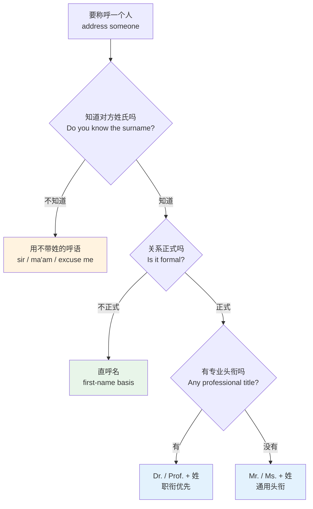
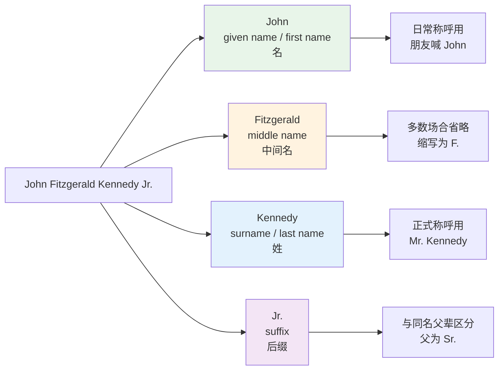
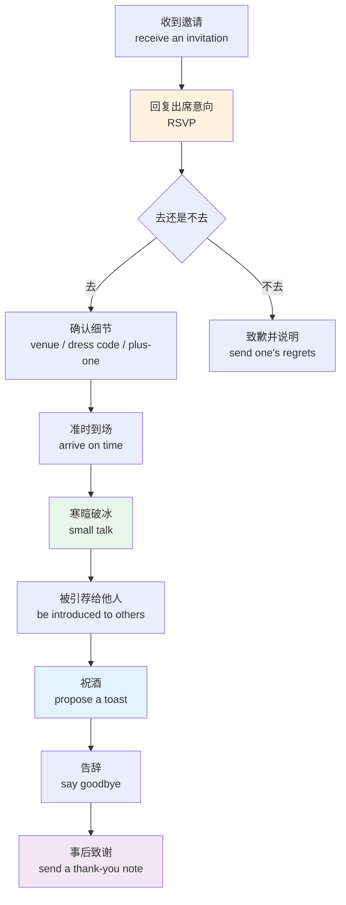
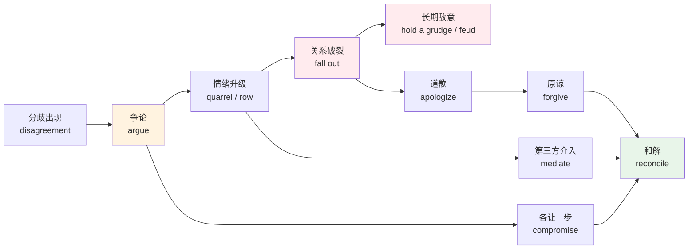
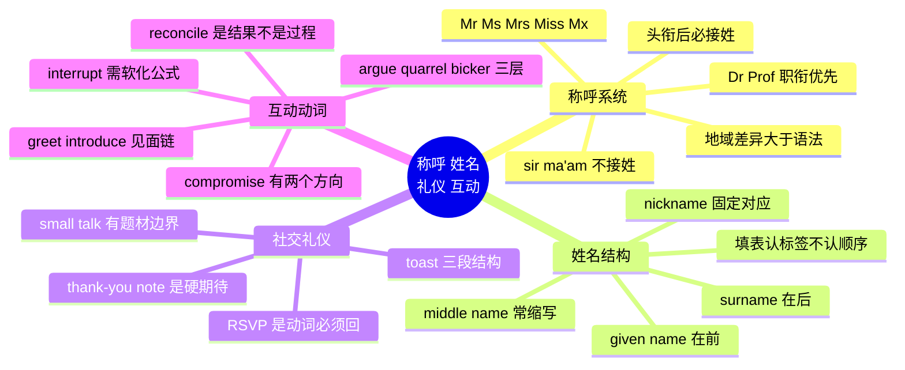

# 称呼语、姓名、社交礼仪与人际互动动词

> [!info] 本篇定位
>
> 上一篇讲的是人生阶段与家庭内部的角色，这一篇往外走一步：**当你面对一个不是家人的人，第一句话该怎么开口**。
>
> 覆盖四块内容：头衔称谓（`Mr.` `Ms.` `Dr.` `Prof.`）与不带姓的呼语（`sir` `ma'am`）的边界；英文姓名的结构（`given name` / `surname` / `middle name` / `nickname`）；社交礼仪词（`RSVP` `small talk` `toast` `etiquette`）；以及从见面到冲突再到和解的一整条互动动词链（`greet` `introduce` `interrupt` `compromise` `reconcile`）。
>
> 读完你能做三件事：给一封陌生人邮件写出不出错的开头和落款；在填英文表格时不会把姓名栏填反；描述一次人际冲突时能用对 `argue` / `quarrel` / `bicker` 这三个词。

---

## 1. 本篇导读：称呼是一次快速的社会定位

中文里叫人有一套自己的逻辑：姓 + 职务（王经理）、姓 + 老（老王）、名 + 哥姐（磊哥）、直接叫全名。这套逻辑几乎无法直译成英语——英语没有「王经理」这种叫法，`Manager Wang` 不是英文，只是中文的字面搬运。

英语称呼系统的底层参数只有三个：**用不用头衔、用哪个头衔、后面接姓还是接名**。三个参数一定，称呼就定了。难点在于这三个参数受语域、年龄、职业、地域、行业惯例共同约束，而且英美差异不小。

这张图是本篇前四节的骨架。三个判断点里，中文母语者最容易在第二个上出错——因为汉语文化默认「正式一点总没错」，而英语世界的大量场合（科技公司、创业团队、北美日常）默认就是直呼名，坚持用 `Mr.` 反而制造距离感。第三个判断点则有个硬规则：**头衔后面永远接姓，不接名**。`Mr. John` 在英语里不成立，除非是对方明确要求的特殊用法。

本篇的词表按「称呼 → 姓名 → 礼仪 → 互动动词」的顺序排，可以顺读，也可以只挑其中一块查。

---

## 2. 头衔称谓：Mr. / Ms. / Mrs. / Miss / Mx.

### 2.1 五个通用头衔的词表

| 英文 | 英式音标 | 美式音标 | 词性 | 中文 | 搭配与说明 |
| --- | --- | --- | --- | --- | --- |
| **Mr.** | /ˈmɪstə/ | /ˈmɪstər/ | n. | 先生 | 男性通用，不区分婚否；后接姓：Mr. Smith |
| **Mrs.** | /ˈmɪsɪz/ | /ˈmɪsɪz/ | n. | 太太 | 已婚女性；拼写与读音不对应，来自 mistress |
| **Miss** | /mɪs/ | /mɪs/ | n. | 小姐 | 未婚女性；唯一不加缩写点的一个 |
| **Ms.** | /mɪz/ | /mɪz/ | n. | 女士 | 不透露婚否，现代书面默认选项 |
| **Mx.** | /mɪks/ | /mɪks/ | n. | 无性别头衔 | 不指明性别，英国政府表格已收录 |
| **title** | /ˈtaɪtl/ | /ˈtaɪtl/ | n. | 头衔；称谓 | courtesy title 礼节性头衔 |
| **honorific** | /ˌɒnəˈrɪfɪk/ | /ˌɑːnəˈrɪfɪk/ | n./adj. | 敬称；表敬意的 | 语言学术语，泛指所有敬语形式 |
| **address** | /əˈdres/ | /əˈdres/ | v. | 称呼；对…讲话 | address sb. as Mr. Lee 称他为李先生 |
| **abbreviation** | /əˌbriːviˈeɪʃn/ | /əˌbriːviˈeɪʃn/ | n. | 缩写 | Mr. 是 Mister 的缩写形式 |
| **full name** | /ˌfʊl ˈneɪm/ | /ˌfʊl ˈneɪm/ | n. | 全名 | 表格栏位常见写法 |
| **formal** | /ˈfɔːml/ | /ˈfɔːrml/ | adj. | 正式的 | formal register 正式语域 |
| **informal** | /ɪnˈfɔːml/ | /ɪnˈfɔːrml/ | adj. | 非正式的 | 与 casual 近义但更中性 |
| **first-name basis** | /ˌfɜːst neɪm ˈbeɪsɪs/ | /ˌfɜːrst neɪm ˈbeɪsɪs/ | n. | 直呼其名的关系 | be on a first-name basis with sb. |
| **marital status** | /ˌmærɪtl ˈsteɪtəs/ | /ˌmærɪtl ˈsteɪtəs/ | n. | 婚姻状况 | Mrs./Miss 的区分依据；表格常见栏位 |

### 2.2 四条不能违反的规则

**规则一：头衔后接姓，不接名。** 这是最高频的中式错误。`Mr. John Smith` 可以（头衔 + 全名），`Mr. Smith` 可以（头衔 + 姓），`Mr. John` 不可以。

> - ❌ ~~Good morning, Mr. David.~~
> - ✅ Good morning, **Mr. Anderson**.
> - ✅ Good morning, **David**.

**规则二：`Ms.` 是书面默认值。** 不知道对方婚姻状况时用 `Ms.`，这在今天的商务往来里已是通行做法。用 `Mrs.` 去称呼一个未婚女性，或者用 `Miss` 去称呼一个五十岁的职业女性，都会显得冒失。

**规则三：英式与美式的标点不同。** 美式写 `Mr.` `Mrs.` `Ms.` 带句点；英式习惯写 `Mr` `Mrs` `Ms` 不带点。两种都对，同一份文件里保持一致即可。

**规则四：`Mrs.` 后面接的是丈夫的姓还是自己的姓，取决于当事人。** 传统上 `Mrs. Smith` 指 Smith 先生的妻子，但现代很多女性婚后保留本姓（`keep her maiden name`）或用连字符姓（`hyphenated surname`），此时称呼要按她自己签名用的姓。

> [!warning] 中文母语者最典型的三个失误
>
> **失误一：把职务当头衔。** 中文的「王经理」「李工程师」「张老师」在英语里没有对应格式。
>
> - ❌ ~~Manager Wang~~ / ~~Engineer Li~~ / ~~Teacher Zhang~~
> - ✅ **Mr. Wang** / **Ms. Li** / **Mr. Zhang**（正式）
> - ✅ **Wang**（团队内部直呼）
>
> 只有极少数职衔可以直接当称呼用，见下一节。
>
> **失误二：过度使用 `Mrs.`。** 教材里 `Mrs.` 出现得早，很多人默认所有成年女性都叫 `Mrs.`。书面场合一律先用 `Ms.`。
>
> **失误三：把 `Miss` 用作单独呼语。** `Miss` 单独喊人在美式英语里带轻慢或过时的味道，尤其对成年女性。要引起陌生女性注意，用 `Excuse me` 就够了。

### 2.3 英国特有的贵族与荣誉头衔

这批词在读英国小说、看历史剧、读新闻时会遇到，作为接受性词汇认得即可，不必主动使用。

| 英文 | 英式音标 | 美式音标 | 词性 | 中文 | 搭配与说明 |
| --- | --- | --- | --- | --- | --- |
| **Sir** | /sɜː/ | /sɜːr/ | n. | 爵士 | 大写 Sir + 名：Sir Paul，不能接姓 |
| **Dame** | /deɪm/ | /deɪm/ | n. | 女爵士 | Sir 的女性对应，同样接名 |
| **Lord** | /lɔːd/ | /lɔːrd/ | n. | 勋爵；上帝 | 大写单用时多指上帝 |
| **Lady** | /ˈleɪdi/ | /ˈleɪdi/ | n. | 夫人；女士 | 头衔义与普通义要靠大写和上下文区分 |
| **Majesty** | /ˈmædʒəsti/ | /ˈmædʒəsti/ | n. | 陛下 | Your Majesty 当面称，His/Her Majesty 转述 |
| **Highness** | /ˈhaɪnəs/ | /ˈhaɪnəs/ | n. | 殿下 | Your Royal Highness 用于王子公主 |
| **Excellency** | /ˈeksələnsi/ | /ˈeksələnsi/ | n. | 阁下 | 用于大使、部分国家元首 |
| **Reverend** | /ˈrevərənd/ | /ˈrevərənd/ | n. | 牧师（尊称） | 缩写 Rev.，Rev. Johnson |
| **Ambassador** | /æmˈbæsədə/ | /æmˈbæsədər/ | n. | 大使 | Ambassador Lee 可直接当称呼 |
| **Honorable** | /ˈɒnərəbl/ | /ˈɑːnərəbl/ | adj. | 尊敬的 | 美式法官、议员的书面前缀 |
| **Your Honor** | /jɔː ˈɒnə/ | /jɔːr ˈɑːnər/ | n. | 法官大人 | 法庭上对法官的固定称呼 |
| **knight** | /naɪt/ | /naɪt/ | n./v. | 骑士；册封为爵士 | k 不发音，be knighted 被授爵 |
| **peerage** | /ˈpɪərɪdʒ/ | /ˈpɪrɪdʒ/ | n. | 贵族爵位 | 集合名词 |
| **commoner** | /ˈkɒmənə/ | /ˈkɑːmənər/ | n. | 平民 | 与贵族相对 |

`Sir` 有两种完全不同的用法，混淆的代价不小。**大写且接名的 `Sir Paul` 是爵位头衔**；**小写单用的 `sir` 是对陌生男性的礼貌呼语**，后面什么都不接。下一节展开第二种。

---

## 3. 职衔称谓：Dr. / Prof. 与其他专业头衔

### 3.1 词表

| 英文 | 英式音标 | 美式音标 | 词性 | 中文 | 搭配与说明 |
| --- | --- | --- | --- | --- | --- |
| **Doctor / Dr.** | /ˈdɒktə/ | /ˈdɑːktər/ | n. | 博士；医生 | 两个身份共用一个词，靠语境区分 |
| **Professor / Prof.** | /prəˈfesə/ | /prəˈfesər/ | n. | 教授 | 美式指职称，英式指最高级教职 |
| **PhD** | /ˌpiː eɪtʃ ˈdiː/ | /ˌpiː eɪtʃ ˈdiː/ | n. | 博士学位 | 写在名后：Jane Lee, PhD |
| **degree** | /dɪˈɡriː/ | /dɪˈɡriː/ | n. | 学位 | hold a degree in physics |
| **faculty** | /ˈfæklti/ | /ˈfæklti/ | n. | 全体教师；学院 | 美式指教职队伍，英式指学院（Faculty of Law） |
| **lecturer** | /ˈlektʃərə/ | /ˈlektʃərər/ | n. | 讲师 | 英式教职阶梯的入门级 |
| **physician** | /fɪˈzɪʃn/ | /fɪˈzɪʃn/ | n. | 内科医生 | 正式书面词，日常仍说 doctor |
| **surgeon** | /ˈsɜːdʒən/ | /ˈsɜːrdʒən/ | n. | 外科医生 | 英国传统上称 Mr. 而非 Dr. |
| **attorney** | /əˈtɜːni/ | /əˈtɜːrni/ | n. | 律师 | 美式用词，英式用 solicitor / barrister |
| **counsel** | /ˈkaʊnsl/ | /ˈkaʊnsl/ | n. | 法律顾问；辩护律师 | 法庭上法官称律师为 counsel |
| **Officer** | /ˈɒfɪsə/ | /ˈɑːfɪsər/ | n. | 警官；军官 | Officer Brown 可直接当称呼 |
| **Captain** | /ˈkæptɪn/ | /ˈkæptɪn/ | n. | 上尉；船长；机长 | 军衔与职务都可直接当称呼 |
| **Coach** | /kəʊtʃ/ | /koʊtʃ/ | n. | 教练 | 美式校园里常直接喊 Coach |
| **Chef** | /ʃef/ | /ʃef/ | n. | 主厨 | 厨房里 Yes, Chef 是标准回应 |

### 3.2 `Dr.` 的两个陷阱

**陷阱一：`Dr.` 同时表示「博士」和「医生」。** 这两个身份在英语里共用一个词，因为医学学位本身就是博士学位。判断靠上下文：医院里的 `Dr. Chen` 是医生，大学里的 `Dr. Chen` 多半是持有博士学位的教员。

**陷阱二：`Dr.` 与其他头衔互斥，且不能与学位后缀叠用。** 前置的 `Dr.` 和后置的 `PhD` 只能选一个。

> - ❌ ~~Dr. Jane Lee, PhD~~（前后重复）
> - ✅ **Dr. Jane Lee**
> - ✅ **Jane Lee, PhD**

**英美的教职称呼差异要单独记。** 美式大学里，只要对方有博士学位，学生一般称 `Professor Lee` 或 `Dr. Lee`，两者都安全。英式大学里 `Professor` 是最高教职（相当于讲席教授），随便给一位讲师安上 `Professor` 反而尴尬；英国常用 `Dr. Lee`。

> [!tip] 不确定时的通用解法
>
> 学术邮件里如果拿不准对方的职称，写 `Dear Dr. <姓>` 比写 `Dear Mr./Ms. <姓>` 更安全——把有博士学位的人称作 `Mr.` 是降级，会被视为不用心；把没有博士学位的人称作 `Dr.` 只是抬高，对方顶多在回信里说 `Please call me Sarah`。
>
> 更稳妥的做法是查一眼对方的个人主页或邮件签名，签名里通常写明了学位与职称。

### 3.3 英国外科医生的历史例外

英国有一条反直觉的行业惯例：**外科医生（surgeon）取得专科资格后，称呼从 `Dr.` 改回 `Mr.` / `Ms.`**。这个做法源自外科在历史上曾属于理发匠行会而非医学院体系，今天保留下来当作职业身份的标记。

看英剧或读英国医院资料时遇到 `Mr. Patel, Consultant Surgeon` 不要以为是笔误，这恰恰是资历的体现。美国、加拿大、澳大利亚不遵循这条惯例。

---

## 4. sir / ma'am / madam：不带姓的呼语

### 4.1 词表

| 英文 | 英式音标 | 美式音标 | 词性 | 中文 | 搭配与说明 |
| --- | --- | --- | --- | --- | --- |
| **sir** | /sɜː/ | /sɜːr/ | n. | 先生（呼语） | 小写、单用、不接名或姓 |
| **madam** | /ˈmædəm/ | /ˈmædəm/ | n. | 女士（呼语） | 书面与正式服务场合 |
| **ma'am** | /mɑːm/ | /mæm/ | n. | 女士（口语） | madam 的缩合形式，英美读音差别明显 |
| **folks** | /fəʊks/ | /foʊks/ | n. | 各位；乡亲 | 美式亲切的群体呼语 |
| **guys** | /ɡaɪz/ | /ɡaɪz/ | n. | 各位 | you guys 已中性化，可指混合群体 |
| **everyone** | /ˈevriwʌn/ | /ˈevriwʌn/ | pron. | 各位 | 会议开场最安全的群体呼语 |
| **excuse me** | /ɪkˈskjuːz mi/ | /ɪkˈskjuːz mi/ | phr. | 打扰一下 | 引起陌生人注意的默认说法 |
| **pardon** | /ˈpɑːdn/ | /ˈpɑːrdn/ | n./v. | 请再说一遍；原谅 | 没听清时用 Pardon? |
| **buddy** | /ˈbʌdi/ | /ˈbʌdi/ | n. | 老兄 | 美式非正式，对陌生人用可能显得冒犯 |
| **mate** | /meɪt/ | /meɪt/ | n. | 伙计 | 英澳非正式，男性之间常用 |
| **dude** | /djuːd/ | /duːd/ | n. | 哥们 | 美式俚语，语域很低 |
| **stranger** | /ˈstreɪndʒə/ | /ˈstreɪndʒər/ | n. | 陌生人 | a perfect stranger 素不相识的人 |

### 4.2 地域差异比语法更重要

`sir` 和 `ma'am` 的可接受度在英语世界内部差异极大，这不是语法问题而是社会习惯问题。

| 地区／场景 | sir / ma'am 的地位 | 说明 |
| --- | --- | --- |
| 美国南部 | 日常礼貌用语 | 对长辈、陌生人常用，被视为教养的体现 |
| 美国其他地区 | 服务业与军警场景 | 店员对顾客、警察对市民；同事之间不用 |
| 英国 | 偏正式服务业 | 高档餐厅、酒店、学校对老师；日常极少 |
| 科技公司内部 | 基本不用 | 全员直呼名，用 sir 会显得生硬 |
| 军队与执法 | 强制性 | 对上级必须使用，属于纪律要求 |

> [!warning] `ma'am` 的年龄暗示
>
> 在美国部分地区，对一位三十岁左右的女性说 `ma'am` 会被理解为暗示她年纪大了，可能引起不快。这不是语言错误，但确实是真实存在的社交摩擦。
>
> 安全做法：需要引起陌生女性注意时，用 `Excuse me` 而不是 `Ma'am`。需要礼貌回应时，用完整句子而不是靠呼语撑礼貌。
>
> - 场景受限：Here's your change, **ma'am**.（服务业柜台可以，同事之间不要）
> - ✅ Here's your change.（去掉呼语，同样礼貌）

### 4.3 群体呼语的选择

对着一屋子人开口时，中文的「各位」在英语里有好几个落点，语域相差很大。

> [!example] 同一句话的四种语域
>
> - Good morning, **everyone**.
>   - 各位早上好。（会议、课堂，最安全）
> - Morning, **folks**.
>   - 各位早。（美式，轻松友好）
> - Hey, **guys**.
>   - 嘿，各位。（同事之间，非正式）
> - Ladies and **gentlemen**.
>   - 女士们先生们。（正式演讲、颁奖、机上广播）

`you guys` 在美式口语里已经中性化，可以指全是女性的群体，但正式书面场合仍应换成 `everyone` 或 `all of you`。英式英语用 `you lot`，澳式用 `you mob`，都属于强地域标记，学习者不必主动使用。

---

## 5. 姓名结构：given name、surname 与中间名

### 5.1 词表

| 英文 | 英式音标 | 美式音标 | 词性 | 中文 | 搭配与说明 |
| --- | --- | --- | --- | --- | --- |
| **given name** | /ˌɡɪvn ˈneɪm/ | /ˌɡɪvn ˈneɪm/ | n. | 名 | 国际表格上的标准说法 |
| **first name** | /ˌfɜːst ˈneɪm/ | /ˌfɜːrst ˈneɪm/ | n. | 名 | 日常等同 given name |
| **forename** | /ˈfɔːneɪm/ | /ˈfɔːrneɪm/ | n. | 名 | 英式正式文件用词 |
| **Christian name** | /ˈkrɪstʃən neɪm/ | /ˈkrɪstʃən neɪm/ | n. | 教名 | 过时且带宗教预设，正式场合已弃用 |
| **surname** | /ˈsɜːneɪm/ | /ˈsɜːrneɪm/ | n. | 姓 | 英式表格首选 |
| **last name** | /ˌlɑːst ˈneɪm/ | /ˌlæst ˈneɪm/ | n. | 姓 | 美式常用，注意 last 元音英美不同 |
| **family name** | /ˈfæməli neɪm/ | /ˈfæməli neɪm/ | n. | 姓氏 | 对东亚用户最不易误解的表述 |
| **middle name** | /ˌmɪdl ˈneɪm/ | /ˌmɪdl ˈneɪm/ | n. | 中间名 | 多为教名、母姓或祖辈名 |
| **middle initial** | /ˌmɪdl ɪˈnɪʃl/ | /ˌmɪdl ɪˈnɪʃl/ | n. | 中间名首字母 | 美式表格常单列此栏 |
| **initial** | /ɪˈnɪʃl/ | /ɪˈnɪʃl/ | n./v. | 首字母；签首字母 | initial the document 在文件上签缩写 |
| **maiden name** | /ˈmeɪdn neɪm/ | /ˈmeɪdn neɪm/ | n. | 婚前姓 | 银行安全问题的高频选项 |
| **married name** | /ˈmærid neɪm/ | /ˈmærid neɪm/ | n. | 婚后姓 | 与 maiden name 相对 |
| **hyphenate** | /ˈhaɪfəneɪt/ | /ˈhaɪfəneɪt/ | v. | 用连字符连接 | Smith-Jones 式的双姓 |
| **patronymic** | /ˌpætrəˈnɪmɪk/ | /ˌpætrəˈnɪmɪk/ | n. | 父名 | 冰岛、俄语姓名体系的构成 |
| **namesake** | /ˈneɪmseɪk/ | /ˈneɪmseɪk/ | n. | 同名者 | named after 的对象 |
| **junior / Jr.** | /ˈdʒuːniə/ | /ˈdʒuːniər/ | n./adj. | 小（同名之子） | John Smith Jr. 父子同名时区分 |
| **senior / Sr.** | /ˈsiːniə/ | /ˈsiːniər/ | n./adj. | 老（同名之父） | 与 Jr. 配对使用 |
| **legal name** | /ˌliːɡl ˈneɪm/ | /ˌliːɡl ˈneɪm/ | n. | 法定姓名 | 证件上的名字，与常用名可能不同 |

### 5.2 一个完整姓名的解剖

这张图说明的是英语姓名的位置逻辑：**名在前、姓在后**，这与中文的姓在前完全相反。中间名处在两者之间，绝大多数场合不出现，只在法律文件、正式简历、护照上完整写出，日常缩写成一个首字母（`John F. Kennedy`）。后缀 `Jr.` / `Sr.` / `III` 只在父子同名时使用，中国人几乎用不到，但读美国新闻和文学时会频繁遇到。

> [!warning] 填表时最容易填反的两栏
>
> 中国人姓名「李伟」在表格里怎么填，取决于栏位怎么写：
>
> | 表格栏位 | 应填内容 | 说明 |
> | --- | --- | --- |
> | Given name / First name | Wei | 填名，不是姓 |
> | Surname / Last name / Family name | Li | 填姓 |
> | Full name | Wei Li | 按英语顺序，名在前 |
> | Name as in passport | LI WEI | 照抄护照，护照上是姓在前 |
>
> 最大的坑是护照与在线表格顺序不一致。订国际机票时，姓名必须与护照完全对应，但录入框往往按英语顺序分成两栏。**认准栏位标签，不要按视觉顺序填。**
>
> - ❌ ~~First name: Li / Last name: Wei~~（姓名颠倒，登机可能被拒）
> - ✅ **First name: Wei / Last name: Li**

### 5.3 中间名到底是什么

中间名对中文母语者是纯粹的陌生概念，因为汉语姓名结构里没有对应物。它的来源主要有三类：

- **教名或圣徒名。** 天主教家庭常给孩子取一个圣徒名作中间名。
- **母亲的娘家姓。** 用来保留母系家族的姓氏线索，是英美中上层的传统做法。
- **祖辈或长辈的名字。** 表示纪念，孩子因此成为某位长辈的 `namesake`。

美国人的中间名使用率高于英国人，且**一个人可以有多个中间名**——英国王室成员通常有三到四个。日常生活中中间名的实际功能只有两个：在同名者众多时用作区分（`Robert J. Miller` 与 `Robert T. Miller`），以及在正式签名时体现完整身份。

> [!tip] 中国人要不要给自己加中间名
>
> 不需要，也不建议在证件相关场合虚构一个。但如果你有一个常用的英文名（比如 Kevin），在国际交往里最实用的写法是把它当作 given name，中文名的拼音当 middle name：
>
> - **Kevin Wei Li** — 英文名做名，拼音名做中间名，姓保持 Li。
>
> 这个写法的好处是同事叫得出口，同时证件上的 `Wei Li` 仍可对应。要避免的是把英文名和中文名并列成一个奇怪的复合体（`Kevin Wei` 当名字），会造成表格与证件不一致。

---

## 6. 昵称、简称与自我介绍时的姓名策略

### 6.1 词表

| 英文 | 英式音标 | 美式音标 | 词性 | 中文 | 搭配与说明 |
| --- | --- | --- | --- | --- | --- |
| **nickname** | /ˈnɪkneɪm/ | /ˈnɪkneɪm/ | n./v. | 昵称；起绰号 | go by a nickname 用某昵称 |
| **diminutive** | /dɪˈmɪnjətɪv/ | /dɪˈmɪnjətɪv/ | n./adj. | 爱称形式；小的 | 语言学术语，指 Robert→Bob 这类 |
| **pet name** | /ˈpet neɪm/ | /ˈpet neɪm/ | n. | 亲昵称呼 | 情侣、家人之间的专属叫法 |
| **alias** | /ˈeɪliəs/ | /ˈeɪliəs/ | n. | 化名；别名 | 法律与计算机语境都常见 |
| **pseudonym** | /ˈsjuːdənɪm/ | /ˈsuːdənɪm/ | n. | 笔名；假名 | 英美读音差在首音节 |
| **pen name** | /ˈpen neɪm/ | /ˈpen neɪm/ | n. | 笔名 | pseudonym 的通俗说法 |
| **stage name** | /ˈsteɪdʒ neɪm/ | /ˈsteɪdʒ neɪm/ | n. | 艺名 | 演艺圈用 |
| **handle** | /ˈhændl/ | /ˈhændl/ | n. | 网名；用户名 | 社交平台的 @ 后面那串 |
| **username** | /ˈjuːzəneɪm/ | /ˈjuːzərneɪm/ | n. | 用户名 | 技术语境的中性词 |
| **go by** | /ˈɡəʊ baɪ/ | /ˈɡoʊ baɪ/ | phr.v. | 以…为名 | I go by Kev. 我平时叫 Kev |
| **shorten** | /ˈʃɔːtn/ | /ˈʃɔːrtn/ | v. | 缩短 | shorten Elizabeth to Liz |
| **spell** | /spel/ | /spel/ | v. | 拼写 | How do you spell that? |
| **pronounce** | /prəˈnaʊns/ | /prəˈnaʊns/ | v. | 发音 | 名词 pronunciation 读 /nʌn/ 不读 /naʊn/ |
| **mispronounce** | /ˌmɪsprəˈnaʊns/ | /ˌmɪsprəˈnaʊns/ | v. | 读错 | 常用于道歉：Sorry if I mispronounced it |

### 6.2 常见英文名与昵称对照

英文昵称不是自由发挥的结果，绝大多数是几百年沉淀下来的固定对应。看到 `Bill` 就该想到本名可能是 `William`——这在读小说和看剧时是必要的解码能力。

| 本名 | 常见昵称 | 本名 | 常见昵称 |
| --- | --- | --- | --- |
| **William** | Will / Bill / Billy | **Elizabeth** | Liz / Beth / Betty / Eliza |
| **Robert** | Rob / Bob / Bobby | **Margaret** | Meg / Maggie / Peggy |
| **Richard** | Rick / Dick / Richie | **Katherine** | Kate / Kathy / Katie |
| **Michael** | Mike / Mikey | **Jennifer** | Jen / Jenny |
| **James** | Jim / Jimmy / Jamie | **Susan** | Sue / Susie |
| **Charles** | Charlie / Chuck | **Patricia** | Pat / Patty / Tricia |
| **Edward** | Ed / Ted / Ned / Eddie | **Rebecca** | Becky / Becca |
| **Anthony** | Tony | **Christina** | Chris / Tina |
| **Joseph** | Joe / Joey | **Alexandra** | Alex / Sandra / Sasha |
| **Thomas** | Tom / Tommy | **Deborah** | Deb / Debbie |

`Robert → Bob` 和 `Margaret → Peggy` 这类看起来毫无字母关联的对应，来自中古英语的押韵替换习惯（Rob→Bob，Meg→Peg）。这类词没有规律可推，只能作为固定搭配记住。

> [!warning] 昵称使用的两条边界
>
> **不要自己给别人起昵称。** 对方自我介绍说 `I'm Jennifer`，你就叫 `Jennifer`，不要自作主张改成 `Jen`。等对方说 `Call me Jen` 再改。中文里主动叫「小王」表示亲近，英语里对应的动作会被理解为越界。
>
> **不要用对方的昵称去写正式邮件。** 平时喊 `Bob`，写正式合同或第一次给他上级抄送时用 `Robert` 或 `Mr. Fischer`。
>
> - ❌ ~~Dear Bobby, please find the signed contract attached.~~
> - ✅ **Dear Robert,** please find the signed contract attached.

### 6.3 中国人自我介绍的实用句式

> [!example] 三种情境下的自我介绍
>
> - Hi, I'm Wei Li. **Wei** is my given name — feel free to just call me Wei.
>   - 你好，我叫李伟。伟是我的名，直接叫我 Wei 就行。
> - My name is Li Wei, but I **go by** Kevin at work.
>   - 我叫李伟，工作场合大家叫我 Kevin。
> - It's spelled W-E-I, and it **rhymes with** "way".
>   - 拼作 W-E-I，读音和 way 押韵。

最后一句的处理方式很实用。中文名对英语母语者来说发音困难，与其等着被读错，不如主动给一个参照读音。`rhymes with` 是最自然的说法，比 `pronounce it like` 更省事。

对方读错时的标准回应不是纠正到底，而是给一次友好的修正机会：`Close — it's more like "way".` 强行纠正三次以上会让双方都尴尬，这是英语社交里的默认分寸。

---

## 7. 书面称呼：邮件开头、落款与信封

### 7.1 词表

| 英文 | 英式音标 | 美式音标 | 词性 | 中文 | 搭配与说明 |
| --- | --- | --- | --- | --- | --- |
| **salutation** | /ˌsæljuˈteɪʃn/ | /ˌsæljuˈteɪʃn/ | n. | 称呼语 | 信件开头的 Dear… 那一行 |
| **Dear** | /dɪə/ | /dɪr/ | adj. | 亲爱的（书信用） | 书信开头的固定词，不含亲密义 |
| **recipient** | /rɪˈsɪpiənt/ | /rɪˈsɪpiənt/ | n. | 收件人 | 与 sender 相对 |
| **addressee** | /ˌædreˈsiː/ | /ˌædreˈsiː/ | n. | 收信人 | 正式文书用词 |
| **sign-off** | /ˈsaɪn ɒf/ | /ˈsaɪn ɔːf/ | n. | 落款语 | 信末的 Best regards 那一行 |
| **sincerely** | /sɪnˈsɪəli/ | /sɪnˈsɪrli/ | adv. | 谨启 | Yours sincerely 用于知道姓名时 |
| **faithfully** | /ˈfeɪθfəli/ | /ˈfeɪθfəli/ | adv. | 谨上 | 英式：不知姓名时用 Yours faithfully |
| **regards** | /rɪˈɡɑːdz/ | /rɪˈɡɑːrdz/ | n. | 问候 | Best regards 是最通用的落款 |
| **cordially** | /ˈkɔːdiəli/ | /ˈkɔːrdʒəli/ | adv. | 诚挚地 | Cordially yours 偏老式美式用法 |
| **signature** | /ˈsɪɡnətʃə/ | /ˈsɪɡnətʃər/ | n. | 签名；签名档 | email signature 邮件签名档 |
| **enclosure** | /ɪnˈkləʊʒə/ | /ɪnˈkloʊʒər/ | n. | 附件（纸质） | 缩写 Encl.，电子邮件用 attachment |
| **attachment** | /əˈtætʃmənt/ | /əˈtætʃmənt/ | n. | 附件 | Please find the attachment |
| **envelope** | /ˈenvələʊp/ | /ˈenvəloʊp/ | n. | 信封 | 首元音英式也可读 /ˈɒn-/ |
| **postcode** | /ˈpəʊstkəʊd/ | /ˈpoʊstkoʊd/ | n. | 邮编 | 英式；美式说 zip code |
| **correspondence** | /ˌkɒrəˈspɒndəns/ | /ˌkɔːrəˈspɑːndəns/ | n. | 往来信件 | 不可数，指全部书信往来 |
| **memo** | /ˈmeməʊ/ | /ˈmemoʊ/ | n. | 内部备忘录 | memorandum 的缩略形式 |

### 7.2 开头与落款的配对规则

英式书信有一条严格的配对规则，是考试和正式文书里的常考点：

| 情境 | 开头 | 结尾（英式） | 结尾（美式） |
| --- | --- | --- | --- |
| 知道收信人姓名 | Dear Mr. Chen, | Yours sincerely, | Sincerely, |
| 不知道姓名 | Dear Sir or Madam, | Yours faithfully, | Sincerely, |
| 完全不知收信方 | To Whom It May Concern, | Yours faithfully, | Sincerely, |
| 半正式商务 | Dear Sarah, | Kind regards, | Best regards, |
| 熟悉同事 | Hi Sarah, | Best, / Thanks, | Best, / Thanks, |

记忆的抓手是英式那条：**知道名字用 sincerely，不知道名字用 faithfully**。美式不做这个区分，一律 `Sincerely`。日常商务邮件两边都可以用 `Best regards`，这是最省心的默认值。

> [!warning] 三个高频书面错误
>
> **错误一：`Dear` 后面跟逗号还是冒号。** 英式用逗号，美式正式商务信用冒号（`Dear Mr. Chen:`），电子邮件两边都倾向用逗号。同一封信里保持一致。
>
> **错误二：`To Whom It May Concern` 用得太随意。** 这个短语意味着「我完全不知道谁会读这封信」，用在推荐信、公证材料上合适；用在求职信上等于告诉 HR 你没做功课。能查到具体收件人就一定要查。
>
> **错误三：把中文的「此致敬礼」结构照搬。**
>
> - ❌ ~~Wish you a good day! Yours, Li Wei~~（祝福语与落款堆叠，且感叹号过多）
> - ✅ Thanks again for your help. **Best regards,** Wei Li

### 7.3 邮件开头的语域梯度

> [!example] 同一封邮件的五个语域档位
>
> - **Dear Dr. Whitfield,** — 学术、初次联系、请求性质的邮件。
>   - 最正式，适合给素未谋面的教授或审稿人。
> - **Dear Ms. Whitfield,** — 商务初次联系。
>   - 通用正式档，不会出错。
> - **Dear Sarah,** — 已有往来的客户或外部合作方。
>   - 用名但保留 Dear，礼貌与亲近的平衡点。
> - **Hi Sarah,** — 同公司或长期合作的同事。
>   - 现代职场邮件的实际默认值。
> - **Sarah —** — 内部快速沟通。
>   - 只写名加破折号，接近即时消息的语气。

从上到下是一条连续的梯度，不是五个互斥的选项。判断依据是**关系的累积时长与往来频次**：第一封邮件往上取一档，对方回信用了哪一档，你下一封就跟着他的档位走。这个「跟随对方档位」的策略几乎不会出错。

---

## 8. 社交礼仪：邀请、RSVP 与到场

### 8.1 词表

| 英文 | 英式音标 | 美式音标 | 词性 | 中文 | 搭配与说明 |
| --- | --- | --- | --- | --- | --- |
| **etiquette** | /ˈetɪket/ | /ˈetɪkət/ | n. | 礼仪；规矩 | 不可数；法语借词，末音节英式读 /ket/ 美式读 /kət/ |
| **manners** | /ˈmænəz/ | /ˈmænərz/ | n. | 礼貌；教养 | 恒复数；单数 manner 意思完全不同 |
| **courtesy** | /ˈkɜːtəsi/ | /ˈkɜːrtəsi/ | n. | 礼貌；殷勤 | as a courtesy 出于礼貌 |
| **decorum** | /dɪˈkɔːrəm/ | /dɪˈkɔːrəm/ | n. | 得体；礼节 | 正式词，多用于书面 |
| **protocol** | /ˈprəʊtəkɒl/ | /ˈproʊtəkɔːl/ | n. | 礼宾规程；协议 | 外交与技术两个义项共存 |
| **faux pas** | /ˌfəʊ ˈpɑː/ | /ˌfoʊ ˈpɑː/ | n. | 失礼之举 | 法语借词，x 与 s 都不发音 |
| **invitation** | /ˌɪnvɪˈteɪʃn/ | /ˌɪnvɪˈteɪʃn/ | n. | 邀请；请柬 | send / accept / decline an invitation |
| **invite** | /ɪnˈvaɪt/ | /ɪnˈvaɪt/ | v. | 邀请 | 名词用法重音前移：/ˈɪnvaɪt/ |
| **RSVP** | /ˌɑː es viː ˈpiː/ | /ˌɑːr es viː ˈpiː/ | v./n. | 请回复 | 法语 répondez s'il vous plaît 的缩写 |
| **host** | /həʊst/ | /hoʊst/ | n./v. | 主人；主办 | host a dinner 做东请客 |
| **guest** | /ɡest/ | /ɡest/ | n. | 客人 | guest of honor 主宾 |
| **attendee** | /əˌtenˈdiː/ | /əˌtenˈdiː/ | n. | 与会者 | 正式活动名单用词 |
| **venue** | /ˈvenjuː/ | /ˈvenjuː/ | n. | 场地 | change the venue 换场地 |
| **reception** | /rɪˈsepʃn/ | /rɪˈsepʃn/ | n. | 招待会；前台 | wedding reception 婚宴 |
| **banquet** | /ˈbæŋkwɪt/ | /ˈbæŋkwɪt/ | n. | 宴会 | 正式大型，比 dinner party 隆重 |
| **potluck** | /ˈpɒtlʌk/ | /ˈpɑːtlʌk/ | n. | 各带一菜的聚餐 | 美式常见社交形式 |
| **housewarming** | /ˈhaʊswɔːmɪŋ/ | /ˈhaʊswɔːrmɪŋ/ | n. | 乔迁派对 | housewarming gift 乔迁礼 |
| **punctual** | /ˈpʌŋktʃuəl/ | /ˈpʌŋktʃuəl/ | adj. | 准时的 | 名词 punctuality |

### 8.2 RSVP 是一个动词

`RSVP` 在英语里已经完全动词化，可以直接变位使用，这是很多学习者不知道的。

> [!example] RSVP 的四种用法
>
> - Please **RSVP** by Friday.
>   - 请在周五前回复是否出席。
> - Have you **RSVP'd** to Emma's wedding yet?
>   - 你回复艾玛的婚礼邀请了吗？
> - We've had thirty **RSVPs** so far.
>   - 目前收到三十份回复。
> - I **RSVP'd yes** but something came up.
>   - 我回复说去，但临时有事。

`RSVP` 请求的是**明确答复**，不管去还是不去都要回。这与中文的邀约文化有实质差别：中文里「我尽量」「有空的话过去」是可接受的模糊回应，英语礼仪里不回复 RSVP 等同于失礼，因为主办方要按人数订餐订座。

> [!warning] `RSVP` 相关的三个细节
>
> - `Please RSVP` 有轻微冗余（répondez 已含「请」），但已被普遍接受，不必刻意回避。
> - 请柬上写 `Regrets only` 意思是**只有不去才需要回复**，不回复默认为去，方向与 RSVP 相反。
> - 回复不出席的标准说法是 `send one's regrets`：`I'll have to send my regrets — I'm out of town that weekend.`

### 8.3 一次社交邀约的完整链条

这条链上有三个环节是中文社交里没有对等物、因而最容易漏掉的。**RSVP 环节**前面已经说过。**告辞环节**在英语社交里有明确的动作要求：不能不辞而别，要主动找到主人道谢并说明要走（`I should get going — thanks for having me.`）。**事后致谢环节**在正式场合（婚礼、面试、别人家里过夜）是硬性期待，尤其在美国，`thank-you note` 的缺席会被记住。

`dress code` 和 `plus-one` 是确认细节时的两个关键词。`plus-one` 指邀请中允许带的一位同伴，请柬上写 `and guest` 就意味着有 plus-one，没写就是只邀请你一人。

---

## 9. small talk：闲聊的题材边界与常用说法

### 9.1 词表

| 英文 | 英式音标 | 美式音标 | 词性 | 中文 | 搭配与说明 |
| --- | --- | --- | --- | --- | --- |
| **small talk** | /ˈsmɔːl tɔːk/ | /ˈsmɔːl tɔːk/ | n. | 闲聊 | 不可数：make small talk |
| **chat** | /tʃæt/ | /tʃæt/ | n./v. | 聊天 | 英式也指网络聊天，语域轻松 |
| **chitchat** | /ˈtʃɪttʃæt/ | /ˈtʃɪttʃæt/ | n./v. | 闲扯 | 比 small talk 更随意，略带贬义 |
| **banter** | /ˈbæntə/ | /ˈbæntər/ | n./v. | 玩笑式对话 | 英式职场文化的重要成分 |
| **icebreaker** | /ˈaɪsbreɪkə/ | /ˈaɪsbreɪkər/ | n. | 破冰话题；破冰游戏 | break the ice 打破僵局 |
| **mingle** | /ˈmɪŋɡl/ | /ˈmɪŋɡl/ | v. | 与人交际周旋 | 派对上四处搭话：go and mingle |
| **socialize** | /ˈsəʊʃəlaɪz/ | /ˈsoʊʃəlaɪz/ | v. | 社交 | 英式也拼 socialise |
| **network** | /ˈnetwɜːk/ | /ˈnetwɜːrk/ | v./n. | 拓展人脉；人脉 | networking event 社交活动 |
| **gossip** | /ˈɡɒsɪp/ | /ˈɡɑːsɪp/ | n./v. | 闲话；说人闲话 | 明显贬义，不可数 |
| **rapport** | /ræˈpɔː/ | /ræˈpɔːr/ | n. | 融洽关系 | build rapport with sb.；t 不发音 |
| **catch up** | /ˌkætʃ ˈʌp/ | /ˌkætʃ ˈʌp/ | phr.v. | 叙旧；补进度 | Let's catch up sometime. |
| **awkward** | /ˈɔːkwəd/ | /ˈɔːkwərd/ | adj. | 尴尬的 | an awkward silence 尴尬的沉默 |
| **taboo** | /təˈbuː/ | /təˈbuː/ | n./adj. | 禁忌；禁忌的 | a taboo subject 禁忌话题 |
| **pry** | /praɪ/ | /praɪ/ | v. | 打探隐私 | I don't mean to pry, but… |

### 9.2 安全题材与禁忌题材

`small talk` 不是随便聊，它有一份相当稳定的题材清单。这份清单的底层逻辑是：**话题必须是双方都能接话、且不暴露立场和隐私的**。

| 安全题材 | 典型开场句 | 禁忌题材 | 为什么禁忌 |
| --- | --- | --- | --- |
| 天气 | Miserable weather today, isn't it? | 收入 | 直接涉及经济地位 |
| 通勤路况 | Did you have trouble getting here? | 年龄 | 尤其对女性 |
| 周末计划 | Any plans for the weekend? | 婚育状况 | 可能触及敏感私事 |
| 场地与食物 | The food here is great, isn't it? | 体重与外貌 | 无论褒贬都不合适 |
| 体育赛事 | Did you catch the game last night? | 政治立场 | 极易升级为冲突 |
| 近期影视 | Have you seen that new series? | 宗教信仰 | 同上 |
| 工作近况 | How's the new role treating you? | 健康病史 | 属于隐私 |

中文寒暄里高频的「你多大了」「结婚了吗」「一个月挣多少」「怎么胖了」在英语场合全部落在右栏。这不是英语更矜持，而是两种文化对「关心」的定义不同：中文用打听近况表示关心，英语用不打听表示尊重。

> [!warning] 天气话题不是刻板印象
>
> 拿天气开场在英语里确实是真实存在的高频做法，尤其在英国。它之所以有效，是因为天气满足三个条件：双方都在经历、都能评论、都不会因立场不同而争起来。
>
> 中文母语者常觉得聊天气「太没内容」，于是跳过寒暄直接进正题。在英语社交场合，这会显得突兀。`small talk` 的功能不是传递信息，而是**建立可以继续对话的通道**。
>
> - ❌ ~~（在电梯里对同事）So what's the status of the migration ticket?~~
> - ✅ Morning. **Cold one today.** … Oh, by the way, how's the migration going?

### 9.3 结束闲聊的说法

比开场更难的是收场。英语里结束 `small talk` 有一套固定的退出句式，用完之后离开是完全礼貌的。

> [!example] 五种得体的退出说法
>
> - Well, it was **great talking to you**.
>   - 跟你聊得很开心。（最通用）
> - I should **let you get back to it**.
>   - 我就不耽误你了。（暗示对方还有事）
> - I'm going to **grab another drink** — catch you later.
>   - 我去再拿杯喝的，回头聊。（派对场合）
> - Let's **catch up** properly sometime.
>   - 改天好好聊。（表示愿意继续，但不是现在）
> - I'd better **make the rounds** — nice meeting you.
>   - 我得再去转转，很高兴认识你。（正式社交活动）

这几句的共同结构是「给一个离开的理由 + 一句正面评价」。缺了理由会显得像是逃走，缺了评价会显得冷淡。中文里「那我先过去了」这种单句在英语里需要补上前后两半。

---

## 10. 祝酒、致谢与礼物往来

### 10.1 词表

| 英文 | 英式音标 | 美式音标 | 词性 | 中文 | 搭配与说明 |
| --- | --- | --- | --- | --- | --- |
| **toast** | /təʊst/ | /toʊst/ | n./v. | 祝酒（词）；举杯 | propose a toast to sb. |
| **cheers** | /tʃɪəz/ | /tʃɪrz/ | int. | 干杯 | 英式也表示「谢谢」和「再见」 |
| **clink** | /klɪŋk/ | /klɪŋk/ | v. | 碰（杯） | clink glasses 碰杯 |
| **speech** | /spiːtʃ/ | /spiːtʃ/ | n. | 致辞 | give / make a speech |
| **gratitude** | /ˈɡrætɪtjuːd/ | /ˈɡrætɪtuːd/ | n. | 感激 | express gratitude；不可数 |
| **grateful** | /ˈɡreɪtfl/ | /ˈɡreɪtfl/ | adj. | 感激的 | be grateful to sb. for sth. |
| **appreciate** | /əˈpriːʃieɪt/ | /əˈpriːʃieɪt/ | v. | 感激；欣赏 | I'd appreciate it if… 委婉请求 |
| **thank-you note** | /ˈθæŋk juː nəʊt/ | /ˈθæŋk juː noʊt/ | n. | 感谢便条 | 美式社交的硬性期待 |
| **favor** | /ˈfeɪvə/ | /ˈfeɪvər/ | n. | 人情；帮忙 | 英式拼 favour；do sb. a favor |
| **reciprocate** | /rɪˈsɪprəkeɪt/ | /rɪˈsɪprəkeɪt/ | v. | 回报；礼尚往来 | 正式词，指对等回应 |
| **obligation** | /ˌɒblɪˈɡeɪʃn/ | /ˌɑːblɪˈɡeɪʃn/ | n. | 义务；人情债 | under no obligation 没有义务 |
| **indebted** | /ɪnˈdetɪd/ | /ɪnˈdetɪd/ | adj. | 感恩负债的 | b 不发音；I'm indebted to you |
| **gracious** | /ˈɡreɪʃəs/ | /ˈɡreɪʃəs/ | adj. | 亲切有礼的 | a gracious host 周到的主人 |
| **hospitality** | /ˌhɒspɪˈtæləti/ | /ˌhɑːspɪˈtæləti/ | n. | 好客；款待 | thank sb. for their hospitality |
| **hospitable** | /hɒˈspɪtəbl/ | /hɑːˈspɪtəbl/ | adj. | 好客的 | 重音也可落在首音节 |
| **regift** | /ˌriːˈɡɪft/ | /ˌriːˈɡɪft/ | v. | 转送收到的礼物 | 口语词，多带调侃 |

### 10.2 toast 的结构

英语祝酒词有相当固定的三段结构，婚礼、告别宴、项目庆功都套得上：

- **第一段：宣告并说明身份。** `I'd like to propose a toast. For those who don't know me, I'm Sarah's colleague from the Berlin office.`
- **第二段：一件具体的事。** `When we shipped the release last spring, Sarah stayed up two nights straight fixing what the rest of us broke.` 具体事例是英语祝酒词的核心，泛泛的赞美会显得空洞。
- **第三段：举杯并点题。** `So — to Sarah. Here's to many more.` 结尾常用 `Here's to…` 句式。

> [!tip] `Cheers` 在英式英语里有三个意思
>
> 这个词在英国的使用频率远高于其字面义，中文母语者容易只记住「干杯」这一个。
>
> - **干杯** — Cheers, everyone!（举杯时）
> - **谢谢** — Cheers, mate.（收下东西时，等同 Thanks）
> - **再见** — Cheers then.（挂电话或告别时）
>
> 美式英语里 `Cheers` 基本只保留第一个意思。听英式对话时如果按「干杯」去理解第二第三种用法，会完全跟丢。

### 10.3 礼物往来的语言差别

中英在礼物场景上的语言习惯有两处对不上，都值得单独记。

**第一处：拆不拆礼物。** 英美习惯当面拆开礼物并当场表达喜欢，这是对送礼人的尊重；中文习惯先放一边，避免显得急切。在英美收到礼物时不当场拆，反而可能被理解为不感兴趣。

**第二处：怎么回应赞美和感谢。** 中文的谦辞在英语里没有对应物，直译会造成误解。

> - ❌ ~~It's nothing, just a small thing, please don't mind.~~
> - ✅ **I hope you like it.** / **I thought of you when I saw it.**

收到赞美时同理，中文的「哪里哪里」直译成 `No, no, it's not good` 会让对方尴尬。标准回应是接受加简短说明：

> - Your presentation was excellent.
>   - **Thank you — I was nervous, so that means a lot.**（接受 + 一点真实反应）

---

## 11. 互动动词一：见面、引荐与维系

### 11.1 词表

| 英文 | 英式音标 | 美式音标 | 词性 | 中文 | 搭配与说明 |
| --- | --- | --- | --- | --- | --- |
| **greet** | /ɡriːt/ | /ɡriːt/ | v. | 问候；迎接 | greet sb. warmly；名词 greeting |
| **welcome** | /ˈwelkəm/ | /ˈwelkəm/ | v./adj./int. | 欢迎 | welcome sb. to somewhere |
| **introduce** | /ˌɪntrəˈdjuːs/ | /ˌɪntrəˈduːs/ | v. | 介绍；引荐 | introduce A to B；英美读音差在 du |
| **introduction** | /ˌɪntrəˈdʌkʃn/ | /ˌɪntrəˈdʌkʃn/ | n. | 介绍；引言 | make an introduction |
| **acquaint** | /əˈkweɪnt/ | /əˈkweɪnt/ | v. | 使熟悉 | be acquainted with sb. |
| **acquaintance** | /əˈkweɪntəns/ | /əˈkweɪntəns/ | n. | 熟人；相识 | 比 friend 关系浅得多 |
| **befriend** | /bɪˈfrend/ | /bɪˈfrend/ | v. | 与…交朋友 | 略正式，含主动示好意味 |
| **bond** | /bɒnd/ | /bɑːnd/ | v./n. | 建立感情；纽带 | bond over sth. 因某事而亲近 |
| **handshake** | /ˈhændʃeɪk/ | /ˈhændʃeɪk/ | n. | 握手 | a firm handshake 有力的握手 |
| **hug** | /hʌɡ/ | /hʌɡ/ | n./v. | 拥抱 | give sb. a hug |
| **nod** | /nɒd/ | /nɑːd/ | v./n. | 点头 | nod hello 点头示意 |
| **wave** | /weɪv/ | /weɪv/ | v./n. | 挥手 | wave goodbye |
| **usher** | /ˈʌʃə/ | /ˈʌʃər/ | v./n. | 引领；引座员 | usher sb. in 领某人进来 |
| **accompany** | /əˈkʌmpəni/ | /əˈkʌmpəni/ | v. | 陪同 | 正式；口语多用 go with |
| **see off** | /ˌsiː ˈɒf/ | /ˌsiː ˈɔːf/ | phr.v. | 送行 | see sb. off at the airport |
| **reach out** | /ˌriːtʃ ˈaʊt/ | /ˌriːtʃ ˈaʊt/ | phr.v. | 主动联系 | 商务邮件高频：I'm reaching out about… |
| **follow up** | /ˌfɒləʊ ˈʌp/ | /ˌfɑːloʊ ˈʌp/ | phr.v. | 跟进 | follow up on an email |
| **keep in touch** | /ˌkiːp ɪn ˈtʌtʃ/ | /ˌkiːp ɪn ˈtʌtʃ/ | phr. | 保持联系 | 告别时的固定说法 |
| **drop by** | /ˌdrɒp ˈbaɪ/ | /ˌdrɑːp ˈbaɪ/ | phr.v. | 顺道拜访 | 不事先约定的短暂造访 |
| **hang out** | /ˌhæŋ ˈaʊt/ | /ˌhæŋ ˈaʊt/ | phr.v. | 一起消磨时间 | 非正式，朋友之间 |

### 11.2 `introduce` 的方向与顺序

`introduce` 是一个三方动词：介绍人、被介绍的 A、被介绍的 B。**介词固定用 `to`，且方向有讲究**。

`introduce A to B` 的默认含义是把 A 引荐给 B，A 是「新来的」，B 是「原有的、地位较高的或年长的」。传统礼仪的顺序规则是：把年轻的介绍给年长的，把职位低的介绍给职位高的，把男性介绍给女性。

> [!example] introduce 的四种常用句式
>
> - May I **introduce** my colleague Wei **to** you?
>   - 我能把我同事伟介绍给您吗？（正式）
> - Sarah, I'd like you to **meet** Wei. Wei, this is Sarah, our head of design.
>   - 莎拉，这位是伟。伟，这是莎拉，我们的设计总监。（最实用的双向句式）
> - Have you two **met**?
>   - 你们俩认识吗？（不确定时的安全开场）
> - I don't think we've been **introduced** — I'm Wei.
>   - 我们好像还没正式认识，我是伟。（自我引荐）

第二种是英语社交里最常用的引荐格式：**先给 B 说 A，再给 A 说 B，并在第二次给出对方的职位或身份**。给出身份这一步很关键，它为接下来的对话提供了话题接口，只报名字会让双方接不上话。

> [!warning] `introduce` 的三个搭配错误
>
> **错误一：介词用错。**
> - ❌ ~~Let me introduce you **with** my manager.~~
> - ✅ Let me introduce you **to** my manager.
>
> **错误二：用 `introduce` 表示「介绍一下情况」。** 中文的「介绍一下项目背景」不能用 `introduce`。
> - ❌ ~~Let me introduce the project background.~~
> - ✅ Let me **walk you through** the background. / Let me **give you some context**.
>
> **错误三：自我介绍用 `introduce myself` 时缺主语从句。**
> - ❌ ~~Introduce myself, I'm Wei.~~（缺主句，不成句）
> - ✅ **Let me introduce myself** — I'm Wei.

### 11.3 `greet` 与相关近义词的差别

| 词 | 核心义 | 典型场景 | 语域 |
| --- | --- | --- | --- |
| **greet** | 见面时打招呼 | 主人在门口迎客 | 中性偏正式 |
| **welcome** | 表示欢迎某人到来 | 新员工入职、客人进门 | 中性 |
| **salute** | 行礼致敬 | 军队敬礼、正式致意 | 正式 |
| **acknowledge** | 用眼神或点头示意知道对方在 | 会上看到熟人 | 中性 |
| **say hi** | 随口打招呼 | 走廊碰见同事 | 口语 |

`greet` 的一个特殊用法值得单独记：它可以用于抽象主语，表示「迎面而来的景象」。`The smell of coffee greeted us as we walked in.`（一进门就闻到咖啡味。）这个用法在文学和新闻写作里很常见。

---

## 12. 互动动词二：打断、冲突与修复

### 12.1 词表

| 英文 | 英式音标 | 美式音标 | 词性 | 中文 | 搭配与说明 |
| --- | --- | --- | --- | --- | --- |
| **interrupt** | /ˌɪntəˈrʌpt/ | /ˌɪntəˈrʌpt/ | v. | 打断 | inter-「之间」+ rupt「破」 |
| **interject** | /ˌɪntəˈdʒekt/ | /ˌɪntərˈdʒekt/ | v. | 插话 | 比 interrupt 中性，可以是礼貌的 |
| **chime in** | /ˌtʃaɪm ˈɪn/ | /ˌtʃaɪm ˈɪn/ | phr.v. | 插一句 | 中性偏正面，表示补充 |
| **butt in** | /ˌbʌt ˈɪn/ | /ˌbʌt ˈɪn/ | phr.v. | 硬插话 | 明显贬义，比 interrupt 更粗鲁 |
| **cut sb. off** | /ˌkʌt ˈɒf/ | /ˌkʌt ˈɔːf/ | phr.v. | 打断某人 | 强调把对方话截断 |
| **intrude** | /ɪnˈtruːd/ | /ɪnˈtruːd/ | v. | 侵扰；打扰 | intrude on sb.'s privacy |
| **meddle** | /ˈmedl/ | /ˈmedl/ | v. | 多管闲事 | meddle in sb.'s affairs；贬义 |
| **argue** | /ˈɑːɡjuː/ | /ˈɑːrɡjuː/ | v. | 争论；论证 | argue with sb. about sth. |
| **quarrel** | /ˈkwɒrəl/ | /ˈkwɔːrəl/ | v./n. | 吵架 | 情绪化，比 argue 更私人 |
| **bicker** | /ˈbɪkə/ | /ˈbɪkər/ | v. | 为小事拌嘴 | 反复、琐碎、无实质分歧 |
| **feud** | /fjuːd/ | /fjuːd/ | n./v. | 长期宿怨 | a family feud 世仇 |
| **fall out** | /ˌfɔːl ˈaʊt/ | /ˌfɔːl ˈaʊt/ | phr.v. | 闹翻 | fall out with sb. over sth. |
| **offend** | /əˈfend/ | /əˈfend/ | v. | 冒犯 | be offended by sth. |
| **resent** | /rɪˈzent/ | /rɪˈzent/ | v. | 心怀不满 | 持续性情绪，不是一时的生气 |
| **hold a grudge** | /ˌhəʊld ə ˈɡrʌdʒ/ | /ˌhoʊld ə ˈɡrʌdʒ/ | phr. | 记仇 | bear a grudge 同义 |
| **apologize** | /əˈpɒlədʒaɪz/ | /əˈpɑːlədʒaɪz/ | v. | 道歉 | apologize to sb. for sth. |
| **compromise** | /ˈkɒmprəmaɪz/ | /ˈkɑːmprəmaɪz/ | n./v. | 妥协；折中方案 | reach a compromise |
| **concede** | /kənˈsiːd/ | /kənˈsiːd/ | v. | 让步；承认 | concede a point 承认对方有理 |
| **meet halfway** | /ˌmiːt ˌhɑːfˈweɪ/ | /ˌmiːt ˌhæfˈweɪ/ | phr. | 各让一步 | compromise 的口语说法 |
| **mediate** | /ˈmiːdieɪt/ | /ˈmiːdieɪt/ | v. | 调解 | 名词 mediator 调解人 |
| **reconcile** | /ˈrekənsaɪl/ | /ˈrekənsaɪl/ | v. | 和解；调和 | 重音在首音节，易读错 |
| **forgive** | /fəˈɡɪv/ | /fərˈɡɪv/ | v. | 原谅 | forgive sb. for sth.；不规则变化 |
| **make amends** | /ˌmeɪk əˈmendz/ | /ˌmeɪk əˈmendz/ | phr. | 弥补过失 | amends 恒复数 |
| **patch up** | /ˌpætʃ ˈʌp/ | /ˌpætʃ ˈʌp/ | phr.v. | 修补（关系） | patch things up 把关系补好 |

### 12.2 从冲突到修复的动词链

上图把这一组动词按冲突的推进与消解分成了两条支路。上支是恶化路径（`argue` → `quarrel` → `fall out` → `feud`），下支是修复路径（`compromise` / `mediate` / `apologize` → `forgive` → `reconcile`）。

两条路的分岔点很关键：**在 `argue` 阶段引入 `compromise`，成本最低**；一旦进入 `fall out`，就必须走 `apologize` + `forgive` 这条更长的路。`reconcile` 位于最右端，它描述的是关系最终恢复的状态，而不是过程中的某个动作，所以说 `We reconciled` 意味着事情已经过去，说 `We're trying to work it out` 才是还在处理中。

### 12.3 `argue` / `quarrel` / `bicker` 的三层差别

这三个词中文都能译成「吵」，但英语里的分工很清楚。

| 词 | 有没有实质分歧 | 情绪强度 | 持续时长 | 典型对象 |
| --- | --- | --- | --- | --- |
| **argue** | 有 | 可高可低 | 一次性 | 同事、辩论对手、伴侣 |
| **quarrel** | 有，且带人身色彩 | 高 | 一次性但激烈 | 家人、亲密关系 |
| **bicker** | 基本没有 | 低 | 反复不断 | 兄弟姐妹、老夫妻 |

`argue` 还有一个完全不带冲突色彩的义项——**论证**，这在学术写作里是高频用法：`The author argues that…`（作者主张……）。这个义项和「吵架」义共用一个词，靠句式区分：`argue with sb.` 是吵架，`argue that + 从句` 是论证。

> [!example] 三个词的对照例句
>
> - We **argued** about whether to rewrite the module.
>   - 我们就要不要重写这个模块争论了一番。（有实质议题）
> - They had a bitter **quarrel** and haven't spoken since.
>   - 他们大吵一架，从此不再说话。（情绪化，后果严重）
> - The twins **bicker** constantly over who sits by the window.
>   - 这对双胞胎老为谁坐窗边拌嘴。（琐碎、反复）
> - Nation (2006) **argues** that a 98% coverage threshold is needed for unassisted reading.
>   - Nation 在 2006 年的研究中主张，无辅助阅读需要 98% 的词汇覆盖率。（论证义）

### 12.4 打断别人的礼貌层级

`interrupt` 本身是中性描述，但**在会议里真的要插话时不能直接说 `I'll interrupt you`**，那等于宣布自己要失礼。英语有一整套软化插话的公式。

> [!example] 从最礼貌到最直接的五档插话说法
>
> - **Sorry to interrupt, but** could I add one thing?
>   - 抱歉打断一下，我能补充一点吗？（最正式，会议通用）
> - **If I could just jump in here** —
>   - 我插一句。（半正式，视频会议高频）
> - **Can I chime in on that?**
>   - 我能就这点说两句吗？（中性，表示补充而非反对）
> - **Hang on** — say that again?
>   - 等一下，你再说一遍？（非正式，同事之间）
> - **Wait, no** — that's not what happened.
>   - 等等，不是这样的。（直接，只在很熟的关系里用）

> [!warning] `Sorry to interrupt` 与 `Excuse me` 的分工
>
> 两者都能开头，但用途不同：
>
> - **`Sorry to interrupt`** 用于对方正在说话时打断，对象是**正在进行的发言**。
> - **`Excuse me`** 用于引起注意、请人让路、没听清，对象是**人**。
>
> - ❌ ~~Excuse me, but I think the estimate is wrong.~~（对方正在发言时，显得像在叫住路人）
> - ✅ **Sorry to interrupt**, but I think the estimate is off.

### 12.5 `compromise` 的两个方向

`compromise` 是本篇最容易理解偏的词，因为它有两个几乎相反的评价色彩。

**作名词与不及物动词时是中性偏褒义的「折中」：** `Both sides made concessions and reached a compromise.`（双方各作让步，达成了折中方案。）这是政治、商务、家庭协商里的正面结果。

**作及物动词时是明确贬义的「损害、危及」：** `That decision compromised the security of the entire system.`（那个决定危及了整个系统的安全。）这个义项在技术文档里极其高频——`a compromised account` 指被攻破的账号，`compromised data` 指已泄露的数据。

> [!warning] 技术语境下的 compromise 不是「妥协」
>
> 读安全公告时最容易在这里翻车：
>
> - ❌ ~~The server was compromised.~~ 理解成「服务器妥协了」
> - ✅ 正确理解：**服务器被攻陷了。**
>
> 判断依据是句法：`compromise` 后面直接跟宾语（尤其是 system、account、data、security 这类名词）时是贬义的「危及、攻破」；`compromise on sth.` 或 `reach a compromise` 是中性的「让步、折中」。

---

## 13. 人际关系与社交性格形容词

### 13.1 词表

| 英文 | 英式音标 | 美式音标 | 词性 | 中文 | 搭配与说明 |
| --- | --- | --- | --- | --- | --- |
| **outgoing** | /ˌaʊtˈɡəʊɪŋ/ | /ˌaʊtˈɡoʊɪŋ/ | adj. | 外向的 | 褒义；比 extroverted 更口语 |
| **reserved** | /rɪˈzɜːvd/ | /rɪˈzɜːrvd/ | adj. | 内敛的 | 中性，不含贬义 |
| **shy** | /ʃaɪ/ | /ʃaɪ/ | adj. | 害羞的 | 侧重紧张，与 reserved 不同 |
| **sociable** | /ˈsəʊʃəbl/ | /ˈsoʊʃəbl/ | adj. | 好交际的 | 书面上与 social 分工明确，见 13.3 |
| **approachable** | /əˈprəʊtʃəbl/ | /əˈproʊtʃəbl/ | adj. | 容易接近的 | 职场评价高频褒义词 |
| **considerate** | /kənˈsɪdərət/ | /kənˈsɪdərət/ | adj. | 体贴的 | 与 considerable 拼近义远 |
| **thoughtful** | /ˈθɔːtfl/ | /ˈθɔːtfl/ | adj. | 周到的；沉思的 | 两个义项都常用 |
| **tactful** | /ˈtæktfl/ | /ˈtæktfl/ | adj. | 得体的；有分寸的 | 反义 tactless |
| **discreet** | /dɪˈskriːt/ | /dɪˈskriːt/ | adj. | 谨慎的；守口的 | 与 discrete「离散的」同音异义 |
| **blunt** | /blʌnt/ | /blʌnt/ | adj. | 直言的；钝的 | 中性偏负面，视语境 |
| **outspoken** | /ˌaʊtˈspəʊkən/ | /ˌaʊtˈspoʊkən/ | adj. | 直言不讳的 | 偏褒义，含勇气意味 |
| **condescending** | /ˌkɒndɪˈsendɪŋ/ | /ˌkɑːndɪˈsendɪŋ/ | adj. | 居高临下的 | 明确贬义 |
| **patronizing** | /ˈpætrənaɪzɪŋ/ | /ˈpeɪtrənaɪzɪŋ/ | adj. | 摆架子的 | 英美首元音不同；与上词近义 |
| **aloof** | /əˈluːf/ | /əˈluːf/ | adj. | 冷淡疏离的 | keep aloof from sb. |
| **cordial** | /ˈkɔːdiəl/ | /ˈkɔːrdʒəl/ | adj. | 热诚的 | 正式；英美读音差别明显 |
| **intimate** | /ˈɪntɪmət/ | /ˈɪntɪmət/ | adj. | 亲密的 | 重音都在首音节，动词词尾读 /-meɪt/ |
| **estranged** | /ɪˈstreɪndʒd/ | /ɪˈstreɪndʒd/ | adj. | 疏远的；分居的 | an estranged brother 断了往来的兄弟 |
| **mutual** | /ˈmjuːtʃuəl/ | /ˈmjuːtʃuəl/ | adj. | 相互的；共同的 | a mutual friend 共同的朋友 |
| **amiable** | /ˈeɪmiəbl/ | /ˈeɪmiəbl/ | adj. | 和蔼可亲的 | 形容人本身好相处，不指某一次表现 |
| **peer** | /pɪə/ | /pɪr/ | n. | 同辈；同侪 | peer pressure 同辈压力 |
| **colleague** | /ˈkɒliːɡ/ | /ˈkɑːliːɡ/ | n. | 同事 | 比 coworker 略正式 |
| **companion** | /kəmˈpæniən/ | /kəmˈpæniən/ | n. | 同伴 | a travel companion 旅伴 |
| **confidant** | /ˌkɒnfɪˈdænt/ | /ˈkɑːnfɪdænt/ | n. | 知己；可倾诉的人 | 英美重音位置不同 |
| **buddy** | /ˈbʌdi/ | /ˈbʌdi/ | n. | 哥们；伙伴 | 美式非正式 |

### 13.2 关系亲疏的词汇梯度

英语描述人际距离有一条相当细的梯度，中文的「朋友」一个词覆盖了其中大半，直接用 `friend` 会造成信息丢失。

| 亲疏档位 | 英文 | 判断标准 |
| --- | --- | --- |
| 完全陌生 | **stranger** | 从未见过 |
| 见过面 | **acquaintance** | 知道名字，但不会单独约见 |
| 有工作往来 | **colleague / coworker** | 关系限于工作场景 |
| 有共同活动 | **buddy / mate** | 一起打球、喝酒，不谈私事 |
| 真正的朋友 | **friend** | 会主动约、会谈私事 |
| 亲密好友 | **close friend** | 遇事第一个想到的人 |
| 可倾诉者 | **confidant** | 知道你不告诉别人的事 |
| 挚友 | **best friend** | 唯一或极少数 |

> [!warning] `friend` 用得过宽是中文母语者的通病
>
> 中文里「我朋友」可以指只见过两次的人，英语里 `my friend` 意味着相当程度的交情。把只在会议上见过的人称作 `my friend`，听起来会显得夸大或不真诚。
>
> - ❌ ~~My friend at Google told me…~~（若只是加过联系方式的人，friend 用得过重）
> - ✅ **Someone I know at Google** told me…
> - ✅ **A former colleague of mine** at Google told me…
>
> 反过来，英语里介绍朋友时说 `This is my friend Sarah` 是有分量的表述，会让 Sarah 感觉被认可。

### 13.3 三组容易混的形近词

**`sociable` 与 `social`。** `social` 指「与社会有关的」（`social media`、`social issues`），`sociable` 才是「爱交际的」。说一个人 `He's very social` 在口语里可以接受，但书面上应该用 `sociable`。

**`discreet` 与 `discrete`。** 两个词同音 /dɪˈskriːt/，意思毫无关系。`discreet` 是「谨慎、不外传」，`discrete` 是「离散的、分立的」，后者在技术文档里高频（`discrete values`、`discrete GPU`）。拼写只差一个字母的位置，写代码文档时是真实的出错点。

**`considerate` 与 `considerable`。** `considerate` 是「体贴的」（形容人），`considerable` 是「相当大的」（形容量）。`a considerate amount` 是错的，应为 `a considerable amount`。

---

## 14. 中文母语者的高频误用

### 14.1 直译陷阱清单

| 中文表达 | 常见直译（错） | 正确说法 | 出错原因 |
| --- | --- | --- | --- |
| 王经理 | ~~Manager Wang~~ | Mr. Wang / Wang | 英语职务不能当称谓前缀 |
| 张老师 | ~~Teacher Zhang~~ | Mr./Ms. Zhang | 同上；教师无专用称谓 |
| 李先生（对名） | ~~Mr. Wei~~ | Mr. Li | 头衔后必须接姓 |
| 你多大了 | ~~How old are you?~~ | （不问）/ Are you around my age? | 年龄属禁忌题材 |
| 你结婚了吗 | ~~Are you married?~~ | （不主动问） | 婚育属隐私 |
| 一点小意思 | ~~It's nothing.~~ | I hope you like it. | 中文谦辞无英语对等物 |
| 哪里哪里 | ~~No, no, not good.~~ | Thank you. | 赞美应接受不应否认 |
| 慢走 | ~~Walk slowly.~~ | Take care. / Get home safe. | 字面直译无意义 |
| 辛苦了 | ~~You're tired.~~ | Thanks for your hard work. | 中文客套无对应短语 |
| 麻烦你了 | ~~Trouble you.~~ | Thanks for helping out. | 同上 |
| 加个微信 | ~~Add a WeChat.~~ | Let's connect on WeChat. | 动宾搭配不同 |
| 我介绍一下背景 | ~~Let me introduce the background.~~ | Let me give you some context. | introduce 不接抽象内容 |
| 我们和好了 | ~~We are good again.~~ | We've made up. / We reconciled. | 需要专用动词 |
| 别打断我 | ~~Don't cut my words.~~ | Don't cut me off. | 固定短语不能改词 |

### 14.2 三个使用频率极高的具体订正

**订正一：`please` 不能让所有句子变礼貌。** 中文的「请」放在句首就够礼貌，英语的 `please` 加在祈使句上仍然是命令。

> - 语气偏硬：Please send me the file.（是请求，但仍是祈使句）
> - ✅ **Could you send me the file?**
> - ✅ **Would you mind sending me the file?**

英语的礼貌主要靠**句式**（疑问句、过去时态、情态动词）实现，不靠 `please` 这个词。把 `please` 加在一个疑问句里效果最好：`Could you send me the file, please?`

**订正二：`I'm sorry` 不等于承认错误。** 英语的 `sorry` 覆盖范围比中文的「对不起」宽，可以表示遗憾、同情、没听清。

> [!example] sorry 的四种功能
>
> - **I'm sorry** for the delay. — 我为延误道歉。（道歉）
> - **I'm sorry** to hear about your father. — 听到你父亲的事我很难过。（同情）
> - **Sorry?** — 你说什么？（没听清，英式常用）
> - **Sorry**, could I get past? — 抱歉，我能过去吗？（借过）

**订正三：不要用 `Teacher` 当呼语。** 这是中式英语里最顽固的一个。英语里对老师的称呼是 `Mr./Ms./Dr./Professor + 姓`，小学生对老师也是这样叫。唯一的例外是宗教或武术等特殊语境里的 `Master`，与学校无关。

> - ❌ ~~Good morning, Teacher!~~
> - ✅ Good morning, **Ms. Harper**!

### 14.3 一份自查清单

写完一封英文邮件或做完一次英文自我介绍后，可以按下面五条快速检查：

- 头衔后面接的是姓不是名。
- 女性收件人在不确定婚否时用了 `Ms.` 而不是 `Mrs.`。
- 开头与落款的语域档位一致，没有出现 `Hi Sarah` 配 `Yours faithfully` 这种错配。
- 请求句用了疑问句式，而不是 `please` + 祈使句。
- 没有出现年龄、收入、婚育、体重这四类话题。

---

## 15. 本篇小结

> [!success] 本篇核心要点回顾
>
> 1. **头衔后面永远接姓，不接名。** `Mr. Smith` 对，`Mr. John` 错。中文的「王经理」「张老师」在英语里没有对应格式，一律用 `Mr./Ms. + 姓`。
> 2. **`Ms.` 是书面默认值。** 不知道婚姻状况时用 `Ms.`；`Dr.` 与后置的 `PhD` 只能选一个；英式外科医生用 `Mr.` 是行业惯例不是笔误。
> 3. **`sir` / `ma'am` 的可接受度是地域问题不是语法问题。** 美国南部日常、英国限服务业、科技公司基本不用。需要引起陌生人注意时 `Excuse me` 最安全。
> 4. **英文姓名是名在前姓在后**，中间名日常缩写为首字母。填表要认栏位标签（`Given name` / `Surname`），不能按视觉顺序填，否则机票与护照会对不上。
> 5. **昵称有固定对应关系**（`William→Bill`、`Margaret→Peggy`），但不要自己给别人起昵称，等对方说 `Call me…` 再改。
> 6. **`RSVP` 是可以变位的动词**，去与不去都必须回复；`Regrets only` 的逻辑与之相反，只有不去才回。
> 7. **`small talk` 有明确的题材边界**：天气、通勤、周末、赛事安全；年龄、收入、婚育、体重是禁忌。中文寒暄里的关心方式在英语里会被理解为打探。
> 8. **`argue` / `quarrel` / `bicker` 按实质分歧、情绪强度、持续时长三个维度分工**；`compromise` 作及物动词时是「危及、攻破」，在技术文档里是贬义。

> [!success] 本篇练习清单
>
> - [ ] 说出 `Mr. John Smith` / `Mr. Smith` / `Mr. John` 三种写法哪个不成立，并解释原因
> - [ ] 把自己的中文姓名分别填进 `Given name`、`Surname`、`Full name` 三个栏位，检查是否与护照对得上
> - [ ] 写一封给素未谋面的教授的邮件开头与落款，再改写成给熟悉同事的版本
> - [ ] 说出 `William`、`Elizabeth`、`Robert`、`Margaret` 各自至少两个常见昵称
> - [ ] 用 `RSVP` 造三个句子，分别用作动词原形、过去式和名词复数
> - [ ] 给一场同事的告别宴写一段三句话的 `toast`，第二句必须包含一件具体的事
> - [ ] 用 `argue`、`quarrel`、`bicker` 各造一句，让三句的差别能被听出来
> - [ ] 找一份英文安全公告，指出其中 `compromise` 用的是哪个义项

### 15.1 下一篇预告

> [!info] 下一篇：从个人身份到群体身份
>
> 本篇处理的是一对一的称呼与互动，下一篇把镜头拉远：**一个人属于哪个国家、说哪种语言、归入哪个人群集合**。
>
> [[08.家庭、人际与社会身份/04.国家国籍语言、人群集合与社会身份\|国家国籍语言、人群集合与社会身份]]
>
> 会覆盖国名、国籍形容词与语言名的三套构词规律（`China / Chinese / Chinese` 与 `Spain / Spanish / Spanish` 与 `Netherlands / Dutch / Dutch` 的不规则），`crowd` `audience` `staff` 这类集合名词的单复数谓语问题，以及 `citizen` `resident` `immigrant` `expat` 这组身份词的法律与语感差别。
>
> 集合名词的谓语一致是英美差异最明显的语法接口之一，本教程不讲语法规则，但会把每个集合名词的实际用法标注清楚。
