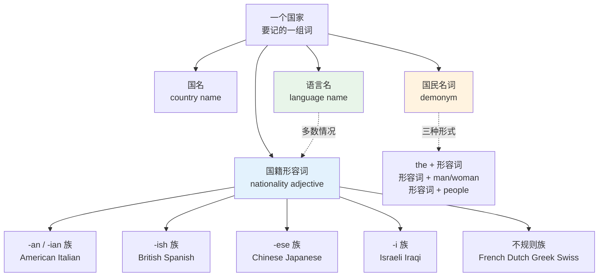
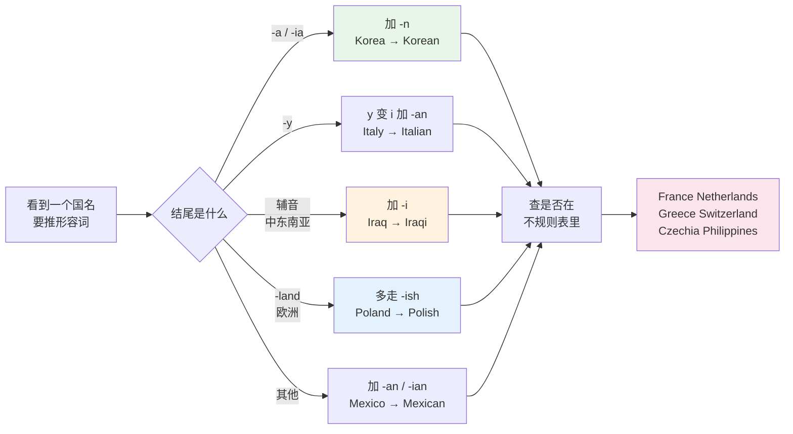
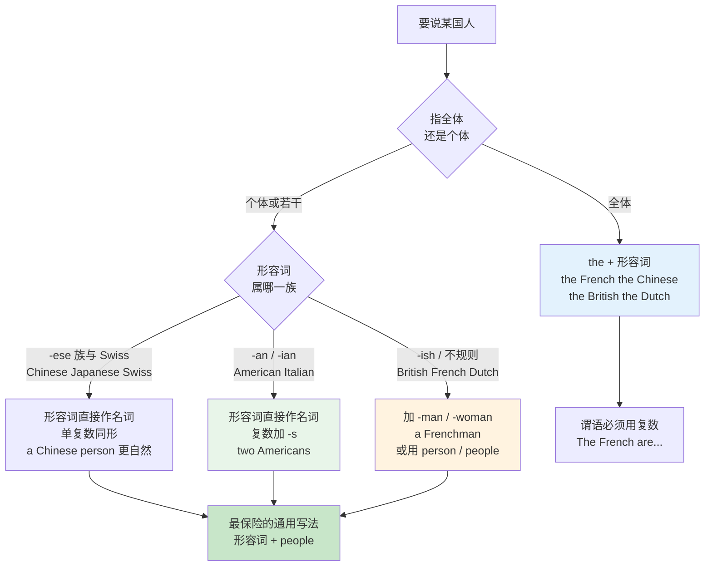
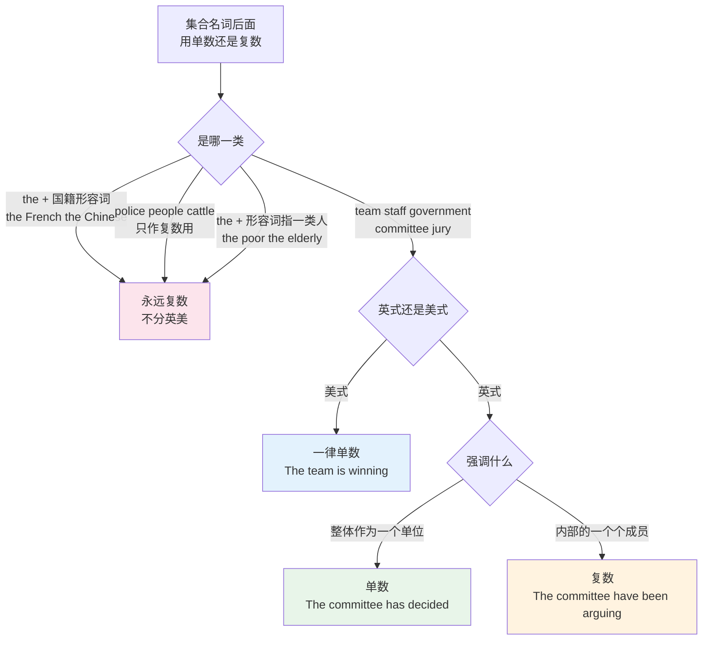
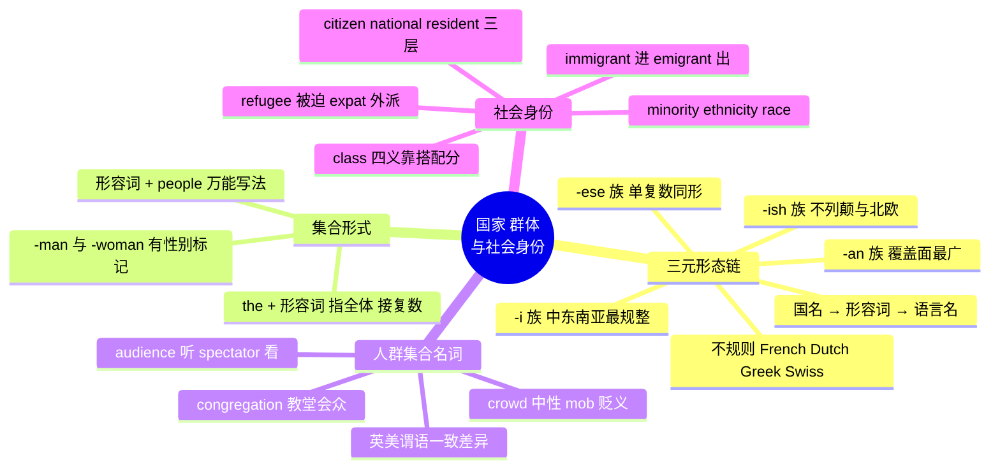

# 国家国籍语言、人群集合与社会身份

> [!info] 本篇定位
>
> 08 章的第四篇，也是本章唯一一篇以**形态规律**为正题的篇目。前三篇讲亲属、朋友、称呼语，视角都在一个人和另一个人之间；这一篇把视角拉到国家和群体。
>
> 核心是一条三元形态链：**国名 → 国籍形容词 → 语言名**。这三个词在中文里靠「国、人、语」三个字机械拼接，英语则分成四大后缀族加一批不规则形式，必须成组记忆。
>
> 读完你能做到三件事：看到一个陌生国名能猜出它的国籍形容词属于哪一族；正确写出 `the Dutch`、`a Dutchman`、`Dutch people` 三种集合形式的区别；分清 `immigrant` / `emigrant` / `migrant` / `refugee` 这四个被中文「移民」一词压平的概念。
>
> 埃菲尔铁塔、大英博物馆这类具体地标与公共设施不在本篇，归 `11.学校、职场与城市社会/05`。

---

## 1. 本篇导读：一个国名带出三个词

中文说到国家，一个字根就够用：「德国 / 德国人 / 德语」，「日本 / 日本人 / 日语」，「西班牙 / 西班牙人 / 西班牙语」。加「人」加「语」是纯粹的机械操作，不用记任何形态变化。

英语没有这个便利。每个国家实际上要记的是一组词，而且这组词内部的关系并不统一：

```text
Germany   →  German   →  German      国名与形容词形态差别大，形容词兼作语言名
Spain     →  Spanish  →  Spanish     形容词加 -ish，语言名同形
China     →  Chinese  →  Chinese     形容词加 -ese，语言名同形
France    →  French   →  French      形态完全不可推导
Holland   →  Dutch    →  Dutch        国名与形容词毫无字面关系
Brazil    →  Brazilian → Portuguese  语言名与国名完全无关
Switzerland → Swiss   →  ——           没有「瑞士语」这个东西
```

上面七行覆盖了本篇要解决的四类麻烦：形态不可推导、语言名与国籍形容词有时同形有时不同形、国名与形容词字面无关、有的国家根本没有对应的单一语言。

除了形态，还有一层用法麻烦：英语指「某国人」有三套写法，而它们的可用范围不一样。

- `the French`（定冠词 + 形容词，指全体，不能加 -s）
- `a Frenchman` / `two Frenchmen`（单数国民名词，有性别标记）
- `French people` / `a French person`（形容词修饰 people，最安全的通用写法）



上图是全篇的骨架。中间那条从语言名指向国籍形容词的虚线是关键：**多数国家的语言名与国籍形容词同形**（Chinese、Japanese、Spanish、German 都是），但这条虚线会在美洲、非洲、大洋洲大面积断裂——巴西人说葡萄牙语，墨西哥人说西班牙语，澳大利亚人说英语。中文母语者最容易在这里出错，因为中文的「巴西语」这种说法压根不存在，反而不会诱导错误；出错的是反方向，把 `Brazilian` 当成一门语言写进简历。

后面 2 到 6 节按后缀族逐一交付词表，第 7 节处理语言名的断裂点，第 8 节处理三种集合形式，第 9 节补洲名与跨国身份，第 10 到 11 节转向人群集合名词，第 12 到 15 节交付社会身份词族。

---

## 2. -an / -ian / -n 族：覆盖面最广的一支

这一族是最大的一族，覆盖美洲、非洲、大洋洲的绝大部分国家，以及东欧、中东的一部分。它的规律不是一条，而是按国名结尾分成四个子规则。

### 2.1 国名以 -a 或 -ia 结尾：直接加 -n

这是最干净的一条。国名末尾已经有元音字母 a，只补一个 n。

| 英文 | 英式音标 | 美式音标 | 词性 | 中文 | 搭配与说明 |
| --- | --- | --- | --- | --- | --- |
| **America** | /əˈmerɪkə/ | /əˈmerɪkə/ | n. | 美国；美洲 | 严格指美洲大陆，指美国时正式文书用 the United States |
| **American** | /əˈmerɪkən/ | /əˈmerɪkən/ | adj./n. | 美国的；美国人 | American English 指美式英语 |
| **Korea** | /kəˈriːə/ | /kəˈriːə/ | n. | 朝鲜半岛 | South Korea 韩国，North Korea 朝鲜 |
| **Korean** | /kəˈriːən/ | /kəˈriːən/ | adj./n. | 韩国的；韩语 | 语言名与形容词同形 |
| **Russia** | /ˈrʌʃə/ | /ˈrʌʃə/ | n. | 俄罗斯 | — |
| **Russian** | /ˈrʌʃn/ | /ˈrʌʃn/ | adj./n. | 俄罗斯的；俄语 | 双 s 只读一个 /ʃ/ |
| **India** | /ˈɪndiə/ | /ˈɪndiə/ | n. | 印度 | — |
| **Indian** | /ˈɪndiən/ | /ˈɪndiən/ | adj./n. | 印度的；印度人 | 与 Native American 区分，后者才指美洲原住民 |
| **Australia** | /ɒˈstreɪliə/ | /ɔːˈstreɪliə/ | n. | 澳大利亚 | 首音节英式 /ɒ/ 美式 /ɔː/ |
| **Australian** | /ɒˈstreɪliən/ | /ɔːˈstreɪliən/ | adj./n. | 澳大利亚的 | 口语缩略 Aussie /ˈɒzi/ · /ˈɑːsi/ |
| **Nigeria** | /naɪˈdʒɪəriə/ | /naɪˈdʒɪriə/ | n. | 尼日利亚 | 与 Niger 尼日尔是两个国家 |
| **Nigerian** | /naɪˈdʒɪəriən/ | /naɪˈdʒɪriən/ | adj./n. | 尼日利亚的 | — |
| **Kenya** | /ˈkenjə/ | /ˈkenjə/ | n. | 肯尼亚 | 首音节读 /ke/ 不读 /kiː/ |
| **Kenyan** | /ˈkenjən/ | /ˈkenjən/ | adj./n. | 肯尼亚的 | — |
| **Colombia** | /kəˈlʌmbiə/ | /kəˈlʌmbiə/ | n. | 哥伦比亚 | 拼写是 -lom- 但读 /ʌ/，与 Columbia 大学的 Columbia 同音 |
| **Colombian** | /kəˈlʌmbiən/ | /kəˈlʌmbiən/ | adj./n. | 哥伦比亚的 | — |
| **Indonesia** | /ˌɪndəˈniːziə/ | /ˌɪndəˈniːʒə/ | n. | 印度尼西亚 | 美式 -sia 常读 /ʒə/ |
| **Indonesian** | /ˌɪndəˈniːziən/ | /ˌɪndəˈniːʒən/ | adj./n. | 印尼的；印尼语 | — |
| **Malaysia** | /məˈleɪziə/ | /məˈleɪʒə/ | n. | 马来西亚 | 与 Malay 马来族区分 |
| **Malaysian** | /məˈleɪziən/ | /məˈleɪʒən/ | adj./n. | 马来西亚的 | 语言叫 Malay 不叫 Malaysian |
| **Syria** | /ˈsɪriə/ | /ˈsɪriə/ | n. | 叙利亚 | — |
| **Syrian** | /ˈsɪriən/ | /ˈsɪriən/ | adj./n. | 叙利亚的 | — |
| **Libya** | /ˈlɪbiə/ | /ˈlɪbiə/ | n. | 利比亚 | — |
| **Libyan** | /ˈlɪbiən/ | /ˈlɪbiən/ | adj./n. | 利比亚的 | — |
| **Ethiopia** | /ˌiːθiˈəʊpiə/ | /ˌiːθiˈoʊpiə/ | n. | 埃塞俄比亚 | — |
| **Ethiopian** | /ˌiːθiˈəʊpiən/ | /ˌiːθiˈoʊpiən/ | adj./n. | 埃塞俄比亚的 | 语言主要为 Amharic |
| **Bulgaria** | /bʌlˈɡeəriə/ | /bʌlˈɡeriə/ | n. | 保加利亚 | — |
| **Bulgarian** | /bʌlˈɡeəriən/ | /bʌlˈɡeriən/ | adj./n. | 保加利亚的；保加利亚语 | — |
| **Romania** | /ruˈmeɪniə/ | /ruˈmeɪniə/ | n. | 罗马尼亚 | 旧拼写 Rumania 已淘汰 |
| **Romanian** | /ruˈmeɪniən/ | /ruˈmeɪniən/ | adj./n. | 罗马尼亚的；罗马尼亚语 | — |
| **Austria** | /ˈɒstriə/ | /ˈɔːstriə/ | n. | 奥地利 | 与 Australia 拼写只差三个字母，混淆高发 |
| **Austrian** | /ˈɒstriən/ | /ˈɔːstriən/ | adj./n. | 奥地利的 | 官方语言是 German |
| **Tanzania** | /ˌtænzəˈniːə/ | /ˌtænzəˈniːə/ | n. | 坦桑尼亚 | — |
| **Tanzanian** | /ˌtænzəˈniːən/ | /ˌtænzəˈniːən/ | adj./n. | 坦桑尼亚的 | 语言主要为 Swahili |
| **Cambodia** | /kæmˈbəʊdiə/ | /kæmˈboʊdiə/ | n. | 柬埔寨 | — |
| **Cambodian** | /kæmˈbəʊdiən/ | /kæmˈboʊdiən/ | adj./n. | 柬埔寨的 | 语言又称 Khmer |
| **Venezuela** | /ˌvenəˈzweɪlə/ | /ˌvenəˈzweɪlə/ | n. | 委内瑞拉 | — |
| **Venezuelan** | /ˌvenəˈzweɪlən/ | /ˌvenəˈzweɪlən/ | adj./n. | 委内瑞拉的 | — |

### 2.2 国名以其他字母结尾：加 -an 或 -ian

这一类需要留意重音位置的移动，加后缀后重音常常前后挪一格。

| 英文 | 英式音标 | 美式音标 | 词性 | 中文 | 搭配与说明 |
| --- | --- | --- | --- | --- | --- |
| **Canada** | /ˈkænədə/ | /ˈkænədə/ | n. | 加拿大 | 重音在首音节 |
| **Canadian** | /kəˈneɪdiən/ | /kəˈneɪdiən/ | adj./n. | 加拿大的 | 重音后移一格，元音全变，属高频误读词 |
| **Mexico** | /ˈmeksɪkəʊ/ | /ˈmeksɪkoʊ/ | n. | 墨西哥 | 结尾 -o 变 -an |
| **Mexican** | /ˈmeksɪkən/ | /ˈmeksɪkən/ | adj./n. | 墨西哥的 | 语言是 Spanish |
| **Morocco** | /məˈrɒkəʊ/ | /məˈrɑːkoʊ/ | n. | 摩洛哥 | — |
| **Moroccan** | /məˈrɒkən/ | /məˈrɑːkən/ | adj./n. | 摩洛哥的 | 去掉词尾 -o 再加 -an，双写的 cc 保留 |
| **Brazil** | /brəˈzɪl/ | /brəˈzɪl/ | n. | 巴西 | 重音在后 |
| **Brazilian** | /brəˈzɪliən/ | /brəˈzɪliən/ | adj./n. | 巴西的 | 语言是 Portuguese，不是「巴西语」 |
| **Egypt** | /ˈiːdʒɪpt/ | /ˈiːdʒɪpt/ | n. | 埃及 | 首音节长音 /iː/ |
| **Egyptian** | /iˈdʒɪpʃn/ | /iˈdʒɪpʃn/ | adj./n. | 埃及的 | 重音后移，t 变 /ʃ/ |
| **Iran** | /ɪˈrɑːn/ | /ɪˈrɑːn/ | n. | 伊朗 | — |
| **Iranian** | /ɪˈreɪniən/ | /ɪˈreɪniən/ | adj./n. | 伊朗的 | 元音由 /ɑː/ 变 /eɪ/，语言是 Persian/Farsi |
| **Ukraine** | /juːˈkreɪn/ | /juːˈkreɪn/ | n. | 乌克兰 | 现代用法不加定冠词 |
| **Ukrainian** | /juːˈkreɪniən/ | /juːˈkreɪniən/ | adj./n. | 乌克兰的；乌克兰语 | — |
| **Peru** | /pəˈruː/ | /pəˈruː/ | n. | 秘鲁 | — |
| **Peruvian** | /pəˈruːviən/ | /pəˈruːviən/ | adj./n. | 秘鲁的 | 插入 v 音，属不可推导点 |
| **Norway** | /ˈnɔːweɪ/ | /ˈnɔːrweɪ/ | n. | 挪威 | — |
| **Norwegian** | /nɔːˈwiːdʒən/ | /nɔːrˈwiːdʒən/ | adj./n. | 挪威的；挪威语 | 拼写与读音双重不规则 |
| **Chile** | /ˈtʃɪli/ | /ˈtʃɪli/ | n. | 智利 | 与 chilli 辣椒同音，注意拼写 |
| **Chilean** | /ˈtʃɪliən/ | /ˈtʃɪliən/ | adj./n. | 智利的 | — |
| **Cuba** | /ˈkjuːbə/ | /ˈkjuːbə/ | n. | 古巴 | 首音有 /j/ |
| **Cuban** | /ˈkjuːbən/ | /ˈkjuːbən/ | adj./n. | 古巴的 | — |
| **Ghana** | /ˈɡɑːnə/ | /ˈɡɑːnə/ | n. | 加纳 | — |
| **Ghanaian** | /ɡɑːˈneɪən/ | /ɡɑːˈneɪən/ | adj./n. | 加纳的 | 拼写多出一个 i，重音后移 |
| **Jamaica** | /dʒəˈmeɪkə/ | /dʒəˈmeɪkə/ | n. | 牙买加 | — |
| **Jamaican** | /dʒəˈmeɪkən/ | /dʒəˈmeɪkən/ | adj./n. | 牙买加的 | — |
| **Panama** | /ˈpænəmɑː/ | /ˈpænəmɑː/ | n. | 巴拿马 | — |
| **Panamanian** | /ˌpænəˈmeɪniən/ | /ˌpænəˈmeɪniən/ | adj./n. | 巴拿马的 | 插入 -ni-，形态跳跃大 |

### 2.3 国名以 -y 结尾：y 变 i 再加 -an，或直接砍掉

| 英文 | 英式音标 | 美式音标 | 词性 | 中文 | 搭配与说明 |
| --- | --- | --- | --- | --- | --- |
| **Italy** | /ˈɪtəli/ | /ˈɪtəli/ | n. | 意大利 | 重音在首音节 |
| **Italian** | /ɪˈtæliən/ | /ɪˈtæliən/ | adj./n. | 意大利的；意大利语 | 重音后移，元音由 /ɪ/ 变 /æ/ |
| **Hungary** | /ˈhʌŋɡəri/ | /ˈhʌŋɡəri/ | n. | 匈牙利 | 与 hungry 饿的 拼写相近但不同音 |
| **Hungarian** | /hʌŋˈɡeəriən/ | /hʌŋˈɡeriən/ | adj./n. | 匈牙利的；匈牙利语 | — |
| **Germany** | /ˈdʒɜːməni/ | /ˈdʒɜːrməni/ | n. | 德国 | — |
| **German** | /ˈdʒɜːmən/ | /ˈdʒɜːrmən/ | adj./n. | 德国的；德语 | 形容词比国名**短**，是本族的例外方向 |
| **Turkey** | /ˈtɜːki/ | /ˈtɜːrki/ | n. | 土耳其 | 与 turkey 火鸡 同形，大写区分 |
| **Turkish** | /ˈtɜːkɪʃ/ | /ˈtɜːrkɪʃ/ | adj./n. | 土耳其的；土耳其语 | 走 -ish 族，不走 -an 族 |

> [!warning] Germany 与 German 的方向陷阱
>
> 绝大多数国家是「国名短、形容词长」，Germany 反过来。中文母语者写作时容易类推出不存在的 `Germanian`，或者把国名写成 `German`。
>
> - ❌ I studied in **German** for two years.（把形容词当国名）
> - ✅ I studied in **Germany** for two years.
> - ❌ He speaks **Germany**.（把国名当语言名）
> - ✅ He speaks **German**.
>
> 记忆锚点：国名带 -y 的是国家，不带 -y 的是人和语言。

### 2.4 -an 族的整体判断

这一族没有单一公式，但有一条实用的近似规则：**国名以元音字母 a 结尾的，绝大多数走这一族**。剩下的靠逐个记，好在这一族里的形容词形态多数与国名有明显字面联系，认出来不难，难的是自己写的时候拼对。

> [!tip] 一个减负办法
>
> 不必把 -an 和 -ian 两个后缀分开记。写作时如果拿不准 `Canadan` 还是 `Canadian`，用一个更笨但更保险的替代表达：`someone from Canada`、`a citizen of Canada`、`people in Canada`。
>
> 这不是投降，是分级掌握——高频的十几个国家练到能拼写，低频的先保证认得。

---

## 3. -ish 族：不列颠群岛与北欧近邻

-ish 是本族的标志后缀，它来自古英语的形容词后缀 `-isc`，所以覆盖的国家集中在英语人群的地理近邻：不列颠群岛本身、伊比利亚半岛、北欧和波兰。这一族数量不多，但个个高频，值得整族背下来。

| 英文 | 英式音标 | 美式音标 | 词性 | 中文 | 搭配与说明 |
| --- | --- | --- | --- | --- | --- |
| **England** | /ˈɪŋɡlənd/ | /ˈɪŋɡlənd/ | n. | 英格兰 | 只指英格兰，不等于英国 |
| **English** | /ˈɪŋɡlɪʃ/ | /ˈɪŋɡlɪʃ/ | adj./n. | 英格兰的；英语 | 语言名首字母恒大写 |
| **Britain** | /ˈbrɪtn/ | /ˈbrɪtn/ | n. | 不列颠 | 全称 Great Britain，含英格兰、苏格兰、威尔士 |
| **British** | /ˈbrɪtɪʃ/ | /ˈbrɪtɪʃ/ | adj. | 英国的 | 指国籍时用它，不用 English |
| **Ireland** | /ˈaɪələnd/ | /ˈaɪərlənd/ | n. | 爱尔兰 | — |
| **Irish** | /ˈaɪərɪʃ/ | /ˈaɪrɪʃ/ | adj./n. | 爱尔兰的；爱尔兰语 | 语言又称 Gaelic /ˈɡeɪlɪk/ |
| **Scotland** | /ˈskɒtlənd/ | /ˈskɑːtlənd/ | n. | 苏格兰 | — |
| **Scottish** | /ˈskɒtɪʃ/ | /ˈskɑːtɪʃ/ | adj. | 苏格兰的 | 人用 Scot 或 Scotsman，Scotch 只用于威士忌与少数固定搭配 |
| **Wales** | /weɪlz/ | /weɪlz/ | n. | 威尔士 | 结尾的 s 是词的一部分，不是复数 |
| **Welsh** | /welʃ/ | /welʃ/ | adj./n. | 威尔士的；威尔士语 | 拼写里没有 -ish，是压缩形式 |
| **Spain** | /speɪn/ | /speɪn/ | n. | 西班牙 | — |
| **Spanish** | /ˈspænɪʃ/ | /ˈspænɪʃ/ | adj./n. | 西班牙的；西班牙语 | 元音由 /eɪ/ 变 /æ/ |
| **Poland** | /ˈpəʊlənd/ | /ˈpoʊlənd/ | n. | 波兰 | — |
| **Polish** | /ˈpəʊlɪʃ/ | /ˈpoʊlɪʃ/ | adj./n. | 波兰的；波兰语 | 与小写 polish /ˈpɒlɪʃ/「擦亮」同形不同音 |
| **Sweden** | /ˈswiːdn/ | /ˈswiːdn/ | n. | 瑞典 | — |
| **Swedish** | /ˈswiːdɪʃ/ | /ˈswiːdɪʃ/ | adj./n. | 瑞典的；瑞典语 | — |
| **Denmark** | /ˈdenmɑːk/ | /ˈdenmɑːrk/ | n. | 丹麦 | — |
| **Danish** | /ˈdeɪnɪʃ/ | /ˈdeɪnɪʃ/ | adj./n. | 丹麦的；丹麦语 | 与国名字面关系弱，元音是 /eɪ/ 不是 /e/ |
| **Finland** | /ˈfɪnlənd/ | /ˈfɪnlənd/ | n. | 芬兰 | — |
| **Finnish** | /ˈfɪnɪʃ/ | /ˈfɪnɪʃ/ | adj./n. | 芬兰的；芬兰语 | 与 finish 完成 同音，靠双 n 拼写区分 |
| **Turkish** | /ˈtɜːkɪʃ/ | /ˈtɜːrkɪʃ/ | adj./n. | 土耳其的；土耳其语 | 国名 Turkey 属 -y 结尾但走 -ish 族 |

> [!warning] English、British、UK 三个词不能混用
>
> 中文一律叫「英国」，英语里这三层是不同范围的行政与地理概念。
>
> - **England** = 英格兰，不列颠岛上的一部分。
> - **Great Britain** = 英格兰 + 苏格兰 + 威尔士，一个岛。
> - **the United Kingdom（the UK）** = 上面三者 + 北爱尔兰，一个主权国家。
>
> 所以国籍要说 `British`，不能说 `English`——除非对方确实来自英格兰。对一个苏格兰人说 `You're English` 是实打实的冒犯。
>
> - ❌ She's from Edinburgh, so she's **English**.
> - ✅ She's from Edinburgh, so she's **Scottish**（或 **British**）.

> [!tip] Polish 与 polish 的读音分岔
>
> 这是英语里少见的「大小写决定读音」的例子。
>
> - **Polish** /ˈpəʊlɪʃ/ · /ˈpoʊlɪʃ/：波兰的，首音节读长音 /əʊ/。
> - **polish** /ˈpɒlɪʃ/ · /ˈpɑːlɪʃ/：擦亮、抛光，首音节读短音 /ɒ/。
>
> 同类的还有 `March`（三月）与 `march`（行军）、`Turkey` 与 `turkey`、`China` 与 `china`（瓷器）。这批词在 `03.拼写与发音陷阱` 里有完整清单。

---

## 4. -ese 族：东亚、东南亚与部分南欧非

-ese 来自拉丁语的 `-ensis`，经意大利语 `-ese` 进入英语。它覆盖的国家有一个共同点：多为英语世界的远距离贸易或殖民接触对象。

这一族有两条**独有的语法特征**，是它区别于 -an 和 -ish 族的关键。

**特征一：单复数同形。** `one Chinese`、`two Chinese` 都不加 -s。

**特征二：可以直接作可数名词指人**，不需要另造国民名词。-ish 族做不到这一点，没有 `a Britishman` 这种说法。

| 英文 | 英式音标 | 美式音标 | 词性 | 中文 | 搭配与说明 |
| --- | --- | --- | --- | --- | --- |
| **China** | /ˈtʃaɪnə/ | /ˈtʃaɪnə/ | n. | 中国 | 小写 china 是「瓷器」，不可数 |
| **Chinese** | /ˌtʃaɪˈniːz/ | /ˌtʃaɪˈniːz/ | adj./n. | 中国的；中文；中国人 | 重音在后，单复数同形 |
| **Japan** | /dʒəˈpæn/ | /dʒəˈpæn/ | n. | 日本 | 重音在后 |
| **Japanese** | /ˌdʒæpəˈniːz/ | /ˌdʒæpəˈniːz/ | adj./n. | 日本的；日语 | 主重音在 -nese |
| **Vietnam** | /ˌvjetˈnæm/ | /ˌvjetˈnɑːm/ | n. | 越南 | 美式末音节常读 /ɑː/ |
| **Vietnamese** | /ˌvjetnəˈmiːz/ | /ˌvjetnəˈmiːz/ | adj./n. | 越南的；越南语 | — |
| **Portugal** | /ˈpɔːtʃuɡl/ | /ˈpɔːrtʃuɡl/ | n. | 葡萄牙 | 重音在首音节 |
| **Portuguese** | /ˌpɔːtʃuˈɡiːz/ | /ˌpɔːrtʃuˈɡiːz/ | adj./n. | 葡萄牙的；葡萄牙语 | 巴西的官方语言 |
| **Taiwan** | /ˌtaɪˈwɑːn/ | /ˌtaɪˈwɑːn/ | n. | 台湾 | — |
| **Taiwanese** | /ˌtaɪwɑːˈniːz/ | /ˌtaɪwɑːˈniːz/ | adj./n. | 台湾的 | — |
| **Lebanon** | /ˈlebənən/ | /ˈlebənɑːn/ | n. | 黎巴嫩 | — |
| **Lebanese** | /ˌlebəˈniːz/ | /ˌlebəˈniːz/ | adj./n. | 黎巴嫩的 | 语言是 Arabic |
| **Nepal** | /nəˈpɔːl/ | /nəˈpɔːl/ | n. | 尼泊尔 | 重音在后 |
| **Nepalese** | /ˌnepəˈliːz/ | /ˌnepəˈliːz/ | adj./n. | 尼泊尔的 | 另有变体 Nepali |
| **Sudan** | /suːˈdɑːn/ | /suːˈdæn/ | n. | 苏丹 | — |
| **Sudanese** | /ˌsuːdəˈniːz/ | /ˌsuːdəˈniːz/ | adj./n. | 苏丹的 | — |
| **Senegal** | /ˌsenɪˈɡɔːl/ | /ˌsenɪˈɡɔːl/ | n. | 塞内加尔 | — |
| **Senegalese** | /ˌsenɪɡəˈliːz/ | /ˌsenɪɡəˈliːz/ | adj./n. | 塞内加尔的 | — |
| **Malta** | /ˈmɔːltə/ | /ˈmɔːltə/ | n. | 马耳他 | — |
| **Maltese** | /mɔːlˈtiːz/ | /mɔːlˈtiːz/ | adj./n. | 马耳他的；马耳他语 | 也指马尔济斯犬 |
| **Congo** | /ˈkɒŋɡəʊ/ | /ˈkɑːŋɡoʊ/ | n. | 刚果 | — |
| **Congolese** | /ˌkɒŋɡəˈliːz/ | /ˌkɑːŋɡəˈliːz/ | adj./n. | 刚果的 | — |
| **Burmese** | /bɜːˈmiːz/ | /bɜːrˈmiːz/ | adj./n. | 缅甸的；缅甸语 | 国名今作 Myanmar /ˈmjænmɑː/ · /ˈmjɑːnmɑːr/ |

> [!example] -ese 族的单复数同形
>
> - There were three **Chinese** in the delegation.
>   - 代表团里有三名中国人。（不写 Chineses）
> - Two **Japanese** were waiting at the gate.
>   - 两名日本人在门口等着。
> - The company hired several **Portuguese** last year.
>   - 公司去年雇了几名葡萄牙人。

> [!warning] -ese 单独指人时的语感问题
>
> 语法上 `a Chinese`、`three Japanese` 完全成立，但在当代英语里，用 `-ese` 形式**单独指某一个具体的人**会显得生硬，某些语境下甚至带有物化意味。母语者的默认写法是加 `person` / `people`。
>
> - He is **a Chinese**.（语法成立，语感生硬，母语者一般不这么说）
> - ✅ He is **Chinese**.（形容词作表语，最自然）
> - ✅ He is **a Chinese person**.（明确名词，正式书面）
>
> 复数在中性语境里问题不大（`the Chinese`、`three Japanese`），但涉及个人描述时，一律用形容词作表语或加 person 更稳妥。这条规则对 -ese 族和 -ish 族都适用。

---

## 5. -i 族：中东、南亚与阿拉伯半岛

-i 来自阿拉伯语与波斯语的形容词后缀（阿拉伯语称 nisba），随国名一起被英语借入。这一族分布高度集中在西亚、南亚，形态极其规整——绝大多数是国名直接加 -i。

| 英文 | 英式音标 | 美式音标 | 词性 | 中文 | 搭配与说明 |
| --- | --- | --- | --- | --- | --- |
| **Israel** | /ˈɪzreɪl/ | /ˈɪzriəl/ | n. | 以色列 | 美式末音节常弱化为 /iəl/ |
| **Israeli** | /ɪzˈreɪli/ | /ɪzˈreɪli/ | adj./n. | 以色列的 | 语言是 Hebrew |
| **Iraq** | /ɪˈrɑːk/ | /ɪˈrɑːk/ | n. | 伊拉克 | 结尾 q 不带 u |
| **Iraqi** | /ɪˈrɑːki/ | /ɪˈrɑːki/ | adj./n. | 伊拉克的 | — |
| **Pakistan** | /ˌpɑːkɪˈstɑːn/ | /ˈpækɪstæn/ | n. | 巴基斯坦 | 英美读音差别很大 |
| **Pakistani** | /ˌpɑːkɪˈstɑːni/ | /ˌpækɪˈstæni/ | adj./n. | 巴基斯坦的 | 语言是 Urdu |
| **Bangladesh** | /ˌbæŋɡləˈdeʃ/ | /ˌbæŋɡləˈdeʃ/ | n. | 孟加拉国 | — |
| **Bangladeshi** | /ˌbæŋɡləˈdeʃi/ | /ˌbæŋɡləˈdeʃi/ | adj./n. | 孟加拉国的 | 语言是 Bengali |
| **Kuwait** | /kuˈweɪt/ | /kuˈweɪt/ | n. | 科威特 | — |
| **Kuwaiti** | /kuˈweɪti/ | /kuˈweɪti/ | adj./n. | 科威特的 | — |
| **Yemen** | /ˈjemən/ | /ˈjemən/ | n. | 也门 | — |
| **Yemeni** | /ˈjeməni/ | /ˈjeməni/ | adj./n. | 也门的 | — |
| **Oman** | /əʊˈmɑːn/ | /oʊˈmɑːn/ | n. | 阿曼 | — |
| **Omani** | /əʊˈmɑːni/ | /oʊˈmɑːni/ | adj./n. | 阿曼的 | — |
| **Bahrain** | /bɑːˈreɪn/ | /bɑːˈreɪn/ | n. | 巴林 | — |
| **Bahraini** | /bɑːˈreɪni/ | /bɑːˈreɪni/ | adj./n. | 巴林的 | — |
| **Somalia** | /səˈmɑːliə/ | /səˈmɑːliə/ | n. | 索马里 | — |
| **Somali** | /səˈmɑːli/ | /səˈmɑːli/ | adj./n. | 索马里的；索马里语 | 形容词比国名短，去掉 -a |
| **Saudi** | /ˈsaʊdi/ | /ˈsaʊdi/ | adj./n. | 沙特的；沙特人 | 全称 Saudi Arabia，形容词也可用 Saudi Arabian |
| **Afghanistan** | /æfˈɡænɪstɑːn/ | /æfˈɡænɪstæn/ | n. | 阿富汗 | — |
| **Afghan** | /ˈæfɡæn/ | /ˈæfɡæn/ | adj./n. | 阿富汗的 | 不走 -i 族，是本族的例外 |
| **Thailand** | /ˈtaɪlænd/ | /ˈtaɪlænd/ | n. | 泰国 | th 读 /t/ 不读 /θ/ |
| **Thai** | /taɪ/ | /taɪ/ | adj./n. | 泰国的；泰语 | 单音节，与 tie 同音 |
| **Sri Lanka** | /ˌsriː ˈlæŋkə/ | /ˌsriː ˈlɑːŋkə/ | n. | 斯里兰卡 | 两个词分写 |
| **Sri Lankan** | /ˌsriː ˈlæŋkən/ | /ˌsriː ˈlɑːŋkən/ | adj./n. | 斯里兰卡的 | 走 -an 族 |

> [!tip] -i 族的一条捷径
>
> 中东与南亚国名，如果结尾是辅音（Iraq、Kuwait、Bahrain、Pakistan、Bangladesh、Yemen、Oman），基本都是**直接加 -i**，不改拼写不改重音。这是四大族里唯一可以近乎无条件套用的规则。
>
> 只有两个高频例外要单记：`Afghanistan → Afghan`（去掉 -istan），`Iran → Iranian`（走 -an 族）。

---

## 6. 不规则族：必须逐个记的一批

这一族数量不大，但全是高频国家，而且形态完全不可推导，是本篇必须硬背的部分。

| 英文 | 英式音标 | 美式音标 | 词性 | 中文 | 搭配与说明 |
| --- | --- | --- | --- | --- | --- |
| **France** | /frɑːns/ | /fræns/ | n. | 法国 | 元音是英美差异的典型词 |
| **French** | /frentʃ/ | /frentʃ/ | adj./n. | 法国的；法语 | 与国名元音完全不同 |
| **Frenchman** | /ˈfrentʃmən/ | /ˈfrentʃmən/ | n. | 法国男人 | 复数 Frenchmen /ˈfrentʃmən/ |
| **the Netherlands** | /ˈneðələndz/ | /ˈneðərləndz/ | n. | 荷兰 | 恒带定冠词，谓语用单数 |
| **Holland** | /ˈhɒlənd/ | /ˈhɑːlənd/ | n. | 荷兰 | 严格说只是两个省，口语泛指全国 |
| **Dutch** | /dʌtʃ/ | /dʌtʃ/ | adj./n. | 荷兰的；荷兰语 | 与两个国名都无字面关系 |
| **Dutchman** | /ˈdʌtʃmən/ | /ˈdʌtʃmən/ | n. | 荷兰男人 | 复数 Dutchmen |
| **Greece** | /ɡriːs/ | /ɡriːs/ | n. | 希腊 | 与 grease 油脂 同音 |
| **Greek** | /ɡriːk/ | /ɡriːk/ | adj./n. | 希腊的；希腊语 | 结尾 -k 不是常见后缀 |
| **Switzerland** | /ˈswɪtsələnd/ | /ˈswɪtsərlənd/ | n. | 瑞士 | — |
| **Swiss** | /swɪs/ | /swɪs/ | adj./n. | 瑞士的；瑞士人 | 单复数同形，没有对应语言名 |
| **Czechia** | /ˈtʃekiə/ | /ˈtʃekiə/ | n. | 捷克 | 2016 年起启用的短式国名，正式全称仍是 the Czech Republic |
| **Czech** | /tʃek/ | /tʃek/ | adj./n. | 捷克的；捷克语 | 与 check 同音 |
| **Iceland** | /ˈaɪslənd/ | /ˈaɪslənd/ | n. | 冰岛 | 首音节与 ice 同音 |
| **Icelandic** | /aɪsˈlændɪk/ | /aɪsˈlændɪk/ | adj./n. | 冰岛的；冰岛语 | 罕见的 -ic 后缀 |
| **Cyprus** | /ˈsaɪprəs/ | /ˈsaɪprəs/ | n. | 塞浦路斯 | — |
| **Cypriot** | /ˈsɪpriət/ | /ˈsɪpriət/ | adj./n. | 塞浦路斯的 | 首音节元音由 /aɪ/ 变 /ɪ/ |
| **the Philippines** | /ðə ˈfɪlɪpiːnz/ | /ðə ˈfɪlɪpiːnz/ | n. | 菲律宾 | 恒带定冠词与 -s |
| **Filipino** | /ˌfɪlɪˈpiːnəʊ/ | /ˌfɪlɪˈpiːnoʊ/ | n. | 菲律宾人 | 首字母是 F 不是 Ph，女性形式 Filipina |
| **Philippine** | /ˈfɪlɪpiːn/ | /ˈfɪlɪpiːn/ | adj. | 菲律宾的 | 修饰事物用它，指人用 Filipino |
| **Argentina** | /ˌɑːdʒənˈtiːnə/ | /ˌɑːrdʒənˈtiːnə/ | n. | 阿根廷 | — |
| **Argentine** | /ˈɑːdʒəntaɪn/ | /ˈɑːrdʒəntiːn/ | adj./n. | 阿根廷的 | 变体 Argentinian 更常见于口语 |
| **Serbia** | /ˈsɜːbiə/ | /ˈsɜːrbiə/ | n. | 塞尔维亚 | — |
| **Serb** | /sɜːb/ | /sɜːrb/ | n. | 塞尔维亚人 | 形容词用 Serbian |



上图给的是一条**先猜后查**的实用流程：按国名结尾选一条默认规则猜出形态，再对照不规则表校验。这个顺序比一开始就查表快，因为不规则表只有十来个词，能背下来；而按结尾分类的猜测在多数情况下是对的。要点在于流程末端那个校验步骤不能省——`France`、`Netherlands`、`Switzerland` 这几个如果按结尾硬猜，会造出 `Francian`、`Netherlandish` 之类不存在的词。

---

## 7. 语言名：什么时候等于国籍形容词

三元链的第三环。多数情况下语言名与国籍形容词同形，但这条对应关系在三种情况下会断。

### 7.1 三种断裂情况

**断裂一：殖民历史导致语言与国名不匹配。** 拉丁美洲、非洲、大洋洲的大部分国家属于这一类。

| 国家 | 国籍形容词 | 主要语言 | 说明 |
| --- | --- | --- | --- |
| Brazil | Brazilian | **Portuguese** | 葡属殖民地遗留 |
| Mexico | Mexican | **Spanish** | 西属殖民地遗留 |
| Argentina | Argentine | **Spanish** | 同上 |
| Australia | Australian | **English** | 英属殖民地遗留 |
| Canada | Canadian | **English / French** | 双官方语言 |
| Austria | Austrian | **German** | 同语族不同国家 |
| Nigeria | Nigerian | **English** | 官方语言，另有本土语言数百种 |

**断裂二：语言名有独立的传统称谓。**

| 国家 | 国籍形容词 | 语言名 | 说明 |
| --- | --- | --- | --- |
| Iran | Iranian | **Persian / Farsi** | 两个名称都通行 |
| Israel | Israeli | **Hebrew** | 语言名来自民族名而非国名 |
| India | Indian | **Hindi** 等 | 宪定语言二十余种，没有单一「印度语」 |
| Cambodia | Cambodian | **Khmer** | 二者可互换但 Khmer 更精确 |
| Netherlands | Dutch | **Dutch** | 形容词与语言名同形，但都与国名无关 |

**断裂三：根本没有对应的单一语言。**

Switzerland 是最典型的例子。瑞士有四种官方语言（German、French、Italian、Romansh），**不存在 Swiss 这门语言**。同类的还有 Belgium（Dutch、French、German）、Singapore（English、Malay、Mandarin、Tamil）。

- ❌ ~~He speaks Swiss.~~
- ✅ He speaks **Swiss German**.（瑞士德语，一个方言变体）
- ✅ He speaks **French**.（他说的是瑞士的法语区语言）

### 7.2 语言名相关词表

| 英文 | 英式音标 | 美式音标 | 词性 | 中文 | 搭配与说明 |
| --- | --- | --- | --- | --- | --- |
| **language** | /ˈlæŋɡwɪdʒ/ | /ˈlæŋɡwɪdʒ/ | n. | 语言 | first language 母语，second language 第二语言 |
| **Mandarin** | /ˈmændərɪn/ | /ˈmændərɪn/ | n. | 普通话 | 指现代标准汉语，比 Chinese 精确 |
| **Cantonese** | /ˌkæntəˈniːz/ | /ˌkæntəˈniːz/ | n./adj. | 粤语；广东的 | 走 -ese 族 |
| **Arabic** | /ˈærəbɪk/ | /ˈærəbɪk/ | n./adj. | 阿拉伯语 | 人是 Arab，地区是 Arabian |
| **Hebrew** | /ˈhiːbruː/ | /ˈhiːbruː/ | n./adj. | 希伯来语 | 以色列官方语言之一 |
| **Hindi** | /ˈhɪndi/ | /ˈhɪndi/ | n. | 印地语 | 与 Hindu 印度教徒 不是一个词 |
| **Urdu** | /ˈʊəduː/ | /ˈʊrduː/ | n. | 乌尔都语 | 巴基斯坦国语 |
| **Bengali** | /beŋˈɡɔːli/ | /beŋˈɡɔːli/ | n./adj. | 孟加拉语 | — |
| **Swahili** | /swɑːˈhiːli/ | /swɑːˈhiːli/ | n. | 斯瓦希里语 | 东非通用语 |
| **Persian** | /ˈpɜːʃn/ | /ˈpɜːrʒn/ | n./adj. | 波斯语；波斯的 | 英美读音清浊不同 |
| **Farsi** | /ˈfɑːsi/ | /ˈfɑːrsi/ | n. | 法尔西语 | Persian 的本土名称 |
| **Latin** | /ˈlætɪn/ | /ˈlætn/ | n./adj. | 拉丁语；拉丁的 | Latin America 拉丁美洲 |
| **Gaelic** | /ˈɡeɪlɪk/ | /ˈɡeɪlɪk/ | n./adj. | 盖尔语 | 苏格兰与爱尔兰的凯尔特语 |
| **dialect** | /ˈdaɪəlekt/ | /ˈdaɪəlekt/ | n. | 方言 | a regional dialect 地方方言 |
| **accent** | /ˈæksent/ | /ˈæksent/ | n. | 口音 | a thick accent 浓重口音；名词重音在前 |
| **mother tongue** | /ˈmʌðə tʌŋ/ | /ˈmʌðər tʌŋ/ | n. | 母语 | 等价说法 native language |
| **native speaker** | /ˈneɪtɪv ˈspiːkə/ | /ˈneɪtɪv ˈspiːkər/ | n. | 母语者 | a native speaker of English |
| **bilingual** | /baɪˈlɪŋɡwəl/ | /baɪˈlɪŋɡwəl/ | adj./n. | 双语的 | bi- 二 + lingu 语言 |
| **multilingual** | /ˌmʌltiˈlɪŋɡwəl/ | /ˌmʌltiˈlɪŋɡwəl/ | adj. | 多语的 | — |
| **monolingual** | /ˌmɒnəˈlɪŋɡwəl/ | /ˌmɑːnəˈlɪŋɡwəl/ | adj. | 单语的 | mono- 单 |
| **fluent** | /ˈfluːənt/ | /ˈfluːənt/ | adj. | 流利的 | fluent in Spanish，介词用 in |
| **interpreter** | /ɪnˈtɜːprətə/ | /ɪnˈtɜːrprətər/ | n. | 口译员 | 与 translator 笔译员 区分 |

> [!warning] 语言名的三个高频错误
>
> **错误一：语言名首字母不大写。** 语言名是专有名词，句中任何位置都大写。
>
> - ❌ I am learning ~~english~~ and ~~japanese~~.
> - ✅ I am learning **English** and **Japanese**.
>
> **错误二：用「国名 + 语」的中式构词。**
>
> - ❌ ~~She speaks Brazilian.~~ / ~~He speaks Austria.~~
> - ✅ She speaks **Portuguese**. / He speaks **German**.
>
> **错误三：`fluent` 后的介词。** 中文说「英语流利」，容易直接接名词。
>
> - ❌ ~~He is fluent English.~~
> - ✅ He is **fluent in** English.
> - ✅ He **speaks fluent** English.（作定语时不加介词）

---

## 8. the + 国籍形容词：三种集合形式

指「某国人（全体或个体）」，英语有三条路，选哪条取决于国籍形容词属于哪一族。这一节是本篇实际写作时用得最多的部分。

### 8.1 三种形式的分工



上图分三个层次。最上面是「全体还是个体」的分岔，全体用 `the + 形容词`，这条路对所有族都通；个体则要看族别，-an 族可以直接加 -s，-ese 族单复数同形，-ish 族和不规则族必须借助 `-man/-woman` 或 `people`。图底部的绿色节点是收敛点：`形容词 + people` 这个写法对所有族都成立，拿不准时直接用它。

### 8.2 逐族对照表

| 国籍形容词 | 指全体 | 一个人 | 若干人 | 通用写法 |
| --- | --- | --- | --- | --- |
| **American** | the Americans | an American | two Americans | American people |
| **Italian** | the Italians | an Italian | two Italians | Italian people |
| **German** | the Germans | a German | two Germans | German people |
| **Chinese** | the Chinese | a Chinese person | two Chinese | Chinese people |
| **Japanese** | the Japanese | a Japanese person | two Japanese | Japanese people |
| **Swiss** | the Swiss | a Swiss person | two Swiss | Swiss people |
| **British** | the British | a Briton \| a British person | two Britons | British people |
| **English** | the English | an Englishman \| an Englishwoman | two Englishmen | English people |
| **French** | the French | a Frenchman \| a Frenchwoman | two Frenchmen | French people |
| **Dutch** | the Dutch | a Dutchman \| a Dutchwoman | two Dutchmen | Dutch people |
| **Irish** | the Irish | an Irishman \| an Irishwoman | two Irishmen | Irish people |
| **Welsh** | the Welsh | a Welshman \| a Welshwoman | two Welshmen | Welsh people |
| **Scottish** | the Scots | a Scot \| a Scotsman | two Scots | Scottish people |
| **Spanish** | the Spanish | a Spaniard | two Spaniards | Spanish people |
| **Polish** | the Poles | a Pole | two Poles | Polish people |
| **Swedish** | the Swedes | a Swede | two Swedes | Swedish people |
| **Danish** | the Danes | a Dane | two Danes | Danish people |
| **Finnish** | the Finns | a Finn | two Finns | Finnish people |
| **Turkish** | the Turks | a Turk | two Turks | Turkish people |

注意最后六行：Spain、Poland、Sweden、Denmark、Finland、Turkey 这六个 -ish 族国家**另有独立的国民名词**（Spaniard、Pole、Swede、Dane、Finn、Turk），不需要 -man 后缀。这批词短、常用，值得单独记。

| 英文 | 英式音标 | 美式音标 | 词性 | 中文 | 搭配与说明 |
| --- | --- | --- | --- | --- | --- |
| **Briton** | /ˈbrɪtn/ | /ˈbrɪtn/ | n. | 英国人 | 与 Britain 同音，多见于新闻标题 |
| **Spaniard** | /ˈspænjəd/ | /ˈspænjərd/ | n. | 西班牙人 | 不说 a Spanish |
| **Pole** | /pəʊl/ | /poʊl/ | n. | 波兰人 | 与 pole 杆子 同形，大写区分 |
| **Swede** | /swiːd/ | /swiːd/ | n. | 瑞典人 | 小写 swede 是英式的「芜菁甘蓝」 |
| **Dane** | /deɪn/ | /deɪn/ | n. | 丹麦人 | Great Dane 是大丹犬 |
| **Finn** | /fɪn/ | /fɪn/ | n. | 芬兰人 | 与 fin 鱼鳍 同音 |
| **Turk** | /tɜːk/ | /tɜːrk/ | n. | 土耳其人 | — |
| **Scot** | /skɒt/ | /skɑːt/ | n. | 苏格兰人 | 复数 Scots，也指苏格兰语 |
| **Arab** | /ˈærəb/ | /ˈærəb/ | n. | 阿拉伯人 | 语言是 Arabic，地区是 Arabian |
| **Jew** | /dʒuː/ | /dʒuː/ | n. | 犹太人 | 形容词 Jewish，作形容词时用 Jewish 更稳妥 |

### 8.3 the + 形容词的三条硬规则

**规则一：不加 -s。** `the French`、`the Chinese`、`the British` 已经是复数概念，加 -s 是错的。

- ❌ ~~the Frenches~~ / ~~the Britishes~~ / ~~the Chineses~~
- ✅ **the French** / **the British** / **the Chinese**

**规则二：谓语必须用复数。** 尽管形式上看不出复数标记。

> [!example] the + 形容词的谓语一致
>
> - The **French are** famous for their cheese.
>   - 法国人以奶酪闻名。（不是 is）
> - The **Dutch have** the tallest average height in Europe.
>   - 荷兰人的平均身高是欧洲最高的。（不是 has）
> - The **British tend** to apologise a lot.
>   - 英国人倾向于频繁道歉。（不是 tends）

**规则三：只能指全体，不能指部分。** 想说「几个法国人」不能用这个结构。

- ❌ ~~Three the French came to the meeting.~~
- ✅ **Three Frenchmen** came to the meeting.
- ✅ **Three French people** came to the meeting.

> [!tip] 拿不准就用 people
>
> `形容词 + people` 这个写法适用于全部四族，没有任何例外，也没有性别标记问题。写作时想不起 `a Spaniard` 还是 `a Spanish`，直接写 `Spanish people` 或 `a Spanish person`，一定正确。
>
> 顺带一提，`-man` 系列（Frenchman、Englishman、Dutchman）在当代书面英语里正在被 `person` / `people` 替代，原因是性别中立。正式文书里 `French people`、`a French national` 比 `Frenchmen` 更常见。

---

## 9. 洲名、地区名与跨国身份

比国家更大的一层。这批词的构词规律比国名简单，多数走 -an 族。

| 英文 | 英式音标 | 美式音标 | 词性 | 中文 | 搭配与说明 |
| --- | --- | --- | --- | --- | --- |
| **continent** | /ˈkɒntɪnənt/ | /ˈkɑːntɪnənt/ | n. | 大洲；大陆 | 形容词 continental |
| **Asia** | /ˈeɪʒə/ | /ˈeɪʒə/ | n. | 亚洲 | 英式也读 /ˈeɪʃə/ |
| **Asian** | /ˈeɪʒn/ | /ˈeɪʒn/ | adj./n. | 亚洲的 | 英式常指南亚人，美式常指东亚人，用法有地域差 |
| **Europe** | /ˈjʊərəp/ | /ˈjʊrəp/ | n. | 欧洲 | 首音有 /j/ |
| **European** | /ˌjʊərəˈpiːən/ | /ˌjʊrəˈpiːən/ | adj./n. | 欧洲的 | 重音在 -pe-，冠词用 a 不用 an |
| **Africa** | /ˈæfrɪkə/ | /ˈæfrɪkə/ | n. | 非洲 | — |
| **African** | /ˈæfrɪkən/ | /ˈæfrɪkən/ | adj./n. | 非洲的 | African American 非裔美国人 |
| **Antarctica** | /ænˈtɑːktɪkə/ | /ænˈtɑːrktɪkə/ | n. | 南极洲 | 中间的 c 要发音 |
| **Antarctic** | /ænˈtɑːktɪk/ | /ænˈtɑːrktɪk/ | adj./n. | 南极的 | 对应 Arctic 北极 |
| **Oceania** | /ˌəʊsiˈɑːniə/ | /ˌoʊʃiˈæniə/ | n. | 大洋洲 | 英美读音差别大 |
| **the Middle East** | /ˌmɪdl ˈiːst/ | /ˌmɪdl ˈiːst/ | n. | 中东 | 形容词 Middle Eastern |
| **Scandinavia** | /ˌskændɪˈneɪviə/ | /ˌskændɪˈneɪviə/ | n. | 斯堪的纳维亚 | 通常指丹麦、挪威、瑞典 |
| **Scandinavian** | /ˌskændɪˈneɪviən/ | /ˌskændɪˈneɪviən/ | adj./n. | 北欧的 | — |
| **Latin America** | /ˌlætɪn əˈmerɪkə/ | /ˌlætn əˈmerɪkə/ | n. | 拉丁美洲 | 形容词 Latin American |
| **the Balkans** | /ðə ˈbɔːlkənz/ | /ðə ˈbɔːlkənz/ | n. | 巴尔干地区 | 恒带定冠词与 -s |
| **the Mediterranean** | /ˌmedɪtəˈreɪniən/ | /ˌmedɪtəˈreɪniən/ | n./adj. | 地中海（的） | 拼写里一个 t 两个 r，高频拼错词 |
| **hemisphere** | /ˈhemɪsfɪə/ | /ˈhemɪsfɪr/ | n. | 半球 | the Northern Hemisphere |
| **nation** | /ˈneɪʃn/ | /ˈneɪʃn/ | n. | 国家；民族 | 侧重人群共同体，state 侧重政权 |
| **state** | /steɪt/ | /steɪt/ | n. | 国家；州 | 美国的一级行政区也叫 state |
| **country** | /ˈkʌntri/ | /ˈkʌntri/ | n. | 国家；乡村 | 两个义项完全不同，靠冠词与语境分 |
| **homeland** | /ˈhəʊmlænd/ | /ˈhoʊmlænd/ | n. | 祖国；家园 | 情感色彩强 |
| **motherland** | /ˈmʌðəlænd/ | /ˈmʌðərlænd/ | n. | 祖国 | 文学与政治语体 |
| **border** | /ˈbɔːdə/ | /ˈbɔːrdər/ | n./v. | 边境；接壤 | border on 与……接壤 |
| **frontier** | /ˈfrʌntɪə/ | /frʌnˈtɪr/ | n. | 边疆；前沿 | 英美重音位置不同 |
| **territory** | /ˈterətri/ | /ˈterətɔːri/ | n. | 领土 | 美式多一个音节 |
| **sovereignty** | /ˈsɒvrənti/ | /ˈsɑːvrənti/ | n. | 主权 | 拼写里的 g 不发音 |
| **empire** | /ˈempaɪə/ | /ˈempaɪər/ | n. | 帝国 | 形容词 imperial |
| **colony** | /ˈkɒləni/ | /ˈkɑːləni/ | n. | 殖民地 | 形容词 colonial /kəˈləʊniəl/ |
| **republic** | /rɪˈpʌblɪk/ | /rɪˈpʌblɪk/ | n. | 共和国 | the People's Republic of China |
| **kingdom** | /ˈkɪŋdəm/ | /ˈkɪŋdəm/ | n. | 王国 | the United Kingdom |
| **federation** | /ˌfedəˈreɪʃn/ | /ˌfedəˈreɪʃn/ | n. | 联邦 | 形容词 federal |

---

## 10. 人群集合名词：crowd、mob、audience、congregation

从国家转到具体的人群。中文一个「群」字覆盖的范围，英语拆成十几个词，各自绑定不同的场合、规模和态度。

### 10.1 核心六词的边界

| 英文 | 英式音标 | 美式音标 | 词性 | 中文 | 搭配与说明 |
| --- | --- | --- | --- | --- | --- |
| **crowd** | /kraʊd/ | /kraʊd/ | n./v. | 人群；挤满 | 中性，任何聚集的人。a crowd of tourists |
| **mob** | /mɒb/ | /mɑːb/ | n. | 暴民；乌合之众 | 贬义，含失控与暴力暗示。an angry mob |
| **audience** | /ˈɔːdiəns/ | /ˈɔːdiəns/ | n. | 观众；听众 | 来看或来听表演的人。词根 audi「听」 |
| **congregation** | /ˌkɒŋɡrɪˈɡeɪʃn/ | /ˌkɑːŋɡrɪˈɡeɪʃn/ | n. | 会众 | 专指教堂礼拜的信众 |
| **spectator** | /spekˈteɪtə/ | /ˈspekteɪtər/ | n. | 观众 | 专指看体育赛事的人，英美重音不同 |
| **crew** | /kruː/ | /kruː/ | n. | 全体船员；工作班组 | 飞机、船、剧组的工作人员 |

> [!warning] crowd 与 mob 的态度差
>
> 这两个词描述的可能是同一批人，但说话人的立场完全不同。`crowd` 中性，`mob` 强烈贬义，暗示这群人已经失去理性、可能施暴。
>
> - A **crowd** gathered outside the courthouse.
>   - 一群人聚在法院外。（客观叙述）
> - A **mob** gathered outside the courthouse.
>   - 一群暴民聚在法院外。（明确表态）
>
> 新闻写作里选哪个词是有立场后果的。中文的「人群」对应 crowd，「暴民」「乌合之众」才对应 mob，不要因为「一群人」就随手用 mob。

### 10.2 更多集合名词

| 英文 | 英式音标 | 美式音标 | 词性 | 中文 | 搭配与说明 |
| --- | --- | --- | --- | --- | --- |
| **throng** | /θrɒŋ/ | /θrɔːŋ/ | n./v. | 人潮；涌入 | 书面语，强调密集 |
| **horde** | /hɔːd/ | /hɔːrd/ | n. | 一大群 | 略带贬义，hordes of tourists |
| **swarm** | /swɔːm/ | /swɔːrm/ | n./v. | 蜂群；蜂拥 | 本指昆虫，喻指人时含混乱感 |
| **flock** | /flɒk/ | /flɑːk/ | n./v. | 羊群；成群 | 本指羊或鸟，也指教堂信众 |
| **herd** | /hɜːd/ | /hɜːrd/ | n. | 牛群；群众 | 喻指人时贬义，herd mentality 从众心理 |
| **gang** | /ɡæŋ/ | /ɡæŋ/ | n. | 帮派；一伙 | 犯罪团伙，也可中性指朋友圈 |
| **band** | /bænd/ | /bænd/ | n. | 一伙；乐队 | a band of rebels 一伙叛军 |
| **troop** | /truːp/ | /truːp/ | n. | 一队 | 复数 troops 指部队士兵 |
| **squad** | /skwɒd/ | /skwɑːd/ | n. | 小队 | 警察、军队、球队的编制单位 |
| **team** | /tiːm/ | /tiːm/ | n. | 团队 | 最常用的中性集合词 |
| **staff** | /stɑːf/ | /stæf/ | n. | 全体员工 | 集合名词，一个员工是 a staff member |
| **personnel** | /ˌpɜːsəˈnel/ | /ˌpɜːrsəˈnel/ | n. | 全体人员 | 正式，重音在末音节 |
| **committee** | /kəˈmɪti/ | /kəˈmɪti/ | n. | 委员会 | — |
| **panel** | /ˈpænl/ | /ˈpænl/ | n. | 专家组；评审团 | a panel of judges |
| **board** | /bɔːd/ | /bɔːrd/ | n. | 董事会 | the board of directors |
| **jury** | /ˈdʒʊəri/ | /ˈdʒʊri/ | n. | 陪审团 | 英式可接复数谓语 |
| **assembly** | /əˈsembli/ | /əˈsembli/ | n. | 集会；议会 | the National Assembly 国民议会 |
| **gathering** | /ˈɡæðərɪŋ/ | /ˈɡæðərɪŋ/ | n. | 聚会 | a family gathering |
| **rally** | /ˈræli/ | /ˈræli/ | n./v. | 集会；集结 | 政治或体育集会 |
| **demonstration** | /ˌdemənˈstreɪʃn/ | /ˌdemənˈstreɪʃn/ | n. | 示威 | 口语缩略 demo |
| **protest** | /ˈprəʊtest/ | /ˈproʊtest/ | n. | 抗议 | 名词重音在前，动词 /prəˈtest/ 在后 |
| **riot** | /ˈraɪət/ | /ˈraɪət/ | n./v. | 骚乱 | riot police 防暴警察 |
| **queue** | /kjuː/ | /kjuː/ | n./v. | 队；排队 | 英式用词，五个字母只读两个音，后四个字母都不单独发音 |
| **line** | /laɪn/ | /laɪn/ | n. | 队 | 美式对应词，stand in line 排队 |
| **cast** | /kɑːst/ | /kæst/ | n. | 全体演员 | 与 crew 幕后人员 相对 |
| **choir** | /ˈkwaɪə/ | /ˈkwaɪər/ | n. | 唱诗班 | 拼读极不规则，ch 读 /kw/ |
| **orchestra** | /ˈɔːkɪstrə/ | /ˈɔːrkɪstrə/ | n. | 管弦乐队 | ch 读 /k/ |
| **delegation** | /ˌdelɪˈɡeɪʃn/ | /ˌdelɪˈɡeɪʃn/ | n. | 代表团 | 成员是 delegate |
| **entourage** | /ˈɒntʊrɑːʒ/ | /ˌɑːntʊˈrɑːʒ/ | n. | 随行人员 | 法语借词，结尾读 /ʒ/ |
| **public** | /ˈpʌblɪk/ | /ˈpʌblɪk/ | n. | 公众 | the general public 一般公众 |
| **populace** | /ˈpɒpjələs/ | /ˈpɑːpjələs/ | n. | 民众 | 正式书面语 |
| **population** | /ˌpɒpjuˈleɪʃn/ | /ˌpɑːpjuˈleɪʃn/ | n. | 人口 | 指数量，不指具体人群 |
| **masses** | /ˈmæsɪz/ | /ˈmæsɪz/ | n. | 群众 | 恒复数，the masses 有政治色彩 |
| **humanity** | /hjuːˈmænəti/ | /hjuːˈmænəti/ | n. | 人类；人性 | 比 mankind 更中性 |
| **folk** | /fəʊk/ | /foʊk/ | n. | 人们；乡亲 | l 不发音，美式 folks 指家人 |
| **tribe** | /traɪb/ | /traɪb/ | n. | 部落 | 形容词 tribal |
| **clan** | /klæn/ | /klæn/ | n. | 宗族 | 苏格兰高地的家族单位 |
| **community** | /kəˈmjuːnəti/ | /kəˈmjuːnəti/ | n. | 社区；群体 | the Chinese community 华人社群 |
| **society** | /səˈsaɪəti/ | /səˈsaɪəti/ | n. | 社会；社团 | 泛指社会时不加冠词 |

> [!example] 六个集合词的场合区分
>
> - The **crowd** cheered as the band came on stage.
>   - 乐队上台时人群欢呼起来。（泛指聚集的人）
> - The **audience** stayed silent until the last note.
>   - 观众一直安静到最后一个音符。（来听表演的人）
> - Ten thousand **spectators** filled the stadium.
>   - 一万名观众坐满了体育场。（看比赛的人）
> - The **congregation** rose for the final hymn.
>   - 会众起立唱最后一首赞美诗。（教堂信众）
> - An angry **mob** set fire to two police cars.
>   - 一群暴民烧了两辆警车。（失控的人群）
> - The **crew** worked through the night to fix the engine.
>   - 全体机组人员通宵修引擎。（工作班组）

---

## 11. 集合名词的谓语一致：英式复数与美式单数

集合名词后面接单数还是复数动词，是英美差异里最实用的一条。

### 11.1 规则

**美式英语**：集合名词一律视为单一实体，接**单数**谓语。

**英式英语**：看说话人强调整体还是强调成员，两种都可以，强调成员时接**复数**。

| 例句 | 英式 | 美式 |
| --- | --- | --- |
| The team ___ playing well. | is / **are** 都可 | **is** |
| The government ___ decided. | has / **have** 都可 | **has** |
| The staff ___ been informed. | has / **have** 都可 | **has** |
| The committee ___ meeting today. | is / **are** 都可 | **is** |
| Manchester United ___ won. | **have** 更常见 | **has** |

> [!example] 英式的两可写法
>
> - The **committee has** decided to postpone the vote.
>   - 委员会已决定推迟投票。（把委员会当一个整体，一个决定）
> - The **committee have** been arguing all morning.
>   - 委员会成员吵了一上午。（强调是一群人各自在吵）
>
> 两句都是标准英式英语，差别在焦点。美式英语两句都会用 has。

### 11.2 三个恒复数的例外

有三类集合名词无论英美都只能接复数谓语。

**第一类：`the + 国籍形容词`。** 第 8 节已经讲过，`The French are...` 永远是复数。

**第二类：police、people、cattle 这批只作复数用的集合名词。**

- ✅ The **police are** investigating.（不是 is）
- ✅ **People are** waiting outside.（不是 is）
- ✅ The **cattle were** moved to higher ground.

**第三类：`the + 形容词`表示一类人。**

| 英文 | 英式音标 | 美式音标 | 词性 | 中文 | 搭配与说明 |
| --- | --- | --- | --- | --- | --- |
| **the poor** | /ðə ˈpɔː/ | /ðə ˈpɔːr/ | n. | 穷人 | The poor **are** getting poorer，谓语恒复数 |
| **the rich** | /ðə ˈrɪtʃ/ | /ðə ˈrɪtʃ/ | n. | 富人 | 与 the poor 成对出现，tax the rich |
| **the wealthy** | /ðə ˈwelθi/ | /ðə ˈwelθi/ | n. | 富裕阶层 | 比 the rich 正式 |
| **the elderly** | /ði ˈeldəli/ | /ði ˈeldərli/ | n. | 老年人 | 比 the old 委婉；元音前 the 读 /ði/ |
| **the young** | /ðə ˈjʌŋ/ | /ðə ˈjʌŋ/ | n. | 年轻人 | j 是辅音，前面的 the 仍读 /ðə/ |
| **the unemployed** | /ði ˌʌnɪmˈplɔɪd/ | /ði ˌʌnɪmˈplɔɪd/ | n. | 失业者 | unemployment benefits 失业救济 |
| **the homeless** | /ðə ˈhəʊmləs/ | /ðə ˈhoʊmləs/ | n. | 无家可归者 | 形容词无复数形式，不写 homelesses |
| **the disabled** | /ðə dɪˈseɪbld/ | /ðə dɪˈseɪbld/ | n. | 残障人士 | 当代更常用 disabled people |
| **the injured** | /ði ˈɪndʒəd/ | /ði ˈɪndʒərd/ | n. | 伤者 | 新闻高频，the dead and the injured |
| **the sick** | /ðə ˈsɪk/ | /ðə ˈsɪk/ | n. | 病人 | care for the sick |
| **the blind** | /ðə ˈblaɪnd/ | /ðə ˈblaɪnd/ | n. | 盲人 | 当代书面语多用 blind people |
| **the dead** | /ðə ˈded/ | /ðə ˈded/ | n. | 死者 | bury the dead |

表里这批形式全都不能加 -s，`the poors`、`the elderlies` 都是错的；要说「一个穷人」得写 `a poor person`，形容词本身不能单独充当可数名词。

有一个词跳出这条规则：法律文本里的 `the accused`（被告）既能指一个人也能指一群人，谓语随所指人数变化，`The accused was found guilty`（一名被告）与 `The accused were released on bail`（多名被告）都成立。同类的还有 `the deceased`（死者）。这两个词都属于法律语体，日常写作里碰不到。



上图把三类恒复数的情况先剥离出来（粉色节点），剩下的才进入英美分岔。这个先后顺序有实际意义：很多学习者在 `The police is...` 上出错，恰恰是因为把 police 归进了「集合名词可单可复」那一类，而它其实属于恒复数。判断时先过一遍恒复数清单，过不了才考虑英美差异。

对程序员的写作场景来说，最实用的一条是：技术文档、变更日志、issue 描述这类文本多数按美式规范写，`the team is`、`the staff has` 是默认；只有在给英国客户的正式文书里才需要考虑另一种可能。

---

## 12. 社会身份一：citizen、national、resident

从这一节起转向社会身份词。这批词的难点不在形态，在**边界**——中文的一个词往往对应英语的三四个法律地位不同的概念。

| 英文 | 英式音标 | 美式音标 | 词性 | 中文 | 搭配与说明 |
| --- | --- | --- | --- | --- | --- |
| **citizen** | /ˈsɪtɪzn/ | /ˈsɪtɪzn/ | n. | 公民 | 有国籍、有政治权利。a US citizen |
| **citizenship** | /ˈsɪtɪznʃɪp/ | /ˈsɪtɪznʃɪp/ | n. | 公民身份；国籍 | apply for citizenship 申请入籍 |
| **national** | /ˈnæʃnəl/ | /ˈnæʃnəl/ | n./adj. | 国民；全国的 | a foreign national 外国国民，法律与新闻用语 |
| **nationality** | /ˌnæʃəˈnæləti/ | /ˌnæʃəˈnæləti/ | n. | 国籍 | 表格上的 Nationality 一栏 |
| **subject** | /ˈsʌbdʒɪkt/ | /ˈsʌbdʒɪkt/ | n. | 臣民 | 君主制国家的旧称，a British subject |
| **resident** | /ˈrezɪdənt/ | /ˈrezɪdənt/ | n./adj. | 居民；居住的 | 有居住权未必有国籍 |
| **residence** | /ˈrezɪdəns/ | /ˈrezɪdəns/ | n. | 住所；居住 | place of residence 居住地 |
| **residency** | /ˈrezɪdənsi/ | /ˈrezɪdənsi/ | n. | 居留权 | permanent residency 永久居留权 |
| **permanent resident** | /ˈpɜːmənənt ˈrezɪdənt/ | /ˈpɜːrmənənt ˈrezɪdənt/ | n. | 永久居民 | 美国俗称 green card holder |
| **inhabitant** | /ɪnˈhæbɪtənt/ | /ɪnˈhæbɪtənt/ | n. | 居民 | 统计与地理语体，强调住在某地 |
| **native** | /ˈneɪtɪv/ | /ˈneɪtɪv/ | n./adj. | 本地人；本地的 | a native of Boston 波士顿人 |
| **indigenous** | /ɪnˈdɪdʒənəs/ | /ɪnˈdɪdʒənəs/ | adj. | 原住的 | indigenous peoples 原住民族 |
| **local** | /ˈləʊkl/ | /ˈloʊkl/ | n./adj. | 当地人；当地的 | the locals 当地居民 |
| **foreigner** | /ˈfɒrənə/ | /ˈfɔːrənər/ | n. | 外国人 | 中性但略生硬，正式场合用 foreign national |
| **alien** | /ˈeɪliən/ | /ˈeɪliən/ | n./adj. | 外籍人士；外星人 | 美国移民法术语，日常已被外星人义项覆盖 |
| **passport** | /ˈpɑːspɔːt/ | /ˈpæspɔːrt/ | n. | 护照 | — |
| **visa** | /ˈviːzə/ | /ˈviːzə/ | n. | 签证 | apply for a visa |
| **naturalize** | /ˈnætʃrəlaɪz/ | /ˈnætʃrəlaɪz/ | v. | 使入籍 | 英式拼写 naturalise |
| **dual nationality** | /ˌdjuːəl ˌnæʃəˈnæləti/ | /ˌduːəl ˌnæʃəˈnæləti/ | n. | 双重国籍 | 也说 dual citizenship |
| **stateless** | /ˈsteɪtləs/ | /ˈsteɪtləs/ | adj. | 无国籍的 | a stateless person |

> [!warning] citizen、national、resident 三者不能互换
>
> 中文的「某国人」把三个法律概念压成了一个词。
>
> - **citizen**：拥有该国国籍与完整政治权利（可投票、可持该国护照）。
> - **national**：拥有该国国籍，但在部分法域下不一定拥有完整政治权利；新闻与法律文本里表述外国人时的标准用词。
> - **resident**：合法居住在该国，**未必持有该国国籍**。
>
> 三者的关系是：一个人可以是 `a Chinese citizen and a permanent resident of Canada`——中国公民，加拿大永久居民。这句话没有矛盾。
>
> - ❌ He has lived in Japan for ten years, so he's a Japanese **citizen**.（住十年不等于入籍）
> - ✅ He has lived in Japan for ten years, so he's a **long-term resident**.

---

## 13. 社会身份二：移民词族

`immigrant` / `emigrant` / `migrant` 三个词共享词根 `migr`「迁移」，中文都可以译成「移民」，但方向和语气完全不同。

| 英文 | 英式音标 | 美式音标 | 词性 | 中文 | 搭配与说明 |
| --- | --- | --- | --- | --- | --- |
| **migrate** | /maɪˈɡreɪt/ | /ˈmaɪɡreɪt/ | v. | 迁徙 | 英美重音位置不同 |
| **migration** | /maɪˈɡreɪʃn/ | /maɪˈɡreɪʃn/ | n. | 迁徙；移居 | 也用于数据迁移 |
| **migrant** | /ˈmaɪɡrənt/ | /ˈmaɪɡrənt/ | n. | 移居者 | 不指方向，migrant worker 流动工人 |
| **immigrate** | /ˈɪmɪɡreɪt/ | /ˈɪmɪɡreɪt/ | v. | 移入 | im- 向内，immigrate to |
| **immigrant** | /ˈɪmɪɡrənt/ | /ˈɪmɪɡrənt/ | n. | 移入者 | 站在目的国说话 |
| **immigration** | /ˌɪmɪˈɡreɪʃn/ | /ˌɪmɪˈɡreɪʃn/ | n. | 移民（入境） | 机场的 Immigration 柜台是入境检查 |
| **emigrate** | /ˈemɪɡreɪt/ | /ˈemɪɡreɪt/ | v. | 移出 | e- 向外，emigrate from |
| **emigrant** | /ˈemɪɡrənt/ | /ˈemɪɡrənt/ | n. | 移出者 | 站在来源国说话 |
| **emigration** | /ˌemɪˈɡreɪʃn/ | /ˌemɪˈɡreɪʃn/ | n. | 移民（出境） | — |
| **expatriate** | /eksˈpætriət/ | /eksˈpeɪtriət/ | n. | 侨居者 | 口语缩略 expat，英美元音不同 |
| **refugee** | /ˌrefjuˈdʒiː/ | /ˌrefjuˈdʒiː/ | n. | 难民 | 因战争迫害被迫离开，重音在末音节 |
| **asylum** | /əˈsaɪləm/ | /əˈsaɪləm/ | n. | 庇护 | seek asylum 寻求庇护 |
| **asylum seeker** | /əˈsaɪləm ˈsiːkə/ | /əˈsaɪləm ˈsiːkər/ | n. | 寻求庇护者 | 难民身份尚未获批的人 |
| **exile** | /ˈeksaɪl/ | /ˈeksaɪl/ | n./v. | 流亡；放逐 | in exile 流亡中 |
| **deport** | /dɪˈpɔːt/ | /dɪˈpɔːrt/ | v. | 驱逐出境 | 名词 deportation |
| **diaspora** | /daɪˈæspərə/ | /daɪˈæspərə/ | n. | 离散族群 | the Chinese diaspora 海外华人群体 |
| **assimilate** | /əˈsɪməleɪt/ | /əˈsɪməleɪt/ | v. | 同化 | 名词 assimilation |
| **integrate** | /ˈɪntɪɡreɪt/ | /ˈɪntɪɡreɪt/ | v. | 融入 | 比 assimilate 语气温和 |
| **settler** | /ˈsetlə/ | /ˈsetlər/ | n. | 定居者 | 历史语境，early settlers 早期移民 |
| **colonist** | /ˈkɒlənɪst/ | /ˈkɑːlənɪst/ | n. | 殖民者 | — |

### 13.1 im- 与 e- 的方向记忆

```text
emigrate  ←  出去（e- = ex- 向外）   记忆锚点：exit 出口
immigrate →  进来（im- = in- 向内）  记忆锚点：into 进入
```

同一个人，同一次搬家，从两个国家的角度看是两个词：

> [!example] 一次搬家，两个说法
>
> - She **emigrated from** Poland in 1998.
>   - 她 1998 年从波兰移民出去。（站在波兰角度）
> - She **immigrated to** Canada in 1998.
>   - 她 1998 年移民到加拿大。（站在加拿大角度）
> - She is a Polish **emigrant** and a Canadian **immigrant**.
>   - 对波兰来说她是移出者，对加拿大来说她是移入者。

> [!warning] expat 与 immigrant 的语用差
>
> 两个词的字面所指几乎相同——都是住在外国的人。但实际使用中它们的分布并不对称：`expat`（expatriate 的缩略）常用于描述来自富裕国家、因工作短期外派的白领；`immigrant` 常用于描述来自较贫穷国家、长期定居的人。
>
> 这个差别不是词典里写的定义，是实际语料呈现的用法倾向，本身在英语世界就有争议。写作时的实用建议：描述具体个人时用中性表述（`someone working abroad`、`a Chinese national living in Berlin`），避免无意中带上立场。

---

## 14. 社会身份三：minority、ethnicity、race

这一组词涉及族群与身份，措辞敏感度高，用错不只是语法问题。

| 英文 | 英式音标 | 美式音标 | 词性 | 中文 | 搭配与说明 |
| --- | --- | --- | --- | --- | --- |
| **minority** | /maɪˈnɒrəti/ | /məˈnɔːrəti/ | n. | 少数群体；少数派 | an ethnic minority 少数族裔 |
| **majority** | /məˈdʒɒrəti/ | /məˈdʒɔːrəti/ | n. | 多数 | the vast majority 绝大多数 |
| **ethnic** | /ˈeθnɪk/ | /ˈeθnɪk/ | adj. | 族裔的 | ethnic group 族群 |
| **ethnicity** | /eθˈnɪsəti/ | /eθˈnɪsəti/ | n. | 族裔 | 侧重文化与血缘共同体 |
| **race** | /reɪs/ | /reɪs/ | n. | 种族 | 侧重体貌特征，比 ethnicity 更粗糙的分类 |
| **racial** | /ˈreɪʃl/ | /ˈreɪʃl/ | adj. | 种族的 | racial equality 种族平等 |
| **racism** | /ˈreɪsɪzəm/ | /ˈreɪsɪzəm/ | n. | 种族主义 | — |
| **discrimination** | /dɪˌskrɪmɪˈneɪʃn/ | /dɪˌskrɪmɪˈneɪʃn/ | n. | 歧视 | discrimination against 对……的歧视 |
| **prejudice** | /ˈpredʒudɪs/ | /ˈpredʒudɪs/ | n. | 偏见 | pre- 之前 + jud 判断 |
| **segregation** | /ˌseɡrɪˈɡeɪʃn/ | /ˌseɡrɪˈɡeɪʃn/ | n. | 隔离 | 历史语境指种族隔离 |
| **diversity** | /daɪˈvɜːsəti/ | /dəˈvɜːrsəti/ | n. | 多样性 | cultural diversity 文化多样性 |
| **inclusion** | /ɪnˈkluːʒn/ | /ɪnˈkluːʒn/ | n. | 包容 | 与 diversity 常并列出现 |
| **identity** | /aɪˈdentəti/ | /aɪˈdentəti/ | n. | 身份认同 | cultural identity 文化认同 |
| **heritage** | /ˈherɪtɪdʒ/ | /ˈherɪtɪdʒ/ | n. | 传承；遗产 | of Irish heritage 有爱尔兰血统 |
| **ancestry** | /ˈænsestri/ | /ˈænsestri/ | n. | 祖先；血统 | 与 ancestor 祖先 同族 |
| **census** | /ˈsensəs/ | /ˈsensəs/ | n. | 人口普查 | take a census 进行普查 |
| **demographic** | /ˌdeməˈɡræfɪk/ | /ˌdeməˈɡræfɪk/ | adj./n. | 人口统计的；人群 | demographics 人口构成 |
| **household** | /ˈhaʊshəʊld/ | /ˈhaʊshoʊld/ | n. | 家庭；户 | 统计单位，一户不等于一家人 |
| **generation** | /ˌdʒenəˈreɪʃn/ | /ˌdʒenəˈreɪʃn/ | n. | 一代人 | first-generation immigrant 第一代移民 |

> [!warning] 描述族裔时的三条措辞底线
>
> **第一条：形容词优先，避免把人还原成一个标签名词。**
>
> - ❌ ~~two blacks~~ / ~~a Jew~~
> - ✅ two **Black people** / a **Jewish person**
>
> **第二条：不要把 race 和 ethnicity 混用。** race 是基于体貌的粗分类，ethnicity 涵盖语言、宗教、文化与祖籍。填表时两栏经常分开问，答案可以不同。
>
> **第三条：`minority` 单独指人时加限定词。** 说 `he is a minority` 在多数语境里读起来不自然，标准写法是 `he belongs to an ethnic minority` 或 `he is from a minority background`。

---

## 15. 社会阶层：class 与它的搭配网

`class` 是本节的核心词，它在英语里同时承担「班级」「课程」「等级」「社会阶层」四个义项，靠搭配区分。

| 英文 | 英式音标 | 美式音标 | 词性 | 中文 | 搭配与说明 |
| --- | --- | --- | --- | --- | --- |
| **class** | /klɑːs/ | /klæs/ | n. | 阶层；班级；课 | 英美元音差异典型词 |
| **working class** | /ˈwɜːkɪŋ klɑːs/ | /ˈwɜːrkɪŋ klæs/ | n. | 工人阶层 | 形容词形式加连字符：working-class family |
| **middle class** | /ˈmɪdl klɑːs/ | /ˈmɪdl klæs/ | n. | 中产阶层 | 英式再细分 lower/upper middle class |
| **upper class** | /ˈʌpə klɑːs/ | /ˈʌpər klæs/ | n. | 上层阶级 | — |
| **classless** | /ˈklɑːsləs/ | /ˈklæsləs/ | adj. | 无阶级的 | a classless society |
| **caste** | /kɑːst/ | /kæst/ | n. | 种姓 | 特指南亚的世袭等级制 |
| **elite** | /eɪˈliːt/ | /ɪˈliːt/ | n./adj. | 精英；精英的 | 常带贬义，the political elite |
| **aristocracy** | /ˌærɪˈstɒkrəsi/ | /ˌærɪˈstɑːkrəsi/ | n. | 贵族阶层 | 成员是 aristocrat |
| **nobility** | /nəʊˈbɪləti/ | /noʊˈbɪləti/ | n. | 贵族 | 形容词 noble |
| **gentry** | /ˈdʒentri/ | /ˈdʒentri/ | n. | 士绅 | 英国史语境，低于贵族高于平民 |
| **commoner** | /ˈkɒmənə/ | /ˈkɑːmənər/ | n. | 平民 | 相对于贵族而言 |
| **peasant** | /ˈpeznt/ | /ˈpeznt/ | n. | 农民 | 历史语境，现代农民用 farmer |
| **bourgeoisie** | /ˌbʊəʒwɑːˈziː/ | /ˌbʊrʒwɑːˈziː/ | n. | 资产阶级 | 法语借词，拼读极不规则 |
| **proletariat** | /ˌprəʊləˈteəriət/ | /ˌproʊləˈteriət/ | n. | 无产阶级 | 政治经济学术语 |
| **status** | /ˈsteɪtəs/ | /ˈsteɪtəs/ | n. | 地位 | social status 社会地位 |
| **rank** | /ræŋk/ | /ræŋk/ | n./v. | 等级；排名 | 军队与组织内的层级 |
| **hierarchy** | /ˈhaɪərɑːki/ | /ˈhaɪərɑːrki/ | n. | 层级体系 | ch 读 /k/ |
| **privilege** | /ˈprɪvəlɪdʒ/ | /ˈprɪvəlɪdʒ/ | n. | 特权 | 拼写里没有 d，高频拼错词 |
| **inequality** | /ˌɪnɪˈkwɒləti/ | /ˌɪnɪˈkwɑːləti/ | n. | 不平等 | income inequality 收入不平等 |
| **mobility** | /məʊˈbɪləti/ | /moʊˈbɪləti/ | n. | 流动性 | social mobility 社会流动 |
| **poverty** | /ˈpɒvəti/ | /ˈpɑːvərti/ | n. | 贫困 | below the poverty line 贫困线以下 |
| **affluent** | /ˈæfluənt/ | /ˈæfluənt/ | adj. | 富裕的 | 比 rich 正式 |
| **underclass** | /ˈʌndəklɑːs/ | /ˈʌndərklæs/ | n. | 底层 | 社会学术语，带贬义 |

> [!tip] class 的四个义项靠搭配分辨
>
> ```text
> working class / middle class / class system     → 社会阶层
> a class of thirty students / my class           → 班级
> I have a class at three / take a class          → 课
> first class / business class / economy class    → 舱位等级
> ```
>
> 这四个义项在中文里是四个不同的词，英语靠共现的词区分。看到 class 先看它前后有什么：跟 working / middle / upper 是阶层，跟数字和 students 是班级，跟时间和 take 是课，跟 first / business 是舱位。

---

## 16. 高频错误集中处理

前面各节零散提到的错误，加上几个还没覆盖的，集中在这里。

### 16.1 冠词错误

大多数国名不加冠词，但有几类必须加 `the`。

| 必须加 the | 类型 | 例子 |
| --- | --- | --- |
| 复数形式的国名 | 以 -s 结尾 | **the** Netherlands, **the** Philippines, **the** Maldives |
| 含普通名词的全称 | Kingdom/States/Republic | **the** United Kingdom, **the** United States, **the** Czech Republic |
| 群岛与山脉 | 地理集合 | **the** Bahamas, **the** Alps, **the** Himalayas |
| 地区名 | 方位限定 | **the** Middle East, **the** Balkans, **the** Arctic |

- ❌ ~~I flew to Netherlands.~~
- ✅ I flew to **the** Netherlands.
- ❌ ~~He works in United States.~~
- ✅ He works in **the** United States.（或简写 in the US）

### 16.2 语言名与形容词混淆

| 错误写法 | 正确写法 | 说明 |
| --- | --- | --- |
| ❌ ~~I speak Chinese language.~~ | ✅ I speak Chinese. | 有 speak 时不用再加 language |
| ❌ ~~She teaches the English.~~ | ✅ She teaches English. | 语言名前不加定冠词 |
| ❌ ~~He is Chinese people.~~ | ✅ He is Chinese. | people 是复数，不能配单数主语 |
| ❌ ~~There are many Chineses.~~ | ✅ There are many Chinese people. | -ese 不加 -s |
| ❌ ~~The Japanese is polite.~~ | ✅ The Japanese are polite. | the + 形容词接复数谓语 |

### 16.3 国名与形容词位置颠倒

中文的「中国人」「美国车」是「国名 + 名词」，英语必须用形容词形式。

- ❌ ~~a China student~~ → ✅ a **Chinese** student
- ❌ ~~America food~~ → ✅ **American** food
- ❌ ~~Japan cars~~ → ✅ **Japanese** cars

例外确实存在：`China Daily`（报纸名）、`China Mobile`（公司名）、`Japan Airlines`（航空公司名）——这些是专有名词，整体是名称的一部分，不受此规则约束。

### 16.4 collective noun 的复数误加

| 错误写法 | 正确写法 | 说明 |
| --- | --- | --- |
| ❌ ~~The polices are here.~~ | ✅ The police are here. | police 无复数形式 |
| ❌ ~~two staffs~~ | ✅ two staff members | staff 是集合名词 |
| ❌ ~~The peoples were angry.~~ | ✅ The people were angry. | peoples 只在「多个民族」义下成立 |
| ❌ ~~an audiences~~ | ✅ an audience | audience 单数本身指一群人 |

> [!warning] peoples 什么时候成立
>
> `people` 通常是 `person` 的复数，不再加 -s。但 `people` 还有第二个义项——「民族」，这时它是可数单数，复数是 `peoples`。
>
> - ✅ Five **people** were waiting.（五个人）
> - ✅ the indigenous **peoples** of Australia（澳大利亚的多个原住民族）
>
> 后一种用法只出现在人类学、法律与政治文本里，日常写作用不到。看到 `peoples` 先确认是不是这个义项，否则多半是拼错。

---

## 17. 本篇小结



> [!success] 本篇核心要点回顾
>
> 1. 国名、国籍形容词、语言名是**三个词而不是一个词根加后缀**，必须成组记。四大后缀族是 `-an/-ian`、`-ish`、`-ese`、`-i`，外加 French、Dutch、Greek、Swiss、Czech 这批不规则形式。
> 2. **-i 族最规整**：中东南亚国名结尾是辅音的，基本都是直接加 -i，只有 Afghanistan → Afghan 和 Iran → Iranian 两个高频例外。
> 3. 语言名等于国籍形容词这条对应在三处会断：殖民历史（Brazil 说 Portuguese）、传统称谓（Israel 说 Hebrew）、多语国家（Switzerland 没有 Swiss 这门语言）。
> 4. 指某国人有三条路：`the + 形容词`（指全体，不加 -s，接复数谓语）、`形容词 + man/woman`（有性别标记，正在被替代）、`形容词 + people`（万能写法，四族通用）。
> 5. `English` ≠ `British` ≠ `UK`。三者是三个不同范围的概念，把苏格兰人叫 English 是冒犯。
> 6. `crowd` 中性、`mob` 强烈贬义、`audience` 是听的、`spectator` 是看比赛的、`congregation` 是教堂的、`crew` 是干活的——中文一个「群」字对应六个不同场合的词。
> 7. 集合名词的谓语：**美式一律单数，英式可单可复**；但 `the + 国籍形容词`、`police / people / cattle`、`the + 形容词指一类人` 这三类**恒复数**，不分英美。
> 8. `citizen`（有国籍有政治权利）、`national`（有国籍）、`resident`（有居住权未必有国籍）是三个不同的法律地位；`immigrant` 向内、`emigrant` 向外、`migrant` 不指方向、`refugee` 是被迫的。

> [!success] 本篇练习清单
>
> - [ ] 不看词表，写出 France、Netherlands、Greece、Switzerland、Czechia 五国的国籍形容词
> - [ ] 说出 Brazil、Mexico、Austria、Australia、Israel 五国各自的主要语言，检查有几个和国籍形容词不同形
> - [ ] 用 `the + 形容词`、`-man`、`+ people` 三种形式各写一句关于法国人的句子，注意谓语一致
> - [ ] 解释 English、British、UK 三个词的范围差别，并说明对一个苏格兰人该用哪个
> - [ ] 给 crowd、mob、audience、spectator、congregation、crew 各配一个最典型的场景
> - [ ] 判断下面四句用单数还是复数动词：The police ___ / The team ___（英式）/ The Chinese ___ / The committee ___（美式）
> - [ ] 用一句话说清 immigrate 和 emigrate 的方向差别，并各造一个带正确介词的句子
> - [ ] 找出 class 的四个义项各自的典型搭配，每个义项写一个短语

### 17.1 下一篇预告

> [!info] 下一篇：历史、宗教、战争与时事背景词
>
> 本篇处理的是「人属于哪个国家、哪个群体、哪个阶层」，下一篇往回退一步，处理这些身份背后的**历史与制度背景**。
>
> [[08.家庭、人际与社会身份/05.历史、宗教、战争与时事背景词\|历史、宗教、战争与时事背景词]]
>
> 会覆盖历史分期词（`medieval`、`Renaissance`、`Industrial Revolution`）、宗教词族（`faith`、`ritual`、`clergy` 与主要宗教名称）、战争与冲突词（`invasion`、`treaty`、`ceasefire`、`sanction`），以及读新闻绕不开的一批时事背景词。
>
> 那一篇是 08 章的收尾，也是本章唯一一篇以「读懂英文新闻与历史文本」为直接目标的篇目。
