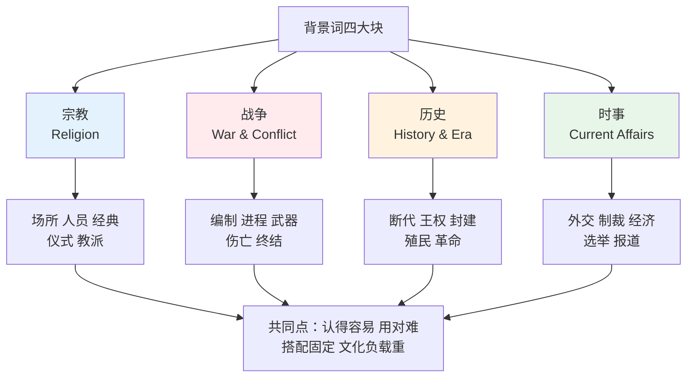
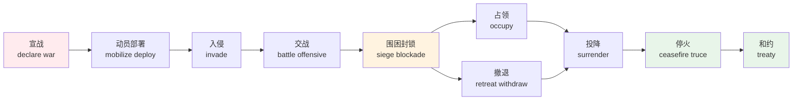
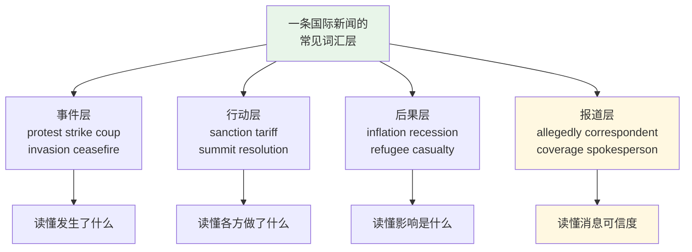
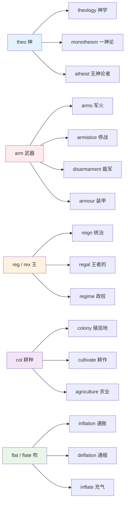
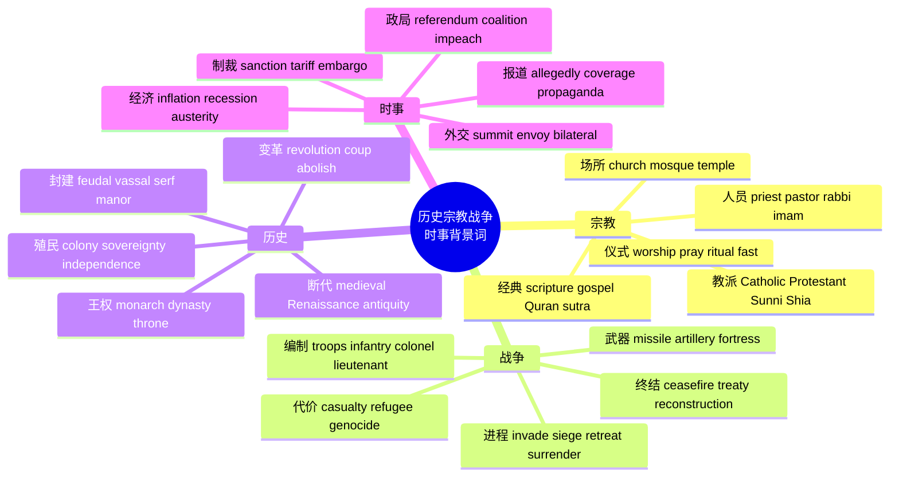

# 历史、宗教、战争与时事背景词

> [!info] 本篇定位
>
> 第八章的收尾篇，也是全章跨度最大的一篇。前四篇处理的是你身边的人——亲属、朋友、同事、国籍族群；这一篇处理的是**新闻和书里的人和事**。
>
> 读完你会拿到四张词表：宗教（场所、神职、经典、仪式、教派）、战争（编制、进程、武器、代价、终结）、历史（断代、王权、封建、殖民、革命）、时事（外交、制裁、经济、选举、报道）。
>
> 边界划得很死：本篇只讲**字面义与文化背景**。`crusade` 当「运动」讲、`sanctuary` 当「避风港」讲、`siege mentality` 这类隐喻用法，全部归 [[19.学术通用词汇/04.典故、专名转普通词与词源背景\|19.04 典故、专名转普通词与词源背景]]，这里一律不碰。

---

## 1. 本篇导读：背景词为什么要单列

这一批词有个共同特征：**认得的门槛低，用对的门槛高**。

`church` 谁都认识，但 `go to church`（去做礼拜）和 `go to the church`（去那座教堂这个地点）差一个冠词，意思完全不同。`troops` 谁都认识，但它是复数集合名词，`a troop` 指的是「一队」不是「一个士兵」。`inflation` 查词典是「通货膨胀」，可新闻里最常见的搭配是 `curb inflation`、`inflation eases`、`core inflation`，光记中文对应字读不下来一段财经报道。

第二个特征是**文化负载重**。这些词背后压着历史事件、宗教制度、政治立场。中文里说「十字军东征」是个中性的历史名词，英文 `crusade` 在阿拉伯语世界的语境里带明确贬义。`martyr` 在中文教育里对应「烈士」，是褒义；在英文新闻里它的立场高度依赖说话人是谁。不知道这层，读新闻会误判语气，写作会踩雷。

第三个特征是**它们是阅读英文材料的隐性门槛**。读原版小说绕不开教堂和贵族头衔，读历史纪录片字幕绕不开断代和封建等级，读 The Economist 或 BBC 绕不开制裁、关税、联合政府。这批词学的时候用不上，读的时候一个都少不了。

上图把本篇的四块内容和它们的共同难点摆在一起。四块之间不是并列的孤岛：宗教冲突会变成战争，战争的结果写进历史，历史遗留问题构成今天的时事。学的时候可以分块记，读的时候它们总是混在同一段文字里出现。

---

## 2. 宗教：场所、人员与身份

### 2.1 建筑与场所

英语里的宗教建筑词有细密的层级，不能一律译成「教堂」。

| 英文 | 英式音标 | 美式音标 | 词性 | 中文 | 搭配与说明 |
| --- | --- | --- | --- | --- | --- |
| **church** | /tʃɜːtʃ/ | /tʃɜːrtʃ/ | n. | 教堂；礼拜 | go to church 无冠词指做礼拜，加 the 才指建筑 |
| **cathedral** | /kəˈθiːdrəl/ | /kəˈθiːdrəl/ | n. | 主教座堂 | 有主教座位的教堂，规模最大，如 St Paul's Cathedral |
| **chapel** | /ˈtʃæpl/ | /ˈtʃæpl/ | n. | 小礼拜堂 | 学校、医院、城堡内的小型礼拜空间 |
| **abbey** | /ˈæbi/ | /ˈæbi/ | n. | 修道院 | Westminster Abbey 是专名，虽已不作修道院用 |
| **monastery** | /ˈmɒnəstri/ | /ˈmɑːnəsteri/ | n. | 男修道院 | 英美重音位置相同但后半读音差异明显 |
| **convent** | /ˈkɒnvənt/ | /ˈkɑːnvent/ | n. | 女修道院 | 也可指修女办的学校 |
| **shrine** | /ʃraɪn/ | /ʃraɪn/ | n. | 神龛；圣地 | 供奉圣物或圣人遗骨的场所 |
| **altar** | /ˈɔːltə/ | /ˈɔːltər/ | n. | 祭坛 | 与 alter「改变」拼写只差一字母，常被混 |
| **pulpit** | /ˈpʊlpɪt/ | /ˈpʊlpɪt/ | n. | 布道坛 | 牧师讲道时站的高台 |
| **pew** | /pjuː/ | /pjuː/ | n. | 教堂长椅 | 单音节，读音容易错成两音节 |
| **aisle** | /aɪl/ | /aɪl/ | n. | 侧廊；过道 | s 不发音，婚礼 walk down the aisle 就是这个词 |
| **crypt** | /krɪpt/ | /krɪpt/ | n. | 地下墓室 | 教堂地下埋葬圣徒或贵族的空间 |
| **mosque** | /mɒsk/ | /mɑːsk/ | n. | 清真寺 | 拼写有 q 但读 /sk/，无 /kw/ 音 |
| **minaret** | /ˌmɪnəˈret/ | /ˌmɪnəˈret/ | n. | 宣礼塔 | 清真寺旁的高塔，重音在最后一个音节 |
| **synagogue** | /ˈsɪnəɡɒɡ/ | /ˈsɪnəɡɑːɡ/ | n. | 犹太会堂 | 三个音节，重音在首 |
| **temple** | /ˈtempl/ | /ˈtempl/ | n. | 寺庙；神殿 | 佛寺、印度教庙、古希腊神殿通用；也指太阳穴 |
| **pagoda** | /pəˈɡəʊdə/ | /pəˈɡoʊdə/ | n. | 塔；宝塔 | 东亚多层佛塔的专用词 |
| **monk cell** | — | — | n. | 修士居室 | 组合词，cell 在此指单人小屋 |

> [!warning] church 的冠词陷阱
>
> 一批表示「机构功能」的场所名词在表达「去做那件事」时**不加冠词**，加了冠词就变成单纯指建筑物。
>
> - ✅ She goes to **church** every Sunday.（她每周日去做礼拜，说的是宗教活动）
> - ✅ The meeting was held at **the church** on Elm Street.（会议在榆树街那座教堂举行，说的是地点）
>
> 同一规律的还有 `go to school`（上学）与 `go to the school`（去学校那栋楼）、`in hospital`（住院，英式）与 `in the hospital`（在医院这个地方）、`in prison`（服刑）与 `in the prison`（在监狱里面）。这条规则在 [[02.英语基础语法/02.名词与冠词/03.冠词的用法详解\|语法教程 02.名词与冠词/03.冠词的用法详解]] 里有完整清单。

### 2.2 神职人员

不同宗教、不同教派的神职称谓不能互换，用错在英语母语者听来相当刺耳。

| 英文 | 英式音标 | 美式音标 | 词性 | 中文 | 搭配与说明 |
| --- | --- | --- | --- | --- | --- |
| **priest** | /priːst/ | /priːst/ | n. | 神父；祭司 | 天主教、东正教、圣公会用；也泛指古代祭司 |
| **pastor** | /ˈpɑːstə/ | /ˈpæstər/ | n. | 牧师 | 新教用，词源是「牧羊人」 |
| **minister** | /ˈmɪnɪstə/ | /ˈmɪnɪstər/ | n. | 牧师；部长 | 新教牧师与政府部长同形，靠语境区分 |
| **vicar** | /ˈvɪkə/ | /ˈvɪkər/ | n. | 教区牧师 | 英国圣公会特有，美国少用 |
| **bishop** | /ˈbɪʃəp/ | /ˈbɪʃəp/ | n. | 主教 | 也是国际象棋的「象」 |
| **archbishop** | /ˌɑːtʃˈbɪʃəp/ | /ˌɑːrtʃˈbɪʃəp/ | n. | 大主教 | arch- 前缀表「首席的」 |
| **cardinal** | /ˈkɑːdɪnl/ | /ˈkɑːrdɪnl/ | n./adj. | 枢机主教；主要的 | 兼指红衣主教、红雀鸟、基数词 cardinal number |
| **pope** | /pəʊp/ | /poʊp/ | n. | 教皇 | 专指时大写 the Pope |
| **clergy** | /ˈklɜːdʒi/ | /ˈklɜːrdʒi/ | n. | 神职人员总称 | 集合名词，接复数谓语 |
| **congregation** | /ˌkɒŋɡrɪˈɡeɪʃn/ | /ˌkɑːŋɡrɪˈɡeɪʃn/ | n. | 会众 | 一次礼拜中在场的信众整体 |
| **monk** | /mʌŋk/ | /mʌŋk/ | n. | 修士；和尚 | 基督教修士与佛教僧人共用此词 |
| **nun** | /nʌn/ | /nʌn/ | n. | 修女；尼姑 | 同上，跨宗教通用 |
| **abbot** | /ˈæbət/ | /ˈæbət/ | n. | 修道院院长；方丈 | 佛教方丈的标准英译也是 abbot |
| **rabbi** | /ˈræbaɪ/ | /ˈræbaɪ/ | n. | 拉比 | 犹太教教师与宗教权威 |
| **imam** | /ɪˈmɑːm/ | /ɪˈmɑːm/ | n. | 伊玛目 | 带领穆斯林礼拜的人 |
| **missionary** | /ˈmɪʃənri/ | /ˈmɪʃəneri/ | n. | 传教士 | 派生自 mission，英美后半读音差异明显 |
| **preacher** | /ˈpriːtʃə/ | /ˈpriːtʃər/ | n. | 布道者 | 强调「讲道」这个动作，不一定有正式教职 |
| **chaplain** | /ˈtʃæplɪn/ | /ˈtʃæplən/ | n. | 随军牧师；院牧 | 军队、医院、监狱、大学里的驻场神职 |

### 2.3 信众与宗教身份

| 英文 | 英式音标 | 美式音标 | 词性 | 中文 | 搭配与说明 |
| --- | --- | --- | --- | --- | --- |
| **believer** | /bɪˈliːvə/ | /bɪˈliːvər/ | n. | 信徒 | 中性，泛指任何宗教的信仰者 |
| **worshipper** | /ˈwɜːʃɪpə/ | /ˈwɜːrʃɪpər/ | n. | 礼拜者 | 美式常拼 worshiper，单 p |
| **follower** | /ˈfɒləʊə/ | /ˈfɑːloʊər/ | n. | 追随者 | 也用于社交媒体的关注者 |
| **disciple** | /dɪˈsaɪpl/ | /dɪˈsaɪpl/ | n. | 门徒 | 特指跟随导师学习的人，重音在中间 |
| **apostle** | /əˈpɒsl/ | /əˈpɑːsl/ | n. | 使徒 | t 不发音；专指耶稣的十二使徒 |
| **prophet** | /ˈprɒfɪt/ | /ˈprɑːfɪt/ | n. | 先知 | 与 profit「利润」同音，写作时易混 |
| **saint** | /seɪnt/ | /seɪnt/ | n. | 圣人 | 名字前缩写为 St，如 St Peter |
| **martyr** | /ˈmɑːtə/ | /ˈmɑːrtər/ | n. | 殉道者；烈士 | 立场词，褒贬取决于说话人立场 |
| **pilgrim** | /ˈpɪlɡrɪm/ | /ˈpɪlɡrɪm/ | n. | 朝圣者 | 大写 Pilgrims 特指五月花号移民 |
| **convert** | /ˈkɒnvɜːt/ | /ˈkɑːnvɜːrt/ | n. | 皈依者 | 名词重音在前，动词 /kənˈvɜːt/ 重音在后 |
| **atheist** | /ˈeɪθiɪst/ | /ˈeɪθiɪst/ | n. | 无神论者 | a- 否定前缀 + theo 神 |
| **agnostic** | /æɡˈnɒstɪk/ | /æɡˈnɑːstɪk/ | n./adj. | 不可知论者 | 不同于无神论，主张「无法知道」 |
| **layman** | /ˈleɪmən/ | /ˈleɪmən/ | n. | 平信徒；外行 | 复数 laymen；in layman's terms 意为「用外行话说」 |
| **congregant** | /ˈkɒŋɡrɪɡənt/ | /ˈkɑːŋɡrɪɡənt/ | n. | 会众成员 | 单个成员，congregation 是集合 |
| **devotee** | /ˌdevəˈtiː/ | /ˌdevəˈtiː/ | n. | 虔诚信徒 | 重音在最后，-ee 结尾 |
| **heretic** | /ˈherətɪk/ | /ˈherətɪk/ | n. | 异端者 | 形容词 heretical /həˈretɪkl/ 重音位置不同 |

> [!tip] 神职词的选用速查
>
> 记不清哪个词配哪个教派时，按这条链子走：**天主教用 priest，新教用 pastor 或 minister，英国圣公会加一个 vicar，犹太教用 rabbi，伊斯兰教用 imam，佛教僧尼用 monk 和 nun**。
>
> 拿不准时用 `religious leader` 或 `clergy member` 兜底，比用错具体称谓安全得多。

---

## 3. 宗教：经典、教义与仪式

### 3.1 经典与文本

| 英文 | 英式音标 | 美式音标 | 词性 | 中文 | 搭配与说明 |
| --- | --- | --- | --- | --- | --- |
| **scripture** | /ˈskrɪptʃə/ | /ˈskrɪptʃər/ | n. | 经文；圣典 | 大写 the Scriptures 特指基督教圣经 |
| **the Bible** | /ˈbaɪbl/ | /ˈbaɪbl/ | n. | 圣经 | 形容词 biblical /ˈbɪblɪkl/ 元音变短 |
| **testament** | /ˈtestəmənt/ | /ˈtestəmənt/ | n. | 约；圣约书 | the Old Testament 旧约，the New Testament 新约 |
| **gospel** | /ˈɡɒspl/ | /ˈɡɑːspl/ | n. | 福音书 | 古英语 god「好」+ spel「消息」，纯日耳曼词 |
| **the Quran** | /kɔːˈrɑːn/ | /kəˈrɑːn/ | n. | 古兰经 | 也拼 Koran，现代出版物多用 Quran |
| **the Torah** | /ˈtɔːrə/ | /ˈtɔːrə/ | n. | 妥拉；律法书 | 犹太教核心经典 |
| **sutra** | /ˈsuːtrə/ | /ˈsuːtrə/ | n. | 经；佛经 | 梵语借词，如 the Lotus Sutra 法华经 |
| **verse** | /vɜːs/ | /vɜːrs/ | n. | 节；诗句 | 引用圣经时 chapter and verse 表示章节号 |
| **psalm** | /sɑːm/ | /sɑːm/ | n. | 诗篇 | l 不发音，是最典型的静音字母词之一 |
| **hymn** | /hɪm/ | /hɪm/ | n. | 赞美诗 | 结尾 n 不发音，与 him 同音 |
| **parable** | /ˈpærəbl/ | /ˈpærəbl/ | n. | 寓言故事 | 特指圣经中带道德教训的短故事 |
| **commandment** | /kəˈmɑːndmənt/ | /kəˈmændmənt/ | n. | 诫命 | the Ten Commandments 十诫 |
| **doctrine** | /ˈdɒktrɪn/ | /ˈdɑːktrɪn/ | n. | 教义 | 也用于政治，如 the Monroe Doctrine |
| **creed** | /kriːd/ | /kriːd/ | n. | 信条 | 短小的信仰声明文本 |
| **theology** | /θiˈɒlədʒi/ | /θiˈɑːlədʒi/ | n. | 神学 | theo 神 + -logy 学科 |
| **manuscript** | /ˈmænjuskrɪpt/ | /ˈmænjuskrɪpt/ | n. | 手稿 | manu 手 + script 写，缩写 MS |

### 3.2 信仰的核心概念

这一组是抽象名词，也是读英文小说与哲学文本时最常撞上的一批。

| 英文 | 英式音标 | 美式音标 | 词性 | 中文 | 搭配与说明 |
| --- | --- | --- | --- | --- | --- |
| **faith** | /feɪθ/ | /feɪθ/ | n. | 信仰 | 可指宗教本身，the Christian faith |
| **belief** | /bɪˈliːf/ | /bɪˈliːf/ | n. | 信念 | 动词是 believe，名词拼 -ief 不是 -ieve |
| **sacred** | /ˈseɪkrɪd/ | /ˈseɪkrɪd/ | adj. | 神圣的 | 拉丁层；两音节，第二音节读 /rɪd/ |
| **holy** | /ˈhəʊli/ | /ˈhoʊli/ | adj. | 神圣的 | 日耳曼层，语气更口语，the Holy Land 圣地 |
| **divine** | /dɪˈvaɪn/ | /dɪˈvaɪn/ | adj. | 神的；神圣的 | divine intervention 神的干预 |
| **spiritual** | /ˈspɪrɪtʃuəl/ | /ˈspɪrɪtʃuəl/ | adj. | 精神的；灵性的 | 不等于 mental，后者指心智 |
| **secular** | /ˈsekjələ/ | /ˈsekjələr/ | adj. | 世俗的 | 与宗教相对，a secular state 世俗国家 |
| **soul** | /səʊl/ | /soʊl/ | n. | 灵魂 | 与 sole「唯一的」同音 |
| **spirit** | /ˈspɪrɪt/ | /ˈspɪrɪt/ | n. | 精神；灵 | 复数 spirits 另指烈酒与情绪 |
| **sin** | /sɪn/ | /sɪn/ | n./v. | 罪；犯罪 | 宗教意义的罪，法律意义的罪是 crime |
| **guilt** | /ɡɪlt/ | /ɡɪlt/ | n. | 罪疚感 | u 不发音 |
| **salvation** | /sælˈveɪʃn/ | /sælˈveɪʃn/ | n. | 拯救；救赎 | 词根 salv「安全」，同族 salvage |
| **redemption** | /rɪˈdempʃn/ | /rɪˈdempʃn/ | n. | 救赎 | red- 回 + em「买」，本义「赎回」 |
| **grace** | /ɡreɪs/ | /ɡreɪs/ | n. | 恩典 | 饭前祷告也叫 say grace |
| **mercy** | /ˈmɜːsi/ | /ˈmɜːrsi/ | n. | 慈悲 | at the mercy of 意为「任凭摆布」 |
| **heaven** | /ˈhevn/ | /ˈhevn/ | n. | 天堂 | 复数 the heavens 指天空 |
| **hell** | /hel/ | /hel/ | n. | 地狱 | 口语中作强调词，语气偏粗 |
| **paradise** | /ˈpærədaɪs/ | /ˈpærədaɪs/ | n. | 乐园 | 波斯语来源，经希腊语进入英语 |
| **angel** | /ˈeɪndʒl/ | /ˈeɪndʒl/ | n. | 天使 | 与 angle「角度」拼写只差字母顺序 |
| **demon** | /ˈdiːmən/ | /ˈdiːmən/ | n. | 恶魔 | 形容词 demonic /dɪˈmɒnɪk/ 重音后移 |
| **miracle** | /ˈmɪrəkl/ | /ˈmɪrəkl/ | n. | 奇迹 | 形容词 miraculous /mɪˈrækjələs/ |
| **prophecy** | /ˈprɒfəsi/ | /ˈprɑːfəsi/ | n. | 预言 | 名词收 -cy，动词 prophesy /ˈprɒfəsaɪ/ 收 -sy |
| **blasphemy** | /ˈblæsfəmi/ | /ˈblæsfəmi/ | n. | 亵渎 | 形容词 blasphemous，重音都在首音节 |
| **heresy** | /ˈherəsi/ | /ˈherəsi/ | n. | 异端邪说 | 与 heritage 无关，别按拼写猜义 |

### 3.3 仪式与宗教动作

| 英文 | 英式音标 | 美式音标 | 词性 | 中文 | 搭配与说明 |
| --- | --- | --- | --- | --- | --- |
| **ritual** | /ˈrɪtʃuəl/ | /ˈrɪtʃuəl/ | n./adj. | 仪式；仪式性的 | 强调固定重复的程序 |
| **rite** | /raɪt/ | /raɪt/ | n. | 礼；仪典 | 与 right、write、wright 四词同音 |
| **ceremony** | /ˈserəməni/ | /ˈserəmoʊni/ | n. | 典礼 | 英式尾音弱化，美式 -mony 读得饱满 |
| **worship** | /ˈwɜːʃɪp/ | /ˈwɜːrʃɪp/ | v./n. | 崇拜；礼拜 | 及物动词，worship God 不加介词 |
| **pray** | /preɪ/ | /preɪ/ | v. | 祈祷 | pray for someone 为某人祈祷 |
| **prayer** | /preə/ | /prer/ | n. | 祷告 | 单音节；指「祈祷的人」时读 /ˈpreɪə/ 两音节 |
| **preach** | /priːtʃ/ | /priːtʃ/ | v. | 布道 | preach to the choir 意为对已认同者说教 |
| **sermon** | /ˈsɜːmən/ | /ˈsɜːrmən/ | n. | 布道；说教 | 日常中带贬义，指冗长的训话 |
| **bless** | /bles/ | /bles/ | v. | 祝福 | 过去分词 blessed，作形容词读 /ˈblesɪd/ 两音节 |
| **baptize** | /bæpˈtaɪz/ | /ˈbæptaɪz/ | v. | 施洗 | 英式重音在后，美式常前移 |
| **baptism** | /ˈbæptɪzəm/ | /ˈbæptɪzəm/ | n. | 洗礼 | 名词重音统一在首音节 |
| **confession** | /kənˈfeʃn/ | /kənˈfeʃn/ | n. | 忏悔；供认 | 宗教义与法律义并存 |
| **communion** | /kəˈmjuːniən/ | /kəˈmjuːniən/ | n. | 圣餐 | 也作「交流、共融」讲 |
| **fast** | /fɑːst/ | /fæst/ | v./n. | 禁食；斋戒 | 与「快」同形，breakfast 就是「打破禁食」 |
| **offering** | /ˈɒfərɪŋ/ | /ˈɔːfərɪŋ/ | n. | 供品；奉献 | 也指教堂募捐 |
| **sacrifice** | /ˈsækrɪfaɪs/ | /ˈsækrɪfaɪs/ | n./v. | 祭品；牺牲 | 名词动词同音，不像多数词那样重音移动 |
| **incense** | /ˈɪnsens/ | /ˈɪnsens/ | n. | 香；熏香 | 作动词「激怒」时读 /ɪnˈsens/ 重音后移 |
| **meditation** | /ˌmedɪˈteɪʃn/ | /ˌmedɪˈteɪʃn/ | n. | 冥想；打坐 | 动词 meditate，重音在首音节 |
| **chant** | /tʃɑːnt/ | /tʃænt/ | v./n. | 吟诵；诵经 | 也指球场上的整齐口号 |
| **funeral** | /ˈfjuːnərəl/ | /ˈfjuːnərəl/ | n. | 葬礼 | 形容词 funereal /fjuːˈnɪəriəl/ 重音和读音都变 |
| **burial** | /ˈberiəl/ | /ˈberiəl/ | n. | 埋葬 | 读 /ˈber-/ 不读 /ˈbjʊər-/，是高频读错词 |
| **cremation** | /krəˈmeɪʃn/ | /krəˈmeɪʃn/ | n. | 火化 | 动词 cremate /krəˈmeɪt/ |
| **pilgrimage** | /ˈpɪlɡrɪmɪdʒ/ | /ˈpɪlɡrɪmɪdʒ/ | n. | 朝圣之旅 | make a pilgrimage to 是固定搭配 |
| **procession** | /prəˈseʃn/ | /prəˈseʃn/ | n. | 游行队列 | 宗教节日的列队行进 |

### 3.4 节期与宗教历法

| 英文 | 英式音标 | 美式音标 | 词性 | 中文 | 搭配与说明 |
| --- | --- | --- | --- | --- | --- |
| **Christmas** | /ˈkrɪsməs/ | /ˈkrɪsməs/ | n. | 圣诞节 | t 不发音，是拼读规则失效词 |
| **Easter** | /ˈiːstə/ | /ˈiːstər/ | n. | 复活节 | 日期随月相浮动，不固定 |
| **Lent** | /lent/ | /lent/ | n. | 四旬斋期 | 复活节前四十天的斋戒期 |
| **Advent** | /ˈædvent/ | /ˈædvent/ | n. | 将临期 | 圣诞前四周；小写 advent 意为「到来」 |
| **Sabbath** | /ˈsæbəθ/ | /ˈsæbəθ/ | n. | 安息日 | 犹太教在周六，多数基督教派在周日 |
| **Passover** | /ˈpɑːsəʊvə/ | /ˈpæsoʊvər/ | n. | 逾越节 | 犹太教纪念出埃及的节日 |
| **Ramadan** | /ˌræməˈdɑːn/ | /ˈrɑːmədɑːn/ | n. | 斋月 | 英式重音在末，美式常前移 |
| **Eid** | /iːd/ | /iːd/ | n. | 开斋节 | 全称 Eid al-Fitr |
| **Diwali** | /dɪˈwɑːli/ | /dɪˈwɑːli/ | n. | 排灯节 | 印度教光明节 |
| **Hanukkah** | /ˈhɑːnəkə/ | /ˈhɑːnəkə/ | n. | 光明节 | 犹太教八天节期，拼法多变 |
| **Good Friday** | — | — | n. | 受难日 | 复活节前的周五 |
| **All Saints' Day** | — | — | n. | 诸圣节 | 十一月一日，万圣夜的次日 |
| **crucifixion** | /ˌkruːsəˈfɪkʃn/ | /ˌkruːsəˈfɪkʃn/ | n. | 钉十字架 | 动词 crucify /ˈkruːsəfaɪ/ |
| **resurrection** | /ˌrezəˈrekʃn/ | /ˌrezəˈrekʃn/ | n. | 复活 | re- 再 + surrect「起立」 |

遇到一个陌生的宗教词，先判断它属于哪一类，再去对应词表里定位。四类的难点各不相同，复习时的着力点也就不同。

| 类别 | 代表词 | 主要难点 | 出现在哪类材料里 |
| --- | --- | --- | --- |
| 场所 | church, cathedral, mosque, temple | 冠词的有无改变词义 | 小说、游记、建筑介绍 |
| 人员 | priest, pastor, rabbi, imam, monk | 教派对应关系不能互换 | 新闻、访谈、人物报道 |
| 文本 | scripture, gospel, Quran, sutra | 专名首字母大写与冠词 | 哲学、历史、宗教研究 |
| 行为 | worship, pray, ritual, fast | 动词搭配与介词固定 | 口语交谈与写作产出 |

前三类停在「认得」就够用，第四类因为要主动说出来，必须连搭配一起记牢：`worship` 后直接跟宾语不加介词，`pray` 要接 `for`，`fast` 作动词时是不及物的。

---

## 4. 世界主要宗教与派别对照

### 4.1 五大宗教的名称与形容词

宗教名和它的形容词、信徒名往往不是简单加后缀，需要成组记。

| 英文 | 英式音标 | 美式音标 | 词性 | 中文 | 搭配与说明 |
| --- | --- | --- | --- | --- | --- |
| **Christianity** | /ˌkrɪstiˈænəti/ | /ˌkrɪstiˈænəti/ | n. | 基督教 | 信徒与形容词都是 Christian |
| **Christian** | /ˈkrɪstʃən/ | /ˈkrɪstʃən/ | n./adj. | 基督徒；基督教的 | 首字母必须大写 |
| **Islam** | /ˈɪzlɑːm/ | /ɪsˈlɑːm/ | n. | 伊斯兰教 | 英式重音常在首，美式在后，且清浊不同 |
| **Muslim** | /ˈmʊzlɪm/ | /ˈmʌzləm/ | n./adj. | 穆斯林 | 英美首元音不同；旧拼 Moslem 已不推荐 |
| **Islamic** | /ɪzˈlæmɪk/ | /ɪsˈlæmɪk/ | adj. | 伊斯兰的 | 修饰事物，修饰人用 Muslim |
| **Judaism** | /ˈdʒuːdeɪɪzəm/ | /ˈdʒuːdiɪzəm/ | n. | 犹太教 | 三到四音节，英美中段元音不同 |
| **Jewish** | /ˈdʒuːɪʃ/ | /ˈdʒuːɪʃ/ | adj. | 犹太人的 | 名词用 Jew，但直接称人 a Jew 语气偏生硬 |
| **Hinduism** | /ˈhɪnduːɪzəm/ | /ˈhɪnduːɪzəm/ | n. | 印度教 | 信徒 Hindu，不等于 Indian「印度人」 |
| **Buddhism** | /ˈbʊdɪzəm/ | /ˈbuːdɪzəm/ | n. | 佛教 | 英式短元音 /ʊ/，美式长元音 /uː/ |
| **Buddhist** | /ˈbʊdɪst/ | /ˈbuːdɪst/ | n./adj. | 佛教徒；佛教的 | dh 只读 /d/，不读 /ð/ |
| **Taoism** | /ˈdaʊɪzəm/ | /ˈdaʊɪzəm/ | n. | 道教 | 也拼 Daoism；T 读 /d/，是威妥玛拼音遗留 |
| **Confucianism** | /kənˈfjuːʃənɪzəm/ | /kənˈfjuːʃənɪzəm/ | n. | 儒家；儒教 | 形容词 Confucian |
| **Sikhism** | /ˈsiːkɪzəm/ | /ˈsiːkɪzəm/ | n. | 锡克教 | 信徒 Sikh /siːk/，与 seek 同音 |
| **Shinto** | /ˈʃɪntəʊ/ | /ˈʃɪntoʊ/ | n. | 神道教 | 日本本土宗教 |
| **monotheism** | /ˈmɒnəʊθiːɪzəm/ | /ˈmɑːnoʊθiːɪzəm/ | n. | 一神论 | mono 一 + theo 神 |
| **polytheism** | /ˈpɒliθiːɪzəm/ | /ˈpɑːliθiːɪzəm/ | n. | 多神论 | poly 多 + theo 神 |

### 4.2 教派与组织形式

| 英文 | 英式音标 | 美式音标 | 词性 | 中文 | 搭配与说明 |
| --- | --- | --- | --- | --- | --- |
| **Catholic** | /ˈkæθlɪk/ | /ˈkæθlɪk/ | n./adj. | 天主教徒；天主教的 | 常读作两音节，中间 o 弱化到几乎消失 |
| **Protestant** | /ˈprɒtɪstənt/ | /ˈprɑːtɪstənt/ | n./adj. | 新教徒；新教的 | 重音在首，不同于动词 protest |
| **Orthodox** | /ˈɔːθədɒks/ | /ˈɔːrθədɑːks/ | adj. | 正教的；正统的 | 小写时泛指「正统的、传统的」 |
| **Anglican** | /ˈæŋɡlɪkən/ | /ˈæŋɡlɪkən/ | adj./n. | 圣公会的 | 英国国教，美国对应 Episcopal |
| **Baptist** | /ˈbæptɪst/ | /ˈbæptɪst/ | n./adj. | 浸信会 | 美国南部人数最多的新教宗派之一 |
| **Methodist** | /ˈmeθədɪst/ | /ˈmeθədɪst/ | n./adj. | 卫理公会 | 与 method 同源 |
| **Evangelical** | /ˌiːvænˈdʒelɪkl/ | /ˌiːvænˈdʒelɪkl/ | adj. | 福音派的 | 美国政治新闻高频词 |
| **Sunni** | /ˈsʊni/ | /ˈsuːni/ | n./adj. | 逊尼派 | 伊斯兰教最大分支 |
| **Shia** | /ˈʃiːə/ | /ˈʃiːə/ | n./adj. | 什叶派 | 也拼 Shiite /ˈʃiːaɪt/ |
| **denomination** | /dɪˌnɒmɪˈneɪʃn/ | /dɪˌnɑːmɪˈneɪʃn/ | n. | 宗派 | 中性词；也指钞票面额 |
| **sect** | /sekt/ | /sekt/ | n. | 教派 | 略带「小众、偏离主流」的暗示 |
| **cult** | /kʌlt/ | /kʌlt/ | n. | 邪教；狂热崇拜 | 明显贬义，指称他人宗教时慎用 |
| **schism** | /ˈskɪzəm/ | /ˈskɪzəm/ | n. | 分裂 | sch 读 /sk/ 不读 /ʃ/ |
| **fundamentalism** | /ˌfʌndəˈmentəlɪzəm/ | /ˌfʌndəˈmentəlɪzəm/ | n. | 原教旨主义 | 新闻高频，形容词 fundamentalist |
| **congregation** | /ˌkɒŋɡrɪˈɡeɪʃn/ | /ˌkɑːŋɡrɪˈɡeɪʃn/ | n. | 堂会 | 见 2.2；此处指教会的基层组织单位 |
| **diocese** | /ˈdaɪəsɪs/ | /ˈdaɪəsɪs/ | n. | 教区 | 主教管辖范围；parish 是更小的堂区 |

### 4.3 中文宗教概念的英译

中国学习者常需要向外国人解释本土宗教概念，这几个是最常用的。

| 英文 | 英式音标 | 美式音标 | 词性 | 中文 | 搭配与说明 |
| --- | --- | --- | --- | --- | --- |
| **karma** | /ˈkɑːmə/ | /ˈkɑːrmə/ | n. | 业；因果报应 | 已完全进入日常英语，口语中指「报应」 |
| **reincarnation** | /ˌriːɪnkɑːˈneɪʃn/ | /ˌriːɪnkɑːrˈneɪʃn/ | n. | 转世；轮回 | re- 再 + carn 肉身 |
| **enlightenment** | /ɪnˈlaɪtnmənt/ | /ɪnˈlaɪtnmənt/ | n. | 开悟；启蒙 | 大写 the Enlightenment 指欧洲启蒙运动 |
| **nirvana** | /nɪəˈvɑːnə/ | /nɪrˈvɑːnə/ | n. | 涅槃 | 重音在中间 |
| **ancestor worship** | — | — | n. | 祖先崇拜 | 解释中国传统信仰的标准说法 |
| **incense stick** | — | — | n. | 香 | 上香说 burn incense 或 light incense |
| **fortune telling** | — | — | n. | 算命 | 算命的人是 fortune teller |
| **feng shui** | /ˌfeŋ ˈʃuːi/ | /ˌfʌŋ ˈʃweɪ/ | n. | 风水 | 已收入英文词典，英美读法差异大 |
| **filial piety** | /ˌfɪliəl ˈpaɪəti/ | /ˌfɪliəl ˈpaɪəti/ | n. | 孝道 | 学术标准译法，见第八章第一篇亲属词 |
| **temple fair** | — | — | n. | 庙会 | 春节场景的常用说法 |

> [!warning] 谈别人的宗教时最容易出错的三处
>
> - ❌ ~~He is an Islam.~~ → ✅ He is a **Muslim**.（Islam 是宗教的名字，不能拿来指人；指信徒只能用 Muslim）
> - ❌ ~~Their cult has ten million followers.~~ → ✅ Their **faith** / **religion** has ten million followers.（cult 带贬义，用于正常宗教是冒犯）
> - ❌ ~~a Buddhism monk~~ → ✅ a **Buddhist** monk（修饰名词必须用形容词形式）

---

## 5. 战争：军队、进程与武器

### 5.1 编制、军衔与人员

| 英文 | 英式音标 | 美式音标 | 词性 | 中文 | 搭配与说明 |
| --- | --- | --- | --- | --- | --- |
| **troops** | /truːps/ | /truːps/ | n. | 部队；士兵 | 复数集合名词；a troop 是「一队」不是「一兵」 |
| **forces** | /ˈfɔːsɪz/ | /ˈfɔːrsɪz/ | n. | 军队；武装力量 | the armed forces 三军总称 |
| **infantry** | /ˈɪnfəntri/ | /ˈɪnfəntri/ | n. | 步兵 | 集合名词，不加复数 s |
| **cavalry** | /ˈkævlri/ | /ˈkævlri/ | n. | 骑兵 | 与 Calvary「各各他」拼写极近，常被写混 |
| **artillery** | /ɑːˈtɪləri/ | /ɑːrˈtɪləri/ | n. | 炮兵；火炮 | 兼指兵种和装备 |
| **regiment** | /ˈredʒɪmənt/ | /ˈredʒɪmənt/ | n. | 团 | 名词重音在首，动词 /ˌredʒɪˈment/ |
| **battalion** | /bəˈtæliən/ | /bəˈtæliən/ | n. | 营 | 重音在中间 |
| **brigade** | /brɪˈɡeɪd/ | /brɪˈɡeɪd/ | n. | 旅 | fire brigade 英式指消防队 |
| **garrison** | /ˈɡærɪsn/ | /ˈɡærɪsn/ | n./v. | 卫戍部队；驻防 | 强调「长期驻守某地」 |
| **militia** | /məˈlɪʃə/ | /məˈlɪʃə/ | n. | 民兵 | t 读 /ʃ/，三音节 |
| **recruit** | /rɪˈkruːt/ | /rɪˈkruːt/ | n./v. | 新兵；招募 | 民用语境指企业招聘 |
| **conscription** | /kənˈskrɪpʃn/ | /kənˈskrɪpʃn/ | n. | 义务兵役制 | 美式口语常说 the draft |
| **veteran** | /ˈvetərən/ | /ˈvetərən/ | n. | 老兵；老手 | 美式缩写 vet，与「兽医」缩写同形 |
| **mercenary** | /ˈmɜːsənəri/ | /ˈmɜːrsəneri/ | n./adj. | 雇佣兵；唯利是图的 | 形容词义带明显贬义 |
| **commander** | /kəˈmɑːndə/ | /kəˈmændər/ | n. | 指挥官 | 英美 a 的读音差异典型 |
| **general** | /ˈdʒenrəl/ | /ˈdʒenrəl/ | n./adj. | 将军；一般的 | 军衔与常用形容词同形 |
| **colonel** | /ˈkɜːnl/ | /ˈkɜːrnl/ | n. | 上校 | 拼写与读音脱节最严重的英语词之一，读音同 kernel |
| **lieutenant** | /lefˈtenənt/ | /luːˈtenənt/ | n. | 中尉 | 英美读音差异最大的军衔词，英式含 /f/ 音 |
| **sergeant** | /ˈsɑːdʒənt/ | /ˈsɑːrdʒənt/ | n. | 中士 | 拼 -ge- 但读 /dʒ/，第二音节弱读 |
| **civilian** | /səˈvɪliən/ | /səˈvɪliən/ | n./adj. | 平民；民用的 | 与 civil「民事的」同根但不同义 |
| **ally** | /ˈælaɪ/ | /ˈælaɪ/ | n. | 盟友 | 名词重音在首，动词 /əˈlaɪ/ 重音在后 |
| **alliance** | /əˈlaɪəns/ | /əˈlaɪəns/ | n. | 同盟 | form an alliance 结盟 |

### 5.2 从开战到围城

战争进程有固定的动词链条，按时间顺序记比按字母顺序记高效得多。

| 英文 | 英式音标 | 美式音标 | 词性 | 中文 | 搭配与说明 |
| --- | --- | --- | --- | --- | --- |
| **declare war** | — | — | v. | 宣战 | declare war on somebody，介词固定用 on |
| **mobilize** | /ˈməʊbəlaɪz/ | /ˈmoʊbəlaɪz/ | v. | 动员 | 名词 mobilization |
| **deploy** | /dɪˈplɔɪ/ | /dɪˈplɔɪ/ | v. | 部署 | 也用于软件部署，是程序员的熟词 |
| **invade** | /ɪnˈveɪd/ | /ɪnˈveɪd/ | v. | 入侵 | 及物动词，invade a country 不加介词 |
| **invasion** | /ɪnˈveɪʒn/ | /ɪnˈveɪʒn/ | n. | 入侵 | -sion 读 /ʒn/ 不读 /ʃn/ |
| **offensive** | /əˈfensɪv/ | /əˈfensɪv/ | n./adj. | 攻势；冒犯的 | launch an offensive 发起攻势 |
| **campaign** | /kæmˈpeɪn/ | /kæmˈpeɪn/ | n. | 战役；运动 | g 不发音；也指竞选和营销活动 |
| **battle** | /ˈbætl/ | /ˈbætl/ | n./v. | 战役；战斗 | 比 war 小一级，一场 war 含多场 battle |
| **skirmish** | /ˈskɜːmɪʃ/ | /ˈskɜːrmɪʃ/ | n. | 小规模冲突 | 比 battle 更小 |
| **ambush** | /ˈæmbʊʃ/ | /ˈæmbʊʃ/ | n./v. | 埋伏；伏击 | 重音在首音节 |
| **raid** | /reɪd/ | /reɪd/ | n./v. | 突袭 | air raid 空袭，police raid 警方突击搜查 |
| **siege** | /siːdʒ/ | /siːdʒ/ | n. | 围城；围攻 | lay siege to 围困，under siege 被围 |
| **besiege** | /bɪˈsiːdʒ/ | /bɪˈsiːdʒ/ | v. | 围攻 | 及物动词，直接跟城市名 |
| **bombard** | /bɒmˈbɑːd/ | /bɑːmˈbɑːrd/ | v. | 炮击 | 重音在后；名词 bombardment |
| **blockade** | /blɒˈkeɪd/ | /blɑːˈkeɪd/ | n./v. | 封锁 | 海上封锁的标准词 |
| **occupy** | /ˈɒkjupaɪ/ | /ˈɑːkjupaɪ/ | v. | 占领 | 名词 occupation 兼有「职业」义 |
| **retreat** | /rɪˈtriːt/ | /rɪˈtriːt/ | v./n. | 撤退 | 也指静修活动 a weekend retreat |
| **withdraw** | /wɪðˈdrɔː/ | /wɪðˈdrɑː/ | v. | 撤军；撤回 | 不规则变化 withdraw-withdrew-withdrawn |
| **conquer** | /ˈkɒŋkə/ | /ˈkɑːŋkər/ | v. | 征服 | qu 读 /k/ 不读 /kw/ |
| **conquest** | /ˈkɒŋkwest/ | /ˈkɑːŋkwest/ | n. | 征服 | 名词里 qu 又读回 /kw/，与动词不一致 |
| **defeat** | /dɪˈfiːt/ | /dɪˈfiːt/ | v./n. | 击败；战败 | 主动是击败，被动 be defeated 是战败 |
| **surrender** | /səˈrendə/ | /səˈrendər/ | v./n. | 投降 | surrender to somebody |

上图是战争报道的标准叙事骨架。读一篇战争新闻时，判断它讲的是这条链上哪一环，能迅速定位文章的主旨。这条链也是记忆顺序：`declare` 到 `deploy` 到 `invade` 是开局，`siege` 与 `blockade` 是僵持，`surrender` 到 `ceasefire` 到 `treaty` 是收尾。三段各自的词汇密度不同，僵持段最长，词也最杂。

### 5.3 武器、防御与战场

| 英文 | 英式音标 | 美式音标 | 词性 | 中文 | 搭配与说明 |
| --- | --- | --- | --- | --- | --- |
| **weapon** | /ˈwepən/ | /ˈwepən/ | n. | 武器 | ea 读 /e/ 不读 /iː/ |
| **arms** | /ɑːmz/ | /ɑːrmz/ | n. | 军火；武器 | 恒为复数；arms race 军备竞赛 |
| **ammunition** | /ˌæmjuˈnɪʃn/ | /ˌæmjuˈnɪʃn/ | n. | 弹药 | 不可数，缩写 ammo |
| **missile** | /ˈmɪsaɪl/ | /ˈmɪsl/ | n. | 导弹 | 英式读出 /aɪ/，美式弱化成 /ˈmɪsl/ |
| **shell** | /ʃel/ | /ʃel/ | n./v. | 炮弹；炮击 | 兼指贝壳、外壳，程序员熟悉的 shell 同词 |
| **grenade** | /ɡrəˈneɪd/ | /ɡrəˈneɪd/ | n. | 手榴弹 | 重音在后 |
| **tank** | /tæŋk/ | /tæŋk/ | n. | 坦克 | 一战时的代号词，本义「水箱」 |
| **fleet** | /fliːt/ | /fliːt/ | n. | 舰队；车队 | 也指企业车队 |
| **naval** | /ˈneɪvl/ | /ˈneɪvl/ | adj. | 海军的 | 与 navel「肚脐」同音 |
| **fortress** | /ˈfɔːtrəs/ | /ˈfɔːrtrəs/ | n. | 要塞 | 词根 fort「强」，同族 fortify |
| **fortify** | /ˈfɔːtɪfaɪ/ | /ˈfɔːrtɪfaɪ/ | v. | 加固；设防 | 也用于食品「强化营养」 |
| **trench** | /trentʃ/ | /trentʃ/ | n. | 战壕 | trench warfare 堑壕战 |
| **armour** | /ˈɑːmə/ | /ˈɑːrmər/ | n. | 盔甲；装甲 | 美式拼 armor，是英美拼写差异的典型 |
| **shield** | /ʃiːld/ | /ʃiːld/ | n./v. | 盾牌；保护 | 动词 shield somebody from something |
| **sword** | /sɔːd/ | /sɔːrd/ | n. | 剑 | w 不发音 |
| **catapult** | /ˈkætəpʌlt/ | /ˈkætəpʌlt/ | n. | 投石机 | 中世纪攻城器械 |
| **frontline** | /ˈfrʌntlaɪn/ | /ˈfrʌntlaɪn/ | n. | 前线 | 也作形容词 front-line troops |
| **battlefield** | /ˈbætlfiːld/ | /ˈbætlfiːld/ | n. | 战场 | 日耳曼式合成词 |

---

## 6. 战争的代价与终结

### 6.1 伤亡与平民

这一组词在新闻里出现频率极高，而且计量口径各不相同，混用会造成事实错误。

| 英文 | 英式音标 | 美式音标 | 词性 | 中文 | 搭配与说明 |
| --- | --- | --- | --- | --- | --- |
| **casualty** | /ˈkæʒuəlti/ | /ˈkæʒuəlti/ | n. | 伤亡人员 | 含死者与伤者；英式医院的急诊科也叫 Casualty |
| **fatality** | /fəˈtæləti/ | /fəˈtæləti/ | n. | 死亡人数 | 只算死者，比 casualty 窄 |
| **death toll** | — | — | n. | 死亡总数 | toll 原指过路费，此处指「代价」 |
| **the wounded** | /ˈwuːndɪd/ | /ˈwuːndɪd/ | n. | 伤员 | the + 形容词表一类人，接复数谓语 |
| **injury** | /ˈɪndʒəri/ | /ˈɪndʒəri/ | n. | 受伤 | 意外与事故用 injury，武器所致用 wound |
| **wound** | /wuːnd/ | /wuːnd/ | n./v. | 伤口；使受伤 | 与 wind 的过去式 wound /waʊnd/ 拼写相同读音不同 |
| **atrocity** | /əˈtrɒsəti/ | /əˈtrɑːsəti/ | n. | 暴行 | 常用复数 atrocities |
| **massacre** | /ˈmæsəkə/ | /ˈmæsəkər/ | n./v. | 屠杀 | 结尾 -cre 读 /kə/ 不读 /krə/ |
| **genocide** | /ˈdʒenəsaɪd/ | /ˈdʒenəsaɪd/ | n. | 种族灭绝 | geno 族 + cide 杀；有严格法律定义 |
| **war crime** | — | — | n. | 战争罪 | 常用复数 war crimes |
| **devastation** | /ˌdevəˈsteɪʃn/ | /ˌdevəˈsteɪʃn/ | n. | 毁灭；破坏 | 形容词 devastating 也用于「令人震惊的」 |
| **ruins** | /ˈruːɪnz/ | /ˈruːɪnz/ | n. | 废墟 | 表废墟时恒为复数，in ruins 成一片废墟 |
| **famine** | /ˈfæmɪn/ | /ˈfæmɪn/ | n. | 饥荒 | 与 feminine 拼写近但无关 |
| **epidemic** | /ˌepɪˈdemɪk/ | /ˌepɪˈdemɪk/ | n. | 流行病 | 战乱伴生词；全球范围用 pandemic |
| **shortage** | /ˈʃɔːtɪdʒ/ | /ˈʃɔːrtɪdʒ/ | n. | 短缺 | food shortage 粮食短缺 |
| **rationing** | /ˈræʃənɪŋ/ | /ˈræʃənɪŋ/ | n. | 配给制 | 战时物资分配制度 |

> [!warning] casualty 不等于死亡人数
>
> 中文新闻常把英文的 casualties 直接译成「伤亡」，这没错；但反过来把「死了三十人」写成 `thirty casualties` 就丢失了信息——`casualties` 包含伤者。
>
> - ✅ The attack left thirty **dead** and a hundred **wounded**.
> - ✅ The attack caused a hundred and thirty **casualties**.
> - ❌ ~~The attack caused thirty casualties, all of whom died.~~（表述冗余且别扭）
>
> 写作时想精确说死亡人数，用 `deaths`、`fatalities` 或 `death toll`。

### 6.2 难民与流离

| 英文 | 英式音标 | 美式音标 | 词性 | 中文 | 搭配与说明 |
| --- | --- | --- | --- | --- | --- |
| **refugee** | /ˌrefjuˈdʒiː/ | /ˌrefjuˈdʒiː/ | n. | 难民 | 重音在最后一个音节，refuge 的重音在首 |
| **refuge** | /ˈrefjuːdʒ/ | /ˈrefjuːdʒ/ | n. | 避难；庇护所 | take refuge in 躲进 |
| **asylum** | /əˈsaɪləm/ | /əˈsaɪləm/ | n. | 庇护 | seek asylum 寻求庇护；旧义指精神病院 |
| **displaced** | /dɪsˈpleɪst/ | /dɪsˈpleɪst/ | adj. | 流离失所的 | internally displaced persons 境内流离失所者 |
| **evacuate** | /ɪˈvækjueɪt/ | /ɪˈvækjueɪt/ | v. | 疏散；撤离 | 名词 evacuation |
| **flee** | /fliː/ | /fliː/ | v. | 逃离 | 不规则变化 flee-fled-fled |
| **exile** | /ˈeksaɪl/ | /ˈeksaɪl/ | n./v. | 流亡；放逐 | in exile 流亡中 |
| **deport** | /dɪˈpɔːt/ | /dɪˈpɔːrt/ | v. | 驱逐出境 | 名词 deportation |
| **camp** | /kæmp/ | /kæmp/ | n. | 营地 | refugee camp 难民营 |
| **shelter** | /ˈʃeltə/ | /ˈʃeltər/ | n./v. | 避难所；庇护 | 也指流浪动物收容所 |
| **relief** | /rɪˈliːf/ | /rɪˈliːf/ | n. | 救济；缓解 | disaster relief 灾难救援 |
| **aid** | /eɪd/ | /eɪd/ | n./v. | 援助 | humanitarian aid 人道主义援助 |
| **convoy** | /ˈkɒnvɔɪ/ | /ˈkɑːnvɔɪ/ | n. | 车队；护航队 | aid convoy 救援车队 |
| **hostage** | /ˈhɒstɪdʒ/ | /ˈhɑːstɪdʒ/ | n. | 人质 | take somebody hostage 不加冠词 |
| **prisoner of war** | — | — | n. | 战俘 | 缩写 POW，复数 prisoners of war |
| **amnesty** | /ˈæmnəsti/ | /ˈæmnəsti/ | n. | 大赦 | 与 amnesia「失忆」同根，本义「遗忘」 |

### 6.3 停火、条约与战后

| 英文 | 英式音标 | 美式音标 | 词性 | 中文 | 搭配与说明 |
| --- | --- | --- | --- | --- | --- |
| **ceasefire** | /ˈsiːsfaɪə/ | /ˈsiːsfaɪər/ | n. | 停火 | 也写 cease-fire；重音在首 |
| **truce** | /truːs/ | /truːs/ | n. | 休战 | 比 ceasefire 更口语，也用于非军事争执 |
| **armistice** | /ˈɑːmɪstɪs/ | /ˈɑːrmɪstɪs/ | n. | 停战协定 | 正式书面词，Armistice Day 一战停战日 |
| **treaty** | /ˈtriːti/ | /ˈtriːti/ | n. | 条约 | sign a treaty 签约，ratify a treaty 批准 |
| **accord** | /əˈkɔːd/ | /əˈkɔːrd/ | n. | 协议 | 常见于专名，如 the Paris Accord |
| **pact** | /pækt/ | /pækt/ | n. | 公约；协定 | 短小有力，新闻标题偏爱 |
| **negotiation** | /nɪˌɡəʊʃiˈeɪʃn/ | /nɪˌɡoʊʃiˈeɪʃn/ | n. | 谈判 | 常用复数 negotiations |
| **mediate** | /ˈmiːdieɪt/ | /ˈmiːdieɪt/ | v. | 调停 | 名词 mediator 调解人 |
| **reparations** | /ˌrepəˈreɪʃnz/ | /ˌrepəˈreɪʃnz/ | n. | 战争赔款 | 恒为复数 |
| **disarmament** | /dɪsˈɑːməmənt/ | /dɪsˈɑːrməmənt/ | n. | 裁军 | dis- + arm 武装 + -ment |
| **demilitarize** | /ˌdiːˈmɪlɪtəraɪz/ | /ˌdiːˈmɪlɪtəraɪz/ | v. | 非军事化 | demilitarized zone 非军事区，缩写 DMZ |
| **peacekeeping** | /ˈpiːskiːpɪŋ/ | /ˈpiːskiːpɪŋ/ | n./adj. | 维和 | peacekeeping forces 维和部队 |
| **reconstruction** | /ˌriːkənˈstrʌkʃn/ | /ˌriːkənˈstrʌkʃn/ | n. | 重建 | 大写 Reconstruction 特指美国内战后重建期 |
| **reconciliation** | /ˌrekənsɪliˈeɪʃn/ | /ˌrekənsɪliˈeɪʃn/ | n. | 和解 | 六音节，主重音在第五音节 /ˈeɪ/ |
| **tribunal** | /traɪˈbjuːnl/ | /traɪˈbjuːnl/ | n. | 特别法庭 | war crimes tribunal 战争罪法庭 |
| **veteran affairs** | — | — | n. | 退伍军人事务 | 美国有专门的 Department of Veterans Affairs |

---

## 7. 历史时代、王权与殖民

### 7.1 断代与时代名

| 英文 | 英式音标 | 美式音标 | 词性 | 中文 | 搭配与说明 |
| --- | --- | --- | --- | --- | --- |
| **era** | /ˈɪərə/ | /ˈɪrə/ | n. | 时代；纪元 | 中性词，跨度可大可小 |
| **epoch** | /ˈiːpɒk/ | /ˈepək/ | n. | 纪元；时期 | 英美读音差异大；地质学专有含义 |
| **age** | /eɪdʒ/ | /eɪdʒ/ | n. | 时代 | the Stone Age 石器时代 |
| **period** | /ˈpɪəriəd/ | /ˈpɪriəd/ | n. | 时期 | 最中性的断代词 |
| **century** | /ˈsentʃəri/ | /ˈsentʃəri/ | n. | 世纪 | 十九世纪写作 the 19th century |
| **decade** | /ˈdekeɪd/ | /ˈdekeɪd/ | n. | 十年 | 重音在首，不是 /dɪˈkeɪd/ |
| **millennium** | /mɪˈleniəm/ | /mɪˈleniəm/ | n. | 千年 | 复数 millennia；双 l 双 n 易拼错 |
| **prehistoric** | /ˌpriːhɪˈstɒrɪk/ | /ˌpriːhɪˈstɔːrɪk/ | adj. | 史前的 | 指文字记载之前 |
| **antiquity** | /ænˈtɪkwəti/ | /ænˈtɪkwəti/ | n. | 古代；古物 | classical antiquity 古典时代 |
| **ancient** | /ˈeɪnʃənt/ | /ˈeɪnʃənt/ | adj. | 古代的 | 两音节，不读三音节 |
| **classical** | /ˈklæsɪkl/ | /ˈklæsɪkl/ | adj. | 古典的 | 特指古希腊罗马；classic 是「经典的」 |
| **medieval** | /ˌmediˈiːvl/ | /ˌmiːdiˈiːvl/ | adj. | 中世纪的 | 英美首音节元音不同；也拼 mediaeval |
| **the Dark Ages** | — | — | n. | 黑暗时代 | 带价值判断，现代史学界多回避 |
| **the Renaissance** | /rɪˈneɪsns/ | /ˈrenəsɑːns/ | n. | 文艺复兴 | 英美重音位置相反 |
| **the Reformation** | /ˌrefəˈmeɪʃn/ | /ˌrefərˈmeɪʃn/ | n. | 宗教改革 | 十六世纪新教兴起 |
| **the Enlightenment** | /ɪnˈlaɪtnmənt/ | /ɪnˈlaɪtnmənt/ | n. | 启蒙运动 | 十八世纪思想运动 |
| **the Industrial Revolution** | — | — | n. | 工业革命 | 三词专名，全部大写 |
| **BC / AD** | — | — | — | 公元前／公元 | BC 置于年份后，AD 置于年份前 |
| **BCE / CE** | — | — | — | 公元前／公元 | 学术界通用的中性写法，都置于年份后 |

> [!tip] 世纪与年代的说法
>
> 中文说「十九世纪」，英文写 `the 19th century`，但对应的年份是 1801 到 1900——**世纪数比年份的百位数大一**。这是中文母语者读英文史书最常算错的一处。
>
> 年代的说法是 `the 1990s`（读作 the nineteen nineties），或省略成 `the '90s`。注意没有撇号在 s 前：`the 1990s` 正确，`the 1990's` 是错的。

### 7.2 王权与封建等级

| 英文 | 英式音标 | 美式音标 | 词性 | 中文 | 搭配与说明 |
| --- | --- | --- | --- | --- | --- |
| **monarch** | /ˈmɒnək/ | /ˈmɑːnərk/ | n. | 君主 | ch 读 /k/；英式尾音 /k/ 前无 r |
| **monarchy** | /ˈmɒnəki/ | /ˈmɑːnərki/ | n. | 君主制 | constitutional monarchy 君主立宪制 |
| **reign** | /reɪn/ | /reɪn/ | v./n. | 统治；在位期 | g 不发音，与 rain、rein 三词同音 |
| **throne** | /θrəʊn/ | /θroʊn/ | n. | 王座；王位 | ascend the throne 登基 |
| **dynasty** | /ˈdɪnəsti/ | /ˈdaɪnəsti/ | n. | 王朝 | 英式首音节 /ɪ/，美式 /aɪ/ |
| **emperor** | /ˈempərə/ | /ˈempərər/ | n. | 皇帝 | 女皇是 empress |
| **empire** | /ˈempaɪə/ | /ˈempaɪər/ | n. | 帝国 | 重音在首音节 |
| **imperial** | /ɪmˈpɪəriəl/ | /ɪmˈpɪriəl/ | adj. | 帝国的；皇家的 | 重音在第二音节，与 empire 不同 |
| **noble** | /ˈnəʊbl/ | /ˈnoʊbl/ | adj./n. | 高贵的；贵族 | 抽象义「高尚的」也常用 |
| **nobility** | /nəʊˈbɪləti/ | /noʊˈbɪləti/ | n. | 贵族阶层 | 集合名词 |
| **aristocracy** | /ˌærɪˈstɒkrəsi/ | /ˌærɪˈstɑːkrəsi/ | n. | 贵族政治；贵族 | -cracy 表统治，同族 democracy |
| **duke** | /djuːk/ | /duːk/ | n. | 公爵 | 英式有 /j/ 音，美式没有；女性 duchess |
| **earl** | /ɜːl/ | /ɜːrl/ | n. | 伯爵 | 英国本土爵位；欧陆对应词是 count |
| **knight** | /naɪt/ | /naɪt/ | n. | 骑士 | k 不发音，与 night 同音 |
| **lord** | /lɔːd/ | /lɔːrd/ | n. | 领主；勋爵 | 大写 the Lord 指上帝 |
| **vassal** | /ˈvæsl/ | /ˈvæsl/ | n. | 封臣 | 封建制核心概念 |
| **serf** | /sɜːf/ | /sɜːrf/ | n. | 农奴 | 与 surf「冲浪」同音 |
| **peasant** | /ˈpeznt/ | /ˈpeznt/ | n. | 农民 | ea 读 /e/；现代英语中带贬义，指当代农民用 farmer |
| **feudal** | /ˈfjuːdl/ | /ˈfjuːdl/ | adj. | 封建的 | 首音节有 /j/ 音，不读 /fuː-/ |
| **feudalism** | /ˈfjuːdəlɪzəm/ | /ˈfjuːdəlɪzəm/ | n. | 封建制度 | 中世纪土地与效忠的交换体系 |
| **manor** | /ˈmænə/ | /ˈmænər/ | n. | 庄园 | 与 manner「方式」同音 |
| **estate** | /ɪˈsteɪt/ | /ɪˈsteɪt/ | n. | 地产；庄园 | 也指遗产 |
| **guild** | /ɡɪld/ | /ɡɪld/ | n. | 行会 | u 不发音；网游公会也用这个词 |
| **crusade** | /kruːˈseɪd/ | /kruːˈseɪd/ | n. | 十字军东征 | 大写复数 the Crusades 指历史事件 |

### 7.3 帝国、殖民与独立

| 英文 | 英式音标 | 美式音标 | 词性 | 中文 | 搭配与说明 |
| --- | --- | --- | --- | --- | --- |
| **colony** | /ˈkɒləni/ | /ˈkɑːləni/ | n. | 殖民地 | 生物学上也指菌落、群落 |
| **colonial** | /kəˈləʊniəl/ | /kəˈloʊniəl/ | adj. | 殖民的 | 重音后移到第二音节 |
| **colonize** | /ˈkɒlənaɪz/ | /ˈkɑːlənaɪz/ | v. | 殖民 | 英式也拼 colonise |
| **colonist** | /ˈkɒlənɪst/ | /ˈkɑːlənɪst/ | n. | 殖民者 | 强调定居；colonizer 强调统治行为 |
| **settler** | /ˈsetlə/ | /ˈsetlər/ | n. | 移居者 | 中性度高于 colonist |
| **imperialism** | /ɪmˈpɪəriəlɪzəm/ | /ɪmˈpɪriəlɪzəm/ | n. | 帝国主义 | 明确的政治批评词 |
| **expansion** | /ɪkˈspænʃn/ | /ɪkˈspænʃn/ | n. | 扩张 | territorial expansion 领土扩张 |
| **territory** | /ˈterətri/ | /ˈterətɔːri/ | n. | 领土 | 英美后半读音差异明显 |
| **frontier** | /ˈfrʌntɪə/ | /frʌnˈtɪr/ | n. | 边疆；前沿 | 英美重音位置不同 |
| **annex** | /əˈneks/ | /əˈneks/ | v. | 吞并 | 名词 annexation；作名词「附属建筑」读 /ˈæneks/ |
| **protectorate** | /prəˈtektərət/ | /prəˈtektərət/ | n. | 保护国 | 殖民统治的一种形式 |
| **dominion** | /dəˈmɪniən/ | /dəˈmɪniən/ | n. | 自治领 | 大英帝国内的半独立单位 |
| **independence** | /ˌɪndɪˈpendəns/ | /ˌɪndɪˈpendəns/ | n. | 独立 | declare independence 宣布独立 |
| **sovereignty** | /ˈsɒvrənti/ | /ˈsɑːvrənti/ | n. | 主权 | g 不发音，三音节 |
| **decolonization** | /diːˌkɒlənaɪˈzeɪʃn/ | /diːˌkɑːlənəˈzeɪʃn/ | n. | 去殖民化 | 二十世纪中叶的全球进程 |
| **treaty port** | — | — | n. | 通商口岸 | 中国近代史的标准英译 |
| **concession** | /kənˈseʃn/ | /kənˈseʃn/ | n. | 租界；让步 | 历史义与谈判义并存 |
| **indemnity** | /ɪnˈdemnəti/ | /ɪnˈdemnəti/ | n. | 赔款 | 不平等条约的固定用词 |

### 7.4 革命与社会变革

| 英文 | 英式音标 | 美式音标 | 词性 | 中文 | 搭配与说明 |
| --- | --- | --- | --- | --- | --- |
| **revolution** | /ˌrevəˈluːʃn/ | /ˌrevəˈluːʃn/ | n. | 革命；旋转 | 天文学义指公转 |
| **revolt** | /rɪˈvəʊlt/ | /rɪˈvoʊlt/ | n./v. | 起义；反抗 | 规模小于 revolution |
| **rebellion** | /rɪˈbeljən/ | /rɪˈbeljən/ | n. | 叛乱 | 形容词 rebellious 也指青少年叛逆 |
| **uprising** | /ˈʌpraɪzɪŋ/ | /ˈʌpraɪzɪŋ/ | n. | 起义 | 日耳曼式合成词，重音在首 |
| **insurgent** | /ɪnˈsɜːdʒənt/ | /ɪnˈsɜːrdʒənt/ | n./adj. | 叛乱者；起义的 | 新闻常用，中性偏负面 |
| **coup** | /kuː/ | /kuː/ | n. | 政变 | 法语借词，p 不发音；全称 coup d'état |
| **overthrow** | /ˌəʊvəˈθrəʊ/ | /ˌoʊvərˈθroʊ/ | v. | 推翻 | 不规则变化 overthrow-overthrew-overthrown |
| **abdicate** | /ˈæbdɪkeɪt/ | /ˈæbdɪkeɪt/ | v. | 退位 | 名词 abdication |
| **depose** | /dɪˈpəʊz/ | /dɪˈpoʊz/ | v. | 废黜 | 比 overthrow 更正式 |
| **abolish** | /əˈbɒlɪʃ/ | /əˈbɑːlɪʃ/ | v. | 废除 | 用于制度，不用于具体物品 |
| **abolition** | /ˌæbəˈlɪʃn/ | /ˌæbəˈlɪʃn/ | n. | 废除 | 特指废奴运动时大写 |
| **slavery** | /ˈsleɪvəri/ | /ˈsleɪvəri/ | n. | 奴隶制 | 动词 enslave 使为奴 |
| **emancipation** | /ɪˌmænsɪˈpeɪʃn/ | /ɪˌmænsɪˈpeɪʃn/ | n. | 解放 | the Emancipation Proclamation 解放宣言 |
| **suffrage** | /ˈsʌfrɪdʒ/ | /ˈsʌfrɪdʒ/ | n. | 选举权 | women's suffrage 妇女选举权 |
| **reform** | /rɪˈfɔːm/ | /rɪˈfɔːrm/ | n./v. | 改革 | 与 revolution 对立，强调渐进 |
| **restoration** | /ˌrestəˈreɪʃn/ | /ˌrestəˈreɪʃn/ | n. | 复辟；修复 | 大写指英国斯图亚特王朝复辟 |

### 7.5 史学与考古用词

| 英文 | 英式音标 | 美式音标 | 词性 | 中文 | 搭配与说明 |
| --- | --- | --- | --- | --- | --- |
| **archaeology** | /ˌɑːkiˈɒlədʒi/ | /ˌɑːrkiˈɑːlədʒi/ | n. | 考古学 | 美式也拼 archeology |
| **excavate** | /ˈekskəveɪt/ | /ˈekskəveɪt/ | v. | 发掘 | 名词 excavation |
| **artefact** | /ˈɑːtɪfækt/ | /ˈɑːrtɪfækt/ | n. | 人工制品；文物 | 美式拼 artifact |
| **relic** | /ˈrelɪk/ | /ˈrelɪk/ | n. | 遗物；圣物 | 宗教语境指圣人遗骨 |
| **ruin** | /ˈruːɪn/ | /ˈruːɪn/ | n./v. | 遗迹；毁掉 | 指遗址时用复数 ruins |
| **inscription** | /ɪnˈskrɪpʃn/ | /ɪnˈskrɪpʃn/ | n. | 铭文 | in- + script 写 |
| **chronicle** | /ˈkrɒnɪkl/ | /ˈkrɑːnɪkl/ | n./v. | 编年史；记载 | chrono 时间；同族 chronology |
| **archive** | /ˈɑːkaɪv/ | /ˈɑːrkaɪv/ | n./v. | 档案；归档 | 程序员熟词，压缩包也叫 archive |
| **primary source** | — | — | n. | 一手史料 | 与 secondary source 二手研究相对 |
| **heritage** | /ˈherɪtɪdʒ/ | /ˈherɪtɪdʒ/ | n. | 遗产；传统 | World Heritage Site 世界遗产地 |
| **legacy** | /ˈleɡəsi/ | /ˈleɡəsi/ | n. | 遗留；遗产 | 程序员熟词 legacy code 遗留代码 |
| **preservation** | /ˌprezəˈveɪʃn/ | /ˌprezərˈveɪʃn/ | n. | 保存 | 动词 preserve |
| **restore** | /rɪˈstɔː/ | /rɪˈstɔːr/ | v. | 修复；恢复 | 文物修复与数据恢复同词 |
| **antique** | /ænˈtiːk/ | /ænˈtiːk/ | n./adj. | 古董；古老的 | 重音在后，与 antic「滑稽动作」不同 |

---

## 8. 时事新闻：外交、制裁与经济

### 8.1 外交与国际组织

| 英文 | 英式音标 | 美式音标 | 词性 | 中文 | 搭配与说明 |
| --- | --- | --- | --- | --- | --- |
| **diplomacy** | /dɪˈpləʊməsi/ | /dɪˈploʊməsi/ | n. | 外交 | 形容词 diplomatic /ˌdɪpləˈmætɪk/ 重音位置不同 |
| **diplomat** | /ˈdɪpləmæt/ | /ˈdɪpləmæt/ | n. | 外交官 | 重音在首音节 |
| **ambassador** | /æmˈbæsədə/ | /æmˈbæsədər/ | n. | 大使 | 品牌代言人也用这个词 |
| **embassy** | /ˈembəsi/ | /ˈembəsi/ | n. | 大使馆 | 领事馆是 consulate |
| **consulate** | /ˈkɒnsjələt/ | /ˈkɑːnsələt/ | n. | 领事馆 | 领事是 consul |
| **envoy** | /ˈenvɔɪ/ | /ˈenvɔɪ/ | n. | 特使 | special envoy 特别代表 |
| **delegation** | /ˌdelɪˈɡeɪʃn/ | /ˌdelɪˈɡeɪʃn/ | n. | 代表团 | 集合名词；成员是 delegate |
| **summit** | /ˈsʌmɪt/ | /ˈsʌmɪt/ | n. | 峰会；顶峰 | 本义山顶，引申为最高级别会议 |
| **bilateral** | /ˌbaɪˈlætərəl/ | /ˌbaɪˈlætərəl/ | adj. | 双边的 | bi- 二 + later 侧 |
| **multilateral** | /ˌmʌltiˈlætərəl/ | /ˌmʌltiˈlætərəl/ | adj. | 多边的 | 与 unilateral 单边的相对 |
| **protocol** | /ˈprəʊtəkɒl/ | /ˈproʊtəkɔːl/ | n. | 议定书；礼宾规程 | 程序员熟词，网络协议同词 |
| **resolution** | /ˌrezəˈluːʃn/ | /ˌrezəˈluːʃn/ | n. | 决议；决心 | UN resolution 联合国决议 |
| **mandate** | /ˈmændeɪt/ | /ˈmændeɪt/ | n./v. | 授权；强制要求 | 名词重音在首，动词也常读同形 |
| **sovereign** | /ˈsɒvrɪn/ | /ˈsɑːvrɪn/ | adj./n. | 主权的；君主 | g 不发音 |
| **normalize** | /ˈnɔːməlaɪz/ | /ˈnɔːrməlaɪz/ | v. | 使正常化 | normalize relations 关系正常化 |
| **sever** | /ˈsevə/ | /ˈsevər/ | v. | 断绝 | sever diplomatic ties 断交 |
| **humanitarian** | /hjuːˌmænɪˈteəriən/ | /hjuːˌmænɪˈteriən/ | adj. | 人道主义的 | 六音节，重音在第四音节 |
| **treaty** | /ˈtriːti/ | /ˈtriːti/ | n. | 条约 | 见 6.3，外交与战争共用 |

### 8.2 制裁、关税与贸易

| 英文 | 英式音标 | 美式音标 | 词性 | 中文 | 搭配与说明 |
| --- | --- | --- | --- | --- | --- |
| **sanction** | /ˈsæŋkʃn/ | /ˈsæŋkʃn/ | n./v. | 制裁；批准 | 名词复数指制裁，动词单数指批准，义项相反 |
| **embargo** | /ɪmˈbɑːɡəʊ/ | /ɪmˈbɑːrɡoʊ/ | n. | 禁运 | 复数 embargoes 加 es |
| **tariff** | /ˈtærɪf/ | /ˈtærɪf/ | n. | 关税 | impose tariffs on 对某物加征关税 |
| **duty** | /ˈdjuːti/ | /ˈduːti/ | n. | 税；关税 | duty-free 免税；英式有 /j/ 音 |
| **quota** | /ˈkwəʊtə/ | /ˈkwoʊtə/ | n. | 配额 | 也用于招生与就业配额 |
| **subsidy** | /ˈsʌbsədi/ | /ˈsʌbsədi/ | n. | 补贴 | 动词 subsidize |
| **dumping** | /ˈdʌmpɪŋ/ | /ˈdʌmpɪŋ/ | n. | 倾销 | anti-dumping duty 反倾销税 |
| **surplus** | /ˈsɜːpləs/ | /ˈsɜːrpləs/ | n. | 顺差；盈余 | trade surplus 贸易顺差 |
| **deficit** | /ˈdefɪsɪt/ | /ˈdefɪsɪt/ | n. | 逆差；赤字 | 重音在首，不是 /dɪˈfɪsɪt/ |
| **export** | /ˈekspɔːt/ | /ˈekspɔːrt/ | n. | 出口 | 动词 /ɪkˈspɔːt/ 重音在后 |
| **import** | /ˈɪmpɔːt/ | /ˈɪmpɔːrt/ | n. | 进口 | 同样是名前动后的重音移动 |
| **supply chain** | — | — | n. | 供应链 | 疫情后进入日常新闻高频区 |
| **retaliate** | /rɪˈtælieɪt/ | /rɪˈtælieɪt/ | v. | 报复 | 名词 retaliation；贸易战常用 |
| **trade war** | — | — | n. | 贸易战 | 两词组合，不连写 |
| **blacklist** | /ˈblæklɪst/ | /ˈblæklɪst/ | n./v. | 黑名单；列入黑名单 | 也用于技术语境 |
| **freeze assets** | — | — | v. | 冻结资产 | 制裁措施的标准表述 |

> [!warning] sanction 的两个相反义项
>
> `sanction` 是英语里少见的自反义词——同一个词有两个相反的意思，靠**词性与单复数**区分。
>
> - ✅ The UN imposed **sanctions** on the country.（联合国对该国实施制裁——名词复数，惩罚义）
> - ✅ The board **sanctioned** the new policy.（董事会批准了新政策——动词，许可义）
>
> 判断规则：`sanctions` 复数名词几乎总是「制裁」，动词 `to sanction` 在正式文书里多是「批准」。同类自反义词还有 `cleave`（劈开／黏附）、`oversight`（监督／疏忽），完整清单在 [[16.词义辨析、搭配与短语动词/02.反义词体系、一词多义与词义引申\|16.02 反义词体系、一词多义与词义引申]]。

### 8.3 经济指标与危机

| 英文 | 英式音标 | 美式音标 | 词性 | 中文 | 搭配与说明 |
| --- | --- | --- | --- | --- | --- |
| **inflation** | /ɪnˈfleɪʃn/ | /ɪnˈfleɪʃn/ | n. | 通货膨胀 | curb inflation 抑制通胀，inflation eases 通胀回落 |
| **deflation** | /ˌdiːˈfleɪʃn/ | /ˌdiːˈfleɪʃn/ | n. | 通货紧缩 | 前缀 de- 表反向 |
| **recession** | /rɪˈseʃn/ | /rɪˈseʃn/ | n. | 经济衰退 | 媒体常用的判定口径是连续两个季度负增长 |
| **depression** | /dɪˈpreʃn/ | /dɪˈpreʃn/ | n. | 大萧条；抑郁 | 大写 the Great Depression 特指 1929 年 |
| **stagnation** | /stæɡˈneɪʃn/ | /stæɡˈneɪʃn/ | n. | 停滞 | 形容词 stagnant |
| **GDP** | — | — | n. | 国内生产总值 | gross domestic product 的缩写 |
| **growth rate** | — | — | n. | 增长率 | 也说 rate of growth |
| **unemployment** | /ˌʌnɪmˈplɔɪmənt/ | /ˌʌnɪmˈplɔɪmənt/ | n. | 失业 | unemployment rate 失业率 |
| **austerity** | /ɒˈsterəti/ | /ɔːˈsterəti/ | n. | 财政紧缩 | austerity measures 紧缩措施 |
| **stimulus** | /ˈstɪmjələs/ | /ˈstɪmjələs/ | n. | 刺激计划 | 复数 stimuli /ˈstɪmjəlaɪ/ |
| **bailout** | /ˈbeɪlaʊt/ | /ˈbeɪlaʊt/ | n. | 纾困；救助 | 政府对企业或银行的救助 |
| **currency** | /ˈkʌrənsi/ | /ˈkɜːrənsi/ | n. | 货币 | 英美首音节元音不同 |
| **devaluation** | /ˌdiːvæljuˈeɪʃn/ | /ˌdiːvæljuˈeɪʃn/ | n. | 货币贬值 | 主动贬值；被动下跌用 depreciation |
| **interest rate** | — | — | n. | 利率 | raise 或 cut interest rates |
| **central bank** | — | — | n. | 央行 | 美国是 the Federal Reserve，简称 the Fed |
| **bond** | /bɒnd/ | /bɑːnd/ | n. | 债券 | government bonds 国债 |
| **default** | /dɪˈfɔːlt/ | /dɪˈfɔːlt/ | n./v. | 违约 | 程序员熟词，也指「默认值」 |
| **sovereign debt** | — | — | n. | 主权债务 | 国家层面的债务 |

### 8.4 选举、议会与政局

| 英文 | 英式音标 | 美式音标 | 词性 | 中文 | 搭配与说明 |
| --- | --- | --- | --- | --- | --- |
| **referendum** | /ˌrefəˈrendəm/ | /ˌrefəˈrendəm/ | n. | 公投 | 复数 referendums 或 referenda 都可 |
| **ballot** | /ˈbælət/ | /ˈbælət/ | n. | 选票；投票 | cast a ballot 投票 |
| **poll** | /pəʊl/ | /poʊl/ | n. | 民调；投票 | 复数 the polls 指投票站 |
| **turnout** | /ˈtɜːnaʊt/ | /ˈtɜːrnaʊt/ | n. | 投票率；出席人数 | voter turnout 选民投票率 |
| **constituency** | /kənˈstɪtʃuənsi/ | /kənˈstɪtʃuənsi/ | n. | 选区 | 美式常说 district |
| **candidate** | /ˈkændɪdət/ | /ˈkændɪdeɪt/ | n. | 候选人 | 英式尾音弱化，美式读满 |
| **incumbent** | /ɪnˈkʌmbənt/ | /ɪnˈkʌmbənt/ | n./adj. | 现任者；在任的 | 选举报道高频 |
| **coalition** | /ˌkəʊəˈlɪʃn/ | /ˌkoʊəˈlɪʃn/ | n. | 联合政府；联盟 | coalition government；也指军事联盟 |
| **majority** | /məˈdʒɒrəti/ | /məˈdʒɔːrəti/ | n. | 多数 | absolute majority 绝对多数 |
| **parliament** | /ˈpɑːləmənt/ | /ˈpɑːrləmənt/ | n. | 议会 | ia 合并成一个音节，不读四音节 |
| **congress** | /ˈkɒŋɡres/ | /ˈkɑːŋɡrəs/ | n. | 国会 | 美国专用；英式尾音更饱满 |
| **senate** | /ˈsenət/ | /ˈsenət/ | n. | 参议院 | 参议员是 senator |
| **cabinet** | /ˈkæbɪnət/ | /ˈkæbɪnət/ | n. | 内阁 | 也指橱柜 |
| **legislation** | /ˌledʒɪsˈleɪʃn/ | /ˌledʒɪsˈleɪʃn/ | n. | 立法；法规 | 不可数；一项法案是 a piece of legislation |
| **bill** | /bɪl/ | /bɪl/ | n. | 法案 | 通过后成为 act 或 law |
| **veto** | /ˈviːtəʊ/ | /ˈviːtoʊ/ | n./v. | 否决权；否决 | 复数 vetoes 加 es |
| **impeach** | /ɪmˈpiːtʃ/ | /ɪmˈpiːtʃ/ | v. | 弹劾 | 名词 impeachment |
| **crackdown** | /ˈkrækdaʊn/ | /ˈkrækdaʊn/ | n. | 严厉打击 | crack down on 是对应的动词短语 |
| **curfew** | /ˈkɜːfjuː/ | /ˈkɜːrfjuː/ | n. | 宵禁 | impose a curfew 实施宵禁 |
| **martial law** | /ˌmɑːʃl ˈlɔː/ | /ˌmɑːrʃl ˈlɔː/ | n. | 戒严令 | martial 与 marital「婚姻的」拼写极易混 |
| **unrest** | /ʌnˈrest/ | /ʌnˈrest/ | n. | 动荡 | 不可数，social unrest 社会动荡 |
| **turmoil** | /ˈtɜːmɔɪl/ | /ˈtɜːrmɔɪl/ | n. | 混乱 | 重音在首音节 |

### 8.5 新闻报道本身的词

读英文新闻还需要认识描述报道行为的一层词。

| 英文 | 英式音标 | 美式音标 | 词性 | 中文 | 搭配与说明 |
| --- | --- | --- | --- | --- | --- |
| **headline** | /ˈhedlaɪn/ | /ˈhedlaɪn/ | n. | 头条标题 | make headlines 上头条 |
| **coverage** | /ˈkʌvərɪdʒ/ | /ˈkʌvərɪdʒ/ | n. | 报道 | 不可数；也指保险覆盖范围 |
| **correspondent** | /ˌkɒrəˈspɒndənt/ | /ˌkɔːrəˈspɑːndənt/ | n. | 驻外记者 | foreign correspondent |
| **bureau** | /ˈbjʊərəʊ/ | /ˈbjʊroʊ/ | n. | 分社；局 | 复数 bureaux 或 bureaus 都可 |
| **briefing** | /ˈbriːfɪŋ/ | /ˈbriːfɪŋ/ | n. | 简报会 | press briefing 新闻发布会 |
| **editorial** | /ˌedɪˈtɔːriəl/ | /ˌedɪˈtɔːriəl/ | n./adj. | 社论；编辑的 | 代表报社立场的文章 |
| **op-ed** | /ˌɒp ˈed/ | /ˌɑːp ˈed/ | n. | 观点版文章 | opposite the editorial page 的缩写 |
| **allegation** | /ˌælɪˈɡeɪʃn/ | /ˌælɪˈɡeɪʃn/ | n. | 指控 | 未经证实的指控；动词 allege |
| **allegedly** | /əˈledʒɪdli/ | /əˈledʒɪdli/ | adv. | 据称 | 四音节，-ed 单独成音；新闻规避法律风险的标配副词 |
| **scandal** | /ˈskændl/ | /ˈskændl/ | n. | 丑闻 | 形容词 scandalous |
| **whistleblower** | /ˈwɪslbləʊə/ | /ˈwɪslbloʊər/ | n. | 举报人 | t 不发音，读作 /ˈwɪsl-/ |
| **leak** | /liːk/ | /liːk/ | n./v. | 泄密；泄露 | leaked documents 泄露的文件 |
| **censorship** | /ˈsensəʃɪp/ | /ˈsensərʃɪp/ | n. | 审查 | 动词 censor；与 sensor「传感器」同音 |
| **propaganda** | /ˌprɒpəˈɡændə/ | /ˌprɑːpəˈɡændə/ | n. | 宣传 | 英语中恒为贬义，中性的宣传用 publicity |
| **spokesperson** | /ˈspəʊkspɜːsn/ | /ˈspoʊkspɜːrsn/ | n. | 发言人 | 中性词；spokesman 与 spokeswoman 分性别 |
| **protest** | /ˈprəʊtest/ | /ˈproʊtest/ | n. | 抗议 | 名词重音在首，动词 /prəˈtest/ 重音在后 |
| **demonstration** | /ˌdemənˈstreɪʃn/ | /ˌdemənˈstreɪʃn/ | n. | 示威 | 也指产品演示 |
| **strike** | /straɪk/ | /straɪk/ | n./v. | 罢工；打击 | go on strike 罢工；air strike 空袭 |

上图把一条国际新闻拆成四层。多数中国学习者卡在第四层——事件、行动、后果的词都认识，却忽略了 `allegedly`、`reportedly`、`according to sources` 这类标注消息来源与可信度的词，于是把一条「据称」的传闻当成了确凿事实。读新闻时先扫这一层，能避免大量误读。

---

## 9. 易混与易错

### 9.1 形近义近辨析

| 易混对 | 音标（英/美） | 核心差别 | 记忆抓手 |
| --- | --- | --- | --- |
| **priest** 与 **pastor** | /priːst/ · /ˈpɑːstə/ · /ˈpæstər/ | 前者天主教东正教圣公会，后者新教 | pastor 词源「牧羊人」，新教强调牧养 |
| **sacred** 与 **holy** | /ˈseɪkrɪd/ · /ˈhəʊli/ · /ˈhoʊli/ | 拉丁层与日耳曼层，语域不同 | holy 更口语，sacred 更书面 |
| **rite** 与 **right** | /raɪt/ · /raɪt/ | 完全同音，仅拼写不同 | rite 与 ritual 同族，看见 rit- 想仪式 |
| **prophet** 与 **profit** | /ˈprɒfɪt/ · /ˈprɑːfɪt/ | 完全同音，先知与利润 | prophet 含 ph，与 prophecy 同族 |
| **altar** 与 **alter** | /ˈɔːltə/ · /ˈɔːltər/ | 同音，祭坛与改变 | altar 是名词，-ar 结尾像柱子 |
| **casualty** 与 **fatality** | /ˈkæʒuəlti/ · /fəˈtæləti/ | 前者含伤者，后者只算死者 | fatal「致命的」只对应死亡 |
| **refuge** 与 **refugee** | /ˈrefjuːdʒ/ · /ˌrefjuˈdʒiː/ | 前者是庇护，后者是人；重音相反 | -ee 后缀表人，重音随之后移 |
| **ceasefire** 与 **armistice** | /ˈsiːsfaɪə/ · /ˈɑːmɪstɪs/ | 前者可以是临时口头的，后者是正式协定 | armistice 含 arm「武器」，正式停放武器 |
| **colony** 与 **colonial** | /ˈkɒləni/ · /kəˈləʊniəl/ | 名词重音在首，形容词重音后移 | 派生时重音移到 -ial 前一音节 |
| **empire** 与 **imperial** | /ˈempaɪə/ · /ɪmˈpɪəriəl/ | 同源但读音相差极大 | 记成两个词，不要靠拼写推读音 |
| **medieval** 与 **mediaeval** | /ˌmediˈiːvl/ · /ˌmiːdiˈiːvl/ | 同一词的两种拼法 | 美式一律用 medieval |
| **martial** 与 **marital** | /ˈmɑːʃl/ · /ˈmærɪtl/ | 军事的与婚姻的，字母顺序差一位 | martial 与 Mars 战神同源 |
| **sanction 名词复数** 与 **动词** | /ˈsæŋkʃn/ | 名词复数是制裁，动词是批准 | 见 8.2 的自反义词说明 |
| **peasant** 与 **farmer** | /ˈpeznt/ · /ˈfɑːmə/ · /ˈfɑːrmər/ | 前者是历史或贬义，后者是中性职业 | 说当代农民一律用 farmer |
| **propaganda** 与 **publicity** | /ˌprɒpəˈɡændə/ · /pʌbˈlɪsəti/ | 前者恒贬义，后者中性 | 中文「宣传」不能直译成 propaganda |
| **discovery** 与 **conquest** | /dɪˈskʌvəri/ · /ˈkɒŋkwest/ | 立场词，用哪个取决于叙述视角 | 美洲史上二者的替换是典型的措辞之争 |

### 9.2 中文母语者的典型错误

> [!warning] 六个高频错误
>
> - ❌ ~~A troop arrived at the border.~~（想说「部队抵达边境」）→ ✅ **Troops arrived** at the border.（troops 复数才是「部队、兵员」；单数 a troop 只表示「一队、一群」）
> - ❌ ~~The government made propaganda about the new policy.~~ → ✅ The government **promoted** the new policy.（propaganda 在英语里是贬义）
> - ❌ ~~He believes in Buddhism religion.~~ → ✅ He is a **Buddhist**. / He **practises Buddhism**.（宗教名本身已含「宗教」义，后面再加 religion 是赘余）
> - ❌ ~~In 19th century, people...~~ → ✅ **In the 19th century**, people...（世纪前必须加 the）
> - ❌ ~~The war caused many refugees.~~ → ✅ The war **forced** many people **to flee**. / The war **created** a refugee crisis.（cause 后接抽象结果，接人不自然）
> - ❌ ~~The inflation is very high.~~ → ✅ **Inflation** is very high.（经济指标名词通常不加冠词，除非特指某段时期的通胀）

> [!example] 六组正确用法示范
>
> - The **congregation** rose as the **priest** approached the **altar**.
>   - 神父走向祭坛时，会众起立。
> - Government **troops** laid **siege** to the city for eleven weeks before it **surrendered**.
>   - 政府军围城十一周后该城投降。
> - The **ceasefire** collapsed within hours, and both sides resumed **shelling**.
>   - 停火在数小时内破裂，双方恢复炮击。
> - Under the **feudal** system, a **vassal** held land from his **lord** in exchange for military service.
>   - 在封建制度下，封臣从领主处获得土地，作为交换提供军事服务。
> - The central bank raised **interest rates** again in an effort to **curb inflation**.
>   - 央行再次加息，试图抑制通胀。
> - The **coalition** lost its **majority** after the **referendum**, forcing an early election.
>   - 公投后联合政府失去多数席位，被迫提前大选。

---

## 10. 语域、分寸与记忆法

### 10.1 谈论宗教与战争的分寸

这批词的语域问题不只是「正式还是口语」，还包括**立场是否中立**。同一件事用不同的词描述，说话人的立场就暴露了。

| 中性表述 | 带立场的表述 | 立场倾向 |
| --- | --- | --- |
| religion / faith | cult | 贬低对方信仰 |
| fighters / armed group | terrorists / freedom fighters | 前者谴责，后者赞许 |
| casualties | collateral damage | 军方委婉语，淡化平民伤亡 |
| civilian deaths | regrettable incidents | 官方回避表述 |
| government forces | the regime | regime 暗示统治不合法 |
| protest | riot | riot 暗示暴力与非法 |
| migrant | illegal alien | 后者在美国语境中带强烈贬义 |
| historical figure | tyrant / liberator | 两个方向的价值判断 |

> [!tip] 写作和交谈时的安全策略
>
> 不确定语气时，选表格左列的中性词。中性词的代价是「看起来不够有力」，但比用错立场词导致的误解小得多。
>
> 具体三条：**称呼他人宗教时用 faith 或 religion，不用 cult**；**描述武装冲突方时用 armed group 或 forces，不用 terrorists 或 freedom fighters**；**谈论政府时用 government 或 administration，不用 regime**。
>
> 需要表达立场时，把判断放在句子里明说，而不是藏在词的选择里——`I think the group's tactics amount to terrorism` 比直接叫 `the terrorists` 更清楚，也更容易被讨论。

### 10.2 词根串联记忆

这四大块词有大量共享词根，串起来记比逐个背高效。

上图挑了五个覆盖面最广的词根。`theo` 串起整块宗教词，`arm` 串起武器与停战，`reg` 解释了 `reign`、`regal`、`regime` 为什么长得不像却同源，`col` 揭示了 `colony` 的本义是「去耕种的地方」而不是「去统治的地方」，`flat` 让 `inflation` 与 `deflation` 的方向变得可推。

`inflation` 这一条对程序员特别友好：它和给轮胎 `inflate` 打气是同一个动作——货币「吹胀」了，购买力就稀释了。记住这个物理图像，`deflation`、`reflation`、`stagflation` 三个派生词都不用单独背。

> [!tip] 这批词的复习节奏
>
> 这一篇的词属于**低频高冲击**：日常几乎用不到，但读新闻或历史书时一段里可能出现五六个。适合的复习方式不是每天刷卡，而是**在真实材料里遇到时回查**。
>
> 具体做法：订一份英文新闻源，每周读两三篇国际版报道，遇到本篇出现过的词就回来对照搭配列。两三个月后这批词会自然从「认得」滑向「熟悉」，不需要专门背诵。
>
> 词根拆解的完整方法在 [[15.词根、合成与缩略/01.高频拉丁词根（上）\|15.01 高频拉丁词根（上）]]，构词后缀的规律在 [[14.构词法：前缀与后缀/05.名词后缀家族\|14.05 名词后缀家族]]。

---

## 11. 本篇小结

上图的四条主干各有一条内部顺序：宗教按「场所到人员到文本到行为」由外向内，战争按时间轴从开战排到重建，历史按「时代到权力结构到扩张到变革」，时事按「谁在谈到用什么手段到造成什么后果到怎么被报道」。复习时沿着某一条主干往下走，比在四条之间来回跳更容易把搭配一起带出来。

> [!success] 本篇核心要点回顾
>
> 1. `go to church` 无冠词指做礼拜，`go to the church` 加冠词才指建筑物。同一规律适用于 `school`、`hospital`、`prison`。
> 2. 神职称谓分教派：天主教 priest、新教 pastor 或 minister、犹太教 rabbi、伊斯兰教 imam、佛教僧尼 monk 与 nun。拿不准时用 `religious leader` 兜底。
> 3. `troops` 复数才是「部队、兵员」，`a troop` 是「一队」。这是新闻里最常被误用的军事词。
> 4. `casualty` 包含伤者与死者，只说死亡人数要用 `deaths`、`fatalities` 或 `death toll`，两者不可互换。
> 5. `sanction` 是自反义词：复数名词 `sanctions` 是制裁，动词 `to sanction` 是批准。靠词性与单复数区分。
> 6. 英文的世纪数比年份百位数大一：`the 19th century` 对应 1801 到 1900；年代写 `the 1990s`，s 前不加撇号。
> 7. `propaganda` 在英语里恒为贬义，中文的中性「宣传」应译为 `publicity` 或用动词 `promote`。
> 8. 立场词与中性词的选择本身就是表态：`cult` 对 `religion`、`regime` 对 `government`、`riot` 对 `protest`。不确定时一律选中性词。

> [!success] 本篇练习清单
>
> - [ ] 说出 church、cathedral、chapel、abbey、mosque、synagogue、temple 七个场所词各自的适用范围
> - [ ] 给天主教、新教、犹太教、伊斯兰教、佛教各写出一个正确的神职称谓
> - [ ] 用 `siege`、`ceasefire`、`treaty` 三个词各造一个完整句子，检查介词搭配是否正确
> - [ ] 解释 `casualty` 与 `fatality` 的计量差别，并写出一句同时用到两者的报道式句子
> - [ ] 读一段英文国际新闻，圈出所有属于「报道层」的词（allegedly、reportedly、according to 等），判断这条消息的确证程度
> - [ ] 找出 `colonel` 与 `lieutenant` 的英美读音差异，各念三遍
> - [ ] 用 theo、arm、reg、col、flat 五个词根，各自扩出三个本篇出现过的词
> - [ ] 把 10.1 表格里的八组立场词抄一遍，各写一句说明为什么右列不中立

### 11.1 下一篇预告

> [!info] 下一篇：衣食住行开篇
>
> 第八章到此结束。从亲属称谓、朋友社交、职业身份、国籍族群，一直走到宗教战争与时事背景，「人与社会」这条线的词已经铺完。
>
> [[09.衣食住行/01.服装鞋帽配饰\|服装鞋帽配饰]]
>
> 第九章切回具象名词，从身上穿的开始：上衣下装、鞋袜帽子、配饰材质、尺码版型，以及 `pants` 在英美指两种完全不同衣物这类高危差异。
>
> 相比本篇的低频背景词，第九章是**开口就要用**的一批词——试衣、退换、描述别人穿什么，都绕不开。学习节奏也随之改变：本篇靠阅读复现，第九章要练到能主动说出来。
