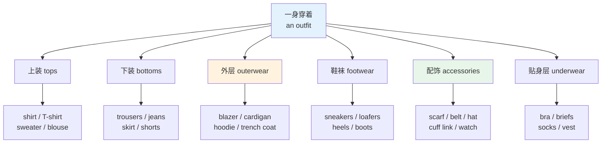
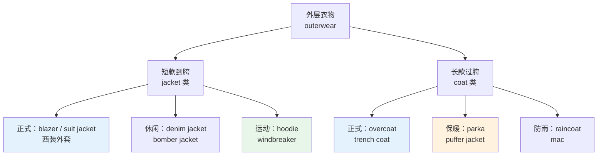
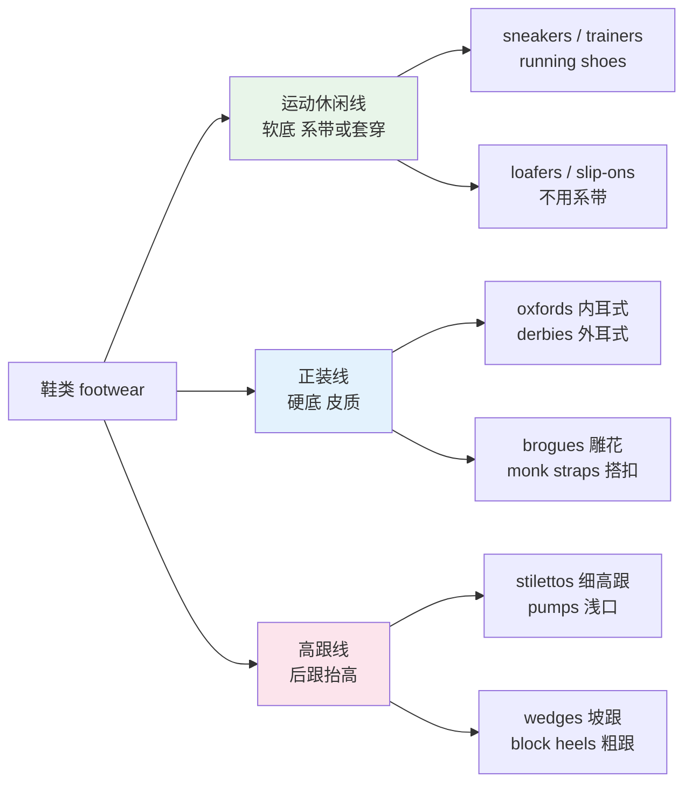
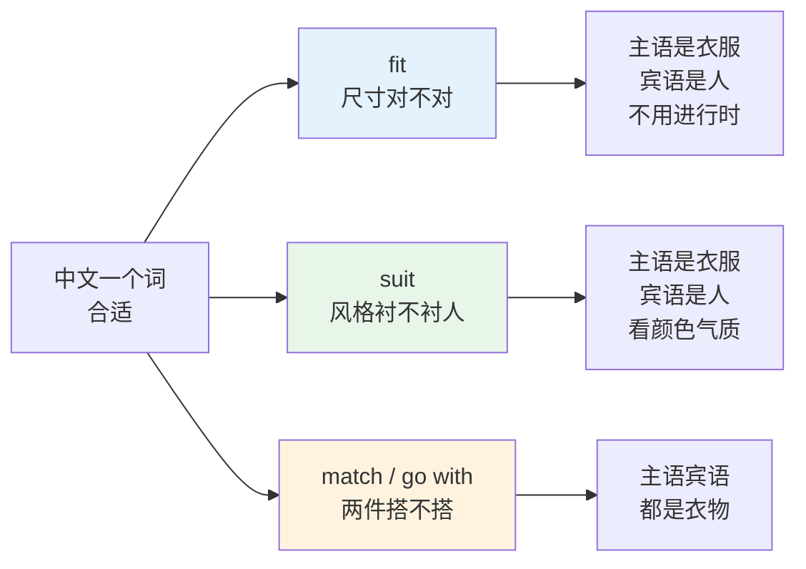
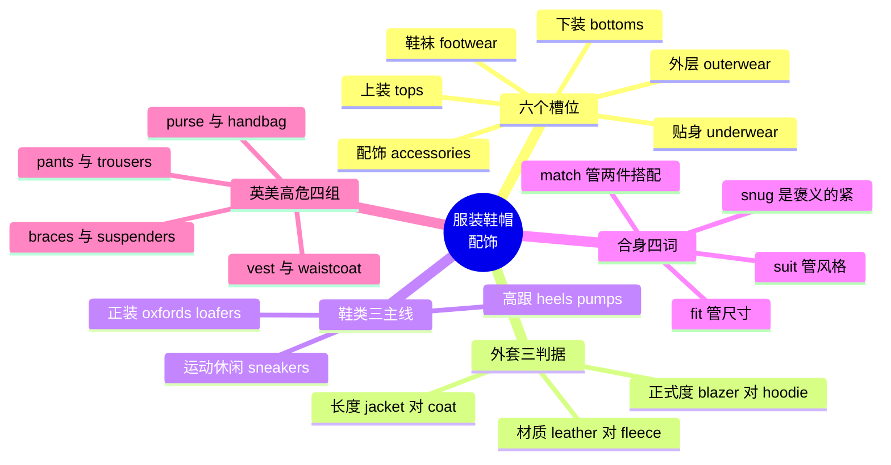

# 服装鞋帽配饰

> [!info] 本篇定位
>
> 「09.衣食住行」六篇的第一篇，管「穿的」。
>
> 读完你能做到三件事：把一身衣服拆成六个可独立命名的槽位，说清 blazer / cardigan / hoodie / trench coat 这类外套的分界线，以及在试衣间里用对 `fit`、`suit`、`match`、`go with` 这四个中文都译作「合适」的词。
>
> 这一篇是纯具象名词章，词条密度高、结构清晰，但英美差异极大——`pants` 在英国指内裤、在美国指长裤，这类雷区本篇会单独列表处理。面料与版型的词还会在 `10.动植物、颜色与感官属性` 的质感篇里被再次用到。

---

## 1. 本篇导读：先把「一身衣服」拆成六个槽位

服装词最容易学成一堆散装名词：记了 `shirt`、`coat`、`shoes`，但描述不出「一件敞着穿的针织外套」或者「不用系鞋带的平底皮鞋」。问题不在词量，在于没有分槽。

母语者描述穿着时，脑子里其实有一套固定的分槽顺序：从贴身到外穿分层，从上到下分部位，最后挂配饰。掌握这个顺序，就能用有限的词组合出无限的描述。

上图是本篇的目录结构。六个槽位里，`outerwear`（外层）和 `accessories`（配饰）是中文学习者最薄弱的两块——中文习惯用「外套」一个词涵盖八种衣服，用「配饰」一个词涵盖二十件东西，英语则是每一件都有独立命名。本篇把这两块作为重点，各给一个完整章节。

还有一个必须先说清的语法事实，因为它影响所有后续例句：

> [!warning] clothes 没有单数
>
> `clothes` /kləʊðz/ 是复数形式，没有单数 `a clothe`。想说「一件衣服」有三种办法：
>
> - ✅ **a piece of clothing** —— 最通用
> - ✅ **a garment** /ˈɡɑːmənt/ —— 书面、行业用语
> - ✅ **an item of clothing** —— 商务、说明书
> - ❌ ~~a clothes~~ / ~~a cloth~~（`cloth` 是「布料」，不是「衣服」）
>
> 同理，`trousers`、`jeans`、`shorts`、`glasses`、`scissors` 这类成双的东西也永远是复数：`a pair of trousers`，不是 ~~a trouser~~。

---

## 2. 上装：从贴身到外穿的三层

### 2.1 有领与无领的分界

上装的第一条分界线是有没有领子和纽扣。有领有扣的走 `shirt` 一系，套头无扣的走 `T-shirt` / `sweater` 一系。

| 英文 | 英式音标 | 美式音标 | 词性 | 中文 | 搭配与说明 |
| --- | --- | --- | --- | --- | --- |
| **shirt** | /ʃɜːt/ | /ʃɜːrt/ | n. | 衬衫 | 默认指男式有领有扣衬衫；a dress shirt 指正装衬衫 |
| **blouse** | /blaʊz/ | /blaʊs/ | n. | 女式衬衫 | 英美清浊不同，英式尾音浊、美式清 |
| **T-shirt** | /ˈtiː ʃɜːt/ | /ˈtiː ʃɜːrt/ | n. | T 恤 | 也写 tee；a plain white tee 素白 T 恤 |
| **tee** | /tiː/ | /tiː/ | n. | T 恤（口语） | 时尚与电商文案里比 T-shirt 更常见 |
| **polo shirt** | /ˈpəʊləʊ ʃɜːt/ | /ˈpoʊloʊ ʃɜːrt/ | n. | Polo 衫 | 有领有三扣，介于 T 恤与衬衫之间 |
| **tank top** | /ˈtæŋk tɒp/ | /ˈtæŋk tɑːp/ | n. | 背心（外穿） | 英式 tank top 传统指无袖针织背心 |
| **vest** | /vest/ | /vest/ | n. | 英：汗衫；美：西装马甲 | 高危词，英美所指完全不同，见第 14 节 |
| **camisole** | /ˈkæmɪsəʊl/ | /ˈkæmɪsoʊl/ | n. | 吊带背心 | 女式，细肩带，常作内搭 |
| **crop top** | /ˈkrɒp tɒp/ | /ˈkrɑːp tɑːp/ | n. | 露脐上衣 | crop 本义「截短」 |
| **top** | /tɒp/ | /tɑːp/ | n. | 上衣（统称） | 女装电商里 tops 是一级分类 |

`shirt` 这个词在英语里默认指有领有扣的衬衫，所以说「我今天穿了件 T 恤」不能说 ~~I wore a shirt~~。要泛指「上衣」，用 `top`：`She's wearing a black top.` 这个用法在服装电商里是标准分类名。

### 2.2 针织上装：sweater 系

| 英文 | 英式音标 | 美式音标 | 词性 | 中文 | 搭配与说明 |
| --- | --- | --- | --- | --- | --- |
| **sweater** | /ˈswetə/ | /ˈswetər/ | n. | 毛衣 | 美式通用词；英式也懂但不是首选 |
| **jumper** | /ˈdʒʌmpə/ | /ˈdʒʌmpər/ | n. | 毛衣（英式） | 美式 jumper 指背带裙，语义完全不同 |
| **pullover** | /ˈpʊləʊvə/ | /ˈpʊloʊvər/ | n. | 套头衫 | 强调「从头套下去」，与开衫对立 |
| **knitwear** | /ˈnɪtweə/ | /ˈnɪtwer/ | n. | 针织衫（统称） | 不可数，商品分类名 |
| **turtleneck** | /ˈtɜːtlnek/ | /ˈtɜːrtlnek/ | n. | 高领毛衣（美式） | 英式常说 polo neck 或 roll neck |
| **polo neck** | /ˈpəʊləʊ nek/ | /ˈpoʊloʊ nek/ | n. | 高领（英式） | 与 polo shirt 不是一回事 |
| **crew neck** | /ˈkruː nek/ | /ˈkruː nek/ | n. | 圆领 | 最常见的领型，源自水手服 |
| **V-neck** | /ˈviː nek/ | /ˈviː nek/ | n. | V 领 | a V-neck sweater |
| **sweatshirt** | /ˈswetʃɜːt/ | /ˈswetʃɜːrt/ | n. | 卫衣（无帽） | 加了帽子才叫 hoodie |
| **cardigan** | /ˈkɑːdɪɡən/ | /ˈkɑːrdɪɡən/ | n. | 开衫 | 前开襟、有扣或拉链，可敞着穿 |

`sweater` 和 `cardigan` 的分界只有一条：前面开不开。套头的是 `sweater` / `pullover`，前面能敞开的是 `cardigan`。这个区分在中文里没有对应的单字词，只能说「套头毛衣」和「开衫毛衣」。

> [!example] 上装词在句子里
>
> - He rolled up the sleeves of his **shirt**.
>   - 他把衬衫袖子卷了起来。
> - I threw a **cardigan** over my **T-shirt**.
>   - 我在 T 恤外面套了件开衫。
> - She wore a cream **turtleneck** under a wool coat.
>   - 她在羊毛大衣里面穿了件米色高领毛衣。

---

## 3. 外套家族：blazer / cardigan / hoodie / trench coat 的分界

### 3.1 三条判据

中文的「外套」在英语里至少对应十五个词。区分它们只需要三条判据：长度、正式度、材质。

上图的第一刀切在长度：到胯骨以上叫 `jacket`，过胯到大腿或更长叫 `coat`。这条线不是绝对的，但足以排除大部分误用——`trench coat` 长及小腿，绝不会被叫作 jacket；`bomber jacket` 收在腰部，也不会被叫作 coat。第二刀切在场合，正式的进办公室与晚宴，休闲的进日常，运动的进健身房和周末。

### 3.2 jacket 类

| 英文 | 英式音标 | 美式音标 | 词性 | 中文 | 搭配与说明 |
| --- | --- | --- | --- | --- | --- |
| **jacket** | /ˈdʒækɪt/ | /ˈdʒækɪt/ | n. | 短外套（统称） | 长度到胯以上都归它 |
| **blazer** | /ˈbleɪzə/ | /ˈbleɪzər/ | n. | 单穿西装外套 | 不配同料裤子，比 suit jacket 随意 |
| **suit jacket** | /ˈsuːt dʒækɪt/ | /ˈsuːt dʒækɪt/ | n. | 西装上衣 | 必须与同料西裤成套 |
| **sport coat** | /ˈspɔːt kəʊt/ | /ˈspɔːrt koʊt/ | n. | 休闲西装（美式） | 花呢或粗纺材质，比 blazer 更随意 |
| **hoodie** | /ˈhʊdi/ | /ˈhʊdi/ | n. | 连帽卫衣 | hood「兜帽」+ -ie；套头与开衫两种 |
| **denim jacket** | /ˈdenɪm dʒækɪt/ | /ˈdenɪm dʒækɪt/ | n. | 牛仔外套 | 口语也叫 jean jacket |
| **bomber jacket** | /ˈbɒmə dʒækɪt/ | /ˈbɑːmər dʒækɪt/ | n. | 飞行员夹克 | 罗纹收口，源自轰炸机机组服 |
| **leather jacket** | /ˈleðə dʒækɪt/ | /ˈleðər dʒækɪt/ | n. | 皮夹克 | a biker jacket 机车夹克 |
| **windbreaker** | /ˈwɪndbreɪkə/ | /ˈwɪndbreɪkər/ | n. | 风衣夹克（美式） | 英式说 windcheater 或 cagoule |
| **fleece** | /fliːs/ | /fliːs/ | n. | 抓绒衣 | 也指羊毛剪下来的整块绒毛 |
| **gilet** | /ˈʒiːleɪ/ | /ʒiˈleɪ/ | n. | 无袖背心外套 | 英式常用，美式多说 vest |
| **puffer jacket** | /ˈpʌfə dʒækɪt/ | /ˈpʌfər dʒækɪt/ | n. | 羽绒服 | 强调蓬松格纹外观 |
| **down jacket** | /ˈdaʊn dʒækɪt/ | /ˈdaʊn dʒækɪt/ | n. | 羽绒服 | down 指鸭鹅绒；与「向下」同形不同义 |

`blazer` 和 `suit jacket` 的分界是中国学习者最容易错的一处。两者外形接近，但 `suit jacket` 是套装的一半，必须配同一块料子裁的裤子；`blazer` 天生就是单件，配卡其裤、牛仔裤都成立。把西装上衣单穿并称为 blazer 是不准确的——面料光泽和裁剪一眼能看出它缺了另一半。

### 3.3 coat 类

| 英文 | 英式音标 | 美式音标 | 词性 | 中文 | 搭配与说明 |
| --- | --- | --- | --- | --- | --- |
| **coat** | /kəʊt/ | /koʊt/ | n. | 大衣（统称） | 长度过胯 |
| **overcoat** | /ˈəʊvəkəʊt/ | /ˈoʊvərkoʊt/ | n. | 长大衣 | 穿在西装外面，正式 |
| **trench coat** | /ˈtrentʃ kəʊt/ | /ˈtrentʃ koʊt/ | n. | 风衣 | 双排扣、腰带、肩章；源自一战战壕 |
| **raincoat** | /ˈreɪnkəʊt/ | /ˈreɪnkoʊt/ | n. | 雨衣 | 英式口语缩略为 mac |
| **mac** | /mæk/ | /mæk/ | n. | 雨衣（英式口语） | Mackintosh 的缩略 |
| **parka** | /ˈpɑːkə/ | /ˈpɑːrkə/ | n. | 派克大衣 | 带毛领兜帽的厚外套 |
| **anorak** | /ˈænəræk/ | /ˈænəræk/ | n. | 防风连帽衣 | 因纽特语借词；英式还引申指「书呆子」 |
| **duffel coat** | /ˈdʌfl kəʊt/ | /ˈdʌfl koʊt/ | n. | 牛角扣大衣 | 木质长扣加绳圈是标志 |
| **peacoat** | /ˈpiːkəʊt/ | /ˈpiːkoʊt/ | n. | 海军呢短大衣 | 双排扣、宽翻领，源自水兵服 |
| **greatcoat** | /ˈɡreɪtkəʊt/ | /ˈɡreɪtkoʊt/ | n. | 军大衣 | 偏文学与历史语境 |
| **cape** | /keɪp/ | /keɪp/ | n. | 披风 | 无袖，从肩部披下 |
| **poncho** | /ˈpɒntʃəʊ/ | /ˈpɑːntʃoʊ/ | n. | 斗篷雨披 | 西班牙语借词，中间开洞套头 |

> [!tip] trench coat 记忆锚点
>
> `trench` /trentʃ/ 本义是「壕沟」。一战英军军官在战壕里穿的防水外套后来民用化，名字保留了下来。记住这个来源，双排扣、腰带、肩章、后背挡雨片这些细节都能从「军装出身」推出来。
>
> 同一逻辑还解释另外三个词：`bomber jacket` 来自轰炸机机组，`peacoat` 来自水兵，`cargo pants` 的侧面大贴袋出自 1938 年英军作战服。军装与工装是英语服装词最大的两个来源池。

---

## 4. 下装：裤装与裙装

### 4.1 裤装

| 英文 | 英式音标 | 美式音标 | 词性 | 中文 | 搭配与说明 |
| --- | --- | --- | --- | --- | --- |
| **trousers** | /ˈtraʊzəz/ | /ˈtraʊzərz/ | n. | 长裤（英式） | 永远复数，a pair of trousers |
| **pants** | /pænts/ | /pænts/ | n. | 美：长裤；英：内裤 | 英美最危险的一组差异 |
| **jeans** | /dʒiːnz/ | /dʒiːnz/ | n. | 牛仔裤 | 永远复数；面料叫 denim |
| **chinos** | /ˈtʃiːnəʊz/ | /ˈtʃiːnoʊz/ | n. | 休闲斜纹棉裤 | 商务休闲的标配下装 |
| **khakis** | /ˈkɑːkiz/ | /ˈkækiz/ | n. | 卡其裤 | 英美元音差别明显 |
| **slacks** | /slæks/ | /slæks/ | n. | 便西裤 | 略偏旧式，中年语域 |
| **cargo pants** | /ˈkɑːɡəʊ pænts/ | /ˈkɑːrɡoʊ pænts/ | n. | 工装裤 | 侧面大贴袋是标志 |
| **shorts** | /ʃɔːts/ | /ʃɔːrts/ | n. | 短裤 | 永远复数 |
| **sweatpants** | /ˈswetpænts/ | /ˈswetpænts/ | n. | 运动卫裤 | 英式也说 tracksuit bottoms |
| **joggers** | /ˈdʒɒɡəz/ | /ˈdʒɑːɡərz/ | n. | 束脚运动裤 | 脚口收紧的 sweatpants |
| **leggings** | /ˈleɡɪŋz/ | /ˈleɡɪŋz/ | n. | 打底裤 | 弹力紧身，不是袜子 |
| **dungarees** | /ˌdʌŋɡəˈriːz/ | /ˌdʌŋɡəˈriːz/ | n. | 背带裤（英式） | 美式说 overalls |
| **overalls** | /ˈəʊvərɔːlz/ | /ˈoʊvərɔːlz/ | n. | 背带工装裤（美式） | 英式 overalls 指连体工作服 |
| **jumpsuit** | /ˈdʒʌmpsuːt/ | /ˈdʒʌmpsuːt/ | n. | 连体裤 | 上下连体，从跳伞服演化 |

### 4.2 裙装与连衣裙

| 英文 | 英式音标 | 美式音标 | 词性 | 中文 | 搭配与说明 |
| --- | --- | --- | --- | --- | --- |
| **skirt** | /skɜːt/ | /skɜːrt/ | n. | 半身裙 | 只有下半身 |
| **dress** | /dres/ | /dres/ | n./v. | 连衣裙；穿衣 | 上下连体；动词义见第 12 节 |
| **gown** | /ɡaʊn/ | /ɡaʊn/ | n. | 礼服长裙 | 也指学位袍、手术袍 |
| **pencil skirt** | /ˈpensl skɜːt/ | /ˈpensl skɜːrt/ | n. | 铅笔裙 | 直筒收身，及膝 |
| **pleated skirt** | /ˈpliːtɪd skɜːt/ | /ˈpliːtɪd skɜːrt/ | n. | 百褶裙 | pleat 是「褶」 |
| **A-line skirt** | /ˈeɪ laɪn skɜːt/ | /ˈeɪ laɪn skɜːrt/ | n. | A 字裙 | 字母形状描述版型 |
| **maxi dress** | /ˈmæksi dres/ | /ˈmæksi dres/ | n. | 长及脚踝的连衣裙 | maxi / midi / mini 三级长度 |
| **midi skirt** | /ˈmɪdi skɜːt/ | /ˈmɪdi skɜːrt/ | n. | 中长裙 | 及小腿肚 |
| **mini skirt** | /ˈmɪni skɜːt/ | /ˈmɪni skɜːrt/ | n. | 迷你裙 | 膝上 |
| **sundress** | /ˈsʌndres/ | /ˈsʌndres/ | n. | 吊带夏裙 | 轻薄无袖 |

> [!warning] skirt 不等于「裙子」的全部
>
> 中文的「裙子」既包括半身裙也包括连衣裙，英语必须分开。
>
> - ❌ ~~She wore a long skirt to the wedding.~~ 如果实际穿的是连衣裙，这句是错的
> - ✅ She wore a long **dress** to the wedding.（连衣裙）
> - ✅ She wore a pleated **skirt** with a white blouse.（半身裙配衬衫）
>
> 判据只有一条：这件衣服有没有覆盖上半身。有则 `dress`，无则 `skirt`。

---

## 5. 内衣、睡衣、泳装与运动装

这一组词日常极常用，但教材通常略过，导致很多人能读技术文档却说不出「换条袜子」。

| 英文 | 英式音标 | 美式音标 | 词性 | 中文 | 搭配与说明 |
| --- | --- | --- | --- | --- | --- |
| **underwear** | /ˈʌndəweə/ | /ˈʌndərwer/ | n. | 内衣（统称） | 不可数，无复数 |
| **underpants** | /ˈʌndəpænts/ | /ˈʌndərpænts/ | n. | 内裤 | 永远复数 |
| **briefs** | /briːfs/ | /briːfs/ | n. | 三角内裤 | 与 brief「简短的」同形 |
| **boxers** | /ˈbɒksəz/ | /ˈbɑːksərz/ | n. | 平角内裤 | 全称 boxer shorts |
| **knickers** | /ˈnɪkəz/ | /ˈnɪkərz/ | n. | 女式内裤（英式） | 美式说 panties |
| **panties** | /ˈpæntiz/ | /ˈpæntiz/ | n. | 女式内裤（美式） | 英式听着略幼稚 |
| **bra** | /brɑː/ | /brɑː/ | n. | 文胸 | brassiere 的缩略，全称已罕用 |
| **undershirt** | /ˈʌndəʃɜːt/ | /ˈʌndərʃɜːrt/ | n. | 汗衫（美式） | 英式就叫 vest |
| **lingerie** | /ˈlænʒəri/ | /ˌlɑːnʒəˈreɪ/ | n. | 女式内衣（雅称） | 法语借词，英美重音位置不同 |
| **socks** | /sɒks/ | /sɑːks/ | n. | 袜子 | a pair of socks |
| **tights** | /taɪts/ | /taɪts/ | n. | 连裤袜（英式） | 也指舞蹈紧身裤 |
| **pantyhose** | /ˈpæntihəʊz/ | /ˈpæntihoʊz/ | n. | 连裤袜（美式） | 不可数，作复数处理：a pair of pantyhose |
| **stockings** | /ˈstɒkɪŋz/ | /ˈstɑːkɪŋz/ | n. | 长筒袜 | 分体式，需吊带固定 |
| **pyjamas** | /pəˈdʒɑːməz/ | — | n. | 睡衣（英式拼写） | 印地语借词 |
| **pajamas** | — | /pəˈdʒɑːməz/ | n. | 睡衣（美式拼写） | 口语缩略 PJs /ˌpiːˈdʒeɪz/ |
| **nightgown** | /ˈnaɪtɡaʊn/ | /ˈnaɪtɡaʊn/ | n. | 睡裙 | 口语 nightie |
| **dressing gown** | /ˈdresɪŋ ɡaʊn/ | /ˈdresɪŋ ɡaʊn/ | n. | 睡袍（英式） | 美式说 robe 或 bathrobe |
| **bathrobe** | /ˈbɑːθrəʊb/ | /ˈbæθroʊb/ | n. | 浴袍 | 英美 a 音差别明显 |
| **swimsuit** | /ˈswɪmsuːt/ | /ˈswɪmsuːt/ | n. | 泳衣 | 通用词，男女皆可 |
| **swimming trunks** | /ˈswɪmɪŋ trʌŋks/ | /ˈswɪmɪŋ trʌŋks/ | n. | 男泳裤 | 永远复数 |
| **bikini** | /bɪˈkiːni/ | /bɪˈkiːni/ | n. | 比基尼 | 得名自太平洋环礁 |
| **tracksuit** | /ˈtræksuːt/ | /ˈtræksuːt/ | n. | 运动套装 | 英式常用 |
| **activewear** | /ˈæktɪvweə/ | /ˈæktɪvwer/ | n. | 运动服（商品类） | 电商分类名，不可数 |
| **sportswear** | /ˈspɔːtsweə/ | /ˈspɔːrtswer/ | n. | 运动服 | 同上，更传统 |
| **uniform** | /ˈjuːnɪfɔːm/ | /ˈjuːnɪfɔːrm/ | n. | 制服 | in uniform 穿着制服 |
| **apron** | /ˈeɪprən/ | /ˈeɪprən/ | n. | 围裙 | 注意读 /ˈeɪ-/ 不是 /ˈæ-/ |
| **bib** | /bɪb/ | /bɪb/ | n. | 围嘴 | 婴儿用；也指背带裤的胸片 |
| **diaper** | — | /ˈdaɪpər/ | n. | 尿布（美式） | 英式说 nappy /ˈnæpi/ |

> [!warning] 三个高危词
>
> - **pants**：英国人听到 `Nice pants!` 会理解成夸内裤。跟英国人说长裤一律用 `trousers`。
> - **vest**：英式指贴身汗衫，美式指西装马甲。要说清楚就用 `waistcoat`（马甲）或 `undershirt`（汗衫）。
> - **suspenders**：美式是背带（吊裤带），英式是吊袜带。背带在英式叫 `braces` /ˈbreɪsɪz/。

---

## 6. 鞋类：sneakers / loafers / heels 三条主线

### 6.1 三条主线的分界

上图把鞋分成三条互不重叠的线。`loafers` 落在运动休闲线与正装线之间，这也是它最容易被误用的地方——它是皮质的，但不用系带，所以在正式度上永远低于 `oxfords`。三条线各自有一个统称词（`sneakers`、`dress shoes`、`heels`），日常口语大部分时候只用这三个统称。

### 6.2 鞋类词表

| 英文 | 英式音标 | 美式音标 | 词性 | 中文 | 搭配与说明 |
| --- | --- | --- | --- | --- | --- |
| **shoes** | /ʃuːz/ | /ʃuːz/ | n. | 鞋 | 单数 shoe，通常成对说 |
| **sneakers** | /ˈsniːkəz/ | /ˈsniːkərz/ | n. | 运动鞋（美式） | 词根 sneak「偷偷走」，因为软底无声 |
| **trainers** | /ˈtreɪnəz/ | /ˈtreɪnərz/ | n. | 运动鞋（英式） | 美国人听到会先想到「教练」 |
| **running shoes** | /ˈrʌnɪŋ ʃuːz/ | /ˈrʌnɪŋ ʃuːz/ | n. | 跑鞋 | 功能细分 |
| **loafers** | /ˈləʊfəz/ | /ˈloʊfərz/ | n. | 乐福鞋 | 无鞋带的浅口皮鞋；loaf「闲逛」 |
| **slip-ons** | /ˈslɪp ɒnz/ | /ˈslɪp ɑːnz/ | n. | 一脚蹬 | 泛指所有不用系带的鞋 |
| **heels** | /hiːlz/ | /hiːlz/ | n. | 高跟鞋 | 全称 high heels；也指鞋后跟本身 |
| **stilettos** | /stɪˈletəʊz/ | /stɪˈletoʊz/ | n. | 细高跟 | 意大利语「小匕首」 |
| **pumps** | /pʌmps/ | /pʌmps/ | n. | 浅口鞋 | 英式 pumps 常指软底平底鞋 |
| **flats** | /flæts/ | /flæts/ | n. | 平底鞋 | 女鞋分类，与 heels 对立 |
| **oxfords** | /ˈɒksfədz/ | /ˈɑːksfərdz/ | n. | 牛津鞋 | 内耳式系带，最正式 |
| **brogues** | /brəʊɡz/ | /broʊɡz/ | n. | 布洛克鞋 | 打孔雕花，正式度略降 |
| **boots** | /buːts/ | /buːts/ | n. | 靴子 | 高过脚踝 |
| **ankle boots** | /ˈæŋkl buːts/ | /ˈæŋkl buːts/ | n. | 短靴 | 刚过踝骨 |
| **Chelsea boots** | /ˈtʃelsi buːts/ | /ˈtʃelsi buːts/ | n. | 切尔西靴 | 侧面松紧带，无鞋带 |
| **hiking boots** | /ˈhaɪkɪŋ buːts/ | /ˈhaɪkɪŋ buːts/ | n. | 登山靴 | 硬底防滑 |
| **wellies** | /ˈweliz/ | — | n. | 雨靴（英式口语） | 全称 wellington boots |
| **rain boots** | — | /ˈreɪn buːts/ | n. | 雨靴（美式） | 与 wellies 同义 |
| **sandals** | /ˈsændlz/ | /ˈsændlz/ | n. | 凉鞋 | 露脚趾，有绑带 |
| **flip-flops** | /ˈflɪp flɒps/ | /ˈflɪp flɑːps/ | n. | 人字拖 | 拟声词，走路啪嗒声 |
| **slippers** | /ˈslɪpəz/ | /ˈslɪpərz/ | n. | 拖鞋（室内） | 户外的塑料拖鞋不叫 slippers |
| **moccasins** | /ˈmɒkəsɪnz/ | /ˈmɑːkəsɪnz/ | n. | 莫卡辛鞋 | 北美原住民语借词 |
| **clogs** | /klɒɡz/ | /klɑːɡz/ | n. | 木底鞋 | 荷兰木鞋是原型 |
| **mules** | /mjuːlz/ | /mjuːlz/ | n. | 穆勒鞋（露跟便鞋） | 只有前脸没有后帮，与 mule「骡子」同形 |
| **cleats** | /kliːts/ | /kliːts/ | n. | 钉鞋（美式） | 英式说 football boots |

### 6.3 鞋的部件与配件

| 英文 | 英式音标 | 美式音标 | 词性 | 中文 | 搭配与说明 |
| --- | --- | --- | --- | --- | --- |
| **sole** | /səʊl/ | /soʊl/ | n. | 鞋底 | 同形词还指「鳎鱼」和「唯一的」 |
| **insole** | /ˈɪnsəʊl/ | /ˈɪnsoʊl/ | n. | 鞋垫 | 也说 footbed |
| **heel** | /hiːl/ | /hiːl/ | n. | 鞋跟；脚跟 | 身体部位与鞋部件同词 |
| **toe** | /təʊ/ | /toʊ/ | n. | 鞋头；脚趾 | a pointed toe 尖头 |
| **toe cap** | /ˈtəʊ kæp/ | /ˈtoʊ kæp/ | n. | 鞋头包片 | steel toe cap 钢头劳保鞋 |
| **tongue** | /tʌŋ/ | /tʌŋ/ | n. | 鞋舌 | 与「舌头」同词 |
| **shoelace** | /ˈʃuːleɪs/ | /ˈʃuːleɪs/ | n. | 鞋带 | 也简称 laces |
| **eyelet** | /ˈaɪlət/ | /ˈaɪlət/ | n. | 鞋带孔 | eye「孔眼」+ 小词尾 -let |
| **shoehorn** | /ˈʃuːhɔːn/ | /ˈʃuːhɔːrn/ | n./v. | 鞋拔；硬塞进 | 动词义常用于比喻 |
| **shoe polish** | /ˈʃuː pɒlɪʃ/ | /ˈʃuː pɑːlɪʃ/ | n. | 鞋油 | polish 动词是「擦亮」 |
| **arch support** | /ˈɑːtʃ səpɔːt/ | /ˈɑːrtʃ səpɔːrt/ | n. | 足弓支撑 | 买鞋时的功能描述 |

> [!example] 鞋类词在句子里
>
> - These **trainers** are killing my feet.
>   - 这双运动鞋磨得我脚疼。
> - He kicked off his **shoes** and put on **slippers**.
>   - 他把鞋一蹬，换上了拖鞋。
> - The **soles** are worn through — time for a new pair.
>   - 鞋底磨穿了，该换双新的了。

---

## 7. 帽子、包与随身配饰

| 英文 | 英式音标 | 美式音标 | 词性 | 中文 | 搭配与说明 |
| --- | --- | --- | --- | --- | --- |
| **hat** | /hæt/ | /hæt/ | n. | 帽子（有檐一圈） | 与 cap 的分界是有没有整圈帽檐 |
| **cap** | /kæp/ | /kæp/ | n. | 鸭舌帽 | 只有前面一块檐；a baseball cap |
| **beanie** | /ˈbiːni/ | /ˈbiːni/ | n. | 针织毛线帽 | 英式也说 woolly hat |
| **beret** | /ˈbereɪ/ | /bəˈreɪ/ | n. | 贝雷帽 | 英美重音位置不同 |
| **brim** | /brɪm/ | /brɪm/ | n. | 帽檐 | a wide-brimmed hat 宽檐帽 |
| **visor** | /ˈvaɪzə/ | /ˈvaɪzər/ | n. | 遮阳帽檐 | 只有檐没有顶 |
| **hood** | /hʊd/ | /hʊd/ | n. | 兜帽 | 连在衣服上的那种 |
| **scarf** | /skɑːf/ | /skɑːrf/ | n. | 围巾；丝巾 | 复数 scarves 或 scarfs 都可 |
| **shawl** | /ʃɔːl/ | /ʃɔːl/ | n. | 披肩 | 比围巾宽，覆盖肩背 |
| **gloves** | /ɡlʌvz/ | /ɡlʌvz/ | n. | 手套（分指） | a pair of gloves |
| **mittens** | /ˈmɪtnz/ | /ˈmɪtnz/ | n. | 连指手套 | 只有拇指单独分出 |
| **belt** | /belt/ | /belt/ | n. | 腰带 | do up / undo your belt 系与解 |
| **buckle** | /ˈbʌkl/ | /ˈbʌkl/ | n./v. | 带扣；扣紧 | buckle up 系安全带 |
| **braces** | /ˈbreɪsɪz/ | — | n. | 背带（英式） | 美式 suspenders；也指牙套 |
| **suspenders** | — | /səˈspendərz/ | n. | 背带（美式） | 英式此词指吊袜带 |
| **handbag** | /ˈhændbæɡ/ | /ˈhændbæɡ/ | n. | 手提包（英式） | 美式常说 purse |
| **purse** | /pɜːs/ | /pɜːrs/ | n. | 英：钱包；美：手提包 | 又一组英美错位 |
| **wallet** | /ˈwɒlɪt/ | /ˈwɑːlɪt/ | n. | 钱夹 | 折叠式，放卡与纸币 |
| **backpack** | /ˈbækpæk/ | /ˈbækpæk/ | n. | 双肩包 | 英式也说 rucksack |
| **rucksack** | /ˈrʌksæk/ | /ˈrʌksæk/ | n. | 登山包（英式） | 德语借词 |
| **tote bag** | /ˈtəʊt bæɡ/ | /ˈtoʊt bæɡ/ | n. | 托特包 | 敞口大提包 |
| **briefcase** | /ˈbriːfkeɪs/ | /ˈbriːfkeɪs/ | n. | 公文包 | brief 在法律里指「案卷」 |
| **satchel** | /ˈsætʃəl/ | /ˈsætʃəl/ | n. | 单肩书包 | 硬质翻盖式 |
| **umbrella** | /ʌmˈbrelə/ | /ʌmˈbrelə/ | n. | 伞 | 重音在第二音节 |
| **sunglasses** | /ˈsʌnɡlɑːsɪz/ | /ˈsʌnɡlæsɪz/ | n. | 墨镜 | 口语 shades |
| **glasses** | /ˈɡlɑːsɪz/ | /ˈɡlæsɪz/ | n. | 眼镜 | 永远复数；一副是 a pair |
| **watch** | /wɒtʃ/ | /wɑːtʃ/ | n. | 手表 | wear a watch，不用 put |
| **watch strap** | /ˈwɒtʃ stræp/ | /ˈwɑːtʃ stræp/ | n. | 表带 | 美式也说 watchband |

`hat` 和 `cap` 的分界很实用：帽檐绕一整圈的是 `hat`，只有前面一块的是 `cap`。棒球帽只能是 `a baseball cap`，礼帽只能是 `a top hat`。中文的「帽子」不分这两类，所以这是需要专门记的一处。

---

## 8. 首饰与正装小件：cuff link 的世界

正装配件是商务场合的隐形语言，也是词汇书最常漏掉的一块。

| 英文 | 英式音标 | 美式音标 | 词性 | 中文 | 搭配与说明 |
| --- | --- | --- | --- | --- | --- |
| **tie** | /taɪ/ | /taɪ/ | n./v. | 领带；系 | 动词 tie a tie 打领带 |
| **bow tie** | /ˈbəʊ taɪ/ | /ˈboʊ taɪ/ | n. | 领结 | bow 此处读 /bəʊ/ 不是 /baʊ/ |
| **necktie** | /ˈnektaɪ/ | /ˈnektaɪ/ | n. | 领带（正式说法） | 美式书面语常用 |
| **cuff** | /kʌf/ | /kʌf/ | n. | 袖口；裤脚翻边 | 也指警方的「手铐」cuffs |
| **cuff link** | /ˈkʌf lɪŋk/ | /ˈkʌf lɪŋk/ | n. | 袖扣 | 成对使用，配法式双叠袖口 |
| **collar** | /ˈkɒlə/ | /ˈkɑːlər/ | n. | 衣领 | 也指狗项圈；white-collar 白领 |
| **collar stay** | /ˈkɒlə steɪ/ | /ˈkɑːlər steɪ/ | n. | 领撑 | 插进领尖夹层的小硬片 |
| **lapel** | /ləˈpel/ | /ləˈpel/ | n. | 西装翻领 | 重音在后 |
| **pocket square** | /ˈpɒkɪt skweə/ | /ˈpɑːkɪt skwer/ | n. | 口袋巾 | 塞在西装胸袋 |
| **tie clip** | /ˈtaɪ klɪp/ | /ˈtaɪ klɪp/ | n. | 领带夹 | 也说 tie bar |
| **lapel pin** | /ləˈpel pɪn/ | /ləˈpel pɪn/ | n. | 领针 | 徽章类 |
| **brooch** | /brəʊtʃ/ | /broʊtʃ/ | n. | 胸针 | 拼写有 oo 但读 /əʊ/ |
| **necklace** | /ˈnekləs/ | /ˈnekləs/ | n. | 项链 | 尾音 /-ləs/ 不读 /leɪs/ |
| **pendant** | /ˈpendənt/ | /ˈpendənt/ | n. | 吊坠 | 挂在项链上的那一块 |
| **bracelet** | /ˈbreɪslət/ | /ˈbreɪslət/ | n. | 手链 | brace「臂」+ 小词尾 |
| **earrings** | /ˈɪərɪŋz/ | /ˈɪrɪŋz/ | n. | 耳环 | 通常成对 |
| **ring** | /rɪŋ/ | /rɪŋ/ | n. | 戒指 | a wedding ring 婚戒 |
| **jewellery** | /ˈdʒuːəlri/ | — | n. | 首饰（英式拼写） | 不可数 |
| **jewelry** | — | /ˈdʒuːəlri/ | n. | 首饰（美式拼写） | 少一个 l |
| **hairpin** | /ˈheəpɪn/ | /ˈherpɪn/ | n. | 发夹 | 也说 hair clip |

> [!warning] necklace 的读音陷阱
>
> `necklace` 里的 `lace` 不读 /leɪs/。整词是 /ˈnekləs/，第二音节弱读成 /ləs/。
>
> - ❌ ~~/ˈneklɛɪs/~~
> - ✅ **/ˈnekləs/**
>
> 同类陷阱：`brooch` 拼写有 `oo` 却读 /brəʊtʃ/；`suede` 拼写像法语却读 /sweɪd/。这三个词是服装类里读音与拼写背离最严重的。

---

## 9. 面料与材质

### 9.1 天然纤维

| 英文 | 英式音标 | 美式音标 | 词性 | 中文 | 搭配与说明 |
| --- | --- | --- | --- | --- | --- |
| **cotton** | /ˈkɒtn/ | /ˈkɑːtn/ | n. | 棉 | 100% cotton 纯棉 |
| **linen** | /ˈlɪnɪn/ | /ˈlɪnɪn/ | n. | 亚麻 | 也指「床单被套」等布草 |
| **wool** | /wʊl/ | /wʊl/ | n. | 羊毛 | 形容词英式 woollen 美式 woolen |
| **merino** | /məˈriːnəʊ/ | /məˈriːnoʊ/ | n. | 美利奴羊毛 | 细软不扎皮肤 |
| **cashmere** | /ˈkæʃmɪə/ | /ˈkæʒmɪr/ | n. | 羊绒 | 得名自克什米尔 |
| **silk** | /sɪlk/ | /sɪlk/ | n. | 丝绸 | silky 是形容词，指手感 |
| **leather** | /ˈleðə/ | /ˈleðər/ | n. | 皮革 | genuine leather 真皮 |
| **suede** | /sweɪd/ | /sweɪd/ | n. | 麂皮绒 | 法语借词，读音无 u |
| **fur** | /fɜː/ | /fɜːr/ | n. | 毛皮 | faux fur /ˌfəʊ ˈfɜː/ 人造毛 |
| **down** | /daʊn/ | /daʊn/ | n. | 羽绒 | 与「向下」同形，靠语境区分 |
| **hemp** | /hemp/ | /hemp/ | n. | 大麻纤维 | 环保面料 |

### 9.2 合成纤维与织法

| 英文 | 英式音标 | 美式音标 | 词性 | 中文 | 搭配与说明 |
| --- | --- | --- | --- | --- | --- |
| **polyester** | /ˌpɒliˈestə/ | /ˌpɑːliˈestər/ | n. | 涤纶 | poly-「多」+ ester |
| **nylon** | /ˈnaɪlɒn/ | /ˈnaɪlɑːn/ | n. | 尼龙 | 杜邦公司造词 |
| **spandex** | /ˈspændeks/ | /ˈspændeks/ | n. | 氨纶（美式） | 英式通用词是 elastane /ɪˈlæsteɪn/ |
| **Lycra** | /ˈlaɪkrə/ | /ˈlaɪkrə/ | n. | 莱卡 | 商标名当通用词用 |
| **acrylic** | /əˈkrɪlɪk/ | /əˈkrɪlɪk/ | adj./n. | 腈纶的 | 廉价羊毛替代 |
| **denim** | /ˈdenɪm/ | /ˈdenɪm/ | n. | 牛仔布 | 来自法国 de Nîmes |
| **corduroy** | /ˈkɔːdərɔɪ/ | /ˈkɔːrdərɔɪ/ | n. | 灯芯绒 | 口语缩略 cords |
| **tweed** | /twiːd/ | /twiːd/ | n. | 粗花呢 | 苏格兰传统面料 |
| **flannel** | /ˈflænl/ | /ˈflænl/ | n. | 法兰绒 | 格子衬衫的经典用料 |
| **velvet** | /ˈvelvɪt/ | /ˈvelvɪt/ | n. | 天鹅绒 | 表面短绒有光泽 |
| **satin** | /ˈsætɪn/ | /ˈsætn/ | n. | 缎面 | 织法名，不限纤维 |
| **chiffon** | /ˈʃɪfɒn/ | /ʃɪˈfɑːn/ | n. | 雪纺 | 英美重音位置不同 |
| **lace** | /leɪs/ | /leɪs/ | n. | 蕾丝 | 与「鞋带」同词 |
| **canvas** | /ˈkænvəs/ | /ˈkænvəs/ | n. | 帆布 | 帆布鞋 canvas shoes |
| **jersey** | /ˈdʒɜːzi/ | /ˈdʒɜːrzi/ | n. | 针织平纹布 | T 恤最常用面料 |
| **knit** | /nɪt/ | /nɪt/ | v./n. | 编织；针织物 | k 不发音 |
| **woven** | /ˈwəʊvn/ | /ˈwoʊvn/ | adj. | 梭织的 | weave 的过去分词 |
| **fabric** | /ˈfæbrɪk/ | /ˈfæbrɪk/ | n. | 面料 | 可数，指具体某种布 |
| **textile** | /ˈtekstaɪl/ | /ˈtekstaɪl/ | n. | 纺织品 | 行业术语 |
| **fibre** | /ˈfaɪbə/ | — | n. | 纤维（英式拼写） | 美式 fiber /ˈfaɪbər/ |

### 9.3 花纹与工艺

| 英文 | 英式音标 | 美式音标 | 词性 | 中文 | 搭配与说明 |
| --- | --- | --- | --- | --- | --- |
| **stripe** | /straɪp/ | /straɪp/ | n. | 条纹 | 形容词 striped |
| **plaid** | /plæd/ | /plæd/ | n./adj. | 格纹（美式） | 英式常说 checked |
| **checked** | /tʃekt/ | /tʃekt/ | adj. | 格子的（英式） | a checked shirt |
| **polka dot** | /ˈpɒlkə dɒt/ | /ˈpoʊlkə dɑːt/ | n. | 圆点 | 英美元音差别大 |
| **floral** | /ˈflɔːrəl/ | /ˈflɔːrəl/ | adj. | 碎花的 | a floral dress |
| **paisley** | /ˈpeɪzli/ | /ˈpeɪzli/ | n. | 佩斯利花纹 | 腰果形，领带常见 |
| **herringbone** | /ˈherɪŋbəʊn/ | /ˈherɪŋboʊn/ | n. | 人字纹 | 字面「鲱鱼骨」 |
| **plain** | /pleɪn/ | /pleɪn/ | adj. | 素色无花纹的 | plain white 纯白 |
| **solid** | /ˈsɒlɪd/ | /ˈsɑːlɪd/ | adj. | 纯色的（美式） | solid navy 纯藏青 |
| **embroidery** | /ɪmˈbrɔɪdəri/ | /ɪmˈbrɔɪdəri/ | n. | 刺绣 | 动词 embroider |
| **print** | /prɪnt/ | /prɪnt/ | n. | 印花 | a leopard print 豹纹 |
| **pleat** | /pliːt/ | /pliːt/ | n./v. | 褶；打褶 | pleated trousers 打褶西裤 |
| **ruffle** | /ˈrʌfl/ | /ˈrʌfl/ | n. | 荷叶边 | 也作动词「弄乱」 |
| **seam** | /siːm/ | /siːm/ | n. | 缝线 | come apart at the seams 开线 |
| **hem** | /hem/ | /hem/ | n./v. | 下摆；缝边 | hem the trousers 改裤长 |
| **lining** | /ˈlaɪnɪŋ/ | /ˈlaɪnɪŋ/ | n. | 里衬 | silver lining 一线希望（习语） |
| **zip** | /zɪp/ | — | n./v. | 拉链（英式） | 美式 zipper /ˈzɪpər/ |
| **button** | /ˈbʌtn/ | /ˈbʌtn/ | n./v. | 纽扣；扣上 | button up 扣好 |
| **snap** | /snæp/ | /snæp/ | n. | 按扣 | 英式 press stud |
| **Velcro** | /ˈvelkrəʊ/ | /ˈvelkroʊ/ | n. | 魔术贴 | 商标名，通用化 |
| **drawstring** | /ˈdrɔːstrɪŋ/ | /ˈdrɔːstrɪŋ/ | n. | 抽绳 | 帽衫和运动裤腰上那根 |
| **elastic** | /ɪˈlæstɪk/ | /ɪˈlæstɪk/ | n./adj. | 松紧带；有弹性的 | an elastic waistband |
| **waistband** | /ˈweɪstbænd/ | /ˈweɪstbænd/ | n. | 腰头 | 裤裙腰部那一圈 |

> [!tip] 面料名的一个规律
>
> 面料词有一批直接取自**地名**：`denim` 来自法国尼姆（serge de Nîmes），`jeans` 来自意大利热那亚（Genoa 的法语名 Gênes），`cashmere` 来自克什米尔，`chino` 来自中南美洲对中国产斜纹布的称呼。`tweed` 常被说成来自苏格兰特威德河，更可靠的说法是苏格兰语 `tweel`（即 twill 斜纹）被伦敦商人误抄，河名是事后附会。
>
> 另一批是**商标名通用化**：`Lycra`、`Velcro`、`Spandex`、`Gore-Tex` 都是先有品牌后成通用词。这类词在正式书面语里首字母仍可大写，日常小写即可。

---

## 10. 版型与合身度：loose / snug / tailored

### 10.1 松紧度的五级刻度

中文描述衣服松紧只有「松、紧、合身」三档，英语的刻度要细得多，而且带明显褒贬。

| 英文 | 英式音标 | 美式音标 | 词性 | 中文 | 搭配与说明 |
| --- | --- | --- | --- | --- | --- |
| **tight** | /taɪt/ | /taɪt/ | adj. | 紧的 | 中性偏贬，暗示不舒服 |
| **snug** | /snʌɡ/ | /snʌɡ/ | adj. | 紧贴而舒适的 | 褒义，强调贴合无空隙 |
| **fitted** | /ˈfɪtɪd/ | /ˈfɪtɪd/ | adj. | 收身的 | 剪裁贴合身体曲线 |
| **loose** | /luːs/ | /luːs/ | adj. | 宽松的 | 中性，可褒可贬 |
| **baggy** | /ˈbæɡi/ | /ˈbæɡi/ | adj. | 松垮的 | 偏贬，像口袋一样耷拉 |
| **oversized** | /ˌəʊvəˈsaɪzd/ | /ˌoʊvərˈsaɪzd/ | adj. | 超大版型 | 时尚语境是褒义，是设计而非失误 |
| **roomy** | /ˈruːmi/ | /ˈruːmi/ | adj. | 宽敞的 | 褒义，多用于鞋与包 |
| **clingy** | /ˈklɪŋi/ | /ˈklɪŋi/ | adj. | 黏身的 | 贬义，面料贴住皮肤 |

`snug` 和 `tight` 是这一组的关键对立。同样是紧，`snug` 说的是「刚刚好贴合、很舒服」，`tight` 说的是「勒得慌」。买鞋时店员问 `How does it feel?`，回答 `It's snug` 是「合脚」，回答 `It's a bit tight` 是「有点挤，能换大半码吗」。这一个词的差别直接决定店员下一步的动作。

### 10.2 裁剪与版型

| 英文 | 英式音标 | 美式音标 | 词性 | 中文 | 搭配与说明 |
| --- | --- | --- | --- | --- | --- |
| **fit** | /fɪt/ | /fɪt/ | n. | 版型 | a slim fit / a relaxed fit |
| **cut** | /kʌt/ | /kʌt/ | n. | 剪裁 | a classic cut 经典剪裁 |
| **tailored** | /ˈteɪləd/ | /ˈteɪlərd/ | adj. | 定制剪裁的 | 也引申为「量身定做的方案」 |
| **bespoke** | /bɪˈspəʊk/ | /bɪˈspoʊk/ | adj. | 全定制的 | 英式，比 tailored 更高一档 |
| **made-to-measure** | /ˌmeɪd tə ˈmeʒə/ | /ˌmeɪd tə ˈmeʒər/ | adj. | 量体半定制 | 介于成衣与全定制之间 |
| **off-the-rack** | /ˌɒf ðə ˈræk/ | /ˌɔːf ðə ˈræk/ | adj. | 成衣现货的（美式） | 英式说 off-the-peg |
| **slim fit** | /ˈslɪm fɪt/ | /ˈslɪm fɪt/ | n. | 修身版 | 商品标签常见 |
| **regular fit** | /ˈreɡjələ fɪt/ | /ˈreɡjələr fɪt/ | n. | 标准版 | 默认版型 |
| **relaxed fit** | /rɪˈlækst fɪt/ | /rɪˈlækst fɪt/ | n. | 宽松版 | 比 regular 再放一档 |
| **skinny** | /ˈskɪni/ | /ˈskɪni/ | adj. | 紧身的 | skinny jeans 紧身牛仔裤 |
| **straight-leg** | /ˈstreɪt leɡ/ | /ˈstreɪt leɡ/ | adj. | 直筒的 | 裤型描述 |
| **tapered** | /ˈteɪpəd/ | /ˈteɪpərd/ | adj. | 收口的 | 从大腿往下渐窄 |
| **flared** | /fleəd/ | /flerd/ | adj. | 喇叭的 | 从膝盖往下渐宽 |
| **cropped** | /krɒpt/ | /krɑːpt/ | adj. | 短款的 | cropped trousers 九分裤 |
| **high-waisted** | /ˌhaɪ ˈweɪstɪd/ | /ˌhaɪ ˈweɪstɪd/ | adj. | 高腰的 | 反义 low-rise |
| **sleeveless** | /ˈsliːvləs/ | /ˈsliːvləs/ | adj. | 无袖的 | -less 后缀表「没有」 |
| **long-sleeved** | /ˌlɒŋ ˈsliːvd/ | /ˌlɔːŋ ˈsliːvd/ | adj. | 长袖的 | 短袖 short-sleeved |
| **petite** | /pəˈtiːt/ | /pəˈtiːt/ | adj. | 小个子版型 | 女装尺码线，非贬义 |

### 10.3 尺码词

| 英文 | 英式音标 | 美式音标 | 词性 | 中文 | 搭配与说明 |
| --- | --- | --- | --- | --- | --- |
| **size** | /saɪz/ | /saɪz/ | n. | 尺码 | What size are you? |
| **one size fits all** | — | — | phr. | 均码 | 也引申指「一刀切方案」 |
| **size up** | — | — | v. | 买大一码 | 也指「打量某人」 |
| **size down** | — | — | v. | 买小一码 | 与 size up 对称 |
| **true to size** | — | — | phr. | 尺码标准 | 电商评论高频短语 |
| **runs small** | — | — | phr. | 偏小 | This brand runs small. |
| **runs large** | — | — | phr. | 偏大 | 反义 |
| **waist** | /weɪst/ | /weɪst/ | n. | 腰围 | 与 waste「浪费」同音 |
| **inseam** | /ˈɪnsiːm/ | /ˈɪnsiːm/ | n. | 内缝长（裤长） | 买裤子必填的数字 |
| **bust** | /bʌst/ | /bʌst/ | n. | 胸围（女装） | 男装用 chest |
| **chest** | /tʃest/ | /tʃest/ | n. | 胸围（男装） | a 40-inch chest |

---

## 11. 试穿与购买：fit / suit / match 的分工

### 11.1 三个词各管一件事

`fit`、`suit`、`match` 中文都能译成「合适」，但它们在英语里分别对应三个完全不同的判断。

上图的三条分支互不重叠。`fit` 只回答尺寸问题——大了小了长了短了；`suit` 只回答「这个颜色、这个款式配不配这个人」；`match` 和 `go with` 只回答「这两件东西能不能一起穿」。三个词的主语和宾语类型也不同：前两个是「衣服 + 人」，第三个是「衣服 + 衣服」。

| 英文 | 英式音标 | 美式音标 | 词性 | 中文 | 搭配与说明 |
| --- | --- | --- | --- | --- | --- |
| **fit** | /fɪt/ | /fɪt/ | v. | （尺寸）合身 | The jacket fits me. 不用进行时 |
| **suit** | /suːt/ | /suːt/ | v. | （风格）适合某人 | That colour suits you. |
| **match** | /mætʃ/ | /mætʃ/ | v. | 与……相配 | The tie matches the shirt. |
| **go with** | — | — | v. | 与……搭 | These shoes go with anything. |
| **team with** | — | — | v. | 搭配（英式时尚文案） | Team it with white jeans. |
| **try on** | — | — | v. | 试穿 | 可分开：try it on |

`team with` 只活在英式时尚杂志与电商文案里，口语不说。`match` 要求两件东西在颜色或图案上真的成对，`go with` 只要求「放在一起不冲突」，宽松得多——所以 `These shoes go with anything.` 成立，换成 `match anything` 就别扭。

### 11.2 试衣间与退换货

| 英文 | 英式音标 | 美式音标 | 词性 | 中文 | 搭配与说明 |
| --- | --- | --- | --- | --- | --- |
| **fitting room** | /ˈfɪtɪŋ ruːm/ | /ˈfɪtɪŋ ruːm/ | n. | 试衣间（英式） | 美式常说 dressing room |
| **changing room** | /ˈtʃeɪndʒɪŋ ruːm/ | /ˈtʃeɪndʒɪŋ ruːm/ | n. | 更衣室 | 健身房与商场都用 |
| **rack** | /ræk/ | /ræk/ | n. | 衣架横杆 | on the rack 挂着卖的 |
| **hanger** | /ˈhæŋə/ | /ˈhæŋər/ | n. | 衣架 | a coat hanger |
| **receipt** | /rɪˈsiːt/ | /rɪˈsiːt/ | n. | 收据 | p 不发音 |
| **refund** | /ˈriːfʌnd/ | /ˈriːfʌnd/ | n. | 退款 | 动词重音后移 /rɪˈfʌnd/ |
| **exchange** | /ɪksˈtʃeɪndʒ/ | /ɪksˈtʃeɪndʒ/ | v./n. | 换货 | exchange it for a larger size |

> [!example] 三个词在句子里
>
> - Does it **fit**?
>   - 尺寸合适吗？
> - It **fits** fine, but I don't think the colour **suits** me.
>   - 尺寸没问题，但我觉得这颜色不衬我。
> - Do these shoes **go with** this dress?
>   - 这双鞋配这条裙子吗？
> - The trousers don't **match** the jacket — different shade of grey.
>   - 裤子和上衣不配，灰的深浅不一样。

> [!warning] fit 与 suit 不能互换
>
> - ❌ ~~This shirt suits me — it's exactly my size.~~ 尺寸问题必须用 fit
> - ✅ This shirt **fits** me — it's exactly my size.
> - ❌ ~~Red really fits you.~~ 颜色衬不衬人必须用 suit
> - ✅ Red really **suits** you.
>
> 另外 `fit` 表示「合身」时**不用进行时**：说 `The jacket is fitting me` 是错的，直接说 `The jacket fits`。

---

## 12. 穿脱、打理与修改的动词

### 12.1 穿与脱

| 英文 | 英式音标 | 美式音标 | 词性 | 中文 | 搭配与说明 |
| --- | --- | --- | --- | --- | --- |
| **wear** | /weə/ | /wer/ | v. | 穿着（状态） | 不规则 wear-wore-worn |
| **put on** | — | — | v. | 穿上（动作） | 可分开：put it on |
| **take off** | — | — | v. | 脱下 | 也指飞机起飞 |
| **have on** | — | — | v. | 身上穿着 | 口语，等于 be wearing |
| **dress** | /dres/ | /dres/ | v. | 给……穿衣 | dress the baby 给孩子穿衣 |
| **get dressed** | — | — | v. | 穿好衣服 | 自己穿，不带宾语 |
| **get changed** | — | — | v. | 换衣服 | 英式常用 |
| **change into** | — | — | v. | 换上 | change into something warmer |
| **slip on** | — | — | v. | 随手套上 | 强调快而随意 |
| **slip off** | — | — | v. | 随手脱下 | 与 slip on 对称 |
| **strip** | /strɪp/ | /strɪp/ | v. | 脱光 | strip down to 脱到只剩 |
| **do up** | — | — | v. | 系上、扣上（英式） | do up your coat |
| **undo** | /ʌnˈduː/ | /ʌnˈduː/ | v. | 解开 | undo a button |
| **fasten** | /ˈfɑːsn/ | /ˈfæsn/ | v. | 系紧、扣紧 | t 不发音 |
| **unfasten** | /ʌnˈfɑːsn/ | /ʌnˈfæsn/ | v. | 解开 | 机上广播常用 |
| **zip up** | — | — | v. | 拉上拉链 | 反义 unzip |
| **button up** | — | — | v. | 扣好扣子 | 反义 unbutton |
| **tuck in** | — | — | v. | 把衣摆塞进裤腰 | tuck your shirt in |
| **roll up** | — | — | v. | 卷起袖子裤腿 | roll up your sleeves 也是习语 |
| **kick off** | — | — | v. | 一蹬脱掉（鞋） | kick off your shoes |

> [!warning] wear 与 put on 的时态陷阱
>
> `wear` 是状态，`put on` 是动作。中文两个都说「穿」，英语必须分。
>
> - ✅ She **is wearing** a red coat.（此刻身上穿着红大衣）
> - ✅ She **put on** a red coat and left.（她穿上红大衣出门了）
> - ❌ ~~She is putting on a red coat all day.~~ 动作动词不能表示持续状态
>
> `wear` 还有一个高频引申义：`wear glasses`（戴眼镜）、`wear a watch`（戴表）、`wear perfume`（喷香水）、`wear your hair long`（留长发）。英语用一个 `wear` 覆盖了中文的「穿、戴、涂、留」。

### 12.2 洗护与修改

| 英文 | 英式音标 | 美式音标 | 词性 | 中文 | 搭配与说明 |
| --- | --- | --- | --- | --- | --- |
| **wash** | /wɒʃ/ | /wɑːʃ/ | v. | 洗 | machine wash 机洗 |
| **do the laundry** | /ˈlɔːndri/ | /ˈlɔːndri/ | v. | 洗衣服 | laundry 也指「待洗衣物」 |
| **dry-clean** | /ˌdraɪ ˈkliːn/ | /ˌdraɪ ˈkliːn/ | v. | 干洗 | dry-clean only 只可干洗 |
| **iron** | /ˈaɪən/ | /ˈaɪərn/ | v./n. | 熨；熨斗 | r 在英式不发音 |
| **press** | /pres/ | /pres/ | v. | 熨烫（专业说法） | 干洗店用词 |
| **fold** | /fəʊld/ | /foʊld/ | v. | 叠 | fold the laundry |
| **hang up** | — | — | v. | 挂起来 | hang it up in the wardrobe |
| **shrink** | /ʃrɪŋk/ | /ʃrɪŋk/ | v. | 缩水 | shrink-shrank-shrunk |
| **stretch** | /stretʃ/ | /stretʃ/ | v. | 撑大、拉伸 | 也指面料本身有弹性 |
| **fade** | /feɪd/ | /feɪd/ | v. | 褪色 | The colour has faded. |
| **wrinkle** | /ˈrɪŋkl/ | /ˈrɪŋkl/ | n./v. | 皱褶；起皱 | wrinkle-free 免烫 |
| **crease** | /kriːs/ | /kriːs/ | n./v. | 折痕；压出折线 | 西裤中缝那条线也叫 crease |
| **stain** | /steɪn/ | /steɪn/ | n./v. | 污渍；弄脏 | a coffee stain |
| **tear** | /teə/ | /ter/ | v./n. | 撕破；破口 | 与「眼泪」/tɪə/ 拼写同形读音不同 |
| **mend** | /mend/ | /mend/ | v. | 缝补 | mend a tear |
| **patch** | /pætʃ/ | /pætʃ/ | n./v. | 补丁；打补丁 | 程序员熟悉的另一个义项 |
| **alter** | /ˈɔːltə/ | /ˈɔːltər/ | v. | 修改（衣服尺寸） | alterations 改衣服务 |
| **take in** | — | — | v. | 改小 | take in the waist 收腰 |
| **let out** | — | — | v. | 改大 | 与 take in 对称 |
| **tailor** | /ˈteɪlə/ | /ˈteɪlər/ | n./v. | 裁缝；量身定制 | 动词常用于比喻义 |
| **seamstress** | /ˈsiːmstrəs/ | /ˈsiːmstrəs/ | n. | 女裁缝 | seam「缝线」派生 |
| **sew** | /səʊ/ | /soʊ/ | v. | 缝 | 读 /səʊ/ 不是 /suː/；sew-sewed-sewn |
| **stitch** | /stɪtʃ/ | /stɪtʃ/ | n./v. | 针脚；缝 | 医学里指「缝针」 |

> [!warning] tear 的两种读法
>
> - **tear** /teə/ · /ter/ 动词「撕破」，不规则变化 tear-tore-torn
> - **tear** /tɪə/ · /tɪr/ 名词「眼泪」，规则复数 tears
>
> 拼写完全相同，读音和意思都不同。同一类的还有 `sew` /səʊ/「缝」与 `sow` /səʊ/「播种」——这一对读音相同、拼写不同、意思也不同。

---

## 13. 着装规范与语域

### 13.1 dress code 的五个档位

| 英文 | 英式音标 | 美式音标 | 词性 | 中文 | 搭配与说明 |
| --- | --- | --- | --- | --- | --- |
| **dress code** | /ˈdres kəʊd/ | /ˈdres koʊd/ | n. | 着装规范 | 请柬与公司手册上的固定表述 |
| **white tie** | /ˌwaɪt ˈtaɪ/ | /ˌwaɪt ˈtaɪ/ | n. | 最高级别正装 | 燕尾服加白领结，极罕见 |
| **black tie** | /ˌblæk ˈtaɪ/ | /ˌblæk ˈtaɪ/ | n. | 晚礼服级别 | 男士 tuxedo，女士长礼服 |
| **tuxedo** | /tʌkˈsiːdəʊ/ | /tʌkˈsiːdoʊ/ | n. | 无尾晚礼服（美式） | 英式说 dinner jacket，缩略 tux |
| **business formal** | — | — | n. | 商务正装 | 深色西装配领带 |
| **business casual** | /ˈkæʒuəl/ | /ˈkæʒuəl/ | n. | 商务休闲 | 有领上衣加西裤，可不打领带 |
| **smart casual** | /ˌsmɑːt ˈkæʒuəl/ | /ˌsmɑːrt ˈkæʒuəl/ | n. | 精致休闲（英式） | 比 business casual 再松一档 |
| **casual** | /ˈkæʒuəl/ | /ˈkæʒuəl/ | adj. | 休闲的 | 牛仔裤加 T 恤即可 |
| **dress up** | — | — | v. | 穿正式一点 | 也指「化装打扮」 |
| **dress down** | — | — | v. | 穿随意一点 | Dress-down Friday 便装星期五 |
| **overdressed** | /ˌəʊvəˈdrest/ | /ˌoʊvərˈdrest/ | adj. | 穿得过于隆重 | 社交尴尬的一种 |
| **underdressed** | /ˌʌndəˈdrest/ | /ˌʌndərˈdrest/ | adj. | 穿得过于随便 | 与上一词对称 |
| **outfit** | /ˈaʊtfɪt/ | /ˈaʊtfɪt/ | n. | 一身穿搭 | 日常最常用的统称 |
| **attire** | /əˈtaɪə/ | /əˈtaɪər/ | n. | 服装（正式） | 请柬用语：formal attire |
| **apparel** | /əˈpærəl/ | /əˈpærəl/ | n. | 服装（行业） | 零售与财报用词，不可数 |
| **garment** | /ˈɡɑːmənt/ | /ˈɡɑːrmənt/ | n. | 衣物（单件） | 说明书与行业文件 |
| **wardrobe** | /ˈwɔːdrəʊb/ | /ˈwɔːrdroʊb/ | n. | 衣柜；全部衣服 | 两个义项都高频 |
| **hand-me-down** | — | — | n. | 传下来的旧衣 | 兄姐传给弟妹的那种 |

### 13.2 同一件事的三个语域

服装词也遵循 [[01.词汇入门与学习方法/01.英语词汇的来源、分层与学习地图\|英语词汇的来源、分层与学习地图]] 讲过的三层语域结构。

| 语域 | 日常口语 | 中性书面 | 正式行业 |
| --- | --- | --- | --- |
| 衣服 | **clothes** | **clothing** | **apparel / garments** |
| 一身穿搭 | **outfit** | **ensemble** | **attire** |
| 穿 | **wear / have on** | **wear** | **be attired in** |
| 好看 | **it looks great** | **it suits you** | **it is becoming**（旧式） |

> [!tip] 语域选择的实用建议
>
> 日常对话一律用左列：`clothes`、`outfit`、`wear`。中间列用于写邮件和文章。右列只出现在请柬、财报、产品说明书里——把 `apparel` 用在跟朋友聊天里，效果类似中文里说「余今日之衣着」。
>
> 电商与财报语境是个例外：`apparel` 在那里是标准词，`Apparel & Footwear` 是零售业的正式品类名。

---

## 14. 英美差异集中对照

服装是英美词汇分歧最密集的领域之一，误用的后果从「听不懂」到「很尴尬」都有。

| 中文 | 英式 | 美式 | 风险等级与说明 |
| --- | --- | --- | --- |
| 长裤 | **trousers** | **pants** | 高危：pants 在英式指内裤 |
| 内裤 | **pants / knickers** | **underpants / panties** | 高危：同上 |
| 汗衫 | **vest** | **undershirt** | 高危：vest 在美式指西装马甲 |
| 西装马甲 | **waistcoat** | **vest** | 高危：与上一条互为镜像 |
| 毛衣 | **jumper** | **sweater** | 中等：jumper 在美式指背带裙 |
| 运动鞋 | **trainers** | **sneakers** | 低：trainers 在美式指教练 |
| 背带 | **braces** | **suspenders** | 高危：suspenders 在英式指吊袜带 |
| 连裤袜 | **tights** | **pantyhose** | 低：互相都能听懂 |
| 睡袍 | **dressing gown** | **robe** | 低 |
| 雨衣 | **mac** | **raincoat** | 低：mac 是英式口语缩略 |
| 雨靴 | **wellies** | **rain boots** | 低 |
| 背带裤 | **dungarees** | **overalls** | 中等：overalls 在英式指连体工作服 |
| 手提包 | **handbag** | **purse** | 中等：purse 在英式指钱包 |
| 拉链 | **zip** | **zipper** | 低 |
| 首饰 | **jewellery** | **jewelry** | 低：只差一个字母 |
| 晚礼服 | **dinner jacket** | **tuxedo** | 低 |
| 尿布 | **nappy** | **diaper** | 低 |
| 高领 | **polo neck** | **turtleneck** | 低 |

> [!warning] 一句话可能同时踩两个雷
>
> 美国人说 `I got new pants and a vest.`（我买了新长裤和一件马甲）
>
> 英国人听到的是：「我买了新内裤和一件汗衫。」
>
> 两句话字面完全相同，理解完全相反。跟不确定口音的人说话时，用 **中性词** 绕开：长裤说 `trousers`（英美都懂），马甲说 `waistcoat`（美国人也懂，只是不常用），汗衫说 `undershirt`（英国人也能推出来）。

---

## 15. 中文母语者的高频错误

### 15.1 可数性与复数

| 中文说法 | 错误英语 | 正确英语 | 原因 |
| --- | --- | --- | --- |
| 一件衣服 | ~~a clothes~~ | **a piece of clothing** | clothes 无单数 |
| 一条裤子 | ~~a trouser~~ | **a pair of trousers** | 成双词永远复数 |
| 一副眼镜 | ~~a glass~~ | **a pair of glasses** | 同上 |
| 两件行李 | ~~two luggages~~ | **two pieces of luggage** | luggage 不可数 |
| 很多首饰 | ~~many jewelleries~~ | **a lot of jewellery** | jewellery 不可数 |
| 买了些内衣 | ~~bought some underwears~~ | **bought some underwear** | underwear 不可数 |

### 15.2 动词搭配

| 中文说法 | 错误英语 | 正确英语 | 原因 |
| --- | --- | --- | --- |
| 戴眼镜 | ~~put glasses~~ | **wear glasses** | 状态用 wear |
| 穿上外套 | ~~dress the coat~~ | **put on the coat** | dress 后接人不接衣服 |
| 这件衣服很适合你 | ~~This dress fits you very much.~~ | **This dress really suits you.** | 风格用 suit |
| 鞋子有点挤 | ~~The shoes are a little small for me.~~ | **The shoes are a bit tight.** | 母语者说紧不说小 |
| 我在穿一件毛衣 | ~~I am putting on a sweater.~~ | **I'm wearing a sweater.** | 状态不用动作动词 |
| 换衣服 | ~~change my clothes to another~~ | **get changed** | 固定搭配 |

### 15.3 词义错位

| 中文说法 | 错误英语 | 正确英语 | 原因 |
| --- | --- | --- | --- |
| 我的鞋很旧了 | ~~My shoes are very old-fashioned.~~ | **My shoes are worn out.** | old-fashioned 指样式过时不是磨损 |
| 这条裙子（连衣裙） | ~~this skirt~~ | **this dress** | skirt 只有下半身 |
| 布料 | ~~clothes material~~ | **fabric** | 有专门的词 |
| 一套西装 | ~~a set of suit~~ | **a suit** | suit 本身就是「一套」 |
| 帽子（棒球帽） | ~~a hat~~ | **a cap** | 帽檐一圈才叫 hat |
| 拖鞋（户外塑料的） | ~~slippers~~ | **flip-flops / sliders** | slippers 只指室内软拖 |

> [!warning] a suit 就是一套
>
> `suit` 这个词本身包含「上衣加下装成套」的含义，前面不需要再加量词。
>
> - ❌ ~~He bought a set of suit.~~
> - ❌ ~~a suit of clothes~~（旧式，现代英语不用）
> - ✅ He bought **a suit**.
> - ✅ He bought **two suits**.
>
> 只想指上衣时说 `a suit jacket`，只想指裤子时说 `suit trousers` 或 `dress trousers`。

---

## 16. 本篇小结

> [!success] 本篇核心要点回顾
>
> 1. 服装词要按**六个槽位**存：上装、下装、外层、鞋袜、配饰、贴身层。散记名词描述不出一身穿着，分槽后有限的词能组合出无限描述。
> 2. 外套按**长度**先切一刀：到胯以上是 `jacket`，过胯是 `coat`。再按正式度和材质细分，`blazer` 与 `suit jacket` 的唯一分界是配不配同料裤子。
> 3. `sweater` 与 `cardigan` 的分界只有一条：前面开不开。套头是 sweater，开襟是 cardigan。
> 4. 鞋分三条主线：运动休闲的 `sneakers`（英式 `trainers`）、正装的 `oxfords` 与 `loafers`、高跟的 `heels`。`loafers` 是皮质但不系带，正式度永远低于 `oxfords`。
> 5. 中文一个「合适」对应英语三个词：**`fit` 管尺寸、`suit` 管风格衬不衬人、`match` / `go with` 管两件衣服搭不搭**。三者主宾类型不同，不能互换。
> 6. `snug` 是**褒义**的紧（贴合舒适），`tight` 是**贬义**的紧（勒得慌）。买鞋时这一个词决定店员的下一步动作。
> 7. `wear` 是状态、`put on` 是动作，`wear` 表「合身穿着」时不用进行时。`wear` 一个词覆盖中文的穿、戴、涂、留四个动作。
> 8. 英美差异有四组高危：`pants`（英：内裤 / 美：长裤）、`vest`（英：汗衫 / 美：马甲）、`suspenders`（英：吊袜带 / 美：背带）、`purse`（英：钱包 / 美：手提包）。不确定对象口音时用中性词绕开。

> [!success] 本篇练习清单
>
> - [ ] 用六个槽位把你今天身上穿的每一件东西说出英文名，缺的查回本篇词表
> - [ ] 解释 `blazer` 与 `suit jacket` 的唯一分界，并说出各自适合的场合
> - [ ] 说清 `sweater`、`cardigan`、`hoodie`、`sweatshirt` 四个词两两之间的差别
> - [ ] 造三个句子，分别用 `fit`、`suit`、`go with`，主语宾语类型不能弄错
> - [ ] 用 `snug` 和 `tight` 各造一句买鞋时的话，体现出褒贬差别
> - [ ] 把 `pants`、`vest`、`suspenders`、`purse` 四个词的英美义项各写一遍，标出高危点
> - [ ] 挑五条今天记的面料词，说出哪些来自地名、哪些来自商标
> - [ ] 用 `take in`、`let out`、`hem`、`alter` 写一段去裁缝店改西装的话

### 16.1 下一篇预告

> [!info] 下一篇：食材词表
>
> 穿的讲完了，接下来是吃的。下一篇进入超市货架：肉禽蛋奶、蔬菜水果、谷物豆类、调味料，以及本教程第一篇提到过的 `cow` / `beef` 分裂在食材层面的完整清单。
>
> [[09.衣食住行/02.食材词表\|食材词表]]
>
> 会重点处理三类陷阱：可数不可数的边界（`chicken` 活鸡可数、鸡肉不可数）、英美超市里同物异名（`aubergine` 与 `eggplant`、`courgette` 与 `zucchini`），以及中餐食材在英语里的通行译法与不通行译法。
>
> 面料章里学到的「地名派生词」规律在食材篇会再次出现：`hamburger` 来自汉堡，`frankfurter` 来自法兰克福，`cheddar` 来自英格兰切达村。
