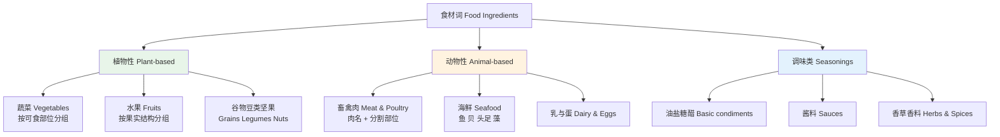
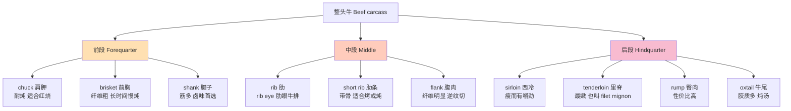
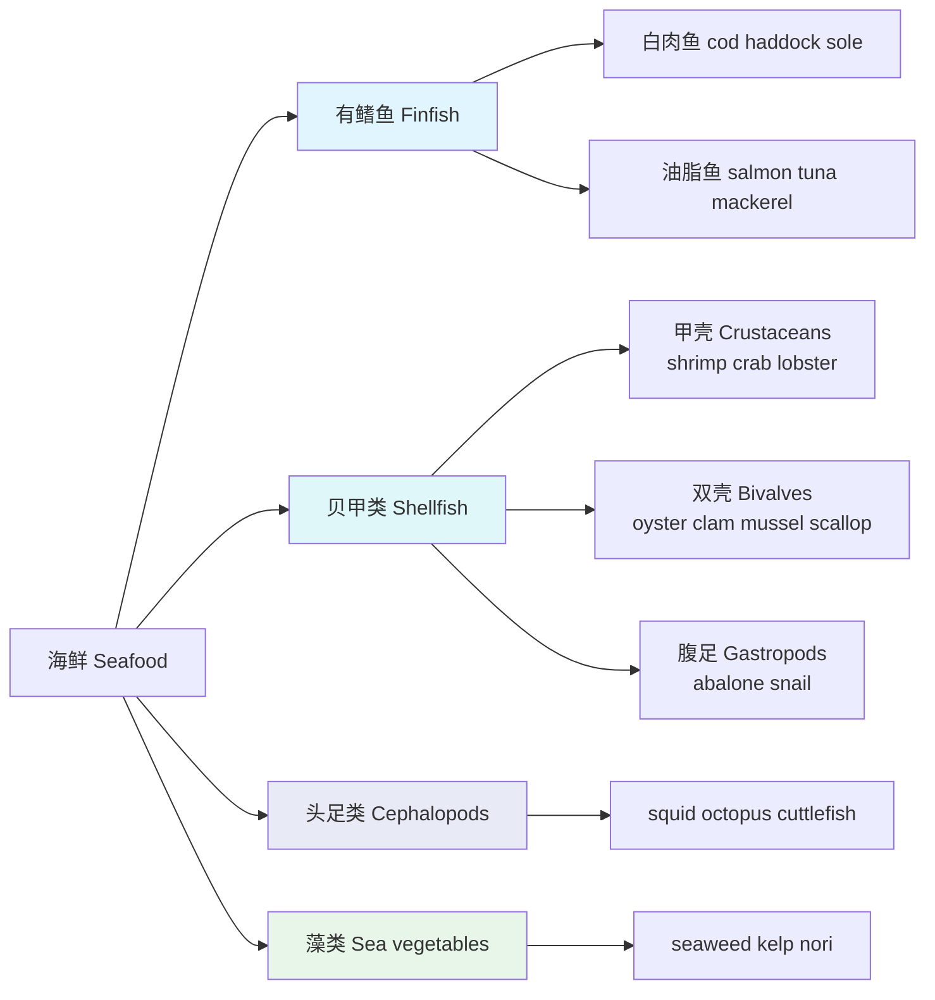
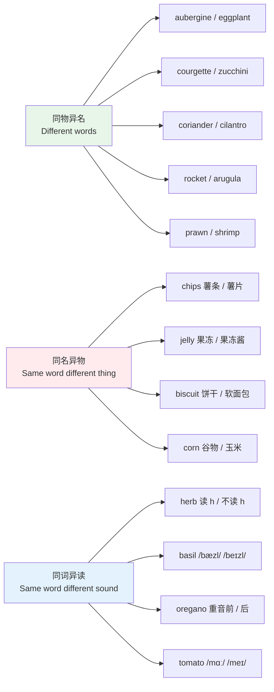
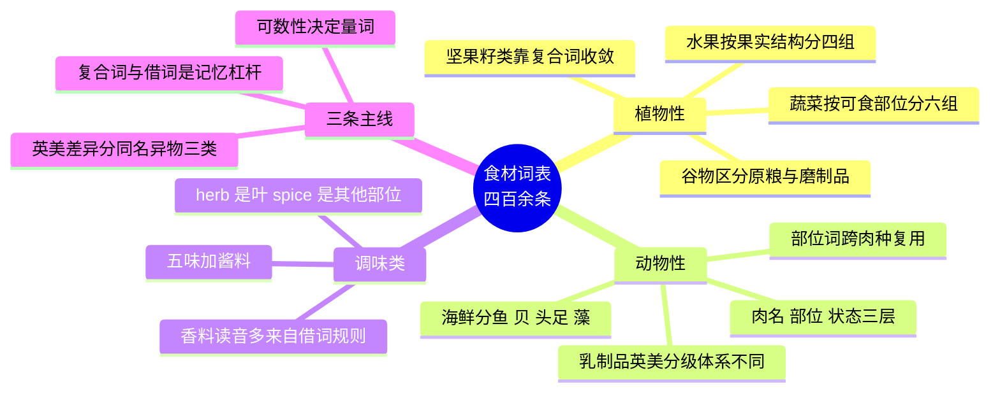

# 食材词表

> [!info] 本篇定位
>
> 09.衣食住行第二篇，讲进了厨房和上了餐桌的那部分自然物——买菜清单上的词、菜谱配料表里的词、肉铺柜台标签上的词。
>
> 和 [[09.衣食住行/03.烹饪动词、厨具餐具与口味口感\|03.烹饪动词、厨具餐具与口味口感]] 是一对：本篇给「用什么」，下一篇给「怎么做」。和 [[10.动植物、颜色与感官属性/01.动物词表\|10.动植物、颜色与感官属性]] 的分界是活体与食材——田里那头牛叫 `cow`，盘子里那块肉叫 `beef`，本篇只管后者。
>
> 读完你能做三件事：看懂英文菜谱的配料表、在国外超市按标签找到想买的东西、在肉铺柜台说清楚要哪个部位。

---

## 1. 本篇导读：食材词的三条边界

食材词是所有主题词表里数量最大、最容易散架的一类。四百多个词如果按「蔬菜、水果、肉、鱼」四堆平铺记忆，两周之内一定忘掉一半。本篇用三条边界把它切开。

**第一条边界：活体与食材。** 英语在这里有一批不同源的词对，中文没有。`cow` 和 `beef` 是最典型的一组，`01.词汇入门与学习方法` 已经解释过它的来源——诺曼征服后养的人说英语、吃的人说法语。本篇不重复词源，只把落到餐桌上的那一半词收全，并补上活体词不覆盖的分割部位。

**第二条边界：食材与成品。** `flour`（面粉）是食材，`bread`（面包）是成品；`potato`（土豆）是食材，`fries`（薯条）是成品。本篇的收词标准是「能出现在配料表里」，所以 `flour`、`yeast`、`butter` 收，`cake`、`pizza` 不收。中间地带如 `tofu`（豆腐）、`pasta`（意面干货）、`bacon`（培根）既是加工品又是配料，收进来。

**第三条边界：英式与美式。** 食材是英美用词分歧最密集的领域，没有之一。`eggplant` / `aubergine`、`zucchini` / `courgette`、`cilantro` / `coriander` 只是最出名的三对，实际能列出三十对以上。这些词在正文各节先按主表给出，第 10 节再集中做对照。

上图是本篇的目录结构。三条主干里，植物性词的分组依据是「吃它的哪个部位」——根、叶、花、果、种子，这个分组方式和后面讲的构词线索能对上；动物性词的分组依据是「先记整体名，再记分割部位」，因为部位词几乎全是靠整体名派生或搭配出来的；调味类词最杂，靠的是「基础五味 + 香草香料」两级来收。

> [!tip] 这一篇怎么用
>
> 不要从头背到尾。挑你实际会买、会做的那几十个词先练到能说出口，其余的停在「看菜谱认得」的接受级就够。
>
> 检验方法很具体：打开一份英文菜谱，看配料表能不能不查词读完。读不完的地方就是你的缺口，回来查表。

---

## 2. 蔬菜：按可食用部位分组

蔬菜词按「吃根、吃茎、吃叶、吃花、吃果、吃种子」分成六组，比按颜色或按中文拼音分组好记，因为同组词往往共享搭配（根茎类都能 `peel`、叶菜类都论 `head` 或 `bunch`）。

### 2.1 根茎类

| 英文 | 英式音标 | 美式音标 | 词性 | 中文 | 搭配与说明 |
| --- | --- | --- | --- | --- | --- |
| **potato** | /pəˈteɪtəʊ/ | /pəˈteɪtoʊ/ | n. | 土豆；马铃薯 | 复数 potatoes 加 -es；mashed potato 土豆泥 |
| **sweet potato** | /ˌswiːt pəˈteɪtəʊ/ | /ˌswiːt pəˈteɪtoʊ/ | n. | 红薯 | 美国部分地区与 yam 混称，实为两物 |
| **yam** | /jæm/ | /jæm/ | n. | 山药；薯蓣 | 中餐菜单里的山药多译作 Chinese yam |
| **taro** | /ˈtɑːrəʊ/ | /ˈtɑːroʊ/ | n. | 芋头 | 不可数居多；taro ball 芋圆 |
| **carrot** | /ˈkærət/ | /ˈkærət/ | n. | 胡萝卜 | grated carrot 胡萝卜丝 |
| **radish** | /ˈrædɪʃ/ | /ˈrædɪʃ/ | n. | 小红萝卜 | 中式白萝卜是 daikon 或 white radish |
| **daikon** | /ˈdaɪkɒn/ | /ˈdaɪkɑːn/ | n. | 白萝卜 | 来自日语，超市标签常用此词 |
| **turnip** | /ˈtɜːnɪp/ | /ˈtɜːrnɪp/ | n. | 芜菁 | 与 radish 不同物，个头大、味淡 |
| **swede** | /swiːd/ | /swiːd/ | n. | 芜菁甘蓝 | 英式用词，美式叫 rutabaga |
| **rutabaga** | /ˌruːtəˈbeɪɡə/ | /ˌruːtəˈbeɪɡə/ | n. | 芜菁甘蓝 | 美式用词，对应英式 swede |
| **beetroot** | /ˈbiːtruːt/ | /ˈbiːtruːt/ | n. | 甜菜根 | 英式用词，美式直接说 beet |
| **beet** | /biːt/ | /biːt/ | n. | 甜菜根 | 美式用词；sugar beet 指糖用甜菜 |
| **parsnip** | /ˈpɑːsnɪp/ | /ˈpɑːrsnɪp/ | n. | 欧防风 | 像白胡萝卜，烤着吃常见 |
| **lotus root** | /ˈləʊtəs ruːt/ | /ˈloʊtəs ruːt/ | n. | 莲藕 | 中餐菜单固定译法 |
| **onion** | /ˈʌnjən/ | /ˈʌnjən/ | n. | 洋葱 | 论 head；red onion 紫洋葱 |
| **shallot** | /ʃəˈlɒt/ | /ʃəˈlɑːt/ | n. | 小洋葱；干葱 | 美式亦读 /ˈʃælət/，重音前移 |
| **garlic** | /ˈɡɑːlɪk/ | /ˈɡɑːrlɪk/ | n. | 大蒜 | 不可数；一整头是 a head，一瓣是 a clove |
| **ginger** | /ˈdʒɪndʒə/ | /ˈdʒɪndʒər/ | n. | 姜 | 不可数；a piece of ginger 一块姜 |
| **leek** | /liːk/ | /liːk/ | n. | 韭葱 | 与中式韭菜 Chinese chives 不是一物 |
| **scallion** | /ˈskæliən/ | /ˈskæliən/ | n. | 小葱；青葱 | 美式用词，英式说 spring onion |
| **spring onion** | /ˌsprɪŋ ˈʌnjən/ | /ˌsprɪŋ ˈʌnjən/ | n. | 小葱；青葱 | 英式用词，对应美式 scallion |
| **bamboo shoot** | /bæmˈbuː ʃuːt/ | /bæmˈbuː ʃuːt/ | n. | 竹笋 | 常用复数 bamboo shoots |
| **water chestnut** | /ˈwɔːtə ˈtʃesnʌt/ | /ˈwɔːtər ˈtʃesnʌt/ | n. | 荸荠；马蹄 | chestnut 里的 t 不发音 |
| **horseradish** | /ˈhɔːsrædɪʃ/ | /ˈhɔːrsrædɪʃ/ | n. | 辣根 | 常做酱；与 wasabi 常被混提 |

> [!warning] garlic 的量词最容易说错
>
> 大蒜的整头和单瓣在英语里是两个不同的量词，菜谱里几乎每次都要用到。
>
> - ❌ ~~two garlics~~ / ~~a garlic~~
> - ✅ **two cloves of garlic**（两瓣蒜）
> - ✅ **a head of garlic**（一整头蒜）
>
> 菜谱缩写常写作 `2 cloves garlic, minced`，介词 of 在配料表里经常省掉。

### 2.2 叶菜与茎菜

| 英文 | 英式音标 | 美式音标 | 词性 | 中文 | 搭配与说明 |
| --- | --- | --- | --- | --- | --- |
| **cabbage** | /ˈkæbɪdʒ/ | /ˈkæbɪdʒ/ | n. | 卷心菜 | 论 head；不可数用法也常见 |
| **napa cabbage** | /ˈnɑːpə ˈkæbɪdʒ/ | /ˈnɑːpə ˈkæbɪdʒ/ | n. | 大白菜 | 亦作 Chinese cabbage |
| **bok choy** | /ˌbɒk ˈtʃɔɪ/ | /ˌbɑːk ˈtʃɔɪ/ | n. | 小白菜；青菜 | 来自粤语，英美超市通用标签 |
| **lettuce** | /ˈletɪs/ | /ˈletɪs/ | n. | 生菜 | 不可数；论 head 或 leaf |
| **romaine** | /rəʊˈmeɪn/ | /roʊˈmeɪn/ | n. | 罗马生菜 | 英式亦称 cos lettuce |
| **spinach** | /ˈspɪnɪdʒ/ | /ˈspɪnɪtʃ/ | n. | 菠菜 | 英美词尾清浊不同，不可数 |
| **kale** | /keɪl/ | /keɪl/ | n. | 羽衣甘蓝 | 不可数 |
| **arugula** | /əˈruːɡjələ/ | /əˈruːɡjələ/ | n. | 芝麻菜 | 美式用词，英式叫 rocket |
| **rocket** | /ˈrɒkɪt/ | /ˈrɑːkɪt/ | n. | 芝麻菜 | 英式用词，与「火箭」同形 |
| **watercress** | /ˈwɔːtəkres/ | /ˈwɔːtərkres/ | n. | 西洋菜；豆瓣菜 | 不可数 |
| **celery** | /ˈseləri/ | /ˈseləri/ | n. | 芹菜 | 不可数；一根是 a stalk of celery |
| **asparagus** | /əˈspærəɡəs/ | /əˈspærəɡəs/ | n. | 芦笋 | 不可数；一根是 a spear |
| **fennel** | /ˈfenl/ | /ˈfenl/ | n. | 茴香 | 球茎作菜，籽作香料 |
| **chard** | /tʃɑːd/ | /tʃɑːrd/ | n. | 甜菜叶；牛皮菜 | 常写作 Swiss chard |
| **endive** | /ˈendaɪv/ | /ˈendaɪv/ | n. | 苦苣 | 与 chicory 在英美所指相反，见第 10 节 |
| **chicory** | /ˈtʃɪkəri/ | /ˈtʃɪkəri/ | n. | 菊苣 | 英美所指互换，买菜时看实物 |
| **Chinese chives** | /ˌtʃaɪniːz ˈtʃaɪvz/ | /ˌtʃaɪniːz ˈtʃaɪvz/ | n. | 韭菜 | 恒用复数 |
| **chives** | /tʃaɪvz/ | /tʃaɪvz/ | n. | 细香葱 | 恒用复数，做点缀用 |
| **cilantro** | /sɪˈlæntrəʊ/ | /sɪˈlæntroʊ/ | n. | 香菜（叶） | 美式用词，指叶子 |
| **coriander** | /ˌkɒriˈændə/ | /ˌkɔːriˈændər/ | n. | 香菜；芫荽籽 | 英式指叶，美式多指籽 |
| **bean sprouts** | /ˈbiːn spraʊts/ | /ˈbiːn spraʊts/ | n. | 豆芽 | 恒用复数 |
| **seaweed** | /ˈsiːwiːd/ | /ˈsiːwiːd/ | n. | 海带；紫菜 | 不可数，详见第 5 节 |

### 2.3 花菜与果菜

| 英文 | 英式音标 | 美式音标 | 词性 | 中文 | 搭配与说明 |
| --- | --- | --- | --- | --- | --- |
| **broccoli** | /ˈbrɒkəli/ | /ˈbrɑːkəli/ | n. | 西兰花 | 不可数；一朵是 a floret |
| **cauliflower** | /ˈkɒlɪflaʊə/ | /ˈkɑːlɪflaʊər/ | n. | 花椰菜 | 不可数；论 head |
| **artichoke** | /ˈɑːtɪtʃəʊk/ | /ˈɑːrtɪtʃoʊk/ | n. | 洋蓟 | 可数；心部叫 artichoke heart |
| **Brussels sprouts** | /ˌbrʌslz ˈspraʊts/ | /ˌbrʌslz ˈspraʊts/ | n. | 抱子甘蓝 | 恒用复数，Brussels 大写 |
| **tomato** | /təˈmɑːtəʊ/ | /təˈmeɪtoʊ/ | n. | 番茄 | 英美元音差异最出名的一组，复数 -es |
| **cherry tomato** | /ˈtʃeri təˈmɑːtəʊ/ | /ˈtʃeri təˈmeɪtoʊ/ | n. | 圣女果 | 复数 cherry tomatoes |
| **cucumber** | /ˈkjuːkʌmbə/ | /ˈkjuːkʌmbər/ | n. | 黄瓜 | 可数 |
| **gherkin** | /ˈɡɜːkɪn/ | /ˈɡɜːrkɪn/ | n. | 腌小黄瓜 | 英式常用，美式多说 pickle |
| **eggplant** | /ˈeɡplænt/ | /ˈeɡplænt/ | n. | 茄子 | 美式用词，字面「蛋植物」源于早期白色品种 |
| **aubergine** | /ˈəʊbəʒiːn/ | /ˈoʊbərʒiːn/ | n. | 茄子 | 英式用词，法语借词，重音在首 |
| **zucchini** | /zuˈkiːni/ | /zuˈkiːni/ | n. | 西葫芦 | 美式用词，意大利语借词 |
| **courgette** | /kɔːˈʒet/ | /kʊrˈʒet/ | n. | 西葫芦 | 英式用词，法语借词，重音在后 |
| **marrow** | /ˈmærəʊ/ | /ˈmæroʊ/ | n. | 大西葫芦 | 英式用词；bone marrow 是骨髓，同形不同物 |
| **pumpkin** | /ˈpʌmpkɪn/ | /ˈpʌmpkɪn/ | n. | 南瓜 | 可数；pumpkin purée 南瓜泥 |
| **squash** | /skwɒʃ/ | /skwɑːʃ/ | n. | 笋瓜；西葫芦属 | 统称词；butternut squash 奶油南瓜 |
| **bell pepper** | /ˌbel ˈpepə/ | /ˌbel ˈpepər/ | n. | 甜椒；柿子椒 | 美式常用；英式多说 pepper 或 capsicum |
| **chilli** | /ˈtʃɪli/ | /ˈtʃɪli/ | n. | 辣椒 | 英式拼双 l，美式拼 chili |
| **okra** | /ˈəʊkrə/ | /ˈoʊkrə/ | n. | 秋葵 | 不可数；英式亦称 lady's fingers |
| **bitter gourd** | /ˌbɪtə ˈɡɔːd/ | /ˌbɪtər ˈɡɔːrd/ | n. | 苦瓜 | 亦作 bitter melon |
| **winter melon** | /ˌwɪntə ˈmelən/ | /ˌwɪntər ˈmelən/ | n. | 冬瓜 | 中餐汤品常见 |
| **corn** | /kɔːn/ | /kɔːrn/ | n. | 玉米 | 美式指玉米，英式 corn 可泛指谷物 |
| **sweetcorn** | /ˈswiːtkɔːn/ | /ˈswiːtkɔːrn/ | n. | 甜玉米 | 英式用词，罐头标签常见 |
| **maize** | /meɪz/ | /meɪz/ | n. | 玉米 | 英式与农学用词，美国日常不说 |
| **avocado** | /ˌævəˈkɑːdəʊ/ | /ˌævəˈkɑːdoʊ/ | n. | 牛油果 | 植物学上是果实，厨房里当蔬菜用 |

### 2.4 豆荚与菌菇

| 英文 | 英式音标 | 美式音标 | 词性 | 中文 | 搭配与说明 |
| --- | --- | --- | --- | --- | --- |
| **pea** | /piː/ | /piː/ | n. | 豌豆 | 恒用复数 peas |
| **snow pea** | /ˈsnəʊ piː/ | /ˈsnoʊ piː/ | n. | 荷兰豆 | 美式用词，英式叫 mangetout |
| **mangetout** | /ˌmɒnʒˈtuː/ | /ˌmɑːnʒˈtuː/ | n. | 荷兰豆 | 英式用词，法语借词，词尾 t 不发音 |
| **green bean** | /ˌɡriːn ˈbiːn/ | /ˌɡriːn ˈbiːn/ | n. | 四季豆 | 英式亦称 French bean |
| **snap pea** | /ˈsnæp piː/ | /ˈsnæp piː/ | n. | 甜豆 | 荚与豆同食 |
| **edamame** | /ˌedəˈmɑːmeɪ/ | /ˌedəˈmɑːmeɪ/ | n. | 毛豆 | 日语借词，四音节 |
| **mushroom** | /ˈmʌʃrʊm/ | /ˈmʌʃruːm/ | n. | 蘑菇 | 可数；词尾 -room 有 /rʊm/ 与 /ruːm/ 两读，英美各有偏好 |
| **button mushroom** | /ˈbʌtn ˈmʌʃrʊm/ | /ˈbʌtn ˈmʌʃruːm/ | n. | 口蘑；白蘑菇 | 超市最常见品种 |
| **shiitake** | /ʃɪˈtɑːki/ | /ʃɪˈtɑːki/ | n. | 香菇 | 日语借词，重音在第二音节 |
| **oyster mushroom** | /ˈɔɪstə ˈmʌʃrʊm/ | /ˈɔɪstər ˈmʌʃruːm/ | n. | 平菇 | 与牡蛎同名，因形似 |
| **enoki** | /ɪˈnəʊki/ | /ɪˈnoʊki/ | n. | 金针菇 | 日语借词 |
| **wood ear** | /ˈwʊd ɪə/ | /ˈwʊd ɪr/ | n. | 木耳 | 亦作 black fungus |
| **truffle** | /ˈtrʌfl/ | /ˈtrʌfl/ | n. | 松露 | 同形词还指松露巧克力 |
| **portobello** | /ˌpɔːtəˈbeləʊ/ | /ˌpɔːrtəˈbeloʊ/ | n. | 波多贝罗菇 | 大朵褐蘑菇，常整片当素排 |

> [!example] 一份沙拉配料表读下来
>
> - Toss the **romaine**, **cherry tomatoes**, **cucumber** and **avocado** in a large bowl.
>   - 把罗马生菜、圣女果、黄瓜和牛油果放进大碗里拌匀。
> - Add two **cloves of garlic**, finely chopped, and a handful of **rocket**.
>   - 加两瓣切碎的蒜，再加一把芝麻菜。
> - Season with **olive oil**, **lemon juice**, salt and cracked black **pepper**.
>   - 用橄榄油、柠檬汁、盐和现磨黑胡椒调味。

菜谱句子里蔬菜词几乎不会单独出现，总是跟着一个量词或一个加工状态（`finely chopped`、`a handful of`）。这也是为什么第 11 节要单独讲量词——只记名词记不完整。

---

## 3. 水果：按果实结构分组

水果词按植物学的果实结构分组（仁果、核果、浆果、柑橘、瓜类、热带果），比按颜色分好记，因为同一结构的果实在英语里共享一批部位词：仁果有 `core`（果心），核果有 `stone` 或 `pit`（果核），柑橘有 `segment`（瓣）和 `rind`（皮）。

### 3.1 仁果与核果

| 英文 | 英式音标 | 美式音标 | 词性 | 中文 | 搭配与说明 |
| --- | --- | --- | --- | --- | --- |
| **apple** | /ˈæpl/ | /ˈæpl/ | n. | 苹果 | 果心 core；青苹果 green apple |
| **pear** | /peə/ | /per/ | n. | 梨 | 与 pair 同音，靠上下文区分 |
| **quince** | /kwɪns/ | /kwɪns/ | n. | 木瓜（榅桲） | 与热带 papaya 不是一物 |
| **peach** | /piːtʃ/ | /piːtʃ/ | n. | 桃 | 果核英式 stone 美式 pit |
| **nectarine** | /ˈnektəriːn/ | /ˈnektəriːn/ | n. | 油桃 | 表皮无毛的桃变种 |
| **plum** | /plʌm/ | /plʌm/ | n. | 李子 | 干制品是 prune |
| **prune** | /pruːn/ | /pruːn/ | n. | 西梅干 | 同形动词意为「修剪」 |
| **apricot** | /ˈeɪprɪkɒt/ | /ˈæprɪkɑːt/ | n. | 杏 | 英美首音节元音不同 |
| **cherry** | /ˈtʃeri/ | /ˈtʃeri/ | n. | 樱桃 | 复数 cherries |
| **olive** | /ˈɒlɪv/ | /ˈɑːlɪv/ | n. | 橄榄 | 植物学上是核果；油见第 8 节 |
| **date** | /deɪt/ | /deɪt/ | n. | 枣（椰枣） | 中式红枣是 jujube 或 red date |
| **jujube** | /ˈdʒuːdʒuːb/ | /ˈdʒuːdʒuːb/ | n. | 红枣 | 中餐配料表用词 |

### 3.2 浆果

| 英文 | 英式音标 | 美式音标 | 词性 | 中文 | 搭配与说明 |
| --- | --- | --- | --- | --- | --- |
| **strawberry** | /ˈstrɔːbəri/ | /ˈstrɔːberi/ | n. | 草莓 | 英式 -bry 弱读，美式 -berry 清晰 |
| **blueberry** | /ˈbluːbəri/ | /ˈbluːberi/ | n. | 蓝莓 | 同一弱读规律 |
| **raspberry** | /ˈrɑːzbəri/ | /ˈræzberi/ | n. | 树莓；覆盆子 | p 不发音，首元音英美不同 |
| **blackberry** | /ˈblækbəri/ | /ˈblækberi/ | n. | 黑莓 | 与手机品牌同形 |
| **cranberry** | /ˈkrænbəri/ | /ˈkrænberi/ | n. | 蔓越莓 | 常见于果汁与干果 |
| **gooseberry** | /ˈɡʊzbəri/ | /ˈɡuːsberi/ | n. | 醋栗 | 英美首音节清浊不同 |
| **currant** | /ˈkʌrənt/ | /ˈkɜːrənt/ | n. | 醋栗；小葡萄干 | 与 current 同音异义 |
| **grape** | /ɡreɪp/ | /ɡreɪp/ | n. | 葡萄 | 论 bunch；干制品是 raisin |
| **raisin** | /ˈreɪzn/ | /ˈreɪzn/ | n. | 葡萄干 | 不读 /ˈreɪsɪn/ |
| **goji berry** | /ˈɡəʊdʒi beri/ | /ˈɡoʊdʒi beri/ | n. | 枸杞 | 亦作 wolfberry |

### 3.3 柑橘类与瓜类

| 英文 | 英式音标 | 美式音标 | 词性 | 中文 | 搭配与说明 |
| --- | --- | --- | --- | --- | --- |
| **orange** | /ˈɒrɪndʒ/ | /ˈɔːrɪndʒ/ | n. | 橙子 | 果肉瓣是 segment，皮是 zest 或 rind |
| **tangerine** | /ˌtændʒəˈriːn/ | /ˌtændʒəˈriːn/ | n. | 橘子 | 重音在末音节 |
| **mandarin** | /ˈmændərɪn/ | /ˈmændərɪn/ | n. | 柑；蜜橘 | 与「普通话」同形，大写时指语言 |
| **clementine** | /ˈkleməntiːn/ | /ˈkleməntiːn/ | n. | 小柑橘 | 无籽易剥，圣诞季常见 |
| **lemon** | /ˈlemən/ | /ˈlemən/ | n. | 柠檬 | lemon juice、lemon zest 高频 |
| **lime** | /laɪm/ | /laɪm/ | n. | 青柠 | 与 lemon 不可混用 |
| **grapefruit** | /ˈɡreɪpfruːt/ | /ˈɡreɪpfruːt/ | n. | 西柚 | 单复数同形常见 |
| **pomelo** | /ˈpɒmɪləʊ/ | /ˈpɑːməloʊ/ | n. | 柚子 | 亦作 shaddock |
| **kumquat** | /ˈkʌmkwɒt/ | /ˈkʌmkwɑːt/ | n. | 金桔 | 连皮吃 |
| **watermelon** | /ˈwɔːtəmelən/ | /ˈwɔːtərmelən/ | n. | 西瓜 | 论 slice 或 wedge |
| **melon** | /ˈmelən/ | /ˈmelən/ | n. | 甜瓜 | 统称词 |
| **cantaloupe** | /ˈkæntəluːp/ | /ˈkæntəloʊp/ | n. | 哈密瓜类 | 英美词尾元音不同 |
| **honeydew** | /ˈhʌnidjuː/ | /ˈhʌniduː/ | n. | 白兰瓜 | 英式 -dew 带 /j/ |

### 3.4 热带与其他

| 英文 | 英式音标 | 美式音标 | 词性 | 中文 | 搭配与说明 |
| --- | --- | --- | --- | --- | --- |
| **banana** | /bəˈnɑːnə/ | /bəˈnænə/ | n. | 香蕉 | 中间音节英美元音不同；论 bunch |
| **plantain** | /ˈplæntɪn/ | /ˈplæntɪn/ | n. | 大蕉 | 需煮熟才吃，与香蕉不同用 |
| **pineapple** | /ˈpaɪnæpl/ | /ˈpaɪnæpl/ | n. | 菠萝 | 复合词，重音在首 |
| **mango** | /ˈmæŋɡəʊ/ | /ˈmæŋɡoʊ/ | n. | 芒果 | 复数 mangoes 或 mangos |
| **papaya** | /pəˈpaɪə/ | /pəˈpaɪə/ | n. | 木瓜 | 与 quince 区分 |
| **kiwi** | /ˈkiːwiː/ | /ˈkiːwiː/ | n. | 猕猴桃 | 全称 kiwifruit，避免与鸟名混 |
| **coconut** | /ˈkəʊkənʌt/ | /ˈkoʊkənʌt/ | n. | 椰子 | coconut milk 椰浆 |
| **fig** | /fɪɡ/ | /fɪɡ/ | n. | 无花果 | 鲜果与干果同名 |
| **pomegranate** | /ˈpɒmɪɡrænɪt/ | /ˈpɑːmɪɡrænɪt/ | n. | 石榴 | 籽粒叫 aril 或 seed |
| **persimmon** | /pəˈsɪmən/ | /pərˈsɪmən/ | n. | 柿子 | 重音在第二音节 |
| **lychee** | /ˈlaɪtʃiː/ | /ˈliːtʃiː/ | n. | 荔枝 | 英美首元音不同，拼写亦作 litchi |
| **longan** | /ˈlɒŋɡən/ | /ˈlɔːŋɡən/ | n. | 龙眼 | 亦作 dragon eye |
| **durian** | /ˈdʊəriən/ | /ˈdʊriən/ | n. | 榴莲 | 不可数用法常见 |
| **guava** | /ˈɡwɑːvə/ | /ˈɡwɑːvə/ | n. | 番石榴 | gua- 读作 /ɡwɑː/ |
| **passion fruit** | /ˈpæʃn fruːt/ | /ˈpæʃn fruːt/ | n. | 百香果 | 亦写作一个词 passionfruit |
| **dragon fruit** | /ˈdræɡən fruːt/ | /ˈdræɡən fruːt/ | n. | 火龙果 | 亦作 pitaya |
| **jackfruit** | /ˈdʒækfruːt/ | /ˈdʒækfruːt/ | n. | 菠萝蜜 | 素食里常当肉替代品 |
| **starfruit** | /ˈstɑːfruːt/ | /ˈstɑːrfruːt/ | n. | 杨桃 | 亦作 carambola |
| **rhubarb** | /ˈruːbɑːb/ | /ˈruːbɑːrb/ | n. | 大黄 | 植物学上是茎，厨房里当水果做派 |

> [!warning] 三组最容易张冠李戴的水果词
>
> - **papaya** 是热带木瓜，**quince** 是温带榅桲，中文都叫「木瓜」。中餐说的木瓜牛奶用的是 papaya。
> - **lemon** 黄柠檬和 **lime** 青柠是两种果，酸度和香气都不同，菜谱里不能互换。
> - **kiwi** 单说时在新西兰语境里指人或鸟，指水果最稳的说法是 **kiwifruit**。
>
> 另外注意 **rhubarb** 只吃茎，叶子含草酸不可食——英文菜谱不会提醒这一点，因为对英语母语者是常识。

---

## 4. 肉类：肉名、部位与状态

肉类词分三层：第一层是肉名（`beef`、`pork`），第二层是分割部位（`sirloin`、`brisket`），第三层是加工状态（`minced`、`cured`）。三层不能混着记，因为一个部位词可以配多种肉名（`pork loin` 和 `lamb loin` 都成立）。

### 4.1 肉名与禽类

| 英文 | 英式音标 | 美式音标 | 词性 | 中文 | 搭配与说明 |
| --- | --- | --- | --- | --- | --- |
| **meat** | /miːt/ | /miːt/ | n. | 肉 | 不可数；red meat 红肉，white meat 白肉 |
| **beef** | /biːf/ | /biːf/ | n. | 牛肉 | 不可数；活体是 cow / cattle |
| **pork** | /pɔːk/ | /pɔːrk/ | n. | 猪肉 | 不可数；活体是 pig |
| **lamb** | /læm/ | /læm/ | n. | 羔羊肉 | b 不发音；一岁以内的羊 |
| **mutton** | /ˈmʌtn/ | /ˈmʌtn/ | n. | 羊肉（成羊） | 味重；英美超市实际多卖 lamb |
| **veal** | /viːl/ | /viːl/ | n. | 小牛肉 | 活体是 calf |
| **venison** | /ˈvenɪsn/ | /ˈvenɪsn/ | n. | 鹿肉 | 活体是 deer |
| **poultry** | /ˈpəʊltri/ | /ˈpoʊltri/ | n. | 禽肉；家禽 | 不可数集合名词 |
| **chicken** | /ˈtʃɪkɪn/ | /ˈtʃɪkɪn/ | n. | 鸡；鸡肉 | 整只可数，肉不可数 |
| **turkey** | /ˈtɜːki/ | /ˈtɜːrki/ | n. | 火鸡；火鸡肉 | 同样双重可数性 |
| **duck** | /dʌk/ | /dʌk/ | n. | 鸭；鸭肉 | 同上 |
| **goose** | /ɡuːs/ | /ɡuːs/ | n. | 鹅；鹅肉 | 复数 geese，指肉时不可数 |
| **quail** | /kweɪl/ | /kweɪl/ | n. | 鹌鹑 | quail egg 鹌鹑蛋 |
| **rabbit** | /ˈræbɪt/ | /ˈræbɪt/ | n. | 兔肉 | 活体与肉同名 |
| **game** | /ɡeɪm/ | /ɡeɪm/ | n. | 野味 | 不可数；同形词还指「游戏」 |
| **offal** | /ˈɒfl/ | /ˈɔːfl/ | n. | 内脏；下水 | 英式常用；美式多说 organ meat |
| **liver** | /ˈlɪvə/ | /ˈlɪvər/ | n. | 肝 | 不可数指肉 |
| **kidney** | /ˈkɪdni/ | /ˈkɪdni/ | n. | 腰子 | 复数 kidneys；kidney bean 是豆名 |
| **tripe** | /traɪp/ | /traɪp/ | n. | 牛肚；毛肚 | 不可数 |
| **gizzard** | /ˈɡɪzəd/ | /ˈɡɪzərd/ | n. | 胗 | 禽类的砂囊 |
| **marrow** | /ˈmærəʊ/ | /ˈmæroʊ/ | n. | 骨髓 | 全称 bone marrow |
| **bacon** | /ˈbeɪkən/ | /ˈbeɪkən/ | n. | 培根 | 不可数；一片英式叫 a rasher |
| **ham** | /hæm/ | /hæm/ | n. | 火腿 | 不可数；熟制腌腿肉 |
| **sausage** | /ˈsɒsɪdʒ/ | /ˈsɔːsɪdʒ/ | n. | 香肠 | 整根可数，肉馅不可数 |
| **salami** | /səˈlɑːmi/ | /səˈlɑːmi/ | n. | 萨拉米香肠 | 不可数 |
| **pepperoni** | /ˌpepəˈrəʊni/ | /ˌpepəˈroʊni/ | n. | 意式辣香肠 | 披萨常见配料 |
| **prosciutto** | /prəˈʃʊtəʊ/ | /prəˈʃuːtoʊ/ | n. | 意式生火腿 | 意大利语借词，sci 读 /ʃ/；帕尔马产的叫 prosciutto di Parma |
| **mince** | /mɪns/ | /mɪns/ | n. | 肉馅 | 英式名词；美式说 ground meat |
| **ground beef** | /ˌɡraʊnd ˈbiːf/ | /ˌɡraʊnd ˈbiːf/ | n. | 牛肉馅 | 美式用词，对应英式 minced beef |

### 4.2 牛肉分割部位

上图把牛的分割部位按前中后三段排开，同时标出了每个部位的烹饪归宿。这张图对买肉的实际用途在于：**部位名决定做法**。`chuck` 和 `brisket` 都在前段，共同特点是结缔组织多，直接煎会又老又柴，必须长时间低温炖煮；`tenderloin` 和 `sirloin` 在后段，肌肉运动少，可以高温快煎。中文点菜时说「我要嫩一点的」在英语肉铺里行不通，要直接说部位名。

| 英文 | 英式音标 | 美式音标 | 词性 | 中文 | 搭配与说明 |
| --- | --- | --- | --- | --- | --- |
| **cut** | /kʌt/ | /kʌt/ | n. | 分割部位 | a cheap cut of beef 便宜的部位 |
| **sirloin** | /ˈsɜːlɔɪn/ | /ˈsɜːrlɔɪn/ | n. | 西冷；牛外脊 | 英美所指略有差异，美式偏后腰 |
| **tenderloin** | /ˈtendəlɔɪn/ | /ˈtendərlɔɪn/ | n. | 里脊；菲力 | 最嫩，脂肪少 |
| **filet mignon** | /ˌfɪleɪ ˈmiːnjɒn/ | /ˌfɪleɪ miːnˈjoʊn/ | n. | 菲力牛排 | 法语借词，filet 词尾 t 不发音，gn 读 /nj/ |
| **fillet** | /ˈfɪlɪt/ | /fɪˈleɪ/ | n. | 里脊；去骨肉片 | 英式重音在首且读出 t，美式拼 filet |
| **rib eye** | /ˈrɪb aɪ/ | /ˈrɪb aɪ/ | n. | 肋眼 | 亦写作 ribeye；油花丰富 |
| **brisket** | /ˈbrɪskɪt/ | /ˈbrɪskɪt/ | n. | 牛前胸；牛腩 | 美式烤肉与犹太菜的核心部位 |
| **chuck** | /tʃʌk/ | /tʃʌk/ | n. | 肩胛肉 | chuck roast 炖牛肉块 |
| **shank** | /ʃæŋk/ | /ʃæŋk/ | n. | 腱子；小腿肉 | beef shank 牛腱 |
| **flank** | /flæŋk/ | /flæŋk/ | n. | 腹肉 | flank steak 需逆纹切 |
| **skirt steak** | /ˈskɜːt steɪk/ | /ˈskɜːrt steɪk/ | n. | 裙肉牛排 | 墨西哥菜 fajita 常用 |
| **rump** | /rʌmp/ | /rʌmp/ | n. | 臀肉 | 英式菜单常见 rump steak |
| **round** | /raʊnd/ | /raʊnd/ | n. | 后腿肉 | 美式用词，瘦、适合切薄片 |
| **short rib** | /ˌʃɔːt ˈrɪb/ | /ˌʃɔːrt ˈrɪb/ | n. | 牛肋条 | 常用复数 short ribs |
| **T-bone** | /ˈtiː bəʊn/ | /ˈtiː boʊn/ | n. | T 骨牛排 | 一侧西冷一侧里脊 |
| **porterhouse** | /ˈpɔːtəhaʊs/ | /ˈpɔːrtərhaʊs/ | n. | 红屋牛排 | 比 T-bone 里脊部分更大 |
| **oxtail** | /ˈɒksteɪl/ | /ˈɑːksteɪl/ | n. | 牛尾 | 不可数用法常见 |
| **steak** | /steɪk/ | /steɪk/ | n. | 牛排 | 读 /steɪk/ 不读 /stiːk/ |
| **marbling** | /ˈmɑːblɪŋ/ | /ˈmɑːrblɪŋ/ | n. | 大理石纹；雪花 | 指肌间脂肪分布 |

### 4.3 猪、羊与禽类部位

| 英文 | 英式音标 | 美式音标 | 词性 | 中文 | 搭配与说明 |
| --- | --- | --- | --- | --- | --- |
| **pork belly** | /ˈpɔːk beli/ | /ˈpɔːrk beli/ | n. | 五花肉 | 红烧肉的标准译法 |
| **pork loin** | /ˈpɔːk lɔɪn/ | /ˈpɔːrk lɔɪn/ | n. | 猪外脊 | loin 泛指腰背部位 |
| **pork chop** | /ˈpɔːk tʃɒp/ | /ˈpɔːrk tʃɑːp/ | n. | 猪排 | chop 指带骨厚片 |
| **shoulder** | /ˈʃəʊldə/ | /ˈʃoʊldər/ | n. | 前腿；梅花肉 | pork shoulder 适合慢烤撕肉 |
| **hock** | /hɒk/ | /hɑːk/ | n. | 肘子；蹄髈 | ham hock 咸猪肘 |
| **trotter** | /ˈtrɒtə/ | /ˈtrɑːtər/ | n. | 猪蹄 | 英式常用，美式多说 pig's feet |
| **spare ribs** | /ˈspeə rɪbz/ | /ˈsper rɪbz/ | n. | 排骨 | 恒用复数 |
| **rack** | /ræk/ | /ræk/ | n. | 一排肋骨 | rack of lamb 法式羊排 |
| **cutlet** | /ˈkʌtlət/ | /ˈkʌtlət/ | n. | 肉片；肉排 | 通常裹粉煎 |
| **shank end** | /ˈʃæŋk end/ | /ˈʃæŋk end/ | n. | 小腿端 | lamb shank 羊腿 |
| **drumstick** | /ˈdrʌmstɪk/ | /ˈdrʌmstɪk/ | n. | 鸡腿（下段） | 字面「鼓槌」，指小腿带骨那截 |
| **thigh** | /θaɪ/ | /θaɪ/ | n. | 鸡腿（上段） | 与 drumstick 合称 leg quarter |
| **breast** | /brest/ | /brest/ | n. | 鸡胸 | chicken breast 最瘦的部分 |
| **wing** | /wɪŋ/ | /wɪŋ/ | n. | 鸡翅 | 分 drumette、flat、tip 三段 |
| **tenders** | /ˈtendəz/ | /ˈtendərz/ | n. | 鸡柳 | 亦作 chicken tenderloin |
| **giblets** | /ˈdʒɪbləts/ | /ˈdʒɪbləts/ | n. | 禽杂 | 恒用复数，g 读 /dʒ/ |
| **carcass** | /ˈkɑːkəs/ | /ˈkɑːrkəs/ | n. | 骨架；胴体 | 熬汤用 chicken carcass |

> [!tip] 记部位词的两条捷径
>
> **捷径一：部位词大多可以跨肉种复用。** `loin`（腰背）、`shoulder`（肩）、`shank`（小腿）、`rib`（肋）、`chop`（带骨厚片）、`belly`（腹）这六个词接在 `pork`、`lamb`、`beef` 前面都成立。记六个部位词加三个肉名，比记十八个组合省力得多。
>
> **捷径二：形状词就是字面意思。** `drumstick` 是鼓槌形，`T-bone` 是 T 形骨，`rack` 是一排肋骨的架子，`skirt` 是裙状薄片。这类词不需要背中文，看形状就记住了。

> [!warning] 熟度词属于点菜不属于食材
>
> `rare`、`medium rare`、`well done` 这类牛排熟度词是餐厅点菜用语，不在本篇范围，归 04.英语场景 的餐厅篇。本篇只到「哪个部位」为止。
>
> 另外 `steak` 的读音是长期高频错误：拼写有 ea 但读 /steɪk/，和 `break`、`great` 同一组例外，不读 /stiːk/。

---

## 5. 海鲜：鱼类、贝类、头足与藻类

上图的分法直接对应英语的三个统称词：`finfish` 指有鳍的鱼，`shellfish` 指带壳的（甲壳类和贝类都算），`cephalopod` 指头足类。这个区分在实际场合有用——过敏声明里写的 `shellfish allergy` 只覆盖第二类，不包括三文鱼；餐厅菜单的 `shellfish` 分区也不会放鱼。中文的「海鲜」一个词打通，英语需要分开说。

### 5.1 鱼类

| 英文 | 英式音标 | 美式音标 | 词性 | 中文 | 搭配与说明 |
| --- | --- | --- | --- | --- | --- |
| **fish** | /fɪʃ/ | /fɪʃ/ | n. | 鱼 | 单复数同形；fishes 指多个物种 |
| **salmon** | /ˈsæmən/ | /ˈsæmən/ | n. | 三文鱼 | l 不发音，高频误读点 |
| **tuna** | /ˈtjuːnə/ | /ˈtuːnə/ | n. | 金枪鱼 | 英式带 /j/，美式不带 |
| **cod** | /kɒd/ | /kɑːd/ | n. | 鳕鱼 | 英式炸鱼薯条的标准鱼 |
| **haddock** | /ˈhædək/ | /ˈhædək/ | n. | 黑线鳕 | 单复数同形 |
| **halibut** | /ˈhælɪbət/ | /ˈhælɪbət/ | n. | 比目鱼；大比目鱼 | 肉厚，适合厚切 |
| **sole** | /səʊl/ | /soʊl/ | n. | 鳎鱼；龙利鱼 | 与「鞋底」同形，来源相同 |
| **plaice** | /pleɪs/ | /pleɪs/ | n. | 鲽鱼 | 与 place 同音 |
| **sea bass** | /ˌsiː ˈbæs/ | /ˌsiː ˈbæs/ | n. | 鲈鱼 | 鱼名 bass 读 /bæs/，乐器 bass 读 /beɪs/ |
| **trout** | /traʊt/ | /traʊt/ | n. | 鳟鱼 | 单复数同形 |
| **mackerel** | /ˈmækrəl/ | /ˈmækrəl/ | n. | 鲭鱼 | 三个音节常缩成两个 |
| **sardine** | /sɑːˈdiːn/ | /sɑːrˈdiːn/ | n. | 沙丁鱼 | 重音在后；罐头常见 |
| **anchovy** | /ˈæntʃəvi/ | /ˈæntʃoʊvi/ | n. | 凤尾鱼；鳀鱼 | 极咸，用作调味 |
| **herring** | /ˈherɪŋ/ | /ˈherɪŋ/ | n. | 鲱鱼 | 北欧腌制常见 |
| **eel** | /iːl/ | /iːl/ | n. | 鳗鱼 | 日式称 unagi |
| **carp** | /kɑːp/ | /kɑːrp/ | n. | 鲤鱼 | 单复数同形 |
| **tilapia** | /tɪˈlɑːpiə/ | /tɪˈlɑːpiə/ | n. | 罗非鱼 | 养殖白肉鱼 |
| **snapper** | /ˈsnæpə/ | /ˈsnæpər/ | n. | 鲷鱼；红鲷 | red snapper 最常见 |
| **grouper** | /ˈɡruːpə/ | /ˈɡruːpər/ | n. | 石斑鱼 | 粤菜常用 |
| **swordfish** | /ˈsɔːdfɪʃ/ | /ˈsɔːrdfɪʃ/ | n. | 剑鱼 | w 不发音 |
| **fillet** | /ˈfɪlɪt/ | /fɪˈleɪ/ | n. | 鱼柳；去骨鱼片 | 与肉类的 fillet 同词 |
| **roe** | /rəʊ/ | /roʊ/ | n. | 鱼子 | 不可数 |
| **caviar** | /ˈkæviɑː/ | /ˈkæviɑːr/ | n. | 鱼子酱 | 特指鲟鱼子 |

### 5.2 甲壳与贝类

| 英文 | 英式音标 | 美式音标 | 词性 | 中文 | 搭配与说明 |
| --- | --- | --- | --- | --- | --- |
| **shellfish** | /ˈʃelfɪʃ/ | /ˈʃelfɪʃ/ | n. | 带壳海鲜 | 不可数；过敏声明用词 |
| **shrimp** | /ʃrɪmp/ | /ʃrɪmp/ | n. | 虾 | 美式通用词，单复数常同形 |
| **prawn** | /prɔːn/ | /prɔːn/ | n. | 大虾；对虾 | 英式通用词，见第 10 节 |
| **crab** | /kræb/ | /kræb/ | n. | 螃蟹 | crab meat 蟹肉 |
| **lobster** | /ˈlɒbstə/ | /ˈlɑːbstər/ | n. | 龙虾 | 波士顿龙虾带钳 |
| **crayfish** | /ˈkreɪfɪʃ/ | /ˈkreɪfɪʃ/ | n. | 小龙虾；螯虾 | 美国南部亦拼 crawfish |
| **krill** | /krɪl/ | /krɪl/ | n. | 磷虾 | 不可数 |
| **oyster** | /ˈɔɪstə/ | /ˈɔɪstər/ | n. | 牡蛎；生蚝 | oyster sauce 蚝油 |
| **clam** | /klæm/ | /klæm/ | n. | 蛤蜊 | clam chowder 蛤蜊浓汤 |
| **mussel** | /ˈmʌsl/ | /ˈmʌsl/ | n. | 青口；贻贝 | 与 muscle 同音 |
| **scallop** | /ˈskɒləp/ | /ˈskɑːləp/ | n. | 扇贝 | 干制品是 dried scallop 或 conpoy |
| **razor clam** | /ˈreɪzə klæm/ | /ˈreɪzər klæm/ | n. | 蛏子 | 形似剃刀 |
| **cockle** | /ˈkɒkl/ | /ˈkɑːkl/ | n. | 鸟蛤 | 英式海边小吃 |
| **abalone** | /ˌæbəˈləʊni/ | /ˌæbəˈloʊni/ | n. | 鲍鱼 | 四音节，重音在第三 |
| **whelk** | /welk/ | /welk/ | n. | 海螺 | 英式常见 |
| **snail** | /sneɪl/ | /sneɪl/ | n. | 蜗牛 | 法餐称 escargot |
| **sea cucumber** | /ˌsiː ˈkjuːkʌmbə/ | /ˌsiː ˈkjuːkʌmbər/ | n. | 海参 | 中餐高档食材 |
| **sea urchin** | /ˌsiː ˈɜːtʃɪn/ | /ˌsiː ˈɜːrtʃɪn/ | n. | 海胆 | 日料称 uni |

### 5.3 头足类与海藻

| 英文 | 英式音标 | 美式音标 | 词性 | 中文 | 搭配与说明 |
| --- | --- | --- | --- | --- | --- |
| **squid** | /skwɪd/ | /skwɪd/ | n. | 鱿鱼 | 单复数同形；菜名常用 calamari |
| **calamari** | /ˌkæləˈmɑːri/ | /ˌkæləˈmɑːri/ | n. | 炸鱿鱼圈 | 意大利语借词，专指菜品 |
| **octopus** | /ˈɒktəpəs/ | /ˈɑːktəpəs/ | n. | 章鱼 | 复数 octopuses 最稳妥 |
| **cuttlefish** | /ˈkʌtlfɪʃ/ | /ˈkʌtlfɪʃ/ | n. | 墨鱼 | 单复数同形 |
| **seaweed** | /ˈsiːwiːd/ | /ˈsiːwiːd/ | n. | 海藻；紫菜 | 不可数统称 |
| **kelp** | /kelp/ | /kelp/ | n. | 海带 | 不可数 |
| **nori** | /ˈnɔːri/ | /ˈnɔːri/ | n. | 海苔 | 日语借词，寿司用 |
| **wakame** | /wəˈkɑːmeɪ/ | /wəˈkɑːmeɪ/ | n. | 裙带菜 | 日语借词，味噌汤常见 |

> [!warning] shrimp 与 prawn 不是大小之分
>
> 常见的说法是「shrimp 是小虾，prawn 是大虾」，这个理解在英美实际用法里站不住。
>
> - 美式英语基本只用 **shrimp**，无论大小；菜单上的 jumbo shrimp 就是大虾。
> - 英式、澳式、印度英语基本只用 **prawn**，无论大小；英国超市的 king prawns 也不见得比美国的 shrimp 大。
> - 生物学上二者确实是不同的类群，但日常语言里是**地区用词差异**，不是尺寸差异。
>
> 同类情况还有 **crayfish** / **crawfish**：前者是通用与英式拼写，后者是美国南部拼写，同一物。

---

## 6. 谷物、豆类与坚果

这一组词的共同点是「以种子形态进厨房」。英语在这里的一个关键区分是**原粮与磨制品**：`wheat` 是小麦，`flour` 是面粉；`corn` 是玉米，`cornmeal` 是玉米粉。中文常用「XX 粉」一个格式带过，英语则常有独立词。

### 6.1 谷物与主食原料

| 英文 | 英式音标 | 美式音标 | 词性 | 中文 | 搭配与说明 |
| --- | --- | --- | --- | --- | --- |
| **grain** | /ɡreɪn/ | /ɡreɪn/ | n. | 谷物；颗粒 | whole grain 全谷物 |
| **cereal** | /ˈsɪəriəl/ | /ˈsɪriəl/ | n. | 谷类；麦片 | 与 serial 同音异义 |
| **wheat** | /wiːt/ | /wiːt/ | n. | 小麦 | 不可数；whole wheat 全麦 |
| **flour** | /ˈflaʊə/ | /ˈflaʊər/ | n. | 面粉 | 与 flower 同音，不可数 |
| **plain flour** | /ˌpleɪn ˈflaʊə/ | /ˌpleɪn ˈflaʊər/ | n. | 中筋面粉 | 英式用词 |
| **all-purpose flour** | /ˌɔːl ˈpɜːpəs flaʊə/ | /ˌɔːl ˈpɜːrpəs flaʊər/ | n. | 中筋面粉 | 美式用词 |
| **rice** | /raɪs/ | /raɪs/ | n. | 大米 | 不可数；a grain of rice 一粒米 |
| **glutinous rice** | /ˈɡluːtɪnəs raɪs/ | /ˈɡluːtɪnəs raɪs/ | n. | 糯米 | 亦作 sticky rice |
| **oat** | /əʊt/ | /oʊt/ | n. | 燕麦 | 常用复数 oats |
| **oatmeal** | /ˈəʊtmiːl/ | /ˈoʊtmiːl/ | n. | 燕麦片；燕麦粥 | 美式指粥，英式指原料 |
| **porridge** | /ˈpɒrɪdʒ/ | /ˈpɔːrɪdʒ/ | n. | 麦片粥 | 英式用词，煮好的燕麦 |
| **barley** | /ˈbɑːli/ | /ˈbɑːrli/ | n. | 大麦 | pearl barley 珍珠麦 |
| **rye** | /raɪ/ | /raɪ/ | n. | 黑麦 | rye bread 黑麦面包 |
| **millet** | /ˈmɪlɪt/ | /ˈmɪlɪt/ | n. | 小米 | 不可数 |
| **sorghum** | /ˈsɔːɡəm/ | /ˈsɔːrɡəm/ | n. | 高粱 | h 不发音 |
| **buckwheat** | /ˈbʌkwiːt/ | /ˈbʌkwiːt/ | n. | 荞麦 | 日式荞麦面 soba 用它 |
| **quinoa** | /ˈkiːnwɑː/ | /ˈkiːnwɑː/ | n. | 藜麦 | 拼写与读音落差极大 |
| **couscous** | /ˈkʊskʊs/ | /ˈkʊskʊs/ | n. | 蒸粗麦粉 | 北非主食 |
| **semolina** | /ˌseməˈliːnə/ | /ˌseməˈliːnə/ | n. | 粗粒小麦粉 | 意面原料 |
| **cornmeal** | /ˈkɔːnmiːl/ | /ˈkɔːrnmiːl/ | n. | 玉米面 | 美式；粗磨 |
| **cornflour** | /ˈkɔːnflaʊə/ | /ˈkɔːrnflaʊər/ | n. | 玉米淀粉 | 英式用词 |
| **cornstarch** | /ˈkɔːnstɑːtʃ/ | /ˈkɔːrnstɑːrtʃ/ | n. | 玉米淀粉 | 美式用词 |
| **starch** | /stɑːtʃ/ | /stɑːrtʃ/ | n. | 淀粉 | 不可数 |
| **bran** | /bræn/ | /bræn/ | n. | 麸皮 | 不可数 |
| **yeast** | /jiːst/ | /jiːst/ | n. | 酵母 | 不可数；活性干酵母 active dry yeast |
| **pasta** | /ˈpæstə/ | /ˈpɑːstə/ | n. | 意面 | 不可数集合名词，英美元音不同 |
| **noodle** | /ˈnuːdl/ | /ˈnuːdl/ | n. | 面条 | 常用复数 noodles |
| **vermicelli** | /ˌvɜːmɪˈtʃeli/ | /ˌvɜːrmɪˈtʃeli/ | n. | 细面；粉丝 | 意大利语借词，ci 读 /tʃ/ |
| **bread** | /bred/ | /bred/ | n. | 面包 | 不可数；一整个是 a loaf |
| **breadcrumbs** | /ˈbredkrʌmz/ | /ˈbredkrʌmz/ | n. | 面包糠 | 恒用复数 |

### 6.2 豆类与豆制品

| 英文 | 英式音标 | 美式音标 | 词性 | 中文 | 搭配与说明 |
| --- | --- | --- | --- | --- | --- |
| **legume** | /ˈleɡjuːm/ | /ˈleɡjuːm/ | n. | 豆科作物 | 美式亦读 /ləˈɡjuːm/，重音后移 |
| **bean** | /biːn/ | /biːn/ | n. | 豆 | 可数 |
| **soybean** | /ˈsɔɪbiːn/ | /ˈsɔɪbiːn/ | n. | 大豆 | 英式亦拼 soya bean |
| **kidney bean** | /ˈkɪdni biːn/ | /ˈkɪdni biːn/ | n. | 红芸豆 | 因形似肾脏得名 |
| **black bean** | /ˌblæk ˈbiːn/ | /ˌblæk ˈbiːn/ | n. | 黑豆；豆豉 | 中餐语境常指豆豉 |
| **mung bean** | /ˈmʌŋ biːn/ | /ˈmʌŋ biːn/ | n. | 绿豆 | 发芽后是 bean sprouts |
| **red bean** | /ˌred ˈbiːn/ | /ˌred ˈbiːn/ | n. | 红豆 | 亦作 adzuki bean |
| **broad bean** | /ˌbrɔːd ˈbiːn/ | /ˌbrɔːd ˈbiːn/ | n. | 蚕豆 | 美式亦称 fava bean |
| **chickpea** | /ˈtʃɪkpiː/ | /ˈtʃɪkpiː/ | n. | 鹰嘴豆 | 亦作 garbanzo bean |
| **lentil** | /ˈlentl/ | /ˈlentl/ | n. | 扁豆；小扁豆 | 常用复数 lentils |
| **tofu** | /ˈtəʊfuː/ | /ˈtoʊfuː/ | n. | 豆腐 | 不可数；亦作 bean curd |
| **bean curd** | /ˌbiːn ˈkɜːd/ | /ˌbiːn ˈkɜːrd/ | n. | 豆腐 | 直译式说法 |
| **soy milk** | /ˈsɔɪ mɪlk/ | /ˈsɔɪ mɪlk/ | n. | 豆浆 | 英式亦作 soya milk |
| **tempeh** | /ˈtempeɪ/ | /ˈtempeɪ/ | n. | 天贝 | 印尼发酵豆制品 |

### 6.3 坚果与籽

| 英文 | 英式音标 | 美式音标 | 词性 | 中文 | 搭配与说明 |
| --- | --- | --- | --- | --- | --- |
| **nut** | /nʌt/ | /nʌt/ | n. | 坚果 | nut allergy 坚果过敏 |
| **peanut** | /ˈpiːnʌt/ | /ˈpiːnʌt/ | n. | 花生 | 植物学上属豆科，不是坚果 |
| **almond** | /ˈɑːmənd/ | /ˈɑːmənd/ | n. | 杏仁 | l 通常不发音 |
| **walnut** | /ˈwɔːlnʌt/ | /ˈwɔːlnʌt/ | n. | 核桃 | 复合词，wal- 源自「外国的」 |
| **cashew** | /ˈkæʃuː/ | /ˈkæʃuː/ | n. | 腰果 | 亦读 /kæˈʃuː/ |
| **pistachio** | /pɪˈstɑːʃiəʊ/ | /pɪˈstæʃioʊ/ | n. | 开心果 | 英美中间元音不同 |
| **hazelnut** | /ˈheɪzlnʌt/ | /ˈheɪzlnʌt/ | n. | 榛子 | 榛果酱常见配料 |
| **chestnut** | /ˈtʃesnʌt/ | /ˈtʃesnʌt/ | n. | 栗子 | 中间 t 不发音 |
| **pecan** | /ˈpiːkən/ | /pɪˈkɑːn/ | n. | 碧根果；美国山核桃 | 英美重音位置不同 |
| **macadamia** | /ˌmækəˈdeɪmiə/ | /ˌmækəˈdeɪmiə/ | n. | 夏威夷果 | 五音节 |
| **pine nut** | /ˈpaɪn nʌt/ | /ˈpaɪn nʌt/ | n. | 松子 | 意式青酱原料 |
| **sesame** | /ˈsesəmi/ | /ˈsesəmi/ | n. | 芝麻 | 三音节，末音节读 /mi/ |
| **sunflower seed** | /ˈsʌnflaʊə siːd/ | /ˈsʌnflaʊər siːd/ | n. | 葵花籽 | 常用复数 |
| **pumpkin seed** | /ˈpʌmpkɪn siːd/ | /ˈpʌmpkɪn siːd/ | n. | 南瓜子 | 亦称 pepita |
| **flaxseed** | /ˈflækssiːd/ | /ˈflækssiːd/ | n. | 亚麻籽 | 亦作 linseed |
| **chia seed** | /ˈtʃiːə siːd/ | /ˈtʃiːə siːd/ | n. | 奇亚籽 | ch 读 /tʃ/ |

> [!tip] 复合词是这一节的省力点
>
> `peanut`、`walnut`、`hazelnut`、`chestnut`、`pine nut`、`nutmeg` 全部含 `nut`；`sunflower seed`、`pumpkin seed`、`sesame seed`、`chia seed`、`flaxseed` 全部含 `seed`。真正需要单独记的只有 `almond`、`cashew`、`pistachio`、`pecan`、`macadamia` 五个。
>
> 同样的省力逻辑贯穿全篇：`sweetcorn`、`cornmeal`、`cornflour`、`cornstarch` 共享 `corn`；`soybean`、`soy milk`、`soy sauce` 共享 `soy`。构词法的完整规则在 [[15.词根、合成与缩略/04.合成词、转化词、截短词与缩略语\|15.词根、合成与缩略]] 里给。

---

## 7. 乳制品与蛋

乳制品是英美用词差异的另一个高发区，而且差异集中在**乳脂含量**的表述上——英式按脂肪比例分级命名，美式按用途分级命名，两套体系不能逐词对应。

| 英文 | 英式音标 | 美式音标 | 词性 | 中文 | 搭配与说明 |
| --- | --- | --- | --- | --- | --- |
| **dairy** | /ˈdeəri/ | /ˈderi/ | n./adj. | 乳制品；乳品的 | dairy-free 不含乳制品 |
| **milk** | /mɪlk/ | /mɪlk/ | n. | 牛奶 | 不可数；论 carton 或 pint |
| **whole milk** | /ˌhəʊl ˈmɪlk/ | /ˌhoʊl ˈmɪlk/ | n. | 全脂奶 | 英式亦作 full-fat milk |
| **skimmed milk** | /ˌskɪmd ˈmɪlk/ | /ˌskɪmd ˈmɪlk/ | n. | 脱脂奶 | 英式用词 |
| **skim milk** | /ˌskɪm ˈmɪlk/ | /ˌskɪm ˈmɪlk/ | n. | 脱脂奶 | 美式用词，无 -ed |
| **semi-skimmed** | /ˌsemi ˈskɪmd/ | /ˌsemi ˈskɪmd/ | adj. | 半脱脂的 | 英式；美式说 two percent |
| **cream** | /kriːm/ | /kriːm/ | n. | 奶油；淡奶油 | 不可数 |
| **double cream** | /ˌdʌbl ˈkriːm/ | /ˌdʌbl ˈkriːm/ | n. | 高脂淡奶油 | 英式，对应美式 heavy cream |
| **heavy cream** | /ˌhevi ˈkriːm/ | /ˌhevi ˈkriːm/ | n. | 高脂淡奶油 | 美式用词 |
| **single cream** | /ˌsɪŋɡl ˈkriːm/ | /ˌsɪŋɡl ˈkriːm/ | n. | 低脂淡奶油 | 英式，近似美式 light cream |
| **sour cream** | /ˌsaʊə ˈkriːm/ | /ˌsaʊər ˈkriːm/ | n. | 酸奶油 | 墨西哥菜与烘焙常用 |
| **whipping cream** | /ˈwɪpɪŋ kriːm/ | /ˈwɪpɪŋ kriːm/ | n. | 打发用奶油 | 打发后叫 whipped cream |
| **butter** | /ˈbʌtə/ | /ˈbʌtər/ | n. | 黄油 | 不可数；美式论 stick |
| **margarine** | /ˌmɑːdʒəˈriːn/ | /ˈmɑːrdʒərɪn/ | n. | 人造黄油 | 英美重音位置不同 |
| **ghee** | /ɡiː/ | /ɡiː/ | n. | 酥油；印度黄油 | 印度菜常用 |
| **cheese** | /tʃiːz/ | /tʃiːz/ | n. | 奶酪 | 不可数；一块是 a wedge 或 a block |
| **cheddar** | /ˈtʃedə/ | /ˈtʃedər/ | n. | 切达奶酪 | 最常见的硬质奶酪 |
| **mozzarella** | /ˌmɒtsəˈrelə/ | /ˌmɑːtsəˈrelə/ | n. | 马苏里拉 | zz 读 /ts/ |
| **parmesan** | /ˌpɑːmɪˈzæn/ | /ˈpɑːrməzɑːn/ | n. | 帕玛森奶酪 | 英美重音位置不同 |
| **brie** | /briː/ | /briː/ | n. | 布里奶酪 | 法语借词，单音节 |
| **feta** | /ˈfetə/ | /ˈfetə/ | n. | 菲达奶酪 | 希腊羊奶奶酪 |
| **cream cheese** | /ˈkriːm tʃiːz/ | /ˈkriːm tʃiːz/ | n. | 奶油奶酪 | 芝士蛋糕原料 |
| **cottage cheese** | /ˈkɒtɪdʒ tʃiːz/ | /ˈkɑːtɪdʒ tʃiːz/ | n. | 白干酪 | 颗粒状，低脂 |
| **yoghurt** | /ˈjɒɡət/ | — | n. | 酸奶 | 英式拼写与读音 |
| **yogurt** | — | /ˈjoʊɡərt/ | n. | 酸奶 | 美式拼写与读音，首元音不同 |
| **curd** | /kɜːd/ | /kɜːrd/ | n. | 凝乳 | bean curd 是豆腐 |
| **whey** | /weɪ/ | /weɪ/ | n. | 乳清 | 与 way 同音 |
| **condensed milk** | /kənˌdenst ˈmɪlk/ | /kənˌdenst ˈmɪlk/ | n. | 炼乳 | 加糖浓缩 |
| **evaporated milk** | /ɪˌvæpəreɪtɪd ˈmɪlk/ | /ɪˌvæpəreɪtɪd ˈmɪlk/ | n. | 淡奶 | 不加糖浓缩 |
| **buttermilk** | /ˈbʌtəmɪlk/ | /ˈbʌtərmɪlk/ | n. | 白脱牛奶 | 烘焙用酸性乳品 |
| **egg** | /eɡ/ | /eɡ/ | n. | 蛋 | 可数；论 dozen |
| **yolk** | /jəʊk/ | /joʊk/ | n. | 蛋黄 | l 不发音 |
| **egg white** | /ˈeɡ waɪt/ | /ˈeɡ waɪt/ | n. | 蛋清 | 学名 albumen |
| **eggshell** | /ˈeɡʃel/ | /ˈeɡʃel/ | n. | 蛋壳 | 亦指一种蛋壳白色 |
| **free-range** | /ˌfriː ˈreɪndʒ/ | /ˌfriː ˈreɪndʒ/ | adj. | 散养的 | free-range eggs 高频标签词 |

> [!warning] 奶油的三个中文说法对应四个英文词
>
> 中文的「奶油」在英语里必须拆开说，说错会做废一整锅甜点。
>
> - **cream** 液态淡奶油，倒得出来的那种。
> - **whipped cream** 打发后的奶油，蛋糕上挤的那种。
> - **butter** 黄油，固态，中文有时也叫「牛油」。
> - **buttercream** 黄油加糖打发的糖霜，蛋糕裱花用。
>
> 菜谱里写 `fold in the cream` 是拌入液态淡奶油，写 `cream the butter and sugar` 里的 cream 是动词，意思是把黄油和糖打发。这个动词用法在 [[09.衣食住行/03.烹饪动词、厨具餐具与口味口感\|下一篇]] 讲。

---

## 8. 油、盐、糖、醋与酱料

调味料按「五个基础味」加「酱类」组织：咸、甜、酸、鲜、辣，再加油脂与复合酱。

### 8.1 基础调味

| 英文 | 英式音标 | 美式音标 | 词性 | 中文 | 搭配与说明 |
| --- | --- | --- | --- | --- | --- |
| **salt** | /sɔːlt/ | /sɔːlt/ | n. | 盐 | 不可数；a pinch of salt 一小撮 |
| **sea salt** | /ˌsiː ˈsɔːlt/ | /ˌsiː ˈsɔːlt/ | n. | 海盐 | 颗粒粗，常做最后撒 |
| **pepper** | /ˈpepə/ | /ˈpepər/ | n. | 胡椒 | 不可数；同形词还指甜椒 |
| **peppercorn** | /ˈpepəkɔːn/ | /ˈpepərkɔːrn/ | n. | 胡椒粒 | 可数 |
| **sugar** | /ˈʃʊɡə/ | /ˈʃʊɡər/ | n. | 糖 | 不可数；su- 读 /ʃʊ/ |
| **brown sugar** | /ˌbraʊn ˈʃʊɡə/ | /ˌbraʊn ˈʃʊɡər/ | n. | 红糖；黄糖 | 含糖蜜 |
| **icing sugar** | /ˈaɪsɪŋ ʃʊɡə/ | — | n. | 糖粉 | 英式用词 |
| **powdered sugar** | — | /ˈpaʊdərd ʃʊɡər/ | n. | 糖粉 | 美式用词，亦作 confectioners' sugar |
| **honey** | /ˈhʌni/ | /ˈhʌni/ | n. | 蜂蜜 | 不可数 |
| **syrup** | /ˈsɪrəp/ | /ˈsɪrəp/ | n. | 糖浆 | maple syrup 枫糖浆 |
| **molasses** | /məˈlæsɪz/ | /məˈlæsɪz/ | n. | 糖蜜 | 美式用词，形似复数实为不可数 |
| **treacle** | /ˈtriːkl/ | /ˈtriːkl/ | n. | 糖蜜 | 英式用词 |
| **vinegar** | /ˈvɪnɪɡə/ | /ˈvɪnɪɡər/ | n. | 醋 | 不可数；来自法语「酸酒」 |
| **balsamic vinegar** | /bɔːlˌsæmɪk ˈvɪnɪɡə/ | /bɑːlˌsæmɪk ˈvɪnɪɡər/ | n. | 意大利黑醋 | 沙拉常用 |
| **rice vinegar** | /ˈraɪs vɪnɪɡə/ | /ˈraɪs vɪnɪɡər/ | n. | 米醋 | 中日料理常用 |
| **oil** | /ɔɪl/ | /ɔɪl/ | n. | 油 | 不可数 |
| **olive oil** | /ˈɒlɪv ɔɪl/ | /ˈɑːlɪv ɔɪl/ | n. | 橄榄油 | extra virgin 特级初榨 |
| **vegetable oil** | /ˈvedʒtəbl ɔɪl/ | /ˈvedʒtəbl ɔɪl/ | n. | 植物油 | 泛指精炼调和油 |
| **sesame oil** | /ˈsesəmi ɔɪl/ | /ˈsesəmi ɔɪl/ | n. | 香油；麻油 | 中餐起锅前淋 |
| **lard** | /lɑːd/ | /lɑːrd/ | n. | 猪油 | 不可数 |
| **shortening** | /ˈʃɔːtnɪŋ/ | /ˈʃɔːrtnɪŋ/ | n. | 起酥油 | 烘焙用固态油脂 |

### 8.2 酱料与鲜味来源

| 英文 | 英式音标 | 美式音标 | 词性 | 中文 | 搭配与说明 |
| --- | --- | --- | --- | --- | --- |
| **sauce** | /sɔːs/ | /sɔːs/ | n. | 酱汁 | 不可数居多 |
| **soy sauce** | /ˈsɔɪ sɔːs/ | /ˈsɔɪ sɔːs/ | n. | 酱油 | 英式亦作 soya sauce |
| **light soy sauce** | /ˌlaɪt ˈsɔɪ sɔːs/ | /ˌlaɪt ˈsɔɪ sɔːs/ | n. | 生抽 | 中餐菜谱固定译法 |
| **dark soy sauce** | /ˌdɑːk ˈsɔɪ sɔːs/ | /ˌdɑːrk ˈsɔɪ sɔːs/ | n. | 老抽 | 上色用 |
| **oyster sauce** | /ˈɔɪstə sɔːs/ | /ˈɔɪstər sɔːs/ | n. | 蚝油 | 粤菜基础调味 |
| **fish sauce** | /ˈfɪʃ sɔːs/ | /ˈfɪʃ sɔːs/ | n. | 鱼露 | 东南亚菜核心 |
| **hoisin sauce** | /ˌhɔɪˈsɪn sɔːs/ | /ˌhɔɪˈsɪn sɔːs/ | n. | 海鲜酱 | 粤语借词 |
| **ketchup** | /ˈketʃʌp/ | /ˈketʃʌp/ | n. | 番茄酱 | 不可数；亦拼 catsup |
| **tomato paste** | /təˈmɑːtəʊ peɪst/ | /təˈmeɪtoʊ peɪst/ | n. | 番茄膏 | 浓缩，与 ketchup 不同 |
| **mustard** | /ˈmʌstəd/ | /ˈmʌstərd/ | n. | 芥末酱 | 黄芥末，与日式 wasabi 不同 |
| **wasabi** | /wəˈsɑːbi/ | /wəˈsɑːbi/ | n. | 山葵；日式芥末 | 日语借词 |
| **mayonnaise** | /ˌmeɪəˈneɪz/ | /ˈmeɪəneɪz/ | n. | 蛋黄酱 | 口语缩作 mayo |
| **vinaigrette** | /ˌvɪnɪˈɡret/ | /ˌvɪnɪˈɡret/ | n. | 油醋汁 | 法语借词 |
| **stock** | /stɒk/ | /stɑːk/ | n. | 高汤 | 不可数；骨头熬制 |
| **broth** | /brɒθ/ | /brɔːθ/ | n. | 清汤 | 肉熬制，比 stock 淡 |
| **bouillon** | /ˈbuːjɒn/ | /ˈbʊljɑːn/ | n. | 浓缩汤块 | 法语借词；亦称 stock cube |
| **gravy** | /ˈɡreɪvi/ | /ˈɡreɪvi/ | n. | 肉汁；肉汤芡 | 不可数 |
| **miso** | /ˈmiːsəʊ/ | /ˈmiːsoʊ/ | n. | 味噌 | 日语借词 |
| **MSG** | /ˌem es ˈdʒiː/ | /ˌem es ˈdʒiː/ | n. | 味精 | monosodium glutamate 的缩写 |
| **marinade** | /ˌmærɪˈneɪd/ | /ˌmærɪˈneɪd/ | n. | 腌料 | 名词；动词是 marinate |
| **brine** | /braɪn/ | /braɪn/ | n. | 盐水；卤水 | 不可数 |
| **pickle** | /ˈpɪkl/ | /ˈpɪkl/ | n. | 腌菜；酸黄瓜 | 美式默认指腌黄瓜 |
| **relish** | /ˈrelɪʃ/ | /ˈrelɪʃ/ | n. | 佐餐酱菜 | 切碎的腌渍配料 |
| **jam** | /dʒæm/ | /dʒæm/ | n. | 果酱 | 带果肉 |
| **jelly** | /ˈdʒeli/ | /ˈdʒeli/ | n. | 果冻；果冻酱 | 英美所指不同，见第 10 节 |
| **marmalade** | /ˈmɑːməleɪd/ | /ˈmɑːrməleɪd/ | n. | 柑橘果酱 | 专指柑橘类带皮果酱 |

---

## 9. 香草与香料

英语严格区分 `herb` 和 `spice`：`herb` 是植物的叶（新鲜或干燥），`spice` 是种子、树皮、根、花蕾等其他部位，通常干燥。这个区分决定了用法——`herb` 多在起锅前加，`spice` 多在起锅时或早期加以逼出香气。

| 英文 | 英式音标 | 美式音标 | 词性 | 中文 | 搭配与说明 |
| --- | --- | --- | --- | --- | --- |
| **herb** | /hɜːb/ | /ɜːrb/ | n. | 香草 | 美式 h 不发音，英美差异最明显的一词 |
| **spice** | /spaɪs/ | /spaɪs/ | n. | 香料 | 亦作动词「加香料」 |
| **seasoning** | /ˈsiːzənɪŋ/ | /ˈsiːzənɪŋ/ | n. | 调味料 | 不可数统称 |
| **basil** | /ˈbæzl/ | /ˈbeɪzl/ | n. | 罗勒；九层塔 | 英美首元音不同 |
| **oregano** | /ˌɒrɪˈɡɑːnəʊ/ | /əˈreɡənoʊ/ | n. | 牛至；披萨草 | 英美重音位置完全不同 |
| **thyme** | /taɪm/ | /taɪm/ | n. | 百里香 | th 读 /t/，与 time 同音 |
| **rosemary** | /ˈrəʊzməri/ | /ˈroʊzmeri/ | n. | 迷迭香 | 也是女名 |
| **parsley** | /ˈpɑːsli/ | /ˈpɑːrsli/ | n. | 欧芹；洋香菜 | 与 cilantro 外形近但味道不同 |
| **sage** | /seɪdʒ/ | /seɪdʒ/ | n. | 鼠尾草 | 形容词义为「贤明的」 |
| **dill** | /dɪl/ | /dɪl/ | n. | 莳萝 | 腌黄瓜与三文鱼常用 |
| **mint** | /mɪnt/ | /mɪnt/ | n. | 薄荷 | 不可数居多 |
| **bay leaf** | /ˈbeɪ liːf/ | /ˈbeɪ liːf/ | n. | 香叶；月桂叶 | 复数 bay leaves |
| **tarragon** | /ˈtærəɡən/ | /ˈtærəɡɑːn/ | n. | 龙蒿 | 法餐常用 |
| **chervil** | /ˈtʃɜːvɪl/ | /ˈtʃɜːrvɪl/ | n. | 细叶芹 | 法餐 fines herbes 之一 |
| **cinnamon** | /ˈsɪnəmən/ | /ˈsɪnəmən/ | n. | 肉桂 | 树皮，成卷叫 cinnamon stick |
| **clove** | /kləʊv/ | /kloʊv/ | n. | 丁香 | 同形词还指蒜瓣 |
| **nutmeg** | /ˈnʌtmeɡ/ | /ˈnʌtmeɡ/ | n. | 肉豆蔻 | 现磨风味最好 |
| **cumin** | /ˈkjuːmɪn/ | /ˈkuːmɪn/ | n. | 孜然 | 英式带 /j/，美式不带 |
| **turmeric** | /ˈtɜːmərɪk/ | /ˈtɜːrmərɪk/ | n. | 姜黄 | 咖喱的黄色来源 |
| **paprika** | /ˈpæprɪkə/ | /pəˈpriːkə/ | n. | 红椒粉 | 英美重音位置不同 |
| **cayenne** | /keɪˈen/ | /kaɪˈen/ | n. | 卡宴辣椒粉 | 辣度高 |
| **saffron** | /ˈsæfrən/ | /ˈsæfrən/ | n. | 藏红花 | 按克计价的香料 |
| **cardamom** | /ˈkɑːdəməm/ | /ˈkɑːrdəməm/ | n. | 小豆蔻 | 印度奶茶必备 |
| **coriander seed** | /ˌkɒriˈændə siːd/ | /ˌkɔːriˈændər siːd/ | n. | 芫荽籽 | 与香菜叶用法不同 |
| **fennel seed** | /ˈfenl siːd/ | /ˈfenl siːd/ | n. | 茴香籽 | 中式五香粉成分 |
| **star anise** | /ˌstɑːr ˈænɪs/ | /ˌstɑːr ˈænɪs/ | n. | 八角 | 中式卤味核心 |
| **Sichuan peppercorn** | /ˌsetʃwɑːn ˈpepəkɔːn/ | /ˌsetʃwɑːn ˈpepərkɔːrn/ | n. | 花椒 | 亦拼 Szechuan |
| **five-spice powder** | /ˌfaɪv spaɪs ˈpaʊdə/ | /ˌfaɪv spaɪs ˈpaʊdər/ | n. | 五香粉 | 中餐固定译法 |
| **curry powder** | /ˈkʌri paʊdə/ | /ˈkɜːri paʊdər/ | n. | 咖喱粉 | 英美首元音不同 |
| **chilli flakes** | /ˈtʃɪli fleɪks/ | /ˈtʃɪli fleɪks/ | n. | 辣椒碎 | 美式拼 chili flakes |
| **vanilla** | /vəˈnɪlə/ | /vəˈnɪlə/ | n. | 香草（豆荚） | vanilla extract 香草精 |
| **garlic powder** | /ˈɡɑːlɪk paʊdə/ | /ˈɡɑːrlɪk paʊdər/ | n. | 蒜粉 | 干制调味 |
| **baking soda** | /ˈbeɪkɪŋ səʊdə/ | /ˈbeɪkɪŋ soʊdə/ | n. | 小苏打 | 美式用词 |
| **bicarbonate of soda** | /baɪˌkɑːbənət əv ˈsəʊdə/ | — | n. | 小苏打 | 英式用词，口语缩作 bicarb |
| **baking powder** | /ˈbeɪkɪŋ paʊdə/ | /ˈbeɪkɪŋ paʊdər/ | n. | 泡打粉 | 与小苏打不是一物 |

> [!warning] herb 是英美读音差异最出名的单词之一
>
> - 英式读 /hɜːb/，h 发音。
> - 美式读 /ɜːrb/，h 完全不发音，听起来像 `erb`。
>
> 这个差异有历史原因：这个词从法语借入时本来就不发 h，英式后来按拼写把 h 读了回去，美式保留了原样。派生词 `herbal` 跟着走同一条线。`hour`、`honest`、`heir` 则是英美都不发 h 的一组，可以一起记。
>
> 相邻的高频误读还有 **thyme** /taɪm/（th 读 /t/，与 time 同音）和 **basil**（英 /ˈbæzl/、美 /ˈbeɪzl/）。三个词都在菜谱高频区，读错会被听成别的词。

---

## 10. 英美食材词对照

食材是英美分歧最集中的词汇领域。这些差异不是「更正式 / 更口语」的语域差异，而是**两套并行的词表**——在对方的国家用错词，多数情况下对方听不懂，而不是觉得你说得奇怪。

上图把英美差异分成三类，各自的风险等级不同。**同物异名**风险最低，说错了对方多半能猜到；**同名异物**风险最高，因为双方都以为沟通成功了，实际拿到手的东西不一样——在英国点 `chips` 得到的是薯条，在美国点 `chips` 得到的是薯片；**同词异读**只影响听力理解，不影响点菜结果。

### 10.1 同物异名

| 英式用词 | 音标 | 美式用词 | 音标 | 中文 |
| --- | --- | --- | --- | --- |
| **aubergine** | /ˈəʊbəʒiːn/ | **eggplant** | /ˈeɡplænt/ | 茄子 |
| **courgette** | /kɔːˈʒet/ | **zucchini** | /zuˈkiːni/ | 西葫芦 |
| **coriander** | /ˌkɒriˈændə/ | **cilantro** | /sɪˈlæntroʊ/ | 香菜（叶） |
| **rocket** | /ˈrɒkɪt/ | **arugula** | /əˈruːɡjələ/ | 芝麻菜 |
| **spring onion** | /ˌsprɪŋ ˈʌnjən/ | **scallion** | /ˈskæliən/ | 小葱 |
| **beetroot** | /ˈbiːtruːt/ | **beet** | /biːt/ | 甜菜根 |
| **swede** | /swiːd/ | **rutabaga** | /ˌruːtəˈbeɪɡə/ | 芜菁甘蓝 |
| **mangetout** | /ˌmɒnʒˈtuː/ | **snow pea** | /ˈsnoʊ piː/ | 荷兰豆 |
| **prawn** | /prɔːn/ | **shrimp** | /ʃrɪmp/ | 虾 |
| **mince** | /mɪns/ | **ground meat** | /ˈɡraʊnd miːt/ | 肉馅 |
| **cornflour** | /ˈkɔːnflaʊə/ | **cornstarch** | /ˈkɔːrnstɑːrtʃ/ | 玉米淀粉 |
| **plain flour** | /ˌpleɪn ˈflaʊə/ | **all-purpose flour** | /ˌɔːl ˈpɜːrpəs flaʊər/ | 中筋面粉 |
| **icing sugar** | /ˈaɪsɪŋ ʃʊɡə/ | **powdered sugar** | /ˈpaʊdərd ʃʊɡər/ | 糖粉 |
| **bicarbonate of soda** | /baɪˌkɑːbənət əv ˈsəʊdə/ | **baking soda** | /ˈbeɪkɪŋ soʊdə/ | 小苏打 |
| **double cream** | /ˌdʌbl ˈkriːm/ | **heavy cream** | /ˌhevi ˈkriːm/ | 高脂淡奶油 |
| **treacle** | /ˈtriːkl/ | **molasses** | /məˈlæsɪz/ | 糖蜜 |
| **sultana** | /sʌlˈtɑːnə/ | **golden raisin** | /ˌɡoʊldən ˈreɪzn/ | 白葡萄干 |
| **tinned** | /tɪnd/ | **canned** | /kænd/ | 罐装的 |
| **porridge** | /ˈpɒrɪdʒ/ | **oatmeal** | /ˈoʊtmiːl/ | 燕麦粥 |
| **fizzy drink** | /ˌfɪzi ˈdrɪŋk/ | **soda** | /ˈsoʊdə/ | 汽水 |

### 10.2 同名异物

| 英文 | 英式所指 | 美式所指 | 说明 |
| --- | --- | --- | --- |
| **chips** | 粗薯条 | 薯片 | 美式薯条是 fries 或 French fries |
| **crisps** | 薯片 | 不用此词 | 英式专指袋装薯片 |
| **biscuit** | 甜饼干 | 咸味软面包 | 美式甜饼干是 cookie |
| **jelly** | 果冻 | 无果肉果酱 | 美式果冻是品牌名 Jell-O |
| **jam** | 带果肉果酱 | 带果肉果酱 | 这个词两边一致 |
| **corn** | 谷物统称 | 玉米 | 英式玉米是 sweetcorn 或 maize |
| **pudding** | 泛指甜点 | 特指布丁 | 英式 what's for pudding 意为「甜点吃什么」 |
| **entrée** | 前菜 | 主菜 | 法语原意是前菜，美式反转成主菜 |
| **endive** | 苦苣 | 菊苣 | 与 chicory 所指互换 |
| **coriander** | 叶与籽都指 | 多指籽 | 美式指叶时用 cilantro |

> [!tip] 记这两张表的实用策略
>
> 不要平均用力。按你实际会去的地方选一套：
>
> - 读美国菜谱、看美剧、去美国 → 主记右列，左列停在认得级。
> - 读英国食谱、看英剧、去英国或英联邦国家 → 主记左列。
> - 只是读技术文档 → 这两张表整体优先级最低，先跳过，等到实际出国或做菜时再回来。
>
> 唯一建议两套都记牢的是「同名异物」那张表——因为这类错误不会当场暴露，代价最高。

---

## 11. 可数性与食材量词

食材词最集中的语法困难不在词本身，而在可数性。中文没有这个区分，所以「买两个牛肉」这种直译错误极其顽固。

### 11.1 三类可数性

| 类型 | 判据 | 例词 | 说明 |
| --- | --- | --- | --- |
| 恒不可数 | 无固定形状的食材 | meat, beef, pork, rice, flour, sugar, salt, butter, milk, cheese, bread, water | 前面不能加 a/an，不能加 -s |
| 恒可数 | 有明确单体形状 | apple, egg, potato, carrot, onion, tomato, cucumber | 正常加 a/an 与 -s |
| 双重可数 | 整体可数、肉不可数 | chicken, duck, turkey, fish, lamb, cabbage, lettuce | 看指整只还是指肉 |

> [!example] 双重可数的两种用法对照
>
> - I bought **a chicken** at the market.
>   - 我在市场买了一只鸡。（整只，可数）
> - There's **chicken** in the fried rice.
>   - 炒饭里有鸡肉。（作为肉，不可数）
> - We caught three **fish**.
>   - 我们钓了三条鱼。（单复数同形）
> - This dish contains **fish**.
>   - 这道菜含鱼肉。（不可数）

### 11.2 常用食材量词

不可数食材要论量，必须借量词。这批量词高度固定，用错很扎眼。

| 量词 | 英式音标 | 美式音标 | 搭配食材 | 中文 |
| --- | --- | --- | --- | --- |
| **a clove of** | /kləʊv/ | /kloʊv/ | garlic | 一瓣蒜 |
| **a head of** | /hed/ | /hed/ | garlic, lettuce, cabbage, broccoli | 一整头 / 一颗 |
| **a bunch of** | /bʌntʃ/ | /bʌntʃ/ | grapes, bananas, herbs, spring onions | 一串 / 一把 |
| **a stalk of** | /stɔːk/ | /stɔːk/ | celery | 一根芹菜 |
| **a sprig of** | /sprɪɡ/ | /sprɪɡ/ | rosemary, thyme, mint | 一小枝香草 |
| **an ear of** | /ɪə/ | /ɪr/ | corn | 一根玉米 |
| **a loaf of** | /ləʊf/ | /loʊf/ | bread | 一条面包，复数 loaves |
| **a slice of** | /slaɪs/ | /slaɪs/ | bread, cheese, ham, cake | 一片 |
| **a rasher of** | /ˈræʃə/ | /ˈræʃər/ | bacon | 一片培根（英式） |
| **a wedge of** | /wedʒ/ | /wedʒ/ | cheese, lemon, watermelon | 一角 / 一瓣 |
| **a stick of** | /stɪk/ | /stɪk/ | butter, celery, cinnamon | 一条 / 一根 |
| **a pinch of** | /pɪntʃ/ | /pɪntʃ/ | salt, sugar, spice | 一小撮 |
| **a dash of** | /dæʃ/ | /dæʃ/ | pepper, vinegar, sauce | 少许（液体或粉末） |
| **a splash of** | /splæʃ/ | /splæʃ/ | milk, wine, oil | 少量液体 |
| **a drizzle of** | /ˈdrɪzl/ | /ˈdrɪzl/ | olive oil, honey | 淋一线 |
| **a handful of** | /ˈhændfʊl/ | /ˈhændfʊl/ | nuts, herbs, berries | 一把 |
| **a punnet of** | /ˈpʌnɪt/ | — | strawberries, blueberries | 一盒浆果（英式） |
| **a carton of** | /ˈkɑːtn/ | /ˈkɑːrtn/ | milk, juice, eggs | 一盒 |
| **a can of** | /kæn/ | /kæn/ | tuna, beans, tomatoes | 一罐（美式） |
| **a tin of** | /tɪn/ | /tɪn/ | tuna, beans, tomatoes | 一罐（英式） |
| **a jar of** | /dʒɑː/ | /dʒɑːr/ | jam, honey, pickles | 一罐（玻璃） |
| **a fillet of** | /ˈfɪlɪt/ | /fɪˈleɪ/ | fish, chicken breast | 一片去骨肉 |
| **a dozen** | /ˈdʌzn/ | /ˈdʌzn/ | eggs | 一打（十二个） |

> [!warning] 三个高频量词错误
>
> - ❌ ~~a bread~~ → ✅ **a loaf of bread**（一条）或 **a slice of bread**（一片）
> - ❌ ~~two rices~~ → ✅ **two bowls of rice**（两碗饭）或 **two portions of rice**
> - ❌ ~~three garlics~~ → ✅ **three cloves of garlic**（三瓣蒜）
>
> 另有一个反向陷阱：`a coffee`、`a beer`、`two teas` 在餐厅点单时完全成立，因为省略了「杯」。这是不可数名词的**份数用法**，只在点单语境成立，写菜谱时仍要写 `200 ml of milk`。

---

## 12. 记忆路径：把四百个词压成几十条线索

四百多个食材词逐个背是最低效的路径。有四条线索能把它们压缩掉大半。

### 12.1 线索一：复合词自解释

食材词里复合词占比极高，而且几乎全部是**语义透明**的——两个已知词拼出来的意思就是字面意思。

| 复合词 | 拆解 | 中文 |
| --- | --- | --- |
| **watermelon** | water + melon | 西瓜 |
| **strawberry** | straw + berry | 草莓 |
| **grapefruit** | grape + fruit | 西柚（成串结果） |
| **pineapple** | pine + apple | 菠萝（松果形） |
| **eggplant** | egg + plant | 茄子（早期白色品种像蛋） |
| **breadcrumbs** | bread + crumbs | 面包糠 |
| **cornstarch** | corn + starch | 玉米淀粉 |
| **buttermilk** | butter + milk | 白脱牛奶 |
| **peppercorn** | pepper + corn | 胡椒粒 |
| **drumstick** | drum + stick | 鸡腿（鼓槌形） |
| **swordfish** | sword + fish | 剑鱼 |
| **shellfish** | shell + fish | 带壳海鲜 |
| **seaweed** | sea + weed | 海藻 |
| **horseradish** | horse + radish | 辣根 |
| **beetroot** | beet + root | 甜菜根 |

这一类词只需要认出拆分点，不需要单独记忆。真正需要死记的是不可拆的单纯词：`salmon`、`cabbage`、`vinegar`、`saffron` 这类。

### 12.2 线索二：借词的来源语提示读音

食材词里借词密度极高，来源语能直接提示读音和重音。

| 来源语 | 特征 | 例词 |
| --- | --- | --- |
| 法语 | 词尾 -ette、-ine、-et 常不发尾辅音，重音靠后 | courgette, aubergine, mangetout, filet, vinaigrette, bouillon |
| 意大利语 | zz 读 /ts/，ci/ce 读 /tʃ/，词尾元音发音 | mozzarella, zucchini, vermicelli, salami, calamari, prosciutto |
| 日语 | 每个音节等长，元音清晰不弱化 | shiitake, wasabi, edamame, wakame, miso, nori |
| 西班牙语 | ll 读 /j/，j 读 /h/ | tortilla, jalapeño, cilantro |
| 阿拉伯语 | 经西班牙语或意大利语转入，拼写已完全英化，重音多在首音节 | saffron, sugar, lemon, orange, apricot, artichoke |

看到 `prosciutto` 先想意大利语规则（sci 读 /ʃ/），看到 `edamame` 先想日语规则（四个音节全读），比逐词查音标快得多。

### 12.3 线索三：部位词跨物种复用

第 4 节已经给过肉类的六个通用部位词。同样的复用逻辑在植物这边也成立：

- `root`（根）→ lotus root, beetroot, ginger root
- `leaf`（叶）→ bay leaf, tea leaf
- `seed`（籽）→ sunflower seed, sesame seed, chia seed, coriander seed
- `sprout`（芽）→ bean sprouts, Brussels sprouts
- `shoot`（笋）→ bamboo shoot

记住五个部位词，二十来个组合自动成立。

### 12.4 线索四：中式食材的固定译法

中餐食材的英译不是随便翻的，超市标签和英文菜谱里有事实上的标准写法。记住这一批能省掉大量临场造词。

| 英文 | 英式音标 | 美式音标 | 词性 | 中文 | 搭配与说明 |
| --- | --- | --- | --- | --- | --- |
| **daikon** | /ˈdaɪkɒn/ | /ˈdaɪkɑːn/ | n. | 白萝卜 | 来自日语，英美超市标签通用 |
| **bok choy** | /ˌbɒk ˈtʃɔɪ/ | /ˌbɑːk ˈtʃɔɪ/ | n. | 小白菜；青菜 | 粤语借词，亦拼 pak choi |
| **napa cabbage** | /ˈnɑːpə ˈkæbɪdʒ/ | /ˈnɑːpə ˈkæbɪdʒ/ | n. | 大白菜 | 亦作 Chinese cabbage |
| **wood ear** | /ˈwʊd ɪə/ | /ˈwʊd ɪr/ | n. | 木耳 | 亦作 black fungus |
| **tofu** | /ˈtəʊfuː/ | /ˈtoʊfuː/ | n. | 豆腐 | 日语转写，比 bean curd 通用 |
| **pork belly** | /ˈpɔːk beli/ | /ˈpɔːrk beli/ | n. | 五花肉 | 红烧肉配料表的固定写法 |
| **light soy sauce** | /ˌlaɪt ˈsɔɪ sɔːs/ | /ˌlaɪt ˈsɔɪ sɔːs/ | n. | 生抽 | 与 dark soy sauce 成对出现 |
| **dark soy sauce** | /ˌdɑːk ˈsɔɪ sɔːs/ | /ˌdɑːrk ˈsɔɪ sɔːs/ | n. | 老抽 | 上色用，咸度低于生抽 |
| **Sichuan peppercorn** | /ˌsetʃwɑːn ˈpepəkɔːn/ | /ˌsetʃwɑːn ˈpepərkɔːrn/ | n. | 花椒 | 亦拼 Szechuan peppercorn |
| **star anise** | /ˌstɑːr ˈænɪs/ | /ˌstɑːr ˈænɪs/ | n. | 八角 | 按形状命名，恒用单数作配料名 |
| **goji berry** | /ˈɡəʊdʒi beri/ | /ˈɡoʊdʒi beri/ | n. | 枸杞 | 亦作 wolfberry，常用复数 |
| **sesame oil** | /ˈsesəmi ɔɪl/ | /ˈsesəmi ɔɪl/ | n. | 香油；麻油 | 不能直译成 fragrant oil |
| **MSG** | /ˌem es ˈdʒiː/ | /ˌem es ˈdʒiː/ | n. | 味精 | 缩写比全称 monosodium glutamate 常用 |
| **glass noodles** | /ˈɡlɑːs nuːdlz/ | /ˈɡlæs nuːdlz/ | n. | 粉丝 | 亦作 cellophane noodles，恒用复数 |
| **rice noodles** | /ˈraɪs nuːdlz/ | /ˈraɪs nuːdlz/ | n. | 米粉 | 恒用复数 |
| **glutinous rice** | /ˈɡluːtɪnəs raɪs/ | /ˈɡluːtɪnəs raɪs/ | n. | 糯米 | 亦作 sticky rice，不可数 |

> [!tip] 这一批词的检验方法
>
> 打开任意一个英文中餐菜谱网站，看它的配料表怎么写。这些译法是使用出来的，不是词典规定的，所以以实际用法为准。
>
> 反过来，把一道你会做的菜的配料表用英文写一遍，写不出来的词就是缺口。这个练习比抄词表有效得多，因为它逼你从中文出发检索，正好是产出性词汇的训练方式。

---

## 13. 本篇小结

这张图的三个主枝对应本篇的三大类词表，第四枝「三条主线」是贯穿全篇的三个判据。查词时走前三枝，练习时走第四枝——英美差异决定你记哪一套，可数性决定你能不能把词用进句子，复合词与借词决定你要死记多少个词。

> [!success] 本篇核心要点回顾
>
> 1. 食材词的三条边界是**活体与食材、食材与成品、英式与美式**。本篇只收「能进配料表」的那一部分，活体动植物归第 10 章。
> 2. 蔬菜按**可食用部位**分组（根茎、叶茎、花果、豆荚菌菇），同组词共享量词与加工搭配，比按颜色分好记。
> 3. 肉类词是**三层结构**：肉名（beef / pork / lamb）、分割部位（sirloin / brisket / drumstick）、加工状态（minced / cured）。`loin`、`shoulder`、`shank`、`rib`、`chop`、`belly` 六个部位词可跨肉种复用。
> 4. 部位名决定做法：`chuck`、`brisket`、`shank` 结缔组织多必须慢炖，`tenderloin`、`sirloin` 可以高温快煎。买肉要说部位名，不能说「嫩一点的」。
> 5. `shrimp` 与 `prawn` 是**地区用词差异不是尺寸差异**；`shellfish` 只覆盖贝甲类，不包括三文鱼，过敏声明里这个区分是硬性的。
> 6. `herb` 指叶，`spice` 指种子树皮根花蕾。美式 `herb` 的 h 不发音，读作 /ɜːrb/，是英美读音差异最出名的一例。
> 7. 英美差异分三类：**同物异名**（aubergine / eggplant）风险最低，**同名异物**（chips、biscuit、jelly）风险最高，**同词异读**（herb、basil、oregano）只影响听力。
> 8. 不可数食材必须借量词：`a clove of garlic`、`a head of lettuce`、`a loaf of bread`、`a pinch of salt`。`a chicken` 与 `chicken` 的差别是整只与肉。

> [!success] 本篇练习清单
>
> - [ ] 说出牛肉六个分割部位的英文，并各自判断该炖还是该煎
> - [ ] 写出 eggplant、zucchini、cilantro 三个词的英式对应词，并读出各自音标
> - [ ] 用 `clove`、`head`、`bunch`、`sprig`、`pinch` 五个量词各造一个买菜句子
> - [ ] 区分 shrimp / prawn、crayfish / crawfish 两组词的实际差别，并说明它不是尺寸差别
> - [ ] 读出 herb、thyme、basil、oregano、salmon 五个词的英式与美式发音
> - [ ] 判断下列词的可数性：meat, egg, chicken, rice, fish, cabbage, butter
> - [ ] 挑一道你会做的中餐，把完整配料表用英文写出来，标出写不出的词
> - [ ] 找一份英文菜谱，圈出所有配料词，统计生词数，判断这份菜谱现在适不适合读

### 13.1 下一篇预告

> [!info] 下一篇：从食材到成品
>
> 本篇给完了「用什么」，下一篇给「怎么做」——`chop`、`dice`、`mince`、`julienne` 这组刀工动词的精度差别，`boil`、`simmer`、`braise`、`stew` 这组水法加热的温度差别，`fry`、`sauté`、`stir-fry`、`deep-fry` 这组油法的用油量差别。
>
> [[09.衣食住行/03.烹饪动词、厨具餐具与口味口感\|烹饪动词、厨具餐具与口味口感]]
>
> 还会补上厨具餐具词（`spatula`、`colander`、`whisk`、`cutting board`）和口味口感词（`savoury` 与 `savory` 的拼写差、`crispy` 与 `crunchy` 的质地差、`bland`、`greasy`、`tender`、`chewy` 的评价梯度）。
>
> 两篇合起来才是完整的厨房词汇——本篇的名词是原料，下一篇的动词是工序，配料表加操作步骤就是一份能读懂的菜谱。
