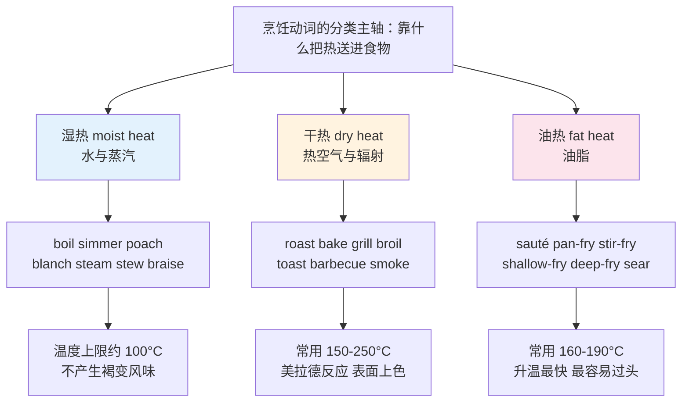
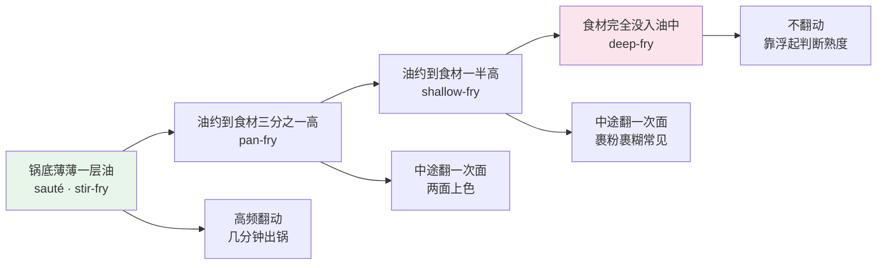
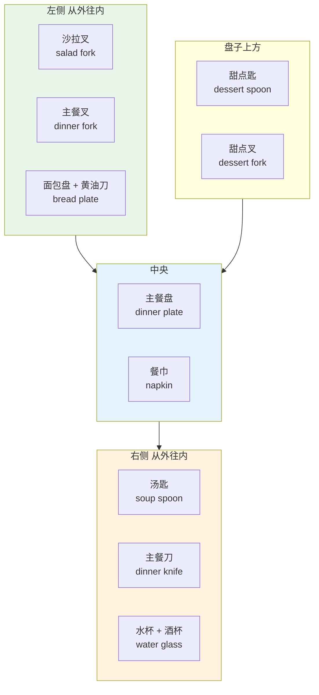
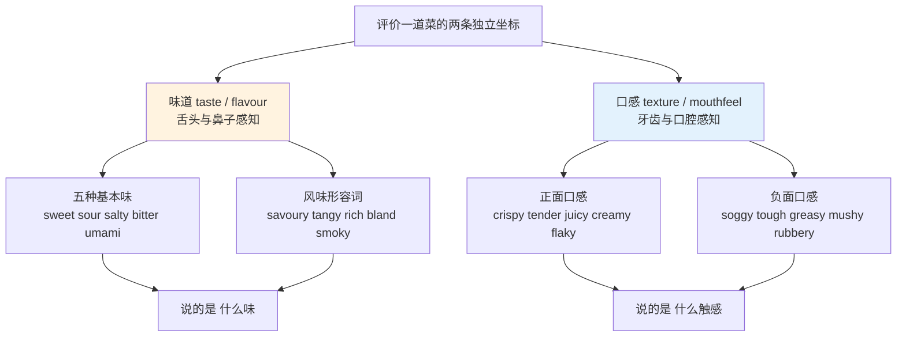
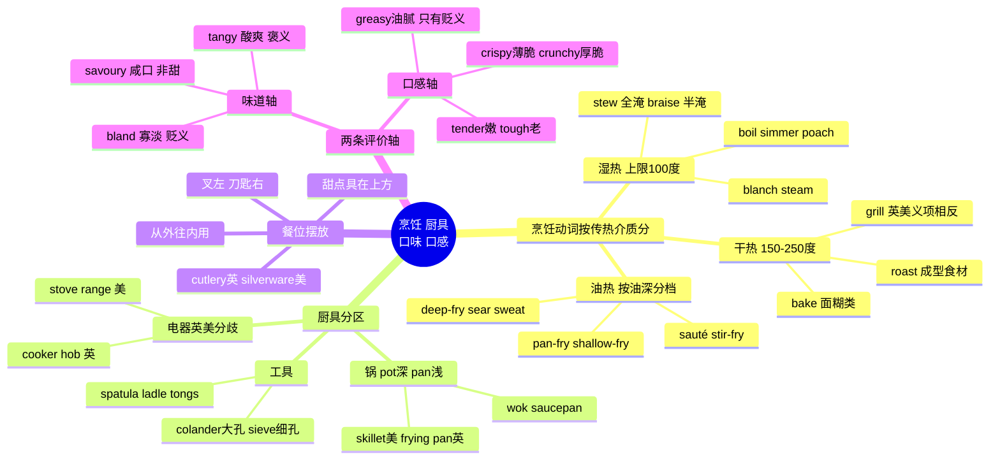

# 烹饪动词、厨具餐具与口味口感

> [!info] 本篇定位
>
> 09 章第三篇，承接 `02.食材词表` 的原料，讲原料变成菜之后的整套词汇：怎么做、用什么做、做出来什么味道什么口感。
>
> 三块内容：烹饪动词按传热介质分成湿热、干热、油热三组，每组内部再按温度和手法排序；厨具从锅到刀到电器分区列全，附英美用词分歧；味觉与口感分成两条独立的轴，`savory` 和 `crispy` 不是同一类形容词。
>
> 读完你应该能看懂英文菜谱的每一个动词，在超市看懂厨具包装，在餐厅描述一道菜好在哪、差在哪。语法层面的祈使句用法不在本篇范围，只讲词。

---

## 1. 本篇导读：中文一个「炒」，英文有五个词

中文母语者做饭词汇的第一个坎不是生词多，而是**中文的切分粒度太粗**。「炒」在英文里至少对应 `stir-fry`、`sauté`、`pan-fry`、`toss`、`sweat` 五个动词，各自锁定不同的油量、火力和翻动频率；反过来，`bake` 和 `roast` 中文都译成「烤」，但在英文菜谱里换用会直接改变读者对成品的预期。

第二个坎是**这批词几乎全是低频词**。`simmer`、`blanch`、`braise`、`colander`、`spatula` 在通用词频表里排得很靠后，靠泛读几乎撞不上，但只要开始看英文菜谱、看烹饪节目、或者出国自己做饭，它们的出现密度会瞬间拉满。这是典型的「主题内高频、全局低频」词群，只能按主题成组攻。

第三个坎是**英美用词分歧在这一章格外密集**。`grill` 在英国指烤箱上火烤，在美国指炭火架烤；`skillet` 是美式说法，英国人说 `frying pan`；英国的 `cutlery` 到美国叫 `silverware`。菜谱不标产地时，靠 `broil` 这类词反推来源比看拼写更准。

本篇所有词表统一用「英文 + 英式音标 + 美式音标 + 词性 + 中文 + 搭配」六列。音标栏里的破折号 — 表示该词在这一侧英语里不用，例如 `hob` 只属于英式、`pitcher` 只属于美式，短语动词和多词固定搭配同样不单列音标。音标体系与重音符号的读法在 [[01.词汇入门与学习方法/03.音标、词重音与词典读音体例\|音标、词重音与词典读音体例]] 里有完整说明。



上图是本篇前五节的骨架。三条支线不是按「中式西式」分的，而是按物理传热方式分的——这套分法直接来自英美烹饪教学的标准框架，所有英文菜谱书的目录都是这么排的。记住这个坐标之后，遇到没见过的烹饪动词，先判断它属于哪一支，再看温度和时间，词义基本就锁定了。

三支的核心差别只有一条：**水最高只能到 100°C，油和热空气能上到 200°C 以上**。褐变、焦香、脆皮全部发生在 100°C 以上，所以湿热法做出来的东西不会脆、不会有焦香，这条物理限制解释了本篇后半段口感词的绝大部分对立。

---

## 2. 湿热法：水与蒸汽这一组

### 2.1 温度梯度决定用哪个动词

湿热法这一组最容易混的三个词是 `boil`、`simmer`、`poach`，它们的区别只有水温和水面状态，中文都可以译成「煮」。

```text
boil     /bɔɪl/     100°C   水面剧烈翻滚，大泡连续冒出
simmer   /ˈsɪmə/    85-95°C 水面偶尔冒小泡，边缘有细泡带
poach    /pəʊtʃ/    70-80°C 水面几乎静止，只有微微颤动
```

菜谱里最常见的一条指令是 `Bring to a boil, then reduce the heat and simmer for 20 minutes.`——先大火烧开，再转小火慢煮。这句话里两个动词换位置就完全变味：一直 `boil` 二十分钟，肉会柴，汤会浑。

| 英文 | 英式音标 | 美式音标 | 词性 | 中文 | 搭配与说明 |
| --- | --- | --- | --- | --- | --- |
| **boil** | /bɔɪl/ | /bɔɪl/ | v./n. | 煮沸；沸腾 | bring to a boil 烧开；boil the pasta |
| **simmer** | /ˈsɪmə/ | /ˈsɪmər/ | v. | 小火慢煮 | simmer gently for 20 minutes；最常见的菜谱动词之一 |
| **poach** | /pəʊtʃ/ | /poʊtʃ/ | v. | 低温水煮 | poached egg 水波蛋；poach the salmon |
| **blanch** | /blɑːntʃ/ | /blæntʃ/ | v. | 焯水 | 沸水几十秒后立刻捞出；blanch the green beans |
| **refresh** | /rɪˈfreʃ/ | /rɪˈfreʃ/ | v. | 过冷水 | 焯完立刻 refresh in ice water 锁色锁脆 |
| **parboil** | /ˈpɑːbɔɪl/ | /ˈpɑːrbɔɪl/ | v. | 半煮 | parboil the potatoes before roasting |
| **steam** | /stiːm/ | /stiːm/ | v./n. | 蒸；蒸汽 | 食物不接触水；steamed buns 包子 |
| **stew** | /stjuː/ | /stuː/ | v./n. | 炖；炖菜 | 食材全部没入液体，小火长时间 |
| **braise** | /breɪz/ | /breɪz/ | v. | 焖烧 | 先煎上色，再加少量液体加盖慢煮 |
| **scald** | /skɔːld/ | /skɔːld/ | v. | 加热至将沸；烫伤 | scald the milk；也指开水烫伤 |
| **reduce** | /rɪˈdjuːs/ | /rɪˈduːs/ | v. | 收汁 | reduce by half 收掉一半 |
| **thicken** | /ˈθɪkən/ | /ˈθɪkən/ | v. | 勾芡；变稠 | thicken with cornflour（英）/ cornstarch（美） |
| **skim** | /skɪm/ | /skɪm/ | v. | 撇去浮沫 | skim off the foam / skim the fat |
| **steep** | /stiːp/ | /stiːp/ | v. | 浸泡出味 | steep the tea for three minutes |
| **infuse** | /ɪnˈfjuːz/ | /ɪnˈfjuːz/ | v. | 浸出香味 | infuse the cream with vanilla |
| **soak** | /səʊk/ | /soʊk/ | v. | 泡 | soak the beans overnight |
| **rehydrate** | /ˌriːhaɪˈdreɪt/ | /ˌriːhaɪˈdreɪt/ | v. | 泡发 | rehydrate the dried mushrooms |
| **boil over** | — | — | phr.v. | 煮溢出来 | The milk boiled over. 也可比喻情绪爆发 |
| **boil down** | — | — | phr.v. | 熬浓；归结为 | 引申义 it boils down to money 归根到底是钱 |
| **poach** | /pəʊtʃ/ | /poʊtʃ/ | v. | 偷猎；挖角 | 同形异义，与烹饪无关，读文章要靠上下文分辨 |

### 2.2 stew 和 braise 差在液体的量

这两个词都是「小火长时间加盖」，中文常常都译成「炖」，但英文里的分界很清楚。

- **stew**：食材切小块，**完全淹没**在液体里。成品是一锅汤菜，汤和料一起吃。`beef stew` 是一锅牛肉汤菜。
- **braise**：食材通常是**大块**，先在锅里煎到表面上色，再加**只到食材一半高**的液体，加盖慢炖。成品是一整块肉配少量浓汁。`braised short ribs` 是酱汁裹着的整根牛小排。

> [!warning] 两个动词的施动方向
>
> `stew` 可以不带宾语自己作不及物动词：`Let it stew for an hour.`
>
> `braise` 几乎总是及物：`braise the beef`，很少说 `the beef braises`。
>
> 另外注意 `stew` 有个常用比喻义「焦虑地干等」：`stew over something`（为某事纠结）、`let him stew`（晾着他让他着急）。

### 2.3 blanch 是最容易漏掉的一步

`blanch` 在英文菜谱里出现频率很高，但中文菜谱经常把这一步写成「焯一下」一笔带过，导致学习者对这个词没有概念。它的完整流程是三段式：

> [!example] blanch 的标准菜谱写法
>
> - **Blanch** the broccoli in boiling salted water for 90 seconds, then **refresh** in ice water and **drain** thoroughly.
>   - 西兰花在加盐沸水里焯 90 秒，立刻投入冰水，再彻底沥干。
> - **Blanch** the tomatoes for 30 seconds so the skins slip off easily.
>   - 番茄焯 30 秒，皮就能轻松剥掉。
> - Almonds are **blanched** to remove the brown skin.
>   - 杏仁焯水是为了去掉褐色外衣。

三个用途分别是：定色定脆、去皮、去生涩味。`refresh in ice water` 这个搭配是固定的，说 `wash in cold water` 意思会跑偏成「洗」。

---

## 3. 干热法：烤箱、明火与 grill/broil 陷阱

### 3.1 bake 与 roast 的分工

两个词都在烤箱里进行，温度区间也重叠，区别在**烤什么**：

- **bake**：面团、面糊、蛋奶糊这类**本身没有固定形状、靠加热定型**的东西。`bake bread`、`bake a cake`、`bake cookies`、`bake a casserole`。
- **roast**：**本身已经成型、有自带油脂或另外刷油**的整块食材。`roast chicken`、`roast a leg of lamb`、`roast vegetables`、`roast potatoes`。

边界模糊的情况确实存在——土豆两个词都能用，但含义不同：`baked potato` 是整颗带皮烤的那种，切开加黄油；`roast potatoes` 是切块裹油烤到外脆的那种，是英式周日烤肉的固定配菜。

| 英文 | 英式音标 | 美式音标 | 词性 | 中文 | 搭配与说明 |
| --- | --- | --- | --- | --- | --- |
| **bake** | /beɪk/ | /beɪk/ | v. | 烘焙 | 面团面糊类；名词 baking 泛指烘焙 |
| **roast** | /rəʊst/ | /roʊst/ | v./n./adj. | 烤；烤肉 | roast beef；a roast 指一顿烤肉正餐 |
| **grill** | /ɡrɪl/ | /ɡrɪl/ | v./n. | 见 3.3 英美义项相反 | 英式=上火烤箱；美式=炭火架烤 |
| **broil** | /brɔɪl/ | /brɔɪl/ | v. | 上火猛烤 | 只在美式菜谱出现，等于英式 grill |
| **toast** | /təʊst/ | /toʊst/ | v./n. | 烤（面包、坚果、香料） | toast the spices 干锅焙香；名词指吐司片 |
| **barbecue** | /ˈbɑːbɪkjuː/ | /ˈbɑːrbɪkjuː/ | v./n. | 户外炭烤；烧烤聚会 | 缩写 BBQ；美国南部特指低温慢熏 |
| **smoke** | /sməʊk/ | /smoʊk/ | v. | 熏制 | smoked salmon；cold-smoked 冷熏 |
| **char** | /tʃɑː/ | /tʃɑːr/ | v./n. | 烤出焦痕 | charred edges 是褒义，指焦香不是烧糊 |
| **blister** | /ˈblɪstə/ | /ˈblɪstər/ | v. | 烤到表皮起泡 | blistered padrón peppers |
| **brown** | /braʊn/ | /braʊn/ | v. | 上色 | brown the meat on all sides |
| **caramelize** | /ˈkærəməlaɪz/ | /ˈkærəməlaɪz/ | v. | 焦糖化 | caramelized onions 需要 30 分钟以上 |
| **crisp up** | — | — | phr.v. | 烤脆 | crisp up the skin under the grill |
| **preheat** | /ˌpriːˈhiːt/ | /ˌpriːˈhiːt/ | v. | 预热 | Preheat the oven to 200°C / 400°F |
| **bake blind** | — | — | phr. | 空烤派皮 | 铺烘焙纸压重石先烤底 |
| **flambé** | /ˈflɒmbeɪ/ | /flɑːmˈbeɪ/ | v./adj. | 火焰烧 | 加烈酒点燃，法语借词保留重音 |
| **singe** | /sɪndʒ/ | /sɪndʒ/ | v. | 燎（细毛） | singe the pin feathers off the duck |
| **rest** | /rest/ | /rest/ | v. | 静置（出炉后） | Let the meat rest for 10 minutes. 汁水回流 |
| **carve** | /kɑːv/ | /kɑːrv/ | v. | 切割（烤好的整肉） | carve the turkey；carving knife 切肉刀 |
| **overcook** | /ˌəʊvəˈkʊk/ | /ˌoʊvərˈkʊk/ | v. | 煮/烤过头 | overcooked steak 老掉的牛排 |
| **undercook** | /ˌʌndəˈkʊk/ | /ˌʌndərˈkʊk/ | v. | 没做熟 | undercooked chicken 有食安风险 |

### 3.2 温度写法：英美两套刻度

英式菜谱写摄氏 `°C`，还常带 `gas mark`（燃气烤箱刻度）；美式菜谱写华氏 `°F`。

| 常用档位 | 摄氏（英） | 华氏（美） | Gas mark（英） | 典型用途 |
| --- | --- | --- | --- | --- |
| 低温 | 140°C | 275°F | 1 | 慢烤、烘干 |
| 中低温 | 160°C | 325°F | 3 | 蛋糕、慢炖 |
| 中温 | 180°C | 350°F | 4 | 通用默认档 |
| 中高温 | 200°C | 400°F | 6 | 烤肉、烤蔬菜 |
| 高温 | 220°C | 425°F | 7 | 烤脆皮、披萨 |

> [!tip] 看到 350°F 直接反应成「中温」
>
> 美式菜谱里 `350°F` 出现的频率极高，相当于默认档。看到它不必换算，直接对应「烤箱调到 180°C」这个动作记忆即可。反过来看到英式的 `gas mark 4` 也是同一档。
>
> 英式菜谱还常见 `fan 160°C` 这种写法，`fan` 指风扇烤箱（美式叫 `convection oven`），比常规烤箱低 20°C 左右。

### 3.3 grill 与 broil：本篇最大的英美陷阱

| 用词 | 英式含义 | 美式含义 |
| --- | --- | --- |
| **grill**（v.） | 烤箱内**上方**加热元件辐射烤 | 炭火或燃气**下方**加热的架烤 |
| **grill**（n.） | 烤箱里那个上火装置 | 户外烤架，也叫 barbecue |
| **broil**（v.） | 基本不用 | 上火辐射烤，等于英式 grill |
| **barbecue**（v.） | 户外架烤 | 低温慢熏几小时，与 grill 分工明确 |
| **griddle**（n.） | 平底铁板 | 平底铁板，两边一致 |

同一句 `Grill for 5 minutes.`，英国读者会打开烤箱开上火，美国读者会走到院子里点炭。判断菜谱产地最快的两个标志词：出现 `broil` 必是美式，出现 `gas mark` 必是英式。

> [!warning] grill 还有一个完全无关的常用义
>
> `grill someone` 指「盘问某人」：`The police grilled him for six hours.`（警方审了他六个小时。）这个比喻义在新闻和影视里出现得比烹饪义还多。
>
> - ❌ ~~The police roasted him.~~（roast 的比喻义是「当众调侃」，不是审问）
> - ✅ **The police grilled him.**
>
> `roast` 的比喻义是喜剧场合的调侃：`a celebrity roast` 是名人吐槽大会。

---

## 4. 油热法：从 sauté 到 deep-fry 的油量梯度

### 4.1 油量决定动词

这一组的分界几乎完全由锅里油的深度决定。



上图把四个动词排成一条连续的梯度，右端油最多、翻动最少。中文母语者常把这四个全译成「煎」或「炸」，实际选词时只要先问一句「油有多深」，答案就唯一了。

`sauté` 和 `stir-fry` 在油量上是同一档，区别在锅和火力：`sauté` 用平底锅、中高火、食材摊平；`stir-fry` 用中式炒锅、猛火、持续翻动。英文菜谱写 `stir-fry` 时默认读者用的是 `wok`。

| 英文 | 英式音标 | 美式音标 | 词性 | 中文 | 搭配与说明 |
| --- | --- | --- | --- | --- | --- |
| **fry** | /fraɪ/ | /fraɪ/ | v. | 煎、炸的统称 | 单说 fry 时语义偏宽，菜谱多用更精确的词 |
| **pan-fry** | /ˈpæn fraɪ/ | /ˈpæn fraɪ/ | v. | 少油煎 | pan-fried dumplings 煎饺 |
| **shallow-fry** | /ˈʃæləʊ fraɪ/ | /ˈʃæloʊ fraɪ/ | v. | 半浸油炸 | 英式用得多，美式常并入 pan-fry |
| **deep-fry** | /ˈdiːp fraɪ/ | /ˈdiːp fraɪ/ | v. | 油炸 | deep-fried chicken；名词 deep-fryer 炸锅 |
| **stir-fry** | /ˈstɜː fraɪ/ | /ˈstɜːr fraɪ/ | v./n. | 爆炒；炒菜 | a vegetable stir-fry 一道炒蔬菜 |
| **sauté** | /ˈsəʊteɪ/ | /soʊˈteɪ/ | v. | 快炒、颠炒 | 法语借词，重音英前美后；sauté the onions |
| **sear** | /sɪə/ | /sɪr/ | v. | 大火封表面 | sear the steak on both sides；先 sear 后 braise |
| **sweat** | /swet/ | /swet/ | v. | 小火煸软不上色 | sweat the onions until translucent |
| **render** | /ˈrendə/ | /ˈrendər/ | v. | 煸出油脂 | render the bacon fat；名词 rendered fat |
| **baste** | /beɪst/ | /beɪst/ | v. | 淋油、浇汁 | baste the turkey with pan juices |
| **sizzle** | /ˈsɪzl/ | /ˈsɪzl/ | v./n. | 发出滋滋声 | The steak sizzled in the pan. |
| **splatter** | /ˈsplætə/ | /ˈsplætər/ | v./n. | 溅油 | a splatter guard 防溅盖 |
| **drain** | /dreɪn/ | /dreɪn/ | v. | 沥油、沥水 | drain on kitchen paper 用厨房纸吸油 |
| **coat** | /kəʊt/ | /koʊt/ | v. | 裹一层 | coat in flour / coat with batter |
| **batter** | /ˈbætə/ | /ˈbætər/ | n./v. | 面糊；裹面糊 | beer batter 啤酒面糊 |
| **breadcrumb** | /ˈbredkrʌm/ | /ˈbredkrʌm/ | n./v. | 面包糠；裹糠 | breadcrumbed cutlet |
| **dredge** | /dredʒ/ | /dredʒ/ | v. | 拍粉 | dredge the fish in seasoned flour |
| **confit** | /ˈkɒnfi/ | /kənˈfiː/ | n./v. | 油封 | duck confit 油封鸭腿；法语借词 t 不发音 |
| **toss** | /tɒs/ | /tɔːs/ | v. | 颠锅；拌 | toss the pasta in the sauce |
| **griddle** | /ˈɡrɪdl/ | /ˈɡrɪdl/ | v./n. | 铁板煎；平底铁板 | griddled halloumi |

### 4.2 三个最容易用错的火候动词

> [!example] sear / sweat / render 各自的目的
>
> - **Sear** the beef over high heat for two minutes per side, then transfer to the oven.
>   - 牛肉大火每面煎两分钟封表面，然后转烤箱。（目的是上色出香，不是弄熟）
> - **Sweat** the onions in butter over low heat until soft and translucent, about eight minutes.
>   - 洋葱用黄油小火煸到软而半透明，约八分钟。（目的是出水变软，刻意不上色）
> - Cook the bacon slowly to **render** the fat, then use it to fry the potatoes.
>   - 培根慢煎逼出油脂，再用这油煎土豆。（目的是取油）

三个词分别对应三个完全不同的意图：`sear` 要高温上色，`sweat` 要低温不上色，`render` 要把固态脂肪化成液态油。混用会让整道菜的做法跑偏。

> [!warning] sauté 的拼写与读音
>
> `sauté` 的重音位置英美不同：英式 /ˈsəʊteɪ/ 重音在前，美式 /soʊˈteɪ/ 重音常在后。
>
> 拼写上那个尖音符 é 在正式菜谱里保留，日常输入常写成 `saute`，都算可接受。但过去式要写 `sautéed`（美式也见 `sauteed`），不是 ~~sautéd~~。

---

## 5. 备料动词：切、削、去核、腌

### 5.1 刀工：按成品形状选词

英文的刀工动词按**切出来是什么形状**分，不按刀怎么动分，这一点和中文的「切、剁、片、丝」思路一致但切分点不同。

| 英文 | 英式音标 | 美式音标 | 词性 | 中文 | 搭配与说明 |
| --- | --- | --- | --- | --- | --- |
| **chop** | /tʃɒp/ | /tʃɑːp/ | v. | 切碎（不规则块） | roughly chopped 粗切；finely chopped 细切 |
| **dice** | /daɪs/ | /daɪs/ | v./n. | 切丁 | diced carrots；名词是骰子 |
| **mince** | /mɪns/ | /mɪns/ | v./n. | 剁成末；英式指肉馅 | minced garlic 蒜末；英 mince = 美 ground meat |
| **slice** | /slaɪs/ | /slaɪs/ | v./n. | 切片 | thinly sliced 薄片；a slice of bread |
| **julienne** | /ˌdʒuːliˈen/ | /ˌdʒuːliˈen/ | v./n. | 切细丝 | julienned ginger 姜丝；法语借词 |
| **shred** | /ʃred/ | /ʃred/ | v. | 撕丝；擦丝 | shredded chicken 手撕鸡；shredded cheese |
| **grate** | /ɡreɪt/ | /ɡreɪt/ | v. | 擦碎 | grated parmesan；工具是 grater |
| **crush** | /krʌʃ/ | /krʌʃ/ | v. | 压碎 | crush the garlic with the flat of the knife |
| **cube** | /kjuːb/ | /kjuːb/ | v./n. | 切大方块 | cubed beef；比 dice 块大 |
| **quarter** | /ˈkwɔːtə/ | /ˈkwɔːrtər/ | v. | 切四瓣 | quarter the potatoes |
| **halve** | /hɑːv/ | /hæv/ | v. | 对半切 | halve the lemons；注意 l 不发音 |
| **trim** | /trɪm/ | /trɪm/ | v. | 修边、去掉多余部分 | trim the fat / trim the ends off |
| **peel** | /piːl/ | /piːl/ | v./n. | 削皮；果皮 | peel the apples；lemon peel |
| **pare** | /peə/ | /per/ | v. | 削（薄薄一层） | 比 peel 正式；paring knife 削皮小刀 |
| **core** | /kɔː/ | /kɔːr/ | v./n. | 去核（苹果、梨） | core the apples；名词是果心 |
| **pit** | /pɪt/ | /pɪt/ | v./n. | 去核（樱桃、橄榄） | pitted olives 去核橄榄 |
| **de-seed** | /diːˈsiːd/ | /diːˈsiːd/ | v. | 去籽 | de-seed the chillies；也写 seed |
| **devein** | /diːˈveɪn/ | /diːˈveɪn/ | v. | 去虾线 | peel and devein the prawns |
| **debone** | /diːˈbəʊn/ | /diːˈboʊn/ | v. | 去骨 | 也说 bone the fish |
| **fillet** | /ˈfɪlɪt/ | /fɪˈleɪ/ | v./n. | 剔成肉/鱼片 | 英美读音差异极大，见下方提示 |
| **zest** | /zest/ | /zest/ | v./n. | 擦柠檬皮屑 | lemon zest 只要黄色部分，不要白瓤 |
| **score** | /skɔː/ | /skɔːr/ | v. | 划刀口 | score the skin in a criss-cross pattern |
| **butterfly** | /ˈbʌtəflaɪ/ | /ˈbʌtərflaɪ/ | v. | 蝴蝶刀展开 | butterfly the chicken breast |
| **tenderize** | /ˈtendəraɪz/ | /ˈtendəraɪz/ | v. | 敲松、嫩化 | tenderize with a mallet；英式也拼 -ise |

> [!warning] fillet 的读音是本节最大的坑
>
> 英式 /ˈfɪlɪt/，t 发音，重音在前；美式 /fɪˈleɪ/，t 不发音，重音在后（保留法语读法）。
>
> - 英国餐厅菜单：`cod fillet` 读作 /kɒd ˈfɪlɪt/
> - 美国餐厅菜单：`filet mignon` 读作 /fɪˌleɪ mɪnˈjoʊn/
>
> 美式还常把名词拼成 `filet`。看到 `filet` 这个拼法基本可判定是美式或法式菜单。

### 5.2 腌、拌、调味

| 英文 | 英式音标 | 美式音标 | 词性 | 中文 | 搭配与说明 |
| --- | --- | --- | --- | --- | --- |
| **marinate** | /ˈmærɪneɪt/ | /ˈmærɪneɪt/ | v. | 腌（用液体调料） | marinate overnight；名词 marinade 腌料 |
| **marinade** | /ˌmærɪˈneɪd/ | /ˌmærɪˈneɪd/ | n. | 腌料汁 | 名词是 -ade，动词是 -ate，别写反 |
| **season** | /ˈsiːzn/ | /ˈsiːzn/ | v. | 调味（主要指盐和胡椒） | season to taste 按口味调味 |
| **brine** | /braɪn/ | /braɪn/ | v./n. | 盐水浸；盐卤 | brine the turkey for 12 hours |
| **cure** | /kjʊə/ | /kjʊr/ | v. | 腌制保存 | cured ham 火腿；salt-cured 盐渍 |
| **pickle** | /ˈpɪkl/ | /ˈpɪkl/ | v./n. | 醋渍；泡菜 | pickled onions；美式 pickle 单指酸黄瓜 |
| **ferment** | /fəˈment/ | /fərˈment/ | v. | 发酵 | 动词重音在后，名词 /ˈfɜːment/ 重音在前 |
| **rub** | /rʌb/ | /rʌb/ | v./n. | 抹干料；干腌料 | a dry rub 干腌香料粉 |
| **dress** | /dres/ | /dres/ | v. | 拌沙拉 | dress the salad；名词 dressing 沙拉汁 |
| **toss** | /tɒs/ | /tɔːs/ | v. | 拌匀 | toss the salad；比 mix 更轻手 |
| **drizzle** | /ˈdrɪzl/ | /ˈdrɪzl/ | v. | 细细淋上 | drizzle with olive oil；名词是毛毛雨 |
| **sprinkle** | /ˈsprɪŋkl/ | /ˈsprɪŋkl/ | v. | 撒 | sprinkle with sea salt |
| **garnish** | /ˈɡɑːnɪʃ/ | /ˈɡɑːrnɪʃ/ | v./n. | 装点；配饰菜 | garnish with parsley |
| **glaze** | /ɡleɪz/ | /ɡleɪz/ | v./n. | 刷亮面 | egg glaze 蛋液；honey-glazed 蜜汁的 |
| **stuff** | /stʌf/ | /stʌf/ | v. | 塞馅 | stuffed peppers；名词 stuffing 填料 |
| **skewer** | /ˈskjuːə/ | /ˈskjuːər/ | v./n. | 串起来；扦子 | skewered lamb 羊肉串 |
| **truss** | /trʌs/ | /trʌs/ | v. | 捆扎（禽类） | truss the chicken with string |
| **defrost** | /ˌdiːˈfrɒst/ | /ˌdiːˈfrɔːst/ | v. | 解冻 | defrost in the fridge overnight |
| **thaw** | /θɔː/ | /θɔː/ | v. | 化冻 | 与 defrost 基本同义，thaw 更口语 |
| **chill** | /tʃɪl/ | /tʃɪl/ | v. | 冷藏 | chill for at least two hours |

> [!tip] marinate 与 marinade 的记法
>
> **动词** `marinate` 以 `-ate` 结尾，和 `create`、`donate` 同一类动词后缀。
>
> **名词** `marinade` 以 `-ade` 结尾，和 `lemonade`（柠檬水）、`barricade`（路障）同一类名词后缀。
>
> - ❌ ~~Marinade the beef for an hour.~~
> - ✅ **Marinate** the beef in the **marinade** for an hour.

---

## 6. 混合、打发与面团

### 6.1 六个「搅」不能互换

中文的「搅」「拌」「打」在英文里被切成六个动词，各自锁定不同的工具、力度和目的。

| 英文 | 英式音标 | 美式音标 | 词性 | 中文 | 搭配与说明 |
| --- | --- | --- | --- | --- | --- |
| **stir** | /stɜː/ | /stɜːr/ | v. | 搅动 | 用勺或铲，目的是混匀防糊底 |
| **whisk** | /wɪsk/ | /wɪsk/ | v./n. | 打散、快速搅；打蛋器 | whisk the eggs；工具与动作同形 |
| **beat** | /biːt/ | /biːt/ | v. | 用力搅打 | beat the butter and sugar until pale |
| **whip** | /wɪp/ | /wɪp/ | v. | 打发（打进空气） | whipped cream 打发奶油 |
| **fold** | /fəʊld/ | /foʊld/ | v. | 翻拌 | fold in the flour 轻轻翻拌以免消泡 |
| **blend** | /blend/ | /blend/ | v. | 搅打成糊（用机器） | blend until smooth |
| **cream** | /kriːm/ | /kriːm/ | v. | 打成膏状 | cream the butter and sugar together |
| **knead** | /niːd/ | /niːd/ | v. | 揉面 | knead for 10 minutes；k 不发音 |
| **prove** | /pruːv/ | /pruːv/ | v. | 发面（英式） | leave the dough to prove；美式说 proof |
| **rise** | /raɪz/ | /raɪz/ | v. | 发起来 | let the dough rise until doubled |
| **knock back** | — | — | phr.v. | 排气（英式） | 美式说 punch down |
| **roll out** | — | — | phr.v. | 擀开 | roll out the pastry to 3 mm |
| **sift** | /sɪft/ | /sɪft/ | v. | 过筛 | sift the flour and baking powder |
| **strain** | /streɪn/ | /streɪn/ | v. | 过滤 | strain through a fine sieve |
| **mash** | /mæʃ/ | /mæʃ/ | v./n. | 压成泥 | mashed potatoes；英式名词 mash 指土豆泥 |
| **purée** | /ˈpjʊəreɪ/ | /pjʊˈreɪ/ | v./n. | 打成蓉 | tomato purée；法语借词 |
| **emulsify** | /ɪˈmʌlsɪfaɪ/ | /ɪˈmʌlsɪfaɪ/ | v. | 乳化 | emulsify the dressing |
| **temper** | /ˈtempə/ | /ˈtempər/ | v. | 回温调和 | temper the eggs 蛋液慢慢兑入热液防结块 |
| **combine** | /kəmˈbaɪn/ | /kəmˈbaɪn/ | v. | 混合 | combine the dry ingredients |
| **incorporate** | /ɪnˈkɔːpəreɪt/ | /ɪnˈkɔːrpəreɪt/ | v. | 使融入 | incorporate the butter gradually |
| **melt** | /melt/ | /melt/ | v. | 融化 | melt the chocolate over a bain-marie |
| **dissolve** | /dɪˈzɒlv/ | /dɪˈzɑːlv/ | v. | 溶解 | dissolve the sugar in warm water |

### 6.2 whisk / beat / whip / fold 的力度阶梯

四个词按「进入面糊的空气量」排成一条线：

```text
fold   最轻   刻意不让空气跑掉，橡皮刮刀从底往上翻
stir   轻     只求混匀，不追求进气
whisk  中     打散并混匀，蛋液、酱汁最常用
beat   重     用力，让混合物变浅变蓬
whip   最重   目标就是把空气打进去，直到能立住
```

> [!example] 四个词在一份蛋糕食谱里的分工
>
> - **Beat** the butter and sugar until pale and fluffy.
>   - 黄油和糖打到发白蓬松。
> - **Whisk** the eggs and add them a little at a time.
>   - 鸡蛋打散，分次加入。
> - **Fold** in the sifted flour with a spatula — do not stir.
>   - 用刮刀翻拌入过筛的面粉，不要搅。
> - **Whip** the cream to soft peaks and spread over the cooled cake.
>   - 奶油打到软性发泡，抹在放凉的蛋糕上。

`soft peaks`（软性发泡，尖头会弯）和 `stiff peaks`（硬性发泡，尖头立得住）是打发程度的标准表述，烘焙菜谱里几乎每次都出现。

> [!warning] knead 的 k 不发音
>
> `knead` /niːd/ 与 `need` /niːd/ 完全同音。同类的还有 `knife` /naɪf/、`knock` /nɒk/、`knot` /nɒt/、`know` /nəʊ/ ——`kn-` 开头的词 k 一律不发音。拼写保留的是十七世纪之前 k 还真的发音时的写法，读音后来简化了，拼写没跟着改。
>
> `dough`（面团）读 /dəʊ/ · /doʊ/，gh 不发音；派生的 `doughy`（发黏、没烤透）读 /ˈdəʊi/ · /ˈdoʊi/。

---

## 7. 锅具：pot、pan、skillet、wok 的分工

### 7.1 pot 与 pan 的分界

英文锅具的第一层分类是 `pot` 与 `pan`：

- **pot**：**深**，有两个对称的小把手，用来装液体。煮汤、煮面、炖菜。
- **pan**：**浅**，通常一个长柄，用来煎炒。

例外是 `saucepan`——名字带 pan，形状却是深的、单长柄，介于两者之间，是英式厨房的主力锅。

| 英文 | 英式音标 | 美式音标 | 词性 | 中文 | 搭配与说明 |
| --- | --- | --- | --- | --- | --- |
| **pot** | /pɒt/ | /pɑːt/ | n. | 深锅 | 双耳，煮汤炖菜用 |
| **pan** | /pæn/ | /pæn/ | n. | 平底锅 | 浅，单长柄 |
| **saucepan** | /ˈsɔːspən/ | /ˈsɔːspæn/ | n. | 单柄深锅 | 英式厨房主力；注意英式第二音节弱读 |
| **frying pan** | /ˈfraɪɪŋ pæn/ | /ˈfraɪɪŋ pæn/ | n. | 煎锅 | 英式常用说法 |
| **skillet** | /ˈskɪlɪt/ | /ˈskɪlɪt/ | n. | 煎锅 | 美式常用说法，常特指铸铁的 |
| **wok** | /wɒk/ | /wɑːk/ | n. | 中式炒锅 | 粤语借词，已完全进入英语 |
| **stockpot** | /ˈstɒkpɒt/ | /ˈstɑːkpɑːt/ | n. | 高汤锅 | 最大最深的那口 |
| **Dutch oven** | /ˌdʌtʃ ˈʌvn/ | /ˌdʌtʃ ˈʌvn/ | n. | 铸铁厚壁炖锅 | 英式也叫 casserole dish |
| **casserole** | /ˈkæsərəʊl/ | /ˈkæsəroʊl/ | n. | 焗烤盘；焗菜 | 既指容器也指做出来的菜 |
| **roasting tin** | /ˈrəʊstɪŋ tɪn/ | — | n. | 烤盘（英） | 美式说 roasting pan |
| **baking tray** | /ˈbeɪkɪŋ treɪ/ | — | n. | 平烤盘（英） | 美式说 baking sheet / cookie sheet |
| **cake tin** | /ˈkeɪk tɪn/ | — | n. | 蛋糕模（英） | 美式说 cake pan |
| **loaf tin** | /ˈləʊf tɪn/ | — | n. | 吐司模（英） | 美式说 loaf pan |
| **muffin tin** | /ˈmʌfɪn tɪn/ | /ˈmʌfɪn tɪn/ | n. | 马芬模 | 十二连模最常见 |
| **ramekin** | /ˈræmɪkɪn/ | /ˈræmɪkɪn/ | n. | 小烤盅 | 做舒芙蕾、布丁用 |
| **griddle pan** | /ˈɡrɪdl pæn/ | /ˈɡrɪdl pæn/ | n. | 条纹煎盘 | 煎出烤架条纹 |
| **steamer** | /ˈstiːmə/ | /ˈstiːmər/ | n. | 蒸锅、蒸笼 | bamboo steamer 竹蒸笼 |
| **double boiler** | /ˌdʌbl ˈbɔɪlə/ | /ˌdʌbl ˈbɔɪlər/ | n. | 双层隔水锅 | 法语说法 bain-marie 也通用 |
| **lid** | /lɪd/ | /lɪd/ | n. | 锅盖 | cover with a lid；不说 ~~pot cover~~ |
| **handle** | /ˈhændl/ | /ˈhændl/ | n. | 锅柄 | ovenproof handle 可进烤箱的柄 |
| **non-stick** | /ˌnɒnˈstɪk/ | /ˌnɑːnˈstɪk/ | adj. | 不粘的 | a non-stick pan |
| **cast iron** | /ˌkɑːst ˈaɪən/ | /ˌkæst ˈaɪərn/ | n./adj. | 铸铁 | cast-iron skillet；需要 season 养锅 |
| **stainless steel** | /ˌsteɪnləs ˈstiːl/ | /ˌsteɪnləs ˈstiːl/ | n./adj. | 不锈钢 | 传热不如铸铁均匀但好清洗 |
| **ovenproof** | /ˈʌvnpruːf/ | /ˈʌvnpruːf/ | adj. | 可进烤箱的 | an ovenproof dish |

> [!tip] season 在锅具语境下的第三个意思
>
> `season` 用在食物上是「调味」，用在铸铁锅上是「养锅」——涂油高温烘烤形成不粘涂层。
>
> - `Season the soup with salt and pepper.`（给汤调味）
> - `Season a new cast-iron skillet before first use.`（新铸铁锅首次使用前要开锅养锅）
>
> 同一个词第三个常见义项是「季节」，四个义项之间靠搭配区分。

---

## 8. 厨房小工具

### 8.1 高频工具全表

`colander` 和 `spatula` 是这一组里最常被点名却最容易读错的两个词。`colander` 重音在第一音节，第二个 o 弱化；`spatula` 英美读法差别在第二音节。

| 英文 | 英式音标 | 美式音标 | 词性 | 中文 | 搭配与说明 |
| --- | --- | --- | --- | --- | --- |
| **colander** | /ˈkʌləndə/ | /ˈkʌləndər/ | n. | 沥水篮 | 大孔，沥面沥菜；drain in a colander |
| **sieve** | /sɪv/ | /sɪv/ | n./v. | 细筛 | 细孔，过筛面粉、滤汤；注意读 /sɪv/ 不是 /siːv/ |
| **strainer** | /ˈstreɪnə/ | /ˈstreɪnər/ | n. | 滤网 | tea strainer 茶滤 |
| **spatula** | /ˈspætjʊlə/ | /ˈspætʃələ/ | n. | 铲子；橡皮刮刀 | 英式偏指硅胶刮刀，美式也指煎铲 |
| **fish slice** | /ˈfɪʃ slaɪs/ | — | n. | 煎铲（英） | 美式说 turner 或 spatula |
| **ladle** | /ˈleɪdl/ | /ˈleɪdl/ | n./v. | 汤勺；舀 | ladle the soup into bowls |
| **tongs** | /tɒŋz/ | /tɔːŋz/ | n. | 夹子 | 恒复数，a pair of tongs |
| **whisk** | /wɪsk/ | /wɪsk/ | n. | 打蛋器 | balloon whisk 球形打蛋器 |
| **peeler** | /ˈpiːlə/ | /ˈpiːlər/ | n. | 削皮刀 | vegetable peeler |
| **grater** | /ˈɡreɪtə/ | /ˈɡreɪtər/ | n. | 擦丝器 | box grater 四面擦 |
| **masher** | /ˈmæʃə/ | /ˈmæʃər/ | n. | 压泥器 | potato masher |
| **rolling pin** | /ˈrəʊlɪŋ pɪn/ | /ˈroʊlɪŋ pɪn/ | n. | 擀面杖 | — |
| **chopping board** | /ˈtʃɒpɪŋ bɔːd/ | — | n. | 砧板（英） | 美式说 cutting board |
| **chef's knife** | /ˈʃefs naɪf/ | /ˈʃefs naɪf/ | n. | 主厨刀 | 最常用的一把，20 cm 左右 |
| **paring knife** | /ˈpeərɪŋ naɪf/ | /ˈperɪŋ naɪf/ | n. | 削皮小刀 | 短刃，处理水果 |
| **bread knife** | /ˈbred naɪf/ | /ˈbred naɪf/ | n. | 面包刀 | 锯齿刃 serrated |
| **cleaver** | /ˈkliːvə/ | /ˈkliːvər/ | n. | 砍刀、中式菜刀 | Chinese cleaver |
| **serrated** | /səˈreɪtɪd/ | /ˈsereɪtɪd/ | adj. | 锯齿状的 | a serrated edge |
| **sharpen** | /ˈʃɑːpən/ | /ˈʃɑːrpən/ | v. | 磨刀 | knife sharpener 磨刀器；whetstone 磨刀石 |
| **mortar and pestle** | /ˈmɔːtə ən ˈpesl/ | /ˈmɔːrtər ən ˈpestl/ | n. | 研钵和杵 | 美式 pestle 的 t 常发音 |
| **measuring jug** | /ˈmeʒərɪŋ dʒʌɡ/ | — | n. | 量杯（英） | 美式说 measuring cup |
| **measuring spoons** | /ˈmeʒərɪŋ spuːnz/ | /ˈmeʒərɪŋ spuːnz/ | n. | 量匙 | tsp 茶匙，tbsp 汤匙 |
| **kitchen scales** | /ˈkɪtʃɪn skeɪlz/ | — | n. | 厨房秤 | 英式用复数，美式说 kitchen scale |
| **mixing bowl** | /ˈmɪksɪŋ bəʊl/ | /ˈmɪksɪŋ boʊl/ | n. | 搅拌盆 | — |
| **oven mitt** | /ˈʌvn mɪt/ | /ˈʌvn mɪt/ | n. | 隔热手套 | 英式也说 oven glove |
| **tea towel** | /ˈtiː taʊəl/ | — | n. | 擦碗布（英） | 美式说 dish towel |
| **apron** | /ˈeɪprən/ | /ˈeɪprən/ | n. | 围裙 | 注意读 /ˈeɪprən/ 不是 /ˈæprən/ |
| **tin opener** | /ˈtɪn əʊpənə/ | — | n. | 开罐器（英） | 美式说 can opener |
| **corkscrew** | /ˈkɔːkskruː/ | /ˈkɔːrkskruː/ | n. | 开瓶器（红酒） | — |
| **bottle opener** | /ˈbɒtl əʊpənə/ | /ˈbɑːtl oʊpənər/ | n. | 起瓶器 | 开啤酒瓶盖用 |
| **timer** | /ˈtaɪmə/ | /ˈtaɪmər/ | n. | 计时器 | set a timer for 20 minutes |
| **thermometer** | /θəˈmɒmɪtə/ | /θərˈmɑːmɪtər/ | n. | 温度计 | meat thermometer 探针温度计 |
| **funnel** | /ˈfʌnl/ | /ˈfʌnl/ | n. | 漏斗 | — |
| **skewer** | /ˈskjuːə/ | /ˈskjuːər/ | n. | 扦子 | 也用来测蛋糕熟没熟 |
| **foil** | /fɔɪl/ | /fɔɪl/ | n. | 锡纸 | 全称 aluminium foil（英）/ aluminum foil（美） |
| **cling film** | /ˈklɪŋ fɪlm/ | — | n. | 保鲜膜（英） | 美式说 plastic wrap |
| **baking paper** | /ˈbeɪkɪŋ peɪpə/ | — | n. | 烘焙纸（英） | 美式说 parchment paper |
| **piping bag** | /ˈpaɪpɪŋ bæɡ/ | /ˈpaɪpɪŋ bæɡ/ | n. | 裱花袋 | 美式也说 pastry bag |
| **sink** | /sɪŋk/ | /sɪŋk/ | n. | 水槽 | the kitchen sink |
| **washing-up liquid** | — | — | n. | 洗洁精（英） | 美式说 dish soap |

> [!warning] sieve 的读音与拼写都反直觉
>
> `sieve` 读 /sɪv/，只有一个短音节，ie 组合在这里读 /ɪ/，e 不发音。中文母语者最常见的错读是 /siːv/ 或 /ˈsaɪiːv/。
>
> 记忆钩子：`sieve` 和 `give` /ɡɪv/、`live` /lɪv/ 押韵。
>
> 相关词 `sift` /sɪft/（过筛）就规则得多，是同一个词根的动词形式。

---

## 9. 厨房电器与英美用词分歧

### 9.1 灶具与烤箱

英式厨房把炉灶和烤箱合称 `cooker`，灶面叫 `hob`；美式则说 `stove` 或 `range`，灶面叫 `stovetop` / `cooktop`。这组词是英美分歧最密集的一小片。

| 英文 | 英式音标 | 美式音标 | 词性 | 中文 | 搭配与说明 |
| --- | --- | --- | --- | --- | --- |
| **cooker** | /ˈkʊkə/ | — | n. | 炉灶（英） | 美国人听到会理解成压力锅之类的器具 |
| **stove** | /stəʊv/ | /stoʊv/ | n. | 炉灶（美） | on the stove 在灶上 |
| **range** | /reɪndʒ/ | /reɪndʒ/ | n. | 一体式灶具 | 美式家电用语；range hood 抽油烟机 |
| **hob** | /hɒb/ | — | n. | 灶面（英） | 美式说 stovetop / cooktop |
| **burner** | /ˈbɜːnə/ | /ˈbɜːrnər/ | n. | 灶眼 | a four-burner hob 四眼灶 |
| **oven** | /ˈʌvn/ | /ˈʌvn/ | n. | 烤箱 | 读 /ˈʌvn/ 不是 /ˈəʊvn/ |
| **microwave** | /ˈmaɪkrəweɪv/ | /ˈmaɪkrəweɪv/ | n./v. | 微波炉；微波加热 | 动词用法 microwave it for two minutes |
| **extractor fan** | /ɪkˈstræktə fæn/ | — | n. | 抽油烟机（英） | 美式说 range hood / exhaust fan |
| **toaster** | /ˈtəʊstə/ | /ˈtoʊstər/ | n. | 面包机 | pop-up toaster 弹跳式 |
| **kettle** | /ˈketl/ | /ˈketl/ | n. | 电水壶 | 英式家庭必备；美式家庭少见 |
| **blender** | /ˈblendə/ | /ˈblendər/ | n. | 搅拌机 | 打液体；hand blender 手持料理棒 |
| **food processor** | /ˈfuːd prəʊsesə/ | /ˈfuːd prɑːsesər/ | n. | 食物处理器 | 切碎、揉面；比 blender 用途宽 |
| **stand mixer** | /ˈstænd mɪksə/ | /ˈstænd mɪksər/ | n. | 台式搅拌机 | 揉面打发用 |
| **hand mixer** | /ˈhænd mɪksə/ | /ˈhænd mɪksər/ | n. | 手持打蛋器 | 也叫 electric whisk |
| **rice cooker** | /ˈraɪs kʊkə/ | /ˈraɪs kʊkər/ | n. | 电饭煲 | — |
| **slow cooker** | /ˈsləʊ kʊkə/ | /ˈsloʊ kʊkər/ | n. | 慢炖锅 | 美式商标名 Crock-Pot 已通用化 |
| **pressure cooker** | /ˈpreʃə kʊkə/ | /ˈpreʃər kʊkər/ | n. | 高压锅 | — |
| **air fryer** | /ˈeə fraɪə/ | /ˈer fraɪər/ | n. | 空气炸锅 | 本质是小型热风烤箱 |
| **deep fryer** | /ˈdiːp fraɪə/ | /ˈdiːp fraɪər/ | n. | 油炸锅 | — |
| **fridge** | /frɪdʒ/ | /frɪdʒ/ | n. | 冰箱 | 全称 refrigerator；美式也说 icebox（旧） |
| **freezer** | /ˈfriːzə/ | /ˈfriːzər/ | n. | 冷冻室 | freezer burn 冻伤（表面脱水发白） |
| **dishwasher** | /ˈdɪʃwɒʃə/ | /ˈdɪʃwɑːʃər/ | n. | 洗碗机 | dishwasher-safe 可进洗碗机的 |
| **worktop** | /ˈwɜːktɒp/ | — | n. | 台面（英） | 美式说 countertop |
| **cupboard** | /ˈkʌbəd/ | /ˈkʌbərd/ | n. | 橱柜 | 注意 p 不发音 |
| **pantry** | /ˈpæntri/ | /ˈpæntri/ | n. | 食品储藏室 | 美式家庭常见 |
| **bin** | /bɪn/ | — | n. | 垃圾桶（英） | 美式说 trash can / garbage can |

> [!warning] cupboard 的 p 不发音
>
> `cupboard` 读 /ˈkʌbəd/ · /ˈkʌbərd/，两个音节，p 完全不发音，重音在前。
>
> 同类的「拼写里有字母但不发音」的厨房词还有：
>
> - **cupboard** /ˈkʌbəd/ —— p 不发
> - **knead** /niːd/、**knife** /naɪf/ —— k 不发
> - **salmon** /ˈsæmən/ —— l 不发
> - **halve** /hɑːv/ · /hæv/ —— l 不发
> - **herb** 英 /hɜːb/ h 发音，美 /ɜːrb/ h 不发

---

## 10. 餐具与餐位摆放

### 10.1 餐具的三套统称

同一批刀叉勺，英式叫 `cutlery`，美式叫 `silverware`，中性/行业说法叫 `flatware`。三个词指同一类东西，但混着用会露怯。

| 英文 | 英式音标 | 美式音标 | 词性 | 中文 | 搭配与说明 |
| --- | --- | --- | --- | --- | --- |
| **cutlery** | /ˈkʌtləri/ | /ˈkʌtləri/ | n. | 餐具刀叉（英） | 不可数；a piece of cutlery |
| **silverware** | /ˈsɪlvəweə/ | /ˈsɪlvərwer/ | n. | 餐具刀叉（美） | 不可数，与银质无关 |
| **flatware** | /ˈflætweə/ | /ˈflætwer/ | n. | 扁平餐具 | 商品目录用词，中性 |
| **crockery** | /ˈkrɒkəri/ | /ˈkrɑːkəri/ | n. | 陶瓷餐具（英） | 盘碗杯碟的统称 |
| **tableware** | /ˈteɪblweə/ | /ˈteɪblwer/ | n. | 餐桌用具总称 | 涵盖所有 |
| **fork** | /fɔːk/ | /fɔːrk/ | n. | 叉 | 齿叫 tine /taɪn/ |
| **knife** | /naɪf/ | /naɪf/ | n. | 刀 | 复数 knives；k 不发音 |
| **spoon** | /spuːn/ | /spuːn/ | n. | 勺 | — |
| **teaspoon** | /ˈtiːspuːn/ | /ˈtiːspuːn/ | n. | 茶匙 | 计量单位缩写 tsp，约 5 ml |
| **tablespoon** | /ˈteɪblspuːn/ | /ˈteɪblspuːn/ | n. | 汤匙 | 缩写 tbsp，英美容量略有差别 |
| **dessert spoon** | /dɪˈzɜːt spuːn/ | /dɪˈzɜːrt spuːn/ | n. | 甜点匙 | 介于茶匙和汤匙之间 |
| **soup spoon** | /ˈsuːp spuːn/ | /ˈsuːp spuːn/ | n. | 汤匙（圆头） | 摆在最右外侧 |
| **steak knife** | /ˈsteɪk naɪf/ | /ˈsteɪk naɪf/ | n. | 牛排刀 | 锯齿刃 |
| **butter knife** | /ˈbʌtə naɪf/ | /ˈbʌtər naɪf/ | n. | 黄油刀 | 钝头，横放在面包盘上 |
| **chopsticks** | /ˈtʃɒpstɪks/ | /ˈtʃɑːpstɪks/ | n. | 筷子 | 恒复数；a pair of chopsticks |
| **plate** | /pleɪt/ | /pleɪt/ | n. | 盘子 | dinner plate 主餐盘 |
| **side plate** | /ˈsaɪd pleɪt/ | — | n. | 面包盘（英） | 美式说 bread plate |
| **bowl** | /bəʊl/ | /boʊl/ | n. | 碗 | soup bowl / cereal bowl |
| **saucer** | /ˈsɔːsə/ | /ˈsɔːsər/ | n. | 茶托、小碟 | a cup and saucer |
| **mug** | /mʌɡ/ | /mʌɡ/ | n. | 马克杯 | 有柄大杯，喝咖啡茶 |
| **glass** | /ɡlɑːs/ | /ɡlæs/ | n. | 玻璃杯 | 英美元音差别典型词 |
| **tumbler** | /ˈtʌmblə/ | /ˈtʌmblər/ | n. | 平底无柄杯 | 装水、装威士忌 |
| **wine glass** | /ˈwaɪn ɡlɑːs/ | /ˈwaɪn ɡlæs/ | n. | 酒杯 | 带高脚；统称 stemware |
| **jug** | /dʒʌɡ/ | — | n. | 水壶（英） | 美式说 pitcher |
| **pitcher** | — | /ˈpɪtʃər/ | n. | 水壶（美） | 英式说 jug |
| **teapot** | /ˈtiːpɒt/ | /ˈtiːpɑːt/ | n. | 茶壶 | — |
| **carafe** | /kəˈræf/ | /kəˈræf/ | n. | 玻璃酒瓶 | 餐厅点散装酒常用 |
| **decanter** | /dɪˈkæntə/ | /dɪˈkæntər/ | n. | 醒酒器 | — |
| **napkin** | /ˈnæpkɪn/ | /ˈnæpkɪn/ | n. | 餐巾 | 美式最通用 |
| **serviette** | /ˌsɜːviˈet/ | /ˌsɜːrviˈet/ | n. | 餐巾（英） | 英式旧派或较不正式的说法 |
| **tablecloth** | /ˈteɪblklɒθ/ | /ˈteɪblklɔːθ/ | n. | 桌布 | — |
| **placemat** | /ˈpleɪsmæt/ | /ˈpleɪsmæt/ | n. | 餐垫 | — |
| **coaster** | /ˈkəʊstə/ | /ˈkoʊstər/ | n. | 杯垫 | — |
| **tray** | /treɪ/ | /treɪ/ | n. | 托盘 | — |
| **platter** | /ˈplætə/ | /ˈplætər/ | n. | 大浅盘 | 上整只烤鸡、拼盘用 |
| **salt shaker** | /ˈsɔːlt ʃeɪkə/ | /ˈsɔːlt ʃeɪkər/ | n. | 盐瓶 | 英式也说 salt cellar |
| **pepper grinder** | /ˈpepə ɡraɪndə/ | /ˈpepər ɡraɪndər/ | n. | 胡椒研磨器 | 也说 pepper mill |
| **place setting** | /ˈpleɪs setɪŋ/ | /ˈpleɪs setɪŋ/ | n. | 一人份餐位 | 正式餐桌摆放的单位 |

### 10.2 正式餐位怎么摆



上图对应的是标准西式正餐摆位。三条规则可以概括整张图：

① **叉在左、刀匙在右**（`Forks on the left, knives and spoons on the right.`），刀刃朝向盘子。

② **从外往内用**（`work from the outside in`）——最外侧的餐具配第一道菜，每上一道往里挪一件。不确定该拿哪把刀时，永远拿最外面那把。

③ **甜点具在盘子正上方**，横放；**面包盘在左上方**，黄油刀横搁在面包盘上；**水杯与酒杯在右上方**，水杯离手最近。

> [!example] 餐桌上会听到的固定说法
>
> - Could you **set the table**, please?
>   - 麻烦摆一下餐具。（set the table 是固定搭配，不说 ~~put the table~~）
> - Let's **clear the table** first.
>   - 先把桌子收了。
> - **Pass** me the salt, please.
>   - 请把盐递给我。
> - **Help yourself** to the bread.
>   - 面包自己拿。
> - I'll **do the washing-up**.（英）/ I'll **do the dishes**.（美）
>   - 我来洗碗。

---

## 11. 口味：味道这条轴

### 11.1 五种基本味与两条评价轴

评价一道菜的英文形容词分在两条互不相干的轴上，混用是中文母语者最常见的失误。



上图的分界线很硬：`This soup is bland.`（这汤没味）说的是调味不足，是味道问题；`This soup is watery.`（这汤太稀）说的是稠度，是口感问题。两句话对厨师意味着完全不同的补救动作——前者加盐，后者收汁。把 `crispy` 用在味道语境（~~The sauce tastes crispy.~~）会让母语者困惑。

### 11.2 五种基本味

| 英文 | 英式音标 | 美式音标 | 词性 | 中文 | 搭配与说明 |
| --- | --- | --- | --- | --- | --- |
| **sweet** | /swiːt/ | /swiːt/ | adj. | 甜 | sweet tooth 爱吃甜的人 |
| **sour** | /ˈsaʊə/ | /ˈsaʊər/ | adj. | 酸（常带负面） | milk goes sour 牛奶变质发酸 |
| **salty** | /ˈsɔːlti/ | /ˈsɔːlti/ | adj. | 咸 | too salty 齁；salted 加过盐的 |
| **bitter** | /ˈbɪtə/ | /ˈbɪtər/ | adj. | 苦 | bitter chocolate；bitter gourd 苦瓜 |
| **umami** | /uːˈmɑːmi/ | /uːˈmɑːmi/ | n./adj. | 鲜 | 日语借词，已进入英语词典 |
| **taste** | /teɪst/ | /teɪst/ | n./v. | 味道；尝 | taste like / taste of |
| **flavour** | /ˈfleɪvə/ | /ˈfleɪvər/ | n. | 风味 | 美式拼 flavor；full of flavour 味道足 |
| **flavourful** | /ˈfleɪvəfl/ | /ˈfleɪvərfl/ | adj. | 味道足的 | 美式拼 flavorful；褒义 |
| **aftertaste** | /ˈɑːftəteɪst/ | /ˈæftərteɪst/ | n. | 回味、余味 | a bitter aftertaste |
| **palate** | /ˈpælət/ | /ˈpælət/ | n. | 味觉、口味偏好 | a refined palate 讲究的口味 |

### 11.3 三个必须分清的风味形容词

**savoury / savory** 是中文里最缺对应词的一个。它的意思是「咸鲜的、非甜的」，用来和 `sweet` 对立，不是「好吃」。

- 英式拼 `savoury` /ˈseɪvəri/，美式拼 `savory` /ˈseɪvəri/，读音一致。
- `Do you prefer sweet or savoury?`（你喜欢甜口还是咸口？）这是英国下午茶和早餐场景的标准问句。
- 一道菜 `savoury` 不等于好吃，只说明它属于咸味那一类。

**tangy** /ˈtæŋi/ 指「带一点酸、爽口刺激」的味道，是**褒义**。柠檬汁、酸奶、番茄酱、酸黄瓜都可以是 `tangy`。它和 `sour` 的分工很清楚：`sour` 多半在抱怨（酸得不对劲、变质了），`tangy` 在夸（酸得提神）。

**bland** /blænd/ 指「寡淡、没味道」，是**贬义**，最常见的抱怨词之一。它不是「清淡」的中性说法——想说清淡不刺激应该用 `mild` 或 `light`。

> [!warning] bland 不能拿来夸「清淡健康」
>
> - ❌ I like Cantonese food because it's **bland**.（听起来像在说粤菜没味道）
> - ✅ I like Cantonese food because it's **light** and **delicate**.（清爽、精致）
> - ✅ I like Cantonese food because it's **mildly seasoned**.（调味不重）
>
> `bland` 唯一的褒义场合是生病时：`The doctor said to eat bland food for a few days.`（医生说这几天吃清淡的。）这里 `bland food` 是医学术语，指不刺激肠胃的饮食。

### 11.4 风味形容词全表

| 英文 | 英式音标 | 美式音标 | 词性 | 中文 | 搭配与说明 |
| --- | --- | --- | --- | --- | --- |
| **savoury** | /ˈseɪvəri/ | /ˈseɪvəri/ | adj. | 咸鲜的、非甜的 | 美式拼 savory；与 sweet 对立 |
| **tangy** | /ˈtæŋi/ | /ˈtæŋi/ | adj. | 酸爽的 | 褒义；a tangy dressing |
| **zesty** | /ˈzesti/ | /ˈzesti/ | adj. | 柑橘香、爽利的 | 常与柠檬皮有关 |
| **tart** | /tɑːt/ | /tɑːrt/ | adj./n. | 酸的；果挞 | tart apples 青苹果那种酸 |
| **sharp** | /ʃɑːp/ | /ʃɑːrp/ | adj. | 味重、刺激的 | sharp cheddar 味重的切达 |
| **bland** | /blænd/ | /blænd/ | adj. | 寡淡无味 | 贬义；见 11.3 |
| **mild** | /maɪld/ | /maɪld/ | adj. | 温和不辣的 | mild curry；与 hot 对立 |
| **spicy** | /ˈspaɪsi/ | /ˈspaɪsi/ | adj. | 辣的；香料重的 | 两义歧义，看语境 |
| **hot** | /hɒt/ | /hɑːt/ | adj. | 辣的；烫的 | 同样两义，靠上下文分辨 |
| **pungent** | /ˈpʌndʒənt/ | /ˈpʌndʒənt/ | adj. | 气味冲的 | 蒜、鱼露、蓝纹奶酪 |
| **rich** | /rɪtʃ/ | /rɪtʃ/ | adj. | 浓郁的（油脂重） | a rich sauce；多了会 too rich |
| **light** | /laɪt/ | /laɪt/ | adj. | 清爽的 | 与 rich 对立 |
| **fragrant** | /ˈfreɪɡrənt/ | /ˈfreɪɡrənt/ | adj. | 香的 | fragrant rice 香米 |
| **aromatic** | /ˌærəˈmætɪk/ | /ˌærəˈmætɪk/ | adj. | 芳香的（香料类） | aromatic spices |
| **smoky** | /ˈsməʊki/ | /ˈsmoʊki/ | adj. | 烟熏味的 | smoky paprika |
| **nutty** | /ˈnʌti/ | /ˈnʌti/ | adj. | 坚果香的 | a nutty flavour |
| **earthy** | /ˈɜːθi/ | /ˈɜːrθi/ | adj. | 土腥、菌菇香 | earthy mushrooms；褒贬看语境 |
| **buttery** | /ˈbʌtəri/ | /ˈbʌtəri/ | adj. | 黄油味的 | buttery pastry |
| **briny** | /ˈbraɪni/ | /ˈbraɪni/ | adj. | 海水咸味的 | briny oysters |
| **acidic** | /əˈsɪdɪk/ | /əˈsɪdɪk/ | adj. | 酸度高的 | 偏技术性描述 |
| **astringent** | /əˈstrɪndʒənt/ | /əˈstrɪndʒənt/ | adj. | 涩的 | 浓茶、生柿子那种收敛感 |
| **cloying** | /ˈklɔɪɪŋ/ | /ˈklɔɪɪŋ/ | adj. | 甜腻到反胃 | 贬义；cloyingly sweet |
| **refreshing** | /rɪˈfreʃɪŋ/ | /rɪˈfreʃɪŋ/ | adj. | 提神爽口的 | a refreshing drink |
| **overpowering** | /ˌəʊvəˈpaʊərɪŋ/ | /ˌoʊvərˈpaʊərɪŋ/ | adj. | 味道盖过一切 | The garlic was overpowering. |
| **subtle** | /ˈsʌtl/ | /ˈsʌtl/ | adj. | 细微的、含蓄的 | b 不发音；褒义 |
| **well-seasoned** | — | — | adj. | 调味到位 | 反义 under-seasoned |
| **moreish** | /ˈmɔːrɪʃ/ | — | adj. | 让人停不下嘴（英） | 英式口语高频，美式不用 |
| **tasteless** | /ˈteɪstləs/ | /ˈteɪstləs/ | adj. | 完全没味 | 比 bland 更绝对 |
| **off** | /ɒf/ | /ɔːf/ | adj. | 变味了 | The milk smells off. |
| **rancid** | /ˈrænsɪd/ | /ˈrænsɪd/ | adj. | 油脂哈喇的 | rancid butter |
| **stale** | /steɪl/ | /steɪl/ | adj. | 不新鲜、发干 | stale bread 隔夜发硬的面包 |

> [!tip] hot 与 spicy 的歧义怎么消
>
> 这两个词都同时有「烫」和「辣」两个意思，餐厅里最容易误会。母语者靠这几种方式消歧：
>
> - 想说温度烫：`The soup is still very hot.` 或直接说 `piping hot`（滚烫）。
> - 想说辣：`spicy hot`、`It's got a real kick.`（够劲）、`How spicy is it?`（多辣？）
> - 想说不辣：`Is it mild?` 或 `Not too spicy, please.`
>
> 美式餐厅点菜常问 `mild, medium, or hot?`——这三档指的是辣度，不是温度。

---

## 12. 口感：质地这条轴

### 12.1 脆的三个词：crispy、crunchy、crisp

中文一个「脆」在英文里至少分三个词，差别在**声音和厚度**。

| 词 | 典型对象 | 感觉 |
| --- | --- | --- |
| **crispy** | 炸鸡皮、薯片、烤鸭皮 | 薄、一咬就碎、常与油炸或烘烤有关 |
| **crunchy** | 胡萝卜、坚果、格兰诺拉 | 厚实、要用力咬、咬下去有响声 |
| **crisp** | 苹果、生菜、白衬衫 | 形容词原型，脆生新鲜，也可形容非食物 |

`crispy` 几乎总跟熟食走，`crunchy` 生熟都行且强调硬度，`crisp` 更书面也更泛。菜单上写 `crispy duck` 不写 ~~crunchy duck~~；说苹果脆用 `a crisp apple` 而不是 ~~a crispy apple~~。

### 12.2 口感形容词全表

| 英文 | 英式音标 | 美式音标 | 词性 | 中文 | 搭配与说明 |
| --- | --- | --- | --- | --- | --- |
| **texture** | /ˈtekstʃə/ | /ˈtekstʃər/ | n. | 口感、质地 | mouthfeel 是更专业的说法 |
| **crispy** | /ˈkrɪspi/ | /ˈkrɪspi/ | adj. | 脆（薄而酥） | crispy bacon / crispy skin |
| **crunchy** | /ˈkrʌntʃi/ | /ˈkrʌntʃi/ | adj. | 脆（厚而响） | crunchy nuts |
| **crisp** | /krɪsp/ | /krɪsp/ | adj./n. | 脆生的；薯片（英） | 英式 crisps = 美式 chips |
| **chewy** | /ˈtʃuːi/ | /ˈtʃuːi/ | adj. | 有嚼劲的 | chewy cookies 是褒义 |
| **tender** | /ˈtendə/ | /ˈtendər/ | adj. | 嫩的 | fall-apart tender 炖到脱骨 |
| **tough** | /tʌf/ | /tʌf/ | adj. | 老、咬不动 | tender 的反义 |
| **juicy** | /ˈdʒuːsi/ | /ˈdʒuːsi/ | adj. | 多汁的 | a juicy steak |
| **moist** | /mɔɪst/ | /mɔɪst/ | adj. | 湿润的（蛋糕） | a moist sponge cake |
| **dry** | /draɪ/ | /draɪ/ | adj. | 干柴的 | The chicken was dry. 是抱怨 |
| **greasy** | /ˈɡriːsi/ | /ˈɡriːsi/ | adj. | 油腻的（负面） | greasy takeaway 油腻外卖 |
| **oily** | /ˈɔɪli/ | /ˈɔɪli/ | adj. | 含油的 | 比 greasy 中性一点 |
| **creamy** | /ˈkriːmi/ | /ˈkriːmi/ | adj. | 顺滑奶香的 | creamy risotto |
| **velvety** | /ˈvelvəti/ | /ˈvelvəti/ | adj. | 丝绒般顺滑 | a velvety soup |
| **silky** | /ˈsɪlki/ | /ˈsɪlki/ | adj. | 滑（豆腐、蛋羹） | silken tofu 嫩豆腐 |
| **smooth** | /smuːð/ | /smuːð/ | adj. | 顺滑无颗粒 | blend until smooth |
| **lumpy** | /ˈlʌmpi/ | /ˈlʌmpi/ | adj. | 有结块的 | lumpy gravy 是失败标志 |
| **grainy** | /ˈɡreɪni/ | /ˈɡreɪni/ | adj. | 有颗粒感的 | grainy texture |
| **gritty** | /ˈɡrɪti/ | /ˈɡrɪti/ | adj. | 沙牙的 | gritty spinach 没洗净的菠菜 |
| **flaky** | /ˈfleɪki/ | /ˈfleɪki/ | adj. | 层层起酥的 | flaky pastry 千层酥皮 |
| **fluffy** | /ˈflʌfi/ | /ˈflʌfi/ | adj. | 蓬松的 | fluffy pancakes / fluffy rice |
| **airy** | /ˈeəri/ | /ˈeri/ | adj. | 轻盈充气的 | an airy mousse |
| **dense** | /dens/ | /dens/ | adj. | 密实的 | a dense chocolate cake，可褒可贬 |
| **soggy** | /ˈsɒɡi/ | /ˈsɑːɡi/ | adj. | 湿软塌掉的 | soggy chips 是最常见的抱怨 |
| **mushy** | /ˈmʌʃi/ | /ˈmʌʃi/ | adj. | 烂糊的 | mushy vegetables 煮过头的菜 |
| **stringy** | /ˈstrɪŋi/ | /ˈstrɪŋi/ | adj. | 有筋、扯丝的 | stringy meat 是贬义 |
| **rubbery** | /ˈrʌbəri/ | /ˈrʌbəri/ | adj. | 像橡皮一样韧 | rubbery squid 炒老的鱿鱼 |
| **gooey** | /ˈɡuːi/ | /ˈɡuːi/ | adj. | 黏糊拉丝的 | gooey cheese 是褒义 |
| **sticky** | /ˈstɪki/ | /ˈstɪki/ | adj. | 黏的 | sticky rice 糯米 |
| **gummy** | /ˈɡʌmi/ | /ˈɡʌmi/ | adj. | 黏牙的 | 多为贬义 |
| **slimy** | /ˈslaɪmi/ | /ˈslaɪmi/ | adj. | 滑腻黏液感 | 强贬义 |
| **succulent** | /ˈsʌkjələnt/ | /ˈsʌkjələnt/ | adj. | 汁水丰盈的 | 比 juicy 更书面 |
| **al dente** | /æl ˈdenteɪ/ | /ˌɑːl ˈdenteɪ/ | adj. | 有咬劲的（面食） | 意大利语借词，指煮到中心微硬 |
| **runny** | /ˈrʌni/ | /ˈrʌni/ | adj. | 流心的、稀的 | a runny yolk 流黄；runny sauce |
| **firm** | /fɜːm/ | /fɜːrm/ | adj. | 结实的 | firm tofu 老豆腐 |
| **springy** | /ˈsprɪŋi/ | /ˈsprɪŋi/ | adj. | 有弹性的 | springy noodles 弹牙的面 |
| **brittle** | /ˈbrɪtl/ | /ˈbrɪtl/ | adj. | 一掰就断的 | 也指花生糖 peanut brittle |
| **crumbly** | /ˈkrʌmbli/ | /ˈkrʌmbli/ | adj. | 一碰就掉渣 | crumbly cheese 如菲达 |
| **doughy** | /ˈdəʊi/ | /ˈdoʊi/ | adj. | 没烤透发黏 | 贬义 |
| **watery** | /ˈwɔːtəri/ | /ˈwɔːtəri/ | adj. | 稀、水汪汪 | watery soup |
| **charred** | /tʃɑːd/ | /tʃɑːrd/ | adj. | 有焦痕的 | 褒义；burnt /bɜːnt/ 才是烧糊 |
| **melt-in-the-mouth** | — | — | adj. | 入口即化 | 英式常用连字符形式 |
| **piping hot** | — | — | adj. | 滚烫的 | 固定搭配 |
| **lukewarm** | /ˌluːkˈwɔːm/ | /ˌluːkˈwɔːrm/ | adj. | 温吞的 | 贬义，指该热的东西不热 |

### 12.3 greasy 只有一个方向

`greasy` 永远是抱怨。想中性地说「这道菜油多」，用 `oily` 或 `rich`；想褒义地说「油润」，英语根本没有对应的褒义词，要换角度说 `succulent`（多汁）或 `unctuous`（丰腴，很书面）。

> [!example] 三个说油的词各自的态度
>
> - This burger is **greasy** — my fingers are covered in oil.
>   - 这汉堡太油了，手上全是油。（明确抱怨）
> - Sesame paste is quite **oily**, so use it sparingly.
>   - 芝麻酱含油比较多，少放一点。（中性陈述）
> - The pork belly is **rich**, so serve it with something sharp.
>   - 五花肉很腻口，配点酸的东西。（rich 是浓郁，中性偏褒，但暗示不宜多吃）

`greasy spoon` 是个固定俗语，指便宜的路边小馆——不是骂人，只是描述档次。

---

## 13. 菜谱英语与中文母语者的高频错误

### 13.1 菜谱的固定结构与常用缩写

英文菜谱的正文全部用祈使句，配料表用固定缩写。这些缩写在英美两地含义一致，量值略有差别。

| 缩写 | 全称 | 中文 | 约合 |
| --- | --- | --- | --- |
| **tsp** | teaspoon | 茶匙 | 5 ml |
| **tbsp** | tablespoon | 汤匙 | 英 15 ml，美 约 14.8 ml |
| **oz** | ounce | 盎司 | 约 28 g |
| **fl oz** | fluid ounce | 液盎司 | 英 约 28.4 ml，美 约 29.6 ml |
| **lb** | pound | 磅 | 约 454 g |
| **pt** | pint | 品脱 | 英 568 ml，美 473 ml |
| **qt** | quart | 夸脱 | 2 品脱 |
| **cup** | cup | 杯 | 美式约 240 ml，英式菜谱少用 |
| **pinch** | a pinch of | 一撮 | 拇指食指捏起的量 |
| **dash** | a dash of | 少许（液体） | 甩一下的量 |
| **knob** | a knob of butter | 一小块黄油 | 英式说法 |
| **glug** | a glug of oil | 倒一下油 | 英式口语 |
| **to taste** | season to taste | 按口味加 | 常出现在配料表末尾 |

> [!warning] 美式 cup 是体积不是重量
>
> `1 cup of flour` 指的是**装满一个标准量杯**（约 240 ml），不是 240 克。面粉一杯约 120 克，糖一杯约 200 克，两者差近一倍。
>
> 英式烘焙菜谱用克，美式用杯。拿美式菜谱做烘焙又用秤称的话，必须先查换算表，否则配比会全错。这是中文使用者跟美式烘焙菜谱最容易翻车的一点。

### 13.2 十二条最常见的表达错误

| 中文想说 | ❌ 常见错法 | ✅ 正确说法 | 原因 |
| --- | --- | --- | --- |
| 开火/关火 | ~~open the fire~~ | **turn on the heat** / **turn off the heat** | fire 指真正的火灾或明火 |
| 大火 | ~~big fire~~ | **high heat** / **over high heat** | 火力用 heat 不用 fire |
| 小火慢炖 | ~~small fire slow cook~~ | **simmer over low heat** | simmer 一个词就够 |
| 冲洗蔬菜 | ~~wash the vegetables with water~~ | **rinse the vegetables** | rinse 本身已含「用水冲」，再加 with water 是赘词 |
| 把胡萝卜切丁 | ~~cut the carrot into small squares~~ | **dice the carrot** | 英文按成品形状直接选动词，不用 cut 再补一句形状 |
| 放盐 | ~~put salt~~ | **add salt** / **season with salt** | put 后面缺介词短语 |
| 太咸了 | ~~too much salty~~ | **too salty** | too 后直接跟形容词 |
| 这个菜很油 | ~~this dish is very oil~~ | **this dish is greasy** | oil 是名词，形容词是 oily/greasy |
| 汤味道太淡 | ~~the soup is very light taste~~ | **the soup is bland** / **under-seasoned** | 形容词直接作表语，不能塞进一个名词短语里 |
| 尝一下 | ~~try a taste~~ | **have a taste** / **taste it** | taste 本身就是动词 |
| 菜炒糊了 | ~~I fried the vegetables to black~~ | **I burnt the vegetables** | 烧糊用 burn，英文动词不接这种结果补语 |
| 面条煮好了 | ~~the noodles are good~~ | **the noodles are done** / **cooked** | done 表示熟了 |

> [!tip] heat 是这套词汇的枢纽名词
>
> 几乎所有火力相关表达都围绕 `heat` 展开，记住这一组就能覆盖菜谱里绝大多数火候指令：
>
> - `over high heat` 大火　`over medium heat` 中火　`over low heat` 小火
> - `over medium-high heat` 中大火（菜谱最常见的一档）
> - `turn up the heat` 调大火　`turn down the heat` 调小火
> - `reduce the heat to a simmer` 转小火保持微沸
> - `remove from the heat` 离火
> - `heat the oil until shimmering` 油烧到起波纹（还没冒烟）
> - `until smoking` 烧到冒烟（中式爆炒常见）

### 13.3 熟度的说法

牛排熟度是餐厅点单必用的一组词，英美完全通用。

| 英文 | 英式音标 | 美式音标 | 词性 | 中文 | 搭配与说明 |
| --- | --- | --- | --- | --- | --- |
| **rare** | /reə/ | /rer/ | adj. | 一分熟 | 中心约 52°C，切开鲜红 |
| **medium rare** | /ˌmiːdiəm ˈreə/ | /ˌmiːdiəm ˈrer/ | adj. | 三分熟 | 中心约 57°C，牛排馆默认推荐这一档 |
| **medium** | /ˈmiːdiəm/ | /ˈmiːdiəm/ | adj. | 五分熟 | 中心约 63°C，粉红收窄 |
| **medium well** | /ˌmiːdiəm ˈwel/ | /ˌmiːdiəm ˈwel/ | adj. | 七分熟 | 中心约 68°C，只剩一线粉色 |
| **well done** | /ˌwel ˈdʌn/ | /ˌwel ˈdʌn/ | adj. | 全熟 | 71°C 以上，几乎无粉色 |
| **blue** | /bluː/ | /bluː/ | adj. | 极生（只封表面） | 英式菜单偶见，源自法语 bleu |

> [!example] 餐厅里的完整点单句
>
> - How would you like your steak? — **Medium rare**, please.
>   - 牛排要几分熟？——三分熟，谢谢。
> - Is the chicken **cooked through**?
>   - 鸡肉熟透了吗？（禽类必须 cooked through，没有几分熟的说法）
> - This is **undercooked** — could you put it back on?
>   - 这个没熟，能再加热一下吗？
> - It's a bit **overdone** for me.
>   - 对我来说有点过了。（overdone 比 overcooked 委婉）

---

## 14. 本篇小结



这张图把全篇压回四个抓手：动词按传热介质定位，厨具按深浅与孔径定位，餐位按左右内外定位，形容词按味道轴与口感轴定位。复习时不必逐词回忆，先回到这四条坐标，再往下挂具体的词，忘掉的那些多半是挂错了坐标而不是没背过。

> [!success] 本篇核心要点回顾
>
> 1. 烹饪动词的第一坐标是**传热介质**：湿热（水，上限 100°C，不上色）、干热（热空气，150-250°C，出焦香）、油热（油脂，升温最快）。分不清介质就选不对动词。
> 2. `boil` / `simmer` / `poach` 只差水温：翻滚沸腾、边缘冒小泡、水面几乎静止。菜谱里 `bring to a boil, then simmer` 是最高频的一句火候指令。
> 3. `stew` 是食材**完全淹没**在液体里，`braise` 是**先煎上色再加半量液体加盖**。两者中文都叫「炖」，英文不能互换。
> 4. `bake` 用于面团面糊类，`roast` 用于已成型的整块食材。`grill` 英式指烤箱上火、美式指炭火架烤；出现 `broil` 必是美式菜谱，出现 `gas mark` 必是英式。
> 5. 油热组按**油深**排成梯度：`sauté`/`stir-fry`（锅底一层）→ `pan-fry`（三分之一）→ `shallow-fry`（一半）→ `deep-fry`（完全没入）。`sear` 要高温上色、`sweat` 要低温不上色、`render` 是逼油，三者意图完全不同。
> 6. 锅具第一层分类是深浅：`pot` 深双耳装液体，`pan` 浅单柄用来煎。美式 `skillet` = 英式 `frying pan`；`saucepan` 名带 pan 形状却是深锅。
> 7. `colander` 是大孔沥水篮，`sieve` 是细孔筛（读 /sɪv/ 不是 /siːv/），`strainer` 是滤网，三者不同用途。
> 8. 餐位摆放三条规则：**叉在左、刀匙在右**（刀刃朝盘），**从外往内用**，甜点具在盘子正上方。英式说 `cutlery`，美式说 `silverware`。
> 9. **味道轴与口感轴必须分开**。`savoury` 是「咸口非甜」不是「好吃」；`tangy` 是褒义的酸爽，`sour` 多半在抱怨；`bland` 是贬义的寡淡，想说清淡要用 `mild` 或 `light`。
> 10. 脆分三档：`crispy`（薄而酥，多为炸烤）、`crunchy`（厚实有响声）、`crisp`（脆生新鲜，也可形容非食物）。`greasy` 永远是抱怨，中性说油多用 `oily` 或 `rich`。
> 11. 火力一律用 `heat` 不用 `fire`：`over high heat`、`turn down the heat`、`remove from the heat`。说 `open the fire` 会被理解成放火。

> [!success] 本篇练习清单
>
> - [ ] 用一句话说清 `boil` / `simmer` / `poach` 三者的水温与水面状态差别
> - [ ] 说明 `stew` 与 `braise` 在液体量和食材大小上各自的规定
> - [ ] 判断这句菜谱是英式还是美式并说明依据：`Broil for 4 minutes, then reduce to 350°F.`
> - [ ] 把 `sauté` / `pan-fry` / `shallow-fry` / `deep-fry` 按油深从少到多排序，并各举一道菜
> - [ ] 区分 `sear` / `sweat` / `render` 三个动词各自的目的
> - [ ] 写出「沥水篮」「细筛」「橡皮刮刀」「夹子」「汤勺」五个厨具的英文并标注音标
> - [ ] 给出 `skillet` / `frying pan`、`cutlery` / `silverware`、`hob` / `stovetop` 三组英美对应词
> - [ ] 画一张正式西餐餐位图，标出叉、刀、匙、面包盘、水杯的位置
> - [ ] 用 `savoury`、`tangy`、`bland` 各造一个句子，确认没有把 `bland` 用成褒义
> - [ ] 用 `crispy`、`crunchy`、`chewy`、`tender`、`soggy` 五个词各描述一种你昨天吃过的东西
> - [ ] 把「大火炒两分钟，转小火慢炖二十分钟，出锅前尝一下咸淡」翻成英文，检查有没有用 fire

### 14.1 下一篇预告

> [!info] 下一篇：从厨房走到整套房子
>
> 本篇把炉灶、锅具、餐桌这一片讲完了，下一篇往外走一层，处理整套住房的词汇。
>
> [[09.衣食住行/04.住房、房间结构、家具与家电\|住房、房间结构、家具与家电]]
>
> 会覆盖房型词（`flat` 与 `apartment`、`detached` 与 `semi-detached`、`studio`、`terraced house`）、房间与结构（`hallway`、`landing`、`loft`、`basement`、`en suite`）、家具分房间成组、家电与水电设施，以及租房场景里 `deposit`、`tenancy`、`landlord`、`utilities` 这批合同词。
>
> 本篇里出现过的 `cupboard`、`worktop`、`sink`、`countertop` 会在下一篇重新出现在厨房整体布局的位置上，两篇的厨房部分是接续关系。
