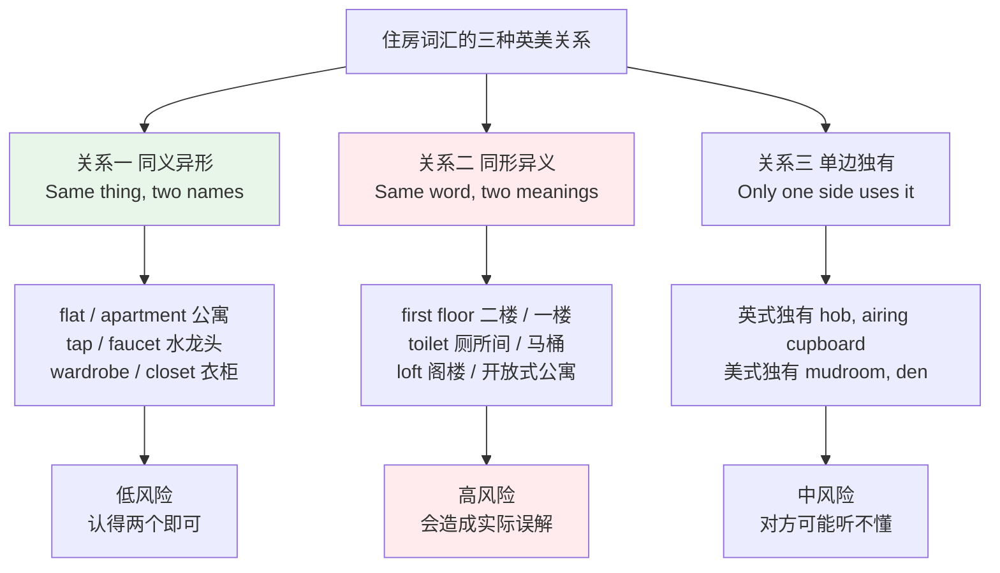
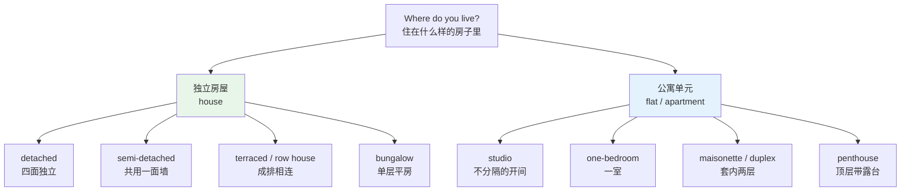
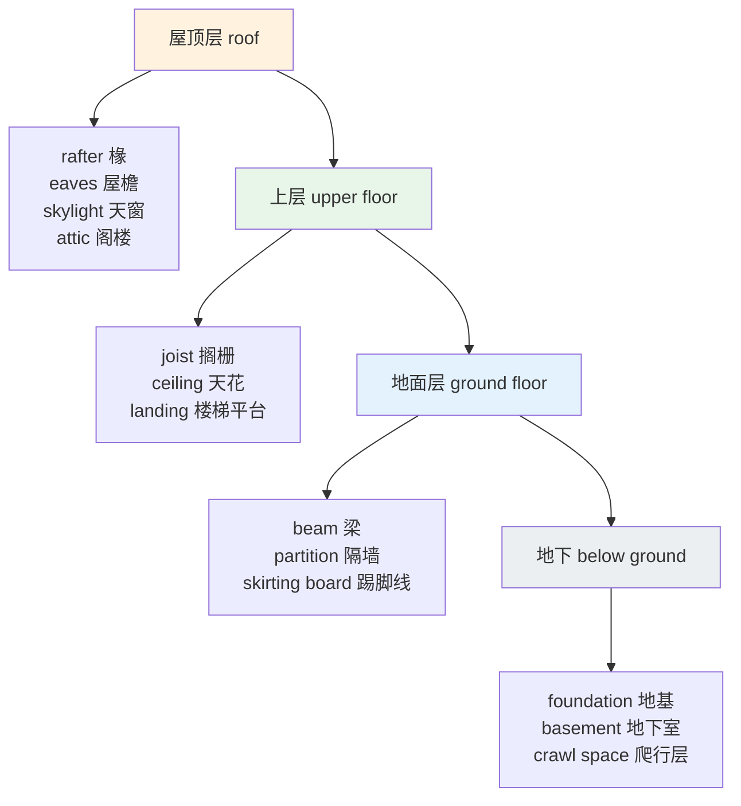
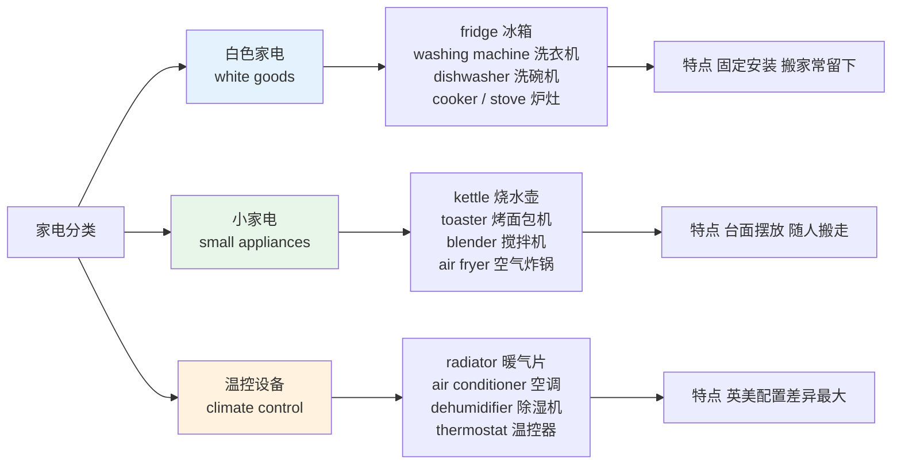
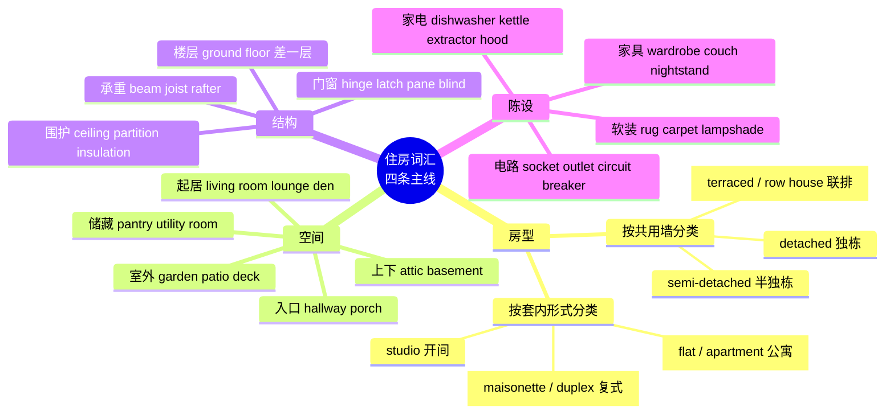

# 住房、房间结构、家具与家电

> [!info] 本篇定位
>
> 「衣食住行」六篇的第四篇，管「住」。前三篇讲穿的、吃的、做饭的，这一篇讲住的地方本身：房子长什么样、里面分几个房间、房间里摆什么、墙上插着什么电器。
>
> 这是全教程英美差异最密集的一篇。`flat` 与 `apartment`、`ground floor` 与 `first floor`、`wardrobe` 与 `closet`、`cooker` 与 `stove`、`tap` 与 `faucet` ——住房词汇几乎每一组核心词都有两套说法，而且不是可以随便混用的口音差异，是会造成实际误解的差异（把英式的 first floor 理解成一楼，约见面就会站错楼层）。
>
> 读完能做到：看英文租房广告不查词，描述自己家的户型和陈设，读懂宜家、家电说明书和房屋中介的房源描述。四百余个词条按房型、房间、结构、门窗、家具、家电、软装、租房八组给出，末尾一张英美对照总表可以单独当速查表用。

---

## 1. 本篇导读：住房词汇为什么必须分两套记

学英语的人在住房这一块吃的亏，跟在食物那一块吃的亏性质不同。食物词汇的英美差异主要是名称不同（`aubergine` / `eggplant`），认错了顶多买错菜。住房词汇的差异是**同一个词在两边指不同的东西**，这才是危险的。

三个最典型的陷阱先摆出来。

**陷阱一：楼层编号整体错位一层。** 英式的 `ground floor` 是地面这一层，往上一层才叫 `first floor`。美式的 `first floor` 就是地面这一层。同一句 `Meet me on the second floor`，在伦敦指地面往上第二层，在纽约指地面往上第一层。

**陷阱二：`toilet` 在两边的指称范围不同。** 英式 `toilet` 既可以指马桶这个器具，也可以指有马桶的那个小房间，`Where's the toilet?` 在英国是完全正常的问法。美式 `toilet` 基本只指马桶本身，问路要说 `Where's the restroom?` 或 `bathroom`，直接问 `Where's the toilet?` 会显得很粗率。

**陷阱三：`loft` 在两边是两种完全不同的空间。** 英式 `loft` 指屋顶下面那个堆杂物的阁楼，跟 `attic` 同义。美式 `loft` 多指工业厂房改造的挑高开放式公寓，是一种房型，跟阁楼没关系。`a loft apartment` 在美国是很贵的房子，在英国这个搭配基本不用。

上图把英美差异分成三类，并按危险程度排了序。同义异形那一类最容易，两个词都记住就行，说错了对方也听得懂。单边独有的词次之，用错了对方可能一时不明白，但上下文能补。真正要防的是中间那类同形异义——两边都听懂了，但理解成了不同的事，而且当场谁都不会察觉。本篇每遇到一个同形异义词，都会用 `> [!warning]` 单独标出来。

本篇的默认口径是：**词表主体给英式和美式两个说法，正文行文以中性表述为主。** 如果你的目标是读技术文档和原版书，两套都要能认；如果目标是去某个具体国家生活，挑那一套练到能说。

---

## 2. 房型：从独栋到一间屋

### 2.1 按建筑形态分类

英语的房型词不是按面积分的，是按**这栋房子和邻居之间有没有共用墙**分的。这个分类逻辑跟中文的「别墅 / 洋房 / 公寓」完全不同，必须重新建立。

| 英文 | 英式音标 | 美式音标 | 词性 | 中文 | 搭配与说明 |
| --- | --- | --- | --- | --- | --- |
| **detached** | /dɪˈtætʃt/ | /dɪˈtætʃt/ | adj. | 独栋的 | a detached house 四面不与邻居相连 |
| **semi-detached** | /ˌsemi dɪˈtætʃt/ | /ˌsemi dɪˈtætʃt/ | adj. | 半独栋的 | 两户共用一面墙，英国最常见的房型，口语简称 a semi |
| **terraced** | /ˈterəst/ | /ˈterəst/ | adj. | 联排的 | a terraced house 一排房子逐户相连，英式说法 |
| **row house** | /ˈrəʊ haʊs/ | /ˈroʊ haʊs/ | n. | 联排屋 | terraced house 的美式对应词 |
| **townhouse** | /ˈtaʊnhaʊs/ | /ˈtaʊnhaʊs/ | n. | 联排别墅 | 美式常用，多为两三层带独立入口 |
| **end-of-terrace** | /ˌend əv ˈterəs/ | /ˌend əv ˈterəs/ | adj. | 联排端户的 | 只有一面共用墙，英国房源广告的固定说法 |
| **bungalow** | /ˈbʌŋɡələʊ/ | /ˈbʌŋɡəloʊ/ | n. | 平房 | 英式指单层住宅，不含「简陋」意味 |
| **cottage** | /ˈkɒtɪdʒ/ | /ˈkɑːtɪdʒ/ | n. | 乡间小屋 | 乡村小型住宅，带怀旧色彩 |
| **villa** | /ˈvɪlə/ | /ˈvɪlə/ | n. | 别墅；度假屋 | 英美多指度假出租房，不等于中文的「别墅」 |
| **mansion** | /ˈmænʃn/ | /ˈmænʃn/ | n. | 豪宅 | 真正大的宅邸；中文「别墅」更接近 detached house |
| **cabin** | /ˈkæbɪn/ | /ˈkæbɪn/ | n. | 小木屋 | 山林里的度假小屋 |
| **hut** | /hʌt/ | /hʌt/ | n. | 棚屋 | 简陋临时住所 |
| **mobile home** | /ˌməʊbaɪl ˈhəʊm/ | /ˌmoʊbl ˈhoʊm/ | n. | 活动房屋 | 美式常见住房类别 |
| **caravan** | /ˈkærəvæn/ | /ˈkærəvæn/ | n. | 大篷车；房车 | 英式；美式多说 trailer 或 RV |
| **high-rise** | /ˌhaɪ ˈraɪz/ | /ˌhaɪ ˈraɪz/ | n./adj. | 高层楼 | a high-rise block 高层住宅楼 |
| **skyscraper** | /ˈskaɪskreɪpə/ | /ˈskaɪskreɪpər/ | n. | 摩天楼 | 一般指办公楼，住宅少用 |

> [!warning] villa 与 mansion 不等于中文的「别墅」
>
> 中文说「他家住别墅」，指的是独门独院的低层住宅，对应英语的 **detached house**。
>
> - ❌ ~~He lives in a villa.~~（听起来像住在度假出租屋里）
> - ✅ He lives in a **detached house**.
> - ✅ They own a **house with a garden**.（更口语的说法）
>
> `villa` 在英国房源语境里几乎专指海外度假屋，`mansion` 则是真正的大宅，用来描述普通三居室独栋会显得夸张。

### 2.2 按套内形式分类

| 英文 | 英式音标 | 美式音标 | 词性 | 中文 | 搭配与说明 |
| --- | --- | --- | --- | --- | --- |
| **flat** | /flæt/ | /flæt/ | n. | 公寓（一套） | 英式主用词；美式基本不用这个义项 |
| **apartment** | /əˈpɑːtmənt/ | /əˈpɑːrtmənt/ | n. | 公寓（一套） | 美式主用词；英式也能听懂，偏正式 |
| **studio** | /ˈstjuːdiəʊ/ | /ˈstuːdioʊ/ | n. | 开间；单间公寓 | 卧室与客厅不分隔，英美通用；英美读音差别明显 |
| **studio flat** | /ˈstjuːdiəʊ flæt/ | — | n. | 开间公寓 | 英式完整说法；美式说 studio apartment |
| **bedsit** | /ˈbedsɪt/ | /ˈbedsɪt/ | n. | 带卧的单间 | 英式独有，常指共用卫浴的廉价单间 |
| **one-bedroom flat** | /ˌwʌn ˈbedruːm flæt/ | — | n. | 一室一厅 | 英式房源标准写法；美式写 one-bedroom apartment |
| **maisonette** | /ˌmeɪzəˈnet/ | /ˌmeɪzəˈnet/ | n. | 复式公寓 | 英式，楼中楼、有独立入口的两层单元 |
| **duplex** | /ˈdjuːpleks/ | /ˈduːpleks/ | n. | 双拼屋；复式 | 美式多指上下两户的双拼；英式偏复式单元 |
| **penthouse** | /ˈpenthaʊs/ | /ˈpenthaʊs/ | n. | 顶层豪华公寓 | 顶层带露台的高档单元 |
| **loft** | /lɒft/ | /lɔːft/ | n. | 阁楼；开放式公寓 | 英式=阁楼；美式常指厂房改造的挑高住宅 |
| **condominium** | /ˌkɒndəˈmɪniəm/ | /ˌkɑːndəˈmɪniəm/ | n. | 产权公寓 | 美式法律术语，业主拥有套内产权 |
| **condo** | /ˈkɒndəʊ/ | /ˈkɑːndoʊ/ | n. | 产权公寓 | condominium 的口语缩略，美加常用 |
| **block of flats** | /ˌblɒk əv ˈflæts/ | — | n. | 公寓楼 | 英式整栋楼的说法 |
| **apartment building** | — | /əˈpɑːrtmənt ˌbɪldɪŋ/ | n. | 公寓楼 | 美式对应说法 |
| **tenement** | /ˈtenəmənt/ | /ˈtenəmənt/ | n. | 廉租公寓楼 | 带贬义，指旧式拥挤的出租楼 |
| **dormitory** | /ˈdɔːmətri/ | /ˈdɔːrmətɔːri/ | n. | 宿舍 | 美式校园用词，口语缩略为 dorm |
| **hall of residence** | /ˌhɔːl əv ˈrezɪdəns/ | — | n. | 学生宿舍楼 | 英式大学用词，复数 halls |
| **housing estate** | /ˈhaʊzɪŋ ɪˌsteɪt/ | — | n. | 住宅小区 | 英式；美式多说 housing development 或 subdivision |
| **suburb** | /ˈsʌbɜːb/ | /ˈsʌbɜːrb/ | n. | 郊区住宅区 | the suburbs 复数用得更多，形容词 suburban |
| **neighbourhood** | /ˈneɪbəhʊd/ | /ˈneɪbərhʊd/ | n. | 街区；社区 | 美式拼写 neighborhood |

上图是回答 `What kind of place do you live in?` 时的选词路径。先分独立房屋还是公寓单元，再往下选一级就够了——`I live in a semi-detached house.` 或 `I rent a one-bedroom flat.` 这两句就是英国人最常见的自我介绍式回答。中文习惯先说面积和几室几厅，英语习惯先说建筑形态，这个顺序差别值得留意。

---

## 3. 房间清单：从门口走到最里面

### 3.1 入口与过道

| 英文 | 英式音标 | 美式音标 | 词性 | 中文 | 搭配与说明 |
| --- | --- | --- | --- | --- | --- |
| **hallway** | /ˈhɔːlweɪ/ | /ˈhɔːlweɪ/ | n. | 门厅；走廊 | 英美通用，入门后的过渡空间 |
| **hall** | /hɔːl/ | /hɔːl/ | n. | 门厅 | 英式住宅里就指进门那一小块 |
| **entrance hall** | /ˈentrəns hɔːl/ | /ˈentrəns hɔːl/ | n. | 玄关 | 房源广告用词 |
| **corridor** | /ˈkɒrɪdɔː/ | /ˈkɔːrɪdɔːr/ | n. | 走廊 | 多指公共建筑的长走廊 |
| **landing** | /ˈlændɪŋ/ | /ˈlændɪŋ/ | n. | 楼梯平台 | 楼梯拐弯或到达楼层的那块平地 |
| **porch** | /pɔːtʃ/ | /pɔːrtʃ/ | n. | 门廊 | 美式多指带屋顶的前廊，可以坐人 |
| **lobby** | /ˈlɒbi/ | /ˈlɑːbi/ | n. | 大堂 | 公寓楼、酒店的入口大厅 |
| **foyer** | /ˈfɔɪeɪ/ | /ˈfɔɪər/ | n. | 门厅 | 法语借词，英美读音差别很大 |
| **mudroom** | — | /ˈmʌdruːm/ | n. | 玄关杂物间 | 美式独有，脱鞋脱外套的过渡间 |
| **vestibule** | /ˈvestɪbjuːl/ | /ˈvestɪbjuːl/ | n. | 门斗 | 正式用词，两道门之间的小空间 |
| **doormat** | /ˈdɔːmæt/ | /ˈdɔːrmæt/ | n. | 门垫 | 也比喻任人踩的软弱者 |
| **threshold** | /ˈθreʃhəʊld/ | /ˈθreʃhoʊld/ | n. | 门槛 | 也用于抽象义「阈值」 |

### 3.2 起居与工作空间

| 英文 | 英式音标 | 美式音标 | 词性 | 中文 | 搭配与说明 |
| --- | --- | --- | --- | --- | --- |
| **living room** | /ˈlɪvɪŋ ruːm/ | /ˈlɪvɪŋ ruːm/ | n. | 客厅 | 英美通用，最安全的说法 |
| **lounge** | /laʊndʒ/ | /laʊndʒ/ | n. | 客厅；休息厅 | 英式住宅常用；美式多指酒店休息厅 |
| **sitting room** | /ˈsɪtɪŋ ruːm/ | — | n. | 起居室 | 英式偏传统的说法 |
| **drawing room** | /ˈdrɔːɪŋ ruːm/ | — | n. | 会客厅 | 英式旧式大宅用语，日常已少用 |
| **front room** | /ˈfrʌnt ruːm/ | — | n. | 前厅 | 英式口语，指临街那间客厅 |
| **family room** | — | /ˈfæməli ruːm/ | n. | 家庭活动室 | 美式，比 living room 随意的第二起居空间 |
| **den** | /den/ | /den/ | n. | 小书房 | 美式，小而私密的休闲房 |
| **study** | /ˈstʌdi/ | /ˈstʌdi/ | n. | 书房 | 英美通用；作动词是「学习」 |
| **home office** | /ˌhəʊm ˈɒfɪs/ | /ˌhoʊm ˈɔːfɪs/ | n. | 居家办公室 | 远程办公普及后的高频词 |
| **dining room** | /ˈdaɪnɪŋ ruːm/ | /ˈdaɪnɪŋ ruːm/ | n. | 餐厅 | 家里吃饭的房间，不是餐馆 |
| **playroom** | /ˈpleɪruːm/ | /ˈpleɪruːm/ | n. | 儿童游戏室 | — |
| **conservatory** | /kənˈsɜːvətri/ | /kənˈsɜːrvətɔːri/ | n. | 玻璃阳光房 | 英式住宅常见加建，美式多说 sunroom |
| **sunroom** | /ˈsʌnruːm/ | /ˈsʌnruːm/ | n. | 阳光房 | 美式对应词 |

### 3.3 卧室、厨房与储藏

| 英文 | 英式音标 | 美式音标 | 词性 | 中文 | 搭配与说明 |
| --- | --- | --- | --- | --- | --- |
| **bedroom** | /ˈbedruːm/ | /ˈbedruːm/ | n. | 卧室 | a three-bedroom house 三居室 |
| **master bedroom** | /ˌmɑːstə ˈbedruːm/ | /ˌmæstər ˈbedruːm/ | n. | 主卧 | 美式近年也说 primary bedroom |
| **spare room** | /ˈspeə ruːm/ | /ˈsper ruːm/ | n. | 客房；空房 | 英式常用；美式多说 guest room |
| **guest room** | /ˈɡest ruːm/ | /ˈɡest ruːm/ | n. | 客房 | 英美通用 |
| **nursery** | /ˈnɜːsəri/ | /ˈnɜːrsəri/ | n. | 婴儿房 | 也指苗圃、幼儿园 |
| **kitchen** | /ˈkɪtʃɪn/ | /ˈkɪtʃɪn/ | n. | 厨房 | 锅碗瓢盆见 [[09.衣食住行/03.烹饪动词、厨具餐具与口味口感\|上一篇]] |
| **kitchenette** | /ˌkɪtʃɪˈnet/ | /ˌkɪtʃɪˈnet/ | n. | 小厨房 | -ette 后缀表「小」，常见于 studio |
| **pantry** | /ˈpæntri/ | /ˈpæntri/ | n. | 食品储藏室 | 美式住宅常见配置 |
| **larder** | /ˈlɑːdə/ | /ˈlɑːrdər/ | n. | 食品储藏室 | 英式偏传统的说法 |
| **utility room** | /juːˈtɪləti ruːm/ | /juːˈtɪləti ruːm/ | n. | 家务间 | 放洗衣机、烘干机的房间 |
| **laundry room** | /ˈlɔːndri ruːm/ | /ˈlɔːndri ruːm/ | n. | 洗衣房 | 美式更常用 |
| **airing cupboard** | /ˈeərɪŋ ˌkʌbəd/ | — | n. | 烘衣柜 | 英式独有，装热水箱兼晾衣的柜间 |
| **storeroom** | /ˈstɔːruːm/ | /ˈstɔːrruːm/ | n. | 储藏室 | 也写作 storage room |
| **walk-in closet** | — | /ˌwɔːk ɪn ˈklɑːzət/ | n. | 步入式衣帽间 | 美式；英式说 walk-in wardrobe |

### 3.4 卫浴与楼上楼下

| 英文 | 英式音标 | 美式音标 | 词性 | 中文 | 搭配与说明 |
| --- | --- | --- | --- | --- | --- |
| **bathroom** | /ˈbɑːθruːm/ | /ˈbæθruːm/ | n. | 卫生间 | 美式即使没浴缸也叫 bathroom |
| **toilet** | /ˈtɔɪlət/ | /ˈtɔɪlət/ | n. | 厕所；马桶 | 英式可指房间，美式基本只指马桶 |
| **loo** | /luː/ | /luː/ | n. | 厕所 | 英式口语，非常常见且不粗俗 |
| **restroom** | — | /ˈrestruːm/ | n. | 公共卫生间 | 美式公共场所标准说法 |
| **washroom** | — | /ˈwɑːʃruːm/ | n. | 洗手间 | 加拿大常用 |
| **lavatory** | /ˈlævətri/ | /ˈlævətɔːri/ | n. | 盥洗室 | 正式用词，飞机上的标牌常写这个 |
| **cloakroom** | /ˈkləʊkruːm/ | — | n. | 客用小卫生间 | 英式；也指剧院寄存衣帽处 |
| **en suite** | /ˌɒn ˈswiːt/ | /ˌɑːn ˈswiːt/ | adj./n. | 带独卫的 | an en-suite bathroom 主卧内附卫生间 |
| **half bath** | — | /ˌhæf ˈbæθ/ | n. | 半卫 | 美式，只有马桶和洗手盆 |
| **attic** | /ˈætɪk/ | /ˈætɪk/ | n. | 阁楼 | 英美通用，最安全的说法 |
| **garret** | /ˈɡærət/ | /ˈɡærət/ | n. | 顶层小屋 | 文学用词，带清贫意味 |
| **basement** | /ˈbeɪsmənt/ | /ˈbeɪsmənt/ | n. | 地下室 | 可住人的地下层 |
| **cellar** | /ˈselə/ | /ˈselər/ | n. | 地窖 | 储物为主，a wine cellar 酒窖 |
| **crawl space** | /ˈkrɔːl speɪs/ | /ˈkrɔːl speɪs/ | n. | 检修爬行层 | 只能爬行通过的低矮夹层 |
| **garage** | /ˈɡærɑːʒ/ | /ɡəˈrɑːʒ/ | n. | 车库 | 英美重音位置不同，是常考差异 |
| **driveway** | /ˈdraɪvweɪ/ | /ˈdraɪvweɪ/ | n. | 私家车道 | 从马路通到车库的那段 |

> [!warning] toilet 与 bathroom 的问法差异
>
> 这是中国学习者在英美之间最容易踩的一句话。
>
> - 在英国：`Where's the toilet?` 完全正常，`Where's the loo?` 更口语。
> - 在美国：问 `Where's the toilet?` 相当于问「马桶在哪」，会让人不舒服。
> - ✅ 美国场合说 `Where's the restroom?` 或 `May I use the bathroom?`
> - ✅ 通用安全说法：`Where can I wash my hands?`
>
> 另一个方向的坑：美式 `bathroom` 不要求有浴缸，`I need to use the bathroom` 就是「我要上厕所」；英式说 `bathroom` 时对方可能真以为你要洗澡。

### 3.5 室外空间

| 英文 | 英式音标 | 美式音标 | 词性 | 中文 | 搭配与说明 |
| --- | --- | --- | --- | --- | --- |
| **garden** | /ˈɡɑːdn/ | /ˈɡɑːrdn/ | n. | 花园；院子 | 英式指自家院子，哪怕全是草也叫 garden |
| **yard** | /jɑːd/ | /jɑːrd/ | n. | 院子 | 美式主用词；英式 yard 偏指硬地后院 |
| **backyard** | /ˌbækˈjɑːd/ | /ˌbækˈjɑːrd/ | n. | 后院 | 美式高频 |
| **front garden** | /ˌfrʌnt ˈɡɑːdn/ | — | n. | 前院 | 英式；美式说 front yard |
| **lawn** | /lɔːn/ | /lɔːn/ | n. | 草坪 | mow the lawn 剪草 |
| **balcony** | /ˈbælkəni/ | /ˈbælkəni/ | n. | 阳台 | 悬挑在外墙上的 |
| **terrace** | /ˈterəs/ | /ˈterəs/ | n. | 露台 | 屋顶或地面的平台 |
| **patio** | /ˈpætiəʊ/ | /ˈpætioʊ/ | n. | 露天平台 | 铺硬地的后院休闲区 |
| **veranda** | /vəˈrændə/ | /vəˈrændə/ | n. | 外廊 | 带顶的沿墙走廊，也拼 verandah |
| **deck** | /dek/ | /dek/ | n. | 木平台 | 美式后院常见的架高木台 |
| **fence** | /fens/ | /fens/ | n./v. | 栅栏；围起来 | put up a fence 装围栏 |
| **hedge** | /hedʒ/ | /hedʒ/ | n. | 绿篱 | 英国住宅分界常用 |
| **gate** | /ɡeɪt/ | /ɡeɪt/ | n. | 院门 | 与 door 区分：gate 在围墙上 |
| **shed** | /ʃed/ | /ʃed/ | n. | 工具棚 | 英国后院标配，放园艺工具 |
| **greenhouse** | /ˈɡriːnhaʊs/ | /ˈɡriːnhaʊs/ | n. | 温室 | 也用于 greenhouse gas 温室气体 |

---

## 4. 楼层与建筑结构

### 4.1 楼层编号：一层之差

| 英文 | 英式音标 | 美式音标 | 词性 | 中文 | 搭配与说明 |
| --- | --- | --- | --- | --- | --- |
| **ground floor** | /ˌɡraʊnd ˈflɔː/ | /ˌɡraʊnd ˈflɔːr/ | n. | 一楼（地面层） | 英式标准说法，美式也懂但少用 |
| **first floor** | /ˌfɜːst ˈflɔː/ | /ˌfɜːrst ˈflɔːr/ | n. | 英式二楼／美式一楼 | 最危险的同形异义词 |
| **storey** | /ˈstɔːri/ | — | n. | 层（建筑） | 英式拼写，复数 storeys |
| **story** | — | /ˈstɔːri/ | n. | 层（建筑） | 美式拼写，与「故事」同形 |
| **floor** | /flɔː/ | /flɔːr/ | n. | 楼层；地板 | 两个义项都极高频 |
| **upstairs** | /ˌʌpˈsteəz/ | /ˌʌpˈsterz/ | adv./adj. | 楼上 | go upstairs 不加 to |
| **downstairs** | /ˌdaʊnˈsteəz/ | /ˌdaʊnˈsterz/ | adv./adj. | 楼下 | — |
| **top floor** | /ˌtɒp ˈflɔː/ | /ˌtɑːp ˈflɔːr/ | n. | 顶层 | — |
| **mezzanine** | /ˈmezəniːn/ | /ˈmezəniːn/ | n. | 夹层 | 两层之间的半层 |
| **basement level** | /ˈbeɪsmənt ˌlevl/ | /ˈbeɪsmənt ˌlevl/ | n. | 地下层 | 电梯按钮上写 B1、B2 |
| **lift** | /lɪft/ | — | n. | 电梯 | 英式；take the lift |
| **elevator** | — | /ˈelɪveɪtər/ | n. | 电梯 | 美式；take the elevator |
| **escalator** | /ˈeskəleɪtə/ | /ˈeskəleɪtər/ | n. | 自动扶梯 | 英美同词 |

> [!warning] 约人见面时怎么避开楼层歧义
>
> 一栋英国楼里的 `second floor`，是从地面往上数的第三层；美国楼里的 `second floor` 是往上数的第二层。差一层足够让人在楼道里空等二十分钟。
>
> - ❌ 只说 `See you on the second floor.`
> - ✅ 说 `See you on the second floor — that's two floors up from the entrance.`
> - ✅ 或者用绝对说法：`the floor above the lobby`、`the top floor`
>
> 电梯按钮也照此逻辑：英式电梯上地面层写 `G` 或 `0`，美式写 `1` 或 `L`（lobby）。

### 4.2 楼梯与竖向交通

| 英文 | 英式音标 | 美式音标 | 词性 | 中文 | 搭配与说明 |
| --- | --- | --- | --- | --- | --- |
| **stairs** | /steəz/ | /sterz/ | n. | 楼梯 | 惯用复数，a flight of stairs 一段楼梯 |
| **staircase** | /ˈsteəkeɪs/ | /ˈsterkeɪs/ | n. | 楼梯（整体） | 含扶手栏杆的整套结构 |
| **stairway** | /ˈsteəweɪ/ | /ˈsterweɪ/ | n. | 楼梯通道 | 偏指楼梯所在的空间 |
| **step** | /step/ | /step/ | n. | 台阶 | 单级；mind the step 小心台阶 |
| **flight** | /flaɪt/ | /flaɪt/ | n. | 一段楼梯 | two flights up 上两段楼梯 |
| **banister** | /ˈbænɪstə/ | /ˈbænɪstər/ | n. | 楼梯扶手 | 也拼 bannister |
| **handrail** | /ˈhændreɪl/ | /ˈhændreɪl/ | n. | 扶手 | 墙上或栏杆上的横杆 |
| **railing** | /ˈreɪlɪŋ/ | /ˈreɪlɪŋ/ | n. | 栏杆 | 常用复数 railings |
| **spiral staircase** | /ˌspaɪrəl ˈsteəkeɪs/ | /ˌspaɪrəl ˈsterkeɪs/ | n. | 旋转楼梯 | — |
| **fire escape** | /ˈfaɪər ɪˌskeɪp/ | /ˈfaɪər ɪˌskeɪp/ | n. | 消防梯 | 外挂的逃生楼梯 |

### 4.3 承重与围护构件

这一组词读英文装修资料、房屋检查报告时用得上，程序员读建筑相关的技术文档也会碰到。

| 英文 | 英式音标 | 美式音标 | 词性 | 中文 | 搭配与说明 |
| --- | --- | --- | --- | --- | --- |
| **wall** | /wɔːl/ | /wɔːl/ | n. | 墙 | a load-bearing wall 承重墙 |
| **ceiling** | /ˈsiːlɪŋ/ | /ˈsiːlɪŋ/ | n. | 天花板 | 也比喻上限，price ceiling 价格上限 |
| **roof** | /ruːf/ | /ruːf/ | n. | 屋顶 | 复数 roofs，不是 rooves |
| **beam** | /biːm/ | /biːm/ | n. | 梁 | exposed beams 外露横梁，老房卖点 |
| **joist** | /dʒɔɪst/ | /dʒɔɪst/ | n. | 搁栅 | 承托楼板的密排小梁 |
| **rafter** | /ˈrɑːftə/ | /ˈræftər/ | n. | 椽子 | 支撑屋面的斜梁 |
| **pillar** | /ˈpɪlə/ | /ˈpɪlər/ | n. | 柱子 | 也比喻支柱人物 |
| **column** | /ˈkɒləm/ | /ˈkɑːləm/ | n. | 立柱 | 建筑与表格「列」同词 |
| **foundation** | /faʊnˈdeɪʃn/ | /faʊnˈdeɪʃn/ | n. | 地基 | 常用复数 foundations |
| **partition** | /pɑːˈtɪʃn/ | /pɑːrˈtɪʃn/ | n./v. | 隔断；分隔 | a partition wall 非承重隔墙 |
| **stud** | /stʌd/ | /stʌd/ | n. | 墙筋 | 石膏板墙里的立柱 |
| **plaster** | /ˈplɑːstə/ | /ˈplæstər/ | n./v. | 灰泥；抹灰 | 英式 plaster 还指创可贴 |
| **plasterboard** | /ˈplɑːstəbɔːd/ | — | n. | 石膏板 | 英式；美式说 drywall |
| **drywall** | — | /ˈdraɪwɔːl/ | n. | 石膏板 | 美式主用词 |
| **brick** | /brɪk/ | /brɪk/ | n. | 砖 | brickwork 砖砌体 |
| **concrete** | /ˈkɒŋkriːt/ | /ˈkɑːŋkriːt/ | n./adj. | 混凝土；具体的 | 抽象义「具体的」同样高频 |
| **insulation** | /ˌɪnsjuˈleɪʃn/ | /ˌɪnsəˈleɪʃn/ | n. | 保温层；绝缘 | loft insulation 阁楼保温 |
| **damp** | /dæmp/ | /dæmp/ | n./adj. | 潮气；潮湿的 | 英国验房报告的高频词 |
| **skirting board** | /ˈskɜːtɪŋ bɔːd/ | — | n. | 踢脚线 | 英式 |
| **baseboard** | — | /ˈbeɪsbɔːrd/ | n. | 踢脚线 | 美式 |
| **cornice** | /ˈkɔːnɪs/ | /ˈkɔːrnɪs/ | n. | 檐口线脚 | 天花与墙交接的装饰线 |
| **alcove** | /ˈælkəʊv/ | /ˈælkoʊv/ | n. | 壁龛 | 墙上凹进去的一块 |
| **nook** | /nʊk/ | /nʊk/ | n. | 角落 | a breakfast nook 早餐角 |
| **chimney** | /ˈtʃɪmni/ | /ˈtʃɪmni/ | n. | 烟囱 | — |
| **fireplace** | /ˈfaɪəpleɪs/ | /ˈfaɪərpleɪs/ | n. | 壁炉 | — |
| **mantelpiece** | /ˈmæntlpiːs/ | /ˈmæntlpiːs/ | n. | 壁炉架 | 摆相框、时钟的那道台 |
| **hearth** | /hɑːθ/ | /hɑːrθ/ | n. | 炉床 | 注意读音不含 /iː/ |
| **gutter** | /ˈɡʌtə/ | /ˈɡʌtər/ | n. | 檐槽 | 屋檐排水槽 |
| **drainpipe** | /ˈdreɪnpaɪp/ | /ˈdreɪnpaɪp/ | n. | 落水管 | 美式也说 downspout |
| **eaves** | /iːvz/ | /iːvz/ | n. | 屋檐 | 只用复数 |
| **skylight** | /ˈskaɪlaɪt/ | /ˈskaɪlaɪt/ | n. | 天窗 | 屋顶上的采光窗 |
| **loft conversion** | /ˈlɒft kənˌvɜːʃn/ | — | n. | 阁楼改造 | 英国常见的扩建方式 |
| **extension** | /ɪkˈstenʃn/ | /ɪkˈstenʃn/ | n. | 加建部分 | a rear extension 后部加建 |

上图按从上到下的顺序把结构词挂在了四个高度上。这个排法比按字母背有用得多：读验房报告或者装修方案时，问题描述几乎总是先定位高度再定位构件，`damp in the basement`、`a cracked joist above the kitchen`、`missing tiles on the roof`，先有高度框架再听构件名，理解速度会快很多。

---

## 5. 门、窗与五金

### 5.1 门及其部件

| 英文 | 英式音标 | 美式音标 | 词性 | 中文 | 搭配与说明 |
| --- | --- | --- | --- | --- | --- |
| **door** | /dɔː/ | /dɔːr/ | n. | 门 | answer the door 去开门 |
| **front door** | /ˌfrʌnt ˈdɔː/ | /ˌfrʌnt ˈdɔːr/ | n. | 大门 | 房子的正门 |
| **back door** | /ˌbæk ˈdɔː/ | /ˌbæk ˈdɔːr/ | n. | 后门 | 也有「走后门」的比喻义 |
| **doorway** | /ˈdɔːweɪ/ | /ˈdɔːrweɪ/ | n. | 门口 | 指门洞这个开口 |
| **doorframe** | /ˈdɔːfreɪm/ | /ˈdɔːrfreɪm/ | n. | 门框 | — |
| **doorknob** | /ˈdɔːnɒb/ | /ˈdɔːrnɑːb/ | n. | 球形门把手 | 美式住宅常见 |
| **door handle** | /ˈdɔː ˌhændl/ | /ˈdɔːr ˌhændl/ | n. | 门把手 | 杆式把手，英式常见 |
| **hinge** | /hɪndʒ/ | /hɪndʒ/ | n./v. | 合页；取决于 | hinge on 取决于 |
| **latch** | /lætʃ/ | /lætʃ/ | n./v. | 门闩；闩上 | 轻扣式，不是锁 |
| **bolt** | /bəʊlt/ | /boʊlt/ | n./v. | 插销；闩住 | 也指螺栓 |
| **lock** | /lɒk/ | /lɑːk/ | n./v. | 锁；锁上 | lock up 锁门离开 |
| **key** | /kiː/ | /kiː/ | n. | 钥匙 | 也指按键、关键 |
| **keyhole** | /ˈkiːhəʊl/ | /ˈkiːhoʊl/ | n. | 锁孔 | — |
| **peephole** | /ˈpiːphəʊl/ | /ˈpiːphoʊl/ | n. | 猫眼 | 美式也说 spyhole |
| **doorbell** | /ˈdɔːbel/ | /ˈdɔːrbel/ | n. | 门铃 | ring the doorbell |
| **intercom** | /ˈɪntəkɒm/ | /ˈɪntərkɑːm/ | n. | 对讲机 | 公寓楼门禁 |
| **letterbox** | /ˈletəbɒks/ | — | n. | 信箱口 | 英式，门上的投信口 |
| **mailbox** | — | /ˈmeɪlbɑːks/ | n. | 信箱 | 美式，通常立在路边 |
| **sliding door** | /ˌslaɪdɪŋ ˈdɔː/ | /ˌslaɪdɪŋ ˈdɔːr/ | n. | 推拉门 | — |
| **screen door** | — | /ˈskriːn dɔːr/ | n. | 纱门 | 美式常见 |

### 5.2 窗及遮挡

| 英文 | 英式音标 | 美式音标 | 词性 | 中文 | 搭配与说明 |
| --- | --- | --- | --- | --- | --- |
| **window** | /ˈwɪndəʊ/ | /ˈwɪndoʊ/ | n. | 窗 | 词源是 wind + eye「风眼」 |
| **windowsill** | /ˈwɪndəʊsɪl/ | /ˈwɪndoʊsɪl/ | n. | 窗台 | 也写 window sill |
| **pane** | /peɪn/ | /peɪn/ | n. | 窗玻璃 | a broken pane 一块碎玻璃 |
| **glazing** | /ˈɡleɪzɪŋ/ | /ˈɡleɪzɪŋ/ | n. | 玻璃安装 | double glazing 双层玻璃 |
| **frame** | /freɪm/ | /freɪm/ | n. | 框 | 窗框、门框、相框通用 |
| **bay window** | /ˌbeɪ ˈwɪndəʊ/ | /ˌbeɪ ˈwɪndoʊ/ | n. | 凸窗 | 英国维多利亚式住宅特征 |
| **French windows** | /ˌfrentʃ ˈwɪndəʊz/ | /ˌfrentʃ ˈwɪndoʊz/ | n. | 落地双开门窗 | 通往花园的玻璃门 |
| **sash window** | /ˈsæʃ ˌwɪndəʊ/ | /ˈsæʃ ˌwɪndoʊ/ | n. | 上下推拉窗 | 英国老房常见 |
| **curtain** | /ˈkɜːtn/ | /ˈkɜːrtn/ | n. | 窗帘 | draw the curtains 拉窗帘（拉开或拉上都可） |
| **drapes** | /dreɪps/ | /dreɪps/ | n. | 厚窗帘 | 美式用词 |
| **blind** | /blaɪnd/ | /blaɪnd/ | n. | 百叶帘 | 英式常用；也是形容词「瞎的」 |
| **blinds** | /blaɪndz/ | /blaɪndz/ | n. | 百叶窗帘 | 美式惯用复数 |
| **shutter** | /ˈʃʌtə/ | /ˈʃʌtər/ | n. | 百叶护窗板 | 装在窗外的实木板 |
| **net curtain** | /ˈnet ˌkɜːtn/ | — | n. | 纱帘 | 英式；美式说 sheer curtain |
| **windowpane** | /ˈwɪndəʊpeɪn/ | /ˈwɪndoʊpeɪn/ | n. | 窗玻璃 | pane 的完整形式 |

> [!tip] draw the curtains 到底是拉开还是拉上
>
> `draw` 在窗帘语境里两个方向都能用，靠语境判断：
>
> - 早上 `draw the curtains` → 拉开
> - 晚上 `draw the curtains` → 拉上
>
> 想避免歧义，用带方向的动词短语：
>
> - **open the curtains** / **draw back the curtains** 拉开
> - **close the curtains** / **draw the curtains shut** 拉上
>
> 百叶帘不用 draw，用 `raise the blinds`（升起）和 `lower the blinds`（放下）。

---

## 6. 家具：按房间走一遍

### 6.1 客厅家具

| 英文 | 英式音标 | 美式音标 | 词性 | 中文 | 搭配与说明 |
| --- | --- | --- | --- | --- | --- |
| **furniture** | /ˈfɜːnɪtʃə/ | /ˈfɜːrnɪtʃər/ | n. | 家具 | 不可数，a piece of furniture 一件家具 |
| **sofa** | /ˈsəʊfə/ | /ˈsoʊfə/ | n. | 沙发 | 英美通用，英国更常用 |
| **couch** | /kaʊtʃ/ | /kaʊtʃ/ | n. | 沙发 | 美式更常用；couch potato 沙发土豆 |
| **settee** | /seˈtiː/ | /seˈtiː/ | n. | 长沙发 | 英式偏传统，重音在后 |
| **armchair** | /ˈɑːmtʃeə/ | /ˈɑːrmtʃer/ | n. | 扶手椅 | 单人沙发 |
| **recliner** | /rɪˈklaɪnə/ | /rɪˈklaɪnər/ | n. | 躺椅 | 可放平靠背的沙发椅 |
| **stool** | /stuːl/ | /stuːl/ | n. | 凳子 | 无靠背；bar stool 吧凳 |
| **bench** | /bentʃ/ | /bentʃ/ | n. | 长凳 | — |
| **ottoman** | /ˈɒtəmən/ | /ˈɑːtəmən/ | n. | 软墩 | 美式；兼作脚凳与储物 |
| **pouffe** | /puːf/ | — | n. | 软墩 | 英式对应词 |
| **footstool** | /ˈfʊtstuːl/ | /ˈfʊtstuːl/ | n. | 搁脚凳 | — |
| **coffee table** | /ˈkɒfi ˌteɪbl/ | /ˈkɔːfi ˌteɪbl/ | n. | 茶几 | 沙发前的矮桌 |
| **side table** | /ˈsaɪd ˌteɪbl/ | /ˈsaɪd ˌteɪbl/ | n. | 边几 | — |
| **console table** | /ˈkɒnsəʊl ˌteɪbl/ | /ˈkɑːnsoʊl ˌteɪbl/ | n. | 玄关条案 | 靠墙的窄长桌 |
| **bookcase** | /ˈbʊkkeɪs/ | /ˈbʊkkeɪs/ | n. | 书柜 | 整件家具 |
| **bookshelf** | /ˈbʊkʃelf/ | /ˈbʊkʃelf/ | n. | 书架 | 复数 bookshelves |
| **shelf** | /ʃelf/ | /ʃelf/ | n. | 搁板 | 复数 shelves，f→v 变化 |
| **shelving unit** | /ˈʃelvɪŋ ˌjuːnɪt/ | /ˈʃelvɪŋ ˌjuːnɪt/ | n. | 置物架 | 宜家目录常见词 |
| **cabinet** | /ˈkæbɪnət/ | /ˈkæbɪnət/ | n. | 柜子 | 也指内阁 |
| **sideboard** | /ˈsaɪdbɔːd/ | /ˈsaɪdbɔːrd/ | n. | 餐边柜 | 英式常用 |
| **display cabinet** | /dɪˈspleɪ ˌkæbɪnət/ | /dɪˈspleɪ ˌkæbɪnət/ | n. | 展示柜 | 带玻璃门 |
| **TV stand** | /ˌtiː ˈviː stænd/ | /ˌtiː ˈviː stænd/ | n. | 电视柜 | 也说 TV unit |
| **rug** | /rʌɡ/ | /rʌɡ/ | n. | 地毯（小块） | 可移动，铺一部分地面 |
| **carpet** | /ˈkɑːpɪt/ | /ˈkɑːrpɪt/ | n. | 地毯（满铺） | 固定铺满整个房间 |
| **cushion** | /ˈkʊʃn/ | /ˈkʊʃn/ | n. | 靠垫 | 英式；也作动词「缓冲」 |
| **throw pillow** | — | /ˈθroʊ ˌpɪloʊ/ | n. | 装饰靠枕 | 美式说法 |
| **throw** | /θrəʊ/ | /θroʊ/ | n. | 装饰盖毯 | 搭在沙发上的薄毯 |

> [!warning] rug 和 carpet 不能互换
>
> 中文都叫「地毯」，英语按**是否固定铺满**分成两个词。
>
> - ✅ We put a **rug** under the coffee table.（茶几下铺了块地毯）
> - ✅ The bedrooms are **carpeted** throughout.（卧室全部铺了满铺地毯）
> - ❌ ~~We put a carpet under the coffee table.~~（听起来像把满铺地毯塞到茶几下）
>
> 另一个常错点是 `furniture` 不可数：
>
> - ❌ ~~We bought three furnitures.~~
> - ✅ We bought three **pieces of furniture**.
> - ✅ We bought some **furniture**.

### 6.2 卧室家具与床品

| 英文 | 英式音标 | 美式音标 | 词性 | 中文 | 搭配与说明 |
| --- | --- | --- | --- | --- | --- |
| **bed** | /bed/ | /bed/ | n. | 床 | make the bed 整理床铺 |
| **single bed** | /ˌsɪŋɡl ˈbed/ | /ˌsɪŋɡl ˈbed/ | n. | 单人床 | 美式也说 twin bed |
| **double bed** | /ˌdʌbl ˈbed/ | /ˌdʌbl ˈbed/ | n. | 双人床 | — |
| **king-size bed** | /ˈkɪŋ saɪz bed/ | /ˈkɪŋ saɪz bed/ | n. | 大号双人床 | 次一档是 queen-size |
| **bunk bed** | /ˈbʌŋk bed/ | /ˈbʌŋk bed/ | n. | 上下铺 | 惯用单数指整套 |
| **sofa bed** | /ˈsəʊfə bed/ | /ˈsoʊfə bed/ | n. | 沙发床 | — |
| **cot** | /kɒt/ | /kɑːt/ | n. | 英式婴儿床／美式行军床 | 同形异义，高风险词 |
| **crib** | /krɪb/ | /krɪb/ | n. | 婴儿床 | 美式；英式对应 cot |
| **mattress** | /ˈmætrəs/ | /ˈmætrəs/ | n. | 床垫 | a firm mattress 硬床垫 |
| **bed frame** | /ˈbed freɪm/ | /ˈbed freɪm/ | n. | 床架 | — |
| **headboard** | /ˈhedbɔːd/ | /ˈhedbɔːrd/ | n. | 床头板 | — |
| **duvet** | /ˈduːveɪ/ | /duːˈveɪ/ | n. | 羽绒被 | 英式主用词，法语借词 |
| **comforter** | — | /ˈkʌmfərtər/ | n. | 厚被 | 美式对应词 |
| **quilt** | /kwɪlt/ | /kwɪlt/ | n. | 被子；棉被 | 有缝线格纹的 |
| **duvet cover** | /ˈduːveɪ ˌkʌvə/ | /duːˈveɪ ˌkʌvər/ | n. | 被套 | — |
| **blanket** | /ˈblæŋkɪt/ | /ˈblæŋkɪt/ | n. | 毯子 | 也作形容词「笼统的」 |
| **sheet** | /ʃiːt/ | /ʃiːt/ | n. | 床单 | fitted sheet 床笠 |
| **pillow** | /ˈpɪləʊ/ | /ˈpɪloʊ/ | n. | 枕头 | — |
| **pillowcase** | /ˈpɪləʊkeɪs/ | /ˈpɪloʊkeɪs/ | n. | 枕套 | — |
| **bedspread** | /ˈbedspred/ | /ˈbedspred/ | n. | 床罩 | 铺在最外层的装饰盖布 |
| **wardrobe** | /ˈwɔːdrəʊb/ | /ˈwɔːrdroʊb/ | n. | 衣柜 | 英式主用词，独立家具 |
| **closet** | /ˈklɒzɪt/ | /ˈklɑːzət/ | n. | 壁橱 | 美式主用词，嵌墙的储衣空间 |
| **chest of drawers** | /ˌtʃest əv ˈdrɔːz/ | /ˌtʃest əv ˈdrɔːrz/ | n. | 五斗柜 | 英式；注意 drawers 的读音 |
| **dresser** | /ˈdresə/ | /ˈdresər/ | n. | 英式餐具柜／美式卧室斗柜 | 同形异义，注意语境 |
| **drawer** | /drɔː/ | /drɔːr/ | n. | 抽屉 | 单音节，不读成两个音节 |
| **bureau** | /ˈbjʊərəʊ/ | /ˈbjʊroʊ/ | n. | 英式写字台／美式斗柜 | 与 dresser 同属英美错位的家具词 |
| **nightstand** | /ˈnaɪtstænd/ | /ˈnaɪtstænd/ | n. | 床头柜 | 美式主用词 |
| **bedside table** | /ˌbedsaɪd ˈteɪbl/ | /ˌbedsaɪd ˈteɪbl/ | n. | 床头柜 | 英式主用词 |
| **dressing table** | /ˈdresɪŋ ˌteɪbl/ | — | n. | 梳妆台 | 英式 |
| **vanity** | /ˈvænəti/ | /ˈvænəti/ | n. | 梳妆台；盥洗台 | 美式；也指虚荣 |
| **mirror** | /ˈmɪrə/ | /ˈmɪrər/ | n./v. | 镜子；反映 | a full-length mirror 穿衣镜 |
| **coat hanger** | /ˈkəʊt ˌhæŋə/ | /ˈkoʊt ˌhæŋər/ | n. | 衣架（挂衣） | — |
| **coat rack** | /ˈkəʊt ræk/ | /ˈkoʊt ræk/ | n. | 衣帽架 | 立地或挂墙 |
| **chest** | /tʃest/ | /tʃest/ | n. | 箱柜 | 也指胸腔 |
| **trunk** | /trʌŋk/ | /trʌŋk/ | n. | 大箱子 | 也指树干、象鼻、美式后备箱 |

> [!warning] cot 是本篇第二个高风险同形异义词
>
> - 英式 **cot** = 带护栏的婴儿床（美式叫 crib）
> - 美式 **cot** = 折叠帆布床、行军床（英式叫 camp bed）
>
> 一句 `We need to buy a cot`，英国人理解成要给宝宝买床，美国人理解成要买张折叠床。想说清楚就把用途讲出来：
>
> - ✅ a **baby's cot** / a **crib for the baby**
> - ✅ a **folding camp bed** for guests

### 6.3 餐厅与书房家具

| 英文 | 英式音标 | 美式音标 | 词性 | 中文 | 搭配与说明 |
| --- | --- | --- | --- | --- | --- |
| **dining table** | /ˈdaɪnɪŋ ˌteɪbl/ | /ˈdaɪnɪŋ ˌteɪbl/ | n. | 餐桌 | — |
| **dining chair** | /ˈdaɪnɪŋ tʃeə/ | /ˈdaɪnɪŋ tʃer/ | n. | 餐椅 | — |
| **highchair** | /ˈhaɪtʃeə/ | /ˈhaɪtʃer/ | n. | 儿童餐椅 | — |
| **extendable table** | /ɪkˈstendəbl ˌteɪbl/ | /ɪkˈstendəbl ˌteɪbl/ | n. | 可伸缩餐桌 | — |
| **desk** | /desk/ | /desk/ | n. | 书桌 | a standing desk 站立办公桌 |
| **swivel chair** | /ˈswɪvl tʃeə/ | /ˈswɪvl tʃer/ | n. | 转椅 | 办公椅 |
| **filing cabinet** | /ˈfaɪlɪŋ ˌkæbɪnət/ | /ˈfaɪlɪŋ ˌkæbɪnət/ | n. | 文件柜 | — |
| **wall unit** | /ˈwɔːl ˌjuːnɪt/ | /ˈwɔːl ˌjuːnɪt/ | n. | 整墙组合柜 | — |
| **flat-pack** | /ˈflæt pæk/ | /ˈflæt pæk/ | adj./n. | 平板包装的 | 宜家式自装家具的固定说法 |
| **assemble** | /əˈsembl/ | /əˈsembl/ | v. | 组装 | assemble the wardrobe |
| **built-in** | /ˌbɪlt ˈɪn/ | /ˌbɪlt ˈɪn/ | adj. | 嵌入式的 | built-in wardrobes 定制衣柜 |
| **freestanding** | /ˌfriːˈstændɪŋ/ | /ˌfriːˈstændɪŋ/ | adj. | 独立式的 | 与 built-in 相对 |

---

## 7. 家电：大件与小件

### 7.1 厨房大家电

| 英文 | 英式音标 | 美式音标 | 词性 | 中文 | 搭配与说明 |
| --- | --- | --- | --- | --- | --- |
| **appliance** | /əˈplaɪəns/ | /əˈplaɪəns/ | n. | 家用电器 | kitchen appliances 厨房电器 |
| **white goods** | /ˈwaɪt ɡʊdz/ | /ˈwaɪt ɡʊdz/ | n. | 白色家电 | 冰箱洗衣机这类大件的行业称呼 |
| **fridge** | /frɪdʒ/ | /frɪdʒ/ | n. | 冰箱 | 日常口语首选 |
| **refrigerator** | /rɪˈfrɪdʒəreɪtə/ | /rɪˈfrɪdʒəreɪtər/ | n. | 冰箱 | 正式说法，说明书用 |
| **freezer** | /ˈfriːzə/ | /ˈfriːzər/ | n. | 冷冻柜 | fridge-freezer 冷藏冷冻一体机 |
| **chest freezer** | /ˈtʃest ˌfriːzə/ | /ˈtʃest ˌfriːzər/ | n. | 卧式冰柜 | 开盖式，常放在车库或地下室 |
| **cooker** | /ˈkʊkə/ | — | n. | 炉灶（整机） | 英式；含灶台和烤箱 |
| **stove** | /stəʊv/ | /stoʊv/ | n. | 炉灶 | 美式主用词 |
| **range** | /reɪndʒ/ | /reɪndʒ/ | n. | 一体式炉灶 | 美式；也指山脉、范围 |
| **hob** | /hɒb/ | — | n. | 灶台面 | 英式独有，指四个炉眼那一面 |
| **cooktop** | — | /ˈkʊktɑːp/ | n. | 灶台面 | 美式对应词 |
| **oven** | /ˈʌvn/ | /ˈʌvn/ | n. | 烤箱 | 注意读 /ˈʌvn/，不是 /ˈəʊvn/ |
| **microwave** | /ˈmaɪkrəweɪv/ | /ˈmaɪkrəweɪv/ | n./v. | 微波炉；用微波加热 | 口语也说 nuke |
| **extractor hood** | /ɪkˈstræktə hʊd/ | — | n. | 抽油烟机 | 英式；也说 cooker hood |
| **range hood** | — | /ˈreɪndʒ hʊd/ | n. | 抽油烟机 | 美式主用词 |
| **extractor fan** | /ɪkˈstræktə fæn/ | — | n. | 排风扇 | 英式，浴室和厨房都用 |
| **dishwasher** | /ˈdɪʃwɒʃə/ | /ˈdɪʃwɑːʃər/ | n. | 洗碗机 | load the dishwasher 装碗 |
| **kettle** | /ˈketl/ | /ˈketl/ | n. | 烧水壶 | 英式指电热水壶，家家必备 |
| **electric kettle** | /ɪˌlektrɪk ˈketl/ | /ɪˌlektrɪk ˈketl/ | n. | 电热水壶 | 美式需加 electric 才明确 |
| **toaster** | /ˈtəʊstə/ | /ˈtoʊstər/ | n. | 烤面包机 | — |
| **blender** | /ˈblendə/ | /ˈblendər/ | n. | 搅拌机 | 打果昔用 |
| **food processor** | /ˈfuːd ˌprəʊsesə/ | /ˈfuːd ˌprɑːsesər/ | n. | 食品加工机 | 切碎揉面用 |
| **coffee maker** | /ˈkɒfi ˌmeɪkə/ | /ˈkɔːfi ˌmeɪkər/ | n. | 咖啡机 | 英式也说 coffee machine |
| **rice cooker** | /ˈraɪs ˌkʊkə/ | /ˈraɪs ˌkʊkər/ | n. | 电饭煲 | — |
| **slow cooker** | /ˈsləʊ ˌkʊkə/ | /ˈsloʊ ˌkʊkər/ | n. | 慢炖锅 | 美式品牌名 Crock-Pot 已通名化 |
| **air fryer** | /ˈeə ˌfraɪə/ | /ˈer ˌfraɪər/ | n. | 空气炸锅 | — |
| **garbage disposal** | — | /ˈɡɑːrbɪdʒ dɪˌspoʊzl/ | n. | 厨余粉碎机 | 美式厨房常见配置 |
| **sink** | /sɪŋk/ | /sɪŋk/ | n./v. | 水槽；下沉 | the kitchen sink 厨房水槽 |
| **tap** | /tæp/ | — | n. | 水龙头 | 英式；也指轻拍 |
| **faucet** | — | /ˈfɔːsɪt/ | n. | 水龙头 | 美式主用词 |
| **worktop** | /ˈwɜːktɒp/ | — | n. | 操作台面 | 英式 |
| **countertop** | — | /ˈkaʊntərtɑːp/ | n. | 操作台面 | 美式 |
| **cupboard** | /ˈkʌbəd/ | /ˈkʌbərd/ | n. | 橱柜 | 读音丢掉 p，不读 /ˈkʌpbɔːd/ |
| **kitchen island** | /ˈkɪtʃɪn ˌaɪlənd/ | /ˈkɪtʃɪn ˌaɪlənd/ | n. | 厨房中岛 | — |
| **draining board** | /ˈdreɪnɪŋ bɔːd/ | — | n. | 沥水板 | 英式；美式说 drainboard |

### 7.2 洗护、清洁与温控

| 英文 | 英式音标 | 美式音标 | 词性 | 中文 | 搭配与说明 |
| --- | --- | --- | --- | --- | --- |
| **washing machine** | /ˈwɒʃɪŋ məˌʃiːn/ | /ˈwɑːʃɪŋ məˌʃiːn/ | n. | 洗衣机 | 英式主用词 |
| **washer** | /ˈwɒʃə/ | /ˈwɑːʃər/ | n. | 洗衣机 | 美式口语 |
| **tumble dryer** | /ˈtʌmbl ˌdraɪə/ | — | n. | 滚筒烘干机 | 英式 |
| **clothes dryer** | — | /ˈkloʊz ˌdraɪər/ | n. | 烘干机 | 美式；口语直接说 dryer |
| **washer-dryer** | /ˌwɒʃə ˈdraɪə/ | /ˌwɑːʃər ˈdraɪər/ | n. | 洗烘一体机 | 英国小公寓常见 |
| **vacuum cleaner** | /ˈvækjuːm ˌkliːnə/ | /ˈvækjuːm ˌkliːnər/ | n. | 吸尘器 | — |
| **hoover** | /ˈhuːvə/ | — | n./v. | 吸尘器；吸尘 | 英式，品牌名转通名，可作动词 |
| **iron** | /ˈaɪən/ | /ˈaɪərn/ | n./v. | 熨斗；熨烫 | 拼写有 r 但英式不发 |
| **ironing board** | /ˈaɪənɪŋ bɔːd/ | /ˈaɪərnɪŋ bɔːrd/ | n. | 熨衣板 | — |
| **radiator** | /ˈreɪdieɪtə/ | /ˈreɪdieɪtər/ | n. | 暖气片 | 英国住宅主要采暖方式 |
| **boiler** | /ˈbɔɪlə/ | /ˈbɔɪlər/ | n. | 锅炉 | 英式住宅烧热水兼供暖 |
| **water heater** | /ˈwɔːtə ˌhiːtə/ | /ˈwɔːtər ˌhiːtər/ | n. | 热水器 | 美式说法 |
| **central heating** | /ˌsentrəl ˈhiːtɪŋ/ | /ˌsentrəl ˈhiːtɪŋ/ | n. | 中央供暖 | 英国房源必写项 |
| **air conditioner** | /ˈeə kənˌdɪʃənə/ | /ˈer kənˌdɪʃənər/ | n. | 空调 | 缩略 AC、air-con |
| **fan** | /fæn/ | /fæn/ | n. | 电扇 | 也指粉丝 |
| **ceiling fan** | /ˈsiːlɪŋ fæn/ | /ˈsiːlɪŋ fæn/ | n. | 吊扇 | — |
| **heater** | /ˈhiːtə/ | /ˈhiːtər/ | n. | 取暖器 | a space heater 移动取暖器 |
| **humidifier** | /hjuːˈmɪdɪfaɪə/ | /hjuːˈmɪdɪfaɪər/ | n. | 加湿器 | — |
| **dehumidifier** | /ˌdiːhjuːˈmɪdɪfaɪə/ | /ˌdiːhjuːˈmɪdɪfaɪər/ | n. | 除湿机 | 英国潮湿房屋常备 |
| **air purifier** | /ˈeə ˌpjʊərɪfaɪə/ | /ˈer ˌpjʊrɪfaɪər/ | n. | 空气净化器 | — |
| **thermostat** | /ˈθɜːməstæt/ | /ˈθɜːrməstæt/ | n. | 温控器 | 智能家居高频词 |
| **smoke alarm** | /ˈsməʊk əˌlɑːm/ | /ˈsmoʊk əˌlɑːrm/ | n. | 烟雾报警器 | 也说 smoke detector |

### 7.3 电路与插座

这一组在读家电说明书和智能家居文档时出现频率很高，两套体系的词几乎不重合。

| 英文 | 英式音标 | 美式音标 | 词性 | 中文 | 搭配与说明 |
| --- | --- | --- | --- | --- | --- |
| **socket** | /ˈsɒkɪt/ | /ˈsɑːkɪt/ | n. | 插座 | 英式主用词；技术文档里也指端口 |
| **power point** | /ˈpaʊə pɔɪnt/ | — | n. | 电源插座 | 英式；与演示软件同形 |
| **outlet** | — | /ˈaʊtlet/ | n. | 插座 | 美式主用词；也指出口、门店 |
| **plug** | /plʌɡ/ | /plʌɡ/ | n./v. | 插头；插上 | 也指浴缸的塞子 |
| **adapter** | /əˈdæptə/ | /əˈdæptər/ | n. | 转换插头 | a travel adapter 旅行转换头 |
| **extension lead** | /ɪkˈstenʃn liːd/ | — | n. | 接线板 | 英式；lead 读 /liːd/ |
| **power strip** | — | /ˈpaʊər strɪp/ | n. | 接线板 | 美式 |
| **switch** | /swɪtʃ/ | /swɪtʃ/ | n./v. | 开关；切换 | a light switch 灯开关 |
| **fuse** | /fjuːz/ | /fjuːz/ | n. | 保险丝 | 英式插头内置保险丝 |
| **fuse box** | /ˈfjuːz bɒks/ | /ˈfjuːz bɑːks/ | n. | 配电箱 | 英式旧称 |
| **circuit breaker** | /ˈsɜːkɪt ˌbreɪkə/ | /ˈsɜːrkɪt ˌbreɪkər/ | n. | 断路器 | 跳闸的那个开关 |
| **consumer unit** | /kənˈsjuːmə ˌjuːnɪt/ | — | n. | 户用配电箱 | 英国现行正式称呼 |
| **wiring** | /ˈwaɪərɪŋ/ | /ˈwaɪrɪŋ/ | n. | 布线 | rewire 重新布线 |
| **meter** | /ˈmiːtə/ | /ˈmiːtər/ | n. | 电表水表 | 与长度单位 metre 英式拼写不同 |
| **mains** | /meɪnz/ | — | n. | 市电总管路 | 英式，惯用复数 |
| **voltage** | /ˈvəʊltɪdʒ/ | /ˈvoʊltɪdʒ/ | n. | 电压 | 英国 230V，美国 120V |

上图按三类整理家电，最后一行是租房时的实际意义。英国房源广告写 `white goods included`，指的就是第一类会留给租客；`fully furnished` 则连家具一起。第三类的英美差异值得单独记：英国住宅几乎不装空调但家家有 `radiator` 和 `boiler`，美国住宅普遍有中央空调 `central air`，这不是词汇问题而是气候和建筑传统的差别，但反映在词频上非常明显。

---

## 8. 灯具、软装与地面

| 英文 | 英式音标 | 美式音标 | 词性 | 中文 | 搭配与说明 |
| --- | --- | --- | --- | --- | --- |
| **lamp** | /læmp/ | /læmp/ | n. | 台灯；灯具 | 可移动的灯 |
| **light** | /laɪt/ | /laɪt/ | n. | 灯；光 | turn on the light 开灯 |
| **bulb** | /bʌlb/ | /bʌlb/ | n. | 灯泡 | 完整说法 light bulb |
| **ceiling light** | /ˈsiːlɪŋ laɪt/ | /ˈsiːlɪŋ laɪt/ | n. | 吸顶灯 | — |
| **pendant light** | /ˈpendənt laɪt/ | /ˈpendənt laɪt/ | n. | 吊灯 | 单头垂吊式 |
| **chandelier** | /ˌʃændəˈlɪə/ | /ˌʃændəˈlɪr/ | n. | 枝形吊灯 | 法语借词，ch 读 /ʃ/ |
| **floor lamp** | /ˈflɔː læmp/ | /ˈflɔːr læmp/ | n. | 落地灯 | 英式也说 standard lamp |
| **table lamp** | /ˈteɪbl læmp/ | /ˈteɪbl læmp/ | n. | 台灯 | — |
| **desk lamp** | /ˈdesk læmp/ | /ˈdesk læmp/ | n. | 书桌灯 | — |
| **bedside lamp** | /ˈbedsaɪd læmp/ | /ˈbedsaɪd læmp/ | n. | 床头灯 | — |
| **wall light** | /ˈwɔːl laɪt/ | /ˈwɔːl laɪt/ | n. | 壁灯 | 正式说法 sconce |
| **sconce** | /skɒns/ | /skɑːns/ | n. | 壁灯座 | 室内设计用词 |
| **lampshade** | /ˈlæmpʃeɪd/ | /ˈlæmpʃeɪd/ | n. | 灯罩 | — |
| **spotlight** | /ˈspɒtlaɪt/ | /ˈspɑːtlaɪt/ | n. | 射灯 | — |
| **downlight** | /ˈdaʊnlaɪt/ | /ˈdaʊnlaɪt/ | n. | 筒灯 | 美式也说 recessed light |
| **dimmer** | /ˈdɪmə/ | /ˈdɪmər/ | n. | 调光开关 | a dimmer switch |
| **wallpaper** | /ˈwɔːlpeɪpə/ | /ˈwɔːlpeɪpər/ | n./v. | 墙纸；贴墙纸 | 也指电脑桌面壁纸 |
| **paint** | /peɪnt/ | /peɪnt/ | n./v. | 油漆；刷漆 | emulsion 是英式乳胶漆 |
| **skirting** | /ˈskɜːtɪŋ/ | — | n. | 踢脚线 | skirting board 的简说 |
| **flooring** | /ˈflɔːrɪŋ/ | /ˈflɔːrɪŋ/ | n. | 地面材料 | 不可数 |
| **floorboard** | /ˈflɔːbɔːd/ | /ˈflɔːrbɔːrd/ | n. | 木地板条 | creaky floorboards 会响的地板 |
| **hardwood floor** | /ˈhɑːdwʊd flɔː/ | /ˈhɑːrdwʊd flɔːr/ | n. | 实木地板 | 美式房源常见卖点 |
| **laminate** | /ˈlæmɪnət/ | /ˈlæmɪnət/ | n. | 强化复合地板 | 作动词读 /ˈlæmɪneɪt/ |
| **parquet** | /ˈpɑːkeɪ/ | /pɑːrˈkeɪ/ | n. | 拼花木地板 | 法语借词，t 不发音 |
| **lino** | /ˈlaɪnəʊ/ | /ˈlaɪnoʊ/ | n. | 油毡地板 | linoleum 的口语缩略 |
| **tile** | /taɪl/ | /taɪl/ | n./v. | 瓷砖；铺砖 | 屋顶瓦也叫 tile |
| **grout** | /ɡraʊt/ | /ɡraʊt/ | n. | 填缝剂 | 瓷砖缝里的白泥 |
| **underlay** | /ˈʌndəleɪ/ | /ˈʌndərleɪ/ | n. | 地垫层 | 地毯或木地板下的缓冲层 |
| **radiator cover** | /ˈreɪdieɪtə ˌkʌvə/ | — | n. | 暖气罩 | 英式常见 |
| **houseplant** | /ˈhaʊsplɑːnt/ | /ˈhaʊsplænt/ | n. | 室内绿植 | — |
| **picture frame** | /ˈpɪktʃə freɪm/ | /ˈpɪktʃər freɪm/ | n. | 相框 | — |
| **ornament** | /ˈɔːnəmənt/ | /ˈɔːrnəmənt/ | n. | 摆件 | 英式常用 |

> [!example] 用这些词描述一个房间
>
> - The **living room** has a **bay window** with **wooden blinds**, a beige **rug** over the **hardwood floor**, and a **pendant light** above the **coffee table**.
>   - 客厅有一扇装了木百叶帘的凸窗，实木地板上铺了一块米色地毯，茶几上方吊着一盏吊灯。
> - Upstairs, both **bedrooms** have **built-in wardrobes**, and the **master bedroom** is **en suite**.
>   - 楼上两间卧室都有嵌入式衣柜，主卧带独立卫生间。
> - The **kitchen** is fitted with an **electric hob**, a built-in **oven**, an **extractor hood** and an integrated **dishwasher**.
>   - 厨房配了电磁灶台、嵌入式烤箱、抽油烟机和内嵌洗碗机。
>
> 三句话覆盖了本篇一半的高频词。房源广告的句式基本就是这三种：`has + 名词`、`is fitted with + 家电`、`is + 形容词`（en suite / south-facing / newly decorated）。

---

## 9. 英美对照总表

前面各节零散给出的差异集中在这里，方便单独查。左右两列不是「对错」，是两套并行的说法。

### 9.1 同义异形：两套名字，同一件东西

| 概念 | 英式 | 英式音标 | 美式 | 美式音标 |
| --- | --- | --- | --- | --- |
| 公寓 | **flat** | /flæt/ | **apartment** | /əˈpɑːrtmənt/ |
| 公寓楼 | **block of flats** | /ˌblɒk əv ˈflæts/ | **apartment building** | /əˈpɑːrtmənt ˌbɪldɪŋ/ |
| 联排屋 | **terraced house** | /ˈterəst haʊs/ | **row house** | /ˈroʊ haʊs/ |
| 电梯 | **lift** | /lɪft/ | **elevator** | /ˈelɪveɪtər/ |
| 衣柜 | **wardrobe** | /ˈwɔːdrəʊb/ | **closet** | /ˈklɑːzət/ |
| 床头柜 | **bedside table** | /ˌbedsaɪd ˈteɪbl/ | **nightstand** | /ˈnaɪtstænd/ |
| 沙发 | **sofa / settee** | /ˈsəʊfə/ | **couch** | /kaʊtʃ/ |
| 水龙头 | **tap** | /tæp/ | **faucet** | /ˈfɔːsɪt/ |
| 灶台面 | **hob** | /hɒb/ | **cooktop** | /ˈkʊktɑːp/ |
| 炉灶整机 | **cooker** | /ˈkʊkə/ | **stove / range** | /stoʊv/ |
| 抽油烟机 | **extractor hood** | /ɪkˈstræktə hʊd/ | **range hood** | /ˈreɪndʒ hʊd/ |
| 操作台面 | **worktop** | /ˈwɜːktɒp/ | **countertop** | /ˈkaʊntərtɑːp/ |
| 烘干机 | **tumble dryer** | /ˈtʌmbl ˌdraɪə/ | **clothes dryer** | /ˈkloʊz ˌdraɪər/ |
| 吸尘（动词） | **hoover** | /ˈhuːvə/ | **vacuum** | /ˈvækjuːm/ |
| 插座 | **socket / power point** | /ˈsɒkɪt/ | **outlet** | /ˈaʊtlet/ |
| 接线板 | **extension lead** | /ɪkˈstenʃn liːd/ | **power strip** | /ˈpaʊər strɪp/ |
| 石膏板 | **plasterboard** | /ˈplɑːstəbɔːd/ | **drywall** | /ˈdraɪwɔːl/ |
| 踢脚线 | **skirting board** | /ˈskɜːtɪŋ bɔːd/ | **baseboard** | /ˈbeɪsbɔːrd/ |
| 院子 | **garden** | /ˈɡɑːdn/ | **yard** | /jɑːrd/ |
| 阳光房 | **conservatory** | /kənˈsɜːvətri/ | **sunroom** | /ˈsʌnruːm/ |
| 婴儿床 | **cot** | /kɒt/ | **crib** | /krɪb/ |
| 厚被 | **duvet** | /ˈduːveɪ/ | **comforter** | /ˈkʌmfərtər/ |
| 厚窗帘 | **curtains** | /ˈkɜːtnz/ | **drapes** | /dreɪps/ |
| 信箱 | **letterbox** | /ˈletəbɒks/ | **mailbox** | /ˈmeɪlbɑːks/ |
| 学生宿舍 | **halls of residence** | /ˌhɔːlz əv ˈrezɪdəns/ | **dorm** | /dɔːrm/ |

### 9.2 同形异义：同一个词，两种所指

| 词 | 英式含义 | 美式含义 | 避坑说法 |
| --- | --- | --- | --- |
| **first floor** | 地面往上第二层 | 地面这一层 | 说 the floor above the entrance |
| **ground floor** | 地面这一层 | 少用，等于 first floor | 美式直接说 first floor |
| **toilet** | 厕所间／马桶 | 只指马桶 | 美式问 restroom |
| **loft** | 阁楼储物空间 | 厂房改造的挑高住宅 | 阁楼一律说 attic |
| **cot** | 婴儿床 | 行军床、折叠床 | 说 baby's crib 或 camp bed |
| **dresser** | 厨房餐具柜 | 卧室斗柜 | 说 chest of drawers 或 sideboard |
| **flat** | 公寓 | 平的；爆胎 | 公寓一律说 apartment |
| **yard** | 硬地后院 | 整个院子含草坪 | 说 back garden 或 backyard |
| **plaster** | 创可贴／灰泥 | 只指灰泥 | 创可贴说 Band-Aid |
| **den** | 兽穴（住宅少用） | 家里的小书房 | 英式说 small study |

> [!tip] 两套词到底要不要都背
>
> 分两种情况处理，别一刀切。
>
> **接受级（认得就行）**：两套都要能认。读英文小说、看英美剧、读维基百科时两套都会出现，认不出来就断句。这部分成本很低，因为词与词之间是一对一的映射，记住一张对照表就够。
>
> **产出级（要能说）**：只挑一套练。挑哪套看你的实际接触面——常和英国同事协作就练英式，读美国科技公司的文档和产品就练美式。混着说不会造成理解障碍，但会显得不成体系，比如一句话里 `flat` 和 `faucet` 同时出现。
>
> 唯一不能只选一套的是 9.2 那张同形异义表：**那十个词必须两套都记，而且要记住它们会造成什么误解。**

---

## 10. 租房、买房与看房高频词

住房词汇的实际使用场景，大部分集中在找房子这件事上。这一节的词在英文租房网站、中介邮件、租约文本里出现频率极高。

| 英文 | 英式音标 | 美式音标 | 词性 | 中文 | 搭配与说明 |
| --- | --- | --- | --- | --- | --- |
| **rent** | /rent/ | /rent/ | n./v. | 房租；租 | rent out 出租给别人 |
| **let** | /let/ | — | v./n. | 出租 | 英式；To Let 招租牌 |
| **lease** | /liːs/ | /liːs/ | n./v. | 租约；租赁 | sign a lease 签租约 |
| **tenancy** | /ˈtenənsi/ | /ˈtenənsi/ | n. | 租期 | a 12-month tenancy |
| **landlord** | /ˈlændlɔːd/ | /ˈlændlɔːrd/ | n. | 房东 | 女性可用 landlady |
| **tenant** | /ˈtenənt/ | /ˈtenənt/ | n. | 租客 | 法律文本用词 |
| **deposit** | /dɪˈpɒzɪt/ | /dɪˈpɑːzɪt/ | n. | 押金 | a security deposit |
| **estate agent** | /ɪˈsteɪt ˌeɪdʒənt/ | — | n. | 房产中介 | 英式 |
| **realtor** | — | /ˈriːəltər/ | n. | 房产经纪 | 美式；常被误读成 realator，正确读法是 real + tor |
| **letting agent** | /ˈletɪŋ ˌeɪdʒənt/ | — | n. | 租赁中介 | 英式 |
| **viewing** | /ˈvjuːɪŋ/ | /ˈvjuːɪŋ/ | n. | 看房 | book a viewing 预约看房 |
| **furnished** | /ˈfɜːnɪʃt/ | /ˈfɜːrnɪʃt/ | adj. | 带家具的 | 房源广告核心词 |
| **unfurnished** | /ʌnˈfɜːnɪʃt/ | /ʌnˈfɜːrnɪʃt/ | adj. | 不带家具的 | 英国「不带家具」通常仍含白色家电 |
| **part-furnished** | /ˌpɑːt ˈfɜːnɪʃt/ | — | adj. | 半带家具的 | 英式常见档位 |
| **utilities** | /juːˈtɪlətiz/ | /juːˈtɪlətiz/ | n. | 水电燃气费 | bills included 含水电 |
| **council tax** | /ˈkaʊnsl tæks/ | — | n. | 市政税 | 英国租客通常自付 |
| **mortgage** | /ˈmɔːɡɪdʒ/ | /ˈmɔːrɡɪdʒ/ | n. | 房贷 | t 不发音，是常见误读点 |
| **freehold** | /ˈfriːhəʊld/ | /ˈfriːhoʊld/ | n. | 永久产权 | 英国房产两大产权形式之一 |
| **leasehold** | /ˈliːshəʊld/ | /ˈliːshoʊld/ | n. | 租赁产权 | 有年限，公寓多为此种 |
| **flatmate** | /ˈflætmeɪt/ | — | n. | 合租室友 | 英式 |
| **roommate** | — | /ˈruːmmeɪt/ | n. | 室友 | 美式；可指同住一屋或同住一套 |
| **house share** | /ˈhaʊs ʃeə/ | — | n. | 合租房 | 英式 |
| **move in** | /ˌmuːv ˈɪn/ | /ˌmuːv ˈɪn/ | v. | 搬进 | move-in date 入住日 |
| **move out** | /ˌmuːv ˈaʊt/ | /ˌmuːv ˈaʊt/ | v. | 搬出 | — |
| **eviction** | /ɪˈvɪkʃn/ | /ɪˈvɪkʃn/ | n. | 驱逐 | 动词 evict |
| **inventory** | /ˈɪnvəntri/ | /ˈɪnvəntɔːri/ | n. | 物品清单 | 入住时清点家具家电的表 |
| **south-facing** | /ˌsaʊθ ˈfeɪsɪŋ/ | /ˌsaʊθ ˈfeɪsɪŋ/ | adj. | 朝南的 | 英国房源的采光卖点 |
| **spacious** | /ˈspeɪʃəs/ | /ˈspeɪʃəs/ | adj. | 宽敞的 | 广告高频形容词 |
| **cosy** | /ˈkəʊzi/ | /ˈkoʊzi/ | adj. | 温馨的 | 美式拼 cozy；广告里常暗指「小」 |
| **airy** | /ˈeəri/ | /ˈeri/ | adj. | 通透的 | — |
| **draughty** | /ˈdrɑːfti/ | — | adj. | 漏风的 | 美式拼 drafty，读 /ˈdræfti/ |
| **damp** | /dæmp/ | /dæmp/ | adj./n. | 潮湿的；潮气 | 英国老房子的常见问题 |
| **mould** | /məʊld/ | — | n. | 霉 | 美式拼 mold，读 /moʊld/ |

> [!warning] 房源广告里的形容词有一套隐含译法
>
> 英文房源广告的形容词很少直说缺点，中介用的是一套约定俗成的委婉说法。认得字面意思还不够，要认得潜台词。
>
> - **cosy / compact** → 面积小
> - **in need of modernisation** → 需要大修
> - **deceptively spacious** → 从外面看小，其实还行
> - **up-and-coming area** → 目前不算好的区域
> - **convenient for transport links** → 可能紧邻铁路或主干道
>
> 这些不是欺骗，是行业惯用语。看房时把每个形容词翻成实际含义，比查字典有用。

---

## 11. 易错点集中处理

### 11.1 可数性陷阱

住房类名词里有几个不可数名词，中文母语者极易加复数。

| 词 | 可数性 | 错误说法 | 正确说法 |
| --- | --- | --- | --- |
| **furniture** | 不可数 | ~~two furnitures~~ | two **pieces of furniture** |
| **equipment** | 不可数 | ~~kitchen equipments~~ | kitchen **equipment** |
| **luggage** | 不可数 | ~~three luggages~~ | three **pieces of luggage** |
| **flooring** | 不可数 | ~~new floorings~~ | new **flooring** |
| **rubbish** | 不可数 | ~~two rubbishes~~ | two **bags of rubbish** |
| **advice** | 不可数 | ~~some advices~~ | some **advice** |

反方向也有陷阱：几个词只用复数形式。

| 词 | 说明 |
| --- | --- |
| **stairs** | 单级台阶才叫 step，整段楼梯说 stairs |
| **eaves** | 屋檐，无单数用法 |
| **premises** | 房产、场所，单数 premise 是「前提」，义项完全不同 |
| **furnishings** | 软装陈设，与不可数的 furniture 并存 |
| **belongings** | 私人物品，只用复数 |

### 11.2 中式表达的直译陷阱

| 中文 | 直译（错） | 地道说法 |
| --- | --- | --- |
| 三室一厅 | ~~three rooms one hall~~ | a **three-bedroom flat** |
| 我家住六楼 | ~~My home is at six floor.~~ | I live on the **sixth floor**. |
| 开灯 | ~~open the light~~ | **turn on** the light / **switch on** the light |
| 关空调 | ~~close the air conditioner~~ | **turn off** the AC |
| 装修房子 | ~~decorate house~~（含义偏窄） | **do up** the house / **renovate** the house |
| 我要租房 | ~~I want to rent a house.~~（可能指整栋） | I'm **looking for a flat to rent**. |
| 房东涨房租了 | ~~The landlord raised the house money.~~ | The landlord has **put the rent up**. |
| 押一付三 | ~~pay one deposit three months~~ | **one month's deposit and three months' rent in advance** |

> [!warning] open / close 不能用于电器
>
> 中文的「开」「关」覆盖门窗和电器两类对象，英语分得很清楚。
>
> - ❌ ~~open the TV~~ / ~~close the light~~
> - ✅ **turn on** the TV / **turn off** the light
> - ✅ **switch on** the heating / **switch off** the fan
> - ✅ **open** the window / **close** the door（只有门窗才用 open / close）
>
> 水龙头两套都行：`turn on the tap` 最常用，`run the tap` 指让水一直流着。

### 11.3 容易读错的词

| 英文 | 英式音标 | 美式音标 | 常见误读 | 说明 |
| --- | --- | --- | --- | --- |
| **cupboard** | /ˈkʌbəd/ | /ˈkʌbərd/ | ~~/ˈkʌpbɔːd/~~ | p 不发音，board 弱读 |
| **mortgage** | /ˈmɔːɡɪdʒ/ | /ˈmɔːrɡɪdʒ/ | ~~/ˈmɔːtɡeɪdʒ/~~ | t 不发音 |
| **iron** | /ˈaɪən/ | /ˈaɪərn/ | ~~/ˈaɪrɒn/~~ | 拼写有 r，英式读音里不出现 |
| **drawer** | /drɔː/ | /drɔːr/ | ~~/ˈdrɔːə/~~ | 单音节，与 draw 同音 |
| **oven** | /ˈʌvn/ | /ˈʌvn/ | ~~/ˈəʊvn/~~ | o 读 /ʌ/，不是 /əʊ/ |
| **hearth** | /hɑːθ/ | /hɑːrθ/ | ~~/hɜːθ/~~ | 元音同 heart，不同 earth |
| **suite** | /swiːt/ | /swiːt/ | ~~/sjuːt/~~ | 与 sweet 同音，不同 suit |
| **garage** | /ˈɡærɑːʒ/ | /ɡəˈrɑːʒ/ | — | 英式重音在前，美式在后 |
| **parquet** | /ˈpɑːkeɪ/ | /pɑːrˈkeɪ/ | ~~/ˈpɑːkwet/~~ | 法语借词，t 不发音 |
| **chandelier** | /ˌʃændəˈlɪə/ | /ˌʃændəˈlɪr/ | ~~/tʃændəˈlɪə/~~ | ch 读 /ʃ/ |
| **storey** | /ˈstɔːri/ | — | — | 与 story 同音，英式拼写不同 |
| **aisle** | /aɪl/ | /aɪl/ | ~~/eɪzl/~~ | s 不发音，与 isle 同音 |
| **facade** | /fəˈsɑːd/ | /fəˈsɑːd/ | ~~/ˈfæsæd/~~ | c 读 /s/，重音在后，指建筑正立面 |

> [!tip] 不发音字母的两条来源
>
> 上表里 `cupboard`、`mortgage`、`aisle` 的哑音不是随机的，来源有两条。
>
> **一是合成后的音变**：`cupboard` 本是 cup + board（放杯子的板），两词粘合后 p 被后面的 b 吞掉，拼写却保留了原样。同类的还有 `wardrobe`（原为 ward + robe，看守衣物）、`breakfast`（break + fast）。
>
> **二是拼写被人为改动过**：`aisle` 原本写作 ile，文艺复兴时期的学者按拉丁语 *insula* 硬加了 s，读音没跟着改。`debt`、`doubt` 里的 b 是同一批人加的。
>
> 遇到不发音字母不要怀疑自己，这类词数量有限，逐个记住即可。[[01.词汇入门与学习方法/02.自然拼读：拼写与发音对应规则\|自然拼读：拼写与发音对应规则]] 里有完整的哑音字母清单。

---

## 12. 本篇小结

> [!success] 本篇核心要点回顾
>
> 1. 英语房型按**是否与邻居共用墙**分类：`detached`（独栋）、`semi-detached`（共用一面墙）、`terraced` / `row house`（成排相连）。中文的「别墅」对应的是 detached house，不是 villa 或 mansion。
> 2. **`flat` 与 `apartment` 是纯粹的英美对应词**，指同一件东西；但 `studio` 两边通用，只是英美读音差别明显（/ˈstjuːdiəʊ/ 对 /ˈstuːdioʊ/）。
> 3. 楼层编号是整篇最危险的差异：英式 `ground floor` = 美式 `first floor`，两套编号整体错开一层。约见面时补一句「从入口往上几层」最稳妥。
> 4. 三个高风险同形异义词：`toilet`（英指房间，美只指马桶）、`loft`（英指阁楼，美指挑高公寓）、`cot`（英指婴儿床，美指行军床）。这三个必须两套都记。
> 5. `rug` 是可移动的小块地毯，`carpet` 是固定的满铺地毯，中文都叫地毯但英语不能互换。`furniture` 不可数，要说 `a piece of furniture`。
> 6. 厨房家电的英美体系几乎全套不同：`cooker` / `stove`、`hob` / `cooktop`、`extractor hood` / `range hood`、`tap` / `faucet`、`worktop` / `countertop`。
> 7. 中文的「开 / 关」在英语里分两套：门窗用 `open` / `close`，电器一律用 `turn on` / `turn off` 或 `switch on` / `switch off`。
> 8. `cupboard` 的 p、`mortgage` 的 t、`parquet` 的 t、`aisle` 的 s 都不发音，`iron` 英式读 /ˈaɪən/。这批哑音词数量有限，值得逐个念熟。

> [!success] 本篇练习清单
>
> - [ ] 用一句话描述你现在住的地方，必须用到房型词（`flat` / `detached house` / `studio` 之一）和一个楼层说法
> - [ ] 把 `ground floor`、`first floor`、`second floor` 三个词在英美两套体系里各对应到具体楼层，写下来核对
> - [ ] 列出 `toilet`、`loft`、`cot`、`dresser` 四个词的英美两种含义，各造一个不会引起歧义的句子
> - [ ] 给自己家的客厅、卧室、厨房各写三件家具或家电的英文名，查表核对英美说法是否用混
> - [ ] 找一条英文租房广告，圈出所有形容词，逐个翻成实际含义（`cosy` 到底是什么意思）
> - [ ] 把「开灯、关空调、开窗、关门」四句译成英文，检查 `open` / `turn on` 有没有用错
> - [ ] 大声读一遍 11.3 表里的十三个易读错词，重点是 `cupboard`、`mortgage`、`drawer`、`oven`
> - [ ] 从 9.2 同形异义表里挑三个词，设想一个会因它们产生误会的实际场景

### 12.1 下一篇预告

> [!info] 下一篇：住进去之后的事
>
> 这一篇给的是房子的**静态描述**——房型、房间、构件、陈设。下一篇转到**动态**：住进去之后每天要做的事，以及东西坏了怎么说。
>
> [[09.衣食住行/05.家务、日用品、垃圾回收与故障维修\|家务、日用品、垃圾回收与故障维修]]
>
> 会覆盖家务动词（`tidy up`、`do the dishes`、`hoover`、`take out the bins`）、日用品清单（洗涤剂、清洁剂、纸巾这类每次超市都要买的东西）、英美垃圾分类词汇（`recycling`、`kerbside collection`、`landfill`），以及故障与维修的一整套表达（`the boiler's broken down`、`the tap is dripping`、`call a plumber`）。
>
> 本篇的 `radiator`、`boiler`、`fuse box`、`drainpipe` 会在下一篇的故障场景里重新出现，两篇合起来才凑齐一套完整的居住词汇。
