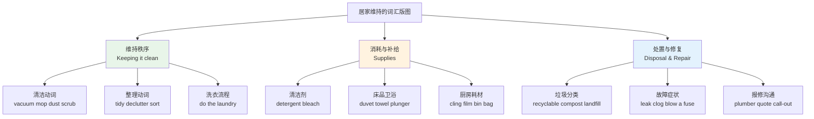
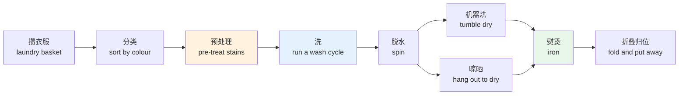
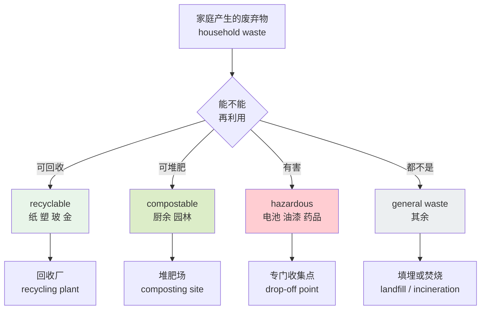
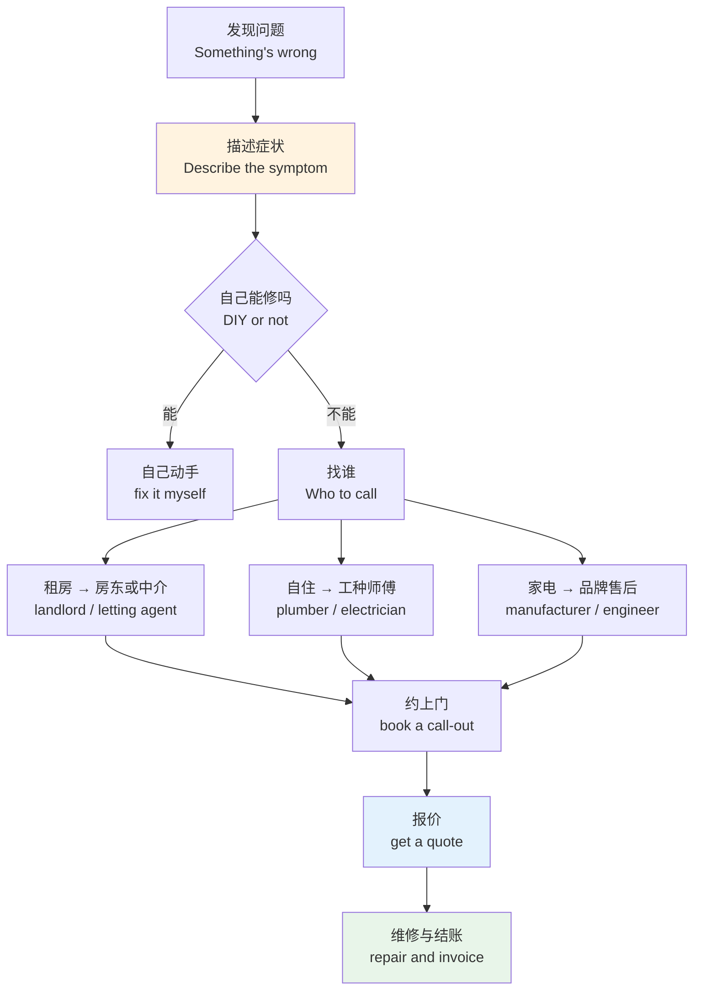
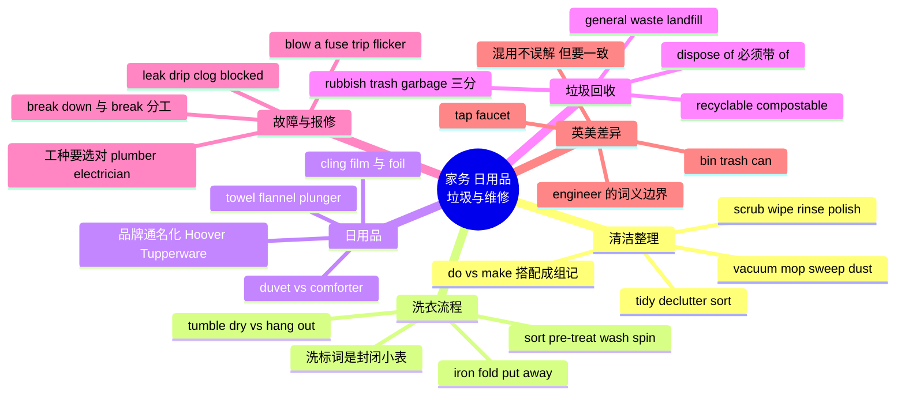

# 家务、日用品、垃圾回收与故障维修

> [!info] 本篇定位
>
> 09 章的第五篇，接在 `04.住房、房间结构、家具与家电` 之后。上一篇给的是房子的静态构造，这一篇给的是让房子持续能住的那套动作和物件。
>
> 覆盖四块：清洁整理与洗衣的动词，日用品与耗材的名词，垃圾分类回收的整套术语，以及家用故障的描述与报修沟通。约 370 个词条。
>
> 读完能做三件事：用英语描述自己今天干了哪些家务；看懂英美垃圾桶上的分类标签和租房合同里的清洁条款；水管漏了、跳闸了，能在电话里把症状说清楚并听懂对方的报价。

---

## 1. 本篇导读：家务词分三条主线

家务词是英语学习里被严重低估的一块。它在考试里几乎不考，在教科书里通常只有半页，但一旦真的住到英语环境里，它是最先暴露短板的部分——因为出问题时没有时间查词典。

这块词汇难在三个地方。

**第一，动作词高度依赖固定搭配。** 中文说「洗衣服」「洗碗」「洗澡」用同一个「洗」，英语分别是 `do the laundry`、`do the dishes`、`take a shower`，动词不通用。更麻烦的是 `do` 和 `make` 的分工：`do the washing-up`（洗碗）但 `make the bed`（铺床），没有语义规律可讲，只能成组记住。

**第二，英美差异在这一块特别密集。** 房子是最本地化的东西，所以清洁工具、垃圾桶、水龙头这些词几乎每一个都有英美两套说法。`tap` 和 `faucet`、`rubbish` 和 `trash`、`cling film` 和 `plastic wrap`——搞混不影响理解，但会明显暴露语料来源单一。

**第三，故障词是低频高危。** 一年可能用不上一次 `the drain is clogged`，但用上的那一次通常是紧急情况。这类词的正确策略是练到接受级就够了：听得懂、看得懂，说的时候能想起大概意思即可。



上图把本篇的三条主线摆开。三条线的学习优先级不同：清洁整理动词和日用品名词属于日常高频，值得练到能主动说出来；垃圾分类术语介于两者之间，看标签必须认得；故障与报修词大部分停在认得级，只有 `leak`、`blocked`、`not working` 这三个最基础的表达需要能主动调用——真出事时说得出这三个词，对方就能接着问下去。

> [!tip] 本篇的学习顺序建议
>
> 不要按顺序从头背到尾。先把第 2 节的清洁动词和第 3 节的洗衣流程练熟，这两节是能立刻用上的。
>
> 第 5、6 节的日用品名词适合边买东西边记——去超市时对着货架看英文标签比背表有效得多。
>
> 第 8、9 节的故障与报修词先通读一遍留个印象，等真需要时回来查。第 10 节的英美对照表建议直接收藏，它是本篇复用率最高的一张表。

---

## 2. 清洁与整理的动词

### 2.1 家务这件事本身怎么说

中文的「家务」是一个词，英语有几个不同颗粒度的说法，用错会显得别扭。

| 英文 | 英式音标 | 美式音标 | 词性 | 中文 | 搭配与说明 |
| --- | --- | --- | --- | --- | --- |
| **housework** | /ˈhaʊswɜːk/ | /ˈhaʊswɜːrk/ | n. | 家务 | 不可数，do housework，不说 a housework |
| **chore** | /tʃɔː/ | /tʃɔːr/ | n. | 杂务；一件家务 | 可数，household chores 是最常用形式 |
| **housekeeping** | /ˈhaʊskiːpɪŋ/ | /ˈhaʊskiːpɪŋ/ | n. | 家政；客房清洁 | 酒店里指清洁部；引申指会议的「事务性安排」 |
| **cleaning** | /ˈkliːnɪŋ/ | /ˈkliːnɪŋ/ | n. | 打扫 | do the cleaning；spring cleaning 大扫除 |
| **tidying** | /ˈtaɪdiɪŋ/ | /ˈtaɪdiɪŋ/ | n. | 整理 | 侧重归位收纳，不一定涉及擦洗 |
| **maintenance** | /ˈmeɪntənəns/ | /ˈmeɪntənəns/ | n. | 维护保养 | 指房屋设备的定期维护，不是日常打扫 |
| **rota** | /ˈrəʊtə/ | /ˈroʊtə/ | n. | 轮值表 | 英式；美式说 roster /ˈrɒstə/ · /ˈrɑːstər/ |
| **cleaner** | /ˈkliːnə/ | /ˈkliːnər/ | n. | 保洁员；清洁剂 | 一词两义，靠语境区分 |
| **cleaning lady** | — | — | n. | 钟点工 | 口语常用，也说 cleaner 更中性 |
| **cleaning up** | — | — | phr. | 收拾残局 | clean up after someone 给某人收拾烂摊子 |

> [!warning] housework 不可数
>
> 中文「一件家务」会让人想说 `a housework`，这在英语里不成立。
>
> - ❌ ~~I have three houseworks to do.~~
> - ✅ I have three **chores** to do.
> - ✅ I have a lot of **housework** to do.
>
> 同理 `homework`（作业）、`work`（工作）也都不可数。这三个词是中文母语者最常出错的不可数名词。

### 2.2 清洁类动词

清洁动词的区分点是「用什么工具、处理什么脏」。中文的「打扫」「擦」「洗」颗粒度太粗，英语要细分。

| 英文 | 英式音标 | 美式音标 | 词性 | 中文 | 搭配与说明 |
| --- | --- | --- | --- | --- | --- |
| **clean** | /kliːn/ | /kliːn/ | v./adj. | 打扫；干净的 | 最通用；clean the kitchen |
| **tidy** | /ˈtaɪdi/ | /ˈtaɪdi/ | v./adj. | 收拾；整齐的 | 英式常用；tidy up the living room |
| **sweep** | /swiːp/ | /swiːp/ | v. | 扫 | 不规则 sweep-swept-swept；用扫帚 |
| **mop** | /mɒp/ | /mɑːp/ | v./n. | 拖（地）；拖把 | 双写 mopped；mop the floor |
| **vacuum** | /ˈvækjuːm/ | /ˈvækjuːm/ | v./n. | 吸尘；吸尘器 | 也说 vacuum-clean；名词 vacuum cleaner |
| **hoover** | /ˈhuːvə/ | /ˈhuːvər/ | v./n. | 吸尘 | 英式口语；来自品牌名 Hoover，已通用化 |
| **dust** | /dʌst/ | /dʌst/ | v./n. | 掸灰；灰尘 | 动词义是「除去灰」不是「加灰」 |
| **wipe** | /waɪp/ | /waɪp/ | v. | 擦拭 | wipe down the counter；wipe up a spill |
| **scrub** | /skrʌb/ | /skrʌb/ | v. | 用力刷洗 | 双写 scrubbed；比 wipe 费力得多 |
| **scour** | /ˈskaʊə/ | /ˈskaʊər/ | v. | 擦洗掉（顽垢） | 常配 scouring pad 百洁布 |
| **rinse** | /rɪns/ | /rɪns/ | v. | 冲洗 | 洗掉泡沫的那一步；rinse off the soap |
| **polish** | /ˈpɒlɪʃ/ | /ˈpɑːlɪʃ/ | v./n. | 抛光；上光剂 | 注意与 Polish「波兰的」/ˈpəʊlɪʃ/ 拼同音异 |
| **disinfect** | /ˌdɪsɪnˈfekt/ | /ˌdɪsɪnˈfekt/ | v. | 消毒 | 名词 disinfectant 消毒剂 |
| **descale** | /ˌdiːˈskeɪl/ | /ˌdiːˈskeɪl/ | v. | 除水垢 | descale the kettle；水碱重的地区高频 |
| **defrost** | /ˌdiːˈfrɒst/ | /ˌdiːˈfrɔːst/ | v. | 除霜；解冻 | defrost the freezer 冰箱除霜 |
| **air out** | — | — | phr.v. | 通风换气 | air out the room；英式也说 air the room |

> [!warning] dust 的方向性反直觉
>
> 英语里有一批「去除类」动词，词根是被去除的东西，动作方向是「移走」而不是「加上」。
>
> - **dust** the shelves = 把架子上的灰掸掉（不是往架子上撒灰）
> - **skin** a fish = 去鱼皮
> - **bone** a chicken = 去骨
> - **weed** the garden = 拔草
> - **seed** 例外：既能指「去籽」也能指「播种」，靠语境判断
>
> 这类词在 `13.抽象概念与高频动词` 里作为名转动的一类专门讲。

> [!example] 清洁动词的自然搭配
>
> - I **vacuumed** the carpet and **mopped** the kitchen floor.
>   - 我吸了地毯，拖了厨房地板。
> - Could you **wipe down** the counter before you leave?
>   - 你走之前把台面擦一下好吗？
> - The bathtub needs a good **scrub** — wiping won't do it.
>   - 浴缸得好好刷一遍，擦是擦不掉的。
> - **Rinse** the dishes before you put them in the dishwasher.
>   - 碗放进洗碗机之前先冲一下。
> - The kettle is furred up; you should **descale** it.
>   - 水壶结垢了，该除一下水垢。

### 2.3 整理与收纳类动词

清洁处理「脏」，整理处理「乱」。这两组动词在英语里分得比中文清楚。

| 英文 | 英式音标 | 美式音标 | 词性 | 中文 | 搭配与说明 |
| --- | --- | --- | --- | --- | --- |
| **tidy up** | — | — | phr.v. | 收拾整齐 | 英式高频；美式更常说 clean up |
| **clean up** | — | — | phr.v. | 收拾干净 | 兼含整理与清洁两层意思 |
| **pick up** | — | — | phr.v. | 把散落物捡起归位 | 美式口语；pick up your toys |
| **put away** | — | — | phr.v. | 收好放回原处 | put away the groceries 把买回来的东西归位 |
| **stow** | /stəʊ/ | /stoʊ/ | v. | 收纳存放 | 略正式；stow it in the loft |
| **declutter** | /ˌdiːˈklʌtə/ | /ˌdiːˈklʌtər/ | v. | 断舍离；清杂物 | de- + clutter；近十几年流行起来的词 |
| **clutter** | /ˈklʌtə/ | /ˈklʌtər/ | n./v. | 杂物；堆满杂物 | 不可数；the desk is cluttered |
| **organize** | /ˈɔːɡənaɪz/ | /ˈɔːrɡənaɪz/ | v. | 整理归类 | 英式也拼 organise；organize the wardrobe |
| **sort** | /sɔːt/ | /sɔːrt/ | v. | 分类 | sort the laundry by colour |
| **sort out** | — | — | phr.v. | 整理清楚；解决 | 英式高频，也指「把问题搞定」 |
| **rearrange** | /ˌriːəˈreɪndʒ/ | /ˌriːəˈreɪndʒ/ | v. | 重新摆放 | rearrange the furniture |
| **make the bed** | — | — | phr. | 铺床 | 固定搭配，不能说 do the bed |
| **change the sheets** | — | — | phr. | 换床单 | 也说 change the bedding |
| **do the dishes** | — | — | phr. | 洗碗 | 美式；英式说 do the washing-up |
| **take out the bins** | — | — | phr. | 倒垃圾 | 英式；美式 take out the trash |
| **run errands** | /ˈerəndz/ | /ˈerəndz/ | phr. | 跑腿办杂事 | 买菜、寄快递、取药这类外出杂务 |

> [!tip] do 与 make 在家务里的分工
>
> 这组搭配没有语义规律，只能整块记。记忆的抓手是：**do 配「例行处理」，make 配「造出一个新状态」**。
>
> ```text
> do the laundry     洗衣服
> do the washing-up  洗碗（英）
> do the dishes      洗碗（美）
> do the ironing     熨衣服
> do the hoovering   吸尘（英）
> do the shopping    采买
> ─────────────────
> make the bed       铺床
> make a mess        弄乱
> make room          腾地方
> make a cup of tea  泡杯茶
> ```
>
> 这个抓手不百分之百精确（`make the bed` 确实是把床「造」成整齐状态，但 `make a mess` 是造出乱），够用就行。完整的 do/make 搭配表在 `16.词义辨析与短语动词` 里。

---

## 3. 洗衣：do the laundry 的完整流程

洗衣是家务里流程最长、专用词最多的一块。中文用「洗衣服」三个字概括的过程，英语要拆成六七个动作。



上图是洗衣的标准链条。三个高亮环节是词汇最密集的地方：`pre-treat` 涉及污渍类型词，`cycle` 涉及洗衣机程序词，`iron` 涉及织物护理词。中间的分叉体现了一个英美生活差异——英国家庭普遍没有滚筒烘干机，晾在 `airer`（晾衣架）上是常态；美国住宅几乎标配 `dryer`，`hang out to dry` 反而少见。

### 3.1 洗衣动词

| 英文 | 英式音标 | 美式音标 | 词性 | 中文 | 搭配与说明 |
| --- | --- | --- | --- | --- | --- |
| **wash** | /wɒʃ/ | /wɑːʃ/ | v./n. | 洗 | 名词 a wash 指「洗一次」；do a wash |
| **do the laundry** | /ˈlɔːndri/ | /ˈlɔːndri/ | phr. | 洗衣服 | 英式也说 do the washing |
| **load** | /ləʊd/ | /loʊd/ | n./v. | 一机的量；装入 | a load of laundry；load the machine |
| **soak** | /səʊk/ | /soʊk/ | v. | 浸泡 | soak it overnight 泡一夜 |
| **pre-treat** | /ˌpriːˈtriːt/ | /ˌpriːˈtriːt/ | v. | 预处理污渍 | pre-treat the stain with soap |
| **spin** | /spɪn/ | /spɪn/ | v./n. | 甩干；脱水 | spin cycle 脱水程序 |
| **rinse** | /rɪns/ | /rɪns/ | v./n. | 漂洗 | extra rinse 多漂一次 |
| **wring** | /rɪŋ/ | /rɪŋ/ | v. | 拧干 | w 不发音；wring-wrung-wrung |
| **tumble dry** | /ˈtʌmbl draɪ/ | /ˈtʌmbl draɪ/ | phr.v. | 滚筒烘干 | 洗标上写 do not tumble dry |
| **hang out** | — | — | phr.v. | 晾出去 | hang the washing out to dry |
| **air-dry** | /ˈeə draɪ/ | /ˈer draɪ/ | v. | 自然阴干 | 洗标术语，与 tumble dry 相对 |
| **iron** | /ˈaɪən/ | /ˈaɪərn/ | v./n. | 熨；熨斗 | r 在英音里不发；do the ironing |
| **steam** | /stiːm/ | /stiːm/ | v./n. | 蒸汽熨；蒸汽 | steamer 挂烫机 |
| **fold** | /fəʊld/ | /foʊld/ | v. | 折叠 | fold the towels |
| **hang up** | — | — | phr.v. | 挂起来 | hang up your coat（挂衣架上） |
| **bleach** | /bliːtʃ/ | /bliːtʃ/ | v./n. | 漂白；漂白剂 | non-chlorine bleach 无氯漂白剂 |
| **shrink** | /ʃrɪŋk/ | /ʃrɪŋk/ | v. | 缩水 | shrink-shrank-shrunk；it shrank in the wash |
| **fade** | /feɪd/ | /feɪd/ | v. | 褪色 | the colour has faded |
| **bleed** | /bliːd/ | /bliːd/ | v. | 掉色染到别的衣服 | the red shirt bled onto the whites |
| **dry-clean** | /ˌdraɪ ˈkliːn/ | /ˌdraɪ ˈkliːn/ | v. | 干洗 | dry cleaner's 干洗店 |

> [!warning] shrink 和 bleed 都是「洗坏了」
>
> 这两个词在洗衣语境里的含义和字典首义相去很远，容易看不懂。
>
> - The sweater **shrank** in the wash. = 毛衣洗缩水了（不是「收缩预算」）
> - The new jeans **bled** onto my white shirt. = 新牛仔裤掉色染了我白衬衫（不是「流血」）
>
> 同一类的还有 `run`：`The dye ran.` 也是「掉色」。三个词在这个语境里意思相近。

### 3.2 洗衣用品与设备

| 英文 | 英式音标 | 美式音标 | 词性 | 中文 | 搭配与说明 |
| --- | --- | --- | --- | --- | --- |
| **detergent** | /dɪˈtɜːdʒənt/ | /dɪˈtɜːrdʒənt/ | n. | 洗涤剂 | laundry detergent 洗衣液/粉 |
| **washing powder** | — | — | n. | 洗衣粉 | 英式常用；美式 laundry powder |
| **liquid detergent** | — | — | n. | 洗衣液 | 也直接说 liquid |
| **pod** | /pɒd/ | /pɑːd/ | n. | 洗衣凝珠 | 英式也说 capsule /ˈkæpsjuːl/ |
| **fabric softener** | /ˈfæbrɪk ˈsɒfnə/ | /ˈfæbrɪk ˈsɔːfnər/ | n. | 柔顺剂 | 英式也说 fabric conditioner |
| **stain remover** | /steɪn rɪˈmuːvə/ | /steɪn rɪˈmuːvər/ | n. | 去渍剂 | 对付 stain 的专门产品 |
| **stain** | /steɪn/ | /steɪn/ | n./v. | 污渍；弄脏 | a coffee stain；it stained the carpet |
| **washing machine** | — | — | n. | 洗衣机 | 美式口语常直接说 the washer |
| **tumble dryer** | /ˈtʌmbl ˈdraɪə/ | — | n. | 烘干机 | 英式；美式说 dryer /ˈdraɪər/ |
| **washer-dryer** | — | — | n. | 洗烘一体机 | 英国公寓常见配置 |
| **laundry basket** | /ˈlɔːndri ˈbɑːskɪt/ | /ˈlɔːndri ˈbæskɪt/ | n. | 脏衣篮 | 美式也说 hamper /ˈhæmpər/ |
| **hamper** | /ˈhæmpə/ | /ˈhæmpər/ | n. | 脏衣篮 | 英式的 hamper 多指「食品礼篮」，义项不同 |
| **clothes horse** | /ˈkləʊðz hɔːs/ | /ˈkloʊðz hɔːrs/ | n. | 室内晾衣架 | 英式；也说 airer |
| **airer** | /ˈeərə/ | — | n. | 晾衣架 | 纯英式词，美国人多半不懂 |
| **washing line** | — | — | n. | 晾衣绳 | 英式；美式 clothesline |
| **clothesline** | /ˈkləʊðzlaɪn/ | /ˈkloʊðzlaɪn/ | n. | 晾衣绳 | 美式常用 |
| **clothes peg** | /ˈkləʊðz peɡ/ | — | n. | 衣夹 | 英式；美式 clothespin |
| **clothespin** | — | /ˈkloʊðzpɪn/ | n. | 衣夹 | 美式 |
| **hanger** | /ˈhæŋə/ | /ˈhæŋər/ | n. | 衣架 | coat hanger 全称 |
| **ironing board** | /ˈaɪənɪŋ bɔːd/ | /ˈaɪərnɪŋ bɔːrd/ | n. | 熨衣板 | 与 iron 配套 |
| **lint** | /lɪnt/ | /lɪnt/ | n. | 绒毛；棉絮 | lint filter 烘干机绒毛过滤网 |
| **lint roller** | — | — | n. | 粘毛滚筒 | 去衣服上毛絮的工具 |
| **launderette** | /ˌlɔːndəˈret/ | — | n. | 自助洗衣店 | 英式；美式 laundromat |
| **laundromat** | — | /ˈlɔːndrəmæt/ | n. | 自助洗衣店 | 美式 |

### 3.3 洗标上的词

衣服吊牌与洗标（`care label`）上的词是一套封闭小词表，认全了就不会洗坏衣服。

| 英文 | 英式音标 | 美式音标 | 词性 | 中文 | 搭配与说明 |
| --- | --- | --- | --- | --- | --- |
| **machine wash** | — | — | phr. | 可机洗 | 后面常跟温度 machine wash 30° |
| **hand wash** | — | — | phr. | 手洗 | hand wash only 仅可手洗 |
| **delicates** | /ˈdelɪkəts/ | /ˈdelɪkəts/ | n. | 精细衣物 | 洗衣机上的 delicate cycle 轻柔程序 |
| **gentle cycle** | — | — | n. | 轻柔程序 | 与 normal cycle 相对 |
| **cycle** | /ˈsaɪkl/ | /ˈsaɪkl/ | n. | 洗涤程序 | a 40-minute cycle |
| **colourfast** | /ˈkʌləfɑːst/ | — | adj. | 不掉色的 | 美式拼 colorfast /ˈkʌlərfæst/ |
| **crease** | /kriːs/ | /kriːs/ | n./v. | 折痕；起皱 | crease-resistant 抗皱的 |
| **wrinkle** | /ˈrɪŋkl/ | /ˈrɪŋkl/ | n./v. | 皱纹；起皱 | 美式更常用；wrinkle-free 免烫 |
| **iron on low** | — | — | phr. | 低温熨烫 | 洗标常写 cool iron |
| **do not bleach** | — | — | phr. | 不可漂白 | 洗标固定句式 |
| **line dry** | — | — | phr. | 晾干 | 与 tumble dry 相对 |
| **lay flat to dry** | — | — | phr. | 平铺晾干 | 毛衣类常见要求 |

> [!example] 洗衣场景成句
>
> - I need to **do a load of laundry** before Sunday.
>   - 周日前我得洗一机衣服。
> - **Sort** the darks from the whites, or the colours will **run**.
>   - 深色和白色分开，不然会串色。
> - This is **hand wash only** — don't put it in the machine.
>   - 这件只能手洗，别扔洗衣机里。
> - The **tumble dryer**'s **lint filter** needs cleaning after every load.
>   - 烘干机的绒毛过滤网每洗一次都得清一下。
> - I'll **hang these out** if it stays dry.
>   - 要是不下雨我就把这些晾出去。

---

## 4. 清洁工具与清洁剂

### 4.1 工具

| 英文 | 英式音标 | 美式音标 | 词性 | 中文 | 搭配与说明 |
| --- | --- | --- | --- | --- | --- |
| **broom** | /bruːm/ | /bruːm/ | n. | 扫帚 | 长柄；配 dustpan 使用 |
| **dustpan** | /ˈdʌstpæn/ | /ˈdʌstpæn/ | n. | 簸箕 | dustpan and brush 是固定组合 |
| **mop** | /mɒp/ | /mɑːp/ | n. | 拖把 | 拖把头叫 mop head |
| **bucket** | /ˈbʌkɪt/ | /ˈbʌkɪt/ | n. | 水桶 | 美式也说 pail /peɪl/，但 bucket 更通用 |
| **vacuum cleaner** | — | — | n. | 吸尘器 | 英式口语 hoover；美式口语 vacuum |
| **sponge** | /spʌndʒ/ | /spʌndʒ/ | n. | 海绵 | 注意读 /dʒ/ 不是 /ɡ/ |
| **scouring pad** | /ˈskaʊərɪŋ pæd/ | /ˈskaʊrɪŋ pæd/ | n. | 百洁布 | 粗糙面用来擦顽垢 |
| **steel wool** | /stiːl wʊl/ | /stiːl wʊl/ | n. | 钢丝球 | 也说 wire wool（英式） |
| **cloth** | /klɒθ/ | /klɔːθ/ | n. | 抹布 | 复数 cloths /klɒθs/，与 clothes 不同 |
| **rag** | /ræɡ/ | /ræɡ/ | n. | 破布 | 比 cloth 更旧、更随意 |
| **duster** | /ˈdʌstə/ | /ˈdʌstər/ | n. | 掸子；抹灰布 | feather duster 鸡毛掸子 |
| **squeegee** | /ˈskwiːdʒiː/ | /ˈskwiːdʒiː/ | n. | 玻璃刮水器 | 擦窗和浴室玻璃用 |
| **rubber gloves** | /ˈrʌbə ɡlʌvz/ | /ˈrʌbər ɡlʌvz/ | n. | 橡胶手套 | 也说 washing-up gloves |
| **toilet brush** | — | — | n. | 马桶刷 | 与 plunger 不是一回事 |
| **bin** | /bɪn/ | /bɪn/ | n. | 垃圾桶 | 英式；详见第 7 节 |
| **caddy** | /ˈkædi/ | /ˈkædi/ | n. | 小桶；收纳提篮 | food caddy 厨余桶；cleaning caddy 工具提篮 |
| **spray bottle** | — | — | n. | 喷壶 | spray 既是名词也是动词 |
| **stepladder** | /ˈsteplædə/ | /ˈsteplædər/ | n. | 折叠梯 | 擦高处用；也简称 steps（英式） |

### 4.2 清洁剂与耗材

| 英文 | 英式音标 | 美式音标 | 词性 | 中文 | 搭配与说明 |
| --- | --- | --- | --- | --- | --- |
| **washing-up liquid** | — | — | n. | 洗洁精 | 英式；美式说 dish soap |
| **dish soap** | — | — | n. | 洗洁精 | 美式；也说 dishwashing liquid |
| **dishwasher tablet** | — | — | n. | 洗碗机块 | 也说 dishwasher pod |
| **rinse aid** | /rɪns eɪd/ | /rɪns eɪd/ | n. | 光亮剂 | 洗碗机专用 |
| **bleach** | /bliːtʃ/ | /bliːtʃ/ | n. | 漂白水；84 消毒液 | 中国家庭的 84 消毒液最接近的对应词 |
| **disinfectant** | /ˌdɪsɪnˈfektənt/ | /ˌdɪsɪnˈfektənt/ | n. | 消毒剂 | 比 bleach 更中性的统称 |
| **all-purpose cleaner** | — | — | n. | 多用途清洁剂 | 英式也说 multi-surface cleaner |
| **surface spray** | — | — | n. | 台面喷雾 | 厨房台面常用 |
| **glass cleaner** | — | — | n. | 玻璃水 | 也说 window cleaner |
| **limescale remover** | /ˈlaɪmskeɪl/ | /ˈlaɪmskeɪl/ | n. | 除垢剂 | 英国硬水地区必备 |
| **limescale** | /ˈlaɪmskeɪl/ | /ˈlaɪmskeɪl/ | n. | 水垢 | 美式更常说 hard water deposits |
| **drain unblocker** | — | — | n. | 管道疏通剂 | 美式说 drain cleaner |
| **oven cleaner** | — | — | n. | 烤箱清洁剂 | 强碱性，需戴手套 |
| **furniture polish** | — | — | n. | 家具蜡 | 抛光木质表面 |
| **air freshener** | /eə ˈfreʃnə/ | /er ˈfreʃnər/ | n. | 空气清新剂 | plug-in air freshener 插电式 |
| **white vinegar** | /ˈvɪnɪɡə/ | /ˈvɪnɪɡər/ | n. | 白醋 | 除垢的家用替代品 |
| **baking soda** | — | — | n. | 小苏打 | 英式也说 bicarbonate of soda |
| **grease** | /ɡriːs/ | /ɡriːs/ | n. | 油污 | 名词读 /s/，动词 grease 读 /z/ 或 /s/ |
| **grime** | /ɡraɪm/ | /ɡraɪm/ | n. | 积垢 | 比 dirt 更顽固、更黑 |
| **mould** | /məʊld/ | — | n. | 霉 | 英式拼法；美式 mold /moʊld/ |
| **mildew** | /ˈmɪldjuː/ | /ˈmɪlduː/ | n. | 霉斑 | 多指浴室瓷砖缝隙上的白霉 |
| **grout** | /ɡraʊt/ | /ɡraʊt/ | n. | 瓷砖填缝剂 | 发霉的常是 grout 而不是瓷砖本身 |

> [!tip] 三个「脏」的强度梯度
>
> ```text
> dust    灰尘      干的、浮在表面、掸一下就掉
> dirt    污垢      泛指的脏，泥土、灰、杂质
> grime   积垢      油和灰积久了黏在表面，得用力刷
> ```
>
> 对应的动词强度也是一路上升：`dust` → `wipe` → `scrub`。描述打扫程度时用对这一组，比一路用 `very dirty` 精确得多。

---

## 5. 床上用品与卫浴日用品

### 5.1 床品

床品是英美差异的重灾区，而且很多词中文里没有精确对应。

| 英文 | 英式音标 | 美式音标 | 词性 | 中文 | 搭配与说明 |
| --- | --- | --- | --- | --- | --- |
| **bedding** | /ˈbedɪŋ/ | /ˈbedɪŋ/ | n. | 床上用品（统称） | 不可数；change the bedding |
| **linen** | /ˈlɪnɪn/ | /ˈlɪnɪn/ | n. | 床品布草；亚麻 | bed linen 指床单被套一整套 |
| **duvet** | /ˈduːveɪ/ | /duːˈveɪ/ | n. | 羽绒被；被芯 | 英美重音位置不同，是典型对照词 |
| **duvet cover** | — | — | n. | 被套 | 英式主流说法 |
| **comforter** | /ˈkʌmfətə/ | /ˈkʌmfərtər/ | n. | 厚被（带填充） | 美式；通常不套被套直接用 |
| **quilt** | /kwɪlt/ | /kwɪlt/ | n. | 薄被；被子 | 有绗缝线的那种 |
| **blanket** | /ˈblæŋkɪt/ | /ˈblæŋkɪt/ | n. | 毯子 | 单层无填充，盖在被子外面 |
| **throw** | /θrəʊ/ | /θroʊ/ | n. | 装饰盖毯 | 搭在沙发或床尾的小毯 |
| **sheet** | /ʃiːt/ | /ʃiːt/ | n. | 床单 | 注意与 shit 元音长度区别，/iː/ 要拉长 |
| **fitted sheet** | /ˈfɪtɪd ʃiːt/ | /ˈfɪtɪd ʃiːt/ | n. | 床笠 | 四角带松紧的那种 |
| **flat sheet** | — | — | n. | 平床单 | 铺在身体和被子之间，英美传统用法 |
| **pillow** | /ˈpɪləʊ/ | /ˈpɪloʊ/ | n. | 枕头 | 复数 pillows |
| **pillowcase** | /ˈpɪləʊkeɪs/ | /ˈpɪloʊkeɪs/ | n. | 枕套 | 英式也说 pillowslip |
| **mattress** | /ˈmætrəs/ | /ˈmætrəs/ | n. | 床垫 | 重音在前 |
| **mattress protector** | — | — | n. | 床垫保护垫 | 防污防螨的那层 |
| **cushion** | /ˈkʊʃn/ | /ˈkʊʃn/ | n. | 靠垫 | 沙发上的；美式也说 throw pillow |
| **valance** | /ˈvæləns/ | /ˈvæləns/ | n. | 床裙 | 英式；美式说 bed skirt |
| **tog** | /tɒɡ/ | /tɑːɡ/ | n. | 被子保暖值 | 英国标法，13.5 tog 是冬被典型值 |

> [!warning] duvet 与 comforter 不是同一种东西
>
> 这两个词常被当同义词，但用法有实际差别。
>
> - **duvet**（英式主流）= 被芯，必须套 `duvet cover` 使用，换洗时只洗被套。
> - **comforter**（美式主流）= 带装饰面的整床厚被，通常直接盖，脏了整条洗。
>
> 在英国说 `I need to wash my comforter` 对方能懂但会觉得是美国说法；在美国说 `duvet cover` 完全通行，因为 IKEA 式家居把这个词带过去了。
>
> 中文的「被子」两边都能对上，但买东西时必须分清楚——买了 duvet 不买 cover 会很尴尬。

### 5.2 卫浴日用品

| 英文 | 英式音标 | 美式音标 | 词性 | 中文 | 搭配与说明 |
| --- | --- | --- | --- | --- | --- |
| **towel** | /ˈtaʊəl/ | /ˈtaʊəl/ | n. | 毛巾 | bath towel 浴巾，hand towel 擦手巾 |
| **flannel** | /ˈflænl/ | — | n. | 洗脸巾 | 纯英式；也指法兰绒面料 |
| **washcloth** | — | /ˈwɑːʃklɔːθ/ | n. | 洗脸巾 | 美式对应词 |
| **bath mat** | /bɑːθ mæt/ | /bæθ mæt/ | n. | 浴室地垫 | 防滑吸水那块 |
| **shower curtain** | /ˈʃaʊə ˈkɜːtn/ | /ˈʃaʊər ˈkɜːrtn/ | n. | 浴帘 | 上面容易长 mildew |
| **shower gel** | /ˈʃaʊə dʒel/ | /ˈʃaʊər dʒel/ | n. | 沐浴露 | 美式也说 body wash |
| **soap** | /səʊp/ | /soʊp/ | n. | 肥皂 | 不可数；a bar of soap 一块 |
| **shampoo** | /ʃæmˈpuː/ | /ʃæmˈpuː/ | n./v. | 洗发水；洗头 | 重音在后 |
| **conditioner** | /kənˈdɪʃənə/ | /kənˈdɪʃənər/ | n. | 护发素 | 也指衣物柔顺剂，靠语境分 |
| **toothpaste** | /ˈtuːθpeɪst/ | /ˈtuːθpeɪst/ | n. | 牙膏 | 不可数；a tube of toothpaste |
| **toothbrush** | /ˈtuːθbrʌʃ/ | /ˈtuːθbrʌʃ/ | n. | 牙刷 | 复数 toothbrushes |
| **dental floss** | /ˈdentl flɒs/ | /ˈdentl flɔːs/ | n. | 牙线 | 动词 floss |
| **razor** | /ˈreɪzə/ | /ˈreɪzər/ | n. | 剃须刀 | disposable razor 一次性刀片 |
| **toilet paper** | — | — | n. | 卫生纸 | 英式口语 loo roll，中性说 toilet roll |
| **tissue** | /ˈtɪʃuː/ | /ˈtɪʃuː/ | n. | 纸巾 | 抽纸；一张叫 a tissue |
| **cotton bud** | — | — | n. | 棉签 | 英式；美式 cotton swab /swɑːb/ |
| **toiletries** | /ˈtɔɪlətriz/ | /ˈtɔɪlətriz/ | n. | 洗漱用品（总称） | 常用复数；旅行装叫 travel-size toiletries |
| **plunger** | /ˈplʌndʒə/ | /ˈplʌndʒər/ | n. | 皮搋子 | 通马桶用；动词 plunge |
| **drain** | /dreɪn/ | /dreɪn/ | n./v. | 下水口；排水 | 名词是洞，动词是「排掉」 |
| **plughole** | /ˈplʌɡhəʊl/ | — | n. | 排水孔 | 英式；美式直接说 drain |
| **hair catcher** | — | — | n. | 头发过滤网 | 也说 drain strainer |
| **loo** | /luː/ | — | n. | 厕所 | 英式口语，轻松场合；正式说 toilet |

> [!warning] toilet 这个词在英美的分量不同
>
> - 英国：`toilet` 是中性日常词，问路直接说 `Where's the toilet?` 完全正常，`loo` 更口语。
> - 美国：`toilet` 指马桶那个陶瓷设备本身，问洗手间要说 `restroom`（公共场合）或 `bathroom`（家里）。在美国餐厅问 `Where's the toilet?` 会显得直白刺耳。
>
> 安全策略：在美国一律用 `restroom`，在英国用 `toilet`，两地都能接受的中间词是 `Where can I wash my hands?` 这种迂回问法。

---

## 6. 厨房耗材与家用杂物

耗材词的特点是「买的时候必须说对，说错拿不到东西」。这一节的词几乎全部有英美对照。

| 英文 | 英式音标 | 美式音标 | 词性 | 中文 | 搭配与说明 |
| --- | --- | --- | --- | --- | --- |
| **cling film** | /klɪŋ fɪlm/ | — | n. | 保鲜膜 | 英式；美式 plastic wrap 或 Saran wrap |
| **plastic wrap** | — | — | n. | 保鲜膜 | 美式通用说法 |
| **aluminium foil** | /ˌæljəˈmɪniəm fɔɪl/ | — | n. | 锡纸 | 英式拼写与读音都多一个音节 |
| **aluminum foil** | — | /əˈluːmɪnəm fɔɪl/ | n. | 锡纸 | 美式；口语常简称 foil 或 tin foil |
| **baking paper** | — | — | n. | 烘焙纸 | 英式；美式 parchment paper |
| **parchment paper** | /ˈpɑːtʃmənt/ | /ˈpɑːrtʃmənt/ | n. | 烘焙纸 | 美式 |
| **kitchen roll** | — | — | n. | 厨房纸 | 英式；美式 paper towels |
| **paper towels** | — | — | n. | 厨房纸 | 美式，恒用复数 |
| **napkin** | /ˈnæpkɪn/ | /ˈnæpkɪn/ | n. | 餐巾 | 英式也说 serviette /ˌsɜːviˈet/ |
| **bin bag** | — | — | n. | 垃圾袋 | 英式；也说 bin liner |
| **trash bag** | — | — | n. | 垃圾袋 | 美式；也说 garbage bag |
| **zip-lock bag** | — | — | n. | 密封袋 | 英式也说 freezer bag |
| **food container** | /kənˈteɪnə/ | /kənˈteɪnər/ | n. | 保鲜盒 | 口语常直接说 Tupperware（品牌通用化） |
| **Tupperware** | /ˈtʌpəweə/ | /ˈtʌpərwer/ | n. | 保鲜盒 | 品牌名当通名用，不大写也常见 |
| **jar** | /dʒɑː/ | /dʒɑːr/ | n. | 玻璃罐 | 广口带盖；a jar of jam |
| **lid** | /lɪd/ | /lɪd/ | n. | 盖子 | 罐盖锅盖通用 |
| **skewer** | /ˈskjuːə/ | /ˈskjuːər/ | n. | 串签 | 烧烤用 |
| **tea towel** | — | — | n. | 擦碗布 | 英式；美式 dish towel |
| **oven glove** | — | — | n. | 隔热手套 | 英式；美式 oven mitt /mɪt/ |
| **light bulb** | /laɪt bʌlb/ | /laɪt bʌlb/ | n. | 灯泡 | change a light bulb 是最经典的日常表达 |
| **battery** | /ˈbætri/ | /ˈbætəri/ | n. | 电池 | AA 读作 double-A；the battery's dead |
| **extension lead** | — | — | n. | 插线板 | 英式；美式 extension cord 或 power strip |
| **plug** | /plʌɡ/ | /plʌɡ/ | n./v. | 插头；塞子 | 也指浴缸的塞子；plug in 插上 |
| **adapter** | /əˈdæptə/ | /əˈdæptər/ | n. | 转接头 | travel adapter 旅行转换插头 |
| **fuse** | /fjuːz/ | /fjuːz/ | n. | 保险丝 | 英式插头内部自带 fuse，美式没有 |
| **spare** | /speə/ | /sper/ | n./adj. | 备用件；备用的 | a spare key 备用钥匙；keep a spare |

> [!tip] 品牌通名化在日用品里特别常见
>
> 英语日用品词里有一批原本是商标、现在被当成普通名词使用的词，不认识就完全听不懂。
>
> | 品牌来源词 | 实际所指 | 通用替代说法 |
> | --- | --- | --- |
> | **Hoover**（英） | 吸尘器 | vacuum cleaner |
> | **Tupperware** | 保鲜盒 | food container |
> | **Sellotape**（英） | 透明胶带 | sticky tape / clear tape |
> | **Scotch tape**（美） | 透明胶带 | clear tape |
> | **Biro**（英） | 圆珠笔 | ballpoint pen |
> | **Saran wrap**（美） | 保鲜膜 | plastic wrap |
> | **Q-tip**（美） | 棉签 | cotton swab |
> | **Band-Aid**（美） | 创可贴 | plaster（英）/ adhesive bandage |
>
> 写正式文本时用通用词，口语里跟着当地说法走。品牌通名化这个现象在 `15.词根、合成与缩略` 里作为构词途径之一另有展开。

---

## 7. 垃圾、分类与回收

### 7.1 垃圾本身怎么说

这是英美差异最大的一组词，而且不只是词形不同，连语义边界都不一样。

| 英文 | 英式音标 | 美式音标 | 词性 | 中文 | 搭配与说明 |
| --- | --- | --- | --- | --- | --- |
| **rubbish** | /ˈrʌbɪʃ/ | — | n. | 垃圾 | 英式主流；也作形容词「很烂」 |
| **trash** | /træʃ/ | /træʃ/ | n. | 垃圾 | 美式主流；偏指干垃圾、纸类 |
| **garbage** | /ˈɡɑːbɪdʒ/ | /ˈɡɑːrbɪdʒ/ | n. | 垃圾 | 美式；传统上偏指厨余湿垃圾 |
| **waste** | /weɪst/ | /weɪst/ | n. | 废弃物 | 正式与技术语境；household waste |
| **refuse** | /ˈrefjuːs/ | /ˈrefjuːs/ | n. | 废弃物 | 重音在前，与动词 refuse /rɪˈfjuːz/ 不同 |
| **litter** | /ˈlɪtə/ | /ˈlɪtər/ | n./v. | 乱丢的垃圾；乱扔 | 特指扔在公共场所的；No littering 禁止乱扔 |
| **junk** | /dʒʌŋk/ | /dʒʌŋk/ | n. | 废旧杂物 | 指没用但还没扔的东西；junk mail 垃圾邮件 |
| **scrap** | /skræp/ | /skræp/ | n. | 废料 | scrap metal 废金属，有回收价值 |
| **debris** | /ˈdebriː/ | /dəˈbriː/ | n. | 残骸碎屑 | 装修拆下来的那种；s 不发音 |
| **rubble** | /ˈrʌbl/ | /ˈrʌbl/ | n. | 碎砖瓦砾 | 建筑垃圾 |

> [!warning] rubbish 作形容词的用法只在英式存在
>
> 英式口语里 `rubbish` 可以当形容词表示「很差劲」，这个用法在美式英语里没有。
>
> - The film was **rubbish**.（英式）= 这电影太烂了。
> - 美式对应说法：The movie was **terrible / awful / garbage**.
>
> 另一个方向：美式的 `trash` 也能当动词用，`trash the place` 是「把地方砸得乱七八糟」，跟「扔垃圾」无关。

### 7.2 垃圾容器与收运

| 英文 | 英式音标 | 美式音标 | 词性 | 中文 | 搭配与说明 |
| --- | --- | --- | --- | --- | --- |
| **bin** | /bɪn/ | /bɪn/ | n./v. | 垃圾桶；扔掉 | 英式核心词；bin it 扔了它 |
| **wheelie bin** | /ˈwiːli bɪn/ | — | n. | 带轮大垃圾桶 | 英式；每户门口那种 |
| **dustbin** | /ˈdʌstbɪn/ | — | n. | 垃圾桶 | 英式偏旧的说法 |
| **trash can** | — | /træʃ kæn/ | n. | 垃圾桶 | 美式室内外通用 |
| **garbage can** | — | /ˈɡɑːrbɪdʒ kæn/ | n. | 垃圾桶 | 美式 |
| **waste bin** | — | — | n. | 废物箱 | 中性书面说法，标牌上常见 |
| **recycling bin** | — | — | n. | 回收桶 | 通常另一种颜色 |
| **food caddy** | — | — | n. | 厨余小桶 | 英国厨房台面上那个小桶 |
| **dumpster** | — | /ˈdʌmpstər/ | n. | 大型垃圾箱 | 美式；原为商标 |
| **skip** | /skɪp/ | — | n. | 建筑废料箱 | 英式；装修时租的那种大铁箱 |
| **bin lorry** | — | — | n. | 垃圾车 | 英式；也说 dustcart |
| **garbage truck** | — | — | n. | 垃圾车 | 美式 |
| **bin men** | — | — | n. | 收垃圾的工人 | 英式口语；正式说 refuse collectors |
| **collection** | /kəˈlekʃn/ | /kəˈlekʃn/ | n. | 收运 | bin collection day 收垃圾日 |
| **kerbside** | /ˈkɜːbsaɪd/ | — | adj. | 路边收运的 | 英式拼法；kerbside collection |
| **curbside** | — | /ˈkɜːrbsaɪd/ | adj. | 路边收运的 | 美式拼法，读音相同 |
| **tip** | /tɪp/ | — | n. | 垃圾处理场 | 英式口语；take it to the tip |
| **household waste centre** | — | — | n. | 生活垃圾回收站 | 英国官方说法；美式 dump 或 transfer station |

### 7.3 分类与去向



上图是英美两地垃圾分流的通用逻辑。跟中国的「干湿有害可回收」四分法结构相似，但落到词上有两点要注意：英语的 `general waste`（其他垃圾）不叫 dry waste，也不叫 other waste；`hazardous waste` 涵盖的范围比中文的「有害垃圾」略广，装修剩下的油漆、机油都算。

| 英文 | 英式音标 | 美式音标 | 词性 | 中文 | 搭配与说明 |
| --- | --- | --- | --- | --- | --- |
| **recycle** | /ˌriːˈsaɪkl/ | /ˌriːˈsaɪkl/ | v. | 回收再利用 | 名词 recycling |
| **recyclable** | /ˌriːˈsaɪkləbl/ | /ˌriːˈsaɪkləbl/ | adj./n. | 可回收的；可回收物 | 复数 recyclables 指可回收物总称 |
| **non-recyclable** | — | — | adj. | 不可回收的 | 前缀 non- 直接加 |
| **compost** | /ˈkɒmpɒst/ | /ˈkɑːmpoʊst/ | n./v. | 堆肥；做堆肥 | 名词动词同形，英美元音差异明显 |
| **compostable** | /kəmˈpɒstəbl/ | /kəmˈpoʊstəbl/ | adj. | 可堆肥的 | 包装袋上的常见标注 |
| **biodegradable** | /ˌbaɪəʊdɪˈɡreɪdəbl/ | /ˌbaɪoʊdɪˈɡreɪdəbl/ | adj. | 可生物降解的 | bio「生物」+ degrade「降解」 |
| **landfill** | /ˈlændfɪl/ | /ˈlændfɪl/ | n. | 填埋场；填埋 | goes to landfill 进填埋场 |
| **incinerate** | /ɪnˈsɪnəreɪt/ | /ɪnˈsɪnəreɪt/ | v. | 焚烧 | 名词 incineration |
| **incinerator** | /ɪnˈsɪnəreɪtə/ | /ɪnˈsɪnəreɪtər/ | n. | 焚烧炉 | 重音在第二音节 |
| **general waste** | — | — | n. | 其他垃圾 | 英式官方分类名；美式 landfill 或 trash |
| **food waste** | — | — | n. | 厨余垃圾 | 英美通用 |
| **green waste** | — | — | n. | 园林垃圾 | 落叶、草屑；也说 garden waste |
| **hazardous waste** | /ˈhæzədəs/ | /ˈhæzərdəs/ | n. | 有害垃圾 | 电池、油漆、农药 |
| **e-waste** | /ˈiː weɪst/ | /ˈiː weɪst/ | n. | 电子垃圾 | 全称 electronic waste；WEEE 是欧盟法规缩写 |
| **single-use** | — | — | adj. | 一次性的 | single-use plastics 一次性塑料 |
| **disposable** | /dɪˈspəʊzəbl/ | /dɪˈspoʊzəbl/ | adj. | 一次性的 | disposable cups；也指「可支配的」收入 |
| **reusable** | /ˌriːˈjuːzəbl/ | /ˌriːˈjuːzəbl/ | adj. | 可重复使用的 | reusable bag 环保袋 |
| **deposit return** | /dɪˈpɒzɪt/ | /dɪˈpɑːzɪt/ | n. | 押金退还制 | 瓶罐押金回收；缩写 DRS |
| **bottle bank** | — | — | n. | 玻璃瓶回收箱 | 英式；街边那种投瓶箱 |
| **rinse and flatten** | — | — | phr. | 冲净压扁 | 回收桶上的常见指示 |
| **contamination** | /kənˌtæmɪˈneɪʃn/ | /kənˌtæmɪˈneɪʃn/ | n. | 混投污染 | 可回收物里混进脏东西导致整批报废 |

### 7.4 处置动词

| 英文 | 英式音标 | 美式音标 | 词性 | 中文 | 搭配与说明 |
| --- | --- | --- | --- | --- | --- |
| **throw away** | — | — | phr.v. | 扔掉 | 最通用；也说 throw out |
| **bin** | /bɪn/ | — | v. | 扔掉 | 英式口语；just bin it |
| **chuck out** | /tʃʌk/ | /tʃʌk/ | phr.v. | 扔掉 | 口语随意；英式更常见 |
| **dispose of** | /dɪˈspəʊz/ | /dɪˈspoʊz/ | phr.v. | 处置 | 正式；后必须带 of |
| **discard** | /dɪsˈkɑːd/ | /dɪsˈkɑːrd/ | v. | 丢弃 | 书面语，说明书里常见 |
| **dump** | /dʌmp/ | /dʌmp/ | v./n. | 倾倒；垃圾场 | fly-tipping 是英式的「非法倾倒」 |
| **take out** | — | — | phr.v. | 拿出去（倒） | take out the trash / put the bins out |
| **donate** | /dəʊˈneɪt/ | /ˈdoʊneɪt/ | v. | 捐赠 | donate to a charity shop |
| **give away** | — | — | phr.v. | 送人 | 比 donate 随意 |
| **sell on** | — | — | phr.v. | 转卖 | 英式；美式说 resell |
| **repurpose** | /ˌriːˈpɜːpəs/ | /ˌriːˈpɜːrpəs/ | v. | 改作他用 | 旧物改造的说法 |
| **salvage** | /ˈsælvɪdʒ/ | /ˈsælvɪdʒ/ | v./n. | 抢救回收 | 从要扔的东西里挑出还能用的 |

> [!warning] dispose 后面必须跟 of
>
> `dispose` 单独用是「安排、布置」的旧义，日常几乎不用。表示「处置扔掉」时必须写 `dispose of`。
>
> - ❌ ~~Please dispose the packaging properly.~~
> - ✅ Please **dispose of** the packaging properly.
> - ✅ 更口语的说法：Please **throw** the packaging **away** properly.
>
> 另一个高频误用是 `discard` 当口语用。它是书面词，日常对话说 `I discarded my old shoes` 会显得像在写实验报告，说 `I threw out my old shoes` 才自然。

> [!example] 垃圾场景成句
>
> - The **bins** go out on Tuesday night — **general waste** one week, **recycling** the next.
>   - 垃圾桶周二晚上放出去，一周其他垃圾，一周可回收。
> - Is this **recyclable**, or does it go in **general waste**?
>   - 这个能回收吗，还是扔其他垃圾？
> - **Rinse** the container first, otherwise the whole batch gets **contaminated**.
>   - 先把盒子冲干净，不然整批都被污染了。
> - Most of this ends up in **landfill** anyway.
>   - 这些大部分最后还是进了填埋场。
> - We took the old sofa to the **tip**.
>   - 我们把旧沙发拉到垃圾处理站去了。

---

## 8. 家用故障：漏、堵、跳闸、坏

### 8.1 水的问题

水相关的故障是家庭报修里出现频率最高的一类，词也最成体系。

| 英文 | 英式音标 | 美式音标 | 词性 | 中文 | 搭配与说明 |
| --- | --- | --- | --- | --- | --- |
| **leak** | /liːk/ | /liːk/ | n./v. | 漏；漏水处 | a leak under the sink；the pipe is leaking |
| **leaky** | /ˈliːki/ | /ˈliːki/ | adj. | 漏的 | a leaky tap 漏水的水龙头 |
| **drip** | /drɪp/ | /drɪp/ | v./n. | 滴水 | 比 leak 轻微；the tap is dripping |
| **seep** | /siːp/ | /siːp/ | v. | 渗漏 | 慢而不可见；water seeping through the wall |
| **burst** | /bɜːst/ | /bɜːrst/ | v./adj. | 爆裂；爆的 | 三态同形；a burst pipe 爆水管 |
| **clog** | /klɒɡ/ | /klɑːɡ/ | v./n. | 堵塞 | 美式主流；the drain is clogged |
| **block** | /blɒk/ | /blɑːk/ | v. | 堵塞 | 英式主流；the sink is blocked |
| **blockage** | /ˈblɒkɪdʒ/ | /ˈblɑːkɪdʒ/ | n. | 堵塞物 | there's a blockage in the pipe |
| **unclog** | /ʌnˈklɒɡ/ | /ʌnˈklɑːɡ/ | v. | 疏通 | 英式说 unblock |
| **overflow** | /ˌəʊvəˈfləʊ/ | /ˌoʊvərˈfloʊ/ | v./n. | 溢出 | 动词重音在后，名词在前 /ˈəʊvəfləʊ/ |
| **flood** | /flʌd/ | /flʌd/ | v./n. | 淹；水浸 | the bathroom flooded |
| **damp** | /dæmp/ | /dæmp/ | n./adj. | 受潮；潮的 | 英国租房高频词；rising damp 上升潮气 |
| **condensation** | /ˌkɒndenˈseɪʃn/ | /ˌkɑːndenˈseɪʃn/ | n. | 冷凝水 | 窗玻璃上的水汽 |
| **water pressure** | — | — | n. | 水压 | low water pressure 水压低 |
| **tap** | /tæp/ | — | n. | 水龙头 | 英式；美式 faucet |
| **faucet** | — | /ˈfɔːsɪt/ | n. | 水龙头 | 美式 |
| **pipe** | /paɪp/ | /paɪp/ | n. | 管子 | pipework 管路系统 |
| **plumbing** | /ˈplʌmɪŋ/ | /ˈplʌmɪŋ/ | n. | 水暖管路 | b 不发音；the plumbing is old |
| **washer** | /ˈwɒʃə/ | /ˈwɑːʃər/ | n. | 垫圈 | 水龙头漏水常是这个坏了，不是「洗衣机」 |
| **valve** | /vælv/ | /vælv/ | n. | 阀门 | shut-off valve 总阀 |
| **stopcock** | /ˈstɒpkɒk/ | — | n. | 总水阀 | 英式；美式说 main shut-off valve |
| **sealant** | /ˈsiːlənt/ | /ˈsiːlənt/ | n. | 密封胶 | silicone sealant 硅胶密封 |

> [!warning] leak 和 leaky、block 和 clog 别混用
>
> 两组词分别是词性问题和地域问题，出错方式不同。
>
> **第一组是词性**：
> - ❌ ~~There is a leaky under the sink.~~（leaky 是形容词）
> - ✅ There is a **leak** under the sink.
> - ✅ The tap is **leaky**. / The tap **leaks**.
>
> **第二组是地域**：英式主用 `blocked`，美式主用 `clogged`。两边都听得懂对方的词，但混着说会显得语料杂糅。选一套用到底。
>
> - 英式：The toilet is **blocked**. / There's a **blockage**.
> - 美式：The toilet is **clogged**. / The drain is **clogged up**.

### 8.2 电的问题

| 英文 | 英式音标 | 美式音标 | 词性 | 中文 | 搭配与说明 |
| --- | --- | --- | --- | --- | --- |
| **fuse** | /fjuːz/ | /fjuːz/ | n. | 保险丝 | blow a fuse 烧保险丝 |
| **blow a fuse** | — | — | phr. | 烧断保险丝 | 也比喻「气炸」；blow-blew-blown |
| **fuse box** | — | — | n. | 保险丝盒 | 英式正式名 consumer unit |
| **circuit breaker** | /ˈsɜːkɪt ˈbreɪkə/ | /ˈsɜːrkɪt ˈbreɪkər/ | n. | 断路器 | 现代住宅取代了保险丝 |
| **trip** | /trɪp/ | /trɪp/ | v. | 跳闸 | the breaker tripped；也说 it's tripped out |
| **short circuit** | — | — | n./v. | 短路 | 动词也写 short-circuit |
| **socket** | /ˈsɒkɪt/ | — | n. | 插座 | 英式；也说 power point |
| **outlet** | — | /ˈaʊtlet/ | n. | 插座 | 美式 |
| **switch** | /swɪtʃ/ | /swɪtʃ/ | n./v. | 开关；切换 | light switch 电灯开关 |
| **wiring** | /ˈwaɪərɪŋ/ | /ˈwaɪrɪŋ/ | n. | 线路 | the wiring needs replacing |
| **earth** | /ɜːθ/ | — | n./v. | 接地 | 英式；美式说 ground /ɡraʊnd/ |
| **power cut** | — | — | n. | 停电 | 英式 |
| **power outage** | — | /ˈaʊtɪdʒ/ | n. | 停电 | 美式；也说 blackout |
| **flicker** | /ˈflɪkə/ | /ˈflɪkər/ | v. | 闪烁 | the lights keep flickering |
| **spark** | /spɑːk/ | /spɑːrk/ | v./n. | 打火花 | the socket sparked 插座打火 |
| **overload** | /ˌəʊvəˈləʊd/ | /ˌoʊvərˈloʊd/ | v. | 过载 | don't overload the extension lead |
| **surge** | /sɜːdʒ/ | /sɜːrdʒ/ | n. | 电涌 | surge protector 防浪涌插座 |
| **meter** | /ˈmiːtə/ | /ˈmiːtər/ | n. | 电表水表 | read the meter 抄表 |

> [!tip] blow a fuse 的两层意思
>
> 字面义是电路上的：`The kettle blew a fuse.`（水壶把保险丝烧了。）
>
> 比喻义是情绪上的：`My boss blew a fuse when he saw the numbers.`（老板看到数字气炸了。）
>
> 同类的家用故障隐喻还有几个，都很常用：
>
> - **blow a gasket** = 暴怒（gasket 是垫片，字面是「垫片崩了」）
> - **short-circuit** = 让计划直接绕过正常流程/短路失效
> - **a spanner in the works**（英）/ **a wrench in the works**（美）= 搅局的意外
> - **on the blink** = 时好时坏，快坏了
>
> 这类从家用故障来的隐喻在 `18.语域、英美差异与习语俚语` 里另有一批。

### 8.3 机械与其他故障

| 英文 | 英式音标 | 美式音标 | 词性 | 中文 | 搭配与说明 |
| --- | --- | --- | --- | --- | --- |
| **break down** | — | — | phr.v. | 彻底坏了 | the washing machine broke down |
| **breakdown** | /ˈbreɪkdaʊn/ | /ˈbreɪkdaʊn/ | n. | 故障 | 名词写在一起，动词分开 |
| **fault** | /fɔːlt/ | /fɔːlt/ | n. | 故障；毛病 | there's a fault with the boiler |
| **faulty** | /ˈfɔːlti/ | /ˈfɔːlti/ | adj. | 有故障的 | a faulty switch |
| **defect** | /ˈdiːfekt/ | /ˈdiːfekt/ | n. | 缺陷 | 名词重音在前；manufacturing defect |
| **malfunction** | /mælˈfʌŋkʃn/ | /mælˈfʌŋkʃn/ | v./n. | 失灵 | 偏技术性，说明书里常见 |
| **jam** | /dʒæm/ | /dʒæm/ | v./n. | 卡住；卡纸 | the printer jammed；paper jam |
| **stick** | /stɪk/ | /stɪk/ | v. | 卡住不动 | the window is stuck（stick-stuck-stuck） |
| **seize up** | /siːz/ | /siːz/ | phr.v. | 卡死锈死 | the lock has seized up |
| **loose** | /luːs/ | /luːs/ | adj. | 松了 | 读 /s/ 不是 /z/；the handle is loose |
| **wobble** | /ˈwɒbl/ | /ˈwɑːbl/ | v. | 晃动 | the table wobbles |
| **squeak** | /skwiːk/ | /skwiːk/ | v./n. | 吱吱响 | a squeaky door hinge |
| **creak** | /kriːk/ | /kriːk/ | v./n. | 嘎吱响 | creaking floorboards 地板响 |
| **rattle** | /ˈrætl/ | /ˈrætl/ | v. | 咔咔响 | the window rattles in the wind |
| **hum** | /hʌm/ | /hʌm/ | v./n. | 嗡嗡响 | the fridge is humming loudly |
| **draught** | /drɑːft/ | — | n. | 穿堂风；缝隙漏风 | 英式拼法；draughty room 漏风的房间 |
| **draft** | — | /dræft/ | n. | 穿堂风 | 美式拼法，读音也不同 |
| **crack** | /kræk/ | /kræk/ | n./v. | 裂缝；开裂 | a crack in the wall |
| **chip** | /tʃɪp/ | /tʃɪp/ | n./v. | 磕掉一角 | a chipped mug 缺口的杯子 |
| **peel** | /piːl/ | /piːl/ | v. | 起皮剥落 | the paint is peeling 墙皮起壳 |
| **rust** | /rʌst/ | /rʌst/ | n./v. | 锈；生锈 | rusty hinges |
| **infestation** | /ˌɪnfeˈsteɪʃn/ | /ˌɪnfeˈsteɪʃn/ | n. | 虫害鼠患 | a mouse infestation；pest control 除虫 |
| **on the blink** | — | — | phr. | 时好时坏 | 口语；the TV's on the blink again |
| **out of order** | — | — | phr. | 停用中 | 公共设施标牌上的固定说法 |

> [!warning] break 和 break down 不一样
>
> - **break** 强调物理损坏：`I broke the glass.`（我把杯子摔碎了。）
> - **break down** 强调机械停止工作：`The car broke down.`（车抛锚了。）
>
> 洗衣机、冰箱、车这类有运转部件的东西坏了用 `break down`；杯子、椅子、窗玻璃这类被弄坏用 `break`。
>
> - ❌ ~~My washing machine broke.~~（能懂，但母语者会说下一句）
> - ✅ My washing machine has **broken down**.
> - ✅ 更常用的日常说法：My washing machine **isn't working**.
>
> `isn't working` 是最安全的万能表达。想不起精确词时用它，永远不会错。

---

## 9. 叫师傅：从描述症状到确认报价

### 9.1 报修的四步与对应用语



上图的关键分叉在「找谁」这一步。中文习惯统称「叫师傅」，英语必须先确定工种——`plumber` 不修电，`electrician` 不通下水道，叫错了对方直接拒接。租房情况下还有一层：多数英美租约规定结构性和设备性故障由房东负责，租客擅自找人修可能拿不到报销，正确动作是先 `report it to the landlord`。

### 9.2 工种与身份

| 英文 | 英式音标 | 美式音标 | 词性 | 中文 | 搭配与说明 |
| --- | --- | --- | --- | --- | --- |
| **plumber** | /ˈplʌmə/ | /ˈplʌmər/ | n. | 水管工 | b 不发音；管水管与卫浴 |
| **electrician** | /ɪˌlekˈtrɪʃn/ | /ɪˌlekˈtrɪʃn/ | n. | 电工 | 重音在 -tri- |
| **handyman** | /ˈhændimæn/ | /ˈhændimæn/ | n. | 多面手杂工 | 小修小补都能干，无执照要求 |
| **engineer** | /ˌendʒɪˈnɪə/ | /ˌendʒɪˈnɪr/ | n. | 上门维修工程师 | 英式：家电和锅炉的上门师傅就叫 engineer |
| **technician** | /tekˈnɪʃn/ | /tekˈnɪʃn/ | n. | 技术员 | 美式家电上门更常用这个词 |
| **contractor** | /kənˈtræktə/ | /ˈkɑːntræktər/ | n. | 承包商 | 装修改造找的是 contractor；英美重音位置不同 |
| **builder** | /ˈbɪldə/ | /ˈbɪldər/ | n. | 建筑工；装修工 | 英式泛指干土建活的 |
| **decorator** | /ˈdekəreɪtə/ | /ˈdekəreɪtər/ | n. | 油漆刷墙工 | 英式；美式说 painter |
| **carpenter** | /ˈkɑːpəntə/ | /ˈkɑːrpəntər/ | n. | 木工 | 做柜子门窗 |
| **locksmith** | /ˈlɒksmɪθ/ | /ˈlɑːksmɪθ/ | n. | 开锁匠 | 反锁在外时找他 |
| **pest control** | /pest kənˈtrəʊl/ | /pest kənˈtroʊl/ | n. | 除虫公司 | 对付老鼠蟑螂 |
| **landlord** | /ˈlændlɔːd/ | /ˈlændlɔːrd/ | n. | 房东 | 女房东 landlady |
| **letting agent** | — | — | n. | 租赁中介 | 英式；美式 property manager |
| **caretaker** | /ˈkeəteɪkə/ | /ˈkerteɪkər/ | n. | 楼管；看管人 | 美式说 superintendent，口语 super |
| **tenant** | /ˈtenənt/ | /ˈtenənt/ | n. | 租客 | 对应 landlord |

> [!warning] 英式的 engineer 在这里不是「工程师」
>
> 英国人打电话给家电售后，来的人叫 `engineer`——`The engineer's coming on Thursday to look at the boiler.` 这句话里的 engineer 是上门维修师傅，跟学历和职称无关。
>
> 美式英语里这个用法几乎不存在，美国人说 `engineer` 默认是设计岗位的工程师，上门修东西的叫 `technician` 或 `repairman`。
>
> 作为读者你只需要认得这个用法，写作时按目标读者选词就行。这也是一个提醒：家务与维修领域的英美差异不只在词形，还在词义边界上。

### 9.3 沟通、上门与结账

| 英文 | 英式音标 | 美式音标 | 词性 | 中文 | 搭配与说明 |
| --- | --- | --- | --- | --- | --- |
| **report** | /rɪˈpɔːt/ | /rɪˈpɔːrt/ | v. | 报修上报 | report the fault to the landlord |
| **call out** | — | — | phr.v. | 叫人上门 | call out a plumber |
| **call-out fee** | — | — | n. | 上门费 | 无论修没修好都要付 |
| **book** | /bʊk/ | /bʊk/ | v. | 预约 | book an appointment；美式也用 schedule |
| **appointment** | /əˈpɔɪntmənt/ | /əˈpɔɪntmənt/ | n. | 预约 | make/keep/cancel an appointment |
| **slot** | /slɒt/ | /slɑːt/ | n. | 时间档 | a morning slot 上午的档期 |
| **reschedule** | /ˌriːˈʃedjuːl/ | /ˌriːˈskedʒuːl/ | v. | 改约 | 英美读音差异最大的词之一 |
| **turn up** | — | — | phr.v. | 出现来了 | 英式；he didn't turn up 他没来 |
| **show up** | — | — | phr.v. | 出现来了 | 美式更常用 |
| **assess** | /əˈses/ | /əˈses/ | v. | 评估 | assess the damage |
| **diagnose** | /ˈdaɪəɡnəʊz/ | /ˌdaɪəɡˈnoʊs/ | v. | 诊断查明 | 医疗词借用到设备上 |
| **quote** | /kwəʊt/ | /kwoʊt/ | n./v. | 报价 | get three quotes 找三家报价比较 |
| **estimate** | /ˈestɪmət/ | /ˈestɪmət/ | n. | 估价 | 名词读 /-mət/，动词读 /-meɪt/ |
| **invoice** | /ˈɪnvɔɪs/ | /ˈɪnvɔɪs/ | n./v. | 发票账单 | 与中国的「发票」不完全等同 |
| **labour** | /ˈleɪbə/ | — | n. | 人工费 | 英式拼法；美式 labor /ˈleɪbər/ |
| **parts** | /pɑːts/ | /pɑːrts/ | n. | 配件费 | parts and labour 是账单的两大项 |
| **VAT** | /ˌviː eɪ ˈtiː/ | — | n. | 增值税 | 英国报价要问 is that including VAT |
| **warranty** | /ˈwɒrənti/ | /ˈwɔːrənti/ | n. | 保修 | under warranty 在保修期内 |
| **guarantee** | /ˌɡærənˈtiː/ | /ˌɡerənˈtiː/ | n./v. | 保证；质保 | 英式口语更常用；重音在最后 |
| **cover** | /ˈkʌvə/ | /ˈkʌvər/ | v. | 保障涵盖 | is this covered by the warranty |
| **claim** | /kleɪm/ | /kleɪm/ | v./n. | 索赔 | make a claim on the insurance |
| **wear and tear** | /weər ən ˈteə/ | /wer ən ˈter/ | n. | 正常磨损 | 租约固定用语；fair wear and tear |
| **emergency** | /ɪˈmɜːdʒənsi/ | /ɪˈmɜːrdʒənsi/ | n. | 紧急情况 | 24-hour emergency callout |
| **temporary fix** | — | — | n. | 临时处理 | 也说 a quick fix、a patch |
| **replace** | /rɪˈpleɪs/ | /rɪˈpleɪs/ | v. | 更换 | replace the whole unit |
| **service** | /ˈsɜːvɪs/ | /ˈsɜːrvɪs/ | v. | 保养检修 | have the boiler serviced 每年保养一次 |

> [!example] 报修电话怎么说
>
> 打电话报修的标准结构是四句：什么坏了 → 什么症状 → 多久了 → 什么时候能来。
>
> ① 说明问题：
> > - Hi, I'm calling about a **leak** under my kitchen sink.
> >   - 你好，我厨房水槽下面漏水。
>
> ② 描述症状：
> > - There's water **dripping** from the pipe, and the cupboard floor is soaked.
> >   - 管子在滴水，柜子底板都湿透了。
>
> ③ 说明时长与已做的处理：
> > - It started yesterday. I've turned the **stopcock** off for now.
> >   - 昨天开始的。我先把总阀关了。
>
> ④ 约时间并问费用：
> > - When's the earliest you could come out? And what's your **call-out fee**?
> >   - 最早什么时候能上门？上门费多少？
>
> 对方最可能的回话是：`I can fit you in tomorrow morning — between nine and twelve.`（明天上午能安排，九点到十二点之间。）注意英美师傅给的是时间区间不是具体时点。

> [!tip] 描述症状的三个万能句式
>
> 想不起精确词汇时，这三个句式能把绝大多数故障说清楚：
>
> ```text
> ① It's not working.            它不工作了。
> ② There's water coming from ⋯   有水从⋯⋯出来。
> ③ It's making a strange noise.  它在发出奇怪的声音。
> ```
>
> 再配上三个补充信息，师傅基本就能判断：
>
> - **多久了**：It started about two days ago.
> - **什么条件下发生**：It only happens when I run the hot water.
> - **做过什么**：I've already tried resetting it.
>
> 精确词能提高沟通效率，但缺了精确词并不会导致沟通失败。别为了背 `blockage` 而不敢开口说 `blocked`。

---

## 10. 英美差异集中对照

家务与家居是英美词汇分歧最密的领域之一。这张表把本篇散落各节的对照集中起来，方便一次查完。

| 中文 | 英式 | 美式 | 备注 |
| --- | --- | --- | --- |
| 垃圾 | rubbish | trash / garbage | 英式 rubbish 还能作形容词「很烂」 |
| 垃圾桶 | bin / wheelie bin | trash can / garbage can | 英式的 bin 也是动词「扔掉」 |
| 垃圾袋 | bin bag / bin liner | trash bag / garbage bag | — |
| 垃圾车 | bin lorry / dustcart | garbage truck | — |
| 垃圾处理站 | the tip | the dump | 英式 tip 也是「小费」，靠语境分 |
| 水龙头 | tap | faucet | 英式 tap water 自来水两边都说 |
| 插座 | socket / power point | outlet | — |
| 插线板 | extension lead | extension cord / power strip | — |
| 接地 | earth | ground | 电气语境 |
| 停电 | power cut | power outage / blackout | — |
| 吸尘 | hoover | vacuum | 都是名词转动词 |
| 洗碗 | do the washing-up | do the dishes | — |
| 洗洁精 | washing-up liquid | dish soap | — |
| 洗衣服 | do the washing | do the laundry | do the laundry 两边通用 |
| 自助洗衣店 | launderette | laundromat | — |
| 烘干机 | tumble dryer | dryer | — |
| 晾衣架 | airer / clothes horse | drying rack | 英式说法美国人多半不懂 |
| 衣夹 | clothes peg | clothespin | — |
| 被子 | duvet（配 cover） | comforter | 用法本身也不同，见 5.1 |
| 洗脸巾 | flannel | washcloth | 英式 flannel 也指法兰绒 |
| 保鲜膜 | cling film | plastic wrap | — |
| 锡纸 | aluminium foil | aluminum foil | 拼写与读音都不同 |
| 烘焙纸 | baking paper | parchment paper | — |
| 厨房纸 | kitchen roll | paper towels | — |
| 擦碗布 | tea towel | dish towel | — |
| 隔热手套 | oven glove | oven mitt | — |
| 棉签 | cotton bud | cotton swab / Q-tip | — |
| 创可贴 | plaster | Band-Aid | 英式 plaster 还指「石膏」 |
| 霉 | mould | mold | 只是拼写差别 |
| 穿堂风 | draught | draft | 拼写与读音都不同 |
| 堵塞 | blocked | clogged | 两边都能懂 |
| 上门维修师傅 | engineer | technician / repairman | 词义边界不同 |
| 刷墙工 | decorator | painter | — |
| 楼管 | caretaker | superintendent / super | — |
| 二手慈善店 | charity shop | thrift store | — |
| 轮值表 | rota | roster / schedule | — |

> [!tip] 英美混用要不要紧
>
> 结论是：不影响理解，但会暴露语料来源杂。
>
> 母语者听到 `I need to take the rubbish out to the trash can` 完全能懂，只会觉得这个人英美剧看得都挺杂。真正需要一致的场合只有两类：写正式文本（简历、投诉信、技术文档）和考试作文——这两种场合会被评判「一致性」。
>
> 日常口语不必焦虑。选一套主用、认得另一套，就是本篇对英美差异的全部要求。系统的英美差异表在 `18.语域、英美差异与习语俚语/03` 里。

---

## 11. 中文母语者的高频错误

### 11.1 动词搭配错配

中文一个动词覆盖的范围，英语往往要拆开。这一类错误最常见。

> [!warning] 五个高频搭配错误
>
> - ❌ ~~wash the floor~~（除非真的是打水冲洗）
> - ✅ **mop** the floor（拖地）/ **clean** the floor
>
> - ❌ ~~wash my teeth~~
> - ✅ **brush** my teeth（刷牙）
>
> - ❌ ~~open the light~~（受中文「开灯」影响）
> - ✅ **turn on** the light / **switch on** the light
>
> - ❌ ~~do the bed~~
> - ✅ **make** the bed（铺床）
>
> - ❌ ~~wash the clothes machine~~
> - ✅ put the clothes **in the washing machine** / **do a load of laundry**

### 11.2 可数不可数

| 错误说法 | 正确说法 | 说明 |
| --- | --- | --- |
| ~~a housework~~ | a **chore** / some **housework** | housework 不可数 |
| ~~three furnitures~~ | three **pieces of furniture** | furniture 不可数 |
| ~~two soaps~~ | two **bars of soap** | soap 不可数，除非指品类 |
| ~~a toilet paper~~ | a **roll of** toilet paper | 纸类多用量词 |
| ~~many rubbishs~~ | a lot of **rubbish** | rubbish 不可数 |
| ~~an equipment~~ | a **piece of** equipment | equipment 不可数 |
| ~~informations~~ | **information** | 无复数形式 |

不可数名词的完整清单与量词搭配在 `03.数字与计量` 里有专篇处理，这里只列家务场景高频的几个。

### 11.3 语域偏高

考试训练出来的偏好会让人在生活场景里用词过重。

| 场合 | 偏正式（不自然） | 自然说法 |
| --- | --- | --- |
| 让家人扔垃圾 | Please dispose of the refuse. | Can you **take the bins out**? |
| 说洗衣机坏了 | The washing machine has malfunctioned. | The washing machine **isn't working**. |
| 说水管漏了 | There is water leakage from the conduit. | The **pipe's leaking**. |
| 说要打扫 | I shall commence cleaning. | I'm going to **do some cleaning**. |
| 说东西太乱 | The room is in a state of disarray. | The room's a **mess**. |

> [!warning] 家务场景几乎不需要正式词
>
> 这一整篇里出现的正式词——`dispose of`、`malfunction`、`hazardous`、`contamination`——真正的使用场合是：市政垃圾分类说明、租房合同条款、家电说明书、投诉信。
>
> 家里跟人说话、打电话报修，一律用短词。`It's broken` 比 `It has sustained damage` 好一百倍。语域判断的完整方法在 `18.语域、英美差异与习语俚语/02`。

### 11.4 发音陷阱

| 英文 | 常见错读 | 正确 | 说明 |
| --- | --- | --- | --- |
| **plumber** | /ˈplʌmbə/ | /ˈplʌmə/ · /ˈplʌmər/ | b 不发音 |
| **plumbing** | /ˈplʌmbɪŋ/ | /ˈplʌmɪŋ/ | 同上 |
| **iron** | /ˈaɪrɒn/ | /ˈaɪən/ · /ˈaɪərn/ | 英音里没有独立的 r 音节 |
| **wring** | /wrɪŋ/ | /rɪŋ/ | w 不发音，与 ring 同音 |
| **sponge** | /spʌŋɡ/ | /spʌndʒ/ | g 读 /dʒ/ |
| **debris** | /ˈdebrɪs/ | /ˈdebriː/ · /dəˈbriː/ | 法语来源，s 不发音 |
| **duvet** | /ˈdʌvet/ | /ˈduːveɪ/ · /duːˈveɪ/ | 法语来源，t 不发音 |
| **valve** | /ˈvælvi/ | /vælv/ | 单音节，不加尾音 |
| **refuse**（名词） | /rɪˈfjuːz/ | /ˈrefjuːs/ | 名词重音在前且读 /s/ |
| **loose** | /luːz/ | /luːs/ | 与 lose /luːz/ 区分 |
| **overflow**（名词） | /ˌəʊvəˈfləʊ/ | /ˈəʊvəfləʊ/ | 名前动后的重音规律 |

> [!tip] 名前动后规律
>
> `overflow` 这类词遵循英语的「名词重音在前、动词重音在后」规律，家务与维修词里有好几个。
>
> ```text
> 名词 /ˈəʊvəfləʊ/ 溢流口   动词 /ˌəʊvəˈfləʊ/ 溢出
> 名词 /ˈriːfɪl/   替换装     动词 /ˌriːˈfɪl/  加满
> 名词 /ˈprəʊdʒekt/ 项目     动词 /prəˈdʒekt/ 投射
> 名词 /ˈrekɔːd/   记录       动词 /rɪˈkɔːd/   录制
> ```
>
> 这类名动同形词在英语里成批出现，掌握这条规律的性价比高于逐个记忆。完整表在 `01.词汇入门与学习方法/03.英语音标系统与重音规则`。

---

## 12. 本篇小结



> [!success] 本篇核心要点回顾
>
> 1. 家务动词高度依赖**固定搭配**：`do the laundry` / `do the dishes` / `make the bed`，do 与 make 的分工没有语义规律，只能成组记。`housework` 不可数，一件家务是 `a chore`。
> 2. 清洁动词按**工具与脏的强度**分工：`dust`（掸浮灰）→ `wipe`（擦）→ `scrub`（用力刷）→ `scour`（磨顽垢），对应的脏是 `dust` → `dirt` → `grime`。`dust` 同时是「去除类」名转动动词，`dust the shelves` 是掸灰不是撒灰，同类还有 `skin`、`bone`、`weed`。
> 3. 洗衣流程的核心链条是 `sort` → `pre-treat` → `wash` → `spin` → `tumble dry` 或 `hang out` → `iron` → `fold`。洗标上的 `hand wash only`、`do not tumble dry`、`lay flat to dry` 是一套封闭小词表，认全能省下几件衣服。
> 4. `duvet`（被芯，配 `duvet cover`）与 `comforter`（整床厚被，直接盖）不是同义词，用法和英美归属都不同。`duvet` 的英美重音位置也不同。
> 5. 垃圾三个统称有地域与语义双重差别：英式 `rubbish`、美式 `trash`（偏干垃圾）与 `garbage`（偏湿垃圾），正式语境一律用 `waste`。分类去向是 `recyclable` / `compostable` / `hazardous` / `general waste`，最后进 `landfill` 或 `incineration`。
> 6. 处置动词里 `dispose of` 必须带 `of`；`discard` 是书面词，日常口语说 `throw away`，英式还可以说 `bin it`。
> 7. 故障词分三组：水的问题（`leak` / `drip` / `blocked` / `clogged` / `burst`）、电的问题（`blow a fuse` / `trip` / `flicker` / `power cut`）、机械问题（`break down` / `jam` / `stuck` / `squeak`）。想不起精确词时，`It's not working` 是永远不会错的兜底表达。
> 8. 报修先确定工种：`plumber` 管水、`electrician` 管电、`handyman` 管零碎；英式的 `engineer` 指上门维修师傅，与美式的「工程师」词义边界不同，租房情况下先 `report it to the landlord`。到了报价环节，固定问句是 `What's your call-out fee?`、`Is that including VAT?` 和 `Is it still under warranty?`，账单的两大项是 `parts and labour`。

> [!success] 本篇练习清单
>
> - [ ] 用英语按顺序说出你上次洗衣服的完整流程，至少用上 `sort`、`load`、`spin`、`hang out`、`fold` 五个词
> - [ ] 说出 `do` 与 `make` 各自搭配的四个家务短语，不看表
> - [ ] 给 `dust` / `wipe` / `scrub` / `scour` 各造一个句子，让四个动词的强度差别体现在句子里
> - [ ] 打开手边一件衣服的洗标，把上面所有英文标注翻成中文，查出不认识的
> - [ ] 列出你家这周产生的垃圾，按 `recyclable` / `compostable` / `hazardous` / `general waste` 四类分好，每类至少三样并写出英文名
> - [ ] 用英语写一段五十词左右的报修留言：水槽下面漏水，昨天开始，已关总阀，问最早哪天能上门、上门费多少
> - [ ] 把第 10 节英美对照表遮住一列，从中文分别说出英式和美式两个词，错三个以上就重来
> - [ ] 挑出本篇十个不发音字母的词（plumber、wring、debris、duvet 等），朗读并录音自查

### 12.1 下一篇预告

> [!info] 下一篇：交通工具、道路出行与行李装备
>
> 本篇把房子内部的维持词补齐了，下一篇走出家门。
>
> [[09.衣食住行/06.交通工具、道路出行与行李装备\|交通工具、道路出行与行李装备]]
>
> 会覆盖各类交通工具的名称与量词搭配、道路与路口构造词、乘车买票问路的固定表达、驾驶动作词，以及行李箱背包这套装备词。英美差异在那一篇同样密集——`petrol` 与 `gas`、`pavement` 与 `sidewalk`、`underground` 与 `subway`，都会集中对照。
>
> 那一篇结束后，09 章的六篇主干（穿、吃、做饭、住、家务、出行）就完整了。
