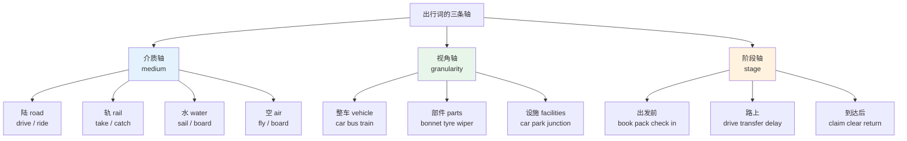
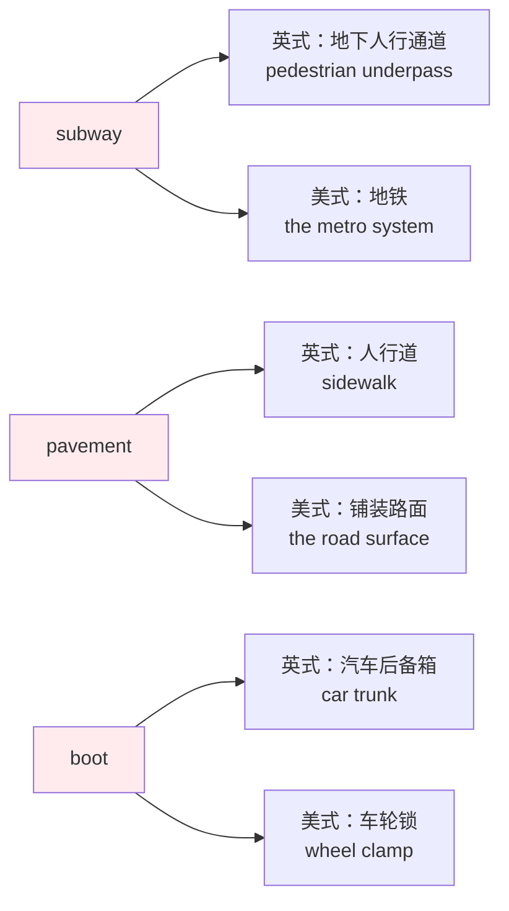
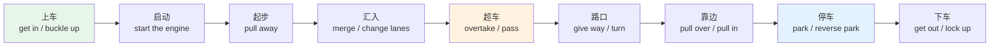
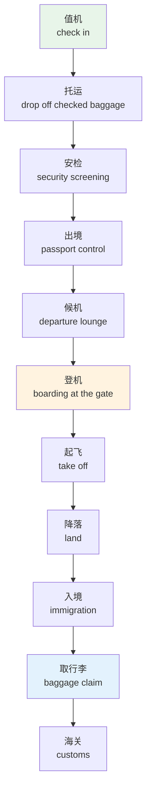
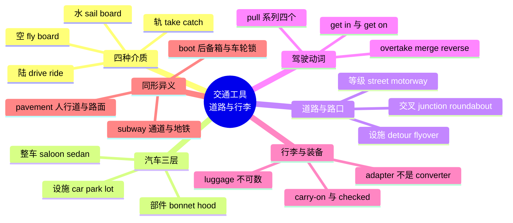

# 交通工具、道路出行与行李装备

> [!info] 本篇定位
>
> 「09.衣食住行」六篇的收尾，讲「行」。前五篇处理的是待在一个地方需要的词（穿、吃、做饭、住、家务），这一篇处理离开这个地方需要的词。
>
> 三块内容：**载具**（车、船、飞机及其部件）、**路**（道路类型、路口设施、驾驶动作、票务与航班流程）、**行李**（箱包分类与随身装备）。
>
> 这一篇的英美差异密度是全书最高的。同一个停车动作、同一块挡风玻璃、同一条高速公路，英美各有一套名字，而且有几组是**同形异义**——`subway` 在伦敦是地下通道，在纽约是地铁；`pavement` 在英国是人行道，在美国是路面。读完你能在读到一段英文时判断它出自哪一侧，也能在说话时不把两套系统混着用。
>
> 读完能做什么：看懂租车合同上的部件清单、听懂机场与车站广播的关键词、把「靠边停一下」「让我倒个车」「行李超重了」用地道说法讲出来。

---

## 1. 本篇导读：出行词的三条轴

出行词看起来杂乱，实际上排在三条轴上。任何一个出行相关的词都能落到其中一格，找不到位置的词往往是记错了类别。

**第一条轴是载具的介质**：陆、轨、水、空。这条轴决定动词搭配——陆上的车用 `drive` 和 `ride`，轨道上的车用 `take` 和 `catch`，水上的用 `sail` 和 `board`，空中的用 `fly` 和 `board`。介质选错，动词就跟着错。

**第二条轴是视角的远近**：整车、部件、周边设施。`car` 是整车，`bonnet` 是部件，`car park` 是周边设施。三层的英美差异各自独立——整车层的差异不多（`car` 两边都说），部件层差异极大（`bonnet` 对 `hood`），设施层差异也大（`car park` 对 `parking lot`）。

**第三条轴是行为的阶段**：出发前（订票、打包、装箱）、路上（驾驶、换乘、延误）、到达后（取行李、过关、还车）。这条轴决定时态和句型，也决定哪些词是名词、哪些是动词。

上图是本篇的目录结构。第 2 到 3 节走介质轴，把陆、轨、水、空四类载具的词过一遍；第 4 节单独隔离同形异义的陷阱词；第 5 到 6 节走视角轴的部件层，拆汽车、讲加油与维修；第 7 到 8 节走视角轴的设施层，铺道路与路口；第 9 到 10 节是驾驶动词与事故保险；第 11 到 14 节走阶段轴，从买票一直走到取行李与随身装备；第 15 节把易错点集中收口。

英美差异不单独设节，而是**在每一节内部就地标注**。理由很简单：`bonnet` 和 `hood` 是同一个部件，拆成两节讲会切断记忆链条。第 4 节只处理一件事——那些**同形但异义**的陷阱词，它们不是「两个说法」，而是「同一个说法两种意思」，必须单独隔离。

---

## 2. 陆上交通工具：从两轮到重型卡车

### 2.1 私家车与车型

车型词在租车、看车评、读事故报道时都要用。中文习惯说「三厢车、两厢车、SUV」，英语的切分方式不完全对应，而且英美各有一套。

| 英文 | 英式音标 | 美式音标 | 词性 | 中文 | 搭配与说明 |
| --- | --- | --- | --- | --- | --- |
| **car** | /kɑː/ | /kɑːr/ | n. | 汽车 | 英美通用；美式口语也说 automobile |
| **vehicle** | /ˈviːəkl/ | /ˈviːɪkl/ | n. | 车辆 | 正式词，交规与保险文书用它统称 |
| **saloon** | /səˈluːn/ | /səˈluːn/ | n. | 三厢轿车 | 英式说法；美式该义项不通用 |
| **sedan** | /sɪˈdæn/ | /sɪˈdæn/ | n. | 三厢轿车 | 美式说法，对应英式 saloon |
| **hatchback** | /ˈhætʃbæk/ | /ˈhætʃbæk/ | n. | 两厢车 | 英美通用，指尾门整体掀起的车型 |
| **estate car** | /ɪˈsteɪt kɑː/ | /ɪˈsteɪt kɑːr/ | n. | 旅行车 | 英式；美式叫 station wagon |
| **station wagon** | /ˈsteɪʃn wæɡən/ | /ˈsteɪʃn wæɡən/ | n. | 旅行车 | 美式说法 |
| **convertible** | /kənˈvɜːtəbl/ | /kənˈvɜːrtəbl/ | n. | 敞篷车 | 车厂命名常用 cabriolet，缩写 Cabrio |
| **SUV** | /ˌes juː ˈviː/ | /ˌes juː ˈviː/ | n. | 运动型多用途车 | 缩写自 sport utility vehicle |
| **pickup truck** | /ˈpɪkʌp trʌk/ | /ˈpɪkʌp trʌk/ | n. | 皮卡 | 美国极常见，英国少见 |
| **minivan** | /ˈmɪnivæn/ | /ˈmɪnivæn/ | n. | 家用商务车 | 英式常说 people carrier |
| **hybrid** | /ˈhaɪbrɪd/ | /ˈhaɪbrɪd/ | n./adj. | 混动车 | a hybrid car；plug-in hybrid 插电混动 |
| **electric car** | /ɪˈlektrɪk kɑː/ | /ɪˈlektrɪk kɑːr/ | n. | 电动车 | 缩写 EV，全称 electric vehicle |
| **secondhand car** | /ˌsekəndˈhænd kɑː/ | /ˌsekəndˈhænd kɑːr/ | n. | 二手车 | 美式更常说 used car |
| **rental car** | /ˈrentl kɑː/ | /ˈrentl kɑːr/ | n. | 租的车 | 英式常说 hire car；动词 hire / rent |

> [!warning] hire 与 rent 的英美分工
>
> 英式英语里 `hire` 用于短期租用物品（租车、租西装），`rent` 用于长期租用房产。美式英语基本只用 `rent`，`hire` 主要表示「雇人」。
>
> - 英式：We **hired** a car for the weekend.（周末租了辆车）
> - 美式：We **rented** a car for the weekend.
> - 两边通用且不会出错的：`car rental`（名词短语），机场的柜台两边都写这个。

### 2.2 公共与商用车辆

| 英文 | 英式音标 | 美式音标 | 词性 | 中文 | 搭配与说明 |
| --- | --- | --- | --- | --- | --- |
| **bus** | /bʌs/ | /bʌs/ | n. | 公交车 | take the bus / get on the bus |
| **coach** | /kəʊtʃ/ | /koʊtʃ/ | n. | 长途大巴 | 英式区分 bus 与 coach，美式统称 bus |
| **double-decker** | /ˌdʌbl ˈdekə/ | /ˌdʌbl ˈdekər/ | n. | 双层巴士 | 伦敦标志性车型 |
| **shuttle** | /ˈʃʌtl/ | /ˈʃʌtl/ | n. | 摆渡车 | airport shuttle 机场摆渡车 |
| **taxi** | /ˈtæksi/ | /ˈtæksi/ | n. | 出租车 | 英美通用；taxi rank 英 / taxi stand 美 |
| **cab** | /kæb/ | /kæb/ | n. | 出租车 | 口语，美式更常用；hail a cab 招手叫车 |
| **minicab** | /ˈmɪnikæb/ | /ˈmɪnikæb/ | n. | 预约出租车 | 英式；不能路边招手，须电话或 App 预约 |
| **van** | /væn/ | /væn/ | n. | 厢式货车 | delivery van 送货车 |
| **truck** | /trʌk/ | /trʌk/ | n. | 卡车 | 美式通称；英式日常说 lorry，truck 另指铁路敞车 |
| **lorry** | /ˈlɒri/ | /ˈlɔːri/ | n. | 卡车 | 英式；美国人基本不用这个词 |
| **articulated lorry** | /ɑːˈtɪkjuleɪtɪd ˈlɒri/ | — | n. | 铰接式大货车 | 英式；口语缩为 artic |
| **semi-trailer** | /ˈsemi treɪlə/ | /ˈsemi treɪlər/ | n. | 半挂车 | 美式口语简称 semi /ˈsemaɪ/ |
| **trailer** | /ˈtreɪlə/ | /ˈtreɪlər/ | n. | 拖车；挂车 | 也指房车拖挂 |
| **caravan** | /ˈkærəvæn/ | /ˈkærəvæn/ | n. | 拖挂式房车 | 英式；美式叫 travel trailer |
| **RV** | /ˌɑː ˈviː/ | /ˌɑːr ˈviː/ | n. | 自行式房车 | 美式，全称 recreational vehicle |
| **ambulance** | /ˈæmbjələns/ | /ˈæmbjələns/ | n. | 救护车 | call an ambulance |
| **fire engine** | /ˈfaɪər endʒɪn/ | /ˈfaɪər endʒɪn/ | n. | 消防车 | 美式也说 fire truck |
| **police car** | /pəˈliːs kɑː/ | /pəˈliːs kɑːr/ | n. | 警车 | 英式口语 patrol car |
| **bin lorry** | /ˈbɪn lɒri/ | — | n. | 垃圾车 | 英式；美式 garbage truck |
| **tractor** | /ˈtræktə/ | /ˈtræktər/ | n. | 拖拉机 | 农用；也指牵引车头 |
| **forklift** | /ˈfɔːklɪft/ | /ˈfɔːrklɪft/ | n. | 叉车 | forklift truck 全称 |
| **crane** | /kreɪn/ | /kreɪn/ | n. | 起重机 | 与「鹤」同形，见第 10 章动物篇 |

### 2.3 两轮车与骑行装备

`drive` 只能用于有方向盘的车。跨坐的一律用 `ride`，这条规则没有例外。

| 英文 | 英式音标 | 美式音标 | 词性 | 中文 | 搭配与说明 |
| --- | --- | --- | --- | --- | --- |
| **bicycle** | /ˈbaɪsɪkl/ | /ˈbaɪsɪkl/ | n. | 自行车 | 正式词；口语一律说 bike |
| **bike** | /baɪk/ | /baɪk/ | n./v. | 自行车；骑车 | 也可指摩托车，靠语境区分 |
| **motorcycle** | /ˈməʊtəsaɪkl/ | /ˈmoʊtərsaɪkl/ | n. | 摩托车 | 英式口语常缩为 motorbike |
| **scooter** | /ˈskuːtə/ | /ˈskuːtər/ | n. | 踏板车；滑板车 | e-scooter 电动滑板车 |
| **moped** | /ˈməʊped/ | /ˈmoʊped/ | n. | 助力车 | 排量小、可蹬踏的轻便摩托 |
| **cyclist** | /ˈsaɪklɪst/ | /ˈsaɪklɪst/ | n. | 骑车人 | 交规文本里的标准称呼 |
| **helmet** | /ˈhelmɪt/ | /ˈhelmɪt/ | n. | 头盔 | wear a helmet；英国骑摩托强制 |
| **handlebars** | /ˈhændlbɑːz/ | /ˈhændlbɑːrz/ | n. | 车把 | 恒用复数 |
| **saddle** | /ˈsædl/ | /ˈsædl/ | n. | 车座 | 美式也说 bike seat |
| **pedal** | /ˈpedl/ | /ˈpedl/ | n./v. | 脚踏板；蹬 | 汽车上的踏板也是这个词 |
| **chain** | /tʃeɪn/ | /tʃeɪn/ | n. | 链条 | the chain came off 掉链子 |
| **spoke** | /spəʊk/ | /spoʊk/ | n. | 辐条 | 与 speak 的过去式同形 |
| **mudguard** | /ˈmʌdɡɑːd/ | /ˈmʌdɡɑːrd/ | n. | 挡泥板 | 英式；美式说 fender |
| **kickstand** | /ˈkɪkstænd/ | /ˈkɪkstænd/ | n. | 支撑脚架 | put the bike on its kickstand |
| **bike lane** | /ˈbaɪk leɪn/ | /ˈbaɪk leɪn/ | n. | 自行车道 | 英式也说 cycle lane / cycle path |
| **bike rack** | /ˈbaɪk ræk/ | /ˈbaɪk ræk/ | n. | 停车架；车顶架 | 停放用与车载用同名 |

> [!example] drive 与 ride 的分界
>
> - He **drives** a van for a delivery company.
>   - 他给一家快递公司开货车。
> - She **rides** a motorbike to work.
>   - 她骑摩托车上班。
> - I usually **ride** my bike, but today I **drove**.
>   - 我平常骑车，今天开的车。
>
> 乘客视角用第三个动词：`ride in a car`（坐在车里）、`ride on a bus`（坐公交）。注意介词——封闭小空间用 `in`，可走动的大车厢用 `on`。

---

## 3. 轨道、水上与航空：另外三种介质

### 3.1 铁路与城市轨道

| 英文 | 英式音标 | 美式音标 | 词性 | 中文 | 搭配与说明 |
| --- | --- | --- | --- | --- | --- |
| **train** | /treɪn/ | /treɪn/ | n. | 火车 | take / catch / miss a train |
| **railway** | /ˈreɪlweɪ/ | /ˈreɪlweɪ/ | n. | 铁路 | 英式；美式说 railroad |
| **railroad** | /ˈreɪlrəʊd/ | /ˈreɪlroʊd/ | n. | 铁路 | 美式标准词 |
| **track** | /træk/ | /træk/ | n. | 轨道；股道 | 美式车站广播用 track 报站台 |
| **platform** | /ˈplætfɔːm/ | /ˈplætfɔːrm/ | n. | 站台 | 英式车站广播用 platform 报站台 |
| **carriage** | /ˈkærɪdʒ/ | /ˈkærɪdʒ/ | n. | 车厢 | 英式；美式说 car |
| **compartment** | /kəmˈpɑːtmənt/ | /kəmˈpɑːrtmənt/ | n. | 包厢 | 欧陆列车常见的隔间式车厢 |
| **locomotive** | /ˌləʊkəˈməʊtɪv/ | /ˌloʊkəˈmoʊtɪv/ | n. | 机车 | 正式词；口语说 engine |
| **sleeper** | /ˈsliːpə/ | /ˈsliːpər/ | n. | 卧铺车 | sleeper train 夜间卧铺列车 |
| **buffet car** | /ˈbʊfeɪ kɑː/ | /bəˈfeɪ kɑːr/ | n. | 餐车 | 美式更常说 dining car |
| **freight train** | /ˈfreɪt treɪn/ | /ˈfreɪt treɪn/ | n. | 货运列车 | 英式旧称 goods train |
| **high-speed rail** | /ˌhaɪ spiːd ˈreɪl/ | /ˌhaɪ spiːd ˈreɪl/ | n. | 高铁 | 缩写 HSR |
| **subway** | /ˈsʌbweɪ/ | /ˈsʌbweɪ/ | n. | 地铁（美）；地下通道（英） | 同形异义，见第 4 节 |
| **underground** | /ˈʌndəɡraʊnd/ | /ˈʌndərɡraʊnd/ | n. | 地铁 | 英式官方名；the Underground |
| **the Tube** | /ðə ˈtjuːb/ | /ðə ˈtuːb/ | n. | 伦敦地铁 | 伦敦人日常说法，首字母常大写 |
| **metro** | /ˈmetrəʊ/ | /ˈmetroʊ/ | n. | 地铁 | 巴黎、华盛顿等城市的官方名 |
| **tram** | /træm/ | /træm/ | n. | 有轨电车 | 英式；美式说 streetcar 或 trolley |
| **streetcar** | /ˈstriːtkɑː/ | /ˈstriːtkɑːr/ | n. | 有轨电车 | 美式，旧金山与新奥尔良常见 |
| **monorail** | /ˈmɒnəreɪl/ | /ˈmɑːnəreɪl/ | n. | 单轨列车 | 机场与主题公园常见 |
| **cable car** | /ˈkeɪbl kɑː/ | /ˈkeɪbl kɑːr/ | n. | 缆车；索道车 | 山地缆车也可说 gondola |
| **level crossing** | /ˌlevl ˈkrɒsɪŋ/ | — | n. | 铁路道口 | 英式；美式说 grade crossing |
| **turnstile** | /ˈtɜːnstaɪl/ | /ˈtɜːrnstaɪl/ | n. | 闸机 | 英式地铁也说 ticket barrier |
| **concourse** | /ˈkɒŋkɔːs/ | /ˈkɑːŋkɔːrs/ | n. | 站厅；候车大厅 | 火车站与机场通用 |
| **escalator** | /ˈeskəleɪtə/ | /ˈeskəleɪtər/ | n. | 自动扶梯 | 伦敦地铁规矩：站右侧、走左侧 |

> [!warning] 英式报站台用 platform，美式报股道用 track
>
> 同一个物理位置，两边广播说的不是一个词。
>
> - 英式：The 09:15 service to Manchester departs from **platform 4**.
> - 美式：The 9:15 train to Boston is now boarding on **track 4**.
>
> 听力上这是个真实的卡点。英国车站几乎不说 `track`，美国车站几乎不说 `platform`（platform 在美式里更多指物理站台本身，不用作编号单位）。

### 3.2 水上交通

| 英文 | 英式音标 | 美式音标 | 词性 | 中文 | 搭配与说明 |
| --- | --- | --- | --- | --- | --- |
| **boat** | /bəʊt/ | /boʊt/ | n. | 船（小） | 泛指小型船只 |
| **ship** | /ʃɪp/ | /ʃɪp/ | n. | 船（大） | 远洋大船；也作动词「运送」 |
| **ferry** | /ˈferi/ | /ˈferi/ | n./v. | 渡轮；摆渡 | take the ferry；car ferry 汽车渡轮 |
| **cruise** | /kruːz/ | /kruːz/ | n./v. | 邮轮游；巡航 | go on a cruise；cruise ship 邮轮 |
| **liner** | /ˈlaɪnə/ | /ˈlaɪnər/ | n. | 定期客轮 | ocean liner 远洋客轮 |
| **yacht** | /jɒt/ | /jɑːt/ | n. | 游艇 | ch 不发音，是荷兰语借词 |
| **canoe** | /kəˈnuː/ | /kəˈnuː/ | n. | 独木舟 | 重音在后，末音节读 /nuː/ |
| **kayak** | /ˈkaɪæk/ | /ˈkaɪæk/ | n. | 皮划艇 | 前后拼写对称的回文词 |
| **barge** | /bɑːdʒ/ | /bɑːrdʒ/ | n. | 驳船 | 内河运货用的平底船 |
| **tanker** | /ˈtæŋkə/ | /ˈtæŋkər/ | n. | 油轮 | oil tanker |
| **deck** | /dek/ | /dek/ | n. | 甲板 | on deck 在甲板上 |
| **cabin** | /ˈkæbɪn/ | /ˈkæbɪn/ | n. | 船舱；机舱 | 船上是客舱，飞机上是客舱 |
| **port** | /pɔːt/ | /pɔːrt/ | n. | 港口；左舷 | 航海术语里 port 是左，starboard 是右 |
| **harbour** | /ˈhɑːbə/ | — | n. | 港湾 | 英式拼写；美式 harbor /ˈhɑːrbər/ |
| **dock** | /dɒk/ | /dɑːk/ | n./v. | 码头；靠岸 | the ship docked at noon |
| **pier** | /pɪə/ | /pɪr/ | n. | 栈桥；码头 | 英国海滨小镇的标志性建筑 |
| **quay** | /kiː/ | /kiː/ | n. | 码头岸壁 | 拼写与读音严重不符，读作 key |
| **anchor** | /ˈæŋkə/ | /ˈæŋkər/ | n./v. | 锚；抛锚 | drop anchor 抛锚停泊 |
| **gangway** | /ˈɡæŋweɪ/ | /ˈɡæŋweɪ/ | n. | 舷梯；通道 | 也用于飞机与剧院的过道 |
| **lifeboat** | /ˈlaɪfbəʊt/ | /ˈlaɪfboʊt/ | n. | 救生艇 | life jacket 救生衣 |
| **seasick** | /ˈsiːsɪk/ | /ˈsiːsɪk/ | adj. | 晕船的 | get seasick；同族 carsick、airsick |
| **knot** | /nɒt/ | /nɑːt/ | n. | 节（航速单位） | k 不发音；也指绳结 |

### 3.3 航空器与机上空间

| 英文 | 英式音标 | 美式音标 | 词性 | 中文 | 搭配与说明 |
| --- | --- | --- | --- | --- | --- |
| **plane** | /pleɪn/ | /pleɪn/ | n. | 飞机 | 日常口语首选 |
| **aeroplane** | /ˈeərəpleɪn/ | — | n. | 飞机 | 英式正式拼写 |
| **airplane** | — | /ˈerpleɪn/ | n. | 飞机 | 美式正式拼写 |
| **aircraft** | /ˈeəkrɑːft/ | /ˈerkræft/ | n. | 航空器 | 单复数同形，一架也是 aircraft |
| **jet** | /dʒet/ | /dʒet/ | n. | 喷气机 | private jet 私人飞机 |
| **airliner** | /ˈeəlaɪnə/ | /ˈerlaɪnər/ | n. | 大型客机 | 新闻报道用词 |
| **helicopter** | /ˈhelɪkɒptə/ | /ˈhelɪkɑːptər/ | n. | 直升机 | 口语缩为 chopper 或 heli |
| **glider** | /ˈɡlaɪdə/ | /ˈɡlaɪdər/ | n. | 滑翔机 | 无动力，靠气流 |
| **airline** | /ˈeəlaɪn/ | /ˈerlaɪn/ | n. | 航空公司 | budget airline 廉航 |
| **cockpit** | /ˈkɒkpɪt/ | /ˈkɑːkpɪt/ | n. | 驾驶舱 | 也用于赛车 |
| **cabin crew** | /ˈkæbɪn kruː/ | /ˈkæbɪn kruː/ | n. | 乘务组 | 集合名词，比 stewardess 中性 |
| **aisle** | /aɪl/ | /aɪl/ | n. | 过道 | s 不发音；aisle seat 过道座 |
| **window seat** | /ˈwɪndəʊ siːt/ | /ˈwɪndoʊ siːt/ | n. | 靠窗座 | 与 aisle seat 相对 |
| **overhead bin** | /ˌəʊvəhed ˈbɪn/ | /ˌoʊvərhed ˈbɪn/ | n. | 行李架 | 美式；英式说 overhead locker |
| **tray table** | /ˈtreɪ teɪbl/ | /ˈtreɪ teɪbl/ | n. | 小桌板 | 广播词：stow your tray table |
| **seat belt** | /ˈsiːt belt/ | /ˈsiːt belt/ | n. | 安全带 | fasten your seat belt |
| **runway** | /ˈrʌnweɪ/ | /ˈrʌnweɪ/ | n. | 跑道 | 也指时装秀的 T 台 |
| **turbulence** | /ˈtɜːbjələns/ | /ˈtɜːrbjələns/ | n. | 气流颠簸 | 不可数；hit turbulence 遇到颠簸 |
| **take off** | /ˌteɪk ˈɒf/ | /ˌteɪk ˈɔːf/ | v. | 起飞 | 名词写作 takeoff |
| **land** | /lænd/ | /lænd/ | v./n. | 降落；陆地 | 名词形式 landing |
| **taxi** | /ˈtæksi/ | /ˈtæksi/ | v. | 滑行 | 飞机在地面移动，与「出租车」同形 |
| **jet lag** | /ˈdʒet læɡ/ | /ˈdʒet læɡ/ | n. | 时差反应 | 不可数；have jet lag / be jet-lagged |

> [!tip] taxi 的双重身份
>
> `taxi` 作动词专指**飞机在地面上滑行**，是航空业标准术语。词源上一般认为它就是从「出租车」借来的比喻：早期飞机在地面缓慢移动、边挪边等，像街上揽客的出租车。今天这层比喻已经完全术语化，飞行员说 `taxi` 时不会想到出租车。
>
> - The plane **taxied** to the gate.
>   - 飞机滑行到登机口。
>
> 过去式写作 `taxied`，现在分词 `taxiing`（两个 i），这是英语里少见的连续两个 i 的拼写。

---

## 4. 同形异义陷阱：五对必须隔离的词

英美差异分两类。第一类是「两个词，一个意思」，比如 `lorry` 和 `truck`，记住对应关系即可，不会造成误解。第二类危险得多：**同一个词形，英美各指不同的东西**。这类词一旦弄混，说出来的话会被完全理解成另一个意思。

上图挑出三个最危险的。`subway` 的错位最典型：在伦敦跟人说 `take the subway`，对方会理解成「走那条地下通道」，而不是「坐地铁」。`pavement` 的错位会导致方位理解反过来——英国人说 `Stay on the pavement`（待在人行道上，别下马路），美国人听成「待在路面上」，意思恰好相反。

| 英文 | 英式音标 | 美式音标 | 词性 | 中文 | 搭配与说明 |
| --- | --- | --- | --- | --- | --- |
| **subway** | /ˈsʌbweɪ/ | /ˈsʌbweɪ/ | n. | 英：地下人行通道；美：地铁系统 | 在英国要说地铁，改用 the Underground 或 the Tube |
| **pavement** | /ˈpeɪvmənt/ | /ˈpeɪvmənt/ | n. | 英：人行道；美：铺装路面 | 在美国要说人行道，改用 sidewalk |
| **boot** | /buːt/ | /buːt/ | n. | 英：汽车后备箱；美：车轮锁 | 在美国要说后备箱，改用 trunk |
| **first floor** | /ˌfɜːst ˈflɔː/ | /ˌfɜːrst ˈflɔːr/ | n. | 英：二层；美：一层（地面层） | 英式的地面层叫 ground floor，报楼层前先确认在哪一侧 |
| **public school** | /ˌpʌblɪk ˈskuːl/ | /ˌpʌblɪk ˈskuːl/ | n. | 英：私立寄宿名校；美：公立学校 | 英式的公立学校叫 state school |

> [!warning] 这五对不能靠上下文自动纠正
>
> 大部分英美差异词在语境里会自己消歧——听到 `lorry` 就知道是英式，意思照旧。但上表这五对不会：两种理解在同一句话里都成立，语境救不了。
>
> - `The car was in the subway.`（英式：车在地下通道里；美式：车在地铁里——两句都能成立，指向的画面完全不同）
> - `They put a boot on my car.`（英式：他们往我车上装了个后备箱？；美式：我车被上锁了）
>
> 处理办法是**主动绕开**：说地铁就说 `the metro` 或直接说城市名（`the London Underground`），说后备箱就先确认对方在哪一侧。

---

## 5. 汽车部件：外部、内部与仪表

汽车部件是英美差异最密集的一片。租车验车、报修、读用户手册都会撞上。

### 5.1 车身外部

| 英文 | 英式音标 | 美式音标 | 词性 | 中文 | 搭配与说明 |
| --- | --- | --- | --- | --- | --- |
| **bonnet** | /ˈbɒnɪt/ | — | n. | 引擎盖 | 英式；美式说 hood |
| **hood** | /hʊd/ | /hʊd/ | n. | 引擎盖 | 美式；英式的 hood 指敞篷车软顶 |
| **boot** | /buːt/ | — | n. | 后备箱 | 英式；美式说 trunk |
| **trunk** | /trʌŋk/ | /trʌŋk/ | n. | 后备箱 | 美式；也指树干和大衣箱 |
| **windscreen** | /ˈwɪndskriːn/ | — | n. | 挡风玻璃 | 英式；美式说 windshield |
| **windshield** | — | /ˈwɪndʃiːld/ | n. | 挡风玻璃 | 美式标准词 |
| **wiper** | /ˈwaɪpə/ | /ˈwaɪpər/ | n. | 雨刮器 | 全称 windscreen / windshield wiper |
| **bumper** | /ˈbʌmpə/ | /ˈbʌmpər/ | n. | 保险杠 | 英美通用 |
| **wing** | /wɪŋ/ | — | n. | 翼子板 | 英式；wing mirror 后视镜 |
| **fender** | — | /ˈfendər/ | n. | 翼子板 | 美式；fender bender 小刮蹭 |
| **wing mirror** | /ˈwɪŋ mɪrə/ | — | n. | 外后视镜 | 英式；美式说 side mirror |
| **tyre** | /ˈtaɪə/ | — | n. | 轮胎 | 英式拼写 |
| **tire** | — | /ˈtaɪər/ | n. | 轮胎 | 美式拼写；与「疲倦」同形 |
| **wheel** | /wiːl/ | /wiːl/ | n. | 车轮；方向盘 | 轮毂本体，与轮胎是两件东西 |
| **hubcap** | /ˈhʌbkæp/ | /ˈhʌbkæp/ | n. | 轮毂盖 | 容易被路沿刮掉的塑料件 |
| **headlight** | /ˈhedlaɪt/ | /ˈhedlaɪt/ | n. | 前大灯 | 远光 high beam，近光 dipped beam（英）/ low beam（美） |
| **taillight** | /ˈteɪllaɪt/ | /ˈteɪllaɪt/ | n. | 尾灯 | 英式也说 rear light |
| **indicator** | /ˈɪndɪkeɪtə/ | — | n. | 转向灯 | 英式；美式说 turn signal 或 blinker |
| **turn signal** | — | /ˈtɜːrn sɪɡnəl/ | n. | 转向灯 | 美式正式说法 |
| **number plate** | /ˈnʌmbə pleɪt/ | — | n. | 车牌 | 英式；美式说 license plate |
| **exhaust** | /ɪɡˈzɔːst/ | /ɪɡˈzɔːst/ | n. | 排气管 | 也作动词「耗尽」 |
| **silencer** | /ˈsaɪlənsə/ | — | n. | 消音器 | 英式；美式说 muffler /ˈmʌflər/ |
| **sunroof** | /ˈsʌnruːf/ | /ˈsʌnruːf/ | n. | 天窗 | 全景天窗 panoramic sunroof |
| **petrol cap** | /ˈpetrəl kæp/ | — | n. | 油箱盖 | 美式说 gas cap |

### 5.2 车内与仪表

| 英文 | 英式音标 | 美式音标 | 词性 | 中文 | 搭配与说明 |
| --- | --- | --- | --- | --- | --- |
| **steering wheel** | /ˈstɪərɪŋ wiːl/ | /ˈstɪrɪŋ wiːl/ | n. | 方向盘 | behind the wheel 表示「在开车」 |
| **dashboard** | /ˈdæʃbɔːd/ | /ˈdæʃbɔːrd/ | n. | 仪表台 | 软件界面的 dashboard 是这个引申义 |
| **speedometer** | /spiːˈdɒmɪtə/ | /spiːˈdɑːmɪtər/ | n. | 车速表 | 重音在第二音节 |
| **odometer** | /ɒˈdɒmɪtə/ | /oʊˈdɑːmɪtər/ | n. | 里程表 | 英式口语常说 mileometer |
| **fuel gauge** | /ˈfjuːəl ɡeɪdʒ/ | /ˈfjuːəl ɡeɪdʒ/ | n. | 油量表 | gauge 读 /ɡeɪdʒ/，拼写反直觉 |
| **ignition** | /ɪɡˈnɪʃn/ | /ɪɡˈnɪʃn/ | n. | 点火装置 | turn the key in the ignition |
| **accelerator** | /əkˈseləreɪtə/ | /əkˈseləreɪtər/ | n. | 油门踏板 | 英式常用；美式说 gas pedal |
| **gas pedal** | — | /ˈɡæs pedl/ | n. | 油门踏板 | 美式口语；step on the gas 踩油门 |
| **brake pedal** | /ˈbreɪk pedl/ | /ˈbreɪk pedl/ | n. | 刹车踏板 | brake 与 break 同音不同义 |
| **clutch** | /klʌtʃ/ | /klʌtʃ/ | n. | 离合器 | 手动挡才有；也指手包 |
| **handbrake** | /ˈhændbreɪk/ | — | n. | 手刹 | 英式；美式说 parking brake 或 emergency brake |
| **gear stick** | /ˈɡɪə stɪk/ | — | n. | 换挡杆 | 英式；美式说 gearshift 或 stick shift |
| **gearbox** | /ˈɡɪəbɒks/ | /ˈɡɪrbɑːks/ | n. | 变速箱 | 美式技术文本更常说 transmission |
| **transmission** | /trænzˈmɪʃn/ | /trænsˈmɪʃn/ | n. | 变速系统 | automatic / manual transmission |
| **glove compartment** | /ˈɡlʌv kəmpɑːtmənt/ | /ˈɡlʌv kəmpɑːrtmənt/ | n. | 手套箱 | 美式口语说 glove box |
| **airbag** | /ˈeəbæɡ/ | /ˈerbæɡ/ | n. | 安全气囊 | the airbag deployed 气囊弹出 |
| **horn** | /hɔːn/ | /hɔːrn/ | n. | 喇叭 | sound / honk the horn |
| **rear-view mirror** | /ˌrɪə vjuː ˈmɪrə/ | /ˌrɪr vjuː ˈmɪrər/ | n. | 内后视镜 | 车内那面，与 side mirror 区分 |
| **child seat** | /ˈtʃaɪld siːt/ | /ˈtʃaɪld siːt/ | n. | 儿童安全座椅 | 美式也说 car seat |
| **boot lid** | /ˈbuːt lɪd/ | — | n. | 后备箱盖 | 美式说 trunk lid |
| **engine** | /ˈendʒɪn/ | /ˈendʒɪn/ | n. | 发动机 | start / turn off the engine |
| **battery** | /ˈbætri/ | /ˈbætəri/ | n. | 电瓶 | 美音三音节更常听到 |
| **radiator** | /ˈreɪdieɪtə/ | /ˈreɪdieɪtər/ | n. | 散热水箱 | 与家里的暖气片同名，见本章第 4 篇 |
| **coolant** | /ˈkuːlənt/ | /ˈkuːlənt/ | n. | 冷却液 | 不可数 |

上面两张表里的英美对照有一个可用的记忆偏向：**美式那一侧普遍更短、更直白**——`hood` 短于 `bonnet`，`gas` 短于 `petrol`，`muffler` 短于 `silencer`，`trunk` 与 `boot` 音节相同但用得更泛。这不是严格规律，`turn signal` 就比 `indicator` 长，但作为二选一时的猜测倾向，命中率不低。

部件层还有一条更实用的判断线：**凡是英国人从马车时代继承下来的词，美国人多半换掉了**。`bonnet`（软帽）、`boot`（靴形置物箱）、`wing`（马车侧板）三个词的本义都来自马车与服装，美式则直接用功能命名——`hood`（罩子）、`trunk`（箱子）、`fender`（挡板）。碰到不确定的部件名，先想它在英式里是不是一个比喻词，是的话美式大概率有个更直白的替代。

---

## 6. 加油、充电与故障维修

| 英文 | 英式音标 | 美式音标 | 词性 | 中文 | 搭配与说明 |
| --- | --- | --- | --- | --- | --- |
| **petrol** | /ˈpetrəl/ | — | n. | 汽油 | 英式；不可数 |
| **gas** | — | /ɡæs/ | n. | 汽油 | 美式；gasoline 的缩略，不是「天然气」 |
| **gasoline** | — | /ˈɡæsəliːn/ | n. | 汽油 | 美式全称，正式文本用 |
| **diesel** | /ˈdiːzl/ | /ˈdiːzl/ | n. | 柴油 | 英美同形；也指柴油车 |
| **unleaded** | /ʌnˈledɪd/ | /ʌnˈledɪd/ | adj. | 无铅的 | unleaded petrol / unleaded gas |
| **petrol station** | /ˈpetrəl steɪʃn/ | — | n. | 加油站 | 英式；也说 filling station |
| **gas station** | — | /ˈɡæs steɪʃn/ | n. | 加油站 | 美式标准说法 |
| **pump** | /pʌmp/ | /pʌmp/ | n./v. | 加油机；打气 | pump petrol / pump up a tyre |
| **fill up** | /ˌfɪl ˈʌp/ | /ˌfɪl ˈʌp/ | v. | 加满油 | fill her up 是加油站口语 |
| **fuel** | /ˈfjuːəl/ | /ˈfjuːəl/ | n./v. | 燃料；加燃料 | fuel economy 燃油经济性 |
| **mileage** | /ˈmaɪlɪdʒ/ | /ˈmaɪlɪdʒ/ | n. | 里程；油耗 | 英式油耗常用每加仑英里 mpg |
| **charge** | /tʃɑːdʒ/ | /tʃɑːrdʒ/ | v./n. | 充电；费用 | 一词多义，见第 13 章 |
| **charging point** | /ˈtʃɑːdʒɪŋ pɔɪnt/ | — | n. | 充电桩 | 英式；美式说 charging station |
| **range** | /reɪndʒ/ | /reɪndʒ/ | n. | 续航里程 | range anxiety 里程焦虑 |
| **breakdown** | /ˈbreɪkdaʊn/ | /ˈbreɪkdaʊn/ | n. | 抛锚 | 动词形式是 break down（分写） |
| **puncture** | /ˈpʌŋktʃə/ | /ˈpʌŋktʃər/ | n./v. | 扎胎 | 英式常用；美式多说 flat |
| **flat tyre** | /ˌflæt ˈtaɪə/ | — | n. | 瘪胎 | 美式拼作 flat tire，口语只说 a flat |
| **spare tyre** | /ˌspeə ˈtaɪə/ | — | n. | 备胎 | 美式 spare tire；也戏称腰间赘肉 |
| **jack** | /dʒæk/ | /dʒæk/ | n./v. | 千斤顶；顶起 | jack up the car |
| **tow** | /təʊ/ | /toʊ/ | v./n. | 拖车 | 读音同 toe；tow truck 拖车 |
| **jump-start** | /ˈdʒʌmp stɑːt/ | /ˈdʒʌmp stɑːrt/ | v. | 搭电启动 | jump leads（英）/ jumper cables（美） |
| **garage** | /ˈɡærɑːʒ/ | /ɡəˈrɑːʒ/ | n. | 修车厂；车库 | 英美重音位置不同 |
| **mechanic** | /məˈkænɪk/ | /məˈkænɪk/ | n. | 修车师傅 | 与 mechanics（力学）区分 |
| **service** | /ˈsɜːvɪs/ | /ˈsɜːrvɪs/ | n./v. | 保养 | have the car serviced 送去保养 |
| **MOT** | /ˌem əʊ ˈtiː/ | — | n. | 英国年检 | 英国特有；美式说 inspection |
| **roadworthy** | /ˈrəʊdwɜːði/ | /ˈroʊdwɜːrði/ | adj. | 适于上路的 | 检验合格的正式说法 |

> [!warning] gas 在英美的两种理解
>
> 美式的 `gas` 是 `gasoline` 的缩略，指**汽油**。英式的 `gas` 指**气体**或**天然气**——家里做饭的煤气就是 `gas`。
>
> - 美式：I need to get **gas**.（我得去加油）
> - 英式听到这句：我得弄点气体？——英国人会说 I need to get **petrol**.
>
> 反向也一样：跟美国人说 `a gas cooker`（燃气灶），他们能懂，但更常说 `a gas stove`；跟英国人说 `step on the gas`，多数人靠好莱坞电影也懂，但自己不会这么说，他们说 `put your foot down`。

> [!example] 抛锚现场的完整表达
>
> - My car **broke down** on the motorway.
>   - 我车在高速上抛锚了。
> - I've got a **flat** — do you have a **jack** and a **spare**?
>   - 我爆胎了，你有千斤顶和备胎吗？
> - The battery's dead. Can you give me a **jump-start**?
>   - 电瓶没电了，能帮我搭个电吗？
> - I'll have to get it **towed** to a **garage**.
>   - 我得叫拖车拖到修理厂去。

---

## 7. 道路类型：从 street 到 motorway

英语给不同等级的路各有专名，而且英美的高速公路体系名称完全不同。读地址、看导航、听路况播报都要靠这组词。

| 英文 | 英式音标 | 美式音标 | 词性 | 中文 | 搭配与说明 |
| --- | --- | --- | --- | --- | --- |
| **road** | /rəʊd/ | /roʊd/ | n. | 路 | 最泛的通称；on the road 在路上 |
| **street** | /striːt/ | /striːt/ | n. | 街 | 城内两侧有建筑的路；缩写 St |
| **avenue** | /ˈævənjuː/ | /ˈævənuː/ | n. | 大街；林荫道 | 缩写 Ave；纽约的南北向大道 |
| **boulevard** | /ˈbuːləvɑːd/ | /ˈbʊləvɑːrd/ | n. | 林荫大道 | 法语借词，缩写 Blvd |
| **lane** | /leɪn/ | /leɪn/ | n. | 小巷；车道 | 两义并存，靠语境区分 |
| **alley** | /ˈæli/ | /ˈæli/ | n. | 后巷 | 建筑之间的窄通道 |
| **drive** | /draɪv/ | /draɪv/ | n. | 车道式街名 | 住宅区街名后缀，缩写 Dr |
| **highway** | /ˈhaɪweɪ/ | /ˈhaɪweɪ/ | n. | 公路；干道 | 美式常用；英式多用于法律术语 |
| **motorway** | /ˈməʊtəweɪ/ | — | n. | 高速公路 | 英式；编号形如 M1、M25 |
| **freeway** | — | /ˈfriːweɪ/ | n. | 免费高速 | 美式，西海岸常用 |
| **expressway** | /ɪkˈspresweɪ/ | /ɪkˈspresweɪ/ | n. | 快速路 | 美式东部与亚洲城市常用 |
| **interstate** | — | /ˈɪntərsteɪt/ | n. | 州际公路 | 美式；编号形如 I-95 |
| **turnpike** | — | /ˈtɜːrnpaɪk/ | n. | 收费高速 | 美式，东北部常见 |
| **dual carriageway** | /ˌdjuːəl ˈkærɪdʒweɪ/ | — | n. | 双向分隔道路 | 英式；美式说 divided highway |
| **A-road** | /ˈeɪ rəʊd/ | — | n. | 英国 A 级国道 | 编号形如 A40，等级低于 motorway |
| **country lane** | /ˌkʌntri ˈleɪn/ | /ˌkʌntri ˈleɪn/ | n. | 乡间小路 | 英国乡村典型窄路 |
| **dirt road** | /ˈdɜːt rəʊd/ | /ˈdɜːrt roʊd/ | n. | 土路 | 未铺装的路 |
| **one-way street** | /ˌwʌn weɪ ˈstriːt/ | /ˌwʌn weɪ ˈstriːt/ | n. | 单行道 | 也作比喻「单方面付出」 |
| **dead end** | /ˌded ˈend/ | /ˌded ˈend/ | n. | 死路 | 英式路牌写 No Through Road |
| **cul-de-sac** | /ˈkʌl də sæk/ | /ˈkʌl də sæk/ | n. | 尽端路 | 法语借词，住宅区常见 |
| **driveway** | /ˈdraɪvweɪ/ | /ˈdraɪvweɪ/ | n. | 私家车道 | 从马路通到自家车库那段 |
| **pavement** | /ˈpeɪvmənt/ | /ˈpeɪvmənt/ | n. | 人行道（英）；路面（美） | 同形异义，见第 4 节 |
| **sidewalk** | — | /ˈsaɪdwɔːk/ | n. | 人行道 | 美式；英国人不用这个词 |
| **kerb** | /kɜːb/ | — | n. | 路缘石 | 英式拼写；美式拼作 curb |
| **verge** | /vɜːdʒ/ | /vɜːrdʒ/ | n. | 路肩草地 | 英式；grass verge |
| **hard shoulder** | /ˌhɑːd ˈʃəʊldə/ | — | n. | 应急车道 | 英式；美式只说 shoulder |
| **central reservation** | /ˌsentrəl rezəˈveɪʃn/ | — | n. | 中央隔离带 | 英式；美式说 median /ˈmiːdiən/ |

> [!tip] 认路名后缀就能猜城市结构
>
> 英美地址里的街名后缀不是随便起的，多少有规律可循。
>
> - `Street` 通常是城内主干，两侧有店铺
> - `Avenue` 在纽约等格网城市里与 `Street` 垂直，一横一纵
> - `Lane`、`Close`、`Court` 多出现在住宅区，且往往是短路或尽端路
> - `Drive`、`Crescent`（新月形弯道）多在带绿化的郊区住宅区
>
> 看到地址里写 `12 Oakwood Close`，基本可以判断这是一处安静的住宅小区，不是商业街。

---

## 8. 路口、交叉与道路设施

### 8.1 路口与交叉

| 英文 | 英式音标 | 美式音标 | 词性 | 中文 | 搭配与说明 |
| --- | --- | --- | --- | --- | --- |
| **junction** | /ˈdʒʌŋkʃn/ | /ˈdʒʌŋkʃn/ | n. | 路口；出入口 | 英式高速出口编号用 Junction 12 |
| **intersection** | /ˌɪntəˈsekʃn/ | /ˌɪntərˈsekʃn/ | n. | 十字路口 | 美式标准词 |
| **crossroads** | /ˈkrɒsrəʊdz/ | /ˈkrɔːsroʊdz/ | n. | 十字路口 | 单复数同形；也作比喻「人生岔口」 |
| **T-junction** | /ˈtiː dʒʌŋkʃn/ | — | n. | 丁字路口 | 英式；美式说 T-intersection |
| **roundabout** | /ˈraʊndəbaʊt/ | /ˈraʊndəbaʊt/ | n. | 环岛 | 英式常用；也作形容词「绕弯的」 |
| **traffic circle** | — | /ˈtræfɪk sɜːrkl/ | n. | 环岛 | 美式说法 |
| **rotary** | — | /ˈroʊtəri/ | n. | 环岛 | 美式，新英格兰地区用词 |
| **slip road** | /ˈslɪp rəʊd/ | — | n. | 匝道 | 英式；美式说 ramp |
| **ramp** | /ræmp/ | /ræmp/ | n. | 匝道；坡道 | on-ramp 上匝道，off-ramp 下匝道 |
| **exit** | /ˈeksɪt/ | /ˈeɡzɪt/ | n./v. | 出口；驶出 | 美音常读 /ˈeɡzɪt/ |
| **flyover** | /ˈflaɪəʊvə/ | — | n. | 高架桥 | 英式；美式说 overpass |
| **overpass** | — | /ˈoʊvərpæs/ | n. | 跨线桥 | 美式 |
| **underpass** | /ˈʌndəpɑːs/ | /ˈʌndərpæs/ | n. | 下穿通道 | 车行的地下通道 |
| **tunnel** | /ˈtʌnl/ | /ˈtʌnl/ | n. | 隧道 | go through a tunnel |
| **bridge** | /brɪdʒ/ | /brɪdʒ/ | n. | 桥 | 也指鼻梁与桥牌 |
| **toll** | /təʊl/ | /toʊl/ | n. | 通行费 | toll booth 收费亭；toll road 收费路 |
| **detour** | /ˈdiːtʊə/ | /ˈdiːtʊr/ | n./v. | 绕行 | 美式路牌用 DETOUR |
| **diversion** | /daɪˈvɜːʃn/ | /dɪˈvɜːrʒn/ | n. | 绕行；改道 | 英式路牌用 DIVERSION |
| **roadworks** | /ˈrəʊdwɜːks/ | — | n. | 道路施工 | 英式，恒用复数；美式说 road construction |
| **layby** | /ˈleɪbaɪ/ | — | n. | 路边停车带 | 英式；美式说 pullout 或 turnout |
| **rest area** | — | /ˈrest eriə/ | n. | 服务区 | 美式；英式说 services 或 service station |
| **car park** | /ˈkɑː pɑːk/ | — | n. | 停车场 | 英式；美式说 parking lot |
| **parking lot** | — | /ˈpɑːrkɪŋ lɑːt/ | n. | 露天停车场 | 美式 |
| **parking garage** | — | /ˈpɑːrkɪŋ ɡərɑːʒ/ | n. | 立体停车楼 | 美式；英式说 multi-storey car park |

### 8.2 行人设施与交通管制

| 英文 | 英式音标 | 美式音标 | 词性 | 中文 | 搭配与说明 |
| --- | --- | --- | --- | --- | --- |
| **pedestrian** | /pəˈdestriən/ | /pəˈdestriən/ | n./adj. | 行人；步行的 | pedestrian zone 步行区 |
| **zebra crossing** | /ˌzebrə ˈkrɒsɪŋ/ | — | n. | 斑马线 | 英式；zebra 英读 /ˈzebrə/ 美读 /ˈziːbrə/ |
| **crosswalk** | — | /ˈkrɔːswɔːk/ | n. | 人行横道 | 美式标准词 |
| **jaywalk** | /ˈdʒeɪwɔːk/ | /ˈdʒeɪwɔːk/ | v. | 乱穿马路 | 美式概念，多数州立法禁止；英国无此罪名 |
| **traffic light** | /ˈtræfɪk laɪt/ | /ˈtræfɪk laɪt/ | n. | 红绿灯 | 英式复数 traffic lights；美式也说 stoplight |
| **traffic sign** | /ˈtræfɪk saɪn/ | /ˈtræfɪk saɪn/ | n. | 交通标志 | road sign 同义 |
| **speed limit** | /ˈspiːd lɪmɪt/ | /ˈspiːd lɪmɪt/ | n. | 限速 | 英美都用英里每小时 mph |
| **speed camera** | /ˈspiːd kæmrə/ | /ˈspiːd kæmrə/ | n. | 测速摄像头 | 英国路边极常见 |
| **speed bump** | /ˈspiːd bʌmp/ | /ˈspiːd bʌmp/ | n. | 减速带 | 英式也说 speed hump 或 sleeping policeman |
| **give way** | /ˌɡɪv ˈweɪ/ | — | v. | 让行 | 英式路牌；美式路牌写 YIELD |
| **yield** | — | /jiːld/ | v. | 让行 | 美式；也表示「产出、收益」 |
| **no entry** | /ˌnəʊ ˈentri/ | — | n. | 禁止驶入 | 英式；美式路牌写 DO NOT ENTER |
| **traffic jam** | /ˈtræfɪk dʒæm/ | /ˈtræfɪk dʒæm/ | n. | 堵车 | be stuck in a traffic jam |
| **congestion** | /kənˈdʒestʃən/ | /kənˈdʒestʃən/ | n. | 拥堵 | 正式词；伦敦有 congestion charge |
| **gridlock** | /ˈɡrɪdlɒk/ | /ˈɡrɪdlɑːk/ | n. | 全面瘫痪式堵车 | 比 traffic jam 更严重 |
| **rush hour** | /ˈrʌʃ aʊə/ | /ˈrʌʃ aʊər/ | n. | 高峰时段 | 不可数；in the rush hour |
| **tailback** | /ˈteɪlbæk/ | — | n. | 车龙 | 英式路况播报用词 |
| **bus lane** | /ˈbʌs leɪn/ | /ˈbʌs leɪn/ | n. | 公交专用道 | 违规驶入会被罚 |
| **hard shoulder running** | /ˌhɑːd ˈʃəʊldə rʌnɪŋ/ | — | n. | 应急车道开放通行 | 英国智能高速的做法 |
| **breathalyser** | /ˈbreθəlaɪzə/ | — | n. | 酒精测试仪 | 英式拼写；美式 breathalyzer |
| **drink-driving** | /ˌdrɪŋk ˈdraɪvɪŋ/ | — | n. | 酒驾 | 英式；美式说 drunk driving 或 DUI |
| **speeding ticket** | /ˈspiːdɪŋ tɪkɪt/ | /ˈspiːdɪŋ tɪkɪt/ | n. | 超速罚单 | get a speeding ticket |
| **fine** | /faɪn/ | /faɪn/ | n./v. | 罚款；罚 | 与形容词「好的」同形 |
| **wheel clamp** | /ˈwiːl klæmp/ | — | n. | 车轮锁 | 英式；美式名词叫 boot，动词 to boot |
| **tow away** | /ˌtəʊ əˈweɪ/ | /ˌtoʊ əˈweɪ/ | v. | 拖走 | tow-away zone 拖车区 |

> [!warning] 别把 fine 当成「还行」
>
> `fine` 作名词是「罚款」，作动词是「罚某人钱」，跟形容词「好的」是两个来源不同的词。
>
> - I got a **£60 fine** for parking there.（罚款六十镑）
> - They **fined** him £200.（罚了他二百镑）
>
> 同类的还有 `charge`（收费/指控）、`ticket`（票/罚单）、`book`（书/立案处罚，英式口语 The police booked him 表示「警察给他开了单」）。这些词在交通语境下的义项与日常义项差距很大，遇到时要按语境切换。

---

## 9. 驾驶动词：把方向盘上的动作说清楚

驾驶动作大量依赖短语动词，而短语动词恰好是中文母语者最容易绕开的一类表达。绕开的代价是说出的句子啰嗦且不地道——`stop the car at the side of the road` 七个词，母语者两个词说完：`pull over`。

### 9.1 基本操作

| 英文 | 英式音标 | 美式音标 | 词性 | 中文 | 搭配与说明 |
| --- | --- | --- | --- | --- | --- |
| **drive** | /draɪv/ | /draɪv/ | v. | 驾驶 | drive-drove-driven |
| **steer** | /stɪə/ | /stɪr/ | v. | 掌控方向 | steer clear of 引申为「避开」 |
| **accelerate** | /əkˈseləreɪt/ | /əkˈseləreɪt/ | v. | 加速 | 口语常说 speed up |
| **brake** | /breɪk/ | /breɪk/ | v./n. | 刹车 | slam on the brakes 猛踩刹车 |
| **slow down** | /ˌsləʊ ˈdaʊn/ | /ˌsloʊ ˈdaʊn/ | v. | 减速 | 与 speed up 相对 |
| **indicate** | /ˈɪndɪkeɪt/ | — | v. | 打转向灯 | 英式；美式说 signal |
| **signal** | /ˈsɪɡnəl/ | /ˈsɪɡnəl/ | v./n. | 打信号；信号 | signal left / signal right |
| **change gear** | /ˌtʃeɪndʒ ˈɡɪə/ | — | v. | 换挡 | 英式；美式说 shift gears |
| **stall** | /stɔːl/ | /stɔːl/ | v. | 熄火 | 手动挡新手高频事故 |
| **honk** | /hɒŋk/ | /hɑːŋk/ | v. | 按喇叭 | 英式口语也说 hoot 或 beep |
| **swerve** | /swɜːv/ | /swɜːrv/ | v. | 急打方向躲避 | swerve to avoid a dog |
| **skid** | /skɪd/ | /skɪd/ | v. | 打滑 | skid on ice |
| **speed** | /spiːd/ | /spiːd/ | v. | 超速 | speed-sped-sped；也可规则变化 |
| **tailgate** | /ˈteɪlɡeɪt/ | /ˈteɪlɡeɪt/ | v. | 跟车过近 | 名词义在美国还指后备箱野餐派对 |
| **commute** | /kəˈmjuːt/ | /kəˈmjuːt/ | v./n. | 通勤 | a two-hour commute |
| **carpool** | /ˈkɑːpuːl/ | /ˈkɑːrpuːl/ | v./n. | 拼车 | 美国高速有 carpool lane |
| **hitchhike** | /ˈhɪtʃhaɪk/ | /ˈhɪtʃhaɪk/ | v. | 搭便车 | 口语缩为 hitch a ride |
| **buckle up** | /ˌbʌkl ˈʌp/ | /ˌbʌkl ˈʌp/ | v. | 系好安全带 | 英式也说 belt up |

### 9.2 超车、变道与靠边

| 英文 | 英式音标 | 美式音标 | 词性 | 中文 | 搭配与说明 |
| --- | --- | --- | --- | --- | --- |
| **overtake** | /ˌəʊvəˈteɪk/ | /ˌoʊvərˈteɪk/ | v. | 超车 | 英式常用；不规则 overtake-overtook-overtaken |
| **pass** | /pɑːs/ | /pæs/ | v. | 超车；经过 | 美式超车首选词 |
| **undertake** | /ˌʌndəˈteɪk/ | — | v. | 从内侧超车 | 英式，违规行为；日常义是「承担」 |
| **merge** | /mɜːdʒ/ | /mɜːrdʒ/ | v. | 并线汇入 | merge onto the motorway |
| **cut in** | /ˌkʌt ˈɪn/ | /ˌkʌt ˈɪn/ | v. | 加塞 | He cut in front of me |
| **change lanes** | /ˌtʃeɪndʒ ˈleɪnz/ | /ˌtʃeɪndʒ ˈleɪnz/ | v. | 变道 | lanes 恒用复数 |
| **pull over** | /ˌpʊl ˈəʊvə/ | /ˌpʊl ˈoʊvər/ | v. | 靠边停 | 也指警察示意停车 |
| **pull in** | /ˌpʊl ˈɪn/ | /ˌpʊl ˈɪn/ | v. | 驶入停靠 | pull in at the services |
| **pull out** | /ˌpʊl ˈaʊt/ | /ˌpʊl ˈaʊt/ | v. | 驶出；并出 | pull out into traffic |
| **pull up** | /ˌpʊl ˈʌp/ | /ˌpʊl ˈʌp/ | v. | 停下 | The taxi pulled up outside |
| **pull away** | /ˌpʊl əˈweɪ/ | /ˌpʊl əˈweɪ/ | v. | 起步驶离 | 与 pull up 相对 |
| **reverse** | /rɪˈvɜːs/ | /rɪˈvɜːrs/ | v./n. | 倒车；倒挡 | 英式常用；put it in reverse |
| **back up** | /ˌbæk ˈʌp/ | /ˌbæk ˈʌp/ | v. | 倒车 | 美式常用；也指数据备份 |
| **back out** | /ˌbæk ˈaʊt/ | /ˌbæk ˈaʊt/ | v. | 倒着驶出 | back out of the driveway |
| **do a U-turn** | /ˌduː ə ˈjuː tɜːn/ | /ˌduː ə ˈjuː tɜːrn/ | v. | 掉头 | 也作比喻「政策大转弯」 |
| **park** | /pɑːk/ | /pɑːrk/ | v. | 停车 | 与名词「公园」同形 |
| **parallel park** | /ˌpærəlel ˈpɑːk/ | /ˌpærəlel ˈpɑːrk/ | v. | 侧方位停车 | 路考项目 |
| **reverse park** | /rɪˌvɜːs ˈpɑːk/ | — | v. | 倒车入库 | 英式；美式说 back into a space |
| **double-park** | /ˌdʌbl ˈpɑːk/ | /ˌdʌbl ˈpɑːrk/ | v. | 并排违停 | 挡住别人车的那种停法 |
| **drop off** | /ˌdrɒp ˈɒf/ | /ˌdrɑːp ˈɔːf/ | v. | 把人放下 | drop-off zone 落客区 |
| **pick up** | /ˌpɪk ˈʌp/ | /ˌpɪk ˈʌp/ | v. | 接人 | pick-up point 接客点 |
| **give someone a lift** | /ˌɡɪv sʌmwʌn ə ˈlɪft/ | — | v. | 捎某人一程 | 英式；美式说 give someone a ride |

上图把一次完整行程的动词串成一条链。这条链的价值在于**动词的先后顺序本身就是记忆钩子**——想不起「靠边停」怎么说时，从 `pull away` 起步这一端顺着往下推，`pull` 系列的四个短语动词会成组出现：`pull away`（起步）、`pull in`（驶入）、`pull over`（靠边）、`pull up`（停住）。

> [!warning] get in 与 get on 不能混
>
> 上下车用哪个介词，取决于车厢能不能站直了走动。
>
> - ✅ **get in / get out of** a car, a taxi, a small boat（小空间，钻进去）
> - ✅ **get on / get off** a bus, a train, a plane, a bike（大车厢或跨坐）
>
> 常见错误：
>
> - ❌ ~~get on a taxi~~
> - ✅ **get in a taxi**
> - ❌ ~~get in the bus~~
> - ✅ **get on the bus**
>
> 自行车和摩托车归 `get on`，因为动作是跨上去，不是钻进去。

> [!example] pull 系列短语的实际用法
>
> - The police signalled me to **pull over**.
>   - 警察示意我靠边停车。
> - We **pulled in** at a service station for coffee.
>   - 我们拐进服务区喝了杯咖啡。
> - A taxi **pulled up** outside the hotel.
>   - 一辆出租车停在了酒店门口。
> - Check your mirror before you **pull out**.
>   - 并出去之前先看后视镜。
> - She **pulled away** without indicating.
>   - 她没打转向灯就起步走了。
> - The train is **pulling in** to platform 3.
>   - 列车正在进 3 号站台。

---

## 10. 事故、保险与驾照

| 英文 | 英式音标 | 美式音标 | 词性 | 中文 | 搭配与说明 |
| --- | --- | --- | --- | --- | --- |
| **accident** | /ˈæksɪdənt/ | /ˈæksɪdənt/ | n. | 事故 | 也指「意外」；by accident 偶然 |
| **crash** | /kræʃ/ | /kræʃ/ | n./v. | 撞车 | 程序崩溃也用这个词 |
| **collision** | /kəˈlɪʒn/ | /kəˈlɪʒn/ | n. | 碰撞 | 正式词，事故报告用 |
| **fender bender** | — | /ˈfendər bendər/ | n. | 小刮蹭 | 美式口语，押韵词组 |
| **rear-end** | /ˌrɪər ˈend/ | /ˌrɪr ˈend/ | v. | 追尾 | He rear-ended me |
| **write-off** | /ˈraɪt ɒf/ | — | n. | 全损报废 | 英式；美式说 total loss，动词 to total |
| **dent** | /dent/ | /dent/ | n./v. | 凹痕；撞凹 | a dent in the door |
| **scratch** | /skrætʃ/ | /skrætʃ/ | n./v. | 划痕；划伤 | scratch the paintwork |
| **insurance** | /ɪnˈʃʊərəns/ | /ɪnˈʃʊrəns/ | n. | 保险 | car insurance；不可数 |
| **premium** | /ˈpriːmiəm/ | /ˈpriːmiəm/ | n. | 保费 | 也指「溢价」 |
| **excess** | /ɪkˈses/ | /ɪkˈses/ | n. | 免赔额 | 英式；美式说 deductible |
| **claim** | /kleɪm/ | /kleɪm/ | n./v. | 理赔；索赔 | make a claim；也指行李提取 |
| **no-claims bonus** | /ˌnəʊ kleɪmz ˈbəʊnəs/ | — | n. | 无事故折扣 | 英式车险常见条款 |
| **licence** | /ˈlaɪsns/ | — | n. | 执照 | 英式名词拼写，动词拼 license |
| **license** | — | /ˈlaɪsns/ | n./v. | 执照；许可 | 美式名动同拼 |
| **driving licence** | /ˈdraɪvɪŋ laɪsns/ | — | n. | 驾照 | 英式；美式说 driver's license |
| **provisional licence** | /prəˈvɪʒənl ˈlaɪsns/ | — | n. | 学员驾照 | 英式；美式说 learner's permit |
| **learner** | /ˈlɜːnə/ | /ˈlɜːrnər/ | n. | 学车者 | 英国车贴红色 L 牌 |
| **driving test** | /ˈdraɪvɪŋ test/ | — | n. | 路考 | 美式说 road test |
| **theory test** | /ˈθɪəri test/ | — | n. | 理论考试 | 英式；美式说 written test |
| **breakdown cover** | /ˈbreɪkdaʊn kʌvə/ | — | n. | 道路救援服务 | 英式；美式说 roadside assistance |
| **roadside assistance** | — | /ˈroʊdsaɪd əsɪstəns/ | n. | 道路救援 | 美式；AAA 是最大服务商 |
| **dashcam** | /ˈdæʃkæm/ | /ˈdæʃkæm/ | n. | 行车记录仪 | dashboard camera 的缩略 |
| **witness** | /ˈwɪtnəs/ | /ˈwɪtnəs/ | n./v. | 目击者；目击 | 事故取证用词 |

> [!tip] 英式 licence 与 license 的拼写分工
>
> 英式英语里名词拼 `licence`，动词拼 `license`，跟 `advice`（名词）与 `advise`（动词）是同一套规则，只是后者读音也不同，前者读音完全相同。
>
> - 英式名词：a driving **licence**
> - 英式动词：The bar is **licensed** to sell alcohol.
> - 美式：名词动词一律拼 **license**
>
> 同类的还有 `practice`（英式名词）与 `practise`（英式动词），美式统一拼 `practice`。这条规律在第 17 章英美拼写差异篇里会成组给出。

---

## 11. 公共交通与票务

| 英文 | 英式音标 | 美式音标 | 词性 | 中文 | 搭配与说明 |
| --- | --- | --- | --- | --- | --- |
| **fare** | /feə/ | /fer/ | n. | 车费 | 与 fee、fine 区分；不是 fare 就是票价 |
| **ticket** | /ˈtɪkɪt/ | /ˈtɪkɪt/ | n. | 车票；罚单 | 两义并存，靠语境 |
| **single** | /ˈsɪŋɡl/ | — | n. | 单程票 | 英式；美式说 one-way |
| **one-way ticket** | — | /ˌwʌn weɪ ˈtɪkɪt/ | n. | 单程票 | 美式 |
| **return** | /rɪˈtɜːn/ | — | n. | 往返票 | 英式；a return to Oxford |
| **round-trip ticket** | — | /ˌraʊnd trɪp ˈtɪkɪt/ | n. | 往返票 | 美式 |
| **day return** | /ˌdeɪ rɪˈtɜːn/ | — | n. | 当日往返票 | 英式铁路常见票种 |
| **season ticket** | /ˈsiːzn tɪkɪt/ | /ˈsiːzn tɪkɪt/ | n. | 月票；季票 | 通勤族用 |
| **travelcard** | /ˈtrævlkɑːd/ | — | n. | 通用交通卡 | 伦敦的纸质通票 |
| **Oyster card** | /ˈɔɪstə kɑːd/ | — | n. | 牡蛎卡 | 伦敦交通储值卡 |
| **top up** | /ˌtɒp ˈʌp/ | /ˌtɑːp ˈʌp/ | v. | 充值 | 英式常用；美式说 reload 或 add value |
| **tap in / tap out** | /ˌtæp ˈɪn/、/ˌtæp ˈaʊt/ | /ˌtæp ˈɪn/、/ˌtæp ˈaʊt/ | v. | 刷卡进站 / 出站 | 闸机刷卡的标准说法 |
| **timetable** | /ˈtaɪmteɪbl/ | — | n. | 时刻表 | 英式；美式说 schedule |
| **schedule** | /ˈʃedjuːl/ | /ˈskedʒuːl/ | n./v. | 时刻表；安排 | 英美读音差异最大的常用词之一 |
| **departure** | /dɪˈpɑːtʃə/ | /dɪˈpɑːrtʃər/ | n. | 出发 | departures board 出发信息屏 |
| **arrival** | /əˈraɪvl/ | /əˈraɪvl/ | n. | 到达 | arrivals hall 到达大厅 |
| **delay** | /dɪˈleɪ/ | /dɪˈleɪ/ | n./v. | 延误 | The train is delayed by 20 minutes |
| **cancel** | /ˈkænsl/ | /ˈkænsl/ | v. | 取消 | 英式双写 cancelled，美式常写 canceled |
| **transfer** | /trænsˈfɜː/ | /trænsˈfɜːr/ | v./n. | 换乘 | 动词重音在后，名词在前 |
| **change** | /tʃeɪndʒ/ | /tʃeɪndʒ/ | v. | 换乘 | change at King's Cross |
| **interchange** | /ˈɪntətʃeɪndʒ/ | /ˈɪntərtʃeɪndʒ/ | n. | 换乘枢纽 | 也指高速立交 |
| **terminus** | /ˈtɜːmɪnəs/ | /ˈtɜːrmɪnəs/ | n. | 终点站 | 复数 termini；美式常说 last stop |
| **commuter** | /kəˈmjuːtə/ | /kəˈmjuːtər/ | n. | 通勤者 | commuter belt 通勤圈 |
| **off-peak** | /ˌɒf ˈpiːk/ | /ˌɔːf ˈpiːk/ | adj. | 非高峰的 | 票价更便宜 |
| **bus stop** | /ˈbʌs stɒp/ | /ˈbʌs stɑːp/ | n. | 公交站 | 站台叫 bus shelter |
| **coach station** | /ˈkəʊtʃ steɪʃn/ | — | n. | 长途汽车站 | 英式；美式说 bus terminal |
| **conductor** | /kənˈdʌktə/ | /kənˈdʌktər/ | n. | 乘务员；查票员 | 也指乐队指挥 |
| **priority seat** | /praɪˈɒrəti siːt/ | /praɪˈɔːrəti siːt/ | n. | 优先座 | 让座给老弱病残孕 |
| **standing room** | /ˈstændɪŋ ruːm/ | /ˈstændɪŋ ruːm/ | n. | 站立空间 | standing room only 只剩站票 |
| **ride-hailing** | /ˈraɪd heɪlɪŋ/ | /ˈraɪd heɪlɪŋ/ | n. | 网约车 | Uber 一类服务的行业通称 |

> [!example] 车站里最常听到的六句广播
>
> - The 10:40 **service** to Edinburgh is **delayed** by approximately 15 minutes.
>   - 开往爱丁堡的 10:40 班次晚点约 15 分钟。
> - This train **terminates** here. All change, please.
>   - 本次列车终到本站，请全部换乘。
> - Please **mind the gap** between the train and the platform.
>   - 请注意列车与站台之间的空隙。
> - **Change here** for the Circle and District lines.
>   - 换乘环线和区域线请在本站下车。
> - The next station is Bank. **Alight here** for the Bank of England.
>   - 下一站银行站，去英格兰银行的乘客请在此下车。
> - Due to a **signal failure**, there are severe **delays** on the Central line.
>   - 因信号故障，中央线严重延误。
>
> `service` 在这里指「一趟班次」，不是「服务」；`alight` 是英式书面语的「下车」，口语说 `get off`。这两个词在英国车站广播里出现频率极高，但在美国基本听不到。

---

## 12. 机场流程与航班

机场词的价值在于它们是**流程性**的——按顺序排好，一趟登机的每一步都有对应说法，记忆时按顺序串比按字母表背高效得多。

上图是一趟国际航班从柜台到出口的完整链条，十一个环节各有固定术语。中转旅客在 G 与 H 之间多出一段 `transit`（过境），并且要分清 `layover`（中途停留）与 `connecting flight`（衔接航班）这两个相关但不同的概念。

| 英文 | 英式音标 | 美式音标 | 词性 | 中文 | 搭配与说明 |
| --- | --- | --- | --- | --- | --- |
| **terminal** | /ˈtɜːmɪnl/ | /ˈtɜːrmɪnl/ | n. | 航站楼 | 也指电脑终端与末期的 |
| **check in** | /ˌtʃek ˈɪn/ | /ˌtʃek ˈɪn/ | v. | 办理登机 | 名词写 check-in（带连字符） |
| **boarding pass** | /ˈbɔːdɪŋ pɑːs/ | /ˈbɔːrdɪŋ pæs/ | n. | 登机牌 | 也说 boarding card（英式） |
| **gate** | /ɡeɪt/ | /ɡeɪt/ | n. | 登机口 | gate closes 20 minutes before departure |
| **departure lounge** | /dɪˈpɑːtʃə laʊndʒ/ | /dɪˈpɑːrtʃər laʊndʒ/ | n. | 候机厅 | 英式；美式常说 gate area |
| **security** | /sɪˈkjʊərəti/ | /sɪˈkjʊrəti/ | n. | 安检 | go through security |
| **passport control** | /ˈpɑːspɔːt kəntrəʊl/ | /ˈpæspɔːrt kəntroʊl/ | n. | 边检 | 英式；美式说 immigration |
| **immigration** | /ˌɪmɪˈɡreɪʃn/ | /ˌɪmɪˈɡreɪʃn/ | n. | 入境检查 | clear immigration 过关 |
| **customs** | /ˈkʌstəmz/ | /ˈkʌstəmz/ | n. | 海关 | 恒用复数；declare 申报 |
| **declare** | /dɪˈkleə/ | /dɪˈkler/ | v. | 申报 | nothing to declare 无申报通道 |
| **duty-free** | /ˌdjuːti ˈfriː/ | /ˌduːti ˈfriː/ | adj./n. | 免税的；免税店 | duty 在这里是「关税」 |
| **boarding** | /ˈbɔːdɪŋ/ | /ˈbɔːrdɪŋ/ | n. | 登机 | now boarding 开始登机 |
| **standby** | /ˈstændbaɪ/ | /ˈstændbaɪ/ | n./adj. | 候补 | fly standby 候补出行 |
| **overbooked** | /ˌəʊvəˈbʊkt/ | /ˌoʊvərˈbʊkt/ | adj. | 超售的 | The flight is overbooked |
| **bumped** | /bʌmpt/ | /bʌmpt/ | adj. | 被拒载改签的 | get bumped off a flight |
| **upgrade** | /ˈʌpɡreɪd/ | /ˈʌpɡreɪd/ | n./v. | 升舱 | 名词重音在前，动词在后 |
| **economy class** | /ɪˈkɒnəmi klɑːs/ | /ɪˈkɑːnəmi klæs/ | n. | 经济舱 | 美式也说 coach |
| **business class** | /ˈbɪznəs klɑːs/ | /ˈbɪznəs klæs/ | n. | 商务舱 | 与 first class 区分 |
| **connecting flight** | /kəˈnektɪŋ flaɪt/ | /kəˈnektɪŋ flaɪt/ | n. | 衔接航班 | miss your connection 误接续 |
| **layover** | /ˈleɪəʊvə/ | /ˈleɪoʊvər/ | n. | 中途停留 | 美式常用，短时间停留 |
| **stopover** | /ˈstɒpəʊvə/ | /ˈstɑːpoʊvər/ | n. | 经停 | 通常指过夜以上的停留 |
| **transit** | /ˈtrænzɪt/ | /ˈtrænsɪt/ | n. | 过境 | transit passenger 过境旅客 |
| **red-eye** | /ˈred aɪ/ | /ˈred aɪ/ | n. | 红眼航班 | 美式口语，通宵飞行 |
| **domestic** | /dəˈmestɪk/ | /dəˈmestɪk/ | adj. | 国内的 | domestic flight；反义 international |
| **baggage claim** | — | /ˈbæɡɪdʒ kleɪm/ | n. | 行李提取处 | 美式；英式说 baggage reclaim |
| **carousel** | /ˌkærəˈsel/ | /ˌkærəˈsel/ | n. | 行李转盘 | 也指旋转木马 |
| **arrivals hall** | /əˈraɪvlz hɔːl/ | /əˈraɪvlz hɔːl/ | n. | 到达大厅 | 接机的人在这里等 |

> [!warning] layover 与 stopover 不是同一回事
>
> 两个词都指「中途停一下」，但停留时长与票务性质不同。
>
> - **layover**：为衔接下一班而在中转机场的等待，通常几小时，不出机场。美式用词。
> - **stopover**：有意安排的较长停留，常在 24 小时以上，可以出机场玩一趟，有些航司允许免费加一个 stopover。
>
> 订票时看到 `24-hour stopover in Doha` 是「可以在多哈停一天」，看到 `2h 15m layover in Doha` 是「转机只有两小时十五分，别乱跑」。这两个数字量级差得很远，看错会误机。

---

## 13. 行李：carry-on 与 checked baggage

行李分类是航空业的强规则领域，术语精确且英美有分歧。误把 `carry-on` 说成 `hand baggage` 不会有人听不懂，但在超重被拦下时，能准确说出 `checked baggage allowance` 会让沟通快很多。

### 13.1 行李分类

| 英文 | 英式音标 | 美式音标 | 词性 | 中文 | 搭配与说明 |
| --- | --- | --- | --- | --- | --- |
| **luggage** | /ˈlʌɡɪdʒ/ | /ˈlʌɡɪdʒ/ | n. | 行李 | 不可数；英式偏好这个词 |
| **baggage** | /ˈbæɡɪdʒ/ | /ˈbæɡɪdʒ/ | n. | 行李 | 不可数；美式与航空业偏好 |
| **a piece of luggage** | /ə ˌpiːs əv ˈlʌɡɪdʒ/ | /ə ˌpiːs əv ˈlʌɡɪdʒ/ | n. | 一件行李 | 不可数名词的计量方式 |
| **suitcase** | /ˈsuːtkeɪs/ | /ˈsuːtkeɪs/ | n. | 行李箱 | 可数，最常用的一件件说法 |
| **carry-on** | /ˈkæri ɒn/ | /ˈkæri ɑːn/ | n./adj. | 随身行李 | 美式标准词；carry-on bag |
| **hand luggage** | /ˈhænd lʌɡɪdʒ/ | — | n. | 手提行李 | 英式；等同于 carry-on |
| **cabin baggage** | /ˈkæbɪn bæɡɪdʒ/ | /ˈkæbɪn bæɡɪdʒ/ | n. | 客舱行李 | 航司文书用词，两边通用 |
| **checked baggage** | — | /ˌtʃekt ˈbæɡɪdʒ/ | n. | 托运行李 | 美式；动词 check in your bags |
| **hold luggage** | /ˈhəʊld lʌɡɪdʒ/ | — | n. | 托运行李 | 英式；hold 指货舱 |
| **personal item** | /ˈpɜːsənl aɪtəm/ | /ˈpɜːrsənl aɪtəm/ | n. | 个人物品 | 除随身箱外还可带的小包 |
| **baggage allowance** | /ˈbæɡɪdʒ əlaʊəns/ | /ˈbæɡɪdʒ əlaʊəns/ | n. | 行李额度 | 20kg baggage allowance |
| **excess baggage** | /ˌekses ˈbæɡɪdʒ/ | /ˌekses ˈbæɡɪdʒ/ | n. | 超额行李 | 要付 excess baggage fee |
| **overweight** | /ˌəʊvəˈweɪt/ | /ˌoʊvərˈweɪt/ | adj. | 超重的 | 也形容人体重超标 |
| **oversized** | /ˌəʊvəˈsaɪzd/ | /ˌoʊvərˈsaɪzd/ | adj. | 超尺寸的 | 冲浪板、乐器一类 |
| **fragile** | /ˈfrædʒaɪl/ | /ˈfrædʒl/ | adj. | 易碎的 | 行李贴纸上的标准词，英美读音不同 |
| **lost luggage** | /ˌlɒst ˈlʌɡɪdʒ/ | /ˌlɔːst ˈlʌɡɪdʒ/ | n. | 遗失行李 | 柜台叫 lost property（英）/ lost and found（美） |
| **baggage tag** | /ˈbæɡɪdʒ tæɡ/ | /ˈbæɡɪdʒ tæɡ/ | n. | 行李条 | 值机时贴在箱子上的那条 |
| **trolley** | /ˈtrɒli/ | — | n. | 行李推车 | 英式；美式说 cart |
| **cart** | — | /kɑːrt/ | n. | 行李推车 | 美式；机场常收费 |
| **porter** | /ˈpɔːtə/ | /ˈpɔːrtər/ | n. | 行李员 | 火车站与酒店的搬运工 |

### 13.2 各类包袋

| 英文 | 英式音标 | 美式音标 | 词性 | 中文 | 搭配与说明 |
| --- | --- | --- | --- | --- | --- |
| **backpack** | /ˈbækpæk/ | /ˈbækpæk/ | n. | 双肩包 | 美式常用；动词义「背包旅行」 |
| **rucksack** | /ˈrʌksæk/ | /ˈrʌksæk/ | n. | 登山背包 | 英式；德语借词 |
| **daypack** | /ˈdeɪpæk/ | /ˈdeɪpæk/ | n. | 小型日用背包 | 徒步时的轻装包 |
| **holdall** | /ˈhəʊldɔːl/ | — | n. | 旅行提包 | 英式；软身大容量包 |
| **duffel bag** | /ˈdʌfl bæɡ/ | /ˈdʌfl bæɡ/ | n. | 圆筒旅行包 | 美式；健身房也常用 |
| **tote bag** | /ˈtəʊt bæɡ/ | /ˈtoʊt bæɡ/ | n. | 手提布袋 | tote 本义「携带」 |
| **handbag** | /ˈhændbæɡ/ | /ˈhændbæɡ/ | n. | 女式手提包 | 英式；美式说 purse |
| **purse** | /pɜːs/ | /pɜːrs/ | n. | 手提包（美）；钱包（英） | 同形异义的又一例 |
| **wallet** | /ˈwɒlɪt/ | /ˈwɑːlɪt/ | n. | 钱包 | 英美通用；美式也可指女式钱夹 |
| **briefcase** | /ˈbriːfkeɪs/ | /ˈbriːfkeɪs/ | n. | 公文包 | brief 在此是「案卷」 |
| **laptop bag** | /ˈlæptɒp bæɡ/ | /ˈlæptɑːp bæɡ/ | n. | 电脑包 | 安检时要单独取出 |
| **garment bag** | /ˈɡɑːmənt bæɡ/ | /ˈɡɑːrmənt bæɡ/ | n. | 西装袋 | 挂着运西装礼服的长袋 |
| **toiletry bag** | /ˈtɔɪlətri bæɡ/ | /ˈtɔɪlətri bæɡ/ | n. | 洗漱包 | 英式也说 washbag，美式说 dopp kit |
| **money belt** | /ˈmʌni belt/ | /ˈmʌni belt/ | n. | 贴身腰包 | 防扒用 |
| **packing cube** | /ˈpækɪŋ kjuːb/ | /ˈpækɪŋ kjuːb/ | n. | 收纳方块 | 分装衣物用 |
| **hard-shell** | /ˌhɑːd ˈʃel/ | /ˌhɑːrd ˈʃel/ | adj. | 硬壳的 | hard-shell suitcase |
| **soft-sided** | /ˌsɒft ˈsaɪdɪd/ | /ˌsɔːft ˈsaɪdɪd/ | adj. | 软身的 | 与 hard-shell 相对 |
| **spinner** | /ˈspɪnə/ | /ˈspɪnər/ | n. | 万向轮箱 | 四轮 360 度旋转的箱型 |

### 13.3 箱包部件与打包动词

| 英文 | 英式音标 | 美式音标 | 词性 | 中文 | 搭配与说明 |
| --- | --- | --- | --- | --- | --- |
| **handle** | /ˈhændl/ | /ˈhændl/ | n./v. | 提手；处理 | telescopic handle 伸缩拉杆 |
| **strap** | /stræp/ | /stræp/ | n./v. | 背带；捆扎 | shoulder strap 肩带 |
| **zip** | /zɪp/ | — | n./v. | 拉链；拉上 | 英式；zip up your bag |
| **zipper** | — | /ˈzɪpər/ | n. | 拉链 | 美式名词，动词仍用 zip |
| **buckle** | /ˈbʌkl/ | /ˈbʌkl/ | n./v. | 卡扣；扣紧 | buckle up 系安全带 |
| **padlock** | /ˈpædlɒk/ | /ˈpædlɑːk/ | n. | 挂锁 | TSA-approved padlock |
| **combination lock** | /ˌkɒmbɪˈneɪʃn lɒk/ | /ˌkɑːmbɪˈneɪʃn lɑːk/ | n. | 密码锁 | 三位数或四位数转轮 |
| **compartment** | /kəmˈpɑːtmənt/ | /kəmˈpɑːrtmənt/ | n. | 隔层 | 箱内分区，也指火车包厢 |
| **lining** | /ˈlaɪnɪŋ/ | /ˈlaɪnɪŋ/ | n. | 内衬 | 破了叫 torn lining |
| **casters** | /ˈkɑːstəz/ | /ˈkæstərz/ | n. | 万向轮 | 恒用复数 |
| **pack** | /pæk/ | /pæk/ | v. | 打包 | pack a suitcase；反义 unpack |
| **unpack** | /ˌʌnˈpæk/ | /ˌʌnˈpæk/ | v. | 拆包 | 到酒店后的第一件事 |
| **weigh** | /weɪ/ | /weɪ/ | v. | 称重 | weigh your bag before you go |
| **fold** | /fəʊld/ | /foʊld/ | v. | 折叠 | 与 roll（卷）是两种打包法 |
| **squeeze in** | /ˌskwiːz ˈɪn/ | /ˌskwiːz ˈɪn/ | v. | 硬塞进去 | 箱子快装不下时的动作 |
| **stow** | /stəʊ/ | /stoʊ/ | v. | 收纳存放 | 机上广播：stow your bags |

> [!warning] luggage 和 baggage 都不可数
>
> 这两个词都是不可数名词，不能加 -s，也不能直接用 a 修饰。
>
> - ❌ ~~I have three luggages.~~
> - ✅ I have three **pieces of luggage**.
> - ✅ I have three **bags**.
> - ❌ ~~a baggage~~
> - ✅ **a piece of baggage** / **an item of baggage**
>
> 同类的不可数生活名词还有 `furniture`、`equipment`、`information`、`advice`。中文里「三件行李」的「件」在英语里必须显式说成 `pieces of`，不能省。
>
> `baggage` 还有一个引申义值得知道：`emotional baggage` 指感情包袱、心理负担，这是个高频比喻用法。

> [!example] 值机柜台的真实对话片段
>
> - How many bags are you **checking in** today?
>   - 今天您要托运几件行李？
> - Just this one. And this is my **carry-on**.
>   - 就这一件，这个是我的随身行李。
> - I'm afraid it's **overweight** — the **allowance** is 23 kilos and this is 27.
>   - 恐怕超重了，限额是 23 公斤，这件 27 公斤。
> - Can I move some things into my **hand luggage**?
>   - 我能挪一些东西到手提行李里吗？
> - Your bag is **checked through** to Tokyo, so you don't need to collect it in Dubai.
>   - 您的行李直挂东京，在迪拜不用取出来。
>
> `check through` 是「行李直挂到终点」的标准说法，中转时最该问清的一句。

---

## 14. 出行装备与随身物品

除了箱包本身，一趟出行还要带一堆小东西。这些词在打包清单、免税店、酒店前台都会出现。

| 英文 | 英式音标 | 美式音标 | 词性 | 中文 | 搭配与说明 |
| --- | --- | --- | --- | --- | --- |
| **passport** | /ˈpɑːspɔːt/ | /ˈpæspɔːrt/ | n. | 护照 | passport expires 护照到期 |
| **visa** | /ˈviːzə/ | /ˈviːzə/ | n. | 签证 | apply for a visa；与信用卡品牌同形 |
| **itinerary** | /aɪˈtɪnərəri/ | /aɪˈtɪnəreri/ | n. | 行程单 | 拼写与读音都容易错，重音在第二音节 |
| **boarding card** | /ˈbɔːdɪŋ kɑːd/ | — | n. | 登机牌 | 英式；美式说 boarding pass |
| **travel insurance** | /ˈtrævl ɪnʃʊərəns/ | /ˈtrævl ɪnʃʊrəns/ | n. | 旅行保险 | 不可数 |
| **currency** | /ˈkʌrənsi/ | /ˈkɜːrənsi/ | n. | 货币 | foreign currency 外币 |
| **exchange rate** | /ɪksˈtʃeɪndʒ reɪt/ | /ɪksˈtʃeɪndʒ reɪt/ | n. | 汇率 | 机场换汇率一般最差 |
| **adapter** | /əˈdæptə/ | /əˈdæptər/ | n. | 转换插头 | travel adapter；英国是三扁脚 G 型 |
| **converter** | /kənˈvɜːtə/ | /kənˈvɜːrtər/ | n. | 变压器 | 与 adapter 不同，管的是电压 |
| **power bank** | /ˈpaʊə bæŋk/ | /ˈpaʊər bæŋk/ | n. | 充电宝 | 必须随身，不能托运 |
| **charger** | /ˈtʃɑːdʒə/ | /ˈtʃɑːrdʒər/ | n. | 充电器 | 最容易落在酒店的东西 |
| **SIM card** | /ˈsɪm kɑːd/ | /ˈsɪm kɑːrd/ | n. | 手机卡 | eSIM 现在更常用 |
| **roaming** | /ˈrəʊmɪŋ/ | /ˈroʊmɪŋ/ | n. | 漫游 | data roaming charges 漫游流量费 |
| **sat nav** | /ˈsæt næv/ | — | n. | 车载导航 | 英式；satellite navigation 缩略 |
| **GPS** | /ˌdʒiː piː ˈes/ | /ˌdʒiː piː ˈes/ | n. | 卫星定位 | 美式口语里也直接指导航仪 |
| **neck pillow** | /ˈnek pɪləʊ/ | /ˈnek pɪloʊ/ | n. | U 形颈枕 | 长途飞行装备 |
| **eye mask** | /ˈaɪ mɑːsk/ | /ˈaɪ mæsk/ | n. | 眼罩 | 航司过夜航班常发 |
| **earplugs** | /ˈɪəplʌɡz/ | /ˈɪrplʌɡz/ | n. | 耳塞 | 恒用复数 |
| **noise-cancelling** | /ˌnɔɪz ˈkænsəlɪŋ/ | /ˌnɔɪz ˈkænsəlɪŋ/ | adj. | 主动降噪的 | 美式常拼 noise-canceling |
| **water bottle** | /ˈwɔːtə bɒtl/ | /ˈwɔːtər bɑːtl/ | n. | 水壶 | 安检要倒空，过检后再接 |
| **sunscreen** | /ˈsʌnskriːn/ | /ˈsʌnskriːn/ | n. | 防晒霜 | 英式也说 sun cream |
| **first-aid kit** | /ˌfɜːst ˈeɪd kɪt/ | /ˌfɜːrst ˈeɪd kɪt/ | n. | 急救包 | 见第 7 章健康篇 |
| **umbrella** | /ʌmˈbrelə/ | /ʌmˈbrelə/ | n. | 伞 | 重音在第二音节 |
| **raincoat** | /ˈreɪnkəʊt/ | /ˈreɪnkoʊt/ | n. | 雨衣 | 英式户外常说 waterproof |
| **compass** | /ˈkʌmpəs/ | /ˈkʌmpəs/ | n. | 指南针 | 与 compasses（圆规）区分 |
| **guidebook** | /ˈɡaɪdbʊk/ | /ˈɡaɪdbʊk/ | n. | 旅行指南 | Lonely Planet 那一类 |
| **phrasebook** | /ˈfreɪzbʊk/ | /ˈfreɪzbʊk/ | n. | 常用语手册 | 出国应急短语册 |
| **souvenir** | /ˌsuːvəˈnɪə/ | /ˌsuːvəˈnɪr/ | n. | 纪念品 | 法语借词，重音在末音节 |
| **jet lag** | /ˈdʒet læɡ/ | /ˈdʒet læɡ/ | n. | 时差反应 | 形容词 jet-lagged |
| **motion sickness** | /ˈməʊʃn sɪknəs/ | /ˈmoʊʃn sɪknəs/ | n. | 晕动症 | 细分为 carsick、seasick、airsick |

> [!tip] adapter 与 converter 不是一件东西
>
> 出国带错这两样是最常见的踩坑。
>
> - **adapter**（转换插头）：只改变插头形状，不改变电压。中国 220V 的电器带到英国 230V，插上 adapter 就能用。
> - **converter / transformer**（变压器）：改变电压。美国 110V 的电器要在中国用，需要的是这个，光有 adapter 会烧。
>
> 现在多数笔记本电源和手机充电头都标着 `100-240V`，属于宽电压，只需要 adapter。买之前翻到电源砖上看那行小字，标了 `100-240V` 就不用带变压器。

---

## 15. 易错点集中辨析

### 15.1 travel、trip、journey、tour、voyage

这五个词中文都能译成「旅行」，但可数性与侧重点完全不同，是中文母语者最高频的出错点之一。

| 英文 | 英式音标 | 美式音标 | 词性 | 中文 | 搭配与说明 |
| --- | --- | --- | --- | --- | --- |
| **travel** | /ˈtrævl/ | /ˈtrævl/ | n./v. | 旅行（这件事） | 名词不可数；air travel、travel insurance |
| **trip** | /trɪp/ | /trɪp/ | n. | 一趟出行 | 可数，含往返与目的；a business trip、a day trip |
| **journey** | /ˈdʒɜːni/ | /ˈdʒɜːrni/ | n. | 路途 | 可数，只指路上那一段；a two-hour journey to work |
| **tour** | /tʊə/ | /tʊr/ | n. | 游览 | 可数，有既定路线；a guided tour、a world tour |
| **voyage** | /ˈvɔɪɪdʒ/ | /ˈvɔɪɪdʒ/ | n. | 航行 | 可数，长途海上或太空；a sea voyage |

> [!warning] travel 不能说 a travel
>
> - ❌ ~~I had a nice travel to Japan.~~
> - ✅ I had a nice **trip** to Japan.
> - ✅ I enjoy **travel**.（不可数，泛指旅行这件事）
> - ✅ I enjoy **travelling**.（动名词，同样成立）
>
> `journey` 强调路途，不强调目的地活动。「上班路上花两小时」是 `a two-hour journey`，不是 `a two-hour trip`——后者听起来像去某地办事再回来。英国人说 `Have a safe journey`（一路平安），美国人更常说 `Have a safe trip`。

### 15.2 arrive 的介词

| 说法 | 正误 | 说明 |
| --- | --- | --- |
| arrive **in** London | ✅ | 大地方：城市、国家 |
| arrive **at** the station | ✅ | 小地点：车站、机场、酒店 |
| arrive **at** the airport | ✅ | 机场算「点」，不算「面」 |
| ~~arrive to London~~ | ❌ | arrive 后永远不接 to |
| ~~arrive London~~ | ❌ | 不及物动词，必须带介词 |
| **reach** London | ✅ | reach 是及物动词，直接接宾语 |
| **get to** London | ✅ | 口语首选，最不容易出错 |

### 15.3 take、catch、get on、board

| 动词 | 侧重 | 例句 |
| --- | --- | --- |
| **take** | 选择这种交通方式 | I take the bus to work every day. |
| **catch** | 赶上某一班次，含时间压力 | I need to catch the 7:40 train. |
| **get on** | 上车这个动作本身 | She got on the bus at the second stop. |
| **board** | 正式登机登船，广播用词 | Passengers may now board at gate 12. |

> [!warning] miss 的两个用法
>
> `miss the train` 是「没赶上火车」，`miss the stop` 是「坐过站」。同一个动词，两种失误方向相反。
>
> - I **missed** my flight because of traffic.（因堵车误机）
> - I **missed my stop** because I fell asleep.（睡过站了）
>
> 「坐过站」还有一个说法 `I overshot my stop`，但没有 `missed my stop` 常用。

### 15.4 高频搭配对照

| 中文 | 常见中式说法 | 地道说法 |
| --- | --- | --- |
| 打车 | ~~call a car~~ | **get a taxi** / **take a cab** |
| 招手拦车 | ~~wave a taxi~~ | **hail a cab** |
| 堵在路上 | ~~blocked in road~~ | **stuck in traffic** |
| 车没油了 | ~~the car has no oil~~ | **the car has run out of petrol / gas** |
| 换乘 | ~~change the train~~ | **change trains** / **transfer** |
| 靠边停 | ~~stop at the roadside~~ | **pull over** |
| 送我一程 | ~~take me a road~~ | **give me a lift**（英）/ **a ride**（美） |
| 行李超重 | ~~my luggage is too heavy~~ | **my bag is overweight** |
| 航班延误了 | ~~the flight is late~~ | **the flight is delayed** |
| 我坐过站了 | ~~I passed my station~~ | **I missed my stop** |

> [!warning] oil 不是汽油
>
> `oil` 在汽车语境里指**机油**（engine oil），不是汽油。说 `the car has no oil` 意思是发动机缺润滑油，是个严重故障。
>
> - ❌ ~~I need to buy some oil for my car.~~（除非你真的要加机油）
> - ✅ I need to fill up with **petrol**（英）/ get **gas**（美）。
> - ✅ The car has **run out of fuel**.（通用说法，两边都能懂）
>
> `change the oil` 是「换机油」，属于保养项目，跟加油完全是两件事。

---

## 16. 本篇小结

> [!success] 本篇核心要点回顾
>
> 1. 出行词排在**三条轴**上：介质（陆轨水空）、视角（整车部件设施）、阶段（出发前路上到达后）。找不到位置的词往往是记错了类别。
> 2. 动词跟着介质走：有方向盘的用 `drive`，跨坐的用 `ride`，班次类用 `take` 和 `catch`，正式登乘用 `board`。上下车的介词看车厢能否走动——小空间 `get in`，大车厢与跨坐 `get on`。
> 3. **同形异义**的五对词必须单独隔离：`subway`、`pavement`、`boot`、`first floor`、`public school`。语境救不了这类词，说话时要主动绕开。
> 4. 汽车部件是英美差异最密集的一层：`bonnet` 对 `hood`、`boot` 对 `trunk`、`windscreen` 对 `windshield`、`tyre` 对 `tire`、`indicator` 对 `turn signal`。美式那一侧普遍更短更直白，二选一时可以据此猜。
> 5. `gas` 在美式是汽油，在英式是气体。英国加油说 `petrol`，美国说 `gas`；`oil` 在两边都指机油，不是汽油。
> 6. 高速公路系统各有专名：英式 `motorway`，美式 `freeway` / `interstate` / `turnpike`；英式报 `platform`，美式报 `track`。
> 7. `pull` 系列四个短语动词覆盖了停靠动作的全部场景：`pull away` 起步、`pull in` 驶入、`pull over` 靠边、`pull up` 停住。
> 8. `luggage` 与 `baggage` 都是**不可数**名词，「三件行李」说 `three pieces of luggage` 或 `three bags`；`layover`（几小时转机）与 `stopover`（过夜以上停留）量级不同，订票时看错会误机。

> [!success] 本篇练习清单
>
> - [ ] 说出 `bonnet`、`boot`、`windscreen`、`tyre`、`indicator`、`petrol` 六个英式词对应的美式说法
> - [ ] 解释 `subway`、`pavement`、`boot` 三个词在英美各指什么，并各造一个不会引起歧义的替代说法
> - [ ] 把这段话译成英语：我在高速上爆胎了，靠边停下换了备胎，然后拐进服务区加了油
> - [ ] 用 `pull away`、`pull in`、`pull over`、`pull up` 各造一个句子，四句话不能重复场景
> - [ ] 判断正误：`I have three luggages.` / `He got on a taxi.` / `We arrived to Paris.`——错的改对
> - [ ] 说清 `travel`、`trip`、`journey`、`tour` 四个词的可数性与侧重，各配一个搭配
> - [ ] 用英语完整描述一次国际航班的十一个环节，从 check in 到 customs
> - [ ] 列一张十件物品的出行打包清单，全部用英文写，其中至少包含 adapter、power bank、itinerary 三项

### 16.1 下一篇预告

> [!info] 下一篇：动物词表
>
> 「09.衣食住行」六篇到此结束。从这里开始进入第 10 章，转向自然界与感官——动物、植物、颜色、形状、材质、气味与口感。
>
> [[10.动植物、颜色与感官属性/01.动物词表\|动物词表]]
>
> 会覆盖哺乳、鸟、鱼、爬行、昆虫五大类的分类词表，以及 `rabbit` 与 `hare`、`turtle` 与 `tortoise`、`moth` 与 `butterfly` 这类中文译名相近、英语必须分开的常混对。幼崽专名（`puppy`、`kitten`、`calf`、`cub`、`foal`）、群体量词（`a flock of sheep`、`a herd of cattle`）与叫声动词（`bark`、`neigh`、`roar`）排在该章第 2 篇。
>
> 本篇第 2 节的 `crane`（起重机／鹤）在那里会补上另一半义项。第 10 章还要把活体、幼崽、肉名三套词各自独立演化的线索继续拉下去——这条线的起点是 `cow` 与 `beef`，本章第 2 篇食材词表里已经埋过。
