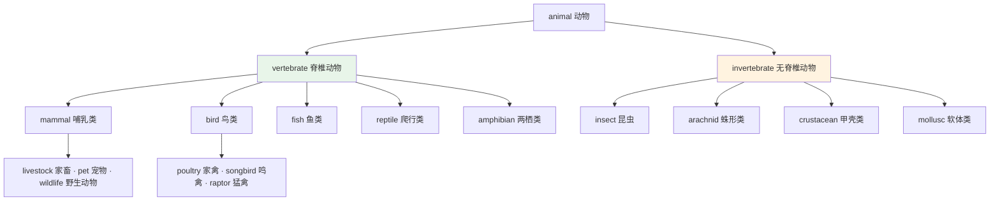
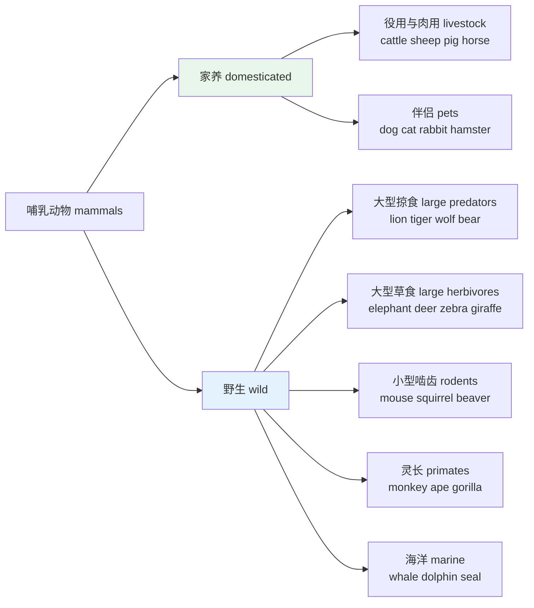
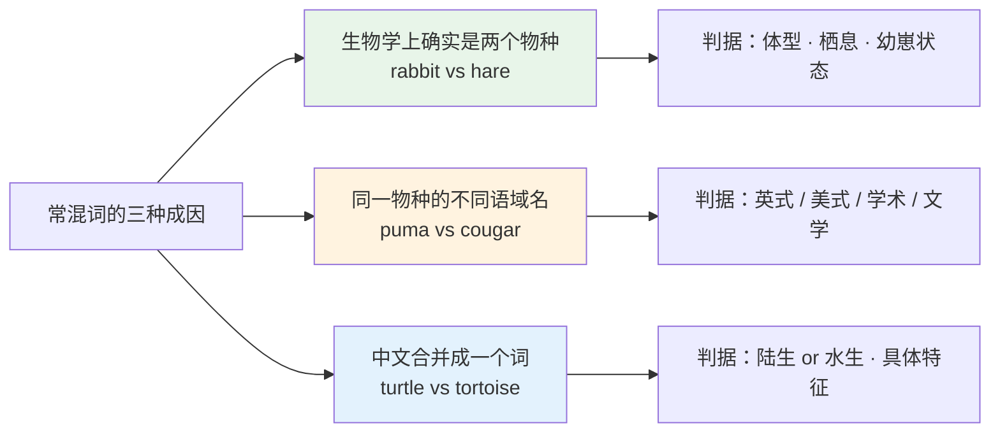
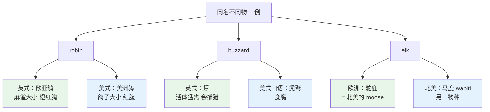
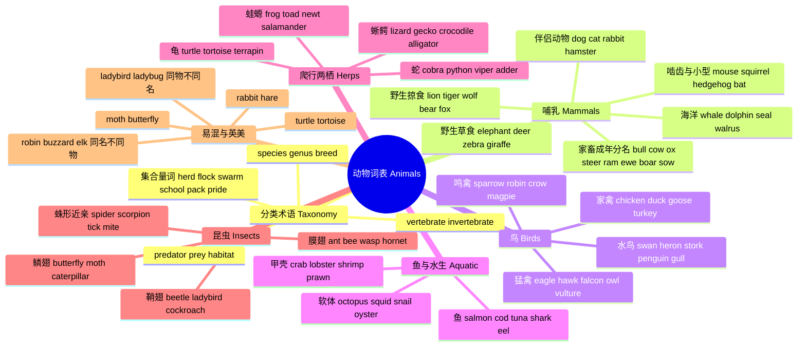

# 动物词表

> [!info] 本篇定位
>
> 第 10 章「动植物、颜色与感官属性」的开篇，也是全套教程唯一一篇系统铺开动物名的篇目。
>
> 读完你会拿到三样东西：一张按生物分类切开的五大类词表（哺乳、鸟、鱼、爬行两栖、昆虫），一套跟着动物走的集合量词与分类术语，以及十几组中文母语者反复弄混的近义动物名的判据。
>
> 本篇只管**活着的生物**。同一种动物端上桌之后叫什么，属于 [[09.衣食住行/02.食材词表\|食材词表]] 的范围，这里不重列；动物的身体部位、幼崽专名、叫声动词和养宠物的说法，全部留给本章下一篇。

---

## 1. 本篇导读：动物词的两套坐标

动物名不是一堆平铺的孤立单词，它同时挂在两套坐标上，任何一套记漏了都会出问题。

**第一套是生物学坐标**：这个词在分类树上的位置。`animal` 之下分 `mammal`（哺乳）、`bird`（鸟）、`fish`（鱼）、`reptile`（爬行）、`amphibian`（两栖）、`insect`（昆虫）。这套坐标决定了词与词之间的上下位关系——你可以说 `A robin is a bird`，但不能说 `A robin is an animal` 却在语境里指望对方明白你在讨论鸟类。写技术文档、读科普文章时靠的是这一套。

**第二套是文化坐标**：这个词在英语母语者日常生活里出现的频率和联想。`hedgehog`（刺猬）在英国是家喻户晓的花园访客，在美国大部分地区根本没有野生分布；`raccoon`（浣熊）在美国是翻垃圾桶的常客，英国人一辈子可能没见过。同一个分类层级上的词，实际使用频率能差出一个数量级。

这张图是本篇后面八节的骨架。第 2 节讲图上方的术语层，第 3 到第 8 节沿着 `mammal → bird → fish → reptile/amphibian → insect` 的顺序逐类铺词表，第 9 节处理树上位置相邻因而最容易混淆的那些词对，第 10 节回到文化坐标看英美差异。

> [!warning] 本篇不收的三类词
>
> - **肉名与食材**：`beef`、`pork`、`mutton`、`veal`、`venison`、`poultry` 作食材义时全部归 [[09.衣食住行/02.食材词表\|食材词表]]。本篇只在需要区分「活体 vs 桌上」时点一句，不铺表。
> - **动物身体与幼崽**：`paw`、`hoof`、`mane`、`calf`、`lamb`、`piglet`、`cub`、`chick` 归下一篇。本篇的家畜表只列**成年个体**按性别与用途的分名。
> - **叫声动词**：`bark`、`meow`、`moo`、`neigh`、`chirp` 归下一篇。

---

## 2. 分类术语、集合量词与生态动词

在铺具体词表之前，先把描述动物的那套「元词汇」立起来。这些词在科普文章、纪录片字幕、生物学教材里的出现频率，比绝大多数具体动物名都高。

### 2.1 分类层级与身份术语

| 英文 | 英式音标 | 美式音标 | 词性 | 中文 | 搭配与说明 |
| --- | --- | --- | --- | --- | --- |
| **animal** | /ˈænɪml/ | /ˈænɪml/ | n. | 动物 | 泛指；口语里常与 human 对立 |
| **creature** | /ˈkriːtʃə/ | /ˈkriːtʃər/ | n. | 生物；生灵 | 语气比 animal 文学化 |
| **beast** | /biːst/ | /biːst/ | n. | 兽 | 书面或古旧，含野性联想 |
| **species** | /ˈspiːʃiːz/ | /ˈspiːʃiːz/ | n. | 物种 | 单复数同形，one species / ten species |
| **genus** | /ˈdʒiːnəs/ | /ˈdʒiːnəs/ | n. | 属 | 复数 genera /ˈdʒenərə/ |
| **breed** | /briːd/ | /briːd/ | n./v. | 品种；繁殖 | 只用于家养动物品种，野生用 species |
| **vertebrate** | /ˈvɜːtɪbrət/ | /ˈvɜːrtɪbrət/ | n./adj. | 脊椎动物 | 来自 vertebra 脊椎骨 |
| **invertebrate** | /ɪnˈvɜːtɪbrət/ | /ɪnˈvɜːrtɪbrət/ | n./adj. | 无脊椎动物 | in- 否定前缀 |
| **mammal** | /ˈmæml/ | /ˈmæml/ | n. | 哺乳动物 | 形容词 mammalian |
| **rodent** | /ˈrəʊdnt/ | /ˈroʊdnt/ | n. | 啮齿动物 | 鼠、松鼠、海狸都在内 |
| **primate** | /ˈpraɪmeɪt/ | /ˈpraɪmeɪt/ | n. | 灵长动物 | 猴、猿、人 |
| **marsupial** | /mɑːˈsuːpiəl/ | /mɑːrˈsuːpiəl/ | n./adj. | 有袋动物 | 袋鼠、考拉 |
| **reptile** | /ˈreptaɪl/ | /ˈreptl/ | n. | 爬行动物 | 美音末音节常弱化 |
| **amphibian** | /æmˈfɪbiən/ | /æmˈfɪbiən/ | n. | 两栖动物 | 希腊语「两种生活」 |
| **crustacean** | /krʌˈsteɪʃn/ | /krʌˈsteɪʃn/ | n. | 甲壳动物 | 蟹、虾、龙虾 |
| **mollusc / mollusk** | /ˈmɒləsk/ | /ˈmɑːləsk/ | n. | 软体动物 | 英式拼 -sc，美式拼 -sk |
| **arachnid** | /əˈræknɪd/ | /əˈræknɪd/ | n. | 蛛形动物 | 蜘蛛、蝎子、螨；不是昆虫 |
| **insect** | /ˈɪnsekt/ | /ˈɪnsekt/ | n. | 昆虫 | 严格义为六足 |
| **wildlife** | /ˈwaɪldlaɪf/ | /ˈwaɪldlaɪf/ | n. | 野生动物 | 不可数，无复数 |
| **livestock** | /ˈlaɪvstɒk/ | /ˈlaɪvstɑːk/ | n. | 家畜；牲畜 | 不可数，接复数谓语 |
| **poultry** | /ˈpəʊltri/ | /ˈpoʊltri/ | n. | 家禽 | 不可数；作食材义见 09 章 |

`species` 的单复数同形是最常被写错的一处。`This species is endangered` 与 `These species are endangered` 都对，但 `a specie` 不是词——`specie` 单独存在时意思是「硬币」，属于完全不同的词。

### 2.2 集合量词：动物专属的量词系统

英语给不同动物配了不同的集合名词，这一点和中文的「一群」通吃很不一样。用错了不至于听不懂，但会立刻暴露是外语学习者。

| 英文 | 英式音标 | 美式音标 | 词性 | 中文 | 搭配与说明 |
| --- | --- | --- | --- | --- | --- |
| **herd** | /hɜːd/ | /hɜːrd/ | n. | 兽群 | a herd of cattle / elephants / deer |
| **flock** | /flɒk/ | /flɑːk/ | n. | 禽群；羊群 | a flock of birds / sheep / geese |
| **swarm** | /swɔːm/ | /swɔːrm/ | n./v. | 虫群；蜂拥 | a swarm of bees / locusts |
| **school** | /skuːl/ | /skuːl/ | n. | 鱼群 | a school of fish；与「学校」同形 |
| **shoal** | /ʃəʊl/ | /ʃoʊl/ | n. | 鱼群 | 英式更常用；也指浅滩 |
| **pack** | /pæk/ | /pæk/ | n. | 犬科群 | a pack of wolves / dogs |
| **pride** | /praɪd/ | /praɪd/ | n. | 狮群 | a pride of lions，只用于狮 |
| **colony** | /ˈkɒləni/ | /ˈkɑːləni/ | n. | 群落 | a colony of ants / bats / penguins |
| **hive** | /haɪv/ | /haɪv/ | n. | 蜂巢；蜂群 | a hive of bees |
| **troop** | /truːp/ | /truːp/ | n. | 猴群 | a troop of monkeys |
| **pod** | /pɒd/ | /pɑːd/ | n. | 鲸豚群 | a pod of whales / dolphins |
| **cattle** | /ˈkætl/ | /ˈkætl/ | n. | 牛（总称） | 复数名词，无单数；不能说 a cattle |

`cattle` 是个结构特殊的词：它没有单数形式，永远接复数谓语（`The cattle are grazing`）。要说一头牛得用 `a cow`、`a bull`、`a head of cattle`。同类的还有 `poultry`（不可数）和 `vermin`（有害小动物，不可数）。

### 2.3 食性、习性与保护状态

| 英文 | 英式音标 | 美式音标 | 词性 | 中文 | 搭配与说明 |
| --- | --- | --- | --- | --- | --- |
| **predator** | /ˈpredətə/ | /ˈpredətər/ | n. | 捕食者 | 形容词 predatory |
| **prey** | /preɪ/ | /preɪ/ | n./v. | 猎物；捕食 | 不可数；prey on sth |
| **herbivore** | /ˈhɜːbɪvɔː/ | /ˈhɜːrbɪvɔːr/ | n. | 食草动物 | 形容词 herbivorous |
| **carnivore** | /ˈkɑːnɪvɔː/ | /ˈkɑːrnɪvɔːr/ | n. | 食肉动物 | 形容词 carnivorous |
| **omnivore** | /ˈɒmnɪvɔː/ | /ˈɑːmnɪvɔːr/ | n. | 杂食动物 | omni- 全部 |
| **scavenger** | /ˈskævɪndʒə/ | /ˈskævɪndʒər/ | n. | 食腐动物 | 秃鹫、鬣狗 |
| **nocturnal** | /nɒkˈtɜːnl/ | /nɑːkˈtɜːrnl/ | adj. | 夜行的 | 蝙蝠、猫头鹰 |
| **diurnal** | /daɪˈɜːnl/ | /daɪˈɜːrnl/ | adj. | 昼行的 | nocturnal 的反义 |
| **hibernate** | /ˈhaɪbəneɪt/ | /ˈhaɪbərneɪt/ | v. | 冬眠 | 名词 hibernation |
| **migrate** | /maɪˈɡreɪt/ | /ˈmaɪɡreɪt/ | v. | 迁徙 | 英式重音在后，美式在前 |
| **habitat** | /ˈhæbɪtæt/ | /ˈhæbɪtæt/ | n. | 栖息地 | natural habitat |
| **ecosystem** | /ˈiːkəʊsɪstəm/ | /ˈiːkoʊsɪstəm/ | n. | 生态系统 | — |
| **endangered** | /ɪnˈdeɪndʒəd/ | /ɪnˈdeɪndʒərd/ | adj. | 濒危的 | an endangered species |
| **extinct** | /ɪkˈstɪŋkt/ | /ɪkˈstɪŋkt/ | adj. | 灭绝的 | go extinct / become extinct |
| **domesticate** | /dəˈmestɪkeɪt/ | /dəˈmestɪkeɪt/ | v. | 驯化 | domesticated animals |
| **tame** | /teɪm/ | /teɪm/ | adj./v. | 温驯的；驯服 | 指个体，不指物种 |
| **feral** | /ˈferəl/ | /ˈferəl/ | adj. | 野化的 | 家养后逃逸转野，如 feral cat |
| **venomous** | /ˈvenəməs/ | /ˈvenəməs/ | adj. | 有毒液的 | 主动注毒：蛇、蝎 |
| **poisonous** | /ˈpɔɪzənəs/ | /ˈpɔɪzənəs/ | adj. | 有毒的 | 被动含毒：吃了才中毒 |

`venomous` 和 `poisonous` 的区别值得单独记：**venomous 咬你你中毒，poisonous 你咬它你中毒**。眼镜蛇是 `venomous snake`，箭毒蛙是 `poisonous frog`。科普写作里混用会被指出来，日常口语中母语者也常拿这条当冷知识。

`domesticated` 和 `tame` 也不同层级。`domesticated` 说的是**物种**层面上经过世代选育（狗、牛、鸡都是），`tame` 说的是**某个个体**变得不怕人。一只 `tame fox` 依然属于野生物种。

---

## 3. 哺乳动物一：家畜、家禽的成年分名与伴侣动物

### 3.1 牛、羊、猪、马的性别与用途分名

英语给主要家畜按**性别 + 是否去势 + 是否生育过**造了一整套独立词，这在中文里对应的是「公/母/阉」加中心词的组合式表达。程序员读农业或食品供应链的英文材料时，这套词是硬门槛。

| 英文 | 英式音标 | 美式音标 | 词性 | 中文 | 搭配与说明 |
| --- | --- | --- | --- | --- | --- |
| **cattle** | /ˈkætl/ | /ˈkætl/ | n. | 牛（总称） | 复数名词，无单数形式 |
| **cow** | /kaʊ/ | /kaʊ/ | n. | 母牛 | 口语中也泛指任何一头牛 |
| **bull** | /bʊl/ | /bʊl/ | n. | 公牛（未去势） | 引申义「牛市」bull market |
| **ox** | /ɒks/ | /ɑːks/ | n. | 役用阉牛 | 复数 oxen，古英语 -en 复数残余 |
| **steer** | /stɪə/ | /stɪr/ | n. | 肉用阉公牛 | 与动词 steer 转向同形 |
| **bullock** | /ˈbʊlək/ | /ˈbʊlək/ | n. | 阉公牛 | 英式用得多，美式多说 steer |
| **heifer** | /ˈhefə/ | /ˈhefər/ | n. | 未产小母牛 | 拼写有 ei，读作 /e/ |
| **buffalo** | /ˈbʌfələʊ/ | /ˈbʌfəloʊ/ | n. | 水牛；北美野牛 | 复数 buffalo 或 buffaloes |
| **bison** | /ˈbaɪsn/ | /ˈbaɪsn/ | n. | 野牛 | 北美野牛的准确名，单复数同形 |
| **yak** | /jæk/ | /jæk/ | n. | 牦牛 | 藏语借词 |
| **sheep** | /ʃiːp/ | /ʃiːp/ | n. | 绵羊 | 单复数同形 |
| **ram** | /ræm/ | /ræm/ | n. | 公绵羊 | 也作动词「猛撞」 |
| **ewe** | /juː/ | /juː/ | n. | 母绵羊 | 读音同 you，不读 /iːwiː/ |
| **wether** | /ˈweðə/ | /ˈweðər/ | n. | 阉公羊 | 与 weather 同音，农业语境词 |
| **goat** | /ɡəʊt/ | /ɡoʊt/ | n. | 山羊 | 公 billy goat，母 nanny goat |
| **pig** | /pɪɡ/ | /pɪɡ/ | n. | 猪 | 通用词 |
| **hog** | /hɒɡ/ | /hɑːɡ/ | n. | 大猪；肉猪 | 美式农业常用词 |
| **swine** | /swaɪn/ | /swaɪn/ | n. | 猪（学名/古语） | 单复数同形；swine flu 猪流感 |
| **boar** | /bɔː/ | /bɔːr/ | n. | 公猪；野猪 | wild boar 野猪 |
| **sow** | /saʊ/ | /saʊ/ | n. | 母猪 | 与「播种」sow /səʊ/ 同形异音 |
| **horse** | /hɔːs/ | /hɔːrs/ | n. | 马 | — |
| **stallion** | /ˈstæliən/ | /ˈstæliən/ | n. | 种公马 | 未去势 |
| **mare** | /meə/ | /mer/ | n. | 母马 | 也用于驴、斑马的母兽 |
| **gelding** | /ˈɡeldɪŋ/ | /ˈɡeldɪŋ/ | n. | 阉公马 | 骑乘马多为 gelding |
| **pony** | /ˈpəʊni/ | /ˈpoʊni/ | n. | 矮种马 | 不是小马驹，是成年矮马 |
| **donkey** | /ˈdɒŋki/ | /ˈdɑːŋki/ | n. | 驴 | 日常词 |
| **ass** | /æs/ | /æs/ | n. | 驴 | 书面/古旧；美式俚语义粗俗，慎用 |
| **mule** | /mjuːl/ | /mjuːl/ | n. | 骡 | 公驴与母马的杂交，不育 |
| **camel** | /ˈkæml/ | /ˈkæml/ | n. | 骆驼 | 单峰 dromedary，双峰 Bactrian |
| **llama** | /ˈlɑːmə/ | /ˈlɑːmə/ | n. | 羊驼；美洲驼 | ll 读 /l/ 不读 /j/ |
| **alpaca** | /ælˈpækə/ | /ælˈpækə/ | n. | 羊驼 | 毛用，比 llama 小 |
| **reindeer** | /ˈreɪndɪə/ | /ˈreɪndɪr/ | n. | 驯鹿 | 单复数同形；北美野生种叫 caribou |

> [!warning] 三组最容易踩的坑
>
> - `pony` 不是「小马驹」。小马驹是 `foal` / `colt` / `filly`，归下一篇。`pony` 指的是成年后肩高仍低于某个标准的矮种马。
> - `sow` 有两个读音两个意思：母猪读 /saʊ/，播种读 /səʊ/（美 /soʊ/）。同形异音异义，靠语境区分。
> - `ass` 在正式文本里就是驴（`the Golden Ass`《金驴记》），但在美式口语里是粗俗词。日常说驴一律用 `donkey`。

### 3.2 家禽的成年分名

| 英文 | 英式音标 | 美式音标 | 词性 | 中文 | 搭配与说明 |
| --- | --- | --- | --- | --- | --- |
| **chicken** | /ˈtʃɪkɪn/ | /ˈtʃɪkɪn/ | n. | 鸡 | 活体与肉名同形，见本节末说明 |
| **hen** | /hen/ | /hen/ | n. | 母鸡 | 也泛指雌禽：a hen pheasant |
| **rooster** | /ˈruːstə/ | /ˈruːstər/ | n. | 公鸡 | 美式首选词 |
| **cock** | /kɒk/ | /kɑːk/ | n. | 公鸡 | 英式传统词；美式因俚语义避用 |
| **cockerel** | /ˈkɒkərəl/ | /ˈkɑːkərəl/ | n. | 小公鸡 | 未满一岁的公鸡 |
| **duck** | /dʌk/ | /dʌk/ | n. | 鸭；母鸭 | 泛称与雌性同词 |
| **drake** | /dreɪk/ | /dreɪk/ | n. | 公鸭 | — |
| **goose** | /ɡuːs/ | /ɡuːs/ | n. | 鹅；母鹅 | 复数 geese，元音交替 |
| **gander** | /ˈɡændə/ | /ˈɡændər/ | n. | 公鹅 | 习语 take a gander 瞧一眼 |
| **turkey** | /ˈtɜːki/ | /ˈtɜːrki/ | n. | 火鸡 | 公 tom，母 hen |
| **guinea fowl** | /ˈɡɪni faʊl/ | /ˈɡɪni faʊl/ | n. | 珍珠鸡 | fowl 是禽的总称 |
| **quail** | /kweɪl/ | /kweɪl/ | n. | 鹌鹑 | 单复数常同形 |
| **pheasant** | /ˈfeznt/ | /ˈfeznt/ | n. | 野鸡；雉 | ea 读 /e/ |
| **pigeon** | /ˈpɪdʒɪn/ | /ˈpɪdʒɪn/ | n. | 鸽子 | 与 dove 的区别见第 9 节 |
| **ostrich** | /ˈɒstrɪtʃ/ | /ˈɑːstrɪtʃ/ | n. | 鸵鸟 | 现存最大的鸟 |
| **peacock** | /ˈpiːkɒk/ | /ˈpiːkɑːk/ | n. | 雄孔雀 | 雌 peahen，物种总称 peafowl |
| **fowl** | /faʊl/ | /faʊl/ | n. | 禽；家禽 | 与 foul 同音；单复数常同形 |

`chicken` 与 `beef` / `pork` 的对照说明了一件事：诺曼贵族对日常禽类没有单独造词，所以 `chicken`、`duck`、`goose`、`turkey` 活体与肉名同形。牛羊猪就不是这样，那五对分裂词在 [[01.词汇入门与学习方法/01.英语词汇的来源、分层与学习地图\|英语词汇的来源、分层与学习地图]] 里已经讲过来源。

### 3.3 伴侣动物

| 英文 | 英式音标 | 美式音标 | 词性 | 中文 | 搭配与说明 |
| --- | --- | --- | --- | --- | --- |
| **dog** | /dɒɡ/ | /dɔːɡ/ | n. | 狗 | 英美元音差异明显 |
| **hound** | /haʊnd/ | /haʊnd/ | n. | 猎犬 | 与德语 Hund 同源 |
| **puppy** | /ˈpʌpi/ | /ˈpʌpi/ | n. | 幼犬 | 幼崽专名详见下一篇 |
| **cat** | /kæt/ | /kæt/ | n. | 猫 | 公 tomcat，母 queen |
| **feline** | /ˈfiːlaɪn/ | /ˈfiːlaɪn/ | adj./n. | 猫科的 | 拉丁层对应词 |
| **canine** | /ˈkeɪnaɪn/ | /ˈkeɪnaɪn/ | adj./n. | 犬科的；犬齿 | 拉丁层对应词 |
| **rabbit** | /ˈræbɪt/ | /ˈræbɪt/ | n. | 兔 | 与 hare 的区别见第 9 节 |
| **hamster** | /ˈhæmstə/ | /ˈhæmstər/ | n. | 仓鼠 | — |
| **gerbil** | /ˈdʒɜːbɪl/ | /ˈdʒɜːrbɪl/ | n. | 沙鼠 | g 读 /dʒ/ |
| **guinea pig** | /ˈɡɪni pɪɡ/ | /ˈɡɪni pɪɡ/ | n. | 豚鼠 | 引申义「试验品」 |
| **ferret** | /ˈferɪt/ | /ˈferɪt/ | n./v. | 雪貂；搜寻 | ferret out 挖出真相 |
| **goldfish** | /ˈɡəʊldfɪʃ/ | /ˈɡoʊldfɪʃ/ | n. | 金鱼 | 单复数同形 |
| **parrot** | /ˈpærət/ | /ˈpærət/ | n./v. | 鹦鹉；机械重复 | parrot sb's words |
| **budgerigar** | /ˈbʌdʒərɪɡɑː/ | /ˈbʌdʒərɪɡɑːr/ | n. | 虎皮鹦鹉 | 英式口语缩为 budgie |

`feline` 和 `canine` 是典型的拉丁层词：日常说 `cat` / `dog`，兽医文书和科普写作里换成 `feline` / `canine`。`a feline virus` 比 `a cat virus` 正式得多，这种同义梯度是英语分层结构的直接产物。

---

## 4. 哺乳动物二：野生大型与小型

### 4.1 猫科与犬科掠食者

| 英文 | 英式音标 | 美式音标 | 词性 | 中文 | 搭配与说明 |
| --- | --- | --- | --- | --- | --- |
| **lion** | /ˈlaɪən/ | /ˈlaɪən/ | n. | 狮 | 母狮 lioness；群体 a pride |
| **tiger** | /ˈtaɪɡə/ | /ˈtaɪɡər/ | n. | 虎 | 母虎 tigress |
| **leopard** | /ˈlepəd/ | /ˈlepərd/ | n. | 豹 | eo 读 /e/，不读 /iːəʊ/ |
| **cheetah** | /ˈtʃiːtə/ | /ˈtʃiːtə/ | n. | 猎豹 | 陆地最快的动物 |
| **jaguar** | /ˈdʒæɡjuə/ | /ˈdʒæɡwɑːr/ | n. | 美洲豹 | 英美读音差别大 |
| **panther** | /ˈpænθə/ | /ˈpænθər/ | n. | 黑豹 | 不是独立物种，见第 9 节 |
| **cougar** | /ˈkuːɡə/ | /ˈkuːɡər/ | n. | 美洲狮 | 美式常用名 |
| **puma** | /ˈpjuːmə/ | /ˈpuːmə/ | n. | 美洲狮 | 与 cougar 同物；英式偏用 |
| **lynx** | /lɪŋks/ | /lɪŋks/ | n. | 猞猁 | 复数 lynx 或 lynxes |
| **bobcat** | /ˈbɒbkæt/ | /ˈbɑːbkæt/ | n. | 短尾猫 | 北美特有 |
| **wolf** | /wʊlf/ | /wʊlf/ | n. | 狼 | 复数 wolves；群体 a pack |
| **fox** | /fɒks/ | /fɑːks/ | n. | 狐 | 母狐 vixen |
| **coyote** | /kɔɪˈəʊti/ | /kaɪˈoʊti/ | n. | 郊狼 | 英美读音差别大 |
| **jackal** | /ˈdʒækɔːl/ | /ˈdʒækl/ | n. | 豺 | — |
| **hyena** | /haɪˈiːnə/ | /haɪˈiːnə/ | n. | 鬣狗 | 不属犬科，独立科 |
| **bear** | /beə/ | /ber/ | n. | 熊 | polar bear 北极熊；bear market 熊市 |
| **badger** | /ˈbædʒə/ | /ˈbædʒər/ | n./v. | 獾；纠缠 | 英国常见野生动物 |
| **weasel** | /ˈwiːzl/ | /ˈwiːzl/ | n. | 鼬 | weasel word 含糊其辞的说法 |
| **otter** | /ˈɒtə/ | /ˈɑːtər/ | n. | 水獭 | — |
| **mongoose** | /ˈmɒŋɡuːs/ | /ˈmɑːŋɡuːs/ | n. | 獴 | 复数 mongooses，不是 mongeese |
| **meerkat** | /ˈmɪəkæt/ | /ˈmɪrkæt/ | n. | 狐獴 | 纪录片高频词 |

`mongoose` 的复数是本表最容易出错的一处。它看起来像 `goose`，但词源上和鹅毫无关系（来自马拉地语），所以规则加 -es：`mongooses`。写 `mongeese` 是把类比套错了。

### 4.2 大型草食与非洲、亚洲代表种

| 英文 | 英式音标 | 美式音标 | 词性 | 中文 | 搭配与说明 |
| --- | --- | --- | --- | --- | --- |
| **elephant** | /ˈelɪfənt/ | /ˈelɪfənt/ | n. | 象 | 群体 a herd |
| **rhinoceros** | /raɪˈnɒsərəs/ | /raɪˈnɑːsərəs/ | n. | 犀牛 | 口语缩为 rhino |
| **hippopotamus** | /ˌhɪpəˈpɒtəməs/ | /ˌhɪpəˈpɑːtəməs/ | n. | 河马 | 口语缩为 hippo |
| **giraffe** | /dʒəˈrɑːf/ | /dʒəˈræf/ | n. | 长颈鹿 | 英美元音差异 |
| **zebra** | /ˈzebrə/ | /ˈziːbrə/ | n. | 斑马 | 英美首音节差异最典型 |
| **antelope** | /ˈæntɪləʊp/ | /ˈæntɪloʊp/ | n. | 羚羊 | 泛称 |
| **gazelle** | /ɡəˈzel/ | /ɡəˈzel/ | n. | 瞪羚 | 重音在后 |
| **wildebeest** | /ˈwɪldɪbiːst/ | /ˈwɪldɪbiːst/ | n. | 角马 | 又名 gnu /nuː/ |
| **deer** | /dɪə/ | /dɪr/ | n. | 鹿 | 单复数同形 |
| **moose** | /muːs/ | /muːs/ | n. | 驼鹿 | 单复数同形；北美用词 |
| **elk** | /elk/ | /elk/ | n. | 马鹿/驼鹿 | 英美所指不同，见第 10 节 |
| **caribou** | /ˈkærɪbuː/ | /ˈkærɪbuː/ | n. | 北美驯鹿 | 与 reindeer 同种不同名 |
| **camel** | /ˈkæml/ | /ˈkæml/ | n. | 骆驼 | 亦见 3.1 |
| **kangaroo** | /ˌkæŋɡəˈruː/ | /ˌkæŋɡəˈruː/ | n. | 袋鼠 | 重音在末音节 |
| **wallaby** | /ˈwɒləbi/ | /ˈwɑːləbi/ | n. | 小袋鼠 | 比袋鼠小 |
| **koala** | /kəʊˈɑːlə/ | /koʊˈɑːlə/ | n. | 考拉 | 不是 koala bear，不是熊 |
| **wombat** | /ˈwɒmbæt/ | /ˈwɑːmbæt/ | n. | 袋熊 | — |
| **platypus** | /ˈplætɪpəs/ | /ˈplætɪpəs/ | n. | 鸭嘴兽 | 卵生哺乳动物 |
| **panda** | /ˈpændə/ | /ˈpændə/ | n. | 熊猫 | giant panda 大熊猫 |
| **sloth** | /sləʊθ/ | /slɔːθ/ | n. | 树懒；懒惰 | 七宗罪之一亦为 sloth |
| **armadillo** | /ˌɑːməˈdɪləʊ/ | /ˌɑːrməˈdɪloʊ/ | n. | 犰狳 | 复数 armadillos |
| **anteater** | /ˈæntiːtə/ | /ˈæntiːtər/ | n. | 食蚁兽 | 透明合成词 |

`koala` 后面不该跟 `bear`。它是有袋动物，和熊完全不同科。母语者口语里偶尔说 `koala bear`，但科普文本一律写 `koala`。同理，`panda` 是真熊，`red panda`（小熊猫）却不是熊——名字里带 panda 而已。

### 4.3 灵长动物

| 英文 | 英式音标 | 美式音标 | 词性 | 中文 | 搭配与说明 |
| --- | --- | --- | --- | --- | --- |
| **monkey** | /ˈmʌŋki/ | /ˈmʌŋki/ | n. | 猴 | 有尾；群体 a troop |
| **ape** | /eɪp/ | /eɪp/ | n. | 猿 | 无尾；与 monkey 不可混用 |
| **gorilla** | /ɡəˈrɪlə/ | /ɡəˈrɪlə/ | n. | 大猩猩 | 与 guerrilla 游击队近音 |
| **chimpanzee** | /ˌtʃɪmpænˈziː/ | /ˌtʃɪmpænˈziː/ | n. | 黑猩猩 | 口语缩为 chimp |
| **orangutan** | /ɔːˌræŋuːˈtæn/ | /əˈræŋətæn/ | n. | 红毛猩猩 | 马来语「森林中的人」 |
| **gibbon** | /ˈɡɪbən/ | /ˈɡɪbən/ | n. | 长臂猿 | 小型猿 |
| **baboon** | /bəˈbuːn/ | /bæˈbuːn/ | n. | 狒狒 | 重音在后 |
| **lemur** | /ˈliːmə/ | /ˈliːmər/ | n. | 狐猴 | 马达加斯加特有 |

### 4.4 小型哺乳与啮齿类

| 英文 | 英式音标 | 美式音标 | 词性 | 中文 | 搭配与说明 |
| --- | --- | --- | --- | --- | --- |
| **mouse** | /maʊs/ | /maʊs/ | n. | 小鼠 | 复数 mice；电脑鼠标可 mouses |
| **rat** | /ræt/ | /ræt/ | n. | 大鼠 | 引申义「叛徒」 |
| **squirrel** | /ˈskwɪrəl/ | /ˈskwɜːrəl/ | n. | 松鼠 | 英美读音差异典型 |
| **chipmunk** | /ˈtʃɪpmʌŋk/ | /ˈtʃɪpmʌŋk/ | n. | 花栗鼠 | 北美常见 |
| **beaver** | /ˈbiːvə/ | /ˈbiːvər/ | n. | 海狸 | 加拿大国兽 |
| **hedgehog** | /ˈhedʒhɒɡ/ | /ˈhedʒhɑːɡ/ | n. | 刺猬 | 英国常见，美国无野生分布 |
| **porcupine** | /ˈpɔːkjupaɪn/ | /ˈpɔːrkjupaɪn/ | n. | 豪猪 | 与刺猬不同科 |
| **mole** | /məʊl/ | /moʊl/ | n. | 鼹鼠 | 同形词还有「痣」「内奸」 |
| **shrew** | /ʃruː/ | /ʃruː/ | n. | 鼩鼱；泼妇 | 莎剧 The Taming of the Shrew |
| **bat** | /bæt/ | /bæt/ | n. | 蝙蝠 | 唯一会飞的哺乳动物 |
| **skunk** | /skʌŋk/ | /skʌŋk/ | n. | 臭鼬 | 北美；引申义「讨厌鬼」 |
| **raccoon** | /rəˈkuːn/ | /ræˈkuːn/ | n. | 浣熊 | 英式亦拼 racoon |
| **opossum** | /əˈpɒsəm/ | /əˈpɑːsəm/ | n. | 负鼠 | 美式口语缩为 possum |
| **gopher** | /ˈɡəʊfə/ | /ˈɡoʊfər/ | n. | 囊鼠 | 北美；也是编程语言吉祥物 |
| **vole** | /vəʊl/ | /voʊl/ | n. | 田鼠 | 与 mole 只差一个字母 |
| **hare** | /heə/ | /her/ | n. | 野兔 | 与 rabbit 的区别见第 9 节 |

这张图给出的是记忆时的切块方式。哺乳动物是五大类里词量最大的一块，一次背完不现实；按「家养 / 野生」再往下按体型和食性切成六个小组，每组十几个词，配合已有的中文常识，一组一天是可行的节奏。

### 4.5 海洋哺乳动物

| 英文 | 英式音标 | 美式音标 | 词性 | 中文 | 搭配与说明 |
| --- | --- | --- | --- | --- | --- |
| **whale** | /weɪl/ | /weɪl/ | n. | 鲸 | 群体 a pod；blue whale 蓝鲸 |
| **dolphin** | /ˈdɒlfɪn/ | /ˈdɑːlfɪn/ | n. | 海豚 | — |
| **porpoise** | /ˈpɔːpəs/ | /ˈpɔːrpəs/ | n. | 鼠海豚 | 吻短，与 dolphin 不同科 |
| **orca** | /ˈɔːkə/ | /ˈɔːrkə/ | n. | 虎鲸 | 又名 killer whale，实为大型海豚 |
| **seal** | /siːl/ | /siːl/ | n. | 海豹 | 无外耳廓，陆上匍匐 |
| **sea lion** | /ˈsiː laɪən/ | /ˈsiː laɪən/ | n. | 海狮 | 有外耳廓，能用鳍走 |
| **walrus** | /ˈwɔːlrəs/ | /ˈwɔːlrəs/ | n. | 海象 | 长牙 tusks |
| **manatee** | /ˈmænətiː/ | /ˈmænətiː/ | n. | 海牛 | 又称 sea cow |
| **narwhal** | /ˈnɑːwəl/ | /ˈnɑːrwəl/ | n. | 独角鲸 | h 不发音 |

---

## 5. 鸟类：鸣禽、猛禽与水鸟

家禽已在 3.2 列过，本节只收野生鸟类。鸟名是英美常见度差异最大的一块，第 10 节会集中处理。

### 5.1 常见鸣禽与庭园鸟

| 英文 | 英式音标 | 美式音标 | 词性 | 中文 | 搭配与说明 |
| --- | --- | --- | --- | --- | --- |
| **bird** | /bɜːd/ | /bɜːrd/ | n. | 鸟 | 群体 a flock |
| **sparrow** | /ˈspærəʊ/ | /ˈspæroʊ/ | n. | 麻雀 | 城市最常见的小鸟 |
| **swallow** | /ˈswɒləʊ/ | /ˈswɑːloʊ/ | n./v. | 燕子；吞咽 | 同形异义，靠语境分 |
| **robin** | /ˈrɒbɪn/ | /ˈrɑːbɪn/ | n. | 知更鸟 | 英美指两种不同的鸟，见第 10 节 |
| **blackbird** | /ˈblækbɜːd/ | /ˈblækbɜːrd/ | n. | 乌鸫 | 英国花园常客 |
| **thrush** | /θrʌʃ/ | /θrʌʃ/ | n. | 画眉；鸫 | — |
| **starling** | /ˈstɑːlɪŋ/ | /ˈstɑːrlɪŋ/ | n. | 椋鸟 | 大规模群飞现象叫 murmuration |
| **finch** | /fɪntʃ/ | /fɪntʃ/ | n. | 雀科鸟 | 达尔文雀 Darwin's finches |
| **canary** | /kəˈneəri/ | /kəˈneri/ | n. | 金丝雀 | 习语 a canary in a coal mine |
| **wren** | /ren/ | /ren/ | n. | 鹪鹩 | w 不发音 |
| **lark** | /lɑːk/ | /lɑːrk/ | n. | 云雀 | 习语 up with the lark 早起 |
| **nightingale** | /ˈnaɪtɪŋɡeɪl/ | /ˈnaɪtɪŋɡeɪl/ | n. | 夜莺 | 文学意象高频 |
| **cuckoo** | /ˈkʊkuː/ | /ˈkuːkuː/ | n. | 布谷鸟 | 英美首音节差异；巢寄生 |
| **crow** | /krəʊ/ | /kroʊ/ | n./v. | 乌鸦；啼叫 | as the crow flies 直线距离 |
| **raven** | /ˈreɪvn/ | /ˈreɪvn/ | n. | 渡鸦 | 比 crow 大，坡的名诗 |
| **magpie** | /ˈmæɡpaɪ/ | /ˈmæɡpaɪ/ | n. | 喜鹊 | 英国常见；引申「爱收集杂物的人」 |
| **jay** | /dʒeɪ/ | /dʒeɪ/ | n. | 松鸦 | blue jay 北美蓝鸦 |
| **woodpecker** | /ˈwʊdpekə/ | /ˈwʊdpekər/ | n. | 啄木鸟 | 透明合成词 |
| **swift** | /swɪft/ | /swɪft/ | n./adj. | 雨燕；迅速的 | 同形异义 |
| **hummingbird** | /ˈhʌmɪŋbɜːd/ | /ˈhʌmɪŋbɜːrd/ | n. | 蜂鸟 | 只分布于美洲 |
| **dove** | /dʌv/ | /dʌv/ | n. | 鸽 | o 读 /ʌ/；和平象征 |
| **pigeon** | /ˈpɪdʒɪn/ | /ˈpɪdʒɪn/ | n. | 鸽 | 与 dove 的分工见第 9 节 |

### 5.2 猛禽

| 英文 | 英式音标 | 美式音标 | 词性 | 中文 | 搭配与说明 |
| --- | --- | --- | --- | --- | --- |
| **raptor** | /ˈræptə/ | /ˈræptər/ | n. | 猛禽 | 学术词；也指迅猛龙 |
| **eagle** | /ˈiːɡl/ | /ˈiːɡl/ | n. | 雕；鹰 | bald eagle 白头海雕 |
| **hawk** | /hɔːk/ | /hɔːk/ | n. | 鹰 | 政治义「鹰派」 |
| **falcon** | /ˈfɔːlkən/ | /ˈfælkən/ | n. | 隼 | 英美元音有差异 |
| **kestrel** | /ˈkestrəl/ | /ˈkestrəl/ | n. | 红隼 | 英国常见 |
| **buzzard** | /ˈbʌzəd/ | /ˈbʌzərd/ | n. | 鵟；秃鹫 | 英美所指不同，见第 10 节 |
| **osprey** | /ˈɒspri/ | /ˈɑːspri/ | n. | 鱼鹰 | — |
| **vulture** | /ˈvʌltʃə/ | /ˈvʌltʃər/ | n. | 秃鹫 | 食腐；引申「趁火打劫者」 |
| **owl** | /aʊl/ | /aʊl/ | n. | 猫头鹰 | 夜行 nocturnal；night owl 夜猫子 |
| **condor** | /ˈkɒndɔː/ | /ˈkɑːndɔːr/ | n. | 秃鹰；神鹫 | 美洲大型猛禽 |

### 5.3 水鸟与海鸟

| 英文 | 英式音标 | 美式音标 | 词性 | 中文 | 搭配与说明 |
| --- | --- | --- | --- | --- | --- |
| **swan** | /swɒn/ | /swɑːn/ | n. | 天鹅 | swan song 绝唱 |
| **crane** | /kreɪn/ | /kreɪn/ | n. | 鹤；起重机 | 同形异义，起重机由鸟得名 |
| **heron** | /ˈherən/ | /ˈherən/ | n. | 苍鹭 | 河岸常见 |
| **stork** | /stɔːk/ | /stɔːrk/ | n. | 鹳 | 西方送子传说的鸟 |
| **flamingo** | /fləˈmɪŋɡəʊ/ | /fləˈmɪŋɡoʊ/ | n. | 火烈鸟 | 复数 flamingos/-oes |
| **pelican** | /ˈpelɪkən/ | /ˈpelɪkən/ | n. | 鹈鹕 | 大喉囊 |
| **seagull** | /ˈsiːɡʌl/ | /ˈsiːɡʌl/ | n. | 海鸥 | 鸟类学中直接称 gull |
| **gull** | /ɡʌl/ | /ɡʌl/ | n. | 鸥 | 正式名称 |
| **penguin** | /ˈpeŋɡwɪn/ | /ˈpeŋɡwɪn/ | n. | 企鹅 | 只在南半球，北极没有 |
| **albatross** | /ˈælbətrɒs/ | /ˈælbətrɔːs/ | n. | 信天翁 | 引申义「沉重负担」 |
| **kingfisher** | /ˈkɪŋfɪʃə/ | /ˈkɪŋfɪʃər/ | n. | 翠鸟 | 透明合成词 |
| **puffin** | /ˈpʌfɪn/ | /ˈpʌfɪn/ | n. | 海鹦 | 北大西洋 |
| **cormorant** | /ˈkɔːmərənt/ | /ˈkɔːrmərənt/ | n. | 鸬鹚 | 潜水捕鱼 |
| **duckling** | /ˈdʌklɪŋ/ | /ˈdʌklɪŋ/ | n. | 小鸭 | 幼崽名详见下一篇 |

### 5.4 异域与不能飞的鸟

| 英文 | 英式音标 | 美式音标 | 词性 | 中文 | 搭配与说明 |
| --- | --- | --- | --- | --- | --- |
| **parakeet** | /ˈpærəkiːt/ | /ˈpærəkiːt/ | n. | 长尾小鹦鹉 | 美式常指虎皮鹦鹉 |
| **cockatoo** | /ˌkɒkəˈtuː/ | /ˌkɑːkəˈtuː/ | n. | 凤头鹦鹉 | 重音在末 |
| **macaw** | /məˈkɔː/ | /məˈkɔː/ | n. | 金刚鹦鹉 | 重音在后 |
| **toucan** | /ˈtuːkən/ | /ˈtuːkæn/ | n. | 巨嘴鸟 | 中南美洲 |
| **emu** | /ˈiːmjuː/ | /ˈiːmjuː/ | n. | 鸸鹋 | 澳洲；不能飞 |
| **kiwi** | /ˈkiːwiː/ | /ˈkiːwiː/ | n. | 几维鸟 | 新西兰国鸟；也指猕猴桃 |
| **dodo** | /ˈdəʊdəʊ/ | /ˈdoʊdoʊ/ | n. | 渡渡鸟 | 已灭绝；as dead as a dodo |
| **peafowl** | /ˈpiːfaʊl/ | /ˈpiːfaʊl/ | n. | 孔雀（总称） | 雄 peacock，雌 peahen |

> [!example] 鸟类词在真实文本里的样子
>
> - A **flock** of **starlings** wheeled over the field at dusk.
>   - 一群椋鸟在黄昏时分掠过田野。
> - The **osprey** hovered, then dropped straight into the water.
>   - 那只鱼鹰悬停片刻，随后直插入水。
> - **Penguins** live only in the southern hemisphere; there are none at the North Pole.
>   - 企鹅只生活在南半球，北极一只也没有。
> - **Cuckoos** lay their eggs in other birds' nests.
>   - 布谷鸟把蛋下在别的鸟的巢里。

---

## 6. 鱼类与水生无脊椎动物

本节列的是**水里游着的活体**。同一批词进厨房之后的用法（`fillet of cod`、`smoked salmon`、`prawn cocktail`）归 [[09.衣食住行/02.食材词表\|食材词表]]。

### 6.1 鱼

| 英文 | 英式音标 | 美式音标 | 词性 | 中文 | 搭配与说明 |
| --- | --- | --- | --- | --- | --- |
| **fish** | /fɪʃ/ | /fɪʃ/ | n. | 鱼 | 同种复数 fish，多种类可用 fishes |
| **salmon** | /ˈsæmən/ | /ˈsæmən/ | n. | 鲑鱼 | l 不发音；单复数同形 |
| **trout** | /traʊt/ | /traʊt/ | n. | 鳟鱼 | 单复数同形 |
| **cod** | /kɒd/ | /kɑːd/ | n. | 鳕鱼 | 单复数同形 |
| **tuna** | /ˈtjuːnə/ | /ˈtuːnə/ | n. | 金枪鱼 | 英式 t 后有 /j/ |
| **herring** | /ˈherɪŋ/ | /ˈherɪŋ/ | n. | 鲱鱼 | red herring 转移注意的假线索 |
| **sardine** | /sɑːˈdiːn/ | /sɑːrˈdiːn/ | n. | 沙丁鱼 | packed like sardines 挤成沙丁鱼罐头 |
| **mackerel** | /ˈmækrəl/ | /ˈmækrəl/ | n. | 鲭鱼 | 单复数同形 |
| **anchovy** | /ˈæntʃəvi/ | /ˈæntʃoʊvi/ | n. | 凤尾鱼 | 英美次重音位置不同 |
| **carp** | /kɑːp/ | /kɑːrp/ | n./v. | 鲤鱼；挑刺 | 动词义 carp about sth |
| **catfish** | /ˈkætfɪʃ/ | /ˈkætfɪʃ/ | n. | 鲶鱼 | 网络义「照骗」 |
| **eel** | /iːl/ | /iːl/ | n. | 鳗鱼 | slippery as an eel |
| **perch** | /pɜːtʃ/ | /pɜːrtʃ/ | n./v. | 鲈鱼；栖息 | 同形异义 |
| **pike** | /paɪk/ | /paɪk/ | n. | 梭子鱼 | 淡水掠食鱼 |
| **bass** | /bæs/ | /bæs/ | n. | 鲈鱼 | 与音乐低音 bass /beɪs/ 同形异音 |
| **halibut** | /ˈhælɪbət/ | /ˈhælɪbət/ | n. | 大比目鱼 | — |
| **flounder** | /ˈflaʊndə/ | /ˈflaʊndər/ | n./v. | 比目鱼；挣扎 | 动词义与 founder 易混 |
| **sole** | /səʊl/ | /soʊl/ | n. | 鳎；舌鳎 | 与「唯一的」「脚底」同形 |
| **swordfish** | /ˈsɔːdfɪʃ/ | /ˈsɔːrdfɪʃ/ | n. | 剑鱼 | w 不发音 |
| **shark** | /ʃɑːk/ | /ʃɑːrk/ | n. | 鲨鱼 | loan shark 放高利贷者 |
| **ray** | /reɪ/ | /reɪ/ | n. | 鳐鱼 | stingray 魟鱼 |
| **piranha** | /pɪˈrɑːnə/ | /pɪˈrɑːnə/ | n. | 食人鱼 | h 不发音 |
| **seahorse** | /ˈsiːhɔːs/ | /ˈsiːhɔːrs/ | n. | 海马 | 雄性育儿 |
| **goldfish** | /ˈɡəʊldfɪʃ/ | /ˈɡoʊldfɪʃ/ | n. | 金鱼 | 单复数同形 |
| **koi** | /kɔɪ/ | /kɔɪ/ | n. | 锦鲤 | 日语借词 |

`fish` 的复数是个细节：同一物种的多条鱼用 `fish`（`I caught three fish`），指多个**物种**时才用 `fishes`（`the fishes of the Pacific`）。日常写作里 `fishes` 出现得极少，看到它八成是在生物学语境。

### 6.2 水生无脊椎动物

| 英文 | 英式音标 | 美式音标 | 词性 | 中文 | 搭配与说明 |
| --- | --- | --- | --- | --- | --- |
| **crab** | /kræb/ | /kræb/ | n. | 蟹 | crab apple 海棠果，无关联 |
| **lobster** | /ˈlɒbstə/ | /ˈlɑːbstər/ | n. | 龙虾 | 有大螯 |
| **shrimp** | /ʃrɪmp/ | /ʃrɪmp/ | n. | 虾 | 美式通用词，见第 9 节 |
| **prawn** | /prɔːn/ | /prɔːn/ | n. | 对虾 | 英式通用词 |
| **crayfish** | /ˈkreɪfɪʃ/ | /ˈkreɪfɪʃ/ | n. | 小龙虾 | 美式亦作 crawfish |
| **krill** | /krɪl/ | /krɪl/ | n. | 磷虾 | 不可数；鲸的主食 |
| **octopus** | /ˈɒktəpəs/ | /ˈɑːktəpəs/ | n. | 章鱼 | 复数 octopuses 最稳妥 |
| **squid** | /skwɪd/ | /skwɪd/ | n. | 鱿鱼 | 单复数常同形 |
| **cuttlefish** | /ˈkʌtlfɪʃ/ | /ˈkʌtlfɪʃ/ | n. | 墨鱼 | 有内壳 |
| **jellyfish** | /ˈdʒelifɪʃ/ | /ˈdʒelifɪʃ/ | n. | 水母 | 单复数同形；不是鱼 |
| **starfish** | /ˈstɑːfɪʃ/ | /ˈstɑːrfɪʃ/ | n. | 海星 | 学名 sea star；不是鱼 |
| **sea urchin** | /ˈsiː ɜːtʃɪn/ | /ˈsiː ɜːrtʃɪn/ | n. | 海胆 | urchin 词源义是刺猬，今义「顽童」 |
| **coral** | /ˈkɒrəl/ | /ˈkɔːrəl/ | n. | 珊瑚 | coral reef 珊瑚礁 |
| **anemone** | /əˈneməni/ | /əˈneməni/ | n. | 海葵 | 四音节，重音在第二 |
| **snail** | /sneɪl/ | /sneɪl/ | n. | 蜗牛 | at a snail's pace 极慢 |
| **slug** | /slʌɡ/ | /slʌɡ/ | n. | 蛞蝓 | 无壳的蜗牛 |
| **clam** | /klæm/ | /klæm/ | n. | 蛤蜊 | clam up 闭口不谈 |
| **oyster** | /ˈɔɪstə/ | /ˈɔɪstər/ | n. | 牡蛎 | the world is your oyster |
| **mussel** | /ˈmʌsl/ | /ˈmʌsl/ | n. | 贻贝 | 与 muscle 肌肉同音 |
| **scallop** | /ˈskɒləp/ | /ˈskɑːləp/ | n. | 扇贝 | 美式亦读 /ˈskæləp/ |
| **plankton** | /ˈplæŋktən/ | /ˈplæŋktən/ | n. | 浮游生物 | 不可数 |
| **leech** | /liːtʃ/ | /liːtʃ/ | n./v. | 水蛭；吸血 | 引申「寄生虫般的人」 |

`mussel` 和 `muscle` 完全同音，是听力里的经典陷阱。同样成对的还有 `whale` 与 `wail`（在多数美音里同音）、`hare` 与 `hair`、`bear` 与 `bare`、`deer` 与 `dear`、`ewe` 与 `you`、`gnu` 与 `new`（英音）。这批同音词在 [[16.词义辨析、搭配与短语动词/03.近形近音易混词与中式英语陷阱\|近形近音易混词与中式英语陷阱]] 里还会作为近音易混组再出现。

---

## 7. 爬行动物与两栖动物

### 7.1 蛇

| 英文 | 英式音标 | 美式音标 | 词性 | 中文 | 搭配与说明 |
| --- | --- | --- | --- | --- | --- |
| **snake** | /sneɪk/ | /sneɪk/ | n. | 蛇 | 日常通用词 |
| **serpent** | /ˈsɜːpənt/ | /ˈsɜːrpənt/ | n. | 蛇 | 文学与宗教语域 |
| **cobra** | /ˈkəʊbrə/ | /ˈkoʊbrə/ | n. | 眼镜蛇 | king cobra 眼镜王蛇 |
| **python** | /ˈpaɪθən/ | /ˈpaɪθɑːn/ | n. | 蟒蛇 | 英美末音节差异；编程语言同名 |
| **boa** | /ˈbəʊə/ | /ˈboʊə/ | n. | 蚺 | boa constrictor 红尾蚺 |
| **anaconda** | /ˌænəˈkɒndə/ | /ˌænəˈkɑːndə/ | n. | 森蚺 | 南美 |
| **viper** | /ˈvaɪpə/ | /ˈvaɪpər/ | n. | 蝰蛇 | 引申「阴险的人」 |
| **adder** | /ˈædə/ | /ˈædər/ | n. | 蝰蛇 | 英国唯一的毒蛇 |
| **rattlesnake** | /ˈrætlsneɪk/ | /ˈrætlsneɪk/ | n. | 响尾蛇 | 北美；口语 rattler |
| **mamba** | /ˈmæmbə/ | /ˈmɑːmbə/ | n. | 曼巴蛇 | 非洲；black mamba |
| **fang** | /fæŋ/ | /fæŋ/ | n. | 毒牙 | 身体部位详见下一篇 |
| **venom** | /ˈvenəm/ | /ˈvenəm/ | n. | 毒液 | 形容词 venomous |

### 7.2 蜥蜴、鳄与龟

| 英文 | 英式音标 | 美式音标 | 词性 | 中文 | 搭配与说明 |
| --- | --- | --- | --- | --- | --- |
| **lizard** | /ˈlɪzəd/ | /ˈlɪzərd/ | n. | 蜥蜴 | — |
| **gecko** | /ˈɡekəʊ/ | /ˈɡekoʊ/ | n. | 壁虎 | 复数 geckos |
| **iguana** | /ɪˈɡwɑːnə/ | /ɪˈɡwɑːnə/ | n. | 鬣蜥 | gu 读 /ɡw/ |
| **chameleon** | /kəˈmiːliən/ | /kəˈmiːliən/ | n. | 变色龙 | ch 读 /k/ |
| **skink** | /skɪŋk/ | /skɪŋk/ | n. | 石龙子 | — |
| **crocodile** | /ˈkrɒkədaɪl/ | /ˈkrɑːkədaɪl/ | n. | 鳄鱼 | crocodile tears 假慈悲 |
| **alligator** | /ˈælɪɡeɪtə/ | /ˈælɪɡeɪtər/ | n. | 短吻鳄 | 美式口语缩为 gator |
| **caiman** | /ˈkeɪmən/ | /ˈkeɪmən/ | n. | 凯门鳄 | 中南美洲 |
| **turtle** | /ˈtɜːtl/ | /ˈtɜːrtl/ | n. | 龟 | 与 tortoise 的区别见第 9 节 |
| **tortoise** | /ˈtɔːtəs/ | /ˈtɔːrtəs/ | n. | 陆龟 | 拼写有 oi，却读 /ə/ |
| **terrapin** | /ˈterəpɪn/ | /ˈterəpɪn/ | n. | 淡水龟 | 英式用得较多 |
| **shell** | /ʃel/ | /ʃel/ | n. | 壳 | 龟壳的正式词是 carapace |
| **dinosaur** | /ˈdaɪnəsɔː/ | /ˈdaɪnəsɔːr/ | n. | 恐龙 | 希腊语「可怕的蜥蜴」 |
| **scale** | /skeɪl/ | /skeɪl/ | n. | 鳞片 | 同形词还有「秤」「规模」 |

### 7.3 两栖动物

| 英文 | 英式音标 | 美式音标 | 词性 | 中文 | 搭配与说明 |
| --- | --- | --- | --- | --- | --- |
| **frog** | /frɒɡ/ | /frɔːɡ/ | n. | 青蛙 | a frog in one's throat 嗓子哑 |
| **toad** | /təʊd/ | /toʊd/ | n. | 蟾蜍 | 皮肤粗糙，陆生为主 |
| **tadpole** | /ˈtædpəʊl/ | /ˈtædpoʊl/ | n. | 蝌蚪 | 字面「蟾蜍的头」 |
| **newt** | /njuːt/ | /nuːt/ | n. | 蝾螈 | 英式有 /j/，美式无 |
| **salamander** | /ˈsæləmændə/ | /ˈsæləmændər/ | n. | 火蜥蜴 | 传说中能耐火 |
| **spawn** | /spɔːn/ | /spɔːn/ | n./v. | 卵；产卵 | frogspawn 蛙卵；技术圈引申「派生进程」 |
| **metamorphosis** | /ˌmetəˈmɔːfəsɪs/ | /ˌmetəˈmɔːrfəsɪs/ | n. | 变态发育 | 复数 metamorphoses |
| **gill** | /ɡɪl/ | /ɡɪl/ | n. | 鳃 | 身体部位详见下一篇 |

`spawn` 对程序员是个双关词：生物学上是「产卵」，进程管理里 `spawn a child process` 用的正是同一个隐喻——从一个母体大量派生。这类从自然界搬进技术文档的词还有 `swarm`（Docker Swarm）、`hive`（Apache Hive）、`gopher`（Go 的吉祥物）、`python`、`mongoose`（Node 的 ODM 库）。认识生物学原义，读技术命名时能省一次查词。

---

## 8. 昆虫与其他节肢动物

### 8.1 昆虫

| 英文 | 英式音标 | 美式音标 | 词性 | 中文 | 搭配与说明 |
| --- | --- | --- | --- | --- | --- |
| **insect** | /ˈɪnsekt/ | /ˈɪnsekt/ | n. | 昆虫 | 六足；正式词 |
| **bug** | /bʌɡ/ | /bʌɡ/ | n./v. | 虫子；程序缺陷；烦扰 | 美式口语泛指小虫 |
| **ant** | /ænt/ | /ænt/ | n. | 蚂蚁 | 群体 a colony |
| **bee** | /biː/ | /biː/ | n. | 蜜蜂 | 群体 a swarm / a hive |
| **bumblebee** | /ˈbʌmblbiː/ | /ˈbʌmblbiː/ | n. | 熊蜂 | 体大多毛 |
| **wasp** | /wɒsp/ | /wɑːsp/ | n. | 黄蜂 | 可反复蜇人 |
| **hornet** | /ˈhɔːnɪt/ | /ˈhɔːrnɪt/ | n. | 大黄蜂 | stir up a hornet's nest 捅马蜂窝 |
| **fly** | /flaɪ/ | /flaɪ/ | n./v. | 苍蝇；飞 | 复数 flies |
| **mosquito** | /məˈskiːtəʊ/ | /məˈskiːtoʊ/ | n. | 蚊子 | 复数 mosquitoes |
| **butterfly** | /ˈbʌtəflaɪ/ | /ˈbʌtərflaɪ/ | n. | 蝴蝶 | 与 moth 的区别见第 9 节 |
| **moth** | /mɒθ/ | /mɔːθ/ | n. | 蛾 | 夜行；也指蛀虫 |
| **caterpillar** | /ˈkætəpɪlə/ | /ˈkætərpɪlər/ | n. | 毛毛虫 | 蝶蛾的幼虫 |
| **cocoon** | /kəˈkuːn/ | /kəˈkuːn/ | n. | 茧 | 蛾的茧 |
| **chrysalis** | /ˈkrɪsəlɪs/ | /ˈkrɪsəlɪs/ | n. | 蛹 | 蝶的蛹 |
| **larva** | /ˈlɑːvə/ | /ˈlɑːrvə/ | n. | 幼虫 | 复数 larvae /ˈlɑːviː/ |
| **pupa** | /ˈpjuːpə/ | /ˈpjuːpə/ | n. | 蛹 | 复数 pupae |
| **beetle** | /ˈbiːtl/ | /ˈbiːtl/ | n. | 甲虫 | 昆虫中物种最多的一目 |
| **ladybird** | /ˈleɪdibɜːd/ | /ˈleɪdibɜːrd/ | n. | 瓢虫 | 英式首选；美式说 ladybug |
| **ladybug** | /ˈleɪdibʌɡ/ | /ˈleɪdibʌɡ/ | n. | 瓢虫 | 美式首选；英式说 ladybird |
| **cockroach** | /ˈkɒkrəʊtʃ/ | /ˈkɑːkroʊtʃ/ | n. | 蟑螂 | 美式口语缩为 roach |
| **cricket** | /ˈkrɪkɪt/ | /ˈkrɪkɪt/ | n. | 蟋蟀；板球 | 同形异义 |
| **grasshopper** | /ˈɡrɑːshɒpə/ | /ˈɡræshɑːpər/ | n. | 蚱蜢 | 两处元音都有英美差异 |
| **locust** | /ˈləʊkəst/ | /ˈloʊkəst/ | n. | 蝗虫 | 群飞成灾时的蚱蜢 |
| **dragonfly** | /ˈdræɡənflaɪ/ | /ˈdræɡənflaɪ/ | n. | 蜻蜓 | — |
| **firefly** | /ˈfaɪəflaɪ/ | /ˈfaɪərflaɪ/ | n. | 萤火虫 | 美式亦称 lightning bug |
| **cicada** | /sɪˈkɑːdə/ | /sɪˈkeɪdə/ | n. | 蝉 | 英美第二音节差异明显 |
| **flea** | /fliː/ | /fliː/ | n. | 跳蚤 | flea market 跳蚤市场 |
| **louse** | /laʊs/ | /laʊs/ | n. | 虱子 | 复数 lice，与 mouse-mice 同模式 |
| **termite** | /ˈtɜːmaɪt/ | /ˈtɜːrmaɪt/ | n. | 白蚁 | 与蚁无亲缘，现归蜚蠊目 |
| **mantis** | /ˈmæntɪs/ | /ˈmæntɪs/ | n. | 螳螂 | praying mantis 祈祷的姿势 |
| **aphid** | /ˈeɪfɪd/ | /ˈeɪfɪd/ | n. | 蚜虫 | 园艺高频词 |
| **weevil** | /ˈwiːvl/ | /ˈwiːvl/ | n. | 象鼻虫 | 粮食害虫 |
| **maggot** | /ˈmæɡət/ | /ˈmæɡət/ | n. | 蛆 | 苍蝇的幼虫 |
| **grub** | /ɡrʌb/ | /ɡrʌb/ | n. | 蛴螬；蛆状幼虫 | 俚语义还有「食物」 |
| **silkworm** | /ˈsɪlkwɜːm/ | /ˈsɪlkwɜːrm/ | n. | 蚕 | 透明合成词 |
| **antenna** | /ænˈtenə/ | /ænˈtenə/ | n. | 触角 | 昆虫触角复数 antennae |

### 8.2 蛛形纲与其他

| 英文 | 英式音标 | 美式音标 | 词性 | 中文 | 搭配与说明 |
| --- | --- | --- | --- | --- | --- |
| **spider** | /ˈspaɪdə/ | /ˈspaɪdər/ | n. | 蜘蛛 | 八足，不是昆虫 |
| **tarantula** | /təˈræntjələ/ | /təˈræntʃələ/ | n. | 狼蛛 | — |
| **web** | /web/ | /web/ | n. | 蛛网 | spin a web；万维网同词 |
| **scorpion** | /ˈskɔːpiən/ | /ˈskɔːrpiən/ | n. | 蝎子 | 尾刺 venomous |
| **tick** | /tɪk/ | /tɪk/ | n. | 蜱虫 | 同形词还有「勾选」「滴答」 |
| **mite** | /maɪt/ | /maɪt/ | n. | 螨虫 | dust mite 尘螨 |
| **centipede** | /ˈsentɪpiːd/ | /ˈsentɪpiːd/ | n. | 蜈蚣 | centi- 百 + ped 足 |
| **millipede** | /ˈmɪlɪpiːd/ | /ˈmɪlɪpiːd/ | n. | 马陆 | milli- 千 + ped 足 |
| **worm** | /wɜːm/ | /wɜːrm/ | n. | 蠕虫 | 计算机病毒同词 |
| **earthworm** | /ˈɜːθwɜːm/ | /ˈɜːrθwɜːrm/ | n. | 蚯蚓 | 透明合成词 |
| **caterpillar** | /ˈkætəpɪlə/ | /ˈkætərpɪlər/ | n. | 毛虫 | 亦见 8.1 |
| **vermin** | /ˈvɜːmɪn/ | /ˈvɜːrmɪn/ | n. | 害虫；害兽 | 不可数，接复数谓语 |
| **pest** | /pest/ | /pest/ | n. | 害虫 | pest control 病虫害防治 |

`centipede` 与 `millipede` 的构词值得一提：`centi-`（百）、`milli-`（千）、`-pede`（足）都是拉丁词根，`centi-`、`milli-` 这一组计量前缀在 [[14.构词法：前缀与后缀/04.数量、程度与规模前缀\|数量、程度与规模前缀]] 里成组出现——`centimetre`、`millimetre`、`centigrade`；`ped-` 则在 `pedestrian`、`pedal`、`biped` 里反复现身。识别出词根之后这两个词不用背，直接推。

> [!tip] 昆虫词的两条记忆抓手
>
> **抓手一：合成词占比高。** `dragonfly`、`firefly`、`butterfly`、`grasshopper`、`silkworm`、`earthworm`、`woodpecker`、`kingfisher` 全部由两个已知词拼成，语义可从字面推。日耳曼层的合成造词习惯在动物名里体现得最集中。
>
> **抓手二：不规则复数集中。** `louse → lice`、`mouse → mice`、`larva → larvae`、`pupa → pupae`、`antenna → antennae`、`genus → genera`。前两个是古英语元音交替，后四个是拉丁词保留原语复数。看到 -a 结尾的学术生物学词，先想 -ae。

---

## 9. 高频常混词逐对辨析

这一节处理的是「中文里是一个词、英语里是两个词」或者「两个词长得像但指不同东西」的情形。这类混淆不靠多背单词解决，只能逐对建立判据。

三种成因对应三种记法。属于第一种的必须记生物学差异；属于第二种的只需记语域标签，用哪个都不算错；属于第三种的最危险，因为中文直觉会主动把它们抹平。

### 9.1 rabbit 与 hare

| 对比项 | **rabbit** /ˈræbɪt/ · /ˈræbɪt/ | **hare** /heə/ · /her/ |
| --- | --- | --- |
| 中文 | 兔；家兔 | 野兔 |
| 体型 | 较小，耳较短 | 较大，耳长，后腿长 |
| 栖息 | 挖洞群居（burrow / warren） | 地面浅窝独居（form） |
| 幼崽 | 出生时无毛闭眼 | 出生即有毛睁眼能跑 |
| 能否家养 | 是，常见宠物 | 极难驯养 |
| 习语 | breed like rabbits 繁殖极快 | mad as a March hare 疯疯癫癫 |

爱丽丝故事里的 `March Hare` 是野兔，`White Rabbit` 是兔子，作者用的是两个不同物种。中文两处都译作「兔」，这是最典型的第三类混淆——中文把区别抹平了。

### 9.2 turtle、tortoise 与 terrapin

| 对比项 | **turtle** /ˈtɜːtl/ · /ˈtɜːrtl/ | **tortoise** /ˈtɔːtəs/ · /ˈtɔːrtəs/ | **terrapin** /ˈterəpɪn/ |
| --- | --- | --- | --- |
| 栖息 | 水生（多为海生） | 纯陆生 | 淡水与半陆生 |
| 四肢 | 鳍状肢或蹼足 | 粗壮柱状足 | 蹼足 |
| 英式用法 | 专指海龟 | 陆龟 | 淡水龟 |
| 美式用法 | 泛指所有龟，含陆龟 | 陆龟（仍在用） | 少用，多说 turtle |

> [!warning] 英美用法不对称
>
> 英式英语严格三分：`sea turtle` 在海里，`tortoise` 在陆上，`terrapin` 在淡水。
>
> 美式英语把 `turtle` 当作全部龟类的上位词，说 `a box turtle`（箱龟，陆生）完全正常，英国人听了会觉得别扭。
>
> 结论：写给英式读者时按三分法；写给美式读者时 `turtle` 可以通吃，但 `tortoise` 依然只指陆龟。

`tortoise` 的拼写与读音落差是本篇最大的一处：拼写有 `-oise`，读音却是 /ˈtɔːtəs/，末音节弱化成 /əs/，绝不读成 /tɔɪz/。同类落差还有 `porpoise` /ˈpɔːpəs/。

### 9.3 moth 与 butterfly

| 对比项 | **butterfly** /ˈbʌtəflaɪ/ · /ˈbʌtərflaɪ/ | **moth** /mɒθ/ · /mɔːθ/ |
| --- | --- | --- |
| 中文 | 蝴蝶 | 蛾 |
| 活动时间 | 昼行 diurnal | 多为夜行 nocturnal |
| 触角 | 末端呈棒状 clubbed | 羽状或丝状 feathery |
| 停歇姿态 | 双翅合拢竖起 | 双翅平摊 |
| 蛹 | 裸蛹 chrysalis | 结茧 cocoon |
| 文化联想 | 美丽、蜕变 | 蛀衣服、扑火 |
| 常见搭配 | social butterfly 交际花 | moth-eaten 虫蛀的 |

蝶与蛾的 `chrysalis` / `cocoon` 之分是英语里一条真实存在但常被忽略的区别。写「破茧成蝶」时严格讲应当是 `emerge from a chrysalis`，母语者写作里 `cocoon` 也常被泛用，但科普文本会区分。

### 9.4 其余高频词对

| 词对 | 英式音标 | 美式音标 | 判据 |
| --- | --- | --- | --- |
| **frog** \| **toad** | /frɒɡ/ \| /təʊd/ | /frɔːɡ/ \| /toʊd/ | 蛙皮肤湿滑腿长善跳；蟾皮肤干燥粗糙多疣，陆生 |
| **crocodile** \| **alligator** | /ˈkrɒkədaɪl/ \| /ˈælɪɡeɪtə/ | /ˈkrɑːkədaɪl/ \| /ˈælɪɡeɪtər/ | 鳄吻窄呈 V 形，闭嘴时下颌第四齿外露；短吻鳄吻宽呈 U 形，牙不外露 |
| **monkey** \| **ape** | /ˈmʌŋki/ \| /eɪp/ | /ˈmʌŋki/ \| /eɪp/ | 猴有尾，猿无尾。把 gorilla 叫 monkey 是明显错误 |
| **seal** \| **sea lion** | /siːl/ \| /ˈsiː laɪən/ | /siːl/ \| /ˈsiː laɪən/ | 海豹无外耳廓，陆上匍匐；海狮有外耳廓，能用前鳍「走」 |
| **dolphin** \| **porpoise** | /ˈdɒlfɪn/ \| /ˈpɔːpəs/ | /ˈdɑːlfɪn/ \| /ˈpɔːrpəs/ | 海豚吻长牙锥形；鼠海豚吻钝牙铲形，体型更小 |
| **mouse** \| **rat** | /maʊs/ \| /ræt/ | /maʊs/ \| /ræt/ | 体型分界，无严格生物学界线。rat 带贬义，mouse 常显可爱 |
| **crow** \| **raven** | /krəʊ/ \| /ˈreɪvn/ | /kroʊ/ \| /ˈreɪvn/ | 渡鸦大得多，尾呈楔形，叫声低沉；乌鸦尾呈扇形 |
| **shrimp** \| **prawn** | /ʃrɪmp/ \| /prɔːn/ | /ʃrɪmp/ \| /prɔːn/ | 生物学上鳃结构不同；日常主要是英美用词差异 |
| **octopus** \| **squid** | /ˈɒktəpəs/ \| /skwɪd/ | /ˈɑːktəpəs/ \| /skwɪd/ | 章鱼八腕圆头无鳍；鱿鱼十腕（八短二长）身体呈锥形有鳍 |
| **snail** \| **slug** | /sneɪl/ \| /slʌɡ/ | /sneɪl/ \| /slʌɡ/ | 有壳是 snail，无壳是 slug |
| **buffalo** \| **bison** | /ˈbʌfələʊ/ \| /ˈbaɪsn/ | /ˈbʌfəloʊ/ \| /ˈbaɪsn/ | 严格讲北美的是 bison；buffalo 指亚洲水牛与非洲野牛，但美式口语沿用 buffalo 指 bison |
| **panther** \| **leopard** | /ˈpænθə/ \| /ˈlepəd/ | /ˈpænθər/ \| /ˈlepərd/ | panther 不是独立物种，指黑化的豹或美洲豹 |
| **puma** \| **cougar** \| **mountain lion** | /ˈpjuːmə/ \| /ˈkuːɡə/ | /ˈpuːmə/ \| /ˈkuːɡər/ | 同一物种三个名字：puma 偏英式与学术，cougar 与 mountain lion 偏美式 |
| **dove** \| **pigeon** | /dʌv/ \| /ˈpɪdʒɪn/ | /dʌv/ \| /ˈpɪdʒɪn/ | 同科；dove 偏小偏白，象征和平；pigeon 偏大偏灰，城市常见，略带贬义 |
| **wasp** \| **bee** \| **hornet** | /wɒsp/ \| /biː/ \| /ˈhɔːnɪt/ | /wɑːsp/ \| /biː/ \| /ˈhɔːrnɪt/ | 蜂多毛采蜜蜇后即死；黄蜂光滑可反复蜇；大黄蜂是体型最大的黄蜂 |

> [!warning] 中文母语者的四个高频错句
>
> - ❌ ~~The gorilla is a big monkey.~~
> - ✅ The gorilla is a **great ape**.（猩猩是猿不是猴）
> - ❌ ~~I saw a tortoise swimming in the sea.~~
> - ✅ I saw a **turtle** swimming in the sea.（陆龟不下海）
> - ❌ ~~This snake is poisonous, so don't let it bite you.~~
> - ✅ This snake is **venomous**, so don't let it bite you.（咬人注毒用 venomous）
> - ❌ ~~We saw many fishes in the pond.~~
> - ✅ We saw many **fish** in the pond.（同种多条用 fish）

---

## 10. 英美命名与常见度差异

### 10.1 同物不同名

| 概念 | 英式常用 | 音标（英） | 美式常用 | 音标（美） | 说明 |
| --- | --- | --- | --- | --- | --- |
| 瓢虫 | **ladybird** | /ˈleɪdibɜːd/ | **ladybug** | /ˈleɪdibʌɡ/ | 差异彻底，无交叉 |
| 公鸡 | **cock** / **cockerel** | /kɒk/ | **rooster** | /ˈruːstər/ | 美式因俚语义回避 cock |
| 对虾 | **prawn** | /prɔːn/ | **shrimp** | /ʃrɪmp/ | 英式 prawn 覆盖大部分虾 |
| 小龙虾 | **crayfish** | /ˈkreɪfɪʃ/ | **crawfish** / **crawdad** | /ˈkrɔːfɪʃ/ | 美南部方言差异更大 |
| 美洲狮 | **puma** | /ˈpjuːmə/ | **mountain lion** / **cougar** | /ˈkuːɡər/ | 同一物种 |
| 萤火虫 | **firefly** | /ˈfaɪəflaɪ/ | **lightning bug** | /ˈlaɪtnɪŋ bʌɡ/ | 美式两说并存 |
| 负鼠 | **opossum** | /əˈpɒsəm/ | **possum** | /ˈpɑːsəm/ | 美式口语脱落首音节 |
| 长腿小虫（同名异物） | **daddy longlegs**（大蚊，昆虫） | /ˌdædi ˈlɒŋleɡz/ | **daddy longlegs**（盲蛛，蛛形纲） | /ˌdædi ˈlɔːŋleɡz/ | 拼写相同，所指是两类完全不同的动物 |

### 10.2 同名不同物：三个必须知道的陷阱

**robin。** 英式 `robin` 指欧亚鸲，体型比麻雀还小，胸口一块橙红，是英国圣诞卡上的固定形象。美式 `robin`（American robin）是鸫科的大鸟，个头接近鸽子，只是胸腹也偏红。两者亲缘关系很远，早期北美移民只是看到红胸就沿用了旧名。

**buzzard。** 英式 `buzzard` 指鵟属猛禽（`Buteo`），活的、会捕猎。美式口语里 `buzzard` 常指秃鹫（vulture），吃腐肉。所以英国人说 `a buzzard circling overhead` 是在讲一只鹰，美国人说同一句话多半在讲一只秃鹫盘旋在尸体上方——语气完全不同。

**elk。** 欧洲语境里 `elk` 指的是驼鹿，也就是北美人说的 `moose`。北美语境里 `elk` 指的是马鹿（学名 wapiti），是另一个物种。跨大西洋读野生动物材料时，这个词几乎必须靠上下文校准。

绿色是英式所指，蓝色是美式所指。这三个词的共同点是：单看词本身完全没有歧义感，只有在跨语区阅读时才会突然出错。遇到具体物种描述与你脑中的形象对不上时，先怀疑是不是踩了这三个坑之一。

### 10.3 文化常见度差异

同一个词在两地的出现频率能差很远，这影响的是「该不该优先背」。

| 高频于英国 | 中文 | 高频于美国 | 中文 |
| --- | --- | --- | --- |
| **hedgehog** /ˈhedʒhɒɡ/ | 刺猬 | **raccoon** /ræˈkuːn/ | 浣熊 |
| **badger** /ˈbædʒə/ | 獾 | **skunk** /skʌŋk/ | 臭鼬 |
| **magpie** /ˈmæɡpaɪ/ | 喜鹊 | **chipmunk** /ˈtʃɪpmʌŋk/ | 花栗鼠 |
| **fox** /fɒks/ | 狐（城市常见） | **coyote** /kaɪˈoʊti/ | 郊狼 |
| **squirrel**（灰松鼠 vs 红松鼠之争） | 松鼠 | **deer** /dɪr/（撞车事故常客） | 鹿 |
| **adder** /ˈædə/ | 蝰蛇（唯一本土毒蛇） | **rattlesnake** /ˈrætlsneɪk/ | 响尾蛇 |
| **robin** /ˈrɒbɪn/ | 欧亚鸲（圣诞象征） | **groundhog** /ˈɡraʊndhɑːɡ/ | 土拨鼠（土拨鼠日） |

> [!tip] 优先级怎么定
>
> 目标是读英文技术文档与原版书时，**不必按地区取舍**，两边的高频词都值得认得——原版书里英美作者都有。
>
> 但真要排优先级：先把两边共有的高频动物（dog、cat、horse、bird、fish、mouse、bear、wolf、lion）吃透到能用；再按你主要阅读的地区补那一侧的特色词；最后才是异域物种（tapir、pangolin、okapi 这类），停在「认得」即可。

---

## 11. 记忆策略与自测

### 11.1 三条对动物词有效的记忆抓手

**抓手一：把不规则复数单独成组。** 动物名是英语不规则复数最集中的地方，而且分成三种模式。

| 模式 | 例词 | 复数 | 说明 |
| --- | --- | --- | --- |
| 单复数同形 | sheep, deer, fish, moose, salmon, trout, cod, bison, quail, swine | 同形 | 多为猎物与家畜，古英语中性名词残余 |
| 元音交替 | mouse, louse, goose, tooth, foot | mice, lice, geese, teeth, feet | 古英语 i-变音的化石 |
| -en 复数 | ox, child | oxen, children | 古英语弱变化残余，现存极少 |
| 拉丁 -a / -ae | larva, pupa, antenna | larvae, pupae, antennae | 学术生物学词保留原语复数 |
| 常规 -s（易误判） | mongoose, octopus, platypus | mongooses, octopuses, platypuses | 看着像特殊，其实规则 |

**抓手二：利用透明合成词。** 动物名里有一大批可以直接从字面拆开的合成词，这些不用背：`woodpecker`（啄木的）、`kingfisher`（王者渔夫）、`hummingbird`（嗡鸣的鸟）、`anteater`（吃蚁的）、`silkworm`（丝虫）、`earthworm`（土虫）、`swordfish`（剑鱼）、`catfish`（猫鱼，指须像猫胡子）、`seahorse`、`starfish`、`jellyfish`、`grasshopper`、`dragonfly`、`firefly`、`rattlesnake`、`hedgehog`（篱笆猪）、`porcupine`（来自「多刺的猪」）。

**抓手三：用习语反向锚定。** 大量动物词在习语里高频出现，记住习语等于同时记住了词和一个使用场景。

| 习语 | 字面 | 实际含义 |
| --- | --- | --- |
| a **red herring** | 红鲱鱼 | 转移注意力的假线索 |
| the **elephant** in the room | 房间里的大象 | 谁都看见却没人提的问题 |
| let the **cat** out of the bag | 让猫出袋 | 泄露秘密 |
| kill two **birds** with one stone | 一石二鸟 | 一举两得 |
| a **wolf** in **sheep**'s clothing | 披羊皮的狼 | 伪善者 |
| **crocodile** tears | 鳄鱼的眼泪 | 假慈悲 |
| stir up a **hornet**'s nest | 捅马蜂窝 | 惹出大麻烦 |
| a **canary** in a coal mine | 矿井里的金丝雀 | 早期预警信号 |
| at a **snail**'s pace | 蜗牛的步速 | 慢得出奇 |
| have **butterflies** in one's stomach | 肚子里有蝴蝶 | 紧张得胃发慌 |
| the **lion**'s share | 狮子的份额 | 最大的那一份 |
| a **fish** out of water | 离水的鱼 | 极不自在 |
| beat a dead **horse** | 鞭打死马 | 徒劳地重提旧事（英式多说 flog） |
| the **early bird** catches the **worm** | 早鸟捉到虫 | 抢先者得利 |
| **paper tiger** | 纸老虎 | 虚张声势者 |

> [!example] 习语的实际用法
>
> - The security bug nobody wanted to discuss was the **elephant in the room** during the review.
>   - 那个没人愿意讨论的安全漏洞，是评审会上房间里的大象。
> - Chasing that log line turned out to be a **red herring**; the real fault was in the cache layer.
>   - 追那行日志结果是条假线索，真正的故障在缓存层。
> - Deploying on Friday afternoon is like having **butterflies in your stomach** all weekend.
>   - 周五下午上线，等于整个周末都提心吊胆。

### 11.2 自测：三组题

> [!example] 第一组 · 选出正确的词
>
> ① A ( rabbit / hare ) digs a burrow and lives underground in groups.
> ② The sea ( turtle / tortoise ) swam past the coral reef.
> ③ A ( moth / butterfly ) is usually active at night and rests with its wings flat.
> ④ A gorilla is an ( ape / monkey ), because it has no tail.
> ⑤ This snake is ( poisonous / venomous ) — one bite can be fatal.
> ⑥ We saw six ( fish / fishes ) in the tank.

> [!example] 第二组 · 写出集合量词
>
> ① a ______ of wolves
> ② a ______ of lions
> ③ a ______ of bees
> ④ a ______ of fish
> ⑤ a ______ of cattle
> ⑥ a ______ of sheep
> ⑦ a ______ of ants
> ⑧ a ______ of dolphins

> [!example] 第三组 · 写出复数
>
> ① mouse → ______
> ② goose → ______
> ③ ox → ______
> ④ sheep → ______
> ⑤ mongoose → ______
> ⑥ larva → ______
> ⑦ octopus → ______
> ⑧ louse → ______

> [!success] 参考答案
>
> **第一组**：① rabbit（hare 不挖洞不群居） ② turtle（tortoise 是陆龟） ③ moth（蛾夜行且翅平摊） ④ ape（猿无尾） ⑤ venomous（咬人注毒） ⑥ fish（同种多条）
>
> **第二组**：① pack ② pride ③ swarm（或 hive） ④ school（英式亦 shoal） ⑤ herd ⑥ flock ⑦ colony ⑧ pod
>
> **第三组**：① mice ② geese ③ oxen ④ sheep ⑤ mongooses ⑥ larvae ⑦ octopuses ⑧ lice

---

## 12. 本篇小结

这张思维导图是本篇的检索索引。复习时不要从头顺读全文，而是先看这张图，从每个末级节点回想对应的词与判据；想不起来的分支再回到那一节。五大类里哺乳和昆虫词量最大，鸟类的英美差异最多，爬行两栖最少但混淆最集中。

> [!success] 本篇核心要点回顾
>
> 1. 动物词挂在两套坐标上：生物学分类决定上下位关系，文化常见度决定优先级。两套都要有意识。
> 2. `species` 单复数同形，`cattle` / `poultry` / `vermin` 是无单数的复数名词，`fish` 同种用 fish、多种用 fishes。
> 3. 集合量词跟着动物走：herd（兽群）、flock（禽群羊群）、swarm（虫群）、school（鱼群）、pack（狼群）、pride（狮群）、colony（蚁群蝠群）、pod（鲸豚群）。
> 4. 家畜按性别与去势状态有独立词：bull / cow / ox / steer / heifer，ram / ewe / wether，boar / sow，stallion / mare / gelding。幼崽专名留给下一篇。
> 5. `venomous` 是咬你你中毒，`poisonous` 是你吃它你中毒；`domesticated` 说物种，`tame` 说个体。
> 6. 三对核心混淆：rabbit 挖洞群居幼崽无毛 vs hare 地面独居幼崽即能跑；turtle 水生 vs tortoise 陆生（美式 turtle 可通吃）；butterfly 昼行棒状触角竖翅结蛹 vs moth 夜行羽状触角平翅结茧。
> 7. 三个同名不同物的跨大西洋陷阱：robin、buzzard、elk。三个同物不同名的常见对：ladybird/ladybug、prawn/shrimp、puma/cougar。
> 8. 动物名是不规则复数最密集的区域，按四种模式（同形、元音交替、-en、拉丁 -ae）分组记，比逐词硬背省力。

> [!success] 本篇练习清单
>
> - [ ] 把 3.1 家畜分名表按「牛 / 羊 / 猪 / 马」四组默写公母与去势用词，不看书能写全
> - [ ] 用 8 个集合量词各造一个句子，动物不重复
> - [ ] 找一篇英文自然纪录片的字幕，标出其中所有动物名并归到五大类
> - [ ] 把 9.4 表格里的 15 组词对遮住判据列自测一遍，错的抄进错题本
> - [ ] 用 venomous 和 poisonous 各写两句，确认自己不会写反
> - [ ] 把 11.1 的不规则复数表默写一遍，重点检查 mongooses / octopuses / larvae
> - [ ] 从 11.1 的习语表里挑 5 条，写进本周的英文日记或工作笔记
> - [ ] 挑一个你熟悉的开源项目，查它的名字是否来自动物（gopher、python、mongoose、swarm、hive），把生物学原义记下来

### 12.1 下一篇预告

> [!info] 下一篇：动物身体、幼崽专名、叫声与宠物照料
>
> 本篇给的是「这是什么动物」，下一篇给的是围绕动物的其余三套词：
>
> - **身体部位**：paw、claw、hoof、horn、antler、mane、tail、wing、feather、fur、fleece、beak、snout、trunk、tusk、whisker、gill、fin、scale。
> - **幼崽专名**：calf、lamb、piglet、foal / colt / filly、kitten、puppy、cub、chick、gosling、duckling、kid、fawn、joey，以及 litter 这个「一窝」的量词。
> - **叫声动词**：bark、growl、meow、purr、moo、bleat、neigh、oink、quack、cluck、crow、chirp、tweet、hoot、roar、hiss、buzz——这一组在拟声词学习里价值极高。
> - **宠物照料**：feed、groom、walk、leash、collar、kennel、vet、vaccinate、neuter、adopt、stray、shelter。
>
> 读完那一篇，本章的动物板块才算闭合。接着往下是植物词表，然后进入颜色、材质与感官属性。
>
> [[10.动植物、颜色与感官属性/02.动物身体、幼崽专名、叫声与宠物照料\|动物身体、幼崽专名、叫声与宠物照料]]
