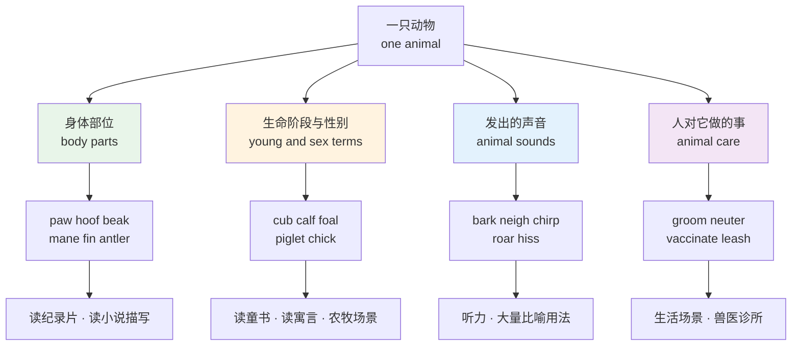
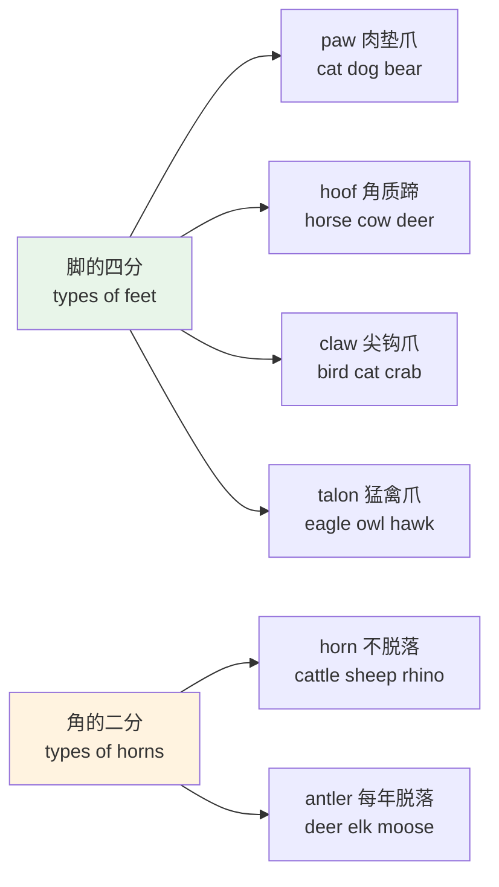
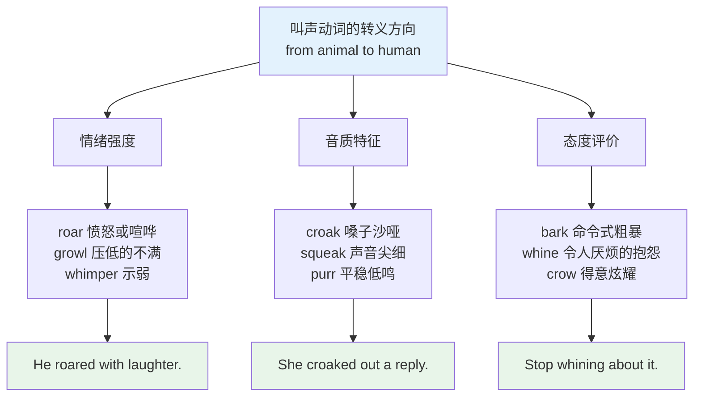
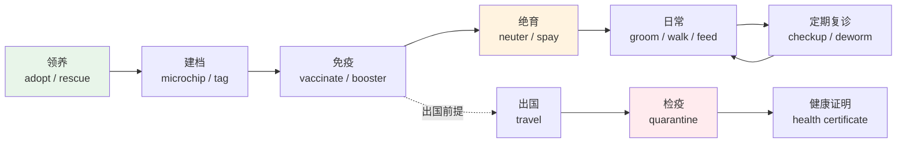
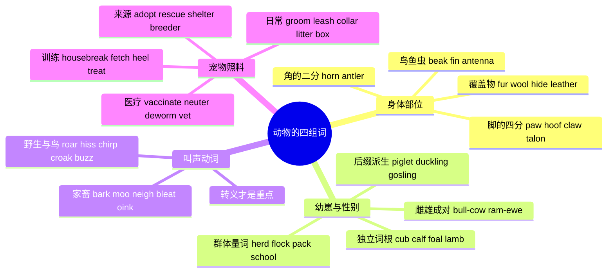

# 动物身体、幼崽专名、叫声与宠物照料

> [!info] 本篇定位
>
> 上一篇 `10/01.动物词表` 解决的是「这是什么动物」，本篇解决「这只动物长什么样、它的孩子叫什么、它怎么叫、怎么养它」。
>
> 四组词分别对应四个高频场景：读自然纪录片字幕要靠身体部位词，读童书和寓言要靠幼崽专名，听懂 `The dog was barking` 与 `He barked an order` 的关联要靠叫声动词，带宠物去诊所要靠照料词。
>
> 读完你能做到：不再用 `baby dog` 这种拼装说法，能分清 `horn` 与 `antler`、`paw` 与 `hoof`、`neuter` 与 `spay`，并且知道二十多个叫声动词各自的比喻义。

---

## 1. 本篇导读：为什么动物词要拆成四组

中文描述动物靠的是组合：小狗、小猫、小马、小猪，一个「小」字通吃；狗叫、猫叫、马叫、鸟叫，一个「叫」字通吃；狗爪、猫爪、马蹄、鸟嘴，「爪」和「嘴」的分工也很粗。英语在这三个位置全部使用**互不相干的独立词根**。

这个差异带来的直接后果是：中文母语者能说出五十种动物名，却说不出其中任何一种的幼崽、叫声和爪子。词汇量的分布是畸形的——横向宽，纵向浅。



上图把本篇拆成的四块画了出来，四块之间不是并列关系而是递进关系：身体部位是纯名词，最好记；幼崽与性别词是封闭集合，数量有限但完全不可推导；叫声动词有大量转义用法，是四块里回报最高的；宠物照料词属于生活刚需，出国带宠物或看英文宠物论坛时立刻要用。

有一个贯穿全篇的规律值得先说：**这批词绝大多数属于日耳曼层**——短、单音节、不规则、无法拆解。`paw`、`hoof`、`beak`、`cub`、`calf`、`foal`、`bark`、`hiss` 没有一个能靠词根推出来。第 `01/01` 篇讲过的分层原则在这里生效：日耳曼层只能死记，但好处是它们词形短、复现率高，记住的成本其实不高。

---

## 2. 哺乳动物的身体部位

### 2.1 四肢与末端

英语对「脚」的分类比中文细得多，分类依据是**这只脚长成什么样**，而不是属于哪种动物。

| 英文 | 英式音标 | 美式音标 | 词性 | 中文 | 搭配与说明 |
| --- | --- | --- | --- | --- | --- |
| **paw** | /pɔː/ | /pɑː/ | n./v. | 爪子（带肉垫的） | 猫狗熊狮虎都用 paw；动词义「用爪子刨」 |
| **hoof** | /huːf/ | /hʊf/ | n. | 蹄 | 复数 hooves 或 hoofs；马牛羊猪鹿用 |
| **claw** | /klɔː/ | /klɑː/ | n./v. | 利爪；钳 | 指爪尖本身，不含肉垫；螃蟹的钳也叫 claw |
| **talon** | /ˈtælən/ | /ˈtælən/ | n. | 猛禽利爪 | 只用于鹰隼猫头鹰，比 claw 语气更凶 |
| **pad** | /pæd/ | /pæd/ | n. | 肉垫 | paw pad；兽医语境常说 cracked pads |
| **leg** | /leɡ/ | /leɡ/ | n. | 腿 | 通用词，昆虫的六条腿也是 legs |
| **foreleg** | /ˈfɔːleɡ/ | /ˈfɔːrleɡ/ | n. | 前腿 | 对应 hind leg |
| **hind leg** | /ˌhaɪnd ˈleɡ/ | /ˌhaɪnd ˈleɡ/ | n. | 后腿 | stand on its hind legs 用后腿站立 |
| **hock** | /hɒk/ | /hɑːk/ | n. | 飞节（后腿关节） | 马术与兽医语境高频 |
| **flank** | /flæŋk/ | /flæŋk/ | n. | 胁腹 | 也是肉品部位名，见 `09` 章食材篇 |
| **haunch** | /hɔːntʃ/ | /hɑːntʃ/ | n. | 后臀部 | 常用复数 haunches；sit on its haunches |
| **withers** | /ˈwɪðəz/ | /ˈwɪðərz/ | n. | 马肩隆 | 恒复数，量马的身高从 withers 量起 |
| **trotter** | /ˈtrɒtə/ | /ˈtrɑːtər/ | n. | 猪蹄 | 食材语境说 pig's trotters；也指善走的马 |
| **dewclaw** | /ˈdjuːklɔː/ | /ˈduːklɑː/ | n. | 悬趾 | 狗前腿内侧那个不着地的趾 |

> [!warning] paw 和 hoof 不能互换
>
> 中文一个「爪」字覆盖了英语的三个词，反过来推容易出错。
>
> - ❌ ~~The horse lifted its **paw**.~~
> - ✅ The horse lifted its **hoof**.（马是蹄）
> - ❌ ~~The eagle seized the fish with its **paws**.~~
> - ✅ The eagle seized the fish with its **talons**.（猛禽是利爪）
>
> 判断口诀：软肉垫用 `paw`，硬角质用 `hoof`，尖钩用 `claw`，猛禽专用 `talon`。

### 2.2 头部与口鼻

| 英文 | 英式音标 | 美式音标 | 词性 | 中文 | 搭配与说明 |
| --- | --- | --- | --- | --- | --- |
| **snout** | /snaʊt/ | /snaʊt/ | n. | 口鼻部；拱嘴 | 猪、鳄鱼典型；用于人时是贬义 |
| **muzzle** | /ˈmʌzl/ | /ˈmʌzl/ | n./v. | 口鼻部；口套 | 名词双义，动词义「给…戴口套」 |
| **whisker** | /ˈwɪskə/ | /ˈwɪskər/ | n. | 胡须 | 通常用复数；引申义「毫厘」win by a whisker |
| **fang** | /fæŋ/ | /fæŋ/ | n. | 尖牙；毒牙 | 蛇、狼、吸血鬼；bare its fangs 龇牙 |
| **tusk** | /tʌsk/ | /tʌsk/ | n. | 长牙；獠牙 | 象、海象、野猪；ivory tusks 象牙 |
| **trunk** | /trʌŋk/ | /trʌŋk/ | n. | 象鼻 | 同一个词还表示树干和汽车后备箱 |
| **horn** | /hɔːn/ | /hɔːrn/ | n. | 角（不脱落） | 牛羊犀；lock horns 引申为「争执」 |
| **antler** | /ˈæntlə/ | /ˈæntlər/ | n. | 鹿角（每年脱落） | 通常复数 antlers；分叉的那种 |
| **mane** | /meɪn/ | /meɪn/ | n. | 鬃毛 | 狮、马；也可形容人的一头浓发 |
| **jowl** | /dʒaʊl/ | /dʒaʊl/ | n. | 垂颊肉 | 斗牛犬典型特征；常用复数 |
| **scruff** | /skrʌf/ | /skrʌf/ | n. | 后颈皮 | by the scruff of the neck 拎后颈提起 |
| **crest** | /krest/ | /krest/ | n. | 冠羽；冠 | 鸟与蜥蜴都可用 |

> [!warning] horn 与 antler 是两种东西
>
> 英语按**是否每年脱落**区分这两个词，中文都叫「角」。
>
> - **horn**：角质外壳包骨芯，终生不脱落，一般不分叉。牛、羊、犀牛、羚羊。
> - **antler**：纯骨质，每年脱落重长，分叉呈树枝状。鹿科动物专有。
>
> 记忆锚点：`antler` 里的 `-tl-` 想成树枝的分叉，`horn` 是一根到底。写「鹿角」时用 `horn` 是硬伤，写「牛角」时用 `antler` 同样是硬伤。

### 2.3 躯干与其余部位

| 英文 | 英式音标 | 美式音标 | 词性 | 中文 | 搭配与说明 |
| --- | --- | --- | --- | --- | --- |
| **tail** | /teɪl/ | /teɪl/ | n. | 尾巴 | 与 tale（故事）同音，拼写易混 |
| **hump** | /hʌmp/ | /hʌmp/ | n. | 驼峰；隆起 | 骆驼；one-humped / two-humped camel |
| **udder** | /ˈʌdə/ | /ˈʌdər/ | n. | 乳房（牲畜） | 牛羊专用，不能用于人 |
| **pouch** | /paʊtʃ/ | /paʊtʃ/ | n. | 育儿袋 | 袋鼠、考拉；也指仓鼠的颊囊 |
| **belly** | /ˈbeli/ | /ˈbeli/ | n. | 腹部 | 口语词；书面用 abdomen |
| **spine** | /spaɪn/ | /spaɪn/ | n. | 脊柱；棘刺 | 双义：脊椎，或刺猬身上的硬刺 |
| **rump** | /rʌmp/ | /rʌmp/ | n. | 臀部 | 也是牛肉部位名 rump steak |
| **hide** | /haɪd/ | /haɪd/ | n. | 兽皮（生皮） | 与动词 hide 同形；制革前的原料 |
| **paw print** | /ˈpɔː prɪnt/ | /ˈpɑː prɪnt/ | n. | 爪印 | 也说 pawprint；鸟兽脚印统称 track |
| **hoofprint** | /ˈhuːfprɪnt/ | /ˈhʊfprɪnt/ | n. | 蹄印 | 复合词，构词法见第 `15` 章 |



上图把本节最容易混的两组关系固定下来。左边四个词的区分靠形态而非物种：猫既有 `paw`（整只脚）也有 `claw`（可伸缩的尖爪），两个词描述的是同一只脚的不同层次，不冲突。右边两个词的区分靠生长方式，一旦记住「鹿角掉、牛角不掉」，就再也不会用错。

---

## 3. 鸟类、鱼类与昆虫的身体部位

### 3.1 鸟类

| 英文 | 英式音标 | 美式音标 | 词性 | 中文 | 搭配与说明 |
| --- | --- | --- | --- | --- | --- |
| **beak** | /biːk/ | /biːk/ | n. | 喙；鸟嘴 | 通用词，尤指硬而尖的喙 |
| **bill** | /bɪl/ | /bɪl/ | n. | 喙（扁平的） | 鸭嘴、鹅嘴用 bill；与「账单」同形 |
| **feather** | /ˈfeðə/ | /ˈfeðər/ | n. | 羽毛（单根） | 可数；birds of a feather 物以类聚 |
| **plumage** | /ˈpluːmɪdʒ/ | /ˈpluːmɪdʒ/ | n. | 羽衣；全身羽毛 | 不可数集合名词，观鸟与文学常用 |
| **down** | /daʊn/ | /daʊn/ | n. | 绒羽 | 不可数；down jacket 羽绒服 |
| **wing** | /wɪŋ/ | /wɪŋ/ | n. | 翅膀 | take sb under one's wing 庇护某人 |
| **wingspan** | /ˈwɪŋspæn/ | /ˈwɪŋspæn/ | n. | 翼展 | 纪录片高频；a wingspan of two metres |
| **comb** | /kəʊm/ | /koʊm/ | n. | 鸡冠 | b 不发音；与梳子同形同音 |
| **wattle** | /ˈwɒtl/ | /ˈwɑːtl/ | n. | 肉垂 | 鸡、火鸡下巴那块红肉 |
| **crop** | /krɒp/ | /krɑːp/ | n. | 嗉囊 | 同形词还有「作物」「裁剪」 |
| **gizzard** | /ˈɡɪzəd/ | /ˈɡɪzərd/ | n. | 砂囊；胗 | 食材语境写 chicken gizzards |
| **webbed foot** | /ˌwebd ˈfʊt/ | /ˌwebd ˈfʊt/ | n. | 蹼足 | 形容词 webbed 来自 web（蹼、网） |
| **perch** | /pɜːtʃ/ | /pɜːrtʃ/ | n./v. | 栖木；栖息 | 鸟笼配件，也是常用动词 |
| **nest** | /nest/ | /nest/ | n./v. | 巢；筑巢 | leave the nest 引申为孩子独立 |

### 3.2 鱼类与水生动物

| 英文 | 英式音标 | 美式音标 | 词性 | 中文 | 搭配与说明 |
| --- | --- | --- | --- | --- | --- |
| **fin** | /fɪn/ | /fɪn/ | n. | 鳍 | dorsal fin 背鳍；tail fin 尾鳍 |
| **dorsal** | /ˈdɔːsl/ | /ˈdɔːrsl/ | adj. | 背部的 | 拉丁词根 dors「背」，见第 `15` 章 |
| **gill** | /ɡɪl/ | /ɡɪl/ | n. | 鳃 | 通常用复数 gills |
| **scale** | /skeɪl/ | /skeɪl/ | n./v. | 鳞；刮鳞 | 与「秤」「规模」同形，靠语境区分 |
| **flipper** | /ˈflɪpə/ | /ˈflɪpər/ | n. | 鳍状肢 | 海豚、海豹、海龟；也指人的脚蹼 |
| **blowhole** | /ˈbləʊhəʊl/ | /ˈbloʊhoʊl/ | n. | 喷水孔 | 鲸豚头顶的呼吸孔 |
| **tentacle** | /ˈtentəkl/ | /ˈtentəkl/ | n. | 触手 | 章鱼、水母；引申义「触角、势力」 |
| **shell** | /ʃel/ | /ʃel/ | n. | 壳 | 贝壳、蛋壳、龟壳通用 |
| **carapace** | /ˈkærəpeɪs/ | /ˈkærəpeɪs/ | n. | 背甲 | 龟、蟹的硬背壳，学术色彩较重 |
| **pincer** | /ˈpɪnsə/ | /ˈpɪnsər/ | n. | 螯；钳 | 常用复数；蟹钳也可直接说 claws |
| **roe** | /rəʊ/ | /roʊ/ | n. | 鱼卵；鱼子 | 不可数；与 row 同音 |
| **swim bladder** | /ˈswɪm blædə/ | /ˈswɪm blædər/ | n. | 鱼鳔 | 也说 air bladder |

### 3.3 昆虫与节肢动物

| 英文 | 英式音标 | 美式音标 | 词性 | 中文 | 搭配与说明 |
| --- | --- | --- | --- | --- | --- |
| **antenna** | /ænˈtenə/ | /ænˈtenə/ | n. | 触角 | 生物义复数 antennae /ænˈteniː/ |
| **thorax** | /ˈθɔːræks/ | /ˈθɔːræks/ | n. | 胸部 | 昆虫三段身体的中段 |
| **abdomen** | /ˈæbdəmən/ | /ˈæbdəmən/ | n. | 腹部 | 昆虫的尾段；人体解剖也用这个词 |
| **mandible** | /ˈmændɪbl/ | /ˈmændɪbl/ | n. | 大颚 | 蚂蚁、甲虫的咀嚼口器 |
| **stinger** | /ˈstɪŋə/ | /ˈstɪŋər/ | n. | 螫针 | 英式也说 sting；蜂尾那根针 |
| **proboscis** | /prəˈbɒsɪs/ | /prəˈbɑːsɪs/ | n. | 长喙；吸管口器 | 蝴蝶、蚊子；也可指象鼻 |
| **exoskeleton** | /ˌeksəʊˈskelɪtn/ | /ˌeksoʊˈskelətn/ | n. | 外骨骼 | exo-「外」+ skeleton，词缀见第 `14` 章 |
| **cocoon** | /kəˈkuːn/ | /kəˈkuːn/ | n./v. | 茧；把…裹起来 | 蛾类结的丝茧 |
| **chrysalis** | /ˈkrɪsəlɪs/ | /ˈkrɪsəlɪs/ | n. | 蛹 | 蝶类的蛹壳，与 cocoon 不同 |
| **wing case** | /ˈwɪŋ keɪs/ | /ˈwɪŋ keɪs/ | n. | 鞘翅 | 甲虫背上那对硬壳 |
| **web** | /web/ | /web/ | n. | 蛛网；蹼 | spin a web 织网 |
| **segment** | /ˈseɡmənt/ | /ˈseɡmənt/ | n. | 体节 | 蜈蚣、蚯蚓的分节 |

> [!tip] beak 与 bill 的实际用法
>
> 两个词都指鸟嘴，日常互换的余地很大，但有偏好。
>
> `beak` 偏向尖硬的喙——鹰、乌鸦、啄木鸟；也是比喻人「大鼻子」的俚语。`bill` 偏向扁平的喙——鸭、鹅、鹈鹕；`duck-billed platypus`（鸭嘴兽）里只能用 bill。
>
> 拿不准时用 `beak`，它的覆盖面更宽。

---

## 4. 体表覆盖物：fur、hair、wool、hide 的四分

这一组是中文母语者的重灾区，因为中文的「毛」和「皮」各自对应英语三到四个词。

| 英文 | 英式音标 | 美式音标 | 词性 | 中文 | 搭配与说明 |
| --- | --- | --- | --- | --- | --- |
| **fur** | /fɜː/ | /fɜːr/ | n. | 毛皮；软毛 | 不可数；活体身上的软密毛 |
| **hair** | /heə/ | /her/ | n. | 毛发 | 集合义不可数，单根可数 a hair |
| **coat** | /kəʊt/ | /koʊt/ | n. | 毛色；被毛 | a glossy coat 一身油亮的毛 |
| **wool** | /wʊl/ | /wʊl/ | n. | 羊毛 | 不可数；剪下来的才叫 wool |
| **fleece** | /fliːs/ | /fliːs/ | n./v. | 整张羊毛；剪羊毛 | 一只羊剪下的整张毛叫 a fleece |
| **hide** | /haɪd/ | /haɪd/ | n. | 生皮 | 大型兽的厚皮，制革原料 |
| **pelt** | /pelt/ | /pelt/ | n. | 带毛兽皮 | 皮草贸易用词，含毛的整张皮 |
| **leather** | /ˈleðə/ | /ˈleðər/ | n. | 皮革 | 鞣制后的成品；genuine leather 真皮 |
| **bristle** | /ˈbrɪsl/ | /ˈbrɪsl/ | n./v. | 硬鬃毛；毛发竖起 | 猪鬃；动词义「（因怒）竖毛」 |
| **quill** | /kwɪl/ | /kwɪl/ | n. | 棘刺；羽管 | 豪猪的刺；也指旧时的羽毛笔 |
| **spine** | /spaɪn/ | /spaɪn/ | n. | 棘刺 | 刺猬、海胆的硬刺 |
| **feather** | /ˈfeðə/ | /ˈfeðər/ | n. | 羽毛 | 与 fur 并列的鸟类覆盖物 |
| **scale** | /skeɪl/ | /skeɪl/ | n. | 鳞片 | 鱼类与爬行类的覆盖物 |
| **shed** | /ʃed/ | /ʃed/ | v. | 掉毛；蜕皮 | 三态同形 shed-shed-shed |
| **molt** | /məʊlt/ | /moʊlt/ | v. | 换毛；换羽 | 英式拼作 moult，读音相同 |
| **groom** | /ɡruːm/ | /ɡruːm/ | v. | 梳理毛发 | 动物自我理毛，也指人给宠物打理 |

> [!warning] 这四个词的边界
>
> - **fur** 只能用于动物，而且是活体身上或整张毛皮制品。说人的头发是 `fur` 会很怪。
> - **hair** 人和动物都能用，但用于动物时偏向「单根」或「毛质」：`The cat left hairs on the sofa`（掉了几根猫毛）；`The cat has soft fur`（整体毛质柔软）。
> - **wool** 专指羊身上剪下来的毛，活羊身上的通常也说 wool 或 fleece，但不说 fur。
> - **hide / pelt / leather** 是同一条产业链的三个阶段：`hide` 是刚剥下的生皮，`pelt` 是保留毛的整张皮，`leather` 是鞣制完成的成品。
>
> - ❌ ~~a coat made of cow **fur**~~
> - ✅ a coat made of cow **hide** / a **leather** coat

> [!example] 四个词在句子里的分工
>
> - The rabbit's **fur** is white in winter.
>   - 兔子的毛冬天是白的。
> - I found a cat **hair** in my coffee.
>   - 我在咖啡里发现了一根猫毛。
> - The farmer shears the sheep's **wool** every spring.
>   - 农夫每年春天剪羊毛。
> - The tent was made of animal **hides**.
>   - 帐篷是兽皮做的。

---

## 5. 幼崽专名：为什么英语不说 baby dog

### 5.1 常见家畜与宠物的幼崽

英语给经济价值高、和人接触多的动物配了独立的幼崽词。规律很直白：**越早被驯化、越常打交道的动物，专名越可能存在**。

| 英文 | 英式音标 | 美式音标 | 词性 | 中文 | 搭配与说明 |
| --- | --- | --- | --- | --- | --- |
| **puppy** | /ˈpʌpi/ | /ˈpʌpi/ | n. | 小狗 | 简写 pup；puppy love 少年恋情 |
| **kitten** | /ˈkɪtn/ | /ˈkɪtn/ | n. | 小猫 | 简写 kitty；have kittens 英式俚语「急坏了」 |
| **calf** | /kɑːf/ | /kæf/ | n. | 小牛 | 复数 calves；鲸、象、长颈鹿的幼崽也叫 calf |
| **foal** | /fəʊl/ | /foʊl/ | n./v. | 马驹；产驹 | 不分性别的通称 |
| **colt** | /kəʊlt/ | /koʊlt/ | n. | 小公马 | 未阉割的四岁以下公马 |
| **filly** | /ˈfɪli/ | /ˈfɪli/ | n. | 小母马 | 与 colt 配对 |
| **piglet** | /ˈpɪɡlət/ | /ˈpɪɡlət/ | n. | 小猪 | 后缀 -let 表小称，见第 `14` 章 |
| **lamb** | /læm/ | /læm/ | n. | 羔羊 | b 不发音；也指羔羊肉 |
| **kid** | /kɪd/ | /kɪd/ | n. | 小山羊 | 「小孩」义正是从小山羊引申来的 |
| **chick** | /tʃɪk/ | /tʃɪk/ | n. | 雏鸟；小鸡 | 泛指所有雏鸟，不限于鸡 |
| **duckling** | /ˈdʌklɪŋ/ | /ˈdʌklɪŋ/ | n. | 小鸭 | 后缀 -ling 表幼小 |
| **gosling** | /ˈɡɒzlɪŋ/ | /ˈɡɑːzlɪŋ/ | n. | 小鹅 | 同一后缀，注意词干是 gos- 不是 goos- |
| **cygnet** | /ˈsɪɡnət/ | /ˈsɪɡnət/ | n. | 小天鹅 | 来自拉丁 cygnus；g 读 /ɡ/，不是哑音 |
| **bunny** | /ˈbʌni/ | /ˈbʌni/ | n. | 小兔 | 儿语词；正式的幼兔叫 kit 或 kitten |

### 5.2 野生动物的幼崽

| 英文 | 英式音标 | 美式音标 | 词性 | 中文 | 搭配与说明 |
| --- | --- | --- | --- | --- | --- |
| **cub** | /kʌb/ | /kʌb/ | n. | 幼兽 | 熊、狮、虎、狼、狐通用 |
| **fawn** | /fɔːn/ | /fɑːn/ | n./adj. | 幼鹿；浅黄褐色 | 同时是一个颜色词，见 `10/04` |
| **joey** | /ˈdʒəʊi/ | /ˈdʒoʊi/ | n. | 幼袋鼠 | 澳洲英语，也用于考拉幼崽 |
| **pup** | /pʌp/ | /pʌp/ | n. | 幼崽 | 海豹、水獭、鲨鱼的幼崽都叫 pup |
| **kit** | /kɪt/ | /kɪt/ | n. | 幼崽（小型兽） | 狐、貂、兔的幼崽 |
| **whelp** | /welp/ | /welp/ | n. | 幼犬；幼兽 | 古旧文学词，现代口语基本不用 |
| **hatchling** | /ˈhætʃlɪŋ/ | /ˈhætʃlɪŋ/ | n. | 刚孵化的幼体 | 龟、鳄、鸟通用 |
| **fledgling** | /ˈfledʒlɪŋ/ | /ˈfledʒlɪŋ/ | n./adj. | 刚长羽的雏鸟；新手的 | a fledgling company 初创公司 |
| **owlet** | /ˈaʊlət/ | /ˈaʊlət/ | n. | 小猫头鹰 | 后缀 -et 表小称 |
| **eaglet** | /ˈiːɡlət/ | /ˈiːɡlət/ | n. | 小鹰 | 同一后缀 |
| **tadpole** | /ˈtædpəʊl/ | /ˈtædpoʊl/ | n. | 蝌蚪 | 字面「蟾蜍脑袋」，中古英语合成词 |
| **larva** | /ˈlɑːvə/ | /ˈlɑːrvə/ | n. | 幼虫 | 拉丁复数 larvae /ˈlɑːviː/ |
| **pupa** | /ˈpjuːpə/ | /ˈpjuːpə/ | n. | 蛹 | 复数 pupae；与 chrysalis 近义 |
| **caterpillar** | /ˈkætəpɪlə/ | /ˈkætərpɪlər/ | n. | 毛毛虫 | 蝶蛾的幼虫阶段专名 |
| **fry** | /fraɪ/ | /fraɪ/ | n. | 鱼苗 | 恒复数；与「油炸」同形 |
| **nymph** | /nɪmf/ | /nɪmf/ | n. | 若虫 | 蜻蜓、蝗虫这类不完全变态昆虫的幼体 |

### 5.3 后缀规律：-let、-ling、-et

三个表「小」的后缀在幼崽词里反复出现，认出它们能省一半记忆量。

| 英文 | 英式音标 | 美式音标 | 词性 | 中文 | 搭配与说明 |
| --- | --- | --- | --- | --- | --- |
| **piglet** | /ˈpɪɡlət/ | /ˈpɪɡlət/ | n. | 小猪 | -let 表小称，词干就是 pig |
| **booklet** | /ˈbʊklət/ | /ˈbʊklət/ | n. | 小册子 | 同一后缀用在非动物名词上 |
| **starlet** | /ˈstɑːlət/ | /ˈstɑːrlət/ | n. | 小明星 | -let 也能带贬抑或轻慢色彩 |
| **duckling** | /ˈdʌklɪŋ/ | /ˈdʌklɪŋ/ | n. | 小鸭 | -ling 表幼小 |
| **nestling** | /ˈnestlɪŋ/ | /ˈnestlɪŋ/ | n. | 巢中雏鸟 | 还不会飞，比 fledgling 更早一步 |
| **yearling** | /ˈjɪəlɪŋ/ | /ˈjɪrlɪŋ/ | n. | 一岁的幼畜 | 赛马拍卖会的高频词 |
| **owlet** | /ˈaʊlət/ | /ˈaʊlət/ | n. | 小猫头鹰 | -et 表小称 |
| **eaglet** | /ˈiːɡlət/ | /ˈiːɡlət/ | n. | 小鹰 | 同一后缀 |
| **islet** | /ˈaɪlət/ | /ˈaɪlət/ | n. | 小岛 | 同一后缀的非动物例；s 不发音 |

三个后缀的能产性不同。`-ling` 最活跃，除了幼崽词还派生出 `underling`（下属）、`weakling`（弱者）这类带轻蔑色彩的人称词；`-let` 次之，`droplet`（小滴）、`leaflet`（传单）、`ringlet`（鬈发）都在用；`-et` 在现代英语里基本停产，`owlet`、`eaglet` 属于遗留形式，不能拿它去造新词。后缀本身的系统讲解在第 `14` 章。

> [!warning] 有专名的必须用专名
>
> 英语允许 `a baby elephant` 这种说法，但只在**没有专名**或**面向儿童**时才自然。已经存在专名的动物，用 `baby + 动物名` 会立刻暴露非母语痕迹。
>
> - ❌ ~~a baby dog~~ / ~~a baby cat~~ / ~~a baby cow~~ / ~~a baby horse~~
> - ✅ a **puppy** / a **kitten** / a **calf** / a **foal**
>
> 反过来，`a baby panda`、`a baby giraffe` 完全成立——熊猫幼崽虽然可以叫 cub，长颈鹿幼崽虽然可以叫 calf，但这两个说法在日常英语里也很常见，不算错。

这批词的记忆成本分三档。`cub`、`calf`、`foal`、`lamb`、`chick`、`kid` 这些独立词根无法拆解，只能逐个死记，总数约十五个。`piglet`、`duckling`、`gosling`、`owlet`、`eaglet` 这一批靠上面三个后缀现场推导，几乎零成本。第三档是「一词多用」的词，需要单独记清楚覆盖范围：`pup` 除了幼犬还用于海豹、水獭、鲨鱼；`calf` 除了小牛还用于鲸、象、长颈鹿。海豹幼崽说成 cub、鲸鱼幼崽说成 fry，是这一档最常见的错误。

---

## 6. 雌雄专名与群体量词

### 6.1 雌雄专名

英语给主要家畜配了成对的性别词，这套词在农牧语境、赛马报道和圣经文学里高频出现。

| 英文 | 英式音标 | 美式音标 | 词性 | 中文 | 搭配与说明 |
| --- | --- | --- | --- | --- | --- |
| **bull** | /bʊl/ | /bʊl/ | n. | 公牛（未阉） | 股市「多头」也用这个词 |
| **cow** | /kaʊ/ | /kaʊ/ | n. | 母牛 | 也是牛的泛称；大象、鲸的雌性也叫 cow |
| **ox** | /ɒks/ | /ɑːks/ | n. | 阉公牛；役牛 | 复数 oxen，古英语复数残留 |
| **steer** | /stɪə/ | /stɪr/ | n. | 阉公牛（肉用） | 与动词 steer「驾驶」同形 |
| **heifer** | /ˈhefə/ | /ˈhefər/ | n. | 小母牛 | 未产过犊的年轻母牛 |
| **stallion** | /ˈstæliən/ | /ˈstæliən/ | n. | 种公马 | 赛马与育种语境 |
| **mare** | /meə/ | /mer/ | n. | 母马 | nightmare 的 mare 与此无关 |
| **gelding** | /ˈɡeldɪŋ/ | /ˈɡeldɪŋ/ | n. | 骟马 | 阉割过的公马 |
| **rooster** | /ˈruːstə/ | /ˈruːstər/ | n. | 公鸡 | 美式常用词 |
| **cock** | /kɒk/ | /kɑːk/ | n. | 公鸡 | 英式传统词；美式有粗俗歧义，慎用 |
| **hen** | /hen/ | /hen/ | n. | 母鸡 | 也泛指雌禽 |
| **ram** | /ræm/ | /ræm/ | n./v. | 公羊；猛撞 | 动词义「撞击」很常用 |
| **ewe** | /juː/ | /juː/ | n. | 母羊 | 拼写与读音差距极大，只有一个音节 |
| **boar** | /bɔː/ | /bɔːr/ | n. | 公猪；野猪 | wild boar 野猪 |
| **sow** | /saʊ/ | /saʊ/ | n. | 母猪 | 与「播种」的 sow /səʊ/ 同形不同音 |
| **drake** | /dreɪk/ | /dreɪk/ | n. | 公鸭 | 母鸭直接用 duck |
| **gander** | /ˈɡændə/ | /ˈɡændər/ | n. | 公鹅 | 母鹅用 goose |
| **buck** | /bʌk/ | /bʌk/ | n. | 公鹿；公兔 | 也是「美元」的俚语 |
| **doe** | /dəʊ/ | /doʊ/ | n. | 母鹿；母兔 | 与 dough（面团）同音 |
| **stag** | /stæɡ/ | /stæɡ/ | n. | 成年雄鹿 | stag party 男性单身派对 |
| **tomcat** | /ˈtɒmkæt/ | /ˈtɑːmkæt/ | n. | 公猫 | 简称 tom；母猫在育种语境叫 queen |
| **drone** | /drəʊn/ | /droʊn/ | n. | 雄蜂 | 「无人机」义就是从雄蜂引申的 |
| **bitch** | /bɪtʃ/ | /bɪtʃ/ | n. | 母狗 | 犬业与兽医的中性术语；用于人是严重冒犯语 |
| **queen** | /kwiːn/ | /kwiːn/ | n. | 母猫；蜂王蚁后 | 育种语境的母猫，也指 queen bee |
| **lioness** | /ˈlaɪənes/ | /ˈlaɪənes/ | n. | 母狮 | 后缀 -ess 构成的雌性词 |
| **tigress** | /ˈtaɪɡrəs/ | /ˈtaɪɡrəs/ | n. | 母虎 | 同一后缀；形容护子心切的女性 |
| **vixen** | /ˈvɪksn/ | /ˈvɪksn/ | n. | 母狐 | 古英语 fyxen；用于人指泼辣女性 |
| **jack** | /dʒæk/ | /dʒæk/ | n. | 公驴 | 母驴叫 jenny；骡是 jack 与母马所生 |
| **peacock** | /ˈpiːkɒk/ | /ˈpiːkɑːk/ | n. | 雄孔雀 | 开屏的只有雄鸟；proud as a peacock |
| **peahen** | /ˈpiːhen/ | /ˈpiːhen/ | n. | 雌孔雀 | 全体统称 peafowl |

> [!warning] cow 的两个层次
>
> `cow` 既是「母牛」也是「牛」的日常泛称。农场语境里它严格指母牛，日常语境里指着一群牛说 `Look at the cows` 完全正常，哪怕里面有公牛。
>
> 需要严格泛指「牛」这个物种时，正式写法是 `cattle`（恒复数，不能说 a cattle）或 `head of cattle`（计数单位）。
>
> - ❌ ~~three cattles~~
> - ✅ three **head of cattle** / three **cows**

### 6.2 群体量词

英语给动物群体配了大量专用集合名词，一部分是实用词，一部分是十五世纪狩猎手册留下的趣味说法。

| 英文 | 英式音标 | 美式音标 | 词性 | 中文 | 搭配与说明 |
| --- | --- | --- | --- | --- | --- |
| **herd** | /hɜːd/ | /hɜːrd/ | n. | 兽群 | 牛马象等大型草食动物；a herd of cattle |
| **flock** | /flɒk/ | /flɑːk/ | n. | 群 | 羊群与鸟群；a flock of sheep / birds |
| **pack** | /pæk/ | /pæk/ | n. | 群 | 狼、猎犬；a pack of wolves |
| **pride** | /praɪd/ | /praɪd/ | n. | 狮群 | a pride of lions；与「骄傲」同形 |
| **school** | /skuːl/ | /skuːl/ | n. | 鱼群 | a school of fish；与「学校」同形 |
| **shoal** | /ʃəʊl/ | /ʃoʊl/ | n. | 鱼群；浅滩 | 与 school 近义，英式更常见 |
| **swarm** | /swɔːm/ | /swɔːrm/ | n./v. | 蜂群；蜂拥 | a swarm of bees；动词义很高频 |
| **colony** | /ˈkɒləni/ | /ˈkɑːləni/ | n. | 群落 | 蚂蚁、企鹅、蝙蝠；也指殖民地 |
| **pod** | /pɒd/ | /pɑːd/ | n. | 鲸豚群 | a pod of dolphins；也指豆荚 |
| **litter** | /ˈlɪtə/ | /ˈlɪtər/ | n. | 一窝幼崽 | a litter of puppies；也指垃圾、猫砂 |
| **brood** | /bruːd/ | /bruːd/ | n./v. | 一窝雏鸟；孵 | 动词还有「郁郁沉思」义 |
| **gaggle** | /ˈɡæɡl/ | /ˈɡæɡl/ | n. | 鹅群（地面） | 飞行中的鹅群叫 skein |
| **hive** | /haɪv/ | /haɪv/ | n. | 蜂巢；蜂群 | a hive of activity 忙碌之地 |
| **troop** | /truːp/ | /truːp/ | n. | 猴群 | a troop of monkeys；军事义是「部队」 |
| **nest** | /nest/ | /nest/ | n. | 巢；一窝 | a nest of ants；引申「窝点」 |
| **plague** | /pleɪɡ/ | /pleɪɡ/ | n. | （虫、鼠）成灾的一大群 | a plague of locusts 蝗灾；gue 只读 /ɡ/ |
| **head** | /hed/ | /hed/ | n. | 头（计数单位） | fifty head of cattle，head 不加 s |
| **cattle** | /ˈkætl/ | /ˈkætl/ | n. | 牛（总称） | 恒复数，谓语用复数 |
| **poultry** | /ˈpəʊltri/ | /ˈpoʊltri/ | n. | 家禽（总称） | 不可数；对应食材语境的禽肉 |
| **livestock** | /ˈlaɪvstɒk/ | /ˈlaɪvstɑːk/ | n. | 牲畜（总称） | 不可数，谓语用复数 |

> [!tip] 群体量词记哪些
>
> 实用度分三档。第一档必须掌握：`herd`、`flock`、`pack`、`school`、`swarm`、`litter`，这六个在新闻和纪录片里天天出现。第二档认得即可：`pride`、`pod`、`colony`、`brood`、`hive`。第三档纯属趣味，不必主动记：`a murder of crows`（乌鸦群）、`a parliament of owls`（猫头鹰群），母语者自己也很少用。
>
> 拿不准时的兜底说法是 `a group of` 加复数名词，任何场合都不算错。

---

## 7. 叫声动词：动物叫与人说话共用的一套词

### 7.1 家畜与宠物的叫声

叫声动词是本篇回报最高的一组。原因不在动物本身，而在于**这些词几乎全部有描述人的引申义**，而且引申义的使用频率远高于本义。

| 英文 | 英式音标 | 美式音标 | 词性 | 中文 | 搭配与说明 |
| --- | --- | --- | --- | --- | --- |
| **bark** | /bɑːk/ | /bɑːrk/ | v./n. | （狗）吠 | 引申「厉声喝令」bark an order |
| **woof** | /wʊf/ | /wʊf/ | n./int. | 汪 | 拟声词，写在童书里的狗叫声 |
| **growl** | /ɡraʊl/ | /ɡraʊl/ | v./n. | 低吼 | 人怒时低声说话也用 growl |
| **snarl** | /snɑːl/ | /snɑːrl/ | v./n. | 龇牙咆哮 | 比 growl 更凶，带露齿动作 |
| **howl** | /haʊl/ | /haʊl/ | v./n. | 嚎叫 | 狼与风都可用；howl with laughter 狂笑 |
| **whine** | /waɪn/ | /waɪn/ | v./n. | 呜咽；抱怨 | 引申义「哼哼唧唧地抱怨」极常用 |
| **whimper** | /ˈwɪmpə/ | /ˈwɪmpər/ | v./n. | 低声呜咽 | 比 whine 更弱更可怜 |
| **yelp** | /jelp/ | /jelp/ | v./n. | 尖叫一声 | 突然疼痛时的短促叫声 |
| **meow** | /miˈaʊ/ | /miˈaʊ/ | v./n. | 喵 | 英式也拼作 miaow，读音相同 |
| **purr** | /pɜː/ | /pɜːr/ | v./n. | 呼噜 | 引申「（发动机）平稳运转」 |
| **hiss** | /hɪs/ | /hɪs/ | v./n. | 发嘶嘶声 | 猫、蛇、蒸汽；人低声怒斥也用 |
| **moo** | /muː/ | /muː/ | v./n. | 哞 | 牛叫，儿语与拟声通用 |
| **low** | /ləʊ/ | /loʊ/ | v. | （牛）哞叫 | 文学词，日常用 moo |
| **neigh** | /neɪ/ | /neɪ/ | v./n. | 嘶鸣 | 马叫的标准词；gh 不发音 |
| **whinny** | /ˈwɪni/ | /ˈwɪni/ | v./n. | 轻声嘶鸣 | 比 neigh 柔和 |
| **bleat** | /bliːt/ | /bliːt/ | v./n. | 咩叫 | 羊；引申「唠叨抱怨」 |
| **baa** | /bɑː/ | /bɑː/ | v./n. | 咩 | 纯拟声，童谣用 |
| **oink** | /ɔɪŋk/ | /ɔɪŋk/ | v./n. | 哼哼 | 猪叫的拟声词 |
| **grunt** | /ɡrʌnt/ | /ɡrʌnt/ | v./n. | 哼；咕哝 | 猪叫；人不耐烦地应一声也用 |
| **squeal** | /skwiːl/ | /skwiːl/ | v./n. | 尖叫 | 猪、刹车、兴奋的孩子 |
| **bray** | /breɪ/ | /breɪ/ | v./n. | （驴）叫 | 引申「刺耳大笑」 |

### 7.2 鸟类与野生动物的叫声

| 英文 | 英式音标 | 美式音标 | 词性 | 中文 | 搭配与说明 |
| --- | --- | --- | --- | --- | --- |
| **chirp** | /tʃɜːp/ | /tʃɜːrp/ | v./n. | 啾啾叫 | 小鸟、蟋蟀；人愉快地说话也用 |
| **tweet** | /twiːt/ | /twiːt/ | v./n. | 啁啾 | 社交媒体义就是从这里来的 |
| **twitter** | /ˈtwɪtə/ | /ˈtwɪtər/ | v./n. | 叽叽喳喳 | 群鸟连续叫；也形容人碎嘴 |
| **cluck** | /klʌk/ | /klʌk/ | v./n. | 咯咯叫 | 母鸡；cluck one's tongue 咂舌 |
| **cackle** | /ˈkækl/ | /ˈkækl/ | v./n. | 咯咯大笑 | 母鸡下蛋后的叫；也指刺耳笑声 |
| **crow** | /krəʊ/ | /kroʊ/ | v./n. | 打鸣；炫耀 | 与名词 crow（乌鸦）同形 |
| **quack** | /kwæk/ | /kwæk/ | v./n. | 嘎嘎叫 | 鸭；名词还有「江湖医生」义 |
| **honk** | /hɒŋk/ | /hɑːŋk/ | v./n. | （鹅）叫；按喇叭 | 汽车鸣笛是同一个词 |
| **hoot** | /huːt/ | /huːt/ | v./n. | （猫头鹰）叫 | 也指汽笛与嘲笑 |
| **caw** | /kɔː/ | /kɑː/ | v./n. | （乌鸦）呱呱叫 | 拟声词 |
| **coo** | /kuː/ | /kuː/ | v./n. | 咕咕叫 | 鸽子；人温柔低语也用 coo |
| **squawk** | /skwɔːk/ | /skwɑːk/ | v./n. | 刺耳尖叫 | 鹦鹉、海鸥；引申「大声抗议」 |
| **screech** | /skriːtʃ/ | /skriːtʃ/ | v./n. | 尖利刺叫 | 猫头鹰、刹车；比 squawk 更尖 |
| **warble** | /ˈwɔːbl/ | /ˈwɔːrbl/ | v./n. | 婉转啼唱 | 鸣禽的悦耳鸣叫 |
| **gobble** | /ˈɡɒbl/ | /ˈɡɑːbl/ | v./n. | （火鸡）咯咯叫 | 也表示「狼吞虎咽」 |
| **roar** | /rɔː/ | /rɔːr/ | v./n. | 吼叫 | 狮虎；引申人群喧哗、引擎轰鸣 |
| **trumpet** | /ˈtrʌmpɪt/ | /ˈtrʌmpɪt/ | v./n. | （象）吼叫 | 也指吹小号、大肆宣扬 |
| **bellow** | /ˈbeləʊ/ | /ˈbeloʊ/ | v./n. | 怒吼 | 公牛与大嗓门的人 |
| **croak** | /krəʊk/ | /kroʊk/ | v./n. | 呱呱叫；沙哑说话 | 青蛙、乌鸦；俚语还有「死掉」义 |
| **ribbit** | /ˈrɪbɪt/ | /ˈrɪbɪt/ | n./int. | 呱 | 美式青蛙叫的拟声词 |
| **buzz** | /bʌz/ | /bʌz/ | v./n. | 嗡嗡 | 蜂、蚊；引申「热议、传闻」 |
| **hum** | /hʌm/ | /hʌm/ | v./n. | 嗡鸣；哼唱 | 比 buzz 低沉连续 |
| **chatter** | /ˈtʃætə/ | /ˈtʃætər/ | v./n. | 唧唧叫；喋喋不休 | 猴子、松鼠；牙齿打颤也用 |
| **squeak** | /skwiːk/ | /skwiːk/ | v./n. | 吱吱叫 | 老鼠、门轴；squeaky clean 一尘不染 |
| **chirrup** | /ˈtʃɪrəp/ | /ˈtʃɪrəp/ | v./n. | 连续啾鸣 | chirp 的重复体 |
| **bay** | /beɪ/ | /beɪ/ | v./n. | （猎犬）长吠 | bay at the moon 对月长嚎 |
| **yip** | /jɪp/ | /jɪp/ | v./n. | 短促尖吠 | 小型犬、狐狸 |
| **mew** | /mjuː/ | /mjuː/ | v./n. | 细声喵叫 | 幼猫；比 meow 更弱 |
| **snort** | /snɔːt/ | /snɔːrt/ | v./n. | 喷鼻息 | 马、牛；人表示不屑也用 |



上图给出的是这批词的真正价值所在。母语者用 `bark`、`whine`、`croak` 描述人的次数，远远超过描述狗、狗和青蛙的次数。学这些词时如果只记「狗叫、呜咽、蛙鸣」，等于只拿到了一半——转义那一半才是阅读小说和听懂对话时真正用得上的。

> [!example] 同一批词用在人身上
>
> - The sergeant **barked** orders at the recruits.
>   - 中士朝新兵厉声下令。
> - Stop **whining** and finish your work.
>   - 别再抱怨了，把活干完。
> - He **growled** something under his breath.
>   - 他低声嘟囔了一句什么。
> - The audience **roared** with laughter.
>   - 观众哄堂大笑。
> - She **croaked** a few words through her sore throat.
>   - 她嗓子疼，沙哑地挤出几个字。
> - The engine **purred** as we pulled away.
>   - 我们开走时引擎低鸣得很平稳。
> - The whole office was **buzzing** with the news.
>   - 整个办公室都在议论这条消息。
> - He **crowed** about his promotion all week.
>   - 他为升职炫耀了一整周。

> [!warning] cry 不是「动物叫」的通用词
>
> 中文的「叫」可以配任何动物，英语的 `cry` 不行。`The dog cried` 母语者会理解成狗在哀鸣（接近 whimper），而不是普通的吠叫。
>
> - ❌ ~~The dog was **crying** at the postman.~~
> - ✅ The dog was **barking** at the postman.
>
> 真的记不起专用词时，兜底说法是 `make a noise` 或 `call`：`The bird was calling` 可以指任何鸟叫，是安全的中性表达。

---

## 8. 动物动作与习性动词

这一组词在纪录片旁白里密度极高，读小说的自然描写段落也会大量遇到。

### 8.1 移动与捕食

| 英文 | 英式音标 | 美式音标 | 词性 | 中文 | 搭配与说明 |
| --- | --- | --- | --- | --- | --- |
| **prowl** | /praʊl/ | /praʊl/ | v./n. | 潜行觅食 | on the prowl 四处搜寻 |
| **stalk** | /stɔːk/ | /stɑːk/ | v. | 潜近；跟踪 | l 不发音；也指跟踪骚扰人 |
| **pounce** | /paʊns/ | /paʊns/ | v./n. | 猛扑 | pounce on 扑向；也指抓住话柄 |
| **lunge** | /lʌndʒ/ | /lʌndʒ/ | v./n. | 猛冲 | 突然向前扑 |
| **gallop** | /ˈɡæləp/ | /ˈɡæləp/ | v./n. | 疾驰 | 马的最快步态 |
| **trot** | /trɒt/ | /trɑːt/ | v./n. | 小跑 | 马的中速步态；人快步走也用 |
| **canter** | /ˈkæntə/ | /ˈkæntər/ | v./n. | 慢跑 | 介于 trot 与 gallop 之间 |
| **scamper** | /ˈskæmpə/ | /ˈskæmpər/ | v. | 蹦跳着跑 | 小动物的轻快跑动 |
| **slither** | /ˈslɪðə/ | /ˈslɪðər/ | v. | 蜿蜒滑行 | 蛇类专用 |
| **soar** | /sɔː/ | /sɔːr/ | v. | 翱翔；飙升 | 不扇翅膀的滑翔；价格上涨也用 |
| **swoop** | /swuːp/ | /swuːp/ | v./n. | 俯冲 | swoop down on 猛扑下来 |
| **flap** | /flæp/ | /flæp/ | v./n. | 拍打翅膀 | flap its wings |
| **flutter** | /ˈflʌtə/ | /ˈflʌtər/ | v./n. | 振翅；扑棱 | 比 flap 更轻快零碎 |
| **burrow** | /ˈbʌrəʊ/ | /ˈbɜːroʊ/ | v./n. | 掘洞；洞穴 | 兔、鼹鼠 |
| **prey** | /preɪ/ | /preɪ/ | v./n. | 捕食；猎物 | prey on 以…为食；与 pray 同音 |
| **scavenge** | /ˈskævɪndʒ/ | /ˈskævɪndʒ/ | v. | 食腐；拾荒 | 秃鹫、鬣狗 |
| **graze** | /ɡreɪz/ | /ɡreɪz/ | v. | 吃草；放牧 | 也指人一整天零散地吃 |
| **gnaw** | /nɔː/ | /nɑː/ | v. | 啃咬 | g 不发音；gnaw at 也指烦扰人 |

### 8.2 繁殖与生活习性

| 英文 | 英式音标 | 美式音标 | 词性 | 中文 | 搭配与说明 |
| --- | --- | --- | --- | --- | --- |
| **breed** | /briːd/ | /briːd/ | v./n. | 繁殖；品种 | 不规则变化 breed-bred-bred |
| **mate** | /meɪt/ | /meɪt/ | v./n. | 交配；配偶 | mating season 交配季 |
| **hatch** | /hætʃ/ | /hætʃ/ | v. | 孵化；孵出 | 蛋孵与阴谋孵化同一个词 |
| **spawn** | /spɔːn/ | /spɑːn/ | v./n. | 产卵；鱼卵 | 编程语境的「派生进程」同源 |
| **lay** | /leɪ/ | /leɪ/ | v. | 下（蛋） | lay eggs；不规则变化 lay-laid-laid |
| **incubate** | /ˈɪŋkjubeɪt/ | /ˈɪŋkjubeɪt/ | v. | 孵卵；培育 | 拉丁词，比 hatch 正式 |
| **suckle** | /ˈsʌkl/ | /ˈsʌkl/ | v. | 哺乳；吸奶 | 母兽哺乳与幼崽吸奶都可用 |
| **wean** | /wiːn/ | /wiːn/ | v. | 断奶 | wean off 引申「让…戒掉」 |
| **hibernate** | /ˈhaɪbəneɪt/ | /ˈhaɪbərneɪt/ | v. | 冬眠 | 拉丁 hibern「冬」 |
| **migrate** | /maɪˈɡreɪt/ | /ˈmaɪɡreɪt/ | v. | 迁徙 | 英美重音位置不同 |
| **roost** | /ruːst/ | /ruːst/ | v./n. | 栖息过夜；栖木 | come home to roost 自食其果 |
| **nuzzle** | /ˈnʌzl/ | /ˈnʌzl/ | v. | 用鼻子蹭 | 表达亲昵的动作 |
| **wag** | /wæɡ/ | /wæɡ/ | v. | 摇（尾巴） | wag its tail |
| **paw** | /pɔː/ | /pɑː/ | v. | 用爪子扒 | paw at the door 挠门 |
| **lick** | /lɪk/ | /lɪk/ | v. | 舔 | lick its wounds 舔舐伤口，也是习语 |
| **scratch** | /skrætʃ/ | /skrætʃ/ | v./n. | 抓挠 | 猫抓沙发用 scratch |
| **shed** | /ʃed/ | /ʃed/ | v. | 掉毛；蜕皮 | 三态同形；蛇蜕皮也用 shed |
| **domesticate** | /dəˈmestɪkeɪt/ | /dəˈmestɪkeɪt/ | v. | 驯化 | 名词 domestication |
| **tame** | /teɪm/ | /teɪm/ | v./adj. | 驯服；温顺的 | 反义 wild；tame a horse |

> [!tip] 三个马术步态词的顺序
>
> `walk` → `trot` → `canter` → `gallop`，速度从慢到快。这四个词在赛马报道、骑马体验和奇幻小说里成套出现，一起记比单个记省事。
>
> 引申用法里 `trot` 最常见：`trot out an excuse`（搬出一个借口）、`He trotted off to the shop`（他快步去了商店）。

---

## 9. 宠物照料：从领养到兽医

### 9.1 来源与身份

| 英文 | 英式音标 | 美式音标 | 词性 | 中文 | 搭配与说明 |
| --- | --- | --- | --- | --- | --- |
| **pet** | /pet/ | /pet/ | n./v. | 宠物；抚摸 | 动词义「轻抚」很常用 |
| **adopt** | /əˈdɒpt/ | /əˈdɑːpt/ | v. | 领养 | 从收容所领养宠物的标准动词 |
| **rescue** | /ˈreskjuː/ | /ˈreskjuː/ | v./n. | 救助；救助动物 | a rescue dog 一只被救助的狗 |
| **shelter** | /ˈʃeltə/ | /ˈʃeltər/ | n. | 收容所 | animal shelter；英式也说 rehoming centre |
| **foster** | /ˈfɒstə/ | /ˈfɑːstər/ | v. | 临时寄养 | foster a cat 帮收容所代养 |
| **surrender** | /səˈrendə/ | /səˈrendər/ | v. | 送交（宠物） | 主人把宠物交给收容所 |
| **breeder** | /ˈbriːdə/ | /ˈbriːdər/ | n. | 繁育者 | a reputable breeder 正规繁育者 |
| **pedigree** | /ˈpedɪɡriː/ | /ˈpedɪɡriː/ | n./adj. | 血统；纯种的 | 美式常用 pedigreed |
| **purebred** | /ˈpjʊəbred/ | /ˈpjʊrbred/ | adj./n. | 纯种的 | 反义 crossbred |
| **mongrel** | /ˈmʌŋɡrəl/ | /ˈmɑːŋɡrəl/ | n. | 杂种狗 | 英式常用，中性偏贬 |
| **mutt** | /mʌt/ | /mʌt/ | n. | 杂种狗 | 美式口语，常带亲昵色彩 |
| **stray** | /streɪ/ | /streɪ/ | n./adj./v. | 流浪动物；走失的 | a stray cat |
| **feral** | /ˈferəl/ | /ˈferəl/ | adj. | 野化的 | 曾被驯养后回归野性，与 wild 不同 |
| **litter** | /ˈlɪtə/ | /ˈlɪtər/ | n. | 一窝幼崽 | the pick of the litter 一窝里最好的 |

### 9.2 日常照料与用品

| 英文 | 英式音标 | 美式音标 | 词性 | 中文 | 搭配与说明 |
| --- | --- | --- | --- | --- | --- |
| **groom** | /ɡruːm/ | /ɡruːm/ | v. | 梳洗打理 | 名词 groomer 宠物美容师 |
| **grooming** | /ˈɡruːmɪŋ/ | /ˈɡruːmɪŋ/ | n. | 美容护理 | a grooming appointment |
| **brush** | /brʌʃ/ | /brʌʃ/ | v./n. | 刷毛；刷子 | brush the dog daily |
| **bathe** | /beɪð/ | /beɪð/ | v. | 给…洗澡 | 注意读 /beɪð/ 不是 /beɪθ/ |
| **trim** | /trɪm/ | /trɪm/ | v./n. | 修剪 | trim the nails 剪指甲 |
| **clip** | /klɪp/ | /klɪp/ | v./n. | 剪短 | nail clippers 指甲剪 |
| **leash** | /liːʃ/ | /liːʃ/ | n./v. | 牵引绳 | 美式常用；on a leash 拴着绳 |
| **lead** | /liːd/ | /liːd/ | n. | 牵引绳 | 英式常用，读 /liːd/ 不是 /led/ |
| **collar** | /ˈkɒlə/ | /ˈkɑːlər/ | n. | 项圈 | flea collar 驱蚤项圈 |
| **harness** | /ˈhɑːnɪs/ | /ˈhɑːrnɪs/ | n./v. | 胸背带 | 比 collar 更不勒脖子 |
| **muzzle** | /ˈmʌzl/ | /ˈmʌzl/ | n./v. | 口套；戴口套 | 公共交通有时要求 muzzle |
| **tag** | /tæɡ/ | /tæɡ/ | n. | 身份牌 | ID tag 刻名字电话的小牌 |
| **microchip** | /ˈmaɪkrəʊtʃɪp/ | /ˈmaɪkroʊtʃɪp/ | n./v. | 芯片；植入芯片 | 多数国家养狗强制要求 |
| **crate** | /kreɪt/ | /kreɪt/ | n./v. | 航空箱；关笼 | crate training 笼内训练 |
| **kennel** | /ˈkenl/ | /ˈkenl/ | n. | 犬舍；寄养所 | 英式复数 kennels 指寄养机构 |
| **cattery** | /ˈkætəri/ | /ˈkætəri/ | n. | 猫舍 | 与 kennel 对应的猫用词 |
| **litter box** | /ˈlɪtə bɒks/ | /ˈlɪtər bɑːks/ | n. | 猫砂盆 | 英式说 litter tray |
| **litter** | /ˈlɪtə/ | /ˈlɪtər/ | n. | 猫砂 | cat litter；同形词义项多，看语境 |
| **scoop** | /skuːp/ | /skuːp/ | v./n. | 铲；铲子 | scoop the litter box 铲屎 |
| **kibble** | /ˈkɪbl/ | /ˈkɪbl/ | n. | 干粮颗粒 | 美式常用；英式多说 dry food |
| **treat** | /triːt/ | /triːt/ | n. | 零食奖励 | 训练时的正向强化物 |
| **bowl** | /bəʊl/ | /boʊl/ | n. | 食盆；水盆 | food bowl / water bowl |
| **bedding** | /ˈbedɪŋ/ | /ˈbedɪŋ/ | n. | 垫料 | 仓鼠、兔笼底部的木屑 |
| **aquarium** | /əˈkweəriəm/ | /əˈkweriəm/ | n. | 鱼缸；水族馆 | 复数 aquariums 或 aquaria |
| **terrarium** | /təˈreəriəm/ | /təˈreriəm/ | n. | 爬虫饲养箱 | 拉丁 terra「土地」 |
| **cage** | /keɪdʒ/ | /keɪdʒ/ | n./v. | 笼子 | 鸟笼 birdcage |
| **scratching post** | /ˈskrætʃɪŋ pəʊst/ | /ˈskrætʃɪŋ poʊst/ | n. | 猫抓柱 | 防止猫抓沙发的标准配置 |

### 9.3 医疗与手术

| 英文 | 英式音标 | 美式音标 | 词性 | 中文 | 搭配与说明 |
| --- | --- | --- | --- | --- | --- |
| **vet** | /vet/ | /vet/ | n. | 兽医 | veterinarian 的缩写，日常只用 vet |
| **veterinarian** | /ˌvetərɪˈneəriən/ | /ˌvetərəˈneriən/ | n. | 兽医 | 美式全称；英式全称 veterinary surgeon |
| **veterinary** | /ˈvetərɪnəri/ | /ˈvetərəneri/ | adj. | 兽医的 | veterinary clinic 兽医诊所 |
| **checkup** | /ˈtʃekʌp/ | /ˈtʃekʌp/ | n. | 体检 | an annual checkup |
| **vaccinate** | /ˈvæksɪneɪt/ | /ˈvæksɪneɪt/ | v. | 接种疫苗 | vaccinate against rabies |
| **vaccination** | /ˌvæksɪˈneɪʃn/ | /ˌvæksɪˈneɪʃn/ | n. | 疫苗接种 | vaccination record 免疫记录 |
| **vaccine** | /ˈvæksiːn/ | /vækˈsiːn/ | n. | 疫苗 | 英美重音位置不同 |
| **shot** | /ʃɒt/ | /ʃɑːt/ | n. | 打针 | 美式口语；英式说 jab |
| **jab** | /dʒæb/ | /dʒæb/ | n. | 打针 | 英式口语 |
| **booster** | /ˈbuːstə/ | /ˈbuːstər/ | n. | 加强针 | annual booster 年度加强针 |
| **neuter** | /ˈnjuːtə/ | /ˈnuːtər/ | v. | 绝育（不分性别） | 兽医诊所的中性标准用词 |
| **spay** | /speɪ/ | /speɪ/ | v. | 母体绝育 | 只用于雌性 |
| **castrate** | /kæˈstreɪt/ | /ˈkæstreɪt/ | v. | 阉割 | 只用于雄性，语气比 neuter 直白 |
| **deworm** | /ˌdiːˈwɜːm/ | /ˌdiːˈwɜːrm/ | v. | 驱虫 | 前缀 de- 表去除 |
| **flea** | /fliː/ | /fliː/ | n. | 跳蚤 | flea treatment 驱蚤处理 |
| **tick** | /tɪk/ | /tɪk/ | n. | 蜱虫 | 与「打勾」「滴答」同形 |
| **mite** | /maɪt/ | /maɪt/ | n. | 螨虫 | ear mites 耳螨 |
| **heartworm** | /ˈhɑːtwɜːm/ | /ˈhɑːrtwɜːrm/ | n. | 心丝虫 | 美国养狗必做的预防项目 |
| **rabies** | /ˈreɪbiːz/ | /ˈreɪbiːz/ | n. | 狂犬病 | 不可数，形式虽像复数但用单数谓语 |
| **distemper** | /dɪsˈtempə/ | /dɪsˈtempər/ | n. | 犬瘟热 | 核心疫苗覆盖的疾病之一 |
| **quarantine** | /ˈkwɒrəntiːn/ | /ˈkwɔːrəntiːn/ | n./v. | 检疫隔离 | 跨国带宠物的必经环节 |
| **euthanize** | /ˈjuːθənaɪz/ | /ˈjuːθənaɪz/ | v. | 实施安乐死 | 英式拼作 euthanise |
| **put down** | /ˌpʊt ˈdaʊn/ | /ˌpʊt ˈdaʊn/ | v. | 安乐死 | 委婉说法，日常比 euthanize 更常用 |
| **in heat** | /ɪn ˈhiːt/ | /ɪn ˈhiːt/ | phr. | 发情期 | 英式也说 on heat |
| **allergy** | /ˈælədʒi/ | /ˈælərdʒi/ | n. | 过敏 | 形容词 allergic，英 /əˈlɜːdʒɪk/ 美 /əˈlɜːrdʒɪk/ |

### 9.4 训练与行为

| 英文 | 英式音标 | 美式音标 | 词性 | 中文 | 搭配与说明 |
| --- | --- | --- | --- | --- | --- |
| **train** | /treɪn/ | /treɪn/ | v. | 训练 | train a dog to sit |
| **housebreak** | /ˈhaʊsbreɪk/ | /ˈhaʊsbreɪk/ | v. | 训练定点排便 | 美式；英式说 house-train |
| **obedience** | /əˈbiːdiəns/ | /əˈbiːdiəns/ | n. | 服从 | obedience class 服从训练课 |
| **command** | /kəˈmɑːnd/ | /kəˈmænd/ | n./v. | 口令 | basic commands 基础指令 |
| **fetch** | /fetʃ/ | /fetʃ/ | v. | 衔回 | play fetch 玩你扔我捡 |
| **heel** | /hiːl/ | /hiːl/ | v./int. | 靠脚跟走 | 训练口令，让狗贴腿行走 |
| **clicker** | /ˈklɪkə/ | /ˈklɪkər/ | n. | 响片 | clicker training 响片训练法 |
| **reward** | /rɪˈwɔːd/ | /rɪˈwɔːrd/ | n./v. | 奖励 | 正向强化的核心手段 |
| **scold** | /skəʊld/ | /skoʊld/ | v. | 责骂 | 现代训犬理念不主张 |
| **walk** | /wɔːk/ | /wɑːk/ | v./n. | 遛（狗） | walk the dog；take the dog for a walk |
| **boarding** | /ˈbɔːdɪŋ/ | /ˈbɔːrdɪŋ/ | n. | 寄养 | boarding kennel 寄养犬舍 |
| **pet sitter** | /ˈpet sɪtə/ | /ˈpet sɪtər/ | n. | 上门照看员 | 类比 babysitter |
| **housetrained** | /ˈhaʊstreɪnd/ | /ˈhaʊstreɪnd/ | adj. | 已学会定点排便的 | 领养广告高频词 |
| **well-behaved** | /ˌwel bɪˈheɪvd/ | /ˌwel bɪˈheɪvd/ | adj. | 乖巧的 | 描述宠物性格 |



上图按时间顺序把宠物照料词串成了一条线。这条线的实用价值在于：无论看英文领养网站、读兽医诊所的收费表，还是办理宠物出境手续，遇到的词基本都落在这五个环节里。其中 `microchip` 与 `quarantine` 是跨国带宠物时的两个硬门槛——多数国家要求芯片号与疫苗记录对应，否则入境后要隔离数周。

> [!warning] neuter、spay、castrate 的分工
>
> 三个词都指绝育手术，但适用对象与语域不同。
>
> - **neuter** 中性通用词，雌雄都能用，兽医诊所和领养机构的标准写法：`Is the cat neutered?`
> - **spay** 只用于雌性，指切除卵巢子宫：`a spayed female`
> - **castrate** 只用于雄性，字面直白，多见于兽医文献与畜牧语境，日常谈宠物时用 neuter 更自然
> - **fix** 美式口语委婉说法：`Is your dog fixed?`
>
> 领养广告上常见的缩写是 `S/N`（spayed/neutered）。看到 `already fixed` 就是「已绝育」。

---

## 10. 高频辨析与易错点

### 10.1 六组高频混淆

| 混淆组 | 区别 | 判断依据 |
| --- | --- | --- |
| paw / hoof / claw / talon | 软肉垫 / 硬角质 / 尖钩 / 猛禽爪 | 看脚的形态，不看物种 |
| horn / antler | 不脱落不分叉 / 每年脱落且分叉 | 牛羊犀用 horn，鹿科用 antler |
| beak / bill | 尖硬 / 扁平 | 拿不准用 beak，覆盖面更宽 |
| fur / hair / wool | 整体软毛 / 单根或毛质 / 羊毛 | 活体整体用 fur，单根用 hair |
| hide / pelt / leather | 生皮 / 带毛整皮 / 鞣制成品 | 按加工阶段判断 |
| neuter / spay / castrate | 通用 / 雌性 / 雄性 | 日常一律用 neuter 最安全 |

### 10.2 同形异义与同音陷阱

| 英文 | 英式音标 | 美式音标 | 词性 | 中文 | 搭配与说明 |
| --- | --- | --- | --- | --- | --- |
| **sow** | /saʊ/ | /saʊ/ | n. | 母猪 | 名词读 /saʊ/ |
| **sow** | /səʊ/ | /soʊ/ | v. | 播种 | 动词读 /səʊ/，与名词完全不同音 |
| **tail** | /teɪl/ | /teɪl/ | n. | 尾巴 | 与 tale（故事）同音，拼写别写错 |
| **prey** | /preɪ/ | /preɪ/ | n./v. | 猎物；捕食 | 与 pray（祈祷）同音 |
| **roe** | /rəʊ/ | /roʊ/ | n. | 鱼子 | 与 row（一排）同音 |
| **doe** | /dəʊ/ | /doʊ/ | n. | 母鹿 | 与 dough（面团）同音 |
| **ewe** | /juː/ | /juː/ | n. | 母羊 | 与 you 同音，三个字母一个音节 |
| **hide** | /haɪd/ | /haɪd/ | n./v. | 兽皮；隐藏 | 两个义项各自独立，无引申关系 |
| **crow** | /krəʊ/ | /kroʊ/ | n./v. | 乌鸦；打鸣 | 名动同形不同义 |
| **litter** | /ˈlɪtə/ | /ˈlɪtər/ | n. | 一窝；猫砂；垃圾 | 三个常用义项，全靠语境分辨 |
| **crop** | /krɒp/ | /krɑːp/ | n. | 嗉囊；作物 | 生物义与农业义并存 |
| **drone** | /drəʊn/ | /droʊn/ | n./v. | 雄蜂；无人机；嗡鸣 | 三义同源，都指低频持续声或不干活者 |

> [!warning] lamb、comb、gnaw 的哑音
>
> 这一批词的拼写里有不发音的字母，读错是常见问题。
>
> ```text
> lamb   /læm/     词尾 mb 中 b 不发音，同类 comb climb thumb
> comb   /kəʊm/    同上
> gnaw   /nɔː/     词首 gn 中 g 不发音，同类 gnat gnome
> neigh  /neɪ/     词尾 gh 不发音
> stalk  /stɔːk/   l 不发音，同类 talk walk calf half
> calf   /kɑːf/    l 不发音，复数 calves 同理
> cygnet /ˈsɪɡnət/ 这里的 g 要发音，与 gnaw 不同
> ```
>
> 音标里没有的字母就不要读出来。第 `01/02` 篇的自然拼读讲过这批哑音组合的完整规律。

### 10.3 中文母语者的三个典型误用

> [!warning] 三种最常见的拼装式错误
>
> **一、用「baby + 动物」代替幼崽专名**
>
> - ❌ ~~Look at those baby ducks!~~
> - ✅ Look at those **ducklings**!
>
> **二、用 cry 或 shout 代替叫声动词**
>
> - ❌ ~~The cat is **shouting** outside.~~
> - ✅ The cat is **meowing** outside.
>
> **三、用 hair 代替 fur 描述整体毛皮**
>
> - ❌ ~~The dog has thick **hair**.~~
> - ✅ The dog has a thick **coat**. / The dog has thick **fur**.
>
> 这三类错误的共同根源都是拿中文的组合式构词硬套英语。英语在这三个位置用的是独立词，没有组合的余地。

---

## 11. 记忆法：三种把这批词钉住的办法

### 11.1 成组记：一种动物拉一条竖线

单个词孤立记效率最低。把一种动物的全部相关词拉成一条竖线，记一次能带出五到六个词。

| 动物 | 幼崽 | 雄性 | 雌性 | 群体 | 叫声 | 身体特征 |
| --- | --- | --- | --- | --- | --- | --- |
| dog | puppy | dog | bitch | pack | bark | paw, muzzle |
| cat | kitten | tom | queen | — | meow, purr | paw, claw, whisker |
| horse | foal | stallion | mare | herd | neigh | hoof, mane, tail |
| cattle | calf | bull | cow | herd | moo | horn, hoof, udder |
| sheep | lamb | ram | ewe | flock | bleat | wool, fleece |
| pig | piglet | boar | sow | herd | oink, grunt | snout, trotter |
| chicken | chick | rooster | hen | flock | cluck, crow | beak, comb, wattle |
| duck | duckling | drake | duck | flock | quack | bill, webbed foot |
| goose | gosling | gander | goose | gaggle | honk | bill, feather |
| deer | fawn | buck, stag | doe | herd | — | antler, hoof |
| lion | cub | lion | lioness | pride | roar | mane, paw, claw |
| bee | larva | drone | queen | swarm | buzz | stinger, wing |

上表是本篇最值得抄下来自测的一张表。竖着看是一种动物的完整词族，横着看是同一个语义位置上不同物种的用词。表里的空格不是遗漏——猫没有专用的群体量词，鹿的叫声没有一个通用的常用动词，这些空缺本身也是信息。

### 11.2 拿转义义项当抓手

叫声动词单靠拟声记不牢，因为拟声的对应关系跨语言并不一致（中文的猪叫是「哼哼」，英语是 `oink`，日语是 `ブーブー`）。更可靠的抓手是转义义项，因为转义带有清晰的情绪画面。

| 动词 | 动物本义 | 用于人的引申义 | 情绪画面 |
| --- | --- | --- | --- |
| **bark** | 狗吠 | 厉声下令 | 短促、不容置疑 |
| **growl** | 低吼 | 低声表达不满 | 压抑的怒气 |
| **whine** | 呜咽 | 没完没了地抱怨 | 令人厌烦的软弱 |
| **roar** | 狮吼 | 哄笑；轰鸣 | 音量巨大 |
| **purr** | 猫呼噜 | 满意；平稳运转 | 舒适满足 |
| **croak** | 蛙鸣 | 沙哑地说 | 嗓子坏了 |
| **crow** | 打鸣 | 洋洋得意地吹嘘 | 公鸡站高处的画面 |
| **hiss** | 蛇嘶 | 压低嗓子怒斥 | 咬牙切齿 |
| **buzz** | 蜂鸣 | 议论纷纷 | 一屋子低声交谈 |
| **squeak** | 鼠叫 | 勉强通过 | squeak through an exam |

### 11.3 场景串记：走一遍宠物医院

宠物照料词最适合用流程串记。想象一次完整的就诊：预约 `book an appointment` → 装进 `crate` → 上 `leash` → 到 `veterinary clinic` → 做 `checkup` → 打 `booster` → 讨论 `neutering` → 买 `flea treatment` 和 `dewormer` → 回家 `groom` 和 `walk`。

这条链上的每个词都有明确的时间位置，比按字母表背单词牢固得多。第 `01/05` 篇讲过的场景锚定法在这一节是最典型的应用场合。

> [!tip] 三种方法怎么配合
>
> 身体部位词用**成组记**：按动物拉竖线。
>
> 叫声动词用**转义抓手**：先记它形容人的时候什么意思，动物本义自然带出来。
>
> 宠物照料词用**场景串记**：按就诊或日常照料的流程走一遍。
>
> 幼崽专名两种都要：后缀派生的那批（piglet、duckling、gosling）靠构词法推，独立词根的那批（cub、calf、foal、lamb）只能进竖线表反复自测。

---

## 12. 本篇小结



上图的四个分支正好对应四种不同的记忆策略：身体部位靠形态分类（脚分四类、角分两类）建立判据，幼崽与性别词靠竖线表反复自测，叫声动词靠转义义项当抓手，宠物照料词靠就诊流程串成时间线。四组词里只有叫声动词那一组的价值主要不在动物身上——它们真正的高频用法是形容人。

> [!success] 本篇核心要点回顾
>
> 1. 英语按**脚的形态**而非物种区分 `paw`（肉垫）、`hoof`（角质蹄）、`claw`（尖钩）、`talon`（猛禽爪），中文一个「爪」字对应四个词。
> 2. `horn` 与 `antler` 的分界是**是否每年脱落**：牛羊犀用 horn 且不分叉，鹿科用 antler 且分叉。
> 3. 体表覆盖物按加工阶段分成 `fur`（活体软毛）、`hide`（生皮）、`pelt`（带毛整皮）、`leather`（鞣制成品），`wool` 专属羊，`hair` 偏向单根。
> 4. 有专名的动物必须用专名，`baby dog` 这类拼装说法是明显的非母语痕迹。专名分三类：独立词根（cub calf foal）、后缀派生（piglet duckling gosling）、一词多用（pup 用于海豹，calf 用于鲸象）。
> 5. 雌雄专名是封闭集合，`bull/cow`、`stallion/mare`、`ram/ewe`、`boar/sow`、`rooster/hen`、`drake/duck`、`gander/goose`、`buck/doe` 八对覆盖了绝大多数场合。
> 6. 群体量词只需掌握 `herd`、`flock`、`pack`、`school`、`swarm`、`litter` 六个，其余可以用 `a group of` 兜底。
> 7. 叫声动词的**转义义项使用频率高于本义**：`bark an order`、`stop whining`、`roar with laughter`、`buzzing with news` 才是日常真正会遇到的用法。
> 8. 宠物照料的绝育三词分工明确：`neuter` 通用、`spay` 用于雌性、`castrate` 用于雄性，日常一律用 neuter 最安全，美式口语委婉说法是 `fixed`。

> [!success] 本篇练习清单
>
> - [ ] 说出 `paw`、`hoof`、`claw`、`talon` 各自适用的动物，各举两例
> - [ ] 解释 `horn` 与 `antler` 的区别，并判断犀牛、麋鹿、山羊各用哪个
> - [ ] 不查表写出 dog、cat、horse、cattle、sheep、pig、chicken、duck 八种动物的幼崽专名
> - [ ] 补全雌雄对：bull/___、stallion/___、ram/___、boar/___、drake/___、buck/___
> - [ ] 给 `a ___ of wolves`、`a ___ of fish`、`a ___ of bees`、`a ___ of lions` 填上正确的群体量词
> - [ ] 写出五个叫声动词各自形容人时的意思，并各造一个句子
> - [ ] 用英语描述一次带狗去兽医的完整过程，至少用上 leash、checkup、vaccinate、neuter、microchip 五个词
> - [ ] 把 11.1 的竖线表遮住右侧六列，只看动物名默写全表

### 12.1 下一篇预告

> [!info] 下一篇：树木花卉、植物部位与生长动词
>
> 本篇讲完了动物这一侧，下一篇转向植物：树木花卉的常见名称、`root`／`trunk`／`branch`／`leaf`／`bud`／`blossom` 这套植物部位词，以及 `sprout`／`bloom`／`wither`／`prune` 这类生长与养护动词。
>
> [[10.动植物、颜色与感官属性/03.树木花卉、植物部位与生长动词\|树木花卉、植物部位与生长动词]]
>
> 植物词和动物词的一个结构差别值得先留意：植物部位词大量被隐喻化进了抽象语言——`root cause`（根本原因）、`branch`（分支）、`seed round`（种子轮）、`blossom into`（发展成），这批隐喻在技术文档和商业文本里的密度远高于动物隐喻。下一篇会把这条线单独拉出来讲。
