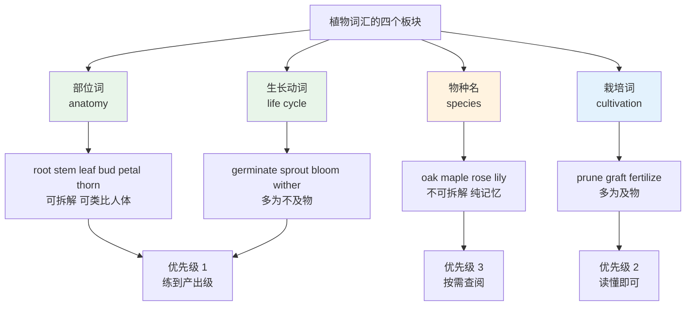
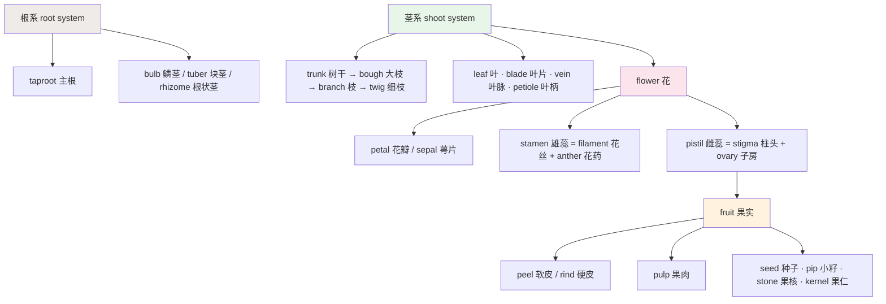
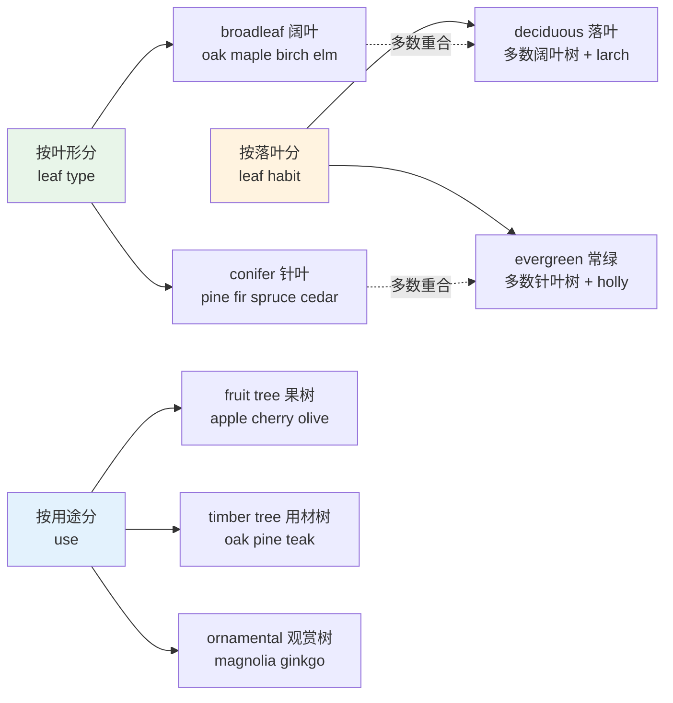
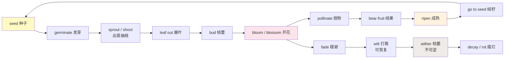
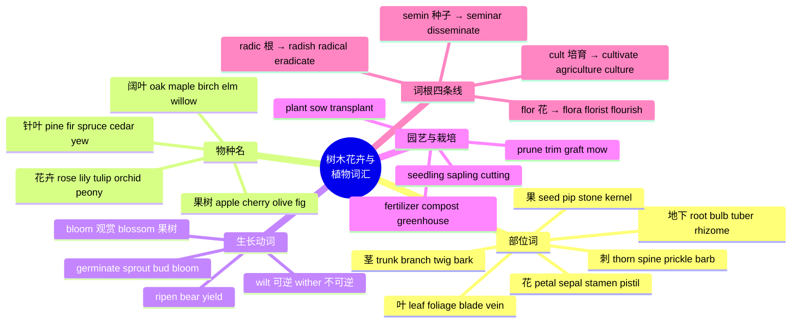

# 树木花卉、植物部位与生长动词

> [!info] 本篇定位
>
> 第 10 章的第三篇，接在动物两篇之后，把自然生命词表的另一半补齐。
>
> 覆盖四组内容：植物解剖部位（root、stem、bud、petal、thorn、foliage）、树种与花卉专名、生命周期动词（germinate、sprout、bloom、wither）、园艺栽培词（prune、graft、seedling、fertilizer、greenhouse）。
>
> 读完能做到三件事：读英文小说里的园林与乡村描写不再一片模糊；给一株植物从根到花逐个部位命名；分清 bloom 和 blossom、bush 和 shrub、wither 和 wilt 这类中文只有一个对应词的词组。
>
> 词根一节还会解释 `radish`（萝卜）、`radical`（激进的）、`eradicate`（根除）为什么共享同一个词根。

---

## 1. 本篇导读：植物词的三个特殊难点

植物词在中文母语者眼里的难度被严重低估。原因是中文的植物词高度规则——「松树、柏树、槐树、柳树」，都是「X + 树」；「玫瑰花、菊花、荷花」，都是「X + 花」。英语没有这个统一后缀，每一种树、每一种花都是独立的、彼此不相关的词，而且大多数是短的日耳曼层单音节词。

**难点一：树种名短到没有线索。** `oak`、`ash`、`elm`、`yew`、`beech`、`fir`、`pine` 全部是一到两个音节的古英语词，拆不出词根，猜不出义，只能像 `dog`、`cat` 一样整个记住。更麻烦的是其中几个词形和常用词撞车：`ash` 同时是「灰烬」，`fir` 和 `fur`（毛皮）同音，`palm` 同时是「手掌」。

**难点二：中文一个「开花」对应英语一串词。** `bloom`、`blossom`、`flower`、`flourish` 都能译成「开花」或「繁盛」，但它们的分工是明确的：观赏花开叫 bloom，果树开花叫 blossom，抽象的「兴旺」叫 flourish。混用不算语法错误，但一听就是外国人。

**难点三：园艺动词的及物性分裂。** `bloom` 只能不及物（花自己开），`prune` 只能及物（人修剪树）。中文「这棵树修剪了」和「这棵树开花了」结构一样，英语必须写成 `The tree was pruned.` 和 `The tree bloomed.`，一个被动一个主动。

上图给出了本篇的学习优先级，也解释了后面章节的排列顺序。部位词和生长动词构成了描述任何植物的通用框架，值得练到能主动使用；物种名数量大、复现率低，读到能认出即可，不必逐个背到会写。真正需要主动调用树种名的场合，多数人一年碰不到几次。

---

## 2. 植物的解剖结构：从根到花

### 2.1 地下部分：根与地下变态茎

根系词是植物词表里最有延伸价值的一组——它们几乎全部同时是常用比喻词。

| 英文 | 英式音标 | 美式音标 | 词性 | 中文 | 搭配与说明 |
| --- | --- | --- | --- | --- | --- |
| **root** | /ruːt/ | /ruːt/ | n./v. | 根；生根 | take root 扎根；root cause 根本原因 |
| **taproot** | /ˈtæpruːt/ | /ˈtæpruːt/ | n. | 主根；直根 | 胡萝卜、萝卜属于 taproot 类 |
| **root hair** | /ˈruːt heə/ | /ˈruːt her/ | n. | 根毛 | 吸收水分的实际部位 |
| **rootstock** | /ˈruːtstɒk/ | /ˈruːtstɑːk/ | n. | 砧木 | 嫁接时被接的下半截，见 7.3 |
| **bulb** | /bʌlb/ | /bʌlb/ | n. | 鳞茎；球茎 | 郁金香、洋葱、蒜；也指灯泡 |
| **tuber** | /ˈtjuːbə/ | /ˈtuːbər/ | n. | 块茎 | 土豆是 tuber，不是 root |
| **rhizome** | /ˈraɪzəʊm/ | /ˈraɪzoʊm/ | n. | 根状茎 | 姜、竹的地下横走茎 |
| **corm** | /kɔːm/ | /kɔːrm/ | n. | 球茎 | 芋头、番红花；与 bulb 内部结构不同 |
| **soil** | /sɔɪl/ | /sɔɪl/ | n./v. | 土壤；弄脏 | 动词义「弄脏」是完全不同的一条线 |
| **root ball** | /ˈruːt bɔːl/ | /ˈruːt bɔːl/ | n. | 根团；土球 | 移栽时连土一起挖出的部分 |

> [!warning] 土豆到底是不是「根」
>
> 中文说「土豆是块根」是通俗说法，英语里 potato 是 **tuber**（块茎），属于变形的茎而不是根；sweet potato（红薯）才是真正的 **tuberous root**（块根）。
>
> - ❌ ~~The potato is the root of the plant.~~
> - ✅ The potato is an underground **stem**, called a **tuber**.
>
> 这个区分在英文科普文本里被严格遵守，读到 tuber、rhizome、bulb 这三个词时不要都当成「根」处理。

### 2.2 茎与干

| 英文 | 英式音标 | 美式音标 | 词性 | 中文 | 搭配与说明 |
| --- | --- | --- | --- | --- | --- |
| **stem** | /stem/ | /stem/ | n./v. | 茎；起源于 | stem from 源自，高频抽象用法 |
| **stalk** | /stɔːk/ | /stɔːk/ | n. | 梗；柄 | 花梗、叶柄、芹菜梗；比 stem 更细 |
| **trunk** | /trʌŋk/ | /trʌŋk/ | n. | 树干 | 也指象鼻、后备箱、大衣箱 |
| **bough** | /baʊ/ | /baʊ/ | n. | 大树枝 | 文学用词，读音同 bow「鞠躬」 |
| **branch** | /brɑːntʃ/ | /bræntʃ/ | n./v. | 树枝；分支 | 分行、分支机构、Git 分支同词 |
| **limb** | /lɪm/ | /lɪm/ | n. | 粗枝；肢体 | b 不发音；out on a limb 处境孤立 |
| **twig** | /twɪɡ/ | /twɪɡ/ | n. | 细枝；嫩枝 | 一折就断的那种 |
| **shoot** | /ʃuːt/ | /ʃuːt/ | n./v. | 嫩芽；抽枝 | 与「射击」同形，靠语境区分 |
| **sprig** | /sprɪɡ/ | /sprɪɡ/ | n. | 小枝；嫩条 | a sprig of rosemary 一小枝迷迭香 |
| **bark** | /bɑːk/ | /bɑːrk/ | n./v. | 树皮；狗叫 | 两义同形，词源不同 |
| **sap** | /sæp/ | /sæp/ | n./v. | 树液；消耗 | maple sap 枫树汁；sap one's energy 耗尽精力 |
| **pith** | /pɪθ/ | /pɪθ/ | n. | 髓；要点 | the pith of the argument 论点核心 |
| **node** | /nəʊd/ | /noʊd/ | n. | 节；茎节 | 长叶子的那个点，与数据结构同词 |
| **internode** | /ˈɪntənəʊd/ | /ˈɪntərnoʊd/ | n. | 节间 | 两个 node 之间的一段茎 |
| **growth ring** | /ˈɡrəʊθ rɪŋ/ | /ˈɡroʊθ rɪŋ/ | n. | 年轮 | 也说 annual ring、tree ring |
| **tendril** | /ˈtendrəl/ | /ˈtendrəl/ | n. | 卷须 | 豌豆、葡萄用来攀爬的细丝 |

### 2.3 叶

| 英文 | 英式音标 | 美式音标 | 词性 | 中文 | 搭配与说明 |
| --- | --- | --- | --- | --- | --- |
| **leaf** | /liːf/ | /liːf/ | n. | 叶子 | 不规则复数 leaves |
| **foliage** | /ˈfəʊliɪdʒ/ | /ˈfoʊliɪdʒ/ | n. | 枝叶；叶丛 | 不可数，指整体叶量而非单片 |
| **blade** | /bleɪd/ | /bleɪd/ | n. | 叶片；刀刃 | a blade of grass 一根草叶 |
| **vein** | /veɪn/ | /veɪn/ | n. | 叶脉；静脉 | 植物与人体共用同一个词 |
| **midrib** | /ˈmɪdrɪb/ | /ˈmɪdrɪb/ | n. | 主脉 | 叶子正中那条粗脉 |
| **petiole** | /ˈpetiəʊl/ | /ˈpetioʊl/ | n. | 叶柄 | 学术词，日常说 leaf stalk |
| **needle** | /ˈniːdl/ | /ˈniːdl/ | n. | 针叶 | pine needles 松针；也指缝衣针 |
| **frond** | /frɒnd/ | /frɑːnd/ | n. | 蕨叶；棕榈叶 | 蕨类和棕榈的大型羽状叶专用 |
| **canopy** | /ˈkænəpi/ | /ˈkænəpi/ | n. | 树冠层 | 森林最上层；也指遮阳篷 |
| **crown** | /kraʊn/ | /kraʊn/ | n. | 树冠 | 单株树的冠部，与 canopy 尺度不同 |
| **chlorophyll** | /ˈklɒrəfɪl/ | /ˈklɔːrəfɪl/ | n. | 叶绿素 | 希腊词根 chloro「绿」+ phyll「叶」 |
| **photosynthesis** | /ˌfəʊtəʊˈsɪnθəsɪs/ | /ˌfoʊtoʊˈsɪnθəsɪs/ | n. | 光合作用 | photo「光」+ synthesis「合成」 |
| **evergreen** | /ˈevəɡriːn/ | /ˈevərɡriːn/ | adj./n. | 常绿的；常绿树 | 也形容长盛不衰的作品 |
| **deciduous** | /dɪˈsɪdjuəs/ | /dɪˈsɪdʒuəs/ | adj. | 落叶的 | 拉丁 de-「离」+ cid「落」 |

> [!tip] leaf 与 foliage 的可数性
>
> `leaf` 可数，指得清一片两片；`foliage` 不可数，指一株或一片林子的叶子总体，翻译成「枝叶」比「叶子」贴切。
>
> - ✅ I raked up the fallen **leaves**.（耙落叶，一片片数得清）
> - ✅ The tree has dense **foliage**.（枝叶茂密，说的是整体密度）
> - ❌ ~~a foliage~~ / ~~two foliages~~
>
> 描写秋色时英语常用 `autumn foliage`（英式）或 `fall foliage`（美式），指的是整片山林的叶色，不是某几片叶子。

### 2.4 花与花的部件

| 英文 | 英式音标 | 美式音标 | 词性 | 中文 | 搭配与说明 |
| --- | --- | --- | --- | --- | --- |
| **flower** | /ˈflaʊə/ | /ˈflaʊər/ | n./v. | 花；开花 | 最通用的「花」，可数 |
| **blossom** | /ˈblɒsəm/ | /ˈblɑːsəm/ | n./v. | 花（果树）；开花 | cherry blossom 樱花；常作集合名词 |
| **bloom** | /bluːm/ | /bluːm/ | n./v. | 花朵；盛开 | in bloom 盛开中，见 6.3 辨析 |
| **bud** | /bʌd/ | /bʌd/ | n./v. | 花蕾；发芽 | in bud 含苞；nip in the bud 扼杀于萌芽 |
| **petal** | /ˈpetl/ | /ˈpetl/ | n. | 花瓣 | rose petals 玫瑰花瓣 |
| **sepal** | /ˈsepl/ | /ˈsiːpl/ | n. | 萼片 | 重音都在首音节，但英式 /e/、美式 /iː/ |
| **calyx** | /ˈkeɪlɪks/ | /ˈkeɪlɪks/ | n. | 花萼 | 全部萼片的合称，复数 calyces |
| **stamen** | /ˈsteɪmən/ | /ˈsteɪmən/ | n. | 雄蕊 | 由 filament + anther 组成 |
| **anther** | /ˈænθə/ | /ˈænθər/ | n. | 花药 | 顶端产生花粉的小囊 |
| **filament** | /ˈfɪləmənt/ | /ˈfɪləmənt/ | n. | 花丝；灯丝 | 拉丁 fil「线」，同源 file、profile |
| **pistil** | /ˈpɪstɪl/ | /ˈpɪstl/ | n. | 雌蕊 | 与 pistol「手枪」拼写只差一个字母 |
| **stigma** | /ˈstɪɡmə/ | /ˈstɪɡmə/ | n. | 柱头；污名 | 抽象义「污名」使用频率更高 |
| **ovary** | /ˈəʊvəri/ | /ˈoʊvəri/ | n. | 子房；卵巢 | 植物学与解剖学共用 |
| **pollen** | /ˈpɒlən/ | /ˈpɑːlən/ | n. | 花粉 | 不可数；pollen count 花粉浓度 |
| **nectar** | /ˈnektə/ | /ˈnektər/ | n. | 花蜜 | 不可数；也指果汁饮料 |
| **flower stalk** | /ˈflaʊə stɔːk/ | /ˈflaʊər stɔːk/ | n. | 花梗 | 剪花时剪的那一截；学名 pedicel |
| **bouquet** | /buˈkeɪ/ | /boʊˈkeɪ/ | n. | 花束 | 法语借词，英美元音不同 |
| **wreath** | /riːθ/ | /riːθ/ | n. | 花环 | 复数 wreaths /riːðz/，清浊变化 |
| **garland** | /ˈɡɑːlənd/ | /ˈɡɑːrlənd/ | n. | 花环；花冠 | 戴在头上或挂起来的长条花饰 |
| **florist** | /ˈflɒrɪst/ | /ˈflɔːrɪst/ | n. | 花商；花店 | 见 10.1 词根 flor- |

### 2.5 果实、种子与防御结构

| 英文 | 英式音标 | 美式音标 | 词性 | 中文 | 搭配与说明 |
| --- | --- | --- | --- | --- | --- |
| **fruit** | /fruːt/ | /fruːt/ | n. | 果实 | 表种类时可数：tropical fruits |
| **seed** | /siːd/ | /siːd/ | n./v. | 种子；播种 | 也指随机数种子、种子选手 |
| **pip** | /pɪp/ | /pɪp/ | n. | 小籽 | 苹果、橘子、葡萄里的小硬籽 |
| **stone** | /stəʊn/ | /stoʊn/ | n. | 果核 | 英式说 stone，美式多说 pit |
| **pit** | /pɪt/ | /pɪt/ | n./v. | 果核；去核 | 美式常用；pitted olives 去核橄榄 |
| **kernel** | /ˈkɜːnl/ | /ˈkɜːrnl/ | n. | 果仁；核心 | 与操作系统内核同词 |
| **husk** | /hʌsk/ | /hʌsk/ | n. | 外壳；谷壳 | 玉米、稻米的干壳 |
| **shell** | /ʃel/ | /ʃel/ | n./v. | 硬壳；剥壳 | 坚果的硬壳；shell peas 剥豌豆 |
| **pod** | /pɒd/ | /pɑːd/ | n. | 荚 | pea pod 豆荚；也指鲸群、耳机盒 |
| **core** | /kɔː/ | /kɔːr/ | n. | 果心 | apple core 苹果核（不含籽的那部分） |
| **peel** | /piːl/ | /piːl/ | n./v. | 果皮；削皮 | 可剥的软皮，如香蕉、橘子 |
| **rind** | /raɪnd/ | /raɪnd/ | n. | 厚硬果皮 | 西瓜皮、柠檬皮、奶酪皮 |
| **pulp** | /pʌlp/ | /pʌlp/ | n. | 果肉；纸浆 | 不可数；orange with pulp 带果肉 |
| **thorn** | /θɔːn/ | /θɔːrn/ | n. | 刺（木质） | 玫瑰、山楂的刺；a thorn in one's side 眼中钉 |
| **spine** | /spaɪn/ | /spaɪn/ | n. | 刺（针状） | 仙人掌的刺；也指脊柱、书脊 |
| **prickle** | /ˈprɪkl/ | /ˈprɪkl/ | n./v. | 皮刺；刺痛 | 长在表皮上，一掰就掉 |
| **barb** | /bɑːb/ | /bɑːrb/ | n. | 倒刺 | barbed wire 铁丝网 |
| **bristle** | /ˈbrɪsl/ | /ˈbrɪsl/ | n./v. | 硬毛；竖起 | t 不发音，读作 /ˈbrɪsl/ |

这张图把前五节的部位词串成了一棵完整的植物。上下两大块的划分是英语植物学文本的标准框架：地下叫 root system，地上统称 shoot system。记住这个框架的实际收益是，读到 `The shoot system develops from the epicotyl` 这类句子时不会把 shoot 当成「射击」；同时也能解释为什么 `shoot` 作名词时是「嫩芽」——它本来就是「往上蹿出去的那部分」。

---

## 3. 树木：树种名与树体形态

### 3.1 落叶阔叶树

这一组词绝大多数是古英语层遗留下来的单音节或双音节词，短、不规则、无法拆解。

| 英文 | 英式音标 | 美式音标 | 词性 | 中文 | 搭配与说明 |
| --- | --- | --- | --- | --- | --- |
| **oak** | /əʊk/ | /oʊk/ | n. | 橡树；栎树 | 果实叫 acorn；oak 也指橡木材 |
| **maple** | /ˈmeɪpl/ | /ˈmeɪpl/ | n. | 枫树 | maple syrup 枫糖浆；加拿大国树 |
| **birch** | /bɜːtʃ/ | /bɜːrtʃ/ | n. | 桦树 | 白色树皮是识别特征 |
| **beech** | /biːtʃ/ | /biːtʃ/ | n. | 山毛榉 | 与 beach「海滩」同音 |
| **elm** | /elm/ | /elm/ | n. | 榆树 | Dutch elm disease 荷兰榆树病 |
| **ash** | /æʃ/ | /æʃ/ | n. | 白蜡树 | 与「灰烬」同形，靠语境区分 |
| **willow** | /ˈwɪləʊ/ | /ˈwɪloʊ/ | n. | 柳树 | weeping willow 垂柳 |
| **poplar** | /ˈpɒplə/ | /ˈpɑːplər/ | n. | 杨树 | 与 popular 拼写相近，别写混 |
| **aspen** | /ˈæspən/ | /ˈæspən/ | n. | 山杨 | 叶子微风即抖，故有 quaking aspen |
| **alder** | /ˈɔːldə/ | /ˈɔːldər/ | n. | 桤木 | 常见于河岸湿地 |
| **sycamore** | /ˈsɪkəmɔː/ | /ˈsɪkəmɔːr/ | n. | 悬铃木；无花果桑 | 英美所指树种不同 |
| **linden** | /ˈlɪndən/ | /ˈlɪndən/ | n. | 椴树 | 英式也说 lime tree（与酸橙同名） |
| **chestnut** | /ˈtʃesnʌt/ | /ˈtʃesnʌt/ | n. | 栗树；栗色 | t 不发音，读作 /ˈtʃesnʌt/ |
| **walnut** | /ˈwɔːlnʌt/ | /ˈwɔːlnʌt/ | n. | 核桃树；胡桃木 | 古英语意为「外国坚果」 |
| **magnolia** | /mæɡˈnəʊliə/ | /mæɡˈnoʊliə/ | n. | 木兰；玉兰 | 也指一种极淡的米白色 |
| **ginkgo** | /ˈɡɪŋkəʊ/ | /ˈɡɪŋkoʊ/ | n. | 银杏 | 也拼作 gingko；来自日语借词 |
| **mulberry** | /ˈmʌlbəri/ | /ˈmʌlberi/ | n. | 桑树 | 养蚕的那种树 |
| **acacia** | /əˈkeɪʃə/ | /əˈkeɪʃə/ | n. | 相思树；洋槐 | 重音在第二音节 |

### 3.2 针叶树与常绿树

| 英文 | 英式音标 | 美式音标 | 词性 | 中文 | 搭配与说明 |
| --- | --- | --- | --- | --- | --- |
| **pine** | /paɪn/ | /paɪn/ | n./v. | 松树；渴望 | pine for 思念，是另一条完全不同的义线 |
| **fir** | /fɜː/ | /fɜːr/ | n. | 冷杉 | 与 fur「毛皮」同音 |
| **spruce** | /spruːs/ | /spruːs/ | n./adj. | 云杉；整洁的 | spruce up 收拾打扮 |
| **cedar** | /ˈsiːdə/ | /ˈsiːdər/ | n. | 雪松；香柏 | 木材有香气，用于衣柜防虫 |
| **cypress** | /ˈsaɪprəs/ | /ˈsaɪprəs/ | n. | 柏树 | 地中海墓园的标志性树种 |
| **juniper** | /ˈdʒuːnɪpə/ | /ˈdʒuːnɪpər/ | n. | 杜松 | 浆果是杜松子酒 gin 的原料 |
| **larch** | /lɑːtʃ/ | /lɑːrtʃ/ | n. | 落叶松 | 少数会落叶的针叶树 |
| **yew** | /juː/ | /juː/ | n. | 紫杉；红豆杉 | 与 you 同音；英国教堂墓地常见 |
| **hemlock** | /ˈhemlɒk/ | /ˈhemlɑːk/ | n. | 铁杉；毒芹 | 两种完全不同的植物同名，苏格拉底喝的是毒芹 |
| **redwood** | /ˈredwʊd/ | /ˈredwʊd/ | n. | 红杉 | 加州海岸的高树 |
| **sequoia** | /sɪˈkwɔɪə/ | /sɪˈkwɔɪə/ | n. | 巨杉 | 拼写怪，五个元音字母全用上 |
| **conifer** | /ˈkɒnɪfə/ | /ˈkɑːnɪfər/ | n. | 针叶树；球果植物 | 形容词 coniferous |
| **cone** | /kəʊn/ | /koʊn/ | n. | 球果；松果 | pine cone 松果；也指圆锥、蛋卷筒 |
| **resin** | /ˈrezɪn/ | /ˈrezɪn/ | n. | 树脂 | 化石化后成为 amber 琥珀 |

### 3.3 果树、棕榈与热带树

| 英文 | 英式音标 | 美式音标 | 词性 | 中文 | 搭配与说明 |
| --- | --- | --- | --- | --- | --- |
| **apple tree** | /ˈæpl triː/ | /ˈæpl triː/ | n. | 苹果树 | 果树名多为「果名 + tree」 |
| **pear** | /peə/ | /per/ | n. | 梨；梨树 | 与 pair「一对」同音 |
| **cherry** | /ˈtʃeri/ | /ˈtʃeri/ | n. | 樱桃；樱树 | cherry blossom 樱花 |
| **peach** | /piːtʃ/ | /piːtʃ/ | n. | 桃；桃树 | 核果类，果核叫 stone / pit |
| **plum** | /plʌm/ | /plʌm/ | n. | 李子；李树 | 干制后叫 prune（与「修剪」同形） |
| **apricot** | /ˈeɪprɪkɒt/ | /ˈæprɪkɑːt/ | n. | 杏 | 英美首音节元音完全不同 |
| **fig** | /fɪɡ/ | /fɪɡ/ | n. | 无花果 | fig leaf 遮羞布，来自圣经典故 |
| **olive** | /ˈɒlɪv/ | /ˈɑːlɪv/ | n. | 橄榄；橄榄树 | olive branch 橄榄枝，象征和解 |
| **almond** | /ˈɑːmənd/ | /ˈɑːmənd/ | n. | 杏仁；扁桃 | l 通常不发音 |
| **hazel** | /ˈheɪzl/ | /ˈheɪzl/ | n./adj. | 榛树；淡褐色 | hazel eyes 榛色眼睛 |
| **pomegranate** | /ˈpɒmɪɡrænɪt/ | /ˈpɑːmɪɡrænɪt/ | n. | 石榴 | 拉丁 pomum「果」+ granatum「多籽」 |
| **persimmon** | /pəˈsɪmən/ | /pərˈsɪmən/ | n. | 柿子 | 来自美洲原住民语言 |
| **citrus** | /ˈsɪtrəs/ | /ˈsɪtrəs/ | n./adj. | 柑橘类 | 集合词，涵盖橙、柠檬、柚 |
| **palm** | /pɑːm/ | /pɑːm/ | n. | 棕榈；手掌 | l 不发音；palm tree 更明确 |
| **coconut palm** | /ˈkəʊkənʌt pɑːm/ | /ˈkoʊkənʌt pɑːm/ | n. | 椰子树 | 也说 coco palm |
| **bamboo** | /ˌbæmˈbuː/ | /ˌbæmˈbuː/ | n. | 竹子 | 重音在后；不可数或作复数 bamboos |
| **eucalyptus** | /ˌjuːkəˈlɪptəs/ | /ˌjuːkəˈlɪptəs/ | n. | 桉树 | 复数 eucalyptuses 或 eucalypti |
| **banyan** | /ˈbænjən/ | /ˈbænjən/ | n. | 榕树 | 气生根落地成新干 |
| **mangrove** | /ˈmæŋɡrəʊv/ | /ˈmæŋɡroʊv/ | n. | 红树 | mangrove forest 红树林 |
| **baobab** | /ˈbeɪəʊbæb/ | /ˈbeɪoʊbæb/ | n. | 猴面包树 | 非洲标志性树种 |

### 3.4 树体状态与林地词

| 英文 | 英式音标 | 美式音标 | 词性 | 中文 | 搭配与说明 |
| --- | --- | --- | --- | --- | --- |
| **sapling** | /ˈsæplɪŋ/ | /ˈsæplɪŋ/ | n. | 树苗；幼树 | 已成形但还很细的小树 |
| **seedling** | /ˈsiːdlɪŋ/ | /ˈsiːdlɪŋ/ | n. | 幼苗 | 刚出土的苗，比 sapling 更小 |
| **stump** | /stʌmp/ | /stʌmp/ | n./v. | 树桩；难住 | stump someone 把某人问倒 |
| **log** | /lɒɡ/ | /lɔːɡ/ | n./v. | 原木；记录 | 与「日志」同词，见 11.1 |
| **timber** | /ˈtɪmbə/ | /ˈtɪmbər/ | n. | 木材（英式） | 英式建材统称 |
| **lumber** | /ˈlʌmbə/ | /ˈlʌmbər/ | n./v. | 木材（美式）；笨重地走 | 美式常用 lumber 代替 timber |
| **grove** | /ɡrəʊv/ | /ɡroʊv/ | n. | 小树林 | 通常是同种树，如 olive grove |
| **thicket** | /ˈθɪkɪt/ | /ˈθɪkɪt/ | n. | 灌木丛；密林 | 密到钻不过去的一片 |
| **woodland** | /ˈwʊdlənd/ | /ˈwʊdlənd/ | n. | 林地 | 比 forest 面积小、树冠不封闭 |
| **forest** | /ˈfɒrɪst/ | /ˈfɔːrɪst/ | n. | 森林 | 大面积、树冠连续 |
| **jungle** | /ˈdʒʌŋɡl/ | /ˈdʒʌŋɡl/ | n. | 丛林 | 特指热带、下层植被极密 |
| **canopy** | /ˈkænəpi/ | /ˈkænəpi/ | n. | 林冠层 | 森林生态学的分层术语 |
| **understorey** | /ˈʌndəstɔːri/ | /ˈʌndərstɔːri/ | n. | 林下层 | 美式拼作 understory |
| **windbreak** | /ˈwɪndbreɪk/ | /ˈwɪndbreɪk/ | n. | 防风林 | 也说 shelterbelt |
| **deforestation** | /ˌdiːfɒrɪˈsteɪʃn/ | /ˌdiːfɔːrəˈsteɪʃn/ | n. | 毁林；森林砍伐 | de-「去」+ forest + -ation |
| **reforestation** | /ˌriːfɒrɪˈsteɪʃn/ | /ˌriːfɔːrəˈsteɪʃn/ | n. | 重新造林 | 也说 afforestation（新造林） |

上图的关键信息是两条虚线：阔叶与落叶大体重合，针叶与常绿大体重合，但都有例外。`larch`（落叶松）是会落叶的针叶树，`holly`（冬青）和 `magnolia grandiflora`（广玉兰）是常绿的阔叶树。英文里 `deciduous` 与 `broadleaf` 经常被当成同义词随手互换，读科普文本时按上下文判断作者指的是叶形还是落叶习性。

---

## 4. 花卉：常见花名

### 4.1 最常出现的二十种花

| 英文 | 英式音标 | 美式音标 | 词性 | 中文 | 搭配与说明 |
| --- | --- | --- | --- | --- | --- |
| **rose** | /rəʊz/ | /roʊz/ | n. | 玫瑰；蔷薇 | 与 rise 的过去式同形 |
| **lily** | /ˈlɪli/ | /ˈlɪli/ | n. | 百合 | water lily 睡莲，实为另一科 |
| **tulip** | /ˈtjuːlɪp/ | /ˈtuːlɪp/ | n. | 郁金香 | 从鳞茎 bulb 长出 |
| **daisy** | /ˈdeɪzi/ | /ˈdeɪzi/ | n. | 雏菊 | 词源 day's eye「白日之眼」 |
| **sunflower** | /ˈsʌnflaʊə/ | /ˈsʌnflaʊər/ | n. | 向日葵 | sunflower seeds 葵花籽 |
| **orchid** | /ˈɔːkɪd/ | /ˈɔːrkɪd/ | n. | 兰花 | ch 读 /k/ |
| **jasmine** | /ˈdʒæzmɪn/ | /ˈdʒæzmɪn/ | n. | 茉莉 | jasmine tea 茉莉花茶 |
| **lavender** | /ˈlævəndə/ | /ˈlævəndər/ | n./adj. | 薰衣草；淡紫色 | 兼作颜色词，见下一篇 |
| **daffodil** | /ˈdæfədɪl/ | /ˈdæfədɪl/ | n. | 水仙；黄水仙 | 威尔士的象征花 |
| **narcissus** | /nɑːˈsɪsəs/ | /nɑːrˈsɪsəs/ | n. | 水仙（属名） | 与 narcissism 自恋同源 |
| **carnation** | /kɑːˈneɪʃn/ | /kɑːrˈneɪʃn/ | n. | 康乃馨 | 母亲节的标志花 |
| **chrysanthemum** | /krɪˈsænθəməm/ | /krɪˈsænθəməm/ | n. | 菊花 | 英美口语都缩略为 mum；花店标价牌上常这么写 |
| **peony** | /ˈpiːəni/ | /ˈpiːəni/ | n. | 牡丹；芍药 | 重音在第一音节 |
| **lotus** | /ˈləʊtəs/ | /ˈloʊtəs/ | n. | 莲；荷花 | lotus position 莲花坐 |
| **iris** | /ˈaɪərɪs/ | /ˈaɪrɪs/ | n. | 鸢尾；虹膜 | 眼睛的虹膜同词 |
| **violet** | /ˈvaɪələt/ | /ˈvaɪələt/ | n./adj. | 紫罗兰；紫色 | 兼作颜色词 |
| **poppy** | /ˈpɒpi/ | /ˈpɑːpi/ | n. | 罂粟；虞美人 | 英联邦阵亡将士纪念日佩戴 |
| **marigold** | /ˈmærɪɡəʊld/ | /ˈmerɪɡoʊld/ | n. | 万寿菊；金盏花 | Mary + gold 的合成 |
| **hyacinth** | /ˈhaɪəsɪnθ/ | /ˈhaɪəsɪnθ/ | n. | 风信子 | 希腊神话人物名转化 |
| **camellia** | /kəˈmiːliə/ | /kəˈmiːliə/ | n. | 山茶花 | 茶树同属 Camellia |

### 4.2 灌木花与藤本花

| 英文 | 英式音标 | 美式音标 | 词性 | 中文 | 搭配与说明 |
| --- | --- | --- | --- | --- | --- |
| **azalea** | /əˈzeɪliə/ | /əˈzeɪljə/ | n. | 杜鹃花 | 与 rhododendron 同属 |
| **rhododendron** | /ˌrəʊdəˈdendrən/ | /ˌroʊdəˈdendrən/ | n. | 杜鹃；石楠 | 希腊 rhodo「玫瑰」+ dendron「树」 |
| **hydrangea** | /haɪˈdreɪndʒə/ | /haɪˈdreɪndʒə/ | n. | 绣球花 | 花色随土壤酸碱变化 |
| **gardenia** | /ɡɑːˈdiːniə/ | /ɡɑːrˈdiːnjə/ | n. | 栀子花 | 以植物学家 Garden 命名 |
| **magnolia** | /mæɡˈnəʊliə/ | /mæɡˈnoʊliə/ | n. | 玉兰 | 既是树也常按花称呼 |
| **lilac** | /ˈlaɪlək/ | /ˈlaɪlək/ | n./adj. | 丁香；淡紫色 | 也是常见颜色词 |
| **wisteria** | /wɪˈstɪəriə/ | /wɪˈstɪriə/ | n. | 紫藤 | 藤本，需要 trellis 支撑 |
| **honeysuckle** | /ˈhʌnisʌkl/ | /ˈhʌnisʌkl/ | n. | 忍冬；金银花 | 名字来自可吸食的花蜜 |
| **clematis** | /ˈklemətɪs/ | /ˈklemətɪs/ | n. | 铁线莲 | 重音在首音节 |
| **begonia** | /bɪˈɡəʊniə/ | /bɪˈɡoʊniə/ | n. | 秋海棠 | 盆栽常见 |
| **geranium** | /dʒəˈreɪniəm/ | /dʒəˈreɪniəm/ | n. | 天竺葵 | 阳台盆花的代表 |
| **petunia** | /pɪˈtjuːniə/ | /pəˈtuːniə/ | n. | 矮牵牛 | 一年生花坛花 |
| **dandelion** | /ˈdændɪlaɪən/ | /ˈdændɪlaɪən/ | n. | 蒲公英 | 法语 dent de lion「狮子的牙」 |
| **clover** | /ˈkləʊvə/ | /ˈkloʊvər/ | n. | 三叶草 | four-leaf clover 幸运草 |
| **ivy** | /ˈaɪvi/ | /ˈaɪvi/ | n. | 常春藤 | Ivy League 常春藤联盟 |
| **fern** | /fɜːn/ | /fɜːrn/ | n. | 蕨类 | 不开花，靠 spore 孢子繁殖 |
| **moss** | /mɒs/ | /mɔːs/ | n. | 苔藓 | 不可数；A rolling stone gathers no moss |
| **cactus** | /ˈkæktəs/ | /ˈkæktəs/ | n. | 仙人掌 | 复数 cacti 或 cactuses |
| **succulent** | /ˈsʌkjələnt/ | /ˈsʌkjələnt/ | n./adj. | 多肉植物；多汁的 | 形容食物时意为「多汁鲜美」 |
| **bonsai** | /ˈbɒnsaɪ/ | /boʊnˈsaɪ/ | n. | 盆景 | 日语借词，英美重音位置不同 |

> [!example] 花名在描写句里的实际用法
>
> - The **wisteria** on the south wall came into **bloom** in late April.
>   - 南墙上的紫藤四月底开花了。
> - She kept a pot of **geraniums** on every windowsill.
>   - 她每扇窗台上都摆一盆天竺葵。
> - The lawn was covered in **dandelions** and **clover**.
>   - 草坪上长满了蒲公英和三叶草。
> - A single **camellia** had fallen onto the wet stone path.
>   - 一朵山茶花落在湿漉漉的石板路上。
>
> 四句话展示了花名最常见的三种句法位置：作主语搭配生长动词、作 keep/plant 的宾语、作 be covered in 的补足成分。花名本身是普通可数名词，没有特殊语法。

---

## 5. 草本、灌木与地被

### 5.1 按茎的木质程度分层

英语按茎的木质化程度把植物分成清晰的几档，这套分档在园艺文本里出现频率极高。

| 英文 | 英式音标 | 美式音标 | 词性 | 中文 | 搭配与说明 |
| --- | --- | --- | --- | --- | --- |
| **tree** | /triː/ | /triː/ | n. | 乔木；树 | 单一主干、木质、明显高过灌木 |
| **shrub** | /ʃrʌb/ | /ʃrʌb/ | n. | 灌木 | 多主干、木质、矮；园艺正式用词 |
| **bush** | /bʊʃ/ | /bʊʃ/ | n. | 灌木丛 | 与 shrub 近义，语域更口语 |
| **hedge** | /hedʒ/ | /hedʒ/ | n./v. | 树篱；对冲 | 金融「对冲」义来自「设防」 |
| **herb** | /hɜːb/ | /ɜːrb/ | n. | 草本植物；香草 | 美音固定不发 h，英美差异极明显 |
| **grass** | /ɡrɑːs/ | /ɡræs/ | n. | 草 | 不可数；grasses 指草的种类 |
| **weed** | /wiːd/ | /wiːd/ | n./v. | 杂草；除草 | weed out 淘汰，抽象用法高频 |
| **vine** | /vaɪn/ | /vaɪn/ | n. | 藤本；葡萄藤 | 美式泛指藤蔓，英式偏指葡萄 |
| **creeper** | /ˈkriːpə/ | /ˈkriːpər/ | n. | 匍匐植物 | 贴地或贴墙爬的藤 |
| **climber** | /ˈklaɪmə/ | /ˈklaɪmər/ | n. | 攀缘植物 | b 不发音；也指攀岩者 |
| **groundcover** | /ˈɡraʊndkʌvə/ | /ˈɡraʊndkʌvər/ | n. | 地被植物 | 用来覆盖裸土的低矮植物 |
| **perennial** | /pəˈreniəl/ | /pəˈreniəl/ | adj./n. | 多年生的；多年生植物 | per-「贯穿」+ enn「年」 |
| **annual** | /ˈænjuəl/ | /ˈænjuəl/ | adj./n. | 一年生的；一年生植物 | 同一词根 ann「年」 |
| **biennial** | /baɪˈeniəl/ | /baɪˈeniəl/ | adj. | 两年生的 | bi-「二」；与 biannual「一年两次」易混 |

### 5.2 草地类词

| 英文 | 英式音标 | 美式音标 | 词性 | 中文 | 搭配与说明 |
| --- | --- | --- | --- | --- | --- |
| **lawn** | /lɔːn/ | /lɔːn/ | n. | 草坪 | 人工修剪的家庭或公园草地 |
| **turf** | /tɜːf/ | /tɜːrf/ | n. | 草皮 | 连土带草的一块；也指「地盘」 |
| **sod** | /sɒd/ | /sɑːd/ | n. | 草皮块 | 美式常用，可整卷铺设 |
| **meadow** | /ˈmedəʊ/ | /ˈmedoʊ/ | n. | 草甸；牧草地 | 自然生长、常用于割草 |
| **pasture** | /ˈpɑːstʃə/ | /ˈpæstʃər/ | n. | 牧场 | 放牧牲畜的草地 |
| **prairie** | /ˈpreəri/ | /ˈpreri/ | n. | 北美大草原 | 特指北美，法语借词 |
| **savanna** | /səˈvænə/ | /səˈvænə/ | n. | 稀树草原 | 非洲，也拼 savannah |
| **steppe** | /step/ | /step/ | n. | 干草原 | 欧亚大陆内陆，与 step 同音 |
| **reed** | /riːd/ | /riːd/ | n. | 芦苇 | 与 read 的过去式同音 |
| **rush** | /rʌʃ/ | /rʌʃ/ | n. | 灯心草 | 与「冲」同形，靠语境区分 |
| **bracken** | /ˈbrækən/ | /ˈbrækən/ | n. | 欧洲蕨 | 英国荒野常见地被 |
| **heather** | /ˈheðə/ | /ˈheðər/ | n. | 石南；帚石南 | 苏格兰高地的标志植物 |
| **algae** | /ˈældʒiː/ | /ˈældʒiː/ | n. | 藻类 | 复数形式；单数 alga 罕用 |
| **fungus** | /ˈfʌŋɡəs/ | /ˈfʌŋɡəs/ | n. | 真菌 | 复数 fungi /ˈfʌŋɡaɪ/ |
| **mushroom** | /ˈmʌʃrʊm/ | /ˈmʌʃruːm/ | n./v. | 蘑菇；激增 | mushroom 作动词指数量猛涨 |
| **mould / mold** | /məʊld/ | /moʊld/ | n. | 霉菌 | 英式 mould，美式 mold |

> [!warning] shrub 与 bush 不能完全互换
>
> 两个词都指「灌木」，但语域和搭配不同。
>
> - `shrub` 是园艺与植物学的正式用词，出现在苗圃标签、造景方案、教科书里：`a shrub border`（灌木花境）、`evergreen shrubs`。
> - `bush` 更口语，也更常指「一丛」而非「一株」：`a rose bush`（一丛玫瑰）、`beat about the bush`（拐弯抹角）。
>
> 固定搭配基本不可调换：
>
> - ✅ **rose bush** / ✅ **shrub border**
> - ❌ ~~rose shrub~~ / ❌ ~~bush border~~
>
> 另外澳大利亚英语的 `the bush` 指的是「内陆荒野」，不是灌木，读澳洲文本时留意。

---

## 6. 生长动词：一株植物的生命周期

### 6.1 从种子到成熟

| 英文 | 英式音标 | 美式音标 | 词性 | 中文 | 搭配与说明 |
| --- | --- | --- | --- | --- | --- |
| **germinate** | /ˈdʒɜːmɪneɪt/ | /ˈdʒɜːrmɪneɪt/ | v. | 发芽；萌发 | 不及物为主；抽象义「（想法）萌生」 |
| **sprout** | /spraʊt/ | /spraʊt/ | v./n. | 发芽；芽菜 | bean sprouts 豆芽；Brussels sprouts 抱子甘蓝 |
| **shoot** | /ʃuːt/ | /ʃuːt/ | v./n. | 抽枝；嫩芽 | shoot up 蹿高，也说人长个子 |
| **bud** | /bʌd/ | /bʌd/ | v./n. | 长花苞 | budding 常作形容词「初露头角的」 |
| **leaf out** | /liːf aʊt/ | /liːf aʊt/ | v. | 长叶 | 春天树木展叶的固定说法 |
| **grow** | /ɡrəʊ/ | /ɡroʊ/ | v. | 生长；种植 | 既可不及物（草长）又可及物（种菜） |
| **thrive** | /θraɪv/ | /θraɪv/ | v. | 茁壮生长 | thrive in / on + 条件 |
| **flourish** | /ˈflʌrɪʃ/ | /ˈflɜːrɪʃ/ | v./n. | 繁茂；兴旺 | 英美元音差异明显；多用于抽象义 |
| **spread** | /spred/ | /spred/ | v. | 蔓延；扩展 | 三态同形 spread-spread-spread |
| **climb** | /klaɪm/ | /klaɪm/ | v. | 攀爬 | b 不发音 |
| **creep** | /kriːp/ | /kriːp/ | v. | 匍匐生长 | creep-crept-crept |
| **twine** | /twaɪn/ | /twaɪn/ | v. | 缠绕 | 藤本绕着支撑物转圈 |
| **ripen** | /ˈraɪpən/ | /ˈraɪpən/ | v. | 成熟 | 形容词 ripe，反义 unripe |
| **mature** | /məˈtʃʊə/ | /məˈtʃʊr/ | v./adj. | 成熟；到期 | 金融义「（债券）到期」也常见 |
| **pollinate** | /ˈpɒləneɪt/ | /ˈpɑːləneɪt/ | v. | 授粉 | 名词 pollination；cross-pollinate 异花授粉 |
| **bear** | /beə/ | /ber/ | v. | 结（果） | bear fruit 结果实，也指「见成效」 |
| **yield** | /jiːld/ | /jiːld/ | v./n. | 出产；产量 | 农业与金融共用；也指「让路」 |
| **propagate** | /ˈprɒpəɡeɪt/ | /ˈprɑːpəɡeɪt/ | v. | 繁殖；传播 | 编程里的「事件传播」同词 |
| **self-seed** | /ˌself ˈsiːd/ | /ˌself ˈsiːd/ | v. | 自播；自行落籽繁殖 | 园艺常用，也说 self-sow |
| **bolt** | /bəʊlt/ | /boʊlt/ | v. | 抽薹；提早开花 | 蔬菜受热后急着开花，品质变差 |

### 6.2 从盛开到凋亡

| 英文 | 英式音标 | 美式音标 | 词性 | 中文 | 搭配与说明 |
| --- | --- | --- | --- | --- | --- |
| **bloom** | /bluːm/ | /bluːm/ | v./n. | 开花；花朵 | in bloom 盛开中；不及物 |
| **blossom** | /ˈblɒsəm/ | /ˈblɑːsəm/ | v./n. | （果树）开花 | blossom into 发展成为 |
| **flower** | /ˈflaʊə/ | /ˈflaʊər/ | v. | 开花 | 作动词偏中性、书面 |
| **open** | /ˈəʊpən/ | /ˈoʊpən/ | v. | 绽开 | The buds opened overnight. |
| **fade** | /feɪd/ | /feɪd/ | v. | 褪色；凋谢 | 强调颜色与生气的消退 |
| **wilt** | /wɪlt/ | /wɪlt/ | v. | 蔫；打蔫 | 缺水导致的暂时性下垂，可恢复 |
| **droop** | /druːp/ | /druːp/ | v. | 下垂 | 只描述姿态，不含死亡义 |
| **wither** | /ˈwɪðə/ | /ˈwɪðər/ | v. | 枯萎 | 干瘪、不可逆；withering look 轻蔑的眼神 |
| **shrivel** | /ˈʃrɪvl/ | /ˈʃrɪvl/ | v. | 皱缩；干瘪 | 常与 up 连用：shrivel up |
| **shed** | /ʃed/ | /ʃed/ | v. | 落（叶） | 三态同形；shed leaves 落叶 |
| **drop** | /drɒp/ | /drɑːp/ | v. | 掉落 | 果实、花瓣掉落 |
| **rot** | /rɒt/ | /rɑːt/ | v./n. | 腐烂 | root rot 根腐病 |
| **decay** | /dɪˈkeɪ/ | /dɪˈkeɪ/ | v./n. | 腐朽；衰败 | 比 rot 更书面，也用于抽象义 |
| **decompose** | /ˌdiːkəmˈpəʊz/ | /ˌdiːkəmˈpoʊz/ | v. | 分解 | 生态学正式用词 |
| **die back** | /daɪ bæk/ | /daɪ bæk/ | v. | 地上部分枯死 | 多年生植物冬季的正常现象 |
| **go to seed** | /ɡəʊ tə siːd/ | /ɡoʊ tə siːd/ | v. | 结籽老化 | 也比喻人「疏于打理、走下坡」 |

这张环形图给出了本章动词的时间顺序，同时标出了两条分岔。主环是完整的繁殖循环，从种子回到种子；下方那条支线是衰亡链。图上最值得记的是 `wilt` 与 `wither` 在链条上的先后位置：wilt 在前、可逆，wither 在后、不可逆。浇水能救 wilted 的植物，救不了 withered 的。

### 6.3 bloom、blossom、flower、flourish 的分工

四个词中文都能译成「开花」或「繁盛」，但英语母语者的使用边界相当清楚。

| 词 | 典型主语 | 核心含义 | 抽象用法 |
| --- | --- | --- | --- |
| **bloom** | 观赏花、花卉 | 花朵张开、处于盛开状态 | 人「容光焕发」：bloom with health |
| **blossom** | 果树、开花的树 | 树满树开花（常为白色粉色） | 「发展成为」：blossom into a leader |
| **flower** | 任何植物 | 中性、书面的「开花」 | 「达到鼎盛」：a flowering of the arts |
| **flourish** | 植物、事业、文明 | 长势旺、发展好 | 抽象义远多于字面义 |

> [!example] 四个词的对照句
>
> - The roses **bloomed** all through June.
>   - 玫瑰整个六月都在开。（观赏花，用 bloom）
> - The apple trees are in **blossom**.
>   - 苹果树开花了。（果树，用 blossom）
> - This species **flowers** only once every seven years.
>   - 这个物种每七年才开一次花。（植物学描述，用 flower）
> - The business **flourished** after the move.
>   - 搬迁之后生意兴旺起来。（抽象义，用 flourish）

> [!warning] 中文母语者最容易踩的两个坑
>
> **坑一：把果树的花说成 bloom。**
>
> - ❌ ~~cherry blooms~~
> - ✅ **cherry blossom**（樱花，集合名词，通常不加 s）
>
> 「樱花季」的固定说法是 `cherry blossom season`，日本的赏樱写作 `cherry blossom viewing`。
>
> **坑二：把 flourish 当成字面「开花」用。**
>
> - ❌ ~~The rose flourished in May.~~（听起来像玫瑰事业蒸蒸日上）
> - ✅ The rose **bloomed** in May.
>
> flourish 的字面植物义在现代英语里已经退居次要，除非搭配 `a flourishing garden`（长势极好的花园）这类整体性描述，否则别用它指单株开花。

---

## 7. 园艺动作动词：人对植物做的事

### 7.1 种与养

上一节的动词绝大多数是不及物的——植物自己在长。这一节全部是及物的——人在动手。

| 英文 | 英式音标 | 美式音标 | 词性 | 中文 | 搭配与说明 |
| --- | --- | --- | --- | --- | --- |
| **plant** | /plɑːnt/ | /plænt/ | v./n. | 种植；植物；工厂 | 三个义项高频，靠语境区分 |
| **sow** | /səʊ/ | /soʊ/ | v. | 播种 | sow-sowed-sown；与 sew「缝」同音 |
| **seed** | /siːd/ | /siːd/ | v. | 播种；点种 | 比 sow 更口语，美式常用 |
| **transplant** | /trænsˈplɑːnt/ | /trænsˈplænt/ | v. | 移栽；移植 | 名词重音前移：/ˈtrænsplɑːnt/ |
| **repot** | /ˌriːˈpɒt/ | /ˌriːˈpɑːt/ | v. | 换盆 | 盆栽长满根后必须做的事 |
| **water** | /ˈwɔːtə/ | /ˈwɔːtər/ | v. | 浇水 | 美音 t 闪音化 |
| **irrigate** | /ˈɪrɪɡeɪt/ | /ˈɪrɪɡeɪt/ | v. | 灌溉 | 农业规模的浇水，名词 irrigation |
| **fertilize** | /ˈfɜːtəlaɪz/ | /ˈfɜːrtəlaɪz/ | v. | 施肥；使受精 | 英式也拼 fertilise |
| **mulch** | /mʌltʃ/ | /mʌltʃ/ | v./n. | 覆盖地表；覆盖物 | 铺树皮、稻草保湿抑草 |
| **till** | /tɪl/ | /tɪl/ | v. | 耕作；翻土 | 与介词 till「直到」同形 |
| **hoe** | /həʊ/ | /hoʊ/ | v./n. | 锄；锄头 | 与 ho 同音 |
| **rake** | /reɪk/ | /reɪk/ | v./n. | 耙；耙子 | rake up leaves 耙落叶 |
| **weed** | /wiːd/ | /wiːd/ | v. | 除草 | weed the garden；weed out 淘汰 |
| **stake** | /steɪk/ | /steɪk/ | v./n. | 立桩支撑；桩 | 与 steak「牛排」同音 |
| **train** | /treɪn/ | /treɪn/ | v. | 牵引整形 | 把藤蔓引到墙面或架子上 |
| **thin** | /θɪn/ | /θɪn/ | v. | 间苗；疏果 | thin out seedlings 拔掉过密的苗 |
| **cultivate** | /ˈkʌltɪveɪt/ | /ˈkʌltɪveɪt/ | v. | 栽培；培养 | 抽象义「培养关系、兴趣」高频 |
| **tend** | /tend/ | /tend/ | v. | 照料 | tend the garden；与「倾向于」同形 |

### 7.2 修与剪

| 英文 | 英式音标 | 美式音标 | 词性 | 中文 | 搭配与说明 |
| --- | --- | --- | --- | --- | --- |
| **prune** | /pruːn/ | /pruːn/ | v./n. | 修剪；西梅 | 名词义是「梅干」，同形不同源 |
| **trim** | /trɪm/ | /trɪm/ | v./n. | 修整 | 比 prune 轻微，只修外形 |
| **clip** | /klɪp/ | /klɪp/ | v. | 剪；铰 | 常用于树篱：clip a hedge |
| **shear** | /ʃɪə/ | /ʃɪr/ | v. | 大幅修剪；剪毛 | shear-sheared-shorn |
| **mow** | /məʊ/ | /moʊ/ | v. | 割（草） | mow-mowed-mown；mow the lawn |
| **lop** | /lɒp/ | /lɑːp/ | v. | 砍去（大枝） | lop off a branch |
| **deadhead** | /ˈdedhed/ | /ˈdedhed/ | v. | 摘除残花 | 剪掉谢了的花促使再开 |
| **pinch out** | /pɪntʃ aʊt/ | /pɪntʃ aʊt/ | v. | 摘心；打顶 | 掐掉顶芽让侧枝生长 |
| **graft** | /ɡrɑːft/ | /ɡræft/ | v./n. | 嫁接；移植 | 也指「贪污」（美式）和「苦干」（英式） |
| **fell** | /fel/ | /fel/ | v. | 砍倒（树） | 与 fall 的过去式同形 |
| **chop** | /tʃɒp/ | /tʃɑːp/ | v. | 砍；劈 | chop down 砍倒；chop up 劈碎 |
| **uproot** | /ʌpˈruːt/ | /ʌpˈruːt/ | v. | 连根拔起 | 抽象义「使背井离乡」 |
| **harvest** | /ˈhɑːvɪst/ | /ˈhɑːrvɪst/ | v./n. | 收获；收成 | 也用于数据采集：harvest data |
| **reap** | /riːp/ | /riːp/ | v. | 收割 | reap what you sow 种瓜得瓜 |
| **pick** | /pɪk/ | /pɪk/ | v. | 采摘 | pick apples；pick flowers |
| **gather** | /ˈɡæðə/ | /ˈɡæðər/ | v. | 采集 | 比 pick 更书面 |

### 7.3 嫁接：一组容易混淆的专门术语

嫁接是园艺词表里技术性最强的一小块，但它的四个核心词在英文技术文档里被高频借用，值得单独理清。

| 英文 | 英式音标 | 美式音标 | 词性 | 中文 | 搭配与说明 |
| --- | --- | --- | --- | --- | --- |
| **graft** | /ɡrɑːft/ | /ɡræft/ | v./n. | 嫁接 | graft A onto B：把 A 接到 B 上 |
| **rootstock** | /ˈruːtstɒk/ | /ˈruːtstɑːk/ | n. | 砧木 | 提供根系的下半截 |
| **scion** | /ˈsaɪən/ | /ˈsaɪən/ | n. | 接穗；后裔 | 提供枝条的上半截；也指名门之后 |
| **cutting** | /ˈkʌtɪŋ/ | /ˈkʌtɪŋ/ | n. | 插条 | 剪一段枝直接扦插生根 |
| **layering** | /ˈleɪərɪŋ/ | /ˈleɪərɪŋ/ | n. | 压条 | 把枝条压入土中生根后再切断 |
| **division** | /dɪˈvɪʒn/ | /dɪˈvɪʒn/ | n. | 分株 | 把一丛掰成几丛分别栽 |
| **grafting tape** | /ˈɡrɑːftɪŋ teɪp/ | /ˈɡræftɪŋ teɪp/ | n. | 嫁接膜 | 固定接口用的弹性带 |
| **callus** | /ˈkæləs/ | /ˈkæləs/ | n. | 愈伤组织 | 伤口愈合处形成的组织 |

> [!tip] graft 的介词固定用法
>
> `graft` 的方向由介词决定，写错方向会让整句意思反过来。
>
> - ✅ They **grafted** a Fuji shoot **onto** a wild apple **rootstock**.
>   - 他们把富士苹果的接穗嫁接到野苹果砧木上。
> - 结构是 `graft [接穗 scion] onto [砧木 rootstock]`——被移动的那个在前，被接受的那个在 onto 后。
>
> 这个介词模式和医学移植一致：`graft skin onto the burn area`（把皮植到烧伤面）。技术文档里 `graft a patch onto the main branch` 也沿用同一结构。

---

## 8. 栽培词汇：材料、场所与工具

### 8.1 土壤与肥料

| 英文 | 英式音标 | 美式音标 | 词性 | 中文 | 搭配与说明 |
| --- | --- | --- | --- | --- | --- |
| **soil** | /sɔɪl/ | /sɔɪl/ | n. | 土壤 | 不可数为主；soils 指土壤类型 |
| **topsoil** | /ˈtɒpsɔɪl/ | /ˈtɑːpsɔɪl/ | n. | 表土 | 最肥沃的上层土 |
| **subsoil** | /ˈsʌbsɔɪl/ | /ˈsʌbsɔɪl/ | n. | 底土 | 表土下面贫瘠的一层 |
| **loam** | /ləʊm/ | /loʊm/ | n. | 壤土 | 砂黏比例适中，园艺理想土 |
| **clay** | /kleɪ/ | /kleɪ/ | n. | 黏土 | 排水差，易板结 |
| **silt** | /sɪlt/ | /sɪlt/ | n. | 淤泥；粉砂 | 河流沉积物 |
| **humus** | /ˈhjuːməs/ | /ˈhjuːməs/ | n. | 腐殖质 | 与鹰嘴豆泥 hummus 拼写只差一个字母 |
| **peat** | /piːt/ | /piːt/ | n. | 泥炭 | peat moss 泥炭藓，常用育苗基质 |
| **fertilizer** | /ˈfɜːtəlaɪzə/ | /ˈfɜːrtəlaɪzər/ | n. | 肥料 | 英式也拼 fertiliser |
| **manure** | /məˈnjʊə/ | /məˈnʊr/ | n. | 厩肥；粪肥 | 动物粪便做的有机肥 |
| **compost** | /ˈkɒmpɒst/ | /ˈkɑːmpoʊst/ | n./v. | 堆肥；沤肥 | 英美第二音节元音差异明显 |
| **mulch** | /mʌltʃ/ | /mʌltʃ/ | n. | 覆盖料 | 树皮、木屑、稻草铺在土面 |
| **potting mix** | /ˈpɒtɪŋ mɪks/ | /ˈpɑːtɪŋ mɪks/ | n. | 营养土 | 英式也说 potting compost |
| **pH level** | /ˌpiː ˈeɪtʃ levl/ | /ˌpiː ˈeɪtʃ levl/ | n. | 酸碱度 | acidic 酸性 / alkaline 碱性 |
| **nutrient** | /ˈnjuːtriənt/ | /ˈnuːtriənt/ | n. | 养分 | 英美首音节差 j 音 |
| **drainage** | /ˈdreɪnɪdʒ/ | /ˈdreɪnɪdʒ/ | n. | 排水 | poor drainage 是烂根首要原因 |

### 8.2 栽培场所

| 英文 | 英式音标 | 美式音标 | 词性 | 中文 | 搭配与说明 |
| --- | --- | --- | --- | --- | --- |
| **greenhouse** | /ˈɡriːnhaʊs/ | /ˈɡriːnhaʊs/ | n. | 温室 | greenhouse effect 温室效应 |
| **glasshouse** | /ˈɡlɑːshaʊs/ | /ˈɡlæshaʊs/ | n. | 玻璃温室（英式） | 英式商业种植常用词 |
| **hothouse** | /ˈhɒthaʊs/ | /ˈhɑːthaʊs/ | n. | 暖房 | 强调加温；也比喻高压环境 |
| **conservatory** | /kənˈsɜːvətri/ | /kənˈsɜːrvətɔːri/ | n. | 玻璃花房；音乐学院 | 两个义项都常见；英式四音节，美式五音节 |
| **nursery** | /ˈnɜːsəri/ | /ˈnɜːrsəri/ | n. | 苗圃；托儿所 | 育苗与育儿同词 |
| **orchard** | /ˈɔːtʃəd/ | /ˈɔːrtʃərd/ | n. | 果园 | 成片种果树的地 |
| **vineyard** | /ˈvɪnjəd/ | /ˈvɪnjərd/ | n. | 葡萄园 | 读作「vin-yard」，不读 /ˈvaɪnjɑːd/ |
| **plantation** | /plænˈteɪʃn/ | /plænˈteɪʃn/ | n. | 种植园 | 常指茶、橡胶、咖啡等经济作物 |
| **allotment** | /əˈlɒtmənt/ | /əˈlɑːtmənt/ | n. | 市民菜地（英式） | 美式对应 community garden plot |
| **flowerbed** | /ˈflaʊəbed/ | /ˈflaʊərbed/ | n. | 花坛 | 也写作 flower bed |
| **border** | /ˈbɔːdə/ | /ˈbɔːrdər/ | n. | 花境 | 沿墙或沿路的长条种植带 |
| **rockery** | /ˈrɒkəri/ | /ˈrɑːkəri/ | n. | 假山园 | 美式多说 rock garden |
| **arboretum** | /ˌɑːbəˈriːtəm/ | /ˌɑːrbəˈriːtəm/ | n. | 树木园 | 复数 arboreta 或 arboretums |
| **botanical garden** | /bəˈtænɪkl ˈɡɑːdn/ | /bəˈtænɪkl ˈɡɑːrdn/ | n. | 植物园 | 也说 botanic garden |
| **hydroponics** | /ˌhaɪdrəˈpɒnɪks/ | /ˌhaɪdrəˈpɑːnɪks/ | n. | 水培 | 以 -ics 结尾，作单数 |
| **cold frame** | /ˈkəʊld freɪm/ | /ˈkoʊld freɪm/ | n. | 冷床 | 不加温的小型育苗棚 |

### 8.3 工具与防护

| 英文 | 英式音标 | 美式音标 | 词性 | 中文 | 搭配与说明 |
| --- | --- | --- | --- | --- | --- |
| **spade** | /speɪd/ | /speɪd/ | n. | 铁锹 | call a spade a spade 直言不讳 |
| **shovel** | /ˈʃʌvl/ | /ˈʃʌvl/ | n. | 铲子 | 铲面弯、用于铲散料 |
| **trowel** | /ˈtraʊəl/ | /ˈtraʊəl/ | n. | 小铲；泥刀 | 单手用的园艺小铲 |
| **fork** | /fɔːk/ | /fɔːrk/ | n. | 园艺叉 | garden fork；也指餐叉、代码分叉 |
| **shears** | /ʃɪəz/ | /ʃɪrz/ | n. | 大剪 | 复数形式，与 scissors 同类 |
| **secateurs** | /ˈsekətɜːz/ | /ˈsekətɜːrz/ | n. | 修枝剪（英式） | 美式说 pruning shears / pruners |
| **hedge trimmer** | /ˈhedʒ trɪmə/ | /ˈhedʒ trɪmər/ | n. | 绿篱机 | 电动或汽油驱动 |
| **lawnmower** | /ˈlɔːnməʊə/ | /ˈlɔːnmoʊər/ | n. | 割草机 | 也写作 lawn mower |
| **wheelbarrow** | /ˈwiːlbærəʊ/ | /ˈwiːlbæroʊ/ | n. | 独轮手推车 | 搬土搬肥的标配 |
| **watering can** | /ˈwɔːtərɪŋ kæn/ | /ˈwɔːtərɪŋ kæn/ | n. | 洒水壶 | 带莲蓬头的那种 |
| **sprinkler** | /ˈsprɪŋklə/ | /ˈsprɪŋklər/ | n. | 喷灌器 | 也指消防喷淋头 |
| **hose** | /həʊz/ | /hoʊz/ | n./v. | 软管；用水管浇 | garden hose 园艺水管 |
| **trellis** | /ˈtrelɪs/ | /ˈtrelɪs/ | n. | 棚架；花格架 | 给藤本攀爬的格状架 |
| **pesticide** | /ˈpestɪsaɪd/ | /ˈpestɪsaɪd/ | n. | 农药；杀虫剂 | -cide「杀」，同 suicide、insecticide |
| **herbicide** | /ˈhɜːbɪsaɪd/ | /ˈɜːrbɪsaɪd/ | n. | 除草剂 | 美音多不发 h，也有发 h 的读法 |
| **fungicide** | /ˈfʌndʒɪsaɪd/ | /ˈfʌndʒəsaɪd/ | n. | 杀菌剂 | 治白粉病、霜霉病 |
| **aphid** | /ˈeɪfɪd/ | /ˈeɪfɪd/ | n. | 蚜虫 | 英式口语也说 greenfly /ˈɡriːnflaɪ/ |
| **blight** | /blaɪt/ | /blaɪt/ | n./v. | 枯萎病；毁坏 | potato blight 马铃薯晚疫病 |

> [!example] 一段完整的园艺描写
>
> - In March I **sowed** tomato seeds in a tray of **potting mix** and kept it in the **greenhouse**.
>   - 三月我把番茄种子播在一盘营养土里，放在温室中。
> - Once the **seedlings** had four true leaves, I **thinned** them out and **transplanted** the strongest into pots.
>   - 幼苗长出四片真叶后，我间了苗，把最壮的移栽到花盆里。
> - I **staked** each plant, **pinched out** the side shoots, and **fed** them a high-potash **fertilizer** every fortnight.
>   - 我给每株立了支柱，摘掉侧枝，每两周施一次高钾肥。
> - By August the lower leaves had begun to **wither**, so I **pruned** them off to improve air flow.
>   - 到八月下部叶片开始枯黄，我把它们剪掉以改善通风。
>
> 这四句覆盖了本章大半的核心动词。把它们抄下来当模板，替换植物名和月份就能写出任何一种作物的完整栽培流程。

---

## 9. 高频辨析：十组最容易混淆的植物词

### 9.1 林地的四个尺度

| 词 | 面积 | 树冠 | 典型语境 |
| --- | --- | --- | --- |
| **grove** /ɡrəʊv/ · /ɡroʊv/ | 最小 | 稀疏 | 同种果树成片：olive grove、orange grove |
| **wood(s)** /wʊd(z)/ | 小到中 | 中等 | 英式用 wood，美式常用 woods |
| **woodland** /ˈwʊdlənd/ | 中 | 不完全封闭 | 生态与保护语境 |
| **forest** /ˈfɒrɪst/ · /ˈfɔːrɪst/ | 最大 | 封闭连续 | 国家森林、原始林 |

> [!warning] wood 的可数性陷阱
>
> - `wood`（不可数）= 木头、木材：`made of wood`
> - `a wood`（可数）= 一小片树林（英式）：`a walk in the wood`
> - `woods`（复数）= 树林（美式更常用）：`a walk in the woods`
>
> 三者在同一句里意思完全不同：
>
> - ✅ The table is made of **wood**.（木材）
> - ✅ We walked through the **woods**.（树林）
> - ❌ ~~We walked through the wood table.~~
>
> 「木材」还有第三、第四个词：英式 `timber`、美式 `lumber`，都是加工过的建材。

### 9.2 wilt 与 wither

| 词 | 可逆性 | 触发原因 | 典型主语 |
| --- | --- | --- | --- |
| **wilt** /wɪlt/ | 可恢复 | 缺水、暴晒、根系受损 | 叶、茎、整株活体 |
| **wither** /ˈwɪðə/ · /ˈwɪðər/ | 不可逆 | 衰老、干死、冻死 | 叶、花、枝、抽象事物 |

> [!example] 两个词的对照
>
> - The lettuce **wilted** in the heat but perked up after watering.
>   - 生菜被晒蔫了，浇过水又精神起来。
> - The flowers on the grave had **withered** to brown papery husks.
>   - 墓前的花已经枯成褐色的纸壳。
> - Support for the plan **withered** within a week.
>   - 对这项计划的支持一周内就消散了。（抽象义只能用 wither）

### 9.3 seed、pip、stone、pit、kernel

| 词 | 指什么 | 典型水果 | 备注 |
| --- | --- | --- | --- |
| **seed** | 通用种子 | 所有 | 最上位的词，任何场合可用 |
| **pip** | 小而多的硬籽 | 苹果、橘子、葡萄 | 英式常用，美式多说 seed |
| **stone** | 单颗大果核 | 桃、李、樱桃、芒果 | 英式；stone fruit 核果类 |
| **pit** | 同 stone | 同上 | 美式；动词 pit 意为「去核」 |
| **kernel** | 剥壳后的仁 | 核桃、玉米、杏 | 也指操作系统内核 |

### 9.4 thorn、spine、prickle、barb

| 词 | 植物学定义 | 典型植物 | 日常用法 |
| --- | --- | --- | --- |
| **thorn** | 变态的枝 | 玫瑰（严格说是 prickle）、山楂 | 泛指一切扎手的刺 |
| **spine** | 变态的叶 | 仙人掌 | 也指脊柱、书脊 |
| **prickle** | 表皮突起 | 玫瑰、悬钩子 | 动词义「刺痛感」更常用 |
| **barb** | 带倒钩的刺 | 蓟、鱼钩、铁丝网 | barbed wire 铁丝网 |

日常英语里 `thorn` 覆盖了绝大多数场合，`No rose without a thorn`（没有不带刺的玫瑰）是固定谚语。植物学上玫瑰的刺其实是 prickle 而不是 thorn，但这个区分只在专业文本里成立，日常写作不必纠结。

### 9.5 其余六组速判

| 组 | 差别一句话 |
| --- | --- |
| **grass / lawn / turf** | grass 是植物本身，lawn 是修剪出来的场地，turf 是连土的一块草皮 |
| **branch / bough / limb / twig** | 从粗到细：limb ≈ bough（粗）→ branch（中）→ twig（细） |
| **stem / stalk / trunk** | trunk 木质主干，stem 通用茎，stalk 细长的梗（花梗、叶柄、芹菜） |
| **prune / trim / mow** | prune 剪枝促生长，trim 修外形，mow 只用于割草 |
| **fertilizer / manure / compost** | fertilizer 是统称（含化肥），manure 是粪肥，compost 是自制腐熟堆肥 |
| **greenhouse / conservatory** | greenhouse 生产用，conservatory 是连着房子供人待着的玻璃房 |

---

## 10. 植物词根：五组高产的构词模块

### 10.1 flor- / flour-「花」

拉丁 `flos, floris`「花」。这一族的词跨度极大，从花店一直到「繁荣」。

| 英文 | 英式音标 | 美式音标 | 词性 | 中文 | 搭配与说明 |
| --- | --- | --- | --- | --- | --- |
| **flora** | /ˈflɔːrə/ | /ˈflɔːrə/ | n. | 植物区系 | 与 fauna「动物区系」成对出现 |
| **floral** | /ˈflɔːrəl/ | /ˈflɔːrəl/ | adj. | 花的；花卉图案的 | floral print 碎花印花 |
| **florist** | /ˈflɒrɪst/ | /ˈflɔːrɪst/ | n. | 花商 | -ist 表从业者 |
| **flourish** | /ˈflʌrɪʃ/ | /ˈflɜːrɪʃ/ | v. | 繁荣 | 字面即「开花」，引申为兴旺 |
| **florid** | /ˈflɒrɪd/ | /ˈflɔːrɪd/ | adj. | 辞藻华丽的；面色红润的 | florid prose 华而不实的文风 |
| **efflorescence** | /ˌefləˈresns/ | /ˌefləˈresns/ | n. | 开花期；全盛期 | 也指墙面泛碱析出的白霜 |

### 10.2 radic- / radix「根」

拉丁 `radix`「根」。这一族是本篇最反直觉的一组——`radical`（激进的）和 `radish`（萝卜）同源。

| 英文 | 英式音标 | 美式音标 | 词性 | 中文 | 搭配与说明 |
| --- | --- | --- | --- | --- | --- |
| **radish** | /ˈrædɪʃ/ | /ˈrædɪʃ/ | n. | 萝卜 | 字面就是「根菜」 |
| **radical** | /ˈrædɪkl/ | /ˈrædɪkl/ | adj./n. | 根本的；激进的 | 「从根上改」→「激进」 |
| **eradicate** | /ɪˈrædɪkeɪt/ | /ɪˈrædɪkeɪt/ | v. | 根除 | e-「出」+ radic「根」= 连根拔 |
| **radicle** | /ˈrædɪkl/ | /ˈrædɪkl/ | n. | 胚根 | 种子萌发时最先伸出的那根 |
| **deracinate** | /dɪˈræsɪneɪt/ | /dɪˈræsɪneɪt/ | v. | 使脱离根基 | 书面词，同义 uproot |

> [!tip] 一条记忆链
>
> `radish`（萝卜是根）→ `radical`（从根上动手，所以激进）→ `eradicate`（把根拔出去，所以根除）。
>
> 三个词的中文完全对不上，但走同一条语义路径。记住「根」这个中心义，三个词一起进入长期记忆，比孤立记 `eradicate = 根除` 牢得多。同样的手法在 `15.词根、合成与缩略` 里会系统展开。

### 10.3 semin-「种子」与 germ-「芽」

| 英文 | 英式音标 | 美式音标 | 词性 | 中文 | 搭配与说明 |
| --- | --- | --- | --- | --- | --- |
| **seminar** | /ˈsemɪnɑː/ | /ˈsemɪnɑːr/ | n. | 研讨课 | 字面「苗圃」，播撒知识的地方 |
| **seminary** | /ˈsemɪnəri/ | /ˈsemɪneri/ | n. | 神学院 | 同一比喻的另一条分支 |
| **disseminate** | /dɪˈsemɪneɪt/ | /dɪˈsemɪneɪt/ | v. | 传播；散布 | dis-「四散」+ semin「种子」 |
| **germinate** | /ˈdʒɜːmɪneɪt/ | /ˈdʒɜːrmɪneɪt/ | v. | 发芽 | 抽象义「（念头）萌生」 |
| **germ** | /dʒɜːm/ | /dʒɜːrm/ | n. | 胚芽；病菌 | wheat germ 麦胚；germ of an idea 念头的雏形 |

### 10.4 arbor-「树」、silv-「林」、herb-「草」

| 英文 | 英式音标 | 美式音标 | 词性 | 中文 | 搭配与说明 |
| --- | --- | --- | --- | --- | --- |
| **arboreal** | /ɑːˈbɔːriəl/ | /ɑːrˈbɔːriəl/ | adj. | 树栖的；树木的 | arboreal animals 树栖动物 |
| **arborist** | /ˈɑːbərɪst/ | /ˈɑːrbərɪst/ | n. | 树艺师 | 专业修剪养护大树的人 |
| **arboretum** | /ˌɑːbəˈriːtəm/ | /ˌɑːrbəˈriːtəm/ | n. | 树木园 | 见 8.2 |
| **silviculture** | /ˈsɪlvɪkʌltʃə/ | /ˈsɪlvɪkʌltʃər/ | n. | 造林学 | silv「林」+ cult「培育」 |
| **sylvan** | /ˈsɪlvən/ | /ˈsɪlvən/ | adj. | 林木的；森林的 | 文学用词，a sylvan setting |
| **herbaceous** | /hɜːˈbeɪʃəs/ | /hɜːrˈbeɪʃəs/ | adj. | 草本的 | herbaceous border 草本花境；美音这里通常发 h |
| **herbivore** | /ˈhɜːbɪvɔː/ | /ˈhɜːrbɪvɔːr/ | n. | 食草动物 | -vore「吃」，对应 carnivore；美音 h 通常发出 |
| **herbal** | /ˈhɜːbl/ | /ˈɜːrbl/ | adj. | 草药的 | herbal tea 花草茶 |

herb 这一族的美音 h 值得单独记一条：只有 `herb` 和 `herbal` 在美音里稳定地不发 h，读成 /ɜːrb/、/ˈɜːrbl/；派生到 `herbaceous`、`herbivore` 这些更长更书面的词上，美音又把 h 读回来了。`herbicide` 处在中间，两读都听得到。英音则一律发 h，没有这个分歧。

### 10.5 cult-「培育」与 veget-「生长」

| 英文 | 英式音标 | 美式音标 | 词性 | 中文 | 搭配与说明 |
| --- | --- | --- | --- | --- | --- |
| **cultivate** | /ˈkʌltɪveɪt/ | /ˈkʌltɪveɪt/ | v. | 耕种；培养 | 从「耕地」到「培养人脉」 |
| **agriculture** | /ˈæɡrɪkʌltʃə/ | /ˈæɡrɪkʌltʃər/ | n. | 农业 | agri「田」+ cult「培育」 |
| **horticulture** | /ˈhɔːtɪkʌltʃə/ | /ˈhɔːrtɪkʌltʃər/ | n. | 园艺学 | hort「园」+ cult |
| **culture** | /ˈkʌltʃə/ | /ˈkʌltʃər/ | n. | 文化；培养物 | 「培养基里的菌群」也叫 culture |
| **vegetation** | /ˌvedʒəˈteɪʃn/ | /ˌvedʒəˈteɪʃn/ | n. | 植被 | 不可数，指一片地上的植物总体 |
| **vegetative** | /ˈvedʒətətɪv/ | /ˈvedʒəteɪtɪv/ | adj. | 营养生长的 | vegetative growth 长枝叶不开花的阶段 |
| **botany** | /ˈbɒtəni/ | /ˈbɑːtəni/ | n. | 植物学 | 形容词 botanical |

### 10.6 五组词根的共同规律

| 词根 | 本义 | 字面派生 | 抽象派生 | 抽象化的路径 |
| --- | --- | --- | --- | --- |
| radic | 根 | radish 萝卜 | radical 激进的 · eradicate 根除 | 根 → 根本 → 从根本上改 |
| flor | 花 | flora 植物区系 · florist 花商 | flourish 繁荣 · florid 华丽的 | 花 → 盛开 → 兴旺 |
| semin / germ | 种子、芽 | germinate 发芽 · germ 胚芽 | seminar 研讨课 · disseminate 传播 | 种子 → 播撒 → 散布知识 |
| arbor / silv | 树、林 | arborist 树艺师 | arboreal 树栖的 · sylvan 林木的 | 保持字面义为主 |
| cult | 培育 | agriculture 农业 · horticulture 园艺 | cultivate 培养 · culture 文化 | 耕地 → 培育 → 人的教养 |

这张表的规律在于最后一列：植物词根几乎都在某个阶段被借去表达抽象概念，而且借法高度一致——「根」变成「根本」，「花」变成「繁盛」，「种子」变成「传播」，「培育」变成「文化」。唯一保持字面义为主的是 arbor / silv 这一组，因为「树」本身缺少现成的抽象靶子。

这个规律的实用价值在于反向推导：遇到一个陌生的长词，如果它带着 `radic`、`flor`、`semin`、`cult` 中的任何一个，先按「根 / 花 / 种子 / 培育」代入试一试，命中率相当高。`efflorescence` 拆成 ef-（出）+ flor（花）+ -escence（过程），推出「开花期、全盛期」；`deracinate` 拆成 de-（离）+ racin（根，radic 的法语形），推出「使脱离根基」。两个词都不需要单独背。

---

## 11. 植物词在技术语境里的第二条命

### 11.1 一整棵树被搬进了计算机

英语技术术语大量借用了植物词，而且借得非常系统——不是零散地借一两个词，是把整棵树的部位词整套搬过去。对以读技术文档为目标的读者，这一节的收益可能超过前面所有花名。

| 英文 | 英式音标 | 美式音标 | 词性 | 中文 | 搭配与说明 |
| --- | --- | --- | --- | --- | --- |
| **tree** | /triː/ | /triː/ | n. | 树 | 技术义：树形数据结构；directory tree 目录树 |
| **root** | /ruːt/ | /ruːt/ | n. | 根 | 技术义：根节点；root directory 根目录；root user 超级用户 |
| **trunk** | /trʌŋk/ | /trʌŋk/ | n. | 树干 | 技术义：主干版本；trunk-based development 主干开发 |
| **branch** | /brɑːntʃ/ | /bræntʃ/ | n./v. | 树枝 | 技术义：分支；branch out 拓展方向 |
| **leaf** | /liːf/ | /liːf/ | n. | 叶 | 技术义：叶节点；leaf node 无子节点的节点 |
| **node** | /nəʊd/ | /noʊd/ | n. | 茎节 | 技术义：节点；植物学本义就是长叶的那个点 |
| **log** | /lɒɡ/ | /lɔːɡ/ | n./v. | 原木 | 技术义：日志；源自航海时抛木片测速后记在 logbook 上 |
| **prune** | /pruːn/ | /pruːn/ | v. | 修剪 | 技术义：剪枝；prune the search space 剪掉搜索分支 |
| **graft** | /ɡrɑːft/ | /ɡræft/ | v./n. | 嫁接 | 技术义：把一段历史接到另一处；Git 的 grafted commit |
| **fork** | /fɔːk/ | /fɔːrk/ | n./v. | 分叉 | 技术义：复制仓库另起一支；进程 fork |
| **seed** | /siːd/ | /siːd/ | n./v. | 种子 | 技术义：随机数种子；seed data 初始数据 |
| **sprout** | /spraʊt/ | /spraʊt/ | v./n. | 发芽 | 技术义：新分支冒出来（口语化用法） |
| **harvest** | /ˈhɑːvɪst/ | /ˈhɑːrvɪst/ | v./n. | 收获 | 技术义：采集数据：harvest metrics |
| **propagate** | /ˈprɒpəɡeɪt/ | /ˈprɑːpəɡeɪt/ | v. | 繁殖 | 技术义：传播：event propagation 事件冒泡 |
| **cultivate** | /ˈkʌltɪveɪt/ | /ˈkʌltɪveɪt/ | v. | 栽培 | 技术义：培养：cultivate a community |
| **nursery** | /ˈnɜːsəri/ | /ˈnɜːrsəri/ | n. | 苗圃 | 技术义：分代 GC 里的新生代区（nursery space） |
| **blossom** | /ˈblɒsəm/ | /ˈblɑːsəm/ | v./n. | 开花 | 技术义：blossom into 发展成为，产品文案常用 |
| **canopy** | /ˈkænəpi/ | /ˈkænəpi/ | n. | 树冠层 | 技术义：覆盖层、遮罩层的比喻 |
| **hedge** | /hedʒ/ | /hedʒ/ | n./v. | 树篱 | 技术义：对冲：hedge against risk |
| **weed out** | /wiːd aʊt/ | /wiːd aʊt/ | v. | 除草 | 技术义：筛掉、淘汰：weed out bad data |
| **take root** | /teɪk ruːt/ | /teɪk ruːt/ | v. | 扎根 | 技术义：某种做法在团队里固化下来 |

### 11.2 同一个隐喻的两副面孔

技术义与植物义的对应关系不是随意的，理解了植物这一侧，技术这一侧的搭配限制会自动成立。

> [!example] 隐喻一致性的三个例子
>
> - You can't **prune** a branch that has already been merged.
>   - 已经合并的分支不能再剪。（prune 的对象必须是「多余的枝」，不能是主干）
> - The change **took root** across three teams before anyone documented it.
>   - 这个做法在三个团队里扎下根后才有人写进文档。（take root 强调「一开始不显眼、后来拔不掉」）
> - Every **leaf node** in the tree must have a parent, but the **root** has none.
>   - 树里每个叶节点都有父节点，只有根没有。（leaf 与 root 是一对反义端点）
>
> 三句话里的搭配都直接来自植物本义。反过来也成立：如果一句技术英语用了植物词但搭配违反植物常识——比如 `prune the root`——多半是作者用错了，或者在刻意制造修辞效果。

> [!warning] 一个高频误用：branch 的动词形式
>
> `branch` 作动词意为「分岔」，是不及物的；「创建一个分支」不能直接说 `branch a repository`。
>
> - ❌ ~~I branched the main repository yesterday.~~
> - ✅ I **created a branch off** main yesterday.
> - ✅ The road **branches** just past the bridge.（不及物，正确）
> - ✅ The company has **branched out** into hardware.（短语动词，正确）
>
> 这个及物性限制和第 6 节的 `bloom` 完全一样：植物自己分岔，人不能「分岔一棵树」。
>
> 例外只存在于工程口语：`branch the repo` 在开发者对话里能听到，但它属于行话简写，写进文档、注释或提交信息里会显得不规范，稳妥写法仍是 `create a branch` 或 `cut a branch`。

---

## 12. 本篇小结

> [!success] 本篇核心要点回顾
>
> 1. 树种名几乎全部是**不可拆解的古英语短词**（oak、ash、elm、yew、fir），只能整体记忆；花名多为拉丁或希腊借词，长但拼写规则。两组词的记忆策略完全不同。
> 2. 植物解剖分**地下 root system** 与**地上 shoot system** 两大块。potato 是 tuber（块茎）不是 root，这个区分在英文科普文本里被严格遵守。
> 3. `leaf` 可数、`foliage` 不可数。「秋色」的固定说法是 autumn foliage（英式）/ fall foliage（美式）。
> 4. **bloom 用于观赏花，blossom 用于果树，flower 中性书面，flourish 主要用抽象义。** 樱花是 cherry blossom，不是 cherry bloom。
> 5. **wilt 可逆、wither 不可逆。** 浇水能救 wilted，救不了 withered；抽象义（支持消散、希望破灭）只能用 wither。
> 6. 生长动词多为**不及物**（植物自己长），园艺动词多为**及物**（人动手）。`bloom`、`branch` 不能带宾语，`prune`、`graft` 必须带宾语。
> 7. `graft` 的方向由介词锁定：**graft [接穗] onto [砧木]**，被移动的在前，被接受的在 onto 之后。
> 8. 四条植物词根都在抽象层被复用：**radic 根 → radical / eradicate；flor 花 → flourish；semin 种子 → disseminate；cult 培育 → culture**。遇到含这些词根的生词，先代入本义试推。

> [!success] 本篇练习清单
>
> - [ ] 给一株带花的植物从下到上逐层命名：root、stem、node、leaf（blade / vein）、bud、petal、sepal、stamen、pistil
> - [ ] 说出五种针叶树和五种落叶阔叶树的英文名，并指出哪一种针叶树会落叶
> - [ ] 用 bloom / blossom / flower / flourish 各造一句，主语分别是玫瑰、苹果树、某个物种、一家公司
> - [ ] 判断下面两句该用 wilt 还是 wither：`The basil ___ in the sun but recovered after watering.` / `The wreath had ___ to brown husks.`
> - [ ] 把 8.3 的例句段落改写成种黄瓜的流程，替换其中的植物名、月份和肥料类型
> - [ ] 解释 radish、radical、eradicate 为什么同源，并各写一个例句
> - [ ] 列出至少八个在技术文档里有第二义的植物词，写出它们的植物本义和技术义
> - [ ] 判断 `I branched the repo.` 错在哪里，改成两种正确说法

### 12.1 下一篇预告

> [!info] 下一篇：颜色、材质、质地与声音气味光线
>
> 本篇讲的是「这是什么植物、它的哪个部位、它在做什么」，下一篇转向另一条轴：**这个东西看起来、摸起来、听起来、闻起来是什么样的**。
>
> [[10.动植物、颜色与感官属性/04.颜色、材质、质地与声音气味光线\|颜色、材质、质地与声音气味光线]]
>
> 会覆盖基本色与复合色的英语切分方式（英语没有单独的「青」）、深浅明暗的修饰词体系（pale / deep / vivid / muted）、材质与质地词（coarse、glossy、brittle、supple），以及声音、气味、光线三组感官动词与形容词。
>
> 本篇里已经出现过好几个兼作颜色词的植物名——lavender、violet、lilac、hazel、chestnut、olive——下一篇会把这条「植物名转颜色名」的完整路径讲清楚。
