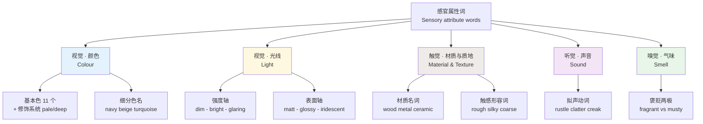
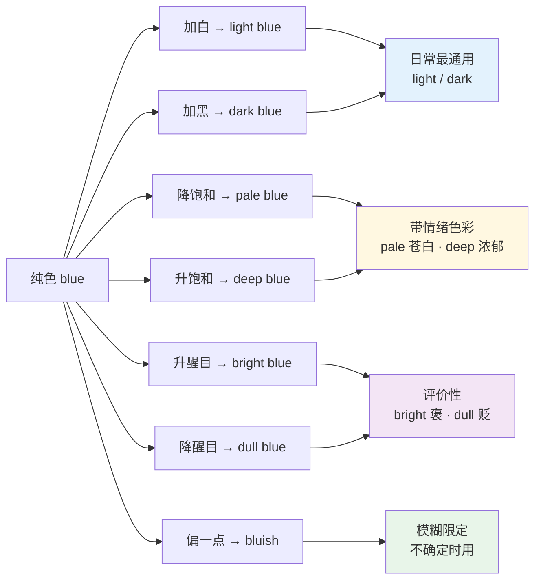
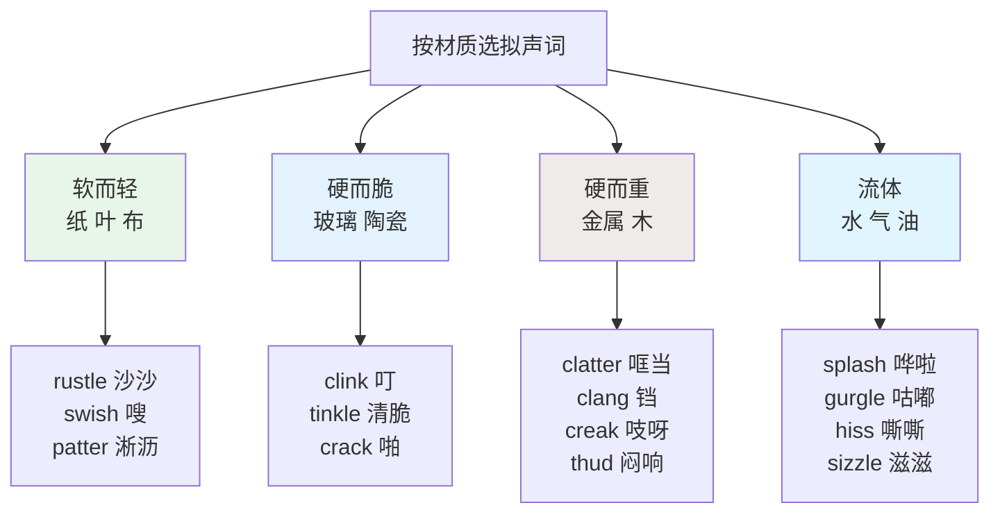
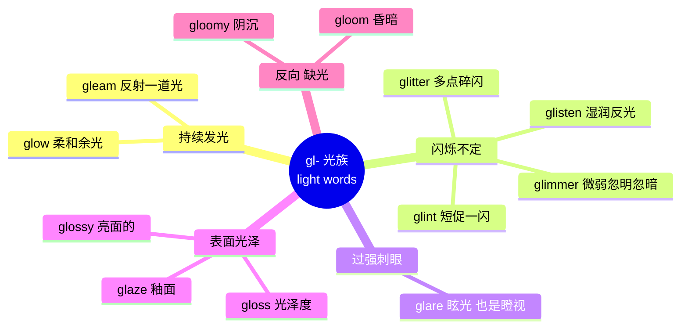
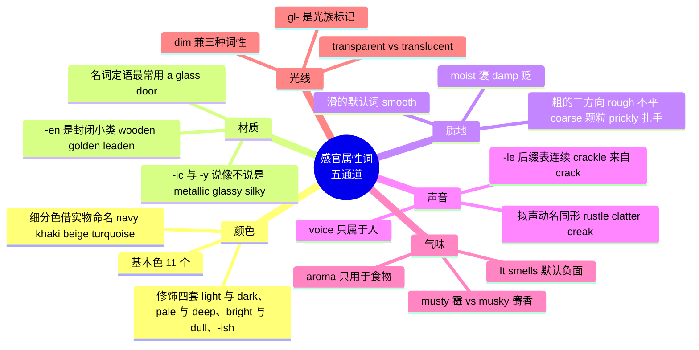

# 颜色、材质、质地与声音气味光线

> [!info] 本篇定位
>
> 第 10 章的收尾篇，也是全书唯一一篇集中处理「感官属性词」的篇目。前三篇讲的是动物和植物这些**实体**，本篇讲的是描述这些实体的**属性**：它是什么颜色、什么材料、摸上去什么手感、发出什么声音、闻起来什么味、在光下什么样子。
>
> 读完能做三件事：一，把中文里靠「浅／深／偏」三个字包办的颜色修饰，拆成 `pale` / `light` / `deep` / `dark` / `-ish` 四套不同的英语手段；二，看到一个物件能说出它的材质形容词（`wooden` 还是 `wood`，`metal` 还是 `metallic`），不再一律用 `made of`；三，在写作和口语里用准确的 `rustle` / `clatter` 替代万能的 `sound`，用 `musty` / `pungent` 替代万能的 `bad smell`。
>
> 本篇与 `06.天气、自然与地理` 的光线词、`09.衣食住行` 的面料词、`16.词义辨析、搭配与短语动词` 的近义组有交叉，交叉处会标出主讲位置。

---

## 1. 本篇导读：感官属性词为什么比名词难

具象名词是一对一的：`cat` 就是猫，记住就完事。感官属性词不是。同一个中文「亮」，在英语里至少分成四个不同的词，各自锁定不同的物理现象：

- 灯很亮 → **bright**（光源强度）
- 这块金属很亮 → **shiny**（表面反射）
- 这张照片纸面很亮 → **glossy**（有光泽的涂层）
- 太阳晃眼 → **glaring**（强到刺眼）

中文用一个「亮」字加语境消歧，英语用四个不同的词把区别写死在词形里。这就是感官属性词的第一个难点：**中文的一个词对应英语的一族词**。

第二个难点是搭配限制极严。`rough` 和 `coarse` 中文都译「粗」，但 `a rough wall`（墙面不平）说得通，`a coarse wall` 就很怪；反过来 `coarse salt`（粗盐）自然，`rough salt` 听起来像盐本身有毛边。这类限制无法靠语法推导，只能靠词表里的搭配栏记住。

第三个难点是同一个词跨感官复用。`sharp` 可以形容刀（触觉）、味道（味觉）、声音（听觉）、图像（视觉）、疼痛（体感），五个方向的中文译法完全不同。这类跨感官迁移在英语里是系统性的，掌握了迁移方向就等于一个词记住五个用法。



上图是本篇的目录结构。五个感官通道各自有自己的组织逻辑：颜色是「基本色 + 修饰」的二层结构，光线是「强度 + 表面」两条正交的轴，材质与质地分成「是什么做的」和「摸起来怎样」两组，声音以拟声动词为主，气味则简单地分成好闻与难闻两极。后面九节按这个顺序展开。

---

## 2. 十一个基本色名与它们的词性行为

### 2.1 基本色的清单

Berlin 与 Kay 在 1969 年的《Basic Color Terms》里提出，现代英语有十一个「基本色词」。判据是四条：单语素（不是复合词也不是派生形式）、词义不被另一个色词涵盖（`scarlet` 被 `red` 涵盖，所以出局）、不局限于某一小类物体（`blond` 只能说头发，出局）、母语者都能脱口而出。这十一个是整个颜色系统的地基。

| 英文 | 英式音标 | 美式音标 | 词性 | 中文 | 搭配与说明 |
| --- | --- | --- | --- | --- | --- |
| **black** | /blæk/ | /blæk/ | adj./n. | 黑色 | pitch-black 漆黑，固定搭配 |
| **white** | /waɪt/ | /waɪt/ | adj./n. | 白色 | snow-white、off-white（米白） |
| **red** | /red/ | /red/ | adj./n. | 红色 | 比较级双写 redder / reddest |
| **green** | /ɡriːn/ | /ɡriːn/ | adj./n. | 绿色 | 引申义「环保的、生手的」 |
| **yellow** | /ˈjeləʊ/ | /ˈjeloʊ/ | adj./n. | 黄色 | 引申义「胆小的」，带贬义 |
| **blue** | /bluː/ | /bluː/ | adj./n. | 蓝色 | 引申义「沮丧的」，feel blue |
| **brown** | /braʊn/ | /braʊn/ | adj./n. | 棕色 | 动词义「煎至上色」，brown the onions |
| **purple** | /ˈpɜːpl/ | /ˈpɜːrpl/ | adj./n. | 紫色 | 英语无「紫」与「蓝紫」的基本区分 |
| **pink** | /pɪŋk/ | /pɪŋk/ | adj./n. | 粉色 | in the pink 意为「气色极好」 |
| **orange** | /ˈɒrɪndʒ/ | /ˈɔːrɪndʒ/ | adj./n. | 橙色 | 与水果同形，英式首元音更短 |
| **grey / gray** | /ɡreɪ/ | /ɡreɪ/ | adj./n. | 灰色 | 英式拼 grey，美式拼 gray，读音相同 |

`grey` / `gray` 是拼写差异中最常被问到的一对。两种拼法读音完全一样，英国和英联邦用 `grey`，美国用 `gray`。注意专有名词不跟着变：猎犬品种 `greyhound` 在美国也拼 `grey`。

### 2.2 颜色词的三种词性用法

颜色词在英语里同时是形容词和名词，两种用法的冠词习惯不同，这是中文母语者高频出错的地方。

| 用法 | 例子 | 说明 |
| --- | --- | --- |
| 形容词 | a **red** car | 直接修饰名词，不加冠词 |
| 不可数名词（指颜色本身） | **Red** is my favourite colour. | 抽象指该色，零冠词 |
| 可数名词（指具体色调） | a warm **red**、several **blues** | 指某一款红、某几种蓝，可加冠词和复数 |
| 穿着表达 | the woman **in red** | 固定介词短语，不说 ~~in the red colour~~ |

> [!warning] 中文式表达的三个高频错误
>
> - ❌ ~~My favourite colour is the red.~~
> - ✅ My favourite colour is **red**.（抽象色名零冠词）
>
> - ❌ ~~a red colour car~~
> - ✅ a **red** car（形容词直接修饰，不夹 colour）
>
> - ❌ ~~She wears the red clothes today.~~
> - ✅ She's **in red** today. / She's wearing **red**.
>
> `in the red` 是另一回事，它是财务用语「亏损」，与穿衣无关。对应的 `in the black` 是「盈利」。

### 2.3 从颜色词派生出来的动词与名词

英语的颜色词有一批固定的派生形式，构词方式不统一，需要单独记。

| 英文 | 英式音标 | 美式音标 | 词性 | 中文 | 搭配与说明 |
| --- | --- | --- | --- | --- | --- |
| **redden** | /ˈredn/ | /ˈredn/ | v. | 变红；使发红 | 多指脸红，her cheeks reddened |
| **blacken** | /ˈblækən/ | /ˈblækən/ | v. | 使变黑；抹黑 | blacken sb's name 败坏名声 |
| **whiten** | /ˈwaɪtn/ | /ˈwaɪtn/ | v. | 使变白 | whitening toothpaste 美白牙膏 |
| **yellow** | /ˈjeləʊ/ | /ˈjeloʊ/ | v. | 泛黄 | 纸张老化，pages yellowed with age |
| **blush** | /blʌʃ/ | /blʌʃ/ | v./n. | 脸红 | 情绪引起，比 redden 更常用于人 |
| **flush** | /flʌʃ/ | /flʌʃ/ | v./n. | 涨红；冲水 | 因发烧、酒精、剧烈运动而红 |
| **tan** | /tæn/ | /tæn/ | v./n./adj. | 晒黑；棕褐色 | 晒黑是 tan，不是 ~~become black~~ |
| **fade** | /feɪd/ | /feɪd/ | v. | 褪色 | 主语是颜色或衣物，颜色变淡 |
| **dye** | /daɪ/ | /daɪ/ | v./n. | 染；染料 | 现在分词 dyeing，与 dying 区分 |
| **bleach** | /bliːtʃ/ | /bliːtʃ/ | v./n. | 漂白；漂白剂 | bleached hair 漂过的头发 |
| **stain** | /steɪn/ | /steɪn/ | v./n. | 染污；污渍 | 木器上色也叫 wood stain |
| **tint** | /tɪnt/ | /tɪnt/ | v./n. | 淡淡着色；色调 | tinted windows 有色车窗 |

> [!tip] tan / blush / flush 三个「变红变黑」的分工
>
> - **tan** 是紫外线造成的、持续数周的皮肤变深，中性偏正面。中文「晒黑了」说 `I got a tan`。
> - **blush** 是情绪触发的、几秒钟就退的脸红，主语通常是人或脸颊。
> - **flush** 强度更大，原因是生理性的：发烧、饮酒、剧烈运动、羞愤。`flushed with anger`（气得涨红脸）。
>
> 把「晒黑」说成 `My skin became black` 在英语里会被理解成人种描述，是需要避开的表达。

---

## 3. 颜色的修饰系统：深浅、浓淡与近似

### 3.1 四套修饰手段各管一件事

中文修饰颜色靠「浅／深／淡／艳／偏」，界限模糊。英语把这件事拆成四套互不重叠的手段。

| 手段 | 词 | 修饰的物理量 | 例子 |
| --- | --- | --- | --- |
| 明度（亮度） | light ↔ dark | 加白还是加黑 | light blue / dark blue |
| 饱和度（浓度） | pale ↔ deep / rich | 色素浓不浓 | pale blue / deep blue |
| 鲜艳度 | bright ↔ dull / muted | 是否醒目 | bright red / dull red |
| 近似 | -ish / -y 后缀 | 偏向某色但不是 | reddish / greenish |

`light` 与 `pale` 常被当成同义词，实际差别清楚：`light` 说的是「往里兑了白」，`pale` 说的是「本来就淡、色素少」。所以 `pale` 可以形容人的脸色（`She looks pale`＝面无血色），`light` 不行；而 `light blue` 是一款正常的浅蓝色，`pale blue` 带一点苍白、褪色的意味。

| 英文 | 英式音标 | 美式音标 | 词性 | 中文 | 搭配与说明 |
| --- | --- | --- | --- | --- | --- |
| **light** | /laɪt/ | /laɪt/ | adj. | 浅的 | light green，加连字符构成 light-green |
| **dark** | /dɑːk/ | /dɑːrk/ | adj. | 深的 | dark brown，最通用的「深」 |
| **pale** | /peɪl/ | /peɪl/ | adj. | 淡的；苍白的 | 唯一能形容脸色的深浅词 |
| **deep** | /diːp/ | /diːp/ | adj. | 浓的 | deep red 比 dark red 更饱和更艳 |
| **rich** | /rɪtʃ/ | /rɪtʃ/ | adj. | 浓郁的 | 褒义，a rich burgundy |
| **bright** | /braɪt/ | /braɪt/ | adj. | 鲜亮的 | bright yellow，指醒目 |
| **vivid** | /ˈvɪvɪd/ | /ˈvɪvɪd/ | adj. | 鲜艳的 | 比 bright 更书面 |
| **vibrant** | /ˈvaɪbrənt/ | /ˈvaɪbrənt/ | adj. | 明快饱满的 | 设计与时尚语境常用 |
| **dull** | /dʌl/ | /dʌl/ | adj. | 暗淡的 | 贬义，a dull grey sky |
| **muted** | /ˈmjuːtɪd/ | /ˈmjuːtɪd/ | adj. | 柔和低调的 | 中性偏褒，muted tones |
| **soft** | /sɒft/ | /sɔːft/ | adj. | 柔和的 | 指颜色不刺眼 |
| **faded** | /ˈfeɪdɪd/ | /ˈfeɪdɪd/ | adj. | 褪色的 | faded jeans 洗得发白的牛仔裤 |
| **washed-out** | /ˌwɒʃt ˈaʊt/ | /ˌwɑːʃt ˈaʊt/ | adj. | 褪得没颜色的 | 比 faded 更强，含贬义 |
| **neon** | /ˈniːɒn/ | /ˈniːɑːn/ | adj./n. | 荧光色的 | neon pink 荧光粉 |
| **fluorescent** | /ˌflɔːˈresnt/ | /ˌflʊˈresnt/ | adj. | 荧光的 | 重音都在第二音节，差别在首音节元音 |
| **pastel** | /ˈpæstl/ | /pæˈstel/ | adj./n. | 马卡龙色的 | 英美重音位置相反，高频差异词 |
| **metallic** | /məˈtælɪk/ | /məˈtælɪk/ | adj. | 金属色的 | metallic silver 车漆常用 |
| **iridescent** | /ˌɪrɪˈdesnt/ | /ˌɪrɪˈdesnt/ | adj. | 虹彩的 | 油膜、贝壳内壁那种变色 |



这张图给出的是选词决策路径。日常描述先用 `light` / `dark` 这一对，它们最安全、搭配限制最少；要表达浓淡的质感差别再换 `pale` / `deep`；带评价色彩时才用 `bright` / `dull`；颜色说不准就退到 `-ish` 后缀。

### 3.2 -ish 后缀：说不准时的安全牌

`-ish` 加在颜色词后表示「偏向、有点」，是英语口语里使用频率极高的模糊限定手段。它把「不确定」这件事本身表达出来了，比硬说一个确定色名更自然。

| 英文 | 英式音标 | 美式音标 | 词性 | 中文 | 搭配与说明 |
| --- | --- | --- | --- | --- | --- |
| **reddish** | /ˈredɪʃ/ | /ˈredɪʃ/ | adj. | 微红的 | reddish brown 红棕色 |
| **greenish** | /ˈɡriːnɪʃ/ | /ˈɡriːnɪʃ/ | adj. | 泛绿的 | 常形容变质、生锈 |
| **bluish** | /ˈbluːɪʃ/ | /ˈbluːɪʃ/ | adj. | 泛蓝的 | 注意拼写去 e，不是 blueish |
| **yellowish** | /ˈjeləʊɪʃ/ | /ˈjeloʊɪʃ/ | adj. | 泛黄的 | 纸张、牙齿老化 |
| **whitish** | /ˈwaɪtɪʃ/ | /ˈwaɪtɪʃ/ | adj. | 发白的 | — |
| **blackish** | /ˈblækɪʃ/ | /ˈblækɪʃ/ | adj. | 发黑的 | — |
| **greyish / grayish** | /ˈɡreɪɪʃ/ | /ˈɡreɪɪʃ/ | adj. | 发灰的 | 拼写随 grey/gray 走 |
| **purplish** | /ˈpɜːplɪʃ/ | /ˈpɜːrplɪʃ/ | adj. | 泛紫的 | 淤青常用 |
| **pinkish** | /ˈpɪŋkɪʃ/ | /ˈpɪŋkɪʃ/ | adj. | 泛粉的 | — |
| **brownish** | /ˈbraʊnɪʃ/ | /ˈbraʊnɪʃ/ | adj. | 泛棕的 | — |
| **orangey** | /ˈɒrɪndʒi/ | /ˈɔːrɪndʒi/ | adj. | 偏橙的 | orange 不加 -ish，改用 -y |
| **rosy** | /ˈrəʊzi/ | /ˈroʊzi/ | adj. | 玫瑰色的 | rosy cheeks 红润的脸颊 |
| **golden** | /ˈɡəʊldən/ | /ˈɡoʊldən/ | adj. | 金色的 | golden hour 日出日落的黄金时段 |
| **silvery** | /ˈsɪlvəri/ | /ˈsɪlvəri/ | adj. | 银白的 | 常形容月光、鱼鳞 |

> [!warning] -ish 的两个陷阱
>
> - `blue` + `-ish` 要去掉词尾 e：写作 **bluish**，`blueish` 虽然词典收录但少见。
> - `orange` 不接 `-ish`（`orangish` 极少用），惯用形式是 **orangey**。同理 `pink` 可以说 `pinkish`，但 `pinky` 在英式口语里是「小拇指」，别混。
>
> `-ish` 还能加在数字和时间后表示「大约」：`sixish`（六点左右）、`fortyish`（四十岁上下）。这个用法在 `03.数字与计量词汇` 有专门处理。

### 3.3 复合色与图案词

两个颜色词直接连写或加连字符构成复合色，前一个词修饰后一个：`blue-green` 是偏蓝的绿，`green-blue` 是偏绿的蓝，主色永远是后一个。

| 英文 | 英式音标 | 美式音标 | 词性 | 中文 | 搭配与说明 |
| --- | --- | --- | --- | --- | --- |
| **blue-green** | /ˌbluː ˈɡriːn/ | /ˌbluː ˈɡriːn/ | adj. | 蓝绿色 | 主色是绿 |
| **off-white** | /ˌɒf ˈwaɪt/ | /ˌɔːf ˈwaɪt/ | adj./n. | 米白 | 装修配色高频词 |
| **jet-black** | /ˌdʒet ˈblæk/ | /ˌdʒet ˈblæk/ | adj. | 乌黑 | 多形容头发 |
| **snow-white** | /ˌsnəʊ ˈwaɪt/ | /ˌsnoʊ ˈwaɪt/ | adj. | 雪白 | — |
| **blood-red** | /ˌblʌd ˈred/ | /ˌblʌd ˈred/ | adj. | 血红 | — |
| **sky-blue** | /ˌskaɪ ˈbluː/ | /ˌskaɪ ˈbluː/ | adj. | 天蓝 | — |
| **plain** | /pleɪn/ | /pleɪn/ | adj. | 素色的 | 无图案，a plain shirt |
| **solid** | /ˈsɒlɪd/ | /ˈsɑːlɪd/ | adj. | 纯色的 | solid black 纯黑 |
| **striped** | /straɪpt/ | /straɪpt/ | adj. | 条纹的 | 名词 stripe |
| **checked** | /tʃekt/ | /tʃekt/ | adj. | 格子的 | 美式多说 checkered |
| **plaid** | /plæd/ | /plæd/ | adj./n. | 苏格兰格纹 | 注意读 /plæd/ 不是 /pleɪd/ |
| **polka-dot** | /ˈpɒlkə dɒt/ | /ˈpoʊlkə dɑːt/ | adj./n. | 波点的 | 英美首元音差异明显 |
| **floral** | /ˈflɔːrəl/ | /ˈflɔːrəl/ | adj. | 花卉图案的 | 也可指花香 |
| **speckled** | /ˈspekld/ | /ˈspekld/ | adj. | 带斑点的 | 鸟蛋、石材 |
| **mottled** | /ˈmɒtld/ | /ˈmɑːtld/ | adj. | 斑驳的 | 皮肤、树皮 |
| **two-tone** | /ˌtuː ˈtəʊn/ | /ˌtuː ˈtoʊn/ | adj. | 双色的 | 车身、鞋面 |

---

## 4. 细分色名：从 navy 到 turquoise

### 4.1 细分色名的来源规律

基本色之外的色名几乎全部是「借物命名」：借宝石（`ruby`、`emerald`、`jade`、`turquoise`）、借植物（`olive`、`lavender`、`lilac`、`peach`）、借颜料与染料（`ochre` 赭土、`cobalt` 钴蓝颜料、`indigo` 靛蓝染料）、借地名（`burgundy` 来自法国勃艮第、`magenta` 来自意大利马真塔）。

认出这个规律的实际好处是：**记住实物就记住了色**。`navy` 是海军制服的深蓝，`khaki` 是军装的土黄，`charcoal` 是木炭的深灰，`cream` 是奶油的米白。不需要背抽象定义。

### 4.2 红橙一族

| 英文 | 英式音标 | 美式音标 | 词性 | 中文 | 搭配与说明 |
| --- | --- | --- | --- | --- | --- |
| **scarlet** | /ˈskɑːlət/ | /ˈskɑːrlət/ | adj./n. | 猩红 | 鲜亮偏橙的红 |
| **crimson** | /ˈkrɪmzn/ | /ˈkrɪmzn/ | adj./n. | 深红 | 偏蓝的暗红，比 scarlet 沉 |
| **maroon** | /məˈruːn/ | /məˈruːn/ | adj./n. | 栗色 | 红中带褐，重音在后 |
| **burgundy** | /ˈbɜːɡəndi/ | /ˈbɜːrɡəndi/ | adj./n. | 酒红 | 借勃艮第红酒命名 |
| **ruby** | /ˈruːbi/ | /ˈruːbi/ | adj./n. | 宝石红 | 借红宝石 |
| **coral** | /ˈkɒrəl/ | /ˈkɔːrəl/ | adj./n. | 珊瑚色 | 粉橙之间 |
| **salmon** | /ˈsæmən/ | /ˈsæmən/ | adj./n. | 三文鱼粉 | l 不发音，是高频读错词 |
| **peach** | /piːtʃ/ | /piːtʃ/ | adj./n. | 蜜桃色 | 浅橙偏粉 |
| **apricot** | /ˈeɪprɪkɒt/ | /ˈæprɪkɑːt/ | adj./n. | 杏色 | 英美首元音不同 |
| **amber** | /ˈæmbə/ | /ˈæmbər/ | adj./n. | 琥珀色 | 也指交通灯黄灯（英式） |
| **rust** | /rʌst/ | /rʌst/ | adj./n. | 铁锈红 | 秋冬色 |
| **terracotta** | /ˌterəˈkɒtə/ | /ˌterəˈkɑːtə/ | adj./n. | 陶土色 | 也是一种陶器材质 |
| **mustard** | /ˈmʌstəd/ | /ˈmʌstərd/ | adj./n. | 芥末黄 | 偏暗的黄 |
| **ochre / ocher** | /ˈəʊkə/ | /ˈoʊkər/ | adj./n. | 赭石色 | 英式拼 ochre，美式 ocher |

### 4.3 黄绿一族

| 英文 | 英式音标 | 美式音标 | 词性 | 中文 | 搭配与说明 |
| --- | --- | --- | --- | --- | --- |
| **cream** | /kriːm/ | /kriːm/ | adj./n. | 奶油色 | 比 off-white 更黄 |
| **ivory** | /ˈaɪvəri/ | /ˈaɪvəri/ | adj./n. | 象牙白 | 婚纱常用色 |
| **beige** | /beɪʒ/ | /beɪʒ/ | adj./n. | 米色 | 法语借词，词尾读 /ʒ/ |
| **taupe** | /təʊp/ | /toʊp/ | adj./n. | 灰褐色 | 单音节，读音易错 |
| **tan** | /tæn/ | /tæn/ | adj./n. | 浅黄褐 | 皮革本色 |
| **khaki** | /ˈkɑːki/ | /ˈkæki/ | adj./n. | 卡其色 | 英美元音差别明显 |
| **olive** | /ˈɒlɪv/ | /ˈɑːlɪv/ | adj./n. | 橄榄绿 | 也形容偏黄的肤色 |
| **lime** | /laɪm/ | /laɪm/ | adj./n. | 青柠绿 | 高饱和亮绿 |
| **emerald** | /ˈemərəld/ | /ˈemərəld/ | adj./n. | 祖母绿 | 三音节，重音在首 |
| **jade** | /dʒeɪd/ | /dʒeɪd/ | adj./n. | 玉色 | 偏蓝的浅绿 |
| **mint** | /mɪnt/ | /mɪnt/ | adj./n. | 薄荷绿 | 极浅的粉绿 |
| **sage** | /seɪdʒ/ | /seɪdʒ/ | adj./n. | 鼠尾草绿 | 灰调绿，室内设计高频 |
| **forest green** | /ˌfɒrɪst ˈɡriːn/ | /ˌfɔːrɪst ˈɡriːn/ | n. | 森林绿 | 深绿 |

### 4.4 蓝紫一族

| 英文 | 英式音标 | 美式音标 | 词性 | 中文 | 搭配与说明 |
| --- | --- | --- | --- | --- | --- |
| **navy** | /ˈneɪvi/ | /ˈneɪvi/ | adj./n. | 藏青 | 全称 navy blue，商务着装主色 |
| **indigo** | /ˈɪndɪɡəʊ/ | /ˈɪndɪɡoʊ/ | adj./n. | 靛蓝 | 牛仔布原色 |
| **cobalt** | /ˈkəʊbɔːlt/ | /ˈkoʊbɔːlt/ | adj./n. | 钴蓝 | 高饱和的正蓝 |
| **azure** | /ˈæʒə/ | /ˈæʒər/ | adj./n. | 蔚蓝 | 书面语，形容天空海面 |
| **turquoise** | /ˈtɜːkwɔɪz/ | /ˈtɜːrkɔɪz/ | adj./n. | 绿松石色 | 蓝绿之间；英美读音差别大 |
| **teal** | /tiːl/ | /tiːl/ | adj./n. | 水鸭色 | 比 turquoise 更深更暗 |
| **aqua** | /ˈækwə/ | /ˈɑːkwə/ | adj./n. | 水蓝 | 浅而透亮 |
| **periwinkle** | /ˈperiwɪŋkl/ | /ˈperiwɪŋkl/ | adj./n. | 长春花蓝 | 淡蓝带紫 |
| **lavender** | /ˈlævəndə/ | /ˈlævəndər/ | adj./n. | 薰衣草紫 | 浅紫 |
| **lilac** | /ˈlaɪlək/ | /ˈlaɪlək/ | adj./n. | 丁香紫 | 比 lavender 更粉 |
| **violet** | /ˈvaɪələt/ | /ˈvaɪələt/ | adj./n. | 紫罗兰色 | 偏蓝的紫 |
| **mauve** | /məʊv/ | /moʊv/ | adj./n. | 淡紫 | 单音节，注意不读两音节 |
| **magenta** | /məˈdʒentə/ | /məˈdʒentə/ | adj./n. | 洋红 | 印刷四色之一 |
| **fuchsia** | /ˈfjuːʃə/ | /ˈfjuːʃə/ | adj./n. | 紫红 | 拼写与读音差极大，chs 读 /ʃ/ |
| **plum** | /plʌm/ | /plʌm/ | adj./n. | 李子紫 | 深紫红 |

### 4.5 灰黑与金属色

| 英文 | 英式音标 | 美式音标 | 词性 | 中文 | 搭配与说明 |
| --- | --- | --- | --- | --- | --- |
| **charcoal** | /ˈtʃɑːkəʊl/ | /ˈtʃɑːrkoʊl/ | adj./n. | 炭灰 | 深灰，西装高频色 |
| **slate** | /sleɪt/ | /sleɪt/ | adj./n. | 石板灰 | 带蓝调的灰 |
| **ash grey** | /ˌæʃ ˈɡreɪ/ | /ˌæʃ ˈɡreɪ/ | n. | 灰白 | — |
| **silver** | /ˈsɪlvə/ | /ˈsɪlvər/ | adj./n. | 银色 | 也指银这种金属 |
| **gold** | /ɡəʊld/ | /ɡoʊld/ | adj./n. | 金色 | 形容词也可用 golden |
| **bronze** | /brɒnz/ | /brɑːnz/ | adj./n. | 古铜色 | 也指青铜材质 |
| **copper** | /ˈkɒpə/ | /ˈkɑːpər/ | adj./n. | 铜红色 | 也指铜 |
| **pewter** | /ˈpjuːtə/ | /ˈpjuːtər/ | adj./n. | 锡灰 | 器物描述常用 |
| **gunmetal** | /ˈɡʌnmetl/ | /ˈɡʌnmetl/ | adj./n. | 枪灰色 | 数码产品配色 |
| **ebony** | /ˈebəni/ | /ˈebəni/ | adj./n. | 乌木黑 | 书面色名 |

> [!tip] 细分色名的学习优先级
>
> 三百多个色名不必全背。按出场频率分三档：
>
> **必须会说**（生活与工作高频）：navy、beige、khaki、charcoal、cream、maroon、turquoise、olive、silver、gold。
>
> **看到要认得**（阅读中会遇到）：crimson、scarlet、amber、emerald、lavender、magenta、teal、taupe、mauve、indigo。
>
> **知道存在即可**：periwinkle、pewter、fuchsia、ochre、terracotta 这类专业配色词，用时再查。
>
> 判断标准很实际：这个色名你能不能在服装店、家装店、UI 配色面板上真的用上。用不上的先放着。

---

## 5. 材质：名词、形容词与 -en 后缀

### 5.1 材质名词表

材质词的核心难点不在词本身，而在「什么时候用名词、什么时候用形容词、什么时候两个都行」。先把名词摆出来。

| 英文 | 英式音标 | 美式音标 | 词性 | 中文 | 搭配与说明 |
| --- | --- | --- | --- | --- | --- |
| **wood** | /wʊd/ | /wʊd/ | n. | 木头 | 不可数；a wood 是「树林」 |
| **timber** | /ˈtɪmbə/ | /ˈtɪmbər/ | n. | 木材 | 英式建材用词，美式多说 lumber |
| **metal** | /ˈmetl/ | /ˈmetl/ | n. | 金属 | — |
| **steel** | /stiːl/ | /stiːl/ | n. | 钢 | stainless steel 不锈钢 |
| **iron** | /ˈaɪən/ | /ˈaɪərn/ | n. | 铁；熨斗 | r 不发独立音，是高频读错词 |
| **brass** | /brɑːs/ | /bræs/ | n. | 黄铜 | 英美元音差异典型 |
| **aluminium / aluminum** | /ˌæljəˈmɪniəm/ | /əˈluːmɪnəm/ | n. | 铝 | 英美拼写与音节数都不同 |
| **ceramic** | /səˈræmɪk/ | /səˈræmɪk/ | n./adj. | 陶瓷 | 复数 ceramics 指陶艺 |
| **porcelain** | /ˈpɔːsəlɪn/ | /ˈpɔːrsələn/ | n. | 瓷 | 比 ceramic 更细腻高档 |
| **china** | /ˈtʃaɪnə/ | /ˈtʃaɪnə/ | n. | 瓷器 | 小写不大写，指餐瓷 |
| **clay** | /kleɪ/ | /kleɪ/ | n. | 黏土 | 未烧制的陶土 |
| **glass** | /ɡlɑːs/ | /ɡlæs/ | n. | 玻璃 | 可数时指杯子 |
| **plastic** | /ˈplæstɪk/ | /ˈplæstɪk/ | n./adj. | 塑料 | 也作形容词「不自然的」 |
| **rubber** | /ˈrʌbə/ | /ˈrʌbər/ | n. | 橡胶 | 英式还指橡皮擦 |
| **leather** | /ˈleðə/ | /ˈleðər/ | n. | 皮革 | genuine leather 真皮 |
| **suede** | /sweɪd/ | /sweɪd/ | n. | 麂皮 | 单音节，不读三音节 |
| **fur** | /fɜː/ | /fɜːr/ | n. | 毛皮 | faux fur 人造毛 |
| **wool** | /wʊl/ | /wʊl/ | n. | 羊毛 | — |
| **cotton** | /ˈkɒtn/ | /ˈkɑːtn/ | n. | 棉 | — |
| **linen** | /ˈlɪnɪn/ | /ˈlɪnɪn/ | n. | 亚麻 | 也统称床品桌布 |
| **silk** | /sɪlk/ | /sɪlk/ | n. | 丝绸 | — |
| **velvet** | /ˈvelvɪt/ | /ˈvelvɪt/ | n. | 天鹅绒 | — |
| **denim** | /ˈdenɪm/ | /ˈdenɪm/ | n. | 牛仔布 | — |
| **nylon** | /ˈnaɪlɒn/ | /ˈnaɪlɑːn/ | n. | 尼龙 | — |
| **polyester** | /ˌpɒliˈestə/ | /ˈpɑːliestər/ | n. | 涤纶 | 英美重音位置不同 |
| **concrete** | /ˈkɒŋkriːt/ | /ˈkɑːŋkriːt/ | n./adj. | 混凝土 | 形容词义「具体的」 |
| **cement** | /sɪˈment/ | /sɪˈment/ | n./v. | 水泥；巩固 | 重音在后 |
| **brick** | /brɪk/ | /brɪk/ | n. | 砖 | — |
| **marble** | /ˈmɑːbl/ | /ˈmɑːrbl/ | n. | 大理石 | 复数 marbles 是玻璃弹珠 |
| **granite** | /ˈɡrænɪt/ | /ˈɡrænɪt/ | n. | 花岗岩 | 重音在首 |
| **slate** | /sleɪt/ | /sleɪt/ | n. | 石板 | 也是色名 |
| **stone** | /stəʊn/ | /stoʊn/ | n. | 石头 | 英式还是重量单位 |
| **cardboard** | /ˈkɑːdbɔːd/ | /ˈkɑːrdbɔːrd/ | n. | 纸板 | — |
| **foam** | /fəʊm/ | /foʊm/ | n. | 泡沫 | memory foam 记忆棉 |
| **cork** | /kɔːk/ | /kɔːrk/ | n. | 软木 | 也指酒瓶塞 |
| **wicker** | /ˈwɪkə/ | /ˈwɪkər/ | n. | 藤编 | wicker basket 藤篮 |
| **bamboo** | /ˌbæmˈbuː/ | /ˌbæmˈbuː/ | n. | 竹 | 重音在后 |
| **enamel** | /ɪˈnæml/ | /ɪˈnæml/ | n. | 珐琅；牙釉质 | 双义 |
| **resin** | /ˈrezɪn/ | /ˈrezɪn/ | n. | 树脂 | — |
| **alloy** | /ˈælɔɪ/ | /ˈælɔɪ/ | n. | 合金 | 名词重音在首 |
| **fibre / fiber** | /ˈfaɪbə/ | /ˈfaɪbər/ | n. | 纤维 | 英式拼 fibre |

### 5.2 三种表达「什么做的」的方式

同一件事，英语给了三条路，语感差别明显。

| 方式 | 例子 | 什么时候用 |
| --- | --- | --- |
| 名词直接当定语 | a **wood** floor、a **glass** door、a **steel** beam | 最常用，中性直白，重点在材料本身 |
| `-en` 后缀形容词 | a **wooden** floor、a **golden** ring | 有限的一批老词；比名词定语更书面、更有质感 |
| `made of` 短语 | a table **made of** solid oak | 需要强调或补充说明时用，句子更长 |

`a wood floor` 和 `a wooden floor` 都能说，多数场合可以互换，`wooden` 稍显文学化。但有些搭配已经固化，不能随便换：

> - a **wooden** spoon（木勺，固定说法）
> - a **wood** stove（柴火炉，固定说法）
> - a **glass** bottle（玻璃瓶，不说 ~~a glassen bottle~~，`-en` 形式已不存在）
> - a **plastic** bag（塑料袋，塑料没有 `-en` 形式）

### 5.3 -en 材质形容词的封闭清单

`-en` 是古英语遗留的材质后缀，早已停止造新词。今天还活着的只有下面这一小批，其余的（`glassen`、`steelen`）在现代英语里根本不存在。

| 英文 | 英式音标 | 美式音标 | 词性 | 中文 | 搭配与说明 |
| --- | --- | --- | --- | --- | --- |
| **wooden** | /ˈwʊdn/ | /ˈwʊdn/ | adj. | 木制的 | 引申义「僵硬呆板的」，a wooden smile |
| **golden** | /ˈɡəʊldən/ | /ˈɡoʊldən/ | adj. | 金色的；黄金般的 | 多指颜色，纯金说 gold |
| **woollen / woolen** | /ˈwʊlən/ | /ˈwʊlən/ | adj. | 羊毛的 | 英式双 l，美式单 l |
| **leaden** | /ˈledn/ | /ˈledn/ | adj. | 铅制的；沉重灰暗的 | leaden sky 阴沉的天 |
| **earthen** | /ˈɜːθn/ | /ˈɜːrθn/ | adj. | 陶土的 | earthenware 陶器 |
| **wheaten** | /ˈwiːtn/ | /ˈwiːtn/ | adj. | 小麦的 | 少见，多用于面粉与犬种名 |
| **waxen** | /ˈwæksn/ | /ˈwæksn/ | adj. | 蜡制的；蜡黄的 | 文学用词，形容脸色 |
| **ashen** | /ˈæʃn/ | /ˈæʃn/ | adj. | 灰白的 | 只用于脸色，不指材质 |
| **silken** | /ˈsɪlkən/ | /ˈsɪlkən/ | adj. | 丝质的；柔滑的 | 文学色彩浓，日常用 silk 或 silky |

> [!warning] -en 形容词的引申义比本义更常用
>
> `wooden`、`leaden`、`waxen`、`ashen` 这四个词在现代英语里出现时，多半不是在说材料。
>
> - `a wooden performance` 是「表演僵硬」，不是「木头做的表演」。
> - `leaden limbs` 是「四肢沉重」，不是「铅做的腿」。
> - `an ashen face` 只能是「面如死灰」，`ashen` 已经完全脱离「灰烬做的」这个本义。
>
> 读到这些词先按引申义理解，往往更接近作者意图。

### 5.4 -ic / -y 类材质形容词

另一批材质形容词走的是拉丁后缀 `-ic` 或日耳曼后缀 `-y`，语义重心不是「由某材料制成」，而是「具有某材料的特性」。

| 英文 | 英式音标 | 美式音标 | 词性 | 中文 | 搭配与说明 |
| --- | --- | --- | --- | --- | --- |
| **metallic** | /məˈtælɪk/ | /məˈtælɪk/ | adj. | 金属质感的 | 指光泽、声音、味道，不是「金属做的」 |
| **ceramic** | /səˈræmɪk/ | /səˈræmɪk/ | adj. | 陶瓷的 | 名词形容词同形 |
| **plastic** | /ˈplæstɪk/ | /ˈplæstɪk/ | adj. | 塑料的；可塑的 | 贬义时指「假的、做作的」 |
| **rubbery** | /ˈrʌbəri/ | /ˈrʌbəri/ | adj. | 橡胶般的 | 形容食物嚼不烂 |
| **silky** | /ˈsɪlki/ | /ˈsɪlki/ | adj. | 柔滑如丝的 | 触感词，非材质词 |
| **velvety** | /ˈvelvəti/ | /ˈvelvəti/ | adj. | 天鹅绒般的 | 也形容红酒口感 |
| **leathery** | /ˈleðəri/ | /ˈleðəri/ | adj. | 皮革般的 | 多贬义，皮肤粗糙或肉太老 |
| **glassy** | /ˈɡlɑːsi/ | /ˈɡlæsi/ | adj. | 玻璃般的 | glassy eyes 目光呆滞 |
| **chalky** | /ˈtʃɔːki/ | /ˈtʃɔːki/ | adj. | 白垩质的 | 口感干涩粉状 |
| **waxy** | /ˈwæksi/ | /ˈwæksi/ | adj. | 蜡质的 | 表面滑而不亮 |
| **papery** | /ˈpeɪpəri/ | /ˈpeɪpəri/ | adj. | 纸一样薄的 | 洋葱皮、老人皮肤 |
| **woody** | /ˈwʊdi/ | /ˈwʊdi/ | adj. | 木质的 | 也形容香调 |
| **stony** | /ˈstəʊni/ | /ˈstoʊni/ | adj. | 石头般的 | a stony silence 冷冰冰的沉默 |
| **steely** | /ˈstiːli/ | /ˈstiːli/ | adj. | 钢一般的 | steely determination 钢铁般的决心 |

> [!warning] metal 与 metallic 不能互换
>
> - ✅ a **metal** box（金属盒子，材质是金属）
> - ❌ ~~a metallic box~~（除非指喷了金属漆的盒子）
> - ✅ a **metallic** taste（口中金属味）
> - ✅ a **metallic** sound（金属般的声响）
> - ❌ ~~a metal taste~~
>
> 判据一句话：**用 `metal` 说它是什么做的，用 `metallic` 说它像金属**。同样的分工出现在 `wood` / `woody`、`glass` / `glassy`、`silk` / `silky` 三对上。

---

## 6. 质地与触感：rough、silky、coarse 的分工

### 6.1 粗糙一端

中文的「粗」在英语里分三个方向：表面不平（`rough`）、颗粒大（`coarse`）、有毛刺（`prickly`）。选错方向对方能懂，但会明显不地道。

| 英文 | 英式音标 | 美式音标 | 词性 | 中文 | 搭配与说明 |
| --- | --- | --- | --- | --- | --- |
| **rough** | /rʌf/ | /rʌf/ | adj. | 粗糙不平的 | 表面凹凸，rough skin / rough road |
| **coarse** | /kɔːs/ | /kɔːrs/ | adj. | 颗粒粗的 | coarse salt / coarse sand / coarse fabric |
| **gritty** | /ˈɡrɪti/ | /ˈɡrɪti/ | adj. | 沙砾感的 | 牙碜，a gritty texture |
| **grainy** | /ˈɡreɪni/ | /ˈɡreɪni/ | adj. | 有颗粒的 | 也形容照片噪点 |
| **bumpy** | /ˈbʌmpi/ | /ˈbʌmpi/ | adj. | 坑洼的 | 路面起伏 |
| **uneven** | /ʌnˈiːvn/ | /ʌnˈiːvn/ | adj. | 不平整的 | 中性描述 |
| **jagged** | /ˈdʒæɡɪd/ | /ˈdʒæɡɪd/ | adj. | 锯齿状的 | 破碎玻璃边缘，读两音节 |
| **ridged** | /rɪdʒd/ | /rɪdʒd/ | adj. | 有棱纹的 | 瓦楞、指甲 |
| **prickly** | /ˈprɪkli/ | /ˈprɪkli/ | adj. | 扎手的 | 仙人掌、胡茬 |
| **bristly** | /ˈbrɪsli/ | /ˈbrɪsli/ | adj. | 硬毛的 | t 不发音 |
| **scratchy** | /ˈskrætʃi/ | /ˈskrætʃi/ | adj. | 刺痒的 | 毛衣贴皮肤的感觉 |
| **abrasive** | /əˈbreɪsɪv/ | /əˈbreɪsɪv/ | adj. | 磨蚀性的 | 也形容人「言语刺人」 |
| **crumbly** | /ˈkrʌmbli/ | /ˈkrʌmbli/ | adj. | 易碎成屑的 | 干酪、酥饼 |
| **brittle** | /ˈbrɪtl/ | /ˈbrɪtl/ | adj. | 脆易断的 | brittle nails 指甲脆 |
| **flaky** | /ˈfleɪki/ | /ˈfleɪki/ | adj. | 起皮的 | 也形容人「不靠谱」 |
| **powdery** | /ˈpaʊdəri/ | /ˈpaʊdəri/ | adj. | 粉状的 | 新雪、面粉 |

> [!warning] rough 与 coarse 的搭配边界
>
> - ✅ **rough** hands / **rough** wall / **rough** sea（手粗糙、墙面不平、海面颠簸）
> - ✅ **coarse** salt / **coarse** ground pepper / **coarse** wool（盐粒粗、胡椒磨得粗、羊毛纤维粗）
> - ❌ ~~coarse hands~~（不说手「颗粒粗」）
> - ❌ ~~rough salt~~（盐不是表面不平的问题）
>
> `coarse` 还有一层「言语粗俗」的义项：`coarse language` 等于粗话。`rough` 对应的引申义是「大致的」：`a rough estimate` 粗略估计、`a rough draft` 草稿。这两条引申义在 `13.抽象概念、评价与高频动词` 里会再出现。

### 6.2 光滑一端

| 英文 | 英式音标 | 美式音标 | 词性 | 中文 | 搭配与说明 |
| --- | --- | --- | --- | --- | --- |
| **smooth** | /smuːð/ | /smuːð/ | adj. | 光滑的 | th 读浊音 /ð/，最通用 |
| **silky** | /ˈsɪlki/ | /ˈsɪlki/ | adj. | 柔滑如丝的 | 头发、皮肤、酱汁 |
| **satiny** | /ˈsætɪni/ | /ˈsætɪni/ | adj. | 缎面般的 | 比 silky 更有光泽感 |
| **sleek** | /sliːk/ | /sliːk/ | adj. | 光洁流畅的 | 也形容车身、设备造型 |
| **soft** | /sɒft/ | /sɔːft/ | adj. | 柔软的 | 英美元音差异明显 |
| **supple** | /ˈsʌpl/ | /ˈsʌpl/ | adj. | 柔韧的 | 皮革、身体，褒义 |
| **plush** | /plʌʃ/ | /plʌʃ/ | adj. | 厚软的 | 地毯、玩偶 |
| **fluffy** | /ˈflʌfi/ | /ˈflʌfi/ | adj. | 蓬松的 | 毛巾、云、蛋糕 |
| **fuzzy** | /ˈfʌzi/ | /ˈfʌzi/ | adj. | 有绒毛的 | 也形容图像模糊 |
| **furry** | /ˈfɜːri/ | /ˈfɜːri/ | adj. | 毛茸茸的 | 动物毛皮 |
| **velvety** | /ˈvelvəti/ | /ˈvelvəti/ | adj. | 天鹅绒般的 | 桃皮、红酒口感 |
| **spongy** | /ˈspʌndʒi/ | /ˈspʌndʒi/ | adj. | 海绵状的 | 按下去能回弹 |
| **squishy** | /ˈskwɪʃi/ | /ˈskwɪʃi/ | adj. | 软塌塌的 | 口语，偏可爱语气 |
| **slippery** | /ˈslɪpəri/ | /ˈslɪpəri/ | adj. | 湿滑的 | 会打滑，含风险意味 |
| **slimy** | /ˈslaɪmi/ | /ˈslaɪmi/ | adj. | 黏滑的 | 强贬义，也形容人虚伪 |
| **sticky** | /ˈstɪki/ | /ˈstɪki/ | adj. | 黏的 | 会粘手 |
| **tacky** | /ˈtæki/ | /ˈtæki/ | adj. | 半干发黏的 | 油漆将干未干；也指「俗气」 |
| **greasy** | /ˈɡriːsi/ | /ˈɡriːsi/ | adj. | 油腻的 | 手感和食物都能用 |
| **oily** | /ˈɔɪli/ | /ˈɔɪli/ | adj. | 含油的 | 比 greasy 中性 |

`smooth` 是这一组的默认词，用不准时用它最安全。`silky` 是拿丝绸作比喻，重点在「顺滑无阻力」；`sleek` 强调线条光洁流畅，多用于外观评价；`slippery` 已经越界到「危险」的语义，`a slippery floor` 是警告不是赞美。

### 6.3 干湿与软硬

| 英文 | 英式音标 | 美式音标 | 词性 | 中文 | 搭配与说明 |
| --- | --- | --- | --- | --- | --- |
| **dry** | /draɪ/ | /draɪ/ | adj. | 干的 | — |
| **damp** | /dæmp/ | /dæmp/ | adj. | 潮的 | 微贬，含发霉隐含义 |
| **moist** | /mɔɪst/ | /mɔɪst/ | adj. | 湿润的 | 褒义，形容蛋糕、皮肤 |
| **soggy** | /ˈsɒɡi/ | /ˈsɑːɡi/ | adj. | 湿软的 | 贬义，泡烂了 |
| **clammy** | /ˈklæmi/ | /ˈklæmi/ | adj. | 湿冷黏腻的 | 手心出汗 |
| **crisp** | /krɪsp/ | /krɪsp/ | adj. | 脆的；挺括的 | 食物脆、衬衫挺、空气清冽 |
| **crunchy** | /ˈkrʌntʃi/ | /ˈkrʌntʃi/ | adj. | 嘎嘣脆的 | 咬下去有声 |
| **chewy** | /ˈtʃuːi/ | /ˈtʃuːi/ | adj. | 有嚼劲的 | 褒义 |
| **tough** | /tʌf/ | /tʌf/ | adj. | 咬不动的 | 贬义，肉太老 |
| **tender** | /ˈtendə/ | /ˈtendər/ | adj. | 嫩的 | 肉的褒义词 |
| **firm** | /fɜːm/ | /fɜːrm/ | adj. | 结实的 | 有弹性但不软 |
| **stiff** | /stɪf/ | /stɪf/ | adj. | 硬挺的 | 不易弯折 |
| **rigid** | /ˈrɪdʒɪd/ | /ˈrɪdʒɪd/ | adj. | 刚性的 | 书面语，也形容制度死板 |
| **flexible** | /ˈfleksəbl/ | /ˈfleksəbl/ | adj. | 可弯曲的 | — |
| **springy** | /ˈsprɪŋi/ | /ˈsprɪŋi/ | adj. | 有弹性的 | 按下回弹 |
| **dense** | /dens/ | /dens/ | adj. | 密实的 | 手感沉 |
| **hollow** | /ˈhɒləʊ/ | /ˈhɑːloʊ/ | adj. | 中空的 | 敲起来空响 |

> [!tip] moist 与 damp 的褒贬差
>
> 两个词都译「潮湿」，但情感色彩相反。**moist** 是好事：`a moist chocolate cake`（湿润不干柴的巧克力蛋糕）、`moist skin`（皮肤水润）。**damp** 是坏事：`a damp basement`（地下室返潮）、`damp clothes`（衣服没干透）。
>
> 把「蛋糕很湿润」说成 `a damp cake`，听起来像蛋糕受潮了。这是靠中文对译无法察觉的陷阱。

---

## 7. 声音：拟声动词是主力

### 7.1 声音的总名词：sound、noise 与 voice 打头

`sound` / `noise` / `voice` 是中文母语者最常混的一组。

| 英文 | 英式音标 | 美式音标 | 词性 | 中文 | 搭配与说明 |
| --- | --- | --- | --- | --- | --- |
| **sound** | /saʊnd/ | /saʊnd/ | n./v. | 声音 | 中性总称，可数不可数皆可 |
| **noise** | /nɔɪz/ | /nɔɪz/ | n. | 噪音；响动 | 通常不受欢迎；make a noise |
| **voice** | /vɔɪs/ | /vɔɪs/ | n. | 嗓音 | 只用于人或拟人化的发声 |
| **tone** | /təʊn/ | /toʊn/ | n. | 语气；音色 | 也指颜色的色调 |
| **pitch** | /pɪtʃ/ | /pɪtʃ/ | n. | 音高 | high-pitched 高音的 |
| **volume** | /ˈvɒljuːm/ | /ˈvɑːljuːm/ | n. | 音量 | turn up the volume |
| **echo** | /ˈekəʊ/ | /ˈekoʊ/ | n./v. | 回声 | 复数 echoes 加 es |
| **din** | /dɪn/ | /dɪn/ | n. | 喧嚣 | 书面语，持续的嘈杂 |
| **racket** | /ˈrækɪt/ | /ˈrækɪt/ | n. | 吵闹 | 口语；也指球拍 |
| **hush** | /hʌʃ/ | /hʌʃ/ | n./v./int. | 静默；嘘 | a hush fell over the room |
| **silence** | /ˈsaɪləns/ | /ˈsaɪləns/ | n. | 寂静 | dead silence 死寂 |

> [!warning] voice 只属于人
>
> - ❌ ~~the voice of the machine~~
> - ✅ the **sound** of the machine / the **noise** of the machine
> - ❌ ~~I heard a strange voice from the engine.~~
> - ✅ I heard a strange **noise** from the engine.
>
> 例外是拟人化和技术术语：`voice assistant`（语音助手）、`voice recognition`（语音识别）、`voice message`（语音消息）里的 `voice` 指的是人声这个信号本身，仍然合规。

### 7.2 拟声动词：本篇的核心表

英语描述声音的主力不是形容词，而是一批**动名词同形的拟声词**。它们既能作动词（`The leaves rustled`），也能作名词（`the rustle of leaves`）。掌握这批词是把英语写作从「有声音」提升到「有画面」的关键。

| 英文 | 英式音标 | 美式音标 | 词性 | 中文 | 搭配与说明 |
| --- | --- | --- | --- | --- | --- |
| **rustle** | /ˈrʌsl/ | /ˈrʌsl/ | v./n. | 沙沙作响 | 树叶、纸张、丝绸；t 不发音 |
| **clatter** | /ˈklætə/ | /ˈklætər/ | v./n. | 哐当作响 | 硬物碰撞连响，餐具、马蹄 |
| **rattle** | /ˈrætl/ | /ˈrætl/ | v./n. | 咔哒晃响 | 松动件震动，窗户、车厢 |
| **creak** | /kriːk/ | /kriːk/ | v./n. | 吱呀声 | 木门、旧地板、楼梯 |
| **squeak** | /skwiːk/ | /skwiːk/ | v./n. | 吱吱尖响 | 老鼠、球鞋、干涩铰链 |
| **crack** | /kræk/ | /kræk/ | v./n. | 啪的一声 | 断裂或鞭响 |
| **crackle** | /ˈkrækl/ | /ˈkrækl/ | v./n. | 噼啪连响 | 柴火、静电、无线电 |
| **crunch** | /krʌntʃ/ | /krʌntʃ/ | v./n. | 嘎吱碾压声 | 踩雪、踩碎石、咬脆物 |
| **snap** | /snæp/ | /snæp/ | v./n. | 啪地折断 | 也指打响指 |
| **thud** | /θʌd/ | /θʌd/ | v./n. | 闷响 | 重物落地，低频无回响 |
| **thump** | /θʌmp/ | /θʌmp/ | v./n. | 咚咚重击 | 比 thud 更有节奏 |
| **bang** | /bæŋ/ | /bæŋ/ | v./n. | 砰 | 爆响，也指关门 |
| **slam** | /slæm/ | /slæm/ | v./n. | 猛地摔上 | slam the door |
| **clang** | /klæŋ/ | /klæŋ/ | v./n. | 铛的一声 | 大金属件，钟、铁门 |
| **clink** | /klɪŋk/ | /klɪŋk/ | v./n. | 叮的轻响 | 玻璃杯碰杯、硬币 |
| **chime** | /tʃaɪm/ | /tʃaɪm/ | v./n. | 悦耳钟响 | 门铃、报时钟 |
| **jingle** | /ˈdʒɪŋɡl/ | /ˈdʒɪŋɡl/ | v./n. | 叮当响 | 钥匙、铃铛；也指广告曲 |
| **tinkle** | /ˈtɪŋkl/ | /ˈtɪŋkl/ | v./n. | 清脆细响 | 风铃、小铃 |
| **hum** | /hʌm/ | /hʌm/ | v./n. | 嗡嗡；哼唱 | 机器低鸣或哼小调 |
| **buzz** | /bʌz/ | /bʌz/ | v./n. | 嗡嗡振响 | 蜜蜂、手机震动 |
| **hiss** | /hɪs/ | /hɪs/ | v./n. | 嘶嘶声 | 蛇、漏气、蒸汽 |
| **sizzle** | /ˈsɪzl/ | /ˈsɪzl/ | v./n. | 滋滋声 | 热油下锅 |
| **splash** | /splæʃ/ | /splæʃ/ | v./n. | 哗啦水声 | 也指溅出的水 |
| **drip** | /drɪp/ | /drɪp/ | v./n. | 滴答 | 漏水 |
| **gurgle** | /ˈɡɜːɡl/ | /ˈɡɜːrɡl/ | v./n. | 咕嘟声 | 水流过管道、婴儿声 |
| **patter** | /ˈpætə/ | /ˈpætər/ | v./n. | 淅沥声 | 小雨打窗、小脚步 |
| **rumble** | /ˈrʌmbl/ | /ˈrʌmbl/ | v./n. | 隆隆声 | 雷、卡车、肚子 |
| **roar** | /rɔː/ | /rɔːr/ | v./n. | 咆哮轰鸣 | 引擎、人群、猛兽 |
| **screech** | /skriːtʃ/ | /skriːtʃ/ | v./n. | 刺耳尖响 | 急刹车、指甲划黑板 |
| **shriek** | /ʃriːk/ | /ʃriːk/ | v./n. | 尖叫 | 人的高音惊叫 |
| **whine** | /waɪn/ | /waɪn/ | v./n. | 呜咽哀鸣 | 狗、马达、抱怨腔 |
| **whistle** | /ˈwɪsl/ | /ˈwɪsl/ | v./n. | 呼哨 | t 不发音；风声、口哨、水壶 |
| **swish** | /swɪʃ/ | /swɪʃ/ | v./n. | 嗖的划过声 | 挥杆、裙摆 |
| **click** | /klɪk/ | /klɪk/ | v./n. | 咔嗒 | 开关、鼠标 |
| **tick** | /tɪk/ | /tɪk/ | v./n. | 滴答 | 钟表；tick-tock |
| **pop** | /pɒp/ | /pɑːp/ | v./n. | 啵的一声 | 瓶塞、气泡 |
| **murmur** | /ˈmɜːmə/ | /ˈmɜːrmər/ | v./n. | 低语；潺潺 | 人声或流水 |
| **whisper** | /ˈwɪspə/ | /ˈwɪspər/ | v./n. | 耳语 | 也形容风声 |
| **thunder** | /ˈθʌndə/ | /ˈθʌndər/ | v./n. | 打雷；轰响 | 详见 06 章天气篇 |



这张图给的是反查路径：不是从中文拟声词出发（中文的「哐当」在英语里可能是 `clatter` 也可能是 `clang`），而是从**发声物的材质**出发。软而轻的东西 `rustle`，玻璃陶瓷 `clink`，金属重物 `clang` 或 `clatter`，水和气体 `splash`、`hiss`。材质定了，词基本就定了。

### 7.3 -le 后缀：一次响与连续响的区别

英语拟声词里有一条清晰的形态规律：**词根表示一次响，加 `-le` 表示连续重复地响**。这个 `-le` 是古英语留下的「反复态」后缀。

| 一次响 | 连续响 | 差别 |
| --- | --- | --- |
| **crack** 啪（一声断裂） | **crackle** 噼啪（柴火持续） | 单次 vs 持续 |
| **rat**（古词根，已不单用） | **rattle** 咔哒咔哒 | 只剩连续形 |
| **spark** 迸一下火星 | **sparkle** 闪闪发亮 | 单次 vs 持续 |
| **twink**（古词根） | **twinkle** 一闪一闪 | 只剩连续形 |
| **jing**（拟声词根） | **jingle** 叮当叮当 | 只剩连续形 |
| **drip** 滴一滴 | **dribble** 断续滴淌 | 单次 vs 断续 |
| **sniff** 吸一下鼻子 | **sniffle** 抽个不停 | 单次 vs 持续 |

看到 `-le` 结尾的拟声词，默认理解成「反复、持续、细碎」，基本不会错。同一条规律也管着光线词：`sparkle`、`twinkle`、`shimmer`、`glimmer`、`flicker` 全是「一闪一闪地」，与单次的 `flash`（闪一下）形成对照。这个交叉点在下一节还会用到。

### 7.4 声音的形容词

| 英文 | 英式音标 | 美式音标 | 词性 | 中文 | 搭配与说明 |
| --- | --- | --- | --- | --- | --- |
| **loud** | /laʊd/ | /laʊd/ | adj. | 响的 | 最通用 |
| **quiet** | /ˈkwaɪət/ | /ˈkwaɪət/ | adj. | 安静的 | 两音节，与 quite 区分 |
| **faint** | /feɪnt/ | /feɪnt/ | adj. | 微弱的 | a faint sound；也指晕倒 |
| **muffled** | /ˈmʌfld/ | /ˈmʌfld/ | adj. | 被捂住的 | 隔墙听到的声音 |
| **shrill** | /ʃrɪl/ | /ʃrɪl/ | adj. | 尖利刺耳的 | 强贬义 |
| **piercing** | /ˈpɪəsɪŋ/ | /ˈpɪrsɪŋ/ | adj. | 穿透耳膜的 | 比 shrill 更强 |
| **deafening** | /ˈdefnɪŋ/ | /ˈdefnɪŋ/ | adj. | 震耳欲聋的 | deafening silence 是反语用法 |
| **harsh** | /hɑːʃ/ | /hɑːrʃ/ | adj. | 刺耳的 | 也形容光线和批评 |
| **resonant** | /ˈrezənənt/ | /ˈrezənənt/ | adj. | 洪亮有共鸣的 | 褒义 |
| **hoarse** | /hɔːs/ | /hɔːrs/ | adj. | 沙哑的 | 与 horse 同音 |
| **husky** | /ˈhʌski/ | /ˈhʌski/ | adj. | 低沉沙哑的 | 褒义，形容嗓音有磁性 |
| **audible** | /ˈɔːdəbl/ | /ˈɔːdəbl/ | adj. | 听得见的 | 反义 inaudible |
| **high-pitched** | /ˌhaɪ ˈpɪtʃt/ | /ˌhaɪ ˈpɪtʃt/ | adj. | 音调高的 | 反义 low-pitched |

---

## 8. 气味：从 fragrant 到 musty

### 8.1 气味的总名词：核心是四分

中文一个「味道」在英语里按褒贬和场合分成 `smell`、`scent`、`odour`、`aroma` 四个核心词，用错会传递出相反的态度。下表在这四个之外，把与它们同一层级的其余气味名词一并列出。

| 英文 | 英式音标 | 美式音标 | 词性 | 中文 | 搭配与说明 |
| --- | --- | --- | --- | --- | --- |
| **smell** | /smel/ | /smel/ | n./v. | 气味；闻 | 中性总称，但单独说 It smells 默认是难闻 |
| **scent** | /sent/ | /sent/ | n. | 香味；气息 | 偏褒；也指动物留下的踪迹 |
| **odour / odor** | /ˈəʊdə/ | /ˈoʊdər/ | n. | 气味 | 偏贬且偏正式，body odour 体味 |
| **aroma** | /əˈrəʊmə/ | /əˈroʊmə/ | n. | 芳香 | 只用于食物饮品，咖啡、烤面包 |
| **fragrance** | /ˈfreɪɡrəns/ | /ˈfreɪɡrəns/ | n. | 芬芳；香水 | 花香、香氛产品 |
| **perfume** | /ˈpɜːfjuːm/ | /pərˈfjuːm/ | n. | 香水 | 名词重音英美不同 |
| **stench** | /stentʃ/ | /stentʃ/ | n. | 恶臭 | 书面语，强贬 |
| **stink** | /stɪŋk/ | /stɪŋk/ | n./v. | 臭；发臭 | 口语；不规则变化 stink-stank-stunk |
| **reek** | /riːk/ | /riːk/ | v./n. | 散发浓臭 | reek of alcohol 一身酒气 |
| **whiff** | /wɪf/ | /wɪf/ | n. | 一丝气味 | catch a whiff of 闻到一点 |
| **sniff** | /snɪf/ | /snɪf/ | v./n. | 嗅；抽鼻子 | 主动去闻 |

> [!warning] It smells 与 It smells good 差一个词，意思差很远
>
> 英语里 `smell` 单独作不及物动词、后面不接补语时，默认理解成「发出难闻的气味」。
>
> - ❌ 想说「这花很香」而说成 `This flower smells.` → 对方理解成「这花有股怪味」
> - ✅ `This flower smells **lovely**.` / `This flower smells **sweet**.`
> - ✅ `It **smells like** vanilla in here.`（闻起来像香草）
> - ✅ `It **smells of** smoke.`（有股烟味，中性偏负面）
>
> `smell like` 后接名词或从句作比喻，`smell of` 后接名词说明气味来源。这两个介词不能互换。

### 8.2 好闻的一端

| 英文 | 英式音标 | 美式音标 | 词性 | 中文 | 搭配与说明 |
| --- | --- | --- | --- | --- | --- |
| **fragrant** | /ˈfreɪɡrənt/ | /ˈfreɪɡrənt/ | adj. | 芳香的 | 花、香草、香料；书面偏多 |
| **aromatic** | /ˌærəˈmætɪk/ | /ˌærəˈmætɪk/ | adj. | 芬芳的 | 香料与料理语境 |
| **scented** | /ˈsentɪd/ | /ˈsentɪd/ | adj. | 加香的 | scented candle 香薰蜡烛 |
| **perfumed** | /ˈpɜːfjuːmd/ | /pərˈfjuːmd/ | adj. | 洒了香水的 | 可含「香得过头」的贬义 |
| **sweet-smelling** | /ˌswiːt ˈsmelɪŋ/ | /ˌswiːt ˈsmelɪŋ/ | adj. | 香甜的 | 口语化的褒义说法 |
| **floral** | /ˈflɔːrəl/ | /ˈflɔːrəl/ | adj. | 花香调的 | 香水分类术语 |
| **citrusy** | /ˈsɪtrəsi/ | /ˈsɪtrəsi/ | adj. | 柑橘调的 | 清爽 |
| **minty** | /ˈmɪnti/ | /ˈmɪnti/ | adj. | 薄荷味的 | — |
| **woody** | /ˈwʊdi/ | /ˈwʊdi/ | adj. | 木质调的 | 檀香、雪松 |
| **earthy** | /ˈɜːθi/ | /ˈɜːrθi/ | adj. | 土腥味的 | 中性；蘑菇、雨后泥土 |
| **smoky** | /ˈsməʊki/ | /ˈsmoʊki/ | adj. | 烟熏味的 | 威士忌、烧烤 |
| **musky** | /ˈmʌski/ | /ˈmʌski/ | adj. | 麝香味的 | 与 musty 只差一个字母，意思相反 |
| **heady** | /ˈhedi/ | /ˈhedi/ | adj. | 浓烈上头的 | 香气强到熏人 |

### 8.3 难闻的一端

| 英文 | 英式音标 | 美式音标 | 词性 | 中文 | 搭配与说明 |
| --- | --- | --- | --- | --- | --- |
| **musty** | /ˈmʌsti/ | /ˈmʌsti/ | adj. | 霉味的 | 久未通风的房间、旧书 |
| **mouldy / moldy** | /ˈməʊldi/ | /ˈmoʊldi/ | adj. | 发霉的 | 真的长霉了，不只是味道 |
| **stale** | /steɪl/ | /steɪl/ | adj. | 不新鲜的 | 面包发硬、空气不流通 |
| **rancid** | /ˈrænsɪd/ | /ˈrænsɪd/ | adj. | 油脂酸败的 | 只用于油、黄油、坚果 |
| **putrid** | /ˈpjuːtrɪd/ | /ˈpjuːtrɪd/ | adj. | 腐臭的 | 强贬，肉类腐败 |
| **rotten** | /ˈrɒtn/ | /ˈrɑːtn/ | adj. | 腐烂的 | 通用；也形容「糟透了」 |
| **foul** | /faʊl/ | /faʊl/ | adj. | 恶臭的 | 也指言语污秽、天气恶劣 |
| **rank** | /ræŋk/ | /ræŋk/ | adj. | 腥臭的 | 口语强贬 |
| **pungent** | /ˈpʌndʒənt/ | /ˈpʌndʒənt/ | adj. | 刺鼻的 | 中性偏贬，洋葱、醋、蓝纹奶酪 |
| **acrid** | /ˈækrɪd/ | /ˈækrɪd/ | adj. | 呛人的 | 烧焦、化学品的刺激味 |
| **sour** | /ˈsaʊə/ | /ˈsaʊər/ | adj. | 馊的；酸的 | 牛奶变质，sour milk |
| **fishy** | /ˈfɪʃi/ | /ˈfɪʃi/ | adj. | 腥的 | 也指「事情可疑」 |
| **stuffy** | /ˈstʌfi/ | /ˈstʌfi/ | adj. | 闷不透气的 | 空气不流通；也形容人古板 |
| **odourless / odorless** | /ˈəʊdələs/ | /ˈoʊdərləs/ | adj. | 无味的 | 产品说明常用 |

> [!warning] musty 与 musky 只差一个字母
>
> - **musty** /ˈmʌsti/ ＝ 霉味，负面。`The attic smells musty.`（阁楼一股霉味。）
> - **musky** /ˈmʌski/ ＝ 麝香味，中性偏正面。`a musky perfume`（麝香调香水。）
>
> 拼写差一个字母，褒贬完全相反。把香水描述成 `musty` 是很尴尬的错误。

> [!example] 气味词的语境对照
>
> - The bakery was filled with the warm **aroma** of fresh bread.
>   - 面包房里满是新鲜面包的温热香气。
> - She caught a **whiff** of his cologne as he walked past.
>   - 他经过时，她闻到一丝古龙水的味道。
> - The basement had a **musty** smell that no amount of airing could fix.
>   - 地下室有股霉味，怎么通风都散不掉。
> - The oil had gone **rancid** and had to be thrown out.
>   - 油已经酸败了，只能扔掉。
> - An **acrid** smell of burning plastic filled the corridor.
>   - 走廊里弥漫着塑料烧焦的呛人气味。
> - The room still **reeked of** cigarette smoke the next morning.
>   - 第二天早上房间里还是一股浓重的烟味。

---

## 9. 光线与光泽：glare、dim、glossy

### 9.1 gl- 开头的光族词

英语里有一批以 `gl-` 开头、全部与光有关的词。这不是巧合，语言学上称为「语音象征」（phonaestheme）——某个字母组合与某个语义域形成了统计上的稳定关联。认出这个前缀，一整族词就成组塌缩了。

| 英文 | 英式音标 | 美式音标 | 词性 | 中文 | 搭配与说明 |
| --- | --- | --- | --- | --- | --- |
| **glow** | /ɡləʊ/ | /ɡloʊ/ | v./n. | 发出柔光 | 无火焰的持续光，余烬、屏幕 |
| **gleam** | /ɡliːm/ | /ɡliːm/ | v./n. | 闪出光 | 表面反射出的一道光 |
| **glimmer** | /ˈɡlɪmə/ | /ˈɡlɪmər/ | v./n. | 微光闪烁 | 弱而不稳；a glimmer of hope |
| **glisten** | /ˈɡlɪsn/ | /ˈɡlɪsn/ | v. | 湿润发亮 | t 不发音；汗水、露珠 |
| **glitter** | /ˈɡlɪtə/ | /ˈɡlɪtər/ | v./n. | 闪闪发光 | 多点碎光；也指亮片 |
| **glint** | /ɡlɪnt/ | /ɡlɪnt/ | v./n. | 一闪 | 短促的金属或眼神反光 |
| **glare** | /ɡleə/ | /ɡler/ | v./n. | 刺眼强光；瞪 | 双义：眩光与怒视 |
| **gloss** | /ɡlɒs/ | /ɡlɑːs/ | n./v. | 光泽 | 也指注释、粉饰 |
| **glossy** | /ˈɡlɒsi/ | /ˈɡlɑːsi/ | adj. | 有光泽的 | 相纸、杂志、头发 |
| **glaze** | /ɡleɪz/ | /ɡleɪz/ | n./v. | 釉；上釉 | 陶瓷与糕点都用 |
| **gloom** | /ɡluːm/ | /ɡluːm/ | n. | 昏暗 | 也指忧郁 |
| **gloomy** | /ˈɡluːmi/ | /ˈɡluːmi/ | adj. | 阴暗的；沮丧的 | 天气与心情共用 |



这张图把 `gl-` 族按「光的行为」分成五组：稳定发光（glow / gleam）、闪烁（glimmer / glitter / glint / glisten）、过强（glare）、表面反射（gloss / glossy / glaze）、以及反向的缺光（gloom / gloomy）。记住分组比逐个背单词效率高得多，因为这些词的区别正好就落在「光稳不稳、强不强、是自发还是反射」这三个维度上。

### 9.2 亮度轴上的词

| 英文 | 英式音标 | 美式音标 | 词性 | 中文 | 搭配与说明 |
| --- | --- | --- | --- | --- | --- |
| **blinding** | /ˈblaɪndɪŋ/ | /ˈblaɪndɪŋ/ | adj. | 晃瞎眼的 | 最强一档 |
| **dazzling** | /ˈdæzlɪŋ/ | /ˈdæzlɪŋ/ | adj. | 耀眼的 | 也可褒义形容才华 |
| **glaring** | /ˈɡleərɪŋ/ | /ˈɡlerɪŋ/ | adj. | 刺眼的 | 也指错误「明显得刺眼」 |
| **harsh** | /hɑːʃ/ | /hɑːrʃ/ | adj. | 生硬刺目的 | harsh lighting 光线太硬 |
| **bright** | /braɪt/ | /braɪt/ | adj. | 明亮的 | 中性正面 |
| **radiant** | /ˈreɪdiənt/ | /ˈreɪdiənt/ | adj. | 光芒四射的 | 褒义，也形容笑容 |
| **luminous** | /ˈluːmɪnəs/ | /ˈluːmɪnəs/ | adj. | 发光的 | 夜光材料 |
| **soft** | /sɒft/ | /sɔːft/ | adj. | 柔和的 | soft lighting 摄影常用 |
| **subdued** | /səbˈdjuːd/ | /səbˈduːd/ | adj. | 低调压暗的 | 英美 du 读法不同 |
| **dim** | /dɪm/ | /dɪm/ | adj./v. | 昏暗的；调暗 | 动词 dim the lights |
| **faint** | /feɪnt/ | /feɪnt/ | adj. | 微弱的 | 光和声都能用 |
| **murky** | /ˈmɜːki/ | /ˈmɜːrki/ | adj. | 浑浊昏暗的 | 水或空气不透亮 |
| **pitch-dark** | /ˌpɪtʃ ˈdɑːk/ | /ˌpɪtʃ ˈdɑːrk/ | adj. | 漆黑 | 最暗一档 |

> [!tip] dim 的三个词性
>
> `dim` 同时是形容词、及物动词和不及物动词，三种用法都高频：
>
> - 形容词：`a dim room`（昏暗的房间）、`a dim memory`（模糊的记忆）
> - 及物动词：`Could you dim the lights?`（能把灯调暗点吗？）
> - 不及物动词：`The lights dimmed as the film started.`（影片开始时灯光暗了下来。）
>
> 口语里 `dim` 还能形容人「脑子不太灵光」，带轻蔑，用时留意场合。

### 9.3 表面光泽与透明度

| 英文 | 英式音标 | 美式音标 | 词性 | 中文 | 搭配与说明 |
| --- | --- | --- | --- | --- | --- |
| **shiny** | /ˈʃaɪni/ | /ˈʃaɪni/ | adj. | 发亮的 | 最口语的通用词 |
| **glossy** | /ˈɡlɒsi/ | /ˈɡlɑːsi/ | adj. | 亮面的 | 印刷、涂层、护发 |
| **matt / matte** | /mæt/ | /mæt/ | adj. | 哑光的 | 英式多拼 matt，美式 matte |
| **satin** | /ˈsætɪn/ | /ˈsætn/ | adj./n. | 半哑光的；缎 | 涂料档位介于 matt 与 gloss |
| **polished** | /ˈpɒlɪʃt/ | /ˈpɑːlɪʃt/ | adj. | 抛光的 | 也形容表现「圆熟」 |
| **burnished** | /ˈbɜːnɪʃt/ | /ˈbɜːrnɪʃt/ | adj. | 磨光的 | 书面语，金属 |
| **lustrous** | /ˈlʌstrəs/ | /ˈlʌstrəs/ | adj. | 有光泽的 | 褒义，头发、珍珠 |
| **lustre / luster** | /ˈlʌstə/ | /ˈlʌstər/ | n. | 光泽 | 英式拼 lustre |
| **sheen** | /ʃiːn/ | /ʃiːn/ | n. | 柔光泽 | a soft sheen 淡淡的光泽 |
| **dull** | /dʌl/ | /dʌl/ | adj. | 无光泽的 | 也指「乏味」 |
| **transparent** | /trænsˈpærənt/ | /trænsˈperənt/ | adj. | 透明的 | 也指制度「公开透明」 |
| **translucent** | /trænzˈluːsnt/ | /trænsˈluːsnt/ | adj. | 半透明的 | 透光不透形，磨砂玻璃 |
| **opaque** | /əʊˈpeɪk/ | /oʊˈpeɪk/ | adj. | 不透明的 | 重音在后；也指文字晦涩 |
| **frosted** | /ˈfrɒstɪd/ | /ˈfrɔːstɪd/ | adj. | 磨砂的 | frosted glass |
| **reflective** | /rɪˈflektɪv/ | /rɪˈflektɪv/ | adj. | 反光的 | 也指人「爱思考的」 |
| **iridescent** | /ˌɪrɪˈdesnt/ | /ˌɪrɪˈdesnt/ | adj. | 虹彩的 | 肥皂泡、贝壳内壁 |
| **backlit** | /ˌbækˈlɪt/ | /ˌbækˈlɪt/ | adj. | 逆光的 | 屏幕与摄影用词 |
| **silhouette** | /ˌsɪluˈet/ | /ˌsɪluˈet/ | n./v. | 剪影 | 法语借词，h 不发音 |

> [!warning] transparent 与 translucent 的分界
>
> - **transparent**：能看清后面的物体形状。窗玻璃、清水、保鲜膜。
> - **translucent**：光能透过但看不清形状。磨砂玻璃、宣纸、乳白灯罩、耳垂。
>
> 中文都可以说「透光」，英语必须选。描述磨砂浴室门用 `translucent`，用 `transparent` 就变成了完全看得见，意思差得很远。

### 9.4 光的动词

| 英文 | 英式音标 | 美式音标 | 词性 | 中文 | 搭配与说明 |
| --- | --- | --- | --- | --- | --- |
| **shine** | /ʃaɪn/ | /ʃaɪn/ | v. | 照耀；发光 | 不规则 shine-shone-shone |
| **flash** | /flæʃ/ | /flæʃ/ | v./n. | 闪一下 | 单次强光 |
| **flicker** | /ˈflɪkə/ | /ˈflɪkər/ | v./n. | 忽明忽暗 | 蜡烛、故障日光灯 |
| **shimmer** | /ˈʃɪmə/ | /ˈʃɪmər/ | v./n. | 微微晃动的光 | 水面、热浪 |
| **sparkle** | /ˈspɑːkl/ | /ˈspɑːrkl/ | v./n. | 闪耀 | 钻石、气泡水 |
| **twinkle** | /ˈtwɪŋkl/ | /ˈtwɪŋkl/ | v./n. | 一闪一闪 | 星星、眼神 |
| **dazzle** | /ˈdæzl/ | /ˈdæzl/ | v./n. | 使目眩 | 车灯、雪地反光 |
| **illuminate** | /ɪˈluːmɪneɪt/ | /ɪˈluːmɪneɪt/ | v. | 照亮 | 正式；也指「阐明」 |
| **cast** | /kɑːst/ | /kæst/ | v. | 投下（影） | cast a shadow；不规则不变形 |
| **reflect** | /rɪˈflekt/ | /rɪˈflekt/ | v. | 反射；反思 | 双义 |
| **fade** | /feɪd/ | /feɪd/ | v. | 渐暗；褪色 | 光与色共用 |

> [!example] 光线词的语境对照
>
> - The afternoon sun **glared** off the windscreen and he had to squint.
>   - 午后的阳光从挡风玻璃上反射过来，晃得他不得不眯起眼。
> - A single candle **flickered** in the corner of the room.
>   - 房间角落里一支蜡烛忽明忽暗地燃着。
> - Her hair had a healthy **sheen** under the studio lights.
>   - 在影棚灯光下，她的头发泛着健康的光泽。
> - The bathroom door is **translucent**, so you can see shapes but no detail.
>   - 浴室门是半透明的，能看到影子但看不清细节。
> - He turned the lamp down until the room was **dim** enough to sleep in.
>   - 他把灯调暗，直到房间暗得可以入睡。

---

## 10. 六组高危辨析

前面九节按感官通道分类，这一节横切过来，把最容易混的六组集中处理。这些组的共同点是：中文对译几乎相同，英语搭配完全不同。

### 10.1 bright / light / pale

| 词 | 说的是 | 典型搭配 | 易错点 |
| --- | --- | --- | --- |
| **bright** | 光的强度或颜色的醒目度 | a bright light、bright red | `a bright face` 只能理解成表情开朗，不指脸色白 |
| **light** | 颜色掺白的程度、重量轻 | light blue、a light bag | 单说灯光强弱不用 light，说 ~~light lighting~~ 是同词重复 |
| **pale** | 色素稀薄、脸色无血色 | pale pink、She looks pale | `a pale light` 是文学化说法，日常讲灯光弱说 a dim light |

`bright` 说光源，`light` 说色调，`pale` 说浓度和脸色。三者在「浅蓝色」这一个点上重叠（`light blue` 与 `pale blue` 都通），其余场合各管各的。

### 10.2 shiny / glossy / glittering / sparkling

| 词 | 光的形态 | 典型对象 |
| --- | --- | --- |
| **shiny** | 整片均匀反光 | 新皮鞋、擦过的桌面、出油的额头 |
| **glossy** | 有涂层的亮面 | 相纸、杂志封面、指甲油、护发后的头发 |
| **glittering** | 无数小点在闪 | 亮片裙、雪地、水晶吊灯 |
| **sparkling** | 一闪一闪且带跳跃感 | 钻石、气泡水、清澈的溪水 |

`shiny` 是最安全的通用词。`glossy` 隐含「表面有一层涂层或护理产品」，所以说 `glossy hair` 是夸头发保养得好，说 `shiny hair` 可能被理解成头发出油。

### 10.3 smell / scent / odour / aroma

| 词 | 褒贬 | 用于 |
| --- | --- | --- |
| **smell** | 中性，但单独用偏负面 | 万能，可数不可数皆可 |
| **scent** | 偏褒 | 花香、香水、动物气味踪迹 |
| **odour / odor** | 偏贬且正式 | 体味、化学品、医疗与技术文本 |
| **aroma** | 褒 | 只用于食物与饮品 |

一句话记法：想夸就用 `scent`（非食物）或 `aroma`（食物），想中性描述用 `smell`，写正式报告用 `odour`。

### 10.4 noise / sound / voice

已在 7.1 处理，此处只留判据：**`voice` 只属于会说话的主体；`noise` 默认不受欢迎；`sound` 中性通用。** 描述设备异响用 `noise`，描述音响效果用 `sound`，描述人说话用 `voice`。

### 10.5 rough / coarse / harsh

| 词 | 物理义 | 引申义 |
| --- | --- | --- |
| **rough** | 表面不平 | 粗略的（a rough estimate）、艰难的（a rough day） |
| **coarse** | 颗粒或纤维粗 | 粗俗的（coarse jokes） |
| **harsh** | 刺激感官 | 严厉的（harsh criticism）、恶劣的（harsh winter） |

`harsh` 在物理层面专管「刺激」这个方向：`harsh light`（光太硬）、`harsh sound`（声音刺耳）、`harsh chemicals`（化学品刺激性强）。它不描述手感，`harsh skin` 不是标准搭配，应说 `rough skin`。

### 10.6 dim / dark / gloomy / murky

| 词 | 强调 | 典型搭配 |
| --- | --- | --- |
| **dim** | 光弱但仍能看见 | a dim room、dim the lights |
| **dark** | 缺乏光，最中性 | a dark room、dark outside |
| **gloomy** | 暗且压抑，带情绪 | a gloomy day、a gloomy mood |
| **murky** | 介质浑浊导致看不清 | murky water、murky details |

`murky` 的核心不是光少，而是**介质脏**。`murky water` 是水浑，不是水里暗。它的引申义「不清不楚、可疑」也从这里来：`murky financial dealings`（说不清的财务往来）。

---

## 11. 整理与记忆：三个可操作的方法

### 11.1 按「反义轴」成对记

感官形容词几乎全部成对存在，单独背一个是浪费。把它们排在轴上，一次记一整条。

```text
触感粗细轴   coarse — rough — textured — smooth — silky — sleek
光线强弱轴   pitch-dark — dim — soft — bright — dazzling — blinding
表面光泽轴   matt — satin — sheen — glossy — mirror-like
声音大小轴   inaudible — faint — muffled — audible — loud — deafening
气味褒贬轴   fragrant — scented — odourless — musty — pungent — putrid
软硬轴       squishy — soft — supple — firm — stiff — rigid
干湿轴       dry — crisp — damp — moist — soggy — dripping
```

用法很直接：写作时想不起某个词，先定位它在哪条轴上、大概哪个位置，再往两边看。这比在脑子里搜「湿的英语怎么说」快得多，因为轴给了检索路径。

### 11.2 按「实物锚点」记色名

细分色名不要背抽象定义，绑定实物：

| 色名 | 锚点实物 | 一句话记忆 |
| --- | --- | --- |
| navy | 海军制服 | navy 就是 navy blue，海军深蓝 |
| khaki | 军装土黄 | 经乌尔都语借自波斯语的「尘土」 |
| burgundy | 勃艮第红酒 | 地名转色名 |
| charcoal | 木炭 | 深灰不发亮 |
| beige | 未染色的羊毛 | 法语借词，读 /beɪʒ/ |
| turquoise | 绿松石 | 蓝绿之间 |
| olive | 橄榄 | 黄绿偏暗 |
| lavender | 薰衣草 | 浅紫 |
| coral | 珊瑚 | 粉橙之间 |
| salmon | 三文鱼肉 | l 不发音 |

这套锚点法的额外好处是顺带记住了实物词本身。`turquoise` 既是绿松石也是绿松石色，`olive` 既是橄榄也是橄榄绿，一个词形两个义项一起拿下。

### 11.3 按「词族拼图」扩展

材质与感官词的派生关系高度规则，掌握一个基词就能推出一族。

| 基词 | 形容词（材质） | 形容词（比喻） | 动词 | 中文 |
| --- | --- | --- | --- | --- |
| wood | wooden | woody | — | 木 |
| silk | silken | silky | — | 丝 |
| glass | — | glassy | glaze | 玻璃 |
| metal | — | metallic | — | 金属 |
| gold | golden | golden | gild | 金 |
| stone | — | stony | — | 石 |
| steel | — | steely | — | 钢 |
| dust | — | dusty | dust | 灰 |
| grease | — | greasy | grease | 油脂 |
| shine | — | shiny | shine | 光 |
| gloss | — | glossy | gloss | 光泽 |

规律是：`-en` 表材质（且只剩少数几个）、`-y` 表「像这个东西」、动词多半与基词同形。填这张表比孤立背词高效，因为每填一格都在复用已有的词根。

> [!tip] 一个可以每天做的五分钟练习
>
> 随手挑身边一个物件——马克杯、键盘、外套——用五个感官通道各写一句：
>
> ① 颜色（含修饰）② 材质 ③ 质地 ④ 声音（敲一下、摩擦一下）⑤ 光泽或气味
>
> 例如一个马克杯：`a matt charcoal ceramic mug, slightly gritty on the outside, it clinks when you set it down, and it still smells faintly of yesterday's coffee.`
>
> 这个练习强制调用五个词族，比按表背诵留存率高，而且产出的是可直接用的完整表达而非孤立单词。

---

## 12. 本篇小结



这张图把全篇压成六个分支，每个分支只留三条最容易出错的判据。复习时不必从头翻词表，先看这六组判据能不能凭记忆展开：说得出「`-en` 是封闭小类」背后那五六个词、说得清 `moist` 与 `damp` 为什么褒贬相反、举得出 `transparent` 与 `translucent` 各自的实物例子，这一篇就算过关了。展不开的那一支，回到对应小节重看词表。

> [!success] 本篇核心要点回顾
>
> 1. 英语用**四套互不重叠的手段**修饰颜色：`light`/`dark` 管明度、`pale`/`deep` 管饱和度、`bright`/`dull` 管醒目度、`-ish` 后缀管近似。中文的「浅深淡艳」不能一一对译过去。
> 2. 细分色名几乎全部**借实物命名**（宝石、植物、矿物、地名）。记住 navy 是海军蓝、khaki 是军装黄、charcoal 是木炭灰，比背抽象定义可靠。
> 3. 表达「什么材料做的」优先用**名词直接作定语**（`a glass door`）。`-en` 形容词是一个封闭小类，只剩 `wooden`、`golden`、`woollen`、`leaden`、`earthen` 等寥寥几个，且引申义比本义更常用。
> 4. `metal` 与 `metallic`、`glass` 与 `glassy`、`silk` 与 `silky` 的分工一致：**名词说它是什么做的，`-ic`/`-y` 形容词说它像什么**。
> 5. 「粗」在英语里分三个方向：`rough` 是表面不平，`coarse` 是颗粒或纤维粗，`prickly` 是有毛刺。`coarse hands` 和 `rough salt` 都是错搭。
> 6. 声音描述的主力是**动名同形的拟声词**（`rustle`、`clatter`、`creak`、`thud`），选词从发声物的材质入手最快。`-le` 后缀表示连续重复地响（`crack` → `crackle`）。
> 7. 气味四个总名词各有归属：`aroma` 只用于食物饮品，`scent` 偏褒，`odour` 偏贬且正式，`smell` 中性但单独作谓语时默认负面。`musty`（霉）与 `musky`（麝香）只差一个字母，褒贬相反。
> 8. `gl-` 是英语的「光」语音标记，`glow`、`gleam`、`glimmer`、`glitter`、`glint`、`glare`、`gloss`、`glaze`、`gloom` 可以整族一起记。`transparent`（看得清）与 `translucent`（透光不透形）必须分清。

> [!success] 本篇练习清单
>
> - [ ] 用 `light` / `pale` / `deep` / `dark` 各造一个颜色短语，说明为什么不能互换
> - [ ] 说出 navy、khaki、beige、charcoal、turquoise 五个色名各自的实物来源
> - [ ] 判断下面哪个是标准搭配：`a metal taste` / `a metallic taste` / `a metal box` / `a metallic box`
> - [ ] 给 `coarse` 和 `rough` 各写三个正确搭配和一个错误搭配
> - [ ] 听到玻璃杯、金属门、干树叶、热油锅四种声音，各写出对应的拟声动词
> - [ ] 解释 `musty` 与 `musky` 的差别，并各造一句
> - [ ] 用 `transparent` 和 `translucent` 分别描述一样物品，说明依据
> - [ ] 完成 11.3 的五分钟练习：挑一个身边物件，写出颜色、材质、质地、声音、光泽或气味五句话

### 12.1 下一篇预告

> [!info] 下一篇：学科、学段、校园设施与课堂考试
>
> 第 10 章到此结束，动植物与感官属性这条「自然与物理世界」的线索走完了。下一章转向社会场景，从最熟悉的一个开始：学校。
>
> [[11.学校、职场与城市社会/01.学科、学段、校园设施与课堂考试\|学科、学段、校园设施与课堂考试]]
>
> 会覆盖学科名的可数性与专业表达（`maths` 与 `math` 的英美差异）、从 `nursery` 到 `postgraduate` 的完整学段链、英美学制词汇对照（`freshman` 系列与 `Year 7` 系列）、校园设施词，以及考试与成绩的一整套动词搭配（`sit` / `take` / `pass` / `fail` / `resit`）。
>
> 本篇练熟的「属性描述」能力在下一章会立刻派上用场——描述教室、实验室、图书馆时，材质与光线词是直接复用的。
