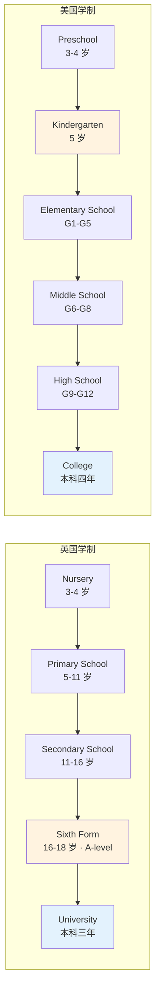
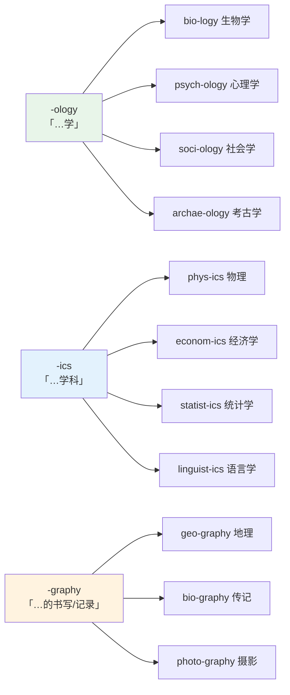
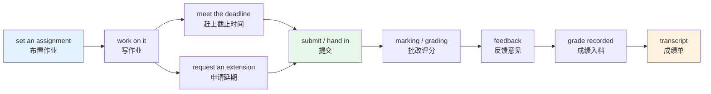
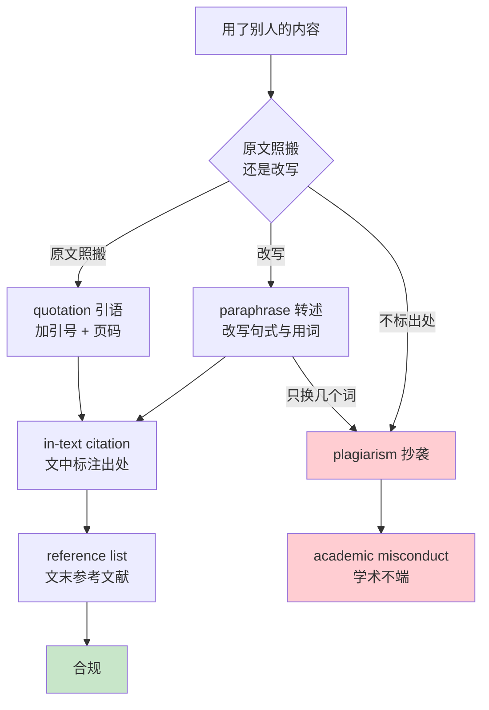
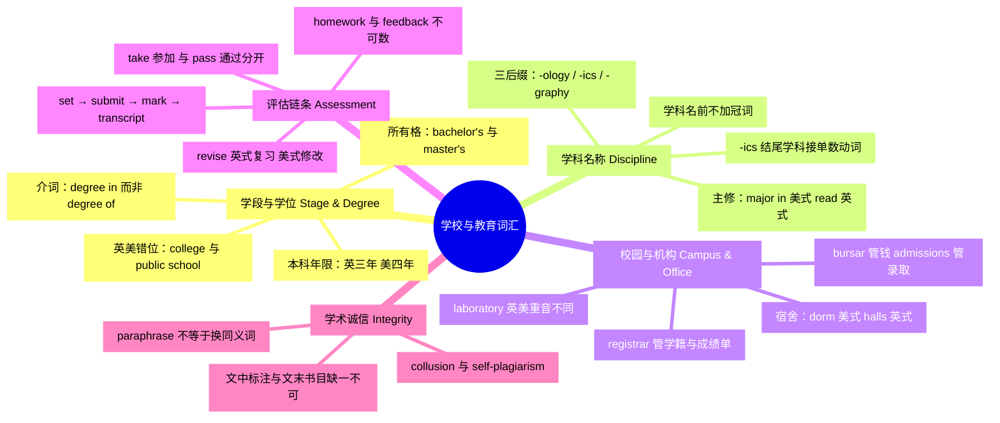

# 学科、学段、校园设施与课堂考试

> [!info] 本篇定位
>
> 第 11 章的开篇，也是全书唯一一篇集中处理教育体系词汇的篇目。
>
> 读完你会拿到四组东西：一张英美学制的对照表（同一个 `college` 在两国指的不是同一件事）、一套学位与学科名称的规范写法、一张校园空间与行政机构的地图，以及从 `assignment` 到 `transcript` 的完整评估流程词链。
>
> 这一篇和第 8 章「家庭、人际与社会身份」的身份词有交集但不重叠：那里讲的是家庭与社会角色，这里讲的是教育机构内部的角色与流程。求职、简历、公司层级留给本章后续篇目；项目推进与目标管理属于第 19 章，本篇不碰。
>
> 对程序员读者，本篇的直接用途是读懂英文技术文档里的作者简介（`PhD candidate in Computer Science`）、开源项目的学术出处（`This paper was presented at...`）、以及在线课程平台（Coursera、edX）的课程结构说明。

---

## 1. 本篇导读：教育词汇难在哪

教育类词汇的难度不在生僻，而在**同名异指**。`college` 在英国指大学下属的学院或专科学校，在美国指本科阶段的四年制大学；`public school` 在英国指最昂贵的私立寄宿学校，在美国指公立学校，含义完全相反。这类词查词典只会得到并列的两个义项，看不出哪个对应哪个国家。

第二个难点是**流程词的链条性**。`assignment`、`submission`、`deadline`、`grading`、`transcript` 不是五个孤立的词，它们串成一条固定的流程，每一步都有配套的固定搭配（`submit an assignment`、`meet a deadline`、`request a transcript`）。孤立记住单词，用的时候依然搭不出句子。

第三个难点是**中文教育术语与英语不对齐**。中文的「本科」「硕士」「博士」三级结构清晰，英语的 `undergraduate` / `postgraduate` / `graduate` 三个词在英美的分工却不同。中文的「班主任」在英美体系里根本没有对应岗位，需要用 `form tutor`（英）或 `homeroom teacher`（美）近似替代。

本篇按四条主线展开，每条线的核心矛盾不同，处理方式也不同。

| 主线 | 覆盖范围 | 核心矛盾 | 处理方式 |
| --- | --- | --- | --- |
| 学段与学位 | kindergarten 到 postdoc | 英美错位最严重 | 对照表 + 学制流程图 |
| 学科名称 | 五大门类的科目名 | 拉丁希腊词根密集 | 后缀规律 + 分门类词表 |
| 空间与机构 | 教学、生活、行政三区 | 英美用词分裂 | 功能分区词表 |
| 评估流程 | 作业、考试、成绩、诚信 | 动词搭配固定 | 流程图 + 搭配纠错表 |

学段与设施两条的难点是记住哪个说法属于哪个国家；学科名称一条靠 `-ology`、`-ics`、`-graphy` 三个后缀能推出大半，属于可推导的部分；评估流程一条必须连着动词一起记，因为 `set`、`submit`、`mark` 这些搭配在词典的单词条目里查不到。

---

## 2. 学段：从学前到博士后

### 2.1 学前与义务教育阶段

英美两国的学段名称在最低的两级上分歧不大，从中学开始拉开距离。

| 英文 | 英式音标 | 美式音标 | 词性 | 中文 | 搭配与说明 |
| --- | --- | --- | --- | --- | --- |
| **nursery** | /ˈnɜːsəri/ | /ˈnɜːrsəri/ | n. | 托儿所 | 英式常用；nursery school 收 3-4 岁 |
| **kindergarten** | /ˈkɪndəɡɑːtn/ | /ˈkɪndərɡɑːrtn/ | n. | 幼儿园 | 德语借词，美式指小学前一年（5 岁） |
| **preschool** | /ˈpriːskuːl/ | /ˈpriːskuːl/ | n./adj. | 学前教育 | 美式统称 kindergarten 之前的阶段 |
| **daycare** | /ˈdeɪkeə/ | /ˈdeɪker/ | n. | 日托 | 美式；英式说 day nursery |
| **primary school** | /ˈpraɪməri skuːl/ | /ˈpraɪmeri skuːl/ | n. | 小学 | 英式说法，5-11 岁 |
| **elementary school** | /ˌelɪˈmentri skuːl/ | /ˌelɪˈmentri skuːl/ | n. | 小学 | 美式说法，K-5 或 K-6 |
| **middle school** | /ˈmɪdl skuːl/ | /ˈmɪdl skuːl/ | n. | 初中 | 美式，6-8 年级 |
| **junior high school** | /ˌdʒuːniə ˈhaɪ/ | /ˌdʒuːniər ˈhaɪ/ | n. | 初中 | 美式旧称，7-9 年级 |
| **secondary school** | /ˈsekəndri/ | /ˈsekənderi/ | n. | 中学 | 英式统称，11-16 或 11-18 岁 |
| **high school** | /ˈhaɪ skuːl/ | /ˈhaɪ skuːl/ | n. | 高中 | 美式，9-12 年级 |
| **sixth form** | /ˌsɪksθ ˈfɔːm/ | /ˌsɪksθ ˈfɔːrm/ | n. | 中学最后两年 | 英式特有，16-18 岁，备考 A-level |
| **grammar school** | /ˈɡræmə skuːl/ | /ˈɡræmər skuːl/ | n. | 文法学校 | 英式，选拔制公立中学 |
| **comprehensive school** | /ˌkɒmprɪˈhensɪv/ | /ˌkɑːmprɪˈhensɪv/ | n. | 综合中学 | 英式，不设入学考试 |
| **boarding school** | /ˈbɔːdɪŋ skuːl/ | /ˈbɔːrdɪŋ skuːl/ | n. | 寄宿学校 | 对应 day school 走读学校 |
| **public school** | /ˌpʌblɪk ˈskuːl/ | /ˌpʌblɪk ˈskuːl/ | n. | 私立名校（英）／公立学校（美） | 英美含义相反，见下方警示 |
| **state school** | /ˈsteɪt skuːl/ | /ˈsteɪt skuːl/ | n. | 公立学校 | 英式说法 |
| **private school** | /ˌpraɪvət ˈskuːl/ | /ˌpraɪvət ˈskuːl/ | n. | 私立学校 | 两国通用，最安全的说法 |
| **charter school** | /ˈtʃɑːtə skuːl/ | /ˈtʃɑːrtər skuːl/ | n. | 特许学校 | 美式，公费私营 |
| **homeschooling** | /ˈhəʊmskuːlɪŋ/ | /ˈhoʊmskuːlɪŋ/ | n. | 在家教育 | 动词 homeschool |
| **vocational school** | /vəʊˈkeɪʃənl/ | /voʊˈkeɪʃənl/ | n. | 职业学校 | 对应中文的中职、技校 |
| **apprenticeship** | /əˈprentɪsʃɪp/ | /əˈprentɪsʃɪp/ | n. | 学徒制 | 英国教育体系里的正式路径之一 |
| **polytechnic** | /ˌpɒlɪˈteknɪk/ | /ˌpɑːlɪˈteknɪk/ | n. | 理工学院 | 英国 1992 年后多改名为 university |

> [!warning] public school 是最危险的一个词
>
> 这个词的英美含义几乎相反，用错会造成实质误解。
>
> - 英国：**public school** = 伊顿、哈罗这类学费极高的私立寄宿中学。历史上「public」的意思是「向所有付得起钱的人开放」，区别于只教一家子弟的家庭教师。
> - 美国：**public school** = 由税收供养、免费入学的公立学校。
>
> - ❌ 对英国人说 ~~I went to a public school, so my family didn't pay tuition.~~（在英国人听来自相矛盾）
> - ✅ 英国语境说 **state school**（公立），**independent school** 或 **private school**（私立）
> - ✅ 美国语境说 **public school**（公立），**private school**（私立）
>
> 跨国交流时，`state school` 和 `private school` 这一对是最不容易出错的组合，两国都能听懂。

### 2.2 高等教育阶段

| 英文 | 英式音标 | 美式音标 | 词性 | 中文 | 搭配与说明 |
| --- | --- | --- | --- | --- | --- |
| **undergraduate** | /ˌʌndəˈɡrædʒuət/ | /ˌʌndərˈɡrædʒuət/ | n./adj. | 本科生；本科的 | 缩写 undergrad，两国通用 |
| **postgraduate** | /ˌpəʊstˈɡrædʒuət/ | /ˌpoʊstˈɡrædʒuət/ | n./adj. | 研究生；研究生的 | 英式常用，缩写 postgrad |
| **graduate** | /ˈɡrædʒuət/ | /ˈɡrædʒuət/ | n./adj. | 毕业生；研究生的（美） | 名词重音在首，读 /-uət/ |
| **graduate** | /ˈɡrædʒueɪt/ | /ˈɡrædʒueɪt/ | v. | 毕业 | 动词词尾读 /-eɪt/，与名词同形异读 |
| **freshman** | /ˈfreʃmən/ | /ˈfreʃmən/ | n. | 大一新生 | 美式；复数 freshmen |
| **sophomore** | /ˈsɒfəmɔː/ | /ˈsɑːfəmɔːr/ | n. | 大二学生 | 美式；一说源自希腊语 sophos（智）加 moros（愚） |
| **junior** | /ˈdʒuːniə/ | /ˈdʒuːniər/ | n. | 大三学生 | 美式；日常义为「年轻的、下级的」 |
| **senior** | /ˈsiːniə/ | /ˈsiːniər/ | n. | 大四学生 | 美式；英式指高年级学生泛称 |
| **fresher** | /ˈfreʃə/ | /ˈfreʃər/ | n. | 大一新生 | 英式；Freshers' Week 迎新周 |
| **first-year student** | /ˌfɜːst jɪə ˈstjuːdnt/ | /ˌfɜːrst jɪr ˈstuːdnt/ | n. | 一年级学生 | 英式中性说法，无性别问题 |
| **candidate** | /ˈkændɪdət/ | /ˈkændɪdət/ | n. | 攻读者；候选人 | PhD candidate 已通过资格考的博士生 |
| **postdoc** | /ˈpəʊstdɒk/ | /ˈpoʊstdɑːk/ | n. | 博士后 | 全称 postdoctoral researcher |
| **alumnus** | /əˈlʌmnəs/ | /əˈlʌmnəs/ | n. | 男校友 | 拉丁词，复数 alumni /əˈlʌmnaɪ/ |
| **alumna** | /əˈlʌmnə/ | /əˈlʌmnə/ | n. | 女校友 | 复数 alumnae /əˈlʌmniː/ |
| **alma mater** | /ˌælmə ˈmɑːtə/ | /ˌɑːlmə ˈmɑːtər/ | n. | 母校 | 拉丁语「养育的母亲」 |
| **cohort** | /ˈkəʊhɔːt/ | /ˈkoʊhɔːrt/ | n. | 同届学生群体 | the 2024 cohort，学术与统计通用 |

### 2.3 英美学制对照

上图标黄的两格是最容易错位的地方。美式 `kindergarten` 是小学教育的正式第一年，孩子已经五岁，写在成绩单上；英式 `nursery` 则完全是学前托管，不算学段。标蓝的两格差一年：英国本科普遍三年（苏格兰四年），美国本科标准四年，这个差别直接影响留学申请时的学分认定。

| 学段 | 英式说法 | 美式说法 | 关键差别 |
| --- | --- | --- | --- |
| 学前 | nursery / playgroup | preschool / daycare | 英式 nursery 不计入学制 |
| 小学 | primary school | elementary school | 美式含 kindergarten 一年 |
| 初中 | 并入 secondary school | middle school | 英国不单独划分初中 |
| 高中 | sixth form / college | high school | 英式 sixth form 只有两年 |
| 大学本科 | university（三年） | college（四年） | 年限与称呼都不同 |
| 研究生 | postgraduate | graduate school | 英式 post- 美式 grad- |
| 年级说法 | Year 7 / Year 11 | 7th grade / 11th grade | 英式 Year，美式 grade |

> [!warning] college 到底指什么
>
> 这个词在两国的所指范围完全不同，读大学官网时必须先判断是哪国的写法。
>
> - **美国**：`college` 就是本科大学。`I'm in college` = 我在读大学本科。`go to college` 是最常见的说法，不说 `go to university`（虽然也能懂）。
> - **英国**：`college` 有三种可能——大学内部的学院（`Trinity College, Cambridge`）、16-18 岁的继续教育机构（`sixth form college`）、或职业培训机构。英国人说读大学一律用 `university`，口语缩写 `uni`。
>
> - ❌ 对英国人说 ~~I'm going to college next year~~ 想表达「明年上大学」（对方会理解成读预科或职校）
> - ✅ 英式：**I'm going to university next year.** / **I'm off to uni.**
> - ✅ 美式：**I'm going to college next year.**

---

## 3. 学位与学历：写法比读音更容易错

### 3.1 三级学位的完整名称

学位名称有全称、缩写、口语三套说法，正式文书里三者不能混用。

| 英文 | 英式音标 | 美式音标 | 词性 | 中文 | 搭配与说明 |
| --- | --- | --- | --- | --- | --- |
| **degree** | /dɪˈɡriː/ | /dɪˈɡriː/ | n. | 学位 | hold / earn / award a degree |
| **bachelor's degree** | /ˈbætʃələz/ | /ˈbætʃələrz/ | n. | 学士学位 | 必须带 's，不说 bachelor degree |
| **master's degree** | /ˈmɑːstəz/ | /ˈmæstərz/ | n. | 硕士学位 | 同样必须带 's |
| **doctorate** | /ˈdɒktərət/ | /ˈdɑːktərət/ | n. | 博士学位 | 比 PhD 更正式的统称 |
| **doctoral** | /ˈdɒktərəl/ | /ˈdɑːktərəl/ | adj. | 博士的 | doctoral thesis / doctoral student |
| **PhD** | /ˌpiː eɪtʃ ˈdiː/ | /ˌpiː eɪtʃ ˈdiː/ | n. | 哲学博士 | 拉丁 Philosophiae Doctor；美式常写 Ph.D. |
| **BA** | /ˌbiː ˈeɪ/ | /ˌbiː ˈeɪ/ | n. | 文学学士 | Bachelor of Arts |
| **BSc / BS** | /ˌbiː es ˈsiː/ | /ˌbiː ˈes/ | n. | 理学学士 | 英式 BSc，美式 BS |
| **MA** | /ˌem ˈeɪ/ | /ˌem ˈeɪ/ | n. | 文学硕士 | Master of Arts |
| **MSc / MS** | /ˌem es ˈsiː/ | /ˌem ˈes/ | n. | 理学硕士 | 英式 MSc，美式 MS |
| **MBA** | /ˌem biː ˈeɪ/ | /ˌem biː ˈeɪ/ | n. | 工商管理硕士 | Master of Business Administration |
| **MPhil** | /ˌem ˈfɪl/ | /ˌem ˈfɪl/ | n. | 哲学硕士 | 英式研究型硕士，常为 PhD 前置 |
| **JD** | /ˌdʒeɪ ˈdiː/ | /ˌdʒeɪ ˈdiː/ | n. | 法律博士 | 美国法学院第一学位 |
| **MD** | /ˌem ˈdiː/ | /ˌem ˈdiː/ | n. | 医学博士 | 美国医学院第一学位 |
| **diploma** | /dɪˈpləʊmə/ | /dɪˈploʊmə/ | n. | 文凭；毕业证书 | 低于学位一级，或指证书实物 |
| **certificate** | /səˈtɪfɪkət/ | /sərˈtɪfɪkət/ | n. | 证书 | 动词 certify，英 /ˈsɜːtɪfaɪ/ 美 /ˈsɜːrtɪfaɪ/ |
| **qualification** | /ˌkwɒlɪfɪˈkeɪʃn/ | /ˌkwɑːlɪfɪˈkeɪʃn/ | n. | 学历资格 | 英式常用，指学位与证书总称 |
| **credential** | /krəˈdenʃl/ | /krəˈdenʃl/ | n. | 资历凭证 | 美式常用，多用复数 credentials |
| **honours** | /ˈɒnəz/ | /ˈɑːnərz/ | n. | 荣誉学位 | 美式拼 honors；BA (Hons) |
| **distinction** | /dɪˈstɪŋkʃn/ | /dɪˈstɪŋkʃn/ | n. | 优异 | 英式硕士最高档，相当于优秀 |
| **merit** | /ˈmerɪt/ | /ˈmerɪt/ | n. | 良好 | 英式硕士第二档 |
| **valedictorian** | /ˌvælɪdɪkˈtɔːriən/ | /ˌvælɪdɪkˈtɔːriən/ | n. | 毕业致辞代表 | 美式，成绩第一名的毕业生 |
| **graduation** | /ˌɡrædʒuˈeɪʃn/ | /ˌɡrædʒuˈeɪʃn/ | n. | 毕业 | 指毕业这件事和典礼 |
| **commencement** | /kəˈmensmənt/ | /kəˈmensmənt/ | n. | 毕业典礼 | 美式；字面「开始」，指人生新阶段 |

### 3.2 学位的正确写法

三个高频错误集中在所有格和介词上。

> [!warning] 学位名称的三个写法陷阱
>
> **陷阱一：漏掉所有格 's**
>
> - ❌ ~~I have a bachelor degree in computer science.~~
> - ✅ I have a **bachelor's degree** in computer science.
> - ✅ 也可写 **a Bachelor of Science in Computer Science**（全称形式，无 's）
>
> **陷阱二：学位与专业之间的介词固定为 in**
>
> - ❌ ~~a master's degree of economics~~
> - ✅ a **master's degree in** economics
> - ✅ 但全称形式用 of：**Master of Arts in** Economics
>
> **陷阱三：PhD 前面不加冠词 the**
>
> - ❌ ~~I'm doing the PhD in linguistics.~~
> - ✅ I'm doing **a PhD** in linguistics.
> - ✅ I'm **a PhD student** / **a PhD candidate**.

> [!example] 学位表述的实际用法
>
> - She **holds a PhD in** computational linguistics **from** Edinburgh.
>   - 她持有爱丁堡大学计算语言学博士学位。
> - He **was awarded** a first-class **honours degree**.
>   - 他获得了一等荣誉学位。
> - I **graduated with** a master's **in** software engineering **in** 2023.
>   - 我 2023 年硕士毕业，专业是软件工程。
> - The programme **leads to** a Bachelor of Science **degree**.
>   - 这个项目授予理学学士学位。

`graduate` 作动词时的介词要分清：`graduate from + 学校`（从某校毕业），`graduate in + 专业`（学某专业毕业），`graduate with + 学位或成绩`（以某学位或成绩毕业）。三个介词各管一件事，不能互换。

---

## 4. 学科名称：三个后缀吃掉一半

### 4.1 学科名的构词规律

学科名绝大多数来自拉丁希腊层，共享三组高产后缀。掌握这三组，遇到没见过的学科名也能猜出大意。

上图的三个后缀有一条实用的语法差别：`-ics` 结尾的学科名在做学科讲时是**单数**（`Physics is hard.`），复数形式只是拼写上的残留；`-ology` 结尾的一律是可数单数名词。这个坑在写作里出现频率很高，写 `Economics are…` 是明确的语法错误。

### 4.2 人文与语言类

| 英文 | 英式音标 | 美式音标 | 词性 | 中文 | 搭配与说明 |
| --- | --- | --- | --- | --- | --- |
| **humanities** | /hjuːˈmænətiz/ | /hjuːˈmænətiz/ | n. | 人文学科 | 恒复数，the humanities |
| **literature** | /ˈlɪtrətʃə/ | /ˈlɪtərətʃər/ | n. | 文学 | 学术里也指「文献」 |
| **linguistics** | /lɪŋˈɡwɪstɪks/ | /lɪŋˈɡwɪstɪks/ | n. | 语言学 | 单数动词；形容词 linguistic |
| **philosophy** | /fəˈlɒsəfi/ | /fəˈlɑːsəfi/ | n. | 哲学 | 形容词 philosophical |
| **history** | /ˈhɪstri/ | /ˈhɪstri/ | n. | 历史 | 形容词 historical（史学的） |
| **archaeology** | /ˌɑːkiˈɒlədʒi/ | /ˌɑːrkiˈɑːlədʒi/ | n. | 考古学 | 美式也拼 archeology |
| **classics** | /ˈklæsɪks/ | /ˈklæsɪks/ | n. | 古典学 | 指古希腊罗马语言文学 |
| **theology** | /θiˈɒlədʒi/ | /θiˈɑːlədʒi/ | n. | 神学 | 词根 theo「神」 |
| **rhetoric** | /ˈretərɪk/ | /ˈretərɪk/ | n. | 修辞学 | 美国大学写作课常挂此名 |
| **translation** | /trænzˈleɪʃn/ | /trænsˈleɪʃn/ | n. | 翻译（学） | translation studies 翻译研究 |
| **fine arts** | /ˌfaɪn ˈɑːts/ | /ˌfaɪn ˈɑːrts/ | n. | 美术 | 学位缩写 BFA / MFA |
| **musicology** | /ˌmjuːzɪˈkɒlədʒi/ | /ˌmjuːzɪˈkɑːlədʒi/ | n. | 音乐学 | 区别于演奏专业 music performance |

### 4.3 社会科学类

| 英文 | 英式音标 | 美式音标 | 词性 | 中文 | 搭配与说明 |
| --- | --- | --- | --- | --- | --- |
| **social sciences** | /ˈsəʊʃl/ | /ˈsoʊʃl/ | n. | 社会科学 | 与 humanities 并列的大门类 |
| **sociology** | /ˌsəʊsiˈɒlədʒi/ | /ˌsoʊsiˈɑːlədʒi/ | n. | 社会学 | 形容词 sociological |
| **psychology** | /saɪˈkɒlədʒi/ | /saɪˈkɑːlədʒi/ | n. | 心理学 | 首字母 p 不发音 |
| **anthropology** | /ˌænθrəˈpɒlədʒi/ | /ˌænθrəˈpɑːlədʒi/ | n. | 人类学 | anthrop「人」+ -ology |
| **economics** | /ˌiːkəˈnɒmɪks/ | /ˌekəˈnɑːmɪks/ | n. | 经济学 | 首音节英美常见分歧 |
| **politics** | /ˈpɒlətɪks/ | /ˈpɑːlətɪks/ | n. | 政治（学） | 学科名美式多用 political science |
| **law** | /lɔː/ | /lɔː/ | n. | 法学 | 学院叫 law school，不叫 law college |
| **jurisprudence** | /ˌdʒʊərɪsˈpruːdns/ | /ˌdʒʊrɪsˈpruːdns/ | n. | 法理学 | 正式书面词 |
| **education** | /ˌedʒuˈkeɪʃn/ | /ˌedʒuˈkeɪʃn/ | n. | 教育学 | 学位 BEd / MEd |
| **journalism** | /ˈdʒɜːnəlɪzəm/ | /ˈdʒɜːrnəlɪzəm/ | n. | 新闻学 | 相关词 media studies |
| **management** | /ˈmænɪdʒmənt/ | /ˈmænɪdʒmənt/ | n. | 管理学 | 商学院核心学科 |
| **accounting** | /əˈkaʊntɪŋ/ | /əˈkaʊntɪŋ/ | n. | 会计学 | 英式也说 accountancy |
| **finance** | /ˈfaɪnæns/ | /ˈfaɪnæns/ | n. | 金融学 | 名词多首重音；作动词可读 /faɪˈnæns/ |
| **marketing** | /ˈmɑːkɪtɪŋ/ | /ˈmɑːrkɪtɪŋ/ | n. | 市场营销 | — |

### 4.4 自然科学类

| 英文 | 英式音标 | 美式音标 | 词性 | 中文 | 搭配与说明 |
| --- | --- | --- | --- | --- | --- |
| **mathematics** | /ˌmæθəˈmætɪks/ | /ˌmæθəˈmætɪks/ | n. | 数学 | 英式缩写 maths，美式 math |
| **algebra** | /ˈældʒɪbrə/ | /ˈældʒɪbrə/ | n. | 代数 | 阿拉伯语借词 |
| **geometry** | /dʒiˈɒmətri/ | /dʒiˈɑːmətri/ | n. | 几何 | geo「地」+ metry「测量」 |
| **calculus** | /ˈkælkjələs/ | /ˈkælkjələs/ | n. | 微积分 | 拉丁语「小石子」，古人用来计数 |
| **statistics** | /stəˈtɪstɪks/ | /stəˈtɪstɪks/ | n. | 统计学；统计数据 | 学科单数，数据义复数 |
| **physics** | /ˈfɪzɪks/ | /ˈfɪzɪks/ | n. | 物理学 | 单数动词 Physics is… |
| **chemistry** | /ˈkemɪstri/ | /ˈkemɪstri/ | n. | 化学 | 形容词 chemical |
| **biology** | /baɪˈɒlədʒi/ | /baɪˈɑːlədʒi/ | n. | 生物学 | 缩略 bio 常见于课表 |
| **geology** | /dʒiˈɒlədʒi/ | /dʒiˈɑːlədʒi/ | n. | 地质学 | 与 geography 只差一个词根 |
| **geography** | /dʒiˈɒɡrəfi/ | /dʒiˈɑːɡrəfi/ | n. | 地理 | 形容词 geographical |
| **astronomy** | /əˈstrɒnəmi/ | /əˈstrɑːnəmi/ | n. | 天文学 | 区别于 astrology 占星术 |
| **ecology** | /iˈkɒlədʒi/ | /iˈkɑːlədʒi/ | n. | 生态学 | 与 economy 同源前缀 eco |
| **genetics** | /dʒəˈnetɪks/ | /dʒəˈnetɪks/ | n. | 遗传学 | 单数动词 |
| **neuroscience** | /ˈnjʊərəʊsaɪəns/ | /ˈnʊroʊsaɪəns/ | n. | 神经科学 | 英美前半差别明显 |

### 4.5 工程、医学与计算机

| 英文 | 英式音标 | 美式音标 | 词性 | 中文 | 搭配与说明 |
| --- | --- | --- | --- | --- | --- |
| **engineering** | /ˌendʒɪˈnɪərɪŋ/ | /ˌendʒɪˈnɪrɪŋ/ | n. | 工程学 | civil / mechanical / electrical engineering |
| **civil engineering** | /ˈsɪvl/ | /ˈsɪvl/ | n. | 土木工程 | civil 此处意为「民用」 |
| **mechanical** | /məˈkænɪkl/ | /məˈkænɪkl/ | adj. | 机械的 | mechanical engineering 机械工程 |
| **electrical** | /ɪˈlektrɪkl/ | /ɪˈlektrɪkl/ | adj. | 电气的 | 区别于 electronic 电子的 |
| **architecture** | /ˈɑːkɪtektʃə/ | /ˈɑːrkɪtektʃər/ | n. | 建筑学 | 计算机里指体系结构 |
| **computer science** | /kəmˈpjuːtə/ | /kəmˈpjuːtər/ | n. | 计算机科学 | 缩写 CS，英式也说 computing |
| **informatics** | /ˌɪnfəˈmætɪks/ | /ˌɪnfərˈmætɪks/ | n. | 信息学 | 欧洲大学常用此名 |
| **data science** | /ˈdeɪtə/ | /ˈdeɪtə/ | n. | 数据科学 | data 英式也读 /ˈdɑːtə/ |
| **medicine** | /ˈmedsn/ | /ˈmedɪsn/ | n. | 医学；药 | 英式两音节，美式三音节 |
| **pharmacy** | /ˈfɑːməsi/ | /ˈfɑːrməsi/ | n. | 药学 | 也指药房 |
| **nursing** | /ˈnɜːsɪŋ/ | /ˈnɜːrsɪŋ/ | n. | 护理学 | 学位 BN / BSN |
| **dentistry** | /ˈdentɪstri/ | /ˈdentɪstri/ | n. | 牙医学 | 学位 BDS / DDS |
| **veterinary** | /ˈvetnri/ | /ˈvetərəneri/ | adj. | 兽医的 | 口语缩写 vet |
| **agriculture** | /ˈæɡrɪkʌltʃə/ | /ˈæɡrɪkʌltʃər/ | n. | 农学 | agri「田」+ culture「耕作」 |

### 4.6 描述学科归属的通用词

| 英文 | 英式音标 | 美式音标 | 词性 | 中文 | 搭配与说明 |
| --- | --- | --- | --- | --- | --- |
| **subject** | /ˈsʌbdʒɪkt/ | /ˈsʌbdʒɪkt/ | n. | 科目 | 中小学层面用词 |
| **discipline** | /ˈdɪsəplɪn/ | /ˈdɪsəplɪn/ | n. | 学科；纪律 | 大学与学术层面用词 |
| **field** | /fiːld/ | /fiːld/ | n. | 领域 | in the field of… |
| **major** | /ˈmeɪdʒə/ | /ˈmeɪdʒər/ | n./v. | 主修（专业） | 美式；major in economics |
| **minor** | /ˈmaɪnə/ | /ˈmaɪnər/ | n./v. | 辅修 | minor in statistics |
| **specialise** | /ˈspeʃəlaɪz/ | /ˈspeʃəlaɪz/ | v. | 专攻 | 美式拼 specialize；英式常用 |
| **interdisciplinary** | /ˌɪntəˌdɪsəˈplɪnəri/ | /ˌɪntərˈdɪsəpləneri/ | adj. | 跨学科的 | 学术申请书高频词 |
| **STEM** | /stem/ | /stem/ | n. | 理工科 | Science, Technology, Engineering, Mathematics |
| **liberal arts** | /ˌlɪbərəl ˈɑːts/ | /ˌlɪbərəl ˈɑːrts/ | n. | 博雅教育 | 美国本科教育理念 |

> [!warning] major 是美式说法，英式说 read 或 do
>
> - 美式：**I majored in computer science.** / **What's your major?**
> - 英式：**I read computer science at Oxford.**（正式，牛剑传统说法）
> - 英式口语：**I did computer science at uni.**
> - 两国通用的中性说法：**My degree is in computer science.**
>
> - ❌ ~~My major is computer science major.~~（重复）
> - ❌ ~~I study the computer science.~~（学科名前不加冠词）
> - ✅ **I study computer science.**

---

## 5. 校园设施：一张空间地图

### 5.1 教学与学习空间

校园按功能分成四个区块，每个区块的高频地名各占一行。

| 区块 | 英文 | 代表场所 | 去那里办什么 |
| --- | --- | --- | --- |
| 教学区 | academic area | lecture hall, seminar room, laboratory, studio | 上课、做实验、小组讨论 |
| 生活区 | residential area | dormitory, hall of residence, cafeteria, common room | 住宿、吃饭、社交 |
| 行政区 | administrative offices | registrar's, admissions, bursar's, faculty office | 办学籍、缴费、问教学安排 |
| 公共设施 | shared facilities | library, gym, health centre, bookstore | 借书、运动、看病、买教材 |

中文母语者最容易混的是行政区四个办公室的分工：`registrar's office` 管学籍、选课与成绩单，`admissions office` 只管录取前的申请，`bursar's office` 管钱（学费、退费、罚款），`faculty office` 管本院系的具体教学事务。找错门是留学生的常见时间损耗。

| 英文 | 英式音标 | 美式音标 | 词性 | 中文 | 搭配与说明 |
| --- | --- | --- | --- | --- | --- |
| **campus** | /ˈkæmpəs/ | /ˈkæmpəs/ | n. | 校园 | on campus / off campus 不加 the |
| **classroom** | /ˈklɑːsruːm/ | /ˈklæsruːm/ | n. | 教室 | 中小学用词 |
| **lecture hall** | /ˈlektʃə hɔːl/ | /ˈlektʃər hɔːl/ | n. | 阶梯教室 | 大学大课教室 |
| **lecture theatre** | /ˈlektʃə ˈθɪətə/ | /ˈlektʃər ˈθiːətər/ | n. | 阶梯教室 | 英式说法，美式拼 theater |
| **seminar room** | /ˈsemɪnɑː/ | /ˈsemɪnɑːr/ | n. | 研讨室 | 小班讨论用 |
| **auditorium** | /ˌɔːdɪˈtɔːriəm/ | /ˌɔːdɪˈtɔːriəm/ | n. | 礼堂 | 复数 auditoriums / auditoria |
| **laboratory** | /ləˈbɒrətri/ | /ˈlæbrətɔːri/ | n. | 实验室 | 英美重音位置完全不同 |
| **lab** | /læb/ | /læb/ | n. | 实验室；实验课 | 口语与课表通用缩写 |
| **workshop** | /ˈwɜːkʃɒp/ | /ˈwɜːrkʃɑːp/ | n. | 工作坊；车间 | 也指一种课程形式 |
| **studio** | /ˈstjuːdiəʊ/ | /ˈstuːdioʊ/ | n. | 工作室 | 建筑、艺术专业用 |
| **library** | /ˈlaɪbrəri/ | /ˈlaɪbreri/ | n. | 图书馆 | 美式第二音节读 /breri/；口语常缩为 /ˈlaɪbri/ |
| **reading room** | /ˈriːdɪŋ ruːm/ | /ˈriːdɪŋ ruːm/ | n. | 阅览室 | — |
| **stacks** | /stæks/ | /stæks/ | n. | 书库 | 恒复数，图书馆开架区 |
| **computer lab** | /kəmˈpjuːtə/ | /kəmˈpjuːtər/ | n. | 机房 | 英式也说 IT suite |
| **whiteboard** | /ˈwaɪtbɔːd/ | /ˈwaɪtbɔːrd/ | n. | 白板 | 对应 blackboard 黑板 |
| **projector** | /prəˈdʒektə/ | /prəˈdʒektər/ | n. | 投影仪 | 动词 project /prəˈdʒekt/ |
| **lectern** | /ˈlektən/ | /ˈlektərn/ | n. | 讲台桌 | 指放讲稿的斜面台 |
| **podium** | /ˈpəʊdiəm/ | /ˈpoʊdiəm/ | n. | 讲台 | 美式常与 lectern 混用 |

### 5.2 生活与后勤设施

| 英文 | 英式音标 | 美式音标 | 词性 | 中文 | 搭配与说明 |
| --- | --- | --- | --- | --- | --- |
| **dormitory** | /ˈdɔːmətri/ | /ˈdɔːrmətɔːri/ | n. | 宿舍楼 | 美式常用，缩写 dorm |
| **dorm** | /dɔːm/ | /dɔːrm/ | n. | 宿舍 | 美式口语；dorm room 宿舍房间 |
| **hall of residence** | /ˈrezɪdəns/ | /ˈrezɪdəns/ | n. | 学生宿舍 | 英式正式说法，口语说 halls |
| **accommodation** | /əˌkɒməˈdeɪʃn/ | /əˌkɑːməˈdeɪʃn/ | n. | 住宿 | 英式不可数，美式常用复数 |
| **roommate** | /ˈruːmmeɪt/ | /ˈruːmmeɪt/ | n. | 室友 | 美式；同住一室 |
| **flatmate** | /ˈflætmeɪt/ | — | n. | 合租室友 | 英式；美式说 housemate |
| **common room** | /ˈkɒmən ruːm/ | /ˈkɑːmən ruːm/ | n. | 公共休息室 | 英式校园高频词 |
| **canteen** | /kænˈtiːn/ | /kænˈtiːn/ | n. | 食堂 | 英式；重音在后 |
| **cafeteria** | /ˌkæfəˈtɪəriə/ | /ˌkæfəˈtɪriə/ | n. | 自助餐厅 | 美式校园食堂 |
| **dining hall** | /ˈdaɪnɪŋ hɔːl/ | /ˈdaɪnɪŋ hɔːl/ | n. | 餐厅 | 正式说法，两国通用 |
| **refectory** | /rɪˈfektəri/ | /rɪˈfektəri/ | n. | 食堂 | 英式老派用词，多见于古老学院 |
| **gymnasium** | /dʒɪmˈneɪziəm/ | /dʒɪmˈneɪziəm/ | n. | 体育馆 | 缩写 gym |
| **sports centre** | /ˈsentə/ | /ˈsentər/ | n. | 运动中心 | 美式拼 center |
| **playground** | /ˈpleɪɡraʊnd/ | /ˈpleɪɡraʊnd/ | n. | 操场 | 中小学用词 |
| **field** | /fiːld/ | /fiːld/ | n. | 运动场 | football field / sports field |
| **track** | /træk/ | /træk/ | n. | 跑道 | track and field 田径 |
| **locker** | /ˈlɒkə/ | /ˈlɑːkər/ | n. | 储物柜 | 美国高中场景高频 |
| **corridor** | /ˈkɒrɪdɔː/ | /ˈkɔːrɪdɔːr/ | n. | 走廊 | 英式常用 |
| **hallway** | /ˈhɔːlweɪ/ | /ˈhɔːlweɪ/ | n. | 走廊 | 美式常用 |
| **quad** | /kwɒd/ | /kwɑːd/ | n. | 方庭 | 全称 quadrangle，学院围合草坪 |
| **health centre** | /ˈhelθ sentə/ | /ˈhelθ sentər/ | n. | 校医院 | 美式也说 student health services |
| **infirmary** | /ɪnˈfɜːməri/ | /ɪnˈfɜːrməri/ | n. | 医务室 | 寄宿学校用词 |
| **bookstore** | /ˈbʊkstɔː/ | /ˈbʊkstɔːr/ | n. | 书店 | 英式说 bookshop |
| **stationery** | /ˈsteɪʃənri/ | /ˈsteɪʃəneri/ | n. | 文具 | 与 stationary（静止的）同音不同义 |

> [!tip] dorm 与 hall of residence 的选用
>
> 这两个词指同一种建筑，但地域标记非常明显。
>
> - 写给美国学校：**dorm** / **dormitory** / **residence hall**
> - 写给英国学校：**halls**（口语）/ **hall of residence**（正式）/ **student accommodation**
>
> 英国学生说 `I'm in halls`（我住宿舍），不说 `I'm in the dorm`。反过来，美国学生几乎不用 `halls` 这个说法。写申请材料时按目标国家的用词选，是最容易做到也最容易被忽略的一处细节。

### 5.3 行政机构与办公室

| 英文 | 英式音标 | 美式音标 | 词性 | 中文 | 搭配与说明 |
| --- | --- | --- | --- | --- | --- |
| **registrar** | /ˌredʒɪˈstrɑː/ | /ˈredʒɪstrɑːr/ | n. | 教务长；注册主任 | 英美重音位置不同 |
| **registrar's office** | /ˌredʒɪˈstrɑːz ˈɒfɪs/ | /ˈredʒɪstrɑːrz ˈɔːfɪs/ | n. | 教务处 | 管学籍、选课、成绩单 |
| **admissions office** | /ədˈmɪʃnz/ | /ədˈmɪʃnz/ | n. | 招生办 | 只管录取前流程 |
| **bursar** | /ˈbɜːsə/ | /ˈbɜːrsər/ | n. | 财务主管 | bursar's office 管学费缴纳 |
| **faculty** | /ˈfæklti/ | /ˈfæklti/ | n. | 学院；全体教师 | 英式指学院，美式指教师群体 |
| **department** | /dɪˈpɑːtmənt/ | /dɪˈpɑːrtmənt/ | n. | 系 | the Department of Physics |
| **school** | /skuːl/ | /skuːl/ | n. | 学院 | 大学内部单位，如 School of Law |
| **institute** | /ˈɪnstɪtjuːt/ | /ˈɪnstɪtuːt/ | n. | 研究所 | MIT 的 I 即此词 |
| **academy** | /əˈkædəmi/ | /əˈkædəmi/ | n. | 学院；学会 | 也指专门学校 |
| **senate** | /ˈsenət/ | /ˈsenət/ | n. | 校务委员会 | 英国大学最高学术机构 |
| **student union** | /ˈstjuːdnt/ | /ˈstuːdnt/ | n. | 学生会 | 英式也指学生活动中心大楼 |
| **careers service** | /kəˈrɪəz/ | /kəˈrɪrz/ | n. | 就业指导中心 | 美式说 career center |
| **counselling service** | /ˈkaʊnsəlɪŋ/ | /ˈkaʊnsəlɪŋ/ | n. | 心理咨询中心 | 美式拼 counseling |
| **international office** | /ˌɪntəˈnæʃnəl ˈɒfɪs/ | /ˌɪntərˈnæʃnəl ˈɔːfɪs/ | n. | 国际学生办公室 | 管签证与外籍学生事务 |

---

## 6. 校园中的人：教职与角色

### 6.1 教师与研究人员

| 英文 | 英式音标 | 美式音标 | 词性 | 中文 | 搭配与说明 |
| --- | --- | --- | --- | --- | --- |
| **teacher** | /ˈtiːtʃə/ | /ˈtiːtʃər/ | n. | 教师 | 中小学；大学不用此词自称 |
| **lecturer** | /ˈlektʃərə/ | /ˈlektʃərər/ | n. | 讲师 | 英式大学的常规教职 |
| **professor** | /prəˈfesə/ | /prəˈfesər/ | n. | 教授 | 英式是最高职称，美式泛指大学教师 |
| **associate professor** | /əˈsəʊʃiət/ | /əˈsoʊʃiət/ | n. | 副教授 | 美式职称序列 |
| **assistant professor** | /əˈsɪstənt/ | /əˈsɪstənt/ | n. | 助理教授 | 美式，tenure track 起点 |
| **tenure** | /ˈtenjə/ | /ˈtenjər/ | n. | 终身教职 | get tenure / tenure-track position |
| **tutor** | /ˈtjuːtə/ | /ˈtuːtər/ | n./v. | 导师；辅导 | 英式指负责小班的教师 |
| **supervisor** | /ˈsuːpəvaɪzə/ | /ˈsuːpərvaɪzər/ | n. | 论文导师 | 研究生阶段的核心关系人 |
| **advisor** | /ədˈvaɪzə/ | /ədˈvaɪzər/ | n. | 学业顾问 | 美式；英式拼 adviser |
| **teaching assistant** | /ˈtiːtʃɪŋ əˌsɪstənt/ | /ˈtiːtʃɪŋ əˌsɪstənt/ | n. | 助教 | 缩写 TA，美国研究生常任 |
| **dean** | /diːn/ | /diːn/ | n. | 院长 | dean of students 学生事务主任 |
| **provost** | /ˈprɒvəst/ | /ˈproʊvoʊst/ | n. | 教务长 | 英美读音差异极大 |
| **chancellor** | /ˈtʃɑːnsələ/ | /ˈtʃænsələr/ | n. | 校长；名誉校长 | 英国 chancellor 多为荣誉职 |
| **vice-chancellor** | /ˌvaɪs ˈtʃɑːnsələ/ | /ˌvaɪs ˈtʃænsələr/ | n. | 校长 | 英国大学实际主事者 |
| **principal** | /ˈprɪnsəpl/ | /ˈprɪnsəpl/ | n. | 校长 | 美式中小学；与 principle 同音 |
| **headmaster** | /ˌhedˈmɑːstə/ | /ˌhedˈmæstər/ | n. | 校长 | 英式传统说法，女性 headmistress |
| **head teacher** | /ˌhed ˈtiːtʃə/ | /ˌhed ˈtiːtʃər/ | n. | 校长 | 英式中性说法，现在更常用 |
| **form tutor** | /ˈfɔːm ˌtjuːtə/ | /ˈfɔːrm ˌtuːtər/ | n. | 班主任 | 英式近似对应 |
| **homeroom teacher** | /ˈhəʊmruːm/ | /ˈhoʊmruːm/ | n. | 班主任 | 美式近似对应 |
| **invigilator** | /ɪnˈvɪdʒɪleɪtə/ | — | n. | 监考员 | 英式专有词 |
| **proctor** | /ˈprɒktə/ | /ˈprɑːktər/ | n. | 监考员 | 美式；动词 proctor an exam |
| **librarian** | /laɪˈbreəriən/ | /laɪˈbreriən/ | n. | 图书管理员 | — |
| **janitor** | /ˈdʒænɪtə/ | /ˈdʒænɪtər/ | n. | 校工 | 美式；英式说 caretaker |

> [!warning] professor 在英美不是同一个级别
>
> 这个词的误用会让人误判对方的职位。
>
> - **美国**：`professor` 是大学教师的通称，学生对助理教授、副教授、正教授一律称 `Professor Smith`。
> - **英国**：`Professor` 只有正教授一级才能用，讲师和副教授（Reader / Senior Lecturer）不能称 Professor，学生一般直呼其名或用 `Dr Smith`。
>
> - ❌ 给英国讲师写邮件开头 ~~Dear Professor Smith~~（对方若不是正教授，会显得没做功课）
> - ✅ 英国安全写法：**Dear Dr Smith**（有博士学位）或 **Dear Mr / Ms Smith**
> - ✅ 美国安全写法：**Dear Professor Smith**（普遍适用）
>
> 英式 `Dr` 后面不加句点，美式 `Dr.` 加句点，这是另一个细节差别。

### 6.2 学生角色与身份

| 英文 | 英式音标 | 美式音标 | 词性 | 中文 | 搭配与说明 |
| --- | --- | --- | --- | --- | --- |
| **pupil** | /ˈpjuːpl/ | /ˈpjuːpl/ | n. | 小学生 | 英式；美式一律用 student |
| **student** | /ˈstjuːdnt/ | /ˈstuːdnt/ | n. | 学生 | 英式 stju-，美式 stu- |
| **classmate** | /ˈklɑːsmeɪt/ | /ˈklæsmeɪt/ | n. | 同学 | 指同班；同校说 schoolmate |
| **peer** | /pɪə/ | /pɪr/ | n. | 同辈 | peer review 同行评审 |
| **monitor** | /ˈmɒnɪtə/ | /ˈmɑːnɪtər/ | n. | 班长 | 英美校园少用，中式概念 |
| **prefect** | /ˈpriːfekt/ | /ˈpriːfekt/ | n. | 级长 | 英式私校的学生管理职务 |
| **exchange student** | /ɪksˈtʃeɪndʒ/ | /ɪksˈtʃeɪndʒ/ | n. | 交换生 | on exchange 交换期间 |
| **international student** | /ˌɪntəˈnæʃnəl ˈstjuːdnt/ | /ˌɪntərˈnæʃnəl ˈstuːdnt/ | n. | 国际学生 | 比 foreign student 得体 |
| **mature student** | /məˈtʃʊə/ | /məˈtʃʊr/ | n. | 成人学生 | 英式，指 21 岁以上入学者 |
| **dropout** | /ˈdrɒpaʊt/ | /ˈdrɑːpaʊt/ | n. | 辍学者 | 动词短语 drop out of school |

---

## 7. 课程与教学：course 不等于「课」

### 7.1 课程单位的层级

中文的「课」在英语里对应四个不同层级的词，混用会造成理解偏差。

| 英文 | 英式音标 | 美式音标 | 词性 | 中文 | 搭配与说明 |
| --- | --- | --- | --- | --- | --- |
| **course** | /kɔːs/ | /kɔːrs/ | n. | 课程；专业项目 | 英式可指整个学位项目 |
| **module** | /ˈmɒdjuːl/ | /ˈmɑːdʒuːl/ | n. | 课程模块 | 英式，一学期一门课的单位 |
| **class** | /klɑːs/ | /klæs/ | n. | 课；班级 | 美式指一门课或一次课 |
| **lesson** | /ˈlesn/ | /ˈlesn/ | n. | 一节课 | 中小学与语言培训用词 |
| **lecture** | /ˈlektʃə/ | /ˈlektʃər/ | n./v. | 讲座课；演讲 | attend / give a lecture |
| **seminar** | /ˈsemɪnɑː/ | /ˈsemɪnɑːr/ | n. | 研讨课 | 学生发言为主，人数少 |
| **tutorial** | /tjuːˈtɔːriəl/ | /tuːˈtɔːriəl/ | n. | 辅导课 | 英式一对一或小组辅导 |
| **workshop** | /ˈwɜːkʃɒp/ | /ˈwɜːrkʃɑːp/ | n. | 工作坊 | 动手操作为主 |
| **practical** | /ˈpræktɪkl/ | /ˈpræktɪkl/ | n. | 实验课 | 英式，理科实操环节 |
| **fieldwork** | /ˈfiːldwɜːk/ | /ˈfiːldwɜːrk/ | n. | 野外实习 | 地理、考古、人类学专业 |
| **internship** | /ˈɪntɜːnʃɪp/ | /ˈɪntɜːrnʃɪp/ | n. | 实习 | 美式常用 |
| **placement** | /ˈpleɪsmənt/ | /ˈpleɪsmənt/ | n. | 实习岗位 | 英式；placement year 实习年 |
| **curriculum** | /kəˈrɪkjələm/ | /kəˈrɪkjələm/ | n. | 课程体系 | 复数 curricula 或 curriculums |
| **syllabus** | /ˈsɪləbəs/ | /ˈsɪləbəs/ | n. | 教学大纲 | 单门课的内容清单 |
| **timetable** | /ˈtaɪmteɪbl/ | /ˈtaɪmteɪbl/ | n. | 课表 | 英式常用 |
| **schedule** | /ˈʃedjuːl/ | /ˈskedʒuːl/ | n./v. | 日程；课表 | 英美读音差异最大的常用词之一 |
| **prerequisite** | /ˌpriːˈrekwəzɪt/ | /ˌpriːˈrekwəzɪt/ | n. | 先修课 | 美式课程说明高频词 |
| **elective** | /ɪˈlektɪv/ | /ɪˈlektɪv/ | n./adj. | 选修课 | 美式；英式说 optional module |
| **compulsory** | /kəmˈpʌlsəri/ | /kəmˈpʌlsəri/ | adj. | 必修的 | 英式；美式说 required |
| **core module** | /ˌkɔː ˈmɒdjuːl/ | /ˌkɔːr ˈmɑːdʒuːl/ | n. | 核心必修课 | 英式课程结构用词 |
| **credit** | /ˈkredɪt/ | /ˈkredɪt/ | n. | 学分 | earn / transfer credits |
| **workload** | /ˈwɜːkləʊd/ | /ˈwɜːrkloʊd/ | n. | 课业负担 | heavy / light workload |
| **semester** | /sɪˈmestə/ | /sɪˈmestər/ | n. | 学期 | 一年两学期制 |
| **term** | /tɜːm/ | /tɜːrm/ | n. | 学期 | 英式；一年三学期 |
| **quarter** | /ˈkwɔːtə/ | /ˈkwɔːrtər/ | n. | 学季 | 美国部分大学一年四季制 |
| **reading week** | /ˈriːdɪŋ wiːk/ | /ˈriːdɪŋ wiːk/ | n. | 阅读周 | 英式学期中的复习周 |
| **orientation** | /ˌɔːriənˈteɪʃn/ | /ˌɔːriənˈteɪʃn/ | n. | 迎新 | 美式；英式说 induction |

> [!warning] course 在英美的范围不同
>
> - **英国**：`course` 常指整个学位项目。`I'm doing a three-year course in history` = 我在读三年制历史专业。单门课叫 `module`。
> - **美国**：`course` 就是单门课。整个专业叫 `program`（英式拼 `programme`）。
>
> - ❌ 对美国人说 ~~My course lasts four years~~ 想表达「我的专业读四年」（对方会以为是一门四年的课）
> - ✅ 美式：**My program lasts four years.** / **I'm in a four-year program.**
> - ✅ 英式：**My course lasts three years.**

### 7.2 课堂动作的固定搭配

上课这件事在英语里没有一个万能动词，按角色和场景分成几组。

> [!example] 上课、听课、翘课的说法
>
> - I **have** three classes on Monday.
>   - 我周一有三节课。（学生视角，用 have）
> - She **teaches** two modules this term.
>   - 她这学期教两门课。（教师视角，用 teach）
> - He **attended** the lecture on distributed systems.
>   - 他去听了那节分布式系统的课。（正式，用 attend）
> - I **skipped** class yesterday.
>   - 我昨天翘课了。（口语，美式）
> - She **missed** the seminar because of illness.
>   - 她因病没上研讨课。（中性，非主观逃课）
> - They **sat in on** the first lecture without registering.
>   - 他们没选课，去旁听了第一节。（旁听用 sit in on）

> [!warning] 「上课」不能直译
>
> 中文的「上课」既能是学生也能是老师的动作，英语必须分开。
>
> - ❌ ~~I go to class at 9~~ 若想表达「我 9 点有课」不够自然
> - ✅ **I have class at 9.** / **My class starts at 9.**
> - ❌ ~~The teacher is going to class.~~（听起来像老师去当学生）
> - ✅ **The teacher is teaching now.** / **She's in class.**
>
> `class` 在「上课中」这个义项上不加冠词：`in class`（在上课）、`after class`（下课后）、`during class`（课上）。加了 `the` 就变成指某个具体班级。

---

## 8. 作业与提交：一条固定的流程

### 8.1 作业的种类

| 英文 | 英式音标 | 美式音标 | 词性 | 中文 | 搭配与说明 |
| --- | --- | --- | --- | --- | --- |
| **assignment** | /əˈsaɪnmənt/ | /əˈsaɪnmənt/ | n. | 作业；任务 | 大学层面正式用词，可数 |
| **homework** | /ˈhəʊmwɜːk/ | /ˈhoʊmwɜːrk/ | n. | 家庭作业 | **不可数**，无复数形式 |
| **coursework** | /ˈkɔːswɜːk/ | /ˈkɔːrswɜːrk/ | n. | 平时作业总评 | 英式；不可数，与考试分开计分 |
| **essay** | /ˈeseɪ/ | /ˈeseɪ/ | n. | 论文；作文 | 人文社科最常见的作业形式 |
| **paper** | /ˈpeɪpə/ | /ˈpeɪpər/ | n. | 论文；试卷 | 美式指课程论文，英式指试卷 |
| **report** | /rɪˈpɔːt/ | /rɪˈpɔːrt/ | n. | 报告 | 理工科实验后的书面产出 |
| **lab report** | /ˈlæb rɪˌpɔːt/ | /ˈlæb rɪˌpɔːrt/ | n. | 实验报告 | 实验课标配作业 |
| **presentation** | /ˌpreznˈteɪʃn/ | /ˌpreznˈteɪʃn/ | n. | 课堂展示 | give / deliver a presentation |
| **group project** | /ɡruːp ˈprɒdʒekt/ | /ɡruːp ˈprɑːdʒekt/ | n. | 小组项目 | 英美重音位置一致，元音不同 |
| **portfolio** | /pɔːtˈfəʊliəʊ/ | /pɔːrtˈfoʊlioʊ/ | n. | 作品集 | 艺术设计类的评估形式 |
| **dissertation** | /ˌdɪsəˈteɪʃn/ | /ˌdɪsərˈteɪʃn/ | n. | 学位论文 | 英式指本硕论文 |
| **thesis** | /ˈθiːsɪs/ | /ˈθiːsɪs/ | n. | 学位论文 | 复数 theses /ˈθiːsiːz/；美式指博士论文 |
| **problem set** | /ˈprɒbləm set/ | /ˈprɑːbləm set/ | n. | 习题集 | 美式理工科，缩写 pset |
| **worksheet** | /ˈwɜːkʃiːt/ | /ˈwɜːrkʃiːt/ | n. | 练习纸 | 中小学用 |
| **handout** | /ˈhændaʊt/ | /ˈhændaʊt/ | n. | 讲义 | 课上发的印刷材料 |
| **draft** | /drɑːft/ | /dræft/ | n./v. | 草稿；起草 | first draft / final draft |
| **word count** | /ˈwɜːd kaʊnt/ | /ˈwɜːrd kaʊnt/ | n. | 字数要求 | a 2,000-word essay |

### 8.2 提交与截止

上图是作业的完整生命周期，每一步的动词都是固定的，不能替换。布置作业用 `set`（英）或 `assign`（美），提交用 `submit`（正式）或 `hand in`（口语），批改英式说 `mark` 美式说 `grade`，最终成绩汇入 `transcript`。这条链上任何一步用错动词，母语者都能立刻听出来。

| 英文 | 英式音标 | 美式音标 | 词性 | 中文 | 搭配与说明 |
| --- | --- | --- | --- | --- | --- |
| **submit** | /səbˈmɪt/ | /səbˈmɪt/ | v. | 提交 | 正式；submit an assignment |
| **submission** | /səbˈmɪʃn/ | /səbˈmɪʃn/ | n. | 提交（物） | submission deadline 截稿时间 |
| **hand in** | /ˌhænd ˈɪn/ | /ˌhænd ˈɪn/ | v. | 交上去 | 口语；hand in your papers |
| **turn in** | /ˌtɜːn ˈɪn/ | /ˌtɜːrn ˈɪn/ | v. | 交上去 | 美式口语，同 hand in |
| **due** | /djuː/ | /duː/ | adj. | 到期的 | The essay is due on Friday. |
| **deadline** | /ˈdedlaɪn/ | /ˈdedlaɪn/ | n. | 截止时间 | meet / miss / extend a deadline |
| **extension** | /ɪkˈstenʃn/ | /ɪkˈstenʃn/ | n. | 延期 | ask for / grant an extension |
| **late penalty** | /ˈpenəlti/ | /ˈpenəlti/ | n. | 迟交扣分 | 按逾期天数递减，扣分比例各校自定 |
| **mitigating circumstances** | /ˈmɪtɪɡeɪtɪŋ/ | /ˈmɪtɪɡeɪtɪŋ/ | n. | 特殊情况 | 英式；申请免罚的正式理由 |
| **mark** | /mɑːk/ | /mɑːrk/ | v./n. | 批改；分数 | 英式；mark papers 批卷 |
| **grade** | /ɡreɪd/ | /ɡreɪd/ | v./n. | 评分；成绩 | 美式；grade papers |
| **rubric** | /ˈruːbrɪk/ | /ˈruːbrɪk/ | n. | 评分标准 | 列出各项得分点的表格 |
| **feedback** | /ˈfiːdbæk/ | /ˈfiːdbæk/ | n. | 反馈 | **不可数**；give / receive feedback |
| **revise** | /rɪˈvaɪz/ | /rɪˈvaɪz/ | v. | 修改；复习 | 英式「复习」义，见下方警示 |
| **proofread** | /ˈpruːfriːd/ | /ˈpruːfriːd/ | v. | 校对 | 过去式 proofread，读 /ˈpruːfred/ |

> [!warning] homework 与 feedback 都不可数
>
> 这两个词是中文母语者的高频错误点，中文的「作业」「反馈」都能数，英语不能。
>
> - ❌ ~~I have three homeworks tonight.~~
> - ✅ I have **a lot of homework** tonight.
> - ✅ I have **three assignments** tonight.（要数就换 assignment）
> - ❌ ~~She gave me many useful feedbacks.~~
> - ✅ She gave me **a lot of useful feedback**.
> - ✅ She gave me **several useful comments**.（要数就换 comment）
>
> 同类不可数的还有 `advice`（建议）、`research`（研究）、`information`（信息）、`equipment`（设备）。需要计数时用 `a piece of` 或换一个可数的近义词。

> [!warning] revise 在英美的核心义不同
>
> - **英国**：`revise` 最常见的义项是「复习」。`I'm revising for the exam` = 我在复习备考。名词 `revision` 指复习。
> - **美国**：`revise` 只有「修改」义。美国学生说复习用 `study for` 或 `review`。
>
> - ❌ 对美国人说 ~~I'm revising for my exam~~（对方会理解成你在改试卷）
> - ✅ 美式：**I'm studying for my exam.** / **I'm reviewing the material.**
> - ✅ 英式：**I'm revising for my exam.**

---

## 9. 考试与成绩：从 quiz 到 transcript

### 9.1 考试的种类与规模

| 英文 | 英式音标 | 美式音标 | 词性 | 中文 | 搭配与说明 |
| --- | --- | --- | --- | --- | --- |
| **exam** | /ɪɡˈzæm/ | /ɪɡˈzæm/ | n. | 考试 | examination 的口语缩写 |
| **examination** | /ɪɡˌzæmɪˈneɪʃn/ | /ɪɡˌzæmɪˈneɪʃn/ | n. | 考试 | 正式书面用词 |
| **quiz** | /kwɪz/ | /kwɪz/ | n. | 小测验 | 美式常用；复数 quizzes |
| **test** | /test/ | /test/ | n./v. | 测验 | 规模小于 exam，两国通用 |
| **midterm** | /ˈmɪdtɜːm/ | /ˈmɪdtɜːrm/ | n. | 期中考 | 美式；英式说 mid-term test |
| **final** | /ˈfaɪnl/ | /ˈfaɪnl/ | n. | 期末考 | 美式常用复数 finals |
| **mock exam** | /mɒk/ | /mɑːk/ | n. | 模拟考 | 英式；美式说 practice test |
| **oral exam** | /ˈɔːrəl/ | /ˈɔːrəl/ | n. | 口试 | 与 aural（听力的）同音不同义 |
| **viva** | /ˈvaɪvə/ | /ˈvaɪvə/ | n. | 论文答辩 | 英式；美式说 defense |
| **entrance exam** | /ˈentrəns/ | /ˈentrəns/ | n. | 入学考试 | — |
| **placement test** | /ˈpleɪsmənt/ | /ˈpleɪsmənt/ | n. | 分班测试 | 语言课程常用 |
| **open-book exam** | /ˌəʊpən bʊk ɪɡˈzæm/ | /ˌoʊpən bʊk ɪɡˈzæm/ | n. | 开卷考 | 反义 closed-book exam |
| **multiple choice** | /ˈmʌltɪpl tʃɔɪs/ | /ˈmʌltɪpl tʃɔɪs/ | n. | 选择题 | 缩写 MCQ |
| **essay question** | /ˈeseɪ ˌkwestʃən/ | /ˈeseɪ ˌkwestʃən/ | n. | 论述题 | — |
| **short answer** | /ˌʃɔːt ˈɑːnsə/ | /ˌʃɔːrt ˈænsər/ | n. | 简答题 | — |
| **A-level** | /ˈeɪ levl/ | — | n. | 英国高中会考 | 英国大学录取核心依据 |
| **GCSE** | /ˌdʒiː siː es ˈiː/ | /ˌdʒiː siː es ˈiː/ | n. | 英国中学毕业考 | 16 岁参加 |
| **SAT** | /ˌes eɪ ˈtiː/ | /ˌes eɪ ˈtiː/ | n. | 美国学术能力测验 | 也可读作 /sæt/ |
| **ACT** | /ˌeɪ siː ˈtiː/ | /ˌeɪ siː ˈtiː/ | n. | 美国大学入学考试 | 与 SAT 并行的另一选择 |

### 9.2 考试相关动作

英语里「参加考试」和「考过考试」是两个不同的动词，这是中文母语者最经典的一个混淆点。

| 英文 | 英式音标 | 美式音标 | 词性 | 中文 | 搭配与说明 |
| --- | --- | --- | --- | --- | --- |
| **sit an exam** | /sɪt/ | /sɪt/ | v. | 参加考试 | 英式；sit for an exam 也可 |
| **take an exam** | /teɪk/ | /teɪk/ | v. | 参加考试 | 美式，两国都能懂 |
| **pass** | /pɑːs/ | /pæs/ | v. | 通过 | pass the exam 及格 |
| **fail** | /feɪl/ | /feɪl/ | v. | 不及格 | fail an exam / fail a module |
| **resit** | /ˌriːˈsɪt/ | — | v./n. | 补考 | 英式；名词重音在前 /ˈriːsɪt/ |
| **retake** | /ˌriːˈteɪk/ | /ˌriːˈteɪk/ | v. | 重考；重修 | 两国通用 |
| **make-up exam** | — | /ˈmeɪkʌp/ | n. | 补考 | 美式 |
| **cram** | /kræm/ | /kræm/ | v. | 临时抱佛脚 | cram for an exam |
| **all-nighter** | /ˌɔːlˈnaɪtə/ | /ˌɔːlˈnaɪtər/ | n. | 通宵 | pull an all-nighter |
| **invigilate** | /ɪnˈvɪdʒɪleɪt/ | — | v. | 监考 | 英式 |
| **proctor** | /ˈprɒktə/ | /ˈprɑːktər/ | v./n. | 监考 | 美式 |
| **exam paper** | /ɪɡˈzæm ˌpeɪpə/ | /ɪɡˈzæm ˌpeɪpər/ | n. | 试卷 | 英式；美式说 test / exam |
| **answer sheet** | /ˈɑːnsə ʃiːt/ | /ˈænsər ʃiːt/ | n. | 答题卡 | — |
| **past paper** | /ˌpɑːst ˈpeɪpə/ | /ˌpæst ˈpeɪpər/ | n. | 历年真题 | 英式复习核心材料 |

> [!warning] take 与 pass 不能互换
>
> 中文的「考试」可以既指参加也指通过，英语必须分清。这一对动词混用会直接改变句子的意思，而不只是听起来别扭。
>
> - ❌ ~~I took the exam yesterday and I'm happy I took it.~~（想说「考过了」）
> - ✅ I **took** the exam yesterday and I'm happy I **passed**.
> - ❌ ~~I will pass the IELTS next month.~~（还没考就说通过，逻辑上是预言）
> - ✅ I'll **take** the IELTS next month.
> - ✅ I hope I'll **pass**.
>
> 记住这条对应：`take / sit` = 坐进考场这个动作；`pass / fail` = 出分后的结果。

### 9.3 成绩与评分体系

| 英文 | 英式音标 | 美式音标 | 词性 | 中文 | 搭配与说明 |
| --- | --- | --- | --- | --- | --- |
| **grade** | /ɡreɪd/ | /ɡreɪd/ | n. | 成绩等级 | 美式 A-F 五档 |
| **mark** | /mɑːk/ | /mɑːrk/ | n. | 分数 | 英式；full marks 满分 |
| **score** | /skɔː/ | /skɔːr/ | n./v. | 得分 | 标准化考试用，如 SAT score |
| **result** | /rɪˈzʌlt/ | /rɪˈzʌlt/ | n. | 成绩结果 | exam results 出分 |
| **GPA** | /ˌdʒiː piː ˈeɪ/ | /ˌdʒiː piː ˈeɪ/ | n. | 平均绩点 | Grade Point Average |
| **transcript** | /ˈtrænskrɪpt/ | /ˈtrænskrɪpt/ | n. | 成绩单 | request / order an official transcript |
| **report card** | /rɪˈpɔːt kɑːd/ | /rɪˈpɔːrt kɑːrd/ | n. | 成绩报告单 | 中小学寄给家长的那张 |
| **first-class** | /ˌfɜːst ˈklɑːs/ | /ˌfɜːrst ˈklæs/ | adj. | 一等 | 英国本科最高档，口语说 a first |
| **upper second** | /ˌʌpə ˈsekənd/ | /ˌʌpər ˈsekənd/ | n. | 二等一 | 缩写 2:1，读作 two-one |
| **lower second** | /ˌləʊə ˈsekənd/ | /ˌloʊər ˈsekənd/ | n. | 二等二 | 缩写 2:2，读作 two-two |
| **pass mark** | /ˈpɑːs mɑːk/ | /ˈpæs mɑːrk/ | n. | 及格线 | 英国大学本科通常 40 分 |
| **cut-off** | /ˈkʌtɒf/ | /ˈkʌtɔːf/ | n. | 分数线 | cut-off score 录取线 |
| **percentile** | /pəˈsentaɪl/ | /pərˈsentaɪl/ | n. | 百分位 | 标准化考试排名口径 |
| **curve** | /kɜːv/ | /kɜːrv/ | n./v. | 按曲线给分 | 美式；grade on a curve |
| **weighting** | /ˈweɪtɪŋ/ | /ˈweɪtɪŋ/ | n. | 权重 | 各项成绩占比 |
| **assessment** | /əˈsesmənt/ | /əˈsesmənt/ | n. | 评估 | continuous assessment 平时评估 |
| **attendance** | /əˈtendəns/ | /əˈtendəns/ | n. | 出勤 | 部分课程计入总评 |
| **absence** | /ˈæbsəns/ | /ˈæbsəns/ | n. | 缺勤 | 形容词 absent /ˈæbsənt/ |
| **transcript request** | /ˈtrænskrɪpt rɪˌkwest/ | /ˈtrænskrɪpt rɪˌkwest/ | n. | 成绩单申请 | 向 registrar's office 提交 |

> [!example] 成绩单场景的完整表达
>
> - I need to **request an official transcript** from the registrar's office.
>   - 我得去教务处申请一份正式成绩单。
> - My **GPA** is 3.7 **out of** 4.0.
>   - 我的绩点是 4.0 满分里的 3.7。
> - She **graduated with first-class honours**.
>   - 她以一等荣誉学位毕业。
> - The final exam **carries a weighting of** 60%.
>   - 期末考试占总成绩的百分之六十。
> - He **scraped a pass** in the last module.
>   - 他最后一门课勉强及格。（scrape a pass 是固定搭配）

> [!tip] 英美成绩单看不懂时的换算原则
>
> 英美两套评分体系无法精确换算，官方文件里通常只做区间对应。
>
> - 美国 GPA 4.0 制：A = 4.0，B = 3.0，C = 2.0，D = 1.0，F = 0。
> - 英国百分制：70 分以上是 first（一等），60-69 是 2:1，50-59 是 2:2，40-49 是 third。
>
> 英国的 70 分不是「刚过及格线一点」，而是最高档。中国学生看到英国成绩单上的 68 分往往以为很低，实际那已经是二等一，属于良好偏上。反过来，中国 90 分以上的成绩换算到英国体系通常只标注为 first，不再细分。

---

## 10. 学术诚信：plagiarism 及其周边

### 10.1 违规行为的分类

英美大学对学术不端的定义比中文语境细致得多，不同的行为对应不同的处分等级。

| 英文 | 英式音标 | 美式音标 | 词性 | 中文 | 搭配与说明 |
| --- | --- | --- | --- | --- | --- |
| **academic integrity** | /ɪnˈteɡrəti/ | /ɪnˈteɡrəti/ | n. | 学术诚信 | 各校政策文件的标题词 |
| **academic misconduct** | /ˌmɪsˈkɒndʌkt/ | /ˌmɪsˈkɑːndʌkt/ | n. | 学术不端 | 违规行为的总称 |
| **plagiarism** | /ˈpleɪdʒərɪzəm/ | /ˈpleɪdʒərɪzəm/ | n. | 抄袭 | 不可数；commit plagiarism |
| **plagiarise** | /ˈpleɪdʒəraɪz/ | /ˈpleɪdʒəraɪz/ | v. | 抄袭 | 美式拼 plagiarize |
| **self-plagiarism** | /ˌself ˈpleɪdʒərɪzəm/ | /ˌself ˈpleɪdʒərɪzəm/ | n. | 自我抄袭 | 重复提交自己旧作也算违规 |
| **collusion** | /kəˈluːʒn/ | /kəˈluːʒn/ | n. | 串通 | 个人作业却合作完成 |
| **cheating** | /ˈtʃiːtɪŋ/ | /ˈtʃiːtɪŋ/ | n. | 作弊 | 考场舞弊的通称 |
| **fabrication** | /ˌfæbrɪˈkeɪʃn/ | /ˌfæbrɪˈkeɪʃn/ | n. | 编造数据 | 理工科最严重的一类 |
| **falsification** | /ˌfɔːlsɪfɪˈkeɪʃn/ | /ˌfɔːlsɪfɪˈkeɪʃn/ | n. | 篡改数据 | 与 fabrication 常并列出现 |
| **contract cheating** | /ˈkɒntrækt ˌtʃiːtɪŋ/ | /ˈkɑːntrækt ˌtʃiːtɪŋ/ | n. | 代写 | 找人代做作业 |
| **ghostwriting** | /ˈɡəʊstraɪtɪŋ/ | /ˈɡoʊstraɪtɪŋ/ | n. | 代笔 | — |
| **impersonation** | /ɪmˌpɜːsəˈneɪʃn/ | /ɪmˌpɜːrsəˈneɪʃn/ | n. | 替考 | 代人参加考试 |
| **unauthorised material** | /ʌnˈɔːθəraɪzd/ | /ʌnˈɔːθəraɪzd/ | n. | 违禁材料 | 美式拼 unauthorized |
| **cheat sheet** | /ˈtʃiːt ʃiːt/ | /ˈtʃiːt ʃiːt/ | n. | 小抄 | 口语；正式说 crib notes |

### 10.2 引用规范：避免抄袭的技术手段

上图给出了避免抄袭的判定路径。关键在于两条：**任何来自他人的内容都要标出处**，以及 **paraphrase 不是同义词替换**。只把原句里几个词换成同义词、句式结构不变，在查重系统和人工审核里都算抄袭。合格的 paraphrase 要求先理解原意，然后合上原文用自己的句子结构重写，最后仍然标注出处。

| 英文 | 英式音标 | 美式音标 | 词性 | 中文 | 搭配与说明 |
| --- | --- | --- | --- | --- | --- |
| **citation** | /saɪˈteɪʃn/ | /saɪˈteɪʃn/ | n. | 引用标注 | 动词 cite /saɪt/ |
| **cite** | /saɪt/ | /saɪt/ | v. | 引用 | 与 site、sight 同音 |
| **reference** | /ˈrefrəns/ | /ˈrefrəns/ | n./v. | 参考文献；引用 | reference list 文末书目 |
| **bibliography** | /ˌbɪbliˈɒɡrəfi/ | /ˌbɪbliˈɑːɡrəfi/ | n. | 参考书目 | 含未直接引用的读物 |
| **quotation** | /kwəʊˈteɪʃn/ | /kwoʊˈteɪʃn/ | n. | 引语 | 动词 quote |
| **paraphrase** | /ˈpærəfreɪz/ | /ˈpærəfreɪz/ | v./n. | 转述 | 必须改写结构而非换词 |
| **summarise** | /ˈsʌməraɪz/ | /ˈsʌməraɪz/ | v. | 概括 | 美式拼 summarize |
| **attribution** | /ˌætrɪˈbjuːʃn/ | /ˌætrɪˈbjuːʃn/ | n. | 归属标注 | 说明内容出自谁 |
| **footnote** | /ˈfʊtnəʊt/ | /ˈfʊtnoʊt/ | n. | 脚注 | 对应 endnote 尾注 |
| **source** | /sɔːs/ | /sɔːrs/ | n. | 来源 | primary / secondary source |
| **APA** | /ˌeɪ piː ˈeɪ/ | /ˌeɪ piː ˈeɪ/ | n. | APA 格式 | 社科常用引用体例 |
| **MLA** | /ˌem el ˈeɪ/ | /ˌem el ˈeɪ/ | n. | MLA 格式 | 人文学科常用 |
| **plagiarism checker** | /ˈpleɪdʒərɪzəm ˌtʃekə/ | /ˈpleɪdʒərɪzəm ˌtʃekər/ | n. | 查重工具 | Turnitin 是最常见的一种 |
| **similarity score** | /ˌsɪməˈlærəti skɔː/ | /ˌsɪməˈlerəti skɔːr/ | n. | 相似度 | 查重报告给出的百分比 |

### 10.3 处分等级

| 英文 | 英式音标 | 美式音标 | 词性 | 中文 | 搭配与说明 |
| --- | --- | --- | --- | --- | --- |
| **warning** | /ˈwɔːnɪŋ/ | /ˈwɔːrnɪŋ/ | n. | 警告 | 最轻的一档 |
| **reprimand** | /ˈreprɪmɑːnd/ | /ˈreprɪmænd/ | n./v. | 训诫 | 正式书面处分 |
| **penalty** | /ˈpenəlti/ | /ˈpenəlti/ | n. | 处罚 | impose a penalty |
| **zero mark** | /ˌzɪərəʊ ˈmɑːk/ | /ˌzɪroʊ ˈmɑːrk/ | n. | 零分 | 该次作业作废 |
| **suspension** | /səˈspenʃn/ | /səˈspenʃn/ | n. | 停学 | 动词 suspend /səˈspend/ |
| **expulsion** | /ɪkˈspʌlʃn/ | /ɪkˈspʌlʃn/ | n. | 开除 | 动词 expel /ɪkˈspel/ |
| **probation** | /prəˈbeɪʃn/ | /proʊˈbeɪʃn/ | n. | 察看 | academic probation 学业察看 |
| **appeal** | /əˈpiːl/ | /əˈpiːl/ | n./v. | 申诉 | lodge / file an appeal |
| **hearing** | /ˈhɪərɪŋ/ | /ˈhɪrɪŋ/ | n. | 听证会 | disciplinary hearing 纪律听证 |
| **disciplinary** | /ˌdɪsəˈplɪnəri/ | /ˈdɪsəpləneri/ | adj. | 纪律的 | 英美重音位置不同 |

> [!warning] 中文语境里可接受的做法在英美算违规
>
> 三种行为在国内课堂常被默许，在英美大学明确构成学术不端：
>
> - **和同学讨论后写出高度相似的作业** → 属于 `collusion`（串通）。个人作业要求独立完成，讨论思路可以，成文必须各写各的。
> - **把自己上学期交过的论文再交一次** → 属于 `self-plagiarism`（自我抄袭）。同一份作业不能计两次学分。
> - **引用了但没标页码，或只在文末列了书目没在文中标注** → 属于 `insufficient referencing`（引用不充分）。文中标注和文末书目必须同时具备。
>
> 各校的具体判定标准写在 `academic integrity policy` 里，入学时会要求签署确认。这份文件是必须读的，不是走过场。

---

## 11. 申请、注册、学费与资助

### 11.1 入学申请流程

| 英文 | 英式音标 | 美式音标 | 词性 | 中文 | 搭配与说明 |
| --- | --- | --- | --- | --- | --- |
| **admission** | /ədˈmɪʃn/ | /ədˈmɪʃn/ | n. | 录取 | 复数 admissions 指招生工作 |
| **applicant** | /ˈæplɪkənt/ | /ˈæplɪkənt/ | n. | 申请人 | 动词 apply，名词 application |
| **application** | /ˌæplɪˈkeɪʃn/ | /ˌæplɪˈkeɪʃn/ | n. | 申请 | submit an application |
| **personal statement** | /ˈpɜːsənl ˈsteɪtmənt/ | /ˈpɜːrsənl ˈsteɪtmənt/ | n. | 个人陈述 | 英式申请核心材料 |
| **statement of purpose** | /ˈsteɪtmənt əv ˈpɜːpəs/ | /ˈsteɪtmənt əv ˈpɜːrpəs/ | n. | 目的陈述 | 美式研究生申请材料，缩写 SOP |
| **reference letter** | /ˈrefrəns/ | /ˈrefrəns/ | n. | 推荐信 | 英式；写信人叫 referee |
| **recommendation letter** | /ˌrekəmenˈdeɪʃn/ | /ˌrekəmenˈdeɪʃn/ | n. | 推荐信 | 美式，缩写 LOR |
| **referee** | /ˌrefəˈriː/ | /ˌrefəˈriː/ | n. | 推荐人 | 英式；体育里指裁判 |
| **offer** | /ˈɒfə/ | /ˈɑːfər/ | n. | 录取通知 | receive / accept / decline an offer |
| **conditional offer** | /kənˈdɪʃənl/ | /kənˈdɪʃənl/ | n. | 有条件录取 | 需达到指定成绩才生效 |
| **unconditional offer** | /ˌʌnkənˈdɪʃənl/ | /ˌʌnkənˈdɪʃənl/ | n. | 无条件录取 | — |
| **rejection** | /rɪˈdʒekʃn/ | /rɪˈdʒekʃn/ | n. | 拒信 | 动词 reject |
| **waitlist** | /ˈweɪtlɪst/ | /ˈweɪtlɪst/ | n./v. | 候补名单 | 美式；英式说 reserve list |
| **deferral** | /dɪˈfɜːrəl/ | /dɪˈfɜːrəl/ | n. | 延期入学 | 动词 defer /dɪˈfɜː/ · /dɪˈfɜːr/ |
| **gap year** | /ɡæp jɪə/ | /ɡæp jɪr/ | n. | 间隔年 | 英式传统，高中后休学一年 |
| **UCAS** | /ˈjuːkæs/ | — | n. | 英国本科统一申请系统 | 英国本科唯一申请入口 |
| **Common App** | /ˌkɒmən ˈæp/ | /ˌkɑːmən ˈæp/ | n. | 美国通用申请系统 | 覆盖多数美国本科院校 |
| **early decision** | /ˌɜːli dɪˈsɪʒn/ | /ˌɜːrli dɪˈsɪʒn/ | n. | 提前录取 | 美式；缩写 ED，具约束力 |

### 11.2 注册与学籍变动

| 英文 | 英式音标 | 美式音标 | 词性 | 中文 | 搭配与说明 |
| --- | --- | --- | --- | --- | --- |
| **enrol** | /ɪnˈrəʊl/ | /ɪnˈroʊl/ | v. | 注册入学 | 美式拼 enroll，双 l |
| **enrolment** | /ɪnˈrəʊlmənt/ | /ɪnˈroʊlmənt/ | n. | 注册 | 美式拼 enrollment |
| **register** | /ˈredʒɪstə/ | /ˈredʒɪstər/ | v. | 注册；选课 | register for a course |
| **matriculate** | /məˈtrɪkjuleɪt/ | /məˈtrɪkjuleɪt/ | v. | 正式入学 | 正式用词，多见于英国老校 |
| **add/drop period** | /ˌæd ˈdrɒp ˌpɪəriəd/ | /ˌæd ˈdrɑːp ˌpɪriəd/ | n. | 加退选期 | 美式学期初的调整窗口 |
| **withdraw** | /wɪðˈdrɔː/ | /wɪðˈdrɔː/ | v. | 退课；退学 | withdraw from a module |
| **defer** | /dɪˈfɜː/ | /dɪˈfɜːr/ | v. | 延期 | defer entry / defer a year |
| **transfer** | /trænsˈfɜː/ | /trænsˈfɜːr/ | v. | 转学；转专业 | 名词重音在前 /ˈtrænsfɜː/ |
| **take a leave of absence** | /ˌteɪk ə ˈliːv əv ˈæbsəns/ | /ˌteɪk ə ˈliːv əv ˈæbsəns/ | v. | 休学 | 正式说法 |
| **study abroad** | /əˈbrɔːd/ | /əˈbrɔːd/ | v. | 出国留学 | 也指校内的海外学期项目 |
| **exchange programme** | /ˈprəʊɡræm/ | /ˈproʊɡræm/ | n. | 交换项目 | 美式拼 program |
| **student visa** | /ˈviːzə/ | /ˈviːzə/ | n. | 学生签证 | 英国 Student Route，美国 F-1 |
| **student ID** | /ˌstjuːdnt aɪ ˈdiː/ | /ˌstuːdnt aɪ ˈdiː/ | n. | 学生证 | 英式也说 student card |
| **attendance record** | /əˈtendəns ˈrekɔːd/ | /əˈtendəns ˈrekərd/ | n. | 出勤记录 | 国际学生签证合规的依据 |

### 11.3 学费与资助

| 英文 | 英式音标 | 美式音标 | 词性 | 中文 | 搭配与说明 |
| --- | --- | --- | --- | --- | --- |
| **tuition** | /tjuˈɪʃn/ | /tuˈɪʃn/ | n. | 学费 | 美式指学费，英式也指「授课」 |
| **tuition fees** | /tjuˈɪʃn fiːz/ | /tuˈɪʃn fiːz/ | n. | 学费 | 英式必须带 fees |
| **fee** | /fiː/ | /fiː/ | n. | 费用 | application fee 申请费 |
| **deposit** | /dɪˈpɒzɪt/ | /dɪˈpɑːzɪt/ | n. | 押金；定金 | 接受 offer 时预缴 |
| **instalment** | /ɪnˈstɔːlmənt/ | /ɪnˈstɔːlmənt/ | n. | 分期付款 | 美式拼 installment |
| **scholarship** | /ˈskɒləʃɪp/ | /ˈskɑːlərʃɪp/ | n. | 奖学金 | 按成绩发放，不需偿还 |
| **bursary** | /ˈbɜːsəri/ | /ˈbɜːrsəri/ | n. | 助学金 | 英式；按经济状况发放 |
| **grant** | /ɡrɑːnt/ | /ɡrænt/ | n. | 补助金 | 不需偿还 |
| **student loan** | /ləʊn/ | /loʊn/ | n. | 助学贷款 | 需偿还，与 grant 相对 |
| **financial aid** | /faɪˈnænʃl/ | /faɪˈnænʃl/ | n. | 财务资助 | 美式统称，含 grant 与 loan |
| **stipend** | /ˈstaɪpend/ | /ˈstaɪpend/ | n. | 生活津贴 | 博士生每月领取的部分 |
| **fellowship** | /ˈfeləʊʃɪp/ | /ˈfeloʊʃɪp/ | n. | 研究资助 | 覆盖学费加生活费的全奖 |
| **assistantship** | /əˈsɪstəntʃɪp/ | /əˈsɪstəntʃɪp/ | n. | 助教助研岗 | 美式；以工作换减免 |
| **waiver** | /ˈweɪvə/ | /ˈweɪvər/ | n. | 减免 | tuition waiver 学费减免 |
| **funding** | /ˈfʌndɪŋ/ | /ˈfʌndɪŋ/ | n. | 资金 | fully funded 全额资助 |
| **endowment** | /ɪnˈdaʊmənt/ | /ɪnˈdaʊmənt/ | n. | 捐赠基金 | 大学的长期资金池 |

> [!warning] tuition 在英美的所指范围不同
>
> - **美国**：`tuition` 单独一个词就是学费。`How much is tuition?` = 学费多少钱。
> - **英国**：`tuition` 原义是「教学、授课」，学费必须说 `tuition fees` 或 `fees`。英国人听到 `private tuition` 想到的是「私人授课」（即家教），不是「私立学费」。
>
> - ❌ 在英国语境问 ~~How much is the tuition?~~（会被理解成问课时费）
> - ✅ 英式：**What are the tuition fees?** / **How much are the fees?**
> - ✅ 美式：**How much is tuition?**

---

## 12. 高频搭配与中式英语纠错

### 12.1 必须记住的固定搭配

搭配错误比单词错误更容易暴露非母语背景，因为单词查得到，搭配查不到。下面这些是教育场景里出现频率最高、也最容易搭错的组合。

| 中文 | 正确搭配 | 常见错误 | 说明 |
| --- | --- | --- | --- |
| 参加考试 | **take / sit an exam** | ~~join an exam~~ | join 用于加入组织 |
| 通过考试 | **pass an exam** | ~~pass through an exam~~ | pass 直接及物 |
| 交作业 | **hand in / submit an assignment** | ~~give the homework~~ | give 缺方向性 |
| 布置作业 | **set / assign homework** | ~~arrange homework~~ | 英式 set，美式 assign |
| 上大学 | **go to university / college** | ~~go to the university~~ | 泛指时不加冠词 |
| 修一门课 | **take a course / do a module** | ~~learn a course~~ | learn 的宾语是内容不是课 |
| 主修计算机 | **major in CS**（美）/ **do CS**（英） | ~~major CS~~ | major 必须带 in |
| 拿学位 | **get / earn a degree** | ~~take a degree~~ | 英式偶尔用 take，美式不用 |
| 赶上截止时间 | **meet a deadline** | ~~catch a deadline~~ | meet 是固定动词 |
| 申请延期 | **ask for / request an extension** | ~~apply an extension~~ | apply 要带 for |
| 做展示 | **give a presentation** | ~~do a presentation show~~ | give 是标准动词 |
| 记笔记 | **take notes** | ~~write notes~~ | take notes 是固定搭配 |
| 复习 | **revise**（英）/ **review, study for**（美） | ~~repeat the lesson~~ | repeat 是重复不是复习 |
| 缺课 | **miss a class** | ~~lose a class~~ | lose 不用于错过事件 |
| 旁听 | **sit in on a class** | ~~listen to a class~~ | 固定短语，两个介词都要 |
| 转专业 | **switch / change majors** | ~~transfer major~~ | transfer 用于转学 |
| 拿奖学金 | **be awarded / win a scholarship** | ~~get scholarship~~ | 需加冠词 |
| 出勤 | **attend a class** | ~~participate a class~~ | participate 要带 in |

### 12.2 三对高频易混词

**learn 与 study。** `study` 强调过程和投入，`learn` 强调结果和掌握。学了三年但没学会，英语说 `I studied French for three years but didn't learn much`。中文的「学」两义共用一个字，所以中国学习者常把 `learn` 用在只该用 `study` 的地方。

> - I'm **studying** for the exam right now.
>   - 我现在在为考试复习。（过程）
> - I **learned** a lot from that course.
>   - 那门课我学到了很多。（结果）
> - ❌ ~~I'm learning for the exam.~~
> - ✅ **I'm studying for the exam.**

**teach 与 train。** `teach` 传授知识，`train` 训练技能。教数学用 `teach`，训练员工操作某个系统用 `train`。

> - She **teaches** database theory at the university.
>   - 她在大学教数据库理论。
> - We **train** new hires on the deployment pipeline.
>   - 我们培训新人使用部署流水线。

**exam、test 与 quiz。** 三者按规模递减：`exam` 是学期级的正式考试，`test` 是单元测验，`quiz` 是随堂小测。美式课堂三个词都用，英式主要用 `exam` 和 `test`，`quiz` 在英式校园里更多指知识竞赛。

### 12.3 写邮件给老师的用词分寸

给教师写邮件是留学生每周都要做的事，用词过于随意或过于文绉绉都是问题。

> [!example] 三种场景的开头与落款
>
> - **首次联系、正式请求**
>   - Dear Dr Chen,
>   - I am writing to ask whether it would be possible to **request an extension** for the coursework due on 15 March.
>   - Kind regards, / Best regards,
> - **已有多次往来、日常事务**
>   - Hi Dr Chen,
>   - Could I **book a slot in your office hours** next week to go over my draft?
>   - Best, / Thanks,
> - **申请导师、套磁邮件**
>   - Dear Professor Chen,
>   - I am a final-year undergraduate **majoring in** computer science, and I am interested in **applying for** a PhD position **under your supervision**.
>   - Yours sincerely,

> [!warning] 邮件里的三个常见失分点
>
> - ❌ ~~Dear Teacher~~ / ~~Dear Professor,~~（无姓名）—— 英语里 `teacher` 不作称呼语，必须写 `Dear Dr/Professor + 姓`
> - ❌ ~~I want you to give me an extension.~~ —— `want` 过于直接，用 `I was wondering if…` 或 `Would it be possible to…`
> - ❌ ~~Please reply me ASAP.~~ —— `reply` 不及物，要写 `reply to me`；`ASAP` 在师生邮件里显得无礼
> - ✅ **I would be grateful for any guidance you could offer.**
> - ✅ **Please let me know if you need any further information.**

`office hours`（答疑时间）是英美大学的固定制度，指教师每周固定对学生开放的时段。中国学生常不知道有这回事，或者知道也不敢去。这个词本身很简单，但它代表的制度值得单独说明：那是唯一一个不需要预约理由、直接推门进去问问题的时段。

---

## 13. 本篇小结

这张图的五个分支对应本篇的五类考点，分支下挂的都是判据而不是词条：学段与学位一支管的是英美所指错位，学科名称一支管的是后缀推导与冠词，校园与机构一支管的是找对办公室，评估链条一支管的是动词搭配，学术诚信一支管的是行为边界。复习时按分支自查，能记起判据就说明这一支过关了，记不起的分支回到对应小节重看词表。

> [!success] 本篇核心要点回顾
>
> 1. `public school` 与 `college` 是英美含义分歧最大的两个教育词。跨国交流用 `state school` / `private school` / `university` 这几个两国通用的说法最安全。
> 2. 学位名称的三个硬性规则：`bachelor's` / `master's` 必须带所有格 's；学位与专业之间用 `in`（全称形式用 `of`）；`PhD` 前用不定冠词 `a` 不用 `the`。
> 3. 学科名靠 `-ology`、`-ics`、`-graphy` 三个后缀就能推出大半。`-ics` 结尾的学科名做学科讲时接**单数**动词（`Physics is…`），学科名前**不加冠词**。
> 4. 校园行政四个办公室分工固定：`registrar` 管学籍与成绩单，`admissions` 管录取，`bursar` 管学费，`faculty office` 管院系教学。找错门是常见的时间损耗。
> 5. `professor` 在美国是大学教师通称，在英国仅指正教授。给英国教师写邮件用 `Dear Dr + 姓` 最稳妥。
> 6. 考试动词分两组：`take` / `sit` 指参加，`pass` / `fail` 指结果，两组不能互换。英式补考说 `resit`，美式说 `retake` 或 `make-up exam`。
> 7. `homework` 和 `feedback` 都不可数。需要计数时换成 `assignment` 和 `comment`。
> 8. `paraphrase` 不等于同义词替换。只换词不改结构、或改写后不标出处，在英美大学都构成 `plagiarism`。

> [!success] 本篇练习清单
>
> - [ ] 用一句话分别解释 `public school` 在英国和美国指什么，并说出两国通用的替代说法
> - [ ] 把「我有软件工程硕士学位，2023 年从爱丁堡大学毕业」译成英文，检查所有格与介词
> - [ ] 列出十个 `-ology` 结尾和五个 `-ics` 结尾的学科名，标注哪些接单数动词
> - [ ] 说出 `registrar's office`、`admissions office`、`bursar's office` 各管什么，各举一件要去办的事
> - [ ] 用 `set`、`submit`、`mark`、`transcript` 四个词串出一次作业从布置到入档的完整流程
> - [ ] 区分 `take an exam` / `pass an exam` / `resit an exam` / `retake an exam` 四种说法的使用场景
> - [ ] 找一段中文技术文字，做一次合格的 `paraphrase`：合上原文用自己的结构重写，然后标注出处
> - [ ] 给一位英国导师写一封申请作业延期的邮件，检查称呼、语气和落款是否得体

### 13.1 下一篇预告

> [!info] 下一篇：职业名称全表
>
> 本篇处理的是校门以内的词汇，下一篇跨出校门，进入职业世界。
>
> [[11.学校、职场与城市社会/02.职业名称全表\|职业名称全表]]
>
> 会覆盖各行业职业名的系统分组（医疗、法律、工程、教育、服务、创意），职业名的构词后缀（`-er`、`-or`、`-ist`、`-ian`、`-ee` 各自的语义分工），性别中立化改写（`fireman` → `firefighter`、`chairman` → `chair`），以及英美职业名称差异（`solicitor` / `barrister` 与 `attorney`、`chemist` 与 `pharmacist`）。
>
> 本篇的 `professor`、`lecturer`、`registrar` 会在那里放进完整的职业名体系里重新定位。
