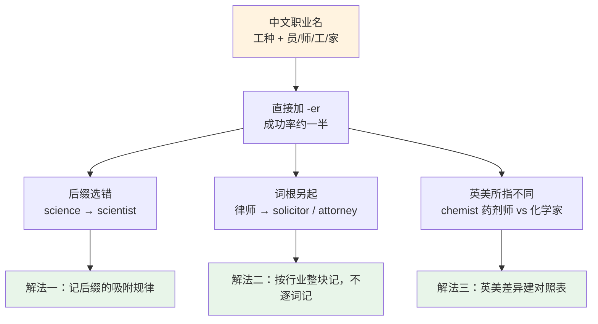
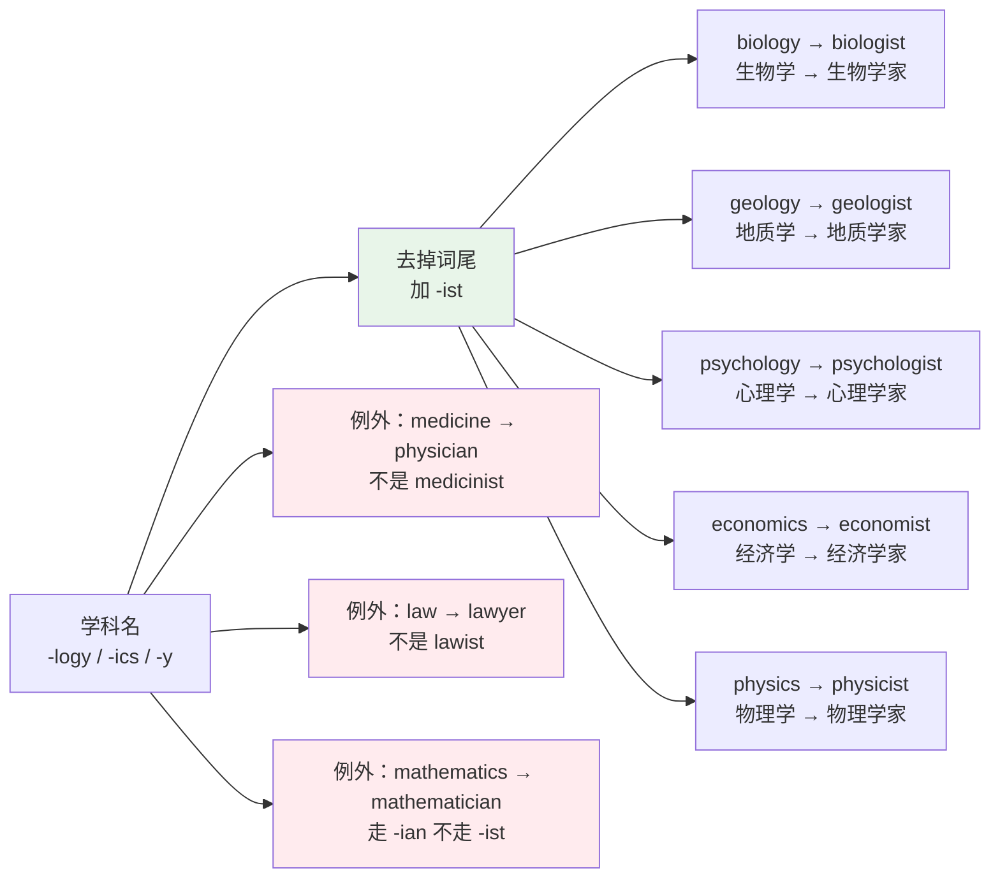
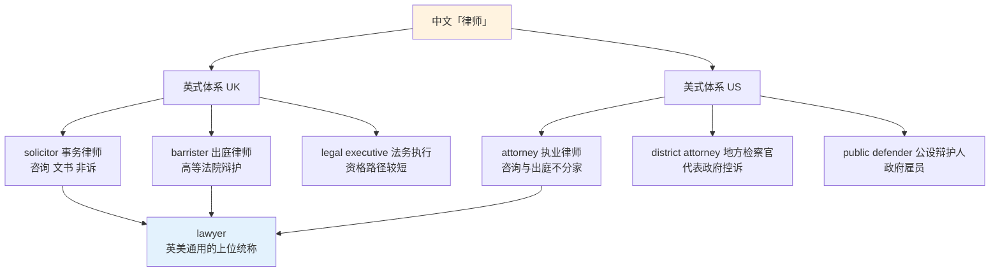
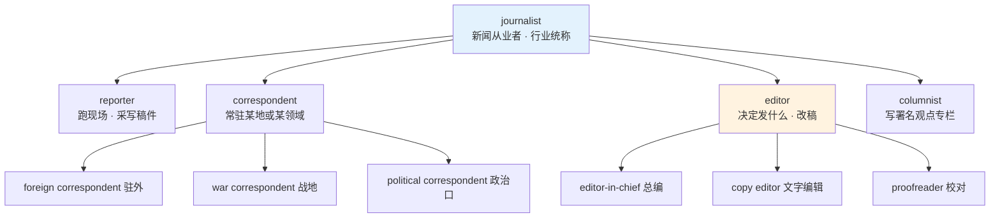
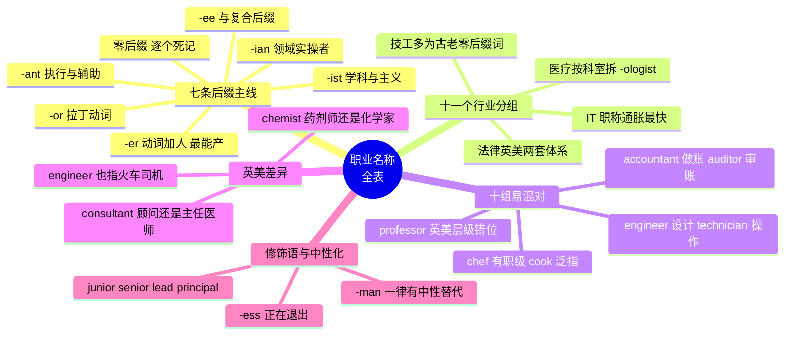

# 职业名称全表

> [!info] 本篇定位
>
> 上一篇铺完了校园侧的词，这一篇跨过校门，处理「人靠什么吃饭」这一层的名词。
>
> 读完你会拿到三样东西：一张按十一个行业分组的职业名词表，一套用后缀反推职业含义的规则（`-er` `-or` `-ist` `-ian` `-ant` 各管什么），以及十组中文学习者最常混用的职业名的判据。
>
> 职业名是简历、名片、新闻导语、技术文档署名里出现频率最高的一类名词。选错一个词，读者对你身份的判断会整体偏掉——`engineer` 和 `technician` 在英美语境里是两种薪资结构，`solicitor` 和 `attorney` 分别对应两套完全不同的司法制度。

---

## 1. 本篇导读：职业名不能靠「工种加人」硬拼

中文构造职业名有一套稳定的模板：工种 + 「员」「师」「工」「家」。「程序员」「工程师」「电工」「作家」，四个后缀基本覆盖全部。中文母语者学英语职业名时最自然的做法就是把这套模板搬过去：动词加 `-er` 就完事。

这个策略能命中相当一部分词，但漏掉的那部分是集中的，问题分三类。

**第一类是后缀选错。** `science` 的从业者不是 ~~sciencer~~ 而是 `scientist`；`music` 的从业者不是 ~~musicer~~ 而是 `musician`；`account` 的从业者不是 ~~accounter~~ 而是 `accountant`。四个主力后缀 `-er` `-or` `-ist` `-ian` 各自吸附不同的词干类型，不是随机分布。

**第二类是词根根本不同。** 「律师」在英式英语里分裂成 `solicitor` 和 `barrister` 两种执业资格，在美式英语里是 `attorney`，而 `lawyer` 是三者的上位统称。中文的「律师」是一个词，英语这边是一张网。

**第三类是同一个词在英美指不同的人。** `chemist` 在英国街上指药店店员（也指开药店的人），在美国指化学家。`engineer` 在美国铁路语境里指火车司机。`consultant` 在英国医院里指主任医师，在商业语境里指顾问。这类词不查语境会翻译反。

上图把三类问题和三条解法对应起来，也是本篇的编排顺序：第 2 节交付后缀规律，第 3 到第 13 节按行业铺词表，第 14 节处理易混对，第 15 节处理英美差异。后缀规律是压缩比最高的一节，先记它，后面十一张行业表里大部分词能靠它自己推出来。

需要提前划清的边界：本篇只管**职业名称本身**——这个职业叫什么、词形怎么变、和哪些词容易混。求职流程（投简历、面试、录用）、公司组织结构（部门、汇报线、职级体系）、会议流程这些放在下一篇。

---

## 2. 职业名后缀的七条主线

### 2.1 -er：最开放的一条通道

`-er` 直接挂在**动词**后面，表示「做这个动作的人」。它是英语里唯一还在持续生产新职业名的后缀——出现一个新动作，就能造一个新职业名，不需要任何词典授权。

| 英文 | 英式音标 | 美式音标 | 词性 | 中文 | 搭配与说明 |
| --- | --- | --- | --- | --- | --- |
| **teacher** | /ˈtiːtʃə/ | /ˈtiːtʃər/ | n. | 教师 | teach + -er，最规整的一例 |
| **writer** | /ˈraɪtə/ | /ˈraɪtər/ | n. | 作家；撰稿人 | 词干去 e 再加，write → writer |
| **driver** | /ˈdraɪvə/ | /ˈdraɪvər/ | n. | 司机 | bus driver / taxi driver 复合使用 |
| **farmer** | /ˈfɑːmə/ | /ˈfɑːrmər/ | n. | 农民；农场主 | 英美都指经营者，不是雇工 |
| **singer** | /ˈsɪŋə/ | /ˈsɪŋər/ | n. | 歌手 | ng 不额外读 /ɡ/ |
| **banker** | /ˈbæŋkə/ | /ˈbæŋkər/ | n. | 银行家；投行从业者 | 普通柜员不叫 banker |
| **lawyer** | /ˈlɔːjə/ | /ˈlɔːjər/ | n. | 律师 | 上位统称，见 14.3 |
| **manager** | /ˈmænɪdʒə/ | /ˈmænɪdʒər/ | n. | 经理；主管 | manage 保留 e，因为要保软音 g |
| **engineer** | /ˌendʒɪˈnɪə/ | /ˌendʒɪˈnɪr/ | n. | 工程师 | 重音在最后一节，不是 -er 派生 |
| **carpenter** | /ˈkɑːpəntə/ | /ˈkɑːrpəntər/ | n. | 木匠 | 拉丁 carpentum「车」，非动词派生 |
| **plumber** | /ˈplʌmə/ | /ˈplʌmər/ | n. | 水管工 | b 不发音，词源 plumbum「铅」 |
| **butcher** | /ˈbʊtʃə/ | /ˈbʊtʃər/ | n. | 肉贩 | u 读 /ʊ/ 不读 /ʌ/ |
| **baker** | /ˈbeɪkə/ | /ˈbeɪkər/ | n. | 面包师 | 店铺是 bakery |
| **cashier** | /kæˈʃɪə/ | /kæˈʃɪr/ | n. | 收银员 | 重音在后，别读成 /ˈkæʃiə/ |
| **researcher** | /rɪˈsɜːtʃə/ | /ˈriːsɜːrtʃər/ | n. | 研究员 | 美音重音常前移到第一音节 |
| **designer** | /dɪˈzaɪnə/ | /dɪˈzaɪnər/ | n. | 设计师 | graphic / interior / fashion 前置限定 |
| **trainer** | /ˈtreɪnə/ | /ˈtreɪnər/ | n. | 培训师；教练 | 英式复数 trainers 另指运动鞋 |
| **broker** | /ˈbrəʊkə/ | /ˈbroʊkər/ | n. | 经纪人 | insurance broker / mortgage broker |

> [!tip] -er 的能产性怎么利用
>
> 遇到没见过的动词，先假设 `动词 + -er` 是合法职业名，命中率相当高：`code → coder`、`stream → streamer`、`podcast → podcaster`、`freelance → freelancer` 全部成立。
>
> 反向不成立：不能从职业名倒推动词。`carpenter` 没有动词 ~~carpent~~，`plumber` 的动词 `plumb` 意思是「测垂直」不是「修水管」。

### 2.2 -or：拉丁派生，词干多是拉丁动词

`-or` 和 `-er` 意思完全一样，差别只在**出身**：`-or` 挂在从拉丁语借来的动词后面。判断方法是看词干——词干本身像个拉丁词（`direct` `inspect` `instruct` `supervise`），基本走 `-or`。

| 英文 | 英式音标 | 美式音标 | 词性 | 中文 | 搭配与说明 |
| --- | --- | --- | --- | --- | --- |
| **doctor** | /ˈdɒktə/ | /ˈdɑːktər/ | n. | 医生；博士 | 两个义项都常用，靠语境分 |
| **actor** | /ˈæktə/ | /ˈæktər/ | n. | 演员 | 现在也用于女演员，见 16.3 |
| **editor** | /ˈedɪtə/ | /ˈedɪtər/ | n. | 编辑 | editor-in-chief 总编 |
| **director** | /dəˈrektə/ | /dəˈrektər/ | n. | 导演；董事；总监 | 三义靠行业分，影视/公司/职级 |
| **inspector** | /ɪnˈspektə/ | /ɪnˈspektər/ | n. | 检查员；督察 | 英国警衔的一级 |
| **instructor** | /ɪnˈstrʌktə/ | /ɪnˈstrʌktər/ | n. | 教练；讲师 | 美国大学最低教职，见 14.6 |
| **professor** | /prəˈfesə/ | /prəˈfesər/ | n. | 教授 | 英美职级含义不同，见 14.6 |
| **sailor** | /ˈseɪlə/ | /ˈseɪlər/ | n. | 水手 | 军舰上指士兵，非军官 |
| **tailor** | /ˈteɪlə/ | /ˈteɪlər/ | n. | 裁缝 | 男装为主；女装多用 dressmaker |
| **translator** | /trænzˈleɪtə/ | /ˈtrænsleɪtər/ | n. | 笔译员 | 只做书面，口译是 interpreter |
| **operator** | /ˈɒpəreɪtə/ | /ˈɑːpəreɪtər/ | n. | 操作员；话务员 | crane operator / forklift operator |
| **supervisor** | /ˈsuːpəvaɪzə/ | /ˈsuːpərvaɪzər/ | n. | 主管；导师 | 学术语境指研究生导师 |
| **auditor** | /ˈɔːdɪtə/ | /ˈɔːdɪtər/ | n. | 审计师 | 与 accountant 的分工见 14.2 |
| **investor** | /ɪnˈvestə/ | /ɪnˈvestər/ | n. | 投资人 | 不是职业名，是身份名 |
| **surveyor** | /səˈveɪə/ | /sərˈveɪər/ | n. | 测量师；估价师 | 英式 quantity surveyor 造价师 |
| **conductor** | /kənˈdʌktə/ | /kənˈdʌktər/ | n. | 指挥；列车员 | 音乐义与铁路义同形 |
| **governor** | /ˈɡʌvənə/ | /ˈɡʌvərnər/ | n. | 州长；总督 | 美国州行政首长 |
| **prosecutor** | /ˈprɒsɪkjuːtə/ | /ˈprɑːsɪkjuːtər/ | n. | 检察官 | 美式 district attorney 是地方检察官 |
| **contractor** | /kənˈtræktə/ | /ˈkɑːntræktər/ | n. | 承包商；外包人员 | IT 语境指合同工，非正式员工 |
| **counsellor** | /ˈkaʊnsələ/ | /ˈkaʊnsələr/ | n. | 咨询师；辅导员 | 美式拼 counselor，单 l |

> [!warning] -er 与 -or 拼错是高频扣分点
>
> 这两个后缀读音完全一样（英音都是 /ə/，美音都是 /ər/），只能靠记拼写。
>
> - ✅ **adviser** 与 ✅ **advisor** 两种拼法都通行（英式偏 adviser，美式两者都常见），但 ❌ ~~editer~~ ~~directer~~ ~~acter~~ 全错
> - ❌ ~~teachor~~ ~~writor~~ ~~drivor~~ 同样全错
>
> 一条能用的粗规律：词干是日常短词（teach、write、drive、bake）走 `-er`；词干带拉丁前缀（in-、re-、pro-、super-、con-）走 `-or`。

### 2.3 -ist：学科、主义与专精技艺

`-ist` 挂在**学科名或主义名**后面，表示「以此为专业的人」。它是学术与技术类职业名的主力后缀，也是唯一一个能从学科名机械推导的后缀。

| 英文 | 英式音标 | 美式音标 | 词性 | 中文 | 搭配与说明 |
| --- | --- | --- | --- | --- | --- |
| **scientist** | /ˈsaɪəntɪst/ | /ˈsaɪəntɪst/ | n. | 科学家 | science 去掉 -ce 再加 -tist |
| **artist** | /ˈɑːtɪst/ | /ˈɑːrtɪst/ | n. | 艺术家 | 广义含音乐人、表演者 |
| **dentist** | /ˈdentɪst/ | /ˈdentɪst/ | n. | 牙医 | 拉丁 dent「牙」 |
| **journalist** | /ˈdʒɜːnəlɪst/ | /ˈdʒɜːrnəlɪst/ | n. | 记者；新闻从业者 | 与 reporter 的分工见 14.8 |
| **pharmacist** | /ˈfɑːməsɪst/ | /ˈfɑːrməsɪst/ | n. | 药剂师 | 英式口语常说 chemist |
| **psychologist** | /saɪˈkɒlədʒɪst/ | /saɪˈkɑːlədʒɪst/ | n. | 心理学家；心理咨询师 | 不能开药，psychiatrist 才能 |
| **economist** | /ɪˈkɒnəmɪst/ | /ɪˈkɑːnəmɪst/ | n. | 经济学家 | 重音在第二音节 |
| **biologist** | /baɪˈɒlədʒɪst/ | /baɪˈɑːlədʒɪst/ | n. | 生物学家 | marine biologist 海洋生物学家 |
| **chemist** | /ˈkemɪst/ | /ˈkemɪst/ | n. | 化学家；（英）药剂师 | ch 读 /k/；英美义项分歧见 14.5 |
| **therapist** | /ˈθerəpɪst/ | /ˈθerəpɪst/ | n. | 治疗师 | speech / physical / occupational 前置 |
| **receptionist** | /rɪˈsepʃənɪst/ | /rɪˈsepʃənɪst/ | n. | 前台接待 | 酒店与写字楼通用 |
| **specialist** | /ˈspeʃəlɪst/ | /ˈspeʃəlɪst/ | n. | 专科医生；专家 | 医疗语境默认指专科医生 |
| **analyst** | /ˈænəlɪst/ | /ˈænəlɪst/ | n. | 分析师 | 常见拼错 ~~analyist~~；动词英式 analyse、美式 analyze |
| **novelist** | /ˈnɒvəlɪst/ | /ˈnɑːvəlɪst/ | n. | 小说家 | 只写长篇；短篇作者是 short-story writer |
| **florist** | /ˈflɒrɪst/ | /ˈflɔːrɪst/ | n. | 花商 | 店铺也叫 florist |
| **machinist** | /məˈʃiːnɪst/ | /məˈʃiːnɪst/ | n. | 机床工 | ch 读 /ʃ/ |
| **archaeologist** | /ˌɑːkiˈɒlədʒɪst/ | /ˌɑːrkiˈɑːlədʒɪst/ | n. | 考古学家 | 美式可拼 archeologist |
| **hygienist** | /haɪˈdʒiːnɪst/ | /haɪˈdʒiːnɪst/ | n. | 洁牙师 | dental hygienist 是完整职称 |

学科名到职业名的映射有一条能直接套用的机械规则：

上图左侧是可机械推导的部分：凡是以 `-logy` 结尾的学科，从业者一律是 `-logist`，没有例外。这一条规则本身就能覆盖几十个职业名——`cardiology → cardiologist`、`dermatology → dermatologist`、`meteorology → meteorologist`、`archaeology → archaeologist` 全部成立，不需要单独记。右侧三个例外要单独记，它们恰好是三个最古老的行当：医、法、算术，年代太早，没赶上 `-ist` 这套后缀。

### 2.4 -ian：领域从业者，重音落在 -i- 前

`-ian` 表示「属于某个领域的人」。它和 `-ist` 的差别很微妙：`-ist` 偏「研究者」，`-ian` 偏「实践者」。`mathematician` 是做数学的人，`electrician` 是接电线的人，两者都不研究理论。

`-ian` 有一条极稳定的读音规则：重音永远落在 `-ian` 前面那个音节，且 `-cian` 一律读 /ʃn/。

| 英文 | 英式音标 | 美式音标 | 词性 | 中文 | 搭配与说明 |
| --- | --- | --- | --- | --- | --- |
| **musician** | /mjuˈzɪʃn/ | /mjuˈzɪʃn/ | n. | 音乐人 | 演奏者与创作者都算 |
| **physician** | /fɪˈzɪʃn/ | /fɪˈzɪʃn/ | n. | 内科医生 | 与 surgeon 对举，见 14.4 |
| **technician** | /tekˈnɪʃn/ | /tekˈnɪʃn/ | n. | 技术员 | 与 engineer 的分工见 14.1 |
| **electrician** | /ɪˌlekˈtrɪʃn/ | /ɪˌlekˈtrɪʃn/ | n. | 电工 | 持证技工，不是 electric engineer |
| **librarian** | /laɪˈbreəriən/ | /laɪˈbreriən/ | n. | 图书馆员 | 重音在第二音节 |
| **veterinarian** | /ˌvetərɪˈneəriən/ | /ˌvetərəˈneriən/ | n. | 兽医 | 美式常用；英式说 vet |
| **historian** | /hɪˈstɔːriən/ | /hɪˈstɔːriən/ | n. | 历史学家 | 重音在 -sto- |
| **politician** | /ˌpɒləˈtɪʃn/ | /ˌpɑːləˈtɪʃn/ | n. | 政客；从政者 | 中性偏贬，褒义用 statesman |
| **mathematician** | /ˌmæθəməˈtɪʃn/ | /ˌmæθəməˈtɪʃn/ | n. | 数学家 | 五个音节，重音在第四 |
| **statistician** | /ˌstætɪˈstɪʃn/ | /ˌstætɪˈstɪʃn/ | n. | 统计学家 | 与 data scientist 职能重叠 |
| **beautician** | /bjuːˈtɪʃn/ | /bjuːˈtɪʃn/ | n. | 美容师 | beauty 去 y 加 -ician |
| **paediatrician** | /ˌpiːdiəˈtrɪʃn/ | /ˌpiːdiəˈtrɪʃn/ | n. | 儿科医生 | 美式拼 pediatrician，去 a |
| **optician** | /ɒpˈtɪʃn/ | /ɑːpˈtɪʃn/ | n. | 眼镜技师 | 配镜，不做视力诊断 |
| **dietitian** | /ˌdaɪəˈtɪʃn/ | /ˌdaɪəˈtɪʃn/ | n. | 营养师 | 受监管职称，与 nutritionist 有别 |
| **comedian** | /kəˈmiːdiən/ | /kəˈmiːdiən/ | n. | 喜剧演员 | stand-up comedian 单口喜剧演员 |
| **custodian** | /kʌˈstəʊdiən/ | /kʌˈstoʊdiən/ | n. | 保管员；（美）清洁工 | 美国学校用它替代 janitor |

### 2.5 -ant 与 -ent：拉丁现在分词的残留

`-ant` 和 `-ent` 来自拉丁语现在分词词尾，字面意思是「正在做某事的」。它们造出来的职业名带一点「辅助、协助、代理」的语义色彩，但这条色彩在很多词里已经磨掉了。

| 英文 | 英式音标 | 美式音标 | 词性 | 中文 | 搭配与说明 |
| --- | --- | --- | --- | --- | --- |
| **accountant** | /əˈkaʊntənt/ | /əˈkaʊntənt/ | n. | 会计师 | 不是 accounter；见 14.2 |
| **assistant** | /əˈsɪstənt/ | /əˈsɪstənt/ | n. | 助理 | 也作形容词表职级：assistant manager |
| **consultant** | /kənˈsʌltənt/ | /kənˈsʌltənt/ | n. | 顾问；（英）主任医师 | 英美义项差别极大，见 14.10 |
| **attendant** | /əˈtendənt/ | /əˈtendənt/ | n. | 服务员；乘务员 | flight attendant 空乘 |
| **servant** | /ˈsɜːvənt/ | /ˈsɜːrvənt/ | n. | 仆人；公职人员 | civil servant 公务员 |
| **merchant** | /ˈmɜːtʃənt/ | /ˈmɜːrtʃənt/ | n. | 商人 | 偏书面与历史语境 |
| **agent** | /ˈeɪdʒənt/ | /ˈeɪdʒənt/ | n. | 代理人；经纪人 | travel / estate / literary agent |
| **superintendent** | /ˌsuːpərɪnˈtendənt/ | /ˌsuːpərɪnˈtendənt/ | n. | 主管；（英）警司 | 美国指学区总监 |
| **correspondent** | /ˌkɒrəˈspɒndənt/ | /ˌkɔːrəˈspɑːndənt/ | n. | 驻外记者 | 常年驻点，见 14.8 |
| **lieutenant** | /lefˈtenənt/ | /luːˈtenənt/ | n. | 中尉；副职 | 英美读音差异最大的职业名 |
| **president** | /ˈprezɪdənt/ | /ˈprezɪdənt/ | n. | 总统；董事长；校长 | 美国大学校长用它 |
| **apprentice** | /əˈprentɪs/ | /əˈprentɪs/ | n. | 学徒 | 词尾是 -ice 不是 -ant，与本组同源但不同后缀 |

> [!warning] lieutenant 的读音陷阱
>
> 这个词的英美读音差距大到听不出是同一个词。
>
> - 英式 /lefˈtenənt/ ——「leftenant」，第一音节有个凭空冒出来的 /f/
> - 美式 /luːˈtenənt/ ——「lootenant」，按拼写读
>
> 英式读音的 /f/ 来自中古法语 `lieu` 的一种拼写变体 `luef`，被英国军队沿用至今。看英剧和美剧里的军警题材，这个词是最好辨认的口音标记之一。

### 2.6 -ee 与复合后缀：容易被漏掉的两小类

`-ee` 表示**动作的承受方**，和 `-er` 正好构成一对。它造出来的词严格说不都是职业名，但在雇佣与合同语境里出现频率很高。

| 英文 | 英式音标 | 美式音标 | 词性 | 中文 | 搭配与说明 |
| --- | --- | --- | --- | --- | --- |
| **employee** | /ɪmˈplɔɪiː/ | /ɪmˈplɔɪiː/ | n. | 雇员 | 对 employer 雇主 |
| **trainee** | /ˌtreɪˈniː/ | /ˌtreɪˈniː/ | n. | 受训者；实习生 | 对 trainer 培训师 |
| **appointee** | /əˌpɔɪnˈtiː/ | /əˌpɔɪnˈtiː/ | n. | 被任命者 | 政治任命语境常见 |
| **licensee** | /ˌlaɪsənˈsiː/ | /ˌlaɪsənˈsiː/ | n. | 持牌方 | 英国指持酒牌的店主 |
| **retiree** | /rɪˌtaɪəˈriː/ | /rɪˌtaɪˈriː/ | n. | 退休人员 | 美式用得比英式多 |
| **interviewee** | /ˌɪntəvjuːˈiː/ | /ˌɪntərvjuːˈiː/ | n. | 受访者；面试者 | 对 interviewer 面试官 |

复合后缀是另一小类：词尾本身是个实词，拼在名词后面构成职业名。这类词多数很老，带有手工业时代的痕迹。

| 英文 | 英式音标 | 美式音标 | 词性 | 中文 | 搭配与说明 |
| --- | --- | --- | --- | --- | --- |
| **blacksmith** | /ˈblæksmɪθ/ | /ˈblæksmɪθ/ | n. | 铁匠 | smith 是古英语「锻打者」 |
| **locksmith** | /ˈlɒksmɪθ/ | /ˈlɑːksmɪθ/ | n. | 锁匠 | 现代仍是活跃职业 |
| **goldsmith** | /ˈɡəʊldsmɪθ/ | /ˈɡoʊldsmɪθ/ | n. | 金匠 | 与 silversmith 对举 |
| **playwright** | /ˈpleɪraɪt/ | /ˈpleɪraɪt/ | n. | 剧作家 | wright 是「造物者」，不是 write |
| **shipwright** | /ˈʃɪpraɪt/ | /ˈʃɪpraɪt/ | n. | 造船工匠 | 传统木船工艺 |
| **shopkeeper** | /ˈʃɒpkiːpə/ | /ˈʃɑːpkiːpər/ | n. | 店主 | 美式更常说 store owner |
| **housekeeper** | /ˈhaʊskiːpə/ | /ˈhaʊskiːpər/ | n. | 管家；客房服务员 | 酒店语境指保洁 |
| **bookkeeper** | /ˈbʊkkiːpə/ | /ˈbʊkkiːpər/ | n. | 记账员 | 三个连续双写字母 |
| **innkeeper** | /ˈɪnkiːpə/ | /ˈɪnkiːpər/ | n. | 客栈老板 | 偏文学与历史语境 |
| **beekeeper** | /ˈbiːkiːpə/ | /ˈbiːkiːpər/ | n. | 养蜂人 | 也说 apiarist |
| **fishmonger** | /ˈfɪʃmʌŋɡə/ | /ˈfɪʃmʌŋɡər/ | n. | 鱼贩 | monger 是「贩卖者」，英式常用 |
| **ironmonger** | /ˈaɪənmʌŋɡə/ | /ˈaɪərnmʌŋɡər/ | n. | 五金商 | 纯英式，美式说 hardware store |
| **headmaster** | /ˌhedˈmɑːstə/ | /ˌhedˈmæstər/ | n. | 校长 | 英式私校用语，见 15 节 |
| **postmaster** | /ˈpəʊstmɑːstə/ | /ˈpoʊstmæstər/ | n. | 邮政局长 | 也是邮件系统管理员账号名 |

### 2.7 零后缀职业名：必须逐个记的那批

有一批高频职业名不带任何可辨认的后缀，它们多数是从法语或拉丁语整词借入的，无法拆解。

| 英文 | 英式音标 | 美式音标 | 词性 | 中文 | 搭配与说明 |
| --- | --- | --- | --- | --- | --- |
| **chef** | /ʃef/ | /ʃef/ | n. | 主厨 | 法语借词，ch 读 /ʃ/ |
| **nurse** | /nɜːs/ | /nɜːrs/ | n. | 护士 | 也作动词「护理」 |
| **clerk** | /klɑːk/ | /klɜːrk/ | n. | 职员；店员 | 英美读音差异极大 |
| **judge** | /dʒʌdʒ/ | /dʒʌdʒ/ | n. | 法官 | 也作动词「判断」 |
| **cook** | /kʊk/ | /kʊk/ | n. | 厨师 | 与 chef 的层级差别见 14.7 |
| **guard** | /ɡɑːd/ | /ɡɑːrd/ | n. | 警卫；（英）列车长 | security guard 保安 |
| **pilot** | /ˈpaɪlət/ | /ˈpaɪlət/ | n. | 飞行员 | 也指引航员 |
| **priest** | /priːst/ | /priːst/ | n. | 神父；祭司 | 新教多用 minister / pastor |
| **surgeon** | /ˈsɜːdʒən/ | /ˈsɜːrdʒən/ | n. | 外科医生 | 英国称 Mr. 而非 Dr.，见 14.4 |
| **architect** | /ˈɑːkɪtekt/ | /ˈɑːrkɪtekt/ | n. | 建筑师；架构师 | ch 读 /k/ |
| **secretary** | /ˈsekrətri/ | /ˈsekrəteri/ | n. | 秘书；大臣 | 英美音节数不同，英式吞掉一个 |
| **intern** | /ˈɪntɜːn/ | /ˈɪntɜːrn/ | n. | 实习生；住院医师 | 医疗语境指第一年住院医 |
| **spy** | /spaɪ/ | /spaɪ/ | n. | 间谍 | 正式说法是 intelligence officer |
| **maid** | /meɪd/ | /meɪd/ | n. | 女佣 | 酒店语境已改用 room attendant |

---

## 3. 医疗与健康

医疗是职业名密度最高的行业，也是 `-ist` `-ian` `-or` 三个后缀分工最清晰的行业：诊断疾病的科室多走 `-ologist`，操作性岗位多走 `-ian`，古老的核心岗位保留零后缀。

| 英文 | 英式音标 | 美式音标 | 词性 | 中文 | 搭配与说明 |
| --- | --- | --- | --- | --- | --- |
| **doctor** | /ˈdɒktə/ | /ˈdɑːktər/ | n. | 医生 | 口语通称，含内外各科 |
| **physician** | /fɪˈzɪʃn/ | /fɪˈzɪʃn/ | n. | 内科医生 | 美式也泛指有行医资格者 |
| **surgeon** | /ˈsɜːdʒən/ | /ˈsɜːrdʒən/ | n. | 外科医生 | 主刀者；plastic surgeon 整形外科 |
| **general practitioner** | /ˌdʒenrəl prækˈtɪʃənə/ | /ˌdʒenrəl prækˈtɪʃənər/ | n. | 全科医生 | 缩写 GP，英国基层首诊 |
| **nurse** | /nɜːs/ | /nɜːrs/ | n. | 护士 | registered nurse 注册护士，缩写 RN |
| **midwife** | /ˈmɪdwaɪf/ | /ˈmɪdwaɪf/ | n. | 助产士 | 复数 midwives /ˈmɪdwaɪvz/ |
| **paramedic** | /ˌpærəˈmedɪk/ | /ˌpærəˈmedɪk/ | n. | 急救员 | 救护车上的高级急救人员 |
| **pharmacist** | /ˈfɑːməsɪst/ | /ˈfɑːrməsɪst/ | n. | 药剂师 | 英式口语常说 chemist |
| **dentist** | /ˈdentɪst/ | /ˈdentɪst/ | n. | 牙医 | 诊所是 dental practice |
| **orthodontist** | /ˌɔːθəˈdɒntɪst/ | /ˌɔːrθəˈdɑːntɪst/ | n. | 正畸医生 | 做牙齿矫正 |
| **hygienist** | /haɪˈdʒiːnɪst/ | /haɪˈdʒiːnɪst/ | n. | 洁牙师 | dental hygienist 完整称谓 |
| **optometrist** | /ɒpˈtɒmətrɪst/ | /ɑːpˈtɑːmətrɪst/ | n. | 验光师 | 做视力检查，可开处方镜片 |
| **optician** | /ɒpˈtɪʃn/ | /ɑːpˈtɪʃn/ | n. | 配镜师 | 只按处方配镜，不做诊断 |
| **ophthalmologist** | /ˌɒfθælˈmɒlədʒɪst/ | /ˌɑːfθælˈmɑːlədʒɪst/ | n. | 眼科医生 | 可手术；三者层级最高 |
| **radiologist** | /ˌreɪdiˈɒlədʒɪst/ | /ˌreɪdiˈɑːlədʒɪst/ | n. | 放射科医生 | 读片诊断 |
| **radiographer** | /ˌreɪdiˈɒɡrəfə/ | /ˌreɪdiˈɑːɡrəfər/ | n. | 放射技师 | 拍片操作，美式说 radiologic technologist |
| **anaesthetist** | /əˈniːsθətɪst/ | — | n. | 麻醉师（英） | 美式对应 anesthesiologist |
| **anesthesiologist** | — | /ˌænəsˌθiːziˈɑːlədʒɪst/ | n. | 麻醉医师（美） | 美国要求医学博士学位 |
| **cardiologist** | /ˌkɑːdiˈɒlədʒɪst/ | /ˌkɑːrdiˈɑːlədʒɪst/ | n. | 心内科医生 | 词根 cardi「心」 |
| **dermatologist** | /ˌdɜːməˈtɒlədʒɪst/ | /ˌdɜːrməˈtɑːlədʒɪst/ | n. | 皮肤科医生 | 词根 derma「皮肤」 |
| **neurologist** | /njʊəˈrɒlədʒɪst/ | /nʊˈrɑːlədʒɪst/ | n. | 神经内科医生 | 美音丢掉 /j/ |
| **oncologist** | /ɒŋˈkɒlədʒɪst/ | /ɑːŋˈkɑːlədʒɪst/ | n. | 肿瘤科医生 | 词根 onco「肿块」 |
| **obstetrician** | /ˌɒbstəˈtrɪʃn/ | /ˌɑːbstəˈtrɪʃn/ | n. | 产科医生 | 常与妇科合称 OB-GYN |
| **gynaecologist** | /ˌɡaɪnəˈkɒlədʒɪst/ | /ˌɡaɪnəˈkɑːlədʒɪst/ | n. | 妇科医生 | 美式拼 gynecologist |
| **paediatrician** | /ˌpiːdiəˈtrɪʃn/ | /ˌpiːdiəˈtrɪʃn/ | n. | 儿科医生 | 美式拼 pediatrician |
| **psychiatrist** | /saɪˈkaɪətrɪst/ | /saɪˈkaɪətrɪst/ | n. | 精神科医生 | 有处方权 |
| **psychologist** | /saɪˈkɒlədʒɪst/ | /saɪˈkɑːlədʒɪst/ | n. | 心理学家；心理师 | 无处方权 |
| **therapist** | /ˈθerəpɪst/ | /ˈθerəpɪst/ | n. | 治疗师 | 前置词决定专业方向 |
| **physiotherapist** | /ˌfɪziəʊˈθerəpɪst/ | /ˌfɪzioʊˈθerəpɪst/ | n. | 物理治疗师 | 美式常说 physical therapist |
| **chiropractor** | /ˈkaɪrəʊpræktə/ | /ˈkaɪroʊpræktər/ | n. | 脊椎按摩师 | 美国是受监管执业资格 |
| **podiatrist** | /pəˈdaɪətrɪst/ | /pəˈdaɪətrɪst/ | n. | 足病医生 | 英式旧称 chiropodist |
| **veterinarian** | /ˌvetərɪˈneəriən/ | /ˌvetərəˈneriən/ | n. | 兽医 | 英式正式称 veterinary surgeon |
| **dietitian** | /ˌdaɪəˈtɪʃn/ | /ˌdaɪəˈtɪʃn/ | n. | 临床营养师 | 受监管，可进医院 |
| **nutritionist** | /njuːˈtrɪʃənɪst/ | /nuːˈtrɪʃənɪst/ | n. | 营养顾问 | 多数国家不受监管 |
| **phlebotomist** | /fləˈbɒtəmɪst/ | /fləˈbɑːtəmɪst/ | n. | 采血员 | 词根 phleb「静脉」 |
| **caregiver** | /ˈkeəɡɪvə/ | /ˈkerɡɪvər/ | n. | 照护者 | 英式对应 carer |
| **orderly** | /ˈɔːdəli/ | /ˈɔːrdərli/ | n. | 护工 | 医院里的非技术辅助岗 |
| **registrar** | /ˌredʒɪˈstrɑː/ | /ˈredʒɪstrɑːr/ | n. | 专科住院医（英）；注册主任 | 英式医院职级，见 15 节 |

> [!warning] 三个「看眼睛的」不能混
>
> 中文都叫「眼科」，英语按资质分成三级，写简历或翻译病历时选错就是事实错误。
>
> - **ophthalmologist** —— 医学博士，可诊断、可开药、可手术
> - **optometrist** —— 验光师，可查视力、可开镜片处方，多数辖区不可手术
> - **optician** —— 配镜技师，只按别人的处方磨镜片、装镜架
>
> 同样的三级结构在牙科也有：**dentist**（牙医）→ **orthodontist**（正畸专科）→ **dental hygienist**（洁牙师）。

---

## 4. 教育与学术

教育行业职业名的难点不在词形，在**职级对应**。英美两套学位与教职体系差异很大，同一个词在两国指的层级可能差两三级。

| 英文 | 英式音标 | 美式音标 | 词性 | 中文 | 搭配与说明 |
| --- | --- | --- | --- | --- | --- |
| **teacher** | /ˈtiːtʃə/ | /ˈtiːtʃər/ | n. | 教师 | 中小学默认用词 |
| **professor** | /prəˈfesə/ | /prəˈfesər/ | n. | 教授 | 英美职级不同，见 14.6 |
| **lecturer** | /ˈlektʃərə/ | /ˈlektʃərər/ | n. | 讲师 | 英国是终身制正式教职 |
| **instructor** | /ɪnˈstrʌktə/ | /ɪnˈstrʌktər/ | n. | 讲师；教练 | 美国大学的非终身轨教职 |
| **tutor** | /ˈtjuːtə/ | /ˈtuːtər/ | n. | 导师；家教 | 英美义项差别大，见 14.6 |
| **principal** | /ˈprɪnsəpl/ | /ˈprɪnsəpl/ | n. | 校长（美） | 与 principle 同音，拼写别混 |
| **headteacher** | /ˌhedˈtiːtʃə/ | — | n. | 校长（英） | 公立学校用；私校用 headmaster |
| **dean** | /diːn/ | /diːn/ | n. | 院长；教务长 | dean of students 学生事务主任 |
| **provost** | /ˈprɒvəst/ | /ˈproʊvoʊst/ | n. | 教务长 | 英美读音差异明显 |
| **chancellor** | /ˈtʃɑːnsələ/ | /ˈtʃænsələr/ | n. | 校监；校长 | 英国多为荣誉职，美国是实权职 |
| **vice-chancellor** | /ˌvaɪs ˈtʃɑːnsələ/ | — | n. | 副校监（英） | 英国大学的实际最高行政首长 |
| **researcher** | /rɪˈsɜːtʃə/ | /ˈriːsɜːrtʃər/ | n. | 研究员 | research fellow 是正式职称 |
| **postdoc** | /ˈpəʊstdɒk/ | /ˈpoʊstdɑːk/ | n. | 博士后 | 全称 postdoctoral researcher |
| **teaching assistant** | /ˈtiːtʃɪŋ əˌsɪstənt/ | /ˈtiːtʃɪŋ əˌsɪstənt/ | n. | 助教 | 缩写 TA；英式也指中小学教辅 |
| **coach** | /kəʊtʃ/ | /koʊtʃ/ | n. | 教练 | 体育与职场辅导都用 |
| **examiner** | /ɪɡˈzæmɪnə/ | /ɪɡˈzæmɪnər/ | n. | 主考官；阅卷人 | external examiner 校外考官 |
| **invigilator** | /ɪnˈvɪdʒɪleɪtə/ | — | n. | 监考员（英） | 美式说 proctor |
| **proctor** | /ˈprɒktə/ | /ˈprɑːktər/ | n. | 监考员（美） | 也作动词「监考」 |
| **academic** | /ˌækəˈdemɪk/ | /ˌækəˈdemɪk/ | n. | 学者；高校教研人员 | 作名词时可数 |
| **scholar** | /ˈskɒlə/ | /ˈskɑːlər/ | n. | 学者；奖学金生 | 后一义在英式更常见 |
| **librarian** | /laɪˈbreəriən/ | /laɪˈbreriən/ | n. | 图书馆员 | 需图书馆学硕士学位 |
| **archivist** | /ˈɑːkɪvɪst/ | /ˈɑːrkɪvɪst/ | n. | 档案管理员 | ch 读 /k/ |
| **curator** | /kjʊəˈreɪtə/ | /kjʊˈreɪtər/ | n. | 策展人；馆长 | 博物馆与美术馆 |
| **translator** | /trænzˈleɪtə/ | /ˈtrænsleɪtər/ | n. | 笔译员 | 只处理文本 |
| **interpreter** | /ɪnˈtɜːprɪtə/ | /ɪnˈtɜːrprətər/ | n. | 口译员 | simultaneous interpreter 同传 |
| **linguist** | /ˈlɪŋɡwɪst/ | /ˈlɪŋɡwɪst/ | n. | 语言学家；通多语者 | 两义并存，靠语境分 |

> [!example] 学术职位在句子里的用法
>
> - She is **a lecturer** in computer science at Imperial College.
>   - 她是帝国理工计算机系的讲师。
> - He was promoted **to associate professor** last year.
>   - 他去年晋升为副教授。
> - The paper was reviewed by **two external examiners**.
>   - 这篇论文由两位校外考官评审。
> - My **supervisor** wants a draft by Friday.
>   - 我导师要求周五前交初稿。

`supervisor` 在英式学术语境里就是「研究生导师」的标准说法，美式更常用 `advisor`。这条差异写申请材料时会直接影响措辞。

---

## 5. 法律与公共部门

法律职业名是全篇最需要小心的一组，因为它们背后是两套不同的司法制度，不存在一一对应。

| 英文 | 英式音标 | 美式音标 | 词性 | 中文 | 搭配与说明 |
| --- | --- | --- | --- | --- | --- |
| **lawyer** | /ˈlɔːjə/ | /ˈlɔːjər/ | n. | 律师 | 上位统称，英美通用 |
| **attorney** | /əˈtɜːni/ | /əˈtɜːrni/ | n. | 律师（美） | 美国执业律师的正式称谓 |
| **solicitor** | /səˈlɪsɪtə/ | /səˈlɪsɪtər/ | n. | 事务律师（英） | 处理文书与咨询，见 14.3 |
| **barrister** | /ˈbærɪstə/ | /ˈbærɪstər/ | n. | 出庭律师（英） | 在高等法院辩护 |
| **counsel** | /ˈkaʊnsl/ | /ˈkaʊnsl/ | n. | 法律顾问；辩护人 | 单复数同形，无 -s |
| **paralegal** | /ˌpærəˈliːɡl/ | /ˌpærəˈliːɡl/ | n. | 律师助理 | 无执业资格，做文书检索 |
| **notary** | /ˈnəʊtəri/ | /ˈnoʊtəri/ | n. | 公证人 | 全称 notary public |
| **judge** | /dʒʌdʒ/ | /dʒʌdʒ/ | n. | 法官 | 尊称 Your Honour / Your Honor |
| **magistrate** | /ˈmædʒɪstreɪt/ | /ˈmædʒɪstreɪt/ | n. | 治安法官 | 英国基层法院多为非职业法官 |
| **justice** | /ˈdʒʌstɪs/ | /ˈdʒʌstɪs/ | n. | 大法官 | 最高法院法官的称谓 |
| **prosecutor** | /ˈprɒsɪkjuːtə/ | /ˈprɑːsɪkjuːtər/ | n. | 检察官 | 代表控方 |
| **district attorney** | — | /ˈdɪstrɪkt əˌtɜːrni/ | n. | 地方检察官（美） | 缩写 DA |
| **public defender** | — | /ˌpʌblɪk dɪˈfendər/ | n. | 公设辩护人（美） | 为无力聘律师者辩护 |
| **bailiff** | /ˈbeɪlɪf/ | /ˈbeɪlɪf/ | n. | 法警；执达员 | 英美职责略有不同 |
| **stenographer** | /stəˈnɒɡrəfə/ | /stəˈnɑːɡrəfər/ | n. | 速记员 | 法庭语境也叫 court reporter |
| **civil servant** | /ˌsɪvl ˈsɜːvənt/ | /ˌsɪvl ˈsɜːrvənt/ | n. | 公务员 | 英式标准说法 |
| **diplomat** | /ˈdɪpləmæt/ | /ˈdɪpləmæt/ | n. | 外交官 | 形容词 diplomatic |
| **ambassador** | /æmˈbæsədə/ | /æmˈbæsədər/ | n. | 大使 | 也用于品牌代言人 |
| **consul** | /ˈkɒnsl/ | /ˈkɑːnsl/ | n. | 领事 | 领事馆 consulate |
| **mayor** | /meə/ | /ˈmeɪər/ | n. | 市长 | 英美读音差异明显 |
| **councillor** | /ˈkaʊnsələ/ | /ˈkaʊnsələr/ | n. | 议员（地方） | 美式拼 councilor |
| **senator** | /ˈsenətə/ | /ˈsenətər/ | n. | 参议员 | 美国参议院成员 |
| **representative** | /ˌreprɪˈzentətɪv/ | /ˌreprɪˈzentətɪv/ | n. | 众议员（美） | 缩写 Rep. |
| **Member of Parliament** | — | — | n. | 下议员（英） | 缩写 MP |
| **minister** | /ˈmɪnɪstə/ | /ˈmɪnɪstər/ | n. | 大臣；部长 | 英式内阁；也指新教牧师 |
| **governor** | /ˈɡʌvənə/ | /ˈɡʌvərnər/ | n. | 州长 | 英式也指监狱长 |
| **tax inspector** | /ˈtæks ɪnˌspektə/ | /ˈtæks ɪnˌspektər/ | n. | 税务稽查员 | 美式常说 IRS agent |
| **customs officer** | /ˈkʌstəmz ˌɒfɪsə/ | /ˈkʌstəmz ˌɔːfɪsər/ | n. | 海关关员 | customs 恒用复数形 |
| **social worker** | /ˈsəʊʃl ˌwɜːkə/ | /ˈsoʊʃl ˌwɜːrkər/ | n. | 社工 | 受监管职业，需注册 |
| **probation officer** | /prəˈbeɪʃn ˌɒfɪsə/ | /proʊˈbeɪʃn ˌɔːfɪsər/ | n. | 缓刑监督官 | 司法辅助岗 |

上图解释了为什么「律师」这个词不能直译。英国把律师职能拆成两个执业资格：`solicitor` 直接对接客户、写合同、准备材料；`barrister` 由 `solicitor` 转介，只负责在高等法院出庭辩论。美国没有这道分割，一个 `attorney` 从头做到尾。`lawyer` 是三者都能覆盖的上位词，写不确定的场合用它最安全。

还有一个反向陷阱：`solicitor` 在美式英语里的常见义项不是律师，而是**上门推销员**。美国商铺门口的 `No solicitors` 牌子意思是「谢绝推销」，跟法律行业没有关系。

---

## 6. 金融、会计与商务

| 英文 | 英式音标 | 美式音标 | 词性 | 中文 | 搭配与说明 |
| --- | --- | --- | --- | --- | --- |
| **accountant** | /əˈkaʊntənt/ | /əˈkaʊntənt/ | n. | 会计师 | 英式资格 ACA，美式 CPA |
| **auditor** | /ˈɔːdɪtə/ | /ˈɔːdɪtər/ | n. | 审计师 | 内审 internal / 外审 external |
| **bookkeeper** | /ˈbʊkkiːpə/ | /ˈbʊkkiːpər/ | n. | 记账员 | 只做分录，不出报表意见 |
| **actuary** | /ˈæktʃuəri/ | /ˈæktʃueri/ | n. | 精算师 | 保险业核心岗，考试链极长 |
| **teller** | /ˈtelə/ | /ˈtelər/ | n. | 银行柜员 | 英式也说 bank clerk |
| **stockbroker** | /ˈstɒkbrəʊkə/ | /ˈstɑːkbroʊkər/ | n. | 股票经纪人 | 替客户下单收佣金 |
| **trader** | /ˈtreɪdə/ | /ˈtreɪdər/ | n. | 交易员 | 用自有或机构资金交易 |
| **analyst** | /ˈænəlɪst/ | /ˈænəlɪst/ | n. | 分析师 | equity / credit / business analyst |
| **underwriter** | /ˈʌndəraɪtə/ | /ˈʌndərˌraɪtər/ | n. | 核保人；承销商 | 保险与投行两义 |
| **treasurer** | /ˈtreʒərə/ | /ˈtreʒərər/ | n. | 财务主管；司库 | 管现金流与融资 |
| **comptroller** | /kənˈtrəʊlə/ | /kənˈtroʊlər/ | n. | 主计长 | 拼写古怪，读音同 controller |
| **economist** | /ɪˈkɒnəmɪst/ | /ɪˈkɑːnəmɪst/ | n. | 经济学家 | 也指机构里的宏观研究员 |
| **financial adviser** | /faɪˌnænʃl ədˈvaɪzə/ | /fəˌnænʃl ədˈvaɪzər/ | n. | 理财顾问 | adviser / advisor 两拼均可 |
| **insurance agent** | /ɪnˈʃʊərəns ˌeɪdʒənt/ | /ɪnˈʃʊrəns ˌeɪdʒənt/ | n. | 保险代理人 | 代表保险公司销售 |
| **estate agent** | /ɪˈsteɪt ˌeɪdʒənt/ | — | n. | 房产中介（英） | 美式说 real estate agent |
| **realtor** | — | /ˈriːəltər/ | n. | 房产经纪（美） | 原为商标，常被误读为 /ˈriːlətər/ |
| **appraiser** | /əˈpreɪzə/ | /əˈpreɪzər/ | n. | 估价师（美） | 英式对应 valuer |
| **valuer** | /ˈvæljuə/ | /ˈvæljuər/ | n. | 估价师（英） | 房产与艺术品评估 |
| **entrepreneur** | /ˌɒntrəprəˈnɜː/ | /ˌɑːntrəprəˈnɜːr/ | n. | 创业者 | 法语借词，重音在最后 |
| **executive** | /ɪɡˈzekjətɪv/ | /ɪɡˈzekjətɪv/ | n. | 高管 | chief executive officer 首席执行官 |
| **buyer** | /ˈbaɪə/ | /ˈbaɪər/ | n. | 采购员 | 零售业指选品负责人 |
| **procurement officer** | /prəˈkjʊəmənt ˌɒfɪsə/ | /proʊˈkjʊrmənt ˌɔːfɪsər/ | n. | 采购主管 | 招投标场景常用 |
| **sales representative** | /ˈseɪlz ˌreprɪzentətɪv/ | /ˈseɪlz ˌreprɪzentətɪv/ | n. | 销售代表 | 口语缩为 sales rep |
| **marketer** | /ˈmɑːkɪtə/ | /ˈmɑːrkɪtər/ | n. | 市场营销人员 | 也说 marketing specialist |
| **administrator** | /ədˈmɪnɪstreɪtə/ | /ədˈmɪnɪstreɪtər/ | n. | 行政人员 | 也指系统管理员 |
| **receptionist** | /rɪˈsepʃənɪst/ | /rɪˈsepʃənɪst/ | n. | 前台 | 也说 front desk staff |
| **secretary** | /ˈsekrətri/ | /ˈsekrəteri/ | n. | 秘书 | 现多改称 executive assistant |
| **clerk** | /klɑːk/ | /klɜːrk/ | n. | 文员 | 英美读音差极大 |
| **cashier** | /kæˈʃɪə/ | /kæˈʃɪr/ | n. | 收银员 | 超市与餐厅通用 |
| **recruiter** | /rɪˈkruːtə/ | /rɪˈkruːtər/ | n. | 招聘专员 | 猎头是 headhunter |

> [!warning] 三个「管钱的」职责不同
>
> - **bookkeeper** 记账：每天录凭证、对流水，不做判断
> - **accountant** 会计：出财务报表、做税务申报、给出会计处理意见
> - **auditor** 审计：检查别人做出来的账，出具审计意见
>
> 关键差别在**立场**：`accountant` 通常是公司自己人或受雇的服务方，`auditor` 必须相对独立，审的是 `accountant` 的成果。一个人可以同时具备两种资格，但在同一家公司同一年度不能同时担任这两个角色。

---

## 7. IT 与工程技术

这是本教程读者的主场，也是英语职业名更新最快的行业。职称通胀在这里最明显：同一份工作，十年前叫 `programmer`，现在多半叫 `software engineer`。

| 英文 | 英式音标 | 美式音标 | 词性 | 中文 | 搭配与说明 |
| --- | --- | --- | --- | --- | --- |
| **programmer** | /ˈprəʊɡræmə/ | /ˈproʊɡræmər/ | n. | 程序员 | 双写 m 是英美通用拼法，单 m 一律错 |
| **developer** | /dɪˈveləpə/ | /dɪˈveləpər/ | n. | 开发者 | 也指房地产开发商 |
| **software engineer** | /ˈsɒftweə ˌendʒɪˈnɪə/ | /ˈsɔːftwer ˌendʒɪˈnɪr/ | n. | 软件工程师 | 缩写 SWE，美国大厂标准职称 |
| **front-end developer** | /ˌfrʌnt ˈend dɪˌveləpə/ | /ˌfrʌnt ˈend dɪˌveləpər/ | n. | 前端开发 | 作定语时惯用连字符，front-end architecture |
| **back-end developer** | /ˌbæk ˈend dɪˌveləpə/ | /ˌbæk ˈend dɪˌveləpər/ | n. | 后端开发 | 也写 backend 一词 |
| **full-stack developer** | /ˌfʊl ˈstæk dɪˌveləpə/ | /ˌfʊl ˈstæk dɪˌveləpər/ | n. | 全栈开发 | 招聘广告高频词 |
| **data scientist** | /ˈdeɪtə ˌsaɪəntɪst/ | /ˈdeɪtə ˌsaɪəntɪst/ | n. | 数据科学家 | data 英式也读 /ˈdɑːtə/ |
| **data engineer** | /ˈdeɪtə ˌendʒɪˈnɪə/ | /ˈdeɪtə ˌendʒɪˈnɪr/ | n. | 数据工程师 | 建管道，不建模型 |
| **database administrator** | /ˈdeɪtəbeɪs ədˌmɪnɪstreɪtə/ | /ˈdeɪtəbeɪs ədˌmɪnɪstreɪtər/ | n. | 数据库管理员 | 缩写 DBA |
| **system administrator** | /ˈsɪstəm ədˌmɪnɪstreɪtə/ | /ˈsɪstəm ədˌmɪnɪstreɪtər/ | n. | 系统管理员 | 口语缩为 sysadmin |
| **network engineer** | /ˈnetwɜːk ˌendʒɪˈnɪə/ | /ˈnetwɜːrk ˌendʒɪˈnɪr/ | n. | 网络工程师 | 与 network technician 分层 |
| **security analyst** | /sɪˈkjʊərəti ˌænəlɪst/ | /sɪˈkjʊrəti ˌænəlɪst/ | n. | 安全分析师 | 也说 SOC analyst |
| **penetration tester** | /ˌpenəˈtreɪʃn ˌtestə/ | /ˌpenəˈtreɪʃn ˌtestər/ | n. | 渗透测试员 | 口语 pentester |
| **tester** | /ˈtestə/ | /ˈtestər/ | n. | 测试员 | 正式职称多为 QA engineer |
| **product manager** | /ˈprɒdʌkt ˌmænɪdʒə/ | /ˈprɑːdʌkt ˌmænɪdʒər/ | n. | 产品经理 | 缩写 PM，与项目经理同缩写 |
| **project manager** | /ˈprɒdʒekt ˌmænɪdʒə/ | /ˈprɑːdʒekt ˌmænɪdʒər/ | n. | 项目经理 | 也缩 PM，靠语境区分 |
| **scrum master** | /ˈskrʌm ˌmɑːstə/ | /ˈskrʌm ˌmæstər/ | n. | 敏捷教练 | 借自橄榄球术语 scrum |
| **UX designer** | /ˌjuː ˈeks dɪˌzaɪnə/ | /ˌjuː ˈeks dɪˌzaɪnər/ | n. | 用户体验设计师 | 字母分读 |
| **technical writer** | /ˈteknɪkl ˌraɪtə/ | /ˈteknɪkl ˌraɪtər/ | n. | 技术文档工程师 | 写 API 文档与手册 |
| **IT support** | /ˌaɪ ˈtiː səˌpɔːt/ | /ˌaɪ ˈtiː səˌpɔːrt/ | n. | 技术支持 | 也说 help desk technician |
| **solution architect** | /səˈluːʃn ˌɑːkɪtekt/ | /səˈluːʃn ˌɑːrkɪtekt/ | n. | 解决方案架构师 | architect 在此不是建筑师 |
| **mechanical engineer** | /məˌkænɪkl endʒɪˈnɪə/ | /məˌkænɪkl endʒɪˈnɪr/ | n. | 机械工程师 | 缩写 ME |
| **electrical engineer** | /ɪˌlektrɪkl endʒɪˈnɪə/ | /ɪˌlektrɪkl endʒɪˈnɪr/ | n. | 电气工程师 | 与 electrician 不同层 |
| **civil engineer** | /ˌsɪvl endʒɪˈnɪə/ | /ˌsɪvl endʒɪˈnɪr/ | n. | 土木工程师 | civil 原意「非军事」 |
| **chemical engineer** | /ˌkemɪkl endʒɪˈnɪə/ | /ˌkemɪkl endʒɪˈnɪr/ | n. | 化学工程师 | 与 chemist 分工不同 |
| **structural engineer** | /ˌstrʌktʃərəl endʒɪˈnɪə/ | /ˌstrʌktʃərəl endʒɪˈnɪr/ | n. | 结构工程师 | 负责受力计算 |
| **aerospace engineer** | /ˈeərəʊspeɪs endʒɪˌnɪə/ | /ˈeroʊspeɪs endʒɪˌnɪr/ | n. | 航空航天工程师 | 也说 aeronautical engineer |
| **industrial engineer** | /ɪnˌdʌstriəl endʒɪˈnɪə/ | /ɪnˌdʌstriəl endʒɪˈnɪr/ | n. | 工业工程师 | 做流程与产能优化 |
| **technician** | /tekˈnɪʃn/ | /tekˈnɪʃn/ | n. | 技术员 | 操作与维护岗，见 14.1 |
| **draughtsman** | /ˈdrɑːftsmən/ | — | n. | 制图员（英） | 美式拼 draftsman /ˈdræftsmən/ |
| **surveyor** | /səˈveɪə/ | /sərˈveɪər/ | n. | 测量师 | land surveyor 土地测量 |
| **quantity surveyor** | /ˈkwɒntəti səˌveɪə/ | — | n. | 工程造价师（英） | 美式对应 cost estimator |
| **quality inspector** | /ˈkwɒləti ɪnˌspektə/ | /ˈkwɑːləti ɪnˌspektər/ | n. | 质检员 | 也说 QC inspector |
| **field engineer** | /ˈfiːld endʒɪˌnɪə/ | /ˈfiːld endʒɪˌnɪr/ | n. | 现场工程师 | 出差到客户现场 |
| **maintenance engineer** | /ˈmeɪntənəns endʒɪˌnɪə/ | /ˈmeɪntənəns endʒɪˌnɪr/ | n. | 维护工程师 | maintenance 重音在第一节 |

> [!tip] engineer 在英美的含金量不同
>
> 受法律保护的是**带限定语的完整称号**，不是 `engineer` 这个词本身。英国受保护的是 `Chartered Engineer`（CEng）与 `Incorporated Engineer`（IEng），加拿大是 `Professional Engineer`（P.Eng），美国是各州注册的 `Professional Engineer`（PE）。没有相应资格却在名片上写 CEng 或 PE，属于违规使用受保护称号。
>
> 但只写 `engineer`、`software engineer` 不受这层约束。差别在行业习惯：英国招聘广告里 `software developer` 比 `software engineer` 常见，美国科技公司几乎一律用 `software engineer`。
>
> 写英文简历投英国岗位时用 `developer` 更贴当地习惯，投美国岗位用 `engineer`；两边都不要给自己加 CEng / PE 这类没拿到的后缀。

---

## 8. 建造、制造与手工技术

技工类职业名（英语叫 `skilled trades` 或简称 `the trades`）是零后缀词和 `-er` 词最集中的地方，多数很老，词源可以追到中世纪行会。

| 英文 | 英式音标 | 美式音标 | 词性 | 中文 | 搭配与说明 |
| --- | --- | --- | --- | --- | --- |
| **builder** | /ˈbɪldə/ | /ˈbɪldər/ | n. | 建筑工；营造商 | 英式指承建方，美式多说 contractor |
| **bricklayer** | /ˈbrɪkleɪə/ | /ˈbrɪkleɪər/ | n. | 砌砖工 | 口语缩为 brickie（英） |
| **mason** | /ˈmeɪsn/ | /ˈmeɪsn/ | n. | 石匠 | stonemason 更明确 |
| **carpenter** | /ˈkɑːpəntə/ | /ˈkɑːrpəntər/ | n. | 木工 | 结构木作 |
| **joiner** | /ˈdʒɔɪnə/ | — | n. | 细木工（英） | 做门窗家具，美式统称 carpenter |
| **plumber** | /ˈplʌmə/ | /ˈplʌmər/ | n. | 水暖工 | b 不发音 |
| **electrician** | /ɪˌlekˈtrɪʃn/ | /ɪˌlekˈtrɪʃn/ | n. | 电工 | 英国需持 NICEIC 认证 |
| **welder** | /ˈweldə/ | /ˈweldər/ | n. | 焊工 | arc welder 电弧焊工 |
| **roofer** | /ˈruːfə/ | /ˈruːfər/ | n. | 屋顶工 | 复数 roofs，非 rooves |
| **plasterer** | /ˈplɑːstərə/ | /ˈplæstərər/ | n. | 抹灰工 | 三个连续弱音节 |
| **painter** | /ˈpeɪntə/ | /ˈpeɪntər/ | n. | 油漆工；画家 | 两义靠语境分 |
| **decorator** | /ˈdekəreɪtə/ | /ˈdekəreɪtər/ | n. | 装修工（英）；室内设计师（美） | 英美义项分歧明显 |
| **glazier** | /ˈɡleɪziə/ | /ˈɡleɪʒər/ | n. | 玻璃安装工 | 英美读音不同 |
| **tiler** | /ˈtaɪlə/ | /ˈtaɪlər/ | n. | 瓦工；贴砖工 | 美式常说 tile setter |
| **scaffolder** | /ˈskæfəldə/ | /ˈskæfəldər/ | n. | 脚手架工 | 脚手架是 scaffolding |
| **crane operator** | /ˈkreɪn ˌɒpəreɪtə/ | /ˈkreɪn ˌɑːpəreɪtər/ | n. | 起重机操作员 | 也说 crane driver（英） |
| **foreman** | /ˈfɔːmən/ | /ˈfɔːrmən/ | n. | 工头 | 中性说法 supervisor |
| **site manager** | /ˈsaɪt ˌmænɪdʒə/ | /ˈsaɪt ˌmænɪdʒər/ | n. | 工地经理 | 美式说 construction manager |
| **labourer** | /ˈleɪbərə/ | /ˈleɪbərər/ | n. | 力工 | 美式拼 laborer |
| **mechanic** | /məˈkænɪk/ | /məˈkænɪk/ | n. | 修理工 | car mechanic 汽修工 |
| **machinist** | /məˈʃiːnɪst/ | /məˈʃiːnɪst/ | n. | 机床工 | CNC machinist 数控机床工 |
| **fitter** | /ˈfɪtə/ | /ˈfɪtər/ | n. | 装配工 | pipe fitter 管道装配工 |
| **toolmaker** | /ˈtuːlmeɪkə/ | /ˈtuːlmeɪkər/ | n. | 模具工 | 制造业高技能岗 |
| **blacksmith** | /ˈblæksmɪθ/ | /ˈblæksmɪθ/ | n. | 铁匠 | 现多为手工艺 |
| **locksmith** | /ˈlɒksmɪθ/ | /ˈlɑːksmɪθ/ | n. | 锁匠 | 开锁与配钥匙 |
| **cobbler** | /ˈkɒblə/ | /ˈkɑːblər/ | n. | 补鞋匠 | 也说 shoe repairer |
| **tailor** | /ˈteɪlə/ | /ˈteɪlər/ | n. | 裁缝 | 也作动词「量身定制」 |
| **seamstress** | /ˈsiːmstrəs/ | /ˈsiːmstrəs/ | n. | 女裁缝 | 中性说法 sewer 或 sewing machinist |
| **upholsterer** | /ʌpˈhəʊlstərə/ | /ʌpˈhoʊlstərər/ | n. | 家具软包工 | 沙发座椅包面 |
| **watchmaker** | /ˈwɒtʃmeɪkə/ | /ˈwɑːtʃmeɪkər/ | n. | 钟表匠 | 高端制表业核心工种 |
| **jeweller** | /ˈdʒuːələ/ | /ˈdʒuːələr/ | n. | 珠宝匠；珠宝商 | 美式拼 jeweler，单 l |
| **potter** | /ˈpɒtə/ | /ˈpɑːtər/ | n. | 陶工 | 陶艺是 pottery |
| **HVAC technician** | — | /ˌeɪtʃ viː eɪ ˈsiː tekˌnɪʃn/ | n. | 暖通技工（美） | 英式说 heating engineer |
| **surveyor's assistant** | /səˈveɪəz əˌsɪstənt/ | /sərˈveɪərz əˌsɪstənt/ | n. | 测量助理 | 工地放线辅助 |

> [!tip] the trades 这个说法值得记
>
> 英语里把需要持证、靠手艺吃饭的技术工种统称 `skilled trades` 或 `the trades`，从业者叫 `tradesperson`（英式旧称 `tradesman`）。
>
> - He works **in the trades**. —— 他做技术工种。
> - She trained as **an electrician** through an apprenticeship. —— 她通过学徒制取得电工资格。
>
> `apprenticeship`（学徒制）在英国、德国是主流的技工培养路径，跟大学教育并行，不是「学历不够的退路」。理解这个背景，读英文招聘与教育政策类文章会顺很多。

---

## 9. 服务、零售与餐饮酒店

| 英文 | 英式音标 | 美式音标 | 词性 | 中文 | 搭配与说明 |
| --- | --- | --- | --- | --- | --- |
| **waiter** | /ˈweɪtə/ | /ˈweɪtər/ | n. | 服务员 | 中性说法 server |
| **waitress** | /ˈweɪtrəs/ | /ˈweɪtrəs/ | n. | 女服务员 | -ess 后缀渐被淘汰，见 16.3 |
| **server** | /ˈsɜːvə/ | /ˈsɜːrvər/ | n. | 餐厅服务员（美） | 与「服务器」同形 |
| **bartender** | /ˈbɑːtendə/ | /ˈbɑːrtendər/ | n. | 调酒师 | 英式也说 barman / barmaid |
| **barista** | /bəˈriːstə/ | /bəˈriːstə/ | n. | 咖啡师 | 意大利语借词 |
| **chef** | /ʃef/ | /ʃef/ | n. | 主厨 | head chef 行政总厨 |
| **sous-chef** | /ˈsuː ʃef/ | /ˈsuː ʃef/ | n. | 副主厨 | 法语 sous「在下」 |
| **cook** | /kʊk/ | /kʊk/ | n. | 厨师；做饭的人 | 家庭与快餐语境 |
| **dishwasher** | /ˈdɪʃwɒʃə/ | /ˈdɪʃwɑːʃər/ | n. | 洗碗工；洗碗机 | 人与机器同形 |
| **host** | /həʊst/ | /hoʊst/ | n. | 迎宾 | 女性旧称 hostess |
| **sommelier** | /ˌsɒməlˈjeɪ/ | /ˌsʌməlˈjeɪ/ | n. | 侍酒师 | 法语借词，末音节重读 |
| **caterer** | /ˈkeɪtərə/ | /ˈkeɪtərər/ | n. | 宴席承办人 | 动词 cater for（英）/ cater to（美） |
| **concierge** | /ˌkɒnsiˈeəʒ/ | /ˌkɑːnsiˈerʒ/ | n. | 礼宾员 | 酒店代订票代叫车 |
| **porter** | /ˈpɔːtə/ | /ˈpɔːrtər/ | n. | 行李员；门房 | 英式医院里指勤务工 |
| **bellhop** | — | /ˈbelhɑːp/ | n. | 行李员（美） | 英式说 porter |
| **housekeeper** | /ˈhaʊskiːpə/ | /ˈhaʊskiːpər/ | n. | 客房服务员；管家 | 部门叫 housekeeping |
| **cleaner** | /ˈkliːnə/ | /ˈkliːnər/ | n. | 保洁员 | 英式常用 |
| **janitor** | /ˈdʒænɪtə/ | /ˈdʒænɪtər/ | n. | 楼管兼保洁（美） | 英式对应 caretaker |
| **caretaker** | /ˈkeəteɪkə/ | /ˈkerteɪkər/ | n. | 校工；物业管理员（英） | 美式也指临时看护人 |
| **doorman** | /ˈdɔːmən/ | /ˈdɔːrmən/ | n. | 门童 | 中性说法 door attendant |
| **security guard** | /sɪˈkjʊərəti ɡɑːd/ | /sɪˈkjʊrəti ɡɑːrd/ | n. | 保安 | 也说 security officer |
| **shop assistant** | /ˈʃɒp əˌsɪstənt/ | — | n. | 店员（英） | 美式说 sales clerk / sales associate |
| **sales associate** | — | /ˈseɪlz əˌsoʊʃiət/ | n. | 店员（美） | 零售业标准职称 |
| **store manager** | /ˈstɔː ˌmænɪdʒə/ | /ˈstɔːr ˌmænɪdʒər/ | n. | 店长 | 英式也说 shop manager |
| **greengrocer** | /ˈɡriːnɡrəʊsə/ | — | n. | 果蔬店主（英） | 美式无对应单词 |
| **newsagent** | /ˈnjuːzeɪdʒənt/ | — | n. | 报刊店主（英） | 美式说 newsstand operator |
| **hairdresser** | /ˈheədresə/ | /ˈherdresər/ | n. | 美发师 | 男女发型都做 |
| **barber** | /ˈbɑːbə/ | /ˈbɑːrbər/ | n. | 理发师 | 传统上只做男士 |
| **beautician** | /bjuːˈtɪʃn/ | /bjuːˈtɪʃn/ | n. | 美容师 | 也说 beauty therapist |
| **manicurist** | /ˈmænɪkjʊərɪst/ | /ˈmænɪkjʊrɪst/ | n. | 美甲师 | 也说 nail technician |
| **masseur** | /mæˈsɜː/ | /məˈsɜːr/ | n. | 按摩师（男） | 女性形式 masseuse |
| **tattoo artist** | /təˈtuː ˌɑːtɪst/ | /tæˈtuː ˌɑːrtɪst/ | n. | 纹身师 | tattoo 英美重音都在后 |
| **personal trainer** | /ˌpɜːsənl ˈtreɪnə/ | /ˌpɜːrsənl ˈtreɪnər/ | n. | 私人教练 | 缩写 PT |
| **babysitter** | /ˈbeɪbisɪtə/ | /ˈbeɪbisɪtər/ | n. | 临时保姆 | 按小时计酬 |
| **nanny** | /ˈnæni/ | /ˈnæni/ | n. | 住家保姆 | 全职长期 |
| **au pair** | /ˌəʊ ˈpeə/ | /ˌoʊ ˈper/ | n. | 互惠生 | 法语借词，两词分写 |
| **tour guide** | /ˈtʊə ɡaɪd/ | /ˈtʊr ɡaɪd/ | n. | 导游 | 也说 tour leader |
| **travel agent** | /ˈtrævl ˌeɪdʒənt/ | /ˈtrævl ˌeɪdʒənt/ | n. | 旅行社顾问 | 店面叫 travel agency |
| **undertaker** | /ˈʌndəteɪkə/ | /ˈʌndərteɪkər/ | n. | 殡葬承办人（英） | 美式说 funeral director |
| **mortician** | — | /mɔːrˈtɪʃn/ | n. | 入殓师（美） | 英式不用此词 |

---

## 10. 交通、物流与仓储

| 英文 | 英式音标 | 美式音标 | 词性 | 中文 | 搭配与说明 |
| --- | --- | --- | --- | --- | --- |
| **pilot** | /ˈpaɪlət/ | /ˈpaɪlət/ | n. | 飞行员 | 机长是 captain |
| **co-pilot** | /ˌkəʊ ˈpaɪlət/ | /ˌkoʊ ˈpaɪlət/ | n. | 副驾驶 | 正式称 first officer |
| **flight attendant** | /ˈflaɪt əˌtendənt/ | /ˈflaɪt əˌtendənt/ | n. | 空乘 | 取代旧称 stewardess |
| **cabin crew** | /ˈkæbɪn kruː/ | /ˈkæbɪn kruː/ | n. | 客舱机组 | 集合名词，不加 -s |
| **air traffic controller** | /ˈeə ˌtræfɪk kənˌtrəʊlə/ | /ˈer ˌtræfɪk kənˌtroʊlər/ | n. | 空管员 | 缩写 ATC |
| **ground staff** | /ˈɡraʊnd stɑːf/ | /ˈɡraʊnd stæf/ | n. | 地勤 | staff 是集合名词 |
| **bus driver** | /ˈbʌs ˌdraɪvə/ | /ˈbʌs ˌdraɪvər/ | n. | 公交司机 | 英式长途车叫 coach |
| **taxi driver** | /ˈtæksi ˌdraɪvə/ | /ˈtæksi ˌdraɪvər/ | n. | 出租车司机 | 美式也说 cab driver |
| **chauffeur** | /ˈʃəʊfə/ | /ʃoʊˈfɜːr/ | n. | 专职司机 | 法语借词，英美重音不同 |
| **lorry driver** | /ˈlɒri ˌdraɪvə/ | — | n. | 卡车司机（英） | 美式说 truck driver |
| **truck driver** | — | /ˈtrʌk ˌdraɪvər/ | n. | 卡车司机（美） | 口语 trucker |
| **courier** | /ˈkʊriə/ | /ˈkʊriər/ | n. | 快递员 | 也指快递公司 |
| **delivery driver** | /dɪˈlɪvəri ˌdraɪvə/ | /dɪˈlɪvəri ˌdraɪvər/ | n. | 配送司机 | 电商与外卖场景 |
| **dispatcher** | /dɪˈspætʃə/ | /dɪˈspætʃər/ | n. | 调度员 | 车队与急救中心 |
| **train driver** | /ˈtreɪn ˌdraɪvə/ | — | n. | 火车司机（英） | 美式说 engineer |
| **conductor** | /kənˈdʌktə/ | /kənˈdʌktər/ | n. | 列车员；售票员 | 美式铁路标准用词 |
| **station master** | /ˈsteɪʃn ˌmɑːstə/ | /ˈsteɪʃn ˌmæstər/ | n. | 站长 | 英式铁路传统职位 |
| **captain** | /ˈkæptɪn/ | /ˈkæptɪn/ | n. | 船长；机长 | 海空通用 |
| **deckhand** | /ˈdekhænd/ | /ˈdekhænd/ | n. | 甲板水手 | 船上最基层岗位 |
| **stevedore** | /ˈstiːvədɔː/ | /ˈstiːvədɔːr/ | n. | 装卸工头 | 西班牙语借词 |
| **longshoreman** | /ˈlɒŋʃɔːmən/ | /ˈlɔːŋʃɔːrmən/ | n. | 码头工人（美） | 英式说 docker |
| **warehouse worker** | /ˈweəhaʊs ˌwɜːkə/ | /ˈwerhaʊs ˌwɜːrkər/ | n. | 仓储工 | 也说 warehouse operative（英） |
| **forklift operator** | /ˈfɔːklɪft ˌɒpəreɪtə/ | /ˈfɔːrklɪft ˌɑːpəreɪtər/ | n. | 叉车司机 | 需持证 |
| **freight forwarder** | /ˈfreɪt ˌfɔːwədə/ | /ˈfreɪt ˌfɔːrwərdər/ | n. | 货运代理 | 国际物流核心角色 |
| **customs broker** | /ˈkʌstəmz ˌbrəʊkə/ | /ˈkʌstəmz ˌbroʊkər/ | n. | 报关行 | 代办清关手续 |

> [!warning] engineer 在美国铁路语境里是火车司机
>
> 这是英语职业名里最容易翻反的一个。
>
> - The **engineer** blew the whistle as the train approached the crossing.
>   - 火车司机在接近道口时拉响了汽笛。
>
> 这句话里的 `engineer` 跟工程学没有关系。同一个词在美国铁路系统里指驾驶机车的人，英国铁路则说 `train driver`。读美国新闻里的铁路事故报道，看到 `engineer` 先按「司机」理解。

---

## 11. 媒体、文创与设计

| 英文 | 英式音标 | 美式音标 | 词性 | 中文 | 搭配与说明 |
| --- | --- | --- | --- | --- | --- |
| **journalist** | /ˈdʒɜːnəlɪst/ | /ˈdʒɜːrnəlɪst/ | n. | 新闻从业者 | 行业统称 |
| **reporter** | /rɪˈpɔːtə/ | /rɪˈpɔːrtər/ | n. | 记者 | 跑现场发稿 |
| **correspondent** | /ˌkɒrəˈspɒndənt/ | /ˌkɔːrəˈspɑːndənt/ | n. | 驻站记者 | foreign correspondent 驻外记者 |
| **editor** | /ˈedɪtə/ | /ˈedɪtər/ | n. | 编辑 | 决定发什么、怎么改 |
| **copy editor** | /ˈkɒpi ˌedɪtə/ | /ˈkɑːpi ˌedɪtər/ | n. | 文字编辑 | 改语法与事实细节 |
| **proofreader** | /ˈpruːfriːdə/ | /ˈpruːfriːdər/ | n. | 校对员 | 只挑排版与拼写错 |
| **columnist** | /ˈkɒləmnɪst/ | /ˈkɑːləmnɪst/ | n. | 专栏作家 | 此处 m 要发音，与 column 不同 |
| **blogger** | /ˈblɒɡə/ | /ˈblɑːɡər/ | n. | 博主 | 双写 g |
| **photographer** | /fəˈtɒɡrəfə/ | /fəˈtɑːɡrəfər/ | n. | 摄影师 | 重音在第二音节 |
| **videographer** | /ˌvɪdiˈɒɡrəfə/ | /ˌvɪdiˈɑːɡrəfər/ | n. | 视频摄制师 | 婚礼与活动拍摄 |
| **camera operator** | /ˈkæmərə ˌɒpəreɪtə/ | /ˈkæmərə ˌɑːpəreɪtər/ | n. | 摄像师 | 取代旧称 cameraman |
| **director** | /dəˈrektə/ | /dəˈrektər/ | n. | 导演 | 影视语境默认此义 |
| **producer** | /prəˈdjuːsə/ | /prəˈduːsər/ | n. | 制片人 | 管钱管进度 |
| **screenwriter** | /ˈskriːnraɪtə/ | /ˈskriːnraɪtər/ | n. | 编剧 | 也说 scriptwriter |
| **playwright** | /ˈpleɪraɪt/ | /ˈpleɪraɪt/ | n. | 剧作家 | 舞台剧专用 |
| **novelist** | /ˈnɒvəlɪst/ | /ˈnɑːvəlɪst/ | n. | 小说家 | 长篇为主 |
| **poet** | /ˈpəʊɪt/ | /ˈpoʊət/ | n. | 诗人 | 无性别形式 |
| **illustrator** | /ˈɪləstreɪtə/ | /ˈɪləstreɪtər/ | n. | 插画师 | 重音在第一音节 |
| **animator** | /ˈænɪmeɪtə/ | /ˈænɪmeɪtər/ | n. | 动画师 | 2D / 3D animator |
| **graphic designer** | /ˈɡræfɪk dɪˌzaɪnə/ | /ˈɡræfɪk dɪˌzaɪnər/ | n. | 平面设计师 | 做视觉稿 |
| **art director** | /ˈɑːt dəˌrektə/ | /ˈɑːrt dəˌrektər/ | n. | 艺术总监 | 定视觉方向 |
| **fashion designer** | /ˈfæʃn dɪˌzaɪnə/ | /ˈfæʃn dɪˌzaɪnər/ | n. | 服装设计师 | 与 tailor 不同层 |
| **interior designer** | /ɪnˈtɪəriə dɪˌzaɪnə/ | /ɪnˈtɪriər dɪˌzaɪnər/ | n. | 室内设计师 | 美式也说 decorator |
| **actor** | /ˈæktə/ | /ˈæktər/ | n. | 演员 | 现已通用于男女 |
| **dancer** | /ˈdɑːnsə/ | /ˈdænsər/ | n. | 舞者 | 英美元音差别 |
| **choreographer** | /ˌkɒriˈɒɡrəfə/ | /ˌkɔːriˈɑːɡrəfər/ | n. | 编舞 | ch 读 /k/ |
| **composer** | /kəmˈpəʊzə/ | /kəmˈpoʊzər/ | n. | 作曲家 | 也说 songwriter（流行乐） |
| **conductor** | /kənˈdʌktə/ | /kənˈdʌktər/ | n. | 乐队指挥 | 与列车员同形 |
| **sound engineer** | /ˈsaʊnd endʒɪˌnɪə/ | /ˈsaʊnd endʒɪˌnɪr/ | n. | 录音工程师 | 也说 audio engineer |
| **copywriter** | /ˈkɒpiraɪtə/ | /ˈkɑːpiraɪtər/ | n. | 文案 | 与 copyright 词形接近但无关，见下方易错点 |
| **publicist** | /ˈpʌblɪsɪst/ | /ˈpʌblɪsɪst/ | n. | 公关；宣传人员 | 明星与出版业常见 |
| **presenter** | /prɪˈzentə/ | /prɪˈzentər/ | n. | 主持人（英） | 美式说 host |
| **anchor** | /ˈæŋkə/ | /ˈæŋkər/ | n. | 新闻主播（美） | 英式说 newsreader |
| **publisher** | /ˈpʌblɪʃə/ | /ˈpʌblɪʃər/ | n. | 出版人；出版社 | 人与机构同形 |
| **literary agent** | /ˈlɪtərəri ˌeɪdʒənt/ | /ˈlɪtəreri ˌeɪdʒənt/ | n. | 文学经纪人 | 替作者谈出版合同 |

> [!warning] copywriter 不是「版权作者」
>
> `copywriter` 里的 `copy` 是新闻出版行业术语，指「待印的文字稿」，跟 `copyright`（版权）没有关系。
>
> - ❌ ~~copyrighter~~（不存在这个词）
> - ✅ **copywriter** —— 写广告文案的人
> - ✅ **copyright holder** —— 版权持有人
>
> 同一个 `copy` 还出现在 `copy editor`（文字编辑）、`copy deadline`（截稿时间）里，都是「稿件」义。

---

## 12. 农林渔牧与野外科学

| 英文 | 英式音标 | 美式音标 | 词性 | 中文 | 搭配与说明 |
| --- | --- | --- | --- | --- | --- |
| **farmer** | /ˈfɑːmə/ | /ˈfɑːrmər/ | n. | 农场主 | 经营者而非雇工 |
| **farmhand** | /ˈfɑːmhænd/ | /ˈfɑːrmhænd/ | n. | 农场工人 | hand 表「劳力」 |
| **rancher** | /ˈrɑːntʃə/ | /ˈræntʃər/ | n. | 牧场主（美） | 英式无对应常用词 |
| **shepherd** | /ˈʃepəd/ | /ˈʃepərd/ | n. | 牧羊人 | 第二音节弱读，不读 herd |
| **beekeeper** | /ˈbiːkiːpə/ | /ˈbiːkiːpər/ | n. | 养蜂人 | 学名 apiarist |
| **gardener** | /ˈɡɑːdnə/ | /ˈɡɑːrdnər/ | n. | 园丁 | 三音节可缩为两音节 |
| **landscaper** | /ˈlændskeɪpə/ | /ˈlændskeɪpər/ | n. | 园林施工人员 | 设计侧是 landscape architect |
| **horticulturist** | /ˌhɔːtɪˈkʌltʃərɪst/ | /ˌhɔːrtɪˈkʌltʃərɪst/ | n. | 园艺学家 | hort「园」+ cult「培育」 |
| **agronomist** | /əˈɡrɒnəmɪst/ | /əˈɡrɑːnəmɪst/ | n. | 农学家 | 研究土壤与作物 |
| **forester** | /ˈfɒrɪstə/ | /ˈfɔːrɪstər/ | n. | 林业员 | 管理林场 |
| **lumberjack** | /ˈlʌmbədʒæk/ | /ˈlʌmbərdʒæk/ | n. | 伐木工 | 偏口语，正式说 logger |
| **fisherman** | /ˈfɪʃəmən/ | /ˈfɪʃərmən/ | n. | 渔民 | 中性形式 fisher |
| **vintner** | /ˈvɪntnə/ | /ˈvɪntnər/ | n. | 酒商；酿酒人 | 也说 winemaker |
| **miner** | /ˈmaɪnə/ | /ˈmaɪnər/ | n. | 矿工 | 与 minor 同音 |
| **park ranger** | /ˈpɑːk ˌreɪndʒə/ | /ˈpɑːrk ˌreɪndʒər/ | n. | 公园护林员 | 美国国家公园体系常见 |
| **conservationist** | /ˌkɒnsəˈveɪʃənɪst/ | /ˌkɑːnsərˈveɪʃənɪst/ | n. | 自然保护工作者 | 五个音节 |
| **botanist** | /ˈbɒtənɪst/ | /ˈbɑːtənɪst/ | n. | 植物学家 | 学科 botany |
| **zoologist** | /zuˈɒlədʒɪst/ | /zoʊˈɑːlədʒɪst/ | n. | 动物学家 | 首音节不读 /zuː/ |
| **marine biologist** | /məˌriːn baɪˈɒlədʒɪst/ | /məˌriːn baɪˈɑːlədʒɪst/ | n. | 海洋生物学家 | marine 重音在后 |
| **meteorologist** | /ˌmiːtiəˈrɒlədʒɪst/ | /ˌmiːtiəˈrɑːlədʒɪst/ | n. | 气象学家 | 电视天气播报也用此称 |
| **geologist** | /dʒiˈɒlədʒɪst/ | /dʒiˈɑːlədʒɪst/ | n. | 地质学家 | 石油与矿业核心岗 |
| **surveyor** | /səˈveɪə/ | /sərˈveɪər/ | n. | 测量员 | 野外测绘 |
| **oil rig worker** | /ˈɔɪl rɪɡ ˌwɜːkə/ | /ˈɔɪl rɪɡ ˌwɜːrkər/ | n. | 钻井平台工人 | 口语 roughneck |
| **fish farmer** | /ˈfɪʃ ˌfɑːmə/ | /ˈfɪʃ ˌfɑːrmər/ | n. | 水产养殖户 | 行业叫 aquaculture |

---

## 13. 军警消防与应急

军警职业名的特点是**军衔与职位混在一起**。同一个词（`captain`、`major`、`colonel`）在不同军种和不同国家对应的层级并不相同，读到时要看清语境。

| 英文 | 英式音标 | 美式音标 | 词性 | 中文 | 搭配与说明 |
| --- | --- | --- | --- | --- | --- |
| **soldier** | /ˈsəʊldʒə/ | /ˈsoʊldʒər/ | n. | 士兵 | d 与 i 合成 /dʒ/ |
| **officer** | /ˈɒfɪsə/ | /ˈɔːfɪsər/ | n. | 军官；警官 | 也指公司职级 |
| **general** | /ˈdʒenrəl/ | /ˈdʒenrəl/ | n. | 将军 | 陆军最高衔级组 |
| **colonel** | /ˈkɜːnl/ | /ˈkɜːrnl/ | n. | 上校 | 拼写与读音完全不对应 |
| **major** | /ˈmeɪdʒə/ | /ˈmeɪdʒər/ | n. | 少校 | 与「专业」义同形 |
| **captain** | /ˈkæptɪn/ | /ˈkæptɪn/ | n. | 上尉；船长 | 海军里层级更高 |
| **lieutenant** | /lefˈtenənt/ | /luːˈtenənt/ | n. | 中尉 | 英美读音差异最大 |
| **sergeant** | /ˈsɑːdʒənt/ | /ˈsɑːrdʒənt/ | n. | 中士；警长 | 拼 -er- 却读 /ɑː(r)/ |
| **corporal** | /ˈkɔːpərəl/ | /ˈkɔːrpərəl/ | n. | 下士 | 与 corporeal 不同词 |
| **private** | /ˈpraɪvət/ | /ˈpraɪvət/ | n. | 列兵 | 陆军最低衔 |
| **admiral** | /ˈædmərəl/ | /ˈædmərəl/ | n. | 海军上将 | 阿拉伯语借词 |
| **marine** | /məˈriːn/ | /məˈriːn/ | n. | 海军陆战队员 | 重音在后 |
| **cadet** | /kəˈdet/ | /kəˈdet/ | n. | 军校学员 | 警校学员也用 |
| **recruit** | /rɪˈkruːt/ | /rɪˈkruːt/ | n. | 新兵 | 也作动词「招募」 |
| **veteran** | /ˈvetərən/ | /ˈvetərən/ | n. | 退伍军人 | 美式缩为 vet，与兽医同缩写 |
| **police officer** | /pəˈliːs ˌɒfɪsə/ | /pəˈliːs ˌɔːfɪsər/ | n. | 警察 | 取代 policeman |
| **constable** | /ˈkʌnstəbl/ | /ˈkɑːnstəbl/ | n. | 警员（英） | 缩写 PC，英美元音不同 |
| **detective** | /dɪˈtektɪv/ | /dɪˈtektɪv/ | n. | 刑警；侦探 | 私家侦探 private investigator |
| **sheriff** | /ˈʃerɪf/ | /ˈʃerɪf/ | n. | 县治安官（美） | 民选职位 |
| **superintendent** | /ˌsuːpərɪnˈtendənt/ | /ˌsuːpərɪnˈtendənt/ | n. | 警司（英） | 高级警衔 |
| **firefighter** | /ˈfaɪəfaɪtə/ | /ˈfaɪərfaɪtər/ | n. | 消防员 | 取代 fireman |
| **fire chief** | /ˈfaɪə tʃiːf/ | /ˈfaɪər tʃiːf/ | n. | 消防队长 | 英式说 chief fire officer |
| **coastguard** | /ˈkəʊstɡɑːd/ | /ˈkoʊstɡɑːrd/ | n. | 海岸警卫 | 美式常分写 coast guard |
| **lifeguard** | /ˈlaɪfɡɑːd/ | /ˈlaɪfɡɑːrd/ | n. | 救生员 | 泳池与海滩 |
| **prison officer** | /ˈprɪzn ˌɒfɪsə/ | — | n. | 狱警（英） | 美式说 correctional officer |
| **bodyguard** | /ˈbɒdiɡɑːd/ | /ˈbɑːdiɡɑːrd/ | n. | 保镖 | 也说 close protection officer |

> [!warning] colonel 是英语拼写最不讲理的职业名
>
> `colonel` 拼出来有两个 l 一个 r 都没有，读音却是 /ˈkɜːnl/ ——「kernel」。
>
> 原因是这个词从意大利语 `colonnello` 进入法语时被改写成 `coronel`（异化作用把第一个 l 变成 r），英语先按法语拼写借入读音，后来又按意大利语原形改回了拼写，结果读音和拼写各走各的路，再也没对上。
>
> 同类拼读失效词还有 `lieutenant`（英式）、`sergeant`、`plumber`。这四个词只能整体记，不能靠拼读规则推。

---

## 14. 十组高频易混职业名辨析

### 14.1 engineer 与 technician

判据是**设计还是操作**。`engineer` 决定系统怎么建，`technician` 让已经建好的系统跑起来。

| 维度 | engineer | technician |
| --- | --- | --- |
| 核心职能 | 设计、计算、方案选型 | 安装、调试、维护、故障排除 |
| 学历门槛 | 通常本科及以上工程学位 | 专科文凭或职业资格证 |
| 典型产出 | 图纸、规格书、架构方案 | 检修记录、设备运行状态 |
| 常见搭配 | `work as an engineer`、`consult an engineer` | `call in a technician`、`send a technician out` |

> [!example] 两者在同一场景里的分工
>
> - The **engineer** specified a 200-amp circuit for the new server room.
>   - 工程师为新机房定了 200 安的电路规格。
> - The **technician** came out to replace the faulty breaker.
>   - 技术员上门更换了故障断路器。

同样的对立在 IT 行业是 `network engineer`（设计网络拓扑）与 `network technician`（拉线、换交换机），在医疗行业是 `radiologist`（读片诊断）与 `radiographer`（操作机器拍片）。

### 14.2 accountant、auditor 与 bookkeeper

三者的分界线是**做账、审账、记账**。

| 角色 | 干什么 | 立场 | 资格 |
| --- | --- | --- | --- |
| **bookkeeper** | 日常记账、录凭证、对流水 | 公司内部 | 无强制执业资格 |
| **accountant** | 编报表、做税务、给会计处理意见 | 公司内部或受雇服务方 | 英 ACA/ACCA，美 CPA |
| **auditor** | 检查财报是否真实、出审计意见 | 必须相对独立 | 需注册会计师资格 |

> [!warning] 独立性是硬约束
>
> `auditor` 审的是 `accountant` 的成果，所以同一年度里这两个角色在同一家公司不能由同一人担任。写英文邮件时把公司的会计称作 `our auditor`，在合规语境里会被理解成「我们买通了审计」，是实质性的表述错误。
>
> - ❌ Our **auditor** prepared the monthly accounts.（审计不做账）
> - ✅ Our **accountant** prepared the monthly accounts, and the external **auditor** signed them off.

### 14.3 lawyer、attorney、solicitor 与 barrister

前面第 5 节的图已经给出了体系。这里补三条实操规则：

- 不确定对方在哪个法域时，用 **lawyer**，英美都听得懂，不会出错
- 写给美国收信人的正式文书用 **attorney**（`attorney at law` 是完整称谓）
- 写给英国收信人时先判断业务类型：起草合同、办房产过户、做尽调找 **solicitor**；上高等法院打官司找 **barrister**

另有两个词值得单记：`counsel` 指某一案件中的辩护律师，单复数同形（`opposing counsel` 对方律师，不加 -s）；`paralegal` 是没有执业资格的律师助理，只做检索和文书准备。

### 14.4 doctor、physician 与 surgeon

`doctor` 是口语通称，也是学位称谓（博士）。`physician` 特指靠药物和非手术手段治病的内科医生。`surgeon` 特指主刀的外科医生。

> [!warning] 英国外科医生不叫 Dr.
>
> 英国有一个反直觉的传统：外科医生获得皇家外科学院资格后，称谓从 `Dr.` 改回 `Mr.` / `Mrs.` / `Ms.`。
>
> 这不是降级，恰恰是资历标记——历史上外科手术由理发师兼营，不属于持有医学博士学位的 physician 群体，后来外科地位提升，这个称谓反而被保留下来当作荣誉。
>
> 所以英国病历上写 `Mr. Smith, Consultant Surgeon` 是完全正常的，不要改成 `Dr. Smith`。

### 14.5 chemist 的两个义项

| 语境 | 英式含义 | 美式含义 |
| --- | --- | --- |
| 街边店铺 | 药店；药剂师 | 不用此词，说 drugstore / pharmacy |
| 实验室 | 化学家 | 化学家 |

> [!example] 同一句话在英美的理解差
>
> - I need to go to the **chemist**.
>   - 英国听者：我得去趟药店。
>   - 美国听者：这句话有点怪，多半理解成「我要去找那位化学家」。
>
> 想在两边都无歧义，说 **pharmacy**（药店）和 **pharmacist**（药剂师）。

### 14.6 professor、lecturer、instructor 与 tutor

这四个词在英美体系里的层级几乎是错位的。

| 词 | 英国含义 | 美国含义 |
| --- | --- | --- |
| **professor** | 最高教职，一个系可能只有几位 | 教职通称，含助理、副、正教授三级 |
| **lecturer** | 正式终身教职，相当于美国的助理/副教授 | 非终身轨的兼职授课者，层级偏低 |
| **instructor** | 少用于大学，多指驾校、健身教练 | 大学最低教职，多为非终身轨 |
| **tutor** | 牛津剑桥的导师制；也指私人家教 | 主要指同伴辅导员或家教 |

> [!warning] 称呼美国教师时的安全做法
>
> 在美国大学里，把任何一位站在讲台上的人称作 `Professor Smith` 基本不会失礼，即使对方职称是 `instructor`。
>
> 在英国反过来：把一位 `lecturer` 称作 `Professor` 是明确的抬高，对方多半会当场纠正你。英国的稳妥做法是用 `Dr. Smith`（对方有博士学位时）或 `Mr./Ms. Smith`。

### 14.7 chef 与 cook

`chef` 是餐厅厨房里有职级、受过专业训练的厨师，词源是法语 `chef de cuisine`（厨房主管）。`cook` 是泛指做饭的人，包括家里做饭的、食堂打荷的、快餐店煎肉饼的。

- ✅ My mother is a good **cook**.（我妈做饭好吃）
- ❌ ~~My mother is a good chef.~~（除非她真的在餐厅当主厨）

餐厅厨房的完整职级从高到低：`executive chef`（行政总厨）→ `head chef`（主厨）→ `sous-chef`（副主厨）→ `chef de partie`（分档主管）→ `commis chef`（学徒厨师）→ `kitchen porter`（洗碗打杂）。

### 14.8 journalist、reporter、correspondent 与 editor

上图把新闻编辑部的角色摊开。`journalist` 是覆盖全部的行业词，写简历时可以用它概括；`reporter` 强调「跑动采写」这个动作，突发新闻现场出镜的人就是 reporter；`correspondent` 强调「常驻」，要么常驻一个地理位置（驻外、驻某城），要么常驻一个报道领域（政治、司法、科技）；`editor` 不采写，它决定哪些稿子上版、怎么改。

一条容易忽略的差别：`editor` 在中文里既翻成「编辑」也翻成「主编」，但英语里 `editor` 单用时在报纸语境默认指部门负责人，普通改稿的人叫 `copy editor` 或 `sub-editor`（英式）。

### 14.9 manager、director、officer 与 executive

这四个词在公司里都表职级，但含义随公司规模浮动，不存在跨公司的统一标准。可靠的规律只有三条：

- **officer** 出现在 `chief X officer` 这个固定结构里时是最高层（CEO、CFO、CTO），单独出现时反而可能是基层（`police officer`、`loan officer`、`customs officer`）
- **director** 在英国公司法里是「董事」，有法律责任；在美国公司里常是介于经理和副总之间的中层职级，没有法律含义
- **executive** 泛指管理层，也用作职称后缀弱化实权（`account executive` 其实是客户经理，`sales executive` 就是销售）

> [!warning] director 在英国是有法律责任的头衔
>
> 英国公司在 Companies House 登记的 `director` 承担法定义务，个人信息公开可查。所以英国公司给中层员工的头衔通常是 `head of ...` 或 `senior manager`，不轻易发 director。
>
> 在美国科技公司，`Director of Engineering` 是常见的中层职称，跟董事会毫无关系。翻译英文名片时，先看公司注册地。

### 14.10 adviser、consultant 与 counsellor

| 词 | 核心含义 | 典型搭配 |
| --- | --- | --- |
| **adviser / advisor** | 长期给建议的人，关系较稳定 | financial adviser、academic advisor |
| **consultant** | 受聘解决特定问题的外部专家 | management consultant、IT consultant |
| **counsellor / counselor** | 做心理或生涯辅导的人 | school counsellor、grief counselor |

`consultant` 在英国医院系统里另有一个完全不同的义项：主任医师，是医生职业路径的顶端。`He was referred to a consultant` 意思是「他被转诊给了专科主任医师」，跟咨询公司没有关系。

---

## 15. 英美职业名对照

下表按「同一个职业在两地叫什么」组织，右两列音标按各自的读音写。凡是两地词形相同但义项不同的，在说明栏标出。

| 英式说法 | 美式说法 | 音标（英 · 美） | 中文 | 说明 |
| --- | --- | --- | --- | --- |
| **solicitor** | **attorney** | /səˈlɪsɪtə/ · /əˈtɜːrni/ | 律师 | solicitor 在美式指上门推销员 |
| **barrister** | **trial lawyer** | /ˈbærɪstə/ · /ˈtraɪəl ˌlɔːjər/ | 出庭律师 | 美国无独立出庭资格 |
| **estate agent** | **real estate agent** | /ɪˈsteɪt ˌeɪdʒənt/ · /ˈriːəl ɪsteɪt ˌeɪdʒənt/ | 房产中介 | 美式还有商标词 realtor |
| **chemist** | **pharmacist** | /ˈkemɪst/ · /ˈfɑːrməsɪst/ | 药剂师 | chemist 在美式只指化学家 |
| **shop assistant** | **sales clerk** | /ˈʃɒp əˌsɪstənt/ · /ˈseɪlz klɜːrk/ | 店员 | 美式也说 sales associate |
| **lorry driver** | **truck driver** | /ˈlɒri ˌdraɪvə/ · /ˈtrʌk ˌdraɪvər/ | 卡车司机 | 美式口语 trucker |
| **train driver** | **engineer** | /ˈtreɪn ˌdraɪvə/ · /ˌendʒɪˈnɪr/ | 火车司机 | 美式此义与工程师同形 |
| **caretaker** | **janitor** | /ˈkeəteɪkə/ · /ˈdʒænɪtər/ | 校工；物业保洁 | 美国学校也说 custodian |
| **headmaster** | **principal** | /ˌhedˈmɑːstə/ · /ˈprɪnsəpl/ | 校长 | 英国公立学校说 headteacher |
| **postman** | **mail carrier** | /ˈpəʊstmən/ · /ˈmeɪl ˌkæriər/ | 邮递员 | 美式口语 mailman |
| **dustman** | **garbage collector** | /ˈdʌstmən/ · /ˈɡɑːrbɪdʒ kəˌlektər/ | 环卫工 | 正式说 refuse / sanitation worker |
| **undertaker** | **funeral director** | /ˈʌndəteɪkə/ · /ˈfjuːnərəl dəˌrektər/ | 殡葬承办人 | 美式也说 mortician |
| **veterinary surgeon** | **veterinarian** | /ˈvetrɪnri ˈsɜːdʒən/ · /ˌvetərəˈneriən/ | 兽医 | 两地口语都缩为 vet |
| **consultant** | **attending physician** | /kənˈsʌltənt/ · /əˈtendɪŋ fɪˈzɪʃn/ | 主任医师 | consultant 在美式指商业顾问 |
| **registrar** | **resident** | /ˌredʒɪˈstrɑː/ · /ˈrezɪdənt/ | 专科住院医 | 英式 registrar 层级高于 resident |
| **invigilator** | **proctor** | /ɪnˈvɪdʒɪleɪtə/ · /ˈprɑːktər/ | 监考员 | 网课语境美式说 online proctor |
| **draughtsman** | **draftsman** | /ˈdrɑːftsmən/ · /ˈdræftsmən/ | 制图员 | 只差拼写，读音也不同 |
| **quantity surveyor** | **cost estimator** | /ˈkwɒntəti səˌveɪə/ · /ˈkɔːst ˌestɪmeɪtər/ | 工程造价师 | 英国是独立执业资格 |
| **barman / barmaid** | **bartender** | /ˈbɑːmən/ · /ˈbɑːrtendər/ | 酒保 | 美式无性别形式 |
| **presenter** | **host** | /prɪˈzentə/ · /hoʊst/ | 节目主持人 | 新闻类英式 newsreader，美式 anchor |
| **newsagent** | **newsstand operator** | /ˈnjuːzeɪdʒənt/ · /ˈnuːzstænd ˌɑːpəreɪtər/ | 报刊店主 | 美国无对应的单词 |
| **ironmonger** | **hardware store owner** | /ˈaɪənmʌŋɡə/ · /ˈhɑːrdwer stɔːr ˌoʊnər/ | 五金商 | 英式词偏旧 |
| **prison officer** | **correctional officer** | /ˈprɪzn ˌɒfɪsə/ · /kəˈrekʃənl ˌɔːfɪsər/ | 狱警 | 美式口语 CO |
| **removal man** | **mover** | /rɪˈmuːvl mæn/ · /ˈmuːvər/ | 搬家工 | 公司叫 removals / moving company |

> [!tip] 遇到英美分歧时的默认策略
>
> 写给国际读者、不确定对方在哪一侧时，选**两地都通用且无歧义**的那个词：
>
> - 律师 → `lawyer`（不用 solicitor / attorney）
> - 药剂师 → `pharmacist`（不用 chemist）
> - 卡车司机 → `truck driver`（英国人也完全懂）
> - 校长 → `head of school` 或直接写 `principal`（英国人也懂）
> - 兽医 → `vet`（两地口语都用）
>
> 反过来，读英文材料时看到分歧词，先判断出处：英国媒体、英国公司文件走英式义项，美国媒体走美式义项。这个判断做在前面，能避免整段理解跑偏。

---

## 16. 职称修饰语与性别中性化

### 16.1 层级修饰语

英语用一组固定的形容词给同一个职业名分层。这组词的顺序在多数公司是稳定的。

| 英文 | 英式音标 | 美式音标 | 词性 | 中文 | 搭配与说明 |
| --- | --- | --- | --- | --- | --- |
| **junior** | /ˈdʒuːniə/ | /ˈdʒuːniər/ | adj. | 初级的 | junior developer 入门一到两年 |
| **senior** | /ˈsiːniə/ | /ˈsiːniər/ | adj. | 高级的 | senior engineer 独立负责模块 |
| **lead** | /liːd/ | /liːd/ | adj./n. | 带头的；负责人 | tech lead 技术负责人 |
| **principal** | /ˈprɪnsəpl/ | /ˈprɪnsəpl/ | adj. | 首席的 | principal engineer 技术专家线顶端 |
| **staff** | /stɑːf/ | /stæf/ | adj./n. | 资深的；员工 | staff engineer 介于 senior 与 principal |
| **chief** | /tʃiːf/ | /tʃiːf/ | adj. | 首席的 | chief architect 全公司最高技术职 |
| **head** | /hed/ | /hed/ | adj./n. | 主管的；负责人 | head of design 设计负责人 |
| **deputy** | /ˈdepjuti/ | /ˈdepjuti/ | adj./n. | 副职的；副手 | deputy director 副主任 |
| **associate** | /əˈsəʊʃiət/ | /əˈsoʊʃiət/ | adj./n. | 副的；同级同事 | associate professor 副教授 |
| **assistant** | /əˈsɪstənt/ | /əˈsɪstənt/ | adj./n. | 助理的；助手 | assistant manager 副经理 |
| **acting** | /ˈæktɪŋ/ | /ˈæktɪŋ/ | adj. | 代理的 | acting head 代理负责人 |
| **interim** | /ˈɪntərɪm/ | /ˈɪntərɪm/ | adj. | 临时的 | interim CEO 临时首席执行官 |

> [!warning] associate 与 assistant 在学界的顺序是反的
>
> 美国大学教职从低到高是：`assistant professor`（助理教授）→ `associate professor`（副教授）→ `professor`（正教授）。
>
> 但在公司里，`assistant manager` 和 `associate manager` 的高低要看具体公司规定，没有通用标准。学界的这个顺序是硬规则，公司里的不是。
>
> 另一个坑：律所里的 `associate` 是「没有合伙人身份的执业律师」，对应词是 `partner`（合伙人），跟职级修饰语的用法完全不同。

### 16.2 职业名的冠词与介词搭配

职业名在句子里有几条固定的语法习惯，出错率很高。

> [!example] 四种常见句式
>
> - She is **an** architect.
>   - 她是建筑师。（职业名单数作表语时带不定冠词，冠词本身的规则见 [[02.英语基础语法/02.名词与冠词/03.冠词的用法详解\|冠词的用法详解]]）
> - He works **as a** translator.
>   - 他做笔译。（work as + 冠词 + 职业名）
> - She is a lawyer **by profession**.
>   - 她的职业是律师。（by profession 表示本职）
> - He is a carpenter **by trade**.
>   - 他是做木工出身的。（by trade 用于技术工种）
> - He works **in** finance.
>   - 他在金融行业工作。（work in + 行业名，行业名前不加冠词）

有一小批职业名在固定搭配里习惯不带冠词，属于要整块记的搭配，不必去推规则：

- He was elected **chairman** of the committee.（当选委员会主席）
- As **head of design**, she reports directly to the CEO.（作为设计负责人）
- She was appointed **acting director** in May.（被任命为代理总监）

共同点是这些职位在所指的机构里只有一个人。反过来，`architect`、`translator`、`nurse` 这类可以有很多人的职业名，在同样的位置一律带冠词。

### 16.3 性别中性化的当代用法

英语在过去三十年系统性地把带性别标记的职业名改成中性形式。写正式文书时用旧形式会显得过时，在有些机构还会被视为不当。

| 旧形式 | 中性形式 | 音标（中性形式，英 · 美） | 中文 | 现状 |
| --- | --- | --- | --- | --- |
| **fireman** | **firefighter** | /ˈfaɪəfaɪtə/ · /ˈfaɪərfaɪtər/ | 消防员 | 官方已全面替换 |
| **policeman** | **police officer** | /pəˈliːs ˌɒfɪsə/ · /pəˈliːs ˌɔːfɪsər/ | 警察 | 官方已全面替换 |
| **stewardess** | **flight attendant** | /ˈflaɪt əˌtendənt/ · /ˈflaɪt əˌtendənt/ | 空乘 | 航司文件不再用旧形式 |
| **chairman** | **chair** | /tʃeə/ · /tʃer/ | 主席 | 也用 chairperson |
| **salesman** | **salesperson** | /ˈseɪlzpɜːsn/ · /ˈseɪlzpɜːrsn/ | 销售 | 也说 sales rep |
| **spokesman** | **spokesperson** | /ˈspəʊkspɜːsn/ · /ˈspoʊkspɜːrsn/ | 发言人 | 新闻稿已通用中性形式 |
| **cameraman** | **camera operator** | /ˈkæmərə ˌɒpəreɪtə/ · /ˈkæmərə ˌɑːpəreɪtər/ | 摄像师 | 影视片尾字幕已改 |
| **mailman** | **mail carrier** | /ˈmeɪl ˌkæriə/ · /ˈmeɪl ˌkæriər/ | 邮递员 | 美国邮政官方用语 |
| **waitress** | **server** | /ˈsɜːvə/ · /ˈsɜːrvər/ | 服务员 | 美式餐饮业已通用 |
| **actress** | **actor** | /ˈæktə/ · /ˈæktər/ | 演员 | 奖项名称仍保留 actress |
| **fisherman** | **fisher** | /ˈfɪʃə/ · /ˈfɪʃər/ | 渔民 | 官方文件用 fisher |
| **workman** | **worker** | /ˈwɜːkə/ · /ˈwɜːrkər/ | 工人 | 旧形式仅存于固定短语 |
| **tradesman** | **tradesperson** | /ˈtreɪdzpɜːsn/ · /ˈtreɪdzpɜːrsn/ | 技术工人 | 英式建筑业已改 |
| **businessman** | **business person** | /ˈbɪznəs ˌpɜːsn/ · /ˈbɪznəs ˌpɜːrsn/ | 商务人士 | 复数 business people |

> [!tip] 三条判断规则
>
> 1. **以 -man 结尾的职业名，一律有中性替代形式**，写正式文书时用中性形式不会出错。
> 2. **以 -ess 结尾的女性形式正在退出**：`actress`、`waitress`、`hostess`、`stewardess` 都有中性替代。例外是奖项和固定称谓（`Best Actress`），那属于专有名词。
> 3. **-person 不是唯一解**：很多情况下有更自然的中性词（`firefighter` 而不是 ~~fireperson~~，`server` 而不是 ~~waitperson~~）。优先用行业已经采纳的那个词，而不是机械地把 -man 换成 -person。

---

## 17. 把四百余个职业名压成十几条规则

### 17.1 后缀速查表

整篇最值得背下来的是这张表——它把大部分职业名的构成压成了七行。

| 后缀 | 挂在什么后面 | 语义 | 例词 |
| --- | --- | --- | --- |
| -er | 英语动词 | 做这个动作的人 | teacher、driver、writer、baker |
| -or | 拉丁来源动词 | 做这个动作的人 | actor、editor、director、auditor |
| -ist | 学科名、主义名 | 以此为专业的人 | scientist、artist、pharmacist、analyst |
| -ian | 领域名 | 在这个领域实操的人 | musician、technician、electrician |
| -ant / -ent | 拉丁动词 | 执行者、辅助者 | accountant、assistant、consultant |
| -ee | 及物动词 | 动作的承受方 | employee、trainee、interviewee |
| 零后缀 | 整词借入 | 无规律，逐个记 | chef、nurse、clerk、judge、surgeon |

### 17.2 五条推导规则

- **`-logy` 结尾的学科，从业者一律 `-logist`**：`cardiology → cardiologist`、`geology → geologist`、`meteorology → meteorologist`。这条无例外，能一次性覆盖几十个词。
- **`-cian` 一律读 /ʃn/，重音落在它前面那个音节**：`teCHNIcian`、`elecTRIcian`、`mathemaTIcian`。读音不用单独记。
- **词干带拉丁前缀（in-、re-、pro-、super-、con-）的走 `-or`**，词干是日常短动词的走 `-er`。这条规则解决拼写选择。
- **看到 `-man` 结尾，先想中性替代形式**，正式文书用中性形式。
- **两个职业名并列时，判断分工看「设计还是操作、内部还是独立、通称还是专称」**，`engineer/technician`、`accountant/auditor`、`journalist/reporter` 都套这三把尺子。

### 17.3 拼读失效清单

这批词的拼写和读音对不上，只能整体记忆，属于本篇必须死记的部分。

| 英文 | 英式音标 | 美式音标 | 词性 | 中文 | 搭配与说明 |
| --- | --- | --- | --- | --- | --- |
| **colonel** | /ˈkɜːnl/ | /ˈkɜːrnl/ | n. | 上校 | 读音同 kernel，两个 l 都不体现 |
| **lieutenant** | /lefˈtenənt/ | /luːˈtenənt/ | n. | 中尉 | 英式凭空多出 /f/ |
| **sergeant** | /ˈsɑːdʒənt/ | /ˈsɑːrdʒənt/ | n. | 中士 | 拼 -er- 却读 /ɑː/ |
| **plumber** | /ˈplʌmə/ | /ˈplʌmər/ | n. | 水管工 | 词尾 b 完全不发音 |
| **clerk** | /klɑːk/ | /klɜːrk/ | n. | 职员 | 英式读 clark |
| **chef** | /ʃef/ | /ʃef/ | n. | 主厨 | ch 读 /ʃ/ 不读 /tʃ/ |
| **soldier** | /ˈsəʊldʒə/ | /ˈsoʊldʒər/ | n. | 士兵 | d + i 合成 /dʒ/ |
| **surgeon** | /ˈsɜːdʒən/ | /ˈsɜːrdʒən/ | n. | 外科医生 | ur 读 /ɜː/，不读 /ʌ/ |
| **columnist** | /ˈkɒləmnɪst/ | /ˈkɑːləmnɪst/ | n. | 专栏作家 | m 要发音，与 column 相反 |
| **comptroller** | /kənˈtrəʊlə/ | /kənˈtroʊlər/ | n. | 主计长 | 拼 comp- 读 con- |
| **entrepreneur** | /ˌɒntrəprəˈnɜː/ | /ˌɑːntrəprəˈnɜːr/ | n. | 创业者 | 四个音节，重音在最后 |
| **connoisseur** | /ˌkɒnəˈsɜː/ | /ˌkɑːnəˈsɜːr/ | n. | 鉴赏家 | 双 n 双 s，重音在末节 |
| **masseur** | /mæˈsɜː/ | /məˈsɜːr/ | n. | 按摩师 | -eur 结尾一律重读末节 |
| **chauffeur** | /ˈʃəʊfə/ | /ʃoʊˈfɜːr/ | n. | 专职司机 | 英美重音位置不同 |

> [!tip] -eur 结尾的法语借词一组记
>
> `entrepreneur`、`connoisseur`、`masseur`、`chauffeur`、`amateur`、`provocateur` 共享同一条读音规则：**重音落在 `-eur` 上**，读作 /ɜː/（英）或 /ɜːr/（美）。
>
> 只有 `amateur` 是例外，重音在第一音节，英式 /ˈæmətə/ 美式 /ˈæmətʃər/。这一个例外单独记，其余按规则读。

### 17.4 三步自查法

学完一个新职业名，用三个问题过一遍，能避免绝大多数误用：

1. **它是通称还是专称？** `lawyer` 是通称，`barrister` 是专称。写不确定的场合选通称。
2. **英美两地是同一个意思吗？** `chemist`、`engineer`、`consultant`、`clerk`、`registrar` 五个词的答案是「不是」，用之前必须确定读者在哪一侧。
3. **有没有性别标记？** 词尾是 `-man` 或 `-ess` 的，先找中性替代形式。

---

## 18. 本篇小结

这张图是全篇的检索入口：左半支是构词侧，右半支是用词侧。构词侧解决「这个职业该叫什么」，靠后缀规律和行业分组；用词侧解决「这个词能不能用在这里」，靠易混对的判据、英美差异的判断和中性化的取舍。复习时从中心往外走一遍，走到哪一支想不起具体词条，就回到对应小节重扫一遍词表。

> [!success] 本篇核心要点回顾
>
> 1. 职业名有**七条后缀主线**：`-er` 挂英语动词，`-or` 挂拉丁动词，`-ist` 挂学科名，`-ian` 挂领域名，`-ant/-ent` 表执行辅助，`-ee` 与复合后缀（`-smith` `-wright` `-keeper` `-monger`）各管一小类，第七条是零后缀，只能整词记。
> 2. **`-logy` 到 `-logist` 是无例外的机械映射**，一条规则覆盖几十个医学与科学职业名，不需要逐个背。三个例外（medicine、law、mathematics）单独记。
> 3. **`engineer` 与 `technician` 的分界是设计与操作**。同一条界线复制到 `radiologist/radiographer`、`network engineer/network technician` 上同样成立。
> 4. **`accountant` 与 `auditor` 的分界是立场**：会计做账、审计审账，两者在同一年度同一公司不能由同一人担任。`bookkeeper` 只做日常记账。
> 5. **英式律师职业分成 `solicitor` 与 `barrister` 两种执业资格**，美式统一为 `attorney`。`lawyer` 是两边都通的上位词，不确定时用它。
> 6. **五个词的英美义项完全不同**：`chemist`（药剂师／化学家）、`engineer`（工程师／火车司机）、`consultant`（顾问／主任医师）、`clerk`（读音也不同）、`registrar`（住院医／注册主任）。
> 7. **职称修饰语在学界有硬顺序**：assistant → associate → full professor；在公司里没有跨企业的统一标准，翻译名片前先看公司注册地。
> 8. **`-man` 结尾的职业名一律有中性替代形式**，正式文书用中性形式；`-ess` 结尾的女性形式正在退出，例外只有奖项类专有名词。

> [!success] 本篇练习清单
>
> - [ ] 不看表，说出 `-er`、`-or`、`-ist`、`-ian`、`-ant` 各自挂在什么样的词干后面，各举两个例词
> - [ ] 把 `cardiology`、`dermatology`、`meteorology`、`archaeology` 四个学科名转成从业者名，并标出重音位置
> - [ ] 用一句话解释 `engineer` 和 `technician` 的区别，再用同一条判据解释 `radiologist` 和 `radiographer`
> - [ ] 写出三句话，分别用上 `bookkeeper`、`accountant`、`auditor`，让三者的分工在句子里看得出来
> - [ ] 判断下面两句在英式与美式语境里分别是什么意思：`I'm going to see the chemist.` / `The engineer sounded the horn.`
> - [ ] 把 `fireman`、`stewardess`、`chairman`、`cameraman`、`salesman` 五个词改成中性形式，并说明为什么不是全部加 `-person`
> - [ ] 读出 `colonel`、`lieutenant`、`sergeant`、`plumber`、`clerk` 五个词的英式与美式音标，标出哪些是拼读规则完全失效的
> - [ ] 挑你自己的职业，用英语写出完整职称（含层级修饰语），再写出它在英式与美式语境里可能的两种说法

### 18.1 下一篇预告

> [!info] 下一篇：求职录用、公司组织与会议流程
>
> 本篇解决了「这个职业叫什么」，下一篇解决「怎么拿到这份工作，进去之后怎么运转」。
>
> [[11.学校、职场与城市社会/03.求职录用、公司组织与会议流程\|求职录用、公司组织与会议流程]]
>
> 会覆盖求职链条的完整词汇（`job posting` → `application` → `screening` → `interview` → `offer` → `onboarding`）、简历与求职信的固定表达、公司组织结构词（`department`、`division`、`headcount`、`reporting line`、`org chart`）、雇佣形式（`full-time`、`part-time`、`contract`、`freelance`、`probation`）以及会议流程词（`agenda`、`minutes`、`action item`、`follow-up`、`adjourn`）。
>
> 本篇的职称修饰语（`senior`、`lead`、`deputy`、`acting`）在下一篇会接到组织架构图上，两篇合起来才是完整的职场名词体系。
