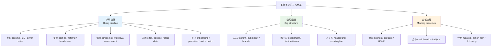
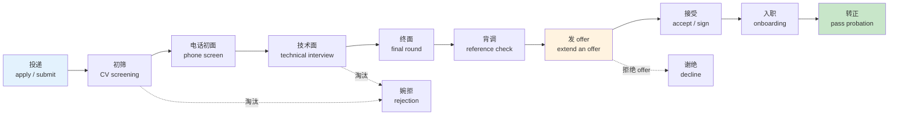
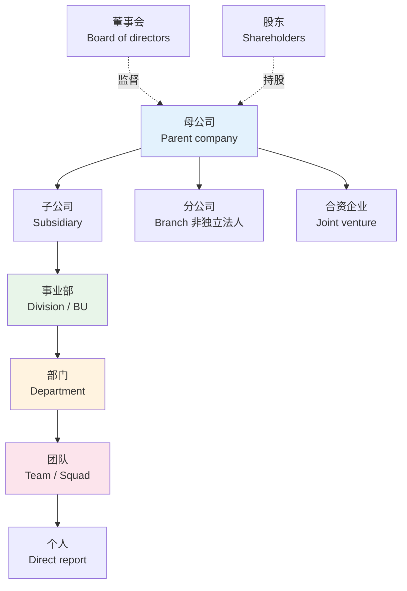
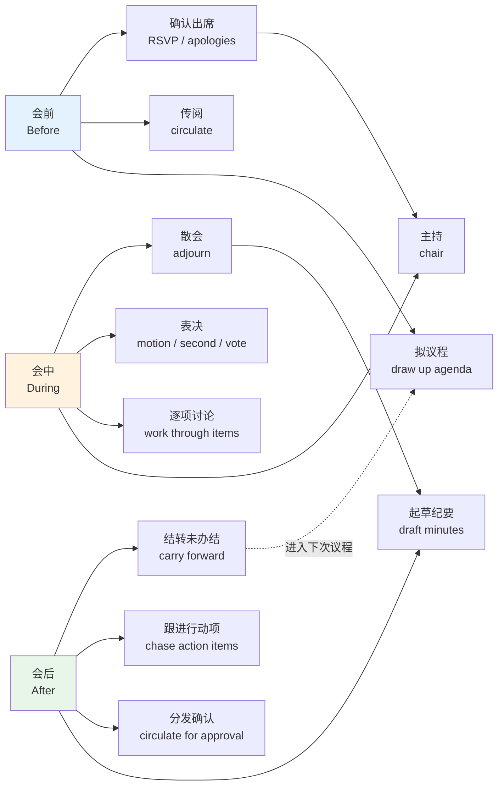
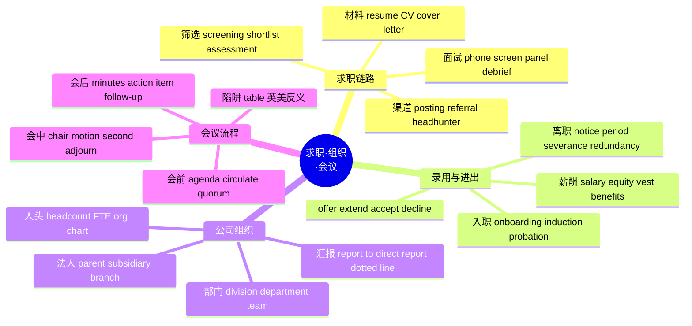

# 求职录用、公司组织与会议流程

> [!info] 本篇定位
>
> 上一篇 `02.职业名称全表` 解决的是「这个人是干什么的」，本篇解决的是「这个人怎么进公司、公司怎么组织、进去以后怎么开会」。
>
> 三条主线：求职链路（简历、渠道、面试、录用、入职、离职）、公司组织（法人层、部门层、人头与汇报线）、会议流程（议程、主持、表决、纪要、行动项）。
>
> 读完你应该能读懂英文 job description 里的每个字段、offer letter 的条款名、公司 org chart 上的层级标签，以及一份英文会议纪要的骨架。
>
> 两条边界要先划清：**项目推进与目标管理**的词（milestone、blocker、KPI、OKR、RACI、sprint）整块归 `20.专业领域词汇/06.商务、市场与管理英语：战略、增长漏斗、OKR 与供应链`，本篇一个不碰；**面试怎么答、邮件怎么写**归 `04.英语场景`，本篇只给词与搭配，不给模板。

---

## 1. 本篇导读：为什么这三块要放在一起

这三块看似分属人力资源、组织架构、会务三个领域，但对中文母语的自学者来说，它们共享同一个难点：**中文里是一个词，英文里按流程阶段裂成好几个词**。

「简历」在中文里只有一个词，英文按长度和用途分 `resume` 与 `CV`；「录用」在中文里只有一个词，英文按阶段分 `offer`、`acceptance`、`contract`、`start date`；「开会」在中文里只有一个词，英文按会议性质分 `meeting`、`briefing`、`standup`、`review`、`workshop`、`offsite`。

反过来也有并成一个的：中文的「辞职」「被辞退」「裁员」「解雇」在英文里都能落在 `leave the company` 这个中性说法上，但一旦写进正式文书，`resign`、`dismiss`、`lay off`、`make redundant`、`terminate` 各自的法律含义完全不同，用错会直接改变文件性质。

上图是本篇十二个词表节的索引。求职链路按时间顺序展开，从材料到离职是一条单向线；公司组织按包含关系从大到小；会议流程按会前会中会后三段切。查词时先定位在哪条线的哪一段，再进对应节。

一个提前的提醒：这一块词的**语域偏正式**。求职材料和会议纪要都是书面文书，用的多是拉丁法语层的词（`terminate`、`remuneration`、`adjourn`、`disseminate`），不是日常口语层。但招聘广告和团队日常沟通又倒过来偏口语（`we're hiring`、`ping me`、`quick sync`）。同一件事的两种语域并存，词表里会分别标出。

---

## 2. 求职材料：resume、CV 与 cover letter

### 2.1 两种简历的分工

`resume` 与 `CV` 不是英美两种叫法这么简单，它们在长度、内容和使用场景上有实质区别，而且在不同地区区别的方式还不一样。

| 英文 | 英式音标 | 美式音标 | 词性 | 中文 | 搭配与说明 |
| --- | --- | --- | --- | --- | --- |
| **resume** | /ˈrezjumeɪ/ | /ˈrezəmeɪ/ | n. | 简历 | 也写作 résumé；一到两页，为具体岗位裁剪 |
| **CV** | /ˌsiː ˈviː/ | /ˌsiː ˈviː/ | n. | 履历 | curriculum vitae 缩写；学术与英式用法 |
| **curriculum vitae** | /kəˌrɪkjələm ˈviːtaɪ/ | /kəˌrɪkjələm ˈviːtaɪ/ | n. | 履历全称 | 拉丁语「生涯历程」，正式文书里才写全称 |
| **cover letter** | /ˈkʌvə ˈletə/ | /ˈkʌvər ˈletər/ | n. | 求职信 | 英式也说 covering letter |
| **covering letter** | /ˈkʌvərɪŋ ˈletə/ | /ˈkʌvərɪŋ ˈletər/ | n. | 求职信 | 英式偏好形式 |
| **portfolio** | /pɔːtˈfəʊliəʊ/ | /pɔːrtˈfoʊlioʊ/ | n. | 作品集 | 设计、写作、前端岗位常要求 |
| **profile** | /ˈprəʊfaɪl/ | /ˈproʊfaɪl/ | n. | 个人简介 | LinkedIn profile；简历顶部的 profile 段 |
| **summary** | /ˈsʌməri/ | /ˈsʌməri/ | n. | 概述 | professional summary，简历开头三行 |
| **objective** | /əbˈdʒektɪv/ | /əbˈdʒektɪv/ | n. | 求职目标 | career objective；近年美式简历已少用 |
| **credentials** | /krəˈdenʃlz/ | /krəˈdenʃlz/ | n. | 资历；证书 | 恒为复数 |
| **qualification** | /ˌkwɒlɪfɪˈkeɪʃn/ | /ˌkwɑːlɪfɪˈkeɪʃn/ | n. | 资格；学历 | 英式指学历文凭，美式偏指「胜任条件」 |
| **transcript** | /ˈtrænskrɪpt/ | /ˈtrænskrɪpt/ | n. | 成绩单 | official transcript 需盖章 |
| **certificate** | /səˈtɪfɪkət/ | /sərˈtɪfɪkət/ | n. | 证书 | 名词重音在中，动词 certificate 罕用 |
| **attachment** | /əˈtætʃmənt/ | /əˈtætʃmənt/ | n. | 附件 | 投递时 CV 作为 attachment |
| **template** | /ˈtempleɪt/ | /ˈtemplət/ | n. | 模板 | 英美读音差异明显 |

> [!warning] resume 和 CV 到底怎么分
>
> 分法随地区变，别背死一条。
>
> - **美国、加拿大**：`resume` 是求职默认文件，一到两页；`CV` 专指学术界用的完整履历，可以十几页，列全部论文、会议、课程。给美国公司投工业界岗位说 CV 会显得外行。
> - **英国、爱尔兰、多数英联邦地区**：`CV` 就是普通求职简历，两页左右，和美式 resume 等价；`resume` 这个词在英国日常反而少用。
> - **欧陆、中东、亚洲多数地区**：跟英式，`CV` 通用。
>
> 判断办法很直接：看招聘启事本身用了哪个词，跟着用。启事写 `Please submit your CV` 就交 CV，写 `Attach your resume` 就交 resume。

`resume` 这个词还有一个完全不同的动词义，重音和读音都不一样，是高频混淆点。

| 英文 | 英式音标 | 美式音标 | 词性 | 中文 | 搭配与说明 |
| --- | --- | --- | --- | --- | --- |
| **resume** | /rɪˈzjuːm/ | /rɪˈzuːm/ | v. | 恢复；继续 | 与名词「简历」同形不同音，重音在后 |
| **resumption** | /rɪˈzʌmpʃn/ | /rɪˈzʌmpʃn/ | n. | 恢复 | 动词 resume 的名词形式，注意不是 resume |

> [!example] 同形不同音的两个 resume
>
> - I attached my **resume** /ˈrezəmeɪ/ to the application.
>   - 我在申请里附上了简历。
> - The board will **resume** /rɪˈzuːm/ the discussion after lunch.
>   - 董事会将在午餐后继续讨论。

### 2.2 简历上的固定字段名

英文简历的段落标题是一套高度固定的词，看懂它们就看懂了简历结构。

| 英文 | 英式音标 | 美式音标 | 词性 | 中文 | 搭配与说明 |
| --- | --- | --- | --- | --- | --- |
| **work experience** | /wɜːk ɪkˈspɪəriəns/ | /wɜːrk ɪkˈspɪriəns/ | n. | 工作经历 | 也写 professional experience |
| **employment history** | /ɪmˈplɔɪmənt ˈhɪstri/ | /ɪmˈplɔɪmənt ˈhɪstri/ | n. | 就业史 | 英式简历常用这个标题 |
| **education** | /ˌedʒuˈkeɪʃn/ | /ˌedʒuˈkeɪʃn/ | n. | 教育背景 | 通常倒序排列 |
| **skills** | /skɪlz/ | /skɪlz/ | n. | 技能 | technical skills / soft skills |
| **proficiency** | /prəˈfɪʃnsi/ | /prəˈfɪʃnsi/ | n. | 熟练度 | language proficiency |
| **fluent** | /ˈfluːənt/ | /ˈfluːənt/ | adj. | 流利的 | fluent in English |
| **proficient** | /prəˈfɪʃnt/ | /prəˈfɪʃnt/ | adj. | 精通的 | proficient in Python |
| **achievement** | /əˈtʃiːvmənt/ | /əˈtʃiːvmənt/ | n. | 成就 | key achievements 段 |
| **responsibility** | /rɪˌspɒnsəˈbɪləti/ | /rɪˌspɑːnsəˈbɪləti/ | n. | 职责 | key responsibilities |
| **award** | /əˈwɔːd/ | /əˈwɔːrd/ | n./v. | 奖项；授予 | awards and honours |
| **publication** | /ˌpʌblɪˈkeɪʃn/ | /ˌpʌblɪˈkeɪʃn/ | n. | 发表物 | 学术 CV 的核心段 |
| **volunteer** | /ˌvɒlənˈtɪə/ | /ˌvɑːlənˈtɪr/ | n./v. | 志愿者；志愿 | volunteer work |
| **internship** | /ˈɪntɜːnʃɪp/ | /ˈɪntɜːrnʃɪp/ | n. | 实习 | do an internship at |
| **referee** | /ˌrefəˈriː/ | /ˌrefəˈriː/ | n. | 推荐人 | 英式说法；美式说 reference |
| **reference** | /ˈrefrəns/ | /ˈrefrəns/ | n. | 推荐人；证明 | references available on request |
| **tailor** | /ˈteɪlə/ | /ˈteɪlər/ | v. | 量身调整 | tailor your CV to the role |
| **proofread** | /ˈpruːfriːd/ | /ˈpruːfriːd/ | v. | 校对 | 过去式同形，读 /ˈpruːfred/ |

> [!warning] responsibility 与 duty 的区别
>
> 两个词中文都译「职责」，但简历上不能互换。
>
> - `responsibility` 强调**你负责的范围与结果**，可大可小，是简历里的默认词。
> - `duty` 强调**被规定必须做的具体事项**，语气偏机械，多用于制服岗位、军队、法律义务（`duty of care` 注意义务）。
>
> - ❌ ~~Key duties: designed the payment module~~（设计模块是 responsibility 不是 duty）
> - ✅ **Key responsibilities: designed the payment module**

---

## 3. 岗位、渠道与推荐

### 3.1 岗位与招聘启事

| 英文 | 英式音标 | 美式音标 | 词性 | 中文 | 搭配与说明 |
| --- | --- | --- | --- | --- | --- |
| **vacancy** | /ˈveɪkənsi/ | /ˈveɪkənsi/ | n. | 空缺职位 | 英式常用；fill a vacancy |
| **opening** | /ˈəʊpənɪŋ/ | /ˈoʊpənɪŋ/ | n. | 空缺 | 美式常用；a job opening |
| **position** | /pəˈzɪʃn/ | /pəˈzɪʃn/ | n. | 职位 | apply for a position |
| **role** | /rəʊl/ | /roʊl/ | n. | 岗位；角色 | 现代招聘广告最常用的中性词 |
| **post** | /pəʊst/ | /poʊst/ | n. | 职位 | 英式偏正式；a permanent post |
| **job posting** | /dʒɒb ˈpəʊstɪŋ/ | /dʒɑːb ˈpoʊstɪŋ/ | n. | 招聘启事 | 美式；英式说 job advert |
| **job advert** | /dʒɒb ˈædvɜːt/ | — | n. | 招聘广告 | 英式，口语缩为 job ad |
| **job description** | /dʒɒb dɪˈskrɪpʃn/ | /dʒɑːb dɪˈskrɪpʃn/ | n. | 职位说明书 | 缩写 JD，中文职场直接借用 |
| **person specification** | /ˈpɜːsn ˌspesɪfɪˈkeɪʃn/ | /ˈpɜːrsn ˌspesɪfɪˈkeɪʃn/ | n. | 任职人要求 | 英式公共部门文件的固定字段 |
| **requirement** | /rɪˈkwaɪəmənt/ | /rɪˈkwaɪərmənt/ | n. | 要求 | must-have requirements |
| **essential** | /ɪˈsenʃl/ | /ɪˈsenʃl/ | adj. | 必备的 | JD 里与 desirable 成对出现 |
| **desirable** | /dɪˈzaɪərəbl/ | /dɪˈzaɪərəbl/ | adj. | 加分的 | 英式 JD 的「优先考虑」栏 |
| **preferred** | /prɪˈfɜːd/ | /prɪˈfɜːrd/ | adj. | 优先的 | 美式 JD 用 preferred 对应 desirable |
| **headcount** | /ˈhedkaʊnt/ | /ˈhedkaʊnt/ | n. | 编制人数 | 见 8.3；招聘前先要有 headcount |
| **full-time** | /ˌfʊl ˈtaɪm/ | /ˌfʊl ˈtaɪm/ | adj. | 全职的 | 反义 part-time |
| **permanent** | /ˈpɜːmənənt/ | /ˈpɜːrmənənt/ | adj. | 长期的 | a permanent contract |
| **fixed-term** | /ˌfɪkst ˈtɜːm/ | /ˌfɪkst ˈtɜːrm/ | adj. | 固定期限的 | fixed-term contract |
| **contractor** | /kənˈtræktə/ | /ˈkɑːntræktər/ | n. | 外包/合同工 | 英美重音位置不同 |
| **freelance** | /ˈfriːlɑːns/ | /ˈfriːlæns/ | adj./n. | 自由职业的 | freelancer 指人 |
| **remote** | /rɪˈməʊt/ | /rɪˈmoʊt/ | adj. | 远程的 | fully remote / remote-first |
| **hybrid** | /ˈhaɪbrɪd/ | /ˈhaɪbrɪd/ | adj. | 混合办公的 | three days in the office |
| **on-site** | /ˌɒn ˈsaɪt/ | /ˌɑːn ˈsaɪt/ | adj. | 现场的 | 也用于面试形式 |
| **relocation** | /ˌriːləʊˈkeɪʃn/ | /ˌriːloʊˈkeɪʃn/ | n. | 搬迁 | relocation package 搬家补贴 |
| **sponsorship** | /ˈspɒnsəʃɪp/ | /ˈspɑːnsərʃɪp/ | n. | 签证担保 | visa sponsorship available |

### 3.2 渠道与推荐

| 英文 | 英式音标 | 美式音标 | 词性 | 中文 | 搭配与说明 |
| --- | --- | --- | --- | --- | --- |
| **referral** | /rɪˈfɜːrəl/ | /rɪˈfɜːrəl/ | n. | 内推 | employee referral programme |
| **refer** | /rɪˈfɜː/ | /rɪˈfɜːr/ | v. | 推荐；转介 | refer sb for a role；双写 r：referred |
| **recruiter** | /rɪˈkruːtə/ | /rɪˈkruːtər/ | n. | 招聘人员 | in-house 或 agency recruiter |
| **recruitment** | /rɪˈkruːtmənt/ | /rɪˈkruːtmənt/ | n. | 招聘 | 英式常用；美式多说 hiring |
| **hiring manager** | /ˈhaɪərɪŋ ˈmænɪdʒə/ | /ˈhaɪərɪŋ ˈmænɪdʒər/ | n. | 用人经理 | 岗位的实际决策人，非 HR |
| **headhunter** | /ˈhedhʌntə/ | /ˈhedhʌntər/ | n. | 猎头 | 动词 headhunt |
| **agency** | /ˈeɪdʒənsi/ | /ˈeɪdʒənsi/ | n. | 中介机构 | recruitment agency |
| **job board** | /dʒɒb bɔːd/ | /dʒɑːb bɔːrd/ | n. | 招聘网站 | 泛指第三方求职平台 |
| **applicant** | /ˈæplɪkənt/ | /ˈæplɪkənt/ | n. | 申请人 | 投了简历还没进流程 |
| **candidate** | /ˈkændɪdət/ | /ˈkændɪdeɪt/ | n. | 候选人 | 进了筛选流程；英美读音有别 |
| **applicant tracking system** | — | — | n. | 简历筛选系统 | 缩写 ATS，决定简历用词要贴 JD |
| **networking** | /ˈnetwɜːkɪŋ/ | /ˈnetwɜːrkɪŋ/ | n. | 人脉拓展 | 与计算机网络同形，靠语境区分 |
| **cold email** | /kəʊld ˈiːmeɪl/ | /koʊld ˈiːmeɪl/ | n. | 陌生开发信 | 也说 cold outreach |
| **speculative** | /ˈspekjələtɪv/ | /ˈspekjəleɪtɪv/ | adj. | 自荐的 | a speculative application 无岗投递 |
| **poach** | /pəʊtʃ/ | /poʊtʃ/ | v. | 挖角 | poach staff from a rival |

> [!tip] referral 是这一节最值得记牢的词
>
> 内推在英文招聘里是一条独立通道，不是「走后门」的委婉说法。多数公司有明文的 `employee referral programme`（内推奖金制度），推荐人拿 `referral bonus`。
>
> 三个高频搭配：
>
> - `refer someone for a role` —— 把某人推给某岗位
> - `ask for a referral` —— 请人内推
> - `submit a referral` —— 提交推荐（在公司内部系统里操作）
>
> 注意 `referral` 与 `reference` 分工不同：`referral` 是**进入流程前**把人推进来，`reference` 是**发 offer 前后**替人背书。

### 3.3 求职漏斗

上图把求职链路画成一条漏斗。每个方框对应下面若干节的一张词表：投递与初筛在第 3 节，面试三环在第 4 节，背调到签字在第 5 节，入职转正在第 6 节。

两条虚线是必须掌握的：候选人被公司刷掉用 `reject` / `turn down`（公司给的通知叫 `rejection letter`），候选人拒绝公司则用 `decline`（`decline an offer`）。方向反了会闹笑话——`I rejected their offer` 语法没错但语气生硬，`I declined their offer` 才是标准说法。

---

## 4. 筛选与面试环节

### 4.1 筛选阶段

| 英文 | 英式音标 | 美式音标 | 词性 | 中文 | 搭配与说明 |
| --- | --- | --- | --- | --- | --- |
| **screening** | /ˈskriːnɪŋ/ | /ˈskriːnɪŋ/ | n. | 初筛 | CV screening / phone screening |
| **shortlist** | /ˈʃɔːtlɪst/ | /ˈʃɔːrtlɪst/ | n./v. | 入围名单；入围 | be shortlisted for a role |
| **longlist** | /ˈlɒŋlɪst/ | /ˈlɔːŋlɪst/ | n. | 初选名单 | 比 shortlist 早一轮 |
| **sift** | /sɪft/ | /sɪft/ | v. | 筛选 | 英式招聘文件用词 |
| **assessment** | /əˈsesmənt/ | /əˈsesmənt/ | n. | 测评 | assessment centre 集体测评日 |
| **aptitude test** | /ˈæptɪtjuːd ˌtest/ | /ˈæptɪtuːd ˌtest/ | n. | 能力测试 | 逻辑与数字推理题 |
| **psychometric** | /ˌsaɪkəˈmetrɪk/ | /ˌsaɪkəˈmetrɪk/ | adj. | 心理测量的 | psychometric test |
| **take-home** | /ˌteɪk ˈhəʊm/ | /ˌteɪk ˈhoʊm/ | adj. | 带回家做的 | a take-home assignment |
| **assignment** | /əˈsaɪnmənt/ | /əˈsaɪnmənt/ | n. | 作业；任务 | 技术岗常见的笔试替代 |
| **coding challenge** | — | — | n. | 编程测试 | 程序员岗位的标准环节 |
| **whiteboard** | /ˈwaɪtbɔːd/ | /ˈwaɪtbɔːrd/ | n./v. | 白板；白板作答 | whiteboard interview |
| **portfolio review** | — | — | n. | 作品评审 | 设计岗对应技术面 |

### 4.2 面试环节

| 英文 | 英式音标 | 美式音标 | 词性 | 中文 | 搭配与说明 |
| --- | --- | --- | --- | --- | --- |
| **interview** | /ˈɪntəvjuː/ | /ˈɪntərvjuː/ | n./v. | 面试 | 名动同形，重音都在首 |
| **interviewer** | /ˈɪntəvjuːə/ | /ˈɪntərvjuːər/ | n. | 面试官 | — |
| **interviewee** | /ˌɪntəvjuːˈiː/ | /ˌɪntərvjuːˈiː/ | n. | 被面试者 | -ee 后缀表受动方，重音后移 |
| **phone screen** | /fəʊn skriːn/ | /foʊn skriːn/ | n. | 电话初面 | 通常由 recruiter 主持 |
| **round** | /raʊnd/ | /raʊnd/ | n. | 轮次 | the second round；final round |
| **panel interview** | /ˈpænl ˌɪntəvjuː/ | /ˈpænl ˌɪntərvjuː/ | n. | 多对一面试 | 多位面试官同场 |
| **behavioural interview** | /bɪˈheɪvjərəl ˌɪntəvjuː/ | /bɪˈheɪvjərəl ˌɪntərvjuː/ | n. | 行为面试 | 美式拼 behavioral |
| **competency** | /ˈkɒmpɪtənsi/ | /ˈkɑːmpətənsi/ | n. | 胜任力 | competency-based interview |
| **case study** | /ˈkeɪs ˌstʌdi/ | /ˈkeɪs ˌstʌdi/ | n. | 案例分析 | 咨询与产品岗常见 |
| **mock interview** | /ˈmɒk ˌɪntəvjuː/ | /ˈmɑːk ˌɪntərvjuː/ | n. | 模拟面试 | mock 意为「仿真的」 |
| **rapport** | /ræˈpɔː/ | /ræˈpɔːr/ | n. | 融洽关系 | 词尾 t 不发音；build rapport |
| **articulate** | /ɑːˈtɪkjuleɪt/ | /ɑːrˈtɪkjuleɪt/ | v. | 清晰表达 | 形容词 articulate 读 /-lət/ |
| **elaborate** | /ɪˈlæbəreɪt/ | /ɪˈlæbəreɪt/ | v. | 详述 | elaborate on a point |
| **debrief** | /ˌdiːˈbriːf/ | /ˌdiːˈbriːf/ | v./n. | 复盘汇报 | 面试官会后互通评价 |
| **feedback** | /ˈfiːdbæk/ | /ˈfiːdbæk/ | n. | 反馈 | 不可数；give / receive feedback |
| **reject** | /rɪˈdʒekt/ | /rɪˈdʒekt/ | v. | 拒绝（申请） | 名词 reject 读 /ˈriːdʒekt/ |
| **rejection** | /rɪˈdʒekʃn/ | /rɪˈdʒekʃn/ | n. | 拒信 | a rejection email |
| **withdraw** | /wɪðˈdrɔː/ | /wɪðˈdrɔː/ | v. | 撤回申请 | withdraw one's application |
| **ghost** | /ɡəʊst/ | /ɡoʊst/ | v. | 已读不回 | 口语；be ghosted by a recruiter |

> [!warning] 三对高频混淆动词
>
> - `interview someone`（面试某人）与 `interview for a job`（去面某岗位）—— 主语位置一变，意思正好相反。`She interviewed me` 是她面我，`She interviewed for the role` 是她去面这个岗。
> - `apply for` 后接**岗位**，`apply to` 后接**公司或机构**。`apply for a backend role` / `apply to three companies`。
> - `hear back from`（收到回复）不能省略 `back`。`I haven't heard back from them` 才是「他们还没回我」，`I haven't heard from them` 意思接近但少了「我先联系过」这层含义。

---

## 5. 录用：offer、薪酬包与合同条款

### 5.1 offer 及其动词搭配

| 英文 | 英式音标 | 美式音标 | 词性 | 中文 | 搭配与说明 |
| --- | --- | --- | --- | --- | --- |
| **offer** | /ˈɒfə/ | /ˈɔːfər/ | n./v. | 录用通知；提供 | extend / make / accept / decline an offer |
| **offer letter** | /ˈɒfə ˈletə/ | /ˈɔːfər ˈletər/ | n. | 录用函 | 通常先于正式合同 |
| **verbal offer** | /ˈvɜːbl ˌɒfə/ | /ˈvɜːrbl ˌɔːfər/ | n. | 口头 offer | 无法律效力，等书面件 |
| **conditional offer** | /kənˈdɪʃənl ˌɒfə/ | /kənˈdɪʃənl ˌɔːfər/ | n. | 附条件 offer | 待背调或签证通过 |
| **contingent** | /kənˈtɪndʒənt/ | /kənˈtɪndʒənt/ | adj. | 以…为条件的 | contingent on a background check |
| **background check** | — | — | n. | 背景调查 | 也说 vetting（英式） |
| **reference check** | — | — | n. | 推荐人核实 | 联系简历上的 referee |
| **counter-offer** | /ˈkaʊntər ˌɒfə/ | /ˈkaʊntər ˌɔːfər/ | n. | 反报价 | 现东家挽留或候选人还价 |
| **negotiate** | /nɪˈɡəʊʃieɪt/ | /nɪˈɡoʊʃieɪt/ | v. | 谈判 | negotiate the salary |
| **negotiable** | /nɪˈɡəʊʃiəbl/ | /nɪˈɡoʊʃiəbl/ | adj. | 可议的 | salary negotiable |
| **accept** | /əkˈsept/ | /əkˈsept/ | v. | 接受 | accept an offer |
| **decline** | /dɪˈklaɪn/ | /dɪˈklaɪn/ | v. | 婉拒 | 候选人拒 offer 的标准词 |
| **rescind** | /rɪˈsɪnd/ | /rɪˈsɪnd/ | v. | 撤回（offer） | 正式法律用词 |
| **start date** | — | — | n. | 入职日 | 与 notice period 联动确定 |
| **sign** | /saɪn/ | /saɪn/ | v. | 签署 | sign the contract；g 不发音 |
| **signing bonus** | /ˈsaɪnɪŋ ˈbəʊnəs/ | /ˈsaɪnɪŋ ˈboʊnəs/ | n. | 签字费 | 英式也说 golden hello |

> [!example] offer 的四个核心搭配
>
> - The company **extended an offer** on Friday.
>   - 公司周五发出了录用通知。（`extend` 是最正式的「发 offer」）
> - They **made me an offer** I could actually live with.
>   - 他们给了我一个我能接受的条件。（`make sb an offer` 双宾结构）
> - I **accepted the offer** and gave notice the same week.
>   - 我接受了 offer，同一周提了离职。
> - She **turned down** two offers before taking this one.
>   - 她拒了两个 offer 才接了这个。（`turn down` 是 `decline` 的口语版）

### 5.2 薪酬包

| 英文 | 英式音标 | 美式音标 | 词性 | 中文 | 搭配与说明 |
| --- | --- | --- | --- | --- | --- |
| **salary** | /ˈsæləri/ | /ˈsæləri/ | n. | 薪水（月/年薪） | 白领固定薪；对应 wage |
| **wage** | /weɪdʒ/ | /weɪdʒ/ | n. | 工资（时薪/周薪） | 蓝领计时薪；常用复数 wages |
| **remuneration** | /rɪˌmjuːnəˈreɪʃn/ | /rɪˌmjuːnəˈreɪʃn/ | n. | 报酬 | 合同文书用词，注意不是 renumeration |
| **compensation** | /ˌkɒmpenˈseɪʃn/ | /ˌkɑːmpenˈseɪʃn/ | n. | 薪酬总包 | 美式；也指「赔偿」 |
| **package** | /ˈpækɪdʒ/ | /ˈpækɪdʒ/ | n. | 待遇包 | total package 含现金与股权 |
| **base salary** | — | — | n. | 基本工资 | 与 bonus、equity 并列 |
| **gross** | /ɡrəʊs/ | /ɡroʊs/ | adj. | 税前的 | gross salary |
| **net** | /net/ | /net/ | adj. | 税后的 | net pay 到手 |
| **take-home pay** | — | — | n. | 到手收入 | net pay 的口语说法 |
| **bonus** | /ˈbəʊnəs/ | /ˈboʊnəs/ | n. | 奖金 | 复数 bonuses |
| **commission** | /kəˈmɪʃn/ | /kəˈmɪʃn/ | n. | 提成 | 销售岗；on commission |
| **equity** | /ˈekwəti/ | /ˈekwəti/ | n. | 股权 | 也指会计上的「权益」 |
| **stock option** | /ˈstɒk ˌɒpʃn/ | /ˈstɑːk ˌɑːpʃn/ | n. | 股票期权 | 授予后需 vest |
| **vest** | /vest/ | /vest/ | v. | 归属；解锁 | shares vest over four years |
| **vesting cliff** | /ˈvestɪŋ klɪf/ | /ˈvestɪŋ klɪf/ | n. | 归属悬崖 | 满一年才解锁第一批 |
| **benefits** | /ˈbenɪfɪts/ | /ˈbenɪfɪts/ | n. | 福利 | 恒为复数；health benefits |
| **perk** | /pɜːk/ | /pɜːrk/ | n. | 额外福利 | 非现金小福利，口语 |
| **pension** | /ˈpenʃn/ | /ˈpenʃn/ | n. | 养老金 | 英式；美式说 retirement plan |
| **payroll** | /ˈpeɪrəʊl/ | /ˈpeɪroʊl/ | n. | 工资表；发薪 | be on the payroll 在编 |
| **payslip** | /ˈpeɪslɪp/ | — | n. | 工资单 | 英式；美式说 pay stub |
| **appraisal** | /əˈpreɪzl/ | /əˈpreɪzl/ | n. | 绩效评估 | 英式；美式多说 performance review |
| **raise** | /reɪz/ | /reɪz/ | n. | 加薪 | 美式；英式说 pay rise |
| **promotion** | /prəˈməʊʃn/ | /prəˈmoʊʃn/ | n. | 晋升 | be up for promotion |

> [!warning] salary 与 wage 不能互换
>
> 这两个词的差别在**计薪单位**，不在金额高低。
>
> - `salary` 按年或月定额，无论当月工时多少都发同一笔，通常写作 `an annual salary of £48,000`。
> - `wage` 按小时或按周计，工时变则金额变，常见于 `minimum wage`（最低时薪）、`hourly wage`。
>
> - ❌ ~~My monthly wage is 15,000 yuan.~~（月度固定收入不是 wage）
> - ✅ **My monthly salary is 15,000 yuan.**
>
> 另外 `compensation` 在人力语境是「薪酬总包」，在法律语境是「损害赔偿」。看到 `compensation package` 是待遇，看到 `claim compensation` 是索赔。

### 5.3 合同条款

| 英文 | 英式音标 | 美式音标 | 词性 | 中文 | 搭配与说明 |
| --- | --- | --- | --- | --- | --- |
| **contract** | /ˈkɒntrækt/ | /ˈkɑːntrækt/ | n. | 合同 | 动词 contract 重音在后 |
| **clause** | /klɔːz/ | /klɔːz/ | n. | 条款 | a confidentiality clause |
| **provision** | /prəˈvɪʒn/ | /prəˈvɪʒn/ | n. | 规定条文 | 比 clause 更正式 |
| **term** | /tɜːm/ | /tɜːrm/ | n. | 条件；期限 | terms and conditions |
| **confidentiality** | /ˌkɒnfɪˌdenʃiˈæləti/ | /ˌkɑːnfɪˌdenʃiˈæləti/ | n. | 保密 | confidentiality agreement |
| **non-disclosure** | /ˌnɒn dɪsˈkləʊʒə/ | /ˌnɑːn dɪsˈkloʊʒər/ | n. | 不披露 | NDA 保密协议 |
| **non-compete** | /ˌnɒn kəmˈpiːt/ | /ˌnɑːn kəmˈpiːt/ | n./adj. | 竞业限制 | a non-compete clause |
| **intellectual property** | /ˌɪntəˈlektʃuəl/ | /ˌɪntəˈlektʃuəl/ | n. | 知识产权 | 缩写 IP，程序员合同重点条款 |
| **at-will employment** | — | — | n. | 随意雇佣 | 美国多数州制度，双方可随时终止 |
| **statutory** | /ˈstætʃətri/ | /ˈstætʃətɔːri/ | adj. | 法定的 | statutory holiday 法定假 |
| **annual leave** | /ˈænjuəl liːv/ | /ˈænjuəl liːv/ | n. | 年假 | 英式；美式说 PTO |
| **PTO** | /ˌpiː tiː ˈəʊ/ | /ˌpiː tiː ˈoʊ/ | n. | 带薪假 | paid time off，美式 |
| **sick leave** | — | — | n. | 病假 | 也说 sick days |
| **parental leave** | /pəˈrentl/ | /pəˈrentl/ | n. | 育儿假 | 上位词，含 maternity / paternity |
| **overtime** | /ˈəʊvətaɪm/ | /ˈoʊvərtaɪm/ | n. | 加班 | work overtime；不可数 |

---

## 6. 入职与试用

| 英文 | 英式音标 | 美式音标 | 词性 | 中文 | 搭配与说明 |
| --- | --- | --- | --- | --- | --- |
| **onboarding** | /ˈɒnbɔːdɪŋ/ | /ˈɑːnbɔːrdɪŋ/ | n. | 入职流程 | 动词 onboard a new hire |
| **induction** | /ɪnˈdʌkʃn/ | /ɪnˈdʌkʃn/ | n. | 入职培训 | 英式；induction day |
| **orientation** | /ˌɔːriənˈteɪʃn/ | /ˌɔːriənˈteɪʃn/ | n. | 新人导引 | 美式，对应英式 induction |
| **new hire** | /ˌnjuː ˈhaɪə/ | /ˌnuː ˈhaɪər/ | n. | 新员工 | 美式常用 |
| **newcomer** | /ˈnjuːkʌmə/ | /ˈnuːkʌmər/ | n. | 新来的人 | 中性，不限职场 |
| **probation** | /prəˈbeɪʃn/ | /proʊˈbeɪʃn/ | n. | 试用期 | on probation；也指司法「缓刑」 |
| **probationary** | /prəˈbeɪʃənri/ | /proʊˈbeɪʃəneri/ | adj. | 试用的 | a six-month probationary period |
| **confirm** | /kənˈfɜːm/ | /kənˈfɜːrm/ | v. | 转正 | be confirmed in post |
| **permanent staff** | — | — | n. | 正式员工 | 与 probationary、contract 相对 |
| **buddy** | /ˈbʌdi/ | /ˈbʌdi/ | n. | 入职伙伴 | buddy system 老带新 |
| **mentor** | /ˈmentɔː/ | /ˈmentɔːr/ | n./v. | 导师；带教 | mentor a junior developer |
| **shadow** | /ˈʃædəʊ/ | /ˈʃædoʊ/ | v. | 跟岗观摩 | shadow a senior colleague |
| **ramp up** | /ræmp ʌp/ | /ræmp ʌp/ | v. | 上手；提速 | 名词 ramp-up period |
| **handbook** | /ˈhændbʊk/ | /ˈhændbʊk/ | n. | 员工手册 | employee handbook |
| **policy** | /ˈpɒləsi/ | /ˈpɑːləsi/ | n. | 制度 | company policy；可数 |
| **compliance** | /kəmˈplaɪəns/ | /kəmˈplaɪəns/ | n. | 合规 | compliance training 必修课 |
| **badge** | /bædʒ/ | /bædʒ/ | n. | 工牌 | 也说 access card |
| **credentials** | /krəˈdenʃlz/ | /krəˈdenʃlz/ | n. | 账号凭据 | IT 语境指账密，见 12.03 |
| **provisioning** | /prəˈvɪʒənɪŋ/ | /prəˈvɪʒənɪŋ/ | n. | 权限开通 | account provisioning |
| **probation review** | — | — | n. | 转正评估 | 试用期末的正式评审 |
| **extend probation** | — | — | v. | 延长试用期 | 与 confirm 相对的另一种结果 |

> [!warning] probation 在中文里的两个义项差别极大
>
> `probation` 在职场语境是「试用期」，在法律语境是「缓刑」；`probation officer` 是缓刑监督官，不是人事专员。
>
> 试用期不通过的表达也要注意，英文不说「转正失败」，通常写：
>
> - `not confirmed in the role`（未获转正确认）
> - `probation extended by three months`（试用期延长三个月）
> - `let go during the probationary period`（试用期内被辞退，`let go` 是委婉说法）

---

## 7. 离职与人事变动

### 7.1 主动离职

| 英文 | 英式音标 | 美式音标 | 词性 | 中文 | 搭配与说明 |
| --- | --- | --- | --- | --- | --- |
| **resign** | /rɪˈzaɪn/ | /rɪˈzaɪn/ | v. | 辞职 | resign from a post；g 不发音 |
| **resignation** | /ˌrezɪɡˈneɪʃn/ | /ˌrezɪɡˈneɪʃn/ | n. | 辞职（信） | 这里 g 要发音，与 resign 不同 |
| **hand in notice** | — | — | v. | 递交辞呈 | 英式；美式说 give notice |
| **notice period** | /ˈnəʊtɪs ˈpɪəriəd/ | /ˈnoʊtɪs ˈpɪriəd/ | n. | 通知期 | 提离职到实际走人的法定间隔 |
| **serve notice** | /sɜːv ˈnəʊtɪs/ | /sɜːrv ˈnoʊtɪs/ | v. | 履行通知期 | serve out one's notice |
| **garden leave** | /ˈɡɑːdn liːv/ | /ˈɡɑːrdn liːv/ | n. | 带薪隔离期 | 英式；通知期内停止工作照发薪 |
| **handover** | /ˈhændəʊvə/ | /ˈhændoʊvər/ | n. | 工作交接 | 动词分写 hand over |
| **exit interview** | /ˈeksɪt ˌɪntəvjuː/ | /ˈeksɪt ˌɪntərvjuː/ | n. | 离职面谈 | HR 收集离职原因 |
| **last day** | — | — | n. | 最后工作日 | my last day is 30 June |
| **quit** | /kwɪt/ | /kwɪt/ | v. | 撂挑子 | 口语，比 resign 随意 |
| **step down** | — | — | v. | 卸任 | 高管辞去职务的标准说法 |
| **retire** | /rɪˈtaɪə/ | /rɪˈtaɪər/ | v. | 退休 | 名词 retirement |
| **sabbatical** | /səˈbætɪkl/ | /səˈbætɪkl/ | n. | 长假；休整期 | take a sabbatical，保留职位 |
| **secondment** | /sɪˈkɒndmənt/ | /sɪˈkɑːndmənt/ | n. | 借调 | 英式；重音在中，与 second 名词不同 |
| **transfer** | /trænsˈfɜː/ | /trænsˈfɜːr/ | v. | 调动 | 名词 transfer 重音在首 |

### 7.2 被动离职

| 英文 | 英式音标 | 美式音标 | 词性 | 中文 | 搭配与说明 |
| --- | --- | --- | --- | --- | --- |
| **dismiss** | /dɪsˈmɪs/ | /dɪsˈmɪs/ | v. | 解雇 | 因个人原因；名词 dismissal |
| **unfair dismissal** | — | — | n. | 违法解雇 | 英国劳动法固定术语 |
| **fire** | /ˈfaɪə/ | /ˈfaɪər/ | v. | 炒鱿鱼 | 口语，个人过失导致 |
| **sack** | /sæk/ | /sæk/ | v./n. | 开除 | 英式口语；get the sack |
| **lay off** | /leɪ ˈɒf/ | /leɪ ˈɔːf/ | v. | 裁员 | 因经营原因，非个人过失 |
| **layoff** | /ˈleɪɒf/ | /ˈleɪɔːf/ | n. | 裁员 | 名词连写，重音在首 |
| **redundancy** | /rɪˈdʌndənsi/ | /rɪˈdʌndənsi/ | n. | 岗位裁撤 | 英式；be made redundant |
| **redundant** | /rɪˈdʌndənt/ | /rɪˈdʌndənt/ | adj. | 被裁的；冗余的 | 技术语境是「冗余的」 |
| **severance** | /ˈsevərəns/ | /ˈsevərəns/ | n. | 离职补偿 | severance pay / package |
| **settlement** | /ˈsetlmənt/ | /ˈsetlmənt/ | n. | 和解协议 | 英式 settlement agreement |
| **terminate** | /ˈtɜːmɪneɪt/ | /ˈtɜːrmɪneɪt/ | v. | 终止（合同） | 主语常是合同不是人 |
| **termination** | /ˌtɜːmɪˈneɪʃn/ | /ˌtɜːrmɪˈneɪʃn/ | n. | 合同终止 | termination clause |
| **let go** | — | — | v. | 请离 | 委婉语；be let go |
| **furlough** | /ˈfɜːləʊ/ | /ˈfɜːrloʊ/ | n./v. | 停薪留职 | 保留雇佣关系的临时停工 |
| **restructuring** | /ˌriːˈstrʌktʃərɪŋ/ | /ˌriːˈstrʌktʃərɪŋ/ | n. | 重组 | 裁员公告的常见理由 |
| **downsize** | /ˈdaʊnsaɪz/ | /ˈdaʊnsaɪz/ | v. | 缩编 | 委婉语；名词 downsizing |
| **attrition** | /əˈtrɪʃn/ | /əˈtrɪʃn/ | n. | 自然减员 | 靠不补人缩编，不主动裁 |
| **turnover** | /ˈtɜːnəʊvə/ | /ˈtɜːrnoʊvər/ | n. | 人员流动率 | 也指「营业额」，靠语境分 |
| **notice pay** | — | — | n. | 代通知金 | 不让员工干满通知期的补偿 |

> [!warning] 解雇类动词一律不可混用
>
> 中文的「被辞了」在英文里必须先分清原因，因为原因决定了补偿义务。
>
> - `dismiss` / `fire` / `sack` —— 因**个人表现或过失**被辞，通常无补偿。
> - `lay off`（美） / `make redundant`（英） —— 因**岗位不再需要**被裁，通常有法定补偿。
> - `terminate` —— 中性法律词，主语一般是 **contract** 而非人：`The contract was terminated`。说 `He was terminated` 语法成立但听起来冰冷，多见于美式 HR 文书。
> - `let go` —— 上面几种的委婉替代，公告场合常用。
>
> - ❌ ~~I was fired because the company cut the whole team.~~（整组砍掉不是 fire）
> - ✅ **I was laid off when the company cut the whole team.**（美式）
> - ✅ **I was made redundant when the company cut the whole team.**（英式）

> [!tip] severance 与 compensation 的分工
>
> `severance` 专指**因离职给的一次性补偿**，`severance pay`、`severance package` 是固定搭配。
>
> `compensation` 在人力语境是在职薪酬包，在法律语境是损害赔偿。两个词不能替换：`severance compensation` 是冗余表达，直接说 `severance` 即可。
>
> 英国的对应词是 `redundancy pay`（法定裁员补偿），金额按工龄和年龄计算，写在 `settlement agreement` 里。

---

## 8. 公司组织：从法人到部门

### 8.1 法人层级

中文说「公司」时并不区分法人实体与业务单元，英文区分得很细，读财报和合同时这一层必须分清。

| 英文 | 英式音标 | 美式音标 | 词性 | 中文 | 搭配与说明 |
| --- | --- | --- | --- | --- | --- |
| **corporation** | /ˌkɔːpəˈreɪʃn/ | /ˌkɔːrpəˈreɪʃn/ | n. | 股份公司 | 美式法人形式；形容词 corporate |
| **corporate** | /ˈkɔːpərət/ | /ˈkɔːrpərət/ | adj. | 公司的 | corporate strategy；重音在首 |
| **entity** | /ˈentəti/ | /ˈentəti/ | n. | 法人实体 | a separate legal entity |
| **parent company** | /ˈpeərənt ˌkʌmpəni/ | /ˈperənt ˌkʌmpəni/ | n. | 母公司 | 简称 the parent |
| **subsidiary** | /səbˈsɪdiəri/ | /səbˈsɪdieri/ | n. | 子公司 | 母公司持股过半的独立法人 |
| **wholly-owned** | /ˌhəʊli ˈəʊnd/ | /ˌhoʊli ˈoʊnd/ | adj. | 全资的 | a wholly-owned subsidiary |
| **affiliate** | /əˈfɪliət/ | /əˈfɪliət/ | n. | 关联公司 | 动词读 /əˈfɪlieɪt/，词尾不同 |
| **holding company** | /ˈhəʊldɪŋ ˌkʌmpəni/ | /ˈhoʊldɪŋ ˌkʌmpəni/ | n. | 控股公司 | 只持股不经营 |
| **joint venture** | /dʒɔɪnt ˈventʃə/ | /dʒɔɪnt ˈventʃər/ | n. | 合资企业 | 缩写 JV |
| **branch** | /brɑːntʃ/ | /bræntʃ/ | n. | 分公司；分支 | 非独立法人；也指银行网点 |
| **headquarters** | /ˌhedˈkwɔːtəz/ | /ˈhedkwɔːrtərz/ | n. | 总部 | 缩写 HQ；单复数同形 |
| **office** | /ˈɒfɪs/ | /ˈɔːfɪs/ | n. | 办事处 | the Shanghai office |
| **startup** | /ˈstɑːtʌp/ | /ˈstɑːrtʌp/ | n. | 初创公司 | 英式也写 start-up |
| **incorporate** | /ɪnˈkɔːpəreɪt/ | /ɪnˈkɔːrpəreɪt/ | v. | 注册成立 | incorporated 缩写 Inc. |
| **Ltd** | /ˈlɪmɪtɪd/ | /ˈlɪmɪtɪd/ | n. | 有限公司 | limited，英式后缀 |
| **PLC** | /ˌpiː el ˈsiː/ | /ˌpiː el ˈsiː/ | n. | 上市公司 | public limited company，英式 |
| **merger** | /ˈmɜːdʒə/ | /ˈmɜːrdʒər/ | n. | 合并 | mergers and acquisitions 缩写 M&A |
| **acquisition** | /ˌækwɪˈzɪʃn/ | /ˌækwɪˈzɪʃn/ | n. | 收购 | 动词 acquire |
| **spin-off** | /ˈspɪn ɒf/ | /ˈspɪn ɔːf/ | n. | 分拆公司 | 从母体独立出去的新实体 |

### 8.2 业务单元与部门

| 英文 | 英式音标 | 美式音标 | 词性 | 中文 | 搭配与说明 |
| --- | --- | --- | --- | --- | --- |
| **department** | /dɪˈpɑːtmənt/ | /dɪˈpɑːrtmənt/ | n. | 部门 | 缩写 dept.；the HR department |
| **division** | /dɪˈvɪʒn/ | /dɪˈvɪʒn/ | n. | 事业部 | 通常比 department 大 |
| **business unit** | — | — | n. | 业务单元 | 缩写 BU，有独立损益 |
| **function** | /ˈfʌŋkʃn/ | /ˈfʌŋkʃn/ | n. | 职能条线 | the finance function |
| **team** | /tiːm/ | /tiːm/ | n. | 团队 | 最小的常用组织单位 |
| **squad** | /skwɒd/ | /skwɑːd/ | n. | 小组 | 科技公司常用的跨职能小队 |
| **HR** | /ˌeɪtʃ ˈɑː/ | /ˌeɪtʃ ˈɑːr/ | n. | 人力资源部 | human resources 缩写 |
| **people team** | — | — | n. | 人力团队 | 科技公司对 HR 的新称呼 |
| **finance** | /ˈfaɪnæns/ | /ˈfaɪnæns/ | n. | 财务部 | 也读 /fəˈnæns/ |
| **legal** | /ˈliːɡl/ | /ˈliːɡl/ | n./adj. | 法务部 | 作部门名时零冠词：ask Legal |
| **procurement** | /prəˈkjʊəmənt/ | /prəˈkjʊrmənt/ | n. | 采购部 | 也说 purchasing |
| **operations** | /ˌɒpəˈreɪʃnz/ | /ˌɑːpəˈreɪʃnz/ | n. | 运营部 | 缩写 Ops，恒为复数 |
| **engineering** | /ˌendʒɪˈnɪərɪŋ/ | /ˌendʒɪˈnɪrɪŋ/ | n. | 研发部 | 科技公司的技术总部门 |
| **compliance** | /kəmˈplaɪəns/ | /kəmˈplaɪəns/ | n. | 合规部 | 金融行业的独立部门 |
| **back office** | — | — | n. | 后台部门 | 不直接面客的支持职能 |
| **front office** | — | — | n. | 前台部门 | 直接创收的业务条线 |
| **shared services** | — | — | n. | 共享服务中心 | 集中处理多实体的后台事务 |
| **matrix** | /ˈmeɪtrɪks/ | /ˈmeɪtrɪks/ | n. | 矩阵制 | matrix organisation 双线汇报 |
| **silo** | /ˈsaɪləʊ/ | /ˈsaɪloʊ/ | n. | 部门壁垒 | work in silos 各自为政 |
| **cross-functional** | — | — | adj. | 跨职能的 | a cross-functional team |

### 8.3 人头与汇报线

| 英文 | 英式音标 | 美式音标 | 词性 | 中文 | 搭配与说明 |
| --- | --- | --- | --- | --- | --- |
| **headcount** | /ˈhedkaʊnt/ | /ˈhedkaʊnt/ | n. | 编制；人数 | 不可数；freeze headcount 冻编 |
| **hiring freeze** | — | — | n. | 冻结招聘 | 与 headcount 联用 |
| **FTE** | /ˌef tiː ˈiː/ | /ˌef tiː ˈiː/ | n. | 全职当量 | full-time equivalent，两个半职算 1 |
| **org chart** | /ˈɔːɡ tʃɑːt/ | /ˈɔːrɡ tʃɑːrt/ | n. | 组织架构图 | organisation chart 的口语缩写 |
| **hierarchy** | /ˈhaɪərɑːki/ | /ˈhaɪərɑːrki/ | n. | 层级 | 形容词 hierarchical |
| **flat** | /flæt/ | /flæt/ | adj. | 扁平的 | a flat structure 层级少 |
| **reporting line** | — | — | n. | 汇报线 | 谁向谁汇报 |
| **report to** | — | — | v. | 向…汇报 | She reports to the CTO |
| **direct report** | — | — | n. | 直接下属 | 名词短语，重音在 direct |
| **dotted line** | — | — | n. | 虚线汇报 | 矩阵制里的次要汇报关系 |
| **line manager** | — | — | n. | 直属经理 | 英式；美式说 manager 或 boss |
| **supervisor** | /ˈsuːpəvaɪzə/ | /ˈsuːpərvaɪzər/ | n. | 主管 | 也用于学术导师 |
| **subordinate** | /səˈbɔːdɪnət/ | /səˈbɔːrdɪnət/ | n. | 下属 | 语气偏正式，日常少用 |
| **peer** | /pɪə/ | /pɪr/ | n. | 平级同事 | peer review 平级评议 |
| **colleague** | /ˈkɒliːɡ/ | /ˈkɑːliːɡ/ | n. | 同事 | 中性；美式也说 coworker |
| **executive** | /ɪɡˈzekjətɪv/ | /ɪɡˈzekjətɪv/ | n./adj. | 高管；行政的 | the executive team |
| **board of directors** | — | — | n. | 董事会 | 简称 the board |
| **board member** | — | — | n. | 董事 | 与 director 职位名区分 |
| **shareholder** | /ˈʃeəhəʊldə/ | /ˈʃerhoʊldər/ | n. | 股东 | 美式也说 stockholder |
| **stakeholder** | /ˈsteɪkhəʊldə/ | /ˈsteɪkhoʊldər/ | n. | 利益相关方 | 比 shareholder 范围大得多 |

上图把组织词按包含关系排成一棵树。要点在于**法人边界**：`subsidiary` 是独立法人，能自己签合同、自己承担债务；`branch` 不是，它的行为由总公司担责。合同上写谁是签约主体，看的是这条边界，不是组织图上的方框大小。

右侧两条虚线是治理关系而非隶属关系：`shareholders` 持股、`board` 监督，两者都不在管理层级里，所以不能画成实线下属。中文习惯说「董事长管总经理」，英文的组织图上 board 和 executive team 是分开画的两块。

---

## 9. 会议筹备：agenda、circulate 与出席

### 9.1 会议类型

| 英文 | 英式音标 | 美式音标 | 词性 | 中文 | 搭配与说明 |
| --- | --- | --- | --- | --- | --- |
| **meeting** | /ˈmiːtɪŋ/ | /ˈmiːtɪŋ/ | n. | 会议 | 上位词；hold / attend a meeting |
| **briefing** | /ˈbriːfɪŋ/ | /ˈbriːfɪŋ/ | n. | 情况通报会 | 单向传达信息 |
| **debrief** | /ˌdiːˈbriːf/ | /ˌdiːˈbriːf/ | n./v. | 复盘会 | 事后总结 |
| **standup** | /ˈstændʌp/ | /ˈstændʌp/ | n. | 站会 | 每日短会，也写 stand-up |
| **sync** | /sɪŋk/ | /sɪŋk/ | n./v. | 对齐会 | 口语；a quick sync |
| **catch-up** | /ˈkætʃ ʌp/ | /ˈkætʃ ʌp/ | n. | 碰头 | 英式口语，非正式一对一 |
| **one-on-one** | — | — | n. | 一对一 | 缩写 1:1；英式说 one-to-one |
| **workshop** | /ˈwɜːkʃɒp/ | /ˈwɜːrkʃɑːp/ | n. | 工作坊 | 动手产出型会议 |
| **offsite** | /ˈɒfsaɪt/ | /ˈɔːfsaɪt/ | n. | 外出集训 | 离开办公室的多日会议 |
| **all-hands** | /ˌɔːl ˈhændz/ | /ˌɔːl ˈhændz/ | n. | 全员会 | 也说 town hall |
| **town hall** | /ˌtaʊn ˈhɔːl/ | /ˌtaʊn ˈhɔːl/ | n. | 全员问答会 | 高管答员工提问 |
| **board meeting** | — | — | n. | 董事会会议 | 有法定纪要要求 |
| **AGM** | /ˌeɪ dʒiː ˈem/ | /ˌeɪ dʒiː ˈem/ | n. | 年度股东大会 | annual general meeting，英式 |
| **retrospective** | /ˌretrəˈspektɪv/ | /ˌretrəˈspektɪv/ | n. | 回顾会 | 口语缩为 retro |

### 9.2 会前动作

| 英文 | 英式音标 | 美式音标 | 词性 | 中文 | 搭配与说明 |
| --- | --- | --- | --- | --- | --- |
| **agenda** | /əˈdʒendə/ | /əˈdʒendə/ | n. | 议程 | 单数形式，复数 agendas |
| **agenda item** | — | — | n. | 议程项 | 议程上的一条 |
| **draw up** | — | — | v. | 拟定 | draw up an agenda |
| **circulate** | /ˈsɜːkjəleɪt/ | /ˈsɜːrkjəleɪt/ | v. | 分发传阅 | circulate the agenda in advance |
| **distribute** | /dɪˈstrɪbjuːt/ | /dɪˈstrɪbjuːt/ | v. | 分发 | 比 circulate 中性 |
| **disseminate** | /dɪˈsemɪneɪt/ | /dɪˈsemɪneɪt/ | v. | 散发 | 更正式，多用于政策文件 |
| **convene** | /kənˈviːn/ | /kənˈviːn/ | v. | 召集 | convene a meeting，正式 |
| **schedule** | /ˈʃedjuːl/ | /ˈskedʒuːl/ | v./n. | 安排；日程 | 英美读音差异最大的常用词之一 |
| **reschedule** | /ˌriːˈʃedjuːl/ | /ˌriːˈskedʒuːl/ | v. | 改期 | 也说 move / push back |
| **invite** | /ɪnˈvaɪt/ | /ɪnˈvaɪt/ | v. | 邀请 | 名词 invite 读 /ˈɪnvaɪt/，口语 |
| **RSVP** | /ˌɑːr es viː ˈpiː/ | /ˌɑːr es viː ˈpiː/ | v./n. | 回复出席 | 法语 répondez s'il vous plaît |
| **attendee** | /əˌtenˈdiː/ | /əˌtenˈdiː/ | n. | 与会者 | -ee 后缀，重音在尾 |
| **participant** | /pɑːˈtɪsɪpənt/ | /pɑːrˈtɪsɪpənt/ | n. | 参与者 | 比 attendee 强调参与 |
| **attendance** | /əˈtendəns/ | /əˈtendəns/ | n. | 出席（情况） | take attendance 点名 |
| **apologies** | /əˈpɒlədʒiz/ | /əˈpɑːlədʒiz/ | n. | 请假说明 | 英式议程首项：apologies for absence |
| **quorum** | /ˈkwɔːrəm/ | /ˈkwɔːrəm/ | n. | 法定人数 | 不够人数会议不能表决 |
| **proxy** | /ˈprɒksi/ | /ˈprɑːksi/ | n. | 代理人；委托票 | vote by proxy |
| **venue** | /ˈvenjuː/ | /ˈvenjuː/ | n. | 会议地点 | 比 place 正式 |
| **dial in** | — | — | v. | 拨入 | 电话或线上接入会议 |
| **pre-read** | /ˈpriː riːd/ | /ˈpriː riːd/ | n. | 会前材料 | 要求先读再来开会 |

> [!warning] agenda 是单数
>
> `agenda` 在拉丁语里本是 `agendum` 的复数，但进入英语后已经完全当单数用，复数是 `agendas`。
>
> - ❌ ~~The agenda are attached.~~
> - ✅ **The agenda is attached.**
> - ✅ **We have two agendas to merge.**（两份议程）
>
> 另一个义项要小心：`have an agenda` 指「另有企图」，`a hidden agenda` 是「不可告人的目的」，与会议议程无关。

> [!tip] circulate 是会议词里最值得记的动词
>
> `circulate` 的字面义是「使循环」，在会务语境固定表示**把文件发给所有相关人过目**，隐含「传阅一圈」的意味。
>
> 三个固定搭配：
>
> - `circulate the agenda` —— 会前发议程
> - `circulate the minutes` —— 会后发纪要
> - `circulate for comment` —— 发出去征求意见
>
> 与 `send` 的差别：`send` 是点对点，`circulate` 是发给一个既定名单，并且带有「请各位看过」的程序含义。会议纪要里写 `The minutes were circulated on Monday` 比 `sent` 更贴文书语域。

---

## 10. 会议进行：主持、发言与散会

### 10.1 主持与流程控制

| 英文 | 英式音标 | 美式音标 | 词性 | 中文 | 搭配与说明 |
| --- | --- | --- | --- | --- | --- |
| **chair** | /tʃeə/ | /tʃer/ | n./v. | 主持人；主持 | chair a meeting；也指椅子 |
| **chairperson** | /ˈtʃeəpɜːsn/ | /ˈtʃerpɜːrsn/ | n. | 主席 | 中性表述，替代 chairman |
| **chairman** | /ˈtʃeəmən/ | /ˈtʃermən/ | n. | 主席；董事长 | 传统用法，正式文书仍常见 |
| **facilitator** | /fəˈsɪlɪteɪtə/ | /fəˈsɪlɪteɪtər/ | n. | 引导者 | 工作坊里不定调只推进程 |
| **moderator** | /ˈmɒdəreɪtə/ | /ˈmɑːdəreɪtər/ | n. | 主持人 | 论坛、辩论、线上会议 |
| **preside** | /prɪˈzaɪd/ | /prɪˈzaɪd/ | v. | 主持 | preside over a meeting，正式 |
| **call to order** | — | — | v. | 宣布开会 | 正式会议开场固定说法 |
| **open the meeting** | — | — | v. | 开会 | 中性说法 |
| **run through** | — | — | v. | 快速过一遍 | run through the agenda |
| **cover** | /ˈkʌvə/ | /ˈkʌvər/ | v. | 讨论到 | We covered items one to three |
| **move on** | — | — | v. | 推进到下一项 | move on to item four |
| **park** | /pɑːk/ | /pɑːrk/ | v. | 暂搁 | park that for now 会务口语 |
| **defer** | /dɪˈfɜː/ | /dɪˈfɜːr/ | v. | 延后 | defer the decision，正式 |
| **overrun** | /ˌəʊvəˈrʌn/ | /ˌoʊvərˈrʌn/ | v. | 超时 | the meeting overran by 20 minutes |
| **wrap up** | — | — | v. | 收尾 | wrap up the discussion |
| **adjourn** | /əˈdʒɜːn/ | /əˈdʒɜːrn/ | v. | 休会；散会 | 正式；the meeting was adjourned |
| **adjournment** | /əˈdʒɜːnmənt/ | /əˈdʒɜːrnmənt/ | n. | 休会 | 名词形式 |
| **recess** | /rɪˈses/ | /ˈriːses/ | n. | 中间休息 | 英美重音位置不同 |
| **reconvene** | /ˌriːkənˈviːn/ | /ˌriːkənˈviːn/ | v. | 复会 | 休会后重新开 |
| **AOB** | /ˌeɪ əʊ ˈbiː/ | /ˌeɪ oʊ ˈbiː/ | n. | 其他事项 | any other business，议程末项 |

### 10.2 发言与表决

| 英文 | 英式音标 | 美式音标 | 词性 | 中文 | 搭配与说明 |
| --- | --- | --- | --- | --- | --- |
| **the floor** | /ðə ˈflɔː/ | /ðə ˈflɔːr/ | n. | 发言权 | have / take the floor |
| **give the floor to** | — | — | v. | 请…发言 | 主持人的固定句式 |
| **interject** | /ˌɪntəˈdʒekt/ | /ˌɪntərˈdʒekt/ | v. | 插话 | 比 interrupt 中性 |
| **raise a point** | — | — | v. | 提出一点 | raise a point about the budget |
| **motion** | /ˈməʊʃn/ | /ˈmoʊʃn/ | n. | 动议 | put forward a motion |
| **propose** | /prəˈpəʊz/ | /prəˈpoʊz/ | v. | 提议 | propose a motion |
| **second** | /ˈsekənd/ | /ˈsekənd/ | v. | 附议 | I second that motion |
| **amendment** | /əˈmendmənt/ | /əˈmendmənt/ | n. | 修正案 | propose an amendment |
| **vote** | /vəʊt/ | /voʊt/ | n./v. | 表决 | put it to a vote |
| **show of hands** | — | — | n. | 举手表决 | by a show of hands |
| **in favour** | /ɪn ˈfeɪvə/ | /ɪn ˈfeɪvər/ | phr. | 赞成 | 美式拼 in favor |
| **oppose** | /əˈpəʊz/ | /əˈpoʊz/ | v. | 反对 | those opposed 反对者 |
| **abstain** | /əbˈsteɪn/ | /əbˈsteɪn/ | v. | 弃权 | 名词 abstention |
| **carried** | /ˈkærid/ | /ˈkærid/ | adj. | 通过 | the motion was carried |
| **unanimous** | /juˈnænɪməs/ | /juˈnænɪməs/ | adj. | 全票的 | unanimously approved |
| **consensus** | /kənˈsensəs/ | /kənˈsensəs/ | n. | 共识 | reach a consensus；不可数 |
| **resolution** | /ˌrezəˈluːʃn/ | /ˌrezəˈluːʃn/ | n. | 决议 | pass a resolution |
| **veto** | /ˈviːtəʊ/ | /ˈviːtoʊ/ | n./v. | 否决 | 复数 vetoes |
| **escalate** | /ˈeskəleɪt/ | /ˈeskəleɪt/ | v. | 上报 | escalate to the steering group |

> [!warning] table 在英美是相反的意思
>
> 这是会议英语里后果最严重的一个陷阱词。
>
> - **英式** `table a motion` = **提交动议供讨论**（把东西放上桌）
> - **美式** `table a motion` = **搁置动议，暂不讨论**（把东西收进抽屉）
>
> 同一句 `Let's table this proposal`，英国人理解为「现在就讨论」，美国人理解为「先放一边」，方向完全相反。
>
> 跨国会议里绕开这个词最安全：想讨论说 `Let's put this on the agenda` 或 `Let's discuss this now`；想搁置说 `Let's park this` 或 `Let's defer this to the next meeting`。

> [!example] 表决环节的固定说法
>
> - Can I have someone to **second** that motion?
>   - 有人附议吗？
> - All those **in favour**, please raise your hand.
>   - 赞成的请举手。
> - Two **abstentions**, no objections. The motion is **carried**.
>   - 两票弃权，无反对。动议通过。
> - We'll **defer** item five to the next meeting.
>   - 第五项延到下次会议。
> - I move that we **adjourn**.
>   - 我提议散会。

---

## 11. 会议产出：纪要、行动项与跟进

| 英文 | 英式音标 | 美式音标 | 词性 | 中文 | 搭配与说明 |
| --- | --- | --- | --- | --- | --- |
| **minutes** | /ˈmɪnɪts/ | /ˈmɪnɪts/ | n. | 会议纪要 | 恒为复数；take the minutes |
| **minute-taker** | — | — | n. | 记录人 | 也说 note-taker |
| **note** | /nəʊt/ | /noʊt/ | n./v. | 记录；注意到 | 纪要里 It was noted that… |
| **record** | /ˈrekɔːd/ | /ˈrekərd/ | n. | 记录 | 动词 record 读 /rɪˈkɔːd/ |
| **verbatim** | /vɜːˈbeɪtɪm/ | /vɜːrˈbeɪtəm/ | adj./adv. | 逐字的 | a verbatim transcript |
| **transcript** | /ˈtrænskrɪpt/ | /ˈtrænskrɪpt/ | n. | 文字记录 | 会议全文转写 |
| **summary** | /ˈsʌməri/ | /ˈsʌməri/ | n. | 摘要 | a summary of decisions |
| **recap** | /ˈriːkæp/ | /ˈriːkæp/ | n./v. | 回顾要点 | 口语；quick recap |
| **takeaway** | /ˈteɪkəweɪ/ | /ˈteɪkəweɪ/ | n. | 要点结论 | key takeaways；英式也指外卖 |
| **action item** | /ˈækʃn ˈaɪtəm/ | /ˈækʃn ˈaɪtəm/ | n. | 行动项 | 纪要中最重要的一栏 |
| **action point** | — | — | n. | 行动点 | 英式对 action item 的说法 |
| **owner** | /ˈəʊnə/ | /ˈoʊnər/ | n. | 责任人 | 每个 action item 要有 owner |
| **assignee** | /əˌsaɪˈniː/ | /əˌsaɪˈniː/ | n. | 被指派人 | -ee 后缀，任务管理系统常见 |
| **due date** | — | — | n. | 截止日 | 也说 deadline |
| **deadline** | /ˈdedlaɪn/ | /ˈdedlaɪn/ | n. | 期限 | meet / miss a deadline |
| **follow-up** | /ˈfɒləʊ ʌp/ | /ˈfɑːloʊ ʌp/ | n./adj. | 跟进 | 动词分写 follow up |
| **outstanding** | /aʊtˈstændɪŋ/ | /aʊtˈstændɪŋ/ | adj. | 未办结的 | outstanding actions 未完成项 |
| **carry forward** | — | — | v. | 结转 | 未完成项转入下次会议 |
| **matters arising** | — | — | n. | 上次遗留事项 | 英式议程里紧跟上次纪要的固定栏目 |
| **approve** | /əˈpruːv/ | /əˈpruːv/ | v. | 批准 | approve the minutes 确认纪要 |
| **sign off** | — | — | v. | 签核 | sign off on the budget |
| **circulate** | /ˈsɜːkjəleɪt/ | /ˈsɜːrkjəleɪt/ | v. | 分发 | circulate the minutes within 48 hours |
| **draft** | /drɑːft/ | /dræft/ | n./adj./v. | 草稿；起草 | draft minutes 纪要初稿 |
| **file** | /faɪl/ | /faɪl/ | v. | 归档 | file the minutes |

上图把会议流程摊成一条闭环。左段的 `circulate` 与右段的 `circulate` 是同一个动词的两次使用——会前发议程、会后发纪要，这是会务英语里出现频率最高的动词。

闭环靠虚线合上：未办结的行动项 `carried forward` 进入下一次会议的议程，在英式议程里落在 `matters arising`（上次遗留事项）这一固定栏目下。一份规范的英文议程通常按这个次序排：`apologies for absence` → `minutes of the last meeting` → `matters arising` → 本次议题若干 → `AOB` → `date of next meeting`。看懂这六个固定栏目名，任何一份英式会议文件都能立刻定位。

> [!warning] minutes 的三处坑
>
> 1. **恒为复数**。写 `The minutes are attached`，不写 `The minute is attached`。单数 `minute` 只指「分钟」，或作动词表示「记录在案」（`It was minuted that…`）。
> 2. **不是 meeting record**。中文「会议记录」直译成 `meeting record` 语法没错但不地道，标准词就是 `minutes`。
> 3. **approve the minutes 是程序动作**。正式会议的第一件事是确认上次纪要无误，这一步叫 `approve` 或 `adopt the minutes`，不是重新讨论内容。

> [!tip] action item 的三要素
>
> 一条合格的行动项必须写全三样东西，缺一条这条纪要就是废的：
>
> - **做什么**（动词开头的具体动作）
> - **谁做**（`owner` 或 `assignee`，写名字不写部门）
> - **什么时候前完成**（`due date`）
>
> 纪要里的标准写法是三列表：`Action | Owner | Due`。看到英文纪要缺了 owner 列，基本可以判断这个会白开了。
>
> 关联的项目推进词（milestone、blocker、dependency、burndown）不在本篇，见 `20.专业领域词汇/06.商务、市场与管理英语：战略、增长漏斗、OKR 与供应链`。

---

## 12. 高频易混与英美差异汇总

### 12.1 六组必须分清的近义词

| 组别 | 词 A | 词 B | 核心差别 |
| --- | --- | --- | --- |
| 简历 | **resume**（美，一到两页，为岗位裁剪） | **CV**（英通用；美指学术全履历） | 看招聘启事用了哪个就用哪个 |
| 拒绝 | **reject**（公司刷候选人） | **decline**（候选人拒 offer） | 方向相反，不能互换 |
| 离职 | **resign**（自己走） | **be made redundant**（岗位被裁） | 决定补偿义务，法律后果不同 |
| 补偿 | **severance**（离职一次性补偿） | **compensation**（在职薪酬包／法律赔偿） | 前者只用于离职 |
| 组织 | **subsidiary**（独立法人） | **branch**（非独立法人） | 签合同看的是这条边界 |
| 表决 | **table**（英：提交讨论） | **table**（美：搁置） | 同词反义，跨国会议避开 |

### 12.2 英美用词对照

| 概念 | 英式 | 美式 | 说明 |
| --- | --- | --- | --- |
| 简历 | CV | resume | 见 2.1 |
| 求职信 | covering letter | cover letter | 只差一个 -ing |
| 招聘广告 | job advert / job ad | job posting | — |
| 招聘 | recruitment | hiring | 英式也用 hiring，反向少见 |
| 推荐人 | referee | reference | referee 在美式主要指裁判 |
| 入职培训 | induction | orientation | — |
| 裁员 | redundancy / be made redundant | layoff / be laid off | 法律制度不同，不是纯用词差异 |
| 年假 | annual leave / holiday | vacation / PTO | 英式 holiday 指休假不指节日 |
| 加薪 | pay rise | raise | — |
| 工资单 | payslip | pay stub | — |
| 绩效评估 | appraisal | performance review | — |
| 养老金 | pension | retirement plan / 401(k) | 401(k) 是美国税法条款号 |
| 全员会 | all-staff meeting | all-hands / town hall | — |
| 行动项 | action point | action item | — |
| 有限公司 | Ltd / PLC | Inc. / LLC / Corp. | 法人形式不同名 |

### 12.3 读音上的高频错

| 英文 | 常见误读 | 正确英式 | 正确美式 | 说明 |
| --- | --- | --- | --- | --- |
| **schedule** | 只会一种 | /ˈʃedjuːl/ | /ˈskedʒuːl/ | 英美首音完全不同 |
| **resign** | /rɪˈzaɪɡn/ | /rɪˈzaɪn/ | /rɪˈzaɪn/ | g 不发音 |
| **resignation** | /ˌrezɪˈneɪʃn/ | /ˌrezɪɡˈneɪʃn/ | /ˌrezɪɡˈneɪʃn/ | 这里 g 要发音 |
| **contract** | 名动同读 | 名 /ˈkɒntrækt/ 动 /kənˈtrækt/ | 名 /ˈkɑːntrækt/ 动 /kənˈtrækt/ | 重音区分词性 |
| **record** | 名动同读 | 名 /ˈrekɔːd/ 动 /rɪˈkɔːd/ | 名 /ˈrekərd/ 动 /rɪˈkɔːrd/ | 同上 |
| **rapport** | /ræˈpɔːt/ | /ræˈpɔː/ | /ræˈpɔːr/ | 法语借词，词尾 t 不发音 |
| **template** | 只会一种 | /ˈtempleɪt/ | /ˈtemplət/ | 美式尾音弱化 |
| **recess** | 只会一种 | /rɪˈses/ | /ˈriːses/ | 英美重音位置相反 |

> [!warning] 名动重音转换是这一章的系统性考点
>
> 英语里一批双音节词靠**重音位置**区分名词与动词：名词重音在前，动词重音在后。本篇涉及的有：
>
> - `contract` —— 名 /ˈkɒntrækt/ 合同，动 /kənˈtrækt/ 签约
> - `record` —— 名 /ˈrekɔːd/ 记录，动 /rɪˈkɔːd/ 记下
> - `transfer` —— 名 /ˈtrænsfɜː/ 调动，动 /trænsˈfɜː/ 调
> - `reject` —— 名 /ˈriːdʒekt/ 次品，动 /rɪˈdʒekt/ 拒绝
> - `subject` —— 名 /ˈsʌbdʒɪkt/ 主题，动 /səbˈdʒekt/ 使遭受
>
> 完整清单在 `01.词汇入门与学习方法/03.音标、词重音与词典读音体例` 里。这一批词在会议和合同语境出现密度极高，读错会直接影响听者判断词性。

---

## 13. 本篇小结

> [!success] 本篇核心要点回顾
>
> 1. `resume` 与 `CV` 的分法随地区变：美式 resume 是工业界默认、CV 专指学术全履历；英式与英联邦 CV 就是普通简历。跟着招聘启事用的词走最稳。名词 `resume` /ˈrezəmeɪ/ 与动词 `resume` /rɪˈzuːm/ 同形不同音，重音位置也不同。
> 2. 拒绝的方向不能反：公司刷人用 `reject`，候选人拒 offer 用 `decline` 或 `turn down`。
> 3. `referral`（内推，流程前）与 `reference`（背书，offer 前后）是两个不同环节的词，不可混用。
> 4. 离职三类必须分清：`resign` 自己走、`dismiss`/`fire` 因个人过失被辞、`lay off`（美）/`be made redundant`（英）因岗位裁撤。补偿义务由这个分类决定。
> 5. `severance` 只用于离职一次性补偿；`compensation` 在人力语境指在职薪酬包，在法律语境指损害赔偿。
> 6. 组织词的关键边界是法人身份：`subsidiary` 是独立法人能自己签约，`branch` 不是，责任在总公司。
> 7. `agenda` 已完全当单数用，复数是 agendas；`minutes` 恒为复数，单数 minute 只指分钟。`circulate` 会前发议程、会后发纪要都用，是会务英语频率最高的动词。
> 8. `table a motion` 在英式是「提交讨论」、美式是「搁置」，方向完全相反。跨国会议改用 `put on the agenda` 或 `park`。

> [!success] 本篇练习清单
>
> - [ ] 给一份英文招聘启事分类，指出哪些字段属于 requirements、哪些属于 desirable/preferred
> - [ ] 用 `extend`、`accept`、`decline`、`rescind` 各造一个带 offer 的句子
> - [ ] 说清 `resign`、`dismiss`、`lay off`、`make redundant`、`terminate` 五个词各自适用什么情况
> - [ ] 画一张自己公司的 org chart，用英文标出 parent、subsidiary、division、department、team 五层
> - [ ] 写出英式会议议程的六个固定栏目名（从 apologies 到 date of next meeting）
> - [ ] 把一条中文会议决议改写成 `Action | Owner | Due` 三列的英文行动项
> - [ ] 区分名动重音：读出 contract、record、transfer、reject 各自的名词读音与动词读音
> - [ ] 列出本篇十五组英美对照词里，你所在行业最常遇到的五组，标注公司实际用哪一边

### 13.1 下一篇预告

> [!info] 下一篇：金钱银行、购物、网购与快递售后
>
> 本篇的薪酬词只到「公司发多少」为止，钱进了账户之后怎么走是下一篇的事。
>
> [[11.学校、职场与城市社会/04.金钱银行、购物、网购与快递售后\|金钱银行、购物、网购与快递售后]]
>
> 会覆盖账户与转账（`current account` 与 `checking account` 的英美分歧、`transfer`、`direct debit`、`standing order`）、支付方式（`card`、`contactless`、`instalment`）、购物与折扣（`discount`、`refund`、`exchange`、`receipt`）、网购与物流（`checkout`、`tracking number`、`courier`、`out for delivery`）以及售后维权（`warranty`、`return policy`、`chargeback`）。
>
> 其中 `refund` / `reimburse` / `compensate` 三个「退钱」词的分工，和本篇 `severance` / `compensation` 的辨析是同一类问题，可以对照着看。
