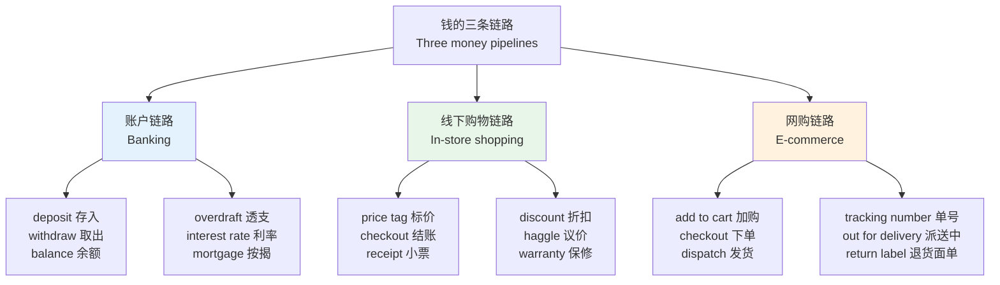
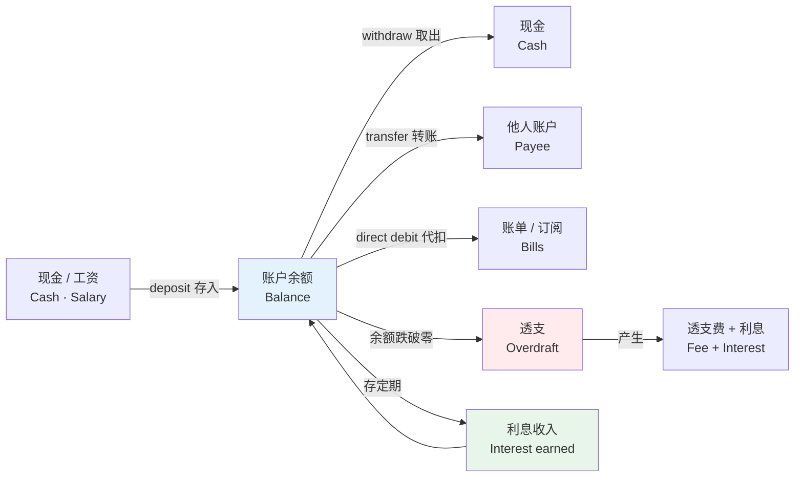
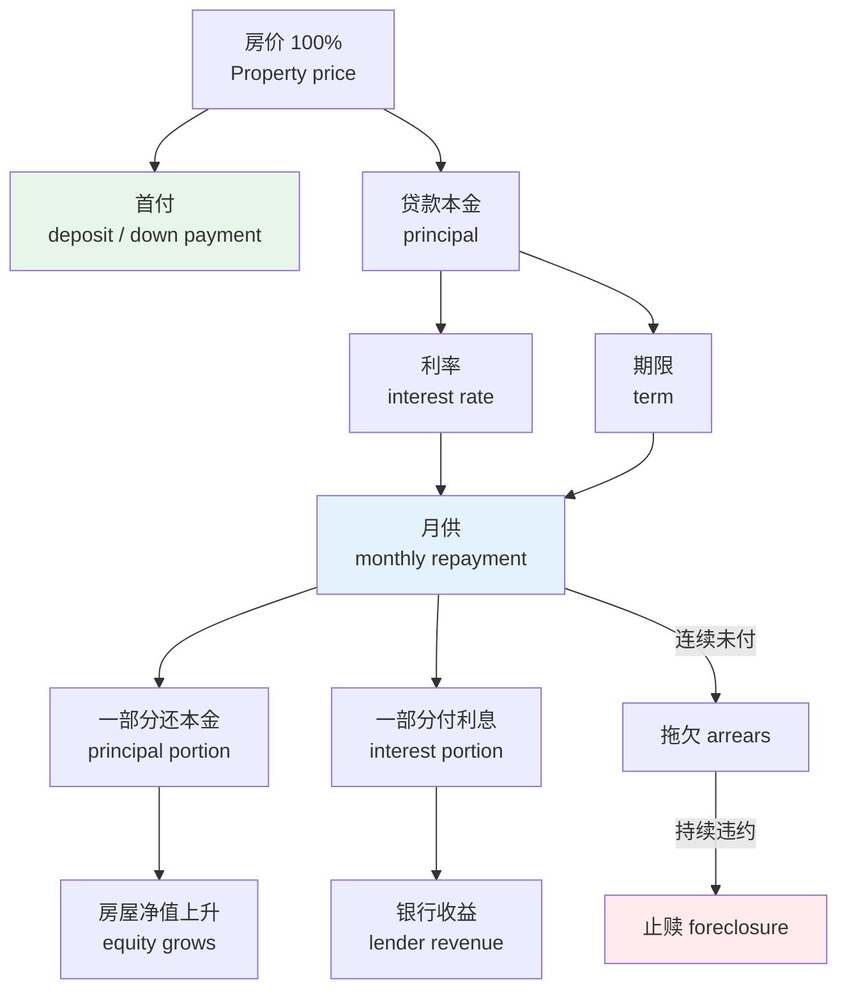
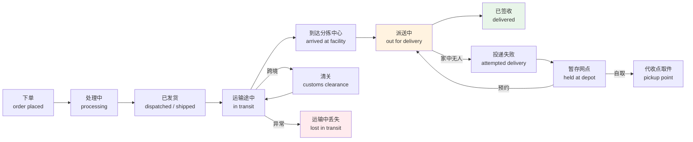
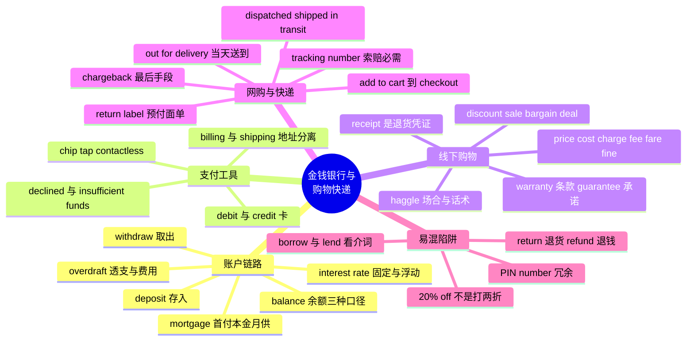

# 金钱银行、购物、网购与快递售后

> [!info] 本篇定位
>
> 第 11 章的第四篇，接在求职与公司组织之后。上一篇讲的是钱怎么挣到手，这一篇讲钱进账户之后发生的所有事：存进去、取出来、借出去、花出去、买错了再退回来。
>
> 三条链路贯穿全篇：**账户链路**（deposit → balance → withdraw → overdraft → interest → mortgage）、**线下购物链路**（price tag → checkout → receipt → refund → warranty）、**网购链路**（add to cart → checkout → dispatch → tracking number → out for delivery → return label）。
>
> 读完能做到：看懂英文银行 App 的每一个状态字，读懂 Amazon 订单页与物流轨迹的每一行，写一封语气得体的退款申诉邮件。
>
> 本篇不讲经济学与投资术语（那属于第 19 章商业金融篇），也不讲租房买房的产权手续（属于下一篇的证件手续部分），只讲个人日常层面的钱。

---

## 1. 本篇导读：钱的三条链路

英语里跟钱有关的词有一个明显特点：**同一个动作在不同链路上换一套词**。中文说「付钱」，从买菜到还房贷都是这两个字；英语则是 `pay`、`settle`、`repay`、`check out`、`clear`、`transfer` 各占一段，混用会立刻暴露不熟。

更麻烦的是英美分歧在这个主题上密度极高。英式的 `current account`、`cheque`、`till`、`trolley`、`queue`、`postcode`，美式对应的是 `checking account`、`check`、`register`、`cart`、`line`、`ZIP code`——这不是文体差别，是两套并行的词。本篇每张表都把这类分歧单列出来。

上图给出全篇的骨架。左边一列是三条链路的名字，中间一列是每条链路的核心动作词，右边一列是每条链路上最容易卡住的收尾环节。三条链路在现实中会交叉——网购要用卡付款（链路三接链路一），退款要退回原账户（链路三回到链路一）——所以本篇后半段专门有一节讲交叉点上的词。

按学习优先级排：账户链路必须练到产出级，因为出国办卡、跟银行客服通话时要主动说；线下购物链路练到产出级，日常最高频；网购链路可以先停在接受级，只要读懂订单页和物流轨迹就够用，真要写申诉邮件时再回来查。

---

## 2. 现金、货币与面额

### 2.1 现金与钱的基本词

英语区分 `money`（钱这个抽象概念，不可数）和 `cash`（现钞，不可数）。中文的「钱」两义合一，直接对译会出问题：`Do you have money?` 问的是「你有钱吗」（有没有财力），`Do you have cash?` 问的是「你带现金了吗」（有没有带现钞）。

| 英文 | 英式音标 | 美式音标 | 词性 | 中文 | 搭配与说明 |
| --- | --- | --- | --- | --- | --- |
| **money** | /ˈmʌni/ | /ˈmʌni/ | n. | 钱 | 不可数，无复数；说数量用 a lot of money |
| **cash** | /kæʃ/ | /kæʃ/ | n./v. | 现金；兑现 | pay in cash（英式）/ pay cash（通用） |
| **currency** | /ˈkʌrənsi/ | /ˈkɜːrənsi/ | n. | 货币 | foreign currency 外币；英美元音差别明显 |
| **coin** | /kɔɪn/ | /kɔɪn/ | n. | 硬币 | 可数；a handful of coins |
| **note** | /nəʊt/ | /noʊt/ | n. | 纸币（英式） | a ten-pound note；美式用 bill |
| **bill** | /bɪl/ | /bɪl/ | n. | 纸币（美式）；账单 | 美式一词两义，靠语境分 |
| **banknote** | /ˈbæŋknəʊt/ | /ˈbæŋknoʊt/ | n. | 钞票 | 正式说法，日常仍多用 note / bill |
| **change** | /tʃeɪndʒ/ | /tʃeɪndʒ/ | n. | 零钱；找零 | 不可数；Keep the change 不用找了 |
| **small change** | /ˌsmɔːl ˈtʃeɪndʒ/ | /ˌsmɔːl ˈtʃeɪndʒ/ | n. | 零钱碎币 | 引申义「小钱、不值一提的数目」 |
| **wallet** | /ˈwɒlɪt/ | /ˈwɑːlɪt/ | n. | 钱包（扁平款） | 美式也叫 billfold |
| **purse** | /pɜːs/ | /pɜːrs/ | n. | 钱包（英）；手提包（美） | 英美所指不同，容易误会 |
| **denomination** | /dɪˌnɒmɪˈneɪʃn/ | /dɪˌnɑːmɪˈneɪʃn/ | n. | 面额 | in small denominations 小面额 |
| **exchange rate** | /ɪksˈtʃeɪndʒ reɪt/ | /ɪksˈtʃeɪndʒ reɪt/ | n. | 汇率 | 也说 rate of exchange |
| **currency exchange** | /ˈkʌrənsi ɪksˈtʃeɪndʒ/ | /ˈkɜːrənsi ɪksˈtʃeɪndʒ/ | n. | 货币兑换（点） | 机场标牌常写 Bureau de Change |
| **counterfeit** | /ˈkaʊntəfɪt/ | /ˈkaʊntərfɪt/ | adj./n. | 伪造的；假钞 | counterfeit note 假钞 |
| **cashless** | /ˈkæʃləs/ | /ˈkæʃləs/ | adj. | 无现金的 | a cashless society |
| **legal tender** | /ˌliːɡl ˈtendə/ | /ˌliːɡl ˈtendər/ | n. | 法定货币 | 店家拒收现金时常被引用的说法 |
| **petty cash** | /ˌpeti ˈkæʃ/ | /ˌpeti ˈkæʃ/ | n. | 备用金 | 公司报销语境，见第 14 节 |

> [!warning] purse 的英美分歧会造成实际误会
>
> - 英式：**purse** = 女式小钱包（放硬币纸币），**handbag** = 手提包。
> - 美式：**purse** = 女式手提包，**wallet** = 钱包。
>
> 在美国说 `She left her purse at the table`，指的是整个手提包落在桌上；同一句在英国听来是钱包落下了。丢东西报失时这个差别很要紧，稳妥的说法是直接说 **bag** 或 **wallet**。

### 2.2 具体币种与口语面额说法

| 英文 | 英式音标 | 美式音标 | 词性 | 中文 | 搭配与说明 |
| --- | --- | --- | --- | --- | --- |
| **dollar** | /ˈdɒlə/ | /ˈdɑːlər/ | n. | 美元 | 符号 $，写作 $20，读 twenty dollars |
| **cent** | /sent/ | /sent/ | n. | 美分 | 1 美元 = 100 cents |
| **pound** | /paʊnd/ | /paʊnd/ | n. | 英镑 | 符号 £；也可指重量单位磅 |
| **pence** | /pens/ | /pens/ | n. | 便士（复数） | 单数 penny；50p 读 fifty pee |
| **euro** | /ˈjʊərəʊ/ | /ˈjʊroʊ/ | n. | 欧元 | 复数口语常不加 s：ten euro |
| **yuan** | /juˈɑːn/ | /juˈɑːn/ | n. | 人民币元 | 国际场合也说 renminbi / RMB |
| **quarter** | /ˈkwɔːtə/ | /ˈkwɔːrtər/ | n. | 二十五分硬币 | 美国投币洗衣机、停车表全靠它 |
| **dime** | /daɪm/ | /daɪm/ | n. | 十分硬币 | 比 nickel 小但面值大，易拿错 |
| **nickel** | /ˈnɪkl/ | /ˈnɪkl/ | n. | 五分硬币 | 同名金属「镍」 |
| **buck** | /bʌk/ | /bʌk/ | n. | 一块钱（口语） | 十美元说 ten bucks，不说 ten buck |
| **quid** | /kwɪd/ | /kwɪd/ | n. | 一英镑（英式口语） | 单复数同形：twenty quid |
| **grand** | /ɡrænd/ | /ɡrænd/ | n. | 一千（口语） | 复数不加 s：five grand 五千 |

> [!tip] 报价格时的读法
>
> 金额小数点前后拆开读，不说 point：
>
> - `$19.99` → nineteen ninety-nine（不读 nineteen point nine nine）
> - `£4.50` → four fifty，或 four pounds fifty
> - `$1,200` → twelve hundred（美式口语）/ one thousand two hundred（正式）
>
> 整数金额加 dollars / pounds；带小数时口语通常两个数字连读，单位省略。这套读法在第 3 章 `03.数字与计量词汇` 的 `04.货币、价格、折扣与统计图表趋势` 里有完整规则，本篇只标出金钱语境的特例。

---

## 3. 银行机构、开户与账户类型

### 3.1 银行与网点

| 英文 | 英式音标 | 美式音标 | 词性 | 中文 | 搭配与说明 |
| --- | --- | --- | --- | --- | --- |
| **bank** | /bæŋk/ | /bæŋk/ | n./v. | 银行；把钱存入 | bank with HSBC 在汇丰开户 |
| **branch** | /brɑːntʃ/ | /bræntʃ/ | n. | 分行；网点 | your local branch 附近网点 |
| **headquarters** | /ˌhedˈkwɔːtəz/ | /ˈhedkwɔːrtərz/ | n. | 总行 | 形式复数，谓语可单可复 |
| **teller** | /ˈtelə/ | /ˈtelər/ | n. | 柜员（美式） | bank teller；英式多说 cashier |
| **cashier** | /kæˈʃɪə/ | /kæˈʃɪr/ | n. | 柜员；收银员 | 银行与商店两处都用 |
| **counter** | /ˈkaʊntə/ | /ˈkaʊntər/ | n. | 柜台 | at the counter 在柜台办 |
| **ATM** | /ˌeɪ tiː ˈem/ | /ˌeɪ tiː ˈem/ | n. | 自动柜员机 | automated teller machine 的缩写 |
| **cash machine** | /ˈkæʃ məˌʃiːn/ | /ˈkæʃ məˌʃiːn/ | n. | 取款机（英式） | 英式口语也说 cashpoint |
| **credit union** | /ˈkredɪt ˌjuːniən/ | /ˈkredɪt ˌjuːniən/ | n. | 信用合作社 | 会员制，利率常优于银行 |
| **online banking** | /ˌɒnlaɪn ˈbæŋkɪŋ/ | /ˌɑːnlaɪn ˈbæŋkɪŋ/ | n. | 网上银行 | 也说 internet banking |
| **mobile banking** | /ˌməʊbaɪl ˈbæŋkɪŋ/ | /ˌmoʊbl ˈbæŋkɪŋ/ | n. | 手机银行 | mobile 英美读法差别大 |
| **safe deposit box** | /ˌseɪf dɪˈpɒzɪt bɒks/ | /ˌseɪf dɪˈpɑːzɪt bɑːks/ | n. | 保险箱 | 也写作 safety deposit box |

### 3.2 开户与账户类型

| 英文 | 英式音标 | 美式音标 | 词性 | 中文 | 搭配与说明 |
| --- | --- | --- | --- | --- | --- |
| **account** | /əˈkaʊnt/ | /əˈkaʊnt/ | n. | 账户 | open / close / freeze an account |
| **open an account** | /ˌəʊpən ən əˈkaʊnt/ | /ˌoʊpən ən əˈkaʊnt/ | phr. | 开户 | 不说 ~~apply an account~~ |
| **current account** | /ˈkʌrənt əˌkaʊnt/ | — | n. | 活期账户（英式） | 日常收支账户 |
| **checking account** | — | /ˈtʃekɪŋ əˌkaʊnt/ | n. | 活期账户（美式） | 与英式 current account 对应 |
| **savings account** | /ˈseɪvɪŋz əˌkaʊnt/ | /ˈseɪvɪŋz əˌkaʊnt/ | n. | 储蓄账户 | savings 恒复数，不说 saving account |
| **joint account** | /ˌdʒɔɪnt əˈkaʊnt/ | /ˌdʒɔɪnt əˈkaʊnt/ | n. | 联名账户 | 夫妻共同持有 |
| **fixed deposit** | /ˌfɪkst dɪˈpɒzɪt/ | /ˌfɪkst dɪˈpɑːzɪt/ | n. | 定期存款 | 美式常说 CD（certificate of deposit） |
| **account holder** | /əˈkaʊnt ˌhəʊldə/ | /əˈkaʊnt ˌhoʊldər/ | n. | 账户持有人 | 表单上的固定说法 |
| **account number** | /əˈkaʊnt ˌnʌmbə/ | /əˈkaʊnt ˌnʌmbər/ | n. | 账号 | 缩写 A/C no. |
| **sort code** | /ˈsɔːt kəʊd/ | — | n. | 分行代码（英式） | 六位，写成 12-34-56 |
| **routing number** | — | /ˈruːtɪŋ ˌnʌmbər/ | n. | 银行路由号（美式） | 九位，与英式 sort code 对应 |
| **IBAN** | /ˈaɪbæn/ | /ˈaɪbæn/ | n. | 国际银行账号 | 跨境汇款必填 |
| **SWIFT code** | /ˈswɪft kəʊd/ | /ˈswɪft koʊd/ | n. | 国际汇款代码 | 也叫 BIC |
| **proof of address** | /ˌpruːf əv əˈdres/ | /ˌpruːf əv əˈdres/ | n. | 地址证明 | 开户常要水电账单充当 |
| **identification** | /aɪˌdentɪfɪˈkeɪʃn/ | /aɪˌdentɪfɪˈkeɪʃn/ | n. | 身份证明 | 口语缩为 ID |
| **freeze** | /friːz/ | /friːz/ | v. | 冻结 | freeze the account 冻结账户 |
| **dormant** | /ˈdɔːmənt/ | /ˈdɔːrmənt/ | adj. | 休眠的 | a dormant account 长期不动的账户 |

> [!warning] 开户表格里三个常填错的词
>
> - ❌ ~~I want to apply an account.~~
> - ✅ I'd like to **open an account**.（开户固定搭配是 open）
>
> - ❌ ~~a saving account~~
> - ✅ a **savings account**（savings 永远带 s，作定语也不掉）
>
> - ❌ ~~my account is 1234567~~（口语里听着像账户余额）
> - ✅ my **account number** is 1234567

---

## 4. 存、取、余额：账户三个核心动作

### 4.1 三个词的准确口径

`deposit`、`withdraw`、`balance` 是整条账户链路的地基，但三个词各有一个中文对不上的地方，必须单独说清。

**deposit 有三个不同的义项**，靠语境区分：银行存款（往账户里放钱）、押金（租房、租车预付的可退款项）、首付（买房时的头款，英式常用）。同一个词在三种语境里译成中文完全不同。

**withdraw 只用于取出自己的钱**。从 ATM 取现是 withdraw，把钱从投资里撤出也是 withdraw，但「取快递」不能用 withdraw（那是 collect / pick up），「取钱给别人」是 transfer 或 pay。

**balance 是当前净额，不是「余额一定为正」**。账户可以有 negative balance（负余额），信用卡有 outstanding balance（未偿余额），两者都是 balance。

| 英文 | 英式音标 | 美式音标 | 词性 | 中文 | 搭配与说明 |
| --- | --- | --- | --- | --- | --- |
| **deposit** | /dɪˈpɒzɪt/ | /dɪˈpɑːzɪt/ | v./n. | 存入；押金；首付 | deposit money into an account |
| **make a deposit** | /ˌmeɪk ə dɪˈpɒzɪt/ | /ˌmeɪk ə dɪˈpɑːzɪt/ | phr. | 办理存款 | 柜台常用，比动词更正式 |
| **pay in** | /ˌpeɪ ˈɪn/ | /ˌpeɪ ˈɪn/ | phr.v. | 存入（英式） | pay in a cheque 存支票 |
| **withdraw** | /wɪðˈdrɔː/ | /wɪðˈdrɔː/ | v. | 取出；提取 | 不规则：withdraw-withdrew-withdrawn |
| **withdrawal** | /wɪðˈdrɔːəl/ | /wɪðˈdrɔːəl/ | n. | 取款 | 四音节，重音在第二音节 |
| **take out** | /ˌteɪk ˈaʊt/ | /ˌteɪk ˈaʊt/ | phr.v. | 取出（口语） | take out £100 取一百镑 |
| **balance** | /ˈbæləns/ | /ˈbæləns/ | n. | 余额 | check your balance 查余额 |
| **available balance** | /əˈveɪləbl ˈbæləns/ | /əˈveɪləbl ˈbæləns/ | n. | 可用余额 | 已扣未清的钱不算在内 |
| **current balance** | /ˈkʌrənt ˈbæləns/ | /ˈkɜːrənt ˈbæləns/ | n. | 账面余额 | 含尚未结算的交易 |
| **outstanding balance** | /aʊtˌstændɪŋ ˈbæləns/ | /aʊtˌstændɪŋ ˈbæləns/ | n. | 未偿余额 | 信用卡账单上的欠款 |
| **pending** | /ˈpendɪŋ/ | /ˈpendɪŋ/ | adj. | 待结算的 | a pending transaction 未入账交易 |
| **cleared** | /klɪəd/ | /klɪrd/ | adj. | 已清算的 | funds have cleared 款项已到账 |
| **credit** | /ˈkredɪt/ | /ˈkredɪt/ | v./n. | 贷记；入账 | credited to your account 已入账 |
| **debit** | /ˈdebɪt/ | /ˈdebɪt/ | v./n. | 借记；扣款 | debited from your account 已扣款 |
| **statement** | /ˈsteɪtmənt/ | /ˈsteɪtmənt/ | n. | 对账单 | monthly statement 月结单 |
| **transaction** | /trænˈzækʃn/ | /trænˈzækʃn/ | n. | 交易；流水 | transaction history 交易记录 |
| **funds** | /fʌndz/ | /fʌndz/ | n. | 资金 | 恒复数；insufficient funds 余额不足 |
| **insufficient funds** | /ˌɪnsəˈfɪʃnt ˈfʌndz/ | /ˌɪnsəˈfɪʃnt ˈfʌndz/ | phr. | 余额不足 | 扣款失败短信里的标准措辞 |

这张图把账户当成一个水池：`deposit` 是进水口，`withdraw`、`transfer`、`direct debit` 是三个出水口，`balance` 是当前水位。水位跌破零线就进入 `overdraft` 区间，银行不但不给利息，反过来收 `overdraft fee` 加利息；水位停在正区间并且存成定期，则产生 `interest`，回流进池子。这个模型里唯一双向的箭头是利息——它既可能是你收到的，也可能是你付出去的，方向由余额正负决定。

### 4.2 转账与汇款

| 英文 | 英式音标 | 美式音标 | 词性 | 中文 | 搭配与说明 |
| --- | --- | --- | --- | --- | --- |
| **transfer** | /trænsˈfɜː/ | /trænsˈfɜːr/ | v. | 转账 | 动词重音在后，名词在前 |
| **transfer** | /ˈtrænsfɜː/ | /ˈtrænsfɜːr/ | n. | 转账（笔） | a bank transfer 一笔银行转账 |
| **wire transfer** | /ˈwaɪə ˌtrænsfɜː/ | /ˈwaɪər ˌtrænsfɜːr/ | n. | 电汇 | 美式常用，跨行大额 |
| **remittance** | /rɪˈmɪtns/ | /rɪˈmɪtns/ | n. | 汇款 | 正式，跨境汇款单据上常见 |
| **payee** | /peɪˈiː/ | /peɪˈiː/ | n. | 收款人 | 重音在后，与 payer 成对 |
| **payer** | /ˈpeɪə/ | /ˈpeɪər/ | n. | 付款人 | 表单上也写 remitter |
| **beneficiary** | /ˌbenɪˈfɪʃəri/ | /ˌbenɪˈfɪʃieri/ | n. | 受益人 | 国际汇款表单固定字段 |
| **reference** | /ˈrefrəns/ | /ˈrefrəns/ | n. | 附言；备注 | 转账时写用途，收款方靠它对账 |
| **cheque** | /tʃek/ | — | n. | 支票（英式拼写） | 美式拼作 check，读音相同 |
| **check** | — | /tʃek/ | n. | 支票（美式） | 美式还指餐厅账单 |
| **cash a cheque** | /ˌkæʃ ə ˈtʃek/ | /ˌkæʃ ə ˈtʃek/ | phr. | 兑现支票 | 动词 cash 在此是「兑成现金」 |
| **bounce** | /baʊns/ | /baʊns/ | v. | （支票）退票 | The cheque bounced 支票因余额不足被退 |
| **clearing** | /ˈklɪərɪŋ/ | /ˈklɪrɪŋ/ | n. | 清算 | clearing time 到账时间 |
| **standing order** | /ˌstændɪŋ ˈɔːdə/ | — | n. | 定期定额转账（英式） | 金额固定，由你设定 |
| **direct debit** | /daɪˌrekt ˈdebɪt/ | /dɪˌrekt ˈdebɪt/ | n. | 代扣（英式） | 金额由收款方发起，可变 |
| **autopay** | /ˈɔːtəpeɪ/ | /ˈɔːtoʊpeɪ/ | n. | 自动扣款（美式） | 也写 automatic payment |

> [!warning] standing order 与 direct debit 不是一回事
>
> 两个都是自动付款，区别在**谁控制金额**：
>
> - **standing order**：你设定「每月 1 号转 500 给房东」，金额固定，改动权在你。
> - **direct debit**：你授权电力公司「每月按实际用量从我账户扣款」，金额浮动，发起权在对方。
>
> 所以房租常用 standing order，水电煤和订阅服务常用 direct debit。取消方式也不同：standing order 你自己在网银里取消即可，direct debit 除了取消授权还应通知收款方，否则可能被继续追欠。

---

## 5. 透支、利息与借贷

### 5.1 overdraft：这个词的两层意思

`overdraft` 在英式银行语境里既指「透支这件事」，也指「银行给你的透支额度」这项产品。听到 `I've got a £500 overdraft`，不是说欠了 500，而是说有 500 的透支额度可用。真的欠了钱要说 `I'm £200 overdrawn` 或 `I'm £200 into my overdraft`。

| 英文 | 英式音标 | 美式音标 | 词性 | 中文 | 搭配与说明 |
| --- | --- | --- | --- | --- | --- |
| **overdraft** | /ˈəʊvədrɑːft/ | /ˈoʊvərdræft/ | n. | 透支；透支额度 | 英美元音差别在第三音节 |
| **overdrawn** | /ˌəʊvəˈdrɔːn/ | /ˌoʊvərˈdrɔːn/ | adj. | 已透支的 | be £50 overdrawn 透支五十镑 |
| **overdraw** | /ˌəʊvəˈdrɔː/ | /ˌoʊvərˈdrɔː/ | v. | 透支 | 与 withdraw 同源，同为不规则 |
| **arranged overdraft** | /əˌreɪndʒd ˈəʊvədrɑːft/ | — | n. | 约定透支 | 事先申请，费率较低 |
| **unarranged overdraft** | /ˌʌnəreɪndʒd ˈəʊvədrɑːft/ | — | n. | 未约定透支 | 直接扣款失败后产生，费率高 |
| **overdraft fee** | /ˈəʊvədrɑːft fiː/ | /ˈoʊvərdræft fiː/ | n. | 透支费 | 美式也叫 overdraft charge |
| **in the red** | /ɪn ðə ˈred/ | /ɪn ðə ˈred/ | idiom | 亏损；负余额 | 源自旧账本用红墨水记赤字 |
| **in the black** | /ɪn ðə ˈblæk/ | /ɪn ðə ˈblæk/ | idiom | 盈余；正余额 | 与 in the red 成对 |
| **decline** | /dɪˈklaɪn/ | /dɪˈklaɪn/ | v. | （交易）被拒 | My card was declined 卡被拒付 |
| **bounced payment** | /ˌbaʊnst ˈpeɪmənt/ | /ˌbaʊnst ˈpeɪmənt/ | n. | 扣款失败 | 余额不足导致的退款 |

### 5.2 利息与利率

| 英文 | 英式音标 | 美式音标 | 词性 | 中文 | 搭配与说明 |
| --- | --- | --- | --- | --- | --- |
| **interest** | /ˈɪntrəst/ | /ˈɪntrəst/ | n. | 利息 | 此义不可数，无复数 |
| **interest rate** | /ˈɪntrəst reɪt/ | /ˈɪntrəst reɪt/ | n. | 利率 | 涨跌用 rise / fall / cut |
| **rate** | /reɪt/ | /reɪt/ | n. | 费率；比率 | 单说 rate 在银行语境即指利率 |
| **APR** | /ˌeɪ piː ˈɑː/ | /ˌeɪ piː ˈɑːr/ | n. | 年化利率 | annual percentage rate 缩写 |
| **principal** | /ˈprɪnsəpl/ | /ˈprɪnsəpl/ | n. | 本金 | 与 principle（原则）同音异义 |
| **compound interest** | /ˌkɒmpaʊnd ˈɪntrəst/ | /ˌkɑːmpaʊnd ˈɪntrəst/ | n. | 复利 | 对应 simple interest 单利 |
| **accrue** | /əˈkruː/ | /əˈkruː/ | v. | 累计（利息） | Interest accrues daily 按日计息 |
| **fixed rate** | /ˌfɪkst ˈreɪt/ | /ˌfɪkst ˈreɪt/ | n. | 固定利率 | 期内不变 |
| **variable rate** | /ˌveəriəbl ˈreɪt/ | /ˌveriəbl ˈreɪt/ | n. | 浮动利率 | 随基准利率调整 |
| **base rate** | /ˈbeɪs reɪt/ | /ˈbeɪs reɪt/ | n. | 基准利率 | 央行公布，其余利率随之浮动 |
| **yield** | /jiːld/ | /jiːld/ | n./v. | 收益率；产生收益 | 存款产品宣传常用 |
| **inflation** | /ɪnˈfleɪʃn/ | /ɪnˈfleɪʃn/ | n. | 通货膨胀 | 与实际利率对照理解 |

### 5.3 借与贷

中文一个「借」字覆盖两个相反方向，英语必须分清 `borrow`（借入）与 `lend`（借出）。这是中文母语者最持久的错误之一。

| 英文 | 英式音标 | 美式音标 | 词性 | 中文 | 搭配与说明 |
| --- | --- | --- | --- | --- | --- |
| **borrow** | /ˈbɒrəʊ/ | /ˈbɑːroʊ/ | v. | 借入 | borrow money **from** someone |
| **lend** | /lend/ | /lend/ | v. | 借出 | lend money **to** someone；lend-lent-lent |
| **loan** | /ləʊn/ | /loʊn/ | n./v. | 贷款；出借 | 名词最常用；美式也当动词 |
| **take out a loan** | /ˌteɪk aʊt ə ˈləʊn/ | /ˌteɪk aʊt ə ˈloʊn/ | phr. | 办贷款 | 不说 ~~make a loan~~ |
| **personal loan** | /ˌpɜːsənl ˈləʊn/ | /ˌpɜːrsənl ˈloʊn/ | n. | 个人消费贷 | 无抵押，利率高于房贷 |
| **student loan** | /ˌstjuːdnt ˈləʊn/ | /ˌstuːdnt ˈloʊn/ | n. | 助学贷款 | 见第 11 章第一篇校园词 |
| **debt** | /det/ | /det/ | n. | 债务 | b 不发音；in debt 负债中 |
| **creditor** | /ˈkredɪtə/ | /ˈkredɪtər/ | n. | 债权人 | 借出方 |
| **debtor** | /ˈdetə/ | /ˈdetər/ | n. | 债务人 | b 同样不发音 |
| **credit score** | /ˈkredɪt skɔː/ | /ˈkredɪt skɔːr/ | n. | 信用分 | 英式也说 credit rating |
| **credit history** | /ˈkredɪt ˌhɪstri/ | /ˈkredɪt ˌhɪstri/ | n. | 信用记录 | 移民初期最难积累的东西 |
| **collateral** | /kəˈlætərəl/ | /kəˈlætərəl/ | n. | 抵押物 | put up collateral 提供抵押 |
| **guarantor** | /ˌɡærənˈtɔː/ | /ˌɡærənˈtɔːr/ | n. | 担保人 | 租房与贷款都可能需要 |
| **default** | /dɪˈfɔːlt/ | /dɪˈfɔːlt/ | v./n. | 违约 | default **on** a loan 贷款违约 |
| **arrears** | /əˈrɪəz/ | /əˈrɪrz/ | n. | 欠款；拖欠 | 恒复数；in arrears 处于拖欠状态 |
| **bankrupt** | /ˈbæŋkrʌpt/ | /ˈbæŋkrʌpt/ | adj. | 破产的 | go bankrupt 破产 |
| **bankruptcy** | /ˈbæŋkrʌptsi/ | /ˈbæŋkrʌptsi/ | n. | 破产 | 名词形式，注意 -tcy 拼写 |
| **write off** | /ˌraɪt ˈɒf/ | /ˌraɪt ˈɔːf/ | phr.v. | 核销；一笔勾销 | write off the debt 坏账核销 |

> [!warning] borrow 与 lend 的方向判据
>
> 记介词就不会错：
>
> - **borrow ... from ...** 东西朝我来
> - **lend ... to ...** 东西从我走
>
> - ❌ ~~Can you borrow me your charger?~~
> - ✅ Can you **lend** me your charger? / Can I **borrow** your charger?
>
> `lend` 可以带双宾语（lend me your charger），`borrow` 不行（不能说 borrow me）。这条判据本身就能挡掉九成误用。

---

## 6. 按揭与分期还款

### 6.1 mortgage 相关

`mortgage` 的 t 不发音，读作 /ˈmɔːɡɪdʒ/，这是英语里最容易读错的高频词之一。它专指以不动产作抵押的长期贷款，中文的「房贷」「按揭」都对应它；买车的分期不叫 mortgage，叫 car loan 或 auto loan。

| 英文 | 英式音标 | 美式音标 | 词性 | 中文 | 搭配与说明 |
| --- | --- | --- | --- | --- | --- |
| **mortgage** | /ˈmɔːɡɪdʒ/ | /ˈmɔːrɡɪdʒ/ | n./v. | 按揭；抵押贷款 | t 完全不发音 |
| **take out a mortgage** | /ˌteɪk aʊt ə ˈmɔːɡɪdʒ/ | /ˌteɪk aʊt ə ˈmɔːrɡɪdʒ/ | phr. | 办房贷 | 与 take out a loan 同结构 |
| **down payment** | /ˈdaʊn ˌpeɪmənt/ | /ˈdaʊn ˌpeɪmənt/ | n. | 首付（美式） | 英式常用 deposit |
| **deposit** | /dɪˈpɒzɪt/ | /dɪˈpɑːzɪt/ | n. | 首付；押金（英式） | 此处与「银行存款」义项不同 |
| **instalment** | /ɪnˈstɔːlmənt/ | /ɪnˈstɔːlmənt/ | n. | 分期付款（英式拼写） | 美式拼 installment，双 l |
| **monthly repayment** | /ˌmʌnθli rɪˈpeɪmənt/ | /ˌmʌnθli rɪˈpeɪmənt/ | n. | 月供 | 美式多说 monthly payment |
| **repay** | /rɪˈpeɪ/ | /rɪˈpeɪ/ | v. | 偿还 | repay a loan；不规则 repay-repaid |
| **term** | /tɜːm/ | /tɜːrm/ | n. | 贷款期限 | a 25-year term 二十五年期 |
| **equity** | /ˈekwəti/ | /ˈekwəti/ | n. | 房屋净值 | 房价减去未还本金 |
| **refinance** | /ˌriːfaɪˈnæns/ | /ˌriːfaɪˈnæns/ | v. | 再融资；转贷 | 美式口语缩为 refi |
| **remortgage** | /ˌriːˈmɔːɡɪdʒ/ | /ˌriːˈmɔːrɡɪdʒ/ | v./n. | 转按揭（英式） | 与美式 refinance 对应 |
| **foreclosure** | /fɔːˈkləʊʒə/ | /fɔːrˈkloʊʒər/ | n. | 止赎；法拍 | 长期违约后银行收房 |
| **repossess** | /ˌriːpəˈzes/ | /ˌriːpəˈzes/ | v. | 收回（抵押物） | 英式口语缩为 repo |
| **escrow** | /ˈeskrəʊ/ | /ˈeskroʊ/ | n. | 第三方托管 | 美式购房流程核心环节 |
| **surveyor** | /səˈveɪə/ | /sərˈveɪər/ | n. | 房屋估价师（英式） | 美式多说 appraiser |
| **appraisal** | /əˈpreɪzl/ | /əˈpreɪzl/ | n. | 估价（美式） | 与绩效考核的 appraisal 同形 |

### 6.2 分期与「先买后付」

| 英文 | 英式音标 | 美式音标 | 词性 | 中文 | 搭配与说明 |
| --- | --- | --- | --- | --- | --- |
| **pay in instalments** | /ˌpeɪ ɪn ɪnˈstɔːlmənts/ | /ˌpeɪ ɪn ɪnˈstɔːlmənts/ | phr. | 分期付款 | 介词固定用 in |
| **interest-free** | /ˌɪntrəst ˈfriː/ | /ˌɪntrəst ˈfriː/ | adj. | 免息的 | interest-free credit 免息分期 |
| **buy now, pay later** | /ˌbaɪ naʊ peɪ ˈleɪtə/ | /ˌbaɪ naʊ peɪ ˈleɪtər/ | phr. | 先买后付 | 缩写 BNPL，结账页常见选项 |
| **minimum payment** | /ˌmɪnɪməm ˈpeɪmənt/ | /ˌmɪnɪməm ˈpeɪmənt/ | n. | 最低还款额 | 只还它会持续产生利息 |
| **pay off** | /ˌpeɪ ˈɒf/ | /ˌpeɪ ˈɔːf/ | phr.v. | 还清 | pay off the mortgage 还清房贷 |
| **pay back** | /ˌpeɪ ˈbæk/ | /ˌpeɪ ˈbæk/ | phr.v. | 还钱给某人 | pay you back tomorrow |
| **settle** | /ˈsetl/ | /ˈsetl/ | v. | 结清 | settle the bill 结账；正式 |
| **early repayment charge** | /ˌɜːli rɪˈpeɪmənt tʃɑːdʒ/ | /ˌɜːrli rɪˈpeɪmənt tʃɑːrdʒ/ | n. | 提前还款违约金 | 缩写 ERC |
| **grace period** | /ˈɡreɪs ˌpɪəriəd/ | /ˈɡreɪs ˌpɪriəd/ | n. | 宽限期 | 逾期未罚息的缓冲期 |
| **late fee** | /ˈleɪt fiː/ | /ˈleɪt fiː/ | n. | 滞纳金 | 也说 late payment charge |

图里最值得记的是 `monthly repayment` 被拆成两股：一股冲减 `principal`，一股是纯利息支出。这解释了英语里两个常被误解的说法——`I'm paying off my mortgage`（在还房贷，本金在减少）与 `I'm just servicing the debt`（只在付利息，本金没动）。也解释了 `equity` 为什么随时间上升：本金那一股越还越多，净值就越积越厚。最右下角的 `arrears → foreclosure` 是违约路径，英美银行催收信里出现频率很高。

---

## 7. 银行卡与电子支付

### 7.1 卡片本身

| 英文 | 英式音标 | 美式音标 | 词性 | 中文 | 搭配与说明 |
| --- | --- | --- | --- | --- | --- |
| **debit card** | /ˈdebɪt kɑːd/ | /ˈdebɪt kɑːrd/ | n. | 借记卡 | 直接扣账户余额 |
| **credit card** | /ˈkredɪt kɑːd/ | /ˈkredɪt kɑːrd/ | n. | 信用卡 | 先消费后还款 |
| **prepaid card** | /ˌpriːpeɪd ˈkɑːd/ | /ˌpriːpeɪd ˈkɑːrd/ | n. | 预付卡 | 充值后使用 |
| **card number** | /ˈkɑːd ˌnʌmbə/ | /ˈkɑːrd ˌnʌmbər/ | n. | 卡号 | 多数十六位，四位一组读；American Express 为十五位 |
| **PIN** | /pɪn/ | /pɪn/ | n. | 密码 | 已含 number，不说 ~~PIN number~~ |
| **CVV** | /ˌsiː viː ˈviː/ | /ˌsiː viː ˈviː/ | n. | 安全码 | 卡背三位；也叫 CVC |
| **expiry date** | /ɪkˈspaɪəri deɪt/ | — | n. | 有效期（英式） | 写作 MM/YY |
| **expiration date** | — | /ˌekspəˈreɪʃn deɪt/ | n. | 有效期（美式） | 与英式 expiry date 对应 |
| **cardholder** | /ˈkɑːdhəʊldə/ | /ˈkɑːrdhoʊldər/ | n. | 持卡人 | 表单字段 name on card |
| **chip** | /tʃɪp/ | /tʃɪp/ | n. | 芯片 | chip and PIN 芯片加密码 |
| **magnetic stripe** | /mæɡˌnetɪk ˈstraɪp/ | /mæɡˌnetɪk ˈstraɪp/ | n. | 磁条 | 口语 magstripe |
| **credit limit** | /ˈkredɪt ˌlɪmɪt/ | /ˈkredɪt ˌlɪmɪt/ | n. | 信用额度 | raise / lower the limit |
| **annual fee** | /ˌænjuəl ˈfiː/ | /ˌænjuəl ˈfiː/ | n. | 年费 | waive the annual fee 免年费 |
| **cashback** | /ˈkæʃbæk/ | /ˈkæʃbæk/ | n. | 返现；（英式）购物时取现 | 英式超市结账可 get cashback |
| **reward points** | /rɪˈwɔːd pɔɪnts/ | /rɪˈwɔːrd pɔɪnts/ | n. | 积分 | redeem points 兑换积分 |
| **activate** | /ˈæktɪveɪt/ | /ˈæktɪveɪt/ | v. | 激活 | activate your new card |
| **block** | /blɒk/ | /blɑːk/ | v. | 挂失冻结 | block the card 停卡 |
| **replacement card** | /rɪˈpleɪsmənt kɑːd/ | /rɪˈpleɪsmənt kɑːrd/ | n. | 补发卡 | 丢卡后申请 |

### 7.2 支付动作与状态

| 英文 | 英式音标 | 美式音标 | 词性 | 中文 | 搭配与说明 |
| --- | --- | --- | --- | --- | --- |
| **pay** | /peɪ/ | /peɪ/ | v. | 支付 | pay **for** 商品；pay 人；pay 账单 |
| **swipe** | /swaɪp/ | /swaɪp/ | v. | 刷（磁条） | 磁条卡时代动作 |
| **insert** | /ɪnˈsɜːt/ | /ɪnˈsɜːrt/ | v. | 插卡 | 芯片卡终端提示语 |
| **tap** | /tæp/ | /tæp/ | v. | 碰一下（感应） | Tap to pay 感应支付 |
| **contactless** | /ˈkɒntæktləs/ | /ˈkɑːntæktləs/ | adj. | 非接触的 | contactless payment 闪付 |
| **authorise** | /ˈɔːθəraɪz/ | /ˈɔːθəraɪz/ | v. | 授权 | 美式拼 authorize |
| **authorisation** | /ˌɔːθəraɪˈzeɪʃn/ | /ˌɔːθərəˈzeɪʃn/ | n. | 授权（码） | 拒付信里常提 auth code |
| **decline** | /dɪˈklaɪn/ | /dɪˈklaɪn/ | v. | 拒付 | Card declined 交易被拒 |
| **billing address** | /ˈbɪlɪŋ əˌdres/ | /ˈbɪlɪŋ ˌædres/ | n. | 账单地址 | 与 shipping address 常不同 |
| **surcharge** | /ˈsɜːtʃɑːdʒ/ | /ˈsɜːrtʃɑːrdʒ/ | n. | 附加费 | 刷卡手续费转嫁给顾客 |
| **e-wallet** | /ˈiː ˌwɒlɪt/ | /ˈiː ˌwɑːlɪt/ | n. | 电子钱包 | 也说 digital wallet |
| **QR code** | /ˌkjuː ˈɑː kəʊd/ | /ˌkjuː ˈɑːr koʊd/ | n. | 二维码 | scan the QR code |
| **top up** | /ˌtɒp ˈʌp/ | /ˌtɑːp ˈʌp/ | phr.v. | 充值 | 英式常用；美式 reload / add funds |
| **split the bill** | /ˌsplɪt ðə ˈbɪl/ | /ˌsplɪt ðə ˈbɪl/ | phr. | AA 制 | 也说 go Dutch（略旧） |
| **tip** | /tɪp/ | /tɪp/ | n./v. | 小费 | 美国餐厅几乎必给 |
| **service charge** | /ˈsɜːvɪs tʃɑːdʒ/ | /ˈsɜːrvɪs tʃɑːrdʒ/ | n. | 服务费 | 已含在账单里就不必再加 tip |

> [!warning] PIN number 是冗余说法
>
> PIN = **P**ersonal **I**dentification **N**umber，最后一个字母已经是 number。
>
> - ❌ ~~Enter your PIN number.~~（严格说重复）
> - ✅ Enter your **PIN**.
>
> 同类冗余还有 `ATM machine`（machine 已在缩写里）、`the LCD display`。口语里母语者也常说 PIN number，不会被纠正，但正式书面要避免。第 15 章 `15.词根、合成与缩略` 的 `04.合成词、转化词、截短词与缩略语` 会把这类 RAS 冗余集中处理。

---

## 8. 实体店：卖场结构与结账动线

### 8.1 店铺类型

| 英文 | 英式音标 | 美式音标 | 词性 | 中文 | 搭配与说明 |
| --- | --- | --- | --- | --- | --- |
| **shop** | /ʃɒp/ | /ʃɑːp/ | n./v. | 商店；购物 | 英式名词首选；美式名词多用 store |
| **store** | /stɔː/ | /stɔːr/ | n. | 商店 | 美式通用词 |
| **supermarket** | /ˈsuːpəmɑːkɪt/ | /ˈsuːpərmɑːrkɪt/ | n. | 超市 | 美式大型的叫 grocery store |
| **grocery store** | /ˈɡrəʊsəri stɔː/ | /ˈɡroʊsəri stɔːr/ | n. | 食品杂货店 | 美式日常说法 |
| **convenience store** | /kənˈviːniəns stɔː/ | /kənˈviːniəns stɔːr/ | n. | 便利店 | 英式也说 corner shop |
| **department store** | /dɪˈpɑːtmənt stɔː/ | /dɪˈpɑːrtmənt stɔːr/ | n. | 百货公司 | 分楼层按品类 |
| **shopping centre** | /ˈʃɒpɪŋ ˌsentə/ | — | n. | 购物中心（英式） | 美式拼 center，更常说 mall |
| **mall** | /mɔːl/ | /mɔːl/ | n. | 购物中心（美式） | shopping mall |
| **outlet** | /ˈaʊtlet/ | /ˈaʊtlet/ | n. | 折扣店；奥莱 | outlet store 品牌折扣店 |
| **market** | /ˈmɑːkɪt/ | /ˈmɑːrkɪt/ | n. | 市场；集市 | farmers' market 农夫市集 |
| **chain** | /tʃeɪn/ | /tʃeɪn/ | n. | 连锁（店） | a supermarket chain |
| **branch** | /brɑːntʃ/ | /bræntʃ/ | n. | 分店 | 与银行分行同词 |

### 8.2 卖场里的东西

| 英文 | 英式音标 | 美式音标 | 词性 | 中文 | 搭配与说明 |
| --- | --- | --- | --- | --- | --- |
| **aisle** | /aɪl/ | /aɪl/ | n. | 货架通道 | s 不发音；aisle 5 五号通道 |
| **shelf** | /ʃelf/ | /ʃelf/ | n. | 货架 | 复数 shelves |
| **display** | /dɪˈspleɪ/ | /dɪˈspleɪ/ | n./v. | 陈列 | on display 陈列中 |
| **trolley** | /ˈtrɒli/ | — | n. | 购物车（英式） | 美式说 cart |
| **cart** | — | /kɑːrt/ | n. | 购物车（美式） | 网购的购物车也用这个词 |
| **basket** | /ˈbɑːskɪt/ | /ˈbæskɪt/ | n. | 购物篮 | 英美元音差别明显 |
| **checkout** | /ˈtʃekaʊt/ | /ˈtʃekaʊt/ | n. | 收银台；结账 | 名词重音在前 |
| **check out** | /ˌtʃek ˈaʊt/ | /ˌtʃek ˈaʊt/ | phr.v. | 结账 | 动词分写，重音在后 |
| **till** | /tɪl/ | — | n. | 收银台；收银机（英式） | pay at the till 到收银台付款 |
| **cash register** | /ˈkæʃ ˌredʒɪstə/ | /ˈkæʃ ˌredʒɪstər/ | n. | 收银机 | 美式常简称 register |
| **self-checkout** | /ˌself ˈtʃekaʊt/ | /ˌself ˈtʃekaʊt/ | n. | 自助结账 | Unexpected item in the bagging area |
| **queue** | /kjuː/ | — | n./v. | 排队（英式） | queue up；四个字母只读一个音 |
| **line** | /laɪn/ | /laɪn/ | n. | 队伍（美式） | stand in line 排队 |
| **barcode** | /ˈbɑːkəʊd/ | /ˈbɑːrkoʊd/ | n. | 条形码 | scan the barcode |
| **scan** | /skæn/ | /skæn/ | v. | 扫码 | 商品与二维码通用 |
| **carrier bag** | /ˈkæriə bæɡ/ | — | n. | 购物袋（英式） | 美式说 shopping bag / grocery bag |
| **bag up** | /ˌbæɡ ˈʌp/ | /ˌbæɡ ˈʌp/ | phr.v. | 装袋 | 美式店员会说 Paper or plastic? |
| **stock** | /stɒk/ | /stɑːk/ | n./v. | 库存；进货 | in stock 有货；out of stock 缺货 |
| **restock** | /ˌriːˈstɒk/ | /ˌriːˈstɑːk/ | v. | 补货 | be restocked next week |
| **inventory** | /ˈɪnvəntri/ | /ˈɪnvəntɔːri/ | n. | 库存（清单） | 英美重音与音节数都不同 |

> [!example] 结账台上最常听到的六句
>
> - Do you have a **loyalty card**?
>   - 有会员卡吗？
> - Would you like a **receipt**?
>   - 要小票吗？
> - Cash or **card**?
>   - 现金还是刷卡？
> - Would you like **cashback**?
>   - 需要顺便取现吗？（英式超市特有）
> - Do you need a **bag**? That's 10p.
>   - 要袋子吗？一个十便士。
> - Please **insert** your card and enter your **PIN**.
>   - 请插卡并输入密码。

---

## 9. 价格、折扣与议价

### 9.1 价格类词的分工

英语里表示「要付的钱」有一组近义词，各自绑定不同的场合，混用会立刻显得生硬。

| 英文 | 英式音标 | 美式音标 | 词性 | 中文 | 搭配与说明 |
| --- | --- | --- | --- | --- | --- |
| **price** | /praɪs/ | /praɪs/ | n. | 价格 | 商品的标价，最通用 |
| **cost** | /kɒst/ | /kɔːst/ | n./v. | 成本；花费 | 强调支出总额；cost-cost-cost |
| **charge** | /tʃɑːdʒ/ | /tʃɑːrdʒ/ | n./v. | 收费 | 服务方主动收取的钱 |
| **fee** | /fiː/ | /fiː/ | n. | 手续费；专业服务费 | 律师、学费、年费用 fee |
| **fare** | /feə/ | /fer/ | n. | 车船票价 | 交通专用；bus fare |
| **rate** | /reɪt/ | /reɪt/ | n. | 费率 | 按单位计价：hourly rate |
| **fine** | /faɪn/ | /faɪn/ | n. | 罚款 | 违规才有；a parking fine |
| **price tag** | /ˈpraɪs tæɡ/ | /ˈpraɪs tæɡ/ | n. | 价签 | 引申义「代价」 |
| **list price** | /ˈlɪst praɪs/ | /ˈlɪst praɪs/ | n. | 标价 | 也说 sticker price（美式） |
| **retail price** | /ˈriːteɪl praɪs/ | /ˈriːteɪl praɪs/ | n. | 零售价 | 对应 wholesale price 批发价 |
| **wholesale** | /ˈhəʊlseɪl/ | /ˈhoʊlseɪl/ | adj./n. | 批发（的） | buy wholesale 批发买 |
| **VAT** | /ˌviː eɪ ˈtiː/ | — | n. | 增值税（英式） | 也可整读 /væt/ |
| **sales tax** | — | /ˈseɪlz tæks/ | n. | 销售税（美式） | 美国标价常不含税，结账才加 |
| **duty-free** | /ˌdjuːti ˈfriː/ | /ˌduːti ˈfriː/ | adj. | 免税的 | 机场店；duty 英美元音不同 |
| **inclusive of** | /ɪnˈkluːsɪv əv/ | /ɪnˈkluːsɪv əv/ | phr. | 含…在内 | prices inclusive of VAT |
| **surcharge** | /ˈsɜːtʃɑːdʒ/ | /ˈsɜːrtʃɑːrdʒ/ | n. | 附加费 | fuel surcharge 燃油附加费 |

> [!warning] price / cost / charge / fee 选错的四个典型
>
> - ❌ ~~What's the cost of this shirt?~~（生硬，像在问进货成本）
> - ✅ How much is this shirt? / What's the **price**?
>
> - ❌ ~~The bank took a fee of £5 for the transfer.~~（took 不自然）
> - ✅ The bank **charged** £5 for the transfer. / There's a £5 **fee**.
>
> - ❌ ~~the ticket price of the bus~~
> - ✅ the bus **fare**
>
> - ❌ ~~I got a charge for parking illegally.~~
> - ✅ I got a **fine** for parking illegally.（违规是 fine，不是 charge）

### 9.2 打折与优惠

| 英文 | 英式音标 | 美式音标 | 词性 | 中文 | 搭配与说明 |
| --- | --- | --- | --- | --- | --- |
| **discount** | /ˈdɪskaʊnt/ | /ˈdɪskaʊnt/ | n. | 折扣 | a 20% discount 打八折（减两成） |
| **sale** | /seɪl/ | /seɪl/ | n. | 打折促销 | on sale 促销中；for sale 待售 |
| **half price** | /ˌhɑːf ˈpraɪs/ | /ˌhæf ˈpraɪs/ | n. | 半价 | at half price |
| **two for one** | /ˌtuː fə ˈwʌn/ | /ˌtuː fər ˈwʌn/ | phr. | 买一送一 | 也写 BOGO（buy one get one） |
| **clearance** | /ˈklɪərəns/ | /ˈklɪrəns/ | n. | 清仓 | clearance sale 清仓大甩卖 |
| **markdown** | /ˈmɑːkdaʊn/ | /ˈmɑːrkdaʊn/ | n. | 降价 | 与 markup 加价成对 |
| **bargain** | /ˈbɑːɡɪn/ | /ˈbɑːrɡɪn/ | n./v. | 便宜货；讨价还价 | a real bargain 很划算 |
| **deal** | /diːl/ | /diːl/ | n. | 优惠；成交 | a good deal 划算的买卖 |
| **voucher** | /ˈvaʊtʃə/ | /ˈvaʊtʃər/ | n. | 代金券（英式） | 美式多说 coupon / gift card |
| **coupon** | /ˈkuːpɒn/ | /ˈkuːpɑːn/ | n. | 优惠券 | 美式部分地区读 /ˈkjuːpɑːn/ |
| **promo code** | /ˈprəʊməʊ kəʊd/ | /ˈproʊmoʊ koʊd/ | n. | 优惠码 | 网购结账页填 |
| **loyalty card** | /ˈlɔɪəlti kɑːd/ | /ˈlɔɪəlti kɑːrd/ | n. | 会员卡 | 美式也说 rewards card |
| **overpriced** | /ˌəʊvəˈpraɪst/ | /ˌoʊvərˈpraɪst/ | adj. | 定价过高的 | 委婉批评价格 |
| **affordable** | /əˈfɔːdəbl/ | /əˈfɔːrdəbl/ | adj. | 买得起的 | 广告高频词 |
| **rip-off** | /ˈrɪp ɒf/ | /ˈrɪp ɔːf/ | n. | 宰客；坑钱 | 口语；What a rip-off! |

### 9.3 议价：haggle 及其近义词

`haggle` 指在跳蚤市场、二手交易、旅游景点这类允许还价的场合就价格来回拉锯，语气偏口语，略带「磨」的意味。正式商务谈判用 `negotiate`，不用 haggle。

| 英文 | 英式音标 | 美式音标 | 词性 | 中文 | 搭配与说明 |
| --- | --- | --- | --- | --- | --- |
| **haggle** | /ˈhæɡl/ | /ˈhæɡl/ | v. | 讨价还价 | haggle **over** the price |
| **bargain** | /ˈbɑːɡɪn/ | /ˈbɑːrɡɪn/ | v. | 议价 | 与 haggle 近义，略中性 |
| **negotiate** | /nɪˈɡəʊʃieɪt/ | /nɪˈɡoʊʃieɪt/ | v. | 协商 | 正式；商务合同语境 |
| **knock off** | /ˌnɒk ˈɒf/ | /ˌnɑːk ˈɔːf/ | phr.v. | 减掉（若干钱） | knock a tenner off 便宜十镑 |
| **throw in** | /ˌθrəʊ ˈɪn/ | /ˌθroʊ ˈɪn/ | phr.v. | 附赠 | throw in a case 送个保护壳 |
| **meet in the middle** | /ˌmiːt ɪn ðə ˈmɪdl/ | /ˌmiːt ɪn ðə ˈmɪdl/ | phr. | 各让一步 | 议价收尾常用 |
| **firm price** | /ˌfɜːm ˈpraɪs/ | /ˌfɜːrm ˈpraɪs/ | n. | 一口价 | 二手交易帖里写 price is firm |
| **best price** | /ˌbest ˈpraɪs/ | /ˌbest ˈpraɪs/ | n. | 最低价 | What's your best price? |
| **cash discount** | /ˈkæʃ ˌdɪskaʊnt/ | /ˈkæʃ ˌdɪskaʊnt/ | n. | 现金优惠 | 免刷卡手续费的让利 |
| **haggle down** | /ˌhæɡl ˈdaʊn/ | /ˌhæɡl ˈdaʊn/ | phr.v. | 砍价至 | haggle it down to £30 |

> [!example] 一段完整的议价对话用词
>
> - What's your **best price** on this?
>   - 这个最低多少？
> - I could **knock** a fiver **off** if you take two.
>   - 买两个我给你便宜五镑。
> - Would you take thirty if I pay **in cash**?
>   - 现金付三十行吗？
> - Let's **meet in the middle** — thirty-five.
>   - 各让一步，三十五。
> - Sorry, the price is **firm**.
>   - 抱歉，一口价。

> [!warning] 哪些场合不能 haggle
>
> 英美连锁超市、百货、药店的标价是不还价的，在这些地方开口砍价会被当作不懂规矩。可以还价的场合基本限于：跳蚤市场（flea market）、二手交易（Facebook Marketplace、Gumtree）、独立古董店、部分旅游区摊位、以及大额耐用品（车、家具、家电）的门店销售。
>
> 大额商品的合法「变相砍价」说法是问 `Is there any flexibility on the price?` 或 `Can you do any better on this?`，比直接 haggle 得体。

---

## 10. 小票、退换与保修

### 10.1 receipt 与购买凭证

`receipt` 的 p 不发音，读 /rɪˈsiːt/。它是零售场景的「小票、收据」；`invoice` 是开给公司或客户的正式发票，含税号与付款条款；`bill` 是餐厅或服务方给你的待付账单。三者在流程上先后不同：先有 bill / invoice（要你付），付完才有 receipt（证明你付过）。

| 英文 | 英式音标 | 美式音标 | 词性 | 中文 | 搭配与说明 |
| --- | --- | --- | --- | --- | --- |
| **receipt** | /rɪˈsiːt/ | /rɪˈsiːt/ | n. | 收据；小票 | p 不发音；keep the receipt |
| **invoice** | /ˈɪnvɔɪs/ | /ˈɪnvɔɪs/ | n./v. | 发票；开票 | issue an invoice 开发票 |
| **bill** | /bɪl/ | /bɪl/ | n. | 账单 | 英式餐厅说 the bill，美式说 the check |
| **proof of purchase** | /ˌpruːf əv ˈpɜːtʃəs/ | /ˌpruːf əv ˈpɜːrtʃəs/ | n. | 购买凭证 | 退货必备，小票或订单截图皆可 |
| **itemised** | /ˈaɪtəmaɪzd/ | /ˈaɪtəmaɪzd/ | adj. | 明细的 | an itemised receipt 逐项小票 |
| **e-receipt** | /ˈiː rɪˌsiːt/ | /ˈiː rɪˌsiːt/ | n. | 电子小票 | 结账时问 email or printed? |
| **purchase** | /ˈpɜːtʃəs/ | /ˈpɜːrtʃəs/ | n./v. | 购买 | 正式；比 buy 书面 |
| **transaction ID** | /trænˈzækʃn ˌaɪ ˈdiː/ | /trænˈzækʃn ˌaɪ ˈdiː/ | n. | 交易号 | 申诉时客服要它 |

### 10.2 退货、换货、退款

三个动作在英语里分得很细，说错会被理解成另一件事。

| 英文 | 英式音标 | 美式音标 | 词性 | 中文 | 搭配与说明 |
| --- | --- | --- | --- | --- | --- |
| **return** | /rɪˈtɜːn/ | /rɪˈtɜːrn/ | v./n. | 退货 | 把货送回，不保证有钱 |
| **refund** | /ˈriːfʌnd/ | /ˈriːfʌnd/ | n. | 退款 | 名词重音在前 |
| **refund** | /rɪˈfʌnd/ | /rɪˈfʌnd/ | v. | 退款给 | 动词重音在后 |
| **exchange** | /ɪksˈtʃeɪndʒ/ | /ɪksˈtʃeɪndʒ/ | v./n. | 换货 | exchange it **for** a larger size |
| **replacement** | /rɪˈpleɪsmənt/ | /rɪˈpleɪsmənt/ | n. | 替换品 | send a replacement 补发一件 |
| **store credit** | /ˈstɔː ˌkredɪt/ | /ˈstɔːr ˌkredɪt/ | n. | 店内消费额度 | 不退现金时的替代方案 |
| **gift receipt** | /ˈɡɪft rɪˌsiːt/ | /ˈɡɪft rɪˌsiːt/ | n. | 礼品小票 | 不显示金额，供收礼人退换 |
| **return policy** | /rɪˈtɜːn ˌpɒləsi/ | /rɪˈtɜːrn ˌpɑːləsi/ | n. | 退货政策 | 英式也说 returns policy |
| **return window** | /rɪˈtɜːn ˌwɪndəʊ/ | /rɪˈtɜːrn ˌwɪndoʊ/ | n. | 退货期限 | a 30-day return window |
| **non-refundable** | /ˌnɒn rɪˈfʌndəbl/ | /ˌnɑːn rɪˈfʌndəbl/ | adj. | 不可退款的 | 机票、演出票常见标注 |
| **restocking fee** | /ˌriːˈstɒkɪŋ fiː/ | /ˌriːˈstɑːkɪŋ fiː/ | n. | 重新上架费 | 退货时扣掉的一部分钱 |
| **faulty** | /ˈfɔːlti/ | /ˈfɔːlti/ | adj. | 有故障的（英式） | faulty goods 次品 |
| **defective** | /dɪˈfektɪv/ | /dɪˈfektɪv/ | adj. | 有缺陷的 | 美式与书面更常用 |
| **damaged** | /ˈdæmɪdʒd/ | /ˈdæmɪdʒd/ | adj. | 损坏的 | damaged in transit 运输中损坏 |
| **defect** | /ˈdiːfekt/ | /ˈdiːfekt/ | n. | 缺陷 | a manufacturing defect |
| **complaint** | /kəmˈpleɪnt/ | /kəmˈpleɪnt/ | n. | 投诉 | make / file a complaint |
| **compensation** | /ˌkɒmpenˈseɪʃn/ | /ˌkɑːmpənˈseɪʃn/ | n. | 赔偿 | claim compensation 索赔 |
| **goodwill gesture** | /ˌɡʊdwɪl ˈdʒestʃə/ | /ˌɡʊdwɪl ˈdʒestʃər/ | n. | 善意补偿 | 商家超期仍给退款时的措辞 |

> [!warning] return 与 refund 不能互换
>
> - **return** 是**你的动作**：把商品送回去。
> - **refund** 是**商家的动作**：把钱退给你。
>
> - ❌ ~~I want to return my money.~~（听起来像你要还别人钱）
> - ✅ I'd like a **refund**. / Could you **refund** me?
>
> - ❌ ~~Can I refund this jacket?~~（refund 的宾语是钱或人，不是货）
> - ✅ Can I **return** this jacket? / Can I get a **refund on** this jacket?
>
> 组合起来最自然的一句是：I'd like to **return** this and get a **refund**.

### 10.3 保修：warranty 与 guarantee

| 英文 | 英式音标 | 美式音标 | 词性 | 中文 | 搭配与说明 |
| --- | --- | --- | --- | --- | --- |
| **warranty** | /ˈwɒrənti/ | /ˈwɔːrənti/ | n. | 保修（条款） | under warranty 在保修期内 |
| **guarantee** | /ˌɡærənˈtiː/ | /ˌɡærənˈtiː/ | n./v. | 保证；质保 | 重音在最后一个音节 |
| **extended warranty** | /ɪkˌstendɪd ˈwɒrənti/ | /ɪkˌstendɪd ˈwɔːrənti/ | n. | 延保 | 收银台常被推销的附加项 |
| **coverage** | /ˈkʌvərɪdʒ/ | /ˈkʌvərɪdʒ/ | n. | 保障范围 | What does the coverage include? |
| **void** | /vɔɪd/ | /vɔɪd/ | v./adj. | 使失效；无效的 | Opening the case voids the warranty |
| **wear and tear** | /ˌweər ən ˈteə/ | /ˌwer ən ˈter/ | n. | 正常磨损 | 保修免责条款高频短语 |
| **claim** | /kleɪm/ | /kleɪm/ | v./n. | 索赔；提出主张 | make a warranty claim |
| **repair** | /rɪˈpeə/ | /rɪˈper/ | v./n. | 维修 | send it in for repair |
| **service centre** | /ˈsɜːvɪs ˌsentə/ | /ˈsɜːrvɪs ˌsentər/ | n. | 售后网点 | 美式拼 center |
| **expire** | /ɪkˈspaɪə/ | /ɪkˈspaɪər/ | v. | 到期 | The warranty has expired |

> [!tip] warranty 与 guarantee 的实际区别
>
> 日常口语里两个常混用，但在书面条款里有分工：
>
> - **guarantee** 通常是厂商或商家的**承诺**，可以是「不满意就退钱」这类宽泛保证，期限一般较短。
> - **warranty** 是**书面的、条件明确的保修条款**，写明保修范围、期限、免责情形，出问题走的是 warranty claim 流程。
>
> 所以广告词说 `money-back guarantee`（不满意退款保证），不说 money-back warranty；而说明书封底写的是 `two-year limited warranty`，不写 guarantee。

---

## 11. 网购下单：从浏览到 checkout

### 11.1 浏览与选品

| 英文 | 英式音标 | 美式音标 | 词性 | 中文 | 搭配与说明 |
| --- | --- | --- | --- | --- | --- |
| **e-commerce** | /ˌiː ˈkɒmɜːs/ | /ˌiː ˈkɑːmɜːrs/ | n. | 电子商务 | 也写 ecommerce |
| **marketplace** | /ˈmɑːkɪtpleɪs/ | /ˈmɑːrkɪtpleɪs/ | n. | 第三方卖场 | Amazon Marketplace |
| **seller** | /ˈselə/ | /ˈselər/ | n. | 卖家 | third-party seller 第三方卖家 |
| **vendor** | /ˈvendə/ | /ˈvendər/ | n. | 供应商 | 偏商务书面 |
| **browse** | /braʊz/ | /braʊz/ | v. | 浏览 | 与浏览器 browser 同源 |
| **listing** | /ˈlɪstɪŋ/ | /ˈlɪstɪŋ/ | n. | 商品条目 | 二手平台的每条帖子 |
| **product page** | /ˈprɒdʌkt peɪdʒ/ | /ˈprɑːdʌkt peɪdʒ/ | n. | 商品详情页 | 也说 item page |
| **specification** | /ˌspesɪfɪˈkeɪʃn/ | /ˌspesɪfɪˈkeɪʃn/ | n. | 规格参数 | 口语缩为 specs |
| **variant** | /ˈveəriənt/ | /ˈveriənt/ | n. | 规格/款式 | 选颜色尺码的那个选项组 |
| **in stock** | /ɪn ˈstɒk/ | /ɪn ˈstɑːk/ | phr. | 有现货 | 商品页状态字 |
| **out of stock** | /ˌaʊt əv ˈstɒk/ | /ˌaʊt əv ˈstɑːk/ | phr. | 缺货 | 也说 sold out |
| **backorder** | /ˈbækɔːdə/ | /ˈbækɔːrdər/ | n./v. | 缺货预订 | on backorder 已下单但待补货 |
| **pre-order** | /ˌpriː ˈɔːdə/ | /ˌpriː ˈɔːrdər/ | v./n. | 预售 | 未发售商品先下单 |
| **wishlist** | /ˈwɪʃlɪst/ | /ˈwɪʃlɪst/ | n. | 心愿单 | save to wishlist |
| **review** | /rɪˈvjuː/ | /rɪˈvjuː/ | n./v. | 评价 | leave a review 留评 |
| **rating** | /ˈreɪtɪŋ/ | /ˈreɪtɪŋ/ | n. | 评分 | a 4.5-star rating |
| **verified purchase** | /ˌverɪfaɪd ˈpɜːtʃəs/ | /ˌverɪfaɪd ˈpɜːrtʃəs/ | n. | 已验证购买 | 评论区标签，区分刷评 |

### 11.2 加购与结账

| 英文 | 英式音标 | 美式音标 | 词性 | 中文 | 搭配与说明 |
| --- | --- | --- | --- | --- | --- |
| **add to cart** | /ˌæd tə ˈkɑːt/ | /ˌæd tə ˈkɑːrt/ | phr. | 加入购物车 | 英式站点也可能写 add to basket |
| **basket** | /ˈbɑːskɪt/ | /ˈbæskɪt/ | n. | 购物车（英式站点） | 与实体店的购物篮同词 |
| **quantity** | /ˈkwɒntəti/ | /ˈkwɑːntəti/ | n. | 数量 | 表单字段常缩为 Qty |
| **checkout** | /ˈtʃekaʊt/ | /ˈtʃekaʊt/ | n./v. | 结账（页） | proceed to checkout 去结算 |
| **guest checkout** | /ˌɡest ˈtʃekaʊt/ | /ˌɡest ˈtʃekaʊt/ | n. | 免注册结算 | 不建账号直接下单 |
| **place an order** | /ˌpleɪs ən ˈɔːdə/ | /ˌpleɪs ən ˈɔːrdər/ | phr. | 下单 | 不说 ~~make an order~~ 更稳妥 |
| **order confirmation** | /ˈɔːdə ˌkɒnfəˈmeɪʃn/ | /ˈɔːrdər ˌkɑːnfərˈmeɪʃn/ | n. | 订单确认（信） | 下单后的第一封邮件 |
| **order number** | /ˈɔːdə ˌnʌmbə/ | /ˈɔːrdər ˌnʌmbər/ | n. | 订单号 | 联系客服第一句要报的号 |
| **shipping address** | /ˈʃɪpɪŋ əˌdres/ | /ˈʃɪpɪŋ ˌædres/ | n. | 收货地址 | 英式站点写 delivery address |
| **billing address** | /ˈbɪlɪŋ əˌdres/ | /ˈbɪlɪŋ ˌædres/ | n. | 账单地址 | 必须与银行留存地址一致 |
| **postcode** | /ˈpəʊstkəʊd/ | — | n. | 邮编（英式） | 字母数字混合 |
| **ZIP code** | — | /ˈzɪp koʊd/ | n. | 邮编（美式） | 五位数字，可加四位后缀 |
| **subtotal** | /ˈsʌbtəʊtl/ | /ˈsʌbtoʊtl/ | n. | 小计 | 未含运费与税 |
| **shipping fee** | /ˈʃɪpɪŋ fiː/ | /ˈʃɪpɪŋ fiː/ | n. | 运费 | 英式也说 postage / delivery charge |
| **grand total** | /ˌɡrænd ˈtəʊtl/ | /ˌɡrænd ˈtoʊtl/ | n. | 总计 | 结算页最后一行 |
| **apply** | /əˈplaɪ/ | /əˈplaɪ/ | v. | 使用（优惠码） | Apply code at checkout |
| **gift card** | /ˈɡɪft kɑːd/ | /ˈɡɪft kɑːrd/ | n. | 礼品卡 | 结账页可作支付方式，余额可拆多单使用 |
| **abandoned cart** | /əˌbændənd ˈkɑːt/ | /əˌbændənd ˈkɑːrt/ | n. | 弃购购物车 | 商家发挽回邮件的由头 |

> [!warning] checkout 是一个词还是两个词
>
> - **checkout**（名词/形容词，重音在 check）：the checkout page、self-checkout、a fast checkout。
> - **check out**（动词短语，重音在 out）：I'll check out now、Please check out within 30 minutes。
>
> - ❌ ~~Please checkout now.~~
> - ✅ Please **check out** now.
> - ✅ Go to the **checkout** page.
>
> 同一条规则适用于 `login` / `log in`、`setup` / `set up`、`backup` / `back up`。第 16 章 `16.词义辨析、搭配与短语动词` 的 `05.短语动词（上）up out off down` 会把这条名动分写规则展开。

---

## 12. 快递物流：运单号与配送状态

### 12.1 承运与包裹

| 英文 | 英式音标 | 美式音标 | 词性 | 中文 | 搭配与说明 |
| --- | --- | --- | --- | --- | --- |
| **shipping** | /ˈʃɪpɪŋ/ | /ˈʃɪpɪŋ/ | n. | 运输；发货 | 美式泛指所有寄递，不限海运 |
| **delivery** | /dɪˈlɪvəri/ | /dɪˈlɪvəri/ | n. | 配送；送达 | 英式站点更常用这个词 |
| **postage** | /ˈpəʊstɪdʒ/ | /ˈpoʊstɪdʒ/ | n. | 邮资 | 邮政系统专用 |
| **courier** | /ˈkʊriə/ | /ˈkɜːriər/ | n. | 快递公司；快递员 | 英美读音差别很大 |
| **carrier** | /ˈkæriə/ | /ˈkæriər/ | n. | 承运方 | 追踪页上写 carrier: DHL |
| **parcel** | /ˈpɑːsl/ | /ˈpɑːrsl/ | n. | 包裹（英式） | 美式更常说 package |
| **package** | /ˈpækɪdʒ/ | /ˈpækɪdʒ/ | n. | 包裹（美式） | 也指软件包，语境区分 |
| **shipment** | /ˈʃɪpmənt/ | /ˈʃɪpmənt/ | n. | 一批货 | 一单可拆成多个 shipment |
| **consignment** | /kənˈsaɪnmənt/ | /kənˈsaɪnmənt/ | n. | 托运货物 | 偏商务与国际物流 |
| **freight** | /freɪt/ | /freɪt/ | n. | 货运 | 大件；ei 读 /eɪ/ |
| **warehouse** | /ˈweəhaʊs/ | /ˈwerhaʊs/ | n. | 仓库 | 发货前所在地 |
| **fulfilment** | /fʊlˈfɪlmənt/ | /fʊlˈfɪlmənt/ | n. | 订单履约 | 美式拼 fulfillment，双 l |
| **packaging** | /ˈpækɪdʒɪŋ/ | /ˈpækɪdʒɪŋ/ | n. | 包装 | original packaging 原包装 |
| **fragile** | /ˈfrædʒaɪl/ | /ˈfrædʒl/ | adj. | 易碎的 | 箱体贴纸；英美读音差别大 |
| **bubble wrap** | /ˈbʌbl ræp/ | /ˈbʌbl ræp/ | n. | 气泡膜 | 退货时要求原样包回 |
| **recipient** | /rɪˈsɪpiənt/ | /rɪˈsɪpiənt/ | n. | 收件人 | 也说 addressee |

### 12.2 追踪与配送状态字

物流状态字是网购链路里最该练到「一眼认出」的一组，因为它们几乎全是固定短语，字面直译常常不对。

| 英文 | 英式音标 | 美式音标 | 词性 | 中文 | 搭配与说明 |
| --- | --- | --- | --- | --- | --- |
| **tracking number** | /ˈtrækɪŋ ˌnʌmbə/ | /ˈtrækɪŋ ˌnʌmbər/ | n. | 运单号 | 也说 tracking ID / consignment no. |
| **track** | /træk/ | /træk/ | v. | 追踪 | track your order |
| **waybill** | /ˈweɪbɪl/ | /ˈweɪbɪl/ | n. | 运单 | air waybill 空运单 |
| **order placed** | /ˌɔːdə ˈpleɪst/ | /ˌɔːrdər ˈpleɪst/ | phr. | 订单已提交 | 轨迹第一条 |
| **processing** | /ˈprəʊsesɪŋ/ | /ˈprɑːsesɪŋ/ | n. | 处理中 | 仓库尚未拣货 |
| **dispatched** | /dɪˈspætʃt/ | /dɪˈspætʃt/ | adj. | 已发货（英式） | 美式说 shipped |
| **shipped** | /ʃɪpt/ | /ʃɪpt/ | adj. | 已发货（美式） | 与英式 dispatched 对应 |
| **in transit** | /ɪn ˈtrænzɪt/ | /ɪn ˈtrænzɪt/ | phr. | 运输途中 | 最长的一段状态 |
| **arrived at facility** | /əˈraɪvd ət fəˈsɪləti/ | /əˈraɪvd ət fəˈsɪləti/ | phr. | 到达分拣中心 | facility 指转运场地 |
| **out for delivery** | /ˌaʊt fə dɪˈlɪvəri/ | /ˌaʊt fər dɪˈlɪvəri/ | phr. | 派送中 | 当天会送到，最关键的一条 |
| **delivered** | /dɪˈlɪvəd/ | /dɪˈlɪvərd/ | adj. | 已签收 | 轨迹终点 |
| **attempted delivery** | /əˌtemptɪd dɪˈlɪvəri/ | /əˌtemptɪd dɪˈlɪvəri/ | phr. | 投递未成功 | 家中无人时的状态 |
| **redelivery** | /ˌriːdɪˈlɪvəri/ | /ˌriːdɪˈlɪvəri/ | n. | 重新投递 | arrange a redelivery 预约再送 |
| **held at depot** | /ˌheld ət ˈdepəʊ/ | /ˌheld ət ˈdiːpoʊ/ | phr. | 暂存网点 | depot 英美读音差别大 |
| **pickup point** | /ˈpɪkʌp pɔɪnt/ | /ˈpɪkʌp pɔɪnt/ | n. | 代收点 | 英式也说 collection point |
| **parcel locker** | /ˈpɑːsl ˌlɒkə/ | /ˈpɑːrsl ˌlɑːkər/ | n. | 快递柜 | Amazon 的叫 Locker |
| **safe place** | /ˌseɪf ˈpleɪs/ | /ˌseɪf ˈpleɪs/ | n. | 指定存放处 | 门口、后院等，英式配送选项 |
| **signature required** | /ˈsɪɡnətʃə rɪˌkwaɪəd/ | /ˈsɪɡnətʃər rɪˌkwaɪərd/ | phr. | 需签收 | 贵重商品的强制选项 |
| **proof of delivery** | /ˌpruːf əv dɪˈlɪvəri/ | /ˌpruːf əv dɪˈlɪvəri/ | n. | 签收凭证 | 缩写 POD，纠纷时索取 |
| **estimated delivery** | /ˌestɪmeɪtɪd dɪˈlɪvəri/ | /ˌestɪmeɪtɪd dɪˈlɪvəri/ | n. | 预计送达 | 缩写 EDD |
| **expedited shipping** | /ˈekspədaɪtɪd ˈʃɪpɪŋ/ | /ˈekspədaɪtɪd ˈʃɪpɪŋ/ | n. | 加急配送 | 与 standard shipping 对照 |
| **next-day delivery** | /ˌnekst deɪ dɪˈlɪvəri/ | /ˌnekst deɪ dɪˈlɪvəri/ | n. | 次日达 | 英式常见宣传语 |
| **lost in transit** | /ˌlɒst ɪn ˈtrænzɪt/ | /ˌlɔːst ɪn ˈtrænzɪt/ | phr. | 运输中丢失 | 索赔时的标准表述 |
| **customs clearance** | /ˈkʌstəmz ˌklɪərəns/ | /ˈkʌstəmz ˌklɪrəns/ | n. | 清关 | 跨境包裹卡最久的一环 |
| **import duty** | /ˈɪmpɔːt ˌdjuːti/ | /ˈɪmpɔːrt ˌduːti/ | n. | 进口关税 | 收件人常需自付 |
| **customs declaration** | /ˈkʌstəmz ˌdekləˈreɪʃn/ | /ˈkʌstəmz ˌdekləˈreɪʃn/ | n. | 报关单 | 国际包裹外贴 CN22/CN23 |

主干七个状态是英美所有快递平台通用的骨架，读懂它们就读懂了任何一条轨迹。三条分支值得单独记：`attempted delivery → held at depot` 是家中无人的标准处理，之后要么预约 redelivery，要么去 pickup point 自取；跨境件会在 `in transit` 阶段插入一次 `customs clearance`，卡住不动多半是关税未缴；`lost in transit` 是唯一需要主动发起索赔的终点，索赔时对方一定会问 tracking number 与 proof of delivery。

> [!warning] out for delivery 不是「已送出仓库」
>
> 这条状态字最容易被中文思维带偏。它的意思是：**包裹已经装上今天的派送车，当天会送到你手上**。
>
> - `dispatched` / `shipped` = 已经离开卖家仓库（可能还要几天）
> - `in transit` = 在干线运输途中
> - `out for delivery` = 今天就送，人在路上
>
> 看到 `out for delivery` 就该确认家里有人或者设好 safe place；看到 `shipped` 则完全不必守着门口。

---

## 13. 退货与售后纠纷

### 13.1 return label 与退货流程

`return label` 是网购退货的核心物件：卖家生成的一张预付运费面单，你打印出来贴在包裹上，就能免费寄回。听懂这个词，整个退货流程才走得通。

| 英文 | 英式音标 | 美式音标 | 词性 | 中文 | 搭配与说明 |
| --- | --- | --- | --- | --- | --- |
| **return label** | /rɪˈtɜːn ˌleɪbl/ | /rɪˈtɜːrn ˌleɪbl/ | n. | 退货面单 | print the return label 打印面单 |
| **prepaid label** | /ˌpriːpeɪd ˈleɪbl/ | /ˌpriːpeɪd ˈleɪbl/ | n. | 预付运费面单 | 运费由卖家承担 |
| **QR return code** | /ˌkjuː ˈɑː rɪˈtɜːn kəʊd/ | /ˌkjuː ˈɑːr rɪˈtɜːrn koʊd/ | n. | 退货二维码 | 免打印，网点扫码即可 |
| **initiate a return** | /ɪˌnɪʃieɪt ə rɪˈtɜːn/ | /ɪˌnɪʃieɪt ə rɪˈtɜːrn/ | phr. | 发起退货 | 订单页按钮上的措辞 |
| **RMA** | /ˌɑːr em ˈeɪ/ | /ˌɑːr em ˈeɪ/ | n. | 退货授权号 | return merchandise authorisation |
| **drop off** | /ˌdrɒp ˈɒf/ | /ˌdrɑːp ˈɔːf/ | phr.v. | 送到（网点） | drop it off at the post office |
| **collection** | /kəˈlekʃn/ | /kəˈlekʃn/ | n. | 上门取件（英式） | 美式说 pickup |
| **schedule a pickup** | /ˌʃedjuːl ə ˈpɪkʌp/ | /ˌskedʒuːl ə ˈpɪkʌp/ | phr. | 预约取件 | schedule 英美读音差别最大的常用词之一 |
| **original condition** | /əˌrɪdʒənl kənˈdɪʃn/ | /əˌrɪdʒənl kənˈdɪʃn/ | n. | 原始状态 | 退货条款：未使用、带吊牌 |
| **unopened** | /ʌnˈəʊpənd/ | /ʌnˈoʊpənd/ | adj. | 未拆封的 | 部分商品拆封即不可退 |
| **tags attached** | /ˌtæɡz əˈtætʃt/ | /ˌtæɡz əˈtætʃt/ | phr. | 吊牌未剪 | 服装退货硬条件 |
| **refund processed** | /ˈriːfʌnd ˈprəʊsest/ | /ˈriːfʌnd ˈprɑːsest/ | phr. | 退款已处理 | 到账还需数个工作日 |
| **original payment method** | /əˌrɪdʒənl ˈpeɪmənt ˌmeθəd/ | /əˌrɪdʒənl ˈpeɪmənt ˌmeθəd/ | n. | 原支付方式 | 「原路退回」的标准英语表述 |
| **working days** | /ˈwɜːkɪŋ deɪz/ | — | n. | 工作日（英式） | 美式说 business days |
| **business days** | — | /ˈbɪznəs deɪz/ | n. | 工作日（美式） | 退款时效常写 5-7 business days |

### 13.2 纠纷升级

| 英文 | 英式音标 | 美式音标 | 词性 | 中文 | 搭配与说明 |
| --- | --- | --- | --- | --- | --- |
| **customer service** | /ˈkʌstəmə ˈsɜːvɪs/ | /ˈkʌstəmər ˈsɜːrvɪs/ | n. | 客服 | 英式也说 customer support |
| **raise a ticket** | /ˌreɪz ə ˈtɪkɪt/ | /ˌreɪz ə ˈtɪkɪt/ | phr. | 提交工单 | 也说 open a case |
| **case number** | /ˈkeɪs ˌnʌmbə/ | /ˈkeɪs ˌnʌmbər/ | n. | 工单号 | 每次联系都要报 |
| **escalate** | /ˈeskəleɪt/ | /ˈeskəleɪt/ | v. | 升级（处理） | escalate to a supervisor |
| **supervisor** | /ˈsuːpəvaɪzə/ | /ˈsuːpərvaɪzər/ | n. | 主管 | 客服解决不了时要求转接 |
| **dispute** | /dɪˈspjuːt/ | /dɪˈspjuːt/ | n./v. | 争议；提出异议 | dispute the charge 对扣款提异议 |
| **chargeback** | /ˈtʃɑːdʒbæk/ | /ˈtʃɑːrdʒbæk/ | n. | 拒付追回 | 通过发卡行强制退款 |
| **buyer protection** | /ˈbaɪə prəˌtekʃn/ | /ˈbaɪər prəˌtekʃn/ | n. | 买家保障 | 平台提供的兜底机制 |
| **refund request** | /ˈriːfʌnd rɪˌkwest/ | /ˈriːfʌnd rɪˌkwest/ | n. | 退款申请 | submit a refund request 提交退款申请 |
| **fraudulent** | /ˈfrɔːdjələnt/ | /ˈfrɔːdʒələnt/ | adj. | 欺诈的 | a fraudulent transaction |
| **scam** | /skæm/ | /skæm/ | n./v. | 骗局；诈骗 | get scammed 被骗 |
| **counterfeit goods** | /ˈkaʊntəfɪt ɡʊdz/ | /ˈkaʊntərfɪt ɡʊdz/ | n. | 假货 | 也说 fakes / knock-offs |
| **misleading** | /ˌmɪsˈliːdɪŋ/ | /ˌmɪsˈliːdɪŋ/ | adj. | 有误导性的 | a misleading description |
| **not as described** | /ˌnɒt əz dɪˈskraɪbd/ | /ˌnɑːt əz dɪˈskraɪbd/ | phr. | 与描述不符 | 退货理由选项之一 |
| **partial refund** | /ˌpɑːʃl ˈriːfʌnd/ | /ˌpɑːrʃl ˈriːfʌnd/ | n. | 部分退款 | 折中方案 |
| **full refund** | /ˌfʊl ˈriːfʌnd/ | /ˌfʊl ˈriːfʌnd/ | n. | 全额退款 | 含运费的写 refund including postage |
| **resolution** | /ˌrezəˈluːʃn/ | /ˌrezəˈluːʃn/ | n. | 解决方案 | a satisfactory resolution |
| **ombudsman** | /ˈɒmbʊdzmən/ | /ˈɑːmbʊdzmən/ | n. | 申诉专员 | 英国金融纠纷的最终申诉渠道 |

> [!example] 一封退款申诉邮件的骨架句
>
> - I'm writing about **order number** AB-123456, placed on 3 March.
>   - 关于 3 月 3 日下的订单 AB-123456。
> - The item arrived **damaged in transit** and is **not as described**.
>   - 商品运输途中损坏，且与描述不符。
> - I've already **initiated a return** and sent it back using the **prepaid label** on 10 March.
>   - 我已于 3 月 10 日发起退货，并用预付面单寄回。
> - The **tracking number** shows it was **delivered** to your warehouse on 12 March.
>   - 运单号显示 3 月 12 日已送达你们仓库。
> - I'd like a **full refund** to my **original payment method**, including the original **postage**.
>   - 请将全额退款退回原支付方式，含原运费。
> - If I don't hear back within five **working days**, I'll **dispute the charge** with my bank.
>   - 五个工作日内未回复，我将向银行提出拒付。

这封信的结构就是三层：先给可核验的标识（订单号、日期、运单号），再给事实（状态字），最后给明确诉求和时限。全篇没有一句情绪表达，效果反而最好——客服系统按关键词分流，`full refund`、`original payment method`、`dispute the charge` 这几个词组就是分流的钩子。

---

## 14. 账单、订阅与报销

### 14.1 固定支出

| 英文 | 英式音标 | 美式音标 | 词性 | 中文 | 搭配与说明 |
| --- | --- | --- | --- | --- | --- |
| **utility bill** | /juːˈtɪləti bɪl/ | /juːˈtɪləti bɪl/ | n. | 水电煤账单 | 常被用作 proof of address |
| **due date** | /ˈdjuː deɪt/ | /ˈduː deɪt/ | n. | 到期日 | 英美 du- 读音差别 |
| **overdue** | /ˌəʊvəˈdjuː/ | /ˌoʊvərˈduː/ | adj. | 逾期的 | an overdue payment |
| **outstanding** | /aʊtˈstændɪŋ/ | /aʊtˈstændɪŋ/ | adj. | 未付清的 | 与「杰出的」同形异义 |
| **statement date** | /ˈsteɪtmənt deɪt/ | /ˈsteɪtmənt deɪt/ | n. | 账单日 | 与 due date 相差数周 |
| **billing cycle** | /ˈbɪlɪŋ ˌsaɪkl/ | /ˈbɪlɪŋ ˌsaɪkl/ | n. | 账单周期 | monthly billing cycle |
| **subscription** | /səbˈskrɪpʃn/ | /səbˈskrɪpʃn/ | n. | 订阅 | subscribe **to** something |
| **auto-renew** | /ˌɔːtəʊ rɪˈnjuː/ | /ˌɔːtoʊ rɪˈnuː/ | v. | 自动续费 | 试用期陷阱的关键词 |
| **free trial** | /ˌfriː ˈtraɪəl/ | /ˌfriː ˈtraɪəl/ | n. | 免费试用 | 到期自动转付费 |
| **cancel** | /ˈkænsl/ | /ˈkænsl/ | v. | 取消 | 英式过去式 cancelled，美式 canceled |
| **unsubscribe** | /ˌʌnsəbˈskraɪb/ | /ˌʌnsəbˈskraɪb/ | v. | 退订 | 邮件底部固定链接文字 |
| **tier** | /tɪə/ | /tɪr/ | n. | 档位 | the premium tier 高级档 |
| **prorated** | /ˌprəʊˈreɪtɪd/ | /ˌproʊˈreɪtɪd/ | adj. | 按比例折算的 | 中途升级时的计费方式 |
| **invoice** | /ˈɪnvɔɪs/ | /ˈɪnvɔɪs/ | n. | 发票 | 订阅服务按月开 |

### 14.2 报销

报销是程序员日常最可能用到的一组职场金钱词，接上一篇的公司语境。

| 英文 | 英式音标 | 美式音标 | 词性 | 中文 | 搭配与说明 |
| --- | --- | --- | --- | --- | --- |
| **reimburse** | /ˌriːɪmˈbɜːs/ | /ˌriːɪmˈbɜːrs/ | v. | 报销给（某人） | reimburse **someone for** something |
| **reimbursement** | /ˌriːɪmˈbɜːsmənt/ | /ˌriːɪmˈbɜːrsmənt/ | n. | 报销 | claim reimbursement 申请报销 |
| **expense** | /ɪkˈspens/ | /ɪkˈspens/ | n. | 费用 | 复数 expenses 指报销项 |
| **expense report** | /ɪkˈspens rɪˌpɔːt/ | /ɪkˈspens rɪˌpɔːrt/ | n. | 报销单 | 英式也说 expense claim |
| **out-of-pocket** | /ˌaʊt əv ˈpɒkɪt/ | /ˌaʊt əv ˈpɑːkɪt/ | adj. | 自掏腰包的 | out-of-pocket expenses |
| **receipt required** | /rɪˈsiːt rɪˌkwaɪəd/ | /rɪˈsiːt rɪˌkwaɪərd/ | phr. | 需附小票 | 报销制度里的硬要求 |
| **per diem** | /pə ˈdiːem/ | /pər ˈdaɪəm/ | n. | 出差日补 | 拉丁词，英美读法不同 |
| **allowance** | /əˈlaʊəns/ | /əˈlaʊəns/ | n. | 补贴；限额 | a travel allowance |
| **corporate card** | /ˈkɔːpərət kɑːd/ | /ˈkɔːrpərət kɑːrd/ | n. | 公司卡 | 直接由公司结算，无需垫付 |
| **petty cash** | /ˌpeti ˈkæʃ/ | /ˌpeti ˈkæʃ/ | n. | 零用备用金 | 小额现金开支 |
| **approve** | /əˈpruːv/ | /əˈpruːv/ | v. | 批准 | 报销流程第二步 |
| **payroll** | /ˈpeɪrəʊl/ | /ˈpeɪroʊl/ | n. | 工资单；薪资系统 | 报销常随工资发放 |

> [!warning] reimburse 的宾语是人，不是钱
>
> - ❌ ~~The company reimbursed my taxi fare to me.~~（结构累赘）
> - ✅ The company **reimbursed me for** the taxi fare.
> - ✅ The taxi fare **was reimbursed**.（钱作主语只能用被动）
>
> 与它常混的三个词：**refund** 是商家退你已付的货款；**repay** 是还借款；**compensate** 是赔偿损失。三者的付款方与理由都不同，不能互换。

---

## 15. 金钱短语动词与习语

### 15.1 短语动词

| 英文 | 英式音标 | 美式音标 | 词性 | 中文 | 搭配与说明 |
| --- | --- | --- | --- | --- | --- |
| **pay for** | /ˈpeɪ fə/ | /ˈpeɪ fər/ | phr.v. | 为…付钱 | 宾语是商品：pay for the meal |
| **pay off** | /ˌpeɪ ˈɒf/ | /ˌpeɪ ˈɔːf/ | phr.v. | 还清；有回报 | 两个义项都高频 |
| **pay back** | /ˌpeɪ ˈbæk/ | /ˌpeɪ ˈbæk/ | phr.v. | 还钱 | 宾语是人：pay me back |
| **pay up** | /ˌpeɪ ˈʌp/ | /ˌpeɪ ˈʌp/ | phr.v. | （勉强）付清 | 带催促口气 |
| **save up** | /ˌseɪv ˈʌp/ | /ˌseɪv ˈʌp/ | phr.v. | 攒钱 | save up **for** a car |
| **chip in** | /ˌtʃɪp ˈɪn/ | /ˌtʃɪp ˈɪn/ | phr.v. | 凑份子 | 合送礼物时常用 |
| **cough up** | /ˌkɒf ˈʌp/ | /ˌkɔːf ˈʌp/ | phr.v. | 不情愿地掏钱 | 口语，略带抱怨 |
| **splash out** | /ˌsplæʃ ˈaʊt/ | /ˌsplæʃ ˈaʊt/ | phr.v. | 大手笔花钱（英式） | splash out on a new phone |
| **shell out** | /ˌʃel ˈaʊt/ | /ˌʃel ˈaʊt/ | phr.v. | 掏一大笔钱 | 美式更常用 |
| **run out of** | /ˌrʌn ˈaʊt əv/ | /ˌrʌn ˈaʊt əv/ | phr.v. | 用光 | run out of money |
| **put down** | /ˌpʊt ˈdaʊn/ | /ˌpʊt ˈdaʊn/ | phr.v. | 付定金 | put down a deposit |
| **cut back on** | /ˌkʌt ˈbæk ɒn/ | /ˌkʌt ˈbæk ɑːn/ | phr.v. | 削减（开支） | cut back on eating out |
| **be short of** | /bi ˈʃɔːt əv/ | /bi ˈʃɔːrt əv/ | phr. | 缺（钱） | I'm a bit short this month |
| **break even** | /ˌbreɪk ˈiːvn/ | /ˌbreɪk ˈiːvn/ | phr. | 收支相抵 | 不赔不赚 |

### 15.2 习语

| 英文 | 英式音标 | 美式音标 | 词性 | 中文 | 搭配与说明 |
| --- | --- | --- | --- | --- | --- |
| **cost an arm and a leg** | /kɒst ən ˌɑːm ən ə ˈleɡ/ | /kɔːst ən ˌɑːrm ən ə ˈleɡ/ | idiom | 贵得离谱 | 口语高频 |
| **break the bank** | /ˌbreɪk ðə ˈbæŋk/ | /ˌbreɪk ðə ˈbæŋk/ | idiom | 花光积蓄 | 常用否定：won't break the bank |
| **make ends meet** | /ˌmeɪk endz ˈmiːt/ | /ˌmeɪk endz ˈmiːt/ | idiom | 勉强维持生计 | struggle to make ends meet |
| **tighten one's belt** | /ˌtaɪtn wʌnz ˈbelt/ | /ˌtaɪtn wʌnz ˈbelt/ | idiom | 勒紧裤腰带 | 与中文说法完全对应 |
| **foot the bill** | /ˌfʊt ðə ˈbɪl/ | /ˌfʊt ðə ˈbɪl/ | idiom | 买单 | foot 在此是动词 |
| **pick up the tab** | /ˌpɪk ʌp ðə ˈtæb/ | /ˌpɪk ʌp ðə ˈtæb/ | idiom | 请客买单 | 美式更常用 |
| **on a shoestring** | /ɒn ə ˈʃuːstrɪŋ/ | /ɑːn ə ˈʃuːstrɪŋ/ | idiom | 用很少的钱 | travel on a shoestring |
| **pay through the nose** | /ˌpeɪ θruː ðə ˈnəʊz/ | /ˌpeɪ θruː ðə ˈnoʊz/ | idiom | 被狠宰 | 比 rip-off 更书面 |
| **money's worth** | /ˈmʌniz wɜːθ/ | /ˈmʌniz wɜːrθ/ | n. | 物有所值 | get your money's worth |
| **a steal** | /ə ˈstiːl/ | /ə ˈstiːl/ | idiom | 便宜到像抢的 | At £10 it's a steal |
| **nest egg** | /ˈnest eɡ/ | /ˈnest eɡ/ | idiom | 储备金 | 养老或应急的积蓄 |
| **living beyond one's means** | /ˌlɪvɪŋ bɪˌjɒnd wʌnz ˈmiːnz/ | /ˌlɪvɪŋ bɪˌjɑːnd wʌnz ˈmiːnz/ | phr. | 入不敷出 | means 此处指收入能力 |

> [!tip] 习语在书面场合的取舍
>
> 上面这组基本都是口语层。写给银行、客服、房东的正式邮件里不要用——`cost an arm and a leg` 换成 `is prohibitively expensive`，`make ends meet` 换成 `manage on a limited income`。
>
> 反过来，同事闲聊、美剧、播客里这些习语密度极高，读懂是必需的。这就是第 1 章 `05.词汇学习方法总纲` 讲的接受性与产出性的差别：习语先练到认得，等语感稳了再挑几个进产出。语域判据在第 17 章 `18.语域、英美差异与习语俚语` 的 `02.语域分层与英语词汇的历史层次` 有完整规则。

---

## 16. 易混词辨析

### 16.1 十组高频混淆

| 混淆组 | 关键差别 | 判据句 |
| --- | --- | --- |
| price / cost / charge / fee / fare / fine | 标价 / 支出 / 服务方收取 / 专业服务与手续 / 交通票价 / 违规罚款 | The **fare** is £3, but I got a £60 **fine** for not tapping in. |
| borrow / lend / loan | 借入 / 借出 / 贷款（名词为主） | I **borrowed** £500 **from** the bank — they **lent** it as a personal **loan**. |
| deposit（三义） | 银行存款 / 押金 / 首付 | I **deposited** the **deposit** for the flat.（第一个是动词存入，第二个是押金） |
| refund / reimburse / repay / compensate | 退货款 / 报销 / 还借款 / 赔损失 | The shop **refunded** me; my employer **reimbursed** me; I **repaid** the loan. |
| return / refund | 你送货回去 / 商家退钱 | I'll **return** the shoes and ask for a **refund**. |
| warranty / guarantee | 书面保修条款 / 承诺性保证 | A two-year **warranty** and a money-back **guarantee**. |
| discount / sale / bargain / deal | 折扣数额 / 促销活动 / 便宜货 / 划算的买卖 | It's **on sale** with a 30% **discount** — a real **bargain**. |
| shipping / delivery / postage | 发货过程（美式泛用）/ 送达（英式常用）/ 邮资 | Free **shipping**, next-day **delivery**, **postage** included. |
| check / cheque | 美式支票与账单 / 英式支票 | 英式 Can I have the **bill**? 美式 Can I get the **check**? |
| economic / economical | 经济（学）的 / 省钱的 | an **economic** downturn（经济下行）vs. an **economical** car（省油的车） |

### 16.2 三组特别容易翻车的

**第一组：on sale 与 for sale。**

> - The house is **for sale**.
>   - 这房子在售（可以买）。
> - The jacket is **on sale**.
>   - 这件夹克在打折。
>
> 美式 on sale 就是打折；英式偶尔也用 on sale 表示「开售」，但打折更常说 in the sale 或 reduced。买东西时看到 SALE 大字牌，含义在英美都是促销。

**第二组：afford 的用法。**

`afford` 几乎总跟 can / can't 连用，且后接名词或不定式，不能单独作一般动词。

> - ❌ ~~I afford a new laptop.~~
> - ✅ I **can't afford** a new laptop.
> - ✅ We **can afford to** wait a few months.

**第三组：数字与百分比的折扣表述。**

中文的「打八折」是「付原价的八成」，英语的 `20% off` 是「减掉两成」。两套口径方向相反，直译必错。

> - ❌ ~~80% discount~~（想说打八折，实际意思是减掉八成，即两折）
> - ✅ **20% off** / a **20% discount**（打八折）
> - ✅ **half price** / **50% off**（打五折）

---

## 17. 本篇小结

这张思维导图把全篇按五个块收口，每个分支下的条目就是该块必须记牢的判据。真正需要反复练的是三条链路上的动词方向：钱进账户用 deposit，钱出账户用 withdraw；货回商家用 return，钱回自己用 refund；借入用 borrow，借出用 lend。方向搞反的错误在实际沟通中代价最高——银行客服和电商客服都会按字面理解你的诉求，说反了就会得到相反的处理。

> [!success] 本篇核心要点回顾
>
> 1. **动作方向是本篇最大的错误源**。deposit 进 / withdraw 出、borrow 借入 / lend 借出、return 退货 / refund 退钱，三组方向说反就会被按字面处理成相反的诉求。borrow 与 lend 靠介词判断：borrow **from**，lend **to**。
> 2. **balance 不等于「余额为正」**。available balance（可用）、current balance（账面，含未结算）、outstanding balance（未偿欠款）是三个不同数字。同理 **overdraft 一词两义**：既指透支额度这项产品，也指透支这个状态——有额度说 I have a £500 overdraft，真欠钱说 I'm £200 overdrawn。
> 3. **mortgage 的 t 不发音**，读 /ˈmɔːɡɪdʒ/。月供拆成本金与利息两股，本金那股决定 equity 增长，这解释了 pay off 与 service the debt 的区别。
> 4. **价格六词各有地盘**：price 标价、cost 支出、charge 服务方收取、fee 手续与专业服务、fare 交通票价、fine 违规罚款。混用最典型的错是把罚款说成 charge。
> 5. **折扣口径与中文相反**：`20% off` 是打八折，`half price` = `50% off` 是打五折。说 80% discount 想表达打八折，实际意思是打两折。
> 6. **receipt 的 p 不发音**，它是退货的硬凭证。receipt（已付凭证）、invoice（正式发票）、bill（待付账单）在流程上先后不同。warranty 是书面保修条款，guarantee 是承诺性保证，money-back 只搭 guarantee。
> 7. **物流七个状态字要一眼认出**：order placed → processing → dispatched/shipped → in transit → arrived at facility → out for delivery → delivered。其中 `out for delivery` 意味着**当天就送到**，不是「刚出仓库」。
> 8. **售后三件套**：return label（预付退货面单）、tracking number（索赔必备）、chargeback（通过发卡行强制退款的最后手段）。申诉邮件的骨架是订单号加事实加明确诉求加时限，不写情绪。**英美并行词在本篇的密度也是全书最高的一段**：current/checking account、cheque/check、note/bill、till/register、trolley/cart、queue/line、postcode/ZIP code、dispatched/shipped、collection/pickup、working days/business days。用哪一套取决于你面对的是英国还是美国的服务方。

> [!success] 本篇练习清单
>
> - [ ] 用英语说清「我想把这件夹克退掉并要求退款」，检查 return 与 refund 有没有用反
> - [ ] 给 borrow 和 lend 各造一句带介词的完整句，再各造一句让对方借你充电器的自然说法
> - [ ] 打开任一英文银行 App 或示例截图，指认 available balance、current balance、pending transaction 三处的差别
> - [ ] 把 price、cost、charge、fee、fare、fine 分别放进一个真实场景的句子里，六句都不重样
> - [ ] 把「打七折」「打五折」「买一送一」用英语各说两种说法
> - [ ] 按顺序默写快递七个状态字，并解释 dispatched 与 out for delivery 的差别
> - [ ] 照第 13 节的骨架，写一封六句话的退款申诉邮件，必须含订单号、运单号、诉求和时限
> - [ ] 列出本篇十组英美并行词，标出你的目标场景（英国还是美国）该用哪一套

### 17.1 下一篇预告

> [!info] 下一篇：城市建筑、公共设施与证件手续
>
> 钱的事讲完了，下一篇走出银行和商店，进入整座城市：楼宇与街区的名称、交通与市政设施、警局法院与政府机构，以及外国人绕不开的证件与手续词。
>
> [[11.学校、职场与城市社会/05.城市建筑、公共设施、法律政治与证件手续\|城市建筑、公共设施、法律政治与证件手续]]
>
> 会覆盖 `pavement` 与 `sidewalk`、`flat` 与 `apartment`、`ground floor` 与 `first floor` 这类英美分歧最密集的建筑词；`council`、`municipality`、`constituency` 这组行政层级词；以及 `visa`、`residence permit`、`notarise`、`apostille`、`proof of address` 这套办事窗口高频词。
>
> 本篇的 proof of address、utility bill 在下一篇会作为办证材料再次出现，两篇是连着用的。
