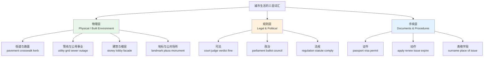
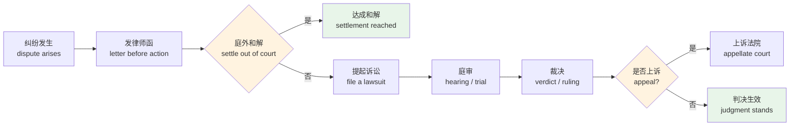
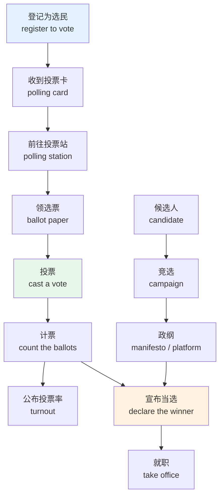
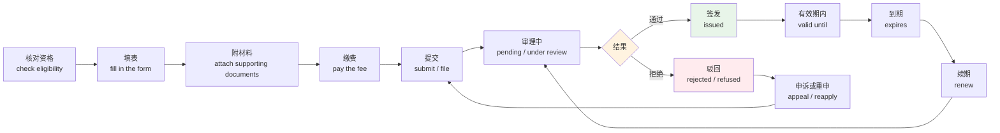
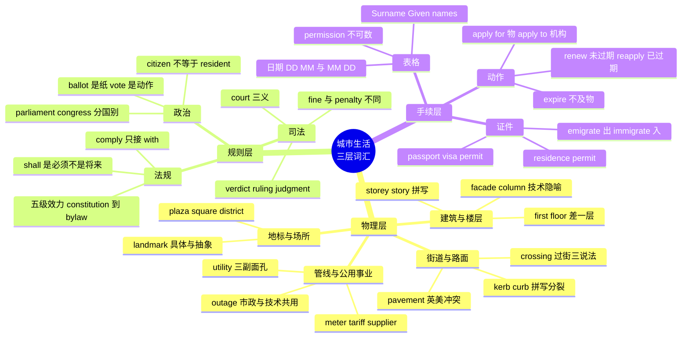

# 城市建筑、公共设施、法律政治与证件手续

> [!info] 本篇定位
>
> 第 11 章的收尾篇，也是全章里英美差异最密集的一篇。校园、求职、公司、消费四篇讲的是「你和某个机构打交道」，这一篇讲的是「你和这座城市本身打交道」。
>
> 三条主线：城市的物理层（街道、管线、建筑、地标），城市的规则层（法院、议会、选票、法规），以及连接你和这两层的手续层（护照、签证、居留许可、申请与续期）。
>
> 读完能做到三件事：看懂路牌和市政通知上的词；读懂一份租房合同或政务网页里的法律用语；独立填完一份英文签证或居留申请表，不用逐字查每个字段。

---

## 1. 本篇导读：三张地图叠在一起

一个人到了陌生的英语城市，会连续撞上三堵词汇墙。

第一堵是**路面上的**。路牌写着 `No Through Road`，人行道被围起来挂着 `Pavement Closed — Use Other Side`，路口地上画着斑马线但英国人叫它 `zebra crossing`、美国人叫它 `crosswalk`。这些词在教科书里出现率极低，在真实街道上出现率极高。

第二堵是**通知上的**。物业贴一张 `Planned Water Supply Disruption`，市政厅寄来 `Council Tax Notice`，法院寄来一张 `Summons`。这些文件用的是法律和行政语域，句子结构未必难，但词都是拉丁层的长词。

第三堵是**表格上的**。签证申请表的字段 `Surname`、`Given Names`、`Place of Issue`、`Date of Expiry`、`Purpose of Visit`——每一个填错都可能让整份申请被打回。



上图是本篇的分节结构。三层不是并列的知识块，而是有先后顺序的：物理层的词决定你能不能在城市里移动，规则层的词决定你能不能理解通知，手续层的词决定你能不能把身份合法维持下去。程序员读者如果时间有限，优先级应该倒过来——手续层最紧急，物理层最不急，因为手机地图能替你处理大部分导航。

本篇不讲交通工具（在 `09.衣食住行` 里），不讲租房与银行（在本章第 04 篇里），不讲公司内部的项目管理词（在第 19 章）。只讲城市这个公共容器本身。

---

## 2. 街道与路面：脚下这一层

### 2.1 一条街的横截面

把一条典型的城市街道从中间切开，从路中心往两边数，能数出六到八个部件。每个部件都有专名，而且英美各有一套。

| 英文 | 英式音标 | 美式音标 | 词性 | 中文 | 搭配与说明 |
| --- | --- | --- | --- | --- | --- |
| **street** | /striːt/ | /striːt/ | n. | 街道 | 两侧有建筑的城市道路，缩写 St. |
| **road** | /rəʊd/ | /roʊd/ | n. | 道路 | 泛指，城郊皆可用，缩写 Rd. |
| **avenue** | /ˈævənjuː/ | /ˈævənuː/ | n. | 大道 | 常与 street 垂直编号，缩写 Ave. |
| **boulevard** | /ˈbuːləvɑːd/ | /ˈbʊləvɑːrd/ | n. | 林荫大道 | 法语借词，缩写 Blvd. |
| **lane** | /leɪn/ | /leɪn/ | n. | 小巷；车道 | 两义并存：住址里是小巷，路上是车道 |
| **alley** | /ˈæli/ | /ˈæli/ | n. | 窄巷 | 楼与楼之间的通道，常放垃圾桶 |
| **cul-de-sac** | /ˈkʌl də sæk/ | /ˈkʌl də sæk/ | n. | 死胡同 | 法语原样借入，住宅区常见 |
| **carriageway** | /ˈkærɪdʒweɪ/ | — | n. | 行车道 | 英式专用；dual carriageway 双向分隔道 |
| **median** | /ˈmiːdiən/ | /ˈmiːdiən/ | n. | 中央隔离带 | 美式；英式说 central reservation |
| **kerb** | /kɜːb/ | — | n. | 路缘石 | 英式拼写 |
| **curb** | /kɜːb/ | /kɜːrb/ | n./v. | 路缘石；抑制 | 美式拼写；动词义「抑制」英美通用 |
| **gutter** | /ˈɡʌtə/ | /ˈɡʌtər/ | n. | 排水沟；檐沟 | 路边的浅沟，也指屋檐排水槽 |
| **verge** | /vɜːdʒ/ | /vɜːrdʒ/ | n. | 路肩草地 | 英式；也有抽象义 on the verge of |
| **pothole** | /ˈpɒthəʊl/ | /ˈpɑːthoʊl/ | n. | 路面坑洞 | 市政投诉高频词 |
| **asphalt** | /ˈæsfælt/ | /ˈæsfɔːlt/ | n. | 沥青 | 英式说 tarmac 更常见 |
| **paving stone** | /ˈpeɪvɪŋ stəʊn/ | /ˈpeɪvɪŋ stoʊn/ | n. | 铺路石板 | 人行道常见材质 |

> [!warning] pavement 是本篇最危险的一个词
>
> 同一个拼写，英美指的是完全不同的东西。
>
> - 英式 **pavement** /ˈpeɪvmənt/ = 人行道（美式叫 sidewalk）
> - 美式 **pavement** /ˈpeɪvmənt/ = 铺装路面，指车走的那层沥青或混凝土
>
> 后果很实际：英国人说 `Get on the pavement!` 是让你上人行道躲车；美国人说 `The car left the pavement` 是说车冲出了路面。
>
> - ❌ ~~Walk on the pavement~~（对美国人说，意思变成「在车道上走」）
> - ✅ Walk on the **sidewalk**.（对美国人）
> - ✅ Walk on the **pavement**.（对英国人）
>
> 安全做法：不确定对方是英式还是美式时，用 `footpath` 或直接说 `walk on the side of the road`。

### 2.2 人行部分与过街

| 英文 | 英式音标 | 美式音标 | 词性 | 中文 | 搭配与说明 |
| --- | --- | --- | --- | --- | --- |
| **pavement** | /ˈpeɪvmənt/ | /ˈpeɪvmənt/ | n. | 人行道（英）；路面（美） | 见上方 warning，英美义项冲突 |
| **sidewalk** | /ˈsaɪdwɔːk/ | /ˈsaɪdwɔːk/ | n. | 人行道 | 美式；英国人听得懂但不用 |
| **footpath** | /ˈfʊtpɑːθ/ | /ˈfʊtpæθ/ | n. | 步行道 | 中立词，公园与郊野也用 |
| **pedestrian** | /pəˈdestriən/ | /pəˈdestriən/ | n./adj. | 行人；步行的 | pedestrian zone 步行区 |
| **crosswalk** | /ˈkrɒswɔːk/ | /ˈkrɔːswɔːk/ | n. | 人行横道 | 美式常用 |
| **zebra crossing** | /ˈzebrə ˈkrɒsɪŋ/ | /ˈziːbrə ˈkrɔːsɪŋ/ | n. | 斑马线 | 英式；注意 zebra 英美元音差异极大 |
| **pelican crossing** | /ˈpelɪkən/ | — | n. | 按钮式信号灯过街 | 英式专名，按钮等绿灯 |
| **jaywalk** | /ˈdʒeɪwɔːk/ | /ˈdʒeɪwɔːk/ | v. | 乱穿马路 | 美式概念，某些州可罚款 |
| **crossing** | /ˈkrɒsɪŋ/ | /ˈkrɔːsɪŋ/ | n. | 过街处；道口 | level crossing 铁路平交道口 |
| **footbridge** | /ˈfʊtbrɪdʒ/ | /ˈfʊtbrɪdʒ/ | n. | 人行天桥 | 英美通用 |
| **underpass** | /ˈʌndəpɑːs/ | /ˈʌndərpæs/ | n. | 地下通道 | 英式也说 subway（易误解） |
| **overpass** | /ˈəʊvəpɑːs/ | /ˈoʊvərpæs/ | n. | 立交桥 | 美式；英式说 flyover |
| **flyover** | /ˈflaɪəʊvə/ | /ˈflaɪoʊvər/ | n. | 立交桥 | 英式；美式 flyover 指飞机低空飞过 |
| **ramp** | /ræmp/ | /ræmp/ | n. | 匝道；坡道 | wheelchair ramp 轮椅坡道 |
| **step** | /step/ | /step/ | n. | 台阶 | 复数 steps 指一段台阶 |
| **railing** | /ˈreɪlɪŋ/ | /ˈreɪlɪŋ/ | n. | 护栏 | 常用复数 railings |
| **bollard** | /ˈbɒləd/ | /ˈbɑːlərd/ | n. | 隔离柱 | 挡车不挡人的短柱 |
| **curb ramp** | /kɜːb ræmp/ | /kɜːrb ræmp/ | n. | 路缘坡 | 无障碍设施标准词 |

> [!example] 路面上真实见到的句子
>
> - **Pedestrians** must use the **crossing** on the opposite side.
>   - 行人请走对面的过街通道。
> - **Footpath** closed. Please follow the signed **diversion**.
>   - 步行道封闭，请按指示牌绕行。
> - Cars must give way to **pedestrians** on a **zebra crossing**.
>   - 车辆在斑马线前必须让行行人。

### 2.3 路口、信号与临时状况

| 英文 | 英式音标 | 美式音标 | 词性 | 中文 | 搭配与说明 |
| --- | --- | --- | --- | --- | --- |
| **intersection** | /ˌɪntəˈsekʃn/ | /ˌɪntərˈsekʃn/ | n. | 十字路口 | 美式常用 |
| **junction** | /ˈdʒʌŋkʃn/ | /ˈdʒʌŋkʃn/ | n. | 路口；交汇处 | 英式常用，高速出口编号也用它 |
| **roundabout** | /ˈraʊndəbaʊt/ | /ˈraʊndəbaʊt/ | n. | 环岛 | 英式；美式说 traffic circle |
| **traffic light** | /ˈtræfɪk laɪt/ | /ˈtræfɪk laɪt/ | n. | 红绿灯 | 复数 traffic lights 更常见 |
| **signal** | /ˈsɪɡnəl/ | /ˈsɪɡnəl/ | n./v. | 信号；打信号 | 美式路口信号灯的正式叫法 |
| **give way** | /ɡɪv weɪ/ | — | v. | 让行 | 英式路牌；美式写 YIELD |
| **yield** | /jiːld/ | /jiːld/ | v. | 让行 | 美式路牌用词 |
| **detour** | /ˈdiːtʊə/ | /ˈdiːtʊr/ | n./v. | 绕行 | 美式常用 |
| **diversion** | /daɪˈvɜːʃn/ | /daɪˈvɜːrʒn/ | n. | 绕行路线 | 英式常用 |
| **roadworks** | /ˈrəʊdwɜːks/ | — | n. | 道路施工 | 英式恒用复数；美式 roadwork 单数 |
| **signpost** | /ˈsaɪnpəʊst/ | /ˈsaɪnpoʊst/ | n. | 路标杆 | 也作动词「标示」 |
| **streetlight** | /ˈstriːtlaɪt/ | /ˈstriːtlaɪt/ | n. | 路灯 | 英式也说 street lamp |
| **lamp post** | /ˈlæmp pəʊst/ | /ˈlæmp poʊst/ | n. | 灯柱 | 常作方位参照物 |
| **parking meter** | /ˈpɑːkɪŋ ˈmiːtə/ | /ˈpɑːrkɪŋ ˈmiːtər/ | n. | 停车计时器 | 投币或刷卡 |
| **car park** | /kɑː pɑːk/ | — | n. | 停车场 | 英式 |
| **parking lot** | — | /ˈpɑːrkɪŋ lɑːt/ | n. | 停车场 | 美式 |
| **multi-storey** | /ˌmʌltiˈstɔːri/ | — | adj. | 多层的 | 英式 multi-storey car park |
| **garage** | /ˈɡærɑːʒ/ | /ɡəˈrɑːʒ/ | n. | 车库；修车厂 | 英美重音位置不同 |
| **fire hydrant** | /ˈhaɪdrənt/ | /ˈhaɪdrənt/ | n. | 消防栓 | 前方禁停 |
| **manhole** | /ˈmænhəʊl/ | /ˈmænhoʊl/ | n. | 检修井 | manhole cover 井盖 |

关于 `roundabout`：这个词在英式英语里还有形容词义「绕圈子的」，`in a roundabout way` 指说话拐弯抹角。路面义和抽象义共存，靠位置区分——冠词加名词位置上是环岛，`in a roundabout way` 是固定短语。

---

## 3. 市政管线与公用事业

### 3.1 utility 这个词的两副面孔

`utility` /juːˈtɪləti/ 是本节的枢纽词，它在三个场合意思不一样，中文母语者很容易混。

| 用法 | 含义 | 例子 |
| --- | --- | --- |
| **utilities**（复数，日常） | 水电燃气网络等公用事业服务 | Rent is £900 plus **utilities**. |
| **utility company**（定语） | 公用事业公司 | The **utility company** sent a final notice. |
| **utility**（IT 语境） | 实用工具程序 | A command-line **utility** for parsing logs. |

租房广告里的 `bills included` 和 `utilities included` 是一回事：房租含水电网。看到 `excluding utilities` 就要自己再加一笔预算。

| 英文 | 英式音标 | 美式音标 | 词性 | 中文 | 搭配与说明 |
| --- | --- | --- | --- | --- | --- |
| **utility** | /juːˈtɪləti/ | /juːˈtɪləti/ | n. | 公用事业；实用程序 | 复数 utilities 指水电燃气总称 |
| **infrastructure** | /ˈɪnfrəstrʌktʃə/ | /ˈɪnfrəstrʌktʃər/ | n. | 基础设施 | 不可数；IT 语境同词 |
| **municipal** | /mjuːˈnɪsɪpl/ | /mjuːˈnɪsɪpl/ | adj. | 市政的 | municipal services 市政服务 |
| **municipality** | /mjuːˌnɪsɪˈpæləti/ | /mjuːˌnɪsɪˈpæləti/ | n. | 自治市；市政当局 | 欧洲文件常见 |
| **grid** | /ɡrɪd/ | /ɡrɪd/ | n. | 电网；网格 | the national grid 国家电网 |
| **substation** | /ˈsʌbsteɪʃn/ | /ˈsʌbsteɪʃn/ | n. | 变电站 | 住宅区旁常见小建筑 |
| **transformer** | /trænsˈfɔːmə/ | /trænsˈfɔːrmər/ | n. | 变压器 | 也指变压插头 |
| **pipeline** | /ˈpaɪplaɪn/ | /ˈpaɪplaɪn/ | n. | 管道；流程 | IT 语境同词，义为「流水线」 |
| **water main** | /ˈwɔːtə meɪn/ | /ˈwɔːtər meɪn/ | n. | 供水干管 | a burst water main 爆管 |
| **mains** | /meɪnz/ | /meɪnz/ | n. | 市政管网；市电 | 英式；mains water 自来水 |
| **sewer** | /ˈsuːə/ | /ˈsuːər/ | n. | 下水道 | 与 sewing 缝纫无关，注意读音 |
| **sewage** | /ˈsuːɪdʒ/ | /ˈsuːɪdʒ/ | n. | 污水 | 不可数；sewage treatment 污水处理 |
| **drain** | /dreɪn/ | /dreɪn/ | n./v. | 下水口；排水 | The drain is blocked. 下水堵了 |
| **drainage** | /ˈdreɪnɪdʒ/ | /ˈdreɪnɪdʒ/ | n. | 排水系统 | 不可数 |
| **landfill** | /ˈlændfɪl/ | /ˈlændfɪl/ | n. | 垃圾填埋场 | 环保文本高频 |
| **recycling** | /riːˈsaɪklɪŋ/ | /riːˈsaɪklɪŋ/ | n. | 回收 | recycling bin 回收桶 |
| **bin** | /bɪn/ | /bɪn/ | n. | 垃圾桶 | 英式；bin day 收垃圾日 |
| **trash can** | — | /ˈtræʃ kæn/ | n. | 垃圾桶 | 美式；室外用 garbage can |
| **dumpster** | — | /ˈdʌmpstər/ | n. | 大型垃圾箱 | 美式，原为商标名 |
| **litter** | /ˈlɪtə/ | /ˈlɪtər/ | n./v. | 垃圾；乱扔 | No littering 禁止乱扔 |
| **street cleaning** | /striːt ˈkliːnɪŋ/ | /striːt ˈkliːnɪŋ/ | n. | 道路清扫 | 美国有清扫日禁停规则 |

### 3.2 通到家里的那一段

| 英文 | 英式音标 | 美式音标 | 词性 | 中文 | 搭配与说明 |
| --- | --- | --- | --- | --- | --- |
| **meter** | /ˈmiːtə/ | /ˈmiːtər/ | n. | 计量表 | 英式长度单位拼 metre，仪表拼 meter |
| **meter reading** | /ˈmiːtə ˈriːdɪŋ/ | /ˈmiːtər ˈriːdɪŋ/ | n. | 抄表读数 | 搬家时必做 |
| **tariff** | /ˈtærɪf/ | /ˈtærɪf/ | n. | 资费 | 英式电费套餐叫 tariff |
| **consumption** | /kənˈsʌmpʃn/ | /kənˈsʌmpʃn/ | n. | 用量 | energy consumption 能耗 |
| **supplier** | /səˈplaɪə/ | /səˈplaɪər/ | n. | 供应商 | switch supplier 换供应商 |
| **outage** | /ˈaʊtɪdʒ/ | /ˈaʊtɪdʒ/ | n. | 停供；中断 | power outage 停电，IT 同词 |
| **blackout** | /ˈblækaʊt/ | /ˈblækaʊt/ | n. | 大面积停电 | 也指昏厥、信息封锁 |
| **disruption** | /dɪsˈrʌpʃn/ | /dɪsˈrʌpʃn/ | n. | 中断 | 通知里的标准词 |
| **restore** | /rɪˈstɔː/ | /rɪˈstɔːr/ | v. | 恢复 | Service has been restored. |
| **maintenance** | /ˈmeɪntənəns/ | /ˈmeɪntənəns/ | n. | 维护 | 注意重音在第一音节 |
| **plumbing** | /ˈplʌmɪŋ/ | /ˈplʌmɪŋ/ | n. | 管道系统 | b 不发音 |
| **plumber** | /ˈplʌmə/ | /ˈplʌmər/ | n. | 水管工 | b 不发音 |
| **electrician** | /ɪˌlekˈtrɪʃn/ | /ɪˌlekˈtrɪʃn/ | n. | 电工 | 重音在 -tri- |
| **wiring** | /ˈwaɪərɪŋ/ | /ˈwaɪrɪŋ/ | n. | 布线 | 不可数 |
| **socket** | /ˈsɒkɪt/ | /ˈsɑːkɪt/ | n. | 插座 | 英式；IT 语境也指套接字 |
| **outlet** | /ˈaʊtlet/ | /ˈaʊtlet/ | n. | 插座；出口；折扣店 | 美式插座用它，三义并存 |
| **fuse** | /fjuːz/ | /fjuːz/ | n. | 保险丝 | blow a fuse 熔断 |
| **circuit breaker** | /ˈsɜːkɪt ˈbreɪkə/ | /ˈsɜːrkɪt ˈbreɪkər/ | n. | 断路器 | 微服务同名模式源出于此 |
| **boiler** | /ˈbɔɪlə/ | /ˈbɔɪlər/ | n. | 锅炉；热水炉 | 英国住宅取暖核心设备 |
| **radiator** | /ˈreɪdieɪtə/ | /ˈreɪdieɪtər/ | n. | 暖气片 | 也指汽车水箱 |
| **faucet** | — | /ˈfɔːsɪt/ | n. | 水龙头 | 美式；英式说 tap |
| **tap** | /tæp/ | /tæp/ | n./v. | 水龙头；轻拍 | 英式水龙头；tap water 自来水 |
| **broadband** | /ˈbrɔːdbænd/ | /ˈbrɔːdbænd/ | n. | 宽带 | 不可数 |
| **fibre / fiber** | /ˈfaɪbə/ | /ˈfaɪbər/ | n. | 光纤 | 英拼 fibre，美拼 fiber |

> [!warning] outage 在两个圈子里都要会
>
> `outage` 是极少数「市政词与技术词完全共用」的例子。
>
> - 城市语境：`a scheduled power outage from 9am to 3pm`（计划停电）
> - 技术语境：`the database outage lasted 40 minutes`（数据库中断）
>
> 同源的还有 `downtime`（停机时间）、`disruption`（中断）、`restore`（恢复）、`maintenance window`（维护窗口）。市政通知和 status page 用的是同一套词，读懂一边等于读懂另一边。

### 3.3 一份停水通知的解剖

> [!example] 典型市政通知的四个部分
>
> - **Planned maintenance**: we will be carrying out essential work on the **water main** in your area.
>   - 计划维护：我们将对贵区域的供水干管进行必要施工。
> - Your **water supply** may be **disrupted** between 09:00 and 16:00 on Tuesday.
>   - 周二 9 点至 16 点，供水可能中断。
> - We apologise for any **inconvenience** caused.
>   - 对由此造成的不便致歉。
> - If your supply has not been **restored** by 17:00, please call our **helpline**.
>   - 若 17 点仍未恢复供水，请拨打服务热线。

这四句话覆盖了几乎所有市政通知的骨架：`planned / emergency` 说性质，`may be disrupted` 说影响，`apologise for inconvenience` 是固定客套，`if not restored by X, call Y` 是兜底路径。认出这个结构后，同类通知都不必逐字读。

---

## 4. 建筑物：外观、结构与楼层

### 4.1 建筑类型

| 英文 | 英式音标 | 美式音标 | 词性 | 中文 | 搭配与说明 |
| --- | --- | --- | --- | --- | --- |
| **building** | /ˈbɪldɪŋ/ | /ˈbɪldɪŋ/ | n. | 建筑物 | 最泛的上位词 |
| **skyscraper** | /ˈskaɪskreɪpə/ | /ˈskaɪskreɪpər/ | n. | 摩天楼 | 一般指四十层以上 |
| **high-rise** | /ˈhaɪ raɪz/ | /ˈhaɪ raɪz/ | n./adj. | 高层楼 | a high-rise block |
| **tower block** | /ˈtaʊə blɒk/ | — | n. | 高层住宅楼 | 英式，多指公租房 |
| **apartment building** | — | /əˈpɑːrtmənt/ | n. | 公寓楼 | 美式；英式 block of flats |
| **terraced house** | /ˈterəst haʊs/ | — | n. | 联排屋 | 英式；美式 row house |
| **detached house** | /dɪˈtætʃt/ | /dɪˈtætʃt/ | n. | 独栋 | semi-detached 半独栋 |
| **bungalow** | /ˈbʌŋɡələʊ/ | /ˈbʌŋɡəloʊ/ | n. | 平房 | 单层住宅 |
| **warehouse** | /ˈweəhaʊs/ | /ˈwerhaʊs/ | n. | 仓库 | 数据仓库 data warehouse 同词 |
| **factory** | /ˈfæktri/ | /ˈfæktri/ | n. | 工厂 | 设计模式 factory 同词 |
| **premises** | /ˈpremɪsɪz/ | /ˈpremɪsɪz/ | n. | 场所；房产 | 恒用复数，合同高频 |
| **property** | /ˈprɒpəti/ | /ˈprɑːpərti/ | n. | 房产；属性 | 不动产义不可数 |
| **estate** | /ɪˈsteɪt/ | /ɪˈsteɪt/ | n. | 住宅区；地产 | housing estate 英式住宅小区 |
| **complex** | /ˈkɒmpleks/ | /ˈkɑːmpleks/ | n. | 建筑群；综合体 | 名词英美都重读首音节 |
| **complex** | /ˈkɒmpleks/ | /kəmˈpleks/ | adj. | 复杂的 | 形容词美式重音后移，英式不移 |
| **venue** | /ˈvenjuː/ | /ˈvenjuː/ | n. | 场馆；举办地 | 活动通知固定用词 |
| **facility** | /fəˈsɪləti/ | /fəˈsɪləti/ | n. | 设施 | 复数 facilities 指配套设施 |

### 4.2 楼层：英美相差一层

这是本篇第二个高危差异，比 pavement 更容易造成实际后果——按错电梯楼层。

| 楼层 | 英式说法 | 美式说法 | 电梯按钮 |
| --- | --- | --- | --- |
| 地面这一层 | **ground floor** | **first floor** | 英 G 或 0，美 1 |
| 地面上一层 | **first floor** | **second floor** | 英 1，美 2 |
| 地面上两层 | **second floor** | **third floor** | 英 2，美 3 |
| 地下一层 | **basement** 或 **lower ground** | **basement** | B 或 LG |

| 英文 | 英式音标 | 美式音标 | 词性 | 中文 | 搭配与说明 |
| --- | --- | --- | --- | --- | --- |
| **storey** | /ˈstɔːri/ | — | n. | 层 | 英式拼写，复数 storeys |
| **story** | /ˈstɔːri/ | /ˈstɔːri/ | n. | 层；故事 | 美式楼层拼写，复数 stories |
| **floor** | /flɔː/ | /flɔːr/ | n. | 楼层；地板 | on the third floor 用 on |
| **basement** | /ˈbeɪsmənt/ | /ˈbeɪsmənt/ | n. | 地下室 | 可住人的地下层 |
| **cellar** | /ˈselə/ | /ˈselər/ | n. | 地窖 | 储物用，不住人 |
| **attic** | /ˈætɪk/ | /ˈætɪk/ | n. | 阁楼 | 英式也说 loft |
| **rooftop** | /ˈruːftɒp/ | /ˈruːftɑːp/ | n. | 屋顶平台 | rooftop bar 天台酒吧 |
| **lift** | /lɪft/ | — | n. | 电梯 | 英式 |
| **elevator** | — | /ˈelɪveɪtər/ | n. | 电梯 | 美式 |
| **escalator** | /ˈeskəleɪtə/ | /ˈeskəleɪtər/ | n. | 自动扶梯 | 英美通用 |
| **staircase** | /ˈsteəkeɪs/ | /ˈsterkeɪs/ | n. | 楼梯 | stairwell 楼梯井 |
| **corridor** | /ˈkɒrɪdɔː/ | /ˈkɔːrɪdɔːr/ | n. | 走廊 | 美式也说 hallway |
| **lobby** | /ˈlɒbi/ | /ˈlɑːbi/ | n./v. | 大堂；游说 | 政治义「游说」同词，见第 7 节 |
| **foyer** | /ˈfɔɪeɪ/ | /ˈfɔɪər/ | n. | 门厅 | 法语借词，英美读法差别大 |
| **reception** | /rɪˈsepʃn/ | /rɪˈsepʃn/ | n. | 前台；接待处 | 英式楼宇前台标准词 |

> [!warning] 约人见面时的楼层陷阱
>
> - ❌ 美国同事说 `Meet me on the first floor`，你按英式理解跑到二楼。
> - ✅ 中立说法：`Meet me at street level` 或 `Meet me in the lobby`。
>
> 在跨国团队里约地点，直接说 `lobby`、`ground level`、`reception` 比说楼层数字安全。要说数字时补一句 `the one at street level`。

### 4.3 建筑的外观与构件

| 英文 | 英式音标 | 美式音标 | 词性 | 中文 | 搭配与说明 |
| --- | --- | --- | --- | --- | --- |
| **facade** | /fəˈsɑːd/ | /fəˈsɑːd/ | n. | 立面；外表 | 也有抽象义「伪装」 |
| **exterior** | /ɪkˈstɪəriə/ | /ɪkˈstɪriər/ | n./adj. | 外部 | 反义 interior |
| **entrance** | /ˈentrəns/ | /ˈentrəns/ | n. | 入口 | main entrance 正门 |
| **exit** | /ˈeksɪt/ | /ˈeksɪt/ | n./v. | 出口；退出 | emergency exit 安全出口 |
| **fire escape** | /ˈfaɪə ɪˈskeɪp/ | /ˈfaɪər ɪˈskeɪp/ | n. | 消防梯 | 楼外的铁梯 |
| **balcony** | /ˈbælkəni/ | /ˈbælkəni/ | n. | 阳台 | 剧院二层也叫 balcony |
| **terrace** | /ˈterəs/ | /ˈterəs/ | n. | 露台 | 英式还指联排屋 |
| **courtyard** | /ˈkɔːtjɑːd/ | /ˈkɔːrtjɑːrd/ | n. | 庭院 | 建筑围合的空地 |
| **column** | /ˈkɒləm/ | /ˈkɑːləm/ | n. | 柱；列 | n 不发音；数据库同词 |
| **pillar** | /ˈpɪlə/ | /ˈpɪlər/ | n. | 支柱 | 抽象义「支柱」常用 |
| **beam** | /biːm/ | /biːm/ | n. | 梁；光束 | 承重构件 |
| **arch** | /ɑːtʃ/ | /ɑːrtʃ/ | n. | 拱 | archway 拱门通道 |
| **dome** | /dəʊm/ | /doʊm/ | n. | 穹顶 | 议会与教堂常见 |
| **spire** | /ˈspaɪə/ | /ˈspaɪər/ | n. | 尖塔 | 教堂顶部的尖顶 |
| **foundation** | /faʊnˈdeɪʃn/ | /faʊnˈdeɪʃn/ | n. | 地基；基金会 | 两义并存 |
| **scaffolding** | /ˈskæfəldɪŋ/ | /ˈskæfəldɪŋ/ | n. | 脚手架 | 不可数；代码脚手架同词 |
| **crane** | /kreɪn/ | /kreɪn/ | n. | 起重机；鹤 | 同形异义 |
| **construction site** | /kənˈstrʌkʃn/ | /kənˈstrʌkʃn/ | n. | 工地 | 英式也说 building site |
| **demolish** | /dɪˈmɒlɪʃ/ | /dɪˈmɑːlɪʃ/ | v. | 拆除 | 名词 demolition |
| **renovate** | /ˈrenəveɪt/ | /ˈrenəveɪt/ | v. | 翻新 | 名词 renovation |
| **refurbish** | /ˌriːˈfɜːbɪʃ/ | /ˌriːˈfɜːrbɪʃ/ | v. | 整修 | 英式常见，也指翻新机 |
| **architect** | /ˈɑːkɪtekt/ | /ˈɑːrkɪtekt/ | n. | 建筑师 | ch 读 /k/；IT 架构师同词 |
| **architecture** | /ˈɑːkɪtektʃə/ | /ˈɑːrkɪtektʃər/ | n. | 建筑学；架构 | 系统架构同词 |
| **listed building** | /ˈlɪstɪd/ | — | n. | 受保护历史建筑 | 英式法律概念，不得随意改建 |

`architect`、`architecture`、`scaffolding`、`pipeline`、`facade`、`column` 这六个词在软件领域全部保留了原义的隐喻。`facade` 甚至是一个设计模式名——它就是「立面」，遮住背后复杂的结构只露一个入口。读技术文档时把它们的建筑本义想一遍，比死记模式定义更牢。

---

## 5. 城市地标与公共场所

### 5.1 landmark 的两个层次

`landmark` /ˈlændmɑːk/ · /ˈlændmɑːrk/ 字面是「地标」，但它在实际使用中分两层：

- **具体地标**：一个用来辨认方位的显眼建筑或物体。`Use the clock tower as a landmark.`
- **里程碑事件**：具有转折意义的事件或裁决。`a landmark ruling`（里程碑式判决）、`a landmark study`（开创性研究）。

第二层在新闻和法律文本里出现频率比第一层高。看到 `landmark` 修饰的是 `case`、`decision`、`agreement`、`legislation`，一律理解成「具有里程碑意义的」，与地理无关。

| 英文 | 英式音标 | 美式音标 | 词性 | 中文 | 搭配与说明 |
| --- | --- | --- | --- | --- | --- |
| **landmark** | /ˈlændmɑːk/ | /ˈlændmɑːrk/ | n./adj. | 地标；里程碑式的 | landmark ruling 具转折意义的判决 |
| **monument** | /ˈmɒnjumənt/ | /ˈmɑːnjumənt/ | n. | 纪念碑 | 也指受保护古迹 |
| **memorial** | /məˈmɔːriəl/ | /məˈmɔːriəl/ | n./adj. | 纪念物；纪念的 | war memorial 战争纪念碑 |
| **statue** | /ˈstætʃuː/ | /ˈstætʃuː/ | n. | 雕像 | 与 status 拼写相近，别混 |
| **fountain** | /ˈfaʊntən/ | /ˈfaʊntn/ | n. | 喷泉 | drinking fountain 饮水器 |
| **plaza** | /ˈplɑːzə/ | /ˈplɑːzə/ | n. | 广场 | 西班牙语借词，商业区常用 |
| **square** | /skweə/ | /skwer/ | n. | 广场；正方形 | 城市广场地名多用 Square |
| **park** | /pɑːk/ | /pɑːrk/ | n./v. | 公园；停车 | 两义高频并存 |
| **playground** | /ˈpleɪɡraʊnd/ | /ˈpleɪɡraʊnd/ | n. | 儿童游乐场 | 学校操场也用它 |
| **cemetery** | /ˈsemətri/ | /ˈseməteri/ | n. | 墓地 | 英美元音结尾差异明显 |
| **skyline** | /ˈskaɪlaɪn/ | /ˈskaɪlaɪn/ | n. | 城市天际线 | 描述城市风貌的高频词 |
| **district** | /ˈdɪstrɪkt/ | /ˈdɪstrɪkt/ | n. | 区 | business district 商业区 |
| **neighbourhood** | /ˈneɪbəhʊd/ | /ˈneɪbərhʊd/ | n. | 街区；社区 | 美拼 neighborhood |
| **suburb** | /ˈsʌbɜːb/ | /ˈsʌbɜːrb/ | n. | 郊区 | 形容词 suburban 重音后移 |
| **downtown** | /ˌdaʊnˈtaʊn/ | /ˌdaʊnˈtaʊn/ | n./adv. | 市中心 | 美式；英式说 city centre |
| **outskirts** | /ˈaʊtskɜːts/ | /ˈaʊtskɜːrts/ | n. | 城郊 | 恒用复数，on the outskirts |

### 5.2 公共机构与场馆

| 英文 | 英式音标 | 美式音标 | 词性 | 中文 | 搭配与说明 |
| --- | --- | --- | --- | --- | --- |
| **town hall** | /taʊn hɔːl/ | /taʊn hɔːl/ | n. | 市政厅 | 英式；也指市民大会 |
| **city hall** | /ˈsɪti hɔːl/ | /ˈsɪti hɔːl/ | n. | 市政厅 | 美式 |
| **civic centre** | /ˈsɪvɪk ˈsentə/ | /ˈsɪvɪk ˈsentər/ | n. | 市民中心 | 美拼 civic center |
| **library** | /ˈlaɪbrəri/ | /ˈlaɪbreri/ | n. | 图书馆 | 代码库同词 |
| **museum** | /mjuˈziːəm/ | /mjuˈziːəm/ | n. | 博物馆 | 重音在第二音节 |
| **gallery** | /ˈɡæləri/ | /ˈɡæləri/ | n. | 美术馆；画廊 | art gallery |
| **cathedral** | /kəˈθiːdrəl/ | /kəˈθiːdrəl/ | n. | 主教座堂 | 比 church 规格高 |
| **stadium** | /ˈsteɪdiəm/ | /ˈsteɪdiəm/ | n. | 体育场 | 复数 stadiums 或 stadia |
| **arena** | /əˈriːnə/ | /əˈriːnə/ | n. | 室内场馆 | 演唱会常用 |
| **post office** | /ˈpəʊst ˈɒfɪs/ | /ˈpoʊst ˈɔːfɪs/ | n. | 邮局 | 英国邮局兼办护照初审 |
| **police station** | /pəˈliːs/ | /pəˈliːs/ | n. | 警察局 | 重音在第二音节 |
| **fire station** | /ˈfaɪə/ | /ˈfaɪər/ | n. | 消防站 | 英式也说 fire brigade 指队伍 |
| **clinic** | /ˈklɪnɪk/ | /ˈklɪnɪk/ | n. | 诊所 | 英国基层医疗叫 GP surgery |
| **pharmacy** | /ˈfɑːməsi/ | /ˈfɑːrməsi/ | n. | 药房 | 英式也说 chemist's |
| **crèche** | /kreʃ/ | /kreʃ/ | n. | 托儿所 | 英式，法语借词 |
| **kindergarten** | /ˈkɪndəɡɑːtn/ | /ˈkɪndərɡɑːrtn/ | n. | 幼儿园 | 德语借词，美式指学前一年 |

> [!tip] 地址里的固定缩写
>
> 填表和寄件时会大量出现缩写，认不出会填错格。
>
> ```text
> St.   = Street        Rd.  = Road         Ave. = Avenue
> Blvd. = Boulevard     Ln.  = Lane         Dr.  = Drive
> Sq.   = Square        Ct.  = Court        Pl.  = Place
> Apt.  = Apartment     Fl.  = Floor        Ste. = Suite
> ```
>
> 注意 `Ct.` 在地址里是 Court（一种小路名），不是法院；`Dr.` 在地址里是 Drive，不是 Doctor。位置决定含义：出现在街道名后面就是路名。

---

## 6. 法律与司法：普通居民会碰到的那一层

### 6.1 court 的三个义项

`court` /kɔːt/ · /kɔːrt/ 是法语层的核心词，三个义项同源，都来自古法语 `cort`「围起来的院子」——王室在院子里议事，于是有了宫廷义；在院子里断案，于是有了法院义；用界线围出场地打球，于是有了球场义。

| 义项 | 含义 | 例子 |
| --- | --- | --- |
| 法院 | 审判机构 | take someone to **court** 起诉某人 |
| 球场 | 有边界的场地 | a tennis **court** 网球场 |
| 宫廷 | 王室 | the royal **court** 王室 |

法律语境里几乎只用第一义。`in court`（在庭上）、`out of court`（庭外）、`court order`（法院命令）、`court hearing`（庭审）是四个必须成块记的搭配。

| 英文 | 英式音标 | 美式音标 | 词性 | 中文 | 搭配与说明 |
| --- | --- | --- | --- | --- | --- |
| **court** | /kɔːt/ | /kɔːrt/ | n. | 法院；球场；宫廷 | court order 法院命令 |
| **courtroom** | /ˈkɔːtruːm/ | /ˈkɔːrtruːm/ | n. | 法庭 | 具体那个房间 |
| **judge** | /dʒʌdʒ/ | /dʒʌdʒ/ | n./v. | 法官；判断 | 称呼语 Your Honour |
| **magistrate** | /ˈmædʒɪstreɪt/ | /ˈmædʒɪstreɪt/ | n. | 治安法官 | 英式基层法院主审 |
| **jury** | /ˈdʒʊəri/ | /ˈdʒʊri/ | n. | 陪审团 | 集合名词，英式可接复数谓语 |
| **juror** | /ˈdʒʊərə/ | /ˈdʒʊrər/ | n. | 陪审员 | jury duty 陪审义务 |
| **lawyer** | /ˈlɔɪə/ | /ˈlɔːjər/ | n. | 律师 | 最通用的词 |
| **attorney** | /əˈtɜːni/ | /əˈtɜːrni/ | n. | 律师；代理人 | 美式；power of attorney 授权书 |
| **solicitor** | /səˈlɪsɪtə/ | /səˈlɪsɪtər/ | n. | 事务律师 | 英式，处理文书与咨询 |
| **barrister** | /ˈbærɪstə/ | /ˈbærɪstər/ | n. | 出庭律师 | 英式，负责法庭辩论 |
| **prosecutor** | /ˈprɒsɪkjuːtə/ | /ˈprɑːsɪkjuːtər/ | n. | 检察官 | 动词 prosecute 起诉 |
| **defendant** | /dɪˈfendənt/ | /dɪˈfendənt/ | n. | 被告 | 民刑事均可用 |
| **plaintiff** | /ˈpleɪntɪf/ | /ˈpleɪntɪf/ | n. | 原告 | 英式民事现多用 claimant |
| **witness** | /ˈwɪtnəs/ | /ˈwɪtnəs/ | n./v. | 证人；目击 | eyewitness 目击者 |
| **testimony** | /ˈtestɪməni/ | /ˈtestɪmoʊni/ | n. | 证词 | 不可数 |
| **evidence** | /ˈevɪdəns/ | /ˈevɪdəns/ | n. | 证据 | 不可数，量词用 a piece of |
| **trial** | /ˈtraɪəl/ | /ˈtraɪəl/ | n. | 审判；试验 | 临床试验、试用期同词 |
| **hearing** | /ˈhɪərɪŋ/ | /ˈhɪrɪŋ/ | n. | 听证；庭审 | 比 trial 轻量 |
| **verdict** | /ˈvɜːdɪkt/ | /ˈvɜːrdɪkt/ | n. | 裁决 | 陪审团给出的有罪无罪结论 |
| **ruling** | /ˈruːlɪŋ/ | /ˈruːlɪŋ/ | n. | 裁定 | 法官给出的法律判断 |
| **sentence** | /ˈsentəns/ | /ˈsentəns/ | n./v. | 刑期；判刑；句子 | 三义并存，靠语境分 |
| **appeal** | /əˈpiːl/ | /əˈpiːl/ | n./v. | 上诉；吸引力 | appeal against a ruling |

### 6.2 从纠纷到判决



上图给出的是英美普通法体系下民事纠纷的标准路径，也是新闻报道里出现频率最高的一条链。两个菱形节点是分叉点：`settle out of court` 意味着不进法院、双方自行了结，这是绝大多数商业纠纷的实际终点；`appeal` 决定案子是否进入上一级法院。中间的 `file a lawsuit`（提起诉讼）里 `file` 是这一整套流程的通用动词，后面第 10 节讲手续时还会遇到它。

| 英文 | 英式音标 | 美式音标 | 词性 | 中文 | 搭配与说明 |
| --- | --- | --- | --- | --- | --- |
| **lawsuit** | /ˈlɔːsuːt/ | /ˈlɔːsuːt/ | n. | 诉讼 | file a lawsuit 提起诉讼 |
| **sue** | /suː/ | /suː/ | v. | 起诉 | sue someone for damages |
| **settle** | /ˈsetl/ | /ˈsetl/ | v. | 和解；结算；定居 | 三义并存，法律义最常见 |
| **settlement** | /ˈsetlmənt/ | /ˈsetlmənt/ | n. | 和解协议；结算 | out-of-court settlement |
| **dispute** | /dɪˈspjuːt/ | /dɪˈspjuːt/ | n./v. | 纠纷；争辩 | dispute resolution 争议解决 |
| **claim** | /kleɪm/ | /kleɪm/ | n./v. | 索赔；主张 | make a claim 提出索赔 |
| **damages** | /ˈdæmɪdʒɪz/ | /ˈdæmɪdʒɪz/ | n. | 损害赔偿金 | 恒用复数，与 damage 不同 |
| **compensation** | /ˌkɒmpenˈseɪʃn/ | /ˌkɑːmpenˈseɪʃn/ | n. | 赔偿 | 不可数 |
| **liable** | /ˈlaɪəbl/ | /ˈlaɪəbl/ | adj. | 负有责任的 | be liable for damages |
| **liability** | /ˌlaɪəˈbɪləti/ | /ˌlaɪəˈbɪləti/ | n. | 责任；负债 | limited liability 有限责任 |
| **negligence** | /ˈneɡlɪdʒəns/ | /ˈneɡlɪdʒəns/ | n. | 过失 | 侵权法核心概念 |
| **breach** | /briːtʃ/ | /briːtʃ/ | n./v. | 违约；破坏 | breach of contract；数据泄露同词 |
| **judgment** | /ˈdʒʌdʒmənt/ | /ˈdʒʌdʒmənt/ | n. | 判决 | 法律义英美均省 e |
| **injunction** | /ɪnˈdʒʌŋkʃn/ | /ɪnˈdʒʌŋkʃn/ | n. | 禁令 | 法院命令停止某行为 |

### 6.3 违法、处罚与执法

| 英文 | 英式音标 | 美式音标 | 词性 | 中文 | 搭配与说明 |
| --- | --- | --- | --- | --- | --- |
| **crime** | /kraɪm/ | /kraɪm/ | n. | 犯罪 | commit a crime |
| **offence** | /əˈfens/ | — | n. | 违法行为 | 英式拼写 |
| **offense** | — | /əˈfens/ | n. | 违法行为 | 美式拼写 |
| **felony** | — | /ˈfeləni/ | n. | 重罪 | 美式法律分类 |
| **misdemeanour** | /ˌmɪsdɪˈmiːnə/ | /ˌmɪsdɪˈmiːnər/ | n. | 轻罪 | 美拼 misdemeanor |
| **fine** | /faɪn/ | /faɪn/ | n./v. | 罚款；罚 | be fined £100 被罚一百镑 |
| **penalty** | /ˈpenəlti/ | /ˈpenəlti/ | n. | 处罚；罚金 | late penalty 逾期罚金 |
| **ticket** | /ˈtɪkɪt/ | /ˈtɪkɪt/ | n. | 罚单；票 | a parking ticket 违停罚单 |
| **guilty** | /ˈɡɪlti/ | /ˈɡɪlti/ | adj. | 有罪的；内疚的 | plead guilty 认罪 |
| **innocent** | /ˈɪnəsnt/ | /ˈɪnəsnt/ | adj. | 无罪的 | 法律用 not guilty 更准 |
| **acquit** | /əˈkwɪt/ | /əˈkwɪt/ | v. | 宣告无罪 | 名词 acquittal |
| **convict** | /kənˈvɪkt/ | /kənˈvɪkt/ | v. | 定罪 | 名词 /ˈkɒnvɪkt/ 指囚犯 |
| **bail** | /beɪl/ | /beɪl/ | n./v. | 保释 | on bail 保释期间 |
| **warrant** | /ˈwɒrənt/ | /ˈwɔːrənt/ | n./v. | 令状；使有必要 | search warrant 搜查令 |
| **summons** | /ˈsʌmənz/ | /ˈsʌmənz/ | n. | 传票 | 单数就带 s，复数 summonses |
| **subpoena** | /səˈpiːnə/ | /səˈpiːnə/ | n./v. | 传唤令 | 拉丁语借词，b 不发音 |
| **enforce** | /ɪnˈfɔːs/ | /ɪnˈfɔːrs/ | v. | 执行；强制 | law enforcement 执法部门 |
| **jurisdiction** | /ˌdʒʊərɪsˈdɪkʃn/ | /ˌdʒʊrɪsˈdɪkʃn/ | n. | 管辖权 | 合同条款高频 |
| **notary** | /ˈnəʊtəri/ | /ˈnoʊtəri/ | n. | 公证人 | notary public 公证员 |
| **notarize** | /ˈnəʊtəraɪz/ | /ˈnoʊtəraɪz/ | v. | 公证 | 英式也拼 notarise |
| **affidavit** | /ˌæfəˈdeɪvɪt/ | /ˌæfəˈdeɪvɪt/ | n. | 宣誓书 | 移民材料常见 |

> [!warning] fine 与 penalty 不是同义词
>
> - **fine** 是具体的一笔罚款金额，可数。`a £60 fine`、`pay the fine`。
> - **penalty** 是处罚这件事本身，涵盖罚款、加收、扣分、吊销。`the penalty for late filing`。
>
> 所以「逾期会有罚款」有两种说法，指向不同：
>
> - ✅ There is a **fine** of £50 for late payment.（明确是五十镑）
> - ✅ There is a **penalty** for late payment.（有处罚，形式未必是钱）
>
> 另外 `fine` 作形容词是「好的」，作名词是「罚款」，同形不同义。看到 `Fine: £100` 别理解成「好：一百镑」。

---

## 7. 政治与政府：议会、选票与层级

### 7.1 立法机构的名称是分国别的

中文都叫「议会」，英文按国家分。这一组词填表用不上，但读新闻、看政务网站每天都会遇到。

| 英文 | 英式音标 | 美式音标 | 词性 | 中文 | 搭配与说明 |
| --- | --- | --- | --- | --- | --- |
| **parliament** | /ˈpɑːləmənt/ | /ˈpɑːrləmənt/ | n. | 议会 | 英国及英联邦；a 不发音 |
| **congress** | /ˈkɒŋɡres/ | /ˈkɑːŋɡrəs/ | n. | 国会 | 美国；也指学术大会 |
| **senate** | /ˈsenət/ | /ˈsenət/ | n. | 参议院 | 美国上院 |
| **senator** | /ˈsenətə/ | /ˈsenətər/ | n. | 参议员 | 缩写 Sen. |
| **House of Commons** | /ˈkɒmənz/ | /ˈkɑːmənz/ | n. | 下议院 | 英国民选院 |
| **House of Lords** | /lɔːdz/ | /lɔːrdz/ | n. | 上议院 | 英国非民选院 |
| **MP** | /ˌem ˈpiː/ | /ˌem ˈpiː/ | n. | 下议院议员 | Member of Parliament 缩写 |
| **constituency** | /kənˈstɪtjuənsi/ | /kənˈstɪtʃuənsi/ | n. | 选区 | 英式；美式说 district |
| **legislature** | /ˈledʒɪslətʃə/ | /ˈledʒɪsleɪtʃər/ | n. | 立法机构 | 泛指，通用于各国 |
| **legislation** | /ˌledʒɪsˈleɪʃn/ | /ˌledʒɪsˈleɪʃn/ | n. | 立法；法律总称 | 不可数 |
| **cabinet** | /ˈkæbɪnət/ | /ˈkæbɪnət/ | n. | 内阁；橱柜 | 两义并存 |
| **minister** | /ˈmɪnɪstə/ | /ˈmɪnɪstər/ | n. | 部长；牧师 | 英式政府用；美式用 secretary |
| **ministry** | /ˈmɪnɪstri/ | /ˈmɪnɪstri/ | n. | 部 | 美国政府用 department |
| **agency** | /ˈeɪdʒənsi/ | /ˈeɪdʒənsi/ | n. | 局；机构 | 美式行政机构常用 |
| **bureau** | /ˈbjʊərəʊ/ | /ˈbjʊroʊ/ | n. | 局 | 复数 bureaus 或 bureaux |
| **civil servant** | /ˈsɪvl ˈsɜːvənt/ | /ˈsɪvl ˈsɜːrvənt/ | n. | 公务员 | civil service 公务员体系 |

### 7.2 从选民到当选：一条完整的链



上图左边一列是选民视角，右边一列是候选人视角，两条线在「宣布当选」处汇合。对居民来说要记的是左列：`register to vote` 是入口动作，没登记就不能投；`polling station` 是投票的物理场所；`ballot` 是选票这张纸，`vote` 是投票这个动作。中文都叫「投票」，英文这两个词不能互换——`cast a ballot` 和 `cast a vote` 都对，但 `a ballot` 能拿在手上，`a vote` 不能。

| 英文 | 英式音标 | 美式音标 | 词性 | 中文 | 搭配与说明 |
| --- | --- | --- | --- | --- | --- |
| **ballot** | /ˈbælət/ | /ˈbælət/ | n./v. | 选票；投票表决 | ballot paper 选票纸 |
| **vote** | /vəʊt/ | /voʊt/ | n./v. | 投票；选票 | vote for / against |
| **voter** | /ˈvəʊtə/ | /ˈvoʊtər/ | n. | 选民 | voter turnout 投票率 |
| **poll** | /pəʊl/ | /poʊl/ | n./v. | 投票；民调 | the polls 投票站；opinion poll 民调 |
| **polling station** | /ˈpəʊlɪŋ/ | /ˈpoʊlɪŋ/ | n. | 投票站 | 美式也说 polling place |
| **election** | /ɪˈlekʃn/ | /ɪˈlekʃn/ | n. | 选举 | general election 大选 |
| **elect** | /ɪˈlekt/ | /ɪˈlekt/ | v. | 选举 | president-elect 里 elect 是后置形容词「已当选未就职的」 |
| **candidate** | /ˈkændɪdət/ | /ˈkændɪdeɪt/ | n. | 候选人 | 求职语境同词 |
| **campaign** | /kæmˈpeɪn/ | /kæmˈpeɪn/ | n./v. | 竞选；活动 | 市场营销同词 |
| **manifesto** | /ˌmænɪˈfestəʊ/ | /ˌmænɪˈfestoʊ/ | n. | 竞选纲领 | 英式；美式说 platform |
| **referendum** | /ˌrefəˈrendəm/ | /ˌrefəˈrendəm/ | n. | 公投 | 复数 referendums 或 referenda |
| **turnout** | /ˈtɜːnaʊt/ | /ˈtɜːrnaʊt/ | n. | 投票率；出席人数 | 活动出席也用它 |
| **majority** | /məˈdʒɒrəti/ | /məˈdʒɔːrəti/ | n. | 多数 | a narrow majority 微弱多数 |
| **minority** | /maɪˈnɒrəti/ | /maɪˈnɔːrəti/ | n. | 少数；少数族裔 | 两义并存 |
| **coalition** | /ˌkəʊəˈlɪʃn/ | /ˌkoʊəˈlɪʃn/ | n. | 联合政府 | coalition government |
| **lobby** | /ˈlɒbi/ | /ˈlɑːbi/ | v./n. | 游说；大堂 | 源自在议会大堂拦人游说 |
| **petition** | /pəˈtɪʃn/ | /pəˈtɪʃn/ | n./v. | 请愿；请愿书 | sign a petition |
| **protest** | /ˈprəʊtest/ | /ˈproʊtest/ | n. | 抗议 | 动词重音后移 /prəˈtest/ |
| **rally** | /ˈræli/ | /ˈræli/ | n./v. | 集会；反弹 | 股市反弹也用它 |

### 7.3 地方政府：跟居民最近的一层

大部分办事场景其实不涉及国家层级，而是地方政府。英美的地方层级名称差别很大。

| 英文 | 英式音标 | 美式音标 | 词性 | 中文 | 搭配与说明 |
| --- | --- | --- | --- | --- | --- |
| **council** | /ˈkaʊnsl/ | /ˈkaʊnsl/ | n. | 议事会；市政府 | 英式地方政府就叫 the council |
| **councillor** | /ˈkaʊnsələ/ | /ˈkaʊnsələr/ | n. | 议员 | 美拼 councilor |
| **council tax** | /ˈkaʊnsl tæks/ | — | n. | 市政税 | 英国按房产等级征收 |
| **mayor** | /meə/ | /ˈmeɪər/ | n. | 市长 | 英美读音差异大 |
| **governor** | /ˈɡʌvənə/ | /ˈɡʌvərnər/ | n. | 州长 | 美国州级首长 |
| **county** | /ˈkaʊnti/ | /ˈkaʊnti/ | n. | 郡；县 | 英美都有，规模不同 |
| **borough** | /ˈbʌrə/ | /ˈbɜːroʊ/ | n. | 自治市区 | 伦敦与纽约的区级单位 |
| **ward** | /wɔːd/ | /wɔːrd/ | n. | 选区；病房 | 两义并存 |
| **precinct** | /ˈpriːsɪŋkt/ | /ˈpriːsɪŋkt/ | n. | 辖区 | 美式警区与选区 |
| **civic** | /ˈsɪvɪk/ | /ˈsɪvɪk/ | adj. | 市民的；公民的 | civic duty 公民义务 |
| **citizen** | /ˈsɪtɪzn/ | /ˈsɪtɪzn/ | n. | 公民 | 法律身份，不等于居民 |
| **citizenship** | /ˈsɪtɪznʃɪp/ | /ˈsɪtɪznʃɪp/ | n. | 公民身份；国籍 | 入籍后取得 |
| **resident** | /ˈrezɪdənt/ | /ˈrezɪdənt/ | n./adj. | 居民；常住的 | 不等于公民 |
| **residency** | /ˈrezɪdənsi/ | /ˈrezɪdənsi/ | n. | 居留资格 | permanent residency 永居 |
| **taxpayer** | /ˈtækspeɪə/ | /ˈtækspeɪər/ | n. | 纳税人 | 政治话语高频 |
| **census** | /ˈsensəs/ | /ˈsensəs/ | n. | 人口普查 | 十年一次，居民有填报义务 |

> [!warning] citizen 与 resident 在表格上不能混填
>
> 中文「居民」在英文里对应两个法律地位完全不同的词。
>
> - **citizen** = 公民，持有该国国籍，有选举权，护照由该国签发。
> - **resident** = 居民，合法居住在该国，可能是外国国籍，通常无选举权。
>
> 表格上问 `Are you a citizen of this country?` 时，持工作签证或居留许可的人答 **No**；问 `Are you a resident?` 时答 **Yes**。答反了属于虚假陈述，后果比空着不填严重得多。
>
> 派生关系也要分清：`citizenship` 是国籍，`residency` 是居留资格，`residence` 是「居住」这件事或住所本身。

---

## 8. 法规、条例与合规

### 8.1 一份「规则」有五个级别

中文一个「规定」，英文按效力和来源分成五个层级。搞清层级才能判断一份文件的约束力有多强。

| 层级 | 英文 | 英式音标 | 美式音标 | 中文 | 谁制定 |
| --- | --- | --- | --- | --- | --- |
| 宪法 | **constitution** | /ˌkɒnstɪˈtjuːʃn/ | /ˌkɑːnstəˈtuːʃn/ | 宪法 | 制宪程序 |
| 法案 | **bill** | /bɪl/ | /bɪl/ | 尚未通过的法案 | 议会审议中 |
| 法律 | **act** | /ækt/ | /ækt/ | 已通过的法律 | 议会通过并生效 |
| 法规 | **regulation** | /ˌreɡjuˈleɪʃn/ | /ˌreɡjuˈleɪʃn/ | 法规、条例 | 行政机构依法制定 |
| 地方条例 | **bylaw** | /ˈbaɪlɔː/ | /ˈbaɪlɔː/ | 地方性规章 | 地方议会或组织 |

`bill` 变成 `act` 的那一刻叫 `pass`（通过）或 `enact`（颁行）。新闻里说 `the bill was passed`，指法案通过成为法律；说 `under the Act`，指依据某部已生效的法律。大写的 `Act` 后面通常跟年份：`the Data Protection Act 2018`。

| 英文 | 英式音标 | 美式音标 | 词性 | 中文 | 搭配与说明 |
| --- | --- | --- | --- | --- | --- |
| **regulation** | /ˌreɡjuˈleɪʃn/ | /ˌreɡjuˈleɪʃn/ | n. | 法规；管制 | 复数指具体条款，单数指管制行为 |
| **regulate** | /ˈreɡjuleɪt/ | /ˈreɡjuleɪt/ | v. | 监管；调节 | 也指调节温度、流量 |
| **regulator** | /ˈreɡjuleɪtə/ | /ˈreɡjuleɪtər/ | n. | 监管机构 | 金融、通信行业高频 |
| **statute** | /ˈstætʃuːt/ | /ˈstætʃuːt/ | n. | 成文法 | statutory 形容词形式 |
| **statutory** | /ˈstætʃətri/ | /ˈstætʃətɔːri/ | adj. | 法定的 | statutory holiday 法定假日 |
| **ordinance** | /ˈɔːdɪnəns/ | /ˈɔːrdɪnəns/ | n. | 市政条例 | 美式地方立法 |
| **provision** | /prəˈvɪʒn/ | /prəˈvɪʒn/ | n. | 条款；供给 | 合同条款义高频 |
| **clause** | /klɔːz/ | /klɔːz/ | n. | 条款；从句 | 法律与语法同词 |
| **amendment** | /əˈmendmənt/ | /əˈmendmənt/ | n. | 修正案 | 动词 amend |
| **repeal** | /rɪˈpiːl/ | /rɪˈpiːl/ | v./n. | 废除 | 废除已生效的法律 |
| **comply** | /kəmˈplaɪ/ | /kəmˈplaɪ/ | v. | 遵守 | 固定接 with |
| **compliance** | /kəmˈplaɪəns/ | /kəmˈplaɪəns/ | n. | 合规 | in compliance with |
| **obligation** | /ˌɒblɪˈɡeɪʃn/ | /ˌɑːblɪˈɡeɪʃn/ | n. | 义务 | legal obligation |
| **entitlement** | /ɪnˈtaɪtlmənt/ | /ɪnˈtaɪtlmənt/ | n. | 应得的权利 | be entitled to 有权享有 |
| **exempt** | /ɪɡˈzempt/ | /ɪɡˈzempt/ | adj./v. | 豁免的；免除 | tax-exempt 免税 |
| **prohibit** | /prəˈhɪbɪt/ | /prəˈhɪbɪt/ | v. | 禁止 | 比 forbid 正式 |
| **restrict** | /rɪˈstrɪkt/ | /rɪˈstrɪkt/ | v. | 限制 | restriction 名词 |
| **mandatory** | /ˈmændətri/ | /ˈmændətɔːri/ | adj. | 强制的 | 表格上标 mandatory 即必填 |
| **optional** | /ˈɒpʃənl/ | /ˈɑːpʃənl/ | adj. | 可选的 | 表格上标 optional 可留空 |

> [!tip] comply 的介词是唯一考点
>
> `comply` 只能接 `with`，不能接 `to`。这是中文母语者出错率最高的一处，因为中文「遵守规定」里没有介词提示。
>
> - ❌ ~~All staff must comply to the new policy.~~
> - ✅ All staff must **comply with** the new policy.
>
> 名词形式同理：`in compliance with the regulation`。形容词 `compliant` 也接 with：`GDPR-compliant`（符合 GDPR 的）。这个组合在技术文档里出现得比法律文档还频繁。

### 8.2 合规语域里的情态动词

法律和法规文本用一套固定的情态动词表达强制程度，读规范文档（包括 RFC 这类技术规范）时是同一套。

| 英文 | 强制程度 | 中文 | 例句 |
| --- | --- | --- | --- |
| **shall** | 强制义务 | 应当 | The tenant **shall** pay the deposit in advance. |
| **must** | 强制义务 | 必须 | Applicants **must** provide proof of address. |
| **shall not** | 强制禁止 | 不得 | The tenant **shall not** sublet the premises. |
| **may** | 授权许可 | 可以 | The landlord **may** enter with 24 hours' notice. |
| **should** | 建议 | 宜；应 | Documents **should** be submitted in PDF format. |
| **is entitled to** | 权利 | 有权 | You **are entitled to** one free copy. |

`shall` 在日常英语里几乎消失了，但在合同、法规、技术规范里活得很好，永远是「应当、必须」的意思，不是将来时。看到租房合同里的 `The Tenant shall...`，读成「承租人必须……」。

---

## 9. 证件与身份文件

### 9.1 核心证件清单

| 英文 | 英式音标 | 美式音标 | 词性 | 中文 | 搭配与说明 |
| --- | --- | --- | --- | --- | --- |
| **passport** | /ˈpɑːspɔːt/ | /ˈpæspɔːrt/ | n. | 护照 | 英美第一音节元音不同 |
| **visa** | /ˈviːzə/ | /ˈviːzə/ | n. | 签证 | apply for a visa |
| **permit** | /ˈpɜːmɪt/ | /ˈpɜːrmɪt/ | n. | 许可证 | 名词重音在前 |
| **permit** | /pəˈmɪt/ | /pərˈmɪt/ | v. | 允许 | 动词重音在后 |
| **residence permit** | /ˈrezɪdəns/ | /ˈrezɪdəns/ | n. | 居留许可 | 欧洲通用称呼 |
| **work permit** | /wɜːk ˈpɜːmɪt/ | /wɜːrk ˈpɜːrmɪt/ | n. | 工作许可 | 与工作签证不完全等同 |
| **ID card** | /ˌaɪ ˈdiː kɑːd/ | /ˌaɪ ˈdiː kɑːrd/ | n. | 身份证 | identity card 全写 |
| **identity** | /aɪˈdentəti/ | /aɪˈdentəti/ | n. | 身份 | proof of identity 身份证明 |
| **identification** | /aɪˌdentɪfɪˈkeɪʃn/ | /aɪˌdentɪfɪˈkeɪʃn/ | n. | 身份证明文件 | 口语缩为 ID |
| **certificate** | /səˈtɪfɪkət/ | /sərˈtɪfɪkət/ | n. | 证书 | birth certificate 出生证 |
| **certify** | /ˈsɜːtɪfaɪ/ | /ˈsɜːrtɪfaɪ/ | v. | 证明；认证 | certified copy 核证副本 |
| **licence** | /ˈlaɪsns/ | — | n. | 执照 | 英式名词拼写 |
| **license** | /ˈlaɪsns/ | /ˈlaɪsns/ | n./v. | 执照；许可 | 美式名动同拼；英式动词用它 |
| **driving licence** | /ˈdraɪvɪŋ/ | — | n. | 驾照 | 英式 |
| **driver's license** | — | /ˈdraɪvərz/ | n. | 驾照 | 美式 |
| **registration** | /ˌredʒɪˈstreɪʃn/ | /ˌredʒɪˈstreɪʃn/ | n. | 登记 | registration number 登记号 |
| **biometrics** | /ˌbaɪəʊˈmetrɪks/ | /ˌbaɪoʊˈmetrɪks/ | n. | 生物识别信息 | 采集指纹与面部 |
| **fingerprint** | /ˈfɪŋɡəprɪnt/ | /ˈfɪŋɡərprɪnt/ | n./v. | 指纹；采指纹 | 数字指纹同词 |
| **endorsement** | /ɪnˈdɔːsmənt/ | /ɪnˈdɔːrsmənt/ | n. | 签注；背书 | 护照上的贴纸签注 |
| **sponsor** | /ˈspɒnsə/ | /ˈspɑːnsər/ | n./v. | 担保方；担保 | 工签需雇主 sponsor |

### 9.2 出入境与边检

| 英文 | 英式音标 | 美式音标 | 词性 | 中文 | 搭配与说明 |
| --- | --- | --- | --- | --- | --- |
| **embassy** | /ˈembəsi/ | /ˈembəsi/ | n. | 大使馆 | 在首都，一国一个 |
| **consulate** | /ˈkɒnsjələt/ | /ˈkɑːnsələt/ | n. | 领事馆 | 在其他城市，可有多个 |
| **immigration** | /ˌɪmɪˈɡreɪʃn/ | /ˌɪmɪˈɡreɪʃn/ | n. | 移民；入境检查 | 机场标识牌用词 |
| **emigrate** | /ˈemɪɡreɪt/ | /ˈemɪɡreɪt/ | v. | 移出 | 从本国出去 |
| **immigrate** | /ˈɪmɪɡreɪt/ | /ˈɪmɪɡreɪt/ | v. | 移入 | 进入他国 |
| **customs** | /ˈkʌstəmz/ | /ˈkʌstəmz/ | n. | 海关 | 恒用复数 |
| **declaration** | /ˌdekləˈreɪʃn/ | /ˌdekləˈreɪʃn/ | n. | 申报单 | customs declaration |
| **declare** | /dɪˈkleə/ | /dɪˈkler/ | v. | 申报；宣布 | Nothing to declare 无申报 |
| **border** | /ˈbɔːdə/ | /ˈbɔːrdər/ | n. | 边境 | border control 边检 |
| **entry** | /ˈentri/ | /ˈentri/ | n. | 入境；条目 | single entry 单次入境 |
| **departure** | /dɪˈpɑːtʃə/ | /dɪˈpɑːrtʃər/ | n. | 离境；出发 | departure card 离境卡 |
| **itinerary** | /aɪˈtɪnərəri/ | /aɪˈtɪnəreri/ | n. | 行程单 | 签证材料常要求 |
| **overstay** | /ˌəʊvəˈsteɪ/ | /ˌoʊvərˈsteɪ/ | v./n. | 逾期滞留 | 严重违法记录 |
| **deport** | /dɪˈpɔːt/ | /dɪˈpɔːrt/ | v. | 驱逐出境 | 名词 deportation |
| **naturalization** | /ˌnætʃrəlaɪˈzeɪʃn/ | /ˌnætʃrələˈzeɪʃn/ | n. | 入籍 | 英拼 naturalisation |
| **asylum** | /əˈsaɪləm/ | /əˈsaɪləm/ | n. | 庇护 | seek asylum 寻求庇护 |
| **quarantine** | /ˈkwɒrəntiːn/ | /ˈkwɔːrəntiːn/ | n./v. | 隔离检疫 | 也指文件隔离区 |

> [!warning] emigrate 与 immigrate 的方向
>
> 两个词只差一个字母，方向相反，靠前缀区分：
>
> - **e-** 来自 ex-「出」→ **emigrate** 从本国移出。`She emigrated from Ireland.`
> - **im-** 来自 in-「入」→ **immigrate** 移入他国。`She immigrated to Canada.`
>
> 同一个人的同一次搬迁，站在爱尔兰角度说 emigrate，站在加拿大角度说 immigrate。名词对应 `emigrant` / `immigrant`，`emigration` / `immigration`。
>
> 机场那块牌子写的是 `Immigration`，因为那是别人进入这个国家的关口。

---

## 10. 办事动词：apply、renew、issue、expire

### 10.1 一份申请的生命周期



上图是一条闭环：签发之后进入有效期，到期后走续期又回到审理中。中文母语者最容易忽略的是右下角这个回路——很多签证和许可需要在到期**之前**若干天启动续期，一旦真的 expire 就不是 renew 而是重新 apply，成本完全不同。图中 `pending` 这个状态词在政务网站和 API 响应里是同一个词，指「已受理、结果未出」。

### 10.2 申请与提交

| 英文 | 英式音标 | 美式音标 | 词性 | 中文 | 搭配与说明 |
| --- | --- | --- | --- | --- | --- |
| **apply** | /əˈplaɪ/ | /əˈplaɪ/ | v. | 申请；适用 | apply for 申请某物，apply to 向某机构 |
| **application** | /ˌæplɪˈkeɪʃn/ | /ˌæplɪˈkeɪʃn/ | n. | 申请；应用程序 | 两义并存 |
| **applicant** | /ˈæplɪkənt/ | /ˈæplɪkənt/ | n. | 申请人 | 表格自称栏用它 |
| **submit** | /səbˈmɪt/ | /səbˈmɪt/ | v. | 提交 | 表单按钮的标准词 |
| **submission** | /səbˈmɪʃn/ | /səbˈmɪʃn/ | n. | 提交；提交物 | submission deadline |
| **file** | /faɪl/ | /faɪl/ | v./n. | 提交存档；文件 | file a claim 正式提交 |
| **lodge** | /lɒdʒ/ | /lɑːdʒ/ | v. | 递交（正式） | lodge a complaint 提出投诉 |
| **enclose** | /ɪnˈkləʊz/ | /ɪnˈkloʊz/ | v. | 随函附上 | Please find enclosed... |
| **attach** | /əˈtætʃ/ | /əˈtætʃ/ | v. | 附上 | 电子附件用它 |
| **attachment** | /əˈtætʃmənt/ | /əˈtætʃmənt/ | n. | 附件 | 邮件与法律文书同词 |
| **supporting document** | /səˈpɔːtɪŋ/ | /səˈpɔːrtɪŋ/ | n. | 佐证材料 | 恒用复数 documents |
| **checklist** | /ˈtʃeklɪst/ | /ˈtʃeklɪst/ | n. | 材料清单 | 官网标准提供 |
| **eligible** | /ˈelɪdʒəbl/ | /ˈelɪdʒəbl/ | adj. | 符合资格的 | be eligible for |
| **eligibility** | /ˌelɪdʒəˈbɪləti/ | /ˌelɪdʒəˈbɪləti/ | n. | 资格 | eligibility criteria 资格标准 |
| **appointment** | /əˈpɔɪntmənt/ | /əˈpɔɪntmənt/ | n. | 预约 | book an appointment |
| **counter** | /ˈkaʊntə/ | /ˈkaʊntər/ | n. | 柜台 | 也指计数器 |
| **queue** | /kjuː/ | /kjuː/ | n./v. | 队；排队 | 英式；美式说 line |

> [!warning] apply for 与 apply to 指向不同
>
> 同一个动词，介词一换，宾语的性质就变了。
>
> - **apply for + 想要的东西**：`apply for a visa`、`apply for a permit`、`apply for a job`。
> - **apply to + 受理的机构或人**：`apply to the consulate`、`apply to the council`。
> - **apply to + 适用对象**（另一个义项）：`This rule applies to all residents.`（此规则适用于全体居民。）
>
> 两个义项都用 `apply to`，靠主语区分：主语是人就是「向……申请」，主语是规则条款就是「适用于」。
>
> - ✅ I **applied to** the embassy **for** a student visa.
>   - 我向大使馆申请了学生签证。（两个介词同时出现，各管一头）

### 10.3 签发、有效期与续期

| 英文 | 英式音标 | 美式音标 | 词性 | 中文 | 搭配与说明 |
| --- | --- | --- | --- | --- | --- |
| **issue** | /ˈɪʃuː/ | /ˈɪʃuː/ | v./n. | 签发；问题；期号 | date of issue 签发日期 |
| **issuing authority** | /ˈɪʃuːɪŋ ɔːˈθɒrəti/ | /ˈɪʃuːɪŋ əˈθɔːrəti/ | n. | 签发机关 | 护照信息页字段 |
| **valid** | /ˈvælɪd/ | /ˈvælɪd/ | adj. | 有效的 | valid until 有效期至 |
| **validity** | /vəˈlɪdəti/ | /vəˈlɪdəti/ | n. | 有效期；有效性 | period of validity |
| **invalid** | /ɪnˈvælɪd/ | /ɪnˈvælɪd/ | adj. | 无效的 | 重音在后；名词义「病人」重音在前 |
| **expire** | /ɪkˈspaɪə/ | /ɪkˈspaɪər/ | v. | 到期 | 不及物，不加宾语 |
| **expiry** | /ɪkˈspaɪəri/ | /ɪkˈspaɪəri/ | n. | 到期 | 英式；expiry date 有效期至 |
| **expiration** | /ˌekspəˈreɪʃn/ | /ˌekspəˈreɪʃn/ | n. | 到期 | 美式；expiration date |
| **renew** | /rɪˈnjuː/ | /rɪˈnuː/ | v. | 续期；更新 | renew a passport |
| **renewal** | /rɪˈnjuːəl/ | /rɪˈnuːəl/ | n. | 续期 | renewal fee 续期费 |
| **extend** | /ɪkˈstend/ | /ɪkˈstend/ | v. | 延期 | extend a visa |
| **extension** | /ɪkˈstenʃn/ | /ɪkˈstenʃn/ | n. | 延期；分机 | 三义：延期、分机、扩展名 |
| **approve** | /əˈpruːv/ | /əˈpruːv/ | v. | 批准 | approval 名词 |
| **grant** | /ɡrɑːnt/ | /ɡrænt/ | v./n. | 准予；拨款 | grant a permit；research grant |
| **reject** | /rɪˈdʒekt/ | /rɪˈdʒekt/ | v. | 驳回 | 名词重音前移 /ˈriːdʒekt/ |
| **refuse** | /rɪˈfjuːz/ | /rɪˈfjuːz/ | v. | 拒绝 | 签证语境的标准词是 refused |
| **refusal** | /rɪˈfjuːzl/ | /rɪˈfjuːzl/ | n. | 拒签 | refusal letter 拒签信 |
| **withdraw** | /wɪðˈdrɔː/ | /wɪðˈdrɔː/ | v. | 撤回；取款 | withdraw an application |
| **pending** | /ˈpendɪŋ/ | /ˈpendɪŋ/ | adj. | 待决的 | 状态词，也用于任务队列 |
| **verify** | /ˈverɪfaɪ/ | /ˈverɪfaɪ/ | v. | 核验 | verification 名词 |
| **revoke** | /rɪˈvəʊk/ | /rɪˈvoʊk/ | v. | 吊销 | revoke a licence；权限撤销同词 |
| **waive** | /weɪv/ | /weɪv/ | v. | 免除；放弃 | waive the fee 免收费用 |
| **waiver** | /ˈweɪvə/ | /ˈweɪvər/ | n. | 豁免；弃权书 | visa waiver 免签 |
| **fee** | /fiː/ | /fiː/ | n. | 手续费 | 可数；application fee |
| **surcharge** | /ˈsɜːtʃɑːdʒ/ | /ˈsɜːrtʃɑːrdʒ/ | n. | 附加费 | 英国签证有 health surcharge |

> [!warning] expire 是不及物动词
>
> 中文说「我的签证过期了」和「我过期了签证」都不通，英文这里的坑在于加不加宾语。
>
> - ❌ ~~I expired my visa.~~
> - ❌ ~~My visa was expired last month.~~（被动误用）
> - ✅ My visa **expired** last month.（主动，不及物）
> - ✅ My visa **has expired**.（现在完成，强调当前状态）
> - ✅ My visa **is** no longer **valid**.（换说法）
>
> 形容词 `expired` 可以修饰名词：`an expired passport`（已过期的护照）。这是分词作定语，不是被动语态。

### 10.4 三组容易踩空的近义动词

| 场景 | 该用 | 不该用 | 原因 |
| --- | --- | --- | --- |
| 表格上填字 | **fill in**（英）/ **fill out**（美） | ~~fill~~ | fill 单用是「装满」，不是填表 |
| 提交申请 | **submit** / **file** / **lodge** | ~~hand in~~ | hand in 偏校园交作业，正式场合不用 |
| 拿到证件 | **be issued** / **receive** | ~~get~~（正式文书里） | 官方文本用 issue，口语才用 get |
| 到期后再办 | **renew**（未过期）/ **reapply**（已过期） | 混用 | 两者流程和费用不同 |
| 拒签 | **refused** | ~~failed~~ | 签证官用 refuse，不用 fail |
| 补交材料 | **provide further documents** | ~~add documents~~ | 官方用语固定为 provide |

---

## 11. 表格上的英文：字段与固定说法

### 11.1 身份信息字段

英文表格的字段名是高度标准化的，认全这三十来个就能应付绝大多数政务与航空表单。

| 字段 | 英式音标 | 美式音标 | 中文 | 填写要点 |
| --- | --- | --- | --- | --- |
| **Surname** | /ˈsɜːneɪm/ | /ˈsɜːrneɪm/ | 姓 | 中国人填拼音的姓，如 ZHANG |
| **Family name** | /ˈfæməli/ | /ˈfæməli/ | 姓 | 与 Surname 同义 |
| **Given names** | /ˈɡɪvn/ | /ˈɡɪvn/ | 名 | 复数，含中间名 |
| **First name** | — | — | 名 | 与 Given name 同义 |
| **Middle name** | — | — | 中间名 | 中国人一般留空 |
| **Full name as in passport** | — | — | 护照上的全名 | 必须与护照逐字一致 |
| **Date of birth** | — | — | 出生日期 | 注意日月顺序，见下方 warning |
| **Place of birth** | — | — | 出生地 | 一般填城市加国家 |
| **Nationality** | /ˌnæʃəˈnæləti/ | /ˌnæʃəˈnæləti/ | 国籍 | 填 Chinese，不是 China |
| **Gender / Sex** | /ˈdʒendə/ | /ˈdʒendər/ | 性别 | M / F 或 Male / Female |
| **Marital status** | /ˈmærɪtl/ | /ˈmærɪtl/ | 婚姻状况 | Single / Married / Divorced |
| **Occupation** | /ˌɒkjuˈpeɪʃn/ | /ˌɑːkjuˈpeɪʃn/ | 职业 | 填 Software Engineer 这类具体职位 |
| **Passport number** | — | — | 护照号 | 逐位核对，最易填错 |
| **Date of issue** | — | — | 签发日期 | 护照信息页 |
| **Date of expiry** | /ɪkˈspaɪəri/ | /ɪkˈspaɪəri/ | 有效期至 | 美式表格写 Expiration date |
| **Place of issue** | — | — | 签发地 | 填签发城市 |
| **Issuing authority** | /ɔːˈθɒrəti/ | /əˈθɔːrəti/ | 签发机关 | 中国护照印的是 MPS Exit & Entry Administration |

### 11.2 地址与联系方式字段

| 字段 | 中文 | 填写要点 |
| --- | --- | --- |
| **Address line 1** | 地址第一行 | 门牌号 + 街道名 |
| **Address line 2** | 地址第二行 | 楼栋、单元、房间号，可留空 |
| **City / Town** | 城市 | 不含省份 |
| **County / State / Province** | 郡 / 州 / 省 | 三选一，按国家 |
| **Postcode / ZIP code** | 邮编 | 英式 Postcode，美式 ZIP code |
| **Country** | 国家 | 下拉框选，不手填 |
| **Proof of address** | 地址证明 | 通常接受水电账单或银行对账单 |
| **Contact number** | 联系电话 | 需填国际区号 |
| **Country code** | 国家区号 | 中国 +86 |
| **Email address** | 电子邮箱 | 全篇通知都发到这里 |
| **Emergency contact** | 紧急联系人 | 需填姓名与关系 |
| **Relationship** | 关系 | Parent / Spouse / Friend |

> [!warning] 日期格式：一个能让整份申请作废的差异
>
> 同一串数字 `05/09/2026`，两边读出来是两个日期。
>
> ```text
> 英式 DD/MM/YYYY  →  05/09/2026 = 2026 年 9 月 5 日
> 美式 MM/DD/YYYY  →  05/09/2026 = 2026 年 5 月 9 日
> ISO  YYYY-MM-DD  →  2026-09-05 = 2026 年 9 月 5 日
> ```
>
> 自保做法：
>
> 1. 表格字段旁通常有格式提示 `(DD/MM/YYYY)`，照它填。
> 2. 没有提示时，把月份写成英文缩写：`05 Sep 2026`，完全无歧义。
> 3. 写邮件确认时间时用 `Friday 5 September` 这种带星期的写法，对方一眼能验算。
>
> 数据库和日志里则一律用 ISO 8601（`2026-09-05`），这也是技术写作的默认格式。

### 11.3 状态与勾选项的固定说法

| 英文 | 中文 | 出现位置 |
| --- | --- | --- |
| **Mandatory / Required** | 必填 | 字段旁的星号说明 |
| **Optional** | 选填 | 可留空 |
| **N/A** | 不适用 | Not Applicable 缩写 |
| **Tick / Check the box** | 勾选方框 | 英式 tick，美式 check |
| **Please specify** | 请注明 | 选 Other 后的补充框 |
| **Delete as appropriate** | 划去不适用项 | 纸质表格 |
| **BLOCK CAPITALS** | 用正楷大写 | 手写表格常见要求 |
| **Signature** | 签名 | 手写，不是打印姓名 |
| **Print name** | 正楷书写姓名 | 签名旁的一栏 |
| **I hereby declare that...** | 本人特此声明…… | 声明栏开头固定句 |
| **to the best of my knowledge** | 据本人所知 | 声明栏固定短语 |
| **Under review** | 审核中 | 进度页状态 |
| **Approved** | 已通过 | 进度页状态 |
| **Refused** | 已拒绝 | 签证专用状态词 |
| **Awaiting decision** | 等待决定 | 进度页状态 |

> [!example] 一句声明栏的完整拆解
>
> - I **hereby declare** that the information given in this **application** is true and complete **to the best of my knowledge**.
>   - 本人特此声明，此申请中所填信息据本人所知真实完整。
>
> `hereby` 是法律文书专用副词，义为「特此、就此」，只出现在正式声明和合同里；`to the best of my knowledge` 是免责短语，把责任限定在「我知道的范围内」。这两块几乎逐字固定，读一遍认下来即可，不必自己造。

---

## 12. 易混词与英美差异集中辨析

### 12.1 同形不同义：英美各说各话

| 英文 | 英式含义 | 美式含义 | 误解后果 |
| --- | --- | --- | --- |
| **pavement** | 人行道 | 车行路面 | 走错位置，有安全风险 |
| **subway** | 地下人行通道 | 地铁 | 找不到车站 |
| **first floor** | 二层 | 一层 | 按错电梯 |
| **flyover** | 立交桥 | 飞机低空掠过 | 描述地点时对不上 |
| **public school** | 私立寄宿学校 | 公立学校 | 教育背景理解完全相反 |
| **estate** | 住宅区 | 地产、遗产 | 地址理解偏差 |
| **surgery** | 诊所门诊 | 外科手术 | 以为要动手术 |
| **bill** | 账单；法案 | 账单；法案；钞票 | 美式 a ten-dollar bill 指钞票 |
| **table**（动词） | 提交讨论 | 搁置不议 | 会议纪要意思正相反 |
| **quite** | 相当（弱化） | 非常（强化） | 评价强度判断反了 |

`table` 这一对最危险：英式议会说 `table a motion` 是「把动议提上桌讨论」，美式国会说 `table a bill` 是「把议案搁到桌下不议」。同一个动词，一个是推进，一个是终止。跨国会议纪要里遇到 `tabled`，必须结合上下文判断，或者干脆问一句。

### 12.2 拼写分裂：三条规则覆盖大部分

| 规则 | 英式 | 美式 | 本篇例词 |
| --- | --- | --- | --- |
| -re / -er | centre, metre, fibre | center, meter, fiber | civic centre \| civic center |
| -our / -or | neighbourhood, honour, labour | neighborhood, honor, labor | neighbourhood \| neighborhood |
| -ce / -se（名词） | licence, offence, defence | license, offense, defense | driving licence \| driver's license |
| -ise / -ize | organise, naturalise | organize, naturalize | notarise \| notarize |
| 双写 l | councillor, travelled | councilor, traveled | councillor \| councilor |

> [!tip] licence 与 license 的唯一规则
>
> 英式区分词性，美式不区分。记法：**名词用 c，动词用 s**——和 `advice`（名）/ `advise`（动）、`practice`（名）/ `practise`（动）同一套规则。
>
> - 英式：`I need a driving **licence**.` / `They **license** the software.`
> - 美式：两处都写 `license`。
>
> 判断技巧：能不能在前面加冠词或数量词？能就是名词，用 c（英式）。

### 12.3 五组高频混淆

**第一组：certificate / certification / certify**

- `certificate` 是那张纸，可数。`a birth certificate`。
- `certification` 是认证这个过程或制度，不可数。`ISO certification`。
- `certify` 是动词。`a certified copy`（核证副本）。

**第二组：residence / resident / residency**

- `residence` 是住所或「居住」这件事。`place of residence`（居住地）。
- `resident` 是人，居民。`a permanent resident`。
- `residency` 是居留资格这个法律身份。`apply for residency`。

**第三组：legal / lawful / legitimate**

- `legal` 最宽，既指「法律的」也指「合法的」。`legal advice`（法律咨询）、`a legal document`。
- `lawful` 只指「合法的」，语域更正式，多见于法条。`lawful residence`。
- `legitimate` 指「正当的、有正当理由的」，未必涉及法条。`a legitimate concern`（正当的顾虑）。

**第四组：government / governance / administration**

- `government` 是政府这个机构。英式接复数谓语，美式接单数。
- `governance` 是治理这套机制，不可数。`corporate governance`（公司治理）、`data governance`（数据治理）。
- `administration` 美式指某届政府班子，也指行政管理工作。

**第五组：permit / permission / license**

- `permit` 是那张纸质许可，可数。`a work permit`。
- `permission` 是「许可」这件事，不可数。`ask for permission`。
- `license` 侧重「授予从事某活动的资格」，多用于职业与软件。`a software license`。

> [!warning] permission 不可数
>
> - ❌ ~~I need to get a permission from the council.~~
> - ✅ I need to get **permission** from the council.（不加冠词）
> - ✅ I need to get **a permit** from the council.（换成可数的 permit）
>
> 同类不可数的还有 `advice`、`information`、`evidence`、`legislation`、`compliance`。这五个词加 `a` 或加 `-s` 都是错的，中文母语者出错率极高。

---

## 13. 本篇小结



上面这张图把本篇的三层结构和每层的关键判断点收拢在一处。三层之间的实际优先级是倒着的：手续层出错代价最高（申请被拒、身份中断），规则层次之（误读通知、错过期限），物理层最低（走错路可以再问）。复习时按这个顺序过一遍最省时间。

> [!success] 本篇核心要点回顾
>
> 1. **pavement** 英美义项冲突：英式是人行道，美式是车行路面。安全说法是 `footpath` 或 `sidewalk`（对美国人）。
> 2. **楼层差一层**：英式 ground floor 等于美式 first floor。约地点时说 `lobby` 或 `street level` 最保险。
> 3. **utility** 复数 utilities 指水电燃气；`outage`、`pipeline`、`facade`、`architecture` 这批词在市政语境和技术语境里是同一个词，认一次用两处。
> 4. **court** 三义同源（法院、球场、宫廷）；`fine` 是具体一笔罚款，`penalty` 是处罚这件事本身，不能互换。
> 5. **citizen 不等于 resident**：前者是国籍身份有选举权，后者只是合法居住。表格上答反属于虚假陈述。
> 6. **ballot 是选票这张纸，vote 是投票这个动作**；`register to vote` 是选民的入口动作。
> 7. **comply 只接 with**，`permission`、`advice`、`information`、`evidence`、`legislation` 全部不可数，不加 a 不加 -s。
> 8. **apply for + 想要的东西，apply to + 受理机构**；`expire` 不及物，不能说 `I expired my visa`；未过期用 `renew`，已过期只能 `reapply`。

> [!success] 本篇练习清单
>
> - [ ] 对着一张街景照片，用英文说出人行道、路缘石、斑马线、路灯、消防栓五个部件，并各给出英美两种说法
> - [ ] 解释 `first floor` 在英美分别指哪一层，并写出一个不依赖楼层数字的约见面地点的句子
> - [ ] 找一份英文停水或停电通知，圈出 `planned`、`disruption`、`restored`、`inconvenience` 四个词所在的句子
> - [ ] 用 `court`、`verdict`、`appeal`、`settle out of court` 四个词，把一场民事纠纷的流程复述一遍
> - [ ] 写出 constitution、bill、act、regulation、bylaw 五级规则的效力顺序，并各举一个真实例子
> - [ ] 判断下面哪句对：`I need a permission.` / `I need permission.` / `I need a permit.`
> - [ ] 用 `apply for` 和 `apply to` 各造一句，再用 `apply to` 造一句「规则适用于」的句子
> - [ ] 打开一份真实的英文签证申请表，把 Surname 到 Issuing authority 之间的字段逐个翻译，标出哪些是 mandatory

### 13.1 下一篇预告

> [!info] 下一篇：从城市走进屏幕
>
> 第 11 章到此结束。校园、求职、公司、消费、城市五个场景走完，接下来进入第 12 章——技术、媒体与休闲，第一篇回到你最熟悉的地方。
>
> [[12.科技、媒体与休闲/01.电脑硬件、软件、界面操作与文件管理\|电脑硬件、软件、界面操作与文件管理]]
>
> 会覆盖硬件部件（`motherboard`、`peripheral`、`port`）、软件与版本（`install`、`patch`、`deprecate`）、界面元素（`toggle`、`dropdown`、`breadcrumb`）、文件与路径（`directory`、`extension`、`overwrite`），以及一批中英文技术语域错位的词——中文说「点一下」，英文按对象分 `click`、`tap`、`press`、`hit`，选错了立刻暴露非母语。
>
> 本篇里出现过的 `pipeline`、`architecture`、`scaffolding`、`facade`、`column`、`socket`、`outage`、`pending` 会在那一篇里以技术义再出现一次，正好可以做双向印证。
