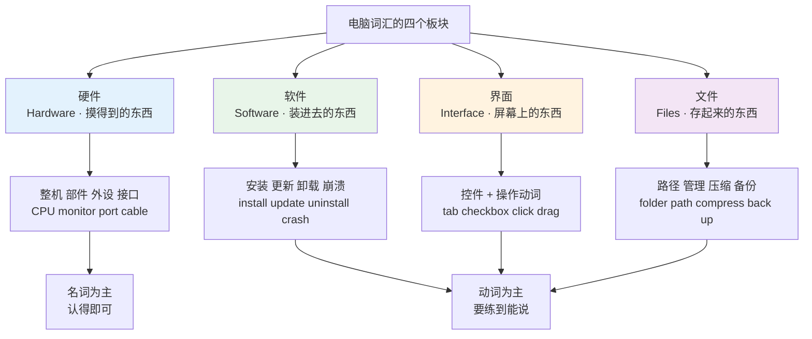
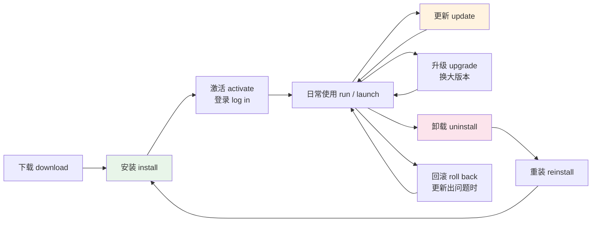
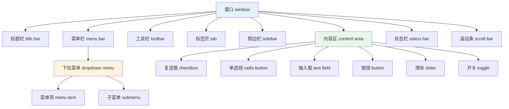
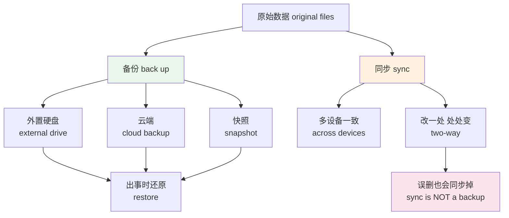
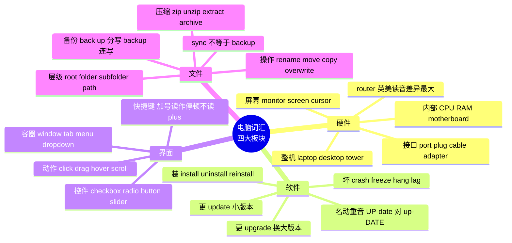

# 电脑硬件、软件、界面操作与文件管理

> [!info] 本篇定位
>
> 第十二章的开篇，也是全书第一篇纯「数字生活」词表。覆盖范围是普通人每天面对屏幕时要说的词：机箱里有什么、线插在哪、软件怎么装怎么更新、程序卡死了怎么描述、界面上那些方块圆点各叫什么、按键组合怎么念、文件放在哪层文件夹里。
>
> 和 `20.专业领域词汇` 的 IT 四篇划清界限：那边讲编程、数据库、网络协议、部署运维；这边只讲**用户视角**的电脑操作。同一个词 `port` 在这里是「机身上那个插孔」，在 19 章是「网络端口号」，两个义项分属两篇。
>
> 读完能做三件事：把电脑出的毛病用英语说清楚（不是只会 `It doesn't work`）、看懂英文界面上每个控件的标签、把英文教程里 `Right-click the folder and select Properties` 这类操作句读成动作。

---

## 1. 本篇导读：为什么电脑词是中文母语者的盲区

电脑词有个特殊之处：中文使用者早就会用电脑，但从没用英语说过。「双击那个图标」「把窗口最小化」「解压到当前文件夹」这些动作每天做几十遍，换成英语立刻卡住。这不是词汇量问题，是**动作与词形之间没有建立通道**。

盲区集中在四个位置。

**位置一：界面控件没有中文对应习惯。** 中文里说「那个打勾的小方块」，英语有专门的词 `checkbox`；中文说「点开会往下掉一列选项的那个」，英语是 `dropdown`。中文口语靠描述，英语靠命名，直接翻译会翻成一长串。

**位置二：软件动作是短语动词。** `log in`、`shut down`、`back up`、`roll back`、`sign out`——全是动词加副词的组合，中文母语者习惯找单个动词，结果满脑子想 `close computer` 而不是 `shut down the computer`。

**位置三：名词与动词同形但重音不同。** `back up`（动词，重音在 up）和 `backup`（名词，重音在 back）；`update`、`upgrade`、`download`、`upload`、`restart` 都有这个问题。写错空格、读错重音，句子立刻不自然。

**位置四：英美用词分裂特别多。** Windows 的 `Recycle Bin` 和 macOS 的 `Trash`；英式 `tick a box` 和美式 `check a box`；英式 `full stop` 和美式 `period`；`router` 英美读音完全不同。这一层不理清，听录屏教程会一直迷惑。



上图给出本篇的组织顺序，也标出了不同板块的学习目标差别。硬件板块以名词为主，多数只需要接受性掌握——你不需要主动说出 `heat sink`，但看到要认得。软件、界面、文件三块以动词和短语动词为主，必须练到产出级，因为这些是你每天要描述的动作。

---

## 2. 整机、机箱与核心部件

### 2.1 整机的几种形态

先把「一台电脑」的各种叫法分清。中文统称「电脑」，英语按形态分得很细，而且日常口语最常用的不是 `computer`。

| 英文 | 英式音标 | 美式音标 | 词性 | 中文 | 搭配与说明 |
| --- | --- | --- | --- | --- | --- |
| **computer** | /kəmˈpjuːtə/ | /kəmˈpjuːtər/ | n. | 电脑 | 正式统称，口语常被更具体的词取代 |
| **laptop** | /ˈlæptɒp/ | /ˈlæptɑːp/ | n. | 笔记本电脑 | 最常用；lap「大腿」+ top |
| **desktop** | /ˈdesktɒp/ | /ˈdesktɑːp/ | n. | 台式机；桌面 | 双义：整机形态，或屏幕上的桌面 |
| **notebook** | /ˈnəʊtbʊk/ | /ˈnoʊtbʊk/ | n. | 笔记本电脑 | 厂商用语，日常远不如 laptop 常见 |
| **tower** | /ˈtaʊə/ | /ˈtaʊər/ | n. | 立式主机箱 | a desktop tower |
| **all-in-one** | /ˌɔːl ɪn ˈwʌn/ | /ˌɔːl ɪn ˈwʌn/ | n./adj. | 一体机 | an all-in-one PC |
| **workstation** | /ˈwɜːksteɪʃn/ | /ˈwɜːrksteɪʃn/ | n. | 工作站 | 高性能专业机 |
| **tablet** | /ˈtæblət/ | /ˈtæblət/ | n. | 平板电脑 | 也指「药片」 |
| **server** | /ˈsɜːvə/ | /ˈsɜːrvər/ | n. | 服务器 | — |
| **PC** | /ˌpiː ˈsiː/ | /ˌpiː ˈsiː/ | n. | 个人电脑 | 口语中常特指非苹果机 |
| **Mac** | /mæk/ | /mæk/ | n. | 苹果电脑 | Macintosh 的缩略 |
| **machine** | /məˈʃiːn/ | /məˈʃiːn/ | n. | 机器；这台电脑 | 技术语境里 my machine 就指「我这台」 |

> [!warning] desktop 的两个义项容易混
>
> 同一个词在两句里指两件完全不同的东西：
>
> - I bought a new **desktop**.（我买了台新台式机 —— 整机）
> - Save it to your **desktop**.（存到桌面上 —— 屏幕区域）
>
> 判断靠动词：`buy` / `build` / `upgrade` 后面是整机，`save to` / `drag to` / `on your` 后面是桌面区域。

### 2.2 机箱内部

```text
case / tower  机箱
├── motherboard  主板  ← 一切都插在它上面
│   ├── CPU / processor  处理器  →  core 核心 · clock speed 主频
│   ├── RAM / memory     内存    →  slot 插槽 · 16 GB
│   ├── hard drive / SSD 硬盘    →  HDD 机械 · SSD 固态
│   └── graphics card / GPU  显卡
├── power supply (PSU)  电源
└── fan · heat sink · vent  风扇 · 散热片 · 散热口
```

上面这张结构图按装机顺序排列：主板是底座，处理器、内存、硬盘、显卡都插在它上面，电源和风扇独立于主板但在同一个机箱里。记词的时候按这个空间关系记，比按字母表记牢得多——因为你随时能在脑子里看一眼机箱内部，每个词都对应一件摸得到的实物。

注意两处中文和英文的切分方式不同。中文说「内存」和「硬盘」都带「存」字，容易觉得是一类；英语 `memory` 与 `drive` 是两个毫不相干的词，前者断电即失，后者断电保留。中文说「显卡」是一张卡，英语 `graphics card` 也是卡，但笔记本上集成的那颗一般不叫 card，叫 `integrated graphics` 或直接叫 `GPU`。

| 英文 | 英式音标 | 美式音标 | 词性 | 中文 | 搭配与说明 |
| --- | --- | --- | --- | --- | --- |
| **CPU** | /ˌsiː piː ˈjuː/ | /ˌsiː piː ˈjuː/ | n. | 中央处理器 | central processing unit 的首字母缩略 |
| **processor** | /ˈprəʊsesə/ | /ˈprɑːsesər/ | n. | 处理器 | 口语比 CPU 更常见 |
| **core** | /kɔː/ | /kɔːr/ | n. | 核心 | a quad-core processor 四核处理器 |
| **RAM** | /ræm/ | /ræm/ | n. | 内存 | 读成单词而非字母，与 ram「公羊」同音 |
| **memory** | /ˈmeməri/ | /ˈmeməri/ | n. | 内存；存储 | run out of memory 内存不足 |
| **hard drive** | /ˈhɑːd draɪv/ | /ˈhɑːrd draɪv/ | n. | 硬盘 | 也说 hard disk |
| **SSD** | /ˌes es ˈdiː/ | /ˌes es ˈdiː/ | n. | 固态硬盘 | solid-state drive |
| **motherboard** | /ˈmʌðəbɔːd/ | /ˈmʌðərbɔːrd/ | n. | 主板 | 也说 mainboard |
| **graphics card** | /ˈɡræfɪks kɑːd/ | /ˈɡræfɪks kɑːrd/ | n. | 显卡 | 也说 video card |
| **GPU** | /ˌdʒiː piː ˈjuː/ | /ˌdʒiː piː ˈjuː/ | n. | 图形处理器 | graphics processing unit |
| **power supply** | /ˈpaʊə səˌplaɪ/ | /ˈpaʊər səˌplaɪ/ | n. | 电源 | 缩写 PSU，逐字母读 |
| **fan** | /fæn/ | /fæn/ | n. | 风扇 | the fan is loud 风扇声音大 |
| **heat sink** | /ˈhiːt sɪŋk/ | /ˈhiːt sɪŋk/ | n. | 散热片 | 两词分写 |
| **vent** | /vent/ | /vent/ | n. | 散热口 | don't block the vents |
| **chip** | /tʃɪp/ | /tʃɪp/ | n. | 芯片 | 也指「薯片」（英式指粗薯条） |
| **circuit board** | /ˈsɜːkɪt bɔːd/ | /ˈsɜːrkɪt bɔːrd/ | n. | 电路板 | — |
| **slot** | /slɒt/ | /slɑːt/ | n. | 插槽 | a free RAM slot 空闲内存插槽 |
| **case** | /keɪs/ | /keɪs/ | n. | 机箱；外壳 | 手机壳也是 case |
| **overheat** | /ˌəʊvəˈhiːt/ | /ˌoʊvərˈhiːt/ | v. | 过热 | the laptop overheats 笔记本过热 |

### 2.3 屏幕与输入设备

| 英文 | 英式音标 | 美式音标 | 词性 | 中文 | 搭配与说明 |
| --- | --- | --- | --- | --- | --- |
| **monitor** | /ˈmɒnɪtə/ | /ˈmɑːnɪtər/ | n. | 显示器 | 特指独立显示器这个硬件 |
| **screen** | /skriːn/ | /skriːn/ | n. | 屏幕 | 指显示区域，笔记本的屏幕说 screen |
| **display** | /dɪˈspleɪ/ | /dɪˈspleɪ/ | n./v. | 显示屏；显示 | an external display 外接显示器 |
| **resolution** | /ˌrezəˈluːʃn/ | /ˌrezəˈluːʃn/ | n. | 分辨率 | high resolution 高分辨率 |
| **pixel** | /ˈpɪksl/ | /ˈpɪksl/ | n. | 像素 | picture + element 拼合而成 |
| **refresh rate** | /rɪˈfreʃ reɪt/ | /rɪˈfreʃ reɪt/ | n. | 刷新率 | 单位 Hz，读 hertz |
| **brightness** | /ˈbraɪtnəs/ | /ˈbraɪtnəs/ | n. | 亮度 | turn down the brightness 调暗 |
| **keyboard** | /ˈkiːbɔːd/ | /ˈkiːbɔːrd/ | n. | 键盘 | — |
| **key** | /kiː/ | /kiː/ | n. | 按键 | 也指「钥匙」「关键」 |
| **mouse** | /maʊs/ | /maʊs/ | n. | 鼠标 | 复数指设备时 mice 与 mouses 都有人用 |
| **scroll wheel** | /ˈskrəʊl wiːl/ | /ˈskroʊl wiːl/ | n. | 滚轮 | — |
| **trackpad** | /ˈtrækpæd/ | /ˈtrækpæd/ | n. | 触控板 | 苹果用语 |
| **touchpad** | /ˈtʌtʃpæd/ | /ˈtʌtʃpæd/ | n. | 触控板 | Windows 笔记本用语 |
| **cursor** | /ˈkɜːsə/ | /ˈkɜːrsər/ | n. | 光标 | 文本输入处闪烁的竖线 |
| **pointer** | /ˈpɔɪntə/ | /ˈpɔɪntər/ | n. | 鼠标指针 | 屏幕上那个箭头 |
| **stylus** | /ˈstaɪləs/ | /ˈstaɪləs/ | n. | 触控笔 | 复数 styluses |
| **lid** | /lɪd/ | /lɪd/ | n. | 笔记本上盖 | close the lid 合上盖子 |
| **hinge** | /hɪndʒ/ | /hɪndʒ/ | n. | 转轴；铰链 | — |

> [!warning] cursor 与 pointer 不是同一个东西
>
> 中文都叫「光标」，英语分两个词，混用会让对方定位错。
>
> - **cursor** = 文本里那条闪烁的竖线，标记你要打字的位置
> - **pointer** = 跟着鼠标动的那个箭头
>
> - ✅ Put the **cursor** at the end of the line.（把光标放到行末 —— 打字位置）
> - ✅ Move the **pointer** over the icon.（把鼠标移到图标上 —— 鼠标箭头）
>
> 说 `move the cursor over the icon` 也有人接受，但反过来说 `type where the pointer is` 就明显别扭了。

---

## 3. 外设、接口与线缆

### 3.1 插孔与线

`port` 是这一节的核心词，也是最容易和 19 章的「网络端口」搞混的词。在本篇里它一律指机身上那个物理插孔。

| 英文 | 英式音标 | 美式音标 | 词性 | 中文 | 搭配与说明 |
| --- | --- | --- | --- | --- | --- |
| **port** | /pɔːt/ | /pɔːrt/ | n. | 接口；插孔 | a USB port；本篇不涉及网络端口义 |
| **USB port** | /ˌjuː es ˈbiː pɔːt/ | /ˌjuː es ˈbiː pɔːrt/ | n. | USB 接口 | USB 逐字母读 |
| **jack** | /dʒæk/ | /dʒæk/ | n. | 音频插孔 | a headphone jack 耳机孔 |
| **socket** | /ˈsɒkɪt/ | /ˈsɑːkɪt/ | n. | 插座；插孔 | 英式指墙上插座，美式多说 outlet |
| **outlet** | /ˈaʊtlet/ | /ˈaʊtlet/ | n. | 墙上电源插座 | 美式常用；英式说 socket |
| **plug** | /plʌɡ/ | /plʌɡ/ | n./v. | 插头；插入 | plug it in 把它插上 |
| **unplug** | /ˌʌnˈplʌɡ/ | /ˌʌnˈplʌɡ/ | v. | 拔掉 | unplug the charger 拔掉充电器 |
| **cable** | /ˈkeɪbl/ | /ˈkeɪbl/ | n. | 数据线；电缆 | a USB-C cable |
| **cord** | /kɔːd/ | /kɔːrd/ | n. | 电线 | a power cord 电源线 |
| **charger** | /ˈtʃɑːdʒə/ | /ˈtʃɑːrdʒər/ | n. | 充电器 | — |
| **adapter** | /əˈdæptə/ | /əˈdæptər/ | n. | 转接头；适配器 | 也拼 adaptor（英式变体） |
| **dock** | /dɒk/ | /dɑːk/ | n./v. | 扩展坞；停靠 | 也指 macOS 底部那排图标 |
| **hub** | /hʌb/ | /hʌb/ | n. | 集线器 | a USB hub 扩展一变多 |
| **battery** | /ˈbætri/ | /ˈbætəri/ | n. | 电池 | 英式常读两音节，美式三音节带闪音 |
| **power bank** | /ˈpaʊə bæŋk/ | /ˈpaʊər bæŋk/ | n. | 充电宝 | 也说 portable charger |

### 3.2 外接设备

| 英文 | 英式音标 | 美式音标 | 词性 | 中文 | 搭配与说明 |
| --- | --- | --- | --- | --- | --- |
| **peripheral** | /pəˈrɪfərəl/ | /pəˈrɪfərəl/ | n. | 外设 | 统称词，日常少用，说明书常见 |
| **device** | /dɪˈvaɪs/ | /dɪˈvaɪs/ | n. | 设备 | 万能统称，不确定叫什么时用它 |
| **printer** | /ˈprɪntə/ | /ˈprɪntər/ | n. | 打印机 | run out of ink 没墨了 |
| **scanner** | /ˈskænə/ | /ˈskænər/ | n. | 扫描仪 | — |
| **webcam** | /ˈwebkæm/ | /ˈwebkæm/ | n. | 摄像头 | web + camera |
| **microphone** | /ˈmaɪkrəfəʊn/ | /ˈmaɪkrəfoʊn/ | n. | 麦克风 | 缩略 mic /maɪk/ |
| **speaker** | /ˈspiːkə/ | /ˈspiːkər/ | n. | 音箱；扬声器 | 也指「说话者」 |
| **headphones** | /ˈhedfəʊnz/ | /ˈhedfoʊnz/ | n. | 耳机 | 恒用复数 |
| **earbuds** | /ˈɪəbʌdz/ | /ˈɪrbʌdz/ | n. | 入耳式耳机 | 恒用复数 |
| **headset** | /ˈhedset/ | /ˈhedset/ | n. | 带麦耳机 | 开会用的那种 |
| **flash drive** | /ˈflæʃ draɪv/ | /ˈflæʃ draɪv/ | n. | U 盘 | 美式常用 |
| **USB stick** | /ˌjuː es ˈbiː stɪk/ | /ˌjuː es ˈbiː stɪk/ | n. | U 盘 | 英式常用 |
| **memory card** | /ˈmeməri kɑːd/ | /ˈmeməri kɑːrd/ | n. | 存储卡 | SD card 逐字母读 |
| **external drive** | /ɪkˈstɜːnl draɪv/ | /ɪkˈstɜːrnl draɪv/ | n. | 移动硬盘 | 备份的常见落点 |
| **router** | /ˈruːtə/ | /ˈraʊtər/ | n. | 路由器 | 英美读音完全不同，是本篇差异最大的词 |
| **modem** | /ˈməʊdem/ | /ˈmoʊdem/ | n. | 调制解调器；猫 | — |
| **Wi-Fi** | /ˈwaɪfaɪ/ | /ˈwaɪfaɪ/ | n. | 无线网 | 连字符可有可无 |
| **Bluetooth** | /ˈbluːtuːθ/ | /ˈbluːtuːθ/ | n. | 蓝牙 | pair a device 配对设备 |

> [!tip] router 是英美读音差异的教科书例子
>
> 英式 /ˈruːtə/ 走 route「路线」的英式读法 /ruːt/；美式 /ˈraʊtər/ 与木工工具 router（铣刀）同音。两种读法在各自地区都是标准的，不存在谁对谁错。
>
> 同类差异还有 `route` 本身：英式只读 /ruːt/，美式 /ruːt/ 与 /raʊt/ 并存。词典给出英美双标音的体例见 [[01.词汇入门与学习方法/03.音标、词重音与词典读音体例\|01.03 音标、词重音与词典读音体例]]；英美之间换词不换音的那一类差异（lift 对 elevator、tick 对 check）集中在 [[18.语域、英美差异与习语俚语/01.英式与美式词汇差异\|18.01 英式与美式词汇差异]]。

### 3.3 描述插拔的动词

> [!example] 插与拔的三组说法
>
> - **Plug** the cable **into** the USB port.
>   - 把线插进 USB 口。
> - The monitor isn't **plugged in**.
>   - 显示器没插电。
> - **Unplug** the drive before you remove it.
>   - 拔线之前先弹出硬盘。
> - The keyboard **connects via** Bluetooth.
>   - 键盘通过蓝牙连接。
> - My phone **won't pair with** the laptop.
>   - 我手机连不上笔记本。
> - The port is **loose**.
>   - 这个接口松了。

`plug in` 是可分离短语动词：`plug it in` 正确，`plug in it` 错误。代词必须夹在中间。这条规则适用于本篇几乎所有「动词 + in/out/up/down」的组合，后面会反复用到。

---

## 4. 软件的一生：装、更、卸

### 4.1 软件生命周期



上图把软件从进入电脑到离开电脑的全过程串成一条线，每一步都有固定动词。注意 `update` 与 `upgrade` 在图上是两条不同的支线：`update` 是同一版本内打补丁（1.2.3 → 1.2.4），`upgrade` 是换大版本或换更高档位（免费版 → 专业版，Windows 10 → Windows 11）。中文都说「升级」，英语必须分开。

| 英文 | 英式音标 | 美式音标 | 词性 | 中文 | 搭配与说明 |
| --- | --- | --- | --- | --- | --- |
| **software** | /ˈsɒftweə/ | /ˈsɔːftwer/ | n. | 软件 | 不可数，没有 softwares |
| **program** | /ˈprəʊɡræm/ | /ˈproʊɡræm/ | n. | 程序 | 英式作「节目」时拼 programme |
| **application** | /ˌæplɪˈkeɪʃn/ | /ˌæplɪˈkeɪʃn/ | n. | 应用程序 | 也指「申请」「应用」 |
| **app** | /æp/ | /æp/ | n. | 应用 | application 的缩略，现已通用于桌面端 |
| **install** | /ɪnˈstɔːl/ | /ɪnˈstɔːl/ | v. | 安装 | 名词 installation |
| **installer** | /ɪnˈstɔːlə/ | /ɪnˈstɔːlər/ | n. | 安装程序 | run the installer 运行安装包 |
| **setup** | /ˈsetʌp/ | /ˈsetʌp/ | n. | 安装程序；配置 | 动词分写：set up |
| **wizard** | /ˈwɪzəd/ | /ˈwɪzərd/ | n. | 向导 | the setup wizard 安装向导 |
| **uninstall** | /ˌʌnɪnˈstɔːl/ | /ˌʌnɪnˈstɔːl/ | v. | 卸载 | 前缀 un- 表反向动作 |
| **update** | /ʌpˈdeɪt/ | /ʌpˈdeɪt/ | v. | 更新 | 名词重音前移：/ˈʌpdeɪt/ |
| **upgrade** | /ʌpˈɡreɪd/ | /ʌpˈɡreɪd/ | v. | 升级换代 | 名词 /ˈʌpɡreɪd/ |
| **version** | /ˈvɜːʃn/ | /ˈvɜːrʒn/ | n. | 版本 | 英美辅音不同：/ʃ/ 对 /ʒ/ |
| **patch** | /pætʃ/ | /pætʃ/ | n./v. | 补丁；打补丁 | a security patch 安全补丁 |
| **release** | /rɪˈliːs/ | /rɪˈliːs/ | n./v. | 发布版本；发布 | the latest release 最新版 |
| **download** | /ˌdaʊnˈləʊd/ | /ˈdaʊnloʊd/ | v./n. | 下载 | 美式名动都读前重音，英式动词后重音 |
| **upload** | /ˌʌpˈləʊd/ | /ˈʌploʊd/ | v./n. | 上传 | 重音规律同 download |
| **license** | /ˈlaɪsns/ | /ˈlaɪsns/ | n. | 许可证 | 英式名词拼 licence，动词拼 license |
| **activate** | /ˈæktɪveɪt/ | /ˈæktɪveɪt/ | v. | 激活 | activation code 激活码 |
| **subscription** | /səbˈskrɪpʃn/ | /səbˈskrɪpʃn/ | n. | 订阅 | a monthly subscription |
| **free trial** | /ˌfriː ˈtraɪəl/ | /ˌfriː ˈtraɪəl/ | n. | 免费试用 | a 30-day free trial |
| **open source** | /ˌəʊpən ˈsɔːs/ | /ˌoʊpən ˈsɔːrs/ | adj./n. | 开源 | open-source software 作定语时加连字符 |
| **freeware** | /ˈfriːweə/ | /ˈfriːwer/ | n. | 免费软件 | 与 open source 不同，免费未必开源 |
| **driver** | /ˈdraɪvə/ | /ˈdraɪvər/ | n. | 驱动程序 | 也指「司机」 |
| **operating system** | /ˈɒpəreɪtɪŋ ˈsɪstəm/ | /ˈɑːpəreɪtɪŋ ˈsɪstəm/ | n. | 操作系统 | 缩写 OS，逐字母读 |

> [!warning] update 与 upgrade 的重音陷阱
>
> 这一对词的动词与名词重音位置不同，是英语里「名前动后」规律的典型成员。
>
> ```text
> 动词  up-DATE     /ʌpˈdeɪt/     I need to update the app.
> 名词  UP-date     /ˈʌpdeɪt/     There's a new update available.
>
> 动词  up-GRADE    /ʌpˈɡreɪd/    We upgraded to the pro version.
> 名词  UP-grade    /ˈʌpɡreɪd/    The upgrade costs £40.
> ```
>
> 同一规律还管着 `record`、`present`、`import`、`export`、`increase`、`decrease`。完整的名动重音对照表在 [[01.词汇入门与学习方法/03.音标、词重音与词典读音体例\|01.03 音标、词重音与词典读音体例]]。

### 4.2 启动、登录与退出

| 英文 | 英式音标 | 美式音标 | 词性 | 中文 | 搭配与说明 |
| --- | --- | --- | --- | --- | --- |
| **boot** | /buːt/ | /buːt/ | v./n. | 开机启动 | boot up 是完整说法；也指「靴子」 |
| **launch** | /lɔːntʃ/ | /lɔːntʃ/ | v. | 启动程序 | launch the app 打开应用 |
| **run** | /rʌn/ | /rʌn/ | v. | 运行 | run as administrator 以管理员运行 |
| **open** | /ˈəʊpən/ | /ˈoʊpən/ | v. | 打开 | 口语里比 launch 更常用 |
| **quit** | /kwɪt/ | /kwɪt/ | v. | 退出程序 | Mac 用语；quit-quit-quit 三态同形 |
| **exit** | /ˈeksɪt/ | /ˈeɡzɪt/ | v./n. | 退出；出口 | 美式常读 /ˈeɡzɪt/ |
| **close** | /kləʊz/ | /kloʊz/ | v. | 关闭窗口 | 关窗口不等于退出程序 |
| **shut down** | /ˌʃʌt ˈdaʊn/ | /ˌʃʌt ˈdaʊn/ | v. | 关机 | 名词写作 shutdown |
| **restart** | /ˌriːˈstɑːt/ | /ˌriːˈstɑːrt/ | v. | 重启 | 与 reboot 基本同义 |
| **reboot** | /ˌriːˈbuːt/ | /ˌriːˈbuːt/ | v./n. | 重启 | 技术语境更常见 |
| **sleep** | /sliːp/ | /sliːp/ | v./n. | 睡眠 | put it to sleep 让它进入睡眠 |
| **wake up** | /ˌweɪk ˈʌp/ | /ˌweɪk ˈʌp/ | v. | 唤醒 | — |
| **log in** | /ˌlɒɡ ˈɪn/ | /ˌlɔːɡ ˈɪn/ | v. | 登录 | 名词写作 login |
| **log out** | /ˌlɒɡ ˈaʊt/ | /ˌlɔːɡ ˈaʊt/ | v. | 登出 | — |
| **sign in** | /ˌsaɪn ˈɪn/ | /ˌsaɪn ˈɪn/ | v. | 登录 | 消费级产品更爱用这个 |
| **sign out** | /ˌsaɪn ˈaʊt/ | /ˌsaɪn ˈaʊt/ | v. | 退出登录 | — |
| **password** | /ˈpɑːswɜːd/ | /ˈpæswɜːrd/ | n. | 密码 | 元音英美不同：/ɑː/ 对 /æ/ |
| **account** | /əˈkaʊnt/ | /əˈkaʊnt/ | n. | 账号 | create an account 注册 |
| **default** | /dɪˈfɔːlt/ | /dɪˈfɔːlt/ | n./adj. | 默认 | by default 默认情况下 |
| **settings** | /ˈsetɪŋz/ | /ˈsetɪŋz/ | n. | 设置 | 恒用复数 |
| **preferences** | /ˈprefrənsɪz/ | /ˈprefrənsɪz/ | n. | 偏好设置 | Mac 用语，Windows 说 settings |

> [!warning] close 不等于 quit
>
> 中文一律说「关掉」，英语在 Mac 上分得很严格。
>
> - **close a window** = 关掉这个窗口，程序还在后台跑
> - **quit an app** = 完全退出程序，Dock 上的小点消失
>
> - ❌ ~~I closed Chrome but it's still using memory.~~（说不通，因为关窗口本来就不释放内存）
> - ✅ I closed the window but didn't **quit** Chrome, so it's still running.
>
> Windows 上这个区分弱一些，关掉最后一个窗口通常等于退出，但 `Quit` 这个词在 Windows 界面里几乎不出现，那边用 `Exit`。

---

## 5. 出问题的时候：怎么描述故障

中文母语者在这一节最吃亏。程序出毛病时只会说 `It doesn't work` 或 `It's broken`，对方无法定位。英语对不同故障形态有精确分工。

| 英文 | 英式音标 | 美式音标 | 词性 | 中文 | 搭配与说明 |
| --- | --- | --- | --- | --- | --- |
| **crash** | /kræʃ/ | /kræʃ/ | v./n. | 崩溃退出 | 程序自己关掉了；也指「车祸」 |
| **freeze** | /friːz/ | /friːz/ | v. | 卡死 | 界面还在但完全不响应；froze-frozen |
| **hang** | /hæŋ/ | /hæŋ/ | v. | 挂起无响应 | 此义过去式用 hanged 不对，用 hung |
| **not responding** | /nɒt rɪˈspɒndɪŋ/ | /nɑːt rɪˈspɑːndɪŋ/ | phr. | 无响应 | Windows 标题栏原文 |
| **lag** | /læɡ/ | /læɡ/ | v./n. | 卡顿；延迟 | the video lags 视频卡 |
| **slow down** | /ˌsləʊ ˈdaʊn/ | /ˌsloʊ ˈdaʊn/ | v. | 变慢 | my laptop has slowed down |
| **bug** | /bʌɡ/ | /bʌɡ/ | n. | 程序缺陷 | 也指「虫子」；report a bug 报缺陷 |
| **glitch** | /ɡlɪtʃ/ | /ɡlɪtʃ/ | n. | 小故障 | 偶发、轻微、通常自己恢复 |
| **error** | /ˈerə/ | /ˈerər/ | n. | 错误 | an error message 报错信息 |
| **error code** | /ˈerə kəʊd/ | /ˈerər koʊd/ | n. | 错误码 | — |
| **blue screen** | /ˌbluː ˈskriːn/ | /ˌbluː ˈskriːn/ | n. | 蓝屏 | 完整说法 blue screen of death |
| **virus** | /ˈvaɪrəs/ | /ˈvaɪrəs/ | n. | 病毒 | 复数 viruses，不用拉丁复数 |
| **malware** | /ˈmælweə/ | /ˈmælwer/ | n. | 恶意软件 | malicious + software |
| **antivirus** | /ˌæntiˈvaɪrəs/ | /ˌæntaɪˈvaɪrəs/ | n./adj. | 杀毒软件 | anti- 前缀英美读音不同 |
| **firewall** | /ˈfaɪəwɔːl/ | /ˈfaɪərwɔːl/ | n. | 防火墙 | — |
| **force quit** | /ˌfɔːs ˈkwɪt/ | /ˌfɔːrs ˈkwɪt/ | v. | 强制退出 | Mac 用语 |
| **end task** | /ˌend ˈtɑːsk/ | /ˌend ˈtæsk/ | v. | 结束任务 | Windows 任务管理器按钮原文 |
| **task manager** | /ˈtɑːsk mænɪdʒə/ | /ˈtæsk mænɪdʒər/ | n. | 任务管理器 | — |
| **troubleshoot** | /ˈtrʌblʃuːt/ | /ˈtrʌblʃuːt/ | v. | 排查故障 | 名词 troubleshooting |
| **reinstall** | /ˌriːɪnˈstɔːl/ | /ˌriːɪnˈstɔːl/ | v. | 重装 | — |
| **roll back** | /ˌrəʊl ˈbæk/ | /ˌroʊl ˈbæk/ | v. | 回滚版本 | roll back the driver 回退驱动 |
| **safe mode** | /ˌseɪf ˈməʊd/ | /ˌseɪf ˈmoʊd/ | n. | 安全模式 | boot into safe mode |
| **corrupt** | /kəˈrʌpt/ | /kəˈrʌpt/ | v./adj. | 损坏；已损坏 | a corrupt file 损坏的文件 |
| **compatible** | /kəmˈpætəbl/ | /kəmˈpætəbl/ | adj. | 兼容的 | be compatible with 与……兼容 |

### 5.1 三个故障动词的边界

`crash`、`freeze`、`hang` 中文都可以说「死机了」，但描述的现象完全不同。分清这三个，故障描述的精度立刻提升一个档次。

| 现象 | 用词 | 屏幕上看到什么 | 典型说法 |
| --- | --- | --- | --- |
| 程序突然消失 | **crash** | 窗口没了，可能弹出报错框 | Photoshop just crashed. |
| 界面还在但点不动 | **freeze** | 画面定住，鼠标可能还能动 | The whole screen froze. |
| 长时间无反应 | **hang** | 转圈或者标题栏显示 Not Responding | The app hung on startup. |
| 反应慢但能用 | **lag** | 操作和响应之间有延迟 | The scrolling lags badly. |

> [!example] 完整的故障描述句
>
> - Chrome **crashes** every time I open a PDF.
>   - 每次打开 PDF 时 Chrome 都会崩溃退出。
> - The screen **froze** and I had to hold the power button.
>   - 屏幕卡死了，我只能长按电源键。
> - It says **Not Responding** in the title bar.
>   - 标题栏显示「无响应」。
> - I got an **error message** saying the file is **corrupt**.
>   - 弹出报错说文件已损坏。
> - The app worked before the **update**, so I **rolled back** to the old **version**.
>   - 更新前还好用，所以我回滚到了旧版本。
> - This game isn't **compatible with** my graphics card.
>   - 这游戏和我的显卡不兼容。

---

## 6. 界面元素：屏幕上那些东西各叫什么

### 6.1 界面的层级结构



上图按包含关系画出一个典型窗口的解剖图。学界面词的正确姿势是打开一个你熟悉的软件，把界面语言切成英文，对着图逐个指认——每个词都能在屏幕上找到实物，这类词的记忆成本远低于抽象词。

### 6.2 容器类控件

| 英文 | 英式音标 | 美式音标 | 词性 | 中文 | 搭配与说明 |
| --- | --- | --- | --- | --- | --- |
| **interface** | /ˈɪntəfeɪs/ | /ˈɪntərfeɪs/ | n. | 界面 | 缩写 UI，逐字母读 |
| **window** | /ˈwɪndəʊ/ | /ˈwɪndoʊ/ | n. | 窗口 | 大写复数 Windows 才是操作系统 |
| **tab** | /tæb/ | /tæb/ | n. | 标签页 | 也指键盘上的 Tab 键 |
| **title bar** | /ˈtaɪtl bɑː/ | /ˈtaɪtl bɑːr/ | n. | 标题栏 | — |
| **menu** | /ˈmenjuː/ | /ˈmenjuː/ | n. | 菜单 | 与餐厅菜单同词 |
| **menu bar** | /ˈmenjuː bɑː/ | /ˈmenjuː bɑːr/ | n. | 菜单栏 | Mac 顶部那条 |
| **dropdown** | /ˈdrɒpdaʊn/ | /ˈdrɑːpdaʊn/ | n./adj. | 下拉菜单 | 也写 drop-down |
| **submenu** | /ˈsʌbmenjuː/ | /ˈsʌbmenjuː/ | n. | 子菜单 | 鼠标悬停展开的二级菜单 |
| **toolbar** | /ˈtuːlbɑː/ | /ˈtuːlbɑːr/ | n. | 工具栏 | — |
| **sidebar** | /ˈsaɪdbɑː/ | /ˈsaɪdbɑːr/ | n. | 侧边栏 | — |
| **taskbar** | /ˈtɑːskbɑː/ | /ˈtæskbɑːr/ | n. | 任务栏 | Windows 底部那条 |
| **status bar** | /ˈsteɪtəs bɑː/ | /ˈsteɪtəs bɑːr/ | n. | 状态栏 | status 美式另有 /ˈstætəs/ 一读 |
| **scroll bar** | /ˈskrəʊl bɑː/ | /ˈskroʊl bɑːr/ | n. | 滚动条 | 也写 scrollbar |
| **panel** | /ˈpænl/ | /ˈpænl/ | n. | 面板 | the settings panel |
| **pane** | /peɪn/ | /peɪn/ | n. | 窗格 | 窗口内的分区，与 pain 同音 |
| **ribbon** | /ˈrɪbən/ | /ˈrɪbən/ | n. | 功能区 | Office 顶部那一大条 |
| **dialog box** | /ˈdaɪəlɒɡ bɒks/ | /ˈdaɪəlɔːɡ bɑːks/ | n. | 对话框 | 英式也拼 dialogue |
| **pop-up** | /ˈpɒpʌp/ | /ˈpɑːpʌp/ | n. | 弹窗 | block pop-ups 拦截弹窗 |
| **prompt** | /prɒmpt/ | /prɑːmpt/ | n./v. | 提示框；提示 | it prompts you to save 提示你保存 |
| **notification** | /ˌnəʊtɪfɪˈkeɪʃn/ | /ˌnoʊtɪfɪˈkeɪʃn/ | n. | 通知 | 缩略口语 notif 少见于书面 |
| **banner** | /ˈbænə/ | /ˈbænər/ | n. | 横幅提示 | 页面顶部那条 |

### 6.3 操作类控件

| 英文 | 英式音标 | 美式音标 | 词性 | 中文 | 搭配与说明 |
| --- | --- | --- | --- | --- | --- |
| **button** | /ˈbʌtn/ | /ˈbʌtn/ | n. | 按钮 | 也指衣服纽扣 |
| **checkbox** | /ˈtʃekbɒks/ | /ˈtʃekbɑːks/ | n. | 复选框 | 可多选的方框 |
| **radio button** | /ˈreɪdiəʊ bʌtn/ | /ˈreɪdioʊ bʌtn/ | n. | 单选钮 | 只能选一个的圆点 |
| **text field** | /ˈtekst fiːld/ | /ˈtekst fiːld/ | n. | 输入框 | 也说 text box、input field |
| **search bar** | /ˈsɜːtʃ bɑː/ | /ˈsɜːrtʃ bɑːr/ | n. | 搜索框 | — |
| **placeholder** | /ˈpleɪshəʊldə/ | /ˈpleɪshoʊldər/ | n. | 占位提示文字 | 输入框里那行灰字 |
| **slider** | /ˈslaɪdə/ | /ˈslaɪdər/ | n. | 滑块 | 调音量亮度那种 |
| **toggle** | /ˈtɒɡl/ | /ˈtɑːɡl/ | n./v. | 开关；切换 | 手机设置里那种圆头开关 |
| **switch** | /swɪtʃ/ | /swɪtʃ/ | n./v. | 开关；切换 | 与 toggle 常可互换 |
| **icon** | /ˈaɪkɒn/ | /ˈaɪkɑːn/ | n. | 图标 | — |
| **badge** | /bædʒ/ | /bædʒ/ | n. | 角标 | 图标上那个红点数字 |
| **tooltip** | /ˈtuːltɪp/ | /ˈtuːltɪp/ | n. | 悬浮提示 | 鼠标停住冒出来的小框 |
| **progress bar** | /ˈprəʊɡres bɑː/ | /ˈprɑːɡres bɑːr/ | n. | 进度条 | progress 英美元音差异明显 |
| **spinner** | /ˈspɪnə/ | /ˈspɪnər/ | n. | 加载转圈 | 也说 loading indicator |
| **theme** | /θiːm/ | /θiːm/ | n. | 主题 | switch themes 换主题 |
| **dark mode** | /ˌdɑːk ˈməʊd/ | /ˌdɑːrk ˈmoʊd/ | n. | 深色模式 | 对应 light mode |
| **layout** | /ˈleɪaʊt/ | /ˈleɪaʊt/ | n. | 布局 | 动词分写：lay out |
| **full screen** | /ˌfʊl ˈskriːn/ | /ˌfʊl ˈskriːn/ | n./adj. | 全屏 | go full screen 进入全屏 |

> [!warning] checkbox 与 radio button 别搞反
>
> 界面设计里这两种控件承担相反的逻辑，说错会让对方按错。
>
> - **checkbox**（方框）：可以勾多个，也可以一个不勾
> - **radio button**（圆点）：同一组里必须且只能选一个
>
> 「radio」这个名字来自老式收音机的机械选台键——按下一个，其余自动弹起。理解了这个来源，就不会记反了。
>
> - ✅ **Tick** the boxes that apply.（英式：勾选所有符合的项）
> - ✅ **Check** all that apply.（美式：同一句话的美式说法）
> - ✅ **Select** one of the radio buttons.（选中其中一个单选钮）

---

## 7. 界面操作动词：把动作说成句子

### 7.1 鼠标与触控动作

| 英文 | 英式音标 | 美式音标 | 词性 | 中文 | 搭配与说明 |
| --- | --- | --- | --- | --- | --- |
| **click** | /klɪk/ | /klɪk/ | v./n. | 点击 | click on the icon 或 click the icon 都行 |
| **double-click** | /ˌdʌbl ˈklɪk/ | /ˌdʌbl ˈklɪk/ | v. | 双击 | 带连字符 |
| **right-click** | /ˌraɪt ˈklɪk/ | /ˌraɪt ˈklɪk/ | v. | 右键点击 | 对应 left-click |
| **tap** | /tæp/ | /tæp/ | v. | 轻触 | 触屏设备用 tap 不用 click |
| **hover** | /ˈhɒvə/ | /ˈhʌvər/ | v. | 悬停 | hover over the link 悬停在链接上 |
| **drag** | /dræɡ/ | /dræɡ/ | v. | 拖动 | drag-dragged-dragged |
| **drop** | /drɒp/ | /drɑːp/ | v. | 放下 | drag and drop 拖放 |
| **scroll** | /skrəʊl/ | /skroʊl/ | v. | 滚动 | scroll down / scroll up |
| **swipe** | /swaɪp/ | /swaɪp/ | v. | 滑动 | 触屏动作 |
| **pinch** | /pɪntʃ/ | /pɪntʃ/ | v. | 捏合 | pinch to zoom 捏合缩放 |
| **zoom in** | /ˌzuːm ˈɪn/ | /ˌzuːm ˈɪn/ | v. | 放大 | 对应 zoom out |
| **select** | /sɪˈlekt/ | /sɪˈlekt/ | v. | 选中 | 名词 selection |
| **deselect** | /ˌdiːsɪˈlekt/ | /ˌdiːsɪˈlekt/ | v. | 取消选中 | — |
| **highlight** | /ˈhaɪlaɪt/ | /ˈhaɪlaɪt/ | v./n. | 选中文字；高亮 | highlight the text 把文字选中 |
| **tick** | /tɪk/ | /tɪk/ | v. | 勾选 | 英式；美式用 check |
| **untick** | /ˌʌnˈtɪk/ | /ˌʌnˈtɪk/ | v. | 取消勾选 | 美式 uncheck |
| **hold down** | /ˌhəʊld ˈdaʊn/ | /ˌhoʊld ˈdaʊn/ | v. | 按住不放 | hold down Shift |
| **release** | /rɪˈliːs/ | /rɪˈliːs/ | v. | 松开 | 与「发布版本」同词 |

### 7.2 窗口与状态动词

| 英文 | 英式音标 | 美式音标 | 词性 | 中文 | 搭配与说明 |
| --- | --- | --- | --- | --- | --- |
| **minimize** | /ˈmɪnɪmaɪz/ | /ˈmɪnɪmaɪz/ | v. | 最小化 | 英式也拼 minimise |
| **maximize** | /ˈmæksɪmaɪz/ | /ˈmæksɪmaɪz/ | v. | 最大化 | 英式也拼 maximise |
| **resize** | /ˌriːˈsaɪz/ | /ˌriːˈsaɪz/ | v. | 调整大小 | — |
| **expand** | /ɪkˈspænd/ | /ɪkˈspænd/ | v. | 展开 | expand the folder 展开文件夹 |
| **collapse** | /kəˈlæps/ | /kəˈlæps/ | v. | 折叠 | collapse all 全部折叠 |
| **refresh** | /rɪˈfreʃ/ | /rɪˈfreʃ/ | v. | 刷新 | 与 reload 基本同义 |
| **reload** | /ˌriːˈləʊd/ | /ˌriːˈloʊd/ | v. | 重新加载 | — |
| **navigate** | /ˈnævɪɡeɪt/ | /ˈnævɪɡeɪt/ | v. | 导航到 | navigate to Settings |
| **browse** | /braʊz/ | /braʊz/ | v. | 浏览；翻找 | Browse 按钮用来选文件 |
| **enable** | /ɪˈneɪbl/ | /ɪˈneɪbl/ | v. | 启用 | 对应 disable |
| **disable** | /dɪsˈeɪbl/ | /dɪsˈeɪbl/ | v. | 禁用 | — |
| **grey out** | /ˌɡreɪ ˈaʊt/ | /ˌɡreɪ ˈaʊt/ | v. | 变灰不可用 | 美式拼 gray out |
| **confirm** | /kənˈfɜːm/ | /kənˈfɜːrm/ | v. | 确认 | — |
| **cancel** | /ˈkænsl/ | /ˈkænsl/ | v. | 取消 | 英式双写 cancelled，美式 canceled |
| **apply** | /əˈplaɪ/ | /əˈplaɪ/ | v. | 应用 | 设置窗口里 Apply 与 OK 的区别：Apply 不关窗 |
| **submit** | /səbˈmɪt/ | /səbˈmɪt/ | v. | 提交 | — |
| **undo** | /ʌnˈduː/ | /ʌnˈduː/ | v. | 撤销 | 对应 redo 重做 |
| **redo** | /ˌriːˈduː/ | /ˌriːˈduː/ | v. | 重做 | — |

### 7.3 把动作串成完整指令句

英文教程里的操作句有固定句式，认熟这几个模板，读任何软件文档都不再卡壳。

> [!example] 六个高频操作句模板
>
> ① **Click** *X*, then **select** *Y*.
> - **Click** the File menu, then **select** Export.
>   - 点击「文件」菜单，然后选「导出」。
>
> ② **Right-click** *X* and **choose** *Y*.
> - **Right-click** the folder and **choose** Properties.
>   - 右键点击这个文件夹，选「属性」。
>
> ③ **Go to** *A* > *B* > *C*.（层级路径，> 读作 then）
> - **Go to** Settings > Privacy > Camera.
>   - 依次进入「设置 → 隐私 → 摄像头」。
>
> ④ **Tick / Check** the box next to *X*.
> - **Check** the box next to Remember me.
>   - 勾上「记住我」旁边那个框。
>
> ⑤ **Drag** *X* **onto / into** *Y*.
> - **Drag** the file **into** the Documents folder.
>   - 把文件拖进「文档」文件夹。
>
> ⑥ **Hold down** *key* **while** *doing something*.
> - **Hold down** Shift **while** clicking to select a range.
>   - 按住 Shift 再点击，可以选中一整段。

`Go to Settings > Privacy` 里那个 `>` 在口语里读作 `then`，也有人直接读 `Settings, Privacy, Camera` 用停顿代替。不要读成 `greater than`——那是数学符号的读法，在菜单路径里不适用。

---

## 8. 键盘按键与快捷键的读法

### 8.1 按键的英文名

按键名是这一篇里最容易被忽略、但一开口就露馅的部分。`Ctrl` 不读字母，`Esc` 不读全拼，`Alt` 有两种读法，这些都得单独记。

| 英文 | 英式音标 | 美式音标 | 词性 | 中文 | 搭配与说明 |
| --- | --- | --- | --- | --- | --- |
| **Control / Ctrl** | /kənˈtrəʊl/ | /kənˈtroʊl/ | n. | 控制键 | 键面写 Ctrl，口语读全词 control |
| **Shift** | /ʃɪft/ | /ʃɪft/ | n. | 上档键 | — |
| **Alt** | /ɔːlt/ | /ɔːlt/ | n. | Alt 键 | 读作单词，不读 alternate |
| **Command** | /kəˈmɑːnd/ | /kəˈmænd/ | n. | Mac 的 Command 键 | 口语常说 the Command key 或 cmd |
| **Option** | /ˈɒpʃn/ | /ˈɑːpʃn/ | n. | Mac 的 Option 键 | 等同于 PC 上的 Alt |
| **Escape / Esc** | /ɪˈskeɪp/ | /ɪˈskeɪp/ | n. | 退出键 | 键面写 Esc，读全词 escape |
| **Tab** | /tæb/ | /tæb/ | n. | 制表键 | 与「标签页」同形 |
| **Enter** | /ˈentə/ | /ˈentər/ | n. | 回车键 | Windows 用语 |
| **Return** | /rɪˈtɜːn/ | /rɪˈtɜːrn/ | n. | 回车键 | Mac 用语 |
| **Backspace** | /ˈbækspeɪs/ | /ˈbækspeɪs/ | n. | 退格键 | 往左删 |
| **Delete** | /dɪˈliːt/ | /dɪˈliːt/ | n. | 删除键 | Windows 往右删；Mac 上 Delete 就是退格 |
| **Space bar** | /ˈspeɪs bɑː/ | /ˈspeɪs bɑːr/ | n. | 空格键 | — |
| **Caps Lock** | /ˌkæps ˈlɒk/ | /ˌkæps ˈlɑːk/ | n. | 大写锁定 | caps 是 capitals 的缩略 |
| **arrow keys** | /ˈærəʊ kiːz/ | /ˈæroʊ kiːz/ | n. | 方向键 | 也说 cursor keys |
| **function key** | /ˈfʌŋkʃn kiː/ | /ˈfʌŋkʃn kiː/ | n. | 功能键 | F1 读 eff one |
| **Page Up** | /ˌpeɪdʒ ˈʌp/ | /ˌpeɪdʒ ˈʌp/ | n. | 上翻页键 | 键面缩写 PgUp |
| **Print Screen** | /ˌprɪnt ˈskriːn/ | /ˌprɪnt ˈskriːn/ | n. | 截屏键 | 键面缩写 PrtSc |
| **Num Lock** | /ˌnʌm ˈlɒk/ | /ˌnʌm ˈlɑːk/ | n. | 小键盘锁定 | — |
| **numeric keypad** | /njuːˈmerɪk ˈkiːpæd/ | /nuːˈmerɪk ˈkiːpæd/ | n. | 数字小键盘 | numeric 英美首音节不同 |
| **keystroke** | /ˈkiːstrəʊk/ | /ˈkiːstroʊk/ | n. | 击键 | — |
| **shortcut** | /ˈʃɔːtkʌt/ | /ˈʃɔːrtkʌt/ | n. | 快捷键；捷径 | 在文件管理里另有「快捷方式」义 |

### 8.2 组合键怎么念

组合键写作 `Ctrl+C`，那个加号在口语里**不读 plus**。三种自然读法如下。

```text
写法        Ctrl+C
读法 1      control C                （最常见，加号直接省略）
读法 2      control and C            （强调是两个键）
读法 3      hold control and press C （教学场合，把动作说全）

写法        Ctrl+Shift+Esc
读法        control shift escape     （三键依次读出，不加连接词）

写法        Cmd+Z
读法        command Z
```

> [!tip] 三个动词的分工：press / hit / hold
>
> - **press** 是通用词，按一下：`Press Enter to continue.`
> - **hit** 是口语，语气更随意：`Just hit Enter.`
> - **hold down** 是按住不放：`Hold down Alt and press Tab.`
>
> 组合键的标准描述是「按住修饰键 + 敲主键」：**Hold down** Ctrl **and press** S。修饰键（Ctrl / Shift / Alt / Cmd）叫 **modifier key**，主键叫 **the letter key**。

### 8.3 键盘上的符号名

读文件名、密码、代码时会用到这些符号名。中文母语者对 `_`「下划线」`~`「波浪线」这类符号有中文说法，但英文名往往不知道。

| 英文 | 英式音标 | 美式音标 | 词性 | 中文 | 搭配与说明 |
| --- | --- | --- | --- | --- | --- |
| **dot** | /dɒt/ | /dɑːt/ | n. | 点 | 符号 `.`；文件名与网址里读 dot，句末标点英式叫 full stop、美式叫 period |
| **hyphen** | /ˈhaɪfn/ | /ˈhaɪfn/ | n. | 连字符 | 符号 `-`；口语也说 dash |
| **underscore** | /ˈʌndəskɔː/ | /ˈʌndərskɔːr/ | n. | 下划线 | 符号 `_`；变量名与文件名里高频 |
| **slash** | /slæʃ/ | /slæʃ/ | n. | 斜杠 | 符号 `/`；需要与反斜杠对照时说 forward slash |
| **backslash** | /ˈbækslæʃ/ | /ˈbækslæʃ/ | n. | 反斜杠 | 符号 `\`；Windows 路径分隔符 |
| **colon** | /ˈkəʊlən/ | /ˈkoʊlən/ | n. | 冒号 | 符号 `:`；盘符 `C:` 口语一般不读它 |
| **semicolon** | /ˌsemiˈkəʊlən/ | /ˈsemikoʊlən/ | n. | 分号 | 符号 `;`；英美重音位置不同 |
| **asterisk** | /ˈæstərɪsk/ | /ˈæstərɪsk/ | n. | 星号 | 符号 `*`；口语也说 star |
| **ampersand** | /ˈæmpəsænd/ | /ˈæmpərsænd/ | n. | 和号 | 符号 `&`；来自 and per se and 的连读 |
| **hash** | /hæʃ/ | /hæʃ/ | n. | 井号 | 符号 `#`；英式 hash，美式 pound 或 number sign |
| **tilde** | /ˈtɪldə/ | /ˈtɪldə/ | n. | 波浪号 | 符号 `~`；也读 /ˈtɪldi/ |
| **caret** | /ˈkærət/ | /ˈkærət/ | n. | 脱字符 | 符号 `^`；与 carrot「胡萝卜」同音 |
| **parentheses** | /pəˈrenθəsiːz/ | /pəˈrenθəsiːz/ | n. | 圆括号 | 符号 `( )`；单数 parenthesis /pəˈrenθəsɪs/，英式口语说 brackets |
| **square brackets** | /ˌskweə ˈbrækɪts/ | /ˌskwer ˈbrækɪts/ | n. | 方括号 | 符号 `[ ]`；美式简称 brackets |
| **curly braces** | /ˌkɜːli ˈbreɪsɪz/ | /ˌkɜːrli ˈbreɪsɪz/ | n. | 花括号 | 符号 `{ }`；也说 curly brackets |

> [!warning] # 和 ( ) 的英美分歧最容易出事
>
> **`#` 号**：英式叫 hash（`hashtag` 里的 hash 就是它），美式电话语音提示里叫 pound——`Press pound to continue` 说的是按井号键，不是「按英镑键」。
>
> **括号**：英式 `brackets` 默认指圆括号 `( )`，美式 `brackets` 默认指方括号 `[ ]`。跨大西洋沟通时说全称最保险：`round brackets` / `square brackets`。

---

## 9. 文件与文件夹：路径这件事

### 9.1 一条路径的解剖

```text
C:\  Users\  scholar\  Documents\  Projects\  report.docx
│    │       │         │           │          │
│    │       │         │           │          └── file         文件
│    │       │         │           └───────────── subfolder    子文件夹
│    │       │         └───────────────────────── folder       文件夹
│    │       └─────────────────────────────────── user folder  用户文件夹
│    └─────────────────────────────────────────── users dir    用户目录
└──────────────────────────────────────────────── root         根目录

report  .docx
│       │
│       └── extension  扩展名
└────────── filename   主文件名
```

上面这条路径拆开来看是一串层级：根目录在最左，一层层往右嵌套，最末端是文件本身，文件名又分主名和扩展名两段。Windows 用反斜杠 `\` 分隔，macOS 和 Linux 用正斜杠 `/`，读路径时要把分隔符念出来：`C backslash Users backslash scholar`。

描述「文件在哪」时英语有一组固定说法，介词不能自由替换：

- It's **in** the Documents folder.（在「文档」文件夹里）
- Go **up one level**.（回到上一级）
- It's **under** Projects.（在 Projects 下面）
- The file is **inside** a zip.（文件在压缩包里）
- Where is it **located**?（它在哪个位置）

| 英文 | 英式音标 | 美式音标 | 词性 | 中文 | 搭配与说明 |
| --- | --- | --- | --- | --- | --- |
| **file** | /faɪl/ | /faɪl/ | n./v. | 文件；归档 | 也指「锉刀」「队列」 |
| **folder** | /ˈfəʊldə/ | /ˈfoʊldər/ | n. | 文件夹 | 图形界面用词 |
| **directory** | /dəˈrektəri/ | /dəˈrektəri/ | n. | 目录 | 命令行用词，与 folder 同指 |
| **subfolder** | /ˈsʌbfəʊldə/ | /ˈsʌbfoʊldər/ | n. | 子文件夹 | — |
| **parent folder** | /ˈpeərənt fəʊldə/ | /ˈperənt foʊldər/ | n. | 上级文件夹 | 也说 the folder above |
| **root** | /ruːt/ | /ruːt/ | n. | 根目录 | the root folder |
| **path** | /pɑːθ/ | /pæθ/ | n. | 路径 | 元音英美不同；复数 paths 英式 /pɑːðz/、美式 /pæðz/ |
| **filename** | /ˈfaɪlneɪm/ | /ˈfaɪlneɪm/ | n. | 文件名 | 也分写 file name |
| **extension** | /ɪkˈstenʃn/ | /ɪkˈstenʃn/ | n. | 扩展名 | the .pdf extension |
| **file type** | /ˈfaɪl taɪp/ | /ˈfaɪl taɪp/ | n. | 文件类型 | — |
| **format** | /ˈfɔːmæt/ | /ˈfɔːrmæt/ | n./v. | 格式；格式化 | 动词义包括「格式化硬盘」 |
| **document** | /ˈdɒkjumənt/ | /ˈdɑːkjumənt/ | n. | 文档 | 动词读 /ˌdɒkjuˈment/，重音后移 |
| **spreadsheet** | /ˈspredʃiːt/ | /ˈspredʃiːt/ | n. | 电子表格 | Excel 文件 |
| **shortcut** | /ˈʃɔːtkʌt/ | /ˈʃɔːrtkʌt/ | n. | 快捷方式 | Windows 用语 |
| **alias** | /ˈeɪliəs/ | /ˈeɪliəs/ | n. | 替身 | Mac 用语，等同 shortcut |
| **hidden file** | /ˌhɪdn ˈfaɪl/ | /ˌhɪdn ˈfaɪl/ | n. | 隐藏文件 | show hidden files 显示隐藏文件 |
| **read-only** | /ˌriːd ˈəʊnli/ | /ˌriːd ˈoʊnli/ | adj. | 只读 | 带连字符 |
| **properties** | /ˈprɒpətiz/ | /ˈprɑːpərtiz/ | n. | 属性 | Windows 右键菜单项 |
| **permission** | /pəˈmɪʃn/ | /pərˈmɪʃn/ | n. | 权限 | 常用复数 permissions |
| **recycle bin** | /rɪˈsaɪkl bɪn/ | /rɪˈsaɪkl bɪn/ | n. | 回收站 | Windows 用语 |
| **trash** | /træʃ/ | /træʃ/ | n. | 废纸篓 | Mac 用语；英式垃圾桶日常说 bin |

### 9.2 容量与存储

| 英文 | 英式音标 | 美式音标 | 词性 | 中文 | 搭配与说明 |
| --- | --- | --- | --- | --- | --- |
| **storage** | /ˈstɔːrɪdʒ/ | /ˈstɔːrɪdʒ/ | n. | 存储空间 | run out of storage 存储不足 |
| **disk** | /dɪsk/ | /dɪsk/ | n. | 磁盘 | 英式光盘拼 disc |
| **drive** | /draɪv/ | /draɪv/ | n. | 驱动器；盘 | 盘符读字母：`C:` 说成 the C drive，不读冒号 |
| **space** | /speɪs/ | /speɪs/ | n. | 空间 | free space 剩余空间 |
| **size** | /saɪz/ | /saɪz/ | n. | 大小 | file size 文件大小 |
| **kilobyte** | /ˈkɪləbaɪt/ | /ˈkɪləbaɪt/ | n. | 千字节 | 缩写 KB 逐字母读 |
| **megabyte** | /ˈmeɡəbaɪt/ | /ˈmeɡəbaɪt/ | n. | 兆字节 | 口语常说 meg |
| **gigabyte** | /ˈɡɪɡəbaɪt/ | /ˈɡɪɡəbaɪt/ | n. | 吉字节 | 口语常说 gig |
| **terabyte** | /ˈterəbaɪt/ | /ˈterəbaɪt/ | n. | 太字节 | — |
| **cloud** | /klaʊd/ | /klaʊd/ | n. | 云 | in the cloud 在云端 |
| **cloud storage** | /ˌklaʊd ˈstɔːrɪdʒ/ | /ˌklaʊd ˈstɔːrɪdʒ/ | n. | 云存储 | — |

> [!tip] 容量单位的口语读法
>
> 书面写 16 GB，口语有两种读法：完整读 `sixteen gigabytes`，或缩读 `sixteen gigs`。后者在日常对话里更常见。
>
> - It's a **500-gig** drive.（一块 500 G 的硬盘）
> - The file is about **20 megs**.（这文件大概 20 兆）
>
> 搭配上要分位置：作定语时用单数，`a 500-gig drive`，不说 `a 500-gigs drive`；作表语或独立名词时才用复数，`The drive is 500 gigs`。

---

## 10. 文件操作动词

| 英文 | 英式音标 | 美式音标 | 词性 | 中文 | 搭配与说明 |
| --- | --- | --- | --- | --- | --- |
| **create** | /kriˈeɪt/ | /kriˈeɪt/ | v. | 新建 | create a new folder |
| **save** | /seɪv/ | /seɪv/ | v. | 保存 | save it as a PDF 存成 PDF |
| **save as** | /ˈseɪv əz/ | /ˈseɪv əz/ | v. | 另存为 | 菜单项固定写法 |
| **rename** | /ˌriːˈneɪm/ | /ˌriːˈneɪm/ | v. | 重命名 | — |
| **move** | /muːv/ | /muːv/ | v. | 移动 | move it to Documents |
| **copy** | /ˈkɒpi/ | /ˈkɑːpi/ | v./n. | 复制；副本 | make a copy 做个副本 |
| **paste** | /peɪst/ | /peɪst/ | v. | 粘贴 | 也指「浆糊」 |
| **cut** | /kʌt/ | /kʌt/ | v. | 剪切 | 三态同形 cut-cut-cut |
| **duplicate** | /ˈdjuːplɪkeɪt/ | /ˈduːplɪkeɪt/ | v. | 创建副本 | 名词读 /ˈdjuːplɪkət/，词尾弱化 |
| **delete** | /dɪˈliːt/ | /dɪˈliːt/ | v. | 删除 | — |
| **remove** | /rɪˈmuːv/ | /rɪˈmuːv/ | v. | 移除 | 比 delete 语气轻，未必销毁 |
| **restore** | /rɪˈstɔː/ | /rɪˈstɔːr/ | v. | 还原 | restore from the recycle bin |
| **recover** | /rɪˈkʌvə/ | /rɪˈkʌvər/ | v. | 恢复 | recover deleted files |
| **overwrite** | /ˌəʊvəˈraɪt/ | /ˌoʊvərˈraɪt/ | v. | 覆盖 | 过去分词 overwritten |
| **replace** | /rɪˈpleɪs/ | /rɪˈpleɪs/ | v. | 替换 | 弹窗按钮常写 Replace |
| **merge** | /mɜːdʒ/ | /mɜːrdʒ/ | v. | 合并 | merge the two folders |
| **sort** | /sɔːt/ | /sɔːrt/ | v. | 排序 | sort by date 按日期排 |
| **filter** | /ˈfɪltə/ | /ˈfɪltər/ | v./n. | 筛选；筛选器 | — |
| **search** | /sɜːtʃ/ | /sɜːrtʃ/ | v./n. | 搜索 | search for a file |
| **share** | /ʃeə/ | /ʃer/ | v. | 共享 | share a folder with someone |
| **attach** | /əˈtætʃ/ | /əˈtætʃ/ | v. | 添加附件 | 名词 attachment 附件 |
| **export** | /ɪkˈspɔːt/ | /ɪkˈspɔːrt/ | v. | 导出 | 名词重音前移 /ˈekspɔːrt/ |
| **import** | /ɪmˈpɔːt/ | /ɪmˈpɔːrt/ | v. | 导入 | 名词 /ˈɪmpɔːrt/ |
| **print** | /prɪnt/ | /prɪnt/ | v. | 打印 | — |
| **preview** | /ˈpriːvjuː/ | /ˈpriːvjuː/ | v./n. | 预览 | — |
| **eject** | /ɪˈdʒekt/ | /ɪˈdʒekt/ | v. | 弹出设备 | eject the drive 安全弹出 |
| **mount** | /maʊnt/ | /maʊnt/ | v. | 挂载 | 也指「登上」「装裱」 |
| **format** | /ˈfɔːmæt/ | /ˈfɔːrmæt/ | v. | 格式化 | 会清空整块盘 |

> [!warning] delete、remove、erase 的语气差别
>
> 三个词中文都可以说「删」，但破坏程度不同，界面按钮用哪个是有讲究的。
>
> - **remove** 最轻：把它从这个列表里拿掉，文件本身可能还在。`Remove from playlist` 只是移出播放列表。
> - **delete** 中等：删掉这个文件，一般会先进回收站，可以恢复。
> - **erase** 最重：抹除，不可恢复。`Erase this disk` 是格式化整块盘。
>
> - ✅ **Remove** the app from the home screen.（只从桌面移除图标）
> - ✅ **Delete** the file.（把文件删掉，可从回收站找回）
> - ✅ **Erase** all content and settings.（抹掉全部内容，不可逆）
>
> 看到按钮写 `Erase` 而不是 `Delete` 时要格外小心——那通常意味着没有后悔药。

---

## 11. 压缩、备份与同步

### 11.1 压缩包相关

`zip` 既是名词也是动词，还有一大堆反义搭档，中文母语者常把「解压」说成 `depress`（那是「使沮丧」）或 `decompress`（技术上可以，但日常没人这么说）。

| 英文 | 英式音标 | 美式音标 | 词性 | 中文 | 搭配与说明 |
| --- | --- | --- | --- | --- | --- |
| **compress** | /kəmˈpres/ | /kəmˈpres/ | v. | 压缩 | 名词 compression |
| **zip** | /zɪp/ | /zɪp/ | v./n. | 打包压缩；压缩包 | zip the folder 把文件夹打包 |
| **unzip** | /ˌʌnˈzɪp/ | /ˌʌnˈzɪp/ | v. | 解压 | 日常最常用的解压说法 |
| **extract** | /ɪkˈstrækt/ | /ɪkˈstrækt/ | v. | 提取；解压 | Windows 右键菜单原文 Extract All |
| **archive** | /ˈɑːkaɪv/ | /ˈɑːrkaɪv/ | n./v. | 归档；压缩包 | 名动同形同音，与多数词不同 |
| **folder size** | /ˈfəʊldə saɪz/ | /ˈfoʊldər saɪz/ | n. | 文件夹体积 | — |
| **password-protect** | /ˈpɑːswɜːd prəˌtekt/ | /ˈpæswɜːrd prəˌtekt/ | v. | 加密码保护 | a password-protected zip |

> [!example] 压缩解压的四句常用表达
>
> - Can you **zip** these files and send them over?
>   - 你把这几个文件打个包发过来行吗？
> - I'll send it as a **zip file**.
>   - 我发个压缩包给你。
> - Just **unzip** it and run the installer.
>   - 解压出来运行安装程序就行。
> - **Extract** the archive to your Desktop.
>   - 把压缩包解压到桌面。

### 11.2 备份与同步



上图点出一个常被混淆的区别：`sync` 不是 `backup`。同步是让多台设备保持一致，你在一台上删掉文件，其他设备也会跟着删；备份是留一份独立的历史副本，删错了能从备份里捞回来。这个区分在英语里表述得很直接——`Syncing is not backing up`——中文常笼统说「都存到网盘了」，容易掩盖风险。

| 英文 | 英式音标 | 美式音标 | 词性 | 中文 | 搭配与说明 |
| --- | --- | --- | --- | --- | --- |
| **back up** | /ˌbæk ˈʌp/ | /ˌbæk ˈʌp/ | v. | 备份 | 动词分写，重音在 up |
| **backup** | /ˈbækʌp/ | /ˈbækʌp/ | n. | 备份文件 | 名词连写，重音在 back |
| **restore** | /rɪˈstɔː/ | /rɪˈstɔːr/ | v. | 从备份还原 | restore from a backup |
| **sync** | /sɪŋk/ | /sɪŋk/ | v./n. | 同步 | synchronize 的缩略；与 sink 同音 |
| **synchronize** | /ˈsɪŋkrənaɪz/ | /ˈsɪŋkrənaɪz/ | v. | 同步 | 正式写法，口语几乎只说 sync |
| **mirror** | /ˈmɪrə/ | /ˈmɪrər/ | v./n. | 镜像 | 完全复制一份 |
| **snapshot** | /ˈsnæpʃɒt/ | /ˈsnæpʃɑːt/ | n. | 快照 | 某一时刻的完整状态 |
| **version history** | /ˈvɜːʃn hɪstri/ | /ˈvɜːrʒn hɪstri/ | n. | 版本历史 | 云盘常见功能 |
| **recovery** | /rɪˈkʌvəri/ | /rɪˈkʌvəri/ | n. | 恢复 | data recovery 数据恢复 |
| **transfer** | /trænsˈfɜː/ | /trænsˈfɜːr/ | v. | 传输 | 名词重音前移 /ˈtrænsfɜːr/ |

> [!warning] back up 与 backup 的空格
>
> 这一对是本篇写作最容易出错的地方，写错空格在正式邮件里很显眼。
>
> - ✅ I need to **back up** my files.（动词，两个词）
> - ✅ Do you have a **backup**?（名词，一个词）
> - ❌ ~~I need to backup my files.~~（动词写成一个词，非标准）
> - ❌ ~~Do you have a back up?~~（名词写成两个词，非标准）
>
> 同一条规则管着这几对：`log in` / `login`、`set up` / `setup`、`shut down` / `shutdown`、`check out` / `checkout`、`sign up` / `signup`。判断方法：句子里能不能在两个词中间插进宾语？能插就是动词分写——`back my files up` 说得通，所以动词是 `back up`。

---

## 12. 十组高频辨析

这一节集中处理中文母语者在电脑语境下最常混淆的成对词。每组给出判据和例句，不给冗长解释。

| 组别 | 词 A | 词 B | 判据 |
| --- | --- | --- | --- |
| 1 | **update** 更新 | **upgrade** 升级 | 小版本打补丁用 update；换大版本或换档位用 upgrade |
| 2 | **screen** 屏幕 | **monitor** 显示器 | screen 指显示区域；monitor 指那台独立硬件 |
| 3 | **cursor** 光标 | **pointer** 指针 | cursor 是打字位置的竖线；pointer 是鼠标箭头 |
| 4 | **close** 关窗口 | **quit** 退程序 | 关窗口程序还在跑；quit 才是真退出 |
| 5 | **crash** 崩溃退出 | **freeze** 卡死 | crash 是窗口没了；freeze 是画面还在但点不动 |
| 6 | **delete** 删除 | **remove** 移除 | delete 是删掉文件本身；remove 常只是移出某个列表 |
| 7 | **file** 文件 | **folder** 文件夹 | file 是内容本身；folder 是装文件的容器 |
| 8 | **shortcut** 快捷键 | **shortcut** 快捷方式 | 同形异义：按键组合 vs 桌面上那个带箭头的图标 |
| 9 | **sync** 同步 | **back up** 备份 | 同步会把误删也同步过去；备份留有独立历史副本 |
| 10 | **tick / check** 勾选 | **select** 选中 | 勾复选框用 tick（英）/ check（美）；选中条目用 select |

> [!warning] 中文母语者的五个高频错句
>
> - ❌ ~~Please open the computer.~~
> - ✅ Please **turn on** the computer.（开机用 turn on，不用 open）
>
> - ❌ ~~My computer is dead.~~（除非真的彻底报废）
> - ✅ My computer **froze**. / My laptop **won't boot**.
>
> - ❌ ~~Can you send me the document by accessory?~~（accessory 是「配饰、配件」）
> - ✅ Can you **attach** the document? / I'll send it **as an attachment**.
>
> - ❌ ~~I want to open a new folder.~~（open 是打开已有的）
> - ✅ I want to **create** a new folder.（新建用 create 或 make）
>
> - ❌ ~~My computer has no place left.~~（place 指地点，不指存储空间）
> - ✅ My computer is **out of space**. / I've **run out of storage**.

### 12.1 shortcut 的两个义项

`shortcut` 在电脑语境下有两个完全不同的义项，靠上下文和搭配区分。

| 义项 | 典型搭配 | 例句 |
| --- | --- | --- |
| 快捷键 | keyboard shortcut / use a shortcut | What's the **shortcut** for paste? |
| 快捷方式 | create a shortcut / a desktop shortcut | Right-click and **create a shortcut** on the desktop. |

判据是有没有 `keyboard` 这个限定词，以及动词是 `press` 还是 `create`。`press a shortcut` 一定是按键；`create a shortcut` 一定是桌面图标。macOS 里第二个义项叫 `alias`，不叫 shortcut，跨平台交流时值得留意。

---

## 13. 记忆抓手：三条可操作的路子

### 13.1 把界面语言切成英文

这是本篇最有效的一条。把你每天用的一两个软件（不是全部）的界面语言改成英文，词就会在真实动作中反复出现。切换路径通常是 `Settings > Language`，改完重启程序。

选软件的原则：挑你操作最熟的那个。因为你已经知道每个按钮干什么，看到英文标签时不需要猜功能，只需要把已知动作和新词对上号——这是最省力的绑定方式。不熟的软件切英文只会增加负担。

### 13.2 用「动作 + 对象」的搭配块记，不记孤立词

电脑词的高频用法几乎全是固定搭配。孤立记 `drag` 只能想起「拖」，记搭配块才能直接调用。

| 动作块 | 中文 | 记忆要点 |
| --- | --- | --- |
| **click the button** | 点按钮 | click 后可直接接宾语，也可以 click on |
| **tick the box** | 勾选框（英式） | 美式 check the box |
| **drag the file into the folder** | 把文件拖进文件夹 | into 表示进入容器 |
| **scroll down to the bottom** | 往下滚到底 | scroll 后接方向副词 |
| **hover over the icon** | 鼠标悬停在图标上 | 固定用 over，不用 on |
| **hold down Shift** | 按住 Shift | hold down 不可省略 down |
| **zoom in on the image** | 放大图片 | in on 两个介词连用是固定的 |
| **log in to your account** | 登录账号 | 分写；名词形式 login 连写 |
| **back up your files** | 备份文件 | 动词分写 |
| **restore from a backup** | 从备份还原 | from 固定 |
| **run out of storage** | 存储空间不足 | run out of 表耗尽 |
| **plug it in** | 把它插上 | 代词必须夹在中间 |

### 13.3 用前缀 un- 和 re- 成对塌缩

电脑词里 `un-`（反向）和 `re-`（重新）两个前缀的产出率极高，掌握后一批词成对出现，记忆量减半。

| 基础词 | 加 un-（反向） | 加 re-（重新） | 说明 |
| --- | --- | --- | --- |
| **install** 安装 | **uninstall** 卸载 | **reinstall** 重装 | 三个都是高频词 |
| **zip** 压缩 | **unzip** 解压 | — | rezip 少用 |
| **plug** 插上 | **unplug** 拔掉 | **replug** 罕见 | 重插一般说 plug it back in |
| **do** 做 | **undo** 撤销 | **redo** 重做 | 界面菜单固定成对出现 |
| **tick** 勾选 | **untick** 取消勾选 | — | 美式 check / uncheck |
| **lock** 锁定 | **unlock** 解锁 | **relock** 罕见 | — |
| **mount** 挂载 | **unmount** 卸载 | **remount** 重新挂载 | 也说 dismount |
| **load** 加载 | **unload** 卸载 | **reload** 重新加载 | — |
| **start** 启动 | — | **restart** 重启 | — |
| **name** 命名 | — | **rename** 重命名 | — |
| **boot** 启动 | — | **reboot** 重启 | — |
| **store** 存储 | — | **restore** 还原 | 语义已偏离字面 |

> [!tip] un- 与 dis- 在电脑词里的分工
>
> 两个前缀都表否定，但分工是固定的，不能互换。
>
> - **un-** 接动作动词，表示**逆向执行**：uninstall、unzip、unplug、undo
> - **dis-** 接状态动词，表示**关闭功能**：disable、disconnect、discard
>
> - ✅ **Disable** the extension.（停用扩展 —— 关闭状态）
> - ✅ **Uninstall** the extension.（卸载扩展 —— 逆向动作）
>
> 两句话不等价：`disable` 后软件还在电脑里，`uninstall` 后它消失了。这个差别在故障排查时经常要说清楚——`Try disabling it first, and uninstall only if that doesn't help.`

---

## 14. 本篇小结



这张思维导图把四个板块各自的核心词和各自最容易踩的坑并列在一起。硬件枝的难点是读音（router），软件枝是重音（UP-date 对 up-DATE），界面枝是命名（checkbox 不是「打勾的小方块」），文件枝是拼写（back up 与 backup 的空格）。复习时不要从头顺读词表，而是对着这四个分枝各自的坑名自查一遍，卡在哪一枝就回哪一节。

> [!success] 本篇核心要点回顾
>
> 1. 电脑词的难点不在生僻，在于**动作与词形之间没通道**：每天做的操作从没用英语说过。破解办法是把常用软件界面切成英文，让词在真实动作里反复出现。
> 2. **名动重音对立**是本篇最系统的陷阱：动词 up-DATE / 名词 UP-date，动词 up-GRADE / 名词 UP-grade，export、import、transfer 同理。
> 3. **动词分写、名词连写**：back up / backup、log in / login、set up / setup、shut down / shutdown。判据是能否在两词之间插入宾语。
> 4. 故障描述要分档：**crash**（程序消失）、**freeze**（画面卡住）、**hang**（长时间无响应）、**lag**（慢但能用）。只说 `It doesn't work` 传递不了任何信息。
> 5. `close` 关窗口不等于 `quit` 退程序；`sync` 同步不等于 `back up` 备份；`disable` 停用不等于 `uninstall` 卸载。三组都是「看起来一样、后果完全不同」。
> 6. 界面控件里 **checkbox**（方框可多选）与 **radio button**（圆点单选）承担相反逻辑；**cursor**（打字竖线）与 **pointer**（鼠标箭头）指向不同东西。
> 7. 英美分裂集中在四处：`router` 读音（/ˈruːtə/ 对 /ˈraʊtər/）、`tick` 对 `check`、`Recycle Bin` 对 `Trash`、`#` 读 hash 对 pound。
> 8. **un-** 接动作表逆向（uninstall、unzip、unplug），**dis-** 接状态表关闭（disable、disconnect）。掌握这两个前缀，一批词成对塌缩。

> [!success] 本篇练习清单
>
> - [ ] 把一个你最熟悉的软件界面语言切成英文，用一周，把不认识的按钮标签抄下来
> - [ ] 对着自己的电脑，用英语说出十个部件名（不看词表），再对照本篇第 2 节核对
> - [ ] 用 crash、freeze、hang、lag 各造一句描述真实遇到过的故障
> - [ ] 读出 `Ctrl+Shift+Esc` 和 `Cmd+Option+Esc` 两个组合键，注意加号不读 plus
> - [ ] 写出 back up / backup、log in / login、set up / setup 三对的正确用法各一句
> - [ ] 用「Go to A > B > C」句式描述你电脑上任意一条真实的设置路径
> - [ ] 说出 `_` `~` `^` `\` `&` 五个符号的英文名，不看第 8.3 节
> - [ ] 解释给别人听：为什么「文件都同步到网盘了」不等于「已经备份好了」

### 14.1 下一篇预告

> [!info] 下一篇：从本机走向联网
>
> 本篇的词都在一台机器之内——机箱、界面、本地文件。下一篇把范围推到网络上：浏览器怎么说、网址各部分叫什么、手机应用与推送通知、社交平台上的动作动词，以及 `FYI`、`ASAP`、`IMO`、`TL;DR` 这一大批网络缩写。
>
> [[12.科技、媒体与休闲/02.互联网、手机应用、社交媒体与网络缩写\|互联网、手机应用、社交媒体与网络缩写]]
>
> 会重点处理两件事：一是缩写的读法分歧（哪些逐字母读、哪些当单词读），二是网络用语的语域边界——`ASAP` 能进工作邮件，`lol` 不能。
>
> 本篇的 `download` / `upload` / `sync` 会在下一篇继续用，`log in` / `sign up` 会扩展成完整的账号动作词群。
