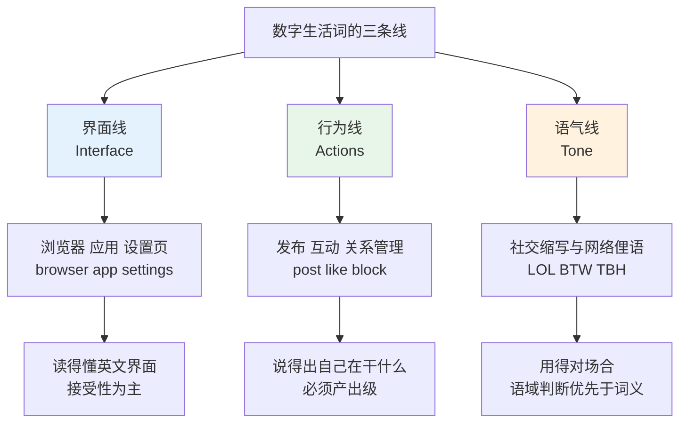
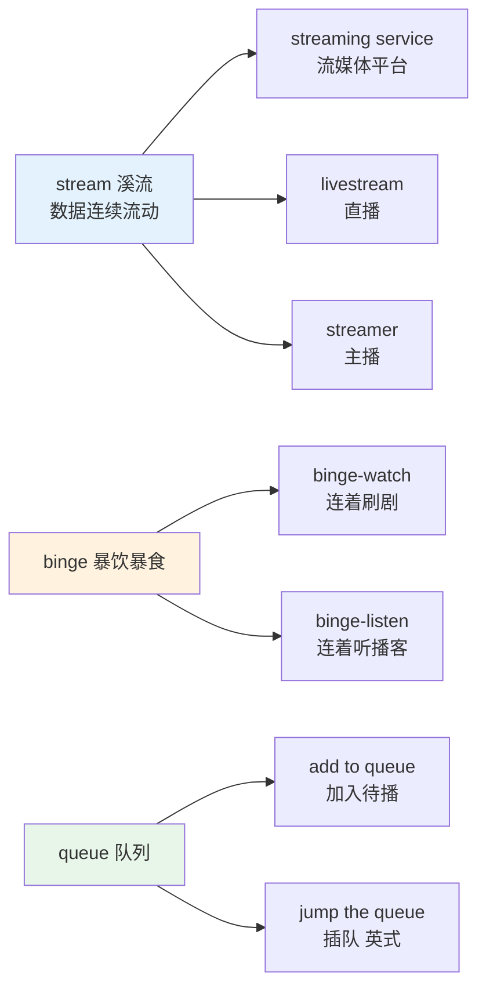
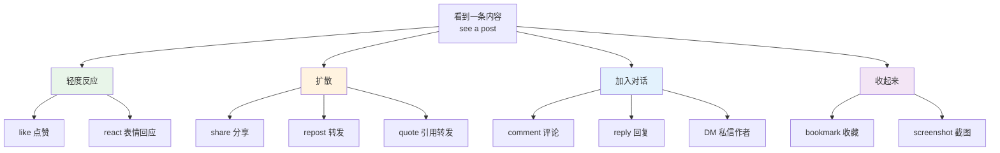
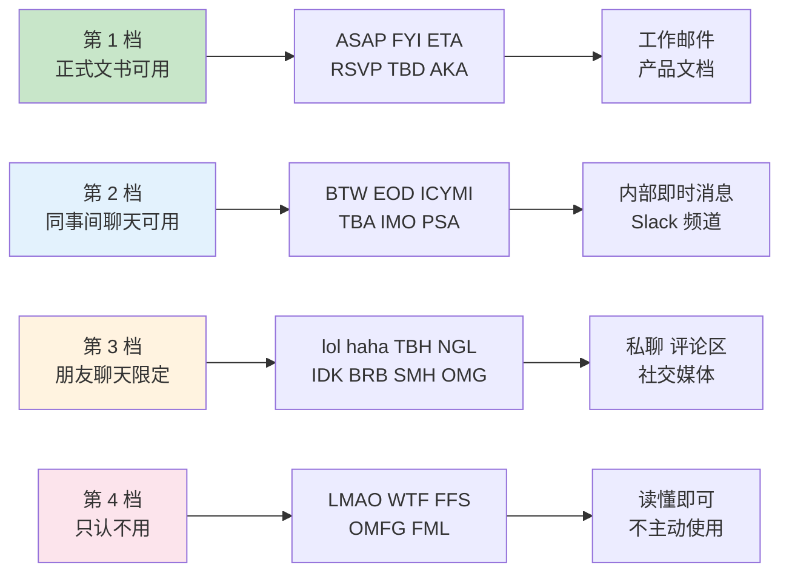
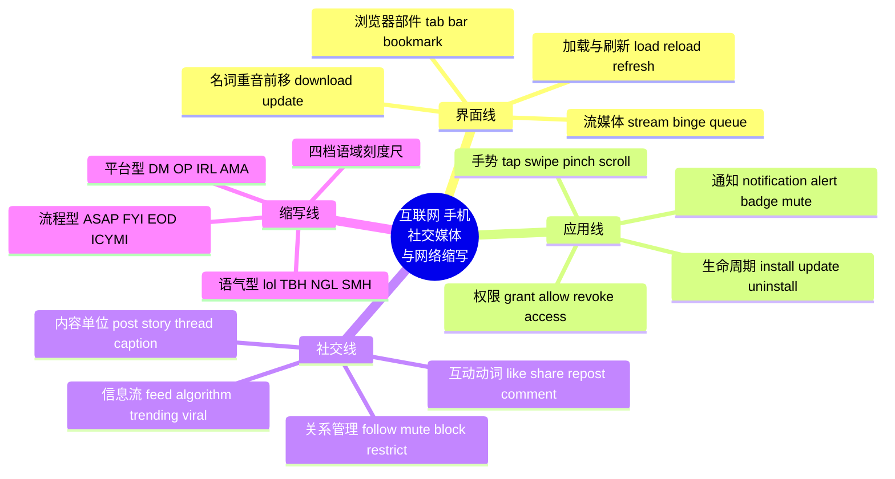

# 互联网、手机应用、社交媒体与网络缩写

> [!info] 本篇定位
>
> 12 章的第二篇，接在 `01.电脑硬件、软件、界面操作与文件管理` 之后。上一篇的落点在设备本身与本机文件，这一篇的落点在**联网之后**发生的事：打开浏览器、装一个 app、发一条帖子、在评论区打一句 `IMO`。
>
> 读完能做到三件事：看懂英文 app 的设置页面（`Permissions`、`Notifications`、`Privacy` 三块是重灾区）；用英语描述社交媒体上的动作而不是绕着说；在英文聊天里认出并恰当使用 `LOL` / `BTW` / `IMO` / `TBH` 这类缩写，同时知道哪些绝不能出现在工作邮件里。
>
> 边界说明：协议、加密、云服务、账号安全机制这些偏技术的词交给下一篇 `03.上网与数字生活里的技术词`；编程与工程缩略语（`API`、`CI`、`PR`）不在本篇，在 19 章和 21 章。本篇只收**非专业读者每天都会碰到**的那一层。

---

## 1. 本篇导读：数字生活词的三条线

英文的数字生活词有个特点，中文学习者常被它坑：**同一个日常动词被征用成了界面术语**，而中文往往另造了一个专用词。

`post` 本义是「张贴」，中文用「发帖」；`feed` 本义是「喂食」，中文用「信息流」；`thread` 本义是「线」，中文用「主题串」；`mute` 本义是「消音」，中文用「屏蔽」；`block` 本义是「阻挡」，中文用「拉黑」。中文的这些译名切断了与本义的联系，结果是中文母语者能看懂界面，却在需要主动说出来的时候想不起那个日常词。

第二个坑是**缩写没有语域标注**。词典里 `LOL` 只有一行「大笑」，不会告诉你它在 2010 年前后已经从「真的笑出声」滑向了「缓和语气的标点」，也不会告诉你 `FYI` 在工作邮件里完全成立而 `LOL` 不成立。缩写的难点从来不是意思，是**什么场合能用**。

第三个坑是**英美差异集中**。`mobile` / `cell phone`、`favourite` / `favorite`、`router` 的两种读音、`privacy` 的两种读音，都在这一层扎堆。



上图是本篇的组织方式。界面线（第 2 到 5 节）以认读为主，你不需要能主动说出 `Clear browsing data`，但要在设置页里一眼找到它；行为线（第 6 到 8 节）必须练到产出级，因为这些是你描述自己日常时绕不开的词；语气线（第 9、10 节）的重点不是背意思，是建立一把语域刻度尺。

---

## 2. 浏览器与网页操作

### 2.1 浏览器窗口的各个部件

英文浏览器界面的部件名基本是**空间隐喻**：`tab` 是文件夹上的标签舌，`bar` 是横条，`bookmark` 是夹在书里的书签。理解隐喻比死记译名有效得多。

| 英文 | 英式音标 | 美式音标 | 词性 | 中文 | 搭配与说明 |
| --- | --- | --- | --- | --- | --- |
| **browser** | /ˈbraʊzə/ | /ˈbraʊzər/ | n. | 浏览器 | 动词 browse「随意翻看」，本义是牲畜吃嫩叶 |
| **browse** | /braʊz/ | /braʊz/ | v. | 浏览；随便逛 | browse the web；实体店里也说 just browsing |
| **tab** | /tæb/ | /tæb/ | n. | 标签页 | open a new tab；关闭说 close a tab |
| **window** | /ˈwɪndəʊ/ | /ˈwɪndoʊ/ | n. | 窗口 | 与 tab 区分：window 是独立窗口 |
| **address bar** | /əˈdres bɑː/ | /ˈædres bɑːr/ | n. | 地址栏 | 名词 address 英式后重音、美式前重音 |
| **search bar** | /ˈsɜːtʃ bɑː/ | /ˈsɜːrtʃ bɑːr/ | n. | 搜索框 | 也说 search box |
| **toolbar** | /ˈtuːlbɑː/ | /ˈtuːlbɑːr/ | n. | 工具栏 | — |
| **sidebar** | /ˈsaɪdbɑː/ | /ˈsaɪdbɑːr/ | n. | 侧边栏 | — |
| **scroll bar** | /ˈskrəʊl bɑː/ | /ˈskroʊl bɑːr/ | n. | 滚动条 | — |
| **cursor** | /ˈkɜːsə/ | /ˈkɜːrsər/ | n. | 光标 | 鼠标指针另说 pointer |
| **extension** | /ɪkˈstenʃn/ | /ɪkˈstenʃn/ | n. | 扩展程序 | Chrome 用 extension，Firefox 也用 add-on |
| **add-on** | /ˈæd ɒn/ | /ˈæd ɑːn/ | n. | 附加组件 | 与 extension 大致同义 |
| **plug-in** | /ˈplʌɡ ɪn/ | /ˈplʌɡ ɪn/ | n. | 插件 | 更常用于播放器、编辑器 |
| **homepage** | /ˈhəʊmpeɪdʒ/ | /ˈhoʊmpeɪdʒ/ | n. | 主页 | set as homepage |
| **new tab page** | — | — | n. | 新标签页 | 界面固定说法 |

### 2.2 打开一个页面：从输入到加载

| 英文 | 英式音标 | 美式音标 | 词性 | 中文 | 搭配与说明 |
| --- | --- | --- | --- | --- | --- |
| **URL** | /ˌjuː ɑː ˈel/ | /ˌjuː ɑːr ˈel/ | n. | 网址 | 逐字母读；口语常直接说 link 或 address |
| **link** | /lɪŋk/ | /lɪŋk/ | n./v. | 链接 | click a link；link to a page |
| **click** | /klɪk/ | /klɪk/ | v./n. | 点击 | click on / click 都行，美式更常省 on |
| **open** | /ˈəʊpən/ | /ˈoʊpən/ | v. | 打开 | open in a new tab 是固定说法 |
| **load** | /ləʊd/ | /loʊd/ | v. | 加载 | the page is loading；加载失败 fail to load |
| **reload** | /ˌriːˈləʊd/ | /ˌriːˈloʊd/ | v. | 重新加载 | 与 refresh 同义，Chrome 按钮写 Reload |
| **refresh** | /rɪˈfreʃ/ | /rɪˈfreʃ/ | v./n. | 刷新 | hit refresh；名词重音也在后 |
| **back** | /bæk/ | /bæk/ | adv./v. | 返回 | go back；the back button |
| **forward** | /ˈfɔːwəd/ | /ˈfɔːrwərd/ | adv./v. | 前进；转发 | 邮件转发也用 forward |
| **navigate** | /ˈnævɪɡeɪt/ | /ˈnævɪɡeɪt/ | v. | 导航；跳转 | navigate to a page，偏书面 |
| **redirect** | /ˌriːdəˈrekt/ | /ˌriːdəˈrekt/ | v./n. | 重定向 | be redirected to another site |
| **broken link** | — | — | n. | 失效链接 | 也说 dead link |
| **404** | /ˌfɔː əʊ ˈfɔː/ | /ˌfɔːr oʊ ˈfɔːr/ | n. | 页面不存在 | 逐位读；口语可当动词 it 404'd |
| **pop-up** | /ˈpɒpʌp/ | /ˈpɑːpʌp/ | n. | 弹窗 | block pop-ups；动词短语 pop up 分写 |
| **banner** | /ˈbænə/ | /ˈbænər/ | n. | 横幅广告 | banner ad |

> [!example] 描述一次上网操作
>
> - I **opened** the report **in a new tab** and it kept **loading** forever.
>   - 我在新标签页里打开了那份报告，一直加载不出来。
> - The **link** is **broken** — it just **redirects** to a **404** page.
>   - 那个链接失效了，只会跳到一个 404 页面。
> - Try **refreshing** the page; if that doesn't work, clear your **cache**.
>   - 试试刷新页面，不行的话清一下缓存。

### 2.3 收藏、历史、下载与隐私数据

| 英文 | 英式音标 | 美式音标 | 词性 | 中文 | 搭配与说明 |
| --- | --- | --- | --- | --- | --- |
| **bookmark** | /ˈbʊkmɑːk/ | /ˈbʊkmɑːrk/ | n./v. | 书签；收藏 | Chrome 用 bookmark，Safari 用 favourite |
| **favourite** | /ˈfeɪvərɪt/ | — | n. | 收藏夹（英式拼写） | 英式与 Edge 界面用 Favourites |
| **favorite** | — | /ˈfeɪvərɪt/ | n. | 收藏夹（美式拼写） | 美式拼写少一个 u |
| **history** | /ˈhɪstri/ | /ˈhɪstri/ | n. | 浏览历史 | browsing history；clear history |
| **cache** | /kæʃ/ | /kæʃ/ | n./v. | 缓存 | 读作 cash，不读 /kætʃ/ |
| **cookie** | /ˈkʊki/ | /ˈkʊki/ | n. | 网站数据小文件 | accept / reject cookies |
| **clear** | /klɪə/ | /klɪr/ | v. | 清除 | clear browsing data 是界面固定说法 |
| **download** | /ˌdaʊnˈləʊd/ | /ˌdaʊnˈloʊd/ | v. | 下载（动词） | 动词重音靠后 |
| **download** | /ˈdaʊnləʊd/ | /ˈdaʊnloʊd/ | n. | 下载文件（名词） | 名词重音前移，见 2.4 |
| **upload** | /ˌʌpˈləʊd/ | /ˌʌpˈloʊd/ | v. | 上传 | 名词同样重音前移 |
| **attachment** | /əˈtætʃmənt/ | /əˈtætʃmənt/ | n. | 附件 | open / download an attachment |
| **incognito** | /ˌɪnkɒɡˈniːtəʊ/ | /ˌɪnkɑːɡˈniːtoʊ/ | adj./n. | 无痕模式 | Chrome 用词；意大利语借词 |
| **private browsing** | — | — | n. | 隐私浏览 | Safari 与 Firefox 的说法 |
| **autofill** | /ˈɔːtəʊfɪl/ | /ˈɔːtoʊfɪl/ | n./v. | 自动填充 | 也写 auto-fill |
| **sync** | /sɪŋk/ | /sɪŋk/ | v./n. | 同步 | synchronize 的截短形，日常只用 sync |

### 2.4 名词前移的重音规律

`download`、`upload`、`update`、`upgrade`、`record`、`increase` 这批词共享同一条规律：**做动词时重音在后，做名词时重音前移到第一音节**。这条规律来自英语的一个总体倾向——双音节的动名同形词往往靠重音区分词性。

```text
动词：to down·LOAD  /ˌdaʊnˈləʊd/     I need to downLOAD the file.
名词：a  DOWN·load  /ˈdaʊnləʊd/      The DOWNload failed.

动词：to up·DATE    /ˌʌpˈdeɪt/       They upDATEd the app.
名词：an UP·date    /ˈʌpdeɪt/        There's a new UPdate.
```

> [!warning] 中文母语者的通病：全部读成动词重音
>
> 中文没有重音区分词性的机制，所以中文学习者习惯把 `update`、`download` 一律读成后重音。听感上不算错，但在句子里会造成节奏错位，母语者会觉得「哪里怪怪的」。
>
> - ❌ ~~There's a new upDATE.~~（名词读成动词重音）
> - ✅ There's a new **UP**date.
>
> 实操建议：只要词前有 `a`、`an`、`the`、`this` 这类限定词，重音就前移。这个判据比记词性可靠。

---

## 3. 网络连接、速度与流媒体

### 3.1 连上网这件事

| 英文 | 英式音标 | 美式音标 | 词性 | 中文 | 搭配与说明 |
| --- | --- | --- | --- | --- | --- |
| **Wi-Fi** | /ˈwaɪfaɪ/ | /ˈwaɪfaɪ/ | n. | 无线网 | 不读 /ˈwaɪfi/；connect to Wi-Fi |
| **network** | /ˈnetwɜːk/ | /ˈnetwɜːrk/ | n. | 网络 | 也指人脉；动词 network 指社交 |
| **connect** | /kəˈnekt/ | /kəˈnekt/ | v. | 连接 | connect to the network |
| **connection** | /kəˈnekʃn/ | /kəˈnekʃn/ | n. | 连接；网络状况 | a poor connection |
| **disconnect** | /ˌdɪskəˈnekt/ | /ˌdɪskəˈnekt/ | v. | 断开连接 | 被断线用被动 I got disconnected |
| **router** | /ˈruːtə/ | /ˈraʊtər/ | n. | 路由器 | 英美读音差异最大的常用词之一 |
| **hotspot** | /ˈhɒtspɒt/ | /ˈhɑːtspɑːt/ | n. | 热点 | turn on your hotspot |
| **signal** | /ˈsɪɡnəl/ | /ˈsɪɡnəl/ | n. | 信号 | weak / strong signal；不说 signal is bad quality |
| **bars** | /bɑːz/ | /bɑːrz/ | n. | 信号格 | I only have one bar 是最自然的说法 |
| **coverage** | /ˈkʌvərɪdʒ/ | /ˈkʌvərɪdʒ/ | n. | 信号覆盖 | no coverage in the tunnel |
| **online** | /ˌɒnˈlaɪn/ | /ˌɑːnˈlaɪn/ | adj./adv. | 在线 | go online；作定语时重音可前移 |
| **offline** | /ˌɒfˈlaɪn/ | /ˌɔːfˈlaɪn/ | adj./adv. | 离线 | 会议里 take it offline 指私下再谈 |
| **data** | /ˈdeɪtə/ | /ˈdeɪtə/ | n. | 流量；数据 | mobile data；美式也听得到 /ˈdætə/ |
| **data plan** | — | — | n. | 流量套餐 | 英式常说 data allowance |
| **roaming** | /ˈrəʊmɪŋ/ | /ˈroʊmɪŋ/ | n. | 漫游 | turn off data roaming |
| **carrier** | — | /ˈkæriər/ | n. | 运营商（美式） | 英式说 network provider |

### 3.2 慢、卡、断：抱怨网速的词

这一组是日常抱怨里出现频率最高的，但中文学习者往往只会一个 `slow`。

| 英文 | 英式音标 | 美式音标 | 词性 | 中文 | 搭配与说明 |
| --- | --- | --- | --- | --- | --- |
| **bandwidth** | /ˈbændwɪdθ/ | /ˈbændwɪdθ/ | n. | 带宽 | 引申义指精力：I don't have the bandwidth |
| **speed** | /spiːd/ | /spiːd/ | n. | 网速 | download / upload speed |
| **lag** | /læɡ/ | /læɡ/ | n./v. | 卡顿；延迟 | the video is lagging；游戏语境高频 |
| **laggy** | /ˈlæɡi/ | /ˈlæɡi/ | adj. | 卡的 | 口语形容词，非正式 |
| **buffer** | /ˈbʌfə/ | /ˈbʌfər/ | v./n. | 缓冲 | it keeps buffering 是最常见的抱怨句 |
| **freeze** | /friːz/ | /friːz/ | v. | 卡住不动 | the screen froze；过去式 froze |
| **glitch** | /ɡlɪtʃ/ | /ɡlɪtʃ/ | n./v. | 小故障 | a glitch in the app，程度轻于 bug |
| **crash** | /kræʃ/ | /kræʃ/ | v./n. | 崩溃闪退 | the app crashed |
| **drop** | /drɒp/ | /drɑːp/ | v. | 掉线 | the call dropped；the connection dropped |
| **outage** | /ˈaʊtɪdʒ/ | /ˈaʊtɪdʒ/ | n. | 服务中断 | a network outage；公告用词 |
| **downtime** | /ˈdaʊntaɪm/ | /ˈdaʊntaɪm/ | n. | 停机时间 | scheduled downtime |
| **spotty** | /ˈspɒti/ | /ˈspɑːti/ | adj. | 时好时坏的 | spotty Wi-Fi，美式口语高频 |
| **patchy** | /ˈpætʃi/ | /ˈpætʃi/ | adj. | 断断续续的 | 英式更常用，对应美式 spotty |

> [!example] 抱怨网络的五种说法
>
> - The Wi-Fi here is really **spotty**.
>   - 这儿的无线网时好时坏。
> - Sorry, you're **breaking up** — I think my **connection** is bad.
>   - 抱歉，你的声音断断续续，我这边网不行。
> - The video keeps **buffering** every ten seconds.
>   - 这视频每十秒就缓冲一次。
> - My call **dropped** twice during the meeting.
>   - 开会时我掉线了两次。
> - I'm **out of data** until the 25th.
>   - 我流量用完了，得等到 25 号。

### 3.3 流媒体与在线内容

`stream` 的本义是「溪流」，动词是「流动」。流媒体的命名逻辑就在这里：数据像水一样连续流过来，不必先攒成一整个文件。理解本义之后，`streaming service`、`livestream`、`streamer` 三个词是一次性拿下的。

| 英文 | 英式音标 | 美式音标 | 词性 | 中文 | 搭配与说明 |
| --- | --- | --- | --- | --- | --- |
| **stream** | /striːm/ | /striːm/ | v./n. | 在线播放；直播 | stream a movie；名词本义是溪流 |
| **streaming** | /ˈstriːmɪŋ/ | /ˈstriːmɪŋ/ | n./adj. | 流媒体 | a streaming service / platform |
| **livestream** | /ˈlaɪvstriːm/ | /ˈlaɪvstriːm/ | n./v. | 直播 | live 在此读 /laɪv/ 不读 /lɪv/ |
| **streamer** | /ˈstriːmə/ | /ˈstriːmər/ | n. | 主播 | 游戏直播语境；泛指主播用 host |
| **on demand** | /ˌɒn dɪˈmɑːnd/ | /ˌɑːn dɪˈmænd/ | adj./adv. | 点播的 | video on demand，缩写 VOD |
| **subscription** | /səbˈskrɪpʃn/ | /səbˈskrɪpʃn/ | n. | 订阅 | cancel a subscription |
| **free trial** | /ˌfriː ˈtraɪəl/ | /ˌfriː ˈtraɪəl/ | n. | 免费试用期 | start a free trial |
| **episode** | /ˈepɪsəʊd/ | /ˈepɪsoʊd/ | n. | 一集 | 播客也用 episode |
| **season** | /ˈsiːzn/ | /ˈsiːzn/ | n. | 一季 | season two，不说 the second quarter |
| **binge-watch** | /ˈbɪndʒ wɒtʃ/ | /ˈbɪndʒ wɑːtʃ/ | v. | 刷剧 | binge 本义是「暴饮暴食」 |
| **spoiler** | /ˈspɔɪlə/ | /ˈspɔɪlər/ | n. | 剧透 | spoiler alert 是提醒别人的固定短语 |
| **trailer** | /ˈtreɪlə/ | /ˈtreɪlər/ | n. | 预告片 | 也叫 preview |
| **subtitles** | /ˈsʌbtaɪtlz/ | /ˈsʌbtaɪtlz/ | n. | 字幕 | turn on subtitles，恒用复数 |
| **captions** | /ˈkæpʃnz/ | /ˈkæpʃnz/ | n. | 字幕；配文 | 美式界面多用 captions；社媒里指配文 |
| **dub** | /dʌb/ | /dʌb/ | v. | 配音 | dubbed in English；名词 dubbing |
| **playlist** | /ˈpleɪlɪst/ | /ˈpleɪlɪst/ | n. | 播放列表 | add to a playlist |
| **shuffle** | /ˈʃʌfl/ | /ˈʃʌfl/ | v./n. | 随机播放 | 本义是洗牌 |
| **queue** | /kjuː/ | /kjuː/ | n./v. | 待播队列 | 只读一个音节；英式也指排队 |
| **autoplay** | /ˈɔːtəʊpleɪ/ | /ˈɔːtoʊpleɪ/ | n./v. | 自动播放 | turn off autoplay |
| **skip** | /skɪp/ | /skɪp/ | v. | 跳过 | skip the ad / skip ahead |
| **pause** | /pɔːz/ | /pɔːz/ | v./n. | 暂停 | hit pause |
| **resume** | /rɪˈzjuːm/ | /rɪˈzuːm/ | v. | 继续播放 | 与名词「简历」/ˈrezjʊmeɪ/ 重音完全不同 |
| **resolution** | /ˌrezəˈluːʃn/ | /ˌrezəˈluːʃn/ | n. | 分辨率 | 也指「决心」和「决议」 |
| **ad-free** | /ˌæd ˈfriː/ | /ˌæd ˈfriː/ | adj. | 无广告的 | -free 构词见 14 章 |
| **advertisement** | /ədˈvɜːtɪsmənt/ | /ˌædvərˈtaɪzmənt/ | n. | 广告 | 英美重音与元音全不同，口语一律说 ad |
| **podcast** | /ˈpɒdkɑːst/ | /ˈpɑːdkæst/ | n. | 播客 | iPod + broadcast 的混成词 |
| **vlog** | /vlɒɡ/ | /vlɑːɡ/ | n./v. | 视频博客 | video + blog |
| **blog** | /blɒɡ/ | /blɑːɡ/ | n./v. | 博客 | web + log 的截短混成 |



上图展示的是这一层词的共同结构：一个具象本义带出一串数字语境的派生用法。`stream` 从溪流到流媒体、`binge` 从暴食到刷剧、`queue` 从排队到待播列表，都是同一种隐喻迁移。抓住本义，派生义不需要单独记忆；只记译名，则这些词彼此孤立。

---

## 4. 手机与应用：安装、通知、权限

### 4.1 手机本身怎么说

| 英文 | 英式音标 | 美式音标 | 词性 | 中文 | 搭配与说明 |
| --- | --- | --- | --- | --- | --- |
| **mobile** | /ˈməʊbaɪl/ | /ˈmoʊbl/ | n./adj. | 手机（英式）；移动的 | 英式名词直接指手机，美式读音也不同 |
| **cell phone** | — | /ˈsel foʊn/ | n. | 手机（美式） | 也写 cellphone；英式不用 |
| **smartphone** | /ˈsmɑːtfəʊn/ | /ˈsmɑːrtfoʊn/ | n. | 智能手机 | 中性通用，两边都懂 |
| **screen** | /skriːn/ | /skriːn/ | n. | 屏幕 | screen time 指屏幕使用时长 |
| **home screen** | — | — | n. | 主屏幕 | 安卓与 iOS 通用界面词 |
| **lock screen** | — | — | n. | 锁屏 | — |
| **icon** | /ˈaɪkɒn/ | /ˈaɪkɑːn/ | n. | 图标 | 也指「偶像人物」 |
| **widget** | /ˈwɪdʒɪt/ | /ˈwɪdʒɪt/ | n. | 小组件 | 本义是「小玩意儿」 |
| **charger** | /ˈtʃɑːdʒə/ | /ˈtʃɑːrdʒər/ | n. | 充电器 | — |
| **battery** | /ˈbætri/ | /ˈbætəri/ | n. | 电池 | battery life 指续航 |
| **storage** | /ˈstɔːrɪdʒ/ | /ˈstɔːrɪdʒ/ | n. | 存储空间 | run out of storage |
| **airplane mode** | — | /ˈerpleɪn moʊd/ | n. | 飞行模式（美式） | 英式说 flight mode |
| **screenshot** | /ˈskriːnʃɒt/ | /ˈskriːnʃɑːt/ | n./v. | 截图 | 可直接当动词：I screenshotted it |

### 4.2 应用的生命周期

`app` 是 `application` 的截短，但两者已经分工：手机上的一律叫 `app`，电脑上的传统软件更常说 `application` 或 `program`。求职时的「申请」也是 `application`，同形不同义。

| 英文 | 英式音标 | 美式音标 | 词性 | 中文 | 搭配与说明 |
| --- | --- | --- | --- | --- | --- |
| **app** | /æp/ | /æp/ | n. | 应用 | application 的截短，已独立成词 |
| **app store** | — | — | n. | 应用商店 | 安卓侧说 Play Store |
| **install** | /ɪnˈstɔːl/ | /ɪnˈstɔːl/ | v. | 安装 | 名词 installation |
| **uninstall** | /ˌʌnɪnˈstɔːl/ | /ˌʌnɪnˈstɔːl/ | v. | 卸载 | 手机上也说 delete the app |
| **update** | /ˌʌpˈdeɪt/ | /ˌʌpˈdeɪt/ | v. | 更新 | 名词读 /ˈʌpdeɪt/ |
| **upgrade** | /ˌʌpˈɡreɪd/ | /ˌʌpˈɡreɪd/ | v. | 升级 | update 是修补，upgrade 是升档 |
| **version** | /ˈvɜːʃn/ | /ˈvɜːrʒn/ | n. | 版本 | 英式 /ʃ/，美式常读 /ʒ/ |
| **launch** | /lɔːntʃ/ | /lɔːntʃ/ | v./n. | 启动；上线发布 | launch an app / a product launch |
| **open** | /ˈəʊpən/ | /ˈoʊpən/ | v. | 打开 | 日常说 open the app 多于 launch |
| **close** | /kləʊz/ | /kloʊz/ | v. | 关闭 | 彻底关掉说 force close / force quit |
| **restart** | /ˌriːˈstɑːt/ | /ˌriːˈstɑːrt/ | v. | 重启 | 也说 reboot（偏技术） |
| **sign in** | — | — | v. | 登录 | 与 log in 通用 |
| **in-app purchase** | — | — | n. | 应用内购买 | 缩写 IAP，商店页面固定说法 |
| **subscription** | /səbˈskrɪpʃn/ | /səbˈskrɪpʃn/ | n. | 订阅 | manage subscriptions |
| **compatible** | /kəmˈpætəbl/ | /kəmˈpætəbl/ | adj. | 兼容的 | not compatible with your device |

### 4.3 通知：这一组词界面上天天见

| 英文 | 英式音标 | 美式音标 | 词性 | 中文 | 搭配与说明 |
| --- | --- | --- | --- | --- | --- |
| **notification** | /ˌnəʊtɪfɪˈkeɪʃn/ | /ˌnoʊtɪfɪˈkeɪʃn/ | n. | 通知 | 复数常用；turn off notifications |
| **notify** | /ˈnəʊtɪfaɪ/ | /ˈnoʊtɪfaɪ/ | v. | 通知 | notify sb of sth |
| **alert** | /əˈlɜːt/ | /əˈlɜːrt/ | n./v./adj. | 提醒；警报 | 比 notification 更强调紧急 |
| **reminder** | /rɪˈmaɪndə/ | /rɪˈmaɪndər/ | n. | 提醒事项 | set a reminder |
| **badge** | /bædʒ/ | /bædʒ/ | n. | 角标红点 | 图标上那个数字圈；也指认证徽章 |
| **banner** | /ˈbænə/ | /ˈbænər/ | n. | 横幅通知 | iOS 通知样式选项 |
| **pop-up** | /ˈpɒpʌp/ | /ˈpɑːpʌp/ | n. | 弹窗提示 | — |
| **push** | /pʊʃ/ | /pʊʃ/ | n./adj. | 推送 | push notification |
| **mute** | /mjuːt/ | /mjuːt/ | v. | 静音；免打扰 | mute a chat 指对某个会话免打扰 |
| **silence** | /ˈsaɪləns/ | /ˈsaɪləns/ | v./n. | 静音 | silence your phone 是会前提醒的固定说法 |
| **vibrate** | /vaɪˈbreɪt/ | /ˈvaɪbreɪt/ | v. | 震动 | 英式后重音，美式前重音；名词 vibration |
| **snooze** | /snuːz/ | /snuːz/ | v. | 稍后提醒 | 闹钟按钮上的词，本义是打盹 |
| **dismiss** | /dɪsˈmɪs/ | /dɪsˈmɪs/ | v. | 关闭（通知） | swipe to dismiss |
| **Do Not Disturb** | — | — | n. | 勿扰模式 | 缩写 DND，三词首字母大写 |
| **opt in** | /ˌɒpt ˈɪn/ | /ˌɑːpt ˈɪn/ | v. | 主动选择接收 | opt in to notifications |
| **opt out** | /ˌɒpt ˈaʊt/ | /ˌɑːpt ˈaʊt/ | v. | 选择退出 | opt out of tracking |

> [!warning] mute 与 block 不是一回事
>
> 中文都能说成「屏蔽」，英文分得很清楚，用错会造成社交误会。
>
> - **mute** = 我不再看到你的内容，**但你不知道**，我们仍是好友/互关关系。
> - **block** = 你看不到我，我也看不到你，**关系直接切断**，对方通常能察觉。
> - **unfollow** = 取消关注，我不再看到你的更新，公开可见（对方可能会发现粉丝数少了）。
>
> 语气强度：`mute` < `unfollow` < `block`。把「我把他静音了」说成 `I blocked him` 是完全不同的一件事。

### 4.4 权限：设置页里最容易读错的一块

`permission` 这个词在英文界面里指「应用向系统申请的访问许可」，它的搭配动词是一套固定组合，中文学习者常凭直觉造错。

| 英文 | 英式音标 | 美式音标 | 词性 | 中文 | 搭配与说明 |
| --- | --- | --- | --- | --- | --- |
| **permission** | /pəˈmɪʃn/ | /pərˈmɪʃn/ | n. | 权限；许可 | app permissions 恒用复数 |
| **access** | /ˈækses/ | /ˈækses/ | n./v. | 访问权；访问 | 名词重音在前；grant access to |
| **grant** | /ɡrɑːnt/ | /ɡrænt/ | v. | 授予 | grant permission，正式界面用词 |
| **allow** | /əˈlaʊ/ | /əˈlaʊ/ | v. | 允许 | 弹窗按钮上通常是 Allow |
| **deny** | /dɪˈnaɪ/ | /dɪˈnaɪ/ | v. | 拒绝 | 按钮上也可能写 Don't Allow |
| **revoke** | /rɪˈvəʊk/ | /rɪˈvoʊk/ | v. | 撤销 | revoke permission，偏正式 |
| **enable** | /ɪˈneɪbl/ | /ɪˈneɪbl/ | v. | 启用 | enable location services |
| **disable** | /dɪsˈeɪbl/ | /dɪsˈeɪbl/ | v. | 停用 | — |
| **location** | /ləʊˈkeɪʃn/ | /loʊˈkeɪʃn/ | n. | 位置 | location services；share your location |
| **microphone** | /ˈmaɪkrəfəʊn/ | /ˈmaɪkrəfoʊn/ | n. | 麦克风 | 口语截短为 mic /maɪk/ |
| **contacts** | /ˈkɒntækts/ | /ˈkɑːntækts/ | n. | 通讯录 | 名词重音在前 |
| **background** | /ˈbækɡraʊnd/ | /ˈbækɡraʊnd/ | n./adj. | 后台 | run in the background |
| **foreground** | /ˈfɔːɡraʊnd/ | /ˈfɔːrɡraʊnd/ | n. | 前台 | 与 background 对举 |
| **tracking** | /ˈtrækɪŋ/ | /ˈtrækɪŋ/ | n. | 追踪 | Ask App Not to Track 是 iOS 原文 |
| **prompt** | /prɒmpt/ | /prɑːmpt/ | n./v. | 提示；弹出询问 | you'll be prompted to allow access |

> [!warning] permission 的搭配不能靠中文推
>
> 中文说「给权限」「开权限」，直译过去全是错的。
>
> - ❌ ~~give the permission~~ / ~~open the permission~~
> - ✅ **grant permission** / **allow access** / **turn on the permission**
> - ❌ ~~The app wants my camera permission.~~（生硬）
> - ✅ The app is **asking for access to** my camera.
> - ❌ ~~close the permission~~
> - ✅ **revoke** the permission / **turn off** camera access

### 4.5 触屏手势

手势词是纯动作词，短、单音节居多，都是日耳曼层的老词被重新征用。

| 英文 | 英式音标 | 美式音标 | 词性 | 中文 | 搭配与说明 |
| --- | --- | --- | --- | --- | --- |
| **tap** | /tæp/ | /tæp/ | v./n. | 轻点 | 触屏说 tap，不说 click |
| **double-tap** | — | — | v. | 双击 | Instagram 上双击即点赞 |
| **swipe** | /swaɪp/ | /swaɪp/ | v./n. | 滑动 | swipe left / right / up / down |
| **scroll** | /skrəʊl/ | /skroʊl/ | v. | 滚动 | scroll down；本义是卷轴 |
| **pinch** | /pɪntʃ/ | /pɪntʃ/ | v. | 双指捏合 | pinch to zoom out |
| **spread** | /spred/ | /spred/ | v. | 双指张开 | 也说 pinch out |
| **zoom** | /zuːm/ | /zuːm/ | v. | 缩放 | zoom in 放大，zoom out 缩小 |
| **drag** | /dræɡ/ | /dræɡ/ | v. | 拖动 | drag and drop |
| **press and hold** | — | — | v. | 长按 | 也说 long-press，安卓文档常见 |
| **rotate** | /rəʊˈteɪt/ | /ˈroʊteɪt/ | v. | 旋转 | 英式后重音，美式前重音 |
| **shake** | /ʃeɪk/ | /ʃeɪk/ | v. | 摇一摇 | shake to undo 是 iOS 功能名 |
| **pull to refresh** | — | — | — | 下拉刷新 | 界面固定说法 |

> [!tip] tap 与 click 的分工
>
> `click` 来自鼠标按键的拟声，所以严格说只用于**有物理按键的输入设备**；触屏上的动作是 `tap`。
>
> 实际用法比这宽松：手机上说 `click the button` 母语者也能懂，但产品文档、教程、客服对话里一律区分。写英文操作说明时按设备选词，会显得专业得多。

---

## 5. 账号、资料与隐私设置

### 5.1 注册与登录

`log in`、`login`、`log into` 三个形式最容易混。规律是：**分写是动词，连写是名词或形容词**。

| 英文 | 英式音标 | 美式音标 | 词性 | 中文 | 搭配与说明 |
| --- | --- | --- | --- | --- | --- |
| **account** | /əˈkaʊnt/ | /əˈkaʊnt/ | n. | 账号 | create / delete an account |
| **sign up** | /ˌsaɪn ˈʌp/ | /ˌsaɪn ˈʌp/ | v. | 注册 | sign up for a service |
| **sign-up** | /ˈsaɪn ʌp/ | /ˈsaɪn ʌp/ | n. | 注册（名词） | 连字符形式，重音前移 |
| **register** | /ˈredʒɪstə/ | /ˈredʒɪstər/ | v. | 注册 | 比 sign up 正式；名词 registration |
| **log in** | /ˌlɒɡ ˈɪn/ | /ˌlɔːɡ ˈɪn/ | v. | 登录 | log in to sth 分写最常见，log into 也成立 |
| **login** | /ˈlɒɡɪn/ | /ˈlɔːɡɪn/ | n./adj. | 登录信息 | your login details |
| **log out** | /ˌlɒɡ ˈaʊt/ | /ˌlɔːɡ ˈaʊt/ | v. | 退出登录 | 也说 sign out |
| **username** | /ˈjuːzəneɪm/ | /ˈjuːzərneɪm/ | n. | 用户名 | — |
| **password** | /ˈpɑːswɜːd/ | /ˈpæswɜːrd/ | n. | 密码 | 英美 a 音不同 |
| **passcode** | /ˈpɑːskəʊd/ | /ˈpæskoʊd/ | n. | 数字密码 | 手机解锁那种 |
| **reset** | /ˌriːˈset/ | /ˌriːˈset/ | v. | 重置 | reset your password |
| **recover** | /rɪˈkʌvə/ | /rɪˈkʌvər/ | v. | 找回 | recover your account |
| **verify** | /ˈverɪfaɪ/ | /ˈverɪfaɪ/ | v. | 验证 | verify your email |
| **verification code** | — | — | n. | 验证码 | 也说 confirmation code |
| **two-factor** | — | — | adj. | 双因素的 | two-factor authentication，缩写 2FA |
| **log** | /lɒɡ/ | /lɔːɡ/ | n./v. | 日志；记录 | log in 的 log 本义是航海日志 |

> [!warning] 三个高频拼写错误
>
> - ❌ ~~I need to login to my account.~~（动词位置用了名词形式）
> - ✅ I need to **log in to** my account.
> - ❌ ~~Please fill your login.~~
> - ✅ Please **enter** your **login details**.（fill 必须带小品词：英式 fill in the form，美式 fill out the form）
> - ❌ ~~sign in the app~~
> - ✅ **sign in to** the app

### 5.2 个人资料页

| 英文 | 英式音标 | 美式音标 | 词性 | 中文 | 搭配与说明 |
| --- | --- | --- | --- | --- | --- |
| **profile** | /ˈprəʊfaɪl/ | /ˈproʊfaɪl/ | n. | 个人主页 | 也指侧脸轮廓 |
| **profile picture** | — | — | n. | 头像 | 缩写 pfp，社媒里高频 |
| **avatar** | /ˈævətɑː/ | /ˈævətɑːr/ | n. | 虚拟形象 | 来自梵语，指神的化身 |
| **bio** | /ˈbaɪəʊ/ | /ˈbaɪoʊ/ | n. | 个人简介 | biography 的截短；link in bio |
| **handle** | /ˈhændl/ | /ˈhændl/ | n. | 账号名 | @ 后面那串；来自无线电呼号 |
| **display name** | — | — | n. | 显示名称 | 与 handle 区分：可重复、可改 |
| **banner** | /ˈbænə/ | /ˈbænər/ | n. | 主页横幅图 | 也说 cover photo / header |
| **verified** | /ˈverɪfaɪd/ | /ˈverɪfaɪd/ | adj. | 已认证的 | a verified account |
| **pronouns** | /ˈprəʊnaʊnz/ | /ˈproʊnaʊnz/ | n. | 人称代词标注 | 简介里标注 he/him、she/her、they/them |
| **status** | /ˈsteɪtəs/ | /ˈstætəs/ | n. | 状态 | 英美元音不同；也指 WhatsApp 的动态 |

### 5.3 隐私与安全设置

| 英文 | 英式音标 | 美式音标 | 词性 | 中文 | 搭配与说明 |
| --- | --- | --- | --- | --- | --- |
| **privacy** | /ˈprɪvəsi/ | /ˈpraɪvəsi/ | n. | 隐私 | 英美第一个元音不同 |
| **settings** | /ˈsetɪŋz/ | /ˈsetɪŋz/ | n. | 设置 | 恒用复数 |
| **public** | /ˈpʌblɪk/ | /ˈpʌblɪk/ | adj. | 公开的 | set your account to public |
| **private** | /ˈpraɪvət/ | /ˈpraɪvət/ | adj. | 私密的 | go private 指把账号设为私密 |
| **visible** | /ˈvɪzəbl/ | /ˈvɪzəbl/ | adj. | 可见的 | visible to followers only |
| **restrict** | /rɪˈstrɪkt/ | /rɪˈstrɪkt/ | v. | 限制 | Instagram 的 restrict 是弱化版 block |
| **hide** | /haɪd/ | /haɪd/ | v. | 隐藏 | hide a post from someone |
| **report** | /rɪˈpɔːt/ | /rɪˈpɔːrt/ | v./n. | 举报 | report a post / report abuse |
| **flag** | /flæɡ/ | /flæɡ/ | v. | 标记（可疑内容） | flag a comment，比 report 轻 |
| **consent** | /kənˈsent/ | /kənˈsent/ | n./v. | 同意 | cookie consent banner |
| **terms** | /tɜːmz/ | /tɜːrmz/ | n. | 条款 | terms of service，缩写 ToS |
| **deactivate** | /diˈæktɪveɪt/ | /diˈæktɪveɪt/ | v. | 停用账号 | 与 delete 区分：可恢复 |

---

## 6. 社交媒体：内容单位与信息流

### 6.1 一条内容叫什么

社交媒体的内容单位在中文里被拆得很细（帖子、动态、说说、朋友圈、短视频），英文则集中在几个通用词上，靠平台习惯区分。

| 英文 | 英式音标 | 美式音标 | 词性 | 中文 | 搭配与说明 |
| --- | --- | --- | --- | --- | --- |
| **post** | /pəʊst/ | /poʊst/ | n./v. | 帖子；发布 | 本义「张贴」；post a photo |
| **update** | /ˈʌpdeɪt/ | /ˈʌpdeɪt/ | n. | 动态 | a status update |
| **story** | /ˈstɔːri/ | /ˈstɔːri/ | n. | 限时动态 | 24 小时后消失的那种 |
| **reel** | /riːl/ | /riːl/ | n. | 短视频 | 本义是胶片卷盘 |
| **clip** | /klɪp/ | /klɪp/ | n. | 片段 | a short clip |
| **thread** | /θred/ | /θred/ | n. | 主题串 | 一串连续帖子；论坛里指整个讨论串 |
| **comment** | /ˈkɒment/ | /ˈkɑːment/ | n./v. | 评论 | 名词重音在前；comment on a post |
| **reply** | /rɪˈplaɪ/ | /rɪˈplaɪ/ | n./v. | 回复 | reply to a comment |
| **caption** | /ˈkæpʃn/ | /ˈkæpʃn/ | n. | 配文 | 图片下面那段字 |
| **meme** | /miːm/ | /miːm/ | n. | 梗图 | 读作 /miːm/，不读 /ˈmiːmi/ |
| **GIF** | /ɡɪf/ | /ɡɪf/ | n. | 动图 | 也读 /dʒɪf/，两种读音长期并存 |
| **emoji** | /ɪˈməʊdʒi/ | /ɪˈmoʊdʒi/ | n. | 表情符号 | 日语借词，复数可写 emoji 或 emojis |
| **emoticon** | /ɪˈməʊtɪkɒn/ | /ɪˈmoʊtɪkɑːn/ | n. | 颜文字 | 指 :-) 这类字符拼的，与 emoji 不同 |
| **sticker** | /ˈstɪkə/ | /ˈstɪkər/ | n. | 贴纸 | 聊天里的大表情 |
| **poll** | /pəʊl/ | /poʊl/ | n. | 投票 | run a poll；本义是民调 |
| **draft** | /drɑːft/ | /dræft/ | n./v. | 草稿 | save as a draft |

> [!warning] post 与 send 不能互换
>
> 中文「发」一个字通吃，英文按**发给谁**分。
>
> - ❌ ~~I sent a post on Instagram.~~
> - ✅ I **posted** something on Instagram.（公开发布）
> - ❌ ~~I posted him a message.~~（这句在英式英语里意思是「我给他寄了封信」）
> - ✅ I **sent** him a message. / I **DM'd** him.（私下发送）
>
> 判据：面向所有人 → `post`；面向特定的人 → `send` / `DM` / `message`。

### 6.2 信息流与推荐机制

| 英文 | 英式音标 | 美式音标 | 词性 | 中文 | 搭配与说明 |
| --- | --- | --- | --- | --- | --- |
| **feed** | /fiːd/ | /fiːd/ | n. | 信息流 | 本义「喂食」；scroll through your feed |
| **timeline** | /ˈtaɪmlaɪn/ | /ˈtaɪmlaɪn/ | n. | 时间线 | 按时间排的 feed |
| **algorithm** | /ˈælɡərɪðəm/ | /ˈælɡərɪðəm/ | n. | 算法 | 中间是 /ð/ 不是 /θ/ |
| **recommend** | /ˌrekəˈmend/ | /ˌrekəˈmend/ | v. | 推荐 | recommended for you |
| **trending** | /ˈtrendɪŋ/ | /ˈtrendɪŋ/ | adj. | 正在热议的 | it's trending；名词 trend |
| **viral** | /ˈvaɪrəl/ | /ˈvaɪrəl/ | adj. | 病毒式传播的 | go viral 是固定搭配 |
| **hashtag** | /ˈhæʃtæɡ/ | /ˈhæʃtæɡ/ | n. | 话题标签 | # 符号本身叫 hash（英）/ pound（美） |
| **explore** | /ɪkˈsplɔː/ | /ɪkˈsplɔːr/ | n./v. | 发现页 | Explore tab |
| **discover** | /dɪˈskʌvə/ | /dɪˈskʌvər/ | v. | 发现 | Discover feed |
| **refresh** | /rɪˈfreʃ/ | /rɪˈfreʃ/ | v. | 刷新 | 与 2.2 同词，社媒语境高频 |
| **infinite scroll** | — | — | n. | 无限下拉 | 界面设计术语，已进入日常 |
| **engagement** | /ɪnˈɡeɪdʒmənt/ | /ɪnˈɡeɪdʒmənt/ | n. | 互动量 | 也指订婚，同形不同义 |
| **reach** | /riːtʃ/ | /riːtʃ/ | n. | 触达人数 | organic reach |
| **impression** | /ɪmˈpreʃn/ | /ɪmˈpreʃn/ | n. | 曝光次数 | 与 reach 区分：同一人多次算多次 |

---

## 7. 社交媒体：互动动词与关系管理

### 7.1 互动动词

这一组是本篇**必须练到产出级**的核心。它们全部可以直接当动词用，而且很多在中文里对应的是双音节动词，切换时容易卡住。

| 英文 | 英式音标 | 美式音标 | 词性 | 中文 | 搭配与说明 |
| --- | --- | --- | --- | --- | --- |
| **like** | /laɪk/ | /laɪk/ | v./n. | 点赞 | 名词可数：it got 200 likes |
| **upvote** | /ˈʌpvəʊt/ | /ˈʌpvoʊt/ | v./n. | 顶 | Reddit 用词；反向是 downvote |
| **react** | /riˈækt/ | /riˈækt/ | v. | 做出表情回应 | 名词 reaction，指那一排表情 |
| **share** | /ʃeə/ | /ʃer/ | v. | 分享 | share a post with sb |
| **repost** | /ˌriːˈpəʊst/ | /ˌriːˈpoʊst/ | v. | 转发 | 通用词，各平台都懂 |
| **retweet** | /ˌriːˈtwiːt/ | /ˌriːˈtwiːt/ | v./n. | 转推 | 缩写 RT；平台改名后仍在用 |
| **quote** | /kwəʊt/ | /kwoʊt/ | v. | 引用转发 | quote tweet / quote post |
| **forward** | /ˈfɔːwəd/ | /ˈfɔːrwərd/ | v. | 转发（私聊） | WhatsApp 里转发消息 |
| **comment** | /ˈkɒment/ | /ˈkɑːment/ | v. | 评论 | comment on，不能省 on |
| **reply** | /rɪˈplaɪ/ | /rɪˈplaɪ/ | v. | 回复 | reply to，不能省 to |
| **tag** | /tæɡ/ | /tæɡ/ | v. | 标记某人 | tag sb in a photo |
| **mention** | /ˈmenʃn/ | /ˈmenʃn/ | v./n. | @ 某人 | 名词 mentions 指「@ 我的」列表 |
| **DM** | /ˌdiː ˈem/ | /ˌdiː ˈem/ | n./v. | 私信 | direct message；可当动词 DM me |
| **message** | /ˈmesɪdʒ/ | /ˈmesɪdʒ/ | v./n. | 发消息 | message sb，及物直接跟人 |
| **pin** | /pɪn/ | /pɪn/ | v. | 置顶 | pin a post to your profile |
| **bookmark** | /ˈbʊkmɑːk/ | /ˈbʊkmɑːrk/ | v. | 收藏 | 也说 save |
| **archive** | /ˈɑːkaɪv/ | /ˈɑːrkaɪv/ | v. | 归档 | 隐藏但不删除 |
| **delete** | /dɪˈliːt/ | /dɪˈliːt/ | v. | 删除 | take it down 指「撤下来」，语气更委婉 |



上图把互动动词按**投入程度**排了序：点赞成本最低，评论次之，引用转发因为要附上自己的观点、成本最高。这个梯度在英文里是有语用含义的——`He just liked it` 和 `He quote-posted it` 传达的态度差别很大，前者近似「路过点个头」，后者是「他公开表态了」。中文的「他转了」笼统覆盖了后三种，说英语时要选准。

### 7.2 关系管理：从关注到拉黑

| 英文 | 英式音标 | 美式音标 | 词性 | 中文 | 搭配与说明 |
| --- | --- | --- | --- | --- | --- |
| **follow** | /ˈfɒləʊ/ | /ˈfɑːloʊ/ | v. | 关注 | follow sb，及物 |
| **unfollow** | /ˌʌnˈfɒləʊ/ | /ˌʌnˈfɑːloʊ/ | v. | 取关 | — |
| **follower** | /ˈfɒləʊə/ | /ˈfɑːloʊər/ | n. | 粉丝 | 不说 fans（fans 指偶像的崇拜者） |
| **following** | /ˈfɒləʊɪŋ/ | /ˈfɑːloʊɪŋ/ | n. | 关注列表；追随者群体 | build a following |
| **mutual** | /ˈmjuːtʃuəl/ | /ˈmjuːtʃuəl/ | n./adj. | 互关 | we're mutuals；也指共同好友 |
| **friend request** | — | — | n. | 好友申请 | send / accept / decline a request |
| **accept** | /əkˈsept/ | /əkˈsept/ | v. | 通过 | accept a request |
| **decline** | /dɪˈklaɪn/ | /dɪˈklaɪn/ | v. | 拒绝 | 比 reject 委婉 |
| **unfriend** | /ˌʌnˈfrend/ | /ˌʌnˈfrend/ | v. | 删好友 | Facebook 语境 |
| **mute** | /mjuːt/ | /mjuːt/ | v. | 静音某人 | 对方不知情 |
| **unmute** | /ˌʌnˈmjuːt/ | /ˌʌnˈmjuːt/ | v. | 取消静音 | — |
| **block** | /blɒk/ | /blɑːk/ | v. | 拉黑 | 双向切断 |
| **unblock** | /ˌʌnˈblɒk/ | /ˌʌnˈblɑːk/ | v. | 解除拉黑 | — |
| **restrict** | /rɪˈstrɪkt/ | /rɪˈstrɪkt/ | v. | 限制 | 介于 mute 与 block 之间 |
| **subscribe** | /səbˈskraɪb/ | /səbˈskraɪb/ | v. | 订阅 | YouTube 用 subscribe 不用 follow |
| **unsubscribe** | /ˌʌnsəbˈskraɪb/ | /ˌʌnsəbˈskraɪb/ | v. | 退订 | 邮件底部那个链接 |
| **notification bell** | — | — | n. | 通知小铃铛 | hit the bell 是 YouTube 固定说法 |

> [!tip] follower 不等于 fan
>
> 中文的「粉丝」既指社媒关注者也指崇拜者，英文分两个词：
>
> - **follower** = 点了关注按钮的人，中性，纯数量概念。`She has 40,000 followers.`
> - **fan** = 喜爱某人或某物的人，带情感。`I'm a big fan of her work.`
>
> 把「我有三百粉丝」说成 `I have 300 fans` 会显得自我评价过高，正确说法是 `I have 300 followers`。

---

## 8. 社交媒体上的人与现象

### 8.1 平台上的角色

| 英文 | 英式音标 | 美式音标 | 词性 | 中文 | 搭配与说明 |
| --- | --- | --- | --- | --- | --- |
| **user** | /ˈjuːzə/ | /ˈjuːzər/ | n. | 用户 | — |
| **creator** | /kriˈeɪtə/ | /kriˈeɪtər/ | n. | 创作者 | content creator，中性职业称谓 |
| **influencer** | /ˈɪnfluənsə/ | /ˈɪnfluənsər/ | n. | 网红 | 带轻微贬义色彩，慎用于当面称呼 |
| **subscriber** | /səbˈskraɪbə/ | /səbˈskraɪbər/ | n. | 订阅者 | 口语缩略为 subs |
| **audience** | /ˈɔːdiəns/ | /ˈɔːdiəns/ | n. | 受众 | 集合名词 |
| **community** | /kəˈmjuːnəti/ | /kəˈmjuːnəti/ | n. | 社群 | build a community |
| **moderator** | /ˈmɒdəreɪtə/ | /ˈmɑːdəreɪtər/ | n. | 版主 | 口语缩略为 mod |
| **admin** | /ˈædmɪn/ | /ˈædmɪn/ | n. | 管理员 | administrator 的截短 |
| **troll** | /trəʊl/ | /troʊl/ | n./v. | 挑事者；故意激怒 | 来自拖钓 troll，与北欧神话的巨怪同形 |
| **lurker** | /ˈlɜːkə/ | /ˈlɜːrkər/ | n. | 潜水者 | 只看不发的人；动词 lurk |
| **bot** | /bɒt/ | /bɑːt/ | n. | 机器人账号 | robot 的截短 |
| **scammer** | /ˈskæmə/ | /ˈskæmər/ | n. | 骗子 | 名词 scam 指骗局 |
| **catfish** | /ˈkætfɪʃ/ | /ˈkætfɪʃ/ | n./v. | 用假身份交友的人 | 本义是鲶鱼；来自同名纪录片 |
| **OP** | /ˌəʊ ˈpiː/ | /ˌoʊ ˈpiː/ | n. | 楼主 | original poster，论坛高频 |

### 8.2 网络现象与态度词

这一批词进入英语的时间都不长，但在社交媒体语境里出现频率极高，读英文评论区绕不开。

| 英文 | 英式音标 | 美式音标 | 词性 | 中文 | 搭配与说明 |
| --- | --- | --- | --- | --- | --- |
| **go viral** | — | — | v. | 爆火 | the video went viral |
| **clickbait** | /ˈklɪkbeɪt/ | /ˈklɪkbeɪt/ | n. | 标题党 | bait 本义是钓饵 |
| **spam** | /spæm/ | /spæm/ | n./v. | 垃圾信息；刷屏 | 来自一个午餐肉罐头品牌 |
| **doomscroll** | /ˈduːmskrəʊl/ | /ˈduːmskroʊl/ | v. | 刷负面消息停不下来 | doom「厄运」+ scroll |
| **echo chamber** | /ˈekəʊ ˌtʃeɪmbə/ | /ˈekoʊ ˌtʃeɪmbər/ | n. | 回音室 | 只听到同类观点的环境 |
| **backlash** | /ˈbæklæʃ/ | /ˈbæklæʃ/ | n. | 强烈反弹 | face a backlash |
| **drama** | /ˈdrɑːmə/ | /ˈdrɑːmə/ | n. | 网络骂战 | I don't want any drama |
| **cringe** | /krɪndʒ/ | /krɪndʒ/ | adj./v./n. | 尴尬得脚趾抠地 | 年轻化用法，可直接作形容词 |
| **wholesome** | /ˈhəʊlsəm/ | /ˈhoʊlsəm/ | adj. | 治愈的；正能量的 | 评论区高频褒义词 |
| **flex** | /fleks/ | /fleks/ | v./n. | 炫耀 | 本义是「屈伸肌肉」 |
| **hype** | /haɪp/ | /haɪp/ | n./v. | 炒作；期待热度 | overhyped 指被吹过头了 |
| **vibe** | /vaɪb/ | /vaɪb/ | n. | 感觉；氛围 | good vibes；非常口语 |
| **ghost** | /ɡəʊst/ | /ɡoʊst/ | v. | 突然消失不回消息 | he ghosted me |
| **screen time** | — | — | n. | 屏幕使用时长 | iOS 功能名，已进入日常 |
| **FOMO** | /ˈfəʊməʊ/ | /ˈfoʊmoʊ/ | n. | 错失恐惧 | fear of missing out，读作一个词 |

> [!example] 现象词在真实语境里的用法
>
> - That thumbnail is pure **clickbait** — the video doesn't even mention it.
>   - 那个封面纯属标题党，视频里根本没提这事。
> - I spent an hour **doomscrolling** last night and felt terrible.
>   - 我昨晚刷了一小时负面消息，感觉糟透了。
> - The post **went viral** overnight and then came the **backlash**.
>   - 那条帖子一夜爆火，接着就是舆论反噬。
> - He read my message and then **ghosted** me.
>   - 他看了我的消息，然后就人间蒸发了。

---

## 9. 网络缩写：带语气的那一批

### 9.1 为什么这批缩写要单独处理

技术缩略语（`HTTP`、`API`、`SDK`）是**指称性**的：它代表一个确定的东西，读者要么知道要么不知道，没有中间地带。社交缩写不同，它们是**语气性**的——`LOL` 出现在句尾，往往不是说「我笑了」，而是在给整句话降调，避免显得太生硬。

看这两句的差别：

```text
A: Can you send it again? I lost it.
B: Can you send it again? I lost it lol
```

第一句可能被读成不耐烦，第二句因为末尾那个 `lol`，读起来是「不好意思啊我把它弄丢了」。`lol` 在这里不承担语义，它承担的是**语用功能**，相当于中文的「哈哈」或者一个笑脸。

这就是为什么背中文释义没用。下面按功能分组，每组给出语气强度和使用场合。

### 9.2 表达笑与轻松

| 英文 | 英式音标 | 美式音标 | 词性 | 中文 | 搭配与说明 |
| --- | --- | --- | --- | --- | --- |
| **LOL** | /ˌel əʊ ˈel/ | /ˌel oʊ ˈel/ | — | 笑；缓和语气 | laugh out loud；也读成一个词，英 /lɒl/ 美 /lɑːl/ |
| **LMAO** | /ˌel em eɪ ˈəʊ/ | /ˌel em eɪ ˈoʊ/ | — | 笑死 | 比 LOL 强，含轻度粗口，朋友间用 |
| **ROFL** | /ˈrɒfl/ | /ˈrɑːfl/ | — | 笑到打滚 | 现已略显过时，带年代感 |
| **haha** | /ˌhɑːˈhɑː/ | /ˌhɑːˈhɑː/ | — | 哈哈 | 比 LOL 更自然，是当下的默认选择 |
| **JK** | /ˌdʒeɪ ˈkeɪ/ | /ˌdʒeɪ ˈkeɪ/ | — | 开玩笑的 | just kidding；补救刚才那句 |
| **XD** | — | — | — | 大笑的脸 | 视觉符号，不读出来 |

> [!warning] LOL 的年代信号
>
> `LOL` 现在带有轻微的年代标记。在英语母语的年轻群体里，大写的 `LOL` 常被视为「上一代人的用法」，同龄人之间更常用小写 `lol`、`haha`、`lmao` 或直接一个表情。
>
> 这不影响你理解，但影响你产出的语感。安全选择是：**读得懂 LOL，自己用 haha 或 lol 小写**。正式场合三者都不用。

### 9.3 表示观点与态度

| 英文 | 英式音标 | 美式音标 | 词性 | 中文 | 搭配与说明 |
| --- | --- | --- | --- | --- | --- |
| **IMO** | /ˌaɪ em ˈəʊ/ | /ˌaɪ em ˈoʊ/ | — | 我认为 | in my opinion；论坛与评论区常见 |
| **IMHO** | /ˌaɪ em eɪtʃ ˈəʊ/ | /ˌaɪ em eɪtʃ ˈoʊ/ | — | 恕我直言 | in my humble opinion；带自谦或反讽 |
| **TBH** | /ˌtiː biː ˈeɪtʃ/ | /ˌtiː biː ˈeɪtʃ/ | — | 说实话 | to be honest；后面往往跟负面评价 |
| **NGL** | /ˌen dʒiː ˈel/ | /ˌen dʒiː ˈel/ | — | 不瞒你说 | not gonna lie；与 TBH 近义，更年轻 |
| **AFAIK** | /ˌeɪ ef eɪ aɪ ˈkeɪ/ | /ˌeɪ ef eɪ aɪ ˈkeɪ/ | — | 据我所知 | as far as I know；留余地 |
| **IIRC** | /ˌaɪ aɪ ɑː ˈsiː/ | /ˌaɪ aɪ ɑːr ˈsiː/ | — | 如果我没记错 | if I recall correctly |
| **SMH** | /ˌes em ˈeɪtʃ/ | /ˌes em ˈeɪtʃ/ | — | 无语 | shaking my head；表示不认同 |
| **IKR** | /ˌaɪ keɪ ˈɑː/ | /ˌaɪ keɪ ˈɑːr/ | — | 就是说啊 | I know, right?；表示强烈赞同 |
| **FWIW** | — | — | — | 供参考 | for what it's worth；先降低自己观点的分量 |
| **TL;DR** | /ˌtiː el ˌdiː ˈɑː/ | /ˌtiː el ˌdiː ˈɑːr/ | — | 太长不看版 | too long; didn't read；后跟一句摘要 |

> [!example] 态度缩写在句子里的位置
>
> - **IMO** the new design is worse than the old one.
>   - 我觉得新设计还不如旧的。（句首，定调）
> - It's not that bad, **tbh**.
>   - 说实话没那么糟。（句尾，缓和）
> - **AFAIK** they haven't announced a date yet.
>   - 据我所知他们还没公布日期。（句首，声明信息有限）
> - **TL;DR**: the update fixes the crash but breaks dark mode.
>   - 太长不看：这次更新修好了闪退，但把深色模式弄坏了。

### 9.4 表示惊讶与情绪

| 英文 | 英式音标 | 美式音标 | 词性 | 中文 | 搭配与说明 |
| --- | --- | --- | --- | --- | --- |
| **OMG** | /ˌəʊ em ˈdʒiː/ | /ˌoʊ em ˈdʒiː/ | — | 我的天 | oh my god；宗教敏感场合可用 OMG 代替全拼 |
| **OMFG** | — | — | — | 强化版 OMG | 含粗口，朋友间限定 |
| **WTF** | /ˌdʌbljuː tiː ˈef/ | /ˌdʌbljuː tiː ˈef/ | — | 搞什么 | 含粗口，工作场合绝对不用 |
| **FFS** | — | — | — | 拜托（不耐烦） | 含粗口，语气重 |
| **WOW** | /waʊ/ | /waʊ/ | — | 哇 | 不是缩写，直接读；中性 |
| **RIP** | /rɪp/ | /rɪp/ | — | 完蛋了；安息 | 原义 rest in peace，网络上戏谑化 |
| **FML** | — | — | — | 我人生完了 | 含粗口，自嘲用 |

> [!warning] 含粗口缩写的实际风险
>
> `LMAO`、`WTF`、`OMFG`、`FFS`、`FML` 展开后都含 `ass` 或 `fuck`。母语者用起来很随意，但对非母语者有两个陷阱：
>
> 一是**你可能不知道自己在骂人**。看到别人用得轻松就跟着用，结果在半正式场合脱口而出。
>
> 二是**缩写形式弱化了冒犯度，全拼没有**。`WTF` 在朋友聊天里近似「啊？」，但把它写成全拼就是明确的粗口。
>
> 稳妥做法：这批词**只认不用**。想表达惊讶用 `OMG`、`Whoa`、`No way`；想表达无奈用 `SMH`、`Ugh`。

### 9.5 时间、动作与流程类

| 英文 | 英式音标 | 美式音标 | 词性 | 中文 | 搭配与说明 |
| --- | --- | --- | --- | --- | --- |
| **BRB** | /ˌbiː ɑː ˈbiː/ | /ˌbiː ɑːr ˈbiː/ | — | 马上回来 | be right back |
| **TTYL** | /ˌtiː tiː waɪ ˈel/ | /ˌtiː tiː waɪ ˈel/ | — | 回头聊 | talk to you later |
| **GTG** | /ˌdʒiː tiː ˈdʒiː/ | /ˌdʒiː tiː ˈdʒiː/ | — | 我得走了 | got to go；也写 G2G |
| **ASAP** | /ˌeɪ es eɪ ˈpiː/ | /ˈeɪsæp/ | — | 尽快 | as soon as possible；工作场合完全成立 |
| **EOD** | /ˌiː əʊ ˈdiː/ | /ˌiː oʊ ˈdiː/ | — | 今天下班前 | end of day；职场邮件高频 |
| **RSVP** | /ˌɑː es viː ˈpiː/ | /ˌɑːr es viː ˈpiː/ | — | 请回复 | 法语 répondez s'il vous plaît |
| **ETA** | /ˌiː tiː ˈeɪ/ | /ˌiː tiː ˈeɪ/ | — | 预计到达时间 | estimated time of arrival |
| **AKA** | /ˌeɪ keɪ ˈeɪ/ | /ˌeɪ keɪ ˈeɪ/ | — | 又名 | also known as |
| **BTW** | /ˌbiː tiː ˈdʌbljuː/ | /ˌbiː tiː ˈdʌbljuː/ | — | 顺便说一句 | by the way；半正式场合可用 |
| **FYI** | /ˌef waɪ ˈaɪ/ | /ˌef waɪ ˈaɪ/ | — | 供你参考 | for your information；工作邮件常见 |
| **ICYMI** | /ˌaɪ siː waɪ em ˈaɪ/ | /ˌaɪ siː waɪ em ˈaɪ/ | — | 以防你错过 | in case you missed it；转发旧内容时用 |
| **NVM** | — | — | — | 算了没事了 | never mind；撤回刚才的提问 |
| **IDK** | /ˌaɪ diː ˈkeɪ/ | /ˌaɪ diː ˈkeɪ/ | — | 不知道 | I don't know |
| **IDC** | — | — | — | 我不在乎 | I don't care；语气偏冷，慎用 |
| **TBD** | /ˌtiː biː ˈdiː/ | /ˌtiː biː ˈdiː/ | — | 待定 | to be determined；日程表上常见 |
| **TBA** | /ˌtiː biː ˈeɪ/ | /ˌtiː biː ˈeɪ/ | — | 待公布 | to be announced |

### 9.6 平台与身份类

| 英文 | 英式音标 | 美式音标 | 词性 | 中文 | 搭配与说明 |
| --- | --- | --- | --- | --- | --- |
| **DM** | /ˌdiː ˈem/ | /ˌdiː ˈem/ | n./v. | 私信 | direct message；DM me、slide into DMs |
| **PM** | /ˌpiː ˈem/ | /ˌpiː ˈem/ | n./v. | 私信（论坛） | private message；与「下午」同形 |
| **RT** | /ˌɑː ˈtiː/ | /ˌɑːr ˈtiː/ | n./v. | 转发 | retweet |
| **OP** | /ˌəʊ ˈpiː/ | /ˌoʊ ˈpiː/ | n. | 楼主 | original poster |
| **IRL** | /ˌaɪ ɑː ˈel/ | /ˌaɪ ɑːr ˈel/ | — | 现实生活中 | in real life；与 online 对举 |
| **AMA** | /ˌeɪ em ˈeɪ/ | /ˌeɪ em ˈeɪ/ | n. | 问答活动 | ask me anything |
| **TIL** | /ˌtiː aɪ ˈel/ | /ˌtiː aɪ ˈel/ | — | 今天才知道 | today I learned |
| **NSFW** | — | — | adj. | 不宜在办公场合打开 | not safe for work；内容警示标签 |
| **TW / CW** | — | — | n. | 内容预警 | trigger warning / content warning |
| **PSA** | /ˌpiː es ˈeɪ/ | /ˌpiː es ˈeɪ/ | n. | 公告 | public service announcement；戏谑化使用 |
| **DIY** | /ˌdiː aɪ ˈwaɪ/ | /ˌdiː aɪ ˈwaɪ/ | n./adj. | 自己动手 | do it yourself |
| **FOMO** | /ˈfəʊməʊ/ | /ˈfoʊmoʊ/ | n. | 错失恐惧 | 读成一个词，不逐字母 |
| **YOLO** | /ˈjəʊləʊ/ | /ˈjoʊloʊ/ | — | 人生只有一次 | you only live once；带戏谑，已略过时 |
| **GOAT** | /ɡəʊt/ | /ɡoʊt/ | n. | 史上最强 | greatest of all time；读作「山羊」 |

> [!tip] 首字母缩写与首字母缩略词的读法差别
>
> 英语把缩写分成两类，读法完全不同：
>
> - **initialism**（逐字母读）：`DM` /ˌdiː ˈem/、`FYI`、`IMO`、`BTW`、`TL;DR`。多数社交缩写属于这一类。
> - **acronym**（拼成一个词读）：`FOMO` /ˈfoʊmoʊ/、`YOLO`、`GOAT`、`ASAP`（美式）、`ROFL`。
>
> 判断依据很实际：**字母组合能不能拼出可读的音节**。`FOMO` 有元音 O，能读；`FYI` 全是辅音字母名，只能逐字母。`ASAP` 两种读法并存，英式偏逐字母，美式偏 /ˈeɪsæp/。
>
> 这条规律在 `15.词根、合成与缩略/04` 里有完整展开，本篇只需要在这批高频词上用对。

---

## 10. 缩写的语域刻度

### 10.1 四档刻度尺

把缩写按「最正式的能出现场合」排成四档，比逐个记「正式/非正式」有效得多。



上图这四档的划分依据是**展开后的原文能不能出现在该场合**。`ASAP` 展开是 `as soon as possible`，写进合同没问题，所以它在第 1 档；`LMAO` 展开含粗口，任何工作场合都不成立，所以在第 4 档。用这个方法判断新遇到的缩写，比查词典标注可靠——词典的「非正式」标注太粗，无法区分第 2、3 档。

### 10.2 三个具体判断场景

| 场景 | 可以用 | 不能用 | 原因 |
| --- | --- | --- | --- |
| 发给客户的邮件 | ASAP、FYI、ETA、RSVP | BTW、IMO、TBH | 第 2 档以下会显得轻慢 |
| 团队内部即时消息 | 上一行全部 + BTW、EOD、ICYMI、IMO | lol、TBH、OMG | 视团队文化，保守起见停在第 2 档 |
| 朋友私聊 | 第 1 到 3 档全部 | 第 4 档（除非关系很熟） | 第 4 档含粗口 |

> [!warning] 中文母语者最常踩的两个坑
>
> **坑一：把 `pls`、`thx`、`u`、`r` 用进正式邮件。** 这些不是缩写，是**懒写**。`thx` 在朋友消息里没问题，出现在给客户的邮件里会被读作不尊重。正式场合一律写全：`please`、`thanks`、`you`、`are`。
>
> - ❌ ~~Pls send me the file asap, thx.~~
> - ✅ Could you send me the file **as soon as possible**? Thanks.
>
> **坑二：把 `Dear` 加在缩写堆前面。** 混搭出的邮件更奇怪。
>
> - ❌ ~~Dear Sir, BTW the deadline is TBD, pls advise.~~
> - ✅ Dear Sir, **By the way**, the deadline is still **to be determined**. Please advise.

### 10.3 一个安全的产出策略

对自学者来说，缩写的接受性词汇量应该远大于产出性词汇量。具体建议：

- **全部认读**：本篇列出的所有缩写都要能一眼认出，因为它们在英文论坛、评论区、聊天记录里无处不在。
- **只产出第 1、2 档**：`ASAP`、`FYI`、`ETA`、`BTW`、`ICYMI`、`TBD` 这几个足够覆盖工作沟通。
- **第 3 档谨慎用**：用 `haha` 和 `lol` 就够了，`TBH`、`NGL` 这类留到语感确实建立之后。
- **第 4 档永不产出**：粗口的语气分寸对非母语者来说太难把握，收益远低于风险。

---

## 11. 中式表达高频翻车点

### 11.1 动词选错

| 中文 | ❌ 直译 | ✅ 正确说法 | 原因 |
| --- | --- | --- | --- |
| 发朋友圈 | ~~send a friend circle~~ | **post** something / **post an update** | 公开发布用 post |
| 加好友 | ~~add friend~~ | **add** sb / send a **friend request** | 需要宾语或用固定短语 |
| 上网 | ~~go on the net~~ | **go online** / **get online** | net 单用已过时 |
| 刷手机 | ~~brush the phone~~ | **scroll** (through my phone) / be **on my phone** | 「刷」的动作是 scroll |
| 开流量 | ~~open the data~~ | **turn on** mobile data | 开关一律 turn on / off |
| 扫码 | ~~sweep the code~~ | **scan** the QR code | 扫描是 scan |
| 关注他 | ~~pay attention to him~~ | **follow** him | pay attention 是「留神听讲」 |
| 拉黑 | ~~pull him black~~ | **block** him | — |
| 私聊我 | ~~chat me privately~~ | **DM me** / **message me** | — |
| 截个图 | ~~cut a picture~~ | take a **screenshot** / **screenshot** it | — |
| 网速慢 | ~~the net speed is slow~~ | the **connection** is slow / my Wi-Fi is **slow** | net speed 不是英语说法 |
| 手机没电了 | ~~my phone has no electricity~~ | my phone is **dead** / **out of battery** | — |

### 11.2 可数与不可数

| 英文 | 可数性 | 说明 |
| --- | --- | --- |
| **information** | 不可数 | ❌ ~~an information~~ → ✅ **a piece of information** |
| **news** | 不可数 | 形式是复数但作单数：the news **is** interesting |
| **software** | 不可数 | ❌ ~~a software~~ → ✅ **a piece of software** / **a program** |
| **content** | 不可数（此义） | 社媒语境下 content 不加 s；contents 指目录或内含物 |
| **feedback** | 不可数 | ❌ ~~a feedback~~ → ✅ **some feedback** |
| **advice** | 不可数 | ❌ ~~an advice~~ → ✅ **a piece of advice** |
| **app** | 可数 | 与 software 不同，app 完全可数 |
| **notification** | 可数 | 常用复数：I have 30 notifications |
| **like** | 可数 | 200 likes |
| **follower** | 可数 | — |
| **settings** | 恒复数 | 界面里的「设置」永远带 s |
| **subtitles** | 恒复数 | 同上 |

> [!warning] content 是重灾区
>
> 中文的「内容」可数，英文的 `content`（社媒语境）不可数。
>
> - ❌ ~~She makes good contents.~~
> - ✅ She makes good **content**.
> - ✅ She creates a lot of **content**.
>
> 需要计数时改说 `videos`、`posts`、`pieces of content`。`contents` 加 s 的用法存在，但指的是「目录」（table of contents）或「容器里的东西」（the contents of the box），与社媒的「内容」不是一个词义。

### 11.3 介词固定搭配

| 搭配 | 正确形式 | 常见错误 |
| --- | --- | --- |
| 在某平台上 | **on** Instagram / **on** YouTube | ~~in Instagram~~ |
| 评论某条帖子 | comment **on** a post | ~~comment a post~~ |
| 回复某条评论 | reply **to** a comment | ~~reply a comment~~ |
| 关注某人 | follow sb（无介词） | ~~follow to sb~~ |
| 订阅某频道 | subscribe **to** a channel | ~~subscribe a channel~~ |
| 登录某服务 | log in **to** the service | ~~log in the service~~ |
| 注册某服务 | sign up **for** a service | ~~sign up a service~~ |
| 在某人帖子下标记 | tag sb **in** a photo | ~~tag sb on a photo~~ |
| 连接到网络 | connect **to** the network | ~~connect with the network~~ |
| 分享给某人 | share sth **with** sb | ~~share sth to sb~~ |
| 换到另一个 app | switch **to** another app | ~~switch another app~~ |
| 拿手机做某事 | **on** my phone | ~~in my phone~~ |

> [!example] 介词搭配的完整句示范
>
> - I saw it **on** Twitter and **commented on** her post.
>   - 我在推特上看到的，还在她帖子下评论了。
> - You need to **sign up for** an account before you can **log in to** the app.
>   - 你得先注册一个账号才能登录这个 app。
> - She **tagged** me **in** a photo and **shared** it **with** the group.
>   - 她在一张照片里标记了我，还分享给了群里。

---

## 12. 本篇小结



> [!success] 本篇核心要点回顾
>
> 1. 数字生活词的主体是**日常动词被征用**：`post` 张贴、`feed` 喂食、`thread` 线、`stream` 溪流、`mute` 消音。抓住本义，界面义不必单独背；只记中文译名，这些词就彼此孤立。
> 2. `download` / `upload` / `update` / `upgrade` 这批词**动词后重音、名词前重音**。判据是词前有没有限定词：有 `a`、`the`、`this` 就前移。
> 3. `mute` < `unfollow` < `block` 是一条强度递增的关系管理梯度，中文都叫「屏蔽」，英文分得很清楚，用错会造成社交误会。
> 4. `permission` 的搭配动词是 **grant / allow / revoke / turn on-off**，不能按中文说 `give the permission` 或 `open the permission`。
> 5. `follower` 是关注者（中性数量概念），`fan` 是崇拜者（带情感）。说自己「有三百粉丝」要用 followers。
> 6. 社交缩写的难点不是意思是**场合**。按「展开后的原文能否出现在该场合」分四档：`ASAP`/`FYI` 可进正式文书，`BTW`/`IMO` 限内部沟通，`lol`/`TBH` 限朋友聊天，`LMAO`/`WTF` 只认不用。
> 7. 缩写读法分两类：`DM`、`FYI`、`IMO` 逐字母读（initialism），`FOMO`、`YOLO`、`GOAT` 拼成一个词读（acronym）。判据是字母组合里有没有能成音节的元音。
> 8. `content`（社媒义）、`information`、`software`、`feedback` 全部不可数；`settings`、`subtitles` 恒用复数。这两组是中文母语者最稳定的失误点。

> [!success] 本篇练习清单
>
> - [ ] 不看表格，说出「刷新页面」「清除缓存」「无痕模式」「书签」四个英文说法
> - [ ] 用英语描述一次网络卡顿的经历，至少用上 `buffering`、`spotty`、`dropped` 中的两个
> - [ ] 打开手机里任意一个英文 app 的设置页，找出 `Notifications` 和 `Permissions` 两块，把里面不认识的词记下来
> - [ ] 解释 `mute` / `unfollow` / `block` 三者的差别，各造一个句子
> - [ ] 把「我在小红书上发了条帖子，有人在下面评论，我回复了他」译成英文，检查 `post`、`comment on`、`reply to` 三处介词
> - [ ] 给 `ASAP`、`BTW`、`TBH`、`LMAO` 四个缩写各判定语域档位，并说明各自能出现在什么场合
> - [ ] 区分 initialism 与 acronym：判断 `FYI`、`FOMO`、`IMO`、`GOAT`、`ICYMI` 各属哪一类，并读出来
> - [ ] 找一条英文评论区的真实留言，把里面所有缩写标出来并展开成全拼

### 12.1 下一篇预告

> [!info] 下一篇：上网与数字生活里的技术词
>
> 本篇停在「用户看得见的那一层」——界面上的按钮、帖子里的动词、聊天框里的缩写。下一篇往下挖一层，处理**用户看不见但天天在影响体验的那些词**。
>
> [[12.科技、媒体与休闲/03.上网与数字生活里的技术词\|上网与数字生活里的技术词]]
>
> 会覆盖网络传输相关的基础概念（`server`、`upload` 与 `download` 的不对称、`latency` 与 `bandwidth` 的差别）、账号安全机制（`encryption`、`two-factor`、`phishing`）、云与存储（`cloud`、`backup`、`sync` 的实际含义），以及订阅制、算法推荐、数据收集这些日常概念的英文表达。
>
> 边界仍然守住：这些词按**非专业读者需要理解到什么程度**来讲，真正的工程细节留给 19 章的 IT 四篇。
