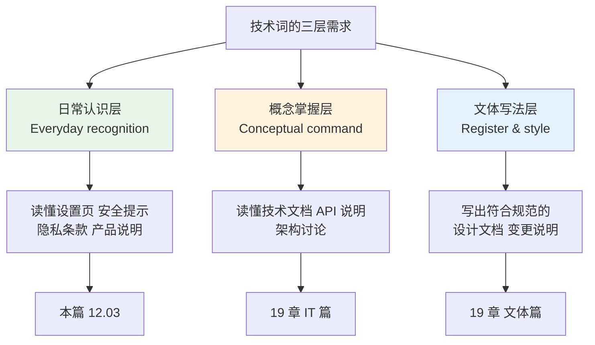
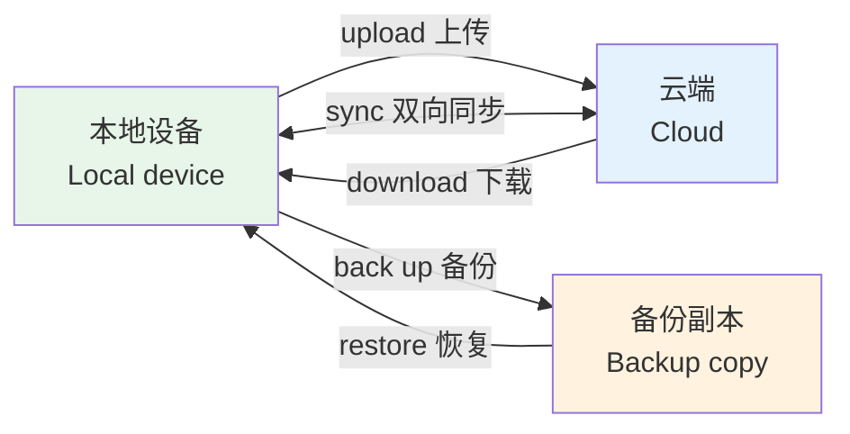
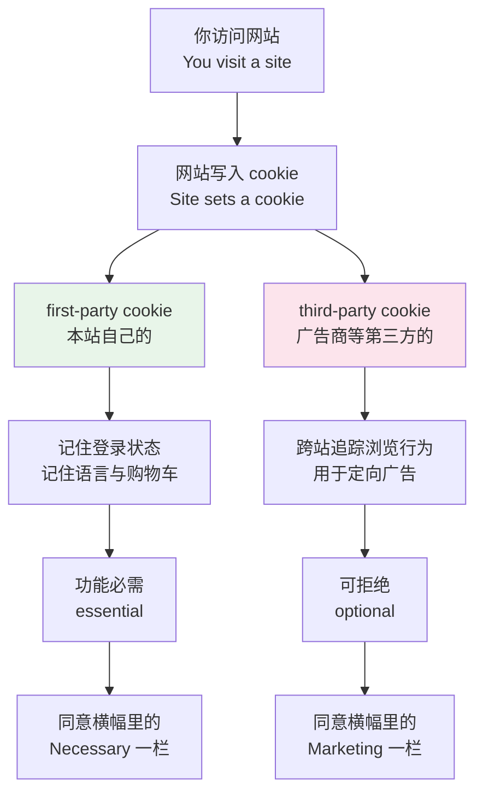
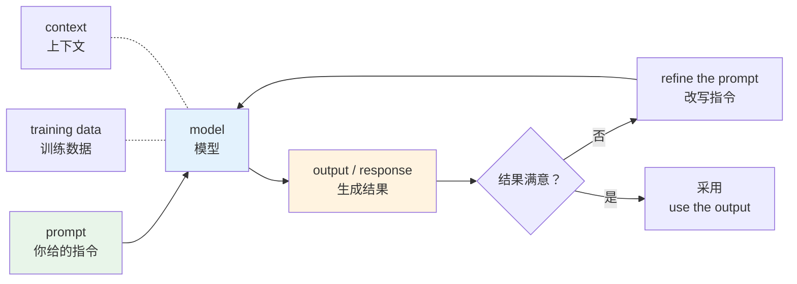
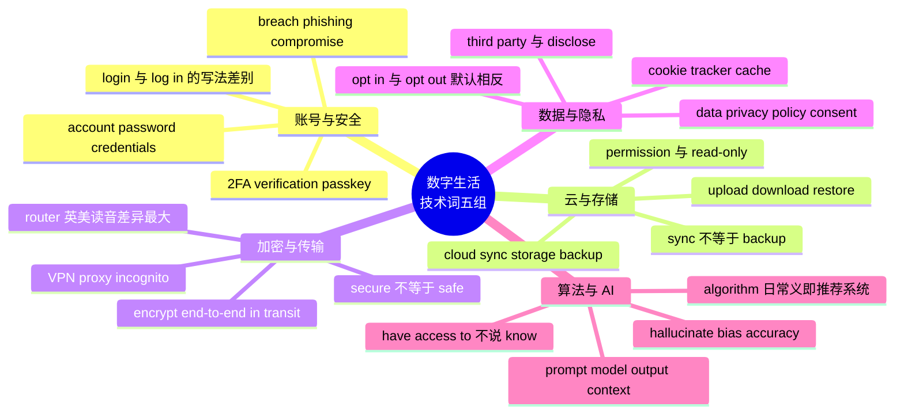

# 上网与数字生活里的技术词

> [!info] 本篇定位
>
> `12.科技、媒体与休闲` 的第三篇。上一篇处理的是平台与社交行为（发帖、点赞、私信、网络缩写），这一篇处理的是**设置页、隐私政策、安全提示、AI 产品说明里出现的那层词**。
>
> 这不是编程词汇篇。`account`、`sync`、`encryption`、`algorithm`、`cookie` 在本篇只取它们的**日常义**——够你看懂一个 App 的设置界面、读懂一封「检测到异常登录」的邮件、判断一条隐私条款在说什么。同一批词的技术定义、工程语境用法、以及写技术文档时的文体规范，全部归 `20.专业领域词汇` 的 IT 四篇。
>
> 三者是一条递进链：本篇管**日常认识**，`19` 章第一篇管**概念掌握**，`19` 章第三篇管**文体写法**。跳级会很痛苦，因为 `19` 章默认你已经不必查 `verification` 和 `permission` 是什么意思了。
>
> 读完你能做到：不查词典读完一份英文 App 的设置页与隐私摘要；看懂 `Your session has expired`、`Two-factor authentication is enabled`、`This site uses cookies to personalise content` 这类提示在要求你做什么。

---

## 1. 本篇导读：这一层词的边界在哪

技术词有一条很少被说破的分界线：**同一个词，普通用户需要认识的义项和工程师需要掌握的义项，常常不是同一个**。

`key` 是个典型。工程语境里它指密钥、指哈希表的键、指数据库主键。日常语境里你只需要知道一件事：当界面说 `Enter your recovery key`，它要的是一串你之前保存过的字符，不是密码。再往下的非对称加密原理，属于 `19` 章。

同理，`algorithm` 在日常语境里几乎只有一个意思——**平台决定给你看什么的那套东西**。当英文报道说 `the algorithm pushed the video to millions`，它没有在讨论排序复杂度，它在说推荐系统。把这个义项和「算法导论」里的算法混为一谈，会读不懂大部分科技新闻。

上图把边界画死了。本篇只覆盖左侧那条支线：词认得、界面看得懂、提示知道该点哪个按钮。凡是需要解释「它内部怎么实现」的，一律不展开——那不是词汇问题，是知识问题，本教程不越界去讲。

这一层词有两个共同特征，值得先说清楚，后面每一节都会反复用到。

**特征一：大量是「名词兼动词」，而且重音会移。** `upload`、`download`、`backup`、`update`、`upgrade` 都是这样：作名词时重音在前，作动词时重音在后或前后均分。中文母语者最常见的问题不是不认识这些词，而是把 `back up`（动词，两个词）写成 `backup`（名词，一个词）。

**特征二：大量是被动语态的界面提示。** `Your account has been locked`、`Access was denied`、`Data is encrypted in transit`。被动的原因是界面不想说明谁做了这件事。认这层词的时候，同时要习惯它们出现在被动结构里的样子。

---

## 2. 账号、注册与订阅

### 2.1 账号本体与身份信息

这组词是所有数字服务的入口。它们出现频率极高，而且英文界面几乎不换说法，认熟一次终身受用。

| 英文 | 英式音标 | 美式音标 | 词性 | 中文 | 搭配与说明 |
| --- | --- | --- | --- | --- | --- |
| **account** | /əˈkaʊnt/ | /əˈkaʊnt/ | n. | 账号；账户 | create / delete / suspend an account；银行账户同词 |
| **username** | /ˈjuːzəneɪm/ | /ˈjuːzərneɪm/ | n. | 用户名 | 与 user name 两种写法都有，界面上多写作一个词 |
| **user** | /ˈjuːzə/ | /ˈjuːzər/ | n. | 用户 | active user 活跃用户；end user 终端用户 |
| **password** | /ˈpɑːswɜːd/ | /ˈpæswɜːrd/ | n. | 密码 | 英美元音差异明显：英 /ɑː/ 美 /æ/ |
| **passcode** | /ˈpɑːskəʊd/ | /ˈpæskoʊd/ | n. | 数字密码 | 特指手机解锁的六位数字，不等同 password |
| **passphrase** | /ˈpɑːsfreɪz/ | /ˈpæsfreɪz/ | n. | 密码短语 | 由多个单词组成的长密码 |
| **PIN** | /pɪn/ | /pɪn/ | n. | 个人识别码 | personal identification number 的缩写，读作单词 |
| **profile** | /ˈprəʊfaɪl/ | /ˈproʊfaɪl/ | n. | 个人资料页 | update / edit your profile |
| **avatar** | /ˈævətɑː/ | /ˈævətɑːr/ | n. | 头像 | 界面上也常写 profile picture |
| **handle** | /ˈhændl/ | /ˈhændl/ | n. | 用户标识 | 社交平台上 @ 后面那串，如 @scholar |
| **display name** | /dɪˈspleɪ neɪm/ | /dɪˈspleɪ neɪm/ | n. | 显示名 | 可改，与不可改的 username 分开 |
| **email address** | /ˈiːmeɪl əˈdres/ | /ˈiːmeɪl ˈædres/ | n. | 邮箱地址 | 名词 address 的重音英美不同 |
| **credentials** | /krəˈdenʃlz/ | /krəˈdenʃlz/ | n. | 登录凭据 | 恒用复数；指账号密码这一整套 |
| **identity** | /aɪˈdentəti/ | /aɪˈdentəti/ | n. | 身份 | identity theft 身份盗用 |
| **guest** | /ɡest/ | /ɡest/ | n. | 访客 | guest account 访客账号；continue as a guest 以访客身份继续 |

### 2.2 注册、登录、登出的动词组

这一组的坑不在词义，在**动词短语与名词的写法差别**。

| 英文 | 英式音标 | 美式音标 | 词性 | 中文 | 搭配与说明 |
| --- | --- | --- | --- | --- | --- |
| **sign up** | /saɪn ˈʌp/ | /saɪn ˈʌp/ | v. | 注册 | sign up **for** a service；名词写 signup |
| **register** | /ˈredʒɪstə/ | /ˈredʒɪstər/ | v. | 注册 | 比 sign up 正式，官方站点常用 |
| **sign in** | /saɪn ˈɪn/ | /saɪn ˈɪn/ | v. | 登录 | 名词写 sign-in；苹果与微软界面偏好这个说法 |
| **log in** | /lɒɡ ˈɪn/ | /lɔːɡ ˈɪn/ | v. | 登录 | 名词写 login；log **in to** 而非 ~~log into~~ 更规范 |
| **log out** | /lɒɡ ˈaʊt/ | /lɔːɡ ˈaʊt/ | v. | 登出 | 同义 sign out；名词写 logout |
| **session** | /ˈseʃn/ | /ˈseʃn/ | n. | 会话 | Your session has expired 登录状态已过期 |
| **expire** | /ɪkˈspaɪə/ | /ɪkˈspaɪər/ | v. | 过期 | 名词 expiry（英）/ expiration（美） |
| **reset** | /ˌriːˈset/ | /ˌriːˈset/ | v./n. | 重置 | reset your password；过去式仍是 reset |
| **recover** | /rɪˈkʌvə/ | /rɪˈkʌvər/ | v. | 找回 | recover your account 找回账号 |
| **recovery** | /rɪˈkʌvəri/ | /rɪˈkʌvəri/ | n. | 找回；恢复 | recovery email 备用邮箱；recovery code 恢复码 |
| **locked out** | /lɒkt ˈaʊt/ | /lɑːkt ˈaʊt/ | adj. | 被锁在外的 | I'm locked out of my account 我进不去账号了 |
| **switch** | /swɪtʃ/ | /swɪtʃ/ | v. | 切换 | switch accounts 切换账号 |

> [!warning] login 与 log in 不是一个词
>
> 这是英文写作里最常被扣分的技术词之一：
>
> - ❌ ~~Please login with your email.~~（login 是名词，不能当动词用）
> - ✅ Please **log in** with your email.
> - ✅ The **login** page is down.（名词位置，写成一个词）
>
> 同一条规则适用于 `sign up / signup`、`back up / backup`、`set up / setup`、`log out / logout`。
>
> 记忆办法：**分开写的是动作，连起来写的是东西**。能加 the 的一定是连写的名词。

### 2.3 订阅、付费与账单

| 英文 | 英式音标 | 美式音标 | 词性 | 中文 | 搭配与说明 |
| --- | --- | --- | --- | --- | --- |
| **subscribe** | /səbˈskraɪb/ | /səbˈskraɪb/ | v. | 订阅 | subscribe **to** a plan / channel |
| **subscription** | /səbˈskrɪpʃn/ | /səbˈskrɪpʃn/ | n. | 订阅；订阅服务 | monthly / annual subscription |
| **plan** | /plæn/ | /plæn/ | n. | 套餐 | free plan 免费版；Pro plan 专业版 |
| **free trial** | /friː ˈtraɪəl/ | /friː ˈtraɪəl/ | n. | 免费试用 | a 14-day free trial |
| **upgrade** | /ˈʌpɡreɪd/ | /ˈʌpɡreɪd/ | n./v. | 升级 | 名词重音在前，动词可读 /ˌʌpˈɡreɪd/ |
| **downgrade** | /ˈdaʊnɡreɪd/ | /ˈdaʊnɡreɪd/ | n./v. | 降级 | downgrade to the free plan |
| **renew** | /rɪˈnjuː/ | /rɪˈnuː/ | v. | 续费 | auto-renew 自动续费；美音无 /j/ |
| **renewal** | /rɪˈnjuːəl/ | /rɪˈnuːəl/ | n. | 续费 | your renewal date 续费日期 |
| **cancel** | /ˈkænsl/ | /ˈkænsl/ | v. | 取消 | 英式双写 cancelled，美式 canceled |
| **refund** | /ˈriːfʌnd/ | /ˈriːfʌnd/ | n./v. | 退款 | request a refund 申请退款 |
| **billing** | /ˈbɪlɪŋ/ | /ˈbɪlɪŋ/ | n. | 账单；计费 | billing cycle 计费周期；billing address |
| **invoice** | /ˈɪnvɔɪs/ | /ˈɪnvɔɪs/ | n. | 发票；账单 | 与中国的「发票」不完全对应，见 11 章 |
| **payment method** | /ˈpeɪmənt ˈmeθəd/ | /ˈpeɪmənt ˈmeθəd/ | n. | 支付方式 | update your payment method |
| **charge** | /tʃɑːdʒ/ | /tʃɑːrdʒ/ | v./n. | 扣款；收费 | 与「充电」同词，靠语境分辨 |

> [!example] 一封订阅到期邮件里的完整链条
>
> - Your **subscription** will **renew** automatically on 1 October.
>   - 你的订阅将于十月一日自动续费。
> - To avoid being **charged**, **cancel** before your **renewal** date.
>   - 想避免扣款，请在续费日之前取消。
> - You can **downgrade** to the free **plan** at any time and keep your files.
>   - 你随时可以降级到免费版，文件会保留。

---

## 3. 登录验证与账号安全

### 3.1 两步验证这一整套

`two-factor authentication` 这一组词在中文里的叫法很分散——「两步验证」「双因素认证」「二次验证」都有人用，英文里的说法反而更统一，认准下面这一张表就够。

| 英文 | 英式音标 | 美式音标 | 词性 | 中文 | 搭配与说明 |
| --- | --- | --- | --- | --- | --- |
| **authenticate** | /ɔːˈθentɪkeɪt/ | /ɑːˈθentɪkeɪt/ | v. | 验证身份 | 美音首元音开口更大，中间 t 常闪音化 |
| **authentication** | /ɔːˌθentɪˈkeɪʃn/ | /ɑːˌθentɪˈkeɪʃn/ | n. | 身份验证 | 界面缩写常见 auth |
| **two-factor authentication** | /ˌtuː ˈfæktə/ | /ˌtuː ˈfæktər/ | n. | 两步验证 | 缩写 2FA，读作 /ˌtuː ef ˈeɪ/ |
| **two-step verification** | /ˌtuː step/ | /ˌtuː step/ | n. | 两步验证 | Google 的官方叫法，与 2FA 同义 |
| **verify** | /ˈverɪfaɪ/ | /ˈverɪfaɪ/ | v. | 验证 | verify your email 验证邮箱 |
| **verification** | /ˌverɪfɪˈkeɪʃn/ | /ˌverɪfɪˈkeɪʃn/ | n. | 验证 | verification code 验证码 |
| **one-time code** | /wʌn taɪm kəʊd/ | /wʌn taɪm koʊd/ | n. | 一次性验证码 | 缩写 OTP（one-time password） |
| **authenticator** | /ɔːˈθentɪkeɪtə/ | /ɑːˈθentɪkeɪtər/ | n. | 验证器 | authenticator app 验证器 App |
| **backup code** | /ˈbækʌp kəʊd/ | /ˈbækʌp koʊd/ | n. | 备用码 | 两步验证失效时的兜底，务必离线保存 |
| **biometric** | /ˌbaɪəʊˈmetrɪk/ | /ˌbaɪoʊˈmetrɪk/ | adj. | 生物识别的 | biometric login 生物识别登录 |
| **fingerprint** | /ˈfɪŋɡəprɪnt/ | /ˈfɪŋɡərprɪnt/ | n. | 指纹 | fingerprint sensor 指纹传感器 |
| **face recognition** | /feɪs ˌrekəɡˈnɪʃn/ | /feɪs ˌrekəɡˈnɪʃn/ | n. | 人脸识别 | 苹果的产品名是 Face ID |
| **passkey** | /ˈpɑːskiː/ | /ˈpæskiː/ | n. | 通行密钥 | 用设备生物识别替代密码的新方案 |
| **password manager** | /ˈpɑːswɜːd/ | /ˈpæswɜːrd/ | n. | 密码管理器 | 生成并保存高强度密码的工具 |
| **trusted device** | /ˈtrʌstɪd dɪˈvaɪs/ | /ˈtrʌstɪd dɪˈvaɪs/ | n. | 受信任设备 | 已验证过、下次免验证的设备 |

### 3.2 威胁、攻击与异常提示

这一组是收到安全警告邮件时必须能秒懂的词。误判一次的代价可能很实际。

| 英文 | 英式音标 | 美式音标 | 词性 | 中文 | 搭配与说明 |
| --- | --- | --- | --- | --- | --- |
| **breach** | /briːtʃ/ | /briːtʃ/ | n./v. | 泄露事件 | data breach 数据泄露；语气比 leak 正式 |
| **leak** | /liːk/ | /liːk/ | n./v. | 泄露 | 与「漏水」同词，媒体报道常用 |
| **hack** | /hæk/ | /hæk/ | v./n. | 入侵；黑掉 | My account got hacked 我账号被盗了 |
| **hacker** | /ˈhækə/ | /ˈhækər/ | n. | 黑客 | 英文里不必然贬义，看语境 |
| **phishing** | /ˈfɪʃɪŋ/ | /ˈfɪʃɪŋ/ | n. | 钓鱼攻击 | 与 fishing 同音；ph- 的拼法沿自更早的黑客俚语 phreaking |
| **scam** | /skæm/ | /skæm/ | n./v. | 骗局；诈骗 | scam call 诈骗电话；scammer 骗子 |
| **fraud** | /frɔːd/ | /frɔːd/ | n. | 欺诈 | 比 scam 正式，用于法律与银行语境 |
| **spam** | /spæm/ | /spæm/ | n./v. | 垃圾信息 | spam folder 垃圾邮件夹 |
| **malware** | /ˈmælweə/ | /ˈmælwer/ | n. | 恶意软件 | malicious + software 的合成词 |
| **virus** | /ˈvaɪrəs/ | /ˈvaɪrəs/ | n. | 病毒 | 复数 viruses；生物病毒同词 |
| **ransomware** | /ˈrænsəmweə/ | /ˈrænsəmwer/ | n. | 勒索软件 | ransom「赎金」+ ware |
| **firewall** | /ˈfaɪəwɔːl/ | /ˈfaɪərwɔːl/ | n. | 防火墙 | 日常义就是「拦截网络访问的东西」 |
| **suspicious** | /səˈspɪʃəs/ | /səˈspɪʃəs/ | adj. | 可疑的 | suspicious activity 可疑活动，安全邮件标准措辞 |
| **unauthorized** | /ʌnˈɔːθəraɪzd/ | /ʌnˈɔːθəraɪzd/ | adj. | 未授权的 | 英式也拼 unauthorised |
| **compromise** | /ˈkɒmprəmaɪz/ | /ˈkɑːmprəmaɪz/ | v. | 使失窃；使受损 | your password may have been compromised |
| **vulnerability** | /ˌvʌlnərəˈbɪləti/ | /ˌvʌlnərəˈbɪləti/ | n. | 漏洞 | 六个音节，重音落在第四个 bil |
| **patch** | /pætʃ/ | /pætʃ/ | n./v. | 补丁；打补丁 | security patch 安全补丁 |

> [!warning] compromise 在安全语境里不是「妥协」
>
> 这是最容易读反的一个词。日常义 `compromise` 是「妥协、折中」，安全语境里它是**被攻破、已失窃**。
>
> - We reached a **compromise**.（妥协）
> - Your account may have been **compromised**.（你的账号可能已被盗）
>
> 第二句是一封要你立刻改密码的警告邮件，不是在说什么好事。同类还有 `exposed`（被暴露）、`at risk`（有风险）。

> [!tip] 收到安全提示时的三个动词
>
> 界面上要求你做的动作，翻来覆去就这三个，认准它们就不会点错按钮：
>
> - **review** —— 检查一遍（review recent activity 检查最近活动）
> - **revoke** —— 撤销权限（revoke access 撤销访问权）
> - **secure** —— 加固（Secure your account 保护你的账号，通常是一个大按钮）
>
> 三个词都不等于「确认」。真正的确认按钮写的是 `Confirm`、`Yes, it was me` 或 `This was me`。

---

## 4. 云、同步、存储与备份

### 4.1 cloud 与它的搭配

`cloud` 的日常义只有一条：**你的东西不在这台设备上，在别人的服务器上，任何设备都能取。** 这一条讲清楚了，这一节的词全都串得起来。

| 英文 | 英式音标 | 美式音标 | 词性 | 中文 | 搭配与说明 |
| --- | --- | --- | --- | --- | --- |
| **cloud** | /klaʊd/ | /klaʊd/ | n. | 云 | in the cloud 在云端；与「云朵」同词 |
| **cloud storage** | /klaʊd ˈstɔːrɪdʒ/ | /klaʊd ˈstɔːrɪdʒ/ | n. | 云存储 | 常见品牌名 iCloud、Google Drive |
| **storage** | /ˈstɔːrɪdʒ/ | /ˈstɔːrɪdʒ/ | n. | 存储空间 | 不可数；storage is full 空间满了 |
| **server** | /ˈsɜːvə/ | /ˈsɜːrvər/ | n. | 服务器 | 与「服务员」同词，靠语境分辨 |
| **drive** | /draɪv/ | /draɪv/ | n. | 云盘；驱动器 | hard drive 硬盘；Google Drive 是产品名 |
| **capacity** | /kəˈpæsəti/ | /kəˈpæsəti/ | n. | 容量 | storage capacity 存储容量 |
| **gigabyte** | /ˈɡɪɡəbaɪt/ | /ˈɡɪɡəbaɪt/ | n. | 吉字节 | 缩写 GB；口语直接说 gig /ɡɪɡ/ |
| **terabyte** | /ˈterəbaɪt/ | /ˈterəbaɪt/ | n. | 太字节 | 缩写 TB |
| **quota** | /ˈkwəʊtə/ | /ˈkwoʊtə/ | n. | 配额 | exceed your quota 超出配额 |
| **free up** | /friː ˈʌp/ | /friː ˈʌp/ | v. | 腾出 | free up space 腾出空间 |
| **online** | /ˌɒnˈlaɪn/ | /ˌɑːnˈlaɪn/ | adj./adv. | 在线的 | 作定语时重音前移：an online course |
| **offline** | /ˌɒfˈlaɪn/ | /ˌɔːfˈlaɪn/ | adj./adv. | 离线的 | available offline 可离线使用 |
| **bandwidth** | /ˈbændwɪdθ/ | /ˈbændwɪdθ/ | n. | 带宽 | 引申义「精力、处理能力」在职场英语里很常见 |

### 4.2 同步、上传下载与备份

上图区分了三对最容易混的动作。`upload` / `download` 是单向搬运，搬完两边各有一份、互不影响；`sync` 是双向的持续对齐，一边删了另一边也会删；`back up` / `restore` 是留后路，备份副本不会因为你删了原件而消失。中文里都可以笼统说「同步到云上」，英文里选错词会传达完全不同的意思——把「我做了备份」说成 `I synced it`，对方会以为你没有留副本。

| 英文 | 英式音标 | 美式音标 | 词性 | 中文 | 搭配与说明 |
| --- | --- | --- | --- | --- | --- |
| **sync** | /sɪŋk/ | /sɪŋk/ | v./n. | 同步 | 与 sink 同音；out of sync 不同步 |
| **synchronize** | /ˈsɪŋkrənaɪz/ | /ˈsɪŋkrənaɪz/ | v. | 同步 | sync 的全写，正式文书用 |
| **upload** | /ˌʌpˈləʊd/ | /ˌʌpˈloʊd/ | v. | 上传 | 名词读 /ˈʌpləʊd/ /ˈʌploʊd/，重音前移 |
| **download** | /ˌdaʊnˈləʊd/ | /ˌdaʊnˈloʊd/ | v. | 下载 | 同样是名词重音前移 |
| **back up** | /bæk ˈʌp/ | /bæk ˈʌp/ | v. | 备份 | 分开写；back up your phone |
| **backup** | /ˈbækʌp/ | /ˈbækʌp/ | n. | 备份文件 | 连写；the latest backup |
| **restore** | /rɪˈstɔː/ | /rɪˈstɔːr/ | v. | 恢复 | restore from a backup 从备份恢复 |
| **transfer** | /trænsˈfɜː/ | /trænsˈfɜːr/ | v. | 转移 | 名词重音前移 /ˈtrænsfɜː(r)/ |
| **migrate** | /maɪˈɡreɪt/ | /ˈmaɪɡreɪt/ | v. | 迁移 | 英美重音位置不同 |
| **compress** | /kəmˈpres/ | /kəmˈpres/ | v. | 压缩 | 名词 compression |
| **extract** | /ɪkˈstrækt/ | /ɪkˈstrækt/ | v. | 解压；提取 | 解压缩包界面上写 Extract；decompress 只出现在技术文档里 |
| **archive** | /ˈɑːkaɪv/ | /ˈɑːrkaɪv/ | n./v. | 归档 | 邮箱里的 Archive 按钮是「归档」不是「删除」 |
| **duplicate** | /ˈdjuːplɪkət/ | /ˈduːplɪkət/ | n./adj. | 重复项 | 动词读 /ˈdjuːplɪkeɪt/ /ˈduːplɪkeɪt/，词尾元音不同 |
| **overwrite** | /ˌəʊvəˈraɪt/ | /ˌoʊvərˈraɪt/ | v. | 覆盖 | 过去分词 overwritten |

### 4.3 文件、文件夹与共享

| 英文 | 英式音标 | 美式音标 | 词性 | 中文 | 搭配与说明 |
| --- | --- | --- | --- | --- | --- |
| **file** | /faɪl/ | /faɪl/ | n. | 文件 | file name 文件名；file size 文件大小 |
| **folder** | /ˈfəʊldə/ | /ˈfoʊldər/ | n. | 文件夹 | 英式也说 directory，但界面上通用 folder |
| **format** | /ˈfɔːmæt/ | /ˈfɔːrmæt/ | n./v. | 格式；格式化 | file format 文件格式 |
| **attachment** | /əˈtætʃmənt/ | /əˈtætʃmənt/ | n. | 附件 | open / download an attachment |
| **shared folder** | /ʃeəd ˈfəʊldə/ | /ʃerd ˈfoʊldər/ | n. | 共享文件夹 | shared 的元音英美差异明显 |
| **share link** | /ʃeə lɪŋk/ | /ʃer lɪŋk/ | n. | 分享链接 | copy the share link 复制分享链接 |
| **permission** | /pəˈmɪʃn/ | /pərˈmɪʃn/ | n. | 权限 | view / edit permission 查看权限、编辑权限 |
| **read-only** | /riːd ˈəʊnli/ | /riːd ˈoʊnli/ | adj. | 只读的 | 与 editable 可编辑的相对 |
| **version history** | /ˈvɜːʃn ˈhɪstri/ | /ˈvɜːrʒn ˈhɪstri/ | n. | 版本历史 | version 的 s 英式清音、美式浊音 |
| **collaborate** | /kəˈlæbəreɪt/ | /kəˈlæbəreɪt/ | v. | 协作 | collaborate **on** a document |
| **sync conflict** | /sɪŋk ˈkɒnflɪkt/ | /sɪŋk ˈkɑːnflɪkt/ | n. | 同步冲突 | 两端同时改了同一份文件时出现 |

> [!example] 一段真实的云盘提示
>
> - Your files are **synced** across all your devices.
>   - 你的文件已在所有设备间同步。
> - This folder is **read-only**. Ask the owner for edit **permission**.
>   - 该文件夹为只读。请向所有者申请编辑权限。
> - Storage is almost full. **Free up** space or **upgrade** your **plan**.
>   - 存储空间即将用满。请腾出空间或升级套餐。
> - We couldn't **restore** your **backup** because it was created on a newer **version**.
>   - 无法恢复备份，因为它是在更新的版本上创建的。

---

## 5. 加密与安全传输：日常义就够用

### 5.1 encryption 这一组

`encryption` 的技术含义在 `19` 章展开。日常语境里只需要把握三件事：谁能看到、什么时候能看到、以及界面上那个「端到端」到底承诺了什么。

| 英文 | 英式音标 | 美式音标 | 词性 | 中文 | 搭配与说明 |
| --- | --- | --- | --- | --- | --- |
| **encrypt** | /ɪnˈkrɪpt/ | /ɪnˈkrɪpt/ | v. | 加密 | 同义词 encipher 只见于密码学文献，界面上一律用 encrypt |
| **encryption** | /ɪnˈkrɪpʃn/ | /ɪnˈkrɪpʃn/ | n. | 加密 | 不可数 |
| **decrypt** | /ˌdiːˈkrɪpt/ | /ˌdiːˈkrɪpt/ | v. | 解密 | 前缀 de- 表「反向」 |
| **end-to-end encryption** | /ˌend tu ˈend/ | /ˌend tu ˈend/ | n. | 端到端加密 | 缩写 E2EE；承诺服务商本身也看不到内容 |
| **in transit** | /ɪn ˈtrænzɪt/ | /ɪn ˈtrænzɪt/ | phr. | 传输中 | encrypted in transit 传输过程加密 |
| **at rest** | /ət ˈrest/ | /ət ˈrest/ | phr. | 静态存储时 | encrypted at rest 存储时加密 |
| **key** | /kiː/ | /kiː/ | n. | 密钥 | recovery key 恢复密钥，丢了通常无法找回 |
| **token** | /ˈtəʊkən/ | /ˈtoʊkən/ | n. | 令牌 | 一串代替密码用于验证的字符串 |
| **certificate** | /səˈtɪfɪkət/ | /sərˈtɪfɪkət/ | n. | 证书 | 浏览器地址栏那把锁背后的东西 |
| **secure** | /sɪˈkjʊə/ | /sɪˈkjʊr/ | adj./v. | 安全的；加固 | a secure connection 安全连接 |
| **plain text** | /pleɪn tekst/ | /pleɪn tekst/ | n. | 明文 | 未加密的原始文本 |
| **HTTPS** | /ˌeɪtʃ tiː tiː piː ˈes/ | /ˌeɪtʃ tiː tiː piː ˈes/ | n. | 安全超文本协议 | 逐字母读；地址栏显示小锁标志 |

> [!warning] safe 与 secure 不能互换
>
> 中文都译作「安全」，英文分工很明确。
>
> - **safe** 强调不受伤害、不出事故：a safe place、Is it safe to click this link?
> - **secure** 强调有防护措施、不被非法访问：a secure connection、Secure your account
>
> 界面上按钮写 `Secure your account`，说的是「去加固」；如果写成 ~~Safe your account~~ 则完全不成立，因为 safe 不能作动词。

### 5.2 私密浏览与网络中转

| 英文 | 英式音标 | 美式音标 | 词性 | 中文 | 搭配与说明 |
| --- | --- | --- | --- | --- | --- |
| **VPN** | /ˌviː piː ˈen/ | /ˌviː piː ˈen/ | n. | 虚拟专用网 | virtual private network 的缩写，逐字母读 |
| **proxy** | /ˈprɒksi/ | /ˈprɑːksi/ | n. | 代理 | 日常义就是「中转」；proxy server 代理服务器 |
| **anonymous** | /əˈnɒnɪməs/ | /əˈnɑːnɪməs/ | adj. | 匿名的 | 副词 anonymously |
| **incognito** | /ˌɪnkɒɡˈniːtəʊ/ | /ˌɪnkɑːɡˈniːtoʊ/ | adj. | 隐身的 | Chrome 的隐身模式叫 incognito mode |
| **private browsing** | /ˈpraɪvət ˈbraʊzɪŋ/ | /ˈpraɪvət ˈbraʊzɪŋ/ | n. | 无痕浏览 | Safari 与 Firefox 的叫法 |
| **IP address** | /ˌaɪ ˈpiː əˈdres/ | /ˌaɪ ˈpiː ˈædres/ | n. | IP 地址 | 名词 address 的重音英美不同 |
| **router** | /ˈruːtə/ | /ˈraʊtər/ | n. | 路由器 | 英美读音差异极大：英 /ruː/ 美 /raʊ/ |
| **network** | /ˈnetwɜːk/ | /ˈnetwɜːrk/ | n. | 网络 | public network 公共网络 |
| **connection** | /kəˈnekʃn/ | /kəˈnekʃn/ | n. | 连接 | unstable connection 连接不稳定 |
| **block** | /blɒk/ | /blɑːk/ | v. | 拦截；屏蔽 | block trackers 拦截追踪器 |
| **allow** | /əˈlaʊ/ | /əˈlaʊ/ | v. | 允许 | 与 block 成对出现在权限界面 |

> [!tip] router 是英美读音差异最大的常用技术词
>
> 英式 /ˈruːtə/ 沿 route「路线」的英式读音 /ruːt/；美式 /ˈraʊtər/ 因为美音里 route 有 /raʊt/ 的读法，设备名跟着走了这一支。
>
> 两种读法都被广泛接受，选一种用到底即可。同类还有 `data`：英美主流都读 /ˈdeɪtə/，但美国口语里 /ˈdætə/ 也很常见。

---

## 6. 数据、隐私、cookie 与追踪

### 6.1 隐私条款里的核心名词

隐私政策是最值得逐词读懂的一类英文文本，因为它直接说明了对方拿你的什么、给了谁。

| 英文 | 英式音标 | 美式音标 | 词性 | 中文 | 搭配与说明 |
| --- | --- | --- | --- | --- | --- |
| **data** | /ˈdeɪtə/ | /ˈdeɪtə/ | n. | 数据 | 拉丁复数，现代英语多作不可数：data is… |
| **privacy** | /ˈprɪvəsi/ | /ˈpraɪvəsi/ | n. | 隐私 | 英美首元音不同：英 /ɪ/ 美 /aɪ/ |
| **private** | /ˈpraɪvət/ | /ˈpraɪvət/ | adj. | 私密的 | 与 privacy 的英式读音不一致，别类推 |
| **policy** | /ˈpɒləsi/ | /ˈpɑːləsi/ | n. | 政策；条款 | privacy policy 隐私政策 |
| **terms of service** | /tɜːmz/ | /tɜːrmz/ | n. | 服务条款 | 缩写 ToS；也说 terms and conditions |
| **consent** | /kənˈsent/ | /kənˈsent/ | n./v. | 同意；许可 | give / withdraw consent 给予、撤回同意 |
| **personal data** | /ˈpɜːsənl/ | /ˈpɜːrsənl/ | n. | 个人数据 | 欧盟法规里的正式用语 |
| **third party** | /θɜːd ˈpɑːti/ | /θɜːrd ˈpɑːrti/ | n. | 第三方 | 作定语连字符：third-party cookies |
| **collect** | /kəˈlekt/ | /kəˈlekt/ | v. | 收集 | We collect the following data… |
| **process** | /ˈprəʊses/ | /ˈprɑːses/ | v. | 处理 | 英美元音差异大；法律语境指对数据的一切操作 |
| **retain** | /rɪˈteɪn/ | /rɪˈteɪn/ | v. | 保留 | retention period 保留期限 |
| **disclose** | /dɪsˈkləʊz/ | /dɪsˈkloʊz/ | v. | 披露 | 比 share 正式，条款里常用 |
| **opt in** | /ɒpt ˈɪn/ | /ɑːpt ˈɪn/ | v. | 选择加入 | 默认关闭，你主动打开 |
| **opt out** | /ɒpt ˈaʊt/ | /ɑːpt ˈaʊt/ | v. | 选择退出 | 默认开启，你主动关闭 |
| **GDPR** | /ˌdʒiː diː piː ˈɑː/ | /ˌdʒiː diː piː ˈɑːr/ | n. | 通用数据保护条例 | 欧盟法规，逐字母读 |

> [!warning] opt in 与 opt out 反了就全反了
>
> 这一对词的差别不在动作，在**默认状态**。
>
> - **opt in** —— 默认是不参与的，你点了才参与。
> - **opt out** —— 默认是参与的，你点了才退出。
>
> 所以 `You can opt out of personalised ads at any time` 意味着**个性化广告现在是开着的**。读成「你可以随时选择开启」就把意思读反了，也就错过了关掉它的提示。

### 6.2 cookie 与追踪

`cookie` 在中文里没有对应词，一直沿用英文原词。它的日常义是：**网站存在你浏览器里的一小段标记，用来记住你是谁。**

上图解释了每次弹出的 cookie 横幅到底在问什么。`Necessary` 那一栏通常无法关闭，因为关掉网站就没法记住你已登录；真正可选的是 `Analytics`（统计）和 `Marketing`（营销）两栏，也就是图右下那条支线。点 `Reject all` 时关掉的是这两栏，不是全部 cookie。

| 英文 | 英式音标 | 美式音标 | 词性 | 中文 | 搭配与说明 |
| --- | --- | --- | --- | --- | --- |
| **cookie** | /ˈkʊki/ | /ˈkʊki/ | n. | 网站标记 | 与「饼干」同词；accept / reject cookies |
| **cookie banner** | /ˈkʊki ˈbænə/ | /ˈkʊki ˈbænər/ | n. | cookie 同意横幅 | 也说 consent banner |
| **cache** | /kæʃ/ | /kæʃ/ | n. | 缓存 | 与 cash 同音；clear the cache 清缓存 |
| **tracker** | /ˈtrækə/ | /ˈtrækər/ | n. | 追踪器 | block trackers 拦截追踪器 |
| **tracking** | /ˈtrækɪŋ/ | /ˈtrækɪŋ/ | n. | 追踪 | cross-site tracking 跨站追踪 |
| **history** | /ˈhɪstri/ | /ˈhɪstri/ | n. | 历史记录 | browsing history 浏览记录 |
| **analytics** | /ˌænəˈlɪtɪks/ | /ˌænəˈlɪtɪks/ | n. | 数据统计 | 形式复数、意义单数 |
| **telemetry** | /təˈlemətri/ | /təˈlemətri/ | n. | 遥测数据 | 软件回传的使用情况数据 |
| **metadata** | /ˈmetədeɪtə/ | /ˈmetədeɪtə/ | n. | 元数据 | 日常义：关于内容的信息，如拍摄时间地点 |
| **location data** | /ləʊˈkeɪʃn/ | /loʊˈkeɪʃn/ | n. | 位置数据 | share your location 分享位置 |
| **targeted ad** | /ˈtɑːɡɪtɪd æd/ | /ˈtɑːrɡɪtɪd æd/ | n. | 定向广告 | 也说 personalised ads |
| **personalise** | /ˈpɜːsənəlaɪz/ | /ˈpɜːrsənəlaɪz/ | v. | 个性化 | 美式拼 personalize |
| **anonymise** | /əˈnɒnɪmaɪz/ | /əˈnɑːnɪmaɪz/ | v. | 匿名化 | 美式拼 anonymize |
| **profiling** | /ˈprəʊfaɪlɪŋ/ | /ˈproʊfaɪlɪŋ/ | n. | 用户画像分析 | 隐私条款里的敏感词 |
| **export** | /ɪkˈspɔːt/ | /ɪkˈspɔːrt/ | v. | 导出 | export your data 导出你的数据 |
| **erase** | /ɪˈreɪz/ | /ɪˈreɪs/ | v. | 抹除 | 词尾英式浊音、美式清音；比 delete 彻底 |
| **permanently** | /ˈpɜːmənəntli/ | /ˈpɜːrmənəntli/ | adv. | 永久地 | permanently delete 永久删除 |

> [!example] 隐私政策里的四种典型句式
>
> - We **collect** the data you provide and the data generated when you use the service.
>   - 我们收集你提供的数据以及你使用服务时产生的数据。
> - We do not sell your **personal data** to **third parties**.
>   - 我们不会将你的个人数据出售给第三方。
> - You may **withdraw** your **consent** at any time in Settings.
>   - 你可以随时在设置中撤回同意。
> - Deleted items are **permanently erased** after 30 days and cannot be **restored**.
>   - 已删除的项目在三十天后被永久抹除，无法恢复。

---

## 7. 算法、AI 助手与 prompt

### 7.1 algorithm 的日常义

日常语境里 `the algorithm` 加定冠词单数使用时，几乎总是指**推荐系统**——决定你刷到什么的那套机制。这个用法在英文媒体里已经完全固化。

| 英文 | 英式音标 | 美式音标 | 词性 | 中文 | 搭配与说明 |
| --- | --- | --- | --- | --- | --- |
| **algorithm** | /ˈælɡərɪðəm/ | /ˈælɡərɪðəm/ | n. | 算法 | 日常义特指推荐机制；注意 th 读 /ð/ |
| **feed** | /fiːd/ | /fiːd/ | n. | 信息流 | your feed 你的信息流；与「喂食」同词 |
| **recommend** | /ˌrekəˈmend/ | /ˌrekəˈmend/ | v. | 推荐 | 双写的是 m 不是 c |
| **recommendation** | /ˌrekəmenˈdeɪʃn/ | /ˌrekəmenˈdeɪʃn/ | n. | 推荐；推荐内容 | 五个音节，重音在第四个 da |
| **suggest** | /səˈdʒest/ | /səˈdʒest/ | v. | 建议；推荐 | suggested for you 为你推荐 |
| **rank** | /ræŋk/ | /ræŋk/ | v./n. | 排序；排名 | ranked by relevance 按相关度排序 |
| **relevance** | /ˈreləvəns/ | /ˈreləvəns/ | n. | 相关度 | 形容词 relevant |
| **engagement** | /ɪnˈɡeɪdʒmənt/ | /ɪnˈɡeɪdʒmənt/ | n. | 互动量 | 平台衡量内容表现的指标 |
| **filter bubble** | /ˈfɪltə ˈbʌbl/ | /ˈfɪltər ˈbʌbl/ | n. | 信息茧房 | 算法只推你爱看的所形成的封闭状态 |
| **echo chamber** | /ˈekəʊ ˈtʃeɪmbə/ | /ˈekoʊ ˈtʃeɪmbər/ | n. | 回音室 | 与 filter bubble 常并列出现 |
| **moderation** | /ˌmɒdəˈreɪʃn/ | /ˌmɑːdəˈreɪʃn/ | n. | 内容审核 | content moderation；动词 moderate |
| **flag** | /flæɡ/ | /flæɡ/ | v. | 标记；举报 | flag a post as spam |

### 7.2 AI 助手与生成式产品

上图是使用任何 AI 助手时都会遇到的一条循环，也是这一小节词的自然排列顺序。`prompt` 进、`output` 出、不满意就 `refine` 再来一轮，模型背后连着 `training data` 和当前的 `context`。英文产品说明里描述这个流程时，用的就是图上这几个词，几乎不换别的说法。

| 英文 | 英式音标 | 美式音标 | 词性 | 中文 | 搭配与说明 |
| --- | --- | --- | --- | --- | --- |
| **artificial intelligence** | /ˌɑːtɪˈfɪʃl ɪnˈtelɪdʒəns/ | /ˌɑːrtɪˈfɪʃl ɪnˈtelɪdʒəns/ | n. | 人工智能 | 缩写 AI，读 /ˌeɪ ˈaɪ/ |
| **assistant** | /əˈsɪstənt/ | /əˈsɪstənt/ | n. | 助手 | AI assistant、voice assistant |
| **chatbot** | /ˈtʃætbɒt/ | /ˈtʃætbɑːt/ | n. | 聊天机器人 | chat + robot 的合成词 |
| **model** | /ˈmɒdl/ | /ˈmɑːdl/ | n. | 模型 | 与「模特、模型玩具」同词 |
| **prompt** | /prɒmpt/ | /prɑːmpt/ | n./v. | 提示词；提示 | 原义「提词、催促」，AI 语境里指输入的指令 |
| **generate** | /ˈdʒenəreɪt/ | /ˈdʒenəreɪt/ | v. | 生成 | AI-generated 由 AI 生成的 |
| **generative** | /ˈdʒenərətɪv/ | /ˈdʒenərətɪv/ | adj. | 生成式的 | generative AI 生成式人工智能 |
| **output** | /ˈaʊtpʊt/ | /ˈaʊtpʊt/ | n. | 输出结果 | 与 input 输入成对 |
| **input** | /ˈɪnpʊt/ | /ˈɪnpʊt/ | n./v. | 输入 | 过去式 input 或 inputted 均可 |
| **response** | /rɪˈspɒns/ | /rɪˈspɑːns/ | n. | 回复 | AI 产品里 output 的口语说法 |
| **context** | /ˈkɒntekst/ | /ˈkɑːntekst/ | n. | 上下文 | 日常义就是「前面说过的话」 |
| **train** | /treɪn/ | /treɪn/ | v. | 训练 | trained on public data 用公开数据训练 |
| **training data** | /ˈtreɪnɪŋ ˈdeɪtə/ | /ˈtreɪnɪŋ ˈdeɪtə/ | n. | 训练数据 | 隐私争议的核心概念 |
| **machine learning** | /məˈʃiːn ˈlɜːnɪŋ/ | /məˈʃiːn ˈlɜːrnɪŋ/ | n. | 机器学习 | 缩写 ML |
| **hallucinate** | /həˈluːsɪneɪt/ | /həˈluːsɪneɪt/ | v. | 编造 | AI 语境的引申义，原义是「产生幻觉」 |
| **hallucination** | /həˌluːsɪˈneɪʃn/ | /həˌluːsɪˈneɪʃn/ | n. | 编造内容 | 指模型给出看似合理但错误的内容 |
| **bias** | /ˈbaɪəs/ | /ˈbaɪəs/ | n. | 偏见；偏差 | biased 有偏见的 |
| **accuracy** | /ˈækjərəsi/ | /ˈækjərəsi/ | n. | 准确度 | 形容词 accurate |
| **verify** | /ˈverɪfaɪ/ | /ˈverɪfaɪ/ | v. | 核实 | 与 3.1 节的「验证身份」是同一个词的不同用法 |
| **refine** | /rɪˈfaɪn/ | /rɪˈfaɪn/ | v. | 改进；细化 | refine your prompt 优化提示词 |
| **draft** | /drɑːft/ | /dræft/ | n./v. | 草稿；起草 | 英美元音差异明显 |
| **summarise** | /ˈsʌməraɪz/ | /ˈsʌməraɪz/ | v. | 总结 | 美式拼 summarize |
| **transcribe** | /trænˈskraɪb/ | /trænˈskraɪb/ | v. | 转写 | 语音转文字；名词 transcript |
| **translate** | /trænzˈleɪt/ | /trænzˈleɪt/ | v. | 翻译 | 也读 /trænsˈleɪt/，重音一律在后；名词 translation |
| **tone** | /təʊn/ | /toʊn/ | n. | 语气 | change the tone 调整语气 |
| **voice assistant** | /vɔɪs əˈsɪstənt/ | /vɔɪs əˈsɪstənt/ | n. | 语音助手 | Siri、Alexa 这一类 |
| **smart speaker** | /smɑːt ˈspiːkə/ | /smɑːrt ˈspiːkər/ | n. | 智能音箱 | speaker 与「说话者」同词 |
| **wake word** | /weɪk wɜːd/ | /weɪk wɜːrd/ | n. | 唤醒词 | 触发语音助手的那句话 |

> [!warning] prompt 的中文译法与实际用法有落差
>
> 中文常译「提示词」，容易让人以为它是几个关键词。英文语境里 `a prompt` 可以是一整段话、一份带格式要求的说明，长度没有上限。
>
> - ✅ I rewrote the **prompt** to include the output format.（把输出格式要求写进指令）
> - ❌ ~~I rewrote the prompt words.~~（英文里没有这个说法）
>
> 相关搭配：write a prompt、tweak a prompt、a system prompt（系统级指令）、prompt engineering（提示词工程，这个说法在中英文里都已固定）。

> [!tip] 谈 AI 时最容易用错的两个动词
>
> **say 与 output。** 描述 AI 给出的内容，英文里说 `the model says`、`the assistant replied`、`it generated a summary` 都成立，不必刻意回避拟人化说法。
>
> **know 与 have access to。** 说 `the model doesn't know your files` 不准确，母语者更常说 `the model doesn't have access to your files`——强调的是权限，不是认知。这个区别在讨论隐私时很关键。

---

## 8. 设备、更新、权限与故障排除

### 8.1 设备与安装

| 英文 | 英式音标 | 美式音标 | 词性 | 中文 | 搭配与说明 |
| --- | --- | --- | --- | --- | --- |
| **device** | /dɪˈvaɪs/ | /dɪˈvaɪs/ | n. | 设备 | 与动词 devise /dɪˈvaɪz/ 词尾清浊不同 |
| **install** | /ɪnˈstɔːl/ | /ɪnˈstɔːl/ | v. | 安装 | 名词 installation |
| **uninstall** | /ˌʌnɪnˈstɔːl/ | /ˌʌnɪnˈstɔːl/ | v. | 卸载 | 手机上界面多写 remove 或 delete |
| **update** | /ˌʌpˈdeɪt/ | /ˌʌpˈdeɪt/ | v./n. | 更新 | 名词重音前移 /ˈʌpdeɪt/ |
| **upgrade** | /ˌʌpˈɡreɪd/ | /ˌʌpˈɡreɪd/ | v. | 升级 | 换大版本用 upgrade，打小补丁用 update |
| **version** | /ˈvɜːʃn/ | /ˈvɜːrʒn/ | n. | 版本 | 英式 /ʃ/ 美式 /ʒ/ |
| **firmware** | /ˈfɜːmweə/ | /ˈfɜːrmwer/ | n. | 固件 | 硬件里的底层软件，路由器耳机都有 |
| **compatible** | /kəmˈpætəbl/ | /kəmˈpætəbl/ | adj. | 兼容的 | compatible **with** your device |
| **requirement** | /rɪˈkwaɪəmənt/ | /rɪˈkwaɪərmənt/ | n. | 要求 | system requirements 系统要求 |
| **available** | /əˈveɪləbl/ | /əˈveɪləbl/ | adj. | 可用的 | An update is available 有可用更新 |
| **release** | /rɪˈliːs/ | /rɪˈliːs/ | n./v. | 发布；发布版本 | release notes 更新说明 |
| **beta** | /ˈbiːtə/ | /ˈbeɪtə/ | n./adj. | 测试版 | 英美读音差异明显：英 /iː/ 美 /eɪ/ |

### 8.2 设置、权限与通知

| 英文 | 英式音标 | 美式音标 | 词性 | 中文 | 搭配与说明 |
| --- | --- | --- | --- | --- | --- |
| **settings** | /ˈsetɪŋz/ | /ˈsetɪŋz/ | n. | 设置 | 恒用复数；美音 t 闪音化 |
| **preferences** | /ˈprefrənsɪz/ | /ˈprefrənsɪz/ | n. | 偏好设置 | macOS 界面用这个词 |
| **default** | /dɪˈfɔːlt/ | /dɪˈfɔːlt/ | n./adj. | 默认；默认的 | by default 默认情况下 |
| **enable** | /ɪˈneɪbl/ | /ɪˈneɪbl/ | v. | 启用 | 比 turn on 正式，界面上通用 |
| **disable** | /dɪsˈeɪbl/ | /dɪsˈeɪbl/ | v. | 停用 | 与 enable 成对 |
| **toggle** | /ˈtɒɡl/ | /ˈtɑːɡl/ | n./v. | 开关；切换 | toggle switch 界面上的滑动开关 |
| **notification** | /ˌnəʊtɪfɪˈkeɪʃn/ | /ˌnoʊtɪfɪˈkeɪʃn/ | n. | 通知 | push notification 推送通知 |
| **alert** | /əˈlɜːt/ | /əˈlɜːrt/ | n./v. | 提醒；警报 | security alert 安全警报 |
| **access** | /ˈækses/ | /ˈækses/ | n./v. | 访问；访问权 | grant access 授予访问权 |
| **grant** | /ɡrɑːnt/ | /ɡrænt/ | v. | 授予 | 英美元音差异明显 |
| **deny** | /dɪˈnaɪ/ | /dɪˈnaɪ/ | v. | 拒绝 | 权限弹窗上 Allow 的对立选项 |
| **revoke** | /rɪˈvəʊk/ | /rɪˈvoʊk/ | v. | 撤销 | revoke access 撤销已给出的权限 |
| **restrict** | /rɪˈstrɪkt/ | /rɪˈstrɪkt/ | v. | 限制 | restricted mode 受限模式 |
| **while using the app** | — | — | phr. | 仅使用期间 | 位置权限的三个选项之一 |
| **dark mode** | /dɑːk məʊd/ | /dɑːrk moʊd/ | n. | 深色模式 | 与 light mode 相对 |
| **airplane mode** | /ˈeəpleɪn məʊd/ | /ˈerpleɪn moʊd/ | n. | 飞行模式 | 英式也说 flight mode |

### 8.3 故障与排查

| 英文 | 英式音标 | 美式音标 | 词性 | 中文 | 搭配与说明 |
| --- | --- | --- | --- | --- | --- |
| **crash** | /kræʃ/ | /kræʃ/ | v./n. | 崩溃；闪退 | The app keeps crashing 这 App 一直闪退 |
| **freeze** | /friːz/ | /friːz/ | v. | 卡死 | 过去式 froze，过去分词 frozen |
| **lag** | /læɡ/ | /læɡ/ | n./v. | 卡顿；延迟 | 形容词 laggy |
| **glitch** | /ɡlɪtʃ/ | /ɡlɪtʃ/ | n. | 小故障 | 比 bug 更口语，指偶发的小毛病 |
| **bug** | /bʌɡ/ | /bʌɡ/ | n. | 缺陷 | 与「虫子」同词；report a bug 反馈问题 |
| **error** | /ˈerə/ | /ˈerər/ | n. | 错误 | error message 错误提示 |
| **fail** | /feɪl/ | /feɪl/ | v. | 失败 | Upload failed 上传失败 |
| **troubleshoot** | /ˈtrʌblʃuːt/ | /ˈtrʌblʃuːt/ | v. | 排查故障 | 名词 troubleshooting |
| **restart** | /ˌriːˈstɑːt/ | /ˌriːˈstɑːrt/ | v. | 重启 | 与 reboot 同义，restart 更常用 |
| **reboot** | /ˌriːˈbuːt/ | /ˌriːˈbuːt/ | v. | 重启 | 也指影视作品的「重启」 |
| **factory reset** | /ˈfæktri ˈriːset/ | /ˈfæktri ˈriːset/ | n. | 恢复出厂设置 | 会清空全部数据 |
| **battery** | /ˈbætri/ | /ˈbætəri/ | n. | 电池 | 英式两音节、美式三音节且 t 闪音化 |
| **charge** | /tʃɑːdʒ/ | /tʃɑːrdʒ/ | v./n. | 充电；电量 | 与 2.3 节「扣款」是同一个词 |
| **overheat** | /ˌəʊvəˈhiːt/ | /ˌoʊvərˈhiːt/ | v. | 过热 | The phone is overheating |
| **storage full** | /ˈstɔːrɪdʒ fʊl/ | /ˈstɔːrɪdʒ fʊl/ | phr. | 存储已满 | 手机上最常见的提示之一 |
| **support** | /səˈpɔːt/ | /səˈpɔːrt/ | n. | 客服；技术支持 | contact support 联系客服 |

> [!example] 报修时说得清楚的四句话
>
> - The app **crashes** every time I open the settings page.
>   - 每次打开设置页这个 App 都会闪退。
> - I've already tried **restarting** the phone and **reinstalling** the app.
>   - 我已经试过重启手机和重装 App。
> - I'm running **version** 4.2 on iOS 18, if that helps.
>   - 我用的是 iOS 18 上的 4.2 版本，供参考。
> - Could you check whether this is a known **bug**?
>   - 能麻烦查一下这是不是已知问题吗？

---

## 9. 中文母语者在这一层的高频误用

前面八节的词单独看都不难，出问题的往往是**组合方式**。下表列出的十条不是理论推演，是中文思维直译最常撞上的地方。

| 中式说法 | 地道说法 | 为什么 |
| --- | --- | --- |
| ~~open the phone~~ | **unlock** the phone / **turn on** the phone | open 用于开门开盒，开机说 turn on，解锁说 unlock |
| ~~close the app 想表达「彻底关掉」~~ | **quit** the app；从后台划掉说 **force quit** | close 只是关窗口，进程仍在；彻底退出用 quit 或 force quit |
| ~~my phone has no electricity~~ | my phone is **out of battery** / **dead** | 手机电量用 battery，不用 electricity |
| ~~the network is very card~~ | the connection is **slow** / it's **lagging** | 「卡」不是一个可以直译的词，按现象选 slow、laggy、frozen |
| ~~login your account~~ | **log in to** your account | login 是名词，动作要分开写 |
| ~~I want to solve this bug~~ | I want to **fix** this bug | bug 搭配 fix，不搭配 solve；solve 搭配 problem |
| ~~open the WiFi~~ | **turn on** Wi-Fi / **connect to** Wi-Fi | 功能开关一律 turn on / turn off |
| ~~download the app in my phone~~ | download the app **on** / **to** my phone | 介词用 on 或 to，不用 in |
| ~~the software has update~~ | there's an **update available** / the app **has been updated** | update 是可数名词，需要冠词或改成被动 |
| ~~please pass me your account~~ | please send me your **username** | account 指整个账号体系，要人家用户名说 username |

> [!warning] 「卡」这个字没有单一对应词
>
> 中文一个「卡」字覆盖了英文至少四种情况，必须按现象拆开说：
>
> - 反应慢 → It's **slow** / It's **laggy**.
> - 完全不动 → It's **frozen**.
> - 视频缓冲 → The video keeps **buffering**.
> - 卡在某一步不往下走 → It's **stuck** on the loading screen.
>
> 说 `It's very card` 在英文里不成立，`card` 是卡片。

> [!tip] 三组近义词的选择顺序
>
> **delete / remove / erase** —— 删一条记录用 delete；把某项从列表里拿掉用 remove（可能还在别处）；彻底抹除且不可恢复用 erase。手机的「抹掉所有内容和设置」英文原文就是 Erase All Content and Settings。
>
> **fix / repair / solve** —— 软件问题用 fix；硬件送修用 repair；抽象问题用 solve。三者基本不互换。
>
> **set up / install / configure** —— 第一次把东西弄好用 set up；把软件装到设备上用 install；调参数改配置用 configure（偏技术，日常界面少见）。

---

## 10. 把这一层词读进真实语境

孤立的词表不解决阅读问题。下面四段是把前面八节的词按真实文本密度拼起来的样子，读得顺说明这一篇的词已经过关。

> [!example] 场景一：一封异常登录提醒邮件
>
> - We detected a **sign-in** from a new **device** in a location you don't usually use.
>   - 我们检测到有新设备从你不常用的地点登录。
> - If this was you, you can safely ignore this message.
>   - 如果是你本人操作，可以忽略这条消息。
> - If not, **secure** your **account** now: change your **password**, **revoke** **access** for unknown devices, and turn on **two-factor authentication**.
>   - 如果不是，请立即加固账号：修改密码、撤销未知设备的访问权、并开启两步验证。
> - We will never ask for your **password** or a **verification code** by email. Messages that do are **phishing**.
>   - 我们绝不会通过邮件索要你的密码或验证码。索要的邮件都是钓鱼邮件。

> [!example] 场景二：云盘容量告警
>
> - Your **storage** is 98% full. New files will not **sync** until you **free up** space.
>   - 你的存储空间已用 98%。在腾出空间之前，新文件不会同步。
> - Empty your bin to **permanently** **delete** items, or **upgrade** your **plan** for more **capacity**.
>   - 清空回收站以永久删除项目，或升级套餐以获得更多容量。
> - Files removed from a **shared folder** are also removed for everyone with **access**.
>   - 从共享文件夹中移除的文件，对所有有权限的人同样会消失。

> [!example] 场景三：cookie 同意横幅
>
> - We use **cookies** to keep you signed in, remember your **preferences**, and measure how the site is used.
>   - 我们使用 cookie 保持你的登录状态、记住偏好设置、并统计站点使用情况。
> - Necessary **cookies** are always on. You can **opt out** of **analytics** and **marketing** **cookies** below.
>   - 必要 cookie 始终开启。你可以在下方选择退出统计与营销类 cookie。
> - You can withdraw your **consent** at any time from the **privacy** **settings** page.
>   - 你可以随时在隐私设置页撤回同意。

> [!example] 场景四：AI 助手的产品说明
>
> - This **assistant** is powered by a **generative** **model** and may produce **inaccurate** information.
>   - 该助手由生成式模型驱动，可能产生不准确的信息。
> - Always **verify** important **output** before relying on it.
>   - 依赖重要输出前请务必核实。
> - Your conversations may be used to improve the **model** unless you turn this off in **settings**.
>   - 你的对话可能被用于改进模型，除非你在设置中关闭该选项。
> - The **assistant** does not have **access** to your files unless you attach them to the **prompt**.
>   - 除非你把文件附在指令中，否则该助手无法访问你的文件。

四段文本把前面八节的词密集地铺了一遍。读到第四段还需要频繁停下来查词，说明前面几节应该回头再过一遍——这一层词的特点是复现率极高，认下来之后几乎不会再退化。

---

## 11. 本篇小结

> [!success] 本篇核心要点回顾
>
> 1. 技术词分**日常认识、概念掌握、文体写法**三级。本篇只交付第一级：读懂设置页、安全提示与隐私条款；后两级归 `20.专业领域词汇` 的 IT 四篇。
> 2. **分开写的是动作，连起来写的是东西**：log in / login、sign up / signup、back up / backup、set up / setup。这条规则覆盖本篇十几个词。
> 3. `compromise` 在安全语境里是「被攻破」不是「妥协」；`secure` 可作动词而 `safe` 不能；两处误读的代价都很实际。
> 4. `upload`、`sync`、`back up` 是三种不同的动作：单向搬运、双向对齐、留后路。说「我同步了」不等于说「我备份了」。
> 5. `opt in` 与 `opt out` 的差别在**默认状态**，读反了会错过关闭定向广告的提示。
> 6. `algorithm` 加定冠词单数使用时，日常语境里几乎总指推荐系统，不是在讨论算法本身。
> 7. `prompt` 可以是一整段带格式要求的说明，不是「几个关键词」；讨论 AI 权限时用 `have access to` 而非 `know`。
> 8. 中文一个「卡」字对应英文四种说法：slow、frozen、buffering、stuck，必须按现象拆开表达。

> [!success] 本篇练习清单
>
> - [ ] 找一个你常用 App 的英文设置页，逐条读完，标出还需要查的词
> - [ ] 写出 log in / login、back up / backup、sign up / signup 各自的正确用法各一句
> - [ ] 用英文解释 sync 与 back up 的差别，不超过两句话
> - [ ] 读一条 cookie 横幅，判断 `Reject all` 之后哪些 cookie 仍然生效
> - [ ] 找一份英文隐私政策，圈出 collect、retain、disclose、third party 四个词出现的位置
> - [ ] 把「我手机很卡，App 一直闪退，重启也没用」翻成英文，检查有没有用 card
> - [ ] 给一个 AI 助手写一条包含输出格式要求的 prompt，然后用 refine 改一版
> - [ ] 检查自己的两步验证是否开启，把 backup code 的英文界面提示读一遍

### 11.1 下一篇预告

> [!info] 下一篇：从技术词转向兴趣与爱好
>
> 本篇处理的是数字生活里必须认识的那层技术词。下一篇转向另一个方向——**你把时间花在什么上**。
>
> [[12.科技、媒体与休闲/04.体育健身、音乐影视、书籍艺术与游戏爱好\|体育健身、音乐影视、书籍艺术与游戏爱好]]
>
> 会覆盖球类与健身房动作词、乐器与曲风、影视类型与观看方式、书籍分类与阅读动词、以及游戏里那套自成体系的词汇。这些词在技术文档里一个都用不上，但在闲聊、看剧、读小说时立刻决定你听不听得懂。
>
> 与本篇的关系是互补的：本篇的词出现在界面和条款里，下一篇的词出现在人和人的对话里。
