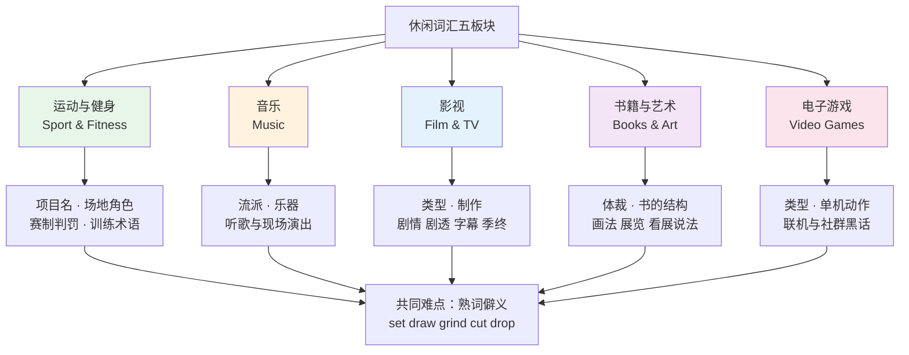
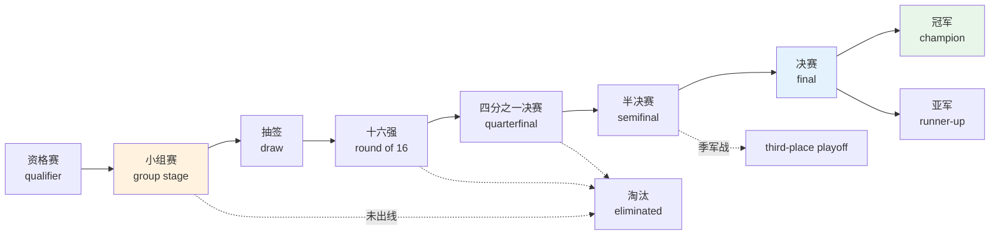
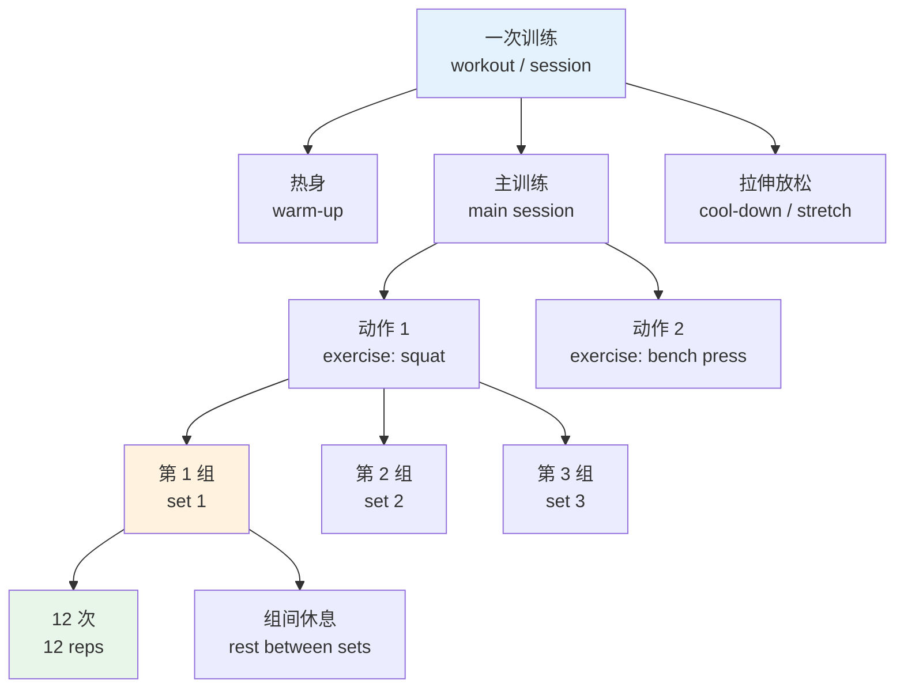
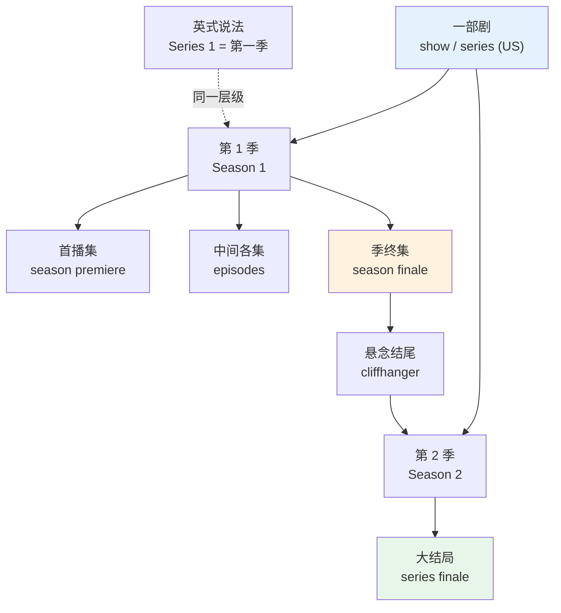
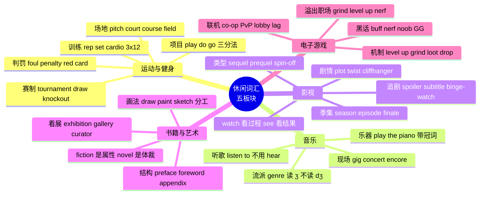

# 体育健身、音乐影视、书籍艺术与游戏爱好

> [!info] 本篇定位
>
> 12 章的收尾篇，也是全章唯一不谈电子设备的一篇。上一篇 `03.上网与数字生活里的技术词` 处理的是「用什么设备、在什么平台」，本篇处理的是「在上面消费什么内容、下班后做什么」。
>
> 覆盖五个板块：运动与健身、音乐、影视、书籍与艺术、电子游戏。共 515 个词条，全部是非专业读者的日常层——运动生理学、乐理、电影摄影的专业术语交给 `20.专业领域词汇` 处理。
>
> 读完能做到三件事：看懂英文体育新闻的比分和赛程表述，读懂 Steam 评论和影视论坛的日常发言，向同事描述自己的周末在干什么而不必绕弯。

---

## 1. 本篇导读：休闲词汇难在「内行话」

休闲板块的词有一个共同特点：**基础词认识，组合起来不认识**。`set`、`draw`、`grind`、`cut`、`drop` 每个都是初中词汇，但放进健身房、放进赛程表、放进游戏语境，义项完全变了。

这带来三类具体障碍。

第一类是**熟词僻义**。`draw` 在赛程表里是「抽签」，在比分栏里是「平局」，在美术教室里是「画」，三个义项互不相干。`set` 在健身房是「一组」，在网球里是「一盘」，在剧组里是「布景」。孤立记「set = 集合」对这些语境毫无帮助。

第二类是**搭配固定到近乎僵化**。中文说「打篮球、打网球、打太极」都用「打」，英语却分成 `play basketball` / `do yoga` / `go swimming` 三套动词，选错立刻暴露。

第三类是**英美用词分裂密集**。同一件事在两边叫法完全不同的成对词，休闲板块里一抓一把：`football` 与 `soccer`、`pitch` 与 `field`、`match` 与 `game`、`film` 与 `movie`、`series` 与 `season`。不知道对应关系，会以为对方说的是另一件事。

下面各表的英美双标音按 IPA 体例给出，`ˈ` 标主重音、`ˌ` 标次重音，词典标音体例见 [[01.词汇入门与学习方法/03.音标、词重音与词典读音体例\|01.03 音标、词重音与词典读音体例]]；跨领域的英美换词规律集中在 [[18.语域、英美差异与习语俚语/01.英式与美式词汇差异\|18.01 英式与美式词汇差异]]，本篇只收休闲板块内的那部分。

上图把五个板块与共同难点连在一起。五条分支的词表各自独立，但底部那个交汇点是本篇反复强调的：休闲英语的难度不在生词，在于旧词进了新语境。每一节末尾都会专门列出该板块的熟词僻义，建议按那些表反查自己的盲点。

---

## 2. 球类运动：项目、场地与角色

### 2.1 项目名

项目名的坑集中在两处：一是英美对同一项目的称呼分裂，二是项目名本身的可数性。绝大多数运动名作为「这项运动」讲时不可数，不加冠词，`I play tennis` 不说 `I play the tennis`。

| 英文 | 英式音标 | 美式音标 | 词性 | 中文 | 搭配与说明 |
| --- | --- | --- | --- | --- | --- |
| **football** | /ˈfʊtbɔːl/ | /ˈfʊtbɔːl/ | n. | 足球；美式橄榄球 | 英式指足球，美式指美式橄榄球，歧义最大的一个词 |
| **soccer** | /ˈsɒkə/ | /ˈsɑːkər/ | n. | 足球 | 美式称呼，英国人也听得懂但少用 |
| **basketball** | /ˈbɑːskɪtbɔːl/ | /ˈbæskɪtbɔːl/ | n. | 篮球 | 第一音节英美元音不同 |
| **volleyball** | /ˈvɒlibɔːl/ | /ˈvɑːlibɔːl/ | n. | 排球 | beach volleyball 沙滩排球 |
| **baseball** | /ˈbeɪsbɔːl/ | /ˈbeɪsbɔːl/ | n. | 棒球 | 美国国民运动，英国罕见 |
| **tennis** | /ˈtenɪs/ | /ˈtenɪs/ | n. | 网球 | play tennis 不加冠词 |
| **badminton** | /ˈbædmɪntən/ | /ˈbædmɪntən/ | n. | 羽毛球 | 拼写里有两个 n，常拼错 |
| **table tennis** | /ˈteɪbl ˌtenɪs/ | /ˈteɪbl ˌtenɪs/ | n. | 乒乓球 | 正式名称，赛事报道用这个 |
| **ping-pong** | /ˈpɪŋ pɒŋ/ | /ˈpɪŋ pɑːŋ/ | n. | 乒乓球 | 口语说法，略带随意色彩 |
| **golf** | /ɡɒlf/ | /ɡɑːlf/ | n. | 高尔夫 | play a round of golf 打一轮 |
| **rugby** | /ˈrʌɡbi/ | /ˈrʌɡbi/ | n. | 英式橄榄球 | 分 rugby union 与 rugby league 两种规则 |
| **cricket** | /ˈkrɪkɪt/ | /ˈkrɪkɪt/ | n. | 板球 | 英联邦国家极普及，美国几乎无人打 |
| **hockey** | /ˈhɒki/ | /ˈhɑːki/ | n. | 曲棍球；冰球 | 英式默认草地曲棍球，美式默认 ice hockey |
| **snooker** | /ˈsnuːkə/ | /ˈsnuːkər/ | n. | 斯诺克 | 英国主流台球项目 |
| **billiards** | /ˈbɪliədz/ | /ˈbɪljərdz/ | n. | 台球 | 形式上带 s，作单数用 |
| **pool** | /puːl/ | /puːl/ | n. | 美式落袋台球 | 也指游泳池，靠语境区分 |
| **bowling** | /ˈbəʊlɪŋ/ | /ˈboʊlɪŋ/ | n. | 保龄球 | go bowling 去打保龄 |
| **swimming** | /ˈswɪmɪŋ/ | /ˈswɪmɪŋ/ | n. | 游泳 | go swimming，不说 play swimming |
| **athletics** | /æθˈletɪks/ | /æθˈletɪks/ | n. | 田径 | 英式用法；美式田径叫 track and field |
| **track and field** | /ˌtræk ən ˈfiːld/ | /ˌtræk ən ˈfiːld/ | n. | 田径 | 美式说法 |
| **marathon** | /ˈmærəθən/ | /ˈmærəθɑːn/ | n. | 马拉松 | run a marathon；比喻义指持久战 |
| **boxing** | /ˈbɒksɪŋ/ | /ˈbɑːksɪŋ/ | n. | 拳击 | 与 Boxing Day 无关，后者指节礼日 |
| **skiing** | /ˈskiːɪŋ/ | /ˈskiːɪŋ/ | n. | 滑雪 | 双写 i，拼写易错 |
| **skating** | /ˈskeɪtɪŋ/ | /ˈskeɪtɪŋ/ | n. | 滑冰；滑板 | ice skating 冰上，skateboarding 滑板 |
| **cycling** | /ˈsaɪklɪŋ/ | /ˈsaɪklɪŋ/ | n. | 自行车运动 | go cycling；bike ride 更口语 |
| **gymnastics** | /dʒɪmˈnæstɪks/ | /dʒɪmˈnæstɪks/ | n. | 体操 | 带 s 但作单数 |
| **climbing** | /ˈklaɪmɪŋ/ | /ˈklaɪmɪŋ/ | n. | 攀岩 | b 不发音；rock climbing 户外攀岩 |
| **hiking** | /ˈhaɪkɪŋ/ | /ˈhaɪkɪŋ/ | n. | 徒步 | go hiking；美式偏爱这个词胜过 trekking |

> [!warning] play / do / go 三分法
>
> 中文的「打、练、去」在英语里被压成一个动词的场合几乎没有。这三个动词的分工是有规律的，不是任意的。
>
> - **play + 球类与对抗性项目**：play football、play tennis、play chess。有对手、有输赢、有球或棋子。
> - **do + 不带球的技能类**：do yoga、do gymnastics、do karate、do exercise。强调练习动作本身。
> - **go + 以 -ing 结尾的活动**：go swimming、go running、go cycling、go skiing、go hiking。强调离开当前地点去做这件事。
>
> - ❌ ~~play swimming~~ / ~~do football~~ / ~~go tennis~~
> - ✅ **go swimming** / **play football** / **play tennis**
>
> 唯一需要留意的交叉：`do sport`（英式）与 `play sports`（美式）都成立，指「做运动」这个泛称。

### 2.2 场地、装备与人员

| 英文 | 英式音标 | 美式音标 | 词性 | 中文 | 搭配与说明 |
| --- | --- | --- | --- | --- | --- |
| **pitch** | /pɪtʃ/ | /pɪtʃ/ | n. | 球场 | 英式指足球、板球、橄榄球场；美式几乎不用 |
| **field** | /fiːld/ | /fiːld/ | n. | 球场 | 美式通用；也指田径的场地内项目 |
| **court** | /kɔːt/ | /kɔːrt/ | n. | 球场 | 网球、篮球、羽毛球等有明确边界线的场地 |
| **course** | /kɔːs/ | /kɔːrs/ | n. | 球场 | 专指高尔夫球场，不能换成 court |
| **track** | /træk/ | /træk/ | n. | 跑道 | 也指音乐里的「曲目」，见第 5 节 |
| **stadium** | /ˈsteɪdiəm/ | /ˈsteɪdiəm/ | n. | 体育场 | 露天大型；复数 stadiums 或 stadia |
| **arena** | /əˈriːnə/ | /əˈriːnə/ | n. | 室内场馆 | 篮球、冰球、演唱会共用 |
| **gym** | /dʒɪm/ | /dʒɪm/ | n. | 健身房；体育馆 | gymnasium 的缩略，日常只说 gym |
| **changing room** | /ˈtʃeɪndʒɪŋ ruːm/ | /ˈtʃeɪndʒɪŋ ruːm/ | n. | 更衣室 | 英式说法 |
| **locker room** | /ˈlɒkə ruːm/ | /ˈlɑːkər ruːm/ | n. | 更衣室 | 美式说法；locker-room talk 指粗俗男性对话 |
| **net** | /net/ | /net/ | n. | 球网 | over the net 过网 |
| **goal** | /ɡəʊl/ | /ɡoʊl/ | n. | 球门；进球 | 一词两义，靠语境分 |
| **hoop** | /huːp/ | /huːp/ | n. | 篮筐 | 口语 shoot hoops 打篮球 |
| **racket** | /ˈrækɪt/ | /ˈrækɪt/ | n. | 球拍 | 网球羽毛球；英式亦拼 racquet |
| **bat** | /bæt/ | /bæt/ | n. | 球棒；球拍 | 棒球棒、板球棒、乒乓球拍 |
| **kit** | /kɪt/ | /kɪt/ | n. | 队服；装备 | 英式；美式说 uniform 或 gear |
| **trainers** | /ˈtreɪnəz/ | /ˈtreɪnərz/ | n. | 运动鞋 | 英式；美式说 sneakers |
| **referee** | /ˌrefəˈriː/ | /ˌrefəˈriː/ | n. | 裁判 | 足球篮球橄榄球；口语缩略为 ref |
| **umpire** | /ˈʌmpaɪə/ | /ˈʌmpaɪər/ | n. | 裁判 | 网球棒球板球用这个词 |
| **coach** | /kəʊtʃ/ | /koʊtʃ/ | n./v. | 教练；执教 | 也指长途大巴，见 09 章 |
| **manager** | /ˈmænɪdʒə/ | /ˈmænɪdʒər/ | n. | 主教练 | 英式足球用 manager 而非 coach |
| **captain** | /ˈkæptɪn/ | /ˈkæptɪn/ | n. | 队长 | 缩写 capt. |
| **goalkeeper** | /ˈɡəʊlkiːpə/ | /ˈɡoʊlkiːpər/ | n. | 守门员 | 口语缩为 keeper 或 goalie |
| **striker** | /ˈstraɪkə/ | /ˈstraɪkər/ | n. | 前锋 | 足球位置 |
| **forward** | /ˈfɔːwəd/ | /ˈfɔːrwərd/ | n. | 前锋 | 篮球足球通用 |
| **defender** | /dɪˈfendə/ | /dɪˈfendər/ | n. | 后卫 | 动词 defend |
| **midfielder** | /ˈmɪdfiːldə/ | /ˈmɪdfiːldər/ | n. | 中场 | 足球位置 |
| **substitute** | /ˈsʌbstɪtjuːt/ | /ˈsʌbstɪtuːt/ | n./v. | 替补；替换 | 口语缩为 sub；bring on a sub 换人上场 |
| **squad** | /skwɒd/ | /skwɑːd/ | n. | 全队阵容 | 比 team 更强调名单 |
| **lineup** | /ˈlaɪnʌp/ | /ˈlaɪnʌp/ | n. | 首发阵容 | starting lineup |
| **spectator** | /spekˈteɪtə/ | /ˈspekteɪtər/ | n. | 观众 | 重音位置英美不同 |
| **crowd** | /kraʊd/ | /kraʊd/ | n. | 观众群 | home crowd 主场球迷 |
| **fan** | /fæn/ | /fæn/ | n. | 球迷 | fanatic 的缩略 |
| **supporter** | /səˈpɔːtə/ | /səˈpɔːrtər/ | n. | 球迷 | 英式偏爱这个词，尤指足球 |

> [!example] 场地词的实际用法
>
> - The players are already warming up on the **pitch**.
>   - 球员已经在球场上热身了。
> - She booked a **court** for Saturday morning.
>   - 她订了周六上午的球场。
> - We played eighteen holes on the new **course**.
>   - 我们在新球场打了十八洞。
> - The **arena** holds twenty thousand people.
>   - 这座场馆能容纳两万人。

`pitch`、`court`、`course`、`field` 四个词不能互换，区分依据是项目而不是大小。有边线且靠球拍或手的项目用 `court`，草皮上跑动的团体项目英式用 `pitch`、美式用 `field`，高尔夫固定用 `course`。

---

## 3. 赛制与判罚：tournament、draw、penalty 的准确用法

### 3.1 赛事组织与赛程

`tournament` 是本节的核心词，中文常笼统译成「比赛」，但它特指有多轮淘汰或积分、最终决出冠军的**成套赛事**，不是单场比赛。单场比赛是 `match`（英式）或 `game`（美式）。

| 英文 | 英式音标 | 美式音标 | 词性 | 中文 | 搭配与说明 |
| --- | --- | --- | --- | --- | --- |
| **tournament** | /ˈtʊənəmənt/ | /ˈtɜːrnəmənt/ | n. | 锦标赛 | 多轮成套赛事；英美读音差别大 |
| **championship** | /ˈtʃæmpiənʃɪp/ | /ˈtʃæmpiənʃɪp/ | n. | 冠军赛；锦标赛 | 也指冠军头衔本身 |
| **league** | /liːɡ/ | /liːɡ/ | n. | 联赛 | 长周期积分制，与杯赛相对 |
| **cup** | /kʌp/ | /kʌp/ | n. | 杯赛 | 淘汰制赛事，如 World Cup |
| **season** | /ˈsiːzn/ | /ˈsiːzn/ | n. | 赛季 | 与影视的「季」同词，见第 6 节 |
| **fixture** | /ˈfɪkstʃə/ | /ˈfɪkstʃər/ | n. | 赛程安排 | 英式；指已排定的某场比赛 |
| **schedule** | /ˈʃedjuːl/ | /ˈskedʒuːl/ | n. | 赛程表 | 美式偏用；英美读音差别最大的常用词之一 |
| **match** | /mætʃ/ | /mætʃ/ | n. | 一场比赛 | 英式默认词 |
| **game** | /ɡeɪm/ | /ɡeɪm/ | n. | 一场比赛 | 美式默认词；网球里指「一局」 |
| **round** | /raʊnd/ | /raʊnd/ | n. | 轮次 | first round 首轮；拳击里指「回合」 |
| **group stage** | /ˈɡruːp steɪdʒ/ | /ˈɡruːp steɪdʒ/ | n. | 小组赛阶段 | 世界杯前半程 |
| **knockout** | /ˈnɒkaʊt/ | /ˈnɑːkaʊt/ | n./adj. | 淘汰赛 | knockout stage 淘汰赛阶段 |
| **quarterfinal** | /ˌkwɔːtəˈfaɪnl/ | /ˌkwɔːrtərˈfaɪnl/ | n. | 四分之一决赛 | 常写复数 quarterfinals |
| **semifinal** | /ˌsemiˈfaɪnl/ | /ˌsemiˈfaɪnl/ | n. | 半决赛 | 口语缩为 semis |
| **final** | /ˈfaɪnl/ | /ˈfaɪnl/ | n. | 决赛 | reach the final 打进决赛 |
| **playoff** | /ˈpleɪɒf/ | /ˈpleɪɔːf/ | n. | 季后赛 | 美式职业联赛的核心概念 |
| **qualifier** | /ˈkwɒlɪfaɪə/ | /ˈkwɑːlɪfaɪər/ | n. | 资格赛 | 动词 qualify 出线 |
| **seed** | /siːd/ | /siːd/ | n./v. | 种子选手；设为种子 | top seed 头号种子 |
| **draw** | /drɔː/ | /drɔː/ | n. | 抽签；对阵表 | the draw for the quarterfinals 四强抽签 |
| **bracket** | /ˈbrækɪt/ | /ˈbrækɪt/ | n. | 对阵图 | 美式；也指数学的括号 |
| **bye** | /baɪ/ | /baɪ/ | n. | 轮空 | get a bye into round two 轮空直接进次轮 |
| **leg** | /leɡ/ | /leɡ/ | n. | 回合 | 主客场两回合制的一场；first leg 首回合 |
| **aggregate** | /ˈæɡrɪɡət/ | /ˈæɡrɪɡət/ | n. | 总比分 | win on aggregate 总比分获胜 |
| **standings** | /ˈstændɪŋz/ | /ˈstændɪŋz/ | n. | 积分榜 | 美式；恒用复数 |
| **table** | /ˈteɪbl/ | /ˈteɪbl/ | n. | 积分榜 | 英式；top of the table 榜首 |
| **relegation** | /ˌrelɪˈɡeɪʃn/ | /ˌrelɪˈɡeɪʃn/ | n. | 降级 | 动词 relegate；北美职业联赛没有这套升降级机制 |
| **promotion** | /prəˈməʊʃn/ | /prəˈmoʊʃn/ | n. | 升级 | 与职场的「晋升」同词 |
| **friendly** | /ˈfrendli/ | /ˈfrendli/ | n. | 友谊赛 | 名词用法，a pre-season friendly |
| **derby** | /ˈdɑːbi/ | /ˈdɜːrbi/ | n. | 德比战 | 同城对决；英美元音完全不同 |

上图是一届典型杯赛的完整流程。左半段的 `group stage` 是积分制，出线看小组排名；从 `draw` 之后进入右半段的 `knockout stage`，输一场即出局。虚线是淘汰路径，`eliminated` 是被淘汰选手的标准说法，动词形式常用被动 `be knocked out`。注意 `round of 16` 这个说法：英语没有「十六强」的单词，直接用「十六人的那一轮」表达，同理 `round of 32`。

### 3.2 比分、胜负与结果

| 英文 | 英式音标 | 美式音标 | 词性 | 中文 | 搭配与说明 |
| --- | --- | --- | --- | --- | --- |
| **score** | /skɔː/ | /skɔːr/ | n./v. | 比分；得分 | What's the score 现在几比几 |
| **goal** | /ɡəʊl/ | /ɡoʊl/ | n. | 进球 | score a goal；足球曲棍球用 |
| **point** | /pɔɪnt/ | /pɔɪnt/ | n. | 分 | 篮球网球排球用 point 不用 goal |
| **lead** | /liːd/ | /liːd/ | n./v. | 领先 | take the lead 取得领先 |
| **equalizer** | /ˈiːkwəlaɪzə/ | /ˈiːkwəlaɪzər/ | n. | 扳平球 | 英式拼 equaliser |
| **draw** | /drɔː/ | /drɔː/ | n./v. | 平局；打平 | 英式；a goalless draw 零比零 |
| **tie** | /taɪ/ | /taɪ/ | n./v. | 平局；打平 | 美式；英式 tie 反而指一场淘汰赛 |
| **win** | /wɪn/ | /wɪn/ | v./n. | 赢；胜利 | 宾语是比赛，win the match |
| **beat** | /biːt/ | /biːt/ | v. | 击败 | 宾语是对手，beat Spain |
| **defeat** | /dɪˈfiːt/ | /dɪˈfiːt/ | v./n. | 击败；失利 | 比 beat 正式；名词指「败仗」 |
| **lose** | /luːz/ | /luːz/ | v. | 输 | lose to somebody 输给某人 |
| **thrash** | /θræʃ/ | /θræʃ/ | v. | 大胜 | 口语，比分悬殊时用 |
| **comeback** | /ˈkʌmbæk/ | /ˈkʌmbæk/ | n. | 逆转 | stage a comeback 完成逆转 |
| **upset** | /ˈʌpset/ | /ˈʌpset/ | n. | 爆冷 | 名词重音在前，动词在后 |
| **overtime** | /ˈəʊvətaɪm/ | /ˈoʊvərtaɪm/ | n. | 加时赛 | 美式；也指工作的加班 |
| **extra time** | /ˌekstrə ˈtaɪm/ | /ˌekstrə ˈtaɪm/ | n. | 加时赛 | 英式足球用语 |
| **injury time** | /ˈɪndʒəri taɪm/ | /ˈɪndʒəri taɪm/ | n. | 伤停补时 | 亦称 stoppage time |
| **shootout** | /ˈʃuːtaʊt/ | /ˈʃuːtaʊt/ | n. | 点球大战 | penalty shootout 全称 |
| **half-time** | /ˌhɑːf ˈtaɪm/ | /ˌhæf ˈtaɪm/ | n. | 中场休息 | at half-time 中场时 |
| **full-time** | /ˌfʊl ˈtaɪm/ | /ˌfʊl ˈtaɪm/ | n. | 全场结束 | 也作形容词指全职 |
| **kickoff** | /ˈkɪkɒf/ | /ˈkɪkɔːf/ | n. | 开球 | 比喻义指活动启动 |
| **whistle** | /ˈwɪsl/ | /ˈwɪsl/ | n./v. | 哨声；吹哨 | t 不发音 |
| **record** | /ˈrekɔːd/ | /ˈrekərd/ | n. | 纪录 | break a record 破纪录；动词读 /rɪˈkɔːd/ |
| **champion** | /ˈtʃæmpiən/ | /ˈtʃæmpiən/ | n. | 冠军 | 指人或队，不指奖杯 |
| **runner-up** | /ˌrʌnər ˈʌp/ | /ˌrʌnər ˈʌp/ | n. | 亚军 | 复数 runners-up，s 加在前一词 |
| **trophy** | /ˈtrəʊfi/ | /ˈtroʊfi/ | n. | 奖杯 | lift the trophy 举起奖杯 |
| **medal** | /ˈmedl/ | /ˈmedl/ | n. | 奖牌 | 与 metal 拼写相近，注意区分 |
| **podium** | /ˈpəʊdiəm/ | /ˈpoʊdiəm/ | n. | 领奖台 | on the podium 站上领奖台 |
| **title** | /ˈtaɪtl/ | /ˈtaɪtl/ | n. | 冠军头衔 | defend the title 卫冕 |

> [!warning] win 与 beat 的宾语不能互换
>
> 这是中文母语者出错率极高的一对。中文「赢了西班牙」和「赢了这场比赛」用同一个动词，英语必须分开。
>
> - **win** 后面接**比赛、奖项、头衔**：win the match、win the cup、win a gold medal。
> - **beat** 后面接**对手**：beat Spain、beat the champions、beat me at chess。
>
> - ❌ ~~We won Spain 2-1.~~
> - ✅ **We beat Spain 2-1.**
> - ❌ ~~They beat the final.~~
> - ✅ **They won the final.**
>
> `defeat` 与 `beat` 用法相同但更书面，比赛报道标题常用。另有一个说法 `win against Spain` 语法上成立但不自然，直接说 `beat Spain` 更地道。

比分的读法也有固定格式。`2-1` 读作 `two one` 或 `two to one`（美式常加 to），零在英式足球里读 `nil`：`three nil` 是三比零。网球的零读 `love`：`forty love` 是四十比零。这三种读法不通用，说错会被立刻听出来。

### 3.3 犯规与判罚

| 英文 | 英式音标 | 美式音标 | 词性 | 中文 | 搭配与说明 |
| --- | --- | --- | --- | --- | --- |
| **foul** | /faʊl/ | /faʊl/ | n./v. | 犯规 | commit a foul 犯规；与 fowl 同音 |
| **penalty** | /ˈpenəlti/ | /ˈpenəlti/ | n. | 点球；判罚 | 足球指点球，泛指各种处罚 |
| **free kick** | /ˌfriː ˈkɪk/ | /ˌfriː ˈkɪk/ | n. | 任意球 | 直接任意球 direct free kick |
| **corner** | /ˈkɔːnə/ | /ˈkɔːrnər/ | n. | 角球 | 全称 corner kick |
| **throw-in** | /ˈθrəʊ ɪn/ | /ˈθroʊ ɪn/ | n. | 界外球 | 足球用手掷入 |
| **offside** | /ˌɒfˈsaɪd/ | /ˌɔːfˈsaɪd/ | adj./n. | 越位 | be caught offside 被判越位 |
| **handball** | /ˈhændbɔːl/ | /ˈhændbɔːl/ | n. | 手球犯规 | 也指手球这项运动 |
| **yellow card** | /ˌjeləʊ ˈkɑːd/ | /ˌjeloʊ ˈkɑːrd/ | n. | 黄牌 | 警告 |
| **red card** | /ˌred ˈkɑːd/ | /ˌred ˈkɑːrd/ | n. | 红牌 | 罚下 |
| **booking** | /ˈbʊkɪŋ/ | /ˈbʊkɪŋ/ | n. | 出示黄牌 | 英式；动词 book a player |
| **send off** | /ˌsend ˈɒf/ | /ˌsend ˈɔːf/ | v. | 罚下场 | be sent off 被罚下 |
| **dive** | /daɪv/ | /daɪv/ | n./v. | 假摔 | 也指跳水这项运动 |
| **appeal** | /əˈpiːl/ | /əˈpiːl/ | v./n. | 申诉 | appeal against a decision |
| **doping** | /ˈdəʊpɪŋ/ | /ˈdoʊpɪŋ/ | n. | 服用禁药 | anti-doping test 兴奋剂检测 |
| **disqualify** | /dɪsˈkwɒlɪfaɪ/ | /dɪsˈkwɑːlɪfaɪ/ | v. | 取消资格 | 名词 disqualification |
| **suspension** | /səˈspenʃn/ | /səˈspenʃn/ | n. | 停赛 | a three-match suspension 停赛三场 |
| **VAR** | /ˌviː eɪ ˈɑː/ | /ˌviː eɪ ˈɑːr/ | n. | 视频助理裁判 | video assistant referee 的缩写 |
| **replay** | /ˈriːpleɪ/ | /ˈriːpleɪ/ | n. | 回放；重赛 | 两个义项都常用 |
| **fair play** | /ˌfeə ˈpleɪ/ | /ˌfer ˈpleɪ/ | n. | 公平竞赛 | 已成为通用的道德概念 |

> [!tip] penalty 的三层含义
>
> `penalty` 是熟词僻义的典型。同一个词在三个场合意思相差很远，靠搭配区分。
>
> - **足球场上**：点球。`He scored from the penalty spot.` 他罚进点球。
> - **一般体育**：判罚。`The team was given a two-minute penalty.` 该队被判罚两分钟。
> - **日常与法律**：罚款、处罚、代价。`There's a penalty for late payment.` 逾期付款有罚金。`the death penalty` 死刑。
>
> 派生的 `penalise`（英式）/ `penalize`（美式）意为「处罚」，在办公场景也常用：`Users shouldn't be penalised for slow connections.`

---

## 4. 健身房英语：rep、set、cardio 与训练计划

### 4.1 训练结构：rep 与 set

健身房里最基础的两个计数单位是 `rep` 和 `set`，中文对应「次」和「组」。二者的层级关系是固定的：若干次构成一组，若干组构成一个动作，若干动作构成一次训练。

上图拆开了一次训练的四层结构。写训练计划时常见的记法是 `3 x 12`，读作 `three sets of twelve`，意思是三组、每组十二次。`3 x 12 @ 60kg` 表示同时限定重量。听懂这个记法，网上的训练计划就都能读了。注意 `rest` 在这张图里是组间休息，与整天不练的 `rest day` 是两回事。

| 英文 | 英式音标 | 美式音标 | 词性 | 中文 | 搭配与说明 |
| --- | --- | --- | --- | --- | --- |
| **workout** | /ˈwɜːkaʊt/ | /ˈwɜːrkaʊt/ | n. | 一次训练 | 动词形式写作 work out 两个词 |
| **session** | /ˈseʃn/ | /ˈseʃn/ | n. | 训练课 | a two-hour session |
| **rep** | /rep/ | /rep/ | n. | 一次动作 | repetition 的缩略，健身房只说 rep |
| **repetition** | /ˌrepəˈtɪʃn/ | /ˌrepəˈtɪʃn/ | n. | 重复次数 | 完整形式，训练计划里少见 |
| **set** | /set/ | /set/ | n. | 一组 | 三组十二次写作 3 sets of 12 |
| **routine** | /ruːˈtiːn/ | /ruːˈtiːn/ | n. | 训练套路 | a leg-day routine 练腿日的套路 |
| **programme** | /ˈprəʊɡræm/ | — | n. | 训练计划 | 英式拼写；美式 program |
| **program** | — | /ˈproʊɡræm/ | n. | 训练计划 | 美式拼写 |
| **warm-up** | /ˈwɔːm ʌp/ | /ˈwɔːrm ʌp/ | n. | 热身 | 动词 warm up 分开写 |
| **cool-down** | /ˈkuːl daʊn/ | /ˈkuːl daʊn/ | n. | 放松 | 训练后的低强度环节 |
| **stretch** | /stretʃ/ | /stretʃ/ | v./n. | 拉伸 | stretch your hamstrings 拉伸腘绳肌 |
| **rest day** | /ˈrest deɪ/ | /ˈrest deɪ/ | n. | 休息日 | 不训练的一整天 |
| **form** | /fɔːm/ | /fɔːrm/ | n. | 动作姿势 | good form 姿势标准；熟词僻义 |
| **failure** | /ˈfeɪljə/ | /ˈfeɪljər/ | n. | 力竭 | train to failure 练到力竭 |
| **plateau** | /ˈplætəʊ/ | /plæˈtoʊ/ | n. | 平台期 | hit a plateau 遇到瓶颈；重音英美不同 |
| **PB** | /ˌpiː ˈbiː/ | /ˌpiː ˈbiː/ | n. | 个人最好成绩 | personal best；美式亦说 PR |
| **spotter** | /ˈspɒtə/ | /ˈspɑːtər/ | n. | 保护者 | 卧推时在旁保护的人 |

### 4.2 具体动作与器械

| 英文 | 英式音标 | 美式音标 | 词性 | 中文 | 搭配与说明 |
| --- | --- | --- | --- | --- | --- |
| **cardio** | /ˈkɑːdiəʊ/ | /ˈkɑːrdioʊ/ | n. | 有氧运动 | cardiovascular 的缩略，健身房通用 |
| **strength training** | /ˈstreŋθ treɪnɪŋ/ | /ˈstreŋθ treɪnɪŋ/ | n. | 力量训练 | 与 cardio 相对 |
| **weights** | /weɪts/ | /weɪts/ | n. | 器械重量 | lift weights 举铁；恒用复数 |
| **dumbbell** | /ˈdʌmbel/ | /ˈdʌmbel/ | n. | 哑铃 | 双写 b，拼写易错 |
| **barbell** | /ˈbɑːbel/ | /ˈbɑːrbel/ | n. | 杠铃 | 与 dumbbell 相对 |
| **kettlebell** | /ˈketlbel/ | /ˈketlbel/ | n. | 壶铃 | swing 是它的招牌动作 |
| **treadmill** | /ˈtredmɪl/ | /ˈtredmɪl/ | n. | 跑步机 | 比喻义指日复一日的枯燥工作 |
| **rowing machine** | /ˈrəʊɪŋ məˌʃiːn/ | /ˈroʊɪŋ məˌʃiːn/ | n. | 划船机 | 口语叫 rower |
| **squat** | /skwɒt/ | /skwɑːt/ | n./v. | 深蹲 | 也指非法占屋这个义项 |
| **deadlift** | /ˈdedlɪft/ | /ˈdedlɪft/ | n./v. | 硬拉 | 力量训练三大项之一 |
| **bench press** | /ˈbentʃ pres/ | /ˈbentʃ pres/ | n./v. | 卧推 | 口语只说 bench：I benched 80kg |
| **push-up** | /ˈpʊʃ ʌp/ | /ˈpʊʃ ʌp/ | n. | 俯卧撑 | 美式说法 |
| **press-up** | /ˈpres ʌp/ | — | n. | 俯卧撑 | 英式说法，美国人可能听不懂 |
| **pull-up** | /ˈpʊl ʌp/ | /ˈpʊl ʌp/ | n. | 引体向上 | 正手；反手叫 chin-up |
| **sit-up** | /ˈsɪt ʌp/ | /ˈsɪt ʌp/ | n. | 仰卧起坐 | 与 crunch 幅度不同 |
| **crunch** | /krʌntʃ/ | /krʌntʃ/ | n. | 卷腹 | 幅度小于 sit-up |
| **plank** | /plæŋk/ | /plæŋk/ | n. | 平板支撑 | hold a plank for a minute |
| **lunge** | /lʌndʒ/ | /lʌndʒ/ | n./v. | 弓步 | 也指身体猛地前扑 |
| **burpee** | /ˈbɜːpi/ | /ˈbɜːrpi/ | n. | 波比跳 | 以发明者姓氏命名 |
| **jumping jack** | /ˈdʒʌmpɪŋ dʒæk/ | /ˈdʒʌmpɪŋ dʒæk/ | n. | 开合跳 | 英式亦称 star jump |
| **HIIT** | /hɪt/ | /hɪt/ | n. | 高强度间歇训练 | high-intensity interval training |
| **circuit** | /ˈsɜːkɪt/ | /ˈsɜːrkɪt/ | n. | 循环训练 | circuit training 多动作连做 |
| **jog** | /dʒɒɡ/ | /dʒɑːɡ/ | v./n. | 慢跑 | go for a jog |
| **sprint** | /sprɪnt/ | /sprɪnt/ | v./n. | 冲刺 | 也用于项目开发的迭代周期 |
| **pace** | /peɪs/ | /peɪs/ | n. | 配速 | a five-minute pace 五分配速 |
| **yoga** | /ˈjəʊɡə/ | /ˈjoʊɡə/ | n. | 瑜伽 | do yoga，不说 play yoga |
| **Pilates** | /pɪˈlɑːtiz/ | /pɪˈlɑːtiz/ | n. | 普拉提 | 首字母常大写，源自人名 |
| **spin class** | /ˈspɪn klɑːs/ | /ˈspɪn klæs/ | n. | 动感单车课 | 也叫 indoor cycling |

### 4.3 身体、状态与营养

| 英文 | 英式音标 | 美式音标 | 词性 | 中文 | 搭配与说明 |
| --- | --- | --- | --- | --- | --- |
| **core** | /kɔː/ | /kɔːr/ | n. | 核心肌群 | core strength 核心力量 |
| **abs** | /æbz/ | /æbz/ | n. | 腹肌 | abdominals 的缩略，恒用复数 |
| **biceps** | /ˈbaɪseps/ | /ˈbaɪseps/ | n. | 二头肌 | 单复数同形，无 bicep 这个规范形式 |
| **triceps** | /ˈtraɪseps/ | /ˈtraɪseps/ | n. | 三头肌 | 同上 |
| **quads** | /kwɒdz/ | /kwɑːdz/ | n. | 股四头肌 | quadriceps 的缩略 |
| **glutes** | /ɡluːts/ | /ɡluːts/ | n. | 臀肌 | gluteal muscles 的缩略 |
| **hamstring** | /ˈhæmstrɪŋ/ | /ˈhæmstrɪŋ/ | n. | 腘绳肌 | pull a hamstring 拉伤 |
| **stamina** | /ˈstæmɪnə/ | /ˈstæmɪnə/ | n. | 耐力 | 不可数 |
| **endurance** | /ɪnˈdjʊərəns/ | /ɪnˈdʊrəns/ | n. | 持久力 | 比 stamina 更书面 |
| **flexibility** | /ˌfleksəˈbɪləti/ | /ˌfleksəˈbɪləti/ | n. | 柔韧性 | 也指工作安排的弹性 |
| **sore** | /sɔː/ | /sɔːr/ | adj. | 酸痛的 | My legs are sore 腿酸 |
| **DOMS** | /dɒmz/ | /dɑːmz/ | n. | 延迟性肌肉酸痛 | delayed onset muscle soreness |
| **gains** | /ɡeɪnz/ | /ɡeɪnz/ | n. | 增肌成果 | 健身圈黑话，恒用复数 |
| **bulk** | /bʌlk/ | /bʌlk/ | v./n. | 增肌期 | bulk up 增重增肌 |
| **cut** | /kʌt/ | /kʌt/ | v./n. | 减脂期 | 与 bulk 相对的熟词僻义 |
| **toned** | /təʊnd/ | /toʊnd/ | adj. | 线条清晰的 | a toned physique |
| **ripped** | /rɪpt/ | /rɪpt/ | adj. | 肌肉线条极明显 | 口语，比 toned 更夸张 |
| **out of shape** | /ˌaʊt əv ˈʃeɪp/ | /ˌaʊt əv ˈʃeɪp/ | phr. | 体能差 | 反义 in shape 状态好 |
| **protein** | /ˈprəʊtiːn/ | /ˈproʊtiːn/ | n. | 蛋白质 | protein shake 蛋白粉饮料 |
| **supplement** | /ˈsʌplɪmənt/ | /ˈsʌplɪmənt/ | n. | 补剂 | 名词末音节弱读，动词读 /ˈsʌplɪment/ |
| **calorie** | /ˈkæləri/ | /ˈkæləri/ | n. | 卡路里 | burn calories 消耗热量 |
| **carbs** | /kɑːbz/ | /kɑːrbz/ | n. | 碳水 | carbohydrates 的缩略 |
| **membership** | /ˈmembəʃɪp/ | /ˈmembərʃɪp/ | n. | 会员资格 | a gym membership 健身房会员 |
| **personal trainer** | /ˌpɜːsənl ˈtreɪnə/ | /ˌpɜːrsənl ˈtreɪnər/ | n. | 私教 | 缩写 PT |

> [!example] 健身房里的实用句
>
> - How many **reps** are you doing per **set**?
>   - 你每组做多少次？
> - I do **cardio** on Tuesdays and **weights** on Thursdays.
>   - 我周二练有氧，周四练力量。
> - Can you **spot** me on the last set?
>   - 最后一组能帮我保护一下吗？
> - My legs are still **sore** from Monday's squats.
>   - 周一深蹲练的腿到现在还酸。
> - I've hit a **plateau** — the numbers haven't moved in a month.
>   - 我遇到平台期了，一个月成绩没动过。

---

## 5. 音乐：流派、乐器与听歌说法

### 5.1 流派

`genre` 这个词本身要先拿下，它源自法语，读音不按英语拼读规则走。它在音乐、影视、文学三个板块通用，本篇后面还会反复出现。

| 英文 | 英式音标 | 美式音标 | 词性 | 中文 | 搭配与说明 |
| --- | --- | --- | --- | --- | --- |
| **genre** | /ˈʒɒnrə/ | /ˈʒɑːnrə/ | n. | 流派；体裁 | 法语借词，首音是 /ʒ/ 不是 /dʒ/ |
| **classical** | /ˈklæsɪkl/ | /ˈklæsɪkl/ | adj./n. | 古典的 | classical music；与 classic 义项不同 |
| **jazz** | /dʒæz/ | /dʒæz/ | n. | 爵士乐 | jazz up 意为「让某物更有活力」 |
| **blues** | /bluːz/ | /bluːz/ | n. | 布鲁斯 | 形式复数，作单数用 |
| **rock** | /rɒk/ | /rɑːk/ | n. | 摇滚 | rock band 摇滚乐队 |
| **pop** | /pɒp/ | /pɑːp/ | n./adj. | 流行乐 | popular 的缩略 |
| **hip-hop** | /ˈhɪp hɒp/ | /ˈhɪp hɑːp/ | n. | 嘻哈 | 涵盖音乐、舞蹈、涂鸦的整套文化 |
| **rap** | /ræp/ | /ræp/ | n./v. | 说唱 | rapper 说唱歌手 |
| **folk** | /fəʊk/ | /foʊk/ | n./adj. | 民谣 | l 不发音；folk music |
| **country** | /ˈkʌntri/ | /ˈkʌntri/ | n. | 乡村音乐 | 全称 country music |
| **electronic** | /ˌɪlekˈtrɒnɪk/ | /ˌɪlekˈtrɑːnɪk/ | adj. | 电子的 | electronic music 电子乐；舞曲分支缩写 EDM |
| **techno** | /ˈteknəʊ/ | /ˈteknoʊ/ | n. | 铁克诺 | 电子乐的一个分支 |
| **heavy metal** | /ˌhevi ˈmetl/ | /ˌhevi ˈmetl/ | n. | 重金属 | 口语只说 metal |
| **punk** | /pʌŋk/ | /pʌŋk/ | n. | 朋克 | punk rock 全称 |
| **indie** | /ˈɪndi/ | /ˈɪndi/ | adj./n. | 独立的 | independent 的缩略；音乐游戏电影通用 |
| **reggae** | /ˈreɡeɪ/ | /ˈreɡeɪ/ | n. | 雷鬼 | 源自牙买加 |
| **soul** | /səʊl/ | /soʊl/ | n. | 灵魂乐 | 与「灵魂」同词 |
| **R&B** | /ˌɑːr ən ˈbiː/ | /ˌɑːr ən ˈbiː/ | n. | 节奏布鲁斯 | rhythm and blues 的缩写 |
| **opera** | /ˈɒprə/ | /ˈɑːprə/ | n. | 歌剧 | 中间的 e 常被省略不读 |
| **symphony** | /ˈsɪmfəni/ | /ˈsɪmfəni/ | n. | 交响乐 | symphony orchestra 交响乐团 |
| **soundtrack** | /ˈsaʊndtræk/ | /ˈsaʊndtræk/ | n. | 原声带 | 影视游戏配乐；缩写 OST |

### 5.2 乐器

乐器的固定搭配是 `play the + 乐器名`，定冠词不能省。这是英语里少数强制带冠词的场合，与球类的 `play football`（不加冠词）正好相反。

| 英文 | 英式音标 | 美式音标 | 词性 | 中文 | 搭配与说明 |
| --- | --- | --- | --- | --- | --- |
| **instrument** | /ˈɪnstrəmənt/ | /ˈɪnstrəmənt/ | n. | 乐器 | musical instrument 全称 |
| **piano** | /piˈænəʊ/ | /piˈænoʊ/ | n. | 钢琴 | play the piano |
| **guitar** | /ɡɪˈtɑː/ | /ɡɪˈtɑːr/ | n. | 吉他 | 重音在后，第一音节弱读 |
| **violin** | /ˌvaɪəˈlɪn/ | /ˌvaɪəˈlɪn/ | n. | 小提琴 | 重音在最后一个音节 |
| **cello** | /ˈtʃeləʊ/ | /ˈtʃeloʊ/ | n. | 大提琴 | c 读 /tʃ/ 不是 /s/ |
| **drums** | /drʌmz/ | /drʌmz/ | n. | 架子鼓 | play the drums 恒用复数 |
| **flute** | /fluːt/ | /fluːt/ | n. | 长笛 | flautist 或 flutist 长笛手 |
| **clarinet** | /ˌklærəˈnet/ | /ˌklærəˈnet/ | n. | 单簧管 | 重音在最后 |
| **saxophone** | /ˈsæksəfəʊn/ | /ˈsæksəfoʊn/ | n. | 萨克斯 | 口语缩为 sax |
| **trumpet** | /ˈtrʌmpɪt/ | /ˈtrʌmpɪt/ | n. | 小号 | blow your own trumpet 自吹自擂 |
| **harp** | /hɑːp/ | /hɑːrp/ | n. | 竖琴 | harp on about 意为「唠叨」 |
| **keyboard** | /ˈkiːbɔːd/ | /ˈkiːbɔːrd/ | n. | 电子琴 | 也指电脑键盘，见上一篇 |
| **bass** | /beɪs/ | /beɪs/ | n. | 贝斯；低音 | 乐器义读 /beɪs/；鲈鱼读 /bæs/ |
| **ukulele** | /ˌjuːkəˈleɪli/ | /ˌjuːkəˈleɪli/ | n. | 尤克里里 | 口语缩为 uke |
| **orchestra** | /ˈɔːkɪstrə/ | /ˈɔːrkɪstrə/ | n. | 管弦乐团 | ch 读 /k/ |
| **band** | /bænd/ | /bænd/ | n. | 乐队 | 流行摇滚用 band，古典用 orchestra |
| **choir** | /ˈkwaɪə/ | /ˈkwaɪər/ | n. | 合唱团 | 拼读极不规则，ch 读 /kw/ |
| **conductor** | /kənˈdʌktə/ | /kənˈdʌktər/ | n. | 指挥 | 也指列车员和导体 |
| **solo** | /ˈsəʊləʊ/ | /ˈsoʊloʊ/ | n./adj. | 独奏 | a guitar solo 吉他独奏段 |
| **duet** | /djuˈet/ | /duˈet/ | n. | 二重奏 | 重音在后 |

### 5.3 听歌、作品与现场

| 英文 | 英式音标 | 美式音标 | 词性 | 中文 | 搭配与说明 |
| --- | --- | --- | --- | --- | --- |
| **track** | /træk/ | /træk/ | n. | 曲目 | 专辑里的一首；也指跑道 |
| **album** | /ˈælbəm/ | /ˈælbəm/ | n. | 专辑 | release an album 发专辑 |
| **single** | /ˈsɪŋɡl/ | /ˈsɪŋɡl/ | n. | 单曲 | drop a single 发单曲 |
| **EP** | /ˌiː ˈpiː/ | /ˌiː ˈpiː/ | n. | 迷你专辑 | extended play，介于单曲与专辑之间 |
| **playlist** | /ˈpleɪlɪst/ | /ˈpleɪlɪst/ | n. | 歌单 | add to a playlist |
| **lyrics** | /ˈlɪrɪks/ | /ˈlɪrɪks/ | n. | 歌词 | 恒用复数 |
| **chorus** | /ˈkɔːrəs/ | /ˈkɔːrəs/ | n. | 副歌 | 也指合唱团 |
| **verse** | /vɜːs/ | /vɜːrs/ | n. | 主歌 | 与 chorus 交替出现 |
| **bridge** | /brɪdʒ/ | /brɪdʒ/ | n. | 桥段 | 副歌之间的过渡段 |
| **hook** | /hʊk/ | /hʊk/ | n. | 记忆点 | 最抓耳的那几秒 |
| **melody** | /ˈmelədi/ | /ˈmelədi/ | n. | 旋律 | 形容词 melodic |
| **beat** | /biːt/ | /biːt/ | n. | 节拍 | 也是「击败」那个动词 |
| **rhythm** | /ˈrɪðəm/ | /ˈrɪðəm/ | n. | 节奏 | 拼写里没有 a e i o u，极易拼错 |
| **tempo** | /ˈtempəʊ/ | /ˈtempoʊ/ | n. | 速度 | 意大利语借词，复数 tempos |
| **tune** | /tjuːn/ | /tuːn/ | n. | 曲调 | 英式有 /j/ 音，美式没有 |
| **catchy** | /ˈkætʃi/ | /ˈkætʃi/ | adj. | 上头的 | a catchy chorus 洗脑副歌 |
| **cover** | /ˈkʌvə/ | /ˈkʌvər/ | n./v. | 翻唱 | do a cover of 翻唱某曲 |
| **remix** | /ˈriːmɪks/ | /ˈriːmɪks/ | n./v. | 混音版 | 名词重音在前 |
| **live** | /laɪv/ | /laɪv/ | adj. | 现场的 | 形容词读 /laɪv/，动词「活」读 /lɪv/ |
| **gig** | /ɡɪɡ/ | /ɡɪɡ/ | n. | 小型演出 | 口语；也指零工，gig economy |
| **concert** | /ˈkɒnsət/ | /ˈkɑːnsərt/ | n. | 音乐会 | 规模大于 gig |
| **tour** | /tʊə/ | /tʊr/ | n./v. | 巡演 | on tour 巡演中 |
| **venue** | /ˈvenjuː/ | /ˈvenjuː/ | n. | 演出场地 | 也用于会议活动场地 |
| **encore** | /ˈɒŋkɔː/ | /ˈɑːŋkɔːr/ | n. | 返场 | 法语借词，观众喊的也是这个词 |
| **headliner** | /ˈhedlaɪnə/ | /ˈhedlaɪnər/ | n. | 压轴演出者 | 动词 headline a festival |
| **festival** | /ˈfestɪvl/ | /ˈfestɪvl/ | n. | 音乐节 | a music festival |
| **busker** | /ˈbʌskə/ | /ˈbʌskər/ | n. | 街头艺人 | 英式常用；动词 busk |
| **streaming** | /ˈstriːmɪŋ/ | /ˈstriːmɪŋ/ | n. | 流媒体 | 与上一篇的技术义相通 |
| **release** | /rɪˈliːs/ | /rɪˈliːs/ | v./n. | 发行 | 音乐影视软件通用 |
| **chart** | /tʃɑːt/ | /tʃɑːrt/ | n. | 排行榜 | top the charts 登顶 |

> [!warning] listen to 与 hear 不能互换
>
> 中文「听歌」的「听」对应 `listen to`，但很多人会误用 `hear`。二者的差别是**主动与被动**。
>
> - **listen to**：主动去听，必须带介词 to。`I listen to podcasts on the way to work.`
> - **hear**：声音进入耳朵，不表示是否留意。`I heard a strange noise last night.`
>
> - ❌ ~~I like to hear jazz.~~（除非你在说「碰巧听到爵士乐我很开心」）
> - ✅ **I like listening to jazz.**
> - ❌ ~~Listen this song.~~
> - ✅ **Listen to this song.**
>
> 同一组对立在视觉上是 `look at` 与 `see`，在影视上是 `watch` 与 `see`，第 6 节会展开。

---

## 6. 影视：plot、spoiler、subtitle 与 season finale

### 6.1 类型与作品形态

| 英文 | 英式音标 | 美式音标 | 词性 | 中文 | 搭配与说明 |
| --- | --- | --- | --- | --- | --- |
| **film** | /fɪlm/ | /fɪlm/ | n. | 电影 | 英式默认词；也指胶片 |
| **movie** | /ˈmuːvi/ | /ˈmuːvi/ | n. | 电影 | 美式默认词 |
| **cinema** | /ˈsɪnəmə/ | /ˈsɪnəmə/ | n. | 电影院 | 英式；也指电影艺术整体 |
| **movie theater** | /ˈmuːvi ˌθɪətə/ | /ˈmuːvi ˌθiːətər/ | n. | 电影院 | 美式说法；英式拼 theatre 且专指剧院 |
| **thriller** | /ˈθrɪlə/ | /ˈθrɪlər/ | n. | 惊悚片 | 靠悬念推进，不必有超自然元素 |
| **horror** | /ˈhɒrə/ | /ˈhɔːrər/ | n. | 恐怖片 | horror film / horror movie |
| **comedy** | /ˈkɒmədi/ | /ˈkɑːmədi/ | n. | 喜剧 | 形容词 comic 或 comedic |
| **rom-com** | /ˈrɒm kɒm/ | /ˈrɑːm kɑːm/ | n. | 爱情喜剧 | romantic comedy 的缩略 |
| **sci-fi** | /ˈsaɪ faɪ/ | /ˈsaɪ faɪ/ | n. | 科幻 | science fiction 的缩略 |
| **documentary** | /ˌdɒkjuˈmentri/ | /ˌdɑːkjuˈmentri/ | n. | 纪录片 | 口语缩为 doc 或 docu |
| **animation** | /ˌænɪˈmeɪʃn/ | /ˌænɪˈmeɪʃn/ | n. | 动画 | 日式动画常单称 anime |
| **sitcom** | /ˈsɪtkɒm/ | /ˈsɪtkɑːm/ | n. | 情景喜剧 | situation comedy 的缩略 |
| **drama** | /ˈdrɑːmə/ | /ˈdrɑːmə/ | n. | 正剧 | 也指现实生活里的「戏」 |
| **series** | /ˈsɪəriːz/ | /ˈsɪriːz/ | n. | 剧集 | 单复数同形；英美所指不同，见 6.3 |
| **miniseries** | /ˈmɪnisɪəriːz/ | /ˈmɪnisɪriːz/ | n. | 迷你剧 | 只有一季、集数固定 |
| **blockbuster** | /ˈblɒkbʌstə/ | /ˈblɑːkbʌstər/ | n. | 卖座大片 | 原指二战的重磅炸弹 |
| **sequel** | /ˈsiːkwəl/ | /ˈsiːkwəl/ | n. | 续集 | 时间线在前作之后 |
| **prequel** | /ˈpriːkwəl/ | /ˈpriːkwəl/ | n. | 前传 | 时间线在前作之前 |
| **spin-off** | /ˈspɪn ɒf/ | /ˈspɪn ɔːf/ | n. | 衍生剧 | 从原作分出的独立作品 |
| **reboot** | /ˌriːˈbuːt/ | /ˌriːˈbuːt/ | n./v. | 重启 | 与电脑重启同词 |
| **remake** | /ˈriːmeɪk/ | /ˈriːmeɪk/ | n. | 翻拍 | 名词重音在前 |
| **adaptation** | /ˌædæpˈteɪʃn/ | /ˌædæpˈteɪʃn/ | n. | 改编作品 | a film adaptation of the novel |
| **trailer** | /ˈtreɪlə/ | /ˈtreɪlər/ | n. | 预告片 | 也指拖车 |
| **franchise** | /ˈfræntʃaɪz/ | /ˈfræntʃaɪz/ | n. | 系列作品 | 商业上也指特许经营 |

### 6.2 制作与人员

| 英文 | 英式音标 | 美式音标 | 词性 | 中文 | 搭配与说明 |
| --- | --- | --- | --- | --- | --- |
| **director** | /dəˈrektə/ | /dəˈrektər/ | n. | 导演 | 也指公司董事 |
| **producer** | /prəˈdjuːsə/ | /prəˈduːsər/ | n. | 制片人 | 英式有 /j/，美式无 |
| **cast** | /kɑːst/ | /kæst/ | n./v. | 演员阵容；选角 | 集合名词；the cast were 亦可 |
| **star** | /stɑː/ | /stɑːr/ | n./v. | 明星；主演 | starring 主演；co-star 联合主演 |
| **leading role** | /ˌliːdɪŋ ˈrəʊl/ | /ˌliːdɪŋ ˈroʊl/ | n. | 主角 | 也说 lead role |
| **supporting role** | /səˈpɔːtɪŋ rəʊl/ | /səˈpɔːrtɪŋ roʊl/ | n. | 配角 | 奥斯卡有专门奖项 |
| **extra** | /ˈekstrə/ | /ˈekstrə/ | n. | 群众演员 | 熟词僻义 |
| **cameo** | /ˈkæmiəʊ/ | /ˈkæmioʊ/ | n. | 客串 | make a cameo appearance |
| **script** | /skrɪpt/ | /skrɪpt/ | n. | 剧本 | 也指编程的脚本 |
| **screenplay** | /ˈskriːnpleɪ/ | /ˈskriːnpleɪ/ | n. | 电影剧本 | 比 script 更正式 |
| **scene** | /siːn/ | /siːn/ | n. | 场景 | 与 seen 同音 |
| **shot** | /ʃɒt/ | /ʃɑːt/ | n. | 镜头 | close-up shot 特写 |
| **take** | /teɪk/ | /teɪk/ | n. | 一条拍摄 | 熟词僻义；second take 第二条 |
| **set** | /set/ | /set/ | n. | 摄影棚布景 | 又一个 set 的义项 |
| **special effects** | /ˌspeʃl ɪˈfekts/ | /ˌspeʃl ɪˈfekts/ | n. | 特效 | 缩写 SFX |
| **CGI** | /ˌsiː dʒiː ˈaɪ/ | /ˌsiː dʒiː ˈaɪ/ | n. | 电脑生成影像 | computer-generated imagery |
| **premiere** | /ˈpremieə/ | /prɪˈmɪr/ | n./v. | 首映 | 英美读音差异大 |
| **box office** | /ˈbɒks ɒfɪs/ | /ˈbɑːks ɔːfɪs/ | n. | 票房 | 也指售票处 |
| **credits** | /ˈkredɪts/ | /ˈkredɪts/ | n. | 片尾字幕表 | 与 subtitle 不是一回事 |
| **post-credits scene** | /ˌpəʊst ˈkredɪts siːn/ | /ˌpoʊst ˈkredɪts siːn/ | n. | 彩蛋 | 也叫 stinger |
| **screening** | /ˈskriːnɪŋ/ | /ˈskriːnɪŋ/ | n. | 放映场次 | a late screening 晚场 |
| **rating** | /ˈreɪtɪŋ/ | /ˈreɪtɪŋ/ | n. | 评分；分级 | 两个义项都常用 |

### 6.3 追剧、剧情与讨论

英美对剧集单位的称呼分裂，是这一板块最实际的坑。

| 英文 | 英式音标 | 美式音标 | 词性 | 中文 | 搭配与说明 |
| --- | --- | --- | --- | --- | --- |
| **season** | /ˈsiːzn/ | /ˈsiːzn/ | n. | 季 | 美式；一部剧的一整年份 |
| **series** | /ˈsɪəriːz/ | /ˈsɪriːz/ | n. | 季；整部剧 | 英式指「一季」，美式指「整部剧」 |
| **episode** | /ˈepɪsəʊd/ | /ˈepɪsoʊd/ | n. | 一集 | 缩写 ep；S02E05 表示第二季第五集 |
| **season finale** | /ˌsiːzn fɪˈnɑːli/ | /ˌsiːzn fɪˈnæli/ | n. | 季终集 | finale 英美元音不同 |
| **series finale** | /ˌsɪəriːz fɪˈnɑːli/ | /ˌsɪriːz fɪˈnæli/ | n. | 大结局 | 美式语境指整部剧完结 |
| **premiere** | /ˈpremieə/ | /prɪˈmɪr/ | n. | 首播集 | season premiere 季首集 |
| **plot** | /plɒt/ | /plɑːt/ | n. | 剧情 | 也指阴谋和地块 |
| **storyline** | /ˈstɔːrilaɪn/ | /ˈstɔːrilaɪn/ | n. | 故事线 | 一部剧可以有多条 |
| **subplot** | /ˈsʌbplɒt/ | /ˈsʌbplɑːt/ | n. | 支线剧情 | 与主线相对 |
| **twist** | /twɪst/ | /twɪst/ | n. | 反转 | a plot twist 剧情反转 |
| **cliffhanger** | /ˈklɪfhæŋə/ | /ˈklɪfhæŋər/ | n. | 悬念结尾 | 字面是「挂在悬崖上」 |
| **spoiler** | /ˈspɔɪlə/ | /ˈspɔɪlər/ | n. | 剧透 | spoiler alert 剧透预警 |
| **subtitle** | /ˈsʌbtaɪtl/ | /ˈsʌbtaɪtl/ | n. | 字幕 | 恒用复数 subtitles；也指书的副标题 |
| **caption** | /ˈkæpʃn/ | /ˈkæpʃn/ | n. | 隐藏式字幕 | 美式；含音效描述，供听障观众用 |
| **dub** | /dʌb/ | /dʌb/ | v. | 配音 | dubbed into English 译制成英语 |
| **voiceover** | /ˈvɔɪsəʊvə/ | /ˈvɔɪsoʊvər/ | n. | 画外音 | 旁白 |
| **binge-watch** | /ˈbɪndʒ wɒtʃ/ | /ˈbɪndʒ wɑːtʃ/ | v. | 刷剧 | binge 原指暴饮暴食 |
| **stream** | /striːm/ | /striːm/ | v. | 在线看 | stream it on Netflix |
| **rewatch** | /ˌriːˈwɒtʃ/ | /ˌriːˈwɑːtʃ/ | v. | 重刷 | 前缀 re- 表重复 |
| **protagonist** | /prəˈtæɡənɪst/ | /prəˈtæɡənɪst/ | n. | 主人公 | 比 hero 中性，不含褒义 |
| **antagonist** | /ænˈtæɡənɪst/ | /ænˈtæɡənɪst/ | n. | 对立角色 | 与 protagonist 成对 |
| **villain** | /ˈvɪlən/ | /ˈvɪlən/ | n. | 反派 | ai 读 /ə/，不读 /eɪ/ |
| **character arc** | /ˈkærəktər ɑːk/ | /ˈkærəktər ɑːrk/ | n. | 人物弧光 | 角色的成长轨迹 |
| **pacing** | /ˈpeɪsɪŋ/ | /ˈpeɪsɪŋ/ | n. | 叙事节奏 | slow pacing 节奏拖沓 |
| **critic** | /ˈkrɪtɪk/ | /ˈkrɪtɪk/ | n. | 影评人 | 形容词 critical |
| **review** | /rɪˈvjuː/ | /rɪˈvjuː/ | n./v. | 评论 | 与 preview 预告不同 |
| **hype** | /haɪp/ | /haɪp/ | n./v. | 炒作；期待值 | overhyped 被吹过头的 |
| **flop** | /flɒp/ | /flɑːp/ | n./v. | 票房失败 | 与 hit 大热相对 |
| **overrated** | /ˌəʊvəˈreɪtɪd/ | /ˌoʊvərˈreɪtɪd/ | adj. | 被高估的 | 反义 underrated |

上图把「剧—季—集」三层关系和英美分裂并排画出。核心矛盾在虚线那一支：美式的 `Season 1` 在英式里叫 `Series 1`，而美式的 `series` 指的是整部剧。所以英国人说 `the second series` 是「第二季」，美国人说 `the second series` 会一脸茫然。跨语境交流时最稳妥的办法是直接说 `Season 2`，两边都懂。`season finale` 与 `series finale` 的区别也在图上：前者是一季完结留悬念，后者是整部剧终结。

> [!warning] watch 与 see 在影视语境的分工
>
> 两个词都能接电影，但侧重点不同，用错会显得别扭。
>
> - **watch**：持续地看，强调过程。在家看剧、在电视上看比赛，一律用 watch。`I watched three episodes last night.`
> - **see**：看到、看过，强调结果或「去影院看了这部片」这件事。`Have you seen the new Dune?`
>
> - ✅ **I watched a film at home.**（在家看）
> - ✅ **I saw a film at the cinema.**（去影院看了）
> - ❌ ~~I saw TV last night.~~
> - ✅ **I watched TV last night.**
>
> 判定口诀：能说「看了几集/看了多久」的用 watch，能说「看过没有」的用 see。

> [!example] 追剧讨论里的高频句
>
> - No **spoilers** — I'm only three episodes in.
>   - 别剧透，我才看到第三集。
> - The **season finale** ended on a massive **cliffhanger**.
>   - 季终集留了个巨大的悬念。
> - I watch everything with **subtitles** on, even in English.
>   - 我看什么都开字幕，英语片也开。
> - The **plot** is slow at first but it picks up around episode four.
>   - 剧情开头慢，第四集左右就起来了。
> - Honestly it's a bit **overrated** — the **pacing** falls apart in season two.
>   - 说实话有点被高估，第二季节奏就散了。

---

## 7. 书籍：体裁、结构与阅读动作

### 7.1 体裁

英语图书分类的第一刀切在 `fiction` 与 `non-fiction` 之间，与中文按「文学/社科/科技」分类的思路不同。技术书、传记、随笔全部归入 `non-fiction`。

| 英文 | 英式音标 | 美式音标 | 词性 | 中文 | 搭配与说明 |
| --- | --- | --- | --- | --- | --- |
| **fiction** | /ˈfɪkʃn/ | /ˈfɪkʃn/ | n. | 虚构文学 | 不可数；不等于「小说」这一体裁 |
| **non-fiction** | /ˌnɒn ˈfɪkʃn/ | /ˌnɑːn ˈfɪkʃn/ | n. | 非虚构 | 涵盖传记、科普、技术书 |
| **novel** | /ˈnɒvl/ | /ˈnɑːvl/ | n. | 长篇小说 | 形容词义「新颖的」是另一个词条 |
| **novella** | /nəˈvelə/ | /nəˈvelə/ | n. | 中篇小说 | 篇幅介于短篇与长篇 |
| **short story** | /ˌʃɔːt ˈstɔːri/ | /ˌʃɔːrt ˈstɔːri/ | n. | 短篇小说 | 合集叫 short story collection |
| **memoir** | /ˈmemwɑː/ | /ˈmemwɑːr/ | n. | 回忆录 | 法语借词，oi 读 /wɑː/ |
| **biography** | /baɪˈɒɡrəfi/ | /baɪˈɑːɡrəfi/ | n. | 传记 | 他人写的 |
| **autobiography** | /ˌɔːtəbaɪˈɒɡrəfi/ | /ˌɔːtoʊbaɪˈɑːɡrəfi/ | n. | 自传 | 本人写的 |
| **essay** | /ˈeseɪ/ | /ˈeseɪ/ | n. | 随笔；论文 | 学术语境指课程论文 |
| **poetry** | /ˈpəʊətri/ | /ˈpoʊətri/ | n. | 诗歌 | 不可数，指整体 |
| **poem** | /ˈpəʊɪm/ | /ˈpoʊəm/ | n. | 一首诗 | 可数，与 poetry 分工明确 |
| **anthology** | /ænˈθɒlədʒi/ | /ænˈθɑːlədʒi/ | n. | 选集 | 多作者作品汇编 |
| **mystery** | /ˈmɪstri/ | /ˈmɪstri/ | n. | 推理小说 | 也叫 detective fiction |
| **fantasy** | /ˈfæntəsi/ | /ˈfæntəsi/ | n. | 奇幻 | 与 sci-fi 常合称 SFF |
| **self-help** | /ˌself ˈhelp/ | /ˌself ˈhelp/ | n. | 自助励志类 | 书店有专门分区 |
| **textbook** | /ˈtekstbʊk/ | /ˈtekstbʊk/ | n. | 教科书 | 形容词义「典型的」也常用 |
| **manual** | /ˈmænjuəl/ | /ˈmænjuəl/ | n. | 手册 | 技术文档常用词 |
| **graphic novel** | /ˌɡræfɪk ˈnɒvl/ | /ˌɡræfɪk ˈnɑːvl/ | n. | 图像小说 | 比 comic 更强调完整叙事 |
| **comic** | /ˈkɒmɪk/ | /ˈkɑːmɪk/ | n. | 漫画 | 美式常用复数 comics |

### 7.2 书的物理形态与内部结构

| 英文 | 英式音标 | 美式音标 | 词性 | 中文 | 搭配与说明 |
| --- | --- | --- | --- | --- | --- |
| **paperback** | /ˈpeɪpəbæk/ | /ˈpeɪpərbæk/ | n. | 平装书 | 便宜、后出 |
| **hardback** | /ˈhɑːdbæk/ | — | n. | 精装书 | 英式说法 |
| **hardcover** | — | /ˈhɑːrdkʌvər/ | n. | 精装书 | 美式说法 |
| **e-book** | /ˈiː bʊk/ | /ˈiː bʊk/ | n. | 电子书 | 见上一篇的阅读设备词 |
| **audiobook** | /ˈɔːdiəʊbʊk/ | /ˈɔːdioʊbʊk/ | n. | 有声书 | listen to an audiobook |
| **chapter** | /ˈtʃæptə/ | /ˈtʃæptər/ | n. | 章 | 缩写 ch. |
| **preface** | /ˈprefəs/ | /ˈprefəs/ | n. | 前言 | 作者本人写的 |
| **foreword** | /ˈfɔːwɜːd/ | /ˈfɔːrwɜːrd/ | n. | 序 | 他人写的；与 forward 拼写不同 |
| **introduction** | /ˌɪntrəˈdʌkʃn/ | /ˌɪntrəˈdʌkʃn/ | n. | 导言 | 正文的一部分 |
| **appendix** | /əˈpendɪks/ | /əˈpendɪks/ | n. | 附录 | 复数 appendices 或 appendixes |
| **index** | /ˈɪndeks/ | /ˈɪndeks/ | n. | 索引 | 复数 indexes 或 indices |
| **glossary** | /ˈɡlɒsəri/ | /ˈɡlɑːsəri/ | n. | 术语表 | 技术书常有 |
| **bibliography** | /ˌbɪbliˈɒɡrəfi/ | /ˌbɪbliˈɑːɡrəfi/ | n. | 参考书目 | 学术书标配 |
| **blurb** | /blɜːb/ | /blɜːrb/ | n. | 封底推荐语 | 也指宣传短文 |
| **edition** | /ɪˈdɪʃn/ | /ɪˈdɪʃn/ | n. | 版本 | second edition 第二版 |
| **publisher** | /ˈpʌblɪʃə/ | /ˈpʌblɪʃər/ | n. | 出版社 | 动词 publish |
| **author** | /ˈɔːθə/ | /ˈɔːθər/ | n. | 作者 | 也可作动词 |
| **bestseller** | /ˌbestˈselə/ | /ˌbestˈselər/ | n. | 畅销书 | 形容词 bestselling |
| **bookmark** | /ˈbʊkmɑːk/ | /ˈbʊkmɑːrk/ | n./v. | 书签；收藏 | 浏览器义见上一篇 |

### 7.3 阅读动作

| 英文 | 英式音标 | 美式音标 | 词性 | 中文 | 搭配与说明 |
| --- | --- | --- | --- | --- | --- |
| **skim** | /skɪm/ | /skɪm/ | v. | 略读 | 快速抓大意 |
| **scan** | /skæn/ | /skæn/ | v. | 扫读 | 找特定信息 |
| **browse** | /braʊz/ | /braʊz/ | v. | 随意翻看 | 也指浏览网页 |
| **flick through** | /ˌflɪk ˈθruː/ | /ˌflɪk ˈθruː/ | v. | 快速翻阅 | 英式；美式 flip through |
| **dip into** | /ˌdɪp ˈɪntuː/ | /ˌdɪp ˈɪntuː/ | v. | 挑着读 | 不按顺序看 |
| **plough through** | /ˌplaʊ ˈθruː/ | /ˌplaʊ ˈθruː/ | v. | 硬啃完 | 美式拼 plow through |
| **reread** | /ˌriːˈriːd/ | /ˌriːˈriːd/ | v. | 重读 | 过去式读 /ˌriːˈred/ |
| **page-turner** | /ˈpeɪdʒ tɜːnə/ | /ˈpeɪdʒ tɜːrnər/ | n. | 停不下来的书 | 褒义 |
| **hooked** | /hʊkt/ | /hʊkt/ | adj. | 入迷的 | get hooked on a series |
| **put down** | /ˌpʊt ˈdaʊn/ | /ˌpʊt ˈdaʊn/ | v. | 放下 | can't put it down 放不下手 |
| **shelve** | /ʃelv/ | /ʃelv/ | v. | 搁置 | 也指把书上架 |
| **to-read pile** | /ˈtuː riːd paɪl/ | /ˈtuː riːd paɪl/ | n. | 待读书堆 | 网络上常说 TBR pile |

> [!tip] fiction 不等于「小说」
>
> 中文的「小说」既指体裁也指虚构性，英语把这两层拆开了。
>
> - `fiction` 是**虚构性**这个属性，不可数，与 `non-fiction` 相对。技术书、传记、游记全是 non-fiction。
> - `novel` 是**长篇小说**这个具体体裁，可数。短篇是 `short story`，中篇是 `novella`。
>
> 所以「我在读一本小说」是 `I'm reading a novel`，「我不太看小说」按意思分两种：不看虚构类是 `I don't read much fiction`，不看长篇是 `I don't read many novels`。
>
> 顺带一提，`novel` 作形容词时意为「新颖的」，`a novel approach` 是「一种新思路」，与书毫无关系。这个义项在技术文档和论文里出现频率远高于名词义。

---

## 8. 视觉艺术：sketch、exhibition 与看展说法

### 8.1 画法与材料

`sketch` 是这一节的核心词，中文常译「素描」，但英语的含义更宽：任何快速、不追求完成度的草图都叫 sketch，包括产品原型草图和会议白板上的示意图。程序员场景里 `sketch out a design` 是很常见的说法。

| 英文 | 英式音标 | 美式音标 | 词性 | 中文 | 搭配与说明 |
| --- | --- | --- | --- | --- | --- |
| **sketch** | /sketʃ/ | /sketʃ/ | n./v. | 草图；速写 | sketch out an idea 勾勒想法 |
| **draw** | /drɔː/ | /drɔː/ | v. | 画 | 用线条；与赛制的「抽签」同形 |
| **paint** | /peɪnt/ | /peɪnt/ | v. | 画 | 用颜料；也指刷漆 |
| **doodle** | /ˈduːdl/ | /ˈduːdl/ | v./n. | 涂鸦 | 走神时随手画 |
| **painting** | /ˈpeɪntɪŋ/ | /ˈpeɪntɪŋ/ | n. | 画作 | 特指颜料作品 |
| **drawing** | /ˈdrɔːɪŋ/ | /ˈdrɔːɪŋ/ | n. | 素描作品 | 线条作品 |
| **oil painting** | /ˌɔɪl ˈpeɪntɪŋ/ | /ˌɔɪl ˈpeɪntɪŋ/ | n. | 油画 | 也说 oils |
| **watercolour** | /ˈwɔːtəkʌlə/ | — | n. | 水彩 | 英式拼写 |
| **watercolor** | — | /ˈwɔːtərkʌlər/ | n. | 水彩 | 美式拼写 |
| **canvas** | /ˈkænvəs/ | /ˈkænvəs/ | n. | 画布 | 与 HTML 的 canvas 元素同词 |
| **easel** | /ˈiːzl/ | /ˈiːzl/ | n. | 画架 | s 读 /z/ |
| **brush** | /brʌʃ/ | /brʌʃ/ | n. | 画笔 | brushstroke 笔触 |
| **palette** | /ˈpælət/ | /ˈpælət/ | n. | 调色板 | 设计里指配色方案 |
| **charcoal** | /ˈtʃɑːkəʊl/ | /ˈtʃɑːrkoʊl/ | n. | 炭笔 | 也指木炭 |
| **portrait** | /ˈpɔːtreɪt/ | /ˈpɔːrtrət/ | n. | 肖像 | 也指竖向版式 |
| **landscape** | /ˈlændskeɪp/ | /ˈlændskeɪp/ | n. | 风景画 | 也指横向版式 |
| **still life** | /ˌstɪl ˈlaɪf/ | /ˌstɪl ˈlaɪf/ | n. | 静物画 | 复数 still lifes |
| **sculpture** | /ˈskʌlptʃə/ | /ˈskʌlptʃər/ | n. | 雕塑 | 动词 sculpt |
| **statue** | /ˈstætʃuː/ | /ˈstætʃuː/ | n. | 雕像 | 具体的一座 |
| **pottery** | /ˈpɒtəri/ | /ˈpɑːtəri/ | n. | 陶艺 | do pottery 上陶艺课 |
| **calligraphy** | /kəˈlɪɡrəfi/ | /kəˈlɪɡrəfi/ | n. | 书法 | 重音在第二音节 |
| **photography** | /fəˈtɒɡrəfi/ | /fəˈtɑːɡrəfi/ | n. | 摄影 | 与 photograph 重音不同 |
| **craft** | /krɑːft/ | /kræft/ | n. | 手工艺 | arts and crafts 手工艺活动 |
| **mural** | /ˈmjʊərəl/ | /ˈmjʊrəl/ | n. | 壁画 | 建筑墙面上的大幅作品 |

### 8.2 流派与看展

| 英文 | 英式音标 | 美式音标 | 词性 | 中文 | 搭配与说明 |
| --- | --- | --- | --- | --- | --- |
| **exhibition** | /ˌeksɪˈbɪʃn/ | /ˌeksɪˈbɪʃn/ | n. | 展览 | 整个展；美式口语也说 exhibit |
| **exhibit** | /ɪɡˈzɪbɪt/ | /ɪɡˈzɪbɪt/ | n./v. | 展品；展出 | 名词动词同形，注意读音带 /ɡz/ |
| **gallery** | /ˈɡæləri/ | /ˈɡæləri/ | n. | 画廊；美术馆 | 也指手机相册 |
| **museum** | /mjuˈziːəm/ | /mjuˈziːəm/ | n. | 博物馆 | 重音在第二音节 |
| **curator** | /kjʊəˈreɪtə/ | /ˈkjʊreɪtər/ | n. | 策展人 | 英美重音位置不同 |
| **collection** | /kəˈlekʃn/ | /kəˈlekʃn/ | n. | 馆藏 | the permanent collection 常设展 |
| **masterpiece** | /ˈmɑːstəpiːs/ | /ˈmæstərpiːs/ | n. | 杰作 | 也说 masterwork |
| **original** | /əˈrɪdʒənl/ | /əˈrɪdʒənl/ | n./adj. | 真迹；原作的 | 与 print 复制品相对 |
| **print** | /prɪnt/ | /prɪnt/ | n. | 版画；复制品 | 熟词僻义 |
| **frame** | /freɪm/ | /freɪm/ | n./v. | 画框；装裱 | 也指编程的帧 |
| **abstract** | /ˈæbstrækt/ | /ˈæbstrækt/ | adj. | 抽象的 | 形容词重音在前，动词在后 |
| **figurative** | /ˈfɪɡərətɪv/ | /ˈfɪɡjərətɪv/ | adj. | 具象的 | 与 abstract 相对 |
| **realism** | /ˈrɪəlɪzəm/ | /ˈriːəlɪzəm/ | n. | 写实主义 | 形容词 realist |
| **impressionism** | /ɪmˈpreʃənɪzəm/ | /ɪmˈpreʃənɪzəm/ | n. | 印象派 | 画家称 impressionist |
| **surrealism** | /səˈrɪəlɪzəm/ | /səˈriːəlɪzəm/ | n. | 超现实主义 | 形容词 surreal 已进入日常口语 |
| **minimalism** | /ˈmɪnɪməlɪzəm/ | /ˈmɪnɪməlɪzəm/ | n. | 极简主义 | 设计领域高频 |
| **installation** | /ˌɪnstəˈleɪʃn/ | /ˌɪnstəˈleɪʃn/ | n. | 装置艺术 | 也指软件安装 |
| **admission** | /ədˈmɪʃn/ | /ədˈmɪʃn/ | n. | 门票 | free admission 免费入场 |
| **audio guide** | /ˈɔːdiəʊ ɡaɪd/ | /ˈɔːdioʊ ɡaɪd/ | n. | 语音导览 | 博物馆租借设备 |
| **gift shop** | /ˈɡɪft ʃɒp/ | /ˈɡɪft ʃɑːp/ | n. | 纪念品店 | 展览出口必经 |

> [!warning] draw、paint、sketch 三个动词不能混用
>
> 中文一个「画」字覆盖全部，英语按**工具与完成度**分三个词。
>
> - **draw**：用铅笔、钢笔、炭笔等**线条工具**。`Draw a circle.` 画个圆。
> - **paint**：用**颜料和刷子**。`She paints in oils.` 她画油画。
> - **sketch**：**快速、未完成**的草稿，工具不限。`He sketched the layout on a napkin.` 他在餐巾纸上画了个布局草图。
>
> - ❌ ~~I drew the wall blue.~~
> - ✅ **I painted the wall blue.**（刷墙也是 paint）
> - ❌ ~~Can you paint me a quick diagram?~~
> - ✅ **Can you sketch me a quick diagram?**
>
> 工作场景里 `sketch` 的使用频率远高于另外两个：`Let me sketch out the architecture first.` 是会议上很自然的一句。

---

## 9. 电子游戏：level up、co-op 与 grind

### 9.1 类型与平台

| 英文 | 英式音标 | 美式音标 | 词性 | 中文 | 搭配与说明 |
| --- | --- | --- | --- | --- | --- |
| **console** | /ˈkɒnsəʊl/ | /ˈkɑːnsoʊl/ | n. | 游戏主机 | 名词重音在前，动词「安慰」在后 |
| **controller** | /kənˈtrəʊlə/ | /kənˈtroʊlər/ | n. | 手柄 | 英式亦说 gamepad |
| **handheld** | /ˈhændheld/ | /ˈhændheld/ | n./adj. | 掌机 | 也作形容词「手持的」 |
| **RPG** | /ˌɑːr piː ˈdʒiː/ | /ˌɑːr piː ˈdʒiː/ | n. | 角色扮演游戏 | role-playing game |
| **FPS** | /ˌef piː ˈes/ | /ˌef piː ˈes/ | n. | 第一人称射击 | 也可指帧率，靠语境分 |
| **platformer** | /ˈplætfɔːmə/ | /ˈplætfɔːrmər/ | n. | 平台跳跃游戏 | 马里奥类 |
| **puzzle game** | /ˈpʌzl ɡeɪm/ | /ˈpʌzl ɡeɪm/ | n. | 解谜游戏 | puzzle 也指拼图 |
| **roguelike** | /ˈrəʊɡlaɪk/ | /ˈroʊɡlaɪk/ | n. | 类 Rogue 游戏 | 随机地图加永久死亡 |
| **open world** | /ˌəʊpən ˈwɜːld/ | /ˌoʊpən ˈwɜːrld/ | n. | 开放世界 | 与线性关卡相对 |
| **sandbox** | /ˈsændbɒks/ | /ˈsændbɑːks/ | n. | 沙盒 | 也指软件的隔离环境 |
| **campaign** | /kæmˈpeɪn/ | /kæmˈpeɪn/ | n. | 战役模式 | 单机剧情主线；g 不发音 |
| **DLC** | /ˌdiː el ˈsiː/ | /ˌdiː el ˈsiː/ | n. | 追加内容 | downloadable content |
| **expansion** | /ɪkˈspænʃn/ | /ɪkˈspænʃn/ | n. | 资料片 | 规模大于 DLC |
| **early access** | /ˌɜːli ˈækses/ | /ˌɜːrli ˈækses/ | n. | 抢先体验 | 未完成即发售 |
| **port** | /pɔːt/ | /pɔːrt/ | n./v. | 移植版 | 与网络端口同词 |

### 9.2 游戏内的动作与机制

| 英文 | 英式音标 | 美式音标 | 词性 | 中文 | 搭配与说明 |
| --- | --- | --- | --- | --- | --- |
| **level up** | /ˌlevl ˈʌp/ | /ˌlevl ˈʌp/ | v. | 升级 | 已进入职场比喻：level up your skills |
| **XP** | /ˌeks ˈpiː/ | /ˌeks ˈpiː/ | n. | 经验值 | experience points |
| **grind** | /ɡraɪnd/ | /ɡraɪnd/ | v./n. | 刷；重复劳作 | 原义「磨」；the daily grind 日常苦差 |
| **farm** | /fɑːm/ | /fɑːrm/ | v. | 刷素材 | farm materials 刷材料 |
| **loot** | /luːt/ | /luːt/ | n./v. | 战利品；拾取 | loot table 掉落表 |
| **drop** | /drɒp/ | /drɑːp/ | n./v. | 掉落物 | a rare drop 稀有掉落 |
| **quest** | /kwest/ | /kwest/ | n. | 任务 | 也用 mission 或 task |
| **side quest** | /ˈsaɪd kwest/ | /ˈsaɪd kwest/ | n. | 支线任务 | 与 main quest 相对 |
| **boss** | /bɒs/ | /bɔːs/ | n. | 关底首领 | boss fight 首领战 |
| **checkpoint** | /ˈtʃekpɔɪnt/ | /ˈtʃekpɔɪnt/ | n. | 存档点 | 也指边境检查站 |
| **save** | /seɪv/ | /seɪv/ | n./v. | 存档；保存 | a save file 存档文件 |
| **respawn** | /ˌriːˈspɔːn/ | /ˌriːˈspɔːn/ | v. | 重生 | 角色或怪物重新出现 |
| **cooldown** | /ˈkuːldaʊn/ | /ˈkuːldaʊn/ | n. | 技能冷却 | 与健身的放松环节同形不同义 |
| **buff** | /bʌf/ | /bʌf/ | v./n. | 增强 | 版本更新时的加强 |
| **nerf** | /nɜːf/ | /nɜːrf/ | v. | 削弱 | 与 buff 相对，源自玩具品牌 |
| **stats** | /stæts/ | /stæts/ | n. | 属性数值 | statistics 的缩略 |
| **build** | /bɪld/ | /bɪld/ | n. | 配装流派 | 也指软件构建版本 |
| **skill tree** | /ˈskɪl triː/ | /ˈskɪl triː/ | n. | 技能树 | 分支式加点系统 |
| **inventory** | /ˈɪnvəntri/ | /ˈɪnvəntɔːri/ | n. | 背包 | 英美读音差异明显 |
| **hitbox** | /ˈhɪtbɒks/ | /ˈhɪtbɑːks/ | n. | 判定框 | 碰撞检测区域 |
| **speedrun** | /ˈspiːdrʌn/ | /ˈspiːdrʌn/ | n./v. | 速通 | 以最短时间通关 |
| **walkthrough** | /ˈwɔːkθruː/ | /ˈwɔːkθruː/ | n. | 攻略 | 也叫 guide |
| **cheat** | /tʃiːt/ | /tʃiːt/ | n./v. | 作弊；秘籍 | cheat code 秘籍代码 |
| **mod** | /mɒd/ | /mɑːd/ | n./v. | 模组 | modification 的缩略 |
| **patch** | /pætʃ/ | /pætʃ/ | n. | 补丁 | 与软件补丁同词 |
| **bug** | /bʌɡ/ | /bʌɡ/ | n. | 缺陷 | 游戏语境里 glitch 更常用 |
| **glitch** | /ɡlɪtʃ/ | /ɡlɪtʃ/ | n. | 小故障 | 比 bug 更强调偶发和视觉异常 |

### 9.3 联机、社群与黑话

| 英文 | 英式音标 | 美式音标 | 词性 | 中文 | 搭配与说明 |
| --- | --- | --- | --- | --- | --- |
| **co-op** | /ˈkəʊ ɒp/ | /ˈkoʊ ɑːp/ | n./adj. | 合作模式 | cooperative 的缩略 |
| **PvP** | /ˌpiː viː ˈpiː/ | /ˌpiː viː ˈpiː/ | n. | 玩家对战 | player versus player |
| **PvE** | /ˌpiː viː ˈiː/ | /ˌpiː viː ˈiː/ | n. | 玩家对环境 | player versus environment |
| **multiplayer** | /ˈmʌltiˌpleɪə/ | /ˈmʌltiˌpleɪər/ | n./adj. | 多人游戏 | 反义 single-player |
| **lobby** | /ˈlɒbi/ | /ˈlɑːbi/ | n. | 大厅 | 开局前的等待房间；也指酒店大堂 |
| **matchmaking** | /ˈmætʃmeɪkɪŋ/ | /ˈmætʃmeɪkɪŋ/ | n. | 匹配 | 原义是「做媒」 |
| **party** | /ˈpɑːti/ | /ˈpɑːrti/ | n. | 小队 | join a party 加入队伍 |
| **guild** | /ɡɪld/ | /ɡɪld/ | n. | 公会 | u 不发音 |
| **raid** | /reɪd/ | /reɪd/ | n. | 团队副本 | 也指警方突袭 |
| **lag** | /læɡ/ | /læɡ/ | n./v. | 延迟卡顿 | laggy 形容词 |
| **ping** | /pɪŋ/ | /pɪŋ/ | n. | 网络延迟值 | 与命令行的 ping 同源 |
| **AFK** | /ˌeɪ ef ˈkeɪ/ | /ˌeɪ ef ˈkeɪ/ | abbr. | 暂离 | away from keyboard |
| **skin** | /skɪn/ | /skɪn/ | n. | 皮肤 | 外观道具；也指界面主题 |
| **loot box** | /ˈluːt bɒks/ | /ˈluːt bɑːks/ | n. | 战利品箱 | 随机开箱；比利时、荷兰按赌博法规限制过 |
| **microtransaction** | /ˌmaɪkrəʊtrænˈzækʃn/ | /ˌmaɪkroʊtrænˈzækʃn/ | n. | 小额内购 | 谈商业模式时惯用复数 microtransactions |
| **free-to-play** | /ˌfriː tə ˈpleɪ/ | /ˌfriː tə ˈpleɪ/ | adj. | 免费游玩 | 缩写 F2P |
| **pay-to-win** | /ˌpeɪ tə ˈwɪn/ | /ˌpeɪ tə ˈwɪn/ | adj. | 花钱变强 | 缩写 P2W，贬义 |
| **achievement** | /əˈtʃiːvmənt/ | /əˈtʃiːvmənt/ | n. | 成就 | PlayStation 上叫 trophy |
| **leaderboard** | /ˈliːdəbɔːd/ | /ˈliːdərbɔːrd/ | n. | 排行榜 | 也用于健身应用 |
| **streamer** | /ˈstriːmə/ | /ˈstriːmər/ | n. | 主播 | 直播游戏的人 |
| **esports** | /ˈiːspɔːts/ | /ˈiːspɔːrts/ | n. | 电子竞技 | 亦写 eSports |
| **noob** | /nuːb/ | /nuːb/ | n. | 新手 | 略带贬义；中性说法用 beginner |
| **GG** | /ˌdʒiː ˈdʒiː/ | /ˌdʒiː ˈdʒiː/ | abbr. | 打得好 | good game，赛后礼貌用语 |
| **carry** | /ˈkæri/ | /ˈkæri/ | v. | 带飞 | carry the team 一个人扛起全队 |
| **toxic** | /ˈtɒksɪk/ | /ˈtɑːksɪk/ | adj. | 恶劣的 | 形容社群氛围或玩家言行 |

> [!tip] grind 与 level up 已经溢出游戏圈
>
> 这两个词已经脱离游戏语境，在职场英语里独立成了固定说法。
>
> - `grind` 名词化后指**重复、消耗人的日常劳作**：`the daily grind` 日复一日的苦差；`It's been a grind this quarter.` 这个季度熬得很苦。动词 `grind out` 指硬扛着做完：`We ground out three releases in a month.`
> - `level up` 已经是常见的能力提升说法：`This project really levelled up my SQL.` 这个项目让我的 SQL 水平上了一个台阶。英式拼 levelled，美式拼 leveled。
> - `grind` 与 `hustle` 常连用，`the grind` 有时带自嘲，有时带自我激励，语气靠上下文判断。
>
> 类似溢出的还有 `respawn`（开玩笑说重新振作）、`nerf`（形容政策被削弱）、`boss level`（形容最难的一关任务）。这些用法在英文技术博客和 Slack 频道里非常常见。

---

## 10. 跨板块易混词与英美差异

### 10.1 一词多义：五个板块共用的熟词

本章反复出现的几个短词，义项散布在不同板块。集中列出来对照，比分散记忆有效得多。

| 词 | 体育 | 健身 | 音乐 | 影视 | 游戏 |
| --- | --- | --- | --- | --- | --- |
| **set** | 网球一盘 | 一组动作 | 一段演出曲目 | 摄影棚布景 | 一套装备 |
| **draw** | 平局；抽签 | — | — | — | — |
| **track** | 跑道 | — | 一首曲目 | — | 赛道 |
| **cut** | — | 减脂期 | 一首录音 | 剪辑版本 | — |
| **drop** | — | — | 发行新歌 | — | 掉落物 |
| **grind** | — | 苦练 | — | — | 刷素材 |
| **form** | 竞技状态 | 动作姿势 | — | — | — |
| **rating** | 排名分 | — | — | 评分；分级 | 年龄分级 |
| **season** | 赛季 | — | — | 一季 | 赛季制内容 |
| **patch** | — | — | — | — | 补丁 |

`set` 是义项最多的一个，五个板块里有四个用到它，含义各不相干。判定的唯一依据是搭配：`a set of twelve` 在健身房，`win the first set` 在网球场，`on set` 在剧组，`the band's set` 在演出现场。孤立看到 `set` 无法确定意思，必须连着看它前后的词。

### 10.2 英美用词对照

| 英式 | 美式 | 中文 | 说明 |
| --- | --- | --- | --- |
| **football** | **soccer** | 足球 | 美式的 football 指橄榄球 |
| **pitch** | **field** | 球场 | 草皮场地 |
| **match** | **game** | 一场比赛 | 英式也说 game，但 match 更常见 |
| **table** | **standings** | 积分榜 | 英式用 league table |
| **fixture** | **game** | 赛程中的一场 | fixture 在美式几乎不用 |
| **draw** | **tie** | 平局 | 英式的 tie 反指一场淘汰赛 |
| **press-up** | **push-up** | 俯卧撑 | 完全不同的词 |
| **trainers** | **sneakers** | 运动鞋 | 英式 trainer 也指教练 |
| **film** | **movie** | 电影 | 英式 movie 也能听懂 |
| **cinema** | **movie theater** | 电影院 | 英式 theatre 专指剧院 |
| **series** | **season** | 一季剧 | 高频误解点 |
| **programme** | **program** | 节目 | 英式的 program 只用于电脑程序 |
| **interval** | **intermission** | 中场休息 | 剧院和演出 |
| **queue** | **line** | 排队 | 买票时高频 |
| **holiday** | **vacation** | 假期 | 休闲板块常出现 |

> [!warning] series 是最容易出误会的一个
>
> `series` 在英美语境里指的层级不同，谈剧集时几乎必然踩到。
>
> - **英式**：`series` = 一季。`Series 3 of Sherlock` 是《神探夏洛克》第三季。
> - **美式**：`series` = 整部剧。`a new HBO series` 是「HBO 的一部新剧」，`Season 3` 才是第三季。
>
> - ❌ 英国朋友说 `the new series` 时，理解成「一部新剧」会完全接错话。
> - ✅ 跨语境交流一律说 **Season N**，两边都无歧义。
>
> 另外 `series` 单复数同形：`one series`、`two series`，没有 `serieses` 这个形式。中文母语者常误加 s，或误以为 `serie` 是单数形式，英语里没有这个词。

### 10.3 高频搭配速查

休闲板块的动词搭配错误比生词更容易暴露水平。下表按「中文说法」反查英语正确搭配。

| 中文说法 | 正确英语 | 常见错误 |
| --- | --- | --- |
| 打篮球 | play basketball | ~~do basketball~~ |
| 练瑜伽 | do yoga | ~~play yoga~~ |
| 去游泳 | go swimming | ~~play swimming~~ |
| 弹钢琴 | play the piano | ~~play piano~~（口语可省，正式不省） |
| 听歌 | listen to music | ~~hear music~~ |
| 看电视 | watch TV | ~~see TV~~ |
| 去看电影 | see a film | ~~look a film~~ |
| 刷剧 | binge-watch a series | ~~brush a series~~ |
| 赢了对手 | beat the other team | ~~win the other team~~ |
| 赢了比赛 | win the match | ~~beat the match~~ |
| 破纪录 | break a record | ~~make a record~~（这是「录唱片」） |
| 举铁 | lift weights | ~~lift weight~~ |
| 做三组 | do three sets | ~~make three sets~~ |
| 开字幕 | turn on subtitles | ~~open subtitles~~ |
| 玩游戏 | play a game | ~~do a game~~ |
| 打通关 | finish the game | ~~pass the game~~ |
| 上分 | climb the ranks | ~~up the score~~ |
| 办健身卡 | get a gym membership | ~~get a gym card~~ |
| 看展 | go to an exhibition | ~~see an exhibition hall~~ |
| 读一本小说 | read a novel | ~~read a fiction~~ |

> [!example] 把休闲话题串起来的自我介绍
>
> - I **play** five-a-side **football** on Wednesdays and **go** to the **gym** twice a week — mostly **cardio**, some **weights**.
>   - 我周三踢五人制足球，每周去两次健身房，主要练有氧，也练点力量。
> - At the weekend I usually **binge-watch** whatever **series** everyone's talking about, with **subtitles** on.
>   - 周末我一般刷刷大家都在聊的剧，开着字幕看。
> - I've been **grinding** the same game for about forty hours — I'm nearly at max **level**.
>   - 同一个游戏我已经刷了差不多四十小时，快满级了。
> - I don't read much **fiction**, mostly **non-fiction** and the odd **memoir**.
>   - 我不太看虚构类，主要看非虚构，偶尔看看回忆录。
> - There's an **exhibition** at the **gallery** this month I want to catch before it closes.
>   - 这个月美术馆有个展览，我想趁闭展前去看看。

这五句覆盖了本篇五个板块，可以直接改成自己的版本背下来。每句的骨架都是「频率词 + 动词搭配 + 板块名词」，换掉名词就能复用：把 `football` 换成 `badminton`、把 `memoir` 换成 `biography`，句子结构不用动。

---

## 11. 本篇小结

五个分支挂的都不是词表本身，而是各板块最容易出错的判定点。复习时按分支自测：说得出 `play` / `do` / `go` 的分界、`win` 与 `beat` 的宾语、`series` 的英美层级差、`fiction` 与 `novel` 的可数性差别，这一篇的主干就算过了；某个分支卡住，回对应小节的表反查即可。

> [!success] 本篇核心要点回顾
>
> 1. 运动的动词分三套：**play 接球类与对抗项目**，**do 接不带球的技能类**，**go 接 -ing 形式的活动**。三者不可互换，这是休闲话题最先暴露水平的地方。
> 2. `win` 的宾语是**比赛、奖项、头衔**，`beat` 的宾语是**对手**。`win the match` 与 `beat Spain` 不能对调。
> 3. `tournament` 指**成套赛事**不是单场比赛；单场英式说 `match`，美式说 `game`。`draw` 在赛程里是抽签，在比分栏里是平局。
> 4. 健身的计数层级是 **rep 在下、set 在上**，`3 x 12` 读作 `three sets of twelve`。`cardio` 与 `strength training` 是有氧与力量的分界。
> 5. 乐器搭配**必须带定冠词**：`play the piano`；球类**不带**：`play football`。这两条规则方向相反，容易互相污染。
> 6. `series` 在英式指一季、在美式指整部剧，跨语境交流一律用 `Season N` 避免歧义。`season finale` 是季终，`series finale` 是完结。
> 7. `fiction` 是**虚构性这个属性**（不可数），`novel` 是**长篇小说这个体裁**（可数）。「不看小说」按意思分成两种说法。
> 8. `draw` 用线条工具、`paint` 用颜料、`sketch` 强调快速未完成。工作场景里 `sketch out` 的使用频率最高。

> [!success] 本篇练习清单
>
> - [ ] 用 play / do / go 各造三句，覆盖球类、瑜伽体操、游泳跑步三类活动
> - [ ] 把「我们二比一赢了德国」和「我们赢了决赛」分别译成英语，检查 win 与 beat 是否用对
> - [ ] 写出一份自己一周的训练计划，用上 workout、reps、sets、cardio、rest day
> - [ ] 说清 `Series 2` 在英国人和美国人口中分别指什么，再说出无歧义的表达
> - [ ] 用 plot、twist、cliffhanger、spoiler、subtitles 五个词，写一段你最近看的剧的三句话评价
> - [ ] 区分 fiction 与 novel，用两句英语表达「我不太看虚构类」与「我很少读长篇」
> - [ ] 把 draw、paint、sketch 各配一个真实场景的句子，其中一句必须是工作场景
> - [ ] 从 §10.1 的一词多义表里挑 set、cut、drop 三个词，各写出两个不同板块的用法

### 11.1 下一篇预告

> [!info] 下一篇：进入 13 章，从具象词转向抽象词
>
> 12 章到此收尾。3 到 12 章走完的是**具象领域**：数字、时间、方位、天气、人体、家庭、衣食住行、动植物、职场、科技与休闲。这些章的共同点是每个词都能指着一样东西说「就是它」。
>
> 13 章开始换轨。第一篇处理的是英语里最反直觉的一类词——**看起来最简单、义项却最多的高频动词**。`get`、`take`、`make`、`do` 四个词各自带着几十个义项，中文里找不到任何一个对应词能覆盖全部。
>
> [[13.抽象概念、评价与高频动词/01.高频万能动词义项地图 get take make do\|高频万能动词义项地图 get take make do]]
>
> 会给出四个词的义项地图：核心义如何辐射出周边义、`get` 的「获得—到达—变成—使役」四条主线、`take` 与 `bring` 的视角差、`make` 与 `do` 的分工判据，以及它们各自最常见的固定搭配清单。本篇里的 `level up`、`work out`、`turn on subtitles` 都由这类动词构成，回过头看会更清楚它们为什么是这个搭配。
