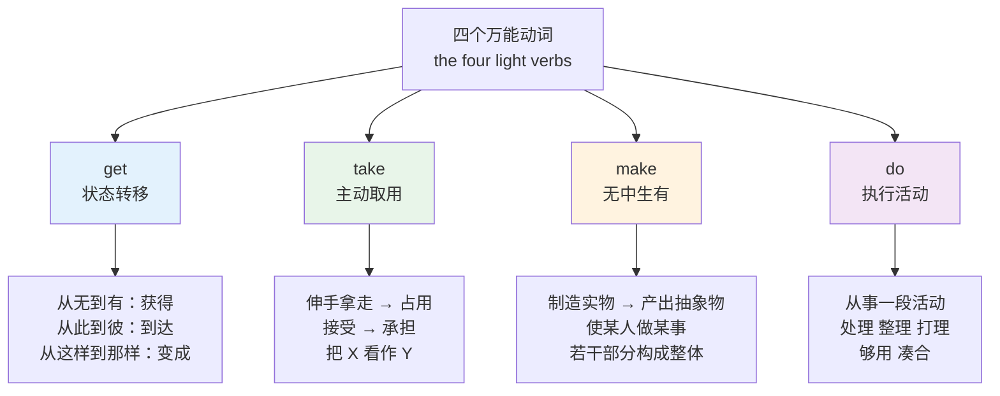
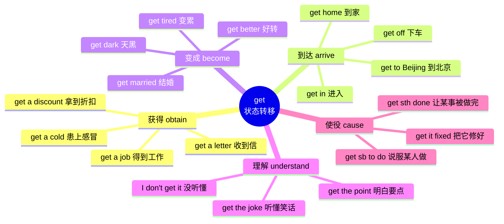
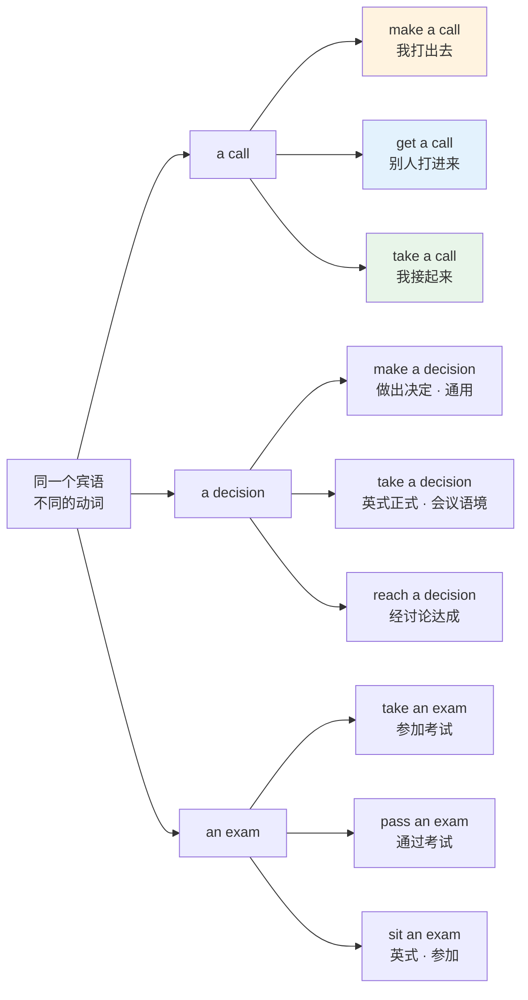
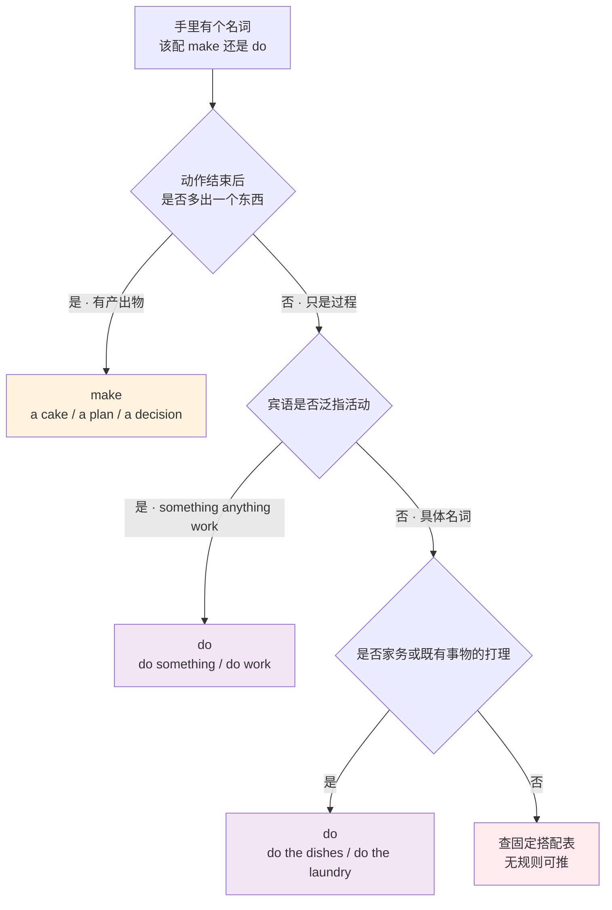
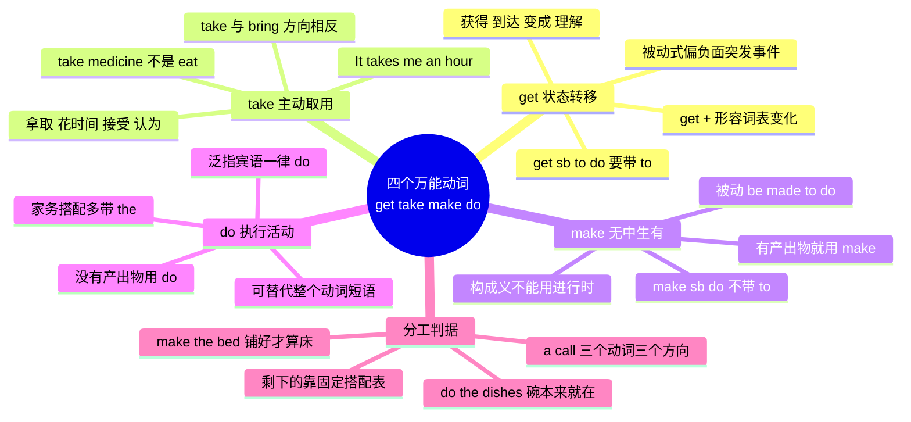

# 高频万能动词义项地图 get take make do

> [!info] 本篇定位
>
> 第十三章的开篇，也是从具象名词转向抽象表达的第一道关口。
>
> 前面十二章解决的是「这个东西叫什么」，从本篇开始解决「这件事怎么说」。英语把大量动作交给四个短动词加名词的组合来表达，`do the dishes`、`make a decision`、`take a shower`、`get a job` 都是这个套路。这四个词各自认识，组合起来却全是坑。
>
> 读完你会拿到四张义项辐射网、一份约一百五十条的搭配清单、一套判断「该用 make 还是 do」的分界规则，以及 make / get / have / let 四个使役动词的结构对照。
>
> 与本篇直接相关的是下一篇 `13/02` 的轻动词搭配（have give go come put set run），两篇合起来覆盖英语全部高频轻动词。语义辨析的方法论在 `16.词义辨析与短语动词`，本篇只给结论不展开方法。

---

## 1. 本篇导读：四个词凭什么撑起半部口语

任何一份英语词频表的前五十名里，`get`、`take`、`make`、`do` 都在。它们高频的原因不是意思多重要，而是**语法功能特殊**——英语倾向于把一个动作拆成「轻动词 + 名词」两部分，语义放在名词里，动词只负责提供时态和结构。

中文说「洗碗」，一个动词一个宾语，语义在动词上。英语说 `do the dishes`，`do` 本身几乎不表意，真正的语义在 `dishes` 上。这类动词在语言学里叫**轻动词**（light verb），因为它们的语义被「掏空」了。

这带来两个后果。第一个后果对阅读友好：轻动词的义项虽多，但都能从一个核心意象辐射出去，掌握核心意象就能猜出大部分用法。第二个后果对产出致命：**哪个名词配哪个轻动词是任意的**，`make a decision` 不能说成 ~~do a decision~~，但 `do research` 也不能说成 ~~make research~~。这类搭配没有可推导的规则，只能整块记。

中文母语者最容易犯的错就出在这里。中文的「做」覆盖面极广——做作业、做决定、做饭、做生意、做梦，英语分别对应 `do homework`、`make a decision`、`cook / make dinner`、`do business`、`have a dream`。一个中文动词映射到四个以上的英语动词，靠字面对译必错。

上图给出的是四个词各自的**核心意象**，后面四节分别把它们展开成完整的义项网。核心意象不是词典释义，而是一个能把所有义项串起来的空间隐喻：`get` 是状态之间的位移，`take` 是从外界拿进来，`make` 是原本不存在的东西被造出来，`do` 是一段活动被执行完。

判断某个新遇到的用法属于哪个义项时，回到核心意象比翻词典快。`get the joke`（听懂笑话）属于 `get` 的哪一支？笑话的含义原本不在你脑子里，现在进来了——是「获得」的引申，不是新义项。

---

## 2. get：以「状态转移」为圆心的辐射网

`get` 是四个词里义项最多的，牛津词典给出的义项超过四十条。全部背下来不现实，也没必要。所有义项都是同一个动作在不同维度上的投影：**某个东西从不属于你的状态，转移到属于你的状态**。

上图的五支不是并列的五个词条，而是同一个核心意象在**所属关系、空间位置、性质状态、认知内容、他人行为**五个维度上的表现。记住这五个维度，遇到陌生的 `get` 用法就能归类。

### 2.1 义项一：获得 —— 从别处到我这里

这是 `get` 最基础的义项，覆盖了 `receive`（被动收到）、`obtain`（主动取得）、`buy`（买到）、`fetch`（去拿来）四个更精确的词的公共部分。

| 英文 | 英式音标 | 美式音标 | 词性 | 中文 | 搭配与说明 |
| --- | --- | --- | --- | --- | --- |
| **get** | /ɡet/ | /ɡet/ | v. | 得到；变成；到达 | 过去式 got；美式过去分词可用 gotten |
| **get a job** | /ˌɡet ə ˈdʒɒb/ | /ˌɡet ə ˈdʒɑːb/ | phr. | 找到工作 | 强调结果，找的过程用 look for a job |
| **get a letter** | /ˌɡet ə ˈletə/ | /ˌɡet ə ˈletər/ | phr. | 收到信 | 等于 receive a letter，口语用 get |
| **get an email** | /ˌɡet ən ˈiːmeɪl/ | /ˌɡet ən ˈiːmeɪl/ | phr. | 收到邮件 | 正式邮件里写 receive your email |
| **get a discount** | /ˌɡet ə ˈdɪskaʊnt/ | /ˌɡet ə ˈdɪskaʊnt/ | phr. | 拿到折扣 | 打折用 get 20% off |
| **get a cold** | /ˌɡet ə ˈkəʊld/ | /ˌɡet ə ˈkoʊld/ | phr. | 患感冒 | 患病一律 get，不用 have 表示得病瞬间 |
| **get permission** | /ˌɡet pəˈmɪʃn/ | /ˌɡet pərˈmɪʃn/ | phr. | 获得许可 | 正式语域换 obtain permission |
| **get a call** | /ˌɡet ə ˈkɔːl/ | /ˌɡet ə ˈkɔːl/ | phr. | 接到电话 | 打出去是 make a call |
| **get a ticket** | /ˌɡet ə ˈtɪkɪt/ | /ˌɡet ə ˈtɪkɪt/ | phr. | 买到票；吃罚单 | 两个义项靠语境区分 |
| **receive** | /rɪˈsiːv/ | /rɪˈsiːv/ | v. | 收到 | 书面正式，被动接收，不含主动索取 |
| **obtain** | /əbˈteɪn/ | /əbˈteɪn/ | v. | 取得 | 正式，含「经过程序取得」 |
| **acquire** | /əˈkwaɪə/ | /əˈkwaɪər/ | v. | 获取；习得 | 用于技能、资产、公司收购 |
| **fetch** | /fetʃ/ | /fetʃ/ | v. | 去拿来 | 含「去 + 拿 + 回来」三段动作 |
| **earn** | /ɜːn/ | /ɜːrn/ | v. | 赚得；挣得 | 靠劳动换来，含正当性 |

> [!warning] get 与 receive 不能互换的场合
>
> `get` 可以主动可以被动，`receive` 只能被动。
>
> - ✅ I **got** the book from the library.（我去图书馆拿的）
> - ❌ ~~I received the book from the library.~~（听起来像图书馆寄给你的）
>
> 正式文书里表示「收悉」用 `receive`：`We have received your application.` 换成 `got` 会显得随便。

### 2.2 义项二：到达与位置移动

从「东西移动到我这里」引申到「我移动到某处」，`get` 就有了「到达」义。这一支最容易被忽略，但口语里出现频率极高。

| 英文 | 英式音标 | 美式音标 | 词性 | 中文 | 搭配与说明 |
| --- | --- | --- | --- | --- | --- |
| **get home** | /ˌɡet ˈhəʊm/ | /ˌɡet ˈhoʊm/ | phr. | 到家 | home 是副词，不加 to |
| **get to work** | /ˌɡet tə ˈwɜːk/ | /ˌɡet tə ˈwɜːrk/ | phr. | 到达公司 | 另有「开始动手干」义 |
| **get there** | /ˌɡet ˈðeə/ | /ˌɡet ˈðer/ | phr. | 到那儿；办成 | 引申义「达成目标」 |
| **get in** | /ˌɡet ˈɪn/ | /ˌɡet ˈɪn/ | phr.v. | 进入；抵达 | 上小车、进屋 |
| **get out** | /ˌɡet ˈaʊt/ | /ˌɡet ˈaʊt/ | phr.v. | 出去；下小车 | 也是驱赶用语 |
| **get on** | /ˌɡet ˈɒn/ | /ˌɡet ˈɑːn/ | phr.v. | 上（大交通工具） | 公交、火车、飞机用 on |
| **get off** | /ˌɡet ˈɒf/ | /ˌɡet ˈɔːf/ | phr.v. | 下（大交通工具） | 与 get on 对称 |
| **get away** | /ˌɡet əˈweɪ/ | /ˌɡet əˈweɪ/ | phr.v. | 逃脱；离开度假 | get away with 表逃脱惩罚 |
| **get back** | /ˌɡet ˈbæk/ | /ˌɡet ˈbæk/ | phr.v. | 返回；取回 | get back to sb 表回复某人 |
| **get around** | /ˌɡet əˈraʊnd/ | /ˌɡet əˈraʊnd/ | phr.v. | 四处走动；绕开 | 英式常写 get round |
| **arrive** | /əˈraɪv/ | /əˈraɪv/ | v. | 到达 | arrive at 小地点，arrive in 大地点 |
| **reach** | /riːtʃ/ | /riːtʃ/ | v. | 抵达；够到 | 及物，reach the station 不加介词 |

> [!warning] 上下车的介词由车的大小决定
>
> 能站起来走动的交通工具用 `on`/`off`，只能坐着钻进去的用 `in`/`out of`。
>
> - ✅ get **on** the bus / the train / the plane（公交、火车、飞机）
> - ✅ get **in** the car / the taxi（轿车、出租车）
> - ❌ ~~get on the car~~（除非你站在车顶上）
>
> 自行车和摩托车跨坐，算 `on`：`get on the bike`。

### 2.3 义项三：变成 —— get + 形容词

`get` 后接形容词表示状态变化，等于口语版的 `become`。这个结构是中文母语者产出量最低的地方，因为中文的「变」不需要单独动词——「天黑了」直接说黑了，英语必须说 `It's getting dark`。

| 英文 | 英式音标 | 美式音标 | 词性 | 中文 | 搭配与说明 |
| --- | --- | --- | --- | --- | --- |
| **get tired** | /ˌɡet ˈtaɪəd/ | /ˌɡet ˈtaɪərd/ | phr. | 变累 | be tired 是状态，get tired 是过程 |
| **get angry** | /ˌɡet ˈæŋɡri/ | /ˌɡet ˈæŋɡri/ | phr. | 生气起来 | get angry with sb 对某人生气 |
| **get better** | /ˌɡet ˈbetə/ | /ˌɡet ˈbetər/ | phr. | 好转；康复 | 病情、技能都可用 |
| **get worse** | /ˌɡet ˈwɜːs/ | /ˌɡet ˈwɜːrs/ | phr. | 恶化 | 与 get better 对称 |
| **get dark** | /ˌɡet ˈdɑːk/ | /ˌɡet ˈdɑːrk/ | phr. | 天黑下来 | 主语用虚指 it |
| **get cold** | /ˌɡet ˈkəʊld/ | /ˌɡet ˈkoʊld/ | phr. | 变冷 | 天气与食物皆可 |
| **get ready** | /ˌɡet ˈredi/ | /ˌɡet ˈredi/ | phr. | 准备好 | get ready for / to do |
| **get lost** | /ˌɡet ˈlɒst/ | /ˌɡet ˈlɔːst/ | phr. | 迷路 | 祈使句是粗鲁的「滚开」 |
| **get married** | /ˌɡet ˈmærid/ | /ˌɡet ˈmærid/ | phr. | 结婚 | get married to sb，不用 with |
| **get dressed** | /ˌɡet ˈdrest/ | /ˌɡet ˈdrest/ | phr. | 穿好衣服 | 指整套穿衣动作 |
| **get drunk** | /ˌɡet ˈdrʌŋk/ | /ˌɡet ˈdrʌŋk/ | phr. | 喝醉 | 状态是 be drunk |
| **get bored** | /ˌɡet ˈbɔːd/ | /ˌɡet ˈbɔːrd/ | phr. | 觉得无聊起来 | -ed 修饰人，-ing 修饰事物 |
| **get used to** | /ˌɡet ˈjuːst tə/ | /ˌɡet ˈjuːst tə/ | phr. | 逐渐习惯 | to 是介词，后接名词或动名词 |
| **become** | /bɪˈkʌm/ | /bɪˈkʌm/ | v. | 成为 | 后可接名词，get 不能 |

> [!example] be / get / become 的三分
>
> - The room **is** dirty.
>   - 房间是脏的。（静态描述）
> - The room **is getting** dirty.
>   - 房间正在变脏。（过程，口语首选）
> - She **became** a doctor.
>   - 她成了医生。（后接名词只能用 become）
>
> `get` 后不能直接跟名词表示「成为」：❌ ~~She got a doctor.~~ 这句话会被理解成「她请来了一位医生」。

### 2.4 义项四：理解与说服

信息进入大脑，也是一种「获得」。这一支在口语里极常用，且比 `understand` 短、比 `comprehend` 自然。

| 英文 | 英式音标 | 美式音标 | 词性 | 中文 | 搭配与说明 |
| --- | --- | --- | --- | --- | --- |
| **get it** | /ˌɡet ˈɪt/ | /ˌɡet ˈɪt/ | phr. | 明白了 | I don't get it 是最自然的「没懂」 |
| **get the point** | /ˌɡet ðə ˈpɔɪnt/ | /ˌɡet ðə ˈpɔɪnt/ | phr. | 抓住要点 | miss the point 是没抓住 |
| **get the joke** | /ˌɡet ðə ˈdʒəʊk/ | /ˌɡet ðə ˈdʒoʊk/ | phr. | 听懂笑话 | 笑点没懂就说 I didn't get it |
| **get the idea** | /ˌɡet ði aɪˈdɪə/ | /ˌɡet ði aɪˈdiːə/ | phr. | 领会意思 | You get the idea 表示不必细说了 |
| **get sb to do sth** | /ˌɡet ˈsʌmbədi tə duː/ | /ˌɡet ˈsʌmbədi tə duː/ | phr. | 说服某人做某事 | 必须带 to，含「费了劲」 |
| **get sth done** | /ˌɡet ˈsʌmθɪŋ ˈdʌn/ | /ˌɡet ˈsʌmθɪŋ ˈdʌn/ | phr. | 把某事弄完 | 不关心执行者是谁 |
| **understand** | /ˌʌndəˈstænd/ | /ˌʌndərˈstænd/ | v. | 理解 | 中性偏正式，覆盖面比 get 广 |
| **grasp** | /ɡrɑːsp/ | /ɡræsp/ | v. | 领会；抓住 | 强调抓住复杂概念的本质 |
| **persuade** | /pəˈsweɪd/ | /pərˈsweɪd/ | v. | 说服 | persuade sb to do，正式于 get |
| **manage** | /ˈmænɪdʒ/ | /ˈmænɪdʒ/ | v. | 设法做到 | manage to do，含克服困难 |

### 2.5 get 的三种句法结构

`get` 除了义项多，句法结构也多。三种结构各有分工，混用会改变意思。

| 结构 | 例句 | 含义 | 与谁对立 |
| --- | --- | --- | --- |
| get + 宾语 + to do | I **got him to sign** it. | 说服他去签 | 对方是主动执行者 |
| get + 宾语 + 过去分词 | I **got the car fixed**. | 找人把车修好 | 不关心谁修的 |
| get + 过去分词（被动） | He **got fired**. | 他被开除了 | 比 was fired 更口语、更强调突发 |

> [!tip] get 被动式的语用色彩
>
> `get` 被动式（get-passive）比 `be` 被动式更口语，而且倾向于用在**对主语不利或出人意料**的事件上。
>
> - `He got fired.` / `She got arrested.` / `My phone got stolen.` 都很自然。
> - `The book got written by him.` 就很奇怪——写书是中性事件，用 `was written`。
>
> 这条规律在技术文档里的实际用途：读到 `The request got rejected` 而不是 `was rejected`，作者通常在暗示这是个意外情况。

### 2.6 get 系短语动词高频清单

| 英文 | 英式音标 | 美式音标 | 词性 | 中文 | 搭配与说明 |
| --- | --- | --- | --- | --- | --- |
| **get up** | /ˌɡet ˈʌp/ | /ˌɡet ˈʌp/ | phr.v. | 起床；起身 | 醒来是 wake up，两者不同 |
| **get along** | /ˌɡet əˈlɒŋ/ | /ˌɡet əˈlɔːŋ/ | phr.v. | 相处融洽；进展 | get along with sb |
| **get over** | /ˌɡet ˈəʊvə/ | /ˌɡet ˈoʊvər/ | phr.v. | 克服；从…恢复 | get over an illness / a breakup |
| **get through** | /ˌɡet ˈθruː/ | /ˌɡet ˈθruː/ | phr.v. | 熬过；打通电话 | get through to sb 表接通 |
| **get across** | /ˌɡet əˈkrɒs/ | /ˌɡet əˈkrɔːs/ | phr.v. | 把意思传达清楚 | get the message across |
| **get by** | /ˌɡet ˈbaɪ/ | /ˌɡet ˈbaɪ/ | phr.v. | 勉强维持 | get by on a small salary |
| **get rid of** | /ˌɡet ˈrɪd əv/ | /ˌɡet ˈrɪd əv/ | phr. | 摆脱；扔掉 | rid 单用极少，整块记 |
| **get together** | /ˌɡet təˈɡeðə/ | /ˌɡet təˈɡeðər/ | phr.v. | 聚会 | 名词形式 get-together |
| **get down to** | /ˌɡet ˈdaʊn tə/ | /ˌɡet ˈdaʊn tə/ | phr.v. | 着手做 | get down to business 言归正传 |
| **get in touch** | /ˌɡet ɪn ˈtʌtʃ/ | /ˌɡet ɪn ˈtʌtʃ/ | phr. | 取得联系 | 保持联系是 keep in touch |
| **get away with** | /ˌɡet əˈweɪ wɪð/ | /ˌɡet əˈweɪ wɪð/ | phr.v. | 做了坏事没受罚 | get away with murder 夸张说法 |
| **get back to** | /ˌɡet ˈbæk tə/ | /ˌɡet ˈbæk tə/ | phr.v. | 稍后答复 | 邮件常用 I'll get back to you |

---

## 3. take：以「主动取用」为圆心

`take` 的核心意象是**伸手把东西拿过来并带走**。与 `get` 的关键差别在于主动性：`get` 可以是东西自己来的，`take` 一定是主体主动去拿的。

从这个核心出发，五条辐射线依次展开：手拿实物 → 占用时间与资源 → 接受外来的东西 → 把某物在认知里「拿作」某种理解 → 使用交通工具与摄入药物。

### 3.1 义项一：拿取与携带

| 英文 | 英式音标 | 美式音标 | 词性 | 中文 | 搭配与说明 |
| --- | --- | --- | --- | --- | --- |
| **take** | /teɪk/ | /teɪk/ | v. | 拿；花费；接受 | 不规则 take-took-taken |
| **take a book** | /ˌteɪk ə ˈbʊk/ | /ˌteɪk ə ˈbʊk/ | phr. | 拿一本书 | 拿走并带离说话现场 |
| **take an umbrella** | /ˌteɪk ən ʌmˈbrelə/ | /ˌteɪk ən ʌmˈbrelə/ | phr. | 带把伞 | 出门随身带用 take |
| **take a seat** | /ˌteɪk ə ˈsiːt/ | /ˌteɪk ə ˈsiːt/ | phr. | 请坐 | 比 sit down 客气 |
| **take a photo** | /ˌteɪk ə ˈfəʊtəʊ/ | /ˌteɪk ə ˈfoʊtoʊ/ | phr. | 拍照 | 英式也说 take a picture |
| **take notes** | /ˌteɪk ˈnəʊts/ | /ˌteɪk ˈnoʊts/ | phr. | 记笔记 | 复数固定，单数指便条 |
| **take a break** | /ˌteɪk ə ˈbreɪk/ | /ˌteɪk ə ˈbreɪk/ | phr. | 休息一下 | 也说 have a break（英式更常） |
| **take a shower** | /ˌteɪk ə ˈʃaʊə/ | /ˌteɪk ə ˈʃaʊər/ | phr. | 洗澡 | 美式 take，英式常用 have |
| **take a walk** | /ˌteɪk ə ˈwɔːk/ | /ˌteɪk ə ˈwɔːk/ | phr. | 散步 | 英式 go for a walk 更常见 |
| **take a look** | /ˌteɪk ə ˈlʊk/ | /ˌteɪk ə ˈlʊk/ | phr. | 看一眼 | have a look 英式等价 |
| **bring** | /brɪŋ/ | /brɪŋ/ | v. | 带来 | 朝说话人方向，与 take 反向 |
| **carry** | /ˈkæri/ | /ˈkæri/ | v. | 搬运；携带 | 强调负重，不含方向性 |
| **grab** | /ɡræb/ | /ɡræb/ | v. | 抓起；随手拿 | 口语，含匆忙 |
| **seize** | /siːz/ | /siːz/ | v. | 抓住；夺取 | 正式，含强力 |

> [!warning] take 与 bring 的方向对立
>
> 这两个词的差别不在动作，而在**参照点**。`bring` 是朝说话人所在位置移动，`take` 是离开说话人所在位置。
>
> - 你在办公室，同事要来：`Please **bring** the file when you come.`
> - 你要出门去客户那儿：`I'll **take** the file with me.`
>
> ❌ ~~I'll bring the file to the client.~~（除非你此刻已经在客户那儿说话）
>
> 中文的「带」不区分方向，这是错误高发点。

### 3.2 义项二：花费时间与占用资源

从「把东西拿走」引申到「把时间拿走」，`take` 成了表示耗时的默认动词。这个结构的主语通常是虚指的 `it`。

| 英文 | 英式音标 | 美式音标 | 词性 | 中文 | 搭配与说明 |
| --- | --- | --- | --- | --- | --- |
| **take time** | /ˌteɪk ˈtaɪm/ | /ˌteɪk ˈtaɪm/ | phr. | 花时间 | It takes time. 表示急不来 |
| **take an hour** | /ˌteɪk ən ˈaʊə/ | /ˌteɪk ən ˈaʊər/ | phr. | 花一小时 | It takes me an hour to… |
| **take ages** | /ˌteɪk ˈeɪdʒɪz/ | /ˌteɪk ˈeɪdʒɪz/ | phr. | 花老半天 | 英式口语，夸张说法 |
| **take effort** | /ˌteɪk ˈefət/ | /ˌteɪk ˈefərt/ | phr. | 需要努力 | 也说 take some doing |
| **take space** | /ˌteɪk ˈspeɪs/ | /ˌteɪk ˈspeɪs/ | phr. | 占地方 | 完整说法 take up space |
| **take courage** | /ˌteɪk ˈkʌrɪdʒ/ | /ˌteɪk ˈkɜːrɪdʒ/ | phr. | 需要勇气 | It takes courage to speak up. |
| **spend** | /spend/ | /spend/ | v. | 花费 | 主语必须是人：I spent an hour |
| **cost** | /kɒst/ | /kɔːst/ | v./n. | 花费（钱） | 主语是物：It cost me £20 |
| **occupy** | /ˈɒkjupaɪ/ | /ˈɑːkjupaɪ/ | v. | 占据 | 正式，用于空间与时间 |
| **require** | /rɪˈkwaɪə/ | /rɪˈkwaɪər/ | v. | 需要 | 正式，书面替代 take |

> [!warning] take / spend / cost 的主语不能混
>
> 三个词都表「花费」，但主语位置不同，写错就是语法错。
>
> - ✅ **It took** me three hours to finish.（it 做主语，人做间接宾语）
> - ✅ **I spent** three hours finishing it.（人做主语，后接 doing）
> - ✅ **It cost** me twenty pounds.（物做主语，钱做宾语）
> - ❌ ~~I took three hours to finish it.~~ 这句语法成立但含义是「我用了三小时才做完」，强调点在人身上，不如 It took 自然。
> - ❌ ~~It spent me three hours.~~ 直接错误。

### 3.3 义项三：接受与承担

外界给你东西，你伸手接过来——这是 `take` 从物理动作到抽象接受的桥梁。

| 英文 | 英式音标 | 美式音标 | 词性 | 中文 | 搭配与说明 |
| --- | --- | --- | --- | --- | --- |
| **take a job** | /ˌteɪk ə ˈdʒɒb/ | /ˌteɪk ə ˈdʒɑːb/ | phr. | 接受一份工作 | 与 get a job 差在有无选择权 |
| **take advice** | /ˌteɪk ədˈvaɪs/ | /ˌteɪk ədˈvaɪs/ | phr. | 采纳建议 | advice 不可数 |
| **take responsibility** | /ˌteɪk rɪˌspɒnsəˈbɪləti/ | /ˌteɪk rɪˌspɑːnsəˈbɪləti/ | phr. | 承担责任 | take responsibility for sth |
| **take the blame** | /ˌteɪk ðə ˈbleɪm/ | /ˌteɪk ðə ˈbleɪm/ | phr. | 背锅 | 甩锅是 shift the blame |
| **take a risk** | /ˌteɪk ə ˈrɪsk/ | /ˌteɪk ə ˈrɪsk/ | phr. | 冒险 | 复数 take risks 更常见 |
| **take a chance** | /ˌteɪk ə ˈtʃɑːns/ | /ˌteɪk ə ˈtʃæns/ | phr. | 碰运气 | 与 take a risk 近义 |
| **take charge** | /ˌteɪk ˈtʃɑːdʒ/ | /ˌteɪk ˈtʃɑːrdʒ/ | phr. | 接管；负责 | take charge of the team |
| **take control** | /ˌteɪk kənˈtrəʊl/ | /ˌteɪk kənˈtroʊl/ | phr. | 取得控制 | take control of the situation |
| **take criticism** | /ˌteɪk ˈkrɪtɪsɪzəm/ | /ˌteɪk ˈkrɪtɪsɪzəm/ | phr. | 接受批评 | take it well 表示态度好 |
| **take part** | /ˌteɪk ˈpɑːt/ | /ˌteɪk ˈpɑːrt/ | phr. | 参与 | take part in，等于 participate in |
| **take advantage of** | /ˌteɪk ədˈvɑːntɪdʒ əv/ | /ˌteɪk ədˈvæntɪdʒ əv/ | phr. | 利用 | 中性利用机会，也可指占人便宜 |
| **take care of** | /ˌteɪk ˈkeər əv/ | /ˌteɪk ˈker əv/ | phr. | 照顾；处理 | 也用于「我来搞定」 |
| **accept** | /əkˈsept/ | /əkˈsept/ | v. | 接受 | 正式，强调同意而非动作 |
| **endure** | /ɪnˈdjʊə/ | /ɪnˈdʊr/ | v. | 忍受 | 正式，长期承受痛苦 |
| **tolerate** | /ˈtɒləreɪt/ | /ˈtɑːləreɪt/ | v. | 容忍 | 含勉强接受不喜欢的事 |

### 3.4 义项四：认为与理解

「把 X 拿作 Y」在英语里是标准的表达「认为」的方式，结构是 `take A for/as B`。

| 英文 | 英式音标 | 美式音标 | 词性 | 中文 | 搭配与说明 |
| --- | --- | --- | --- | --- | --- |
| **take sth as** | /ˌteɪk ˈsʌmθɪŋ əz/ | /ˌteɪk ˈsʌmθɪŋ əz/ | phr. | 把某事视为 | take it as a compliment |
| **take sb for** | /ˌteɪk ˈsʌmbədi fə/ | /ˌteɪk ˈsʌmbədi fər/ | phr. | 误认为某人是 | Who do you take me for? |
| **take it easy** | /ˌteɪk ɪt ˈiːzi/ | /ˌteɪk ɪt ˈiːzi/ | phr. | 放轻松 | 告别语也可用 |
| **take offence** | /ˌteɪk əˈfens/ | /ˌteɪk əˈfens/ | phr. | 觉得被冒犯 | 美式拼写 offense |
| **take sth seriously** | /ˌteɪk ˈsʌmθɪŋ ˈsɪəriəsli/ | /ˌteɪk ˈsʌmθɪŋ ˈsɪriəsli/ | phr. | 认真对待 | 反面 take it lightly |
| **take sth for granted** | /ˌteɪk ɪt fə ˈɡrɑːntɪd/ | /ˌteɪk ɪt fər ˈɡræntɪd/ | phr. | 想当然；不知珍惜 | 两个义项都高频 |
| **take a view** | /ˌteɪk ə ˈvjuː/ | /ˌteɪk ə ˈvjuː/ | phr. | 持某种看法 | take a dim view of 不看好 |
| **assume** | /əˈsjuːm/ | /əˈsuːm/ | v. | 假定 | 无证据的默认判断 |
| **regard** | /rɪˈɡɑːd/ | /rɪˈɡɑːrd/ | v. | 视为 | regard A as B，正式 |
| **consider** | /kənˈsɪdə/ | /kənˈsɪdər/ | v. | 认为；考虑 | consider A B，不加 as |

### 3.5 义项五：乘坐、服用与考试

这三类用法看起来毫无关联，实际都是「主动取用某个外部资源」的实例：取用交通工具、取用药物、取用一次考试机会。

| 英文 | 英式音标 | 美式音标 | 词性 | 中文 | 搭配与说明 |
| --- | --- | --- | --- | --- | --- |
| **take the bus** | /ˌteɪk ðə ˈbʌs/ | /ˌteɪk ðə ˈbʌs/ | phr. | 坐公交 | 强调选择这种方式 |
| **take a taxi** | /ˌteɪk ə ˈtæksi/ | /ˌteɪk ə ˈtæksi/ | phr. | 打车 | 美式常说 take a cab |
| **take the lift** | /ˌteɪk ðə ˈlɪft/ | /ˌteɪk ðə ˈlɪft/ | phr. | 坐电梯（英） | 美式 take the elevator |
| **take a flight** | /ˌteɪk ə ˈflaɪt/ | /ˌteɪk ə ˈflaɪt/ | phr. | 乘航班 | 也说 catch a flight |
| **take medicine** | /ˌteɪk ˈmedsn/ | /ˌteɪk ˈmedɪsn/ | phr. | 吃药 | ❌ eat medicine |
| **take a pill** | /ˌteɪk ə ˈpɪl/ | /ˌteɪk ə ˈpɪl/ | phr. | 服一粒药 | 剂量用 take two pills |
| **take an exam** | /ˌteɪk ən ɪɡˈzæm/ | /ˌteɪk ən ɪɡˈzæm/ | phr. | 参加考试 | 通过是 pass，不是 take |
| **take a course** | /ˌteɪk ə ˈkɔːs/ | /ˌteɪk ə ˈkɔːrs/ | phr. | 选修一门课 | 开课方用 give / offer |
| **take a temperature** | /ˌteɪk ə ˈtemprətʃə/ | /ˌteɪk ə ˈtemprətʃər/ | phr. | 量体温 | 量血压是 take blood pressure |
| **take measures** | /ˌteɪk ˈmeʒəz/ | /ˌteɪk ˈmeʒərz/ | phr. | 采取措施 | 正式，也说 take steps |
| **take action** | /ˌteɪk ˈækʃn/ | /ˌteɪk ˈækʃn/ | phr. | 采取行动 | action 此处不可数 |
| **take place** | /ˌteɪk ˈpleɪs/ | /ˌteɪk ˈpleɪs/ | phr. | 发生；举行 | 无被动式，指有计划的事 |

> [!warning] 三个高频误用
>
> - ❌ ~~eat medicine~~ → ✅ **take medicine**。药是被「取用」的，不是被「咀嚼」的。
> - ❌ ~~take an exam~~ 表示「考过了」→ ✅ **pass an exam**。`take` 只是参加，结果未定。
> - ❌ ~~The accident took place on purpose.~~ → `take place` 用于有安排的事件（会议、婚礼、比赛），突发事故用 **happen** 或 **occur**。

### 3.6 take 系短语动词

| 英文 | 英式音标 | 美式音标 | 词性 | 中文 | 搭配与说明 |
| --- | --- | --- | --- | --- | --- |
| **take off** | /ˌteɪk ˈɒf/ | /ˌteɪk ˈɔːf/ | phr.v. | 起飞；脱下；走红 | 三个义项都高频 |
| **take over** | /ˌteɪk ˈəʊvə/ | /ˌteɪk ˈoʊvər/ | phr.v. | 接管；收购 | 名词 takeover |
| **take up** | /ˌteɪk ˈʌp/ | /ˌteɪk ˈʌp/ | phr.v. | 开始从事；占用 | take up running / take up space |
| **take on** | /ˌteɪk ˈɒn/ | /ˌteɪk ˈɑːn/ | phr.v. | 承接；雇用 | take on a project / new staff |
| **take back** | /ˌteɪk ˈbæk/ | /ˌteɪk ˈbæk/ | phr.v. | 收回（话）；退货 | I take it back 表示收回前言 |
| **take out** | /ˌteɪk ˈaʊt/ | /ˌteɪk ˈaʊt/ | phr.v. | 取出；带某人出去 | 外卖英式 takeaway，美式 takeout |
| **take down** | /ˌteɪk ˈdaʊn/ | /ˌteɪk ˈdaʊn/ | phr.v. | 记下；拆除 | 服务器下线也用 take down |
| **take in** | /ˌteɪk ˈɪn/ | /ˌteɪk ˈɪn/ | phr.v. | 吸收理解；欺骗 | be taken in 表示被骗 |
| **take after** | /ˌteɪk ˈɑːftə/ | /ˌteɪk ˈæftər/ | phr.v. | 长得像（长辈） | 只用于血缘亲属 |
| **take apart** | /ˌteɪk əˈpɑːt/ | /ˌteɪk əˈpɑːrt/ | phr.v. | 拆开 | 组装回去是 put together |

---

## 4. make：以「让某物存在」为圆心

`make` 的核心是**创造**：动作结束后，世界上多了一个原本不存在的东西。这个「东西」可以是实物（蛋糕、桌子），可以是抽象物（决定、承诺、错误），也可以是一种局面（让某人生气）。

判断该不该用 `make` 的第一问是：**这个动作有没有产出物**？有，倾向 `make`；没有，倾向 `do`。这条规则不能覆盖全部搭配，但能挡住大部分错误。

### 4.1 义项一：制造与生产

| 英文 | 英式音标 | 美式音标 | 词性 | 中文 | 搭配与说明 |
| --- | --- | --- | --- | --- | --- |
| **make** | /meɪk/ | /meɪk/ | v. | 制作；使得；构成 | 不规则 make-made-made |
| **make a cake** | /ˌmeɪk ə ˈkeɪk/ | /ˌmeɪk ə ˈkeɪk/ | phr. | 做蛋糕 | 烘焙也可用 bake |
| **make dinner** | /ˌmeɪk ˈdɪnə/ | /ˌmeɪk ˈdɪnər/ | phr. | 做晚饭 | 强调烹饪过程用 cook |
| **make coffee** | /ˌmeɪk ˈkɒfi/ | /ˌmeɪk ˈkɔːfi/ | phr. | 煮咖啡 | 泡茶是 make tea |
| **make a copy** | /ˌmeɪk ə ˈkɒpi/ | /ˌmeɪk ə ˈkɑːpi/ | phr. | 复制一份 | 备份是 make a backup |
| **make a list** | /ˌmeɪk ə ˈlɪst/ | /ˌmeɪk ə ˈlɪst/ | phr. | 列清单 | 清单存在之前不存在 |
| **make a plan** | /ˌmeɪk ə ˈplæn/ | /ˌmeɪk ə ˈplæn/ | phr. | 制定计划 | 执行计划是 carry out a plan |
| **make money** | /ˌmeɪk ˈmʌni/ | /ˌmeɪk ˈmʌni/ | phr. | 赚钱 | earn 强调劳动所得 |
| **make a profit** | /ˌmeɪk ə ˈprɒfɪt/ | /ˌmeɪk ə ˈprɑːfɪt/ | phr. | 盈利 | 亏损是 make a loss |
| **make a living** | /ˌmeɪk ə ˈlɪvɪŋ/ | /ˌmeɪk ə ˈlɪvɪŋ/ | phr. | 谋生 | make a living as a coder |
| **make a fortune** | /ˌmeɪk ə ˈfɔːtʃuːn/ | /ˌmeɪk ə ˈfɔːrtʃən/ | phr. | 发大财 | 语气偏夸张 |
| **produce** | /prəˈdjuːs/ | /prəˈduːs/ | v. | 生产 | 工业规模，正式 |
| **manufacture** | /ˌmænjuˈfæktʃə/ | /ˌmænjuˈfæktʃər/ | v. | 制造 | 工厂用词，最正式 |
| **create** | /kriˈeɪt/ | /kriˈeɪt/ | v. | 创造 | 强调原创性与设计 |
| **build** | /bɪld/ | /bɪld/ | v. | 建造；构建 | 结构性组装，含软件构建 |

> [!tip] 材料与成品的两种介词
>
> - **be made of**：能看出原材料。`The table is made **of** wood.`（还是木头样）
> - **be made from**：原材料已经变形，看不出来。`Paper is made **from** wood.`（纸看不出木头）
> - **be made into**：从材料的角度说成品。`Wood is made **into** paper.`
> - **be made in**：产地。`Made **in** Germany.`
> - **be made by**：制造者。`This was made **by** hand.`
>
> 五个介词各管一个角度，考试和实际写作都常用。

### 4.2 义项二：使役与导致

「造出一个局面」就是使役。`make` 是英语里语气最强的使役动词，含**不由分说**的意味。

| 英文 | 英式音标 | 美式音标 | 词性 | 中文 | 搭配与说明 |
| --- | --- | --- | --- | --- | --- |
| **make sb do sth** | /ˌmeɪk ˈsʌmbədi ˈduː/ | /ˌmeɪk ˈsʌmbədi ˈduː/ | phr. | 迫使某人做 | 主动语态不带 to |
| **make sb happy** | /ˌmeɪk ˈsʌmbədi ˈhæpi/ | /ˌmeɪk ˈsʌmbədi ˈhæpi/ | phr. | 使某人开心 | make + 宾语 + 形容词 |
| **make sb angry** | /ˌmeɪk ˈsʌmbədi ˈæŋɡri/ | /ˌmeɪk ˈsʌmbədi ˈæŋɡri/ | phr. | 惹某人生气 | 更强的是 drive sb mad |
| **make sense** | /ˌmeɪk ˈsens/ | /ˌmeɪk ˈsens/ | phr. | 说得通 | It doesn't make sense. 极高频 |
| **make a difference** | /ˌmeɪk ə ˈdɪfrəns/ | /ˌmeɪk ə ˈdɪfrəns/ | phr. | 起作用 | 无关紧要是 make no difference |
| **make trouble** | /ˌmeɪk ˈtrʌbl/ | /ˌmeɪk ˈtrʌbl/ | phr. | 制造麻烦 | 陷入麻烦是 get into trouble |
| **make a mess** | /ˌmeɪk ə ˈmes/ | /ˌmeɪk ə ˈmes/ | phr. | 弄得一团糟 | 收拾是 clear up the mess |
| **make noise** | /ˌmeɪk ˈnɔɪz/ | /ˌmeɪk ˈnɔɪz/ | phr. | 制造噪音 | 也说 make a noise |
| **make it possible** | /ˌmeɪk ɪt ˈpɒsəbl/ | /ˌmeɪk ɪt ˈpɑːsəbl/ | phr. | 使之成为可能 | it 是形式宾语 |
| **cause** | /kɔːz/ | /kɔːz/ | v. | 导致 | 中性，用于负面结果居多 |
| **force** | /fɔːs/ | /fɔːrs/ | v. | 强迫 | force sb to do，带 to |
| **compel** | /kəmˈpel/ | /kəmˈpel/ | v. | 迫使 | 正式，常用于制度性压力 |

> [!warning] make 使役结构的主动被动不对称
>
> 主动语态 `make sb do`，不定式**不带 to**；变成被动后 `to` 必须回来。
>
> - ✅ They **made** him **sign** the paper.
> - ✅ He **was made to sign** the paper.
> - ❌ ~~He was made sign the paper.~~
>
> 同一规则适用于 `hear`、`see`、`watch`、`let`（let 的被动通常改用 allow）。

### 4.3 义项三：构成与等于

若干部分合起来构成整体，`make` 表示这层关系，且**不能用进行时**。

| 英文 | 英式音标 | 美式音标 | 词性 | 中文 | 搭配与说明 |
| --- | --- | --- | --- | --- | --- |
| **make up** | /ˌmeɪk ˈʌp/ | /ˌmeɪk ˈʌp/ | phr.v. | 构成；编造；和好 | be made up of 表构成 |
| **make a team** | /ˌmeɪk ə ˈtiːm/ | /ˌmeɪk ə ˈtiːm/ | phr. | 组成一队；入选 | 入选球队义常用 |
| **make a good teacher** | /ˌmeɪk ə ɡʊd ˈtiːtʃə/ | /ˌmeɪk ə ɡʊd ˈtiːtʃər/ | phr. | 会成为好老师 | 表潜质，不表制造 |
| **make two** | /ˌmeɪk ˈtuː/ | /ˌmeɪk ˈtuː/ | phr. | 等于二 | One and one make two. |
| **constitute** | /ˈkɒnstɪtjuːt/ | /ˈkɑːnstɪtuːt/ | v. | 构成 | 正式，法律与学术常用 |
| **comprise** | /kəmˈpraɪz/ | /kəmˈpraɪz/ | v. | 由…组成 | 整体 comprises 部分 |
| **consist of** | /kənˈsɪst əv/ | /kənˈsɪst əv/ | phr.v. | 由…组成 | 无被动，无进行时 |
| **form** | /fɔːm/ | /fɔːrm/ | v. | 形成 | 中性，常用于组织与形状 |

> [!example] make 表「构成 / 会成为」
>
> - Twelve months **make** a year.
>   - 十二个月构成一年。
> - She'll **make** an excellent manager.
>   - 她会成为一名出色的经理。（说的是潜质，不是「制造经理」）
> - The team **is made up of** five engineers.
>   - 这个团队由五名工程师组成。

### 4.4 义项四：做出言语与心理动作

「说一句话」在英语里往往被处理成「造出一段言语产出物」，所以大量言语行为动词用 `make`。

| 英文 | 英式音标 | 美式音标 | 词性 | 中文 | 搭配与说明 |
| --- | --- | --- | --- | --- | --- |
| **make a decision** | /ˌmeɪk ə dɪˈsɪʒn/ | /ˌmeɪk ə dɪˈsɪʒn/ | phr. | 做决定 | 正式可用 take a decision（英式） |
| **make a suggestion** | /ˌmeɪk ə səˈdʒestʃən/ | /ˌmeɪk ə səˈdʒestʃən/ | phr. | 提建议 | 也说 make a proposal |
| **make a promise** | /ˌmeɪk ə ˈprɒmɪs/ | /ˌmeɪk ə ˈprɑːmɪs/ | phr. | 许下承诺 | 守诺 keep，违诺 break |
| **make an apology** | /ˌmeɪk ən əˈpɒlədʒi/ | /ˌmeɪk ən əˈpɑːlədʒi/ | phr. | 致歉 | 口语直接说 apologize |
| **make an excuse** | /ˌmeɪk ən ɪkˈskjuːs/ | /ˌmeɪk ən ɪkˈskjuːs/ | phr. | 找借口 | 名词 excuse 尾音 /s/ |
| **make an offer** | /ˌmeɪk ən ˈɒfə/ | /ˌmeɪk ən ˈɔːfər/ | phr. | 出价；提出录用 | 求职场景高频 |
| **make a complaint** | /ˌmeɪk ə kəmˈpleɪnt/ | /ˌmeɪk ə kəmˈpleɪnt/ | phr. | 投诉 | file a complaint 更正式 |
| **make a comment** | /ˌmeɪk ə ˈkɒment/ | /ˌmeɪk ə ˈkɑːment/ | phr. | 发表评论 | 代码注释用 write a comment |
| **make a speech** | /ˌmeɪk ə ˈspiːtʃ/ | /ˌmeɪk ə ˈspiːtʃ/ | phr. | 发表演讲 | 也说 give a speech |
| **make a mistake** | /ˌmeɪk ə mɪˈsteɪk/ | /ˌmeɪk ə mɪˈsteɪk/ | phr. | 犯错 | ❌ do a mistake |
| **make an appointment** | /ˌmeɪk ən əˈpɔɪntmənt/ | /ˌmeɪk ən əˈpɔɪntmənt/ | phr. | 预约 | 餐厅订位是 make a reservation |
| **make a call** | /ˌmeɪk ə ˈkɔːl/ | /ˌmeɪk ə ˈkɔːl/ | phr. | 打电话 | 接到电话是 get a call |
| **make progress** | /ˌmeɪk ˈprəʊɡres/ | /ˌmeɪk ˈprɑːɡrəs/ | phr. | 取得进展 | progress 不可数 |
| **make an effort** | /ˌmeɪk ən ˈefət/ | /ˌmeɪk ən ˈefərt/ | phr. | 做出努力 | 也说 make every effort |
| **make friends** | /ˌmeɪk ˈfrendz/ | /ˌmeɪk ˈfrendz/ | phr. | 交朋友 | 复数固定 |

### 4.5 make 系短语动词

| 英文 | 英式音标 | 美式音标 | 词性 | 中文 | 搭配与说明 |
| --- | --- | --- | --- | --- | --- |
| **make out** | /ˌmeɪk ˈaʊt/ | /ˌmeɪk ˈaʊt/ | phr.v. | 辨认出；勉强看清 | 也有口语的亲热义 |
| **make up for** | /ˌmeɪk ˈʌp fə/ | /ˌmeɪk ˈʌp fər/ | phr.v. | 弥补 | make up for lost time |
| **make it** | /ˌmeɪk ˈɪt/ | /ˌmeɪk ˈɪt/ | phr. | 赶到；成功 | I can't make it 表示来不了 |
| **make do with** | /ˌmeɪk ˈduː wɪð/ | /ˌmeɪk ˈduː wɪð/ | phr. | 将就使用 | make 与 do 罕见同现 |
| **make for** | /ˌmeɪk ˈfɔː/ | /ˌmeɪk ˈfɔːr/ | phr.v. | 走向；有助于 | make for a better result |
| **make sure** | /ˌmeɪk ˈʃʊə/ | /ˌmeɪk ˈʃʊr/ | phr. | 确保 | make sure that + 从句 |
| **make the most of** | /ˌmeɪk ðə ˈməʊst əv/ | /ˌmeɪk ðə ˈmoʊst əv/ | phr. | 充分利用 | 时机有限时用 |
| **make room for** | /ˌmeɪk ˈruːm fə/ | /ˌmeɪk ˈruːm fər/ | phr. | 腾出地方 | room 此处不可数 |

上图展示的是同一个名词换动词后语义完全改变的三组例子。`a call` 这组尤其值得记：三个动词分别对应打出、接到、接起三个不同动作，中文都可以说「电话」，靠动词分辨方向。这也是本篇的核心训练点——**不要先想动词再配名词，要先锁定名词再选动词**。

---

## 5. do：以「执行一段活动」为圆心

`do` 与 `make` 的分工是四个词里最难的一对。`make` 关注产出物，`do` 关注**活动过程本身**。做完 `make a cake` 桌上多了个蛋糕；做完 `do the dishes` 世界上没多出任何东西，只是碗从脏变干净了。

`do` 还有一个 `make` 没有的功能：**替代前文提到的整个动词短语**。`I'll do it tomorrow` 里的 `do` 可以指代任何动作。这是 `do` 作为「万能动词」最纯粹的体现。

### 5.1 义项一：从事与执行

| 英文 | 英式音标 | 美式音标 | 词性 | 中文 | 搭配与说明 |
| --- | --- | --- | --- | --- | --- |
| **do** | /duː/ | /duː/ | v. | 做；干 | 不规则 do-did-done |
| **do homework** | /ˌduː ˈhəʊmwɜːk/ | /ˌduː ˈhoʊmwɜːrk/ | phr. | 做作业 | homework 不可数 |
| **do business** | /ˌduː ˈbɪznəs/ | /ˌduː ˈbɪznəs/ | phr. | 做生意 | do business with sb |
| **do research** | /ˌduː rɪˈsɜːtʃ/ | /ˌduː ˈriːsɜːrtʃ/ | phr. | 做研究 | 名词重音英美不同 |
| **do exercise** | /ˌduː ˈeksəsaɪz/ | /ˌduː ˈeksərsaɪz/ | phr. | 锻炼 | 习题册用 do the exercises |
| **do a job** | /ˌduː ə ˈdʒɒb/ | /ˌduː ə ˈdʒɑːb/ | phr. | 干一份活 | do a good job 干得漂亮 |
| **do work** | /ˌduː ˈwɜːk/ | /ˌduː ˈwɜːrk/ | phr. | 干活 | work 此处不可数 |
| **do a favour** | /ˌduː ə ˈfeɪvə/ | /ˌduː ə ˈfeɪvər/ | phr. | 帮个忙 | 美式拼写 favor |
| **do harm** | /ˌduː ˈhɑːm/ | /ˌduː ˈhɑːrm/ | phr. | 造成伤害 | 也说 do damage |
| **do one's best** | /ˌduː wʌnz ˈbest/ | /ˌduː wʌnz ˈbest/ | phr. | 尽力 | 也说 try one's best |
| **do a course** | /ˌduː ə ˈkɔːs/ | /ˌduː ə ˈkɔːrs/ | phr. | 修一门课（英） | 美式偏 take a course |
| **perform** | /pəˈfɔːm/ | /pərˈfɔːrm/ | v. | 执行；表演 | 正式，技术文档常用 |
| **conduct** | /kənˈdʌkt/ | /kənˈdʌkt/ | v. | 进行；开展 | conduct a survey，正式 |
| **carry out** | /ˌkæri ˈaʊt/ | /ˌkæri ˈaʊt/ | phr.v. | 执行；实施 | carry out a plan / an order |
| **execute** | /ˈeksɪkjuːt/ | /ˈeksɪkjuːt/ | v. | 执行 | 程序执行与死刑两义 |

### 5.2 义项二：处理与整理家务

这是 `do` 最典型的一类用法：对既有事物进行打理，不产生新事物。绝大多数家务动词都归 `do`。

| 英文 | 英式音标 | 美式音标 | 词性 | 中文 | 搭配与说明 |
| --- | --- | --- | --- | --- | --- |
| **do the dishes** | /ˌduː ðə ˈdɪʃɪz/ | /ˌduː ðə ˈdɪʃɪz/ | phr. | 洗碗 | 英式也说 do the washing-up |
| **do the laundry** | /ˌduː ðə ˈlɔːndri/ | /ˌduː ðə ˈlɑːndri/ | phr. | 洗衣服 | 英式常说 do the washing |
| **do the ironing** | /ˌduː ði ˈaɪənɪŋ/ | /ˌduː ði ˈaɪərnɪŋ/ | phr. | 熨衣服 | iron 的 r 英式不发 |
| **do the shopping** | /ˌduː ðə ˈʃɒpɪŋ/ | /ˌduː ðə ˈʃɑːpɪŋ/ | phr. | 采购 | 逛街闲逛是 go shopping |
| **do the cleaning** | /ˌduː ðə ˈkliːnɪŋ/ | /ˌduː ðə ˈkliːnɪŋ/ | phr. | 打扫 | 也说 do the housework |
| **do the cooking** | /ˌduː ðə ˈkʊkɪŋ/ | /ˌduː ðə ˈkʊkɪŋ/ | phr. | 负责做饭 | 具体一顿饭用 make dinner |
| **do the gardening** | /ˌduː ðə ˈɡɑːdnɪŋ/ | /ˌduː ðə ˈɡɑːrdnɪŋ/ | phr. | 打理花园 | 英式生活高频 |
| **do the chores** | /ˌduː ðə ˈtʃɔːz/ | /ˌduː ðə ˈtʃɔːrz/ | phr. | 做杂务 | chore 多用复数 |
| **do one's hair** | /ˌduː wʌnz ˈheə/ | /ˌduː wʌnz ˈher/ | phr. | 弄头发 | 剪发是 have a haircut |
| **do the accounts** | /ˌduː ði əˈkaʊnts/ | /ˌduː ði əˈkaʊnts/ | phr. | 做账 | 也说 do the books |
| **handle** | /ˈhændl/ | /ˈhændl/ | v. | 处理；应对 | 含掌控局面 |
| **deal with** | /ˈdiːl wɪð/ | /ˈdiːl wɪð/ | phr.v. | 处理；打交道 | 最通用的「处理」 |
| **manage** | /ˈmænɪdʒ/ | /ˈmænɪdʒ/ | v. | 管理；应付 | 也表勉强做到 |
| **tidy up** | /ˌtaɪdi ˈʌp/ | /ˌtaɪdi ˈʌp/ | phr.v. | 收拾整齐 | 美式更常说 clean up |

> [!warning] do 与家务名词之间的定冠词
>
> 家务类搭配大多要带 `the`：`do **the** dishes`、`do **the** laundry`、`do **the** shopping`。省掉冠词多数不成立。
>
> - ❌ ~~do dishes~~ / ~~do laundry~~（美式口语偶见省略，书面不安全）
> - ✅ do **the** dishes / do **the** laundry
>
> 但抽象活动不带冠词：`do homework`、`do research`、`do business`、`do exercise`。分界线是**具体的一批东西带 the，抽象的一类活动不带**。

### 5.3 义项三：足够、凑合与表现

`do` 单独作不及物动词时，意思是「行、够用」。这一支中文母语者几乎从不主动使用。

| 英文 | 英式音标 | 美式音标 | 词性 | 中文 | 搭配与说明 |
| --- | --- | --- | --- | --- | --- |
| **That will do.** | /ˈðæt wɪl ˈduː/ | /ˈðæt wɪl ˈduː/ | phr. | 这样就行了 | 也用于制止：够了 |
| **do well** | /ˌduː ˈwel/ | /ˌduː ˈwel/ | phr. | 表现好 | do well in the exam |
| **do badly** | /ˌduː ˈbædli/ | /ˌduː ˈbædli/ | phr. | 表现差 | 也说 do poorly（美式） |
| **How are you doing?** | /ˌhaʊ ə jə ˈduːɪŋ/ | /ˌhaʊ ər jə ˈduːɪŋ/ | phr. | 你怎么样 | 问近况，不是问动作 |
| **How's it going?** | /ˌhaʊz ɪt ˈɡəʊɪŋ/ | /ˌhaʊz ɪt ˈɡoʊɪŋ/ | phr. | 进展如何 | 与上句可互换 |
| **make do with** | /ˌmeɪk ˈduː wɪð/ | /ˌmeɪk ˈduː wɪð/ | phr. | 凑合用 | 没有更好的选择时 |
| **suffice** | /səˈfaɪs/ | /səˈfaɪs/ | v. | 足够 | 正式，书面 |
| **cope** | /kəʊp/ | /koʊp/ | v. | 应付得来 | cope with pressure |

### 5.4 do 系短语动词与固定结构

| 英文 | 英式音标 | 美式音标 | 词性 | 中文 | 搭配与说明 |
| --- | --- | --- | --- | --- | --- |
| **do without** | /ˌduː wɪˈðaʊt/ | /ˌduː wɪˈðaʊt/ | phr.v. | 没有…也行 | I can do without coffee. |
| **do away with** | /ˌduː əˈweɪ wɪð/ | /ˌduː əˈweɪ wɪð/ | phr.v. | 废除；取消 | 正式于 get rid of |
| **do up** | /ˌduː ˈʌp/ | /ˌduː ˈʌp/ | phr.v. | 系上；翻新 | do up your coat / do up a house |
| **do over** | /ˌduː ˈəʊvə/ | /ˌduː ˈoʊvər/ | phr.v. | 重做（美） | 英式说 do again |
| **do with** | /ˌduː ˈwɪð/ | /ˌduː ˈwɪð/ | phr.v. | 处置；需要 | I could do with a break. |
| **have to do with** | /ˌhæv tə ˈduː wɪð/ | /ˌhæv tə ˈduː wɪð/ | phr. | 与…有关 | nothing to do with 无关 |
| **do or die** | /ˌduː ɔː ˈdaɪ/ | /ˌduː ɔːr ˈdaɪ/ | phr. | 孤注一掷 | 固定表达 |
| **do's and don'ts** | /ˌduːz ən ˈdəʊnts/ | /ˌduːz ən ˈdoʊnts/ | n. | 注意事项 | 该做与不该做的清单 |

> [!tip] do 作助动词与实义动词同现
>
> `do` 同时是助动词，所以会出现两个 `do` 挨着的句子，这不是笔误。
>
> - `What **do** you **do**?`（你做什么工作？前一个是助动词）
> - `I **didn't do** it.`（前一个是助动词，后一个是实义动词）
> - `He **does do** a lot of work.`（强调式，第一个 does 表强调）
>
> 强调式 `do + 动词原形` 在写作里很有用：`I **do** understand your concern.`（我确实理解你的顾虑），比加副词自然。

---

## 6. 同一个名词前，四个词怎么分工

前四节把每个词各自的义项理清了。真正的难点在反方向：**手里有个名词，该配哪个动词**。这一节给判据。

### 6.1 make 与 do 的分界线

三条判据按优先级排列，前面的优先。

**判据一：动作结束后有没有新东西。** 有产出物用 `make`，没有用 `do`。

- `make a cake`（多了蛋糕）、`make a plan`（多了计划）、`make a decision`（多了决定）
- `do the dishes`（没多东西）、`do exercise`（没多东西）、`do research`（研究是过程）

**判据二：宾语是不是泛指的活动。** `something`、`anything`、`nothing`、`everything`、`work`、`job` 这类泛指词一律配 `do`。

- ✅ Are you **doing** anything tonight?
- ✅ There's nothing to **do**.
- ❌ ~~Are you making anything tonight?~~（除非真的在做手工）

**判据三：搭配是不是已经固定。** 判据一二解释不了的，就是纯搭配，只能记。`do a favour` 明明有产出（帮到了人），却用 `do`；`make an effort` 明明是过程，却用 `make`。

上图把三条判据串成了一个判断流程。走到最后一格 `查固定搭配表` 的情况占少数，但恰好是最高频的那批词组，所以 6.4 的速查表必须整块背下来。流程图的价值不在覆盖全部，而在**把可推导的部分先推导掉**，把需要死记的量压到最小。

### 6.2 四个动词在典型宾语前的分工

| 宾语 | do | make | take | get |
| --- | --- | --- | --- | --- |
| the dishes | ✅ 洗碗 | ❌ | ❌ | ❌ |
| the bed | ❌ | ✅ 铺床 | ❌ | ❌ |
| a decision | ❌ | ✅ 做决定 | △ 英式正式 | ❌ |
| a photo | ❌ | ❌ | ✅ 拍照 | ❌ |
| a mistake | ❌ | ✅ 犯错 | ❌ | ❌ |
| homework | ✅ 做作业 | ❌ | ❌ | ❌ |
| a call | ❌ | ✅ 打出 | ✅ 接起 | ✅ 接到 |
| a break | ❌ | ❌ | ✅ 休息 | ❌ |
| a job | ✅ 干活 | ❌ | ✅ 接受 | ✅ 得到 |
| business | ✅ 做生意 | ❌ | ❌ | ❌ |
| money | ❌ | ✅ 赚钱 | ❌ | ❌ |
| a favour | ✅ 帮忙 | ❌ | ❌ | ❌ |
| an exam | ❌ | ❌ | ✅ 参加 | ❌ |
| progress | ❌ | ✅ 取得进展 | ❌ | ❌ |
| the risk | ❌ | ❌ | ✅ 冒险 | ❌ |
| research | ✅ 做研究 | ❌ | ❌ | ❌ |

> [!warning] do the dishes 与 make the bed 为什么不一样
>
> 这一对是整章最经典的对照。两件事都在厨房卧室里发生，中文都说「做」，英语却分家。
>
> - `do the dishes`：碗本来就在，你只是把它们从脏变干净。**没有新事物产生** → do
> - `make the bed`：床铺整理前是一堆乱布，整理后才成为「一张铺好的床」。英语把它看成**造出了一个整齐的床铺** → make
>
> 同一逻辑还解释了：`do the laundry`（衣服本来就在）对 `make a sandwich`（三明治原本不存在）；`do the cleaning`（房间还是那间房）对 `make a mess`（乱本来不存在，是你造出来的）。
>
> ❌ ~~make the dishes~~ 会被理解成「用陶土烧制盘子」。

### 6.3 take / have / get 的重叠区

英美差异集中在这里。同一件事，英式偏 `have`，美式偏 `take`，两者都对。

| 动作 | 英式常用 | 美式常用 | 中文 |
| --- | --- | --- | --- |
| 洗澡 | have a shower | take a shower | 洗澡 |
| 休息 | have a break | take a break | 休息一下 |
| 看一眼 | have a look | take a look | 看一下 |
| 散步 | have a walk / go for a walk | take a walk | 散步 |
| 试一试 | have a go | take a shot | 试试看 |
| 打个盹 | have a nap | take a nap | 小睡 |
| 泡个澡 | have a bath | take a bath | 洗盆浴 |

`get` 在这一组里的角色不同：它表示**获得**该事物的结果，而不是执行该动作。`get a shower` 不是「洗澡」，而是「弄到一个能洗澡的机会」，只在特定语境成立。这类细微差别的完整处理在 `13.抽象概念、评价与高频动词/02.轻动词搭配 have give go come put set run` 里展开。

### 6.4 高频固定搭配速查表

前面各节没有收进去、但出现频率极高的组合。这批词组没有规则可推，整块背。

| 英文 | 英式音标 | 美式音标 | 词性 | 中文 | 搭配与说明 |
| --- | --- | --- | --- | --- | --- |
| **make the bed** | /ˌmeɪk ðə ˈbed/ | /ˌmeɪk ðə ˈbed/ | phr. | 铺床 | ❌ do the bed |
| **make a sandwich** | /ˌmeɪk ə ˈsænwɪdʒ/ | /ˌmeɪk ə ˈsænwɪtʃ/ | phr. | 做三明治 | 词尾清浊英美略异 |
| **make a reservation** | /ˌmeɪk ə ˌrezəˈveɪʃn/ | /ˌmeɪk ə ˌrezərˈveɪʃn/ | phr. | 订位；订房 | 医生预约用 appointment |
| **make an impression** | /ˌmeɪk ən ɪmˈpreʃn/ | /ˌmeɪk ən ɪmˈpreʃn/ | phr. | 留下印象 | make a good impression |
| **make an exception** | /ˌmeɪk ən ɪkˈsepʃn/ | /ˌmeɪk ən ɪkˈsepʃn/ | phr. | 破例 | make an exception for sb |
| **make a fuss** | /ˌmeɪk ə ˈfʌs/ | /ˌmeɪk ə ˈfʌs/ | phr. | 大惊小怪 | make a fuss about sth |
| **make a point of** | /ˌmeɪk ə ˈpɔɪnt əv/ | /ˌmeɪk ə ˈpɔɪnt əv/ | phr. | 特意去做 | 与 make a point 区分 |
| **do damage** | /ˌduː ˈdæmɪdʒ/ | /ˌduː ˈdæmɪdʒ/ | phr. | 造成损害 | damage 不可数 |
| **do justice to** | /ˌduː ˈdʒʌstɪs tə/ | /ˌduː ˈdʒʌstɪs tə/ | phr. | 公正评价；充分展现 | 照片没拍好常用此句 |
| **do the trick** | /ˌduː ðə ˈtrɪk/ | /ˌduː ðə ˈtrɪk/ | phr. | 奏效；管用 | 排障场景高频 |
| **do time** | /ˌduː ˈtaɪm/ | /ˌduː ˈtaɪm/ | phr. | 服刑 | 俚语色彩 |
| **take a stand** | /ˌteɪk ə ˈstænd/ | /ˌteɪk ə ˈstænd/ | phr. | 表明立场 | take a stand against |
| **take the initiative** | /ˌteɪk ði ɪˈnɪʃətɪv/ | /ˌteɪk ði ɪˈnɪʃətɪv/ | phr. | 主动采取行动 | 正式，职场高频 |
| **take notice of** | /ˌteɪk ˈnəʊtɪs əv/ | /ˌteɪk ˈnoʊtɪs əv/ | phr. | 注意到 | take no notice 不理会 |
| **take pride in** | /ˌteɪk ˈpraɪd ɪn/ | /ˌteɪk ˈpraɪd ɪn/ | phr. | 为…自豪 | be proud of 更口语 |
| **take pity on** | /ˌteɪk ˈpɪti ɒn/ | /ˌteɪk ˈpɪti ɑːn/ | phr. | 怜悯 | 略带居高临下 |
| **take revenge** | /ˌteɪk rɪˈvendʒ/ | /ˌteɪk rɪˈvendʒ/ | phr. | 报复 | take revenge on sb |
| **take sides** | /ˌteɪk ˈsaɪdz/ | /ˌteɪk ˈsaɪdz/ | phr. | 选边站 | 复数固定 |
| **get the hang of** | /ˌɡet ðə ˈhæŋ əv/ | /ˌɡet ðə ˈhæŋ əv/ | phr. | 摸到窍门 | 学新技能时高频 |
| **get one's act together** | /ˌɡet wʌnz ˈækt təˌɡeðə/ | /ˌɡet wʌnz ˈækt təˌɡeðər/ | phr. | 振作起来做好 | 口语，略带责备 |
| **get the better of** | /ˌɡet ðə ˈbetər əv/ | /ˌɡet ðə ˈbetər əv/ | phr. | 战胜；压倒 | 情绪压倒理智常用 |
| **get cold feet** | /ˌɡet ˌkəʊld ˈfiːt/ | /ˌɡet ˌkoʊld ˈfiːt/ | phr. | 临阵退缩 | 婚礼与商务场景常见 |
| **get a grip** | /ˌɡet ə ˈɡrɪp/ | /ˌɡet ə ˈɡrɪp/ | phr. | 控制住自己 | get a grip on sth 掌握 |
| **get to the point** | /ˌɡet tə ðə ˈpɔɪnt/ | /ˌɡet tə ðə ˈpɔɪnt/ | phr. | 说重点 | 会议里的高频催促语 |

---

## 7. 使役结构：make / get / have / let 的四分格

四个使役动词的语法结构互不相同，语义强度也成梯度。中文的「让」一个词覆盖全部四种，这是产出错误最密集的语法点。

| 动词 | 结构 | 强度 | 含义 | 例句 |
| --- | --- | --- | --- | --- |
| make | make sb **do** | 最强 | 强迫，对方没得选 | They made him apologize. |
| have | have sb **do** | 中性 | 安排、吩咐，含权威关系 | I had the plumber fix it. |
| get | get sb **to do** | 中偏弱 | 说服，费了一番口舌 | I got him to help me. |
| let | let sb **do** | 最弱 | 允许，不阻止 | Let me try. |

表里三个「不带 to」的结构中，只有 `make` 在变被动时要把 `to` 加回来，`have` 和 `let` 通常根本不用被动式。`get` 是唯一主动形式就带 `to` 的，因为它保留了「设法使…去做」的目的意味——说服本身是个有方向的过程，`to` 就是那个方向标记。

强度梯度也有实际用途。同一件事换动词，说话人对权力关系的判断就变了：`My boss made me stay late`（老板强压，我不情愿）、`My boss had me stay late`（工作安排，正常职责）、`I got my boss to let me leave early`（我说动了老板）。三句的事实可能相同，态度完全不同。

### 7.1 have sth done 与 get sth done

这两个结构都表示「请别人把某物弄成某状态」，差别在语气与主动性。

> [!example] 三种「修车」的说法
>
> - I **fixed** the car.
>   - 我自己修的车。
> - I **had** the car **fixed**.
>   - 我找人修了车。（安排他人，中性）
> - I **got** the car **fixed**.
>   - 我把车修好了。（可能自己修可能找人，重点是结果达成）
>
> `have sth done` 还有一个完全不同的义项：**遭遇不幸**。
>
> - He **had** his wallet **stolen**.
>   - 他钱包被偷了。（不是他安排人偷的）
>
> 靠上下文区分：宾语是主语希望发生的事，就是「安排」；是不希望发生的，就是「遭遇」。

### 7.2 使役动词后不定式带不带 to 的完整规则

| 类别 | 动词 | 主动结构 | 被动结构 |
| --- | --- | --- | --- |
| 强使役 | make | make sb do | be made **to** do |
| 安排 | have | have sb do | 罕用 |
| 允许 | let | let sb do | 罕用，改 be allowed to |
| 说服 | get | get sb **to** do | be got to do（罕见） |
| 帮助 | help | help sb (to) do | be helped to do |
| 感官 | see / hear / watch / feel | see sb do | be seen **to** do |

> [!warning] help 是唯一两可的
>
> `help` 后面的 `to` 加不加都对，美式英语倾向省略。
>
> - ✅ He helped me **to** carry the boxes.（英式偏好）
> - ✅ He helped me carry the boxes.（美式偏好，也通行于英式口语）
>
> 感官动词后接**原形**表示看到完整过程，接 **-ing** 表示看到片段：
>
> - I saw him **cross** the road.（看到他走完全程）
> - I saw him **crossing** the road.（看到他正在过马路的一瞬）

---

## 8. 中文母语者的十类典型错误

按出现频率排序，前三类占了绝大多数。

**第一类：中文「做」的直译。** 中文「做」覆盖面远超英语 `do`。

> - ❌ ~~do a decision~~ → ✅ **make a decision**
> - ❌ ~~do a mistake~~ → ✅ **make a mistake**
> - ❌ ~~do a plan~~ → ✅ **make a plan**
> - ❌ ~~do dinner~~ → ✅ **make dinner** / **cook dinner**

**第二类：中文「拿 / 带」的方向混淆。**

> - ❌ ~~I'll bring the documents to the client tomorrow.~~（说话人不在客户处）
> - ✅ I'll **take** the documents to the client tomorrow.

**第三类：花费时间的主语放错。**

> - ❌ ~~It spent me two hours.~~
> - ✅ **It took** me two hours. / **I spent** two hours on it.

**第四类：get 后接名词表「成为」。**

> - ❌ ~~He got a manager last year.~~（会被理解成「他雇了个经理」）
> - ✅ He **became** a manager last year.

**第五类：使役结构的 to 加错。**

> - ❌ ~~She made me to wait.~~
> - ✅ She **made me wait**.
> - ❌ ~~I got him do it.~~
> - ✅ I **got him to do** it.

**第六类：上下交通工具的介词。**

> - ❌ ~~get on the taxi~~
> - ✅ **get in the taxi** / **get into the taxi**

**第七类：吃药说成 eat。**

> - ❌ ~~eat medicine~~ / ~~drink medicine~~
> - ✅ **take medicine** / **take the pills**

**第八类：家务搭配漏冠词。**

> - ❌ ~~do dishes~~（书面不安全）
> - ✅ do **the** dishes

**第九类：take an exam 当成通过。**

> - ❌ ~~I took the exam, so I can apply now.~~（只说明参加了）
> - ✅ I **passed** the exam, so I can apply now.

**第十类：make 与进行时。** 表示「构成」的 `make` 是状态动词，不能进行。

> - ❌ ~~Twelve months are making a year.~~
> - ✅ Twelve months **make** a year.

---

## 9. 这四个词怎么练

### 9.1 反向索引法

背 `make a decision` 这样的词组时，多数人从动词记起：make → 后面能跟什么。这个方向在阅读时够用，产出时没用——说话时脑子里先出现的是「决定」，不是 `make`。

正确的建索引方向是**从名词到动词**。做一张表，左列写中文概念，右列写英语动词加名词，遮住右列自测。

| 想表达 | 应该说 | 高频错误 |
| --- | --- | --- |
| 做决定 | make a decision | do a decision |
| 洗碗 | do the dishes | wash the bowls |
| 拍照 | take a photo | make a photo |
| 找到工作 | get a job | find a job（可用但弱） |
| 铺床 | make the bed | do the bed |
| 犯错 | make a mistake | do a mistake |
| 记笔记 | take notes | write notes（可用但弱） |
| 打电话 | make a call | do a call |
| 做研究 | do research | make research |
| 取得进展 | make progress | get progress |

### 9.2 换动词造反例

对同一个名词，把四个动词都试一遍，说出哪个成立、哪个不成立、成立的分别什么意思。这个练习强迫大脑建立名词与动词之间的双向连接。

以 `a job` 为例：

- `get a job` ✅ 得到工作
- `take a job` ✅ 接受一份工作（有选择权）
- `do a job` ✅ 干一份活（正在执行）
- `make a job` ❌ 不成立（但 `make a job of it` 是英式口语，表示「把某事做成」）

以 `a call` 为例：

- `make a call` ✅ 打电话出去
- `get a call` ✅ 接到电话
- `take a call` ✅ 把电话接起来
- `do a call` ❌ 不成立

### 9.3 读技术文档时的观察点

程序员读英文文档会大量遇到这四个词，且用法与日常口语不同。值得留心的几处：

- `make` 在构建工具语境里是专有名词（GNU Make），文档里的 `make a build` 指执行构建。
- `take` 在函数签名描述里表示「接受参数」：`This function **takes** two arguments.`
- `get` / `set` 是访问器命名惯例，`getter` 与 `setter` 已是术语。
- `do` 在控制流里是关键字（`do-while`），文档正文里则常作强调式：`Do **not** call this method directly.`
- `get sth done` 在项目管理语境里高频：`We need to get this shipped by Friday.`

> [!tip] 用文档做输入训练
>
> 读英文技术文档时，每遇到一个 `make/take/get/do` 加名词的组合，停下来问一句：换成另外三个动词行不行？不行的原因是什么？
>
> 这个动作每天做十次，两周就能建立起搭配直觉，比背搭配表快得多——因为例句自带语境，而搭配表没有。

---

## 10. 本篇小结

上图的四个分支各自收在「核心意象 + 三到四条易错点」上，最后一支「分工判据」是四个分支的交汇处。复习时从这一支倒着走：先看名词，再判断该配哪个动词，判断不出来的直接去 6.4 速查表找——这个顺序和实际说话时大脑的调用顺序一致。

> [!success] 本篇核心要点回顾
>
> 1. 这四个词高频不是因为语义重要，而是因为它们是**轻动词**——语义放在后面的名词里，动词只提供结构。语义在名词上，所以选词要**先锁定名词再挑动词**。
> 2. `get` 的核心意象是**状态转移**，五条辐射线是获得、到达、变成、理解、使役。`get + 形容词` 表变化，是中文母语者产出量最低的结构。
> 3. `take` 的核心意象是**主动取用**，从手拿实物辐射到占用时间、接受承担、认知判断、乘坐服用。`take` 与 `bring` 的差别在参照点，不在动作。
> 4. `make` 的核心意象是**让某物存在**。判断该不该用它的第一问：动作结束后世界上是否多了一个东西。
> 5. `do` 的核心意象是**执行一段活动**，动作结束后不产生新事物。泛指宾语（something / anything / work）一律配 `do`。
> 6. `do the dishes` 对 `make the bed` 是整章最经典的对照：碗本来就在，只是变干净了；床要整理好之后才算「一张床」。
> 7. 使役四分格是硬性语法点：`make sb do`（强迫，被动补 to）、`have sb do`（安排）、`get sb to do`（说服，主动就带 to）、`let sb do`（允许）。
> 8. `It takes me an hour` / `I spent an hour` / `It cost me £20` 三个句型主语位置不同，混用即是语法错。

> [!success] 本篇练习清单
>
> - [ ] 用一句话说出 get、take、make、do 各自的核心意象，不看笔记
> - [ ] 解释 `do the dishes` 与 `make the bed` 为什么用不同动词
> - [ ] 给 `a call`、`a job`、`a decision` 三个名词各配上全部成立的动词，并说出各自含义
> - [ ] 把「他花了三个小时修好电脑」用 take、spend 两种句型各写一遍
> - [ ] 写出 make / have / get / let 四种使役结构的例句各一句，检查 to 有没有加错
> - [ ] 把 6.4 速查表遮住英文列，从中文反向说出全部二十四条搭配
> - [ ] 找一页英文技术文档，圈出所有 get/take/make/do 的用法，判断各属哪条义项线
> - [ ] 列出你自己最常写错的三条搭配，写进错题本并在一周后复查

### 10.1 下一篇预告

> [!info] 下一篇：另外七个轻动词
>
> 本篇处理了四个最难的万能动词，但轻动词家族还没讲完。下一篇补齐剩下七个：have、give、go、come、put、set、run。
>
> [[13.抽象概念、评价与高频动词/02.轻动词搭配 have give go come put set run\|轻动词搭配 have give go come put set run]]
>
> 会覆盖 `have a shower` 与 `take a shower` 的英美分工、`give a hand` 这类「给予」类搭配、`go bad` 与 `come true` 的系动词用法、`put off` 与 `set up` 的短语动词网，以及 `run` 从「跑」到「运行、经营、流淌」的义项扩张——`run a program` 与 `run a company` 共享的是同一个隐喻。
>
> 本篇的判据在下一篇继续沿用：先锁定名词，再挑动词。
