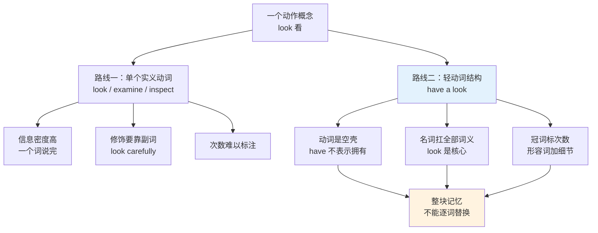
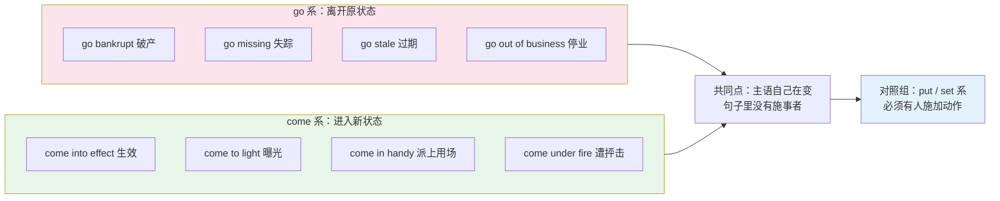
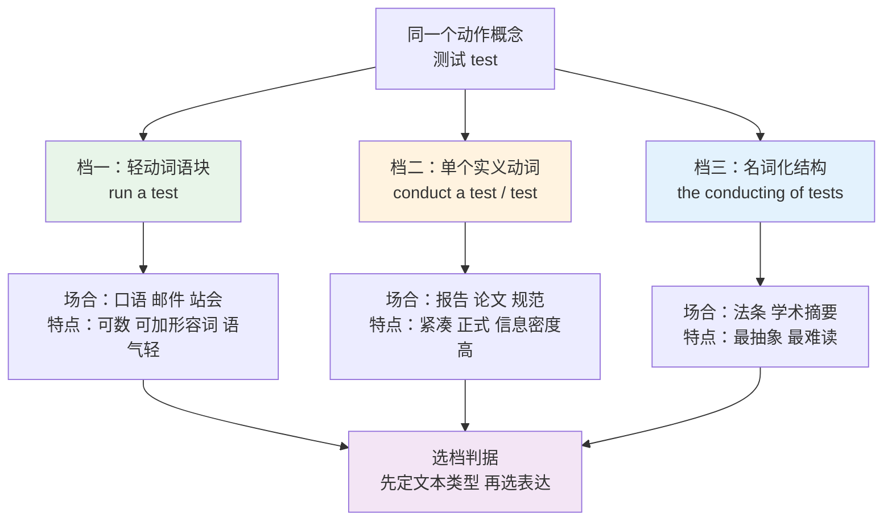
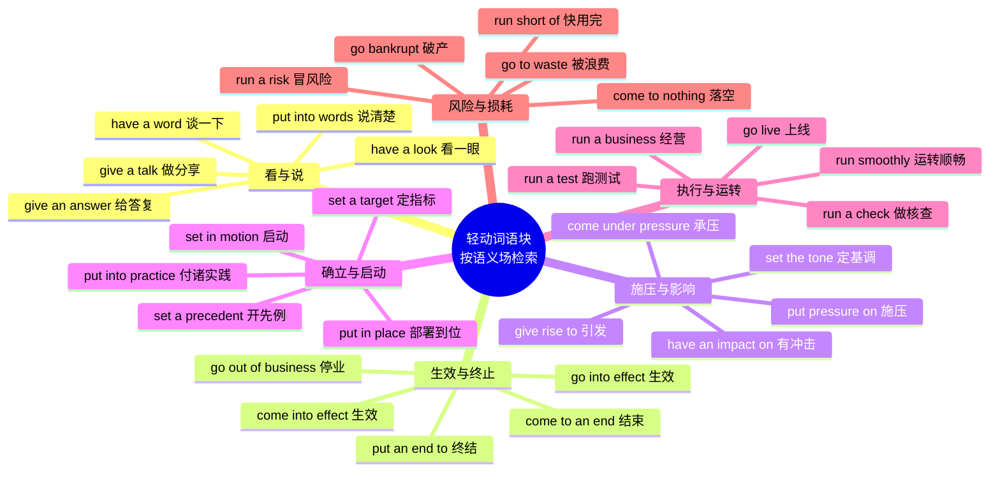
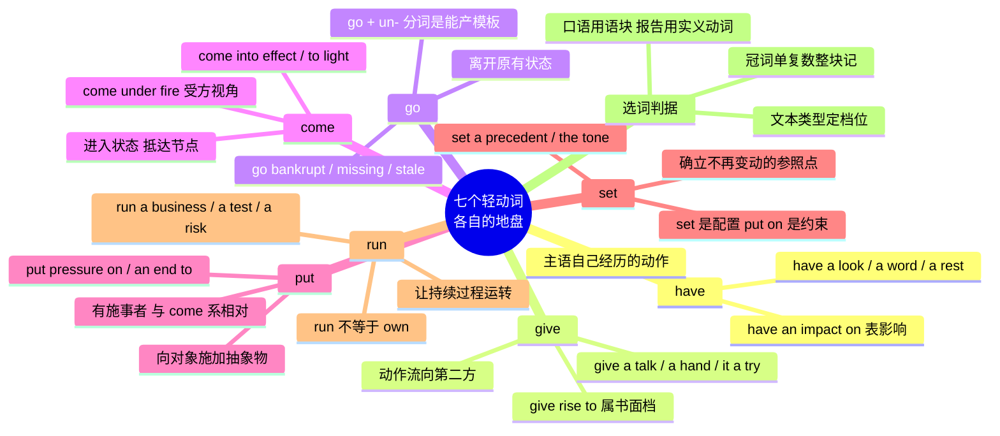

# 轻动词搭配 have give go come put set run

> [!info] 本篇定位
>
> 上一篇 `13/01` 拆的是 get take make do 四个词各自的义项地图——一个词有多少种意思。本篇换一个切面：不看单词的义项数量，而看**动词 + 名词**这种组合本身怎么运作。
>
> `have a look`、`give it a try`、`go bankrupt`、`come into effect`、`put pressure on`、`set a precedent`、`run a business`，这七个动词在上面这些结构里几乎不表达自己的字面义。真正扛意思的是后面那个名词，动词只提供一个语法框架。语言学把这种动词叫 light verb（轻动词），把整个组合叫 light verb construction（轻动词结构）。
>
> 读完能做到三件事：看到 `conduct an experiment` 和 `run an experiment` 知道该在哪种文本里用哪个；写英文时不再把「进行讨论」直译成 `make a discussion`；在英文技术文档和合同里认出 `run`、`set`、`put`、`come` 的语块用法，而不去查它们的字面义。

---

## 1. 本篇导读：动作被装进名词以后

英语有一类高频结构，中文母语者读得懂但几乎不会主动用：把一个动作先做成名词，再找一个几乎没有意义的动词把它挂起来。

`look` 本身就是动词，能直接说 `Let me look at it`。但英语母语者更常说 `Let me have a look at it`。多了三个词，意思没变。这不是啰嗦，而是这个结构提供了三样单个动词给不了的东西。

**第一，它能被计数。** `look` 是一次还是多次，动词形式看不出来；`have a look`、`have two quick looks`、`have another look` 一目了然。次数和「一下子」这种轻量感被名词前的冠词和数词接管了。

**第二，它能被形容词修饰。** 想说「仔细看一眼」，用动词得找副词：`look carefully`。用语块可以说 `have a careful look`、`have a quick look`、`have a good long look`。英语的形容词库比副词库大得多，修饰空间随之打开。

**第三，它能调节语气。** `Try it` 是命令，`Give it a try` 是建议。同一件事，语块版本自动软化。

上图给出了本篇要处理的对立：同一个动作概念在英语里有两条实现路径，一条压进单个实义动词，一条摊成轻动词加名词。两条路径不是自由选择，而是各有各的文本类型。技术规范和法律条文偏爱前者，日常对话和邮件偏爱后者。选错了不算语法错误，但读起来会怪。

七个轻动词各有各的语义倾向，不能互换：

| 轻动词 | 英式音标 | 美式音标 | 词性 | 中文 | 搭配与说明 |
| --- | --- | --- | --- | --- | --- |
| **have** | /hæv/ | /hæv/ | v. | 有；进行 | 主语「经历、承受」某个动作，不牵涉第二方 |
| **give** | /ɡɪv/ | /ɡɪv/ | v. | 给；作出 | 动作从主语流向另一方，天然带受事 |
| **go** | /ɡəʊ/ | /ɡoʊ/ | v. | 去；变得 | 主语**离开**正常或原有状态，多为负面 |
| **come** | /kʌm/ | /kʌm/ | v. | 来；变成 | 主语**进入**某状态或抵达某节点 |
| **put** | /pʊt/ | /pʊt/ | v. | 放 | 主语向对象**施加**某种抽象物 |
| **set** | /set/ | /set/ | v. | 设置 | 确立标准、基准或起点，之后不再变动 |
| **run** | /rʌn/ | /rʌn/ | v. | 跑；运行 | 让某个持续过程**运转**起来 |

这张表是全篇的索引。后面七节按这个顺序展开，每节给出该动词的名词槽位清单和实际例证。

> [!warning] 中文母语者的第一号陷阱：万能的「进行」
>
> 中文用「进行」「作出」「加以」挂载动作名词，几乎不挑对象：进行讨论、进行测试、进行修改、进行分析。学习者会下意识去找一个对应的英语万能动词，最常见的是 `make`。
>
> - ❌ ~~make a discussion~~ / ~~make a test~~ / ~~make a research~~
> - ✅ **have a discussion** / **run a test** / **do research**
>
> 英语没有万能挂载词。哪个名词配哪个轻动词是**逐条约定**的，必须整块记，不能靠逻辑推。这也是本篇为什么全部按语块而不是按单词列表。

---

## 2. have 系：主语自己经历的动作

### 2.1 have + 一次性轻量动作

`have` 的轻动词用法核心是「主语经历了一次某动作」。这一组的名词全部是可数的、有明确边界的短动作，前面必须带 `a`。

| 英文 | 英式音标 | 美式音标 | 词性 | 中文 | 搭配与说明 |
| --- | --- | --- | --- | --- | --- |
| **have a look** | /ˌhæv ə ˈlʊk/ | /ˌhæv ə ˈlʊk/ | v.phr. | 看一眼 | 后接 at；比 look at 更随意，可加 quick、closer |
| **have a go** | /ˌhæv ə ˈɡəʊ/ | /ˌhæv ə ˈɡoʊ/ | v.phr. | 试一下 | 英式常用；后接 at doing sth |
| **have a try** | /ˌhæv ə ˈtraɪ/ | /ˌhæv ə ˈtraɪ/ | v.phr. | 尝试一次 | 频率低于 give it a try，见 3.3 |
| **have a shot** | /ˌhæv ə ˈʃɒt/ | /ˌhæv ə ˈʃɑːt/ | v.phr. | 试一把 | 口语；后接 at；美式更常见 |
| **have a rest** | /ˌhæv ə ˈrest/ | /ˌhæv ə ˈrest/ | v.phr. | 休息一下 | 英式；美式多说 take a rest |
| **have a break** | /ˌhæv ə ˈbreɪk/ | /ˌhæv ə ˈbreɪk/ | v.phr. | 歇一会儿 | 常说 have a five-minute break |
| **have a nap** | /ˌhæv ə ˈnæp/ | /ˌhæv ə ˈnæp/ | v.phr. | 小睡一下 | 美式常说 take a nap |
| **have a chat** | /ˌhæv ə ˈtʃæt/ | /ˌhæv ə ˈtʃæt/ | v.phr. | 聊一会儿 | 后接 with sb / about sth，非正式 |
| **have a word** | /ˌhæv ə ˈwɜːd/ | /ˌhæv ə ˈwɜːrd/ | v.phr. | 谈一下 | 单数 word 指简短严肃的谈话，常暗示要提意见 |
| **have a drink** | /ˌhæv ə ˈdrɪŋk/ | /ˌhæv ə ˈdrɪŋk/ | v.phr. | 喝一杯 | 默认指含酒精饮品 |

`have a word` 值得单独说。它的字面是「有一个词」，实义是「找人单独谈谈」，而且几乎总是带着「有话要说、可能不太愉快」的暗示。

> [!example] have a look 与 have a word 的实际语气
>
> - Can I **have a look** at your draft before you send it?
>   - 发出去之前我能看一下你的草稿吗？
> - Let me **have a quick look** at the logs.
>   - 我先快速看一眼日志。
> - Could I **have a word** with you after the meeting?
>   - 会后我能跟你单独谈谈吗？（听到这句，对方会预期是负面反馈）
> - He wants to **have a word** about your report.
>   - 他想就你那份报告跟你聊聊。

对比一下不带语块的说法：`Can I look at your draft?` 完全正确，只是更直、更像在申请权限。`Can I have a look?` 把动作缩成「一下」，请求的分量随之变轻。

### 2.2 have + 经历、遭遇与影响

第二组的名词不是主语主动做出的动作，而是主语**摊上**的事，或者主语对别人**产生**的作用。

| 英文 | 英式音标 | 美式音标 | 词性 | 中文 | 搭配与说明 |
| --- | --- | --- | --- | --- | --- |
| **have an accident** | /ˌhæv ən ˈæksɪdənt/ | /ˌhæv ən ˈæksɪdənt/ | v.phr. | 出事故 | 不说 make an accident |
| **have an argument** | /ˌhæv ən ˈɑːɡjumənt/ | /ˌhæv ən ˈɑːrɡjumənt/ | v.phr. | 争执一场 | 后接 with sb / about sth |
| **have a row** | /ˌhæv ə ˈraʊ/ | /ˌhæv ə ˈraʊ/ | v.phr. | 大吵一架 | 英式口语；row 此义读 /raʊ/ 不读 /rəʊ/ |
| **have difficulty** | /ˌhæv ˈdɪfɪkəlti/ | /ˌhæv ˈdɪfɪkəlti/ | v.phr. | 有困难 | 不可数不加冠词，后接 in doing 或直接 doing |
| **have trouble** | /ˌhæv ˈtrʌbl/ | /ˌhæv ˈtrʌbl/ | v.phr. | 遇到麻烦 | 同上，have trouble finding it |
| **have a problem** | /ˌhæv ə ˈprɒbləm/ | /ˌhæv ə ˈprɑːbləm/ | v.phr. | 有个问题 | 可数要加 a，与 have trouble 的不可数对照 |
| **have an effect on** | /ˌhæv ən ɪˈfekt ɒn/ | /ˌhæv ən ɪˈfekt ɑːn/ | v.phr. | 对……有影响 | 中性；可加 adverse、positive |
| **have an impact on** | /ˌhæv ən ˈɪmpækt ɒn/ | /ˌhæv ən ˈɪmpækt ɑːn/ | v.phr. | 对……有冲击 | 比 effect 更强、更突然 |
| **have an influence on** | /ˌhæv ən ˈɪnfluəns ɒn/ | /ˌhæv ən ˈɪnfluəns ɑːn/ | v.phr. | 对……有影响力 | 多指人对人、观念对观念的长期作用 |
| **have a say in** | /ˌhæv ə ˈseɪ ɪn/ | /ˌhæv ə ˈseɪ ɪn/ | v.phr. | 在……上有发言权 | say 在此是名词，指决策权 |

`effect`、`impact`、`influence` 这三个搭配是本组的重点，中文都能译成「影响」，英语里分工清楚。

> [!example] 三个「影响」的分工
>
> - The new policy will **have an effect on** shipping costs.
>   - 新政策会对运费产生影响。（中性描述因果）
> - The outage **had a serious impact on** our users.
>   - 这次宕机对用户造成了严重冲击。（强度大、发生突然）
> - His mentor **had a lasting influence on** how he writes code.
>   - 他的导师对他写代码的方式产生了长久的影响。（缓慢渗透，多与人有关）

### 2.3 have + 日常事务与固定表达

| 英文 | 英式音标 | 美式音标 | 词性 | 中文 | 搭配与说明 |
| --- | --- | --- | --- | --- | --- |
| **have breakfast** | /ˌhæv ˈbrekfəst/ | /ˌhæv ˈbrekfəst/ | v.phr. | 吃早饭 | 三餐名词前不加冠词，除非有修饰 |
| **have a shower** | /ˌhæv ə ˈʃaʊə/ | /ˌhæv ə ˈʃaʊər/ | v.phr. | 洗澡（淋浴） | 英式 have，美式 take |
| **have a bath** | /ˌhæv ə ˈbɑːθ/ | /ˌhæv ə ˈbæθ/ | v.phr. | 泡澡 | 英美元音差异典型词 |
| **have a haircut** | /ˌhæv ə ˈheəkʌt/ | /ˌhæv ə ˈherkʌt/ | v.phr. | 理发 | 强调结果；过程说 get a haircut |
| **have a meeting** | /ˌhæv ə ˈmiːtɪŋ/ | /ˌhæv ə ˈmiːtɪŋ/ | v.phr. | 开会 | 不说 make a meeting；正式文书用 hold |
| **have a party** | /ˌhæv ə ˈpɑːti/ | /ˌhæv ə ˈpɑːrti/ | v.phr. | 办派对 | 正式场合用 host a party |
| **have a baby** | /ˌhæv ə ˈbeɪbi/ | /ˌhæv ə ˈbeɪbi/ | v.phr. | 生孩子 | 对应正式说法 give birth to |
| **have a go at sb** | /ˌhæv ə ˈɡəʊ ət/ | /ˌhæv ə ˈɡoʊ ət/ | v.phr. | 数落某人 | 英式；与 have a go at doing「试着做」同形不同义 |
| **have a point** | /ˌhæv ə ˈpɔɪnt/ | /ˌhæv ə ˈpɔɪnt/ | v.phr. | 说得有道理 | 固定表达，You have a point |
| **have a laugh** | /ˌhæv ə ˈlɑːf/ | /ˌhæv ə ˈlæf/ | v.phr. | 乐一乐 | 英式还有「开玩笑、不当真」的引申义 |

> [!warning] have a go at 的两个义项靠介词后面的成分区分
>
> 同一个短语，跟不定式和跟人，意思完全相反。
>
> - **have a go at** doing sth → 试着做某事（中性甚至积极）
>   - I'll **have a go at** fixing the build tonight.（我今晚试着修一下构建）
> - **have a go at** sb → 数落、责难某人（负面）
>   - The manager **had a go at** me for missing the deadline.（经理因为我误了期限训了我一顿）
>
> 判断方法只有一个：看 at 后面接的是动名词还是人。

---

## 3. give 系：动作从施事流向受事

### 3.1 give + 言语行为名词

`have` 系的动作留在主语身上，`give` 系的动作必须有个去处。这条差别决定了两组名词几乎不重叠：讲话、答复、警告这类必然有听众的行为，全部归 `give`。

| 英文 | 英式音标 | 美式音标 | 词性 | 中文 | 搭配与说明 |
| --- | --- | --- | --- | --- | --- |
| **give a talk** | /ˌɡɪv ə ˈtɔːk/ | /ˌɡɪv ə ˈtɔːk/ | v.phr. | 做个分享 | 比 speech 随意，规模小 |
| **give a speech** | /ˌɡɪv ə ˈspiːtʃ/ | /ˌɡɪv ə ˈspiːtʃ/ | v.phr. | 发表演讲 | 正式场合，有讲稿 |
| **give a lecture** | /ˌɡɪv ə ˈlektʃə/ | /ˌɡɪv ə ˈlektʃər/ | v.phr. | 讲一堂课 | 学术语境；引申义为「训一顿」 |
| **give a presentation** | /ˌɡɪv ə ˌprezənˈteɪʃn/ | /ˌɡɪv ə ˌpriːzenˈteɪʃn/ | v.phr. | 做汇报 | 职场高频；美式重音常在 /priː/ |
| **give an answer** | /ˌɡɪv ən ˈɑːnsə/ | /ˌɡɪv ən ˈænsər/ | v.phr. | 给出答复 | 比 answer 动词更强调「正式回应」 |
| **give a reason** | /ˌɡɪv ə ˈriːzn/ | /ˌɡɪv ə ˈriːzn/ | v.phr. | 说明理由 | 常用 give no reason「不作说明」 |
| **give an explanation** | /ˌɡɪv ən ˌekspləˈneɪʃn/ | /ˌɡɪv ən ˌekspləˈneɪʃn/ | v.phr. | 作出解释 | 正式；口语多用 explain |
| **give a warning** | /ˌɡɪv ə ˈwɔːnɪŋ/ | /ˌɡɪv ə ˈwɔːrnɪŋ/ | v.phr. | 发出警告 | 也说 issue a warning（更正式） |
| **give notice** | /ˌɡɪv ˈnəʊtɪs/ | /ˌɡɪv ˈnoʊtɪs/ | v.phr. | 提前通知；提辞职 | 不加冠词；职场里默认指递辞呈 |
| **give a heads-up** | /ˌɡɪv ə ˌhedz ˈʌp/ | /ˌɡɪv ə ˌhedz ˈʌp/ | v.phr. | 提个醒 | 非正式，邮件和 Slack 高频 |

> [!example] give notice 的两层意思
>
> - You must **give** two weeks' **notice** before terminating the lease.
>   - 解约前须提前两周通知。（合同语境，字面义）
> - She **gave notice** last Friday; her last day is the 30th.
>   - 她上周五提了辞职，最后一天是三十号。（职场语境，默认指辞职）

### 3.2 give + 授予与让与

这一组的名词是抽象的「可授予物」——许可、优先级、信任、折扣。中文常用「给予」，英语这里就是字面的 `give`，轻动词的成分反而少一些。

| 英文 | 英式音标 | 美式音标 | 词性 | 中文 | 搭配与说明 |
| --- | --- | --- | --- | --- | --- |
| **give permission** | /ˌɡɪv pəˈmɪʃn/ | /ˌɡɪv pərˈmɪʃn/ | v.phr. | 给予许可 | 不可数不加冠词 |
| **give consent** | /ˌɡɪv kənˈsent/ | /ˌɡɪv kənˈsent/ | v.phr. | 表示同意 | 法律与医疗语境；比 permission 正式 |
| **give approval** | /ˌɡɪv əˈpruːvl/ | /ˌɡɪv əˈpruːvl/ | v.phr. | 批准 | 流程用语；也说 grant approval |
| **give credit** | /ˌɡɪv ˈkredɪt/ | /ˌɡɪv ˈkredɪt/ | v.phr. | 归功于 | give sb credit for sth |
| **give priority to** | /ˌɡɪv praɪˈɒrəti/ | /ˌɡɪv praɪˈɔːrəti/ | v.phr. | 优先处理 | 对应实义动词 prioritize |
| **give consideration to** | /ˌɡɪv kənˌsɪdəˈreɪʃn/ | /ˌɡɪv kənˌsɪdəˈreɪʃn/ | v.phr. | 加以考虑 | 公文体；口语说 think about |
| **give thought to** | /ˌɡɪv ˈθɔːt/ | /ˌɡɪv ˈθɔːt/ | v.phr. | 考虑 | thought 此处不可数 |
| **give the go-ahead** | /ˌɡɪv ðə ˈɡəʊ əhed/ | /ˌɡɪv ðə ˈɡoʊ əhed/ | v.phr. | 放行、开绿灯 | 非正式；带定冠词 the |
| **give a discount** | /ˌɡɪv ə ˈdɪskaʊnt/ | /ˌɡɪv ə ˈdɪskaʊnt/ | v.phr. | 打折 | give a 10% discount |
| **give a refund** | /ˌɡɪv ə ˈriːfʌnd/ | /ˌɡɪv ə ˈriːfʌnd/ | v.phr. | 退款 | 名词 refund 重音在前，动词在后 |

`give consideration to` 和 `give priority to` 是公文英语的标志性语块。它们各自都有一个单词版本，写正式文本时选哪个取决于句子的重量分配。

> [!example] 语块版本与单词版本的取舍
>
> - The committee will **give consideration to** all submissions received before 30 June.
>   - 委员会将审议六月三十日前收到的全部提交材料。
> - The committee will **consider** all submissions received before 30 June.
>   - 同上，但句子更紧。
>
> 两句都对。语块版本把重心压在 consideration 上，适合需要强调「审议」这个行为本身的条款；单词版本更利落，适合把重心让给后面的宾语。

### 3.3 give + 人际动作与固定语块

| 英文 | 英式音标 | 美式音标 | 词性 | 中文 | 搭配与说明 |
| --- | --- | --- | --- | --- | --- |
| **give a hand** | /ˌɡɪv ə ˈhænd/ | /ˌɡɪv ə ˈhænd/ | v.phr. | 搭把手 | give sb a hand with sth；另有「鼓掌」义 |
| **give a lift** | /ˌɡɪv ə ˈlɪft/ | /ˌɡɪv ə ˈlɪft/ | v.phr. | 捎一程 | 英式说法 |
| **give a ride** | /ˌɡɪv ə ˈraɪd/ | /ˌɡɪv ə ˈraɪd/ | v.phr. | 捎一程 | 美式说法，与 lift 一一对应 |
| **give a call** | /ˌɡɪv ə ˈkɔːl/ | /ˌɡɪv ə ˈkɔːl/ | v.phr. | 打个电话 | give sb a call；英式也说 give sb a ring |
| **give a shout** | /ˌɡɪv ə ˈʃaʊt/ | /ˌɡɪv ə ˈʃaʊt/ | v.phr. | 招呼一声 | 非正式，Give me a shout if you need help |
| **give it a try** | /ˌɡɪv ɪt ə ˈtraɪ/ | /ˌɡɪv ɪt ə ˈtraɪ/ | v.phr. | 试一试 | it 位置固定，不能省 |
| **give it a go** | /ˌɡɪv ɪt ə ˈɡəʊ/ | /ˌɡɪv ɪt ə ˈɡoʊ/ | v.phr. | 试一把 | 英式，与 give it a try 等价 |
| **give rise to** | /ˌɡɪv ˈraɪz tə/ | /ˌɡɪv ˈraɪz tə/ | v.phr. | 引起、导致 | 书面；主语通常是抽象事物 |
| **give way to** | /ˌɡɪv ˈweɪ tə/ | /ˌɡɪv ˈweɪ tə/ | v.phr. | 让位于；让行 | 英国交通标志用语；引申为「被取代」 |
| **give birth to** | /ˌɡɪv ˈbɜːθ tə/ | /ˌɡɪv ˈbɜːrθ tə/ | v.phr. | 生下；催生 | 正式；引申义指催生某种事物 |

`give it a try` 是本篇必须掌握的核心语块之一，它的结构比看上去严格。

> [!warning] give it a try 的三个固定点
>
> 这个语块有三处不能动。
>
> - ❌ ~~give a try it~~ ——宾语 `it` 必须紧跟 give，位置不能挪
> - ❌ ~~give it try~~ ——冠词 `a` 不能省
> - ❌ ~~give it a trying~~ ——名词是 try 不是 trying
> - ✅ **Give it a try.** / **Why not give it a go?** / **I gave it a try, but it didn't work.**
>
> 变形只有一个方向：可以在 `a` 和 `try` 之间塞形容词——`give it a fair try`（认真试一次）、`give it another try`（再试一次）。

> [!example] give it a try 与 try 的语气差
>
> - **Try** the new build.
>   - 试试新构建。（指令口吻）
> - **Give** the new build **a try**.
>   - 不妨试试新构建。（建议口吻，不施压）
> - It might not work, but it's worth **giving it a try**.
>   - 不一定管用，但值得试一次。（承认风险后的推荐）

`give rise to` 属于另一个语域档位，它是学术与报告英语的常客。

> [!example] give rise to 的典型用法
>
> - The ambiguity in clause 4 **gave rise to** a dispute over payment terms.
>   - 第四条的歧义引发了付款条款上的争议。
> - Rapid urbanisation **gave rise to** a whole new set of logistics problems.
>   - 快速城市化催生了一整批新的物流问题。
>
> 口语里说同样的意思会用 `cause` 或 `lead to`。`give rise to` 出现在对话里会显得端着。

---

## 4. go 系：离开原有状态

### 4.1 go + 形容词：变坏方向

`go` 的轻动词用法不接名词而接形容词，语义高度统一：主语**脱离**了原本正常的状态，并且这个变化通常不是好事。

| 英文 | 英式音标 | 美式音标 | 词性 | 中文 | 搭配与说明 |
| --- | --- | --- | --- | --- | --- |
| **go bankrupt** | /ˌɡəʊ ˈbæŋkrʌpt/ | /ˌɡoʊ ˈbæŋkrʌpt/ | v.phr. | 破产 | 主语是公司或个人；正式说法见 4.3 |
| **go missing** | /ˌɡəʊ ˈmɪsɪŋ/ | /ˌɡoʊ ˈmɪsɪŋ/ | v.phr. | 失踪、不见了 | 人和物都可以；比 disappear 更口语 |
| **go wrong** | /ˌɡəʊ ˈrɒŋ/ | /ˌɡoʊ ˈrɔːŋ/ | v.phr. | 出问题 | 排障场景高频，What went wrong? |
| **go bad** | /ˌɡəʊ ˈbæd/ | /ˌɡoʊ ˈbæd/ | v.phr. | 变质 | 食物通用说法 |
| **go stale** | /ˌɡəʊ ˈsteɪl/ | /ˌɡoʊ ˈsteɪl/ | v.phr. | 变干、变陈 | 面包类；引申指缓存、数据过期 |
| **go sour** | /ˌɡəʊ ˈsaʊə/ | /ˌɡoʊ ˈsaʊər/ | v.phr. | 变酸；变糟 | 牛奶变酸；也指关系恶化 |
| **go blind** | /ˌɡəʊ ˈblaɪnd/ | /ˌɡoʊ ˈblaɪnd/ | v.phr. | 失明 | 强调过程；先天失明用 be born blind |
| **go grey** | /ˌɡəʊ ˈɡreɪ/ | /ˌɡoʊ ˈɡreɪ/ | v.phr. | 头发变白 | 美式拼作 gray |
| **go mad** | /ˌɡəʊ ˈmæd/ | /ˌɡoʊ ˈmæd/ | v.phr. | 发疯 | 英式还表示「气疯了」；美式 mad 多指生气 |
| **go quiet** | /ˌɡəʊ ˈkwaɪət/ | /ˌɡoʊ ˈkwaɪət/ | v.phr. | 安静下来；没了动静 | 也指对方突然不回消息 |

`go stale` 在技术文本里被大量借用，指缓存、分支、令牌超过有效期。

> [!example] go 系在技术语境的实际出现
>
> - The cache entry **goes stale** after five minutes.
>   - 缓存条目五分钟后失效。
> - Two of the config files **went missing** during the migration.
>   - 迁移过程中有两个配置文件不见了。
> - If anything **goes wrong**, the transaction is rolled back.
>   - 一旦出问题，事务会回滚。

### 4.2 go + 形容词：中性与正面方向

「go 全是坏事」只是倾向，不是规则。有一批组合明确是中性甚至正面的，而且集中在商业与技术领域。

| 英文 | 英式音标 | 美式音标 | 词性 | 中文 | 搭配与说明 |
| --- | --- | --- | --- | --- | --- |
| **go public** | /ˌɡəʊ ˈpʌblɪk/ | /ˌɡoʊ ˈpʌblɪk/ | v.phr. | 上市；公开 | 两个义项：企业 IPO，或把消息公之于众 |
| **go live** | /ˌɡəʊ ˈlaɪv/ | /ˌɡoʊ ˈlaɪv/ | v.phr. | 上线 | live 读 /laɪv/ 不读 /lɪv/；名词形式 go-live |
| **go viral** | /ˌɡəʊ ˈvaɪrəl/ | /ˌɡoʊ ˈvaɪrəl/ | v.phr. | 爆火传播 | 源自 virus 的比喻用法 |
| **go global** | /ˌɡəʊ ˈɡləʊbl/ | /ˌɡoʊ ˈɡloʊbl/ | v.phr. | 走向全球 | 商业报道常见 |
| **go digital** | /ˌɡəʊ ˈdɪdʒɪtl/ | /ˌɡoʊ ˈdɪdʒɪtl/ | v.phr. | 数字化转型 | 同类还有 go paperless、go remote |
| **go unnoticed** | /ˌɡəʊ ʌnˈnəʊtɪst/ | /ˌɡoʊ ʌnˈnoʊtɪst/ | v.phr. | 未被察觉 | go + un- 分词是一个能产的小模式 |
| **go unanswered** | /ˌɡəʊ ʌnˈɑːnsəd/ | /ˌɡoʊ ʌnˈænsərd/ | v.phr. | 无人回复 | 常说 emails went unanswered |
| **go unpunished** | /ˌɡəʊ ʌnˈpʌnɪʃt/ | /ˌɡoʊ ʌnˈpʌnɪʃt/ | v.phr. | 未受惩罚 | 同一模式，法律与新闻语境 |
| **go free** | /ˌɡəʊ ˈfriː/ | /ˌɡoʊ ˈfriː/ | v.phr. | 被无罪释放 | 主语是被告或嫌疑人 |
| **go solo** | /ˌɡəʊ ˈsəʊləʊ/ | /ˌɡoʊ ˈsoʊloʊ/ | v.phr. | 单飞 | 乐手离队单干；也指个人创业 |

> [!tip] go + un- 过去分词是个可扩展的模板
>
> `go unnoticed`、`go unanswered`、`go unpunished`、`go unchallenged`、`go unreported` 共享同一个结构：`go` + `un-` 开头的过去分词，整体意思是「一直没有被人做某事」。
>
> 这个模板的价值在于它把被动语态的「没有被……」压成两个词。`Her emails went unanswered for weeks` 比 `Nobody answered her emails for weeks` 更书面，也更常见于新闻和报告。
>
> 可以放心地按这个模板去理解没见过的组合，但主动使用时最好限于上面这五个已经固化的搭配。

### 4.3 go + 介词短语

| 英文 | 英式音标 | 美式音标 | 词性 | 中文 | 搭配与说明 |
| --- | --- | --- | --- | --- | --- |
| **go into effect** | /ˌɡəʊ ɪntə ɪˈfekt/ | /ˌɡoʊ ɪntə ɪˈfekt/ | v.phr. | 开始生效 | 美式偏好；英式多说 come into effect |
| **go out of business** | /ˌɡəʊ aʊt əv ˈbɪznəs/ | /ˌɡoʊ aʊt əv ˈbɪznəs/ | v.phr. | 停业倒闭 | 比 go bankrupt 更泛，不必然涉及法律程序 |
| **go on strike** | /ˌɡəʊ ɒn ˈstraɪk/ | /ˌɡoʊ ɑːn ˈstraɪk/ | v.phr. | 罢工 | 持续状态用 be on strike |
| **go into detail** | /ˌɡəʊ ɪntə ˈdiːteɪl/ | /ˌɡoʊ ɪntə dɪˈteɪl/ | v.phr. | 展开细说 | detail 通常不加冠词；美式重音在后 |
| **go into administration** | /ˌɡəʊ ɪntə ədˌmɪnɪˈstreɪʃn/ | /ˌɡoʊ ɪntə ədˌmɪnɪˈstreɪʃn/ | v.phr. | 进入破产管理 | 英国法律术语，对应美国的 Chapter 11 |
| **go beyond** | /ˌɡəʊ bɪˈjɒnd/ | /ˌɡoʊ bɪˈjɑːnd/ | v.phr. | 超出范围 | go beyond the scope of this document |
| **go under** | /ˌɡəʊ ˈʌndə/ | /ˌɡoʊ ˈʌndər/ | v.phr. | 垮掉 | 非正式，等于 fail 或 go out of business |
| **go to court** | /ˌɡəʊ tə ˈkɔːt/ | /ˌɡoʊ tə ˈkɔːrt/ | v.phr. | 对簿公堂 | court 不加冠词 |
| **go to waste** | /ˌɡəʊ tə ˈweɪst/ | /ˌɡoʊ tə ˈweɪst/ | v.phr. | 被浪费掉 | 主语是资源、努力、食物 |
| **go through** | /ˌɡəʊ ˈθruː/ | /ˌɡoʊ ˈθruː/ | v.phr. | 经历；获批通过 | 两义：go through a hard time / the deal went through |

> [!warning] go bankrupt 与 go out of business 不是同一件事
>
> 中文都能说「倒闭了」，英语区分得很清楚。
>
> - **go bankrupt** —— 走了破产程序，是法律状态。公司或个人都能作主语。
> - **go out of business** —— 停止经营，可能只是老板不想干了，未必有法律程序。
> - **go under** —— 上面两种的口语统称，语气最随意。
>
> 例句对照：
>
> - The chain **went out of business** after 40 years; the family simply retired.
>   - 这家连锁店经营四十年后停业，老板一家只是退休了。（没破产）
> - Two suppliers **went bankrupt** last quarter, and we lost the deposits.
>   - 上季度两家供应商破产，我们的定金打了水漂。（有法律程序）

---

## 5. come 系：进入状态与抵达节点

### 5.1 come into + 名词

`go` 是离开，`come` 是进入。这一对方向相反的轻动词把状态变化切成了两半，而 `come into` 这个框架专门装「开始存在、开始起作用」。

| 英文 | 英式音标 | 美式音标 | 词性 | 中文 | 搭配与说明 |
| --- | --- | --- | --- | --- | --- |
| **come into effect** | /ˌkʌm ɪntə ɪˈfekt/ | /ˌkʌm ɪntə ɪˈfekt/ | v.phr. | 生效 | 法规、政策、条款；不加冠词 |
| **come into force** | /ˌkʌm ɪntə ˈfɔːs/ | /ˌkʌm ɪntə ˈfɔːrs/ | v.phr. | 开始施行 | 比 effect 更法律化，多用于法案 |
| **come into play** | /ˌkʌm ɪntə ˈpleɪ/ | /ˌkʌm ɪntə ˈpleɪ/ | v.phr. | 开始起作用 | 主语是因素、机制 |
| **come into contact with** | /ˌkʌm ɪntə ˈkɒntækt/ | /ˌkʌm ɪntə ˈkɑːntækt/ | v.phr. | 接触到 | 物理接触与人际接触都可以 |
| **come into being** | /ˌkʌm ɪntə ˈbiːɪŋ/ | /ˌkʌm ɪntə ˈbiːɪŋ/ | v.phr. | 形成、诞生 | 书面；主语是制度、组织 |
| **come into existence** | /ˌkʌm ɪntu ɪɡˈzɪstəns/ | /ˌkʌm ɪntu ɪɡˈzɪstəns/ | v.phr. | 开始存在 | 与 come into being 近义，更正式 |
| **come into view** | /ˌkʌm ɪntə ˈvjuː/ | /ˌkʌm ɪntə ˈvjuː/ | v.phr. | 进入视野 | 叙述性文本，指物体出现在视线中 |
| **come into fashion** | /ˌkʌm ɪntə ˈfæʃn/ | /ˌkʌm ɪntə ˈfæʃn/ | v.phr. | 开始流行 | 反义 go out of fashion |
| **come into power** | /ˌkʌm ɪntə ˈpaʊə/ | /ˌkʌm ɪntə ˈpaʊər/ | v.phr. | 上台执政 | 也说 come to power |
| **come into question** | /ˌkʌm ɪntə ˈkwestʃən/ | /ˌkʌm ɪntə ˈkwestʃən/ | v.phr. | 受到质疑 | 主语是可信度、资格 |

> [!example] come into effect 的三种时间表达
>
> - The new privacy rules **come into effect** on 1 January.
>   - 新的隐私规则一月一日生效。（用一般现在时表示已确定的未来）
> - The amendment **came into effect** immediately after the vote.
>   - 修正案在表决后立即生效。
> - The clause will not **come into effect** until both parties have signed.
>   - 该条款须双方签署后方才生效。

### 5.2 come to + 名词

`come to` 装的是「抵达某个终点或结论」。这一组几乎全部指向一个过程的完成。

| 英文 | 英式音标 | 美式音标 | 词性 | 中文 | 搭配与说明 |
| --- | --- | --- | --- | --- | --- |
| **come to an end** | /ˌkʌm tu ən ˈend/ | /ˌkʌm tu ən ˈend/ | v.phr. | 告一段落 | 中性；比 end 更书面 |
| **come to a halt** | /ˌkʌm tu ə ˈhɔːlt/ | /ˌkʌm tu ə ˈhɔːlt/ | v.phr. | 停下来 | 车辆、生产线；常加 sudden、abrupt |
| **come to a standstill** | /ˌkʌm tu ə ˈstændstɪl/ | /ˌkʌm tu ə ˈstændstɪl/ | v.phr. | 完全停摆 | 比 halt 更彻底，常指交通或谈判 |
| **come to a conclusion** | /ˌkʌm tu ə kənˈkluːʒn/ | /ˌkʌm tu ə kənˈkluːʒn/ | v.phr. | 得出结论 | 也说 reach a conclusion |
| **come to an agreement** | /ˌkʌm tu ən əˈɡriːmənt/ | /ˌkʌm tu ən əˈɡriːmənt/ | v.phr. | 达成一致 | 商务谈判；等价 reach an agreement |
| **come to terms with** | /ˌkʌm tə ˈtɜːmz/ | /ˌkʌm tə ˈtɜːrmz/ | v.phr. | 接受、想开 | terms 必须复数；对象多是坏消息 |
| **come to light** | /ˌkʌm tə ˈlaɪt/ | /ˌkʌm tə ˈlaɪt/ | v.phr. | 曝光、浮出水面 | 主语是事实、证据 |
| **come to mind** | /ˌkʌm tə ˈmaɪnd/ | /ˌkʌm tə ˈmaɪnd/ | v.phr. | 想起来 | 主语是想法本身，不是人 |
| **come to a head** | /ˌkʌm tu ə ˈhed/ | /ˌkʌm tu ə ˈhed/ | v.phr. | 到了摊牌的地步 | 矛盾积累到爆发点 |
| **come to fruition** | /ˌkʌm tə fruˈɪʃn/ | /ˌkʌm tə fruˈɪʃn/ | v.phr. | 修成正果 | 正式；主语是计划、项目 |

`come to mind` 有一个中文母语者容易搞反的地方：主语是想法，不是人。

> [!warning] come to mind 的主语位置
>
> - ❌ ~~I came to mind a good example.~~
> - ✅ **A good example comes to mind.**（我想到一个好例子）
> - ✅ Two names **came to mind** immediately.（我立刻想到两个名字）
>
> 中文说「我想到」，主语是人；英语这个语块里主语必须是被想到的东西。想让人做主语，得换成 `I thought of` 或 `It occurred to me that`。

### 5.3 come under / across / in

| 英文 | 英式音标 | 美式音标 | 词性 | 中文 | 搭配与说明 |
| --- | --- | --- | --- | --- | --- |
| **come under fire** | /ˌkʌm ˌʌndə ˈfaɪə/ | /ˌkʌm ˌʌndər ˈfaɪər/ | v.phr. | 遭到抨击 | 新闻高频；fire 是比喻的火力 |
| **come under pressure** | /ˌkʌm ˌʌndə ˈpreʃə/ | /ˌkʌm ˌʌndər ˈpreʃər/ | v.phr. | 承受压力 | 与 put pressure on 是同一事件的两个视角 |
| **come under scrutiny** | /ˌkʌm ˌʌndə ˈskruːtəni/ | /ˌkʌm ˌʌndər ˈskruːtəni/ | v.phr. | 受到审视 | 正式；常说 come under close scrutiny |
| **come under attack** | /ˌkʌm ˌʌndə əˈtæk/ | /ˌkʌm ˌʌndər əˈtæk/ | v.phr. | 遭到攻击 | 军事与舆论两种语境 |
| **come across as** | /ˌkʌm əˈkrɒs əz/ | /ˌkʌm əˈkrɔːs əz/ | v.phr. | 给人……的印象 | 后接形容词或名词 |
| **come in handy** | /ˌkʌm ɪn ˈhændi/ | /ˌkʌm ɪn ˈhændi/ | v.phr. | 派上用场 | 非正式；handy 是形容词 |
| **come to the rescue** | /ˌkʌm tə ðə ˈreskjuː/ | /ˌkʌm tə ðə ˈreskjuː/ | v.phr. | 出手相救 | 带定冠词 the，不能省 |
| **come to grips with** | /ˌkʌm tə ˈɡrɪps/ | /ˌkʌm tə ˈɡrɪps/ | v.phr. | 着手应对 | grips 必须复数；对象是难题 |
| **come of age** | /ˌkʌm əv ˈeɪdʒ/ | /ˌkʌm əv ˈeɪdʒ/ | v.phr. | 成年；成熟 | 也指某个行业走向成熟 |
| **come to nothing** | /ˌkʌm tə ˈnʌθɪŋ/ | /ˌkʌm tə ˈnʌθɪŋ/ | v.phr. | 落空 | 主语是计划、努力 |

上图说明了 `go` 和 `come` 在语法角色上的共同点：两者都描述主语自身的变化，句中没有「谁让它变的」。`The policy came into effect` 不交代是谁让它生效的。要交代施事，必须换到下一节的 `put` 系或 `set` 系——`The government put the policy into effect` 把施事者补了回来。这条对立是选词时的第一判据：想说清是谁干的，用 put / set；只关心结果，用 go / come。

---

## 6. put 系：向对象施加抽象物

### 6.1 put + 抽象名词 + on

`put` 的轻动词用法本质上是它字面义的隐喻延伸：把某个抽象的东西「放到」某个对象身上。压力、重点、责任、限制，全部按物体处理。

| 英文 | 英式音标 | 美式音标 | 词性 | 中文 | 搭配与说明 |
| --- | --- | --- | --- | --- | --- |
| **put pressure on** | /ˌpʊt ˈpreʃər ɒn/ | /ˌpʊt ˈpreʃər ɑːn/ | v.phr. | 向……施压 | pressure 不可数不加冠词 |
| **put emphasis on** | /ˌpʊt ˈemfəsɪs ɒn/ | /ˌpʊt ˈemfəsɪs ɑːn/ | v.phr. | 强调 | 也说 place emphasis on（更正式） |
| **put stress on** | /ˌpʊt ˈstres ɒn/ | /ˌpʊt ˈstres ɑːn/ | v.phr. | 着重于；施加负荷 | 两义：强调，或给系统加负载 |
| **put weight on** | /ˌpʊt ˈweɪt ɒn/ | /ˌpʊt ˈweɪt ɑːn/ | v.phr. | 看重；长胖 | 后接观点是「看重」，无宾语是「长胖」 |
| **put a strain on** | /ˌpʊt ə ˈstreɪn ɒn/ | /ˌpʊt ə ˈstreɪn ɑːn/ | v.phr. | 给……造成负担 | 对象常是关系、预算、系统 |
| **put the blame on** | /ˌpʊt ðə ˈbleɪm ɒn/ | /ˌpʊt ðə ˈbleɪm ɑːn/ | v.phr. | 把责任推给 | 带定冠词；也说 lay the blame on |
| **put a limit on** | /ˌpʊt ə ˈlɪmɪt ɒn/ | /ˌpʊt ə ˈlɪmɪt ɑːn/ | v.phr. | 对……设限 | 与 set a limit 略有差别，见 7.1 |
| **put a ban on** | /ˌpʊt ə ˈbæn ɒn/ | /ˌpʊt ə ˈbæn ɑːn/ | v.phr. | 禁止 | 正式说法 impose a ban on |
| **put a price on** | /ˌpʊt ə ˈpraɪs ɒn/ | /ˌpʊt ə ˈpraɪs ɑːn/ | v.phr. | 给……定价 | 常用否定式 You can't put a price on it |
| **put trust in** | /ˌpʊt ˈtrʌst ɪn/ | /ˌpʊt ˈtrʌst ɪn/ | v.phr. | 信任 | 介词是 in 不是 on；同类 put faith in |

`put pressure on` 是这一组的模板句，值得完整看它的变形空间。

> [!example] put pressure on 的四种扩展
>
> - Investors are **putting pressure on** the board to cut costs.
>   - 投资方正在向董事会施压，要求削减成本。
> - The deadline **put enormous pressure on** the QA team.
>   - 这个期限给测试团队带来了巨大压力。（形容词插在 put 和 pressure 之间）
> - Don't **put** any **pressure on** her; she'll decide when she's ready.
>   - 别给她任何压力，她想好了自然会决定。（限定词插入同一位置）
> - The team **came under pressure** to ship before the conference.
>   - 团队面临在大会前发布的压力。（换成 come 系，视角从施压方转到受压方）

第四句是关键。`put pressure on` 和 `come under pressure` 描述同一件事，区别只在句子从谁的角度写。想点名施压者用 `put`，想突出承受方的处境用 `come under`。

### 6.2 put + into / to / in

| 英文 | 英式音标 | 美式音标 | 词性 | 中文 | 搭配与说明 |
| --- | --- | --- | --- | --- | --- |
| **put into practice** | /ˌpʊt ɪntə ˈpræktɪs/ | /ˌpʊt ɪntə ˈpræktɪs/ | v.phr. | 付诸实践 | practice 不加冠词 |
| **put into perspective** | /ˌpʊt ɪntə pəˈspektɪv/ | /ˌpʊt ɪntə pərˈspektɪv/ | v.phr. | 放到全局里看 | 常用于说明某数字并不算大 |
| **put into words** | /ˌpʊt ɪntə ˈwɜːdz/ | /ˌpʊt ɪntə ˈwɜːrdz/ | v.phr. | 用语言表达 | words 必须复数 |
| **put into effect** | /ˌpʊt ɪntu ɪˈfekt/ | /ˌpʊt ɪntu ɪˈfekt/ | v.phr. | 使生效、实施 | 与 come into effect 是主动被动的关系 |
| **put to use** | /ˌpʊt tə ˈjuːs/ | /ˌpʊt tə ˈjuːs/ | v.phr. | 加以利用 | use 此处是名词读 /juːs/ 不读 /juːz/ |
| **put to the test** | /ˌpʊt tə ðə ˈtest/ | /ˌpʊt tə ðə ˈtest/ | v.phr. | 接受检验 | 带定冠词 the，不能省 |
| **put to a vote** | /ˌpʊt tu ə ˈvəʊt/ | /ˌpʊt tu ə ˈvoʊt/ | v.phr. | 付诸表决 | 会议程序用语 |
| **put in place** | /ˌpʊt ɪn ˈpleɪs/ | /ˌpʊt ɪn ˈpleɪs/ | v.phr. | 建立、部署到位 | 对象是制度、流程、防护措施 |
| **put on hold** | /ˌpʊt ɒn ˈhəʊld/ | /ˌpʊt ɑːn ˈhoʊld/ | v.phr. | 暂缓；电话保持 | 项目搁置与通话等待共用同一说法 |
| **put an end to** | /ˌpʊt ən ˈend tə/ | /ˌpʊt ən ˈend tə/ | v.phr. | 终结 | 主语必须是施动者，对比 come to an end |

> [!warning] put an end to 与 come to an end 的施事差
>
> 两个语块都含 `end`，句法角色完全相反。
>
> - **come to an end** —— 事情自己结束，句子里没人负责。
>   - The dispute finally **came to an end**.（争端最终结束了）
> - **put an end to** —— 有人主动终结它，主语就是那个人。
>   - The new policy **put an end to** the dispute.（新政策终结了这场争端）
>
> 中文两句都能说「结束了」，写英文时要先问：这句话要不要点出是谁干的？

> [!example] put into perspective 的典型语境
>
> - To **put** the outage **into perspective**, it lasted nine minutes; last year's lasted four hours.
>   - 把这次宕机放到全局里看：它持续了九分钟，去年那次持续了四小时。
> - These numbers need to be **put into perspective** before we panic.
>   - 恐慌之前该先把这些数字放到全局里看看。
>
> 这个语块的功能是**降温**——提醒对方拿个参照系再判断。技术复盘和数据汇报里出现频率很高。

---

## 7. set 系：确立标准与启动

### 7.1 set + 标准类名词

`set` 的核心是「确立一个之后不再变动的参照点」。它带的名词几乎全是可作基准的东西。

| 英文 | 英式音标 | 美式音标 | 词性 | 中文 | 搭配与说明 |
| --- | --- | --- | --- | --- | --- |
| **set a precedent** | /ˌset ə ˈpresɪdənt/ | /ˌset ə ˈpresɪdənt/ | v.phr. | 开创先例 | 法律与管理语境；常带 dangerous |
| **set a standard** | /ˌset ə ˈstændəd/ | /ˌset ə ˈstændərd/ | v.phr. | 树立标准 | 复数 set high standards 更常见 |
| **set a benchmark** | /ˌset ə ˈbentʃmɑːk/ | /ˌset ə ˈbentʃmɑːrk/ | v.phr. | 确立基准 | 商业与性能测试语境 |
| **set a record** | /ˌset ə ˈrekɔːd/ | /ˌset ə ˈrekərd/ | v.phr. | 创纪录 | 名词 record 重音在前，动词在后 |
| **set a target** | /ˌset ə ˈtɑːɡɪt/ | /ˌset ə ˈtɑːrɡɪt/ | v.phr. | 定指标 | 常说 set an ambitious target |
| **set a goal** | /ˌset ə ˈɡəʊl/ | /ˌset ə ˈɡoʊl/ | v.phr. | 定目标 | goal 比 target 更主观、更长期 |
| **set a deadline** | /ˌset ə ˈdedlaɪn/ | /ˌset ə ˈdedlaɪn/ | v.phr. | 定截止期 | 也说 set a hard deadline |
| **set a limit** | /ˌset ə ˈlɪmɪt/ | /ˌset ə ˈlɪmɪt/ | v.phr. | 设定上限 | 中性；put a limit on 略带约束意味 |
| **set a quota** | /ˌset ə ˈkwəʊtə/ | /ˌset ə ˈkwoʊtə/ | v.phr. | 设定配额 | 管理与贸易语境 |
| **set a threshold** | /ˌset ə ˈθreʃhəʊld/ | /ˌset ə ˈθreʃhoʊld/ | v.phr. | 设定阈值 | 技术监控高频 |

> [!example] set a precedent 的正负两面
>
> - The ruling **set a precedent** for future data-protection cases.
>   - 这项判决为今后的数据保护案件确立了先例。（中性）
> - Approving this exception would **set a dangerous precedent**.
>   - 批准这个例外会开一个危险的先例。（负面，管理层高频句）
> - We don't want to **set the precedent** that deadlines are negotiable.
>   - 我们不想开这个头，让人以为期限可以商量。（带 the 时特指某个具体先例）

`set a precedent` 的隐含逻辑是「这一次的做法会被后来者援引」。中文的「开先例」完全对应。写邮件反对某个临时通融时，这是最有力的一句。

> [!tip] set a limit 与 put a limit on 的细微分工
>
> 两者常被当作同义，实际语感不同。
>
> - **set a limit** 侧重「定下一个数值」，中性，像在配置参数：`We set a limit of 50 requests per minute.`
> - **put a limit on** 侧重「对某个对象加以约束」，隐含限制的对象本来想要更多：`They put a limit on how much we can spend.`
>
> 拿不准时，看句子里有没有一个被限制的对象。有对象且带一点约束意味，用 `put ... on`；纯粹是配置一个数，用 `set`。

### 7.2 set + 氛围与启动

| 英文 | 英式音标 | 美式音标 | 词性 | 中文 | 搭配与说明 |
| --- | --- | --- | --- | --- | --- |
| **set the tone** | /ˌset ðə ˈtəʊn/ | /ˌset ðə ˈtoʊn/ | v.phr. | 定基调 | 带定冠词；后接 for sth |
| **set the agenda** | /ˌset ði əˈdʒendə/ | /ˌset ði əˈdʒendə/ | v.phr. | 掌握议题主导权 | 字面「定议程」，引申为主导话语 |
| **set the scene** | /ˌset ðə ˈsiːn/ | /ˌset ðə ˈsiːn/ | v.phr. | 交代背景 | 叙事与演讲开场用语 |
| **set the stage for** | /ˌset ðə ˈsteɪdʒ/ | /ˌset ðə ˈsteɪdʒ/ | v.phr. | 为……铺路 | 主语是事件，后接结果 |
| **set an example** | /ˌset ən ɪɡˈzɑːmpl/ | /ˌset ən ɪɡˈzæmpl/ | v.phr. | 树立榜样 | 常说 set a good example for sb |
| **set in motion** | /ˌset ɪn ˈməʊʃn/ | /ˌset ɪn ˈmoʊʃn/ | v.phr. | 启动某个进程 | 正式；对象是流程、改革 |
| **set aside** | /ˌset əˈsaɪd/ | /ˌset əˈsaɪd/ | v.phr. | 留出；搁置 | 两义：预留资源，或暂时不谈 |
| **set out** | /ˌset ˈaʊt/ | /ˌset ˈaʊt/ | v.phr. | 列明；启程 | 合同高频：as set out in Clause 3 |
| **set fire to** | /ˌset ˈfaɪə tə/ | /ˌset ˈfaɪər tə/ | v.phr. | 放火烧 | 也说 set sth on fire，语序不同 |
| **set free** | /ˌset ˈfriː/ | /ˌset ˈfriː/ | v.phr. | 释放 | 宾语插在中间：set the prisoners free |

> [!example] set the tone 的用法
>
> - The CEO's opening remarks **set the tone for** the whole quarter.
>   - CEO 的开场发言为整个季度定了基调。
> - A rushed first meeting **sets the wrong tone**.
>   - 第一次会开得匆忙，会把基调定歪。
> - Her reply **set a friendly tone** for the rest of the thread.
>   - 她的回复给后面整串讨论定了友好的调子。
>
> 注意第二、三句：定冠词 `the` 在加了形容词之后换成了 `a` 或保持 `the` 都可以，但不能同时说 ~~set the a tone~~。

---

## 8. run 系：让过程运转起来

### 8.1 run + 组织与活动

`run` 的轻动词义是「让某个需要持续投入的东西运转下去」。它的名词槽位分两类：一类是机构和活动，一类是需要执行一遍的程序。

| 英文 | 英式音标 | 美式音标 | 词性 | 中文 | 搭配与说明 |
| --- | --- | --- | --- | --- | --- |
| **run a business** | /ˌrʌn ə ˈbɪznəs/ | /ˌrʌn ə ˈbɪznəs/ | v.phr. | 经营企业 | 强调日常管理，不是拥有 |
| **run a company** | /ˌrʌn ə ˈkʌmpəni/ | /ˌrʌn ə ˈkʌmpəni/ | v.phr. | 掌管公司 | 同上；own a company 才是拥有 |
| **run a campaign** | /ˌrʌn ə kæmˈpeɪn/ | /ˌrʌn ə kæmˈpeɪn/ | v.phr. | 开展一场活动 | 政治竞选与市场投放共用 |
| **run a workshop** | /ˌrʌn ə ˈwɜːkʃɒp/ | /ˌrʌn ə ˈwɜːrkʃɑːp/ | v.phr. | 主持工作坊 | 也说 run a training session |
| **run a survey** | /ˌrʌn ə ˈsɜːveɪ/ | /ˌrʌn ə ˈsɜːrveɪ/ | v.phr. | 做一次问卷 | 正式说法 conduct a survey |
| **run an experiment** | /ˌrʌn ən ɪkˈsperɪmənt/ | /ˌrʌn ən ɪkˈsperɪmənt/ | v.phr. | 跑一次实验 | 正式说法 conduct an experiment |
| **run an errand** | /ˌrʌn ən ˈerənd/ | /ˌrʌn ən ˈerənd/ | v.phr. | 出去办点事 | 复数 run errands 更常见 |
| **run a program** | /ˌrʌn ə ˈprəʊɡræm/ | /ˌrʌn ə ˈproʊɡræm/ | v.phr. | 运行程序；办项目 | 英式非计算机义拼作 programme |
| **run a check** | /ˌrʌn ə ˈtʃek/ | /ˌrʌn ə ˈtʃek/ | v.phr. | 做一次核查 | run a background check 最常见 |
| **run a test** | /ˌrʌn ə ˈtest/ | /ˌrʌn ə ˈtest/ | v.phr. | 跑一次测试 | 正式说法 conduct a test |

`run a business` 与 `own a business` 是这一组最值得分清的一对。

> [!warning] run 不等于 own
>
> - **own a business** —— 持有所有权，可能从不露面。
> - **run a business** —— 负责日常运营，未必持股。
> - **manage a business** —— 与 run 近义，但更书面、更强调职务。
>
> 例句对照：
>
> - She **owns** three restaurants but **runs** only one of them herself.
>   - 她拥有三家餐厅，但只有一家是她自己在打理。
> - He was hired to **run** the European operation.
>   - 他受雇负责欧洲区的运营。（受雇的人不可能是所有者）

### 8.2 run + 状态与风险

| 英文 | 英式音标 | 美式音标 | 词性 | 中文 | 搭配与说明 |
| --- | --- | --- | --- | --- | --- |
| **run a risk** | /ˌrʌn ə ˈrɪsk/ | /ˌrʌn ə ˈrɪsk/ | v.phr. | 冒风险 | 也说 take a risk，语气略轻 |
| **run the risk of** | /ˌrʌn ðə ˈrɪsk əv/ | /ˌrʌn ðə ˈrɪsk əv/ | v.phr. | 有……的危险 | 后接动名词，是固定框架 |
| **run a deficit** | /ˌrʌn ə ˈdefɪsɪt/ | /ˌrʌn ə ˈdefɪsɪt/ | v.phr. | 出现赤字 | 财经语境；反义 run a surplus |
| **run a fever** | /ˌrʌn ə ˈfiːvə/ | /ˌrʌn ə ˈfiːvər/ | v.phr. | 发烧 | 美式常用；英式多说 have a temperature |
| **run late** | /ˌrʌn ˈleɪt/ | /ˌrʌn ˈleɪt/ | v.phr. | 要迟到了 | 进行时最常见：I'm running late |
| **run short of** | /ˌrʌn ˈʃɔːt əv/ | /ˌrʌn ˈʃɔːrt əv/ | v.phr. | 快用完了 | 强调过程；已用完说 run out of |
| **run dry** | /ˌrʌn ˈdraɪ/ | /ˌrʌn ˈdraɪ/ | v.phr. | 枯竭 | 井、资金、灵感都可以 |
| **run deep** | /ˌrʌn ˈdiːp/ | /ˌrʌn ˈdiːp/ | v.phr. | 根深蒂固 | 主语是分歧、情绪 |
| **run counter to** | /ˌrʌn ˈkaʊntə tə/ | /ˌrʌn ˈkaʊntər tə/ | v.phr. | 与……相悖 | 正式；对象是原则、预期 |
| **run smoothly** | /ˌrʌn ˈsmuːðli/ | /ˌrʌn ˈsmuːðli/ | v.phr. | 运转顺畅 | 主语是流程、系统、活动 |

> [!warning] run short of 与 run out of 差在有没有用完
>
> - **run short of** —— 还有，但快不够了，来得及补。
>   - We're **running short of** disk space.（磁盘空间快不够了）
> - **run out of** —— 已经用完，没了。
>   - We've **run out of** disk space.（磁盘空间已经满了）
>
> 中文都能说「快没了/没了」，英语这两个短语的时间点不同，写故障报告时选错会让读者误判严重程度。

> [!example] run the risk of 的固定框架
>
> - By skipping code review you **run the risk of** shipping the same bug twice.
>   - 跳过代码评审，就有把同一个 bug 发两遍的风险。
> - Small teams **run the risk of** losing all context when one person leaves.
>   - 小团队面临一个人离职就丢掉全部上下文的风险。
>
> 框架固定为 `run the risk of + 动名词`。名词也可以，但动名词是主流。

---

## 9. 轻动词与实义动词：同义不同语域

### 9.1 三档语域

同一个动作在英语里通常有三种表达法，从松到紧排列，分别对应三类文本。

上图的三档不是「越往下越高级」，而是各有各的地盘。站会上说 `We conducted a test of the new endpoint` 会显得端着；技术规范里写 `we ran a test` 又显得不够严谨。判据是文本类型，不是词汇水平。第三档在本教程里只要求认得，不要求主动使用——它是学术摘要和法律条文的典型形态，写作时过度使用会让句子难以卒读。

### 9.2 对应的实义动词

轻动词语块的第二档对应词是一批拉丁来源的动词。这批词是学术与商务写作的骨架，值得单独列出。

| 英文 | 英式音标 | 美式音标 | 词性 | 中文 | 搭配与说明 |
| --- | --- | --- | --- | --- | --- |
| **conduct** | /kənˈdʌkt/ | /kənˈdʌkt/ | v. | 实施、开展 | 动词重音在后，名词 /ˈkɒndʌkt/ 在前 |
| **undertake** | /ˌʌndəˈteɪk/ | /ˌʌndərˈteɪk/ | v. | 着手进行 | 对象是有分量的任务；不规则变化 undertook |
| **perform** | /pəˈfɔːm/ | /pərˈfɔːrm/ | v. | 执行 | 技术文档高频，perform a check |
| **deliver** | /dɪˈlɪvə/ | /dɪˈlɪvər/ | v. | 发表；交付 | deliver a speech 对应 give a speech |
| **implement** | /ˈɪmplɪment/ | /ˈɪmplɪment/ | v. | 实施 | 对应 put into practice / put into effect |
| **initiate** | /ɪˈnɪʃieɪt/ | /ɪˈnɪʃieɪt/ | v. | 启动 | 对应 set in motion |
| **terminate** | /ˈtɜːmɪneɪt/ | /ˈtɜːrmɪneɪt/ | v. | 终止 | 对应 put an end to；合同用语 |
| **establish** | /ɪˈstæblɪʃ/ | /ɪˈstæblɪʃ/ | v. | 确立 | 对应 set a precedent / set a standard |
| **exert** | /ɪɡˈzɜːt/ | /ɪɡˈzɜːrt/ | v. | 施加 | exert pressure 对应 put pressure on |
| **allocate** | /ˈæləkeɪt/ | /ˈæləkeɪt/ | v. | 分配 | 对应 set aside（预留义） |
| **emphasize** | /ˈemfəsaɪz/ | /ˈemfəsaɪz/ | v. | 强调 | 对应 put emphasis on；英式亦拼 emphasise |
| **prioritize** | /praɪˈɒrətaɪz/ | /praɪˈɔːrətaɪz/ | v. | 优先处理 | 对应 give priority to |
| **jeopardize** | /ˈdʒepədaɪz/ | /ˈdʒepərdaɪz/ | v. | 危及 | 对应 put at risk |
| **administer** | /ədˈmɪnɪstə/ | /ədˈmɪnɪstər/ | v. | 管理；施用 | 对应 run（机构义）；医学里指给药 |
| **scrutinize** | /ˈskruːtənaɪz/ | /ˈskruːtənaɪz/ | v. | 细查 | 对应 come under scrutiny 的主动版 |

### 9.3 一一对照

下表把前八节的核心语块与它们的正式对应词并排放，第三列说明语域落差的方向。表中的词在前面各节都给过音标，此处只做映射。

| 轻动词语块（口语档） | 实义动词（正式档） | 语域落差与选用场合 |
| --- | --- | --- |
| have a look at | examine / inspect | 语块随意，examine 用于检查报告、体检、代码审计 |
| have a meeting | hold a meeting / convene | hold 是会议纪要标准用词，convene 用于正式召集 |
| have an effect on | affect | 语块可插形容词（a serious effect），affect 更紧 |
| give a talk | deliver a talk / present | deliver 用于会议议程，present 用于学术场合 |
| give permission | authorize / grant permission | authorize 是流程与合同用词 |
| give priority to | prioritize | 语块适合口头汇报，单词适合书面策略文档 |
| give rise to | cause / trigger | give rise to 已经偏书面，cause 中性，trigger 强调触发 |
| go bankrupt | become insolvent | insolvent 是财务报表与法律文书用词 |
| go into effect | take effect / become effective | 三者同义，效力条款里常用 become effective |
| come into effect | come into force / enter into force | enter into force 是国际条约的标准措辞 |
| come to an end | conclude / terminate | conclude 中性，terminate 暗示单方面中止 |
| come under scrutiny | be scrutinized | 语块回避了被动语态，读起来更顺 |
| put pressure on | pressure / exert pressure on | 美式 pressure 可直接作动词，英式多用 pressurize |
| put an end to | end / terminate / abolish | abolish 用于制度，terminate 用于合同 |
| put into practice | implement / apply | implement 是技术与政策文档的默认词 |
| set a precedent | establish a precedent | establish 更正式，判决书里两者都出现 |
| set a target | establish a target | 商业计划书两者通用，set 更常见 |
| run a test | conduct a test / perform a test | perform 在测试报告里最常见 |
| run a survey | conduct a survey | 学术论文一律 conduct |
| run a business | manage / operate | operate 用于描述业务范围，manage 用于职务描述 |

> [!warning] 反向的过度矫正
>
> 中国学习者在考试训练中被养成偏好长词的习惯，结果是在日常英语里堆砌正式动词。
>
> - ❌ I will **conduct a test** on the new endpoint this afternoon.（同事间的日常沟通，过于正式）
> - ✅ I'll **run a test** on the new endpoint this afternoon.
> - ❌ Could you **deliver a presentation** about your weekend trip?（休闲话题用会议用词）
> - ✅ Could you **tell us about** your weekend trip?
>
> 反过来也成立，正式文本里用口语语块同样不合适：
>
> - ❌ The research team **ran a survey** of 1,200 respondents.（论文方法部分）
> - ✅ The research team **conducted a survey** of 1,200 respondents.
>
> 判据永远是文本类型，不是词的难度。

---

## 10. 语块的形式约束：整块记，不要拆着记

轻动词语块的名词槽位在冠词和单复数上高度固化，同一个名词在不同语块里形式可能完全不同。这一部分只能靠整块记忆，任何推理都会出错。

### 10.1 冠词的三种情况

| 冠词形式 | 语块举例 | 说明 |
| --- | --- | --- |
| 必须带 a/an | have a look、give it a try、set a precedent、run a test | 名词是可数的一次性动作或一个具体物 |
| 必须带 the | put to the test、come to the rescue、set the tone、put the blame on | 定冠词已经固化，省掉就不成立 |
| 不加冠词 | come into effect、give permission、put into practice、go on strike | 名词在此是抽象不可数的 |

> [!warning] 三个最容易被写错冠词的语块
>
> - ❌ ~~come into an effect~~ → ✅ **come into effect**
> - ❌ ~~put to test~~ → ✅ **put to the test**
> - ❌ ~~give it try~~ → ✅ **give it a try**
>
> 这三个错误没有规律可循，只能靠输入次数纠正。遇到时把整块抄下来，不要只记住关键名词。

### 10.2 单复数固化的语块

有一批语块的名词只能用复数，用单数就不是那个意思了。

| 英文 | 英式音标 | 美式音标 | 词性 | 中文 | 搭配与说明 |
| --- | --- | --- | --- | --- | --- |
| **come to terms with** | /ˌkʌm tə ˈtɜːmz/ | /ˌkʌm tə ˈtɜːrmz/ | v.phr. | 接受现实 | 单数 term 是「学期、术语」，义项完全不同 |
| **come to grips with** | /ˌkʌm tə ˈɡrɪps/ | /ˌkʌm tə ˈɡrɪps/ | v.phr. | 着手处理 | grips 无单数用法 |
| **put into words** | /ˌpʊt ɪntə ˈwɜːdz/ | /ˌpʊt ɪntə ˈwɜːrdz/ | v.phr. | 说清楚 | 单数 have a word 是另一个语块 |
| **run errands** | /ˌrʌn ˈerəndz/ | /ˌrʌn ˈerəndz/ | v.phr. | 跑腿办事 | 复数更常见，单数指具体一件 |
| **set high standards** | /ˌset ˌhaɪ ˈstændədz/ | /ˌset ˌhaɪ ˈstændərdz/ | v.phr. | 定高标准 | 加形容词时复数更自然 |

`word` 是最典型的例子：单数 `have a word` 是「谈一下」，复数 `put into words` 是「用语言表达」，两个语块的意思毫无关联，靠数的形式区分。

### 10.3 形容词能插在哪里

轻动词语块的最大优势是可以在冠词和名词之间插形容词。这个位置几乎是唯一的扩展点。

> [!example] 形容词插入位置示范
>
> - have a **quick** look（快速看一眼）
> - have a **serious** talk（好好谈一次）
> - give it a **fair** try（认真试一次）
> - put **enormous** pressure on（施加巨大压力）
> - set a **dangerous** precedent（开危险先例）
> - run a **quick** check（快速核查一下）
> - come to a **sudden** halt（突然停下）
>
> 注意这些形容词换成对应实义动词后必须变副词：`examine it quickly`、`test it fairly`、`stop suddenly`。英语的形容词数量远多于副词，这是语块在口语里胜出的实际原因之一。

---

## 11. 英美差异与常见误配

### 11.1 have 与 take 的英美分工

同一个动作，英式偏好 `have`，美式偏好 `take`。两边都能听懂，但在对方的语言环境里说另一边的版本会被听出来。

| 动作 | 英式偏好 | 美式偏好 | 说明 |
| --- | --- | --- | --- |
| 洗澡 | have a shower | take a shower | 差异最稳定的一组 |
| 泡澡 | have a bath | take a bath | 同上 |
| 休息 | have a rest | take a rest | 英式 have a break 两边通用 |
| 小睡 | have a nap | take a nap | take a nap 在英国也很常见 |
| 看一眼 | have a look | take a look | 两边互相都能用，无强制 |
| 试一下 | have a go | give it a shot | give it a try 两边通用 |
| 散步 | go for a walk | take a walk | 英式的 go for a 系列很能产 |

> [!tip] 拿不准就选两边通用的那个
>
> `have a look` 和 `take a look` 都不会错，`give it a try` 两边通用，`have a break` 两边通用。真正需要小心的只有 shower 和 bath 这两组——在美国说 `have a shower` 会被立刻听出是英式来源，虽然不影响理解。
>
> 上一篇 `13/01` 已经处理过 take 的完整义项地图，本篇不再展开，只在这里标出与 have 的分工点。

### 11.2 中文母语者的高频误配

下表列出把中文直译成英语时最常出现的错误搭配。左列是错误说法，右列是正确语块。

| 中文表达 | 常见错误 | 正确说法 |
| --- | --- | --- |
| 进行讨论 | ❌ ~~make a discussion~~ | ✅ **have a discussion** |
| 做一次测试 | ❌ ~~make a test~~ | ✅ **run a test** / **do a test** |
| 做研究 | ❌ ~~make a research~~ | ✅ **do research** / **conduct research** |
| 开会 | ❌ ~~make a meeting~~ | ✅ **have a meeting** / **hold a meeting** |
| 做决定 | ❌ ~~do a decision~~ | ✅ **make a decision** |
| 提建议 | ❌ ~~give a suggestion~~（勉强可接受但生硬） | ✅ **make a suggestion** |
| 造成影响 | ❌ ~~make an influence~~ | ✅ **have an influence on** |
| 施加压力 | ❌ ~~give pressure to~~ | ✅ **put pressure on** |
| 生效 | ❌ ~~become effect~~ | ✅ **come into effect** / **take effect** |
| 承担风险 | ❌ ~~bear a risk~~（保险语境才对） | ✅ **run a risk** / **take a risk** |
| 打破先例 | ❌ ~~break a precedent~~（少用） | ✅ **set a precedent**（开先例）/ **break with precedent**（打破惯例） |
| 经营公司 | ❌ ~~do a company~~ | ✅ **run a company** |

> [!warning] make 和 do 不是万能挂载词
>
> 上表里有一半的错误来源相同：把中文的「做」「进行」直接映射成 `make` 或 `do`。这两个词在英语里各有各的名词圈，而且这些圈子跟中文的「做」没有对应关系。
>
> 处理办法是把整个语块当一个词记。看到 `have a discussion` 时，记的不是「discussion 前面用 have」，而是把这五个音节当成一个单位存进去。这也是本篇全部按语块而非按单词组织词表的原因。

---

## 12. 按语义场检索：一张归并地图

前八节按动词分组，便于系统学习；实际写作时的检索方向是反的——先有一个意思，再找语块。下面这张图按语义场重新归并，供写作时反查。

这张图的六个语义场覆盖了本篇的核心语块。使用方法是从中文出发：想说「这条规则什么时候开始管用」，落到「生效与终止」这一支，取 `come into effect`；想说「这个决定会让后面的人照着办」，落到「确立与启动」，取 `set a precedent`。

注意「生效与终止」这一支里 `come into effect` 和 `go into effect` 并列。两者同义，英式偏 `come`，美式偏 `go`，法律文本里还会用 `take effect` 和 `enter into force`。四个说法的分工在 `18.语域、英美差异与习语俚语` 里有更细的处理，本篇只需要知道它们可以互换。

> [!tip] 把这张图变成主动词汇的办法
>
> 光认得没用，要练到能主动调用。可行的做法是每天选一个语义场，用当天真实发生的事各造一句。
>
> 比如「执行与运转」这一支，写今天的工作日志：`I ran a quick check on the staging config`、`The migration ran smoothly`、`We're going live on Thursday`。
>
> 关键是用真实内容造句，不是抄例句。语块的记忆强度取决于它跟你自己的经历绑得有多牢。`05.词汇学习方法总纲` 里给了完整的产出训练流程。

---

## 13. 本篇小结

> [!success] 本篇核心要点回顾
>
> 1. 轻动词结构里动词是空壳，词义由后面的名词承担。它带来三样单个动词给不了的东西：**可计数**（have two looks）、**可加形容词**（a quick look）、**语气可调**（give it a try 比 try it 软）。
> 2. 七个轻动词各有语义分工：`have` 主语自己经历，`give` 动作流向第二方，`go` 离开原状态，`come` 进入新状态，`put` 施加抽象物，`set` 确立参照点，`run` 让过程运转。
> 3. `go` 与 `come` 都不带施事者（`The policy came into effect` 不说是谁让它生效的）；`put` 与 `set` 必须有施事者。想点名是谁干的就换用后一组。
> 4. 同一事件的两个视角：`put pressure on` 从施压方写，`come under pressure` 从承压方写；`put an end to` 有人终结它，`come to an end` 是它自己结束。
> 5. 语域分三档：轻动词语块用于口语与邮件，单个实义动词（conduct、implement、establish、exert）用于报告与规范，名词化结构用于法条与学术摘要。**判据是文本类型，不是词的难度**。
> 6. 语块的冠词与单复数完全固化，没有规律：`come into effect` 不加冠词，`put to the test` 必须带 the，`give it a try` 必须带 a，`come to terms with` 必须复数。只能整块记。
> 7. 中文的「进行」「做」不能映射成单一英语动词。`make a discussion`、`make a test`、`give pressure to` 这类错误全部来自这个映射习惯。
> 8. `run a business` 是经营不是拥有；`go bankrupt` 走法律程序，`go out of business` 只是停业；`run short of` 是快没了，`run out of` 是已经没了。三组区分在实际沟通里会影响判断。

> [!success] 本篇练习清单
>
> - [ ] 不看词表，写出 have、give、go、come、put、set、run 各自最典型的三个语块
> - [ ] 把「向董事会施压」这件事分别用 `put pressure on` 和 `come under pressure` 各写一句，检查主语是否换对
> - [ ] 给 `run a test`、`give a talk`、`put into practice`、`set a precedent` 各找出对应的正式实义动词
> - [ ] 判断下面两句分别适合哪种文本：`We ran a survey of 1,200 users.` / `The team conducted a survey of 1,200 respondents.`
> - [ ] 默写 `come into effect`、`put to the test`、`give it a try`、`come to terms with` 四个语块，重点检查冠词和单复数
> - [ ] 用「快用完了」和「已经用完了」两种意思，分别造一个 `run short of` 和 `run out of` 的句子
> - [ ] 从第 12 节的六个语义场里选两个，用你本周真实发生的事各造三句
> - [ ] 找一段你正在读的英文技术文档，圈出所有 run、set、put、come 的语块用法，判断哪些换成实义动词后仍然通顺

### 13.1 下一篇预告

> [!info] 下一篇：言语动词与转述动词群
>
> 本篇处理的是「动作被装进名词」的结构，下一篇处理另一个高频群组：**怎么把别人说的话转述出来**。
>
> [[13.抽象概念、评价与高频动词/03.言语动词与转述动词群\|言语动词与转述动词群]]
>
> 会覆盖 `say`、`tell`、`speak`、`talk` 四个基础词的分工，`claim`、`argue`、`suggest`、`point out`、`note`、`observe` 这批学术转述动词各自的立场倾向（作者认同还是保持距离），以及 `admit`、`deny`、`insist`、`concede` 这类带态度的转述词。
>
> 本篇的 `give a talk`、`have a word`、`put into words` 在下一篇会与 `deliver`、`address`、`articulate` 一起重新排布成完整的言语动词梯度。
