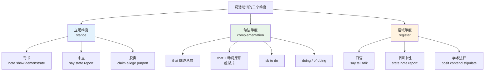
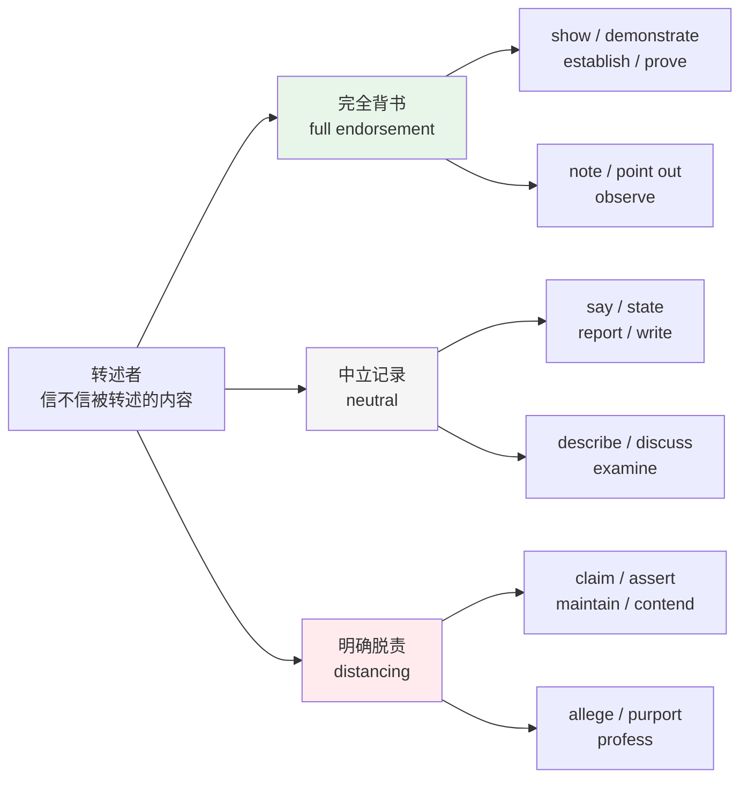
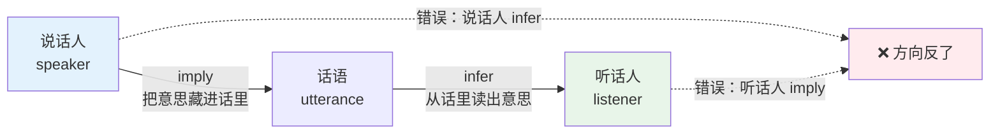
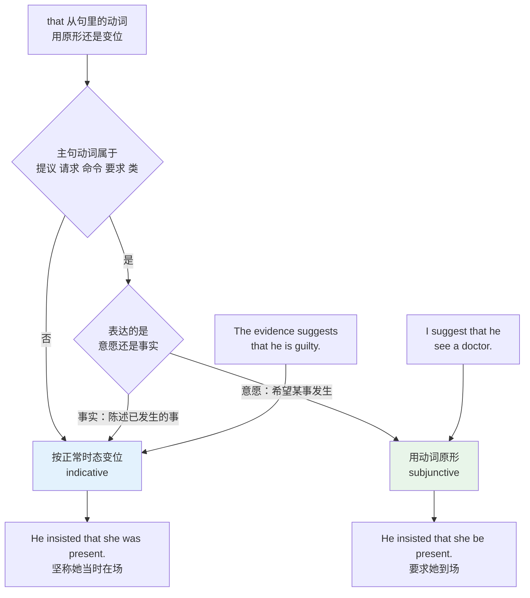
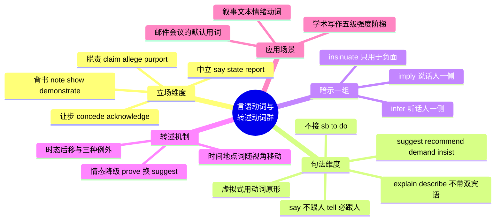

# 言语动词与转述动词群

> [!info] 本篇定位
>
> 上一篇讲的是轻动词 —— 动词本身没什么意思，意思在名词里。这一篇正相反：说话动词的**动词本身就是全部信息量**。
>
> 同一句话用 `note` 转述还是用 `claim` 转述，字面内容一模一样，但读者收到的信号完全不同：前者说「这是事实」，后者说「他这么讲，我不负责」。写论文、写周报、读技术文档和新闻时，这个差别每天都在起作用。
>
> 读完你能做三件事：按立场强度选对转述动词；写出 `I suggest that he go` 而不是 `I suggest him to go`；把「他说他会来」在正确的时态与语气下转述出来。
>
> 和 `13.抽象概念、评价与高频动词/04.认知动词与因果、影响、变化类实义动词` 是一对 —— 那一篇管「想」，这一篇管「说」。

---

## 1. 本篇导读：转述是选立场，不是换说法

中文母语者转述英文时的默认策略是 `say` 打天下：`He said that...`、`The paper says that...`、`The document says...`。语法上没错，代价是**全部立场信息丢失**。

英语的说话动词把三样东西编码进了动词本身：

1. **说话人的态度** —— 是断言、让步、暗示，还是转述别人的话
2. **转述者的立场** —— 认不认同被转述的内容，认多少
3. **言语行为的类型** —— 陈述、提议、请求、质疑，各自要求不同的从句形式

第三条是最硬的一条：它不是风格问题，是句法问题。`suggest` 后面的 that 从句必须用动词原形，`say` 后面不能跟人做宾语，`insist` 换个义项就换一套语气。选错了不只是不地道，是错。

三个维度互相独立。`allege` 是「脱责 + that 从句 + 法律语域」，`urge` 是「中立 + 虚拟式和 sb to do 两可 + 书面语域」，`mutter` 是「中立 + that 从句 + 口语」。学一个说话动词就是同时确定它在这三条轴上的坐标，只记中文对应字会把三条轴全部抹平 —— 因为 `claim`、`assert`、`allege`、`contend` 在词典里都能翻成「声称」。

本篇的组织顺序按立场维度走：中性陈述 → 强断言 → 让步与否认 → 暗示 → 提议请求。句法维度在第 8 节集中处理，语域维度在第 10 节结合学术写作展开。

---

## 2. 中性陈述群：say tell speak talk 与它们的书面替身

### 2.1 四个基础动词的分工

`say` / `tell` / `speak` / `talk` 是全部说话动词的地基，也是中文母语者最容易混用的四个。它们的差别不在意思，在**后面能跟什么**。

| 英文 | 英式音标 | 美式音标 | 词性 | 中文 | 搭配与说明 |
| --- | --- | --- | --- | --- | --- |
| **say** | /seɪ/ | /seɪ/ | v. | 说 | 关注说出的**内容**：say sth，say that...，不能直接跟人 |
| **tell** | /tel/ | /tel/ | v. | 告诉 | 关注**听话人**：tell sb sth，tell sb to do，双宾语 |
| **speak** | /spiːk/ | /spiːk/ | v. | 讲；说某语言 | 关注**说话这个行为**：speak English，speak to sb |
| **talk** | /tɔːk/ | /tɔːk/ | v./n. | 交谈 | 关注**双向对话**：talk to/with sb，talk about sth |
| **state** | /steɪt/ | /steɪt/ | v. | 陈述；声明 | say 的正式版，用于书面与官方表述 |
| **mention** | /ˈmenʃn/ | /ˈmenʃn/ | v. | 提到 | 顺带说到，不展开；mention that / mention sth |
| **remark** | /rɪˈmɑːk/ | /rɪˈmɑːrk/ | v./n. | 评论；说 | 随口的短评，不是正式论证 |
| **note** | /nəʊt/ | /noʊt/ | v./n. | 指出；注意到 | 学术写作最常用的中性转述动词，暗含内容属实 |
| **observe** | /əbˈzɜːv/ | /əbˈzɜːrv/ | v. | 评说；观察到 | 比 note 更正式，同时有「观察」义 |
| **comment** | /ˈkɒment/ | /ˈkɑːment/ | v./n. | 评论 | comment on sth；名词是代码注释的那个词 |
| **add** | /æd/ | /æd/ | v. | 补充说 | 转述对话时接续上一句：he added that... |
| **report** | /rɪˈpɔːt/ | /rɪˈpɔːrt/ | v./n. | 报道；报告 | 转述二手信息，转述者不承诺真假 |
| **declare** | /dɪˈkleə/ | /dɪˈkler/ | v. | 宣布；申报 | 正式公开表态；海关申报也用它 |
| **announce** | /əˈnaʊns/ | /əˈnaʊns/ | v. | 宣布 | 公开发布新信息，不能接双宾语 |
| **describe** | /dɪˈskraɪb/ | /dɪˈskraɪb/ | v. | 描述 | describe sth as sth，不能 describe me sth |
| **explain** | /ɪkˈspleɪn/ | /ɪkˈspleɪn/ | v. | 解释 | explain sth to sb，不能 explain me sth |
| **indicate** | /ˈɪndɪkeɪt/ | /ˈɪndɪkeɪt/ | v. | 表明；示意 | 主语常是数据、图表、研究，不是人 |
| **inform** | /ɪnˈfɔːm/ | /ɪnˈfɔːrm/ | v. | 通知 | inform sb of sth / inform sb that... |
| **notify** | /ˈnəʊtɪfaɪ/ | /ˈnoʊtɪfaɪ/ | v. | 通知 | 更程序化，系统推送与法律通知常用 |
| **recount** | /rɪˈkaʊnt/ | /rɪˈkaʊnt/ | v. | 讲述（经历） | 叙述一段有前后的事，不是单句陈述 |
| **narrate** | /nəˈreɪt/ | /ˈnæreɪt/ | v. | 旁白；叙述 | 英美重音位置不同，是常见听力障碍点 |
| **utter** | /ˈʌtə/ | /ˈʌtər/ | v./adj. | 说出（一个词） | 强调发出声音；形容词义是「彻底的」 |
| **voice** | /vɔɪs/ | /vɔɪs/ | v./n. | 表达（意见） | voice concerns / voice doubts，固定搭配 |
| **express** | /ɪkˈspres/ | /ɪkˈspres/ | v. | 表达 | express + 抽象名词，见上一篇轻动词搭配 |
| **articulate** | /ɑːˈtɪkjuleɪt/ | /ɑːrˈtɪkjuleɪt/ | v./adj. | 清晰表达 | 动词与形容词的词尾读音不同：/-eɪt/ 对 /-ət/ |
| **convey** | /kənˈveɪ/ | /kənˈveɪ/ | v. | 传达 | convey meaning / convey a message |

### 2.2 say 与 tell 的分界线

这两个词的混用是中文母语者最高频的错误，根源是中文「说」和「告诉」的界限比英语松。

> [!warning] say 与 tell 的四条硬规则
>
> - ❌ ~~He said me that he was busy.~~
> - ✅ **He told me that he was busy.**（tell 直接跟人）
> - ✅ **He said to me that he was busy.**（say 跟人必须加 to）
>
> - ❌ ~~She told that the server was down.~~
> - ✅ **She said that the server was down.**（tell 后面必须有听话人）
> - ✅ **She told the team that the server was down.**
>
> - ❌ ~~Can you say me how to fix this?~~
> - ✅ **Can you tell me how to fix this?**
>
> - ❌ ~~He said me to restart the service.~~
> - ✅ **He told me to restart the service.**（只有 tell 能接 sb to do）

例外要单记：`tell` 在几个固定搭配里不带听话人 —— `tell the truth`（说实话）、`tell a lie`（撒谎）、`tell a story`（讲故事）、`tell the time`（认表）、`tell the difference`（分辨差别）。最后两个已经脱离「说」的意思，实际是「辨别」。

### 2.3 speak 与 talk：谁在说与在聊什么

`speak` 偏单向、偏正式，`talk` 偏双向、偏随意。

> [!example] speak 与 talk 的典型分布
>
> - She **speaks** three languages fluently.
>   - 她能流利说三种语言。语言能力只能用 speak。
> - The CEO will **speak** at the conference.
>   - CEO 将在大会上发言。单向演讲用 speak。
> - Can I **speak** to the manager, please?
>   - 我能和经理谈谈吗？带正式请求意味。
> - We **talked** about the migration plan for an hour.
>   - 我们讨论迁移方案讨论了一个小时。双向讨论用 talk。
> - Stop **talking** and start coding.
>   - 别说了，开始写代码。随口的口语命令。

电话场景里两个都能用但含义有别：`Who's speaking?`（请问哪位）是接电话的标准问法；`Can we talk?` 是「我们能谈谈吗」，通常预示着严肃话题。

---

## 3. 断言与主张群：谁在为这句话背书

### 3.1 立场强度阶梯

这一组词的共同意思是「说某件事是真的」，差别在**转述者信不信**以及**说话人有多硬**。

| 英文 | 英式音标 | 美式音标 | 词性 | 中文 | 搭配与说明 |
| --- | --- | --- | --- | --- | --- |
| **claim** | /kleɪm/ | /kleɪm/ | v./n. | 声称；索赔 | 强脱责：转述者暗示这话未经证实 |
| **argue** | /ˈɑːɡjuː/ | /ˈɑːrɡjuː/ | v. | 主张；论证 | 带论据的主张，学术写作最常用 |
| **assert** | /əˈsɜːt/ | /əˈsɜːrt/ | v. | 断言 | 语气强、缺论据，转述时略带质疑 |
| **contend** | /kənˈtend/ | /kənˈtend/ | v. | 力主；争辩 | 在有争议的问题上坚持某方 |
| **maintain** | /meɪnˈteɪn/ | /meɪnˈteɪn/ | v. | 坚称 | 面对反驳仍不改口，暗含被质疑过 |
| **insist** | /ɪnˈsɪst/ | /ɪnˈsɪst/ | v. | 坚称；坚持要求 | 两个义项对应两套语气，见第 7 节 |
| **allege** | /əˈledʒ/ | /əˈledʒ/ | v. | 指控（未经证实） | 法律新闻标配，强烈脱责 |
| **profess** | /prəˈfes/ | /prəˈfes/ | v. | 自称；公开表明 | 常暗示说话人未必真心 |
| **purport** | /pəˈpɔːt/ | /pərˈpɔːrt/ | v. | 声称是 | purport to be/do，几乎总带怀疑色彩 |
| **posit** | /ˈpɒzɪt/ | /ˈpɑːzɪt/ | v. | 假定；提出 | 学术用语，提出待检验的命题 |
| **postulate** | /ˈpɒstjuleɪt/ | /ˈpɑːstʃəleɪt/ | v./n. | 假设；公设 | 比 posit 更正式，数学与逻辑常用 |
| **hold** | /həʊld/ | /hoʊld/ | v. | 认为；主张 | 正式：the court holds that... |
| **affirm** | /əˈfɜːm/ | /əˈfɜːrm/ | v. | 确认；肯定 | 正式确认某事成立，法院与官方常用 |
| **attest** | /əˈtest/ | /əˈtest/ | v. | 证实；作证 | attest to sth，主语常是证据 |
| **testify** | /ˈtestɪfaɪ/ | /ˈtestɪfaɪ/ | v. | 作证 | 法庭语境；testify that / testify to |
| **proclaim** | /prəˈkleɪm/ | /prəˈkleɪm/ | v. | 宣告 | 隆重公开，比 announce 更有仪式感 |
| **stress** | /stres/ | /stres/ | v./n. | 强调 | stress that...；名词是压力 |
| **emphasize** | /ˈemfəsaɪz/ | /ˈemfəsaɪz/ | v. | 强调 | 英式也拼 emphasise |
| **underscore** | /ˌʌndəˈskɔː/ | /ˈʌndərskɔːr/ | v./n. | 突出强调 | 主语常是事件或数据；名词是下划线字符 |
| **highlight** | /ˈhaɪlaɪt/ | /ˈhaɪlaɪt/ | v./n. | 突出；强调 | 比 emphasize 更中性、更常见于报告 |
| **reiterate** | /riˈɪtəreɪt/ | /riˈɪtəreɪt/ | v. | 重申 | 正式；口语用 say again |
| **swear** | /sweə/ | /swer/ | v. | 发誓；说脏话 | 两个义项差别极大，靠语境区分 |
| **vow** | /vaʊ/ | /vaʊ/ | v./n. | 立誓 | 郑重承诺，新闻里常用于政客表态 |
| **pledge** | /pledʒ/ | /pledʒ/ | v./n. | 承诺；保证 | pledge to do / pledge support |

### 3.2 转述者立场的可视化

这张图是本篇最需要记住的一张。同一句被转述的话，换个动词就换了作者的态度。写论文时如果你想反驳某个观点，用 `X claims that` 而不是 `X shows that`，读者立刻知道你要开始拆它了；反过来，如果你其实认同某个结论却写成 `Smith claims that`，审稿人会读出你不认同的信号 —— 这是中文母语者在英文论文里最常见的无意冒犯。

`note` 和 `point out` 在图里被归进背书区，值得单独说明：这两个词的预设是「被指出的内容是事实」，所以 `The author points out that the earth is flat` 是不成立的搭配 —— 它自相矛盾。要转述你不同意的内容，只能用 `claims` 或 `argues`。

> [!example] 同一句话的四种转述立场
>
> - The report **notes** that latency dropped after the upgrade.
>   - 报告指出升级后延迟下降了。作者认同这个结论。
> - The report **states** that latency dropped after the upgrade.
>   - 报告写明升级后延迟下降。纯记录，不表态。
> - The report **claims** that latency dropped after the upgrade.
>   - 报告声称升级后延迟下降。作者暗示这个说法需要验证。
> - The vendor **alleges** that the outage was caused by a third party.
>   - 供应商指称故障是第三方造成的。作者明确不为此背书。

### 3.3 claim 的两个陷阱

`claim` 在技术文档和法律文本里还有两个和「声称」无关的义项，混淆会读错整段。

> [!warning] claim 的三个义项
>
> - **声称**：He **claims** to have fixed the bug.（他声称修好了）
> - **索赔 / 申领**：You can **claim** expenses within 30 days.（30 天内可报销）
> - **专利权利要求**：The patent has 14 **claims**.（该专利有 14 项权利要求）
>
> 第三个义项在读专利与开源许可证时必然遇到，`claim` 在那里是名词，指法律上主张保护的技术特征，不是「声称」。

`claim to do` 与 `claim that` 都成立且意思相同，但 `claim to have done` 表示所声称的动作已完成，是技术文档里的常见结构：`The library claims to have zero dependencies`。

---

## 4. 让步、承认与否认群

### 4.1 承认方向

这一组的共同点是**说话人在往后退**：承认对方有理，或承认自己有问题。退多少、为什么退，是词与词的差别。

| 英文 | 英式音标 | 美式音标 | 词性 | 中文 | 搭配与说明 |
| --- | --- | --- | --- | --- | --- |
| **admit** | /ədˈmɪt/ | /ədˈmɪt/ | v. | 承认；准入 | admit doing / admit that；不接 admit to do |
| **concede** | /kənˈsiːd/ | /kənˈsiːd/ | v. | 让步承认 | 在争论中被迫承认对方某点，最典型的让步词 |
| **acknowledge** | /əkˈnɒlɪdʒ/ | /əkˈnɑːlɪdʒ/ | v. | 承认；致谢 | 中性承认事实，无过错含义；也指确认收到 |
| **confess** | /kənˈfes/ | /kənˈfes/ | v. | 坦白；忏悔 | 承认过错或秘密，带道德或宗教色彩 |
| **grant** | /ɡrɑːnt/ | /ɡrænt/ | v./n. | 姑且承认；授予 | I grant that... 是书面让步套语 |
| **allow** | /əˈlaʊ/ | /əˈlaʊ/ | v. | 承认（旧式）；允许 | 让步义偏文学，日常义是允许 |
| **qualify** | /ˈkwɒlɪfaɪ/ | /ˈkwɑːlɪfaɪ/ | v. | 限定；使有资格 | qualify a statement 指给结论加限定条件 |
| **downplay** | /ˌdaʊnˈpleɪ/ | /ˌdaʊnˈpleɪ/ | v. | 淡化 | 故意说得比实际轻 |
| **understate** | /ˌʌndəˈsteɪt/ | /ˌʌndərˈsteɪt/ | v. | 轻描淡写 | 反义 overstate；名词 understatement |
| **overstate** | /ˌəʊvəˈsteɪt/ | /ˌoʊvərˈsteɪt/ | v. | 夸大 | 学术写作常用 It is hard to overstate... |

### 4.2 否认与反驳方向

| 英文 | 英式音标 | 美式音标 | 词性 | 中文 | 搭配与说明 |
| --- | --- | --- | --- | --- | --- |
| **deny** | /dɪˈnaɪ/ | /dɪˈnaɪ/ | v. | 否认；拒绝给予 | deny doing / deny that；不接 deny to do |
| **refute** | /rɪˈfjuːt/ | /rɪˈfjuːt/ | v. | 驳倒（有证据） | 严格用法要求真的驳倒了，不只是反对 |
| **rebut** | /rɪˈbʌt/ | /rɪˈbʌt/ | v. | 反驳 | 提出反面论证，不保证成功；名词 rebuttal |
| **dispute** | /dɪˈspjuːt/ | /dɪˈspjuːt/ | v./n. | 质疑；争议 | dispute a claim 指不接受某说法 |
| **contradict** | /ˌkɒntrəˈdɪkt/ | /ˌkɑːntrəˈdɪkt/ | v. | 反驳；相矛盾 | 主语可以是人，也可以是数据 |
| **repudiate** | /rɪˈpjuːdieɪt/ | /rɪˈpjuːdieɪt/ | v. | 断然否定 | 正式且强烈，常用于否定关系或责任 |
| **retract** | /rɪˈtrækt/ | /rɪˈtrækt/ | v. | 撤回（言论） | 论文撤稿的标准动词：a retracted paper |
| **recant** | /rɪˈkænt/ | /rɪˈkænt/ | v. | 公开放弃（主张） | 比 retract 更有被迫改口的意味 |
| **disavow** | /ˌdɪsəˈvaʊ/ | /ˌdɪsəˈvaʊ/ | v. | 否认与…有关 | 撇清关系，不是否认事实本身 |
| **disclaim** | /dɪsˈkleɪm/ | /dɪsˈkleɪm/ | v. | 免责声明；放弃 | 名词 disclaimer 是软件许可证固定条款 |
| **object** | /əbˈdʒekt/ | /əbˈdʒekt/ | v. | 反对 | object to sth/doing；名词重音在前 /ˈɒbdʒɪkt/ |
| **protest** | /prəˈtest/ | /prəˈtest/ | v. | 抗议；申辩 | 动词重音在后，名词 /ˈprəʊtest/ 重音在前 |
| **counter** | /ˈkaʊntə/ | /ˈkaʊntər/ | v./n. | 反驳；反制 | counter that... 用于对话中的回击 |
| **backtrack** | /ˈbæktræk/ | /ˈbæktræk/ | v. | 改口 | 口语与新闻用词，含贬义 |
| **caveat** | /ˈkæviæt/ | /ˈkæviæt/ | n. | 附加说明；警告 | with the caveat that... 是学术让步套语 |

### 4.3 concede 与 admit 的分工

两个词中文都是「承认」，选错会把语义弄反。

> [!warning] concede 承认的是对方，admit 承认的是自己
>
> - ✅ **He conceded that her argument was stronger.**（他承认她的论证更有力 —— 对方赢了这一点）
> - ✅ **He admitted that he had missed the deadline.**（他承认自己错过了截止日期 —— 自己的问题）
>
> 混用示例：
>
> - ❌ ~~He conceded that he had missed the deadline.~~ 语法通，但读起来像「他不情愿地承认」，把一个中性事实说成了辩论失分。
> - ❌ ~~He admitted that her argument was stronger.~~ 读起来像他觉得这是自己的过错。

`acknowledge` 是这一组里最安全的中性选项：既不含过错，也不含辩论失分，只是「确认这件事成立」。写论文提到局限性时，`We acknowledge that the sample size is small` 比 `We admit that...` 得体得多 —— 后者听起来像认罪。

`acknowledge` 还有一个技术义项：确认收到。TCP 里的 ACK 就是 acknowledgement 的缩写，邮件里 `Please acknowledge receipt` 是「请回执确认」，和「承认」无关。

### 4.4 refute 的严格用法

> [!tip] refute 不等于 deny
>
> `refute` 的原义是**拿出证据把对方驳倒**，成功与否已经包含在词义里。`deny` 只是说「不是这样」，不含任何证据。
>
> - The lawyer **denied** the allegations.（律师否认了这些指控 —— 只是说不）
> - The new data **refute** the earlier hypothesis.（新数据驳倒了先前的假设 —— 拿出了证据）
>
> 报刊里 `refute` 被大量当成 `deny` 用，很多用法指南把它列为误用。学术写作中保持严格区分：你只是不同意就用 `dispute` 或 `challenge`，真的用证据推翻了才用 `refute`。

---

## 5. 暗示群：说了但没明说

### 5.1 词表

| 英文 | 英式音标 | 美式音标 | 词性 | 中文 | 搭配与说明 |
| --- | --- | --- | --- | --- | --- |
| **imply** | /ɪmˈplaɪ/ | /ɪmˈplaɪ/ | v. | 暗示；意味着 | 说话人一侧的动作；名词 implication |
| **infer** | /ɪnˈfɜː/ | /ɪnˈfɜːr/ | v. | 推断 | 听话人一侧的动作；名词 inference |
| **suggest** | /səˈdʒest/ | /səɡˈdʒest/ | v. | 表明；建议 | 英美读音不同，美音有 /ɡ/ |
| **hint** | /hɪnt/ | /hɪnt/ | v./n. | 暗示 | hint at sth；轻量、口语可用 |
| **intimate** | /ˈɪntɪmeɪt/ | /ˈɪntɪmeɪt/ | v. | 委婉透露 | 动词读 /-eɪt/，形容词「亲密的」读 /ˈɪntɪmət/ |
| **insinuate** | /ɪnˈsɪnjueɪt/ | /ɪnˈsɪnjueɪt/ | v. | 影射（贬） | 暗示不好的事，几乎总带负面色彩 |
| **allude** | /əˈluːd/ | /əˈluːd/ | v. | 间接提及 | allude to sth，不能直接跟宾语 |
| **connote** | /kəˈnəʊt/ | /kəˈnoʊt/ | v. | 含有…意味 | 主语是词语本身，讲词的附加色彩 |
| **denote** | /dɪˈnəʊt/ | /dɪˈnoʊt/ | v. | 指称；表示 | 与 connote 成对：字面义对附加义 |
| **signal** | /ˈsɪɡnəl/ | /ˈsɪɡnəl/ | v./n. | 释放信号；表明 | signal a shift in policy |
| **imply** 名词 **implication** | /ˌɪmplɪˈkeɪʃn/ | /ˌɪmplɪˈkeɪʃn/ | n. | 含义；影响 | 复数 implications 常指「后果」 |
| **inference** | /ˈɪnfərəns/ | /ˈɪnfərəns/ | n. | 推论 | draw an inference 是固定搭配 |
| **allusion** | /əˈluːʒn/ | /əˈluːʒn/ | n. | 典故；暗指 | 文学分析常用；勿与 illusion 混 |
| **innuendo** | /ˌɪnjuˈendəʊ/ | /ˌɪnjuˈendoʊ/ | n. | 影射之词 | 复数 innuendoes；总是贬义 |
| **undertone** | /ˈʌndətəʊn/ | /ˈʌndərtoʊn/ | n. | 言外之意；低声 | an undertone of criticism |
| **subtext** | /ˈsʌbtekst/ | /ˈsʌbtekst/ | n. | 潜台词 | 影视与文本分析常用 |

### 5.2 imply 与 infer：方向相反的一对

这是英语母语者自己也会用错的一对，中文母语者更容易混，因为中文「暗示」和「推断」的主语区分不像英语那么强制。

图里的箭头方向就是全部规则：意思从说话人流向话语叫 `imply`，从话语流向听话人叫 `infer`。同一个交流事件，说的人 imply，听的人 infer，两个词永远不能互换主语。

> [!example] imply 与 infer 的正误对照
>
> - ✅ Are you **implying** that I broke the build?
>   - 你是在暗示是我把构建搞崩的吗？说话人一侧。
> - ✅ From his silence I **inferred** that he disagreed.
>   - 从他的沉默我推断他不同意。听话人一侧。
> - ❌ ~~Are you inferring that I broke the build?~~
>   - 方向错了，除非你真的想问「你是在推断吗」。
> - ✅ The benchmark results **imply** a memory leak.
>   - 基准测试结果表明存在内存泄漏。无生命主语也能 imply。

无生命主语是一个重要补充：数据、结果、条款都可以 `imply`（客观上意味着），但不能 `infer`（推断需要有认知能力的主体）。

### 5.3 insinuate 与 hint 的色彩差

`hint` 是中性的，可以暗示好事也可以暗示坏事；`insinuate` 几乎锁死在负面。

> - She **hinted** that a promotion might be coming.
>   - 她暗示可能会有升职。中性偏正面。
> - He **insinuated** that the numbers had been massaged.
>   - 他影射数字被动过手脚。负面指控，不明说。

`allude to` 是三者中最文雅的，指有意提到但不点破，常用于提及双方心里都有数、但不便点破的事：`The paper alludes to the 2016 incident without naming it`。

---

## 6. 名词化：把说话动作变成可以讨论的对象

学术与技术写作大量使用说话动词的名词形式，因为名词能被修饰、被限定、被当作论证对象。上一篇讲的轻动词搭配在这里派上用场：这些名词绝大多数配 `make`、`raise`、`offer`、`issue`。

| 英文 | 英式音标 | 美式音标 | 词性 | 中文 | 搭配与说明 |
| --- | --- | --- | --- | --- | --- |
| **claim** | /kleɪm/ | /kleɪm/ | n. | 主张；说法 | make a claim / support a claim |
| **argument** | /ˈɑːɡjumənt/ | /ˈɑːrɡjumənt/ | n. | 论证；争吵 | make an argument（论证）vs have an argument（吵架） |
| **assertion** | /əˈsɜːʃn/ | /əˈsɜːrʃn/ | n. | 断言 | 编程里的 assert 语句同源 |
| **contention** | /kənˈtenʃn/ | /kənˈtenʃn/ | n. | 论点；争执 | my contention is that...；也指资源争用 |
| **concession** | /kənˈseʃn/ | /kənˈseʃn/ | n. | 让步 | make a concession；也指特许经营权 |
| **admission** | /ədˈmɪʃn/ | /ədˈmɪʃn/ | n. | 承认；入场 | an admission of guilt；admission fee 是门票 |
| **denial** | /dɪˈnaɪəl/ | /dɪˈnaɪəl/ | n. | 否认；拒绝 | issue a denial；denial of service 即 DoS |
| **allegation** | /ˌæləˈɡeɪʃn/ | /ˌæləˈɡeɪʃn/ | n. | 指控 | make/deny allegations，新闻高频 |
| **implication** | /ˌɪmplɪˈkeɪʃn/ | /ˌɪmplɪˈkeɪʃn/ | n. | 含义；影响 | the implications for performance |
| **suggestion** | /səˈdʒestʃən/ | /səɡˈdʒestʃən/ | n. | 建议；迹象 | make a suggestion；美音同样有 /ɡ/ |
| **proposal** | /prəˈpəʊzl/ | /prəˈpoʊzl/ | n. | 提案 | put forward a proposal；也指求婚 |
| **insistence** | /ɪnˈsɪstəns/ | /ɪnˈsɪstəns/ | n. | 坚持 | at sb's insistence 在某人坚持下 |
| **rebuttal** | /rɪˈbʌtl/ | /rɪˈbʌtl/ | n. | 反驳意见 | 论文评审流程的固定环节 |
| **refutation** | /ˌrefjuˈteɪʃn/ | /ˌrefjuˈteɪʃn/ | n. | 驳斥 | 比 rebuttal 更强，含驳倒成功之意 |
| **acknowledgement** | /əkˈnɒlɪdʒmənt/ | /əkˈnɑːlɪdʒmənt/ | n. | 承认；致谢 | 美式常拼 acknowledgment（无中间 e） |
| **statement** | /ˈsteɪtmənt/ | /ˈsteɪtmənt/ | n. | 声明；语句 | issue a statement；编程里指语句 |
| **testimony** | /ˈtestɪməni/ | /ˈtestɪmoʊni/ | n. | 证词 | give testimony；美音第三音节读 /moʊ/ |
| **disclaimer** | /dɪsˈkleɪmə/ | /dɪsˈkleɪmər/ | n. | 免责声明 | 开源许可证与法律文本必备条款 |
| **remark** | /rɪˈmɑːk/ | /rɪˈmɑːrk/ | n. | 评论 | make a remark；复数 opening remarks 是开场白 |
| **objection** | /əbˈdʒekʃn/ | /əbˈdʒekʃn/ | n. | 反对 | raise an objection；法庭上单说 Objection! |

> [!tip] 名词化不是为了显得高级
>
> 用名词形式的真正理由是：名词可以被限定和计数，动词不行。
>
> - 动词版：`He argued that the design was flawed, and he also argued that the timeline was unrealistic.`
> - 名词版：`His two main arguments concern the flawed design and the unrealistic timeline.`
>
> 名词版之所以更好，是因为 `two main` 这个限定只有名词能带。为了正式而正式地把动词换成名词，反而会让句子变钝 —— 这一点在 `19.学术通用词汇` 会展开。

---

## 7. 提议、请求与命令：that 从句里的动词原形

### 7.1 现象

有一类说话动词的 that 从句里，动词永远用**原形**，不随主语变位，不随时态变化。这套结构在语法书里叫 mandative subjunctive，中文一般译作「（命令式）虚拟式」。

> [!example] 动词原形的三个位置
>
> - The manager **suggested** that the report **be** submitted by Friday.
>   - 经理建议报告在周五前提交。不是 is，不是 was。
> - She **insisted** that he **apologize** in person.
>   - 她坚持要求他当面道歉。第三人称单数不加 -s。
> - The policy **requires** that every commit **have** a linked issue.
>   - 政策要求每次提交都关联一个 issue。不是 has。
> - We **demand** that the service **not be** interrupted.
>   - 我们要求服务不被中断。否定式直接在原形前加 not，不用 don't。

否定形式是最容易错的一处：`that he not go`，不是 `that he doesn't go`，也不是 `that he not to go`。

### 7.2 触发虚拟式的动词清单

| 英文 | 英式音标 | 美式音标 | 词性 | 中文 | 搭配与说明 |
| --- | --- | --- | --- | --- | --- |
| **suggest** | /səˈdʒest/ | /səɡˈdʒest/ | v. | 建议 | ❌ suggest sb to do；用 that 从句或 doing |
| **propose** | /prəˈpəʊz/ | /prəˈpoʊz/ | v. | 提议 | propose that / propose doing；也可 propose to do（打算） |
| **recommend** | /ˌrekəˈmend/ | /ˌrekəˈmend/ | v. | 推荐；建议 | ❌ recommend sb to do；用 that 或 doing |
| **urge** | /ɜːdʒ/ | /ɜːrdʒ/ | v./n. | 敦促 | urge sb to do ✅ 也 urge that + 原形 ✅ |
| **insist** | /ɪnˈsɪst/ | /ɪnˈsɪst/ | v. | 坚持要求 | ❌ insist sb to do；用 insist on doing 或 that 从句 |
| **demand** | /dɪˈmɑːnd/ | /dɪˈmænd/ | v./n. | 要求 | ❌ demand sb to do；demand to do ✅ |
| **request** | /rɪˈkwest/ | /rɪˈkwest/ | v./n. | 请求 | request that + 原形；request sb to do 偏正式书面 |
| **require** | /rɪˈkwaɪə/ | /rɪˈkwaɪər/ | v. | 要求；需要 | require sb to do ✅ 也 require that + 原形 ✅ |
| **ask** | /ɑːsk/ | /æsk/ | v. | 请求；问 | ask sb to do ✅；ask that + 原形（正式） |
| **order** | /ˈɔːdə/ | /ˈɔːrdər/ | v./n. | 命令；订购 | order sb to do ✅；order that + 原形 ✅ |
| **command** | /kəˈmɑːnd/ | /kəˈmænd/ | v./n. | 命令 | 军事与正式语境；名词是命令行的 command |
| **advise** | /ədˈvaɪz/ | /ədˈvaɪz/ | v. | 建议 | 动词 /-z/，名词 advice /ədˈvaɪs/ 是 /-s/ |
| **stipulate** | /ˈstɪpjuleɪt/ | /ˈstɪpjəleɪt/ | v. | 规定（合同） | 法律文本高频；stipulate that + 原形 |
| **mandate** | /ˈmændeɪt/ | /ˈmændeɪt/ | v./n. | 强制规定 | mandate that + 原形；名词是授权、任期 |
| **decree** | /dɪˈkriː/ | /dɪˈkriː/ | v./n. | 颁令 | 正式且带权威色彩 |
| **move** | /muːv/ | /muːv/ | v. | 动议 | 会议程序：I move that the motion be adopted |
| **direct** | /dəˈrekt/ | /dəˈrekt/ | v. | 指示 | 正式；direct sb to do ✅ 也可接 that 从句 |
| **instruct** | /ɪnˈstrʌkt/ | /ɪnˈstrʌkt/ | v. | 指示；教授 | instruct sb to do ✅ |
| **beg** | /beɡ/ | /beɡ/ | v. | 恳求 | beg sb to do；I beg to differ 是委婉反对 |
| **implore** | /ɪmˈplɔː/ | /ɪmˈplɔːr/ | v. | 恳求 | 文学色彩强于 beg |
| **plead** | /pliːd/ | /pliːd/ | v. | 恳求；答辩 | plead guilty 是法律固定说法 |
| **entreat** | /ɪnˈtriːt/ | /ɪnˈtriːt/ | v. | 恳请 | 书面且偏古 |
| **exhort** | /ɪɡˈzɔːt/ | /ɪɡˈzɔːrt/ | v. | 力劝 | h 不发音，读 /ɪɡˈz-/ 不是 /ɪkˈsh-/ |
| **petition** | /pəˈtɪʃn/ | /pəˈtɪʃn/ | v./n. | 请愿 | petition the court that + 原形 |
| **warn** | /wɔːn/ | /wɔːrn/ | v. | 警告 | warn sb to do / warn sb against doing |
| **caution** | /ˈkɔːʃn/ | /ˈkɔːʃn/ | v./n. | 告诫 | caution against doing；学术写作常用 |
| **forbid** | /fəˈbɪd/ | /fərˈbɪd/ | v. | 禁止 | forbid sb to do / forbid doing |
| **prohibit** | /prəˈhɪbɪt/ | /prəˈhɪbɪt/ | v. | 禁止 | ❌ prohibit sb to do；用 prohibit sb from doing |
| **persuade** | /pəˈsweɪd/ | /pərˈsweɪd/ | v. | 说服 | persuade sb to do；结果义，说服成功了 |
| **convince** | /kənˈvɪns/ | /kənˈvɪns/ | v. | 使信服 | convince sb that / convince sb of sth |
| **encourage** | /ɪnˈkʌrɪdʒ/ | /ɪnˈkɜːrɪdʒ/ | v. | 鼓励 | encourage sb to do；美音第二音节带 r 色彩 |
| **remind** | /rɪˈmaɪnd/ | /rɪˈmaɪnd/ | v. | 提醒 | remind sb to do / remind sb that |
| **invite** | /ɪnˈvaɪt/ | /ɪnˈvaɪt/ | v. | 邀请 | invite sb to do；也可 invite comments |
| **appeal** | /əˈpiːl/ | /əˈpiːl/ | v./n. | 呼吁；上诉 | appeal to sb to do；法律义是上诉 |

### 7.3 形容词与名词也能触发

虚拟式不只被动词触发。同源的形容词句型和名词从句同样要求动词原形。

| 触发结构 | 例句 | 说明 |
| --- | --- | --- |
| It is essential that | It is essential that the key **be** rotated quarterly. | essential / vital / crucial / imperative |
| It is necessary that | It is necessary that every user **have** a unique ID. | necessary / important / advisable |
| the demand that | the demand that the fee **be** waived | demand / request / requirement |
| the suggestion that | the suggestion that we **postpone** the release | suggestion / proposal / recommendation |
| the insistence that | his insistence that she **attend** | insistence / condition / stipulation |

### 7.4 英式的 should 变体

> [!tip] 同一句话的英美两种写法
>
> 英式英语常在虚拟式位置加 `should`，美式英语直接用原形。两种都对。
>
> - 美式：`They insisted that he leave immediately.`
> - 英式：`They insisted that he should leave immediately.`
>
> 英式在正式文书里也大量使用无 `should` 的原形式，所以美式写法在任何场合都不会错，反过来则可能在美式技术文档中显得啰嗦。写英文技术文档统一用原形式最省事。
>
> 加了 `should` 之后有一个副作用：`should` 在英式英语里还能表示「万一」，`If he should call...`，所以在有歧义风险的合同文本中，原形式更精确。

### 7.5 判定流程

流程图的关键分叉在第二个菱形：`insist` 和 `suggest` 都有两个义项，义项决定语气。`insist` 表「要求」时用原形，表「坚称」时正常变位；`suggest` 表「建议」时用原形，表「表明、显示」时正常变位。判断方法很直接 —— 从句描述的事**还没发生**（是希望它发生）就用原形，**已经发生或正在成立**就正常变位。

同一个词的两种用法并排看最清楚：

> [!example] insist 与 suggest 的双义项
>
> - He **insisted** that the log **be** kept for 90 days.
>   - 他要求日志保留 90 天。事情还没做，虚拟式。
> - He **insisted** that the log **was** deleted by mistake.
>   - 他坚称日志是误删的。陈述已发生的事，正常时态。
> - I **suggest** that she **join** the review.
>   - 我建议她参加评审。建议义，虚拟式。
> - The stack trace **suggests** that the connection **was** closed early.
>   - 堆栈信息表明连接被提前关闭了。表明义，正常时态。

### 7.6 中文母语者的头号错误：suggest sb to do

> [!warning] 四个不能接「sb to do」的高频动词
>
> - ❌ ~~He suggested me to try a different approach.~~
> - ✅ **He suggested that I try a different approach.**
> - ✅ **He suggested trying a different approach.**
>
> - ❌ ~~I recommend you to read the docs first.~~
> - ✅ **I recommend that you read the docs first.**
> - ✅ **I recommend reading the docs first.**
>
> - ❌ ~~They demanded us to refund the fee.~~
> - ✅ **They demanded that we refund the fee.**
> - ✅ **They demanded a refund.**
>
> - ❌ ~~She insisted me to stay.~~
> - ✅ **She insisted that I stay.**
> - ✅ **She insisted on my staying.**
>
> 对照能接 sb to do 的：`urge` / `require` / `ask` / `order` / `advise` / `tell` / `warn` / `remind` / `encourage` / `persuade` / `instruct` / `invite` —— 这批词接 sb to do 完全正常。分界线记住反面清单四个词即可：**suggest、recommend、demand、insist**。

---

## 8. 说话动词的句法框架总表

选对了词还要接对结构。下表把本篇高频动词按能接什么从句归类，第 8.2 节列出不能接什么。

### 8.1 能接的框架

| 动词 | that 从句 | that + 原形 | sb to do | doing | wh- 从句 | 双宾语 |
| --- | --- | --- | --- | --- | --- | --- |
| say | ✅ | — | — | — | — | — |
| tell | ✅ | — | ✅ | — | ✅ | ✅ |
| state | ✅ | — | — | — | — | — |
| note | ✅ | — | — | — | — | — |
| claim | ✅ | — | — | — | — | — |
| argue | ✅ | — | — | — | — | — |
| admit | ✅ | — | — | ✅ | — | — |
| deny | ✅ | — | — | ✅ | — | — |
| suggest | ✅ | ✅ | ❌ | ✅ | ✅ | — |
| recommend | ✅ | ✅ | ❌ | ✅ | — | — |
| propose | ✅ | ✅ | ❌ | ✅ | — | — |
| insist | ✅ | ✅ | ❌ | on doing | — | — |
| demand | ✅ | ✅ | ❌ | — | — | — |
| urge | ✅ | ✅ | ✅ | — | — | — |
| require | ✅ | ✅ | ✅ | — | — | — |
| ask | ✅ | ✅ | ✅ | — | ✅ | ✅ |
| advise | ✅ | ✅ | ✅ | ✅ | — | — |
| warn | ✅ | — | ✅ | — | — | — |
| remind | ✅ | — | ✅ | — | — | ✅ |
| explain | ✅ | — | — | — | ✅ | — |
| describe | ✅ | — | — | — | ✅ | — |

表里 `ask` 的 that + 原形只在正式请求里出现（`ask that the matter be reviewed`），日常口语用 `ask sb to do`。`advise` 是少数三种结构全能的词。

### 8.2 高频搭配错误清单

> [!warning] 六个结构性错误
>
> - ❌ ~~explain me the error~~ / ✅ **explain the error to me**
> - ❌ ~~describe me the problem~~ / ✅ **describe the problem to me**
> - ❌ ~~say me the answer~~ / ✅ **tell me the answer**
> - ❌ ~~admit to have made a mistake~~ / ✅ **admit to having made a mistake** / **admit making a mistake**
> - ❌ ~~deny to know him~~ / ✅ **deny knowing him**
> - ❌ ~~prohibit sb to enter~~ / ✅ **prohibit sb from entering**
>
> 前三个的共同规律：`explain`、`describe`、`say`、`announce`、`introduce`、`mention` 都是**不能带双宾语**的动词，人只能用介词引出。这批动词绝大多数是拉丁来源，双宾语结构是日耳曼层的特权。

`suggest` 还有一个特殊限制：它不能接 wh- 不定式，`suggest what to do` 成立，`suggest how to fix it` 成立，但 `suggest me what to do` 依然不成立 —— 人的位置仍然是禁区。

---

## 9. 转述时态、语气与情态降级

### 9.1 时态后移

主句转述动词用过去时，从句时态通常整体后移一格。

| 直接引语 | 间接引语（主句过去时） | 例 |
| --- | --- | --- |
| 一般现在 | 一般过去 | is → was |
| 一般过去 | 过去完成 | went → had gone |
| 现在完成 | 过去完成 | has finished → had finished |
| 过去完成 | 不变 | had left → had left |
| will | would | will call → would call |
| can | could | can help → could help |
| may | might | may be late → might be late |
| must（义务） | had to | must go → had to go |
| should / would / could / might | 不变 | should try → should try |

> [!example] 后移的实际效果
>
> - 直接：He said, "The build **is** broken."
>   - 间接：He said the build **was** broken.
> - 直接：She told me, "I **have already merged** it."
>   - 间接：She told me she **had already merged** it.
> - 直接：They said, "We **will** ship on Friday."
>   - 间接：They said they **would** ship on Friday.

### 9.2 不后移的三种情况

后移不是机械规则，它反映的是「说话时点」和「转述时点」的关系。三种情况下不后移：

**情况一，内容现在仍然成立。**

> - He said that water **boils** at 100°C.
>   - 他说水在 100 度沸腾。永恒事实，后移反而怪。
> - She said the API **is** deprecated.
>   - 她说这个 API 已废弃。现在依然废弃，不后移更自然。

**情况二，主句转述动词是现在时。**

> - The docs **say** that the flag **defaults** to false.
>   - 文档说这个开关默认为 false。主句现在时，从句不动。

**情况三，转述的是刚刚说的话。**

> - What did she say? — She **said** she **is** on her way.
>   - 她说什么？她说她在路上了。刚说完，事情还在进行。

### 9.3 转述的三步决策

转述一句话实际上是三个互不干扰的决策，被合并成「转述句怎么写」以后，常出现顾了时态忘了立场的情况。分开处理更稳。

| 步骤 | 要定什么 | 判据 |
| --- | --- | --- |
| 第一步 | 时态后不后移 | 主句现在时不移；主句过去时且内容已不成立才移 |
| 第二步 | 立场动词选哪个 | 我认同就 note/show，不认同就 claim/argue，说不清就 state/report |
| 第三步 | 情态强度降到哪级 | prove → suggest/indicate；is caused by → may be attributable to |

第三步最常被忽略。`The results prove that...` 在学术写作里几乎总是过强的表述，`The results suggest that...` 或 `The results indicate that...` 才是常见分寸。技术评审同理：把 `This causes the memory leak` 降级为 `This appears to be the source of the leak`，在证据只有一次复现时是更诚实的写法。

### 9.4 转述里的人称与时间地点词

| 直接引语 | 间接引语 | 说明 |
| --- | --- | --- |
| now | then | 时点参照从说话时移到转述时 |
| today | that day | — |
| tomorrow | the next day / the following day | — |
| yesterday | the previous day / the day before | — |
| last week | the week before | — |
| next month | the following month | — |
| here | there | 地点参照同样移动 |
| this | that | 指示词随之远指化 |
| these | those | — |
| ago | before | two days ago → two days before |
| come | go | 移动方向随视角翻转 |

> [!warning] 这一组不能机械替换
>
> 如果转述发生在**同一天、同一地点**，时间词不必改。
>
> - 同日转述：He said this morning that he **would** finish it **today**.（今天说的今天的事，today 保留）
> - 隔日转述：He said he **would** finish it **that day**.（已经过了那天，必须改）

---

## 10. 学术与技术写作的转述动词强度阶梯

### 10.1 五级强度

写论文、写技术评审、写周报时，转述别人观点的动词等于给自己的立场打标签。按强度从高到低分成五级。

| 强度 | 动词 | 说明 |
| --- | --- | --- |
| 一级：作者完全认同 | demonstrate / show / establish / prove / confirm / verify | 用了就等于你也承认这个结论成立 |
| 二级：作者认同但留余地 | find / reveal / identify / observe / note / point out | 学术写作最常用的一档 |
| 三级：中立记录 | report / state / describe / discuss / examine / present / outline | 只说他说了什么，不表态 |
| 四级：转述但保持距离 | argue / claim / suggest / propose / contend / maintain / hold | 观点不是事实，读者知道你可能不同意 |
| 五级：明确不背书 | allege / purport / profess / assert（贬用） | 常伴随后续反驳 |

第一级要谨慎：`prove` 在实验科学里几乎不用，因为单个研究证明不了什么。`demonstrate` 和 `establish` 是比较安全的强肯定。

### 10.2 补充词表

| 英文 | 英式音标 | 美式音标 | 词性 | 中文 | 搭配与说明 |
| --- | --- | --- | --- | --- | --- |
| **demonstrate** | /ˈdemənstreɪt/ | /ˈdemənstreɪt/ | v. | 证明；演示 | 一级强度；也指游行示威 |
| **establish** | /ɪˈstæblɪʃ/ | /ɪˈstæblɪʃ/ | v. | 确立；证实 | establish that... 表示已被证实 |
| **confirm** | /kənˈfɜːm/ | /kənˈfɜːrm/ | v. | 证实 | 与已有假设一致时用 |
| **verify** | /ˈverɪfaɪ/ | /ˈverɪfaɪ/ | v. | 验证 | 技术语境高频；名词 verification |
| **reveal** | /rɪˈviːl/ | /rɪˈviːl/ | v. | 揭示 | 揭示先前未知的内容 |
| **identify** | /aɪˈdentɪfaɪ/ | /aɪˈdentɪfaɪ/ | v. | 识别出 | identify a pattern / identify three factors |
| **conclude** | /kənˈkluːd/ | /kənˈkluːd/ | v. | 得出结论 | conclude that...；名词 conclusion |
| **hypothesize** | /haɪˈpɒθəsaɪz/ | /haɪˈpɑːθəsaɪz/ | v. | 假设 | 名词 hypothesis 复数 hypotheses |
| **speculate** | /ˈspekjuleɪt/ | /ˈspekjəleɪt/ | v. | 推测 | 明确标注证据不足 |
| **outline** | /ˈaʊtlaɪn/ | /ˈaʊtlaɪn/ | v./n. | 概述 | 中立记录档 |
| **examine** | /ɪɡˈzæmɪn/ | /ɪɡˈzæmɪn/ | v. | 考察 | 描述研究动作，不涉结论 |
| **explore** | /ɪkˈsplɔː/ | /ɪkˈsplɔːr/ | v. | 探讨 | 比 examine 更开放 |
| **critique** | /krɪˈtiːk/ | /krɪˈtiːk/ | v./n. | 评述；批评 | 学术批评，非日常骂人 |
| **challenge** | /ˈtʃælɪndʒ/ | /ˈtʃælɪndʒ/ | v./n. | 质疑 | challenge an assumption；比 refute 弱 |
| **attribute** | /əˈtrɪbjuːt/ | /əˈtrɪbjuːt/ | v. | 归因于 | attribute A to B；名词重音在前 /ˈætrɪbjuːt/ |
| **cite** | /saɪt/ | /saɪt/ | v. | 引用 | 与 site、sight 同音，拼写易错 |
| **quote** | /kwəʊt/ | /kwoʊt/ | v./n. | 引述 | 逐字引用；cite 是标注出处 |
| **paraphrase** | /ˈpærəfreɪz/ | /ˈpærəfreɪz/ | v./n. | 转述改写 | 换词不换意，学术写作核心技能 |
| **summarize** | /ˈsʌməraɪz/ | /ˈsʌməraɪz/ | v. | 概括 | 英式也拼 summarise |
| **elaborate** | /ɪˈlæbəreɪt/ | /ɪˈlæbəreɪt/ | v./adj. | 详述；精细的 | 动词 /-eɪt/，形容词 /ɪˈlæbərət/ |
| **clarify** | /ˈklærɪfaɪ/ | /ˈklærɪfaɪ/ | v. | 澄清 | clarify a point；会议高频 |
| **rephrase** | /ˌriːˈfreɪz/ | /ˌriːˈfreɪz/ | v. | 换个说法 | Let me rephrase that. 会议常用 |

### 10.3 引述的三种技术写法

> [!example] 同一个来源的三种引用方式
>
> - **直接引用**：As Nation (2006) puts it, coverage is "the percentage of running words known".
>   - 逐字引用要加引号并标页码。
> - **转述改写**：Nation (2006) **argues** that coverage should be measured in running words rather than word types.
>   - 换成自己的话，动词选四级强度表示这是他的主张。
> - **归纳多源**：Several studies **have shown** that vocabulary size correlates with reading comprehension.
>   - 多个来源共同支持时可用一级强度。

技术文档写作里对应的三种写法是：贴代码原文、描述行为、给出结论。转述动词的选择规则完全相同。

---

## 11. 提问、回应与对话管理

### 11.1 提问侧

| 英文 | 英式音标 | 美式音标 | 词性 | 中文 | 搭配与说明 |
| --- | --- | --- | --- | --- | --- |
| **ask** | /ɑːsk/ | /æsk/ | v. | 问；请求 | 英美元音差别显著，是典型 BATH 词 |
| **inquire** | /ɪnˈkwaɪə/ | /ɪnˈkwaɪr/ | v. | 询问 | 英式常拼 enquire；inquire about sth |
| **query** | /ˈkwɪəri/ | /ˈkwɪri/ | v./n. | 质询；查询 | 数据库查询同一个词 |
| **wonder** | /ˈwʌndə/ | /ˈwʌndər/ | v. | 想知道 | I was wondering if... 是最礼貌的请求句式 |
| **question** | /ˈkwestʃən/ | /ˈkwestʃən/ | v./n. | 质疑；问题 | 动词义偏「怀疑」，不是「提问」 |
| **interrogate** | /ɪnˈterəɡeɪt/ | /ɪnˈterəɡeɪt/ | v. | 审问 | 警务语境；技术上也指查询设备 |
| **probe** | /prəʊb/ | /proʊb/ | v./n. | 深究；探针 | probe further into the issue |
| **poll** | /pəʊl/ | /poʊl/ | v./n. | 民调；轮询 | 技术义「轮询」同源 |

### 11.2 回应侧

| 英文 | 英式音标 | 美式音标 | 词性 | 中文 | 搭配与说明 |
| --- | --- | --- | --- | --- | --- |
| **reply** | /rɪˈplaɪ/ | /rɪˈplaɪ/ | v./n. | 回复 | reply to sb/sth，不及物为主 |
| **respond** | /rɪˈspɒnd/ | /rɪˈspɑːnd/ | v. | 回应 | 比 reply 正式；respond to |
| **answer** | /ˈɑːnsə/ | /ˈænsər/ | v./n. | 回答 | 唯一能直接跟宾语的：answer the question |
| **retort** | /rɪˈtɔːt/ | /rɪˈtɔːrt/ | v./n. | 反唇相讥 | 带火药味的即时回击 |
| **echo** | /ˈekəʊ/ | /ˈekoʊ/ | v./n. | 附和；回声 | echo sb's concerns 是会议套话 |
| **concur** | /kənˈkɜː/ | /kənˈkɜːr/ | v. | 同意 | 正式；concur with sb |
| **interject** | /ˌɪntəˈdʒekt/ | /ˌɪntərˈdʒekt/ | v. | 插话 | 中性，比 interrupt 礼貌 |
| **interrupt** | /ˌɪntəˈrʌpt/ | /ˌɪntəˈrʌpt/ | v. | 打断 | 略带负面；技术义是中断 |
| **acknowledge** | /əkˈnɒlɪdʒ/ | /əkˈnɑːlɪdʒ/ | v. | 确认收到 | 见第 4 节，此处是回执义 |
| **decline** | /dɪˈklaɪn/ | /dɪˈklaɪn/ | v./n. | 婉拒；下降 | decline to comment 是新闻固定说法 |

> [!tip] answer 与 reply 的搭配差
>
> `answer` 及物：`answer the phone` / `answer the question` / `answer an email`。
>
> `reply` 不及物为主：`reply to the email`，不说 `reply the email`。
>
> - ❌ ~~Please reply my message.~~
> - ✅ **Please reply to my message.** / **Please answer my message.**

---

## 12. 音量、语气与情绪类说话动词

叙事文本和小说对白里，`said` 会被大量替换成带情绪信息的动词。读原版书时这一层是理解人物态度的主要线索。

| 英文 | 英式音标 | 美式音标 | 词性 | 中文 | 搭配与说明 |
| --- | --- | --- | --- | --- | --- |
| **whisper** | /ˈwɪspə/ | /ˈwɪspər/ | v./n. | 低语 | 有意压低音量给特定人听 |
| **murmur** | /ˈmɜːmə/ | /ˈmɜːrmər/ | v./n. | 低声说 | 柔和、连绵；也指心脏杂音 |
| **mutter** | /ˈmʌtə/ | /ˈmʌtər/ | v. | 嘟囔 | 通常带不满，不想让人听清 |
| **mumble** | /ˈmʌmbl/ | /ˈmʌmbl/ | v. | 含糊说 | 咬字不清，不一定有情绪 |
| **shout** | /ʃaʊt/ | /ʃaʊt/ | v./n. | 喊 | 中性大音量 |
| **yell** | /jel/ | /jel/ | v. | 大叫 | 比 shout 更失控，常含怒气 |
| **scream** | /skriːm/ | /skriːm/ | v./n. | 尖叫 | 高频尖锐，恐惧或极度情绪 |
| **exclaim** | /ɪkˈskleɪm/ | /ɪkˈskleɪm/ | v. | 惊呼 | 书面叙事用词，口语很少说 |
| **snap** | /snæp/ | /snæp/ | v. | 没好气地说 | 短促而不耐烦；也指折断、快照 |
| **growl** | /ɡraʊl/ | /ɡraʊl/ | v. | 低吼着说 | 低沉带威胁 |
| **stammer** | /ˈstæmə/ | /ˈstæmər/ | v. | 结巴地说 | 因紧张而断续 |
| **stutter** | /ˈstʌtə/ | /ˈstʌtər/ | v. | 口吃 | 更偏语言障碍本身 |
| **blurt** | /blɜːt/ | /blɜːrt/ | v. | 脱口而出 | blurt out，几乎总带 out |
| **sigh** | /saɪ/ | /saɪ/ | v./n. | 叹气（着说） | gh 不发音 |
| **groan** | /ɡrəʊn/ | /ɡroʊn/ | v./n. | 呻吟；抱怨 | 痛苦或不情愿 |
| **babble** | /ˈbæbl/ | /ˈbæbl/ | v. | 唠叨；含糊乱说 | 也指婴儿咿呀 |
| **ramble** | /ˈræmbl/ | /ˈræmbl/ | v. | 漫无边际地说 | ramble on about sth |
| **rant** | /rænt/ | /rænt/ | v./n. | 长篇抱怨 | 网络语境高频 |
| **boast** | /bəʊst/ | /boʊst/ | v. | 吹嘘 | 也可中性：the app boasts 3 features |
| **brag** | /bræɡ/ | /bræɡ/ | v. | 炫耀 | 比 boast 更口语、更贬 |
| **complain** | /kəmˈpleɪn/ | /kəmˈpleɪn/ | v. | 抱怨 | complain about / complain that |
| **grumble** | /ˈɡrʌmbl/ | /ˈɡrʌmbl/ | v. | 发牢骚 | 持续的低强度抱怨 |
| **whine** | /waɪn/ | /waɪn/ | v. | 哼唧抱怨 | 贬义强，指没完没了地抱怨 |
| **nag** | /næɡ/ | /næɡ/ | v. | 唠叨催促 | nag sb to do；也指持续的隐痛 |
| **scold** | /skəʊld/ | /skoʊld/ | v. | 责骂 | 上对下的训斥 |
| **accuse** | /əˈkjuːz/ | /əˈkjuːz/ | v. | 指责 | accuse sb of doing，不能接 to do |
| **blame** | /bleɪm/ | /bleɪm/ | v./n. | 归咎 | blame sb for sth / blame sth on sb |
| **apologize** | /əˈpɒlədʒaɪz/ | /əˈpɑːlədʒaɪz/ | v. | 道歉 | apologize to sb for sth；英式也拼 -ise |
| **praise** | /preɪz/ | /preɪz/ | v./n. | 称赞 | praise sb for sth |
| **chat** | /tʃæt/ | /tʃæt/ | v./n. | 闲聊 | chat with sb about sth |
| **gossip** | /ˈɡɒsɪp/ | /ˈɡɑːsɪp/ | v./n. | 说闲话 | 不可数名词 |

> [!warning] 叙事动词不要滥用
>
> 英文写作的通行意见与中文相反：中文作文鼓励替换「说」，英文小说创作反而主张多用 `said`，因为 `said` 在阅读时几乎隐形，读者的注意力留在对话内容上。频繁使用 `exclaimed`、`retorted`、`ejaculated` 是业余写作的标志。
>
> 在技术文档与邮件里，这一整组词基本用不上 —— 那里的默认动词是 `said`、`noted`、`asked`、`confirmed`。

---

## 13. 中文母语者的十个高频错误

> [!warning] 逐条对照检查
>
> 1. ❌ ~~He said me the news.~~ → ✅ **He told me the news.**
> 2. ❌ ~~She suggested me to rewrite it.~~ → ✅ **She suggested that I rewrite it.**
> 3. ❌ ~~I recommend you to try it.~~ → ✅ **I recommend that you try it.**
> 4. ❌ ~~Can you explain me this error?~~ → ✅ **Can you explain this error to me?**
> 5. ❌ ~~He denied to take the money.~~ → ✅ **He denied taking the money.**
> 6. ❌ ~~She admitted to be wrong.~~ → ✅ **She admitted being wrong.** / **She admitted that she was wrong.**
> 7. ❌ ~~Are you inferring that I lied?~~ → ✅ **Are you implying that I lied?**
> 8. ❌ ~~They insisted that he goes home.~~ → ✅ **They insisted that he go home.**
> 9. ❌ ~~Please reply my email.~~ → ✅ **Please reply to my email.**
> 10. ❌ ~~The author claims that the earth is round.~~ → ✅ **The author notes that the earth is round.**（无争议的事实不用 claim）

最后一条不是语法错误，是立场错误 —— 也是本篇最想传达的一点。前九条错了会被看出是外语学习者，第十条错了会被读成你在质疑对方。

> [!tip] 一个可执行的自查动作
>
> 写完一段带转述的英文后，把所有转述动词圈出来，逐个问自己：**我认同这句话吗**。
>
> 认同就换成 `note` / `show` / `find`，不认同就保留 `claim` / `argue`，说不清就退回 `state` / `report`。三十秒就能查完，比检查时态划算得多。

---

## 14. 本篇小结

> [!success] 本篇核心要点回顾
>
> 1. 说话动词编码三样东西：**说话人态度、转述者立场、言语行为类型**。只记中文对应字会把三条轴全部抹平，因为 `claim`、`assert`、`allege`、`contend` 在词典里都是「声称」。
> 2. **立场阶梯从背书到脱责**：`show`/`demonstrate` 是你也认同，`note`/`point out` 预设内容属实，`say`/`state`/`report` 中立，`claim`/`argue`/`contend` 是他的主张，`allege`/`purport` 是明确不背书。
> 3. `say` 关注内容不跟人，`tell` 必须跟听话人；`explain`、`describe`、`announce`、`mention` 不能带双宾语，人只能用 `to` 引出。
> 4. **suggest、recommend、demand、insist 四个词不接 sb to do**，只能用 that 从句或动名词。`urge`、`require`、`ask`、`advise`、`order`、`warn` 可以接。
> 5. 提议请求命令类动词的 that 从句用**动词原形**，不变位、不加 -s，否定直接加 `not`。同源的 `It is essential that`、`the demand that` 结构同样触发。
> 6. `insist` 和 `suggest` 有双义项：表要求、建议时用原形，表坚称、表明时正常变位。判据是从句的事**发生了没有**。
> 7. `imply` 是说话人往话里藏意思，`infer` 是听话人从话里读意思，方向相反不可互换；无生命主语能 imply，不能 infer。
> 8. 转述时态后移有三个例外：内容仍成立、主句现在时、刚刚说完。`prove` 在学术写作里几乎总该降级为 `suggest` 或 `indicate`。

> [!success] 本篇练习清单
>
> - [ ] 把「他说这个方案行不通」分别用 `said`、`noted`、`claimed`、`argued` 转述，说出四句给读者的信号差别
> - [ ] 默写出四个不能接 sb to do 的动词，并各写一个正确的替代句式
> - [ ] 把 `He insisted that she ___ present.` 按「要求她到场」和「坚称她在场」两种意思分别填空
> - [ ] 用 `imply` 和 `infer` 各造一句，检查主语是不是分别落在说话人和听话人一侧
> - [ ] 找一段你最近写的英文邮件或评审意见，把所有转述动词圈出来，逐个判断立场是否符合本意
> - [ ] 把 `The data prove that caching improves latency.` 改写成三个不同强度的版本
> - [ ] 用 `concede`、`admit`、`acknowledge` 各写一句，确保 concede 承认的是对方、admit 承认的是自己
> - [ ] 把一段直接引语的对话改成间接引语，检查时态、人称、时间词三处是否都处理到位

### 14.1 下一篇预告

> [!info] 下一篇：认知动词与因果、影响、变化类实义动词
>
> 本篇管「说」，下一篇管「想」和「导致」。
>
> [[13.抽象概念、评价与高频动词/04.认知动词与因果、影响、变化类实义动词\|认知动词与因果、影响、变化类实义动词]]
>
> 会覆盖 `think`/`believe`/`assume`/`suppose`/`reckon` 的确信度梯度，`know`/`realize`/`recognize`/`be aware of` 的知识状态差别，以及 `cause`/`lead to`/`result in`/`contribute to`/`trigger`/`stem from` 这组因果动词的方向与强度 —— 因果方向写反是技术文档里最难被发现的错误之一。
>
> 本篇的立场阶梯在那一篇会再出现一次：转述别人的因果判断时，`X causes Y` 和 `X may contribute to Y` 是完全不同的承诺。
