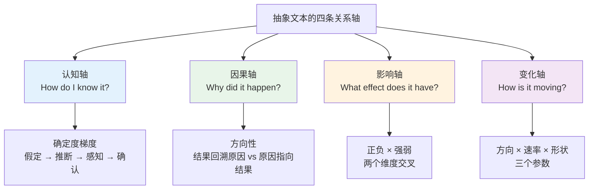
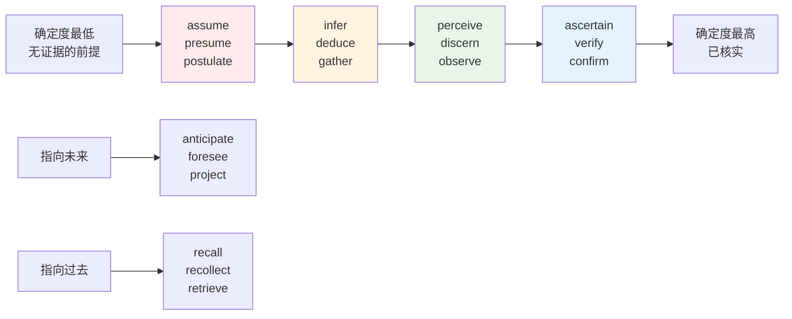
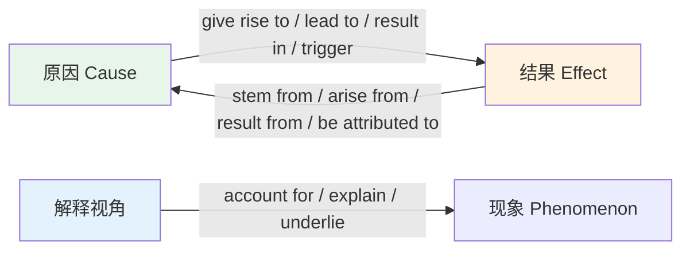
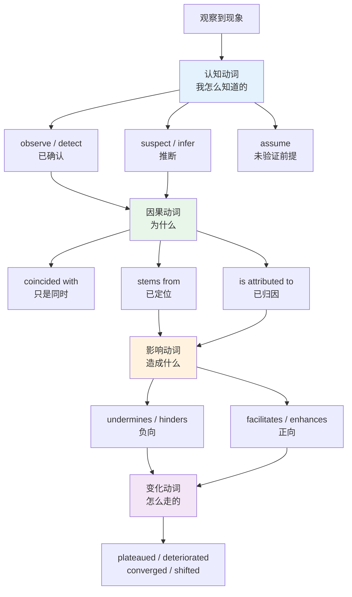
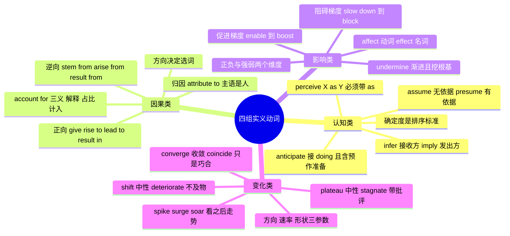

# 认知动词与因果、影响、变化类实义动词

> [!info] 本篇定位
>
> 本章第四篇，也是全章里最贴近技术文档和学术论文的一篇。
>
> 前三篇处理的是「万能动词」（get/take/make 一类）、轻动词搭配和言语转述动词。这一篇处理的是四组**有实义、有方向、有强度**的动词：说明「我怎么知道的」（认知），说明「因为什么」（因果），说明「起了什么作用」（影响），说明「怎么变的」（变化）。
>
> 读完你能做三件事：判断一句英文里作者对自己主张的确定程度有多高；把中文的「导致」「影响」「变化」这三个笼统动词拆成十几个精度不同的英文选项；在自己写作时按证据强度选动词，不再一律用 `cause` 和 `affect` 兜底。
>
> 与 [[13.抽象概念、评价与高频动词/03.言语动词与转述动词群\|言语动词与转述动词群]] 的分工：那一篇管「谁说了什么」，这一篇管「事实之间是什么关系」。

---

## 1. 本篇导读：抽象文本的四条承重梁

一段技术分析、一份事故复盘、一篇论文摘要，剥掉专业名词之后剩下的骨架几乎总是这四种关系。拿一段真实的英文性能报告做拆解：

> - We **assume** a steady request rate. The latency spike **stems from** lock contention in the write path, which **undermines** throughput even at low CPU utilisation. After the patch, p99 latency **plateaued** at around 40 ms.
>   - 我们假定请求速率稳定。延迟尖峰源自写路径上的锁竞争，即使 CPU 利用率不高，它也会拖垮吞吐量。打补丁后，p99 延迟在 40 毫秒左右趋平。

四个动词分别承担了四件事：`assume` 标出这是未经验证的前提，`stem from` 给出因果方向（从结果回溯到原因），`undermines` 说明作用是负向且渐进的，`plateaued` 描述曲线形状。把它们全换成中文教学里默认的对应词——`think`、`because of`、`affect`、`change`——这段话的信息量会立刻塌掉一半。

中文母语者在这四个位置上的典型损耗是同一种：**把有精度的英文动词退化成万能动词**。

| 中文里的笼统说法 | 退化写法 | 精度更高的选项 |
| --- | --- | --- |
| 我认为 / 我觉得 | I think | assume, presume, suspect, contend, gather |
| 因为 / 由于 | because of | stem from, attribute to, be driven by, account for |
| 导致 / 造成 | cause | give rise to, trigger, precipitate, entail |
| 影响 | affect | hinder, facilitate, undermine, shape, bear on |
| 变化 | change | shift, deteriorate, plateau, converge, taper |

上图给出的四条轴就是本篇的编排顺序。每条轴各有一个**核心判据**：认知轴看确定度高低，因果轴看箭头方向，影响轴看正负与强弱两个维度，变化轴看方向、速率、曲线形状三个参数。选词时先定判据，再从对应梯度上取值，比背同义词表可靠得多。

---

## 2. 认知动词：确定度是唯一的排序标准

### 2.1 五个核心词的分工

大纲点名的五个词覆盖了认知链条上五个不同的位置：`assume` 在链条最前端（未经验证的前提），`infer` 在中段（从证据推出），`perceive` 在感知与认知的交界，`recall` 处理已存储的信息，`anticipate` 指向尚未发生的事。

| 英文 | 英式音标 | 美式音标 | 词性 | 中文 | 搭配与说明 |
| --- | --- | --- | --- | --- | --- |
| **assume** | /əˈsjuːm/ | /əˈsuːm/ | v. | 假定；假设 | assume that…；无证据的前提，英美读音差别在 /sj/ 与 /s/ |
| **infer** | /ɪnˈfɜː/ | /ɪnˈfɜːr/ | v. | 推断出 | infer A from B；双写 inferred / inferring |
| **perceive** | /pəˈsiːv/ | /pərˈsiːv/ | v. | 察觉；看待 | perceive X as Y；名词 perception |
| **recall** | /rɪˈkɔːl/ | /rɪˈkɔːl/ | v./n. | 回想起；召回 | recall doing sth；名词另有「产品召回」义 |
| **anticipate** | /ænˈtɪsɪpeɪt/ | /ænˈtɪsɪpeɪt/ | v. | 预期；预先应对 | anticipate doing；不接 to do |

这五个词的确定度并不在同一水平线上。把它们放到一条轴上：

上图把认知动词铺成两条轴：横轴是确定度，从「我先假定」一路走到「我已核实」；下方两支是时间指向，`recall` 一族朝后看，`anticipate` 一族朝前看。写作时先问自己站在哪一格，再取词——把「我核实过」写成 `I assume`，读者会认为你没做功课；反过来把「我猜」写成 `We have confirmed`，是学术写作里的硬伤。

### 2.2 假设群：assume / presume / suppose 的实际差别

三个词中文都能译成「假设」，但它们对「有没有依据」的态度完全不同。

| 英文 | 英式音标 | 美式音标 | 词性 | 中文 | 搭配与说明 |
| --- | --- | --- | --- | --- | --- |
| **assume** | /əˈsjuːm/ | /əˈsuːm/ | v. | 假定 | 纯粹当前提用，不宣称有依据；另有 assume responsibility「承担」义 |
| **presume** | /prɪˈzjuːm/ | /prɪˈzuːm/ | v. | 推定 | 有一定依据的假设；presumed innocent 无罪推定 |
| **suppose** | /səˈpəʊz/ | /səˈpoʊz/ | v. | 认为；假使 | 口语化；be supposed to 表「本应」 |
| **postulate** | /ˈpɒstjʊleɪt/ | /ˈpɑːstʃəleɪt/ | v./n. | 假定；公设 | 数学与逻辑文本；名词读 /ˈpɒstjʊlət/ |
| **posit** | /ˈpɒzɪt/ | /ˈpɑːzɪt/ | v. | 提出（设定） | posit that…；学术味重于 assume |
| **hypothesize** | /haɪˈpɒθəsaɪz/ | /haɪˈpɑːθəsaɪz/ | v. | 提出假说 | 后接 that 从句；名词 hypothesis |
| **presuppose** | /ˌpriːsəˈpəʊz/ | /ˌpriːsəˈpoʊz/ | v. | 以…为前提 | 主语常是理论、论证本身，不是人 |
| **take for granted** | /ˌteɪk fə ˈɡrɑːntɪd/ | /ˌteɪk fər ˈɡræntɪd/ | phr. | 想当然；不加珍惜 | 两个义项都常见，靠宾语区分 |

> [!warning] assume 与 presume 不能互换的场合
>
> 判据是「有没有支撑」。`assume` 明说自己没有支撑，`presume` 暗示有理由这么推。
>
> - ✅ Let's **assume** the network is reliable and see what breaks.
>   - 假定网络可靠，看看哪里会崩。（这是刻意设立的前提，作者知道它不成立）
> - ✅ Since the process is still holding the port, I **presume** the previous instance never exited.
>   - 既然进程仍占着端口，我推定上一个实例没有退出。（有证据的推断）
> - ❌ ~~The court assumes the defendant innocent.~~
> - ✅ The court **presumes** the defendant innocent.（法律术语固定用 presume）
>
> `assume` 还有一个完全不同的义项：**承担**。`assume responsibility / assume control / assume office` 里的 assume 与「假设」无关，这是拉丁词根 `sum-`「拿取」的原义。

`suppose` 的语域比前两个低，日常口语里替代 `think`，但在正式书面里出现频率低于 `assume`。它有两个高频固定结构：

> - I **suppose** we could try the cache-aside pattern instead.
>   - 我想我们可以改用旁路缓存模式。（试探性建议，语气比 I think 更软）
> - The script is **supposed to** run every midnight, but it hasn't fired since Tuesday.
>   - 这个脚本本应每天午夜运行，但从周二起就没触发过。（be supposed to 表示「按规定/按预期本应」，且暗示现实没有做到）

### 2.3 infer 与 imply：方向相反的一对

这是英语词汇里最著名的一对方向陷阱，中文母语者错得很稳定，因为中文用同一个「意味着 / 说明」覆盖了两个方向。

| 英文 | 英式音标 | 美式音标 | 词性 | 中文 | 搭配与说明 |
| --- | --- | --- | --- | --- | --- |
| **infer** | /ɪnˈfɜː/ | /ɪnˈfɜːr/ | v. | （读者）推断出 | 主语是接收方；infer sth from sth |
| **imply** | /ɪmˈplaɪ/ | /ɪmˈplaɪ/ | v. | （说话方）暗示 | 主语是发出方或证据本身 |
| **deduce** | /dɪˈdjuːs/ | /dɪˈduːs/ | v. | 演绎推出 | 从一般到个别，逻辑必然；名词 deduction |
| **conclude** | /kənˈkluːd/ | /kənˈkluːd/ | v. | 得出结论 | conclude that…；比 infer 更终局 |
| **gather** | /ˈɡæðə/ | /ˈɡæðər/ | v. | （从旁听）看出 | I gather that…，口语，语气很轻 |
| **surmise** | /səˈmaɪz/ | /sərˈmaɪz/ | v./n. | 猜测 | 书面，证据比 infer 更薄 |
| **conjecture** | /kənˈdʒektʃə/ | /kənˈdʒektʃər/ | v./n. | 推测；猜想 | 数学里的「猜想」也用这个词 |
| **extrapolate** | /ɪkˈstræpəleɪt/ | /ɪkˈstræpəleɪt/ | v. | 外推 | extrapolate from data；暗示超出了数据范围 |

> [!warning] infer 与 imply 的方向
>
> 一句话记牢：**发出方 imply，接收方 infer。**
>
> - ✅ The log entry **implies** that the retry loop never terminated.
>   - 这条日志暗示重试循环一直没结束。（日志是信息源）
> - ✅ From the log entry we **infer** that the retry loop never terminated.
>   - 从这条日志我们推断重试循环一直没结束。（我们是接收方）
> - ❌ ~~The log entry infers that…~~（日志不会「推断」）
> - ❌ ~~Are you inferring that I broke the build?~~
> - ✅ Are you **implying** that I broke the build?（对方在暗示，不是在推断）

`deduce` 与 `infer` 的区别在推理的强度。`deduce` 是演绎，前提为真则结论必然为真；`infer` 覆盖面更宽，包括归纳和最佳解释推断。技术文档里描述从日志、指标反推系统状态，用 `infer` 比 `deduce` 准确，因为那不是逻辑必然。

`extrapolate` 值得单独提，它自带一个警告色彩：把已有趋势往数据范围之外延伸，所以常和 `cautiously`、`risky to` 搭配。

> - It is risky to **extrapolate** single-node benchmarks to a hundred-node cluster.
>   - 把单机基准测试外推到百节点集群是有风险的。

### 2.4 感知与理解群：perceive 的双重身份

`perceive` 有两层用法，一层是字面的「感知到」，一层是「把 X 看作 Y」。第二层在社科和产品文档里极其高频，且必须带 `as`。

| 英文 | 英式音标 | 美式音标 | 词性 | 中文 | 搭配与说明 |
| --- | --- | --- | --- | --- | --- |
| **perceive** | /pəˈsiːv/ | /pərˈsiːv/ | v. | 察觉；视为 | perceive X as Y；perceived latency 感知延迟 |
| **discern** | /dɪˈsɜːn/ | /dɪˈsɜːrn/ | v. | 辨别出 | 隐含「不容易看出」；discernible 可辨的 |
| **detect** | /dɪˈtekt/ | /dɪˈtekt/ | v. | 检测到 | 仪器、算法的主语最常见 |
| **sense** | /sens/ | /sens/ | v./n. | 觉察到 | 主观、无明确证据；sense that… |
| **notice** | /ˈnəʊtɪs/ | /ˈnoʊtɪs/ | v./n. | 注意到 | 中性口语；名词有「通知」义 |
| **observe** | /əbˈzɜːv/ | /əbˈzɜːrv/ | v. | 观察到；遵守 | 学术里 we observed that…；另有 observe a rule |
| **grasp** | /ɡrɑːsp/ | /ɡræsp/ | v./n. | 领会；抓住 | grasp the concept；英美元音差别明显 |
| **comprehend** | /ˌkɒmprɪˈhend/ | /ˌkɑːmprɪˈhend/ | v. | 充分理解 | 正式；否定式 fail to comprehend 更常见 |
| **fathom** | /ˈfæðəm/ | /ˈfæðəm/ | v. | 弄懂（难题） | 几乎只用否定：can't fathom why… |
| **apprehend** | /ˌæprɪˈhend/ | /ˌæprɪˈhend/ | v. | 领悟；逮捕 | 「理解」义偏文学；日常多为「逮捕」 |
| **register** | /ˈredʒɪstə/ | /ˈredʒɪstər/ | v. | （意识）注意到 | it didn't register 没反应过来 |
| **make out** | /ˌmeɪk ˈaʊt/ | /ˌmeɪk ˈaʊt/ | phr.v. | 勉强看清/听清 | 条件差时用；can barely make out |

> [!example] perceive as 的三种典型用法
>
> - Users **perceive** anything over 100 ms **as** lag, even when the server responds in 20 ms.
>   - 用户会把超过 100 毫秒的一切都感知为卡顿，哪怕服务端 20 毫秒就返回了。
> - The rewrite was **perceived as** a threat by the team that owned the old service.
>   - 那次重写被旧服务的负责团队视为一种威胁。
> - She **perceived** a faint pattern in the error timestamps.
>   - 她察觉到错误时间戳里有一个微弱的规律。（字面感知义）

> [!tip] perceived 作定语是个高价值词
>
> `perceived X` 表示「主观感受到的 X，未必等于客观的 X」，在性能、安全、体验三个领域都高频：
>
> - **perceived latency**（感知延迟）——比真实延迟更决定用户满意度
> - **perceived risk**（感知风险）——与实际风险量化值经常背离
> - **perceived value**（感知价值）——定价讨论的核心变量
>
> 中文里没有一个同样简短的对应词，写中文技术文档时反而经常直接借用「感知延迟」这个译法。

### 2.5 记忆群：recall 与它的近邻

`recall` 在认知动词里位置特殊——它处理的是已经存储过的信息，所以确定度不取决于证据，而取决于记忆本身可不可靠。

| 英文 | 英式音标 | 美式音标 | 词性 | 中文 | 搭配与说明 |
| --- | --- | --- | --- | --- | --- |
| **recall** | /rɪˈkɔːl/ | /rɪˈkɔːl/ | v./n. | 回想起；召回 | recall doing 而非 recall to do；机器学习的「召回率」也是它 |
| **recollect** | /ˌrekəˈlekt/ | /ˌrekəˈlekt/ | v. | 记起 | 比 recall 更费力、更书面 |
| **remember** | /rɪˈmembə/ | /rɪˈmembər/ | v. | 记得 | remember doing 已做过 vs remember to do 记得去做 |
| **remind** | /rɪˈmaɪnd/ | /rɪˈmaɪnd/ | v. | 提醒 | remind sb of sth / remind sb to do；必须有宾语 |
| **retain** | /rɪˈteɪn/ | /rɪˈteɪn/ | v. | 保留；记住 | 数据保留 data retention 同源 |
| **retrieve** | /rɪˈtriːv/ | /rɪˈtriːv/ | v. | 取回；检索 | 技术文档里的标准「读取」动词 |
| **memorize** | /ˈmeməraɪz/ | /ˈmeməraɪz/ | v. | 背下来 | 英式也写 memorise |
| **forget** | /fəˈɡet/ | /fərˈɡet/ | v. | 忘记 | forget doing 忘了做过 vs forget to do 忘了去做 |
| **overlook** | /ˌəʊvəˈlʊk/ | /ˌoʊvərˈlʊk/ | v. | 忽略；俯瞰 | 「疏忽」义最常用；被动 be overlooked |
| **evoke** | /ɪˈvəʊk/ | /ɪˈvoʊk/ | v. | 唤起（记忆/情绪） | 主语是刺激物，不是人 |
| **reminisce** | /ˌremɪˈnɪs/ | /ˌremɪˈnɪs/ | v. | 追忆往事 | 不及物，reminisce about |
| **recount** | /rɪˈkaʊnt/ | /rɪˈkaʊnt/ | v. | 讲述（经历） | 属于转述动词，见本章第三篇 |

> [!warning] remember / forget 后面接 doing 还是 to do
>
> 这一组的动名词与不定式区别是**时间方向**，不是语气：
>
> - I **remember locking** the door.
>   - 我记得锁过门。（动作已发生，记忆在后）
> - I must **remember to lock** the door.
>   - 我得记着锁门。（动作还没发生，记忆在前）
> - I **forgot sending** the invite.
>   - 我忘了自己发过邀请。（发过）
> - I **forgot to send** the invite.
>   - 我忘了发邀请。（没发）
>
> `recall` 只走动名词那一支：`I recall seeing that error before.` 写成 ~~recall to see~~ 是错的。

### 2.6 预期群：anticipate 不等于 expect

`anticipate` 常被当成 `expect` 的高级替换词直接换上，这是不成立的。`expect` 只是「预计会发生」，`anticipate` 多一层「因此提前做了准备」。

| 英文 | 英式音标 | 美式音标 | 词性 | 中文 | 搭配与说明 |
| --- | --- | --- | --- | --- | --- |
| **anticipate** | /ænˈtɪsɪpeɪt/ | /ænˈtɪsɪpeɪt/ | v. | 预期并预作准备 | anticipate doing；不接 to do |
| **expect** | /ɪkˈspekt/ | /ɪkˈspekt/ | v. | 预计；期待 | expect to do / expect sb to do 都可以 |
| **foresee** | /fɔːˈsiː/ | /fɔːrˈsiː/ | v. | 预见 | 常用否定：unforeseen consequences |
| **forecast** | /ˈfɔːkɑːst/ | /ˈfɔːrkæst/ | v./n. | 预报；预测 | 过去式 forecast 或 forecasted 均可 |
| **predict** | /prɪˈdɪkt/ | /prɪˈdɪkt/ | v. | 预测 | 中性，带模型或依据时首选 |
| **project** | /prəˈdʒekt/ | /prəˈdʒekt/ | v. | 推算（未来值） | 动词重音在后，名词 /ˈprɒdʒekt/ 在前 |
| **envisage** | /ɪnˈvɪzɪdʒ/ | /ɪnˈvɪzɪdʒ/ | v. | 设想 | 英式偏好；envisage doing |
| **envision** | /ɪnˈvɪʒn/ | /ɪnˈvɪʒn/ | v. | 展望；构想 | 美式偏好，义同 envisage |
| **await** | /əˈweɪt/ | /əˈweɪt/ | v. | 等待 | 及物，直接接宾语，不加 for |
| **dread** | /dred/ | /dred/ | v./n. | 害怕（将发生） | 带负面情绪的预期 |
| **foretell** | /fɔːˈtel/ | /fɔːrˈtel/ | v. | 预言 | 文学色彩，技术文本少用 |
| **contemplate** | /ˈkɒntəmpleɪt/ | /ˈkɑːntəmpleɪt/ | v. | 考虑；打算 | contemplate doing；比 consider 更慎重 |

> [!warning] anticipate 的两个高频错误
>
> **错误一：接不定式。**
>
> - ❌ ~~We anticipate to release the patch on Friday.~~
> - ✅ We **anticipate releasing** the patch on Friday.
> - ✅ We **anticipate that** the patch will ship on Friday.
> - ✅ We **expect to release** the patch on Friday.（expect 才接 to do）
>
> **错误二：当 expect 的同义词滥用。** 两句意思不同：
>
> - We **expect** heavy traffic on launch day.
>   - 我们预计上线日流量会很大。（只是判断）
> - We have **anticipated** heavy traffic by pre-warming the cache.
>   - 我们预判到上线日流量会大，已经预热了缓存。（判断 + 行动）

### 2.7 判断与评价群

这一组处于认知与评价的交界：不只是「知道」，还给出了值或等级。评价形容词的梯度体系在下一篇展开，这里先给动词侧。

| 英文 | 英式音标 | 美式音标 | 词性 | 中文 | 搭配与说明 |
| --- | --- | --- | --- | --- | --- |
| **deem** | /diːm/ | /diːm/ | v. | 认定为 | deem sth necessary；正式、法律高频 |
| **regard** | /rɪˈɡɑːd/ | /rɪˈɡɑːrd/ | v./n. | 看作 | 必须带 as：regard X as Y |
| **consider** | /kənˈsɪdə/ | /kənˈsɪdər/ | v. | 认为；考虑 | consider X (to be) Y，as 可省 |
| **judge** | /dʒʌdʒ/ | /dʒʌdʒ/ | v./n. | 判断 | judging by… 根据…判断 |
| **reckon** | /ˈrekən/ | /ˈrekən/ | v. | 认为；估算 | 英式口语高频，美式偏南方口音色彩 |
| **assess** | /əˈses/ | /əˈses/ | v. | 评估 | 需要标准与流程；名词 assessment |
| **evaluate** | /ɪˈvæljueɪt/ | /ɪˈvæljueɪt/ | v. | 评价；求值 | 编程里「求值」也是它 |
| **appraise** | /əˈpreɪz/ | /əˈpreɪz/ | v. | 评定；估价 | 与 apprise「通知」拼写近似，别混 |
| **gauge** | /ɡeɪdʒ/ | /ɡeɪdʒ/ | v./n. | 估量；量规 | 拼写不规则，读作 /ɡeɪdʒ/ |
| **estimate** | /ˈestɪmeɪt/ | /ˈestɪmeɪt/ | v. | 估计 | 名词读 /ˈestɪmət/，元音弱化 |
| **rate** | /reɪt/ | /reɪt/ | v./n. | 评级；比率 | rate X highly |
| **view** | /vjuː/ | /vjuː/ | v./n. | 看待 | view X as Y，与 regard 同构 |

> [!tip] deem / regard / consider 三个词的 as 问题
>
> 这三个词后面接不接 `as`，是中文母语者的高频失分点：
>
> - **regard / view** — 必须带 as：`We regard this as a blocker.`
> - **consider** — 不带 as：`We consider this a blocker.`（加 as 在英式里被视为错误）
> - **deem** — 不带 as，直接接补语：`The change was deemed unnecessary.`
>
> - ❌ ~~We consider this as a blocker.~~
> - ✅ We **consider** this a blocker. / We **regard** this **as** a blocker.

### 2.8 确认与质疑群

| 英文 | 英式音标 | 美式音标 | 词性 | 中文 | 搭配与说明 |
| --- | --- | --- | --- | --- | --- |
| **ascertain** | /ˌæsəˈteɪn/ | /ˌæsərˈteɪn/ | v. | 查明；确定 | 正式，强调经过查证 |
| **verify** | /ˈverɪfaɪ/ | /ˈverɪfaɪ/ | v. | 验证 | 技术文档标准词；名词 verification |
| **confirm** | /kənˈfɜːm/ | /kənˈfɜːrm/ | v. | 确认 | 比 verify 轻，可以只是口头确认 |
| **corroborate** | /kəˈrɒbəreɪt/ | /kəˈrɑːbəreɪt/ | v. | 佐证 | 用独立证据支持既有结论 |
| **substantiate** | /səbˈstænʃieɪt/ | /səbˈstænʃieɪt/ | v. | 证实（主张） | 宾语常是 claim、allegation |
| **doubt** | /daʊt/ | /daʊt/ | v./n. | 怀疑（不信） | b 不发音；doubt that… |
| **suspect** | /səˈspekt/ | /səˈspekt/ | v. | 怀疑（觉得是） | 与 doubt 方向相反；名词 /ˈsʌspekt/ |
| **dispute** | /dɪˈspjuːt/ | /dɪˈspjuːt/ | v./n. | 质疑；争议 | dispute the claim |
| **contend** | /kənˈtend/ | /kənˈtend/ | v. | 主张；争辩 | contend that…；也有「竞争」义 |
| **maintain** | /meɪnˈteɪn/ | /meɪnˈteɪn/ | v. | 坚称 | 面对反对仍坚持；另有「维护」义 |
| **concede** | /kənˈsiːd/ | /kənˈsiːd/ | v. | 承认（不利点） | 让步性承认 |
| **acknowledge** | /əkˈnɒlɪdʒ/ | /əkˈnɑːlɪdʒ/ | v. | 承认；确认收到 | 网络协议的 ACK 即此词 |

> [!warning] doubt 与 suspect 方向相反
>
> 中文都能说「我怀疑」，英文方向完全相反：
>
> - I **doubt** the fix works.
>   - 我认为这个修复**不**管用。（doubt = 倾向于否定）
> - I **suspect** the fix broke the cache.
>   - 我怀疑这个修复**弄坏**了缓存。（suspect = 倾向于肯定）
>
> 记法：`doubt` 与 `dubious`（可疑的）同源，指向不信；`suspect` 与 `suspicion` 同源，指向「我认为是」。

---

## 3. 认知动词的句法模式

### 3.1 四种从句模式

认知动词后面能接什么，不能靠中文语感猜。四种模式各自有固定成员：

| 模式 | 结构 | 成员举例 | 例句 |
| --- | --- | --- | --- |
| A | V + that 从句 | assume, presume, infer, suspect, gather, contend, maintain | We assume that the clock is monotonic. |
| B | V + doing | anticipate, recall, contemplate, envisage, consider | We anticipate migrating in Q3. |
| C | V + to do | expect, presume, claim, appear, seem | We expect to migrate in Q3. |
| D | V + O + as / to be | regard, view, perceive, see, consider | We regard this as a regression. |

> [!warning] 三条不能跨模式的红线
>
> - ❌ ~~anticipate to do~~ → ✅ anticipate doing / anticipate that…
> - ❌ ~~recall to have seen~~ → ✅ recall seeing
> - ❌ ~~suggest sb to do~~ → ✅ suggest that sb (should) do / suggest doing
>
> 最后一条虽然属于转述动词，但错误频率太高，在这里一并列出。中文的「建议某人做某事」直译成英文是错的。

### 3.2 用 that 从句时的两个细节

**细节一：that 可以省，但正式文本里保留更清晰。** 一旦从句主语很长，或者句中还有其他名词短语，省略 `that` 会造成阅读时的短暂误读（读者会先把从句主语当成主句动词的宾语）。

> - We assume **that** the connection pool size configured in the deployment manifest is correct.
>   - 我们假定部署清单里配置的连接池大小是正确的。（省掉 that，读者会先把 the connection pool size 当成 assume 的宾语）

**细节二：否定前移。** 英语习惯把否定放在主句而不是从句上。

> - I don't **think** this is a race condition.
>   - 我认为这不是竞态条件。（英语说「我不认为这是」，中文说「我认为这不是」）
> - ❌ ~~I think this is not a race condition.~~（语法成立，但读起来像刻意强调，不是默认表达）

否定前移适用于 `think / believe / suppose / imagine / expect`，但**不适用于** `hope / assume / know / be sure`：

> - I **hope** it doesn't break the build.（不能说 I don't hope it breaks…）
> - We **assume** the request does not carry a body.（assume 的否定通常留在从句里）

---

## 4. 因果动词（一）：从结果回溯原因

### 4.1 归因：attribute to 与它的家族

`attribute A to B` 的语义是「把 A 这个结果归到 B 这个原因头上」——注意主语是**做归因的人或研究**，不是原因本身。这个词的重音还有名动之分。

| 英文 | 英式音标 | 美式音标 | 词性 | 中文 | 搭配与说明 |
| --- | --- | --- | --- | --- | --- |
| **attribute** | /əˈtrɪbjuːt/ | /əˈtrɪbjuːt/ | v. | 归因于 | attribute A to B；名词读 /ˈætrɪbjuːt/ 重音前移 |
| **ascribe** | /əˈskraɪb/ | /əˈskraɪb/ | v. | 归于 | 与 attribute 同构，更书面 |
| **credit** | /ˈkredɪt/ | /ˈkredɪt/ | v. | 归功于 | credit A to B 或 credit B with A；只用于正面 |
| **blame** | /bleɪm/ | /bleɪm/ | v./n. | 归咎于 | blame A on B 或 blame B for A；只用于负面 |
| **impute** | /ɪmˈpjuːt/ | /ɪmˈpjuːt/ | v. | 归咎；推定 | 法律与统计（缺失值填补 imputation） |
| **owe** | /əʊ/ | /oʊ/ | v. | 归功于；欠 | owe X to Y；owe its success to |
| **trace** | /treɪs/ | /treɪs/ | v. | 追溯到 | trace A back to B；技术调试高频 |
| **put down to** | /ˌpʊt ˈdaʊn tuː/ | /ˌpʊt ˈdaʊn tuː/ | phr.v. | 归因于 | 口语版 attribute to |
| **chalk up to** | /ˌtʃɔːk ˈʌp tuː/ | /ˌtʃɔːk ˈʌp tuː/ | phr.v. | 归结为 | 美式口语，常带轻描淡写意味 |
| **pin on** | /ˈpɪn ɒn/ | /ˈpɪn ɑːn/ | phr.v. | 把（责任）扣在 | 非正式，负面，常暗示不公 |

> [!example] attribute / credit / blame 的三种极性
>
> - The team **attributed** the outage **to** a misconfigured health check.
>   - 团队把这次故障归因于健康检查配置错误。（中性，只说因果）
> - She **credited** the throughput gain **to** the new batching layer.
>   - 她把吞吐量提升归功于新的批处理层。（正面）
> - Don't **blame** the outage **on** the intern; the review process let it through.
>   - 别把故障怪到实习生头上，是评审流程放行的。（负面）

> [!warning] blame 的两个介词方向别搞反
>
> `blame` 的两种结构宾语顺序相反：
>
> - **blame** *结果* **on** *原因*：`They blamed the crash on the driver.`
> - **blame** *原因* **for** *结果*：`They blamed the driver for the crash.`
>
> 两句意思相同。错法是把两者混起来：
>
> - ❌ ~~They blamed the crash for the driver.~~（意思反了）

被动式 `be attributed to` 在学术写作里比主动式更常见，因为它可以不点名归因主体：

> - The performance regression **has been attributed to** an unindexed foreign key.
>   - 这次性能回退已被归因于一个没建索引的外键。

### 4.2 溯源：stem from 与它的近义群

`stem from` 与 `attribute to` 的差别是主语位置。`attribute` 的主语是人，`stem from` 的主语是结果本身，读起来更客观，学术写作里因此更受欢迎。

| 英文 | 英式音标 | 美式音标 | 词性 | 中文 | 搭配与说明 |
| --- | --- | --- | --- | --- | --- |
| **stem from** | /ˈstem frəm/ | /ˈstem frəm/ | phr.v. | 源自 | 主语是结果；不及物，必须带 from |
| **derive from** | /dɪˈraɪv frəm/ | /dɪˈraɪv frəm/ | phr.v. | 派生自；来源于 | 也可用于词源、类继承 |
| **originate** | /əˈrɪdʒɪneɪt/ | /əˈrɪdʒɪneɪt/ | v. | 起源于 | originate in / from；强调起点 |
| **arise from** | /əˈraɪz frəm/ | /əˈraɪz frəm/ | phr.v. | 由…引起 | 不规则变化 arise-arose-arisen |
| **emanate from** | /ˈeməneɪt frəm/ | /ˈeməneɪt frəm/ | phr.v. | 发自 | 光、声、气味或抽象影响 |
| **spring from** | /ˈsprɪŋ frəm/ | /ˈsprɪŋ frəm/ | phr.v. | 出自 | 文学色彩，强调突然涌现 |
| **result from** | /rɪˈzʌlt frəm/ | /rɪˈzʌlt frəm/ | phr.v. | 由…造成 | 与 result in 方向相反，必须分清 |
| **follow from** | /ˈfɒləʊ frəm/ | /ˈfɑːloʊ frəm/ | phr.v. | 由…推出 | 逻辑推论，不是时间先后 |
| **flow from** | /ˈfləʊ frəm/ | /ˈfloʊ frəm/ | phr.v. | 由…自然产生 | 强调顺理成章 |
| **be rooted in** | /ˈruːtɪd ɪn/ | /ˈruːtɪd ɪn/ | phr. | 植根于 | 深层、长期的成因 |
| **boil down to** | /ˌbɔɪl ˈdaʊn tuː/ | /ˌbɔɪl ˈdaʊn tuː/ | phr.v. | 归根结底是 | 口语，把复杂问题压成一句 |
| **come down to** | /ˌkʌm ˈdaʊn tuː/ | /ˌkʌm ˈdaʊn tuː/ | phr.v. | 最终取决于 | 与 boil down to 近义 |

> [!warning] result from 与 result in 方向相反
>
> 这一对是因果方向陷阱里最常出错的：
>
> - The outage **resulted from** a config change.
>   - 故障**由**配置变更**造成**。（主语是结果）
> - The config change **resulted in** an outage.
>   - 配置变更**导致了**故障。（主语是原因）
>
> 同一条逻辑，两个介词换位置，箭头就反过来。写完检查一遍：`from` 指向上游，`in` 指向下游。

上图是因果动词的核心分类图。第一条箭头是**正向**动词：主语是原因，宾语是结果。第二条是**逆向**动词：主语是结果，宾语是原因。第三条是**解释类**：主语既不是原因也不是结果，而是一种说法或因素，它的作用是让现象变得可理解。选词第一步永远是先确定自己的主语站在哪一端。

### 4.3 account for 的三个义项

`account for` 是本篇里义项最杂的一个短语，三个义项在技术文本里都高频，必须靠上下文分辨。

| 义项 | 含义 | 例句 | 中文 |
| --- | --- | --- | --- |
| ① 解释 | 说明原因 | The GC pause **accounts for** the tail latency. | GC 停顿解释了尾延迟。 |
| ② 占比 | 占总量的多少 | Image assets **account for** 60% of page weight. | 图片资源占页面体积的六成。 |
| ③ 计入 | 把某因素考虑进去 | The model **accounts for** seasonal variation. | 模型把季节波动计入了。 |

> [!tip] 三个义项怎么快速分辨
>
> 看宾语的类型：
>
> - 宾语是**现象**（latency、the gap、the discrepancy）→ 义项 ①「解释」
> - 宾语是**百分比或数量**（60%、a third of）→ 义项 ②「占比」
> - 宾语是**变量或因素**，且主语是模型、算法、公式 → 义项 ③「计入」
>
> 义项 ③ 还有一个常见变体 `account for the fact that…`，意思是「把…这一事实纳入考虑」。

解释类的其他成员：

| 英文 | 英式音标 | 美式音标 | 词性 | 中文 | 搭配与说明 |
| --- | --- | --- | --- | --- | --- |
| **account for** | /əˈkaʊnt fə/ | /əˈkaʊnt fər/ | phr.v. | 解释；占；计入 | 三义项见上表 |
| **explain** | /ɪkˈspleɪn/ | /ɪkˈspleɪn/ | v. | 解释 | 中性通用；explain away 强行解释掉 |
| **underlie** | /ˌʌndəˈlaɪ/ | /ˌʌndərˈlaɪ/ | v. | 是…的深层原因 | 不规则：underlay / underlain |
| **underpin** | /ˌʌndəˈpɪn/ | /ˌʌndərˈpɪn/ | v. | 支撑（理论/结构） | 比 underlie 更偏「支撑」而非「潜藏」 |
| **justify** | /ˈdʒʌstɪfaɪ/ | /ˈdʒʌstɪfaɪ/ | v. | 论证…的正当性 | 也有排版的「对齐」义 |
| **rationalize** | /ˈræʃnəlaɪz/ | /ˈræʃnəlaɪz/ | v. | （事后）合理化；精简 | 心理学的「文过饰非」与商业的「精简」两义并存 |
| **elucidate** | /ɪˈluːsɪdeɪt/ | /ɪˈluːsɪdeɪt/ | v. | 阐明 | 学术，语域很高 |
| **clarify** | /ˈklærəfaɪ/ | /ˈklærəfaɪ/ | v. | 澄清 | 中性，日常与书面都可 |

> [!warning] underlie 的不规则变化容易写错
>
> `underlie` 沿用 `lie`（躺）的变化，不是 `lay`：
>
> - 原形 **underlie** → 过去式 **underlay** → 过去分词 **underlain** → 现在分词 **underlying**
> - 最常用的形式其实是形容词化的 `underlying`：`the underlying cause`（根本原因）、`the underlying assumption`（潜在假设）、`the underlying storage`（底层存储）。

---

## 5. 因果动词（二）：从原因指向结果

### 5.1 give rise to 与产生类动词

`give rise to` 的语气比 `cause` 更学术、更中性，且暗示结果是逐步出现的，不是瞬间的。

| 英文 | 英式音标 | 美式音标 | 词性 | 中文 | 搭配与说明 |
| --- | --- | --- | --- | --- | --- |
| **give rise to** | /ˌɡɪv ˈraɪz tuː/ | /ˌɡɪv ˈraɪz tuː/ | phr.v. | 引起；产生 | 宾语常是抽象结果（concerns、questions） |
| **lead to** | /ˈliːd tuː/ | /ˈliːd tuː/ | phr.v. | 导致 | 最通用的正向因果短语 |
| **result in** | /rɪˈzʌlt ɪn/ | /rɪˈzʌlt ɪn/ | phr.v. | 导致 | 比 lead to 更强调直接结果 |
| **bring about** | /ˌbrɪŋ əˈbaʊt/ | /ˌbrɪŋ əˈbaʊt/ | phr.v. | 带来（变化） | 宾语常是 change、reform |
| **cause** | /kɔːz/ | /kɔːz/ | v./n. | 造成 | 最直白，负面结果居多 |
| **generate** | /ˈdʒenəreɪt/ | /ˈdʒenəreɪt/ | v. | 生成；产生 | 技术文本首选（generate a token） |
| **produce** | /prəˈdjuːs/ | /prəˈduːs/ | v. | 产生；生产 | 名词 /ˈprɒdjuːs/「农产品」重音在前 |
| **breed** | /briːd/ | /briːd/ | v. | 滋生 | 负面抽象结果：breed distrust |
| **engender** | /ɪnˈdʒendə/ | /ɪnˈdʒendər/ | v. | 引发（情绪/氛围） | 正式，宾语多为抽象名词 |
| **spawn** | /spɔːn/ | /spɔːn/ | v. | 衍生出；派生 | 技术里的「派生进程」正是此词 |
| **yield** | /jiːld/ | /jiːld/ | v./n. | 产出；让步 | 数据结果用 yield；另有 Python 的 yield 关键字 |
| **occasion** | /əˈkeɪʒn/ | /əˈkeɪʒn/ | v. | 引起 | 动词用法罕见但正式，多见于法律文本 |

> [!example] give rise to 与 cause 的语气差
>
> - The change **caused** three outages last quarter.
>   - 这次变更上季度造成了三次故障。（直白，指责意味明显）
> - The change **gave rise to** concerns about backward compatibility.
>   - 这次变更引发了对向后兼容性的担忧。（中性、渐进，宾语是抽象的「担忧」）
>
> `give rise to` 的宾语几乎总是抽象名词：concerns、questions、speculation、a new field of study。用它接具体事件（~~gave rise to a crash~~）会显得别扭。

### 5.2 触发与诱发：强调启动瞬间

上一组说的是「产生了什么」，这一组强调的是「什么点了火」。共同特征是：原因往往很小，结果往往不成比例地大。

| 英文 | 英式音标 | 美式音标 | 词性 | 中文 | 搭配与说明 |
| --- | --- | --- | --- | --- | --- |
| **trigger** | /ˈtrɪɡə/ | /ˈtrɪɡər/ | v./n. | 触发 | 技术文本最高频；数据库触发器同词 |
| **prompt** | /prɒmpt/ | /prɑːmpt/ | v./n./adj. | 促使；提示符；及时的 | prompt sb to do；三个词性都常用 |
| **provoke** | /prəˈvəʊk/ | /prəˈvoʊk/ | v. | 激起；挑衅 | 宾语多为负面反应 |
| **induce** | /ɪnˈdjuːs/ | /ɪnˈduːs/ | v. | 诱发；归纳 | 医学与逻辑双领域；induction 归纳法 |
| **precipitate** | /prɪˈsɪpɪteɪt/ | /prɪˈsɪpɪteɪt/ | v./adj. | 促使（提前发生） | 强调「本会发生，但被提前引爆」 |
| **spark** | /spɑːk/ | /spɑːrk/ | v./n. | 引发；火花 | spark a debate；比 trigger 更生动 |
| **set off** | /ˌset ˈɒf/ | /ˌset ˈɔːf/ | phr.v. | 引爆；触发 | 警报、连锁反应 |
| **touch off** | /ˌtʌtʃ ˈɒf/ | /ˌtʌtʃ ˈɔːf/ | phr.v. | 引燃（争议） | 宾语多为 controversy、debate |
| **elicit** | /iˈlɪsɪt/ | /iˈlɪsɪt/ | v. | 引出（回应） | 与 illicit「非法的」同音异义 |
| **incite** | /ɪnˈsaɪt/ | /ɪnˈsaɪt/ | v. | 煽动 | 负面且常涉法律 |
| **instigate** | /ˈɪnstɪɡeɪt/ | /ˈɪnstɪɡeɪt/ | v. | 发起；教唆 | 主语通常是人 |
| **catalyse / catalyze** | /ˈkætəlaɪz/ | /ˈkætəlaɪz/ | v. | 催化；加速促成 | 英式 -yse，美式 -yze |

> [!tip] trigger 与 cause 的关键差别
>
> `trigger` 说的是「点火的那一下」，`cause` 说的是「根本成因」。事故复盘里两者要分开写，混用会让归因失真：
>
> - The deploy at 14:02 **triggered** the incident, but the **underlying cause** was an unbounded queue that had been in production for months.
>   - 14:02 的那次部署触发了事故，但根本原因是一个上线数月的无界队列。
>
> 中文事故报告里的「直接原因」与「根本原因」，对应的正是 `trigger` 与 `root cause` 这一对。

`precipitate` 的独特之处是它暗示时间被提前了：

> - The funding cut **precipitated** a decision that had been postponed for two years.
>   - 经费削减促使一个拖了两年的决定提前落地。（决定本来就要做，只是被推快了）

### 5.3 必然性与条件

因果关系不都是「A 发生所以 B 发生」，还有一类是「A 成立则 B 必然随之」或者「B 取决于 A」。

| 英文 | 英式音标 | 美式音标 | 词性 | 中文 | 搭配与说明 |
| --- | --- | --- | --- | --- | --- |
| **entail** | /ɪnˈteɪl/ | /ɪnˈteɪl/ | v. | 必然涉及；意味着 | 逻辑蕴含；也指「附带成本/工作量」 |
| **necessitate** | /nəˈsesɪteɪt/ | /nəˈsesɪteɪt/ | v. | 使…成为必需 | 正式；宾语是名词或动名词 |
| **presuppose** | /ˌpriːsəˈpəʊz/ | /ˌpriːsəˈpoʊz/ | v. | 预设；以…为前提 | 主语常是论证、方案本身 |
| **hinge on** | /ˈhɪndʒ ɒn/ | /ˈhɪndʒ ɑːn/ | phr.v. | 取决于（关键点） | 强调单一决定性因素 |
| **depend on** | /dɪˈpend ɒn/ | /dɪˈpend ɑːn/ | phr.v. | 取决于 | 中性通用；依赖管理的 dependency 同源 |
| **be contingent on** | /kənˈtɪndʒənt ɒn/ | /kənˈtɪndʒənt ɑːn/ | phr. | 以…为条件 | 合同与正式文本 |
| **dictate** | /dɪkˈteɪt/ | /ˈdɪkteɪt/ | v. | 决定；规定 | 英美重音位置不同；名词均读 /ˈdɪkteɪt/ |
| **determine** | /dɪˈtɜːmɪn/ | /dɪˈtɜːrmɪn/ | v. | 决定；查明 | 两个义项都高频 |
| **govern** | /ˈɡʌvn/ | /ˈɡʌvərn/ | v. | 支配；决定（规律） | 主语常是定律、规则 |
| **predispose** | /ˌpriːdɪˈspəʊz/ | /ˌpriːdɪˈspoʊz/ | v. | 使易于（发生） | predispose sb to sth；医学高频 |

> [!example] entail 在技术讨论里的高频用法
>
> - Moving to a monorepo **entails** rewriting the entire CI pipeline.
>   - 迁到 monorepo 意味着要重写整条 CI 流水线。（附带的必然工作量）
> - Strong consistency **entails** higher write latency.
>   - 强一致性必然带来更高的写延迟。（逻辑上的必然代价）
>
> `entail` 与 `imply` 都能译成「意味着」，差别是：`entail` 说的是随之而来的**实际后果或代价**，`imply` 说的是可以**读出来的信息**。

---

## 6. 影响类动词：正负与强弱两个维度

### 6.1 affect / effect / impact / influence

这四个词是英语写作里被混用最多的一组，问题一半出在词性上。

| 英文 | 英式音标 | 美式音标 | 词性 | 中文 | 搭配与说明 |
| --- | --- | --- | --- | --- | --- |
| **affect** | /əˈfekt/ | /əˈfekt/ | v. | 影响（动词） | 只作动词用；心理学名词 /ˈæfekt/「情感」是另一个词 |
| **effect** | /ɪˈfekt/ | /ɪˈfekt/ | n./v. | 效果（名词） | 主要作名词；动词义是「使实现」，见下方警告 |
| **impact** | /ɪmˈpækt/ | /ɪmˈpækt/ | v. | 冲击性影响 | 名词读 /ˈɪmpækt/，重音前移 |
| **influence** | /ˈɪnfluəns/ | /ˈɪnfluəns/ | v./n. | 影响（渐进） | 名动同形同音；influence on sth |
| **shape** | /ʃeɪp/ | /ʃeɪp/ | v./n. | 塑造 | 长期、结构性的影响 |
| **sway** | /sweɪ/ | /sweɪ/ | v./n. | 左右（意见） | 宾语常是人或决策 |
| **bear on** | /ˈbeər ɒn/ | /ˈber ɑːn/ | phr.v. | 与…相关；影响 | 正式；have a bearing on 同义 |
| **colour / color** | /ˈkʌlə/ | /ˈkʌlər/ | v. | 使（判断）带偏 | colour one's judgement；英美拼写不同 |
| **condition** | /kənˈdɪʃn/ | /kənˈdɪʃn/ | v. | 使形成（习惯反应） | 心理学 conditioning 条件反射 |
| **modulate** | /ˈmɒdjuleɪt/ | /ˈmɑːdʒəleɪt/ | v. | 调节（强度） | 生物与信号处理领域 |

> [!warning] affect 与 effect 的分工
>
> 九成的错误可以用一条规则解决：**affect 是动词，effect 是名词。**
>
> - ✅ The patch **affects** startup time.（动词）
> - ✅ The patch has no **effect** on startup time.（名词）
> - ❌ ~~The patch effects startup time.~~
> - ❌ ~~The patch has no affect on startup time.~~
>
> 例外只有一个，但它是真实存在的：`effect` 确实有动词用法，意思是「**使…实现**」，不是「影响」。
>
> - `effect a change` = 促成一项改变（≠ 影响一项改变）
> - `effect a settlement` = 达成和解
>
> 两个动词放在一起对比就很清楚：`affect a change` 是「影响某个已有的改变」，`effect a change` 是「使某个改变发生」。写作时如果不确定，把 `effect` 只当名词用就不会出错。

`impact` 作动词曾长期被规范派批评，现在在商业与技术写作里已完全通行，但它的语义比 `affect` 重——暗示影响明显、可度量。日常小影响用 `impact` 会显得夸张：

> - ❌ Renaming the variable **impacted** readability.（小改动，用词过重）
> - ✅ Renaming the variable **improved** readability.
> - ✅ The outage **impacted** every customer in the EU region.（大范围影响，用 impact 恰当）

### 6.2 阻碍侧：hinder 与它的强度梯度

中文的「阻碍」在英文里散成一条强度带，从「拖慢一点」到「完全挡住」。

| 英文 | 英式音标 | 美式音标 | 词性 | 中文 | 搭配与说明 |
| --- | --- | --- | --- | --- | --- |
| **hinder** | /ˈhɪndə/ | /ˈhɪndər/ | v. | 妨碍；拖慢 | 中等强度；不完全阻断 |
| **hamper** | /ˈhæmpə/ | /ˈhæmpər/ | v. | 束缚；掣肘 | 强调「行动被限制住了」 |
| **impede** | /ɪmˈpiːd/ | /ɪmˈpiːd/ | v. | 阻碍 | 正式；名词 impediment |
| **obstruct** | /əbˈstrʌkt/ | /əbˈstrʌkt/ | v. | 阻塞；妨碍 | 物理阻塞或蓄意阻挠 |
| **inhibit** | /ɪnˈhɪbɪt/ | /ɪnˈhɪbɪt/ | v. | 抑制 | 生化与心理学高频；inhibitor 抑制剂 |
| **constrain** | /kənˈstreɪn/ | /kənˈstreɪn/ | v. | 约束 | 中性偏技术；constraint 约束条件 |
| **curb** | /kɜːb/ | /kɜːrb/ | v./n. | 遏制 | 宾语多为增长、开支、滥用 |
| **stifle** | /ˈstaɪfl/ | /ˈstaɪfl/ | v. | 扼杀 | stifle innovation；负面色彩强 |
| **thwart** | /θwɔːt/ | /θwɔːrt/ | v. | 挫败 | 使计划落空；th 发清音 /θ/ |
| **deter** | /dɪˈtɜː/ | /dɪˈtɜːr/ | v. | 威慑；劝退 | 通过后果让人不去做；deterrent 威慑物 |
| **restrict** | /rɪˈstrɪkt/ | /rɪˈstrɪkt/ | v. | 限制（范围） | 中性；restrict access to |
| **hold back** | /ˌhəʊld ˈbæk/ | /ˌhoʊld ˈbæk/ | phr.v. | 拖后腿；隐瞒 | 两个义项都常用 |
| **slow down** | /ˌsləʊ ˈdaʊn/ | /ˌsloʊ ˈdaʊn/ | phr.v. | 减慢 | 最中性的说法 |
| **block** | /blɒk/ | /blɑːk/ | v./n. | 完全阻断 | 强度上限；blocker 阻塞项 |

阻碍与促进是对称的两条梯度，按强度分成四档，选词时先定极性再定档位：

| 强度档 | 阻碍侧 | 促进侧 | 事实含义 |
| --- | --- | --- | --- |
| 一档（轻） | slow down, hold back | enable | 只是速率或可行性上的小变化 |
| 二档（中） | hinder, hamper, constrain | facilitate, expedite, streamline | 明显拖慢或明显变容易，但事情仍能做 |
| 三档（重） | impede, inhibit, stifle, curb | foster, promote, enhance, reinforce | 结果被实质性改变 |
| 四档（极） | obstruct, block | boost, accelerate, catalyse | 完全阻断，或量级跃升 |

档位错配是很容易被母语读者察觉的失真。写「这个设计拖慢了迭代」用二档的 `hinder` 就够，升到四档写成 `block`，读者理解成的是「完全做不了」——这已经不是措辞问题，而是事实陈述错误。

> [!warning] inhibit 与 prohibit 只差一个音节，意思差很远
>
> - **inhibit** /ɪnˈhɪbɪt/ = 抑制（降低强度或速率，物理/化学/心理层面）
> - **prohibit** /prəˈhɪbɪt/ = 禁止（规则层面不允许）
>
> - ✅ Low temperature **inhibits** the reaction.（抑制反应速率）
> - ✅ The licence **prohibits** commercial redistribution.（禁止商业再分发）
> - ❌ ~~The licence inhibits commercial redistribution.~~

### 6.3 促进侧：facilitate 与它的近邻

`facilitate` 的核心义是「让某件事变容易」，主语通常不是直接执行者，而是提供条件的那一方。这一点常被忽略。

| 英文 | 英式音标 | 美式音标 | 词性 | 中文 | 搭配与说明 |
| --- | --- | --- | --- | --- | --- |
| **facilitate** | /fəˈsɪlɪteɪt/ | /fəˈsɪlɪteɪt/ | v. | 使更容易；促成 | 主语是条件而非执行者；facilitator 主持人 |
| **foster** | /ˈfɒstə/ | /ˈfɑːstər/ | v. | 培育；助长 | 宾语常是抽象品质（trust、collaboration） |
| **promote** | /prəˈməʊt/ | /prəˈmoʊt/ | v. | 促进；晋升；推广 | 三个义项都高频，靠宾语区分 |
| **boost** | /buːst/ | /buːst/ | v./n. | 提振 | 数量或士气的明显提升 |
| **enhance** | /ɪnˈhɑːns/ | /ɪnˈhæns/ | v. | 增强（质量） | 在已有基础上提高；英美元音不同 |
| **expedite** | /ˈekspɪdaɪt/ | /ˈekspɪdaɪt/ | v. | 加快（流程） | 宾语是流程、审批、发货 |
| **streamline** | /ˈstriːmlaɪn/ | /ˈstriːmlaɪn/ | v. | 精简（流程） | 去掉冗余步骤而非单纯加速 |
| **enable** | /ɪˈneɪbl/ | /ɪˈneɪbl/ | v. | 使能够；启用 | enable sb to do；技术里的「开启开关」 |
| **reinforce** | /ˌriːɪnˈfɔːs/ | /ˌriːɪnˈfɔːrs/ | v. | 强化；加固 | 让已有的东西更牢固 |
| **bolster** | /ˈbəʊlstə/ | /ˈboʊlstər/ | v. | 支撑；增强 | 常接 confidence、the case for |
| **spur** | /spɜː/ | /spɜːr/ | v./n. | 刺激；促使 | spur growth；比 boost 更强调外部推动 |
| **nurture** | /ˈnɜːtʃə/ | /ˈnɜːrtʃər/ | v./n. | 培养 | 长期照料式；nature vs nurture 先天与后天 |
| **cultivate** | /ˈkʌltɪveɪt/ | /ˈkʌltɪveɪt/ | v. | 培养（关系/习惯） | 有意识、持续的投入 |
| **further** | /ˈfɜːðə/ | /ˈfɜːrðər/ | v. | 推进（事业） | 动词用法：further one's career |

> [!warning] facilitate 不能直接带人做宾语
>
> `facilitate` 的宾语是**事情**，不是人。中文的「帮助某人做某事」不能直译成 facilitate。
>
> - ❌ ~~The tool facilitates developers to deploy faster.~~
> - ✅ The tool **facilitates** faster deployment.
> - ✅ The tool **enables** developers **to** deploy faster.
> - ✅ The tool **helps** developers deploy faster.
>
> 记法：`facilitate` 后面永远跟名词或动名词，跟不了 `sb to do`。要带人做宾语，换 `enable` 或 `help`。

`enhance` 与 `improve` 的差别在起点。`improve` 可以从任何状态开始（包括很差的状态），`enhance` 暗示原本就不错，只是让它更好。

> - We need to **improve** the error messages; right now they're unusable.
>   - 我们得改进错误信息，现在完全没法用。（起点很差，不能用 enhance）
> - The new syntax highlighting **enhances** an already solid editor.
>   - 新的语法高亮让本就不错的编辑器更好用了。

### 6.4 削弱侧：undermine 及其渐进特征

`undermine` 的字面义是「从下面挖」——挖地基。这个意象决定了它的两个语义特征：**渐进**、**不易察觉**。突然而明显的破坏不用这个词。

| 英文 | 英式音标 | 美式音标 | 词性 | 中文 | 搭配与说明 |
| --- | --- | --- | --- | --- | --- |
| **undermine** | /ˌʌndəˈmaɪn/ | /ˌʌndərˈmaɪn/ | v. | 逐渐削弱（根基） | 宾语常是 trust、credibility、authority |
| **erode** | /ɪˈrəʊd/ | /ɪˈroʊd/ | v. | 侵蚀 | 与 undermine 近义，更强调持续磨损 |
| **weaken** | /ˈwiːkən/ | /ˈwiːkən/ | v. | 削弱 | 最中性直白的一个 |
| **compromise** | /ˈkɒmprəmaɪz/ | /ˈkɑːmprəmaɪz/ | v./n. | 危及；（安全）被攻破 | 安全语境里 compromised 指「已被入侵」 |
| **jeopardize** | /ˈdʒepədaɪz/ | /ˈdʒepərdaɪz/ | v. | 危及 | 强调把某物置于危险中 |
| **impair** | /ɪmˈpeə/ | /ɪmˈper/ | v. | 损害（功能） | 医学与法律高频；impaired vision |
| **subvert** | /səbˈvɜːt/ | /səbˈvɜːrt/ | v. | 颠覆 | 从内部瓦解；也可指「巧妙推翻预期」 |
| **sabotage** | /ˈsæbətɑːʒ/ | /ˈsæbətɑːʒ/ | v./n. | 蓄意破坏 | 必须是故意的；结尾读 /ʒ/ |
| **dilute** | /daɪˈluːt/ | /daɪˈluːt/ | v. | 稀释；淡化 | 抽象义：dilute the message |
| **corrode** | /kəˈrəʊd/ | /kəˈroʊd/ | v. | 腐蚀 | 化学义与抽象义并存 |
| **sap** | /sæp/ | /sæp/ | v. | 耗损（精力/意志） | 宾语常是 energy、morale |
| **degrade** | /dɪˈɡreɪd/ | /dɪˈɡreɪd/ | v. | 降级；使退化 | 技术里 graceful degradation 优雅降级 |

> [!example] undermine 的典型宾语
>
> - Repeated missed deadlines **undermined** the team's credibility.
>   - 一再错过截止日期削弱了团队的可信度。
> - Silent data loss **undermines** every guarantee the system claims to offer.
>   - 静默数据丢失动摇了系统声称的所有保证。
> - The exception in the retry logic quietly **undermined** the idempotency guarantee.
>   - 重试逻辑里的那个异常悄悄破坏了幂等性保证。
>
> 三句的宾语都是**信誉、保证、基础**这类抽象支撑物。宾语换成具体物体（~~undermine the server~~）就不成立。

> [!warning] compromise 在安全语境里是「被攻破」
>
> 这个词的日常义是「妥协」，但在安全文档里它是被动式的固定用法，意思完全不同：
>
> - The credentials **have been compromised**.
>   - 凭据已泄露 / 已被攻破。（不是「凭据妥协了」）
> - A **compromised** host must be isolated immediately.
>   - 被攻陷的主机必须立即隔离。
>
> 主动式 `compromise security`（危及安全）也常见。读安全公告时看到 compromised 一律先按「被攻破」理解。

### 6.5 抵消与调节

真实的分析很少只有一个方向的力，往往还要说清「有东西在往回拉」。

| 英文 | 英式音标 | 美式音标 | 词性 | 中文 | 搭配与说明 |
| --- | --- | --- | --- | --- | --- |
| **offset** | /ˌɒfˈset/ | /ˌɔːfˈset/ | v. | 抵消 | 动词重音在后，名词 /ˈɒfset/ 在前 |
| **counteract** | /ˌkaʊntərˈækt/ | /ˌkaʊntərˈækt/ | v. | 抵消（作用） | 强调施加反向作用力 |
| **mitigate** | /ˈmɪtɪɡeɪt/ | /ˈmɪtɪɡeɪt/ | v. | 缓解（负面） | 风险与安全文档核心词；mitigation 缓解措施 |
| **alleviate** | /əˈliːvieɪt/ | /əˈliːvieɪt/ | v. | 减轻（痛苦/压力） | 宾语多为 pain、burden、pressure |
| **temper** | /ˈtempə/ | /ˈtempər/ | v. | 调和；缓和 | temper optimism with caution |
| **exacerbate** | /ɪɡˈzæsəbeɪt/ | /ɪɡˈzæsərbeɪt/ | v. | 加剧（恶化） | 与 mitigate 反义；注意开头读 /ɪɡz/ |
| **aggravate** | /ˈæɡrəveɪt/ | /ˈæɡrəveɪt/ | v. | 加重；激怒 | 「激怒」义偏口语 |
| **amplify** | /ˈæmplɪfaɪ/ | /ˈæmplɪfaɪ/ | v. | 放大 | 中性，正负结果都可放大 |
| **magnify** | /ˈmæɡnɪfaɪ/ | /ˈmæɡnɪfaɪ/ | v. | 放大（问题） | 常暗示比实际更大 |
| **dampen** | /ˈdæmpən/ | /ˈdæmpən/ | v. | 抑制（波动/热情） | 信号处理与情绪两用 |

> [!tip] mitigate 与 militate 不是一个词
>
> 两个词拼写只差一个字母，意思毫无关系，母语者也常混：
>
> - **mitigate** /ˈmɪtɪɡeɪt/ = 缓解。`mitigate the risk`（降低风险）
> - **militate** /ˈmɪlɪteɪt/ = 起反作用。只用于 `militate against`：`These constraints militate against a quick fix.`（这些约束使得快速修复难以实现）
>
> - ❌ ~~mitigate against the risk~~（不需要 against）
> - ✅ **mitigate** the risk / **militate against** a quick fix

---

## 7. 变化类动词：方向、速率、形状

### 7.1 shift 与中性变化

`shift` 是变化类里最中性的一个：只说位置或状态移动了，不带价值判断，也不说变好变坏。技术与商业文本因此偏爱它。

| 英文 | 英式音标 | 美式音标 | 词性 | 中文 | 搭配与说明 |
| --- | --- | --- | --- | --- | --- |
| **shift** | /ʃɪft/ | /ʃɪft/ | v./n. | 转移；转变 | a shift in focus；也指「班次」和位运算 |
| **transition** | /trænˈzɪʃn/ | /trænˈzɪʃn/ | v./n. | 过渡 | transition from A to B；强调过程 |
| **evolve** | /ɪˈvɒlv/ | /ɪˈvɑːlv/ | v. | 演进 | 渐进且通常向更复杂方向 |
| **transform** | /trænsˈfɔːm/ | /trænsˈfɔːrm/ | v. | 彻底改变 | 变化幅度最大的一个 |
| **alter** | /ˈɔːltə/ | /ˈɔːltər/ | v. | 更改 | 比 change 正式；SQL 的 ALTER TABLE |
| **modify** | /ˈmɒdɪfaɪ/ | /ˈmɑːdɪfaɪ/ | v. | 修改（局部） | 幅度小于 alter |
| **vary** | /ˈveəri/ | /ˈveri/ | v. | 变动；因…而异 | vary with / vary by；英美元音差异明显 |
| **fluctuate** | /ˈflʌktʃueɪt/ | /ˈflʌktʃueɪt/ | v. | 波动 | 无规律的上下起伏 |
| **oscillate** | /ˈɒsɪleɪt/ | /ˈɑːsɪleɪt/ | v. | 振荡 | 有规律的往复；物理与抽象两用 |
| **swing** | /swɪŋ/ | /swɪŋ/ | v./n. | 大幅摆动 | 幅度大且方向反转 |
| **migrate** | /maɪˈɡreɪt/ | /ˈmaɪɡreɪt/ | v. | 迁移 | 英美重音位置不同；数据迁移常用 |
| **pivot** | /ˈpɪvət/ | /ˈpɪvət/ | v./n. | 转向（战略） | 创业与产品语境高频 |

> [!example] shift 的三种常见句式
>
> - The bottleneck **shifted** from CPU to disk I/O after the upgrade.
>   - 升级之后瓶颈从 CPU 转移到了磁盘 I/O。
> - There has been a **shift** toward async-first APIs in this ecosystem.
>   - 这个生态里出现了向异步优先 API 的转变。（名词 + toward）
> - We **shifted** our testing effort left, into the pull-request stage.
>   - 我们把测试投入左移到了 PR 阶段。（shift left 是固定说法）

### 7.2 deteriorate 与恶化改善梯度

`deteriorate` 是「变差」这一侧的标准词。它的读音有一个坑：中间有四个音节，很多学习者少读一个。

| 英文 | 英式音标 | 美式音标 | 词性 | 中文 | 搭配与说明 |
| --- | --- | --- | --- | --- | --- |
| **deteriorate** | /dɪˈtɪəriəreɪt/ | /dɪˈtɪriəreɪt/ | v. | 恶化 | 五音节，别漏读中间的 /riə/ |
| **decline** | /dɪˈklaɪn/ | /dɪˈklaɪn/ | v./n. | 下降；婉拒 | 「拒绝」义同样高频 |
| **decay** | /dɪˈkeɪ/ | /dɪˈkeɪ/ | v./n. | 衰减；腐烂 | 物理衰减与抽象衰退两用 |
| **regress** | /rɪˈɡres/ | /rɪˈɡres/ | v. | 倒退；回归 | 测试里的 regression 回归缺陷 |
| **worsen** | /ˈwɜːsn/ | /ˈwɜːrsn/ | v. | 变糟 | 比 deteriorate 口语 |
| **degenerate** | /dɪˈdʒenəreɪt/ | /dɪˈdʒenəreɪt/ | v. | 退化 | 形容词读 /dɪˈdʒenərət/，词尾弱化 |
| **improve** | /ɪmˈpruːv/ | /ɪmˈpruːv/ | v. | 改善 | 最通用的正向词 |
| **recover** | /rɪˈkʌvə/ | /rɪˈkʌvər/ | v. | 恢复 | 回到原有水平 |
| **rebound** | /rɪˈbaʊnd/ | /rɪˈbaʊnd/ | v. | 反弹 | 名词读 /ˈriːbaʊnd/，重音前移 |
| **ameliorate** | /əˈmiːliəreɪt/ | /əˈmiːliəreɪt/ | v. | 改善（状况） | 很正式，与 deteriorate 对称 |
| **refine** | /rɪˈfaɪn/ | /rɪˈfaɪn/ | v. | 打磨；精炼 | 小幅优化已有方案 |
| **upgrade** | /ˌʌpˈɡreɪd/ | /ˈʌpɡreɪd/ | v./n. | 升级 | 英式动词重音在后，美式常前移 |

> [!warning] deteriorate 是不及物动词
>
> 它不能带宾语。中文说「这个 bug 恶化了性能」，直译成英文是错的。
>
> - ❌ ~~The bug deteriorated performance.~~
> - ✅ Performance **deteriorated** after the bug was introduced.
> - ✅ The bug **degraded** performance.（degrade 可及物）
>
> 同一组里，`decline`、`regress`、`decay`、`rebound` 也都是不及物的；`worsen`、`degrade`、`improve` 可以及物也可以不及物。

### 7.3 plateau 与曲线形状词

这一组回答的是「曲线长什么样」。它们在性能报告、增长分析、监控告警描述里出现密度极高，而中文只有一个「趋于平稳」笼统对应。

| 英文 | 英式音标 | 美式音标 | 词性 | 中文 | 搭配与说明 |
| --- | --- | --- | --- | --- | --- |
| **plateau** | /ˈplætəʊ/ | /plæˈtoʊ/ | v./n. | 进入平台期 | 英美重音位置相反；复数 plateaus 或 plateaux |
| **level off** | /ˌlevl ˈɒf/ | /ˌlevl ˈɔːf/ | phr.v. | 趋平 | plateau 的口语版 |
| **stagnate** | /stæɡˈneɪt/ | /ˈstæɡneɪt/ | v. | 停滞（负面） | 英式重音在后，美式在前 |
| **taper** | /ˈteɪpə/ | /ˈteɪpər/ | v. | 逐渐变小 | 常用 taper off；曲线缓慢收窄 |
| **peak** | /piːk/ | /piːk/ | v./n. | 达到峰值 | peak at 3 p.m.；名词是监控图的常见词 |
| **bottom out** | /ˌbɒtəm ˈaʊt/ | /ˌbɑːtəm ˈaʊt/ | phr.v. | 触底 | 下跌结束、开始回升 |
| **saturate** | /ˈsætʃəreɪt/ | /ˈsætʃəreɪt/ | v. | 饱和 | 达到容量上限；saturated link 链路打满 |
| **flatten** | /ˈflætn/ | /ˈflætn/ | v. | 变平 | flatten the curve；也指数据结构扁平化 |
| **stabilize** | /ˈsteɪbəlaɪz/ | /ˈsteɪbəlaɪz/ | v. | 稳定下来 | 波动收敛到一个区间 |
| **persist** | /pəˈsɪst/ | /pərˈsɪst/ | v. | 持续存在 | 技术里另有「持久化」义 |
| **linger** | /ˈlɪŋɡə/ | /ˈlɪŋɡər/ | v. | 迟迟不去 | 常带轻微负面色彩 |
| **hold steady** | /ˌhəʊld ˈstedi/ | /ˌhoʊld ˈstedi/ | phr. | 保持不变 | 中性描述横盘 |

> [!warning] plateau 的英美读音差别
>
> 这是本篇里英美差异最大的一个词，重音位置整个换了：
>
> - 英式 /ˈplætəʊ/ —— 重音在第一音节
> - 美式 /plæˈtoʊ/ —— 重音在第二音节
>
> 同类的还有 `stagnate`（英 /stæɡˈneɪt/ 重音在后，美 /ˈstæɡneɪt/ 在前）和 `migrate`（英 /maɪˈɡreɪt/，美 /ˈmaɪɡreɪt/）。这三个词放一起记，因为它们的迁移方向不一致：plateau 是英前美后，stagnate 和 migrate 是英后美前。

> [!example] 曲线形状词的实际用法
>
> - Throughput **plateaued** at about 12k requests per second; adding workers past that point had no effect.
>   - 吞吐量在每秒约一万两千请求处进入平台期，再加 worker 就没有效果了。
> - Memory use climbed for six hours, then **levelled off**.
>   - 内存占用爬升了六小时，随后趋平。
> - Error rates **peaked** during the deploy window and **bottomed out** an hour later.
>   - 错误率在部署窗口期达到峰值，一小时后触底。
> - Adoption has **stagnated** since the last release.
>   - 上一个版本之后采用率就停滞了。（stagnate 带负面判断，plateau 不带）

`plateau` 与 `stagnate` 的差别值得单独记：两者描述的曲线形状一样（横着走），但 `plateau` 是中性的物理描述，`stagnate` 隐含「本该继续增长却没有」的批评。写增长报告时选错，会让一段客观描述变成负面评价。

### 7.4 converge 与趋同分化

`converge` 描述的是多条线走向同一个点。它在数学、工程、社会分析三个领域各有一套用法。

| 英文 | 英式音标 | 美式音标 | 词性 | 中文 | 搭配与说明 |
| --- | --- | --- | --- | --- | --- |
| **converge** | /kənˈvɜːdʒ/ | /kənˈvɜːrdʒ/ | v. | 收敛；趋同 | converge on / converge to；名词 convergence |
| **diverge** | /daɪˈvɜːdʒ/ | /daɪˈvɜːrdʒ/ | v. | 发散；分歧 | 也可读 /dɪˈvɜːdʒ/；反义于 converge |
| **align** | /əˈlaɪn/ | /əˈlaɪn/ | v. | 对齐；使一致 | align with；商业里指「统一目标」 |
| **polarize** | /ˈpəʊləraɪz/ | /ˈpoʊləraɪz/ | v. | 两极分化 | 观点、群体分裂成两端 |
| **differentiate** | /ˌdɪfəˈrenʃieɪt/ | /ˌdɪfəˈrenʃieɪt/ | v. | 区分；求导 | 数学与商业双领域 |
| **narrow** | /ˈnærəʊ/ | /ˈnæroʊ/ | v./adj. | 收窄 | the gap narrowed 差距缩小 |
| **widen** | /ˈwaɪdn/ | /ˈwaɪdn/ | v. | 扩大 | 与 narrow 对称使用 |
| **coincide** | /ˌkəʊɪnˈsaɪd/ | /ˌkoʊɪnˈsaɪd/ | v. | 同时发生；重合 | coincide with；不必然有因果 |
| **split** | /splɪt/ | /splɪt/ | v./n. | 分裂 | 三态同形 split-split-split |
| **harmonize** | /ˈhɑːmənaɪz/ | /ˈhɑːrmənaɪz/ | v. | 协调统一 | 标准、法规的统一 |

> [!example] converge 在三个领域的用法
>
> - The optimiser **converged** after 40 iterations.
>   - 优化器在四十次迭代后收敛。（数学义：逼近一个定值）
> - The two codebases have **converged** on a shared protocol layer.
>   - 两个代码库已在一个共享协议层上趋同。（工程义：走到同一个方案）
> - Mobile and desktop usage patterns are **converging**.
>   - 移动端和桌面端的使用模式正在趋同。（社会分析义：差距在消失）

> [!warning] coincide 不等于因果
>
> `coincide with` 只说「同时发生」，不说「因此发生」。把巧合写成因果是数据分析里最常见的逻辑错误，英文里这条界线由动词直接标出：
>
> - The latency spike **coincided with** the deploy.
>   - 延迟尖峰与部署同时发生。（只是时间重合，还没归因）
> - The latency spike **was caused by** the deploy.
>   - 延迟尖峰是部署造成的。（已经断言因果）
>
> 严谨的复盘报告在还没有证据时只写 coincide with，拿到证据后才升级成 be attributed to 或 was caused by。这是一个措辞层面的诚实度标记。

### 7.5 速率与幅度

最后一组回答的是「变得多快、多猛」。

| 英文 | 英式音标 | 美式音标 | 词性 | 中文 | 搭配与说明 |
| --- | --- | --- | --- | --- | --- |
| **accelerate** | /əkˈseləreɪt/ | /əkˈseləreɪt/ | v. | 加速 | 变化速率上升，不是量上升 |
| **decelerate** | /ˌdiːˈseləreɪt/ | /ˌdiːˈseləreɪt/ | v. | 减速 | 增长仍在，只是变慢 |
| **escalate** | /ˈeskəleɪt/ | /ˈeskəleɪt/ | v. | 升级（恶化）；上报 | 事故处理里的「升级上报」也是它 |
| **surge** | /sɜːdʒ/ | /sɜːrdʒ/ | v./n. | 激增 | 短时间大幅上升 |
| **spike** | /spaɪk/ | /spaɪk/ | v./n. | 尖峰 | 上去又很快下来，监控图标准词 |
| **soar** | /sɔː/ | /sɔːr/ | v. | 飙升 | 持续大幅上升，语气比 surge 更文学 |
| **plummet** | /ˈplʌmɪt/ | /ˈplʌmɪt/ | v. | 暴跌 | 与 soar 对称 |
| **plunge** | /plʌndʒ/ | /plʌndʒ/ | v./n. | 骤降；纵身跳入 | 也指「投身某事」 |
| **slump** | /slʌmp/ | /slʌmp/ | v./n. | 下滑；低迷期 | 名词指持续的萧条期 |
| **dwindle** | /ˈdwɪndl/ | /ˈdwɪndl/ | v. | 逐渐减少 | 缓慢且持续地缩小 |
| **creep** | /kriːp/ | /kriːp/ | v. | 悄悄上升 | scope creep 需求蔓延 |
| **ramp up** | /ˌræmp ˈʌp/ | /ˌræmp ˈʌp/ | phr.v. | 逐步加大 | 有计划地提升；反义 ramp down |

> [!tip] surge / spike / soar 怎么选
>
> 三个词都是「猛涨」，差别在**之后发生了什么**：
>
> - **spike** —— 涨上去又很快掉回来，形状是一根针
> - **surge** —— 涨上去后维持一段时间，形状是一个台阶或宽包
> - **soar** —— 持续往上，还没有停的迹象
>
> 监控告警描述里这个区分是实义的：`a spike in error rate` 意味着已经恢复了，`a surge in error rate` 意味着还在高位。

---

## 8. 四组动词的联合使用

真实文本里这四组动词不是分开出现的，它们串成一条链：认知动词标出证据强度，因果动词接上原因，影响动词说明后果，变化动词描述走势。

上图是一条完整的分析链。每一层都要求作者做一次显式的选择：证据强度、因果是否成立、影响的极性、曲线的形状。写作时按这条链走一遍，一段模糊的中文思路会被迫落到四个具体的英文动词上；反过来读英文时按这条链拆，也能立刻看出作者哪一步在做推断、哪一步在下断言。

> [!example] 一段完整的事故复盘段落
>
> - We initially **assumed** the spike **stemmed from** a traffic surge, but the request count actually **plateaued** during the window. Profiling **revealed** lock contention in the connection pool, which **undermined** throughput without raising CPU usage. The regression **is attributed to** a commit that **removed** the pool's fast path. After the revert, p99 latency **converged** on its pre-incident baseline within twenty minutes.
>   - 我们最初假定这个尖峰源自流量激增，但请求数在那个窗口里其实是趋平的。性能剖析揭示连接池存在锁竞争，它在不抬高 CPU 使用率的情况下拖垮了吞吐量。这次回退归因于一个删掉连接池快路径的提交。回滚之后，p99 延迟在二十分钟内收敛回了事故前的基线。
>
> 一整段里出现了七个本篇的动词，每一个都在承担不可替代的信息：`assumed` 承认最初的判断没有证据，`stemmed from` 是那个错误假设的因果方向，`plateaued` 用曲线形状推翻了它，`revealed` 标出证据来源，`undermined` 说明作用方式（渐进、不抬 CPU），`is attributed to` 是有依据的定论，`converged` 描述恢复过程。

同一段话如果用万能动词重写，信息量的损失是可见的：

> - We thought the spike was because of more traffic, but requests didn't change much. We found a problem in the connection pool that affected throughput. It was because of a commit that changed the pool. After we fixed it, latency went back to normal.
>   - 我们以为尖峰是因为流量变多，但请求数没怎么变。我们发现连接池有问题，影响了吞吐量。这是因为一个改了连接池的提交。修好之后延迟恢复正常了。

第二版语法全对，但「以为」的证据强度没有了，「趋平」变成了「没怎么变」，「渐进削弱」变成了「影响」，「收敛」变成了「恢复正常」。英文写作里的专业度，很大程度上就体现在这一组动词的选择精度上。

---

## 9. 易错清单

这一节汇总本篇涉及的高频错误，按错误类型分组。

### 9.1 方向搞反

| 错误 | 正确 | 原因 |
| --- | --- | --- |
| ~~The data infers that…~~ | The data **implies** that… | 数据是信息源，用 imply |
| ~~Are you inferring I'm wrong?~~ | Are you **implying** I'm wrong? | 对方在暗示 |
| ~~The change resulted from an outage.~~ | The change **resulted in** an outage. | from 指上游，in 指下游 |
| ~~They blamed the crash for the driver.~~ | They **blamed** the crash **on** the driver. | blame 结果 on 原因 |
| ~~I doubt the fix broke it.~~（想说"我怀疑是它弄坏的"） | I **suspect** the fix broke it. | doubt 倾向否定 |

### 9.2 句型不匹配

| 错误 | 正确 | 原因 |
| --- | --- | --- |
| ~~anticipate to release~~ | **anticipate releasing** | anticipate 只接动名词 |
| ~~recall to see~~ | **recall seeing** | recall 只接动名词 |
| ~~facilitate developers to deploy~~ | **enable** developers **to** deploy | facilitate 不带 sb to do |
| ~~consider this as a problem~~ | **consider** this a problem | consider 不加 as |
| ~~regard this a problem~~ | **regard** this **as** a problem | regard 必须加 as |
| ~~The bug deteriorated performance.~~ | The bug **degraded** performance. | deteriorate 不及物 |
| ~~await for the result~~ | **await** the result | await 及物，不加 for |

### 9.3 词形混淆

| 混淆对 | 区别 |
| --- | --- |
| affect / effect | affect 动词「影响」；effect 名词「效果」，动词义是「使实现」 |
| inhibit / prohibit | inhibit 抑制强度；prohibit 规则禁止 |
| mitigate / militate | mitigate 缓解（及物）；militate against 起反作用 |
| elicit / illicit | elicit 引出（动词）；illicit 非法的（形容词），同音 |
| appraise / apprise | appraise 评定；apprise 通知（apprise sb of sth） |
| underlie / underlay | underlie 是动词原形；underlay 是它的过去式，也是名词「衬垫」 |

### 9.4 强度或色彩错配

> [!warning] 四组常见的用词过重或过轻
>
> - **impact 用于小改动** —— 变量改名不叫 impact，用 improve 或 affect。
> - **block 用于"变慢"** —— 只是拖慢用 hinder / slow down，block 是完全做不了。
> - **stagnate 用于中性横盘** —— 中性描述用 plateau 或 level off，stagnate 自带批评。
> - **cause 用于只有相关性时** —— 证据不足时写 coincided with 或 is associated with，不要直接下 cause。

---

## 10. 本篇小结

> [!success] 本篇核心要点回顾
>
> 1. 认知动词的唯一排序标准是**确定度**：`assume`（无依据的前提）→ `infer`（有证据的推断）→ `observe`（观察到）→ `verify`（已核实）。写作时先定自己站在哪一格。
> 2. `infer` 与 `imply` 方向相反：**发出方 imply，接收方 infer**。`result from` 与 `result in` 同理，`from` 指上游、`in` 指下游。
> 3. `anticipate` 不是 `expect` 的高级替换词——它多一层「因此提前做了准备」，且只接动名词或 that 从句，不接 to do。
> 4. 因果动词按主语位置分两大类：主语是**结果**的（stem from / arise from / be attributed to）和主语是**原因**的（give rise to / trigger / lead to）。`account for` 另有解释、占比、计入三个义项。
> 5. `trigger` 是「点火的那一下」，`cause` 是根本成因，事故复盘里必须分开写，对应中文的「直接原因」与「根本原因」。
> 6. 影响类动词有**正负**和**强弱**两个维度。阻碍侧从 `slow down` 到 `block` 是一条梯度，促进侧从 `enable` 到 `boost` 是对称的另一条。`affect` 是动词、`effect` 是名词，`facilitate` 不能带 `sb to do`。
> 7. `undermine` 的意象是「挖地基」，因此只用于**渐进、不易察觉**地削弱抽象支撑物（信任、可信度、保证），不用于突然明显的破坏。
> 8. 变化类动词有方向、速率、形状三个参数。`plateau` 是中性的形状描述，`stagnate` 隐含批评；`coincide with` 只说时间重合，还没有断言因果，把它换成 `was caused by` 是一次实质性的升级。

> [!success] 本篇练习清单
>
> - [ ] 用 `assume` 和 `presume` 各造一句，说明两句在「有没有依据」上的差别
> - [ ] 把「日志说明重试循环没结束」和「我们从日志推断重试循环没结束」分别写成英文，检查 imply / infer 有没有用反
> - [ ] 找一段你最近写的中文技术说明，把里面所有「导致」标出来，按 trigger / lead to / give rise to / stem from 重新选词
> - [ ] 写三句话分别用 `account for` 的三个义项（解释、占比、计入）
> - [ ] 把「这个设计影响了迭代速度」按三种强度写成三句英文（slow down / hinder / block），说明各自对应什么事实
> - [ ] 用 `plateau` 和 `stagnate` 描述同一条横盘曲线，解释两句给读者的印象差在哪
> - [ ] 挑一份英文事故复盘或性能报告，标出全部认知、因果、影响、变化动词，画出第 8 节那条链
> - [ ] 默写 9.1 到 9.4 四张易错表里你还没掌握的条目，第二天回头自查

### 10.1 下一篇预告

> [!info] 下一篇：抽象名词库与评价形容词梯度
>
> 本篇处理的是动词——事实之间的关系。下一篇转向名词与形容词：怎么把这些关系**名词化**（`stem from` → `the origin of`，`undermine` → `the erosion of`），以及怎么用形容词给事物定级。
>
> [[13.抽象概念、评价与高频动词/05.抽象名词库与评价形容词梯度\|抽象名词库与评价形容词梯度]]
>
> 会覆盖三类内容：学术写作必备的抽象名词库（implication、rationale、discrepancy、trade-off、constraint 一类）、名词化在正式文本里的作用与滥用边界，以及评价形容词的强度梯度（good → sound → solid → robust → exemplary 这类连续带，以及 significant / substantial / marginal / negligible 的量级对应）。
>
> 读完这两篇，本章的抽象层就完整了：动词管关系，名词管概念，形容词管等级。
