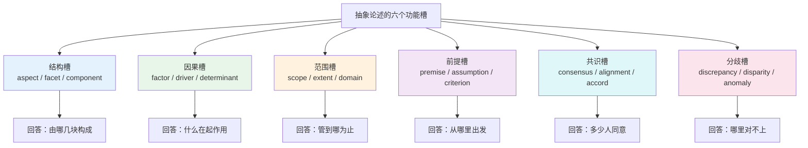
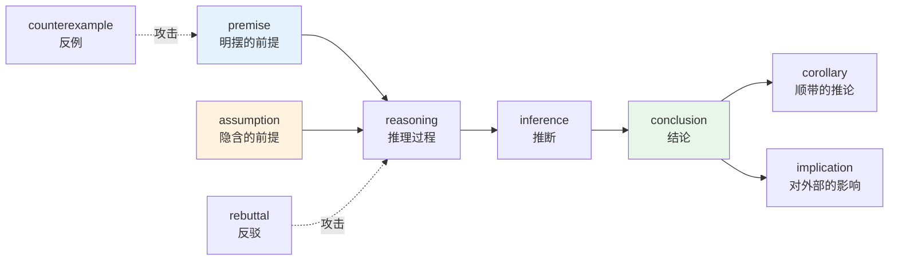
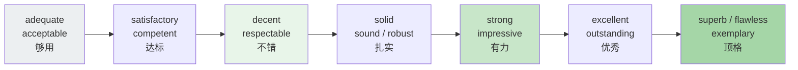
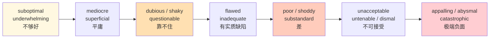
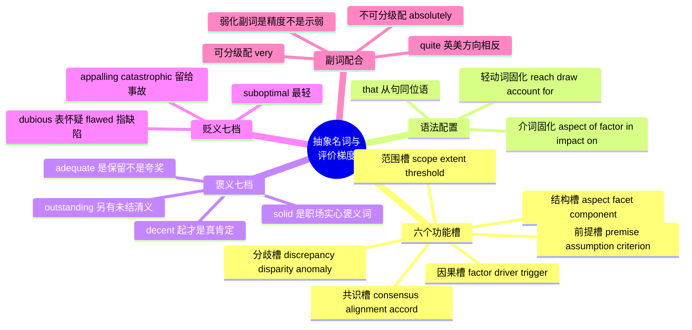

# 抽象名词库与评价形容词梯度

> [!info] 本篇定位
>
> 第 13 章的收官篇，也是全章里离技术文档与论文最近的一篇。
>
> 前四篇给的是动词：`take` / `make` 这类轻动词的搭配骨架，`consider` / `assume` 这类认知动词的义项地图，`cause` / `affect` / `shift` 这类因果与变化动词。这一篇补上它们的宾语和它们的评语——抽象名词负责承接动词，评价形容词负责给结论定性。
>
> 读完你能做三件事：用 `aspect` / `factor` / `scope` / `premise` / `consensus` / `discrepancy` 六个功能槽把一段抽象论述的结构拆开；在写作时按需要的强度精确取一档形容词，而不是永远只会 `good` 和 `bad`；判断哪些形容词能配 `very`、哪些只能配 `absolutely`，避免 `very perfect` 这类母语者一眼看出的错配。
>
> 与 `[[16.词义辨析、搭配与短语动词/01.同义词辨析方法与高频同义词组\|同义词辨析方法论]]` 的分工是：那一篇讲辨析的方法，这一篇直接交付两条已经排好的梯度轴。

---

## 1. 本篇导读：抽象名词是论述文本的承重结构

读技术文档和论文卡住，很少是卡在专业术语上——专业术语可以查，而且往往有中文对照。真正卡住的是这一类词：

> - The **premise** of the argument is that latency **scales** linearly with payload size, an **assumption** that later benchmarks failed to bear out.
>   - 这个论证的前提是延迟随载荷大小线性增长，后续基准测试没能证实这个假设。

句子里没有一个生僻词，`premise`、`assumption`、`scale`、`bear out` 全是中频词，但如果不知道 `premise` 是「被当作出发点、不再论证的那个陈述」，整句的逻辑关系就读不出来。这类词的共同特点是：它们本身没有具体所指，作用是**给别的内容分配一个逻辑角色**。

把这类词按角色归类，会发现常用的槽位并不多。

上图把本篇前六节的编排逻辑摆了出来。六个槽位各对应一个问题，一段抽象论述基本就是这六个问题的组合回答。掌握每个槽里的三到五个核心词，加上它们的固定搭配，抽象文本的骨架就能拆得动。后半篇（第 8 到 10 节）处理另一件事：当你要对这些内容下判断时，形容词该取哪一档强度，以及副词怎么配。

本篇不讲语法规则。抽象名词的可数不可数、能不能接 `that` 从句，这些在 `[[02.英语基础语法/02.名词与冠词/01.名词的分类与用法\|名词的可数与不可数]]` 里已经讲过；这里只从**词与词的搭配**角度给出实际能用的组合。

---

## 2. 结构与构成类：把一个整体拆开

### 2.1 aspect 与它的近邻

`aspect` 是这一族的中心词，指「一个复杂事物的某个方面」。它的关键限制是：**aspect 只能用于抽象事物，不能用于实体的物理部分**。一台服务器有 `components`（部件），一个方案有 `aspects`（方面）。

| 英文 | 英式音标 | 美式音标 | 词性 | 中文 | 搭配与说明 |
| --- | --- | --- | --- | --- | --- |
| **aspect** | /ˈæspekt/ | /ˈæspekt/ | n. | 方面；层面 | in every aspect / a key aspect of；只修饰抽象事物 |
| **facet** | /ˈfæsɪt/ | /ˈfæsɪt/ | n. | 侧面 | 原指宝石刻面，暗示「多面中的一面」，比 aspect 文学 |
| **dimension** | /daɪˈmenʃn/ | /dɪˈmenʃn/ | n. | 维度 | add a new dimension to；英美首音节元音有差异 |
| **angle** | /ˈæŋɡl/ | /ˈæŋɡl/ | n. | 角度 | from a different angle；口语化，媒体常用 |
| **perspective** | /pəˈspektɪv/ | /pərˈspektɪv/ | n. | 视角 | from a technical perspective；强调观察者立场 |
| **standpoint** | /ˈstændpɔɪnt/ | /ˈstændpɔɪnt/ | n. | 立场 | from the standpoint of；比 perspective 更正式 |
| **component** | /kəmˈpəʊnənt/ | /kəmˈpoʊnənt/ | n. | 组成部分 | a key component of；实体与抽象都可用 |
| **element** | /ˈelɪmənt/ | /ˈelɪmənt/ | n. | 要素 | an essential element of；比 component 抽象 |
| **constituent** | /kənˈstɪtʃuənt/ | /kənˈstɪtʃuənt/ | n./adj. | 成分；构成的 | constituent parts；正式，化学与语言学常用 |
| **ingredient** | /ɪnˈɡriːdiənt/ | /ɪnˈɡriːdiənt/ | n. | 成分；要素 | a key ingredient of success；从烹饪义引申 |
| **attribute** | /ˈætrɪbjuːt/ | /ˈætrɪbjuːt/ | n. | 属性 | 名词重音在首，动词 /əˈtrɪbjuːt/ 重音在次 |
| **property** | /ˈprɒpəti/ | /ˈprɑːpərti/ | n. | 属性；财产 | 科技文本里几乎只取「属性」义 |
| **feature** | /ˈfiːtʃə/ | /ˈfiːtʃər/ | n./v. | 特性；以…为特色 | a distinguishing feature；产品语境指「功能」 |
| **trait** | /treɪt/ | /treɪt/ | n. | 特质 | personality trait；几乎只用于人与生物 |
| **characteristic** | /ˌkærəktəˈrɪstɪk/ | /ˌkærəktəˈrɪstɪk/ | n./adj. | 特征；典型的 | be characteristic of；比 feature 更中性客观 |

> [!warning] aspect 最常见的两个中式误用
>
> 第一个是拿 `aspect` 修饰实体。
>
> > - ❌ ~~The engine has three main aspects.~~
> > - ✅ The engine has three main **components**.
>
> 第二个是漏掉 `of`。`aspect` 后面几乎总要接 `of + 被拆的整体`，孤零零一个 `aspect` 读者不知道你在拆什么。
>
> > - ❌ ~~We discussed several aspects yesterday.~~（缺少所属）
> > - ✅ We discussed several **aspects of the migration plan** yesterday.

### 2.2 层级与切分：把结构说清楚

技术写作里频繁需要说明「这东西分几层、切成几块」。这一组词彼此不能随便替换，因为它们暗示的切分方式不同：`layer` 是纵向叠放，`module` 是横向解耦，`segment` 是把连续体切断。

| 英文 | 英式音标 | 美式音标 | 词性 | 中文 | 搭配与说明 |
| --- | --- | --- | --- | --- | --- |
| **structure** | /ˈstrʌktʃə/ | /ˈstrʌktʃər/ | n./v. | 结构；组织 | organisational structure；动词义「使有条理」 |
| **framework** | /ˈfreɪmwɜːk/ | /ˈfreɪmwɜːrk/ | n. | 框架 | within the framework of；抽象与软件义共用 |
| **architecture** | /ˈɑːkɪtektʃə/ | /ˈɑːrkɪtektʃər/ | n. | 架构 | system architecture；不可数用法居多 |
| **hierarchy** | /ˈhaɪərɑːki/ | /ˈhaɪərɑːrki/ | n. | 层级体系 | a strict hierarchy；重音在首音节 |
| **layer** | /ˈleɪə/ | /ˈleɪər/ | n./v. | 层 | an abstraction layer；纵向叠放关系 |
| **tier** | /tɪə/ | /tɪr/ | n. | 层级；档位 | three-tier architecture；也指价格档 |
| **module** | /ˈmɒdjuːl/ | /ˈmɑːdʒuːl/ | n. | 模块 | 强调可独立替换；英美读音差别明显 |
| **segment** | /ˈseɡmənt/ | /ˈseɡmənt/ | n./v. | 段；细分 | market segment；动词重音可后移 |
| **entity** | /ˈentəti/ | /ˈentəti/ | n. | 实体 | a legal entity；数据库与法律共用 |
| **unit** | /ˈjuːnɪt/ | /ˈjuːnɪt/ | n. | 单元；单位 | the basic unit of；最中性的切分词 |
| **subset** | /ˈsʌbset/ | /ˈsʌbset/ | n. | 子集 | a subset of the data；数学义外延到日常 |
| **hierarchy of concerns** | — | — | — | 关注点层级 | 短语，架构讨论固定说法 |
| **granularity** | /ˌɡrænjəˈlærəti/ | /ˌɡrænjəˈlærəti/ | n. | 粒度 | at a finer granularity；不可数 |
| **composition** | /ˌkɒmpəˈzɪʃn/ | /ˌkɑːmpəˈzɪʃn/ | n. | 构成 | the composition of the team；指成分比例 |

> [!example] 同一个系统的四种拆法
>
> - The system is organised into three **layers**: presentation, business logic, and persistence.
>   - 系统按三层组织：表示层、业务逻辑层、持久层。（纵向叠放）
> - The system is split into eight independently deployable **modules**.
>   - 系统拆成八个可独立部署的模块。（横向解耦）
> - The report **segments** users by activity level.
>   - 报告按活跃度对用户分段。（把连续体切断）
> - Two **aspects** of the design deserve closer scrutiny: failure handling and observability.
>   - 设计有两个方面值得细看：故障处理和可观测性。（抽象方面，不是物理部分）

四句话都在「拆」，但拆的对象和方式不同。选错词读者会误解结构关系：把模块说成 layer，读者会以为它们有调用方向上的上下关系。

### 2.3 aspect / facet / dimension / angle 的取舍

四个词中文都能翻成「方面」，实际分工如下。

| 词 | 侧重 | 典型场合 | 反例 |
| --- | --- | --- | --- |
| **aspect** | 客观存在的某个方面 | 学术、报告、技术文档 | 不修饰实体部件 |
| **facet** | 多面体中的一面，暗示整体复杂 | 偏文学、评论 | 不用于简单事物 |
| **dimension** | 独立可变的一个变量轴 | 数据分析、社科 | 不用于并列的普通方面 |
| **angle** | 观察者选取的切入点 | 新闻、口语、头脑风暴 | 正式论文里偏轻 |

> [!tip] 一个可靠的替换测试
>
> 把候选词换成中文再回译：`aspect` 换成「方面」，`dimension` 换成「维度」，`angle` 换成「切入角度」。如果中文里说「维度」显得夸张，英文用 `dimension` 就同样夸张。
>
> `Cost is another dimension` 暗示成本是一条**独立可变的轴**，可以和其他轴组合；`Cost is another aspect` 只是说成本也算一个方面。写数据分析报告时这个区别是实质性的。

---

## 3. 因果与条件类：说明什么在起作用

### 3.1 factor 家族

`factor` 是抽象名词里出现频率最高的几个之一，指「共同促成某结果的诸多原因之一」。它自带「不止一个」的暗示——说 `a factor` 就等于承认还有别的因素。

| 英文 | 英式音标 | 美式音标 | 词性 | 中文 | 搭配与说明 |
| --- | --- | --- | --- | --- | --- |
| **factor** | /ˈfæktə/ | /ˈfæktər/ | n. | 因素 | a contributing factor；暗示多因共同作用 |
| **cause** | /kɔːz/ | /kɔːz/ | n./v. | 原因；导致 | the root cause of；单一直接原因 |
| **driver** | /ˈdraɪvə/ | /ˈdraɪvər/ | n. | 驱动因素 | a key driver of growth；商业文本高频 |
| **determinant** | /dɪˈtɜːmɪnənt/ | /dɪˈtɜːrmɪnənt/ | n. | 决定因素 | the main determinant of；比 factor 分量重 |
| **trigger** | /ˈtrɪɡə/ | /ˈtrɪɡər/ | n./v. | 诱因；触发 | trigger a rollback；强调时间上的引爆点 |
| **catalyst** | /ˈkætəlɪst/ | /ˈkætəlɪst/ | n. | 催化剂；促成因素 | act as a catalyst for；本身不被消耗 |
| **variable** | /ˈveəriəbl/ | /ˈveriəbl/ | n./adj. | 变量；可变的 | control for confounding variables |
| **parameter** | /pəˈræmɪtə/ | /pəˈræmɪtər/ | n. | 参数；界限 | within the parameters of；后一义偏口语 |
| **correlation** | /ˌkɒrəˈleɪʃn/ | /ˌkɔːrəˈleɪʃn/ | n. | 相关性 | a strong correlation between A and B |
| **causation** | /kɔːˈzeɪʃn/ | /kɔːˈzeɪʃn/ | n. | 因果关系 | correlation is not causation 是固定说法 |
| **rationale** | /ˌræʃəˈnɑːl/ | /ˌræʃəˈnæl/ | n. | 依据；理由 | the rationale behind the decision；重音在末 |
| **motive** | /ˈməʊtɪv/ | /ˈmoʊtɪv/ | n. | 动机 | 多用于人的行为，含追问意味 |
| **incentive** | /ɪnˈsentɪv/ | /ɪnˈsentɪv/ | n. | 激励 | create an incentive to；经济学高频 |
| **impetus** | /ˈɪmpɪtəs/ | /ˈɪmpɪtəs/ | n. | 推动力 | give impetus to；正式，不可数居多 |

> [!warning] factor 与 reason 不能互换
>
> `reason` 回答「为什么」，指向解释；`factor` 回答「什么在起作用」，指向机制。中文都说「原因」，英文分工明确。
>
> > - ❌ ~~The main factor I quit is the commute.~~
> > - ✅ The main **reason** I quit is the commute.（个人解释）
> > - ✅ Commute time was a significant **factor** in the attrition rate.（统计上起作用的变量）
>
> 判断法：能接 `why` 从句或 `that` 解释的用 `reason`；能被量化、能与其他因素并列加权的用 `factor`。

### 3.2 前提条件与约束

条件类名词的核心区别在于**强制程度**：`prerequisite` 是不满足就没法开始，`constraint` 是可以开始但不能越界，`consideration` 只是需要顾及。

| 英文 | 英式音标 | 美式音标 | 词性 | 中文 | 搭配与说明 |
| --- | --- | --- | --- | --- | --- |
| **condition** | /kənˈdɪʃn/ | /kənˈdɪʃn/ | n. | 条件；状况 | on condition that；复数指「环境状况」 |
| **prerequisite** | /ˌpriːˈrekwəzɪt/ | /ˌpriːˈrekwəzɪt/ | n./adj. | 先决条件 | a prerequisite for；不满足就无法开始 |
| **precondition** | /ˌpriːkənˈdɪʃn/ | /ˌpriːkənˈdɪʃn/ | n. | 前置条件 | 与 prerequisite 近义，谈判语境更常见 |
| **requirement** | /rɪˈkwaɪəmənt/ | /rɪˈkwaɪərmənt/ | n. | 要求 | meet the requirements；可数 |
| **constraint** | /kənˈstreɪnt/ | /kənˈstreɪnt/ | n. | 约束 | operate under tight constraints |
| **limitation** | /ˌlɪmɪˈteɪʃn/ | /ˌlɪmɪˈteɪʃn/ | n. | 局限 | acknowledge the limitations of；偏内在缺陷 |
| **restriction** | /rɪˈstrɪkʃn/ | /rɪˈstrɪkʃn/ | n. | 限制 | impose restrictions on；偏外部强加 |
| **consideration** | /kənˌsɪdəˈreɪʃn/ | /kənˌsɪdəˈreɪʃn/ | n. | 考量 | take into consideration；强制力最弱 |
| **trade-off** | /ˈtreɪd ɒf/ | /ˈtreɪd ɔːf/ | n. | 权衡取舍 | a trade-off between speed and accuracy |
| **contingency** | /kənˈtɪndʒənsi/ | /kənˈtɪndʒənsi/ | n. | 意外情况；应急 | a contingency plan |
| **dependency** | /dɪˈpendənsi/ | /dɪˈpendənsi/ | n. | 依赖 | a circular dependency；软件语境高频 |
| **assumption** | /əˈsʌmpʃn/ | /əˈsʌmpʃn/ | n. | 假设 | 详见第 5 节 |

### 3.3 结果与影响

因果链的下游端。这一组的强度递增关系值得单独记：`outcome`（中性结果）→ `consequence`（后果，略偏负面）→ `ramification`（连锁后果）→ `repercussion`（远期负面反弹）。

| 英文 | 英式音标 | 美式音标 | 词性 | 中文 | 搭配与说明 |
| --- | --- | --- | --- | --- | --- |
| **outcome** | /ˈaʊtkʌm/ | /ˈaʊtkʌm/ | n. | 结果 | the expected outcome；中性，不含褒贬 |
| **result** | /rɪˈzʌlt/ | /rɪˈzʌlt/ | n./v. | 结果；导致 | result in（导致）vs result from（源于） |
| **consequence** | /ˈkɒnsɪkwəns/ | /ˈkɑːnsɪkwens/ | n. | 后果 | as a consequence of；单用时略偏负面 |
| **implication** | /ˌɪmplɪˈkeɪʃn/ | /ˌɪmplɪˈkeɪʃn/ | n. | 含义；影响 | the implications for；复数指「潜在影响」 |
| **ramification** | /ˌræmɪfɪˈkeɪʃn/ | /ˌræmɪfɪˈkeɪʃn/ | n. | 连锁后果 | far-reaching ramifications；几乎只用复数 |
| **repercussion** | /ˌriːpəˈkʌʃn/ | /ˌriːpərˈkʌʃn/ | n. | 反响；恶果 | serious repercussions；明确负面 |
| **impact** | /ˈɪmpækt/ | /ˈɪmpækt/ | n. | 影响 | have an impact on；名词重音在首 |
| **influence** | /ˈɪnfluəns/ | /ˈɪnfluəns/ | n./v. | 影响力 | exert influence over；比 impact 缓慢持久 |
| **effect** | /ɪˈfekt/ | /ɪˈfekt/ | n. | 效应 | side effect；与动词 affect 拼写易混 |
| **side effect** | /ˈsaɪd ɪfekt/ | /ˈsaɪd ɪfekt/ | n. | 副作用 | 医学与编程共用 |
| **fallout** | /ˈfɔːlaʊt/ | /ˈfɔːlaʊt/ | n. | 余波 | the fallout from the incident；不可数 |
| **aftermath** | /ˈɑːftəmæθ/ | /ˈæftərmæθ/ | n. | 后续；余波 | in the aftermath of；只用单数 |

> [!example] 因果链上四个位置的完整表达
>
> - Poor connection pooling was a contributing **factor**; the immediate **trigger** was a config push at 14:02.
>   - 连接池配置不当是促成因素之一；直接诱因是 14:02 的一次配置推送。
> - The **outcome** was a nine-minute outage, with **repercussions** for the quarterly SLA report.
>   - 结果是九分钟的服务中断，并对季度 SLA 报告产生了后续影响。

`factor`、`trigger`、`outcome`、`repercussion` 四个词把一条因果链的四个位置各占一格，读者不需要额外解释就知道谁在前谁在后。

---

## 4. 范围与边界类：说明管到哪为止

### 4.1 scope 与它的家族

`scope` 指「一件事所覆盖的范围边界」，是项目管理和技术规范里的核心词。它最重要的搭配是 `in scope` / `out of scope`（在范围内 / 不在范围内）和 `scope creep`（范围蔓延）。

| 英文 | 英式音标 | 美式音标 | 词性 | 中文 | 搭配与说明 |
| --- | --- | --- | --- | --- | --- |
| **scope** | /skəʊp/ | /skoʊp/ | n./v. | 范围 | out of scope；scope creep 指需求失控扩张 |
| **extent** | /ɪkˈstent/ | /ɪkˈstent/ | n. | 程度；广度 | to a large extent；侧重「到什么程度」 |
| **range** | /reɪndʒ/ | /reɪndʒ/ | n./v. | 幅度；系列 | range from A to B；两端可量化 |
| **span** | /spæn/ | /spæn/ | n./v. | 跨度 | span three decades；侧重时间或空间跨越 |
| **domain** | /dəˈmeɪn/ | /dəˈmeɪn/ | n. | 领域 | domain knowledge；也指网络域名 |
| **realm** | /relm/ | /relm/ | n. | 领域 | in the realm of；偏文学，l 不发音 |
| **sphere** | /sfɪə/ | /sfɪr/ | n. | 领域；范畴 | sphere of influence；正式 |
| **field** | /fiːld/ | /fiːld/ | n. | 领域 | in the field of；最中性的领域词 |
| **remit** | /ˈriːmɪt/ | /ˈriːmɪt/ | n. | 职权范围 | outside our remit；英式为主，美式少见 |
| **boundary** | /ˈbaʊndri/ | /ˈbaʊndri/ | n. | 边界 | push the boundaries of；可数 |
| **threshold** | /ˈθreʃhəʊld/ | /ˈθreʃhoʊld/ | n. | 阈值；门槛 | cross a threshold；越过才触发 |
| **margin** | /ˈmɑːdʒɪn/ | /ˈmɑːrdʒɪn/ | n. | 余量；利润 | a narrow margin；margin of error |
| **perimeter** | /pəˈrɪmɪtə/ | /pəˈrɪmɪtər/ | n. | 周界 | security perimeter；安全语境高频 |
| **horizon** | /həˈraɪzn/ | /həˈraɪzn/ | n. | 视野；时间跨度 | a five-year horizon；规划语境 |
| **coverage** | /ˈkʌvərɪdʒ/ | /ˈkʌvərɪdʒ/ | n. | 覆盖率 | test coverage；不可数 |

### 4.2 量级与程度

这一组回答「有多大、多强」。中文常常一个「程度」了事，英文要区分是**连续标度上的位置**（degree）还是**数量级**（magnitude）。

| 英文 | 英式音标 | 美式音标 | 词性 | 中文 | 搭配与说明 |
| --- | --- | --- | --- | --- | --- |
| **magnitude** | /ˈmæɡnɪtjuːd/ | /ˈmæɡnɪtuːd/ | n. | 量级 | an order of magnitude（一个数量级） |
| **scale** | /skeɪl/ | /skeɪl/ | n./v. | 规模；伸缩 | at scale（在大规模下）；动词指横向扩展 |
| **degree** | /dɪˈɡriː/ | /dɪˈɡriː/ | n. | 程度；学位 | to some degree；与 extent 高度近义 |
| **proportion** | /prəˈpɔːʃn/ | /prəˈpɔːrʃn/ | n. | 比例 | a significant proportion of |
| **ratio** | /ˈreɪʃiəʊ/ | /ˈreɪʃioʊ/ | n. | 比率 | a ratio of three to one |
| **spectrum** | /ˈspektrəm/ | /ˈspektrəm/ | n. | 谱系 | at the other end of the spectrum；复数 spectra |
| **gradient** | /ˈɡreɪdiənt/ | /ˈɡreɪdiənt/ | n. | 梯度；坡度 | a steep gradient |
| **increment** | /ˈɪŋkrəmənt/ | /ˈɪŋkrəmənt/ | n. | 增量 | in small increments |
| **magnitude of change** | — | — | — | 变化幅度 | 报告固定短语 |
| **volume** | /ˈvɒljuːm/ | /ˈvɑːljuːm/ | n. | 体量；音量 | a high volume of requests |
| **density** | /ˈdensəti/ | /ˈdensəti/ | n. | 密度 | information density |
| **frequency** | /ˈfriːkwənsi/ | /ˈfriːkwənsi/ | n. | 频率 | with increasing frequency |

### 4.3 scope / range / extent / span 的取舍

| 词 | 回答的问题 | 语法形态 | 典型句 |
| --- | --- | --- | --- |
| **scope** | 管到哪为止 | 常在 `within / outside the scope of` 这个二元判断里 | That is **out of scope** for this release. |
| **range** | 从多少到多少 | 能带 `from ... to ...` 两端，两端可量化 | Latency **ranges from** 12 **to** 40 ms. |
| **extent** | 到什么程度 | 不可数，没有两端，只配 `to a ... extent` | This is true **to a limited extent**. |
| **span** | 横跨多长 | 常直接作动词带宾语，指时间或空间跨越 | The dataset **spans** four years. |

上表给的是四个词的功能分工，它们的语法形态差别比词义差别更硬：`range` 必须交代两端，`extent` 连两端都没有，`span` 更常以动词形态出现，而 `scope` 几乎只用来做「在不在范围内」这个是非判断。选词之前先看句子里有没有位置放这些语法要件，比记中文对应更可靠。

> [!warning] extent 只能配 to，不能配 in
>
> `to a large / certain / limited extent` 是固定搭配，介词不能换。
>
> > - ❌ ~~in a large extent~~ / ~~in some extent~~
> > - ✅ **to a large extent** / **to some extent**
>
> 与它成对的 `degree` 同样只配 `to`：`to a certain degree`。而 `scope` 反过来只配 `in`：`within the scope of` / `outside the scope of`。

---

## 5. 论证骨架：premise、assumption 与推理链

### 5.1 premise 家族

`premise` 是逻辑学词，指「推理的出发点」。它和 `assumption` 的区别是学术写作里的高频考点：**premise 是被明确摆出来的出发点，assumption 是没被明说、藏在背后的前提**。

| 英文 | 英式音标 | 美式音标 | 词性 | 中文 | 搭配与说明 |
| --- | --- | --- | --- | --- | --- |
| **premise** | /ˈpremɪs/ | /ˈpremɪs/ | n. | 前提 | on the premise that；复数 premises 另指「场所」 |
| **assumption** | /əˈsʌmpʃn/ | /əˈsʌmpʃn/ | n. | 假设 | make an assumption；未经明说的前提 |
| **presumption** | /prɪˈzʌmpʃn/ | /prɪˈzʌmpʃn/ | n. | 推定 | presumption of innocence（无罪推定） |
| **hypothesis** | /haɪˈpɒθəsɪs/ | /haɪˈpɑːθəsɪs/ | n. | 假说 | test a hypothesis；复数 hypotheses |
| **postulate** | /ˈpɒstjulət/ | /ˈpɑːstʃələt/ | n./v. | 公设；假定 | 动词读音末音节变 /eɪt/ |
| **axiom** | /ˈæksiəm/ | /ˈæksiəm/ | n. | 公理 | 不证自明，比 premise 更强 |
| **proposition** | /ˌprɒpəˈzɪʃn/ | /ˌprɑːpəˈzɪʃn/ | n. | 命题；提议 | a testable proposition |
| **thesis** | /ˈθiːsɪs/ | /ˈθiːsɪs/ | n. | 论点；论文 | 复数 theses /ˈθiːsiːz/ |
| **claim** | /kleɪm/ | /kleɪm/ | n./v. | 主张 | substantiate a claim；比 thesis 轻 |
| **argument** | /ˈɑːɡjumənt/ | /ˈɑːrɡjumənt/ | n. | 论证；争论 | a compelling argument；不只指吵架 |
| **rationale** | /ˌræʃəˈnɑːl/ | /ˌræʃəˈnæl/ | n. | 论据；理据 | the rationale for；英美末音节不同 |
| **justification** | /ˌdʒʌstɪfɪˈkeɪʃn/ | /ˌdʒʌstɪfɪˈkeɪʃn/ | n. | 正当理由 | no justification for；含道德辩护色彩 |
| **criterion** | /kraɪˈtɪəriən/ | /kraɪˈtɪriən/ | n. | 判据 | 复数 criteria，常被误当单数 |
| **benchmark** | /ˈbentʃmɑːk/ | /ˈbentʃmɑːrk/ | n./v. | 基准 | benchmark against；可量化的参照 |
| **caveat** | /ˈkæviæt/ | /ˈkæviæt/ | n. | 附带说明 | with one caveat；提醒读者别过度解读 |
| **proviso** | /prəˈvaɪzəʊ/ | /prəˈvaɪzoʊ/ | n. | 但书条款 | with the proviso that；法律与合同 |
| **stipulation** | /ˌstɪpjuˈleɪʃn/ | /ˌstɪpjuˈleɪʃn/ | n. | 约定条件 | 比 proviso 更强调双方约定 |

> [!warning] premises 的两个义项差得很远
>
> `premise` 的复数 `premises` 在日常英语里最常见的意思不是「多个前提」，而是「（公司的）场所、房产」。
>
> > - The argument rests on two **premises**.
> >   - 这个论证建立在两个前提上。（逻辑义）
> > - No smoking on the **premises**.
> >   - 场所内禁止吸烟。（房产义，只有复数形式）
>
> 房产义永远是复数形式，即使指一处场所。看到 `on the premises` 基本可以断定是房产义。

### 5.2 从前提到结论：推理链名词

| 英文 | 英式音标 | 美式音标 | 词性 | 中文 | 搭配与说明 |
| --- | --- | --- | --- | --- | --- |
| **inference** | /ˈɪnfərəns/ | /ˈɪnfərəns/ | n. | 推断 | draw an inference from |
| **deduction** | /dɪˈdʌkʃn/ | /dɪˈdʌkʃn/ | n. | 演绎；扣除 | 一般到具体；财务义指扣款 |
| **induction** | /ɪnˈdʌkʃn/ | /ɪnˈdʌkʃn/ | n. | 归纳；入职培训 | 具体到一般；HR 语境另有一义 |
| **corollary** | /kəˈrɒləri/ | /ˈkɔːrəleri/ | n. | 推论 | a natural corollary of；英美重音位置不同 |
| **conclusion** | /kənˈkluːʒn/ | /kənˈkluːʒn/ | n. | 结论 | jump to conclusions（草率下结论） |
| **implication** | /ˌɪmplɪˈkeɪʃn/ | /ˌɪmplɪˈkeɪʃn/ | n. | 蕴含；言外之意 | by implication（言下之意） |
| **entailment** | /ɪnˈteɪlmənt/ | /ɪnˈteɪlmənt/ | n. | 蕴涵 | 逻辑学与语义学术语 |
| **reasoning** | /ˈriːzənɪŋ/ | /ˈriːzənɪŋ/ | n. | 推理过程 | circular reasoning（循环论证） |
| **fallacy** | /ˈfæləsi/ | /ˈfæləsi/ | n. | 谬误 | a logical fallacy |
| **evidence** | /ˈevɪdəns/ | /ˈevɪdəns/ | n. | 证据 | 不可数，不能说 an evidence |
| **counterexample** | /ˈkaʊntərɪɡzɑːmpl/ | /ˈkaʊntərɪɡzæmpl/ | n. | 反例 | produce a counterexample |
| **rebuttal** | /rɪˈbʌtl/ | /rɪˈbʌtl/ | n. | 反驳 | offer a rebuttal to |

上图是一条完整论证链的词汇分布。实线是正向流程，虚线是两种攻击方式：反例攻击的是前提（证明前提不成立），反驳攻击的是推理过程（承认前提但否认推得出结论）。读英文论文的 discussion 部分时，作者用哪个词就是在告诉你他在攻击哪一环。

> [!example] 六个词各就各位
>
> - The paper proceeds from the **premise** that user attention is a fixed budget.
>   - 论文的出发前提是：用户注意力是一个固定预算。
> - Buried in the model is an **assumption** that sessions are independent.
>   - 模型里埋着一个假设：各次会话彼此独立。
> - From these figures the authors **draw the inference** that caching alone explains the gain.
>   - 作者由这些数据推断，仅缓存一项就能解释这一提升。
> - A **corollary** is that the optimisation would not help cold traffic.
>   - 一个推论是：这项优化对冷流量没有帮助。
> - The **implication** for capacity planning is significant.
>   - 这对容量规划的影响不小。
> - Section 5 offers a **counterexample** that undercuts the second premise.
>   - 第五节给出一个反例，动摇了第二个前提。

---

## 6. 共识与分歧：consensus 与 discrepancy

### 6.1 一致侧：从松散认同到全体一致

这一族按「一致的强度」排列：`alignment`（方向一致，未必表决过）< `agreement`（达成协议）< `consensus`（没有实质反对）< `unanimity`（全票一致）。

| 英文 | 英式音标 | 美式音标 | 词性 | 中文 | 搭配与说明 |
| --- | --- | --- | --- | --- | --- |
| **consensus** | /kənˈsensəs/ | /kənˈsensəs/ | n. | 共识 | reach a consensus on；不可数，无冠词复数 |
| **agreement** | /əˈɡriːmənt/ | /əˈɡriːmənt/ | n. | 一致；协议 | be in agreement with；可数可不可数 |
| **accord** | /əˈkɔːd/ | /əˈkɔːrd/ | n./v. | 协定；一致 | of one's own accord（自愿地）；正式 |
| **unanimity** | /ˌjuːnəˈnɪməti/ | /ˌjuːnəˈnɪməti/ | n. | 全体一致 | 形容词 unanimous /juˈnænɪməs/ |
| **concurrence** | /kənˈkʌrəns/ | /kənˈkɜːrəns/ | n. | 同意；同时发生 | 正式，法律文本常见 |
| **alignment** | /əˈlaɪnmənt/ | /əˈlaɪnmənt/ | n. | 对齐；一致 | get alignment on；企业英语高频 |
| **convergence** | /kənˈvɜːdʒəns/ | /kənˈvɜːrdʒəns/ | n. | 趋同 | convergence of opinion；强调过程 |
| **compromise** | /ˈkɒmprəmaɪz/ | /ˈkɑːmprəmaɪz/ | n./v. | 妥协；损害 | reach a compromise；动词另有「危及」义 |
| **endorsement** | /ɪnˈdɔːsmənt/ | /ɪnˈdɔːrsmənt/ | n. | 背书；支持 | a formal endorsement of |
| **buy-in** | /ˈbaɪ ɪn/ | /ˈbaɪ ɪn/ | n. | 认同；支持 | get stakeholder buy-in；商务口语 |
| **mandate** | /ˈmændeɪt/ | /ˈmændeɪt/ | n./v. | 授权；强制要求 | a clear mandate to |
| **coherence** | /kəʊˈhɪərəns/ | /koʊˈhɪrəns/ | n. | 连贯一致 | 指内部逻辑自洽，不指人际同意 |

> [!warning] consensus 的三个搭配陷阱
>
> `consensus` 是不可数名词，中文母语者最容易在冠词和介词上出错。
>
> > - ❌ ~~We reached a consensus about the API design.~~（介词该用 on）
> > - ✅ We reached **a consensus on** the API design.
> > - ❌ ~~There are many consensuses in the team.~~（不可数，无复数）
> > - ✅ There is **broad consensus** in the team.
> > - ❌ ~~The general consensus of opinion~~（冗余，consensus 本身就含 opinion）
> > - ✅ The **general consensus**（或直接 the consensus）
>
> 注意 `a consensus` 加不定冠词是允许的，指「某一项共识」；但复数形式 `consensuses` 在正式文本里几乎不出现。

### 6.2 分歧侧：discrepancy 与它的兄弟

`discrepancy` 特指「本该一致的两组数据或说法之间对不上」，是财务、审计、测试报告里的核心词。它不指人与人的意见分歧——那是 `disagreement`。

| 英文 | 英式音标 | 美式音标 | 词性 | 中文 | 搭配与说明 |
| --- | --- | --- | --- | --- | --- |
| **discrepancy** | /dɪsˈkrepənsi/ | /dɪsˈkrepənsi/ | n. | 不符；出入 | a discrepancy between A and B；指数据对不上 |
| **disparity** | /dɪˈspærəti/ | /dɪˈspærəti/ | n. | 悬殊差距 | income disparity；含不公平意味 |
| **divergence** | /daɪˈvɜːdʒəns/ | /daɪˈvɜːrdʒəns/ | n. | 分歧；背离 | a divergence of views；强调越走越远 |
| **inconsistency** | /ˌɪnkənˈsɪstənsi/ | /ˌɪnkənˈsɪstənsi/ | n. | 不一致 | internal inconsistency；指自相矛盾 |
| **contradiction** | /ˌkɒntrəˈdɪkʃn/ | /ˌkɑːntrəˈdɪkʃn/ | n. | 矛盾 | a direct contradiction；比 inconsistency 更强 |
| **mismatch** | /ˈmɪsmætʃ/ | /ˈmɪsmætʃ/ | n./v. | 不匹配 | a type mismatch；技术语境高频 |
| **variance** | /ˈveəriəns/ | /ˈveriəns/ | n. | 偏差；方差 | at variance with（与…不符） |
| **deviation** | /ˌdiːviˈeɪʃn/ | /ˌdiːviˈeɪʃn/ | n. | 偏离 | a deviation from the norm |
| **anomaly** | /əˈnɒməli/ | /əˈnɑːməli/ | n. | 异常 | an anomaly in the logs；单个反常点 |
| **disagreement** | /ˌdɪsəˈɡriːmənt/ | /ˌdɪsəˈɡriːmənt/ | n. | 意见不合 | 人与人之间，不用于数据 |
| **dissent** | /dɪˈsent/ | /dɪˈsent/ | n./v. | 异议 | voice dissent；与 descent 拼写易混 |
| **dispute** | /dɪˈspjuːt/ | /dɪˈspjuːt/ | n./v. | 争议 | in dispute；含正式对抗色彩 |
| **controversy** | /ˈkɒntrəvɜːsi/ | /ˈkɑːntrəvɜːrsi/ | n. | 争议 | 英式另有 /kənˈtrɒvəsi/ 一读 |
| **friction** | /ˈfrɪkʃn/ | /ˈfrɪkʃn/ | n. | 摩擦 | team friction；比 conflict 轻 |
| **conflict** | /ˈkɒnflɪkt/ | /ˈkɑːnflɪkt/ | n. | 冲突 | a conflict of interest；名词重音在首 |
| **rift** | /rɪft/ | /rɪft/ | n. | 裂痕 | a rift between the two camps；关系已破裂 |
| **gap** | /ɡæp/ | /ɡæp/ | n. | 差距 | bridge the gap；最中性的差距词 |
| **discord** | /ˈdɪskɔːd/ | /ˈdɪskɔːrd/ | n. | 不和 | 偏文学，日常少用 |

### 6.3 discrepancy / disparity / inconsistency 的分工

三个词中文都可以说成「不一致」，实际指向三种不同的问题。

| 词 | 问题出在哪 | 典型主语 | 隐含判断 |
| --- | --- | --- | --- |
| **discrepancy** | 两处记录对不上，至少一处错了 | 数字、账目、日志、报告 | 需要查明原因 |
| **disparity** | 两方之间差距悬殊 | 收入、资源、机会 | 常含不公平的暗示 |
| **inconsistency** | 同一体系内部自相矛盾 | 政策、代码、论述 | 逻辑问题，不必然涉及外部 |

> [!example] 三个词各自的典型句
>
> - There is a **discrepancy** between the invoice total and the ledger entry.
>   - 发票总额与账簿记录对不上。（两处记录必有一错）
> - The report highlights a widening **disparity** in access to broadband.
>   - 报告指出宽带接入的差距正在扩大。（含不公平判断）
> - The style guide contains several **inconsistencies** about hyphenation.
>   - 这份风格指南在连字符用法上有几处自相矛盾。（体系内部矛盾）

> [!tip] 用 discrepancy 报 bug 的固定句式
>
> 缺陷报告里描述「预期与实际不符」的标准写法是把两端明确列出来：
>
> `There is a discrepancy between the expected value (200) and the observed value (503).`
>
> 比笼统地说 `The result is wrong` 有用得多，因为它把两端都摆了出来，读的人不用回问。

---

## 7. 抽象名词的语法配置：轻动词、介词与从句

抽象名词的难点往往不在词义，而在**它跟哪个动词走、后面接什么介词**。这一节把前六节的词按配置整理成可查的表。

### 7.1 轻动词搭配

| 抽象名词 | 惯用轻动词 | 完整搭配 | 中文 |
| --- | --- | --- | --- |
| consensus | reach / build / forge | reach a consensus on | 就…达成共识 |
| assumption | make / challenge / revisit | challenge an assumption | 挑战一个假设 |
| premise | accept / reject / start from | start from the premise that | 从…这个前提出发 |
| conclusion | draw / reach / jump to | draw a conclusion from | 从…得出结论 |
| inference | draw / make | draw an inference | 作出推断 |
| distinction | draw / make | draw a distinction between | 区分…与… |
| factor | take into account / control for | control for confounding factors | 控制混杂因素 |
| discrepancy | account for / reconcile / flag | reconcile the discrepancy | 消除不符 |
| scope | define / expand / narrow | narrow the scope of | 缩小范围 |
| threshold | set / cross / lower | cross the threshold | 越过阈值 |
| criterion | meet / satisfy / define | meet the criteria | 满足判据 |
| constraint | impose / relax / operate under | relax the constraint | 放宽约束 |
| impact | have / assess / mitigate | assess the impact of | 评估影响 |
| caveat | add / note | with one caveat | 有一点需说明 |

> [!warning] 轻动词选错比选词错更显眼
>
> 中文的「做」「进行」「达成」覆盖面很宽，直译过去经常配错。
>
> > - ❌ ~~make a consensus~~ / ~~do a conclusion~~ / ~~get an inference~~
> > - ✅ **reach** a consensus / **draw** a conclusion / **draw** an inference
>
> 这类错配母语者听起来非常刺耳，因为轻动词搭配是高度固化的。第 `13.抽象概念、评价与高频动词/02` 篇给了完整的轻动词搭配表，这里只补抽象名词这一批。

### 7.2 固定介词

| 名词 | 介词 | 例 | 常见错配 |
| --- | --- | --- | --- |
| aspect | of | an aspect **of** the design | ❌ aspect in |
| factor | in | a factor **in** the decision | ❌ factor of the decision |
| impact | on | an impact **on** revenue | ❌ impact to |
| effect | on | an effect **on** latency | ❌ effect to |
| influence | on / over | influence **over** policy | ❌ influence to |
| consensus | on | consensus **on** the schema | ❌ consensus about（口语可，正式偏） |
| discrepancy | between / in | discrepancy **between** the two logs | ❌ discrepancy of |
| disparity | in / between | disparity **in** pay | ❌ disparity to |
| premise | of / that | the premise **that** X holds | ❌ premise of that |
| extent | to | **to** a certain extent | ❌ in a certain extent |
| scope | within / outside | **within** the scope of | ❌ in the scope（多余但可见） |
| threshold | for | the threshold **for** escalation | ❌ threshold of escalation（另义） |
| criterion | for | the criteria **for** acceptance | ❌ criteria to |
| rationale | for / behind | the rationale **behind** the change | ❌ rationale of |
| constraint | on | constraints **on** memory | ❌ constraint to |

### 7.3 能带 that 从句的抽象名词

一部分抽象名词后面可以直接跟同位语从句，把「内容」补进去。这个结构在学术写作里出现密度很高，识别它能大幅提升阅读速度。

| 名词 | 结构 | 例句 |
| --- | --- | --- |
| assumption | the assumption that... | the assumption **that** traffic is uniform |
| premise | the premise that... | on the premise **that** costs stay flat |
| hypothesis | the hypothesis that... | the hypothesis **that** caching dominates |
| conclusion | the conclusion that... | the conclusion **that** the model overfits |
| implication | the implication that... | the implication **that** rollback is unsafe |
| consensus | a consensus that... | a consensus **that** the API needs versioning |
| claim | the claim that... | the claim **that** the results generalise |
| evidence | evidence that... | evidence **that** the leak predates the release |
| fact | the fact that... | the fact **that** nobody noticed for a week |
| possibility | the possibility that... | the possibility **that** the data was truncated |

> [!tip] 用 the fact that 之前先想想能不能删掉
>
> `the fact that` 是学术写作里最容易冗余的结构。多数情况下它可以直接删掉，句子照样成立且更紧凑。
>
> - 冗余：`Due to the fact that the cache was cold, latency spiked.`
> - 紧凑：`**Because** the cache was cold, latency spiked.`
>
> 保留它的场合是：这个事实本身要充当主语或宾语，而不只是个原因状语。`The fact that nobody noticed is the real problem.`（没人发现这件事本身才是真问题）——这里删不掉。

---

## 8. 褒义评价形容词的强度梯度

### 8.1 七档刻度

中文母语者的评价词汇往往两极化：不是 `good` 就是 `very good`，再高就是 `perfect`。英语在 `good` 和 `perfect` 之间有一整条刻度，而且每一档在职场语境里的含义是被默认共享的——写 `adequate` 和写 `solid` 传达的判断差得很远。

| 英文 | 英式音标 | 美式音标 | 词性 | 中文 | 搭配与说明 |
| --- | --- | --- | --- | --- | --- |
| **adequate** | /ˈædɪkwət/ | /ˈædɪkwət/ | adj. | 够用的 | 第 1 档：刚好达标，暗含「不够好」 |
| **acceptable** | /əkˈseptəbl/ | /əkˈseptəbl/ | adj. | 可接受的 | 第 1 档：不被否决，仅此而已 |
| **passable** | /ˈpɑːsəbl/ | /ˈpæsəbl/ | adj. | 勉强过关的 | 第 1 档：比 adequate 更勉强 |
| **serviceable** | /ˈsɜːvɪsəbl/ | /ˈsɜːrvɪsəbl/ | adj. | 堪用的 | 第 1 档：能用但不出彩 |
| **satisfactory** | /ˌsætɪsˈfæktəri/ | /ˌsætɪsˈfæktəri/ | adj. | 令人满意的 | 第 2 档：正式评级用语，实际偏中性 |
| **competent** | /ˈkɒmpɪtənt/ | /ˈkɑːmpɪtənt/ | adj. | 称职的 | 第 2 档：会做，但不是亮点 |
| **decent** | /ˈdiːsnt/ | /ˈdiːsnt/ | adj. | 不错的 | 第 3 档：口语化的真心肯定 |
| **respectable** | /rɪˈspektəbl/ | /rɪˈspektəbl/ | adj. | 说得过去的 | 第 3 档：常用于数字结果 |
| **credible** | /ˈkredəbl/ | /ˈkredəbl/ | adj. | 可信的 | 第 3 档：侧重可信而非优秀 |
| **sound** | /saʊnd/ | /saʊnd/ | adj. | 稳妥的 | 第 4 档：无逻辑漏洞，a sound argument |
| **solid** | /ˈsɒlɪd/ | /ˈsɑːlɪd/ | adj. | 扎实的 | 第 4 档：分量实在，职场高频褒义词 |
| **robust** | /rəʊˈbʌst/ | /roʊˈbʌst/ | adj. | 健壮的 | 第 4 档：经得起异常输入与压力 |
| **proficient** | /prəˈfɪʃnt/ | /prəˈfɪʃnt/ | adj. | 熟练的 | 第 4 档：技能评价专用 |
| **strong** | /strɒŋ/ | /strɔːŋ/ | adj. | 有力的 | 第 5 档：a strong candidate |
| **impressive** | /ɪmˈpresɪv/ | /ɪmˈpresɪv/ | adj. | 令人印象深刻的 | 第 5 档：超出预期 |
| **compelling** | /kəmˈpelɪŋ/ | /kəmˈpelɪŋ/ | adj. | 有说服力的 | 第 5 档：论证与提案专用 |
| **remarkable** | /rɪˈmɑːkəbl/ | /rɪˈmɑːrkəbl/ | adj. | 显著的 | 第 6 档：值得专门提起 |
| **excellent** | /ˈeksələnt/ | /ˈeksələnt/ | adj. | 优秀的 | 第 6 档：明确高分 |
| **outstanding** | /aʊtˈstændɪŋ/ | /aʊtˈstændɪŋ/ | adj. | 突出的 | 第 6 档：另有「未结清」义，见下方警示 |
| **exceptional** | /ɪkˈsepʃənl/ | /ɪkˈsepʃənl/ | adj. | 卓越的 | 第 6 档：在同类里属例外 |
| **superb** | /suːˈpɜːb/ | /suːˈpɜːrb/ | adj. | 极好的 | 第 7 档：情绪色彩较浓 |
| **stellar** | /ˈstelə/ | /ˈstelər/ | adj. | 极佳的 | 第 7 档：美式口语，评价业绩常用 |
| **exemplary** | /ɪɡˈzempləri/ | /ɪɡˈzempləri/ | adj. | 堪为典范的 | 第 7 档：正式，可作标杆 |
| **flawless** | /ˈflɔːləs/ | /ˈflɔːləs/ | adj. | 无瑕疵的 | 第 7 档：不可分级，不能配 very |
| **immaculate** | /ɪˈmækjələt/ | /ɪˈmækjələt/ | adj. | 完美无缺的 | 第 7 档：不可分级 |
| **unparalleled** | /ʌnˈpærəleld/ | /ʌnˈpærəleld/ | adj. | 无可比拟的 | 第 7 档：绝对级，慎用于日常 |
| **commendable** | /kəˈmendəbl/ | /kəˈmendəbl/ | adj. | 值得称道的 | 侧重「态度值得表扬」而非结果好 |
| **laudable** | /ˈlɔːdəbl/ | /ˈlɔːdəbl/ | adj. | 可嘉的 | 正式；常暗示「动机好但效果一般」 |
| **promising** | /ˈprɒmɪsɪŋ/ | /ˈprɑːmɪsɪŋ/ | adj. | 有前景的 | 评价潜力，不评价当前水平 |
| **polished** | /ˈpɒlɪʃt/ | /ˈpɑːlɪʃt/ | adj. | 打磨到位的 | 侧重完成度与细节 |

上图把七档排成一条线。落在最左两档的词有一个共同的语用特点：它们表面是肯定，实际读者会理解成保留意见。写 `Your solution is adequate` 不是夸奖，是在说「勉强能用」。真心夸人从第三档 `decent` 起步，第四档 `solid` 是职场里最常用的实心褒义词。

### 8.2 adequate 与 decent 之间的鸿沟

这两个词的语用落差是本节最实用的一条。

> [!warning] adequate 是委婉的否定
>
> `adequate` 的字面义是「足够」，但在评价语境里它几乎总带着「仅仅足够、不多不少」的意味，读者听到的是保留。
>
> > - The documentation is **adequate**.
> >   - 文档够用。（潜台词：写得不好，但没到要重写的地步）
> > - The documentation is **decent**.
> >   - 文档不错。（潜台词：真的还行）
> > - The documentation is **solid**.
> >   - 文档很扎实。（潜台词：明确认可，可以拿去用）
>
> 想表达真实的正面评价时，从 `decent` 起步。想留余地又不想伤人时，`adequate` 正是那个工具——英美职场评审里大量使用它来表达「不合格但不到需要返工」。

> [!warning] outstanding 的第二义项容易出事
>
> `outstanding` 除了「杰出的」，还有一个完全不同的义项：「未结清的、悬而未决的」。
>
> > - an **outstanding** contribution — 杰出贡献
> > - an **outstanding** balance — 未结清的欠款
> > - **outstanding** issues — 尚未解决的问题
>
> 在项目管理和财务语境里，第二义项出现频率更高。看到 `outstanding items` 别理解成「优秀的项目」，那是「未完成事项」。判断依据是搭配的名词：修饰人和成果时是褒义，修饰款项、问题、任务时是「未了结」。

### 8.3 职场评价里的委婉刻度

英美工作环境的书面评价有一套约定俗成的降级读法。这套刻度不写在任何手册里，但共享度很高。

| 写出来的话 | 实际意思 | 强度 |
| --- | --- | --- |
| **exceptional / outstanding** | 真心的顶级评价 | 极高 |
| **strong / impressive** | 明确超出预期 | 高 |
| **solid / sound** | 达标且可靠，没有担心 | 中偏高 |
| **decent / respectable** | 还可以，无功无过偏正面 | 中 |
| **satisfactory** | 刚好达标，正式评级用语 | 中偏低 |
| **adequate / acceptable** | 勉强，有保留意见 | 低 |
| **interesting** | 通常是不置可否的婉拒 | 低，需看语境 |
| **ambitious** | 常暗示「不现实」 | 低，需看语境 |

> [!tip] 读别人的评价时倒着读一遍
>
> 收到 `Your proposal is interesting and quite ambitious` 这种反馈，字面全是好词，但按上表读，实际是「我没被说服，而且觉得做不到」。
>
> 相反，收到 `This is solid work` 应该理解成明确的正面评价，不必因为它不是 `excellent` 而失落——`solid` 在英美工程团队里是相当高的日常评价。

---

## 9. 贬义评价形容词的强度梯度

### 9.1 从 suboptimal 到 appalling

负面评价的强度差异比正面评价更需要精确控制，因为用词过重会造成不必要的冲突，用词过轻则传达不到问题的严重性。

| 英文 | 英式音标 | 美式音标 | 词性 | 中文 | 搭配与说明 |
| --- | --- | --- | --- | --- | --- |
| **suboptimal** | /ˌsʌbˈɒptɪməl/ | /ˌsʌbˈɑːptɪməl/ | adj. | 不够优的 | 第 1 档：最轻的批评，工程圈委婉语 |
| **underwhelming** | /ˌʌndəˈwelmɪŋ/ | /ˌʌndərˈwelmɪŋ/ | adj. | 不如预期的 | 第 1 档：与 overwhelming 反向构词 |
| **lacklustre** | /ˈlæklʌstə/ | /ˈlæklʌstər/ | adj. | 平淡无光的 | 第 1 档：美式拼作 lackluster |
| **mediocre** | /ˌmiːdiˈəʊkə/ | /ˌmiːdiˈoʊkər/ | adj. | 平庸的 | 第 2 档：明确的不满，不算重话 |
| **unremarkable** | /ˌʌnrɪˈmɑːkəbl/ | /ˌʌnrɪˈmɑːrkəbl/ | adj. | 乏善可陈的 | 第 2 档：客观化的负面 |
| **superficial** | /ˌsuːpəˈfɪʃl/ | /ˌsuːpərˈfɪʃl/ | adj. | 浮于表面的 | 第 2 档：批评深度不够 |
| **questionable** | /ˈkwestʃənəbl/ | /ˈkwestʃənəbl/ | adj. | 可疑的 | 第 3 档：留有余地的质疑 |
| **dubious** | /ˈdjuːbiəs/ | /ˈduːbiəs/ | adj. | 靠不住的 | 第 3 档：英美首音节读法不同 |
| **shaky** | /ˈʃeɪki/ | /ˈʃeɪki/ | adj. | 不牢靠的 | 第 3 档：口语，指基础不稳 |
| **tenuous** | /ˈtenjuəs/ | /ˈtenjuəs/ | adj. | 站不住脚的 | 第 3 档：a tenuous connection |
| **flawed** | /flɔːd/ | /flɔːd/ | adj. | 有缺陷的 | 第 4 档：明确指出存在实质问题 |
| **deficient** | /dɪˈfɪʃnt/ | /dɪˈfɪʃnt/ | adj. | 有欠缺的 | 第 4 档：deficient in（缺少某项） |
| **inadequate** | /ɪnˈædɪkwət/ | /ɪnˈædɪkwət/ | adj. | 不充分的 | 第 4 档：不达最低要求 |
| **inconsistent** | /ˌɪnkənˈsɪstənt/ | /ˌɪnkənˈsɪstənt/ | adj. | 前后不一的 | 第 4 档：指内部矛盾 |
| **poor** | /pɔː/ | /pʊr/ | adj. | 差的 | 第 5 档：直白的差评 |
| **substandard** | /ˌsʌbˈstændəd/ | /ˌsʌbˈstændərd/ | adj. | 低于标准的 | 第 5 档：正式，含合规意味 |
| **inferior** | /ɪnˈfɪəriə/ | /ɪnˈfɪriər/ | adj. | 更差的 | 第 5 档：inferior **to**，不用 than |
| **shoddy** | /ˈʃɒdi/ | /ˈʃɑːdi/ | adj. | 粗制滥造的 | 第 5 档：批评工艺态度 |
| **sloppy** | /ˈslɒpi/ | /ˈslɑːpi/ | adj. | 马虎的 | 第 5 档：批评不细心 |
| **defective** | /dɪˈfektɪv/ | /dɪˈfektɪv/ | adj. | 有缺陷的 | 第 5 档：产品与零件专用 |
| **untenable** | /ʌnˈtenəbl/ | /ʌnˈtenəbl/ | adj. | 无法维持的 | 第 6 档：立场或方案守不住 |
| **unacceptable** | /ˌʌnəkˈseptəbl/ | /ˌʌnəkˈseptəbl/ | adj. | 不可接受的 | 第 6 档：明确拒绝 |
| **dismal** | /ˈdɪzməl/ | /ˈdɪzməl/ | adj. | 惨淡的 | 第 6 档：常修饰业绩数字 |
| **woeful** | /ˈwəʊfl/ | /ˈwoʊfl/ | adj. | 糟糕透顶的 | 第 6 档：英式口语色彩强 |
| **egregious** | /ɪˈɡriːdʒəs/ | /ɪˈɡriːdʒəs/ | adj. | 极其恶劣的 | 第 6 档：常修饰 error、violation |
| **appalling** | /əˈpɔːlɪŋ/ | /əˈpɔːlɪŋ/ | adj. | 骇人的 | 第 7 档：带道德震惊 |
| **atrocious** | /əˈtrəʊʃəs/ | /əˈtroʊʃəs/ | adj. | 极差的 | 第 7 档：口语里也可夸张使用 |
| **abysmal** | /əˈbɪzməl/ | /əˈbɪzməl/ | adj. | 差到深渊的 | 第 7 档：来自 abyss「深渊」 |
| **deplorable** | /dɪˈplɔːrəbl/ | /dɪˈplɔːrəbl/ | adj. | 令人痛心的 | 第 7 档：含强烈道德谴责 |
| **catastrophic** | /ˌkætəˈstrɒfɪk/ | /ˌkætəˈstrɑːfɪk/ | adj. | 灾难性的 | 第 7 档：不可分级，事故报告用 |
| **disastrous** | /dɪˈzɑːstrəs/ | /dɪˈzæstrəs/ | adj. | 灾难性的 | 第 7 档：英美元音差异明显 |

上图与褒义梯度对称，同样是七档。实际写作中真正常用的是中间三档：`dubious`、`flawed`、`poor`。两端各有各的用途——`suboptimal` 用来把批评说得不刺耳，`appalling` 和 `catastrophic` 留给事故复盘与合规文书，日常滥用会显得情绪化。

### 9.2 flawed 与 dubious 的具体分工

这两个词都在中段，但攻击点不同：`flawed` 说的是「里面有毛病」，`dubious` 说的是「我不相信」。

| | flawed | dubious |
| --- | --- | --- |
| 攻击对象 | 事物内部的缺陷 | 事物的可信度或正当性 |
| 说话人立场 | 已经发现了具体问题 | 尚未证实，但持怀疑 |
| 典型搭配 | a flawed design / assumption / study | dubious data / claims / practices |
| 强度 | 中偏上，是判断 | 中，是态度 |
| 常见修饰 | deeply / fundamentally / fatally flawed | highly / rather / somewhat dubious |

> [!example] 同一份报告的两种批评
>
> - The methodology is **fundamentally flawed**: the control group was self-selected.
>   - 方法论有根本性缺陷：对照组是自选的。（指出了具体毛病）
> - The reported gains look **dubious** given the sample size.
>   - 考虑到样本量，报告中的提升幅度可疑。（表达怀疑，没有断言错在哪）
>
> 第一句是断言，需要证据支撑；第二句是保留，不需要举证也说得过去。写审稿意见时这个区别决定了你要不要接着补论据。

`dubious` 还有一个容易忽略的用法：修饰人时表示「（这个人）心存疑虑」，方向反过来了。

> - I am **dubious about** the timeline.
>   - 我对这个时间表持怀疑态度。（人怀疑物）
> - The timeline is **dubious**.
>   - 这个时间表靠不住。（物本身可疑）

### 9.3 表面中性、实际偏贬的一批词

英语里有一批词字面中性，用在评价语境里默认带负面色彩。中文母语者常常按字面理解，把批评听成陈述。

| 英文 | 英式音标 | 美式音标 | 词性 | 中文 | 搭配与说明 |
| --- | --- | --- | --- | --- | --- |
| **ambitious** | /æmˈbɪʃəs/ | /æmˈbɪʃəs/ | adj. | 有野心的 | 评价计划时常暗示「不现实」 |
| **interesting** | /ˈɪntrəstɪŋ/ | /ˈɪntrəstɪŋ/ | adj. | 有意思的 | 评审语境常是不置可否的婉拒 |
| **unconventional** | /ˌʌnkənˈvenʃənl/ | /ˌʌnkənˈvenʃənl/ | adj. | 非常规的 | 中性偏贬，暗示不按规矩来 |
| **simplistic** | /sɪmˈplɪstɪk/ | /sɪmˈplɪstɪk/ | adj. | 过于简化的 | 明确贬义，与 simple 判然不同 |
| **convoluted** | /ˈkɒnvəluːtɪd/ | /ˈkɑːnvəluːtɪd/ | adj. | 绕来绕去的 | 批评结构复杂难懂 |
| **verbose** | /vɜːˈbəʊs/ | /vɜːrˈboʊs/ | adj. | 啰嗦的 | 日志与文档语境高频 |
| **brittle** | /ˈbrɪtl/ | /ˈbrɪtl/ | adj. | 脆弱易断的 | brittle tests；robust 的反义 |
| **fragile** | /ˈfrædʒaɪl/ | /ˈfrædʒl/ | adj. | 脆弱的 | 英美末音节差异明显 |
| **half-baked** | /ˌhɑːf ˈbeɪkt/ | /ˌhæf ˈbeɪkt/ | adj. | 半生不熟的 | 口语，批评方案不成熟 |
| **spurious** | /ˈspjʊəriəs/ | /ˈspjʊriəs/ | adj. | 虚假的 | spurious correlation（伪相关） |
| **specious** | /ˈspiːʃəs/ | /ˈspiːʃəs/ | adj. | 似是而非的 | 表面有理实则站不住 |
| **arbitrary** | /ˈɑːbɪtrəri/ | /ˈɑːrbɪtreri/ | adj. | 随意的 | 批评缺乏依据；英美重音后段不同 |

> [!warning] simple 与 simplistic 差一个词缀，差一个立场
>
> `simple` 是褒义（简洁），`simplistic` 是贬义（把复杂问题简单化了）。同一个词根，评价方向相反。
>
> > - ✅ The API is **simple** and easy to learn.（夸）
> > - ✅ That model is **simplistic**; it ignores network partitions.（贬）
>
> 同一组对立的还有 `childlike`（天真可爱）与 `childish`（幼稚）、`economical`（经济实惠）与 `cheap`（廉价劣质）。写作时错用一个后缀，读者收到的是完全相反的判断。

---

## 10. 副词与形容词的配合规则

### 10.1 可分级与不可分级：决定能不能配 very

英语形容词分两类，配副词的规则完全不同。这是本节最有实操价值的一条规则。

| 类别 | 英文 | 特点 | 能配的副词 | 例 |
| --- | --- | --- | --- | --- |
| 可分级 | gradable | 有程度差异，能比较 | very / quite / rather / fairly / slightly | very solid、fairly decent |
| 不可分级 | non-gradable | 已经到顶或是非二元 | absolutely / completely / utterly / totally | absolutely flawless |

判断方法：这个词能不能说「更…一点」。`solid` 可以更扎实，是可分级；`flawless` 无法「更无瑕」，因为无瑕就是零缺陷，是不可分级。

| 可分级（配 very） | 不可分级（配 absolutely） |
| --- | --- |
| adequate、decent、solid、strong | flawless、immaculate、perfect |
| impressive、poor、weak、useful | unique、impossible、essential |
| dubious、shaky、mediocre、sloppy | catastrophic、appalling、devastating |
| difficult、important、common | unanimous、unparalleled、universal |

> [!warning] very + 不可分级形容词是最典型的中式错误
>
> > - ❌ ~~very perfect~~ / ~~very unique~~ / ~~very flawless~~ / ~~very impossible~~
> > - ✅ **absolutely perfect** / **truly unique** / **completely flawless** / **simply impossible**
>
> 中文里「非常完美」「非常独特」完全成立，英语不行。原因是这些词本身已经表达了极端或绝对状态，再加程度副词逻辑上重复。
>
> 例外是口语里的强调用法，`very unique` 在非正式美式英语里确实能听到，但书面写作会被判为错误。写作一律遵守规则。

### 10.2 强化副词的搭配限制

即使都是「非常」，强化副词也不能随便替换——它们各自跟固定的一批形容词绑定。

| 英文 | 英式音标 | 美式音标 | 词性 | 中文 | 搭配与说明 |
| --- | --- | --- | --- | --- | --- |
| **very** | /ˈveri/ | /ˈveri/ | adv. | 很 | 可分级形容词通用，唯一的万能强化词 |
| **highly** | /ˈhaɪli/ | /ˈhaɪli/ | adv. | 高度 | highly likely / effective / controversial / dubious |
| **deeply** | /ˈdiːpli/ | /ˈdiːpli/ | adv. | 深深地 | deeply flawed / concerned / rooted / divided |
| **fundamentally** | /ˌfʌndəˈmentəli/ | /ˌfʌndəˈmentəli/ | adv. | 根本上 | fundamentally flawed / different / sound |
| **utterly** | /ˈʌtəli/ | /ˈʌtərli/ | adv. | 完全 | utterly useless / absurd / unacceptable；只配负面词 |
| **thoroughly** | /ˈθʌrəli/ | /ˈθɜːroʊli/ | adv. | 彻底地 | thoroughly tested / researched；英美读音差异大 |
| **completely** | /kəmˈpliːtli/ | /kəmˈpliːtli/ | adv. | 完全 | completely wrong / different / unrelated |
| **absolutely** | /ˌæbsəˈluːtli/ | /ˌæbsəˈluːtli/ | adv. | 绝对 | absolutely essential / critical；配不可分级词 |
| **entirely** | /ɪnˈtaɪəli/ | /ɪnˈtaɪərli/ | adv. | 完全 | entirely consistent / possible / dependent |
| **wholly** | /ˈhəʊlli/ | /ˈhoʊlli/ | adv. | 完全 | wholly inadequate / inappropriate；正式 |
| **patently** | /ˈpeɪtntli/ | /ˈpeɪtntli/ | adv. | 明显地 | patently false / absurd / unfair；带不耐烦语气 |
| **glaringly** | /ˈɡleərɪŋli/ | /ˈɡlerɪŋli/ | adv. | 刺眼地 | glaringly obvious / inconsistent |
| **woefully** | /ˈwəʊfəli/ | /ˈwoʊfəli/ | adv. | 严重地 | woefully inadequate / understaffed；只配不足类 |
| **remarkably** | /rɪˈmɑːkəbli/ | /rɪˈmɑːrkəbli/ | adv. | 显著地 | remarkably consistent / robust / similar |
| **notably** | /ˈnəʊtəbli/ | /ˈnoʊtəbli/ | adv. | 值得注意地 | notably absent / higher；提示读者留意 |
| **distinctly** | /dɪˈstɪŋktli/ | /dɪˈstɪŋktli/ | adv. | 明显地 | distinctly different / possible |

> [!example] 强化副词的固定组合
>
> - The assumption is **deeply flawed** and **patently false**.
>   - 这个假设有根本缺陷，而且明显不成立。
> - Test coverage is **woefully inadequate** for a payments service.
>   - 对一个支付服务来说，测试覆盖率严重不足。
> - Rollback is **absolutely critical** here; there is no manual fallback.
>   - 这里回滚能力绝对关键，没有人工兜底手段。
> - The two runs were **remarkably consistent** despite the different hardware.
>   - 尽管硬件不同，两轮运行结果高度一致。

上面四句里的副词形容词组合都是固定搭配。换成 `very flawed`、`very inadequate` 语法没错，但读起来像非母语者写的——母语者在这些位置会自动取那个专属的强化词。

### 10.3 弱化与限定副词

写作中比强化更常用的其实是弱化。学术与技术写作的规范都要求**避免过度断言**，弱化副词是主要工具。

| 英文 | 英式音标 | 美式音标 | 词性 | 中文 | 搭配与说明 |
| --- | --- | --- | --- | --- | --- |
| **fairly** | /ˈfeəli/ | /ˈferli/ | adv. | 还算 | 轻微弱化；fairly solid 比 very solid 保守一档 |
| **rather** | /ˈrɑːðə/ | /ˈræðər/ | adv. | 有点 | 轻微弱化；英式常用，配负面词时是委婉批评 |
| **quite** | /kwaɪt/ | /kwaɪt/ | adv. | 相当；还算 | 英式偏弱化，美式偏强化，见下方警示 |
| **reasonably** | /ˈriːznəbli/ | /ˈriːznəbli/ | adv. | 尚可地 | 中等弱化；reasonably confident 是最常见的保守说法 |
| **somewhat** | /ˈsʌmwɒt/ | /ˈsʌmwʌt/ | adv. | 略微 | 中等弱化；somewhat dubious，正式书面 |
| **relatively** | /ˈrelətɪvli/ | /ˈrelətɪvli/ | adv. | 相对地 | 中等弱化；隐含比较基准，需上下文给出 |
| **slightly** | /ˈslaɪtli/ | /ˈslaɪtli/ | adv. | 稍微 | 强弱化；slightly worse 只表小幅差异 |
| **marginally** | /ˈmɑːdʒɪnəli/ | /ˈmɑːrdʒɪnəli/ | adv. | 微弱地 | 强弱化；数据报告里表示差异极小 |
| **barely** | /ˈbeəli/ | /ˈberli/ | adv. | 勉强 | 接近否定；barely adequate 等于「刚够」 |
| **hardly** | /ˈhɑːdli/ | /ˈhɑːrdli/ | adv. | 几乎不 | 已是否定；hardly convincing 即「谈不上有说服力」 |
| **broadly** | /ˈbrɔːdli/ | /ˈbrɔːdli/ | adv. | 大体上 | 限定范围；broadly consistent 承认有例外 |
| **largely** | /ˈlɑːdʒli/ | /ˈlɑːrdʒli/ | adv. | 主要地 | 限定范围；largely unchanged 指主体未变 |
| **arguably** | /ˈɑːɡjuəbli/ | /ˈɑːrɡjuəbli/ | adv. | 可以说 | 限定断言；arguably the best 承认可能有争议 |
| **ostensibly** | /ɒˈstensəbli/ | /ɑːˈstensəbli/ | adv. | 表面上 | 暗示存疑；说了就是在提示实情未必如此 |
| **nominally** | /ˈnɒmɪnəli/ | /ˈnɑːmɪnəli/ | adv. | 名义上 | 暗示存疑；常带名不副实的意味 |

> [!warning] quite 是英美差异最大的副词之一
>
> `quite good` 在英式英语里通常是**弱化**：「还行，但也就那样」；在美式英语里更常是**强化**：「相当好」。
>
> > - 英式听感：`Your presentation was quite good.` ≈ 还可以，没到很好。
> > - 美式听感：同一句 ≈ 挺不错的。
>
> 跨大西洋沟通时这个词是误会的常见来源。要避免歧义，英式弱化改用 `fairly` 或 `reasonably`，美式强化改用 `very` 或 `really`。
>
> 另有一条规则：`quite` 配不可分级形容词时，两边都读作「完全」——`quite impossible` 是「完全不可能」，不是「有点不可能」。

> [!tip] 弱化不等于示弱
>
> 技术写作里的弱化是精度问题，不是底气问题。`The results are broadly consistent with the model` 比 `The results confirm the model` 更专业，因为它承认了尚未检验的边界情况。
>
> 相反，把每个判断都写成绝对断言（`This proves that...`、`It is obvious that...`），在英文学术与工程语境里会被读作缺乏严谨，效果适得其反。

---

## 11. 中文母语者的高频误配清单

把前面各节散落的错误集中在一处，方便回查。

| 错误写法 | 正确写法 | 出错原因 |
| --- | --- | --- |
| ❌ ~~make a consensus~~ | ✅ **reach** a consensus | 轻动词固化搭配 |
| ❌ ~~do a conclusion~~ | ✅ **draw** a conclusion | 同上 |
| ❌ ~~in a large extent~~ | ✅ **to** a large extent | extent 只配 to |
| ❌ ~~impact to revenue~~ | ✅ impact **on** revenue | impact 只配 on |
| ❌ ~~a factor of the decision~~ | ✅ a factor **in** the decision | factor 配 in |
| ❌ ~~discrepancy of the two logs~~ | ✅ discrepancy **between** the two logs | 两端并列用 between |
| ❌ ~~inferior than~~ | ✅ inferior **to** | -ior 结尾的拉丁比较级不配 than |
| ❌ ~~very perfect / very unique~~ | ✅ **absolutely** perfect / **truly** unique | 不可分级形容词 |
| ❌ ~~an evidence~~ | ✅ **evidence**（不可数） | evidence 无复数无冠词 |
| ❌ ~~criteria is~~ | ✅ criteria **are**（单数 criterion） | 希腊复数被误当单数 |
| ❌ ~~The engine has three aspects.~~ | ✅ three **components** | aspect 不修饰实体 |
| ❌ ~~This design is very simplistic.~~ | ✅ 想夸就写 **simple**；想贬才用 simplistic | 后缀改变了褒贬 |
| ❌ ~~We got consensus about it.~~ | ✅ consensus **on** it | 正式文本用 on |
| ❌ ~~a very appalling result~~ | ✅ an **absolutely** appalling result | appalling 不可分级 |
| ❌ ~~The proposal is adequate.（想夸人）~~ | ✅ The proposal is **solid**. | adequate 语用上是保留 |

> [!warning] 三个「像对但不对」的高级错误
>
> 这三类错误不会被语法检查器抓出来，只有母语者读着别扭。
>
> 第一类是**强度错配**：用第 7 档的词描述第 3 档的问题。把一个命名不规范的变量说成 `an appalling piece of code`，语法没错，但对方会觉得反应过度。
>
> 第二类是**语域错配**：日常邮件里用 `The aforementioned discrepancy is untenable`。这一串词全部来自法律与学术层，用在同事之间的邮件里像是在下最后通牒。
>
> 第三类是**褒贬方向错配**：把 `ambitious`、`interesting`、`unconventional` 当纯褒义用。写 `Your plan is very ambitious` 想夸人，对方读到的是「你这计划不现实」。真心夸计划该写 `Your plan is bold and well thought out`。

---

## 12. 本篇小结

> [!success] 本篇核心要点回顾
>
> 1. 抽象论述的骨架可以拆成**六个功能槽**：结构（aspect）、因果（factor）、范围（scope）、前提（premise）、共识（consensus）、分歧（discrepancy）。每个槽掌握三到五个核心词就够拆开大部分论述文本。
> 2. `aspect` 只修饰抽象事物，实体部件用 `component`；`factor` 指起作用的变量，`reason` 指解释性原因，两者不能互换。
> 3. `premise` 是明摆出来的出发点，`assumption` 是没说明的隐含前提。`premises` 的复数在日常英语里更常指「场所」。
> 4. `discrepancy` 指数据或记录对不上，`disparity` 指差距悬殊且常含不公平，`inconsistency` 指体系内部自相矛盾，`disagreement` 才是人与人的意见不合。
> 5. 抽象名词的难点在**搭配而非词义**：轻动词（reach a consensus / draw a conclusion）和介词（extent to / impact on / factor in）都是固化的，靠推理推不出来。
> 6. 褒义评价有七档，`adequate` 和 `acceptable` 在语用上是**委婉的保留意见**，真心肯定从 `decent` 起步，`solid` 是英美工程团队最常用的实心褒义词。
> 7. 贬义评价同样七档，日常真正常用的是中段的 `dubious`（表怀疑）、`flawed`（指出具体缺陷）、`poor`（直白差评）；`appalling`、`catastrophic` 属于事故与合规文书的用词，日常滥用会显得情绪化。
> 8. 形容词分**可分级**与**不可分级**：前者配 `very`、`fairly`，后者配 `absolutely`、`completely`。`very perfect`、`very unique` 是中文母语者最容易犯的搭配错误。

> [!success] 本篇练习清单
>
> - [ ] 把 `aspect`、`component`、`dimension`、`angle` 各造一句，确认四句里的词不能互换
> - [ ] 说出 `factor` 与 `reason` 的分工，并各给一个不能替换的例句
> - [ ] 默写 `extent`、`scope`、`impact`、`factor`、`discrepancy` 五个词的固定介词
> - [ ] 用 `premise`、`assumption`、`inference`、`conclusion`、`corollary` 五个词串出一条完整论证链
> - [ ] 解释 `discrepancy`、`disparity`、`inconsistency` 三者的差别，并各配一个典型主语
> - [ ] 把褒义七档从 `adequate` 排到 `flawless`，说明为什么 `adequate` 不算夸奖
> - [ ] 找出下列搭配里的三处错误：`very unique`、`make a consensus`、`in a large extent`、`impact on revenue`
> - [ ] 拿一段你最近读的英文技术文档，圈出其中所有评价形容词，判断每个落在哪一档

### 12.1 下一篇预告

> [!info] 下一篇：从背词表进入拆词
>
> 前十三章积累的是一张张按主题分组的词表，词与词之间基本是孤立的。从下一章起，教程进入**乘数项**：构词法把这些孤立词重组成词族网络。
>
> [[14.构词法：前缀与后缀/01.构词法总览与词族思维\|构词法总览与词族思维]]
>
> 会讲清三件事：派生与屈折的分界（`nations` 和 `national` 不是一回事）、词族的边界怎么划（`adequate` / `inadequate` / `adequacy` 算一个词族，`adequate` 和 `equate` 算不算）、以及本篇里 `suboptimal`、`unremarkable`、`inconsistency` 这类看起来陌生的长词，怎么在三秒内拆成已知部件。
>
> 拆词能力建立起来之后，第 18 章的学术词汇与第 19 章的专业词汇才不必逐个死记。

