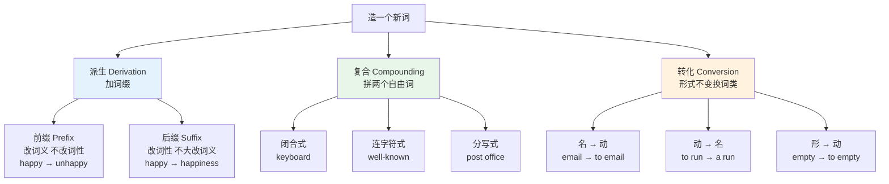
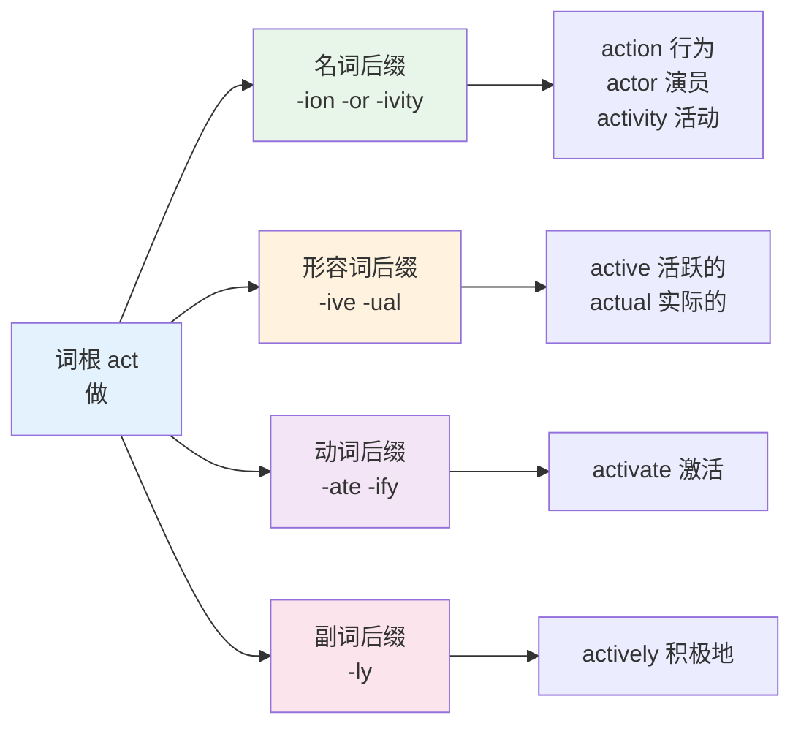
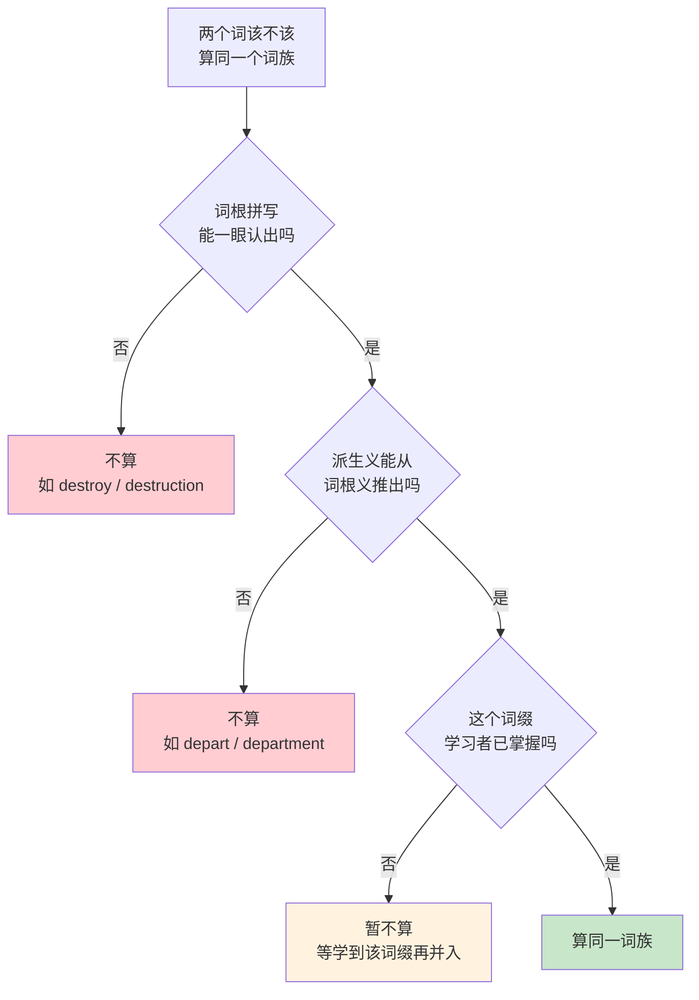
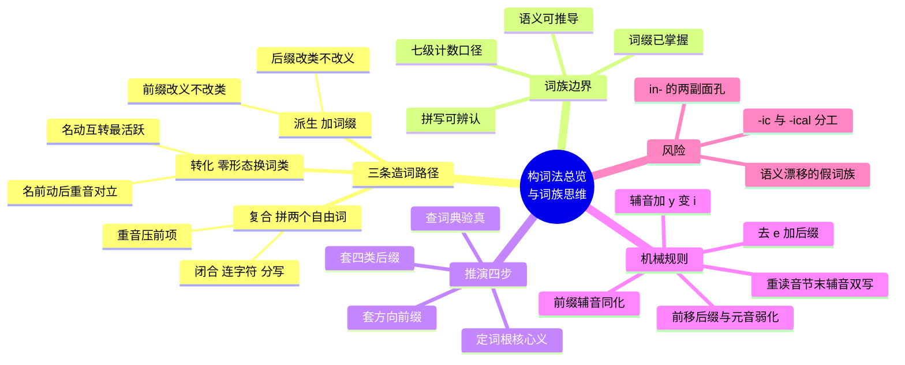

# 构词法总览与词族思维

> [!info] 本篇定位
>
> 第 14 章的总纲，也是全书两个「乘数项」章节的入口。
>
> 前十三章是加法：一章一个主题，一次几十个词。这一章开始是乘法：给你一套规则，把已经学过的孤立词重新组织成可以互相推导的网络。
>
> 读完你会拿到三样东西：判断一个词属于哪条造词路径的方法，判断两个形近词是不是同一个词族的标准，以及从一个词根出发扩出十几个词的可操作流程。加缀时字母怎么变、前缀为什么会改形、重音跑到哪里去，这三类机械性规则也在本篇一次讲清。
>
> 后面 `02` 到 `06` 五篇会把具体的前缀后缀逐类展开，本篇负责给它们建坐标系。

---

## 1. 本篇导读：构词法为什么是乘数项

先看一组数字对比。假设你现在认识 `form` 这一个词。查完词典你会发现，以它为词根的常用词至少有这些：

```text
form  forms  formed  forming  formal  formally  formality  informal
format  formation  formative  formula  formulate  formulation
inform  informed  informative  information  informant
reform  reformer  reformation  transform  transformation
perform  performance  performer  conform  conformity  uniform  uniformity
```

三十多个词，共享一个可辨认的词根。如果按「一个词形算一个词」逐个背，这是三十多次记忆负担；如果知道 `form` 是「形状、构成」，`in-` 是「进入」，`-ation` 是「动作变名词」，那么 `information` 就不需要单独背——它是 `inform`（把内容装进某人脑子里）的名词形式。

构词法的收益就在这个换算里。它本身不新增词汇量，它把已有词汇量的**利用率**抬上去。

这个杠杆有两个方向的作用。

**向前推**：遇到生词能拆。读技术文档碰到 `deserialization`，拆成 `de-`（反向）+ `serial`（序列）+ `-ize`（动词化）+ `-ation`（名词化），不查词典也能定位到「反序列化」。这是接受性词汇的扩张。

**向后收**：写作时能造。想说「这个配置不可变」，知道 `mutable` 是「可变的」，加 `im-` 得到 `immutable`，加 `-ity` 得到 `immutability`。这是产出性词汇的扩张。

> [!warning] 构词法不是万能的
>
> 拆词只在**语义透明**的词上有效。`understand` 拆成 `under` + `stand` 得不出「理解」，`department` 拆成 `de-` + `part` 得不出「部门」。
>
> 有效范围大致是：拉丁希腊来源的多音节词命中率高，日耳曼来源的短词几乎全不可拆。这条界线的成因在 [[01.词汇入门与学习方法/01.英语词汇的来源、分层与学习地图\|01.英语词汇的来源、分层与学习地图]] 里讲过。
>
> 本篇第 12 节专门处理拆错的情况。

---

## 2. 三条造词路径：派生、复合、转化

英语造新词的主要手段有三条。绝大多数你见过的「长词」都是这三条路径之一（或几条叠加）的产物。



上图的三条主干各自有明确分工。派生靠附加**黏着词素**（bound morpheme，不能独立成词的成分，比如 `un-`、`-ness`）；复合靠拼接**自由词素**（free morpheme，本身就是完整的词，比如 `key` 和 `board`）；转化不加任何东西，只是把一个词搬到新的句法位置上用。

三条路径的关键差别可以放在一张表里对照。

| 维度 | 派生 | 复合 | 转化 |
| --- | --- | --- | --- |
| 加的成分 | 黏着词素（词缀） | 自由词素（完整的词） | 什么都不加 |
| 拼写变化 | 常有（去 e、y→i、双写） | 一般无 | 无 |
| 读音变化 | 常有（重音移位、元音弱化） | 重音统一压到前项 | 少数有（名动重音对立） |
| 词性变化 | 后缀几乎必改，前缀几乎不改 | 由后项决定 | 必改 |
| 语义透明度 | 中到高 | 高到低（差异很大） | 高 |
| 中文对应现象 | 无直接对应 | 类似「电+脑」 | 类似「锁」名动同形 |

中文母语者对复合和转化的直觉其实不差——「电脑」「手机」是复合，「锁」（名词的锁 / 动词的锁）是转化。真正陌生的是派生：中文没有屈折和派生词缀这套机制，「快乐 / 不快乐 / 快乐地 / 快乐感」靠的是加字和语序，不是词形变化。这是本章最需要建立的新直觉。

---

## 3. 路径一：派生 —— 前缀管意思，后缀管词性

### 3.1 前缀改义不改类

前缀加在词根前面，改变词义方向，**基本不改变词性**。加 `un-` 之前 `happy` 是形容词，加完 `unhappy` 还是形容词。

| 英文 | 英式音标 | 美式音标 | 词性 | 中文 | 搭配与说明 |
| --- | --- | --- | --- | --- | --- |
| **unhappy** | /ʌnˈhæpi/ | /ʌnˈhæpi/ | adj. | 不开心的 | un- 加形容词仍是形容词 |
| **disagree** | /ˌdɪsəˈɡriː/ | /ˌdɪsəˈɡriː/ | v. | 不同意 | disagree with sb about sth |
| **rewrite** | /ˌriːˈraɪt/ | /ˌriːˈraɪt/ | v. | 重写 | re- 表「再一次」，重音常在 re |
| **preview** | /ˈpriːvjuː/ | /ˈpriːvjuː/ | n./v. | 预览 | pre- 表「在前」 |
| **overload** | /ˌəʊvəˈləʊd/ | /ˌoʊvərˈloʊd/ | v. | 超载 | 名词重读前移 /ˈəʊvələʊd/ |
| **underestimate** | /ˌʌndərˈestɪmeɪt/ | /ˌʌndərˈestɪmeɪt/ | v. | 低估 | under- 表「不足」 |
| **misread** | /ˌmɪsˈriːd/ | /ˌmɪsˈriːd/ | v. | 误读 | 过去式 misread /ˌmɪsˈred/ |
| **subsystem** | /ˈsʌbˌsɪstəm/ | /ˈsʌbˌsɪstəm/ | n. | 子系统 | sub- 表「下层」 |
| **interface** | /ˈɪntəfeɪs/ | /ˈɪntərfeɪs/ | n./v. | 接口；对接 | inter- 表「之间」 |
| **antivirus** | /ˌæntiˈvaɪrəs/ | /ˌæntaɪˈvaɪrəs/ | n./adj. | 杀毒（软件） | anti- 英美读音不同 |

> [!warning] 前缀不改词性有例外
>
> 有三个前缀会改词性，需要单独记：
>
> - `en-` / `em-`：把名词或形容词变动词。`able` → **enable**（使能够）、`rich` → **enrich**（使丰富）、`power` → **empower**（授权）、`danger` → **endanger**（危及）。
> - `a-`：把动词变表语形容词。`sleep` → **asleep**、`wake` → **awake**、`live` → **alive**、`float` → **afloat**。这类词只能作表语，不能放在名词前面。
>   - ✅ The baby is **asleep**.
>   - ❌ ~~an asleep baby~~ → 要说 a **sleeping** baby
> - `be-`：把名词变动词。`friend` → **befriend**（与⋯交友）、`witch` → **bewitch**（迷惑）。这个前缀已经不再产出新词，只在存量词里出现。

### 3.2 后缀改类不大改义

后缀加在词根后面，主要作用是**改变词性**，核心义基本保留。



上图展示的是后缀的分工模式：同一个词根配不同类别的后缀，就长出四个词性的成员。这个「四类后缀 × 一个词根」的矩阵是本章后半部分（`04` 到 `06` 三篇）的组织方式，也是第 8 节推演流程的骨架。

四类后缀的高频代表先列在这里，细节留给后面几篇。

| 后缀类别 | 常见后缀 | 例词 | 例词中文 |
| --- | --- | --- | --- |
| 名词（抽象） | -ness, -ity, -tion, -ment, -ance, -ship | kindness, ability, creation, movement, importance, friendship | 善良、能力、创造、运动、重要性、友谊 |
| 名词（人） | -er, -or, -ist, -ant, -ee | writer, actor, scientist, assistant, employee | 作者、演员、科学家、助手、雇员 |
| 形容词 | -able, -ful, -less, -ous, -ive, -al, -ic | readable, careful, useless, famous, active, national, basic | 可读的、细心的、无用的、著名的、活跃的、国家的、基本的 |
| 动词 | -ize/-ise, -ify, -ate, -en | organize, simplify, activate, widen | 组织、简化、激活、加宽 |
| 副词 | -ly, -ward, -wise | quickly, forward, otherwise | 快地、向前、否则 |

下面是一组同根不同后缀的完整对照，可以直接看出词性是怎么被后缀决定的。

| 英文 | 英式音标 | 美式音标 | 词性 | 中文 | 搭配与说明 |
| --- | --- | --- | --- | --- | --- |
| **create** | /kriˈeɪt/ | /kriˈeɪt/ | v. | 创造 | create an account 创建账号 |
| **creation** | /kriˈeɪʃn/ | /kriˈeɪʃn/ | n. | 创造；作品 | -ion 把动作变名词 |
| **creative** | /kriˈeɪtɪv/ | /kriˈeɪtɪv/ | adj. | 有创造力的 | -ive 变形容词 |
| **creatively** | /kriˈeɪtɪvli/ | /kriˈeɪtɪvli/ | adv. | 有创造性地 | 形容词加 -ly 变副词 |
| **creativity** | /ˌkriːeɪˈtɪvəti/ | /ˌkriːeɪˈtɪvəti/ | n. | 创造力 | -ity 把形容词变抽象名词 |
| **creator** | /kriˈeɪtə/ | /kriˈeɪtər/ | n. | 创造者 | -or 表施事者 |
| **recreate** | /ˌriːkriˈeɪt/ | /ˌriːkriˈeɪt/ | v. | 重新创造 | 与 recreation /ˌrekriˈeɪʃn/ 娱乐 不同源义 |
| **procreate** | /ˈprəʊkrieɪt/ | /ˈproʊkrieɪt/ | v. | 生育 | 正式用语，pro- 向前 |

注意最后两行的陷阱：`recreate`（重新创造）和 `recreation`（娱乐）拼写像一家，读音和意思都已经分开，`recreation` 的重音在第三音节且第一个 e 读 /e/ 不读 /iː/。这类拼写同源但语义漂移的情况，第 12 节会集中处理。

### 3.3 派生链可以叠好几层

后缀能连续叠加，每叠一层换一次词性。链条最长的常见例子是 `nation`。

```text
nation（名）→ national（形）→ nationalize（动）→ nationalization（名）
nation（名）→ national（形）→ nationality（名）
nation（名）→ national（形）→ nationally（副）
nation（名）→ national（形）→ nationalist（名）→ nationalistic（形）
```

| 英文 | 英式音标 | 美式音标 | 词性 | 中文 | 搭配与说明 |
| --- | --- | --- | --- | --- | --- |
| **nation** | /ˈneɪʃn/ | /ˈneɪʃn/ | n. | 国家；民族 | 强调人民集合体，与 country 侧重不同 |
| **national** | /ˈnæʃnəl/ | /ˈnæʃnəl/ | adj. | 全国的 | 注意元音由 /eɪ/ 缩为 /æ/ |
| **nationality** | /ˌnæʃəˈnæləti/ | /ˌnæʃəˈnæləti/ | n. | 国籍 | 填表用 nationality 不用 country |
| **nationalize** | /ˈnæʃnəlaɪz/ | /ˈnæʃnəlaɪz/ | v. | 国有化 | 英式亦拼 nationalise |
| **nationalization** | /ˌnæʃnəlaɪˈzeɪʃn/ | /ˌnæʃnələˈzeɪʃn/ | n. | 国有化（过程） | 四层派生的终点 |
| **international** | /ˌɪntəˈnæʃnəl/ | /ˌɪntərˈnæʃnəl/ | adj. | 国际的 | 前缀后缀同时上 |
| **multinational** | /ˌmʌltiˈnæʃnəl/ | /ˌmʌltiˈnæʃnəl/ | adj./n. | 跨国的；跨国公司 | multi- 多 |

`nation` → `national` 这一步已经出现了元音变化：/ˈneɪʃn/ 的 /eɪ/ 到 /ˈnæʃnəl/ 变成了 /æ/。这不是随意的，是「三音节缩短律」（trisyllabic laxing）的表现——词变长到三音节以上时，原本的长元音倾向于缩短。同类例子还有 `nature` /ˈneɪtʃə/ → `natural` /ˈnætʃrəl/、`divine` /dɪˈvaɪn/ → `divinity` /dɪˈvɪnəti/、`serene` /səˈriːn/ → `serenity` /səˈrenəti/。第 11 节会把这条规律和重音移位一起讲。

---

## 4. 路径二：复合 —— 两个自由词拼在一起

### 4.1 三种书写形式

复合词有三种写法，而且**同一个词在不同词典、不同时期的写法可能不同**。

| 写法 | 英文名 | 例词 | 说明 |
| --- | --- | --- | --- |
| 闭合式 | closed / solid | keyboard, database, firewall | 用得越久越倾向于闭合 |
| 连字符式 | hyphenated | well-known, up-to-date, state-of-the-art | 作定语时最常见 |
| 分写式 | open / spaced | post office, ice cream, real estate | 新词或长词常保持分写 |

英语复合词的书写有一条演化路径：新造的复合概念先分写（`electronic mail`），用久了加连字符（`e-mail`），再用久了闭合（`email`）。`website` 走的也是 `web site` → `web-site` → `website` 这条路。所以碰到写法不一致的情况，先查一本近期出版的词典，而不是纠结哪种「正确」。

> [!tip] 连字符的一条实用规则
>
> 复合形容词放在名词**前面**时加连字符，放在名词**后面**（作表语）时不加。
>
> - a **well-known** engineer / The engineer is **well known**.
> - a **five-year** plan / The plan lasts **five years**.
> - an **up-to-date** document / The document is **up to date**.
>
> 注意第二例：定语位置的 `five-year` 用单数 year，不用 years。这是中文母语者高频出错的点。

### 4.2 按词类组合分类

复合词的词性由**后一个成分**决定。`blackboard` 的 board 是名词，所以 `blackboard` 是名词；`overlook` 的 look 是动词，所以 `overlook` 是动词。

| 英文 | 英式音标 | 美式音标 | 词性 | 中文 | 搭配与说明 |
| --- | --- | --- | --- | --- | --- |
| **keyboard** | /ˈkiːbɔːd/ | /ˈkiːbɔːrd/ | n. | 键盘 | 名 + 名，重音在前项 |
| **database** | /ˈdeɪtəbeɪs/ | /ˈdeɪtəbeɪs/ | n. | 数据库 | 名 + 名 |
| **firewall** | /ˈfaɪəwɔːl/ | /ˈfaɪərwɔːl/ | n. | 防火墙 | 名 + 名，原指建筑防火隔墙 |
| **software** | /ˈsɒftweə/ | /ˈsɔːftwer/ | n. | 软件 | 形 + 名，不可数 |
| **greenhouse** | /ˈɡriːnhaʊs/ | /ˈɡriːnhaʊs/ | n. | 温室 | 形 + 名，与 green house 重音不同 |
| **whiteboard** | /ˈwaɪtbɔːd/ | /ˈwaɪtbɔːrd/ | n. | 白板 | 形 + 名 |
| **feedback** | /ˈfiːdbæk/ | /ˈfiːdbæk/ | n. | 反馈 | 动 + 副，不可数 |
| **breakdown** | /ˈbreɪkdaʊn/ | /ˈbreɪkdaʊn/ | n. | 故障；细目分解 | 动 + 副，由短语动词 break down 名词化 |
| **rollback** | /ˈrəʊlbæk/ | /ˈroʊlbæk/ | n. | 回滚 | 同上，动词形式写作 roll back |
| **output** | /ˈaʊtpʊt/ | /ˈaʊtpʊt/ | n./v. | 输出 | 副 + 动，名动同形 |
| **overflow** | /ˈəʊvəfləʊ/ | /ˈoʊvərfloʊ/ | n. | 溢出 | 名词重音在前，动词 /ˌəʊvəˈfləʊ/ 在后 |
| **upgrade** | /ˈʌpɡreɪd/ | /ˈʌpɡreɪd/ | n. | 升级 | 动词读 /ˌʌpˈɡreɪd/ |
| **downtime** | /ˈdaʊntaɪm/ | /ˈdaʊntaɪm/ | n. | 停机时间 | 副 + 名，不可数 |
| **runtime** | /ˈrʌntaɪm/ | /ˈrʌntaɪm/ | n. | 运行时 | 技术术语，也写 run-time |
| **workflow** | /ˈwɜːkfləʊ/ | /ˈwɜːrkfloʊ/ | n. | 工作流 | 名 + 名 |
| **checkout** | /ˈtʃekaʊt/ | /ˈtʃekaʊt/ | n. | 结账；检出 | 动词写作 check out 分开 |

> [!warning] 名词形式合写，动词形式分写
>
> 上表里有一批词遵循同一条规律：由「动词 + 小品词」构成的组合，**名词形式合写或加连字符，动词形式分写成两个词**。
>
> - The system **broke down**. / We analysed the **breakdown**.
> - Please **check out** at the front desk. / **Checkout** is at 11 a.m.
> - We had to **roll back** the release. / The **rollback** took ten minutes.
> - Please **log in** with your account. / The **login** page is down.
> - I'll **back up** the database. / Restore from the latest **backup**.
>
> 写英文技术文档时这条错得极多。判断方法：句子里这个位置需要一个动作还是一个东西？动作就分写，东西就合写。

### 4.3 复合词的重音：一条能区分词义的规则

复合名词的重音**压在前一个成分**上；而「形容词 + 名词」的普通词组，重音压在**后一个成分**上。这条规则能直接区分两个意思。

```text
a GREENhouse   /ə ˈɡriːnhaʊs/      温室（一种建筑类型）
a green HOUSE  /ə ˌɡriːn ˈhaʊs/    一栋绿色的房子

the WHITE House /ðə ˈwaɪt haʊs/    白宫（专有名词，重音在 white）
a white HOUSE   /ə ˌwaɪt ˈhaʊs/    一栋白色的房子

a BLACKbird     /ə ˈblækbɜːd/      乌鸫（一种鸟）
a black BIRD    /ə ˌblæk ˈbɜːd/    一只黑色的鸟
```

| 英文 | 英式音标 | 美式音标 | 词性 | 中文 | 搭配与说明 |
| --- | --- | --- | --- | --- | --- |
| **blackboard** | /ˈblækbɔːd/ | /ˈblækbɔːrd/ | n. | 黑板 | 重音在前，黑板不一定是黑的 |
| **blackbird** | /ˈblækbɜːd/ | /ˈblækbɜːrd/ | n. | 乌鸫 | 特指一种鸟 |
| **darkroom** | /ˈdɑːkruːm/ | /ˈdɑːrkruːm/ | n. | 暗房 | 冲洗照片的房间 |
| **shortcut** | /ˈʃɔːtkʌt/ | /ˈʃɔːrtkʌt/ | n. | 捷径；快捷方式 | keyboard shortcut 键盘快捷键 |
| **hotline** | /ˈhɒtlaɪn/ | /ˈhɑːtlaɪn/ | n. | 热线 | 与 a hot line 一条烫的线 对比 |
| **highlight** | /ˈhaɪlaɪt/ | /ˈhaɪlaɪt/ | n./v. | 亮点；突出显示 | 名动同形，重音都在前 |

这条重音规则对听力理解的价值很高：听到重音在前，说明说话人指的是一个固定概念（一类东西），听到重音在后，说明是临时的修饰关系。

### 4.4 复合词的语义透明度分三档

复合词的意思能不能从两个成分推出来，差别很大。

| 透明度 | 例词 | 能否推导 |
| --- | --- | --- |
| 完全透明 | bookshelf, keyboard, workflow, raincoat | 能，字面相加即可 |
| 半透明 | firewall, greenhouse, feedback, blueprint | 半能，知道字面还需要一步引申 |
| 不透明 | deadline, breakfast, understand, ladybird | 不能，必须整体记 |

| 英文 | 英式音标 | 美式音标 | 词性 | 中文 | 搭配与说明 |
| --- | --- | --- | --- | --- | --- |
| **deadline** | /ˈdedlaɪn/ | /ˈdedlaɪn/ | n. | 截止期限 | 原指战俘营越过即射杀的线 |
| **blueprint** | /ˈbluːprɪnt/ | /ˈbluːprɪnt/ | n. | 蓝图；方案 | 引申义比字面义常用 |
| **bottleneck** | /ˈbɒtlnek/ | /ˈbɑːtlnek/ | n. | 瓶颈 | performance bottleneck 性能瓶颈 |
| **milestone** | /ˈmaɪlstəʊn/ | /ˈmaɪlstoʊn/ | n. | 里程碑 | 项目管理常用 |
| **breakthrough** | /ˈbreɪkθruː/ | /ˈbreɪkθruː/ | n. | 突破 | 与 break through 动词分写 |
| **workaround** | /ˈwɜːkəraʊnd/ | /ˈwɜːrkəraʊnd/ | n. | 变通方案 | 技术文档高频，指临时绕过问题的做法 |

不透明的复合词要当成整体单词来记，拆解反而误导。判断办法是先按字面拆一次，如果推出的意思和实际用法对不上，就停止拆解直接记。

---

## 5. 路径三：转化 —— 一个字母不改就换词性

### 5.1 转化是英语最活跃的造词方式

转化（conversion，也叫 zero derivation 零派生）指的是一个词不加任何词缀，直接换一个词类使用。英语的形态屈折极少，这让转化几乎没有阻力，成了现代英语造新词最高产的路径。

| 英文 | 英式音标 | 美式音标 | 词性 | 中文 | 搭配与说明 |
| --- | --- | --- | --- | --- | --- |
| **email** | /ˈiːmeɪl/ | /ˈiːmeɪl/ | n./v. | 邮件；发邮件 | email me the file 双宾语用法 |
| **google** | /ˈɡuːɡl/ | /ˈɡuːɡl/ | v. | 搜索 | 品牌名转动词，小写时为通用动词 |
| **host** | /həʊst/ | /hoʊst/ | n./v. | 主机；托管 | host a service 托管服务 |
| **ship** | /ʃɪp/ | /ʃɪp/ | n./v. | 船；发布 | 技术语境 ship a feature 上线功能 |
| **branch** | /brɑːntʃ/ | /bræntʃ/ | n./v. | 分支；分叉 | branch off from main |
| **fork** | /fɔːk/ | /fɔːrk/ | n./v. | 叉子；分叉 | fork a repository 复刻仓库 |
| **merge** | /mɜːdʒ/ | /mɜːrdʒ/ | v./n. | 合并 | merge conflict 合并冲突 |
| **cache** | /kæʃ/ | /kæʃ/ | n./v. | 缓存 | 与 cash 同音，拼写不同 |
| **mirror** | /ˈmɪrə/ | /ˈmɪrər/ | n./v. | 镜子；镜像 | mirror a site 做站点镜像 |
| **table** | /ˈteɪbl/ | /ˈteɪbl/ | n./v. | 桌；表；搁置 | 英美动词义相反，见下方警告 |
| **empty** | /ˈempti/ | /ˈempti/ | adj./v. | 空的；清空 | 形容词转动词 |
| **clean** | /kliːn/ | /kliːn/ | adj./v. | 干净的；清理 | clean the cache |
| **dry** | /draɪ/ | /draɪ/ | adj./v. | 干的；弄干 | 第三人称 dries |
| **run** | /rʌn/ | /rʌn/ | v./n. | 运行；一次运行 | a test run 一次试运行 |
| **build** | /bɪld/ | /bɪld/ | v./n. | 构建；构建产物 | the latest build 最新构建 |
| **release** | /rɪˈliːs/ | /rɪˈliːs/ | v./n. | 发布 | 名动重音相同，不移位 |

> [!warning] table 的英美义相反
>
> 动词 `table a proposal` 在英式英语里是「把提案提交讨论」，在美式英语里是「把提案搁置」。意思正好相反。
>
> 跨国团队的会议纪要里出现这个词时，必须靠上下文确认，或者干脆换成 `submit for discussion` / `postpone` 这类无歧义的说法。同类英美冲突词在 [[18.语域、英美差异与习语俚语/01.英式与美式词汇差异\|17.语域、英美差异与习语俚语]] 里有完整清单。

### 5.2 转化的四种常见方向

| 方向 | 英文 | 例子 | 中文 |
| --- | --- | --- | --- |
| 名词 → 动词 | noun to verb | to **bookmark** a page | 给页面加书签 |
| 动词 → 名词 | verb to noun | give it a **try** | 试一下 |
| 形容词 → 动词 | adjective to verb | to **calm** the user | 安抚用户 |
| 形容词 → 名词 | adjective to noun | the **poor**, the **unemployed** | 穷人、失业者 |

「形容词 → 名词」这一类有个必须注意的语法约束：`the + 形容词` 表示的是**一类人的集合**，谓语用复数，不能加 -s。

> [!example] the + 形容词的用法
>
> - The **rich** get richer and the **poor** get poorer.
>   - 富者愈富，穷者愈穷。
> - The **unemployed** are hit hardest by the change.
>   - 失业者受这项变化的冲击最大。
> - ❌ ~~The poors are~~ / ❌ ~~The poor is~~
> - ✅ The **poor are**

### 5.3 名动重音对立：转化的一个变体

有一批双音节词，做名词时重音在第一音节，做动词时在第二音节。拼写完全相同，只有读音区分词性。这类词多来自拉丁语，严格说不算典型的转化，但学习时归在一起处理更方便。

| 英文 | 英式音标（名） | 美式音标（名） | 词性 | 中文 | 搭配与说明 |
| --- | --- | --- | --- | --- | --- |
| **record** | /ˈrekɔːd/ | /ˈrekərd/ | n. | 记录 | 动词 /rɪˈkɔːd/ · /rɪˈkɔːrd/ |
| **present** | /ˈpreznt/ | /ˈpreznt/ | n./adj. | 礼物；当前的 | 动词 /prɪˈzent/ 呈现 |
| **increase** | /ˈɪŋkriːs/ | /ˈɪŋkriːs/ | n. | 增长 | 动词 /ɪnˈkriːs/ |
| **decrease** | /ˈdiːkriːs/ | /ˈdiːkriːs/ | n. | 下降 | 动词 /dɪˈkriːs/ |
| **object** | /ˈɒbdʒɪkt/ | /ˈɑːbdʒekt/ | n. | 物体；对象 | 动词 /əbˈdʒekt/ 反对 |
| **project** | /ˈprɒdʒekt/ | /ˈprɑːdʒekt/ | n. | 项目 | 动词 /prəˈdʒekt/ 投射 |
| **export** | /ˈekspɔːt/ | /ˈekspɔːrt/ | n. | 出口；导出 | 动词 /ɪkˈspɔːt/ · /ɪkˈspɔːrt/ |
| **import** | /ˈɪmpɔːt/ | /ˈɪmpɔːrt/ | n. | 进口；导入 | 动词 /ɪmˈpɔːt/ · /ɪmˈpɔːrt/ |
| **permit** | /ˈpɜːmɪt/ | /ˈpɜːrmɪt/ | n. | 许可证 | 动词 /pəˈmɪt/ · /pərˈmɪt/ |
| **conduct** | /ˈkɒndʌkt/ | /ˈkɑːndʌkt/ | n. | 行为 | 动词 /kənˈdʌkt/ 实施 |
| **contrast** | /ˈkɒntrɑːst/ | /ˈkɑːntræst/ | n. | 对比 | 动词 /kənˈtrɑːst/ · /kənˈtræst/ |
| **suspect** | /ˈsʌspekt/ | /ˈsʌspekt/ | n. | 嫌疑人 | 动词 /səˈspekt/ 怀疑 |

记忆口诀是「名前动后」：名词重音靠前，动词重音靠后。这条规律覆盖了大部分这类词，但不是全部——`report`、`result`、`respect`、`release` 的名动重音相同，都在后面。

> [!example] 同一句话里的名动对照
>
> - We need to **record** /rɪˈkɔːd/ the meeting and keep a **record** /ˈrekɔːd/ of the decisions.
>   - 我们需要录下会议，并保留决定的记录。
> - Sales will **increase** /ɪnˈkriːs/ after this **increase** /ˈɪŋkriːs/ in ad spend.
>   - 广告投入的这次增长之后，销量会上升。
> - You need a **permit** /ˈpɜːmɪt/ before we **permit** /pəˈmɪt/ access.
>   - 我们允许访问之前，你需要一张许可证。

---

## 6. 词族：边界画在哪里

### 6.1 词族的定义

**词族（word family）**指的是一个词根加上它的屈折变化和「透明的」派生词所构成的集合。这个集合被当作**一个**词汇单位计数。

`develop` 这个词族至少包括：

```text
屈折变化：develop  develops  developed  developing
透明派生：developer  developers  development  developments
         developmental  undeveloped  underdeveloped
```

十一个词形，一个词族。学会 `develop` 之后，剩下十个词形不需要单独学——只要认得后缀，看到就能推。

### 6.2 三条边界判据

哪些词算进同一个词族，哪些不算，判断标准是**这个学习者能不能不查词典就推出来**。可以拆成三条判据。



上图的关键在最后一个判断：**词族的边界是随学习者水平变动的**，不是词典里的客观事实。初学者认不出 `-ity`，对他而言 `able` 和 `ability` 是两个词；学过 `-ity` 之后就并成一个。这就是下一节要讲的分级口径的由来。

第一条判据「拼写能一眼认出」排除的是形态变化太大的一批词。`destroy` /dɪˈstrɔɪ/ 和 `destruction` /dɪˈstrʌkʃn/ 语义上完全是一家，但拼写从 -stroy 变成 -struct，中间没有可辨认的连续性，只能当两个词学。

第二条判据「语义可推」排除的是拼写像但意思已经跑掉的词。`depart`（离开）和 `department`（部门）拼写连得上，意思接不上。

### 6.3 边界内外的对照

| 词根 | 明确算同族 | 明确不算同族 | 不算的原因 |
| --- | --- | --- | --- |
| develop | developer, development, undeveloped | envelope | 拼写与语义都已分离 |
| act | action, active, activity, actor | exact, transact | 语义关联太远，需另记 |
| press | pressing, pressure | espresso | 词源相关但现代语感断裂 |
| part | partly, partial, department 之外的派生 | department | 语义不可推 |
| casual | casually | casualty | 「伤亡」推不出来 |
| office | officer, official | officious | 「爱管闲事的」是贬义漂移 |

> [!warning] 同词根 ≠ 同词族
>
> 词源上同根的词可能分属不同词族。判断依据是**现代语义**，不是历史来源。
>
> - `hospital`（医院）、`hostel`（旅舍）、`hotel`（酒店）、`hospitality`（好客）同出拉丁 hospes，但今天必须分开记。
> - `capital`（首都/资本）、`captain`（船长）、`chapter`（章节）、`chief`（首领）同出拉丁 caput「头」，也一样。
>
> 词源知识在第 15 章有它的价值——帮助长期记忆。但它不改变词族的划分，词族划分服务的是「能不能现场推导」这个操作问题。

---

## 7. 词族计数口径：Bauer 与 Nation 的七级分层

### 7.1 七个级别

Bauer 与 Nation 在 1993 年发表于 *International Journal of Lexicography* 的论文 *Word Families* 中提出了一套分级方案，按词缀的**频率、规则性、生产力**把它们排成七级。级别越高，纳入词族的词缀越多，同一批词形算出来的词族数就越少。

| 级别 | 纳入的内容 | 举例 |
| --- | --- | --- |
| Level 1 | 每个不同的词形各算一个词 | walk / walks / walked / walking 算 4 个 |
| Level 2 | 加上屈折后缀：-s, -ed, -ing, -er, -est, -'s | walk 系列算 1 个；walker 另算 |
| Level 3 | 加上最高频最规则的派生词缀：-able, -er, -ish, -less, -ly, -ness, -th, non-, un- | happy / happily / happiness / unhappy 合成 1 个 |
| Level 4 | 加上高频且拼写规则的词缀：-al, -ation, -ful, -ism, -ist, -ity, -ize, -ment, -ous, in- | nation / national / nationality / nationalize 合成 1 个 |
| Level 5 | 加上规则但不常见的词缀：-age, -ance, -ant, -dom, -ee, -en, -ery, -hood, -ship, -ward, -wise, anti-, bi-, counter-, en-, ex-, fore-, hyper-, inter-, mid-, mis-, post-, pro-, semi-, sub- | 覆盖面继续扩大 |
| Level 6 | 加上高频但拼写或读音不规则的词缀：-ee, -ic, -ify, -ion, -ive, pre-, re- | describe / description 之类开始并入 |
| Level 7 | 加上古典词根与词缀（拉丁希腊层） | spect, port, dict 等词根系列全部并族 |

这套分级的价值不在于哪一级「正确」，而在于它把「词族」这个模糊概念变成了可以标注级别的量。说「我有五千词族」是没有信息量的，说「按 Level 4 口径五千词族」才可比较。

### 7.2 三种主流口径的对应关系

| 口径 | 大致对应 | 常见使用场景 |
| --- | --- | --- |
| 词形（word form） | Level 1 | 语料库原始统计、词频表 |
| 词目（lemma） | Level 2 | 词典编纂、多数在线测试 |
| 词族（word family） | Level 6 | 覆盖率研究、Nation 的 BNC/COCA 词表 |

Nation 系列的高频词表（1000 词族、2000 词族这类说法）用的是接近 Level 6 的口径。这解释了为什么「两千词族」听起来不多，实际覆盖的词形有六千到八千个。

> [!tip] 这套口径怎么用在日常学习上
>
> 拿一个不认识的派生词，问自己两个问题：
>
> 1. 词根我认识吗？认识 → 只需要确认词缀，几秒钟的事。
> 2. 词缀我掌握到什么级别？Level 3-4 的词缀（-ness、-ity、-tion、-able、un-、in-）必须练到看到就自动识别，这是本章 `04` 到 `06` 三篇的目标。
>
> 两个问题都是「是」，这个词就不占用新词配额，直接放行。第 `06` 篇 [[01.词汇入门与学习方法/06.词汇量自测、CEFR 对照与目标设定\|词汇量自测、CEFR 对照与目标设定]] 里的自测结果也要按这个口径读。

---

## 8. 从一个词扩出十几个：四步推演流程

### 8.1 流程

拿到一个词根之后，按固定顺序推四轮，产出稳定。


上图四步里，第四步最容易被跳过，也最不能跳过。前三步是机械生成，会造出 `*informive`、`*performful` 这类不存在的词；只有查过词典才知道哪些是真词。推导是用来降低记忆负担的，不是用来自创词汇的。

### 8.2 完整演示：以 form 为例

**第一步：词根与核心义。** `form` = 形状、构成、使成形。

**第二步：套四类后缀。**

| 后缀类别 | 生成结果 | 真词判定 |
| --- | --- | --- |
| 名词 | formation, formality, formula, format | 全部成立 |
| 形容词 | formal, formative, formulaic | 全部成立 |
| 动词 | formulate, formalize | 全部成立 |
| 副词 | formally | 成立 |

**第三步：套方向前缀。**

| 前缀 | 生成结果 | 真词判定 |
| --- | --- | --- |
| in-（进入） | inform, information, informative, informant | 全部成立 |
| re-（再） | reform, reformer, reformation | 全部成立 |
| trans-（跨越） | transform, transformation, transformer | 全部成立 |
| per-（彻底） | perform, performance, performer | 全部成立 |
| con-（一起） | conform, conformity, conformist | 全部成立 |
| uni-（单一） | uniform, uniformity, uniformly | 全部成立 |
| de-（去掉） | deform, deformation, deformed | 全部成立 |
| in-（否定） | informal, informally, informality | 全部成立 |

**第四步：验真并整理。**

| 英文 | 英式音标 | 美式音标 | 词性 | 中文 | 搭配与说明 |
| --- | --- | --- | --- | --- | --- |
| **form** | /fɔːm/ | /fɔːrm/ | n./v. | 形式；表单；形成 | fill in a form 英式 · fill out a form 美式 |
| **formal** | /ˈfɔːml/ | /ˈfɔːrml/ | adj. | 正式的 | formal语域详见第 17 章 |
| **informal** | /ɪnˈfɔːml/ | /ɪnˈfɔːrml/ | adj. | 非正式的 | 此处 in- 是否定，不是「进入」 |
| **format** | /ˈfɔːmæt/ | /ˈfɔːrmæt/ | n./v. | 格式；格式化 | 动词双写 t：formatted, formatting |
| **formation** | /fɔːˈmeɪʃn/ | /fɔːrˈmeɪʃn/ | n. | 形成；构造 | 重音移到第二音节 |
| **formula** | /ˈfɔːmjələ/ | /ˈfɔːrmjələ/ | n. | 公式 | 复数 formulas 或 formulae /ˈfɔːmjuliː/ |
| **formulate** | /ˈfɔːmjuleɪt/ | /ˈfɔːrmjuleɪt/ | v. | 制定；表述 | formulate a strategy |
| **inform** | /ɪnˈfɔːm/ | /ɪnˈfɔːrm/ | v. | 通知 | inform sb of/about sth |
| **information** | /ˌɪnfəˈmeɪʃn/ | /ˌɪnfərˈmeɪʃn/ | n. | 信息 | 不可数，a piece of information |
| **informative** | /ɪnˈfɔːmətɪv/ | /ɪnˈfɔːrmətɪv/ | adj. | 信息量大的 | 褒义，不等于 informal |
| **reform** | /rɪˈfɔːm/ | /rɪˈfɔːrm/ | n./v. | 改革 | 名动重音相同 |
| **transform** | /trænsˈfɔːm/ | /trænsˈfɔːrm/ | v. | 转变 | transform A into B |
| **transformation** | /ˌtrænsfəˈmeɪʃn/ | /ˌtrænsfərˈmeɪʃn/ | n. | 转变 | digital transformation 数字化转型 |
| **perform** | /pəˈfɔːm/ | /pərˈfɔːrm/ | v. | 执行；表演 | perform a task / perform on stage |
| **performance** | /pəˈfɔːməns/ | /pərˈfɔːrməns/ | n. | 性能；表演 | performance bottleneck 性能瓶颈 |
| **conform** | /kənˈfɔːm/ | /kənˈfɔːrm/ | v. | 遵从；符合 | conform to a standard |
| **conformity** | /kənˈfɔːməti/ | /kənˈfɔːrməti/ | n. | 遵从；一致 | in conformity with 依照 |
| **uniform** | /ˈjuːnɪfɔːm/ | /ˈjuːnɪfɔːrm/ | n./adj. | 制服；统一的 | uniform distribution 均匀分布 |
| **deform** | /dɪˈfɔːm/ | /dɪˈfɔːrm/ | v. | 使变形 | 技术语境指几何变形 |

一个 `form`，十九个真词。这就是词族思维的具体收益。

### 8.3 第二个演示：以 press 为例

`press` 的核心义是「压」。这个词根的特殊之处在于**前缀决定压的方向**，方向定了意思就定了。

| 前缀含义 | 组合 | 字面 | 实际词义 |
| --- | --- | --- | --- |
| ex- 向外 | express | 向外压 | 表达 |
| im- 向内 | impress | 向内压 | 使印象深刻 |
| com- 一起 | compress | 压到一起 | 压缩 |
| de- 向下 | depress | 向下压 | 使沮丧 |
| sup- 向下（sub- 同化） | suppress | 从下压住 | 镇压 |
| op- 相对（ob- 同化） | oppress | 迎面压 | 压迫 |
| re- 向回 | repress | 压回去 | 压抑 |

| 英文 | 英式音标 | 美式音标 | 词性 | 中文 | 搭配与说明 |
| --- | --- | --- | --- | --- | --- |
| **press** | /pres/ | /pres/ | v./n. | 按；新闻界 | the press 报界，集合名词 |
| **pressure** | /ˈpreʃə/ | /ˈpreʃər/ | n. | 压力 | under pressure 在压力下 |
| **express** | /ɪkˈspres/ | /ɪkˈspres/ | v./adj. | 表达；快速的 | express delivery 快递 |
| **expression** | /ɪkˈspreʃn/ | /ɪkˈspreʃn/ | n. | 表达；表达式 | regular expression 正则表达式 |
| **expressive** | /ɪkˈspresɪv/ | /ɪkˈspresɪv/ | adj. | 富有表现力的 | — |
| **impress** | /ɪmˈpres/ | /ɪmˈpres/ | v. | 使印象深刻 | be impressed by/with |
| **impression** | /ɪmˈpreʃn/ | /ɪmˈpreʃn/ | n. | 印象 | make a good impression |
| **impressive** | /ɪmˈpresɪv/ | /ɪmˈpresɪv/ | adj. | 令人印象深刻的 | 褒义 |
| **compress** | /kəmˈpres/ | /kəmˈpres/ | v. | 压缩 | 名词 compress /ˈkɒmpres/ 敷布 |
| **compression** | /kəmˈpreʃn/ | /kəmˈpreʃn/ | n. | 压缩 | lossless compression 无损压缩 |
| **depress** | /dɪˈpres/ | /dɪˈpres/ | v. | 使沮丧；压低 | depress prices 压低价格 |
| **depression** | /dɪˈpreʃn/ | /dɪˈpreʃn/ | n. | 抑郁；萧条 | 医学与经济学两个专义 |
| **suppress** | /səˈpres/ | /səˈpres/ | v. | 抑制；镇压 | suppress a warning 屏蔽警告 |
| **oppress** | /əˈpres/ | /əˈpres/ | v. | 压迫 | 施加于人，政治语境 |
| **repress** | /rɪˈpres/ | /rɪˈpres/ | v. | 压抑 | 心理学常用，指压抑情绪 |

注意 `-press` 系列的名词全部走 `-pression`，形容词全部走 `-pressive`。规律一旦看出来，十五个词只需要记七个前缀的方向义。

---

## 9. 拼写调整规则：加后缀时字母怎么变

派生的机械难点在拼写。英语加后缀有五条主要调整规则，全部有例外，但例外也是成组的。

### 9.1 规则一：去掉词尾的哑音 e

词尾是不发音的 e，后面加**元音开头**的后缀时去掉 e；加**辅音开头**的后缀时保留。

```text
去 e：create + ion → creation    use + able → usable
      move + ing  → moving      nine + th   → ninth（例外，辅音开头也去）
      argue + ment → argument    true + ly   → truly（例外）
保 e：care + ful  → careful      hope + less → hopeless
      manage + ment → management  move + ment → movement
```

| 英文 | 英式音标 | 美式音标 | 词性 | 中文 | 搭配与说明 |
| --- | --- | --- | --- | --- | --- |
| **usable** | /ˈjuːzəbl/ | /ˈjuːzəbl/ | adj. | 可用的 | use 去 e 加 -able |
| **usage** | /ˈjuːsɪdʒ/ | /ˈjuːsɪdʒ/ | n. | 用法；用量 | 注意 s 读 /s/ 不读 /z/ |
| **argument** | /ˈɑːɡjumənt/ | /ˈɑːrɡjumənt/ | n. | 论点；参数 | 拼写无 e，是高频拼写错误点 |
| **truly** | /ˈtruːli/ | /ˈtruːli/ | adv. | 真正地 | true 去 e，不是 truely |
| **ninth** | /naɪnθ/ | /naɪnθ/ | num. | 第九 | nine 去 e，与 nineteenth 对比 |
| **judgment** | /ˈdʒʌdʒmənt/ | /ˈdʒʌdʒmənt/ | n. | 判断；判决 | 美式无 e，英式亦可写 judgement |
| **noticeable** | /ˈnəʊtɪsəbl/ | /ˈnoʊtɪsəbl/ | adj. | 明显的 | 保留 e，否则 c 会读成 /k/ |
| **manageable** | /ˈmænɪdʒəbl/ | /ˈmænɪdʒəbl/ | adj. | 可管理的 | 保留 e，否则 g 会读成 /ɡ/ |
| **courageous** | /kəˈreɪdʒəs/ | /kəˈreɪdʒəs/ | adj. | 勇敢的 | 同上，e 保护软音 |
| **changeable** | /ˈtʃeɪndʒəbl/ | /ˈtʃeɪndʒəbl/ | adj. | 易变的 | 同上 |

> [!tip] 为什么 noticeable 要留 e
>
> 字母 c 和 g 在 e、i、y 前面读软音（/s/ 和 /dʒ/），在 a、o、u 前面读硬音（/k/ 和 /ɡ/）。
>
> `notice` 去掉 e 变成 `*noticable`，c 后面跟 a，就该读成 /k/ 了。留着 e 就保住了 /s/ 的读音。`manageable`、`courageous`、`changeable` 全是同一个原因。
>
> 这条软硬音规则在 [[01.词汇入门与学习方法/02.自然拼读：拼写与发音对应规则\|02.自然拼读]] 里讲过，这里是它在构词上的应用。

### 9.2 规则二：辅音 + y 变 i

词尾是「辅音字母 + y」时，加后缀要把 y 变成 i；「元音字母 + y」时保持不变。

```text
辅音 + y → i：happy + ness → happiness    beauty + ful → beautiful
              apply + cation → application  study + ed → studied
              busy + ly → busily            heavy + er → heavier
元音 + y 不变：play + ed → played           enjoy + ment → enjoyment
              employ + er → employer        buy + ing → buying
加 -ing 时 y 不变：study + ing → studying   apply + ing → applying
```

| 英文 | 英式音标 | 美式音标 | 词性 | 中文 | 搭配与说明 |
| --- | --- | --- | --- | --- | --- |
| **happiness** | /ˈhæpinəs/ | /ˈhæpinəs/ | n. | 幸福 | y→i |
| **beautiful** | /ˈbjuːtɪfl/ | /ˈbjuːtɪfl/ | adj. | 美丽的 | beauty 的 y→i |
| **application** | /ˌæplɪˈkeɪʃn/ | /ˌæplɪˈkeɪʃn/ | n. | 应用；申请 | apply 的 y→i，重音大幅前移 |
| **applicable** | /əˈplɪkəbl/ | /ˈæplɪkəbl/ | adj. | 适用的 | 英美重音位置不同 |
| **busily** | /ˈbɪzɪli/ | /ˈbɪzɪli/ | adv. | 忙碌地 | busy 的 y→i |
| **enjoyment** | /ɪnˈdʒɔɪmənt/ | /ɪnˈdʒɔɪmənt/ | n. | 享受 | 元音 + y，不变 |
| **shyness** | /ˈʃaɪnəs/ | /ˈʃaɪnəs/ | n. | 害羞 | 单音节形容词例外，y 不变 |
| **dryness** | /ˈdraɪnəs/ | /ˈdraɪnəs/ | n. | 干燥 | 同上例外 |
| **daily** | /ˈdeɪli/ | /ˈdeɪli/ | adj./adv. | 每日的 | day + ly 例外，y 变了 i |

三个例外要单独记：`shy` → `shyness`、`dry` → `dryness`（单音节形容词加 -ness 时 y 保留），以及 `day` → `daily`（元音 + y 却变了 i）。加 `-ing` 时 y 一律不变，这是防止出现 `ii` 连写。

### 9.3 规则三：末尾辅音字母双写

单音节词或重音落在最后一个音节的词，如果结尾是「单元音字母 + 单辅音字母」，加元音开头的后缀时双写末尾辅音。

```text
双写：stop + ed → stopped        begin + ing → beginning
      occur + ence → occurrence   refer + ed → referred
      commit + ed → committed     format + ing → formatting
不双写：visit + ed → visited（重音在第一音节）
        open + ing → opening（重音在第一音节）
        rain + ed → rained（双元音字母）
        help + ed → helped（双辅音字母）
```

| 英文 | 英式音标 | 美式音标 | 词性 | 中文 | 搭配与说明 |
| --- | --- | --- | --- | --- | --- |
| **beginning** | /bɪˈɡɪnɪŋ/ | /bɪˈɡɪnɪŋ/ | n. | 开始 | 重音在 -gin，故双写 n |
| **occurrence** | /əˈkʌrəns/ | /əˈkɜːrəns/ | n. | 发生；出现 | 双 r 双 c，高频拼错词 |
| **committed** | /kəˈmɪtɪd/ | /kəˈmɪtɪd/ | adj./v. | 尽责的；已提交 | 重音在 -mit，双写 t |
| **preferred** | /prɪˈfɜːd/ | /prɪˈfɜːrd/ | v. | 更喜欢（过去式） | 重音在 -fer，双写 r |
| **preference** | /ˈprefrəns/ | /ˈprefrəns/ | n. | 偏好 | 重音移到第一音节，不双写 |
| **referred** | /rɪˈfɜːd/ | /rɪˈfɜːrd/ | v. | 提及（过去式） | 双写 r |
| **reference** | /ˈrefrəns/ | /ˈrefrəns/ | n. | 参考；引用 | 重音前移，不双写 |
| **benefited** | /ˈbenɪfɪtɪd/ | /ˈbenɪfɪtɪd/ | v. | 受益（过去式） | 重音在第一音节，不双写 |
| **travelled** | /ˈtrævld/ | /ˈtrævld/ | v. | 旅行（过去式） | 英式双写 l，美式写 traveled |
| **cancelled** | /ˈkænsld/ | /ˈkænsld/ | v. | 取消（过去式） | 英式双写，美式 canceled |

> [!warning] refer → reference 为什么不双写
>
> 这一对是双写规则最好的注脚。`refer` /rɪˈfɜː/ 重音在第二音节，加 -red 时重音没动，所以双写：`referred`。
>
> 加 -ence 时重音移到了第一音节，变成 `reference` /ˈrefrəns/，第二音节不再重读，双写条件消失，只写一个 r。
>
> 同组的还有 `prefer` → `preferred` 但 `preference`，`confer` → `conferred` 但 `conference`，`differ` → 重音本就在前，所以 `differed`、`difference` 都不双写。
>
> 英美差异也在这条规则上：结尾是 l 的词，英式不管重音一律双写（travelling、cancelled、modelling），美式按重音判断（traveling、canceled、modeling）。

### 9.4 规则四：拉丁动词转名词的形态替换

一批拉丁来源的动词转名词时不是简单加后缀，而是换掉词干末尾。这些必须成组记。

| 变化模式 | 动词 | 名词 | 中文 |
| --- | --- | --- | --- |
| -be → -ption | describe | description | 描述 |
| -be → -ption | subscribe | subscription | 订阅 |
| -ceive → -ception | receive | reception | 接收；接待 |
| -ceive → -ception | perceive | perception | 感知 |
| -ceive → -ception | conceive | conception | 构想 |
| -ume → -umption | assume | assumption | 假设 |
| -ume → -umption | consume | consumption | 消耗 |
| -ume → -umption | resume | resumption | 恢复 |
| -de → -sion | decide | decision | 决定 |
| -de → -sion | conclude | conclusion | 结论 |
| -de → -sion | divide | division | 划分 |
| -mit → -mission | admit | admission | 准入 |
| -mit → -mission | permit | permission | 许可 |
| -mit → -mission | transmit | transmission | 传输 |
| -ain → -ention/-enance | maintain | maintenance | 维护 |
| -ain → -ention/-enance | retain | retention | 保留 |
| -ain → -anation | explain | explanation | 解释 |

| 英文 | 英式音标 | 美式音标 | 词性 | 中文 | 搭配与说明 |
| --- | --- | --- | --- | --- | --- |
| **description** | /dɪˈskrɪpʃn/ | /dɪˈskrɪpʃn/ | n. | 描述 | 词干由 -scribe 变 -scrip |
| **subscription** | /səbˈskrɪpʃn/ | /səbˈskrɪpʃn/ | n. | 订阅 | subscription model 订阅制 |
| **perception** | /pəˈsepʃn/ | /pərˈsepʃn/ | n. | 感知 | -ceive 系列统一走 -ception |
| **assumption** | /əˈsʌmpʃn/ | /əˈsʌmpʃn/ | n. | 假设 | 元音由 /uː/ 变 /ʌ/ |
| **consumption** | /kənˈsʌmpʃn/ | /kənˈsʌmpʃn/ | n. | 消耗；消费 | memory consumption 内存占用 |
| **transmission** | /trænzˈmɪʃn/ | /trænzˈmɪʃn/ | n. | 传输 | -mit 双写 t 后变 -ssion |
| **maintenance** | /ˈmeɪntənəns/ | /ˈmeɪntənəns/ | n. | 维护 | 重音移到第一音节，拼写由 -tain 变 -ten |
| **explanation** | /ˌekspləˈneɪʃn/ | /ˌekspləˈneɪʃn/ | n. | 解释 | explain 的 ai 变 a，是高频拼错点 |
| **pronunciation** | /prəˌnʌnsiˈeɪʃn/ | /prəˌnʌnsiˈeɪʃn/ | n. | 发音 | pronounce 的 ou 变 u，掉了一个 o |

`explanation` 和 `pronunciation` 这两个是中文母语者写作时最常拼错的派生词。原因是直觉会从动词形式类推：`explain` → `*explaination`、`pronounce` → `*pronounciation`。两个都错，元音字母组合都要简化。

### 9.5 规则五：形容词转名词的元音替换

一小批日耳曼层形容词转名词时靠元音替换加 -th，不用后缀 -ness。

| 英文 | 英式音标 | 美式音标 | 词性 | 中文 | 搭配与说明 |
| --- | --- | --- | --- | --- | --- |
| **length** | /leŋθ/ | /leŋθ/ | n. | 长度 | long 的名词，元音由 /ɒ/ 变 /e/ |
| **strength** | /streŋθ/ | /streŋθ/ | n. | 力量 | strong 的名词，同一模式 |
| **width** | /wɪdθ/ | /wɪdθ/ | n. | 宽度 | wide 的名词，元音由 /aɪ/ 变 /ɪ/ |
| **depth** | /depθ/ | /depθ/ | n. | 深度 | deep 的名词，/iː/ 变 /e/ |
| **breadth** | /bredθ/ | /bredθ/ | n. | 宽度；广度 | broad 的名词，书面语 |
| **height** | /haɪt/ | /haɪt/ | n. | 高度 | high 的名词，拼写不含 th |
| **heat** | /hiːt/ | /hiːt/ | n. | 热 | hot 的名词，不用 -th |
| **warmth** | /wɔːmθ/ | /wɔːrmθ/ | n. | 温暖 | warm 的名词，元音不变 |
| **truth** | /truːθ/ | /truːθ/ | n. | 真相 | true 的名词 |
| **growth** | /ɡrəʊθ/ | /ɡroʊθ/ | n. | 增长 | grow 的名词 |

`height` 是这一组里最不规则的：拼写没有 th，读音也没有 /θ/，末尾是 /t/。很多人会写成 `*heigth` 或读成 /haɪθ/，两个都错。

---

## 10. 辅音同化：前缀为什么会变形

### 10.1 现象与成因

`in-` 是「不」的前缀，但它出现在词里的形态有五种：`inactive`、`impossible`、`illegal`、`irregular`、`ignoble`。变的是同一个前缀，变的原因是**发音省力**：前缀末尾的辅音被后面词根的首辅音同化了。

`in-` + `possible`：/n/ 是舌尖音，/p/ 是双唇音，连着念要把舌头和嘴唇分开做两次动作。索性把 /n/ 也改成双唇的 /m/，一次到位——于是拼写也跟着变成 `im-`。

这就是**辅音同化（assimilation）**。它不是任意的，规则很整齐。

### 10.2 in- 的五种变形

| 后接首字母 | 前缀形态 | 例词 | 中文 |
| --- | --- | --- | --- |
| p, b, m（双唇音） | im- | impossible, imbalance, immature | 不可能的、失衡、不成熟的 |
| l | il- | illegal, illogical, illiterate | 非法的、不合逻辑的、文盲的 |
| r | ir- | irregular, irrelevant, irresponsible | 不规则的、不相关的、不负责的 |
| g, n（少数） | ig- | ignoble, ignore | 卑劣的、忽视 |
| 其他 | in- | inactive, incorrect, invisible | 不活跃的、不正确的、看不见的 |

| 英文 | 英式音标 | 美式音标 | 词性 | 中文 | 搭配与说明 |
| --- | --- | --- | --- | --- | --- |
| **impossible** | /ɪmˈpɒsəbl/ | /ɪmˈpɑːsəbl/ | adj. | 不可能的 | p 前用 im- |
| **immature** | /ˌɪməˈtʃʊə/ | /ˌɪməˈtʃʊr/ | adj. | 不成熟的 | m 前用 im-，双 m |
| **illegal** | /ɪˈliːɡl/ | /ɪˈliːɡl/ | adj. | 非法的 | l 前用 il-，双 l |
| **illiterate** | /ɪˈlɪtərət/ | /ɪˈlɪtərət/ | adj./n. | 文盲的 | 与 literate 对比 |
| **irregular** | /ɪˈreɡjələ/ | /ɪˈreɡjələr/ | adj. | 不规则的 | r 前用 ir-，双 r |
| **irrelevant** | /ɪˈreləvənt/ | /ɪˈreləvənt/ | adj. | 不相关的 | irrelevant to sth |
| **incorrect** | /ˌɪnkəˈrekt/ | /ˌɪnkəˈrekt/ | adj. | 不正确的 | c 前保持 in- |
| **invisible** | /ɪnˈvɪzəbl/ | /ɪnˈvɪzəbl/ | adj. | 看不见的 | v 前保持 in- |

拼写上的直接后果是**双写字母**：`illegal` 两个 l，`irregular` 两个 r，`immature` 两个 m。这不是任意的重复，是前缀的辅音和词根的辅音各占一个字母。理解了这一点，这批词的拼写就不用死记。

### 10.3 其他常见的同化前缀

同化不是 `in-` 独有的，几个高频拉丁前缀都会变形。

| 原形 | 变形 | 例词 | 中文 |
| --- | --- | --- | --- |
| ad-（去、向） | ac-, af-, ag-, ap-, ar-, as-, at-, a- | accept, affect, aggregate, approve, arrive, assist, attract, ascend | 接受、影响、聚合、批准、到达、协助、吸引、上升 |
| com-（一起） | col-, cor-, con-, co- | collect, correct, connect, cooperate | 收集、纠正、连接、合作 |
| sub-（在下） | suc-, suf-, sug-, sup-, sur-, sus- | succeed, suffer, suggest, support, surrogate, sustain | 成功、遭受、建议、支持、代理、维持 |
| ob-（相对） | oc-, of-, op- | occur, offer, oppose | 发生、提供、反对 |
| ex-（向外） | ef-, e- | effect, emit, evade | 效果、发出、逃避 |
| dis-（分开） | dif-, di- | differ, divide, divert | 不同、划分、转移 |

| 英文 | 英式音标 | 美式音标 | 词性 | 中文 | 搭配与说明 |
| --- | --- | --- | --- | --- | --- |
| **accept** | /əkˈsept/ | /əkˈsept/ | v. | 接受 | ad- 同化为 ac-，双 c |
| **affect** | /əˈfekt/ | /əˈfekt/ | v. | 影响 | ad- 同化为 af-，与 effect 区分 |
| **approve** | /əˈpruːv/ | /əˈpruːv/ | v. | 批准 | approve of sth 赞成 |
| **attract** | /əˈtrækt/ | /əˈtrækt/ | v. | 吸引 | ad- + tract「拉」 |
| **collect** | /kəˈlekt/ | /kəˈlekt/ | v. | 收集 | com- 同化为 col- |
| **correct** | /kəˈrekt/ | /kəˈrekt/ | v./adj. | 纠正；正确的 | com- 同化为 cor- |
| **cooperate** | /kəʊˈɒpəreɪt/ | /koʊˈɑːpəreɪt/ | v. | 合作 | 元音前 com- 缩为 co- |
| **support** | /səˈpɔːt/ | /səˈpɔːrt/ | v./n. | 支持 | sub- 同化为 sup- |
| **suggest** | /səˈdʒest/ | /səɡˈdʒest/ | v. | 建议 | 美音多一个 /ɡ/，英美读音差异 |
| **occur** | /əˈkɜː/ | /əˈkɜːr/ | v. | 发生 | ob- 同化为 oc- |
| **oppose** | /əˈpəʊz/ | /əˈpoʊz/ | v. | 反对 | ob- 同化为 op- |
| **offer** | /ˈɒfə/ | /ˈɔːfər/ | v./n. | 提供；报价 | ob- 同化为 of- |
| **effect** | /ɪˈfekt/ | /ɪˈfekt/ | n. | 效果 | ex- 同化为 ef- |
| **differ** | /ˈdɪfə/ | /ˈdɪfər/ | v. | 不同 | dis- 同化为 dif- |

> [!tip] 同化规则的实用价值
>
> 不需要记住每个前缀的全部变形，只需要建立一个反向直觉：**看到词首有双写辅音字母，大概率是前缀同化的结果**。
>
> `accept` `affect` `aggregate` `approve` `arrive` `assist` `attract` —— 全是 `ad-`。
> `collect` `correct` —— 全是 `com-`。
> `suffer` `suggest` `support` —— 全是 `sub-`。
> `occur` `offer` `oppose` —— 全是 `ob-`。
>
> 有了这个直觉，拆词时不会被双写字母卡住，拼写时也知道那个双写不是笔误。

---

## 11. 重音移位与元音弱化：派生词读音怎么变

### 11.1 后缀分三类

后缀对重音的影响分三种，判断一个派生词怎么读，先看它带的是哪类后缀。

| 类别 | 英文 | 效果 | 代表后缀 |
| --- | --- | --- | --- |
| 中性后缀 | neutral | 重音不动 | -ness, -less, -ful, -ly, -ment, -er, -ing, -ed, -ship, -hood, -dom, -y, -ize |
| 前移后缀 | pre-stressed | 重音移到后缀**前一个**音节 | -ion, -ity, -ic, -ical, -ial, -ious, -ian, -ify, -logy, -graphy, -meter |
| 自重后缀 | auto-stressed | 重音落在**后缀本身** | -ee, -eer, -ese, -ette, -esque, -oon |

### 11.2 中性后缀：重音不动

```text
'happy    → 'happiness    /ˈhæpi/ → /ˈhæpinəs/
'govern   → 'government   /ˈɡʌvn/ → /ˈɡʌvnmənt/
'wonder   → 'wonderful    /ˈwʌndə/ → /ˈwʌndəfl/
de'velop  → de'velopment  /dɪˈveləp/ → /dɪˈveləpmənt/
'organ    → 'organize     /ˈɔːɡən/ → /ˈɔːɡənaɪz/
```

中性后缀的特点是它们大多是日耳曼层的，来得早，已经和词根「长在一起」了，不会去争重音。

### 11.3 前移后缀：重音跳到后缀前一格

这是派生词读音变化的主要来源，也是听力和口语最容易出错的地方。

| 原词 | 原词音标（英/美） | 派生词 | 派生词音标（英/美） | 重音变化 |
| --- | --- | --- | --- | --- |
| **photograph** | /ˈfəʊtəɡrɑːf/ · /ˈfoʊtəɡræf/ | **photography** | /fəˈtɒɡrəfi/ · /fəˈtɑːɡrəfi/ | 1 → 2 |
| **photograph** | 同上 | **photographic** | /ˌfəʊtəˈɡræfɪk/ · /ˌfoʊtəˈɡræfɪk/ | 1 → 3 |
| **economy** | /ɪˈkɒnəmi/ · /ɪˈkɑːnəmi/ | **economic** | /ˌiːkəˈnɒmɪk/ · /ˌekəˈnɑːmɪk/ | 2 → 3 |
| **politics** | /ˈpɒlətɪks/ · /ˈpɑːlətɪks/ | **political** | /pəˈlɪtɪkl/ · /pəˈlɪtɪkl/ | 1 → 2 |
| **origin** | /ˈɒrɪdʒɪn/ · /ˈɔːrɪdʒɪn/ | **original** | /əˈrɪdʒənl/ · /əˈrɪdʒənl/ | 1 → 2 |
| **able** | /ˈeɪbl/ · /ˈeɪbl/ | **ability** | /əˈbɪləti/ · /əˈbɪləti/ | 1 → 2 |
| **possible** | /ˈpɒsəbl/ · /ˈpɑːsəbl/ | **possibility** | /ˌpɒsəˈbɪləti/ · /ˌpɑːsəˈbɪləti/ | 1 → 3 |
| **compete** | /kəmˈpiːt/ · /kəmˈpiːt/ | **competition** | /ˌkɒmpəˈtɪʃn/ · /ˌkɑːmpəˈtɪʃn/ | 2 → 3 |
| **apply** | /əˈplaɪ/ · /əˈplaɪ/ | **application** | /ˌæplɪˈkeɪʃn/ · /ˌæplɪˈkeɪʃn/ | 2 → 3 |
| **maintain** | /meɪnˈteɪn/ · /meɪnˈteɪn/ | **maintenance** | /ˈmeɪntənəns/ · /ˈmeɪntənəns/ | 2 → 1 |

最后一行的 `maintain` → `maintenance` 是反方向：重音从第二音节移回第一音节。`-ance` 不是前移后缀，这个词的重音位置是历史遗留，需要单独记。

### 11.4 自重后缀：重音落在后缀上

| 英文 | 英式音标 | 美式音标 | 词性 | 中文 | 搭配与说明 |
| --- | --- | --- | --- | --- | --- |
| **employee** | /ɪmˈplɔɪiː/ | /ɪmˈplɔɪiː/ | n. | 雇员 | 也读 /ˌemplɔɪˈiː/，重音在 -ee |
| **trainee** | /ˌtreɪˈniː/ | /ˌtreɪˈniː/ | n. | 受训者 | -ee 表受动方 |
| **interviewee** | /ˌɪntəvjuːˈiː/ | /ˌɪntərvjuːˈiː/ | n. | 受访者 | 与 interviewer 对应 |
| **engineer** | /ˌendʒɪˈnɪə/ | /ˌendʒɪˈnɪr/ | n. | 工程师 | -eer 重音在自己 |
| **volunteer** | /ˌvɒlənˈtɪə/ | /ˌvɑːlənˈtɪr/ | n./v. | 志愿者；自愿 | 重音在末音节 |
| **Japanese** | /ˌdʒæpəˈniːz/ | /ˌdʒæpəˈniːz/ | adj./n. | 日本的；日语 | -ese 重音在自己 |
| **Portuguese** | /ˌpɔːtʃuˈɡiːz/ | /ˌpɔːrtʃuˈɡiːz/ | adj./n. | 葡萄牙的；葡语 | 同一模式 |
| **picturesque** | /ˌpɪktʃəˈresk/ | /ˌpɪktʃəˈresk/ | adj. | 风景如画的 | -esque 重音在自己 |
| **cigarette** | /ˌsɪɡəˈret/ | /ˈsɪɡəret/ | n. | 香烟 | 英式重音在后，美式在前 |

`-ee` 后缀有一条语义规律值得记：它表示**动作的承受方**。`employer` 雇人的，`employee` 被雇的；`interviewer` 提问的，`interviewee` 被问的；`trainer` 培训的，`trainee` 被培训的；`payer` 付钱的，`payee` 收钱的。

### 11.5 元音弱化：重音跑了，元音就塌了

重音移走之后，原来的重读元音会**弱化成 schwa /ə/**。这是听力理解上最大的坑：同一个词根在不同派生词里听起来完全不像。

```text
'photograph  /ˈfəʊtəɡrɑːf/   第一音节 /əʊ/ 饱满
pho'tography /fəˈtɒɡrəfi/    第一音节塌成 /ə/

com'pete     /kəmˈpiːt/       第二音节 /iː/ 饱满
compe'tition /ˌkɒmpəˈtɪʃn/   第二音节塌成 /ə/

ex'plain     /ɪkˈspleɪn/      第二音节 /eɪ/ 饱满
expla'nation /ˌekspləˈneɪʃn/  第二音节塌成 /ə/，拼写也从 ai 变 a
```

> [!warning] 中文母语者的典型读音错误
>
> 中文没有元音弱化，每个字都念得一样饱满。用中文的节奏读英语多音节词，会把该弱读的音节读实，听起来非常生硬。
>
> - ❌ com-pe-TI-tion 四个音节等重
> - ✅ /ˌkɒm-pə-ˈtɪ-ʃn/ 只有第三音节重读，第二音节几乎听不见元音
>
> 练习方法是先定重音位置，再刻意把其余音节压扁。第 `03` 篇 [[01.词汇入门与学习方法/03.音标、词重音与词典读音体例\|音标体系与英美发音差异]] 里有节奏训练的具体步骤。

### 11.6 三音节缩短律

除了弱化，还有一条独立的规律：词长到三音节以上时，词根里原本的长元音或双元音倾向于缩短。

| 原词 | 原词音标 | 派生词 | 派生词音标 | 元音变化 |
| --- | --- | --- | --- | --- |
| **nation** | /ˈneɪʃn/ | **national** | /ˈnæʃnəl/ | /eɪ/ → /æ/ |
| **nature** | /ˈneɪtʃə/ | **natural** | /ˈnætʃrəl/ | /eɪ/ → /æ/ |
| **divine** | /dɪˈvaɪn/ | **divinity** | /dɪˈvɪnəti/ | /aɪ/ → /ɪ/ |
| **serene** | /səˈriːn/ | **serenity** | /səˈrenəti/ | /iː/ → /e/ |
| **crime** | /kraɪm/ | **criminal** | /ˈkrɪmɪnl/ | /aɪ/ → /ɪ/ |
| **sane** | /seɪn/ | **sanity** | /ˈsænəti/ | /eɪ/ → /æ/ |
| **wide** | /waɪd/ | **width** | /wɪdθ/ | /aɪ/ → /ɪ/ |
| **please** | /pliːz/ | **pleasant** | /ˈpleznt/ | /iː/ → /e/ |

这条规律解释了一批看起来「读音突然变了」的派生词。它和重音移位常常同时发生，两条叠在一起，就是 `nation` /ˈneɪʃn/ 到 `nationality` /ˌnæʃəˈnæləti/ 这种听起来判若两词的效果。

---

## 12. 假词族：形式像但不是一家的词

### 12.1 三类陷阱

拆词是有风险的。按前缀词根拆出来的意思和实际词义不符，就是踩到了假词族。风险分三类。

| 风险类型 | 成因 | 典型例子 | 拆错的后果 |
| --- | --- | --- | --- |
| 语义漂移 | 历史上同族，现代义已分家 | `depart` / `department`、`casual` / `casualty` | 推出的意思不着边 |
| 前缀同形异义 | `in-` 既表否定也表「进入」 | `invaluable`、`inflammable` | 推出的意思正好相反 |
| 巧合相似 | 本就不同源，只是长得像 | `understand`、`outrage` | 拆解完全无效 |

中间那类最危险——因为拆出来的意思是**反的**，不是模糊，是错。`invaluable` 拆成「不 + 有价值的」得到「没价值的」，实际意思是「无价的、极其宝贵的」。写作时用错这个词，句子意思会反过来。第一类和第三类只是白费力气，第二类会真正改变句意。

### 12.2 in- 的两副面孔

`in-` 有两个来源：一个是否定的 `in-`（对应拉丁 in「不」），一个是方位的 `in-`（对应拉丁 in「进入、在里面」）。拼写完全相同。

| 英文 | 英式音标 | 美式音标 | 词性 | 中文 | 搭配与说明 |
| --- | --- | --- | --- | --- | --- |
| **invaluable** | /ɪnˈvæljuəbl/ | /ɪnˈvæljuəbl/ | adj. | 极其宝贵的 | in- 是强调不是否定，反义是 worthless |
| **inflammable** | /ɪnˈflæməbl/ | /ɪnˈflæməbl/ | adj. | 易燃的 | in- 是「进入」，等于 flammable |
| **flammable** | /ˈflæməbl/ | /ˈflæməbl/ | adj. | 易燃的 | 安全标识现多用此词避免歧义 |
| **non-flammable** | /ˌnɒnˈflæməbl/ | /ˌnɑːnˈflæməbl/ | adj. | 不易燃的 | 真正的否定形式 |
| **inhabit** | /ɪnˈhæbɪt/ | /ɪnˈhæbɪt/ | v. | 居住于 | in- 是「在里面」 |
| **ingenious** | /ɪnˈdʒiːniəs/ | /ɪnˈdʒiːniəs/ | adj. | 巧妙的 | 褒义，与 ingenuous 不同 |
| **ingenuous** | /ɪnˈdʒenjuəs/ | /ɪnˈdʒenjuəs/ | adj. | 天真直率的 | 与 ingenious 只差两个字母 |
| **infamous** | /ˈɪnfəməs/ | /ˈɪnfəməs/ | adj. | 臭名昭著的 | 是否定，但重音在第一音节 |

> [!warning] inflammable 是真实的安全隐患
>
> 因为 `inflammable` 被广泛误读为「不易燃」，很多国家的危险品标识已经改用 `flammable`，把否定形式写成 `non-flammable`。
>
> 读英文技术规范、安全手册时遇到这个词，不能凭 `in-` 是否定来判断。同理，`invaluable` 是褒义词，用在「你的帮助非常宝贵」这类句子里：Your help has been **invaluable**.

### 12.3 拼写像但语义已分家

| 英文 | 英式音标 | 美式音标 | 词性 | 中文 | 搭配与说明 |
| --- | --- | --- | --- | --- | --- |
| **department** | /dɪˈpɑːtmənt/ | /dɪˈpɑːrtmənt/ | n. | 部门；系 | 与 depart「离开」现代义无关 |
| **casualty** | /ˈkæʒuəlti/ | /ˈkæʒuəlti/ | n. | 伤亡者；急诊科 | 与 casual「随意的」推不出关系 |
| **officious** | /əˈfɪʃəs/ | /əˈfɪʃəs/ | adj. | 爱管闲事的 | 贬义，与 official「官方的」不同 |
| **outrage** | /ˈaʊtreɪdʒ/ | /ˈaʊtreɪdʒ/ | n./v. | 愤慨；暴行 | 不是 out + rage，源自法语 outre |
| **understand** | /ˌʌndəˈstænd/ | /ˌʌndərˈstænd/ | v. | 理解 | 不可按 under + stand 拆解 |
| **awful** | /ˈɔːfl/ | /ˈɔːfl/ | adj. | 糟糕的 | 古义「令人敬畏的」已消失 |
| **awesome** | /ˈɔːsəm/ | /ˈɔːsəm/ | adj. | 极好的 | 同根 awe，语义走向相反 |
| **terrific** | /təˈrɪfɪk/ | /təˈrɪfɪk/ | adj. | 极好的 | 与 terrible 同根 terr「怕」，义相反 |
| **terrible** | /ˈterəbl/ | /ˈterəbl/ | adj. | 糟糕的 | 与 terrific 只能靠记 |

`awful` / `awesome` 和 `terrible` / `terrific` 这两对是英语里最反直觉的组合：同一个词根，两个派生词一个褒义一个贬义。这不是构词规律的产物，是几百年语义漂移的偶然结果，只能整对记住。

### 12.4 -ic 与 -ical：同根不同义的一批词

有一批形容词同时有 `-ic` 和 `-ical` 两种形式，且意思不同。这是词族内部的精细分工，不是自由变体。

| 英文 | 英式音标 | 美式音标 | 词性 | 中文 | 搭配与说明 |
| --- | --- | --- | --- | --- | --- |
| **historic** | /hɪˈstɒrɪk/ | /hɪˈstɔːrɪk/ | adj. | 有历史意义的 | a historic decision 具有历史意义的决定 |
| **historical** | /hɪˈstɒrɪkl/ | /hɪˈstɔːrɪkl/ | adj. | 历史上的 | historical data 历史数据 |
| **economic** | /ˌiːkəˈnɒmɪk/ | /ˌekəˈnɑːmɪk/ | adj. | 经济的 | economic growth 经济增长 |
| **economical** | /ˌiːkəˈnɒmɪkl/ | /ˌekəˈnɑːmɪkl/ | adj. | 节约的 | economical with fuel 省油 |
| **classic** | /ˈklæsɪk/ | /ˈklæsɪk/ | adj./n. | 经典的；典范 | a classic mistake 典型错误 |
| **classical** | /ˈklæsɪkl/ | /ˈklæsɪkl/ | adj. | 古典的 | classical music 古典音乐 |
| **electric** | /ɪˈlektrɪk/ | /ɪˈlektrɪk/ | adj. | 用电的 | an electric car 电动车 |
| **electrical** | /ɪˈlektrɪkl/ | /ɪˈlektrɪkl/ | adj. | 与电有关的 | electrical engineering 电气工程 |

> [!example] -ic 与 -ical 的实际区别
>
> - This is a **historic** moment for the team.
>   - 这对团队是一个具有历史意义的时刻。
> - The report is based on **historical** data from 2019.
>   - 这份报告基于 2019 年以来的历史数据。
> - The plan is **economic** policy, not a household budget.
>   - 这份方案属于经济政策，不是家庭预算。
> - Taking the train is more **economical** than flying.
>   - 坐火车比坐飞机划算。

规律大致是：`-ic` 偏向「本质上属于这一类的、典型的」，`-ical` 偏向「与之相关的、领域内的」。这条规律不是铁律，遇到具体词还是要查，但可以作为第一直觉。

### 12.5 literal 家族：一个词根四条路

`liter`（字母）这个词根派生出的四个词意思差得很远，是词义辨析的经典难题。

| 英文 | 英式音标 | 美式音标 | 词性 | 中文 | 搭配与说明 |
| --- | --- | --- | --- | --- | --- |
| **literal** | /ˈlɪtərəl/ | /ˈlɪtərəl/ | adj. | 字面的 | a literal translation 直译 |
| **literally** | /ˈlɪtərəli/ | /ˈlɪtərəli/ | adv. | 字面上；确实 | 口语中常被用作纯强调 |
| **literary** | /ˈlɪtərəri/ | /ˈlɪtəreri/ | adj. | 文学的 | literary criticism 文学批评 |
| **literate** | /ˈlɪtərət/ | /ˈlɪtərət/ | adj. | 识字的；有素养的 | computer literate 会用电脑的 |
| **literacy** | /ˈlɪtərəsi/ | /ˈlɪtərəsi/ | n. | 读写能力 | digital literacy 数字素养 |
| **literature** | /ˈlɪtrətʃə/ | /ˈlɪtrətʃər/ | n. | 文学；文献 | 学术语境指「文献」 |
| **obliterate** | /əˈblɪtəreɪt/ | /əˈblɪtəreɪt/ | v. | 抹去 | ob- + liter，字面「涂掉字母」 |

`computer literate`（会用电脑的）和 `digital literacy`（数字素养）是 `literate` 系列在现代的高频用法，都是从「识字」引申出的「掌握某种基础技能」。

---

## 13. 词族思维的三个实际用法

### 13.1 用法一：把生词表压缩成词族表

背单词时，遇到一个新词先问：它的词根我认识吗？

认识 → 不算新词，只需在原词族卡片上加一行。
不认识 → 才算新词，建新卡片。

这个动作能把生词表的规模压下来一大截。举例：读一篇文章遇到 `sustainability`、`sustainable`、`sustain`、`unsustainable` 四个词，按词族思维只是一张卡：

```text
词根：sustain /səˈsteɪn/ 维持（sus- 从下 + tain 握住）
  sustainable    /səˈsteɪnəbl/    adj. 可持续的
  unsustainable  /ˌʌnsəˈsteɪnəbl/ adj. 不可持续的
  sustainability /səˌsteɪnəˈbɪləti/ n. 可持续性
  sustenance     /ˈsʌstənəns/     n. 食物；营养（注意重音与拼写都变了）
```

最后一行的 `sustenance` 值得注意：它拼写从 -tain 变成 -ten，重音从第二音节移到第一音节，语义也走远了。这一行要单独记，前三行不用。

### 13.2 用法二：写作时按词性反查

写作卡壳往往不是不认识词，而是认识的形式不对。想说「这个方案不可行」，脑子里只有名词 `feasibility`，写不出形容词。

解决办法是给高频词根建四词性表，写的时候直接查。

| 词根 | 名词 | 形容词 | 动词 | 副词 |
| --- | --- | --- | --- | --- |
| depend | dependence / dependency | dependent / dependable | depend | dependently |
| feasible | feasibility | feasible | — | feasibly |
| stable | stability | stable | stabilize | stably |
| valid | validity | valid | validate | validly |
| secure | security | secure | secure | securely |
| reliable | reliability | reliable | rely | reliably |
| available | availability | available | — | — |
| consistent | consistency | consistent | — | consistently |

| 英文 | 英式音标 | 美式音标 | 词性 | 中文 | 搭配与说明 |
| --- | --- | --- | --- | --- | --- |
| **dependency** | /dɪˈpendənsi/ | /dɪˈpendənsi/ | n. | 依赖；依赖项 | 技术语境指包依赖 |
| **dependable** | /dɪˈpendəbl/ | /dɪˈpendəbl/ | adj. | 可靠的 | 与 dependent「依赖的」词义不同 |
| **feasibility** | /ˌfiːzəˈbɪləti/ | /ˌfiːzəˈbɪləti/ | n. | 可行性 | feasibility study 可行性研究 |
| **stabilize** | /ˈsteɪbəlaɪz/ | /ˈsteɪbəlaɪz/ | v. | 使稳定 | 英式亦拼 stabilise |
| **validate** | /ˈvælɪdeɪt/ | /ˈvælɪdeɪt/ | v. | 验证 | validate input 校验输入 |
| **validity** | /vəˈlɪdəti/ | /vəˈlɪdəti/ | n. | 有效性 | 重音移到第二音节 |
| **reliability** | /rɪˌlaɪəˈbɪləti/ | /rɪˌlaɪəˈbɪləti/ | n. | 可靠性 | rely 的名词链终点 |
| **availability** | /əˌveɪləˈbɪləti/ | /əˌveɪləˈbɪləti/ | n. | 可用性 | high availability 高可用 |
| **consistency** | /kənˈsɪstənsi/ | /kənˈsɪstənsi/ | n. | 一致性 | data consistency 数据一致性 |

上表里 `dependent` 和 `dependable` 是同一词根的两个形容词，意思不同：`dependent`「依赖别人的」，`dependable`「靠得住的」。词族里出现两个同词性成员时，几乎总是分了工，不能互换。

### 13.3 用法三：听力里按词根定位

听英文技术分享时，多音节词一闪而过来不及反应。词族思维能帮上忙的地方是：不需要听清整个词，听清**重读的那个音节**就够定位词根了。

听到 /-ˈtrækt/ 这个重读音节，可能是 `attract`、`extract`、`contract`、`subtract`、`distract`、`abstract`，都在 `tract`「拉」这个词族里。结合上下文就能锁定是哪一个。

| 英文 | 英式音标 | 美式音标 | 词性 | 中文 | 搭配与说明 |
| --- | --- | --- | --- | --- | --- |
| **extract** | /ɪkˈstrækt/ | /ɪkˈstrækt/ | v. | 提取 | 名词 /ˈekstrækt/ 摘录，重音前移 |
| **contract** | /kənˈtrækt/ | /kənˈtrækt/ | v. | 收缩；签约 | 名词 /ˈkɒntrækt/ 合同 |
| **subtract** | /səbˈtrækt/ | /səbˈtrækt/ | v. | 减去 | subtract A from B |
| **distract** | /dɪˈstrækt/ | /dɪˈstrækt/ | v. | 分散注意力 | distract sb from sth |
| **abstract** | /ˈæbstrækt/ | /ˈæbstrækt/ | adj./n. | 抽象的；摘要 | 动词 /æbˈstrækt/ 抽取 |
| **retract** | /rɪˈtrækt/ | /rɪˈtrækt/ | v. | 收回；撤回 | retract a statement 收回声明 |
| **tractor** | /ˈtræktə/ | /ˈtræktər/ | n. | 拖拉机 | 字面「拉的机器」 |

`tract`「拉」这个词根配上七个前缀就是七个词。第 15 章会给出完整的高频词根清单，本篇只演示这个机制怎么用在听力上。

---

## 14. 本篇小结



> [!success] 本篇核心要点回顾
>
> 1. 英语造词有三条主路径：**派生**加黏着词缀，**复合**拼自由词，**转化**不加任何东西直接换词类。三条路径可以叠加使用。
> 2. 派生里，**前缀改词义不改词性，后缀改词性不大改词义**。例外是 `en-`、`a-`、`be-` 三个会改词性的前缀。
> 3. 复合词的**重音压在前一个成分**上，普通形容词加名词的词组重音压在后面。`a GREENhouse` 是温室，`a green HOUSE` 是绿色的房子。
> 4. 由动词加小品词构成的组合，**名词形式合写、动词形式分写**：`the backup` / `to back up`，`the login` / `to log in`。
> 5. 词族的边界由三条判据决定：**拼写能一眼认出词根、语义能从词根推出、这个词缀学习者已掌握**。第三条意味着词族边界随学习者水平变动。
> 6. Bauer 与 Nation 在 1993 年提出的**七级口径**把「词族」变成了可标注的量。说词汇量必须同时说口径，词形、词目、词族三种数字不可直接比较。
> 7. 加后缀的拼写调整有五条：**去哑音 e、辅音加 y 变 i、重读音节末辅音双写、拉丁词干替换、形容词加 -th 换元音**。`refer` → `referred` 但 `reference`，差别在重音是否移位。
> 8. 前缀会被后面的辅音**同化**：`in-` 有 im-、il-、ir-、ig- 四种变形，`ad-`、`com-`、`sub-`、`ob-` 同理。词首的双写辅音字母基本都是同化的痕迹。
> 9. 后缀分**中性、前移、自重**三类。`-ion`、`-ity`、`-ic` 会把重音拉到自己前一格，重音移走的音节元音塌成 /ə/。
> 10. 拆词有三类风险：**语义已漂移**（`department`）、**前缀同形异义**（`invaluable` 是褒义）、**本来就不同源**（`understand`）。拆完必须用词典验一次。

> [!success] 本篇练习清单
>
> - [ ] 判断下面五个词各属于哪条造词路径：`unhappiness` / `keyboard` / `to google` / `overflow` / `nationalization`
> - [ ] 读出 `a greenhouse` 和 `a green house`，说明两者重音位置和意思的差别
> - [ ] 用 `back up` / `backup`、`log in` / `login`、`roll back` / `rollback` 三对词各造两句，一句用动词一句用名词
> - [ ] 从 `act` 出发，按四步推演流程写出至少十个真词，并标注哪些不算同一词族
> - [ ] 解释 `refer` 为什么加 -red 时双写 r，加 -ence 时不双写
> - [ ] 写出 `in-` 的四种同化形态，各举两个例词
> - [ ] 标出 `photograph` / `photography` / `photographic` 三个词的重音位置，并说明第一音节元音怎么变
> - [ ] 说明 `invaluable`、`inflammable`、`infamous` 三个词里的 `in-` 分别是什么意思

### 14.1 下一篇预告

> [!info] 下一篇：否定与相反前缀
>
> 本篇给了构词法的坐标系，下一篇开始填第一格：**表示否定和相反的前缀**。
>
> [[14.构词法：前缀与后缀/02.否定与相反前缀\|否定与相反前缀]]
>
> 会解决一个具体到让人头疼的问题：同样是「不」，为什么是 `unhappy` 不是 `*inhappy`，是 `impossible` 不是 `*unpossible`，是 `illegal` 不是 `*unlegal`。`un-`、`in-`、`non-`、`dis-`、`a-`、`mis-`、`mal-` 七个否定前缀各自管什么词根、语气有什么差别，会给出可操作的判断顺序。
>
> `de-`、`dis-`、`un-`、`counter-`、`anti-` 这几个表示「相反动作」的前缀也在同一篇里辨析，包括 `disconnect` 与 `unconnect`、`dehydrate` 与 `undehydrate` 这类形式上说得通但实际不存在的组合怎么排除。
