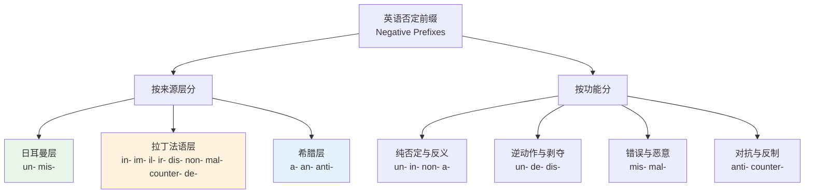
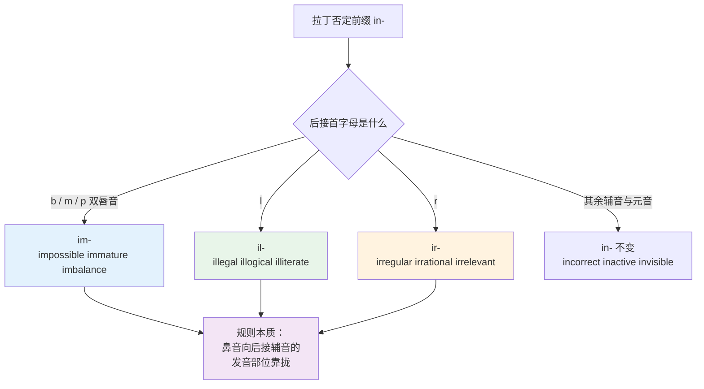
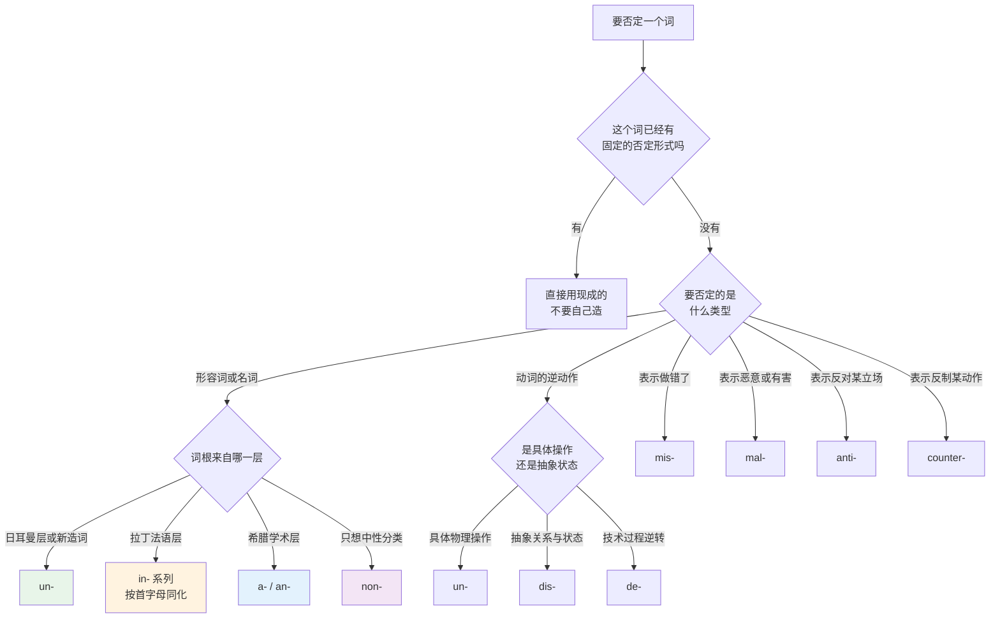
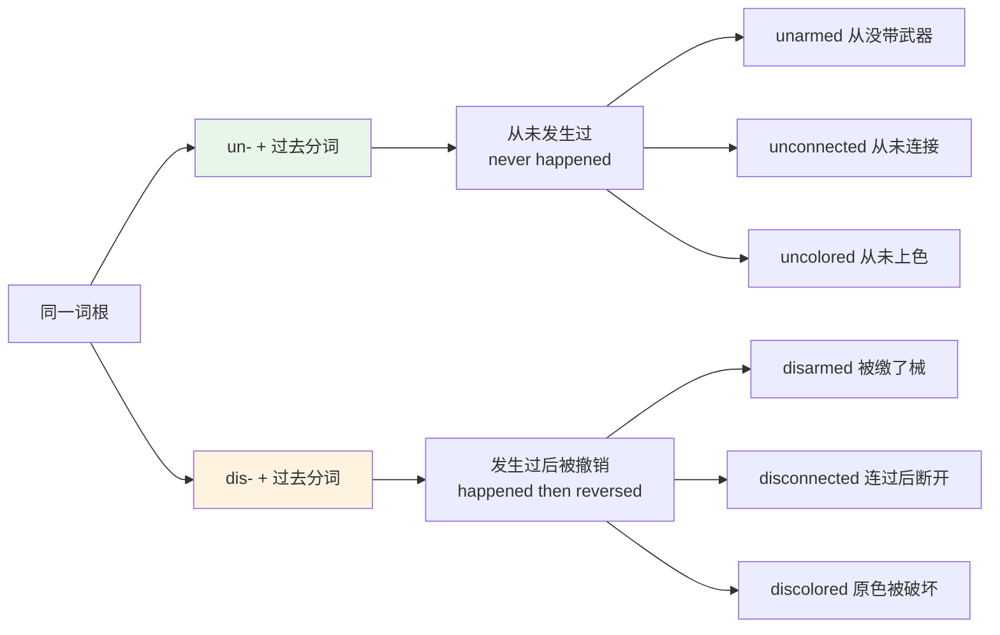
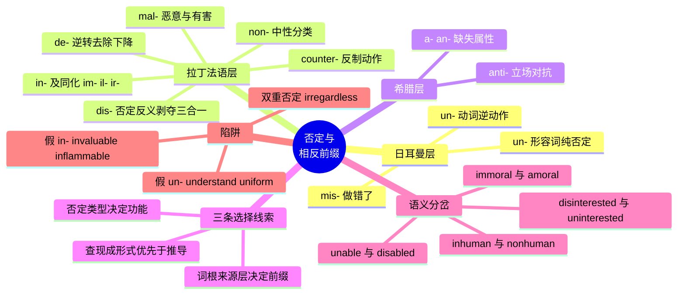

# 否定与相反前缀

> [!info] 本篇定位
>
> 第 14 章的第二篇，也是三类前缀里最先该拿下的一类——否定前缀的使用频率远高于方位和数量前缀，而且中文母语者出错最集中。
>
> 承接上一篇 [[14.构词法：前缀与后缀/01.构词法总览与词族思维\|构词法总览与词族思维]] 建立的词族思维，本篇把「否定」这一个语义槽位拆成十三个前缀，讲清每个前缀绑定哪个来源层、承担哪种否定功能、加在什么样的词根上。
>
> 读完你应该能做三件事：看到一个陌生的 `ir-` / `mal-` / `counter-` 开头的长词，能拆出核心义；写作时给一个词根挑前缀，不再靠猜；分得清 `unable` 和 `disabled`、`inhuman` 和 `nonhuman`、`disinterested` 和 `uninterested` 这类只差一个前缀却意思分岔的词对。

---

## 1. 本篇导读：否定不是一个开关

中文的否定只有一套装置——在词前加「不」「非」「无」「反」，选哪个基本靠语感，选错了也能听懂。英语不是这样。英语的否定前缀有十三个常用的，它们**互不通用**，`unpossible` 和 `impossible`、`inhappy` 和 `unhappy` 的差别不是风格差别，是错和对的差别。

这套看似混乱的分工背后有三条线索。

**线索一：来源层决定前缀。** 上一章讲过英语词汇是三层叠加的结构。否定前缀严格继承了这个分层——日耳曼词根配日耳曼前缀，拉丁词根配拉丁前缀，希腊词根配希腊前缀。`happy` 是日耳曼词，所以是 `unhappy`；`possible` 是拉丁词，所以是 `impossible`。这条规律解释了大约七成的搭配。

**线索二：否定的类型不止一种。** 「不」这个字在中文里遮住了四种完全不同的操作。

| 否定类型 | 英文术语 | 做的事 | 典型前缀 | 例子 |
| --- | --- | --- | --- | --- |
| 纯否定 | contradictory | 简单取反，非此即彼 | non- | nonzero 非零 |
| 反义 | contrary | 指向对立极，中间还有空间 | un-, in-, dis- | unhappy 不快乐（未必悲伤） |
| 逆动作 | reversative | 把已完成的动作倒回去 | un-, de-, dis- | unlock 解锁 |
| 剥夺 | privative | 拿走原本具有的属性 | dis-, de-, a- | disarm 解除武装 |

`unlock` 不是「不锁」，是「把锁着的东西打开」；`nonzero` 不是「不为零的反面」，就是「不等于零」。这两个词的 un- 和 non- 承担的是完全不同的操作。

**线索三：同一个词根配不同前缀会分化出不同意思。** 这是本篇第 11 节的专题。`in-` 和 `non-` 加在 `human` 上得到 `inhuman`（残忍的）和 `nonhuman`（非人类的），差异之大已经不是近义词的问题了。



上图是本篇的骨架。左半边是「这个前缀从哪来」，决定了它能加在什么样的词根上；右半边是「这个前缀做什么」，决定了加完之后的意思。判断一个否定词该用哪个前缀，两边都要过一遍：先看词根的出身，再看你想要哪种否定。后面九节分别展开这十三个前缀，第 10 节把两条线索合成一张决策图。

---

## 2. un-：日耳曼层的默认否定

### 2.1 来源与地位

`un-` 来自古英语 `un-`，与德语 `un-`、荷兰语 `on-` 同源，是英语里**唯一仍然完全活跃**的日耳曼否定前缀。所谓活跃，指的是它可以现造：造一个新形容词，直接加 `un-` 就能得到否定形式，母语者不会觉得别扭。`unfollow`、`unfriend`、`unsubscribe` 这些互联网时代造出来的词全部走的 `un-`。

`un-` 实际上是两个同形前缀的合流：

- 加在形容词、副词、名词前的 `un-`，来自古英语表否定的 `un-`
- 加在动词前表逆动作的 `un-`，来自古英语 `and-` / `on-`，本义是「反向、对着」

这就是为什么 `unhappy` 是「不快乐」而 `unlock` 是「解锁」而不是「不锁」——它们的 `un-` 历史上根本不是同一个词缀。

### 2.2 un- 加形容词：纯否定与反义

这是 `un-` 最主要的用法，覆盖面极广。

| 英文 | 英式音标 | 美式音标 | 词性 | 中文 | 搭配与说明 |
| --- | --- | --- | --- | --- | --- |
| **unhappy** | /ʌnˈhæpi/ | /ʌnˈhæpi/ | adj. | 不快乐的 | 比 sad 弱，指不满意的状态 |
| **unfair** | /ʌnˈfeə/ | /ʌnˈfer/ | adj. | 不公平的 | unfair to sb 对某人不公 |
| **unkind** | /ʌnˈkaɪnd/ | /ʌnˈkaɪnd/ | adj. | 不友善的 | 比 cruel 轻 |
| **unclear** | /ʌnˈklɪə/ | /ʌnˈklɪr/ | adj. | 不清楚的 | it is unclear whether… |
| **unusual** | /ʌnˈjuːʒuəl/ | /ʌnˈjuːʒuəl/ | adj. | 不寻常的 | 中性，不含贬义 |
| **unlikely** | /ʌnˈlaɪkli/ | /ʌnˈlaɪkli/ | adj. | 不太可能的 | it is unlikely that… |
| **unable** | /ʌnˈeɪbl/ | /ʌnˈeɪbl/ | adj. | 无法做某事的 | 只作表语，be unable to do |
| **unnecessary** | /ʌnˈnesəsəri/ | /ʌnˈnesəseri/ | adj. | 不必要的 | 双 n 都要发出来 |
| **uncomfortable** | /ʌnˈkʌmftəbl/ | /ʌnˈkʌmfərtəbl/ | adj. | 不舒服的 | 也指心理上的不自在 |
| **unaware** | /ˌʌnəˈweə/ | /ˌʌnəˈwer/ | adj. | 未察觉的 | be unaware of sth |
| **unconscious** | /ʌnˈkɒnʃəs/ | /ʌnˈkɑːnʃəs/ | adj. | 失去知觉的；无意识的 | 医学与心理学两义 |
| **unwilling** | /ʌnˈwɪlɪŋ/ | /ʌnˈwɪlɪŋ/ | adj. | 不情愿的 | be unwilling to do |
| **unstable** | /ʌnˈsteɪbl/ | /ʌnˈsteɪbl/ | adj. | 不稳定的 | 技术文档常用于系统与版本 |
| **unpredictable** | /ˌʌnprɪˈdɪktəbl/ | /ˌʌnprɪˈdɪktəbl/ | adj. | 无法预测的 | 描述人时略带贬义 |
| **unreliable** | /ˌʌnrɪˈlaɪəbl/ | /ˌʌnrɪˈlaɪəbl/ | adj. | 不可靠的 | unreliable narrator 文学术语 |
| **unavoidable** | /ˌʌnəˈvɔɪdəbl/ | /ˌʌnəˈvɔɪdəbl/ | adj. | 不可避免的 | 与 inevitable 近义，语域更口语 |
| **unbelievable** | /ˌʌnbɪˈliːvəbl/ | /ˌʌnbɪˈliːvəbl/ | adj. | 难以置信的 | 口语中可表褒可表贬 |
| **unemployed** | /ˌʌnɪmˈplɔɪd/ | /ˌʌnɪmˈplɔɪd/ | adj. | 失业的 | the unemployed 作集合名词 |
| **uncertain** | /ʌnˈsɜːtn/ | /ʌnˈsɜːrtn/ | adj. | 不确定的 | be uncertain about sth |
| **unhealthy** | /ʌnˈhelθi/ | /ʌnˈhelθi/ | adj. | 不健康的 | 可指饮食也可指关系 |
| **unfamiliar** | /ˌʌnfəˈmɪliə/ | /ˌʌnfəˈmɪliər/ | adj. | 陌生的 | be unfamiliar with sth |
| **unequal** | /ʌnˈiːkwəl/ | /ʌnˈiːkwəl/ | adj. | 不平等的 | 社会议题高频 |

值得单独留意的是 `unusual` 与 `unlikely` 这类词：`un-` 加在这里给出的是**反义**而不是纯否定。`unlikely` 不是「不是 likely」这么中立，它明确指向「概率偏低」这一端。中文说「不太可能」抓住了这层意思，说「不可能」就过头了——那是 `impossible`。

### 2.3 un- 加动词：把动作倒回去

这一组的 `un-` 表示逆动作，构成的动词几乎全是日常高频词，程序员尤其熟悉其中一批。

| 英文 | 英式音标 | 美式音标 | 词性 | 中文 | 搭配与说明 |
| --- | --- | --- | --- | --- | --- |
| **undo** | /ʌnˈduː/ | /ʌnˈduː/ | v. | 撤销 | 编辑器的 Ctrl+Z 就叫 undo |
| **unlock** | /ʌnˈlɒk/ | /ʌnˈlɑːk/ | v. | 解锁 | 也指解锁成就与功能 |
| **unpack** | /ʌnˈpæk/ | /ʌnˈpæk/ | v. | 打开行李；解包 | 解压缩文件也用它 |
| **unfold** | /ʌnˈfəʊld/ | /ʌnˈfoʊld/ | v. | 展开；逐渐显露 | 事件展开也用这个词 |
| **untie** | /ʌnˈtaɪ/ | /ʌnˈtaɪ/ | v. | 解开（结） | untie a knot |
| **unplug** | /ʌnˈplʌɡ/ | /ʌnˈplʌɡ/ | v. | 拔掉插头 | 引申义指暂时脱离数字生活 |
| **unzip** | /ʌnˈzɪp/ | /ʌnˈzɪp/ | v. | 拉开拉链；解压 | unzip the archive |
| **unwrap** | /ʌnˈræp/ | /ʌnˈræp/ | v. | 拆开包装 | w 不发音 |
| **uncover** | /ʌnˈkʌvə/ | /ʌnˈkʌvər/ | v. | 揭开；揭露 | uncover the truth |
| **unload** | /ʌnˈləʊd/ | /ʌnˈloʊd/ | v. | 卸货；卸载 | 与 load 严格对称 |
| **undress** | /ʌnˈdres/ | /ʌnˈdres/ | v. | 脱衣服 | 及物不及物都可以 |
| **unveil** | /ʌnˈveɪl/ | /ʌnˈveɪl/ | v. | 揭幕；正式发布 | 新品发布会常用 |
| **uninstall** | /ˌʌnɪnˈstɔːl/ | /ˌʌnɪnˈstɑːl/ | v. | 卸载（软件） | 与 install 严格对称 |
| **unsubscribe** | /ˌʌnsəbˈskraɪb/ | /ˌʌnsəbˈskraɪb/ | v. | 取消订阅 | 邮件底部的固定用词 |
| **unfollow** | /ʌnˈfɒləʊ/ | /ʌnˈfɑːloʊ/ | v. | 取关 | 社交媒体造词 |
| **unmount** | /ʌnˈmaʊnt/ | /ʌnˈmaʊnt/ | v. | 卸载（文件系统） | 与 mount 对称，注意不是 dismount |

> [!warning] un- 加动词的一个硬性条件
>
> `un-` 只能加在**可逆动作**的动词上。锁上可以解开，包装可以拆掉，插头可以拔出，所以有 `unlock` / `unwrap` / `unplug`。
>
> 不可逆的动作不能这么造：
>
> - ❌ ~~uneat~~（吃了不能不吃）
> - ❌ ~~unbreak~~（打碎了不能复原，只在歌名等修辞场合出现）
> - ❌ ~~unkill~~
>
> 这条限制在技术语境里被有意打破过：`unread`（标记为未读）之所以成立，是因为「已读状态」本身是一个可以翻转的数据位，不是真的让人忘掉读过的内容。

### 2.4 un- 加过去分词：状态的否定

`un-` 加在过去分词上构成的形容词，表示「某个动作没有对它执行过」，是技术文档和正式写作里的密集区。

| 英文 | 英式音标 | 美式音标 | 词性 | 中文 | 搭配与说明 |
| --- | --- | --- | --- | --- | --- |
| **unpaid** | /ˌʌnˈpeɪd/ | /ˌʌnˈpeɪd/ | adj. | 未付款的；无薪的 | unpaid leave 无薪假 |
| **unread** | /ˌʌnˈred/ | /ˌʌnˈred/ | adj. | 未读的 | 元音同 red 不同 reed |
| **unused** | /ˌʌnˈjuːzd/ | /ˌʌnˈjuːzd/ | adj. | 未使用的 | unused variable 编译器警告 |
| **unsigned** | /ˌʌnˈsaɪnd/ | /ˌʌnˈsaɪnd/ | adj. | 未签名的；无符号的 | unsigned int 是数据类型 |
| **undefined** | /ˌʌndɪˈfaɪnd/ | /ˌʌndɪˈfaɪnd/ | adj. | 未定义的 | JavaScript 的原始值之一 |
| **unchanged** | /ˌʌnˈtʃeɪndʒd/ | /ˌʌnˈtʃeɪndʒd/ | adj. | 未改变的 | remain unchanged |
| **untested** | /ˌʌnˈtestɪd/ | /ˌʌnˈtestɪd/ | adj. | 未经测试的 | 代码评审常用 |
| **unexpected** | /ˌʌnɪkˈspektɪd/ | /ˌʌnɪkˈspektɪd/ | adj. | 意外的 | unexpected token 报错信息 |
| **unlimited** | /ʌnˈlɪmɪtɪd/ | /ʌnˈlɪmɪtɪd/ | adj. | 无限制的 | 与 limitless 近义 |
| **unarmed** | /ˌʌnˈɑːmd/ | /ˌʌnˈɑːrmd/ | adj. | 未携带武器的 | 与 disarmed 有区别，见 11.5 |

### 2.5 un- 的重音规律

`un-` 构成的形容词在孤立朗读时，主重音落在词根上，`un-` 带次重音。但在句子里作定语时，重音位置会前移，这是英语「重音冲突回避」的普遍现象。

```text
孤立：  ˌunhapˈpy      unknown → /ˌʌnˈnəʊn/
句中：  an ˈunhappy ˈchild   主重音回到 un-
```

这个细节影响听力：`It's unnecessary.` 里的 `un-` 读得很实，而 `an unnecessary risk` 里的 `un-` 反而更突出。听音时不要因为重音位置变了就认不出这个前缀。

---

## 3. in- 家族与同化拼写：im- / il- / ir-

### 3.1 来源与准入条件

`in-` 来自拉丁语的否定前缀 `in-`（与希腊语 `a-`、日耳曼语 `un-` 同源，都可以追到原始印欧语的 `*n̥-`）。它绝大多数是**连词根一起打包借进英语的**，不是英语人后来自己拼的。

这一点决定了 `in-` 的准入条件：**它只出现在拉丁或法语来源的词根上**。`in-` 在现代英语里基本不再有造词能力，遇到新词一律用 `un-` 或 `non-`。

- ✅ **impossible**（possible 是拉丁词）
- ❌ ~~inhappy~~（happy 是日耳曼词，只能用 un-）
- ❌ ~~inclickable~~（clickable 是新造词，只能用 un-）

### 3.2 同化拼写：辅音互相迁就

`in-` 最容易记错的地方是它会随后接辅音变形。这个现象叫**同化**（assimilation），本质是发音省力：`in-` 的 `n` 是齿龈鼻音，遇到发音部位不同的辅音时，说话人会不自觉地把 `n` 改成与后面辅音同部位的音，拼写随之固定下来。



上图给出的是完整规则，没有例外需要单独记：`b`、`m`、`p` 都是双唇音，`n` 迁就成同为双唇音的 `m`；`l` 和 `r` 是流音，`n` 干脆被完全同化成重复的 `l` 和 `r`。这解释了为什么 `illegal` 和 `irregular` 会出现双写字母——那不是「加了个字母」，是前缀的 `n` 变成了词根的首辅音。

同一条同化规律也作用在其他拉丁前缀上：`com-` 变 `con-` / `col-` / `cor-`（`compose` / `connect` / `collect` / `correct`），`ad-` 变 `ac-` / `af-` / `ag-` / `at-`（`accept` / `affect` / `aggregate` / `attend`），`sub-` 变 `suf-` / `sup-` / `sug-`（`suffer` / `support` / `suggest`）。下一篇讲方位前缀时会正面处理这批。

还有一个低频变体：`in-` 遇到 `n` 开头的词根变成 `ig-`，只剩 `ignoble`（卑鄙的）、`ignominy`（耻辱）等少数几个词还在用，`ignore` 也属于这一支。这一组作为认读词处理即可，不必生产。

### 3.3 in- 词表

| 英文 | 英式音标 | 美式音标 | 词性 | 中文 | 搭配与说明 |
| --- | --- | --- | --- | --- | --- |
| **incorrect** | /ˌɪnkəˈrekt/ | /ˌɪnkəˈrekt/ | adj. | 不正确的 | 比 wrong 正式 |
| **incomplete** | /ˌɪnkəmˈpliːt/ | /ˌɪnkəmˈpliːt/ | adj. | 不完整的 | incomplete data |
| **inconvenient** | /ˌɪnkənˈviːniənt/ | /ˌɪnkənˈviːniənt/ | adj. | 不方便的 | 名词 inconvenience |
| **inevitable** | /ɪnˈevɪtəbl/ | /ɪnˈevɪtəbl/ | adj. | 不可避免的 | 无 evitable 这个常用词 |
| **infinite** | /ˈɪnfɪnət/ | /ˈɪnfɪnət/ | adj. | 无限的 | 重音在首音节，与 finite 不同 |
| **injustice** | /ɪnˈdʒʌstɪs/ | /ɪnˈdʒʌstɪs/ | n. | 不公正 | 可数不可数皆可 |
| **inability** | /ˌɪnəˈbɪləti/ | /ˌɪnəˈbɪləti/ | n. | 无能力 | 形容词却是 unable，见 11.1 |
| **inaccurate** | /ɪnˈækjərət/ | /ɪnˈækjərət/ | adj. | 不准确的 | 与 incorrect 近义，偏重偏差 |
| **inadequate** | /ɪnˈædɪkwət/ | /ɪnˈædɪkwət/ | adj. | 不充分的 | inadequate resources |
| **indirect** | /ˌɪndaɪˈrekt/ | /ˌɪndəˈrekt/ | adj. | 间接的 | 英美第二音节元音不同 |
| **independent** | /ˌɪndɪˈpendənt/ | /ˌɪndɪˈpendənt/ | adj. | 独立的 | 名词 independence |
| **indefinite** | /ɪnˈdefɪnət/ | /ɪnˈdefɪnət/ | adj. | 不确定的 | indefinite article 不定冠词 |
| **insufficient** | /ˌɪnsəˈfɪʃnt/ | /ˌɪnsəˈfɪʃnt/ | adj. | 不足的 | insufficient permissions 报错 |
| **invisible** | /ɪnˈvɪzəbl/ | /ɪnˈvɪzəbl/ | adj. | 看不见的 | 反义 visible |
| **inactive** | /ɪnˈæktɪv/ | /ɪnˈæktɪv/ | adj. | 不活跃的；停用的 | 账号状态常用 |
| **informal** | /ɪnˈfɔːml/ | /ɪnˈfɔːrml/ | adj. | 非正式的 | 语域讨论核心词 |
| **incapable** | /ɪnˈkeɪpəbl/ | /ɪnˈkeɪpəbl/ | adj. | 没有能力的 | be incapable of doing |
| **inconsistent** | /ˌɪnkənˈsɪstənt/ | /ˌɪnkənˈsɪstənt/ | adj. | 不一致的 | 数据校验高频 |
| **intolerant** | /ɪnˈtɒlərənt/ | /ɪnˈtɑːlərənt/ | adj. | 不宽容的；不耐受的 | lactose intolerant 乳糖不耐 |
| **insecure** | /ˌɪnsɪˈkjʊə/ | /ˌɪnsɪˈkjʊr/ | adj. | 不安全的；缺乏安全感的 | 技术与心理两义 |

### 3.4 im- 词表（后接 b / m / p）

| 英文 | 英式音标 | 美式音标 | 词性 | 中文 | 搭配与说明 |
| --- | --- | --- | --- | --- | --- |
| **impossible** | /ɪmˈpɒsəbl/ | /ɪmˈpɑːsəbl/ | adj. | 不可能的 | it is impossible to do |
| **impatient** | /ɪmˈpeɪʃnt/ | /ɪmˈpeɪʃnt/ | adj. | 不耐烦的 | be impatient with sb |
| **imperfect** | /ɪmˈpɜːfɪkt/ | /ɪmˈpɜːrfɪkt/ | adj. | 不完美的 | 语法术语指未完成体 |
| **impolite** | /ˌɪmpəˈlaɪt/ | /ˌɪmpəˈlaɪt/ | adj. | 不礼貌的 | 比 rude 委婉 |
| **immature** | /ˌɪməˈtʃʊə/ | /ˌɪməˈtʃʊr/ | adj. | 不成熟的 | 生理与心理两义 |
| **immoral** | /ɪˈmɒrəl/ | /ɪˈmɔːrəl/ | adj. | 不道德的 | 与 amoral 差别极大，见 11.3 |
| **immortal** | /ɪˈmɔːtl/ | /ɪˈmɔːrtl/ | adj. | 不朽的 | 名词 immortality |
| **immovable** | /ɪˈmuːvəbl/ | /ɪˈmuːvəbl/ | adj. | 不可移动的 | 法律上指不动产 |
| **imbalance** | /ɪmˈbæləns/ | /ɪmˈbæləns/ | n. | 失衡 | 可数，an imbalance in… |
| **impractical** | /ɪmˈpræktɪkl/ | /ɪmˈpræktɪkl/ | adj. | 不切实际的 | 方案评审常用 |
| **improper** | /ɪmˈprɒpə/ | /ɪmˈprɑːpər/ | adj. | 不恰当的 | improper use 不当使用 |
| **impure** | /ɪmˈpjʊə/ | /ɪmˈpjʊr/ | adj. | 不纯的 | 函数式编程借用此词 |
| **immeasurable** | /ɪˈmeʒərəbl/ | /ɪˈmeʒərəbl/ | adj. | 无法衡量的 | 正式书面语 |
| **impartial** | /ɪmˈpɑːʃl/ | /ɪmˈpɑːrʃl/ | adj. | 公正的 | 字面「不偏袒」，褒义 |
| **imprecise** | /ˌɪmprɪˈsaɪs/ | /ˌɪmprɪˈsaɪs/ | adj. | 不精确的 | 与 inaccurate 有微差 |

### 3.5 il- 与 ir- 词表

| 英文 | 英式音标 | 美式音标 | 词性 | 中文 | 搭配与说明 |
| --- | --- | --- | --- | --- | --- |
| **illegal** | /ɪˈliːɡl/ | /ɪˈliːɡl/ | adj. | 非法的 | 双 l 只读一个音 |
| **illegible** | /ɪˈledʒəbl/ | /ɪˈledʒəbl/ | adj. | 字迹难辨的 | 与 eligible 拼写形近义远 |
| **illiterate** | /ɪˈlɪtərət/ | /ɪˈlɪtərət/ | adj. | 文盲的 | 也可指某领域一窍不通 |
| **illogical** | /ɪˈlɒdʒɪkl/ | /ɪˈlɑːdʒɪkl/ | adj. | 不合逻辑的 | 论证批评用词 |
| **illicit** | /ɪˈlɪsɪt/ | /ɪˈlɪsɪt/ | adj. | 违禁的 | 与 elicit 同音异义 |
| **illegitimate** | /ˌɪləˈdʒɪtɪmət/ | /ˌɪləˈdʒɪtɪmət/ | adj. | 不合法的；非婚生的 | 政权与出身两义 |
| **irregular** | /ɪˈreɡjələ/ | /ɪˈreɡjələr/ | adj. | 不规则的 | irregular verbs 不规则动词 |
| **irrelevant** | /ɪˈreləvənt/ | /ɪˈreləvənt/ | adj. | 无关的 | be irrelevant to sth |
| **irresponsible** | /ˌɪrɪˈspɒnsəbl/ | /ˌɪrɪˈspɑːnsəbl/ | adj. | 不负责任的 | 道德评价，语气重 |
| **irrational** | /ɪˈræʃənl/ | /ɪˈræʃənl/ | adj. | 不理性的；无理的 | 数学上指无理数 |
| **irreversible** | /ˌɪrɪˈvɜːsəbl/ | /ˌɪrɪˈvɜːrsəbl/ | adj. | 不可逆的 | 危险操作提示常用 |
| **irresistible** | /ˌɪrɪˈzɪstəbl/ | /ˌɪrɪˈzɪstəbl/ | adj. | 无法抗拒的 | 拼写是 -ible 不是 -able |
| **irreplaceable** | /ˌɪrɪˈpleɪsəbl/ | /ˌɪrɪˈpleɪsəbl/ | adj. | 不可替代的 | 保留 e，不写 irreplacable |
| **irrespective** | /ˌɪrɪˈspektɪv/ | /ˌɪrɪˈspektɪv/ | adj. | 不考虑的 | 固定搭配 irrespective of |

> [!warning] 拼写上最常丢分的两组
>
> `il-` 和 `ir-` 构成的词一律**双写字母**，漏写一个是中文母语者最高频的拼写错误之一。
>
> - ❌ ~~ilegal~~ / ~~iregular~~ / ~~ireversible~~
> - ✅ **illegal** / **irregular** / **irreversible**
>
> 反过来，`in-` 遇到 `n` 开头的词根时同样双写：**innumerable**（无数的）、**innocent**（无辜的，词根 `noc` 是「伤害」）。看到双写就想到「前缀的 n 加词根的首字母」，拼写自然不会错。

---

## 4. dis-：否定、反义与逆动作三合一

### 4.1 来源与功能范围

`dis-` 来自拉丁语 `dis-`，本义是「分开、离开、各奔一方」（`dis-` 与 `bis`「二」同源，字面是「一分为二」）。这个本义解释了它今天承担的三种功能：

| 功能 | 语义 | 例词 |
| --- | --- | --- |
| 否定形容词与名词 | 不、非 | dishonest 不诚实的 |
| 表反义动作 | 做相反的事 | disagree 不同意 |
| 逆动作与剥夺 | 撤销、拿走 | disconnect 断开、disarm 解除武装 |

`dis-` 是三个拉丁否定前缀（`in-`、`non-`、`dis-`）里唯一仍有一定造词能力的，技术领域造出了 `disable` / `disconnect` / `disallow` 这样的词族。

### 4.2 dis- 加形容词与名词

| 英文 | 英式音标 | 美式音标 | 词性 | 中文 | 搭配与说明 |
| --- | --- | --- | --- | --- | --- |
| **dishonest** | /dɪsˈɒnɪst/ | /dɪsˈɑːnɪst/ | adj. | 不诚实的 | h 不发音 |
| **disorder** | /dɪsˈɔːdə/ | /dɪsˈɔːrdər/ | n. | 混乱；失调 | 医学上指疾病，如 sleep disorder |
| **disadvantage** | /ˌdɪsədˈvɑːntɪdʒ/ | /ˌdɪsədˈvæntɪdʒ/ | n. | 劣势 | 英美元音差别明显 |
| **disbelief** | /ˌdɪsbɪˈliːf/ | /ˌdɪsbɪˈliːf/ | n. | 不相信 | in disbelief 难以置信地 |
| **discomfort** | /dɪsˈkʌmfət/ | /dɪsˈkʌmfərt/ | n. | 不适 | 比 pain 轻 |
| **disloyal** | /dɪsˈlɔɪəl/ | /dɪsˈlɔɪəl/ | adj. | 不忠的 | be disloyal to sb |
| **dissatisfied** | /dɪsˈsætɪsfaɪd/ | /dɪsˈsætɪsfaɪd/ | adj. | 不满的 | 与 unsatisfied 有别，见 11.4 |
| **disorganized** | /dɪsˈɔːɡənaɪzd/ | /dɪsˈɔːrɡənaɪzd/ | adj. | 杂乱无章的 | 描述人时指做事没条理 |
| **dissimilar** | /dɪˈsɪmɪlə/ | /dɪˈsɪmələr/ | adj. | 不相似的 | not dissimilar to 是委婉肯定 |
| **disproportionate** | /ˌdɪsprəˈpɔːʃənət/ | /ˌdɪsprəˈpɔːrʃənət/ | adj. | 不成比例的 | 正式书面语 |
| **disrespect** | /ˌdɪsrɪˈspekt/ | /ˌdɪsrɪˈspekt/ | n./v. | 不尊重 | 口语可作动词 |
| **discontent** | /ˌdɪskənˈtent/ | /ˌdɪskənˈtent/ | n. | 不满 | 比 dissatisfaction 更书面 |

### 4.3 dis- 加动词：反义与剥夺

| 英文 | 英式音标 | 美式音标 | 词性 | 中文 | 搭配与说明 |
| --- | --- | --- | --- | --- | --- |
| **disagree** | /ˌdɪsəˈɡriː/ | /ˌdɪsəˈɡriː/ | v. | 不同意 | disagree with sb about sth |
| **disappear** | /ˌdɪsəˈpɪə/ | /ˌdɪsəˈpɪr/ | v. | 消失 | 不及物，无被动 |
| **dislike** | /dɪsˈlaɪk/ | /dɪsˈlaɪk/ | v./n. | 不喜欢 | 比 hate 弱得多 |
| **disconnect** | /ˌdɪskəˈnekt/ | /ˌdɪskəˈnekt/ | v. | 断开连接 | 网络与人际两义 |
| **discourage** | /dɪsˈkʌrɪdʒ/ | /dɪsˈkɜːrɪdʒ/ | v. | 使气馁；劝阻 | discourage sb from doing |
| **disprove** | /dɪsˈpruːv/ | /dɪsˈpruːv/ | v. | 反驳；证伪 | 与 disapprove 拼写形近义远 |
| **disqualify** | /dɪsˈkwɒlɪfaɪ/ | /dɪsˈkwɑːlɪfaɪ/ | v. | 取消资格 | 体育与法律高频 |
| **disable** | /dɪsˈeɪbl/ | /dɪsˈeɪbl/ | v. | 停用；使丧失能力 | 技术上指关闭功能 |
| **disarm** | /dɪsˈɑːm/ | /dɪsˈɑːrm/ | v. | 解除武装 | 引申指化解敌意 |
| **discharge** | /dɪsˈtʃɑːdʒ/ | /dɪsˈtʃɑːrdʒ/ | v./n. | 排放；出院；解雇 | 名词重音常前移 |
| **disclose** | /dɪsˈkləʊz/ | /dɪsˈkloʊz/ | v. | 披露 | 名词 disclosure，法务高频 |
| **discard** | /dɪˈskɑːd/ | /dɪˈskɑːrd/ | v. | 丢弃 | 也指丢弃变更 |
| **dismount** | /dɪsˈmaʊnt/ | /dɪsˈmaʊnt/ | v. | 下马；拆卸 | 文件系统用 unmount 不用它 |
| **disobey** | /ˌdɪsəˈbeɪ/ | /ˌdɪsəˈbeɪ/ | v. | 不服从 | 名词 disobedience |
| **disallow** | /ˌdɪsəˈlaʊ/ | /ˌdɪsəˈlaʊ/ | v. | 不允许 | 配置项常见，与 deny 近义 |
| **dismiss** | /dɪsˈmɪs/ | /dɪsˈmɪs/ | v. | 解雇；驳回；关闭提示 | dismiss a dialog 是 UI 术语 |

> [!tip] dis- 和 un- 加在动词上的分工
>
> 两个前缀都能表逆动作，分工大致是：**具体的物理操作用 un-，抽象的关系与状态用 dis-**。
>
> - 物理：unlock、unpack、untie、unplug、unwrap
> - 抽象：disconnect、disqualify、disable、disclose、disarm
>
> 这条规律的例外是技术领域造的词，它们通常直接跟随已有的对称词：因为有 `install` 才有 `uninstall`，因为有 `enable` 才有 `disable`。选前缀时先找对称词，找不到再套规律。

---

## 5. non-：中性的分类否定

### 5.1 non- 的特点是「不带态度」

`non-` 来自拉丁 `non`「不」，经古法语进入英语。它和其他否定前缀最大的区别在于**语义上完全中立**——它只做分类，不做评价。

对比一下同一个词根配三个前缀的效果：

| 词 | 音标（英 / 美） | 含义 | 隐含态度 |
| --- | --- | --- | --- |
| **unprofessional** | /ˌʌnprəˈfeʃənl/ · /ˌʌnprəˈfeʃənl/ | 不专业的 | 批评 |
| **nonprofessional** | /ˌnɒnprəˈfeʃənl/ · /ˌnɑːnprəˈfeʃənl/ | 非职业的、业余的 | 中性描述 |
| **semi-professional** | /ˌsemiprəˈfeʃənl/ · /ˌsemiprəˈfeʃənl/ | 半职业的 | 中性描述 |

说一个人 `unprofessional` 是在指责他行为失当；说他 `nonprofessional` 只是说他不以此为职业。这个差别在书面表达里很要紧。

`non-` 还有一个实用优势：它的造词能力**没有任何限制**。词根是什么来源、什么词性都能加，遇到不确定该用 `un-` 还是 `in-` 的情况，`non-` 通常是安全选项——虽然可能读起来略生硬。

### 5.2 non- 词表

| 英文 | 英式音标 | 美式音标 | 词性 | 中文 | 搭配与说明 |
| --- | --- | --- | --- | --- | --- |
| **nonstop** | /ˌnɒnˈstɒp/ | /ˌnɑːnˈstɑːp/ | adj./adv. | 直达的；不间断地 | a nonstop flight |
| **nonsense** | /ˈnɒnsns/ | /ˈnɑːnsens/ | n. | 胡说 | 英美后半重读方式不同 |
| **non-profit** | /ˌnɒnˈprɒfɪt/ | /ˌnɑːnˈprɑːfɪt/ | adj./n. | 非营利的 | 美式常写 nonprofit 不带连字符 |
| **nonverbal** | /ˌnɒnˈvɜːbl/ | /ˌnɑːnˈvɜːrbl/ | adj. | 非语言的 | nonverbal communication |
| **non-fiction** | /ˌnɒnˈfɪkʃn/ | /ˌnɑːnˈfɪkʃn/ | n. | 非虚构作品 | 书店分类标签 |
| **nonexistent** | /ˌnɒnɪɡˈzɪstənt/ | /ˌnɑːnɪɡˈzɪstənt/ | adj. | 不存在的 | 口语可夸张表示「几乎没有」 |
| **non-native** | /ˌnɒnˈneɪtɪv/ | /ˌnɑːnˈneɪtɪv/ | adj. | 非母语的 | non-native speaker |
| **non-negotiable** | /ˌnɒnnɪˈɡəʊʃiəbl/ | /ˌnɑːnnɪˈɡoʊʃiəbl/ | adj. | 没有商量余地的 | 谈判与招聘高频 |
| **nonrenewable** | /ˌnɒnrɪˈnjuːəbl/ | /ˌnɑːnrɪˈnuːəbl/ | adj. | 不可再生的 | 能源议题固定搭配 |
| **non-refundable** | /ˌnɒnrɪˈfʌndəbl/ | /ˌnɑːnrɪˈfʌndəbl/ | adj. | 不可退款的 | 机票与酒店条款 |
| **nonstandard** | /ˌnɒnˈstændəd/ | /ˌnɑːnˈstændərd/ | adj. | 非标准的 | 中性，与 substandard 不同 |
| **nonviolent** | /ˌnɒnˈvaɪələnt/ | /ˌnɑːnˈvaɪələnt/ | adj. | 非暴力的 | nonviolent resistance |
| **nonzero** | /ˌnɒnˈzɪərəʊ/ | /ˌnɑːnˈzɪroʊ/ | adj. | 非零的 | 数学与编程术语 |
| **non-blocking** | /ˌnɒnˈblɒkɪŋ/ | /ˌnɑːnˈblɑːkɪŋ/ | adj. | 非阻塞的 | 并发编程核心概念 |
| **nondeterministic** | /ˌnɒndɪtɜːmɪˈnɪstɪk/ | /ˌnɑːndɪtɜːrmɪˈnɪstɪk/ | adj. | 非确定性的 | 算法与测试术语 |
| **non-trivial** | /ˌnɒnˈtrɪviəl/ | /ˌnɑːnˈtrɪviəl/ | adj. | 不平凡的；有难度的 | 技术讨论里的常用委婉说法 |

> [!warning] nonstandard 与 substandard 不是一回事
>
> - **nonstandard** 中性：不符合某个标准，但不评价好坏。`a nonstandard implementation` 只是说实现方式不走通用规范。
> - **substandard** /ˌsʌbˈstændəd/ · /ˌsʌbˈstændərd/ 贬义：低于标准，质量不合格。`substandard housing` 指住房条件不达标。
>
> 同样的对立还有 `non-professional`（非职业）与 `unprofessional`（不专业）、`nonhuman`（非人类）与 `inhuman`（残忍）。规律是：`non-` 分类，其他前缀评价。

### 5.3 连字符的取舍

`non-` 后面加不加连字符没有统一规则，实际取舍是这样的：

| 情况 | 处理 | 例子 |
| --- | --- | --- |
| 已经固化的常用词 | 不加 | nonsense、nonstop、nonprofit |
| 后接专有名词或大写字母 | 必须加 | non-English、non-EU |
| 后接词首字母是 n | 建议加，避免三个 n | non-negotiable |
| 临时组合、生僻搭配 | 建议加 | non-blocking、non-trivial |
| 英式与美式差异 | 英式偏爱连字符，美式偏爱连写 | non-profit（英）/ nonprofit（美） |

同一篇文档里保持一致比选对更重要。

---

## 6. a- / an-：希腊层的「缺失」

### 6.1 alpha privative

希腊语的否定前缀 `a-`（元音前作 `an-`）在语言学上叫 **alpha privative**，「表剥夺的阿尔法」。它随希腊学术词一起进入英语，因此几乎只出现在**医学、科学、哲学、技术**词汇里，日常口语基本用不到。

`a-` 表达的是「缺少某种属性」，比 `un-` 和 `in-` 更接近「零、空、不具备」这个意思。`atypical` 不是「不典型所以奇怪」，而是「不具备典型特征」。

### 6.2 a- / an- 词表

| 英文 | 英式音标 | 美式音标 | 词性 | 中文 | 搭配与说明 |
| --- | --- | --- | --- | --- | --- |
| **atypical** | /ˌeɪˈtɪpɪkl/ | /ˌeɪˈtɪpɪkl/ | adj. | 非典型的 | 医学报告高频 |
| **asymmetric** | /ˌeɪsɪˈmetrɪk/ | /ˌeɪsɪˈmetrɪk/ | adj. | 不对称的 | asymmetric encryption 非对称加密 |
| **asynchronous** | /eɪˈsɪŋkrənəs/ | /eɪˈsɪŋkrənəs/ | adj. | 异步的 | async 就是它的缩写 |
| **amoral** | /ˌeɪˈmɒrəl/ | /ˌeɪˈmɔːrəl/ | adj. | 不涉道德的 | 与 immoral 差别极大，见 11.3 |
| **apolitical** | /ˌeɪpəˈlɪtɪkl/ | /ˌeɪpəˈlɪtɪkl/ | adj. | 不问政治的 | 中性描述立场 |
| **anonymous** | /əˈnɒnɪməs/ | /əˈnɑːnɪməs/ | adj. | 匿名的 | an- + onym「名字」 |
| **anarchy** | /ˈænəki/ | /ˈænərki/ | n. | 无政府状态 | an- + arch「统治」 |
| **anaemia** | /əˈniːmiə/ | /əˈniːmiə/ | n. | 贫血 | 美式拼作 anemia |
| **apathy** | /ˈæpəθi/ | /ˈæpəθi/ | n. | 冷漠 | a- + path「感受」 |
| **atheist** | /ˈeɪθiɪst/ | /ˈeɪθiɪst/ | n. | 无神论者 | a- + the「神」 |
| **anaesthetic** | /ˌænəsˈθetɪk/ | /ˌænəsˈθetɪk/ | n./adj. | 麻醉剂；麻醉的 | 美式拼作 anesthetic |
| **anhydrous** | /ænˈhaɪdrəs/ | /ænˈhaɪdrəs/ | adj. | 无水的 | an- + hydr「水」，化学术语 |
| **aseptic** | /eɪˈseptɪk/ | /eɪˈseptɪk/ | adj. | 无菌的 | 与 antiseptic 词义有别 |
| **amorphous** | /əˈmɔːfəs/ | /əˈmɔːrfəs/ | adj. | 无定形的 | a- + morph「形状」 |
| **atom** | /ˈætəm/ | /ˈætəm/ | n. | 原子 | a- + tom「切」，字面「不可分」 |
| **atomic** | /əˈtɒmɪk/ | /əˈtɑːmɪk/ | adj. | 原子的；不可分割的 | 数据库事务的 A 就是它 |

`atom` 和 `atomic` 值得单独说一句：它们的「不可分割」原义在物理学上早就被推翻了，但在计算机领域反而被完整继承下来——数据库事务的原子性、原子操作、原子提交，指的都是「要么全做要么全不做，中间不可切分」。知道 `a-` + `tom` 的构成，这个术语就不需要死记。

### 6.3 与日耳曼 a- 前缀区分

英语里还有一个来自古英语的 `a-`，意思完全不同，它表示状态或方位（来自古英语介词 `on`）：

| 英文 | 英式音标 | 美式音标 | 词性 | 中文 | 搭配与说明 |
| --- | --- | --- | --- | --- | --- |
| **asleep** | /əˈsliːp/ | /əˈsliːp/ | adj. | 睡着的 | 状态而非否定，只作表语 |
| **aboard** | /əˈbɔːd/ | /əˈbɔːrd/ | adv./prep. | 在船上；上车 | 与 board 同义方向 |
| **awake** | /əˈweɪk/ | /əˈweɪk/ | adj. | 醒着的 | 注意不是「不 wake」 |
| **ashore** | /əˈʃɔː/ | /əˈʃɔːr/ | adv. | 上岸 | 航海用语 |
| **aside** | /əˈsaɪd/ | /əˈsaɪd/ | adv. | 在一旁 | set sth aside |

区分方法很简单：**希腊否定 `a-` 后面跟的是希腊或拉丁词根，重音通常读 /eɪ/ 或 /æ/；日耳曼 `a-` 后面跟的是常见英语单词，读弱化的 /ə/。** `atypical` 的 `a` 读 /eɪ/，`asleep` 的 `a` 读 /ə/，听音就能分开。

---

## 7. mis- 与 mal-：错做与恶意

### 7.1 两个前缀的分界线

这两个前缀都指向「不好」，但性质完全不同。

| 前缀 | 来源 | 语义 | 隐含判断 |
| --- | --- | --- | --- |
| **mis-** | 古英语 `mis-`（日耳曼层） | 做错了、弄错了 | 不一定有恶意，多半是失误 |
| **mal-** | 拉丁 `malus`「坏」经法语（拉丁法语层） | 坏的、恶的、有害的 | 强调结果恶劣或本身有恶意 |

`misuse` 是「用错了」，`abuse` 是「滥用」；`malfunction` 是「出故障」，`malicious` 是「恶意的」。中文都翻成「错误」「不良」，英语里差着一层价值判断。

### 7.2 mis- 词表

| 英文 | 英式音标 | 美式音标 | 词性 | 中文 | 搭配与说明 |
| --- | --- | --- | --- | --- | --- |
| **misunderstand** | /ˌmɪsʌndəˈstænd/ | /ˌmɪsʌndərˈstænd/ | v. | 误解 | 不规则变化同 understand |
| **mistake** | /mɪˈsteɪk/ | /mɪˈsteɪk/ | n./v. | 错误；误认 | mistake A for B 把 A 当成 B |
| **misuse** | /ˌmɪsˈjuːs/ | /ˌmɪsˈjuːs/ | n. | 误用 | 动词读 /ˌmɪsˈjuːz/，清浊有别 |
| **misspell** | /ˌmɪsˈspel/ | /ˌmɪsˈspel/ | v. | 拼错 | 双 s 都要读出来 |
| **mislead** | /ˌmɪsˈliːd/ | /ˌmɪsˈliːd/ | v. | 误导 | 过去式 misled /ˌmɪsˈled/ |
| **misjudge** | /ˌmɪsˈdʒʌdʒ/ | /ˌmɪsˈdʒʌdʒ/ | v. | 判断错误 | misjudge the situation |
| **misplace** | /ˌmɪsˈpleɪs/ | /ˌmɪsˈpleɪs/ | v. | 放错地方；一时找不到 | 比 lose 委婉 |
| **misprint** | /ˈmɪsprɪnt/ | /ˈmɪsprɪnt/ | n. | 印刷错误 | 名词重音在前 |
| **mismatch** | /ˈmɪsmætʃ/ | /ˈmɪsmætʃ/ | n./v. | 不匹配 | type mismatch 类型不匹配 |
| **misbehave** | /ˌmɪsbɪˈheɪv/ | /ˌmɪsbɪˈheɪv/ | v. | 行为不当 | 多用于小孩 |
| **misinterpret** | /ˌmɪsɪnˈtɜːprɪt/ | /ˌmɪsɪnˈtɜːrprɪt/ | v. | 曲解 | 比 misunderstand 更正式 |
| **miscalculate** | /ˌmɪsˈkælkjuleɪt/ | /ˌmɪsˈkælkjəleɪt/ | v. | 算错；估计失误 | 数字与形势两义 |
| **misfortune** | /mɪsˈfɔːtʃuːn/ | /mɪsˈfɔːrtʃən/ | n. | 不幸 | 英美后半音节差别明显 |
| **misconduct** | /ˌmɪsˈkɒndʌkt/ | /ˌmɪsˈkɑːndʌkt/ | n. | 不端行为 | 职场与法律用语 |
| **misinform** | /ˌmɪsɪnˈfɔːm/ | /ˌmɪsɪnˈfɔːrm/ | v. | 提供错误信息 | 名词 misinformation |
| **mistrust** | /ˌmɪsˈtrʌst/ | /ˌmɪsˈtrʌst/ | n./v. | 不信任 | 比 distrust 更偏怀疑而非确信 |
| **misfire** | /ˌmɪsˈfaɪə/ | /ˌmɪsˈfaɪər/ | v. | 哑火；未达预期 | 引申指计划落空 |
| **misconfigure** | /ˌmɪskənˈfɪɡə/ | /ˌmɪskənˈfɪɡjər/ | v. | 配置错误 | 运维高频，名词 misconfiguration |

### 7.3 mal- 词表

| 英文 | 英式音标 | 美式音标 | 词性 | 中文 | 搭配与说明 |
| --- | --- | --- | --- | --- | --- |
| **malfunction** | /ˌmælˈfʌŋkʃn/ | /ˌmælˈfʌŋkʃn/ | n./v. | 故障；出故障 | 设备与系统通用 |
| **malpractice** | /ˌmælˈpræktɪs/ | /ˌmælˈpræktɪs/ | n. | 渎职；医疗事故 | medical malpractice |
| **malnutrition** | /ˌmælnjuˈtrɪʃn/ | /ˌmælnuˈtrɪʃn/ | n. | 营养不良 | 美式无 /j/ 音 |
| **malicious** | /məˈlɪʃəs/ | /məˈlɪʃəs/ | adj. | 恶意的 | malicious code 恶意代码 |
| **malware** | /ˈmælweə/ | /ˈmælwer/ | n. | 恶意软件 | mal- + software 混合造词 |
| **maltreat** | /ˌmælˈtriːt/ | /ˌmælˈtriːt/ | v. | 虐待 | 名词 maltreatment |
| **malformed** | /ˌmælˈfɔːmd/ | /ˌmælˈfɔːrmd/ | adj. | 格式错误的；畸形的 | malformed JSON 是常见报错 |
| **malignant** | /məˈlɪɡnənt/ | /məˈlɪɡnənt/ | adj. | 恶性的 | 反义 benign，肿瘤医学核心词 |
| **malevolent** | /məˈlevələnt/ | /məˈlevələnt/ | adj. | 恶毒的 | mal- + vol「意愿」 |
| **maladjusted** | /ˌmæləˈdʒʌstɪd/ | /ˌmæləˈdʒʌstɪd/ | adj. | 适应不良的 | 心理学术语 |
| **malaise** | /məˈleɪz/ | /məˈleɪz/ | n. | 不适；萎靡 | 保留法语读音 |
| **malady** | /ˈmælədi/ | /ˈmælədi/ | n. | 疾病；弊病 | 书面语，常用于社会弊病 |

> [!example] mis- 与 mal- 换用会改变指控的性质
>
> - The server **misconfigured** the timeout value.
>   - 服务器超时值配错了。（技术失误，无人被指控）
> - The router is **malfunctioning**.
>   - 路由器出故障了。（设备本身有问题）
> - The attacker injected **malicious** code into the form.
>   - 攻击者向表单注入了恶意代码。（有主观恶意）
> - He was fired for professional **misconduct**.
>   - 他因职业行为不端被解雇。（有过错但未必是恶意）
>
> 写事故报告时选错前缀，等于改变了责任认定的措辞。`misconfiguration` 是配置失误，`malicious configuration` 是有人故意做的。

---

## 8. anti- 与 counter-：对抗与反制

### 8.1 立场对立与动作反制

| 前缀 | 来源 | 核心义 | 用法侧重 |
| --- | --- | --- | --- |
| **anti-** | 希腊 `anti`「对着、反对」 | 反对、对抗、抵御 | 表明**立场**或**药理作用** |
| **counter-** | 拉丁 `contra`「对着」经法语 | 反制、对应、相反 | 表明**针对某个动作的回应** |

`anti-virus` 是「抵御病毒的东西」，`counterattack` 是「对进攻的还击」。前者描述性质，后者描述动作关系。这也是为什么 `counter-` 构成的词常常预设「先有一个原动作」——`counterexample` 之所以成立，是因为已经有人先给出了一个论断。

### 8.2 anti- 词表

| 英文 | 英式音标 | 美式音标 | 词性 | 中文 | 搭配与说明 |
| --- | --- | --- | --- | --- | --- |
| **antibiotic** | /ˌæntibaɪˈɒtɪk/ | /ˌæntibaɪˈɑːtɪk/ | n. | 抗生素 | anti- + bio「生命」 |
| **antivirus** | /ˌæntiˈvaɪrəs/ | /ˌæntaɪˈvaɪrəs/ | n./adj. | 杀毒软件 | 美式 anti- 常读 /æntaɪ/ |
| **antisocial** | /ˌæntiˈsəʊʃl/ | /ˌæntiˈsoʊʃl/ | adj. | 反社会的；不合群的 | 英式常指不合群，美式偏临床 |
| **antifreeze** | /ˈæntifriːz/ | /ˈæntifriːz/ | n. | 防冻液 | 汽车用品 |
| **antidote** | /ˈæntidəʊt/ | /ˈæntidoʊt/ | n. | 解毒剂 | an antidote to sth 引申用法 |
| **antibody** | /ˈæntibɒdi/ | /ˈæntibɑːdi/ | n. | 抗体 | 免疫学核心词 |
| **antiseptic** | /ˌæntiˈseptɪk/ | /ˌæntiˈseptɪk/ | n./adj. | 消毒剂；防腐的 | 杀菌，而 aseptic 是本身无菌 |
| **anticlockwise** | /ˌæntiˈklɒkwaɪz/ | /ˌæntiˈklɑːkwaɪz/ | adv./adj. | 逆时针 | 英式说法，美式用 counterclockwise |
| **antipathy** | /ænˈtɪpəθi/ | /ænˈtɪpəθi/ | n. | 反感 | 与 apathy 只差一个前缀 |
| **antithesis** | /ænˈtɪθəsɪs/ | /ænˈtɪθəsɪs/ | n. | 对立面 | 复数 antitheses |
| **antagonist** | /ænˈtæɡənɪst/ | /ænˈtæɡənɪst/ | n. | 对手；反派 | 与 protagonist 成对 |
| **anti-pattern** | /ˈæntipætn/ | /ˈæntipætərn/ | n. | 反模式 | 软件设计术语 |
| **antitrust** | /ˌæntiˈtrʌst/ | /ˌæntiˈtrʌst/ | adj. | 反垄断的 | antitrust law |
| **anti-aging** | /ˌæntiˈeɪdʒɪŋ/ | /ˌæntiˈeɪdʒɪŋ/ | adj. | 抗衰老的 | 化妆品营销高频 |

### 8.3 counter- 词表

| 英文 | 英式音标 | 美式音标 | 词性 | 中文 | 搭配与说明 |
| --- | --- | --- | --- | --- | --- |
| **counteract** | /ˌkaʊntərˈækt/ | /ˌkaʊntərˈækt/ | v. | 抵消 | counteract the effect |
| **counterattack** | /ˈkaʊntərətæk/ | /ˈkaʊntərətæk/ | n./v. | 反击 | 军事与体育通用 |
| **counterpart** | /ˈkaʊntəpɑːt/ | /ˈkaʊntərpɑːrt/ | n. | 对应的人或物 | 跨机构对话常用 |
| **counterexample** | /ˈkaʊntərɪɡzɑːmpl/ | /ˈkaʊntərɪɡzæmpl/ | n. | 反例 | 数学与论证核心词 |
| **counterfeit** | /ˈkaʊntəfɪt/ | /ˈkaʊntərfɪt/ | adj./n./v. | 伪造的；赝品 | 词尾读 /fɪt/ 不读 /fiːt/ |
| **counterproductive** | /ˌkaʊntəprəˈdʌktɪv/ | /ˌkaʊntərprəˈdʌktɪv/ | adj. | 适得其反的 | 管理与政策讨论高频 |
| **counterargument** | /ˈkaʊntərɑːɡjumənt/ | /ˈkaʊntərɑːrɡjəmənt/ | n. | 反驳论点 | 议论文结构词 |
| **countermeasure** | /ˈkaʊntəmeʒə/ | /ˈkaʊntərmeʒər/ | n. | 对策 | 安全领域固定用语 |
| **counterclockwise** | /ˌkaʊntəˈklɒkwaɪz/ | /ˌkaʊntərˈklɑːkwaɪz/ | adv./adj. | 逆时针 | 美式说法 |
| **counterintuitive** | /ˌkaʊntərɪnˈtjuːɪtɪv/ | /ˌkaʊntərɪnˈtuːɪtɪv/ | adj. | 反直觉的 | 技术与科普高频 |
| **counterpoint** | /ˈkaʊntəpɔɪnt/ | /ˈkaʊntərpɔɪnt/ | n. | 对位；对照 | 音乐术语引申为论述用法 |
| **counteroffer** | /ˈkaʊntərɒfə/ | /ˈkaʊntərɔːfər/ | n. | 还价 | 谈薪与商务谈判用词 |

`anticlockwise` 与 `counterclockwise` 是英美差异的经典例子：同一个概念，英国用希腊前缀，美国用拉丁前缀，两边都不觉得对方的说法错，只是不用。写文档时按目标读者选一个，全篇统一。

---

## 9. de-：逆转、去除与下降

### 9.1 三种语义

`de-` 来自拉丁介词 `de`「从……下来、离开」。这个空间义在英语里分化出三条语义线：

| 语义 | 说明 | 例词 |
| --- | --- | --- |
| 逆转动作 | 把某个过程反着走一遍 | decode 解码、decrypt 解密 |
| 去除、剥离 | 拿掉某种东西 | defrost 除霜、dehydrate 脱水 |
| 向下、降低 | 程度或位置下降 | decrease 减少、demote 降职 |

`de-` 是技术领域生产力最高的否定类前缀。凡是「把某个技术过程反过来」的动作，几乎默认用 `de-`：`decode`、`decompile`、`deserialize`、`decompress`、`deduplicate`。原因是这些词根本身就是拉丁来源，前缀跟着词根的层走。

### 9.2 de- 词表

| 英文 | 英式音标 | 美式音标 | 词性 | 中文 | 搭配与说明 |
| --- | --- | --- | --- | --- | --- |
| **decode** | /ˌdiːˈkəʊd/ | /ˌdiːˈkoʊd/ | v. | 解码 | 与 encode 严格对称 |
| **decrypt** | /diːˈkrɪpt/ | /diːˈkrɪpt/ | v. | 解密 | 与 encrypt 对称 |
| **decompress** | /ˌdiːkəmˈpres/ | /ˌdiːkəmˈpres/ | v. | 解压缩 | 与 compress 对称 |
| **deserialize** | /ˌdiːˈsɪəriəlaɪz/ | /ˌdiːˈsɪriəlaɪz/ | v. | 反序列化 | 与 serialize 对称 |
| **deduplicate** | /ˌdiːˈdjuːplɪkeɪt/ | /ˌdiːˈduːplɪkeɪt/ | v. | 去重 | 缩写 dedupe |
| **deactivate** | /diˈæktɪveɪt/ | /diˈæktɪveɪt/ | v. | 停用 | 与 activate 对称 |
| **debug** | /ˌdiːˈbʌɡ/ | /ˌdiːˈbʌɡ/ | v. | 调试 | 字面「除虫」 |
| **decentralize** | /ˌdiːˈsentrəlaɪz/ | /ˌdiːˈsentrəlaɪz/ | v. | 去中心化 | 名词 decentralization |
| **deregulate** | /ˌdiːˈreɡjuleɪt/ | /ˌdiːˈreɡjəleɪt/ | v. | 放松管制 | 经济政策用语 |
| **defrost** | /ˌdiːˈfrɒst/ | /ˌdiːˈfrɔːst/ | v. | 除霜；解冻 | 冰箱与挡风玻璃 |
| **dehydrate** | /ˌdiːˈhaɪdreɪt/ | /ˌdiːˈhaɪdreɪt/ | v. | 脱水 | 形容词 dehydrated |
| **deforestation** | /ˌdiːˌfɒrɪˈsteɪʃn/ | /ˌdiːˌfɔːrɪˈsteɪʃn/ | n. | 森林砍伐 | 环境议题固定词 |
| **detach** | /dɪˈtætʃ/ | /dɪˈtætʃ/ | v. | 拆下；分离 | 与 attach 对称 |
| **defuse** | /ˌdiːˈfjuːz/ | /ˌdiːˈfjuːz/ | v. | 拆除引信；缓和 | 与 diffuse 拼写形近义远 |
| **devalue** | /ˌdiːˈvæljuː/ | /ˌdiːˈvæljuː/ | v. | 使贬值 | 货币与情感两义 |
| **degrade** | /dɪˈɡreɪd/ | /dɪˈɡreɪd/ | v. | 降级；使退化 | graceful degradation 优雅降级 |
| **demote** | /ˌdiːˈməʊt/ | /dɪˈmoʊt/ | v. | 降职 | 与 promote 对称 |
| **decrease** | /dɪˈkriːs/ | /dɪˈkriːs/ | v. | 减少 | 名词读 /ˈdiːkriːs/，重音前移 |
| **decline** | /dɪˈklaɪn/ | /dɪˈklaɪn/ | v./n. | 下降；婉拒 | 两义都源自「向下」 |
| **deodorant** | /diˈəʊdərənt/ | /diˈoʊdərənt/ | n. | 除臭剂 | de- + odor「气味」 |

> [!tip] de- 和 un- 在技术文档里怎么选
>
> 看已有的对称词属于哪一层：
>
> - 对称词是拉丁词 → 用 de-：encode → **decode**，activate → **deactivate**，serialize → **deserialize**
> - 对称词是日耳曼词 → 用 un-：lock → **unlock**，load → **unload**，pack → **unpack**
> - 对称词自带 en- / em- 前缀 → 几乎一定用 de-：encrypt → decrypt，encode → decode
>
> `install` 是个反例：它是拉丁来源，但英语固定说 `uninstall` 而不是 `deinstall`。遇到这类既成事实照抄即可，不要按规律硬推。词法规律的作用是理解和记忆，不是覆盖已有习惯。

---

## 10. 选择规律：给一个词根挑前缀

### 10.1 决策顺序



上图的第一个判断最重要：**先查有没有现成的否定形式**。英语的否定前缀绝大多数是历史沉淀的结果，不是可以自由组合的规则系统。`possible` 的否定只能是 `impossible`，即使 `unpossible` 完全符合「加 un- 就能否定」的直觉。只有在给全新的词造否定形式时（比如给一个新 API 参数起名），下面的分支判断才真正派上用场。

第二层判断按功能分流，第三层按来源层分流。三层走完就能锁定唯一答案。

### 10.2 同一词根配多个前缀的分布

有相当一批词根同时接受两个甚至三个前缀，它们的分布并不随机。

| 词根 | un- 形式 | in- 系列形式 | non- 形式 | 分工 |
| --- | --- | --- | --- | --- |
| able | unable（无法做某事） | inability（名词形式） | — | 形容词用 un-，名词用 in- |
| moral | — | immoral（不道德） | nonmoral（与道德无关） | a- 另有 amoral，见 11.3 |
| human | — | inhuman（残忍）· inhumane（不人道） | nonhuman（非人类） | 三个词三种意思 |
| religious | — | irreligious（反宗教的） | nonreligious（无宗教的） | ir- 带立场，non- 中性 |
| standard | — | — | nonstandard（非标准） | 另有 substandard（不达标） |
| professional | unprofessional（不专业） | — | nonprofessional（非职业） | un- 评价，non- 分类 |
| interested | uninterested（不感兴趣） | — | — | 另有 disinterested，见 11.4 |
| satisfied | unsatisfied（未被满足） | — | — | 另有 dissatisfied，见 11.4 |

这张表就是下一节的目录。

### 10.3 造新词时的实际倾向

现代英语造新词时，`un-` 和 `non-` 几乎垄断了否定前缀的份额，`in-` 系列基本停止生产。原因是 `in-` 的同化规则要求说话人先判断词根的来源和首字母，成本高；而 `un-` 和 `non-` 无条件可加。

这对学习者有一条实用推论：**读的时候要认全十三个前缀，写的时候只需要用熟三四个。** 遇到不确定的否定形式，宁可查词典或改用 `not` 加形容词的说法，也不要按同化规则现造一个 `im-` 词——查证过的现成词永远比推导出来的正确。

---

## 11. 语义分岔专题：同根异缀

### 11.1 unable / disabled / disable

这三个词共享词根 `able`，但表达三件不同的事。

| 英文 | 英式音标 | 美式音标 | 词性 | 中文 | 搭配与说明 |
| --- | --- | --- | --- | --- | --- |
| **unable** | /ʌnˈeɪbl/ | /ʌnˈeɪbl/ | adj. | 无法做某事的 | 只作表语，后接 to do；临时状态 |
| **disabled** | /dɪsˈeɪbld/ | /dɪsˈeɪbld/ | adj. | 残障的；已停用的 | 指人指长期状况，指功能指被关闭 |
| **disable** | /dɪsˈeɪbl/ | /dɪsˈeɪbl/ | v. | 停用；使丧失能力 | 及物动词 |
| **inability** | /ˌɪnəˈbɪləti/ | /ˌɪnəˈbɪləti/ | n. | 无能力 | unable 的名词形式借了 in- |
| **disability** | /ˌdɪsəˈbɪləti/ | /ˌdɪsəˈbɪləti/ | n. | 残障；障碍 | disabled 的名词形式 |

> [!example] 三个词各自的典型句子
>
> - I was **unable** to attend the meeting.
>   - 我没能参加会议。（一次性的、临时的）
> - The button is **disabled** until you accept the terms.
>   - 接受条款前按钮处于禁用状态。（被程序关闭）
> - Please **disable** two-factor authentication before migrating.
>   - 迁移前请先关闭双因素认证。
> - His **inability** to delegate slowed the whole team down.
>   - 他不会放权，把整个团队拖慢了。（一种持续的能力缺失）

> [!warning] unable 与 disabled 不能互换
>
> 把「我今天来不了」说成 ~~I am disabled to come today.~~ 是重错，`disabled` 指的是残障状态或功能被关闭，不能表示临时做不到某事。
>
> - ❌ ~~I am disabled to attend.~~
> - ✅ I am **unable** to attend.
>
> 反过来，UI 上的禁用按钮也不能说成 ~~an unable button~~，只能是 **a disabled button**。
>
> 命名习惯上还有一处要注意：`unable` 没有对应的动词形式，「使某人无法做某事」要用 `prevent sb from doing` 或 `disable`，不存在 ~~unablize~~ 这种词。

### 11.2 inhuman / inhumane / nonhuman

同一个词根 `human` 配出三个词，是本篇最值得反复看的一组。

| 英文 | 英式音标 | 美式音标 | 词性 | 中文 | 搭配与说明 |
| --- | --- | --- | --- | --- | --- |
| **inhuman** | /ɪnˈhjuːmən/ | /ɪnˈhjuːmən/ | adj. | 残忍的；毫无人性的 | 强烈道德谴责 |
| **inhumane** | /ˌɪnhjuːˈmeɪn/ | /ˌɪnhjuːˈmeɪn/ | adj. | 不人道的 | 谴责对待方式，语气略轻于 inhuman |
| **nonhuman** | /ˌnɒnˈhjuːmən/ | /ˌnɑːnˈhjuːmən/ | adj. | 非人类的 | 纯分类，零评价 |
| **subhuman** | /ˌsʌbˈhjuːmən/ | /ˌsʌbˈhjuːmən/ | adj. | 低于人类的 | 贬义极强，慎用 |
| **humane** | /hjuːˈmeɪn/ | /hjuːˈmeɪn/ | adj. | 人道的 | 重音在后，与 human 不同 |

三个词的差别可以这样把握：

- `inhuman` 说的是**行为主体没有人性**——`inhuman treatment of prisoners`（对囚犯的残酷对待）。
- `inhumane` 说的是**处理方式不合人道标准**——`inhumane conditions in the shelter`（收容所条件不人道）。这个词更常出现在动物福利和公共政策语境。
- `nonhuman` 说的是**分类上不属于人类**——`nonhuman primates`（非人灵长类）。用在学术论文和技术文档里，完全不含贬义。

> [!warning] 技术文档里最容易踩的一脚
>
> 写「非人类用户」「非人类流量」（指爬虫和机器人）时，只能用 `non-human traffic`。
>
> - ❌ ~~inhuman traffic~~（读作「残忍的流量」）
> - ✅ **non-human traffic** / **bot traffic**
>
> 同样的坑还有 `nonstandard` 和 `substandard`、`nonprofessional` 和 `unprofessional`：**`non-` 分类，其他前缀评价**。这是一条可以直接迁移到新词上的规律。

### 11.3 immoral / amoral / nonmoral / unmoral

道德这一组是四分岔，也是英语里前缀语义差最细的一组。

| 英文 | 英式音标 | 美式音标 | 词性 | 中文 | 搭配与说明 |
| --- | --- | --- | --- | --- | --- |
| **moral** | /ˈmɒrəl/ | /ˈmɔːrəl/ | adj./n. | 道德的；寓意 | 复数 morals 指道德观 |
| **immoral** | /ɪˈmɒrəl/ | /ɪˈmɔːrəl/ | adj. | 不道德的 | 知道对错却选择做错 |
| **amoral** | /ˌeɪˈmɒrəl/ | /ˌeɪˈmɔːrəl/ | adj. | 无道德观念的 | 不在道德框架内考虑问题 |
| **nonmoral** | /ˌnɒnˈmɒrəl/ | /ˌnɑːnˈmɔːrəl/ | adj. | 与道德无关的 | 学术分类用语 |
| **amoral** 的名词 **amorality** | /ˌeɪməˈræləti/ | /ˌeɪməˈræləti/ | n. | 无道德性 | 哲学讨论用词 |

关键差别在「是否处在道德判断的框架内」：

- `immoral` **在框架内且违反**：一个人明知不该撒谎还是撒了谎，他的行为是 immoral。
- `amoral` **不在框架内**：婴儿和动物的行为是 amoral，因为它们不具备道德意识；说一个成年人 amoral 是很重的评价，意思是他根本不用对错来衡量事情。
- `nonmoral` **议题本身与道德无关**：「选哪种排序算法」是一个 nonmoral question。

> [!example] 三个词放在同一情境里
>
> - Lying to the client was **immoral**.
>   - 对客户撒谎是不道德的。（明知故犯）
> - A market has no conscience; it is **amoral** by design.
>   - 市场没有良知，它本质上就在道德之外。（不适用道德判断）
> - Whether to index this column is a **nonmoral** engineering question.
>   - 这一列要不要建索引是个与道德无关的工程问题。

`unmoral` 也存在，但用得很少，含义与 `amoral` 重叠，实际写作中直接用 `amoral` 即可。

### 11.4 disinterested / uninterested 与 dissatisfied / unsatisfied

这两组的规律相同：`un-` 表示「缺少某种状态」，`dis-` 表示「主动处于相反状态」。

| 英文 | 英式音标 | 美式音标 | 词性 | 中文 | 搭配与说明 |
| --- | --- | --- | --- | --- | --- |
| **uninterested** | /ʌnˈɪntrəstɪd/ | /ʌnˈɪntrəstɪd/ | adj. | 不感兴趣的 | 缺乏兴趣 |
| **disinterested** | /dɪsˈɪntrəstɪd/ | /dɪsˈɪntrəstɪd/ | adj. | 无私的；不偏不倚的 | 没有利害关系，褒义 |
| **unsatisfied** | /ʌnˈsætɪsfaɪd/ | /ʌnˈsætɪsfaɪd/ | adj. | 未被满足的 | 用于需求、条件、约束 |
| **dissatisfied** | /dɪsˈsætɪsfaɪd/ | /dɪsˈsætɪsfaɪd/ | adj. | 不满意的 | 用于人的情绪 |
| **unqualified** | /ʌnˈkwɒlɪfaɪd/ | /ʌnˈkwɑːlɪfaɪd/ | adj. | 不合格的；无保留的 | 两个义项差异极大 |
| **disqualified** | /dɪsˈkwɒlɪfaɪd/ | /dɪsˈkwɑːlɪfaɪd/ | adj. | 被取消资格的 | 曾有资格后被剥夺 |

> [!warning] disinterested 是最容易用错的一个词
>
> `disinterested` 的正规含义是「不带私利的、公正的」，而不是「不感兴趣的」。
>
> - ❌ He was **disinterested** in the topic.（想说「他对这个话题没兴趣」）
> - ✅ He was **uninterested** in the topic.
> - ✅ We need a **disinterested** third party to review the dispute.
>   - 我们需要一个没有利害关系的第三方来审查争议。
>
> 口语里 `disinterested` 被当成 `uninterested` 用已经很普遍，很多词典标注为可接受，但在正式写作和考试里仍算错。区分方法：**disinterested 是褒义（公正），uninterested 是中性偏负（没兴趣）**。

`unsatisfied` 与 `dissatisfied` 的分工在技术写作里格外有用：

> [!example] 两个词的典型语境
>
> - The dependency constraint remains **unsatisfied**.
>   - 依赖约束仍未被满足。（条件没达成，不涉及情绪）
> - Users were **dissatisfied** with the new pricing.
>   - 用户对新定价不满意。（人的情绪）
>
> 把报错信息写成 ~~constraint is dissatisfied~~ 会显得像是约束本身在生气。

### 11.5 unarmed / disarmed 与其他状态对

`un-` 加过去分词表示「从来没有过」，`dis-` 加过去分词表示「原本有，被拿走了」。这条区分适用于一整批词对。

| 英文 | 英式音标 | 美式音标 | 词性 | 中文 | 搭配与说明 |
| --- | --- | --- | --- | --- | --- |
| **unarmed** | /ˌʌnˈɑːmd/ | /ˌʌnˈɑːrmd/ | adj. | 未携带武器的 | 本来就没带 |
| **disarmed** | /dɪsˈɑːmd/ | /dɪsˈɑːrmd/ | adj. | 被缴械的 | 原本有，被拿走 |
| **uncolored** | /ʌnˈkʌləd/ | /ʌnˈkʌlərd/ | adj. | 未着色的 | 从未上色；英式拼 uncoloured |
| **discolored** | /dɪsˈkʌləd/ | /dɪsˈkʌlərd/ | adj. | 变色的、褪色的 | 原有颜色被破坏 |
| **unconnected** | /ˌʌnkəˈnektɪd/ | /ˌʌnkəˈnektɪd/ | adj. | 无关联的 | 从未连接 |
| **disconnected** | /ˌdɪskəˈnektɪd/ | /ˌdɪskəˈnektɪd/ | adj. | 已断开的 | 连过后断开 |
| **unbelief** | /ˌʌnbɪˈliːf/ | /ˌʌnbɪˈliːf/ | n. | 不信（尤指宗教） | 缺乏信仰 |
| **disbelief** | /ˌdɪsbɪˈliːf/ | /ˌdɪsbɪˈliːf/ | n. | 不相信 | 面对具体说法的不信 |



上图把这一组的判据压缩成一句话：**看时间线上有没有那个「曾经有过」的阶段。** 有，用 `dis-`；没有，用 `un-`。这条判据可以直接迁移到新遇到的词对上，比逐对死记高效得多。

---

## 12. 陷阱：长得像否定但不是否定

### 12.1 假 in-（表「进入、向内、加强」）

拉丁语有两个同形的 `in-`：一个是否定前缀，一个是介词「在……里、进入」。它们在英语里拼写完全相同，只能靠词义判断。

| 英文 | 英式音标 | 美式音标 | 词性 | 中文 | 搭配与说明 |
| --- | --- | --- | --- | --- | --- |
| **invaluable** | /ɪnˈvæljuəbl/ | /ɪnˈvæljuəbl/ | adj. | 无价的、极宝贵的 | in- 表加强，不是「没价值」 |
| **inflammable** | /ɪnˈflæməbl/ | /ɪnˈflæməbl/ | adj. | 易燃的 | 等于 flammable，不是「不易燃」 |
| **infamous** | /ˈɪnfəməs/ | /ˈɪnfəməs/ | adj. | 臭名昭著的 | 重音在首音节，与 famous 不同 |
| **ingenious** | /ɪnˈdʒiːniəs/ | /ɪnˈdʒiːniəs/ | adj. | 巧妙的 | in- 表「天生具有」 |
| **invest** | /ɪnˈvest/ | /ɪnˈvest/ | v. | 投资 | 字面「穿上」，与否定无关 |
| **income** | /ˈɪnkʌm/ | /ˈɪnkʌm/ | n. | 收入 | in- 表「进来」 |
| **inhabit** | /ɪnˈhæbɪt/ | /ɪnˈhæbɪt/ | v. | 居住于 | 及物，不接 in |
| **inject** | /ɪnˈdʒekt/ | /ɪnˈdʒekt/ | v. | 注入 | in- + ject「投掷」 |
| **inspire** | /ɪnˈspaɪə/ | /ɪnˈspaɪər/ | v. | 激励 | 字面「吹气进去」 |
| **illuminate** | /ɪˈluːmɪneɪt/ | /ɪˈluːmɪneɪt/ | v. | 照亮 | il- 是 in-「进入」的同化形式 |
| **immerse** | /ɪˈmɜːs/ | /ɪˈmɜːrs/ | v. | 浸入 | im- 是 in-「进入」的同化形式 |
| **irrigate** | /ˈɪrɪɡeɪt/ | /ˈɪrɪɡeɪt/ | v. | 灌溉 | ir- 同样是「进入」不是否定 |

> [!warning] invaluable 和 inflammable 是最危险的两个
>
> `invaluable` 的意思是「贵重到无法估价」，是**强烈的褒义**。
>
> - ❌ 理解成「没有价值」
> - ✅ Your feedback has been **invaluable**.（你的反馈极其宝贵。）
> - 真正表示「没有价值」的词是 **valueless** /ˈvæljuːləs/ 或 **worthless** /ˈwɜːθləs/ · /ˈwɜːrθləs/
>
> `inflammable` 更危险，因为它出现在安全标识上：它的意思是**易燃**，与 `flammable` 完全同义。正因为这个词被大量误读成「不易燃」，多数国家的安全标准现在统一改用 `flammable`（易燃）和 `non-flammable`（不易燃）这一对，把 `inflammable` 从标识上撤了下来。
>
> 遇到 `in-` 开头的词不确定时的判断法：**去掉前缀看剩下的部分是不是一个能独立使用的英语词**。`invaluable` 去掉 in- 得到 `valuable`，若真是否定就该是「不宝贵」，与实际词义矛盾，说明这个 in- 不是否定。查词典比推导可靠。

### 12.2 假 un-、假 dis-、假 de-、假 anti-

| 英文 | 英式音标 | 美式音标 | 词性 | 中文 | 搭配与说明 |
| --- | --- | --- | --- | --- | --- |
| **understand** | /ˌʌndəˈstænd/ | /ˌʌndərˈstænd/ | v. | 理解 | 是 under- 不是 un- |
| **undertake** | /ˌʌndəˈteɪk/ | /ˌʌndərˈteɪk/ | v. | 承担 | 同上 |
| **uniform** | /ˈjuːnɪfɔːm/ | /ˈjuːnɪfɔːrm/ | n./adj. | 制服；统一的 | 是 uni-「一」 |
| **unique** | /juˈniːk/ | /juˈniːk/ | adj. | 独特的 | 同样是 uni- |
| **unite** | /juˈnaɪt/ | /juˈnaɪt/ | v. | 联合 | 同样是 uni- |
| **discuss** | /dɪˈskʌs/ | /dɪˈskʌs/ | v. | 讨论 | dis- 表「分散开来说」，非否定 |
| **distribute** | /dɪˈstrɪbjuːt/ | /dɪˈstrɪbjuːt/ | v. | 分发 | dis- 表「分散」 |
| **display** | /dɪˈspleɪ/ | /dɪˈspleɪ/ | v./n. | 显示 | 字面「展开」 |
| **disturb** | /dɪˈstɜːb/ | /dɪˈstɜːrb/ | v. | 打扰 | dis- 表「彻底」 |
| **decide** | /dɪˈsaɪd/ | /dɪˈsaɪd/ | v. | 决定 | de- + cid「切」，切掉其他选项 |
| **develop** | /dɪˈveləp/ | /dɪˈveləp/ | v. | 开发 | de- 在此表「解开包裹」 |
| **deploy** | /dɪˈplɔɪ/ | /dɪˈplɔɪ/ | v. | 部署 | 字面「展开」，与 ploy 无否定关系 |
| **depend** | /dɪˈpend/ | /dɪˈpend/ | v. | 依赖 | de- + pend「悬挂」 |
| **antique** | /ænˈtiːk/ | /ænˈtiːk/ | adj./n. | 古老的；古董 | 是 ante-「之前」不是 anti- |
| **anticipate** | /ænˈtɪsɪpeɪt/ | /ænˈtɪsɪpeɪt/ | v. | 预料 | 同样是 ante-「之前」 |
| **misery** | /ˈmɪzəri/ | /ˈmɪzəri/ | n. | 痛苦 | 与 mis- 前缀无关，词源是 miser |

`antique` 与 `anti-` 的混淆值得单独提一句：`ante-` 是拉丁语「在……之前」，`anti-` 是希腊语「反对」，两个前缀拼写只差一个字母，来源和意思毫无关系。`antecedent`（先行词）、`antenatal`（产前的）、`ante meridiem`（上午，缩写 a.m.）都是 `ante-`。

### 12.3 双重否定造出来的怪词

英语里有几个词长得像加了两次否定，实际上第二个前缀不起作用，属于历史遗留的冗余。

| 英文 | 英式音标 | 美式音标 | 词性 | 中文 | 搭配与说明 |
| --- | --- | --- | --- | --- | --- |
| **unloosen** | /ʌnˈluːsn/ | /ʌnˈluːsn/ | v. | 解开 | 与 loosen 同义，un- 是冗余的 |
| **unravel** | /ʌnˈrævl/ | /ʌnˈrævl/ | v. | 解开；瓦解 | 与 ravel 同义，un- 同样冗余 |
| **irregardless** | /ˌɪrɪˈɡɑːdləs/ | /ˌɪrɪˈɡɑːrdləs/ | adv. | 不管 | 非标准词，正式写作用 regardless |
| **debone** | /ˌdiːˈbəʊn/ | /ˌdiːˈboʊn/ | v. | 剔骨 | 与 bone（作动词时同义）并存 |
| **disgruntled** | /dɪsˈɡrʌntld/ | /dɪsˈɡrʌntld/ | adj. | 不满的 | 无 gruntled 这个常用词 |

> [!warning] irregardless 在正式场合会被扣分
>
> `irregardless` 由 `irrespective` 和 `regardless` 混合而成，`ir-` 和 `-less` 都是否定，逻辑上相互抵消。
>
> - ❌ ~~Irregardless of the cost, we should ship it.~~
> - ✅ **Regardless** of the cost, we should ship it.
> - ✅ **Irrespective** of the cost, we should ship it.
>
> 这个词在口语中确实存在，词典也收录了，但标注为 nonstandard。写作、邮件、技术文档一律避开。

---

## 13. 本篇小结



> [!success] 本篇核心要点回顾
>
> 1. 否定前缀不是一个开关，而是十三个互不通用的装置。选择依据有三条：**词根的来源层**、**你要哪种否定**、**有没有现成形式**。三条里查现成形式的优先级最高。
> 2. **un- 是唯一仍完全活跃的日耳曼否定前缀**，可加在任何新词上。它加形容词表纯否定与反义，加动词表逆动作（只限可逆动作），加过去分词表「从未做过」。
> 3. **in- 只加拉丁法语词根，且会同化**：遇 b/m/p 变 im-，遇 l 变 il-，遇 r 变 ir-。`illegal`、`irregular` 的双写字母是同化的结果，不是多写了一个字母。
> 4. **dis- 一身三职**：否定形容词名词、表反义动作、表逆动作与剥夺。与 un- 加动词的分工是「具体物理操作用 un-，抽象关系状态用 dis-」。
> 5. **non- 只做分类不做评价**，是它与所有其他否定前缀的根本区别：nonstandard 中性、substandard 贬义；nonhuman 分类、inhuman 谴责；nonprofessional 分类、unprofessional 批评。
> 6. **a- / an- 是希腊层的「缺失」**，集中在医学科学技术词；`atomic`「不可分」的原义在数据库事务里被完整继承。日耳曼层另有一个表状态的 a-（asleep、awake），读弱化的 /ə/，与它无关。
> 7. **mis- 是失误，mal- 是恶意或有害**。misconfiguration 是配置失误，malicious code 是恶意代码，写事故报告时选错前缀等于改变责任认定。
> 8. **anti- 表立场对抗，counter- 表动作反制**；de- 在技术领域生产力最高，凡是拉丁词根的过程逆转基本都用 de-（decode、decrypt、deserialize）。
> 9. **同根异缀会分岔出不同意思**：unable 是临时做不到、disabled 是长期状态或被关闭；inhuman 是残忍、inhumane 是不人道、nonhuman 是非人类；immoral 是明知故犯、amoral 是不在道德框架内；disinterested 是公正、uninterested 才是没兴趣。
> 10. **看起来像否定的不一定是否定**：invaluable 是「极宝贵」，inflammable 是「易燃」，understand 的 un- 其实是 under-，antique 的 anti- 其实是 ante-。不确定就查词典，不要按规律硬推。

> [!success] 本篇练习清单
>
> - [ ] 默写 in- 的同化规则，说出 b/m/p、l、r 三种情况各变成什么，并各举两个词
> - [ ] 给下面五个词加否定前缀并说明理由：`happy`、`possible`、`legal`、`regular`、`blocking`
> - [ ] 用一句话解释 `unable` 和 `disabled` 的差别，再各造一个句子
> - [ ] 解释为什么技术文档里写「非人类流量」只能用 `non-human` 不能用 `inhuman`
> - [ ] 区分 `immoral`、`amoral`、`nonmoral`，各给一个使用场景
> - [ ] 判断这两句哪句用词正确：`He was disinterested in the topic.` / `He was uninterested in the topic.`
> - [ ] 说出 `invaluable`、`inflammable`、`infamous` 三个词的真实含义，指出它们为什么是陷阱
> - [ ] 从你正在读的英文技术文档里找出五个带否定前缀的词，判断每个前缀属于哪一层、承担哪种否定功能

### 13.1 下一篇预告

> [!info] 下一篇：方位、时间与关系前缀
>
> 本篇处理的是「不」这一个语义槽位。下一篇换一批前缀，处理**空间、时间与相互关系**：`pre-` / `post-` 的时间先后，`sub-` / `super-` / `inter-` / `trans-` 的空间关系，`co-` / `syn-` 的共同，`ex-` / `re-` 的方向。
>
> [[14.构词法：前缀与后缀/03.方位、时间与关系前缀\|方位、时间与关系前缀]]
>
> 那一篇会正面处理本篇只提了一句的同化规则家族：`ad-` 变 `ac-` / `af-` / `ag-` / `at-`，`com-` 变 `con-` / `col-` / `cor-`，`sub-` 变 `suf-` / `sup-` / `sug-`。掌握这套同化规律之后，`accept`、`affect`、`collect`、`correct`、`suffer`、`support`、`suggest` 这批看似无关的高频词会塌缩成三条规则。
>
> 本篇的判断顺序在下一篇继续沿用：先看词根来源层，再看要表达的关系，最后查现成形式。
