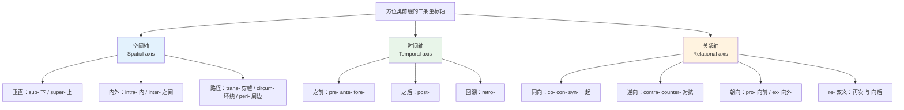
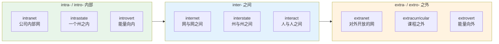
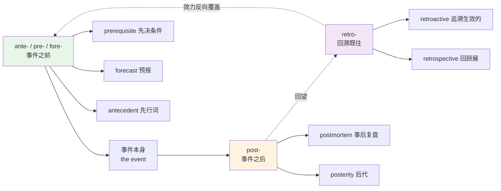
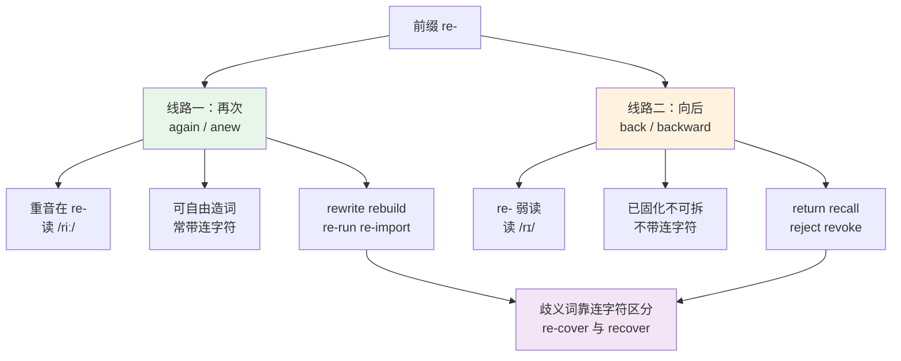
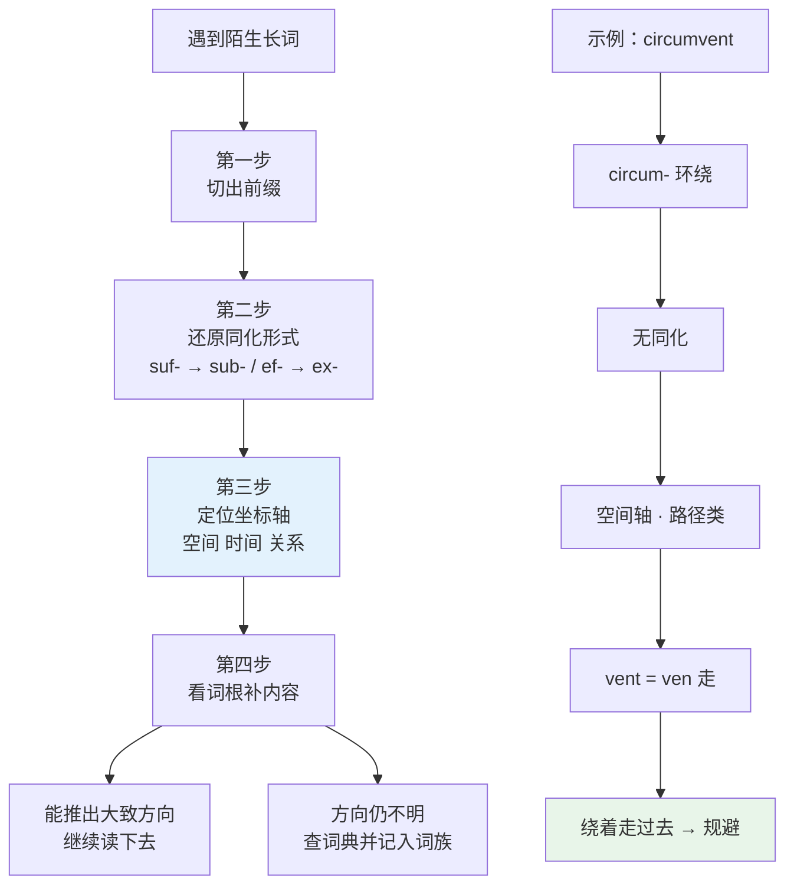
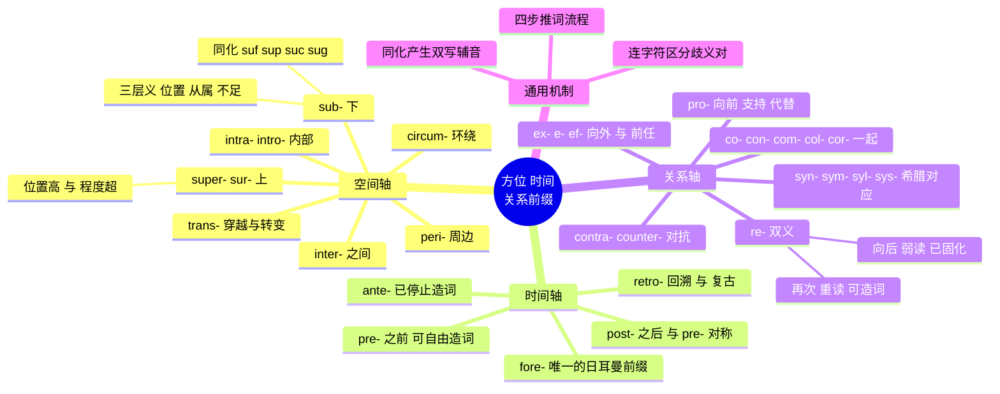

# 方位、时间与关系前缀

> [!info] 本篇定位
>
> 承接上一篇 `02.否定与相反前缀`。否定前缀改变一个词的真假极性，本篇这批前缀改变的是**位置**——在上还是在下、在内还是在外、在前还是在后、朝向还是背离。
>
> 读完你会拿到三条坐标轴：空间轴（sub- / super- / inter- / intra- / trans- / circum- / peri-）、时间轴（pre- / post- / ante- / retro- / fore-）、关系轴（co- / con- / syn- / pro- / contra- / ex- / re-），以及 `sub-` 变成 `suf- sup- suc- sug-` 的同化规则。
>
> 全篇约两百八十个词条。读完能当场判断 `subvert`、`transcend`、`retroactive`、`contravene` 这类词的大致方向，也能分清 `resign` 和 `re-sign`、`recover` 和 `re-cover`。

---

## 1. 本篇导读：前缀是被冻住的介词

拉丁语和希腊语的前缀，绝大多数原本是独立的介词或副词。`sub` 在拉丁语里就是「在……之下」，`trans` 就是「穿过」，`inter` 就是「在……之间」。它们黏到词根前面之后，介词的空间含义被冻在了词里，不再单独出现。

这件事有个直接后果：**这批前缀的意思高度稳定，几乎不会漂移**。`sub-` 在两千年里一直是「下」，不管接在什么词根上。这跟英语本土的词缀不一样——本土的 `-ly`、`-y` 意思模糊得多。稳定意味着可推导，可推导意味着可以批量扩容。

第二个后果是**空间隐喻会外溢到抽象领域**。物理上的「下」很容易引申成地位上的低（`subordinate` 下属）、意识层面的深（`subconscious` 潜意识）、质量上的次（`substandard` 不达标）。学这批前缀的关键不是背下每个词，而是抓住那个空间图式，再看它怎么被拉伸到抽象义上。

上图把本篇的十八个前缀压成三条轴。空间轴是本源，时间轴和关系轴都是空间隐喻的延伸——「之前」本来说的是站在前面的位置，「一起」本来说的是并排放置的位置。三条轴之间不是并列关系，而是一条轴向两个方向的引申。读到后面几节会看到，同一个前缀常常在两条轴上都有用法：`pro-` 既是空间上的「向前」，也是立场上的「支持」。

| 坐标轴 | 核心前缀 | 原始空间义 | 主要抽象引申 |
| --- | --- | --- | --- |
| 垂直 | sub- / super- | 下方 / 上方 | 从属与超越、次级与顶级 |
| 内外 | intra- / inter- | 内部 / 之间 | 系统内与跨系统、独处与互动 |
| 路径 | trans- / circum- / peri- | 穿过 / 绕圈 / 周边 | 转变与跨越、迂回、边缘与非核心 |
| 时序 | pre- / ante- / fore- / post- / retro- | 前 / 后 | 预先与事后、追溯 |
| 伴随 | co- / con- / syn- | 一同 | 合作、组合、同步 |
| 对向 | pro- / contra- / counter- / ex- | 向前 / 相对 / 向外 | 赞成与反对、排除与卸任 |
| 重复 | re- | 向后 | 重做与撤回 |

这张表是全篇的索引。碰到生词先定位它在哪条轴上，再看词根，八成能推出方向。方向对了，具体含义靠上下文补齐通常足够。

---

## 2. 垂直轴之下：sub- 及其变体

### 2.1 sub- 的三层含义

`sub-` 的字面义是「在……之下」，实际用法分三层，从具体到抽象依次是：物理位置在下、层级从属、程度不足。三层共用一个图式，混不了。

| 英文 | 英式音标 | 美式音标 | 词性 | 中文 | 搭配与说明 |
| --- | --- | --- | --- | --- | --- |
| **submarine** | /ˌsʌbməˈriːn/ | /ˌsʌbməˈriːn/ | n./adj. | 潜艇；水下的 | sub- + marine 海的，字面「海面之下」 |
| **submerge** | /səbˈmɜːdʒ/ | /səbˈmɜːrdʒ/ | v. | 浸没；淹没 | merg 沉；被动 be submerged in |
| **subway** | /ˈsʌbweɪ/ | /ˈsʌbweɪ/ | n. | 地铁；地下通道 | 美式指地铁，英式指行人地下通道 |
| **subsoil** | /ˈsʌbsɔɪl/ | /ˈsʌbsɔɪl/ | n. | 底土；下层土 | 农业与工程语境 |
| **subterranean** | /ˌsʌbtəˈreɪniən/ | /ˌsʌbtəˈreɪniən/ | adj. | 地下的 | terr 土地；比 underground 正式 |
| **subtitle** | /ˈsʌbtaɪtl/ | /ˈsʌbtaɪtl/ | n./v. | 字幕；副标题 | 复数 subtitles 才是影视字幕 |
| **subscript** | /ˈsʌbskrɪpt/ | /ˈsʌbskrɪpt/ | n. | 下标 | 与 superscript 上标成对 |
| **subordinate** | /səˈbɔːdɪnət/ | /səˈbɔːrdɪnət/ | n./adj. | 下属；从属的 | ordin 次序；subordinate clause 从句 |
| **subject** | /ˈsʌbdʒɪkt/ | /ˈsʌbdʒɪkt/ | n. | 主题；臣民；实验对象 | ject 投；动词 /səbˈdʒekt/ 重音后移 |
| **subsidiary** | /səbˈsɪdiəri/ | /səbˈsɪdieri/ | n./adj. | 子公司；附属的 | a wholly owned subsidiary 全资子公司 |
| **subset** | /ˈsʌbset/ | /ˈsʌbset/ | n. | 子集 | 数学与编程高频 |
| **subdivide** | /ˌsʌbdɪˈvaɪd/ | /ˌsʌbdɪˈvaɪd/ | v. | 再细分 | 名词 subdivision |
| **subcommittee** | /ˈsʌbkəmɪti/ | /ˈsʌbkəmɪti/ | n. | 小组委员会 | 会议与组织语境 |
| **subconscious** | /ˌsʌbˈkɒnʃəs/ | /ˌsʌbˈkɑːnʃəs/ | adj./n. | 潜意识的 | 与 unconscious 不同，后者指失去知觉 |
| **substandard** | /ˌsʌbˈstændəd/ | /ˌsʌbˈstændərd/ | adj. | 不达标的 | 程度层的 sub-：低于标准线 |
| **subpar** | /ˌsʌbˈpɑː/ | /ˌsʌbˈpɑːr/ | adj. | 低于平均水平的 | par 标准杆，来自高尔夫 |
| **subzero** | /ˌsʌbˈzɪərəʊ/ | /ˌsʌbˈzɪroʊ/ | adj. | 零度以下的 | subzero temperatures |
| **subtract** | /səbˈtrækt/ | /səbˈtrækt/ | v. | 减去 | tract 拉；subtract A from B |
| **subscribe** | /səbˈskraɪb/ | /səbˈskraɪb/ | v. | 订阅；签署 | 原义「在下面签名」；subscribe to |
| **substitute** | /ˈsʌbstɪtjuːt/ | /ˈsʌbstɪtuːt/ | n./v. | 替代品；替换 | substitute A for B 用 A 换掉 B |
| **subvert** | /səbˈvɜːt/ | /səbˈvɜːrt/ | v. | 颠覆 | vert 转；从下面把根基翻过来 |
| **sublime** | /səˈblaɪm/ | /səˈblaɪm/ | adj. | 崇高的 | lim 门槛；「直抵门楣之下」引申为极致 |
| **subsequent** | /ˈsʌbsɪkwənt/ | /ˈsʌbsɪkwənt/ | adj. | 随后的 | sequ 跟随；subsequent to 正式用语 |
| **suburb** | /ˈsʌbɜːb/ | /ˈsʌbɜːrb/ | n. | 郊区 | urb 城市；形容词 suburban |
| **substructure** | /ˈsʌbstrʌktʃə/ | /ˈsʌbstrʌktʃər/ | n. | 基础结构 | 与 superstructure 上层建筑成对 |

> [!warning] subconscious 与 unconscious 分不清是常见错误
>
> 两个词都译成「无意识」，但指的不是一回事。
>
> - ❌ ~~The patient was subconscious after the accident.~~
> - ✅ The patient was **unconscious** after the accident.（事故后病人昏迷不醒）
> - ✅ Her choice was driven by **subconscious** bias.（她的选择受潜意识偏见驱动）
>
> `unconscious` 是「没有意识」，医学上指昏迷；`subconscious` 是「意识层面之下」，心理学上指没被察觉但仍在起作用的部分。前缀的区别就是全称否定与位置描述的区别。

### 2.2 sub- 的同化变体

`sub-` 后面接某些辅音时，那个 `b` 会被后面的辅音同化，拼写随之改变。这是拉丁语的发音省力机制留下的痕迹，规则很整齐。

| 原形 | 后接首字母 | 同化后 | 示例词 |
| --- | --- | --- | --- |
| sub- | f | suf- | suffer, suffice, sufficient |
| sub- | p | sup- | support, suppose, suppress |
| sub- | c | suc- | succeed, success, succumb |
| sub- | g | sug- | suggest, suggestive |
| sub- | m | sum- | summon, summit |
| sub- | r | sur-（少数） | surrogate, surreptitious |
| sub- | s + 辅音 | sus- | suspect, sustain, suspend |

| 英文 | 英式音标 | 美式音标 | 词性 | 中文 | 搭配与说明 |
| --- | --- | --- | --- | --- | --- |
| **suffer** | /ˈsʌfə/ | /ˈsʌfər/ | v. | 遭受；患病 | suf- + fer 承受；suffer from |
| **sufficient** | /səˈfɪʃnt/ | /səˈfɪʃnt/ | adj. | 足够的 | fic 做；反义 insufficient |
| **support** | /səˈpɔːt/ | /səˈpɔːrt/ | v./n. | 支撑；支持 | sup- + port 搬运，从下面托住 |
| **suppose** | /səˈpəʊz/ | /səˈpoʊz/ | v. | 假设；认为 | pos 放，「放在下面作为前提」 |
| **suppress** | /səˈpres/ | /səˈpres/ | v. | 压制 | press 压；suppress a warning 屏蔽告警 |
| **succeed** | /səkˈsiːd/ | /səkˈsiːd/ | v. | 成功；继任 | ced 走；succeed sb. 接某人的班 |
| **succumb** | /səˈkʌm/ | /səˈkʌm/ | v. | 屈服；死于 | cumb 躺；succumb to pressure |
| **suggest** | /səˈdʒest/ | /səɡˈdʒest/ | v. | 建议；暗示 | 英美读音差别明显，美音多一个 /ɡ/ |
| **summon** | /ˈsʌmən/ | /ˈsʌmən/ | v. | 召唤；传唤 | mon 提醒；法律义为传唤出庭 |
| **summit** | /ˈsʌmɪt/ | /ˈsʌmɪt/ | n. | 峰顶；峰会 | 由 sub- 派生却指顶端，反直觉 |
| **surrogate** | /ˈsʌrəɡət/ | /ˈsɜːrəɡət/ | n./adj. | 代理人；替代的 | rog 问；surrogate key 代理键 |
| **suspect** | /səˈspekt/ | /səˈspekt/ | v. | 怀疑 | 名词重音前移读 /ˈsʌspekt/ |
| **sustain** | /səˈsteɪn/ | /səˈsteɪn/ | v. | 维持；承受 | tain 持；sustainable 可持续的 |
| **suspend** | /səˈspend/ | /səˈspend/ | v. | 悬挂；暂停 | pend 悬；suspend an account 停用账号 |

> [!tip] 遇到 suf- sup- suc- sug- 开头的长词，先还原成 sub-
>
> 看到 `suppress` 想不出意思时，把它还原成 `sub-press`，就是「从上往下压」，压制。`succumb` 还原成 `sub-cumb`，「躺倒在下面」，屈服。
>
> 这个还原动作对 `con-`、`in-`、`ad-`、`ex-` 同样有效，同化规律在第 10 节统一给出。

---

## 3. 垂直轴之上：super- / supra- / sur-

### 3.1 super- 的两种引申

`super-` 是 `sub-` 的镜像，字面义「在……之上」。它的两条引申线路要分开看：一条是位置上的高（`superstructure` 上层建筑），一条是程度上的超过（`superb` 极好、`supersede` 取代）。第二条线在现代英语里更活跃，`super-` 已经变成一个可以随手加的口语强化前缀。

| 英文 | 英式音标 | 美式音标 | 词性 | 中文 | 搭配与说明 |
| --- | --- | --- | --- | --- | --- |
| **superior** | /suːˈpɪəriə/ | /suːˈpɪriər/ | adj./n. | 优越的；上级 | superior to 而非 ~~than~~ |
| **superiority** | /suːˌpɪəriˈɒrəti/ | /suːˌpɪriˈɔːrəti/ | n. | 优越性 | superiority complex 优越感情结 |
| **supervise** | /ˈsuːpəvaɪz/ | /ˈsuːpərvaɪz/ | v. | 监督 | vis 看，「在上面看着」 |
| **supervisor** | /ˈsuːpəvaɪzə/ | /ˈsuːpərvaɪzər/ | n. | 主管；导师 | 学术语境指研究生导师 |
| **superficial** | /ˌsuːpəˈfɪʃl/ | /ˌsuːpərˈfɪʃl/ | adj. | 表面的；肤浅的 | fic 面，「只在表面那一层」 |
| **superstructure** | /ˈsuːpəstrʌktʃə/ | /ˈsuːpərstrʌktʃər/ | n. | 上层建筑 | 与 substructure 成对 |
| **supernatural** | /ˌsuːpəˈnætʃrəl/ | /ˌsuːpərˈnætʃrəl/ | adj. | 超自然的 | 「在自然规律之上」 |
| **superimpose** | /ˌsuːpərɪmˈpəʊz/ | /ˌsuːpərɪmˈpoʊz/ | v. | 叠加 | superimpose A on B 图层叠加 |
| **supersede** | /ˌsuːpəˈsiːd/ | /ˌsuːpərˈsiːd/ | v. | 取代 | sed 坐；注意拼写是 -sede 不是 -cede |
| **superscript** | /ˈsuːpəskrɪpt/ | /ˈsuːpərskrɪpt/ | n. | 上标 | 与 subscript 成对 |
| **superb** | /suːˈpɜːb/ | /suːˈpɜːrb/ | adj. | 极好的 | 程度层，比 good 强烈得多 |
| **supreme** | /suːˈpriːm/ | /suːˈpriːm/ | adj. | 最高的 | the Supreme Court 最高法院 |
| **supremacy** | /suːˈpreməsi/ | /suːˈpreməsi/ | n. | 至高地位 | 重音在第二音节，与 supreme 不同 |
| **supranational** | /ˌsuːprəˈnæʃnəl/ | /ˌsuːprəˈnæʃnəl/ | adj. | 超国家的 | supra- 变体，多见于政治学 |
| **surface** | /ˈsɜːfɪs/ | /ˈsɜːrfɪs/ | n./v. | 表面；浮现 | sur- 即 super-，「在面之上」 |
| **surpass** | /səˈpɑːs/ | /sərˈpæs/ | v. | 超过 | 比 exceed 更强调超越预期 |
| **surplus** | /ˈsɜːpləs/ | /ˈsɜːrpləs/ | n./adj. | 盈余；过剩的 | trade surplus 贸易顺差 |
| **surmount** | /səˈmaʊnt/ | /sərˈmaʊnt/ | v. | 克服 | surmount obstacles，书面语 |
| **survive** | /səˈvaɪv/ | /sərˈvaɪv/ | v. | 幸存；比……活得久 | viv 活，「活在……之上」 |
| **surveillance** | /sɜːˈveɪləns/ | /sərˈveɪləns/ | n. | 监视 | veil 看；under surveillance |
| **surname** | /ˈsɜːneɪm/ | /ˈsɜːrneɪm/ | n. | 姓 | 「加在名字之上的名」 |
| **surcharge** | /ˈsɜːtʃɑːdʒ/ | /ˈsɜːrtʃɑːrdʒ/ | n. | 附加费 | 「加在原价之上」 |

### 3.2 sub- 与 super- 的成对词

英语里有一批 `sub-`/`super-` 严格对称的词，成对记比拆开记省一半力气。

| 下 | 上 | 领域 |
| --- | --- | --- |
| subscript 下标 | superscript 上标 | 排版与数学 |
| substructure 下部结构 | superstructure 上层建筑 | 工程与社会学 |
| subordinate 下属 | superior 上级 | 组织 |
| subhuman 低于人类的 | superhuman 超人的 | 程度 |
| subsonic 亚音速的 | supersonic 超音速的 | 物理 |
| subclass 子类 | superclass 父类 | 面向对象编程 |
| subset 子集 | superset 超集 | 数学与类型系统 |

> [!example] 成对前缀在技术文档里的实际句子
>
> - Every **subclass** inherits the methods defined in its **superclass**.
>   - 每个子类都继承其父类中定义的方法。
> - TypeScript is a **superset** of JavaScript; valid JS is a **subset** of valid TS.
>   - TypeScript 是 JavaScript 的超集，合法的 JS 是合法 TS 的子集。
> - The `float` type is **subsumed** by `double` in this conversion table.
>   - 在这张转换表里 float 类型被 double 涵盖。

三句里的六个词全部可以靠前缀直接读懂方向，不需要查词典。这就是本章说的「乘数效应」：`class`、`set`、`sonic` 这些基础词是已知的，加上两个前缀立刻变成六个词。

---

## 4. 内外轴：inter- 与 intra-

### 4.1 inter- 表示「在多者之间」

`inter-` 的核心是**两个或多个实体之间**，一定涉及复数方。`international` 是国与国之间，`interpersonal` 是人与人之间，`interface` 是两个系统之间的那张面。凡是 `inter-` 词，都能问出「在谁和谁之间」。

| 英文 | 英式音标 | 美式音标 | 词性 | 中文 | 搭配与说明 |
| --- | --- | --- | --- | --- | --- |
| **international** | /ˌɪntəˈnæʃnəl/ | /ˌɪntərˈnæʃnəl/ | adj. | 国际的 | 缩写 i18n 用于软件国际化 |
| **interact** | /ˌɪntərˈækt/ | /ˌɪntərˈækt/ | v. | 互动 | interact with sb./sth. |
| **interaction** | /ˌɪntərˈækʃn/ | /ˌɪntərˈækʃn/ | n. | 交互 | user interaction 用户交互 |
| **interface** | /ˈɪntəfeɪs/ | /ˈɪntərfeɪs/ | n./v. | 接口；界面 | 编程指接口，硬件指界面 |
| **intervene** | /ˌɪntəˈviːn/ | /ˌɪntərˈviːn/ | v. | 干预；介入 | ven 来，「走到两方中间」 |
| **intervention** | /ˌɪntəˈvenʃn/ | /ˌɪntərˈvenʃn/ | n. | 干预 | medical intervention 医疗介入 |
| **interrupt** | /ˌɪntəˈrʌpt/ | /ˌɪntəˈrʌpt/ | v./n. | 打断；中断 | rupt 破；计算机名词义为中断信号 |
| **intersect** | /ˌɪntəˈsekt/ | /ˌɪntərˈsekt/ | v. | 相交 | sect 切；名词 intersection 交叉口 |
| **interval** | /ˈɪntəvl/ | /ˈɪntərvl/ | n. | 间隔；幕间休息 | at regular intervals 定期地 |
| **intermediate** | /ˌɪntəˈmiːdiət/ | /ˌɪntərˈmiːdiət/ | adj./n. | 中级的；中间物 | med 中；语言等级里的 B1/B2 |
| **intermediary** | /ˌɪntəˈmiːdiəri/ | /ˌɪntərˈmiːdieri/ | n. | 中间人 | 商务与外交语境 |
| **interchange** | /ˈɪntətʃeɪndʒ/ | /ˈɪntərtʃeɪndʒ/ | n./v. | 互换；立交桥 | 形容词 interchangeable 可互换的 |
| **intercept** | /ˌɪntəˈsept/ | /ˌɪntərˈsept/ | v. | 拦截 | cept 拿；网络里指请求拦截 |
| **interlude** | /ˈɪntəluːd/ | /ˈɪntərluːd/ | n. | 插曲；间歇 | lud 玩，原指幕间表演 |
| **interdependent** | /ˌɪntədɪˈpendənt/ | /ˌɪntərdɪˈpendənt/ | adj. | 相互依赖的 | 名词 interdependence |
| **interdisciplinary** | /ˌɪntəˈdɪsəplɪnəri/ | /ˌɪntərˈdɪsəpləneri/ | adj. | 跨学科的 | 学术申请高频词 |
| **interlock** | /ˌɪntəˈlɒk/ | /ˌɪntərˈlɑːk/ | v. | 互锁 | 机械与并发编程都用 |
| **intermittent** | /ˌɪntəˈmɪtnt/ | /ˌɪntərˈmɪtnt/ | adj. | 间歇性的 | intermittent failure 偶发故障 |
| **interstate** | /ˈɪntəsteɪt/ | /ˈɪntərsteɪt/ | adj./n. | 州际的；州际公路 | 美国语境专用 |
| **intermingle** | /ˌɪntəˈmɪŋɡl/ | /ˌɪntərˈmɪŋɡl/ | v. | 混杂 | 比 mix 正式 |
| **interpersonal** | /ˌɪntəˈpɜːsənl/ | /ˌɪntərˈpɜːrsənl/ | adj. | 人际的 | interpersonal skills 人际沟通能力 |
| **interoperable** | /ˌɪntərˈɒpərəbl/ | /ˌɪntərˈɑːpərəbl/ | adj. | 可互操作的 | 名词 interoperability，技术标准高频 |
| **interstellar** | /ˌɪntəˈstelə/ | /ˌɪntərˈstelər/ | adj. | 星际的 | stell 星 |
| **intertwine** | /ˌɪntəˈtwaɪn/ | /ˌɪntərˈtwaɪn/ | v. | 交织 | 常用被动 be intertwined with |

### 4.2 intra- 表示「在单一实体内部」

`intra-` 与 `inter-` 只差一个字母，方向却相反：`intra-` 是**同一个实体内部**。`intranet` 是一家公司内部的网，`interstate` 是州与州之间，`intrastate` 是一个州内部。

| 英文 | 英式音标 | 美式音标 | 词性 | 中文 | 搭配与说明 |
| --- | --- | --- | --- | --- | --- |
| **intranet** | /ˈɪntrənet/ | /ˈɪntrənet/ | n. | 内联网 | 与 internet 对照记 |
| **intravenous** | /ˌɪntrəˈviːnəs/ | /ˌɪntrəˈviːnəs/ | adj. | 静脉注射的 | ven 静脉；缩写 IV |
| **intramuscular** | /ˌɪntrəˈmʌskjələ/ | /ˌɪntrəˈmʌskjələr/ | adj. | 肌肉注射的 | 与 intravenous 成组 |
| **intracellular** | /ˌɪntrəˈseljələ/ | /ˌɪntrəˈseljələr/ | adj. | 细胞内的 | 反义 extracellular 细胞外的 |
| **intramural** | /ˌɪntrəˈmjʊərəl/ | /ˌɪntrəˈmjʊrəl/ | adj. | 校内的 | mur 墙，「墙内的」 |
| **intrastate** | /ˌɪntrəˈsteɪt/ | /ˌɪntrəˈsteɪt/ | adj. | 州内的 | 法律与运输语境 |
| **intraday** | /ˌɪntrəˈdeɪ/ | /ˌɪntrəˈdeɪ/ | adj. | 日内的 | 金融行情术语 |

`intro-` 是 `intra-` 的同源变体，表示「向内」，带方向性而非纯位置。

| 英文 | 英式音标 | 美式音标 | 词性 | 中文 | 搭配与说明 |
| --- | --- | --- | --- | --- | --- |
| **introduce** | /ˌɪntrəˈdjuːs/ | /ˌɪntrəˈduːs/ | v. | 介绍；引入 | duc 引，「把人领进来」 |
| **introvert** | /ˈɪntrəvɜːt/ | /ˈɪntrəvɜːrt/ | n./adj. | 内向者 | vert 转，「向内转」；反义 extrovert |
| **introspection** | /ˌɪntrəˈspekʃn/ | /ˌɪntrəˈspekʃn/ | n. | 内省 | spect 看；编程里指反射机制 |
| **intrinsic** | /ɪnˈtrɪnsɪk/ | /ɪnˈtrɪnsɪk/ | adj. | 内在的；固有的 | 反义 extrinsic；intrinsic value 内在价值 |

上图把三个前缀排成一条由内向外的连续带。同一个词根接不同前缀，落在带上不同位置：`net` 系列是 intranet / internet / extranet，`state` 系列是 intrastate / interstate，`vert` 系列是 introvert / extrovert。记住这条带，遇到没见过的组合也能推——`intra-company transfer` 一看就是公司内部调动，`inter-company` 则是公司之间。

> [!warning] inter- 和 intra- 在正式文书里错一个字母意思就反了
>
> 这两个前缀的误用在合同和技术规范里代价很高，因为读者不会怀疑你写错，只会按字面理解。
>
> - ❌ ~~We need an intranet standard for the two companies to exchange data.~~
> - ✅ We need an **inter-company** standard for the two companies to exchange data.
>
> 判定办法只有一条：数一下涉及几个实体。一个 → intra-，两个及以上 → inter-。

---

## 5. 路径类：trans-、circum-、peri-

### 5.1 trans- 表示穿越与转变

`trans-` 的原义是「从一边到另一边」，因此它同时带**位移**和**改变**两种含义。位移义看 `transport`（把东西从一处运到另一处），改变义看 `transform`（从一种形态变到另一种形态）。两种含义共用同一个「跨过边界」的图式。

| 英文 | 英式音标 | 美式音标 | 词性 | 中文 | 搭配与说明 |
| --- | --- | --- | --- | --- | --- |
| **transport** | /ˈtrænspɔːt/ | /ˈtrænspɔːrt/ | n./v. | 运输 | port 搬；动词英式重音可后移 |
| **transfer** | /trænsˈfɜː/ | /trænsˈfɜːr/ | v. | 转移；转账 | 名词重音前移读 /ˈtrænsfɜː(r)/ |
| **translate** | /trænsˈleɪt/ | /ˈtrænsleɪt/ | v. | 翻译 | lat 搬运；translate A into B |
| **transmit** | /trænzˈmɪt/ | /trænsˈmɪt/ | v. | 传输；传播 | mit 送；名词 transmission |
| **transform** | /trænsˈfɔːm/ | /trænsˈfɔːrm/ | v. | 转变 | transform A into B |
| **transformation** | /ˌtrænsfəˈmeɪʃn/ | /ˌtrænsfərˈmeɪʃn/ | n. | 转型 | digital transformation 数字化转型 |
| **transparent** | /trænsˈpærənt/ | /trænsˈperənt/ | adj. | 透明的 | par 显现，「光能穿过去看见」 |
| **transaction** | /trænˈzækʃn/ | /trænˈzækʃn/ | n. | 交易；事务 | 数据库事务的标准译名 |
| **transcend** | /trænˈsend/ | /trænˈsend/ | v. | 超越 | scend 爬；transcend boundaries |
| **transcribe** | /trænˈskraɪb/ | /trænˈskraɪb/ | v. | 转写；誊写 | scrib 写；名词 transcript |
| **transcript** | /ˈtrænskrɪpt/ | /ˈtrænskrɪpt/ | n. | 成绩单；文字记录 | 留学申请材料常用 |
| **transit** | /ˈtrænzɪt/ | /ˈtrænzɪt/ | n. | 运输；过境 | in transit 在途中 |
| **transition** | /trænˈzɪʃn/ | /trænˈzɪʃn/ | n./v. | 过渡 | transition from A to B；CSS 属性名 |
| **transplant** | /trænsˈplɑːnt/ | /trænsˈplænt/ | v. | 移植 | 名词重音前移；heart transplant |
| **transfusion** | /trænsˈfjuːʒn/ | /trænsˈfjuːʒn/ | n. | 输血 | fus 倒；blood transfusion |
| **transatlantic** | /ˌtrænzətˈlæntɪk/ | /ˌtrænzətˈlæntɪk/ | adj. | 跨大西洋的 | 同构词 transpacific |
| **transcontinental** | /ˌtrænzkɒntɪˈnentl/ | /ˌtrænskɑːntɪˈnentl/ | adj. | 横贯大陆的 | 铁路史高频词 |
| **transnational** | /trænzˈnæʃnəl/ | /trænsˈnæʃnəl/ | adj. | 跨国的 | 比 multinational 更强调越界 |
| **transgress** | /trænzˈɡres/ | /trænsˈɡres/ | v. | 越轨；违背 | gress 走；名词 transgression |
| **transient** | /ˈtrænziənt/ | /ˈtrænʃənt/ | adj./n. | 短暂的；临时的 | 英美读音差别大；编程指临时状态 |
| **transmute** | /trænzˈmjuːt/ | /trænsˈmjuːt/ | v. | 嬗变 | mut 变；化学与文学语境 |
| **transitive** | /ˈtrænsətɪv/ | /ˈtrænsətɪv/ | adj. | 及物的 | 语法术语；反义 intransitive |

> [!example] trans- 的位移义与改变义对照
>
> - The files were **transferred** to the backup server overnight.
>   - 这些文件在夜里被转移到了备份服务器。（位移）
> - The startup **transformed** itself from a consultancy into a product company.
>   - 这家初创公司从咨询公司转型成了产品公司。（改变）
> - Her lecture **transcended** the usual boundaries between the two fields.
>   - 她的讲座跨越了这两个领域之间通常的界限。（越过边界，两义兼有）

三句话里 `trans-` 的空间图式是同一个，落点不同：第一句跨的是物理位置，第二句跨的是形态，第三句跨的是抽象界线。

### 5.2 circum- 环绕，peri- 周边

`circum-` 来自拉丁语，`peri-` 来自希腊语，两者都表示「绕着」，但分工清楚：`circum-` 强调**绕行的动作或整圈的路径**，`peri-` 强调**围绕出来的那圈区域**。

| 英文 | 英式音标 | 美式音标 | 词性 | 中文 | 搭配与说明 |
| --- | --- | --- | --- | --- | --- |
| **circumference** | /səˈkʌmfərəns/ | /sərˈkʌmfərəns/ | n. | 圆周；周长 | fer 带；注意重音在第二音节 |
| **circumstance** | /ˈsɜːkəmstəns/ | /ˈsɜːrkəmstæns/ | n. | 情况；环境 | st 站，「围着站的一圈事」；常用复数 |
| **circumvent** | /ˌsɜːkəmˈvent/ | /ˌsɜːrkəmˈvent/ | v. | 规避；绕开 | ven 走；circumvent a restriction |
| **circumnavigate** | /ˌsɜːkəmˈnævɪɡeɪt/ | /ˌsɜːrkəmˈnævɪɡeɪt/ | v. | 环航 | nav 船；航海史词汇 |
| **circumscribe** | /ˈsɜːkəmskraɪb/ | /ˈsɜːrkəmskraɪb/ | v. | 限制；外接 | scrib 画；数学指作外接圆 |
| **circumspect** | /ˈsɜːkəmspekt/ | /ˈsɜːrkəmspekt/ | adj. | 谨慎的 | spect 看，「四下张望」 |
| **circulate** | /ˈsɜːkjəleɪt/ | /ˈsɜːrkjəleɪt/ | v. | 循环；流通 | 名词 circulation 发行量 |
| **circuit** | /ˈsɜːkɪt/ | /ˈsɜːrkɪt/ | n. | 电路；巡回 | short circuit 短路 |
| **perimeter** | /pəˈrɪmɪtə/ | /pəˈrɪmɪtər/ | n. | 周长；周界 | meter 测量；安防语境指外围警戒线 |
| **periphery** | /pəˈrɪfəri/ | /pəˈrɪfəri/ | n. | 外围；边缘 | on the periphery of |
| **peripheral** | /pəˈrɪfərəl/ | /pəˈrɪfərəl/ | adj./n. | 外围的；外设 | peripheral device 外围设备 |
| **period** | /ˈpɪəriəd/ | /ˈpɪriəd/ | n. | 时期；句号 | od 路，「绕一圈的路程」 |
| **periscope** | /ˈperɪskəʊp/ | /ˈperɪskoʊp/ | n. | 潜望镜 | scop 看，「看周围」 |
| **pericardium** | /ˌperɪˈkɑːdiəm/ | /ˌperɪˈkɑːrdiəm/ | n. | 心包 | cardi 心；医学术语 |
| **perinatal** | /ˌperɪˈneɪtl/ | /ˌperɪˈneɪtl/ | adj. | 围产期的 | nat 出生；医学术语 |

> [!tip] circumference 的重音位置容易读错
>
> `circle`、`circuit`、`circumstance` 重音都在第一音节，很多人把 `circumference` 也读成 `ˈcircum-ference`。正确读法是 /səˈkʌmfərəns/，重音落在第二音节 `-cum-`。
>
> 同类陷阱还有 `supremacy` /suːˈpreməsi/、`intermediary` /ˌɪntəˈmiːdiəri/——加了后缀之后重音会跟着后缀跑，不跟原词走。

---

## 6. 时间轴：pre-、post-、ante-、retro-、fore-

### 6.1 pre- 与 post- 的对称结构

`pre-` 和 `post-` 是英语里少有的**完全对称且仍在活跃造词**的一对前缀。任何名词前面加 `pre-`/`post-` 都能临时造出可理解的新词：`pre-launch`、`post-deployment`、`pre-commit`、`post-mortem`。造词能力强意味着不必背全，只要抓住规则。

| 英文 | 英式音标 | 美式音标 | 词性 | 中文 | 搭配与说明 |
| --- | --- | --- | --- | --- | --- |
| **preview** | /ˈpriːvjuː/ | /ˈpriːvjuː/ | n./v. | 预览 | 与 review 回顾成对 |
| **predict** | /prɪˈdɪkt/ | /prɪˈdɪkt/ | v. | 预测 | dict 说，「事先说」 |
| **prediction** | /prɪˈdɪkʃn/ | /prɪˈdɪkʃn/ | n. | 预测 | make a prediction |
| **prepare** | /prɪˈpeə/ | /prɪˈper/ | v. | 准备 | par 备；prepare for 与 prepare sth. 有别 |
| **prevent** | /prɪˈvent/ | /prɪˈvent/ | v. | 阻止 | ven 来，「先一步到」 |
| **precede** | /prɪˈsiːd/ | /prɪˈsiːd/ | v. | 先于 | 与 proceed 只差一个字母，含义完全不同 |
| **precedent** | /ˈpresɪdənt/ | /ˈpresɪdənt/ | n. | 先例 | 法律高频；注意与 president 拼写不同 |
| **precaution** | /prɪˈkɔːʃn/ | /prɪˈkɔːʃn/ | n. | 预防措施 | take precautions |
| **prefix** | /ˈpriːfɪks/ | /ˈpriːfɪks/ | n. | 前缀 | fix 固定，「先固定上去的」 |
| **prehistoric** | /ˌpriːhɪˈstɒrɪk/ | /ˌpriːhɪˈstɔːrɪk/ | adj. | 史前的 | 名词 prehistory |
| **premature** | /ˈpremətʃə/ | /ˌpriːməˈtʃʊr/ | adj. | 过早的；早产的 | 英美重音位置不同 |
| **prerequisite** | /ˌpriːˈrekwəzɪt/ | /ˌpriːˈrekwəzɪt/ | n. | 先决条件 | 课程与安装文档常用 |
| **preliminary** | /prɪˈlɪmɪnəri/ | /prɪˈlɪməneri/ | adj./n. | 初步的；预赛 | limin 门槛，「进门之前」 |
| **premise** | /ˈpremɪs/ | /ˈpremɪs/ | n. | 前提 | mis 送；复数 premises 指房产 |
| **preclude** | /prɪˈkluːd/ | /prɪˈkluːd/ | v. | 排除；妨碍 | clud 关；preclude sb. from doing |
| **prejudice** | /ˈpredʒudɪs/ | /ˈpredʒudɪs/ | n./v. | 偏见 | judic 判断，「先下判断」 |
| **preempt** | /priˈempt/ | /priˈempt/ | v. | 抢先；抢占 | 操作系统术语 preemptive scheduling |
| **precursor** | /priˈkɜːsə/ | /priˈkɜːrsər/ | n. | 前身；先驱 | curs 跑；a precursor to sth. |
| **premonition** | /ˌpreməˈnɪʃn/ | /ˌpriːməˈnɪʃn/ | n. | 预感 | mon 警告 |
| **preschool** | /ˈpriːskuːl/ | /ˈpriːskuːl/ | n./adj. | 学前班；学龄前的 | 与 preteen 同构 |
| **preload** | /ˌpriːˈləʊd/ | /ˌpriːˈloʊd/ | v. | 预加载 | 前端性能优化术语 |
| **postpone** | /pəʊstˈpəʊn/ | /poʊstˈpoʊn/ | v. | 推迟 | pon 放，「往后放」 |
| **postwar** | /ˌpəʊstˈwɔː/ | /ˌpoʊstˈwɔːr/ | adj. | 战后的 | 与 prewar 成对 |
| **postgraduate** | /ˌpəʊstˈɡrædʒuət/ | /ˌpoʊstˈɡrædʒuət/ | n./adj. | 研究生（的） | 英式常用，美式多说 graduate student |
| **postdoctoral** | /ˌpəʊstˈdɒktərəl/ | /ˌpoʊstˈdɑːktərəl/ | adj. | 博士后的 | 缩略为 postdoc |
| **postscript** | /ˈpəʊstskrɪpt/ | /ˈpoʊstskrɪpt/ | n. | 附言 | 缩写 P.S. 即出自此词 |
| **postmortem** | /ˌpəʊstˈmɔːtəm/ | /ˌpoʊstˈmɔːrtəm/ | n./adj. | 尸检；事后复盘 | mort 死；技术团队指故障复盘 |
| **posterity** | /pɒˈsterəti/ | /pɑːˈsterəti/ | n. | 后代 | for posterity 为后世留存 |
| **posterior** | /pɒˈstɪəriə/ | /pɑːˈstɪriər/ | adj. | 后部的 | 与 anterior 成对，解剖学术语 |
| **posthumous** | /ˈpɒstjʊməs/ | /ˈpɑːstʃəməs/ | adj. | 死后的；遗作的 | 英美读音差别大 |

上图区分了两种「往前看」。`pre-` 系列站在事件之前朝未来看，是**预先**；`retro-` 系列站在事件之后朝过去看，是**回溯**。两者方向不同却容易混，因为中文都可以说「往前」。判断标准是说话人的立足点：立足点在事件前用 `pre-`，立足点在事件后用 `retro-`。`retroactive pay raise`（追溯生效的加薪）之所以用 `retro-`，是因为决定是现在做的，效力却盖回过去。

### 6.2 ante- 与 retro-

`ante-` 与 `pre-` 意思接近，但 `ante-` 已经基本停止造新词，只存在于一批固化的老词里。`retro-` 反过来在现代英语里很活跃，还从「回溯」引申出了「复古」的口语义。

| 英文 | 英式音标 | 美式音标 | 词性 | 中文 | 搭配与说明 |
| --- | --- | --- | --- | --- | --- |
| **antecedent** | /ˌæntɪˈsiːdnt/ | /ˌæntɪˈsiːdnt/ | n./adj. | 先行词；先前的 | 语法术语，指代词所指的那个名词 |
| **anterior** | /ænˈtɪəriə/ | /ænˈtɪriər/ | adj. | 前部的；先前的 | 解剖学与正式书面语 |
| **antechamber** | /ˈæntɪtʃeɪmbə/ | /ˈæntɪtʃeɪmbər/ | n. | 前厅 | 建筑与文学语境 |
| **antedate** | /ˈæntɪdeɪt/ | /ˈæntɪdeɪt/ | v. | 早于；倒填日期 | 反义 postdate |
| **antenatal** | /ˌæntiˈneɪtl/ | /ˌæntiˈneɪtl/ | adj. | 产前的 | 英式用法，美式说 prenatal |
| **antebellum** | /ˌæntiˈbeləm/ | /ˌæntiˈbeləm/ | adj. | 战前的 | bell 战争；特指美国南北战争前 |
| **anticipate** | /ænˈtɪsɪpeɪt/ | /ænˈtɪsɪpeɪt/ | v. | 预期 | 这里的 anti- 实为 ante-，不表反对 |
| **ancestor** | /ˈænsestə/ | /ˈænsestər/ | n. | 祖先 | ante- + cess 走，「先走一步的人」 |
| **ancient** | /ˈeɪnʃənt/ | /ˈeɪnʃənt/ | adj. | 古代的 | 词源同 ante-，拼写已看不出来 |
| **antique** | /ænˈtiːk/ | /ænˈtiːk/ | n./adj. | 古董；古老的 | 重音在后，与 antic 不同 |
| **retrospect** | /ˈretrəspekt/ | /ˈretrəspekt/ | n. | 回顾 | in retrospect 现在回头看 |
| **retrospective** | /ˌretrəˈspektɪv/ | /ˌretrəˈspektɪv/ | adj./n. | 回顾的；回顾展 | 敏捷开发里的迭代复盘会 |
| **retroactive** | /ˌretrəʊˈæktɪv/ | /ˌretroʊˈæktɪv/ | adj. | 追溯生效的 | 法律与薪酬语境；副词 retroactively |
| **retrograde** | /ˈretrəɡreɪd/ | /ˈretrəɡreɪd/ | adj. | 倒退的；逆行的 | grad 走；天文学指行星逆行 |
| **retrogress** | /ˌretrəˈɡres/ | /ˌretrəˈɡres/ | v. | 退步 | 反义 progress，词根相同 |
| **retrofit** | /ˈretrəʊfɪt/ | /ˈretroʊfɪt/ | v./n. | 改造加装 | 给旧设备加新部件 |
| **retrovirus** | /ˈretrəʊvaɪrəs/ | /ˈretroʊvaɪrəs/ | n. | 逆转录病毒 | 生物学术语 |

> [!warning] anticipate 里的 anti- 不表示反对
>
> `anticipate` 拆开是 `ante-` + `cip`（拿）+ `-ate`，字面是「事先拿到」，因此是「预料」。它跟 `antibiotic`、`antisocial` 里的希腊语 `anti-`（反对）来源不同，只是拼写撞车。
>
> - ❌ ~~I anticipate this proposal.~~（想说「我反对这个提案」时错用）
> - ✅ I **oppose** this proposal.（我反对这个提案）
> - ✅ I **anticipate** some resistance to this proposal.（我预料这个提案会遇到一些阻力）
>
> 同一类陷阱还有 `ancient`、`ancestor`——它们的第一音节也来自 `ante-`，和「反对」无关。表示反对的 `anti-` 已在上一篇 `02.否定与相反前缀` 讲过。

### 6.3 fore- 是这批里唯一的日耳曼前缀

本篇十八个前缀里，只有 `fore-` 来自古英语，其余全是拉丁或希腊借来的。这个出身差别有实际后果：`fore-` 只跟**日耳曼层的本土词根**结合，而且构成的词更短、更口语化。

| 英文 | 英式音标 | 美式音标 | 词性 | 中文 | 搭配与说明 |
| --- | --- | --- | --- | --- | --- |
| **forecast** | /ˈfɔːkɑːst/ | /ˈfɔːrkæst/ | n./v. | 预报；预测 | weather forecast；过去式可为 forecast |
| **foresee** | /fɔːˈsiː/ | /fɔːrˈsiː/ | v. | 预见 | 过去分词 foreseen |
| **foreseeable** | /fɔːˈsiːəbl/ | /fɔːrˈsiːəbl/ | adj. | 可预见的 | in the foreseeable future |
| **foresight** | /ˈfɔːsaɪt/ | /ˈfɔːrsaɪt/ | n. | 远见 | 反义 hindsight 事后之明 |
| **forewarn** | /fɔːˈwɔːn/ | /fɔːrˈwɔːrn/ | v. | 预先警告 | 常用被动 be forewarned |
| **foretell** | /fɔːˈtel/ | /fɔːrˈtel/ | v. | 预言 | 过去式 foretold，偏文学 |
| **forestall** | /fɔːˈstɔːl/ | /fɔːrˈstɔːl/ | v. | 先发制人；预先阻止 | 比 prevent 更强调抢在前面 |
| **forebode** | /fɔːˈbəʊd/ | /fɔːrˈboʊd/ | v. | 预示不祥 | 名词 foreboding 不祥预感 |
| **foreword** | /ˈfɔːwɜːd/ | /ˈfɔːrwɜːrd/ | n. | 序言 | 与 forward 向前 拼写只差一个字母 |
| **foreground** | /ˈfɔːɡraʊnd/ | /ˈfɔːrɡraʊnd/ | n./v. | 前景；凸显 | 反义 background；进程管理术语 |
| **forefront** | /ˈfɔːfrʌnt/ | /ˈfɔːrfrʌnt/ | n. | 最前沿 | at the forefront of |
| **foremost** | /ˈfɔːməʊst/ | /ˈfɔːrmoʊst/ | adj./adv. | 最重要的；首先 | first and foremost |
| **forefather** | /ˈfɔːfɑːðə/ | /ˈfɔːrfɑːðər/ | n. | 祖先 | 与拉丁层 ancestor 同义不同层 |
| **forerunner** | /ˈfɔːrʌnə/ | /ˈfɔːrrʌnər/ | n. | 先驱 | 与拉丁层 precursor 同义不同层 |
| **forearm** | /ˈfɔːrɑːm/ | /ˈfɔːrɑːrm/ | n. | 前臂 | 此处 fore- 表位置而非时间 |
| **forehead** | /ˈfɔːhed/ | /ˈfɔːrhed/ | n. | 额头 | 英式传统读音 /ˈfɒrɪd/ 仍存 |

> [!tip] fore- 与 pre- 的选词直觉
>
> 三对同义词把出身差别摆得很清楚：
>
> - `forefather` 与 `ancestor`：前者出现在演讲和文学里，后者在学术与法律文书里。
> - `forerunner` 与 `precursor`：前者用于人物和事物，后者更常用于抽象事物和化学物质。
> - `foretell` 与 `predict`：前者带占卜和预言的色彩，后者是中性的科学预测。
>
> 规律和第一篇讲的三层结构一致：日耳曼层短而具体，拉丁层长而正式。写技术文档选 `pre-` 系列，写演讲稿可以用 `fore-` 系列换个语气。

---

## 7. 同行关系：co-、con-、syn-

### 7.1 co- 与 con- 是同一个前缀的两副面孔

`co-` 和 `con-`（还有 `com-`、`col-`、`cor-`）来源相同，都是拉丁语的 `cum`「和、一起」。区别在于**结合的紧密程度**：

- `co-` 通常加在**已经独立存在的英语词**前面，连字符可有可无，语义透明：`co-author`、`co-founder`、`co-worker`。
- `con-`/`com-` 已经和词根**长在一起**，构成不可拆的整词：`connect`、`combine`、`compose`。

这个差别决定了造词自由度：`co-` 可以现造，`con-` 不行。写邮件说 `co-lead the project` 完全成立，但不能造 `conlead`。

| 英文 | 英式音标 | 美式音标 | 词性 | 中文 | 搭配与说明 |
| --- | --- | --- | --- | --- | --- |
| **cooperate** | /kəʊˈɒpəreɪt/ | /koʊˈɑːpəreɪt/ | v. | 合作 | oper 工作；名词 cooperation |
| **coordinate** | /kəʊˈɔːdɪneɪt/ | /koʊˈɔːrdɪneɪt/ | v. | 协调 | 名词读 /kəʊˈɔːdɪnət/，末音节弱化 |
| **coexist** | /ˌkəʊɪɡˈzɪst/ | /ˌkoʊɪɡˈzɪst/ | v. | 共存 | 名词 coexistence |
| **coauthor** | /ˌkəʊˈɔːθə/ | /ˌkoʊˈɔːθər/ | n./v. | 合著者；合著 | 论文署名场景 |
| **cofounder** | /ˌkəʊˈfaʊndə/ | /ˌkoʊˈfaʊndər/ | n. | 联合创始人 | 常写作 co-founder |
| **coworker** | /ˈkəʊwɜːkə/ | /ˈkoʊwɜːrkər/ | n. | 同事 | 美式常用，英式多说 colleague |
| **coincide** | /ˌkəʊɪnˈsaɪd/ | /ˌkoʊɪnˈsaɪd/ | v. | 巧合；同时发生 | cid 落下，「一起落在同一点」 |
| **coincidence** | /kəʊˈɪnsɪdəns/ | /koʊˈɪnsɪdəns/ | n. | 巧合 | 重音与动词不同 |
| **cohesion** | /kəʊˈhiːʒn/ | /koʊˈhiːʒn/ | n. | 内聚；凝聚力 | hes 黏；软件设计的高内聚 |
| **coherent** | /kəʊˈhɪərənt/ | /koʊˈhɪrənt/ | adj. | 连贯的 | 反义 incoherent |
| **coalesce** | /ˌkəʊəˈles/ | /ˌkoʊəˈles/ | v. | 合并；聚合 | 数据库函数 COALESCE 即此词 |
| **colleague** | /ˈkɒliːɡ/ | /ˈkɑːliːɡ/ | n. | 同事 | leg 选派，「一起被派的人」 |
| **connect** | /kəˈnekt/ | /kəˈnekt/ | v. | 连接 | nect 系；名词 connection |
| **consensus** | /kənˈsensəs/ | /kənˈsensəs/ | n. | 共识 | sens 感觉；reach a consensus |
| **conform** | /kənˈfɔːm/ | /kənˈfɔːrm/ | v. | 遵从；符合 | conform to a standard |
| **conspire** | /kənˈspaɪə/ | /kənˈspaɪər/ | v. | 密谋 | spir 呼吸，「一起呼吸」 |
| **contemporary** | /kənˈtempərəri/ | /kənˈtempəreri/ | adj./n. | 当代的；同时代人 | tempor 时间，「同一时间的」 |
| **convene** | /kənˈviːn/ | /kənˈviːn/ | v. | 召集；开会 | ven 来；名词 convention |
| **converge** | /kənˈvɜːdʒ/ | /kənˈvɜːrdʒ/ | v. | 汇聚 | verg 倾斜；反义 diverge |
| **conjunction** | /kənˈdʒʌŋkʃn/ | /kənˈdʒʌŋkʃn/ | n. | 连词；结合 | in conjunction with 与……一起 |
| **consonant** | /ˈkɒnsənənt/ | /ˈkɑːnsənənt/ | n. | 辅音 | son 声，「与元音一起发的音」 |
| **combine** | /kəmˈbaɪn/ | /kəmˈbaɪn/ | v. | 结合 | bin 二；名词 combination |
| **compose** | /kəmˈpəʊz/ | /kəmˈpoʊz/ | v. | 组成；作曲 | be composed of 由……构成 |
| **compress** | /kəmˈpres/ | /kəmˈpres/ | v. | 压缩 | 名词 compression |
| **compatible** | /kəmˈpætəbl/ | /kəmˈpætəbl/ | adj. | 兼容的 | pat 忍受；backward compatible 向后兼容 |
| **collaborate** | /kəˈlæbəreɪt/ | /kəˈlæbəreɪt/ | v. | 协作 | labor 劳动；collaborate on a project |
| **collect** | /kəˈlekt/ | /kəˈlekt/ | v. | 收集 | lect 挑；名词 collection |
| **collide** | /kəˈlaɪd/ | /kəˈlaɪd/ | v. | 碰撞 | 名词 collision；哈希冲突用此词 |
| **correlate** | /ˈkɒrəleɪt/ | /ˈkɔːrəleɪt/ | v. | 相关联 | 名词 correlation 相关性 |
| **correspond** | /ˌkɒrɪˈspɒnd/ | /ˌkɔːrəˈspɑːnd/ | v. | 对应；通信 | correspond to 对应；correspond with 通信 |
| **corrupt** | /kəˈrʌpt/ | /kəˈrʌpt/ | adj./v. | 腐败的；损坏 | rupt 破；文件损坏也用此词 |

### 7.2 syn- 是 con- 的希腊对应

`syn-` 与 `con-` 意思相同，出身不同：`syn-` 来自希腊语，因此主要出现在**学术、科学、音乐**这类希腊借词密集的领域。它同样有同化变体：接 b/m/p 变 `sym-`，接 l 变 `syl-`，接 s 变 `sys-`。

| 原形 | 后接首字母 | 同化后 | 示例词 |
| --- | --- | --- | --- |
| syn- | b, m, p | sym- | symbiosis, symmetry, sympathy |
| syn- | l | syl- | syllable, syllogism |
| syn- | s | sys- | system, systematic |
| syn- | 其他 | syn- | synonym, synthesis |

| 英文 | 英式音标 | 美式音标 | 词性 | 中文 | 搭配与说明 |
| --- | --- | --- | --- | --- | --- |
| **synonym** | /ˈsɪnənɪm/ | /ˈsɪnənɪm/ | n. | 同义词 | onym 名；反义 antonym |
| **synchronize** | /ˈsɪŋkrənaɪz/ | /ˈsɪŋkrənaɪz/ | v. | 同步 | chron 时间；缩略为 sync |
| **synthesis** | /ˈsɪnθəsɪs/ | /ˈsɪnθəsɪs/ | n. | 综合；合成 | 复数 syntheses；动词 synthesize |
| **syndrome** | /ˈsɪndrəʊm/ | /ˈsɪndroʊm/ | n. | 综合征 | drom 跑，「一起出现的一组症状」 |
| **synergy** | /ˈsɪnədʒi/ | /ˈsɪnərdʒi/ | n. | 协同效应 | erg 功；商业语境高频 |
| **syntax** | /ˈsɪntæks/ | /ˈsɪntæks/ | n. | 句法；语法结构 | tax 排列；编程指语法 |
| **synopsis** | /sɪˈnɒpsɪs/ | /sɪˈnɑːpsɪs/ | n. | 提要 | ops 看，「一起看到全貌」 |
| **symmetry** | /ˈsɪmətri/ | /ˈsɪmətri/ | n. | 对称 | metr 测量；形容词 symmetrical |
| **sympathy** | /ˈsɪmpəθi/ | /ˈsɪmpəθi/ | n. | 同情 | path 感受；与 empathy 共情有别 |
| **symphony** | /ˈsɪmfəni/ | /ˈsɪmfəni/ | n. | 交响乐 | phon 声，「声音一起响」 |
| **symposium** | /sɪmˈpəʊziəm/ | /sɪmˈpoʊziəm/ | n. | 研讨会 | 原义「一起喝酒」，复数 symposia |
| **symbiosis** | /ˌsɪmbaɪˈəʊsɪs/ | /ˌsɪmbaɪˈoʊsɪs/ | n. | 共生 | bio 生命；形容词 symbiotic |
| **syllable** | /ˈsɪləbl/ | /ˈsɪləbl/ | n. | 音节 | lab 抓，「抓在一起的音」 |
| **syllogism** | /ˈsɪlədʒɪzəm/ | /ˈsɪlədʒɪzəm/ | n. | 三段论 | 逻辑学术语 |
| **system** | /ˈsɪstəm/ | /ˈsɪstəm/ | n. | 系统 | st 站，「站在一起的整体」 |
| **systematic** | /ˌsɪstəˈmætɪk/ | /ˌsɪstəˈmætɪk/ | adj. | 系统性的 | 与 systemic 系统内的 含义不同 |

> [!warning] sympathy 和 empathy 不是同义词
>
> 两个词共用词根 `path`（感受），前缀不同，含义差得很远。
>
> - `sympathy` = `sym-`（一起）+ `path`：为对方感到难过，站在外面。
> - `empathy` = `em-`（进入）+ `path`：进入对方处境去感受，站在里面。
>
> - ❌ ~~As a manager, you need more sympathy for your team's workload.~~（听起来像同情下属可怜）
> - ✅ As a manager, you need more **empathy** for your team's workload.（作为管理者，你需要更能设身处地理解团队的工作量）
>
> 招聘描述和绩效反馈里几乎只用 `empathy`，`sympathy` 多用在丧事与不幸场合（`Please accept my sympathies`）。

---

## 8. 对向关系：pro- 与 contra-

### 8.1 pro- 的三条线

`pro-` 是本篇歧义最多的前缀，三条线路都很常用，必须靠词根和语境区分：

1. **向前**（空间与时间）：`progress`、`proceed`、`project`。
2. **支持**（立场）：`pro-democracy`、`pro-choice`，通常带连字符。
3. **代替、在前面**（少数固化词）：`pronoun`（代名词）、`proconsul`。

| 英文 | 英式音标 | 美式音标 | 词性 | 中文 | 搭配与说明 |
| --- | --- | --- | --- | --- | --- |
| **progress** | /ˈprəʊɡres/ | /ˈprɑːɡrəs/ | n. | 进展 | 动词读 /prəˈɡres/，重音后移 |
| **proceed** | /prəˈsiːd/ | /prəˈsiːd/ | v. | 继续进行 | 与 precede 先于 只差字母顺序 |
| **procedure** | /prəˈsiːdʒə/ | /prəˈsiːdʒər/ | n. | 程序；步骤 | stored procedure 存储过程 |
| **project** | /ˈprɒdʒekt/ | /ˈprɑːdʒekt/ | n. | 项目 | 动词读 /prəˈdʒekt/，义为投射、预计 |
| **promote** | /prəˈməʊt/ | /prəˈmoʊt/ | v. | 促进；晋升 | mot 动，「往前推」 |
| **propose** | /prəˈpəʊz/ | /prəˈpoʊz/ | v. | 提议；求婚 | pos 放，「放到前面」 |
| **proposal** | /prəˈpəʊzl/ | /prəˈpoʊzl/ | n. | 提案 | submit a proposal |
| **prospect** | /ˈprɒspekt/ | /ˈprɑːspekt/ | n. | 前景；潜在客户 | spect 看，「向前看」 |
| **prospective** | /prəˈspektɪv/ | /prəˈspektɪv/ | adj. | 未来的；潜在的 | prospective employer 潜在雇主 |
| **protrude** | /prəˈtruːd/ | /prəˈtruːd/ | v. | 突出 | trud 推；形容词 protruding |
| **proactive** | /ˌprəʊˈæktɪv/ | /ˌproʊˈæktɪv/ | adj. | 主动的 | 反义 reactive 被动响应的 |
| **propel** | /prəˈpel/ | /prəˈpel/ | v. | 推进 | pel 推；名词 propeller 螺旋桨 |
| **prolong** | /prəˈlɒŋ/ | /prəˈlɔːŋ/ | v. | 延长 | 时间轴上的「向前」 |
| **prologue** | /ˈprəʊlɒɡ/ | /ˈproʊlɔːɡ/ | n. | 序幕 | 反义 epilogue 尾声 |
| **prophecy** | /ˈprɒfəsi/ | /ˈprɑːfəsi/ | n. | 预言 | 动词 prophesy /ˈprɒfəsaɪ/ 拼写和读音都不同 |
| **proponent** | /prəˈpəʊnənt/ | /prəˈpoʊnənt/ | n. | 支持者 | 反义 opponent 反对者 |
| **procrastinate** | /prəˈkræstɪneɪt/ | /proʊˈkræstɪneɪt/ | v. | 拖延 | cras 明天，「推到明天」 |
| **pronoun** | /ˈprəʊnaʊn/ | /ˈproʊnaʊn/ | n. | 代词 | 此处 pro- 表「代替」 |
| **proxy** | /ˈprɒksi/ | /ˈprɑːksi/ | n. | 代理 | 同为「代替」线；proxy server |

### 8.2 contra- 与 counter- 表示对抗

`contra-`（拉丁）与 `counter-`（经法语进入英语）是同一个词的两种形态，都表示「相对、逆向」。分工规律和 `con-`/`co-` 类似：`contra-` 长在词里，`counter-` 可以现造新词。

| 英文 | 英式音标 | 美式音标 | 词性 | 中文 | 搭配与说明 |
| --- | --- | --- | --- | --- | --- |
| **contradict** | /ˌkɒntrəˈdɪkt/ | /ˌkɑːntrəˈdɪkt/ | v. | 反驳；自相矛盾 | dict 说，「说反话」 |
| **contradiction** | /ˌkɒntrəˈdɪkʃn/ | /ˌkɑːntrəˈdɪkʃn/ | n. | 矛盾 | a contradiction in terms 自相矛盾的说法 |
| **contrary** | /ˈkɒntrəri/ | /ˈkɑːntreri/ | adj./n. | 相反的 | on the contrary 恰恰相反 |
| **contrast** | /ˈkɒntrɑːst/ | /ˈkɑːntræst/ | n. | 对比 | 动词读 /kənˈtrɑːst/ · /kənˈtræst/ |
| **contravene** | /ˌkɒntrəˈviːn/ | /ˌkɑːntrəˈviːn/ | v. | 违反 | ven 来；法律文书用词 |
| **contraband** | /ˈkɒntrəbænd/ | /ˈkɑːntrəbænd/ | n. | 违禁品 | ban 禁令 |
| **contraception** | /ˌkɒntrəˈsepʃn/ | /ˌkɑːntrəˈsepʃn/ | n. | 避孕 | cept 拿，「阻止受孕」 |
| **contraindicate** | /ˌkɒntrəˈɪndɪkeɪt/ | /ˌkɑːntrəˈɪndɪkeɪt/ | v. | 禁忌使用 | 医学术语；名词 contraindication |
| **controversy** | /ˈkɒntrəvɜːsi/ | /ˈkɑːntrəvɜːrsi/ | n. | 争议 | vers 转；英式另有 /kənˈtrɒvəsi/ |
| **controversial** | /ˌkɒntrəˈvɜːʃl/ | /ˌkɑːntrəˈvɜːrʃl/ | adj. | 有争议的 | 重音固定在 -ver- |
| **counteract** | /ˌkaʊntərˈækt/ | /ˌkaʊntərˈækt/ | v. | 抵消 | counteract the effects of |
| **counterpart** | /ˈkaʊntəpɑːt/ | /ˈkaʊntərpɑːrt/ | n. | 对应的人或物 | 外交与商务高频 |
| **counterfeit** | /ˈkaʊntəfɪt/ | /ˈkaʊntərfɪt/ | adj./n./v. | 伪造的；赝品 | fit 做，「照着做一个假的」 |
| **countermeasure** | /ˈkaʊntəmeʒə/ | /ˈkaʊntərmeʒər/ | n. | 对策 | 安全与军事语境 |
| **counterproductive** | /ˌkaʊntəprəˈdʌktɪv/ | /ˌkaʊntərprəˈdʌktɪv/ | adj. | 适得其反的 | 会议与复盘常用 |
| **counterclockwise** | /ˌkaʊntəˈklɒkwaɪz/ | /ˌkaʊntərˈklɑːkwaɪz/ | adv./adj. | 逆时针 | 英式常说 anticlockwise |
| **counterexample** | /ˈkaʊntərɪɡzɑːmpl/ | /ˈkaʊntərɪɡzæmpl/ | n. | 反例 | 数学与逻辑学 |
| **encounter** | /ɪnˈkaʊntə/ | /ɪnˈkaʊntər/ | v./n. | 遭遇 | en- + counter，「迎面碰上」 |

> [!tip] 三组 pro- / contra- 反义对
>
> 词根相同、前缀相反的成对词，是记忆效率最高的一类：
>
> - `progress` 进步 ↔ `retrogress` 退步（词根 gress 走）
> - `proponent` 支持者 ↔ `opponent` 反对者（词根 pon 放）
> - `proactive` 主动的 ↔ `reactive` 被动响应的（词根 act 行动）
>
> 第三对在技术讨论里出现频率很高：`proactive monitoring` 是主动巡检，`reactive firefighting` 是出了事才救火。

---

## 9. 向外与卸任：ex- 的两条线

### 9.1 ex- 表示「向外、离开」

`ex-` 的基本义是「从里面出来」。它有三种拼写形态：元音或 h 前保持 `ex-`（`exit`、`exhale`），f 前变 `ef-`（`effect`、`efficient`），其余浊辅音前简化为 `e-`（`emit`、`eject`）。

| 英文 | 英式音标 | 美式音标 | 词性 | 中文 | 搭配与说明 |
| --- | --- | --- | --- | --- | --- |
| **exit** | /ˈeksɪt/ | /ˈeɡzɪt/ | n./v. | 出口；退出 | 英式两种读音都常见 |
| **export** | /ˈekspɔːt/ | /ˈekspɔːrt/ | n. | 出口（贸易） | 动词重音可后移读 /ɪkˈspɔːt/ |
| **exclude** | /ɪkˈskluːd/ | /ɪkˈskluːd/ | v. | 排除 | clud 关；反义 include |
| **exclusive** | /ɪkˈskluːsɪv/ | /ɪkˈskluːsɪv/ | adj. | 独家的；排他的 | mutually exclusive 互斥 |
| **extract** | /ɪkˈstrækt/ | /ɪkˈstrækt/ | v. | 提取 | 名词读 /ˈekstrækt/ 义为摘录 |
| **expel** | /ɪkˈspel/ | /ɪkˈspel/ | v. | 驱逐；开除 | pel 推；expel sb. from |
| **exhale** | /eksˈheɪl/ | /eksˈheɪl/ | v. | 呼气 | 反义 inhale 吸气 |
| **extend** | /ɪkˈstend/ | /ɪkˈstend/ | v. | 延伸；扩展 | tend 伸；名词 extension |
| **external** | /ɪkˈstɜːnl/ | /ɪkˈstɜːrnl/ | adj. | 外部的 | 反义 internal |
| **exceed** | /ɪkˈsiːd/ | /ɪkˈsiːd/ | v. | 超过 | ced 走，「走出界线」 |
| **exempt** | /ɪɡˈzempt/ | /ɪɡˈzempt/ | adj./v. | 豁免的；免除 | empt 拿；tax-exempt 免税的 |
| **extinct** | /ɪkˈstɪŋkt/ | /ɪkˈstɪŋkt/ | adj. | 灭绝的 | stinct 熄；名词 extinction |
| **exotic** | /ɪɡˈzɒtɪk/ | /ɪɡˈzɑːtɪk/ | adj. | 异域的 | 源自希腊语 exo「外」 |
| **emit** | /iˈmɪt/ | /iˈmɪt/ | v. | 发出；排放 | mit 送；名词 emission |
| **eject** | /iˈdʒekt/ | /iˈdʒekt/ | v. | 弹出 | ject 投；光驱与安全座椅都用 |
| **erupt** | /ɪˈrʌpt/ | /ɪˈrʌpt/ | v. | 喷发 | rupt 破；名词 eruption |
| **evade** | /ɪˈveɪd/ | /ɪˈveɪd/ | v. | 逃避 | vad 走；名词 evasion |
| **evacuate** | /ɪˈvækjueɪt/ | /ɪˈvækjueɪt/ | v. | 疏散 | vacu 空，「把里面清空」 |
| **elaborate** | /ɪˈlæbərət/ | /ɪˈlæbərət/ | adj. | 精细的 | 动词读 /ɪˈlæbəreɪt/ 义为详述 |
| **emigrate** | /ˈemɪɡreɪt/ | /ˈemɪɡreɪt/ | v. | 移居国外 | 与 immigrate 移入 方向相反 |
| **effect** | /ɪˈfekt/ | /ɪˈfekt/ | n. | 效果 | ef- 是 ex- 在 f 前的同化 |
| **efficient** | /ɪˈfɪʃnt/ | /ɪˈfɪʃnt/ | adj. | 高效的 | fic 做；名词 efficiency |
| **effuse** | /ɪˈfjuːz/ | /ɪˈfjuːz/ | v. | 流出 | fus 倒；形容词 effusive 热情洋溢的 |

> [!warning] emigrate 与 immigrate 方向相反
>
> 两个词都译作「移民」，但站的位置不同：`e-` 是出去，`im-` 是进来。
>
> - He **emigrated from** Ireland in 1998.（他 1998 年从爱尔兰移居国外）
> - He **immigrated to** Canada in 1998.（他 1998 年移民到加拿大）
>
> 记忆抓手是介词：`emigrate` 配 `from`，`immigrate` 配 `to`。名词 `emigrant` 与 `immigrant` 同理，`migrant` 则是不指方向的中性词。

### 9.2 ex- 表示「前任」

`ex-` 加连字符接在**表示身份的名词**前面时，意思变成「前任的」。这条线是现代英语里活跃的造词模式，可以随手造：`ex-manager`、`ex-client`、`ex-employer`。单独用作名词 `an ex` 时特指前任伴侣。

| 英文 | 英式音标 | 美式音标 | 词性 | 中文 | 搭配与说明 |
| --- | --- | --- | --- | --- | --- |
| **ex-wife** | /ˌeksˈwaɪf/ | /ˌeksˈwaɪf/ | n. | 前妻 | 同构 ex-husband |
| **ex-president** | /ˌeksˈprezɪdənt/ | /ˌeksˈprezɪdənt/ | n. | 前总统 | 正式文本多用 former president |
| **ex-employee** | /ˌeksɪmˈplɔɪiː/ | /ˌeksɪmˈplɔɪiː/ | n. | 前员工 | HR 与法务文书常见 |
| **ex-colleague** | /ˌeksˈkɒliːɡ/ | /ˌeksˈkɑːliːɡ/ | n. | 前同事 | 口语常用 |
| **ex-girlfriend** | /ˌeksˈɡɜːlfrend/ | /ˌeksˈɡɜːrlfrend/ | n. | 前女友 | 口语可简称 my ex |
| **ex-convict** | /ˌeksˈkɒnvɪkt/ | /ˌeksˈkɑːnvɪkt/ | n. | 刑满释放者 | 缩略为 ex-con |

> [!tip] ex- 与 former 的语域差别
>
> `ex-` 偏口语和新闻标题，`former` 偏正式书面语。
>
> - 简历和公司公告写 `former Head of Engineering`，不写 `ex-Head of Engineering`。
> - 聊天和口语说 `my ex-boss`，说 `my former boss` 会显得刻意。
>
> 另有一层：`ex-` 用在人身关系上有轻微的情绪色彩（`my ex` 尤其明显），正式讣告、法律文书一律用 `former` 或 `late`（已故的）。

---

## 10. re- 的双义：再次与向后

### 10.1 两条线路各自的样貌

`re-` 是英语里出现频率最高的前缀之一，也是唯一一个在本篇里必须**分两条线记**的。两条线在拉丁语里就已经分化：

- **再次（again）**：动作重做一遍。`rewrite` 重写、`rebuild` 重建。这条线可自由造词，重音落在 `re-` 上读 /riː/，且常带连字符。
- **向后（back）**：动作朝回退的方向。`return` 返回、`recall` 召回。这条线已经固化在词里，`re-` 弱读为 /rɪ/，不带连字符。

| 英文 | 英式音标 | 美式音标 | 词性 | 中文 | 搭配与说明 |
| --- | --- | --- | --- | --- | --- |
| **rewrite** | /ˌriːˈraɪt/ | /ˌriːˈraɪt/ | v. | 重写 | 再次线；名词重音前移 /ˈriːraɪt/ |
| **rebuild** | /ˌriːˈbɪld/ | /ˌriːˈbɪld/ | v. | 重建 | 再次线；CI 场景高频 |
| **restart** | /ˌriːˈstɑːt/ | /ˌriːˈstɑːrt/ | v./n. | 重启 | 再次线 |
| **reboot** | /ˌriːˈbuːt/ | /ˌriːˈbuːt/ | v./n. | 重启；重拍 | 再次线；影视语境指系列重启 |
| **reconsider** | /ˌriːkənˈsɪdə/ | /ˌriːkənˈsɪdər/ | v. | 重新考虑 | 再次线 |
| **reunite** | /ˌriːjuˈnaɪt/ | /ˌriːjuˈnaɪt/ | v. | 重聚 | 再次线；名词 reunion |
| **reappear** | /ˌriːəˈpɪə/ | /ˌriːəˈpɪr/ | v. | 再次出现 | 再次线 |
| **rearrange** | /ˌriːəˈreɪndʒ/ | /ˌriːəˈreɪndʒ/ | v. | 重新安排 | 再次线 |
| **reallocate** | /ˌriːˈæləkeɪt/ | /ˌriːˈæləkeɪt/ | v. | 重新分配 | 再次线；内存与预算语境 |
| **refactor** | /ˌriːˈfæktə/ | /ˌriːˈfæktər/ | v. | 重构 | 再次线；软件工程术语 |
| **return** | /rɪˈtɜːn/ | /rɪˈtɜːrn/ | v./n. | 返回；退还 | 向后线；turn 转 |
| **recall** | /rɪˈkɔːl/ | /rɪˈkɔːl/ | v./n. | 回忆；召回 | 向后线；产品召回也用此词 |
| **reject** | /rɪˈdʒekt/ | /rɪˈdʒekt/ | v. | 拒绝 | 向后线；ject 投，「投回去」 |
| **reduce** | /rɪˈdjuːs/ | /rɪˈduːs/ | v. | 减少 | 向后线；duc 引，「往回引」 |
| **revert** | /rɪˈvɜːt/ | /rɪˈvɜːrt/ | v. | 恢复；回退 | 向后线；Git 撤销提交用此词 |
| **retract** | /rɪˈtrækt/ | /rɪˈtrækt/ | v. | 收回；撤回 | 向后线；retract a statement |
| **recede** | /rɪˈsiːd/ | /rɪˈsiːd/ | v. | 后退；消退 | 向后线；receding hairline 发际线后移 |
| **reflect** | /rɪˈflekt/ | /rɪˈflekt/ | v. | 反射；反思 | 向后线；flect 弯，「弯回来」 |
| **respond** | /rɪˈspɒnd/ | /rɪˈspɑːnd/ | v. | 回应 | 向后线；spond 承诺 |
| **revoke** | /rɪˈvəʊk/ | /rɪˈvoʊk/ | v. | 撤销；吊销 | 向后线；revoke a token 吊销令牌 |
| **retreat** | /rɪˈtriːt/ | /rɪˈtriːt/ | v./n. | 撤退；静修 | 向后线 |
| **repel** | /rɪˈpel/ | /rɪˈpel/ | v. | 排斥；击退 | 向后线；形容词 repellent |
| **restrain** | /rɪˈstreɪn/ | /rɪˈstreɪn/ | v. | 抑制 | 向后线；strain 拉，「往回拉」 |
| **remit** | /rɪˈmɪt/ | /rɪˈmɪt/ | v. | 汇款；免除 | 向后线；名词 remittance |
| **rebate** | /ˈriːbeɪt/ | /ˈriːbeɪt/ | n. | 返款；回扣 | 向后线；tax rebate 退税 |

上图把两条线的三项判据摞在一起：重音、造词自由度、连字符。三项通常同时成立，因此判断一个 `re-` 词属于哪条线，看重音最快——重音落在 `re-` 上一定是「再次」线。图底部的汇合点是本节最实用的部分：少数词形在两条线上都成立，只能靠连字符和读音区分。

### 10.2 靠连字符区分的歧义对

这批词是中文母语者最容易吃亏的地方，因为中文没有对应的区分手段，写作时容易漏掉连字符导致意思跑偏。

| 英文 | 英式音标 | 美式音标 | 词性 | 中文 | 搭配与说明 |
| --- | --- | --- | --- | --- | --- |
| **recover** | /rɪˈkʌvə/ | /rɪˈkʌvər/ | v. | 康复；找回 | 向后线；recover from an illness |
| **re-cover** | /ˌriːˈkʌvə/ | /ˌriːˈkʌvər/ | v. | 重新覆盖 | 再次线；re-cover a sofa 沙发换面 |
| **resign** | /rɪˈzaɪn/ | /rɪˈzaɪn/ | v. | 辞职 | 向后线；resign from a post |
| **re-sign** | /ˌriːˈsaɪn/ | /ˌriːˈsaɪn/ | v. | 重新签署；续约 | 再次线；体育新闻高频 |
| **resent** | /rɪˈzent/ | /rɪˈzent/ | v. | 怨恨 | 向后线；名词 resentment |
| **re-sent** | /ˌriːˈsent/ | /ˌriːˈsent/ | v. | 重新发送（过去式） | 再次线；send 的重发 |
| **reform** | /rɪˈfɔːm/ | /rɪˈfɔːrm/ | v./n. | 改革 | 向后线已引申为革新 |
| **re-form** | /ˌriːˈfɔːm/ | /ˌriːˈfɔːrm/ | v. | 重新组建 | 再次线；乐队 re-formed |
| **recreation** | /ˌrekriˈeɪʃn/ | /ˌrekriˈeɪʃn/ | n. | 娱乐；消遣 | 重音在 rec-；recreational activities |
| **re-creation** | /ˌriːkriˈeɪʃn/ | /ˌriːkriˈeɪʃn/ | n. | 再造；重现 | 重音在 re-；a re-creation of the scene |
| **recount** | /rɪˈkaʊnt/ | /rɪˈkaʊnt/ | v. | 叙述 | 向后线；recount an experience |
| **re-count** | /ˌriːˈkaʊnt/ | /ˌriːˈkaʊnt/ | v./n. | 重新计票 | 再次线；选举语境 |
| **release** | /rɪˈliːs/ | /rɪˈliːs/ | v./n. | 释放；发布 | 向后线已引申 |
| **re-lease** | /ˌriːˈliːs/ | /ˌriːˈliːs/ | v. | 重新出租 | 再次线；房产语境 |
| **represent** | /ˌreprɪˈzent/ | /ˌreprɪˈzent/ | v. | 代表 | 已固化，重音在 -sent |
| **re-present** | /ˌriːprɪˈzent/ | /ˌriːprɪˈzent/ | v. | 再次呈交 | 再次线；票据与提案语境 |
| **relay** | /ˈriːleɪ/ | /ˈriːleɪ/ | n./v. | 接力；转发 | 已固化；relay race 接力赛 |
| **re-lay** | /ˌriːˈleɪ/ | /ˌriːˈleɪ/ | v. | 重新铺设 | 再次线；re-lay the cables |
| **remark** | /rɪˈmɑːk/ | /rɪˈmɑːrk/ | n./v. | 评论 | 已固化 |
| **re-mark** | /ˌriːˈmɑːk/ | /ˌriːˈmɑːrk/ | v. | 重新批改；重新标记 | 再次线；英式考试语境 |

> [!example] 连字符改变句意的实际例子
>
> - The club **resigned** their captain last week.
>   - 俱乐部上周让队长辞职了。（队长走人）
> - The club **re-signed** their captain last week.
>   - 俱乐部上周和队长续约了。（队长留下）
>
> 两句只差一个连字符，事实完全相反。体育新闻里这是有名的歧义陷阱，写的时候必须带上连字符，读的时候必须看重音。
>
> - She had to **re-cover** the chair after the cat ruined it.
>   - 猫把椅子毁了之后她得重新给椅面换布。
> - She is expected to **recover** within a week.
>   - 她预计一周内康复。

> [!warning] 中文写作者最常漏掉连字符的三个场合
>
> - 邮件里说「我重发一遍」：应写 `I've **re-sent** the file`，写成 `resent` 变成「我怨恨这个文件」。
> - 报告里说「重新提交」：应写 `**re-submit**` 或 `resubmit`（此词已固化，不带连字符也无歧义），但 `re-present`（再次呈交）必须带连字符，否则读作「代表」。
> - 工单里说「重新计数」：应写 `**re-count**`，写成 `recount` 变成「叙述」。
>
> 判断办法：如果去掉连字符后仍是一个已存在的常用词，那连字符不能省。

---

## 11. 前缀同化：拼写为什么会变

### 11.1 同化的统一规律

第 2 节讲了 `sub-` 变 `suf-/sup-/suc-`，第 7 节讲了 `syn-` 变 `sym-/syl-/sys-`。这不是两条孤立的规则，而是同一个语音机制的两次体现：**前缀末尾的辅音会被后面词根首辅音同化**，为的是发音省力。

规律整理成一张表就能覆盖英语里绝大多数看起来「拼写混乱」的长词。

| 前缀原形 | 含义 | 同化变体 | 触发条件 | 示例 |
| --- | --- | --- | --- | --- |
| ad- | 朝向 | ac- af- ag- al- an- ap- ar- as- at- | 后接同名辅音 | accept, affix, aggregate, allocate, announce, approve, arrange, assign, attach |
| con- | 一起 | com- col- cor- co- | b/m/p → com-；l → col-；r → cor-；元音 → co- | combine, collect, correct, coexist |
| in-（进入） | 进入 | im- il- ir- | 同 con- 的规则 | import, illuminate, irrigate |
| sub- | 之下 | suf- sup- suc- sug- sum- sus- | 见第 2.2 节 | suffer, support, succeed, suggest |
| ex- | 向外 | ef- e- | f → ef-；浊辅音 → e- | effect, emit, eject |
| syn- | 一同 | sym- syl- sys- | 见第 7.2 节 | symmetry, syllable, system |
| ob-（对着） | 对着 | oc- of- op- | 后接同名辅音 | occur, offend, oppose |
| dis- | 分开 | dif- di- | f → dif-；浊辅音 → di- | differ, divert, digest |

### 11.2 同化带来的双写字母

同化最直观的痕迹是**词中的双写辅音**。`accept`、`affix`、`collect`、`correct`、`suppress`、`illuminate` 里的双写字母不是拼写规定，而是「前缀末辅音 + 词根首辅音」被同化后留下的合并结果。

| 英文 | 英式音标 | 美式音标 | 词性 | 中文 | 搭配与说明 |
| --- | --- | --- | --- | --- | --- |
| **accept** | /əkˈsept/ | /əkˈsept/ | v. | 接受 | ad- + cept；双写 c 来自同化 |
| **affix** | /əˈfɪks/ | /əˈfɪks/ | v. | 附加；粘贴 | ad- + fix；名词读 /ˈæfɪks/ 义为词缀 |
| **aggregate** | /ˈæɡrɪɡeɪt/ | /ˈæɡrɪɡeɪt/ | v./n. | 聚合；总计 | ad- + greg 群；SQL 聚合函数 |
| **allocate** | /ˈæləkeɪt/ | /ˈæləkeɪt/ | v. | 分配 | ad- + loc 位置；内存分配 |
| **announce** | /əˈnaʊns/ | /əˈnaʊns/ | v. | 宣布 | ad- + nunci 报信 |
| **approve** | /əˈpruːv/ | /əˈpruːv/ | v. | 批准 | ad- + prob 证明；approve of 赞成 |
| **arrange** | /əˈreɪndʒ/ | /əˈreɪndʒ/ | v. | 安排 | ad- + range 排列 |
| **assign** | /əˈsaɪn/ | /əˈsaɪn/ | v. | 分配；赋值 | ad- + sign 标记；编程赋值 |
| **attach** | /əˈtætʃ/ | /əˈtætʃ/ | v. | 附上 | ad- + tach；attach a file |
| **occur** | /əˈkɜː/ | /əˈkɜːr/ | v. | 发生 | ob- + cur 跑；occurrence 双写 r |
| **offend** | /əˈfend/ | /əˈfend/ | v. | 冒犯 | ob- + fend 打 |
| **oppose** | /əˈpəʊz/ | /əˈpoʊz/ | v. | 反对 | ob- + pos 放，「放到对面」 |
| **illuminate** | /ɪˈluːmɪneɪt/ | /ɪˈluːmɪneɪt/ | v. | 照亮；阐明 | in- + lumin 光 |
| **irrigate** | /ˈɪrɪɡeɪt/ | /ˈɪrɪɡeɪt/ | v. | 灌溉 | in- + rig 水；此处 ir- 非否定 |
| **differ** | /ˈdɪfə/ | /ˈdɪfər/ | v. | 不同 | dis- + fer 带；differ from |
| **divert** | /daɪˈvɜːt/ | /daɪˈvɜːrt/ | v. | 转移；改道 | dis- + vert 转 |

> [!warning] ir- 和 il- 有两个来源，含义相反
>
> `irrigate` 里的 `ir-` 是「进入」的 `in-`，`irregular` 里的 `ir-` 是否定的 `in-`。两者拼写完全一样，只能靠词根判断。
>
> - `illuminate`（照亮）= 进入义的 `in-` + `lumin` 光
> - `illegal`（非法的）= 否定义的 `in-` + `legal` 合法的
> - `immigrate`（移入）= 进入义 ↔ `immature`（不成熟的）= 否定义
>
> 判断依据：如果去掉前缀后剩下的部分是一个**独立的英语形容词或名词**（legal、mature、regular），那前缀多半是否定义；如果剩下的是一个**不能独立使用的拉丁词根**（lumin、rig、migr），那多半是方位义。否定用法在上一篇 `02.否定与相反前缀` 里已经系统讲过。

---

## 12. 易混对照与选词判据

### 12.1 六组高频混淆

| 混淆对 | 差别 | 记忆抓手 |
| --- | --- | --- |
| inter- / intra- | 之间 / 内部 | 数实体个数：多个用 inter-，一个用 intra- |
| precede / proceed | 先于 / 继续进行 | pre- 是时间在前，pro- 是空间向前 |
| prescribe / proscribe | 开处方、规定 / 禁止 | pre- 写在前面是规定，pro- 在此表「公开宣告禁止」 |
| sympathy / empathy | 同情 / 共情 | sym- 在旁边，em- 进到里面 |
| emigrate / immigrate | 移出 / 移入 | 看介词：from 配 e-，to 配 im- |
| resign / re-sign | 辞职 / 续签 | 重音在 re- 上就是「再来一次」 |

| 英文 | 英式音标 | 美式音标 | 词性 | 中文 | 搭配与说明 |
| --- | --- | --- | --- | --- | --- |
| **prescribe** | /prɪˈskraɪb/ | /prɪˈskraɪb/ | v. | 开处方；规定 | 名词 prescription 处方 |
| **proscribe** | /prəˈskraɪb/ | /proʊˈskraɪb/ | v. | 禁止；剥夺权利 | 法律与政治语境，比 ban 正式 |
| **perspective** | /pəˈspektɪv/ | /pərˈspektɪv/ | n. | 视角；透视 | per- 穿过，非本篇 peri- |
| **prospective** | /prəˈspektɪv/ | /prəˈspektɪv/ | adj. | 潜在的；未来的 | 与 perspective 只差字母顺序 |
| **assure** | /əˈʃʊə/ | /əˈʃʊr/ | v. | 使放心 | assure sb. that |
| **ensure** | /ɪnˈʃʊə/ | /ɪnˈʃʊr/ | v. | 确保 | ensure that 后接事情 |
| **insure** | /ɪnˈʃʊə/ | /ɪnˈʃʊr/ | v. | 投保 | 保险语境专用 |

### 12.2 一个可复用的推词流程

碰到没见过的长词，按下面四步走，多数情况下能推出方向。

上图右侧用 `circumvent` 演示了完整流程。四步里最容易跳过的是第二步的还原，而它恰恰是命中率最高的一步——`suppress`、`succumb`、`effect`、`illuminate` 这类词不还原就看不出前缀。第四步「查词典并记入词族」不是失败兜底，而是正常结果：前缀只给方向，词根给内容，两者都不认识时推不出来是必然的。第 `15` 章会补上词根这一半。

### 12.3 阅读时的实际收益

> [!tip] 前缀推词在技术文档里的准确率取决于词根熟悉度
>
> 这批前缀在技术文档里出现密度很高，因为技术写作偏好拉丁层正式词。举一段常见的英文描述：
>
> - The service **intercepts** the request, **transforms** the payload, and **forwards** it to the **subordinate** node; if the node is **unreachable**, the operation is **reverted** and the change is **rolled back retroactively**.
>   - 服务拦截请求，转换载荷，转发给从属节点；如果节点不可达，操作被回退，改动被追溯撤销。
>
> 这句话里 `intercept`、`transform`、`subordinate`、`revert`、`retroactively` 五个词全部可以靠前缀定方向。方向定了，即使不认识 `cept`、`form`、`ordin` 这些词根，句子的整体逻辑也读得出来。
>
> 这就是前缀章的实际价值：它不保证你懂每个词，但保证你不会读反方向。

### 12.4 与相邻篇目的分工

| 前缀类别 | 主讲位置 |
| --- | --- |
| 否定与相反（un- in- dis- non- anti- de- mis-） | 上一篇 `02.否定与相反前缀` |
| 方位、时间、关系（本篇十八个） | 本篇 |
| 数量与倍数（mono- bi- tri- multi- poly- semi-） | 下一篇 `04.数量、程度与规模前缀` |
| 程度与规模（over- under- hyper- hypo- macro- micro- mega- mini-） | 下一篇 |
| 拉丁与希腊词根（spect port ject dict fer mit ced 等） | 第 `15` 章 |
| 名词、形容词、动词、副词后缀 | 本章第 `05`—`08` 篇 |

`over-` 和 `under-` 虽然也是垂直方向的词，但它们在现代英语里主要表示「过度」和「不足」的程度义，所以归到下一篇的程度类，不在本篇的 `sub-`/`super-` 里讲。

---

## 13. 本篇小结

> [!success] 本篇核心要点回顾
>
> 1. 这批前缀原本都是**独立的介词或副词**，含义高度稳定不漂移，因此可以拿来批量推词。空间义是本源，时间义和关系义都是空间隐喻的延伸。
> 2. `sub-` 有位置、从属、不足三层义，且会同化成 `suf- sup- suc- sug- sum- sus-`。看到这些开头先还原成 `sub-` 再理解。
> 3. `inter-` 涉及多个实体，`intra-` 只涉及一个实体。判断办法是数一下句子里有几方参与，合同与技术规范里写错一个字母意思就反了。
> 4. `trans-` 同时带**位移**和**改变**两义，共用「跨过边界」这个图式。`circum-` 强调绕行的动作，`peri-` 强调围出来的那圈区域。
> 5. 时间轴上要区分立足点：`pre- ante- fore-` 是站在事件前朝未来看，`retro-` 是站在事件后朝过去看。`fore-` 是本篇唯一的日耳曼前缀，只接本土词根，语域更口语。
> 6. `co-` 可自由造新词，`con-` 已长进词里不可拆；`counter-` 可自由造词，`contra-` 已固化。这条规律在 `syn-`/`sym-` 上同样成立。
> 7. `ex-` 有两条线：向外（`exit` `emit` `effect`，含同化变体 `e-` `ef-`）和前任（`ex-wife`，带连字符，比 `former` 口语）。
> 8. `re-` 的双义靠**重音和连字符**区分：重音在 `re-` 上读 /riː/ 是「再次」，弱读 /rɪ/ 是「向后」。`resign` 与 `re-sign`、`recover` 与 `re-cover` 这类歧义对，写作时连字符不能省。

> [!success] 本篇练习清单
>
> - [ ] 把 `suppress`、`succumb`、`suggest`、`effect`、`illuminate` 五个词还原成未同化的前缀形式，说出各自的字面义
> - [ ] 给 `subclass`、`subset`、`subsonic`、`substructure` 四个词各写出 `super-` 对应词
> - [ ] 用 `inter-` 和 `intra-` 各造一个跟自己工作相关的短语，并说明各自涉及几个实体
> - [ ] 解释 `anticipate` 里的 `anti-` 为什么不表示反对，再举出两个同类的假 `anti-` 词
> - [ ] 区分 `in retrospect` 与 `as a precaution` 两个短语中说话人的立足点
> - [ ] 说清 `sympathy` 与 `empathy` 的差别，并判断绩效反馈里该用哪个
> - [ ] 判断下列每个 `re-` 属于哪条线并标出重音：`revoke`、`reallocate`、`recede`、`refactor`、`remit`
> - [ ] 写出 `resign`/`re-sign`、`recover`/`re-cover`、`recount`/`re-count` 三对词各自的完整例句
> - [ ] 用第 12.2 节的四步流程推一遍 `circumscribe`、`transgress`、`counterproductive` 三个词

### 13.1 下一篇预告

> [!info] 下一篇：数量、程度与规模前缀
>
> 本篇处理的是方向，下一篇处理的是**量**。
>
> [[14.构词法：前缀与后缀/04.数量、程度与规模前缀\|数量、程度与规模前缀]]
>
> 会覆盖数量前缀 `mono- uni- bi- di- tri- quad- multi- poly- semi- hemi- omni-`，程度前缀 `over- under- hyper- hypo- ultra- extra-`，以及规模前缀 `macro- micro- mega- mini- nano- giga-` 在计量单位与技术术语里的固定读法。
>
> 与本篇的分工是：`over-`、`under-` 这两个方向词归下一篇讲，因为它们在现代英语里主要表示「过度」与「不足」而非物理上下。
