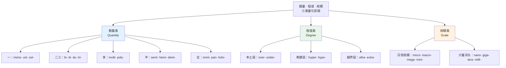
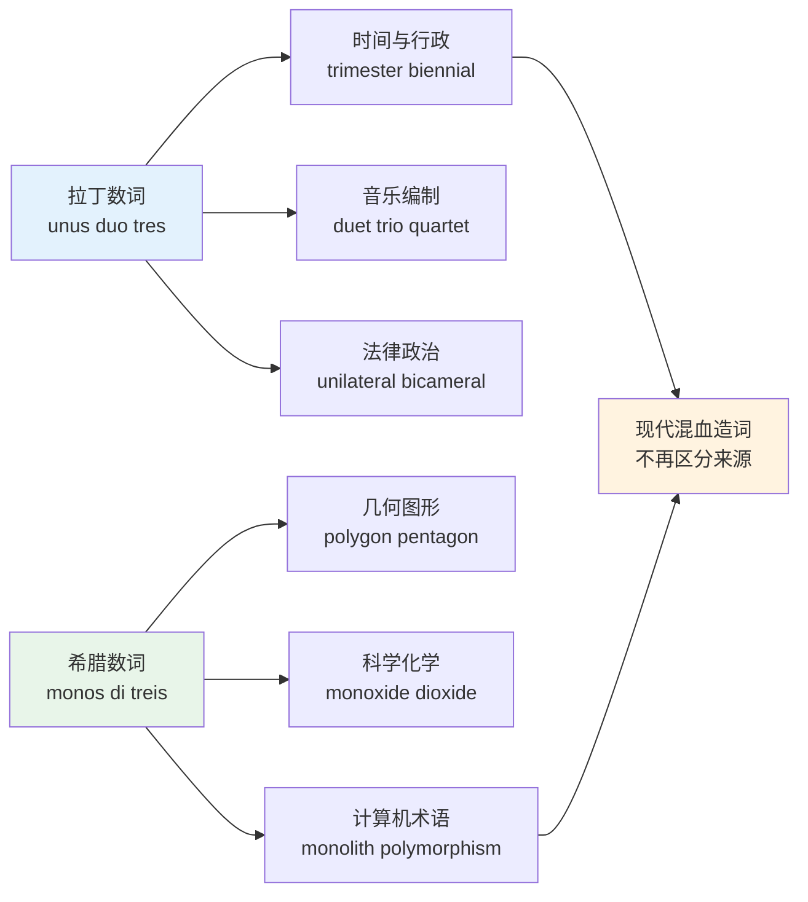
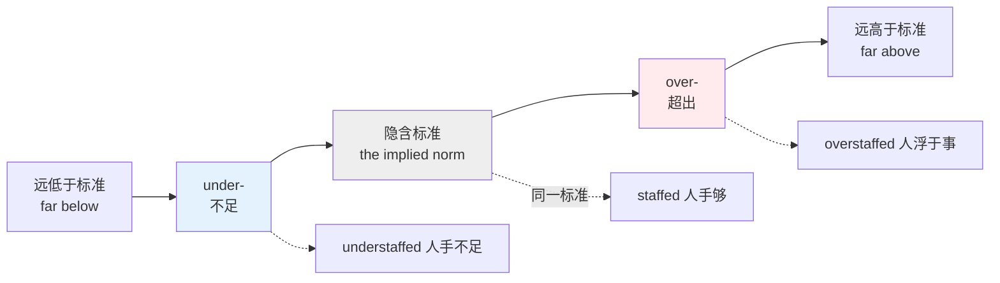
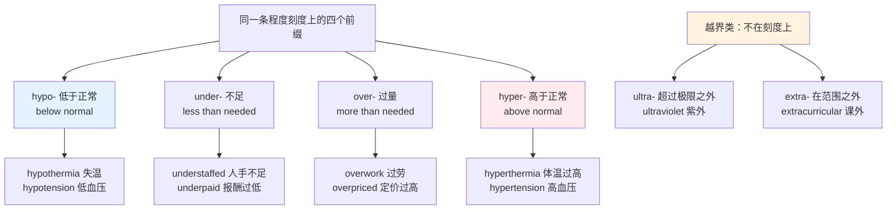
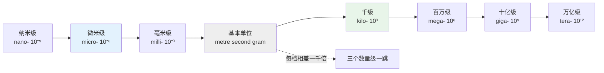
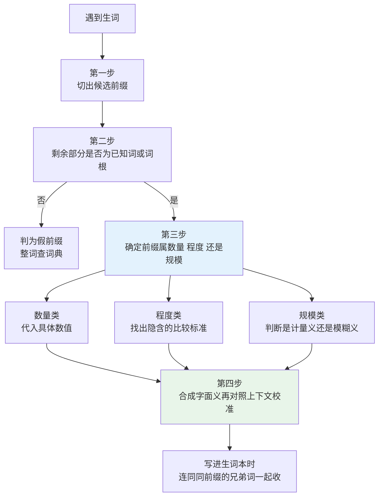
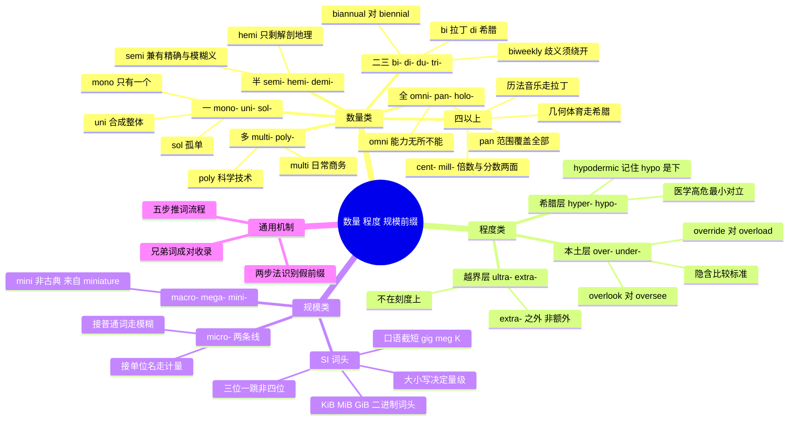

# 数量、程度与规模前缀

> [!info] 本篇定位
>
> 上一篇 `03.方位、时间与关系前缀` 处理的是方向——在上还是在下、朝前还是朝后。本篇处理的是**量**：有几个、超了多少、大到什么尺度。
>
> 三条主线依次是数量（`mono-` `uni-` `bi-` `di-` `tri-` `multi-` `poly-` `semi-` `hemi-` `omni-` `pan-`）、程度（`over-` `under-` `hyper-` `hypo-` `ultra-` `extra-`）、规模（`micro-` `macro-` `mega-` `mini-` `nano-` `giga-` 及整套 SI 计量词头）。
>
> 全篇二百余个词条。读完能当场判断 `hypothermia` 和 `hyperthermia` 哪个是失温、`biannual` 和 `biennial` 差在哪、`override` 和 `overload` 在面向对象语境里各指什么，也能把 `50 ms`、`µs`、`GiB` 这类技术写法准确读出声。

---

## 1. 本篇导读：把「多少」装进词头

前面两篇的前缀改变真假（`un-` `dis-`）和位置（`sub-` `trans-`），本篇这批改变的是数值。它们在词典里的密度极高，原因很实际：科学、技术、医学、法律这几个领域需要精确表述数量与程度，而英语的做法不是造一堆全新的词根，而是**在已有词根前面加一个数字或量级标记**。

`polygon` 不是新造的几何词，是 `poly-`（多）加 `gon`（角）；`microsecond` 也不是新词，是 `micro-`（百万分之一）加 `second`。掌握这批前缀之后，读技术文档时遇到 `tetravalent`、`hypotonic`、`petaflop` 这类没背过的词，可以直接拆开算出大致意思。

这批前缀有个跟前两篇不同的特点：**它们大多可以自由造新词**。`sub-` `trans-` 这类方位前缀基本只出现在已有的固化词里，新词很少；而 `multi-` `micro-` `over-` `hyper-` 到今天还在源源不断地造新词——`microservice`、`multitenancy`、`hypervisor`、`over-provisioning` 全是近几十年才出现的。会用这批前缀，等于拿到了一张能主动生成词汇的许可证，不只是被动认词。



上图把本篇拆成三块。数量类回答「几个」，是纯计数；程度类回答「过头没有」，带有说话人的评价立场；规模类回答「多大量级」，是数量级跳跃。三块之间有重叠——`micro-` 既能表示物理尺寸小（`microscope`），也能表示百万分之一（`microsecond`）；`mega-` 既能表示百万（`megawatt`），也能在口语里表示「巨大」（`a mega deal`）。重叠处正是最容易读错的地方，后面各节会逐个点出来。

---

## 2. 两套数字前缀：拉丁与希腊为什么并存

英语的数字前缀有两套完整体系，一套来自拉丁语，一套来自希腊语。这不是冗余，两套各有各的地盘。

| 数值 | 拉丁前缀 | 希腊前缀 | 拉丁系典型词 | 希腊系典型词 |
| --- | --- | --- | --- | --- |
| 1 | uni- | mono- | unilateral、unify | monopoly、monologue |
| 2 | bi-、du- | di- | bilateral、duplicate | dioxide、dichotomy |
| 3 | tri- | tri- | triple、trimester | triangle、tripod |
| 4 | quadr- | tetra- | quadrilateral、quadruple | tetrahedron |
| 5 | quinqu- | penta- | quintet、quintuple | pentagon、pentathlon |
| 6 | sex- | hexa- | sextet、semester | hexagon、hexadecimal |
| 7 | sept- | hepta- | September、septet | heptagon |
| 8 | oct- | octa- | October、octave | octagon、octopus |
| 10 | dec- | deca- | decade、decimal | decathlon |
| 100 | cent- | hect- | century、centipede | hectare |
| 1000 | mill- | kilo- | millennium、millipede | kilogram |
| 多 | multi- | poly- | multiple、multimedia | polygon、polymer |
| 半 | semi- | hemi- | semicircle、semifinal | hemisphere |

分工大致是这样：**几何图形、体育项目、化学与计算机术语走希腊系**（`pentagon` 五角形、`decathlon` 十项全能、`hexadecimal` 十六进制、`polymorphism` 多态）；**时间单位、音乐编制、法律与行政词汇走拉丁系**（`trimester` 三个月学期、`quintet` 五重奏、`bicameral` 两院制）。

有一条传统上的造词洁癖：希腊前缀配希腊词根，拉丁前缀配拉丁词根，不要混。按这条规矩，`television`（希腊 `tele` + 拉丁 `visio`）、`automobile`（希腊 `auto` + 拉丁 `mobilis`）、`monolingual`（希腊 `mono` + 拉丁 `lingua`）都属于「混血词」，讲究语源的古典派学者历来对此颇有微词。现代造词早已不管这条，`microservice`（希腊 + 拉丁）、`multithreading`（拉丁 + 日耳曼）都通行无阻。知道这条规矩的用处不在于遵守它，而在于**看到混血词时不要怀疑自己拆错了**。



这张图说明的是：两套体系在古典时期各管一片，但入口在现代造词处合流。对自学者的实际影响是，遇到一个新的数量词，**先按数值拆，别先按语源拆**——`dioxide` 里的 `di-` 是二，`bicycle` 里的 `bi-` 也是二，两者语源不同但结果一样，先算出数值再说。

---

## 3. 「一」：mono- / uni- / sol-

表示「一」的前缀有三个，语感不同：`mono-` 强调**只有一个、不含其他**，`uni-` 强调**合成一个整体**，`sol-` 强调**孤单**。

| 英文 | 英式音标 | 美式音标 | 词性 | 中文 | 搭配与说明 |
| --- | --- | --- | --- | --- | --- |
| **monopoly** | /məˈnɒpəli/ | /məˈnɑːpəli/ | n. | 垄断；专营权 | have a monopoly on/over sth；注意重音在第二音节 |
| **monologue** | /ˈmɒnəlɒɡ/ | /ˈmɑːnəlɔːɡ/ | n. | 独白；长篇大论 | 美式也拼 monolog；对比 dialogue |
| **monotonous** | /məˈnɒtənəs/ | /məˈnɑːtənəs/ | adj. | 单调乏味的 | monotonous work；名词 monotony |
| **monochrome** | /ˈmɒnəkrəʊm/ | /ˈmɑːnəkroʊm/ | adj./n. | 单色的；黑白的 | a monochrome display |
| **monolith** | /ˈmɒnəlɪθ/ | /ˈmɑːnəlɪθ/ | n. | 独石柱；庞然一体 | 软件语境指单体架构 |
| **monolithic** | /ˌmɒnəˈlɪθɪk/ | /ˌmɑːnəˈlɪθɪk/ | adj. | 单体的；铁板一块的 | a monolithic codebase；对 microservices |
| **monogamy** | /məˈnɒɡəmi/ | /məˈnɑːɡəmi/ | n. | 一夫一妻制 | 对 polygamy；形容词 monogamous |
| **monorail** | /ˈmɒnəʊreɪl/ | /ˈmɑːnoʊreɪl/ | n. | 单轨铁路 | — |
| **monoxide** | /mɒnˈɒksaɪd/ | /mɑːnˈɑːksaɪd/ | n. | 一氧化物 | carbon monoxide 一氧化碳 |
| **monoculture** | /ˈmɒnəkʌltʃə/ | /ˈmɑːnəkʌltʃər/ | n. | 单一种植；单一文化 | 农业与企业文化两用 |
| **monarch** | /ˈmɒnək/ | /ˈmɑːnərk/ | n. | 君主 | mono- + arkhein 统治；词尾 ch 读 /k/ |
| **monk** | /mʌŋk/ | /mʌŋk/ | n. | 修士；和尚 | 源自 monos「独居者」，已看不出前缀 |
| **unify** | /ˈjuːnɪfaɪ/ | /ˈjuːnɪfaɪ/ | v. | 统一；使成一体 | 名词 unification |
| **unilateral** | /ˌjuːnɪˈlætrəl/ | /ˌjuːnɪˈlætərəl/ | adj. | 单方面的 | a unilateral decision；对 bilateral |
| **unanimous** | /juˈnænɪməs/ | /juˈnænɪməs/ | adj. | 全体一致的 | unus + animus「一条心」；重音在第二音节 |
| **unison** | /ˈjuːnɪsn/ | /ˈjuːnɪsn/ | n. | 齐奏；一致 | in unison 异口同声 |
| **unique** | /juˈniːk/ | /juˈniːk/ | adj. | 独一无二的 | 绝对形容词，慎用 very unique |
| **uniform** | /ˈjuːnɪfɔːm/ | /ˈjuːnɪfɔːrm/ | n./adj. | 制服；一致的 | 形容词义「统一的」常被忽略 |
| **unicycle** | /ˈjuːnɪsaɪkl/ | /ˈjuːnɪsaɪkl/ | n. | 独轮车 | 与 bicycle、tricycle 成组 |
| **unicorn** | /ˈjuːnɪkɔːn/ | /ˈjuːnɪkɔːrn/ | n. | 独角兽；估值十亿的初创 | 商业义为二〇一三年后的新用法 |
| **solo** | /ˈsəʊləʊ/ | /ˈsoʊloʊ/ | n./adj./adv. | 独奏；单独的 | fly solo；复数 solos |
| **sole** | /səʊl/ | /soʊl/ | adj. | 唯一的 | the sole survivor；与 soul 同音 |
| **solitary** | /ˈsɒlətri/ | /ˈsɑːləteri/ | adj. | 独自的；偏僻的 | solitary confinement 单独监禁 |
| **soliloquy** | /səˈlɪləkwi/ | /səˈlɪləkwi/ | n. | （戏剧）独白 | sol- + loqui 说；比 monologue 更专指戏剧 |
| **singular** | /ˈsɪŋɡjələ/ | /ˈsɪŋɡjələr/ | adj./n. | 单数的；非凡的 | 语法义与「非凡」义并存 |

`mono-` 和 `uni-` 常被当成可互换，其实不能。`unilateral` 是「只有一方行动」，`monolateral` 不存在；`monopoly` 是「只有一家在卖」，`unipoly` 不存在。规律是：**词根是拉丁来源就配 `uni-`，希腊来源就配 `mono-`**，这是上一节那条造词洁癖留下的痕迹。

> [!tip] 一个对程序员特别有用的对立
>
> `monolith` / `monolithic` 与 `microservice` 是现在软件架构讨论里出现频率最高的一对反义词。
>
> `monolith` 的字面义是「一整块石头」（`mono-` 一 + `lith` 石），引申为「无法拆分的整体」。它在架构语境里不带贬义，只是描述部署单元只有一个。
>
> 派生方向也要认全：`monorepo`（单一代码仓库）是 `mono-` + `repository` 的截短，念作 /ˌmɒnəʊˈriːpəʊ/ 或 /ˌmɑːnoʊˈriːpoʊ/，跟 `monolith` 说的不是一件事——`monorepo` 讲代码怎么存，`monolith` 讲服务怎么部署。一个仓库里可以放一堆微服务。

> [!warning] 三个不含「一」的假 mono- 词
>
> - **monster** /ˈmɒnstə/ 怪物：来自拉丁 `monere`（警告），与「一」无关
> - **monitor** /ˈmɒnɪtə/ 监视器：同样来自 `monere`，本义是「提醒者」
> - **money** /ˈmʌni/ 钱：来自罗马女神 Juno Moneta 的神庙铸币厂
>
> 判断办法很简单：把 `mono-` 拆掉之后，**剩下的部分能不能独立成为一个有意义的词根**。`monopoly` 拆掉是 `poly`（卖），成立；`monster` 拆掉是 `ster`，不成立。

---

## 4. 「二」与「三」：bi- / di- / du- / tri-

「二」是英语里前缀形式最多的数值，拉丁系有 `bi-` 和 `du-`，希腊系有 `di-`，各占一片。

| 英文 | 英式音标 | 美式音标 | 词性 | 中文 | 搭配与说明 |
| --- | --- | --- | --- | --- | --- |
| **bilateral** | /ˌbaɪˈlætrəl/ | /ˌbaɪˈlætərəl/ | adj. | 双边的 | bilateral talks；外交高频词 |
| **bilingual** | /baɪˈlɪŋɡwəl/ | /baɪˈlɪŋɡwəl/ | adj./n. | 双语的；双语者 | 对 monolingual、multilingual |
| **binary** | /ˈbaɪnəri/ | /ˈbaɪnəri/ | adj./n. | 二进制的；二元的 | binary file、a false binary |
| **bisect** | /baɪˈsekt/ | /baɪˈsekt/ | v. | 二等分 | git bisect 用的就是这个词 |
| **biceps** | /ˈbaɪseps/ | /ˈbaɪseps/ | n. | 二头肌 | 单复同形；bi- + caput 头 |
| **binoculars** | /bɪˈnɒkjələz/ | /bɪˈnɑːkjələrz/ | n. | 双筒望远镜 | 恒为复数；bi- + oculus 眼 |
| **biscuit** | /ˈbɪskɪt/ | /ˈbɪskɪt/ | n. | 饼干（英）；软面包（美） | bis coctus「烤两次」，英美所指不同 |
| **bipartisan** | /ˌbaɪpɑːtɪˈzæn/ | /baɪˈpɑːrtəzn/ | adj. | 两党的 | bipartisan support；英美重音位置不同 |
| **bicameral** | /baɪˈkæmərəl/ | /baɪˈkæmərəl/ | adj. | 两院制的 | bi- + camera 房间 |
| **biannual** | /baɪˈænjuəl/ | /baɪˈænjuəl/ | adj. | 一年两次的 | 见下方警示 |
| **biennial** | /baɪˈeniəl/ | /baɪˈeniəl/ | adj./n. | 两年一次的；二年生植物 | 见下方警示 |
| **dioxide** | /daɪˈɒksaɪd/ | /daɪˈɑːksaɪd/ | n. | 二氧化物 | carbon dioxide |
| **dichotomy** | /daɪˈkɒtəmi/ | /daɪˈkɑːtəmi/ | n. | 二分；截然对立 | a false dichotomy 假二分 |
| **dilemma** | /dɪˈlemə/ | /dɪˈlemə/ | n. | 两难 | di- + lemma 前提；也读 /daɪˈlemə/ |
| **diode** | /ˈdaɪəʊd/ | /ˈdaɪoʊd/ | n. | 二极管 | 对 triode 三极管 |
| **dual** | /ˈdjuːəl/ | /ˈduːəl/ | adj. | 双重的 | dual-core、dual citizenship；与 duel 同音 |
| **duplicate** | /ˈdjuːplɪkeɪt/ | /ˈduːplɪkeɪt/ | v./n./adj. | 复制；副本 | 重音都在首音节，动词末音节读 /-keɪt/，名词形容词读 /-kət/ |
| **duplex** | /ˈdjuːpleks/ | /ˈduːpleks/ | n./adj. | 双工；复式住宅 | full-duplex 全双工 |
| **duet** | /djuˈet/ | /duˈet/ | n. | 二重奏 | 与 trio、quartet 成组 |
| **dubious** | /ˈdjuːbiəs/ | /ˈduːbiəs/ | adj. | 可疑的；犹豫的 | 源自「两个心思」，与 doubt 同源 |
| **triangle** | /ˈtraɪæŋɡl/ | /ˈtraɪæŋɡl/ | n. | 三角形 | 形容词 triangular |
| **tripod** | /ˈtraɪpɒd/ | /ˈtraɪpɑːd/ | n. | 三脚架 | tri- + pod 脚 |
| **trilogy** | /ˈtrɪlədʒi/ | /ˈtrɪlədʒi/ | n. | 三部曲 | 注意 tri 在此弱读为 /ˈtrɪ/ |
| **trimester** | /traɪˈmestə/ | /traɪˈmestər/ | n. | 三个月期；孕期三阶段 | the first trimester |
| **triathlon** | /traɪˈæθlən/ | /traɪˈæθlɑːn/ | n. | 铁人三项 | 与 decathlon、pentathlon 成组 |
| **trivial** | /ˈtrɪviəl/ | /ˈtrɪviəl/ | adj. | 琐碎的；不重要的 | tri- + via 路，「三岔路口人人都知道」 |
| **triple** | /ˈtrɪpl/ | /ˈtrɪpl/ | v./adj./n. | 三倍；三倍的 | triple the output；对 double、quadruple |
| **triplicate** | /ˈtrɪplɪkət/ | /ˈtrɪplɪkət/ | n./adj. | 一式三份 | in triplicate 公文高频 |

> [!warning] bi- 最危险的一处歧义：biweekly 与 bimonthly
>
> `biweekly` 在实际使用中同时表示「每两周一次」和「每周两次」，`bimonthly` 同理。这不是某一方用错了，两个义项在词典里都被收录，靠上下文根本分不出来。
>
> 结果是英语世界的公文写作指南普遍建议**绕开这个词**：
>
> - ❌ ~~We hold a biweekly sync.~~（对方无法确定是两周一次还是一周两次）
> - ✅ **We hold a sync every two weeks.**（每两周一次）
> - ✅ **We hold a sync twice a week.**（每周两次）
> - ✅ **We hold a fortnightly sync.**（每两周一次，英式常用，美式少见）
>
> 同一个坑还有 `biannual` 与 `biennial` 这对：
>
> - **biannual** = 一年两次（twice a year）
> - **biennial** = 两年一次（every two years）
>
> 两个词只差三个字母，念起来也接近，合同里写错代价不小。稳妥写法是用 `semiannual`（一年两次，无歧义）和 `every two years`（两年一次），把 `biannual` 和 `biennial` 只留在阅读时认。

> [!warning] 三类假 bi- / di- / tri- 词
>
> **假 bi-**
>
> - **biology** /baɪˈɒlədʒi/：这是 `bio-`（生命）不是 `bi-`（二）。同类还有 biography、biopsy、biosphere、biodiversity
> - **bias** /ˈbaɪəs/：来自古法语 biais（斜），与「二」无关
> - **bishop** /ˈbɪʃəp/：来自希腊 episkopos（监督者）
>
> **假 di-**
>
> - **dialogue** /ˈdaɪəlɒɡ/：是 `dia-`（穿过）+ `logos`（话语），字面义是「话语在人之间穿行」，不是「两个人说话」。所以三个人以上的对话照样叫 dialogue
> - **diameter**、**diagonal**、**diagram**、**diagnosis**：全部是 `dia-`（穿过），不是「二」
>
> **假 tri-**
>
> - **trial** /ˈtraɪəl/：来自 try，不是「三」
> - **triumph** /ˈtraɪəmf/：来自拉丁 triumphus，与三无关
> - **trip**、**trick**、**trim**：都不是
>
> `di-` 与 `dia-` 的分辨办法：**`di-` 后面跟的一定是一个化学或几何词根**（`di-oxide`、`di-ode`、`di-pole`），而 `dia-` 后面跟的是希腊常见词根且整词多与「贯穿、通过」有关。

---

## 5. 「多」：multi- / poly- / pluri-

`multi-`（拉丁）和 `poly-`（希腊）都表示「多」，日常与商务偏 `multi-`，科学与技术偏 `poly-`。

| 英文 | 英式音标 | 美式音标 | 词性 | 中文 | 搭配与说明 |
| --- | --- | --- | --- | --- | --- |
| **multiple** | /ˈmʌltɪpl/ | /ˈmʌltɪpl/ | adj./n. | 多个的；倍数 | multiple choice；数学义「倍数」 |
| **multiply** | /ˈmʌltɪplaɪ/ | /ˈmʌltɪplaɪ/ | v. | 乘；繁殖 | multiply A by B |
| **multitude** | /ˈmʌltɪtjuːd/ | /ˈmʌltɪtuːd/ | n. | 大量；群众 | a multitude of reasons，正式 |
| **multinational** | /ˌmʌltɪˈnæʃnəl/ | /ˌmʌltɪˈnæʃnəl/ | adj./n. | 跨国的；跨国公司 | — |
| **multitask** | /ˌmʌltiˈtɑːsk/ | /ˌmʌltiˈtæsk/ | v. | 同时处理多项任务 | 名词 multitasking |
| **multifaceted** | /ˌmʌltiˈfæsɪtɪd/ | /ˌmʌltiˈfæsɪtɪd/ | adj. | 多方面的 | a multifaceted problem |
| **multilingual** | /ˌmʌltiˈlɪŋɡwəl/ | /ˌmʌltiˈlɪŋɡwəl/ | adj. | 多语的 | 对 bilingual、monolingual |
| **multimedia** | /ˌmʌltiˈmiːdiə/ | /ˌmʌltiˈmiːdiə/ | n./adj. | 多媒体 | 作名词不可数 |
| **multiplex** | /ˈmʌltɪpleks/ | /ˈmʌltɪpleks/ | n./v. | 多厅影院；多路复用 | 通信义为技术术语 |
| **multitenancy** | /ˌmʌltiˈtenənsi/ | /ˌmʌltiˈtenənsi/ | n. | 多租户 | 云计算高频；形容词 multi-tenant |
| **polygon** | /ˈpɒlɪɡən/ | /ˈpɑːliɡɑːn/ | n. | 多边形 | 英式词尾弱读，美式保留 /ɑː/ |
| **polygamy** | /pəˈlɪɡəmi/ | /pəˈlɪɡəmi/ | n. | 一夫多妻（或一妻多夫） | 对 monogamy |
| **polyglot** | /ˈpɒliɡlɒt/ | /ˈpɑːliɡlɑːt/ | n./adj. | 通晓多语者 | 比 multilingual 更书面 |
| **polymer** | /ˈpɒlɪmə/ | /ˈpɑːlɪmər/ | n. | 聚合物 | poly- + meros 部分 |
| **polymorphism** | /ˌpɒliˈmɔːfɪzəm/ | /ˌpɑːliˈmɔːrfɪzəm/ | n. | 多态；多形性 | 面向对象与生物学共用 |
| **polyphonic** | /ˌpɒliˈfɒnɪk/ | /ˌpɑːliˈfɑːnɪk/ | adj. | 复调的 | poly- + phone 声音 |
| **polytheism** | /ˈpɒliθiɪzəm/ | /ˈpɑːliθiɪzəm/ | n. | 多神论 | 对 monotheism |
| **polyclinic** | /ˌpɒliˈklɪnɪk/ | /ˌpɑːliˈklɪnɪk/ | n. | 综合门诊 | 多科室之义 |
| **plural** | /ˈplʊərəl/ | /ˈplʊrəl/ | adj./n. | 复数的；复数 | 语法义为主 |
| **pluralism** | /ˈplʊərəlɪzəm/ | /ˈplʊrəlɪzəm/ | n. | 多元主义 | cultural pluralism |
| **surplus** | /ˈsɜːpləs/ | /ˈsɜːrpləs/ | n./adj. | 盈余；过剩的 | sur- + plus「超出之多」 |

`pluri-` 在英语里几乎不独立造新词，只在 `pluripotent`（多能的，干细胞术语）、`plurilateral`（诸边的，世贸组织用语）这类专业词里露面；它真正留给日常英语的是 `plural` 和 `pluralism` 两个词，以及带 `plus` 的 `surplus`。

`multi-` 是本篇造词能力最强的前缀之一，几乎可以贴在任何名词或形容词前面。造出来的词多数带连字符或不带都可，主流词典的倾向是**常见组合不带连字符（`multinational`、`multimedia`），临时组合带连字符（`multi-year`、`multi-region`）**。

> [!example] multi- 临时造词的实际用法
>
> - The rollout is a **multi-year** effort spanning three teams.
>   - 这次上线是横跨三个团队的多年工程。
> - We run a **multi-region** deployment to survive a single-zone outage.
>   - 我们做多地域部署，以便单可用区故障时仍能存活。
> - She gave a **multi-part** answer that covered cost, risk, and timing.
>   - 她给了一个分成几部分的回答，覆盖了成本、风险和时间。

> [!warning] police、policy、polite 里没有 poly-
>
> 这三个词都以 `poli-` 开头，但来源完全不同：
>
> - **police** / **policy** / **politics**：来自希腊 `polis`（城邦），说的是城市治理
> - **polite**：来自拉丁 `politus`（磨光的），本义是「打磨过的」，引申为举止得体
> - **Polish**：Poland 的形容词，与前缀无关
>
> 真正的 `poly-` 后面接的是一个可数的东西：`poly-gon`（角）、`poly-mer`（部分）、`poly-glot`（舌头）、`poly-phonic`（声音）。**如果拆开后剩下的部分不是「可以有很多个的东西」，那多半不是 poly-。**

---

## 6. 「半」：semi- / hemi- / demi-

三个都表示「一半」：`semi-` 拉丁系、`hemi-` 希腊系、`demi-` 经法语传入。使用频率悬殊，`semi-` 极常见，`hemi-` 只在解剖与地理，`demi-` 基本只剩几个化石词。

| 英文 | 英式音标 | 美式音标 | 词性 | 中文 | 搭配与说明 |
| --- | --- | --- | --- | --- | --- |
| **semicircle** | /ˈsemisɜːkl/ | /ˈsemisɜːrkl/ | n. | 半圆 | 形容词 semicircular |
| **semicolon** | /ˌsemiˈkəʊlɒn/ | /ˈsemikoʊlən/ | n. | 分号 | 英美重音位置不同 |
| **semiconductor** | /ˌsemikənˈdʌktə/ | /ˌsemikənˈdʌktər/ | n. | 半导体 | the semiconductor industry |
| **semifinal** | /ˌsemiˈfaɪnl/ | /ˌsemiˈfaɪnl/ | n. | 半决赛 | 对 quarterfinal 四分之一决赛 |
| **semiannual** | /ˌsemiˈænjuəl/ | /ˌsemiˈænjuəl/ | adj. | 一年两次的 | 替代有歧义的 biannual |
| **semi-detached** | /ˌsemidɪˈtætʃt/ | /ˌsemidɪˈtætʃt/ | adj. | 半独立式的（住宅） | 英式房产广告高频，美式罕用 |
| **semi-automatic** | /ˌsemiˌɔːtəˈmætɪk/ | /ˌsemiˌɔːtəˈmætɪk/ | adj. | 半自动的 | — |
| **semitone** | /ˈsemitəʊn/ | /ˈsemitoʊn/ | n. | 半音 | 美式音乐术语也说 half step |
| **semiskilled** | /ˌsemiˈskɪld/ | /ˌsemiˈskɪld/ | adj. | 半熟练的 | semiskilled labour |
| **semi-permanent** | /ˌsemiˈpɜːmənənt/ | /ˌsemiˈpɜːrmənənt/ | adj. | 半永久的 | — |
| **hemisphere** | /ˈhemɪsfɪə/ | /ˈhemɪsfɪr/ | n. | 半球 | the northern hemisphere |
| **hemiplegia** | /ˌhemɪˈpliːdʒə/ | /ˌhemɪˈpliːdʒə/ | n. | 偏瘫 | 医学词；hemi- + plege 打击 |
| **demigod** | /ˈdemiɡɒd/ | /ˈdemiɡɑːd/ | n. | 半神 | 神话与比喻两用 |
| **demitasse** | /ˈdemitæs/ | /ˈdemitɑːs/ | n. | 小咖啡杯 | demi- + tasse 杯，法语借词 |
| **sesquicentennial** | /ˌseskwɪsenˈteniəl/ | /ˌseskwɪsenˈteniəl/ | n./adj. | 一百五十周年 | sesqui- 表示「一倍半」 |

`semi-` 与 `hemi-` 的选择跟第 2 节那条规律一致：接拉丁词根用 `semi-`（`semi-circle`、`semi-final`），接希腊词根用 `hemi-`（`hemi-sphere`）。现代造新词一律用 `semi-`，`hemi-` 已经不再生产新词。

> [!tip] semi- 一个不表示「一半」的用法
>
> `semi-` 除了精确的二分之一，还有一个更常用的模糊义：**「部分地、算是」**。这时候不能真的当一半算。
>
> - `semi-retired` 半退休 —— 不是退了一半，是还接一点活
> - `semi-official` 半官方的 —— 不是一半官方，是没有正式名分但实际起官方作用
> - `semi-professional` 半职业的 —— 靠这个挣一部分钱但不是全职
>
> 这个模糊义在口语里还能进一步弱化成 `semi-` 加形容词表示「有点」：`semi-serious`（不太当真的）、`semi-conscious`（迷迷糊糊的）。

> [!warning] 三个不含「半」的 semi- 词
>
> - **semester** /sɪˈmestə/ 学期：来自拉丁 `sex mensis`（六个月），是「六」不是「半」
> - **seminar** /ˈsemɪnɑː/ 研讨课：来自 `semen`（种子），本义是「苗圃」
> - **semantic** /sɪˈmæntɪk/ 语义的：来自希腊 `sema`（符号）
>
> 靠读音分辨不了——`seminar` 的重音就在第一音节，跟 `semicircle` 一样。可靠的办法是切掉 `semi-` 看剩余：`semicircle` 剩 circle、`semifinal` 剩 final，都是独立的词；`semester` 剩 ster、`seminar` 剩 nar，根本不成词，`semantic` 剩 antic，虽是个词却与「语义」毫无关系。**先切再看剩余，别凭读音猜。**

---

## 7. 「全」与「零」：omni- / pan- / holo-

| 英文 | 英式音标 | 美式音标 | 词性 | 中文 | 搭配与说明 |
| --- | --- | --- | --- | --- | --- |
| **omnipotent** | /ɒmˈnɪpətənt/ | /ɑːmˈnɪpətənt/ | adj. | 全能的 | 重音在第二音节；名词 omnipotence |
| **omniscient** | /ɒmˈnɪsiənt/ | /ɑːmˈnɪʃnt/ | adj. | 全知的 | an omniscient narrator 全知视角 |
| **omnipresent** | /ˌɒmnɪˈpreznt/ | /ˌɑːmnɪˈpreznt/ | adj. | 无所不在的 | 比 ubiquitous 更正式 |
| **omnivore** | /ˈɒmnɪvɔː/ | /ˈɑːmnɪvɔːr/ | n. | 杂食动物 | 对 herbivore、carnivore |
| **omnidirectional** | /ˌɒmnɪdəˈrekʃənl/ | /ˌɑːmnɪdəˈrekʃənl/ | adj. | 全向的 | an omnidirectional microphone |
| **omnibus** | /ˈɒmnɪbəs/ | /ˈɑːmnɪbəs/ | n./adj. | 合集；综合法案 | 拉丁「为所有人」；bus 即由此截短 |
| **pandemic** | /pænˈdemɪk/ | /pænˈdemɪk/ | n./adj. | 大流行病 | pan- + demos 人民；对 epidemic |
| **panorama** | /ˌpænəˈrɑːmə/ | /ˌpænəˈræmə/ | n. | 全景 | 形容词 panoramic；英美元音不同 |
| **panacea** | /ˌpænəˈsiːə/ | /ˌpænəˈsiːə/ | n. | 万灵药 | 多用于否定：no panacea |
| **pantheon** | /ˈpænθiən/ | /ˈpænθiɑːn/ | n. | 众神殿；名人堂 | the pantheon of great writers |
| **pandemonium** | /ˌpændəˈməʊniəm/ | /ˌpændəˈmoʊniəm/ | n. | 大混乱 | 弥尔顿造词，「群魔殿」 |
| **hologram** | /ˈhɒləɡræm/ | /ˈhɑːləɡræm/ | n. | 全息图 | holo- + gram 写 |
| **holistic** | /həʊˈlɪstɪk/ | /hoʊˈlɪstɪk/ | adj. | 整体的 | a holistic approach |
| **nullify** | /ˈnʌlɪfaɪ/ | /ˈnʌlɪfaɪ/ | v. | 使无效 | 法律语域；名词 nullification |
| **null** | /nʌl/ | /nʌl/ | adj./n. | 无效的；空值 | null and void 法律套语；编程指空引用 |

`omni-`（拉丁）和 `pan-`（希腊）的语感有差别。`omni-` 偏「能力上无所不能」，常配神性与技术能力；`pan-` 偏「范围上覆盖全部」，常配地域与人群：`pan-African`（泛非的）、`pan-European`（泛欧的）、`pan-Asian`（泛亚的）。这类 `pan-` 加地名的组合可以自由造，写的时候地名首字母大写并加连字符。

`holo-`（整、全）只留下 `hologram`、`holistic`、`holocaust`（`holo-` + `kaustos` 烧尽，本义「全烧」）少数几个词，早已不再造新词。表里末两个 `null` 和 `nullify` 走的是相反那一头：拉丁 `nullus` 的字面义是「一个也没有」，与 `omni-` 正好构成本节的两端——一头是全都有，一头是零。法律套语 `null and void` 和编程里的空引用 `null` 用的是同一个词，前者说「不产生任何效力」，后者说「不指向任何对象」，都落在「零」这一端。

> [!example] omni- 与 pan- 的语感差
>
> - Google is not **omniscient**; it only indexes what has been published.
>   - 谷歌并非无所不知，它只索引已经发布出来的东西。
> - The report calls for a **pan-European** response to the shortage.
>   - 这份报告呼吁以泛欧范围的方式应对短缺。
> - Rewriting the service is no **panacea** for the latency problem.
>   - 重写这个服务并不能一劳永逸地解决延迟问题。

> [!warning] panic 里没有 pan-
>
> **panic** /ˈpænɪk/ 来自希腊神话中的牧神 Pan——传说他会让旷野里的旅人突然陷入无名恐惧。它跟「全部」毫无关系。
>
> 同理 **pan** 平底锅、**pants** 裤子、**panel** 面板都不含这个前缀。真正的 `pan-` 后面接的是一个表示「范围」的名词或形容词：`pan-demic`（人民）、`pan-orama`（视野）、`pan-theon`（神）。

---

## 8. 四以上的数字前缀

四以上的数字前缀出现频率低得多，但在几何、体育、音乐、历法这四个领域集中出现，成组记比零散记划算。

| 英文 | 英式音标 | 美式音标 | 词性 | 中文 | 搭配与说明 |
| --- | --- | --- | --- | --- | --- |
| **quadrant** | /ˈkwɒdrənt/ | /ˈkwɑːdrənt/ | n. | 象限；四分之一圆 | 坐标系与图表分析常用 |
| **quadruple** | /kwɒˈdruːpl/ | /kwɑːˈdruːpl/ | v./adj. | 变成四倍；四倍的 | 与 double、triple 成组 |
| **quadrilateral** | /ˌkwɒdrɪˈlætərəl/ | /ˌkwɑːdrɪˈlætərəl/ | n./adj. | 四边形 | 几何术语 |
| **quarantine** | /ˈkwɒrəntiːn/ | /ˈkwɔːrəntiːn/ | n./v. | 隔离检疫 | 源自威尼斯的四十天船期 |
| **quartet** | /kwɔːˈtet/ | /kwɔːrˈtet/ | n. | 四重奏 | 与 duet、trio、quintet 成组 |
| **tetrahedron** | /ˌtetrəˈhiːdrən/ | /ˌtetrəˈhiːdrən/ | n. | 四面体 | 复数 tetrahedra 或 tetrahedrons |
| **pentagon** | /ˈpentəɡən/ | /ˈpentəɡɑːn/ | n. | 五角形；五角大楼 | 大写专指美国国防部 |
| **pentathlon** | /penˈtæθlən/ | /penˈtæθlɑːn/ | n. | 五项全能 | — |
| **quintessence** | /kwɪnˈtesns/ | /kwɪnˈtesns/ | n. | 精髓 | 古代「第五元素」；形容词 quintessential |
| **hexagon** | /ˈheksəɡən/ | /ˈheksəɡɑːn/ | n. | 六角形 | 形容词 hexagonal |
| **hexadecimal** | /ˌheksəˈdesɪml/ | /ˌheksəˈdesɪml/ | adj./n. | 十六进制的 | 口语常截短为 hex |
| **semester** | /sɪˈmestə/ | /sɪˈmestər/ | n. | 学期 | 六个月；见第 6 节警示 |
| **September** | /sepˈtembə/ | /sepˈtembər/ | n. | 九月 | 词根是「七」，历法错位见 04.01 |
| **octave** | /ˈɒktɪv/ | /ˈɑːktɪv/ | n. | 八度 | 音程跨八个音级 |
| **octagon** | /ˈɒktəɡən/ | /ˈɑːktəɡɑːn/ | n. | 八角形 | — |
| **octopus** | /ˈɒktəpəs/ | /ˈɑːktəpəs/ | n. | 章鱼 | 复数 octopuses 优先于 octopi |
| **decade** | /ˈdekeɪd/ | /ˈdekeɪd/ | n. | 十年 | 重音在首音节，易读错 |
| **decathlon** | /dɪˈkæθlən/ | /dɪˈkæθlɑːn/ | n. | 十项全能 | — |
| **decimal** | /ˈdesɪml/ | /ˈdesɪml/ | adj./n. | 十进制的；小数 | decimal point 小数点 |
| **decimate** | /ˈdesɪmeɪt/ | /ˈdesɪmeɪt/ | v. | 大量毁灭 | 原义「每十人杀一人」，今义已泛化 |
| **century** | /ˈsentʃəri/ | /ˈsentʃəri/ | n. | 世纪；一百 | 板球里也指个人一百分 |
| **centenary** | /senˈtiːnəri/ | /senˈtenəri/ | n. | 百年纪念 | 美式更常用 centennial |
| **centipede** | /ˈsentɪpiːd/ | /ˈsentɪpiːd/ | n. | 蜈蚣 | cent- + ped 脚 |
| **millennium** | /mɪˈleniəm/ | /mɪˈleniəm/ | n. | 千年 | 复数 millennia；双 l 双 n 易拼错 |
| **millipede** | /ˈmɪlɪpiːd/ | /ˈmɪlɪpiːd/ | n. | 马陆 | 与 centipede 对照记 |
| **mile** | /maɪl/ | /maɪl/ | n. | 英里 | 源自 mille passuum「一千步」 |

> [!tip] 一个能一次记住四个月份的词源事实
>
> `September`（七）、`October`（八）、`November`（九）、`December`（十）的词根数值都比实际月份小两位。原因是古罗马历法以三月为岁首，后来在年初插入了两个月，月名却没跟着改。
>
> 这个错位一旦知道，`oct-`（八）和 `dec-`（十）这两个前缀就顺带记牢了——`octopus` 八条腿、`octave` 八度、`decade` 十年、`decimal` 十进制。日历本身的详细读法见 [[04.时间与日历词汇/01.日历与钟点：星期、月份、四季与日期时刻读法\|日历与钟点：星期、月份、四季与日期时刻读法]]。

`cent-` 和 `mill-` 有一个必须留神的两面性：**在普通词汇里表示倍数，在计量单位里表示分数**。

| 前缀 | 普通词汇（倍数义） | 计量单位（分数义） |
| --- | --- | --- |
| cent- | century 一百年、centipede 百足 | centimetre 百分之一米、centilitre 百分之一升 |
| mill- | millennium 一千年、millipede 千足 | millimetre 千分之一米、millisecond 千分之一秒 |

判断办法很直接：**后面接的是不是一个国际单位**。接 `metre`、`second`、`gram`、`litre`、`volt`、`amp` 这类单位名，一律按分数读；接普通名词，按倍数读。

---

## 9. 程度前缀（一）：over- 与 under-

`over-` 和 `under-` 是本篇唯二的日耳曼本土前缀，也是造词能力最强的两个。它们的核心不是物理上下，而是**跟某个隐含标准比较**：`over-` 是超出标准，`under-` 是不足标准。

| 英文 | 英式音标 | 美式音标 | 词性 | 中文 | 搭配与说明 |
| --- | --- | --- | --- | --- | --- |
| **overestimate** | /ˌəʊvərˈestɪmeɪt/ | /ˌoʊvərˈestɪmeɪt/ | v./n. | 高估 | 名词重音同位，末音节读 /-mət/ |
| **overload** | /ˌəʊvəˈləʊd/ | /ˌoʊvərˈloʊd/ | v./n. | 超载；重载 | 编程指方法重载，见下方对比 |
| **override** | /ˌəʊvəˈraɪd/ | /ˌoʊvərˈraɪd/ | v./n. | 推翻；覆写 | 编程指方法覆写 |
| **overflow** | /ˌəʊvəˈfləʊ/ | /ˌoʊvərˈfloʊ/ | v./n. | 溢出 | buffer overflow、stack overflow |
| **overhead** | /ˈəʊvəhed/ | /ˈoʊvərhed/ | n./adj. | 开销；管理费；头顶上的 | 名词重音在首，形容词可移 |
| **overhaul** | /ˈəʊvəhɔːl/ | /ˈoʊvərhɔːl/ | n./v. | 大修；彻底改造 | a complete overhaul of the system |
| **overlook** | /ˌəʊvəˈlʊk/ | /ˌoʊvərˈlʊk/ | v. | 忽略；俯瞰 | 与 oversee 是易混对 |
| **oversee** | /ˌəʊvəˈsiː/ | /ˌoʊvərˈsiː/ | v. | 监督 | 过去式 oversaw、分词 overseen |
| **oversight** | /ˈəʊvəsaɪt/ | /ˈoʊvərsaɪt/ | n. | 监督；疏忽 | 一词两义，见下方警示 |
| **overwhelm** | /ˌəʊvəˈwelm/ | /ˌoʊvərˈwelm/ | v. | 压垮；淹没 | be overwhelmed by/with |
| **overrated** | /ˌəʊvəˈreɪtɪd/ | /ˌoʊvərˈreɪtɪd/ | adj. | 被高估的 | 对 underrated |
| **overdue** | /ˌəʊvəˈdjuː/ | /ˌoʊvərˈduː/ | adj. | 逾期的；早该有的 | long overdue 早就该做了 |
| **overbook** | /ˌəʊvəˈbʊk/ | /ˌoʊvərˈbʊk/ | v. | 超额预订 | 航空业标准用词 |
| **overstate** | /ˌəʊvəˈsteɪt/ | /ˌoʊvərˈsteɪt/ | v. | 夸大 | 对 understate |
| **oversleep** | /ˌəʊvəˈsliːp/ | /ˌoʊvərˈsliːp/ | v. | 睡过头 | 过去式 overslept |
| **overkill** | /ˈəʊvəkɪl/ | /ˈoʊvərkɪl/ | n. | 过度；杀鸡用牛刀 | 不可数；That's overkill. |
| **overturn** | /ˌəʊvəˈtɜːn/ | /ˌoʊvərˈtɜːrn/ | v. | 推翻（判决、决定） | 法律语域高频 |
| **undermine** | /ˌʌndəˈmaɪn/ | /ˌʌndərˈmaɪn/ | v. | 削弱；暗中破坏 | 本义是「在下面挖坑道」 |
| **underlie** | /ˌʌndəˈlaɪ/ | /ˌʌndərˈlaɪ/ | v. | 构成……的基础 | 分词 underlying 更常用 |
| **underpin** | /ˌʌndəˈpɪn/ | /ˌʌndərˈpɪn/ | v. | 支撑；构成基础 | 比 underlie 更强调支撑 |
| **understate** | /ˌʌndəˈsteɪt/ | /ˌʌndərˈsteɪt/ | v. | 轻描淡写 | 名词 understatement |
| **understaffed** | /ˌʌndəˈstɑːft/ | /ˌʌndərˈstæft/ | adj. | 人手不足的 | 对 overstaffed |
| **undergo** | /ˌʌndəˈɡəʊ/ | /ˌʌndərˈɡoʊ/ | v. | 经历（不愉快之事） | 过去式 underwent、分词 undergone |
| **undertake** | /ˌʌndəˈteɪk/ | /ˌʌndərˈteɪk/ | v. | 着手；承诺 | undertake to do sth |
| **undercut** | /ˌʌndəˈkʌt/ | /ˌʌndərˈkʌt/ | v. | 低价竞争；削弱 | 三态同形 |
| **underscore** | /ˌʌndəˈskɔː/ | /ˌʌndərˈskɔːr/ | v./n. | 强调；下划线字符 | 技术语境读字符名用名词义 |
| **underdog** | /ˈʌndədɒɡ/ | /ˈʌndərdɔːɡ/ | n. | 处于劣势者 | root for the underdog |
| **underrated** | /ˌʌndəˈreɪtɪd/ | /ˌʌndərˈreɪtɪd/ | adj. | 被低估的 | 注意双 r |



这张图要说的是：`over-` 和 `under-` 永远成对出现在同一条刻度上，中间那个「标准」是隐含的、由语境决定的。`understaffed` 不是「没人」，是「按这项工作应有的人数来算不够」；`overqualified` 不是「能力强」，是「按这个岗位需要的水平来说超了」。**翻译时不能丢掉这个比较基准**，否则 `He is overqualified for the job` 会被译成褒义，而它在招聘语境里恰恰是拒信用语。

> [!warning] overlook 与 oversee：形近义反的一对
>
> 两个词都是 `over-` 加视觉动词，意思却几乎相反。
>
> - **overlook** = 没看见、忽略掉。`I overlooked a typo in the config.`（我漏看了配置里的一个拼写错误）
> - **oversee** = 盯着看、监督。`She oversees three teams.`（她管着三个团队）
>
> 区别来自 `over-` 的两条不同引申：`overlook` 是「视线从上方越过去了，没落到它身上」；`oversee` 是「站在高处往下看着」。
>
> 更麻烦的是名词 **oversight**，它同时继承了两条线：
>
> - `regulatory oversight` = 监管（来自 oversee）
> - `due to an oversight` = 由于疏忽（来自 overlook）
>
> 这两个义项在同一份文件里都可能出现，只能靠搭配区分：`oversight` 前面配 `regulatory`、`congressional`、`board` 这类机构词就是「监督」；配 `an`、`a simple`、`due to` 就是「疏忽」。

> [!tip] override 与 overload：面向对象里必须分清的两个词
>
> 中文常把两个都译成「重写 / 重载」，混淆率极高。回到前缀本义就分得开：
>
> | 词 | 前缀逻辑 | 面向对象含义 | 判定特征 |
> | --- | --- | --- | --- |
> | **override** | 「骑到上面去」，压过原有的 | 子类覆写父类的同名方法 | 跨类层级，签名相同 |
> | **overload** | 「装多了」，同一个名字挂了多份 | 同一个名字定义多个不同签名的方法 | 同一层级，签名不同 |
>
> 记忆抓手：`ride` 是「压过」，所以 `override` 一定涉及上下两层；`load` 是「装载」，所以 `overload` 是一个名字上堆了好几份。
>
> - **I overrode the default timeout in the subclass.**
>   - 我在子类里覆写了默认超时。
> - **The method is overloaded with three signatures.**
>   - 这个方法有三种重载签名。

> [!warning] understand 和 overture 里没有真正的程度义
>
> - **understand** /ˌʌndəˈstænd/：字面是「站在下面」，但今义完全看不出这层关系，语言学上对其成因至今没有定论。当整词记，别拆
> - **undertaker** /ˈʌndəteɪkə/：不是「承接者」，专指殡葬承办人，语义已高度专化
> - **overture** /ˈəʊvətʃʊə/ 序曲、示好：来自法语 ouverture（开启），跟 `over-` 无关。`make overtures to sb` 是「向某人示好」
>
> 一个可靠的筛法：真正带 `over-` / `under-` 前缀的词，**去掉前缀之后剩下的部分应当是个现代英语里独立存在的词**。`overstate` 去掉是 `state`，成立；`overture` 去掉是 `ture`，不成立。

---

## 10. 程度前缀（二）：hyper- / hypo- / ultra- / extra-

`over-` 和 `under-` 是本土层，希腊层对应的是 `hyper-` 和 `hypo-`，拉丁层对应的是上一篇讲过的 `super-` 和 `sub-`。三层平行，语域递增。

| 语义 | 日耳曼层（口语） | 拉丁层（中性） | 希腊层（技术） |
| --- | --- | --- | --- |
| 超出、过度 | over- | super- | hyper- |
| 不足、在下 | under- | sub- | hypo- |
| 例词对照 | overactive 过分活跃 | superhuman 超人的 | hyperactive 多动的 |
| 例词对照 | underground 地下的 | subway 地铁 | hypodermic 皮下的 |

这张三层表解释了一个现象：同一个概念在日常、正式、医学三种文本里会用三个不同的词。`overactive` 出现在家长口中，`hyperactive` 出现在诊断书上。选词时先定语域，再挑对应层的前缀。

| 英文 | 英式音标 | 美式音标 | 词性 | 中文 | 搭配与说明 |
| --- | --- | --- | --- | --- | --- |
| **hyperactive** | /ˌhaɪpərˈæktɪv/ | /ˌhaɪpərˈæktɪv/ | adj. | 多动的；过度活跃的 | 医学与日常两用 |
| **hypertension** | /ˌhaɪpəˈtenʃn/ | /ˌhaɪpərˈtenʃn/ | n. | 高血压 | 对 hypotension 低血压 |
| **hyperthermia** | /ˌhaɪpəˈθɜːmiə/ | /ˌhaɪpərˈθɜːrmiə/ | n. | 体温过高 | 与 hypothermia 只差 er 与 o，义正相反 |
| **hyperlink** | /ˈhaɪpəlɪŋk/ | /ˈhaɪpərlɪŋk/ | n./v. | 超链接 | hypertext 的同源词 |
| **hyperbole** | /haɪˈpɜːbəli/ | /haɪˈpɜːrbəli/ | n. | 夸张（修辞） | 四音节，读音极易读错 |
| **hypersensitive** | /ˌhaɪpəˈsensətɪv/ | /ˌhaɪpərˈsensətɪv/ | adj. | 过敏的；过度敏感的 | — |
| **hypervisor** | /ˈhaɪpəvaɪzə/ | /ˈhaɪpərvaɪzər/ | n. | 虚拟机管理程序 | 造词逻辑：比 supervisor 更高一层 |
| **hyperinflation** | /ˌhaɪpərɪnˈfleɪʃn/ | /ˌhaɪpərɪnˈfleɪʃn/ | n. | 恶性通货膨胀 | 经济学术语 |
| **hypothermia** | /ˌhaɪpəʊˈθɜːmiə/ | /ˌhaɪpoʊˈθɜːrmiə/ | n. | 体温过低；失温 | 户外与急救高频词 |
| **hypothesis** | /haɪˈpɒθəsɪs/ | /haɪˈpɑːθəsɪs/ | n. | 假设 | 复数 hypotheses /-siːz/ |
| **hypoglycemia** | /ˌhaɪpəʊɡlaɪˈsiːmiə/ | /ˌhaɪpoʊɡlaɪˈsiːmiə/ | n. | 低血糖 | 英式也拼 hypoglycaemia |
| **hypodermic** | /ˌhaɪpəʊˈdɜːmɪk/ | /ˌhaɪpəˈdɜːrmɪk/ | adj. | 皮下的 | a hypodermic needle |
| **hypocrisy** | /hɪˈpɒkrəsi/ | /hɪˈpɑːkrəsi/ | n. | 伪善 | 含 hypo- 但语义已不透明；重音在第二音节 |
| **ultraviolet** | /ˌʌltrəˈvaɪələt/ | /ˌʌltrəˈvaɪələt/ | adj./n. | 紫外线的 | 缩写 UV，读作 /ˌjuː ˈviː/ |
| **ultrasound** | /ˈʌltrəsaʊnd/ | /ˈʌltrəsaʊnd/ | n. | 超声（检查） | have an ultrasound |
| **ultrasonic** | /ˌʌltrəˈsɒnɪk/ | /ˌʌltrəˈsɑːnɪk/ | adj. | 超声波的 | 工程语域 |
| **ultramodern** | /ˌʌltrəˈmɒdn/ | /ˌʌltrəˈmɑːdərn/ | adj. | 超现代的 | 可自由造词 |
| **ultimatum** | /ˌʌltɪˈmeɪtəm/ | /ˌʌltɪˈmeɪtəm/ | n. | 最后通牒 | 同源但非 ultra- 前缀；复数 ultimatums |
| **extraordinary** | /ɪkˈstrɔːdnri/ | /ɪkˈstrɔːrdəneri/ | adj. | 非凡的 | 重音在第二音节，前面的 extra 不重读 |
| **extracurricular** | /ˌekstrəkəˈrɪkjələ/ | /ˌekstrəkəˈrɪkjələr/ | adj. | 课外的 | extracurricular activities |
| **extraterrestrial** | /ˌekstrətəˈrestriəl/ | /ˌekstrətəˈrestriəl/ | adj./n. | 地外的；外星人 | 缩写 ET |
| **extramarital** | /ˌekstrəˈmærɪtl/ | /ˌekstrəˈmærɪtl/ | adj. | 婚外的 | 新闻语域 |
| **extrapolate** | /ɪkˈstræpəleɪt/ | /ɪkˈstræpəleɪt/ | v. | 外推；推断 | 对 interpolate 内插 |
| **extrovert** | /ˈekstrəvɜːt/ | /ˈekstrəvɜːrt/ | n./adj. | 外向的人 | 也拼 extravert；对 introvert |



图里的关键分野在下半部分：`hypo-`/`under-`/`over-`/`hyper-` 四个都落在**同一条连续刻度**上，只是位置不同；`ultra-` 和 `extra-` 不在刻度上，它们表示的是**跨到刻度之外去了**。`ultraviolet` 不是「很紫」，是「频率高到已经出了可见紫光的范围」；`extracurricular` 不是「课程很多」，是「在课程范围之外」。这条区别决定了它们不能互换。

> [!warning] hyper- 与 hypo-：可能出人命的一组最小对立
>
> `hyperthermia` 和 `hypothermia` 只差 `-er-` 和 `-o-`，英式读音也仅差第二音节一个元音（/ˌhaɪp**ə**ˈθɜːmiə/ 对 /ˌhaɪp**əʊ**ˈθɜːmiə/），意思却完全相反：
>
> - ❌ ~~He was treated for hyperthermia after falling into the lake.~~（落水后应是失温）
> - ✅ **He was treated for hypothermia after falling into the lake.**
>
> 同一组还有 `hypertension`（高血压）对 `hypotension`（低血压）、`hyperglycemia`（高血糖）对 `hypoglycemia`（低血糖）。
>
> 记忆抓手：`hyper-` 里的 **e** 联想 **elevated**（升高），`hypo-` 里的 **o** 联想 **low** 那个圆嘴型。另一个更可靠的抓手是想 `hypodermic needle`（皮下注射针）——针扎到皮**下**去，`hypo-` 就是「下」。

> [!warning] extra- 的两个义项不能互推
>
> 现代英语的独立词 `extra` 是「额外的、多出来的」（`extra time`、`an extra chair`），但作为古典前缀的 `extra-` 是**「在……之外」**，跟「额外」不是一回事。
>
> - `extraordinary` = 超出常规之外 → 非凡的，**不是**「格外普通」
> - `extraterritorial` = 领土之外 → 治外法权的
> - `extralegal` = 法律之外 → 法外的
>
> 只有在现代自由造词里 `extra-` 才带「额外」义，而且这类组合通常写成分开的两个词或带连字符：`extra-large`、`extra strength`。判断办法：**词根是拉丁来源的正式词就按「之外」理解，词根是日常词就按「额外」理解**。

---

## 11. 规模前缀：micro- / macro- / mega- / mini-

这四个前缀讲的是量级。`micro-` 与 `macro-` 是一对（小对大），`mega-` 与 `mini-` 各自单飞。

| 英文 | 英式音标 | 美式音标 | 词性 | 中文 | 搭配与说明 |
| --- | --- | --- | --- | --- | --- |
| **microscope** | /ˈmaɪkrəskəʊp/ | /ˈmaɪkrəskoʊp/ | n. | 显微镜 | 形容词 microscopic |
| **microwave** | /ˈmaɪkrəweɪv/ | /ˈmaɪkrəweɪv/ | n./v. | 微波炉；用微波炉加热 | 动词用法完全通行 |
| **microcosm** | /ˈmaɪkrəkɒzəm/ | /ˈmaɪkrəkɑːzəm/ | n. | 缩影 | a microcosm of society；对 macrocosm |
| **microbe** | /ˈmaɪkrəʊb/ | /ˈmaɪkroʊb/ | n. | 微生物 | 比 microorganism 口语 |
| **microclimate** | /ˈmaɪkrəklaɪmət/ | /ˈmaɪkroʊklaɪmət/ | n. | 小气候 | 地理与园艺常用 |
| **micromanage** | /ˌmaɪkrəʊˈmænɪdʒ/ | /ˌmaɪkroʊˈmænɪdʒ/ | v. | 事无巨细地管 | 贬义；名词 micromanagement |
| **microservice** | /ˈmaɪkrəʊsɜːvɪs/ | /ˈmaɪkroʊsɜːrvɪs/ | n. | 微服务 | 通常用复数 microservices |
| **microaggression** | /ˌmaɪkrəʊəˈɡreʃn/ | /ˌmaɪkroʊəˈɡreʃn/ | n. | 微歧视 | 社会学新词 |
| **macroeconomics** | /ˌmækrəʊˌiːkəˈnɒmɪks/ | /ˌmækroʊˌekəˈnɑːmɪks/ | n. | 宏观经济学 | 视为单数；对 microeconomics |
| **macroscopic** | /ˌmækrəˈskɒpɪk/ | /ˌmækrəˈskɑːpɪk/ | adj. | 宏观的；肉眼可见的 | — |
| **macronutrient** | /ˌmækrəʊˈnjuːtriənt/ | /ˌmækroʊˈnuːtriənt/ | n. | 宏量营养素 | 健身语境口语说 macros |
| **macro** | /ˈmækrəʊ/ | /ˈmækroʊ/ | n. | 宏（指令）；微距摄影 | 技术义与摄影义并存 |
| **megaphone** | /ˈmeɡəfəʊn/ | /ˈmeɡəfoʊn/ | n. | 扩音喇叭 | mega- + phone 声音 |
| **megacity** | /ˈmeɡəsɪti/ | /ˈmeɡəsɪti/ | n. | 超大城市 | 通常指千万人口以上 |
| **megalith** | /ˈmeɡəlɪθ/ | /ˈmeɡəlɪθ/ | n. | 巨石 | 考古术语；对 monolith |
| **megalomania** | /ˌmeɡələˈmeɪniə/ | /ˌmeɡələˈmeɪniə/ | n. | 妄自尊大 | 名词 megalomaniac |
| **megapixel** | /ˈmeɡəpɪksl/ | /ˈmeɡəpɪksl/ | n. | 百万像素 | 缩写 MP |
| **miniature** | /ˈmɪnətʃə/ | /ˈmɪniətʃər/ | n./adj. | 微缩模型；微型的 | in miniature 按比例缩小 |
| **minimal** | /ˈmɪnɪml/ | /ˈmɪnɪml/ | adj. | 最小的；极少的 | minimal impact |
| **minimize** | /ˈmɪnɪmaɪz/ | /ˈmɪnɪmaɪz/ | v. | 最小化；淡化 | 英式也拼 minimise |
| **minibus** | /ˈmɪnibʌs/ | /ˈmɪnibʌs/ | n. | 小巴 | 英式常用，美式说 van |
| **miniseries** | /ˈmɪnisɪəriːz/ | /ˈmɪnisɪriːz/ | n. | 迷你剧集 | 单复同形 |

> [!tip] micro- 的两条独立线索
>
> `micro-` 在现代英语里分成两条互不干扰的线，读的时候要先判断落在哪条：
>
> **计量线**：精确等于百万分之一。`microsecond`（微秒）、`micrometre`（微米）、`microgram`（微克）。这条线只出现在单位名前面，数值严格。
>
> **规模线**：模糊表示「很小、颗粒度很细」。`microservice`（微服务）、`micromanage`（微观管理）、`microloan`（小额贷款）、`microaggression`（微歧视）。这条线可以自由造新词，数值毫无意义。
>
> 两条线共用一个前缀但不冲突，因为**计量线后面必须接单位，规模线后面必须接普通名词或动词**，位置就把它们分开了。

`mini-` 跟前面几个不同，它不是古典前缀，而是 `miniature` 的截短形式，二十世纪才开始高产（`miniskirt`、`minivan`、`minibar`、`mini-fridge`）。这解释了它的两个特点：一是只接日常词，不接学术词根；二是造出来的词语域偏轻松，写正式文件时通常改用 `small-scale` 或 `compact`。

> [!example] 同一个概念在四种规模前缀下的语感差
>
> - We ran a **micro** experiment on one endpoint before the full rollout.
>   - 全量上线前我们在一个接口上做了极小范围的实验。
> - The **macro** picture looks fine even though this quarter dipped.
>   - 尽管本季度下滑，宏观面看起来仍然正常。
> - Losing that client was a **mega** blow to the team.
>   - 丢掉那个客户对团队是个重大打击。（口语，正式文件慎用）
> - They shipped a **mini** version of the app for older phones.
>   - 他们为旧机型发布了一个精简版应用。

---

## 12. SI 计量词头与技术语境的读法

国际单位制（SI）规定了一整套十进制词头。这套词头对读技术文档的人是必修，因为它们不只出现在物理量上，也出现在文件大小、时钟频率、网络延迟这些日常技术表述里。

| 符号 | 词头 | 倍数 | 英式音标 | 读法与用例 |
| --- | --- | --- | --- | --- |
| Q | quetta- | 10³⁰ | /ˈkwetə/ | 二〇二二年新增，尚无常用词 |
| R | ronna- | 10²⁷ | /ˈrɒnə/ | 二〇二二年新增 |
| Y | yotta- | 10²⁴ | /ˈjɒtə/ | yottabyte，数据量级讨论 |
| Z | zetta- | 10²¹ | /ˈzetə/ | zettabyte，全球流量统计常用 |
| E | exa- | 10¹⁸ | /ˈeksə/ | exabyte、exascale computing |
| P | peta- | 10¹⁵ | /ˈpetə/ | petabyte、petaflop |
| T | tera- | 10¹² | /ˈterə/ | terabyte、terahertz |
| G | giga- | 10⁹ | /ˈɡɪɡə/ 或 /ˈdʒɪɡə/ | gigabyte、gigahertz、gigawatt |
| M | mega- | 10⁶ | /ˈmeɡə/ | megabyte、megawatt、megahertz |
| k | kilo- | 10³ | /ˈkɪlə/ | kilogram、kilometre、kilohertz |
| h | hecto- | 10² | /ˈhektəʊ/ | hectare、hectopascal |
| da | deca- | 10¹ | /ˈdekə/ | 极少使用 |
| d | deci- | 10⁻¹ | /ˈdesɪ/ | decibel；化验单上的 dL（decilitre） |
| c | centi- | 10⁻² | /ˈsentɪ/ | centimetre、centilitre |
| m | milli- | 10⁻³ | /ˈmɪlɪ/ | millisecond、millimetre、milliamp |
| µ | micro- | 10⁻⁶ | /ˈmaɪkrəʊ/ | microsecond、micrometre |
| n | nano- | 10⁻⁹ | /ˈnænəʊ/ | nanosecond、nanometre |
| p | pico- | 10⁻¹² | /ˈpiːkəʊ/ | picosecond、picofarad |
| f | femto- | 10⁻¹⁵ | /ˈfemtəʊ/ | femtosecond，激光物理 |
| a | atto- | 10⁻¹⁸ | /ˈætəʊ/ | attosecond |



这张梯子图要强调的是：**从 `milli-` 往上和往下，每一档都是一千倍**，不是十倍。中文的「千、万、亿」是四位一跳，英文是三位一跳，这个错位是中文母语者读大数时最容易卡住的地方。看到 `1.5 GB` 要立刻反应成「十五亿字节」而不是先算「G 是几个零」。数字串本身的读法见 [[03.数字与计量词汇/01.基数词、序数词与数字串读法\|基数词、序数词与数字串读法]]，单位换算见 [[03.数字与计量词汇/03.度量衡词表\|度量衡词表]]。

### 12.1 大小写与符号书写

SI 符号的大小写是有规定的，写错就是另一个量级。

| 写法 | 含义 | 差多少倍 |
| --- | --- | --- |
| mW | 毫瓦（milliwatt） | — |
| MW | 兆瓦（megawatt） | 比 mW 大十亿倍 |
| b | 比特（bit，小写 b） | — |
| B | 字节（byte，大写 B） | 比 b 大八倍 |
| Mb | 兆比特（megabit） | 带宽用这个 |
| MB | 兆字节（megabyte） | 比 Mb 大八倍 |
| k | 千（kilo，SI 规定小写） | — |
| K | 开尔文（Kelvin，温度单位） | 完全不同的量 |

> [!warning] 三条最常见的技术写作错误
>
> - ❌ ~~The server has 16 Gb of RAM.~~ 内存说的是字节，应写 **16 GB**；`Gb` 是千兆比特，常用于网络带宽
> - ❌ ~~a 100 Mbps connection delivers 100 MB/s~~ 带宽 100 Mbps 约合 12.5 MB/s，比特与字节差八倍
> - ❌ ~~The plant produces 500 mW.~~ 电厂产能应是 **500 MW**（兆瓦），`mW` 是毫瓦，连一只手电筒都带不动
>
> 处理这类文本时的自查动作：**先确认单位是比特还是字节，再确认词头大小写**，两步都过了再往下读。

### 12.2 二进制词头：KiB、MiB、GiB

计算机领域长期把 `kilo-` 当成 1024 而不是 1000，导致同一个 `1 GB` 在硬盘厂商和操作系统那里数值不同。国际电工委员会为此另立了一套二进制词头，词干取自原词头的头两个字母加上 `bi`（binary）：

| 符号 | 全称 | 读音 | 数值 | 与十进制词头之差 |
| --- | --- | --- | --- | --- |
| KiB | kibibyte | /ˈkɪbibaɪt/ | 2¹⁰ = 1024 | 比 kB 多 2.4% |
| MiB | mebibyte | /ˈmebibaɪt/ | 2²⁰ | 比 MB 多约 4.9% |
| GiB | gibibyte | /ˈɡɪbibaɪt/ | 2³⁰ | 比 GB 多约 7.4% |
| TiB | tebibyte | /ˈtebibaɪt/ | 2⁴⁰ | 比 TB 多约 10% |
| PiB | pebibyte | /ˈpebibaɪt/ | 2⁵⁰ | 比 PB 多约 12.6% |

这套词头在规范文档、Linux 工具输出（`df -h`、`free -h`）和存储产品说明里越来越常见。口头交流中多数人仍然说 `gigabyte`，但**写规范文档时用 `GiB` 能避免歧义**。读的时候按拼写读即可：`GiB` 读 gibibyte，不要读成 "G-I-B"。

### 12.3 技术口语里的截短与读法

技术对话中这些词头会被截短，写文档时不该用，但听懂是必须的。

| 口语形式 | 完整形式 | 用例 |
| --- | --- | --- |
| a gig | a gigabyte | We're down to two gigs of free space. |
| 512 megs | 512 megabytes | That container only gets 512 megs. |
| a hundred K | a hundred kilobytes | The log file is only about a hundred K. |
| 120K | a hundred and twenty thousand | The role pays around 120K.（薪资语境的 K 是「千」） |
| ten mil | ten million | The table has ten mil rows. |
| sub-ten-ms | under ten milliseconds | We need sub-ten-ms p99 latency. |

> [!tip] 几个具体读法的定音
>
> - **giga-** 有 /ˈɡɪɡə/ 和 /ˈdʒɪɡə/ 两读，工程界压倒性偏向硬音 /ˈɡɪɡə/。软音 /ˈdʒɪɡə/ 在老一辈与部分英式口音里保留
> - **kilometre** 英式有两读：/ˈkɪləmiːtə/（重音在首，符合 SI 惯例）和 /kɪˈlɒmɪtə/（重音在第二音节，日常更常听到）。美式 kilometer 基本只读 /kɪˈlɑːmətər/
> - **µs** 写作 `µs` 或 ASCII 环境下写 `us`，一律读作 **microseconds**，绝不读字母 mu
> - **ms** 读 **milliseconds**，不读字母
> - **Hz** 系列：`kHz` 读 kilohertz，`MHz` 读 megahertz，`GHz` 读 gigahertz。注意 hertz 单复同形，`50 Hz` 读 fifty hertz 而不是 hertzes
> - **mAh** 电池容量，读 **milliamp hours**，写作时 m 小写 A 大写

> [!example] 技术句子里的读法示范
>
> - The p99 latency dropped from **120 ms** to **35 ms** after the cache landed.
>   - 加了缓存之后，p99 延迟从一百二十毫秒降到三十五毫秒。
> - Each node ships with **64 GiB** of memory and a **2.4 GHz** CPU.
>   - 每个节点配六十四吉比字节内存和二点四吉赫兹的处理器。
> - The dataset is roughly **1.8 TB** uncompressed, about **600 GB** after gzip.
>   - 这份数据集未压缩约一点八太字节，gzip 之后约六百吉字节。

---

## 13. 易混清单与假前缀陷阱汇总

本篇出现过的坑集中排一遍，可以当作复查表。

| 易混对 | 差别 | 判定抓手 |
| --- | --- | --- |
| biannual / biennial | 一年两次 / 两年一次 | 写作时改用 semiannual 与 every two years |
| biweekly 的双义 | 每两周 / 每周两次 | 一律改写成明确表述 |
| hyperthermia / hypothermia | 体温过高 / 体温过低 | hypodermic 针扎皮下，记住 hypo- 是下 |
| hypertension / hypotension | 高血压 / 低血压 | 同上 |
| overlook / oversee | 忽略 / 监督 | 视线越过去 对 站在上面看着 |
| oversight 双义 | 监督 / 疏忽 | 看修饰语：机构词配「监督」 |
| override / overload | 覆写 / 重载 | ride 压过一层 对 load 装多份 |
| understate / overstate | 轻描淡写 / 夸大 | 成对反义，共用隐含标准 |
| mW / MW | 毫瓦 / 兆瓦 | 相差十亿倍，先看大小写 |
| Mb / MB | 兆比特 / 兆字节 | 带宽用 b，容量用 B |
| GB / GiB | 十进制 / 二进制 | 规范文档写 GiB |
| ultra- / extra- | 超出极限 / 在范围外 | 前者在同一维度上超，后者跳出维度 |
| micro- 两条线 | 百万分之一 / 颗粒度小 | 后接单位名就是计量线 |
| cent- 两面 | 一百 / 百分之一 | 后接 SI 单位就是分数义 |

| 看起来像但不是 | 真实来源 | 真正含该前缀的对照词 |
| --- | --- | --- |
| monster、monitor、money | monere 警告 / 女神名 | monopoly、monologue |
| biology、biography、biopsy | bio- 生命 | bicycle、bilateral |
| bias、bishop | 古法语 / 希腊 episkopos | binary、bisect |
| dialogue、diameter、diagram | dia- 穿过 | dioxide、diode |
| trial、triumph | try / triumphus | triangle、tripod |
| police、policy、politics | polis 城邦 | polygon、polymer |
| polite | politus 磨光 | polyglot |
| semester、seminar、semantic | sex mensis / semen / sema | semicircle、semifinal |
| panic、pan、panel | 牧神 Pan / 古英语 panne 锅 / 拉丁 pannus 布 | pandemic、panorama |
| overture | 法语 ouverture 开启 | overstate、overload |
| understand、undertaker | 语义已完全漂移 | understaffed、underpaid |
| ultimatum | ultimus 最后 | ultraviolet、ultrasonic |

> [!warning] 假前缀识别的两步法
>
> **第一步：切掉前缀，看剩下的部分**
>
> 剩下的如果是个能独立存在的英语词（`overstate` → `state`）或一个在别处也出现的古典词根（`monopoly` → `poly` 亦见于 `polygon`），前缀多半是真的。剩下的如果只是一堆字母（`monster` → `ster`、`overture` → `ture`），前缀是假的。
>
> **第二步：把前缀的含义代进去，看语义通不通**
>
> `biology` 代入「二」就是「二的学问」，不通；代入 `bio-`「生命」就是「生命的学问」，通。`dialogue` 代入「二」是「二话」，勉强能自圆其说但解释不了三人对话也叫 dialogue；代入 `dia-`「穿过」是「话语在人之间穿行」，全通。
>
> **两步都过才算确认**。只用第一步会把 `dialogue` 判成真 `di-`，因为 `logue` 确实是个词根。

---

## 14. 推词流程与自查

拿到一个含本篇前缀的生词，按下面这条流程走，多数情况能推出可用的大致义。



流程图里最容易被跳过的是第三步。同样是 `micro-`，判成计量类就要去算数量级，判成规模类就只需理解成「很细」。判错方向，后面推出来的义就跑偏了。判定依据在第 11 节说过：**后接单位名走计量，后接普通词走模糊**。

第五步的「兄弟词一起收」是这批前缀特有的效率优势。记 `hypertension` 的同时顺手把 `hypotension` 记掉，成本几乎为零；记 `overstate` 的同时把 `understate` 记掉也一样。**这批前缀天然成对，单独记等于浪费一半收益。**

### 14.1 三组走一遍流程的实例

**实例一：quadrilateral**

第一步切出 `quadr-`。第二步剩余 `lateral`，是已知词（侧面的、横向的）。第三步 `quadr-` 属数量类，值为四。第四步代入得「四个边的」。第五步对照上下文若在几何段落，确认为「四边形」。兄弟词：`unilateral`、`bilateral`、`trilateral`、`multilateral` 一并收下——这一串在外交与合同文本里全部高频。

**实例二：hypervisor**

第一步切出 `hyper-`。第二步剩余 `visor`，与 `supervisor` 的后半一致，可判为词根。第三步 `hyper-` 属程度类，隐含比较标准是 `supervisor`（监督者）。第四步合成「比监督者更高一层的东西」。第五步对照上下文在虚拟化文档里，确认为「虚拟机管理程序」——它管理的正是若干个操作系统，而操作系统本身就在管理进程，确实高一层。这个词的造词逻辑值得记住，它示范了程度前缀怎么被用来造技术新词。

**实例三：picosecond**

第一步切出 `pico-`。第二步剩余 `second`，是单位名。第三步因后接单位名，判为规模类中的计量线。第四步查表得 10⁻¹²，合成「万亿分之一秒」。第五步不需要校准，计量义是精确的。兄弟词：整条 `milli- micro- nano- pico- femto- atto-` 的梯子一起过一遍，每档差一千倍。

> [!tip] 生词本的收词格式建议
>
> 这批前缀的词条不适合一条一条孤立地记。推荐按**前缀立卡、词条挂在卡下**的方式收：
>
> ```text
> hyper- 超出正常 / 希腊层 / 医学与技术语域
>   hyperactive   多动的      对 hypoactive
>   hypertension  高血压      对 hypotension
>   hyperthermia  体温过高    对 hypothermia
>   hyperlink     超链接      hypertext 同族
>   hyperbole     夸张修辞    重音 /haɪˈpɜːbəli/
>   hypervisor    虚拟机管理  比 supervisor 高一层
> ```
>
> 这样复习时是一次过一整族，遗忘曲线上的复习次数被摊薄。词族记忆的一般方法见 [[14.构词法：前缀与后缀/01.构词法总览与词族思维\|构词法总览与词族思维]]。

---

## 15. 本篇小结



导图分四支：前三支是词，最后一支是方法。数量支的骨架是「拉丁配拉丁、希腊配希腊」这条来源分工，以及 `bi-` 那几处必须绕开的歧义；程度支的骨架是「隐含标准」——日耳曼、拉丁、希腊三层前缀落在同一条刻度上，`ultra-` 和 `extra-` 则跳出刻度；规模支的骨架是「后面接的是不是单位名」，这一条同时管住 `micro-`、`cent-`、`mill-` 三个两面词。第四支的三项按顺序用：两步法回答「这是不是前缀」，五步流程回答「是前缀之后怎么推义」，成对收录回答「推完怎么存进生词本」。复习时从第四支往回抽查最省时间——随便点前三支的一个节点，能当场说出它的兄弟词就算过关。

> [!success] 本篇核心要点回顾
>
> 1. 数量前缀有拉丁与希腊两套并存：几何、体育、化学、计算机走希腊系（`poly-` `penta-` `hexa-`），时间、音乐、法律行政走拉丁系（`tri-` `quintet` `bicameral`）。现代造词已不再遵守「同源相配」的旧规矩，看到混血词不必怀疑自己拆错。
> 2. 表示「一」的三个前缀语感不同：`mono-` 是「只有一个」，`uni-` 是「合成整体」，`sol-` 是「孤单」。`unilateral` 与 `monopoly` 不能换用，因为词根来源不同。
> 3. `bi-` 是全篇歧义最大的前缀。`biweekly`、`bimonthly` 同时有「每两周」和「每周两次」两义，公文写作应直接绕开；`biannual`（一年两次）与 `biennial`（两年一次）只差三个字母，稳妥做法是改用 `semiannual` 和 `every two years`。
> 4. `semi-` 除了精确的二分之一，还有「部分地、算是」的模糊义（`semi-retired`、`semi-official`），这个义项在口语里比精确义更常用。
> 5. `over-` 和 `under-` 永远落在同一条刻度上，中间那个「标准」由语境决定。`overqualified` 在招聘语境里是拒信用语而非褒奖，因为它说的是「超过这个岗位需要的水平」。
> 6. 同一概念有日耳曼、拉丁、希腊三层前缀可选：`over-` / `super-` / `hyper-` 与 `under-` / `sub-` / `hypo-`。选词时先定语域再挑层。
> 7. `hyper-` 与 `hypo-` 构成一组高危最小对立：`hyperthermia`（体温过高）对 `hypothermia`（失温）、`hypertension`（高血压）对 `hypotension`（低血压）。记忆抓手是 `hypodermic needle`——针扎皮下，`hypo-` 就是下。
> 8. `ultra-` 和 `extra-` 不在程度刻度上，它们表示「跨到范围之外」。`extraordinary` 是「超出常规之外」不是「格外普通」，`extra-` 的古典义是「之外」而非现代独立词 `extra` 的「额外」。
> 9. `micro-` 分计量线与规模线两条：后接单位名（`microsecond`）走精确的百万分之一，后接普通名词（`microservice`）走模糊的「颗粒度细」。`cent-` 和 `mill-` 也有类似的两面性——接 SI 单位读分数，接普通名词读倍数。
> 10. SI 词头每档相差一千倍而非一万倍，与中文的「千万亿」四位一跳错位。符号大小写决定量级：`mW` 与 `MW` 相差十亿倍，`Mb` 与 `MB` 相差八倍。规范文档中二进制量应写 `KiB` `MiB` `GiB`，读作 kibibyte、mebibyte、gibibyte。
> 11. 识别假前缀用两步法：切掉前缀看剩余是否为独立词或已知词根，再把前缀含义代入看语义通不通。两步都过才算确认——只用第一步会把 `dialogue` 误判成含「二」的词。
> 12. 这批前缀天然成对，`hypertension` / `hypotension`、`overstate` / `understate`、`macro-` / `micro-` 应当同时收进生词本，按前缀立卡、词条挂在卡下，一次复习过一整族。

> [!success] 本篇练习清单
>
> - [ ] 把 `unilateral`、`bilateral`、`trilateral`、`quadrilateral`、`multilateral` 五个词按数值排序，并各写一个所在语域的短语
> - [ ] 用不含歧义的说法改写这三句：`a biweekly report`、`a biannual review`、`a bimonthly newsletter`
> - [ ] 说清 `overlook` 与 `oversee` 的差别，再判断 `oversight` 在 `board oversight` 和 `a clerical oversight` 两处各取哪个义项
> - [ ] 用自己项目里的真实例子各造一句 `override` 和 `overload`，并说明判定依据
> - [ ] 给 `hyperthermia`、`hypotension`、`hypoglycemia`、`hypertension` 四个词标出音标并配上中文，然后把它们两两配对
> - [ ] 解释 `extraordinary` 为什么不是「格外普通」，再举出两个 `extra-` 表示「之外」的词
> - [ ] 判断下列 `micro-` 各属计量线还是规模线：`microsecond`、`microservice`、`micrometre`、`micromanage`、`microgram`
> - [ ] 把 `1.5 TB`、`250 ms`、`3.6 GHz`、`800 mAh`、`64 GiB` 五个技术表述完整读出声并写出中文
> - [ ] 用第 13 节的两步法判断 `semester`、`polite`、`overture`、`biopsy`、`panic` 五个词是否含本篇前缀
> - [ ] 按第 14 节的五步流程推一遍 `hemispherical`、`ultramarathon`、`nanoscale` 三个词

### 15.1 下一篇预告

> [!info] 下一篇：名词后缀家族
>
> 前四篇都在词头上做文章，从下一篇起换到词尾。前缀改变词义，后缀改变**词性**——这是两者最根本的分工。
>
> [[14.构词法：前缀与后缀/05.名词后缀家族\|名词后缀家族]]
>
> 会覆盖施事后缀 `-er` `-or` `-ist` `-ant`、抽象名词后缀 `-ness` `-ity` `-tion` `-ment` `-ance` `-ship` `-hood`、学科后缀 `-logy` `-ics`，以及集合与场所后缀 `-ery` `-age` `-arium`。
>
> 重点会放在同一个词根挂不同后缀时的语义分工上：`employer` 雇主、`employee` 雇员、`employment` 就业、`employability` 就业能力，四个词共用一个词根却指向四种完全不同的东西。
