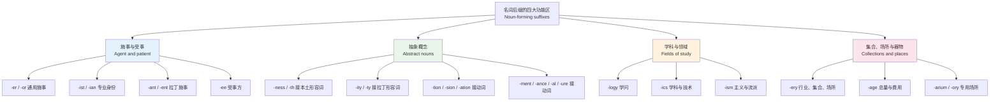
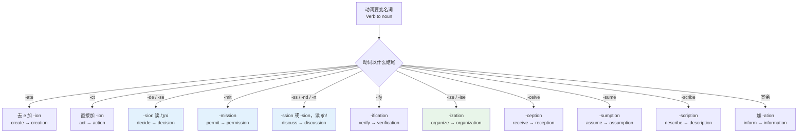
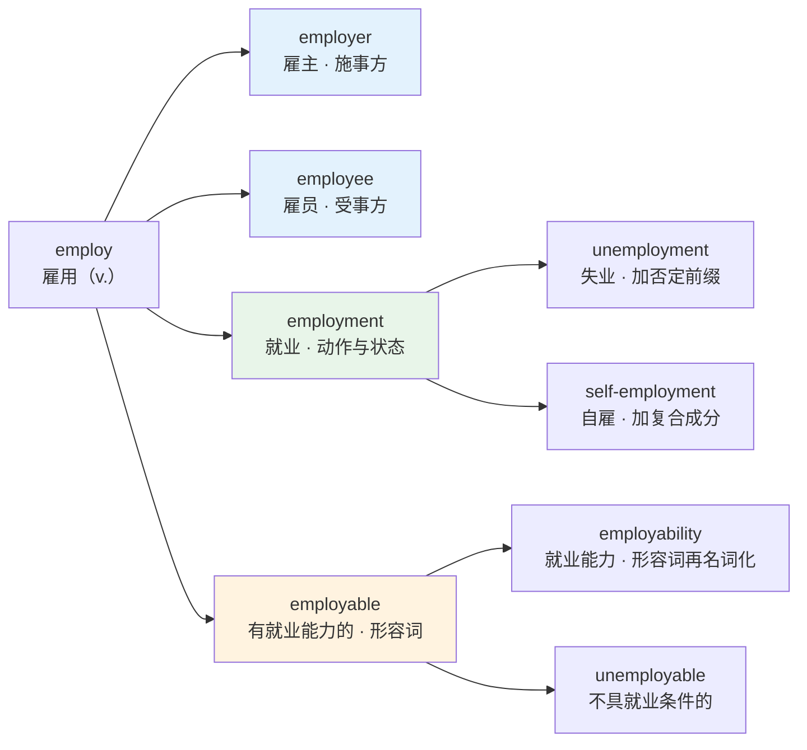
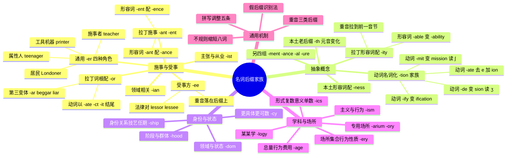

# 名词后缀家族

> [!info] 本篇定位
>
> 前四篇讲前缀。前缀改的是意思：`sub-` 让位置往下，`over-` 让程度往上，词性基本不动。从本篇开始换一套机器：**后缀改的是词性**。同一个词根 `employ`，接不同后缀能长出「雇主」「雇员」「就业」「可雇佣性」四个不同词类的词。
>
> 本篇只管把词变成**名词**的那批后缀，按功能切四组：施事与受事（-er / -or / -ist / -ant / -ee）、抽象概念（-ness / -ity / -tion / -ment / -ance / -ship / -hood）、学科领域（-logy / -ics）、集合与场所（-ery / -age / -arium）。形容词、动词、副词后缀在下一篇。
>
> 全篇三百六十余个词条。读完能做三件事：看到陌生名词判断它是从哪个词根派生的、给一个已知动词推出对应的三四个名词形式、分清 `dependence` 和 `dependency`、`residence` 和 `residency` 这类同根近义词的实际分工。

---

## 1. 本篇导读：后缀是词性的开关

英语的前缀和后缀分工非常干净，干净到可以当规则用。

**前缀改语义，后缀改词性**。`happy` 加 `un-` 变 `unhappy`，还是形容词，只是意思反了；`happy` 加 `-ness` 变 `happiness`，意思没变，词类从形容词变成了名词。这条分工有少数例外（`en-` 这个前缀能把名词或形容词变动词：`danger → endanger`、`able → enable`），但作为默认预期它足够可靠。

对自学者来说，这条分工有个直接的操作价值：**遇到生词先看词尾**。词尾告诉你它在句子里能占什么位置，哪怕你完全不认识词根。看到 `substantiation` 这个词，`-ation` 立刻告诉你这是个抽象名词，前面可以加 `the`，后面可以跟 `of`；看到 `substantiator`，`-or` 告诉你这是个人或者施事者。词根 `substanti-` 认不认识是第二步的事。

第二个价值是**批量扩容**。词汇量的增长有两种方式：一个一个背，或者拿一个已知词根乘以后缀集合。后者的效率高一个量级。你已经认识 `develop`，那么 `developer`（开发者）、`development`（开发）、`developmental`（发育的）、`redevelopment`（重建）这四个词你不需要单独背，只需要确认它们真实存在、以及各自的确切义项分工。本篇的大半篇幅就在做这个确认工作。

第三件事是**判断语域**。后缀带着来源信息：`-ness`、`-ship`、`-hood`、`-dom` 是古英语本土层，接的多半是本土词根，语感朴实；`-ity`、`-tion`、`-ance` 是拉丁法语层，接的是拉丁词根，语感正式。同一个概念用哪个后缀，直接决定这句话读起来是日常口语还是学术论文。



上图是本篇的骨架，也是查词时的定位表。四个功能区不是并列的四堆词，而是四种**回答不同问题的机器**：施事区回答「做这件事的是谁」，抽象区回答「这件事本身叫什么」，学科区回答「研究这个的学问叫什么」，集合场所区回答「这些东西聚在一起或者做这件事的地方叫什么」。同一个词根经常在四个区里都有产物，比如 `bake`：`baker`（面包师）、`baking`（烘焙）、`bakery`（面包房）。看到一个陌生名词，先判断它落在哪个区，义项就锁定了一大半。

需要划清一条边界：本篇讲的是**后缀本身的行为**——它接什么、怎么拼、重音往哪跑、跟兄弟后缀怎么分工。至于 `-logy` 里的 `log` 为什么是「言说、学问」、`-graphy` 里的 `graph` 为什么是「写」，那是词根的事，归 [[15.词根、合成与缩略/03.希腊词根与学科术语\|希腊词根与学科术语]]。两篇配合着看才完整。

---

## 2. 施事后缀 -er 与 -or：本土层和拉丁层的分界

`-er` 是英语最能产的名词后缀，没有之一。它的功能是把一个动词变成「做这个动作的人或物」，而且几乎不挑食：任何动词后面加 `-er` 造出来的词，母语者都能立刻理解，哪怕词典里没收。

### 2.1 -er 的四种角色

同样一个 `-er`，在不同词里承担的是四种不同的角色。分清这四种，读技术文档时能省很多猜测。

| 英文 | 英式音标 | 美式音标 | 词性 | 中文 | 搭配与说明 |
| --- | --- | --- | --- | --- | --- |
| **teacher** | /ˈtiːtʃə/ | /ˈtiːtʃər/ | n. | 教师 | 角色一：做动作的人。a maths teacher |
| **writer** | /ˈraɪtə/ | /ˈraɪtər/ | n. | 作家；撰稿人 | a freelance writer 自由撰稿人 |
| **speaker** | /ˈspiːkə/ | /ˈspiːkər/ | n. | 说话人；扬声器 | 一词兼角色一与角色二 |
| **manager** | /ˈmænɪdʒə/ | /ˈmænɪdʒər/ | n. | 经理 | line manager 直属上级 |
| **developer** | /dɪˈveləpə/ | /dɪˈveləpər/ | n. | 开发者；开发商 | 软件与房地产两义共用一词 |
| **publisher** | /ˈpʌblɪʃə/ | /ˈpʌblɪʃər/ | n. | 出版商；发布方 | 消息队列里的 publisher/subscriber 模型 |
| **printer** | /ˈprɪntə/ | /ˈprɪntər/ | n. | 打印机；印刷工 | 角色二：做动作的机器 |
| **container** | /kənˈteɪnə/ | /kənˈteɪnər/ | n. | 容器；集装箱 | 角色二，无生命施事 |
| **compiler** | /kəmˈpaɪlə/ | /kəmˈpaɪlər/ | n. | 编译器 | 同类还有 parser、linker、loader |
| **charger** | /ˈtʃɑːdʒə/ | /ˈtʃɑːrdʒər/ | n. | 充电器 | a fast charger 快充头 |
| **opener** | /ˈəʊpnə/ | /ˈoʊpnər/ | n. | 开瓶器；开场者 | a can opener 开罐器 |
| **Londoner** | /ˈlʌndənə/ | /ˈlʌndənər/ | n. | 伦敦人 | 角色三：某地的居民 |
| **New Yorker** | /njuː ˈjɔːkə/ | /nuː ˈjɔːrkər/ | n. | 纽约人 | 也是那本杂志的刊名 |
| **villager** | /ˈvɪlɪdʒə/ | /ˈvɪlɪdʒər/ | n. | 村民 | 接名词而非动词 |
| **foreigner** | /ˈfɒrənə/ | /ˈfɔːrənər/ | n. | 外国人 | 语域偏中性，正式场合用 non-national |
| **teenager** | /ˈtiːneɪdʒə/ | /ˈtiːneɪdʒər/ | n. | 青少年 | 角色四：具有某属性的人 |
| **islander** | /ˈaɪləndə/ | /ˈaɪləndər/ | n. | 岛民 | 注意 s 不发音 |
| **best-seller** | /ˌbest ˈselə/ | /ˌbest ˈselər/ | n. | 畅销书 | 复合词里的 -er 同样能产 |

四种角色里最值得程序员留意的是**角色二**。面向对象设计模式的名字几乎全部靠 `-er` 造出来：Observer（观察者）、Adapter（适配器）、Builder（构建者）、Decorator（装饰者）、Iterator（迭代器）、Visitor（访问者）、Controller（控制器）、Handler（处理器）、Listener（监听器）、Wrapper（包装器）。这不是巧合——模式命名的惯例就是「动词 + er = 承担这个职责的对象」。理解这条惯例之后，读一个陌生框架的类名，一半的语义是白送的。

### 2.2 -or：接拉丁词根的那一半

`-or` 和 `-er` 意思完全相同，区别只在词根的出身。**拉丁来源的动词，尤其是以 `-ate`、`-ct`、`-it`、`-ess` 结尾的，配 `-or`**；本土词或已经彻底英化的词配 `-er`。

| 英文 | 英式音标 | 美式音标 | 词性 | 中文 | 搭配与说明 |
| --- | --- | --- | --- | --- | --- |
| **actor** | /ˈæktə/ | /ˈæktər/ | n. | 演员；行为主体 | act 以 -ct 结尾 |
| **director** | /dəˈrektə/ | /dəˈrektər/ | n. | 导演；董事 | board of directors 董事会 |
| **editor** | /ˈedɪtə/ | /ˈedɪtər/ | n. | 编辑；编辑器 | a text editor 文本编辑器 |
| **operator** | /ˈɒpəreɪtə/ | /ˈɑːpəreɪtər/ | n. | 操作员；运算符 | operate 以 -ate 结尾 |
| **educator** | /ˈedʒukeɪtə/ | /ˈedʒukeɪtər/ | n. | 教育工作者 | 比 teacher 正式，多指制定政策的一层 |
| **investor** | /ɪnˈvestə/ | /ɪnˈvestər/ | n. | 投资者 | institutional investor 机构投资者 |
| **inspector** | /ɪnˈspektə/ | /ɪnˈspektər/ | n. | 检查员；督察 | 英国警衔也用这个词 |
| **conductor** | /kənˈdʌktə/ | /kənˈdʌktər/ | n. | 指挥；售票员；导体 | 三义共存，靠语境切分 |
| **translator** | /trænzˈleɪtə/ | /trænsˈleɪtər/ | n. | 译者；翻译程序 | 对比 interpreter 口译员 |
| **auditor** | /ˈɔːdɪtə/ | /ˈɔːdɪtər/ | n. | 审计员；旁听生 | external auditor 外部审计 |
| **supervisor** | /ˈsuːpəvaɪzə/ | /ˈsuːpərvaɪzər/ | n. | 主管；导师 | 研究生导师英式常用这个词 |
| **contractor** | /kənˈtræktə/ | /kənˈtræktər/ | n. | 承包商；外包人员 | an independent contractor |
| **creditor** | /ˈkredɪtə/ | /ˈkredɪtər/ | n. | 债权人 | 对立面是 debtor 债务人 |
| **sponsor** | /ˈspɒnsə/ | /ˈspɑːnsər/ | n./v. | 赞助商；赞助 | 名动同形 |
| **survivor** | /səˈvaɪvə/ | /sərˈvaɪvər/ | n. | 幸存者 | 拼写没有 e，survivour 是错的 |
| **processor** | /ˈprəʊsesə/ | /ˈprɑːsesər/ | n. | 处理器 | a quad-core processor 四核处理器 |
| **sailor** | /ˈseɪlə/ | /ˈseɪlər/ | n. | 水手 | 例外：本土词根却用 -or |
| **beggar** | /ˈbeɡə/ | /ˈbeɡər/ | n. | 乞丐 | 第三种拼法 -ar |
| **liar** | /ˈlaɪə/ | /ˈlaɪər/ | n. | 说谎者 | lier 是另一个词，指躺着的人 |
| **burglar** | /ˈbɜːɡlə/ | /ˈbɜːrɡlər/ | n. | 入室窃贼 | -ar 一族还有 scholar、registrar |

> [!warning] -er / -or / -ar 三选一没有百分之百的规则
>
> 上表最后四个词说明这条规律有漏洞：`sailor` 是本土词根 `sail` 却拼 `-or`，`beggar`、`liar`、`burglar` 走的是第三条路 `-ar`。这类词数量不多但都高频，只能单独记。
>
> 更实际的困扰是**同一个词的两种拼法**。`adviser` 与 `advisor` 都对，英式偏 `-er`，美式在指正式职衔时偏 `-or`（`a legal advisor`）。同类还有 `conveyer/conveyor`、`vender/vendor`。写文档时的原则是：一篇之内保持一致，不要一段 `adviser` 一段 `advisor`。

---

## 3. -ist、-ian、-ant：三种「专业身份」

`-er` 和 `-or` 造出来的是「做这个动作的人」，`-ist`、`-ian`、`-ant` 造出来的是「以此为业或以此为立场的人」。区别在于前者可以是临时的（`a reader of this blog` 只是此刻在读），后者带**长期身份**的意味。

### 3.1 -ist：主张者与从业者

`-ist` 接名词或形容词词根，产出两类人：**持某种主张的人**（`socialist`）和**掌握某种技艺的人**（`pianist`）。它和抽象后缀 `-ism` 是天然一对：有 `-ism` 就几乎一定有对应的 `-ist`。

| 英文 | 英式音标 | 美式音标 | 词性 | 中文 | 搭配与说明 |
| --- | --- | --- | --- | --- | --- |
| **scientist** | /ˈsaɪəntɪst/ | /ˈsaɪəntɪst/ | n. | 科学家 | 由 science 派生，注意 c 读 /s/ |
| **artist** | /ˈɑːtɪst/ | /ˈɑːrtɪst/ | n. | 艺术家 | 与 artisan 手艺人不同 |
| **novelist** | /ˈnɒvəlɪst/ | /ˈnɑːvəlɪst/ | n. | 小说家 | novel 的名词义派生 |
| **journalist** | /ˈdʒɜːnəlɪst/ | /ˈdʒɜːrnəlɪst/ | n. | 记者 | 对比 reporter 出镜记者 |
| **economist** | /ɪˈkɒnəmɪst/ | /ɪˈkɑːnəmɪst/ | n. | 经济学家 | 重音在第二音节 |
| **psychologist** | /saɪˈkɒlədʒɪst/ | /saɪˈkɑːlədʒɪst/ | n. | 心理学家 | 与 psychiatrist 精神科医生不同 |
| **specialist** | /ˈspeʃəlɪst/ | /ˈspeʃəlɪst/ | n. | 专家；专科医生 | see a specialist 看专科 |
| **therapist** | /ˈθerəpɪst/ | /ˈθerəpɪst/ | n. | 治疗师 | physical therapist 理疗师 |
| **capitalist** | /ˈkæpɪtəlɪst/ | /ˈkæpɪtəlɪst/ | n./adj. | 资本家；资本主义的 | 主张类，配 capitalism |
| **activist** | /ˈæktɪvɪst/ | /ˈæktɪvɪst/ | n. | 活动人士 | a climate activist |
| **cyclist** | /ˈsaɪklɪst/ | /ˈsaɪklɪst/ | n. | 骑行者 | 由 cycle 派生 |
| **dentist** | /ˈdentɪst/ | /ˈdentɪst/ | n. | 牙医 | 词根 dent 牙，不是 dent 凹痕 |
| **pharmacist** | /ˈfɑːməsɪst/ | /ˈfɑːrməsɪst/ | n. | 药剂师 | 英式店里也叫 chemist |
| **analyst** | /ˈænəlɪst/ | /ˈænəlɪst/ | n. | 分析师 | 拼写只有一个 -yst，不是 -yist |
| **linguist** | /ˈlɪŋɡwɪst/ | /ˈlɪŋɡwɪst/ | n. | 语言学家；通晓多语者 | 少见地不带 -ist 前的元音 |

`analyst` 值得单独提一句。它不是 `analy + ist`，而是从希腊语 `analytēs` 经法语借进来的，所以中间没有多出来的 `i`。同一类拼法还有 `catalyst`（催化剂）和 `chemist`（化学家），词尾都是直接贴在词干上。这三个词被写成 `analysist`、`catalist`、`chemistist` 的频率相当高。

### 3.2 -ian：与某领域相关的人

`-ian` 常接在以 `-ic`、`-y`、`-ia` 结尾的领域名后面，指从事该领域的人。它和 `-ist` 的分工没有硬规则，但有个能用的经验：**领域名以 `-ics` 或 `-ic` 结尾的多配 `-ian`**（`music → musician`、`politics → politician`），**以 `-ism` 或 `-y` 结尾的多配 `-ist`**（`socialism → socialist`、`biology → biologist`）。

| 英文 | 英式音标 | 美式音标 | 词性 | 中文 | 搭配与说明 |
| --- | --- | --- | --- | --- | --- |
| **musician** | /mjuˈzɪʃn/ | /mjuˈzɪʃn/ | n. | 音乐家 | music 的 c 变读 /ʃ/ |
| **politician** | /ˌpɒləˈtɪʃn/ | /ˌpɑːləˈtɪʃn/ | n. | 政客；政治家 | 英语里略带贬义，褒义用 statesman |
| **technician** | /tekˈnɪʃn/ | /tekˈnɪʃn/ | n. | 技术员 | 与 engineer 的分工见 11.02 |
| **physician** | /fɪˈzɪʃn/ | /fɪˈzɪʃn/ | n. | 内科医生 | 与 physicist 物理学家只差两个字母 |
| **electrician** | /ɪˌlekˈtrɪʃn/ | /ɪˌlekˈtrɪʃn/ | n. | 电工 | call an electrician 叫电工 |
| **librarian** | /laɪˈbreəriən/ | /laɪˈbreriən/ | n. | 图书管理员 | 重音在第二音节 |
| **historian** | /hɪˈstɔːriən/ | /hɪˈstɔːriən/ | n. | 历史学家 | 对比 history 重音在首音节 |
| **mathematician** | /ˌmæθəməˈtɪʃn/ | /ˌmæθəməˈtɪʃn/ | n. | 数学家 | 五个音节，重音在第四个 |
| **statistician** | /ˌstætɪˈstɪʃn/ | /ˌstætɪˈstɪʃn/ | n. | 统计学家 | 统计术语见 19.03 |
| **comedian** | /kəˈmiːdiən/ | /kəˈmiːdiən/ | n. | 喜剧演员 | stand-up comedian 单口喜剧演员 |
| **civilian** | /səˈvɪliən/ | /səˈvɪliən/ | n./adj. | 平民；民用的 | 与 military 对立 |
| **guardian** | /ˈɡɑːdiən/ | /ˈɡɑːrdiən/ | n. | 监护人 | legal guardian 法定监护人 |
| **veterinarian** | /ˌvetərɪˈneəriən/ | /ˌvetərəˈneriən/ | n. | 兽医 | 口语一律缩成 vet |
| **pedestrian** | /pəˈdestriən/ | /pəˈdestriən/ | n./adj. | 行人；平庸的 | 形容词义是「乏味的」 |

> [!warning] physician 不是「物理学家」
>
> `physician` 是内科医生，`physicist` 才是物理学家。这两个词都从希腊语 `physis`（自然）来，因为古代医学被视为研究自然的学问。
>
> 同类陷阱还有 `chemist`：美式指化学家，英式在日常语境里指药店或药剂师（`I'll pop to the chemist's` 我去趟药店）。看到 `chemist` 先判断是英式还是美式文本。

### 3.3 -ant / -ent：拉丁现在分词留下的施事词

`-ant` 和 `-ent` 是拉丁语现在分词词尾在英语里的残留。它们既能造形容词（`important`、`different`），也能造名词——造名词时指的是「处在这个动作状态中的人」。

| 英文 | 英式音标 | 美式音标 | 词性 | 中文 | 搭配与说明 |
| --- | --- | --- | --- | --- | --- |
| **assistant** | /əˈsɪstənt/ | /əˈsɪstənt/ | n./adj. | 助理；助理的 | a personal assistant 私人助理 |
| **accountant** | /əˈkaʊntənt/ | /əˈkaʊntənt/ | n. | 会计 | 与 auditor 的分工见 11.02 |
| **consultant** | /kənˈsʌltənt/ | /kənˈsʌltənt/ | n. | 顾问；英式高级专科医生 | 英式医院里 consultant 是主任医师 |
| **applicant** | /ˈæplɪkənt/ | /ˈæplɪkənt/ | n. | 申请人 | 由 apply 派生，y 变 i |
| **participant** | /pɑːˈtɪsɪpənt/ | /pɑːrˈtɪsɪpənt/ | n. | 参与者 | 学术论文里指受试者 |
| **immigrant** | /ˈɪmɪɡrənt/ | /ˈɪmɪɡrənt/ | n. | 移入者 | 对立面是 emigrant 移出者 |
| **occupant** | /ˈɒkjəpənt/ | /ˈɑːkjəpənt/ | n. | 占用者；居住者 | 保险与租约合同高频 |
| **defendant** | /dɪˈfendənt/ | /dɪˈfendənt/ | n. | 被告 | 对立面是 plaintiff 原告 |
| **merchant** | /ˈmɜːtʃənt/ | /ˈmɜːrtʃənt/ | n. | 商人 | merchant account 商户账户 |
| **resident** | /ˈrezɪdənt/ | /ˈrezɪdənt/ | n./adj. | 居民；住院医师 | 美式医院里 resident 是住院医师 |
| **president** | /ˈprezɪdənt/ | /ˈprezɪdənt/ | n. | 总统；总裁 | vice president 副总裁 |
| **correspondent** | /ˌkɒrɪˈspɒndənt/ | /ˌkɔːrəˈspɑːndənt/ | n. | 通讯员；驻外记者 | a foreign correspondent |
| **opponent** | /əˈpəʊnənt/ | /əˈpoʊnənt/ | n. | 对手；反对者 | an opponent of the plan |
| **agent** | /ˈeɪdʒənt/ | /ˈeɪdʒənt/ | n. | 代理人；试剂；智能体 | AI agent 是近年新义 |
| **student** | /ˈstjuːdnt/ | /ˈstuːdnt/ | n. | 学生 | 英美读音差在 /stj/ 与 /st/ |

`-ant` 还是 `-ent`，靠拉丁原动词的变位类别决定，英语里没有可推导的规律。实用的记忆办法是**跟它的抽象名词绑一起记**：`-ant` 配 `-ance`（`assistant / assistance`、`important / importance`），`-ent` 配 `-ence`（`different / difference`、`persistent / persistence`）。只要记住其中一个，另一个的拼写就跟着定了。这条对应在第 12 节还会用到。

---

## 4. -ee 与 -or：法律文书里的施受对

`-ee` 是本篇最特殊的一个后缀，因为它标的不是施事而是**受事**——动作落在谁身上。`employer` 是雇人的一方，`employee` 是被雇的一方。这一对在合同、法律、金融文本里成组出现，认全了能省下大量查词时间。

| 英文 | 英式音标 | 美式音标 | 词性 | 中文 | 搭配与说明 |
| --- | --- | --- | --- | --- | --- |
| **employee** | /ɪmˌplɔɪˈiː/ | /ɪmˌplɔɪˈiː/ | n. | 雇员 | 重音在末音节，也可读 /ɪmˈplɔɪiː/ |
| **employer** | /ɪmˈplɔɪə/ | /ɪmˈplɔɪər/ | n. | 雇主 | 重音在第二音节，与上一行对比 |
| **trainee** | /ˌtreɪˈniː/ | /ˌtreɪˈniː/ | n. | 受训者；实习生 | a management trainee 管培生 |
| **interviewee** | /ˌɪntəvjuːˈiː/ | /ˌɪntərvjuːˈiː/ | n. | 受访者；面试者 | 对应 interviewer 面试官 |
| **payee** | /peɪˈiː/ | /peɪˈiː/ | n. | 收款人 | 支票与转账单上的固定栏位 |
| **licensee** | /ˌlaɪsənˈsiː/ | /ˌlaɪsənˈsiː/ | n. | 被许可方 | 对应 licensor 许可方 |
| **lessee** | /leˈsiː/ | /leˈsiː/ | n. | 承租人 | 对应 lessor 出租人 |
| **mortgagee** | /ˌmɔːɡɪˈdʒiː/ | /ˌmɔːrɡɪˈdʒiː/ | n. | 抵押权人（银行） | 对应 mortgagor 抵押人（借款人） |
| **assignee** | /ˌæsaɪˈniː/ | /ˌæsaɪˈniː/ | n. | 受让人 | 对应 assignor 转让人 |
| **grantee** | /ɡrɑːnˈtiː/ | /ɡrænˈtiː/ | n. | 受让人；受资助方 | 对应 grantor 授予方 |
| **nominee** | /ˌnɒmɪˈniː/ | /ˌnɑːməˈniː/ | n. | 被提名人 | 对应 nominator 提名人 |
| **addressee** | /ˌædreˈsiː/ | /ˌædreˈsiː/ | n. | 收件人 | 语言学里指话语接收方 |
| **refugee** | /ˌrefjuˈdʒiː/ | /ˌrefjuˈdʒiː/ | n. | 难民 | 由 refuge 派生，词义已固化 |
| **retiree** | /rɪˌtaɪəˈriː/ | /rɪˌtaɪˈriː/ | n. | 退休人员 | 美式常用，英式多说 pensioner |
| **absentee** | /ˌæbsənˈtiː/ | /ˌæbsənˈtiː/ | n. | 缺席者 | absentee ballot 缺席选票 |
| **devotee** | /ˌdevəˈtiː/ | /ˌdevəˈtiː/ | n. | 爱好者；信徒 | a devotee of jazz |
| **escapee** | /ɪˌskeɪˈpiː/ | /ɪˌskeɪˈpiː/ | n. | 逃脱者 | 语义上其实是施事，属例外 |
| **attendee** | /ˌætenˈdiː/ | /ˌætenˈdiː/ | n. | 与会者 | 同上，也是施事义的例外 |

> [!tip] -ee 的重音永远落在自己身上
>
> 这是 `-ee` 最好用的识别特征。`ˌemployˈee`、`ˌtrainˈee`、`ˌnomiˈnee`，重音一律在最后那个 `-ee` 上，读成一个清晰的长音 /iː/。
>
> 这个特征可以直接拿来做听辨：一句话里听到 `/ɪmˌplɔɪˈiː/`，重音砸在末尾，那是「雇员」；听到 `/ɪmˈplɔɪər/`，重音在中间，那是「雇主」。两个词只有靠重音位置才能实时区分，靠拼写是来不及的。
>
> 少数词破了这条规律，比如 `committee` /kəˈmɪti/（委员会）重音在中间，末尾读 /i/ 不读 /iː/。这个词历史上确实是 `commit` 加 `-ee` 造的（本义「受托办事的人」），但读音早已固化，不能按现在的 `-ee` 规律去套。

上表里 `lessee`、`mortgagee`、`assignee`、`grantee` 这几组之所以留在本篇，是因为它们是 `-ee` 与 `-or` 配对最干净的样本，看的是后缀行为而不是法律条文。合同、诉讼、金融文书本身的术语体系归第 20 章的专业领域篇，本篇只取这条构词线索。

`escapee` 和 `attendee` 是有意思的例外：逃跑的人是主动逃的，参会的人是主动参的，按理该用 `-er`。语言的实际使用把 `-ee` 泛化成了「与某动作有关的当事人」，不再严格限于受事。这类泛化在现代商务英语里越来越多（`mentee` 被指导者、`onboardee` 新入职者），属于活跃的构词现象。

---

## 5. 抽象后缀（一）-ness 与 -ity：同义不同层

从这一节起进入抽象名词区。抽象后缀的功能是**把形容词或动词变成「那件事本身」**：`dark`（暗的）→ `darkness`（黑暗），`decide`（决定）→ `decision`（决定这个事）。

`-ness` 和 `-ity` 都接形容词，都表示「具有该性质的状态」，看起来完全重合。分工在于词根的出身。

### 5.1 -ness 接本土形容词

`-ness` 是古英语本土后缀，能产性极高，几乎可以接任何形容词，包括临时造的（`the not-quite-rightness of it`）。它造出来的词语感朴实、具体、偏日常。

| 英文 | 英式音标 | 美式音标 | 词性 | 中文 | 搭配与说明 |
| --- | --- | --- | --- | --- | --- |
| **happiness** | /ˈhæpinəs/ | /ˈhæpinəs/ | n. U | 幸福 | y 变 i：happy → happiness |
| **darkness** | /ˈdɑːknəs/ | /ˈdɑːrknəs/ | n. U | 黑暗 | in total darkness 一片漆黑 |
| **kindness** | /ˈkaɪndnəs/ | /ˈkaɪndnəs/ | n. U/C | 善意；善举 | 可数时指具体的一件好事 |
| **weakness** | /ˈwiːknəs/ | /ˈwiːknəs/ | n. U/C | 虚弱；弱点 | a weakness for chocolate 嗜好 |
| **illness** | /ˈɪlnəs/ | /ˈɪlnəs/ | n. U/C | 疾病 | 对比 disease 指具体病种 |
| **awareness** | /əˈweənəs/ | /əˈwernəs/ | n. U | 意识；知晓 | raise awareness 提高认知 |
| **willingness** | /ˈwɪlɪŋnəs/ | /ˈwɪlɪŋnəs/ | n. U | 意愿 | willingness to compromise |
| **readiness** | /ˈredinəs/ | /ˈredinəs/ | n. U | 准备就绪 | combat readiness 战备状态 |
| **fitness** | /ˈfɪtnəs/ | /ˈfɪtnəs/ | n. U | 健康；适合度 | 也指进化生物学的适应度 |
| **loneliness** | /ˈləʊnlinəs/ | /ˈloʊnlinəs/ | n. U | 孤独 | 对比 solitude 中性的独处 |
| **thickness** | /ˈθɪknəs/ | /ˈθɪknəs/ | n. U/C | 厚度 | 可数时指某一层 |
| **business** | /ˈbɪznəs/ | /ˈbɪznəs/ | n. U/C | 生意；事务 | 源自 busy + ness，语义已完全漂离 |
| **witness** | /ˈwɪtnəs/ | /ˈwɪtnəs/ | n./v. | 证人；目击 | 源自 wit + ness，同样已固化 |

`business` 和 `witness` 是词义漂移的标本。`business` 字面是「忙碌的状态」，现在指生意；`witness` 字面是「有知的状态」，现在指人。它们的拼写还留着 `-ness`，语义上已经不能再按后缀拆解——**认出后缀不等于能推出词义，只能推出词性**。

### 5.2 -ity 接拉丁形容词

`-ity`（有时写作 `-ty`）是拉丁后缀，接拉丁来源的形容词，语域比 `-ness` 正式一档，多出现在学术、技术、法律文本里。

| 英文 | 英式音标 | 美式音标 | 词性 | 中文 | 搭配与说明 |
| --- | --- | --- | --- | --- | --- |
| **ability** | /əˈbɪləti/ | /əˈbɪləti/ | n. U/C | 能力 | able → ability，词干缩短 |
| **reality** | /riˈæləti/ | /riˈæləti/ | n. U/C | 现实 | in reality 实际上 |
| **security** | /sɪˈkjʊərəti/ | /sɪˈkjʊrəti/ | n. U | 安全；证券 | 复数 securities 指证券 |
| **complexity** | /kəmˈpleksəti/ | /kəmˈpleksəti/ | n. U/C | 复杂性 | time complexity 时间复杂度 |
| **density** | /ˈdensəti/ | /ˈdensəti/ | n. U/C | 密度 | population density 人口密度 |
| **validity** | /vəˈlɪdəti/ | /vəˈlɪdəti/ | n. U | 有效性 | 论文方法学高频词 |
| **integrity** | /ɪnˈteɡrəti/ | /ɪnˈteɡrəti/ | n. U | 正直；完整性 | data integrity 数据完整性 |
| **scarcity** | /ˈskeəsəti/ | /ˈskersəti/ | n. U | 稀缺 | scarce → scarcity |
| **priority** | /praɪˈɒrəti/ | /praɪˈɔːrəti/ | n. C/U | 优先级 | high priority 高优先级 |
| **capacity** | /kəˈpæsəti/ | /kəˈpæsəti/ | n. U/C | 容量；能力 | at full capacity 满负荷 |
| **quantity** | /ˈkwɒntəti/ | /ˈkwɑːntəti/ | n. U/C | 数量 | 对应 quality 质量 |
| **majority** | /məˈdʒɒrəti/ | /məˈdʒɔːrəti/ | n. | 多数 | the vast majority of 绝大多数 |
| **curiosity** | /ˌkjʊəriˈɒsəti/ | /ˌkjʊriˈɑːsəti/ | n. U/C | 好奇心；珍奇物 | curious → curiosity，us 变 os |
| **generosity** | /ˌdʒenəˈrɒsəti/ | /ˌdʒenəˈrɑːsəti/ | n. U | 慷慨 | generous → generosity，同上 |
| **safety** | /ˈseɪfti/ | /ˈseɪfti/ | n. U | 安全 | -ty 短形式，同类 loyalty、novelty |
| **cruelty** | /ˈkruːəlti/ | /ˈkruːəlti/ | n. U/C | 残忍；虐待行为 | animal cruelty |

### 5.3 -ability：给程序员的一整个词族

`-able` 结尾的形容词加 `-ity` 变名词时，`-able + -ity` 合并成 `-ability`。这条规则本身很简单，值得单独拎出来是因为**软件工程的非功能需求词几乎全在这个模子里**。

| 英文 | 英式音标 | 美式音标 | 词性 | 中文 | 搭配与说明 |
| --- | --- | --- | --- | --- | --- |
| **availability** | /əˌveɪləˈbɪləti/ | /əˌveɪləˈbɪləti/ | n. U | 可用性 | high availability 高可用 |
| **reliability** | /rɪˌlaɪəˈbɪləti/ | /rɪˌlaɪəˈbɪləti/ | n. U | 可靠性 | 对应 reliable |
| **scalability** | /ˌskeɪləˈbɪləti/ | /ˌskeɪləˈbɪləti/ | n. U | 可扩展性 | horizontal scalability 横向扩展 |
| **maintainability** | /meɪnˌteɪnəˈbɪləti/ | /meɪnˌteɪnəˈbɪləti/ | n. U | 可维护性 | 注意 maintain 的拼写不省 i |
| **usability** | /ˌjuːzəˈbɪləti/ | /ˌjuːzəˈbɪləti/ | n. U | 易用性 | usability testing 可用性测试 |
| **readability** | /ˌriːdəˈbɪləti/ | /ˌriːdəˈbɪləti/ | n. U | 可读性 | 也用于文本的易读程度 |
| **compatibility** | /kəmˌpætəˈbɪləti/ | /kəmˌpætəˈbɪləti/ | n. U | 兼容性 | backward compatibility 向后兼容 |
| **flexibility** | /ˌfleksəˈbɪləti/ | /ˌfleksəˈbɪləti/ | n. U | 灵活性 | -ible 同样变 -ibility |
| **visibility** | /ˌvɪzəˈbɪləti/ | /ˌvɪzəˈbɪləti/ | n. U | 可见性；能见度 | 气象义见 06.02 |
| **feasibility** | /ˌfiːzəˈbɪləti/ | /ˌfiːzəˈbɪləti/ | n. U | 可行性 | a feasibility study 可行性研究 |
| **accessibility** | /əkˌsesəˈbɪləti/ | /əkˌsesəˈbɪləti/ | n. U | 可访问性；无障碍 | 前端里缩写成 a11y |
| **responsibility** | /rɪˌspɒnsəˈbɪləti/ | /rɪˌspɑːnsəˈbɪləti/ | n. U/C | 责任 | take responsibility for |
| **liability** | /ˌlaɪəˈbɪləti/ | /ˌlaɪəˈbɪləti/ | n. U/C | 责任；负债 | 会计里 assets and liabilities |
| **probability** | /ˌprɒbəˈbɪləti/ | /ˌprɑːbəˈbɪləti/ | n. U/C | 概率 | 统计术语见 19.03 |
| **observability** | /əbˌzɜːvəˈbɪləti/ | /əbˌzɜːrvəˈbɪləti/ | n. U | 可观测性 | 运维领域近十年的高频词 |

这张表的实际用法是**反向推词**。看到 `-ability` 结尾的陌生词，剥掉后缀还原成 `-able` 形容词，再还原成动词，词义就出来了：`interoperability` ← `interoperable` ← `interoperate`（互相操作）＝ 互操作性。这条推导链几乎不会失手，因为 `-ability` 的语义完全透明，没有 `business` 那样的漂移。

### 5.4 -ness 与 -ity 同时存在时的分工

少数词根两个后缀都能接。这时候它们**不是同义词**，而是分了工：`-ity` 倾向于指**可测量、可实例化的量**，`-ness` 倾向于指**主观感受到的性质**。

| 词根 | -ity 形式 | 含义 | -ness 形式 | 含义 |
| --- | --- | --- | --- | --- |
| productive | productivity | 生产率，可用数字衡量 | productiveness | 多产这个性质本身 |
| sensitive | sensitivity | 灵敏度（仪器）、敏感性（数据） | sensitiveness | 人容易受伤害的性情 |
| human | humanity | 人类；人文学科；人道 | humanness | 作为人的属性 |
| specific | specificity | 特异性（医学检验指标） | specificness | 具体这个性质，罕用 |
| pure | purity | 纯度，可测 | pureness | 纯净的感觉，文学用法 |

`productivity` 和 `productiveness` 这一对最能说明问题。写「团队的生产率提升了百分之十五」用 `productivity`，因为它是个可以放进报表的指标；写「这片土地的多产」偏文学表达时才用 `productiveness`。实际写作里 `-ness` 那一列的词大部分极其罕见，遇到词根同时能接两个后缀，**默认选 `-ity`**，除非你确实想要那种朴素、非量化的语感。

---

## 6. 抽象后缀（二）-tion 家族：动词名词化的主力

`-tion` 及其变体是英语里出现频率最高的抽象名词后缀。它接**动词**，把「做某事」变成「做某事这件事」或者「做某事的结果」。学术论文、技术规范、法律条文里名词密度奇高，主要就是这个后缀撑起来的。

`-tion` 的麻烦在于它有五六种拼写变体，而变体的选择完全由**原动词的词尾**决定。下面这张流程图把规律固定下来。



图里三个蓝色分支是读音的分水岭，而这三支背后其实是同一条规律：**`-sion` 前面是元音就读浊的 /ʒ/，前面是辅音就读清的 /ʃ/**。`decide → decision` /dɪˈsɪʒn/、`revise → revision` /rɪˈvɪʒn/、`conclude → conclusion` /kənˈkluːʒn/ 都是元音后，读 /ʒ/；`discuss → discussion` /dɪˈskʌʃn/、`express → expression` /ɪkˈspreʃn/、`expand → expansion` /ɪkˈspænʃn/、`extend → extension` /ɪkˈstenʃn/ 都是辅音后，读 /ʃ/。中国学习者最常出错的就是把 `decision` 里的 s 读成 /ʃ/。模糊地带只有 `-rsion` 这一小撮：`version`、`conversion`、`immersion` 英式读 /ʃ/、美式读 /ʒ/，两种都对，跟着自己那套口音走就行。绿色那个 `-ization` 分支涉及英美拼写差异，英式也接受 `-isation`，本篇统一用 `-ization`。

### 6.1 -tion / -ation 主表

| 英文 | 英式音标 | 美式音标 | 词性 | 中文 | 搭配与说明 |
| --- | --- | --- | --- | --- | --- |
| **action** | /ˈækʃn/ | /ˈækʃn/ | n. U/C | 行动 | take action 采取行动 |
| **creation** | /kriˈeɪʃn/ | /kriˈeɪʃn/ | n. U/C | 创造；作品 | create 去 e 加 -ion |
| **education** | /ˌedʒuˈkeɪʃn/ | /ˌedʒəˈkeɪʃn/ | n. U | 教育 | higher education 高等教育 |
| **operation** | /ˌɒpəˈreɪʃn/ | /ˌɑːpəˈreɪʃn/ | n. U/C | 操作；手术；运营 | 三义都高频 |
| **information** | /ˌɪnfəˈmeɪʃn/ | /ˌɪnfərˈmeɪʃn/ | n. U | 信息 | 永远不可数，无 informations |
| **construction** | /kənˈstrʌkʃn/ | /kənˈstrʌkʃn/ | n. U/C | 建造；结构 | under construction 施工中 |
| **protection** | /prəˈtekʃn/ | /prəˈtekʃn/ | n. U | 保护 | data protection 数据保护 |
| **description** | /dɪˈskrɪpʃn/ | /dɪˈskrɪpʃn/ | n. U/C | 描述 | -scribe 变 -scription |
| **subscription** | /səbˈskrɪpʃn/ | /səbˈskrɪpʃn/ | n. C/U | 订阅 | a monthly subscription |
| **reception** | /rɪˈsepʃn/ | /rɪˈsepʃn/ | n. U/C | 接待；接收；招待会 | -ceive 变 -ception |
| **perception** | /pəˈsepʃn/ | /pərˈsepʃn/ | n. U/C | 感知；看法 | public perception 公众观感 |
| **assumption** | /əˈsʌmpʃn/ | /əˈsʌmpʃn/ | n. C | 假设 | -sume 变 -sumption |
| **consumption** | /kənˈsʌmpʃn/ | /kənˈsʌmpʃn/ | n. U | 消耗；消费 | power consumption 功耗 |
| **verification** | /ˌverɪfɪˈkeɪʃn/ | /ˌverɪfɪˈkeɪʃn/ | n. U | 验证 | -ify 变 -ification |
| **notification** | /ˌnəʊtɪfɪˈkeɪʃn/ | /ˌnoʊtɪfɪˈkeɪʃn/ | n. C | 通知 | push notification 推送通知 |
| **classification** | /ˌklæsɪfɪˈkeɪʃn/ | /ˌklæsɪfɪˈkeɪʃn/ | n. U/C | 分类 | 机器学习任务名 |
| **organization** | /ˌɔːɡənaɪˈzeɪʃn/ | /ˌɔːrɡənəˈzeɪʃn/ | n. C/U | 组织；条理 | 英式可拼 organisation |
| **optimization** | /ˌɒptɪmaɪˈzeɪʃn/ | /ˌɑːptəməˈzeɪʃn/ | n. U/C | 优化 | query optimization 查询优化 |
| **implementation** | /ˌɪmplɪmenˈteɪʃn/ | /ˌɪmpləmenˈteɪʃn/ | n. U/C | 实现；实施 | 也指某个具体实现 |
| **explanation** | /ˌekspləˈneɪʃn/ | /ˌekspləˈneɪʃn/ | n. C/U | 解释 | explain 去 i：不是 explaination |
| **pronunciation** | /prəˌnʌnsiˈeɪʃn/ | /prəˌnʌnsiˈeɪʃn/ | n. U/C | 发音 | pronounce 去 o，最常错拼的词之一 |
| **repetition** | /ˌrepəˈtɪʃn/ | /ˌrepəˈtɪʃn/ | n. U/C | 重复 | repeat → repetition，元音全变 |

### 6.2 -sion / -ssion 主表

| 英文 | 英式音标 | 美式音标 | 词性 | 中文 | 搭配与说明 |
| --- | --- | --- | --- | --- | --- |
| **decision** | /dɪˈsɪʒn/ | /dɪˈsɪʒn/ | n. C | 决定 | make a decision，s 读 /ʒ/ |
| **conclusion** | /kənˈkluːʒn/ | /kənˈkluːʒn/ | n. C | 结论 | draw a conclusion 得出结论 |
| **division** | /dɪˈvɪʒn/ | /dɪˈvɪʒn/ | n. U/C | 划分；部门；除法 | 三义共存 |
| **invasion** | /ɪnˈveɪʒn/ | /ɪnˈveɪʒn/ | n. U/C | 入侵 | invasion of privacy 侵犯隐私 |
| **explosion** | /ɪkˈspləʊʒn/ | /ɪkˈsploʊʒn/ | n. C | 爆炸；激增 | a population explosion |
| **persuasion** | /pəˈsweɪʒn/ | /pərˈsweɪʒn/ | n. U | 说服 | 动词 persuade 的 de 变 sion |
| **permission** | /pəˈmɪʃn/ | /pərˈmɪʃn/ | n. U | 许可 | -mit 变 -mission，读 /ʃ/ |
| **admission** | /ədˈmɪʃn/ | /ədˈmɪʃn/ | n. U/C | 准入；承认 | admission fee 入场费 |
| **transmission** | /trænzˈmɪʃn/ | /trænsˈmɪʃn/ | n. U/C | 传输；变速箱 | 汽车义在美式更常见 |
| **omission** | /əˈmɪʃn/ | /əˈmɪʃn/ | n. U/C | 遗漏 | omit 只有一个 t，omission 有两个 s |
| **submission** | /səbˈmɪʃn/ | /səbˈmɪʃn/ | n. U/C | 提交；屈服 | form submission 表单提交 |
| **discussion** | /dɪˈskʌʃn/ | /dɪˈskʌʃn/ | n. U/C | 讨论 | under discussion 讨论中 |
| **expression** | /ɪkˈspreʃn/ | /ɪkˈspreʃn/ | n. C/U | 表达；表情；表达式 | regular expression 正则表达式 |
| **compression** | /kəmˈpreʃn/ | /kəmˈpreʃn/ | n. U | 压缩 | lossless compression 无损压缩 |
| **possession** | /pəˈzeʃn/ | /pəˈzeʃn/ | n. U/C | 占有；所有物 | 四个 s，拼写陷阱 |
| **expansion** | /ɪkˈspænʃn/ | /ɪkˈspænʃn/ | n. U/C | 扩张 | 辅音 n 后面读 /ʃ/，不读 /ʒ/ |
| **extension** | /ɪkˈstenʃn/ | /ɪkˈstenʃn/ | n. C/U | 延伸；扩展名；分机 | file extension 文件扩展名 |
| **version** | /ˈvɜːʃn/ | /ˈvɜːrʒn/ | n. C | 版本 | 英美读音差在 /ʃ/ 与 /ʒ/ |

> [!warning] -tion 名词的可数性不能靠后缀推
>
> 同一个后缀造出来的词，可数性完全不同。`information` 永远不可数，写 `informations` 是错的；`decision` 永远可数，说 `much decision` 是错的；`operation` 两可，`the operation of the system`（运行，不可数）和 `three operations`（三台手术，可数）都成立。
>
> - ❌ ~~I need some informations about the API.~~
> - ✅ **I need some information about the API.**
> - ❌ ~~He made much progress and many advices.~~
> - ✅ **He made much progress and got a lot of advice.**
>
> 判断办法只有一个：查词典看 `U` / `C` 标注。标注怎么读见 [[01.词汇入门与学习方法/04.词性与词典标注体例：词条上的缩写怎么读\|词性与词典标注体例：词条上的缩写怎么读]]，可数性的语法规则归 `02.英语基础语法`，本篇只在词表里标出来。

---

## 7. 抽象后缀（三）-ment、-ance/-ence、-al、-ure

`-tion` 之外，还有四组后缀同样把动词变抽象名词。它们和 `-tion` 不是自由替换的关系——**每个动词通常只跟一个后缀绑定**，`agree` 只能变 `agreement` 不能变 `agreeation`，`perform` 只能变 `performance` 不能变 `performment`。这层绑定关系没有规则可推，只能靠积累。

### 7.1 -ment：动作或其结果

`-ment` 从法语来，接的多是双音节以上的动词，产出「动作本身」或「动作产生的东西」。

| 英文 | 英式音标 | 美式音标 | 词性 | 中文 | 搭配与说明 |
| --- | --- | --- | --- | --- | --- |
| **agreement** | /əˈɡriːmənt/ | /əˈɡriːmənt/ | n. C/U | 协议；一致 | reach an agreement 达成协议 |
| **development** | /dɪˈveləpmənt/ | /dɪˈveləpmənt/ | n. U/C | 发展；开发；新动向 | a recent development 新进展 |
| **management** | /ˈmænɪdʒmənt/ | /ˈmænɪdʒmənt/ | n. U | 管理；管理层 | 词干 manage 的 e 保留 |
| **argument** | /ˈɑːɡjumənt/ | /ˈɑːrɡjumənt/ | n. C | 论点；争论；参数 | argue 去 e，编程里指实参 |
| **shipment** | /ˈʃɪpmənt/ | /ˈʃɪpmənt/ | n. C/U | 发货；一批货 | track a shipment 追踪货件 |
| **deployment** | /dɪˈplɔɪmənt/ | /dɪˈplɔɪmənt/ | n. U/C | 部署 | a blue-green deployment |
| **requirement** | /rɪˈkwaɪəmənt/ | /rɪˈkwaɪərmənt/ | n. C | 需求；要求 | meet the requirements |
| **improvement** | /ɪmˈpruːvmənt/ | /ɪmˈpruːvmənt/ | n. U/C | 改进 | room for improvement 改进空间 |
| **statement** | /ˈsteɪtmənt/ | /ˈsteɪtmənt/ | n. C | 陈述；语句；对账单 | 编程、金融、日常三义 |
| **environment** | /ɪnˈvaɪrənmənt/ | /ɪnˈvaɪrənmənt/ | n. C/U | 环境 | 中间那个 n 常被漏写 |
| **commitment** | /kəˈmɪtmənt/ | /kəˈmɪtmənt/ | n. U/C | 承诺；投入 | 只有一个 t，对比 committed 双写 |
| **judgement** | /ˈdʒʌdʒmənt/ | /ˈdʒʌdʒmənt/ | n. U/C | 判断；判决 | 美式多拼 judgment 无 e |
| **acknowledgement** | /əkˈnɒlɪdʒmənt/ | /əkˈnɑːlɪdʒmənt/ | n. U/C | 确认；致谢 | 美式同样可省 e |
| **entertainment** | /ˌentəˈteɪnmənt/ | /ˌentərˈteɪnmənt/ | n. U | 娱乐 | 重音在第三音节 |

`judgement` 与 `judgment` 是英美拼写分歧的典型：英式两种都用，美式一律省掉 e。这条规律对 `acknowledgement`、`abridgement` 同样成立。写技术文档时按目标读者选一套，不要混。

### 7.2 -ance / -ence：状态或性质

`-ance` 配 `-ant` 形容词，`-ence` 配 `-ent` 形容词。这条对应是本篇最实用的一条拼写规则。

| 英文 | 英式音标 | 美式音标 | 词性 | 中文 | 搭配与说明 |
| --- | --- | --- | --- | --- | --- |
| **performance** | /pəˈfɔːməns/ | /pərˈfɔːrməns/ | n. U/C | 表现；性能；演出 | performance tuning 性能调优 |
| **assistance** | /əˈsɪstəns/ | /əˈsɪstəns/ | n. U | 协助 | 配 assistant |
| **resistance** | /rɪˈzɪstəns/ | /rɪˈzɪstəns/ | n. U | 抵抗；电阻 | 配 resistant |
| **maintenance** | /ˈmeɪntənəns/ | /ˈmeɪntənəns/ | n. U | 维护 | maintain 变名词时丢了 i |
| **guidance** | /ˈɡaɪdns/ | /ˈɡaɪdns/ | n. U | 指导 | guide 去 e 加 ance |
| **acceptance** | /əkˈseptəns/ | /əkˈseptəns/ | n. U | 接受 | acceptance testing 验收测试 |
| **compliance** | /kəmˈplaɪəns/ | /kəmˈplaɪəns/ | n. U | 合规 | in compliance with 符合 |
| **relevance** | /ˈreləvəns/ | /ˈreləvəns/ | n. U | 相关性 | 配 relevant |
| **difference** | /ˈdɪfrəns/ | /ˈdɪfrəns/ | n. C/U | 差异 | 配 different，中间 e 弱读到消失 |
| **reference** | /ˈrefrəns/ | /ˈrefrəns/ | n. C/U | 参考；引用；推荐人 | pass by reference 按引用传递 |
| **confidence** | /ˈkɒnfɪdəns/ | /ˈkɑːnfɪdəns/ | n. U | 信心 | confidence interval 置信区间 |
| **persistence** | /pəˈsɪstəns/ | /pərˈsɪstəns/ | n. U | 坚持；持久化 | 数据持久层的固定用词 |
| **existence** | /ɪɡˈzɪstəns/ | /ɪɡˈzɪstəns/ | n. U | 存在 | 常被错拼成 existance |
| **independence** | /ˌɪndɪˈpendəns/ | /ˌɪndɪˈpendəns/ | n. U | 独立 | 同样常被错拼成 independance |
| **preference** | /ˈprefrəns/ | /ˈprefrəns/ | n. C/U | 偏好 | user preferences 用户偏好设置 |

> [!warning] -ance 与 -ence 的拼写自查法
>
> 拿不准写 `a` 还是 `e` 时，先想它的形容词形式：
>
> - `resistant` → `resistance`（形容词是 a，名词就是 a）
> - `persistent` → `persistence`（形容词是 e，名词就是 e）
> - `independent` → `independence`，所以 ~~independance~~ 是错的
> - `existent` → `existence`，所以 ~~existance~~ 是错的
> - `maintain` 没有对应的 -ant/-ent 形容词，`maintenance` 只能死记，而且中间那个 `ai` 变成了 `e`

### 7.3 -al 与 -ure

`-al` 接动词造名词的数量不多但都高频。要注意 `-al` 更常见的身份是**形容词后缀**（`national`、`personal`），那批词归下一篇。

| 英文 | 英式音标 | 美式音标 | 词性 | 中文 | 搭配与说明 |
| --- | --- | --- | --- | --- | --- |
| **approval** | /əˈpruːvl/ | /əˈpruːvl/ | n. U/C | 批准 | pending approval 待审批 |
| **removal** | /rɪˈmuːvl/ | /rɪˈmuːvl/ | n. U/C | 移除 | approve/remove 去 e 加 al |
| **arrival** | /əˈraɪvl/ | /əˈraɪvl/ | n. U/C | 到达 | arrivals hall 到达大厅 |
| **proposal** | /prəˈpəʊzl/ | /prəˈpoʊzl/ | n. C | 提案；求婚 | submit a proposal |
| **refusal** | /rɪˈfjuːzl/ | /rɪˈfjuːzl/ | n. C/U | 拒绝 | a flat refusal 断然拒绝 |
| **withdrawal** | /wɪðˈdrɔːəl/ | /wɪðˈdrɔːəl/ | n. U/C | 取款；撤回；戒断 | 三义都常见 |
| **dismissal** | /dɪsˈmɪsl/ | /dɪsˈmɪsl/ | n. U/C | 解雇；驳回 | unfair dismissal 不当解雇 |
| **renewal** | /rɪˈnjuːəl/ | /rɪˈnuːəl/ | n. U/C | 续订；更新 | auto-renewal 自动续费 |
| **pressure** | /ˈpreʃə/ | /ˈpreʃər/ | n. U/C | 压力 | under pressure 承压 |
| **failure** | /ˈfeɪljə/ | /ˈfeɪljər/ | n. U/C | 失败；故障 | a single point of failure 单点故障 |
| **exposure** | /ɪkˈspəʊʒə/ | /ɪkˈspoʊʒər/ | n. U/C | 暴露；曝光 | data exposure 数据泄露 |
| **closure** | /ˈkləʊʒə/ | /ˈkloʊʒər/ | n. U/C | 关闭；闭包 | JS 里的 closure 闭包 |
| **departure** | /dɪˈpɑːtʃə/ | /dɪˈpɑːrtʃər/ | n. U/C | 出发；偏离 | a departure from the norm |
| **procedure** | /prəˈsiːdʒə/ | /prəˈsiːdʒər/ | n. C | 流程；手术；存储过程 | stored procedure |
| **disclosure** | /dɪsˈkləʊʒə/ | /dɪsˈkloʊʒər/ | n. U/C | 披露 | full disclosure 完全披露 |
| **signature** | /ˈsɪɡnətʃə/ | /ˈsɪɡnətʃər/ | n. C | 签名；特征；函数签名 | method signature |

`-ure` 有个稳定的读音特征：前面那个辅音会**腭化**。`press` 的 /s/ 到 `pressure` 变成 /ʃ/，`close` 的 /z/ 到 `closure` 变成 /ʒ/，`depart` 的 /t/ 到 `departure` 变成 /tʃ/，`proceed` 的 /d/ 到 `procedure` 变成 /dʒ/。这四对是同一个语音过程的四种表现，一起记比分开记省力。

### 7.4 -th：本土层的老后缀

`-th` 是古英语的抽象后缀，早已不能产（不能拿它造新词），但留下来的这批词全是高频核心词，而且**词根往往发生元音变化**，所以要成对记。

| 英文 | 英式音标 | 美式音标 | 词性 | 中文 | 搭配与说明 |
| --- | --- | --- | --- | --- | --- |
| **strength** | /streŋθ/ | /streŋθ/ | n. U/C | 力量；强项 | strong → strength，o 变 e |
| **length** | /leŋθ/ | /leŋθ/ | n. U/C | 长度 | long → length，同一变化 |
| **width** | /wɪdθ/ | /wɪdθ/ | n. U/C | 宽度 | wide → width，i 由长变短 |
| **depth** | /depθ/ | /depθ/ | n. U/C | 深度 | deep → depth |
| **warmth** | /wɔːmθ/ | /wɔːrmθ/ | n. U | 温暖 | warm 不变，直接加 th |
| **growth** | /ɡrəʊθ/ | /ɡroʊθ/ | n. U/C | 增长 | 由动词 grow 派生 |
| **truth** | /truːθ/ | /truːθ/ | n. U/C | 真相 | true → truth，e 脱落 |
| **health** | /helθ/ | /helθ/ | n. U | 健康 | heal → health |
| **wealth** | /welθ/ | /welθ/ | n. U | 财富 | 由古词 weal 福祉派生，与 well 同源 |
| **breadth** | /bredθ/ | /bredθ/ | n. U | 宽度；广度 | broad → breadth，书面语 |

`width` 和 `breadth` 值得辨一下：`width` 是物理宽度，`breadth` 更常用于抽象的「广度」（`the breadth of his knowledge` 他知识面的广度）。写规格文档量尺寸用 `width`，写评价用 `breadth`。

---

## 8. 身份、状态与制度：-ship、-hood、-dom、-cy

这一组后缀接的是**名词**而不是动词或形容词，产出「处于某身份的状态」或「某身份构成的集体」。它们大多属古英语本土层，语感上比 `-ity` 亲切。

### 8.1 -ship：身份、关系与技艺

| 英文 | 英式音标 | 美式音标 | 词性 | 中文 | 搭配与说明 |
| --- | --- | --- | --- | --- | --- |
| **friendship** | /ˈfrendʃɪp/ | /ˈfrendʃɪp/ | n. U/C | 友谊 | 关系义 |
| **relationship** | /rɪˈleɪʃnʃɪp/ | /rɪˈleɪʃnʃɪp/ | n. C | 关系 | 也指数据库的表间关系 |
| **leadership** | /ˈliːdəʃɪp/ | /ˈliːdərʃɪp/ | n. U | 领导力；领导层 | 抽象与集体两义 |
| **ownership** | /ˈəʊnəʃɪp/ | /ˈoʊnərʃɪp/ | n. U | 所有权；主人翁意识 | take ownership of 主动担责 |
| **membership** | /ˈmembəʃɪp/ | /ˈmembərʃɪp/ | n. U/C | 会员资格；全体会员 | 集体义时接单数动词 |
| **partnership** | /ˈpɑːtnəʃɪp/ | /ˈpɑːrtnərʃɪp/ | n. U/C | 合伙关系；合伙企业 | in partnership with |
| **scholarship** | /ˈskɒləʃɪp/ | /ˈskɑːlərʃɪp/ | n. U/C | 奖学金；学术造诣 | 两义相差很远 |
| **internship** | /ˈɪntɜːnʃɪp/ | /ˈɪntɜːrnʃɪp/ | n. C | 实习 | a summer internship |
| **hardship** | /ˈhɑːdʃɪp/ | /ˈhɑːrdʃɪp/ | n. U/C | 艰难；困苦 | financial hardship 经济困难 |
| **citizenship** | /ˈsɪtɪzənʃɪp/ | /ˈsɪtɪzənʃɪp/ | n. U | 公民身份 | dual citizenship 双重国籍 |
| **craftsmanship** | /ˈkrɑːftsmənʃɪp/ | /ˈkræftsmənʃɪp/ | n. U | 手艺；工艺水准 | 技艺义 |
| **sponsorship** | /ˈspɒnsəʃɪp/ | /ˈspɑːnsərʃɪp/ | n. U/C | 赞助 | 也指工作签证的担保 |

`-ship` 有个容易忽略的用法：它可以指**担任某职务的任期**。`during his chairmanship`（在他任主席期间）、`her professorship`（她的教授职位）。这层义项在传记和公司史里很常见。

### 8.2 -hood：阶段与群体

| 英文 | 英式音标 | 美式音标 | 词性 | 中文 | 搭配与说明 |
| --- | --- | --- | --- | --- | --- |
| **childhood** | /ˈtʃaɪldhʊd/ | /ˈtʃaɪldhʊd/ | n. U/C | 童年 | early childhood 幼儿期 |
| **adulthood** | /ˈædʌlthʊd/ | /əˈdʌlthʊd/ | n. U | 成年期 | 英美重音位置不同 |
| **motherhood** | /ˈmʌðəhʊd/ | /ˈmʌðərhʊd/ | n. U | 母亲身份 | 对应 fatherhood、parenthood |
| **neighbourhood** | /ˈneɪbəhʊd/ | /ˈneɪbərhʊd/ | n. C | 社区；街区 | 美式拼 neighborhood |
| **likelihood** | /ˈlaɪklihʊd/ | /ˈlaɪklihʊd/ | n. U | 可能性 | in all likelihood 十有八九 |
| **livelihood** | /ˈlaɪvlihʊd/ | /ˈlaɪvlihʊd/ | n. C/U | 生计 | earn a livelihood 谋生 |
| **brotherhood** | /ˈbrʌðəhʊd/ | /ˈbrʌðərhʊd/ | n. U/C | 手足情；兄弟会 | 抽象与集体两义 |
| **falsehood** | /ˈfɔːlshʊd/ | /ˈfɔːlshʊd/ | n. C/U | 谎言；虚假 | 比 lie 正式 |

`likelihood` 和 `livelihood` 只差一个字母，意思毫不相干，是高频混淆对。前者来自 `likely`（可能的），后者来自古英语的 `līflād`（生活的历程，`līf` 生命 + `lād` 路径），是 `life` 的亲戚而不是 `likely` 的。

### 8.3 -dom 与 -cy

`-dom` 表示「领域、状态或范围」，产出的词不多但都很基础。`-cy`（有时是 `-acy`）是 `-ce` 的变体，接 `-ant/-ent` 或 `-ate` 结尾的词。

| 英文 | 英式音标 | 美式音标 | 词性 | 中文 | 搭配与说明 |
| --- | --- | --- | --- | --- | --- |
| **freedom** | /ˈfriːdəm/ | /ˈfriːdəm/ | n. U/C | 自由 | freedom of speech 言论自由 |
| **kingdom** | /ˈkɪŋdəm/ | /ˈkɪŋdəm/ | n. C | 王国；界 | 生物分类的「界」也是这个词 |
| **wisdom** | /ˈwɪzdəm/ | /ˈwɪzdəm/ | n. U | 智慧 | wise 去 e 加 dom，元音由 /aɪ/ 缩成 /ɪ/ |
| **boredom** | /ˈbɔːdəm/ | /ˈbɔːrdəm/ | n. U | 无聊 | out of boredom 出于无聊 |
| **efficiency** | /ɪˈfɪʃnsi/ | /ɪˈfɪʃnsi/ | n. U | 效率 | efficient → efficiency |
| **fluency** | /ˈfluːənsi/ | /ˈfluːənsi/ | n. U | 流利度 | fluent → fluency |
| **frequency** | /ˈfriːkwənsi/ | /ˈfriːkwənsi/ | n. U/C | 频率；频次 | high-frequency 高频的 |
| **accuracy** | /ˈækjərəsi/ | /ˈækjərəsi/ | n. U | 准确度 | accurate → accuracy，-ate 变 -acy |
| **privacy** | /ˈprɪvəsi/ | /ˈpraɪvəsi/ | n. U | 隐私 | 英美元音差异最大的常用词之一 |
| **literacy** | /ˈlɪtərəsi/ | /ˈlɪtərəsi/ | n. U | 识字；素养 | digital literacy 数字素养 |
| **redundancy** | /rɪˈdʌndənsi/ | /rɪˈdʌndənsi/ | n. U/C | 冗余；英式裁员 | 英式 be made redundant 被裁 |
| **consistency** | /kənˈsɪstənsi/ | /kənˈsɪstənsi/ | n. U | 一致性；稠度 | eventual consistency 最终一致性 |
| **dependency** | /dɪˈpendənsi/ | /dɪˈpendənsi/ | n. C/U | 依赖项；附属地 | 编程里指依赖包 |
| **residency** | /ˈrezɪdənsi/ | /ˈrezɪdənsi/ | n. U/C | 居留权；住院医培训 | 对比 residence 住所 |

> [!tip] -ence 与 -ency 同时存在时，-ency 更「具体、可数、制度化」
>
> 这一组同根词是查词典时最容易看花眼的地方，实际分工相当清楚：
>
> - `dependence`（依赖这个状态，不可数）／ `dependency`（一个具体的依赖项，可数；也指殖民附属地）
> - `residence`（住所，一栋房子）／ `residency`（居留资格或住院医师培训期，一种制度身份）
> - `consistence`（稠度，罕用）／ `consistency`（一致性，日常与技术都用这个）
> - `efficience`（现代英语里已不用）／ `efficiency`（实际只有这一个形式）
>
> 记忆钩子：`-ency` 那一列更容易接冠词、更容易变复数、更常出现在制度和技术语境里。写 `a circular dependency`（一个循环依赖）不能写成 `a circular dependence`。

---

## 9. 学科与领域：-logy、-ics、-ography、-ism

学科名的构词是名词后缀里规律性最强的一块，因为它们几乎全部来自希腊语，且成体系地借入。

### 9.1 -logy：某某学

`-logy` 前面通常有个连接元音 `o`，所以实际看到的形式往往是 `-ology`。重音规律非常稳定：**重音落在 `-logy` 前面那个音节上**，也就是那个 `o` 上。

| 英文 | 英式音标 | 美式音标 | 词性 | 中文 | 搭配与说明 |
| --- | --- | --- | --- | --- | --- |
| **biology** | /baɪˈɒlədʒi/ | /baɪˈɑːlədʒi/ | n. U | 生物学 | 重音在 o 上 |
| **geology** | /dʒiˈɒlədʒi/ | /dʒiˈɑːlədʒi/ | n. U | 地质学 | ge- 读 /dʒi/ |
| **psychology** | /saɪˈkɒlədʒi/ | /saɪˈkɑːlədʒi/ | n. U | 心理学 | 词首 p 不发音 |
| **technology** | /tekˈnɒlədʒi/ | /tekˈnɑːlədʒi/ | n. U/C | 技术；工艺 | 可数时指某项具体技术 |
| **methodology** | /ˌmeθəˈdɒlədʒi/ | /ˌmeθəˈdɑːlədʒi/ | n. U/C | 方法论 | 论文的固定章节名 |
| **terminology** | /ˌtɜːmɪˈnɒlədʒi/ | /ˌtɜːrməˈnɑːlədʒi/ | n. U | 术语体系 | 不指单个术语，单个叫 term |
| **archaeology** | /ˌɑːkiˈɒlədʒi/ | /ˌɑːrkiˈɑːlədʒi/ | n. U | 考古学 | 美式可拼 archeology |
| **sociology** | /ˌsəʊsiˈɒlədʒi/ | /ˌsoʊsiˈɑːlədʒi/ | n. U | 社会学 | 由 socio- 加 -logy |
| **cardiology** | /ˌkɑːdiˈɒlədʒi/ | /ˌkɑːrdiˈɑːlədʒi/ | n. U | 心脏病学 | 科室名，见 07.03 |
| **dermatology** | /ˌdɜːməˈtɒlədʒi/ | /ˌdɜːrməˈtɑːlədʒi/ | n. U | 皮肤病学 | 对应 dermatologist |
| **epidemiology** | /ˌepɪˌdiːmiˈɒlədʒi/ | /ˌepɪˌdiːmiˈɑːlədʒi/ | n. U | 流行病学 | 七个音节，主重音在第五个 |
| **etymology** | /ˌetɪˈmɒlədʒi/ | /ˌetəˈmɑːlədʒi/ | n. U/C | 词源学；某词的词源 | 本教程反复用到的概念 |
| **ideology** | /ˌaɪdiˈɒlədʒi/ | /ˌaɪdiˈɑːlədʒi/ | n. U/C | 意识形态 | 不是学科，是例外义 |
| **apology** | /əˈpɒlədʒi/ | /əˈpɑːlədʒi/ | n. C | 道歉 | 更大的例外，与学问无关 |

`ideology` 和 `apology` 说明 `-logy` 不总是「某某学」。`-logy` 的原义是「言说、话语」，「学问」是引申义；`apology` 走的是「辩解之辞」那条线，`ideology` 走的是「关于观念的言说」那条线。遇到 `-logy` 结尾的词，先按「某某学」猜，猜不通就退回「关于某事的言说」这层原义。

### 9.2 -ics：学科与技术领域

`-ics` 的语法行为很特别：**形式是复数，作学科名时按单数处理**。

| 英文 | 英式音标 | 美式音标 | 词性 | 中文 | 搭配与说明 |
| --- | --- | --- | --- | --- | --- |
| **physics** | /ˈfɪzɪks/ | /ˈfɪzɪks/ | n. U | 物理学 | Physics is hard，动词用单数 |
| **mathematics** | /ˌmæθəˈmætɪks/ | /ˌmæθəˈmætɪks/ | n. U | 数学 | 英式缩 maths，美式缩 math |
| **statistics** | /stəˈtɪstɪks/ | /stəˈtɪstɪks/ | n. U/pl. | 统计学；统计数据 | 学科单数，数据复数 |
| **economics** | /ˌiːkəˈnɒmɪks/ | /ˌekəˈnɑːmɪks/ | n. U | 经济学 | 首音节 /iː/ 与 /e/ 两读都通行 |
| **politics** | /ˈpɒlətɪks/ | /ˈpɑːlətɪks/ | n. U/pl. | 政治；政治学 | office politics 办公室政治 |
| **ethics** | /ˈeθɪks/ | /ˈeθɪks/ | n. U/pl. | 伦理学；职业操守 | code of ethics 道德准则 |
| **linguistics** | /lɪŋˈɡwɪstɪks/ | /lɪŋˈɡwɪstɪks/ | n. U | 语言学 | 重音在第二音节 |
| **genetics** | /dʒəˈnetɪks/ | /dʒəˈnetɪks/ | n. U | 遗传学 | 对应 geneticist |
| **robotics** | /rəʊˈbɒtɪks/ | /roʊˈbɑːtɪks/ | n. U | 机器人学 | 由 robot 造，属现代新词 |
| **logistics** | /ləˈdʒɪstɪks/ | /ləˈdʒɪstɪks/ | n. U/pl. | 物流；后勤安排 | 日常义指具体安排，接复数 |
| **electronics** | /ɪˌlekˈtrɒnɪks/ | /ɪˌlekˈtrɑːnɪks/ | n. U/pl. | 电子学；电子设备 | 设备义可接复数 |
| **analytics** | /ˌænəˈlɪtɪks/ | /ˌænəˈlɪtɪks/ | n. U | 分析学；数据分析 | web analytics 网站分析 |
| **acoustics** | /əˈkuːstɪks/ | /əˈkuːstɪks/ | n. U/pl. | 声学；音响效果 | 效果义接复数 |
| **graphics** | /ˈɡræfɪks/ | /ˈɡræfɪks/ | n. pl./U | 图形；图形学 | a graphics card 显卡 |

> [!warning] -ics 词的单复数取决于你说的是哪一层
>
> 同一个词指学科时接单数动词，指具体数据或表现时接复数动词。这条区分在写英文报告时经常用到。
>
> - ✅ **Statistics is a required course.**（统计学是必修课，学科义，单数）
> - ✅ **These statistics are misleading.**（这些数据有误导性，数据义，复数）
> - ✅ **Politics is not my thing.**（政治不是我擅长的，领域义，单数）
> - ✅ **His politics are well known.**（他的政治主张人尽皆知，主张义，复数）
>
> 主谓一致的完整规则归 `02.英语基础语法`，本篇只提醒这个词形的双重身份。

### 9.3 -ography、-onomy、-ism

`-graphy`（记录、描绘）与 `-nomy`（法则、体系）是 `-logy` 的两个近亲，同样带连接元音。`-ism` 造的是主义与流派，与 `-ist` 成对。

| 英文 | 英式音标 | 美式音标 | 词性 | 中文 | 搭配与说明 |
| --- | --- | --- | --- | --- | --- |
| **geography** | /dʒiˈɒɡrəfi/ | /dʒiˈɑːɡrəfi/ | n. U | 地理学 | 重音同样落在 -graphy 前 |
| **photography** | /fəˈtɒɡrəfi/ | /fəˈtɑːɡrəfi/ | n. U | 摄影 | 对比 photograph 重音在首音节 |
| **bibliography** | /ˌbɪbliˈɒɡrəfi/ | /ˌbɪbliˈɑːɡrəfi/ | n. C | 参考文献目录 | 论文末尾的固定部分 |
| **cartography** | /kɑːˈtɒɡrəfi/ | /kɑːrˈtɑːɡrəfi/ | n. U | 制图学 | 地图词汇见 05.03 |
| **astronomy** | /əˈstrɒnəmi/ | /əˈstrɑːnəmi/ | n. U | 天文学 | 与 astrology 占星术区分 |
| **taxonomy** | /tækˈsɒnəmi/ | /tækˈsɑːnəmi/ | n. U/C | 分类学；分类体系 | 信息架构常用 |
| **autonomy** | /ɔːˈtɒnəmi/ | /ɔːˈtɑːnəmi/ | n. U | 自治；自主权 | team autonomy 团队自主性 |
| **capitalism** | /ˈkæpɪtəlɪzəm/ | /ˈkæpɪtəlɪzəm/ | n. U | 资本主义 | 配 capitalist |
| **socialism** | /ˈsəʊʃəlɪzəm/ | /ˈsoʊʃəlɪzəm/ | n. U | 社会主义 | 配 socialist |
| **criticism** | /ˈkrɪtɪsɪzəm/ | /ˈkrɪtɪsɪzəm/ | n. U/C | 批评；评论 | constructive criticism |
| **mechanism** | /ˈmekənɪzəm/ | /ˈmekənɪzəm/ | n. C | 机制 | a locking mechanism 锁机制 |
| **tourism** | /ˈtʊərɪzəm/ | /ˈtʊrɪzəm/ | n. U | 旅游业 | 配 tourist |
| **optimism** | /ˈɒptɪmɪzəm/ | /ˈɑːptɪmɪzəm/ | n. U | 乐观 | 反义 pessimism |
| **plagiarism** | /ˈpleɪdʒərɪzəm/ | /ˈpleɪdʒərɪzəm/ | n. U/C | 剽窃 | 学术场景高频，见 11.01 |

`-ism` 有个不容易注意到的义项：**指一种行为方式或特征表现**，不一定是「主义」。`mechanism` 是机制不是机械主义，`criticism` 是批评不是批评主义，`plagiarism` 是剽窃行为。判断的办法是看词根：接抽象概念名词（`capital`、`social`）多半是主义，接具体动作词根多半是行为。

---

## 10. 集合、场所与器物：-ery、-age、-arium、-ory

这一组后缀回答的是「地方在哪」和「东西合起来叫什么」。

### 10.1 -ery / -ry：四种义项挤在一个后缀里

| 英文 | 英式音标 | 美式音标 | 词性 | 中文 | 搭配与说明 |
| --- | --- | --- | --- | --- | --- |
| **bakery** | /ˈbeɪkəri/ | /ˈbeɪkəri/ | n. C | 面包房 | 义项一：从事该行当的场所 |
| **brewery** | /ˈbruːəri/ | /ˈbruːəri/ | n. C | 啤酒厂 | 由 brew 酿造派生 |
| **refinery** | /rɪˈfaɪnəri/ | /rɪˈfaɪnəri/ | n. C | 炼油厂 | an oil refinery |
| **nursery** | /ˈnɜːsəri/ | /ˈnɜːrsəri/ | n. C | 托儿所；苗圃 | 两义并存 |
| **winery** | /ˈwaɪnəri/ | /ˈwaɪnəri/ | n. C | 酒庄 | 美式常用 |
| **machinery** | /məˈʃiːnəri/ | /məˈʃiːnəri/ | n. U | 机械设备（总称） | 义项二：集合名词，不可数 |
| **scenery** | /ˈsiːnəri/ | /ˈsiːnəri/ | n. U | 风景（总称） | 单个景点用 a sight |
| **cutlery** | /ˈkʌtləri/ | /ˈkʌtləri/ | n. U | 刀叉餐具（总称） | 美式多说 silverware |
| **jewellery** | /ˈdʒuːəlri/ | /ˈdʒuːəlri/ | n. U | 首饰（总称） | 美式拼 jewelry，读音相同 |
| **greenery** | /ˈɡriːnəri/ | /ˈɡriːnəri/ | n. U | 绿植（总称） | 由形容词 green 派生 |
| **stationery** | /ˈsteɪʃənəri/ | /ˈsteɪʃəneri/ | n. U | 文具 | 与 stationary 静止的 只差一字母 |
| **robbery** | /ˈrɒbəri/ | /ˈrɑːbəri/ | n. U/C | 抢劫 | 义项三：行为 |
| **bribery** | /ˈbraɪbəri/ | /ˈbraɪbəri/ | n. U | 行贿 | bribery and corruption |
| **delivery** | /dɪˈlɪvəri/ | /dɪˈlɪvəri/ | n. U/C | 递送；交付 | continuous delivery 持续交付 |
| **discovery** | /dɪˈskʌvəri/ | /dɪˈskʌvəri/ | n. U/C | 发现 | service discovery 服务发现 |
| **bravery** | /ˈbreɪvəri/ | /ˈbreɪvəri/ | n. U | 勇敢 | 义项四：性质 |
| **slavery** | /ˈsleɪvəri/ | /ˈsleɪvəri/ | n. U | 奴隶制 | 制度义 |
| **chemistry** | /ˈkemɪstri/ | /ˈkemɪstri/ | n. U | 化学；默契 | -ry 短形式，也指人际化学反应 |
| **dentistry** | /ˈdentɪstri/ | /ˈdentɪstri/ | n. U | 牙医学 | 由 dentist 加 -ry |
| **forestry** | /ˈfɒrɪstri/ | /ˈfɔːrɪstri/ | n. U | 林业 | 由 forest 加 -ry |

`stationery` 与 `stationary` 是英语里最经典的近形词对之一：带 `e` 的是文具（想想 `letter` 里也有 e），带 `a` 的是「静止的」。这一对以及其余近形陷阱集中在 [[16.词义辨析、搭配与短语动词/03.近形近音易混词与中式英语陷阱\|近形近音易混词与中式英语陷阱]]。

集合义的 `-ery` 词几乎全部**不可数**：`machinery`、`scenery`、`cutlery`、`jewellery`、`greenery`、`stationery`。说「三件机器」不能说 ~~three machineries~~，要说 `three pieces of machinery` 或者干脆用可数的 `three machines`。这类不可数集合名词是中文母语者的高频出错点。

### 10.2 -age：总量、行为与费用

| 英文 | 英式音标 | 美式音标 | 词性 | 中文 | 搭配与说明 |
| --- | --- | --- | --- | --- | --- |
| **luggage** | /ˈlʌɡɪdʒ/ | /ˈlʌɡɪdʒ/ | n. U | 行李（总称） | 义项一：总量，不可数 |
| **mileage** | /ˈmaɪlɪdʒ/ | /ˈmaɪlɪdʒ/ | n. U | 里程；油耗 | 保留 e，不是 milage |
| **voltage** | /ˈvəʊltɪdʒ/ | /ˈvoʊltɪdʒ/ | n. U/C | 电压 | 同类 wattage、amperage |
| **percentage** | /pəˈsentɪdʒ/ | /pərˈsentɪdʒ/ | n. C/U | 百分比 | 与 percentage point 的区别见 03.02 |
| **coverage** | /ˈkʌvərɪdʒ/ | /ˈkʌvərɪdʒ/ | n. U | 覆盖范围；报道 | test coverage 测试覆盖率 |
| **footage** | /ˈfʊtɪdʒ/ | /ˈfʊtɪdʒ/ | n. U | 影片素材 | 原义按英尺计的胶片长度 |
| **storage** | /ˈstɔːrɪdʒ/ | /ˈstɔːrɪdʒ/ | n. U | 存储；仓储 | cloud storage 云存储 |
| **usage** | /ˈjuːsɪdʒ/ | /ˈjuːsɪdʒ/ | n. U/C | 用法；使用量 | 注意读 /s/ 不读 /z/ |
| **marriage** | /ˈmærɪdʒ/ | /ˈmerɪdʒ/ | n. U/C | 婚姻 | 义项二：行为与结果 |
| **breakage** | /ˈbreɪkɪdʒ/ | /ˈbreɪkɪdʒ/ | n. U/C | 破损 | 保险与物流单据用词 |
| **leakage** | /ˈliːkɪdʒ/ | /ˈliːkɪdʒ/ | n. U/C | 泄漏 | memory leakage 内存泄漏 |
| **blockage** | /ˈblɒkɪdʒ/ | /ˈblɑːkɪdʒ/ | n. C | 堵塞 | 水管与血管都用 |
| **shortage** | /ˈʃɔːtɪdʒ/ | /ˈʃɔːrtɪdʒ/ | n. C/U | 短缺 | a labour shortage 用工荒 |
| **postage** | /ˈpəʊstɪdʒ/ | /ˈpoʊstɪdʒ/ | n. U | 邮费 | 义项三：费用 |
| **corkage** | /ˈkɔːkɪdʒ/ | /ˈkɔːrkɪdʒ/ | n. U | 开瓶费 | 餐厅自带酒水收的费 |
| **haulage** | /ˈhɔːlɪdʒ/ | /ˈhɔːlɪdʒ/ | n. U | 运输费；货运业 | 英式常用 |

上表这批词的读音高度统一：`-age` 一律弱读成 /ɪdʒ/，重音不落在后缀上。`storage` 读 /ˈstɔːrɪdʒ/ 而不是 /stɔːˈreɪdʒ/，`percentage` 读 /pəˈsentɪdʒ/ 而不是 /pəsenˈteɪdʒ/。中文母语者容易受 `age`（年龄）这个独立词的影响读成 /eɪdʒ/，这是很显眼的口音特征。

例外集中在一批晚近才从法语借来、还没被英语彻底消化的词：`garage`、`massage`、`collage`、`mirage`、`sabotage`、`camouflage`。它们的 `-age` 读 /ɑːʒ/ 且往往带重音，美式一律读 /ɡəˈrɑːʒ/、/məˈsɑːʒ/；英式的 `garage` 还有 /ˈɡærɑːʒ/、/ˈɡærɪdʒ/ 两种本土化读法。判断办法是看这个词是不是还带着明显的法语味道，带的读 /ɑːʒ/，不带的读 /ɪdʒ/。

### 10.3 -arium / -orium 与 -ory：专用场所

`-arium` 和 `-orium` 是拉丁语的场所后缀，产出的词都指**为某个特定用途建的空间**。它们最有意思的是复数：拉丁式复数把 `-um` 变成 `-a`，英语式复数直接加 `-s`，两种都能接受。

| 英文 | 英式音标 | 美式音标 | 词性 | 中文 | 搭配与说明 |
| --- | --- | --- | --- | --- | --- |
| **aquarium** | /əˈkweəriəm/ | /əˈkweriəm/ | n. C | 水族馆；鱼缸 | 复数 aquariums 或 aquaria |
| **terrarium** | /təˈreəriəm/ | /təˈreriəm/ | n. C | 生态缸 | 词根 terra 土地 |
| **planetarium** | /ˌplænɪˈteəriəm/ | /ˌplænəˈteriəm/ | n. C | 天文馆 | 复数同样两可 |
| **solarium** | /səˈleəriəm/ | /səˈleriəm/ | n. C | 日光浴室 | 词根 sol 太阳 |
| **herbarium** | /hɜːˈbeəriəm/ | /hərˈberiəm/ | n. C | 植物标本室 | 美式 h 可发可不发，herb 单用时才一律不发 |
| **auditorium** | /ˌɔːdɪˈtɔːriəm/ | /ˌɔːdəˈtɔːriəm/ | n. C | 礼堂 | 词根 audi 听 |
| **crematorium** | /ˌkreməˈtɔːriəm/ | /ˌkriːməˈtɔːriəm/ | n. C | 火葬场 | 美式也说 crematory |
| **sanatorium** | /ˌsænəˈtɔːriəm/ | /ˌsænəˈtɔːriəm/ | n. C | 疗养院 | 美式也拼 sanitarium |
| **moratorium** | /ˌmɒrəˈtɔːriəm/ | /ˌmɔːrəˈtɔːriəm/ | n. C | 暂停；禁令 | 例外：抽象义，不是场所 |
| **laboratory** | /ləˈbɒrətri/ | /ˈlæbrətɔːri/ | n. C | 实验室 | 英美重音位置完全不同 |
| **factory** | /ˈfæktəri/ | /ˈfæktəri/ | n. C | 工厂 | 设计模式里的工厂模式 |
| **dormitory** | /ˈdɔːmətri/ | /ˈdɔːrmətɔːri/ | n. C | 宿舍 | 口语缩成 dorm |
| **observatory** | /əbˈzɜːvətri/ | /əbˈzɜːrvətɔːri/ | n. C | 天文台 | 由 observe 派生 |
| **repository** | /rɪˈpɒzətri/ | /rɪˈpɑːzətɔːri/ | n. C | 仓库；代码仓库 | 缩成 repo |
| **directory** | /dəˈrektəri/ | /dəˈrektəri/ | n. C | 目录；名录 | 文件系统里的目录 |
| **conservatory** | /kənˈsɜːvətri/ | /kənˈsɜːrvətɔːri/ | n. C | 温室；音乐学院 | 英式偏温室义 |

`laboratory` 是英美读音差异最戏剧化的词之一：英式 /ləˈbɒrətri/ 重音在第二音节且末尾压缩成三音节，美式 /ˈlæbrətɔːri/ 重音在第一音节。这个差异大到影响听力理解，值得单独练。同类的还有 `dormitory`、`observatory`、`conservatory` —— 凡是 `-ory` 结尾的多音节词，英式倾向于把 `-ory` 压成一个弱音节 /əri/ 甚至 /ri/，美式保留 /ɔːri/ 的次重音。

---

## 11. 同根多后缀的语义分工：employ 一族完整拆解

这一节是本篇的落脚点。前面十节讲的是单个后缀怎么用，这一节讲**多个后缀挂在同一个词根上时，它们各自占什么位置**。



这张图说明了词族扩容的两层机制。第一层是**并列**：`-er`、`-ee`、`-ment`、`-able` 平行挂在 `employ` 上，各占一个词性和一个语义角色，互不干扰。第二层是**串联**：`employable` 已经是派生词，再加 `-ity` 变成 `employability`，再加 `un-` 变成 `unemployable`。后缀可以叠加，而且叠加顺序有约束——必须是 `employ + able + ity`，不能是 `employ + ity + able`，因为 `-ity` 只接形容词。

从一个动词出发，问自己四个问题，就能推出整个词族：**谁在做（-er/-or）、对谁做（-ee）、做这件事叫什么（-ment/-tion/-ance）、能被做吗（-able，及其名词 -ability）**。

### 11.1 完整词族对照表

| 词根动词 | 施事 -er/-or/-ant | 受事 -ee | 抽象名词 | 其他派生 |
| --- | --- | --- | --- | --- |
| employ 雇用 | employer 雇主 | employee 雇员 | employment 就业 | employability 就业能力 |
| interview 面试 | interviewer 面试官 | interviewee 面试者 | — | — |
| train 培训 | trainer 培训师 | trainee 受训者 | training 培训 | trainable 可训练的 |
| pay 支付 | payer 付款人 | payee 收款人 | payment 付款 | payable 应付的 |
| examine 检查 | examiner 主考人 | examinee 考生 | examination 考试 | — |
| nominate 提名 | nominator 提名人 | nominee 被提名人 | nomination 提名 | — |
| license 许可 | licensor 许可方 | licensee 被许可方 | licence/license 许可证 | licensable 可授权的 |
| consult 咨询 | consultant 顾问 | — | consultation 咨询行为 | consultancy 咨询公司 |
| apply 申请 | applicant 申请人 | — | application 申请；应用 | applicability 适用性 |
| depend 依赖 | dependant 受抚养人 | — | dependence 依赖状态 | dependency 依赖项 |
| reside 居住 | resident 居民 | — | residence 住所 | residency 居留权 |
| attend 出席 | attendant 服务员 | attendee 与会者 | attendance 出席率 | — |
| invest 投资 | investor 投资人 | — | investment 投资 | — |
| refer 提及 | referrer 引荐人 | referee 裁判；推荐人 | reference 引用 | referral 转介 |

### 11.2 三组容易混的同根名词

上表里有几对同根名词，中文都能翻成差不多的词，实际分工必须掰清楚。

> [!warning] application 的三层义与 appliance 的分岔
>
> 同一个 `apply` 长出了四个名词，各占一层：
>
> - `application` /ˌæplɪˈkeɪʃn/ —— 申请（`submit an application` 提交申请）、应用程序（`a mobile application`）、应用这个动作（`the application of the theory` 理论的应用）
> - `appliance` /əˈplaɪəns/ —— 家用电器（`kitchen appliances` 厨房电器）。这个词从「应用」引申到「用具」，义项已经完全独立
> - `applicant` /ˈæplɪkənt/ —— 申请人
> - `applicability` /əˌplɪkəˈbɪləti/ —— 适用性，学术论文里讨论研究结论能推广到什么范围时用
>
> - ❌ ~~I bought a new application for my kitchen.~~
> - ✅ **I bought a new appliance for my kitchen.**

> [!warning] dependence 与 dependency、dependant 与 dependent
>
> 这一族有四个形式，两组陷阱：
>
> - `dependence`（依赖这个状态，不可数）vs `dependency`（一个具体的依赖项，可数）。技术文档里说「循环依赖」是 `a circular dependency`，说「对第三方库的依赖程度」是 `dependence on third-party libraries`
> - `dependant`（英式名词：受抚养人）vs `dependent`（形容词：依赖的；美式把名词也拼成 dependent）。英式区分两种拼写，美式统一用 `dependent`
>
> - ❌ ~~The project has too many dependences.~~
> - ✅ **The project has too many dependencies.**

> [!warning] consultation 与 consultancy
>
> `consultation` 是**咨询这个行为**：`after consultation with the team`（与团队商议后）、`a medical consultation`（一次问诊）。
>
> `consultancy` 是**咨询这门生意或这家公司**：`she runs a small consultancy`（她经营一家小咨询公司）、`consultancy fees`（咨询费）。美式更常说 `consulting firm`。
>
> 同样的分工出现在 `residence`（住所）与 `residency`（居留资格）、`occupation`（职业；占领）与 `occupancy`（入住率）之间。凡是 `-ancy/-ency` 与 `-ation/-ence` 并存的，前者更偏「制度化的身份或可计量的状态」。

### 11.3 用词族思维读技术文档

程序员读英文文档时，同根词扎堆出现是常态。下面这段是典型的 API 文档措辞，四个同根词各司其职：

> [!example] 同根词在一段文本里的分工
>
> - The **authentication** service **authenticates** the request, and if the **authenticated** user lacks the required **authorization**, the request is rejected.
>   - 认证服务对请求做认证，若已通过认证的用户缺少所需授权，请求将被拒绝。
> - **Configuration** changes require a restart; the **configurable** parameters are listed below, and each **configuration** file must be **configured** before deployment.
>   - 配置变更需要重启；可配置参数列在下方，每个配置文件都必须在部署前完成配置。
> - The **subscriber** receives every message the **publisher** emits; **subscription** is managed through the **subscriptions** endpoint.
>   - 订阅方接收发布方发出的每条消息；订阅关系通过 subscriptions 接口管理。

这三句话里，如果只认识 `authenticate` 一个词，`authentication`、`authenticated`、`authorization` 都能推出来；只认识 `configure`，`configuration` 和 `configurable` 也是白送的。**读文档的实际词汇门槛比生词表看起来低得多，前提是能拆后缀**。

---

## 12. 加后缀时的拼写与重音调整

加后缀不是简单拼接，词干经常要改。这一节把改动规则集中列一遍。

### 12.1 拼写调整五条

| 规则 | 触发条件 | 例子 | 例外 |
| --- | --- | --- | --- |
| y 变 i | 词干以辅音 + y 结尾 | happy → happiness；apply → applicant；busy → business | shy → shyness；dry → dryness（单音节保留 y） |
| 去 e | 后缀以元音开头 | create → creation；guide → guidance；arrive → arrival | manage → management（后缀以辅音开头，e 保留）；argue → argument（辅音开头也去 e，属例外） |
| 双写末辅音 | 单音节或重音在末音节，末尾是单元音 + 单辅音，且后缀以元音开头 | begin → beginner；run → runner；refer → referrer | 重音不在末音节的不双写：offer → offering；后缀以辅音开头的也不双写：commit → commitment |
| -able + -ity | 形容词以 -able/-ible 结尾 | reliable → reliability；flexible → flexibility | 无 |
| -ate 变 -acy | 词干以 -ate 结尾且要接 -cy | accurate → accuracy；literate → literacy | 无 |

值得单独记的是**不规则缩短**。有一批词加后缀时词干会掉音节，规则推不出来，只能背：

| 原形 | 派生名词 | 变化 |
| --- | --- | --- |
| pronounce | pronunciation | 掉了 o，读音也变 |
| explain | explanation | 掉了 i |
| maintain | maintenance | ai 变 e |
| repeat | repetition | ea 变 e，重音后移 |
| curious | curiosity | us 变 os |
| generous | generosity | 同上 |
| able | ability | 掉了 e 前的整个音节 |
| sustain | sustenance | ai 变 e |

这八个词的错拼在中国学习者的写作里出现频率极高。`pronounciation`、`explaination`、`maintainance` 都是错的，但因为它们「看起来更合理」，自查时反而不容易发现。

### 12.2 重音移位：哪些后缀会抢重音

后缀分三类：抢重音的、把重音拉到自己前一个音节的、完全不动重音的。

| 类型 | 后缀 | 效果 | 例子 |
| --- | --- | --- | --- |
| 抢重音 | -ee、-eer、-ese | 重音落在后缀本身 | emˈploy → ˌemployˈee；ˈengine → ˌengiˈneer |
| 拉前一音节 | -ity、-tion、-ic、-logy、-graphy | 重音落在后缀前那个音节 | ˈactive → acˈtivity；ˈeducate → eduˈcation |
| 不动 | -ness、-ment、-ship、-hood、-er、-ing、-dom | 词干重音原样保留 | ˈhappy → ˈhappiness；deˈvelop → deˈvelopment |

第二类的规律最有价值，因为它涉及的词最多。看下面这组对照：

```text
ˈactive      →  acˈtivity        重音从第一音节移到第二音节
ˈpublic      →  pubˈlicity       同上
ˈsimilar     →  simiˈlarity      从第一移到第三
ˈstupid      →  stuˈpidity       从第一移到第二
ˈcurious     →  curiˈosity       从第一移到第三
ˈeducate     →  eduˈcation       从第一移到第三
ˈphotograph  →  phoˈtography     从第一移到第二
eˈconomy     →  ecoˈnomic        从第二移到第三
```

规律是一句话：**`-ity`、`-tion`、`-ic`、`-logy`、`-graphy` 这几个后缀会把重音吸到紧挨自己的那个音节上**。知道这条之后，遇到任何一个 `-ity` 结尾的生词，重音位置不需要查词典——数到 `-ity` 前一个音节就是。

第三类的价值在于**它保证词族内部读音一致**。`ˈhappy`、`ˈhappiness`、`unˈhappy`（前缀改变了重音）、`ˈhappily` 里，`-ness` 和 `-ly` 都没动重音。同理 `deˈvelop`、`deˈveloper`、`deˈvelopment` 三个词重音全在第二音节。本土层后缀不动重音，拉丁层后缀动重音，这条对应跟第 5 节的语域分层是同一件事的两面。

> [!tip] 重音记忆的操作办法
>
> 背 `-ity` 和 `-tion` 词时，不要孤立背，而是**成对念**：`ˈactive—acˈtivity`、`ˈeducate—eduˈcation`。念三遍，重音移位的手感就固定了。
>
> 这套办法对听力的帮助比对口语更大。英语的连读弱化很严重，非重读音节的元音会全部塌成 /ə/，能听清的往往只有重读音节。知道 `similarity` 的重音在第三音节，听到 /səˌmɪˈlærəti/ 时才能锁定这个词。音标与重音符号的完整读法见 [[01.词汇入门与学习方法/03.音标、词重音与词典读音体例\|音标、词重音与词典读音体例]]。

---

## 13. 易错点：假后缀、性别后缀与语域陷阱

### 13.1 假后缀：长得像后缀但不是

拆词根后缀最大的风险是**过度拆解**。下面这些词的结尾看着像后缀，实际上是词干的一部分。

| 看似后缀 | 假例词 | 为什么不是 | 真例词对照 |
| --- | --- | --- | --- |
| -er | water、finger、corner、letter、weather、mother | 剥掉 -er 剩下的不是词，wat / fing / corn(义不通) | teacher、printer |
| -ist | fist、mist、exist、insist、twist、wrist | 同上，f / m / ex 不成词根 | artist、scientist |
| -ity | city、pity | cit / pit 与词义无关 | ability、density |
| -age | age、cage、page、stage、rage | 这些词本身就是词根 | luggage、storage |
| -ery | very、every、celery | ver / ev / cel 不成立 | bakery、machinery |
| -or | floor、mirror、error、horror、terror | flo / mirr 不成词 | actor、editor |
| -ics | 无常见假例 | — | physics、ethics |
| -ment | comment、moment、cement | com / mo / ce 不成立 | payment、shipment |

判定办法只有一条：**剥掉疑似后缀，看剩下的是不是一个能独立存在的词或一个你认识的词根**。`teacher` 剥掉 `-er` 剩 `teach`，成立；`water` 剥掉 `-er` 剩 `wat`，不成立。这条测试不需要任何词源知识，两秒就能做完。

还有一类更隐蔽：后缀是真的，但语义已经漂移到认不出来。`business`（busy + ness）现在指生意，`witness`（wit + ness）现在指人，`comfortable` 里的 `-able` 已经不表示「能够」。这类词**认出后缀只能帮你确定词性，帮不了词义**。

### 13.2 性别后缀 -ess：正在退场的一批词

`-ess` 曾经用来给职业名标注女性，现在绝大多数已经被中性词取代。写作时用错会显得过时甚至冒犯。

| 旧形式 | 现在的通行说法 | 备注 |
| --- | --- | --- |
| authoress | author | 已完全废弃 |
| poetess | poet | 已完全废弃 |
| manageress | manager | 已完全废弃 |
| stewardess | flight attendant | 航空业已全面改口 |
| waitress | server（美式）／waiter 通用 | waitress 仍在口语中使用，未消失 |
| actress | actor（部分场合）／actress | 奖项分类仍保留 actress |
| hostess | host | 活动主持一律用 host |
| headmistress | head teacher / principal | 英美各有替代词 |

同源问题在 `-man` 复合词上更普遍：`policeman → police officer`、`fireman → firefighter`、`salesman → salesperson`、`spokesman → spokesperson`、`chairman → chair` 或 `chairperson`、`mankind → humankind`。这些替换在正式书面语和企业文档里已经是默认写法。

> [!warning] 这不是语法对错，是语域与得体
>
> 写 `stewardess` 语法上没错，但在 2020 年代的英文简历、公司公告、新闻稿里出现，读者会判断作者的英语停留在几十年前。
>
> 判断标准很简单：**这个职业名如果不需要标性别，就不要标**。除非上下文确实需要区分（比如奖项类别、体育项目分组），否则一律用中性词。

### 13.3 高频错拼清单

把前面散落的拼写陷阱集中在一起，供写作时自查。

| 错误写法 | 正确写法 | 出错原因 |
| --- | --- | --- |
| ~~pronounciation~~ | pronunciation | 受动词 pronounce 影响多写了 o |
| ~~explaination~~ | explanation | 受动词 explain 影响多写了 i |
| ~~maintainance~~ | maintenance | 受动词 maintain 影响，且 ai 应变 e |
| ~~independance~~ | independence | 形容词是 independent，配 -ence |
| ~~existance~~ | existence | 形容词是 existent，配 -ence |
| ~~occurance~~ | occurrence | 双写 r，且配 -ence |
| ~~seperation~~ | separation | 词根 separ 里是 a 不是 e |
| ~~arguement~~ | argument | argue 的 e 要去掉 |
| ~~developement~~ | development | develop 后面直接加 ment，不加 e |
| ~~envirnoment~~ | environment | 中间的 n 不能漏 |
| ~~possesion~~ | possession | 四个 s，两组双写 |
| ~~ommission~~ | omission | omit 只有一个 m |
| ~~analysist~~ | analyst | 直接从希腊语借入，没有多余的 i |
| ~~stationary（文具）~~ | stationery | 带 e 的是文具，带 a 的是静止的 |

这张表里有六个词的错误根源相同：**从动词推名词时保留了动词的拼写**。`pronounce → pronunciation`、`explain → explanation`、`maintain → maintenance`、`argue → argument` 四对都是这样。写完之后专门回头查一遍这四个词，能挡掉相当一部分低级错误。

### 13.4 三条实操自查

> [!tip] 写完一段英文之后的后缀自查
>
> 一、**所有 `-ance/-ence` 结尾的词，回想它的形容词形式**。形容词是 `-ant` 就写 `a`，是 `-ent` 就写 `e`。想不起形容词的（`maintenance`、`nuisance`）单独查。
>
> 二、**所有 `-ise/-ize` 派生的名词，确认全文用同一套拼写**。英式 `organisation`，美式 `organization`，不要一段一个样。同理 `judgement/judgment`、`adviser/advisor`。
>
> 三、**所有抽象名词，确认可数性标注**。`information`、`advice`、`equipment`、`machinery`、`luggage`、`furniture`、`software` 都是不可数，不能加 `s`，不能用 `a`。要说「一件」用 `a piece of`。这几个词是中文母语者最稳定的出错源。

---

## 14. 本篇小结



这张思维导图按四个功能区加一条通用机制线收束全篇。左侧四支对应第 2 到第 10 节：施事与受事区解决「谁做、对谁做」，抽象区解决「这件事本身叫什么」，身份状态区解决「处在什么位置上」，学科场所区解决「什么学问、什么地方」。第五支「通用机制」是跨区共用的操作层——拼写怎么调、重音往哪跑、遇到疑似后缀怎么验真伪，这四条不属于任何单个后缀，而是所有后缀共同遵守的规则。复习时按左侧四支查词、按第五支查规则，是两条不同的用法。

> [!success] 本篇核心要点回顾
>
> 1. **前缀改语义，后缀改词性**。遇到生词先看词尾判断它在句子里占什么位置，词根认不认识是第二步的事。这条策略让读文档的实际词汇门槛远低于生词表的字面数量。
> 2. `-er` 有四种角色：施事者、工具机器、某地居民、具有某属性的人。面向对象设计模式的命名（Observer、Adapter、Iterator）全部走的是第二种。
> 3. `-er` 与 `-or` 意思相同，分工靠词根出身：拉丁来源尤其是 `-ate`、`-ct`、`-it` 结尾的动词配 `-or`，本土词配 `-er`，另有 `-ar` 第三变体（`beggar`、`liar`、`burglar`）。
> 4. `-ee` 标受事方，**重音永远落在后缀自己身上**。`ˌemployˈee` 与 `emˈployer` 只能靠重音位置实时区分。法律文书里的 `lessor/lessee`、`licensor/licensee` 成组出现。
> 5. `-ness` 接本土形容词、语感朴实，`-ity` 接拉丁形容词、语域正式。两者都能接时，`-ity` 指可测量的量（`productivity`），`-ness` 指主观性质（`productiveness`），默认选 `-ity`。
> 6. `-tion` 的拼写变体由原动词词尾决定：`-ate` 去 e 加 `-ion`，`-de` 变 `-sion` 读 /ʒ/，`-ss` 变 `-ssion` 读 /ʃ/，`-mit` 变 `-mission`，`-ify` 变 `-ification`。
> 7. `-ance` 配 `-ant` 形容词，`-ence` 配 `-ent` 形容词。拿不准就先想形容词形式，这条规则能挡掉 `independance`、`existance` 这类高频错拼。
> 8. `-ics` 学科名形式是复数、意义是单数（`Physics is hard`），但指具体数据或表现时接复数动词（`These statistics are misleading`）。
> 9. `-ency/-ancy` 与 `-ence/-ation` 并存时，前者更「具体、可数、制度化」：`dependency` 是一个依赖项，`dependence` 是依赖状态；`residency` 是居留资格，`residence` 是住所。
> 10. `-ity`、`-tion`、`-ic`、`-logy`、`-graphy` 把重音吸到紧挨自己的音节上（`ˈactive → acˈtivity`）；`-ness`、`-ment`、`-ship`、`-hood` 完全不动重音。
> 11. 假后缀识别只需一步：剥掉疑似后缀，看剩下的是不是词或已知词根。`water` 剥掉 `-er` 剩 `wat`，不成立。
> 12. `-ess` 性别后缀与 `-man` 复合词大多已被中性词取代（`stewardess → flight attendant`、`chairman → chair`）。这不是语法对错，是语域得体。

> [!success] 本篇练习清单
>
> - [ ] 给 `develop`、`inspect`、`present`、`invest` 四个动词各推出施事、抽象名词、形容词三种派生形式，再查词典核对哪些真实存在
> - [ ] 判断下列每个 `-er` 属于四种角色的哪一种：`renderer`、`northerner`、`blender`、`subscriber`、`islander`
> - [ ] 用重音标记法写出 `ˈemployer` 与 `ˌemployˈee`、`ˈnominator` 与 `ˌnomiˈnee` 两对词，并各造一个合同语境的句子
> - [ ] 把 `decide`、`permit`、`discuss`、`create`、`verify`、`receive`、`assume`、`describe` 八个动词按第 6 节的流程图各变成名词，标出中间辅音读 /ʃ/ 还是 /ʒ/
> - [ ] 说清 `dependence` 与 `dependency`、`residence` 与 `residency`、`consultation` 与 `consultancy` 三对的实际分工，各写一句技术或商务语境的例句
> - [ ] 从自己常读的一份英文技术文档里找出五个 `-ability` 结尾的词，逐个还原成 `-able` 形容词和原动词
> - [ ] 判断 `mister`、`register`、`resist`、`celery`、`comment`、`terror` 六个词里的疑似后缀是真是假，说明判定依据
> - [ ] 默写第 13.3 节的错拼清单，重点核对 `pronunciation`、`explanation`、`maintenance`、`argument` 四个从动词推名词时会掉字母的词
> - [ ] 把 `Physics`、`Statistics`、`Politics`、`Ethics` 各造两个句子，一句用学科义接单数动词，一句用具体义接复数动词

### 14.1 下一篇预告

> [!info] 下一篇：形容词、动词与副词后缀
>
> 本篇把词变成名词，下一篇把词变成**形容词、动词和副词**，名形动副四类后缀就此配齐。
>
> [[14.构词法：前缀与后缀/06.形容词、动词与副词后缀\|形容词、动词与副词后缀]]
>
> 会覆盖形容词后缀 `-ous`、`-ive`、`-al`、`-ic`、`-ical`、`-ful`、`-less`、`-able`、`-ish`，重点讲 `-ic` 与 `-ical` 的义项分岔（`economic` 经济的 与 `economical` 节约的、`historic` 有历史意义的 与 `historical` 历史上的）；动词后缀 `-ize`、`-ify`、`-ate`、`-en`；副词后缀 `-ly` 的例外（`hardly` 不是 `hard` 的副词）以及 `-wise`、`-ward`。
>
> 与本篇的衔接点是 `-able → -ability` 和 `-ant/-ent → -ance/-ence` 这两条链：下一篇讲形容词那一端，本篇已经讲完名词那一端，两篇合起来才是完整的词族推演路径。
