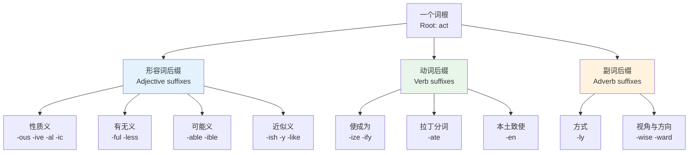
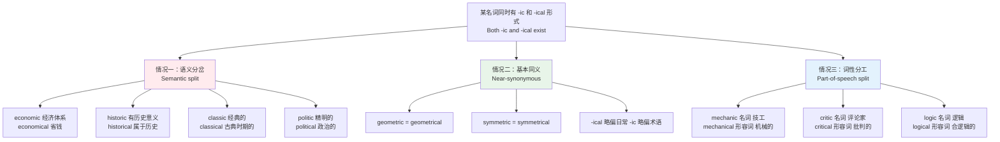
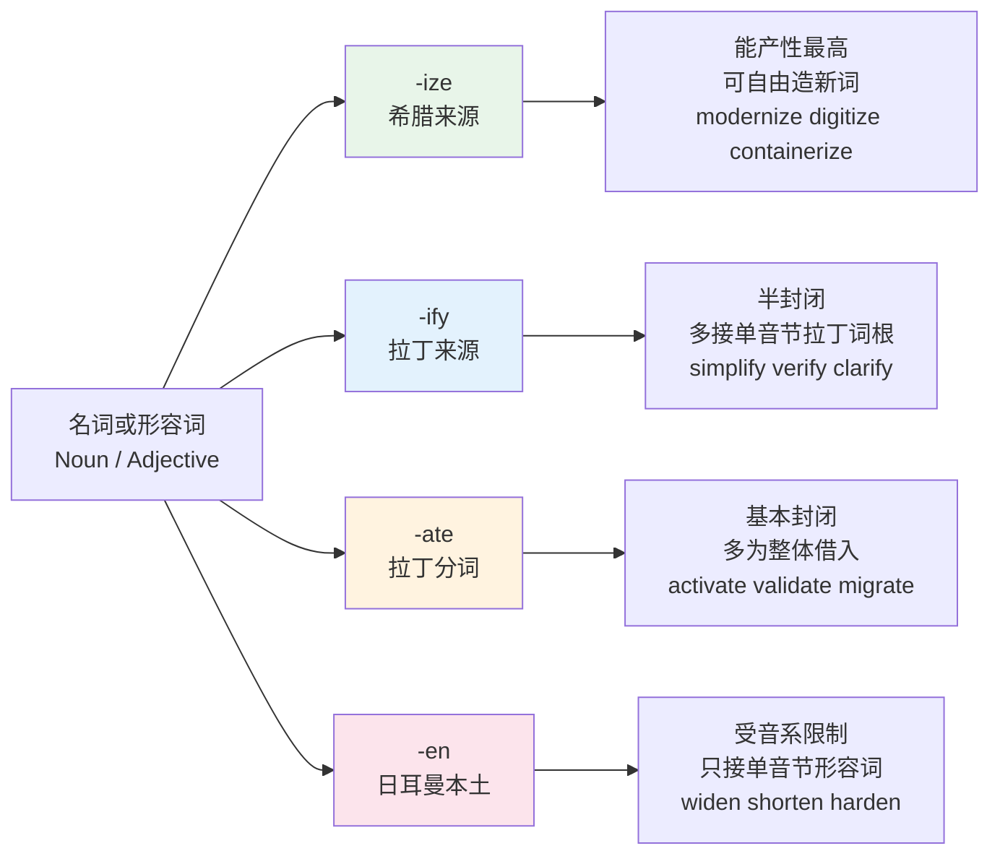
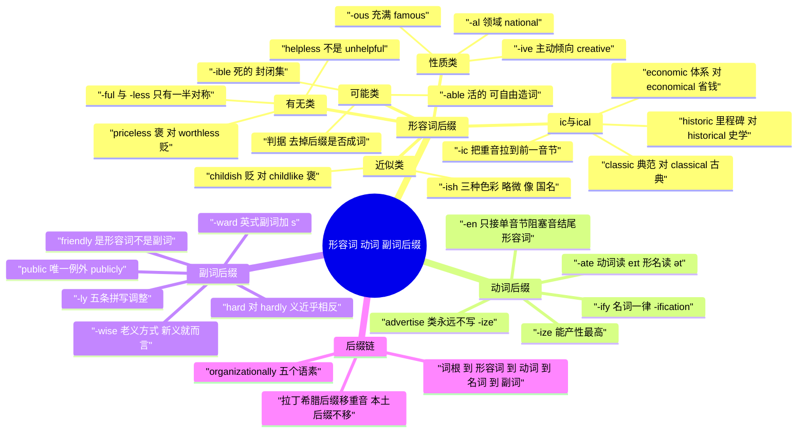

# 形容词、动词与副词后缀

> [!info] 本篇定位
>
> 上一篇 [[14.构词法：前缀与后缀/05.名词后缀家族\|名词后缀家族]] 处理的是「造出一个东西」，本篇处理的是「造出一个性质、一个动作、一个方式」。名词后缀回答「这是什么」，本篇三类后缀分别回答「它怎么样」「拿它干什么」「干得如何」。
>
> 三条主线：形容词后缀九组（`-ous` `-ive` `-al` `-ic` `-ical` `-ful` `-less` `-able` `-ish`）、动词后缀四个（`-ize` `-ify` `-ate` `-en`）、副词后缀三类（`-ly` `-wise` `-ward`）。中间单列一节讲 `-ic` 与 `-ical` 的义项分岔，这是全书唯一把 `economic` 与 `economical`、`historic` 与 `historical`、`classic` 与 `classical` 摆在一起讲透的地方。
>
> 全篇两百余词条。读完能做三件事：看到一个陌生词的词尾就判断它在句子里能不能当定语、能不能被 `very` 修饰；在 `-ic` 和 `-ical` 之间选对那一个；把 `organizationally` 这种五层词拆回词根。

---

## 1. 本篇导读：后缀是词性的开关

前缀改意思，后缀改词性——这是构词法里最省力的一条判断。`happy` 加 `un-` 还是形容词（`unhappy`），加 `-ness` 就变成名词（`happiness`），加 `-ly` 就变成副词（`happily`）。前四篇讲的前缀几乎都不动词性，本篇和上一篇讲的后缀几乎全都动。

对读英文技术文档的人来说，这条规律的实用价值在于：**你不认识一个词，但认识它的词尾，就已经知道它在句子里的角色**。看到 `idempotent` 不知道什么意思，但 `-ent` 告诉你这是形容词，它一定在修饰后面那个名词；看到 `deserialization` 不知道具体做什么，但 `-ation` 告诉你这是个抽象名词，是某个动作的名字，而这个动作就藏在 `deserialize` 里。词尾是免费的语法信息，白拿。

英语的后缀分两批，来源不同，脾气也不同。

| 来源 | 代表后缀 | 接什么词根 | 是否改重音 | 能产性 |
| --- | --- | --- | --- | --- |
| 日耳曼本土层 | -ful、-less、-ish、-y、-en、-ly、-ward | 多接本土短词 | 不改 | 中等 |
| 拉丁法语层 | -ous、-ive、-al、-able、-ify、-ate | 多接拉丁词根 | 部分改 | 高 |
| 希腊层 | -ic、-ize、-ism | 多接希腊拉丁词根 | -ic 强制改 | 极高 |

这张表解释了一个高频困惑：为什么 `widen`（本土）说得通而 `largen`（拉丁词根 large 加本土后缀）说不通。后缀挑词根，本土后缀偏好本土词根，拉丁后缀偏好拉丁词根，混搭虽然存在（`readable` 就是本土 `read` 加拉丁 `-able`），但不是常态。造新词时先看词根的出身，命中率会高很多。



上图把本篇十六个后缀按功能分成三组九类。形容词那一支最庞杂，因为「性质」这件事本身就有很多种说法：可以说充满某种东西（`-ous` `-ful`），可以说倾向做某事（`-ive`），可以说属于某个领域（`-al` `-ic`），可以说缺少某物（`-less`），还可以说有可能被怎么样（`-able`）。动词那一支只有四个，但覆盖了英语里几乎全部的派生动词。副词那一支最简单，`-ly` 一个后缀占了九成以上，剩下的 `-wise` 和 `-ward` 是补丁。

三支之间还有先后顺序，这一点第 13 节会详细讲：动词后缀必须接在名词或形容词之后，副词后缀 `-ly` 永远在最外层。理解了顺序，`institutionalization` 这类长词就不再是一串字母，而是一条可以倒着走回去的链条。

---

## 2. 形容词后缀地图：九组的分工

先把九组形容词后缀的核心义摆开，后面几节再逐组展开。

| 后缀 | 核心义 | 典型词 | 常接词根类型 | 反义或对照后缀 |
| --- | --- | --- | --- | --- |
| -ous | 充满、具有某性质 | famous、dangerous | 抽象名词 | — |
| -ive | 倾向于、有能力做 | active、creative | 拉丁动词分词干 | -ed（被动向） |
| -al | 与……有关的 | national、legal | 名词 | — |
| -ic | 与……有关的（本质属性） | economic、historic | 希腊拉丁名词 | -ical |
| -ical | 与……有关的（具体、日常） | economical、historical | 同上 | -ic |
| -ful | 充满、有 | useful、careful | 具体或抽象名词 | -less |
| -less | 缺少、无 | useless、careless | 名词 | -ful |
| -able | 可被……的 | readable、portable | 及物动词 | -ive（主动向） |
| -ish | 略微、带有……味 | reddish、childish | 形容词、名词 | -like（褒义向） |

这张表里最容易出事的是第 4、5 行和最后一行。`-ic` 与 `-ical` 的分岔单开一节讲；`-ish` 的问题在于它接不同词根时褒贬完全不同：接形容词是「略微」（中性），接名词是「像……那样」（多为贬义），接国名是「某国的」（完全中性）。同一个后缀三种色彩，光靠背单词记不住，得靠分类。

先看一组容易被混淆的近义后缀。同一个词根挂不同后缀，中文译过来可能都是「……的」，英文里却完全不能互换。

| 英文 | 英式音标 | 美式音标 | 词性 | 中文 | 搭配与说明 |
| --- | --- | --- | --- | --- | --- |
| **imaginary** | /ɪˈmædʒɪnəri/ | /ɪˈmædʒəneri/ | adj. | 虚构的、想象出来的 | 说的是「不存在」：an imaginary friend |
| **imaginative** | /ɪˈmædʒɪnətɪv/ | /ɪˈmædʒɪnətɪv/ | adj. | 富有想象力的 | 说的是「人或作品有创造力」 |
| **imaginable** | /ɪˈmædʒɪnəbl/ | /ɪˈmædʒɪnəbl/ | adj. | 可想象的 | 常配最高级：the worst outcome imaginable |
| **economic** | /ˌiːkəˈnɒmɪk/ | /ˌekəˈnɑːmɪk/ | adj. | 经济的（学科与体系） | economic growth、economic policy |
| **economical** | /ˌiːkəˈnɒmɪkl/ | /ˌekəˈnɑːmɪkl/ | adj. | 省钱的、节约的 | economical car、economical with words |
| **sensitive** | /ˈsensətɪv/ | /ˈsensətɪv/ | adj. | 敏感的 | 数据、皮肤、话题都能用 |
| **sensible** | /ˈsensəbl/ | /ˈsensəbl/ | adj. | 明智的、通情理的 | a sensible decision，不是「敏感」 |
| **sensual** | /ˈsenʃuəl/ | /ˈsenʃuəl/ | adj. | 感官的、肉欲的 | 语域偏文学，慎用 |
| **industrial** | /ɪnˈdʌstriəl/ | /ɪnˈdʌstriəl/ | adj. | 工业的 | industrial revolution |
| **industrious** | /ɪnˈdʌstriəs/ | /ɪnˈdʌstriəs/ | adj. | 勤奋的 | 说人，正式度高于 hard-working |
| **historic** | /hɪˈstɒrɪk/ | /hɪˈstɔːrɪk/ | adj. | 有历史意义的 | a historic victory（值得载入史册） |
| **historical** | /hɪˈstɒrɪkl/ | /hɪˈstɔːrɪkl/ | adj. | 历史上的、史学的 | historical records（属于历史的） |

> [!warning] 同根不同尾，中文译名会骗人
>
> 上表六组词，中英词典的译文往往只差一两个字，实际用法差得很远。`sensitive` 和 `sensible` 是其中最坑的一对：中文都可以译成「感觉」相关，但 `He is sensible` 说的是这人明事理，`He is sensitive` 说的是这人容易受伤。写邮件的时候用错，评价方向直接反了。
>
> `imaginary` 和 `imaginative` 同理。`an imaginary solution` 是「根本不存在的方案」，`an imaginative solution` 是「有创意的方案」。

---

## 3. -ous 家族：充满某种性质

`-ous` 来自拉丁语的 `-osus`，本义是「充满……的」。接上抽象名词，得到一个描述性质的形容词。它有四个变体，全靠前面的音来决定用哪个。

| 变体 | 出现条件 | 读音 | 例词 |
| --- | --- | --- | --- |
| -ous | 默认形式 | /əs/ | famous、nervous、jealous |
| -ious | 词根以 -y 或 -ion 结尾 | /iəs/ 或 /ʃəs/ | glory→glorious、caution→cautious |
| -eous | 词根以 -ge、-ce 结尾需保软音 | /iəs/ 或 /dʒəs/ | courage→courageous、advantage→advantageous |
| -uous | 词根含 -u- 词干 | /juəs/ | continue→continuous、virtue→virtuous |

拼写调整有三条固定规则。词根以 `-y` 结尾时 `y` 变 `i`：`glory → glorious`、`fury → furious`、`vary → various`、`envy → envious`。词根以 `-ge` 或 `-ce` 结尾且要保住 `/dʒ/ /s/` 音时，`e` 必须留着：`courage → courageous`、`outrage → outrageous`、`advantage → advantageous`。词根以不发音的 `-e` 结尾且不涉及软音时，`e` 去掉：`fame → famous`、`nerve → nervous`、`adventure → adventurous`。

| 英文 | 英式音标 | 美式音标 | 词性 | 中文 | 搭配与说明 |
| --- | --- | --- | --- | --- | --- |
| **famous** | /ˈfeɪməs/ | /ˈfeɪməs/ | adj. | 著名的 | famous for（因某事出名）、famous as（作为某身份出名） |
| **dangerous** | /ˈdeɪndʒərəs/ | /ˈdeɪndʒərəs/ | adj. | 危险的 | it is dangerous to do sth |
| **nervous** | /ˈnɜːvəs/ | /ˈnɜːrvəs/ | adj. | 紧张的；神经的 | nervous about、the nervous system |
| **various** | /ˈveəriəs/ | /ˈveriəs/ | adj. | 各种各样的 | 只作定语，不说 the reasons are various |
| **curious** | /ˈkjʊəriəs/ | /ˈkjʊriəs/ | adj. | 好奇的；奇怪的 | curious about sth；a curious remark 是「怪」 |
| **obvious** | /ˈɒbviəs/ | /ˈɑːbviəs/ | adj. | 明显的 | it is obvious that 从句 |
| **previous** | /ˈpriːviəs/ | /ˈpriːviəs/ | adj. | 之前的 | previous to = before，正式 |
| **envious** | /ˈenviəs/ | /ˈenviəs/ | adj. | 羡慕的、嫉妒的 | envious of sb |
| **tedious** | /ˈtiːdiəs/ | /ˈtiːdiəs/ | adj. | 冗长乏味的 | 常修饰 process、meeting、task |
| **anxious** | /ˈæŋkʃəs/ | /ˈæŋkʃəs/ | adj. | 焦虑的；急切的 | anxious about（担忧）、anxious to do（急于） |
| **cautious** | /ˈkɔːʃəs/ | /ˈkɔːʃəs/ | adj. | 谨慎的 | cautious about、a cautious estimate |
| **ambitious** | /æmˈbɪʃəs/ | /æmˈbɪʃəs/ | adj. | 有野心的；宏大的 | an ambitious plan 是褒义 |
| **suspicious** | /səˈspɪʃəs/ | /səˈspɪʃəs/ | adj. | 可疑的；起疑的 | suspicious of sb（自己怀疑别人） |
| **precious** | /ˈpreʃəs/ | /ˈpreʃəs/ | adj. | 珍贵的 | precious metal、precious time |
| **nutritious** | /njuːˈtrɪʃəs/ | /nuːˈtrɪʃəs/ | adj. | 有营养的 | 修饰食物，不修饰人 |
| **infectious** | /ɪnˈfekʃəs/ | /ɪnˈfekʃəs/ | adj. | 传染性的；有感染力的 | infectious disease；infectious laughter |
| **courageous** | /kəˈreɪdʒəs/ | /kəˈreɪdʒəs/ | adj. | 勇敢的 | 比 brave 正式，含道德褒扬 |
| **gorgeous** | /ˈɡɔːdʒəs/ | /ˈɡɔːrdʒəs/ | adj. | 极美的 | 口语强化词，语域偏随意 |
| **advantageous** | /ˌædvənˈteɪdʒəs/ | /ˌædvənˈteɪdʒəs/ | adj. | 有利的 | advantageous to sb |
| **spontaneous** | /spɒnˈteɪniəs/ | /spɑːnˈteɪniəs/ | adj. | 自发的、即兴的 | spontaneous applause、spontaneous decision |
| **simultaneous** | /ˌsɪmlˈteɪniəs/ | /ˌsaɪmlˈteɪniəs/ | adj. | 同时的 | 英美首音节元音不同，技术会议常听到 |
| **continuous** | /kənˈtɪnjuəs/ | /kənˈtɪnjuəs/ | adj. | 连续不断的 | 对照 continual（反复但有间断） |
| **ambiguous** | /æmˈbɪɡjuəs/ | /æmˈbɪɡjuəs/ | adj. | 有歧义的、模棱两可的 | 技术文档高频：an ambiguous spec |
| **conspicuous** | /kənˈspɪkjuəs/ | /kənˈspɪkjuəs/ | adj. | 显眼的 | conspicuous by its absence（明显缺席） |
| **strenuous** | /ˈstrenjuəs/ | /ˈstrenjuəs/ | adj. | 费力的；激烈的 | strenuous exercise、strenuous objection |
| **hazardous** | /ˈhæzədəs/ | /ˈhæzərdəs/ | adj. | 有危害的 | hazardous waste、hazardous materials |
| **humorous** | /ˈhjuːmərəs/ | /ˈhjuːmərəs/ | adj. | 幽默的 | 注意拼写：humour → humorous，u 掉一个 |
| **vigorous** | /ˈvɪɡərəs/ | /ˈvɪɡərəs/ | adj. | 精力充沛的；强有力的 | vigorous debate、vigorous growth |
| **generous** | /ˈdʒenərəs/ | /ˈdʒenərəs/ | adj. | 慷慨的；丰厚的 | generous with money、a generous portion |
| **numerous** | /ˈnjuːmərəs/ | /ˈnuːmərəs/ | adj. | 众多的 | 只作定语，比 many 正式 |
| **rigorous** | /ˈrɪɡərəs/ | /ˈrɪɡərəs/ | adj. | 严格的、严谨的 | rigorous testing、rigorous proof |
| **prosperous** | /ˈprɒspərəs/ | /ˈprɑːspərəs/ | adj. | 繁荣的 | 修饰国家、地区、时期 |
| **treacherous** | /ˈtretʃərəs/ | /ˈtretʃərəs/ | adj. | 背叛的；暗藏危险的 | treacherous roads（路面凶险） |
| **monotonous** | /məˈnɒtənəs/ | /məˈnɑːtənəs/ | adj. | 单调的 | monotonous voice、monotonous work |
| **anonymous** | /əˈnɒnɪməs/ | /əˈnɑːnɪməs/ | adj. | 匿名的 | anonymous function 是编程术语 |
| **synonymous** | /sɪˈnɒnɪməs/ | /sɪˈnɑːnɪməs/ | adj. | 同义的；等同于 | be synonymous with sth |
| **notorious** | /nəʊˈtɔːriəs/ | /noʊˈtɔːriəs/ | adj. | 臭名昭著的 | 只用贬义，notorious for sth |
| **luxurious** | /lʌɡˈʒʊəriəs/ | /lʌɡˈʒʊriəs/ | adj. | 奢华的 | 对照 luxuriant（草木茂盛） |
| **glorious** | /ˈɡlɔːriəs/ | /ˈɡlɔːriəs/ | adj. | 光荣的；灿烂的 | a glorious day 也可指天气极好 |

> [!tip] -ous 词的重音落点
>
> `-ous` 本身不带重音，加上它之后原词重音也基本不动：`ˈdanger → ˈdangerous`、`ˈhumour → ˈhumorous`。但 `-ious` `-eous` `-uous` 不一样，重音固定落在紧挨着后缀的那个音节上：`ad-van-TA-geous`、`spon-TA-neous`、`am-BI-guous`、`con-SPI-cuous`。
>
> 记法是「贴着后缀往左挪一格」：`courageous` 盖住 `-geous`，左边第一格是 `ra`，重音就在 `ra`；`glorious` 盖住 `-rious` 剩 `glo`，重音在 `glo`；`notorious` 盖住 `-rious` 剩 `no-to`，重音在 `to`。这条规律对绝大多数 `-ious/-eous/-uous` 词成立，可以当默认值先读出来。

---

## 4. -ive：主动倾向与功能

`-ive` 接在拉丁动词的分词词干上，得到「倾向做某事的」「有某种功能的」形容词。它的语义方向是**主动**：`creative` 是「会创造的」不是「被创造的」，`destructive` 是「会破坏的」不是「被破坏的」。这一点跟 `-able`（被动方向）正好互补，也跟 `-ed` 分词形容词（被动方向）互补。

拼写的落点是拉丁分词干，不是现代英语的动词形。分词干以 `-t` 结尾的直接加 `-ive`（`act → active`、`select → selective`）；现代动词以 `-de` `-d` 结尾的，分词干把 `d` 换成 `s`（`decide → decisive`、`persuade → persuasive`、`explode → explosive`）；还有一批词的分词干跟现代动词形差得更远，`produce` 的分词干是 `product-`，所以是 `productive` 而不是 `*produceive`。这类换写不是英语内部规则，是拉丁语分词干直接借来的形态，只能按词记。

| 英文 | 英式音标 | 美式音标 | 词性 | 中文 | 搭配与说明 |
| --- | --- | --- | --- | --- | --- |
| **active** | /ˈæktɪv/ | /ˈæktɪv/ | adj. | 活跃的；主动的 | take an active role、an active user |
| **creative** | /kriˈeɪtɪv/ | /kriˈeɪtɪv/ | adj. | 有创造力的 | creative thinking；名词化 the creatives 指创意人员 |
| **effective** | /ɪˈfektɪv/ | /ɪˈfektɪv/ | adj. | 有效的；生效的 | effective from Monday（自周一生效） |
| **attractive** | /əˈtræktɪv/ | /əˈtræktɪv/ | adj. | 有吸引力的 | an attractive offer 不只指人 |
| **massive** | /ˈmæsɪv/ | /ˈmæsɪv/ | adj. | 巨大的 | massive outage、massive rewrite |
| **passive** | /ˈpæsɪv/ | /ˈpæsɪv/ | adj. | 被动的 | passive voice、passive income |
| **extensive** | /ɪkˈstensɪv/ | /ɪkˈstensɪv/ | adj. | 广泛的、大范围的 | extensive testing、extensive damage |
| **intensive** | /ɪnˈtensɪv/ | /ɪnˈtensɪv/ | adj. | 密集的、高强度的 | CPU-intensive、an intensive course |
| **comprehensive** | /ˌkɒmprɪˈhensɪv/ | /ˌkɑːmprɪˈhensɪv/ | adj. | 全面的 | a comprehensive review，不是「可理解的」 |
| **expensive** | /ɪkˈspensɪv/ | /ɪkˈspensɪv/ | adj. | 昂贵的 | 修饰东西不修饰价格：不说 expensive price |
| **productive** | /prəˈdʌktɪv/ | /prəˈdʌktɪv/ | adj. | 高产的；富有成效的 | a productive meeting |
| **destructive** | /dɪˈstrʌktɪv/ | /dɪˈstrʌktɪv/ | adj. | 破坏性的 | destructive testing 是术语 |
| **descriptive** | /dɪˈskrɪptɪv/ | /dɪˈskrɪptɪv/ | adj. | 描写的、描述性的 | 语言学与规范文档常用 |
| **prescriptive** | /prɪˈskrɪptɪv/ | /prɪˈskrɪptɪv/ | adj. | 规定性的 | 与 descriptive 成对出现 |
| **cognitive** | /ˈkɒɡnətɪv/ | /ˈkɑːɡnətɪv/ | adj. | 认知的 | cognitive load、cognitive bias |
| **decisive** | /dɪˈsaɪsɪv/ | /dɪˈsaɪsɪv/ | adj. | 决定性的；果断的 | a decisive factor；a decisive leader |
| **persuasive** | /pəˈsweɪsɪv/ | /pərˈsweɪsɪv/ | adj. | 有说服力的 | a persuasive argument |
| **innovative** | /ˈɪnəvətɪv/ | /ˈɪnəveɪtɪv/ | adj. | 创新的 | 英美第三音节读音不同 |
| **competitive** | /kəmˈpetətɪv/ | /kəmˈpetətɪv/ | adj. | 有竞争力的；好胜的 | a competitive salary |
| **repetitive** | /rɪˈpetətɪv/ | /rɪˈpetətɪv/ | adj. | 重复的 | repetitive strain injury |
| **sensitive** | /ˈsensətɪv/ | /ˈsensətɪv/ | adj. | 敏感的 | sensitive data、sensitive to light |
| **alternative** | /ɔːlˈtɜːnətɪv/ | /ɔːlˈtɜːrnətɪv/ | adj./n. | 替代的；替代方案 | an alternative to sth |
| **conservative** | /kənˈsɜːvətɪv/ | /kənˈsɜːrvətɪv/ | adj. | 保守的 | a conservative estimate（保守估计） |
| **talkative** | /ˈtɔːkətɪv/ | /ˈtɔːkətɪv/ | adj. | 健谈的、话多的 | 少见的本土词根配 -ive |
| **administrative** | /ədˈmɪnɪstrətɪv/ | /ədˈmɪnɪstreɪtɪv/ | adj. | 行政的、管理的 | administrative overhead |
| **cumulative** | /ˈkjuːmjələtɪv/ | /ˈkjuːmjəleɪtɪv/ | adj. | 累积的 | cumulative effect、cumulative total |
| **exhaustive** | /ɪɡˈzɔːstɪv/ | /ɪɡˈzɔːstɪv/ | adj. | 详尽无遗的 | an exhaustive list |
| **exhausting** | /ɪɡˈzɔːstɪŋ/ | /ɪɡˈzɔːstɪŋ/ | adj. | 令人筋疲力尽的 | 与上一个只差一个后缀，义完全不同 |
| **objective** | /əbˈdʒektɪv/ | /əbˈdʒektɪv/ | adj./n. | 客观的；目标 | 名动形三用，注意语境 |
| **subjective** | /səbˈdʒektɪv/ | /səbˈdʒektɪv/ | adj. | 主观的 | 与 objective 成对 |

> [!warning] exhaustive 与 exhausting 不能互换
>
> 这两个词共用词根 `exhaust`（耗尽），但方向相反。
>
> - ❌ ~~The list is exhausting.~~（想说「清单很详尽」时错）
> - ✅ **The list is exhaustive.**（清单详尽，把可能项都列全了）
> - ✅ **The meeting was exhausting.**（会开得人筋疲力尽）
>
> 同类的还有 `comprehensive`（全面的）与 `comprehensible`（可理解的）。前者说覆盖面，后者说难易度。技术文档写 `a comprehensive guide` 是「完整指南」，写 `a comprehensible guide` 是「看得懂的指南」，评价维度完全不同。

---

## 5. -al 与 -ial：与某个领域有关

`-al` 是英语里最高产的形容词后缀之一，功能单一得近乎机械：接一个名词，得到「与这个名词有关的」。`nation → national`、`culture → cultural`、`region → regional`，几乎没有例外的语义漂移。

它的变体 `-ial` 出现在词根以 `-ce` `-t` `-y` 结尾时：`finance → financial`、`commerce → commercial`、`president → presidential`、`industry → industrial`、`benefit → beneficial`。这类词的 `-ial` 常读成 `/ʃl/` 或 `/ʃəl/`，是听力里的高频弱读点。

拼写上要注意三处。词根以不发音 `-e` 结尾时去 `e`：`nature → natural`（这一个还多了音变）、`culture → cultural`、`centre/center → central`。词根以 `-y` 结尾时 `y` 变 `i`：`industry → industrial`、`ceremony → ceremonial`。词根本身以 `-ion` 结尾时直接加：`nation → national`、`option → optional`、`function → functional`、`condition → conditional`。

| 英文 | 英式音标 | 美式音标 | 词性 | 中文 | 搭配与说明 |
| --- | --- | --- | --- | --- | --- |
| **national** | /ˈnæʃnəl/ | /ˈnæʃnəl/ | adj. | 国家的、全国的 | 中间的 io 弱化消失，不读三音节 |
| **personal** | /ˈpɜːsənl/ | /ˈpɜːrsənl/ | adj. | 个人的 | 对照 personnel（人事部门，重音在末） |
| **central** | /ˈsentrəl/ | /ˈsentrəl/ | adj. | 中心的；关键的 | central to sth（对某事至关重要） |
| **global** | /ˈɡləʊbl/ | /ˈɡloʊbl/ | adj. | 全球的；全局的 | 编程里 global variable 是「全局变量」 |
| **legal** | /ˈliːɡl/ | /ˈliːɡl/ | adj. | 法律的；合法的 | 两义并存，看搭配区分 |
| **fatal** | /ˈfeɪtl/ | /ˈfeɪtl/ | adj. | 致命的 | a fatal error 是「不可恢复的错误」 |
| **brutal** | /ˈbruːtl/ | /ˈbruːtl/ | adj. | 残酷的；直白得刺人 | brutal honesty |
| **crucial** | /ˈkruːʃl/ | /ˈkruːʃl/ | adj. | 至关重要的 | crucial to/for sth |
| **financial** | /faɪˈnænʃl/ | /faɪˈnænʃl/ | adj. | 财务的、金融的 | financial year 英美起止月份不同 |
| **commercial** | /kəˈmɜːʃl/ | /kəˈmɜːrʃl/ | adj./n. | 商业的；广告片 | 名词义在美式口语里高频 |
| **essential** | /ɪˈsenʃl/ | /ɪˈsenʃl/ | adj./n. | 必需的；要点 | the essentials 指基本要素 |
| **residential** | /ˌrezɪˈdenʃl/ | /ˌrezɪˈdenʃl/ | adj. | 住宅的 | residential area 对照 commercial area |
| **industrial** | /ɪnˈdʌstriəl/ | /ɪnˈdʌstriəl/ | adj. | 工业的 | industrial-strength 表示「工业级、够硬」 |
| **initial** | /ɪˈnɪʃl/ | /ɪˈnɪʃl/ | adj./n. | 最初的；首字母 | initials 复数指姓名缩写 |
| **marginal** | /ˈmɑːdʒɪnl/ | /ˈmɑːrdʒɪnl/ | adj. | 边缘的；微小的 | a marginal improvement |
| **optional** | /ˈɒpʃənl/ | /ˈɑːpʃənl/ | adj. | 可选的 | 接口文档标注常用，对照 required |
| **structural** | /ˈstrʌktʃərəl/ | /ˈstrʌktʃərəl/ | adj. | 结构的、结构性的 | a structural problem |
| **functional** | /ˈfʌŋkʃənl/ | /ˈfʌŋkʃənl/ | adj. | 功能的；能正常运作的 | functional testing；the lift is functional |
| **conditional** | /kənˈdɪʃənl/ | /kənˈdɪʃənl/ | adj. | 有条件的 | conditional on sth |
| **occasional** | /əˈkeɪʒnəl/ | /əˈkeɪʒnəl/ | adj. | 偶尔的 | 只作定语：an occasional glitch |
| **universal** | /ˌjuːnɪˈvɜːsl/ | /ˌjuːnɪˈvɜːrsl/ | adj. | 普遍的、通用的 | universal truth、universal support |
| **environmental** | /ɪnˌvaɪrənˈmentl/ | /ɪnˌvaɪrənˈmentl/ | adj. | 环境的 | 注意中间的 n 常被漏读漏写 |
| **experimental** | /ɪkˌsperɪˈmentl/ | /ɪkˌsperɪˈmentl/ | adj. | 实验性的 | 软件版本标注常用 |
| **incremental** | /ˌɪŋkrəˈmentl/ | /ˌɪŋkrəˈmentl/ | adj. | 增量的 | incremental build、incremental change |
| **accidental** | /ˌæksɪˈdentl/ | /ˌæksɪˈdentl/ | adj. | 偶然的、意外的 | accidental complexity 是软件术语 |
| **beneficial** | /ˌbenɪˈfɪʃl/ | /ˌbenɪˈfɪʃl/ | adj. | 有益的 | beneficial to sb/sth |
| **artificial** | /ˌɑːtɪˈfɪʃl/ | /ˌɑːrtɪˈfɪʃl/ | adj. | 人工的、人造的 | artificial intelligence |
| **substantial** | /səbˈstænʃl/ | /səbˈstænʃl/ | adj. | 大量的、实质性的 | a substantial increase |
| **potential** | /pəˈtenʃl/ | /pəˈtenʃl/ | adj./n. | 潜在的；潜力 | a potential risk；has potential |
| **proportional** | /prəˈpɔːʃənl/ | /prəˈpɔːrʃənl/ | adj. | 成比例的 | proportional to sth |

`-al` 还有一个容易忽略的功能：把已经是形容词的词再形容词化，或者把某些名词直接兼作名词。`professional`、`original`、`individual`、`terminal`、`manual`、`signal`、`journal` 这批词形名两用，句子里靠冠词和位置区分。看到 `a professional` 是名词（专业人士），看到 `professional advice` 是形容词。

---

## 6. -ic 与 -ical：本篇最值得单列的一组

同一个名词后面既能加 `-ic` 又能加 `-ical`，这在英语里有几十组。三种情况：完全同义只是语域不同、语义已经分岔、只存在其中一个。第二类是真正的坑。



上图给出三条分支。真正要背的只有第一条：这批词的两个形式意思已经完全岔开，用错就是硬伤。第三条其实不算难题——`mechanic` `critic` `logic` 这些 `-ic` 形式压根就是名词，跟形容词不在同一个赛道上，句法位置一看就能分开。第二条最省心，两个形式随便挑，唯一的倾向是学术论文里 `-ic` 出现得多一点。

### 6.1 语义分岔的核心组

| 英文 | 英式音标 | 美式音标 | 词性 | 中文 | 搭配与说明 |
| --- | --- | --- | --- | --- | --- |
| **economic** | /ˌiːkəˈnɒmɪk/ | /ˌekəˈnɑːmɪk/ | adj. | 经济的（学科、体系、宏观） | economic growth、economic sanctions |
| **economical** | /ˌiːkəˈnɒmɪkl/ | /ˌekəˈnɑːmɪkl/ | adj. | 节约的、划算的 | an economical solution、economical with the truth |
| **historic** | /hɪˈstɒrɪk/ | /hɪˈstɔːrɪk/ | adj. | 有历史意义的、里程碑式的 | a historic agreement |
| **historical** | /hɪˈstɒrɪkl/ | /hɪˈstɔːrɪkl/ | adj. | 历史上的、史学的 | historical data、historical fiction |
| **classic** | /ˈklæsɪk/ | /ˈklæsɪk/ | adj./n. | 典范的、最典型的；名著 | a classic mistake、a classic novel |
| **classical** | /ˈklæsɪkl/ | /ˈklæsɪkl/ | adj. | 古典的（希腊罗马、古典乐） | classical music、classical physics |
| **electric** | /ɪˈlektrɪk/ | /ɪˈlektrɪk/ | adj. | 用电的、带电的 | an electric car、an electric shock |
| **electrical** | /ɪˈlektrɪkl/ | /ɪˈlektrɪkl/ | adj. | 与电有关的（领域、专业） | electrical engineering、electrical fault |
| **politic** | /ˈpɒlətɪk/ | /ˈpɑːlətɪk/ | adj. | 精明的、明智得体的 | 罕用，多见于 it would be politic to |
| **political** | /pəˈlɪtɪkl/ | /pəˈlɪtɪkl/ | adj. | 政治的 | political party、office politics 用名词 |
| **comic** | /ˈkɒmɪk/ | /ˈkɑːmɪk/ | adj./n. | 喜剧的；漫画 | comic relief；a comic book |
| **comical** | /ˈkɒmɪkl/ | /ˈkɑːmɪkl/ | adj. | 滑稽可笑的（常带贬义） | a comical attempt 是「笨拙得好笑」 |
| **magic** | /ˈmædʒɪk/ | /ˈmædʒɪk/ | adj./n. | 魔法的；魔法 | a magic number 是编程贬义术语 |
| **magical** | /ˈmædʒɪkl/ | /ˈmædʒɪkl/ | adj. | 神奇美妙的 | a magical evening，情感褒义 |
| **graphic** | /ˈɡræfɪk/ | /ˈɡræfɪk/ | adj. | 图形的；描述得极生动 | graphic design；graphic violence |
| **graphical** | /ˈɡræfɪkl/ | /ˈɡræfɪkl/ | adj. | 图形界面的、用图表示的 | graphical user interface |
| **mechanic** | /məˈkænɪk/ | /məˈkænɪk/ | n. | 技工、机修工 | 只作名词，复数 mechanics 又指力学 |
| **mechanical** | /məˈkænɪkl/ | /məˈkænɪkl/ | adj. | 机械的；机械式的 | a mechanical response（不走心的回答） |

判断口诀可以简化成一句：**谈体系、谈领域、谈里程碑用 `-ic`，谈日常评价、谈具体属性用 `-ical`**。谈国家 GDP 是 `economic`，说这辆车省油是 `economical`。这条口诀对上表大部分成对词成立，`electric` 与 `electrical` 这一对要反过来记：用电的具体设备是 `electric`，与电有关的学科与专业是 `electrical`。

> [!warning] 三对最常错的
>
> **economic / economical**
>
> - ✅ **The economic outlook is uncertain.**（宏观经济前景不明）
> - ✅ **This car is very economical.**（这车很省油）
> - ❌ ~~The economical outlook is uncertain.~~（说成「省钱的前景」）
>
> **historic / historical**
>
> - ✅ **The signing was a historic moment.**（签约是历史性时刻）
> - ✅ **We restored the historical records.**（我们修复了历史档案）
> - ❌ ~~We restored the historic records.~~（把普通旧档案说成「载入史册的档案」）
>
> **classic / classical**
>
> - ✅ **That's a classic bug in concurrent code.**（并发代码里的典型 bug）
> - ✅ **She studies classical literature.**（她研究古典文学）
> - ❌ ~~That's a classical bug.~~（听起来像「古希腊时期的 bug」）

### 6.2 只有一个形式的常见词

大量 `-ic` 词根本没有 `-ical` 形式，反之亦然。硬造一个出来是中国学习者的高频错误。

只有 `-ic` 形式的一批：

| 英文 | 英式音标 | 美式音标 | 词性 | 中文 | 搭配与说明 |
| --- | --- | --- | --- | --- | --- |
| **specific** | /spəˈsɪfɪk/ | /spəˈsɪfɪk/ | adj. | 具体的、特定的 | 无 specifical 一形 |
| **basic** | /ˈbeɪsɪk/ | /ˈbeɪsɪk/ | adj. | 基本的 | 名词复数 basics 指基础知识 |
| **domestic** | /dəˈmestɪk/ | /dəˈmestɪk/ | adj. | 国内的；家用的 | domestic flight、domestic appliance |
| **dramatic** | /drəˈmætɪk/ | /drəˈmætɪk/ | adj. | 剧烈的；戏剧的 | a dramatic drop in traffic |
| **automatic** | /ˌɔːtəˈmætɪk/ | /ˌɔːtəˈmætɪk/ | adj. | 自动的 | 副词 automatically 加 -ally |
| **realistic** | /ˌriːəˈlɪstɪk/ | /ˌriːəˈlɪstɪk/ | adj. | 现实的、务实的 | a realistic timeline |
| **systematic** | /ˌsɪstəˈmætɪk/ | /ˌsɪstəˈmætɪk/ | adj. | 系统性的 | 对照 systemic（整个系统层面的） |
| **chronic** | /ˈkrɒnɪk/ | /ˈkrɑːnɪk/ | adj. | 慢性的、长期的 | chronic shortage、chronic pain |
| **ironic** | /aɪˈrɒnɪk/ | /aɪˈrɑːnɪk/ | adj. | 讽刺的 | 名词 irony 重音在首 |
| **generic** | /dʒəˈnerɪk/ | /dʒəˈnerɪk/ | adj. | 通用的；泛型的 | generic type 是编程术语 |
| **atomic** | /əˈtɒmɪk/ | /əˈtɑːmɪk/ | adj. | 原子的；不可分割的 | an atomic operation |
| **academic** | /ˌækəˈdemɪk/ | /ˌækəˈdemɪk/ | adj./n. | 学术的；纯理论的 | it's academic 意为「说了也没用」 |
| **energetic** | /ˌenəˈdʒetɪk/ | /ˌenərˈdʒetɪk/ | adj. | 精力充沛的 | 名词 energy 重音在首 |
| **strategic** | /strəˈtiːdʒɪk/ | /strəˈtiːdʒɪk/ | adj. | 战略的 | 名词 strategy 重音在首 |
| **synthetic** | /sɪnˈθetɪk/ | /sɪnˈθetɪk/ | adj. | 合成的、人造的 | synthetic data、synthetic fibre |

只有 `-ical` 形式的一批：

| 英文 | 英式音标 | 美式音标 | 词性 | 中文 | 搭配与说明 |
| --- | --- | --- | --- | --- | --- |
| **critical** | /ˈkrɪtɪkl/ | /ˈkrɪtɪkl/ | adj. | 关键的；批判的 | critical path；critical of sb |
| **practical** | /ˈpræktɪkl/ | /ˈpræktɪkl/ | adj. | 实际的、可行的 | for all practical purposes |
| **typical** | /ˈtɪpɪkl/ | /ˈtɪpɪkl/ | adj. | 典型的 | typical of sb/sth |
| **medical** | /ˈmedɪkl/ | /ˈmedɪkl/ | adj. | 医疗的 | medical records |
| **chemical** | /ˈkemɪkl/ | /ˈkemɪkl/ | adj./n. | 化学的；化学品 | 名动形都靠位置区分 |
| **physical** | /ˈfɪzɪkl/ | /ˈfɪzɪkl/ | adj. | 物理的；身体的 | physical layer、physical health |
| **radical** | /ˈrædɪkl/ | /ˈrædɪkl/ | adj./n. | 根本的；激进的 | a radical rewrite |
| **vertical** | /ˈvɜːtɪkl/ | /ˈvɜːrtɪkl/ | adj. | 垂直的 | 反义 horizontal |
| **identical** | /aɪˈdentɪkl/ | /aɪˈdentɪkl/ | adj. | 完全相同的 | identical to/with sth |
| **hierarchical** | /ˌhaɪəˈrɑːkɪkl/ | /ˌhaɪəˈrɑːrkɪkl/ | adj. | 分层的、有层级的 | a hierarchical structure |
| **alphabetical** | /ˌælfəˈbetɪkl/ | /ˌælfəˈbetɪkl/ | adj. | 按字母顺序的 | in alphabetical order |
| **numerical** | /njuːˈmerɪkl/ | /nuːˈmerɪkl/ | adj. | 数值的 | numerical value、numerical order |
| **theoretical** | /ˌθɪəˈretɪkl/ | /ˌθiːəˈretɪkl/ | adj. | 理论上的 | 对照 practical |
| **canonical** | /kəˈnɒnɪkl/ | /kəˈnɑːnɪkl/ | adj. | 规范的、标准的 | the canonical URL |
| **surgical** | /ˈsɜːdʒɪkl/ | /ˈsɜːrdʒɪkl/ | adj. | 外科的；精准的 | a surgical fix（精准修复） |

> [!tip] -ic 会把重音拉到自己前面一个音节
>
> 这是 `-ic` 最有用的一条附带规律，对听力和口语都管用。加上 `-ic` 之后，重音必定落在 `-ic` 前面那个音节上，不管原词重音在哪。
>
> ```text
> ˈatom        →  aˈtomic
> ˈphotograph  →  photoˈgraphic
> eˈconomy     →  ecoˈnomic
> ˈstrategy    →  straˈtegic
> ˈsymbol      →  symˈbolic
> ˈperiod      →  periˈodic
> ˈscience     →  scienˈtific
> ```
>
> 加 `-ical` 时重音位置跟 `-ic` 一样，因为 `-al` 不再动重音。所以 `ecoˈnomic` 与 `ecoˈnomical` 重音同位。这条规律的完整版见 [[01.词汇入门与学习方法/03.音标、词重音与词典读音体例\|音标、词重音与词典读音体例]]。

---

## 7. -ful 与 -less：看着对称，其实不对称

`-ful` 和 `-less` 都是日耳曼本土后缀，前者从 `full` 来，后者从古英语 `lēas`（缺少）来。教科书常把它们当成一对反义后缀，但真实语言里这一对只有一半对称。

先看确实对称的那一半：

| 英文 | 英式音标 | 美式音标 | 词性 | 中文 | 搭配与说明 |
| --- | --- | --- | --- | --- | --- |
| **careful** | /ˈkeəfl/ | /ˈkerfl/ | adj. | 小心的 | be careful with sth / of sth |
| **careless** | /ˈkeələs/ | /ˈkerləs/ | adj. | 粗心的 | a careless mistake |
| **useful** | /ˈjuːsfl/ | /ˈjuːsfl/ | adj. | 有用的 | useful for/to sb |
| **useless** | /ˈjuːsləs/ | /ˈjuːsləs/ | adj. | 无用的 | 语气比 not useful 强得多 |
| **powerful** | /ˈpaʊəfl/ | /ˈpaʊərfl/ | adj. | 强有力的 | 修饰机器、论点、人 |
| **powerless** | /ˈpaʊələs/ | /ˈpaʊərləs/ | adj. | 无能为力的 | powerless to do sth |
| **meaningful** | /ˈmiːnɪŋfl/ | /ˈmiːnɪŋfl/ | adj. | 有意义的 | meaningful difference（统计学常用） |
| **meaningless** | /ˈmiːnɪŋləs/ | /ˈmiːnɪŋləs/ | adj. | 无意义的 | 修饰数据、指标 |
| **harmful** | /ˈhɑːmfl/ | /ˈhɑːrmfl/ | adj. | 有害的 | harmful to sb/sth |
| **harmless** | /ˈhɑːmləs/ | /ˈhɑːrmləs/ | adj. | 无害的 | a harmless joke |
| **fearful** | /ˈfɪəfl/ | /ˈfɪrfl/ | adj. | 害怕的；可怕的 | fearful of sth，语域偏书面 |
| **fearless** | /ˈfɪələs/ | /ˈfɪrləs/ | adj. | 无所畏惧的 | 褒义 |
| **hopeful** | /ˈhəʊpfl/ | /ˈhoʊpfl/ | adj. | 抱有希望的 | hopeful that 从句 |
| **hopeless** | /ˈhəʊpləs/ | /ˈhoʊpləs/ | adj. | 绝望的；差劲的 | I'm hopeless at maths（我数学很烂） |
| **thoughtful** | /ˈθɔːtfl/ | /ˈθɔːtfl/ | adj. | 体贴的；深思的 | a thoughtful gift |
| **thoughtless** | /ˈθɔːtləs/ | /ˈθɔːtləs/ | adj. | 欠考虑的、不体谅人的 | 贬义 |
| **painful** | /ˈpeɪnfl/ | /ˈpeɪnfl/ | adj. | 疼痛的；令人痛苦的 | a painful migration |
| **painless** | /ˈpeɪnləs/ | /ˈpeɪnləs/ | adj. | 无痛的；轻松的 | a painless upgrade |

现在看不对称的那一半，这才是真正需要记的部分。

### 7.1 只有 -ful 或只有 -less 的

只有 `-ful` 形式、没有对应 `-less` 的：

| 英文 | 英式音标 | 美式音标 | 词性 | 中文 | 搭配与说明 |
| --- | --- | --- | --- | --- | --- |
| **beautiful** | /ˈbjuːtɪfl/ | /ˈbjuːtɪfl/ | adj. | 美丽的 | 没有 beautiless 一形 |
| **successful** | /səkˈsesfl/ | /səkˈsesfl/ | adj. | 成功的 | 反义用 unsuccessful |
| **wonderful** | /ˈwʌndəfl/ | /ˈwʌndərfl/ | adj. | 极好的 | 已完全脱离「充满惊奇」的字面义 |
| **grateful** | /ˈɡreɪtfl/ | /ˈɡreɪtfl/ | adj. | 感激的 | 拼写陷阱：不是 greatful |
| **resourceful** | /rɪˈsɔːsfl/ | /rɪˈsɔːrsfl/ | adj. | 足智多谋的 | 简历与推荐信高频褒义词 |
| **delightful** | /dɪˈlaɪtfl/ | /dɪˈlaɪtfl/ | adj. | 令人愉快的 | 语域偏英式书面 |
| **respectful** | /rɪˈspektfl/ | /rɪˈspektfl/ | adj. | 恭敬的 | 对照 respectable（体面的） |
| **skilful / skillful** | /ˈskɪlfl/ | /ˈskɪlfl/ | adj. | 熟练的 | 英式单 l，美式双 l |
| **awful** | /ˈɔːfl/ | /ˈɔːfl/ | adj. | 糟糕的 | 本义「令人敬畏」已完全反向漂移 |
| **mindful** | /ˈmaɪndfl/ | /ˈmaɪndfl/ | adj. | 留心的、顾及的 | be mindful of sth |

只有 `-less` 形式、没有对应 `-ful` 的：

| 英文 | 英式音标 | 美式音标 | 词性 | 中文 | 搭配与说明 |
| --- | --- | --- | --- | --- | --- |
| **countless** | /ˈkaʊntləs/ | /ˈkaʊntləs/ | adj. | 数不清的 | 只作定语 |
| **relentless** | /rɪˈlentləs/ | /rɪˈlentləs/ | adj. | 不间断的、不留情的 | relentless pressure |
| **reckless** | /ˈrekləs/ | /ˈrekləs/ | adj. | 鲁莽的 | reckless driving 是法律术语 |
| **ruthless** | /ˈruːθləs/ | /ˈruːθləs/ | adj. | 冷酷无情的 | 词根 ruth（怜悯）已消失 |
| **seamless** | /ˈsiːmləs/ | /ˈsiːmləs/ | adj. | 无缝的、顺畅的 | a seamless migration |
| **restless** | /ˈrestləs/ | /ˈrestləs/ | adj. | 焦躁不安的 | rest 取古义「安宁」 |
| **stateless** | /ˈsteɪtləs/ | /ˈsteɪtləs/ | adj. | 无状态的；无国籍的 | 技术义与法律义并存 |
| **wireless** | /ˈwaɪələs/ | /ˈwaɪərləs/ | adj./n. | 无线的；无线电 | 名词义在旧式英式里指收音机 |
| **priceless** | /ˈpraɪsləs/ | /ˈpraɪsləs/ | adj. | 无价的 | 极端褒义 |
| **worthless** | /ˈwɜːθləs/ | /ˈwɜːrθləs/ | adj. | 一文不值的 | 极端贬义 |
| **shameless** | /ˈʃeɪmləs/ | /ˈʃeɪmləs/ | adj. | 无耻的 | a shameless plug（厚着脸皮打广告） |
| **flawless** | /ˈflɔːləs/ | /ˈflɔːləs/ | adj. | 完美无瑕的 | a flawless rollout |

> [!warning] priceless 和 worthless 不是同一个方向
>
> 中文都能译出「没有价值」的字面感，英文里一个是极端褒义一个是极端贬义。
>
> - ✅ **The manuscript is priceless.**（这份手稿价值连城，贵到无法定价）
> - ✅ **The certificate is worthless.**（这张证书一文不值）
>
> 逻辑差别在于 `price` 是「标价」，`worth` 是「内在价值」。贵到标不出价 = 极贵；内在价值为零 = 毫无价值。
>
> 同样要小心 `invaluable`（极其宝贵）与 `valueless`（毫无价值）——`in-` 在这里不是否定「有价值」，而是否定「可估价」。这类反直觉的否定见 [[14.构词法：前缀与后缀/02.否定与相反前缀\|否定与相反前缀]]。

### 7.2 语义不再对称的成对词

有几组词形式上成对，意思却不再互补：

- `helpful` 是「乐于助人的、有帮助的」，`helpless` 却不是「没帮助的」而是「无助的、无自理能力的」。想说「这个建议没帮助」要说 `unhelpful`，不能说 `helpless`。
- `hopeful` 是「抱有希望的」，`hopeless` 除了「绝望的」还有一个高频口语义「很差劲的」：`He's hopeless with computers`。
- `restless` 里的 `rest` 不是「休息」而是古义「安宁」，所以是「焦躁」不是「没休息」。
- `ruthless` 的词根 `ruth`（怜悯）在现代英语里只剩古语标注，日常已经不用，只有这个派生词还活着。`hapless`、`listless`、`feckless` 都是同类：`hap` 的古义是「运气」，`list` 的古义是「愿望」，`feck` 只留在苏格兰英语里，三个词根都退场了，派生词还在。
- `awful` 本义是「令人敬畏的」（full of awe），现代已经彻底滑向「糟糕」。同源的 `awesome` 却滑向了褒义。同一个词根两个后缀，褒贬相反。

> [!example] -ful 与 -less 在技术语境的固定说法
>
> - Make the migration as **painless** as possible for downstream teams.
>   - 让下游团队的迁移尽可能无痛。
> - The service is **stateless**, so any instance can handle any request.
>   - 该服务是无状态的，所以任何实例都能处理任何请求。
> - This log line is **meaningless** without the request ID.
>   - 没有请求 ID，这行日志毫无意义。
> - The failover was **seamless** — no user reported an outage.
>   - 故障切换很平滑，没有用户报告中断。

---

## 8. -able 与 -ible：能被怎么样

`-able` 表示「可以被……的」，语义方向是**被动**，这跟 `-ive` 正好相反。`readable` 是「可被读的」，`portable` 是「可被搬运的」，`configurable` 是「可被配置的」。

`-able` 和 `-ible` 读音完全相同，都是 `/əbl/`，区分只靠拼写来源：

| 后缀 | 来源 | 接什么 | 能产性 | 判断办法 |
| --- | --- | --- | --- | --- |
| -able | 拉丁 -abilis，经法语进入 | 完整的英语动词 | 极高，可自由造新词 | 去掉后缀还是个能独立用的词 |
| -ible | 拉丁 -ibilis，直接借入 | 拉丁词干，多半不成词 | 封闭集，不再造新词 | 去掉后缀剩下的东西不成词 |

这条判断办法可以直接当拼写检验器用：`accept + able → acceptable`（accept 是完整动词），`aud- + ible → audible`（aud- 不是英语词）。`visible`（vis- 不成词）、`legible`（leg- 不成词）、`feasible`（feas- 不成词）全都符合。少数例外要单记：`accessible`（access 是词却用 -ible）、`flexible`、`responsible`、`digestible`。

拼写调整两条。词根以不发音 `-e` 结尾一般去 `e`：`use → usable`、`move → movable`、`debate → debatable`。但如果 `e` 前面是 `c` 或 `g` 且要保住软音，`e` 必须留：`notice → noticeable`、`manage → manageable`、`change → changeable`、`trace → traceable`、`service → serviceable`。这条跟 `-ous` 那节的 `courageous` 是同一条规律。

| 英文 | 英式音标 | 美式音标 | 词性 | 中文 | 搭配与说明 |
| --- | --- | --- | --- | --- | --- |
| **readable** | /ˈriːdəbl/ | /ˈriːdəbl/ | adj. | 可读的；易读的 | human-readable 是技术固定说法 |
| **reliable** | /rɪˈlaɪəbl/ | /rɪˈlaɪəbl/ | adj. | 可靠的 | a reliable source |
| **portable** | /ˈpɔːtəbl/ | /ˈpɔːrtəbl/ | adj. | 便携的；可移植的 | portable code 指跨平台可用 |
| **acceptable** | /əkˈseptəbl/ | /əkˈseptəbl/ | adj. | 可接受的 | acceptable to sb |
| **avoidable** | /əˈvɔɪdəbl/ | /əˈvɔɪdəbl/ | adj. | 可避免的 | 对照 inevitable |
| **inevitable** | /ɪnˈevɪtəbl/ | /ɪnˈevɪtəbl/ | adj. | 不可避免的 | 比 unavoidable 更正式，语域偏书面 |
| **sustainable** | /səˈsteɪnəbl/ | /səˈsteɪnəbl/ | adj. | 可持续的 | sustainable growth、sustainable pace |
| **scalable** | /ˈskeɪləbl/ | /ˈskeɪləbl/ | adj. | 可扩展的 | 架构文档高频 |
| **configurable** | /kənˈfɪɡərəbl/ | /kənˈfɪɡjərəbl/ | adj. | 可配置的 | 英美中间音节略有差异 |
| **valuable** | /ˈvæljuəbl/ | /ˈvæljuəbl/ | adj. | 有价值的 | 对照 invaluable（更强，不是否定） |
| **considerable** | /kənˈsɪdərəbl/ | /kənˈsɪdərəbl/ | adj. | 相当大的 | 不是「可考虑的」 |
| **comfortable** | /ˈkʌmftəbl/ | /ˈkʌmfərtəbl/ | adj. | 舒适的 | 英式常读三音节，美式四音节 |
| **noticeable** | /ˈnəʊtɪsəbl/ | /ˈnoʊtɪsəbl/ | adj. | 明显的 | 保留 e，软音 |
| **manageable** | /ˈmænɪdʒəbl/ | /ˈmænɪdʒəbl/ | adj. | 可管理的、规模适中的 | 保留 e |
| **reproducible** | /ˌriːprəˈdjuːsəbl/ | /ˌriːprəˈduːsəbl/ | adj. | 可复现的 | a reproducible bug |
| **accessible** | /əkˈsesəbl/ | /əkˈsesəbl/ | adj. | 可访问的；无障碍的 | 例外：access 成词却用 -ible |
| **visible** | /ˈvɪzəbl/ | /ˈvɪzəbl/ | adj. | 可见的 | vis- 不成词 |
| **flexible** | /ˈfleksəbl/ | /ˈfleksəbl/ | adj. | 灵活的 | flexible hours |
| **feasible** | /ˈfiːzəbl/ | /ˈfiːzəbl/ | adj. | 可行的 | 比 possible 更强调「实施上做得到」 |
| **plausible** | /ˈplɔːzəbl/ | /ˈplɔːzəbl/ | adj. | 貌似合理的 | 带一丝「未必真」的意味 |
| **credible** | /ˈkredəbl/ | /ˈkredəbl/ | adj. | 可信的 | 对照 credulous（轻信的，说人） |
| **eligible** | /ˈelɪdʒəbl/ | /ˈelɪdʒəbl/ | adj. | 有资格的 | eligible for sth |
| **legible** | /ˈledʒəbl/ | /ˈledʒəbl/ | adj. | 字迹清楚的 | 只说字迹，对照 readable 说内容 |
| **tangible** | /ˈtændʒəbl/ | /ˈtændʒəbl/ | adj. | 有形的、看得见摸得着的 | tangible results |
| **negligible** | /ˈneɡlɪdʒəbl/ | /ˈneɡlɪdʒəbl/ | adj. | 微不足道的 | negligible impact，学术高频 |
| **compatible** | /kəmˈpætəbl/ | /kəmˈpætəbl/ | adj. | 兼容的 | backward compatible |
| **susceptible** | /səˈseptəbl/ | /səˈseptəbl/ | adj. | 易受影响的 | susceptible to sth |
| **permissible** | /pəˈmɪsəbl/ | /pərˈmɪsəbl/ | adj. | 允许的 | 语域偏正式与法律 |
| **responsible** | /rɪˈspɒnsəbl/ | /rɪˈspɑːnsəbl/ | adj. | 负责的 | responsible for sth |
| **terrible** | /ˈterəbl/ | /ˈterəbl/ | adj. | 糟糕的 | 已完全脱离「可被恐惧」的字面义 |

> [!tip] -able 是活的，-ible 是死的
>
> 想给一个新动词造形容词，一律用 `-able`，不会错。`dockerizable`、`serializable`、`pluggable`、`greppable` 这些词都是这么造出来的，母语者看到能立刻理解。
>
> 反过来，`-ible` 是一个封闭集，现代英语不再往里添新词。看到一个不认识的 `-ible` 词，可以确定它是从拉丁语整体借来的老词，不是拼出来的。

---

## 9. -ish 与其余小后缀

### 9.1 -ish 的三种色彩

`-ish` 接不同类型的词根，语气完全不同，必须分开记。

| 接什么 | 语义 | 语气 | 例词 |
| --- | --- | --- | --- |
| 形容词 | 略微、有点 | 中性偏口语 | reddish、greenish、youngish、longish |
| 数量词、时间 | 大约 | 口语 | sevenish、fortyish、twentyish |
| 表人的名词 | 像……那样（贬） | 贬义 | childish、selfish、snobbish |
| 国名词根 | 某国的 | 完全中性 | British、Spanish、Turkish、Polish |

| 英文 | 英式音标 | 美式音标 | 词性 | 中文 | 搭配与说明 |
| --- | --- | --- | --- | --- | --- |
| **reddish** | /ˈredɪʃ/ | /ˈredɪʃ/ | adj. | 微红的 | 同类 greenish、bluish（去 e） |
| **youngish** | /ˈjʌŋɪʃ/ | /ˈjʌŋɪʃ/ | adj. | 有点年轻的 | 说人年龄含糊时用 |
| **sevenish** | /ˈsevnɪʃ/ | /ˈsevnɪʃ/ | adj. | 七点左右 | See you at sevenish，口语 |
| **childish** | /ˈtʃaɪldɪʃ/ | /ˈtʃaɪldɪʃ/ | adj. | 幼稚的 | 贬义，对照 childlike |
| **childlike** | /ˈtʃaɪldlaɪk/ | /ˈtʃaɪldlaɪk/ | adj. | 天真纯真的 | 褒义 |
| **selfish** | /ˈselfɪʃ/ | /ˈselfɪʃ/ | adj. | 自私的 | selfish reasons |
| **foolish** | /ˈfuːlɪʃ/ | /ˈfuːlɪʃ/ | adj. | 愚蠢的 | it was foolish of you to do sth |
| **sluggish** | /ˈslʌɡɪʃ/ | /ˈslʌɡɪʃ/ | adj. | 迟缓的 | a sluggish response time |
| **feverish** | /ˈfiːvərɪʃ/ | /ˈfiːvərɪʃ/ | adj. | 发烧的；狂热的 | feverish activity |
| **stylish** | /ˈstaɪlɪʃ/ | /ˈstaɪlɪʃ/ | adj. | 时髦的 | 褒义，是少数不贬义的名词加 -ish |
| **squeamish** | /ˈskwiːmɪʃ/ | /ˈskwiːmɪʃ/ | adj. | 容易反胃的、洁癖的 | not for the squeamish |
| **British** | /ˈbrɪtɪʃ/ | /ˈbrɪtɪʃ/ | adj. | 英国的 | 国名后缀完全中性 |
| **Swedish** | /ˈswiːdɪʃ/ | /ˈswiːdɪʃ/ | adj./n. | 瑞典的；瑞典语 | 同类 Danish、Finnish、Turkish、Polish |

> [!warning] childish 与 childlike 是评价的分水岭
>
> - ❌ ~~Her childish curiosity was refreshing.~~（把褒扬说成了嘲讽）
> - ✅ **Her childlike curiosity was refreshing.**（她孩子般的好奇心让人耳目一新）
> - ✅ **Stop being childish.**（别幼稚了）
>
> 同一条对立在 `womanly / womanish`、`mannish / manly` 上也成立：`-ly` 一侧褒义，`-ish` 一侧贬义。

### 9.2 -y、-like、-some、-worthy、-proof

这五个都是本土后缀，能产性各不相同，但都很好认。

| 后缀 | 核心义 | 例词 | 备注 |
| --- | --- | --- | --- |
| -y | 带有某物、呈某种状态 | rainy、dusty、greasy、chewy、buggy、flaky | 能产性高，可自由造词 |
| -like | 像……一样 | lifelike、businesslike、ladylike | 褒义或中性，可加连字符 |
| -some | 引起某种感受的 | troublesome、tiresome、cumbersome、wholesome | 封闭集，不再造新词 |
| -worthy | 值得……的 | trustworthy、noteworthy、newsworthy | 半开放，可造新词 |
| -proof | 防……的 | waterproof、bulletproof、foolproof、future-proof | 高度能产，技术语境常用 |

| 英文 | 英式音标 | 美式音标 | 词性 | 中文 | 搭配与说明 |
| --- | --- | --- | --- | --- | --- |
| **greasy** | /ˈɡriːsi/ | /ˈɡriːsi/ | adj. | 油腻的 | 美式也读 /ˈɡriːzi/ |
| **chewy** | /ˈtʃuːi/ | /ˈtʃuːi/ | adj. | 有嚼劲的 | 描述口感 |
| **buggy** | /ˈbʌɡi/ | /ˈbʌɡi/ | adj. | 有很多 bug 的 | 软件语境固定说法 |
| **flaky** | /ˈfleɪki/ | /ˈfleɪki/ | adj. | 不稳定的；靠不住的 | a flaky test（时好时坏的测试） |
| **catchy** | /ˈkætʃi/ | /ˈkætʃi/ | adj. | 朗朗上口的 | a catchy slogan |
| **risky** | /ˈrɪski/ | /ˈrɪski/ | adj. | 有风险的 | 对照名词 risk |
| **lifelike** | /ˈlaɪflaɪk/ | /ˈlaɪflaɪk/ | adj. | 栩栩如生的 | 修饰画像、模型 |
| **businesslike** | /ˈbɪznəslaɪk/ | /ˈbɪznəslaɪk/ | adj. | 干练的、公事公办的 | 褒义偏中性 |
| **troublesome** | /ˈtrʌblsəm/ | /ˈtrʌblsəm/ | adj. | 麻烦的 | 修饰问题、邻居、症状 |
| **cumbersome** | /ˈkʌmbəsəm/ | /ˈkʌmbərsəm/ | adj. | 笨重的、繁琐的 | a cumbersome process |
| **wholesome** | /ˈhəʊlsəm/ | /ˈhoʊlsəm/ | adj. | 有益健康的；正派的 | wholesome food |
| **awesome** | /ˈɔːsəm/ | /ˈɔːsəm/ | adj. | 极好的 | 美式口语高频，语域随意 |
| **trustworthy** | /ˈtrʌstwɜːði/ | /ˈtrʌstwɜːrði/ | adj. | 值得信赖的 | 说人也说系统 |
| **noteworthy** | /ˈnəʊtwɜːði/ | /ˈnoʊtwɜːrði/ | adj. | 值得注意的 | 语域偏书面 |
| **foolproof** | /ˈfuːlpruːf/ | /ˈfuːlpruːf/ | adj. | 傻瓜也能用的、万无一失的 | a foolproof procedure |
| **bulletproof** | /ˈbʊlɪtpruːf/ | /ˈbʊlɪtpruːf/ | adj. | 防弹的；无懈可击的 | bulletproof logic |
| **future-proof** | /ˈfjuːtʃəpruːf/ | /ˈfjuːtʃərpruːf/ | adj./v. | 面向未来的；使不过时 | 动词用法：future-proof the design |

### 9.3 -ant/-ent 与 -ary/-ory、-ile

三组拉丁后缀，量大但规律少，主要靠成组记。

`-ant` 与 `-ent` 读音相同（`/ənt/`），拼写全靠拉丁原词的动词变位决定，没有可推导的规则。高频 `-ant` 词：`significant`、`relevant`、`reluctant`、`abundant`、`arrogant`、`vacant`、`dominant`、`redundant`、`hesitant`、`constant`、`distant`、`elegant`、`tolerant`。高频 `-ent` 词：`different`、`efficient`、`sufficient`、`urgent`、`persistent`、`consistent`、`competent`、`dependent`、`permanent`、`evident`、`prominent`、`coherent`、`transparent`、`equivalent`、`inherent`。

> [!warning] dependent 与 dependant 只差一个字母
>
> 英式英语区分：`dependent` 是形容词（依赖的），`dependant` 是名词（受抚养者）。美式英语两个意思都写 `dependent`。技术文档里的 `dependency`（依赖项）是名词，走的是 `-ency` 那条路；`dependent` 在技术语境只用形容词义，两边都碰不到这个分歧。

`-ary` 与 `-ory` 表示「与……有关的、具有……性质的」。`-ary` 组：`necessary`、`ordinary`、`contrary`、`primary`、`secondary`、`arbitrary`、`voluntary`、`temporary`、`customary`、`preliminary`。`-ory` 组：`mandatory`、`satisfactory`、`contradictory`、`obligatory`、`compulsory`、`advisory`、`sensory`、`illusory`、`transitory`、`explanatory`。这两组的英美读音差异集中在重音后的元音上：英式 `necessary` 读 `/ˈnesəsəri/`，美式读 `/ˈnesəseri/`，倒数第二音节美式保留完整元音，英式弱化。这条规律对整批 `-ary` `-ory` `-ery` 词都成立。

`-ile` 是英美读音差异最集中的一个形容词后缀，值得单独记。

| 英文 | 英式音标 | 美式音标 | 词性 | 中文 | 搭配与说明 |
| --- | --- | --- | --- | --- | --- |
| **fragile** | /ˈfrædʒaɪl/ | /ˈfrædʒl/ | adj. | 易碎的；脆弱的 | 英式 -ile 读 /aɪl/，美式弱化 |
| **agile** | /ˈædʒaɪl/ | /ˈædʒl/ | adj. | 敏捷的 | 敏捷开发 Agile 同词 |
| **volatile** | /ˈvɒlətaɪl/ | /ˈvɑːlətl/ | adj. | 易变的；易挥发的；易失的 | volatile memory 是术语 |
| **versatile** | /ˈvɜːsətaɪl/ | /ˈvɜːrsətl/ | adj. | 多才多艺的；用途广的 | a versatile tool |
| **hostile** | /ˈhɒstaɪl/ | /ˈhɑːstl/ | adj. | 敌意的 | hostile takeover |
| **futile** | /ˈfjuːtaɪl/ | /ˈfjuːtl/ | adj. | 徒劳的 | a futile attempt |
| **mobile** | /ˈməʊbaɪl/ | /ˈmoʊbl/ | adj./n. | 移动的；手机 | 名词义英式常用，美式说 cell phone |
| **docile** | /ˈdəʊsaɪl/ | /ˈdɑːsl/ | adj. | 温顺的 | 英美元音也不同 |

更多这类系统性的英美读写差异见 [[18.语域、英美差异与习语俚语/01.英式与美式词汇差异\|英式与美式词汇差异]]。

---

## 10. 动词后缀：-ize、-ify、-ate、-en

英语的派生动词几乎全部落在这四个后缀上。它们语义高度重叠——都表示「使成为……」或「使具有……」——但接什么词根、语域高低、能不能自由造新词，四个各不相同。



上图按能产性从高到低排。`-ize` 是唯一一个今天还在大量造新词的动词后缀，技术圈的 `containerize`、`serialize`、`tokenize`、`monetize` 全是近几十年造的。`-ify` 偶尔也能造（`gamify`、`prettify`），但接受度低一些。`-ate` 和 `-en` 基本不再产出新词：`-ate` 词是从拉丁语整体借入的，`-en` 被一条音系规则死死卡住。

四个后缀的分工不是随意的，而是跟词根出身对应：本土短词配 `-en`，拉丁词根配 `-ify` 和 `-ate`，抽象概念名词配 `-ize`。造词时按这个对应挑，不会造出 `*largen` 这种母语者听着别扭的词。

### 10.1 -ize / -ise：使成为，兼谈英美拼写

`-ize` 从希腊语 `-izein` 来，核心义是「使成为……」「按……方式处理」。英美拼写差异是很多人的第一印象，但实情跟传言不太一样：`-ize` 不是「美式拼法」，牛津系词典一直用 `-ize`，只有部分英式出版规范（以及澳新习惯）统一用 `-ise`。技术文档面向国际读者时，两种都能用，但一份文档内必须统一。

真正要背的是**永远不能写成 `-ize` 的那批词**。这批词的 `-ise` 不是后缀，而是词根 `-vis-`（看）、`-cis-`（切）、`-pris-`（抓）的一部分，改成 `z` 就错了。

```text
advertise   advise      supervise   revise      devise
exercise    surprise    comprise    compromise  despise
disguise    improvise   arise       televise    franchise
enterprise  merchandise excise      chastise    premise
```

反方向还有一小批只能写 `-ize` 的：`capsize`、`prize`（作动词时）、`seize`（这个连 `-ise/-ize` 都不算，是词根）。另有 `-yze/-yse` 一组，英式 `analyse`、`paralyse`、`catalyse`，美式 `analyze`、`paralyze`、`catalyze`。

| 英文 | 英式音标 | 美式音标 | 词性 | 中文 | 搭配与说明 |
| --- | --- | --- | --- | --- | --- |
| **organize** | /ˈɔːɡənaɪz/ | /ˈɔːrɡənaɪz/ | v. | 组织、整理 | 名词 organization |
| **realize** | /ˈrɪəlaɪz/ | /ˈriːəlaɪz/ | v. | 意识到；实现 | realize that 从句 |
| **recognize** | /ˈrekəɡnaɪz/ | /ˈrekəɡnaɪz/ | v. | 认出；承认 | recognize sb as sth |
| **summarize** | /ˈsʌməraɪz/ | /ˈsʌməraɪz/ | v. | 概括、总结 | 名词 summary 无 z |
| **emphasize** | /ˈemfəsaɪz/ | /ˈemfəsaɪz/ | v. | 强调 | 及物动词，不加 on |
| **minimize** | /ˈmɪnɪmaɪz/ | /ˈmɪnɪmaɪz/ | v. | 最小化 | 界面按钮固定词 |
| **maximize** | /ˈmæksɪmaɪz/ | /ˈmæksɪmaɪz/ | v. | 最大化 | 与 minimize 成对 |
| **prioritize** | /praɪˈɒrətaɪz/ | /praɪˈɔːrətaɪz/ | v. | 排优先级 | 项目管理高频 |
| **optimize** | /ˈɒptɪmaɪz/ | /ˈɑːptɪmaɪz/ | v. | 优化 | optimize for sth |
| **standardize** | /ˈstændədaɪz/ | /ˈstændərdaɪz/ | v. | 标准化 | standardize on sth（统一采用） |
| **normalize** | /ˈnɔːməlaɪz/ | /ˈnɔːrməlaɪz/ | v. | 归一化；使正常化 | 数据库与统计双用 |
| **categorize** | /ˈkætəɡəraɪz/ | /ˈkætəɡəraɪz/ | v. | 分类 | 英式也写 categorise |
| **authorize** | /ˈɔːθəraɪz/ | /ˈɔːθəraɪz/ | v. | 授权 | 名词 authorization |
| **visualize** | /ˈvɪʒuəlaɪz/ | /ˈvɪʒuəlaɪz/ | v. | 可视化；想象 | 两义都常用 |
| **characterize** | /ˈkærəktəraɪz/ | /ˈkærəktəraɪz/ | v. | 表征、描述特点 | be characterized by sth |
| **specialize** | /ˈspeʃəlaɪz/ | /ˈspeʃəlaɪz/ | v. | 专攻 | specialize in sth |
| **stabilize** | /ˈsteɪbəlaɪz/ | /ˈsteɪbəlaɪz/ | v. | 使稳定 | 注意 stable → stabilize 的 e 变 i |
| **monetize** | /ˈmʌnɪtaɪz/ | /ˈmɑːnɪtaɪz/ | v. | 变现、商业化 | 近几十年新造词 |
| **serialize** | /ˈsɪəriəlaɪz/ | /ˈsɪriəlaɪz/ | v. | 序列化 | 对应 deserialize |
| **sanitize** | /ˈsænɪtaɪz/ | /ˈsænɪtaɪz/ | v. | 消毒；清洗（输入） | sanitize user input |
| **advertise** | /ˈædvətaɪz/ | /ˈædvərtaɪz/ | v. | 做广告；公布 | 永远 -ise，不能写 -ize |
| **supervise** | /ˈsuːpəvaɪz/ | /ˈsuːpərvaɪz/ | v. | 监督 | 永远 -ise |
| **compromise** | /ˈkɒmprəmaɪz/ | /ˈkɑːmprəmaɪz/ | v./n. | 妥协；使受损 | 安全语境：a compromised account |

### 10.2 -ify / -fy：使成为某种状态

`-ify` 来自拉丁 `-ficare`（做、造），接词根后表示「使成为」。它有一条固定的拼写操作：词根以 `-y` 结尾时 `y` 变 `i`（`beauty → beautify`、`class → classify` 走的是另一条），词根以不发音 `-e` 结尾时去 `e`（`pure → purify`、`simple → simplify`）。名词形式一律是 `-ification`：`simplify → simplification`、`verify → verification`、`classify → classification`、`notify → notification`。这条对应是无例外的，认识一个就等于认识两个。

| 英文 | 英式音标 | 美式音标 | 词性 | 中文 | 搭配与说明 |
| --- | --- | --- | --- | --- | --- |
| **simplify** | /ˈsɪmplɪfaɪ/ | /ˈsɪmplɪfaɪ/ | v. | 简化 | 名词 simplification |
| **classify** | /ˈklæsɪfaɪ/ | /ˈklæsɪfaɪ/ | v. | 分类；列为机密 | classified information |
| **identify** | /aɪˈdentɪfaɪ/ | /aɪˈdentɪfaɪ/ | v. | 识别、确认 | identify sth as sth |
| **notify** | /ˈnəʊtɪfaɪ/ | /ˈnoʊtɪfaɪ/ | v. | 通知 | notify sb of sth |
| **verify** | /ˈverɪfaɪ/ | /ˈverɪfaɪ/ | v. | 验证 | 对照 validate（校验规则） |
| **justify** | /ˈdʒʌstɪfaɪ/ | /ˈdʒʌstɪfaɪ/ | v. | 证明合理；对齐（排版） | justify the cost |
| **clarify** | /ˈklærɪfaɪ/ | /ˈklerɪfaɪ/ | v. | 澄清、说清楚 | clarify a point |
| **specify** | /ˈspesɪfaɪ/ | /ˈspesɪfaɪ/ | v. | 明确规定 | 名词 specification（spec） |
| **modify** | /ˈmɒdɪfaɪ/ | /ˈmɑːdɪfaɪ/ | v. | 修改 | 名词 modification |
| **qualify** | /ˈkwɒlɪfaɪ/ | /ˈkwɑːlɪfaɪ/ | v. | 使有资格；限定 | qualify for sth |
| **unify** | /ˈjuːnɪfaɪ/ | /ˈjuːnɪfaɪ/ | v. | 统一 | 名词 unification |
| **amplify** | /ˈæmplɪfaɪ/ | /ˈæmplɪfaɪ/ | v. | 放大、增强 | amplify a signal |
| **intensify** | /ɪnˈtensɪfaɪ/ | /ɪnˈtensɪfaɪ/ | v. | 加剧、强化 | intensify efforts |
| **diversify** | /daɪˈvɜːsɪfaɪ/ | /daɪˈvɜːrsɪfaɪ/ | v. | 使多样化 | diversify the portfolio |
| **purify** | /ˈpjʊərɪfaɪ/ | /ˈpjʊrɪfaɪ/ | v. | 净化 | purify water |
| **exemplify** | /ɪɡˈzemplɪfaɪ/ | /ɪɡˈzemplɪfaɪ/ | v. | 例证、是……的典型 | 语域偏学术 |
| **quantify** | /ˈkwɒntɪfaɪ/ | /ˈkwɑːntɪfaɪ/ | v. | 量化 | hard to quantify |
| **rectify** | /ˈrektɪfaɪ/ | /ˈrektɪfaɪ/ | v. | 纠正、整改 | 正式，多见于公文 |
| **falsify** | /ˈfɔːlsɪfaɪ/ | /ˈfɔːlsɪfaɪ/ | v. | 伪造；证伪 | 科学哲学术语「证伪」 |
| **satisfy** | /ˈsætɪsfaɪ/ | /ˈsætɪsfaɪ/ | v. | 满足 | satisfy a condition |

### 10.3 -ate：拉丁分词整体借入

`-ate` 在英语里的身份最复杂：它同时是动词后缀（`activate`）、形容词后缀（`accurate`）和名词后缀（`certificate`）。三种身份靠**读音**区分——动词读 `/eɪt/`，形容词和名词读 `/ət/`。

| 词 | 作动词 | 作形容词或名词 | 说明 |
| --- | --- | --- | --- |
| **separate** | /ˈsepəreɪt/ 分开 | /ˈseprət/ 分开的 | 最常被读错的一个 |
| **estimate** | /ˈestɪmeɪt/ 估计 | /ˈestɪmət/ 估算值 | 名词读弱音 |
| **delegate** | /ˈdelɪɡeɪt/ 委派 | /ˈdelɪɡət/ 代表 | 编程里 delegate 名词常读 /ət/ |
| **duplicate** | /ˈdjuːplɪkeɪt/ 复制 | /ˈdjuːplɪkət/ 副本 | 数据库 duplicate key 读 /ət/ |
| **graduate** | /ˈɡrædʒueɪt/ 毕业 | /ˈɡrædʒuət/ 毕业生 | 简历里高频 |
| **moderate** | /ˈmɒdəreɪt/ 主持、调节 | /ˈmɒdərət/ 适度的 | 论坛 moderator 从动词来 |
| **associate** | /əˈsəʊʃieɪt/ 联想 | /əˈsəʊʃiət/ 同事、副的 | 职级 associate 读 /ət/ |
| **alternate** | /ˈɔːltəneɪt/ 交替 | /ɔːlˈtɜːnət/ 交替的、备用的 | 形容词还移了重音 |
| **deliberate** | /dɪˈlɪbəreɪt/ 仔细考虑 | /dɪˈlɪbərət/ 故意的 | 形容词义更常见 |
| **approximate** | /əˈprɒksɪmeɪt/ 近似于 | /əˈprɒksɪmət/ 大约的 | 学术写作双用 |

动词 `-ate` 的重音规律很稳定：**从右往左数第三个音节**。`ACtivate`、`VALidate`、`ALlocate`、`DEMonstrate`、`inVEStigate`、`comMUnicate`、`parTIcipate`。这条规律配合上面的 `/eɪt/` 与 `/ət/` 对立，能把大部分 `-ate` 词读对。

高频 `-ate` 动词：`activate`、`motivate`、`generate`、`calculate`、`demonstrate`、`allocate`、`validate`、`terminate`、`integrate`、`migrate`、`replicate`、`negotiate`、`facilitate`、`accelerate`、`eliminate`、`differentiate`、`originate`、`cooperate`、`evaluate`、`formulate`、`regulate`、`isolate`、`dominate`、`illustrate`、`accumulate`、`communicate`、`participate`、`anticipate`、`hesitate`、`investigate`、`aggregate`、`propagate`、`instantiate`。

### 10.4 -en：受音系规则限制的本土后缀

`-en` 是唯一一个日耳曼本土的动词后缀，表示「使变得……」。它有一条硬性限制，母语者从不违反：**只接单音节的形容词，且这个形容词必须以阻塞音（塞音、擦音、塞擦音）结尾**。

| 可以 | 不可以 | 原因 |
| --- | --- | --- |
| widen（d 结尾） | ~~greenen~~（n 结尾） | 鼻音结尾不接 -en |
| soften（f 结尾） | ~~slowen~~（元音结尾） | 元音结尾不接 -en |
| harden（d 结尾） | ~~coolen~~（l 结尾） | 边音结尾不接 -en |
| sharpen（p 结尾） | ~~clearen~~（r 结尾） | 近音结尾不接 -en |
| deepen（p 结尾） | ~~largen~~（拉丁词根） | 词根出身不对 |

这条规则解释了为什么「使变绿」「使变慢」「使变凉」在英语里没有一个对应的派生动词，只能说 `make it green`、`slow it down`、`cool it down`。中国学习者造 `*greenen` 这类词，问题不在语法而在音系。

还有一批 `-en` 动词是从**名词**而不是形容词派生的，而这个名词又是从形容词来的，中间隔了一层：`long → length → lengthen`、`strong → strength → strengthen`、`high → height → heighten`、`wide` 直接 `widen`（`width` 那条路没走通）。看到 `lengthen` 里的 `th` 就知道它绕了一圈。

| 英文 | 英式音标 | 美式音标 | 词性 | 中文 | 搭配与说明 |
| --- | --- | --- | --- | --- | --- |
| **widen** | /ˈwaɪdn/ | /ˈwaɪdn/ | v. | 加宽；扩大 | widen the gap |
| **deepen** | /ˈdiːpən/ | /ˈdiːpən/ | v. | 加深 | deepen understanding |
| **shorten** | /ˈʃɔːtn/ | /ˈʃɔːrtn/ | v. | 缩短 | shorten the cycle |
| **lengthen** | /ˈleŋθən/ | /ˈleŋθən/ | v. | 延长 | 经名词 length 派生 |
| **strengthen** | /ˈstreŋθən/ | /ˈstreŋθən/ | v. | 加强 | strengthen controls |
| **heighten** | /ˈhaɪtn/ | /ˈhaɪtn/ | v. | 提高（抽象） | heighten awareness |
| **brighten** | /ˈbraɪtn/ | /ˈbraɪtn/ | v. | 使明亮；使愉快 | brighten the screen |
| **darken** | /ˈdɑːkən/ | /ˈdɑːrkən/ | v. | 使变暗 | 对照 dim |
| **harden** | /ˈhɑːdn/ | /ˈhɑːrdn/ | v. | 使变硬；加固 | harden a server（安全术语） |
| **soften** | /ˈsɒfn/ | /ˈsɔːfn/ | v. | 使变软；缓和 | t 不发音 |
| **sharpen** | /ˈʃɑːpən/ | /ˈʃɑːrpən/ | v. | 削尖；使更清晰 | sharpen the focus |
| **tighten** | /ˈtaɪtn/ | /ˈtaɪtn/ | v. | 收紧 | tighten security |
| **loosen** | /ˈluːsn/ | /ˈluːsn/ | v. | 放松、松开 | 拼写对照 loose（松的）与 lose（丢失） |
| **weaken** | /ˈwiːkən/ | /ˈwiːkən/ | v. | 削弱 | weaken the argument |
| **thicken** | /ˈθɪkən/ | /ˈθɪkən/ | v. | 使变稠 | 烹饪高频 |
| **flatten** | /ˈflætn/ | /ˈflætn/ | v. | 压平；扁平化 | flatten the structure |
| **straighten** | /ˈstreɪtn/ | /ˈstreɪtn/ | v. | 弄直；整理 | straighten things out |
| **worsen** | /ˈwɜːsn/ | /ˈwɜːrsn/ | v. | 恶化 | 从比较级 worse 派生 |
| **lessen** | /ˈlesn/ | /ˈlesn/ | v. | 减少 | 与 lesson 同音 |
| **hasten** | /ˈheɪsn/ | /ˈheɪsn/ | v. | 加快、催促 | t 不发音，语域偏书面 |
| **threaten** | /ˈθretn/ | /ˈθretn/ | v. | 威胁 | 从名词 threat 派生 |
| **fasten** | /ˈfɑːsn/ | /ˈfæsn/ | v. | 系紧、扣上 | t 不发音，英美元音不同 |

> [!warning] -en 还有一个同形的形容词后缀
>
> `wooden`、`golden`、`woolen`、`wheaten` 里的 `-en` 表示「由某种材料做的」，是形容词后缀，跟动词的 `-en` 同形不同源。判断办法是看词根词性：接名词得形容词（`wood → wooden`），接形容词得动词（`wide → widen`）。
>
> 还有第三种 `-en`：过去分词词尾（`broken`、`frozen`、`written`），那是屈折不是派生，详见 [[02.功能词与封闭词类速查/07.不规则动词形态分组与不规则复数全表\|不规则动词形态分组与不规则复数全表]]。

---

## 11. 副词 -ly：规则、拼写调整与三类陷阱

副词后缀里 `-ly` 一家独大。基本规则一句话：形容词加 `-ly` 得副词。麻烦全在拼写调整和例外上。

### 11.1 五条拼写调整

| 情况 | 调整 | 例词 |
| --- | --- | --- |
| 形容词以辅音 + y 结尾 | y 变 i 再加 ly | happy → happily、easy → easily、angry → angrily、busy → busily |
| 形容词以元音 + y 结尾 | 直接加 | coy → coyly、shy → shyly（也写 shily） |
| 形容词以辅音 + le 结尾 | 去 e 加 y | simple → simply、gentle → gently、possible → possibly、terrible → terribly |
| 形容词以 -ic 结尾 | 加 -ally | basic → basically、automatic → automatically、tragic → tragically、specific → specifically |
| 形容词以 -ue 结尾 | 去 e 加 ly | true → truly、due → duly |

两个必须单记的异形：`whole → wholly`（两个 l），`full → fully`（两个 l）。以及 `-ic` 那条唯一的例外：**`public → publicly`**，不是 `publically`。这个词的拼写在正式文书里错得很显眼。

### 11.2 陷阱一：本身以 -ly 结尾的形容词

有一批词看起来像副词，其实是形容词，不能当副词用，也不能再加 `-ly`。它们是「名词 + ly」造出来的，跟「形容词 + ly」的副词只是碰巧同形。

| 英文 | 英式音标 | 美式音标 | 词性 | 中文 | 搭配与说明 |
| --- | --- | --- | --- | --- | --- |
| **friendly** | /ˈfrendli/ | /ˈfrendli/ | adj. | 友好的 | 副词说 in a friendly way |
| **lonely** | /ˈləʊnli/ | /ˈloʊnli/ | adj. | 孤独的 | 无副词形式 |
| **lively** | /ˈlaɪvli/ | /ˈlaɪvli/ | adj. | 活跃的 | 无副词形式 |
| **likely** | /ˈlaɪkli/ | /ˈlaɪkli/ | adj. | 可能的 | 美式可单独作副词：We'll likely ship on Friday |
| **lovely** | /ˈlʌvli/ | /ˈlʌvli/ | adj. | 可爱的、很棒的 | 英式口语高频 |
| **silly** | /ˈsɪli/ | /ˈsɪli/ | adj. | 傻的 | 副词 sillily 极少用 |
| **ugly** | /ˈʌɡli/ | /ˈʌɡli/ | adj. | 丑的 | 无副词形式 |
| **costly** | /ˈkɒstli/ | /ˈkɔːstli/ | adj. | 代价高的 | a costly mistake |
| **elderly** | /ˈeldəli/ | /ˈeldərli/ | adj. | 年长的 | 比 old 委婉 |
| **cowardly** | /ˈkaʊədli/ | /ˈkaʊərdli/ | adj. | 怯懦的 | 贬义 |
| **orderly** | /ˈɔːdəli/ | /ˈɔːrdərli/ | adj. | 井然有序的 | an orderly shutdown |
| **timely** | /ˈtaɪmli/ | /ˈtaɪmli/ | adj. | 及时的 | a timely reminder |
| **daily** | /ˈdeɪli/ | /ˈdeɪli/ | adj./adv. | 每日的；每日 | 这一组形副同形 |
| **weekly** | /ˈwiːkli/ | /ˈwiːkli/ | adj./adv. | 每周的；每周 | 同上 |
| **quarterly** | /ˈkwɔːtəli/ | /ˈkwɔːrtərli/ | adj./adv. | 每季度的 | 财报语境高频 |
| **scholarly** | /ˈskɒləli/ | /ˈskɑːlərli/ | adj. | 学术性的 | 修饰 article、tone |

> [!warning] friendly 不能当副词用
>
> - ❌ ~~He greeted me friendly.~~
> - ✅ **He greeted me in a friendly way.**
> - ✅ **He gave me a friendly greeting.**
>
> `daily` `weekly` `monthly` `yearly` `quarterly` 这一组例外，形容词副词同形，可以直接说 `We deploy daily`。

### 11.3 陷阱二：同形副词（flat adverbs）

有一批词形容词副词同形，加不加 `-ly` 都能当副词，但意思常常岔开。

| 英文 | 英式音标 | 美式音标 | 词性 | 中文 | 搭配与说明 |
| --- | --- | --- | --- | --- | --- |
| **hard** | /hɑːd/ | /hɑːrd/ | adv. | 努力地、猛烈地 | work hard、rain hard |
| **hardly** | /ˈhɑːdli/ | /ˈhɑːrdli/ | adv. | 几乎不 | 半否定，与 hard 义近乎相反 |
| **late** | /leɪt/ | /leɪt/ | adv. | 晚 | arrive late、work late |
| **lately** | /ˈleɪtli/ | /ˈleɪtli/ | adv. | 最近 | 多配现在完成时 |
| **near** | /nɪə/ | /nɪr/ | adv./prep. | 靠近 | come near、near the office |
| **nearly** | /ˈnɪəli/ | /ˈnɪrli/ | adv. | 几乎 | nearly done，不表位置 |
| **high** | /haɪ/ | /haɪ/ | adv. | 高（物理位置） | fly high、jump high |
| **highly** | /ˈhaɪli/ | /ˈhaɪli/ | adv. | 高度地（抽象评价） | highly likely、highly recommended |
| **deep** | /diːp/ | /diːp/ | adv. | 深（物理） | dig deep、deep in the forest |
| **deeply** | /ˈdiːpli/ | /ˈdiːpli/ | adv. | 深深地（情感、程度） | deeply concerned |
| **free** | /friː/ | /friː/ | adv. | 免费 | eat free、travel free |
| **freely** | /ˈfriːli/ | /ˈfriːli/ | adv. | 自由地、不受限地 | speak freely |
| **most** | /məʊst/ | /moʊst/ | adv. | 最 | the most difficult part |
| **mostly** | /ˈməʊstli/ | /ˈmoʊstli/ | adv. | 大多、主要 | mostly static content |
| **short** | /ʃɔːt/ | /ʃɔːrt/ | adv. | 突然、中途 | stop short、fall short of |
| **shortly** | /ˈʃɔːtli/ | /ˈʃɔːrtli/ | adv. | 不久 | shortly after the release |
| **wide** | /waɪd/ | /waɪd/ | adv. | 完全张开地 | wide open、wide awake |
| **widely** | /ˈwaɪdli/ | /ˈwaɪdli/ | adv. | 广泛地 | widely used、widely accepted |
| **pretty** | /ˈprɪti/ | /ˈprɪti/ | adv. | 相当 | pretty good，口语程度副词 |
| **prettily** | /ˈprɪtɪli/ | /ˈprɪtɪli/ | adv. | 漂亮地 | 描写方式，用得少 |
| **fair** | /feə/ | /fer/ | adv. | 公平地 | play fair、fight fair |
| **fairly** | /ˈfeəli/ | /ˈferli/ | adv. | 相当；公平地 | fairly common；treat sb fairly |
| **last** | /lɑːst/ | /læst/ | adv. | 最后一次 | when did you last deploy |
| **lastly** | /ˈlɑːstli/ | /ˈlæstli/ | adv. | 最后一点 | 列举收尾用 |
| **just** | /dʒʌst/ | /dʒʌst/ | adv. | 刚刚、只是 | just released、just a warning |
| **justly** | /ˈdʒʌstli/ | /ˈdʒʌstli/ | adv. | 公正地 | justly rewarded，语域正式 |

> [!warning] hard 与 hardly 意思几乎相反
>
> - ✅ **She works hard.**（她工作很努力）
> - ✅ **She hardly works.**（她几乎不工作）
>
> 同类的 `late` 与 `lately`：
>
> - ✅ **He arrived late.**（他到晚了）
> - ✅ **He hasn't been sleeping well lately.**（他最近睡得不好）
>
> `high` 与 `highly` 的分工是物理与抽象：
>
> - ✅ **The drone flew high above the trees.**（无人机飞得很高，物理高度）
> - ✅ **The approach is highly recommended.**（这个做法强烈推荐，抽象程度）
>
> 更多程度副词的强度刻度见 [[02.功能词与封闭词类速查/08.程度副词、频率副词与模糊限制词\|程度副词、频率副词与模糊限制词]]。

### 11.4 陷阱三：good 与 well

`good` 是形容词，副词形式是 `well`，不是 `goodly`。但 `well` 自己又能当形容词，意思是「身体健康」，这就造成了两个方向的混淆。

> - ✅ **She speaks English well.**（副词修饰动词）
> - ❌ ~~She speaks English good.~~
> - ✅ **Her English is good.**（形容词作表语）
> - ✅ **I'm not feeling well.**（well 作形容词，指身体状况）
> - ✅ **a well-written spec**（well 作副词修饰分词）

`well` 还有一个高频用法是构成复合形容词：`well-known`、`well-documented`、`well-tested`、`well-behaved`、`well-defined`。在名词前要加连字符，在名词后不加：`a well-known issue` 对 `the issue is well known`。

---

## 12. -wise、-ward 与其余副词后缀

### 12.1 -wise：从「方式」到「就……而言」

`-wise` 原义是「以……的方式」（同源于 `way` `wise` 的古义「方式」），一批老词沿用这个意思：

| 英文 | 英式音标 | 美式音标 | 词性 | 中文 | 搭配与说明 |
| --- | --- | --- | --- | --- | --- |
| **otherwise** | /ˈʌðəwaɪz/ | /ˈʌðərwaɪz/ | adv./conj. | 否则；除此之外 | 技术文档最高频的 -wise 词 |
| **likewise** | /ˈlaɪkwaɪz/ | /ˈlaɪkwaɪz/ | adv. | 同样地 | 比 similarly 略正式 |
| **clockwise** | /ˈklɒkwaɪz/ | /ˈklɑːkwaɪz/ | adv./adj. | 顺时针 | 反义 anticlockwise（英）/ counterclockwise（美） |
| **lengthwise** | /ˈleŋθwaɪz/ | /ˈleŋθwaɪz/ | adv. | 纵向地 | cut it lengthwise |
| **crosswise** | /ˈkrɒswaɪz/ | /ˈkrɔːswaɪz/ | adv. | 横向地 | 与 lengthwise 成对 |
| **edgewise** | /ˈedʒwaɪz/ | /ˈedʒwaɪz/ | adv. | 侧着 | 习语 get a word in edgewise（插上话） |

现代英语给 `-wise` 生出了第二个高产用法：接任何名词，表示「就……而言」。`money-wise`、`time-wise`、`performance-wise`、`career-wise`、`weather-wise`。这个用法在口语和内部沟通里非常常见，但正式书面语避免使用，写论文或对外文档要换成 `in terms of` 或 `as far as X is concerned`。

> [!example] -wise 的两种用法对照
>
> - **Otherwise**, the deployment will roll back automatically.
>   - 否则部署会自动回滚。（老义：否则）
> - **Performance-wise**, the new parser is about twice as fast.
>   - 就性能而言，新解析器大约快一倍。（新义：口语，内部沟通可用）
> - **In terms of performance**, the new parser is approximately twice as fast.
>   - 同一句的正式写法，适合对外文档。

### 12.2 -ward / -wards：方向后缀与英美差异

`-ward` 表示「朝……方向」。这个后缀的形副分工与英美差异是它唯一的难点。

英式英语的习惯：**副词加 s，形容词不加 s**。
美式英语的习惯：**副词也常常不加 s**，两种都能接受。

| 词 | 英式副词 | 美式副词 | 形容词（两地一致） |
| --- | --- | --- | --- |
| forward | forwards | forward | a forward plan |
| backward | backwards | backward | a backward step |
| toward | towards | toward | 只作介词 |
| upward | upwards | upward | an upward trend |
| downward | downwards | downward | a downward spiral |
| inward | inwards | inward | inward investment |
| outward | outwards | outward | an outward journey |
| afterward | afterwards | afterward | — |

| 英文 | 英式音标 | 美式音标 | 词性 | 中文 | 搭配与说明 |
| --- | --- | --- | --- | --- | --- |
| **forward** | /ˈfɔːwəd/ | /ˈfɔːrwərd/ | adv./adj./v. | 向前；转发 | 动词义：forward the email |
| **backward** | /ˈbækwəd/ | /ˈbækwərd/ | adv./adj. | 向后；落后的 | backward compatibility |
| **towards / toward** | /təˈwɔːdz/ | /tɔːrdz/ | prep. | 朝向 | 英式重音在第二音节，美式常压成单音节 |
| **upward** | /ˈʌpwəd/ | /ˈʌpwərd/ | adv./adj. | 向上 | an upward trend |
| **onward** | /ˈɒnwəd/ | /ˈɑːnwərd/ | adv./adj. | 继续向前 | from 2020 onwards |
| **straightforward** | /ˌstreɪtˈfɔːwəd/ | /ˌstreɪtˈfɔːrwərd/ | adj. | 直截了当的；简单的 | a straightforward fix |
| **westward** | /ˈwestwəd/ | /ˈwestwərd/ | adv./adj. | 向西 | 四个方位词都能加 -ward |

> [!warning] forward 与 foreword 只差一个字母
>
> `forward` `/ˈfɔːwəd/` 是「向前、转发」，`foreword` `/ˈfɔːwɜːd/` 是书的「前言」。英式读音略有差别（第二音节元音），美式几乎同音。
>
> - ❌ ~~Read the forward before Chapter 1.~~
> - ✅ **Read the foreword before Chapter 1.**
>
> 记法：`foreword` 是 `fore`（前）+ `word`（话），字面就是「前面的话」。这类近形近音陷阱在 [[16.词义辨析、搭配与短语动词/03.近形近音易混词与中式英语陷阱\|近形近音易混词与中式英语陷阱]] 里有完整清单。

### 12.3 其余零散的副词形式

- `-fold` 表示倍数：`twofold`、`threefold`、`tenfold`；`manifold` 同一构造，但词义已经漂到「多种多样」，不再表倍数。副词形容词同形：`a tenfold increase` 与 `increased tenfold`。
- `-most` 造最高级形容词：`foremost`、`utmost`、`innermost`、`uppermost`、`topmost`、`leftmost`、`rightmost`。技术文档里 `leftmost` `rightmost` 描述位置很常用。
- `a-` 前缀造的方位与状态副词：`aside`、`ahead`、`apart`、`abroad`、`ashore`，以及说方式的 `aloud`。这批不是后缀而是前缀，但功能上属于副词族。
- 无后缀直接当副词的方位词：`here`、`there`、`everywhere`、`nowhere`、`anywhere`、`somewhere`。

---

## 13. 后缀链：一个词根扩成一族

后缀可以叠加，叠加顺序不是随意的。有一套稳定的层级：**词根 → 名词化或形容词化 → 动词化 → 再名词化 → 再形容词化 → 副词化**。副词后缀 `-ly` 永远在最外层，因为副词是这条链的终点，没有任何后缀能接在 `-ly` 后面。

```text
nation
nation + al          → national        （名词 → 形容词）
national + ize       → nationalize     （形容词 → 动词）
nationalize + ation  → nationalization （动词 → 名词）

organ
organ + ize          → organize        （名词 → 动词）
organize + ation     → organization    （动词 → 名词）
organization + al    → organizational  （名词 → 形容词）
organizational + ly  → organizationally（形容词 → 副词）
```

`organizationally` 有五个语素，看着吓人，拆开只是一条链。读英文技术文档遇到 `institutionalization`、`internationalization`、`decentralization` 这类词，先找最外层后缀确定词性，再一层层剥回词根，比查词典快。

`internationalization` 在技术圈有个著名的缩写 `i18n`（首字母 i，末字母 n，中间 18 个字母），同理 `localization` 是 `l10n`，`accessibility` 是 `a11y`。这种缩写方式的机制见 [[15.词根、合成与缩略/04.合成词、转化词、截短词与缩略语\|合成词、转化词、截短词与缩略语]]。

### 13.1 三个完整词族样本

| 词形 | 词性 | 中文 | 说明 |
| --- | --- | --- | --- |
| **act** | v./n. | 行动 | 词根 |
| **active** | adj. | 活跃的 | -ive |
| **actively** | adv. | 积极地 | -ive + -ly |
| **activity** | n. | 活动 | -ity |
| **activate** | v. | 激活 | -ate |
| **activation** | n. | 激活（过程） | -ate + -ion |
| **inactive** | adj. | 不活跃的 | in- + -ive |
| **deactivate** | v. | 停用 | de- + -ate |
| **reactivate** | v. | 重新激活 | re- + -ate |
| **activism** | n. | 行动主义 | -ism |
| **activist** | n. | 活动人士 | -ist |

| 词形 | 词性 | 中文 | 说明 |
| --- | --- | --- | --- |
| **valid** | adj. | 有效的 | 词根形容词 |
| **validly** | adv. | 有效地 | -ly |
| **validity** | n. | 有效性 | -ity |
| **validate** | v. | 校验 | -ate |
| **validation** | n. | 校验（过程） | -ate + -ion |
| **validator** | n. | 校验器 | -ate + -or |
| **invalid** | adj. | 无效的 | in-（重音在首，读 /ˈɪnvəlɪd/ 时是名词「病人」） |
| **invalidate** | v. | 使失效 | in- + -ate |
| **revalidate** | v. | 重新校验 | re- + validate |

| 词形 | 词性 | 中文 | 说明 |
| --- | --- | --- | --- |
| **pure** | adj. | 纯的 | 词根 |
| **purely** | adv. | 纯粹地 | -ly |
| **purity** | n. | 纯度 | -ity |
| **purify** | v. | 净化 | -ify |
| **purification** | n. | 净化（过程） | -ify 动词对应的名词一律作 -ification |
| **impure** | adj. | 不纯的 | im- |
| **impurity** | n. | 杂质 | im- + -ity |

> [!tip] 从一个词扩出一族的四步操作
>
> 1. 先确定词根的原始词性——是名词、形容词还是动词
> 2. 沿三条路各推一次：加名词后缀、加形容词后缀、加动词后缀
> 3. 给形容词形式加 `-ly` 得副词，给动词形式加 `-ion/-ation/-ment` 得名词
> 4. 前面挂否定前缀 `un-/in-/dis-/non-` 和方向前缀 `re-/de-/pre-` 各推一次
>
> 推完之后把不确定的词丢进词典验证一遍。这一步不能省——`*largen`、`*publically`、`*childly` 都是推理正确但语言里不存在的形式。构词法给的是候选，不是答案。

### 13.2 后缀带来的重音移动汇总

| 后缀 | 是否移重音 | 例子 |
| --- | --- | --- |
| -ic / -ical | 移到后缀前一音节 | ˈatom → aˈtomic |
| -ity | 移到后缀前一音节 | ˈactive → acˈtivity |
| -ion / -ation | 移到后缀前一音节 | ˈeducate → eduˈcation |
| -ify | 不移 | ˈsimple → ˈsimplify |
| -ize | 不移 | ˈmodern → ˈmodernize |
| -ous | 一般不移 | ˈdanger → ˈdangerous |
| -ful / -less | 不移 | ˈpower → ˈpowerful |
| -able | 不移 | ˈcomfort → ˈcomfortable |
| -ly | 不移 | ˈhappy → ˈhappily |
| -ate（动词） | 重音在倒数第三音节 | ˈvalidate、inˈvestigate |

不移重音的后缀多是本土层（`-ful` `-less` `-ly`）或者虽然是外来层但已经完全归化（`-ize` `-able`）。移重音的后缀清一色是拉丁希腊层，而且移动方向固定：拉到自己前面那个音节。这条对应关系解释了为什么 `photograph`（重音在首）、`photographer`（重音在二）、`photographic`（重音在三）读起来像三个不相干的词——重音每次都被后缀拽走了。

---

## 14. 本篇小结



上图把本篇压成四支。形容词那一支最沉，因为坑最多：`-ic` 与 `-ical` 的分岔要按词记，`-ful` 与 `-less` 的不对称要按词记，`-able` 与 `-ible` 有一条可操作的判据。动词那一支的核心是四个后缀各自的接词限制，其中 `-en` 的音系限制是最反直觉的一条。副词那一支的核心不是 `-ly` 怎么加，而是哪些词看着像副词其实不是。最后一支是把前三支串起来的操作方法。

回头看这一支的位置：前四篇讲的前缀改的是词义方向，本篇和上一篇讲的后缀改的是词性归属。两者合起来构成派生构词的全部工具。下一支要换一个层次——不再拆词缀，而是拆词根本身。

> [!success] 本篇核心要点回顾
>
> 1. 后缀的首要功能是**标记词性**。看到 `-ous -ive -al -ic -ful -less -able -ish` 就知道是形容词，看到 `-ize -ify -ate -en` 就知道是动词，看到 `-ly` 就知道是副词。这是免费的语法信息，读技术文档时白拿。
> 2. `-ous` 有 `-ious -eous -uous` 三个变体，由词根末尾决定；这三个变体的重音固定落在紧挨着后缀的那个音节上，`ad-van-TA-geous`、`am-BI-guous`、`con-SPI-cuous` 都照这条走。
> 3. `-ive` 是**主动方向**（`creative` 会创造），`-able` 是**被动方向**（`readable` 可被读）。`exhaustive`（详尽的）与 `exhausting`（累人的）、`comprehensive`（全面的）与 `comprehensible`（可理解的）是最常混的两对。
> 4. `-ic` 与 `-ical` 分三种关系：语义分岔（`economic`/`economical`、`historic`/`historical`、`classic`/`classical`、`electric`/`electrical`）、基本同义（`symmetric`/`symmetrical`）、词性分工（`logic` 名词 / `logical` 形容词）。只有第一类要死记。
> 5. `-ic` 会把重音强制拉到自己前面那个音节：`ˈatom → aˈtomic`、`eˈconomy → ecoˈnomic`。加 `-ical` 时重音位置与 `-ic` 相同。
> 6. `-ful` 与 `-less` 只有一半对称。`helpless` 不是「没帮助」而是「无助」，`priceless` 是极端褒义而 `worthless` 是极端贬义，`restless` 里的 `rest` 是古义「安宁」。
> 7. `-able` 与 `-ible` 读音相同，判据是**去掉后缀还是不是一个词**：`accept + able`，`aud- + ible`。`-able` 今天仍可自由造新词，`-ible` 是不再进新成员的封闭集。
> 8. 四个动词后缀按能产性排是 `-ize > -ify > -ate > -en`。`-en` 被一条音系规则卡死：只接单音节、阻塞音结尾的本土形容词，所以有 `widen` `harden` 而没有 `greenen` `coolen`。
> 9. `-ate` 靠读音区分词性：动词读 `/eɪt/`，形容词和名词读 `/ət/`。`separate`、`estimate`、`delegate`、`graduate`、`duplicate` 都是这条规律的常错点。
> 10. 副词 `-ly` 的三类陷阱：本身以 `-ly` 结尾的形容词（`friendly` `lovely` `costly`）、同形副词的义项分岔（`hard`/`hardly`、`late`/`lately`、`high`/`highly`）、`good` 与 `well` 的形副对应。`-ic` 加 `-ally` 的唯一例外是 `publicly`。
> 11. `-wise` 有老义（方式：`otherwise` `clockwise`）和新义（就……而言：`performance-wise`），新义限口语与内部沟通，正式文档改用 `in terms of`。`-ward` 的英美差异是副词加不加 `s`。
> 12. 后缀可叠加且顺序固定，`-ly` 永远在最外层。`organizationally` = organ + ize + ation + al + ly，五层可以倒着剥回词根。拉丁希腊后缀移重音，本土后缀不移。

> [!success] 本篇练习清单
>
> - [ ] 给 `glory`、`courage`、`continue`、`advantage` 四个词各加 `-ous` 系列后缀，写出正确拼写并标出重音位置
> - [ ] 用 `economic` 和 `economical` 各造一句跟自己工作相关的句子，说明为什么不能互换
> - [ ] 在 `historic / historical`、`classic / classical`、`electric / electrical`、`comic / comical` 四对里各选一句真实语料，判断用了哪一个以及为什么
> - [ ] 判断下列词该用 `-able` 还是 `-ible` 并说明理由：`accept`、`aud-`、`neglig-`、`sustain`、`flex`、`configure`
> - [ ] 解释 `helpless` 为什么不能用来说「这个建议没帮助」，写出正确说法
> - [ ] 说清 `priceless`、`invaluable`、`worthless`、`valueless` 四个词的褒贬方向
> - [ ] 从 `wide`、`green`、`slow`、`hard`、`large` 五个词里挑出能加 `-en` 的，并解释另外几个为什么不行
> - [ ] 标出 `separate`、`estimate`、`delegate`、`duplicate`、`graduate` 五个词作动词和作名词形容词时的不同读音
> - [ ] 列出五个永远不能写成 `-ize` 的 `-ise` 动词，并说明它们的 `-ise` 为什么不是后缀
> - [ ] 判断 `friendly`、`lovely`、`likely`、`daily`、`costly` 五个词里哪些能直接当副词用
> - [ ] 写出 `hard / hardly`、`late / lately`、`high / highly`、`near / nearly` 四对词各自的完整例句
> - [ ] 把 `internationalization` 逐层拆回词根，写出中间每一步的词形与词性
> - [ ] 按第 13.1 节的样本，给 `special` 和 `nation` 各扩出一个不少于八个词形的完整词族

### 14.1 下一篇预告

> [!info] 下一篇：高频拉丁词根（上）
>
> 前六篇处理的是词缀——挂在词根外面的东西。从下一篇开始处理**词根本身**。
>
> [[15.词根、合成与缩略/01.高频拉丁词根（上）\|高频拉丁词根（上）]]
>
> 会覆盖动作类拉丁词根 `spect/spic`（看）、`duc/duct`（引导）、`port`（搬运）、`mit/miss`（送）、`ject`（投掷）、`tract`（拉）、`pon/pos`（放置）、`fer`（带来）的形变规律与词族扩展。
>
> 与本篇的衔接点在于：认识了词缀之后，`inspect`、`introspect`、`retrospective`、`spectator`、`conspicuous` 这一串词就能沿着同一个词根 `spect` 串起来，而每个词的词性由本篇讲过的后缀决定。词缀负责词性和方向，词根负责核心意思，两者合起来才是完整的推词能力。
