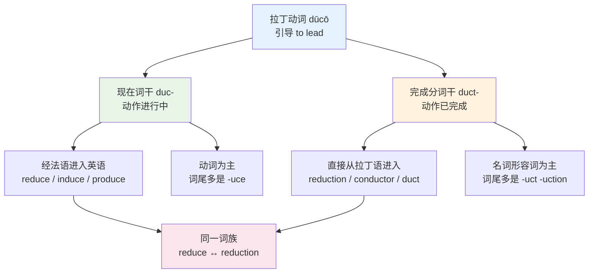
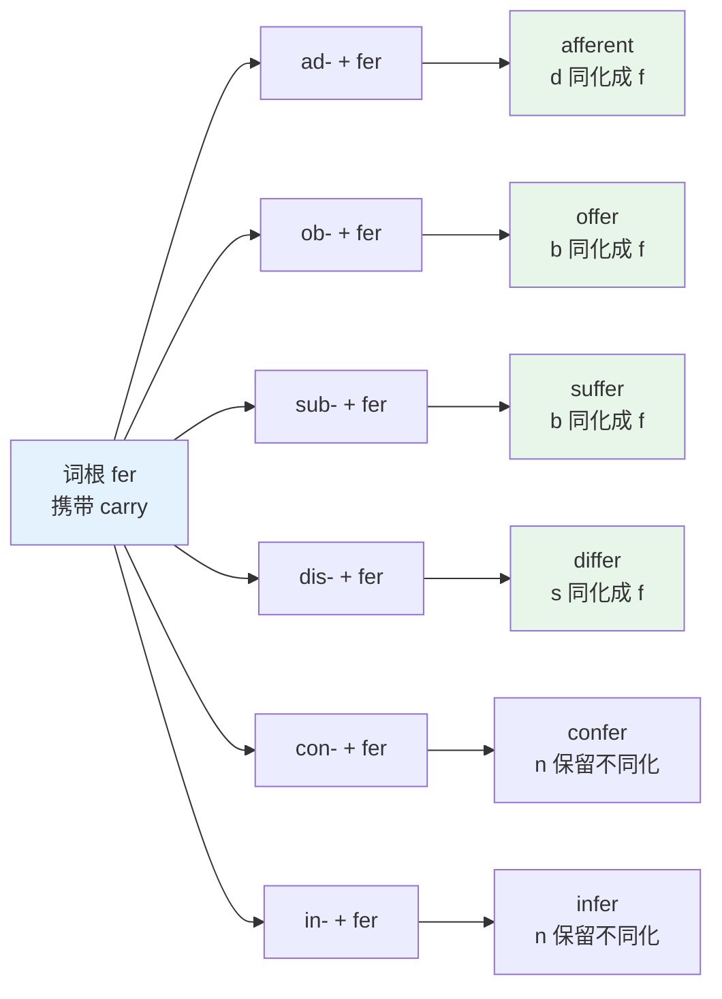
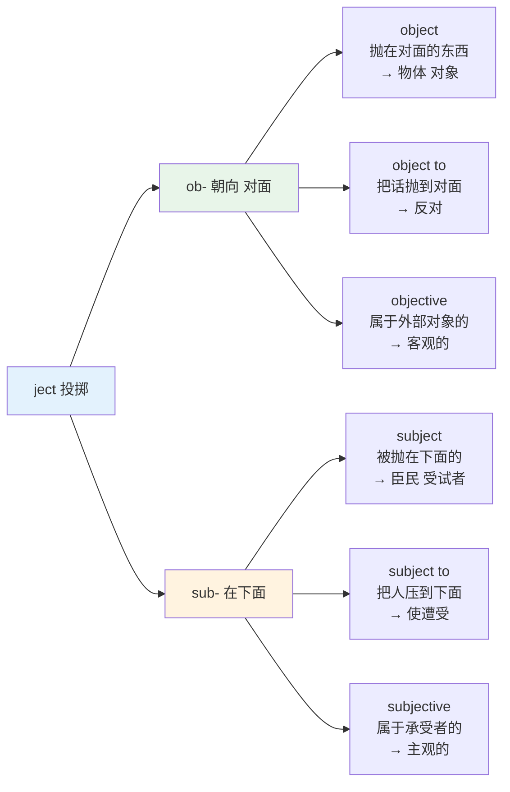
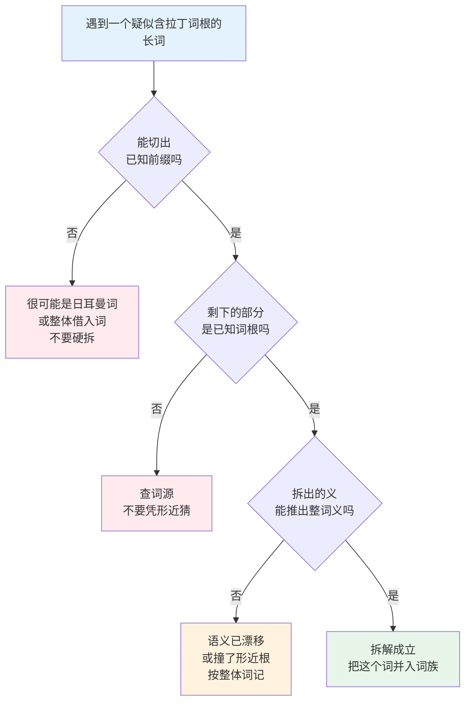
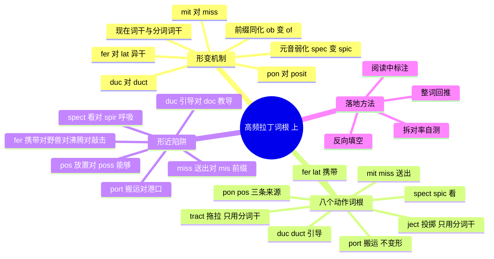

# 高频拉丁词根（上）

> [!info] 本篇定位
>
> 第 15 章的第一篇，也是全书从「词缀」转向「词根」的分界点。
>
> 第 14 章处理的是词的外壳：前缀改意思，后缀改词性。这一章处理词的核心。词根是那块被前后缀夹在中间、承担实际语义的成分，也是长词里最难认的一段——因为它会变形。`reduce` 和 `reduction` 是同一个词根，`transfer` 和 `translate` 也是，但字面上看不出来。
>
> 本篇挑八个动作类词根：`spect/spic`（看）、`duc/duct`（引导）、`port`（搬运）、`mit/miss`（送出）、`ject`（投掷）、`tract`（拖拉）、`pon/pos`（放置）、`fer`（携带）。选它们不是因为词条多，而是因为它们的形变最有规律，讲透一个就能自己推另外七个。
>
> 读完你会拿到三样东西：解释「一根两形」的那条机制、八个词根各自的完整词族表、以及一套判断「这个 port 到底是搬运还是港口」的分流方法。
>
> 与 [[14.构词法：前缀与后缀/03.方位、时间与关系前缀\|方位、时间与关系前缀]] 的关系是互补的——那一篇按前缀横切，本篇按词根纵切，同一批词会从两个方向各碰一次。

---

## 1. 本篇导读：为什么词根比词缀难

词缀是有限集。否定前缀七八个，名词后缀十来个，背完就是背完了。词根不是——拉丁语进入英语的动词词根有几百个，而且每一个都可能长着两张脸。

先看一个具体的例子。下面这五个词，中文母语者第一次见通常认不出它们同源：

```text
reduce      /rɪˈdjuːs/     减少
reduction   /rɪˈdʌkʃn/     减少（名词）
duct        /dʌkt/         管道
educate     /ˈedʒukeɪt/    教育
conduit     /ˈkɒndjuɪt/    导管
```

五个词共享同一个拉丁动词 `dūcere`（引导）。但拼写从 `-duce` 到 `-duct` 到 `-duit` 到 `-duc-`，元音从 /uː/ 到 /ʌ/ 到 /ʊ/，看上去像五个不相干的词。

这种「一根多形」是拉丁词根的常态，也是拆词法在实际阅读中失效的主要原因。不知道 `duc-` 和 `duct-` 是一回事，就会把 `deduce`（推断）和 `deduction`（推断 / 扣除）当两个词背。

本篇要做的第一件事，就是把这个变形规律讲清楚。规律讲清了，八个词根不需要各背两遍。

### 1.1 词根与词缀的分工

一个典型的拉丁派生词有三层：

```text
in    -   spect   -   ion
前缀      词根        后缀
方向      动作        词类
「向内」  「看」      「名词」
```

三层各管一件事：

| 成分 | 管什么 | 变不变形 | 有限性 |
| --- | --- | --- | --- |
| 前缀 | 方向、否定、程度 | 会因同化改形（in- → im-） | 封闭集，几十个 |
| 词根 | 动作或事物的核心义 | 会因词干交替改形（duc/duct） | 半开放，几百个 |
| 后缀 | 词性，附带一点语义 | 基本不变，只触发拼写调整 | 封闭集，几十个 |

真正扛语义的是中间那层。`inspect`、`inject`、`import`、`induce` 前缀都是 `in-`，意思完全不同，差别全在词根。

### 1.2 动作类词根为什么先讲

本篇八个词根有一个共同点：它们的原型义全部是**具体的身体动作**——看、领着走、扛、送、扔、拉、放、拿。

这不是巧合。语义引申总是从身体动作往抽象走，具体动作是引申链的起点，所以从这类词根切入，每一个派生词都能顺着「原始动作 + 方向」推出来：

> - **eject** = e-（向外）+ ject（扔）→ 扔出去 → 弹出、驱逐
> - **inject** = in-（向内）+ ject（扔）→ 扔进去 → 注射、注入
> - **project** = pro-（向前）+ ject（扔）→ 往前扔 → 投影、规划、项目
> - **reject** = re-（向后）+ ject（扔）→ 扔回去 → 拒绝

四个词，一个动作，四个方向。抽象名词类词根（比如表示「相信」「知道」「判断」的那批）没有这么直观的空间图像，放在 [[15.词根、合成与缩略/02.高频拉丁词根（下）\|高频拉丁词根（下）]] 处理。

---

## 2. 一根两形从哪来：拉丁动词的两个词干

`duc-` 与 `duct-`、`mit-` 与 `miss-`、`pon-` 与 `pos-`——这些交替不是英语搞出来的，是拉丁语原装带来的。

拉丁语的动词在词典里要列四个主要形式（principal parts）。对构词法有用的是其中两个：

- **现在词干**（present stem）：从不定式来，用于表示动作正在进行、未完成
- **完成分词词干**（supine / perfect participle stem）：表示动作已完成的结果

英语从拉丁语借词时，两个词干都借了。借现在词干的那一批通常经法语进来，词尾是 `-uce`、`-mit`、`-fer`；借完成分词词干的那一批通常直接从拉丁语进来，词尾是 `-uction`、`-mission`、`-lation`。



上图解释的是全篇最重要的一条机制：英语里那些「动词一个样、名词另一个样」的词对，绝大多数不是英语内部的不规则变化，而是两条不同的借入路径在英语里重新碰头。知道这一点，`transmit / transmission`、`permit / permission`、`admit / admission` 就不需要当成三组不规则名词化来记——它们全部服从同一条 `mit- / miss-` 的对应。

### 2.1 八个词根的双干对照表

| 拉丁动词 | 原义 | 现在词干 | 完成分词干 | 英语典型对 |
| --- | --- | --- | --- | --- |
| specere | 看 | spec- / spic- | spect- | conspicuous \| inspect |
| dūcere | 引导 | duc- | duct- | reduce \| reduction |
| portāre | 搬运 | port- | port(at)- | export \| exportation |
| mittere | 送 | mit- | miss- | submit \| submission |
| iacere | 投 | iac-（英语未借） | ject- | inject \| injection |
| trahere | 拉 | trah-（英语罕见） | tract- | 无 \| extract |
| pōnere | 放 | pon- | posit- | component \| position |
| ferre | 携带 | fer- | lat-（异干） | transfer \| translate |

表里有三行需要单拎出来说。

**portāre 那一行**几乎没有交替。它属于拉丁语第一变位法，这一类动词的完成分词干只是在现在词干后面加 `-at-`，词根本身不变形。所以 `port` 是本篇八个词根里最省事的一个：`export`、`import`、`report`、`support`、`transport`、`deport`，一律 `-port`，没有第二副面孔。凡是第一变位法来的词根（`-ate` 结尾的动词多半属于这一类）都有这个好处。

**trahere 那一行**方向相反：英语几乎只借了完成分词干。你能找到 `tract`、`extract`、`contract`、`attract`，但找不到 `*extrah`。现在词干只在极少数经法语磨圆的词里留下痕迹——`treat`、`trace`、`portray`、`retreat`。

**ferre 那一行**是最极端的。这个动词在拉丁语里是**异干动词**（suppletive），完成分词干 `lāt-` 跟现在词干 `fer-` 根本不是一个来源，就像英语 `go` 的过去式是 `went` 而不是 `*goed`。结果是 `transfer` 和 `translate` 语源上是同一个词的两半，字面上却毫无相似之处。第 10 节专门处理这一组。

### 2.2 元音弱化：spec- 为什么会变成 spic-

`conspicuous`、`suspicion`、`auspicious` 里的 `-spic-`，跟 `spectacle` 里的 `spec-` 是同一个东西。中间发生的事情叫**元音弱化**（vowel weakening）。

规则很简单：拉丁语的复合词里，如果词根被推到重音之后，短元音 `a`、`e` 会塌成 `i`。

```text
speciō（我看）           单独成词，e 保留
ad + speciō → aspiciō    加了前缀，e 弱化成 i
con + speciō → conspiciō 同上
sub + speciō → suspiciō  同上
```

这条规则在本篇范围内还管着 `ject`：拉丁语 `iaciō`（我投）加前缀后变成 `-iciō`，`ēiciō`、`iniciō`、`prōiciō`。英语没有借这批现在词干形式，全部走了完成分词干 `-iectus`，所以英语里看到的一律是 `ject`，反倒整齐。同一条规则在下一篇会大规模出现：`capiō` → `-cipiō`（receive / recipient），`faciō` → `-ficiō`（efficient / sufficient）。

> [!tip] 认 spic 不认 spec 的记忆办法
>
> `-spic-` 只出现在三个高频形容词里：`conspicuous`（显眼的）、`suspicious`（可疑的）、`auspicious`（吉利的），加上一个 `perspicacious`（有洞察力的）和一个 `despicable`（卑劣的）。
>
> 记住这五个，剩下的一律是 `spect` 或 `spec`。不需要背规则，背这个短名单更快。

### 2.3 前缀同化：以 fer 为例

词根变形之外，前缀也会变。前缀末尾的辅音会被词根开头的辅音同化，这是词首双写辅音字母的主要来源。`fer` 是演示这条规则最好的样本，因为它把常见的同化类型集齐了。



图上六个词全部是「前缀 + fer」，但只有前四个发生了同化。分界线是前缀末尾的辅音类型：塞音 `d`、`b` 和擦音 `s` 会被后面的 `f` 拉过去变成 `f`，鼻音 `n` 不会。所以 `offer`、`suffer`、`differ` 有双写的 `ff`，`confer`、`infer` 没有。

这条规律反过来用最有价值：看到一个词开头有双写辅音，第一反应应该是「这里藏了个被同化的前缀」，而不是「这个拼写要死记」。`accept`（ad+cept）、`appear`（ad+par）、`collect`（con+lect）、`correct`（con+rect）、`illegal`（in+legal）、`suppose`（sub+pose）、`suffix`（sub+fix）全部是同一套机制。

---

## 3. spect / spic / spec：看

原型义是「看」。这个词根的派生词覆盖了从物理观看到抽象判断的全部梯度：`inspect` 是真的用眼睛看，`respect` 是「回头看」引申出的尊重，`expect` 是「往外看」引申出的期待。

### 3.1 spect 主表

| 英文 | 英式音标 | 美式音标 | 词性 | 中文 | 搭配与说明 |
| --- | --- | --- | --- | --- | --- |
| **inspect** | /ɪnˈspekt/ | /ɪnˈspekt/ | v. | 检查；视察 | in- 向内看；inspect sth. for damage |
| **inspection** | /ɪnˈspekʃn/ | /ɪnˈspekʃn/ | n. | 检查 | carry out an inspection |
| **inspector** | /ɪnˈspektə/ | /ɪnˈspektər/ | n. | 检查员；督察 | 英国警衔之一 |
| **respect** | /rɪˈspekt/ | /rɪˈspekt/ | n./v. | 尊重；方面 | re- 回头看；in this respect 在这方面 |
| **respectable** | /rɪˈspektəbl/ | /rɪˈspektəbl/ | adj. | 体面的；相当好的 | a respectable income |
| **respectful** | /rɪˈspektfl/ | /rɪˈspektfl/ | adj. | 恭敬的 | 主语是表达尊重的一方 |
| **respective** | /rɪˈspektɪv/ | /rɪˈspektɪv/ | adj. | 各自的 | 与 respectful 只差一个后缀，义项完全不同 |
| **respectively** | /rɪˈspektɪvli/ | /rɪˈspektɪvli/ | adv. | 分别地 | 学术写作高频，句末位置 |
| **suspect** | /səˈspekt/ | /səˈspekt/ | v. | 怀疑 | sub- 从下往上偷看 |
| **suspect** | /ˈsʌspekt/ | /ˈsʌspekt/ | n. | 嫌疑人 | 名前动后重音对立 |
| **suspicion** | /səˈspɪʃn/ | /səˈspɪʃn/ | n. | 怀疑 | under suspicion；元音弱化形 |
| **suspicious** | /səˈspɪʃəs/ | /səˈspɪʃəs/ | adj. | 可疑的；起疑的 | be suspicious of sb. |
| **prospect** | /ˈprɒspekt/ | /ˈprɑːspekt/ | n. | 前景；可能性 | pro- 往前看；prospects for growth |
| **prospective** | /prəˈspektɪv/ | /prəˈspektɪv/ | adj. | 潜在的；未来的 | a prospective employer |
| **prospectus** | /prəˈspektəs/ | /prəˈspektəs/ | n. | 招股说明书；招生简章 | 金融与高校两个语域 |
| **retrospect** | /ˈretrəspekt/ | /ˈretrəspekt/ | n. | 回顾 | in retrospect 事后看来 |
| **retrospective** | /ˌretrəˈspektɪv/ | /ˌretrəˈspektɪv/ | adj./n. | 回顾性的；回顾展 | 敏捷开发里的复盘会 |
| **introspection** | /ˌɪntrəˈspekʃn/ | /ˌɪntrəˈspekʃn/ | n. | 内省 | intro- 向内 |
| **circumspect** | /ˈsɜːkəmspekt/ | /ˈsɜːrkəmspekt/ | adj. | 谨慎的 | 环顾四周才动；正式语域 |
| **expect** | /ɪkˈspekt/ | /ɪkˈspekt/ | v. | 预料；期待 | ex- 向外张望 |
| **expectation** | /ˌekspekˈteɪʃn/ | /ˌekspekˈteɪʃn/ | n. | 期望 | meet / exceed expectations |
| **unexpected** | /ˌʌnɪkˈspektɪd/ | /ˌʌnɪkˈspektɪd/ | adj. | 意外的 | 三层构词 un- + ex- + spect |
| **aspect** | /ˈæspekt/ | /ˈæspekt/ | n. | 方面；外观 | ad- 朝某个方向看 |
| **perspective** | /pəˈspektɪv/ | /pərˈspektɪv/ | n. | 视角；透视法 | per- 看穿；from my perspective |
| **spectacle** | /ˈspektəkl/ | /ˈspektəkl/ | n. | 壮观场面 | make a spectacle of oneself 出洋相 |
| **spectacles** | /ˈspektəklz/ | /ˈspektəklz/ | n. | 眼镜 | 英式正式，日常说 glasses |
| **spectacular** | /spekˈtækjələ/ | /spekˈtækjələr/ | adj. | 壮观的 | 与 spectacle 同源 |
| **spectator** | /spekˈteɪtə/ | /ˈspekteɪtər/ | n. | 观众 | 重音英美不同；体育场景 |
| **spectrum** | /ˈspektrəm/ | /ˈspektrəm/ | n. | 光谱；范围 | 复数 spectra；across the spectrum |
| **spectre** \| **specter** | /ˈspektə/ | /ˈspektər/ | n. | 幽灵；隐忧 | 英式 -re 美式 -er；the spectre of inflation |
| **conspicuous** | /kənˈspɪkjuəs/ | /kənˈspɪkjuəs/ | adj. | 显眼的 | conspicuous by one's absence |
| **auspicious** | /ɔːˈspɪʃəs/ | /ɔːˈspɪʃəs/ | adj. | 吉利的 | avis 鸟 + spic 看，源自观鸟占卜 |
| **perspicacious** | /ˌpɜːspɪˈkeɪʃəs/ | /ˌpɜːrspɪˈkeɪʃəs/ | adj. | 有洞察力的 | 正式书面语 |
| **despicable** | /dɪˈspɪkəbl/ | /dɪˈspɪkəbl/ | adj. | 卑劣的 | de- 往下看 |
| **despise** | /dɪˈspaɪz/ | /dɪˈspaɪz/ | v. | 鄙视 | 与 despicable 同源，拼写已看不出 |
| **species** | /ˈspiːʃiːz/ | /ˈspiːʃiːz/ | n. | 物种 | 单复同形；原义「看上去的样子」 |
| **specimen** | /ˈspesɪmən/ | /ˈspesəmən/ | n. | 标本；样本 | 医学取样与博物馆展品 |
| **specific** | /spəˈsɪfɪk/ | /spəˈsɪfɪk/ | adj./n. | 具体的；细节 | be specific about sth. |
| **specify** | /ˈspesɪfaɪ/ | /ˈspesɪfaɪ/ | v. | 明确规定 | 技术文档高频 |
| **specification** | /ˌspesɪfɪˈkeɪʃn/ | /ˌspesɪfɪˈkeɪʃn/ | n. | 规格；规范 | 缩写 spec；复数 specs |
| **speculate** | /ˈspekjuleɪt/ | /ˈspekjəleɪt/ | v. | 推测；投机 | speculate on / about |
| **speculation** | /ˌspekjuˈleɪʃn/ | /ˌspekjəˈleɪʃn/ | n. | 推测；投机买卖 | 两个义项语域分明 |
| **espionage** | /ˈespiənɑːʒ/ | /ˈespiənɑːʒ/ | n. | 间谍活动 | 经法语，词尾读 /ʒ/ |

### 3.2 respectful / respective / respectable 三兄弟

同一个词根加三个不同后缀，义项分岔到几乎不相干。这是 `-ful`、`-ive`、`-able` 三个后缀语义差异的最好例子：

> - **respectful** ——「充满尊重的」，`-ful` 表示富含某性质。主语是**表达尊重的人**：`He was respectful to his teachers.`
> - **respectable** ——「值得被尊重的」，`-able` 表示可被动接受。主语是**被尊重的对象**：`a respectable family`。引申出「数量上说得过去」：`a respectable turnout`。
> - **respective** ——「各自的」，`-ive` 在这里保留了 `respect` 最古的义项「回头看向各个方向」。只作定语，必配复数名词：`They returned to their respective homes.`

> [!warning] respectively 的位置
>
> `respectively` 在中文里常被译成「分别」，于是很多人把它放在句子中段当状语用。英语里它几乎只出现在句末，且必须有两组以上可以一一对应的成分。
>
> - ❌ ~~The two files respectively contain the config and the log.~~
> - ✅ **The two files contain the config and the log, respectively.**
>
> 如果句子里只有一组成分，`respectively` 无处对应，整句就是病句。

---

## 4. duc / duct：引导

原型义是「领着走」。派生方向由前缀决定：往内领是 `induce`，往外领是 `educate`，往回领是 `reduce`，领到一起是 `conduct`。

### 4.1 duc 主表

| 英文 | 英式音标 | 美式音标 | 词性 | 中文 | 搭配与说明 |
| --- | --- | --- | --- | --- | --- |
| **duct** | /dʌkt/ | /dʌkt/ | n. | 管道；导管 | air duct 通风管；解剖学 bile duct |
| **ductile** | /ˈdʌktaɪl/ | /ˈdʌktl/ | adj. | 有延展性的 | 材料学；与 brittle 对立 |
| **duke** | /djuːk/ | /duːk/ | n. | 公爵 | 原义「领头的人」；英式有 /j/ |
| **educate** | /ˈedʒukeɪt/ | /ˈedʒəkeɪt/ | v. | 教育 | e- 向外 + duc 领，把人领出蒙昧 |
| **education** | /ˌedʒuˈkeɪʃn/ | /ˌedʒəˈkeɪʃn/ | n. | 教育 | higher education 高等教育 |
| **educational** | /ˌedʒuˈkeɪʃənl/ | /ˌedʒəˈkeɪʃənl/ | adj. | 教育的 | educational institution |
| **conduct** | /kənˈdʌkt/ | /kənˈdʌkt/ | v. | 实施；指挥；传导 | conduct research / an experiment |
| **conduct** | /ˈkɒndʌkt/ | /ˈkɑːndʌkt/ | n. | 行为；举止 | code of conduct 行为准则 |
| **conductor** | /kənˈdʌktə/ | /kənˈdʌktər/ | n. | 指挥；导体；售票员 | 三个义项分属音乐、物理、交通 |
| **semiconductor** | /ˌsemikənˈdʌktə/ | /ˌsemikənˈdʌktər/ | n. | 半导体 | semi- + conductor |
| **conduit** | /ˈkɒndjuɪt/ | /ˈkɑːnduɪt/ | n. | 导管；渠道 | 与 conduct 同源，拼写走了法语 |
| **deduce** | /dɪˈdjuːs/ | /dɪˈduːs/ | v. | 推断 | de- 向下引；deduce sth. from sth. |
| **deduct** | /dɪˈdʌkt/ | /dɪˈdʌkt/ | v. | 扣除 | deduct tax from wages |
| **deduction** | /dɪˈdʌkʃn/ | /dɪˈdʌkʃn/ | n. | 推断；扣除 | 同时是 deduce 和 deduct 的名词 |
| **deductive** | /dɪˈdʌktɪv/ | /dɪˈdʌktɪv/ | adj. | 演绎的 | 与 inductive 归纳的成对 |
| **induce** | /ɪnˈdjuːs/ | /ɪnˈduːs/ | v. | 引起；诱导；催产 | induce sb. to do sth. |
| **induction** | /ɪnˈdʌkʃn/ | /ɪnˈdʌkʃn/ | n. | 归纳；入职培训；电感 | 三个语域三个义项 |
| **inductive** | /ɪnˈdʌktɪv/ | /ɪnˈdʌktɪv/ | adj. | 归纳的 | inductive reasoning |
| **introduce** | /ˌɪntrəˈdjuːs/ | /ˌɪntrəˈduːs/ | v. | 介绍；引入 | introduce a bill 提出法案 |
| **introduction** | /ˌɪntrəˈdʌkʃn/ | /ˌɪntrəˈdʌkʃn/ | n. | 介绍；引言 | 论文首节名 |
| **produce** | /prəˈdjuːs/ | /prəˈduːs/ | v. | 生产；出示 | produce evidence 出示证据 |
| **produce** | /ˈprɒdjuːs/ | /ˈproʊduːs/ | n. | 农产品 | 名前动后，且元音全变 |
| **product** | /ˈprɒdʌkt/ | /ˈprɑːdʌkt/ | n. | 产品；乘积 | 数学义项 the product of 3 and 4 |
| **production** | /prəˈdʌkʃn/ | /prəˈdʌkʃn/ | n. | 生产；作品 | in production 投产中 |
| **productive** | /prəˈdʌktɪv/ | /prəˈdʌktɪv/ | adj. | 高产的；富有成效的 | a productive meeting |
| **productivity** | /ˌprɒdʌkˈtɪvəti/ | /ˌproʊdʌkˈtɪvəti/ | n. | 生产率 | 经济学与个人效率两用 |
| **reproduce** | /ˌriːprəˈdjuːs/ | /ˌriːprəˈduːs/ | v. | 复制；繁殖 | 技术语境指复现问题 |
| **reproduction** | /ˌriːprəˈdʌkʃn/ | /ˌriːprəˈdʌkʃn/ | n. | 复制品；繁殖 | 艺术品与生物学两个义项 |
| **reduce** | /rɪˈdjuːs/ | /rɪˈduːs/ | v. | 减少 | reduce sth. by 20% |
| **reduction** | /rɪˈdʌkʃn/ | /rɪˈdʌkʃn/ | n. | 减少；折扣 | a reduction in cost |
| **redundant** | /rɪˈdʌndənt/ | /rɪˈdʌndənt/ | adj. | 多余的；被裁员的 | 形近但不同源，见第 11 节 |
| **seduce** | /sɪˈdjuːs/ | /sɪˈduːs/ | v. | 引诱 | se- 分开 + duc 领走 |
| **abduct** | /æbˈdʌkt/ | /æbˈdʌkt/ | v. | 绑架 | ab- 离开；新闻语域 |
| **abduction** | /æbˈdʌkʃn/ | /æbˈdʌkʃn/ | n. | 绑架 | 法律文书用词 |
| **viaduct** | /ˈvaɪədʌkt/ | /ˈvaɪədʌkt/ | n. | 高架桥 | via 路 + duct 引导 |
| **aqueduct** | /ˈækwɪdʌkt/ | /ˈækwədʌkt/ | n. | 引水渠 | aqua 水 + duct |

### 4.2 -duce 与 -duct 的分工不是随机的

同一个前缀配两个词干，得到的两个英语词常常义项不同：

| 前缀 | 配 duc- | 配 duct- | 差别 |
| --- | --- | --- | --- |
| de- | deduce 推断 | deduct 扣除 | 抽象推理 vs 具体减法 |
| in- | induce 引起 | induct 使就职 | 引发 vs 正式接纳 |
| pro- | produce 生产 | 无独立动词 | product 是名词 |
| re- | reduce 减少 | 无独立动词 | reduction 兼管两边 |
| con- | conduce（罕用） | conduct 实施 | 日常只用分词干，形容词 conducive 才留在现在词干一支 |

`deduce` 和 `deduct` 是这张表里最需要注意的一对。两个词共享名词 `deduction`，导致这个名词在不同语境里意思完全不同：

> - The **deduction** from these facts is that he lied.
>   - 从这些事实推断出他撒了谎。（对应 deduce）
> - Tax **deductions** are made at source.
>   - 税款在源头扣除。（对应 deduct）

判断靠语境：出现在 `make a deduction from the evidence` 里是推断，出现在 `salary`、`tax`、`payroll` 附近是扣除。

---

## 5. port：搬运

八个词根里形变最少的一个。所有派生词一律写作 `port`，不用管词干交替。这个音节承重读时元音一律是 /ɔː/（美式 /ɔːr/），只有 `opportunity`、`opportune` 这一支的 port 不承重读，弱化成 /ə/（美式 /ər/）。

### 5.1 port 主表

| 英文 | 英式音标 | 美式音标 | 词性 | 中文 | 搭配与说明 |
| --- | --- | --- | --- | --- | --- |
| **portable** | /ˈpɔːtəbl/ | /ˈpɔːrtəbl/ | adj. | 便携的；可移植的 | 计算机语境指跨平台可移植 |
| **portability** | /ˌpɔːtəˈbɪləti/ | /ˌpɔːrtəˈbɪləti/ | n. | 便携性；可移植性 | 技术文档常用 |
| **porter** | /ˈpɔːtə/ | /ˈpɔːrtər/ | n. | 搬运工；门房 | 两个义项来自两个不同拉丁词，见第 11 节 |
| **portfolio** | /pɔːtˈfəʊliəʊ/ | /pɔːrtˈfoʊlioʊ/ | n. | 作品集；投资组合 | port 携带 + folio 纸页 |
| **export** | /ɪkˈspɔːt/ | /ɪkˈspɔːrt/ | v. | 出口；导出 | 编程里指模块导出 |
| **export** | /ˈekspɔːt/ | /ˈekspɔːrt/ | n. | 出口（商品） | 名前动后重音对立 |
| **import** | /ɪmˈpɔːt/ | /ɪmˈpɔːrt/ | v. | 进口；导入 | import a module |
| **import** | /ˈɪmpɔːt/ | /ˈɪmpɔːrt/ | n. | 进口；要义 | of great import 极其重要（正式） |
| **important** | /ɪmˈpɔːtnt/ | /ɪmˈpɔːrtnt/ | adj. | 重要的 | 「运进心里的」→ 分量重 |
| **importance** | /ɪmˈpɔːtns/ | /ɪmˈpɔːrtns/ | n. | 重要性 | attach importance to sth. |
| **report** | /rɪˈpɔːt/ | /rɪˈpɔːrt/ | v./n. | 报告；举报 | re- 带回来；report to sb. 向某人汇报 |
| **reporter** | /rɪˈpɔːtə/ | /rɪˈpɔːrtər/ | n. | 记者 | 与 journalist 语域略有差别 |
| **reportedly** | /rɪˈpɔːtɪdli/ | /rɪˈpɔːrtɪdli/ | adv. | 据报道 | 新闻体高频，句中位置 |
| **support** | /səˈpɔːt/ | /səˈpɔːrt/ | v./n. | 支撑；支持 | sub- 从下面扛 |
| **supporter** | /səˈpɔːtə/ | /səˈpɔːrtər/ | n. | 支持者；球迷 | 英式足球语境 = fan |
| **supportive** | /səˈpɔːtɪv/ | /səˈpɔːrtɪv/ | adj. | 给予支持的 | be supportive of sb. |
| **transport** | /trænˈspɔːt/ | /trænˈspɔːrt/ | v. | 运输 | trans- 跨越 |
| **transport** | /ˈtrænspɔːt/ | /ˈtrænspɔːrt/ | n. | 交通运输 | 英式说 public transport |
| **transportation** | /ˌtrænspɔːˈteɪʃn/ | /ˌtrænspərˈteɪʃn/ | n. | 交通运输 | 美式常用名词形式 |
| **deport** | /dɪˈpɔːt/ | /dɪˈpɔːrt/ | v. | 驱逐出境 | 移民法语境 |
| **deportation** | /ˌdiːpɔːˈteɪʃn/ | /ˌdiːpɔːrˈteɪʃn/ | n. | 驱逐出境 | deportation order |
| **deportment** | /dɪˈpɔːtmənt/ | /dɪˈpɔːrtmənt/ | n. | 举止仪态 | 旧式正式语 |
| **purport** | /pəˈpɔːt/ | /pərˈpɔːrt/ | v. | 声称；意图是 | purport to be sth.；含质疑意味 |
| **purported** | /pəˈpɔːtɪd/ | /pərˈpɔːrtɪd/ | adj. | 据称的 | 新闻与法律文书 |
| **rapport** | /ræˈpɔː/ | /ræˈpɔːr/ | n. | 融洽关系 | 法语借词，t 不发音 |
| **opportunity** | /ˌɒpəˈtjuːnəti/ | /ˌɑːpərˈtuːnəti/ | n. | 机会 | ob- + portus 港口，「风向着港口」 |
| **opportune** | /ˈɒpətjuːn/ | /ˌɑːpərˈtuːn/ | adj. | 恰逢其时的 | 英美重音位置不同 |
| **opportunistic** | /ˌɒpətjuːˈnɪstɪk/ | /ˌɑːpərtuːˈnɪstɪk/ | adj. | 机会主义的；伺机的 | 医学 opportunistic infection |

### 5.2 -port 词的名动重音对立

`port` 词族里有四对高频的名动同形词，一律遵守「名词重音在前、动词重音在后」：

```text
名词                     动词
ˈexport   出口商品        exˈport   出口（动作）
ˈimport   进口商品        imˈport   进口（动作）
ˈtransport 交通运输       tranˈsport 运输（动作）
ˈreport   报告            reˈport   报告（动作）← 例外
```

`report` 是这一组里的例外：它的名词和动词都重读第二音节。名动重音对立只覆盖了一部分双音节词，`report`、`support`、`reply`、`reward` 这一批始终后重读，从来没有加入这个模式。哪些词进了、哪些没进，只能按词记。

> [!example] 重音对立的实际影响
>
> > - Our **ˈexports** to Europe fell last quarter.
> >   - 我们对欧洲的出口额上季度下降了。
> > - We **exˈport** most of our output.
> >   - 我们出口大部分产量。
>
> 读错重音在听力上会被当成另一个词类，从而误判整句结构。

---

## 6. mit / miss：送出

`mit-` 与 `miss-` 是本篇最规整的一组交替：动词一律 `-mit`，走分词词干的名词一律 `-mission`。另有一批名词直接加英语后缀构成——`commitment`、`remittance`、`admittance`——它们不走分词词干，跟 `-mission` 那一批分工不同。

### 6.1 mit 主表

| 英文 | 英式音标 | 美式音标 | 词性 | 中文 | 搭配与说明 |
| --- | --- | --- | --- | --- | --- |
| **admit** | /ədˈmɪt/ | /ədˈmɪt/ | v. | 承认；准许进入 | admit to doing sth. |
| **admission** | /ədˈmɪʃn/ | /ədˈmɪʃn/ | n. | 承认；入场；录取 | admission fee 入场费 |
| **admittance** | /ədˈmɪtns/ | /ədˈmɪtns/ | n. | 准入许可 | 只指物理进入，告示牌用语 |
| **commit** | /kəˈmɪt/ | /kəˈmɪt/ | v. | 犯（罪）；承诺；提交 | commit a crime；Git 提交 |
| **commitment** | /kəˈmɪtmənt/ | /kəˈmɪtmənt/ | n. | 承诺；投入 | make a commitment to sth. |
| **commission** | /kəˈmɪʃn/ | /kəˈmɪʃn/ | n./v. | 委员会；佣金；委托创作 | 三义项语域分明 |
| **committee** | /kəˈmɪti/ | /kəˈmɪti/ | n. | 委员会 | 双写 t 与双写 e，拼写高频错点 |
| **emit** | /iˈmɪt/ | /iˈmɪt/ | v. | 发出（光热声） | emit radiation |
| **emission** | /iˈmɪʃn/ | /iˈmɪʃn/ | n. | 排放；发射 | carbon emissions 碳排放 |
| **emitter** | /iˈmɪtə/ | /iˈmɪtər/ | n. | 发射器；发射极 | 编程里的事件发射器 |
| **omit** | /əˈmɪt/ | /oʊˈmɪt/ | v. | 省略；遗漏 | omit to do / omit doing |
| **omission** | /əˈmɪʃn/ | /oʊˈmɪʃn/ | n. | 省略；疏漏 | errors and omissions |
| **permit** | /pəˈmɪt/ | /pərˈmɪt/ | v. | 允许 | permit sb. to do sth. |
| **permit** | /ˈpɜːmɪt/ | /ˈpɜːrmɪt/ | n. | 许可证 | work permit 工作许可 |
| **permission** | /pəˈmɪʃn/ | /pərˈmɪʃn/ | n. | 许可 | 不可数；file permissions 文件权限 |
| **permissible** | /pəˈmɪsəbl/ | /pərˈmɪsəbl/ | adj. | 允许的 | 法规文本用词 |
| **permissive** | /pəˈmɪsɪv/ | /pərˈmɪsɪv/ | adj. | 宽容的；纵容的 | a permissive licence 宽松许可证 |
| **submit** | /səbˈmɪt/ | /səbˈmɪt/ | v. | 提交；屈服 | submit an application |
| **submission** | /səbˈmɪʃn/ | /səbˈmɪʃn/ | n. | 提交物；屈服 | 投稿与法庭陈述两用 |
| **transmit** | /trænzˈmɪt/ | /trænsˈmɪt/ | v. | 传输；传播 | transmit data / a disease |
| **transmission** | /trænzˈmɪʃn/ | /trænsˈmɪʃn/ | n. | 传输；变速器 | 汽车义项美式常用 |
| **transmitter** | /trænzˈmɪtə/ | /trænsˈmɪtər/ | n. | 发射机 | 与 receiver 成对 |
| **remit** | /rɪˈmɪt/ | /rɪˈmɪt/ | v. | 汇款；免除 | 金融与法律语域 |
| **remittance** | /rɪˈmɪtns/ | /rɪˈmɪtns/ | n. | 汇款 | 跨境汇款正式说法 |
| **intermittent** | /ˌɪntəˈmɪtənt/ | /ˌɪntərˈmɪtənt/ | adj. | 间歇性的 | intermittent failure 偶发故障 |
| **dismiss** | /dɪsˈmɪs/ | /dɪsˈmɪs/ | v. | 解雇；驳回；不予理会 | dismiss a claim |
| **dismissal** | /dɪsˈmɪsl/ | /dɪsˈmɪsl/ | n. | 解雇；驳回 | unfair dismissal 不当解雇 |
| **dismissive** | /dɪsˈmɪsɪv/ | /dɪsˈmɪsɪv/ | adj. | 轻蔑的 | be dismissive of sth. |
| **missile** | /ˈmɪsaɪl/ | /ˈmɪsl/ | n. | 导弹 | 英美读音差异大 |
| **mission** | /ˈmɪʃn/ | /ˈmɪʃn/ | n. | 任务；使团 | mission statement 使命宣言 |
| **missionary** | /ˈmɪʃənri/ | /ˈmɪʃəneri/ | n./adj. | 传教士 | 派出去的人 |
| **emissary** | /ˈemɪsəri/ | /ˈeməseri/ | n. | 特使 | 外交语域 |
| **promise** | /ˈprɒmɪs/ | /ˈprɑːmɪs/ | n./v. | 承诺 | pro- 事先送出；异步编程术语 |
| **compromise** | /ˈkɒmprəmaɪz/ | /ˈkɑːmprəmaɪz/ | n./v. | 妥协；损害 | 安全语境 a compromised account |
| **premise** | /ˈpremɪs/ | /ˈpremɪs/ | n. | 前提 | 逻辑学；复数 premises 另指房屋 |
| **demise** | /dɪˈmaɪz/ | /dɪˈmaɪz/ | n. | 消亡；去世 | 正式与委婉语 |
| **surmise** | /səˈmaɪz/ | /sərˈmaɪz/ | v./n. | 推测 | 文学与正式语域 |
| **message** | /ˈmesɪdʒ/ | /ˈmesɪdʒ/ | n./v. | 消息 | 经拉丁 missaticum，同源 |
| **messenger** | /ˈmesɪndʒə/ | /ˈmesɪndʒər/ | n. | 信使 | 多出一个 n，拼写陷阱 |

### 6.2 -mise 一支为什么看不出来

上表末尾那批 `promise`、`compromise`、`premise`、`demise`、`surmise` 都属于 `mit/miss` 家族，但拼写变成了 `-mise`，读音分成两组：`compromise`、`demise`、`surmise` 读 /maɪz/，`promise`、`premise` 仍读 /mɪs/。

原因是这批词走了法语路线：拉丁 `missa` 到古法语变成 `mise`，英语原样收下。同一个词根因此在英语里留下三条支线：

```text
拉丁现在词干  mit-    →  admit, submit, permit        动词
拉丁分词词干  miss-   →  admission, mission, dismiss  名词为主
法语磨圆形    -mise   →  promise, premise, compromise 名动兼有
```

`compromise` 的双重义项也从这里来：字面是「双方各自送出（承诺）」，引申一是「妥协」，引申二是「（因让步而）损害、危及」。安全领域说 `a compromised system`（被攻破的系统）用的是第二个义项，不是「妥协的系统」。

> [!warning] premise 的单复数陷阱
>
> `premise` 作「前提」时是普通可数名词，`the basic premise of the argument`。
>
> 但 `premises` 加了 s 之后有一个完全不同的义项：**房屋、经营场所**，而且这个义项只有复数形式，永远不写 `a premise`。
>
> - The bar is not licensed to sell alcohol **off the premises**.
>   - 该酒吧无外带售酒许可。
>
> 两个义项其实同源：法律文书开头列出的「上述条款」（premises）后来转指文书里描述的那处房产。

---

## 7. ject：投掷

拉丁 `iacere`（投）。英语只借了复合形式的完成分词干 `-iectus`，所以这个词根在英语里拼写从不变形，永远是 `ject`；承重读时读 /dʒekt/，不重读则弱化，`adjective` 里读 /dʒɪk/。表末的 `jet`、`jettison` 是经法语磨圆的另一副形式，拼写已经看不出 `ject`。

### 7.1 ject 主表

| 英文 | 英式音标 | 美式音标 | 词性 | 中文 | 搭配与说明 |
| --- | --- | --- | --- | --- | --- |
| **eject** | /iˈdʒekt/ | /iˈdʒekt/ | v. | 弹出；驱逐 | e- 向外；光驱与球场两用 |
| **ejection** | /iˈdʒekʃn/ | /iˈdʒekʃn/ | n. | 弹射；驱逐 | ejection seat 弹射座椅 |
| **inject** | /ɪnˈdʒekt/ | /ɪnˈdʒekt/ | v. | 注射；注入 | inject funds into 注资 |
| **injection** | /ɪnˈdʒekʃn/ | /ɪnˈdʒekʃn/ | n. | 注射；注入 | dependency injection 依赖注入 |
| **object** | /ˈɒbdʒɪkt/ | /ˈɑːbdʒɪkt/ | n. | 物体；对象；宾语 | 编程与语法两个术语义 |
| **object** | /əbˈdʒekt/ | /əbˈdʒekt/ | v. | 反对 | object to sth. 后接名词或动名词 |
| **objection** | /əbˈdʒekʃn/ | /əbˈdʒekʃn/ | n. | 反对 | raise an objection |
| **objective** | /əbˈdʒektɪv/ | /əbˈdʒektɪv/ | adj./n. | 客观的；目标 | 与 subjective 严格对立 |
| **objectivity** | /ˌɒbdʒekˈtɪvəti/ | /ˌɑːbdʒekˈtɪvəti/ | n. | 客观性 | 学术写作评价语 |
| **subject** | /ˈsʌbdʒɪkt/ | /ˈsʌbdʒɪkt/ | n. | 主题；学科；主语；受试者 | 四个义项跨四个领域 |
| **subject** | /səbˈdʒekt/ | /səbˈdʒekt/ | v. | 使遭受 | subject sb. to sth. |
| **subjective** | /səbˈdʒektɪv/ | /səbˈdʒektɪv/ | adj. | 主观的 | 与 objective 成对 |
| **project** | /ˈprɒdʒekt/ | /ˈprɑːdʒekt/ | n. | 项目 | pro- 向前抛，「先抛出的方案」 |
| **project** | /prəˈdʒekt/ | /prəˈdʒekt/ | v. | 投影；预测；投射 | project revenue 预测收入 |
| **projection** | /prəˈdʒekʃn/ | /prəˈdʒekʃn/ | n. | 投影；预测；地图投影 | GIS 术语 map projection |
| **projector** | /prəˈdʒektə/ | /prəˈdʒektər/ | n. | 投影仪 | 会议室设备 |
| **reject** | /rɪˈdʒekt/ | /rɪˈdʒekt/ | v. | 拒绝；排异 | 医学 reject a transplant |
| **reject** | /ˈriːdʒekt/ | /ˈriːdʒekt/ | n. | 次品；被淘汰者 | 工厂质检语境 |
| **rejection** | /rɪˈdʒekʃn/ | /rɪˈdʒekʃn/ | n. | 拒绝；排异反应 | a rejection letter 拒信 |
| **interject** | /ˌɪntəˈdʒekt/ | /ˌɪntərˈdʒekt/ | v. | 插话 | 正式语域 |
| **interjection** | /ˌɪntəˈdʒekʃn/ | /ˌɪntərˈdʒekʃn/ | n. | 感叹词；插话 | 语法术语 |
| **adjective** | /ˈædʒɪktɪv/ | /ˈædʒɪktɪv/ | n. | 形容词 | ad- 抛到旁边的，「附加成分」 |
| **conjecture** | /kənˈdʒektʃə/ | /kənˈdʒektʃər/ | n./v. | 推测；猜想 | 数学 Goldbach's conjecture |
| **dejected** | /dɪˈdʒektɪd/ | /dɪˈdʒektɪd/ | adj. | 沮丧的 | de- 往下抛；书面语 |
| **abject** | /ˈæbdʒekt/ | /ˈæbdʒekt/ | adj. | 凄惨的；卑下的 | abject poverty 赤贫 |
| **trajectory** | /trəˈdʒektəri/ | /trəˈdʒektəri/ | n. | 轨迹；发展轨迹 | 物理与职业发展两用 |
| **jet** | /dʒet/ | /dʒet/ | n./v. | 喷气机；喷射 | 法语磨圆形，同源 |
| **jettison** | /ˈdʒetɪsn/ | /ˈdʒetɪsn/ | v. | 抛弃；丢弃 | 抛掉船上的货物 |

### 7.2 object 与 subject：同一个词根的对立结构

这两个词是本篇最值得慢慢拆的一对。它们的对立不是词汇层面的巧合，而是构词层面的镜像。



图上的两条支线共享一个动作「抛」，分歧全在前缀提供的空间位置。`ob-` 把东西放在观察者对面，于是得到「外部存在的东西」，进一步得到「不依赖观察者的」即客观；`sub-` 把东西放在下面，于是得到「承受者」，进一步得到「依赖承受者的」即主观。

这个空间图像能解释三件靠死记很难记住的事：

第一，为什么 `subject` 同时是「主题」「学科」「主语」和「实验受试者」。四个义项共享「被置于某个更高东西之下的那一个」——话题被置于讨论之下，学科被置于知识体系之下，主语被置于谓语的陈述之下，受试者被置于实验的施加之下。

第二，为什么 `objective` 是「客观的」也是「目标」。名词义来自军事用语 `objective point`（进攻指向的那一点），仍然是「抛在对面的东西」。

第三，为什么 `subject to` 和 `object to` 里的 `to` 语法性质完全不同：

> - The offer is **subject to** availability.
>   - 此优惠以有货为限。（`subject to` 是形容词短语，to 后接名词）
> - I **object to** being treated like this.
>   - 我反对被这样对待。（`object to` 是动词加介词，to 后接动名词，不能接动词原形）

`object to do` 是中文母语者的高频错误。`to` 在这里是介词不是不定式标记，检验办法是能否换成 `it`：`I object to it.` 成立，所以是介词。这个检验法在 [[02.功能词与封闭词类速查/03.of 与 to：属格网络与方向对象网络\|of 与 to：属格网络与方向对象网络]] 里有完整说明。

---

## 8. tract：拖拉

拉丁 `trahere`（拉）。英语基本只用完成分词干 `tract-`，读音固定 /trækt/。

### 8.1 tract 主表

| 英文 | 英式音标 | 美式音标 | 词性 | 中文 | 搭配与说明 |
| --- | --- | --- | --- | --- | --- |
| **tract** | /trækt/ | /trækt/ | n. | 地带；（体内）道；小册子 | digestive tract 消化道 |
| **traction** | /ˈtrækʃn/ | /ˈtrækʃn/ | n. | 牵引力；进展 | gain traction 获得关注 |
| **tractor** | /ˈtræktə/ | /ˈtræktər/ | n. | 拖拉机 | 美式 tractor trailer 半挂卡车 |
| **tractable** | /ˈtræktəbl/ | /ˈtræktəbl/ | adj. | 易处理的；驯服的 | 与 intractable 成对 |
| **intractable** | /ɪnˈtræktəbl/ | /ɪnˈtræktəbl/ | adj. | 棘手的；难驾驭的 | an intractable problem |
| **attract** | /əˈtrækt/ | /əˈtrækt/ | v. | 吸引 | ad- 朝向；attract attention |
| **attraction** | /əˈtrækʃn/ | /əˈtrækʃn/ | n. | 吸引力；景点 | tourist attraction |
| **attractive** | /əˈtræktɪv/ | /əˈtræktɪv/ | adj. | 有吸引力的 | an attractive offer |
| **contract** | /ˈkɒntrækt/ | /ˈkɑːntrækt/ | n. | 合同 | con- 拉到一起；sign a contract |
| **contract** | /kənˈtrækt/ | /kənˈtrækt/ | v. | 收缩；感染（疾病） | contract a disease |
| **contraction** | /kənˈtrækʃn/ | /kənˈtrækʃn/ | n. | 收缩；缩写形式 | don't 是 do not 的 contraction |
| **contractor** | /kənˈtræktə/ | /ˈkɑːntræktər/ | n. | 承包商 | 英美重音不同 |
| **contractual** | /kənˈtræktʃuəl/ | /kənˈtræktʃuəl/ | adj. | 合同的 | contractual obligation |
| **detract** | /dɪˈtrækt/ | /dɪˈtrækt/ | v. | 减损 | detract from sth. 固定搭配 |
| **distract** | /dɪˈstrækt/ | /dɪˈstrækt/ | v. | 分散注意力 | dis- 拉开；distract sb. from sth. |
| **distraction** | /dɪˈstrækʃn/ | /dɪˈstrækʃn/ | n. | 干扰；分心事物 | 办公场景高频 |
| **extract** | /ɪkˈstrækt/ | /ɪkˈstrækt/ | v. | 提取；抽出 | extract data from a file |
| **extract** | /ˈekstrækt/ | /ˈekstrækt/ | n. | 摘录；提取物 | vanilla extract 香草精 |
| **extraction** | /ɪkˈstrækʃn/ | /ɪkˈstrækʃn/ | n. | 提取；血统 | of Chinese extraction 华裔 |
| **protract** | /prəˈtrækt/ | /proʊˈtrækt/ | v. | 延长 | 多用被动分词形式 |
| **protracted** | /prəˈtræktɪd/ | /proʊˈtræktɪd/ | adj. | 旷日持久的 | a protracted dispute |
| **retract** | /rɪˈtrækt/ | /rɪˈtrækt/ | v. | 收回；撤回 | retract a statement |
| **retraction** | /rɪˈtrækʃn/ | /rɪˈtrækʃn/ | n. | 撤回；撤稿 | 学术出版术语 |
| **retractable** | /rɪˈtræktəbl/ | /rɪˈtræktəbl/ | adj. | 可伸缩的 | retractable roof |
| **subtract** | /səbˈtrækt/ | /səbˈtrækt/ | v. | 减去 | subtract A from B |
| **subtraction** | /səbˈtrækʃn/ | /səbˈtrækʃn/ | n. | 减法 | 与 addition 成对 |
| **abstract** | /ˈæbstrækt/ | /ˈæbstrækt/ | adj./n. | 抽象的；摘要 | 论文首段名 |
| **abstract** | /æbˈstrækt/ | /æbˈstrækt/ | v. | 抽取；使抽象 | 重音后移则为动词 |
| **abstraction** | /æbˈstrækʃn/ | /æbˈstrækʃn/ | n. | 抽象；抽象概念 | 编程 a leaky abstraction |
| **trace** | /treɪs/ | /treɪs/ | v./n. | 追踪；痕迹 | 法语磨圆形；stack trace |
| **treat** | /triːt/ | /triːt/ | v./n. | 对待；治疗；款待 | 同源，来自 tractare |
| **treatment** | /ˈtriːtmənt/ | /ˈtriːtmənt/ | n. | 治疗；处理方式 | undergo treatment |
| **treaty** | /ˈtriːti/ | /ˈtriːti/ | n. | 条约 | 「被拉扯出来的协议」 |
| **treatise** | /ˈtriːtɪz/ | /ˈtriːtəs/ | n. | 论文；专著 | 正式学术语域 |
| **retreat** | /rɪˈtriːt/ | /rɪˈtriːt/ | v./n. | 撤退；静修 | 军事与团建两个义项 |
| **portray** | /pɔːˈtreɪ/ | /pɔːrˈtreɪ/ | v. | 描绘；刻画 | pro- + trahere，与 port 无关 |
| **portrait** | /ˈpɔːtreɪt/ | /ˈpɔːrtrət/ | n. | 肖像；纵向版式 | 与 landscape 成对 |

### 8.2 tract 词族里的「拉」的六个方向

前缀在这个词根上的作用格外整齐，六个方向对应六个高频词：

| 前缀 | 方向 | 词 | 从物理义到抽象义 |
| --- | --- | --- | --- |
| ad- | 朝我拉 | attract | 拉过来 → 吸引 |
| ab- | 拉离 | abstract | 从具体中抽离 → 抽象 |
| con- | 拉到一起 | contract | 收拢 → 收缩 / 立约 |
| dis- | 往两边拉 | distract | 拉散 → 分心 |
| ex- | 拉出来 | extract | 抽出 → 提取 |
| re- | 往回拉 | retract | 缩回 → 撤回 |
| sub- | 从下抽走 | subtract | 抽掉 → 减去 |

`portray` 和 `portrait` 值得单独提醒：它们属于 `tract` 家族而不是 `port` 家族。词源是 `pro-`（向前）加 `trahere`（拉）——把线条往前拉出来，就是画。开头的 `por-` 是 `pro-` 在法语里的变形，跟「搬运」的 `port` 没有任何关系。这是本篇最容易认错的一组，第 11 节会再点一次。

> [!warning] detract 与 distract 只差一个字母
>
> - **detract from** —— 减损（价值、成就），主语是事物：`The scandal detracts from his achievements.`
> - **distract from** —— 使注意力偏离，主语通常是干扰源：`Noise distracts me from my work.`
>
> 两个都接 `from`，靠主语和宾语类型区分：`detract` 的宾语是被贬损的价值，`distract` 的宾语是被打断的人或注意力。

---

## 9. pon / pos：放置

拉丁 `pōnere`（放）。这个词根在英语里的情况比前面几个复杂，因为它有三条来源，其中一条是「混进来的」。

### 9.1 三条支线

```text
① 拉丁现在词干 pon-      → component, opponent, exponent, postpone
② 拉丁分词干 posit-      → position, deposit, composite, positive
③ 法语 poser 混入 -pose  → compose, expose, impose, propose, suppose
```

第三条支线要特别说明。英语里所有 `-pose` 结尾的动词，形式上来自古法语 `poser`，而 `poser` 的源头是通俗拉丁语 `pausāre`（停下），跟 `pōnere` 本不同源。但因为两者意思接近、复合形式撞车，法语阶段就把它们混成了一套。结果是英语继承了一个「语义上是 pōnere、形式上是 pausāre」的杂交词族。

对学习者来说，这个历史细节的实际价值是：**不要试图从 `-pose` 推 `-posit-` 的拼写**。`compose` 的名词是 `composition` 不是 `*composal`，`expose` 的名词是 `exposure` 也是 `exposition`，规则不统一，只能按对子记。

### 9.2 pos 主表

| 英文 | 英式音标 | 美式音标 | 词性 | 中文 | 搭配与说明 |
| --- | --- | --- | --- | --- | --- |
| **pose** | /pəʊz/ | /poʊz/ | v./n. | 摆姿势；构成（威胁） | pose a threat / a question |
| **position** | /pəˈzɪʃn/ | /pəˈzɪʃn/ | n./v. | 位置；职位；立场 | be in a position to do sth. |
| **positive** | /ˈpɒzətɪv/ | /ˈpɑːzətɪv/ | adj. | 积极的；阳性的 | 「已经放定的」→ 确定的 |
| **compose** | /kəmˈpəʊz/ | /kəmˈpoʊz/ | v. | 组成；创作；使镇定 | be composed of 由…组成 |
| **composition** | /ˌkɒmpəˈzɪʃn/ | /ˌkɑːmpəˈzɪʃn/ | n. | 构成；作曲；作文 | 三个语域三个义项 |
| **composite** | /ˈkɒmpəzɪt/ | /kəmˈpɑːzət/ | adj./n. | 复合的；合成物 | 英美重音位置不同 |
| **component** | /kəmˈpəʊnənt/ | /kəmˈpoʊnənt/ | n./adj. | 组件；成分 | 前端框架的核心术语 |
| **compound** | /ˈkɒmpaʊnd/ | /ˈkɑːmpaʊnd/ | n./adj. | 化合物；复合的 | compound interest 复利 |
| **compound** | /kəmˈpaʊnd/ | /kəmˈpaʊnd/ | v. | 使加剧；混合 | compound the problem |
| **deposit** | /dɪˈpɒzɪt/ | /dɪˈpɑːzət/ | n./v. | 存款；押金；沉积 | pay a deposit 付定金 |
| **depose** | /dɪˈpəʊz/ | /dɪˈpoʊz/ | v. | 废黜 | 政治史语域 |
| **repository** | /rɪˈpɒzətri/ | /rɪˈpɑːzətɔːri/ | n. | 存放处；仓库 | Git 仓库；口语缩作 repo |
| **dispose** | /dɪˈspəʊz/ | /dɪˈspoʊz/ | v. | 处理；使倾向于 | dispose of sth. 扔掉 |
| **disposal** | /dɪˈspəʊzl/ | /dɪˈspoʊzl/ | n. | 处置 | at one's disposal 任由支配 |
| **disposable** | /dɪˈspəʊzəbl/ | /dɪˈspoʊzəbl/ | adj. | 一次性的；可支配的 | disposable income 可支配收入 |
| **disposition** | /ˌdɪspəˈzɪʃn/ | /ˌdɪspəˈzɪʃn/ | n. | 性情；处置 | a cheerful disposition |
| **expose** | /ɪkˈspəʊz/ | /ɪkˈspoʊz/ | v. | 暴露；揭露；曝光 | expose an API 对外开放接口 |
| **exposure** | /ɪkˈspəʊʒə/ | /ɪkˈspoʊʒər/ | n. | 暴露；曝光度 | media exposure |
| **exposition** | /ˌekspəˈzɪʃn/ | /ˌekspəˈzɪʃn/ | n. | 阐述；博览会 | 与 exposure 分工不同 |
| **exponent** | /ɪkˈspəʊnənt/ | /ɪkˈspoʊnənt/ | n. | 指数；倡导者 | 数学与人物评价两用 |
| **exponential** | /ˌekspəˈnenʃl/ | /ˌekspəˈnenʃl/ | adj. | 指数级的 | exponential growth |
| **impose** | /ɪmˈpəʊz/ | /ɪmˈpoʊz/ | v. | 强加；征收 | impose a tax / a limit on |
| **imposition** | /ˌɪmpəˈzɪʃn/ | /ˌɪmpəˈzɪʃn/ | n. | 强制实行；打扰 | 正式语域 |
| **oppose** | /əˈpəʊz/ | /əˈpoʊz/ | v. | 反对 | 及物动词，不加 to |
| **opposite** | /ˈɒpəzɪt/ | /ˈɑːpəzət/ | adj./n./prep. | 相反的；对面 | opposite to / from |
| **opposition** | /ˌɒpəˈzɪʃn/ | /ˌɑːpəˈzɪʃn/ | n. | 反对；反对党 | the Opposition 大写指在野党 |
| **opponent** | /əˈpəʊnənt/ | /əˈpoʊnənt/ | n. | 对手 | 辩论与体育语域 |
| **propose** | /prəˈpəʊz/ | /prəˈpoʊz/ | v. | 提议；求婚 | propose that sb. (should) do |
| **proposal** | /prəˈpəʊzl/ | /prəˈpoʊzl/ | n. | 提案；求婚 | submit a proposal |
| **proposition** | /ˌprɒpəˈzɪʃn/ | /ˌprɑːpəˈzɪʃn/ | n. | 主张；命题；买卖提议 | 逻辑学与商务两用 |
| **proponent** | /prəˈpəʊnənt/ | /prəˈpoʊnənt/ | n. | 支持者 | 与 opponent 严格成对 |
| **suppose** | /səˈpəʊz/ | /səˈpoʊz/ | v. | 假定；认为 | be supposed to do 本应 |
| **supposition** | /ˌsʌpəˈzɪʃn/ | /ˌsʌpəˈzɪʃn/ | n. | 假设 | 正式语域 |
| **transpose** | /trænˈspəʊz/ | /trænˈspoʊz/ | v. | 调换位置；转置 | 矩阵转置术语 |
| **superimpose** | /ˌsuːpərɪmˈpəʊz/ | /ˌsuːpərɪmˈpoʊz/ | v. | 叠加 | 图像处理语境 |
| **juxtapose** | /ˈdʒʌkstəpəʊz/ | /ˈdʒʌkstəpoʊz/ | v. | 并置 | 艺术批评与写作 |
| **juxtaposition** | /ˌdʒʌkstəpəˈzɪʃn/ | /ˌdʒʌkstəpəˈzɪʃn/ | n. | 并置对照 | 正式书面语 |
| **postpone** | /pəʊstˈpəʊn/ | /poʊstˈpoʊn/ | v. | 推迟 | post- 之后 + pon 放 |
| **postponement** | /pəʊstˈpəʊnmənt/ | /poʊstˈpoʊnmənt/ | n. | 延期 | 正式通知用词 |
| **repose** | /rɪˈpəʊz/ | /rɪˈpoʊz/ | n./v. | 休憩 | 文学语域 |
| **purpose** | /ˈpɜːpəs/ | /ˈpɜːrpəs/ | n. | 目的 | pro- + pos，「摆在前面的东西」 |
| **depot** | /ˈdepəʊ/ | /ˈdiːpoʊ/ | n. | 仓库；车站 | 英美读音差异极大 |

### 9.3 opponent / proponent 与 opposite / opposition

`pon-` 支线里有一组对称度极高的词，值得成组记：

| 前缀 | -ponent（人） | -position（事） | 中文 |
| --- | --- | --- | --- |
| ob- | opponent 对手 | opposition 反对 | 放在对面 |
| pro- | proponent 支持者 | proposition 主张 | 放在前面 |
| ex- | exponent 倡导者 / 指数 | exposition 阐述 | 放到外面 |
| com- | component 组件 | composition 构成 | 放到一起 |

四行的规律完全一致：`-ponent` 结尾指人或独立成分，`-position` 结尾指抽象的行为或结果。记住这张表，`proponent` 和 `opponent` 就不会再混——一个是「把主张摆出来的人」，一个是「站在对面的人」。

> [!warning] oppose 不加 to
>
> `oppose` 是及物动词，直接接宾语。中文「反对某事」的介词感容易让人多加一个 `to`。
>
> - ❌ ~~We oppose to the plan.~~
> - ✅ **We oppose the plan.**
> - ✅ **We are opposed to the plan.**（形容词形式才配 to）
> - ✅ **as opposed to**（固定短语，学术写作高频）
>
> 同一个词根的 `object` 反过来：`object` 必须加 `to`，`object the plan` 是错的。两个词一个必须加、一个必须不加，是搭配层面的硬性规定，与语义无关。

---

## 10. fer：携带

拉丁 `ferre`（携带、承受）。词根本身不变形，但它的完成分词干是一个完全不同的形式 `lāt-`，导致同一个家族分裂成看上去毫不相干的两半。

### 10.1 fer 主表

| 英文 | 英式音标 | 美式音标 | 词性 | 中文 | 搭配与说明 |
| --- | --- | --- | --- | --- | --- |
| **confer** | /kənˈfɜː/ | /kənˈfɜːr/ | v. | 授予；商议 | confer a degree on sb. |
| **conference** | /ˈkɒnfərəns/ | /ˈkɑːnfərəns/ | n. | 会议；研讨会 | 重音前移到第一音节 |
| **defer** | /dɪˈfɜː/ | /dɪˈfɜːr/ | v. | 推迟；服从 | defer to sb.'s judgement |
| **deference** | /ˈdefərəns/ | /ˈdefərəns/ | n. | 敬重；顺从 | in deference to 出于对…的尊重 |
| **deferred** | /dɪˈfɜːd/ | /dɪˈfɜːrd/ | adj. | 延期的；递延的 | deferred payment 延期付款 |
| **differ** | /ˈdɪfə/ | /ˈdɪfər/ | v. | 不同 | differ from sth. in sth. |
| **difference** | /ˈdɪfrəns/ | /ˈdɪfrəns/ | n. | 差异 | make a difference 起作用 |
| **different** | /ˈdɪfrənt/ | /ˈdɪfrənt/ | adj. | 不同的 | different from / than / to |
| **differentiate** | /ˌdɪfəˈrenʃieɪt/ | /ˌdɪfəˈrenʃieɪt/ | v. | 区分；求导 | differentiate between A and B |
| **infer** | /ɪnˈfɜː/ | /ɪnˈfɜːr/ | v. | 推断 | infer sth. from sth. |
| **inference** | /ˈɪnfərəns/ | /ˈɪnfərəns/ | n. | 推论 | draw an inference |
| **offer** | /ˈɒfə/ | /ˈɔːfər/ | v./n. | 提供；报价；录用通知 | ob- + fer 同化而来 |
| **prefer** | /prɪˈfɜː/ | /prɪˈfɜːr/ | v. | 更喜欢 | prefer A to B，不用 than |
| **preference** | /ˈprefrəns/ | /ˈprefrəns/ | n. | 偏好 | in preference to |
| **preferable** | /ˈprefrəbl/ | /ˈprefrəbl/ | adj. | 更可取的 | preferable to；本身已含比较义 |
| **refer** | /rɪˈfɜː/ | /rɪˈfɜːr/ | v. | 提到；参考；转诊 | refer to sth. |
| **reference** | /ˈrefrəns/ | /ˈrefrəns/ | n./v. | 参考；引用；推荐人 | 编程里的引用类型 |
| **referral** | /rɪˈfɜːrəl/ | /rɪˈfɜːrəl/ | n. | 转介；推荐 | 医疗转诊与求职内推 |
| **referee** | /ˌrefəˈriː/ | /ˌrefəˈriː/ | n. | 裁判；审稿人 | 学术同行评议语境 |
| **referendum** | /ˌrefəˈrendəm/ | /ˌrefəˈrendəm/ | n. | 公投 | 复数 referendums / referenda |
| **suffer** | /ˈsʌfə/ | /ˈsʌfər/ | v. | 遭受；患病 | sub- + fer，「在下面扛着」 |
| **suffering** | /ˈsʌfərɪŋ/ | /ˈsʌfərɪŋ/ | n. | 痛苦 | 不可数为主 |
| **transfer** | /trænsˈfɜː/ | /trænsˈfɜːr/ | v. | 转移；转账；调任 | transfer money to an account |
| **transfer** | /ˈtrænsfɜː/ | /ˈtrænsfɜːr/ | n. | 转移；转会 | 名前动后 |
| **transferable** | /trænsˈfɜːrəbl/ | /trænsˈfɜːrəbl/ | adj. | 可转让的 | transferable skills 可迁移技能 |
| **fertile** | /ˈfɜːtaɪl/ | /ˈfɜːrtl/ | adj. | 肥沃的；多产的 | 「能承载生命的」；英美读音差异大 |
| **fertility** | /fəˈtɪləti/ | /fərˈtɪləti/ | n. | 生育力；肥力 | fertility rate 生育率 |
| **fertilizer** | /ˈfɜːtɪlaɪzə/ | /ˈfɜːrtlaɪzər/ | n. | 化肥 | 英式也写 fertiliser |
| **proliferate** | /prəˈlɪfəreɪt/ | /prəˈlɪfəreɪt/ | v. | 激增；扩散 | proles 后代 + fer |
| **circumference** | /səˈkʌmfərəns/ | /sərˈkʌmfərəns/ | n. | 周长 | circum- 环绕 |
| **vociferous** | /vəˈsɪfərəs/ | /voʊˈsɪfərəs/ | adj. | 大声疾呼的 | vox 声音 + fer |
| **afferent** | /ˈæfərənt/ | /ˈæfərənt/ | adj. | 传入的 | ad- + fer 同化；生理学神经方向 |
| **efferent** | /ˈefərənt/ | /ˈefərənt/ | adj. | 传出的 | e- 向外 + fer；与 afferent 严格成对 |
| **conifer** | /ˈkɒnɪfə/ | /ˈkɑːnəfər/ | n. | 针叶树 | conus 球果 + fer 携带，「结球果的」 |
| **aquifer** | /ˈækwɪfə/ | /ˈækwəfər/ | n. | 含水层 | aqua 水 + fer；地质与环境语域 |

### 10.2 fer 与 lat 是同一个词族的两半

拉丁 `ferre` 的完成分词是 `lātum`，两者语源上没有共同的词根形式。英语把两套都借了进来，于是出现下面这种「意思对得上、字母对不上」的配对：

| fer 一侧 | lat 一侧 | 共同语义 |
| --- | --- | --- |
| transfer 转移 | translate 翻译（跨语言搬运） | 搬到另一边 |
| refer 提及 | relate 关联；relation 关系 | 带回、牵回 |
| confer 商议 | collate 校勘、整理 | 拿到一起 |
| offer 提供 | oblation 供品 | 献上 |
| prefer 更喜欢 | prelate 高级教士 | 提到前面 |
| defer 推迟 | dilatory 拖沓的 | 拖后 |
| infer 推断 | illation 推理（罕见） | 引入 |
| superlative 最高级 | — | 抬到最高 |

| 英文 | 英式音标 | 美式音标 | 词性 | 中文 | 搭配与说明 |
| --- | --- | --- | --- | --- | --- |
| **translate** | /trænzˈleɪt/ | /trænsˈleɪt/ | v. | 翻译；转化为 | translate into practice |
| **translation** | /trænzˈleɪʃn/ | /trænsˈleɪʃn/ | n. | 翻译；平移 | 数学 translation 平移 |
| **relate** | /rɪˈleɪt/ | /rɪˈleɪt/ | v. | 联系；讲述 | relate to sb. 理解某人感受 |
| **relation** | /rɪˈleɪʃn/ | /rɪˈleɪʃn/ | n. | 关系；亲戚 | in relation to 关于 |
| **relative** | /ˈrelətɪv/ | /ˈrelətɪv/ | adj./n. | 相对的；亲戚 | relative to 相对于 |
| **correlate** | /ˈkɒrəleɪt/ | /ˈkɔːrəleɪt/ | v. | 相关联 | correlate with sth. |
| **correlation** | /ˌkɒrəˈleɪʃn/ | /ˌkɔːrəˈleɪʃn/ | n. | 相关性 | 统计术语，与 causation 对立 |
| **collate** | /kəˈleɪt/ | /kəˈleɪt/ | v. | 整理核对 | collate data 汇总数据 |
| **elated** | /iˈleɪtɪd/ | /iˈleɪtɪd/ | adj. | 兴高采烈的 | 「被抬起来的」 |
| **dilatory** | /ˈdɪlətəri/ | /ˈdɪlətɔːri/ | adj. | 拖沓的 | 正式与法律语域 |
| **superlative** | /suːˈpɜːlətɪv/ | /suːˈpɜːrlətɪv/ | adj./n. | 最高级的 | 语法术语 |
| **legislate** | /ˈledʒɪsleɪt/ | /ˈledʒɪsleɪt/ | v. | 立法 | leg 法 + lat 携带 |
| **legislation** | /ˌledʒɪsˈleɪʃn/ | /ˌledʒɪsˈleɪʃn/ | n. | 法规 | 不可数 |

`transfer` 与 `translate` 这一对最能说明这套机制的实际价值。当你在技术文档里看到 `transliterate`（音译）时，不需要查词典也能定位：`trans-`（跨越）+ `liter`（字母）+ `-ate`，「把字母搬到另一套书写系统去」，跟 `translate`（把意思搬过去）正好构成一对。

> [!warning] refer 与 infer 的常见误用
>
> `infer` 是**听者/读者**做的动作（从证据推出结论），`imply` 是**说者/作者**做的动作（暗示）。中文都译成「暗示、推断」，方向恰好相反。
>
> - ✅ **The report implies that costs will rise.**（报告暗示）
> - ✅ **I infer from the report that costs will rise.**（我推断）
> - ❌ ~~The report infers that costs will rise.~~
>
> `refer` 另有一个拼写陷阱：加 `-ed`、`-ing`、`-al` 时双写 r（`referred`、`referring`、`referral`），加 `-ence` 时不双写（`reference`）。分界线是重音——`-ence` 把重音拉到第一音节，末音节不再重读，所以不双写。这条规则在 [[14.构词法：前缀与后缀/01.构词法总览与词族思维\|构词法总览与词族思维]] 里有完整推导。

---

## 11. 形近词根的辨别方法

拆词法最大的风险不是拆不动，是拆错了还不知道。下面是本篇八个词根各自最容易撞车的对手。

### 11.1 撞车对照表

| 看上去像 | 实际是 | 拉丁来源 | 判据 |
| --- | --- | --- | --- |
| port 搬运 | port 港口 / 门 | portus 港口、porta 门 | opportunity 属 portus 一支，portal、porch 属 porta 一支 |
| port 搬运 | portray 描绘 | pro + trahere | por- 是 pro- 变形，词根是 tract |
| duc 引导 | doc 教导 | docēre | doctor、document、docile、doctrine 属 doc |
| duc 引导 | redundant 多余 | unda 波 | red- + und 溢出，与 reduce 无关 |
| miss 送出 | mis- 错误 | 日耳曼前缀 | mistake、mislead、misplace 是前缀不是词根 |
| miss 送出 | miss 想念 | 古英语 missan | 「未击中」→ 思念，不是拉丁来源 |
| ject 投掷 | jac 躺 | iacēre | adjacent 相邻的，是「躺在旁边」不是「抛」 |
| tract 拉 | track 轨道 | 荷兰语 trekken | 日耳曼来源，与拉丁 tract 只是巧合相似 |
| pos 放置 | poss 能够 | posse / potis | possible、possess、potent 属 poss 一支 |
| fer 携带 | fer 野兽 | ferus | ferocious、fierce、feral 属野兽一支 |
| fer 携带 | ferv 沸腾 | fervēre | fervent、fervour、effervescent 属沸腾一支 |
| fer 携带 | fer 敲击 | ferīre | interfere 是「互相击打」，不是「互相携带」 |
| spect 看 | spir 呼吸 | spirāre | inspire、aspire、conspire 属呼吸一支 |
| spect 看 | spec 香料 | species → spice | spice、spicy 走了另一条语义分支 |

### 11.2 分流流程



流程图里最关键的是最后那道判断。前两步只验证「形式上拆得开」，第三步验证「语义上说得通」，两者必须同时成立。`interfere` 能切出 `inter-`，剩下的 `fere` 看起来像 `fer`，但「互相携带」推不出「干涉」，所以第三步不通过——它实际来自另一个拉丁动词 `ferīre`（击打），「互相击打」才是它的本义。

同理，`adjacent` 切出 `ad-` 剩下 `jac-`，形式上像 `ject`，但「朝某处抛」推不出「相邻」。真相是拉丁语有两个近亲动词：`iacere`（投，及物）与 `iacēre`（躺着，不及物）。`adjacent` 来自后者，「躺在旁边的」。

> [!tip] 三个最值得记住的假朋友
>
> 拆词时被这三组坑到的频率最高：
>
> - **possible / possess / potential** 不含 `pos`（放置），来自 `posse`（能够）。想「摆放」的义项一个都套不上。
> - **doctor / document / docile / doctrine** 不含 `duc`（引导），来自 `docēre`（教）。`doctor` 原义是「教师」，医学义是后来才有的。
> - **mistake / mislead / misuse** 里的 `mis-` 是日耳曼否定前缀，跟 `mission` 的 `miss` 毫无关系。分辨办法：`mis-` 后面接的是一个完整英语词（`take`、`lead`、`use`），`miss-` 后面接的是词缀（`-ion`、`-ile`）。

---

## 12. 横向对照：同一个前缀套在八个词根上

前面八节按词根纵切，这一节反过来横切一次。同一个前缀配不同词根，可以检验你对前缀语义的掌握是否稳定。

| 前缀 | spect | duc | port | mit | ject | tract | pos | fer |
| --- | --- | --- | --- | --- | --- | --- | --- | --- |
| **in-** 向内 | inspect 检查 | induce 引起 | import 进口 | — | inject 注入 | — | impose 强加 | infer 推断 |
| **ex-/e-** 向外 | expect 预料 | educate 教育 | export 出口 | emit 发出 | eject 弹出 | extract 提取 | expose 暴露 | efferent 传出的 |
| **re-** 回、再 | respect 尊重 | reduce 减少 | report 报告 | remit 汇款 | reject 拒绝 | retract 撤回 | repose 休憩 | refer 提及 |
| **de-** 向下、离 | despise 鄙视 | deduce 推断 | deport 驱逐 | demise 消亡 | dejected 沮丧 | detract 减损 | deposit 存放 | defer 推迟 |
| **con-/com-** 一起 | conspicuous 显眼 | conduct 实施 | comport 举止 | commit 提交 | conjecture 推测 | contract 合同 | compose 组成 | confer 授予 |
| **sub-/sup-** 在下 | suspect 怀疑 | — | support 支撑 | submit 提交 | subject 主题 | subtract 减去 | suppose 假定 | suffer 遭受 |
| **trans-** 跨越 | — | transducer 换能器 | transport 运输 | transmit 传输 | trajectory 轨迹 | — | transpose 转置 | transfer 转移 |
| **pro-** 向前 | prospect 前景 | produce 生产 | purport 声称 | promise 承诺 | project 项目 | protract 延长 | propose 提议 | prefer 更喜欢 |

这张表的读法是横竖各一遍。

**横着读**检验前缀：`in-` 那一行八个词全部含「向内、进入」的意象——往里看、往里领、运进来、扎进去、加在上面、往里推断。前缀语义稳定，说明第 14 章的内容吃透了。

**竖着读**检验词根：`fer` 那一列八个词全部含「携带、承受」的意象——往里带得到推断（infer），往外带得到「传出的」（efferent），带回来得到提及（refer），在下面扛着得到承受（suffer）。词根语义稳定，说明本篇的内容吃透了。

表里的空格也有信息。`trans-` 那一行空了两格，是因为 `*transpect`、`*transtract` 都不存在——同一行的 `transducer` 却是实打实的工程术语。构词法是**受限的生成机制**，不是自由组合——某个前缀词根搭配在拉丁语里没出现过，英语就借不到，你也不能自己造。

> [!warning] 可推导不等于可自造
>
> 拆词法只能用于**理解**方向，不能反过来用于**生产**方向。
>
> - ✅ 看到 `intractable`，拆成 `in-` + `tract` + `-able` 推出「拉不动的」→ 棘手的。**成立**。
> - ❌ 想说「不可注射的」，自造 `*ininjectable`。**不成立**，实际说 `not injectable`。
>
> 判断一个组合是否真实存在，只有查词典一条路。本篇所有词表里的词都是实际存在的词，`*` 开头的都是为说明规则临时造的假词。

---

## 13. 这八个词根在技术文档里的复现

对以英文技术文档为主要阅读目标的读者，这八个词根的回报率特别高，因为软件工程的术语层几乎整个建立在拉丁动作词根之上。

| 词根 | 技术术语 | 拆解 | 领域 |
| --- | --- | --- | --- |
| spect | inspector | in- 向内 + spect 看 + -or | 浏览器开发者工具 |
| spect | inspect element | 同上 | 前端调试 |
| spect | spec / specification | spec 看 + -ify + -ation | 需求规格、接口规范 |
| spect | expect(...) | ex- 向外 + spect 看 | 单元测试断言 |
| spect | aspect-oriented | ad- 朝向 + spect 看 | AOP 面向切面编程 |
| duc | reducer | re- 回 + duc 引导 + -er | Redux 状态归约函数 |
| duc | producer / consumer | pro- 向前 + duc 引导 | 消息队列模型 |
| duc | conductor | con- 一起 + duct 引导 | 编排层命名惯例 |
| port | portable | port 搬运 + -able | 跨平台可移植性 |
| port | import / export | in-/ex- + port 搬运 | 模块系统 |
| port | port (v.) | port 搬运 | 「把代码移植到另一平台」 |
| mit | commit | com- 一起 + mit 送 | 版本控制提交 |
| mit | emitter | e- 向外 + mit 送 + -er | 事件发射器 |
| mit | permission | per- 彻底 + miss 送 | 文件与接口权限 |
| mit | transmission | trans- 跨 + miss 送 | 网络传输 |
| mit | promise | pro- 事先 + mise 送 | 异步编程的承诺对象 |
| ject | injection | in- 向内 + ject 抛 | 依赖注入、SQL 注入 |
| ject | object | ob- 对面 + ject 抛 | 面向对象的对象 |
| ject | projection | pro- 向前 + ject 抛 | 地图投影、数据投影 |
| tract | extract | ex- 向外 + tract 拉 | 提取方法重构手法 |
| tract | abstract class | ab- 离 + tract 拉 | 抽象类 |
| tract | contract | con- 一起 + tract 拉 | 接口契约、智能合约 |
| tract | trace | tract 拉 | 调用栈追踪 |
| pos | repository | re- 回 + posit 放 + -ory | 代码仓库 |
| pos | component | com- 一起 + pon 放 | 前端组件 |
| pos | compose | com- 一起 + pose 放 | 组合优于继承 |
| pos | expose | ex- 外 + pose 放 | 对外暴露接口 |
| pos | transpose | trans- 跨 + pose 放 | 矩阵转置 |
| fer | inference | in- 内 + fer 携带 | 类型推断、模型推理 |
| fer | reference | re- 回 + fer 携带 | 引用类型、参考文献 |
| fer | differ / diff | dis- 分开 + fer 携带 | 版本差异比对 |
| fer | deferred | de- 推后 + fer 携带 | 延迟执行的任务对象 |
| fer | transfer | trans- 跨 + fer 携带 | 数据传输 |

这张表里最值得注意的是同一个拉丁词根在不同技术领域被反复征用的现象。`inference` 在类型系统里是「类型推断」，在机器学习里是「推理阶段」，两个义项都直接来自 `in-` + `fer`（把结论带进来）。碰到不熟悉的领域时，先把词根拆出来定住核心义，再让上下文去填领域义，比直接查词典的术语条目更省事。

> [!example] 用词根读一句真实的技术文本
>
> > - The **inspector** lets you **inspect** the **object** graph, **extract** a **subtree**, and **export** it as a **portable** JSON **projection**.
> >   - 检查器允许你查看对象图、提取子树，并把它导出为一份可移植的 JSON 投影。
>
> 这一句里有六个本篇讲过的词根：spect 两次、ject 两次、tract 一次、port 两次。全部按「前缀方向 + 词根动作」推，不查词典也能读出大意。

---

## 14. 怎么练：从认根到用根的三步

词根知识如果只停在「知道 `ject` 是投」，实际收益接近零。要转成阅读能力，需要走完三步。

### 14.1 第一步：反向填空

拿一张空的词根表，只给词根和前缀，自己填出英语词。以 `mit` 为例：

```text
ad-   + mit  →  ______     名词形式 ______
com-  + mit  →  ______     名词形式 ______
e-    + mit  →  ______     名词形式 ______
ob-   + mit  →  ______     名词形式 ______
per-  + mit  →  ______     名词形式 ______
sub-  + mit  →  ______     名词形式 ______
trans-+ mit  →  ______     名词形式 ______
```

填不出来的格子说明那个词不在你的词汇量里，直接补。填出来但名词形式写错的（比如写成 `*admition`），说明你没有真正掌握 `mit → miss` 的对应，回到第 6 节重看。

### 14.2 第二步：整词回推

反过来练：给一个长词，写出前缀义、词根义，再解释整词义是怎么从两者推出来的。

| 词 | 前缀 | 词根 | 推导 |
| --- | --- | --- | --- |
| circumspect | circum- 环绕 | spect 看 | 四下环顾才行动 → 谨慎的 |
| intractable | in- 否定 + tract | tract 拉 | 拉不动的 → 棘手的 |
| juxtaposition | juxta- 靠近 + pos | pos 放 | 挨着放 → 并置对照 |
| proliferate | proles 后代 + fer | fer 携带 | 不断带出后代 → 激增 |
| retrospective | retro- 向后 + spect | spect 看 | 回头看的 → 回顾性的 |

推不出来的词分两种：一种是语义已漂移（记整词），一种是你的前缀知识有洞（回第 14 章）。

### 14.3 第三步：阅读中标注

真正让词根知识固化的是在真实文本里反复撞见。具体做法是读技术文档或英文原版书时，遇到不认识的长词先不查词典，做三件事：

> - 用铅笔或高亮把可能的前缀和词根切开
> - 写下你推出的意思
> - 读完整段之后再查词典，对照推得对不对

推对了会强化这套机制；推错了则要记下错在哪一步——是前缀认错、词根认错，还是语义漂移。三类错误对应三种不同的补救动作，混在一起记「这个词我背错了」是没用的。

> [!tip] 一个可量化的自测标准
>
> 读一篇没读过的英文技术文档，统计里面的多音节生词，看你能靠拆词推对多少。
>
> 拆对率低于三成，说明词根量还不够，继续按本篇和下一篇的表扩；拆对率超过六成，说明这套机制已经在起作用，可以把重心转到搭配和语域上，也就是第 16、17 两章。

---

## 15. 本篇小结



上面这张图把本篇压成四块。左上是机制，是全篇唯一需要理解而不是记忆的部分；右上是八个词根本体，需要按表反复过；右下是陷阱清单，是拆词法的安全边界；左下是三步练习，决定前面三块能不能真正转成阅读能力。

> [!success] 本篇核心要点回顾
>
> 1. 拉丁动词进入英语时带来了**两个词干**：现在词干（多经法语，动词为主，如 `reduce`）与完成分词词干（多直接借入，名词为主，如 `reduction`）。英语里那些「动词一个样、名词另一个样」的词对，大多是这两条路径在英语里重新碰头的结果。
> 2. `port` 来自拉丁第一变位法，词根**不变形**，是八个词根里最省事的；`ject` 和 `tract` 英语只借了完成分词干，同样只有一副面孔。
> 3. **元音弱化**解释了 `spec-` 为什么在复合词里变成 `spic-`：拉丁复合词中被推到重音之后的短元音会塌成 `i`。`-spic-` 只出现在 `conspicuous`、`suspicious`、`auspicious`、`perspicacious`、`despicable` 五个词里，背名单比背规则快。
> 4. **前缀同化**是词首双写辅音的主要来源：`ob-` + fer → offer，`sub-` + fer → suffer，`dis-` + fer → differ。鼻音结尾的 `con-`、`in-` 不同化，所以 `confer`、`infer` 不双写。
> 5. `mit / miss` 的对应最为整齐：动词一律 `-mit`，走分词词干的名词一律 `-mission`；另有直接加英语后缀的 `commitment`、`remittance`、`admittance` 一批，以及经法语的 `-mise` 支线（`promise`、`premise`、`compromise`），拼写和读音都变了但同源。
> 6. `object` 与 `subject` 的对立来自前缀的空间位置：`ob-` 把东西放在观察者对面得到「客观」，`sub-` 把东西放在下面得到「主观」。`object to` 必须加 to，`oppose` 必须不加 to，是搭配层面的硬规定。
> 7. `pon / pos` 有**三条来源**：拉丁现在词干 `pon-`（component、opponent）、分词词干 `posit-`（position、deposit）、法语混入的 `-pose`（compose、expose）。第三条并非同源，不要从 `-pose` 推 `-posit-` 的拼写。
> 8. `fer` 的完成分词干是异干的 `lat-`，导致 `transfer / translate`、`refer / relate`、`confer / collate`、`defer / dilatory` 这些「意思对得上、字母对不上」的配对。
> 9. 形近词根的六大陷阱：`port` 搬运对港口、`duc` 引导对 `doc` 教导、`miss` 送出对 `mis-` 前缀、`pos` 放置对 `poss` 能够、`fer` 携带对野兽 / 沸腾 / 敲击、`spect` 看对 `spir` 呼吸。`portray` 属 tract 家族，`adjacent` 属「躺」不属「抛」。
> 10. 拆词法只能用于**理解**方向，不能用于**生产**方向。构词是受限生成，`*transpect`、`*ininjectable` 这类形式上说得通的组合实际不存在，判断只能靠词典。

> [!success] 本篇练习清单
>
> - [ ] 写出 `duc`、`mit`、`pon`、`fer` 四个词根各自的两个词干形式，各举两个英语词
> - [ ] 解释 `deduce` 和 `deduct` 为什么共享名词 `deduction`，并各造一句区分两个义项
> - [ ] 把 `respectful`、`respectable`、`respective` 三个词各造一句，说明主语分别是谁
> - [ ] 说明 `offer`、`suffer`、`differ` 为什么双写 f，而 `confer`、`infer` 不双写
> - [ ] 列出 `-spic-` 出现的五个词，并说明它们和 `spect` 的关系
> - [ ] 用 `object to` 和 `oppose` 各造一句，注意介词的有无
> - [ ] 给 `transfer / translate`、`refer / relate`、`confer / collate` 三对词各写一句共同的语义解释
> - [ ] 判断下面六个词是否含本篇讲过的词根：`portray` / `possible` / `adjacent` / `interfere` / `redundant` / `doctrine`
> - [ ] 按第 12 节那张横向对照表，把 `in-`、`ex-`、`re-`、`sub-` 四行默写一遍
> - [ ] 找一段两百词左右的英文技术文档，标出所有含本篇八个词根的词，统计拆对率

### 15.1 下一篇预告

> [!info] 下一篇：高频拉丁词根（下）
>
> 本篇处理的是八个**动作类**词根，共同点是原型义都能画出一幅空间图像——看、领、扛、送、扔、拉、放、拿。方向靠前缀提供，语义推导相当直观。
>
> [[15.词根、合成与缩略/02.高频拉丁词根（下）\|高频拉丁词根（下）]]
>
> 下一篇换一批：`cap/cept`（拿）、`fac/fect`（做）、`ven/vent`（来）、`cur/curs`（跑）、`scrib/script`（写）、`dict`（说）、`struct`（建）、`vert/vers`（转）、`tain/ten`（持）。这一批的原型义仍然具体，但它们在英语里的落点更偏抽象——`concept`、`effect`、`convention`、`recurrent`、`prescription`、`contradiction`、`infrastructure`、`conversion`、`sustainable` 全部是学术与技术文本的承重词。
>
> 本篇讲的两条机制（双词干交替、元音弱化）在下一篇会大量复用：`capiō` → `-cipiō` 给出 `receive / recipient`，`faciō` → `-ficiō` 给出 `efficient / sufficient`，是元音弱化最典型的两组。`vert / vers`、`tain / ten` 则会把「同一词根在动词和名词里换形」这条规律再演示一遍。
