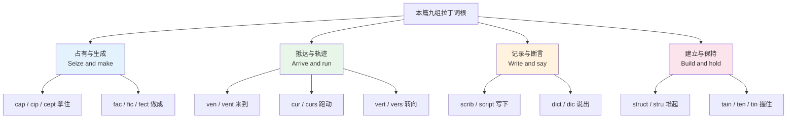
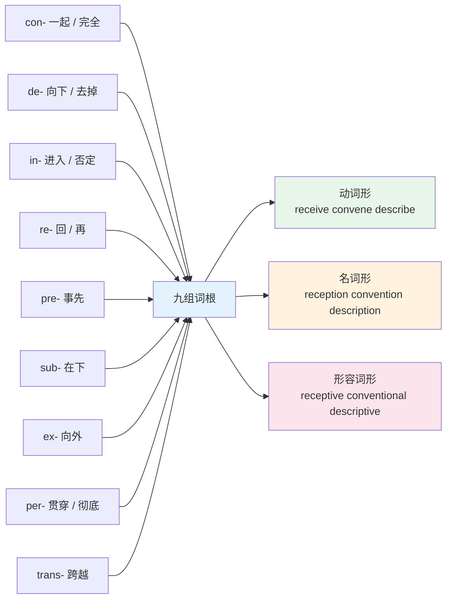
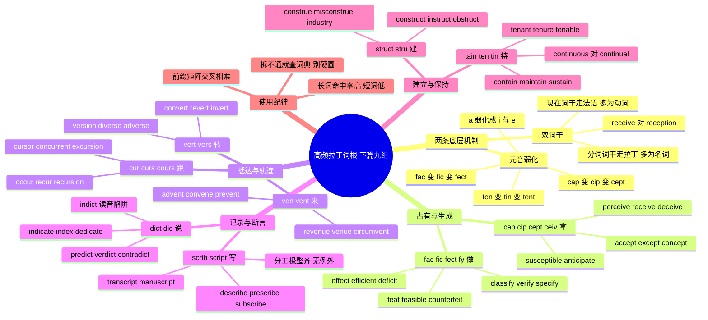

# 高频拉丁词根（下）

> [!info] 本篇定位
>
> 接着 [[15.词根、合成与缩略/01.高频拉丁词根（上）\|高频拉丁词根（上）]] 往下走。上篇那批词根 `spect` `duc` `port` `mit` `ject` `tract` `pon` `fer` 说的都是**位移**——看向哪里、带到哪里、扔向哪里。本篇这九组词根说的是**占有、生成、抵达、记录、断言、建立、转向、保持**，落点从「东西在动」变成「事情成了什么状态」。
>
> 读完你会拿到两把钥匙：一是拉丁动词的**双词干**机制，它解释了为什么 `receive` 的名词是 `reception` 而不是 `receivement`；二是**元音弱化**规律，它解释了为什么 `cap` 会写成 `cip` 和 `cept`、`fac` 会写成 `fic` 和 `fect`。抓住这两条，九个词根扩出来的两百五十多个词就不再是两百五十个孤立条目。
>
> 本篇同时是技术文档词汇的地基。`recursion` `cursor` `concurrent` `constructor` `container` `exception` `intercept` `descriptor` `revert` `persistent` 这一串词，全部落在本篇九个词根上。

---

## 1. 本篇导读：一个词根为什么会长出两副面孔

拉丁动词在英语里留下的从来不是一个形态，而是两个。`receive` 和 `reception` 长得不像，却是同一个词根；`describe` 和 `description` 也是。这不是英语的随意变形，是拉丁语原本的语法结构被整块搬了过来。

### 1.1 双词干：现在词干与分词词干

拉丁动词的主要形式里有两个词干值得记：**现在词干**（动词原形所在的那个形态）和**分词词干**（完成被动分词所在的那个形态）。举 `capiō`（我拿）为例，它的现在词干是 `cap-`，完成分词是 `captus`，分词词干是 `capt-`。

英语在不同历史时期从这两条线上各借了一批词。走现在词干这条线的，多半经过法语，形态更「软」，常常是动词：`receive` `conceive` `describe` `convene`。走分词词干这条线的，多半直接从书面拉丁语搬，形态更「硬」，常常是名词或形容词：`reception` `concept` `description` `convention`。

| 词根 | 拉丁原形 | 现在词干在英语里的样子 | 分词词干在英语里的样子 | 典型配对 |
| --- | --- | --- | --- | --- |
| 拿 | capiō, captum | cap- / cip- / ceiv- | capt- / cept- | receive → reception |
| 做 | faciō, factum | fac- / fic- / -fy | fact- / fect- | satisfy → satisfaction |
| 来 | veniō, ventum | ven- | vent- | convene → convention |
| 跑 | currō, cursum | cur- / cour- | curs- / cours- | recur → recursion |
| 写 | scrībō, scriptum | scrib- | script- | describe → description |
| 说 | dīcō, dictum | dic- | dict- | indicate → diction |
| 建 | struō, structum | stru- | struct- | construe → construction |
| 转 | vertō, versum | vert- | vers- | convert → conversion |
| 持 | teneō, tentum | ten- / tain- / tin- | tent- | retain → retention |

这张表是全篇的骨架。看到一个陌生的长词，先判断它落在哪一行，再看前缀，剩下的靠上下文补齐往往就够了。

### 1.2 元音弱化：a 为什么会变成 i 和 e

第二条规律比双词干更隐蔽。拉丁语加了前缀之后，重音位置前移，词根里原本的 `a` 处在非重读的中间音节，读着读着就弱化了：在开音节里弱成 `i`，在闭音节里弱成 `e`。

```text
capiō  单独用       →  cap-      capture, capable
ad + capiō         →  accipiō   →  accept（分词 acceptus）、recipient
                       a 弱化成 i / e

faciō  单独用       →  fac-      fact, factory
ex + faciō         →  efficiō   →  efficient（分词 effectus）→ effect
                       a 弱化成 i / e

teneō  单独用       →  ten-      tenant, tenable
re + teneō         →  retineō   →  retain（分词 retentum）→ retention
                       e 弱化成 i / ai
```

弱化的结果是同一个词根在英语里有三套拼法：不带前缀的原形（`cap` `fac` `ten`）、带前缀的现在式（`cip` `fic` `tin`）、带前缀的分词式（`cept` `fect` `tent`）。三套拼法看起来毫无关系，实际是同一个词根在不同重音环境下的三种读音被写了下来。

> [!tip] 一条可操作的还原法
>
> 见到 `cip` `cept` `fic` `fect` `tin` `tent` `ceiv` 这类音节，先把元音还原成 `a` 或 `e`，再看还剩什么：
>
> - `susceptible` → sus(sub) + **cap** + ible → 「能被从下面拿住的」→ 易受影响的
> - `deficient` → de + **fac** + ient → 「做得不够的」→ 不足的
> - `pertinent` → per + **ten** + ent → 「一路握住不放的」→ 紧扣主题的
>
> 还原动作只花两秒，但能把三套拼法压回一套，记忆量直接减掉三分之二。

### 1.3 九个词根的语义分组



四组的划分不是随手切的，跟这批词在真实文本里的分布对得上。占有与生成这组撑起了论文里讨论「概念、效果、能力」的那一层；抵达与轨迹这组撑起了「事件发生、状态转换」的那一层；记录与断言这组几乎垄断了「文献、规定、判断」的表达；建立与保持这组在工程与制度文本里密度最高。四组合起来，就是一篇学术文章的动词骨架。

---

## 2. cap / cip / cept / ceiv：抓在手里

拉丁 `capere` 是「抓、拿」。英语里的三套变体分工清楚：`cap-` 保留原音，多在不带前缀或前缀不改重音的词里；`cip-` 出现在带前缀的现在式；`cept-` 出现在带前缀的分词式；`ceiv-` 是经法语转手的那一支，只出现在四个高频动词上。

### 2.1 cap- 原形一支：能力与容量

| 英文 | 英式音标 | 美式音标 | 词性 | 中文 | 搭配与说明 |
| --- | --- | --- | --- | --- | --- |
| **capture** | /ˈkæptʃə/ | /ˈkæptʃər/ | v./n. | 捕获；捕捉 | capture data 采集数据；capture the essence 抓住实质 |
| **captive** | /ˈkæptɪv/ | /ˈkæptɪv/ | n./adj. | 俘虏；被囚的 | a captive audience 走不掉的听众 |
| **captivate** | /ˈkæptɪveɪt/ | /ˈkæptɪveɪt/ | v. | 迷住 | 被动多：be captivated by |
| **captor** | /ˈkæptə/ | /ˈkæptər/ | n. | 捕获者 | 与 captive 成对，施受关系 |
| **capable** | /ˈkeɪpəbl/ | /ˈkeɪpəbl/ | adj. | 有能力的 | capable of doing，不接 to do |
| **capability** | /ˌkeɪpəˈbɪləti/ | /ˌkeɪpəˈbɪləti/ | n. | 能力；能耐 | 技术文档常用复数 capabilities |
| **capacity** | /kəˈpæsəti/ | /kəˈpæsəti/ | n. | 容量；身份 | in his capacity as chair 以主席身份 |
| **capacious** | /kəˈpeɪʃəs/ | /kəˈpeɪʃəs/ | adj. | 容量大的 | 正式；描述包、房间 |
| **caption** | /ˈkæpʃn/ | /ˈkæpʃn/ | n./v. | 图片说明；字幕 | 「抓取要点的一行字」 |
| **capsule** | /ˈkæpsjuːl/ | /ˈkæpsəl/ | n. | 胶囊；太空舱 | 英式带 /j/，美式无 |
| **occupy** | /ˈɒkjupaɪ/ | /ˈɑːkjupaɪ/ | v. | 占据；占用 | ob + cap；occupy memory 占内存 |
| **occupation** | /ˌɒkjuˈpeɪʃn/ | /ˌɑːkjəˈpeɪʃn/ | n. | 职业；占领 | 表格里的「职业」栏用它 |
| **recuperate** | /rɪˈkuːpəreɪt/ | /rɪˈkuːpəreɪt/ | v. | 康复；追回 | re + cap，「把健康重新拿回来」 |

### 2.2 cip- 与 cept- 两支：接受、例外、感知

| 英文 | 英式音标 | 美式音标 | 词性 | 中文 | 搭配与说明 |
| --- | --- | --- | --- | --- | --- |
| **accept** | /əkˈsept/ | /əkˈsept/ | v. | 接受 | ad + cept，「朝自己这边拿」 |
| **acceptance** | /əkˈseptəns/ | /əkˈseptəns/ | n. | 接受；验收 | acceptance criteria 验收标准 |
| **except** | /ɪkˈsept/ | /ɪkˈsept/ | prep./v. | 除……之外；除外 | ex + cept，「拿出去」 |
| **exception** | /ɪkˈsepʃn/ | /ɪkˈsepʃn/ | n. | 例外；异常 | 编程里 throw / catch an exception |
| **exceptional** | /ɪkˈsepʃənl/ | /ɪkˈsepʃənl/ | adj. | 卓越的；例外的 | 褒贬取决于语境 |
| **concept** | /ˈkɒnsept/ | /ˈkɑːnsept/ | n. | 概念 | con + cept，「一把抓拢的东西」 |
| **conception** | /kənˈsepʃn/ | /kənˈsepʃn/ | n. | 构想；受孕 | 两义并存，靠语境分 |
| **conceive** | /kənˈsiːv/ | /kənˈsiːv/ | v. | 构想；怀孕 | conceive of an idea |
| **conceivable** | /kənˈsiːvəbl/ | /kənˈsiːvəbl/ | adj. | 可想象的 | every conceivable 每一种可以想到的 |
| **intercept** | /ˌɪntəˈsept/ | /ˌɪntərˈsept/ | v. | 拦截 | 网络与军事高频；名词 interceptor |
| **perceive** | /pəˈsiːv/ | /pərˈsiːv/ | v. | 察觉；看待 | perceive X as Y |
| **perception** | /pəˈsepʃn/ | /pərˈsepʃn/ | n. | 感知；看法 | public perception 公众观感 |
| **perceptive** | /pəˈseptɪv/ | /pərˈseptɪv/ | adj. | 有洞察力的 | 夸人用；不同于 perceptible |
| **perceptible** | /pəˈseptəbl/ | /pərˈseptəbl/ | adj. | 可察觉的 | 描述事物；a perceptible delay |
| **receive** | /rɪˈsiːv/ | /rɪˈsiːv/ | v. | 收到 | re + ceiv，「拿回来」 |
| **receipt** | /rɪˈsiːt/ | /rɪˈsiːt/ | n. | 收据；收到 | p 不发音；on receipt of 收到后 |
| **reception** | /rɪˈsepʃn/ | /rɪˈsepʃn/ | n. | 接待处；接收 | 三义：前台、招待会、信号 |
| **receptive** | /rɪˈseptɪv/ | /rɪˈseptɪv/ | adj. | 乐于接受的 | receptive to feedback |
| **receptacle** | /rɪˈseptəkl/ | /rɪˈseptəkl/ | n. | 容器；插座 | 正式；美式指电源插座 |
| **recipient** | /rɪˈsɪpiənt/ | /rɪˈsɪpiənt/ | n. | 接受者；收件人 | 邮件与颁奖语境 |
| **deceive** | /dɪˈsiːv/ | /dɪˈsiːv/ | v. | 欺骗 | de + ceiv，「拿走真相」 |
| **deception** | /dɪˈsepʃn/ | /dɪˈsepʃn/ | n. | 欺骗 | 不可数为主 |
| **deceptive** | /dɪˈseptɪv/ | /dɪˈseptɪv/ | adj. | 具欺骗性的 | deceptively simple 看着简单其实不 |
| **susceptible** | /səˈseptəbl/ | /səˈseptəbl/ | adj. | 易受影响的 | susceptible to attack 易受攻击 |
| **anticipate** | /ænˈtɪsɪpeɪt/ | /ænˈtɪsɪpeɪt/ | v. | 预料；先行处理 | ante + cip，「提前拿住」 |
| **participate** | /pɑːˈtɪsɪpeɪt/ | /pɑːrˈtɪsɪpeɪt/ | v. | 参与 | part + cip，「拿走一份」 |
| **participant** | /pɑːˈtɪsɪpənt/ | /pɑːrˈtɪsɪpənt/ | n. | 参与者 | 学术论文里指受试者 |
| **principle** | /ˈprɪnsəpl/ | /ˈprɪnsəpl/ | n. | 原则 | prin + cip，「先拿住的那条」 |
| **principal** | /ˈprɪnsəpl/ | /ˈprɪnsəpl/ | adj./n. | 主要的；校长；本金 | 与 principle 同音不同义 |
| **municipal** | /mjuːˈnɪsɪpl/ | /mjuːˈnɪsɪpl/ | adj. | 市政的 | munic 职责 + cip |
| **emancipate** | /ɪˈmænsɪpeɪt/ | /ɪˈmænsɪpeɪt/ | v. | 解放 | e + man 手 + cip，「从手里放开」 |
| **incipient** | /ɪnˈsɪpiənt/ | /ɪnˈsɪpiənt/ | adj. | 初期的 | 正式；an incipient crisis |
| **recipe** | /ˈresəpi/ | /ˈresəpi/ | n. | 食谱；秘诀 | 原是拉丁祈使句「取用」，重音在首 |

> [!warning] principle 与 principal 是最常见的一对同音混淆
>
> 两个词读音完全相同，靠拼写区分，而拼写又只差一个字母。
>
> - ❌ ~~That violates our basic principals.~~
> - ✅ That violates our basic **principles**.（这违反了我们的基本原则）
> - ❌ ~~The principle reason is cost.~~
> - ✅ The **principal** reason is cost.（主要原因是成本）
>
> 记法：`principle` 以 `-le` 结尾，和 `rule` 一样是抽象的「条」；`principal` 以 `-al` 结尾，是形容词后缀，本义「主要的」，名词义「校长」「本金」都是「主要那个」的名词化。更多同类近形词见 [[16.词义辨析、搭配与短语动词/03.近形近音易混词与中式英语陷阱\|近形近音易混词与中式英语陷阱]]。

> [!example] cap 族在技术语境里的例句
>
> - The proxy **intercepts** every outbound request before it reaches the gateway.
>   - 代理会在每个出站请求抵达网关之前拦截它。
> - Older browsers are **susceptible** to this class of injection.
>   - 老版本浏览器容易受到这类注入攻击。
> - The service throws an **exception** when the payload **capacity** is exceeded.
>   - 载荷容量超限时服务会抛出异常。
> - We could not have **anticipated** that the retry logic would amplify the load.
>   - 我们没能预料到重试逻辑会放大负载。

---

## 3. fac / fic / fect / fy：做出来

`facere` 是「做、造」，覆盖面在拉丁词根里数一数二。它的变体最多：`fac-` `fic-` `fect-` `-fy` `feit-` `fair`。之所以铺得这么开，是因为这个词根同时走了拉丁书面路线和法语口语路线，两条线都留下了大量词。

### 3.1 fac- 与 fact- 一支：事实与设施

| 英文 | 英式音标 | 美式音标 | 词性 | 中文 | 搭配与说明 |
| --- | --- | --- | --- | --- | --- |
| **fact** | /fækt/ | /fækt/ | n. | 事实 | 「被做出来的事」；in fact 实际上 |
| **factor** | /ˈfæktə/ | /ˈfæktər/ | n./v. | 因素；分解 | factor in 把……考虑进去 |
| **factory** | /ˈfæktri/ | /ˈfæktəri/ | n. | 工厂 | 编程里的工厂模式同名 |
| **faculty** | /ˈfækəlti/ | /ˈfækəlti/ | n. | 能力；全体教员 | 美式常指学院或师资 |
| **facile** | /ˈfæsaɪl/ | /ˈfæsəl/ | adj. | 轻率的；肤浅的 | 贬义为主；英式词尾读 /aɪl/，美式弱读 |
| **facilitate** | /fəˈsɪlɪteɪt/ | /fəˈsɪləteɪt/ | v. | 促进；主持 | facilitate a workshop 主持工作坊 |
| **facility** | /fəˈsɪləti/ | /fəˈsɪləti/ | n. | 设施；才能 | 复数 facilities 指场馆设施 |
| **manufacture** | /ˌmænjuˈfæktʃə/ | /ˌmænjəˈfæktʃər/ | v./n. | 制造 | manu 手 + fact，「手工做」 |
| **benefactor** | /ˈbenɪfæktə/ | /ˈbenɪfæktər/ | n. | 捐助人 | bene 好 + fact |
| **malefactor** | /ˈmælɪfæktə/ | /ˈmælɪfæktər/ | n. | 作恶者 | 旧体；法律文本偶见 |
| **artifact** | /ˈɑːtɪfækt/ | /ˈɑːrtɪfækt/ | n. | 人工制品；伪影 | 英式也写 artefact；构建产物同名 |
| **facsimile** | /fækˈsɪməli/ | /fækˈsɪməli/ | n. | 摹本；传真 | fac + simile 相似，缩短成 fax |
| **factual** | /ˈfæktʃuəl/ | /ˈfæktʃuəl/ | adj. | 事实的 | factual accuracy 事实准确性 |
| **de facto** | /ˌdeɪ ˈfæktəʊ/ | /ˌdeɪ ˈfæktoʊ/ | adj./adv. | 事实上的 | 拉丁原句直接借入，与 de jure 相对 |

### 3.2 fic- 与 fect- 一支：效果与效率

| 英文 | 英式音标 | 美式音标 | 词性 | 中文 | 搭配与说明 |
| --- | --- | --- | --- | --- | --- |
| **effect** | /ɪˈfekt/ | /ɪˈfekt/ | n./v. | 效果；实现 | 名词为主；take effect 生效 |
| **effective** | /ɪˈfektɪv/ | /ɪˈfektɪv/ | adj. | 有效的；生效的 | effective immediately 即刻生效 |
| **efficient** | /ɪˈfɪʃnt/ | /ɪˈfɪʃnt/ | adj. | 高效的 | 「投入产出比高」，不同于 effective |
| **efficacy** | /ˈefɪkəsi/ | /ˈefɪkəsi/ | n. | 功效 | 医药与政策文本；重音在首 |
| **affect** | /əˈfekt/ | /əˈfekt/ | v. | 影响 | 动词；名词 affect 是心理学术语 |
| **defect** | /ˈdiːfekt/ | /ˈdiːfekt/ | n. | 缺陷 | 动词义「叛逃」重音后移 /dɪˈfekt/ |
| **defective** | /dɪˈfektɪv/ | /dɪˈfektɪv/ | adj. | 有缺陷的 | 产品与法律语境 |
| **infect** | /ɪnˈfekt/ | /ɪnˈfekt/ | v. | 感染 | 名词 infection，形容词 infectious |
| **disinfect** | /ˌdɪsɪnˈfekt/ | /ˌdɪsɪnˈfekt/ | v. | 消毒 | disinfectant 消毒剂 |
| **perfect** | /ˈpɜːfɪkt/ | /ˈpɜːrfɪkt/ | adj. | 完成的；完美的 | 动词 /pəˈfekt/ 重音后移 |
| **confection** | /kənˈfekʃn/ | /kənˈfekʃn/ | n. | 甜点；精制品 | confectionery 糖果店 |
| **proficient** | /prəˈfɪʃnt/ | /prəˈfɪʃnt/ | adj. | 熟练的 | proficient in Python |
| **sufficient** | /səˈfɪʃnt/ | /səˈfɪʃnt/ | adj. | 足够的 | 比 enough 正式；suffice v. |
| **deficient** | /dɪˈfɪʃnt/ | /dɪˈfɪʃnt/ | adj. | 缺乏的 | deficient in vitamin D |
| **deficit** | /ˈdefɪsɪt/ | /ˈdefɪsɪt/ | n. | 赤字；不足 | trade deficit 贸易逆差 |
| **artificial** | /ˌɑːtɪˈfɪʃl/ | /ˌɑːrtɪˈfɪʃl/ | adj. | 人造的 | artificial intelligence |
| **beneficial** | /ˌbenɪˈfɪʃl/ | /ˌbenɪˈfɪʃl/ | adj. | 有益的 | beneficial to sb |
| **superficial** | /ˌsuːpəˈfɪʃl/ | /ˌsuːpərˈfɪʃl/ | adj. | 表面的；肤浅的 | super 上 + facies 面，「只在表层那一面」 |
| **specific** | /spəˈsɪfɪk/ | /spəˈsɪfɪk/ | adj./n. | 具体的；细则 | spec 看 + fic；名词多用复数 |
| **magnificent** | /mæɡˈnɪfɪsnt/ | /mæɡˈnɪfɪsnt/ | adj. | 宏伟的 | magn 大 + fic |
| **significant** | /sɪɡˈnɪfɪkənt/ | /sɪɡˈnɪfɪkənt/ | adj. | 显著的；有统计意义的 | 学术里是术语，见 19.03 |
| **sacrifice** | /ˈsækrɪfaɪs/ | /ˈsækrɪfaɪs/ | n./v. | 牺牲 | sacr 神圣 + fic，「做成圣物」 |
| **office** | /ˈɒfɪs/ | /ˈɔːfɪs/ | n. | 办公室；职务 | op 工作 + fic，「做工的地方」 |
| **official** | /əˈfɪʃl/ | /əˈfɪʃl/ | adj./n. | 官方的；官员 | 与 officious 差别极大 |
| **officious** | /əˈfɪʃəs/ | /əˈfɪʃəs/ | adj. | 好管闲事的 | 贬义；别当 official 的同义词用 |

### 3.3 -fy 一支：把某物变成某状态

`-fy` 是 `facere` 经法语磨损后的动词后缀，接在名词或形容词后面，意思是「使成为」。它的名词形固定成 `-fication`。这条线在英语里仍然能造新词，`gamify` `speechify` 都是近代产物。

| 英文 | 英式音标 | 美式音标 | 词性 | 中文 | 搭配与说明 |
| --- | --- | --- | --- | --- | --- |
| **classify** | /ˈklæsɪfaɪ/ | /ˈklæsɪfaɪ/ | v. | 分类 | 名词 classification |
| **verify** | /ˈverɪfaɪ/ | /ˈverɪfaɪ/ | v. | 验证 | ver 真；verification 验证 |
| **modify** | /ˈmɒdɪfaɪ/ | /ˈmɑːdɪfaɪ/ | v. | 修改 | 语法术语 modifier 修饰语 |
| **justify** | /ˈdʒʌstɪfaɪ/ | /ˈdʒʌstɪfaɪ/ | v. | 证明合理；对齐 | 排版里指两端对齐 |
| **qualify** | /ˈkwɒlɪfaɪ/ | /ˈkwɑːlɪfaɪ/ | v. | 使合格；限定 | 学术里常是「限定」义 |
| **notify** | /ˈnəʊtɪfaɪ/ | /ˈnoʊtɪfaɪ/ | v. | 通知 | notification 推送通知 |
| **magnify** | /ˈmæɡnɪfaɪ/ | /ˈmæɡnɪfaɪ/ | v. | 放大 | magnifying glass 放大镜 |
| **amplify** | /ˈæmplɪfaɪ/ | /ˈæmplɪfaɪ/ | v. | 增强；扩大 | ampl 宽；amplifier 放大器 |
| **simplify** | /ˈsɪmplɪfaɪ/ | /ˈsɪmplɪfaɪ/ | v. | 简化 | oversimplify 过度简化 |
| **specify** | /ˈspesɪfaɪ/ | /ˈspesɪfaɪ/ | v. | 明确规定 | specification 规格说明 |
| **identify** | /aɪˈdentɪfaɪ/ | /aɪˈdentɪfaɪ/ | v. | 识别；认同 | identify with sb 有共鸣 |
| **testify** | /ˈtestɪfaɪ/ | /ˈtestɪfaɪ/ | v. | 作证 | testify to sth |
| **ratify** | /ˈrætɪfaɪ/ | /ˈrætɪfaɪ/ | v. | 批准 | 条约与协议语境 |
| **nullify** | /ˈnʌlɪfaɪ/ | /ˈnʌlɪfaɪ/ | v. | 使无效 | 法律与技术都用 |
| **clarify** | /ˈklærɪfaɪ/ | /ˈklerɪfaɪ/ | v. | 澄清 | clarify a point |
| **certify** | /ˈsɜːtɪfaɪ/ | /ˈsɜːrtɪfaɪ/ | v. | 认证 | certificate 证书 |
| **diversify** | /daɪˈvɜːsɪfaɪ/ | /dɪˈvɜːrsɪfaɪ/ | v. | 多元化 | 同时含 vers 词根，见第 9 节 |

### 3.4 法语路线：feat、feit、fit、fair

| 英文 | 英式音标 | 美式音标 | 词性 | 中文 | 搭配与说明 |
| --- | --- | --- | --- | --- | --- |
| **feat** | /fiːt/ | /fiːt/ | n. | 壮举 | a remarkable feat of engineering |
| **defeat** | /dɪˈfiːt/ | /dɪˈfiːt/ | v./n. | 击败；失败 | de + feat，「把已做的拆掉」 |
| **feature** | /ˈfiːtʃə/ | /ˈfiːtʃər/ | n./v. | 特征；功能 | 软件里的「功能」就是它 |
| **feasible** | /ˈfiːzəbl/ | /ˈfiːzəbl/ | adj. | 可行的 | 「做得成的」；feasibility study |
| **counterfeit** | /ˈkaʊntəfɪt/ | /ˈkaʊntərfɪt/ | adj./v. | 伪造的；仿造 | counter 对着 + feit，「照着做一个」 |
| **forfeit** | /ˈfɔːfɪt/ | /ˈfɔːrfɪt/ | v./n. | 丧失；罚金 | forfeit the right to appeal |
| **profit** | /ˈprɒfɪt/ | /ˈprɑːfɪt/ | n./v. | 利润；获益 | pro 向前 + fit，「往前做出来的」 |
| **affair** | /əˈfeə/ | /əˈfer/ | n. | 事务；风流韵事 | 复数 affairs 指事务、时局 |

> [!warning] effective 与 efficient 不是同义词
>
> 两个词都译作「有效」，衡量的却是两件事。
>
> - ✅ The new index made the query **effective**.（新索引让这个查询能查出正确结果——达到了目的）
> - ✅ The new index made the query **efficient**.（新索引让这个查询跑得省资源——投入产出比高）
>
> `effective` 关心「有没有做成这件事」，`efficient` 关心「做成它花了多少代价」。一个方案可以 effective but not efficient（能跑通但极慢），也可以 efficient but not effective（跑得飞快但答案是错的）。评审文档里把这两个词混用，读者会理解反。
>
> 同族的名词也分家：`effectiveness` 是成效，`efficiency` 是效率，`efficacy` 专用于医药与干预措施在理想条件下的功效。

---

## 4. ven / vent：来到

`venīre` 是「来」。这个词根的抽象化程度很高——真正表示物理位移的词很少，绝大多数说的是「事情来了」「人聚拢过来」「先一步来堵住」。

| 英文 | 英式音标 | 美式音标 | 词性 | 中文 | 搭配与说明 |
| --- | --- | --- | --- | --- | --- |
| **advent** | /ˈædvent/ | /ˈædvent/ | n. | 到来；问世 | with the advent of 随着……的出现 |
| **adventure** | /ədˈventʃə/ | /ədˈventʃər/ | n. | 冒险 | 原义「将要来临的事」 |
| **venture** | /ˈventʃə/ | /ˈventʃər/ | n./v. | 风险事业；冒险 | venture capital 风险投资 |
| **convene** | /kənˈviːn/ | /kənˈviːn/ | v. | 召集；开会 | convene a meeting，正式 |
| **convention** | /kənˈvenʃn/ | /kənˈvenʃn/ | n. | 惯例；公约；大会 | 三义都用，技术里指命名约定 |
| **conventional** | /kənˈvenʃənl/ | /kənˈvenʃənl/ | adj. | 传统的；常规的 | 中性偏轻贬 |
| **convenient** | /kənˈviːniənt/ | /kənˈviːniənt/ | adj. | 方便的 | 「凑到一起的」→ 顺手 |
| **convenience** | /kənˈviːniəns/ | /kənˈviːniəns/ | n. | 便利 | at your convenience 你方便时 |
| **covenant** | /ˈkʌvənənt/ | /ˈkʌvənənt/ | n. | 契约；盟约 | 法律与宗教语境 |
| **event** | /ɪˈvent/ | /ɪˈvent/ | n. | 事件 | e + vent，「出来的事」 |
| **eventual** | /ɪˈventʃuəl/ | /ɪˈventʃuəl/ | adj. | 最终的 | eventual consistency 最终一致性 |
| **eventually** | /ɪˈventʃuəli/ | /ɪˈventʃuəli/ | adv. | 最终 | 不等于 finally，无「终于」的情绪 |
| **intervene** | /ˌɪntəˈviːn/ | /ˌɪntərˈviːn/ | v. | 介入；干预 | inter 之间 + ven |
| **intervention** | /ˌɪntəˈvenʃn/ | /ˌɪntərˈvenʃn/ | n. | 干预；介入措施 | 医学与政策术语 |
| **invent** | /ɪnˈvent/ | /ɪnˈvent/ | v. | 发明；捏造 | 「碰上、遇到」→ 想出来 |
| **inventory** | /ˈɪnvəntri/ | /ˈɪnvəntɔːri/ | n. | 库存；清单 | 英式 -tory 弱读成一个音节，美式读全 |
| **prevent** | /prɪˈvent/ | /prɪˈvent/ | v. | 阻止 | pre + ven，「先一步来挡住」 |
| **preventive** | /prɪˈventɪv/ | /prɪˈventɪv/ | adj. | 预防性的 | 也写 preventative，同义 |
| **revenue** | /ˈrevənjuː/ | /ˈrevənuː/ | n. | 收入；营收 | 「回来的钱」；财报科目 |
| **avenue** | /ˈævənjuː/ | /ˈævənuː/ | n. | 大道；途径 | an avenue for growth 增长路径 |
| **venue** | /ˈvenjuː/ | /ˈvenjuː/ | n. | 举办地点 | 会议与演出用 |
| **souvenir** | /ˌsuːvəˈnɪə/ | /ˌsuːvəˈnɪr/ | n. | 纪念品 | sub + ven，「浮上心头的东西」 |
| **circumvent** | /ˌsɜːkəmˈvent/ | /ˌsɜːrkəmˈvent/ | v. | 规避；绕开 | circumvent a restriction |
| **contravene** | /ˌkɒntrəˈviːn/ | /ˌkɑːntrəˈviːn/ | v. | 违反 | contra 对抗 + ven；法律用语 |
| **provenance** | /ˈprɒvənəns/ | /ˈprɑːvənəns/ | n. | 出处；来源 | 艺术品与数据溯源都用 |
| **misadventure** | /ˌmɪsədˈventʃə/ | /ˌmɪsədˈventʃər/ | n. | 不幸事故 | death by misadventure 意外致死 |

> [!tip] convention 的三个义项靠搭配区分
>
> 同一个词在三种文本里指三件事，判断办法是看它前面跟什么。
>
> - `by convention` `naming convention` `it is a convention that` → **惯例、约定**
> - `the Geneva Convention` `sign a convention` → **公约、条约**
> - `attend a convention` `the annual convention` → **大型会议**（美式尤其常见）
>
> 技术文档里出现的几乎全是第一种。看到 `convention over configuration` 不要往「会议」上想，它说的是「约定优先于配置」。

> [!example] ven 族在正式文本里的例句
>
> - With the **advent** of vector databases, retrieval pipelines were rebuilt from scratch.
>   - 随着向量数据库的问世，检索链路被彻底重写。
> - The clause was struck down because it **contravened** the data protection statute.
>   - 该条款因违反数据保护法而被撤销。
> - Rate limiting **prevents** a single client from exhausting the connection pool.
>   - 限流可以防止单个客户端耗尽连接池。
> - Replicas converge to the same state **eventually**, not instantly.
>   - 副本最终会收敛到同一状态，但不是瞬间完成。

---

## 5. cur / curs / cours：跑起来

`currere` 是「跑」。它在英语里分三条线：`cur-` 出现在动词里，`curs-` 出现在名词与形容词里，`cours-` 是经法语进来的那支，拼写多了一个 o。这个词根在计算机文本里的密度尤其高。

### 5.1 cur- 与 curs- 一支

| 英文 | 英式音标 | 美式音标 | 词性 | 中文 | 搭配与说明 |
| --- | --- | --- | --- | --- | --- |
| **current** | /ˈkʌrənt/ | /ˈkɜːrənt/ | adj./n. | 当前的；电流；水流 | 「正在跑的」；the current release |
| **currency** | /ˈkʌrənsi/ | /ˈkɜːrənsi/ | n. | 货币；流通 | 「跑得动的东西」 |
| **curriculum** | /kəˈrɪkjələm/ | /kəˈrɪkjələm/ | n. | 课程体系 | 复数 curricula；CV 的全称在此 |
| **occur** | /əˈkɜː/ | /əˈkɜːr/ | v. | 发生；想到 | it occurs to me that 我忽然想到 |
| **occurrence** | /əˈkʌrəns/ | /əˈkɜːrəns/ | n. | 发生；出现次数 | 双写 r，拼写高频错点 |
| **recur** | /rɪˈkɜː/ | /rɪˈkɜːr/ | v. | 再次发生 | a recurring meeting 周期性会议 |
| **recurrence** | /rɪˈkʌrəns/ | /rɪˈkɜːrəns/ | n. | 复发；再现 | 医学与故障分析 |
| **recursion** | /rɪˈkɜːʃn/ | /rɪˈkɜːrʒn/ | n. | 递归 | 「跑回自己身上」 |
| **recursive** | /rɪˈkɜːsɪv/ | /rɪˈkɜːrsɪv/ | adj. | 递归的 | recursive descent 递归下降 |
| **concur** | /kənˈkɜː/ | /kənˈkɜːr/ | v. | 同意；同时发生 | 正式；I concur 我同意 |
| **concurrent** | /kənˈkʌrənt/ | /kənˈkɜːrənt/ | adj. | 并发的；同时的 | concurrent requests 并发请求 |
| **concurrency** | /kənˈkʌrənsi/ | /kənˈkɜːrənsi/ | n. | 并发 | 与 parallelism 不是一回事 |
| **incur** | /ɪnˈkɜː/ | /ɪnˈkɜːr/ | v. | 招致；产生 | incur costs 产生成本 |
| **cursor** | /ˈkɜːsə/ | /ˈkɜːrsər/ | n. | 光标；游标 | 数据库里的游标也是它 |
| **cursory** | /ˈkɜːsəri/ | /ˈkɜːrsəri/ | adj. | 草率的；粗略的 | a cursory glance 匆匆一瞥 |
| **cursive** | /ˈkɜːsɪv/ | /ˈkɜːrsɪv/ | adj./n. | 草书的；连笔字 | 手写体术语 |
| **precursor** | /priːˈkɜːsə/ | /prɪˈkɜːrsər/ | n. | 前身；前体 | a precursor to X |
| **excursion** | /ɪkˈskɜːʃn/ | /ɪkˈskɜːrʒn/ | n. | 短途旅行；偏离 | 技术里指参数越界 |
| **discursive** | /dɪsˈkɜːsɪv/ | /dɪsˈkɜːrsɪv/ | adj. | 散漫的；话语的 | 学术里指「话语层面的」 |
| **incursion** | /ɪnˈkɜːʃn/ | /ɪnˈkɜːrʒn/ | n. | 入侵；侵入 | 军事与安全语境 |

### 5.2 cours- 一支

| 英文 | 英式音标 | 美式音标 | 词性 | 中文 | 搭配与说明 |
| --- | --- | --- | --- | --- | --- |
| **course** | /kɔːs/ | /kɔːrs/ | n. | 课程；进程；航向 | in the course of 在……过程中 |
| **discourse** | /ˈdɪskɔːs/ | /ˈdɪskɔːrs/ | n./v. | 话语；论述 | 学术里指语篇层面 |
| **concourse** | /ˈkɒŋkɔːs/ | /ˈkɑːŋkɔːrs/ | n. | 大厅；集散区 | 机场与车站 |
| **intercourse** | /ˈɪntəkɔːs/ | /ˈɪntərkɔːrs/ | n. | 交往；性交 | 现代英语里后一义占主导，慎用 |
| **recourse** | /rɪˈkɔːs/ | /ˈriːkɔːrs/ | n. | 求助；追索权 | have recourse to 诉诸 |
| **courier** | /ˈkʊriə/ | /ˈkɜːriər/ | n. | 快递员；信使 | 英美读音差别明显 |
| **corridor** | /ˈkɒrɪdɔː/ | /ˈkɔːrɪdɔːr/ | n. | 走廊；通道 | 「跑道」引申；air corridor 空中通道 |

> [!warning] concurrent 和 parallel 在技术文本里不能互换
>
> 中文都可能译成「并行」，英文分得很细。
>
> - **concurrent**：多个任务在同一段时间内交错推进，不要求同一时刻真的都在跑。单核机器可以有 concurrency。
> - **parallel**：多个任务在同一时刻真的同时执行，需要多个执行单元。
>
> 所以 `concurrency` 是结构问题（怎么组织任务），`parallelism` 是执行问题（有没有硬件同时跑）。评审里写 `make it parallel` 而实际只是加了协程，会被指出用词不准。词条释义见 [[20.专业领域词汇/01.IT 深度英语（上）：核心概念术语与其读音\|IT 深度英语（上）：核心概念术语与其读音]]。

> [!example] cur 族在技术与学术文本里的例句
>
> - The bug **recurs** only under **concurrent** writes to the same partition.
>   - 这个缺陷只在对同一分区并发写入时复现。
> - A **cursory** review will not catch this class of race condition.
>   - 粗略的评审抓不出这一类竞态。
> - Deep **recursion** on untrusted input will exhaust the stack.
>   - 对不可信输入做深度递归会耗尽栈空间。
> - Every retry **incurs** an additional round trip.
>   - 每次重试都会额外产生一次往返开销。

---

## 6. scrib / script：写下来

`scrībere` 是「刻、写」。这个词根的现代分工非常整齐：动词一律用 `-scribe`，名词一律用 `-scription`，形容词一律用 `-scriptive`，几乎没有例外。学会一个词就等于学会一整族。

| 英文 | 英式音标 | 美式音标 | 词性 | 中文 | 搭配与说明 |
| --- | --- | --- | --- | --- | --- |
| **describe** | /dɪˈskraɪb/ | /dɪˈskraɪb/ | v. | 描述 | describe sth as 把……说成 |
| **description** | /dɪˈskrɪpʃn/ | /dɪˈskrɪpʃn/ | n. | 描述 | beyond description 难以形容 |
| **descriptive** | /dɪˈskrɪptɪv/ | /dɪˈskrɪptɪv/ | adj. | 描述性的 | 与 prescriptive 成对 |
| **descriptor** | /dɪˈskrɪptə/ | /dɪˈskrɪptər/ | n. | 描述符 | file descriptor 文件描述符 |
| **prescribe** | /prɪˈskraɪb/ | /prɪˈskraɪb/ | v. | 开处方；规定 | pre 事先 + scrib |
| **prescription** | /prɪˈskrɪpʃn/ | /prɪˈskrɪpʃn/ | n. | 处方；规定 | on prescription 凭处方 |
| **prescriptive** | /prɪˈskrɪptɪv/ | /prɪˈskrɪptɪv/ | adj. | 规定性的 | 语言学与规范文档常用 |
| **proscribe** | /prəˈskraɪb/ | /proʊˈskraɪb/ | v. | 禁止 | 与 prescribe 意思几乎相反 |
| **subscribe** | /səbˈskraɪb/ | /səbˈskraɪb/ | v. | 订阅；赞同 | subscribe to a view 认同某观点 |
| **subscription** | /səbˈskrɪpʃn/ | /səbˈskrɪpʃn/ | n. | 订阅；订阅费 | SaaS 计费术语 |
| **subscript** | /ˈsʌbskrɪpt/ | /ˈsʌbskrɪpt/ | n. | 下标 | 与 superscript 上标成对 |
| **superscript** | /ˈsuːpəskrɪpt/ | /ˈsuːpərskrɪpt/ | n. | 上标 | 排版与数学 |
| **inscribe** | /ɪnˈskraɪb/ | /ɪnˈskraɪb/ | v. | 铭刻；题写 | inscribe a name on 刻上名字 |
| **inscription** | /ɪnˈskrɪpʃn/ | /ɪnˈskrɪpʃn/ | n. | 碑文；题词 | 考古与文献 |
| **ascribe** | /əˈskraɪb/ | /əˈskraɪb/ | v. | 归因于；归于 | ascribe X to Y |
| **transcribe** | /trænˈskraɪb/ | /trænˈskraɪb/ | v. | 转录；誊写 | 语音转文字也用它 |
| **transcript** | /ˈtrænskrɪpt/ | /ˈtrænskrɪpt/ | n. | 成绩单；文字记录 | 申请学校要的就是它 |
| **transcription** | /trænˈskrɪpʃn/ | /trænˈskrɪpʃn/ | n. | 转录；音标标注 | 词典的音标就叫 transcription |
| **circumscribe** | /ˈsɜːkəmskraɪb/ | /ˈsɜːrkəmskraɪb/ | v. | 限制；外接 | 几何里指「外接」 |
| **conscript** | /ˈkɒnskrɪpt/ | /ˈkɑːnskrɪpt/ | n./v. | 应征兵；征召 | 动词重音后移 /kənˈskrɪpt/ |
| **manuscript** | /ˈmænjuskrɪpt/ | /ˈmænjəskrɪpt/ | n. | 手稿；投稿 | 论文投出去就叫 manuscript |
| **postscript** | /ˈpəʊstskrɪpt/ | /ˈpoʊstskrɪpt/ | n. | 附言；后记 | 缩写 P.S. 的全称 |
| **typescript** | /ˈtaɪpskrɪpt/ | /ˈtaɪpskrɪpt/ | n. | 打字稿 | 出版业指作者交来的打字原稿 |
| **nondescript** | /ˌnɒndɪˈskrɪpt/ | /ˌnɑːndɪˈskrɪpt/ | adj. | 平淡无奇的 | 「没什么可描述的」 |
| **script** | /skrɪpt/ | /skrɪpt/ | n./v. | 剧本；脚本；文字 | 三义并存，技术里指脚本 |
| **scripture** | /ˈskrɪptʃə/ | /ˈskrɪptʃər/ | n. | 经文 | 大写 Scripture 指圣经 |
| **scribe** | /skraɪb/ | /skraɪb/ | n. | 抄写员 | 历史语境 |
| **scribble** | /ˈskrɪbl/ | /ˈskrɪbl/ | v./n. | 潦草地写；涂鸦 | -le 是反复义小词缀 |

> [!warning] prescribe 与 proscribe 只差一个字母，意思几乎相反
>
> 这是英语里最危险的一对形近词之一，因为两个词都是正式语域，都出现在规范文本里，拼写只差 `re` 和 `ro`。
>
> - ✅ The standard **prescribes** a minimum key length of 256 bits.（标准规定密钥长度至少 256 位——要求这么做）
> - ✅ The standard **proscribes** the use of MD5 for signatures.（标准禁止用 MD5 做签名——要求不这么做）
>
> 拆开看就分得清：`pre-` 是「事先」，事先写下来的是**要求**；`pro-` 在这里是「公开张贴」，古罗马把人名公开贴出来是宣布此人被剥夺权利，所以是**禁止**。
>
> 另一对同样值得留意的是 `descriptive` 与 `prescriptive`：前者描述现实是什么样，后者规定应该是什么样。语言学、编码规范、API 文档三处都用这组对立。

> [!tip] scrib 族是最省力的一个词族
>
> 这个词根几乎不出例外，掌握一个动词就能推出全套形态：
>
> ```text
> 动词      -scribe      subscribe   prescribe   transcribe
> 名词      -scription   subscription prescription transcription
> 形容词    -scriptive   （罕）      prescriptive descriptive
> 施事名词  -scriber     subscriber  prescriber  transcriber
> 结果名词  -script      （无）      （无）      transcript
> ```
>
> 唯一需要单独记的是 `describe` 的名词是 `description` 而不是 `descripture`，以及 `ascribe` 的名词是 `ascription`（不常用，写作里多用 `attribution`）。

---

## 7. dict / dic：说出口

`dīcere` 是「说」，更早的义项是「指出」。这条早期义项没有消失，它藏在 `indicate` `index` `indicative` 这一小批词里——`index` 的字面义就是「指出来的那根手指」。分词词干 `dict-` 覆盖了绝大多数常用词，`dic-` 只在少数词里保留。

### 7.1 dict- 一支

| 英文 | 英式音标 | 美式音标 | 词性 | 中文 | 搭配与说明 |
| --- | --- | --- | --- | --- | --- |
| **dictate** | /dɪkˈteɪt/ | /ˈdɪkteɪt/ | v./n. | 口述；命令 | 英美重音不同；名词读 /ˈdɪkteɪt/ |
| **dictation** | /dɪkˈteɪʃn/ | /dɪkˈteɪʃn/ | n. | 听写；口述 | take dictation 记录口述 |
| **dictator** | /dɪkˈteɪtə/ | /ˈdɪkteɪtər/ | n. | 独裁者 | 英美重音位置不同 |
| **dictionary** | /ˈdɪkʃənri/ | /ˈdɪkʃəneri/ | n. | 词典；字典结构 | 编程里的 dict 就是它 |
| **diction** | /ˈdɪkʃn/ | /ˈdɪkʃn/ | n. | 措辞；吐字 | 文学批评与演讲评价 |
| **dictum** | /ˈdɪktəm/ | /ˈdɪktəm/ | n. | 格言；宣言 | 复数 dicta，正式 |
| **predict** | /prɪˈdɪkt/ | /prɪˈdɪkt/ | v. | 预测 | pre 事先 + dict |
| **prediction** | /prɪˈdɪkʃn/ | /prɪˈdɪkʃn/ | n. | 预测 | 机器学习里的输出 |
| **predictable** | /prɪˈdɪktəbl/ | /prɪˈdɪktəbl/ | adj. | 可预测的 | 评人时略带贬义 |
| **contradict** | /ˌkɒntrəˈdɪkt/ | /ˌkɑːntrəˈdɪkt/ | v. | 反驳；矛盾 | contra 对着 + dict |
| **contradiction** | /ˌkɒntrəˈdɪkʃn/ | /ˌkɑːntrəˈdɪkʃn/ | n. | 矛盾 | a contradiction in terms 自相矛盾 |
| **verdict** | /ˈvɜːdɪkt/ | /ˈvɜːrdɪkt/ | n. | 裁决；结论 | ver 真 + dict，「说出真相」 |
| **edict** | /ˈiːdɪkt/ | /ˈiːdɪkt/ | n. | 法令；敕令 | 历史与讽刺语境 |
| **interdict** | /ˈɪntədɪkt/ | /ˈɪntərdɪkt/ | n./v. | 禁令；封锁 | 法律与军事 |
| **jurisdiction** | /ˌdʒʊərɪsˈdɪkʃn/ | /ˌdʒʊrɪsˈdɪkʃn/ | n. | 管辖权；辖区 | juris 法 + dict |
| **benediction** | /ˌbenɪˈdɪkʃn/ | /ˌbenɪˈdɪkʃn/ | n. | 祝福 | bene 好 + dict |
| **valedictory** | /ˌvælɪˈdɪktəri/ | /ˌvælɪˈdɪktəri/ | adj./n. | 告别的；告别辞 | vale 再见 + dict |
| **indict** | /ɪnˈdaɪt/ | /ɪnˈdaɪt/ | v. | 起诉；控告 | c 不发音，读音陷阱 |
| **indictment** | /ɪnˈdaɪtmənt/ | /ɪnˈdaɪtmənt/ | n. | 起诉书；控诉 | 引申义「有力的批评」 |
| **addict** | /ˈædɪkt/ | /ˈædɪkt/ | n. | 成瘾者 | 动词 /əˈdɪkt/ 重音后移 |
| **addiction** | /əˈdɪkʃn/ | /əˈdɪkʃn/ | n. | 成瘾 | be addicted to |
| **ditto** | /ˈdɪtəʊ/ | /ˈdɪtoʊ/ | adv./n. | 同上 | 表格与口语里的「同上」 |

### 7.2 dic- 一支：指出而非说出

| 英文 | 英式音标 | 美式音标 | 词性 | 中文 | 搭配与说明 |
| --- | --- | --- | --- | --- | --- |
| **indicate** | /ˈɪndɪkeɪt/ | /ˈɪndɪkeɪt/ | v. | 表明；指示 | 学术里的 hedging 常用词 |
| **indication** | /ˌɪndɪˈkeɪʃn/ | /ˌɪndɪˈkeɪʃn/ | n. | 迹象；适应症 | 药品说明书里是「适应症」 |
| **indicator** | /ˈɪndɪkeɪtə/ | /ˈɪndɪkeɪtər/ | n. | 指标；转向灯 | 英式车灯叫 indicator |
| **indicative** | /ɪnˈdɪkətɪv/ | /ɪnˈdɪkətɪv/ | adj. | 表明的；陈述语气的 | indicative of sth |
| **index** | /ˈɪndeks/ | /ˈɪndeks/ | n./v. | 索引；指数 | 复数 indexes 或 indices |
| **dedicate** | /ˈdedɪkeɪt/ | /ˈdedɪkeɪt/ | v. | 奉献；专用于 | a dedicated server 专用服务器 |
| **dedication** | /ˌdedɪˈkeɪʃn/ | /ˌdedɪˈkeɪʃn/ | n. | 奉献；题献 | 褒义 |
| **abdicate** | /ˈæbdɪkeɪt/ | /ˈæbdɪkeɪt/ | v. | 退位；放弃 | abdicate responsibility 推卸责任 |
| **vindicate** | /ˈvɪndɪkeɪt/ | /ˈvɪndɪkeɪt/ | v. | 证明无罪；证实 | be vindicated 事后被证明是对的 |
| **predicate** | /ˈpredɪkət/ | /ˈpredɪkət/ | n./v. | 谓语；以……为基础 | 动词读 /ˈpredɪkeɪt/；逻辑里指谓词 |
| **adjudicate** | /əˈdʒuːdɪkeɪt/ | /əˈdʒuːdɪkeɪt/ | v. | 裁定 | 法律与评审 |

> [!warning] indict 的读音是纯粹的历史遗留
>
> `indict` 读 /ɪnˈdaɪt/，中间的 `c` 完全不发音，跟 `indicate` 的读音毫无相似之处。
>
> 原因是这个词先经古法语进入英语，当时拼作 `endite`，读音就是现在这个；后来文艺复兴时期的学者为了「显示它来自拉丁语 indictare」，硬往拼写里塞回了一个 `c`，读音却没跟着改。同类的还有 `debt`（拉丁 debitum 塞回 b）、`doubt`（dubitare 塞回 b）、`receipt`（recepta 塞回 p）。
>
> - ❌ ~~/ɪnˈdɪkt/~~
> - ✅ /ɪnˈdaɪt/，与 `incite` 押韵
>
> 这类「学者拼写」的成因在 [[01.词汇入门与学习方法/02.自然拼读：拼写与发音对应规则\|自然拼读：拼写与发音对应规则]] 里有系统交代。

> [!example] dict 族在正式文本里的例句
>
> - The benchmark results **contradict** the vendor's published figures.
>   - 基准测试结果与厂商公布的数据相矛盾。
> - Nothing in the log **indicates** that the certificate was ever rotated.
>   - 日志里没有任何迹象表明证书曾经轮换过。
> - The court held that it lacked **jurisdiction** over the foreign subsidiary.
>   - 法院认定其对该境外子公司没有管辖权。
> - We run a **dedicated** replica for analytical queries.
>   - 我们跑一个专用副本来承接分析型查询。

---

## 8. struct / stru：一层层堆起来

`struere` 是「堆放、砌」。分词词干 `structum` 几乎垄断了英语里的现代形态，`stru-` 只留在 `construe` `misconstrue` 两个词里。这个词根在工程、组织、语言学三类文本里出现频率都很高。

| 英文 | 英式音标 | 美式音标 | 词性 | 中文 | 搭配与说明 |
| --- | --- | --- | --- | --- | --- |
| **structure** | /ˈstrʌktʃə/ | /ˈstrʌktʃər/ | n./v. | 结构；组织 | data structure 数据结构 |
| **structural** | /ˈstrʌktʃərəl/ | /ˈstrʌktʃərəl/ | adj. | 结构性的 | a structural problem 结构性问题 |
| **restructure** | /ˌriːˈstrʌktʃə/ | /ˌriːˈstrʌktʃər/ | v. | 重组；改组 | 商业语境常是裁员的委婉说法 |
| **infrastructure** | /ˈɪnfrəstrʌktʃə/ | /ˈɪnfrəstrʌktʃər/ | n. | 基础设施 | infra 下 + struct |
| **superstructure** | /ˈsuːpəstrʌktʃə/ | /ˈsuːpərstrʌktʃər/ | n. | 上层建筑 | 与 infrastructure 成对 |
| **unstructured** | /ˌʌnˈstrʌktʃəd/ | /ˌʌnˈstrʌktʃərd/ | adj. | 非结构化的 | unstructured data 非结构化数据 |
| **construct** | /kənˈstrʌkt/ | /kənˈstrʌkt/ | v./n. | 建造；构念 | 名词重音在首 /ˈkɒnstrʌkt/ |
| **construction** | /kənˈstrʌkʃn/ | /kənˈstrʌkʃn/ | n. | 建设；结构 | 语法里指「句式、结构」 |
| **constructive** | /kənˈstrʌktɪv/ | /kənˈstrʌktɪv/ | adj. | 建设性的 | constructive feedback |
| **constructor** | /kənˈstrʌktə/ | /kənˈstrʌktər/ | n. | 构造函数；建造者 | 面向对象术语 |
| **reconstruct** | /ˌriːkənˈstrʌkt/ | /ˌriːkənˈstrʌkt/ | v. | 重建；还原 | reconstruct the timeline 还原时间线 |
| **deconstruct** | /ˌdiːkənˈstrʌkt/ | /ˌdiːkənˈstrʌkt/ | v. | 解构 | 文论术语，也进了日常 |
| **instruct** | /ɪnˈstrʌkt/ | /ɪnˈstrʌkt/ | v. | 指示；教导 | 「在心里搭起来」 |
| **instruction** | /ɪnˈstrʌkʃn/ | /ɪnˈstrʌkʃn/ | n. | 指令；说明 | 复数指说明书；CPU 指令也是它 |
| **instructive** | /ɪnˈstrʌktɪv/ | /ɪnˈstrʌktɪv/ | adj. | 有教益的 | an instructive failure |
| **instructor** | /ɪnˈstrʌktə/ | /ɪnˈstrʌktər/ | n. | 教练；讲师 | 美式高校职称 |
| **instrument** | /ˈɪnstrəmənt/ | /ˈɪnstrəmənt/ | n. | 仪器；乐器；文书 | 法律里指「法律文件」 |
| **instrumental** | /ˌɪnstrəˈmentl/ | /ˌɪnstrəˈmentl/ | adj. | 起关键作用的；器乐的 | be instrumental in doing |
| **destroy** | /dɪˈstrɔɪ/ | /dɪˈstrɔɪ/ | v. | 摧毁 | 法语路线，拼写变形最大 |
| **destruction** | /dɪˈstrʌkʃn/ | /dɪˈstrʌkʃn/ | n. | 破坏 | 拉丁路线的名词 |
| **destructive** | /dɪˈstrʌktɪv/ | /dɪˈstrʌktɪv/ | adj. | 破坏性的 | destructive testing 破坏性测试 |
| **destructor** | /dɪˈstrʌktə/ | /dɪˈstrʌktər/ | n. | 析构函数 | C++ 术语，与 constructor 成对 |
| **obstruct** | /əbˈstrʌkt/ | /əbˈstrʌkt/ | v. | 阻塞；妨碍 | ob 挡着 + struct |
| **obstruction** | /əbˈstrʌkʃn/ | /əbˈstrʌkʃn/ | n. | 阻碍；梗阻 | 医学里指肠梗阻等 |
| **construe** | /kənˈstruː/ | /kənˈstruː/ | v. | 解释；理解为 | be construed as 被理解成 |
| **misconstrue** | /ˌmɪskənˈstruː/ | /ˌmɪskənˈstruː/ | v. | 曲解 | 正式；合同与声明常用 |
| **industry** | /ˈɪndəstri/ | /ˈɪndəstri/ | n. | 工业；勤勉 | indu 内 + stru，「往里堆」 |
| **industrious** | /ɪnˈdʌstriəs/ | /ɪnˈdʌstriəs/ | adj. | 勤奋的 | 与 industrial 工业的 不同 |

> [!warning] industrial 与 industrious 不是同一件事
>
> 同族但义项分岔，误用会闹笑话。
>
> - ✅ an **industrial** park（工业园区）
> - ✅ an **industrious** student（勤奋的学生）
> - ❌ ~~an industrious park~~
>
> `industry` 本身也有两个义项：常用的「工业、行业」，以及正式书面语里的「勤勉」。看到 `with great industry` 不要理解成「用巨大的工业」，它说的是「非常勤勉地」。这类同根不同后缀导致义项分岔的现象，在 [[14.构词法：前缀与后缀/06.形容词、动词与副词后缀\|形容词、动词与副词后缀]] 里有成组的对照表。

> [!example] struct 族在工程文本里的例句
>
> - Silence here should not be **construed** as approval.
>   - 此处的沉默不应被理解为批准。
> - The **constructor** must not perform blocking I/O.
>   - 构造函数不得执行阻塞式输入输出。
> - Most of our logs are **unstructured**, which makes querying them expensive.
>   - 我们的日志大部分是非结构化的，查询代价因此很高。
> - Their review was blunt but **constructive**.
>   - 他们的评审很直接，但有建设性。

---

## 9. vert / vers：转个方向

`vertere` 是「转」。它的分词词干 `versum` 产出的词甚至比现在词干还多，`-version` `-verse` `-versity` `-versary` 全在这条线上。这个词根的抽象义特别丰富，因为「转向」可以引申成改变、反转、对立、多样、迂回五个方向。

### 9.1 vert- 一支：动词为主

| 英文 | 英式音标 | 美式音标 | 词性 | 中文 | 搭配与说明 |
| --- | --- | --- | --- | --- | --- |
| **convert** | /kənˈvɜːt/ | /kənˈvɜːrt/ | v. | 转换；皈依 | 名词 /ˈkɒnvɜːt/ 重音在首 |
| **converter** | /kənˈvɜːtə/ | /kənˈvɜːrtər/ | n. | 转换器 | 也拼 convertor，前者更常见 |
| **divert** | /daɪˈvɜːt/ | /dɪˈvɜːrt/ | v. | 转移；改道 | divert traffic 分流 |
| **invert** | /ɪnˈvɜːt/ | /ɪnˈvɜːrt/ | v. | 倒置；反转 | inverted index 倒排索引 |
| **revert** | /rɪˈvɜːt/ | /rɪˈvɜːrt/ | v. | 恢复；回退 | 版本控制里的「回滚」 |
| **avert** | /əˈvɜːt/ | /əˈvɜːrt/ | v. | 避免；转移目光 | avert a crisis 避免危机 |
| **subvert** | /səbˈvɜːt/ | /səbˈvɜːrt/ | v. | 颠覆 | subvert expectations |
| **pervert** | /pəˈvɜːt/ | /pərˈvɜːrt/ | v. | 曲解；败坏 | 名词 /ˈpɜːvɜːt/ 是贬义人称 |
| **advertise** | /ˈædvətaɪz/ | /ˈædvərtaɪz/ | v. | 做广告；公布 | 「把注意力转过来」 |
| **advertisement** | /ədˈvɜːtɪsmənt/ | /ˌædvərˈtaɪzmənt/ | n. | 广告 | 英美重音差别极大 |
| **extrovert** | /ˈekstrəvɜːt/ | /ˈekstrəvɜːrt/ | n. | 外向者 | 也拼 extravert（心理学专业写法） |
| **introvert** | /ˈɪntrəvɜːt/ | /ˈɪntrəvɜːrt/ | n. | 内向者 | intro 向内 + vert |
| **vertical** | /ˈvɜːtɪkl/ | /ˈvɜːrtɪkl/ | adj./n. | 垂直的；垂直领域 | 商业里指细分行业 |
| **vertex** | /ˈvɜːteks/ | /ˈvɜːrteks/ | n. | 顶点 | 复数 vertices；图论与图形学 |
| **vertigo** | /ˈvɜːtɪɡəʊ/ | /ˈvɜːrtɪɡoʊ/ | n. | 眩晕 | 医学术语；「天旋地转」 |
| **vortex** | /ˈvɔːteks/ | /ˈvɔːrteks/ | n. | 漩涡 | 复数 vortices；同源异形 |

### 9.2 vers- 一支：名词与形容词为主

| 英文 | 英式音标 | 美式音标 | 词性 | 中文 | 搭配与说明 |
| --- | --- | --- | --- | --- | --- |
| **version** | /ˈvɜːʃn/ | /ˈvɜːrʒn/ | n. | 版本；说法 | 英美辅音清浊不同 |
| **conversion** | /kənˈvɜːʃn/ | /kənˈvɜːrʒn/ | n. | 转换；转化率 | 增长分析里的核心指标 |
| **diversion** | /daɪˈvɜːʃn/ | /dɪˈvɜːrʒn/ | n. | 改道；消遣 | 英式路牌上的「绕行」 |
| **inversion** | /ɪnˈvɜːʃn/ | /ɪnˈvɜːrʒn/ | n. | 倒置；倒装 | 语法术语也是它 |
| **reverse** | /rɪˈvɜːs/ | /rɪˈvɜːrs/ | v./n./adj. | 倒转；反面 | reverse proxy 反向代理 |
| **reversible** | /rɪˈvɜːsəbl/ | /rɪˈvɜːrsəbl/ | adj. | 可逆的 | 与 irreversible 成对 |
| **inverse** | /ˌɪnˈvɜːs/ | /ˌɪnˈvɜːrs/ | adj./n. | 相反的；逆 | inverse relationship 反比关系 |
| **adverse** | /ˈædvɜːs/ | /ædˈvɜːrs/ | adj. | 不利的 | adverse effects 不良反应 |
| **averse** | /əˈvɜːs/ | /əˈvɜːrs/ | adj. | 反感的 | be averse to；risk-averse 厌恶风险 |
| **adversary** | /ˈædvəsəri/ | /ˈædvərseri/ | n. | 对手 | 安全领域指攻击方 |
| **adversarial** | /ˌædvəˈseəriəl/ | /ˌædvərˈseriəl/ | adj. | 对抗性的 | adversarial examples 对抗样本 |
| **diverse** | /daɪˈvɜːs/ | /dɪˈvɜːrs/ | adj. | 多样的 | 「转向不同方向的」 |
| **diversity** | /daɪˈvɜːsəti/ | /dɪˈvɜːrsəti/ | n. | 多样性 | 生态与组织语境 |
| **universe** | /ˈjuːnɪvɜːs/ | /ˈjuːnɪvɜːrs/ | n. | 宇宙；全集 | uni 一 + vers，「转成一体」 |
| **university** | /ˌjuːnɪˈvɜːsəti/ | /ˌjuːnɪˈvɜːrsəti/ | n. | 大学 | 原指「学者共同体」 |
| **universal** | /ˌjuːnɪˈvɜːsl/ | /ˌjuːnɪˈvɜːrsl/ | adj. | 普遍的；通用的 | universal set 全集 |
| **anniversary** | /ˌænɪˈvɜːsəri/ | /ˌænɪˈvɜːrsəri/ | n. | 周年纪念 | ann 年 + vers，「年份转回来」 |
| **controversy** | /ˈkɒntrəvɜːsi/ | /ˈkɑːntrəvɜːrsi/ | n. | 争议 | 英式也读 /kənˈtrɒvəsi/ |
| **controversial** | /ˌkɒntrəˈvɜːʃl/ | /ˌkɑːntrəˈvɜːrʃl/ | adj. | 有争议的 | contra 对着 + vers |
| **versatile** | /ˈvɜːsətaɪl/ | /ˈvɜːrsətəl/ | adj. | 多才多艺的；多用途的 | 与 facile 同型：英式词尾读 /aɪl/，美式弱读 |
| **verse** | /vɜːs/ | /vɜːrs/ | n. | 诗；诗节 | 原指犁地转一行 |
| **versus** | /ˈvɜːsəs/ | /ˈvɜːrsəs/ | prep. | 对 | 缩写 vs. 或 v. |
| **traverse** | /trəˈvɜːs/ | /trəˈvɜːrs/ | v. | 穿越；遍历 | 树遍历用的就是它 |
| **converse** | /kənˈvɜːs/ | /kənˈvɜːrs/ | v./n. | 交谈；逆命题 | 名词与形容词重音在首 |
| **irreversible** | /ˌɪrɪˈvɜːsəbl/ | /ˌɪrɪˈvɜːrsəbl/ | adj. | 不可逆的 | an irreversible migration |

> [!warning] adverse 与 averse 差一个字母，搭配也不同
>
> - ✅ **adverse** weather conditions（恶劣天气）——修饰事物，意为「不利的」
> - ✅ She is not **averse** to a challenge.（她不排斥挑战）——修饰人，意为「反感的」，固定搭配 be averse to
>
> `adverse` 说的是客观条件对人不利，`averse` 说的是人主观上不愿意。安全与金融文本里高频出现的 `risk-averse`（厌恶风险的）用的是后者；药品说明书里的 `adverse event`（不良事件）用的是前者。两个词读音也不同：`adverse` 有 d 音，`averse` 没有。

> [!example] vert 族在技术与商业文本里的例句
>
> - We had to **revert** the migration because two indexes went missing.
>   - 由于两个索引丢失，我们不得不回滚这次迁移。
> - Signup **conversion** dropped after the extra verification step was added.
>   - 加了额外验证步骤之后，注册转化率下降了。
> - Traversing a deeply nested tree in a single request is **adverse** to latency budgets.
>   - 在单个请求里遍历深度嵌套的树对延迟预算不利。
> - The proposal remains **controversial** within the working group.
>   - 该提案在工作组内部仍有争议。

---

## 10. tain / ten / tin：握住不放

`tenēre` 是「握、持有」。三套变体的分布最规整：`-tain` 清一色是动词，`-tention` 与 `-tenance` 清一色是名词，`-tent` `-tin-` 这一支以名词为主、另带 `content`（形容词「满足的」）和 `retentive` 这类形容词，`ten-` 出现在不带前缀或经拉丁直借的词里。这是本篇最适合成组背的一族。

### 10.1 -tain 一支：清一色的动词

| 英文 | 英式音标 | 美式音标 | 词性 | 中文 | 搭配与说明 |
| --- | --- | --- | --- | --- | --- |
| **contain** | /kənˈteɪn/ | /kənˈteɪn/ | v. | 包含；遏制 | contain the outbreak 控制疫情 |
| **container** | /kənˈteɪnə/ | /kənˈteɪnər/ | n. | 容器；集装箱 | 云原生里的核心词 |
| **containment** | /kənˈteɪnmənt/ | /kənˈteɪnmənt/ | n. | 遏制；隔离 | 故障隔离与政治都用 |
| **detain** | /dɪˈteɪn/ | /dɪˈteɪn/ | v. | 拘留；耽搁 | 「拿开、扣住」 |
| **maintain** | /meɪnˈteɪn/ | /meɪnˈteɪn/ | v. | 维持；维护；坚称 | 三义并存；maintain that 坚称 |
| **obtain** | /əbˈteɪn/ | /əbˈteɪn/ | v. | 获得 | 比 get 正式；也有「通行」的自动词义 |
| **pertain** | /pəˈteɪn/ | /pərˈteɪn/ | v. | 与……有关 | pertain to，正式书面语 |
| **retain** | /rɪˈteɪn/ | /rɪˈteɪn/ | v. | 保留；留住 | retain users 留住用户 |
| **sustain** | /səˈsteɪn/ | /səˈsteɪn/ | v. | 维持；承受 | sustain damage 受损 |
| **abstain** | /əbˈsteɪn/ | /əbˈsteɪn/ | v. | 弃权；戒除 | abstain from voting 投票弃权 |
| **entertain** | /ˌentəˈteɪn/ | /ˌentərˈteɪn/ | v. | 娱乐；考虑 | entertain an idea 考虑某想法 |
| **attain** | /əˈteɪn/ | /əˈteɪn/ | v. | 达到；获得 | attain a goal；来自 tangere 但已并入本族用法 |

### 10.2 -tent 与 -tin 一支：名词与形容词

| 英文 | 英式音标 | 美式音标 | 词性 | 中文 | 搭配与说明 |
| --- | --- | --- | --- | --- | --- |
| **content** | /ˈkɒntent/ | /ˈkɑːntent/ | n. | 内容；容量 | 形容词「满足的」读 /kənˈtent/ |
| **contents** | /ˈkɒntents/ | /ˈkɑːntents/ | n. | 目录；内含物 | table of contents 目录 |
| **detention** | /dɪˈtenʃn/ | /dɪˈtenʃn/ | n. | 拘留；留堂 | 校园语境指课后留校 |
| **maintenance** | /ˈmeɪntənəns/ | /ˈmeɪntənəns/ | n. | 维护；抚养费 | 注意元音：不是 maintainance |
| **retention** | /rɪˈtenʃn/ | /rɪˈtenʃn/ | n. | 留存；保持 | data retention 数据保留期 |
| **retentive** | /rɪˈtentɪv/ | /rɪˈtentɪv/ | adj. | 记性好的；有保持力的 | a retentive memory |
| **sustenance** | /ˈsʌstɪnəns/ | /ˈsʌstɪnəns/ | n. | 食物；维持 | 正式；不是 sustainance |
| **sustainable** | /səˈsteɪnəbl/ | /səˈsteɪnəbl/ | adj. | 可持续的 | sustainable pace 可持续节奏 |
| **abstinence** | /ˈæbstɪnəns/ | /ˈæbstɪnəns/ | n. | 节制；戒除 | 医学与宗教语境 |
| **continent** | /ˈkɒntɪnənt/ | /ˈkɑːntɪnənt/ | n./adj. | 大陆；能自制的 | 「连成一片的陆地」 |
| **continue** | /kənˈtɪnjuː/ | /kənˈtɪnjuː/ | v. | 继续 | 循环语句里的关键字 |
| **continuous** | /kənˈtɪnjuəs/ | /kənˈtɪnjuəs/ | adj. | 连续不断的 | 无间断；对比 continual |
| **continual** | /kənˈtɪnjuəl/ | /kənˈtɪnjuəl/ | adj. | 反复发生的 | 有间断；常带厌烦语气 |
| **continuity** | /ˌkɒntɪˈnjuːəti/ | /ˌkɑːntəˈnuːəti/ | n. | 连续性；衔接 | business continuity 业务连续性 |
| **continuum** | /kənˈtɪnjuəm/ | /kənˈtɪnjuəm/ | n. | 连续统 | 复数 continua |
| **tenant** | /ˈtenənt/ | /ˈtenənt/ | n. | 租户 | 云计算里 multi-tenant 多租户 |
| **tenancy** | /ˈtenənsi/ | /ˈtenənsi/ | n. | 租期；租赁 | 租房合同用语 |
| **tenure** | /ˈtenjə/ | /ˈtenjər/ | n. | 任期；终身教职 | 高校语境的核心词 |
| **tenable** | /ˈtenəbl/ | /ˈtenəbl/ | adj. | 站得住脚的 | a tenable position 站得住的立场 |
| **untenable** | /ʌnˈtenəbl/ | /ʌnˈtenəbl/ | adj. | 站不住脚的 | 比肯定式更常用 |
| **tenacious** | /təˈneɪʃəs/ | /təˈneɪʃəs/ | adj. | 顽强的；抓得牢的 | 褒义为主 |
| **tenacity** | /təˈnæsəti/ | /təˈnæsəti/ | n. | 韧性；执着 | 名词形态元音变短 |
| **tenet** | /ˈtenɪt/ | /ˈtenɪt/ | n. | 信条；原则 | 「被持守的东西」；别与 tenant 混 |
| **retinue** | /ˈretɪnjuː/ | /ˈretənuː/ | n. | 随行人员 | 正式；「被留在身边的人」 |
| **countenance** | /ˈkaʊntɪnəns/ | /ˈkaʊntɪnəns/ | n./v. | 面容；容许 | 动词义正式，等于 tolerate |
| **impertinent** | /ɪmˈpɜːtɪnənt/ | /ɪmˈpɜːrtnənt/ | adj. | 无礼的 | 原义「不相干的」，引申成「放肆」 |
| **pertinent** | /ˈpɜːtɪnənt/ | /ˈpɜːrtnənt/ | adj. | 切题的 | pertinent to the question |
| **lieutenant** | /lefˈtenənt/ | /luːˈtenənt/ | n. | 中尉；副手 | 英美读音差别最大的军衔词 |

> [!warning] continuous 与 continual 的差别在有没有间断
>
> 两个词都从 `continue` 来，中文都译「持续的」，英语里分得很清楚。
>
> - ✅ a **continuous** stream of data（不间断的数据流——中间没有停）
> - ✅ **continual** interruptions（反复不断的打扰——每次都是独立事件，中间有间隔）
>
> 判断办法：能数出「一次、两次」的用 `continual`，数不出次数、只能量长度的用 `continuous`。技术文档里 `continuous integration`（持续集成）、`continuous deployment`（持续部署）用的都是 `continuous`，因为强调的是流程不中断而非事件反复。
>
> 另一组容易写错的是拼写：`maintain` 的名词是 `maintenance`（不是 maintainance），`sustain` 的名词是 `sustenance`（不是 sustainance）。原因就是本篇第 1.2 节讲的元音弱化——重音移到前面之后，`ai` 弱化成了 `e`。

> [!example] tain 族在工程与制度文本里的例句
>
> - Two members **abstained**, so the motion did not carry.
>   - 两名成员弃权，因此该动议未获通过。
> - Nothing in this section **pertains** to on-premise deployments.
>   - 本节内容与本地部署无关。
> - The **retention** policy deletes raw events after ninety days.
>   - 数据保留策略会在九十天后删除原始事件。
> - That argument is no longer **tenable** given the new measurements.
>   - 有了新的测量数据，那个论点已经站不住脚了。

---

## 11. 前缀矩阵：九个词根共用同一批前缀

学到这里会发现一件事：`con-` `de-` `in-` `pre-` `re-` `sub-` `ex-` `per-` `trans-` 这批前缀在九个词根上反复出现，而且每次的意思都一样。这意味着不必逐词记，只要把前缀表和词根表交叉相乘，大部分词都能推出来。



图里的三种输出形不是并列的三个词，而是同一个「前缀加词根」组合的三种词类外壳。真正需要记的是左边的前缀含义和中间的词根含义，右边的三个外壳交给后缀规律处理，那部分在 [[14.构词法：前缀与后缀/05.名词后缀家族\|名词后缀家族]] 里已经讲过。

### 11.1 交叉表：同一前缀在九个词根上的产物

| 前缀 | cap 拿 | fac 做 | ven 来 | cur 跑 | scrib 写 | dict 说 | struct 建 | vert 转 | ten 持 |
| --- | --- | --- | --- | --- | --- | --- | --- | --- | --- |
| con- 一起 | concept | confection | convene | concur | conscript | — | construct | convert | contain |
| de- 去掉 | deceive | defect | — | — | describe | — | destroy | — | detain |
| in- 进入 | incipient | infect | invent | incur | inscribe | indicate | instruct | invert | — |
| re- 回 | receive | — | revenue | recur | — | — | reconstruct | revert | retain |
| pre- 事先 | precept | prefect | prevent | precursor | prescribe | predict | — | — | — |
| sub- 在下 | susceptible | sufficient | souvenir | — | subscribe | — | substructure | subvert | sustain |
| ex- 向外 | except | effect | event | excursion | — | edict | — | — | — |
| per- 彻底 | perceive | perfect | — | — | — | — | — | pervert | pertain |
| trans- 跨越 | — | — | — | — | transcribe | — | — | traverse | — |
| ob- 挡着 | occupy | — | — | occur | — | — | obstruct | — | obtain |
| inter- 之间 | intercept | — | intervene | intercourse | — | interdict | — | — | — |
| circum- 环绕 | — | — | circumvent | — | circumscribe | — | — | — | — |
| contra- 对抗 | — | — | contravene | — | — | contradict | — | controversy | — |

表里的空格不是遗漏，是这个组合在英语里确实不存在或极其罕见。语言不会把所有格子都填满，但填了的格子含义高度可推。拿 `sub-` 那一行看：`susceptible`（能被从底下接住的）、`sufficient`（在下面顶住、够用的）、`subscribe`（在下面签名）、`sustain`（从下面托住），四个词表面毫无关联，实际共用同一个「从下面承托」的图式。

### 11.2 一条推词流程

拿到一个没见过的长词，按四步走通常能定住大致含义：

| 步骤 | 动作 | 以 `circumscribe` 为例 |
| --- | --- | --- |
| 1 | 切掉后缀 | `-e` 是动词标记，去掉不影响 |
| 2 | 认前缀 | `circum-` 环绕 |
| 3 | 还原词根元音 | `scrib` 写，本篇第 6 节 |
| 4 | 拼字面义再对语境 | 「围着画一圈」→ 限定范围、外接 |

再拿一个带同化前缀的词走一遍，`imperceptible`：`im-` 是 `in-` 在唇音前的同化否定形、`per-` 彻底、`cept` 拿住、`-ible` 能够——「无法被完全把握到的」→ 察觉不出的。前缀同化的规则在 [[14.构词法：前缀与后缀/03.方位、时间与关系前缀\|方位、时间与关系前缀]] 里给过完整表。

> [!tip] 推词法有边界，别推过头
>
> 这套办法对**学术层与技术层的长词**命中率高，对已经进入日常口语的短词命中率低。原因是短词在英语里活得久，语义漂移得远。
>
> - `recipe` 字面是「取用」，现在的意思是食谱，靠拆解推不出来
> - `office` 字面是「做工」，现在的意思是办公室与职务，中间隔了两千年
> - `advertise` 字面是「把注意力转向」，推到「广告」还差一步文化背景
>
> 遇到拆解结果和语感对不上，以词典释义为准，别硬圆。词根只是降低记忆成本的辅助手段，不是词义的判定标准。

---

## 12. 这九个词根在技术与学术文本里的高复现组合

对以读技术文档和原版书为目标的读者来说，这九个词根的价值集中在两类文本里：软件工程文档和学术论文。下面两张表把高复现的组合单列出来。

### 12.1 软件与工程文本

| 英文 | 英式音标 | 美式音标 | 词性 | 中文 | 搭配与说明 |
| --- | --- | --- | --- | --- | --- |
| **exception handling** | /ɪkˈsepʃn ˈhændlɪŋ/ | /ɪkˈsepʃn ˈhændlɪŋ/ | n. | 异常处理 | cap 族；catch / raise an exception |
| **interceptor** | /ˌɪntəˈseptə/ | /ˌɪntərˈseptər/ | n. | 拦截器 | 框架中间件的通用叫法 |
| **descriptor** | /dɪˈskrɪptə/ | /dɪˈskrɪptər/ | n. | 描述符 | file descriptor 简称 fd |
| **subscriber** | /səbˈskraɪbə/ | /səbˈskraɪbər/ | n. | 订阅者 | 发布订阅模型的一端 |
| **recursion depth** | /rɪˈkɜːʃn depθ/ | /rɪˈkɜːrʒn depθ/ | n. | 递归深度 | 栈溢出的直接原因 |
| **concurrency limit** | /kənˈkʌrənsi ˈlɪmɪt/ | /kənˈkɜːrənsi ˈlɪmɪt/ | n. | 并发上限 | 限流配置项 |
| **cursor pagination** | /ˈkɜːsə ˌpædʒɪˈneɪʃn/ | /ˈkɜːrsər ˌpædʒɪˈneɪʃn/ | n. | 游标分页 | 与 offset 分页相对 |
| **constructor** | /kənˈstrʌktə/ | /kənˈstrʌktər/ | n. | 构造函数 | 对象初始化入口 |
| **destructor** | /dɪˈstrʌktə/ | /dɪˈstrʌktər/ | n. | 析构函数 | 资源释放 |
| **infrastructure as code** | /ˈɪnfrəstrʌktʃə/ | /ˈɪnfrəstrʌktʃər/ | n. | 基础设施即代码 | 常缩写 IaC |
| **container image** | /kənˈteɪnə ˈɪmɪdʒ/ | /kənˈteɪnər ˈɪmɪdʒ/ | n. | 容器镜像 | 构建与分发单位 |
| **multi-tenant** | /ˌmʌlti ˈtenənt/ | /ˌmʌlti ˈtenənt/ | adj. | 多租户的 | tenant isolation 租户隔离 |
| **data retention** | /ˈdeɪtə rɪˈtenʃn/ | /ˈdeɪtə rɪˈtenʃn/ | n. | 数据保留期 | 合规文档必备条款 |
| **event-driven** | /ɪˈvent ˈdrɪvn/ | /ɪˈvent ˈdrɪvn/ | adj. | 事件驱动的 | ven 族；与轮询模型相对 |
| **revert a commit** | /rɪˈvɜːt ə kəˈmɪt/ | /rɪˈvɜːrt ə kəˈmɪt/ | v. | 回滚提交 | vert 族；不同于 reset |
| **inverted index** | /ɪnˈvɜːtɪd ˈɪndeks/ | /ɪnˈvɜːrtɪd ˈɪndeks/ | n. | 倒排索引 | 搜索引擎核心结构 |
| **reverse proxy** | /rɪˈvɜːs ˈprɒksi/ | /rɪˈvɜːrs ˈprɑːksi/ | n. | 反向代理 | 与 forward proxy 相对 |
| **tree traversal** | /triː trəˈvɜːsl/ | /triː trəˈvɜːrsl/ | n. | 树遍历 | 前中后序三种 |
| **adversarial input** | /ˌædvəˈseəriəl/ | /ˌædvərˈseriəl/ | adj. | 对抗性输入 | 安全与机器学习共用 |
| **instruction set** | /ɪnˈstrʌkʃn set/ | /ɪnˈstrʌkʃn set/ | n. | 指令集 | struct 族；CPU 架构文档的核心词 |
| **maintenance window** | /ˈmeɪntənəns ˈwɪndəʊ/ | /ˈmeɪntənəns ˈwɪndoʊ/ | n. | 维护窗口期 | 运维公告固定说法 |
| **sustained load** | /səˈsteɪnd ləʊd/ | /səˈsteɪnd loʊd/ | n. | 持续负载 | 与 peak load 峰值负载相对 |
| **effective permission** | /ɪˈfektɪv pəˈmɪʃn/ | /ɪˈfektɪv pərˈmɪʃn/ | n. | 生效权限 | 权限计算结果 |
| **specification** | /ˌspesɪfɪˈkeɪʃn/ | /ˌspesɪfɪˈkeɪʃn/ | n. | 规格说明 | 口语缩成 spec |

### 12.2 学术论文文本

| 英文 | 英式音标 | 美式音标 | 词性 | 中文 | 搭配与说明 |
| --- | --- | --- | --- | --- | --- |
| **conceptual framework** | /kənˈseptʃuəl/ | /kənˈseptʃuəl/ | n. | 概念框架 | 引言与理论部分 |
| **perceived risk** | /pəˈsiːvd rɪsk/ | /pərˈsiːvd rɪsk/ | n. | 感知风险 | 问卷研究常见变量 |
| **participant** | /pɑːˈtɪsɪpənt/ | /pɑːrˈtɪsɪpənt/ | n. | 受试者 | 方法部分固定用词 |
| **significant effect** | /sɪɡˈnɪfɪkənt ɪˈfekt/ | /sɪɡˈnɪfɪkənt ɪˈfekt/ | n. | 显著效应 | 统计术语，见 19.03 |
| **efficacy** | /ˈefɪkəsi/ | /ˈefɪkəsi/ | n. | 功效 | 理想条件下；对比 effectiveness |
| **intervention** | /ˌɪntəˈvenʃn/ | /ˌɪntərˈvenʃn/ | n. | 干预措施 | 实验组接受的处理 |
| **recurrent pattern** | /rɪˈkʌrənt/ | /rɪˈkɜːrənt/ | adj. | 反复出现的模式 | 质性研究编码常用 |
| **discourse analysis** | /ˈdɪskɔːs/ | /ˈdɪskɔːrs/ | n. | 话语分析 | 语言学与社会学方法 |
| **descriptive statistics** | /dɪˈskrɪptɪv/ | /dɪˈskrɪptɪv/ | n. | 描述性统计 | 与推断统计相对 |
| **prescriptive norm** | /prɪˈskrɪptɪv/ | /prɪˈskrɪptɪv/ | n. | 规定性规范 | 与描述性规范对立 |
| **indicate that** | /ˈɪndɪkeɪt/ | /ˈɪndɪkeɪt/ | v. | 表明 | hedging 常用；弱于 prove |
| **indicative of** | /ɪnˈdɪkətɪv/ | /ɪnˈdɪkətɪv/ | adj. | 表明……的 | be indicative of a trend |
| **structural equation** | /ˈstrʌktʃərəl/ | /ˈstrʌktʃərəl/ | n. | 结构方程 | SEM 建模 |
| **construct validity** | /ˈkɒnstrʌkt/ | /ˈkɑːnstrʌkt/ | n. | 构念效度 | construct 在此是名词「构念」 |
| **inverse correlation** | /ˌɪnˈvɜːs/ | /ˌɪnˈvɜːrs/ | n. | 负相关 | 也说 negative correlation |
| **diverse sample** | /daɪˈvɜːs/ | /dɪˈvɜːrs/ | adj. | 多样化样本 | 局限性讨论常提 |
| **adverse outcome** | /ˈædvɜːs/ | /ædˈvɜːrs/ | n. | 不良结局 | 医学研究术语 |
| **controversial finding** | /ˌkɒntrəˈvɜːʃl/ | /ˌkɑːntrəˈvɜːrʃl/ | adj. | 有争议的发现 | 文献综述用语 |
| **retention rate** | /rɪˈtenʃn reɪt/ | /rɪˈtenʃn reɪt/ | n. | 留存率；保留率 | 纵向研究与产品分析共用 |
| **tenable hypothesis** | /ˈtenəbl/ | /ˈtenəbl/ | adj. | 站得住的假设 | 讨论部分用语 |
| **provenance** | /ˈprɒvənəns/ | /ˈprɑːvənəns/ | n. | 数据来源 | 数据管理与考古共用 |
| **manuscript** | /ˈmænjuskrɪpt/ | /ˈmænjəskrɪpt/ | n. | 投稿；稿件 | 投出去到接收前都叫这个 |
| **cursory review** | /ˈkɜːsəri/ | /ˈkɜːrsəri/ | n. | 粗略审阅 | 审稿意见里的批评用语 |
| **with the advent of** | /wɪð ði ˈædvent əv/ | /wɪð ði ˈædvent əv/ | phr. | 随着……的出现 | ven 族；引言交代背景的固定开头 |

这两张表里的词，单个拆开都在前面九节出现过。真正值得记的是**它们成对出现的方式**：`throw an exception` 而不是 `send an exception`，`revert a commit` 而不是 `return a commit`，`indicate that` 而不是 `indicate to`。词根解决认词问题，搭配解决用词问题，后者在 [[16.词义辨析、搭配与短语动词/04.语块类型与搭配体系\|语块类型与搭配体系]] 里单独处理。

---

## 13. 形近词根与误拆清单

用词根拆词最大的风险不是拆不出，是拆错了还很自洽。下面这些是本篇九组词根最容易撞上的形近陷阱。

### 13.1 同形不同源的词根对

| 表面形态 | 词根 A | 词根 B | 判别办法 |
| --- | --- | --- | --- |
| cap | capere 拿：capture、accept、recipient | caput 头：capital、captain、decapitate、per capita | 「头」这支多与首领、首都、人头计数有关 |
| ven | venīre 来：event、convene、prevent | vendere 卖：vendor、vend、venal | 「卖」这支只有三四个词，记住即可 |
| cur | currere 跑：occur、cursor、recursion | cūra 关心：cure、curator、accurate、secure、curious、procure | 「关心」这支拼写多为 cur + 元音，且无 curs 变体 |
| ten | tenēre 持：contain、retain、tenant | tendere 伸：tension、extend、intense、tendency | 「伸」这支带 d，名词是 -tension 而非 -tention |
| dic | dīcere 说：predict、verdict、diction、dictionary | 无关：dice 骰子（源自拉丁 datum 给出）、dicey 由 dice 派生 | 有「说出、指出」义的才是 dic 族，dice 一支只讲赌具 |
| struct | struere 堆：construct、instruct | stāre 站：obstacle、status、stable、constant | 「站」这支没有 struct 拼写，只有 st + 元音 |
| vert | vertere 转：convert、version | vorare 吞：carnivore、voracious、devour | 「吞」这支拼作 vor，不是 ver |
| scrib | scrībere 写：describe、script、scribe、scribble | 无关：scrap 碎片、scrape 刮、scratch 抓挠 | scr- 开头不等于同族，scrap 那几个来自古诺斯语，只表刮擦 |

> [!warning] 三个最容易拆错的具体例子
>
> - **obstacle** 不是 `ob + struct`。它是 `ob`（挡着）+ `stāre`（站）+ `-cle`，字面「挡在路上站着的东西」。它跟 `obstruct` 只是语义相近，不是同一个词根。
> - **capital** 不是 `cap`（拿）。它是 `caput`（头）+ `-al`，「头等的」，由此分出首都、大写字母、资本三个义项。`per capita`（人均）也在这支上，字面是「按人头」。
> - **contingent** 不是 `con + ten`（持）。它是 `con` + `tangere`（触碰），字面「碰到一起的」，由此得出「依情况而定的」与「分遣队」两义。同源的还有 `contact` `tangent` `tangible`。

### 13.2 同族但义项已分岔的词对

| 词对 | 差别 | 记法 |
| --- | --- | --- |
| effective / efficient | 达到目的 / 省资源 | effect 是结果，effic 是产出比 |
| continuous / continual | 不间断 / 反复有间断 | 能数次数的用 continual |
| adverse / averse | 客观不利 / 主观反感 | averse 只接 to，且描述人 |
| prescribe / proscribe | 规定要做 / 禁止去做 | pre 事先规定，pro 公开示禁 |
| perceptive / perceptible | 人有洞察力 / 事物可被察觉 | -ive 描述人，-ible 描述物 |
| industrial / industrious | 工业的 / 勤奋的 | -ous 那支形容人 |
| dedicated / devoted | 专用的、投入的 / 忠诚的 | 技术文档里「专用」只用 dedicated |
| retain / detain | 保留 / 扣押 | de- 有「拿开」义，带强制色彩 |
| convention / convenience | 惯例 / 便利 | 前者名词化自 convene，后者自 convenient |
| version / verse | 版本 / 诗节 | 都从「转」来，但已完全分家 |
| principal / principle | 主要的、校长、本金 / 原则 | -le 结尾的那个是抽象「条」 |
| tenant / tenet | 租户 / 信条 | tenet 少一个 n，是被持守的信念 |

### 13.3 重音移位造成的词性区分

本篇有一批双音节词靠重音区分名动，读错会让听者一时反应不过来。这套规则的完整说明在 [[01.词汇入门与学习方法/03.音标、词重音与词典读音体例\|音标、词重音与词典读音体例]]，这里只列本篇涉及的词。

音标列给的是**重音在前**那个词性的读法，重音后移的另一读法写在末列。

| 英文 | 英式音标 | 美式音标 | 词性 | 中文 | 搭配与说明 |
| --- | --- | --- | --- | --- | --- |
| **construct** | /ˈkɒnstrʌkt/ | /ˈkɑːnstrʌkt/ | n./v. | 构念；建造 | 动词读 /kənˈstrʌkt/；名词义在心理学与测量学里高频 |
| **convert** | /ˈkɒnvɜːt/ | /ˈkɑːnvɜːrt/ | n./v. | 皈依者；转换 | 动词读 /kənˈvɜːt/ 与 /kənˈvɜːrt/ |
| **converse** | /ˈkɒnvɜːs/ | /ˈkɑːnvɜːrs/ | n./v. | 逆命题；交谈 | 动词读 /kənˈvɜːs/ 与 /kənˈvɜːrs/ |
| **conscript** | /ˈkɒnskrɪpt/ | /ˈkɑːnskrɪpt/ | n./v. | 应征兵；征召 | 动词读 /kənˈskrɪpt/ |
| **defect** | /ˈdiːfekt/ | /ˈdiːfekt/ | n./v. | 缺陷；叛逃 | 动词读 /dɪˈfekt/，两义相距极远 |
| **perfect** | /ˈpɜːfɪkt/ | /ˈpɜːrfɪkt/ | adj./v. | 完美的；使完善 | 动词读 /pəˈfekt/ 与 /pərˈfekt/ |
| **addict** | /ˈædɪkt/ | /ˈædɪkt/ | n./v. | 成瘾者；使成瘾 | 动词读 /əˈdɪkt/，日常多用被动 be addicted to |
| **predicate** | /ˈpredɪkət/ | /ˈpredɪkət/ | n./v. | 谓语；以……为据 | 动词读 /ˈpredɪkeɪt/，词尾元音由 /ə/ 变 /eɪ/ |
| **content** | /ˈkɒntent/ | /ˈkɑːntent/ | n./adj. | 内容；满足的 | 形容词读 /kənˈtent/，重音在后 |

`content` 那一行值得多看一眼：名词「内容」重音在首，形容词「满足的」重音在尾，两者都常用，读错会直接造成误解。`I'm content with the content.` 这句话里两个 content 的读音是不同的。

---

## 14. 本篇小结



这张图的层级本身就是复习顺序。最上面两条机制是全篇的解释力所在，双词干管形态配对、元音弱化管拼法变体，缺了它们下面四组词根只是四堆孤立清单。中间四组按语义分区排列，每组下面挂的都是该词根在真实文本里出场最多的那几个词，而不是词典里最生僻的那几个。最下面的使用纪律是一条边界声明：前缀矩阵能覆盖学术层与技术层的长词，覆盖不到已经被日常口语磨了两千年的短词，所以拆不通时的正确动作是查词典，不是给自己编一个说得通的故事。复习时从上往下走一遍，能说出每个分支为什么挂在它父节点下面，这一篇就算过了。

> [!success] 本篇核心要点回顾
>
> 1. 拉丁动词留给英语的是**两个词干**：现在词干多经法语进来、形态软、常作动词，分词词干多从书面拉丁直借、形态硬、常作名词。`receive` 对 `reception`、`describe` 对 `description`、`convert` 对 `conversion` 都是这条规律的产物。
> 2. **元音弱化**是三套拼法的根源。加了前缀之后重音前移，词根里的 `a` 在非重读音节弱化成 `i` 或 `e`，于是 `cap` 长出 `cip` 和 `cept`，`fac` 长出 `fic` 和 `fect`，`ten` 长出 `tin` 和 `tent`。见到这些音节先还原元音再理解。
> 3. `cap` 族的核心图式是「抓在手里」：`accept` 朝自己拿、`except` 拿出去、`intercept` 半路拿住、`susceptible` 容易被拿住。`principle` 与 `principal` 同音不同义，靠词尾字母区分。
> 4. `fac` 族是本篇变体最多的一支，`-fy` 这条线至今仍能造新词。`effective`（做成了）与 `efficient`（做得省）不是同义词，评审文档里混用会让读者理解反。
> 5. `ven` 族几乎全部抽象化，`convention` 的惯例、公约、大会三义靠搭配区分，技术文本里出现的基本都是「约定」。
> 6. `cur` 族在技术文本里密度最高：`recursion` `cursor` `concurrent` `occurrence` `incur` 全在这一支。`concurrent` 与 `parallel` 分别对应任务组织与硬件执行，不可互换。
> 7. `scrib` 族分工最整齐：动词 `-scribe`、名词 `-scription`、形容词 `-scriptive`，几乎无例外。但 `prescribe`（规定要做）与 `proscribe`（禁止去做）意思几乎相反，规范文本里写错后果严重。
> 8. `dict` 族里的 `indict` 读 /ɪnˈdaɪt/，`c` 不发音，属于文艺复兴时期学者硬塞回拼写的历史遗留，同类还有 `debt` `doubt` `receipt`。
> 9. `vert` 族的抽象义辐射五个方向：改变（convert）、反转（invert）、对立（adverse）、多样（diverse）、迂回（divert）。`adverse` 修饰客观条件，`averse` 修饰主观态度且只接 `to`。
> 10. `tain` 族形态最规整：动词一律 `-tain`，名词一律 `-tention` 或 `-tenance`。拼写要留意 `maintenance` 与 `sustenance` 里弱化后的 `e`，写成 maintainance 是高频错误。
> 11. 九个词根共用同一批前缀，交叉相乘能覆盖大部分派生词。推词流程是四步：切后缀、认前缀、还原词根元音、拼字面义再对语境。
> 12. 推词法对**学术层与技术层长词**有效，对进入日常口语的短词失效。`recipe` `office` `advertise` 都拆不出现代义。拆解结果与语感冲突时，以词典释义为准。

> [!success] 本篇练习清单
>
> - [ ] 把 `susceptible`、`deficient`、`pertinent`、`imperceptible` 四个词按第 1.2 节的方法还原元音，写出各自的字面义
> - [ ] 给 `receive`、`describe`、`convert`、`retain` 四个动词各写出对应的名词形与形容词形，并指出它们分别走的是哪条词干
> - [ ] 用 `effective` 和 `efficient` 各造一句评价某个技术方案的话，说清两句评价的是不同维度
> - [ ] 区分 `prescribe` 与 `proscribe`，各写一句出现在规范文档里的句子
> - [ ] 说明 `concurrent` 与 `parallel` 的差别，并判断「用协程改写这段逻辑」该用哪个词
> - [ ] 判断 `continuous integration` 为什么不能写成 `continual integration`
> - [ ] 从第 11.1 节的交叉表里挑出 `sub-` 一整行，说明这四个词共用的空间图式是什么
> - [ ] 指出 `obstacle`、`capital`、`contingent` 三个词各自的真实词根，并说明它们容易被误拆成哪个词根
> - [ ] 读出 `indict`、`lieutenant`、`advertisement`、`versatile` 四个词的英式与美式读音，标出差异点
> - [ ] 用第 11.2 节的四步流程推一遍 `circumscribe`、`countenance`、`discursive` 三个词，再查词典核对

### 14.1 下一篇预告

> [!info] 下一篇：希腊词根与学科术语
>
> 本篇和上篇把拉丁词根走完了。拉丁层撑起的是英语里的**正式书面语**——法律、行政、学术论证。下一篇换成希腊层，它撑起的是另一块完全不同的地盘：**科学与技术术语**。
>
> [[15.词根、合成与缩略/03.希腊词根与学科术语\|希腊词根与学科术语]]
>
> 会覆盖 `graph/gram`、`meter/metr`、`phon`、`scope`、`bio`、`geo`、`chrono`、`psycho`、`therm` 这批构词成分，以及 `-logy` `-nomy` `-pathy` 三个学科后缀的组合规则。
>
> 与本篇的分工是：拉丁词根多半带前缀单独成词（`re + ceive`），希腊词根多半两个实义成分直接拼（`photo + graph`），拼法不同，推词方式也不同。希腊词根还带来一批特殊复数形式——`criterion` 变 `criteria`、`phenomenon` 变 `phenomena`、`analysis` 变 `analyses`，这些在下一篇集中处理。
