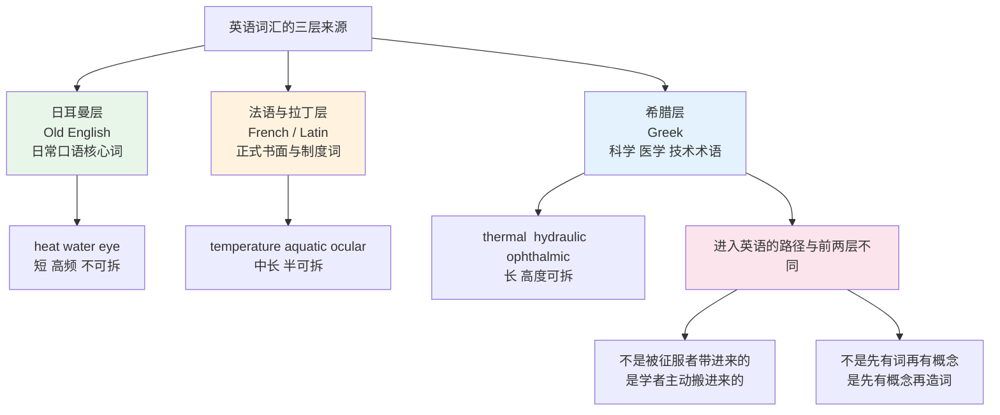
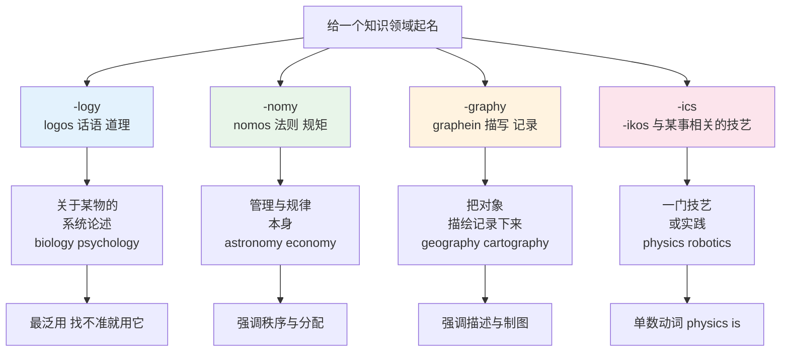
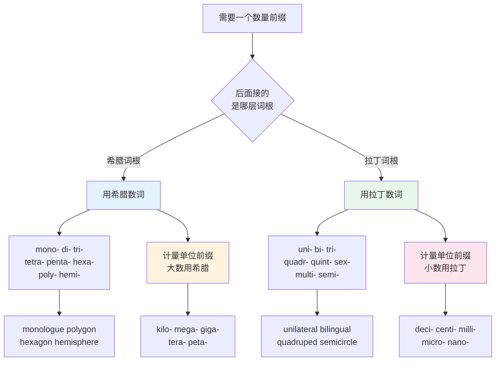
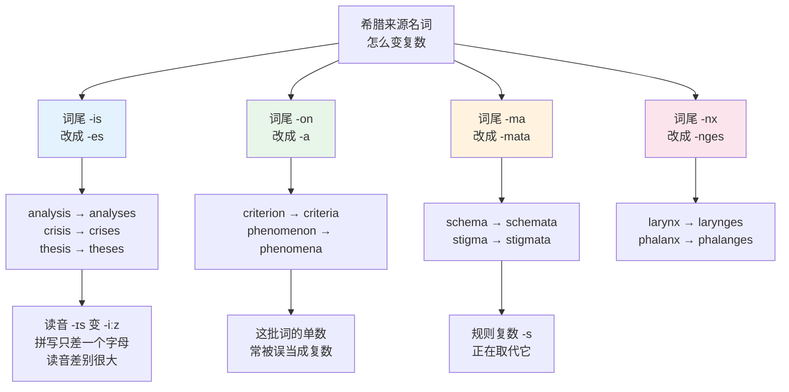
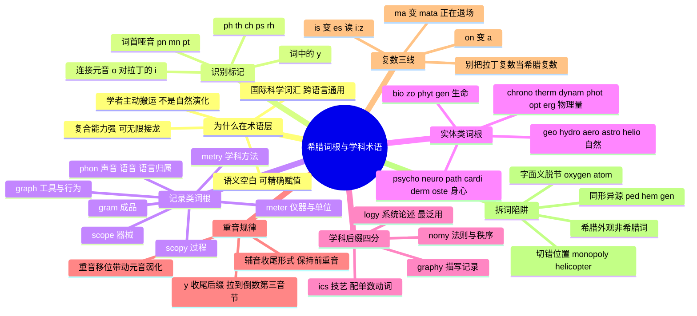

# 希腊词根与学科术语

> [!info] 本篇定位
>
> 第 15 章的第三篇，也是三篇词根课里性质最特殊的一篇。
>
> 前两篇 [[15.词根、合成与缩略/01.高频拉丁词根（上）\|高频拉丁词根（上）]] 与 [[15.词根、合成与缩略/02.高频拉丁词根（下）\|高频拉丁词根（下）]] 处理的拉丁词根，早已长进 `report` `receive` `conduct` 这类日常词里，拆开是为了看清一个已经会用的词。本篇的希腊词根方向相反：它们几乎不出现在日常口语，全部堆在科学、医学、技术和学术的术语层上，拆开是为了**读懂一个还不认识的词**。
>
> 读完你会拿到三样东西：一眼认出「这是希腊来源」的六个拼写标记；十二组高频词根加四个学科后缀的组合规则，够你自己拼装和反解绝大多数术语；以及 `criterion → criteria`、`analysis → analyses`、`schema → schemata` 这类希腊复数的三条变形主线。
>
> 顺带解决一个高频困扰：`photograph` 与 `photography` 的重音为什么不在同一个位置，`kilometre` 到底该读哪个音。

---

## 1. 本篇导读：希腊层为什么长在术语上

英语词汇有三层来源，这个结构在 [[01.词汇入门与学习方法/01.英语词汇的来源、分层与学习地图\|英语词汇的来源、分层与学习地图]] 里给过整体地图。三层各自占住了不同的语域：



上图右下角那两条是本篇的整个前提。日耳曼层是英语的祖产，法语层是 1066 年诺曼征服硬塞进来的，两者都是**先有一群人在说，词才进入英语**。希腊层完全不是这么来的——它是文艺复兴之后，欧洲学者坐在书桌前，为了给新发现的东西起名字而**从古希腊语里挑成分拼出来**的。

这个来源差异造成了希腊层的四个特征，也是本篇所有规则的根子。

**第一，它天生透明。** `telescope` 不是希腊人说过的词，是 17 世纪初有人拿 `tele-`（远）加 `skopein`（看）现拼的。既然是拼的，就一定拆得回去。相比之下 `understand` 拆成 `under` + `stand` 得不出「理解」，因为它不是拼的，是自然演化的。

**第二，它语义空白。** 给新发现的气体起名时，用日常词 `air-maker` 会带上一堆生活联想，用 `oxygen`（`oxys` 尖锐、酸 + `-gen` 产生）则是一块干净的画布，可以由定义完全填满。科学需要的正是这种可以精确赋值的空词。这也解释了为什么术语读起来「冷」——它本来就被设计成不带情绪。

**第三，它能无限接龙。** 希腊语的复合能力比拉丁语强得多。拉丁词根往往只能一前缀加一词根加一后缀就到头，希腊成分可以一路串下去：`electro-` + `encephalo-` + `-graphy` 拼成 `electroencephalography`（脑电图术），拆开每一段都还认得。这是它统治医学与化学命名的技术原因。

**第四，它是国际通用件。** 同一批希腊成分同时被法语、德语、俄语、日语借走。`telephone` 在法语是 `téléphone`，德语 `Telefon`，日语「電話」虽然是意译但学术场合也用外来语形式。这套跨语言共享的成分被语言学界称作 international scientific vocabulary，中文一般译作「国际科学词汇」。对读者的实际意义是：本篇学的成分，在你读任何一种欧洲语言的技术文档时都继续有效。

> [!tip] 本篇的正确用法
>
> 不要把下面的词表当作背诵清单。希腊术语的总量是无限的——医学与化学每年都在按同一套规则造新词，背不完。
>
> 正确用法是把**词根本身**记牢（大概三十个成分），把**组合规则**记牢（四个学科后缀加一条重音规律），然后练习反解：见到长词先切段，逐段查已知含义，拼回中文。词表里的具体词只是练手材料。

---

## 2. 认出希腊词：六个拼写标记与那个连接元音

在动手拆之前，得先判断这个词值不值得拆。判断标准就是拼写外观——希腊词在转写成拉丁字母时留下了一批固定标记，这些标记在日耳曼词里几乎不出现。

| 标记 | 读音 | 来源字母 | 典型词 |
| --- | --- | --- | --- |
| `ph` | /f/ | φ (phi) | philosophy、physics、phase、graph |
| `th` | /θ/ | θ (theta) | theory、thesis、method、athlete |
| `ch` | /k/（不是 /tʃ/） | χ (chi) | chaos、character、chronic、architect |
| `ps-` | /s/（p 不发音） | ψ (psi) | psychology、pseudonym、psalm |
| `rh-` | /r/（h 不发音） | ρ + 送气 | rhythm、rhetoric、rheumatism |
| 词中的 `y` | /ɪ/ 或 /aɪ/ | υ (upsilon) | system、syntax、myth、hypothesis |

这六条里最好用的是 `ph` 和词中的 `y`。看到 `ph` 读 /f/ 而不写 `f`，基本可以断定是希腊来源；看到词中间夹一个 `y` 当元音（不是词尾的 `-y`），也八九不离十。`syntax`、`crystal`、`physics`、`symbol` 全部命中。

`ch` 读 /k/ 这条要小心：`chair`、`change`、`church` 读 /tʃ/，是法语层的；`chef`、`machine` 读 /ʃ/，是较晚的法语借词；只有读 /k/ 的那批是希腊层。

还有两组更少见但辨识度极高的开头。

| 英文 | 英式音标 | 美式音标 | 词性 | 中文 | 搭配与说明 |
| --- | --- | --- | --- | --- | --- |
| **pneumonia** | /njuːˈməʊniə/ | /nuːˈmoʊniə/ | n. | 肺炎 | `pn-` 开头 p 不发音，源自 pneuma 气息；同族 pneumatic 气动的 |
| **mnemonic** | /nɪˈmɒnɪk/ | /nɪˈmɑːnɪk/ | n./adj. | 助记法；助记的 | `mn-` 开头 m 不发音，源自 mnēmē 记忆 |
| **pterodactyl** | /ˌterəˈdæktɪl/ | /ˌterəˈdæktəl/ | n. | 翼手龙 | `pt-` 开头 p 不发音，pteron 翅膀 + daktylos 指头 |
| **xenophobia** | /ˌzenəˈfəʊbiə/ | /ˌzenəˈfoʊbiə/ | n. | 仇外心理 | 词首 `x` 读 /z/，xenos 陌生人 |
| **xylophone** | /ˈzaɪləfəʊn/ | /ˈzaɪləfoʊn/ | n. | 木琴 | 同样词首 `x` 读 /z/，xylon 木头 |
| **eureka** | /jʊˈriːkə/ | /jʊˈriːkə/ | int. | 找到了 | heuriskein 发现；同族 heuristic 启发式的 |

> [!warning] 词首不发音的辅音只在词首失效
>
> `pn-`、`mn-`、`pt-`、`ps-` 里那个不发音的字母，一旦不在词首就要读出来。
>
> - `psychology` /saɪ-/ 里的 p 不读，但 `metempsychosis` 中间的 `ps` 要读 /ps/。
> - `pterodactyl` 开头的 p 不读，但 `helicopter` 里的 `pt` 读 /pt/。
> - `pneumonia` 开头的 p 不读，但 `dyspnea`（呼吸困难）中间的 `pn` 要读。
>
> 原因是希腊语本来就读这些辅音串，英语只是不允许它们出现在词首，词中位置没有这个限制。

### 2.1 连接元音 `-o-`：区分希腊件与拉丁件的最快办法

希腊成分组合时，前一个词根后面几乎总要垫一个 `-o-`：

```text
thermo + meter   → thermometer
psycho + logy    → psychology
geo    + graphy  → geography
photo  + graph   → photograph
electro + magnet → electromagnet
```

拉丁成分组合时垫的是 `-i-`：

```text
agri  + culture → agriculture
carni + vore    → carnivore
centi + pede    → centipede
somni + ferous  → somniferous
```

这条差别在实战里有两个用处。

**第一个用处是反向判断来源。** 看到一个长词中间夹着 `-o-`，先按希腊思路拆；夹着 `-i-`，先按拉丁思路拆。`homicide` 是 `homi` + `cide`，拉丁；`homograph` 是 `homo` + `graph`，希腊。这两个 `hom-` 完全不同源：前者是拉丁 `homo`（人），后者是希腊 `homos`（相同）。要不是连接元音提示，很容易混。

**第二个用处是自己造词时选对形式。** 需要拼一个新术语，成分是希腊的就用 `-o-`。`monorepo`（单一代码仓）、`microservice`（微服务）、`polyfill`（补丁垫片）这批技术圈自造词，全部照这条走。

> [!tip] 连接元音会被吞掉
>
> 后一个成分以元音开头时，`-o-` 通常脱落：`psycho` + `analysis` 写成 `psychoanalysis` 保留了，但 `mono` + `archy` 写成 `monarchy`（不是 monoarchy），`geo` + `metry` 里的 `o` 拼写上保留了下来，但重音落到了它身上，读 /ˈɒ/ 而不是 `geothermal` 里的 /əʊ/。
>
> 判断办法很简单：不确定就查一次，记住这个词的成品形式，不要现推。规则管的是理解方向，不是拼写方向。

---

## 3. graph / gram：刻下来的痕迹

`graphein` 在古希腊语里的原义是「刻、划」，后来才引申为「写、画」。这个原义解释了为什么 `graph` 一族既能表示文字（`autograph` 亲笔签名），又能表示图形（`graph` 曲线图）——刻痕本来就不区分是字还是画。

`gramma` 是同一个动词的名词形式，指「刻下来的那个东西」，也就是**结果**。所以两者的分工是：

- `-graph` 偏向**记录的工具或记录的行为**：`telegraph` 电报机、`seismograph` 地震仪
- `-gram` 偏向**记录下来的成品**：`telegram` 一封电报、`cardiogram` 一张心电图

这个对立在 `telegraph`（发报设备）与 `telegram`（那张纸）这一对上最干净。`cardiograph`（心电图机）与 `cardiogram`（心电图）也是一样。

### 3.1 `-graph` 与 `-graphy` 词族

| 英文 | 英式音标 | 美式音标 | 词性 | 中文 | 搭配与说明 |
| --- | --- | --- | --- | --- | --- |
| **graph** | /ɡrɑːf/ | /ɡræf/ | n. | 图表；图 | 英美元音差异明显；计算机领域指「图结构」，a directed graph 有向图 |
| **graphic** | /ˈɡræfɪk/ | /ˈɡræfɪk/ | adj./n. | 图形的；生动的 | graphic design 平面设计；graphic detail 指描述血腥露骨 |
| **graphics** | /ˈɡræfɪks/ | /ˈɡræfɪks/ | n. | 图形学；图形 | 作学科名用单数动词；graphics card 显卡 |
| **autograph** | /ˈɔːtəɡrɑːf/ | /ˈɔːtəɡræf/ | n./v. | 亲笔签名 | auto- 自己；与 signature 的差别是它专指名人签名留念 |
| **paragraph** | /ˈpærəɡrɑːf/ | /ˈpærəɡræf/ | n. | 段落 | para- 旁边，原指抄本旁标记分段的符号 |
| **photograph** | /ˈfəʊtəɡrɑːf/ | /ˈfoʊtəɡræf/ | n./v. | 照片；拍照 | phōs 光；口语常截短为 photo，见 15.04 |
| **photography** | /fəˈtɒɡrəfi/ | /fəˈtɑːɡrəfi/ | n. | 摄影（术） | 与上一行重音位置完全不同，第 11.4 节讲规则 |
| **telegraph** | /ˈtelɪɡrɑːf/ | /ˈtelɪɡræf/ | n./v. | 电报机；打电报 | tele- 远；引申义「无意中泄露意图」，telegraph a punch |
| **biography** | /baɪˈɒɡrəfi/ | /baɪˈɑːɡrəfi/ | n. | 传记 | bio- 生命；autobiography 自传 |
| **bibliography** | /ˌbɪbliˈɒɡrəfi/ | /ˌbɪbliˈɑːɡrəfi/ | n. | 参考书目 | biblion 书；论文必备部分，见 19.03 |
| **geography** | /dʒiˈɒɡrəfi/ | /dʒiˈɑːɡrəfi/ | n. | 地理（学） | gē 大地；字面「描绘大地」 |
| **calligraphy** | /kəˈlɪɡrəfi/ | /kəˈlɪɡrəfi/ | n. | 书法 | kallos 美；对应中文书法用这个词 |
| **cartography** | /kɑːˈtɒɡrəfi/ | /kɑːrˈtɑːɡrəfi/ | n. | 制图学 | chartēs 纸莎草纸；GIS 领域高频 |
| **choreography** | /ˌkɒriˈɒɡrəfi/ | /ˌkɔːriˈɑːɡrəfi/ | n. | 编舞 | choros 舞蹈；微服务领域借来指「编排」，对 orchestration |
| **cryptography** | /krɪpˈtɒɡrəfi/ | /krɪpˈtɑːɡrəfi/ | n. | 密码学 | kryptos 隐藏；同族 encrypt、cryptic 晦涩的 |
| **orthography** | /ɔːˈθɒɡrəfi/ | /ɔːrˈθɑːɡrəfi/ | n. | 正字法 | orthos 正、直；同族 orthodox 正统的、orthopedic 矫形的 |
| **topography** | /təˈpɒɡrəfi/ | /təˈpɑːɡrəfi/ | n. | 地形（学） | topos 地方；同族 topology 拓扑学、topic 话题 |
| **typography** | /taɪˈpɒɡrəfi/ | /taɪˈpɑːɡrəfi/ | n. | 排印；字体排版 | typos 印记；前端与设计文档高频 |
| **demography** | /dɪˈmɒɡrəfi/ | /dɪˈmɑːɡrəfi/ | n. | 人口统计学 | dēmos 民众；同族 democracy、epidemic |
| **monograph** | /ˈmɒnəɡrɑːf/ | /ˈmɑːnəɡræf/ | n. | 专著 | 单一主题的学术著作，区别于教科书 |
| **seismograph** | /ˈsaɪzməɡrɑːf/ | /ˈsaɪzməɡræf/ | n. | 地震仪 | seismos 震动；同族 seismic 地震的 |
| **graphite** | /ˈɡræfaɪt/ | /ˈɡræfaɪt/ | n. | 石墨 | 因可用于书写而得名；-ite 是矿物名后缀 |
| **graffiti** | /ɡrəˈfiːti/ | /ɡrəˈfiːti/ | n. | 涂鸦 | 经意大利语进入英语，本是复数，单数 graffito 已罕用 |

### 3.2 `-gram` 词族

| 英文 | 英式音标 | 美式音标 | 词性 | 中文 | 搭配与说明 |
| --- | --- | --- | --- | --- | --- |
| **grammar** | /ˈɡræmə/ | /ˈɡræmər/ | n. | 语法 | 原义「文字的技艺」；苏格兰方言变体演化成了 glamour |
| **program** | /ˈprəʊɡræm/ | /ˈproʊɡræm/ | n./v. | 程序；节目；编程 | pro- 之前 + gram，原指「预先写好的告示」；英式拼 programme，但计算机义两地都写 program |
| **diagram** | /ˈdaɪəɡræm/ | /ˈdaɪəɡræm/ | n. | 示意图 | dia- 贯穿；a sequence diagram 时序图 |
| **telegram** | /ˈtelɪɡræm/ | /ˈtelɪɡræm/ | n. | 电报（那张纸） | 与 telegraph 的成品-工具对立 |
| **anagram** | /ˈænəɡræm/ | /ˈænəɡræm/ | n. | 变位词 | ana- 重新；listen 与 silent 互为 anagram |
| **epigram** | /ˈepɪɡræm/ | /ˈepɪɡræm/ | n. | 警句 | epi- 之上；短小锋利，与 epigraph 题词区分 |
| **monogram** | /ˈmɒnəɡræm/ | /ˈmɑːnəɡræm/ | n. | 花押字 | 姓名首字母交织成的图案 |
| **histogram** | /ˈhɪstəɡræm/ | /ˈhɪstəɡræm/ | n. | 直方图 | 与 bar chart 的差别是横轴连续；见 03.04 |
| **hologram** | /ˈhɒləɡræm/ | /ˈhoʊləɡræm/ | n. | 全息图 | holos 完整；同族 holistic 整体的、catholic 普世的 |
| **cardiogram** | /ˈkɑːdiəɡræm/ | /ˈkɑːrdiəɡræm/ | n. | 心电图 | 完整形式 electrocardiogram，缩写 ECG / EKG |
| **pictogram** | /ˈpɪktəɡræm/ | /ˈpɪktəɡræm/ | n. | 图形符号 | 拉丁 pictus 加希腊 gram 的混种词，见第 15 节 |
| **kilogram** | /ˈkɪləɡræm/ | /ˈkɪləɡræm/ | n. | 千克 | 英式旧拼法 kilogramme 现已罕用；缩写 kg 读作 /ˌkeɪ ˈdʒiː/ 或直接读全称 |

> [!example] 工程语境里的 graph 与 diagram
>
> 两个词在技术文档里分工很清楚，混用会显得外行。
>
> > - A **graph** is a set of vertices connected by edges.
> >   - graph 指数学意义上的图结构，有顶点和边。
> > - Please update the sequence **diagram** in the design doc.
> >   - diagram 指画出来给人看的示意图。
> > - The dashboard plots a **graph** of request latency over time.
> >   - 这里的 graph 是坐标图、曲线图，等同于 chart。
>
> 一句话分工：`graph` 要么是数学结构，要么是带坐标轴的曲线图；`diagram` 是不带坐标的示意图。

---

## 4. meter / metr：量器、量法与量出来的数

`metron` 是「尺度、量度」。这一族在英语里分裂成了三个后缀，各管一件事。

| 形式 | 管什么 | 例词 | 重音位置 |
| --- | --- | --- | --- |
| `-meter` | 测量**仪器** | thermometer、barometer | 落在 `-meter` 前一音节 |
| `-metre` / `-meter` | 长度**单位** | centimetre、kilometre | 落在词首 |
| `-metry` | 测量的**学科或方法** | geometry、telemetry | 落在 `-metry` 前一音节 |

单位义与仪器义拼写相同（美式统一写 `-meter`），靠重音区分。这是英语里少见的、重音承担词义区分功能的例子，词典里两个读音会并列标出，读法体例见 [[01.词汇入门与学习方法/03.音标、词重音与词典读音体例\|音标、词重音与词典读音体例]]。

最干净的对照是 `micrometer` 这一对：

```text
micrometer  /maɪˈkrɒmɪtə/   千分尺（一种量具）      重音在 crom
micrometre  /ˈmaɪkrəmiːtə/  微米（百万分之一米）    重音在 mic
```

美式英语两个词都拼 `micrometer`，全靠读音分辨。工程文档里为了避免歧义，微米一般直接写符号 `μm`。

`kilometre` 的读音之争也出在这里。按单位义应该读 /ˈkɪləmiːtə/（重音在首），但英式英语里 /kɪˈlɒmɪtə/（按仪器模式读）流行度很高，两个读音词典都收。美式主流是 /kɪˈlɑːmətər/。这不是对错问题，是两套类推在打架。

### 4.1 仪器类 `-meter`

| 英文 | 英式音标 | 美式音标 | 词性 | 中文 | 搭配与说明 |
| --- | --- | --- | --- | --- | --- |
| **thermometer** | /θəˈmɒmɪtə/ | /θərˈmɑːmɪtər/ | n. | 温度计 | thermos 热；take sb's temperature 才是「量体温」的动词说法 |
| **barometer** | /bəˈrɒmɪtə/ | /bəˈrɑːmɪtər/ | n. | 气压计 | baros 重量；引申义「风向标、晴雨表」，a barometer of public mood |
| **speedometer** | /spiːˈdɒmɪtə/ | /spiːˈdɑːmɪtər/ | n. | 速度表 | 英语 speed 加希腊 -meter 的混种词 |
| **odometer** | /əʊˈdɒmɪtə/ | /oʊˈdɑːmɪtər/ | n. | 里程表 | hodos 路；同族 method（meta + hodos，「追随的路径」） |
| **pedometer** | /pɪˈdɒmɪtə/ | /pɪˈdɑːmɪtər/ | n. | 计步器 | 这里的 ped- 是拉丁「脚」，不是希腊「儿童」，见第 15.3 节 |
| **altimeter** | /ˈæltɪmiːtə/ | /ælˈtɪmətər/ | n. | 高度表 | 英美重音位置不同的典型；英式按单位模式，美式按仪器模式 |
| **chronometer** | /krəˈnɒmɪtə/ | /krəˈnɑːmɪtər/ | n. | 精密计时器 | 航海用高精度钟表，不是普通手表 |
| **hygrometer** | /haɪˈɡrɒmɪtə/ | /haɪˈɡrɑːmɪtər/ | n. | 湿度计 | hygros 潮湿 |
| **anemometer** | /ˌænɪˈmɒmɪtə/ | /ˌænəˈmɑːmɪtər/ | n. | 风速计 | anemos 风；气象站标配 |
| **spectrometer** | /spekˈtrɒmɪtə/ | /spekˈtrɑːmɪtər/ | n. | 分光计 | 拉丁 spectrum 加希腊 -meter |
| **accelerometer** | /əkˌseləˈrɒmɪtə/ | /əkˌseləˈrɑːmɪtər/ | n. | 加速度计 | 手机传感器名称，移动端开发高频 |
| **multimeter** | /ˈmʌltiˌmiːtə/ | /ˈmʌltiˌmiːtər/ | n. | 万用表 | 硬件调试常用；这个词按单位模式读，重音在首 |
| **micrometer** | /maɪˈkrɒmɪtə/ | /maɪˈkrɑːmɪtər/ | n. | 千分尺 | 与下一行同拼不同读 |
| **micrometre** | /ˈmaɪkrəmiːtə/ | /ˈmaɪkroʊmiːtər/ | n. | 微米 | 美式拼 micrometer；符号 μm |

### 4.2 学科与方法类 `-metry`，以及 `metr` 出现在词中

| 英文 | 英式音标 | 美式音标 | 词性 | 中文 | 搭配与说明 |
| --- | --- | --- | --- | --- | --- |
| **geometry** | /dʒiˈɒmətri/ | /dʒiˈɑːmətri/ | n. | 几何（学） | 字面「测量大地」，起源于尼罗河泛滥后重划田界 |
| **trigonometry** | /ˌtrɪɡəˈnɒmətri/ | /ˌtrɪɡəˈnɑːmətri/ | n. | 三角学 | trigōnon 三角形；口语截短为 trig |
| **symmetry** | /ˈsɪmətri/ | /ˈsɪmətri/ | n. | 对称 | syn- 共同；形容词 symmetrical；反义 asymmetry |
| **telemetry** | /təˈlemətri/ | /təˈlemətri/ | n. | 遥测 | 可观测性领域核心词，OpenTelemetry 即由此得名 |
| **optometry** | /ɒpˈtɒmətri/ | /ɑːpˈtɑːmətri/ | n. | 验光配镜 | 与 ophthalmology 眼科医学不同，后者是医生 |
| **biometrics** | /ˌbaɪəʊˈmetrɪks/ | /ˌbaɪoʊˈmetrɪks/ | n. | 生物识别 | 指纹、人脸、虹膜识别的统称 |
| **metric** | /ˈmetrɪk/ | /ˈmetrɪk/ | n./adj. | 指标；公制的 | 复数 metrics 在工程里指监控指标；the metric system 公制 |
| **isometric** | /ˌaɪsəˈmetrɪk/ | /ˌaɪsəˈmetrɪk/ | adj. | 等距的；等轴的 | isos 相等；游戏与 UI 里的 isometric view 等轴视图 |
| **parameter** | /pəˈræmɪtə/ | /pəˈræmɪtər/ | n. | 参数 | para- 旁边 + metron；注意不是 perimeter |
| **perimeter** | /pəˈrɪmɪtə/ | /pəˈrɪmɪtər/ | n. | 周长；周界 | peri- 环绕；安全领域 perimeter defense 边界防御 |
| **diameter** | /daɪˈæmɪtə/ | /daɪˈæmɪtər/ | n. | 直径 | dia- 贯穿；半径是 radius（拉丁词，复数 radii） |
| **symmetric** | /sɪˈmetrɪk/ | /sɪˈmetrɪk/ | adj. | 对称的 | 密码学 symmetric encryption 对称加密，对 asymmetric |

> [!warning] parameter 与 perimeter 是两个词
>
> 中文母语者最容易在这一对上写错，因为读音接近、拼写只差两个字母。
>
> - `para-` 旁边 + `meter` → **parameter**，「摆在旁边一起量的量」，参数。
> - `peri-` 环绕 + `meter` → **perimeter**，「绕一圈量出来的长度」，周长。
>
> 记法是把前缀含义读出来：参数在函数「旁边」，周长在图形「周围」。前缀 `para-` 与 `peri-` 的完整义项在 [[14.构词法：前缀与后缀/03.方位、时间与关系前缀\|方位、时间与关系前缀]] 里。

---

## 5. phon：声音、语音与说什么语言的人

`phōnē` 是「声音」。这一族的分工比 `graph` 简单，但有一个中文母语者常忽略的义项：`-phone` 除了指发声设备，还指「说某种语言的人」。

| 形式 | 含义 | 例词 |
| --- | --- | --- |
| `-phone` | 发声或传声的设备 | telephone、microphone、saxophone |
| `-phone` | 说某语言的人 | anglophone、francophone、lusophone |
| `-phony` | 声音的性质或体系 | symphony、cacophony、telephony |
| `phon-` 打头 | 语音相关的学科 | phonetics、phonology、phoneme |

第二个义项在阅读国际新闻和技术社区讨论时会碰上。加拿大魁北克的语言争议报道里 `francophone communities` 指法语人群，`anglophone minority` 指英语少数族群，跟设备毫无关系。

| 英文 | 英式音标 | 美式音标 | 词性 | 中文 | 搭配与说明 |
| --- | --- | --- | --- | --- | --- |
| **telephone** | /ˈtelɪfəʊn/ | /ˈtelɪfoʊn/ | n./v. | 电话；打电话 | 口语一律截短为 phone，全称只在正式文体与固定搭配里 |
| **telephony** | /təˈlefəni/ | /təˈlefəni/ | n. | 电话通信技术 | 与上一行重音位置不同；VoIP 领域高频 |
| **microphone** | /ˈmaɪkrəfəʊn/ | /ˈmaɪkrəfoʊn/ | n. | 麦克风 | 口语截短为 mic，读 /maɪk/，拼 mic 或 mike |
| **megaphone** | /ˈmeɡəfəʊn/ | /ˈmeɡəfoʊn/ | n. | 扩音喇叭 | megas 大；与 loudspeaker 的差别是手持 |
| **gramophone** | /ˈɡræməfəʊn/ | /ˈɡræməfoʊn/ | n. | 留声机 | 是 phonogram 的字母倒装，商标名转普通词 |
| **saxophone** | /ˈsæksəfəʊn/ | /ˈsæksəfoʊn/ | n. | 萨克斯管 | 发明人姓 Sax 加希腊后缀；口语截短 sax |
| **xylophone** | /ˈzaɪləfəʊn/ | /ˈzaɪləfoʊn/ | n. | 木琴 | xylon 木头 |
| **homophone** | /ˈhɒməfəʊn/ | /ˈhɑːməfoʊn/ | n. | 同音词 | homos 相同；their / there / they're 是三重 homophone |
| **anglophone** | /ˈæŋɡləfəʊn/ | /ˈæŋɡləfoʊn/ | n./adj. | 说英语的人（的） | 常见于加拿大、非洲的语言政策报道 |
| **francophone** | /ˈfræŋkəfəʊn/ | /ˈfræŋkəfoʊn/ | n./adj. | 说法语的人（的） | 同类还有 lusophone 说葡语的、sinophone 说汉语的 |
| **symphony** | /ˈsɪmfəni/ | /ˈsɪmfəni/ | n. | 交响乐 | syn- 共同 + phōnē，字面「声音一起响」 |
| **cacophony** | /kəˈkɒfəni/ | /kəˈkɑːfəni/ | n. | 刺耳的杂音 | kakos 坏；书面语，形容嘈杂或众声喧哗 |
| **euphony** | /ˈjuːfəni/ | /ˈjuːfəni/ | n. | 悦耳 | eu- 好；形容词 euphonious |
| **polyphony** | /pəˈlɪfəni/ | /pəˈlɪfəni/ | n. | 复调 | poly- 多；音乐学与合成器术语 |
| **phonetics** | /fəˈnetɪks/ | /fəˈnetɪks/ | n. | 语音学 | 研究实际发音；作学科名配单数动词 |
| **phonology** | /fəˈnɒlədʒi/ | /fəˈnɑːlədʒi/ | n. | 音系学 | 研究音位系统，与 phonetics 分工不同 |
| **phoneme** | /ˈfəʊniːm/ | /ˈfoʊniːm/ | n. | 音位 | 能区分意义的最小语音单位；-eme 是语言学专用后缀 |
| **phonics** | /ˈfɒnɪks/ | /ˈfɑːnɪks/ | n. | 自然拼读法 | 教学法名称，本教程第 01.02 篇讲的就是它 |
| **dysphonia** | /dɪsˈfəʊniə/ | /dɪsˈfoʊniə/ | n. | 发声障碍 | dys- 功能不良；同族 dyslexia 阅读障碍 |
| **phonetic** | /fəˈnetɪk/ | /fəˈnetɪk/ | adj. | 语音的 | the phonetic alphabet 音标字母表；本教程全篇用的 IPA 即出自此 |

> [!tip] eu- 与 dys- 是一对
>
> `eu-`（好）与 `dys-`（坏、功能不良）是希腊层里最好用的一对评价前缀，加在任何词根前都成立。
>
> - `euphony` 悦耳 ↔ `cacophony` 刺耳（这里反义用 `kako-`）
> - `euphemism` 委婉语 ↔ `dysphemism` 恶化语
> - `eulogy` 悼词、颂词 ↔ 无固定反义词
> - `dysfunction` 功能障碍、`dystopia` 反乌托邦、`dyslexia` 阅读障碍
> - `euthanasia` 安乐死（eu- 好 + thanatos 死）
>
> 注意 `dys-` 与拉丁 `dis-`（分开、否定）不同源。`dysfunction` 是「功能不良」，`disfunction` 是拼写错误。

---

## 6. scope / scopy：看的器械与看的过程

`skopein` 是「观察、察看」。这一族的成品-过程分工和 `meter` 一模一样：

- `-scope` 是**器械**：`microscope` 显微镜
- `-scopy` 是**看这件事本身**：`microscopy` 显微术、显微观察

重音也照同一条规律走：`-scope` 前重，`-scopy` 把重音拉到自己前一个音节。

```text
microscope  /ˈmaɪkrəskəʊp/    重音在 mi
microscopy  /maɪˈkrɒskəpi/    重音在 cros
endoscope   /ˈendəskəʊp/      重音在 en
endoscopy   /enˈdɒskəpi/      重音在 dos
```

体检报告上写 `colonoscopy` 而不是 `colonoscope`，因为做的是检查这件事，不是那根管子。

| 英文 | 英式音标 | 美式音标 | 词性 | 中文 | 搭配与说明 |
| --- | --- | --- | --- | --- | --- |
| **scope** | /skəʊp/ | /skoʊp/ | n./v. | 范围；作用域；勘察 | 编程里的 scope 见 20.01；out of scope 超出范围 |
| **microscope** | /ˈmaɪkrəskəʊp/ | /ˈmaɪkrəskoʊp/ | n. | 显微镜 | under a microscope 字面与引申义都常用 |
| **telescope** | /ˈtelɪskəʊp/ | /ˈtelɪskoʊp/ | n./v. | 望远镜；压缩 | 动词义「像伸缩镜筒一样套叠、压缩」，telescope three steps into one |
| **periscope** | /ˈperɪskəʊp/ | /ˈperɪskoʊp/ | n. | 潜望镜 | peri- 环绕 |
| **stethoscope** | /ˈsteθəskəʊp/ | /ˈsteθəskoʊp/ | n. | 听诊器 | stēthos 胸；虽然是「听」的工具，词根却是「看」 |
| **kaleidoscope** | /kəˈlaɪdəskəʊp/ | /kəˈlaɪdəskoʊp/ | n. | 万花筒 | kalos 美 + eidos 形；引申义「千变万化的景象」 |
| **gyroscope** | /ˈdʒaɪrəskəʊp/ | /ˈdʒaɪrəskoʊp/ | n. | 陀螺仪 | gyros 圈；手机传感器名，与 accelerometer 并列出现 |
| **oscilloscope** | /əˈsɪləskəʊp/ | /əˈsɪləskoʊp/ | n. | 示波器 | 拉丁 oscillare 摇摆加希腊 -scope；硬件调试用 |
| **endoscope** | /ˈendəskəʊp/ | /ˈendəskoʊp/ | n. | 内窥镜 | endon 内部；对 exo- 外部 |
| **horoscope** | /ˈhɒrəskəʊp/ | /ˈhɔːrəskoʊp/ | n. | 星象运势 | hōra 时辰；「观察出生时辰」 |
| **microscopy** | /maɪˈkrɒskəpi/ | /maɪˈkrɑːskəpi/ | n. | 显微术 | 论文方法部分高频 |
| **endoscopy** | /enˈdɒskəpi/ | /enˈdɑːskəpi/ | n. | 内窥镜检查 | 医院预约单上写的是这个 |
| **colonoscopy** | /ˌkɒləˈnɒskəpi/ | /ˌkoʊləˈnɑːskəpi/ | n. | 结肠镜检查 | 体检项目名；就医词汇见 07.03 |
| **sceptic** | /ˈskeptɪk/ | /ˈskeptɪk/ | n. | 怀疑论者 | 美式拼 skeptic；同源，原义「爱观察打量的人」 |
| **episcopal** | /ɪˈpɪskəpl/ | /ɪˈpɪskəpl/ | adj. | 主教（制）的 | epi- 之上 + skopos 看守者 → 监督者 |

> [!example] bishop 与 scope 是同一个词
>
> 希腊语 `episkopos` 意思是「在上面看着的人」，也就是监督者。这个词进入拉丁语成为 `episcopus`，再进入古英语时前面的 `epi-` 被磨掉，剩下的部分演化成了 `biscop`，最后成为现代英语的 **bishop**（主教）。
>
> 所以 `bishop` 和 `microscope` 共享同一个词根，只是一个走了口语磨损的路径，一个走了学者直接搬用的路径。
>
> 这个例子说明一件事：**同一个希腊词根，经过口语演化后会变得完全认不出来，只有学者直接搬进来的那一批保持透明。** 本篇能拆的全是后者。

---

## 7. bio / zo / phyt / gen：活的东西与它的出身

`bios` 是「生命」，特指有始有终的一段生命历程，所以 `biography`（传记）用它而不是用 `zōē`（泛指生命力）。`zōion` 是「动物」，`phyton` 是「植物」，`genos` 是「种类、出生」。四个成分凑成了生命科学命名的地基。

| 英文 | 英式音标 | 美式音标 | 词性 | 中文 | 搭配与说明 |
| --- | --- | --- | --- | --- | --- |
| **biology** | /baɪˈɒlədʒi/ | /baɪˈɑːlədʒi/ | n. | 生物学 | 形容词 biological；分子生物学 molecular biology |
| **biotic** | /baɪˈɒtɪk/ | /baɪˈɑːtɪk/ | adj. | 生物的 | 生态学 biotic factors 生物因素，对 abiotic 非生物因素 |
| **antibiotic** | /ˌæntibaɪˈɒtɪk/ | /ˌæntibaɪˈɑːtɪk/ | n. | 抗生素 | anti- 对抗；take a course of antibiotics 一个疗程 |
| **probiotic** | /ˌprəʊbaɪˈɒtɪk/ | /ˌproʊbaɪˈɑːtɪk/ | n. | 益生菌 | pro- 支持；食品标签常见 |
| **symbiosis** | /ˌsɪmbaɪˈəʊsɪs/ | /ˌsɪmbaɪˈoʊsɪs/ | n. | 共生 | syn- 共同；形容词 symbiotic；商业文章借来形容共生关系 |
| **biopsy** | /ˈbaɪɒpsi/ | /ˈbaɪɑːpsi/ | n. | 活检 | bios + opsis 看；「看活组织」 |
| **biome** | /ˈbaɪəʊm/ | /ˈbaɪoʊm/ | n. | 生物群系 | 生态学单位；同类构词 genome、microbiome |
| **microbe** | /ˈmaɪkrəʊb/ | /ˈmaɪkroʊb/ | n. | 微生物 | micro- 小 + bios；同义 microorganism |
| **bionic** | /baɪˈɒnɪk/ | /baɪˈɑːnɪk/ | adj. | 仿生的 | bio- + electronic 的混成，见 15.04 |
| **biodegradable** | /ˌbaɪəʊdɪˈɡreɪdəbl/ | /ˌbaɪoʊdɪˈɡreɪdəbl/ | adj. | 可生物降解的 | 环保包装标签高频；希腊 bio- 加拉丁 degrade |
| **amphibian** | /æmˈfɪbiən/ | /æmˈfɪbiən/ | n. | 两栖动物 | amphi- 两边 + bios，「过两种生活」 |
| **zoology** | /zuˈɒlədʒi/ | /zoʊˈɑːlədʒi/ | n. | 动物学 | 注意重音在第二音节，不读作 zoo 加 logy |
| **protozoa** | /ˌprəʊtəˈzəʊə/ | /ˌproʊtəˈzoʊə/ | n. | 原生动物 | prōtos 第一；本身是复数，单数 protozoon |
| **photosynthesis** | /ˌfəʊtəʊˈsɪnθəsɪs/ | /ˌfoʊtoʊˈsɪnθəsɪs/ | n. | 光合作用 | phōs 光 + syn 合 + thesis 放置 |
| **phytoplankton** | /ˌfaɪtəʊˈplæŋktən/ | /ˌfaɪtoʊˈplæŋktən/ | n. | 浮游植物 | phyton 植物 + planktos 漂流的 |
| **genesis** | /ˈdʒenəsɪs/ | /ˈdʒenəsɪs/ | n. | 起源 | 复数 geneses；圣经首卷《创世记》即此词 |
| **genetics** | /dʒəˈnetɪks/ | /dʒəˈnetɪks/ | n. | 遗传学 | 单数动词；gene 基因、genome 基因组同族 |
| **pathogen** | /ˈpæθədʒən/ | /ˈpæθədʒən/ | n. | 病原体 | pathos 病痛 + -gen 产生者 |
| **carcinogen** | /kɑːˈsɪnədʒən/ | /kɑːrˈsɪnədʒən/ | n. | 致癌物 | karkinos 螃蟹，因肿瘤形状得名，cancer 同一意象 |
| **hydrogen** | /ˈhaɪdrədʒən/ | /ˈhaɪdrədʒən/ | n. | 氢 | hydōr 水 + -gen，「生成水的东西」 |
| **oxygen** | /ˈɒksɪdʒən/ | /ˈɑːksɪdʒən/ | n. | 氧 | oxys 酸、尖 + -gen；命名时误以为所有酸都含氧，名字沿用至今 |
| **nitrogen** | /ˈnaɪtrədʒən/ | /ˈnaɪtrədʒən/ | n. | 氮 | nitron 硝石 + -gen |
| **homogeneous** | /ˌhɒməˈdʒiːniəs/ | /ˌhoʊməˈdʒiːniəs/ | adj. | 同质的 | homos 相同 + genos 种类；注意有五个音节，不是 homogenous |
| **heterogeneous** | /ˌhetərəˈdʒiːniəs/ | /ˌhetərəˈdʒiːniəs/ | adj. | 异质的 | heteros 不同；分布式系统 heterogeneous cluster 异构集群 |

> [!warning] 元素名是 18 世纪的造词实验
>
> `hydrogen` `oxygen` `nitrogen` 这批名字都是 18 世纪末法国化学家用希腊成分现造的，造词逻辑是「生成什么的东西」。
>
> `oxygen` 是这套造词法最著名的翻车案例：命名者认为它是一切酸的构成要素，起名「生酸者」，后来发现盐酸里根本没有氧，名字却已经通行全欧，改不掉了。
>
> 这件事对读者的意义是：**词根拆出来的字面义不等于现代义**。拆词只是给你一个入口，最终义项还得看词典。同类的还有 `atom`（a- 不 + tomos 切，「不可分割者」，后来发现可分）。

---

## 8. geo / hydro / aero / astro / helio / petr：自然要素六根

这一组是描述自然世界的六个基本成分，跨学科复现率极高，学一次能在地理、气象、天文、地质、能源多个领域反复用上。

| 词根 | 含义 | 拉丁对应 | 典型词 |
| --- | --- | --- | --- |
| `geo-` | 大地 | terr- | geology、geothermal |
| `hydro-` | 水 | aqu- | hydraulic、dehydrate |
| `aero-` | 空气 | — | aerobic、aerospace |
| `astro-` | 星 | stell- | astronomy、asteroid |
| `helio-` | 太阳 | sol- | heliocentric |
| `petr-` | 岩石 | — | petroleum、petrify |

| 英文 | 英式音标 | 美式音标 | 词性 | 中文 | 搭配与说明 |
| --- | --- | --- | --- | --- | --- |
| **geology** | /dʒiˈɒlədʒi/ | /dʒiˈɑːlədʒi/ | n. | 地质学 | 形容词 geological；a geological survey 地质勘测 |
| **geothermal** | /ˌdʒiːəʊˈθɜːml/ | /ˌdʒiːoʊˈθɜːrml/ | adj. | 地热的 | geothermal energy 地热能，能源报道高频 |
| **geopolitics** | /ˌdʒiːəʊˈpɒlətɪks/ | /ˌdʒiːoʊˈpɑːlətɪks/ | n. | 地缘政治 | 形容词 geopolitical，时政词见 08.05 |
| **geospatial** | /ˌdʒiːəʊˈspeɪʃl/ | /ˌdʒiːoʊˈspeɪʃl/ | adj. | 地理空间的 | GIS 领域术语，geospatial data 地理空间数据 |
| **geocentric** | /ˌdʒiːəʊˈsentrɪk/ | /ˌdʒiːoʊˈsentrɪk/ | adj. | 地心的 | 对 heliocentric 日心的；科学史必备 |
| **hydraulic** | /haɪˈdrɔːlɪk/ | /haɪˈdrɔːlɪk/ | adj. | 液压的 | hydōr 水 + aulos 管；hydraulic press 液压机 |
| **dehydrate** | /ˌdiːhaɪˈdreɪt/ | /diːˈhaɪdreɪt/ | v. | 脱水 | 名词 dehydration；英美重音位置不同 |
| **hydrophobic** | /ˌhaɪdrəˈfəʊbɪk/ | /ˌhaɪdrəˈfoʊbɪk/ | adj. | 疏水的 | 材料学与化学术语，对 hydrophilic 亲水的 |
| **aerobic** | /eəˈrəʊbɪk/ | /eˈroʊbɪk/ | adj. | 有氧的 | aerobic exercise 有氧运动，对 anaerobic 无氧的 |
| **aerospace** | /ˈeərəʊspeɪs/ | /ˈeroʊspeɪs/ | n. | 航空航天（业） | 希腊 aero- 加拉丁 space 的混种词 |
| **aerodynamic** | /ˌeərəʊdaɪˈnæmɪk/ | /ˌeroʊdaɪˈnæmɪk/ | adj. | 空气动力学的 | 名词 aerodynamics 用单数动词 |
| **astronomy** | /əˈstrɒnəmi/ | /əˈstrɑːnəmi/ | n. | 天文学 | 与 astrology 占星术是两回事，词根相同学科对立 |
| **astronaut** | /ˈæstrənɔːt/ | /ˈæstrənɔːt/ | n. | 宇航员 | nautēs 水手；俄语体系用 cosmonaut，中国航天员英文常写 taikonaut |
| **asteroid** | /ˈæstərɔɪd/ | /ˈæstərɔɪd/ | n. | 小行星 | -oid 类似形状；同类构词 spheroid、humanoid |
| **disaster** | /dɪˈzɑːstə/ | /dɪˈzæstər/ | n. | 灾难 | dis- 不利 + astron 星，「星象不利」；英美元音差异明显 |
| **heliocentric** | /ˌhiːliəʊˈsentrɪk/ | /ˌhiːlioʊˈsentrɪk/ | adj. | 日心的 | hēlios 太阳；helium 氦也由此得名，因先在日光谱中发现 |
| **petroleum** | /pəˈtrəʊliəm/ | /pəˈtroʊliəm/ | n. | 石油 | petra 岩石 + 拉丁 oleum 油，「石头里的油」 |
| **petrify** | /ˈpetrɪfaɪ/ | /ˈpetrɪfaɪ/ | v. | 石化；使惊呆 | 引申义常用被动，be petrified with fear 吓呆了 |
| **atmosphere** | /ˈætməsfɪə/ | /ˈætməsfɪr/ | n. | 大气层；气氛 | atmos 蒸汽 + sphaira 球；引申义指场所氛围 |
| **hemisphere** | /ˈhemɪsfɪə/ | /ˈhemɪsfɪr/ | n. | 半球 | hemi- 半；the Northern Hemisphere 北半球，方位词见 05.01 |
| **thermosphere** | /ˈθɜːməsfɪə/ | /ˈθɜːrməsfɪr/ | n. | 热层 | 大气分层名，同列 stratosphere、ionosphere |
| **seismic** | /ˈsaɪzmɪk/ | /ˈsaɪzmɪk/ | adj. | 地震的；重大的 | 引申义 a seismic shift 剧烈转变 |
| **archipelago** | /ˌɑːkɪˈpeləɡəʊ/ | /ˌɑːrkəˈpeləɡoʊ/ | n. | 群岛 | archi- 首要 + pelagos 海；地貌词见 06.04 |
| **isotherm** | /ˈaɪsəθɜːm/ | /ˈaɪsəθɜːrm/ | n. | 等温线 | isos 相等；同类 isobar 等压线、isohyet 等雨量线 |

---

## 9. chrono / therm / dynam / phot / opt / erg：时间、热、力、光、功

这五个成分覆盖了物理量的命名。它们跟拉丁对应词根形成清晰的语域分工，是本篇末尾三层同义表的主要素材。

### 9.1 chrono：时间

`chronos` 是「（流逝的）时间」，对应拉丁的 `tempor-`。分工是：拉丁 `tempor-` 进日常与正式书面（`temporary` `contemporary`），希腊 `chrono-` 进技术与学术（`asynchronous` `chronological`）。

| 英文 | 英式音标 | 美式音标 | 词性 | 中文 | 搭配与说明 |
| --- | --- | --- | --- | --- | --- |
| **chronic** | /ˈkrɒnɪk/ | /ˈkrɑːnɪk/ | adj. | 慢性的；长期的 | 对 acute 急性的；a chronic shortage 长期短缺 |
| **chronicle** | /ˈkrɒnɪkl/ | /ˈkrɑːnɪkl/ | n./v. | 编年史；按时间记述 | 报纸名常用；动词 chronicle the rise of… |
| **chronology** | /krəˈnɒlədʒi/ | /krəˈnɑːlədʒi/ | n. | 年表；时间顺序 | 形容词 chronological；in chronological order 按时间顺序 |
| **synchronize** | /ˈsɪŋkrənaɪz/ | /ˈsɪŋkrənaɪz/ | v. | 使同步 | 口语截短 sync；名词 synchronization，写作 sync 或 synchronisation |
| **asynchronous** | /eɪˈsɪŋkrənəs/ | /eɪˈsɪŋkrənəs/ | adj. | 异步的 | 编程核心词，缩写 async；对 synchronous 同步的 |
| **anachronism** | /əˈnækrənɪzəm/ | /əˈnækrənɪzəm/ | n. | 时代错置 | ana- 逆；指电影里出现不属于那个年代的东西 |

### 9.2 therm：热

| 英文 | 英式音标 | 美式音标 | 词性 | 中文 | 搭配与说明 |
| --- | --- | --- | --- | --- | --- |
| **thermal** | /ˈθɜːml/ | /ˈθɜːrml/ | adj./n. | 热的；上升暖气流 | thermal conductivity 导热率，硬件规格书高频，见 20.09 |
| **thermostat** | /ˈθɜːməstæt/ | /ˈθɜːrməstæt/ | n. | 恒温器 | -stat 使稳定的装置；同类 rheostat 变阻器 |
| **thermos** | /ˈθɜːməs/ | /ˈθɜːrməs/ | n. | 保温瓶 | 商标名转普通词；英式也说 flask |
| **thermodynamics** | /ˌθɜːməʊdaɪˈnæmɪks/ | /ˌθɜːrmoʊdaɪˈnæmɪks/ | n. | 热力学 | 单数动词；the laws of thermodynamics 热力学定律 |
| **hypothermia** | /ˌhaɪpəʊˈθɜːmiə/ | /ˌhaɪpoʊˈθɜːrmiə/ | n. | 体温过低 | hypo- 之下；急救与户外运动词汇 |
| **hyperthermia** | /ˌhaɪpəˈθɜːmiə/ | /ˌhaɪpərˈθɜːrmiə/ | n. | 体温过高 | 与上一行只差一个字母，含义相反 |
| **exothermic** | /ˌeksəʊˈθɜːmɪk/ | /ˌeksoʊˈθɜːrmɪk/ | adj. | 放热的 | exo- 向外；对 endothermic 吸热的 |

### 9.3 dynam、phot、opt、erg

| 英文 | 英式音标 | 美式音标 | 词性 | 中文 | 搭配与说明 |
| --- | --- | --- | --- | --- | --- |
| **dynamic** | /daɪˈnæmɪk/ | /daɪˈnæmɪk/ | adj./n. | 动态的；动力 | dynamis 力量；编程 dynamic typing 动态类型 |
| **dynamics** | /daɪˈnæmɪks/ | /daɪˈnæmɪks/ | n. | 动力学；相互作用 | team dynamics 团队互动关系，管理语境常用 |
| **dynasty** | /ˈdɪnəsti/ | /ˈdaɪnəsti/ | n. | 王朝 | 英美元音差异大；同根不同义的典型 |
| **photon** | /ˈfəʊtɒn/ | /ˈfoʊtɑːn/ | n. | 光子 | -on 是粒子名后缀，同类 electron、neutron、proton |
| **photogenic** | /ˌfəʊtəˈdʒenɪk/ | /ˌfoʊtəˈdʒenɪk/ | adj. | 上镜的 | 字面「适合被光生成图像的」 |
| **photovoltaic** | /ˌfəʊtəʊvɒlˈteɪɪk/ | /ˌfoʊtoʊvoʊlˈteɪɪk/ | adj. | 光伏的 | 希腊 photo- 加人名 Volta；缩写 PV |
| **optic** | /ˈɒptɪk/ | /ˈɑːptɪk/ | adj. | 视觉的；光学的 | the optic nerve 视神经 |
| **optics** | /ˈɒptɪks/ | /ˈɑːptɪks/ | n. | 光学；观感 | 政治与商业语境的引申义「外界观感」，the optics of the deal |
| **synopsis** | /sɪˈnɒpsɪs/ | /sɪˈnɑːpsɪs/ | n. | 概要 | syn- 一起 + opsis 看，「一眼看全」；复数 synopses |
| **autopsy** | /ˈɔːtɒpsi/ | /ˈɔːtɑːpsi/ | n. | 尸检 | auto- 自己 + opsis 看，「亲眼查看」；技术圈 postmortem 用法见 20.04 |
| **energy** | /ˈenədʒi/ | /ˈenərdʒi/ | n. | 能量 | en- 之内 + ergon 功；形容词 energetic |
| **ergonomic** | /ˌɜːɡəˈnɒmɪk/ | /ˌɜːrɡəˈnɑːmɪk/ | adj. | 人体工学的 | ergon 功 + nomos 规律；an ergonomic keyboard |
| **synergy** | /ˈsɪnədʒi/ | /ˈsɪnərdʒi/ | n. | 协同效应 | syn- 共同 + ergon；商务文章高频，有被用滥的语感 |
| **entropy** | /ˈentrəpi/ | /ˈentrəpi/ | n. | 熵 | en- 内 + tropē 转变；软件工程借来指代码腐化 |

---

## 10. psycho / neuro / path / cardi / derm / oste：心智与身体

医学与心理学的命名几乎全部建在希腊成分上。这批词根的价值不只在读医学文献——`psychological`、`neural`、`pathological` 这类词在普通新闻、管理书籍和技术讨论里同样常见。

| 词根 | 含义 | 组合形式 | 典型词 |
| --- | --- | --- | --- |
| `psych-` | 心智、灵魂 | psycho- | psychology、psychiatry |
| `neur-` | 神经 | neuro- | neuron、neuroscience |
| `path-` | 病痛、感受 | patho- / -pathy | pathology、empathy |
| `cardi-` | 心脏 | cardio- | cardiology、cardiac |
| `derm-` | 皮肤 | dermato- | dermatology、epidermis |
| `oste-` | 骨 | osteo- | osteoporosis |

| 英文 | 英式音标 | 美式音标 | 词性 | 中文 | 搭配与说明 |
| --- | --- | --- | --- | --- | --- |
| **psyche** | /ˈsaɪki/ | /ˈsaɪki/ | n. | 心灵；精神 | 两个音节，读 /ˈsaɪ-ki/ 不是一个音节 |
| **psychology** | /saɪˈkɒlədʒi/ | /saɪˈkɑːlədʒi/ | n. | 心理学 | 形容词 psychological；从业者 psychologist |
| **psychiatry** | /saɪˈkaɪətri/ | /sɪˈkaɪətri/ | n. | 精神病学 | iatros 医生；psychiatrist 是医生，psychologist 不是，见 07.05 |
| **psychic** | /ˈsaɪkɪk/ | /ˈsaɪkɪk/ | adj./n. | 通灵的；灵媒 | 日常语境偏超自然义，学术义用 psychological |
| **psychosomatic** | /ˌsaɪkəʊsəˈmætɪk/ | /ˌsaɪkoʊsəˈmætɪk/ | adj. | 身心的 | sōma 身体；指心理因素引起的躯体症状 |
| **neuron** | /ˈnjʊərɒn/ | /ˈnʊrɑːn/ | n. | 神经元 | 英式保留 /nj/，美式脱落成 /n/；英式也拼 neurone |
| **neural** | /ˈnjʊərəl/ | /ˈnʊrəl/ | adj. | 神经的 | a neural network 神经网络，AI 领域高频 |
| **neuroscience** | /ˈnjʊərəʊsaɪəns/ | /ˈnʊroʊsaɪəns/ | n. | 神经科学 | 希腊 neuro- 加拉丁 science 的混种词 |
| **neurotic** | /njʊˈrɒtɪk/ | /nʊˈrɑːtɪk/ | adj. | 神经质的 | 日常用作贬义形容词，名词 neurosis 复数 neuroses |
| **pathology** | /pəˈθɒlədʒi/ | /pəˈθɑːlədʒi/ | n. | 病理学 | 形容词 pathological 引申为「病态的」，a pathological liar |
| **pathetic** | /pəˈθetɪk/ | /pəˈθetɪk/ | adj. | 可怜的；差劲的 | 原义「引发感情的」，现代口语多为贬义，That's pathetic 太逊了 |
| **cardiac** | /ˈkɑːdiæk/ | /ˈkɑːrdiæk/ | adj. | 心脏的 | cardiac arrest 心脏骤停 |
| **cardiology** | /ˌkɑːdiˈɒlədʒi/ | /ˌkɑːrdiˈɑːlədʒi/ | n. | 心脏病学 | 科室名，医生 cardiologist |
| **cardio** | /ˈkɑːdiəʊ/ | /ˈkɑːrdioʊ/ | n. | 有氧运动 | 健身房口语截短，do some cardio，见 12.04 |
| **tachycardia** | /ˌtækɪˈkɑːdiə/ | /ˌtækɪˈkɑːrdiə/ | n. | 心动过速 | tachys 快；对 bradycardia 心动过缓 |
| **dermatology** | /ˌdɜːməˈtɒlədʒi/ | /ˌdɜːrməˈtɑːlədʒi/ | n. | 皮肤科 | 医生 dermatologist，挂号说法见 07.03 |
| **epidermis** | /ˌepɪˈdɜːmɪs/ | /ˌepɪˈdɜːrmɪs/ | n. | 表皮 | epi- 之上；对 dermis 真皮 |
| **hypodermic** | /ˌhaɪpəˈdɜːmɪk/ | /ˌhaɪpəˈdɜːrmɪk/ | adj. | 皮下的 | a hypodermic needle 皮下注射针 |
| **osteoporosis** | /ˌɒstiəʊpəˈrəʊsɪs/ | /ˌɑːstioʊpəˈroʊsɪs/ | n. | 骨质疏松 | osteon 骨 + poros 孔 + -osis |
| **anatomy** | /əˈnætəmi/ | /əˈnætəmi/ | n. | 解剖学；结构 | ana- 上 + tomē 切；引申义 the anatomy of a failure 失败的构造剖析 |
| **prosthesis** | /prɒsˈθiːsɪs/ | /prɑːsˈθiːsɪs/ | n. | 假体 | 复数 prostheses；形容词 prosthetic |
| **diagnosis** | /ˌdaɪəɡˈnəʊsɪs/ | /ˌdaɪəɡˈnoʊsɪs/ | n. | 诊断 | dia- 分开 + gnōsis 认知；复数 diagnoses |
| **prognosis** | /prɒɡˈnəʊsɪs/ | /prɑːɡˈnoʊsɪs/ | n. | 预后；前景 | pro- 之前；商业文章借用指前景预测 |

> [!warning] hyper- 与 hypo- 只差一个字母，含义相反
>
> 这是希腊层里后果最严重的一对易混前缀，写错在医疗与技术语境都会出事。
>
> | 前缀 | 含义 | 拉丁对应 | 例词 |
> | --- | --- | --- | --- |
> | `hyper-` | 超过、过高 | super- | hypertension 高血压、hyperthermia 体温过高、hyperactive 多动的 |
> | `hypo-` | 低于、不足 | sub- | hypotension 低血压、hypothermia 体温过低、hypoglycemia 低血糖 |
>
> 记法是把它们跟已经熟悉的拉丁对子挂钩：`hyper-` = `super-`，`hypo-` = `sub-`。技术圈的 `hypervisor`（虚拟机管理程序）就是照 `supervisor` 的模式造出来的，「管在 supervisor 之上的东西」。
>
> 另外 `hypothesis`（假设）里的 `hypo-` 也是「在下面」：`hypo-` + `thesis`（放置）= 垫在论证下面的东西。

---

## 11. 四个学科后缀的分工：-logy、-nomy、-graphy、-ics

拆术语时最常卡在结尾。四个学科后缀长得像，含义其实分得很开。



上图的关键对比在 `-logy` 与 `-nomy` 那一列。同一个对象加不同后缀，得到的是两门不同的学科，`astro-` 就是活例子：`astronomy` 是研究星体运行**法则**的天文学，`astrology` 是关于星象的**论说**即占星术。历史上占星术还更早，天文学从中分离出来时特意挑了 `-nomy` 来标示自己研究的是规律不是解释。

`geography` 与 `geology` 的对立同理：前者「描绘大地」讲的是地表分布，后者「关于大地的道理」讲的是地球构造与成因。

### 11.1 `-logy`：最泛用的学科后缀

| 英文 | 英式音标 | 美式音标 | 词性 | 中文 | 搭配与说明 |
| --- | --- | --- | --- | --- | --- |
| **methodology** | /ˌmeθəˈdɒlədʒi/ | /ˌmeθəˈdɑːlədʒi/ | n. | 方法论 | 论文固定章节名；不等于 method，指方法体系 |
| **terminology** | /ˌtɜːmɪˈnɒlədʒi/ | /ˌtɜːrməˈnɑːlədʒi/ | n. | 术语（体系） | 拉丁 terminus 加希腊后缀的混种词 |
| **technology** | /tekˈnɒlədʒi/ | /tekˈnɑːlədʒi/ | n. | 技术 | technē 技艺；原义「关于技艺的论述」 |
| **topology** | /təˈpɒlədʒi/ | /təˈpɑːlədʒi/ | n. | 拓扑学；拓扑结构 | network topology 网络拓扑，运维文档高频 |
| **etymology** | /ˌetɪˈmɒlədʒi/ | /ˌetəˈmɑːlədʒi/ | n. | 词源学 | etymon 本义；本篇用的正是这门学问 |
| **archaeology** | /ˌɑːkiˈɒlədʒi/ | /ˌɑːrkiˈɑːlədʒi/ | n. | 考古学 | archaios 古老；美式也拼 archeology |
| **ideology** | /ˌaɪdiˈɒlədʒi/ | /ˌaɪdiˈɑːlədʒi/ | n. | 意识形态 | idea 加 -logy；形容词 ideological |
| **epidemiology** | /ˌepɪdiːmiˈɒlədʒi/ | /ˌepɪdiːmiˈɑːlədʒi/ | n. | 流行病学 | epi- 之上 + dēmos 民众；疫情报道高频 |

### 11.2 `-nomy` 与 `-nomics`：法则与分配

| 英文 | 英式音标 | 美式音标 | 词性 | 中文 | 搭配与说明 |
| --- | --- | --- | --- | --- | --- |
| **astronomy** | /əˈstrɒnəmi/ | /əˈstrɑːnəmi/ | n. | 天文学 | 形容词 astronomical 引申为「数额巨大的」 |
| **economy** | /ɪˈkɒnəmi/ | /ɪˈkɑːnəmi/ | n. | 经济；节约 | oikos 家 + nomos 法则，「持家之道」 |
| **economics** | /ˌiːkəˈnɒmɪks/ | /ˌekəˈnɑːmɪks/ | n. | 经济学 | 首音节 /iː/ 与 /e/ 两读并行，英式偏前者、美式偏后者，词典两边都收；单数动词 |
| **taxonomy** | /tækˈsɒnəmi/ | /tækˈsɑːnəmi/ | n. | 分类法 | taxis 排列；产品与信息架构里常用 |
| **autonomy** | /ɔːˈtɒnəmi/ | /ɔːˈtɑːnəmi/ | n. | 自治；自主权 | auto- 自己；形容词 autonomous，autonomous driving 自动驾驶 |
| **agronomy** | /əˈɡrɒnəmi/ | /əˈɡrɑːnəmi/ | n. | 农学 | agros 田地；与拉丁 agriculture 并存 |
| **gastronomy** | /ɡæˈstrɒnəmi/ | /ɡæˈstrɑːnəmi/ | n. | 美食学 | gastēr 胃；形容词 gastronomic |

### 11.3 `-ics`：一门技艺或实践

`-ics` 结尾的学科名有个语法特点：**形式是复数，一律配单数动词**。这条在写论文和技术文档时容易出错。

> [!example] -ics 学科名的主谓一致
>
> > - **Physics** is the most demanding subject in the curriculum.
> >   - 物理是课表里最难的科目。
> > - **Statistics** is required for the data track, but these **statistics** are outdated.
> >   - 统计学是数据方向的必修课，但这些统计数据过期了。
> > - **Ethics** is a required course; his **ethics** are questionable.
> >   - 伦理学是必修课；他的道德操守存疑。
>
> 后两组说明了判定办法：指**学科**时单数，指**具体的数据或行为准则**时复数。`statistics` `ethics` `politics` `economics` `acoustics` 都有这个双身份。

| 英文 | 英式音标 | 美式音标 | 词性 | 中文 | 搭配与说明 |
| --- | --- | --- | --- | --- | --- |
| **physics** | /ˈfɪzɪks/ | /ˈfɪzɪks/ | n. | 物理学 | physis 自然；单数动词 |
| **mathematics** | /ˌmæθəˈmætɪks/ | /ˌmæθəˈmætɪks/ | n. | 数学 | 英式截短 maths，美式截短 math，见 18.01 |
| **acoustics** | /əˈkuːstɪks/ | /əˈkuːstɪks/ | n. | 声学；音响效果 | 指场馆音效时用复数动词 |
| **robotics** | /rəʊˈbɒtɪks/ | /roʊˈbɑːtɪks/ | n. | 机器人学 | robot 来自捷克语，加希腊后缀的混种词 |
| **semantics** | /sɪˈmæntɪks/ | /sɪˈmæntɪks/ | n. | 语义学；语义 | sēma 符号；编程 the semantics of the operator 运算符语义 |
| **heuristics** | /hjʊˈrɪstɪks/ | /hjʊˈrɪstɪks/ | n. | 启发式方法 | 单数 heuristic 可作可数名词，a simple heuristic |
| **genetics** | /dʒəˈnetɪks/ | /dʒəˈnetɪks/ | n. | 遗传学 | 学科单数动词 |
| **logistics** | /ləˈdʒɪstɪks/ | /ləˈdʒɪstɪks/ | n. | 物流；后勤安排 | 供应链词汇见 20.06；指具体安排时配复数动词 |

### 11.4 重音规律：以 `-y` 收尾的希腊后缀把重音拉到倒数第三音节

这是本篇最实用的一条机械规则，一次解决 `photograph` 家族的全部读音困扰。

**规则**：`-graphy`、`-metry`、`-logy`、`-nomy`、`-scopy`、`-phony`、`-pathy`、`-cracy` 这批以 `-y` 收尾的后缀，一律把词重音拉到**整个词的倒数第三个音节**；而 `-graph`、`-scope`、`-phone` 这批以辅音收尾的形式，重音留在词首。

`-meter` 要单独拎出来：作长度单位讲的 `-metre`（美式拼 `-meter`）跟着辅音收尾那一组走词首重音，`centimetre` `millimetre` 都是；作仪器名讲的 `-meter` 反而跟 `-y` 组同样落在倒数第三音节，`thermometer` `barometer` `speedometer` 全部如此。第 4 节的仪器与单位之分，本质上就是这条重音差别。

```text
PHO-to-graph      /ˈfəʊtəɡrɑːf/     重音第 1 音节
pho-TOG-ra-phy    /fəˈtɒɡrəfi/      重音第 2 音节（倒数第 3）
pho-to-GRAPH-ic   /ˌfəʊtəˈɡræfɪk/   重音第 3 音节（-ic 前一音节）

TEL-e-phone       /ˈtelɪfəʊn/       重音第 1 音节
te-LEPH-o-ny      /təˈlefəni/       重音第 2 音节（倒数第 3）

MI-cro-scope      /ˈmaɪkrəskəʊp/    重音第 1 音节
mi-CROS-co-py     /maɪˈkrɒskəpi/    重音第 2 音节（倒数第 3）
```

重音一移动，前面那个原本重读的元音就会弱化成 /ə/。`photograph` 里的 `pho-` 读 /fəʊ/，到了 `photography` 里变成 /fə/；`photo-` 的 `-to-` 在 `photograph` 里读 /tə/，到了 `photography` 里变成重读的 /ˈtɒ/。这是英语重音移位导致元音弱化的标准表现，不是这几个词特殊。

同一条规则解释了 `democracy` /dɪˈmɒkrəsi/ 为什么重音在第二音节，而 `democrat` /ˈdeməkræt/ 在第一音节；也解释了 `sympathy` /ˈsɪmpəθi/ 为什么重音在首——它只有三个音节，倒数第三就是第一个。

> [!tip] 遇到没见过的希腊长词怎么读
>
> 1. 数音节。
> 2. 看结尾：是 `-y` 收尾的希腊后缀、或者是仪器义的 `-meter`，就把重音放在倒数第三音节；是其余辅音收尾的形式就放词首。
> 3. 重音以外的元音一律弱化成 /ə/ 或 /ɪ/。
>
> 用 `oceanography` 试一下：五个音节 o-cea-NOG-ra-phy，倒数第三是 `NOG`，读 /ˌəʊʃəˈnɒɡrəfi/。用 `bureaucracy` 试：四个音节 bu-REAU-cra-cy，倒数第三是 `REAU`，读 /bjʊəˈrɒkrəsi/。规则命中率很高。

---

## 12. -pathy 与医学后缀家族

`pathos` 的原义是「所承受的、所感受的」，既包含「感情」也包含「病痛」，这两条线在英语里都保留了下来。

**感情线**：`sympathy`（一起感受）、`empathy`（进入对方感受）、`apathy`（无感）、`antipathy`（反感）。

**病痛线**：`pathology`（病理学）、`neuropathy`（神经病变）、`myopathy`（肌病），这里的 `-pathy` 是病名后缀。

**疗法线**：`homeopathy`（顺势疗法）、`osteopathy`（整骨疗法）、`naturopathy`（自然疗法）。这一支是 19 世纪替代医学借 `-pathy` 造出来的，词义从「病」滑到了「治病的路子」，所以本表里的 `homeopathy` `osteopathy` 都译成「疗法」而不是病名。

分辨办法看前面挂着什么：挂表关系的成分（`sym-` `em-` `a-` `anti-` `tele-`）走感情线，挂器官名（`neuro-` `cardio-` `myo-`）走病痛线。疗法线要单独记，其中 `osteopathy` 最反直觉——`oste-` 明明是器官名，词义却落在疗法上，靠规则推不出来。

| 英文 | 英式音标 | 美式音标 | 词性 | 中文 | 搭配与说明 |
| --- | --- | --- | --- | --- | --- |
| **sympathy** | /ˈsɪmpəθi/ | /ˈsɪmpəθi/ | n. | 同情 | 站在外面替对方难过；express sympathy 表示慰问 |
| **empathy** | /ˈempəθi/ | /ˈempəθi/ | n. | 共情 | 进入对方处境去感受；职场反馈与产品设计常用 |
| **apathy** | /ˈæpəθi/ | /ˈæpəθi/ | n. | 冷漠；无动于衷 | a- 无；voter apathy 选民冷漠 |
| **antipathy** | /ænˈtɪpəθi/ | /ænˈtɪpəθi/ | n. | 反感 | 书面语，比 dislike 正式得多 |
| **telepathy** | /təˈlepəθi/ | /təˈlepəθi/ | n. | 心灵感应 | 形容词 telepathic |
| **homeopathy** | /ˌhəʊmiˈɒpəθi/ | /ˌhoʊmiˈɑːpəθi/ | n. | 顺势疗法 | homoios 相似；一种替代医学 |
| **osteopathy** | /ˌɒstiˈɒpəθi/ | /ˌɑːstiˈɑːpəθi/ | n. | 整骨疗法 | 从业者 osteopath |
| **neuropathy** | /njʊˈrɒpəθi/ | /nʊˈrɑːpəθi/ | n. | 神经病变 | diabetic neuropathy 糖尿病神经病变 |
| **sociopath** | /ˈsəʊsiəpæθ/ | /ˈsoʊsiəpæθ/ | n. | 反社会人格者 | 拉丁 socius 加希腊 -path 的混种词 |

### 12.1 五个病症后缀

医学术语的结尾几乎逃不出这五个后缀。认全它们，看化验单和病历能省下大量查词时间，完整的医学词汇见 20.10。

| 后缀 | 含义 | 读音 | 例词 |
| --- | --- | --- | --- |
| `-itis` | 炎症 | /ˈaɪtɪs/ | arthritis、bronchitis、hepatitis |
| `-osis` | 病态、异常状态 | /ˈəʊsɪs/ | thrombosis、fibrosis、psychosis |
| `-ectomy` | 切除术 | /ˈektəmi/ | appendectomy、mastectomy |
| `-algia` | 疼痛 | /ˈældʒə/ | neuralgia、nostalgia |
| `-emia` / `-aemia` | 血液状况 | /ˈiːmiə/ | anemia、leukemia、hypoglycemia |

| 英文 | 英式音标 | 美式音标 | 词性 | 中文 | 搭配与说明 |
| --- | --- | --- | --- | --- | --- |
| **arthritis** | /ɑːˈθraɪtɪs/ | /ɑːrˈθraɪtɪs/ | n. | 关节炎 | arthron 关节；-itis 重音一律落在自己身上 |
| **bronchitis** | /brɒŋˈkaɪtɪs/ | /brɑːŋˈkaɪtɪs/ | n. | 支气管炎 | 感冒后并发症常见词 |
| **hepatitis** | /ˌhepəˈtaɪtɪs/ | /ˌhepəˈtaɪtɪs/ | n. | 肝炎 | hēpar 肝；hepatitis B 乙肝，B 读字母音 |
| **appendicitis** | /əˌpendɪˈsaɪtɪs/ | /əˌpendəˈsaɪtɪs/ | n. | 阑尾炎 | 拉丁 appendix 加希腊 -itis |
| **dermatitis** | /ˌdɜːməˈtaɪtɪs/ | /ˌdɜːrməˈtaɪtɪs/ | n. | 皮炎 | 与 dermatology 同根 |
| **thrombosis** | /θrɒmˈbəʊsɪs/ | /θrɑːmˈboʊsɪs/ | n. | 血栓形成 | thrombos 血块；复数 thromboses |
| **osmosis** | /ɒzˈməʊsɪs/ | /ɑːzˈmoʊsɪs/ | n. | 渗透 | 引申义 learn by osmosis 耳濡目染地学会 |
| **hypnosis** | /hɪpˈnəʊsɪs/ | /hɪpˈnoʊsɪs/ | n. | 催眠 | Hypnos 睡神；动词 hypnotize |
| **tuberculosis** | /tjuːˌbɜːkjuˈləʊsɪs/ | /tuːˌbɜːrkjəˈloʊsɪs/ | n. | 肺结核 | 缩写 TB，读字母音 |
| **appendectomy** | /ˌæpənˈdektəmi/ | /ˌæpənˈdektəmi/ | n. | 阑尾切除术 | 英式也说 appendicectomy |
| **mastectomy** | /mæˈstektəmi/ | /mæˈstektəmi/ | n. | 乳房切除术 | mastos 乳房 |
| **neuralgia** | /njʊˈrældʒə/ | /nʊˈrældʒə/ | n. | 神经痛 | neuron + algos 痛 |
| **nostalgia** | /nɒˈstældʒə/ | /nɑːˈstældʒə/ | n. | 怀旧 | nostos 归乡 + algos 痛，本是 17 世纪的医学诊断名「思乡病」 |
| **analgesic** | /ˌænəlˈdʒiːzɪk/ | /ˌænəlˈdʒiːzɪk/ | n./adj. | 止痛药（的） | an- 无 + algos 痛 |
| **anemia** | /əˈniːmiə/ | /əˈniːmiə/ | n. | 贫血 | 英式拼 anaemia；an- 无 + haima 血 |
| **leukemia** | /luːˈkiːmiə/ | /luːˈkiːmiə/ | n. | 白血病 | 英式拼 leukaemia；leukos 白 |
| **hypoglycemia** | /ˌhaɪpəʊɡlaɪˈsiːmiə/ | /ˌhaɪpoʊɡlaɪˈsiːmiə/ | n. | 低血糖 | hypo- 低 + glykys 甜 + haima 血 |

> [!warning] ae 与 oe 的英美拼写分歧集中在希腊医学词上
>
> 希腊语的 αι 与 οι 转写成拉丁字母是 `ae` 与 `oe`。英式英语保留双字母，美式英语简化成单个 `e`。
>
> | 英式 | 美式 | 中文 |
> | --- | --- | --- |
> | anaemia | anemia | 贫血 |
> | leukaemia | leukemia | 白血病 |
> | haemoglobin | hemoglobin | 血红蛋白 |
> | paediatrics | pediatrics | 儿科 |
> | anaesthesia | anesthesia | 麻醉 |
> | oesophagus | esophagus | 食管 |
> | diarrhoea | diarrhea | 腹泻 |
> | foetus | fetus | 胎儿 |
>
> 这批分歧几乎全部落在医学词上，因为只有医学大量使用未简化的希腊转写。完整的英美拼写体系差异见 [[18.语域、英美差异与习语俚语/01.英式与美式词汇差异\|英式与美式词汇差异]]。

---

## 13. 希腊数词与量级前缀：跟拉丁数词的双轨制

英语里数量前缀有两套，希腊一套拉丁一套，含义相同但分工不同。搞混了造出来的词会有明显的外行感。



上图底部那条是国际单位制的一条正式约定：**表示放大的词头取自希腊语，表示缩小的词头主要取自拉丁语**。`kilo-`（千）、`mega-`（大）、`giga-`（巨）、`tera-`（怪物）全是希腊来的；`deci-`（十分之一）、`centi-`（百分之一）、`milli-`（千分之一）来自拉丁数词。两个例外是 `micro-`（希腊 mikros 小）和 `nano-`（希腊 nanos 侏儒），这两个缩小词头也是希腊来的。

程序员每天在用这套：`KB`、`MB`、`GB`、`TB` 是希腊放大词头，`ms`（毫秒）、`μs`（微秒）、`ns`（纳秒）是缩小词头。二进制词头 `KiB` `MiB` `GiB` 的读法见 20.04。

| 数 | 希腊前缀 | 拉丁前缀 | 希腊例词 | 拉丁例词 |
| --- | --- | --- | --- | --- |
| 1 | mono- | uni- | monolith 单体 | uniform 统一的 |
| 2 | di- | bi- | dioxide 二氧化物 | bilingual 双语的 |
| 3 | tri- | tri- | triangle 三角形 | triple 三倍 |
| 4 | tetra- | quadr- | tetrahedron 四面体 | quadrant 象限 |
| 5 | penta- | quint- | pentagon 五边形 | quintuple 五倍 |
| 6 | hexa- | sex- | hexadecimal 十六进制 | sextet 六重奏 |
| 7 | hepta- | sept- | heptathlon 七项全能 | September 原第七月 |
| 8 | octa- | oct- | octagon 八边形 | octave 八度 |
| 10 | deca- | dec- | decade 十年 | decimal 十进制 |
| 100 | hecto- | cent- | hectare 公顷 | century 世纪 |
| 1000 | kilo- | mill- | kilogram 千克 | millennium 千年 |
| 多 | poly- | multi- | polymorphism 多态 | multitask 多任务 |
| 半 | hemi- | semi- | hemisphere 半球 | semicircle 半圆 |

| 英文 | 英式音标 | 美式音标 | 词性 | 中文 | 搭配与说明 |
| --- | --- | --- | --- | --- | --- |
| **monolith** | /ˈmɒnəlɪθ/ | /ˈmɑːnəlɪθ/ | n. | 独石；单体 | lithos 石头；架构讨论 monolith vs microservices |
| **monopoly** | /məˈnɒpəli/ | /məˈnɑːpəli/ | n. | 垄断 | monos 单 + pōlein 卖，**不是** mono + poly，见第 15.2 节 |
| **monotonous** | /məˈnɒtənəs/ | /məˈnɑːtənəs/ | adj. | 单调的 | tonos 音调；名词 monotony |
| **dichotomy** | /daɪˈkɒtəmi/ | /daɪˈkɑːtəmi/ | n. | 二分法；对立 | di- 二 + temnein 切；a false dichotomy 假二分 |
| **dilemma** | /dɪˈlemə/ | /dɪˈlemə/ | n. | 两难 | di- 二 + lēmma 前提；不是「困境」的泛称 |
| **triathlon** | /traɪˈæθlən/ | /traɪˈæθlən/ | n. | 铁人三项 | athlon 竞赛；tri- 在希腊语与拉丁语里同形，本词两半其实都是希腊件 |
| **tetrahedron** | /ˌtetrəˈhiːdrən/ | /ˌtetrəˈhiːdrən/ | n. | 四面体 | hedra 面；复数 tetrahedra 或 tetrahedrons |
| **pentagon** | /ˈpentəɡən/ | /ˈpentəɡɑːn/ | n. | 五边形 | gōnia 角；大写 the Pentagon 指美国国防部 |
| **hexadecimal** | /ˌheksəˈdesɪml/ | /ˌheksəˈdesəml/ | adj./n. | 十六进制（的） | 希腊 hexa- 加拉丁 decimal 的混种词，口语截短 hex |
| **polygon** | /ˈpɒlɪɡən/ | /ˈpɑːliɡɑːn/ | n. | 多边形 | 图形学高频；polygon count 面数 |
| **polymorphism** | /ˌpɒliˈmɔːfɪzəm/ | /ˌpɑːliˈmɔːrfɪzəm/ | n. | 多态 | morphē 形；面向对象三大特性之一，见 20.01 |
| **polyglot** | /ˈpɒliɡlɒt/ | /ˈpɑːliɡlɑːt/ | n./adj. | 通晓多语的人 | glōtta 舌；polyglot persistence 多语言持久化 |
| **isomorphic** | /ˌaɪsəˈmɔːfɪk/ | /ˌaɪsəˈmɔːrfɪk/ | adj. | 同构的 | isos 相等 + morphē 形；前端曾用来指同构渲染 |
| **orthogonal** | /ɔːˈθɒɡənl/ | /ɔːrˈθɑːɡənl/ | adj. | 正交的；互不相干的 | 技术讨论里常指「两件事互不影响」 |
| **megabyte** | /ˈmeɡəbaɪt/ | /ˈmeɡəbaɪt/ | n. | 兆字节 | 希腊 mega- 加英语 byte |
| **nanosecond** | /ˈnænəʊsekənd/ | /ˈnænoʊsekənd/ | n. | 纳秒 | nanos 侏儒；口语夸张用法 in a nanosecond |

---

## 14. 希腊词根的复数：-is、-on、-ma 三条主线

从希腊语直接搬进来的名词，有一批把原来的复数形式也一起搬了进来。这些复数在学术写作和技术文档里必须用对，写成规则复数会被判为错误。不规则复数的全景在 [[02.功能词与封闭词类速查/07.不规则动词形态分组与不规则复数全表\|不规则动词形态分组与不规则复数全表]]，本节只讲希腊来源的三条主线与它们的判定方法。



上图四条线里，前两条必须掌握，第三条要认得但写作时可以用规则复数，第四条只需认识。

### 14.1 `-is` → `-es`：读音变化比拼写大

这一条影响的词最多，而且全是学术写作的核心词。

| 英文 | 英式音标 | 美式音标 | 词性 | 中文 | 搭配与说明 |
| --- | --- | --- | --- | --- | --- |
| **analysis** | /əˈnæləsɪs/ | /əˈnæləsɪs/ | n. | 分析 | 复数 analyses /əˈnæləsiːz/ |
| **basis** | /ˈbeɪsɪs/ | /ˈbeɪsɪs/ | n. | 基础；依据 | 复数 bases /ˈbeɪsiːz/；on a regular basis 定期地 |
| **crisis** | /ˈkraɪsɪs/ | /ˈkraɪsɪs/ | n. | 危机 | 复数 crises /ˈkraɪsiːz/ |
| **thesis** | /ˈθiːsɪs/ | /ˈθiːsɪs/ | n. | 论文；论点 | 复数 theses /ˈθiːsiːz/ |
| **hypothesis** | /haɪˈpɒθəsɪs/ | /haɪˈpɑːθəsɪs/ | n. | 假设 | 复数 hypotheses；统计术语见 19.03 |
| **axis** | /ˈæksɪs/ | /ˈæksɪs/ | n. | 轴 | 复数 axes /ˈæksiːz/；the x-axis 横轴 |
| **parenthesis** | /pəˈrenθəsɪs/ | /pəˈrenθəsɪs/ | n. | 圆括号；插入语 | 复数 parentheses；符号名见 22.02 |
| **ellipsis** | /ɪˈlɪpsɪs/ | /ɪˈlɪpsɪs/ | n. | 省略号；省略 | 复数 ellipses |
| **oasis** | /əʊˈeɪsɪs/ | /oʊˈeɪsɪs/ | n. | 绿洲 | 复数 oases /əʊˈeɪsiːz/ |
| **synthesis** | /ˈsɪnθəsɪs/ | /ˈsɪnθəsɪs/ | n. | 综合；合成 | 复数 syntheses；动词 synthesize |

> [!warning] bases 和 axes 是两个词的复数
>
> 这两组同形异读，在口语里必须靠读音区分，写作里必须靠上下文判断。
>
> | 拼写 | 读音 | 单数 | 含义 |
> | --- | --- | --- | --- |
> | bases | /ˈbeɪsiːz/ | basis | 依据、基础（抽象） |
> | bases | /ˈbeɪsɪz/ | base | 基地、底座（具体） |
> | axes | /ˈæksiːz/ | axis | 坐标轴 |
> | axes | /ˈæksɪz/ | axe | 斧头 |
>
> 判断口诀：**希腊来的那个复数读 /iːz/**。`analyses`、`crises`、`theses`、`hypotheses` 全部读 /iːz/ 结尾，跟它们的单数 /ɪs/ 结尾差一个长短元音加清浊对立。念论文时把 `analyses` 读成 /əˈnæləsɪz/ 是最常见的中式发音错误之一。

### 14.2 `-on` → `-a`：单数常被误当成复数

| 英文 | 英式音标 | 美式音标 | 词性 | 中文 | 搭配与说明 |
| --- | --- | --- | --- | --- | --- |
| **criterion** | /kraɪˈtɪəriən/ | /kraɪˈtɪriən/ | n. | 标准 | 复数 criteria；写 a criteria 是错的 |
| **phenomenon** | /fəˈnɒmɪnən/ | /fəˈnɑːmənɑːn/ | n. | 现象 | 复数 phenomena；同样常被误用单复数 |
| **automaton** | /ɔːˈtɒmətən/ | /ɔːˈtɑːmətɑːn/ | n. | 自动机 | 复数 automata；有限状态自动机 finite automata |
| **polyhedron** | /ˌpɒliˈhiːdrən/ | /ˌpɑːliˈhiːdrən/ | n. | 多面体 | 复数 polyhedra 或 polyhedrons |
| **ganglion** | /ˈɡæŋɡliən/ | /ˈɡæŋɡliən/ | n. | 神经节 | 复数 ganglia |

> [!warning] criteria 和 phenomena 是复数
>
> 这两个词的误用在中文母语者的英文写作里出现频率极高，因为它们以 `-a` 结尾，看起来像单数。
>
> > - ❌ ~~The main criteria is response time.~~
> > - ✅ The main **criterion is** response time.（单数）
> > - ✅ The main **criteria are** response time and cost.（复数）
> > - ❌ ~~This phenomena is well documented.~~
> > - ✅ This **phenomenon is** well documented.
> > - ✅ These **phenomena are** well documented.
>
> 同样容易搞错的还有 `data`（复数，单数 datum）与 `media`（复数，单数 medium），但这两个词是拉丁来源，且现代英语里 `data` 已广泛作不可数名词用，学术写作仍多按复数处理。

### 14.3 `-ma` → `-mata`：正在被规则复数取代

| 英文 | 英式音标 | 美式音标 | 词性 | 中文 | 搭配与说明 |
| --- | --- | --- | --- | --- | --- |
| **schema** | /ˈskiːmə/ | /ˈskiːmə/ | n. | 模式；纲要 | 数据库语境一律用 schemas，认知心理学用 schemata |
| **stigma** | /ˈstɪɡmə/ | /ˈstɪɡmə/ | n. | 污名 | 社会学用 stigmas，宗教语境的圣痕用 stigmata |
| **dogma** | /ˈdɒɡmə/ | /ˈdɔːɡmə/ | n. | 教条 | 现代一律用 dogmas |
| **stoma** | /ˈstəʊmə/ | /ˈstoʊmə/ | n. | 气孔 | 植物学保留 stomata |
| **magma** | /ˈmæɡmə/ | /ˈmæɡmə/ | n. | 岩浆 | 不可数，无复数问题 |

`schema` 是这一组里跟程序员关系最紧的词。数据库、GraphQL、JSON Schema 语境里复数一律写 `schemas`，写 `schemata` 会显得刻意；只有在认知心理学与教育学文献里 `schemata` 才是默认形式。这是同一个词在不同学科按不同惯例变复数的活例子。

### 14.4 别把拉丁复数当希腊复数

有一批词长得像希腊词，复数却按拉丁规则走。混淆的代价是造出不存在的形式。

| 单数 | 正确复数 | 来源 | 常见错误 |
| --- | --- | --- | --- |
| index | indices / indexes | 拉丁 | 无；两种都对，数学用 indices，数据库用 indexes |
| matrix | matrices | 拉丁 | matrixes 少见但可接受 |
| vertex | vertices | 拉丁 | vertexes 少见 |
| appendix | appendices / appendixes | 拉丁 | 附录用 appendices，器官用 appendixes |
| octopus | octopuses | 希腊 | ~~octopi~~ 是按拉丁规则误推的 |
| virus | viruses | 拉丁 | ~~viri~~ 不存在 |
| genus | genera | 拉丁 | ~~genuses~~ 罕用 |

`octopus` 那一行值得单独说。这个词是希腊来源（`oktō` 八 + `pous` 脚），但很多人看到 `-us` 结尾就按拉丁第二变格法推出 `octopi`。这个形式在词典里被标为「常见但非古典」，严格讲不成立——真按希腊规则应该是 `octopodes`。日常写作用 `octopuses` 最安全。

> [!tip] 什么时候该用希腊复数
>
> 判断标准是**语域**，不是语法。
>
> - 学术论文、技术规范：用原形复数（`analyses`、`criteria`、`phenomena`、`hypotheses`）。
> - 工程文档、产品文案、日常写作：`criteria` `phenomena` 这批已经定型的必须用原形；`schemata` `formulae` `indices` 这类有规则形式竞争的，跟随所在领域的惯例。
> - 口语：能用规则复数就用规则复数，没人会挑 `formulas` 的错。
>
> 拿不准的时候查一次目标领域的文档，看它们怎么写。这比记规则可靠。

---

## 15. 混种词与六类拆词陷阱

### 15.1 混种词：希腊件与拉丁件混装

严格的古典主义者认为一个词的成分应该同源，希腊配希腊，拉丁配拉丁。这个原则在现实里早就破产了。

| 混种词 | 希腊成分 | 拉丁或其他成分 | 中文 |
| --- | --- | --- | --- |
| television | tele- 远 | vision 视觉（拉丁） | 电视 |
| automobile | auto- 自己 | mobilis 可动的（拉丁） | 汽车 |
| sociology | -logy 学 | socius 同伴（拉丁） | 社会学 |
| monolingual | mono- 单 | lingua 语言（拉丁） | 单语的 |
| neuroscience | neuro- 神经 | scientia 知识（拉丁） | 神经科学 |
| hypervisor | hyper- 超 | visor 看管者（拉丁） | 虚拟机管理程序 |
| dysfunction | dys- 不良 | functio 功能（拉丁） | 功能障碍 |
| bureaucracy | -cracy 统治 | bureau 办公桌（法语） | 官僚制 |
| speedometer | -meter 计 | speed（英语本土） | 速度表 |
| megabyte | mega- 大 | byte（英语造词） | 兆字节 |

`television` 在 20 世纪初造出来时挨过语言纯粹派的批评，说一个半希腊半拉丁的词不会有好下场。一百多年过去，这个词活得很好，批评者的名字倒是没几个人记得。

对读者的实际结论：**拆词时不要预设一个词的成分同源**。看到 `neuroscience` 不要因为 `science` 是拉丁的就怀疑 `neuro-` 的希腊来源。混装是常态。

### 15.2 陷阱一：切错位置

有些词的实际切分点和直觉不同，切错了整个推理就废了。

| 词 | 错误切分 | 正确切分 | 含义 |
| --- | --- | --- | --- |
| monopoly | mono + poly（单+多？） | mono + polein（单 + 卖） | 垄断 |
| helicopter | heli + copter | helico + pter（螺旋 + 翅膀） | 直升机 |
| apocalypse | apo + calypse | apo + kalyptein（去掉 + 遮盖） | 启示 |
| encyclopedia | encyclo + pedia | en + kyklos + paideia（在 + 圆圈 + 教育） | 百科全书 |
| protocol | proto + col | prōtos + kolla（第一 + 胶） | 协议 |

`monopoly` 是最坑的一个：`mono-` 和 `poly-` 是一对反义前缀，同时出现在一个词里看起来像矛盾修辞，实际后半段根本不是 `poly-` 而是 `pōlein`（卖）。

`helicopter` 切错的后果很有意思：因为大家都按 `heli + copter` 理解，英语真的造出了 `copter`（直升机的口语说法）和 `heliport`（直升机场）——两半都不是原来的切分点。错误切分反过来生成了新词，这个现象叫重新分析（reanalysis），`workaholic`（工作狂）从 `alcoholic` 里切出 `-holic`、`telethon` 从 `marathon` 里切出 `-athon` 都是同一回事。造词机制的完整讨论见 [[15.词根、合成与缩略/04.合成词、转化词、截短词与缩略语\|合成词、转化词、截短词与缩略语]]。

### 15.3 陷阱二：同形异源的词根

拼写相同、来源不同的词根是最难防的一类，因为拆出来的字面义看着都通顺。

| 拼写 | 希腊义 | 拉丁义 | 希腊例词 | 拉丁例词 |
| --- | --- | --- | --- | --- |
| ped / paed | 儿童（pais） | 脚（pes） | pediatrics 儿科 | pedestrian 行人、pedal 踏板 |
| hem / hemi | 半（hēmi） | — | hemisphere 半球 | — |
| hem / haem | 血（haima） | — | hemoglobin 血红蛋白 | — |
| mono / mon | 单（monos） | 警告（monere） | monologue 独白 | monitor 监视器 |
| gen | 种类、出生（genos） | 出生（gignere） | genetics 遗传学 | generate 生成 |
| dis / dys | 不良（dys） | 分开、否定（dis） | dysfunction 功能障碍 | disconnect 断开 |

`ped-` 那一行后果最严重：`pediatrics`（儿科）和 `pedestrian`（行人）里的 `ped-` 完全不同源，一个是希腊「儿童」，一个是拉丁「脚」。判断办法是看后半段属于哪一层——`-iatrics`（医术）是希腊的，所以 `ped-` 跟着走希腊义；`-estrian` 是拉丁的，所以走拉丁义。

`hem-` 那两行更微妙：`hemisphere` 是「半球」，`hemoglobin` 是「血红蛋白」，两个 `hem` 一个表半一个表血。区分靠拼写惯例——英式拼写把「血」写成 `haem-` 就没有歧义了，美式简化后才产生混淆。

### 15.4 陷阱三：字面义与现代义脱节

前面 `oxygen` 和 `atom` 的例子已经说明过，词根拆出来的字面义只是历史入口。再补几个落差大的：

| 词 | 字面义 | 现代义 |
| --- | --- | --- |
| sarcasm | 撕咬皮肉（sarkazein，由 sarx「肉」派生的动词） | 讽刺 |
| clinic | 床边（klinē 床） | 诊所 |
| academy | 雅典郊外一处园林的名字 | 学院、学术界 |
| museum | 缪斯女神的居所 | 博物馆 |
| panic | 与牧神 Pan 有关的恐慌 | 恐慌 |
| idiot | 私人的、不参与公共事务的人 | 白痴 |
| daemon | 守护精灵 | 后台进程（计算机义），见 20.02 |

拆词的产出是「合理猜测」，不是「确定答案」。技术文档里遇到关键术语，猜到大致方向后仍要查一次准确定义。

### 15.5 陷阱四到六：三条快速判定

**陷阱四，希腊外观的非希腊词。** `idempotent`（幂等的）看起来很希腊，实际是拉丁 `idem`（相同）加 `potent`（有力的），19 世纪数学家造的。`kernel`（内核）是古英语 `corn` 的指小形式，日耳曼层。判定办法回到第 2 节的六个拼写标记：`idempotent` 没有 `ph` `th` `ch` `ps` `rh`，也没有词中的 `y`，希腊嫌疑就低。

**陷阱五，缩略语混进来。** `laser` `radar` `scuba` 是首字母缩略词，不是词根组合，拆了也拆不出东西。识别办法是查它有没有全称。

**陷阱六，商标名与人名。** `saxophone` 前半是发明者的姓，`photovoltaic` 后半来自 Volta，`galvanize` 来自 Galvani。这类词只有一半可拆。

---

## 16. 三层同义：日耳曼、拉丁、希腊各管哪一档

本篇的所有内容最后可以收进一张表。同一个概念在英语里往往有三个词，分属三层来源，语域从口语到学术依次抬升。这是 [[18.语域、英美差异与习语俚语/02.语域分层与英语词汇的历史层次\|语域分层与英语词汇的历史层次]] 的核心命题，本篇提供其中希腊那一列。

| 概念 | 日耳曼层（口语） | 拉丁层（正式书面） | 希腊层（技术学术） |
| --- | --- | --- | --- |
| 热 | heat | calorific | thermal |
| 水 | water | aquatic | hydraulic / hydro- |
| 火 | fire | igneous | pyrotechnic |
| 地 | earth | terrestrial | geological |
| 星 | star | stellar | astronomical |
| 太阳 | sun | solar | heliocentric |
| 月亮 | moon | lunar | seleno- |
| 生命 | life | vital | biological |
| 死 | death | mortal | thanato- |
| 时间 | time | temporal | chronological |
| 心 | heart | cordial | cardiac |
| 眼 | eye | ocular | ophthalmic |
| 牙 | tooth | dental | odonto- |
| 骨 | bone | osseous | osteo- |
| 皮 | skin | cutaneous | dermal |
| 血 | blood | sanguine | hemo- |
| 脑 | brain | cerebral | encephalic |
| 手 | hand | manual | chiro- |
| 脚 | foot | pedal | podiatric |
| 写 | write | inscribe | graphic |
| 看 | see | vision | -scope / -scopy |
| 说 | speak | verbal | phonetic |
| 书 | book | literary | bibliographic |
| 词 | word | verbal | lexical |
| 自己 | self | ego | auto- |
| 心智 | mind | mental | psychic |

这张表的实际用途有三个。

**第一，判断一个陌生词的语域。** 读到 `encephalitis` 就知道是纯医学词，读到 `cerebral` 知道可能是正式书面（`cerebral palsy` 脑瘫，也可能是 `a cerebral approach` 偏理性的方式），读到 `brain` 知道是日常词。选词时按目标读者定层。

**第二，反向找词。** 写学术论文需要一个正式说法，从日常词出发沿这张表往右走。想说「跟时间有关的」，`time-related` 太口语，`temporal` 是标准书面选择，`chronological` 强调时间顺序。

**第三，理解为什么英语的形容词跟名词对不上。** 中文的「心的」直接由「心」加「的」构成，英语的名词 `heart` 和形容词 `cardiac` 长得毫无关系，因为它们来自不同的层。`moon`/`lunar`、`sun`/`solar`、`tooth`/`dental`、`eye`/`ocular` 全是这个情况。这不是英语在为难人，是三层来源叠加的必然结果。

> [!example] 同一件事的三档说法
>
> > - The pipe carries **hot water** to the radiators.
> >   - 管道把热水送到暖气片。（日耳曼层，说明书与日常）
> > - The building uses a **solar thermal** system for hot water.
> >   - 这栋楼用太阳能集热系统供应热水。（拉丁加希腊，技术说明）
> > - **Geothermal** gradients in the region exceed 30 °C per kilometre.
> >   - 该地区的地热梯度超过每千米 30 摄氏度。（纯希腊层，学术论文）
>
> 三句说的是同一类事，词层不同，读者预期完全不同。把第三句的词用在第一句的场合，会显得不知所云。

---

## 17. 本篇小结



这张脑图按「来源 → 识别 → 词根 → 后缀 → 读音 → 词形 → 陷阱」七块摊开全篇。中间三块（记录类词根、实体类词根、学科后缀）是可以直接背下来的成分表，两头四块是使用这些成分时的判定规则与风险提示。复习时从最右侧的末梢往回推，每个末梢都能立刻说出一个例词，本篇就算过关了。

> [!success] 本篇核心要点回顾
>
> 1. 希腊层是学者**主动搬进英语**的，不是自然演化来的，所以几乎全部可拆、全部集中在科学医学技术术语上，几乎不进日常口语。这条来源差异是本篇所有规则的根子。
> 2. 认希腊词看六个标记：`ph` 读 /f/、`th` 读 /θ/、`ch` 读 /k/、词首 `ps-` `rh-`、词中当元音用的 `y`。再加一条连接元音判据：希腊成分组合垫 `-o-`，拉丁成分垫 `-i-`。
> 3. 记录类词根内部有稳定的成品与工具对立：`-graph` 是工具或行为、`-gram` 是成品；`-meter` 是仪器、`-metry` 是学科；`-scope` 是器械、`-scopy` 是过程。
> 4. 四个学科后缀分工明确：`-logy` 是系统论述（最泛用），`-nomy` 是法则与秩序，`-graphy` 是描写记录，`-ics` 是技艺且一律配单数动词。`astronomy` 与 `astrology` 的对立最能说明前两者的差别。
> 5. 重音规则一条管全家：`-graphy -metry -logy -nomy -scopy -phony -pathy -cracy` 这批 `-y` 收尾的后缀把重音拉到**倒数第三音节**，`-graph -scope -phone` 与单位义的 `-metre` 保持前重音；仪器义的 `-meter` 跟 `-y` 组同样落在倒数第三音节（`thermometer`）。重音一移，原重读元音弱化成 /ə/。
> 6. `hyper-` 与 `hypo-` 只差一个字母含义相反，挂钩拉丁对子记忆：`hyper-` 对应 `super-`，`hypo-` 对应 `sub-`。`eu-` 好与 `dys-` 不良是另一对高产评价前缀，`dys-` 不等于拉丁 `dis-`。
> 7. 希腊复数三条主线：`-is` → `-es`（读音从 /ɪs/ 变 /iːz/，差别比拼写大得多）、`-on` → `-a`（`criterion/criteria`、`phenomenon/phenomena` 必须用对）、`-ma` → `-mata`（正在被规则复数取代，`schema` 在数据库语境一律用 `schemas`）。
> 8. 拆词有六类陷阱：切错位置（`monopoly` 不是 mono + poly）、同形异源（希腊 `ped-` 儿童对拉丁 `ped-` 脚）、字面义与现代义脱节（`oxygen` `atom`）、希腊外观的非希腊词（`idempotent` `kernel`）、缩略语、含人名商标名的词。拆词产出的是合理猜测，关键术语仍要查证。
> 9. 混装是常态：`television` `neuroscience` `hypervisor` `megabyte` 都是希腊件配拉丁件或英语件，拆词时不要预设成分同源。
> 10. 同一概念在英语里常有三层说法（`heart`/`cordial`/`cardiac`），语域从口语到学术依次抬升。这解释了英语名词与形容词为什么经常长得毫无关系。

> [!success] 本篇练习清单
>
> - [ ] 把 `electroencephalography` 逐段切开，写出每一段的含义与整词中文，再标出重音位置
> - [ ] 给 `telegraph / telegram`、`cardiograph / cardiogram`、`microscope / microscopy`、`micrometer / micrometre` 四组各写一句能体现分工的英文句子
> - [ ] 用第 11.4 节的重音规则读出 `oceanography`、`meritocracy`、`stenography`、`anthropometry` 四个词，再查词典核对
> - [ ] 列出十个自己工作中真实用过的技术词，判断哪些含希腊成分，逐个拆解
> - [ ] 写出 `analysis`、`crisis`、`hypothesis`、`axis`、`criterion`、`phenomenon`、`schema` 七个词的复数形式并标注读音
> - [ ] 各造一个句子，分别把 `criteria` 用作复数主语、把 `criterion` 用作单数主语，检查动词形式
> - [ ] 解释 `pediatrics` 与 `pedestrian` 里两个 `ped-` 的来源差别，再举出一对同类的同形异源词根
> - [ ] 把 `hypertension / hypotension`、`hyperthermia / hypothermia`、`hyperglycemia / hypoglycemia` 三对写成中文对照，并说出各自对应哪个拉丁前缀
> - [ ] 从第 16 节的三层同义表里挑五行，各写一句英文，要求选词层次与句子语域匹配
> - [ ] 找一份自己领域的英文技术文档，标出其中所有含希腊成分的术语，统计占比

### 17.1 下一篇预告

> [!info] 下一篇：合成词、转化词、截短词与缩略语
>
> 第 14、15 两章讲到这里，派生这条路径就走完了——前缀、后缀、拉丁词根、希腊词根，四篇全部铺开。剩下的三条造词路径归下一篇。
>
> [[15.词根、合成与缩略/04.合成词、转化词、截短词与缩略语\|合成词、转化词、截短词与缩略语]]
>
> 会讲合成词什么时候写成一个词、什么时候加连字符、什么时候分写，`google` `impact` `onboard` 这类名词转动词的转化机制，`ad` `exam` `flu` 的截短规律，`brunch` `smog` `bionic` 的混成造词，以及 acronym 与 initialism 的生成差别。
>
> 与本篇的分工是：本篇讲的是**把不能独立成词的希腊成分拼起来**，下一篇讲的是**把本来就能独立成词的东西拼起来、切开或压缩**。下一篇只讲机制，不列任何缩略语清单——场景对照表在 22.02，读法在 20.04。
