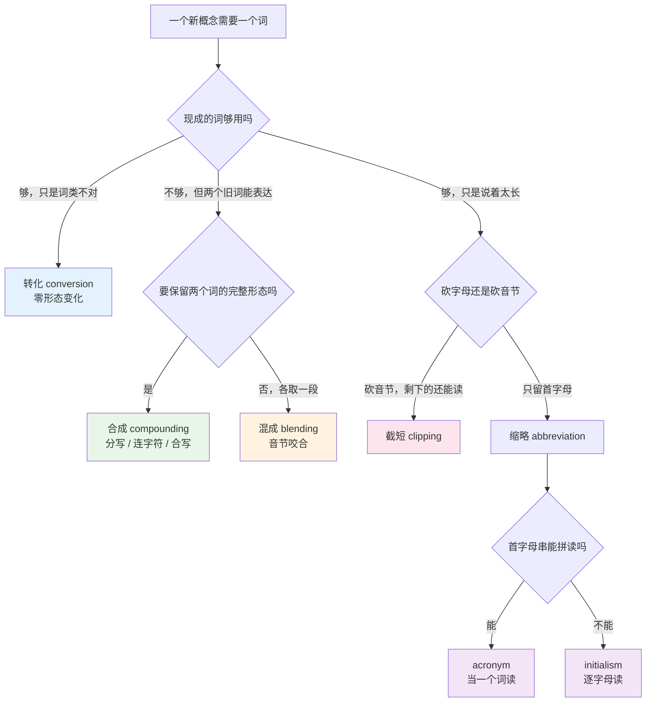
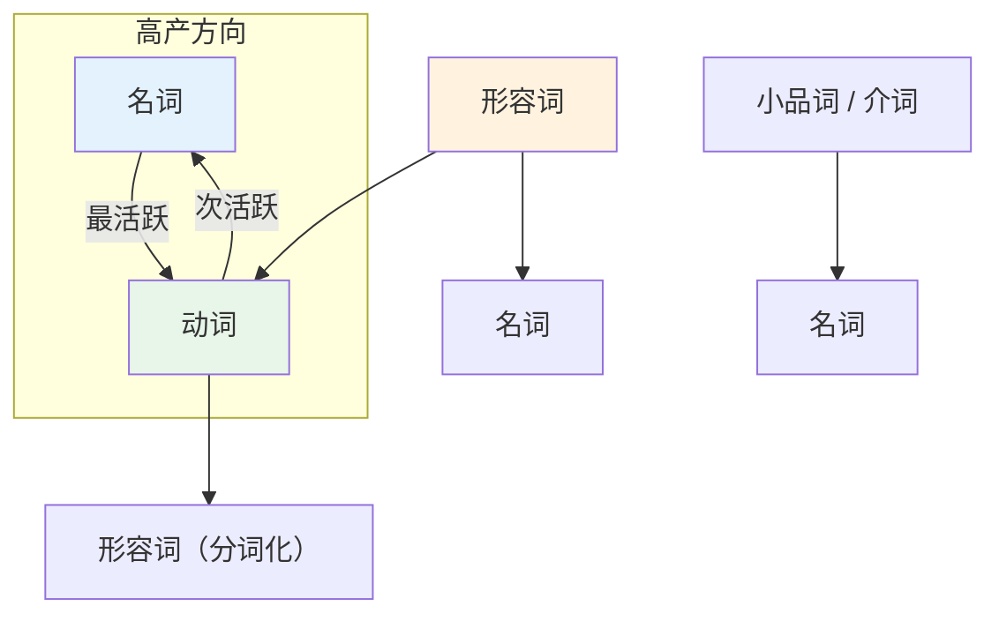
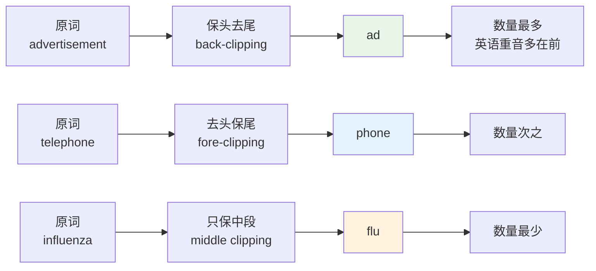
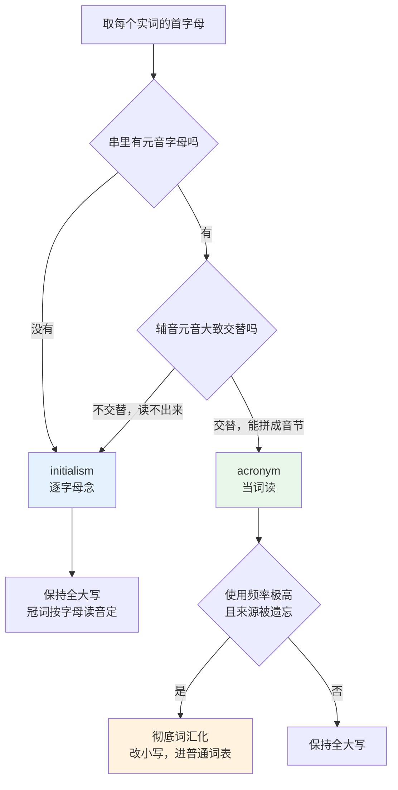
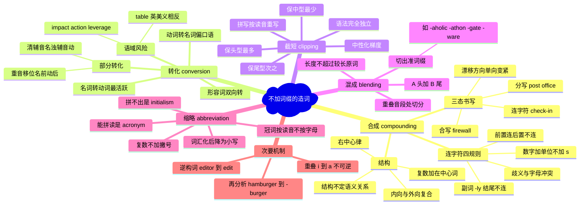

# 合成词、转化词、截短词与缩略语

> [!info] 本篇定位
>
> 第 15 章的收尾，也是整个构词法板块的最后一篇。
>
> 前面从 [[14.构词法：前缀与后缀/01.构词法总览与词族思维\|构词法总览与词族思维]] 一路到 [[15.词根、合成与缩略/03.希腊词根与学科术语\|希腊词根与学科术语]]，讲的全是「往词根上贴东西」：贴前缀、贴后缀、把两个词根接起来。这条路只覆盖了英语造词的一半。
>
> 另一半不贴任何词缀。把两个完整的词拼在一起是**合成**，什么都不加直接换词类是**转化**，砍掉几个音节是**截短**，把两个词咬合在一起是**混成**，只抽首字母是**缩略**。技术英语里近二十年出现的新词，绝大多数走的是这五条路而不是拉丁词根路。
>
> 读完你会拿到：合成词该分写、加连字符还是合写的判定依据，连字符的四条硬规则，识别零变化转化的方法与它在正式写作里的风险边界，截短与混成的切割规律，以及判断一个首字母缩略该怎么处理冠词、复数和大小写的机制。
>
> 具体缩略语的清单不在本篇。释义对照表见 [[22.速查附录与学习资源/02.标点、键盘符号英文名与缩略语场景对照表\|标点、键盘符号英文名与缩略语场景对照表]]，口头读法见 [[20.专业领域词汇/04.IT 深度英语（下）：云原生运维、评审用语与缩略语读法\|IT 深度英语（下）：云原生运维、评审用语与缩略语读法]]，带语气的社交缩写见 [[12.科技、媒体与休闲/02.互联网、手机应用、社交媒体与网络缩写\|互联网、手机应用、社交媒体与网络缩写]]。本篇只讲这些形式是怎么被造出来的。

---

## 1. 本篇导读：不加词缀怎么造词

派生构词有一个前提：得先有词缀，而词缀是封闭集。英语常用前缀不到一百个，常用后缀更少。一个封闭集乘以词根库，能造的词是有上限的。

真正让英语词汇量持续膨胀的是另外几条路，它们的共同点是**不依赖任何词缀**。

| 路径 | 英文术语 | 操作 | 词长变化 | 典型产物 |
| --- | --- | --- | --- | --- |
| 合成 | compounding | 两个自由词拼接 | 变长 | `firewall`、`deadline`、`pull request` |
| 转化 | conversion | 词形不动，换词类 | 不变 | `to google`、`a fix`、`to impact` |
| 截短 | clipping | 砍掉部分音节 | 变短 | `app`、`repo`、`flu` |
| 混成 | blending | 两词各取一段咬合 | 介于两者之间 | `brunch`、`podcast`、`smog` |
| 缩略 | abbreviation | 只保留首字母 | 大幅变短 | 首字母串 |

五条路各自的产出速度差别很大。合成是最高产的一条：任何两个名词都可以临时拼成一个新概念，`error budget`、`blast radius`、`feature flag` 都是这么来的，而且这类组合每年都在增加，词典永远追不上。转化其次，尤其是名词转动词，在互联网语境里几乎是无限能产的。截短和混成产出较慢但存活率高，因为它们通常填补的是「这个概念太常用了，全称说着累」的空缺。



这张图给出的是造词时的决策顺序，也是**反过来拆词时的判定顺序**。遇到一个不认识的词，先看它是不是由两个认识的词拼成的；不是的话，看它是不是某个长词砍掉了一截；再不是的话，看它是不是首字母串。三次都不中，才需要考虑词根词缀。这个顺序符合概率：日常与技术文本里的生词，走前三条路的比走词根路的多。

对读英文技术文档的人来说，这一章的实际价值集中在两处。一是**写**的时候：`user friendly`、`user-friendly`、`userfriendly` 三种写法哪个对，`a 30 seconds timeout` 为什么是错的，这类问题每天都会碰到，错了会让文本显得业余。二是**读**的时候：碰到 `sunsetting the legacy API` 里的 `sunset` 作动词、`we need to spike this` 里的 `spike` 作动词，能立刻反应过来这是转化而不是自己没学过的生词。

---

## 2. 合成词的三种书写形式

合成词指两个或更多**能独立成词**的成分拼成一个词汇单位。这一点区别于派生：`unhappy` 里的 `un-` 不能单独用，所以 `unhappy` 是派生词；`greenhouse` 里的 `green` 和 `house` 都能单独用，所以它是合成词。

麻烦在于英语的合成词有三种书写形式，而三者之间没有干净的规则。

### 2.1 三态：分写、连字符、合写

| 形式 | 英文术语 | 写法 | 例 |
| --- | --- | --- | --- |
| 分写 | open compound | 中间空格 | `ice cream`、`post office`、`pull request` |
| 连字符 | hyphenated compound | 中间连字符 | `mother-in-law`、`check-in`、`well-known` |
| 合写 | closed / solid compound | 连成一个词 | `keyboard`、`firewall`、`database` |

分写形式最容易被误判成「两个词」。判断标准不是有没有空格，而是**这个组合有没有一个不能从两个成分推出来的整体意义，以及重音落在哪里**。`post office` 中间有空格，但它是一个词汇单位：它指的是邮局这个机构，不是随便哪间跟邮政有关的办公室，重音固定在 `post` 上（/ˈpəʊst ɒfɪs/）。相比之下 `cold water` 就只是形容词加名词的普通词组，重音在 `water` 上。

`ice cream` 是这条判据的著名例外。它同样是一个词汇单位（意思不是「冰做的奶油」），重音却不稳定：英式多读 /ˌaɪs ˈkriːm/，重音在后；美式多读 /ˈaɪs kriːm/，重音在前。这类词只能查词典，判据给不出答案。

复合词的重音规律在 [[14.构词法：前缀与后缀/01.构词法总览与词族思维\|构词法总览与词族思维]] 里已经处理过，本篇不重复，只用它来做判定工具：**重音压在前一个成分上的，是合成词；压在后一个成分上的，是普通词组**。这条判据比看空格可靠得多。

### 2.2 三态之间的漂移

同一个合成词的书写形式会随使用频率变化，方向基本是单向的。


`electronic mail` → `e-mail` → `email` 是二十年内走完全程的样本。`web site` → `web-site` → `website` 也一样。`data base` 在上世纪七十年代的论文里还是分写，现在只有 `database`。这条轨迹的驱动力是使用频率：一个组合被用得越多，说话人越不去分析它的内部结构，写法就越紧。

漂移的终点是成分完全不可感知。`breakfast` 来自 `break` + `fast`（打破斋戒），`cupboard` 来自 `cup` + `board`，但现在没人这样理解，读音也已经塌掉了：`cupboard` 读 /ˈkʌbəd/ 而不是 /ˈkʌpbɔːd/，`p` 不发音。这类词严格说已经不再是合成词，而是单纯词。

> [!warning] 词典之间会打架
>
> 因为漂移正在进行中，不同词典对同一个词给出不同写法很常见。`health care` 与 `healthcare`、`decision making` 与 `decision-making`、`co-worker` 与 `coworker`，Oxford、Merriam-Webster、Cambridge 三家的处理未必一致；新闻媒体自己的体例手册（AP、Chicago）又是另一套。
>
> 实际操作只有一条：**选一本词典或一份体例手册，从头到尾用它，同一份文档内部保持一致**。同一篇文里既写 `e-mail` 又写 `email`，比选错哪个都更显得没校对过。

### 2.3 合成名词主表

| 英文 | 英式音标 | 美式音标 | 词性 | 中文 | 搭配与说明 |
| --- | --- | --- | --- | --- | --- |
| **keyboard** | /ˈkiːbɔːd/ | /ˈkiːbɔːrd/ | n. | 键盘 | 合写；`keyboard shortcut` 快捷键 |
| **notebook** | /ˈnəʊtbʊk/ | /ˈnoʊtbʊk/ | n. | 笔记本 | 合写；作电脑义时美式更常说 `laptop` |
| **greenhouse** | /ˈɡriːnhaʊs/ | /ˈɡriːnhaʊs/ | n. | 温室 | 重音在 green，区别于 a green **house** |
| **blackboard** | /ˈblækbɔːd/ | /ˈblækbɔːrd/ | n. | 黑板 | 同上，区别于 a black **board** |
| **whiteboard** | /ˈwaɪtbɔːd/ | /ˈwaɪtbɔːrd/ | n. | 白板 | `whiteboard interview` 白板面试 |
| **software** | /ˈsɒftweə/ | /ˈsɔːftwer/ | n. U | 软件 | 不可数，无 softwares |
| **hardware** | /ˈhɑːdweə/ | /ˈhɑːrdwer/ | n. U | 硬件 | 同为不可数 |
| **firmware** | /ˈfɜːmweə/ | /ˈfɜːrmwer/ | n. U | 固件 | 仿 hardware 造出，`flash the firmware` |
| **middleware** | /ˈmɪdlweə/ | /ˈmɪdlwer/ | n. U | 中间件 | 同族还有 `freeware`、`shareware` |
| **firewall** | /ˈfaɪəwɔːl/ | /ˈfaɪərwɔːl/ | n. | 防火墙 | 原义是建筑防火隔墙 |
| **database** | /ˈdeɪtəbeɪs/ | /ˈdeɪtəbeɪs/ | n. | 数据库 | 已从 data base 走到合写 |
| **feedback** | /ˈfiːdbæk/ | /ˈfiːdbæk/ | n. U | 反馈 | 不可数，`give feedback` 不说 a feedback |
| **deadline** | /ˈdedlaɪn/ | /ˈdedlaɪn/ | n. | 截止时间 | `meet / miss a deadline` |
| **breakthrough** | /ˈbreɪkθruː/ | /ˈbreɪkθruː/ | n. | 突破 | 由短语动词 break through 名词化 |
| **workflow** | /ˈwɜːkfləʊ/ | /ˈwɜːrkfloʊ/ | n. | 工作流 | `automate a workflow` |
| **bottleneck** | /ˈbɒtlnek/ | /ˈbɑːtlnek/ | n. | 瓶颈 | `the bottleneck is disk I/O` |
| **milestone** | /ˈmaɪlstəʊn/ | /ˈmaɪlstoʊn/ | n. | 里程碑 | 原义是路边里程石 |
| **framework** | /ˈfreɪmwɜːk/ | /ˈfreɪmwɜːrk/ | n. | 框架 | 抽象义与具体义同形 |
| **network** | /ˈnetwɜːk/ | /ˈnetwɜːrk/ | n./v. | 网络；建立人脉 | 转化成动词的合成词 |
| **runtime** | /ˈrʌntaɪm/ | /ˈrʌntaɪm/ | n. | 运行时 | `a runtime error` 作定语不加连字符 |
| **downtime** | /ˈdaʊntaɪm/ | /ˈdaʊntaɪm/ | n. U | 停机时间 | 反义 `uptime` |
| **overhead** | /ˈəʊvəhed/ | /ˈoʊvərhed/ | n. U | 开销 | 名词重音在前，形容词 overhead 亦然 |
| **workaround** | /ˈwɜːkəraʊnd/ | /ˈwɜːrkəraʊnd/ | n. | 临时绕过方案 | 由 work around 名词化 |
| **spreadsheet** | /ˈspredʃiːt/ | /ˈspredʃiːt/ | n. | 电子表格 | spread + sheet |
| **screenshot** | /ˈskriːnʃɒt/ | /ˈskriːnʃɑːt/ | n./v. | 截图；截屏 | 名动同形 |
| **timestamp** | /ˈtaɪmstæmp/ | /ˈtaɪmstæmp/ | n./v. | 时间戳 | `a Unix timestamp` |
| **placeholder** | /ˈpleɪshəʊldə/ | /ˈpleɪshoʊldər/ | n. | 占位符 | `a placeholder value` |
| **stakeholder** | /ˈsteɪkhəʊldə/ | /ˈsteɪkhoʊldər/ | n. | 利益相关方 | 商务高频，详见 20.06 |
| **checklist** | /ˈtʃeklɪst/ | /ˈtʃeklɪst/ | n. | 清单 | `go through a checklist` |
| **handbook** | /ˈhændbʊk/ | /ˈhændbʊk/ | n. | 手册 | 近义 `manual` |
| **passport** | /ˈpɑːspɔːt/ | /ˈpæspɔːrt/ | n. | 护照 | 来自法语 passe + port |
| **haircut** | /ˈheəkʌt/ | /ˈherkʌt/ | n. | 理发 | `get a haircut` 不说 cut hair |
| **sunrise** | /ˈsʌnraɪz/ | /ˈsʌnraɪz/ | n. | 日出 | 反义 `sunset` |
| **rainfall** | /ˈreɪnfɔːl/ | /ˈreɪnfɔːl/ | n. U | 降雨量 | 气象术语 |
| **daylight** | /ˈdeɪlaɪt/ | /ˈdeɪlaɪt/ | n. U | 日光 | `daylight saving time` 夏令时 |
| **pickpocket** | /ˈpɪkpɒkɪt/ | /ˈpɪkpɑːkɪt/ | n. | 扒手 | 外向复合，本身既非 pick 也非 pocket |
| **paperback** | /ˈpeɪpəbæk/ | /ˈpeɪpərbæk/ | n. | 平装书 | 外向复合；反义 `hardback` |
| **redhead** | /ˈredhed/ | /ˈredhed/ | n. | 红发的人 | 外向复合，指人不指头 |
| **highlight** | /ˈhaɪlaɪt/ | /ˈhaɪlaɪt/ | n./v. | 亮点；突出显示 | 名动同形，重音都在前 |
| **downside** | /ˈdaʊnsaɪd/ | /ˈdaʊnsaɪd/ | n. | 不利面 | 反义 `upside` |
| **income** | /ˈɪnkʌm/ | /ˈɪnkʌm/ | n. | 收入 | 介词加动词型合成 |
| **outcome** | /ˈaʊtkʌm/ | /ˈaʊtkʌm/ | n. | 结果 | 与 income 同构不同义 |
| **input** | /ˈɪnpʊt/ | /ˈɪnpʊt/ | n./v. | 输入 | 动词过去式仍是 input |
| **output** | /ˈaʊtpʊt/ | /ˈaʊtpʊt/ | n./v. | 输出 | 同上 |
| **offset** | /ˈɒfset/ | /ˈɔːfset/ | n. | 偏移量 | 动词 offset 重音可后移 |
| **onset** | /ˈɒnset/ | /ˈɑːnset/ | n. | 发作；开始 | `the onset of symptoms` |
| **overflow** | /ˈəʊvəfləʊ/ | /ˈoʊvərfloʊ/ | n. | 溢出 | 动词读 /ˌəʊvəˈfləʊ/，重音后移 |
| **ice cream** | /ˌaɪs ˈkriːm/ | /ˈaɪs kriːm/ | n. | 冰淇淋 | 分写但是一个词汇单位；重音英后美前 |
| **post office** | /ˈpəʊst ɒfɪs/ | /ˈpoʊst ɔːfɪs/ | n. | 邮局 | 分写，重音在 post |
| **credit card** | /ˈkredɪt kɑːd/ | /ˈkredɪt kɑːrd/ | n. | 信用卡 | 分写 |
| **high school** | /ˈhaɪ skuːl/ | /ˈhaɪ skuːl/ | n. | 高中 | 重音在 high，区别于 a high **school** |
| **real estate** | /ˈriːəl ɪsteɪt/ | /ˈriːəl ɪsteɪt/ | n. U | 房地产 | 分写，不可数 |
| **pull request** | /ˈpʊl rɪkwest/ | /ˈpʊl rɪkwest/ | n. | 合并请求 | 分写；缩写形式见 20.04 |
| **machine learning** | /məˈʃiːn lɜːnɪŋ/ | /məˈʃiːn lɜːrnɪŋ/ | n. U | 机器学习 | 分写，不可数 |
| **mother-in-law** | /ˈmʌðər ɪn lɔː/ | /ˈmʌðər ɪn lɔː/ | n. | 岳母；婆婆 | 复数 mothers-in-law |
| **passer-by** | /ˌpɑːsə ˈbaɪ/ | /ˌpæsər ˈbaɪ/ | n. | 路人 | 复数 passers-by |
| **runner-up** | /ˌrʌnər ˈʌp/ | /ˌrʌnər ˈʌp/ | n. | 亚军 | 复数 runners-up |
| **check-in** | /ˈtʃek ɪn/ | /ˈtʃek ɪn/ | n. | 签到；办理登机 | 动词分写 check in |
| **build-up** | /ˈbɪld ʌp/ | /ˈbɪld ʌp/ | n. | 累积 | 动词分写 build up |

### 2.4 合成名词的复数加在哪里

规则是：**加在中心词上**，中心词通常是最后一个成分。`firewalls`、`deadlines`、`stakeholders` 都是这样。

例外出现在中心词不在末尾的时候，主要是带介词短语的合成词和来自法语语序的词。

| 单数 | 复数 | 为什么 |
| --- | --- | --- |
| `mother-in-law` | `mothers-in-law` | 中心词是 mother |
| `passer-by` | `passers-by` | 中心词是 passer |
| `runner-up` | `runners-up` | 中心词是 runner |
| `attorney general` | `attorneys general` | 法语语序，中心词在前 |
| `court-martial` | `courts-martial` | 同上，口语里 court-martials 也在用 |
| `spoonful` | `spoonfuls` | 中心词是 spoon 但整体已词汇化，末尾加 s |
| `passport` | `passports` | 已完全词汇化，成分不再可分 |

判断办法：问自己「这一堆东西的核心名词是哪个」。是 `mother`，那就 `mothers`；已经分不出核心了（`passport`），就在末尾加。

---

## 3. 连字符的判定规则

连字符是中文母语者写英文时错得最多的标点之一，因为中文没有对应物。它有四条可操作的硬规则，覆盖绝大部分场景。

### 3.1 规则一：前置修饰语连，后置不连

多个词一起修饰后面的名词时加连字符；同样几个词放到名词后面作表语时不加。

> [!example] 位置决定连字符
>
> - This is a **well-known** issue.
>   - 这是个众所周知的问题。
> - This issue is **well known**.
>   - 这个问题众所周知。
> - We need a **long-term** solution.
>   - 我们需要长期方案。
> - We need to think **long term**.
>   - 我们得从长期考虑。
> - It is an **open-source** project.
>   - 这是个开源项目。
> - The project is **open source**.
>   - 这个项目是开源的。

连字符在这里的作用是**分组**。`a small business owner` 有歧义：可能是「小企业的主人」，也可能是「个子小的企业主」。写成 `a small-business owner` 就锁定了第一种解读。这是连字符唯一的功能性理由——把该绑在一起的词绑住，避免读者第一遍解析错。

### 3.2 规则二：-ly 结尾的副词不加连字符

`-ly` 已经把「我是副词，我修饰后面那个词」这个信息标出来了，不需要连字符再标一次。

> - ❌ ~~a highly-available system~~
> - ✅ a **highly available** system
> - ❌ ~~a fully-managed service~~
> - ✅ a **fully managed** service
> - ❌ ~~a widely-used library~~
> - ✅ a **widely used** library

例外是那些不带 `-ly` 的副词，它们没有形态标记，需要连字符：`a well-tested module`、`a fast-growing market`、`a hard-coded value`、`a best-selling book`。`well`、`fast`、`hard`、`best` 都可以是形容词，不加连字符会产生歧义。

### 3.3 规则三：数字加单位作定语时连，且单位不加复数

这是技术写作里出错最集中的一条。

> - ❌ ~~a 30 seconds timeout~~
> - ✅ a **30-second** timeout
> - ❌ ~~a five years plan~~
> - ✅ a **five-year** plan
> - ❌ ~~a 64 bits integer~~
> - ✅ a **64-bit** integer
> - ✅ The timeout is **30 seconds**.（作表语，恢复复数，不加连字符）

单位不加 `s` 的原因是它此刻不是名词而是复合形容词的一部分。同理 `a two-hour meeting`（会议两小时）、`a 500-page report`（五百页的报告）、`an eight-hour shift`（八小时班）。一旦这个短语离开名词前的位置，复数就回来：`The meeting lasted two hours.`

### 3.4 规则四：为避免歧义或字母冲突而加

有几类情形连字符不是可选的装饰，而是区分词义的手段。

| 带连字符 | 不带连字符 | 差别 |
| --- | --- | --- |
| `re-sign` /ˌriːˈsaɪn/ | `resign` /rɪˈzaɪn/ | 重新签约 / 辞职 |
| `re-cover` /ˌriːˈkʌvə/ | `recover` /rɪˈkʌvə/ | 重新覆盖 / 恢复 |
| `re-create` /ˌriːkriˈeɪt/ | `recreate` /ˈrekrieɪt/ | 重新创建 / 消遣 |
| `re-form` /ˌriːˈfɔːm/ | `reform` /rɪˈfɔːm/ | 重新组成 / 改革 |
| `re-lease` /ˌriːˈliːs/ | `release` /rɪˈliːs/ | 重新租赁 / 发布 |

另一类是字母冲突：`shell-like`（三个 l 连排太难读）、`anti-inflammatory`（两个 i 相邻）、`co-op`（不加连字符会被读成 coop 鸡笼）、`co-worker` 与 `coworker` 两种写法并存，前者更保守。

还有一类是词根首字母大写或是数字：`pre-COVID`、`non-English`、`anti-Semitic`、`mid-2020s`、`post-9/11`。大写字母和数字不能直接黏在前缀后面。

### 3.5 悬挂连字符

同一个中心词被多个修饰语共享时，前面几个的连字符悬空保留，避免重复。

> - We support **two- and three-digit** country codes.
>   - 我们支持两位和三位的国家代码。
> - The library handles both **short- and long-running** tasks.
>   - 这个库同时处理短时和长时任务。
> - This applies to **pre- and post-processing** steps.
>   - 这适用于预处理和后处理两个步骤。

连字符后面直接跟空格，这不是排版错误，是标准写法（suspended hyphen）。

### 3.6 固定要连字符的几类

| 类别 | 例 | 说明 |
| --- | --- | --- |
| 21 到 99 的复合数词 | `twenty-five`、`ninety-nine` | 见 03 章数字篇 |
| 分数作定语 | `two-thirds` majority | 作名词时也常连 |
| `self-` 前缀 | `self-hosted`、`self-signed` | 该前缀几乎总是连 |
| `ex-` 表「前任」 | `ex-manager` | 表「向外」的 ex- 不连（`export`） |
| `all-`、`half-`、`quarter-` | `all-inclusive`、`half-baked` | |
| 字母加名词 | `X-ray`、`T-shirt`、`U-turn`、`A-list` | 单字母作形状或分类标记 |
| 三词以上的整体修饰语 | `state-of-the-art`、`up-to-date`、`out-of-the-box` | 后置时拆开：`the design is up to date` |

> [!warning] 连字符不是破折号
>
> 键盘上的 `-` 是连字符（hyphen），比它长的 `–`（en dash）和 `—`（em dash）用途完全不同：en dash 表范围（`pages 10–20`、`2020–2024`），em dash 表插入或转折。三者混用在正式文本里会被视为排版错误。
>
> 三个符号的英文名与区分办法见 [[22.速查附录与学习资源/02.标点、键盘符号英文名与缩略语场景对照表\|标点、键盘符号英文名与缩略语场景对照表]]。

---

## 4. 复合词的内部结构与中心词

### 4.1 中心词在右

英语复合词的语义中心（head）基本都在右边，左边那个成分是修饰语。这条叫**右中心律**（right-hand head rule）。

- `a bookshelf` 是一种 shelf，不是一种 book
- `a shelf book`（若存在）会是一种 book
- `a raincoat` 是一种 coat
- `a coat rack` 是一种 rack

中心词决定两件事：整个复合词的**词类**和**复数位置**。`bookshelf` 的中心词 `shelf` 是名词，所以整个词是名词；复数是 `bookshelves` 不是 `booksshelf`。

这条规律让语序变得关键，颠倒过来意思就变了。

| 组合 | 意思 | 中心词 |
| --- | --- | --- |
| `a race horse` | 赛马（一种马） | horse |
| `a horse race` | 赛马比赛（一种比赛） | race |
| `a water mill` | 水磨（靠水驱动的磨） | mill |
| `a mill wheel` | 磨轮（磨上的轮子） | wheel |
| `a house boat` | 水上住家（一种船） | boat |
| `a boat house` | 船屋（存放船的房子） | house |
| `table tennis` | 乒乓球（一种球类运动，不可数） | tennis |
| `a tennis table` | 乒乓球台（一种桌子） | table |

中文的偏正结构方向相同（「赛马」的中心是马），所以这一条中文母语者不太出错。真正出错的是下一条。

### 4.2 结构不决定语义关系

知道中心词在右，只解决了「这是什么东西」，没解决「两者是什么关系」。名词加名词的复合词，两个成分之间的语义关系是开放的，得靠世界知识补。

| 复合词 | 语义关系 | 展开 |
| --- | --- | --- |
| `windmill` | 动力来源 | a mill powered **by** wind |
| `watermill` | 动力来源 | a mill powered **by** water |
| `sawmill` | 产出/用途 | a mill **for** sawing |
| `steel mill` | 加工对象 | a mill that processes **steel** |
| `sunflower` | 相似 | a flower that looks **like** the sun |
| `bloodbath` | 隐喻 | 屠杀，是 bath 的比喻用法，与洗澡无关 |
| `cable car` | 承载方式 | a car pulled **by** a cable |
| `car park` | 用途 | a place **for** parking cars |

这也是复合词不能靠拆解硬猜的原因。`a security guard` 是保安（人），`a guard rail` 是护栏（物），`a rail guard`（若存在）又会是别的。碰到不熟的名词复合词，拆开只能得到范围，不能得到准确义。

### 4.3 内向复合与外向复合

**内向复合**（endocentric）指整体是中心词的一个下位类：`bookshelf` 是 shelf，`raincoat` 是 coat。绝大多数复合词都是这种。

**外向复合**（exocentric）指整体不属于任何一个成分：

| 词 | 字面成分 | 实际所指 |
| --- | --- | --- |
| `pickpocket` | pick + pocket | 一个人，不是口袋也不是动作 |
| `redhead` | red + head | 一个人，不是头 |
| `paperback` | paper + back | 一本书，不是背 |
| `scarecrow` | scare + crow | 稻草人，不是乌鸦 |
| `killjoy` | kill + joy | 扫兴的人 |
| `turncoat` | turn + coat | 叛徒 |
| `highbrow` | high + brow | 高雅的人 |
| `loudmouth` | loud + mouth | 大嘴巴的人 |

外向复合几乎全是指人的贬义词或幽默词，因为这种「用特征代指整体」的手法本身带调侃色彩。识别它们的方法是：如果按右中心律理解得到的意思明显不合上下文，那就是外向复合。

### 4.4 词性组合类型

| 组合 | 结果词性 | 例 |
| --- | --- | --- |
| 名词 + 名词 | 名词 | `firewall`、`keyboard`、`error budget` |
| 形容词 + 名词 | 名词 | `blackboard`、`greenhouse`、`hardware` |
| 动词 + 名词 | 名词 | `pickpocket`、`breakwater`、`playground` |
| 名词 + 动词 | 名词 | `sunrise`、`nosedive`、`haircut` |
| 动词 + 小品词 | 名词 | `backup`、`login`、`rollback`、`checkout` |
| 小品词 + 动词 | 名词/动词 | `input`、`output`、`overflow`、`downgrade` |
| 形容词 + 形容词 | 形容词 | `bittersweet`、`deaf-mute` |
| 名词 + 形容词 | 形容词 | `world-famous`、`color-blind`、`waterproof` |
| 形容词 + 分词 | 形容词 | `good-looking`、`long-lasting` |
| 名词 + 分词 | 形容词 | `time-consuming`、`hand-made`、`man-made` |

动词加小品词那一行有个高频陷阱：**名词形式合写或加连字符，动词形式必须分写**。`the backup` / `to back up`，`the login` / `to log in`，`the rollback` / `to roll back`，`the setup` / `to set up`，`the checkout` / `to check out`。这条在 [[14.构词法：前缀与后缀/01.构词法总览与词族思维\|构词法总览与词族思维]] 里讲过，这里只提醒它是 commit 消息和文档里最容易被抓到的错误之一。

> - ❌ ~~Please backup the database before you rollback.~~
> - ✅ Please **back up** the database before you **roll back**.
> - ✅ We restored from **the backup** after **the rollback**.

---

## 5. 复合形容词与多词修饰语

复合形容词是技术写作的密度工具：一串词绑成一个修饰语，能把本来要写成从句的信息压进名词前面。

### 5.1 常见构造模式

| 模式 | 例 | 展开 |
| --- | --- | --- |
| 形容词 + 名词-ed | `blue-eyed`、`open-minded`、`short-handed` | having blue eyes |
| 名词 + 现在分词 | `time-consuming`、`English-speaking`、`record-breaking` | that consumes time |
| 名词 + 过去分词 | `hand-made`、`computer-generated`、`machine-readable` | made by hand |
| 副词 + 过去分词 | `well-designed`、`ill-defined`、`poorly documented`（-ly 不连） | designed well |
| 形容词 + 过去分词 | `long-awaited`、`ready-made`、`fresh-baked` | |
| 名词 + 形容词 | `world-famous`、`ice-cold`、`sky-high`、`user-friendly` | famous in the world |
| 数字 + 名词 | `three-day`、`64-bit`、`10-year` | 单位不加 s |
| 形容词 + 形容词 | `bittersweet`、`dark-blue`、`Anglo-Saxon` | |

### 5.2 复合形容词主表

| 英文 | 英式音标 | 美式音标 | 词性 | 中文 | 搭配与说明 |
| --- | --- | --- | --- | --- | --- |
| **well-known** | /ˌwel ˈnəʊn/ | /ˌwel ˈnoʊn/ | adj. | 众所周知的 | 后置时写 well known |
| **long-term** | /ˌlɒŋ ˈtɜːm/ | /ˌlɔːŋ ˈtɜːrm/ | adj. | 长期的 | 反义 short-term |
| **user-friendly** | /ˌjuːzə ˈfrendli/ | /ˌjuːzər ˈfrendli/ | adj. | 易用的 | 同构 `developer-friendly` |
| **cost-effective** | /ˌkɒst ɪˈfektɪv/ | /ˌkɔːst ɪˈfektɪv/ | adj. | 划算的 | 不等于 cheap |
| **open-source** | /ˌəʊpən ˈsɔːs/ | /ˌoʊpən ˈsɔːrs/ | adj. | 开源的 | 后置写 open source |
| **case-sensitive** | /ˌkeɪs ˈsensətɪv/ | /ˌkeɪs ˈsensətɪv/ | adj. | 区分大小写的 | 反义 case-insensitive |
| **read-only** | /ˌriːd ˈəʊnli/ | /ˌriːd ˈoʊnli/ | adj. | 只读的 | `mounted read-only` |
| **backward-compatible** | /ˌbækwəd kəmˈpætəbl/ | /ˌbækwərd kəmˈpætəbl/ | adj. | 向后兼容的 | 名词 backward compatibility |
| **cross-platform** | /ˌkrɒs ˈplætfɔːm/ | /ˌkrɔːs ˈplætfɔːrm/ | adj. | 跨平台的 | |
| **state-of-the-art** | /ˌsteɪt əv ði ˈɑːt/ | /ˌsteɪt əv ði ˈɑːrt/ | adj. | 最先进的 | 后置写 state of the art |
| **up-to-date** | /ˌʌp tə ˈdeɪt/ | /ˌʌp tə ˈdeɪt/ | adj. | 最新的 | 后置写 up to date |
| **out-of-the-box** | /ˌaʊt əv ðə ˈbɒks/ | /ˌaʊt əv ðə ˈbɑːks/ | adj. | 开箱即用的 | 副词写 out of the box |
| **so-called** | /ˌsəʊ ˈkɔːld/ | /ˌsoʊ ˈkɔːld/ | adj. | 所谓的 | 常带贬义或存疑语气 |
| **time-consuming** | /ˈtaɪm kənsjuːmɪŋ/ | /ˈtaɪm kənsuːmɪŋ/ | adj. | 耗时的 | 不说 time-costing |
| **labour-intensive** | /ˈleɪbə ɪntensɪv/ | /ˈleɪbər ɪntensɪv/ | adj. | 劳动密集的 | 美式拼 labor-intensive |
| **world-famous** | /ˌwɜːld ˈfeɪməs/ | /ˌwɜːrld ˈfeɪməs/ | adj. | 世界闻名的 | |
| **waterproof** | /ˈwɔːtəpruːf/ | /ˈwɔːtərpruːf/ | adj. | 防水的 | 同族 fireproof、bulletproof |
| **color-blind** | /ˈkʌlə blaɪnd/ | /ˈkʌlər blaɪnd/ | adj. | 色盲的 | 英式拼 colour-blind |
| **short-lived** | /ˌʃɔːt ˈlɪvd/ | /ˌʃɔːrt ˈlaɪvd/ | adj. | 短暂的 | 英美元音不同 |
| **hard-coded** | /ˌhɑːd ˈkəʊdɪd/ | /ˌhɑːrd ˈkoʊdɪd/ | adj. | 硬编码的 | 动词写 hard-code 或 hardcode |
| **fine-grained** | /ˌfaɪn ˈɡreɪnd/ | /ˌfaɪn ˈɡreɪnd/ | adj. | 细粒度的 | 反义 coarse-grained |
| **thread-safe** | /ˌθred ˈseɪf/ | /ˌθred ˈseɪf/ | adj. | 线程安全的 | 详见 20.03 |
| **battery-powered** | /ˈbætəri paʊəd/ | /ˈbætəri paʊərd/ | adj. | 电池供电的 | 同构 solar-powered |
| **decision-making** | /dɪˈsɪʒn meɪkɪŋ/ | /dɪˈsɪʒn meɪkɪŋ/ | n./adj. | 决策（的） | 作名词时也常连字符 |
| **problem-solving** | /ˈprɒbləm sɒlvɪŋ/ | /ˈprɑːbləm sɑːlvɪŋ/ | n./adj. | 解决问题（的） | |

### 5.3 引号式修饰语

当一整个短语甚至句子被当成修饰语用时，英文用引号而不是连字符打包。

> - They still have a **"move fast and break things"** culture.
>   - 他们还是那套「快速迭代、打碎再说」的文化。
> - This is a classic **"it works on my machine"** bug.
>   - 这是个典型的「在我机器上是好的」型 bug。

这种写法带明显的口语与调侃色彩，正式文档里少见，评审意见和内部文档里很常见。

---

## 6. 转化：不加任何东西换词类

转化（conversion，也叫 zero derivation、functional shift）指一个词不添加任何词缀，直接进入另一个词类。它是英语区别于多数印欧语言的显著特征——英语的形态标记本来就少，动词和名词在词形上没有强制区分，所以「借用」的成本几乎为零。



图上的箭头粗细代表能产性。名词转动词是数量最大也最活跃的一条：几乎任何指称具体物体或工具的名词，在合适语境下都能被当动词用，而且听者能立刻理解。`Can you Slack me the link?`（把链接用 Slack 发我）这句话里的 `Slack` 从没进过词典，但没人会看不懂。

### 6.1 名词转动词

这条路的语义模式相当规整，大致有五类。

| 语义模式 | 展开 | 例 |
| --- | --- | --- |
| 用某工具做事 | use N | `to google`、`to email`、`to hammer` |
| 放上某物 | put N on | `to butter the bread`、`to salt the dish` |
| 移除某物 | remove N | `to skin the fish`、`to dust the shelf` |
| 变成某角色 | act as N | `to host`、`to chair`、`to author` |
| 送往某处 | send to N | `to ship`、`to shelve`、`to table` |

第二类和第三类方向相反却同形，这是英语里少见的歧义源：`to dust` 既可以是「撒粉」（`dust the cake with sugar`）也可以是「除尘」（`dust the furniture`）。靠宾语区分。

| 英文 | 英式音标 | 美式音标 | 词性 | 中文 | 搭配与说明 |
| --- | --- | --- | --- | --- | --- |
| **google** | /ˈɡuːɡl/ | /ˈɡuːɡl/ | v. | 用搜索引擎查 | 动词义小写；商标方反对但已进词典 |
| **message** | /ˈmesɪdʒ/ | /ˈmesɪdʒ/ | v. | 给…发消息 | `message me the link` |
| **text** | /tekst/ | /tekst/ | v. | 发短信 | 过去式 texted |
| **email** | /ˈiːmeɪl/ | /ˈiːmeɪl/ | v. | 发邮件给 | 双宾语 `email me the file` |
| **friend** | /frend/ | /frend/ | v. | 加为好友 | 反向 `unfriend` 加否定前缀 |
| **host** | /həʊst/ | /hoʊst/ | v. | 托管；主办 | `self-hosted`、`host a meeting` |
| **ship** | /ʃɪp/ | /ʃɪp/ | v. | 发布；发货 | `ship it` 在软件语境指上线 |
| **bookmark** | /ˈbʊkmɑːk/ | /ˈbʊkmɑːrk/ | v. | 收藏 | 由合成名词再转化 |
| **flag** | /flæɡ/ | /flæɡ/ | v. | 标记出 | `flag an issue` 提出问题 |
| **queue** | /kjuː/ | /kjuː/ | v. | 排队；入队 | 现在分词 queueing 或 queuing |
| **cache** | /kæʃ/ | /kæʃ/ | v. | 缓存 | 与 cash 同音异形 |
| **branch** | /brɑːntʃ/ | /bræntʃ/ | v. | 分支 | `branch off from main` |
| **fork** | /fɔːk/ | /fɔːrk/ | v. | 派生出分叉 | 进程义与仓库义同形 |
| **mirror** | /ˈmɪrə/ | /ˈmɪrər/ | v. | 做镜像 | `a mirrored repository` |
| **stream** | /striːm/ | /striːm/ | v. | 流式传输 | `stream the logs` |
| **archive** | /ˈɑːkaɪv/ | /ˈɑːrkaɪv/ | v. | 归档 | 名动同音，不移重音 |
| **benchmark** | /ˈbentʃmɑːk/ | /ˈbentʃmɑːrk/ | v. | 做基准测试 | 由合成名词转化 |
| **sunset** | /ˈsʌnset/ | /ˈsʌnset/ | v. | 逐步下线 | `sunset the v1 API`，商务与技术语域 |
| **onboard** | /ˌɒnˈbɔːd/ | /ˌɑːnˈbɔːrd/ | v. | 引导新人上手 | 名词 onboarding |
| **surface** | /ˈsɜːfɪs/ | /ˈsɜːrfɪs/ | v. | 暴露出；浮现 | `surface the error to the user` |
| **table** | /ˈteɪbl/ | /ˈteɪbl/ | v. | 提交讨论（英）；搁置（美） | 英美义相反，正式文件中避免使用 |
| **chair** | /tʃeə/ | /tʃer/ | v. | 主持 | `chair a meeting` |
| **head** | /hed/ | /hed/ | v. | 领导；朝…去 | `head the team`、`head north` |
| **author** | /ˈɔːθə/ | /ˈɔːθər/ | v. | 撰写 | 正式写作里常被批评，可用 write |
| **task** | /tɑːsk/ | /tæsk/ | v. | 指派任务 | `be tasked with doing sth` |
| **gift** | /ɡɪft/ | /ɡɪft/ | v. | 赠送 | 传统上用 give，近年 gift 广泛化 |
| **medal** | /ˈmedl/ | /ˈmedl/ | v. | 获得奖牌 | 体育报道用法 |
| **parent** | /ˈpeərənt/ | /ˈperənt/ | v. | 养育 | 名词 parenting |
| **butter** | /ˈbʌtə/ | /ˈbʌtər/ | v. | 涂黄油 | 放上型 |
| **water** | /ˈwɔːtə/ | /ˈwɔːtər/ | v. | 浇水 | 放上型 |
| **salt** | /sɔːlt/ | /sɔːlt/ | v. | 加盐 | 密码学里 `salt a hash` 同源引申 |
| **skin** | /skɪn/ | /skɪn/ | v. | 剥皮 | 移除型 |
| **dust** | /dʌst/ | /dʌst/ | v. | 除尘；撒粉 | 双向义，靠宾语区分 |

### 6.2 动词转名词

方向反过来时，产物通常指「一次行为」或「行为的结果」，并且带明显的口语或行业色彩。

| 英文 | 英式音标 | 美式音标 | 词性 | 中文 | 搭配与说明 |
| --- | --- | --- | --- | --- | --- |
| **a fix** | /fɪks/ | /fɪks/ | n. | 一次修复 | `a quick fix` 临时补丁 |
| **a build** | /bɪld/ | /bɪld/ | n. | 一次构建产物 | `the nightly build` |
| **an ask** | /ɑːsk/ | /æsk/ | n. | 一项请求 | 商务口语，正式文本用 request |
| **a spend** | /spend/ | /spend/ | n. | 一笔支出 | 市场行业术语 |
| **a reveal** | /rɪˈviːl/ | /rɪˈviːl/ | n. | 揭晓 | 产品发布语境 |
| **a hire** | /ˈhaɪə/ | /ˈhaɪər/ | n. | 新招的人 | `a great hire` |
| **a walk** | /wɔːk/ | /wɔːk/ | n. | 一次散步 | `go for a walk` |
| **a swim** | /swɪm/ | /swɪm/ | n. | 一次游泳 | `have a swim` |
| **a look** | /lʊk/ | /lʊk/ | n. | 看一眼 | `take a look` |
| **the commute** | /kəˈmjuːt/ | /kəˈmjuːt/ | n. | 通勤 | `a two-hour commute` |
| **a must** | /mʌst/ | /mʌst/ | n. | 必需之物 | `a must-have`；情态动词转名词，这类转化极少 |
| **a read** | /riːd/ | /riːd/ | n. | 一次阅读；读物 | `a good read` 一本好书 |

轻动词加动作名词的搭配（`take a look`、`have a swim`）属于另一个专题，详见 13.02，本篇只指出这些名词的来源是转化。

### 6.3 形容词的两个转化方向

**形容词转动词**产物是「使…变成该状态」：

- `empty` → `empty the cache`（清空缓存）
- `dry` → `dry your hands`（把手弄干）
- `clean` → `clean the logs`（清理日志）
- `calm` → `calm the user down`（安抚用户）
- `better` → `better your chances`（改善处境，偏文雅）
- `slow` → `slow the rollout`（放慢推进）

**形容词转名词**主要有两类。一类是加定冠词指整个群体，是复数含义：`the poor`（穷人）、`the rich`、`the unemployed`、`the injured`、`the homeless`。这类不能加 `-s`，谓语用复数：`The poor **are** hit hardest.` 另一类是可数化的个体：`a regular`（常客）、`the final`（决赛）、`a native`（本地人）、`the basics`（基础）。

---

## 7. 转化的边界：重音移位、清浊交替与语域风险

严格的转化要求词形完全不变。但英语里还有一批词，形态没变而**读音变了**，通常被称为部分转化或语音派生。它们不是同一类现象，但对学习者来说要一起处理，因为它们同样是「一个拼写两个词类」。

### 7.1 重音移位的名动对

规律非常整齐：**双音节词作名词时重音在第一音节，作动词时在第二音节**。重音移走的那个音节，元音往往弱化成 /ə/ 或 /ɪ/。

| 英文 | 英式音标 | 美式音标 | 词性 | 中文 | 搭配与说明 |
| --- | --- | --- | --- | --- | --- |
| **record** | /ˈrekɔːd/ | /ˈrekərd/ | n. | 记录；唱片 | 重音在前 |
| **record** | /rɪˈkɔːd/ | /rɪˈkɔːrd/ | v. | 记录 | 重音在后，首音节弱化 |
| **present** | /ˈpreznt/ | /ˈpreznt/ | n./adj. | 礼物；现在的 | 重音在前 |
| **present** | /prɪˈzent/ | /prɪˈzent/ | v. | 呈现；演示 | 重音在后 |
| **permit** | /ˈpɜːmɪt/ | /ˈpɜːrmɪt/ | n. | 许可证 | 重音在前 |
| **permit** | /pəˈmɪt/ | /pərˈmɪt/ | v. | 允许 | 重音在后 |
| **increase** | /ˈɪŋkriːs/ | /ˈɪŋkriːs/ | n. | 增长 | `a sharp increase` |
| **increase** | /ɪnˈkriːs/ | /ɪnˈkriːs/ | v. | 增加 | 反义 decrease 同规律 |
| **conflict** | /ˈkɒnflɪkt/ | /ˈkɑːnflɪkt/ | n. | 冲突 | `a merge conflict` |
| **conflict** | /kənˈflɪkt/ | /kənˈflɪkt/ | v. | 相冲突 | `conflict with` |
| **contrast** | /ˈkɒntrɑːst/ | /ˈkɑːntræst/ | n. | 对比 | `in contrast` |
| **contrast** | /kənˈtrɑːst/ | /kənˈtræst/ | v. | 形成对比 | |
| **export** | /ˈekspɔːt/ | /ˈekspɔːrt/ | n. | 出口；导出物 | 计算机语境亦然 |
| **export** | /ɪkˈspɔːt/ | /ɪkˈspɔːrt/ | v. | 导出 | import 同规律 |
| **object** | /ˈɒbdʒekt/ | /ˈɑːbdʒekt/ | n. | 物体；对象 | 编程术语用名词读法 |
| **object** | /əbˈdʒekt/ | /əbˈdʒekt/ | v. | 反对 | `object to sth` |
| **project** | /ˈprɒdʒekt/ | /ˈprɑːdʒekt/ | n. | 项目 | |
| **project** | /prəˈdʒekt/ | /prəˈdʒekt/ | v. | 投射；预测 | `projected revenue` |
| **suspect** | /ˈsʌspekt/ | /ˈsʌspekt/ | n. | 嫌疑人 | |
| **suspect** | /səˈspekt/ | /səˈspekt/ | v. | 怀疑 | |
| **contract** | /ˈkɒntrækt/ | /ˈkɑːntrækt/ | n. | 合同 | |
| **contract** | /kənˈtrækt/ | /kənˈtrækt/ | v. | 收缩；签约 | |
| **rebel** | /ˈrebl/ | /ˈrebl/ | n. | 反叛者 | |
| **rebel** | /rɪˈbel/ | /rɪˈbel/ | v. | 反叛 | `rebel against` |
| **upgrade** | /ˈʌpɡreɪd/ | /ˈʌpɡreɪd/ | n. | 升级 | 合成词，名词重音在前 |
| **upgrade** | /ˌʌpˈɡreɪd/ | /ˌʌpˈɡreɪd/ | v. | 升级 | 动词重音可后移 |
| **refuse** | /ˈrefjuːs/ | /ˈrefjuːs/ | n. U | 垃圾 | 正式用词，与动词只是同形 |
| **refuse** | /rɪˈfjuːz/ | /rɪˈfjuːz/ | v. | 拒绝 | 结尾辅音也不同 |

`refuse` 那一对严格说不是转化，两个词来源不同，只是拼写撞车了。它被放在这里是因为学习者遇到时的处理方式一样：看词类定读音。

### 7.2 清浊交替的名动对

另一类靠词尾辅音的清浊区分词类：**清辅音收尾的是名词或形容词，浊辅音收尾的是动词**。

| 英文 | 英式音标 | 美式音标 | 词性 | 中文 | 搭配与说明 |
| --- | --- | --- | --- | --- | --- |
| **use** | /juːs/ | /juːs/ | n. | 使用 | `make use of` |
| **use** | /juːz/ | /juːz/ | v. | 使用 | 词尾浊化 |
| **house** | /haʊs/ | /haʊs/ | n. | 房子 | 复数 houses 读 /ˈhaʊzɪz/ |
| **house** | /haʊz/ | /haʊz/ | v. | 容纳 | `the server houses the data` |
| **close** | /kləʊs/ | /kloʊs/ | adj. | 近的 | `a close call` |
| **close** | /kləʊz/ | /kloʊz/ | v. | 关闭 | 词尾浊化 |
| **abuse** | /əˈbjuːs/ | /əˈbjuːs/ | n. | 滥用 | |
| **abuse** | /əˈbjuːz/ | /əˈbjuːz/ | v. | 滥用 | |
| **excuse** | /ɪkˈskjuːs/ | /ɪkˈskjuːs/ | n. | 借口 | `a poor excuse` |
| **excuse** | /ɪkˈskjuːz/ | /ɪkˈskjuːz/ | v. | 原谅 | `excuse me` 用动词读法 |
| **advice** | /ədˈvaɪs/ | /ədˈvaɪs/ | n. U | 建议 | 拼写也变，c/s 对立 |
| **advise** | /ədˈvaɪz/ | /ədˈvaɪz/ | v. | 建议 | 英美都写 advise |
| **belief** | /bɪˈliːf/ | /bɪˈliːf/ | n. | 信念 | f/v 对立 |
| **believe** | /bɪˈliːv/ | /bɪˈliːv/ | v. | 相信 | |
| **proof** | /pruːf/ | /pruːf/ | n. | 证据 | |
| **prove** | /pruːv/ | /pruːv/ | v. | 证明 | |
| **shelf** | /ʃelf/ | /ʃelf/ | n. | 架子 | 复数 shelves |
| **shelve** | /ʃelv/ | /ʃelv/ | v. | 搁置 | `shelve the proposal` |

后半部分（`advice/advise`、`belief/believe`）拼写也变了，已经超出转化范畴，属于历史遗留的形态对立。归在一起讲是因为记忆策略相同：**清辅音是名词，浊辅音是动词**，一条规律覆盖全部。

### 7.3 转化的语域风险

转化的能产性太高，反过来带来一个问题：不是所有能造的转化词都能用在所有场合。规定语法传统对几个词的动词用法一直有意见。

| 被批评的用法 | 反对理由 | 正式写作替换 |
| --- | --- | --- |
| `to impact` | 传统上 impact 只作名词，动词该用 affect | `affect`、`have an impact on` |
| `to action` | 商务黑话，`action the request` | `act on`、`carry out` |
| `to leverage` | 金融术语泛化，被视为空洞 | `use`、`make use of` |
| `to dialogue` | 名词硬转，`dialogue with the team` | `talk with`、`discuss` |
| `to architect` | 名词硬转 | `design` |
| `to gift` | 传统上用 give | `give` |
| `to author` | 传统上用 write | `write` |

这份清单里没有一个是「语法错误」，它们全都在真实语料里高频出现。区别只在于读者的接受度：技术博客、内部文档、口语里用 `impact` 作动词没人会眨眼；投给学术期刊的论文、法律文件、面向保守读者的正式报告里，改成 `affect` 更安全。

判断办法只有一条：看目标读者。语域的完整分层框架见 [[18.语域、英美差异与习语俚语/02.语域分层与英语词汇的历史层次\|语域分层与英语词汇的历史层次]]。

> [!warning] table 是转化里最危险的一个
>
> `to table a proposal` 在英式英语里是「把提案提交讨论」，在美式英语里是「把提案搁置不议」——两个意思正好相反。
>
> 这不是细微差别，是决策方向完全相反。跨大西洋的会议纪要里出现这个词，双方可能各自记下相反的结论。
>
> 处理办法是不用它：想说提交就写 `put forward` / `submit`，想说搁置就写 `postpone` / `shelve` / `defer`。英美词汇差异的系统整理见 [[18.语域、英美差异与习语俚语/01.英式与美式词汇差异\|英式与美式词汇差异]]。

---

## 8. 截短：砍掉音节

截短（clipping）指把一个多音节词砍短，保留下来的部分独立成词，意义基本不变。它与缩略的根本区别是：**截短保留的是音节，读出来还是一个词；缩略抽的是字母，通常要逐字母念**。



三种切割位置的分布不是随机的。英语的词重音大量落在前面的音节上，保留重读部分才能保证截短后的词还听得出来是哪个词，所以保头型（back-clipping）占绝对多数。保尾型集中在那些重音本来就靠后、或者前面是希腊拉丁前缀的词：`telephone`、`omnibus`、`aeroplane` 的前半截都是词缀性成分，砍掉它剩下的部分反而更有辨识度。只保中段的最少，因为要同时砍两头，剩下的音节必须足够独特。

### 8.1 保头型截短

| 英文 | 英式音标 | 美式音标 | 词性 | 中文 | 搭配与说明 |
| --- | --- | --- | --- | --- | --- |
| **ad** | /æd/ | /æd/ | n. | 广告 | ← advertisement /ədˈvɜːtɪsmənt/ |
| **exam** | /ɪɡˈzæm/ | /ɪɡˈzæm/ | n. | 考试 | ← examination；已中性化 |
| **lab** | /læb/ | /læb/ | n. | 实验室 | ← laboratory /ləˈbɒrətri/ |
| **memo** | /ˈmeməʊ/ | /ˈmemoʊ/ | n. | 备忘录 | ← memorandum；复数 memos |
| **demo** | /ˈdeməʊ/ | /ˈdemoʊ/ | n./v. | 演示 | ← demonstration；可作动词 |
| **app** | /æp/ | /æp/ | n. | 应用程序 | ← application；复数 apps，已完全中性 |
| **info** | /ˈɪnfəʊ/ | /ˈɪnfoʊ/ | n. U | 信息 | ← information；口语 |
| **photo** | /ˈfəʊtəʊ/ | /ˈfoʊtoʊ/ | n. | 照片 | ← photograph；已完全中性 |
| **auto** | /ˈɔːtəʊ/ | /ˈɔːtoʊ/ | n./adj. | 汽车；自动的 | ← automobile / automatic |
| **gym** | /dʒɪm/ | /dʒɪm/ | n. | 健身房 | ← gymnasium /dʒɪmˈneɪziəm/ |
| **vet** | /vet/ | /vet/ | n./v. | 兽医；审查 | ← veterinarian；动词义从「请兽医查验」引申 |
| **doc** | /dɒk/ | /dɑːk/ | n. | 文档；医生 | ← document / doctor，靠语境分 |
| **spec** | /spek/ | /spek/ | n. | 规格说明 | ← specification；复数 specs |
| **config** | /kənˈfɪɡ/ | /kənˈfɪɡ/ | n. | 配置 | ← configuration；技术口语 |
| **repo** | /ˈriːpəʊ/ | /ˈriːpoʊ/ | n. | 代码仓库 | ← repository /rɪˈpɒzətri/ |
| **admin** | /ˈædmɪn/ | /ˈædmɪn/ | n. | 管理；管理员 | ← administration / administrator |
| **sync** | /sɪŋk/ | /sɪŋk/ | n./v. | 同步 | ← synchronize；也拼 synch |
| **temp** | /temp/ | /temp/ | n./adj. | 临时工；临时的 | ← temporary；也指 temperature |
| **stats** | /stæts/ | /stæts/ | n. pl. | 统计数据 | ← statistics；截短后加复数 |
| **prof** | /prɒf/ | /prɑːf/ | n. | 教授 | ← professor；非正式 |
| **uni** | /ˈjuːni/ | /ˈjuːni/ | n. | 大学 | ← university；英澳口语，美式少用 |
| **max** | /mæks/ | /mæks/ | n./v. | 最大值；用尽 | ← maximum；`max out` |
| **min** | /mɪn/ | /mɪn/ | n. | 最小值 | ← minimum；也缩 minute |
| **deli** | /ˈdeli/ | /ˈdeli/ | n. | 熟食店 | ← delicatessen |
| **limo** | /ˈlɪməʊ/ | /ˈlɪmoʊ/ | n. | 豪华轿车 | ← limousine |
| **hippo** | /ˈhɪpəʊ/ | /ˈhɪpoʊ/ | n. | 河马 | ← hippopotamus |
| **rehab** | /ˈriːhæb/ | /ˈriːhæb/ | n. | 康复治疗 | ← rehabilitation |
| **combo** | /ˈkɒmbəʊ/ | /ˈkɑːmboʊ/ | n. | 组合 | ← combination |

### 8.2 保尾型、保中型与拼写重写型

这张表混装三类。`phone` 到 `flu` 是标准的保尾型（砍掉词头）和保中型（两头都砍）。从 `fridge` 起另有一层：它们的字母形式已经不是原词的任何一段，光看拼写反推不回去，其中 `bike`、`mic`、`fax`、`specs` 按切割位置算其实属于保头型，只是拼写被改写了。

| 英文 | 英式音标 | 美式音标 | 词性 | 中文 | 搭配与说明 |
| --- | --- | --- | --- | --- | --- |
| **phone** | /fəʊn/ | /foʊn/ | n./v. | 电话；打电话 | ← telephone，去头 |
| **plane** | /pleɪn/ | /pleɪn/ | n. | 飞机 | ← aeroplane / airplane |
| **bus** | /bʌs/ | /bʌs/ | n. | 公交车 | ← omnibus /ˈɒmnɪbəs/ |
| **net** | /net/ | /net/ | n. | 互联网 | ← internet；与原义 net 撞词 |
| **blog** | /blɒɡ/ | /blɑːɡ/ | n./v. | 博客 | ← weblog，去头且已转化为动词 |
| **chute** | /ʃuːt/ | /ʃuːt/ | n. | 降落伞 | ← parachute |
| **flu** | /fluː/ | /fluː/ | n. U | 流感 | ← influenza，掐头去尾 |
| **fridge** | /frɪdʒ/ | /frɪdʒ/ | n. | 冰箱 | ← refrigerator，掐头去尾并重写拼写 |
| **bike** | /baɪk/ | /baɪk/ | n. | 自行车 | ← bicycle，保头且拼写按读音重写 |
| **mic** | /maɪk/ | /maɪk/ | n. | 麦克风 | ← microphone，保头；也拼 mike |
| **fax** | /fæks/ | /fæks/ | n./v. | 传真 | ← facsimile /fækˈsɪməli/，保头且重写拼写 |
| **pram** | /præm/ | /præm/ | n. | 婴儿车 | ← perambulator，缩合而成，英式用词 |
| **specs** | /speks/ | /speks/ | n. pl. | 眼镜 | ← spectacles，保头；与 spec 复数撞形 |

`fridge`、`bike`、`fax` 三个值得单独看。它们不是简单地砍掉字母，而是**按截短后的读音重新拼了写法**。`refrigerator` 里被留下的那段读 /frɪdʒ/，直接截字母会得到 `frig`，而英语里短元音后面的 /dʒ/ 固定拼成 `-dge`（`bridge`、`badge`、`edge`），写成 `frig` 会被读成 /frɪɡ/，所以拼写改成了 `fridge`。`bicycle` 的头一段读 /baɪk/，截字母得到 `bic`，同样被重写成 `bike`。这说明截短是**语音操作**而不是字母操作：先决定留哪几个音，再回头给这些音配一套合规的拼写。

### 8.3 复合截短

两个词各自截短后再拼起来。这类词与混成词的界线很模糊，很多词典把它们统一叫 blend。

| 英文 | 英式音标 | 美式音标 | 词性 | 中文 | 搭配与说明 |
| --- | --- | --- | --- | --- | --- |
| **sitcom** | /ˈsɪtkɒm/ | /ˈsɪtkɑːm/ | n. | 情景喜剧 | situation + comedy |
| **sci-fi** | /ˈsaɪfaɪ/ | /ˈsaɪfaɪ/ | n. U | 科幻 | science + fiction |
| **hi-fi** | /ˈhaɪfaɪ/ | /ˈhaɪfaɪ/ | n. | 高保真音响 | high + fidelity |
| **Wi-Fi** | /ˈwaɪfaɪ/ | /ˈwaɪfaɪ/ | n. U | 无线网 | 仿 hi-fi 造的商标名 |
| **modem** | /ˈməʊdem/ | /ˈmoʊdem/ | n. | 调制解调器 | modulator + demodulator |
| **codec** | /ˈkəʊdek/ | /ˈkoʊdek/ | n. | 编解码器 | coder + decoder |
| **pixel** | /ˈpɪksl/ | /ˈpɪksl/ | n. | 像素 | picture + element |
| **bit** | /bɪt/ | /bɪt/ | n. | 比特 | binary + digit；与原义 bit 撞形 |
| **malware** | /ˈmælweə/ | /ˈmælwer/ | n. U | 恶意软件 | malicious + software |
| **fintech** | /ˈfɪntek/ | /ˈfɪntek/ | n. U | 金融科技 | financial + technology |
| **DevOps** | /ˈdevɒps/ | /ˈdevɑːps/ | n. U | 开发运维一体 | development + operations |
| **cyborg** | /ˈsaɪbɔːɡ/ | /ˈsaɪbɔːrɡ/ | n. | 半机械人 | cybernetic + organism |

### 8.4 截短词的语法与语域

**语法上，截短词完全独立于原词**。`ad` 有复数 `ads`，可以说 `run an ad`；`flu` 是不可数的，说 `I've got the flu` 而不是 `a flu`（因为 `influenza` 本身不可数）；`stats` 天生就是复数形式；`app` 的复数 `apps` 与 `application` 的复数没有关系。

**语域上，截短词有一条中性化梯度**。

| 阶段 | 状态 | 例 |
| --- | --- | --- |
| 已完全中性化 | 原词反而显得做作 | `bus`、`phone`、`photo`、`exam`、`app`、`blog` |
| 中性偏口语 | 正式文本里换回原词 | `ad`、`lab`、`memo`、`demo`、`info`、`spec` |
| 明显非正式 | 只用于口语和内部沟通 | `prof`、`uni`、`limo`、`combo` |
| 行业内部 | 圈外人不懂 | `repo`、`spec`、`config`、`admin` 在非技术语境里会被误解 |

第一档已经不必再想「这是截短词」了：没有人会在正式文章里把 `bus` 写回 `omnibus`。第三档要看场合：给客户的正式邮件里写 `Please check the config`，不如写 `Please check the configuration`。

> [!tip] 判断该用截短还是全称的一个操作办法
>
> 看这份文本会不会被圈外人读到。内部 issue、代码注释、团队聊天里，截短词是常态，写全称反而拖沓。对外文档、客户邮件、正式报告里，第一次出现写全称，后面可以用截短形式。
>
> 与首字母缩略语的处理方式一致：**首次全称，后续简写**。

---

## 9. 混成：两个词咬在一起

混成（blending，也叫 portmanteau word，这个说法来自 Lewis Carroll）指从两个词各截取一段，拼成一个新词，同时保留两个词的意义。

### 9.1 咬合的位置规律

绝大多数混成词的结构是「**A 的开头 + B 的结尾**」，而且切割点倾向落在两个词读音**重叠**的地方——重叠部分越多，新词听起来越自然。

```text
breakfast + lunch  →  br + unch     →  brunch
smoke     + fog    →  sm + og       →  smog
motor     + hotel  →  mo + tel      →  motel
                       ↑ ot 段重叠，切得干净
web       + seminar →  web + inar   →  webinar
work      + alcoholic → work + aholic → workaholic
```

音节数上，混成词通常等于两个原词中**较长的那一个**，不会更长。`motor`（两音节）+ `hotel`（两音节）= `motel`（两音节）。这条约束是混成词区别于合成词的关键：合成词的长度是两个成分之和，混成词的长度被压到其中之一。

语义上有三类关系：

| 关系 | 说明 | 例 |
| --- | --- | --- |
| 并列 | 两者同时是 | `brunch` 既是早餐又是午餐；`spork` 既是勺又是叉 |
| 修饰 | 前者修饰后者 | `webinar` 是网络上的研讨会；`staycation` 是待在家的假期 |
| 混合 | 两者物理或概念上混在一起 | `smog` 是烟与雾的混合物 |

### 9.2 混成词主表

| 英文 | 英式音标 | 美式音标 | 词性 | 中文 | 搭配与说明 |
| --- | --- | --- | --- | --- | --- |
| **brunch** | /brʌntʃ/ | /brʌntʃ/ | n. | 早午餐 | breakfast + lunch |
| **smog** | /smɒɡ/ | /smɑːɡ/ | n. U | 雾霾 | smoke + fog |
| **motel** | /məʊˈtel/ | /moʊˈtel/ | n. | 汽车旅馆 | motor + hotel |
| **podcast** | /ˈpɒdkɑːst/ | /ˈpɑːdkæst/ | n./v. | 播客 | iPod + broadcast |
| **webinar** | /ˈwebɪnɑː/ | /ˈwebɪnɑːr/ | n. | 网络研讨会 | web + seminar |
| **emoticon** | /ɪˈməʊtɪkɒn/ | /ɪˈmoʊtɪkɑːn/ | n. | 表情符号 | emotion + icon；不同于 emoji |
| **netiquette** | /ˈnetɪket/ | /ˈnetɪket/ | n. U | 网络礼仪 | net + etiquette |
| **infomercial** | /ˌɪnfəˈmɜːʃl/ | /ˌɪnfoʊˈmɜːrʃl/ | n. | 电视购物式广告 | information + commercial |
| **advertorial** | /ˌædvəˈtɔːriəl/ | /ˌædvərˈtɔːriəl/ | n. | 软文广告 | advertisement + editorial |
| **workaholic** | /ˌwɜːkəˈhɒlɪk/ | /ˌwɜːrkəˈhɑːlɪk/ | n. | 工作狂 | work + alcoholic |
| **staycation** | /steɪˈkeɪʃn/ | /steɪˈkeɪʃn/ | n. | 宅家假期 | stay + vacation |
| **glamping** | /ˈɡlæmpɪŋ/ | /ˈɡlæmpɪŋ/ | n. U | 精致露营 | glamorous + camping |
| **freemium** | /ˈfriːmiəm/ | /ˈfriːmiəm/ | n. U | 免费增值模式 | free + premium |
| **spork** | /spɔːk/ | /spɔːrk/ | n. | 叉勺 | spoon + fork |
| **frenemy** | /ˈfrenəmi/ | /ˈfrenəmi/ | n. | 亦敌亦友的人 | friend + enemy |
| **chortle** | /ˈtʃɔːtl/ | /ˈtʃɔːrtl/ | v./n. | 咯咯笑 | chuckle + snort；Carroll 生造 |
| **camcorder** | /ˈkæmkɔːdə/ | /ˈkæmkɔːrdər/ | n. | 摄录机 | camera + recorder |
| **transistor** | /trænˈzɪstə/ | /trænˈzɪstər/ | n. | 晶体管 | transfer + resistor |
| **breathalyser** | /ˈbreθəlaɪzə/ | /ˈbreθəlaɪzər/ | n. | 酒精测试仪 | breath + analyser；美式 -yzer |
| **electrocute** | /ɪˈlektrəkjuːt/ | /ɪˈlektrəkjuːt/ | v. | 电死；触电 | electro + execute |
| **guesstimate** | /ˈɡestɪmət/ | /ˈɡestɪmət/ | n. | 估摸出的数 | guess + estimate；动词读 /-meɪt/ |
| **Brexit** | /ˈbreksɪt/ | /ˈbreksɪt/ | n. | 英国脱欧 | Britain + exit；专名 |
| **Bollywood** | /ˈbɒliwʊd/ | /ˈbɑːliwʊd/ | n. | 宝莱坞 | Bombay + Hollywood |
| **mansplain** | /ˈmænspleɪn/ | /ˈmænspleɪn/ | v. | 说教式解释 | man + explain；带贬义 |
| **alphanumeric** | /ˌælfənjuːˈmerɪk/ | /ˌælfənuːˈmerɪk/ | adj. | 字母数字混合的 | alphabetic + numeric |

### 9.3 混成词切出来的准词缀

混成用得多了，被切下来的那一段会脱离原词独立能产，变成一个准词缀（语言学里叫 libfix）。这是词缀系统扩张的一条真实通道。

| 准词缀 | 来源 | 含义 | 后续产物 |
| --- | --- | --- | --- |
| `-aholic` | alcoholic | 对某事上瘾的人 | `workaholic`、`shopaholic`、`chocoholic` |
| `-athon` | marathon | 长时间的活动 | `hackathon`、`telethon`、`readathon` |
| `-gate` | Watergate | 丑闻 | `Irangate`、`Deflategate` 一类新闻造词 |
| `-splain` | explain | 居高临下地解释 | `mansplain`、`whitesplain` |
| `-tastic` | fantastic | 极好的（戏谑） | `funtastic` 一类临时造词 |
| `-nomics` | economics | 某人的经济政策 | `Reaganomics`、`Abenomics` |
| `-ware` | software | 某类软件 | `malware`、`spyware`、`shareware`、`bloatware` |
| `-tech` | technology | 某领域的技术产业 | `fintech`、`edtech`、`biotech` |

`-aholic` 尤其有意思：`alcoholic` 本身的切分应该是 `alcohol` + `-ic`，`-aholic` 是**切错位置**切出来的。切错了却活了下来，因为它填补了一个空缺——英语原本没有专门表示「上瘾」的后缀。

> [!warning] 不要自己造混成词
>
> 混成是母语者的语言游戏，它依赖对音节和重音的直觉。非母语者临时造出来的混成词，十有八九读起来别扭，而且读者认不出原词。
>
> 已经进词典的混成词照用，没进词典的不要自造。这条对下面要讲的缩略语同样适用。

---

## 10. 首字母缩略：acronym 与 initialism 的分界

首字母缩略是从一个多词名称里抽出每个词的首字母（有时是前几个字母），拼成一个短串。它与截短的区别是：截短剩下的是**音节**，缩略剩下的是**字母**。

### 10.1 判据：能不能当一个词读

英语里这两类有不同的名字，分界线只有一条。

| 类型 | 判据 | 读法 | 例 |
| --- | --- | --- | --- |
| **acronym** /ˈækrənɪm/ | 字母串符合英语拼读规则 | 当一个词读出来 | `NATO` 读 /ˈneɪtəʊ/ |
| **initialism** /ɪˈnɪʃəlɪzəm/ | 字母串拼不出音节 | 逐字母念 | `FBI` 读 /ˌef biː ˈaɪ/ |

能不能拼读，取决于两件事：**字母串里有没有元音字母，以及辅音字母的排列是不是英语允许的音节结构**。`NATO` 是辅-元-辅-元，天然可读。`HTML` 四个字母全是辅音字母，没有元音就拼不出音节，只能逐字母念。`FBI` 里其实有元音字母 `I`，但开头的 `FB` 不是英语允许的音节起首组合，读不成一个词，所以照样归入 initialism——**光有元音字母不够，排列还得合法**。



判定不是绝对的，因为造词的人可以**倒着来**：先想好要拼成什么词，再去凑全称。`CAPTCHA` 读 /ˈkæptʃə/，它的全称是凑出来的，为的是让首字母串听着像 capture。`BASIC` 也一样，全称拼出来正好是一个现成的英语词。这类刻意设计的产物越晚近越多，因为好记的字母串本身就是产品命名的一部分。

### 10.2 词汇化梯度

一个 acronym 用得足够久，说话人会忘掉它的来源，把它当普通词处理。标志是**大小写降级**。

```text
全大写，来源清楚          →  首字母大写      →  全小写，来源被遗忘
RADAR / LASER / SCUBA        Nato（英式报刊）     radar / laser / scuba
```

`radar`、`laser`、`scuba`、`sonar` 现在在词典里就是普通名词，词条不再标注全称。`laser` 甚至已经派生出 `to lase`（发射激光）这样的逆构词，说明它在使用者心里完全是个词根了。

`AIDS` 与 `PIN` 处在中间地带：`AIDS` 多数场合仍全大写，`PIN` 常写作 `PIN`，但 `PIN number` 这种冗余说法的流行说明使用者已经不把它当缩写了（`PIN` 里的 N 就是 number）。

### 10.3 冠词按读音选，不按字母选

这是中文母语者最容易错的一条：`a` 还是 `an`，取决于后面那个词**读出来的第一个音**，与它拼写的第一个字母无关。

| 写法 | 读法 | 冠词 | 为什么 |
| --- | --- | --- | --- |
| `an FBI agent` | /ˌef biː ˈaɪ/ | an | F 逐字母念是 /ef/，元音开头 |
| `an MP3 file` | /ˌem piː ˈθriː/ | an | M 念 /em/ |
| `an SSD` | /ˌes es ˈdiː/ | an | S 念 /es/ |
| `an HTTP request` | /ˌeɪtʃ tiː tiː ˈpiː/ | an | H 念 /eɪtʃ/ |
| `a URL` | /ˌjuː ɑːr ˈel/ | a | U 念 /juː/，是辅音 /j/ 开头 |
| `a UI component` | /ˌjuː ˈaɪ/ | a | 同上 |
| `a NATO member` | /ˈneɪtəʊ/ | a | 当词读，/n/ 开头 |
| `a laser` | /ˈleɪzə/ | a | 已词汇化 |

同一个缩略语在不同读法下冠词会变。这正是 `SQL` 冠词摇摆的原因：读 /ˌes kjuː ˈel/ 时用 `an SQL query`，读 /ˈsiːkwəl/ 时用 `a SQL query`。两种写法都能在真实项目文档里看到，选哪个取决于团队里怎么念。读音之争本身见 [[20.专业领域词汇/04.IT 深度英语（下）：云原生运维、评审用语与缩略语读法\|IT 深度英语（下）：云原生运维、评审用语与缩略语读法]]。

这里只处理缩略语这一类特殊情形。冠词本身的完整规则——什么时候用 `a`、什么时候用 `the`、什么时候零冠词——属于语法范畴，见 [[02.英语基础语法/02.名词与冠词/03.冠词的用法详解\|冠词的用法详解]]。

### 10.4 复数、所有格与大小写

| 情形 | 正确 | 错误 | 说明 |
| --- | --- | --- | --- |
| 复数 | `CPUs`、`APIs`、`URLs` | ~~CPU's~~ | 撇号只用于所有格，不用于复数 |
| 所有格 | `the API's response` | ~~the APIs response~~ | 单数所有格加 `'s` |
| 复数所有格 | `the APIs' responses` | | 撇号在 s 后 |
| 大小写混排 | `PhDs`、`IDs` | ~~PhD's~~ | 混排也照常加 s，不加撇号 |
| 单个字母的复数 | `dot the i's`、`mind your p's and q's` | | 只有单字母复数才用撇号，否则会读成别的词 |
| 作定语 | `an API call`、`a JSON payload` | ~~an API-call~~ | 缩略语作定语不加连字符 |
| 首次出现 | `single sign-on (SSO)` | | 先全称，括号给缩写，之后只用缩写 |

「先全称后缩写」的惯例在正式文档里是硬要求，在团队内部文档里可省。判断标准和截短词一样：**读者知不知道这个缩写**。

### 10.5 混合型与特殊生成机制

不是所有缩略语都干净地落在两类里。

| 类型 | 机制 | 例 | 读法 |
| --- | --- | --- | --- |
| 半读半拼 | 一部分当词读，一部分逐字母 | `JPEG` | /ˈdʒeɪpeɡ/，J 逐字母 + peg 当词 |
| 复合型 | acronym 与 initialism 拼接 | `CD-ROM` | /ˌsiː diː ˈrɒm/ |
| 音节缩略 | 取每个词的前几个字母而不只是首字母 | `Interpol` ← INTERnational POLice | /ˈɪntəpɒl/，当词读 |
| 递归缩略 | 全称里包含缩略语自身 | `GNU` = GNU's Not Unix | 极客文化产物 |
| 逆向构造 | 先定缩写再凑全称 | backronym /ˈbækrənɪm/ | 商标与项目命名常用 |
| 保留虚词首字母 | 介词冠词通常不取首字母，为凑出能读的音节才破例 | `radar` = radio detection **and** ranging | 那个 `and` 的 a 是为可读性留的 |

递归缩略是程序员圈子里的特产：定义里引用自己，逻辑上是循环的，被当作笑话保留下来。这类命名不遵守任何生成规则，只能当专名记。

> [!info] 本篇不列缩略语清单
>
> 上面所有例子都是用来说明**机制**的，不构成任何形式的常用缩略语表。
>
> 需要查具体缩略语的全称与释义，去 [[22.速查附录与学习资源/02.标点、键盘符号英文名与缩略语场景对照表\|标点、键盘符号英文名与缩略语场景对照表]]；需要查怎么念，去 [[20.专业领域词汇/04.IT 深度英语（下）：云原生运维、评审用语与缩略语读法\|IT 深度英语（下）：云原生运维、评审用语与缩略语读法]]；需要查聊天里那些带语气的社交缩写，去 [[12.科技、媒体与休闲/02.互联网、手机应用、社交媒体与网络缩写\|互联网、手机应用、社交媒体与网络缩写]]。

---

## 11. 逆构词、再分析与重叠

除了前面五条主路径，还有三种产量较小但会造成理解障碍的机制。

### 11.1 逆构词

逆构词（back-formation）指从一个看起来像派生词的词里，**倒着切掉一个并不存在的词缀**，造出一个更短的词。

正常派生的顺序是 `write` → `writer`。逆构词反过来：先有 `editor`（整体从拉丁语借入，不是 `edit` + `-or`），使用者按 `writer` 的模式把它分析成 `edit` + `-or`，于是切出了 `edit` 这个动词。词源上 `edit` 比 `editor` 晚了一百多年。

| 英文 | 英式音标 | 美式音标 | 词性 | 中文 | 搭配与说明 |
| --- | --- | --- | --- | --- | --- |
| **edit** | /ˈedɪt/ | /ˈedɪt/ | v. | 编辑 | ← editor，反切出的动词 |
| **televise** | /ˈtelɪvaɪz/ | /ˈtelɪvaɪz/ | v. | 电视转播 | ← television |
| **donate** | /dəʊˈneɪt/ | /ˈdoʊneɪt/ | v. | 捐赠 | ← donation；英美重音不同 |
| **automate** | /ˈɔːtəmeɪt/ | /ˈɔːtəmeɪt/ | v. | 自动化 | ← automation |
| **diagnose** | /ˈdaɪəɡnəʊz/ | /ˌdaɪəɡˈnoʊs/ | v. | 诊断 | ← diagnosis；英美读音差异明显 |
| **liaise** | /liˈeɪz/ | /liˈeɪz/ | v. | 联络 | ← liaison |
| **enthuse** | /ɪnˈθjuːz/ | /ɪnˈθuːz/ | v. | 热情谈论 | ← enthusiasm；仍被部分人排斥 |
| **surveil** | /səˈveɪl/ | /sərˈveɪl/ | v. | 监视 | ← surveillance；较新 |
| **burgle** | /ˈbɜːɡl/ | /ˈbɜːrɡl/ | v. | 入室行窃 | ← burglar；英式 |
| **burglarize** | /ˈbɜːɡləraɪz/ | /ˈbɜːrɡləraɪz/ | v. | 入室行窃 | 美式对应词，走的是派生不是逆构 |
| **babysit** | /ˈbeɪbisɪt/ | /ˈbeɪbisɪt/ | v. | 临时看孩子 | ← babysitter |
| **sightsee** | /ˈsaɪtsiː/ | /ˈsaɪtsiː/ | v. | 观光 | ← sightseeing；多用 -ing 形式 |
| **troubleshoot** | /ˈtrʌblʃuːt/ | /ˈtrʌblʃuːt/ | v. | 排查故障 | ← troubleshooter |
| **proofread** | /ˈpruːfriːd/ | /ˈpruːfriːd/ | v. | 校对 | ← proofreader；过去式 proofread |
| **sculpt** | /skʌlpt/ | /skʌlpt/ | v. | 雕塑 | ← sculptor |
| **swindle** | /ˈswɪndl/ | /ˈswɪndl/ | v. | 诈骗 | ← swindler |
| **laze** | /leɪz/ | /leɪz/ | v. | 懒散度日 | ← lazy |
| **greed** | /ɡriːd/ | /ɡriːd/ | n. U | 贪婪 | ← greedy，形容词在先 |
| **statistic** | /stəˈtɪstɪk/ | /stəˈtɪstɪk/ | n. | 一个统计数字 | ← statistics（学科名在先） |
| **pea** | /piː/ | /piː/ | n. | 豌豆 | ← pease，旧词被误当复数 |

`burgle` 与 `burglarize` 这一对值得记：同一个概念，英式走逆构词造出短词，美式走派生加 `-ize` 造出长词。这是英美构词偏好差异的一个清晰样本。

判断一个词是不是逆构词，靠查词源里的首次出现时间：**如果长的那个词更早，就是逆构**。多数词典的词条末尾会给这个日期。

### 11.2 再分析

再分析（rebracketing）指使用者把一个词的内部边界切错了，切错的结果反而固定下来。

| 原始切分 | 被重新切成 | 后果 |
| --- | --- | --- |
| `Hamburg` + `-er`（汉堡市的） | `ham` + `burger` | 切出 `-burger`，造出 `cheeseburger`、`veggie burger` |
| `alcohol` + `-ic` | `alc` + `-aholic` | 切出 `-aholic`，造出 `workaholic` |
| `helico` + `pter`（希腊语 helix 螺旋 + pteron 翼） | `heli` + `copter` | 切出 `copter`、`heliport` |
| `an ewt` | `a newt` | 冠词的 n 被并进名词 |
| `a napron` | `an apron` | 名词的 n 被并进冠词 |
| `Watergate` | `Water` + `-gate` | 切出 `-gate` 表丑闻 |

`hamburger` 那一条影响最大：原词与火腿（`ham`）毫无关系，意思是「汉堡市式的（肉饼）」。切错之后 `-burger` 变成了独立成分，今天的 `cheeseburger`、`veggie burger` 全部建立在一个错误的切分上。

对学习者的实际意义是：**词的内部结构不一定是它历史上的结构**。用构词法拆词只能拆出「当代使用者怎么理解它」，拆不出词源。这条和 [[14.构词法：前缀与后缀/01.构词法总览与词族思维\|构词法总览与词族思维]] 里讲的「拆词必须查词典验一次」是同一个道理。

### 11.3 重叠

重叠（reduplication）指把一个音段重复一遍，中间做小幅改动。英语的重叠词分三类，规律相当死。

| 类型 | 机制 | 例 |
| --- | --- | --- |
| 完全重叠 | 原样重复 | `so-so`、`bye-bye`、`night-night`、`no-no` |
| 押韵重叠 | 换掉词首辅音，韵母不变 | `hocus-pocus`、`razzle-dazzle`、`helter-skelter`、`hoity-toity` |
| 元音交替 | 保留辅音，换掉元音 | `zigzag`、`flip-flop`、`ping-pong`、`chitchat` |

元音交替型有一条铁律：**元音顺序必须是 i → a 或 i → o，不能倒过来**。

> - ✅ **zigzag**、**flip-flop**、**ping-pong**、**tiptop**、**criss-cross**、**mishmash**
> - ❌ ~~zagzig~~、~~flop-flip~~、~~pong-ping~~、~~toptip~~

这条规律母语者从来没学过，但一个都不会说反。它同样约束普通的并列词序：`this and that` 不说 `that and this`，`tick-tock` 不说 `tock-tick`。

| 英文 | 英式音标 | 美式音标 | 词性 | 中文 | 搭配与说明 |
| --- | --- | --- | --- | --- | --- |
| **zigzag** | /ˈzɪɡzæɡ/ | /ˈzɪɡzæɡ/ | n./v./adj. | 之字形（走） | 元音交替 i→a |
| **flip-flop** | /ˈflɪpflɒp/ | /ˈflɪpflɑːp/ | n./v. | 人字拖；立场反复 | 电子学里指触发器 |
| **ping-pong** | /ˈpɪŋpɒŋ/ | /ˈpɪŋpɑːŋ/ | n. U | 乒乓球 | 拟声起源 |
| **hip-hop** | /ˈhɪphɒp/ | /ˈhɪphɑːp/ | n. U | 嘻哈 | 元音交替 i→o |
| **chitchat** | /ˈtʃɪttʃæt/ | /ˈtʃɪttʃæt/ | n. U/v. | 闲聊 | 也写 chit-chat |
| **criss-cross** | /ˈkrɪskrɒs/ | /ˈkrɪskrɔːs/ | v./adj. | 交叉 | ← Christ's cross 再分析 |
| **mishmash** | /ˈmɪʃmæʃ/ | /ˈmɪʃmæʃ/ | n. | 大杂烩 | 贬义 |
| **tiptop** | /ˌtɪpˈtɒp/ | /ˌtɪpˈtɑːp/ | adj. | 一流的 | 口语 |
| **dillydally** | /ˈdɪlidæli/ | /ˈdɪlidæli/ | v. | 磨蹭 | 口语 |
| **wishy-washy** | /ˌwɪʃiˈwɒʃi/ | /ˌwɪʃiˈwɑːʃi/ | adj. | 含糊敷衍的 | 贬义 |
| **knick-knack** | /ˈnɪknæk/ | /ˈnɪknæk/ | n. | 小摆件 | 常用复数 |
| **so-so** | /ˈsəʊsəʊ/ | /ˈsoʊsoʊ/ | adj./adv. | 一般般 | 完全重叠 |
| **razzle-dazzle** | /ˌræzlˈdæzl/ | /ˌræzlˈdæzl/ | n. U | 花哨的排场 | 押韵重叠 |
| **hodgepodge** | /ˈhɒdʒpɒdʒ/ | /ˈhɑːdʒpɑːdʒ/ | n. | 大杂烩 | 英式多写 hotchpotch |
| **riffraff** | /ˈrɪfræf/ | /ˈrɪfræf/ | n. U | 乌合之众 | 贬义 |

重叠词几乎全部带口语色彩，多数还带贬义或戏谑。正式文本里基本不出现，读小说和听对话时会大量碰到。

---

## 12. 判定流程与常见错误

### 12.1 拆一个陌生词的顺序

碰到不认识的词，按下面的顺序试，先试成本低的。

| 步骤 | 问题 | 命中后怎么办 |
| --- | --- | --- |
| 1 | 里面有没有两个我认识的完整词 | 按右中心律定意义范围，再靠上下文补语义关系 |
| 2 | 它是不是某个长词砍短的 | 补回被砍掉的音节，验证意义是否一致 |
| 3 | 它是不是两个词咬合的 | 找重叠音段，试着还原两个原词 |
| 4 | 它是全大写或读起来不像英语词吗 | 按缩略语处理，查全称 |
| 5 | 它在句子里的词类跟我知道的不一样吗 | 按转化处理，义项从已知词类推 |
| 6 | 以上都不中 | 才轮到词根词缀，见 15.01 到 15.03 |

第 5 步经常被忽略。看到 `We should sunset that endpoint`，如果只知道 `sunset` 是名词，会以为自己不认识这个词；意识到这是名词转动词，立刻能推出「让它像日落一样逐步消失」，也就是逐步下线。**词类不对不等于生词**。

### 12.2 高频错误清单

> [!warning] 连字符相关
>
> - ❌ ~~a highly-optimized query~~ → ✅ a **highly optimized** query（-ly 副词不连）
> - ❌ ~~the API is well-documented~~ → ✅ the API is **well documented**（后置不连）
> - ❌ ~~a 30-seconds delay~~ → ✅ a **30-second** delay（定语位置单位不加 s）
> - ❌ ~~an API-call~~ → ✅ an **API call**（缩略语作定语不加连字符）
> - ❌ ~~pre-COVID 与 preCOVID 混用~~ → ✅ 统一写 **pre-COVID**（大写词根必须连）

> [!warning] 合成词相关
>
> - ❌ ~~Please backup the file.~~ → ✅ Please **back up** the file.（动词分写）
> - ❌ ~~We need a back up plan.~~ → ✅ We need a **backup** plan.（名词合写）
> - ❌ ~~two mother-in-laws~~ → ✅ two **mothers-in-law**（复数加在中心词上）
> - ❌ ~~a softwares company~~ → ✅ a **software** company（software 不可数）
> - ❌ ~~give me some feedbacks~~ → ✅ give me some **feedback**（feedback 不可数）

> [!warning] 缩略语相关
>
> - ❌ ~~three CPU's~~ → ✅ three **CPUs**（复数不加撇号）
> - ❌ ~~a SSD~~ → ✅ **an** SSD（S 念 /es/，元音开头）
> - ❌ ~~a URL~~ 写成 ~~an URL~~ → ✅ **a** URL（U 念 /juː/，辅音开头）
> - ❌ 在对外正式文档里首次出现就直接用缩写 → ✅ 首次写全称并在括号里给缩写

> [!warning] 转化与截短相关
>
> - ❌ 在学术论文里写 ~~this will impact the results~~ → ✅ this will **affect** the results
> - ❌ 在客户邮件里写 ~~check the config~~ → ✅ check the **configuration**
> - ❌ 在英美混合的会议纪要里用 ~~table the proposal~~ → ✅ 明确写 **postpone** 或 **submit**
> - ❌ 自造混成词 ~~documentathon~~ 之类 → ✅ 用已进词典的形式

### 12.3 与其他章的边界

| 内容 | 归属 | 本篇怎么处理 |
| --- | --- | --- |
| 复合词的重音规律 | 14.01 | 只当判定工具用，不重讲 |
| 前缀后缀的逐个展开 | 14.02 到 14.06 | 不涉及，本篇全是无词缀构词 |
| 具体缩略语的全称释义 | 22.02 | 不列清单 |
| 缩略语的口头读法 | 20.04 | 只讲冠词与大小写机制 |
| 社交场合的语气缩写 | 12.02 | 不涉及 |
| 短语动词的语义体系 | 16.05、16.06 | 只用到「动词加小品词名词化」这一条形式规则 |
| 中式英语造成的复合词直译错误 | 16.03 | 只在错误清单里点到 |
| 专名转普通词 | 19.04 | 只提到 google 的商标问题 |
| 冠词体系与名词可数性的完整规则 | 语法教程 02.名词与冠词 | 只处理缩略语前选 a 还是 an，以及个别合成词的可数性标注 |

---

## 13. 本篇小结



这张图按五条路径分支，每条下面挂的是判定该路径时真正要用到的规则，不是术语定义。复习时的用法是遮住分支只看主干，能自己说出每条路径下面那几项，这一篇就过了；说不出来的那一支回去看对应的节。图最下面的「次要机制」三项不影响读写，只影响你能不能解释某个词为什么长成那样。

> [!success] 本篇核心要点回顾
>
> 1. 英语造词有五条不依赖词缀的路径：**合成、转化、截短、混成、缩略**。技术英语的新词绝大多数走这五条，而不是拉丁词根。
> 2. 合成词有分写、连字符、合写三种形式，三者之间**单向漂移**：用得越多写得越紧。判断一个分写组合是不是合成词，靠重音位置而不是空格。
> 3. 连字符的四条硬规则：**前置修饰语连、后置不连**；**-ly 副词不连**；**数字加单位作定语时连且单位不加 s**；**为避免歧义或字母冲突而连**。
> 4. 复合词遵守**右中心律**，中心词决定词类与复数位置。但结构只给中心词，不给两个成分之间的语义关系，那个关系得靠世界知识补。
> 5. 动词加小品词的组合，**名词形式合写、动词形式分写**：`the backup` / `to back up`。这是文档与 commit 里最容易被抓的错误。
> 6. 转化不加任何词缀直接换词类，名词转动词最活跃。部分转化会改读音：**重音移位是名前动后**，**清浊交替是名清动浊**。
> 7. `impact`、`action`、`leverage`、`author` 的动词用法在正式写作里有争议；`table` 的英美义正好相反，跨大西洋文本里应当避开。
> 8. 截短保留的是**音节**，缩略抽取的是**字母**。截短分保头、保尾、保中三型，保头最多，因为英语重音多在前。`fridge`、`bike`、`fax` 说明截短是语音操作，拼写会被按读音重写。
> 9. 混成词取 A 的头加 B 的尾，切点落在**重叠音段**上，总长度不超过较长的那个原词。切下来的片段用久了会变成准词缀：`-aholic`、`-athon`、`-gate`、`-ware`。
> 10. 首字母缩略能按拼读规则读成一个词的叫 **acronym**，读不出来只能逐字母念的叫 **initialism**。词汇化到极致会降为小写，`radar`、`laser`、`scuba` 已经是普通名词。
> 11. 缩略语前的冠词**按读音选不按字母选**：`an SSD`（S 念 /es/）、`a URL`（U 念 /juː/）。复数直接加 s，撇号只用于所有格。
> 12. 逆构词是倒着切掉一个并不存在的词缀（`editor` → `edit`），再分析是把词的内部边界切错并固定下来（`hamburger` → `-burger`）。两者都说明词的当代结构不等于它的词源结构。

> [!success] 本篇练习清单
>
> - [ ] 把 `well known`、`long term`、`open source`、`up to date` 四个组合各造两句，一句作前置定语一句作表语，标出哪句要连字符
> - [ ] 改错：`a 15 minutes break` / `a highly-scalable service` / `three API's` / `a SSD` / `please backup the config`
> - [ ] 写出 `mother-in-law`、`passer-by`、`runner-up`、`attorney general`、`spoonful` 五个词的复数，并说明中心词在哪
> - [ ] 用 `record`、`present`、`permit`、`export`、`object` 五组词各造两句，一句名词一句动词，标出重音位置
> - [ ] 判断下面各属于哪条路径：`podcast` / `blog` / `firewall` / `to sunset` / `NATO` / `flip-flop` / `televise`
> - [ ] 还原 `motel`、`smog`、`webinar`、`workaholic`、`camcorder` 五个混成词的两个原词，指出重叠音段在哪
> - [ ] 说明 `an FBI agent` 用 an 而 `a URL` 用 a 的原因，再自己找三个缩略语判断冠词
> - [ ] 解释 `hamburger` 为什么能切出 `-burger`，以及这对用构词法拆词意味着什么

### 13.1 下一篇预告

> [!info] 下一篇：同义词辨析方法与高频同义词组
>
> 构词法板块到本篇为止全部结束。从 14.01 到 15.04，解决的是「一个词怎么变出更多词」。
>
> 下一章换一个方向：**手上已经有好几个意思接近的词，该用哪一个**。
>
> [[16.词义辨析、搭配与短语动词/01.同义词辨析方法与高频同义词组\|同义词辨析方法与高频同义词组]]
>
> 会给出辨析的四把尺子——语域高低、语义强度、搭配限制、褒贬色彩——以及用这四把尺子处理 `big` / `large` / `huge`、`begin` / `start` / `commence`、`ask` / `inquire` 这类同义组的完整流程。那一篇是全书唯一的同义辨析方法论主讲章，后面所有章节里出现的辨析都建立在它给的框架上。
