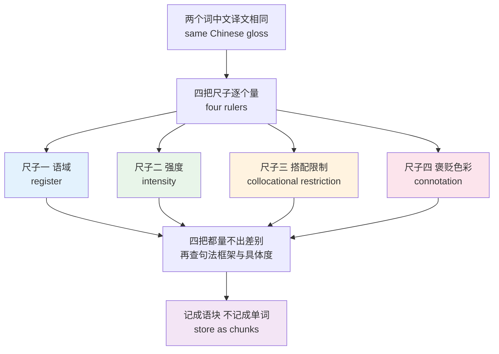
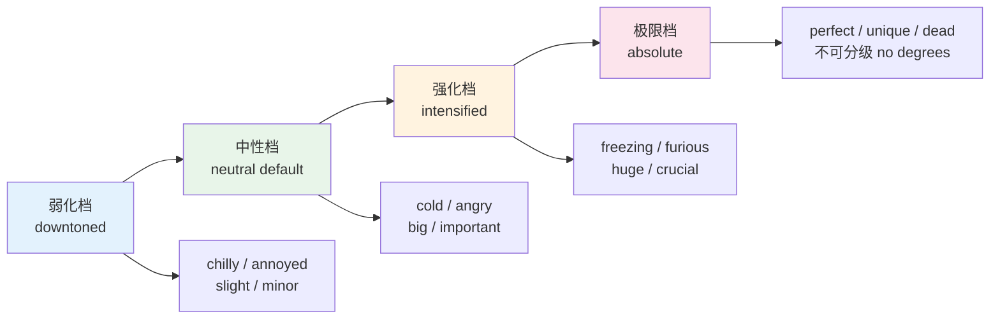
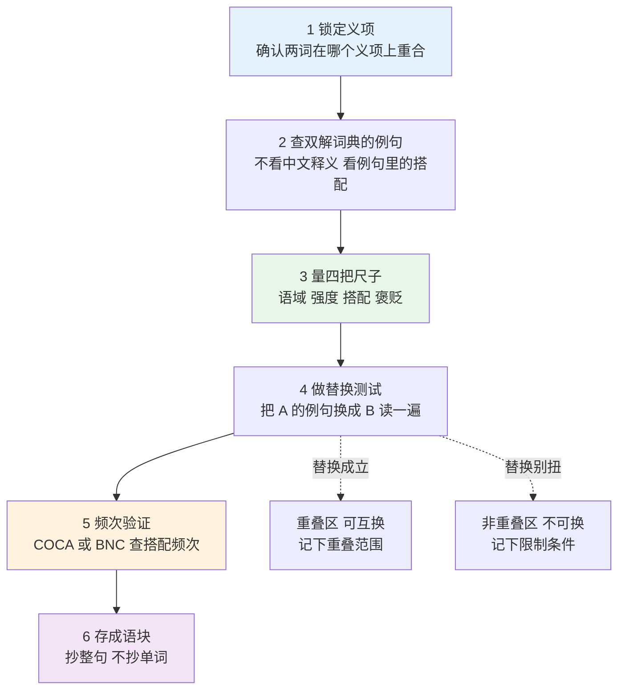
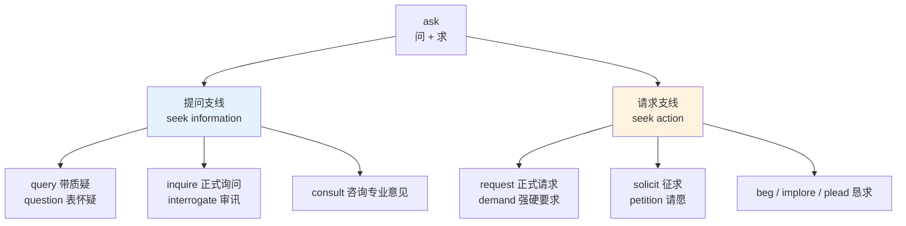
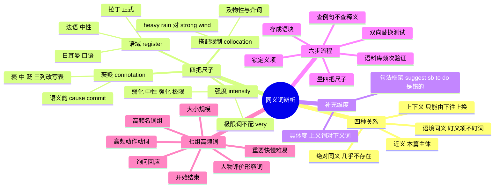

# 同义词辨析方法与高频同义词组

> [!info] 本篇定位
>
> 第十六章的开篇，也是全书唯一的同义辨析方法论主讲章。前面十五章一直在往你的词库里加词，从这一篇开始处理一个新问题：库里已经有五个意思差不多的词，写句子的时候该拿哪一个。
>
> 读完你会拿到两样东西：一把由语域、强度、搭配限制、褒贬色彩四个维度组成的量尺，以及一套在没有母语直觉时也能跑通的六步辨析流程。后半篇按七组高频同义词把这套方法演一遍。
>
> 与相邻篇目的分工：三层历史来源为什么造出这么多同义词，详细展开在 [[18.语域、英美差异与习语俚语/02.语域分层与英语词汇的历史层次\|语域分层与英语词汇的历史层次]]；搭配这件事本身的分级与查证方法在 [[17.固定搭配/01.搭配强度分级与可替换边界\|搭配强度分级与可替换边界]]；拼错拼混造成的近形近音问题不在本篇，在 [[16.词义辨析、搭配与短语动词/03.近形近音易混词与中式英语陷阱\|近形近音易混词与中式英语陷阱]]。

---

## 1. 本篇导读：「同义词」这个说法本身就有误导

中文词典把 `big`、`large`、`huge` 全译成「大」，把 `begin`、`start`、`commence` 全译成「开始」。三个英文词共用一个中文对应字，学习者顺理成章地认为它们可以互换。真实语言里不是这样。

看下面四句，语法全对，四句都有母语者听着别扭的地方：

- ~~We had a strong rain last night.~~ —— 该说 `heavy rain`，「大雨」这个搭配只认 `heavy`。
- ~~She is my large sister.~~ —— 该说 `big sister`，`large` 不表示辈分。
- ~~He is a skinny young man, very handsome.~~ —— `skinny` 带贬义，跟 `handsome` 撞在一起。
- ~~The company purchased a coffee for the intern.~~ —— `purchase` 是商务正式词，买一杯咖啡用 `buy`。

四个错误各错在不同的地方：第一个错在搭配限制，第二个错在义项范围，第三个错在褒贬色彩，第四个错在语域。它们共同说明一件事：**两个词的中文译文相同，不代表它们在英语内部可以互换。** 中文译文只是一个粗糙的映射结果，映射过程中丢掉的信息，正是辨析要找回来的东西。

英语同义词特别多，是历史造成的。古英语的日耳曼核心词、诺曼征服带来的法语层、文艺复兴时期涌入的拉丁希腊学术层，三层叠在一起，同一个概念常常有三个说法：`ask` / `inquire` / `interrogate`、`kingly` / `royal` / `regal`、`fire` / `flame` / `conflagration`。这三层的历史成因在 [[01.词汇入门与学习方法/01.英语词汇的来源、分层与学习地图\|英语词汇的来源、分层与学习地图]] 讲过，本篇不重复来源，只讲**怎么用这个结构做选词决策**。

上图是全篇的操作骨架。四把尺子不是四个理论概念，而是四个提问：这个词写进邮件里会不会太随便，这个词的程度比另一个重还是轻，这个词后面能跟哪些名词，这个词让听的人感觉是好是坏。四问答完，绝大多数选词犹豫就消失了。四问都答不出差别的少数情况，再进第 7 节的补充切口。最后一步「记成语块」是全篇的落点：辨析的结果不能停留在理解上，必须变成 `starting salary` `heavy rain` 这样的整块记忆，否则下次写作时照样要重新推一遍。

第 2 节先把术语理清，第 3 到 6 节逐把尺子交付，第 7 节补两个次要维度，第 8 节把前面的东西串成可执行流程，第 9 到 15 节按七组词把方法演一遍，第 16 节收拢中文母语者的典型误判。

---

## 2. 同义的四种层级：术语先分清

日常说的「同义词」其实混了四种关系。分不清这四种，辨析会从一开始就走偏。

| 英文 | 英式音标 | 美式音标 | 词性 | 中文 | 搭配与说明 |
| --- | --- | --- | --- | --- | --- |
| **synonym** | /ˈsɪnənɪm/ | /ˈsɪnənɪm/ | n. | 同义词 | 词典标注常写 SYN；严格意义的绝对同义几乎不存在 |
| **near-synonym** | /ˌnɪə ˈsɪnənɪm/ | /ˌnɪr ˈsɪnənɪm/ | n. | 近义词 | 语言学文献里描述实际情况的术语，本篇讨论的主体 |
| **hypernym** | /ˈhaɪpənɪm/ | /ˈhaɪpərnɪm/ | n. | 上义词 | 范围较大的那一个，如 `vehicle` 之于 `car` |
| **hyponym** | /ˈhaɪpənɪm/ | /ˈhaɪpənɪm/ | n. | 下义词 | 范围较小的那一个，如 `car` 之于 `vehicle` |
| **co-hyponym** | /ˌkəʊ ˈhaɪpənɪm/ | /ˌkoʊ ˈhaɪpənɪm/ | n. | 共下义词 | 同一上义词下的并列项，如 `car` 与 `bus` |
| **connotation** | /ˌkɒnəˈteɪʃn/ | /ˌkɑːnəˈteɪʃn/ | n. | 内涵义；褒贬色彩 | 字面义之外附带的情感与评价 |
| **denotation** | /ˌdiːnəʊˈteɪʃn/ | /ˌdiːnoʊˈteɪʃn/ | n. | 外延义；字面所指 | 词所指的客观对象，与 connotation 相对 |
| **register** | /ˈredʒɪstə/ | /ˈredʒɪstər/ | n. | 语域 | 词与场合的匹配度，本篇第一把尺子 |
| **nuance** | /ˈnjuːɑːns/ | /ˈnuːɑːns/ | n. | 细微差别 | 描述辨析结果的常用词，`a subtle nuance` |
| **interchangeable** | /ˌɪntəˈtʃeɪndʒəbl/ | /ˌɪntərˈtʃeɪndʒəbl/ | adj. | 可互换的 | 判断结论用词，`the two are not interchangeable` |

### 2.1 第一种：绝对同义

两个词在任何语境下都能互换，且换了以后句子的意思、正式度、感情色彩全不变。这种情况在自然语言里几乎不出现。语言经济性不允许两个完全等价的词长期共存，只要两个词并存，时间会把它们推向不同的分工。

最接近绝对同义的是拼写变体和地域变体：`enquire` 与 `inquire`、`judgement` 与 `judgment`、`realise` 与 `realize`。这些不算真正的同义词问题，属于拼写体系差异，归 [[18.语域、英美差异与习语俚语/01.英式与美式词汇差异\|英式与美式词汇差异]]。

### 2.2 第二种：近义

意思高度重叠，但至少在一个维度上有差别。这是本篇处理的主体。`big` 与 `large` 重叠区极大，差别在语域与搭配；`angry` 与 `furious` 重叠区极大，差别在强度；`thin` 与 `skinny` 重叠区极大，差别在褒贬。

近义词的关键性质是：**重叠区可以互换，非重叠区不能。** 说一个箱子大，`a big box` 和 `a large box` 都行；说一个错误重大，`a big mistake` 自然而 `a large mistake` 不自然。学习者容易犯的错是拿重叠区的经验去推非重叠区。

### 2.3 第三种：上下义

一个词的范围包含另一个词。`animal` 包含 `dog`，`move` 包含 `walk`，`say` 包含 `whisper`。上下义关系常被误当成同义关系，因为上义词确实可以替换下义词，但反过来不行。

> [!warning] 上下义替换的单向性
>
> `He walked into the room.` 可以改成 `He moved into the room.`——意思变模糊了，但不算错。
>
> `The glacier moves a few metres a year.` 不能改成 ~~`The glacier walks a few metres a year.`~~——`walk` 要求主语有腿。
>
> 从下往上替换是丢信息，从上往下替换是加信息，加错了就是错。写作时想避免重复用词，用上义词替换是安全的，用另一个下义词替换要先确认新词的额外义素成不成立。

### 2.4 第四种：语境同义

两个词整体上差得很远，但在某一个特定语境里可以互换。`buy` 和 `purchase` 在「花钱换取商品」这个义项上重合，但 `buy` 还有「相信」的口语义（`I don't buy that story`），`purchase` 没有；`purchase` 还有「立足点」的名词义（`get a purchase on the rock`），`buy` 没有。

判断语境同义要盯住具体义项，不是盯住词。这也是查词典时必须逐义项看、不能只看第一条的原因。

### 2.5 关系类型决定用哪把尺子

四种关系的判别放在辨析动作之前跑，判别标准是重叠区的形状：

| 重叠区形状 | 关系类型 | 后续动作 |
| --- | --- | --- |
| 完全重叠 | 绝对同义 | 基本不存在；确认是不是拼写或地域变体 |
| 大部分重叠，某维度有别 | 近义 | 四把尺子全上，本篇主体 |
| 一个范围包含另一个 | 上下义 | 只查额外义素，只能由下往上替换 |
| 仅某个义项重叠 | 语境同义 | 先锁定义项，再按近义处理 |

先确认手上这一对属于哪种关系，再决定用哪把尺子——上下义关系用不着量褒贬，语境同义要先锁定义项，只有近义才需要四把尺子全上。跳过这一步直接量，容易在错误的维度上纠结。

---

## 3. 第一把尺子：语域

语域回答的是「这个词该出现在什么场合」。同一个意思，餐桌上、邮件里、合同里用的词不一样。中文也有这个层次（「吃饭」「用餐」「进膳」），但中文的正式度落差远小于英语，中文母语者往往低估了英语的语域敏感度。

### 3.1 三档正式度与三层词源

英语的正式度和词源层高度相关：日耳曼层最口语，法语层居中，拉丁希腊层最正式。

| 概念 | 日耳曼层（口语/中性） | 法语层（中性/偏正式） | 拉丁希腊层（正式/专业） |
| --- | --- | --- | --- |
| 问 | ask | inquire / enquire | interrogate |
| 开始 | begin / start | commence | initiate |
| 结束 | end / stop | finish | terminate |
| 买 | buy | purchase | procure |
| 帮 | help | aid | assist / facilitate |
| 想 | think | consider | contemplate |
| 得到 | get | gain | obtain / acquire |
| 告诉 | tell | inform | notify |
| 吃 | eat | dine | consume / ingest |
| 需要 | need | require | necessitate |
| 看 | see | view | observe |
| 展示 | show | display | demonstrate |

一个可操作的判断法：**词越长、后缀越像拉丁词，正式度越高。** `-ate`、`-ify`、`-ize` 结尾的动词与 `-tion` 结尾的名词几乎都在中高档，单音节动词几乎都在低档。这条经验在遇到生词时能给一个八成靠谱的初判。

对应不是等号。有一批拉丁来源的词进英语太早、用得太熟，已经完全落进口语层：`fix` 来自拉丁的 `fixus`，`stop` 的源头可以追到拉丁的 `stuppa`，两个词今天都是最日常的说法。反过来也有日耳曼层的词因为长期只出现在法律与公文里而变重，`forthwith` 和 `hereby` 都是纯日耳曼构词，却比任何拉丁词都正式。词源给的是先验概率，最终判据仍然是这个词在真实文本里出现在什么场合。

| 英文 | 英式音标 | 美式音标 | 词性 | 中文 | 搭配与说明 |
| --- | --- | --- | --- | --- | --- |
| **ask** | /ɑːsk/ | /æsk/ | v. | 问；要求 | 全场合通用的默认词，无语域风险 |
| **inquire** | /ɪnˈkwaɪə/ | /ɪnˈkwaɪər/ | v. | 询问；查问 | 正式；`inquire about the vacancy`，客服邮件高频 |
| **enquire** | /ɪnˈkwaɪə/ | /ɪnˈkwaɪər/ | v. | 询问 | 英式拼写变体；英国常用 enquire 表一般询问、inquire 表正式调查 |
| **interrogate** | /ɪnˈterəɡeɪt/ | /ɪnˈterəɡeɪt/ | v. | 审讯；盘问 | 执法与技术语境；对人是审讯，对系统是查询 |
| **purchase** | /ˈpɜːtʃəs/ | /ˈpɜːrtʃəs/ | v./n. | 购买；采购 | 商务书面；`purchase order` 采购单，日常买东西不用 |
| **procure** | /prəˈkjʊə/ | /prəˈkjʊr/ | v. | 采办；获取 | 供应链与政府采购专用，`procure equipment` |
| **notify** | /ˈnəʊtɪfaɪ/ | /ˈnoʊtɪfaɪ/ | v. | 通知 | 正式；后接人不接事，`notify sb of sth` |
| **inform** | /ɪnˈfɔːm/ | /ɪnˈfɔːrm/ | v. | 告知 | 中偏正式；`inform sb that`，比 tell 有距离感 |
| **furnish** | /ˈfɜːnɪʃ/ | /ˈfɜːrnɪʃ/ | v. | 提供；配备家具 | 正式书面；`furnish evidence`，另有配家具的具体义 |
| **necessitate** | /nəˈsesɪteɪt/ | /nəˈsesɪteɪt/ | v. | 使成为必需 | 学术与法律；主语常是事而非人 |
| **rectify** | /ˈrektɪfaɪ/ | /ˈrektɪfaɪ/ | v. | 纠正；矫正 | 正式；`rectify the error`，工单与合同高频 |
| **dine** | /daɪn/ | /daɪn/ | v. | 用餐 | 正式或半正式；`dine out` 出去吃饭 |
| **ingest** | /ɪnˈdʒest/ | /ɪnˈdʒest/ | v. | 摄入；吞食 | 医学与技术；数据领域也用于「摄入数据」 |

### 3.2 语域用错的两个方向

往上用错（该口语的地方用正式词）显得做作，往下用错（该正式的地方用口语词）显得轻慢。两种错误的代价不对称：**往下用错的代价更大**，因为它直接影响别人对你专业度的判断。

> [!example] 同一件事的三档说法
>
> 口语：
>
> > - I'll **ask** them when the thing ships.
> >   - 我问问他们东西什么时候发。
>
> 中性书面：
>
> > - I will **check with** the vendor on the shipping date.
> >   - 我会跟供应商确认发货日期。
>
> 正式书面：
>
> > - We shall **inquire** with the vendor regarding the anticipated shipping date.
> >   - 我们将就预计发货日期向供应商询问。
>
> 三句都对。选哪一句取决于收件人是同组同事、外部合作方，还是合同对方。

> [!warning] 技术文档里的语域陷阱
>
> 英文技术文档的整体语域比中文技术文档高一档。中文写「这个参数没设的话就用默认值」，英文规范里写的是 `If the parameter is omitted, the default value applies`，不是 ~~`If you don't set it, it uses the default`~~。
>
> 但技术文档也不是越正式越好。`utilize` 在技术写作圈里是被点名批评的词——它比 `use` 长四个字母，语义完全一样，只是让句子更难读。Google、Microsoft 的写作规范都建议写 `use`。语域的目标是匹配，不是攀高。

### 3.3 一个反常识的点：正式词不等于高级词

学习者常把「用了长词」当成「写得好」。实际情况相反：英语母语的专业写作反而倾向短词，长词只在它确实携带了短词没有的精度时才用。

`assist` 相对 `help` 多了什么？多了「辅助性、次要角色」的含义。`The nurse assisted the surgeon` 说明护士是配角，`The nurse helped the surgeon` 没有这层意思。这时候用 `assist` 是精度，不是装饰。反过来，`Can you assist me with this box?` 就是纯粹的装饰，母语者会说 `Can you help me with this box?`。

判据是：**换成短词以后，句子丢了信息没有？** 丢了就留长词，没丢就换短词。

---

## 4. 第二把尺子：强度

强度回答的是「这个词有多重」。同一组同义词经常构成一条从弱到强的梯度，选错档位不会造成语法错误，但会造成表达失真。

### 4.1 强度梯度的三段结构

大多数强度梯度是三段：弱化档、中性档、强化档。中性档是默认选择，两端各有若干候选。

图里最右侧的极限档单独拿出来，是因为它有一条特殊的语法后果：极限形容词（`perfect`、`unique`、`dead`、`impossible`、`furious`、`terrified`）本身已经到顶，不能再被 `very` 修饰，只能配 `absolutely`、`utterly`、`completely`。可分级的形容词（`cold`、`angry`、`big`）反过来，配 `very` 自然，配 `absolutely` 别扭。这条规则的完整搭配清单在 [[17.固定搭配/05.副词+形容词强化搭配：highly、deeply、bitterly 的固定伴侣\|副词+形容词强化搭配]]，本篇只把它作为辨析时的一个判据：**如果两个同义词一个能配 `very` 一个不能，它们一定不在同一档。**

| 英文 | 英式音标 | 美式音标 | 词性 | 中文 | 搭配与说明 |
| --- | --- | --- | --- | --- | --- |
| **annoyed** | /əˈnɔɪd/ | /əˈnɔɪd/ | adj. | 恼火的 | 弱档；`slightly annoyed` 自然 |
| **angry** | /ˈæŋɡri/ | /ˈæŋɡri/ | adj. | 生气的 | 中性默认档；配 very |
| **furious** | /ˈfjʊəriəs/ | /ˈfjʊriəs/ | adj. | 暴怒的 | 极限档；配 absolutely 不配 very |
| **livid** | /ˈlɪvɪd/ | /ˈlɪvɪd/ | adj. | 气得发青的 | 极限档偏口语，比 furious 更夸张 |
| **chilly** | /ˈtʃɪli/ | /ˈtʃɪli/ | adj. | 微凉的 | 弱档；也可形容人际关系冷淡 |
| **freezing** | /ˈfriːzɪŋ/ | /ˈfriːzɪŋ/ | adj. | 冻死人的 | 极限档；`It's freezing` 是口语夸张 |
| **exhausted** | /ɪɡˈzɔːstɪd/ | /ɪɡˈzɔːstɪd/ | adj. | 精疲力竭的 | 极限档；`utterly exhausted` |
| **essential** | /ɪˈsenʃl/ | /ɪˈsenʃl/ | adj. | 必不可少的 | 强档；`absolutely essential` |
| **adequate** | /ˈædɪkwət/ | /ˈædɪkwət/ | adj. | 够用的 | 弱化褒义；英语里带「刚及格」的暗示 |
| **outstanding** | /aʊtˈstændɪŋ/ | /aʊtˈstændɪŋ/ | adj. | 出色的 | 强档褒义；另有「未结清」的财务义 |

### 4.2 强度不对称：往上容易往下难

学习者提升强度容易，降低强度难。写「非常重要」人人会写 `extremely important`，写「有那么一点重要，但不是最要紧的」就卡住。降档的手段是弱化词而不是弱化副词：

- 中性 `important` → 降档 `relevant` / `pertinent` / `worth considering`
- 中性 `wrong` → 降档 `inaccurate` / `off` / `not quite right`
- 中性 `refuse` → 降档 `decline` / `hold off on`
- 中性 `bad` → 降档 `suboptimal` / `less than ideal`

英语职场与学术写作里，降档能力比升档能力更值钱。`This approach has some limitations` 比 `This approach is bad` 在专业场合有效得多，因为它给对方留了回旋余地。

> [!tip] 用强度差记词，比孤立记词牢
>
> 遇到新的强档词，不要单独记，挂到已经会的中性词上。看到 `livid`，先想它是 `angry` 的顶格；看到 `minuscule`，先想它是 `small` 的底格。梯度形成以后，一整条线上的词会互相加固，忘掉一个可以从邻居推回来。
>
> 建生词本时把强度写进去：`livid = angry ×3`。三个月后回看，比抄一遍英汉释义有用。

### 4.3 强度与真实性的关系

强档词用多了会贬值。母语者用 `awesome` 形容一杯还行的咖啡，用 `starving` 形容有点饿，这在口语里是常态。但在书面尤其是技术与学术书面里，强档词的通胀会直接损害可信度：一份说 `catastrophic`、`unprecedented`、`devastating` 的事故报告，读者会自动打折。

技术写作里的常见对应关系：

| 中文习惯说法 | 别写 | 写 |
| --- | --- | --- |
| 严重影响性能 | severely destroys performance | significantly degrades performance |
| 完美解决了问题 | perfectly solves the problem | addresses the issue |
| 巨大的提升 | huge improvement | a measurable improvement / a 30% reduction in latency |
| 彻底重构 | totally rebuilt from scratch | refactored |

右列不是更弱，是更可信。写不出具体数字时降一档，比写一个无法验证的强档词好。

---

## 5. 第三把尺子：搭配限制

搭配限制回答的是「这个词后面能跟谁」。两个词语域相同、强度相同、褒贬相同，仍然可能因为搭配伙伴不同而不可互换。这是四把尺子里最不讲道理的一把——它由约定决定，推不出来，只能查和记。

### 5.1 同义不同伴

`heavy` 和 `strong` 都表示程度大，但各自绑定一批固定的名词：

| 搭配 | 成立 | 不成立 |
| --- | --- | --- |
| 大雨 | heavy rain | ~~strong rain~~ / ~~big rain~~ |
| 大风 | strong wind | ~~heavy wind~~ |
| 浓咖啡 | strong coffee | ~~heavy coffee~~ |
| 交通拥堵 | heavy traffic | ~~strong traffic~~ |
| 强烈的观点 | strong opinions | ~~heavy opinions~~ |
| 老烟枪 | heavy smoker | ~~strong smoker~~ |

这张表没有任何语义逻辑可讲。雨为什么是「重」的、风为什么是「强」的，问不出答案，母语者也答不上来。完整的形容词加名词搭配体系在 [[17.固定搭配/04.形容词+名词搭配：强度、规模与名词偏好\|形容词+名词搭配]] 展开，本篇只强调它在辨析中的位置：**当语域、强度、褒贬三把尺子都量不出差别时，答案通常在搭配上。**

### 5.2 及物性与介词选择

动词类同义词的搭配限制常常表现为句法差异。同样表示「回答」，四个词的句法完全不同：

| 英文 | 英式音标 | 美式音标 | 词性 | 中文 | 搭配与说明 |
| --- | --- | --- | --- | --- | --- |
| **answer** | /ˈɑːnsə/ | /ˈænsər/ | v. | 回答 | 及物直接接宾语：`answer the question` |
| **reply** | /rɪˈplaɪ/ | /rɪˈplaɪ/ | v. | 答复 | 不及物，接 to：`reply to the email`，不说 ~~reply the email~~ |
| **respond** | /rɪˈspɒnd/ | /rɪˈspɑːnd/ | v. | 回应；反应 | 接 to；另有「对治疗有反应」义 `respond to treatment` |
| **retort** | /rɪˈtɔːt/ | /rɪˈtɔːrt/ | v./n. | 反唇相讥 | 带对抗色彩，常引导直接引语 |
| **acknowledge** | /əkˈnɒlɪdʒ/ | /əkˈnɑːlɪdʒ/ | v. | 确认收到；承认 | 商务邮件高频：`acknowledge receipt of` |
| **address** | /əˈdres/ | /əˈdres/ | v. | 处理；应对 | 「回应」的正式说法：`address the concern` |
| **rebut** | /rɪˈbʌt/ | /rɪˈbʌt/ | v. | 反驳 | 学术与法律；需要给出理由的反驳 |

`reply the email` 是中文母语者最高频的错误之一，因为中文「回复邮件」是动宾结构，直接迁移就错。这类由母语结构造成的误配，成因分析在 [[16.词义辨析、搭配与短语动词/03.近形近音易混词与中式英语陷阱\|近形近音易混词与中式英语陷阱]]。

### 5.3 主语限制

有的动词对主语挑剔。`necessitate`、`entail`、`give rise to` 的主语通常是事件或条件，不是人：

- ✅ **The outage necessitated a full rollback.**（停机事故迫使全量回滚）
- ❌ ~~The manager necessitated a full rollback.~~（该说 `required` 或 `ordered`）

同样，`witness` 在正式写作里可以用时间或地点作主语（`The past decade has witnessed rapid growth`），而 `see` 的这个用法虽然也成立但更口语，`watch` 则完全不行。

> [!warning] 查词典时最该看的不是释义
>
> 中文母语者查词典的习惯是看中文释义然后关掉。真正决定用得对不对的信息在释义后面：例句里的介词、`[T]` / `[I]` 及物标记、`+ that` / `+ to do` 的句型框、以及词典专门给的搭配框（朗文的 COLLOCATIONS、牛津的 Collocations 板块）。
>
> 一个具体动作：查完释义以后，把词典给的两到三个例句整句抄进生词本，不抄单词。抄回来的是搭配和句法，这些是释义给不了的。

---

## 6. 第四把尺子：褒贬色彩

褒贬色彩回答的是「这个词让人感觉是好是坏」。它是四把尺子里出错代价最高的一把——语域用错显得生疏，强度用错显得夸张，褒贬用错可能直接得罪人。

### 6.1 三分：褒、中、贬

同一个客观事实，可以用褒义、中性、贬义三种词描述。选词等于表态。

| 客观事实 | 褒义 | 中性 | 贬义 |
| --- | --- | --- | --- |
| 体重偏低 | slender / svelte | thin | skinny / scrawny |
| 体重偏高 | curvy / full-figured | overweight | fat / obese（临床除外） |
| 花钱少 | thrifty / frugal | economical | stingy / miserly |
| 不改主意 | determined / resolute | firm | stubborn / pigheaded |
| 脑子快 | clever / astute | intelligent | cunning / sly |
| 相信自己 | confident | self-assured | arrogant / cocky |
| 话多 | articulate / talkative | chatty | garrulous / long-winded |
| 价格低 | affordable / good value | inexpensive | cheap（指质量差时） |
| 有野心 | ambitious | driven | ruthless / cutthroat |
| 好奇 | curious / inquisitive | interested | nosy / prying |

这张表的实用价值在于：**它同时是一张改写表。** 想让评价听起来更友善，从右往左移一列；想批评但不想撕破脸，停在中间列。写绩效评语、写代码评审意见、写推荐信时，选词落在哪一列直接决定了对方的感受。

| 英文 | 英式音标 | 美式音标 | 词性 | 中文 | 搭配与说明 |
| --- | --- | --- | --- | --- | --- |
| **slender** | /ˈslendə/ | /ˈslendər/ | adj. | 苗条的 | 褒义；也用于抽象的「微弱」`a slender majority` |
| **skinny** | /ˈskɪni/ | /ˈskɪni/ | adj. | 瘦骨嶙峋的 | 贬义；另有紧身裤义 `skinny jeans` |
| **scrawny** | /ˈskrɔːni/ | /ˈskrɔːni/ | adj. | 干瘦的 | 强贬义，含营养不良暗示 |
| **frugal** | /ˈfruːɡl/ | /ˈfruːɡl/ | adj. | 节俭的 | 褒义；`a frugal lifestyle` |
| **stingy** | /ˈstɪndʒi/ | /ˈstɪndʒi/ | adj. | 小气的 | 贬义口语；正式贬义用 miserly |
| **astute** | /əˈstjuːt/ | /əˈstuːt/ | adj. | 精明的 | 褒义；`an astute observation` |
| **cunning** | /ˈkʌnɪŋ/ | /ˈkʌnɪŋ/ | adj. | 狡猾的 | 贬义为主；技术语境偶作中性「巧妙」 |
| **sly** | /slaɪ/ | /slaɪ/ | adj. | 阴险的 | 明确贬义，带偷偷摸摸的意味 |
| **inquisitive** | /ɪnˈkwɪzətɪv/ | /ɪnˈkwɪzətɪv/ | adj. | 好问的 | 中偏褒；儿童与研究者的好奇 |
| **nosy** | /ˈnəʊzi/ | /ˈnoʊzi/ | adj. | 爱打听的 | 贬义口语；`a nosy neighbour` |
| **ruthless** | /ˈruːθləs/ | /ˈruːθləs/ | adj. | 冷酷无情的 | 贬义为主；商业语境偶带勉强的赞许 |

### 6.2 语义韵：比褒贬更隐蔽的一层

有些词本身看不出褒贬，但它长期只跟负面的东西一起出现，久而久之带上了负面预期。语言学里叫语义韵（semantic prosody）。

`cause` 是典型。它跟 `problem`、`damage`、`delay`、`cancer`、`accident` 的共现远多于跟 `happiness`、`success` 的共现。所以 `The new policy caused a rise in productivity` 读起来微妙地不对劲——母语者会写 `led to` 或 `brought about`。

| 英文 | 英式音标 | 美式音标 | 词性 | 中文 | 搭配与说明 |
| --- | --- | --- | --- | --- | --- |
| **cause** | /kɔːz/ | /kɔːz/ | v. | 导致 | 负向语义韵；后接坏事，好事用 lead to |
| **commit** | /kəˈmɪt/ | /kəˈmɪt/ | v. | 犯下 | 负向；`commit a crime / an error`，代码语境是另一义项 |
| **perpetrate** | /ˈpɜːpətreɪt/ | /ˈpɜːrpətreɪt/ | v. | 实施（罪行） | 强负向，几乎只接罪行 |
| **notorious** | /nəʊˈtɔːriəs/ | /noʊˈtɔːriəs/ | adj. | 臭名昭著的 | 负向的「有名」；褒义用 renowned |
| **renowned** | /rɪˈnaʊnd/ | /rɪˈnaʊnd/ | adj. | 享有盛誉的 | 正向的「有名」；`renowned for` |
| **infamous** | /ˈɪnfəməs/ | /ˈɪnfəməs/ | adj. | 声名狼藉的 | 注意重音在首音节，不是 in-FAMOUS |
| **rife** | /raɪf/ | /raɪf/ | adj. | 盛行的 | 强负向；`rife with errors` |
| **set in** | /set ɪn/ | /set ɪn/ | phr.v. | （坏天气、坏状态）开始 | 负向；`The rot set in`，好事不用 |
| **peddle** | /ˈpedl/ | /ˈpedl/ | v. | 兜售 | 负向；`peddle misinformation` |
| **bent on** | /bent ɒn/ | /bent ɑːn/ | phr. | 一心要 | 负向；`bent on revenge` |

> [!warning] 语义韵是词典查不到的
>
> 词典给 `cause` 的释义是「引起、导致」，不会告诉你它偏向坏事。发现语义韵的唯一办法是看大量真实语料——这正是 [[22.速查附录与学习资源/01.语料库检索、查词交叉验证与原版材料爬升路径\|语料库检索与交叉验证]] 那一篇要解决的问题。
>
> 在没有语料库习惯之前，一条粗略的替代规则：**凡是描述好事，优先用中性词而不是刚学到的高级词。** 高级词的语义韵更容易出问题。

### 6.3 委婉语方向

褒贬尺子的一个具体应用是委婉语。委婉语不是把词换软，而是把词换到语义上更远、因而联想更弱的位置：

- 解雇：`fire` → `let go` → `lay off` → `right-size` / `restructure`
- 死亡：`die` → `pass away` → `be no longer with us`
- 便宜：`cheap` → `budget` → `value` → `entry-level`
- 失败：`fail` → `fall short` → `not meet expectations`
- 借钱：`borrow money` → `secure financing`

委婉语链条的完整清单与禁忌语强度分级在 [[18.语域、英美差异与习语俚语/04.俚语、网络流行语、委婉语与禁忌语\|俚语、网络流行语、委婉语与禁忌语]]。本篇只提示一点：链条越往右，信息量越低。写作时往右挪一格通常是善意，挪三格通常是掩饰，读者能察觉。

---

## 7. 四把尺子之外：句法框架与具体度

四把尺子处理掉九成的辨析场景。剩下的一成通常卡在两个次要维度上。

### 7.1 句法框架差异

有些同义词的差别不在意思上，在能进什么句型上。

| 英文 | 英式音标 | 美式音标 | 词性 | 中文 | 搭配与说明 |
| --- | --- | --- | --- | --- | --- |
| **suggest** | /səˈdʒest/ | /səɡˈdʒest/ | v. | 建议 | 不接双宾；`suggest that sb (should) do`，不说 ~~suggest sb to do~~ |
| **advise** | /ədˈvaɪz/ | /ədˈvaɪz/ | v. | 建议；忠告 | 可接 `advise sb to do`，句型比 suggest 宽 |
| **recommend** | /ˌrekəˈmend/ | /ˌrekəˈmend/ | v. | 推荐；建议 | 同 suggest 的从句限制；`recommend doing` 也成立 |
| **allow** | /əˈlaʊ/ | /əˈlaʊ/ | v. | 允许 | `allow sb to do`；不接不带 to 的原形 |
| **let** | /let/ | /let/ | v. | 让 | `let sb do`，不带 to；被动极少用 |
| **enable** | /ɪˈneɪbl/ | /ɪˈneɪbl/ | v. | 使能够 | `enable sb to do`；主语常是工具或条件 |
| **permit** | /pəˈmɪt/ | /pərˈmɪt/ | v. | 准许 | 正式；`permit sb to do` 与 `permit doing` 都行 |
| **hope** | /həʊp/ | /hoʊp/ | v. | 希望 | 只接从句或不定式，不接 `hope sb to do` |
| **expect** | /ɪkˈspekt/ | /ɪkˈspekt/ | v. | 预期 | 可接 `expect sb to do` |
| **want** | /wɒnt/ | /wɑːnt/ | v. | 想要 | 可接 `want sb to do`；语域低于 wish |
| **wish** | /wɪʃ/ | /wɪʃ/ | v. | 但愿 | 接虚拟从句表不可能；`wish sb to do` 正式罕用 |

`suggest sb to do` 是中文母语者产出率极高的错句，因为中文「建议某人做某事」是三元结构。记忆办法不是背规则，是背一个正确的整句：`I suggest that we postpone the release.`——把这句话背熟，句型就锁住了。

### 7.2 具体度

有的同义词差在描述精度，而不是感情或场合。

- `walk` 是上义词，`stride`（大步走）、`trudge`（拖着脚走）、`amble`（溜达）、`stagger`（踉跄）是具体度更高的下义词。
- `look` 是上义词，`glance`（瞥）、`stare`（盯）、`peer`（眯眼细看）、`glimpse`（瞥见）是下义。
- `hit` 是上义词，`slap`（掌击）、`punch`（拳击）、`tap`（轻敲）、`smash`（砸碎）是下义。

具体度高的词在叙事文本里密度极高，是读小说卡壳的主要来源。这类词群的完整处理在 [[18.语域、英美差异与习语俚语/05.叙事文本的词汇门槛：动作、描写、对话与旧体词\|叙事文本的词汇门槛]]，本篇不铺开。

技术写作里的取向相反：**优先用上义词，除非精度确实需要。** 描述一个函数的行为，写 `returns` 比写 `hands back` 好；描述系统故障，写 `the service stopped responding` 比写 `the service croaked` 好。

---

## 8. 辨析操作流程：六步法

前面六节给的是判据，这一节给的是动作顺序。遇到一组分不清的同义词，按下面六步走一遍。

流程图里最容易被跳过的是第 4 步。多数人查完词典觉得「懂了」就停，但理解和产出是两回事。替换测试的动作是：把词典给 `A` 的例句原封不动抄下来，把 `A` 换成 `B`，然后判断新句子成立不成立。这一步会暴露很多以为懂了其实没懂的地方。

### 8.1 六步逐步展开

**第 1 步 锁定义项。** 多义词的每个义项各有自己的同义词群。`address` 作「地址」时的同义词是 `location`，作「处理」时的同义词是 `deal with` 和 `tackle`，作「演讲」时的同义词是 `speech`。不锁定义项就辨析，等于同时比较三组不相干的东西。

**第 2 步 查例句不查释义。** 双解词典的中文释义是翻译结果，携带的差别信息最少。例句携带搭配、句型、语域三重信息。最低要求是看三条例句；如果三条例句的搭配伙伴类型高度一致，那就是该词的典型语境。

**第 3 步 量四把尺子。** 按语域、强度、搭配、褒贬的顺序问四遍。有一把量出明确差别就可以停，不必四把都量。经验上，动词类的差别多落在语域与搭配上，形容词类的差别多落在强度与褒贬上。

**第 4 步 替换测试。** 上面已说。补一条：替换测试要双向做。`A` 的例句换 `B` 成立，不代表 `B` 的例句换 `A` 也成立。单向成立说明这是上下义关系，不是近义关系。

**第 5 步 频次验证。** 到语料库里查两个组合的出现次数。`make a decision` 与 `take a decision` 都成立，但频次差距和地域分布差距很大。检索式的写法与结果解读在 [[22.速查附录与学习资源/01.语料库检索、查词交叉验证与原版材料爬升路径\|语料库检索与交叉验证]]。没有语料库时，用引号包住短语在搜索引擎里查结果数量是一个粗糙但可用的替代。

**第 6 步 存成语块。** 辨析的成果必须落成可复用的产出单位。存 `submit a proposal` 而不是存 `submit`；存 `strong evidence` 而不是存 `strong`。语块的记忆效率在于它把选词决策提前做完了——下次要写「有力的证据」，直接调出 `strong evidence`，不需要在 `strong`、`powerful`、`heavy` 之间重新犹豫。

> [!tip] 六步法的省力版本
>
> 全套六步适合真正卡住的词。日常阅读遇到的同义词没必要每个都跑全套。省力版本只有两步：
>
> 1. 看这个词出现在什么样的文本里（新闻、论文、聊天记录、合同）——得到语域；
> 2. 看它左右各一个词是什么——得到搭配。
>
> 两步花不到十秒，覆盖大部分场景。把省下的时间用在真正会写进自己产出的那批词上。

---

## 9. 高频同义组（一）：大小、规模与数量

这是全书大纲点名的第一组，也是中文母语者出错率最高的一组，因为中文一个「大」字覆盖了英语十几个词。

### 9.1 big 与 large 的真实分工

两个词的重叠区极大，但分工清晰：

| 场景 | big | large | 说明 |
| --- | --- | --- | --- |
| 尺寸（口语） | a big house | a large house | 都行，big 更口语 |
| 尺寸（正式书面） | 少用 | a large volume of data | 正式文本偏好 large |
| 抽象的「重大」 | a big mistake / a big deal | 不用 | large 不表示重要性 |
| 年龄辈分 | my big brother | 不用 | large 不表示辈分 |
| 数量与规模统计 | 少用 | a large number of / large-scale | 固定搭配用 large |
| 人的体型（委婉） | a big guy | a large man | large 更委婉客气 |

一条能记住的判据：**large 只管客观尺寸和数量，big 兼管尺寸与主观重要性。** 所以「大问题」是 `a big problem`，「大量数据」是 `a large amount of data`。

### 9.2 规模梯度全表

| 英文 | 英式音标 | 美式音标 | 词性 | 中文 | 搭配与说明 |
| --- | --- | --- | --- | --- | --- |
| **big** | /bɪɡ/ | /bɪɡ/ | adj. | 大的；重大的 | 口语默认；兼表重要性 `a big decision` |
| **large** | /lɑːdʒ/ | /lɑːrdʒ/ | adj. | 大的；大量的 | 书面偏好；`a large number of`、`large-scale` |
| **great** | /ɡreɪt/ | /ɡreɪt/ | adj. | 巨大的；了不起的 | 修饰抽象名词 `great interest`；修实物已偏旧 |
| **huge** | /hjuːdʒ/ | /hjuːdʒ/ | adj. | 巨大的 | 口语强档；`a huge success` |
| **enormous** | /ɪˈnɔːməs/ | /ɪˈnɔːrməs/ | adj. | 庞大的 | 中性偏书面的强档 |
| **immense** | /ɪˈmens/ | /ɪˈmens/ | adj. | 极大的 | 偏书面；多修抽象 `immense pressure` |
| **vast** | /vɑːst/ | /væst/ | adj. | 辽阔的 | 偏面积与范围；`the vast majority` 高频 |
| **massive** | /ˈmæsɪv/ | /ˈmæsɪv/ | adj. | 巨大的；沉重的 | 含体量重的暗示；`a massive outage` |
| **gigantic** | /dʒaɪˈɡæntɪk/ | /dʒaɪˈɡæntɪk/ | adj. | 庞大的 | 偏口语夸张 |
| **colossal** | /kəˈlɒsl/ | /kəˈlɑːsl/ | adj. | 巨大的 | 书面夸张；`a colossal waste` |
| **tremendous** | /trəˈmendəs/ | /trəˈmendəs/ | adj. | 巨大的；极好的 | 兼有褒义；`tremendous progress` |
| **substantial** | /səbˈstænʃl/ | /səbˈstænʃl/ | adj. | 可观的 | 正式；量上「够多、值得一提」 |
| **considerable** | /kənˈsɪdərəbl/ | /kənˈsɪdərəbl/ | adj. | 相当大的 | 学术高频；比 substantial 更中性 |
| **sizeable** | /ˈsaɪzəbl/ | /ˈsaɪzəbl/ | adj. | 相当大的 | 偏商务；`a sizeable stake` |
| **hefty** | /ˈhefti/ | /ˈhefti/ | adj. | 数额大的；沉的 | 口语；`a hefty fine` |
| **bulky** | /ˈbʌlki/ | /ˈbʌlki/ | adj. | 笨重占地的 | 强调不好搬运，不是单纯大 |
| **spacious** | /ˈspeɪʃəs/ | /ˈspeɪʃəs/ | adj. | 宽敞的 | 褒义，只用于内部空间 |
| **extensive** | /ɪkˈstensɪv/ | /ɪkˈstensɪv/ | adj. | 广泛的 | 范围义；`extensive testing` |
| **ample** | /ˈæmpl/ | /ˈæmpl/ | adj. | 充足的 | 褒义，隐含「够用还有富余」 |
| **modest** | /ˈmɒdɪst/ | /ˈmɑːdɪst/ | adj. | 不大的；适度的 | 弱化档；`a modest increase` |
| **marginal** | /ˈmɑːdʒɪnl/ | /ˈmɑːrdʒɪnl/ | adj. | 微小的；边缘的 | 学术与商务；`a marginal gain` |
| **negligible** | /ˈneɡlɪdʒəbl/ | /ˈneɡlɪdʒəbl/ | adj. | 可忽略的 | 底档；`a negligible difference` |
| **slight** | /slaɪt/ | /slaɪt/ | adj. | 轻微的 | 多作定语；`a slight delay`、`a slight difference` |
| **minor** | /ˈmaɪnə/ | /ˈmaɪnər/ | adj. | 次要的；小的 | 与 major 成对；`a minor bug` |
| **tiny** | /ˈtaɪni/ | /ˈtaɪni/ | adj. | 极小的 | 口语底档 |
| **minute** | /maɪˈnjuːt/ | /maɪˈnuːt/ | adj. | 微小的；细致的 | 注意读音与「分钟」不同，重音在后 |
| **minuscule** | /ˈmɪnəskjuːl/ | /ˈmɪnəskjuːl/ | adj. | 微不足道的 | 书面；拼写常被误写成 mini- |
| **compact** | /kəmˈpækt/ | /kəmˈpækt/ | adj. | 小巧紧凑的 | 褒义的小，产品文案高频 |

> [!example] 同一个数据规模的四档说法
>
> > - The migration touched a **negligible** number of rows.
> >   - 这次迁移影响的行数可以忽略不计。
> > - The migration touched a **modest** number of rows.
> >   - 这次迁移影响的行数不算多。
> > - The migration touched a **substantial** number of rows.
> >   - 这次迁移影响了相当多的行。
> > - The migration touched a **vast** number of rows.
> >   - 这次迁移影响了极大量的行。
>
> 四句的语法结构完全相同，读者对风险的判断完全不同。这就是强度尺子的实际价值。

> [!warning] 三个高频错配
>
> - ❌ ~~a large mistake~~ / ✅ **a big mistake**（重要性用 big）
> - ❌ ~~big rain~~ / ✅ **heavy rain**（天气用 heavy，成因见 16.03）
> - ❌ ~~a big amount of money~~ / ✅ **a large amount of money**（数量搭配用 large）

---

## 10. 高频同义组（二）：开始与结束

起止这组词的差别几乎全在语域和搭配上，褒贬维度基本不参与。

### 10.1 开始类

| 英文 | 英式音标 | 美式音标 | 词性 | 中文 | 搭配与说明 |
| --- | --- | --- | --- | --- | --- |
| **start** | /stɑːt/ | /stɑːrt/ | v./n. | 开始；启动 | 最口语最通用；机器只能 start 不能 begin |
| **begin** | /bɪˈɡɪn/ | /bɪˈɡɪn/ | v. | 开始 | 略正式于 start；`begin with`、`to begin with` |
| **commence** | /kəˈmens/ | /kəˈmens/ | v. | 开始；启动 | 正式书面与法律；日常用会显得滑稽 |
| **initiate** | /ɪˈnɪʃieɪt/ | /ɪˈnɪʃieɪt/ | v. | 发起；启动 | 正式；主语常是有意识的发起方 |
| **launch** | /lɔːntʃ/ | /lɔːntʃ/ | v./n. | 发布；发起 | 产品与活动；`launch a product`、`a soft launch` |
| **embark** | /ɪmˈbɑːk/ | /ɪmˈbɑːrk/ | v. | 着手；登船 | 固定接 on：`embark on a project` |
| **set about** | /set əˈbaʊt/ | /set əˈbaʊt/ | phr.v. | 着手做 | 接动名词：`set about fixing it` |
| **kick off** | /kɪk ɒf/ | /kɪk ɔːf/ | phr.v. | 启动 | 口语与职场；`a kick-off meeting` 名词化高频 |
| **originate** | /əˈrɪdʒɪneɪt/ | /əˈrɪdʒɪneɪt/ | v. | 起源于 | 接 from / in；主语是事物不是人 |
| **inaugurate** | /ɪˈnɔːɡjəreɪt/ | /ɪˈnɔːɡjəreɪt/ | v. | 举行开幕；就职 | 极正式，多用于典礼 |
| **instigate** | /ˈɪnstɪɡeɪt/ | /ˈɪnstɪɡeɪt/ | v. | 唆使；发动 | 负向语义韵；`instigate a riot` |
| **trigger** | /ˈtrɪɡə/ | /ˈtrɪɡər/ | v./n. | 触发 | 技术高频；主语是事件不是人 |

`start` 与 `begin` 是这组里最需要说清的一对。两者在「开始做某事」的义项上高度可换，但有三处不可换：

1. **机器与设备**：`start the engine` / `start the server`，不说 ~~begin the engine~~。
2. **出发**：`We started at six` 表示动身，`begin` 没有这个义项。
3. **固定短语**：`to start with` 与 `to begin with` 都存在，但 `start over`（重来）没有 `begin over` 的说法。

`commence` 的语域高到什么程度？高到在日常语境里用它会产生喜剧效果。母语者拿 `commence` 开玩笑的经典句式是 `Let the eating commence`——刻意用高档词说低档事。技术文档里 `commence` 也几乎不出现，取而代之的是 `start` 和 `begin`。

### 10.2 结束类

| 英文 | 英式音标 | 美式音标 | 词性 | 中文 | 搭配与说明 |
| --- | --- | --- | --- | --- | --- |
| **end** | /end/ | /end/ | v./n. | 结束 | 中性通用；`end in failure`、`end up doing` |
| **finish** | /ˈfɪnɪʃ/ | /ˈfɪnɪʃ/ | v. | 完成；吃完 | 强调把过程走完；`finish the report` |
| **complete** | /kəmˈpliːt/ | /kəmˈpliːt/ | v./adj. | 完成；完整的 | 比 finish 正式；表单与流程高频 |
| **conclude** | /kənˈkluːd/ | /kənˈkluːd/ | v. | 结束；得出结论 | 正式；另有推理义 `conclude that` |
| **terminate** | /ˈtɜːmɪneɪt/ | /ˈtɜːrmɪneɪt/ | v. | 终止 | 正式；合同、进程、雇佣关系 |
| **cease** | /siːs/ | /siːs/ | v. | 停止 | 正式书面；`cease trading`、`cease and desist` |
| **halt** | /hɔːlt/ | /hɔːlt/ | v./n. | 中止 | 正式；含突然停下的意味 |
| **quit** | /kwɪt/ | /kwɪt/ | v. | 放弃；辞职 | 口语；`quit smoking`、`quit the job` |
| **wrap up** | /ræp ʌp/ | /ræp ʌp/ | phr.v. | 收尾 | 职场口语；`wrap up the meeting` |
| **finalize** | /ˈfaɪnəlaɪz/ | /ˈfaɪnəlaɪz/ | v. | 定稿；敲定 | 商务；`finalize the contract` |
| **expire** | /ɪkˈspaɪə/ | /ɪkˈspaɪər/ | v. | 到期失效 | 主语是期限、证件、票据 |
| **discontinue** | /ˌdɪskənˈtɪnjuː/ | /ˌdɪskənˈtɪnjuː/ | v. | 停产；中止 | 商务与产品；`a discontinued model` |
| **abort** | /əˈbɔːt/ | /əˈbɔːrt/ | v. | 中止；异常终止 | 技术高频；含「未正常完成」义 |
| **suspend** | /səˈspend/ | /səˈspend/ | v. | 暂停 | 可恢复的停；与 terminate 的不可恢复相对 |
| **wind down** | /waɪnd daʊn/ | /waɪnd daʊn/ | phr.v. | 逐步收缩 | 组织与业务的缓慢结束 |

> [!warning] terminate、abort、suspend 在技术语境的三分
>
> 中文都可以说「停止」，英文对应三种完全不同的状态：
>
> - **suspend** 暂停，状态保留，可以恢复。`The job is suspended.`
> - **terminate** 终止，正常走完终止流程，不可恢复。`The process terminated with exit code 0.`
> - **abort** 中止，异常打断，工作没做完。`The transaction was aborted.`
>
> 写事故报告时把 `aborted` 写成 `terminated`，等于把「异常中断」说成「正常结束」，是事实性错误，不只是措辞问题。

---

## 11. 高频同义组（三）：询问、请求与回应

大纲点名的第三组。这组的特点是语域跨度极大，从最口语的 `ask` 一直到法律文书里的 `petition`。

| 英文 | 英式音标 | 美式音标 | 词性 | 中文 | 搭配与说明 |
| --- | --- | --- | --- | --- | --- |
| **ask** | /ɑːsk/ | /æsk/ | v. | 问；请求 | 双功能：`ask a question` 问，`ask for help` 求 |
| **query** | /ˈkwɪəri/ | /ˈkwɪri/ | v./n. | 质疑；查询 | 含「觉得可能有问题」的暗示；数据库义另计 |
| **question** | /ˈkwestʃən/ | /ˈkwestʃən/ | v./n. | 质问；怀疑 | 作动词时偏「怀疑」：`question the findings` |
| **quiz** | /kwɪz/ | /kwɪz/ | v./n. | 追问；小测验 | 口语；连珠炮式提问 |
| **consult** | /kənˈsʌlt/ | /kənˈsʌlt/ | v. | 咨询；查阅 | 接人是咨询，接书是查阅 `consult the manual` |
| **request** | /rɪˈkwest/ | /rɪˈkwest/ | v./n. | 请求 | 正式中性；`request that sb (should) do` |
| **demand** | /dɪˈmɑːnd/ | /dɪˈmænd/ | v./n. | 要求 | 强硬，不接受拒绝；比 request 强两档 |
| **require** | /rɪˈkwaɪə/ | /rɪˈkwaɪər/ | v. | 需要；规定 | 客观必需，非情绪化；`the form requires a signature` |
| **solicit** | /səˈlɪsɪt/ | /səˈlɪsɪt/ | v. | 征求；招揽 | 正式；`solicit feedback`，商业语境偶带贬义 |
| **petition** | /pəˈtɪʃn/ | /pəˈtɪʃn/ | v./n. | 请愿；申请 | 法律与政治；正式书面申请 |
| **beg** | /beɡ/ | /beɡ/ | v. | 恳求；乞讨 | 情绪强；`I beg your pardon` 是固定礼貌语 |
| **implore** | /ɪmˈplɔː/ | /ɪmˈplɔːr/ | v. | 恳求 | 文学书面；比 beg 更强更正式 |
| **plead** | /pliːd/ | /pliːd/ | v. | 恳求；辩护 | 接 with sb；法庭义 `plead guilty` |
| **enquire after** | /ɪnˈkwaɪər ˈɑːftə/ | /ɪnˈkwaɪər ˈæftər/ | phr.v. | 问候 | 英式；问某人近况，不是问问题 |
| **inquire into** | /ɪnˈkwaɪər ˈɪntuː/ | /ɪnˈkwaɪər ˈɪntuː/ | phr.v. | 调查 | 正式；`inquire into the incident` |

### 11.1 ask 的双重身份是整组的枢纽

`ask` 同时覆盖「提问」和「请求」两个功能，这在英语里不常见，它的近义词都只覆盖其中一半：

图分成两条支线，是因为选错支线的错误比选错档位的错误严重得多。`I want to question your help` 之所以荒谬，不是因为语域不对，是因为 `question` 只在提问支线上，接不了「求助」的意思。先判支线再判档位，是这组词的使用顺序。

同一支线内部再看语域与强度。请求支线从弱到强是 `ask` → `request` → `demand`，从口语到正式是 `ask` → `request` → `petition`。两条轴交叉，`demand` 是强而不正式（可以很粗鲁），`petition` 是正式而不强（很客气）。

> [!example] 请求支线的四档
>
> > - Could you **ask** them to send the invoice?
> >   - 你能问问他们把发票发过来吗？
> > - We have **requested** an updated invoice from the supplier.
> >   - 我们已向供应商索取了更新后的发票。
> > - The client is **demanding** a full refund.
> >   - 客户强硬要求全额退款。
> > - Residents **petitioned** the council to reopen the library.
> >   - 居民向议会请愿，要求重开图书馆。

---

## 12. 高频同义组（四）：重要、快慢与难易

三组形容词，共同点是强度维度主导、语域维度次之。

### 12.1 重要类

| 英文 | 英式音标 | 美式音标 | 词性 | 中文 | 搭配与说明 |
| --- | --- | --- | --- | --- | --- |
| **important** | /ɪmˈpɔːtnt/ | /ɪmˈpɔːrtnt/ | adj. | 重要的 | 中性默认；配 very 自然 |
| **significant** | /sɪɡˈnɪfɪkənt/ | /sɪɡˈnɪfɪkənt/ | adj. | 显著的；重大的 | 学术高频；统计语境有专义 |
| **crucial** | /ˈkruːʃl/ | /ˈkruːʃl/ | adj. | 至关重要的 | 强档；`crucial to success` |
| **vital** | /ˈvaɪtl/ | /ˈvaɪtl/ | adj. | 生死攸关的 | 强档，本义与生命有关 |
| **essential** | /ɪˈsenʃl/ | /ɪˈsenʃl/ | adj. | 必不可少的 | 强档；缺了就不成立 |
| **critical** | /ˈkrɪtɪkl/ | /ˈkrɪtɪkl/ | adj. | 关键的；危急的 | 技术高频；另有「批评的」义 |
| **key** | /kiː/ | /kiː/ | adj. | 关键的 | 以定语为主 `a key factor`；口语也说 `Timing is key` |
| **pivotal** | /ˈpɪvətl/ | /ˈpɪvətl/ | adj. | 枢纽性的 | 书面；转折点上的关键 |
| **paramount** | /ˈpærəmaʊnt/ | /ˈpærəmaʊnt/ | adj. | 至高无上的 | 极正式；`safety is paramount` |
| **indispensable** | /ˌɪndɪˈspensəbl/ | /ˌɪndɪˈspensəbl/ | adj. | 不可或缺的 | 正式；多修饰人或工具 |
| **salient** | /ˈseɪliənt/ | /ˈseɪliənt/ | adj. | 突出的 | 学术；`the salient points` |
| **material** | /məˈtɪəriəl/ | /məˈtɪriəl/ | adj. | 实质性的 | 法律与财务专用义：`a material change` |
| **trivial** | /ˈtrɪviəl/ | /ˈtrɪviəl/ | adj. | 琐碎的 | 反向底档；数学语境有专义 |

`important`、`crucial`、`essential`、`vital` 之间的可换性有一条实用规则：**它们在「A 对 B 很重要」的框架里高度可换，在名词化和固定搭配里各有归属。** `essential oils`（精油）不能换成 ~~crucial oils~~，`vital signs`（生命体征）不能换成 ~~critical signs~~。完整的名词偏好表在 [[17.固定搭配/04.形容词+名词搭配：强度、规模与名词偏好\|形容词加名词搭配]]。

`significant` 在学术写作里有一个陷阱：`statistically significant` 是统计术语，指 p 值达到阈值，跟「重要」无关。写论文时说 `a significant improvement` 而不加限定，读者会默认你在说统计显著性。这个术语义的展开在 [[19.学术通用词汇/03.学术研究、统计术语与论文写作词汇\|学术研究、统计术语与论文写作词汇]]。

### 12.2 快慢类

| 英文 | 英式音标 | 美式音标 | 词性 | 中文 | 搭配与说明 |
| --- | --- | --- | --- | --- | --- |
| **fast** | /fɑːst/ | /fæst/ | adj./adv. | 快的 | 形副同形；多指移动速度 |
| **quick** | /kwɪk/ | /kwɪk/ | adj. | 快的 | 多指耗时短；`a quick call` |
| **rapid** | /ˈræpɪd/ | /ˈræpɪd/ | adj. | 迅速的 | 书面；多修变化过程 `rapid growth` |
| **swift** | /swɪft/ | /swɪft/ | adj. | 敏捷的 | 书面偏褒；`a swift response` |
| **speedy** | /ˈspiːdi/ | /ˈspiːdi/ | adj. | 快速的 | 口语偏褒；`a speedy recovery` |
| **prompt** | /prɒmpt/ | /prɑːmpt/ | adj. | 及时的 | 强调不拖延；`prompt payment` |
| **hasty** | /ˈheɪsti/ | /ˈheɪsti/ | adj. | 仓促的 | 贬义；`a hasty decision` |
| **brisk** | /brɪsk/ | /brɪsk/ | adj. | 轻快的 | 褒义；`a brisk walk`、`brisk trading` |
| **expeditious** | /ˌekspəˈdɪʃəs/ | /ˌekspəˈdɪʃəs/ | adj. | 迅速高效的 | 法律合同用词，日常不用 |
| **slow** | /sləʊ/ | /sloʊ/ | adj. | 慢的 | 中性 |
| **sluggish** | /ˈslʌɡɪʃ/ | /ˈslʌɡɪʃ/ | adj. | 迟缓的 | 贬义；`sluggish performance` 技术高频 |
| **gradual** | /ˈɡrædʒuəl/ | /ˈɡrædʒuəl/ | adj. | 渐进的 | 中性，不含快慢评价 |
| **leisurely** | /ˈleʒəli/ | /ˈliːʒərli/ | adj./adv. | 悠闲的 | 褒义的慢；注意英美读音差异 |

`fast` 与 `quick` 的分界：**fast 描述速度本身，quick 描述持续时间短。** 一辆快车是 `a fast car`（速度高），一次快速会议是 `a quick meeting`（时间短）。所以 `a fast meeting` 听起来像会开得语速飞快，不是会开得短。

### 12.3 难易类

| 英文 | 英式音标 | 美式音标 | 词性 | 中文 | 搭配与说明 |
| --- | --- | --- | --- | --- | --- |
| **difficult** | /ˈdɪfɪkəlt/ | /ˈdɪfɪkəlt/ | adj. | 困难的 | 中性默认；也形容人难相处 |
| **hard** | /hɑːd/ | /hɑːrd/ | adj. | 难的；硬的 | 口语默认；多义，注意歧义 |
| **tough** | /tʌf/ | /tʌf/ | adj. | 棘手的 | 口语；`a tough call` 难做的决定 |
| **challenging** | /ˈtʃælɪndʒɪŋ/ | /ˈtʃælɪndʒɪŋ/ | adj. | 有挑战性的 | 褒义化的「难」，职场委婉用词 |
| **demanding** | /dɪˈmɑːndɪŋ/ | /dɪˈmændɪŋ/ | adj. | 要求高的 | 强调消耗资源；`a demanding client` |
| **arduous** | /ˈɑːdjuəs/ | /ˈɑːrdʒuəs/ | adj. | 艰巨的 | 书面；长期耗力 |
| **strenuous** | /ˈstrenjuəs/ | /ˈstrenjuəs/ | adj. | 费力的 | 多指体力；`strenuous exercise` |
| **tricky** | /ˈtrɪki/ | /ˈtrɪki/ | adj. | 需要技巧的 | 难在细节而非工作量 |
| **easy** | /ˈiːzi/ | /ˈiːzi/ | adj. | 容易的 | 中性 |
| **simple** | /ˈsɪmpl/ | /ˈsɪmpl/ | adj. | 简单的 | 结构不复杂，不等于容易 |
| **straightforward** | /ˌstreɪtˈfɔːwəd/ | /ˌstreɪtˈfɔːrwərd/ | adj. | 直截了当的 | 技术文档高频，褒义 |
| **effortless** | /ˈefətləs/ | /ˈefərtləs/ | adj. | 毫不费力的 | 强褒义，含「看起来轻松」的赞赏 |

> [!tip] challenging 是职场英语的关键词
>
> 英语职场文化不鼓励直接说 `difficult`，因为它把责任推给任务本身。`challenging` 把同一件事框成机会。写周报时 `The integration was challenging` 与 `The integration was difficult` 传达的信息量相同，给人的印象差一截。
>
> 反过来读别人的文字时也要会解码：招聘启事写 `a challenging environment`，通常意味着压力大；绩效反馈写 `a challenging quarter`，通常意味着没达标。

---

## 13. 高频同义组（五）：褒贬敏感的人物形容词

这组词的辨析几乎完全由第四把尺子决定。用错的后果不是不地道，是冒犯人。

### 13.1 聪明类：从褒到贬的连续带

| 英文 | 英式音标 | 美式音标 | 词性 | 中文 | 搭配与说明 |
| --- | --- | --- | --- | --- | --- |
| **intelligent** | /ɪnˈtelɪdʒənt/ | /ɪnˈtelɪdʒənt/ | adj. | 有智力的 | 中性偏褒，偏重认知能力 |
| **clever** | /ˈklevə/ | /ˈklevər/ | adj. | 聪明的；机灵的 | 英式常带轻微「小聪明」暗示 |
| **smart** | /smɑːt/ | /smɑːrt/ | adj. | 聪明的；时髦的 | 美式默认褒义；英式还有「衣着整洁」义 |
| **bright** | /braɪt/ | /braɪt/ | adj. | 聪慧的 | 常用于年轻人；`a bright student` |
| **brilliant** | /ˈbrɪliənt/ | /ˈbrɪliənt/ | adj. | 才华横溢的 | 强褒；英式口语还表「太好了」 |
| **shrewd** | /ʃruːd/ | /ʃruːd/ | adj. | 精明的 | 褒义，偏实务判断力 |
| **astute** | /əˈstjuːt/ | /əˈstuːt/ | adj. | 敏锐的 | 书面褒义；`an astute investor` |
| **ingenious** | /ɪnˈdʒiːniəs/ | /ɪnˈdʒiːniəs/ | adj. | 巧妙的 | 褒；多修方案不修人品 |
| **cunning** | /ˈkʌnɪŋ/ | /ˈkʌnɪŋ/ | adj. | 狡猾的 | 贬义主导 |
| **crafty** | /ˈkrɑːfti/ | /ˈkræfti/ | adj. | 诡诈的 | 贬义口语 |
| **sly** | /slaɪ/ | /slaɪ/ | adj. | 阴险的 | 明确贬义 |
| **wily** | /ˈwaɪli/ | /ˈwaɪli/ | adj. | 老谋深算的 | 贬中带一点佩服 |
| **canny** | /ˈkæni/ | /ˈkæni/ | adj. | 精明谨慎的 | 褒义；苏格兰英语来源 |

`clever` 是这组里最容易踩雷的词。美式英语里 `clever` 基本是褒义；英式英语里 `clever` 用在成年人身上时常常带刺，`He thinks he's clever` 明确是嘲讽。夸英国同事聪明，用 `bright`、`sharp` 或 `really good at this` 更安全。

### 13.2 固执类：同一行为的三种表述

| 英文 | 英式音标 | 美式音标 | 词性 | 中文 | 搭配与说明 |
| --- | --- | --- | --- | --- | --- |
| **determined** | /dɪˈtɜːmɪnd/ | /dɪˈtɜːrmɪnd/ | adj. | 有决心的 | 褒义；`determined to finish` |
| **resolute** | /ˈrezəluːt/ | /ˈrezəluːt/ | adj. | 坚决的 | 书面褒义 |
| **persistent** | /pəˈsɪstənt/ | /pərˈsɪstənt/ | adj. | 坚持不懈的 | 褒贬两可；修饰问题时是贬义 |
| **tenacious** | /təˈneɪʃəs/ | /təˈneɪʃəs/ | adj. | 顽强的 | 褒义偏书面 |
| **dogged** | /ˈdɒɡɪd/ | /ˈdɔːɡɪd/ | adj. | 执着的 | 褒义；注意两个音节，不读成 dog 的过去式 |
| **stubborn** | /ˈstʌbən/ | /ˈstʌbərn/ | adj. | 固执的 | 贬义为主；`a stubborn bug` 技术语境中性 |
| **obstinate** | /ˈɒbstɪnət/ | /ˈɑːbstɪnət/ | adj. | 顽固的 | 书面贬义 |
| **headstrong** | /ˈhedstrɒŋ/ | /ˈhedstrɔːŋ/ | adj. | 任性的 | 贬义；多形容年轻人 |
| **pigheaded** | /ˌpɪɡˈhedɪd/ | /ˌpɪɡˈhedɪd/ | adj. | 死脑筋的 | 强贬义口语，近乎骂人 |
| **inflexible** | /ɪnˈfleksəbl/ | /ɪnˈfleksəbl/ | adj. | 不知变通的 | 贬义；也修饰制度 |

同一个人不改主意，你支持他就写 `determined`，你反对他就写 `stubborn`。**词是同一件事的两个视角，不是两件事。** 这个认知对读英文新闻尤其有用——报道用 `resolute` 还是 `intransigent` 描述谈判方，立场就写在词里了。

### 13.3 自信与花钱两组

| 英文 | 英式音标 | 美式音标 | 词性 | 中文 | 搭配与说明 |
| --- | --- | --- | --- | --- | --- |
| **confident** | /ˈkɒnfɪdənt/ | /ˈkɑːnfɪdənt/ | adj. | 自信的 | 褒义；注意与 confidant 拼写区别 |
| **self-assured** | /ˌself əˈʃɔːd/ | /ˌself əˈʃʊrd/ | adj. | 沉稳自信的 | 褒义书面 |
| **assertive** | /əˈsɜːtɪv/ | /əˈsɜːrtɪv/ | adj. | 敢于表达的 | 褒义；职场培训高频 |
| **arrogant** | /ˈærəɡənt/ | /ˈærəɡənt/ | adj. | 傲慢的 | 贬义 |
| **cocky** | /ˈkɒki/ | /ˈkɑːki/ | adj. | 自大的 | 贬义口语 |
| **smug** | /smʌɡ/ | /smʌɡ/ | adj. | 自鸣得意的 | 贬义；带令人不快的表情感 |
| **thrifty** | /ˈθrɪfti/ | /ˈθrɪfti/ | adj. | 会过日子的 | 褒义 |
| **frugal** | /ˈfruːɡl/ | /ˈfruːɡl/ | adj. | 节俭的 | 褒义偏书面 |
| **economical** | /ˌiːkəˈnɒmɪkl/ | /ˌekəˈnɑːmɪkl/ | adj. | 省钱的；经济的 | 中性；修饰物也修饰人 |
| **miserly** | /ˈmaɪzəli/ | /ˈmaɪzərli/ | adj. | 吝啬的 | 强贬义书面 |
| **tight-fisted** | /ˌtaɪt ˈfɪstɪd/ | /ˌtaɪt ˈfɪstɪd/ | adj. | 一毛不拔的 | 强贬义口语 |
| **penny-pinching** | /ˈpeni pɪntʃɪŋ/ | /ˈpeni pɪntʃɪŋ/ | adj. | 抠门的 | 贬义；也作名词 |

---

## 14. 高频同义组（六）：高频动作动词

动词组的差别以语域和搭配为主，褒贬参与较少。这一节按功能分七小组。

### 14.1 使用类

| 英文 | 英式音标 | 美式音标 | 词性 | 中文 | 搭配与说明 |
| --- | --- | --- | --- | --- | --- |
| **use** | /juːz/ | /juːz/ | v. | 使用 | 默认词；名词 use 读 /juːs/ 清音 |
| **utilize** | /ˈjuːtəlaɪz/ | /ˈjuːtəlaɪz/ | v. | 利用 | 与 use 语义几乎相同，写作规范建议改回 use |
| **employ** | /ɪmˈplɔɪ/ | /ɪmˈplɔɪ/ | v. | 采用；雇用 | 正式；`employ a technique` |
| **apply** | /əˈplaɪ/ | /əˈplaɪ/ | v. | 应用；施加 | `apply a patch`、`apply pressure` |
| **leverage** | /ˈliːvərɪdʒ/ | /ˈlevərɪdʒ/ | v. | 借力利用 | 商务流行词；注意英美读音差异明显 |
| **exploit** | /ɪkˈsplɔɪt/ | /ɪkˈsplɔɪt/ | v. | 充分利用；剥削 | 双面：对资源中性，对人负向 |
| **harness** | /ˈhɑːnɪs/ | /ˈhɑːrnɪs/ | v. | 驾驭利用 | 褒义；`harness the power of` |
| **deploy** | /dɪˈplɔɪ/ | /dɪˈplɔɪ/ | v. | 部署 | 军事与技术；`deploy to production` |

### 14.2 帮助类

| 英文 | 英式音标 | 美式音标 | 词性 | 中文 | 搭配与说明 |
| --- | --- | --- | --- | --- | --- |
| **help** | /help/ | /help/ | v./n. | 帮助 | 默认；`help sb (to) do` 两种都行 |
| **aid** | /eɪd/ | /eɪd/ | v./n. | 援助 | 名词更常用；`financial aid`、`first aid` |
| **assist** | /əˈsɪst/ | /əˈsɪst/ | v. | 协助 | 正式；隐含辅助角色 |
| **support** | /səˈpɔːt/ | /səˈpɔːrt/ | v./n. | 支持；支撑 | 覆盖面最广；技术义「支持某特性」 |
| **facilitate** | /fəˈsɪlɪteɪt/ | /fəˈsɪlɪteɪt/ | v. | 促成；主持 | 正式；主语常是条件或工具 |
| **abet** | /əˈbet/ | /əˈbet/ | v. | 教唆协助 | 法律负向；`aid and abet` 固定搭配 |

### 14.3 减少类

| 英文 | 英式音标 | 美式音标 | 词性 | 中文 | 搭配与说明 |
| --- | --- | --- | --- | --- | --- |
| **reduce** | /rɪˈdjuːs/ | /rɪˈduːs/ | v. | 减少 | 及物默认词；`reduce costs by 20%` |
| **decrease** | /dɪˈkriːs/ | /dɪˈkriːs/ | v. | 下降 | 及物不及物均可；名词重音移前 |
| **lower** | /ˈləʊə/ | /ˈloʊər/ | v. | 降低 | 主动调低；`lower the threshold` |
| **cut** | /kʌt/ | /kʌt/ | v. | 削减 | 口语与新闻；幅度大且主动 |
| **diminish** | /dɪˈmɪnɪʃ/ | /dɪˈmɪnɪʃ/ | v. | 减弱 | 书面；多用于抽象事物 |
| **curtail** | /kɜːˈteɪl/ | /kɜːrˈteɪl/ | v. | 缩减；限制 | 正式；含被迫削减的意味 |
| **mitigate** | /ˈmɪtɪɡeɪt/ | /ˈmɪtɪɡeɪt/ | v. | 缓解（风险） | 风险管理术语；宾语是坏事 |
| **alleviate** | /əˈliːvieɪt/ | /əˈliːvieɪt/ | v. | 减轻（痛苦） | 宾语是痛苦、负担、贫困 |
| **dwindle** | /ˈdwɪndl/ | /ˈdwɪndl/ | v. | 逐渐减少 | 不及物；含「越来越少直到快没了」 |
| **taper off** | /ˈteɪpər ɒf/ | /ˈteɪpər ɔːf/ | phr.v. | 逐渐变小 | 医疗与经济语境高频 |

`mitigate` 与 `alleviate` 是最常被混用的一对。判据在宾语：**mitigate 的宾语是风险、影响、后果这类还没完全发生的东西；alleviate 的宾语是痛苦、压力、贫困这类已经在发生的东西。** `mitigate the risk` 与 `alleviate the pain` 都自然，交换以后都别扭。趋势类词的完整梯度另见 [[03.数字与计量词汇/04.货币、价格、折扣与统计图表趋势\|货币、价格、折扣与统计图表趋势]]。

### 14.4 修理类

| 英文 | 英式音标 | 美式音标 | 词性 | 中文 | 搭配与说明 |
| --- | --- | --- | --- | --- | --- |
| **fix** | /fɪks/ | /fɪks/ | v. | 修好；解决 | 口语默认；技术语境标准词 |
| **repair** | /rɪˈpeə/ | /rɪˈper/ | v. | 修理 | 偏正式；多用于实物与大件 |
| **mend** | /mend/ | /mend/ | v. | 缝补；修补 | 英式；多用于衣物与小物件 |
| **patch** | /pætʃ/ | /pætʃ/ | v./n. | 打补丁 | 技术义已完全常规化 |
| **overhaul** | /ˌəʊvəˈhɔːl/ | /ˌoʊvərˈhɔːl/ | v./n. | 大修；彻底改造 | 幅度最大；`a complete overhaul` |
| **service** | /ˈsɜːvɪs/ | /ˈsɜːrvɪs/ | v. | 保养 | 定期维护，不一定坏了 |
| **troubleshoot** | /ˈtrʌblʃuːt/ | /ˈtrʌblʃuːt/ | v. | 排查故障 | 强调找原因的过程，不含修好 |
| **remedy** | /ˈremədi/ | /ˈremədi/ | v./n. | 补救 | 正式；合同违约条款高频 |

### 14.5 展示类

| 英文 | 英式音标 | 美式音标 | 词性 | 中文 | 搭配与说明 |
| --- | --- | --- | --- | --- | --- |
| **show** | /ʃəʊ/ | /ʃoʊ/ | v. | 显示；表明 | 覆盖最广；论文里 `results show that` |
| **display** | /dɪˈspleɪ/ | /dɪˈspleɪ/ | v. | 陈列；显示 | 物理展示或屏幕显示 |
| **exhibit** | /ɪɡˈzɪbɪt/ | /ɪɡˈzɪbɪt/ | v. | 展出；呈现 | 正式；`exhibit symptoms` 表现症状 |
| **demonstrate** | /ˈdemənstreɪt/ | /ˈdemənstreɪt/ | v. | 演示；证明 | 学术；证据强度高于 show |
| **reveal** | /rɪˈviːl/ | /rɪˈviːl/ | v. | 揭示 | 含「原本被隐藏」的前提 |
| **indicate** | /ˈɪndɪkeɪt/ | /ˈɪndɪkeɪt/ | v. | 表明 | 学术 hedging；证据强度低于 show |
| **illustrate** | /ˈɪləstreɪt/ | /ˈɪləstreɪt/ | v. | 举例说明 | 用具体例子说清抽象点 |
| **showcase** | /ˈʃəʊkeɪs/ | /ˈʃoʊkeɪs/ | v./n. | 集中展示 | 营销语域；褒义 |

`suggest`、`indicate`、`show`、`demonstrate`、`prove` 由弱到强构成一条论证强度梯度，学术写作里选哪一个直接等于宣称自己的证据有多硬。写论文时把 `indicate` 写成 `prove`，是学术不严谨，不是词汇量问题。

### 14.6 尝试类与允许类

| 英文 | 英式音标 | 美式音标 | 词性 | 中文 | 搭配与说明 |
| --- | --- | --- | --- | --- | --- |
| **try** | /traɪ/ | /traɪ/ | v. | 试 | `try to do` 努力做，`try doing` 试试看，义项不同 |
| **attempt** | /əˈtempt/ | /əˈtempt/ | v./n. | 尝试 | 正式；隐含难度与可能失败 |
| **endeavour** | /ɪnˈdevə/ | /ɪnˈdevər/ | v./n. | 努力 | 极正式；美式拼 endeavor |
| **strive** | /straɪv/ | /straɪv/ | v. | 力争 | 书面；接 for 或 to do |
| **seek** | /siːk/ | /siːk/ | v. | 寻求 | 正式；`seek approval`、`seek to do` |
| **undertake** | /ˌʌndəˈteɪk/ | /ˌʌndərˈteɪk/ | v. | 着手承担 | 正式；`undertake a review` |
| **allow** | /əˈlaʊ/ | /əˈlaʊ/ | v. | 允许 | 中性通用 |
| **permit** | /pəˈmɪt/ | /pərˈmɪt/ | v. | 准许 | 正式；名词重音移前读 /ˈpɜːmɪt/ |
| **authorize** | /ˈɔːθəraɪz/ | /ˈɔːθəraɪz/ | v. | 授权 | 正式；含正式权限 |
| **sanction** | /ˈsæŋkʃn/ | /ˈsæŋkʃn/ | v. | 批准；制裁 | 自反义词，两义相反，靠语境判 |
| **tolerate** | /ˈtɒləreɪt/ | /ˈtɑːləreɪt/ | v. | 容忍 | 不喜欢但不阻止 |

`try to do` 与 `try doing` 的差别值得单拎：`I tried to open the file`（我努力想打开文件，可能没打开）与 `I tried opening the file`（我试了打开文件这个办法，看效果如何）。中文都是「我试着打开文件」，英语是两件事。

### 14.7 获取类

| 英文 | 英式音标 | 美式音标 | 词性 | 中文 | 搭配与说明 |
| --- | --- | --- | --- | --- | --- |
| **get** | /ɡet/ | /ɡet/ | v. | 得到 | 口语万能词；义项地图见 13.01 |
| **obtain** | /əbˈteɪn/ | /əbˈteɪn/ | v. | 获得 | 正式；`obtain permission` |
| **acquire** | /əˈkwaɪə/ | /əˈkwaɪər/ | v. | 获取；收购 | 正式；含逐步取得的过程义 |
| **gain** | /ɡeɪn/ | /ɡeɪn/ | v. | 赢得；增加 | 常接抽象名词 `gain access / experience` |
| **secure** | /sɪˈkjʊə/ | /sɪˈkjʊr/ | v. | 争取到 | 含有难度地拿到；`secure funding` |
| **procure** | /prəˈkjʊə/ | /prəˈkjʊr/ | v. | 采办 | 供应链专用 |
| **attain** | /əˈteɪn/ | /əˈteɪn/ | v. | 达到 | 正式；宾语是目标、水平、年龄 |
| **receive** | /rɪˈsiːv/ | /rɪˈsiːv/ | v. | 收到 | 被动接受，不含主动争取 |

`obtain` 与 `receive` 的分界在主动性：**obtain 是你去拿，receive 是别人给你。** `obtain a visa` 是你去办签证，`receive a letter` 是信寄到你手上。写简历时 `obtained a certificate` 比 `received a certificate` 更能体现主动性。

---

## 15. 高频同义组（七）：高频名词组

名词组的辨析常常落在「颗粒度」和「关系类型」上，跟形容词组的强度维度不同。

### 15.1 工作类

| 英文 | 英式音标 | 美式音标 | 词性 | 中文 | 搭配与说明 |
| --- | --- | --- | --- | --- | --- |
| **job** | /dʒɒb/ | /dʒɑːb/ | n.[C] | 工作岗位 | 可数；一份具体的工作 |
| **work** | /wɜːk/ | /wɜːrk/ | n.[U] | 工作 | 表活动本身时不可数，不说 ~~a work~~；`a work of art` 是另一义项 |
| **occupation** | /ˌɒkjuˈpeɪʃn/ | /ˌɑːkjuˈpeɪʃn/ | n.[C] | 职业 | 表格填写用词；另有「占领」义 |
| **profession** | /prəˈfeʃn/ | /prəˈfeʃn/ | n.[C] | 专业职业 | 需要专门训练的职业，如医生律师 |
| **career** | /kəˈrɪə/ | /kəˈrɪr/ | n.[C] | 职业生涯 | 时间跨度长的整条线 |
| **vocation** | /vəʊˈkeɪʃn/ | /voʊˈkeɪʃn/ | n.[C] | 天职 | 带使命感的职业选择 |
| **employment** | /ɪmˈplɔɪmənt/ | /ɪmˈplɔɪmənt/ | n.[U] | 雇佣状况 | 正式；`terms of employment` |
| **post** | /pəʊst/ | /poʊst/ | n.[C] | 职位 | 英式偏好；美式多用 position |
| **position** | /pəˈzɪʃn/ | /pəˈzɪʃn/ | n.[C] | 职位 | 招聘启事标准用词 |
| **role** | /rəʊl/ | /roʊl/ | n.[C] | 角色职责 | 强调职责内容而非编制 |
| **gig** | /ɡɪɡ/ | /ɡɪɡ/ | n.[C] | 零活；演出 | 口语；`the gig economy` |
| **task** | /tɑːsk/ | /tæsk/ | n.[C] | 任务 | 一项具体待办 |
| **assignment** | /əˈsaɪnmənt/ | /əˈsaɪnmənt/ | n.[C] | 指派的任务 | 含被分配的前提；学校作业义 |
| **chore** | /tʃɔː/ | /tʃɔːr/ | n.[C] | 杂务 | 家务或琐碎重复的活 |
| **errand** | /ˈerənd/ | /ˈerənd/ | n.[C] | 跑腿差事 | 需要出门办的小事 |

`work` 表「工作」时不可数，是中文母语者的高频错误来源。「我有三个工作要做」不能写 ~~three works~~，要写 `three tasks` 或 `three things to do`；`works` 作复数时是「著作、工程」，意思完全不同。可数性本身的语法规则归 `02.英语基础语法`，本篇只在词表里标 `[C]` / `[U]`，并指出哪个义项归哪一类。

### 15.2 问题类

| 英文 | 英式音标 | 美式音标 | 词性 | 中文 | 搭配与说明 |
| --- | --- | --- | --- | --- | --- |
| **problem** | /ˈprɒbləm/ | /ˈprɑːbləm/ | n.[C] | 问题；难题 | 需要解决的麻烦；不是「疑问」 |
| **question** | /ˈkwestʃən/ | /ˈkwestʃən/ | n.[C] | 疑问 | 需要回答的；与 problem 分工明确 |
| **issue** | /ˈɪʃuː/ | /ˈɪʃuː/ | n.[C] | 议题；故障 | 比 problem 中性，职场首选 |
| **trouble** | /ˈtrʌbl/ | /ˈtrʌbl/ | n.[U] | 麻烦 | 通常不可数；`have trouble doing` |
| **matter** | /ˈmætə/ | /ˈmætər/ | n.[C] | 事项 | 中性；`a serious matter` |
| **difficulty** | /ˈdɪfɪkəlti/ | /ˈdɪfɪkəlti/ | n. | 困难 | 抽象不可数与具体可数两用 |
| **dilemma** | /dɪˈlemə/ | /dɪˈlemə/ | n.[C] | 两难 | 严格指两个选项都不好，别乱用 |
| **obstacle** | /ˈɒbstəkl/ | /ˈɑːbstəkl/ | n.[C] | 障碍 | 挡路的东西；`overcome an obstacle` |
| **setback** | /ˈsetbæk/ | /ˈsetbæk/ | n.[C] | 挫折 | 进度倒退；`a major setback` |
| **glitch** | /ɡlɪtʃ/ | /ɡlɪtʃ/ | n.[C] | 小故障 | 短暂、轻微、常自愈 |
| **bug** | /bʌɡ/ | /bʌɡ/ | n.[C] | 程序缺陷 | 技术标准词；`file a bug` |
| **snag** | /snæɡ/ | /snæɡ/ | n.[C] | 意外小麻烦 | 口语；`hit a snag` |
| **hitch** | /hɪtʃ/ | /hɪtʃ/ | n.[C] | 小故障 | `without a hitch` 顺利地 |
| **complication** | /ˌkɒmplɪˈkeɪʃn/ | /ˌkɑːmplɪˈkeɪʃn/ | n.[C] | 并发麻烦 | 医学义「并发症」也常见 |

> [!warning] issue 已经是职场默认词
>
> 英语职场里说 `We have a problem` 带有情绪重量，暗示事态严重；说 `There's an issue with the deployment` 语气中性，只是陈述。中文「问题」两种情况共用一个词，直译成 `problem` 会让邮件读起来比本意紧张。
>
> - ❌ ~~I found many problems in your code.~~（读起来像批评人）
> - ✅ **I left a few comments on the PR.**（同一件事，中性表述）

### 15.3 错误类与客户类

| 英文 | 英式音标 | 美式音标 | 词性 | 中文 | 搭配与说明 |
| --- | --- | --- | --- | --- | --- |
| **mistake** | /mɪˈsteɪk/ | /mɪˈsteɪk/ | n.[C] | 错误 | 人做错事的默认词；`make a mistake` |
| **error** | /ˈerə/ | /ˈerər/ | n.[C] | 误差；错误 | 偏技术与正式；`an error message` |
| **fault** | /fɔːlt/ | /fɔːlt/ | n. | 过错；故障 | 含责任归属；`It's my fault` |
| **flaw** | /flɔː/ | /flɔː/ | n.[C] | 缺陷 | 设计层面的先天不足 |
| **defect** | /ˈdiːfekt/ | /ˈdiːfekt/ | n.[C] | 瑕疵 | 制造业与质检术语 |
| **blunder** | /ˈblʌndə/ | /ˈblʌndər/ | n.[C] | 大错 | 愚蠢且后果严重的错 |
| **slip** | /slɪp/ | /slɪp/ | n.[C] | 小疏忽 | 无心之失；`a slip of the tongue` |
| **oversight** | /ˈəʊvəsaɪt/ | /ˈoʊvərsaɪt/ | n. | 疏漏；监督 | 自反义词，两义并存 |
| **lapse** | /læps/ | /læps/ | n.[C] | 失误；失效 | `a lapse in judgement` |
| **typo** | /ˈtaɪpəʊ/ | /ˈtaɪpoʊ/ | n.[C] | 打字错误 | typographical error 的截短形式 |
| **customer** | /ˈkʌstəmə/ | /ˈkʌstəmər/ | n.[C] | 顾客 | 买商品的人，零售默认词 |
| **client** | /ˈklaɪənt/ | /ˈklaɪənt/ | n.[C] | 客户 | 买专业服务的人；技术上另指客户端 |
| **consumer** | /kənˈsjuːmə/ | /kənˈsuːmər/ | n.[C] | 消费者 | 经济学与统计视角的群体 |
| **patron** | /ˈpeɪtrən/ | /ˈpeɪtrən/ | n.[C] | 老主顾；赞助人 | 餐厅剧院常用；另有资助义 |
| **user** | /ˈjuːzə/ | /ˈjuːzər/ | n.[C] | 用户 | 使用产品的人，不一定付钱 |
| **subscriber** | /səbˈskraɪbə/ | /səbˈskraɪbər/ | n.[C] | 订阅用户 | 按周期付费的用户 |

`customer` 与 `client` 的分界在交易性质：**买标准化商品的是 customer，买定制化专业服务的是 client。** 便利店有 customers，律所有 clients。软件行业三个词分工更细：使用产品的人是 users，付钱订阅的是 customers 或 subscribers，只有做定制交付的咨询与外包团队才把对方叫 clients。

`oversight` 是一个需要留心的自反义词：`due to an oversight`（由于疏忽）与 `regulatory oversight`（监管监督）意思相反。这类同形反义的现象在 [[16.词义辨析、搭配与短语动词/02.反义词体系、一词多义与词义引申\|反义词体系、一词多义与词义引申]] 展开。

---

## 16. 中文母语者的六个典型误判

前面十五节给的是方法与词表，这一节收拢方法用歪的六种情况。

### 16.1 误判一：把中文译文当成等价条件

「中文译文相同」只说明两个词的**外延**有交集，不说明它们的语域、强度、褒贬相同。这是全篇反复强调的第一点，也是所有其他误判的根源。

对策：查词典时永远把中文释义当成入口而不是答案，看完释义继续往下看例句和搭配框。

### 16.2 误判二：以为「高级词」总是更好

词汇量增长中期最容易出现的现象：刚学会 `utilize`、`commence`、`endeavour`，就到处替换 `use`、`start`、`try`。结果是文章正式度失控，读起来像法律文书写日常事务。

对策：产出时先写出最朴素的版本，再逐句问「这里换高档词能增加什么信息」。答不上来就不换。

### 16.3 误判三：忽略搭配限制，只看语义

语义讲得通不等于搭配成立。`strong rain`、`big mistake` 里一个错一个对，语义逻辑完全一样。

对策：形容词加名词、动词加名词的组合，产出前用引号查一遍频次。这个动作的成本是十秒，收益是避免最容易暴露非母语身份的错误。

### 16.4 误判四：褒贬色彩靠字面猜

`cheap`、`skinny`、`clever` 三个词的中文译文里没有任何贬义痕迹，学习者不会主动去查它们的色彩。等到用出去被人误解，才知道踩雷。

对策：凡是要用来评价人的形容词，产出前必须确认色彩。评价物的形容词风险低，评价人的形容词风险高。

### 16.5 误判五：把上下义关系当成近义关系

`say` 与 `whisper` 不是近义词，是上下义。写作时用 `whisper` 替换 `say` 来「避免重复」，会平白加进一个「小声说」的动作。

对策：替换前问一句「新词有没有原词没有的额外义素」。有就是加信息，加得不对就是错。

### 16.6 误判六：辨析完就算学会了

理解和产出之间有一道很宽的沟。能说清 `mitigate` 与 `alleviate` 的差别，跟写作时能顺手用对，是两回事。

对策：辨析结果必须落成语块存进生词本，并且在接下来两周内主动用出去至少三次。没有产出的辨析，一个月后会退回原状。

> [!tip] 一个每天五分钟的练习
>
> 从当天读到的英文材料里挑一个句子，把里面的一个实义词换成它的同义词，然后判断新句子哪里变了：更正式了？更强了？带上贬义了？搭配变别扭了？
>
> 这个练习的价值在于它同时训练输入端的敏感度和输出端的判断力，而且不需要额外材料。坚持一个月，四把尺子会内化成直觉。

---

## 17. 本篇小结

这张思维导图把全篇压成一页。左半边是判据体系，右半边是词表内容。复习时先看左半边，能凭记忆把四把尺子和六步流程复述出来，再去右半边抽查具体词组。反过来只背词组不记方法，下次遇到新的同义组照样卡住——方法才是可迁移的部分。

> [!success] 本篇核心要点回顾
>
> 1. 中文译文相同不等于英语内部可互换。译文只保留了外延，语域、强度、搭配、褒贬四层信息在翻译中全部丢失，辨析就是把这四层找回来。
> 2. 先判关系类型再动手：绝对同义、近义、上下义、语境同义四种关系，只有近义需要四把尺子全上；上下义只能由下往上替换。
> 3. 语域尺子与词源层高度相关：日耳曼层口语、法语层中性、拉丁希腊层正式。判据是「换成短词以后句子丢信息没有」，丢了留长词，没丢换短词。
> 4. 强度尺子分弱化、中性、强化、极限四档。极限词不能配 `very`，只能配 `absolutely`、`utterly`；两个同义词一个能配 `very` 一个不能，它们一定不同档。
> 5. 搭配限制由约定决定，推不出来。当语域、强度、褒贬都量不出差别时，答案通常在搭配上，`heavy rain` 与 `strong wind` 是典型。
> 6. 褒贬尺子的实用形态是一张三列改写表：褒、中、贬三列描述同一个客观事实，往左移显得友善，往右移是批评。评价人的形容词必须先确认色彩再用。
> 7. 语义韵是词典查不到的一层：`cause`、`commit`、`rife`、`set in` 本身不带贬义，但长期只跟坏事共现，用在好事上会不对劲。
> 8. 辨析成果必须存成语块而不是单词。存 `strong evidence` 而不是存 `strong`，因为语块把选词决策提前做完了。

> [!success] 本篇练习清单
>
> - [ ] 从自己近期写的三段英文里，找出所有用了 `utilize`、`commence`、`endeavour` 这类高档词的地方，逐个判断能否换回短词，换回后句子是否丢信息。
> - [ ] 把 `big` 与 `large` 的六条分工背下来，然后写六个句子，每条分工各写一句。
> - [ ] 给 `important`、`crucial`、`vital`、`essential`、`critical` 五个词各配一个固定名词搭配，查语料库确认频次，写进生词本。
> - [ ] 用第 6 节的三列改写表，把一段批评性的文字整体往左移一列，比较改写前后的语气差别。
> - [ ] 对 `mitigate` 与 `alleviate` 做双向替换测试：把词典给的例句互换主词，判断哪一个方向成立。
> - [ ] 挑五个自己常用的动词，查清它们各自的介词与句型框架（及物、接 to、接 that 从句、接动名词），整句抄进生词本。
> - [ ] 用第 16.6 节的五分钟练习法连续做七天，每天记录一句被替换的句子和判断结果。
> - [ ] 从技术文档里找出三处 `terminate`、`abort`、`suspend` 的实际用例，确认每一处的状态含义是否与本篇第 10 节的三分一致。

### 17.1 下一篇预告

> [!info] 下一篇：反义词体系、一词多义与词义引申
>
> 本篇处理的是「意思相近的词怎么分开」，下一篇处理的是相反的两个方向：意思相对的词怎么成组，以及同一个词怎么长出多个意思。
>
> 下一篇会讲清互补反义（`alive` / `dead`，非此即彼）与程度反义（`hot` / `cold`，中间有过渡）在语法行为上的差别，讲前缀反义（`possible` / `impossible`）为什么不总能替代词汇反义（`good` / `bad`），以及一词多义的四条生成路径——隐喻、转喻、泛化、专化。最后给一套从上下文反推陌生义项的判定流程，这是读技术文档遇到熟词僻义时最实用的一项能力。
>
> [[16.词义辨析、搭配与短语动词/02.反义词体系、一词多义与词义引申\|反义词体系、一词多义与词义引申]]
