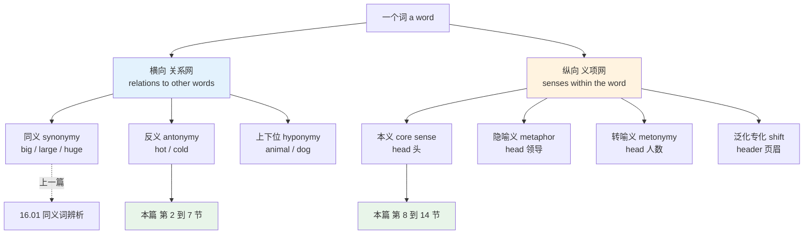
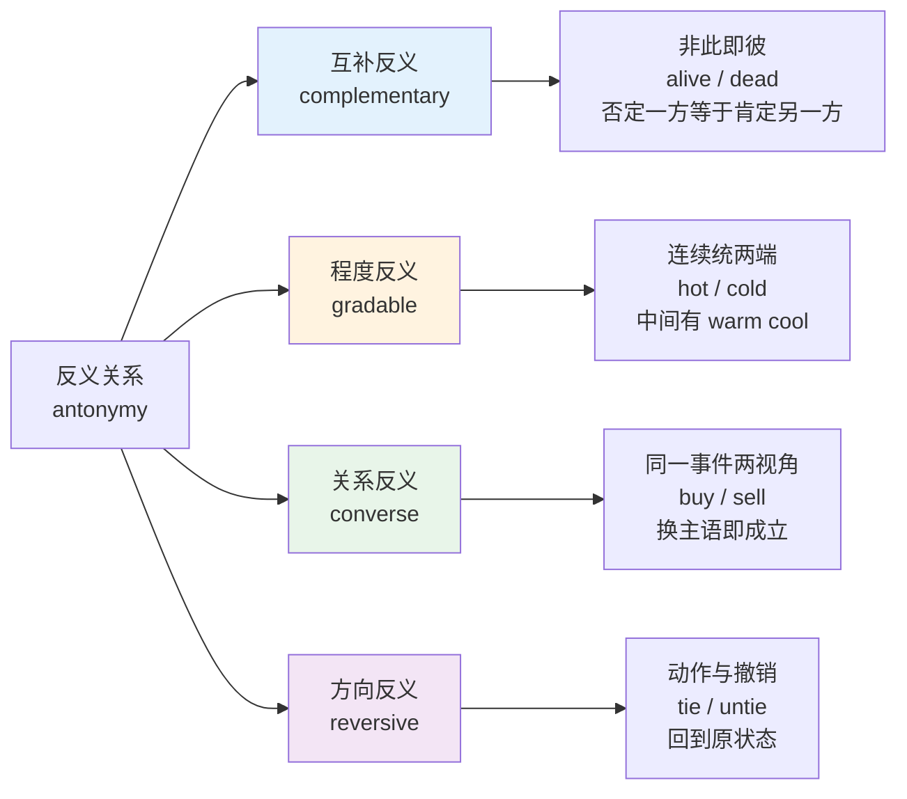
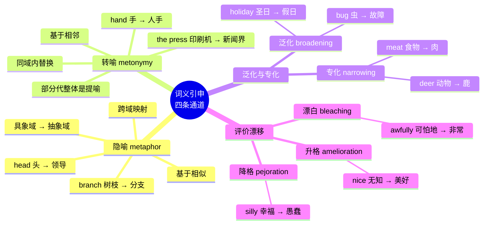
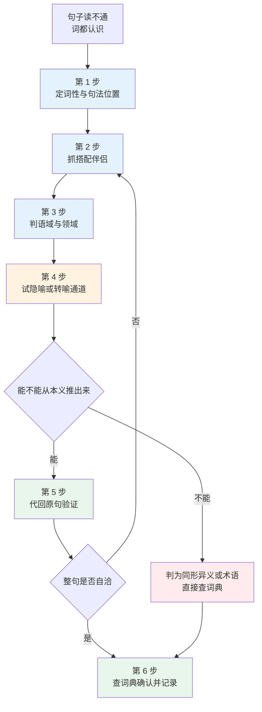
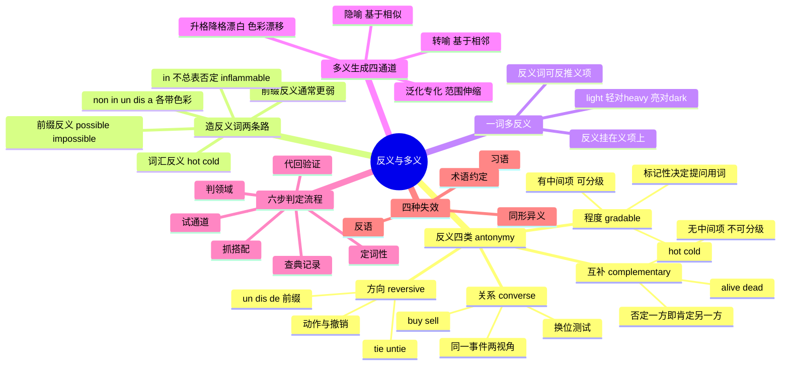

# 反义词体系、一词多义与词义引申

> [!info] 本篇定位
>
> 上一篇讲同义关系——两个词凭什么算「差不多」，以及差在哪。本篇讲另外两种关系：**反义**（两个词凭什么算「相对」）和**多义**（一个词凭什么长出十几个意思）。
>
> 这两件事看起来无关，实际共用同一套底层逻辑：词义不是一个点，是一片有中心有边缘的区域。反义是两片区域的相对位置，多义是同一片区域向外扩张出的分叉。理解了区域的形状，反义配对和义项推断都有了依据。
>
> 读完你会拿到：四类反义关系的判别测试、前缀反义为什么常常不等于词汇反义、一词多反义的处理办法、四条词义引申通道的识别特征，以及一套遇到「这个词我认识但这里读不通」时可以照着走的六步流程。
>
> 行业专属的熟词新义清单不在本篇：计算机语境见 `20.02`，法律语境见 `20.05`，财务金融语境见 `20.07`，考试向的熟词僻义总表见 `21.02`。本篇只给机制和流程。

---

## 1. 本篇导读：词义关系的两张网

词典里一个词条的信息可以拆成两个方向。

**横向**是这个词跟别的词的关系：谁跟它意思接近（同义），谁跟它意思相对（反义），谁包含它（上位词），谁被它包含（下位词）。**纵向**是这个词自己内部的结构：它有几个义项，哪个是本义，其余义项是怎么从本义长出来的。

上一篇处理横向的同义轴，本篇处理横向的反义轴加整条纵向轴。



上图把词义关系切成两半。左半边的三种横向关系里，同义已经在 [[16.词义辨析、搭配与短语动词/01.同义词辨析方法与高频同义词组\|同义词辨析方法与高频同义词组]] 讲完，上下位关系散落在前面各主题章的词表分组里（`10.01` 的动物分类、`09.02` 的食材分类本身就是上下位结构），本篇专攻反义。右半边的纵向义项网是本篇的后半部分，也是四条引申通道要解释的东西。

两半之间有一个交叉点，这也是第 7 节要处理的问题：**一个词有几个义项，就可能有几组反义词**。`light` 作「轻」时反义是 `heavy`，作「亮」时反义是 `dark`，作「清淡」时反义是 `rich`。反义不是词与词的关系，是**义项与义项**的关系。这一点没弄清楚，背反义词表就会背出一堆互相打架的配对。

### 1.1 本篇为什么值得单独占一章

中文母语者学英语，同义辨析的难点在「选哪个」，反义和多义的难点在「认不认得出」。

阅读时真正卡住的极少是生词——生词你知道自己不认识，一查就过去了。卡住的是**认识的词用了不认识的义项**。`The proposal was tabled.` 每个词都认识，句子读不懂。`The compiler will complain about this.` 编译器怎么会「抱怨」。这类句子查词典也未必解决问题，因为你根本不知道自己需要查。

判定这件事需要的是流程，不是词表。第 13 节那套六步流程是本篇的落点，前面十二节都在为它铺设判断依据。

---

## 2. 反义关系的四种类型

「反义词」这个中文说法把四种性质完全不同的关系压在了一起。分开之后，每一类各有自己的判别测试和使用限制。



上图的四支各自对应一种语义结构。互补反义把论域切成没有缝隙的两块；程度反义把论域铺成一条有中间地带的连续统；关系反义描述的其实是同一件事，只是换了个视角说；方向反义描述的是一个动作和它的撤销动作。

四类的判别测试如下表。前三个测试用来分互补与程度，后两个用来分关系与方向，五项互相独立，一个配对可以逐条过。

| 测试 | 问法 | 互补反义 | 程度反义 | 关系反义 | 方向反义 |
| --- | --- | --- | --- | --- | --- |
| 否定测试 | 「不是 A」是否等于「是 B」 | 是 | 否 | 不适用 | 不适用 |
| 中间项测试 | A 和 B 之间有没有词 | 没有 | 有 | 不适用 | 不适用 |
| 比较级测试 | 能不能说 more A / very A | 不能 | 能 | 不适用 | 不适用 |
| 换位测试 | 交换两个论元后句子是否成立 | 不适用 | 不适用 | 是 | 否 |
| 复原测试 | B 是否把 A 的结果撤回 | 不适用 | 不适用 | 否 | 是 |

拿 `alive` 和 `dead` 过一遍：不是活的就是死的（否定测试通过），中间没有词（中间项测试通过），不能说 ~~very dead~~（比较级测试通过）——判定为互补反义。拿 `hot` 和 `cold` 过一遍：不热不等于冷（可能是 `warm`），中间有 `warm`、`mild`、`cool` 三档，可以说 `very hot`——判定为程度反义。

> [!warning] 互补反义在口语里会被强行分级
>
> 语言使用者经常打破互补反义的绝对性，用来制造修辞效果：`deader than a doornail`、`more dead than alive`、`a very unique design`。
>
> 这类说法在口语和广告里常见，在技术文档和学术写作里是错误。`unique`、`perfect`、`complete`、`fatal`、`impossible` 这批词属于极限形容词，正式文体里不加程度副词，要强调只能用 `absolutely`、`completely`、`utterly` 这类顶格副词。量级配对的完整规则见 [[17.固定搭配/05.副词+形容词强化搭配：highly、deeply、bitterly 的固定伴侣\|副词+形容词强化搭配]]。

---

## 3. 互补反义：非黑即白的开关

互补反义（complementary antonym，也叫 binary antonym）把一个论域完整切成两块，没有中间地带，也没有重叠。逻辑上它等价于一个布尔值：确定了一边，另一边自动确定。

| 英文 | 英式音标 | 美式音标 | 词性 | 中文 | 搭配与说明 |
| --- | --- | --- | --- | --- | --- |
| **alive** | /əˈlaɪv/ | /əˈlaɪv/ | adj. | 活着的 | 只作表语，定语位置用 `living`：a living creature |
| **dead** | /ded/ | /ded/ | adj. | 死的 | 技术义「失效的」：a dead link、dead code |
| **male** | /meɪl/ | /meɪl/ | adj./n. | 男性的；雄性 | 硬件语境指公头：a male connector |
| **female** | /ˈfiːmeɪl/ | /ˈfiːmeɪl/ | adj./n. | 女性的；雌性 | 硬件语境指母口 |
| **present** | /ˈpreznt/ | /ˈpreznt/ | adj. | 在场的；存在的 | 重音在前是形容词，在后 /prɪˈzent/ 是动词 |
| **absent** | /ˈæbsənt/ | /ˈæbsənt/ | adj. | 缺席的 | `absent from`；也可作介词表「若无」 |
| **odd** | /ɒd/ | /ɑːd/ | adj. | 奇数的；奇怪的 | 一词两义，另一义的反义是 `normal` |
| **even** | /ˈiːvn/ | /ˈiːvn/ | adj. | 偶数的；平整的 | 平整义的反义是 `uneven` |
| **true** | /truː/ | /truː/ | adj. | 真的 | 布尔值就叫 `true`，不叫 ~~right~~ |
| **false** | /fɔːls/ | /fɔːls/ | adj. | 假的 | `false positive` 误报，`false negative` 漏报 |
| **possible** | /ˈpɒsəbl/ | /ˈpɑːsəbl/ | adj. | 可能的 | 与 `impossible` 是互补，与 `likely` 不是同义 |
| **impossible** | /ɪmˈpɒsəbl/ | /ɪmˈpɑːsəbl/ | adj. | 不可能的 | 极限词，正式文体不说 ~~very impossible~~ |
| **awake** | /əˈweɪk/ | /əˈweɪk/ | adj. | 醒着的 | 只作表语；`wide awake` 完全清醒 |
| **asleep** | /əˈsliːp/ | /əˈsliːp/ | adj. | 睡着的 | `fast asleep` 熟睡，注意不是 ~~deeply asleep~~ |
| **finite** | /ˈfaɪnaɪt/ | /ˈfaɪnaɪt/ | adj. | 有限的 | 数学与语法双用：a finite verb 限定动词 |
| **infinite** | /ˈɪnfɪnət/ | /ˈɪnfɪnət/ | adj. | 无限的 | 重音在首音节，与 finite 不同 |
| **mortal** | /ˈmɔːtl/ | /ˈmɔːrtl/ | adj./n. | 会死的；凡人 | `a mortal blow` 致命一击 |
| **immortal** | /ɪˈmɔːtl/ | /ɪˈmɔːrtl/ | adj. | 不朽的 | 也指名声不朽 |
| **valid** | /ˈvælɪd/ | /ˈvælɪd/ | adj. | 有效的 | `a valid argument`、`a valid token` |
| **invalid** | /ɪnˈvælɪd/ | /ɪnˈvælɪd/ | adj. | 无效的 | 重音在后；名词「病人」重音在前 /ˈɪnvəlɪd/ |
| **synchronous** | /ˈsɪŋkrənəs/ | /ˈsɪŋkrənəs/ | adj. | 同步的 | 缩写 sync |
| **asynchronous** | /eɪˈsɪŋkrənəs/ | /eɪˈsɪŋkrənəs/ | adj. | 异步的 | 缩写 async，读 /ˈeɪsɪŋk/ |
| **mandatory** | /ˈmændətəri/ | /ˈmændətɔːri/ | adj. | 强制的 | 规范文体常用 `required` |
| **optional** | /ˈɒpʃənl/ | /ˈɑːpʃənl/ | adj. | 可选的 | 参数表里标 optional |
| **guilty** | /ˈɡɪlti/ | /ˈɡɪlti/ | adj. | 有罪的 | 法律语境的反义是 `not guilty` 而非 `innocent` |
| **innocent** | /ˈɪnəsnt/ | /ˈɪnəsnt/ | adj. | 无辜的；天真的 | 天真义的反义是 `worldly` |

> [!warning] 法律英语里 not guilty 不等于 innocent
>
> 英美法庭上陪审团给出的裁决只有 `guilty` 和 `not guilty` 两种，没有 `innocent`。`not guilty` 说的是「控方未能证明有罪」，不是「已证明无辜」。这个区分在新闻报道里很关键，中文翻译成「无罪」会丢掉这层含义。
>
> 类似地，`presumption of innocence`（无罪推定）用的是 `innocence`，因为那是法律原则不是裁决结果。整套合同与诉讼词见 `20.05`。

互补反义在技术文档里出现得极为密集，因为程序本身就是布尔逻辑。下面这组在 API 文档和配置项里高频复现。

| 英文 | 英式音标 | 美式音标 | 词性 | 中文 | 搭配与说明 |
| --- | --- | --- | --- | --- | --- |
| **enabled** | /ɪˈneɪbld/ | /ɪˈneɪbld/ | adj. | 已启用的 | 配置项常写 `enabled: true` |
| **disabled** | /dɪsˈeɪbld/ | /dɪsˈeɪbld/ | adj. | 已禁用的 | 指人时是「残障的」，语域敏感 |
| **stateless** | /ˈsteɪtləs/ | /ˈsteɪtləs/ | adj. | 无状态的 | HTTP is stateless |
| **stateful** | /ˈsteɪtfl/ | /ˈsteɪtfl/ | adj. | 有状态的 | a stateful service |
| **blocking** | /ˈblɒkɪŋ/ | /ˈblɑːkɪŋ/ | adj. | 阻塞的 | a blocking call |
| **non-blocking** | /ˌnɒnˈblɒkɪŋ/ | /ˌnɑːnˈblɑːkɪŋ/ | adj. | 非阻塞的 | 连字符不省 |
| **mutable** | /ˈmjuːtəbl/ | /ˈmjuːtəbl/ | adj. | 可变的 | 拉丁 mutare「改变」，同族 mutation、commute |
| **immutable** | /ɪˈmjuːtəbl/ | /ɪˈmjuːtəbl/ | adj. | 不可变的 | an immutable object |
| **explicit** | /ɪkˈsplɪsɪt/ | /ɪkˈsplɪsɪt/ | adj. | 显式的 | an explicit cast 显式转换 |
| **implicit** | /ɪmˈplɪsɪt/ | /ɪmˈplɪsɪt/ | adj. | 隐式的 | an implicit conversion |
| **volatile** | /ˈvɒlətaɪl/ | /ˈvɑːlətl/ | adj. | 易变的；易失的 | 英美读音差异明显，美式末音节弱读 |
| **persistent** | /pəˈsɪstənt/ | /pərˈsɪstənt/ | adj. | 持久的 | `persistent storage` 持久化存储 |

`volatile` 是英美读音差别最大的技术词之一，英式三音节末尾读满 /taɪl/，美式压成 /tl/。念错不影响理解，但会被听出来。整套技术词的读法集中在 `20.04`。

---

## 4. 程度反义：连续统与标记性

程度反义（gradable antonym）是数量最大的一类。两个词不是把论域二分，而是标出一条连续统的两端，中间留着大片可以用副词和中间词填充的空间。

### 4.1 连续统的三档结构

一条程度轴至少有三档：低端、中段、高端。中段往往有专门的词，没有专门的词时用 `moderate`、`medium`、`average` 之类的通用中性词顶上。

| 语义轴 | 低端 | 中段 | 高端 | 中段是否有专名 |
| --- | --- | --- | --- | --- |
| 温度 | cold | warm / mild / cool | hot | 有，且分两个（warm 偏暖，cool 偏凉） |
| 尺寸 | small / tiny | medium-sized | big / huge | 只有复合词 |
| 速度 | slow | moderate | fast | 有 |
| 难度 | easy | moderate | difficult | 有 |
| 价格 | cheap | affordable / reasonable | expensive | 有，且带评价色彩 |
| 频率 | rare | occasional | frequent | 有 |
| 亮度 | dark | dim | bright | 有 |
| 深度 | shallow | — | deep | 无 |
| 密度 | sparse | — | dense | 无 |

中段有没有专名，决定了这条轴能不能做三分描述。`shallow / deep` 没有中间词，描述中等深度只能说 `neither shallow nor deep` 或者给具体数值。这类轴在技术写作里要么给数值要么换轴。

下面是程度反义的主表，按语义轴分组。

| 英文 | 英式音标 | 美式音标 | 词性 | 中文 | 搭配与说明 |
| --- | --- | --- | --- | --- | --- |
| **hot** | /hɒt/ | /hɑːt/ | adj. | 热的 | 技术义「热点的」：a hot path、hot reload |
| **cold** | /kəʊld/ | /koʊld/ | adj. | 冷的 | `a cold start` 冷启动，与 hot 对称 |
| **wide** | /waɪd/ | /waɪd/ | adj. | 宽的 | 抽象义「广泛的」：a wide range |
| **narrow** | /ˈnærəʊ/ | /ˈnæroʊ/ | adj./v. | 窄的；缩小 | `narrow down the options` 缩小范围 |
| **heavy** | /ˈhevi/ | /ˈhevi/ | adj. | 重的 | `heavy load`、`heavy traffic` |
| **light** | /laɪt/ | /laɪt/ | adj. | 轻的；亮的 | 两义两组反义，见第 7 节 |
| **fast** | /fɑːst/ | /fæst/ | adj./adv. | 快的 | 英美元音差异；`fast asleep` 里是「牢固」古义 |
| **slow** | /sləʊ/ | /sloʊ/ | adj. | 慢的 | `a slow query` 慢查询 |
| **deep** | /diːp/ | /diːp/ | adj. | 深的 | `a deep copy` 深拷贝，对 `a shallow copy` |
| **shallow** | /ˈʃæləʊ/ | /ˈʃæloʊ/ | adj. | 浅的 | 贬义引申「肤浅的」 |
| **thick** | /θɪk/ | /θɪk/ | adj. | 厚的；浓的 | `a thick accent` 口音重 |
| **thin** | /θɪn/ | /θɪn/ | adj. | 薄的；稀的 | `a thin client` 瘦客户端 |
| **rough** | /rʌf/ | /rʌf/ | adj. | 粗糙的；大致的 | `a rough estimate` 粗略估计 |
| **smooth** | /smuːð/ | /smuːð/ | adj. | 光滑的；顺利的 | 词尾是浊音 /ð/ 不是 /θ/ |
| **tight** | /taɪt/ | /taɪt/ | adj. | 紧的 | `a tight deadline`、`a tight loop` |
| **loose** | /luːs/ | /luːs/ | adj. | 松的 | 动词是 `loosen`；`lose` /luːz/ 是另一个词 |
| **dense** | /dens/ | /dens/ | adj. | 密集的 | `a dense array`、`dense documentation` |
| **sparse** | /spɑːs/ | /spɑːrs/ | adj. | 稀疏的 | `a sparse matrix` 稀疏矩阵 |
| **frequent** | /ˈfriːkwənt/ | /ˈfriːkwənt/ | adj. | 频繁的 | 动词重音在后 /frɪˈkwent/ |
| **rare** | /reə/ | /rer/ | adj. | 罕见的；三分熟的 | 牛排熟度义与频率义无关 |
| **verbose** | /vɜːˈbəʊs/ | /vɜːrˈboʊs/ | adj. | 冗长的 | 命令行开关 `-v` 就是 verbose |
| **concise** | /kənˈsaɪs/ | /kənˈsaɪs/ | adj. | 简洁的 | 正式度高于 `short` |
| **strict** | /strɪkt/ | /strɪkt/ | adj. | 严格的 | `strict mode`、`a strict subset` |
| **lenient** | /ˈliːniənt/ | /ˈliːniənt/ | adj. | 宽松的 | 解析器语境常用 `permissive` |
| **coarse** | /kɔːs/ | /kɔːrs/ | adj. | 粗粒度的 | `coarse-grained` 对 `fine-grained` |
| **fine** | /faɪn/ | /faɪn/ | adj. | 细的；好的 | 多义词，见第 7 节 |

### 4.2 标记性：为什么问 How old are you 不问 How young

程度反义的两端地位不对等。一端是**无标记项**（unmarked），可以中性地代表整条轴；另一端是**有标记项**（marked），带着方向预设。

问年龄说 `How old are you?`，不预设对方年纪大。问 `How young are you?` 就带上了「你很年轻」的预设，多半是调侃。同一条轴上，`old` 是无标记项。

| 语义轴 | 无标记项（用于提问与名词化） | 有标记项 | 中性名词 |
| --- | --- | --- | --- |
| 年龄 | old（How old） | young | age |
| 长度 | long（How long） | short | length |
| 高度 | tall / high（How tall） | short / low | height |
| 宽度 | wide（How wide） | narrow | width |
| 深度 | deep（How deep） | shallow | depth |
| 重量 | heavy（How heavy） | light | weight |
| 距离 | far（How far） | near | distance |
| 速度 | fast（How fast） | slow | speed |
| 大小 | big / large（How big） | small | size |
| 温度 | — | — | temperature（两端都有标记） |

无标记项和中性名词往往同源：`long → length`、`wide → width`、`deep → depth`、`high → height`、`strong → strength`。前四组里有三组伴随元音变化——/lɒŋ/ → /leŋθ/、/waɪd/ → /wɪdθ/、/diːp/ → /depθ/，`strong → strength` 同理；`height` 是例外，元音不变，结尾也不是 -th。拼写要单独记，`width` 不是 ~~wideth~~，`height` 不是 ~~heighth~~。

温度轴是个例外：`hot` 和 `cold` 都有标记，问温度不说 `How hot is it?`（那已经预设了热），而说 `What's the temperature?`。名词化也不走两端，走的是拉丁词 `temperature`。`warmth` 和 `coldness` 都存在，但各自只覆盖轴的一端，替不掉中性的 `temperature`。

> [!tip] 用有标记项提问是一种预设手段
>
> 面试和谈判里可以利用这一点。问 `How difficult was the migration?` 预设迁移有难度，问 `How smooth was the migration?` 预设它顺利。写调研问卷时要刻意用无标记项，避免把答案引导过去。
>
> 反过来读英文材料时，看到有标记项提问就要警觉：`How much slower is the new version?` 这句话已经假定新版本更慢了。

### 4.3 程度轴上的多档梯度

真实的程度轴常常不止三档。上一篇给过同义词的强度梯度排序方法，这里补上带反义两端的完整梯度。

| 轴 | 从低到高的完整梯度 |
| --- | --- |
| 温度 | freezing → cold → chilly → cool → mild → warm → hot → scorching |
| 尺寸 | minute → tiny → small → medium → large → huge → enormous → colossal |
| 好坏 | appalling → awful → poor → mediocre → decent → good → excellent → outstanding |
| 情绪（喜） | content → pleased → happy → delighted → thrilled → ecstatic |
| 情绪（怒） | irritated → annoyed → angry → furious → livid |
| 确定性 | impossible → unlikely → possible → likely → probable → certain |
| 频率 | never → rarely → occasionally → sometimes → often → usually → always |

这类梯度表的用法不是背，是**定位**。写作时先想清楚自己要表达的强度落在第几档，再去表里取词。取错档比取错词更容易被读出来：把 `annoyed` 写成 `furious`，读者会认为你在生气。

温度轴的完整词表在 `06.01`，情绪梯度在 `07.04`，好坏评价梯度在 `13.05`，确定性梯度涉及情态动词见 `02.06`。本篇只给结构不重列词条。

---

## 5. 关系反义与方向反义

这两类反义跟前两类不是一个层面的东西。互补和程度描述的是**性质**的对立，关系和方向描述的是**角色**与**过程**的对立。

### 5.1 关系反义：同一件事的两个视角

关系反义（converse antonym，也叫 relational antonym）成对出现时，描述的是同一个事实。`A sold X to B` 和 `B bought X from A` 说的是同一笔交易，只是叙述的出发点不同。

判别方法是换位测试：交换两个论元的位置，用另一个词，句子仍然成立且意思不变。

| 英文 | 英式音标 | 美式音标 | 词性 | 中文 | 搭配与说明 |
| --- | --- | --- | --- | --- | --- |
| **buy** | /baɪ/ | /baɪ/ | v. | 买 | `buy sth from sb`，介词是 from 不是 ~~to~~ |
| **sell** | /sel/ | /sel/ | v. | 卖 | `sell sth to sb`；`sell out` 售罄 |
| **lend** | /lend/ | /lend/ | v. | 借出 | `lend sb sth`；主语是给出方 |
| **borrow** | /ˈbɒrəʊ/ | /ˈbɑːroʊ/ | v. | 借入 | `borrow sth from sb`；主语是取得方 |
| **teach** | /tiːtʃ/ | /tiːtʃ/ | v. | 教 | `teach sb sth` |
| **learn** | /lɜːn/ | /lɜːrn/ | v. | 学 | `learn sth from sb`；不能说 ~~learn knowledge~~ |
| **employer** | /ɪmˈplɔɪə/ | /ɪmˈplɔɪər/ | n. | 雇主 | 词根 employ 加施事后缀，见 `14.05` |
| **employee** | /ɪmˈplɔɪiː/ | /ɪmˈplɔɪiː/ | n. | 雇员 | -ee 后缀标受事，也读 /ˌemplɔɪˈiː/ |
| **host** | /həʊst/ | /hoʊst/ | n./v. | 主人；主机 | 技术义「托管」：host a service |
| **guest** | /ɡest/ | /ɡest/ | n. | 客人 | 虚拟化语境指 guest OS |
| **client** | /ˈklaɪənt/ | /ˈklaɪənt/ | n. | 客户；客户端 | 商业义与技术义共用一词 |
| **server** | /ˈsɜːvə/ | /ˈsɜːrvər/ | n. | 服务器；服务员 | 服务员义英式多用 `waiter` |
| **creditor** | /ˈkredɪtə/ | /ˈkredɪtər/ | n. | 债权人 | 财报词，见 `20.07` |
| **debtor** | /ˈdetə/ | /ˈdetər/ | n. | 债务人 | b 不发音，与 debt 一致 |
| **producer** | /prəˈdjuːsə/ | /prəˈduːsər/ | n. | 生产者 | 英式有 /j/ 滑音，美式没有 |
| **consumer** | /kənˈsjuːmə/ | /kənˈsuːmər/ | n. | 消费者 | 消息队列语境成对出现 |
| **publisher** | /ˈpʌblɪʃə/ | /ˈpʌblɪʃər/ | n. | 发布者 | pub/sub 模型的一端 |
| **subscriber** | /səbˈskraɪbə/ | /səbˈskraɪbər/ | n. | 订阅者 | 另一端 |
| **upstream** | /ˌʌpˈstriːm/ | /ˌʌpˈstriːm/ | n./adj. | 上游 | 开源语境指原始仓库 |
| **downstream** | /ˌdaʊnˈstriːm/ | /ˌdaʊnˈstriːm/ | n./adj. | 下游 | 指依赖你的一方 |
| **above** | /əˈbʌv/ | /əˈbʌv/ | prep. | 在……上方 | 空间义详见 `02.02` |
| **below** | /bɪˈləʊ/ | /bɪˈloʊ/ | prep. | 在……下方 | 文档里 `see below` 指下文 |
| **parent** | /ˈpeərənt/ | /ˈperənt/ | n. | 父母；父节点 | 树结构术语，对 `child node` |
| **ancestor** | /ˈænsestə/ | /ˈænsestər/ | n. | 祖先；祖节点 | 对 `descendant` |
| **descendant** | /dɪˈsendənt/ | /dɪˈsendənt/ | n. | 后代；子孙节点 | 注意拼写是 -ant 不是 -ent |

> [!warning] 关系反义最容易出的错是介词方向
>
> `borrow` 和 `lend` 这一对，中文都说「借」，英语靠动词本身区分方向，介词跟着动词走。
>
> > - ❌ ~~Can I lend your pen?~~
> > - ✅ **Can I borrow your pen?**（我借用你的笔）
> > - ❌ ~~He borrowed me some money.~~
> > - ✅ **He lent me some money.**（他借钱给我）
>
> 同类还有 `rent`（英语里租进租出同一个词，靠介词区分：`rent a flat from sb` 租进，`rent out a room to sb` 租出）和 `hire`（英式偏「租用物品」，美式偏「雇人」）。

### 5.2 方向反义：动作与撤销

方向反义（reversive antonym）描述的是一个动作和把它撤回的动作。典型标志是其中一方由 `un-`、`dis-`、`de-` 加在另一方前面构成。

| 英文 | 英式音标 | 美式音标 | 词性 | 中文 | 搭配与说明 |
| --- | --- | --- | --- | --- | --- |
| **tie** | /taɪ/ | /taɪ/ | v. | 系；绑 | 名词义「平局」「领带」 |
| **untie** | /ʌnˈtaɪ/ | /ʌnˈtaɪ/ | v. | 解开 | un- 加动词表撤销动作 |
| **attach** | /əˈtætʃ/ | /əˈtætʃ/ | v. | 附上 | 邮件附件是 `attachment` |
| **detach** | /dɪˈtætʃ/ | /dɪˈtætʃ/ | v. | 分离 | `a detached house` 独栋房 |
| **appear** | /əˈpɪə/ | /əˈpɪr/ | v. | 出现 | 另一义「似乎」，`it appears that` |
| **disappear** | /ˌdɪsəˈpɪə/ | /ˌdɪsəˈpɪr/ | v. | 消失 | 不及物，不能说 ~~disappear sth~~ |
| **assemble** | /əˈsembl/ | /əˈsembl/ | v. | 组装；汇集 | 汇编语言是 assembly |
| **disassemble** | /ˌdɪsəˈsembl/ | /ˌdɪsəˈsembl/ | v. | 拆解 | 与 `dissemble`（掩饰）只差中间的 as，两词毫无关系 |
| **inflate** | /ɪnˈfleɪt/ | /ɪnˈfleɪt/ | v. | 充气；抬高 | 名词 `inflation` 通胀 |
| **deflate** | /dɪˈfleɪt/ | /dɪˈfleɪt/ | v. | 放气；压缩 | 压缩算法名就叫 DEFLATE |
| **encrypt** | /ɪnˈkrɪpt/ | /ɪnˈkrɪpt/ | v. | 加密 | 名词 `encryption` |
| **decrypt** | /diːˈkrɪpt/ | /diːˈkrɪpt/ | v. | 解密 | 前缀读 /diː/ 不是 /dɪ/ |
| **encode** | /ɪnˈkəʊd/ | /ɪnˈkoʊd/ | v. | 编码 | 与 encrypt 不是一回事 |
| **decode** | /ˌdiːˈkəʊd/ | /ˌdiːˈkoʊd/ | v. | 解码 | Base64 是编码不是加密 |
| **mount** | /maʊnt/ | /maʊnt/ | v. | 挂载；安装 | 本义「架上、装上」，从装磁带隐喻到挂载 |
| **unmount** | /ʌnˈmaʊnt/ | /ʌnˈmaʊnt/ | v. | 卸载挂载 | 命令是 `umount`，少一个 n |
| **allocate** | /ˈæləkeɪt/ | /ˈæləkeɪt/ | v. | 分配 | 名词 `allocation` |
| **deallocate** | /diːˈæləkeɪt/ | /diːˈæləkeɪt/ | v. | 释放 | 口语更常说 `free` |
| **push** | /pʊʃ/ | /pʊʃ/ | v. | 压入；推送 | 栈操作与 Git 操作同词 |
| **pop** | /pɒp/ | /pɑːp/ | v. | 弹出 | 栈的另一端操作 |
| **acquire** | /əˈkwaɪə/ | /əˈkwaɪər/ | v. | 获取；收购 | 锁语境 `acquire a lock` |
| **release** | /rɪˈliːs/ | /rɪˈliːs/ | v./n. | 释放；发布 | 一词两大义项，见第 7 节 |
| **commit** | /kəˈmɪt/ | /kəˈmɪt/ | v. | 提交；承诺 | 事务与版本控制共用 |
| **revert** | /rɪˈvɜːt/ | /rɪˈvɜːrt/ | v. | 回退；恢复 | `revert to` 恢复到某状态 |
| **expand** | /ɪkˈspænd/ | /ɪkˈspænd/ | v. | 展开；扩张 | 对 `collapse` 折叠（界面语境） |
| **collapse** | /kəˈlæps/ | /kəˈlæps/ | v./n. | 折叠；崩塌 | 界面义与灾难义共存 |

方向反义有一个使用限制：**撤销动作不总能真的撤销**。`unsend` 这个词存在，但邮件撤回往往失败；`undo` 在编辑器里可用，在数据库删除后不可用。技术文档里区分 `reversible`（可逆的）和 `irreversible`（不可逆的）就是在标这件事，`This operation is irreversible.` 是删除确认框里的标准句。

---

## 6. 前缀反义与词汇反义

造一个反义词有两条路：借用现成的独立词根（词汇反义），或者在原词前加一个否定前缀（前缀反义）。两条路造出来的词，语义关系并不平行。

| 原词 | 词汇反义 | 前缀反义 | 两者是否等价 |
| --- | --- | --- | --- |
| happy | sad | unhappy | 不等价，unhappy 弱于 sad |
| good | bad | ungood（不存在） | — |
| hot | cold | — | 该轴无前缀反义 |
| possible | — | impossible | 只有前缀路 |
| honest | — | dishonest | 只有前缀路 |
| human | — | inhuman / nonhuman | 两个前缀两个义 |
| moral | — | immoral / amoral | 两个前缀两个义 |
| interested | bored | uninterested / disinterested | 三个词三个义 |
| flammable | — | inflammable / nonflammable | in- 在此不表否定 |

否定前缀本身的完整清单与选择规律在 [[14.构词法：前缀与后缀/02.否定与相反前缀\|否定与相反前缀]]，本篇不重列。这里只处理反义关系层面的三个后果。

### 6.1 后果一：前缀反义常常弱于词汇反义

`unhappy` 不等于 `sad`。`not happy` 在逻辑上覆盖了「中性」和「难过」两块，`unhappy` 落在这两块的交界，比 `sad` 温和。同理 `unkind` 弱于 `cruel`，`unfriendly` 弱于 `hostile`，`unwise` 弱于 `stupid`。

这条规律有直接的写作用途：**需要缓和语气时用前缀反义**。绩效评语写 `The implementation is inefficient.` 比写 `The implementation is slow and wasteful.` 客气得多，因为 `inefficient` 只是否定了 `efficient`，没有正面指控。

| 英文 | 英式音标 | 美式音标 | 词性 | 中文 | 搭配与说明 |
| --- | --- | --- | --- | --- | --- |
| **unhappy** | /ʌnˈhæpi/ | /ʌnˈhæpi/ | adj. | 不开心的 | 强度弱于 sad |
| **unkind** | /ʌnˈkaɪnd/ | /ʌnˈkaɪnd/ | adj. | 不友善的 | 强度弱于 cruel |
| **unwise** | /ʌnˈwaɪz/ | /ʌnˈwaɪz/ | adj. | 不明智的 | 委婉批评决策 |
| **inefficient** | /ˌɪnɪˈfɪʃnt/ | /ˌɪnɪˈfɪʃnt/ | adj. | 低效的 | 对 `efficient`，代码评审常用 |
| **inconsistent** | /ˌɪnkənˈsɪstənt/ | /ˌɪnkənˈsɪstənt/ | adj. | 不一致的 | 数据库语境常见 |
| **incomplete** | /ˌɪnkəmˈpliːt/ | /ˌɪnkəmˈpliːt/ | adj. | 不完整的 | 比 `missing` 温和 |
| **unsuitable** | /ʌnˈsuːtəbl/ | /ʌnˈsuːtəbl/ | adj. | 不合适的 | 婉拒用语 |
| **undesirable** | /ˌʌndɪˈzaɪərəbl/ | /ˌʌndɪˈzaɪrəbl/ | adj. | 不理想的 | 常出现在 `undesirable side effects` |
| **suboptimal** | /ˌsʌbˈɒptɪməl/ | /ˌsʌbˈɑːptɪməl/ | adj. | 次优的 | 工程圈的高频委婉语 |

### 6.2 后果二：同一个词根配不同前缀，义项分岔

前缀不是可以随便换的。`in-`、`un-`、`non-`、`a-`、`dis-` 各自带着不同的语义色彩，配到同一个词根上会造出意思完全不同的词。

| 词根 | 加 non- | 加 in-/im-/il-/ir- | 加 un- | 加 dis- | 加 a-/an- |
| --- | --- | --- | --- | --- | --- |
| human | nonhuman 非人类的（中性分类） | inhuman 残忍的（评价） | — | — | — |
| moral | nonmoral 与道德无关的 | immoral 不道德的（评价） | — | — | amoral 无道德观念的 |
| religious | nonreligious 非宗教的（中性分类） | irreligious 反宗教的、不敬的（评价） | unreligious 不信教的（罕用） | — | — |
| political | nonpolitical 非政治的 | — | unpolitical 不问政治的 | — | apolitical 不涉政治的 |
| interested | — | — | uninterested 不感兴趣的 | disinterested 公正无私的 | — |
| ordered | — | — | unordered 无序的 | disordered 混乱失序的 | — |

规律：**`non-` 做客观分类，`in-` 和 `dis-` 常带评价色彩，`un-` 居中，`a-` 表「缺失该维度」**。

> [!warning] disinterested 不是 uninterested
>
> 这是英语母语者也常混的一对，正式写作里必须分清。
>
> > - **A disinterested judge** — 一位没有利害关系的法官（褒义，指公正）
> > - **An uninterested judge** — 一位不感兴趣的法官（贬义，指走神）
>
> 判据是问「无的是什么」：`disinterested` 无的是 `interest`（利益、利害关系），`uninterested` 无的是 `interest`（兴趣）。同一个名词的两个义项，分别被两个前缀选走了。
>
> 同类还有 `unable`（做不到某事）与 `disabled`（有身体障碍的）、`unqualified`（不合格的，也指「无保留的」）与 `disqualified`（被取消资格的）。

### 6.3 后果三：几个 in- 不表否定的坑

`in-` 在英语里身兼两职：一个来自拉丁的否定前缀（`invalid`、`incapable`），一个来自拉丁的方位前缀「向内」（`include`、`invade`）。两个 `in-` 拼写完全一样，撞上同一个词根时会出事。

| 英文 | 英式音标 | 美式音标 | 词性 | 中文 | 搭配与说明 |
| --- | --- | --- | --- | --- | --- |
| **flammable** | /ˈflæməbl/ | /ˈflæməbl/ | adj. | 易燃的 | 真正的反义是 `nonflammable` |
| **inflammable** | /ɪnˈflæməbl/ | /ɪnˈflæməbl/ | adj. | 易燃的 | 与 flammable **同义**，in- 是「向内」 |
| **valuable** | /ˈvæljuəbl/ | /ˈvæljuəbl/ | adj. | 有价值的 | 可比较：more valuable |
| **invaluable** | /ɪnˈvæljuəbl/ | /ɪnˈvæljuəbl/ | adj. | 无价的（极有价值） | 不是「没价值」，那是 `worthless` |
| **famous** | /ˈfeɪməs/ | /ˈfeɪməs/ | adj. | 著名的 | 中性偏褒 |
| **infamous** | /ˈɪnfəməs/ | /ˈɪnfəməs/ | adj. | 声名狼藉的 | 重音移到首音节，不是「不出名」 |
| **genuous**（不独立使用） | — | — | — | — | 只在 `ingenuous` / `disingenuous` 里出现 |
| **ingenuous** | /ɪnˈdʒenjuəs/ | /ɪnˈdʒenjuəs/ | adj. | 天真坦率的 | 褒义 |
| **disingenuous** | /ˌdɪsɪnˈdʒenjuəs/ | /ˌdɪsɪnˈdʒenjuəs/ | adj. | 虚伪的 | 讨论里常用来批评论证不诚实 |
| **ingenious** | /ɪnˈdʒiːniəs/ | /ɪnˈdʒiːniəs/ | adj. | 精巧的；有创意的 | 与 `ingenuous` 拼写只差一个字母，义无关 |
| **passable** | /ˈpɑːsəbl/ | /ˈpæsəbl/ | adj. | 尚可的；可通行的 | `impassable` 只否定「可通行」那一义，不否定「尚可」 |
| **impassive** | /ɪmˈpæsɪv/ | /ɪmˈpæsɪv/ | adj. | 面无表情的 | 不是 `passive` 的反义 |

`inflammable` 造成过真实的安全事故，因为读者把它理解成「不可燃」。美国国家消防协会为此推动改用 `flammable` 和 `nonflammable` 这一对，现在化学品标签上基本只见 `flammable`。`inflammable` 仍出现在旧文献和文学作品里，读到时要按「易燃」理解。

近形词造成的误读是另一个大类，`ingenuous` 和 `ingenious` 这种整批的对子在 [[16.词义辨析、搭配与短语动词/03.近形近音易混词与中式英语陷阱\|近形近音易混词与中式英语陷阱]] 集中处理。

---

## 7. 一词多反义：反义随义项走

背反义词表最容易踩的坑是把反义当成词与词的一对一关系。真实情况是：**反义关系挂在义项上，不挂在词上**。一个词有几个义项，就可能有几组不同的反义词。

| 英文 | 义项 | 该义项的反义 | 例证短语 |
| --- | --- | --- | --- |
| **light** | 轻的 | heavy | a light load 对 a heavy load |
| **light** | 明亮的 | dark | a light room 对 a dark room |
| **light** | 清淡的 | rich / heavy | a light meal 对 a rich meal |
| **light** | 浅色的 | deep | light blue 对 deep blue |
| **old** | 年老的（人） | young | an old man 对 a young man |
| **old** | 陈旧的（物） | new | an old laptop 对 a new laptop |
| **old** | 以前的 | current | my old job 对 my current job |
| **hard** | 硬的 | soft | a hard surface 对 a soft surface |
| **hard** | 困难的 | easy | a hard problem 对 an easy problem |
| **hard** | 严厉的 | lenient / gentle | be hard on sb 对 be gentle with sb |
| **right** | 正确的 | wrong | the right answer 对 the wrong answer |
| **right** | 右边的 | left | the right hand 对 the left hand |
| **fresh** | 新鲜的（食物） | stale / rotten | fresh bread 对 stale bread |
| **fresh** | 淡的（水） | salt | fresh water 对 salt water |
| **fresh** | 精神好的 | tired | feel fresh 对 feel tired |
| **sharp** | 锋利的 | blunt / dull | a sharp knife 对 a blunt knife |
| **sharp** | 敏锐的 | slow | a sharp mind 对 a slow mind |
| **sharp** | 急剧的 | gradual | a sharp rise 对 a gradual rise |
| **sharp** | 清晰的（图像） | blurry | a sharp image 对 a blurry image |
| **free** | 免费的 | paid | free tier 对 paid tier |
| **free** | 空闲的 | busy / occupied | Are you free 对 Are you busy |
| **free** | 自由的 | captive | set sb free 对 hold sb captive |
| **free** | 不含某物的 | full of | sugar-free 对 full of sugar |
| **open** | 开着的 | closed / shut | the door is open 对 the door is shut |
| **open** | 营业中的 | closed | We're open 对 We're closed |
| **open** | 公开的 | secret / confidential | an open meeting 对 a closed-door meeting |
| **open** | 开源的 | proprietary | open source 对 proprietary software |
| **flat** | 平坦的 | bumpy / uneven | a flat road 对 a bumpy road |
| **flat** | 无气泡的 | sparkling / fizzy | flat beer 对 fizzy beer；瓶装水语境用 still water |
| **flat** | 单调的 | lively | a flat delivery 对 a lively delivery |
| **flat** | 扁平的（结构） | nested / hierarchical | a flat structure 对 a nested structure |
| **plain** | 素净的 | patterned / fancy | a plain shirt 对 a patterned shirt |
| **plain** | 明白易懂的 | obscure | plain English 对 legalese |
| **plain** | 纯文本的 | rich / formatted | plain text 对 rich text |
| **strong** | 强壮的 | weak | a strong grip 对 a weak grip |
| **strong** | 味浓的 | mild / weak | strong coffee 对 weak coffee |
| **strong** | 有说服力的 | flimsy | a strong argument 对 a flimsy argument |
| **fine** | 细的 | coarse | fine sand 对 coarse sand |
| **fine** | 良好的 | poor | in fine condition 对 in poor condition |
| **fine** | 晴朗的 | wet | a fine day 对 a wet day |
| **dry** | 干的 | wet | a dry towel 对 a wet towel |
| **dry** | 不甜的（酒） | sweet | a dry wine 对 a sweet wine |
| **dry** | 枯燥的 | engaging | a dry lecture 对 an engaging lecture |
| **clear** | 清澈的 | cloudy / murky | clear water 对 cloudy water |
| **clear** | 明确的 | vague / ambiguous | a clear spec 对 a vague spec |
| **clear** | 畅通的 | blocked | the road is clear 对 the road is blocked |
| **rich** | 富有的 | poor | a rich country 对 a poor country |
| **rich** | 油腻的 | light | a rich sauce 对 a light sauce |
| **rich** | 内容丰富的 | sparse | rich metadata 对 sparse metadata |

这张表的读法：**从中间那列反推左边的义项**。看到 `blunt` 就知道这里的 `sharp` 说的是刀，看到 `blurry` 就知道说的是图像。反义词是判定义项最快的线索之一，比查词典快。

> [!example] 用反义词定位义项
>
> > - The new API is **flat**, not nested.
> >   - 新的 API 是扁平的，不是嵌套的。（`flat` = 结构义，因为反义是 nested）
> > - This sparkling water has gone **flat**.
> >   - 这瓶气泡水已经没气了。（`flat` = 无气泡义，因为主语是 sparkling water）
> > - His delivery was **flat** — the audience stopped listening.
> >   - 他讲得很平淡，听众都不听了。（`flat` = 单调义，因为后半句给了效果）

反过来，写作时选反义词也要先确定自己在哪个义项上。想说「这份规范不清晰」，反义轴是「明确 / 含糊」，要用 `vague` 或 `ambiguous`，不能用 `cloudy`——那是水的轴。

---

## 8. 一词多义与同形异义：先分清是哪一种

一个词形对应多个意思，有两种成因，处理方式完全相反。

**一词多义**（polysemy）：同一个词，多个意思之间有可追溯的引申关系。`head` 的「头」「领导」「顶端」「人数」都从身体部位那个本义长出来。词典把它们编在同一个词条下，用 1、2、3 分义项。

**同形异义**（homonymy）：两个来源不同的词，碰巧长成一样。`bank`（河岸，古诺斯语）和 `bank`（银行，意大利语 banca 长凳）之间没有任何语义关系。词典把它们编成 `bank¹` 和 `bank²` 两个独立词条。

| 对比项 | 一词多义 polysemy | 同形异义 homonymy |
| --- | --- | --- |
| 义项之间的关系 | 有可追溯的引申链 | 毫无关系，纯属撞车 |
| 词源 | 同一个源头 | 两个不同源头 |
| 词典编排 | 一个词条，内部分 1、2、3 | 两个词条，标 `bank¹` `bank²` |
| 典型例子 | head 头 → 领导 → 顶端 → 人数 | bank 河岸 / 银行 |
| — | run 跑 → 运行 → 经营 → 一连串 | bat 蝙蝠 / 球棒 |
| — | mouse 老鼠 → 鼠标 | bear 熊 / 忍受 |
| 能否从本义推断 | 能，第 13 节流程有效 | 不能，推断会把人带偏 |
| 处理办法 | 抓通道，推义项 | 直接查词典或整块记 |

这张表的最后两行决定了后面所有动作。判断为一词多义，第 13 节的推断流程用得上；判断为同形异义，推断流程会把你带偏，直接查词典最快。

判断方法有两个：查词典看词条编号（最可靠），或者自问「这两个意思能不能用一个画面串起来」（快速但不总准）。`mouse` 从老鼠到鼠标能串——早期鼠标带一根尾巴似的线，形状也像；`bank` 从河岸到银行串不起来，那就是撞车。

### 8.1 同形异义常见词

| 英文 | 英式音标 | 美式音标 | 词性 | 中文 | 搭配与说明 |
| --- | --- | --- | --- | --- | --- |
| **bank** | /bæŋk/ | /bæŋk/ | n. | 河岸 | 古诺斯语 banki（土堤）来源 |
| **bank** | /bæŋk/ | /bæŋk/ | n. | 银行 | 意大利语 banca（长凳）来源 |
| **bat** | /bæt/ | /bæt/ | n. | 蝙蝠 | 与球棒无关 |
| **bat** | /bæt/ | /bæt/ | n./v. | 球棒；击球 | `right off the bat` 立刻 |
| **bear** | /beə/ | /ber/ | n. | 熊 | 金融义「空头」，见 `20.07` |
| **bear** | /beə/ | /ber/ | v. | 忍受；承载 | 过去式 bore，过去分词 borne |
| **match** | /mætʃ/ | /mætʃ/ | n. | 火柴 | 古法语来源 |
| **match** | /mætʃ/ | /mætʃ/ | n./v. | 比赛；匹配 | 正则语境 `pattern matching` |
| **pole** | /pəʊl/ | /poʊl/ | n. | 杆子 | 拉丁 palus |
| **pole** | /pəʊl/ | /poʊl/ | n. | 极；磁极 | 希腊 polos |
| **sole** | /səʊl/ | /soʊl/ | n. | 鞋底；脚掌 | 与 soul /səʊl/ 同音 |
| **sole** | /səʊl/ | /soʊl/ | adj. | 唯一的 | `the sole owner` |
| **lie** | /laɪ/ | /laɪ/ | v. | 躺；位于 | lie-lay-lain，见 `02.07` |
| **lie** | /laɪ/ | /laɪ/ | v./n. | 说谎 | lie-lied-lied，规则变化 |
| **fair** | /feə/ | /fer/ | adj. | 公平的；白皙的 | 两义同源但已分裂 |
| **fair** | /feə/ | /fer/ | n. | 集市；展会 | `a job fair` 招聘会 |
| **rock** | /rɒk/ | /rɑːk/ | n. | 岩石 | 与摇滚无直接关系 |
| **rock** | /rɒk/ | /rɑːk/ | v. | 摇动 | 摇滚乐由此得名 |
| **date** | /deɪt/ | /deɪt/ | n. | 日期；约会 | 拉丁 data |
| **date** | /deɪt/ | /deɪt/ | n. | 枣 | 希腊 daktylos（手指） |

### 8.2 同形不同音的一类

拼写相同、读音不同的一批，语言学上叫 heteronym。它和 homograph 不是一回事：homograph 只要求拼写相同，读音相同与否不管；heteronym 是 homograph 里读音也不同的那个子集。

下表里 `lead`、`tear`、`row`、`wind` 来源不同，是真正的同形异义；`close`、`use`、`live`、`minute` 是同一个词按词性换读音，属于多义；`bow` 介于两者之间——鞠躬的 /baʊ/ 与弓的 /bəʊ/ 在古英语里同根，今天已经分成两个词条。成因各不相同，但读错的后果一样——听的人会当成另一个词，所以放在一起记。

| 英文 | 英式音标 | 美式音标 | 词性 | 中文 | 搭配与说明 |
| --- | --- | --- | --- | --- | --- |
| **lead** | /liːd/ | /liːd/ | v./n. | 领导；领先 | 过去式 led /led/ |
| **lead** | /led/ | /led/ | n. | 铅 | `lead-free` 无铅的 |
| **tear** | /teə/ | /ter/ | v. | 撕 | tear-tore-torn |
| **tear** | /tɪə/ | /tɪr/ | n. | 眼泪 | 复数 tears |
| **bow** | /baʊ/ | /baʊ/ | v./n. | 鞠躬 | `take a bow` 谢幕 |
| **bow** | /bəʊ/ | /boʊ/ | n. | 弓；蝴蝶结 | `a bow tie` 领结 |
| **row** | /rəʊ/ | /roʊ/ | n./v. | 一排；划船 | 表格的「行」 |
| **row** | /raʊ/ | /raʊ/ | n. | 争吵 | 英式口语常用 |
| **wind** | /wɪnd/ | /wɪnd/ | n. | 风 | 天气词，见 `06.02` |
| **wind** | /waɪnd/ | /waɪnd/ | v. | 缠绕；上发条 | wind-wound-wound |
| **close** | /kləʊz/ | /kloʊz/ | v. | 关闭 | 动词末音是浊 /z/ |
| **close** | /kləʊs/ | /kloʊs/ | adj./adv. | 近的 | 形容词末音是清 /s/ |
| **live** | /lɪv/ | /lɪv/ | v. | 居住；活着 | 短元音 |
| **live** | /laɪv/ | /laɪv/ | adj. | 现场的；带电的 | `a live stream`、`a live wire` |
| **use** | /juːz/ | /juːz/ | v. | 使用 | 动词浊音 |
| **use** | /juːs/ | /juːs/ | n. | 用途 | 名词清音，`a use case` |
| **minute** | /ˈmɪnɪt/ | /ˈmɪnɪt/ | n. | 分钟；会议纪要 | 复数 minutes 是纪要 |
| **minute** | /maɪˈnjuːt/ | /maɪˈnuːt/ | adj. | 微小的 | 重音在后，正式词 |

清浊交替区分词性是英语里成体系的现象：`use`、`close`、`house`、`abuse`、`excuse` 都是动词读浊音、名词读清音。重音移位区分词性是另一套体系（`record`、`present`、`conduct`），两套规则的完整处理在 [[01.词汇入门与学习方法/03.音标、词重音与词典读音体例\|音标、词重音与词典读音体例]]。

---

## 9. 引申机制（一）隐喻：把一个域的结构套到另一个域上

从这一节起进入本篇后半：一个词的多个义项是怎么长出来的。四条通道各有识别特征，认出通道就能反推义项。



上图把四条通道并列。隐喻和转喻是**共时**的机制，今天还在造新义项（`cloud`、`stream`、`pipeline` 都是近几十年的产物）；泛化专化和评价漂移是**历时**的机制，主要解释词为什么现在是这个意思。读英文时用得上的是前两条，查词源时用得上的是后两条。

隐喻的定义：把一个熟悉的、具体的领域（源域）的结构，整套搬到一个陌生的、抽象的领域（目标域）上。判别标志是**两个域之间只有相似性，没有实际接触**。

### 9.1 身体部位是最大的源域

人对自己身体最熟悉，所以身体词的隐喻产出最多。

| 英文 | 英式音标 | 美式音标 | 词性 | 中文 | 搭配与说明 |
| --- | --- | --- | --- | --- | --- |
| **head** | /hed/ | /hed/ | n./v. | 头；负责人；顶端 | `head of department`、`the head of the queue`、HTTP `header` |
| **foot** | /fʊt/ | /fʊt/ | n. | 脚；底部 | `the foot of the mountain`、页脚 `footer` |
| **arm** | /ɑːm/ | /ɑːrm/ | n. | 手臂；分支机构 | `an arm of the government` |
| **hand** | /hænd/ | /hænd/ | n. | 手；指针 | 钟表的 `hour hand`、`minute hand` |
| **eye** | /aɪ/ | /aɪ/ | n. | 眼；针眼；风眼 | `the eye of the storm` 风暴眼 |
| **mouth** | /maʊθ/ | /maʊθ/ | n. | 嘴；河口 | `the mouth of the river` |
| **neck** | /nek/ | /nek/ | n. | 脖子；瓶颈 | `bottleneck` 由此而来 |
| **face** | /feɪs/ | /feɪs/ | n./v. | 脸；表面；面对 | `the face of a clock`、`face a problem` |
| **body** | /ˈbɒdi/ | /ˈbɑːdi/ | n. | 身体；主体；正文 | HTTP 请求的 `body` |
| **spine** | /spaɪn/ | /spaɪn/ | n. | 脊柱；书脊 | 建筑与网络也用 `spine` 指主干 |
| **heart** | /hɑːt/ | /hɑːrt/ | n. | 心脏；核心 | `at the heart of the problem` |
| **backbone** | /ˈbækbəʊn/ | /ˈbækboʊn/ | n. | 脊梁；主干网 | `the network backbone` |

身体词的完整字面义词表在 `07.01`，本节只取其隐喻义。同一个词在两章各讲一面，是全书对高产多义词的统一处理办法。

### 9.2 空间与运动是第二大源域

| 英文 | 英式音标 | 美式音标 | 词性 | 中文 | 搭配与说明 |
| --- | --- | --- | --- | --- | --- |
| **deep** | /diːp/ | /diːp/ | adj. | 深的；深刻的 | `a deep analysis`、`deep learning` |
| **high** | /haɪ/ | /haɪ/ | adj. | 高的；高级的 | `high priority`、`a high-level overview` |
| **close** | /kləʊs/ | /kloʊs/ | adj. | 近的；亲密的 | `a close friend`、`a close call` 险些 |
| **distant** | /ˈdɪstənt/ | /ˈdɪstənt/ | adj. | 远的；冷淡的 | `a distant relative`、`he seemed distant` |
| **rise** | /raɪz/ | /raɪz/ | v./n. | 上升；增长 | 图表趋势词，见 `03.04` |
| **fall** | /fɔːl/ | /fɔːl/ | v./n. | 下落；下降 | 美式还指「秋天」 |
| **flow** | /fləʊ/ | /floʊ/ | n./v. | 流动；流程 | `control flow` 控制流 |
| **path** | /pɑːθ/ | /pæθ/ | n. | 小路；路径 | 文件路径、`a code path` |
| **bridge** | /brɪdʒ/ | /brɪdʒ/ | n./v. | 桥；弥合 | `bridge the gap` |
| **gap** | /ɡæp/ | /ɡæp/ | n. | 缺口；差距 | `a knowledge gap` |
| **barrier** | /ˈbæriə/ | /ˈbæriər/ | n. | 障碍物；壁垒 | `a language barrier`、内存屏障 |
| **channel** | /ˈtʃænl/ | /ˈtʃænl/ | n. | 水道；渠道；频道 | `a communication channel` |
| **stream** | /striːm/ | /striːm/ | n./v. | 溪流；流；串流 | `a byte stream`、`stream a video` |
| **pipeline** | /ˈpaɪplaɪn/ | /ˈpaɪplaɪn/ | n. | 管道；流水线 | `a CI pipeline`、`in the pipeline` 在筹备中 |
| **bottleneck** | /ˈbɒtlnek/ | /ˈbɑːtlnek/ | n. | 瓶颈 | `the bottleneck is the database` |
| **branch** | /brɑːntʃ/ | /bræntʃ/ | n./v. | 树枝；分支 | Git 分支、银行分行、条件分支 |
| **root** | /ruːt/ | /ruːt/ | n. | 根；根源；根用户 | `root cause` 根本原因 |
| **tree** | /triː/ | /triː/ | n. | 树；树形结构 | `a directory tree` |
| **leaf** | /liːf/ | /liːf/ | n. | 叶；叶节点 | 复数 leaves |
| **seed** | /siːd/ | /siːd/ | n./v. | 种子；随机种子 | `seed the database` 灌初始数据 |

### 9.3 温度、光线与重量：感官源域

抽象的情感和评价大量借用感官词。这批引申在中英之间大部分是通的，少数不通的要单独记。

| 英文 | 英式音标 | 美式音标 | 词性 | 本义 | 隐喻义与搭配 |
| --- | --- | --- | --- | --- | --- |
| **warm** | /wɔːm/ | /wɔːrm/ | adj. | 温暖的 | 热情的：`a warm welcome` |
| **cold** | /kəʊld/ | /koʊld/ | adj. | 冷的 | 冷漠的：`a cold reception`；也指未预热 `a cold start` |
| **hot** | /hɒt/ | /hɑːt/ | adj. | 热的 | 抢手的、争议的：`a hot topic`、`a hot fix` |
| **bright** | /braɪt/ | /braɪt/ | adj. | 明亮的 | 聪明的、有前途的：`a bright student` |
| **dark** | /dɑːk/ | /dɑːrk/ | adj. | 黑暗的 | 阴郁的、隐秘的：`dark humour`、`a dark launch` |
| **dim** | /dɪm/ | /dɪm/ | adj. | 昏暗的 | 迟钝的、渺茫的：`dim prospects` |
| **sharp** | /ʃɑːp/ | /ʃɑːrp/ | adj. | 锋利的 | 敏锐的、急剧的：`a sharp increase` |
| **blunt** | /blʌnt/ | /blʌnt/ | adj. | 钝的 | 直率的：`to be blunt` 说白了 |
| **heavy** | /ˈhevi/ | /ˈhevi/ | adj. | 重的 | 繁重的、严重的：`heavy losses` |
| **hard** | /hɑːd/ | /hɑːrd/ | adj. | 硬的 | 困难的、严厉的：`hard evidence` 铁证 |
| **soft** | /sɒft/ | /sɔːft/ | adj. | 软的 | 温和的、非强制的：`a soft delete`、`soft skills` |
| **rough** | /rʌf/ | /rʌf/ | adj. | 粗糙的 | 粗略的、艰难的：`a rough week` |
| **loud** | /laʊd/ | /laʊd/ | adj. | 大声的 | 张扬的：`a loud shirt` 花哨的衬衫 |
| **bitter** | /ˈbɪtə/ | /ˈbɪtər/ | adj. | 苦的 | 痛苦的、激烈的：`a bitter dispute` |
| **sweet** | /swiːt/ | /swiːt/ | adj. | 甜的 | 讨人喜欢的：`that's sweet of you` |
| **sour** | /ˈsaʊə/ | /ˈsaʊər/ | adj. | 酸的 | 变糟的：`the deal went sour` |

> [!warning] 中英隐喻不通的几处
>
> 大部分感官隐喻中英一致（深刻、冷漠、甜蜜都对得上），少数不通的会直接造成误解。
>
> > - ❌ ~~a loud shirt~~ 理解成「一件很吵的衬衫」
> > - ✅ **a loud shirt** = 颜色花哨扎眼的衬衫
> > - ❌ ~~green with envy~~ 理解成「绿色的嫉妒」
> > - ✅ **green with envy** = 嫉妒得眼红（英语用绿，中文用红）
> > - ❌ ~~feel blue~~ 理解成「感觉发蓝」
> > - ✅ **feel blue** = 情绪低落（英语的蓝对应中文的灰）
>
> 颜色的隐喻义是中英差异最大的一块，完整对照在 `10.04`。

---

## 10. 引申机制（二）转喻与提喻：用相邻的东西指代

转喻（metonymy）的基础不是相似，是**相邻**。两个概念在现实里经常一起出现、有实际接触或因果联系，于是用其中一个指代另一个。

隐喻和转喻的判别方法：问「这两个东西像不像」。像，是隐喻；不像但经常挨在一起，是转喻。`head of department`（部门的头）里，负责人和头不像，但都在顶端位置——这其实是隐喻里的位置映射。`all hands on deck`（全体出动）里，手和人不像，但手是人的一部分——这是转喻。

### 10.1 地点代机构

| 英文 | 英式音标 | 美式音标 | 词性 | 字面 | 转喻义与搭配 |
| --- | --- | --- | --- | --- | --- |
| **the White House** | /ðə waɪt haʊs/ | /ðə waɪt haʊs/ | n. | 白宫 | 美国总统与行政当局 |
| **Washington** | /ˈwɒʃɪŋtən/ | /ˈwɑːʃɪŋtən/ | n. | 华盛顿 | 美国政府（新闻常用） |
| **Downing Street** | /ˈdaʊnɪŋ striːt/ | /ˈdaʊnɪŋ striːt/ | n. | 唐宁街 | 英国首相府与政府 |
| **Wall Street** | /wɔːl striːt/ | /wɔːl striːt/ | n. | 华尔街 | 美国金融业 |
| **Silicon Valley** | /ˈsɪlɪkən ˈvæli/ | /ˈsɪlɪkən ˈvæli/ | n. | 硅谷 | 美国科技产业 |
| **Hollywood** | /ˈhɒliwʊd/ | /ˈhɑːliwʊd/ | n. | 好莱坞 | 美国电影业 |
| **Fleet Street** | /fliːt striːt/ | /fliːt striːt/ | n. | 舰队街 | 英国报业（历史用法） |
| **Brussels** | /ˈbrʌslz/ | /ˈbrʌslz/ | n. | 布鲁塞尔 | 欧盟机构 |
| **the Pentagon** | /ðə ˈpentəɡən/ | /ðə ˈpentəɡɑːn/ | n. | 五角大楼 | 美国国防部 |

### 10.2 工具、部位与容器代人或事

| 英文 | 英式音标 | 美式音标 | 词性 | 字面 | 转喻义与搭配 |
| --- | --- | --- | --- | --- | --- |
| **the press** | /ðə pres/ | /ðə pres/ | n. | 印刷机 | 新闻界：`a press release` 新闻稿 |
| **the bench** | /ðə bentʃ/ | /ðə bentʃ/ | n. | 法官席 | 法官或法院整体 |
| **the bar** | /ðə bɑː/ | /ðə bɑːr/ | n. | 律师席栏杆 | 律师界：`pass the bar` 通过律考 |
| **the crown** | /ðə kraʊn/ | /ðə kraʊn/ | n. | 王冠 | 王权、国家：`Crown copyright` |
| **the throne** | /ðə θrəʊn/ | /ðə θroʊn/ | n. | 宝座 | 王位 |
| **a suit** | /ə suːt/ | /ə suːt/ | n. | 西装 | 高管、官僚（略带贬义） |
| **hand** | /hænd/ | /hænd/ | n. | 手 | 人手、工人：`a farmhand`、`all hands` |
| **head** | /hed/ | /hed/ | n. | 头 | 人数：`headcount`、`per head` |
| **brain** | /breɪn/ | /breɪn/ | n. | 大脑 | 聪明人：`the brains behind the project` |
| **tongue** | /tʌŋ/ | /tʌŋ/ | n. | 舌头 | 语言：`mother tongue` 母语 |
| **face** | /feɪs/ | /feɪs/ | n. | 脸 | 代表形象：`the face of the campaign` |
| **dish** | /dɪʃ/ | /dɪʃ/ | n. | 盘子 | 菜肴：`the house dish` 招牌菜 |
| **glass** | /ɡlɑːs/ | /ɡlæs/ | n. | 玻璃 | 玻璃杯、一杯：`a glass of water` |
| **paper** | /ˈpeɪpə/ | /ˈpeɪpər/ | n. | 纸 | 报纸、论文：`a conference paper` |
| **board** | /bɔːd/ | /bɔːrd/ | n. | 木板 | 董事会：`the board approved it` |
| **the floor** | /ðə flɔː/ | /ðə flɔːr/ | n. | 地板 | 发言权：`give sb the floor` |
| **the chair** | /ðə tʃeə/ | /ðə tʃer/ | n. | 椅子 | 主持人：`address the chair` |

### 10.3 提喻：部分代整体，整体代部分

提喻（synecdoche）是转喻的一个子类，专指部分与整体之间的互相指代。

| 英文 | 英式音标 | 美式音标 | 词性 | 字面 | 提喻义与搭配 |
| --- | --- | --- | --- | --- | --- |
| **wheels** | /wiːlz/ | /wiːlz/ | n. | 轮子 | 车（口语）：`nice wheels` |
| **sail** | /seɪl/ | /seɪl/ | n. | 帆 | 船：`fifty sail` 五十艘船（旧体） |
| **boots on the ground** | — | — | phr. | 地上的靴子 | 派驻的地面部队 |
| **mouths to feed** | — | — | phr. | 要喂的嘴 | 要养活的人口 |
| **a roof over one's head** | — | — | phr. | 头上的屋顶 | 住处 |
| **the law** | /ðə lɔː/ | /ðə lɔː/ | n. | 法律 | 警察（口语）：`the law showed up` |
| **America** | /əˈmerɪkə/ | /əˈmerɪkə/ | n. | 美洲 | 美国（整体代部分） |
| **England** | /ˈɪŋɡlənd/ | /ˈɪŋɡlənd/ | n. | 英格兰 | 有时误指整个英国（部分代整体） |

`England`、`Britain`、`the UK` 三者的实际范围不同，新闻写作里混用会出问题，完整关系在 `08.04`。

### 10.4 专名转普通词

转喻的一个极端产物是专有名词彻底变成普通词，原来的指称关系被遗忘。

| 英文 | 英式音标 | 美式音标 | 词性 | 中文 | 来源与说明 |
| --- | --- | --- | --- | --- | --- |
| **google** | /ˈɡuːɡl/ | /ˈɡuːɡl/ | v. | 搜索 | 商标转动词，已收入词典且小写 |
| **hoover** | /ˈhuːvə/ | /ˈhuːvər/ | v./n. | 用吸尘器吸 | 英式用法，美式说 `vacuum` |
| **xerox** | /ˈzɪərɒks/ | /ˈzɪrɑːks/ | v./n. | 复印 | 美式，现多说 `photocopy` |
| **sandwich** | /ˈsænwɪdʒ/ | /ˈsænwɪtʃ/ | n./v. | 三明治；夹在中间 | 得名于 Sandwich 伯爵 |
| **boycott** | /ˈbɔɪkɒt/ | /ˈbɔɪkɑːt/ | v./n. | 抵制 | 得名于爱尔兰土地代理人 Boycott |
| **silicon** | /ˈsɪlɪkən/ | /ˈsɪlɪkən/ | n. | 硅 | 与 `silicone`（硅胶）是两个词 |

专名转普通词的完整清单、圣经与神话典故的引申用法在 [[19.学术通用词汇/04.典故、专名转普通词与词源背景\|典故、专名转普通词与词源背景]]，本节只作为转喻的一个出口点到为止。

---

## 11. 引申机制（三）泛化与专化：词义的伸缩

泛化（broadening / generalization）指一个词的适用范围扩大，原来只能说 A，现在 A、B、C 都能说。专化（narrowing / specialization）反过来，适用范围收缩。

这两条通道主要是**历时**的，解释的是「这个词以前不是这个意思」。对阅读的直接帮助不如隐喻转喻大，但有两个用处：一是理解为什么某些搭配看起来不合逻辑（`holiday` 里的 holy 早就没人感觉得到了），二是识别正在发生的泛化（技术词的日常化）。

### 11.1 泛化

| 英文 | 英式音标 | 美式音标 | 词性 | 原义 | 现义与说明 |
| --- | --- | --- | --- | --- | --- |
| **holiday** | /ˈhɒlədeɪ/ | /ˈhɑːlədeɪ/ | n. | 圣日 holy day | 泛化为任何假日；英式还指「休假」 |
| **arrive** | /əˈraɪv/ | /əˈraɪv/ | v. | 靠岸 | 泛化为到达任何地方 |
| **barn** | /bɑːn/ | /bɑːrn/ | n. | 大麦仓 | 泛化为谷仓、畜棚 |
| **picture** | /ˈpɪktʃə/ | /ˈpɪktʃər/ | n. | 绘画 | 泛化为图像、照片、影片 |
| **companion** | /kəmˈpæniən/ | /kəmˈpæniən/ | n. | 同吃面包的人 | 泛化为同伴 |
| **thing** | /θɪŋ/ | /θɪŋ/ | n. | 议事会 | 泛化到极致，可指任何事物 |
| **place** | /pleɪs/ | /pleɪs/ | n. | 宽阔的广场 | 泛化为任何地点 |
| **business** | /ˈbɪznəs/ | /ˈbɪznəs/ | n. | 忙碌状态 | 泛化为事务、生意、企业 |
| **bug** | /bʌɡ/ | /bʌɡ/ | n. | 小虫 | 泛化为故障、缺陷；也指窃听器 |
| **ship** | /ʃɪp/ | /ʃɪp/ | v. | 用船运 | 泛化为运输，再到「发布」：`ship a feature` |
| **dashboard** | /ˈdæʃbɔːd/ | /ˈdæʃbɔːrd/ | n. | 马车挡泥板 | 泛化为仪表盘，再到数据面板 |
| **cursor** | /ˈkɜːsə/ | /ˈkɜːrsər/ | n. | 计算尺滑块 | 泛化为屏幕光标 |
| **desktop** | /ˈdesktɒp/ | /ˈdesktɑːp/ | n. | 桌面 | 泛化为操作系统桌面、台式机 |
| **file** | /faɪl/ | /faɪl/ | n. | 穿文件的线 | 泛化为档案、计算机文件 |
| **broadcast** | /ˈbrɔːdkɑːst/ | /ˈbrɔːdkæst/ | v. | 撒播种子 | 泛化为广播、网络广播 |

技术词的泛化正在实时发生。`bandwidth` 从通信带宽泛化到「精力」（`I don't have the bandwidth for this`），`parse` 从语法分析泛化到「理解」（`I can't parse that sentence`），`ping` 从网络探测泛化到「联系一下」（`ping me when you're free`）。这批词的技术义在 `20.01` 到 `20.04` 展开；`bandwidth` 泛化出来的「精力」义已经是职场固定说法，归 `20.06`。

### 11.2 专化

| 英文 | 英式音标 | 美式音标 | 词性 | 原义 | 现义与说明 |
| --- | --- | --- | --- | --- | --- |
| **meat** | /miːt/ | /miːt/ | n. | 食物 | 专化为肉；古义残留在 `meat and drink` |
| **deer** | /dɪə/ | /dɪr/ | n. | 动物（泛指） | 专化为鹿；同源德语 Tier 仍是「动物」 |
| **hound** | /haʊnd/ | /haʊnd/ | n. | 狗（泛指） | 专化为猎犬；同源德语 Hund 仍是「狗」 |
| **fowl** | /faʊl/ | /faʊl/ | n. | 鸟（泛指） | 专化为家禽；`waterfowl` 水禽 |
| **girl** | /ɡɜːl/ | /ɡɜːrl/ | n. | 年轻人（不分性别） | 专化为女孩 |
| **wife** | /waɪf/ | /waɪf/ | n. | 女人 | 专化为妻子；古义残留在 `midwife` 助产士 |
| **starve** | /stɑːv/ | /stɑːrv/ | v. | 死 | 专化为饿死；技术义「资源饥饿」 |
| **disease** | /dɪˈziːz/ | /dɪˈziːz/ | n. | 不适 dis-ease | 专化为疾病 |
| **accident** | /ˈæksɪdənt/ | /ˈæksɪdənt/ | n. | 偶发事件 | 专化为事故；`by accident` 保留旧义 |
| **undertaker** | /ˈʌndəteɪkə/ | /ˈʌndərteɪkər/ | n. | 承办者 | 专化为殡葬承办人 |
| **corn** | /kɔːn/ | /kɔːrn/ | n. | 谷物 | 英式仍是谷物，美式专化为玉米 |
| **deploy** | /dɪˈplɔɪ/ | /dɪˈplɔɪ/ | v. | 军队展开 | 专化为软件部署 |
| **commit** | /kəˈmɪt/ | /kəˈmɪt/ | v. | 委托、交付 | 专化为提交事务、提交代码 |
| **daemon** | /ˈdiːmən/ | /ˈdiːmən/ | n. | 精灵、守护神 | 专化为后台进程；读 /ˈdiːmən/ 同 demon |
| **kernel** | /ˈkɜːnl/ | /ˈkɜːrnl/ | n. | 果仁、核 | 专化为操作系统内核 |

`corn` 是专化的地区差异标本：同一个词在英国还是「谷物」的泛称（`corn field` 可能是麦田），在美国专指玉米。读英式农业文本时按泛称理解，读美式食谱时按玉米理解。这类英美同词异义的完整清单在 `18.01`。

> [!tip] 专化留下的化石可以帮助记忆
>
> 词专化之后，旧义常常冻结在几个固定搭配里。抓住这些化石就能反推词的历史。
>
> - `midwife` 助产士 = mid（与……一起）+ wife（女人），保留了 wife 的旧义
> - `an old wives' tale` 无稽之谈，同理
> - `meat and drink to sb` 某人的乐趣所在，保留了 meat 的旧义「食物」
> - `by accident` 偶然地，保留了 accident 的旧义「偶发」
> - `in the nick of time` 及时，保留了 nick 的旧义「刻痕」
>
> 这些搭配整块记，不要拆开分析。习语的处理办法在 `18.03`。

---

## 12. 引申机制（四）升格、降格与语义漂白

第四条通道不改变词的指称范围，改变的是词附带的**评价色彩**与**语义含量**。

### 12.1 升格与降格

| 英文 | 英式音标 | 美式音标 | 词性 | 原义（带色彩） | 现义与说明 |
| --- | --- | --- | --- | --- | --- |
| **nice** | /naɪs/ | /naɪs/ | adj. | 无知的（拉丁 nescius） | 升格：美好的、友善的 |
| **knight** | /naɪt/ | /naɪt/ | n. | 少年仆从 | 升格：骑士 |
| **pretty** | /ˈprɪti/ | /ˈprɪti/ | adj. | 狡猾的 | 升格：漂亮的；作副词表「相当」 |
| **fond** | /fɒnd/ | /fɑːnd/ | adj. | 愚蠢的 | 升格：喜爱的，`be fond of` |
| **terrific** | /təˈrɪfɪk/ | /təˈrɪfɪk/ | adj. | 可怕的 | 升格：极好的；与 `terrible` 同根反向 |
| **awesome** | /ˈɔːsəm/ | /ˈɔːsəm/ | adj. | 令人敬畏的 | 升格：棒极了（美式口语高频） |
| **geek** | /ɡiːk/ | /ɡiːk/ | n. | 马戏团怪人 | 升格：技术痴迷者（现多为中性或自称） |
| **silly** | /ˈsɪli/ | /ˈsɪli/ | adj. | 幸福的、有福的 | 降格：愚蠢的 |
| **villain** | /ˈvɪlən/ | /ˈvɪlən/ | n. | 农庄雇工 | 降格：恶棍 |
| **vulgar** | /ˈvʌlɡə/ | /ˈvʌlɡər/ | adj. | 大众的、通俗的 | 降格：粗俗的；`vulgar Latin` 保留旧义 |
| **notorious** | /nəʊˈtɔːriəs/ | /noʊˈtɔːriəs/ | adj. | 众所周知的 | 降格：臭名昭著的 |
| **crafty** | /ˈkrɑːfti/ | /ˈkræfti/ | adj. | 有技艺的 | 降格：狡猾的 |
| **cunning** | /ˈkʌnɪŋ/ | /ˈkʌnɪŋ/ | adj. | 有学问的 | 降格：狡诈的 |
| **awful** | /ˈɔːfl/ | /ˈɔːfl/ | adj. | 令人敬畏的 | 降格：糟糕的 |
| **propaganda** | /ˌprɒpəˈɡændə/ | /ˌprɑːpəˈɡændə/ | n. | 传播（宗教用语） | 降格：（带贬义的）宣传 |
| **discriminate** | /dɪˈskrɪmɪneɪt/ | /dɪˈskrɪmɪneɪt/ | v. | 区分、辨别 | 降格：歧视；`discriminating taste` 保留褒义 |
| **exploit** | /ɪkˈsplɔɪt/ | /ɪkˈsplɔɪt/ | v./n. | 利用、开发 | 分岔：贬义「剥削」+ 技术义「漏洞利用」；名词重音在前 /ˈeksplɔɪt/ |

> [!warning] 中英褒贬不对称的三个高频词
>
> 这三个词直译过去会得罪人或者被误解，是中文母语者在职场英语里的高频事故点。
>
> > - **ambitious** — 英语基本是褒义（有抱负），中文「野心勃勃」偏贬。写推荐信说 `an ambitious engineer` 是夸人。但 `an ambitious timeline` 是委婉批评：这个排期太激进了。
> > - **aggressive** — 英语在商业语境偏中性甚至褒义（`an aggressive growth target` 激进的增长目标），指人时偏贬（`he was aggressive in the meeting` 是负面评价）。
> > - **propaganda** — 英语已经完全降格，只用于贬义。中文「宣传」是中性词，对外说 `our propaganda department` 会造成严重误解，应说 `communications` 或 `public relations`。
>
> 判定办法是看它修饰什么：修饰目标、计划、时间表时偏中性；修饰人的行为时看具体语境。语域与得体度的完整处理在 `18.02`。

### 12.2 语义漂白

语义漂白（semantic bleaching）与升格降格并列，不是降格的一种：升格降格改的是褒贬方向，漂白改的是语义含量——词保留了形式，实义被磨掉，只剩下语法功能或强化功能。`very` 漂白的过程里没有任何贬义化，`awfully` 则是先有负面义再被磨平，两条路都通向同一个结果。

| 英文 | 英式音标 | 美式音标 | 词性 | 原义 | 漂白后的用法 |
| --- | --- | --- | --- | --- | --- |
| **very** | /ˈveri/ | /ˈveri/ | adv. | 真实地（拉丁 verus 真） | 纯强化词，本义只残留在 `the very man` |
| **really** | /ˈrɪəli/ | /ˈriːəli/ | adv. | 真实地 | 强化词；`really?` 才用本义 |
| **awfully** | /ˈɔːfli/ | /ˈɔːfli/ | adv. | 可怕地 | 强化词：`awfully kind of you` |
| **terribly** | /ˈterəbli/ | /ˈterəbli/ | adv. | 可怕地 | 强化词：`terribly sorry`（英式偏多） |
| **horribly** | /ˈhɒrəbli/ | /ˈhɔːrəbli/ | adv. | 可怕地 | 强化词，但仍偏配负面：`horribly wrong` |
| **literally** | /ˈlɪtərəli/ | /ˈlɪtərəli/ | adv. | 字面上地 | 已漂白为强化词，与本义冲突，正式写作避免 |
| **pretty** | /ˈprɪti/ | /ˈprɪti/ | adv. | 漂亮地 | 中等强化：`pretty good` 相当好 |
| **quite** | /kwaɪt/ | /kwaɪt/ | adv. | 完全地 | 英式弱化「还行」，美式强化「相当」 |

`literally` 是正在漂白中的词，可以观察到语言变化的现场。传统用法要求它只表「字面上」，现在大量使用者拿它当纯强化词（`I literally died`）。两个用法并存导致歧义，技术文档和学术写作里要避免，需要表达「字面上」时用 `strictly speaking` 或 `in the literal sense`。

强化副词的完整搭配表在 `17.05`，本节只讲它们的来路。

---

## 13. 从上下文反推陌生义项：六步判定流程

前面十二节是依据，这一节是操作。遇到「每个词都认识但句子读不通」时，按下面六步走。



上图的关键是那两个菱形。第一个菱形决定走推断路线还是查词典路线，第二个菱形是验证闸门，验证不过就退回第 2 步换搭配线索重来。整个流程最多两轮，两轮推不出来就直接查。

### 13.1 第 1 步：定词性与句法位置

英语大量词兼多个词性，而不同词性往往对应不同义项。先定词性，义项范围立刻缩小一半以上。

判定靠位置：冠词后面是名词，`to` 后面（非介词用法）是动词原形，系动词后面是形容词或名词，名词前面是形容词或另一个名词。

> [!example] 词性一变义项全变
>
> > - The **subject** of the email was blank.
> >   - 邮件的主题是空的。（冠词后 → 名词 → 「主题」）
> > - All prices are **subject** to change.
> >   - 所有价格可能变动。（系动词后 → 形容词 → 「受制于」）
> > - They **subjected** the sample to high pressure.
> >   - 他们把样品置于高压下。（主语后 → 动词 → 「使遭受」）

同一个 `subject`，三个词性三个义项，中文对应完全不同。类似的还有 `present`、`object`、`record`、`content`、`address`、`process`。

### 13.2 第 2 步：抓搭配伴侣

搭配是义项的指纹。一个多义词跟哪个介词、哪个名词搭，基本就锁死了义项。

| 词 | 搭配 | 锁定的义项 |
| --- | --- | --- |
| **subject** | the subject of | 主题 |
| **subject** | subject to | 受制于、可能遭受 |
| **charge** | in charge of | 负责 |
| **charge** | charge sb for sth | 收费 |
| **charge** | charge a battery | 充电 |
| **charge** | press charges | 起诉 |
| **run** | run a business | 经营 |
| **run** | run a test | 执行 |
| **run** | run out of | 用尽 |
| **run** | a run of failures | 一连串 |
| **address** | address an issue | 处理 |
| **address** | address the audience | 向……发言 |
| **address** | a memory address | 地址 |
| **issue** | issue a statement | 发布 |
| **issue** | a known issue | 问题 |
| **issue** | the latest issue | 期号 |
| **hold** | hold a meeting | 举行 |
| **hold** | hold a view | 持有观点 |
| **hold** | hold true | 成立 |
| **hold** | put on hold | 搁置 |
| **serve** | serve a purpose | 起作用 |
| **serve** | serve a sentence | 服刑 |
| **serve** | serve a request | 处理请求 |
| **draw** | draw a conclusion | 得出 |
| **draw** | draw attention | 引起 |
| **draw** | the match ended in a draw | 平局 |

这张表的用法是反向的：**先看伴侣，再定义项**。看到 `subject to` 就不必再考虑「主题」，看到 `press charges` 就不必再考虑「充电」。搭配强度分级与可替换边界在 [[17.固定搭配/01.搭配强度分级与可替换边界\|搭配强度分级与可替换边界]]，那一章处理的是产出侧（该配哪个词），本节用的是接收侧（配了这个词说明是哪个义项）。

### 13.3 第 3 步：判语域与领域

同一个词在不同领域有不同的约定义项。先确定手上这份材料属于哪个领域，义项范围再缩一次。

| 词 | 日常义 | 技术义 | 法律义 | 财务义 |
| --- | --- | --- | --- | --- |
| **security** | 安全 | 安全性 | 担保物 | 证券 |
| **interest** | 兴趣 | — | 利害关系 | 利息 |
| **party** | 聚会 | — | 当事方 | — |
| **instrument** | 乐器、器械 | — | 法律文书 | 金融工具 |
| **execute** | 执行（任务） | 执行（程序） | 签署（合同） | — |
| **position** | 位置 | 位置 | — | 持仓 |
| **provision** | 提供 | 资源开通 | 条款 | 拨备 |
| **consideration** | 考虑 | — | 对价 | — |
| **exercise** | 锻炼 | — | 行使（权利） | 行权 |
| **maturity** | 成熟 | 成熟度 | — | 到期 |
| **liability** | 责任 | — | 法律责任 | 负债 |
| **volatile** | 易变的 | 易失的（内存） | — | 波动大的 |
| **commit** | 承诺 | 提交 | — | 承诺出资 |
| **dirty** | 脏的 | 已修改未落盘的 | — | — |
| **stale** | 不新鲜的 | 过期的（缓存） | — | — |

这张表只是入口。计算机语境的完整义项地图在 [[20.专业领域词汇/02.计算机语境的熟词新义：日常词的技术义项地图\|计算机语境的熟词新义]]，法律义项在 `20.05`，财务与金融义项在 [[20.专业领域词汇/07.财报英语：三表科目、会计口径与金融熟词义项\|财报英语]]，考试向的熟词僻义总表在 [[21.考试词汇专项/02.熟词僻义总表：从考研到 GRE\|熟词僻义总表：从考研到 GRE]]。本篇不复制这些清单。

### 13.4 第 4 步：试隐喻或转喻通道

前三步缩小了范围，这一步做实际推断：拿这个词的本义，看能不能通过第 9 到 12 节的某条通道，套到当前语境上。

> [!example] 通道推断示范
>
> **句子**：`The compiler will complain about the unused variable.`
>
> - 第 1 步：`complain` 在助动词后，是动词。
> - 第 2 步：搭配是 `complain about`，本义「抱怨某事」。
> - 第 3 步：技术文档，领域是编程。
> - 第 4 步：主语 `compiler` 不是人，但被当成人对待——这是拟人隐喻。编译器「抱怨」= 编译器发出警告。
> - 第 5 步：代回原句「编译器会对未使用的变量发出警告」，自洽。
> - 第 6 步：确认。这不是 `complain` 的独立义项，是拟人用法，词典不会单列。
>
> **句子**：`We need to arrest the decline in user retention.`
>
> - 第 1 步：`arrest` 在 `to` 后面，是动词原形。
> - 第 2 步：宾语是 `the decline`（下降趋势），不是人。
> - 第 3 步：商业分析，不是刑侦。
> - 第 4 步：`arrest` 本义「逮捕」，核心动作是「让移动的东西停下来」。趋势是移动的东西——隐喻通道成立，义为「阻止、遏制」。
> - 第 5 步：代回「我们需要遏制用户留存率的下滑」，自洽。
> - 第 6 步：查词典确认 `arrest` 确有「阻止」义项（`cardiac arrest` 心脏骤停也是这个义）。

### 13.5 第 5 步：代回原句验证

推断出来的义项要代回整句读一遍，检查三件事：句子是否语法通顺、逻辑是否成立、跟上下文是否冲突。

最容易失败的是第三条。孤立看一句话，好几个义项都说得通；放回段落里，只有一个说得通。

> [!warning] 只看一句话推不出义项时，往上下各读两句
>
> `The bill was tabled.` 这句话英式和美式含义完全相反：英式 `table a motion` 是「提交动议供讨论」，美式是「搁置动议」。
>
> 单看这一句无解，必须看下文。下文如果是 `and debate began immediately`，是英式义；如果是 `and will not be revisited this session`，是美式义。
>
> 英美同词异义乃至反向的其他案例（`to table`、`moot`、`quite`）在 `18.01` 集中处理。

### 13.6 第 6 步：查词典确认并记录

推断只是省时间，不是替代查证。推断完成后仍要查一次词典，确认两件事：这个义项存不存在、词典把它排在第几位。

排序有信息量，但先得知道手上这本词典按什么排。英语学习词典（牛津 OALD、朗文 LDOCE、剑桥）按义项的使用频率排，第一条就是主义项；韦氏（Merriam-Webster）按义项最早出现的书证时间排，第一条是最古老的义项，未必最常用；OED 同样走历史顺序。

用学习词典时，推断出的义项排在第七位，说明这是低频用法，记不记看情况；排在第二位，说明是高频义项，必须记住。用韦氏时不能这样读序号，得看例句、频率标记和用法标签。词典体例的完整读法在 `01.04`。

记录格式建议带上例句和推断路径，而不是只记中文对应词。

```text
arrest  /əˈrest/  v.
  义项 1（主）逮捕  →  arrest a suspect
  义项 2（引申）阻止、遏制  →  arrest the decline
  推断路径：本义「让移动的东西停下」→ 隐喻到抽象趋势
  遇见处：某产品分析报告，2026-09
```

生词本的组织办法与间隔重复参数在 `01.05`，语料库验证义项频次的检索式在 [[22.速查附录与学习资源/01.语料库检索、查词交叉验证与原版材料爬升路径\|语料库检索、查词交叉验证与原版材料爬升路径]]。

---

## 14. 判定流程失效的四种场景

六步流程不是万能的。下面四种情况推断会失败，硬推会得出更错的结论，识别出来直接查更省时间。

### 14.1 同形异义：本来就没有引申关系

第 8 节区分过这一类。`bank`（银行）和 `bank`（河岸）之间没有通道可走，硬要找联系只会编出一个不存在的故事。

识别信号：两个意思分属完全不同的语义场，而且找不到任何画面能同时容纳它们。

### 14.2 习语：意思在整体不在词上

`kick the bucket`（去世）、`spill the beans`（泄密）、`by and large`（总的来说）、`break a leg`（祝好运）——这些短语的意思不是各个词的意思加起来的，逐词推断必然失败。

识别信号：句子里出现一组词，逐词理解荒谬（谁没事去踢桶），但整句显然不是在说字面的事。

习语的分组、来源与理解办法在 [[18.语域、英美差异与习语俚语/03.习语与谚语\|习语与谚语]]。短语动词是另一类整体义单位，处理办法在本章后面两篇。

### 14.3 术语约定：领域内硬性定义

`monad`、`idempotent`、`eventual consistency`、`force majeure`、`accrual` 这类词的意思是领域内约定的，不是从日常义引申的。有的甚至本来就是造出来的词。

识别信号：这个词在文本里第一次出现时可能带定义或引用；它反复出现且总在同一类语境里；查普通词典给不出满意结果。

处理办法是查领域词典或规范文档本身，不是查通用词典。各领域的核心术语在第 `20` 章按领域分十篇处理。

### 14.4 反语与修辞：字面义被故意反转

`That's just great.`（配上语气是「这下好了」）、`a fine mess`（一团糟）、`Thanks a lot.`（可能是讽刺）。

识别信号：字面义与上下文的情绪明显冲突；出现 `just`、`really`、`sure` 这类语气词；书面语里可能有引号或斜体标记。

反语在技术文档里几乎不出现，在邮件、聊天记录、代码注释和小说里常见。读到情绪冲突的句子先怀疑反语，不要按字面推义项。

> [!tip] 四种失效场景的共同处理
>
> 判断为这四类中的任何一类，立刻停止推断，改用对应手段：同形异义查词典，习语查习语词典或直接搜索整个短语，术语查领域规范，反语看上下文情绪。
>
> 时间成本上，推断一个可推的义项大约三十秒，硬推一个不可推的可以耗掉十分钟还得出错误结论。识别「推不出来」的能力比推断能力更值钱。

---

## 15. 本篇小结



这张图是本篇的骨架。左半边是反义体系（四类关系加两条造词路加一词多反义），右半边是多义体系（四条生成通道加六步流程加四种失效场景）。两边的交汇点是「反义挂在义项上」——它既属于反义体系，也是判定义项的一条快捷线索。

> [!success] 本篇核心要点回顾
>
> 1. 「反义词」是四种关系的合称：互补反义非此即彼（`alive` / `dead`），程度反义有中间地带（`hot` / `cold`），关系反义是同一事件的两个视角（`buy` / `sell`），方向反义是动作与撤销（`tie` / `untie`）。三个测试（否定、中间项、比较级）加两个测试（换位、复原）可以逐类判定。
> 2. 程度反义的两端地位不对等。无标记项用于提问和名词化（`How old`、`length`、`width`、`depth`），有标记项带方向预设。用有标记项提问等于往答案里塞前提。
> 3. 前缀反义通常弱于词汇反义：`unhappy` 弱于 `sad`，`inefficient` 弱于 `wasteful`。需要缓和语气时优先用前缀反义。
> 4. 同一词根配不同否定前缀会造出不同的词：`non-` 做客观分类，`in-` 和 `dis-` 带评价，`a-` 表维度缺失。`inhuman` 不等于 `nonhuman`，`disinterested` 不等于 `uninterested`。
> 5. `in-` 身兼否定与「向内」两职，撞车时会出坑：`inflammable` 与 `flammable` 同义，`invaluable` 是「无价的」不是「没价值的」，`infamous` 是「臭名昭著」不是「不出名」。
> 6. 反义关系挂在义项上不挂在词上。`light` 有四组反义，`open` 有四组，`fine` 有三组。反过来，反义词是判定义项最快的线索：看到 `blunt` 就知道 `sharp` 说的是刀。
> 7. 一词多义与同形异义要先分清。前者义项间有引申关系（词典一个词条分义项），推断流程有效；后者是两个词碰巧同形（词典两个词条带上标编号），推断流程会把人带偏。
> 8. 多义的四条生成通道：隐喻基于相似（`head` 头 → 领导），转喻基于相邻（`the press` 印刷机 → 新闻界），泛化专化改变适用范围（`holiday` 圣日 → 假日、`meat` 食物 → 肉），升格降格改变评价色彩、漂白磨掉语义含量（`nice` 无知 → 美好、`awfully` 可怕地 → 非常）。
> 9. 遇到熟词读不通，按六步走：定词性 → 抓搭配 → 判领域 → 试通道 → 代回验证 → 查典记录。第四步推不出来就判为同形异义或术语，直接查。
> 10. 四种场景下推断必然失败：同形异义、习语、领域术语约定、反语。识别「这个推不出来」比继续硬推省时间得多。

> [!success] 本篇练习清单
>
> - [ ] 拿第 3 节和第 4 节的词表，用三个测试（否定、中间项、比较级）给二十对反义词各判一次类型
> - [ ] 把第 4.2 节的标记性表默写一遍，重点是五个不规则名词化形式（length、width、depth、height、strength）
> - [ ] 用 `unhappy` / `sad`、`inefficient` / `wasteful`、`unsuitable` / `wrong` 各写一句绩效评语，体会语气强度差
> - [ ] 查词典确认 `disinterested`、`invaluable`、`inflammable`、`infamous` 四个词的实际含义，并各造一个句子
> - [ ] 把第 7 节的一词多反义表遮住中间列，看着例证短语说出该义项的反义词
> - [ ] 从第 8 节挑五个同形异义词，查词源网站确认它们的两个来源，记录在生词本上
> - [ ] 找一篇英文技术博客，标出所有隐喻用法的技术词（stream、pipeline、branch 之类），判断各自的源域
> - [ ] 用六步流程处理三个自己实际遇到的「熟词读不通」的句子，把完整推断路径写下来
> - [ ] 收集五个自己曾经推错的义项，判断当时属于四种失效场景中的哪一种

### 15.1 下一篇预告

> [!info] 从「一个词多个意思」转到「两个词长得太像」
>
> 本篇处理的是同一个词形背后的多个义项，下一篇 [[16.词义辨析、搭配与短语动词/03.近形近音易混词与中式英语陷阱\|近形近音易混词与中式英语陷阱]] 处理相反的情况：两个不同的词，因为拼写或读音太接近而被用混。
>
> 本篇末尾出现过 `ingenuous` 与 `ingenious`、`loose` 与 `lose`、`silicon` 与 `silicone` 三对，那只是开头。下一篇会把 `adapt` / `adopt`、`principal` / `principle`、`affect` / `effect`、`complement` / `compliment`、`desert` / `dessert` 这批高频对子成组处理，并给出每一对的记忆锚点。
>
> 下一篇的后半段转向另一类错误：母语迁移造成的中式英语。`open the light`、`very like`、`learn knowledge`、`play the phone` 这类错误的成因不是词汇量不足，而是把中文的搭配结构整块搬了过来。搭配层面的正确形式在第 `17` 章，下一篇负责说清楚错在哪、为什么会错。
