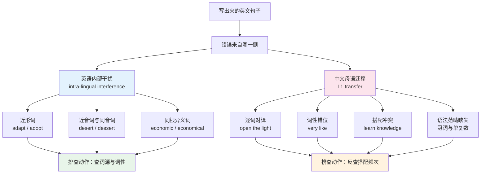
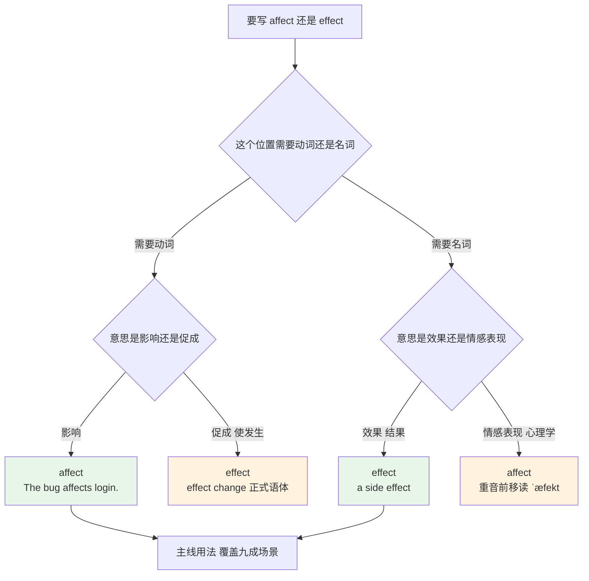
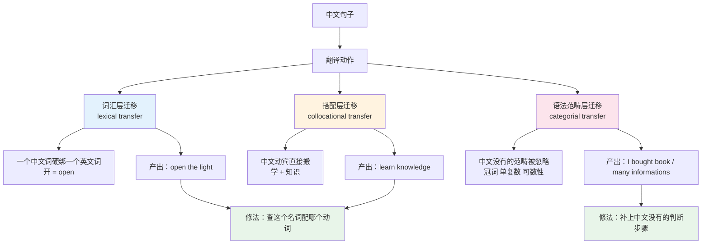
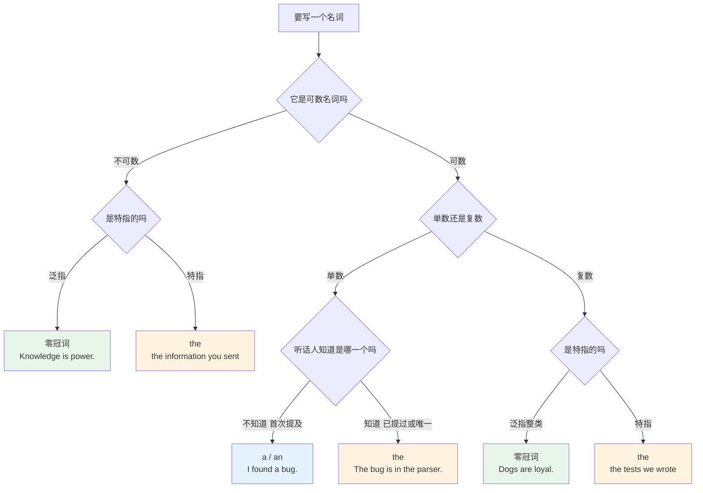
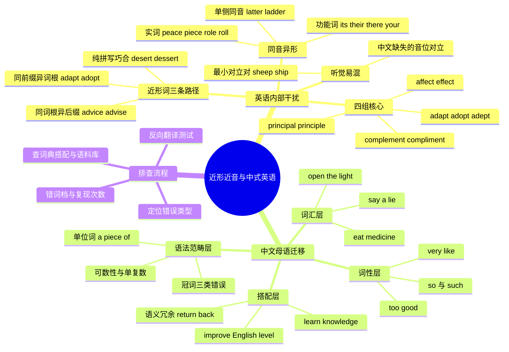

# 近形近音易混词与中式英语陷阱

> [!info] 本篇定位
>
> 第十六章的第三篇。前两篇处理的是词与词的**语义关系**——[[16.词义辨析、搭配与短语动词/01.同义词辨析方法与高频同义词组\|同义词辨析]] 讲意思相近怎么选，[[16.词义辨析、搭配与短语动词/02.反义词体系、一词多义与词义引申\|反义词与一词多义]] 讲一个词怎么长出多个义项。本篇处理的是词与词的**形式关系**：意思毫不相干，但拼写只差一两个字母，或者读音在中文耳朵里完全一样。
>
> 后半篇转向另一类错误：不是英语内部混淆，而是中文结构直接搬进英文造成的。`open the light`、`very like`、`learn knowledge`、冠词该加不加、名词该复不复，成因都在中文那边。
>
> 读完你会拿到三样东西：约 270 个易混词条的分组词表，一套判断「这两个词我为什么会搞混」的归因方法，以及一份可以贴在编辑器旁边的中式英语自查清单。

---

## 1. 本篇导读：两类干扰，一套排查动作

写英文时出错，来源只有两处：一处在英语内部，一处在中文那边。

英语内部的干扰是**形式相似**。`principal` 和 `principle` 读音完全一样，拼写只差最后三个字母；`affect` 和 `effect` 差一个元音字母；`complement` 和 `compliment` 差一个 `e` 和 `i`。它们在大脑里的存储位置挨得太近，取词时容易拿错隔壁那个。这类错误跟中文无关，母语者也会犯——`affect/effect` 和 `its/it's` 是英文写作指南里被反复拎出来提醒的两组。

中文那边的干扰是**结构照搬**。中文说「开灯」，动词是「开」，于是写出 `open the light`；中文说「我很喜欢」，程度词是「很」，于是写出 `I very like it`；中文说「学知识」，动宾都齐了，于是写出 `learn knowledge`。这三句的语法全部正确，但没有一个母语者会这么说。

上图把本篇分成左右两条线。左边这条是英语自己造成的，排查动作是查词源和词性——`adapt` 和 `adopt` 一旦知道前者来自 `apt`（合适）、后者来自 `opt`（选择），就再也不会混；`advice` 和 `advise` 一旦记住 `-ce` 结尾是名词、`-se` 结尾是动词，整组同类词都能推。右边这条是中文造成的，查词源没用，必须反查搭配：把候选组合丢进语料库看频次，或者查搭配词典看这个名词跟哪几个动词同现。

两条线的诊断顺序不同，但都要落到同一个动作上：**建立个人错词档**。第 18 节会给出具体做法。第 2 到 11 节走左边这条线，第 12 到 17 节走右边。

---

## 2. 近形词的三条形成路径

近形不是随机的。两个词长得像，背后通常是三种情况之一，判断出属于哪一种，记忆策略就不同。

| 形成路径 | 机制 | 典型词对 | 拆解办法 |
| --- | --- | --- | --- |
| 同前缀异词根 | 共用前缀，词根不同 | adapt / adopt、precede / proceed、eminent / imminent | 拆前缀后看词根，词根的义差就是全部差别 |
| 同词根异后缀 | 共用词根，后缀不同导致词性或义项分岔 | advice / advise、economic / economical、continual / continuous | 记后缀的功能，一条规则管一批词 |
| 纯拼写巧合 | 词源毫无关系，只是碰巧长得像 | desert / dessert、casual / causal、marital / martial | 词源帮不上忙，只能靠助记与刻意区分 |

第一类和第二类占绝大多数，也是最有价值的——拆开一次，同类词全部解锁。第三类数量少但杀伤力大，因为拆无可拆，只能硬记。

同词根异后缀这一路里，有一条拼写规则值得先记住：**同一个词根，`-ce` 结尾是名词，`-se` 结尾是动词。**这条规则里 `advice` / `advise`、`device` / `devise` 英美两边都照走；`licence` / `license`、`practice` / `practise` 只有英式保留区分，美式把名动两种词性分别统一写成 `license` 和 `practice`。

| 英文 | 英式音标 | 美式音标 | 词性 | 中文 | 搭配与说明 |
| --- | --- | --- | --- | --- | --- |
| **advice** | /ədˈvaɪs/ | /ədˈvaɪs/ | n. | 建议 | 不可数，`a piece of advice`；结尾 /s/ |
| **advise** | /ədˈvaɪz/ | /ədˈvaɪz/ | v. | 建议 | `advise sb to do`；结尾 /z/ |
| **device** | /dɪˈvaɪs/ | /dɪˈvaɪs/ | n. | 设备；手段 | `a mobile device`；技术文档高频 |
| **devise** | /dɪˈvaɪz/ | /dɪˈvaɪz/ | v. | 设计出；想出 | `devise a scheme` |
| **practice** | /ˈpræktɪs/ | /ˈpræktɪs/ | n./v. | 练习；惯例 | 英式名词用 `practice`、动词用 `practise`；美式两者都写 `practice` |
| **practise** | /ˈpræktɪs/ | — | v. | 练习 | 只在英式拼写里存在 |
| **licence** | /ˈlaɪsns/ | — | n. | 执照 | 英式名词拼写；美式一律 `license` |
| **license** | /ˈlaɪsns/ | /ˈlaɪsns/ | v./n. | 许可；发照 | 英式作动词、美式兼作名词 |
| **prophecy** | /ˈprɒfəsi/ | /ˈprɑːfəsi/ | n. | 预言 | 结尾 /si/ |
| **prophesy** | /ˈprɒfəsaɪ/ | /ˈprɑːfəsaɪ/ | v. | 预言 | 结尾 /saɪ/，重音不变但末音节读法不同 |

`advice` 和 `advise` 这一对读音有明显差别（/s/ 对 /z/），只要开口读一遍就不会写错；`practice` 和 `practise` 读音完全相同，只能靠词性判断，而且判断完还要看是英式还是美式拼写体系——这类英美拼写分歧的完整清单在 [[18.语域、英美差异与习语俚语/01.英式与美式词汇差异\|英式与美式词汇差异]]，本篇只收和易混直接相关的几对。

---

## 3. adapt / adopt / adept：同一个前缀分出三条路

这三个词共用拉丁前缀 `ad-`（朝向），差别全在词根上。把词根拆出来，三个词的意思自动分开。

| 英文 | 英式音标 | 美式音标 | 词性 | 中文 | 搭配与说明 |
| --- | --- | --- | --- | --- | --- |
| **adapt** | /əˈdæpt/ | /əˈdæpt/ | v. | 使适应；改编 | `ad-` + `apt`（合适）；`adapt to a new environment`、`adapt a novel for screen` |
| **adopt** | /əˈdɒpt/ | /əˈdɑːpt/ | v. | 采纳；收养 | `ad-` + `opt`（选择）；`adopt a policy`、`adopt a child` |
| **adept** | /əˈdept/ | /əˈdept/ | adj. | 熟练的 | `adept at debugging`；名词义「行家」重音前移读 /ˈædept/ |
| **apt** | /æpt/ | /æpt/ | adj. | 恰当的；易于…的 | `an apt metaphor`、`be apt to forget` |
| **opt** | /ɒpt/ | /ɑːpt/ | v. | 选择 | `opt for`、`opt out of`；与 `option` 同根 |
| **adaptation** | /ˌædæpˈteɪʃn/ | /ˌædæpˈteɪʃn/ | n. | 适应；改编本 | `a film adaptation of the book` |
| **adoption** | /əˈdɒpʃn/ | /əˈdɑːpʃn/ | n. | 采纳；收养 | `the adoption of the new standard` |
| **adaptable** | /əˈdæptəbl/ | /əˈdæptəbl/ | adj. | 适应力强的 | 说人或系统能随环境调整 |
| **adoptive** | /əˈdɒptɪv/ | /əˈdɑːptɪv/ | adj. | 收养的（指父母） | `adoptive parents` |
| **adopted** | /əˈdɒptɪd/ | /əˈdɑːptɪd/ | adj. | 被收养的（指孩子） | `an adopted child`；与 `adoptive` 方向相反 |
| **adaptive** | /əˈdæptɪv/ | /əˈdæptɪv/ | adj. | 自适应的 | 技术语境高频：`adaptive bitrate`、`adaptive layout` |

> [!tip] 拆词根的三秒判断
>
> 遇到这两个词，不要去回想「哪个是适应哪个是采纳」，回想那个短词根：
>
> - `adapt` 里藏着 **apt**（合适）→ 让某物变得合适 → 适应、改编
> - `adopt` 里藏着 **opt**（选择）→ 朝某物选过去 → 采纳、收养
>
> 这个办法的好处是可迁移：`option`、`optional`、`opt-in`、`opt-out` 全部归到 `opt` 这一族，`aptitude`（天资）、`aptly`（恰当地）归到 `apt` 那一族。

> [!example] 三个词在同一段落里
>
> - The team decided to **adopt** the new logging framework, but it took two weeks to **adapt** the existing services to it.
>   - 团队决定采纳新的日志框架，但把现有服务改造成能用它花了两周。
> - She is **adept** at reading stack traces, which makes her the fastest debugger on the team.
>   - 她读堆栈很在行，是团队里排错最快的人。
> - The system uses **adaptive** sampling: it drops the rate when traffic spikes.
>   - 这个系统用自适应采样，流量突增时自动降低采样率。

技术文档里这三个词的出现频率不低，而且 `adopt` 常出现在「采用某项技术」的语境（`early adopter` 早期采用者、`adoption rate` 采用率），`adapt` 常出现在「适配」的语境（`adapter pattern` 适配器模式、`display adapter` 显示适配器）。看到 `adapter` 就想到「适配」，看到 `adopter` 就想到「采用者」——两个名词也差一个字母，同样容易打错。

---

## 4. principal / principle：只有一个能当形容词

这一对读音完全相同（英美都是 /ˈprɪnsəpl/），拼写只差最后三个字母，但语法身份完全不同：`principal` 既是形容词又是名词，`principle` 只能是名词。

| 英文 | 英式音标 | 美式音标 | 词性 | 中文 | 搭配与说明 |
| --- | --- | --- | --- | --- | --- |
| **principal** | /ˈprɪnsəpl/ | /ˈprɪnsəpl/ | adj. | 主要的；首要的 | `the principal reason`、`principal component` |
| **principal** | /ˈprɪnsəpl/ | /ˈprɪnsəpl/ | n. | 校长；本金；主角；委托人 | 美式指中小学校长；金融指不含利息的本金；安全语境指主体 |
| **principle** | /ˈprɪnsəpl/ | /ˈprɪnsəpl/ | n. | 原则；原理 | `in principle`、`on principle`、`the principle of least privilege` |
| **principled** | /ˈprɪnsəpld/ | /ˈprɪnsəpld/ | adj. | 有原则的 | `a principled decision`；由 `principle` 派生 |
| **principally** | /ˈprɪnsəpli/ | /ˈprɪnsəpli/ | adv. | 主要地 | 等于 `mainly`，由 `principal` 派生 |

`principal` 的名词义项分布很散，值得单独展开：

| 语境 | 含义 | 例证 |
| --- | --- | --- |
| 教育 | 中小学校长（美式） | `the school principal`；英式用 `head teacher` |
| 金融 | 本金 | `repay the principal and interest`（偿还本息） |
| 演出 | 主要演员、首席 | `the principal dancer`（首席舞者） |
| 法律与安全 | 委托人、主体 | IAM 文档里的 `principal` 指被授权的主体，不是「原则」 |

云平台的权限策略里 `Principal` 是最常见的字段名之一，中文母语者第一次读到时几乎都会理解成「原则」，实际是「被授予权限的那个主体」。这是一个纯粹由近形近音造成的技术阅读障碍。

> [!tip] 词尾映射记忆法
>
> - `principle` 结尾是 **-ple**，联想 **rule**（规则）——两个词都以 `le` 结尾，只有它表示「原则」。
> - `principal` 结尾是 **-pal**，联想 **pal**（伙伴）——校长是学校里的那个「主要的人」，主角是戏里那个「主要的人」，本金是那笔「主要的钱」。

> [!warning] 三个高频错句
>
> - ❌ ~~My principle concern is latency.~~
> - ✅ My **principal** concern is latency.（形容词位置只能用 `principal`）
> - ❌ ~~He agreed in principal.~~
> - ✅ He agreed in **principle**.（固定短语，「原则上同意」）
> - ❌ ~~She refused to lie on principal.~~
> - ✅ She refused to lie on **principle**.（`on principle` 出于原则）

`in principle` 与 `on principle` 也是一对需要分清的短语：`in principle` 是「原则上、理论上」，暗示实际操作可能有出入；`on principle` 是「出于原则」，说的是行为动机。

> [!example] 两个短语的对照
>
> - The plan works **in principle**, but we have not tested it under load.
>   - 这方案原则上可行，但还没做过压测。
> - He turned down the offer **on principle**, not because of the money.
>   - 他拒绝这份 offer 是出于原则，不是因为钱。

---

## 5. affect / effect：动名分工与两个反例

英文写作里最高频的易混对，母语者也常错。主线规则一句话：**`affect` 是动词，`effect` 是名词。**

| 英文 | 英式音标 | 美式音标 | 词性 | 中文 | 搭配与说明 |
| --- | --- | --- | --- | --- | --- |
| **affect** | /əˈfekt/ | /əˈfekt/ | v. | 影响；侵袭 | `The outage affected 3000 users.`；及物，后面直接接宾语 |
| **effect** | /ɪˈfekt/ | /ɪˈfekt/ | n. | 效果；影响；结果 | `have an effect on`、`side effect`、`take effect` |
| **effect** | /ɪˈfekt/ | /ɪˈfekt/ | v. | 实现；促成 | 正式语体：`effect change`、`effect a transfer`；不是「影响」 |
| **affect** | /ˈæfekt/ | /ˈæfekt/ | n. | 情感表现 | 心理学术语，重音在前；`flat affect`（情感平淡） |
| **effective** | /ɪˈfektɪv/ | /ɪˈfektɪv/ | adj. | 有效的；生效的 | `an effective fix`、`effective from 1 May` |
| **efficient** | /ɪˈfɪʃnt/ | /ɪˈfɪʃnt/ | adj. | 高效的 | 说投入产出比，不说结果对不对 |
| **effectively** | /ɪˈfektɪvli/ | /ɪˈfektɪvli/ | adv. | 有效地；实际上 | 第二义项等于 `in effect`，容易误读 |
| **affection** | /əˈfekʃn/ | /əˈfekʃn/ | n. | 喜爱 | 不是「影响」；`show affection` |
| **effectiveness** | /ɪˈfektɪvnəs/ | /ɪˈfektɪvnəs/ | n. | 有效性 | `measure the effectiveness of` |
| **efficacy** | /ˈefɪkəsi/ | /ˈefɪkəsi/ | n. | 功效 | 医学与学术语域：`vaccine efficacy` |

这张流程图的判断顺序是先定词性再定义项。走绿色两条就是九成以上的实际用法；橙色两条是反例，出现频率低但一旦碰到就会推翻主线规则，所以必须知道它们存在。`effect change` 这个搭配在管理与政策文本里不算罕见，读到时如果按「影响变化」理解，整句会讲不通——它的意思是「促成变革」。

> [!tip] RAVEN 助记
>
> 英语母语者教这一对时常用的口诀是 **RAVEN**：
>
> - **R**emember：记住
> - **A**ffect is a **V**erb：affect 是动词
> - **E**ffect is a **N**oun：effect 是名词
>
> 中文读者可以用另一套更短的：**a 打头的是动作（action），e 打头的是结果（end result）。**

> [!warning] 五组对照句
>
> - ❌ ~~The new policy will effect our deployment schedule.~~
> - ✅ The new policy will **affect** our deployment schedule.（这里要动词「影响」）
> - ❌ ~~The change had no affect on latency.~~
> - ✅ The change had no **effect** on latency.（介词 `no` 后面要名词）
> - ❌ ~~How does this effect the cache?~~
> - ✅ How does this **affect** the cache?（疑问句里的谓语动词）
> - ❌ ~~The patch takes affect at midnight.~~
> - ✅ The patch takes **effect** at midnight.（`take effect` 固定搭配）
> - ❌ ~~We need to affect a cultural shift.~~
> - ✅ We need to **effect** a cultural shift.（这里要「促成」，用动词 `effect`）

`effective` 与 `efficient` 的分界也常被中文的「有效」「高效」拉混。`effective` 关心的是**目标达成了没有**，`efficient` 关心的是**耗费多少资源达成的**。一个跑一小时能出对结果的脚本是 effective 但不 efficient；一个跑三秒但结果是错的脚本既不 effective 也谈不上 efficient——因为效率是建立在有效之上的。

> [!example] 两个词的分工
>
> - The workaround is **effective** but not **efficient**: it fixes the bug at the cost of a full table scan.
>   - 这个临时方案有效但不高效，代价是一次全表扫描。
> - Batching requests made the pipeline three times more **efficient** without changing the output.
>   - 请求批量化让流水线效率提高了两倍，输出不变。

---

## 6. complement / compliment：一个字母换掉整条语义线

这一对读音完全相同，拼写差一个元音字母，语义毫无交集。

| 英文 | 英式音标 | 美式音标 | 词性 | 中文 | 搭配与说明 |
| --- | --- | --- | --- | --- | --- |
| **complement** | /ˈkɒmplɪmənt/ | /ˈkɑːmplɪmənt/ | n. | 补足物；补语 | 与 `complete` 同根；语法术语「补语」也是它 |
| **complement** | /ˈkɒmplɪment/ | /ˈkɑːmplɪment/ | v. | 补足；与…相配 | 动词末音节读 /ment/ 不是 /mənt/ |
| **compliment** | /ˈkɒmplɪmənt/ | /ˈkɑːmplɪmənt/ | n. | 赞美；恭维 | `pay sb a compliment`、`take it as a compliment` |
| **compliment** | /ˈkɒmplɪment/ | /ˈkɑːmplɪment/ | v. | 赞美 | `compliment sb on sth` |
| **complementary** | /ˌkɒmplɪˈmentri/ | /ˌkɑːmplɪˈmentri/ | adj. | 互补的 | `complementary colours`、`complementary skills` |
| **complimentary** | /ˌkɒmplɪˈmentri/ | /ˌkɑːmplɪˈmentri/ | adj. | 赞美的；**免费赠送的** | `a complimentary breakfast`（含在房费里的早餐） |
| **complete** | /kəmˈpliːt/ | /kəmˈpliːt/ | v./adj. | 完成；完整的 | `complement` 的同源词，是记忆锚点 |
| **supplement** | /ˈsʌplɪmənt/ | /ˈsʌplɪmənt/ | n./v. | 补充物；补充 | 与 `complement` 的差别：补充是加量，补足是配齐；动词末音节同样读 /ment/ |

> [!tip] 字母对应词根
>
> - **compl<u>e</u>ment** 的 `e` 来自 **complete**（完整）→ 补上缺口，把东西配齐。
> - **compl<u>i</u>ment** 的 `i` 来自 **I like it**（我喜欢）→ 说好话。
>
> 形容词形式沿用同一条线：`complementary` 是「互补的」，`complimentary` 是「赞美的」以及由此引申的「赠送的」。

`complimentary` 的「免费」义项是一个真正的实用陷阱。酒店与航班的英文说明里 `complimentary breakfast`、`complimentary Wi-Fi`、`complimentary upgrade` 全部指免费提供，跟「赞美」看不出关系——引申路径是「赠品是主人表达好意的方式」。写成 `complementary breakfast` 就变成了「与什么东西互补的早餐」，语义完全不成立。

> [!example] 四句对照
>
> - The two libraries are **complementary**: one handles parsing, the other handles rendering.
>   - 这两个库是互补的，一个负责解析，一个负责渲染。
> - She **complimented** the team on shipping ahead of schedule.
>   - 她称赞团队提前交付。
> - Breakfast is **complimentary** for guests staying two nights or more.
>   - 住满两晚的客人享受免费早餐。
> - A good error message **complements** good documentation; it does not replace it.
>   - 好的报错信息是好文档的补充，不是替代。

`complement` 的名词义还有一个技术用法值得记：数学与计算机里的「补」——`two's complement`（二进制补码）、`the complement of a set`（补集）。看到这个词组不要联想到「赞美」。

---

## 7. 词尾差一截的近形词群

后缀不同导致义项分岔的词对，数量最大，也最讲规律。抓住后缀的功能差别，可以一次解决一批。

### 7.1 -ic 与 -ical

| 英文 | 英式音标 | 美式音标 | 词性 | 中文 | 搭配与说明 |
| --- | --- | --- | --- | --- | --- |
| **economic** | /ˌiːkəˈnɒmɪk/ | /ˌekəˈnɑːmɪk/ | adj. | 经济的（关于经济） | `economic growth`、`economic policy` |
| **economical** | /ˌiːkəˈnɒmɪkl/ | /ˌekəˈnɑːmɪkl/ | adj. | 节约的；划算的 | `an economical car`、`economical with words` |
| **historic** | /hɪˈstɒrɪk/ | /hɪˈstɔːrɪk/ | adj. | 有历史意义的 | `a historic decision`（重大到会被写进历史） |
| **historical** | /hɪˈstɒrɪkl/ | /hɪˈstɔːrɪkl/ | adj. | 历史的（关于历史） | `historical data`、`a historical novel` |
| **classic** | /ˈklæsɪk/ | /ˈklæsɪk/ | adj./n. | 典型的；经典之作 | `a classic mistake`、`a classic of the genre` |
| **classical** | /ˈklæsɪkl/ | /ˈklæsɪkl/ | adj. | 古典的 | `classical music`、`classical mechanics` |
| **electric** | /ɪˈlektrɪk/ | /ɪˈlektrɪk/ | adj. | 用电的；带电的 | `an electric car`、`an electric shock` |
| **electrical** | /ɪˈlektrɪkl/ | /ɪˈlektrɪkl/ | adj. | 与电有关的 | `electrical engineering`、`an electrical fault` |
| **politic** | /ˈpɒlətɪk/ | /ˈpɑːlətɪk/ | adj. | 明智审慎的 | 罕见；`it would not be politic to refuse` |
| **political** | /pəˈlɪtɪkl/ | /pəˈlɪtɪkl/ | adj. | 政治的 | 日常用的是这个 |

规律：`-ical` 通常是中性的「与某领域相关的」，`-ic` 常带有「具备该领域典型特质的」这一层评价色彩。`historical data` 只是「历史上的数据」，`a historic day` 是「值得载入史册的一天」。

### 7.2 -able、-ible、-ive 与其余形容词后缀

| 英文 | 英式音标 | 美式音标 | 词性 | 中文 | 搭配与说明 |
| --- | --- | --- | --- | --- | --- |
| **imaginary** | /ɪˈmædʒɪnəri/ | /ɪˈmædʒɪneri/ | adj. | 虚构的；想象中的 | `an imaginary friend`、`imaginary number`（虚数） |
| **imaginative** | /ɪˈmædʒɪnətɪv/ | /ɪˈmædʒɪnətɪv/ | adj. | 富有想象力的 | 说人或作品有创意 |
| **imaginable** | /ɪˈmædʒɪnəbl/ | /ɪˈmædʒɪnəbl/ | adj. | 可想象的 | `every problem imaginable`；常后置 |
| **considerable** | /kənˈsɪdərəbl/ | /kənˈsɪdərəbl/ | adj. | 相当大的 | `considerable delay`；说量 |
| **considerate** | /kənˈsɪdərət/ | /kənˈsɪdərət/ | adj. | 体贴的 | `considerate of others`；说人 |
| **sensible** | /ˈsensəbl/ | /ˈsensəbl/ | adj. | 明智的；合理的 | `a sensible default`（合理的默认值） |
| **sensitive** | /ˈsensətɪv/ | /ˈsensətɪv/ | adj. | 敏感的 | `sensitive data`、`sensitive to light` |
| **respectable** | /rɪˈspektəbl/ | /rɪˈspektəbl/ | adj. | 体面的；可观的 | `a respectable score` |
| **respectful** | /rɪˈspektfl/ | /rɪˈspektfl/ | adj. | 恭敬的 | `respectful of other people's time` |
| **respective** | /rɪˈspektɪv/ | /rɪˈspektɪv/ | adj. | 各自的 | `their respective roles`；不表示尊敬 |
| **comprehensive** | /ˌkɒmprɪˈhensɪv/ | /ˌkɑːmprɪˈhensɪv/ | adj. | 全面的 | `a comprehensive test suite` |
| **comprehensible** | /ˌkɒmprɪˈhensəbl/ | /ˌkɑːmprɪˈhensəbl/ | adj. | 可理解的 | `barely comprehensible logs` |
| **credible** | /ˈkredəbl/ | /ˈkredəbl/ | adj. | 可信的 | 说信息或来源可信 |
| **credulous** | /ˈkredjələs/ | /ˈkredʒələs/ | adj. | 轻信的 | 说人容易上当，贬义 |
| **creditable** | /ˈkredɪtəbl/ | /ˈkredɪtəbl/ | adj. | 值得称赞的 | `a creditable performance` |
| **industrial** | /ɪnˈdʌstriəl/ | /ɪnˈdʌstriəl/ | adj. | 工业的 | `industrial design`、`industrial waste` |
| **industrious** | /ɪnˈdʌstriəs/ | /ɪnˈdʌstriəs/ | adj. | 勤奋的 | 说人，与工业无关 |
| **ingenious** | /ɪnˈdʒiːniəs/ | /ɪnˈdʒiːniəs/ | adj. | 巧妙的 | `an ingenious workaround` |
| **ingenuous** | /ɪnˈdʒenjuəs/ | /ɪnˈdʒenjuəs/ | adj. | 天真坦率的 | 少见，其反义 `disingenuous`（虚伪的）更常用 |
| **eligible** | /ˈelɪdʒəbl/ | /ˈelɪdʒəbl/ | adj. | 有资格的 | `eligible for a refund` |
| **illegible** | /ɪˈledʒəbl/ | /ɪˈledʒəbl/ | adj. | 字迹难辨的 | `illegible handwriting` |

`respectable / respectful / respective` 这一组三个词共用 `respect` 词根却指向三个方向，是词表里最容易串位的一组。`respective` 完全没有「尊敬」义，它只表示「各自的」，且几乎总是修饰复数名词：`They returned to their respective offices.`

### 7.3 -al、-ary、-ate 与其余词尾分岔

| 英文 | 英式音标 | 美式音标 | 词性 | 中文 | 搭配与说明 |
| --- | --- | --- | --- | --- | --- |
| **continual** | /kənˈtɪnjuəl/ | /kənˈtɪnjuəl/ | adj. | 反复不断的（有间断） | `continual interruptions`；常带负面色彩 |
| **continuous** | /kənˈtɪnjuəs/ | /kənˈtɪnjuəs/ | adj. | 连续不断的（无间断） | `continuous integration`、`a continuous line` |
| **momentary** | /ˈməʊməntri/ | /ˈmoʊmənteri/ | adj. | 短暂的 | `a momentary glitch` |
| **momentous** | /məʊˈmentəs/ | /moʊˈmentəs/ | adj. | 重大的 | `a momentous decision`；重音在中间 |
| **literal** | /ˈlɪtərəl/ | /ˈlɪtərəl/ | adj. | 字面的 | `a literal translation`；编程里的「字面量」也是它 |
| **literary** | /ˈlɪtərəri/ | /ˈlɪtəreri/ | adj. | 文学的 | `literary criticism` |
| **literate** | /ˈlɪtərət/ | /ˈlɪtərət/ | adj. | 识字的；有素养的 | `computer literate`（会用电脑） |
| **moral** | /ˈmɒrəl/ | /ˈmɔːrəl/ | adj./n. | 道德的；寓意 | `a moral obligation`、`the moral of the story` |
| **morale** | /məˈrɑːl/ | /məˈræl/ | n. | 士气 | 重音在后；`team morale is low` |
| **personal** | /ˈpɜːsənl/ | /ˈpɜːrsənl/ | adj. | 个人的 | `personal data`、`a personal opinion` |
| **personnel** | /ˌpɜːsəˈnel/ | /ˌpɜːrsəˈnel/ | n. | 人员；人事部门 | 重音在末；集体名词，作复数 |
| **human** | /ˈhjuːmən/ | /ˈhjuːmən/ | adj./n. | 人类的；人 | `human error`、`human resources` |
| **humane** | /hjuːˈmeɪn/ | /hjuːˈmeɪn/ | adj. | 人道的；仁慈的 | 重音在后；`a humane solution` |
| **stationary** | /ˈsteɪʃənri/ | /ˈsteɪʃəneri/ | adj. | 静止的 | `a stationary object`；助记：`a` 对应 `stand`（站着不动） |
| **stationery** | /ˈsteɪʃənri/ | /ˈsteɪʃəneri/ | n. | 文具 | 助记：`e` 对应 `envelope`（信封）；两词其实都源自 `station`，词源帮不上忙 |
| **alternate** | /ɔːlˈtɜːnət/ | /ˈɔːltərnət/ | adj. | 交替的；备用的（美式） | 英美重音位置不同；美式常等于 `alternative` |
| **alternative** | /ɔːlˈtɜːnətɪv/ | /ɔːlˈtɜːrnətɪv/ | adj./n. | 可替代的；替代方案 | `an alternative approach` |
| **dependent** | /dɪˈpendənt/ | /dɪˈpendənt/ | adj. | 依赖的 | `dependent on`；英美通用的形容词拼写 |
| **dependant** | /dɪˈpendənt/ | — | n. | 受抚养者 | 英式名词拼写；美式名词也写 `dependent` |

`continual` 与 `continuous` 的差别值得多说一句：前者是一次次重复发生，中间有停顿；后者是一条线不断。`continuous integration` 用的是后者——流水线不停；`continual complaints` 用的是前者——投诉一次接一次但不是连成一片。中文的「不断」两个都能翻，这正是它们混淆的根源。

`stationary` 与 `stationery` 的助记是英文母语者也在用的：**a** 对应 **st<u>a</u>nd**（站着不动），**e** 对应 **<u>e</u>nvelope**（信封，属于文具）。这只是助记，不是词源——两个词都来自拉丁语的 `statio`（固定的位置），`stationery` 指的是中世纪大学城里固定摊位（相对于流动小贩）售卖的纸笔，拆词源分不开它们，所以这一对只能靠助记硬记。

---

## 8. 词干差一截的近形词群

前一节的词对共用词干、差在后缀；这一节的词对差在词干本身，规律性弱，需要逐对处理。

| 英文 | 英式音标 | 美式音标 | 词性 | 中文 | 搭配与说明 |
| --- | --- | --- | --- | --- | --- |
| **accept** | /əkˈsept/ | /əkˈsept/ | v. | 接受 | `accept an offer`；`ac-` 朝向 |
| **except** | /ɪkˈsept/ | /ɪkˈsept/ | prep./v. | 除…之外；把…除外 | `everyone except me`；`ex-` 向外 |
| **excerpt** | /ˈeksɜːpt/ | /ˈeksɜːrpt/ | n. | 节选 | 重音在前，与前两个词的读法差别明显 |
| **access** | /ˈækses/ | /ˈækses/ | n./v. | 访问；权限 | 名词不可数：`grant access`；无 `an access` |
| **excess** | /ɪkˈses/ | /ɪkˈses/ | n./adj. | 过量；超额的 | `in excess of`；作定语时重音前移读 /ˈekses/：`excess baggage` |
| **assure** | /əˈʃʊə(r)/ | /əˈʃʊr/ | v. | 向…保证 | `assure sb that`；宾语是人 |
| **ensure** | /ɪnˈʃʊə(r)/ | /ɪnˈʃʊr/ | v. | 确保 | `ensure that the file exists`；宾语是事 |
| **insure** | /ɪnˈʃʊə(r)/ | /ɪnˈʃʊr/ | v. | 给…投保 | `insure a car against theft` |
| **precede** | /prɪˈsiːd/ | /prɪˈsiːd/ | v. | 在…之前 | `The header precedes the body.` |
| **proceed** | /prəˈsiːd/ | /prəˈsiːd/ | v. | 继续进行 | `proceed with caution`；注意双 `e` |
| **procedure** | /prəˈsiːdʒə(r)/ | /prəˈsiːdʒər/ | n. | 步骤；程序 | 只有一个 `e`，与 `proceed` 拼写不一致 |
| **eminent** | /ˈemɪnənt/ | /ˈemɪnənt/ | adj. | 杰出的 | `an eminent scholar` |
| **imminent** | /ˈɪmɪnənt/ | /ˈɪmɪnənt/ | adj. | 迫在眉睫的 | `an imminent release` |
| **immanent** | /ˈɪmənənt/ | /ˈɪmənənt/ | adj. | 内在固有的 | 哲学术语，日常几乎不用 |
| **elicit** | /ɪˈlɪsɪt/ | /ɪˈlɪsɪt/ | v. | 引出；套出 | `elicit a response` |
| **illicit** | /ɪˈlɪsɪt/ | /ɪˈlɪsɪt/ | adj. | 非法的 | 与 `elicit` 完全同音 |
| **discreet** | /dɪˈskriːt/ | /dɪˈskriːt/ | adj. | 谨慎的；不张扬的 | 两个 `e` 挨着，像两个人凑近说悄悄话 |
| **discrete** | /dɪˈskriːt/ | /dɪˈskriːt/ | adj. | 离散的；分立的 | 两个 `e` 被 `t` 隔开，正好是「分开」 |
| **conscious** | /ˈkɒnʃəs/ | /ˈkɑːnʃəs/ | adj. | 有意识的 | `be conscious of` |
| **conscience** | /ˈkɒnʃəns/ | /ˈkɑːnʃəns/ | n. | 良心 | `a guilty conscience` |
| **conscientious** | /ˌkɒnʃiˈenʃəs/ | /ˌkɑːnʃiˈenʃəs/ | adj. | 认真尽责的 | `a conscientious reviewer` |
| **lose** | /luːz/ | /luːz/ | v. | 丢失；输 | 一个 `o`，读 /z/ |
| **loose** | /luːs/ | /luːs/ | adj. | 松的 | 两个 `o`，读 /s/ |
| **quiet** | /ˈkwaɪət/ | /ˈkwaɪət/ | adj. | 安静的 | 两个音节 |
| **quite** | /kwaɪt/ | /kwaɪt/ | adv. | 相当；完全 | 一个音节 |
| **quit** | /kwɪt/ | /kwɪt/ | v. | 退出；辞职 | 短元音 |
| **through** | /θruː/ | /θruː/ | prep. | 穿过；通过 | 无 gh 音 |
| **thorough** | /ˈθʌrə/ | /ˈθɜːroʊ/ | adj. | 彻底的 | 两个音节，重音在前 |
| **though** | /ðəʊ/ | /ðoʊ/ | conj. | 虽然 | 起首是浊音 /ð/ |
| **thought** | /θɔːt/ | /θɔːt/ | n./v. | 想法；think 过去式 | 尾音 /t/ |
| **tough** | /tʌf/ | /tʌf/ | adj. | 艰难的；坚韧的 | gh 读 /f/ |
| **contract** | /ˈkɒntrækt/ | /ˈkɑːntrækt/ | n. | 合同 | 名词重音在前 |
| **contract** | /kənˈtrækt/ | /kənˈtrækt/ | v. | 收缩；订约 | 动词重音在后 |
| **contact** | /ˈkɒntækt/ | /ˈkɑːntækt/ | n./v. | 联系；接触 | 少一个 `r`，动词及物不加介词 |
| **expand** | /ɪkˈspænd/ | /ɪkˈspænd/ | v. | 扩展 | `expand the array` |
| **expend** | /ɪkˈspend/ | /ɪkˈspend/ | v. | 花费；耗费 | 正式语体，日常用 `spend` |
| **later** | /ˈleɪtə(r)/ | /ˈleɪtər/ | adv. | 之后 | 首音节是双元音 /eɪ/ |
| **latter** | /ˈlætə(r)/ | /ˈlætər/ | adj. | 后者的 | 短元音 /æ/，与 `former` 配对 |
| **marital** | /ˈmærɪtl/ | /ˈmærɪtl/ | adj. | 婚姻的 | `marital status`（表格里的「婚姻状况」） |
| **martial** | /ˈmɑːʃl/ | /ˈmɑːrʃl/ | adj. | 军事的；武术的 | `martial arts`、`martial law` |
| **casual** | /ˈkæʒuəl/ | /ˈkæʒuəl/ | adj. | 随意的；临时的 | `casual dress`、`a casual glance` |
| **causal** | /ˈkɔːzl/ | /ˈkɔːzl/ | adj. | 因果的 | `a causal relationship`；与 `cause` 同根 |
| **vocation** | /vəʊˈkeɪʃn/ | /voʊˈkeɪʃn/ | n. | 天职；职业 | 与 `voice`、`vocal` 同根 |
| **vacation** | /vəˈkeɪʃn/ | /veɪˈkeɪʃn/ | n. | 假期 | 与 `vacant`（空的）同根 |
| **statue** | /ˈstætʃuː/ | /ˈstætʃuː/ | n. | 雕像 | 两个音节 |
| **statute** | /ˈstætʃuːt/ | /ˈstætʃuːt/ | n. | 法规 | 尾音 /t/；`statutory`（法定的） |
| **stature** | /ˈstætʃə(r)/ | /ˈstætʃər/ | n. | 身高；声望 | `of considerable stature` |
| **status** | /ˈsteɪtəs/ | /ˈsteɪtəs/ | n. | 状态；地位 | 首音节是双元音 /eɪ/ |
| **council** | /ˈkaʊnsl/ | /ˈkaʊnsl/ | n. | 委员会 | `the city council` |
| **counsel** | /ˈkaʊnsl/ | /ˈkaʊnsl/ | n./v. | 忠告；律师；建议 | 与 `council` 完全同音 |
| **consul** | /ˈkɒnsl/ | /ˈkɑːnsl/ | n. | 领事 | 重音同样在前，元音不同 |
| **censor** | /ˈsensə(r)/ | /ˈsensər/ | v./n. | 审查删改 | `censor a report` |
| **censure** | /ˈsenʃə(r)/ | /ˈsenʃər/ | v./n. | 公开谴责 | 与 `censor` 只差 /s/ 与 /ʃ/ |
| **census** | /ˈsensəs/ | /ˈsensəs/ | n. | 人口普查 | `the 2021 census` |
| **sensor** | /ˈsensə(r)/ | /ˈsensər/ | n. | 传感器 | 与 `censor` 完全同音 |
| **allusion** | /əˈluːʒn/ | /əˈluːʒn/ | n. | 暗指；典故 | `an allusion to Homer` |
| **illusion** | /ɪˈluːʒn/ | /ɪˈluːʒn/ | n. | 错觉 | `an optical illusion` |
| **delusion** | /dɪˈluːʒn/ | /dɪˈluːʒn/ | n. | 妄想 | 比 `illusion` 严重，含病理色彩 |
| **elusion** | /ɪˈluːʒn/ | /ɪˈluːʒn/ | n. | 逃避 | 罕见；形容词 `elusive`（难以捉摸的）常用 |
| **adverse** | /ˈædvɜːs/ | /ædˈvɜːrs/ | adj. | 不利的 | `adverse effects`（药物不良反应） |
| **averse** | /əˈvɜːs/ | /əˈvɜːrs/ | adj. | 反感的 | `risk-averse`（厌恶风险的） |
| **perspective** | /pəˈspektɪv/ | /pərˈspektɪv/ | n. | 视角 | `from a user's perspective` |
| **prospective** | /prəˈspektɪv/ | /prəˈspektɪv/ | adj. | 未来的；潜在的 | `a prospective client` |
| **appraise** | /əˈpreɪz/ | /əˈpreɪz/ | v. | 评估 | `appraise the damage` |
| **apprise** | /əˈpraɪz/ | /əˈpraɪz/ | v. | 告知 | `apprise sb of sth`；正式语体 |
| **diary** | /ˈdaɪəri/ | /ˈdaɪəri/ | n. | 日记；日程本 | 英式还指记事本 |
| **dairy** | /ˈdeəri/ | /ˈderi/ | n./adj. | 乳制品 | `dairy products`；字母顺序颠倒 |
| **angel** | /ˈeɪndʒl/ | /ˈeɪndʒl/ | n. | 天使 | `angel investor`（天使投资人） |
| **angle** | /ˈæŋɡl/ | /ˈæŋɡl/ | n. | 角；角度 | `a right angle`、`from another angle` |
| **dose** | /dəʊs/ | /doʊs/ | n. | 剂量 | 尾音 /s/ |
| **doze** | /dəʊz/ | /doʊz/ | v. | 打瞌睡 | 尾音 /z/；`doze off` |
| **petrol** | /ˈpetrəl/ | — | n. | 汽油（英式） | 美式用 `gas` / `gasoline` |
| **patrol** | /pəˈtrəʊl/ | /pəˈtroʊl/ | v./n. | 巡逻 | 重音在后 |
| **farther** | /ˈfɑːðə(r)/ | /ˈfɑːrðər/ | adv./adj. | 更远（物理距离） | 只用于实际距离 |
| **further** | /ˈfɜːðə(r)/ | /ˈfɜːrðər/ | adv./adj./v. | 更远；进一步；促进 | 抽象「进一步」只能用它：`further discussion` |
| **confident** | /ˈkɒnfɪdənt/ | /ˈkɑːnfɪdənt/ | adj. | 自信的 | `confident in the result` |
| **confidant** | /ˌkɒnfɪˈdænt/ | /ˈkɑːnfɪdɑːnt/ | n. | 心腹密友 | 英式重音在末；美式主流读音重音在前，末音节元音也不同 |
| **complacent** | /kəmˈpleɪsnt/ | /kəmˈpleɪsnt/ | adj. | 自满的 | 贬义；`grow complacent` |
| **complaisant** | /kəmˈpleɪznt/ | /kəmˈpleɪznt/ | adj. | 殷勤顺从的 | 罕见 |

> [!warning] assure / ensure / insure 的宾语测试
>
> 这三个词最快的分法是看宾语类型：
>
> - `assure` 的宾语是**人**：`I assure you the build is green.`
> - `ensure` 的宾语是**事**（常接 that 从句）：`Ensure that the config is loaded before startup.`
> - `insure` 的宾语是**投保对象**：`The equipment is insured against fire.`
>
> - ❌ ~~This will assure the data is consistent.~~
> - ✅ This will **ensure** the data is consistent.

`farther` 与 `further` 的分界在美式英语里执行得比英式严格。英式口语中两者常混用于物理距离，但抽象义（`further research`、`further notice`、`until further notice`）任何变体都只能用 `further`，因为 `farther` 没有动词形式，也没有「更多、附加」这一层。

---

## 9. desert / dessert 与重音辨义

`desert` 是一个典型案例：同一串字母，重音落点不同就是两个词，其中一个还跟第三个词同音。

| 英文 | 英式音标 | 美式音标 | 词性 | 中文 | 搭配与说明 |
| --- | --- | --- | --- | --- | --- |
| **desert** | /ˈdezət/ | /ˈdezərt/ | n. | 沙漠 | 重音在前；`the Sahara Desert` |
| **desert** | /dɪˈzɜːt/ | /dɪˈzɜːrt/ | v. | 遗弃；擅离 | 重音在后；`desert a post`、`a deserted street` |
| **dessert** | /dɪˈzɜːt/ | /dɪˈzɜːrt/ | n. | 甜点 | 与动词 `desert` 完全同音，只多一个 `s` |
| **deserts** | /dɪˈzɜːts/ | /dɪˈzɜːrts/ | n. | 应得的报应 | 只出现在 `get one's just deserts`，重音在后 |
| **desertion** | /dɪˈzɜːʃn/ | /dɪˈzɜːrʃn/ | n. | 遗弃；开小差 | 军事与法律语域 |
| **deserted** | /dɪˈzɜːtɪd/ | /dɪˈzɜːrtɪd/ | adj. | 荒无人烟的 | `a deserted village` |
| **deserve** | /dɪˈzɜːv/ | /dɪˈzɜːrv/ | v. | 值得；应得 | 与 `desert`（报应）同源，跟沙漠无关 |

> [!tip] 双 s 的助记
>
> 英语母语者用的口诀是：**dessert has two s's because you always want a second serving.**（甜点有两个 s，因为你总想再来一份。）
>
> 另一条更机械的：`desert` 一个 s，沙漠里资源少；`dessert` 两个 s，`strawberry shortcake` 甜点丰盛。任选一条记住即可，关键是把两个 s 和「甜点」牢牢绑定。

重音辨义在英语里是一条成体系的规律，不止 `desert` 一个词。名词重音在前、动词重音在后，是一批双音节词的共同模式：

| 英文 | 名词读音 | 动词读音 | 名词义 | 动词义 |
| --- | --- | --- | --- | --- |
| **record** | /ˈrekɔːd/ | /rɪˈkɔːd/ | 记录；唱片 | 录制；记录 |
| **present** | /ˈpreznt/ | /prɪˈzent/ | 礼物 | 呈现；介绍 |
| **conduct** | /ˈkɒndʌkt/ | /kənˈdʌkt/ | 行为 | 实施；指挥 |
| **object** | /ˈɒbdʒɪkt/ | /əbˈdʒekt/ | 物体；对象 | 反对 |
| **project** | /ˈprɒdʒekt/ | /prəˈdʒekt/ | 项目 | 投射；预计 |
| **contrast** | /ˈkɒntrɑːst/ | /kənˈtrɑːst/ | 对比 | 形成对照 |
| **increase** | /ˈɪnkriːs/ | /ɪnˈkriːs/ | 增长 | 增加 |
| **permit** | /ˈpɜːmɪt/ | /pəˈmɪt/ | 许可证 | 允许 |
| **suspect** | /ˈsʌspekt/ | /səˈspekt/ | 嫌疑人 | 怀疑 |
| **content** | /ˈkɒntent/ | /kənˈtent/ | 内容 | 使满足（形容词「满足的」同动词读音） |

这张表按英式读音标注，只是提示这条规律的存在；完整的重音移位清单与读音体例在 [[01.词汇入门与学习方法/03.音标、词重音与词典读音体例\|音标、词重音与词典读音体例]]。本篇关心的是它的副作用：**重音一错，母语者听到的可能是另一个词。** 把 `I need to record this`（我要录下来）的重音读成前面，听起来就成了 `record` 名词，整句语法崩掉。

---

## 10. 同音异形词表

同音异形词（homophone）读音完全相同、拼写不同、意思无关。它们不会造成听力障碍——上下文足够区分——但会造成写作错误，而且拼写检查器抓不出来，因为两个词都是合法单词。

### 10.1 语法功能词类

这一类杀伤力最大，因为出现频率最高。

| 英文 | 英式音标 | 美式音标 | 词性 | 中文 | 搭配与说明 |
| --- | --- | --- | --- | --- | --- |
| **its** | /ɪts/ | /ɪts/ | det. | 它的 | 物主限定词，无撇号 |
| **it's** | /ɪts/ | /ɪts/ | — | it is / it has 的缩写 | 有撇号就是缩写，永远不表示所属 |
| **their** | /ðeə(r)/ | /ðer/ | det. | 他们的 | 物主 |
| **there** | /ðeə(r)/ | /ðer/ | adv. | 那里；存在句主位 | `there is`、`over there` |
| **they're** | /ðeə(r)/ | /ðer/ | — | they are 的缩写 | — |
| **your** | /jɔː(r)/ | /jɔːr/ | det. | 你的 | 物主 |
| **you're** | /jɔː(r)/ | /jɔːr/ | — | you are 的缩写 | — |
| **whose** | /huːz/ | /huːz/ | det./pron. | 谁的 | 疑问与关系词 |
| **who's** | /huːz/ | /huːz/ | — | who is / who has 的缩写 | — |
| **to** | /tuː/ | /tuː/ | prep. | 到；向 | 弱读作 /tə/ |
| **too** | /tuː/ | /tuː/ | adv. | 也；太 | 永远重读 |
| **two** | /tuː/ | /tuː/ | num. | 二 | — |
| **then** | /ðen/ | /ðen/ | adv. | 那时；然后 | 时间与顺序 |
| **than** | /ðæn/ | /ðæn/ | conj. | 比 | 弱读作 /ðən/，与 `then` 的 /ðen/ 只差一个元音，语速一快就难分 |

> [!warning] its 与 it's：唯一需要记的一条
>
> 英语里名词加 `'s` 表示所属（`the server's log`），但代词的物主形式全部不加撇号：`his`、`hers`、`ours`、`theirs`、`its`。撇号在 `it's` 里只有一个作用——标记缩写。
>
> - ❌ ~~The process crashed because of it's memory leak.~~
> - ✅ The process crashed because of **its** memory leak.
> - ❌ ~~Its not ready for production.~~
> - ✅ **It's** not ready for production.
>
> 排查动作：把这个位置读成 `it is`，读得通就写 `it's`，读不通就写 `its`。

### 10.2 实词类同音对

| 英文 | 英式音标 | 美式音标 | 词性 | 中文 | 搭配与说明 |
| --- | --- | --- | --- | --- | --- |
| **weather** | /ˈweðə(r)/ | /ˈweðər/ | n. | 天气 | — |
| **whether** | /ˈweðə(r)/ | /ˈweðər/ | conj. | 是否 | 苏格兰、爱尔兰与部分美国口音把 `wh-` 读成 /hw/，这些口音里两词可分 |
| **peace** | /piːs/ | /piːs/ | n. | 和平 | — |
| **piece** | /piːs/ | /piːs/ | n. | 一块；一件 | `a piece of advice` |
| **week** | /wiːk/ | /wiːk/ | n. | 星期 | — |
| **weak** | /wiːk/ | /wiːk/ | adj. | 弱的 | `a weak signal` |
| **right** | /raɪt/ | /raɪt/ | adj./n. | 正确的；权利；右 | — |
| **write** | /raɪt/ | /raɪt/ | v. | 写 | — |
| **rite** | /raɪt/ | /raɪt/ | n. | 仪式 | `a rite of passage` |
| **waist** | /weɪst/ | /weɪst/ | n. | 腰 | — |
| **waste** | /weɪst/ | /weɪst/ | v./n. | 浪费；废物 | — |
| **break** | /breɪk/ | /breɪk/ | v./n. | 打破；休息 | — |
| **brake** | /breɪk/ | /breɪk/ | n./v. | 刹车 | — |
| **plain** | /pleɪn/ | /pleɪn/ | adj./n. | 朴素的；平原 | `plain text`（纯文本） |
| **plane** | /pleɪn/ | /pleɪn/ | n. | 飞机；平面 | `control plane`（控制平面） |
| **steal** | /stiːl/ | /stiːl/ | v. | 偷 | — |
| **steel** | /stiːl/ | /stiːl/ | n. | 钢 | — |
| **board** | /bɔːd/ | /bɔːrd/ | n./v. | 板；董事会；登机 | — |
| **bored** | /bɔːd/ | /bɔːrd/ | adj. | 无聊的 | `bored with` |
| **coarse** | /kɔːs/ | /kɔːrs/ | adj. | 粗糙的 | `coarse-grained`（粗粒度的） |
| **course** | /kɔːs/ | /kɔːrs/ | n. | 课程；路线 | `of course` |
| **fair** | /feə(r)/ | /fer/ | adj./n. | 公平的；集市 | — |
| **fare** | /feə(r)/ | /fer/ | n. | 车费 | — |
| **heal** | /hiːl/ | /hiːl/ | v. | 治愈 | — |
| **heel** | /hiːl/ | /hiːl/ | n. | 脚跟 | — |
| **mail** | /meɪl/ | /meɪl/ | n./v. | 邮件 | — |
| **male** | /meɪl/ | /meɪl/ | adj./n. | 男性的 | — |
| **none** | /nʌn/ | /nʌn/ | pron. | 没有一个 | — |
| **nun** | /nʌn/ | /nʌn/ | n. | 修女 | — |
| **rain** | /reɪn/ | /reɪn/ | n./v. | 雨 | — |
| **reign** | /reɪn/ | /reɪn/ | n./v. | 统治 | — |
| **rein** | /reɪn/ | /reɪn/ | n. | 缰绳 | `rein in`（勒住、控制） |
| **role** | /rəʊl/ | /roʊl/ | n. | 角色 | `role-based access control` |
| **roll** | /rəʊl/ | /roʊl/ | v./n. | 滚动；名册 | `roll back`（回滚） |
| **scene** | /siːn/ | /siːn/ | n. | 场景 | — |
| **seen** | /siːn/ | /siːn/ | v. | see 的过去分词 | — |
| **sole** | /səʊl/ | /soʊl/ | adj./n. | 唯一的；鞋底 | `the sole owner` |
| **soul** | /səʊl/ | /soʊl/ | n. | 灵魂 | — |
| **stair** | /steə(r)/ | /ster/ | n. | 楼梯 | — |
| **stare** | /steə(r)/ | /ster/ | v. | 凝视 | — |
| **threw** | /θruː/ | /θruː/ | v. | throw 的过去式 | — |
| **through** | /θruː/ | /θruː/ | prep. | 穿过 | — |
| **vain** | /veɪn/ | /veɪn/ | adj. | 徒劳的；虚荣的 | `in vain` |
| **vein** | /veɪn/ | /veɪn/ | n. | 静脉；纹理 | `in the same vein`（同样风格） |
| **vane** | /veɪn/ | /veɪn/ | n. | 风向标；叶片 | `weather vane` |
| **wait** | /weɪt/ | /weɪt/ | v. | 等 | — |
| **weight** | /weɪt/ | /weɪt/ | n. | 重量；权重 | 机器学习里的「权重」 |
| **cite** | /saɪt/ | /saɪt/ | v. | 引用 | `cite a source` |
| **site** | /saɪt/ | /saɪt/ | n. | 场地；网站 | — |
| **sight** | /saɪt/ | /saɪt/ | n. | 视力；景象 | — |
| **cereal** | /ˈsɪəriəl/ | /ˈsɪriəl/ | n. | 谷物早餐 | — |
| **serial** | /ˈsɪəriəl/ | /ˈsɪriəl/ | adj./n. | 串行的；连续剧 | `serial port`、`serialization` |
| **bare** | /beə(r)/ | /ber/ | adj. | 光秃的；仅有的 | `bare metal`（裸机） |
| **bear** | /beə(r)/ | /ber/ | v./n. | 承受；熊 | `bear in mind` |
| **flour** | /ˈflaʊə(r)/ | /ˈflaʊər/ | n. | 面粉 | — |
| **flower** | /ˈflaʊə(r)/ | /ˈflaʊər/ | n. | 花 | — |
| **allowed** | /əˈlaʊd/ | /əˈlaʊd/ | v. | allow 的过去式 | — |
| **aloud** | /əˈlaʊd/ | /əˈlaʊd/ | adv. | 出声地 | `read aloud` |

### 10.3 只在一种口音里同音的词对

同音关系不是绝对的，它随口音变化。这一类词在英式里同音、在美式里不同音，或反过来，读原版音频与写作时都会踩到。

| 词对 | 英式（RP） | 美式（GenAm） | 差别来源 |
| --- | --- | --- | --- |
| caught / court | 都读 /kɔːt/，同音 | /kɔːt/ 对 /kɔːrt/，不同音 | 英式非儿化，词中的 r 不发音 |
| father / farther | 都读 /ˈfɑːðə/，同音 | /ˈfɑːðər/ 对 /ˈfɑːrðər/，不同音 | 同上 |
| formally / formerly | 都读 /ˈfɔːməli/，同音 | /ˈfɔːrməli/ 对 /ˈfɔːrmərli/，不同音 | 同上 |
| dew / do | /djuː/ 对 /duː/，不同音 | 都读 /duː/，同音 | 美式在 d、t、n 后省掉 /j/ |
| saw / soar / sore | 三个都读 /sɔː/，同音 | /sɔː/ 对 /sɔːr/ 对 /sɔːr/ | 英式非儿化 |
| latter / ladder | /ˈlætə/ 对 /ˈlædə/，不同音 | 都读 /ˈlædər/，同音 | 美式浊闪音化 |
| metal / medal | /ˈmetl/ 对 /ˈmedl/，不同音 | 都读 /ˈmedl/，同音 | 同上 |
| writer / rider | /ˈraɪtə/ 对 /ˈraɪdə/，不同音 | 多数口音读 /ˈraɪdər/，同音 | 同上，但有例外，见表下说明 |
| atom / Adam | /ˈætəm/ 对 /ˈædəm/，不同音 | 都读 /ˈædəm/，同音 | 同上 |

英式的非儿化（non-rhotic）让元音后面、后头又不紧跟元音的那个 `r` 一律不发音，于是 `court` 和 `caught` 合并；美式的浊闪音化（flapping）让两个元音之间的 `t` 读成近似 /d/ 的音，于是 `latter` 和 `ladder` 合并；美式还在 `d`、`t`、`n` 后面丢掉 /j/（yod-dropping），`dew` 读成和 `do` 一样的 /duː/，`new` 读 /nuː/ 而不是 /njuː/。

浊闪音化这一条有一个常被漏掉的例外：加拿大与相当一部分美国说话人在清辅音前把 /aɪ/ 读得更紧更高（这个现象叫 Canadian raising），`writer` 的元音和 `rider` 的并不一样，即使中间的 `t` 已经闪音化，这两个词在他们口中仍然可分；`latter` 和 `ladder`、`metal` 和 `medal` 没有这层元音差别，合并是彻底的。这三条规则各制造了一批只在单侧成立的同音对。听英美不同来源的音频时，判断依据不能只靠「听起来一样」。

---

## 11. 中文母语者听不出的最小对立对

前一节的同音词是英语内部本来就同音；这一节的词对在英语里读音不同，但中文的音位系统里没有对应的区分，所以中文耳朵听不出差别，跟着也读不出差别。听不出就记不牢，记不牢就写错——这是听觉层面的易混。

| 对立音位 | 中文缺失的区分 | 最小对立对 | 说明 |
| --- | --- | --- | --- |
| /iː/ 对 /ɪ/ | 只有一个「衣」 | sheep / ship、leave / live、seat / sit、feel / fill、reach / rich、beat / bit、green / grin | 差别不只是长短，/ɪ/ 的舌位更靠后偏松 |
| /æ/ 对 /e/ | 只有一个「诶」 | bad / bed、man / men、sat / set、had / head、land / lend | /æ/ 开口更大，接近「啊」与「诶」之间 |
| /ʌ/ 对 /ɑː/ | 都听成「啊」 | cut / cart（英式）、hut / heart、bun / barn | 英式差别明显，美式靠儿化区分 |
| /θ/ 对 /s/ | 无齿间音 | think / sink、thick / sick、path / pass、mouth / mouse | 舌尖必须伸到齿间 |
| /ð/ 对 /z/ | 无浊齿间音 | breathe / breeze、then / Zen | 同上，加声带振动 |
| /v/ 对 /w/ | 无唇齿浊擦音 | vest / west、vine / wine、veil / whale | /v/ 上齿咬下唇 |
| /n/ 对 /l/ | 部分方言不分 | night / light、no / low、knee / Lee | 西南官话与部分南方方言 n、l 不分，这些地区母语者高发 |
| /r/ 对 /l/ | 无英语式 /r/ | right / light、correct / collect、pray / play、road / load、fry / fly | 英语 /r/ 舌尖不接触上颚 |
| /n/ 对 /ŋ/ | 词尾区分弱 | sin / sing、thin / thing、ban / bang、win / wing | 中文有区分但英语词尾更需清晰 |
| /s/ 对 /ʃ/ | 与「西」混 | see / she、sue / shoe、sew / show | — |
| /tʃ/ 对 /dʒ/ | 清浊对立 | cheap / jeep、chin / gin、rich / ridge | 中文靠送气区分，英语靠清浊 |
| /əʊ/ 对 /ɔː/ | 都听成「奥」 | coat / caught、boat / bought、low / law、so / saw | /əʊ/ 是双元音，嘴形要滑动 |
| /uː/ 对 /ʊ/ | 只有一个「乌」 | pool / pull、fool / full、Luke / look | — |

> [!tip] 用最小对立对反查自己的读音
>
> 拿这张表里任意一行，录下自己读两个词的音频，隔一天再听——如果你分不出自己读的是哪个，说明这个对立在你的发音里根本不存在。
>
> 这件事对词汇的直接影响是：**分不出音的词对，在心理词典里会挤成一个条目。** 很多人写作时把 `live` 写成 `leave`，根源不在拼写，在于两个词在听觉记忆里就是同一个。修发音比修拼写更根本。
>
> 具体的拼读与音标训练路径见 [[01.词汇入门与学习方法/02.自然拼读：拼写与发音对应规则\|自然拼读]]。

---

## 12. 中式英语的三层迁移

从这一节起转向另一侧的干扰源。中式英语不是「英语学得不好」的笼统标签，它有明确的层次，每一层的成因和修法都不同。

上图分出的三层，难度是递增的。词汇层最好修——知道 `开灯` 是 `turn on the light` 就永久解决一个点；搭配层要靠查证与积累，量大但每条都是死的；语法范畴层最难，因为中文里根本没有这套判断，需要在写每一个名词时额外走一步流程，而这一步在母语里是不存在的，靠意志力维持不住，只能靠反复练到自动化。

第 13 节处理词汇层，第 14、15 节处理搭配层，第 16、17 节处理语法范畴层。

需要说明边界：本篇只处理**词的选择**，不处理句子结构。`Because... so...`、`Although... but...` 这类连词重复属于语法问题，归 `02.英语基础语法`；「辛苦了」「加油」这类中文特有的语用表达怎么说，归 `04.英语场景`。

---

## 13. 逐词对译：open the light 这一类

中文里一个动词往往能带一大批不同类型的宾语，「开」可以开灯、开门、开车、开会、开药、开公司、开支票。英语没有这样的万能动词，每一类宾语配一个不同的动词。把中文的「开」固化成 `open`，除了开门开窗这一类，其余场合几乎全错。

### 13.1 「开」字对应的一批不同动词

| 中文 | 正确英文 | 常见错误 | 说明 |
| --- | --- | --- | --- |
| 开灯 / 开电视 | turn on / switch on the light | ✗ open the light | `open` 指「打开一个封闭空间」，电器用 `turn on` |
| 关灯 | turn off / switch off | ✗ close the light | 同上 |
| 开门 / 开窗 / 开箱 | open the door / window / box | — | 这几个才是真的 `open` |
| 开车 | drive | ✗ open a car | — |
| 开会 | have / hold a meeting | ✗ open a meeting | `open the meeting` 指「宣布会议开始」，义项不同 |
| 开药 | prescribe medicine | ✗ open medicine | — |
| 开公司 | start / set up a company | ✗ open a company | 开店可以 `open a shop`，开公司不行 |
| 开支票 | write / make out a cheque | ✗ open a cheque | — |
| 开水 | boiled water | ✗ open water | `open water` 是「开阔水域」，游泳项目术语 |
| 开发票 | issue an invoice | ✗ open an invoice | — |

### 13.2 高频动宾对译表

| 中文 | 正确英文 | 常见错误 | 说明 |
| --- | --- | --- | --- |
| 吃药 | take medicine | ✗ eat medicine | 药是「服用」不是「吃」 |
| 喝汤 | have soup / eat soup | ✗ drink soup | 西餐的汤用勺舀，默认动词是 `eat` 或 `have`；端起杯子喝的清汤才说 `drink` |
| 看书 | read a book | ✗ see a book | `see` 是被动的「看见」 |
| 看电影 | watch a film / see a film | — | 家里看用 `watch`，去影院用 `see` 都成立 |
| 看医生 | see a doctor | — | 这个反而用 `see` |
| 看报纸 | read the paper | ✗ see the newspaper | — |
| 打电话 | make a phone call / call sb | ✗ hit a phone | — |
| 接电话 | answer the phone | ✗ receive the phone | `pick up` 也可以 |
| 打伞 | hold an umbrella / put up an umbrella | ✗ hit an umbrella | — |
| 打篮球 | play basketball | — | 球类运动用 `play` |
| 打车 | take a taxi / get a cab | ✗ hit a taxi | — |
| 打字 | type | ✗ hit words | — |
| 打折 | give a discount / be 30% off | ✗ hit a discount | 折扣算法中英相反：八折是 20% off |
| 做作业 | do homework | ✗ make homework | `do` 对活动，`make` 对成品 |
| 做饭 | cook / make dinner | ✗ do food | — |
| 做梦 | have a dream | ✗ do a dream | — |
| 做决定 | make a decision | ✗ do a decision | 详见 [[13.抽象概念、评价与高频动词/01.高频万能动词义项地图 get take make do\|get take make do 义项地图]] |
| 提意见 | make a suggestion / give feedback | ✗ give opinions | 中文「提意见」常含批评义，英文用 `give feedback` 更中性 |
| 上班 | go to work | ✗ go up work | — |
| 上网 | go online / get online | ✗ go up net | — |
| 上大学 | go to college | ✗ go up university | — |
| 上菜 | serve the dishes | ✗ up the food | — |
| 洗照片 | develop / print photos | ✗ wash photos | 胶片时代是 `develop`，数码是 `print` |
| 洗牌 | shuffle the cards | ✗ wash cards | — |
| 穿衣服 | put on clothes（动作）/ wear（状态） | ✗ dress clothes | `dress` 及物时宾语是人 |
| 戴帽子 | put on / wear a hat | ✗ take a hat | — |
| 抽烟 | smoke | ✗ pump smoke | — |
| 交朋友 | make friends | ✗ hand in friends | — |
| 养宠物 | keep / have a pet | ✗ raise a pet | `raise` 指从小养大（`raise a puppy`）或饲养牲畜，泛指「家里养着」用 `keep` / `have` |
| 养成习惯 | develop / form a habit | ✗ raise a habit | — |
| 找工作 | look for a job | ✗ find a job（找的过程） | `find a job` 是「找到了」，结果义 |
| 花时间 | spend time | ✗ use time on | — |
| 花钱 | spend money | ✗ cost money（主语不同） | `cost` 的主语是物：`It cost me 50 dollars.` |
| 排队 | queue（英式）/ stand in line（美式） | ✗ row the line | — |
| 请假 | take leave / ask for a day off | ✗ ask holiday | — |
| 出差 | go on a business trip | ✗ go out work | — |
| 加班 | work overtime / work late | ✗ add work | — |
| 涨价 | raise the price / the price goes up | ✗ the price is expensive | `expensive` 修饰商品不修饰价格 |
| 人多 | There are a lot of people. / It's crowded. | ✗ The people are many. | 中文的「多」能直接作谓语；`many` 单独作表语只见于书面文语（`His friends are many.`），日常换 `a lot of` 或 `crowded` |
| 交通拥挤 | heavy traffic | ✗ crowded traffic | 搭配详见 [[17.固定搭配/04.形容词+名词搭配：强度、规模与名词偏好\|形容词加名词搭配]] |

> [!warning] 价格贵不贵的三种说法
>
> 中文「这个价格很贵」的「贵」修饰的是「价格」，英文里 `expensive` 只能修饰商品，不能修饰 `price`。
>
> - ❌ ~~The price is expensive.~~
> - ❌ ~~an expensive price~~
> - ✅ The price is **high**.（价格高）
> - ✅ The item is **expensive**.（东西贵）
> - ✅ a **steep** price（要价过高，含不满）
>
> 同一条规则适用于 `cheap`：✗ `a cheap price` → ✅ `a low price` 或 `The item is cheap.`

---

## 14. very like：程度词的词性错位

中文的「很」是万能程度词，能修饰形容词（很好），也能修饰动词（很喜欢、很想、很同意）。英文的 `very` 只能修饰形容词和副词，绝不能直接修饰动词。这一条差异造出了大量高频错句。

| 中文 | 正确英文 | 常见错误 | 修法 |
| --- | --- | --- | --- |
| 我很喜欢它 | I like it very much. / I really like it. | ✗ I very like it. | `very much` 后置，或换 `really` |
| 我很同意 | I completely agree. / I couldn't agree more. | ✗ I very agree. | 用 `completely`、`totally`、`strongly` |
| 我很想去 | I'd really like to go. / I'm keen to go. | ✗ I very want to go. | — |
| 非常感谢 | Thank you very much. / Thanks a lot. | ✗ Very thank you. | `very much` 只能跟在整句后 |
| 我很了解他 | I know him well. / I know him quite well. | ✗ I very know him. | 用副词 `well` |
| 他很努力 | He works hard. / He works very hard. | ✗ He very works. | `very` 修饰的是副词 `hard` |
| 这个很有帮助 | This is very helpful. | — | 修饰形容词才对 |
| 我很累 | I'm very tired. / I'm exhausted. | — | 同上 |
| 我很饿 | I'm starving. / I'm really hungry. | — | — |

规律一句话：**`very` 后面必须是形容词或副词；要修饰动词，用 `really`、`very much`、`greatly`、`strongly` 或换一个本身就带强度的动词。**

`very` 还有第二个限制：不能修饰「极限形容词」。`perfect`、`excellent`、`terrible`、`impossible`、`dead`、`unique` 这类词本身已经在量级顶端，前面要配 `absolutely`、`completely`、`utterly` 而不是 `very`。

> [!warning] 量级配错的四组
>
> - ❌ ~~very perfect~~ → ✅ **absolutely perfect**
> - ❌ ~~very excellent~~ → ✅ **truly excellent**
> - ❌ ~~very unique~~ → ✅ **completely unique**（或直接用 `unique`）
> - ❌ ~~very impossible~~ → ✅ **utterly impossible**
>
> 完整的强度梯度与副词配对规则见 [[02.功能词与封闭词类速查/08.程度副词、频率副词与模糊限制词\|程度副词、频率副词与模糊限制词]]。

同一类词性错位还表现在 `too`、`so`、`such` 上。中文的「太」既能表示「过分」（太贵了，买不起）也能表示「非常」（太好了）；英文的 `too` 只有第一层意思，永远带负面判断。

| 中文 | 正确英文 | 常见错误 | 说明 |
| --- | --- | --- | --- |
| 太好了！ | That's great! / Excellent! | ✗ Too good! | `too` 永远带「超出合适范围」的判断，单说 `Too good!` 母语者听不出是在夸人 |
| 太贵了买不起 | It's too expensive. | — | 这里的 `too` 才对 |
| 这么大的问题 | such a big problem | ✗ so a big problem | `so` 后面接形容词，`such` 后面接名词短语 |
| 他跑得这么快 | He runs so fast. | ✗ He runs such fast. | — |

> [!example] too 的负面色彩
>
> - The proposal is **too** detailed for a first review.
>   - 这份提案对首轮评审来说太细了。（细过头了，是缺点）
> - The proposal is **very** detailed.
>   - 这份提案非常详细。（是优点）
>
> 同一个「太详细」，`too` 和 `very` 表达的是完全相反的评价。

---

## 15. learn knowledge：搭配冲突与语义冗余

`learn knowledge` 语法上无懈可击：及物动词加名词宾语。它的问题在于英语的 `learn` 和 `knowledge` 不搭配——`learn` 的宾语是**具体学的内容**（`learn Spanish`、`learn how to swim`、`learn the ropes`），而 `knowledge` 是这些内容的抽象总称，配的动词是 `acquire`、`gain`、`build`。中文的「学知识」之所以成立，是因为中文对动宾的语义匹配要求宽松得多。

| 中文 | 正确英文 | 常见错误 | 说明 |
| --- | --- | --- | --- |
| 学知识 | acquire / gain knowledge | ✗ learn knowledge | 也可以直接说 `learn things` |
| 学英语 | learn English | — | 具体内容用 `learn` 没问题 |
| 提高英语水平 | improve my English | ✗ improve my English level | `level` 是中文「水平」的赘译 |
| 增长见识 | broaden one's horizons | ✗ grow knowledge | 固定搭配，`horizons` 必须复数 |
| 掌握技能 | master a skill / acquire a skill | ✗ grasp a skill | `grasp` 多指理解概念 |
| 打好基础 | build a solid foundation | ✗ make good basic | — |
| 说谎 | tell a lie | ✗ say a lie | `say` 后接直接引语或话语内容 |
| 讲故事 | tell a story | ✗ say a story | — |
| 说英语 | speak English | ✗ say English | `speak` 配语言，`say` 配话 |
| 谈论某事 | discuss sth / talk about sth | ✗ discuss about sth | `discuss` 及物，不带介词 |
| 联系我 | contact me | ✗ contact with me | 同上 |
| 参加会议 | attend a meeting | ✗ attend in a meeting | 同上；动介搭配全表见 [[17.固定搭配/06.动词+介词固定搭配：depend on、result in、consist of\|动词加介词固定搭配]] |
| 影响某事 | affect sth | ✗ affect to sth | 同上 |
| 到达车站 | arrive at the station / reach the station | ✗ arrive to the station | — |
| 强调重点 | emphasize the point | ✗ emphasize on the point | — |
| 关心某人 | care about sb | ✗ care sb | 这个反而需要介词 |

### 15.1 语义冗余：中文习惯的双重表达

中文里很多表达带重复成分（「返回回来」「重复再说一遍」），翻成英文就成了赘余。母语者不会说这些词错，但会觉得句子啰嗦。

| 冗余写法 | 精简写法 | 冗余在哪 |
| --- | --- | --- |
| return back | return | `return` 本身含「回」 |
| repeat again | repeat | `repeat` 本身含「再」 |
| revert back | revert | 同上；Git 语境高频错误 |
| discuss about | discuss | `discuss` 已含「关于」 |
| mutual cooperation | cooperation | 合作必然是互相的 |
| final outcome | outcome | 结果本来就在最后 |
| end result | result | 同上 |
| past history | history | 历史必然是过去的 |
| future plans | plans | 计划必然是未来的 |
| advance planning | planning | 同上 |
| my personal opinion | my opinion | `my` 已经表明是个人的 |
| absolutely essential | essential | `essential` 已是绝对量级 |
| completely eliminate | eliminate | `eliminate` 含「完全去掉」 |
| close proximity | proximity | `proximity` 就是「接近」 |
| sum total | total | — |
| basic fundamentals | fundamentals | — |
| new innovation | innovation | — |
| unexpected surprise | surprise | — |
| free gift | gift | 中文广告里的「免费赠品」也是同样的赘余 |
| join together | join | — |
| combine together | combine | — |
| exact same | the same | 口语可接受，书面语删掉 `exact` |

> [!tip] 冗余自查的一条捷径
>
> 逐个删掉修饰词，读一遍句子——意思没变的那个词就是冗余的。
>
> `We need advance planning for the migration.` 删掉 `advance` → `We need planning for the migration.` 意思完全一样，说明 `advance` 是赘词。
>
> 这条方法对 `and so on`、`etc.` 尤其有效。中文写作习惯在列举后加「等等」，英文技术文档里如果前面已经用了 `such as` 或 `including`，句尾再加 `etc.` 就是重复：`including A, B, etc.` 应该写成 `including A and B` 或 `such as A and B`。

---

## 16. 冠词的母语迁移

中文没有冠词。这不是「中文的冠词跟英文不一样」，而是这个语法范畴在中文里根本不存在，所以写英文时不会有任何本能提示你「这里缺东西」。冠词错误因此成为中文母语者最持久的错误类型——很多人英语水平已经很高，冠词仍然一直在错。

本节只做迁移视角的处理：中文缺了哪一步判断、这一步怎么补。冠词本身的完整语法规则在 [[02.英语基础语法/02.名词与冠词/03.冠词的用法详解\|语法教程 02.名词与冠词/03.冠词的用法详解]] 里，本篇不重复。

### 16.1 三类冠词错误

| 错误类型 | 例证 | 修正 |
| --- | --- | --- |
| 该加不加 | ✗ I bought book yesterday. | ✅ I bought **a** book yesterday. |
| 不该加乱加 | ✗ The knowledge is power. | ✅ Knowledge is power.（抽象名词泛指零冠词） |
| a 与 the 混用 | ✗ I saw a dog. A dog was barking. | ✅ I saw **a** dog. **The** dog was barking. |

### 16.2 决策流程

这张图的判断顺序是：先定可数性，再定单复数，最后定特指与否。三步走完必然落到一个确定的答案上。绿色格是零冠词，蓝色格是不定冠词，橙色格是定冠词。

流程里最容易被中文母语者跳过的是第一步——可数性。因为中文名词没有这个属性，写 `information` 时不会有「这个词能不能加 a」的念头。第 17 节专门处理这一步。

### 16.3 泛指的三种形式

同样表达「狗是忠诚的」这个类指意义，英语有三条路，语体不同：

| 形式 | 例句 | 语体 |
| --- | --- | --- |
| 复数零冠词 | **Dogs** are loyal. | 最常用，中性 |
| 定冠词加单数 | **The dog** is a loyal animal. | 偏学术，常见于分类描述 |
| 不定冠词加单数 | **A dog** is a loyal animal. | 「任何一只狗」，强调任意性 |

三条路都对，但混用会出问题：✗ `The dogs are loyal.` 这句话不是泛指，而是特指「那几只狗」。

### 16.4 有无冠词改变意思的固定搭配

有一批表达，加不加 `the` 是两个意思。这批必须整块记，不能靠推理。

| 无冠词 | 含义 | 有冠词 | 含义 |
| --- | --- | --- | --- |
| go to school | 去上学（作为学生） | go to the school | 去学校那栋楼（比如家长去开会） |
| in hospital（英式） | 住院 | in the hospital | 在医院这个地方 |
| go to bed | 去睡觉 | go to the bed | 走到那张床边 |
| at table（英式） | 在吃饭 | at the table | 在桌子旁 |
| in prison | 服刑 | in the prison | 在监狱里（可能是探视） |
| by car / by bus | 乘车（方式） | in the car / on the bus | 在车里（位置） |
| in front of | 在…前面 | in the front of | 在…内部的前部 |
| out of question | 无可置疑（旧式，今已罕用） | out of the question | 不可能 |
| take place | 发生 | take the place of | 取代 |
| in case of | 万一 | in the case of | 就…而言 |

> [!warning] out of question 与 out of the question
>
> 这一对是差别最大的：
>
> - Her competence is **out of question**.（她的能力无可置疑。）
> - Rewriting the whole module before Friday is **out of the question**.（周五前重写整个模块不可能。）
>
> 一个是肯定，一个是否定，只差一个 `the`。但两者的实际地位并不对等：`out of the question`（不可能）是活跃的常用短语，`out of question` 现在很少有人写，表达「无可置疑」通常改用 `beyond question` 或 `unquestionable`。所以这一对的价值主要在读——在旧文本里看到少了 `the` 的那个，不要按「不可能」去理解。

### 16.5 专有名词的冠词

| 需要 the | 不需要 the |
| --- | --- |
| the United States、the Netherlands、the Philippines（复数或含普通名词） | China、Japan、France、Brazil |
| the United Kingdom、the European Union | England、Scotland |
| the Pacific、the Nile、the Alps（海洋、河流、山脉） | Lake Michigan、Mount Everest |
| the Sahara、the Middle East | Asia、Europe |
| the BBC、the FBI、the UN（机构缩写） | NASA、UNESCO（读成整词的首字母缩略语） |
| the New York Times（报纸） | Time、Newsweek（杂志） |

规律不完全整齐，但有一条主线：国名里含普通名词成分（`states`、`kingdom`、`union`、`republic`）或本身是复数形式的，加 `the`；纯专名不加。机构缩写按字母逐个读的（initialism）加 `the`，按整词读的（acronym）不加。

---

## 17. 名词可数性与单复数的迁移

中文的名词不区分单复数，也没有可数不可数的语法标记——「三本书」的「书」和「一本书」的「书」写法一样。英语把这两个区分都做成了强制语法范畴，于是产生两类高频错误。可数性作为语法规则怎么讲，见 [[02.英语基础语法/02.名词与冠词/01.名词的分类与用法\|语法教程 02.名词与冠词/01.名词的分类与用法]]；本节只列中文母语者实际会错的那批词，并把可数性标进词表。

### 17.1 高频不可数名词

这批词在中文里都能说「一个」「几个」，在英文里不能加 `a` 也不能加 `-s`。

| 英文 | 英式音标 | 美式音标 | 词性 | 中文 | 搭配与说明 |
| --- | --- | --- | --- | --- | --- |
| **information** | /ˌɪnfəˈmeɪʃn/ | /ˌɪnfərˈmeɪʃn/ | n. U | 信息 | ✗ informations；`a piece of information` |
| **advice** | /ədˈvaɪs/ | /ədˈvaɪs/ | n. U | 建议 | ✗ an advice；`a piece of advice` |
| **equipment** | /ɪˈkwɪpmənt/ | /ɪˈkwɪpmənt/ | n. U | 设备 | ✗ equipments；`a piece of equipment` |
| **furniture** | /ˈfɜːnɪtʃə(r)/ | /ˈfɜːrnɪtʃər/ | n. U | 家具 | ✗ furnitures |
| **luggage** | /ˈlʌɡɪdʒ/ | /ˈlʌɡɪdʒ/ | n. U | 行李 | ✗ luggages；`three pieces of luggage` |
| **news** | /njuːz/ | /nuːz/ | n. U | 新闻 | 带 s 但不可数：`The news is good.` |
| **research** | /rɪˈsɜːtʃ/ | /ˈriːsɜːrtʃ/ | n. U | 研究 | 学术语域偶见 `researches`，一般用 `studies` |
| **evidence** | /ˈevɪdəns/ | /ˈevɪdəns/ | n. U | 证据 | ✗ evidences；`a piece of evidence` |
| **knowledge** | /ˈnɒlɪdʒ/ | /ˈnɑːlɪdʒ/ | n. U | 知识 | `a knowledge of Python` 例外，须带 of |
| **progress** | /ˈprəʊɡres/ | /ˈprɑːɡrəs/ | n. U | 进展 | ✗ progresses；`make progress` |
| **homework** | /ˈhəʊmwɜːk/ | /ˈhoʊmwɜːrk/ | n. U | 作业 | ✗ homeworks |
| **work** | /wɜːk/ | /wɜːrk/ | n. U | 工作 | 「工作」不可数；「作品」可数：`the works of Dickens` |
| **software** | /ˈsɒftweə(r)/ | /ˈsɔːftwer/ | n. U | 软件 | ✗ softwares；`a piece of software` |
| **hardware** | /ˈhɑːdweə(r)/ | /ˈhɑːrdwer/ | n. U | 硬件 | ✗ hardwares |
| **feedback** | /ˈfiːdbæk/ | /ˈfiːdbæk/ | n. U | 反馈 | ✗ feedbacks |
| **traffic** | /ˈtræfɪk/ | /ˈtræfɪk/ | n. U | 交通；流量 | ✗ traffics |
| **weather** | /ˈweðə(r)/ | /ˈweðər/ | n. U | 天气 | ✗ a weather；`What's the weather like?` |
| **machinery** | /məˈʃiːnəri/ | /məˈʃiːnəri/ | n. U | 机械 | 单个机器用 `machine` |
| **damage** | /ˈdæmɪdʒ/ | /ˈdæmɪdʒ/ | n. U | 损害 | 复数 `damages` 是法律义「损害赔偿金」 |
| **permission** | /pəˈmɪʃn/ | /pərˈmɪʃn/ | n. U | 许可 | 系统权限列表里的 `permissions` 是可数的技术义 |
| **accommodation** | /əˌkɒməˈdeɪʃn/ | /əˌkɑːməˈdeɪʃn/ | n. U | 住处 | 英式不可数；美式表「住宿安排」常规用复数 `accommodations` |
| **money** | /ˈmʌni/ | /ˈmʌni/ | n. U | 钱 | ✗ moneys；`a sum of money`；法律与财务文本里的 `monies` 是专门用法 |
| **baggage** | /ˈbæɡɪdʒ/ | /ˈbæɡɪdʒ/ | n. U | 行李 | 美式常用，与 `luggage` 同为不可数 |
| **staff** | /stɑːf/ | /stæf/ | n. | 员工（集体） | 英式常配复数动词；单个人是 `a staff member` |
| **content** | /ˈkɒntent/ | /ˈkɑːntent/ | n. U | 内容 | 复数 `contents` 是「目录、内含物」 |

### 17.2 单复同形与只用复数

| 类别 | 词条 | 说明 |
| --- | --- | --- |
| 单复同形 | sheep、fish、deer、series、species、means、aircraft、offspring | `two sheep`、`a series of`、`three species` |
| 只用复数 | scissors、trousers、glasses、jeans、pliers、tweezers | 成对的工具与衣物；`a pair of scissors` |
| 只用复数 | goods、belongings、savings、premises、headquarters、outskirts | 无单数形式 |
| 形似复数实为单数 | news、physics、mathematics、economics、politics、statistics（学科义） | `Physics is hard.`；`statistics`（统计数据义）可数 |

不规则复数的完整清单在 [[02.功能词与封闭词类速查/07.不规则动词形态分组与不规则复数全表\|不规则动词形态分组与不规则复数全表]]，本篇不重列。

### 17.3 可数与不可数双身份的词

同一个词在不同义项下可数性不同，这一类最容易被误判为「规则不一致」。

| 英文 | 不可数义 | 可数义 |
| --- | --- | --- |
| **paper** | 纸 | 一篇论文、一份报纸 |
| **glass** | 玻璃 | 一只杯子；复数 `glasses` 眼镜 |
| **room** | 空间 | 房间 |
| **chicken** | 鸡肉 | 一只鸡 |
| **hair** | 头发（整体） | 一根头发 |
| **experience** | 经验 | 一次经历 |
| **time** | 时间 | 次数；复数 `times` 时代 |
| **business** | 生意 | 一家公司 |
| **iron** | 铁 | 一个熨斗 |
| **light** | 光 | 一盏灯 |
| **work** | 工作 | 作品 |
| **capital** | 资本 | 首都；大写字母 |
| **interest** | 利息；关注度（`of interest`） | 一项爱好（`an interest in music`）；权益；复数 `interests` 利益方 |

> [!example] 同一个词的两种身份
>
> - The lab has **little room** for another rack.
>   - 实验室没多少空间再放一个机柜了。（不可数，空间）
> - The lab has **three rooms** on this floor.
>   - 实验室在这层有三个房间。（可数，房间）
> - She has years of **experience** in distributed systems.
>   - 她在分布式系统上有多年经验。（不可数）
> - The migration was **a painful experience**.
>   - 那次迁移是一段痛苦的经历。（可数）

### 17.4 量化不可数名词的单位词

不可数名词要计数，必须借助单位词。常用的一批：

| 单位词 | 搭配的不可数名词 |
| --- | --- |
| a piece of | advice、information、news、equipment、furniture、evidence、software、music |
| an item of | clothing、news、furniture |
| a bit of | luck、trouble、information、advice（口语） |
| a sum of | money |
| a body of | evidence、work、research、knowledge |
| a great deal of | time、money、effort、attention |
| a **grain** of | truth、salt、sand |
| a **strand** of | hair、DNA |
| a **stroke** of | luck、genius |
| a **flash** of | inspiration、insight |

`a piece of` 是覆盖面最广的一个，不确定时用它基本安全。但注意 `a piece of` 在正式书面语里略显啰嗦，学术写作更常见的是直接换一个本身可数的同义词：`information` → `data points` / `findings`，`advice` → `recommendations` / `suggestions`，`research` → `studies`。

---

## 18. 自查流程与个人错词档

前面十七节列出的是清单，这一节给的是流程。清单会忘，流程能留下。

### 18.1 三步排查

**第一步：定位错误类型。** 拿到一个不确定的表达，先问它属于哪一侧。如果两个候选词长得像（`affect` / `effect`），是英语内部干扰，走词性与词源；如果是从中文想出来的表达（`open the light`），是母语迁移，走搭配查证。

**第二步：查证。** 三种工具，按可靠度排序：

| 工具 | 用途 | 操作 |
| --- | --- | --- |
| 学习者词典 | 判词性、可数性、及物性 | 查词条上的 `U` / `C` / `vt.` / `vi.` 标注，看例句里的介词 |
| 搭配词典 | 判这个名词配哪个动词 | 搜 `knowledge` 的动词栏，看有没有 `learn` |
| 语料库频次 | 判两个候选哪个是真实用法 | 在 COCA 或 BNC 里分别搜两个组合，比频次 |

语料库的具体检索式与验证步骤见 [[22.速查附录与学习资源/01.语料库检索、查词交叉验证与原版材料爬升路径\|语料库检索与查词交叉验证]]。这里给一条经验判据：**如果一个组合在语料库里的命中数是两位数以下，而它的候选是四位数以上，那它基本可以判定为错。**

**第三步：反向翻译测试。** 把写好的英文句子放一天，第二天不看中文原句直接读英文，翻回中文。如果翻出来的中文和原意有偏差，说明这句英文没表达清楚。这一步能抓出前两步抓不到的问题——语法对、搭配对，但意思传偏了。

### 18.2 错词档的字段设计

易混词的记忆特点是：**记住一次不够，因为干扰源一直在。** 必须做成可以反复过的档案。

| 字段 | 填什么 | 例证 |
| --- | --- | --- |
| 错误形式 | 你实际写出来的那个 | `I very like this design.` |
| 正确形式 | 改后的 | `I really like this design.` |
| 错误类型 | 近形 / 近音 / 逐词对译 / 词性错位 / 搭配冲突 / 冠词 / 可数性 | 词性错位 |
| 干扰源 | 具体哪个词或哪条中文规则 | 中文「很」能修饰动词 |
| 判别动作 | 下次怎么在三秒内判断 | `very` 后面必须是形容词或副词 |
| 复现次数 | 每犯一次加一 | — |

「复现次数」这一列是整张表的重点。犯过一次的错和犯过五次的错，处理方式完全不同：前者记下来就行，后者说明判别动作没建立起来，需要换一个更机械的判据，或者干脆绕开这个表达——比如永远不用 `affect`，一律改写成 `have an impact on`，代价是句子长一点，收益是这个错误永久消失。

### 18.3 分类型的复习节奏

| 错误类型 | 复习方式 | 频率 |
| --- | --- | --- |
| 近形词 | 成对默写拼写与词性 | 前两周每天，之后每周一次 |
| 近音词与最小对立对 | 跟读录音，自己听回放 | 每天五分钟，持续一个月 |
| 逐词对译 | 中译英卡片，只给中文写英文 | 每周一次，直到零错 |
| 搭配冲突 | 在真实写作中检索自己的历史文档 | 每完成一份文档做一次 |
| 冠词与可数性 | 挖空练习：删掉原文所有冠词再补回 | 每周一段 300 词的原文 |

冠词那一行的挖空练习值得单独说：找一段英文原文，把所有 `a`、`an`、`the` 删掉，隔一天自己补回去，然后对照原文。这个练习的价值在于它逼你对每一个名词都走一遍第 16 节的决策流程，而不是凭感觉。做二十段之后，流程会开始自动化。

---

## 19. 本篇小结

这张图把本篇压成三块：左上是英语自己造成的形式混淆，左下是中文带过来的四层迁移，右边是把前两块落地的流程。三块之间是「诊断—归因—修复」的关系，遇到不确定的表达时按这个顺序走。

> [!success] 本篇核心要点回顾
>
> 1. 写英文出错只有两个来源：英语内部的形式相似（近形近音），和中文结构的直接搬运（母语迁移）。诊断顺序不同，修法也不同——前者查词源与词性，后者查搭配频次。
> 2. 近形词有三条形成路径。同前缀异词根的拆词根（`adapt` 藏 `apt`、`adopt` 藏 `opt`），同词根异后缀的记后缀规则（`-ce` 名词、`-se` 动词），纯拼写巧合的只能硬记助记法。
> 3. `principal` 既是形容词又是名词（校长、本金、主角、委托人），`principle` 只能是名词（原则）。`in principle` 是「原则上」，`on principle` 是「出于原则」。
> 4. `affect` 是动词、`effect` 是名词，这条规则覆盖九成场景。两个反例是动词 `effect`（促成，正式语体）和名词 `affect`（情感表现，心理学，重音前移）。
> 5. `complement` 的 `e` 来自 `complete`（补足），`compliment` 的 `i` 来自赞美。形容词 `complimentary` 除了「赞美的」还有「免费赠送的」，这是酒店与航班文本里的实用陷阱。
> 6. `desert` 名词读 /ˈdezət/ 是沙漠，动词读 /dɪˈzɜːt/ 是遗弃，后者与 `dessert`（甜点）完全同音。重音移位辨义在 `record`、`present`、`object` 等一批双音词上成体系。
> 7. 同音关系随口音变化：英式非儿化让 `caught` 与 `court` 合并，美式浊闪音化让 `latter` 与 `ladder` 合并。判断同音与否要先确定口音变体。
> 8. 中文的「很」能修饰动词，`very` 不能。要修饰动词用 `really`、`very much`、`completely`；极限形容词（`perfect`、`unique`、`impossible`）配 `absolutely` 而不是 `very`。
> 9. 中文的「太」既表「过分」也表「非常」，英语的 `too` 只有前者且带负面判断。`too good` 不是称赞。
> 10. 冠词与可数性是中文完全缺失的语法范畴，没有本能提示，必须靠三步决策流程（可数性 → 单复数 → 特指与否）走完每一个名词，靠挖空练习练到自动化。

> [!success] 本篇练习清单
>
> - [ ] 用 `adapt`、`adopt`、`adept` 各造两句，其中至少一句放在技术语境（适配器、采用率、熟练）
> - [ ] 把第 5 节 `affect` / `effect` 的五组对照句遮住答案重做一遍，错一个就把整组抄三遍
> - [ ] 在自己近半年写过的英文里全文搜索 `it's` 和 `its`，逐处用「读成 it is 通不通」的方法核对
> - [ ] 从第 7、8 节的近形词表里挑出二十对自己真正会混的，做成双面卡片，一面拼写一面词性加中文
> - [ ] 录音读第 11 节最小对立对表的任意五行，隔一天回听，标出自己分不出的音位对
> - [ ] 把第 13 节的动宾对译表遮住英文一栏，只看中文写英文，统计错误率
> - [ ] 找一段自己写的英文文档，逐句检查有没有第 15 节列出的冗余组合（`return back`、`discuss about`、`my personal opinion`）
> - [ ] 取一段 300 词的英文原文，删掉所有冠词，隔一天补回去并对照原文，记录错处的类型分布
> - [ ] 按第 18.2 节的六个字段建立自己的错词档，先填入本篇练习中暴露的所有错误

### 19.1 下一篇预告

> [!info] 从「不能这么配」转向「应该怎么配」
>
> 本篇处理的是易混与错配——哪些词长得像不能拿错，哪些中文结构不能直接搬。下一篇 [[16.词义辨析、搭配与短语动词/04.语块类型与搭配体系\|语块类型与搭配体系]] 转到正面：英语里的词到底怎么成组出现。
>
> 两篇有一处直接衔接。本篇第 15 节说 `learn knowledge` 错在搭配不成立，但没说英语的搭配到底按什么规则组合——下一篇会把这件事讲透：动名、形名、副形、动介四类搭配各自的组合逻辑，固定语块（`heavily dependent`、`strongly opposed`、`a heated debate`）的边界在哪，以及为什么「以语块为单位记忆」比「以单词为单位记忆」更能防住本篇列出的这一整类错误。
>
> 下一篇还会解决本篇留下的一个操作问题：知道要查搭配，但查到之后怎么存、怎么复用。语块的采集与复用方法会在那里给出完整流程。
