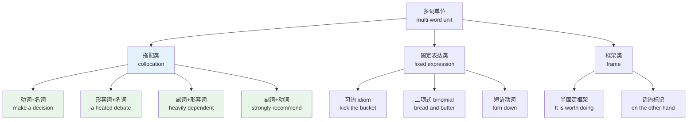
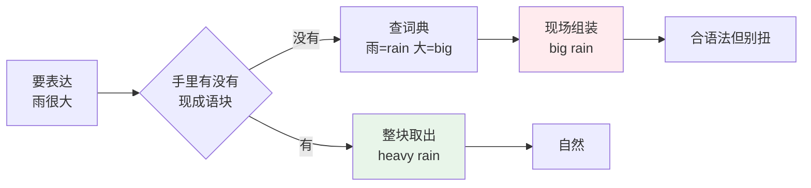
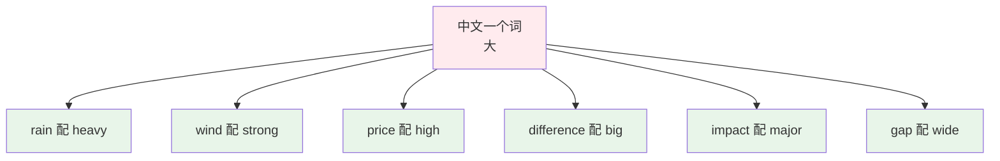
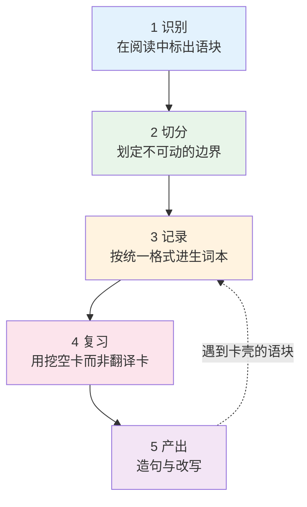
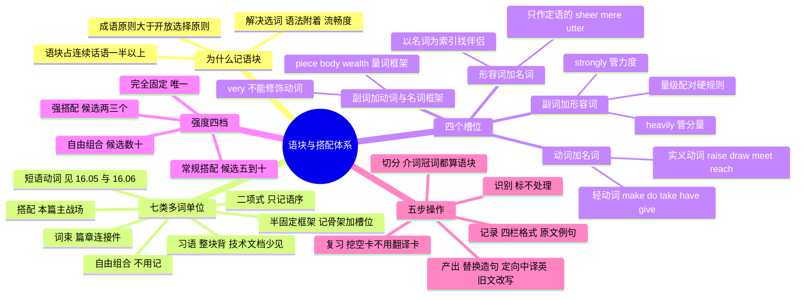

# 语块类型与搭配体系

> [!info] 本篇定位
>
> 这一篇处理一个所有中级学习者都会撞上的问题：单词量到了，语法也不错，写出来的英文却处处别扭。原因不在词，在词与词的结合方式。
>
> 读完你会拿到三样东西：一张把英语多词单位切成七类的分类坐标，一套按动名、形名、副形、副动四个槽位组织的高频搭配表，以及一套从阅读材料里把语块捞出来、存进笔记、变成产出能力的五步流程。
>
> 与相邻篇目的分工：本篇是**体系与方法**的主讲章，负责建立分类框架和记忆操作；每一类搭配的穷尽清单与逐词分界交给第十七章，`heavy` 与 `strong` 的名词群分界在 [[17.固定搭配/04.形容词+名词搭配：强度、规模与名词偏好\|形容词+名词搭配：强度、规模与名词偏好]]，`highly`、`deeply`、`bitterly` 的固定伴侣在 [[17.固定搭配/05.副词+形容词强化搭配：highly、deeply、bitterly 的固定伴侣\|副词+形容词强化搭配]]，搭配强度的语料库查证方法在 [[17.固定搭配/01.搭配强度分级与可替换边界\|搭配强度分级与可替换边界]]。短语动词单独两篇，见本章第 05、06 篇。习语的意象来源与文化背景在 [[18.语域、英美差异与习语俚语/03.习语与谚语\|习语与谚语]]。

---

## 1. 本篇导读：词都认识，写出来还是不像英文

先看四个句子。它们语法全对，每个单词也都用对了义项，但没有一个是英语母语者会写出来的说法。

| 学习者写的 | 母语者会写的 | 错在哪 |
| --- | --- | --- |
| ~~I want to open the air conditioner.~~ | I want to **turn on** the air conditioner. | 动词选错，中文的「开」映射到三个不同英文动词 |
| ~~We must take a decision quickly.~~ | We must **make** a decision quickly. | 轻动词选错；英式正式文体确有 take a decision，但美式与技术文档一律用 make |
| ~~The rain was very big last night.~~ | The rain was **heavy** last night. | 形容词选错，雨的量级用 heavy 不用 big |
| ~~He is very dependent on his parents.~~ | He is **heavily** dependent on his parents. | 副词选错，very 撑不住 dependent 这类词 |

四个错误的共同点：**错的不是词，是词的结合。** 每个句子里的单词单拎出来都无懈可击，放在一起就露馅。这类错误比生词更暴露水平——生词只是没学过，搭配错说明对语言的组合规律没有感觉。

传统词汇学习把词表当成一堆零件，默认零件之间可以自由拼装，拼装规则交给语法。真实语言不是这么运行的。英语里大量的意思是由**成块的固定组合**表达的，这些组合的选择既不由语义决定，也不由语法决定，而是由约定决定。`heavy rain` 和 `strong wind` 表达的是同一种「量大」，却用了两个不同的形容词，语义上讲不出理由，只能记住。

这就引出了本篇的核心主张：**记忆单位应该是语块，不是单词。** 记 `make a decision` 而不是单独记 `decision`，记 `heavily dependent` 而不是单独记 `dependent`。因为语块把选词决策提前做完了——用的时候整块取出，不需要在现场重新组装。

### 1.1 本篇处理的范围



图里淡蓝色的搭配类是本篇正文的主体，淡绿色的四个槽位组合是第 5 到第 8 节逐个铺开的内容。固定表达类与框架类只在第 3 节做分类说明，各自的主讲章在别处：习语与二项式归 `18.03`，短语动词归本章 05、06 两篇，半固定框架归 [[17.固定搭配/08.半固定框架与高频语块：It is worth doing 与 the more the more\|半固定框架与高频语块]]。之所以要先把整棵树画出来，是因为遇到一串陌生的词组时，第一步永远是判断它属于哪一类——类型决定了该怎么记它。

---

## 2. 语块：把记忆单位从「词」换成「词组」

### 2.1 语言的两条组词原则

Sinclair 在 1991 年的 *Corpus, Concordance, Collocation* 里提出了两条并行的组词原则，这是理解语块的起点。

**开放选择原则**（open-choice principle）：把语言看成一系列填空格。每个空格只受语法限制，符合语法的词都可以填进去。按这条原则，`___ rain` 这个空里可以填 `heavy`、`big`、`large`、`strong`、`powerful`，全都合语法。

**成语原则**（idiom principle）：语言使用者手里握着大量预先组装好的半成品短语，说话时整块调用，不逐词现场组装。按这条原则，`___ rain` 这个空实际上只有 `heavy`、`light`、`torrential`、`steady` 等少数几个真正会出现。

两条原则同时在起作用，但比例悬殊。绝大多数时候语言走的是成语原则，只有在需要表达新鲜内容时才切换到开放选择。学习者的问题恰好相反：因为手里没有半成品，只能一直用开放选择原则现场组装，组装出来的东西合语法但不合习惯。



这张图说明了同一个表达任务的两条路径。上面那条是母语者走的路，成本低、结果稳定；下面那条是学习者被迫走的路，每次都要重新决策，而决策依据（中文对应词）本身就是错的。学习语块的意义，就是把尽可能多的表达任务从下面那条路挪到上面那条路。

### 2.2 语块在真实文本里的密度

Erman 与 Warren 在 2000 年做过一项统计，把口语与书面语中「预制语块」占连续话语的比例算到 55% 左右。不同研究者对语块的界定宽严不一，得出的数字也在三成到六成之间浮动，但结论方向是一致的：**语块不是语言的边角料，是主体。**

这个结论对学习策略有直接影响。如果一半以上的文本由语块构成，那么把学习资源全部投在单个词上，等于放弃了一半的战场。反过来，一个语块通常包含两到四个词，学一个语块相当于同时巩固了这几个词的用法、词形和语域，效率比孤立记词高。

### 2.3 语块解决的三个具体问题

**第一，解决选词决策。** 单独记 `dependent`，用的时候还要现场决定配哪个副词，决策点没消失只是推后了。记 `heavily dependent`，决策已经做完。

**第二，解决语法附着。** 语块自带介词、冠词、单复数。记 `make a decision` 就同时记住了要加不定冠词，记 `pay attention to` 就同时记住了后面的介词，记 `do research` 就同时记住了 research 不可数、不加 `-s`。这些细节单独记规则记不住，附在语块上却自动带过来。

**第三，解决产出流畅度。** 说话或写作时逐词组装会占用工作记忆，句子越长越容易崩。整块调用把认知负荷压到一个单位，腾出来的注意力可以放在内容和篇章上。Pawley 与 Syder 在 1983 年把这个现象称为「像母语者一样流利」的关键机制。

> [!tip] 一个立刻可做的检验
>
> 打开你最近写的一段英文，逐句问自己：这句里的每一个「形容词+名词」和「动词+名词」组合，是我记住的还是我现场拼的？
>
> 现场拼的比例越高，越需要转到语块记忆。多数中级学习者会发现自己接近 100% 现场拼装。

---

## 3. 语块类型全谱：七类多词单位

「语块」是个大口袋，里面装的东西性质差别很大。分不清类型，记忆策略就会用错——用记习语的办法记搭配，会把可替换的组合当成不可动的整体；用记搭配的办法记框架，会漏掉槽位能填什么。

### 3.1 七类的判定标准

分类靠两个维度：**语义透明度**（能不能从组成词推出整体意思）和**形式固定度**（能不能替换、插入、变形）。

| 类型 | 英文名 | 语义透明度 | 形式固定度 | 典型例子 |
| --- | --- | --- | --- | --- |
| 自由组合 | free combination | 完全透明 | 完全自由 | see a film、buy a book |
| 搭配 | collocation | 基本透明 | 部分固定 | heavy rain、make a decision |
| 半固定框架 | frame / pattern | 透明 | 骨架固定，槽位自由 | It is worth doing、the more the more |
| 短语动词 | phrasal verb | 半透明到不透明 | 高 | turn down、put up with |
| 二项式 | binomial | 透明 | 语序不可颠倒 | bread and butter、sooner or later |
| 习语 | idiom | 不透明 | 极高 | kick the bucket、spill the beans |
| 词束 | lexical bundle | 透明 | 高频重复出现 | as a result of、on the other hand |

### 3.2 逐类说明

**自由组合**。动词和名词各自保持本义，组合完全由意思决定，可替换范围极大。`see a film`、`see a doctor`、`see a friend` 里的 `see` 没有任何限制。这一类不需要记，语义正确就够。

**搭配**。两个词的共现频率显著高于随机，但语义仍然基本透明。`heavy rain` 里 `heavy` 用的是它的引申义，`rain` 是本义，组合起来意思能猜出来，但为什么是 `heavy` 而不是 `big`，猜不出来。**搭配是本篇的主战场**，因为它数量最大、最容易出错、且中文母语者最没有直觉。

**半固定框架**。有固定骨架和空槽位，槽位里填什么由使用者决定。`It is worth doing`、`There is no point in doing`、`the more A, the more B`。记这类要记两件事：骨架的准确形式，和槽位的语法限制（比如 `worth` 后面只能跟动名词，不能跟不定式）。

**短语动词**。动词加小品词，整体意思常常不等于两部分之和。`turn down` 的「拒绝」义从 `turn` 和 `down` 都推不出来。这类的难点在及物性和可分性，本章 05、06 两篇专讲。

**二项式**。两个同类词用 `and` 或 `or` 连起来，语序被固定住。`bread and butter` 不能说成 `butter and bread`，`sooner or later` 不能说成 `later or sooner`。这类的记忆点只有一个：语序。

| 英文 | 英式音标 | 美式音标 | 词性 | 中文 | 搭配与说明 |
| --- | --- | --- | --- | --- | --- |
| **bread and butter** | /ˌbred ən ˈbʌtə/ | /ˌbred ən ˈbʌtər/ | n. | 生计；主要收入来源 | 语序不可颠倒；作「主业」讲时不可数 |
| **sooner or later** | /ˌsuːnər ɔː ˈleɪtə/ | /ˌsuːnər ɔːr ˈleɪtər/ | adv. | 迟早 | 句首句尾均可，不可拆开 |
| **trial and error** | /ˌtraɪəl ənd ˈerə/ | /ˌtraɪəl ənd ˈerər/ | n. | 试错法 | by trial and error 是最高频形式 |
| **pros and cons** | /ˌprəʊz ən ˈkɒnz/ | /ˌproʊz ən ˈkɑːnz/ | n. | 利弊 | 恒复数；weigh the pros and cons |
| **terms and conditions** | /ˌtɜːmz ən kənˈdɪʃnz/ | /ˌtɜːrmz ən kənˈdɪʃnz/ | n. | 条款与条件 | 法律文本固定并列，缩写 T&Cs |
| **null and void** | /ˌnʌl ən ˈvɔɪd/ | /ˌnʌl ən ˈvɔɪd/ | adj. | 无效的 | 合同术语，两词同义叠加以求严密 |
| **safe and sound** | /ˌseɪf ən ˈsaʊnd/ | /ˌseɪf ən ˈsaʊnd/ | adj. | 平安无恙 | 头韵固定；作表语或补语 |
| **back and forth** | /ˌbæk ən ˈfɔːθ/ | /ˌbæk ən ˈfɔːrθ/ | adv. | 来回地 | 英式亦说 to and fro |
| **give and take** | /ˌɡɪv ən ˈteɪk/ | /ˌɡɪv ən ˈteɪk/ | n. | 互相让步 | 名词用法，不可数 |
| **sink or swim** | /ˌsɪŋk ɔː ˈswɪm/ | /ˌsɪŋk ɔːr ˈswɪm/ | v. | 成败在此一举 | 常作定语：a sink-or-swim approach |

**习语**。整体意思与字面完全脱钩，形式几乎不能动。`kick the bucket` 不能改成 `kick the pail`，也不能说 `kick a bucket`。这类的数量看起来吓人，但对阅读技术文档的读者优先级最低——技术写作刻意避免习语。

**词束**。语料库统计出来的高频连续词串，语义完全透明，价值在于它是篇章的连接件。`as a result of`、`on the other hand`、`in terms of`、`it is important to note that`。这类在学术与技术写作里密度极高，是产出侧最值钱的一类。

| 英文 | 英式音标 | 美式音标 | 词性 | 中文 | 搭配与说明 |
| --- | --- | --- | --- | --- | --- |
| **as a result of** | /əz ə rɪˈzʌlt əv/ | /əz ə rɪˈzʌlt əv/ | prep. | 由于 | 后接名词短语，不接从句 |
| **on the other hand** | /ɒn ði ˌʌðə ˈhænd/ | /ɑːn ði ˌʌðər ˈhænd/ | adv. | 另一方面 | 通常与 on the one hand 呼应，也可单用 |
| **in terms of** | /ɪn ˈtɜːmz əv/ | /ɪn ˈtɜːrmz əv/ | prep. | 就……而言 | 学术高频；口语里被批评为滥用 |
| **with respect to** | /wɪð rɪˈspekt tuː/ | /wɪð rɪˈspekt tuː/ | prep. | 关于；相对于 | 数学语境 differentiate with respect to x 指对 x 求导 |
| **to a certain extent** | /tʊ ə ˌsɜːtn ɪkˈstent/ | /tʊ ə ˌsɜːrtn ɪkˈstent/ | adv. | 在一定程度上 | 缓和语气，学术 hedging 常用 |
| **it is worth noting that** | /ɪt ɪz ˌwɜːθ ˈnəʊtɪŋ ðæt/ | /ɪt ɪz ˌwɜːrθ ˈnoʊtɪŋ ðæt/ | — | 值得注意的是 | 论文与设计文档过渡句 |
| **for the sake of** | /fə ðə ˈseɪk əv/ | /fɔːr ðə ˈseɪk əv/ | prep. | 为了 | for the sake of simplicity 技术文档常见 |
| **in the absence of** | /ɪn ði ˈæbsəns əv/ | /ɪn ði ˈæbsəns əv/ | prep. | 在缺少……的情况下 | 规范文本里表默认行为 |
| **by definition** | /baɪ ˌdefɪˈnɪʃn/ | /baɪ ˌdefɪˈnɪʃn/ | adv. | 按定义 | 用于推出必然结论 |
| **more often than not** | /ˌmɔːr ɒfn ðən ˈnɒt/ | /ˌmɔːr ɔːfn ðən ˈnɑːt/ | adv. | 多半 | 比 usually 更书面 |

### 3.3 边界模糊时怎么处理

七类之间没有硬边界。`take place` 算搭配还是习语？`pay attention to` 算动名搭配还是动介固定搭配？这类争论对学习没有价值。实用的判定只有一条：

> [!tip] 判定原则
>
> 不问「它属于哪一类」，问「它有多少地方可以动」。
>
> 能替换的部分标出来，不能动的部分整块记。`make a decision` 里 `a` 不能省、`decision` 不能换成 `decide`，但主语和时态自由，那就记成 `sb make(s) a decision`。`in the absence of` 一个字都不能动，那就整串背下来。

---

## 4. 搭配的四个槽位组合

搭配按词性组合可以切成很多种，但对中文母语者真正构成障碍的只有四种。原因是中文在这四个位置上的选词逻辑与英语差得最远。

| 槽位组合 | 标本 | 中文母语者的典型错法 | 出错原因 |
| --- | --- | --- | --- |
| 动词 + 名词 | make a decision | ~~take a decision~~、~~do a decision~~ | 中文「做决定」只有一个动词，英语有三个候选 |
| 形容词 + 名词 | a heated debate | ~~a hot debate~~、~~a fierce debate~~ | 中文「激烈」对应多个英文词，各配不同名词 |
| 副词 + 形容词 | heavily dependent | ~~very dependent~~ | 中文「很」通吃，英语按形容词分派专用副词 |
| 副词 + 动词 | strongly recommend | ~~strong recommend~~、~~very recommend~~ | 中文「强烈推荐」的「强烈」既修饰形容词也修饰动词 |

四类的共同规律：**中文用一个词覆盖的位置，英语用一组词分工覆盖**。中文的「大」在英语里按名词类型拆成 `big` / `large` / `heavy` / `strong` / `high` / `wide` / `deep`；中文的「很」在英语里按形容词类型拆成 `very` / `highly` / `deeply` / `heavily` / `utterly` / `absolutely`。学习任务不是记住这些英文词各自的中文意思，而是记住**每个词管哪一片名词或形容词**。



图里的一对多关系是所有搭配错误的总根源。学习者手里只有左边那个中文节点，遇到任何名词都从这个节点出发，命中率取决于运气。正确的做法是把箭头反过来记：不记「大 = big」，记「rain 这个词的伴侣是 heavy」。也就是**以名词为索引存搭配，不以形容词为索引**。

---

## 5. 类型一：动词 + 名词

这一类的错误最显眼，因为动词是句子的骨架，动词错了整句都歪。难点集中在两处：轻动词的选择，和实义动词与名词的固定配对。

### 5.1 轻动词槽：make、do、take、have、give

轻动词本身语义近乎为零，真正承载意思的是后面的名词。`make a decision` 的意思几乎全在 `decision` 里，`make` 只是把名词激活成一个动作。正因为语义空，哪个名词配哪个轻动词就完全靠约定，推不出来。

| 英文 | 英式音标 | 美式音标 | 词性 | 中文 | 搭配与说明 |
| --- | --- | --- | --- | --- | --- |
| **make a decision** | /ˌmeɪk ə dɪˈsɪʒn/ | /ˌmeɪk ə dɪˈsɪʒn/ | v.+n. | 做决定 | 英式正式文体常说 take a decision，美式与技术文档一律用 make |
| **make an effort** | /ˌmeɪk ən ˈefət/ | /ˌmeɪk ən ˈefərt/ | v.+n. | 努力 | make every effort to do 是固定加强式 |
| **make progress** | /ˌmeɪk ˈprəʊɡres/ | /ˌmeɪk ˈprɑːɡres/ | v.+n. | 取得进展 | progress 不可数，不加冠词也不加 -s |
| **make a difference** | /ˌmeɪk ə ˈdɪfrəns/ | /ˌmeɪk ə ˈdɪfrəns/ | v.+n. | 起作用；有影响 | 否定式 make no difference 同样高频 |
| **make an appointment** | /ˌmeɪk ən əˈpɔɪntmənt/ | /ˌmeɪk ən əˈpɔɪntmənt/ | v.+n. | 预约 | 与 have an appointment 分工：make 是约，have 是有 |
| **make an impression** | /ˌmeɪk ən ɪmˈpreʃn/ | /ˌmeɪk ən ɪmˈpreʃn/ | v.+n. | 留下印象 | 常带 on sb；leave an impression 亦可 |
| **make a profit** | /ˌmeɪk ə ˈprɒfɪt/ | /ˌmeɪk ə ˈprɑːfɪt/ | v.+n. | 盈利 | 反向 make a loss（英）/ take a loss（美） |
| **make sense** | /ˌmeɪk ˈsens/ | /ˌmeɪk ˈsens/ | v.+n. | 说得通 | 无冠词；make sense of sth 是「理解」 |
| **do research** | /ˌduː rɪˈsɜːtʃ/ | /ˌduː ˈriːsɜːrtʃ/ | v.+n. | 做研究 | research 不可数；美式名词重音常在首音节 |
| **do harm** | /ˌduː ˈhɑːm/ | /ˌduː ˈhɑːrm/ | v.+n. | 造成损害 | do more harm than good 是固定对比式 |
| **do business** | /ˌduː ˈbɪznəs/ | /ˌduː ˈbɪznəs/ | v.+n. | 做生意 | 无冠词；do business with sb |
| **do the dishes** | /ˌduː ðə ˈdɪʃɪz/ | /ˌduː ðə ˈdɪʃɪz/ | v.+n. | 洗碗 | 多数家务动作用 do；铺床是例外，说 make the bed |
| **do a favour** | /ˌduː ə ˈfeɪvə/ | /ˌduː ə ˈfeɪvər/ | v.+n. | 帮个忙 | 美式拼 favor；常作 do sb a favour 双宾语结构 |
| **take action** | /ˌteɪk ˈækʃn/ | /ˌteɪk ˈækʃn/ | v.+n. | 采取行动 | 此义 action 不可数，不加冠词 |
| **take responsibility** | /ˌteɪk rɪˌspɒnsəˈbɪləti/ | /ˌteɪk rɪˌspɑːnsəˈbɪləti/ | v.+n. | 承担责任 | 后接 for sth；对比 assume responsibility 更正式 |
| **take a risk** | /ˌteɪk ə ˈrɪsk/ | /ˌteɪk ə ˈrɪsk/ | v.+n. | 冒险 | 复数 take risks 同样常见；run a risk 语气更被动 |
| **take notes** | /ˌteɪk ˈnəʊts/ | /ˌteɪk ˈnoʊts/ | v.+n. | 记笔记 | 恒复数；单数 take note of sth 是「留意」 |
| **take precedence** | /ˌteɪk ˈpresɪdəns/ | /ˌteɪk ˈpresɪdəns/ | v.+n. | 优先 | 后接 over；技术规范里表优先级覆盖关系 |
| **take effect** | /ˌteɪk ɪˈfekt/ | /ˌteɪk ɪˈfekt/ | v.+n. | 生效 | 无冠词；对比 come into effect 更正式 |
| **take steps** | /ˌteɪk ˈsteps/ | /ˌteɪk ˈsteps/ | v.+n. | 采取措施 | 恒复数；后接 to do |
| **have an impact** | /ˌhæv ən ˈɪmpækt/ | /ˌhæv ən ˈɪmpækt/ | v.+n. | 产生影响 | 后接 on；名词 impact 重音在首，动词在尾 |
| **have access to** | /ˌhæv ˈækses tə/ | /ˌhæv ˈækses tə/ | v.+n. | 有权使用 | access 不可数，绝不加冠词 |
| **have a point** | /ˌhæv ə ˈpɔɪnt/ | /ˌhæv ə ˈpɔɪnt/ | v.+n. | 有道理 | 口语；you have a point there |
| **give priority to** | /ˌɡɪv praɪˈɒrəti tə/ | /ˌɡɪv praɪˈɔːrəti tə/ | v.+n. | 优先考虑 | 亦作 give sth priority |
| **give consent** | /ˌɡɪv kənˈsent/ | /ˌɡɪv kənˈsent/ | v.+n. | 表示同意 | 法律与隐私文本高频；无冠词 |
| **give rise to** | /ˌɡɪv ˈraɪz tə/ | /ˌɡɪv ˈraɪz tə/ | v.+n. | 引起 | 只接负面或中性结果，不接好事 |
| **pay attention to** | /ˌpeɪ əˈtenʃn tə/ | /ˌpeɪ əˈtenʃn tə/ | v.+n. | 注意 | 无冠词；强化式 pay close attention |
| **pay a visit** | /ˌpeɪ ə ˈvɪzɪt/ | /ˌpeɪ ə ˈvɪzɪt/ | v.+n. | 拜访 | 比 visit 正式；后接 to sb |
| **pay the price** | /ˌpeɪ ðə ˈpraɪs/ | /ˌpeɪ ðə ˈpraɪs/ | v.+n. | 付出代价 | 定冠词固定；后接 for sth |

> [!warning] 轻动词最常见的三个错法
>
> - ❌ ~~do a decision~~ / ✅ **make a decision**——`do` 配活动过程，`make` 配产出结果，decision 是产出。
> - ❌ ~~take a look on~~ / ✅ **take a look at**——介词被语块锁死，不能按中文「看向」推。
> - ❌ ~~make a research~~ / ✅ **do research**——`research` 不可数，加冠词与换动词是同一个错误的两面。

### 5.2 实义动词槽：学术与技术写作的承重块

轻动词之外还有一批实义动词，它们保留完整语义，但宾语范围被严格限定。这一批在论文、设计文档、规范里出现频率极高。

| 英文 | 英式音标 | 美式音标 | 词性 | 中文 | 搭配与说明 |
| --- | --- | --- | --- | --- | --- |
| **raise concerns** | /ˌreɪz kənˈsɜːnz/ | /ˌreɪz kənˈsɜːrnz/ | v.+n. | 引起关注 | 常与 about 连用；评审意见高频 |
| **raise awareness** | /ˌreɪz əˈweənəs/ | /ˌreɪz əˈwernəs/ | v.+n. | 提高认识 | 后接 of；不用 improve awareness |
| **draw a conclusion** | /ˌdrɔː ə kənˈkluːʒn/ | /ˌdrɔː ə kənˈkluːʒn/ | v.+n. | 得出结论 | 亦作 reach a conclusion；不用 get |
| **draw a distinction** | /ˌdrɔː ə dɪˈstɪŋkʃn/ | /ˌdrɔː ə dɪˈstɪŋkʃn/ | v.+n. | 作出区分 | 后接 between A and B |
| **draw attention to** | /ˌdrɔː əˈtenʃn tə/ | /ˌdrɔː əˈtenʃn tə/ | v.+n. | 使注意到 | 与 pay attention to 主客体相反 |
| **meet a deadline** | /ˌmiːt ə ˈdedlaɪn/ | /ˌmiːt ə ˈdedlaɪn/ | v.+n. | 赶上截止期 | 反向 miss a deadline；不用 catch |
| **meet requirements** | /ˌmiːt rɪˈkwaɪəmənts/ | /ˌmiːt rɪˈkwaɪərmənts/ | v.+n. | 满足要求 | 规范文本亦用 satisfy；不用 reach |
| **meet expectations** | /ˌmiːt ˌekspekˈteɪʃnz/ | /ˌmiːt ˌekspekˈteɪʃnz/ | v.+n. | 达到预期 | 反向 fall short of expectations |
| **reach an agreement** | /ˌriːtʃ ən əˈɡriːmənt/ | /ˌriːtʃ ən əˈɡriːmənt/ | v.+n. | 达成协议 | 亦作 come to an agreement |
| **reach a consensus** | /ˌriːtʃ ə kənˈsensəs/ | /ˌriːtʃ ə kənˈsensəs/ | v.+n. | 达成共识 | 通常用单数 a consensus，不用复数形式 |
| **break a promise** | /ˌbreɪk ə ˈprɒmɪs/ | /ˌbreɪk ə ˈprɑːmɪs/ | v.+n. | 违背承诺 | 反向 keep a promise；不用 destroy |
| **break the news** | /ˌbreɪk ðə ˈnjuːz/ | /ˌbreɪk ðə ˈnuːz/ | v.+n. | 透露消息 | 通常指坏消息；后接 to sb |
| **break a habit** | /ˌbreɪk ə ˈhæbɪt/ | /ˌbreɪk ə ˈhæbɪt/ | v.+n. | 改掉习惯 | 亦作 kick a habit（更口语） |
| **hold a meeting** | /ˌhəʊld ə ˈmiːtɪŋ/ | /ˌhoʊld ə ˈmiːtɪŋ/ | v.+n. | 召开会议 | 正式；口语用 have a meeting |
| **hold a view** | /ˌhəʊld ə ˈvjuː/ | /ˌhoʊld ə ˈvjuː/ | v.+n. | 持某种看法 | 学术写作常用，是 have an opinion 的正式替代 |
| **hold office** | /ˌhəʊld ˈɒfɪs/ | /ˌhoʊld ˈɔːfɪs/ | v.+n. | 担任公职 | 无冠词表「在任」；指具体职位时才说 hold the office of President |
| **set a precedent** | /ˌset ə ˈpresɪdənt/ | /ˌset ə ˈpresɪdənt/ | v.+n. | 开创先例 | 法律与管理文本；不用 make |
| **set a deadline** | /ˌset ə ˈdedlaɪn/ | /ˌset ə ˈdedlaɪn/ | v.+n. | 设定截止期 | 与 meet a deadline 成对使用 |
| **conduct a survey** | /kənˌdʌkt ə ˈsɜːveɪ/ | /kənˌdʌkt ə ˈsɜːrveɪ/ | v.+n. | 开展调查 | conduct 是正式层；口语 do a survey |
| **place an order** | /ˌpleɪs ən ˈɔːdə/ | /ˌpleɪs ən ˈɔːrdər/ | v.+n. | 下订单 | 商务固定；口语 make an order 少见 |
| **run a business** | /ˌrʌn ə ˈbɪznəs/ | /ˌrʌn ə ˈbɪznəs/ | v.+n. | 经营企业 | run 表持续运营；不用 open |
| **address an issue** | /əˌdres ən ˈɪʃuː/ | /əˌdres ən ˈɪʃuː/ | v.+n. | 处理问题 | address 此处是「着手解决」，非「地址」 |
| **implement a policy** | /ˌɪmplɪment ə ˈpɒləsi/ | /ˌɪmplɪment ə ˈpɑːləsi/ | v.+n. | 执行政策 | 技术语境亦用于接口实现 |
| **pose a threat** | /ˌpəʊz ə ˈθret/ | /ˌpoʊz ə ˈθret/ | v.+n. | 构成威胁 | 亦作 pose a risk / a challenge |
| **bear the cost** | /ˌbeə ðə ˈkɒst/ | /ˌber ðə ˈkɔːst/ | v.+n. | 承担成本 | 正式；口语用 cover the cost |
| **file a report** | /ˌfaɪl ə rɪˈpɔːt/ | /ˌfaɪl ə rɪˈpɔːrt/ | v.+n. | 提交报告 | 亦作 file a complaint / a ticket |
| **issue a warning** | /ˌɪʃuː ə ˈwɔːnɪŋ/ | /ˌɪʃuː ə ˈwɔːrnɪŋ/ | v.+n. | 发出警告 | 机构主语；个人主语用 give a warning |
| **waive a fee** | /ˌweɪv ə ˈfiː/ | /ˌweɪv ə ˈfiː/ | v.+n. | 免收费用 | 合同术语；亦 waive a right |
| **void a warranty** | /ˌvɔɪd ə ˈwɒrənti/ | /ˌvɔɪd ə ˈwɔːrənti/ | v.+n. | 使保修失效 | 硬件说明书高频 |
| **lodge a complaint** | /ˌlɒdʒ ə kəmˈpleɪnt/ | /ˌlɑːdʒ ə kəmˈpleɪnt/ | v.+n. | 提出投诉 | 英式正式；美式多用 file a complaint |

> [!example] 实义动词槽的对照
>
> - The audit **raised concerns** about how the keys were stored.
>   - 审计对密钥的存储方式提出了关切。
> - We cannot **draw a conclusion** from a single data point.
>   - 单个数据点得不出结论。
> - The team **missed the deadline** because the migration script **broke backward compatibility**.
>   - 团队没赶上截止期，因为迁移脚本破坏了向后兼容。

### 5.3 一个中文动词对应多个英文动词

中文动词的覆盖面比英语宽，是这一类错误的直接成因。下表把最容易翻车的几个中文动词拆开。

| 中文动词 | 英语按宾语分派 |
| --- | --- |
| 开 | turn on（电器）、open（门窗文件）、start（引擎）、hold（会议）、drive（车）、set up（公司） |
| 做 | make（有产出物）、do（活动过程）、conduct（正式调查）、perform（操作、手术）、carry out（计划） |
| 打 | make（电话）、play（球类）、type（字）、beat（人）、pump（气）、pack（包） |
| 提出 | raise（问题、关切）、propose（方案）、put forward（观点）、submit（申请）、file（投诉） |
| 接受 | accept（主动认可）、receive（被动收到）、take（承担、接受安排）、adopt（采纳做法） |
| 提高 | improve（质量）、increase（数量）、raise（标准、意识）、enhance（性能）、boost（士气、销量） |

这张表的用法不是背下来，而是当作**排查清单**。写完一句英文，如果句中的动词是从中文直译过来的，回表里对照一遍：宾语属于哪一类，该用哪个动词。

---

## 6. 类型二：形容词 + 名词

形名搭配的选择依据是名词，不是形容词。同一个「程度深」的意思，`debate` 配 `heated`，`rain` 配 `heavy`，`competition` 配 `fierce`，`concern` 配 `deep` 或 `grave`。这不是形容词有多少种意思的问题，是每个名词各自养了一批固定伴侣。

### 6.1 标本：a heated debate

`heated` 的字面义是「被加热的」，用在 `debate`、`argument`、`discussion`、`exchange` 前面表示「情绪激烈的」。这个引申路径中英一致（中文也说「热烈」「白热化」），但配对范围完全由英语内部约定：

- ✅ a **heated** debate / argument / discussion / exchange
- ❌ ~~a heated competition~~——竞争用 `fierce` 或 `stiff`
- ❌ ~~a heated criticism~~——批评用 `harsh` 或 `severe`
- ❌ ~~a heated rain~~——中文的「热烈」不会用在雨上，英语同样不会

关键在于：`heated` 只跟「言语交锋」类名词配对。记住这个范围，比记住 `heated = 激烈的` 有用得多。

### 6.2 高频形名语块表

| 英文 | 英式音标 | 美式音标 | 词性 | 中文 | 搭配与说明 |
| --- | --- | --- | --- | --- | --- |
| **a heated debate** | /ə ˌhiːtɪd dɪˈbeɪt/ | /ə ˌhiːtɪd dɪˈbeɪt/ | adj.+n. | 激烈的辩论 | 只配言语交锋类名词 |
| **a heated argument** | /ə ˌhiːtɪd ˈɑːɡjumənt/ | /ə ˌhiːtɪd ˈɑːrɡjumənt/ | adj.+n. | 激烈的争吵 | 比 debate 更私人、更失控 |
| **heavy rain** | /ˌhevi ˈreɪn/ | /ˌhevi ˈreɪn/ | adj.+n. | 大雨 | 反义 light rain；不用 big |
| **heavy traffic** | /ˌhevi ˈtræfɪk/ | /ˌhevi ˈtræfɪk/ | adj.+n. | 交通拥堵 | traffic 不可数 |
| **a heavy workload** | /ə ˌhevi ˈwɜːkləʊd/ | /ə ˌhevi ˈwɜːrkloʊd/ | adj.+n. | 繁重的工作量 | 亦作 heavy schedule |
| **heavy losses** | /ˌhevi ˈlɒsɪz/ | /ˌhevi ˈlɔːsɪz/ | adj.+n. | 重大损失 | 财务与军事语境；不用 big |
| **strong evidence** | /ˌstrɒŋ ˈevɪdəns/ | /ˌstrɔːŋ ˈevɪdəns/ | adj.+n. | 有力的证据 | 亦作 hard evidence；不用 powerful |
| **strong support** | /ˌstrɒŋ səˈpɔːt/ | /ˌstrɔːŋ səˈpɔːrt/ | adj.+n. | 大力支持 | 反义 weak support |
| **a strong candidate** | /ə ˌstrɒŋ ˈkændɪdət/ | /ə ˌstrɔːŋ ˈkændɪdeɪt/ | adj.+n. | 有力的候选人 | 美式末音节常读全元音 |
| **strong coffee** | /ˌstrɒŋ ˈkɒfi/ | /ˌstrɔːŋ ˈkɔːfi/ | adj.+n. | 浓咖啡 | 反义用 weak，不用 light |
| **deep concern** | /ˌdiːp kənˈsɜːn/ | /ˌdiːp kənˈsɜːrn/ | adj.+n. | 深切关注 | 外交与公告文体；升级为 grave concern |
| **a deep breath** | /ə ˌdiːp ˈbreθ/ | /ə ˌdiːp ˈbreθ/ | adj.+n. | 深呼吸 | take a deep breath 是固定动作 |
| **a high standard** | /ə ˌhaɪ ˈstændəd/ | /ə ˌhaɪ ˈstændərd/ | adj.+n. | 高标准 | 有刻度的抽象名词配 high |
| **high expectations** | /ˌhaɪ ˌekspekˈteɪʃnz/ | /ˌhaɪ ˌekspekˈteɪʃnz/ | adj.+n. | 高期望 | 恒复数 |
| **high priority** | /ˌhaɪ praɪˈɒrəti/ | /ˌhaɪ praɪˈɔːrəti/ | adj.+n. | 高优先级 | 工单系统固定用语；对应 low priority |
| **high turnover** | /ˌhaɪ ˈtɜːnəʊvə/ | /ˌhaɪ ˈtɜːrnoʊvər/ | adj.+n. | 高流动率 | 人力语境指离职率，商务语境指营业额 |
| **broad consensus** | /ˌbrɔːd kənˈsensəs/ | /ˌbrɔːd kənˈsensəs/ | adj.+n. | 广泛共识 | consensus、agreement、support 偏用 broad；range、margin、gap 偏用 wide |
| **a wide range** | /ə ˌwaɪd ˈreɪndʒ/ | /ə ˌwaɪd ˈreɪndʒ/ | adj.+n. | 广泛的范围 | a wide range of + 复数名词 |
| **a wide margin** | /ə ˌwaɪd ˈmɑːdʒɪn/ | /ə ˌwaɪd ˈmɑːrdʒɪn/ | adj.+n. | 很大的差距 | by a wide margin 表胜出幅度 |
| **severe weather** | /sɪˌvɪə ˈweðə/ | /sɪˌvɪr ˈweðər/ | adj.+n. | 恶劣天气 | 气象预警固定说法 |
| **a severe shortage** | /ə sɪˌvɪə ˈʃɔːtɪdʒ/ | /ə sɪˌvɪr ˈʃɔːrtɪdʒ/ | adj.+n. | 严重短缺 | 亦作 acute shortage |
| **a serious injury** | /ə ˌsɪəriəs ˈɪndʒəri/ | /ə ˌsɪriəs ˈɪndʒəri/ | adj.+n. | 重伤 | serious 配后果，severe 配程度 |
| **acute pain** | /əˌkjuːt ˈpeɪn/ | /əˌkjuːt ˈpeɪn/ | adj.+n. | 剧痛 | 医学语境亦指「急性」，与 chronic 对立 |
| **grave concern** | /ˌɡreɪv kənˈsɜːn/ | /ˌɡreɪv kənˈsɜːrn/ | adj.+n. | 严重关切 | 比 deep concern 更重，正式文体 |
| **a key factor** | /ə ˌkiː ˈfæktə/ | /ə ˌkiː ˈfæktər/ | adj.+n. | 关键因素 | key 作定语不可比较 |
| **a vital role** | /ə ˌvaɪtl ˈrəʊl/ | /ə ˌvaɪtl ˈroʊl/ | adj.+n. | 至关重要的作用 | play a vital role in 是完整语块 |
| **a crucial step** | /ə ˌkruːʃl ˈstep/ | /ə ˌkruːʃl ˈstep/ | adj.+n. | 关键一步 | 亦作 a crucial difference |
| **an integral part** | /ən ˌɪntɪɡrəl ˈpɑːt/ | /ən ˌɪntɪɡrəl ˈpɑːrt/ | adj.+n. | 不可分割的部分 | 后接 of；重音在首音节 |
| **a major setback** | /ə ˌmeɪdʒə ˈsetbæk/ | /ə ˌmeɪdʒər ˈsetbæk/ | adj.+n. | 重大挫折 | major 隐含存在 minor 的分级 |
| **sheer luck** | /ˌʃɪə ˈlʌk/ | /ˌʃɪr ˈlʌk/ | adj.+n. | 纯属运气 | 此义只作定语；作「陡峭」讲时才可作表语 |
| **utter nonsense** | /ˌʌtə ˈnɒnsns/ | /ˌʌtər ˈnɑːnsens/ | adj.+n. | 一派胡言 | utter 绝大多数配负面名词 |
| **a mere child** | /ə ˌmɪə ˈtʃaɪld/ | /ə ˌmɪr ˈtʃaɪld/ | adj.+n. | 不过是个孩子 | mere 只作定语，含贬低语气 |
| **a downright lie** | /ə ˌdaʊnraɪt ˈlaɪ/ | /ə ˌdaʊnraɪt ˈlaɪ/ | adj.+n. | 彻头彻尾的谎言 | downright 强化负面判断 |
| **a total disaster** | /ə ˌtəʊtl dɪˈzɑːstə/ | /ə ˌtoʊtl dɪˈzæstər/ | adj.+n. | 彻底的失败 | 口语强化；正式用 complete failure |
| **fierce competition** | /ˌfɪəs ˌkɒmpəˈtɪʃn/ | /ˌfɪrs ˌkɑːmpəˈtɪʃn/ | adj.+n. | 激烈的竞争 | 亦作 stiff competition |
| **a tough decision** | /ə ˌtʌf dɪˈsɪʒn/ | /ə ˌtʌf dɪˈsɪʒn/ | adj.+n. | 艰难的决定 | 亦作 a hard call（更口语） |
| **hard evidence** | /ˌhɑːd ˈevɪdəns/ | /ˌhɑːrd ˈevɪdəns/ | adj.+n. | 确凿证据 | hard 此处是「实打实」，不是「困难」 |
| **a valid point** | /ə ˌvælɪd ˈpɔɪnt/ | /ə ˌvælɪd ˈpɔɪnt/ | adj.+n. | 有效的论点 | 评审场合承认对方时用 |
| **a vested interest** | /ə ˌvestɪd ˈɪntrəst/ | /ə ˌvestɪd ˈɪntrəst/ | adj.+n. | 既得利益 | 后接 in；常带负面暗示 |
| **a tacit agreement** | /ə ˌtæsɪt əˈɡriːmənt/ | /ə ˌtæsɪt əˈɡriːmənt/ | adj.+n. | 默契；心照不宣的约定 | 亦作 tacit approval / consent |
| **an unwritten rule** | /ən ʌnˌrɪtn ˈruːl/ | /ən ʌnˌrɪtn ˈruːl/ | adj.+n. | 不成文的规矩 | 中性词；中文「潜规则」带贬义，两者不等值 |
| **a foregone conclusion** | /ə ˌfɔːɡɒn kənˈkluːʒn/ | /ə ˌfɔːrɡɔːn kənˈkluːʒn/ | adj.+n. | 已成定局的结果 | 整块固定，不可替换 |
| **a moot point** | /ə ˌmuːt ˈpɔɪnt/ | /ə ˌmuːt ˈpɔɪnt/ | adj.+n. | 无实际意义的争点 | 英美义项微妙不同：英式偏「有争议」，美式偏「不再相关」 |
| **mounting pressure** | /ˌmaʊntɪŋ ˈpreʃə/ | /ˌmaʊntɪŋ ˈpreʃər/ | adj.+n. | 与日俱增的压力 | 亦作 mounting costs / criticism |
| **growing concern** | /ˌɡrəʊɪŋ kənˈsɜːn/ | /ˌɡroʊɪŋ kənˈsɜːrn/ | adj.+n. | 日益增长的担忧 | 新闻与报告体高频 |
| **sweeping changes** | /ˌswiːpɪŋ ˈtʃeɪndʒɪz/ | /ˌswiːpɪŋ ˈtʃeɪndʒɪz/ | adj.+n. | 全面的变革 | 多用复数；亦作 sweeping reforms |
| **a sharp decline** | /ə ˌʃɑːp dɪˈklaɪn/ | /ə ˌʃɑːrp dɪˈklaɪn/ | adj.+n. | 急剧下降 | 图表描述固定；对应 a steep rise |
| **a marked improvement** | /ə ˌmɑːkt ɪmˈpruːvmənt/ | /ə ˌmɑːrkt ɪmˈpruːvmənt/ | adj.+n. | 明显的改善 | marked 作定语读单音节 /mɑːkt/，不是 /ˈmɑːkɪd/；副词 markedly 才读三音节 |
| **a negligible difference** | /ə ˌneɡlɪdʒəbl ˈdɪfrəns/ | /ə ˌneɡlɪdʒəbl ˈdɪfrəns/ | adj.+n. | 可忽略的差异 | 性能报告与论文常用 |

> [!warning] 形名搭配的中式错配
>
> - ❌ ~~big rain~~ / ✅ **heavy rain**
> - ❌ ~~heavy wind~~ / ✅ **strong wind**（风用 strong，雨用 heavy，两者不通用）
> - ❌ ~~expensive price~~ / ✅ **high price**（贵的是东西不是价格，价格只能高低）
> - ❌ ~~big population~~ / ✅ **large population**
> - ❌ ~~strong rain~~ / ✅ **heavy rain**
> - ❌ ~~high speed of development~~ / ✅ **rapid development**
>
> 这几条的成因分析（母语迁移的具体路径）在 [[16.词义辨析、搭配与短语动词/03.近形近音易混词与中式英语陷阱\|近形近音易混词与中式英语陷阱]]，完整的错配对照清单在 [[17.固定搭配/04.形容词+名词搭配：强度、规模与名词偏好\|形容词+名词搭配]]。

---

## 7. 类型三：副词 + 形容词

这一类是中文母语者最薄弱的一环，因为中文只有一个「很」，而英语按形容词的性质分派了十几个专用副词。用 `very` 通吃不会造成语法错误，只会让文字显得幼稚和单薄。

### 7.1 两个标本：heavily dependent 与 strongly opposed

`heavily dependent` 里的 `heavily` 保留了「沉重」的隐喻——依赖被想象成压在身上的重量。同一逻辑派生出 `heavily loaded`、`heavily regulated`、`heavily invested`、`heavily armed`：凡是「被大量施加某物」的状态，都用 `heavily`。

`strongly opposed` 里的 `strongly` 表达的是立场强度。同一逻辑派生出 `strongly recommend`、`strongly disagree`、`strongly correlated`、`strongly typed`：凡是涉及立场、意见、关联强度的，都用 `strongly`。

两个副词的分工可以这样记：

- `heavily` 管**分量**，问「被加了多少」
- `strongly` 管**力度**，问「态度或关联有多强」

用错方向立刻别扭：~~strongly dependent~~ 虽然能理解，频率远低于 `heavily dependent`；~~heavily opposed~~ 几乎不出现。

### 7.2 高频副形语块表

| 英文 | 英式音标 | 美式音标 | 词性 | 中文 | 搭配与说明 |
| --- | --- | --- | --- | --- | --- |
| **heavily dependent** | /ˌhevɪli dɪˈpendənt/ | /ˌhevɪli dɪˈpendənt/ | adv.+adj. | 严重依赖的 | 后接 on；同源名词式 heavy dependence on |
| **strongly opposed** | /ˌstrɒŋli əˈpəʊzd/ | /ˌstrɔːŋli əˈpoʊzd/ | adv.+adj. | 强烈反对的 | 后接 to + 名词或动名词 |
| **deeply concerned** | /ˌdiːpli kənˈsɜːnd/ | /ˌdiːpli kənˈsɜːrnd/ | adv.+adj. | 深感忧虑的 | 后接 about；正式文体 |
| **highly likely** | /ˌhaɪli ˈlaɪkli/ | /ˌhaɪli ˈlaɪkli/ | adv.+adj. | 极有可能的 | highly 专配概率与评价类形容词 |
| **highly unlikely** | /ˌhaɪli ʌnˈlaɪkli/ | /ˌhaɪli ʌnˈlaɪkli/ | adv.+adj. | 极不可能的 | 否定形式同样配 highly，不配 very |
| **highly recommended** | /ˌhaɪli ˌrekəˈmendɪd/ | /ˌhaɪli ˌrekəˈmendɪd/ | adv.+adj. | 强烈推荐的 | 动词式为 strongly recommend，注意副词换人 |
| **highly sensitive** | /ˌhaɪli ˈsensətɪv/ | /ˌhaɪli ˈsensətɪv/ | adv.+adj. | 高度敏感的 | 数据合规文本高频 |
| **highly controversial** | /ˌhaɪli ˌkɒntrəˈvɜːʃl/ | /ˌhaɪli ˌkɑːntrəˈvɜːrʃl/ | adv.+adj. | 极具争议的 | 亦作 deeply controversial |
| **widely used** | /ˌwaɪdli ˈjuːzd/ | /ˌwaɪdli ˈjuːzd/ | adv.+adj. | 广泛使用的 | widely 管分布范围，不管程度 |
| **widely available** | /ˌwaɪdli əˈveɪləbl/ | /ˌwaɪdli əˈveɪləbl/ | adv.+adj. | 普遍可得的 | 对比 readily available 强调易取 |
| **widely accepted** | /ˌwaɪdli əkˈseptɪd/ | /ˌwaɪdli əkˈseptɪd/ | adv.+adj. | 被广泛接受的 | 学术论证常用 |
| **fully aware** | /ˌfʊli əˈweə/ | /ˌfʊli əˈwer/ | adv.+adj. | 完全清楚的 | 后接 of 或 that 从句 |
| **fully compatible** | /ˌfʊli kəmˈpætəbl/ | /ˌfʊli kəmˈpætəbl/ | adv.+adj. | 完全兼容的 | 后接 with；技术文档固定 |
| **badly needed** | /ˌbædli ˈniːdɪd/ | /ˌbædli ˈniːdɪd/ | adv.+adj. | 急需的 | badly 此处不表「坏」，表缺口大 |
| **badly damaged** | /ˌbædli ˈdæmɪdʒd/ | /ˌbædli ˈdæmɪdʒd/ | adv.+adj. | 严重损毁的 | 亦作 badly affected / badly hit |
| **seriously flawed** | /ˌsɪəriəsli ˈflɔːd/ | /ˌsɪriəsli ˈflɔːd/ | adv.+adj. | 存在严重缺陷的 | 评审与论文批评常用 |
| **utterly ridiculous** | /ˌʌtəli rɪˈdɪkjələs/ | /ˌʌtərli rɪˈdɪkjələs/ | adv.+adj. | 荒唐至极的 | utterly 多配负面形容词，偶见 utterly delightful |
| **absolutely essential** | /ˌæbsəluːtli ɪˈsenʃl/ | /ˌæbsəluːtli ɪˈsenʃl/ | adv.+adj. | 绝对必要的 | essential 是极限词，不配 very |
| **entirely different** | /ɪnˌtaɪəli ˈdɪfrənt/ | /ɪnˌtaɪərli ˈdɪfrənt/ | adv.+adj. | 完全不同的 | 亦作 completely different |
| **perfectly clear** | /ˌpɜːfɪktli ˈklɪə/ | /ˌpɜːrfɪktli ˈklɪr/ | adv.+adj. | 一清二楚的 | 亦作 perfectly normal / perfectly fine |
| **painfully obvious** | /ˌpeɪnfəli ˈɒbviəs/ | /ˌpeɪnfəli ˈɑːbviəs/ | adv.+adj. | 明显到令人尴尬的地步 | 带情绪色彩，非中性 |
| **blissfully unaware** | /ˌblɪsfəli ˌʌnəˈweə/ | /ˌblɪsfəli ˌʌnəˈwer/ | adv.+adj. | 浑然不觉的 | 带讽刺；整块固定 |
| **bitterly disappointed** | /ˌbɪtəli ˌdɪsəˈpɔɪntɪd/ | /ˌbɪtərli ˌdɪsəˈpɔɪntɪd/ | adv.+adj. | 极度失望的 | bitterly 只配负面情绪词 |
| **deeply rooted** | /ˌdiːpli ˈruːtɪd/ | /ˌdiːpli ˈruːtɪd/ | adv.+adj. | 根深蒂固的 | 后接 in；亦作 deeply entrenched |
| **closely related** | /ˌkləʊsli rɪˈleɪtɪd/ | /ˌkloʊsli rɪˈleɪtɪd/ | adv.+adj. | 密切相关的 | 后接 to；亦作 closely linked |
| **directly proportional** | /dɪˌrektli prəˈpɔːʃənl/ | /dɪˌrektli prəˈpɔːrʃənl/ | adv.+adj. | 成正比的 | 后接 to；反向 inversely proportional |
| **mutually exclusive** | /ˌmjuːtʃuəli ɪkˈskluːsɪv/ | /ˌmjuːtʃuəli ɪkˈskluːsɪv/ | adv.+adj. | 互斥的 | 整块固定；技术讨论高频 |
| **readily available** | /ˌredɪli əˈveɪləbl/ | /ˌredɪli əˈveɪləbl/ | adv.+adj. | 现成可得的 | 强调取用方便，不强调分布广 |
| **easily accessible** | /ˌiːzɪli əkˈsesəbl/ | /ˌiːzɪli əkˈsesəbl/ | adv.+adj. | 易于访问的 | 无障碍语境亦作 accessible 单用 |
| **remarkably similar** | /rɪˌmɑːkəbli ˈsɪmələ/ | /rɪˌmɑːrkəbli ˈsɪmələr/ | adv.+adj. | 惊人相似的 | 后接 to |
| **strikingly different** | /ˌstraɪkɪŋli ˈdɪfrənt/ | /ˌstraɪkɪŋli ˈdɪfrənt/ | adv.+adj. | 差异显著的 | 后接 from |
| **virtually impossible** | /ˌvɜːtʃuəli ɪmˈpɒsəbl/ | /ˌvɜːrtʃuəli ɪmˈpɑːsəbl/ | adv.+adj. | 几乎不可能的 | virtually 是「实际上等于」，不是「虚拟」 |
| **hopelessly outdated** | /ˌhəʊpləsli ˌaʊtˈdeɪtɪd/ | /ˌhoʊpləsli ˌaʊtˈdeɪtɪd/ | adv.+adj. | 无可救药地过时 | 带主观贬义 |
| **notoriously difficult** | /nəˌtɔːriəsli ˈdɪfɪkəlt/ | /noʊˌtɔːriəsli ˈdɪfɪkəlt/ | adv.+adj. | 出了名地难 | notoriously 只配负面属性 |
| **increasingly common** | /ɪnˌkriːsɪŋli ˈkɒmən/ | /ɪnˌkriːsɪŋli ˈkɑːmən/ | adv.+adj. | 越来越常见的 | 表趋势，隐含时间轴 |
| **largely irrelevant** | /ˌlɑːdʒli ɪˈreləvənt/ | /ˌlɑːrdʒli ɪˈreləvənt/ | adv.+adj. | 基本无关的 | largely 是缓和限定，不是强化 |
| **reasonably priced** | /ˌriːznəbli ˈpraɪst/ | /ˌriːznəbli ˈpraɪst/ | adv.+adj. | 价格合理的 | 商品评价固定说法 |
| **vaguely familiar** | /ˌveɪɡli fəˈmɪliə/ | /ˌveɪɡli fəˈmɪliər/ | adv.+adj. | 有点眼熟的 | vaguely 表模糊低程度 |
| **acutely aware** | /əˌkjuːtli əˈweə/ | /əˌkjuːtli əˈwer/ | adv.+adj. | 敏锐意识到的 | 比 fully aware 多一层切身感受 |
| **roughly equivalent** | /ˌrʌfli ɪˈkwɪvələnt/ | /ˌrʌfli ɪˈkwɪvələnt/ | adv.+adj. | 大致等价的 | 后接 to；技术对比常用 |
| **statistically significant** | /stəˌtɪstɪkli sɪɡˈnɪfɪkənt/ | /stəˌtɪstɪkli sɪɡˈnɪfɪkənt/ | adv.+adj. | 统计显著的 | 整块术语，不可拆解理解 |
| **inherently unsafe** | /ɪnˌhɪərəntli ʌnˈseɪf/ | /ɪnˌhɪrəntli ʌnˈseɪf/ | adv.+adj. | 本质上不安全的 | 亦作 inherently flawed |

### 7.3 量级配对的一条硬规则

副词的选择还受形容词本身分级属性的约束。这条规则是可以推理的，不需要死记：

| 形容词类型 | 例子 | 能配 | 不能配 |
| --- | --- | --- | --- |
| 可分级 | difficult、important、useful | very、quite、extremely、fairly | absolutely、utterly |
| 极限 | perfect、essential、impossible、furious | absolutely、utterly、completely | very、quite（美式） |
| 绝对分类 | dead、pregnant、digital、prime | 通常不加程度副词 | very、quite、slightly |

> [!warning] 三个高频违规
>
> - ❌ ~~very essential~~ / ✅ **absolutely essential**——`essential` 本身已顶格，加 `very` 是把顶格词往下拉。
> - ❌ ~~very perfect~~ / ✅ **absolutely perfect** 或直接用 `perfect`。
> - ❌ ~~very dependent~~ / ✅ **heavily dependent**——`dependent` 可分级，语法上 `very` 不算错，但真实语料里 `heavily` 的频次高出一个量级。
>
> 完整的强度刻度与 `quite good` 的英美歧义，见 [[17.固定搭配/05.副词+形容词强化搭配：highly、deeply、bitterly 的固定伴侣\|副词+形容词强化搭配]]。

---

## 8. 类型四：副词 + 动词与名词框架

第四类是个混合槽，把前三类没覆盖到的两种高价值组合收在一起。

### 8.1 副词 + 动词

修饰动词的副词同样不能用 `very` 顶替——`very` 根本不能修饰动词。中文说「很喜欢」，英语必须换成 `like it a lot` 或 `really like it`。

| 英文 | 英式音标 | 美式音标 | 词性 | 中文 | 搭配与说明 |
| --- | --- | --- | --- | --- | --- |
| **strongly recommend** | /ˌstrɒŋli ˌrekəˈmend/ | /ˌstrɔːŋli ˌrekəˈmend/ | adv.+v. | 强烈推荐 | 形容词式换成 highly recommended |
| **strongly disagree** | /ˌstrɒŋli ˌdɪsəˈɡriː/ | /ˌstrɔːŋli ˌdɪsəˈɡriː/ | adv.+v. | 强烈反对 | 问卷选项固定用语 |
| **firmly believe** | /ˌfɜːmli bɪˈliːv/ | /ˌfɜːrmli bɪˈliːv/ | adv.+v. | 坚信 | firmly 管立场稳固，不管强度 |
| **deeply regret** | /ˌdiːpli rɪˈɡret/ | /ˌdiːpli rɪˈɡret/ | adv.+v. | 深表遗憾 | 公告与致歉信固定 |
| **sincerely hope** | /sɪnˌsɪəli ˈhəʊp/ | /sɪnˌsɪrli ˈhoʊp/ | adv.+v. | 真诚希望 | 邮件结尾语；不用 truly |
| **greatly appreciate** | /ˌɡreɪtli əˈpriːʃieɪt/ | /ˌɡreɪtli əˈpriːʃieɪt/ | adv.+v. | 非常感谢 | 商务邮件；would greatly appreciate it if |
| **severely limit** | /sɪˌvɪəli ˈlɪmɪt/ | /sɪˌvɪrli ˈlɪmɪt/ | adv.+v. | 严重限制 | 亦作 severely restrict / impact |
| **drastically reduce** | /ˌdræstɪkli rɪˈdjuːs/ | /ˌdræstɪkli rɪˈduːs/ | adv.+v. | 大幅削减 | 美式 reduce 无 /j/ 音 |
| **significantly improve** | /sɪɡˌnɪfɪkəntli ɪmˈpruːv/ | /sɪɡˌnɪfɪkəntli ɪmˈpruːv/ | adv.+v. | 显著改善 | 性能报告固定；对应 marginally improve |
| **closely monitor** | /ˌkləʊsli ˈmɒnɪtə/ | /ˌkloʊsli ˈmɑːnɪtər/ | adv.+v. | 密切监控 | 运维与医疗共用 |
| **carefully consider** | /ˌkeəfəli kənˈsɪdə/ | /ˌkerfəli kənˈsɪdər/ | adv.+v. | 慎重考虑 | 正式回复常用 |
| **thoroughly test** | /ˌθʌrəli ˈtest/ | /ˌθɜːroʊli ˈtest/ | adv.+v. | 彻底测试 | 英美读音差别明显：英式 /ˈθʌrəli/，美式 /ˈθɜːroʊli/ |
| **flatly refuse** | /ˌflætli rɪˈfjuːz/ | /ˌflætli rɪˈfjuːz/ | adv.+v. | 断然拒绝 | flatly 只配 refuse、deny、contradict |
| **readily admit** | /ˌredɪli ədˈmɪt/ | /ˌredɪli ədˈmɪt/ | adv.+v. | 坦率承认 | readily 表毫不迟疑 |
| **narrowly escape** | /ˌnærəʊli ɪˈskeɪp/ | /ˌnæroʊli ɪˈskeɪp/ | adv.+v. | 勉强逃脱 | 亦作 narrowly avoid / narrowly miss |
| **strictly speaking** | /ˌstrɪktli ˈspiːkɪŋ/ | /ˌstrɪktli ˈspiːkɪŋ/ | adv.+v. | 严格来说 | 插入语，句首独立使用 |
| **gracefully degrade** | /ˌɡreɪsfəli dɪˈɡreɪd/ | /ˌɡreɪsfəli dɪˈɡreɪd/ | adv.+v. | 优雅降级 | 系统设计术语，整块固定 |
| **fail silently** | /ˌfeɪl ˈsaɪləntli/ | /ˌfeɪl ˈsaɪləntli/ | v.+adv. | 静默失败 | 贬义；反向 fail loudly / fail fast |

### 8.2 名词 + of + 名词：量词框架

英语用一批固定的「单位名词」给抽象名词计量，这批词的选择同样由约定决定。

| 英文 | 英式音标 | 美式音标 | 词性 | 中文 | 搭配与说明 |
| --- | --- | --- | --- | --- | --- |
| **a piece of advice** | /ə ˌpiːs əv ədˈvaɪs/ | /ə ˌpiːs əv ədˈvaɪs/ | n.+n. | 一条建议 | advice 不可数，必须借 piece 计量 |
| **a body of evidence** | /ə ˌbɒdi əv ˈevɪdəns/ | /ə ˌbɑːdi əv ˈevɪdəns/ | n.+n. | 一批证据 | 学术写作固定；亦作 a body of research |
| **a wealth of experience** | /ə ˌwelθ əv ɪkˈspɪəriəns/ | /ə ˌwelθ əv ɪkˈspɪriəns/ | n.+n. | 丰富的经验 | wealth 此处表数量丰沛，非「财富」 |
| **a stroke of luck** | /ə ˌstrəʊk əv ˈlʌk/ | /ə ˌstroʊk əv ˈlʌk/ | n.+n. | 一次好运 | 整块固定，不可换成 a piece of luck |
| **a burst of applause** | /ə ˌbɜːst əv əˈplɔːz/ | /ə ˌbɜːrst əv əˈplɔːz/ | n.+n. | 一阵掌声 | burst 表突发短促；亦作 a burst of activity |
| **a chain of events** | /ə ˌtʃeɪn əv ɪˈvents/ | /ə ˌtʃeɪn əv ɪˈvents/ | n.+n. | 一连串事件 | 事故复盘常用 |
| **a set of rules** | /ə ˌset əv ˈruːlz/ | /ə ˌset əv ˈruːlz/ | n.+n. | 一套规则 | 技术文档最常见的集合量词 |
| **a lack of clarity** | /ə ˌlæk əv ˈklærəti/ | /ə ˌlæk əv ˈklærəti/ | n.+n. | 表述不清 | 评审意见；亦作 a lack of context |
| **a sense of urgency** | /ə ˌsens əv ˈɜːdʒənsi/ | /ə ˌsens əv ˈɜːrdʒənsi/ | n.+n. | 紧迫感 | sense of + 抽象名词是高产框架 |
| **a breach of contract** | /ə ˌbriːtʃ əv ˈkɒntrækt/ | /ə ˌbriːtʃ əv ˈkɑːntrækt/ | n.+n. | 违约 | 法律术语；亦作 a breach of trust / of data |
| **a surge in demand** | /ə ˌsɜːdʒ ɪn dɪˈmɑːnd/ | /ə ˌsɜːrdʒ ɪn dɪˈmænd/ | n.+n. | 需求激增 | 注意介词是 in 不是 of |
| **a drop in sales** | /ə ˌdrɒp ɪn ˈseɪlz/ | /ə ˌdrɑːp ɪn ˈseɪlz/ | n.+n. | 销量下滑 | 变化量一律用 in |
| **room for improvement** | /ˌruːm fər ɪmˈpruːvmənt/ | /ˌruːm fər ɪmˈpruːvmənt/ | n.+n. | 改进空间 | room 此处不可数，无冠词 |
| **cause for concern** | /ˌkɔːz fə kənˈsɜːn/ | /ˌkɔːz fɔːr kənˈsɜːrn/ | n.+n. | 令人担心的理由 | 常用否定式 no cause for concern |
| **grounds for dismissal** | /ˌɡraʊndz fə dɪsˈmɪsl/ | /ˌɡraʊndz fɔːr dɪsˈmɪsl/ | n.+n. | 解雇理由 | grounds 此义恒复数 |
| **scope for growth** | /ˌskəʊp fə ˈɡrəʊθ/ | /ˌskoʊp fɔːr ˈɡroʊθ/ | n.+n. | 增长空间 | scope 不可数 |

> [!example] 名词框架在真实句子里
>
> - There is **room for improvement** in how the errors are surfaced to the user.
>   - 错误如何呈现给用户，还有改进空间。
> - A **chain of events** starting with an expired certificate brought down the whole cluster.
>   - 一连串由证书过期引发的事件让整个集群下线。
> - Let me give you **a piece of advice** before you touch the migration script.
>   - 动那个迁移脚本之前，给你一条建议。

---

## 9. 搭配强度分级与可替换边界

前面四节铺的是「有哪些搭配」，这一节回答「这些搭配各自有多硬」。分级的实用价值在于决定投入：完全固定的整块背，常规搭配记一个代表就够，自由组合不用记。

### 9.1 四档连续统

分档的判据是**候选数**：给定一个中心词，另一个槽位有多少个词能填进去而不别扭。候选数越少，搭配越强，越需要整块记忆。判断某个组合属于哪一档，就是数一数候选池有多大。

| 档位 | 候选池大小 | 例子 | 记忆策略 |
| --- | --- | --- | --- |
| 自由组合 | 数十个 | see a film、buy a book、read a report | 不记，靠语义生成 |
| 常规搭配 | 五到十个 | watch a film、hold a meeting、start a project | 记一个代表形式 |
| 强搭配 | 两三个 | heavy rain、make a decision、fierce competition | 整块记，标注不可换的位置 |
| 完全固定 | 唯一 | by and large、in the nick of time、null and void | 整串背，当作单个词处理 |

四档之间没有硬边界，中间地带很宽。分档的目的不是给每个组合贴标签，是**决定投入多少记忆资源**——把力气花在右边两档上，左边两档交给语义能力自动生成。

### 9.2 可替换边界的三个快问

面对一个不确定的组合，用三个问题快速定位它有多硬。这是 [[17.固定搭配/01.搭配强度分级与可替换边界\|搭配强度分级与可替换边界]] 里三测方法的简化版，够日常使用。

**问一：能不能换同义词？**

`strong coffee` 换成 `powerful coffee` 立刻不对，说明 `strong` 在这个位置被锁死了。`hold a meeting` 换成 `have a meeting` 完全没问题，说明这是常规搭配而非强搭配。

**问二：能不能插进修饰语？**

`heavy rain` 可以插成 `heavy overnight rain`，说明两个词之间还有缝隙，是搭配不是复合词。`by and large` 一个字插不进去，是完全固定表达。

**问三：能不能变形？**

`make a decision` 可以名词化成 `the decision-making process`，可以被动化成 `a decision was made`，说明结构还活着。`kick the bucket` 被动化成 ~~the bucket was kicked~~ 就丢了原意，说明是习语。

### 9.3 替换的不对称

一个反直觉的现象：搭配的替换关系常常是单向的，而且反义槽位不成对。

- 反义槽位不成对。`strong coffee` 的反义是 `weak coffee`，`strong wind` 的反义却不是 ~~weak wind~~ 而是 `light wind`；`heavy rain` 的反义同样是 `light rain`。同一个 `strong` 换个名词就换一个反义伴侣，反义关系要跟着名词记，不能跟着形容词记。
- `make a decision` 里 `make` 不可替换，但整个语块可以被单动词 `decide` 替换。方向是「语块 → 单词」可以，「单词 → 换个动词的语块」不行。

> [!tip] 一条省力规则
>
> 遇到不确定的搭配，不要试图推导，直接搜。把候选组合加引号丢进语料库或搜索引擎，看哪个的真实出现量高一个数量级。
>
> 具体的 COCA 与 BNC 检索式与判读方法在 [[22.速查附录与学习资源/01.语料库检索、查词交叉验证与原版材料爬升路径\|语料库检索、查词交叉验证与原版材料爬升路径]]。

---

## 10. 语块记忆优先：五步操作办法

前面九节是知识，这一节是操作。把语块从阅读材料里捞出来变成产出能力，走五步。



五步是个闭环，不是一条直线。第五步产出时卡住的语块，说明第三步的记录格式不对或第四步的复习不到位，要退回去重做。多数人只做了第一步和第三步，中间的切分和最后的产出全部跳过，这是语块笔记本记了几百条却用不出来的直接原因。

### 10.1 第一步：识别

阅读时不逐词看，改成扫**组合**。三个触发信号：

- **看得懂但自己写不出来的组合**。这是最高价值的信号。`a foregone conclusion` 每个词都认识，自己写永远想不到用它。
- **介词或冠词看起来「多余」的地方**。`pay attention to`、`in the absence of`、`take effect`（无冠词）。这些小词是语块的接缝，正是最容易在产出时丢掉的部分。
- **中文里对应一个词、英文里是两三个词的地方**。`take precedence`（优先）、`give rise to`（引起）、`draw a distinction`（区分）。

> [!tip] 阅读时的标记办法
>
> 不要一边读一边查词典，会打断理解。用一个统一的标记（下划线、高亮、页边点）先标出来，读完一整节再回头处理。
>
> 一页文档标出五到八个语块是合适密度。标出二十个说明材料超出当前水平，该换更简单的材料；标出零个说明材料太简单。

### 10.2 第二步：切分

标出来的组合要划定边界：哪部分不能动，哪部分是槽位。用两种记号：

```text
固定部分用原形，槽位用尖括号

    make a decision              →  <sb> make(s) a decision
    heavily dependent on         →  <sth> is heavily dependent on <sth>
    it is worth noting that      →  it is worth noting that <clause>
    a wide range of              →  a wide range of <plural noun>
    draw a distinction between   →  draw a distinction between <A> and <B>
```

切分的关键判断：**介词属于语块，冠词也属于语块。** 学习者最常犯的错是只记 `dependent`，把 `heavily` 和 `on` 都丢在外面，结果用的时候写出 `very dependent to`。

切分做到位，语块就自带语法。这一点比任何语法规则都可靠——规则会记混，附在具体语块上的介词不会。

### 10.3 第三步：记录

统一格式，四栏：

| 语块 | 槽位形式 | 中文 | 出处例句 |
| --- | --- | --- | --- |
| heavily dependent on | `<sth> is heavily dependent on <sth>` | 严重依赖 | The build is heavily dependent on a pinned toolchain version. |
| take precedence over | `<A> takes precedence over <B>` | 优先于 | Explicit configuration takes precedence over defaults. |
| a foregone conclusion | 固定，无槽位 | 已成定局 | The outcome of the vote was a foregone conclusion. |
| room for improvement | `there is room for improvement in <sth>` | 有改进空间 | There is room for improvement in the error messages. |

三条记录纪律：

1. **出处例句必须是原文，不能自己编**。原文携带了语域信息——这个语块出现在论文里还是聊天记录里，决定了你以后能不能在正式场合用它。
2. **中文写整块的意思，不写逐词对应**。`take precedence over` 写「优先于」，不写「拿-优先-在……之上」。
3. **不记只出现过一次的低频组合**。一次相遇不构成语块证据，可能只是作者的临时搭配。等到第二次遇到再记。

### 10.4 第四步：复习

语块卡片的正确设计与单词卡片不同。单词卡是「英文 → 中文」的双向翻译，语块卡应该是**挖空补全**。

```text
❌ 错误卡型（翻译型）
正面：heavily dependent on
背面：严重依赖

✅ 正确卡型（挖空型）
正面：The build is ______ ______ ______ a pinned toolchain version.
      （构建严重依赖某个固定版本的工具链）
背面：heavily dependent on
```

翻译型卡片只训练识别，练不出产出。挖空型卡片强制你在具体句境里把整块调出来，训练的正是真实产出时的调用路径。

三个卡片设计要点：

- **挖空要挖整块，不挖单词**。挖 `______ ______ ______`（三个空对应三个词），不要只挖 `dependent`。
- **提示用中文写整句意思**，不要只给要填的那个词的中文。
- **高频语块可以做双向卡**：一张挖空，一张给中文整句让你写出完整英文。

间隔重复的具体参数（首次间隔、递增系数、失败降级）在 [[01.词汇入门与学习方法/05.词汇学习方法总纲\|词汇学习方法总纲]]，这里不重复。

### 10.5 第五步：产出

复习通过不等于会用。产出训练有三个梯度，按难度递增：

**梯度一：替换造句**。拿记录里的原文例句，只换名词或主语，语块保持不动。

- 原文：The build is heavily dependent on a pinned toolchain version.
- 替换：The report is heavily dependent on a single data source.

这一步成本最低，作用是把语块和「这个位置该放什么」的感觉绑在一起。

**梯度二：中译英定向**。给自己一句中文，要求必须用上指定语块。

- 中文：这套方案在多大程度上依赖第三方服务，需要在设计文档里写清楚。
- 要求用上 `heavily dependent on` 与 `it is worth noting that`。

**梯度三：改写自己的旧文**。翻出自己两个月前写的英文段落，逐句检查有没有可以用语块替换的地方。

- 旧句：This part is very important for the system to work.
- 改写：This component is **integral to** the system.

第三梯度价值最高，因为它直接作用于你已经固化的错误表达。多数人的英语在某个水平上停住，就是因为旧的表达方式从来没有被冲刷过。

### 10.6 一周排程参考

| 时段 | 做什么 | 时长 |
| --- | --- | --- |
| 每天阅读时 | 第一步识别，只标记不处理 | 随阅读进行 |
| 每天固定时段 | 处理当天标记：切分 + 记录，控制在 8 条以内 | 15 分钟 |
| 每天固定时段 | 挖空卡复习（含往期到期卡） | 10 分钟 |
| 每周一次 | 梯度二中译英定向，用本周新记的语块 | 30 分钟 |
| 每月一次 | 梯度三旧文改写 | 45 分钟 |

一天 8 条是可持续的上限。一个月约 240 条，一年下来是两千多条语块，这个量级足以改变文字的整体质感。贪多的结果是记录质量下降，最后堆成一个从不复习的清单。

---

## 11. 技术文档里的高频语块

面向以读英文技术文档为目标的读者，这一节把工程语境里复现率最高的语块单列。这些组合在通用词表里基本查不到，但在源码注释、设计文档、评审意见里密度极高。

> [!info] 与第 20 章的分工
>
> 这一节只处理这些术语的**搭配选择**——哪个动词配哪个名词、反向操作换哪个词，属于本篇的语块框架。
>
> 术语本身的概念释义、义项来源与口头读法不在这里：核心概念术语见 [[20.专业领域词汇/01.IT 深度英语（上）：核心概念术语与其读音\|IT 深度英语（上）]]，日常词被挪用出技术义的隐喻路径见 [[20.专业领域词汇/02.计算机语境的熟词新义：日常词的技术义项地图\|计算机语境的熟词新义]]，运维与评审用语及缩略语读法见 [[20.专业领域词汇/04.IT 深度英语（下）：云原生运维、评审用语与缩略语读法\|IT 深度英语（下）]]。

| 英文 | 英式音标 | 美式音标 | 词性 | 中文 | 搭配与说明 |
| --- | --- | --- | --- | --- | --- |
| **throw an exception** | /ˌθrəʊ ən ɪkˈsepʃn/ | /ˌθroʊ ən ɪkˈsepʃn/ | v.+n. | 抛出异常 | Java/C++ 语系；Python 文档用 raise |
| **raise an exception** | /ˌreɪz ən ɪkˈsepʃn/ | /ˌreɪz ən ɪkˈsepʃn/ | v.+n. | 抛出异常 | Python/Ruby 语系；与 throw 语言相关 |
| **swallow an exception** | /ˌswɒləʊ ən ɪkˈsepʃn/ | /ˌswɑːloʊ ən ɪkˈsepʃn/ | v.+n. | 吞掉异常 | 贬义；指捕获后不处理也不记录 |
| **propagate an error** | /ˌprɒpəɡeɪt ən ˈerə/ | /ˌprɑːpəɡeɪt ən ˈerər/ | v.+n. | 向上传播错误 | 与 swallow 相反的处理方式 |
| **roll back a transaction** | /ˌrəʊl bæk ə trænˈzækʃn/ | /ˌroʊl bæk ə trænˈzækʃn/ | v.+n. | 回滚事务 | 名词式 a rollback 连写 |
| **commit a transaction** | /kəˌmɪt ə trænˈzækʃn/ | /kəˌmɪt ə trænˈzækʃn/ | v.+n. | 提交事务 | 与版本控制的 commit 同形不同义 |
| **acquire a lock** | /əˌkwaɪə ə ˈlɒk/ | /əˌkwaɪər ə ˈlɑːk/ | v.+n. | 获取锁 | 成对使用 acquire / release |
| **release a lock** | /rɪˌliːs ə ˈlɒk/ | /rɪˌliːs ə ˈlɑːk/ | v.+n. | 释放锁 | 不用 free a lock |
| **spawn a thread** | /ˌspɔːn ə ˈθred/ | /ˌspɔːn ə ˈθred/ | v.+n. | 创建线程 | spawn 来自生物学隐喻 |
| **allocate memory** | /ˌæləkeɪt ˈmeməri/ | /ˌæləkeɪt ˈmeməri/ | v.+n. | 分配内存 | 反向 free memory / release memory |
| **leak memory** | /ˌliːk ˈmeməri/ | /ˌliːk ˈmeməri/ | v.+n. | 内存泄漏 | 名词式 a memory leak |
| **flush a buffer** | /ˌflʌʃ ə ˈbʌfə/ | /ˌflʌʃ ə ˈbʌfər/ | v.+n. | 刷新缓冲区 | 亦作 flush the cache / flush to disk |
| **drain a queue** | /ˌdreɪn ə ˈkjuː/ | /ˌdreɪn ə ˈkjuː/ | v.+n. | 排空队列 | 优雅关闭流程里的固定步骤 |
| **invalidate a cache** | /ɪnˌvælɪdeɪt ə ˈkæʃ/ | /ɪnˌvælɪdeɪt ə ˈkæʃ/ | v.+n. | 使缓存失效 | 亦作 bust the cache（口语） |
| **warm the cache** | /ˌwɔːm ðə ˈkæʃ/ | /ˌwɔːrm ðə ˈkæʃ/ | v.+n. | 预热缓存 | 形容词式 a warm cache / a cold start |
| **apply a patch** | /əˌplaɪ ə ˈpætʃ/ | /əˌplaɪ ə ˈpætʃ/ | v.+n. | 打补丁 | 反向 revert a patch |
| **revert a commit** | /rɪˌvɜːt ə ˈkɒmɪt/ | /rɪˌvɜːrt ə ˈkɑːmɪt/ | v.+n. | 回退提交 | 与 reset 不同：revert 产生新提交 |
| **cherry-pick a commit** | /ˌtʃeri pɪk ə ˈkɒmɪt/ | /ˌtʃeri pɪk ə ˈkɑːmɪt/ | v.+n. | 择优挑取提交 | 日常义为「挑对自己有利的证据」 |
| **resolve a conflict** | /rɪˌzɒlv ə ˈkɒnflɪkt/ | /rɪˌzɑːlv ə ˈkɑːnflɪkt/ | v.+n. | 解决冲突 | 亦用于依赖版本解析 |
| **open a pull request** | /ˌəʊpən ə ˈpʊl rɪkwest/ | /ˌoʊpən ə ˈpʊl rɪkwest/ | v.+n. | 提交合并请求 | 亦作 raise a PR（英式团队常见） |
| **land a change** | /ˌlænd ə ˈtʃeɪndʒ/ | /ˌlænd ə ˈtʃeɪndʒ/ | v.+n. | 让改动落地合入 | 内部俚语层，正式文档用 merge |
| **ship a feature** | /ˌʃɪp ə ˈfiːtʃə/ | /ˌʃɪp ə ˈfiːtʃər/ | v.+n. | 发布功能 | ship 来自「出货」隐喻 |
| **roll out gradually** | /ˌrəʊl aʊt ˈɡrædʒuəli/ | /ˌroʊl aʊt ˈɡrædʒuəli/ | v.+adv. | 灰度发布 | 名词式 a gradual rollout |
| **deprecate an API** | /ˌdeprəkeɪt ən ˌeɪ piː ˈaɪ/ | /ˌdeprəkeɪt ən ˌeɪ piː ˈaɪ/ | v.+n. | 弃用接口 | 形容词式 deprecated；不等于 removed |
| **break backward compatibility** | /ˌbreɪk ˌbækwəd kəmˌpætəˈbɪləti/ | /ˌbreɪk ˌbækwərd kəmˌpætəˈbɪləti/ | v.+n. | 破坏向后兼容 | 形容词式 backward compatible |
| **reproduce a bug** | /ˌriːprəˈdjuːs ə ˈbʌɡ/ | /ˌriːprəˈduːs ə ˈbʌɡ/ | v.+n. | 复现缺陷 | 缩略为 repro，可作名词与动词 |
| **triage an issue** | /ˈtriːɑːʒ ən ˈɪʃuː/ | /triˈɑːʒ ən ˈɪʃuː/ | v.+n. | 分诊问题 | 借自急诊分级；英美重音位置不同 |
| **meet an SLA** | /ˌmiːt ən ˌes el ˈeɪ/ | /ˌmiːt ən ˌes el ˈeɪ/ | v.+n. | 达成服务等级协议 | 反向 breach an SLA |
| **exceed the error budget** | /ɪkˌsiːd ði ˈerə ˌbʌdʒɪt/ | /ɪkˌsiːd ði ˈerər ˌbʌdʒɪt/ | v.+n. | 超出错误预算 | 可靠性工程固定说法 |
| **tightly coupled** | /ˌtaɪtli ˈkʌpld/ | /ˌtaɪtli ˈkʌpld/ | adv.+adj. | 紧耦合的 | 贬义；反向 loosely coupled |
| **loosely coupled** | /ˌluːsli ˈkʌpld/ | /ˌluːsli ˈkʌpld/ | adv.+adj. | 松耦合的 | 褒义；架构评审高频 |
| **battle tested** | /ˌbætl ˈtestɪd/ | /ˌbætl ˈtestɪd/ | adj. | 经过实战检验的 | 褒义；亦作 battle-hardened |
| **heavily loaded** | /ˌhevɪli ˈləʊdɪd/ | /ˌhevɪli ˈloʊdɪd/ | adv.+adj. | 高负载的 | 亦作 under heavy load |
| **known to fail** | /ˌnəʊn tə ˈfeɪl/ | /ˌnoʊn tə ˈfeɪl/ | adj.+v. | 已知会失败的 | 测试注解与工单里的固定说法 |
| **out of scope** | /ˌaʊt əv ˈskəʊp/ | /ˌaʊt əv ˈskoʊp/ | adj. | 不在范围内的 | 设计文档 Non-Goals 一节固定用语 |
| **by design** | /baɪ dɪˈzaɪn/ | /baɪ dɪˈzaɪn/ | adv. | 有意如此 | 关闭工单时的常见理由 |
| **as a workaround** | /əz ə ˈwɜːkəraʊnd/ | /əz ə ˈwɜːrkəraʊnd/ | adv. | 作为临时绕过办法 | 隐含「不是根本修复」 |

> [!example] 技术语块在真实语境里
>
> - The retry logic **swallows the exception**, so a failed write **fails silently**.
>   - 重试逻辑吞掉了异常，写入失败因此静默发生。
> - The two services are **tightly coupled**, which makes it **virtually impossible** to deploy them separately.
>   - 这两个服务紧耦合，分开部署几乎不可能。
> - We will **roll out** the change **gradually** and **closely monitor** the error rate.
>   - 我们会灰度发布这个改动，并密切监控错误率。
> - This behaviour is **by design** and therefore **out of scope** for the current fix.
>   - 这个行为是有意为之，因此不在本次修复范围内。

---

## 12. 中文母语者的语块错误清单

把前面各节的错误汇总成一张排查表。这张表的用法是写完英文以后逐行对照，不是背下来。

| 错误写法 | 正确写法 | 错误类型 |
| --- | --- | --- |
| ~~open the light~~ | **turn on** the light | 动词选错 |
| ~~take a decision~~（美式语境） | **make** a decision | 轻动词选错 |
| ~~do a mistake~~ | **make** a mistake | 轻动词选错 |
| ~~make a research~~ | **do** research | 轻动词 + 可数性 |
| ~~say a lie~~ | **tell** a lie | 动词选错 |
| ~~learn knowledge~~ | **acquire** / **gain** knowledge，或直接用 **learn** | 动宾冗余 |
| ~~big rain~~ | **heavy** rain | 形容词选错 |
| ~~heavy wind~~ | **strong** wind | 形容词选错 |
| ~~expensive price~~ | **high** price | 逻辑主体错位 |
| ~~big population~~ | **large** population | 形容词选错 |
| ~~a hot debate~~ | a **heated** debate | 形容词选错 |
| ~~very dependent~~ | **heavily** dependent | 副词选错 |
| ~~very essential~~ | **absolutely** essential | 量级不匹配 |
| ~~very recommend~~ | **strongly** recommend | very 不能修饰动词 |
| ~~I very like it~~ | I like it **a lot** / I **really** like it | very 不能修饰动词 |
| ~~pay attention on~~ | pay attention **to** | 介词丢失或错配 |
| ~~depend to~~ | depend **on** | 介词错配 |
| ~~discuss about~~ | **discuss**（及物，不加介词） | 多加介词 |
| ~~emphasize on~~ | **emphasize**（及物） | 多加介词 |
| ~~according to my opinion~~ | **in** my opinion | 框架混用 |
| ~~in the other hand~~ | **on** the other hand | 词束成员错 |
| ~~in a certain extent~~ | **to** a certain extent | 词束成员错 |
| ~~have a big influence~~ | have a **major** / **significant** influence | 形容词选错 |
| ~~improve the quantity~~ | **increase** the quantity | 动词与宾语不配 |
| ~~raise the quality~~ | **improve** the quality | 动词与宾语不配 |

> [!warning] 三条通用排查规则
>
> 1. **凡是从中文直译过来的动词，一律回第 5.3 节的对照表核对一遍。** 中文动词覆盖面宽，直译命中率低于一半。
> 2. **凡是写了 `very` 的地方，先问这个 very 修饰的是什么词。** 修饰动词一律错；修饰极限形容词一律错；修饰可分级形容词时问一句「有没有更专用的副词」。
> 3. **凡是形容词加名词的组合，以名词为准查搭配，不以形容词为准。** 想说「大的雨」时不要从 `big` 出发，要从 `rain` 出发问「rain 的伴侣是谁」。

---

## 13. 自测与巩固

### 13.1 选词填空

从括号里选出正确的词。

1. The project is (very / heavily / greatly) dependent on a single supplier.
2. The committee (made / took / did) a decision to postpone the launch.
3. There was (a hot / a heated / a warm) debate about whether to rewrite the module.
4. I would (strongly / highly / deeply) recommend reading the design doc first.
5. This library is (widely / largely / broadly) used in production systems.
6. The new caching layer brought (a sharp / a big / a strong) decline in latency.
7. We need to (meet / reach / catch) the deadline set in the contract.
8. The two options are (mutually / commonly / equally) exclusive.

### 13.2 改错

每句有一处搭配错误，找出来改正。

1. The rain was very big when we left the office.
2. Please pay attention on the version number before upgrading.
3. He said he will do a research on the topic next month.
4. It is very essential to back up the database first.
5. In the other hand, the older approach was easier to debug.
6. The team took a lot of efforts to reproduce the bug.

### 13.3 语块转换

把括号里的名词短语改写成对应的「副词 + 形容词」形式，或反向。

1. heavy dependence on third-party APIs → ______ ______ on third-party APIs
2. widespread adoption of the standard → the standard is ______ ______
3. deep concern about privacy → ______ ______ about privacy
4. a strong correlation between A and B → A and B are ______ ______

> [!success] 参考答案
>
> **13.1 选词填空**
>
> 1. heavily——`dependent` 的固定伴侣是 `heavily`，不是 `very`。
> 2. made——`decision` 在美式与技术语境一律配 `make`。
> 3. a heated——言语交锋类名词配 `heated`，不配 `hot`。
> 4. strongly——修饰动词 `recommend` 用 `strongly`；若改成形容词 `recommended` 则换 `highly`。
> 5. widely——`used` 的分布范围用 `widely`；`largely` 是缓和限定，意思会变。
> 6. a sharp——图表与指标变化用 `sharp`，不用 `big` 或 `strong`。
> 7. meet——`deadline` 的动词是 `meet`，反向是 `miss`。
> 8. mutually——`mutually exclusive` 是整块术语，不可替换。
>
> **13.2 改错**
>
> 1. very big → **heavy**——雨的量级用 `heavy`。
> 2. pay attention on → **pay attention to**——介词被语块锁死。
> 3. do a research → **do research**——`research` 不可数，不加冠词。
> 4. very essential → **absolutely essential**——`essential` 是极限词。
> 5. In the other hand → **On the other hand**——词束成员固定为 `on`。
> 6. took a lot of efforts → **made a lot of effort**（或 **made every effort**）——动词是 `make`；此义 `effort` 常用不可数形式。
>
> **13.3 语块转换**
>
> 1. **heavily dependent**
> 2. **widely adopted**
> 3. **deeply concerned**
> 4. **strongly correlated**
>
> 第 13.3 组练的是同源转换能力：同一个意思在名词式和形容词式之间切换时，修饰词要跟着换人——名词式写 heavy dependence，形容词式写 heavily dependent。这个转换在学术与技术写作里使用频率极高，因为改写句子结构时经常需要两种形式来回倒。

---

## 14. 本篇小结



这张导图的左半边是原理与分类，右半边是可执行的动作。复习时的正确顺序是先看右半边——五步操作和四个槽位是每天都要用的东西；左半边的原理只需要理解一次，理解之后不必反复记忆。反过来只记住「语块很重要」而不落实五步操作，等于什么也没发生。

> [!success] 本篇核心要点回顾
>
> 1. 错的不是词，是词的结合。搭配错误比生词更暴露水平，因为它说明对语言的组合规律没有感觉。
> 2. 语言同时受开放选择原则和成语原则支配，实际使用中成语原则占压倒性比重。学习者的困境是手里没有半成品，只能永远现场组装。
> 3. 语块解决三件事：把选词决策提前做完、把介词与冠词等语法细节附着在具体表达上、把产出时的认知负荷压到一个单位。
> 4. 七类多词单位按语义透明度和形式固定度区分。判定类型不重要，判定「有多少地方可以动」才重要。
> 5. 四个槽位组合里，中文母语者的共同困境是「中文一个词对应英语一组词」。破解办法是以名词或形容词为索引反查伴侣，而不是从中文出发正推。
> 6. `heavily` 管分量，`strongly` 管力度，这是两个最高频强化副词的分工。`very` 不能修饰动词，也不能修饰极限形容词。
> 7. 搭配强度按候选池大小分四档：自由组合不用记，常规搭配记一个代表，强搭配整块记，完全固定当单个词处理。
> 8. 语块笔记记了用不出来，问题通常出在切分和产出两步：介词冠词被丢在语块外面，复习用的是翻译卡而不是挖空卡。

> [!success] 本篇练习清单
>
> - [ ] 从最近读的一篇英文技术文档里标出八个语块，按第 10.2 节的记号做切分，确认每个语块的介词和冠词都在框内。
> - [ ] 把自己的生词本里的十条单词条目改写成语块条目，每条补上槽位形式和一句原文例句。
> - [ ] 用第 5.3 节的中文动词对照表，检查自己近期写的一段英文，找出所有直译动词并逐个核对。
> - [ ] 挑十个自己常用的名词（如 `decision`、`progress`、`evidence`、`concern`），各查出它们最高频的三个形容词伴侣，做成一张反查表。
> - [ ] 把翻译型卡片改造成挖空型卡片：选十条语块，各写一句带三个空格的提示句。
> - [ ] 做梯度三的旧文改写：翻出两个月前写的一段英文，找出至少五处可以用语块替换的表达。
> - [ ] 用 `heavily`、`strongly`、`highly`、`deeply`、`widely`、`fully` 六个副词各造一句，每句配一个本篇表格里出现过的固定伴侣。
> - [ ] 对 `strong coffee`、`heavy rain`、`by and large` 三个组合各跑一遍第 9.2 节的三个快问，把结论写下来并与本篇的分档对照。

### 14.1 下一篇预告

> [!info] 下一篇：短语动词（上）up out off down
>
> 本篇处理的搭配，两个词都保留各自的意思，组合关系是「谁配谁」。下一篇进入一个新的地带：动词加上一个小品词之后，整体意思常常和两部分都没关系。`turn down` 的「拒绝」义，从 `turn` 和 `down` 都推不出来。
>
> 下一篇会把 `up`、`out`、`off`、`down` 四个小品词各自的核心意象拆开——`up` 的完成与增强、`out` 的向外与耗尽、`off` 的分离与终止、`down` 的减少与记录，说明为什么同一个小品词能派生出看似无关的一串义项。另一半篇幅给及物性与可分性的判定办法：什么时候能说 `turn it down`，什么时候只能说 `look after it`，这是短语动词最容易出错的语法点。
>
> [[16.词义辨析、搭配与短语动词/05.短语动词（上）up out off down\|短语动词（上）up out off down]]
