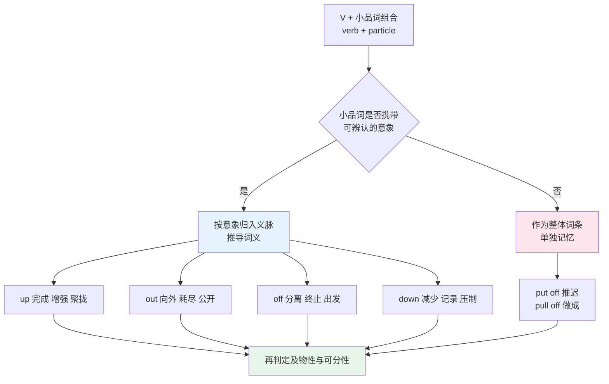
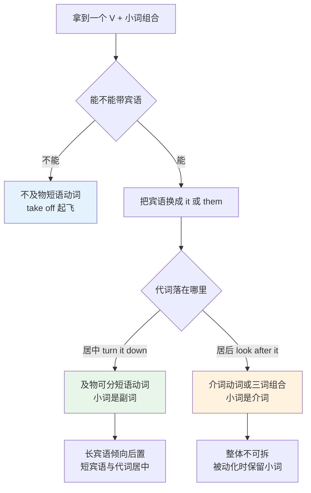
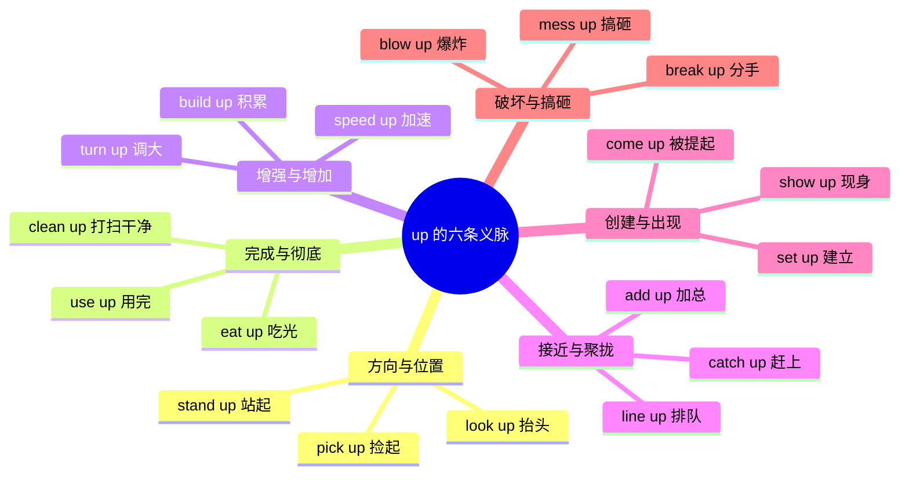
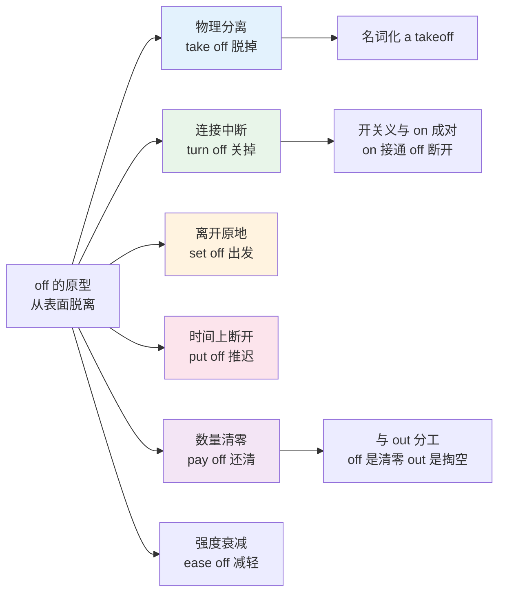
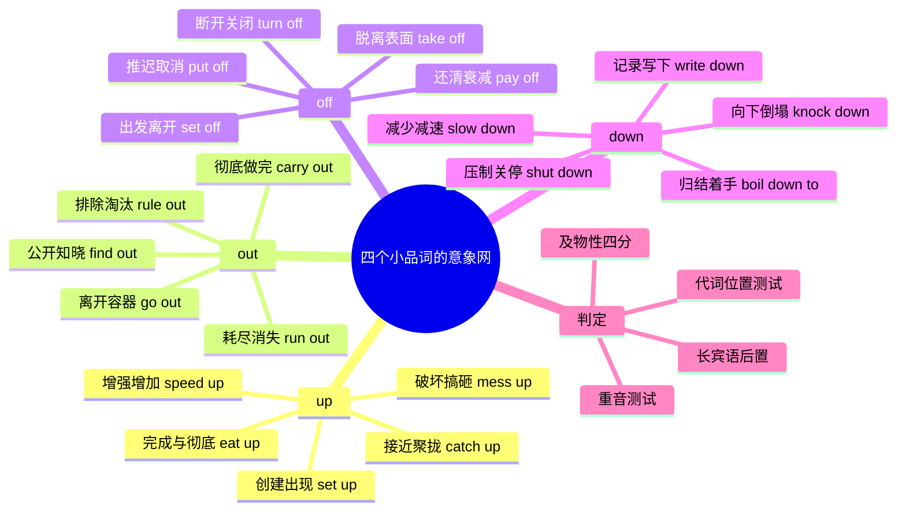

# 短语动词（上）up out off down

> [!info] 本篇定位
>
> 第十六章的第五篇，也是全书两篇短语动词的上半。前四篇处理的是词与词之间的横向关系——同义、反义、近形、搭配；从这一篇起转向一个纵向问题：一个你完全认识的动词，加上一个你完全认识的小词，为什么合起来就读不懂了。
>
> 本篇覆盖 `up`、`out`、`off`、`down` 四个小品词。它们是短语动词里出现频次最高的四个，也是义项辐射最远的四个。剩下的 `on`、`in`、`over`、`through`、`back`、`away` 在下一篇。
>
> 与相邻篇目的分工：`depend on`、`result in`、`consist of` 这类「动词保持本义、介词由动词硬性选定」的组合不在本篇，在 [[17.固定搭配/06.动词+介词固定搭配：depend on、result in、consist of\|动词+介词固定搭配：depend on、result in、consist of]]；介词本身的空间义到抽象义引申路径在 [[02.功能词与封闭词类速查/02.空间与路径介词：空间原型义到抽象义的引申\|空间与路径介词：空间原型义到抽象义的引申]]；短语动词与拉丁单动词的语域高低在 [[18.语域、英美差异与习语俚语/02.语域分层与英语词汇的历史层次\|语域分层与英语词汇的历史层次]] 有系统交代，本篇只给替换对照表。
>
> 读完你能做到三件事：看到一个陌生的 `V + up/out/off/down` 组合，先按小品词的意象猜一个大致方向；判断一个组合能不能拆开写成 `V + 宾语 + 小品词`；以及在正式文书里把口语色彩过重的短语动词换成对应的单动词。

---

## 1. 本篇导读：认识每个词，却读不懂这句话

下面五句话里没有一个生词，五句话都可能让人卡住：

> - The meeting was **put off** until Friday.
>   - 会议推迟到了周五。
> - I can't **make out** what he's saying.
>   - 我听不清他在说什么。
> - The milk has **gone off**.
>   - 牛奶变质了。
> - Sales are expected to **pick up** next quarter.
>   - 预计下季度销量会回升。
> - It all **boils down to** money.
>   - 归根结底就是钱的问题。

`put`、`make`、`go`、`pick`、`boil` 都是最基础的动词，`off`、`out`、`up`、`down` 都是最基础的小词。问题出在组合之后语义整体重写：`put off` 跟「放」没关系，`make out` 跟「制造」没关系，`go off` 跟「去」没关系。这类组合在英语里数量极大，而且集中在口语和一般书面语里——越是日常的表达，越倾向于用短语动词而不是单个的拉丁词。

对中文母语者来说，这里有一个结构上的不适应。中文的动词也带补语（「吃完」「打开」「用光」），但中文补语跟动词的语义关系相对透明：「吃完」就是「吃」加「完」。英语短语动词的语义透明度是一个连续统，从完全透明到完全不透明：

| 透明度 | 例子 | 能否从字面推出 |
| --- | --- | --- |
| 完全透明 | **sit down**、**stand up**、**go out** | 能，字面义相加即可 |
| 半透明 | **eat up**、**speed up**、**write down** | 部分能，小品词起体貌或程度作用 |
| 隐喻可及 | **break down**、**back down**、**cut off** | 需要一步隐喻转换才能推出 |
| 完全不透明 | **put off**、**pull off**、**make out** | 不能，只能当整体词条记 |

真正需要投入记忆资源的是后两档。而前两档——数量上占大头——完全可以靠小品词的意象推导出来，不必逐条背。本篇的编排思路正是这一点：先把四个小品词各自的意象网络铺开，再把动词挂进去。



这张图说明本篇的两条处理线。左侧那条是主线：小品词有意象可循时，先归义脉再推词义，`eat up`、`speed up`、`write down`、`run out` 都走这条路，一次学一个意象能带出十几个组合。右侧那条是补丁：意象已经磨没了的组合，`put off`、`pull off` 这一类，只能当成一个独立的词条背下来，跟背一个生词没有区别。两条线最后汇合到同一个问题上——不管词义怎么来的，用的时候都要判断这个组合能不能带宾语、宾语能不能插在中间。判定方法是第 2 节的内容。

---

## 2. 三类结构与可分性判定

### 2.1 先分清三种「动词 + 小词」

英语里「动词后面跟一个小词」的结构有三种，长得很像，语法行为完全不同。混为一谈是语序出错的根源。

| 结构类型 | 英文术语 | 结构式 | 例子 | 宾语能否插在中间 |
| --- | --- | --- | --- | --- |
| 短语动词 | phrasal verb | 动词 + 副词小品词 | **turn down** the offer | 能：turn the offer down |
| 介词动词 | prepositional verb | 动词 + 介词 | **look after** the baby | 不能：~~look the baby after~~ |
| 短语介词动词 | phrasal-prepositional verb | 动词 + 小品词 + 介词 | **put up with** the noise | 不能：~~put the noise up with~~ |

三者的分界点在于 `up`、`out`、`off`、`down` 这些词的双重身份。同一个 `up` 在 `turn up the volume` 里是副词（小品词），在 `run up the hill` 里是介词。副词跟动词是一伙的，介词跟后面的名词是一伙的。这个归属决定了宾语能不能挪位置。

> [!warning] 「小品词」不是新术语
>
> `particle` 在词典里译作「小品词」或「小词」，指的就是在短语动词里失去独立介词功能、跟动词绑成一体的那个成分。它跟介词形态相同，句法角色不同。词典标注短语动词时常写成 `turn sth ↔ down`，双箭头就是在告诉你宾语可以放两边。

### 2.2 四条判定操作

判断手里这个组合属于哪一类，有四条可以实际操作的测试。

**测试一：代词位置**。这是最可靠的一条。把宾语换成代词 `it` / `them` / `him`，看代词落在哪里。

> - Turn the radio down. → Turn **it** down. ✅ / ~~Turn down it.~~ ❌
>   - 把收音机音量调小。
> - Look after the baby. → Look after **it**. ✅ / ~~Look it after.~~ ❌
>   - 照看这个婴儿。

代词必须插在中间的是短语动词，代词必须跟在小词后面的是介词动词。这条规则对代词是强制的，对名词是可选的：`turn down the radio` 和 `turn the radio down` 都对，但代词只有一种排法。

**测试二：重音**。短语动词的小品词带重音，介词动词的介词不带重音。

```text
短语动词：  She turned DOWN the offer.     ／ˌtɜːnd ˈdaʊn／
介词动词：  She LOOKED after the baby.     ／ˈlʊkt ɑːftə／
```

第一句的语调峰落在 `down` 上，第二句的语调峰落在 `looked` 上，`after` 弱读，不带调峰。听英文播客时这个差别是能直接听出来的，比查词典快。

**测试三：能否插入副词**。介词动词允许在动词和介词之间塞副词，短语动词不允许。

> - She looked **carefully** after the children. ✅
> - ~~She turned **carefully** down the offer.~~ ❌ —— 要说 She carefully turned down the offer.

**测试四：介词能否随疑问词前置**。介词动词的介词可以跟着疑问词提到句首，短语动词的小品词不能：`On whom can we rely?` 成立，`Down what did she turn?` 不成立。这条测试只对语义较透明的介词动词灵，`look after` 这类习语化很深的组合，`After whom did she look?` 本身就别扭，判定还是回到测试一。

### 2.3 及物性四分

判完可分性还要判及物性。同一个组合在不同义项下的及物性可能相反，这是查词典时最容易看漏的地方。

| 类型 | 结构 | 例子 | 说明 |
| --- | --- | --- | --- |
| 不及物 | V + 小品词 | The plane **took off**. | 不能带宾语 |
| 及物可分 | V + O + 小品词 / V + 小品词 + O | **turn** the light **off** | 代词必须居中 |
| 及物不可分 | V + 小品词 + O | **look after** the kids | 代词也在后面 |
| 双及物 | V + O + 小品词 + O | **put** it **down to** experience | 少数三词组合 |

`take off` 同时具备两种身份，正好可以看清区别：

> - The plane **took off** at six.（不及物：起飞）
>   - 飞机六点起飞。
> - He **took off** his coat. / He **took** his coat **off**.（及物可分：脱掉）
>   - 他脱掉了外套。
> - She **took** three days **off**.（及物可分：请假）
>   - 她请了三天假。

同一个词形，三个义项，其中两个可分一个不及物。所以查词典时不能只看中文释义，要连着看 `[T]` / `[I]` 标记和 `sth ↔ off` 这样的结构式。词典标注的读法在 [[01.词汇入门与学习方法/04.词性与词典标注体例：词条上的缩写怎么读\|词性与词典标注体例：词条上的缩写怎么读]] 讲过。



流程图把两个判定合成了一条路径。第一个分叉靠语感也能过——能不能后面接东西，读几个例句就清楚了。第二个分叉是真正需要动手测的，方法只有一个：把宾语换成代词。图右下角那两个终点分别对应两条使用纪律：可分组合在宾语很长时要把小词提前，比如 `turn down the proposal that the committee submitted last week`，如果写成 `turn ... down`，中间隔了十几个词，读者会跟丢；不可分组合被动化时小词必须跟着走，`The baby was looked after by her grandmother`，`after` 不能丢。

### 2.4 长宾语后置的实际尺度

「短宾语居中、长宾语后置」不是硬性语法规则，是可读性问题。大致的操作尺度是：宾语超过四五个词就把小品词提前。

> - She **turned** the offer **down**.（宾语两个词，居中自然）
>   - 她拒绝了那个提议。
> - She **turned down** the offer that the recruiter had emailed her the previous evening.（宾语十二个词，必须后置）
>   - 她拒绝了招聘人员前一天晚上邮件发来的那个提议。

反过来，代词做宾语时永远居中，不因为句子长短改变。`turn it down` 没有 `turn down it` 这个选项。

---

## 3. up：从「向上」辐射出的六条义脉

`up` 是短语动词里出现最多的小品词，义项辐射也最远。它的原型是垂直向上，但绝大多数高频组合用的都是引申义。



六条义脉里，前两条是理解剩下四条的钥匙。「方向与位置」是原型，其余五条全是它的隐喻延伸：往上走意味着数量增加，于是有了「增强」；往上堆意味着聚成一堆，于是有了「聚拢」；从地面往上冒意味着出现，于是有了「创建与出现」；而「完成与彻底」这一条来路稍远——把东西堆到顶就没有空间再加了，容器满了即到头了，`up` 由此获得了表示动作到达终点的体貌功能，`eat up` 不是「往上吃」而是「吃到一点不剩」。最后一条「破坏与搞砸」是英语里一个特殊的语义漂移：`up` 表示「彻底」，彻底地弄一件事既可以是彻底做完，也可以是彻底弄坏，于是 `mess up`、`screw up`、`blow up` 全是负面的。

### 3.1 方向义与位置义

这一组语义透明，学的重点不在词义而在及物性和搭配。

| 英文 | 英式音标 | 美式音标 | 词性 | 中文 | 搭配与说明 |
| --- | --- | --- | --- | --- | --- |
| **stand up** | /ˌstænd ˈʌp/ | /ˌstænd ˈʌp/ | v. | 站起来；站得住脚 | 不及物；引申 the argument doesn't stand up 论点站不住 |
| **sit up** | /ˌsɪt ˈʌp/ | /ˌsɪt ˈʌp/ | v. | 坐直；熬夜 | sit up straight；sit up late 熬夜 |
| **get up** | /ˌɡet ˈʌp/ | /ˌɡet ˈʌp/ | v. | 起床；站起 | 与 wake up 分工：wake up 是醒，get up 是离开床 |
| **wake up** | /ˌweɪk ˈʌp/ | /ˌweɪk ˈʌp/ | v. | 醒来；叫醒 | 可分：wake me up at six |
| **pick up** | /ˌpɪk ˈʌp/ | /ˌpɪk ˈʌp/ | v. | 捡起；接人；顺带学会；回升 | 义项极多，pick up the phone / pick you up / pick up Spanish |
| **look up** | /ˌlʊk ˈʌp/ | /ˌlʊk ˈʌp/ | v. | 抬头看；查阅；好转 | look it up in the dictionary；things are looking up |
| **put up** | /ˌpʊt ˈʌp/ | /ˌpʊt ˈʌp/ | v. | 举起；张贴；搭建；留宿 | put up a tent / put up a notice / put you up for the night |
| **hold up** | /ˌhəʊld ˈʌp/ | /ˌhoʊld ˈʌp/ | v. | 举起；耽搁；持械抢劫 | 被动最常见：traffic was held up |
| **lift up** | /ˌlɪft ˈʌp/ | /ˌlɪft ˈʌp/ | v. | 举起 | 冗余度高，多数语境单说 lift 即可 |
| **pull up** | /ˌpʊl ˈʌp/ | /ˌpʊl ˈʌp/ | v. | 拉起；（车）停下；调出（文件） | pull up a chair 拉张椅子；pull up the file |
| **climb up** | /ˌklaɪm ˈʌp/ | /ˌklaɪm ˈʌp/ | v. | 爬上 | 此处 up 更接近介词，climb up the ladder |
| **hang up** | /ˌhæŋ ˈʌp/ | /ˌhæŋ ˈʌp/ | v. | 挂起；挂断电话 | hang up on sb 挂某人电话，带负面语气 |
| **roll up** | /ˌrəʊl ˈʌp/ | /ˌroʊl ˈʌp/ | v. | 卷起；（口）到场 | roll up your sleeves 卷袖子，引申为准备干活 |
| **stack up** | /ˌstæk ˈʌp/ | /ˌstæk ˈʌp/ | v. | 堆叠；比较起来如何 | how does it stack up against the competition |

`pick up` 值得单独说一句。它是英语里义项最散的短语动词之一：捡起东西、开车接人、顺带学会一门语言、销量回升、信号接收到、（口语）搭讪。这些义项之间的连线是「用手从下往上取」这个原型不断抽象的结果——从物体到人，从人到技能，从技能到抽象的量。遇到它时先看宾语是什么，宾语类别几乎能唯一确定义项。

### 3.2 完成与彻底

这一组的 `up` 不表示方向，表示动作做到底。中文对应的往往是「光」「完」「干净」这类结果补语。

| 英文 | 英式音标 | 美式音标 | 词性 | 中文 | 搭配与说明 |
| --- | --- | --- | --- | --- | --- |
| **eat up** | /ˌiːt ˈʌp/ | /ˌiːt ˈʌp/ | v. | 吃光；消耗掉 | 引申 the project ate up the budget |
| **drink up** | /ˌdrɪŋk ˈʌp/ | /ˌdrɪŋk ˈʌp/ | v. | 喝完 | 常用祈使句 drink up, we're leaving |
| **use up** | /ˌjuːz ˈʌp/ | /ˌjuːz ˈʌp/ | v. | 用完 | 与 run out of 的区别：use up 强调主语耗掉了它 |
| **finish up** | /ˌfɪnɪʃ ˈʌp/ | /ˌfɪnɪʃ ˈʌp/ | v. | 收尾；（英）最终落得 | 美式偏「收尾」，英式也表示 end up |
| **clean up** | /ˌkliːn ˈʌp/ | /ˌkliːn ˈʌp/ | v. | 打扫干净；整顿 | clean up the code 代码里指整理清理 |
| **wash up** | /ˌwɒʃ ˈʌp/ | /ˌwɑːʃ ˈʌp/ | v. | 洗餐具（英）；洗手脸（美） | 典型英美同形异义，详见英美差异篇 |
| **tidy up** | /ˌtaɪdi ˈʌp/ | /ˌtaɪdi ˈʌp/ | v. | 收拾整齐 | 英式高频，美式更常说 clean up |
| **clear up** | /ˌklɪər ˈʌp/ | /ˌklɪr ˈʌp/ | v. | 清理；放晴；澄清 | clear up a misunderstanding 澄清误会 |
| **burn up** | /ˌbɜːn ˈʌp/ | /ˌbɝːn ˈʌp/ | v. | 烧光；（美口）使恼火 | 与 burn down 分工见 6.1 |
| **fill up** | /ˌfɪl ˈʌp/ | /ˌfɪl ˈʌp/ | v. | 装满；加满油 | fill up the tank；美式也说 fill her up |
| **lock up** | /ˌlɒk ˈʌp/ | /ˌlɑːk ˈʌp/ | v. | 锁好门窗；把人关起来 | 也指资金 lock up capital 占用资金 |
| **wrap up** | /ˌræp ˈʌp/ | /ˌræp ˈʌp/ | v. | 包好；结束；穿暖 | let's wrap up 会议收尾常用 |
| **sum up** | /ˌsʌm ˈʌp/ | /ˌsʌm ˈʌp/ | v. | 总结 | to sum up 作插入语；名词 summary 同源 |
| **wind up** | /ˌwaɪnd ˈʌp/ | /ˌwaɪnd ˈʌp/ | v. | 结束；清盘；最终落得 | 注意读 /waɪnd/ 不读 /wɪnd/ |
| **round up** | /ˌraʊnd ˈʌp/ | /ˌraʊnd ˈʌp/ | v. | 集合；围捕；向上取整 | round up to the nearest ten |
| **settle up** | /ˌsetl ˈʌp/ | /ˌsetl ˈʌp/ | v. | 结清账目 | 朋友间 AA 结账常用 |
| **sober up** | /ˌsəʊbər ˈʌp/ | /ˌsoʊbər ˈʌp/ | v. | 醒酒 | 对应 sober 形容词「清醒的」 |
| **dry up** | /ˌdraɪ ˈʌp/ | /ˌdraɪ ˈʌp/ | v. | 干涸；（资金）枯竭；说不下去 | funding dried up 资金断了 |
| **pack up** | /ˌpæk ˈʌp/ | /ˌpæk ˈʌp/ | v. | 收拾行装；（英口）机器罢工 | my laptop packed up 是英式口语 |
| **pay up** | /ˌpeɪ ˈʌp/ | /ˌpeɪ ˈʌp/ | v. | （不情愿地）付清 | 带催逼语气，与 pay off 区别见 5.5 |
| **own up** | /ˌəʊn ˈʌp/ | /ˌoʊn ˈʌp/ | v. | 坦白承认 | own up to sth 三词形式更常见 |
| **shut up** | /ˌʃʌt ˈʌp/ | /ˌʃʌt ˈʌp/ | v. | 闭嘴；锁上 | 命令式极不礼貌，正式场合不用 |

> [!tip] 一条快速判别法
>
> 遇到 `V + up` 想不出意思时，先试着在中文里给动词加「光 / 完 / 干净 / 到底」。`eat up` 试成「吃光」，`use up` 试成「用完」，`clean up` 试成「打扫干净」，`dry up` 试成「干到底」。命中率相当高。试不通的再当独立词条查。

### 3.3 增强、增加与提高

数量在坐标轴上往上走，是 `up` 最容易理解的一条隐喻。

| 英文 | 英式音标 | 美式音标 | 词性 | 中文 | 搭配与说明 |
| --- | --- | --- | --- | --- | --- |
| **speed up** | /ˌspiːd ˈʌp/ | /ˌspiːd ˈʌp/ | v. | 加速 | 反义 slow down，不是 speed down |
| **warm up** | /ˌwɔːm ˈʌp/ | /ˌwɔːrm ˈʌp/ | v. | 热身；加热；变热络 | 名词 a warm-up 带连字符 |
| **heat up** | /ˌhiːt ˈʌp/ | /ˌhiːt ˈʌp/ | v. | 加热；（局势）升温 | competition is heating up |
| **turn up** | /ˌtɜːn ˈʌp/ | /ˌtɝːn ˈʌp/ | v. | 调大；出现；翻找出 | turn the music up 与 turn up late 是两个义项 |
| **brighten up** | /ˌbraɪtn ˈʌp/ | /ˌbraɪtn ˈʌp/ | v. | 变亮；使愉快 | brighten up the room / your day |
| **cheer up** | /ˌtʃɪər ˈʌp/ | /ˌtʃɪr ˈʌp/ | v. | 振作；使高兴 | cheer up 单用是安慰语，cheer sb up 是及物 |
| **liven up** | /ˌlaɪvn ˈʌp/ | /ˌlaɪvn ˈʌp/ | v. | 使活跃 | liven up the party |
| **build up** | /ˌbɪld ˈʌp/ | /ˌbɪld ˈʌp/ | v. | 逐步积累；增强 | 名词 a buildup of pressure 压力累积 |
| **go up** | /ˌɡəʊ ˈʌp/ | /ˌɡoʊ ˈʌp/ | v. | 上涨；被建起 | prices went up by 8%；单位用 by 见介词篇 |
| **move up** | /ˌmuːv ˈʌp/ | /ˌmuːv ˈʌp/ | v. | 往上挪；升职；提前 | move the meeting up 美式指提前，英式说 bring forward |
| **step up** | /ˌstep ˈʌp/ | /ˌstep ˈʌp/ | v. | 加大力度；挺身而出 | step up production；step up and take charge |
| **scale up** | /ˌskeɪl ˈʌp/ | /ˌskeɪl ˈʌp/ | v. | 扩大规模 | 技术与商业语境高频，反义 scale down |
| **push up** | /ˌpʊʃ ˈʌp/ | /ˌpʊʃ ˈʌp/ | v. | 推高 | push up prices；名词 push-up 是俯卧撑 |
| **drive up** | /ˌdraɪv ˈʌp/ | /ˌdraɪv ˈʌp/ | v. | 抬高（价格、成本） | drive up costs 比 increase costs 更强调外力 |
| **beef up** | /ˌbiːf ˈʌp/ | /ˌbiːf ˈʌp/ | v. | 加强 | 口语色彩，beef up security |
| **top up** | /ˌtɒp ˈʌp/ | /ˌtɑːp ˈʌp/ | v. | 加满；充值 | 英式手机充值说 top up，美式说 refill / reload |
| **stock up** | /ˌstɒk ˈʌp/ | /ˌstɑːk ˈʌp/ | v. | 囤货 | stock up on rice，后接 on |
| **rack up** | /ˌræk ˈʌp/ | /ˌræk ˈʌp/ | v. | 累积（分数、亏损） | rack up debts 累积债务 |
| **ramp up** | /ˌræmp ˈʌp/ | /ˌræmp ˈʌp/ | v. | 逐步加大 | ramp up capacity，工程与商业语境 |

> [!warning] speed up 的反义不是 speed down
>
> `up` 与 `down` 并不总是成对。表示速度时，加速用 `speed up`，减速用 `slow down`，`slow up` 词典虽有收录，但频率远低于 `slow down`，而 `speed down` 根本不存在。类似的不对称还有 `mess up` 没有 `mess down`、`show up` 没有 `show down`（`showdown` 是名词「摊牌」，不是短语动词）。成对与不成对的完整对照见 6.6。

### 3.4 接近与聚拢

物体往上堆会聚成一堆，`up` 由此获得「靠拢、合到一处」的意思。这一支在英语里常跟 `to`、`with` 连用变成三词组合。

| 英文 | 英式音标 | 美式音标 | 词性 | 中文 | 搭配与说明 |
| --- | --- | --- | --- | --- | --- |
| **come up** | /ˌkʌm ˈʌp/ | /ˌkʌm ˈʌp/ | v. | 走近；出现；被提起 | the topic came up 话题被提到 |
| **catch up** | /ˌkætʃ ˈʌp/ | /ˌkætʃ ˈʌp/ | v. | 赶上；叙旧 | catch up with sb / catch up on emails |
| **keep up** | /ˌkiːp ˈʌp/ | /ˌkiːp ˈʌp/ | v. | 跟上；维持 | keep up with the pace；keep up the good work |
| **team up** | /ˌtiːm ˈʌp/ | /ˌtiːm ˈʌp/ | v. | 组队 | team up with sb |
| **pair up** | /ˌpeər ˈʌp/ | /ˌper ˈʌp/ | v. | 两两配对 | 课堂指令常用 |
| **add up** | /ˌæd ˈʌp/ | /ˌæd ˈʌp/ | v. | 加总；说得通 | his story doesn't add up 他的说法讲不通 |
| **line up** | /ˌlaɪn ˈʌp/ | /ˌlaɪn ˈʌp/ | v. | 排队；安排好 | 名词 lineup 阵容 |
| **meet up** | /ˌmiːt ˈʌp/ | /ˌmiːt ˈʌp/ | v. | 碰面 | meet up with sb，比 meet 更随意 |
| **link up** | /ˌlɪŋk ˈʌp/ | /ˌlɪŋk ˈʌp/ | v. | 连接；会合 | 技术语境 link up two systems |
| **pile up** | /ˌpaɪl ˈʌp/ | /ˌpaɪl ˈʌp/ | v. | 堆积 | work is piling up 活儿越堆越多 |
| **save up** | /ˌseɪv ˈʌp/ | /ˌseɪv ˈʌp/ | v. | 攒钱 | save up for a car，后接 for |
| **gather up** | /ˌɡæðər ˈʌp/ | /ˌɡæðər ˈʌp/ | v. | 收拢 | gather up your things |
| **round up** | /ˌraʊnd ˈʌp/ | /ˌraʊnd ˈʌp/ | v. | 召集；围捕 | 与 3.2 的取整义同形 |
| **measure up** | /ˌmeʒər ˈʌp/ | /ˌmeʒər ˈʌp/ | v. | 达到标准 | measure up to expectations |
| **live up to** | /ˌlɪv ˈʌp tuː/ | /ˌlɪv ˈʌp tuː/ | v. | 不辜负 | live up to the hype 名副其实 |
| **stand up to** | /ˌstænd ˈʌp tuː/ | /ˌstænd ˈʌp tuː/ | v. | 勇敢面对；经得起 | stand up to a bully / stand up to scrutiny |
| **stand up for** | /ˌstænd ˈʌp fɔː/ | /ˌstænd ˈʌp fɔːr/ | v. | 声援；维护 | stand up for your rights |
| **look up to** | /ˌlʊk ˈʌp tuː/ | /ˌlʊk ˈʌp tuː/ | v. | 敬仰 | 反义 look down on 见 6.4 |
| **put up with** | /ˌpʊt ˈʌp wɪð/ | /ˌpʊt ˈʌp wɪð/ | v. | 忍受 | 不可分，put up with it；正式对应 tolerate |
| **come up with** | /ˌkʌm ˈʌp wɪð/ | /ˌkʌm ˈʌp wɪð/ | v. | 想出；拿得出 | come up with an idea / with the money |
| **come up against** | /ˌkʌm ˈʌp əˈɡenst/ | /ˌkʌm ˈʌp əˈɡenst/ | v. | 遭遇（困难） | come up against resistance |
| **catch up on** | /ˌkætʃ ˈʌp ɒn/ | /ˌkætʃ ˈʌp ɑːn/ | v. | 补做；补看 | catch up on sleep 补觉 |
| **make up for** | /ˌmeɪk ˈʌp fɔː/ | /ˌmeɪk ˈʌp fɔːr/ | v. | 弥补 | make up for lost time |

三词组合是短语动词里最难拆的一类：动词、小品词、介词三者绑成一个整体，宾语只能放在最后。`put up with the noise` 不能说成 `put the noise up with`，被动化时三个词全部保留：`the noise had to be put up with`。这类组合在词典里通常单独立条，查 `put` 的词条时要往下翻到 `put up with`。

### 3.5 创建、组装与出现

从地面往上冒出来，引申为「造出来、出现」。

| 英文 | 英式音标 | 美式音标 | 词性 | 中文 | 搭配与说明 |
| --- | --- | --- | --- | --- | --- |
| **set up** | /ˌset ˈʌp/ | /ˌset ˈʌp/ | v. | 建立；安装；设置；陷害 | 名词 setup 配置；set sb up 也指栽赃 |
| **start up** | /ˌstɑːt ˈʌp/ | /ˌstɑːrt ˈʌp/ | v. | 启动；创办 | 名词 a startup 初创公司 |
| **open up** | /ˌəʊpən ˈʌp/ | /ˌoʊpən ˈʌp/ | v. | 开放；开辟；敞开心扉 | open up new markets；he finally opened up |
| **draw up** | /ˌdrɔː ˈʌp/ | /ˌdrɔː ˈʌp/ | v. | 起草；（车）停靠 | draw up a contract 正式度高于 write |
| **make up** | /ˌmeɪk ˈʌp/ | /ˌmeɪk ˈʌp/ | v. | 编造；化妆；和好；构成 | women make up 60% of staff 构成义常用 |
| **think up** | /ˌθɪŋk ˈʌp/ | /ˌθɪŋk ˈʌp/ | v. | 想出（点子） | think up an excuse |
| **dream up** | /ˌdriːm ˈʌp/ | /ˌdriːm ˈʌp/ | v. | 凭空想出 | 带轻微贬义，暗示不切实际 |
| **cook up** | /ˌkʊk ˈʌp/ | /ˌkʊk ˈʌp/ | v. | 编造；临时想出 | cook up a story 编故事 |
| **crop up** | /ˌkrɒp ˈʌp/ | /ˌkrɑːp ˈʌp/ | v. | 意外冒出 | something's cropped up 临时有事 |
| **show up** | /ˌʃəʊ ˈʌp/ | /ˌʃoʊ ˈʌp/ | v. | 露面；使显眼；让人难堪 | he didn't show up 他没来 |
| **spring up** | /ˌsprɪŋ ˈʌp/ | /ˌsprɪŋ ˈʌp/ | v. | 涌现 | cafés sprang up everywhere |
| **turn up** | /ˌtɜːn ˈʌp/ | /ˌtɝːn ˈʌp/ | v. | 出现；找到 | 与 show up 近义，英式更常用 turn up |
| **sign up** | /ˌsaɪn ˈʌp/ | /ˌsaɪn ˈʌp/ | v. | 报名；注册 | sign up for a course |
| **take up** | /ˌteɪk ˈʌp/ | /ˌteɪk ˈʌp/ | v. | 开始从事；占用；接受 | take up running；it takes up space |
| **bring up** | /ˌbrɪŋ ˈʌp/ | /ˌbrɪŋ ˈʌp/ | v. | 抚养；提出话题；调出 | bring up a child / bring up the issue |
| **write up** | /ˌraɪt ˈʌp/ | /ˌraɪt ˈʌp/ | v. | 写成完整稿 | write up the notes 把笔记整理成文 |
| **grow up** | /ˌɡrəʊ ˈʌp/ | /ˌɡroʊ ˈʌp/ | v. | 长大；成熟起来 | grow up! 是不客气的责备 |
| **follow up** | /ˌfɒləʊ ˈʌp/ | /ˌfɑːloʊ ˈʌp/ | v. | 跟进 | follow up on the request；名词 a follow-up |
| **back up** | /ˌbæk ˈʌp/ | /ˌbæk ˈʌp/ | v. | 支持；备份；倒车 | back up your claim / back up the data |
| **end up** | /ˌend ˈʌp/ | /ˌend ˈʌp/ | v. | 最终成为；最后落到 | end up doing sth；end up in hospital |

### 3.6 破坏与搞砸

| 英文 | 英式音标 | 美式音标 | 词性 | 中文 | 搭配与说明 |
| --- | --- | --- | --- | --- | --- |
| **mess up** | /ˌmes ˈʌp/ | /ˌmes ˈʌp/ | v. | 弄乱；搞砸 | 口语；正式写作换 botch 或 disrupt |
| **screw up** | /ˌskruː ˈʌp/ | /ˌskruː ˈʌp/ | v. | 搞砸 | 比 mess up 更粗，职场书面语回避 |
| **mix up** | /ˌmɪks ˈʌp/ | /ˌmɪks ˈʌp/ | v. | 弄混；搅拌 | I mixed up the dates；名词 a mix-up |
| **blow up** | /ˌbləʊ ˈʌp/ | /ˌbloʊ ˈʌp/ | v. | 爆炸；发火；放大照片 | blow up at sb 冲某人发火 |
| **break up** | /ˌbreɪk ˈʌp/ | /ˌbreɪk ˈʌp/ | v. | 分手；解散；打碎；信号断续 | you're breaking up 电话里指听不清 |
| **split up** | /ˌsplɪt ˈʌp/ | /ˌsplɪt ˈʌp/ | v. | 分手；分组 | split up into teams |
| **give up** | /ˌɡɪv ˈʌp/ | /ˌɡɪv ˈʌp/ | v. | 放弃；戒掉；自首 | give up smoking；give oneself up |
| **tear up** | /ˌteər ˈʌp/ | /ˌter ˈʌp/ | v. | 撕碎；撕毁（协议） | tear up the agreement |
| **beat up** | /ˌbiːt ˈʌp/ | /ˌbiːt ˈʌp/ | v. | 痛打 | beat oneself up 过分自责 |
| **hold up** | /ˌhəʊld ˈʌp/ | /ˌhoʊld ˈʌp/ | v. | 持械抢劫；耽搁 | 名词 a holdup |
| **act up** | /ˌækt ˈʌp/ | /ˌækt ˈʌp/ | v. | 出毛病；捣蛋 | my knee is acting up |
| **flare up** | /ˌfleər ˈʌp/ | /ˌfler ˈʌp/ | v. | 突然发作；爆发 | tensions flared up |
| **choke up** | /ˌtʃəʊk ˈʌp/ | /ˌtʃoʊk ˈʌp/ | v. | 哽咽 | 被动多：I got choked up |
| **stir up** | /ˌstɜːr ˈʌp/ | /ˌstɝː ˈʌp/ | v. | 挑起；搅动 | stir up trouble 惹事 |
| **muck up** | /ˌmʌk ˈʌp/ | /ˌmʌk ˈʌp/ | v. | 弄糟（英口） | 英式口语，美式基本不用 |

---

## 4. out：向外、耗尽与彻底

`out` 的原型是「从容器内部到外部」。英语把很多抽象事物概念化为容器——身体是容器、房子是容器、状态是容器、知识是容器——`out` 的义项网络就是沿着这些容器隐喻长出来的。

### 4.1 离开容器与向外

| 英文 | 英式音标 | 美式音标 | 词性 | 中文 | 搭配与说明 |
| --- | --- | --- | --- | --- | --- |
| **go out** | /ˌɡəʊ ˈaʊt/ | /ˌɡoʊ ˈaʊt/ | v. | 出去；（灯火）熄灭；交往 | go out with sb 谈恋爱 |
| **get out** | /ˌɡet ˈaʊt/ | /ˌɡet ˈaʊt/ | v. | 出去；（消息）传开 | get out of a contract 脱身 |
| **come out** | /ˌkʌm ˈaʊt/ | /ˌkʌm ˈaʊt/ | v. | 出来；出版；结果是；出柜 | the book comes out in May |
| **move out** | /ˌmuːv ˈaʊt/ | /ˌmuːv ˈaʊt/ | v. | 搬走 | 反义 move in |
| **check out** | /ˌtʃek ˈaʊt/ | /ˌtʃek ˈaʊt/ | v. | 退房；查看；借出；（信息）核实属实 | check out this article 看看这篇 |
| **eat out** | /ˌiːt ˈaʊt/ | /ˌiːt ˈaʊt/ | v. | 在外面吃 | 反义 eat in / cook at home |
| **take out** | /ˌteɪk ˈaʊt/ | /ˌteɪk ˈaʊt/ | v. | 取出；外带；办理（保险贷款） | take out a loan；名词 takeout 外卖（美） |
| **pull out** | /ˌpʊl ˈaʊt/ | /ˌpʊl ˈaʊt/ | v. | 拔出；退出；驶出 | pull out of the deal 退出交易 |
| **reach out** | /ˌriːtʃ ˈaʊt/ | /ˌriːtʃ ˈaʊt/ | v. | 伸手；主动联系 | reach out to sb 商务邮件高频 |
| **stretch out** | /ˌstretʃ ˈaʊt/ | /ˌstretʃ ˈaʊt/ | v. | 伸展；延长 | stretch out your legs |
| **spread out** | /ˌspred ˈaʊt/ | /ˌspred ˈaʊt/ | v. | 散开；铺开 | spread out the map |
| **hand out** | /ˌhænd ˈaʊt/ | /ˌhænd ˈaʊt/ | v. | 分发 | 名词 a handout 讲义 |
| **give out** | /ˌɡɪv ˈaʊt/ | /ˌɡɪv ˈaʊt/ | v. | 分发；发出；耗尽失灵 | my legs gave out 腿撑不住了 |
| **send out** | /ˌsend ˈaʊt/ | /ˌsend ˈaʊt/ | v. | 发出；派出 | send out invitations |
| **let out** | /ˌlet ˈaʊt/ | /ˌlet ˈaʊt/ | v. | 放出；泄露；放宽衣服 | let out a scream 发出尖叫 |
| **pour out** | /ˌpɔːr ˈaʊt/ | /ˌpɔːr ˈaʊt/ | v. | 倒出；倾诉 | pour out one's heart |
| **set out** | /ˌset ˈaʊt/ | /ˌset ˈaʊt/ | v. | 出发；着手；阐明 | the report sets out three options |
| **head out** | /ˌhed ˈaʊt/ | /ˌhed ˈaʊt/ | v. | 动身 | 口语，比 set out 随意 |
| **breathe out** | /ˌbriːð ˈaʊt/ | /ˌbriːð ˈaʊt/ | v. | 呼气 | 反义 breathe in |
| **ask out** | /ˌɑːsk ˈaʊt/ | /ˌæsk ˈaʊt/ | v. | 约某人出去 | ask her out 邀约 |
| **hang out** | /ˌhæŋ ˈaʊt/ | /ˌhæŋ ˈaʊt/ | v. | 闲逛消磨时间；晾衣服 | hang out with friends |

### 4.2 耗尽与消失

容器里的东西流光了，剩下空的。这一支与 `up` 的「完成」义有交叉，但侧重点不同：`up` 强调做到底，`out` 强调没有剩余。

| 英文 | 英式音标 | 美式音标 | 词性 | 中文 | 搭配与说明 |
| --- | --- | --- | --- | --- | --- |
| **run out** | /ˌrʌn ˈaʊt/ | /ˌrʌn ˈaʊt/ | v. | 用完；到期 | the milk ran out；带宾语要加 of |
| **run out of** | /ˌrʌn ˈaʊt əv/ | /ˌrʌn ˈaʊt əv/ | v. | 把…用完 | we've run out of time |
| **die out** | /ˌdaɪ ˈaʊt/ | /ˌdaɪ ˈaʊt/ | v. | 灭绝；逐渐消失 | the custom has died out |
| **fade out** | /ˌfeɪd ˈaʊt/ | /ˌfeɪd ˈaʊt/ | v. | 淡出 | 影视音频术语，反义 fade in |
| **wear out** | /ˌweər ˈaʊt/ | /ˌwer ˈaʊt/ | v. | 磨破；使精疲力竭 | worn out 既指衣服也指人 |
| **burn out** | /ˌbɜːn ˈaʊt/ | /ˌbɝːn ˈaʊt/ | v. | 烧坏；倦怠 | 名词 burnout 职业倦怠 |
| **sell out** | /ˌsel ˈaʊt/ | /ˌsel ˈaʊt/ | v. | 售罄；出卖原则 | sold out；名词 a sellout |
| **dry out** | /ˌdraɪ ˈaʊt/ | /ˌdraɪ ˈaʊt/ | v. | 彻底变干；戒酒 | 与 dry up 分工：dry out 指水分蒸发完 |
| **tire out** | /ˌtaɪər ˈaʊt/ | /ˌtaɪər ˈaʊt/ | v. | 使累坏 | 常用过去分词 tired out |
| **peter out** | /ˌpiːtər ˈaʊt/ | /ˌpiːtər ˈaʊt/ | v. | 逐渐枯竭停止 | the road petered out 路渐渐没了 |
| **black out** | /ˌblæk ˈaʊt/ | /ˌblæk ˈaʊt/ | v. | 昏厥；停电；封锁消息 | 名词 a blackout |
| **pass out** | /ˌpɑːs ˈaʊt/ | /ˌpæs ˈaʊt/ | v. | 昏倒；分发 | 分发义以美式为主；英式另有「军校结业」义，a passing-out parade |
| **knock out** | /ˌnɒk ˈaʊt/ | /ˌnɑːk ˈaʊt/ | v. | 击昏；淘汰；毁掉 | 名词 a knockout；缩写 KO |
| **put out** | /ˌpʊt ˈaʊt/ | /ˌpʊt ˈaʊt/ | v. | 熄灭；发布；使不便 | put out a fire / put out a statement |
| **wipe out** | /ˌwaɪp ˈaʊt/ | /ˌwaɪp ˈaʊt/ | v. | 彻底消灭；使累垮 | wipe out the debt 一笔勾销 |
| **max out** | /ˌmæks ˈaʊt/ | /ˌmæks ˈaʊt/ | v. | 用到上限 | max out a credit card 刷爆信用卡 |

### 4.3 公开与被知晓

信息从「不知道」这个容器里跑出来，就成了公开。这一支在阅读技术文档与新闻时出现频率极高。

| 英文 | 英式音标 | 美式音标 | 词性 | 中文 | 搭配与说明 |
| --- | --- | --- | --- | --- | --- |
| **find out** | /ˌfaɪnd ˈaʊt/ | /ˌfaɪnd ˈaʊt/ | v. | 查明；发现 | 与 find 分工：find 是找到物，find out 是弄清事 |
| **point out** | /ˌpɔɪnt ˈaʊt/ | /ˌpɔɪnt ˈaʊt/ | v. | 指出 | 学术写作高频，point out that... |
| **speak out** | /ˌspiːk ˈaʊt/ | /ˌspiːk ˈaʊt/ | v. | 公开表态 | speak out against sth |
| **cry out** | /ˌkraɪ ˈaʊt/ | /ˌkraɪ ˈaʊt/ | v. | 大喊；迫切需要 | cry out for reform 亟待改革 |
| **call out** | /ˌkɔːl ˈaʊt/ | /ˌkɔːl ˈaʊt/ | v. | 喊出；公开指责 | call sb out on sth 当面指出问题 |
| **spell out** | /ˌspel ˈaʊt/ | /ˌspel ˈaʊt/ | v. | 逐字拼；讲得明明白白 | do I have to spell it out |
| **lay out** | /ˌleɪ ˈaʊt/ | /ˌleɪ ˈaʊt/ | v. | 摆开；详细说明；布局 | 名词 layout 版式 |
| **bring out** | /ˌbrɪŋ ˈaʊt/ | /ˌbrɪŋ ˈaʊt/ | v. | 推出；使显现 | bring out the best in sb |
| **turn out** | /ˌtɜːn ˈaʊt/ | /ˌtɝːn ˈaʊt/ | v. | 结果是；到场；生产 | it turned out to be true；名词 turnout 出席率 |
| **work out** | /ˌwɜːk ˈaʊt/ | /ˌwɝːk ˈaʊt/ | v. | 算出；弄清；锻炼；结果良好 | things worked out 事情有了好结果 |
| **figure out** | /ˌfɪɡər ˈaʊt/ | /ˌfɪɡjər ˈaʊt/ | v. | 想明白 | 美式高频，英式也用 work out |
| **sort out** | /ˌsɔːt ˈaʊt/ | /ˌsɔːrt ˈaʊt/ | v. | 理清；解决；分类 | 英式极高频，美式偏 straighten out |
| **make out** | /ˌmeɪk ˈaʊt/ | /ˌmeɪk ˈaʊt/ | v. | 辨认出；声称；（美俚）亲热 | I can't make out the handwriting |
| **single out** | /ˌsɪŋɡl ˈaʊt/ | /ˌsɪŋɡl ˈaʊt/ | v. | 单独挑出 | single sb out for praise |
| **stand out** | /ˌstænd ˈaʊt/ | /ˌstænd ˈaʊt/ | v. | 突出显眼 | stand out from the crowd |
| **stick out** | /ˌstɪk ˈaʊt/ | /ˌstɪk ˈaʊt/ | v. | 伸出；显眼；坚持到底 | stick it out 咬牙坚持 |
| **let on** | /ˌlet ˈɒn/ | /ˌlet ˈɑːn/ | v. | 露口风；承认知情 | 与 let out 分工：let on 是松口承认，let out 是把秘密说漏 |

> [!example] work out 的四个义项在真实句子里的分工
>
> - I can't **work out** how to fix this bug.
>   - 我搞不清这个 bug 怎么修。（弄清楚）
> - The total **works out** at £340.
>   - 总额算下来是 340 英镑。（计算得出，英式用 at，美式用 to）
> - She **works out** three times a week.
>   - 她一周健身三次。（锻炼）
> - I hope it **works out** for you.
>   - 希望你一切顺利。（结果良好）
>
> 四个义项的判别全靠句法环境：接 wh- 从句是「弄清」，接 at/to 加数字是「算出」，不及物且主语是人是「锻炼」，主语是抽象的 it/things 是「结果良好」。

### 4.4 排除与淘汰

| 英文 | 英式音标 | 美式音标 | 词性 | 中文 | 搭配与说明 |
| --- | --- | --- | --- | --- | --- |
| **leave out** | /ˌliːv ˈaʊt/ | /ˌliːv ˈaʊt/ | v. | 遗漏；把人晾在一边 | feel left out 感到被排除在外 |
| **cut out** | /ˌkʌt ˈaʊt/ | /ˌkʌt ˈaʊt/ | v. | 剪掉；戒掉；（发动机）熄火 | cut out sugar 戒糖 |
| **rule out** | /ˌruːl ˈaʊt/ | /ˌruːl ˈaʊt/ | v. | 排除可能性 | 正式度较高，学术写作常用 |
| **cross out** | /ˌkrɒs ˈaʊt/ | /ˌkrɔːs ˈaʊt/ | v. | 划掉 | 与 strike out 同义 |
| **weed out** | /ˌwiːd ˈaʊt/ | /ˌwiːd ˈaʊt/ | v. | 剔除劣质部分 | weed out unqualified applicants |
| **filter out** | /ˌfɪltər ˈaʊt/ | /ˌfɪltər ˈaʊt/ | v. | 过滤掉 | 技术语境高频 |
| **opt out** | /ˌɒpt ˈaʊt/ | /ˌɑːpt ˈaʊt/ | v. | 选择退出 | opt out of the scheme；反义 opt in |
| **drop out** | /ˌdrɒp ˈaʊt/ | /ˌdrɑːp ˈaʊt/ | v. | 辍学；中途退出 | 名词 a dropout |
| **throw out** | /ˌθrəʊ ˈaʊt/ | /ˌθroʊ ˈaʊt/ | v. | 扔掉；否决；赶走 | the court threw out the case |
| **kick out** | /ˌkɪk ˈaʊt/ | /ˌkɪk ˈaʊt/ | v. | 撵走 | 口语，正式说 expel |
| **lock out** | /ˌlɒk ˈaʊt/ | /ˌlɑːk ˈaʊt/ | v. | 把人锁在外面；封锁账户 | I locked myself out 忘带钥匙被锁外面 |
| **log out** | /ˌlɒɡ ˈaʊt/ | /ˌlɔːɡ ˈaʊt/ | v. | 退出登录 | 也说 log off，见 5.2 |
| **back out** | /ˌbæk ˈaʊt/ | /ˌbæk ˈaʊt/ | v. | 反悔退出 | back out of the agreement |
| **chicken out** | /ˌtʃɪkɪn ˈaʊt/ | /ˌtʃɪkɪn ˈaʊt/ | v. | 临阵退缩 | 口语，带嘲讽 |
| **phase out** | /ˌfeɪz ˈaʊt/ | /ˌfeɪz ˈaʊt/ | v. | 分阶段淘汰 | 反义 phase in |
| **edge out** | /ˌedʒ ˈaʊt/ | /ˌedʒ ˈaʊt/ | v. | 险胜；挤掉 | edge out the competition |

### 4.5 彻底与做完

| 英文 | 英式音标 | 美式音标 | 词性 | 中文 | 搭配与说明 |
| --- | --- | --- | --- | --- | --- |
| **clean out** | /ˌkliːn ˈaʊt/ | /ˌkliːn ˈaʊt/ | v. | 彻底清空；掏空（钱） | clean out the garage |
| **clear out** | /ˌklɪər ˈaʊt/ | /ˌklɪr ˈaʊt/ | v. | 清空；（口）走开 | clear out your desk |
| **iron out** | /ˌaɪən ˈaʊt/ | /ˌaɪərn ˈaʊt/ | v. | 消除分歧；理顺 | iron out the differences |
| **hash out** | /ˌhæʃ ˈaʊt/ | /ˌhæʃ ˈaʊt/ | v. | 反复讨论出结论 | 美式偏多，hash out the details |
| **flesh out** | /ˌfleʃ ˈaʊt/ | /ˌfleʃ ˈaʊt/ | v. | 充实细节 | flesh out the proposal |
| **map out** | /ˌmæp ˈaʊt/ | /ˌmæp ˈaʊt/ | v. | 详细规划 | map out a strategy |
| **carry out** | /ˌkæri ˈaʊt/ | /ˌkæri ˈaʊt/ | v. | 执行；进行 | carry out research / an order |
| **fill out** | /ˌfɪl ˈaʊt/ | /ˌfɪl ˈaʊt/ | v. | 填写表格（美）；变丰满 | 英式多说 fill in |
| **print out** | /ˌprɪnt ˈaʊt/ | /ˌprɪnt ˈaʊt/ | v. | 打印出来 | 名词 a printout |
| **try out** | /ˌtraɪ ˈaʊt/ | /ˌtraɪ ˈaʊt/ | v. | 试用；试演 | try out for the team 参加选拔 |
| **test out** | /ˌtest ˈaʊt/ | /ˌtest ˈaʊt/ | v. | 实地测试 | test out a hypothesis |
| **help out** | /ˌhelp ˈaʊt/ | /ˌhelp ˈaʊt/ | v. | 帮一把 | help sb out with sth |
| **watch out** | /ˌwɒtʃ ˈaʊt/ | /ˌwɑːtʃ ˈaʊt/ | v. | 当心 | watch out for scams |
| **look out** | /ˌlʊk ˈaʊt/ | /ˌlʊk ˈaʊt/ | v. | 当心；向外看 | 名词 a lookout 瞭望员 |
| **even out** | /ˌiːvn ˈaʊt/ | /ˌiːvn ˈaʊt/ | v. | 拉平 | costs even out over time |
| **level out** | /ˌlevl ˈaʊt/ | /ˌlevl ˈaʊt/ | v. | 趋于平稳 | 图表趋势词，与 level off 同义 |
| **sit out** | /ˌsɪt ˈaʊt/ | /ˌsɪt ˈaʊt/ | v. | 不参加 | sit out this round |
| **ride out** | /ˌraɪd ˈaʊt/ | /ˌraɪd ˈaʊt/ | v. | 挺过 | ride out the storm 度过难关 |
| **hold out** | /ˌhəʊld ˈaʊt/ | /ˌhoʊld ˈaʊt/ | v. | 坚持；伸出；抱有 | hold out hope 抱有希望 |
| **stress out** | /ˌstres ˈaʊt/ | /ˌstres ˈaʊt/ | v. | 使焦虑 | stressed out 压力大 |
| **chill out** | /ˌtʃɪl ˈaʊt/ | /ˌtʃɪl ˈaʊt/ | v. | 放松 | 口语，命令式略冲 |
| **space out** | /ˌspeɪs ˈaʊt/ | /ˌspeɪs ˈaʊt/ | v. | 走神；隔开排布 | I spaced out during the meeting |

### 4.6 up 与 out 撞车时的分工

有几组动词同时能配 `up` 和 `out`，意思相差很远，属于高频考点。

| 组合 | 义项 | 对照说明 |
| --- | --- | --- |
| **clean up** / **clean out** | 打扫干净 / 彻底清空 | clean up your room 是收拾，clean out your room 是把东西都搬走 |
| **dry up** / **dry out** | 干涸、枯竭 / 晾干、戒酒 | the river dried up 河干了；hang it out to dry out 晾干 |
| **give up** / **give out** | 放弃 / 分发、耗尽 | give up smoking 戒烟；give out leaflets 发传单 |
| **make up** / **make out** | 编造、和好、构成 / 辨认、声称 | make up a story 编故事；make out the words 辨认字迹 |
| **hold up** / **hold out** | 耽搁、抢劫 / 坚持、伸出 | held up in traffic 堵路上；hold out for a better offer 坚持等更好的条件 |
| **check up on** / **check out** | 核查某人 / 查看、退房 | check up on sb 带监督意味；check out sth 是中性的看一看 |
| **pass up** / **pass out** | 放过机会 / 昏倒 | don't pass up this chance；he passed out from the heat |
| **turn up** / **turn out** | 出现、调大 / 结果是、到场 | he turned up late；it turned out fine |
| **work up** / **work out** | 激起、逐步做成 / 弄清、锻炼 | work up an appetite 吃出胃口；work out the answer |
| **wear out** / **wear off** | 磨损、累垮 / 药效或感觉消退 | shoes wear out；the anaesthetic wore off |

这张表里最容易出错的是 `make up` 与 `make out`、`hold up` 与 `hold out`。它们的共同点是两个组合都很常用、语义都不透明、中文译文毫无相似之处。这种情况下没有推导捷径，只能成对记：记的时候不要单记 `make out = 辨认`，而要连着记 `make up a story` 与 `make out the handwriting` 这两个完整语块。语块记忆优先于单词记忆的操作办法在 [[16.词义辨析、搭配与短语动词/04.语块类型与搭配体系\|语块类型与搭配体系]] 有系统展开。

---

## 5. off：分离、终止与出发

`off` 与 `of` 同源，原型是「从表面脱离」。上一步是贴着，下一步是分开，中间发生了断裂。这个「断」的意象贯穿它的全部义项。



图中六条支线里，只有第一条是字面义，其余五条都是隐喻。中间三条的隐喻路径很短：电路断开就是「关」，人跟原地断开就是「走」，事件跟原定时间断开就是「推迟」。最后两条稍远——债务跟你断开关系就是「还清」，强度跟原水平断开就是「减弱」。右侧两个注记各说明一件事：`on`/`off` 在开关语义上成对得最整齐，`turn on` 对 `turn off`、`switch on` 对 `switch off` 几乎条条有搭档，`up`/`down` 之间没有这种整齐度（对照见 6.6）；而 `pay off` 与 `pay out` 的分工体现了 `off` 与 `out` 的根本差别——`off` 关注的是「关系断了」，`out` 关注的是「内容空了」。

### 5.1 脱离表面与移除

| 英文 | 英式音标 | 美式音标 | 词性 | 中文 | 搭配与说明 |
| --- | --- | --- | --- | --- | --- |
| **take off** | /ˌteɪk ˈɒf/ | /ˌteɪk ˈɔːf/ | v. | 脱掉；起飞；请假；迅速走红 | 义项四条互不相干，靠宾语判别 |
| **get off** | /ˌɡet ˈɒf/ | /ˌɡet ˈɔːf/ | v. | 下车；下班；逃脱惩罚 | get off the bus；get off lightly |
| **fall off** | /ˌfɔːl ˈɒf/ | /ˌfɔːl ˈɔːf/ | v. | 掉落；下降 | sales fell off 销量下滑 |
| **come off** | /ˌkʌm ˈɒf/ | /ˌkʌm ˈɔːf/ | v. | 脱落；成功；给人以…印象 | the plan came off 计划成功了 |
| **pull off** | /ˌpʊl ˈɒf/ | /ˌpʊl ˈɔːf/ | v. | 成功做成（难事）；驶离主路 | pull off a deal 谈成一笔生意 |
| **knock off** | /ˌnɒk ˈɒf/ | /ˌnɑːk ˈɔːf/ | v. | 打落；减价；（口）收工 | knock off £20 减 20 镑 |
| **rub off** | /ˌrʌb ˈɒf/ | /ˌrʌb ˈɔːf/ | v. | 擦掉；（习惯）感染他人 | her enthusiasm rubbed off on me |
| **wipe off** | /ˌwaɪp ˈɒf/ | /ˌwaɪp ˈɔːf/ | v. | 擦去 | wipe off the dust |
| **wash off** | /ˌwɒʃ ˈɒf/ | /ˌwɑːʃ ˈɔːf/ | v. | 洗掉 | it'll wash off 洗得掉 |
| **peel off** | /ˌpiːl ˈɒf/ | /ˌpiːl ˈɔːf/ | v. | 剥掉；脱队 | peel off the label |
| **cut off** | /ˌkʌt ˈɒf/ | /ˌkʌt ˈɔːf/ | v. | 切断；隔绝；打断 | be cut off 电话被切断或与外界隔绝 |
| **break off** | /ˌbreɪk ˈɒf/ | /ˌbreɪk ˈɔːf/ | v. | 折断；中断（关系、谈判） | break off negotiations |
| **tear off** | /ˌteər ˈɒf/ | /ˌter ˈɔːf/ | v. | 撕下 | tear off the receipt |
| **brush off** | /ˌbrʌʃ ˈɒf/ | /ˌbrʌʃ ˈɔːf/ | v. | 掸掉；不予理睬 | 名词 a brush-off 冷淡回绝 |
| **shake off** | /ˌʃeɪk ˈɒf/ | /ˌʃeɪk ˈɔːf/ | v. | 甩掉；摆脱（疾病、追赶者） | shake off a cold |
| **see off** | /ˌsiː ˈɒf/ | /ˌsiː ˈɔːf/ | v. | 送行；击退 | see sb off at the airport |
| **send off** | /ˌsend ˈɒf/ | /ˌsend ˈɔːf/ | v. | 寄出；（足球）罚下 | 名词 a send-off 欢送 |
| **strip off** | /ˌstrɪp ˈɒf/ | /ˌstrɪp ˈɔːf/ | v. | 剥去；脱光 | strip off the paint |
| **bite off** | /ˌbaɪt ˈɒf/ | /ˌbaɪt ˈɔːf/ | v. | 咬下 | bite off more than you can chew 贪多嚼不烂 |

### 5.2 断开与关闭

这一组与 `on` 严格成对，是全部短语动词里最规整的一组。

| 英文 | 英式音标 | 美式音标 | 词性 | 中文 | 搭配与说明 |
| --- | --- | --- | --- | --- | --- |
| **turn off** | /ˌtɜːn ˈɒf/ | /ˌtɝːn ˈɔːf/ | v. | 关掉；使反感；驶离 | 名词 a turn-off 让人倒胃口的东西 |
| **switch off** | /ˌswɪtʃ ˈɒf/ | /ˌswɪtʃ ˈɔːf/ | v. | 关掉；走神放空 | 英式高频；I switched off 我走神了 |
| **shut off** | /ˌʃʌt ˈɒf/ | /ˌʃʌt ˈɔːf/ | v. | 切断供应 | shut off the water supply |
| **cut off** | /ˌkʌt ˈɒf/ | /ˌkʌt ˈɔːf/ | v. | 断电断网断供 | 与 5.1 的切断义同源 |
| **log off** | /ˌlɒɡ ˈɒf/ | /ˌlɔːɡ ˈɔːf/ | v. | 退出登录 | 与 log out 基本可换 |
| **power off** | /ˌpaʊər ˈɒf/ | /ˌpaʊər ˈɔːf/ | v. | 断电关机 | 技术文档用词，日常说 turn off |
| **go off** | /ˌɡəʊ ˈɒf/ | /ˌɡoʊ ˈɔːf/ | v. | 响；爆炸；变质；（英）不再喜欢 | 四义并存，语境差别极大 |
| **ring off** | /ˌrɪŋ ˈɒf/ | /ˌrɪŋ ˈɔːf/ | v. | 挂断电话（英） | 美式说 hang up |
| **doze off** | /ˌdəʊz ˈɒf/ | /ˌdoʊz ˈɔːf/ | v. | 打瞌睡 | 意识跟外界断开 |
| **nod off** | /ˌnɒd ˈɒf/ | /ˌnɑːd ˈɔːf/ | v. | 打盹 | 与 doze off 近义 |
| **drop off** | /ˌdrɒp ˈɒf/ | /ˌdrɑːp ˈɔːf/ | v. | 睡着；减少；把人送到 | drop me off at the station |

> [!warning] go off 的四个义项会互相干扰
>
> - The alarm **went off** at six. —— 闹钟响了。（发出声响）
> - The bomb **went off** in the square. —— 炸弹在广场爆炸。（爆炸）
> - The milk has **gone off**. —— 牛奶变质了。（食物变坏，英式为主）
> - I've **gone off** coffee lately. —— 我最近不爱喝咖啡了。（不再喜欢，英式）
>
> 第一个义项最反直觉：`off` 表示「断开」，闹钟响却是「启动」。这里的 `off` 来自另一条路径——像枪炮那样「发射出去」，跟 `set off a firework` 是同一个意象。判别靠主语：主语是报警装置或爆炸物取「响 / 爆」义，主语是食物取「变质」义，主语是人且后面接名词取「不再喜欢」义。

### 5.3 出发与离开

| 英文 | 英式音标 | 美式音标 | 词性 | 中文 | 搭配与说明 |
| --- | --- | --- | --- | --- | --- |
| **set off** | /ˌset ˈɒf/ | /ˌset ˈɔːf/ | v. | 出发；引爆；触发 | set off an alarm 触发警报 |
| **head off** | /ˌhed ˈɒf/ | /ˌhed ˈɔːf/ | v. | 动身；拦阻 | head off a crisis 避免危机 |
| **start off** | /ˌstɑːt ˈɒf/ | /ˌstɑːrt ˈɔːf/ | v. | 开始；起步 | start off by introducing yourself |
| **kick off** | /ˌkɪk ˈɒf/ | /ˌkɪk ˈɔːf/ | v. | 开球；启动 | 名词 kickoff 开幕；会议开场常用 |
| **run off** | /ˌrʌn ˈɒf/ | /ˌrʌn ˈɔːf/ | v. | 跑掉；快速印出 | run off ten copies |
| **drive off** | /ˌdraɪv ˈɒf/ | /ˌdraɪv ˈɔːf/ | v. | 开车走掉；驱赶 | 两个义项及物性相反 |
| **move off** | /ˌmuːv ˈɒf/ | /ˌmuːv ˈɔːf/ | v. | 启动开走 | the train moved off |
| **rush off** | /ˌrʌʃ ˈɒf/ | /ˌrʌʃ ˈɔːf/ | v. | 匆匆离开 | I have to rush off |
| **back off** | /ˌbæk ˈɒf/ | /ˌbæk ˈɔːf/ | v. | 后退；别插手 | back off! 是警告语 |
| **lay off** | /ˌleɪ ˈɒf/ | /ˌleɪ ˈɔːf/ | v. | 裁员；停止（口语） | 名词 layoffs 裁员；lay off the sugar 少吃糖 |
| **make off with** | /ˌmeɪk ˈɒf wɪð/ | /ˌmeɪk ˈɔːf wɪð/ | v. | 携物逃走 | 新闻报道盗窃案常用 |
| **live off** | /ˌlɪv ˈɒf/ | /ˌlɪv ˈɔːf/ | v. | 靠…为生 | live off savings 靠积蓄过活 |
| **feed off** | /ˌfiːd ˈɒf/ | /ˌfiːd ˈɔːf/ | v. | 以…为食；从中获得能量 | feed off the crowd's energy |

### 5.4 推迟、取消与阻挡

| 英文 | 英式音标 | 美式音标 | 词性 | 中文 | 搭配与说明 |
| --- | --- | --- | --- | --- | --- |
| **put off** | /ˌpʊt ˈɒf/ | /ˌpʊt ˈɔːf/ | v. | 推迟；使反感 | put off the meeting；the smell put me off |
| **call off** | /ˌkɔːl ˈɒf/ | /ˌkɔːl ˈɔːf/ | v. | 取消；叫停 | call off the search |
| **hold off** | /ˌhəʊld ˈɒf/ | /ˌhoʊld ˈɔːf/ | v. | 推迟；抵挡住 | hold off on a decision |
| **stave off** | /ˌsteɪv ˈɒf/ | /ˌsteɪv ˈɔːf/ | v. | 暂时挡住 | stave off hunger |
| **ward off** | /ˌwɔːd ˈɒf/ | /ˌwɔːrd ˈɔːf/ | v. | 抵御 | ward off infection |
| **fend off** | /ˌfend ˈɒf/ | /ˌfend ˈɔːf/ | v. | 挡开（攻击、提问） | fend off questions |
| **put sb off sth** | /ˌpʊt ˈɒf/ | /ˌpʊt ˈɔːf/ | v. | 使某人失去兴趣 | that experience put me off flying |

> [!warning] put off 的两个义项容易译反
>
> - We had to **put off** the launch. —— 我们只好推迟发布。（推迟事件）
> - His attitude really **put me off**. —— 他那个态度让我很反感。（使某人反感）
>
> 判别靠宾语的语义类别：宾语是事件或时间点取「推迟」义，宾语是人取「使反感」义。宾语是人且后面跟 `sth`（`put me off flying`）取「使失去兴趣」义。

### 5.5 抵消、还清与衰减

| 英文 | 英式音标 | 美式音标 | 词性 | 中文 | 搭配与说明 |
| --- | --- | --- | --- | --- | --- |
| **pay off** | /ˌpeɪ ˈɒf/ | /ˌpeɪ ˈɔːf/ | v. | 还清；有回报；收买 | the risk paid off 冒险有了回报 |
| **write off** | /ˌraɪt ˈɒf/ | /ˌraɪt ˈɔːf/ | v. | 注销；报废；断定无用 | write off the debt；名词 a write-off |
| **sell off** | /ˌsel ˈɒf/ | /ˌsel ˈɔːf/ | v. | 抛售 | sell off assets；名词 a selloff |
| **auction off** | /ˌɔːkʃən ˈɒf/ | /ˌɔːkʃən ˈɔːf/ | v. | 拍卖掉 | auction off the collection |
| **trade off** | /ˌtreɪd ˈɒf/ | /ˌtreɪd ˈɔːf/ | v. | 权衡取舍 | 名词 a trade-off 极高频 |
| **round off** | /ˌraʊnd ˈɒf/ | /ˌraʊnd ˈɔːf/ | v. | 圆满结束；四舍五入 | round off to two decimal places |
| **finish off** | /ˌfɪnɪʃ ˈɒf/ | /ˌfɪnɪʃ ˈɔːf/ | v. | 做完；吃光；了结 | finish off the report |
| **polish off** | /ˌpɒlɪʃ ˈɒf/ | /ˌpɑːlɪʃ ˈɔːf/ | v. | 迅速吃完做完 | polish off a pizza |
| **top off** | /ˌtɒp ˈɒf/ | /ˌtɑːp ˈɔːf/ | v. | 加满；画上圆满句号 | 美式；英式加满说 top up |
| **cool off** | /ˌkuːl ˈɒf/ | /ˌkuːl ˈɔːf/ | v. | 变凉；冷静下来 | 名词 a cooling-off period 冷静期 |
| **level off** | /ˌlevl ˈɒf/ | /ˌlevl ˈɔːf/ | v. | 趋于平稳 | 图表描述高频词 |
| **taper off** | /ˌteɪpər ˈɒf/ | /ˌteɪpər ˈɔːf/ | v. | 逐渐减少 | taper off the medication |
| **ease off** | /ˌiːz ˈɒf/ | /ˌiːz ˈɔːf/ | v. | 减轻；放松 | the pain eased off |
| **wear off** | /ˌweər ˈɒf/ | /ˌwer ˈɔːf/ | v. | （药效、感觉）消退 | the novelty wore off 新鲜感没了 |
| **die off** | /ˌdaɪ ˈɒf/ | /ˌdaɪ ˈɔːf/ | v. | 相继死去 | 与 die out 分工：die off 强调逐个 |
| **show off** | /ˌʃəʊ ˈɒf/ | /ˌʃoʊ ˈɔːf/ | v. | 炫耀；衬托出 | 名词 a show-off 爱显摆的人 |
| **tell off** | /ˌtel ˈɒf/ | /ˌtel ˈɔːf/ | v. | 训斥 | be told off by the boss |
| **laugh off** | /ˌlɑːf ˈɒf/ | /ˌlæf ˈɔːf/ | v. | 一笑置之 | laugh off the criticism |
| **shrug off** | /ˌʃrʌɡ ˈɒf/ | /ˌʃrʌɡ ˈɔːf/ | v. | 不当回事 | shrug off the setback |
| **rip off** | /ˌrɪp ˈɒf/ | /ˌrɪp ˈɔːf/ | v. | 敲竹杠；抄袭 | 名词 a rip-off 宰客 |

---

## 6. down：向下、减少与记录

`down` 是四个里意象最集中的一个：绝大多数义项都能直接追溯到「垂直向下」，隐喻链条很短。

### 6.1 空间向下与倒塌

| 英文 | 英式音标 | 美式音标 | 词性 | 中文 | 搭配与说明 |
| --- | --- | --- | --- | --- | --- |
| **sit down** | /ˌsɪt ˈdaʊn/ | /ˌsɪt ˈdaʊn/ | v. | 坐下 | 名词 a sit-down 静坐或正式会谈 |
| **lie down** | /ˌlaɪ ˈdaʊn/ | /ˌlaɪ ˈdaʊn/ | v. | 躺下 | 不及物；与 lay down 不可混 |
| **lay down** | /ˌleɪ ˈdaʊn/ | /ˌleɪ ˈdaʊn/ | v. | 放下；规定 | lay down the rules 定规矩 |
| **put down** | /ˌpʊt ˈdaʊn/ | /ˌpʊt ˈdaʊn/ | v. | 放下；写下；镇压；贬低；安乐死 | 义项跨度极大，靠宾语判别 |
| **get down** | /ˌɡet ˈdaʊn/ | /ˌɡet ˈdaʊn/ | v. | 下来；蹲下；记下；使沮丧 | it's getting me down 这事让我很郁闷 |
| **come down** | /ˌkʌm ˈdaʊn/ | /ˌkʌm ˈdaʊn/ | v. | 下来；下降；归结为 | it comes down to trust |
| **go down** | /ˌɡəʊ ˈdaʊn/ | /ˌɡoʊ ˈdaʊn/ | v. | 下降；沉没；宕机；被记载 | the server went down 服务器挂了 |
| **fall down** | /ˌfɔːl ˈdaʊn/ | /ˌfɔːl ˈdaʊn/ | v. | 摔倒；（论点）站不住 | the argument falls down here |
| **knock down** | /ˌnɒk ˈdaʊn/ | /ˌnɑːk ˈdaʊn/ | v. | 撞倒；拆除；压价 | knock down the price |
| **tear down** | /ˌteər ˈdaʊn/ | /ˌter ˈdaʊn/ | v. | 拆除；驳倒 | tear down the old building |
| **pull down** | /ˌpʊl ˈdaʊn/ | /ˌpʊl ˈdaʊn/ | v. | 拉下；拆掉；（美口）挣得 | 界面术语 a pull-down menu 下拉菜单 |
| **burn down** | /ˌbɜːn ˈdaʊn/ | /ˌbɝːn ˈdaʊn/ | v. | 烧毁（建筑） | 与 burn up 分工：burn down 针对房屋 |
| **break down** | /ˌbreɪk ˈdaʊn/ | /ˌbreɪk ˈdaʊn/ | v. | 抛锚；崩溃；分解；细分 | 名词 a breakdown 故障或明细 |
| **bring down** | /ˌbrɪŋ ˈdaʊn/ | /ˌbrɪŋ ˈdaʊn/ | v. | 击落；降低；推翻 | bring down the government |
| **take down** | /ˌteɪk ˈdaʊn/ | /ˌteɪk ˈdaʊn/ | v. | 拆下；记录；下架；击倒 | take down the post 删帖 |
| **shoot down** | /ˌʃuːt ˈdaʊn/ | /ˌʃuːt ˈdaʊn/ | v. | 击落；否决 | shoot down the proposal |
| **pin down** | /ˌpɪn ˈdaʊn/ | /ˌpɪn ˈdaʊn/ | v. | 按住；确定下来 | hard to pin down 难以说清 |
| **hold down** | /ˌhəʊld ˈdaʊn/ | /ˌhoʊld ˈdaʊn/ | v. | 按住；保住工作；压低 | hold down a job |
| **set down** | /ˌset ˈdaʊn/ | /ˌset ˈdaʊn/ | v. | 放下；写明；着陆 | set down in writing 白纸黑字写下 |

### 6.2 减少、减速与降级

| 英文 | 英式音标 | 美式音标 | 词性 | 中文 | 搭配与说明 |
| --- | --- | --- | --- | --- | --- |
| **slow down** | /ˌsləʊ ˈdaʊn/ | /ˌsloʊ ˈdaʊn/ | v. | 减速；放慢节奏 | 名词 a slowdown 经济放缓 |
| **cool down** | /ˌkuːl ˈdaʊn/ | /ˌkuːl ˈdaʊn/ | v. | 冷却；冷静 | 运动后 cool-down 放松整理 |
| **calm down** | /ˌkɑːm ˈdaʊn/ | /ˌkɑːm ˈdaʊn/ | v. | 平静下来 | calm down! 语气偏冲，慎用 |
| **quieten down** | /ˌkwaɪətn ˈdaʊn/ | /ˌkwaɪətn ˈdaʊn/ | v. | 安静下来（英） | 美式说 quiet down，无 -en |
| **cut down** | /ˌkʌt ˈdaʊn/ | /ˌkʌt ˈdaʊn/ | v. | 砍倒；削减 | cut down on sugar 后接 on |
| **scale down** | /ˌskeɪl ˈdaʊn/ | /ˌskeɪl ˈdaʊn/ | v. | 缩减规模 | scale down operations |
| **tone down** | /ˌtəʊn ˈdaʊn/ | /ˌtoʊn ˈdaʊn/ | v. | 缓和语气；调低 | tone down the criticism |
| **water down** | /ˌwɔːtər ˈdaʊn/ | /ˌwɔːtər ˈdaʊn/ | v. | 稀释；削弱 | a watered-down version 打了折扣的版本 |
| **narrow down** | /ˌnærəʊ ˈdaʊn/ | /ˌnæroʊ ˈdaʊn/ | v. | 缩小范围 | narrow down the options |
| **trim down** | /ˌtrɪm ˈdaʊn/ | /ˌtrɪm ˈdaʊn/ | v. | 精简 | trim down the text |
| **die down** | /ˌdaɪ ˈdaʊn/ | /ˌdaɪ ˈdaʊn/ | v. | 平息 | the noise died down |
| **settle down** | /ˌsetl ˈdaʊn/ | /ˌsetl ˈdaʊn/ | v. | 安顿；安定；平静 | settle down in a new city |
| **wind down** | /ˌwaɪnd ˈdaʊn/ | /ˌwaɪnd ˈdaʊn/ | v. | 放松；逐步结束 | wind down the project |
| **mark down** | /ˌmɑːk ˈdaʊn/ | /ˌmɑːrk ˈdaʊn/ | v. | 降价；扣分 | 名词 a markdown 减价 |
| **go down** | /ˌɡəʊ ˈdaʊn/ | /ˌɡoʊ ˈdaʊn/ | v. | 下跌 | prices went down 8% |
| **turn down** | /ˌtɜːn ˈdaʊn/ | /ˌtɝːn ˈdaʊn/ | v. | 调小；拒绝 | turn it down 两个义项共用同一形式 |
| **step down** | /ˌstep ˈdaʊn/ | /ˌstep ˈdaʊn/ | v. | 辞职卸任；降压 | step down as CEO |
| **back down** | /ˌbæk ˈdaʊn/ | /ˌbæk ˈdaʊn/ | v. | 让步认输 | refuse to back down |
| **stand down** | /ˌstænd ˈdaʊn/ | /ˌstænd ˈdaʊn/ | v. | 退位；解除戒备 | 英式政界高频 |

### 6.3 记录与写下

书写时手往下走，纸在下方，`down` 由此获得「落到纸面上」的义项。这一支义项极其规整，几乎所有「写」类动词都能配 `down`。

| 英文 | 英式音标 | 美式音标 | 词性 | 中文 | 搭配与说明 |
| --- | --- | --- | --- | --- | --- |
| **write down** | /ˌraɪt ˈdaʊn/ | /ˌraɪt ˈdaʊn/ | v. | 写下 | 最中性的一个 |
| **note down** | /ˌnəʊt ˈdaʊn/ | /ˌnoʊt ˈdaʊn/ | v. | 记下 | 略正式 |
| **jot down** | /ˌdʒɒt ˈdaʊn/ | /ˌdʒɑːt ˈdaʊn/ | v. | 匆匆记下 | 强调快而简略 |
| **take down** | /ˌteɪk ˈdaʊn/ | /ˌteɪk ˈdaʊn/ | v. | 记录（口述内容） | take down the address |
| **put down** | /ˌpʊt ˈdaʊn/ | /ˌpʊt ˈdaʊn/ | v. | 写下；填写 | put your name down 报名登记 |
| **copy down** | /ˌkɒpi ˈdaʊn/ | /ˌkɑːpi ˈdaʊn/ | v. | 抄下 | copy down the formula |
| **get down** | /ˌɡet ˈdaʊn/ | /ˌɡet ˈdaʊn/ | v. | 记下 | did you get that down 你记下来没 |
| **set down** | /ˌset ˈdaʊn/ | /ˌset ˈdaʊn/ | v. | 载明 | 法律与正式文书用词 |
| **hand down** | /ˌhænd ˈdaʊn/ | /ˌhænd ˈdaʊn/ | v. | 传给后代；宣布（判决） | hand down a verdict |
| **pass down** | /ˌpɑːs ˈdaʊn/ | /ˌpæs ˈdaʊn/ | v. | 世代相传 | passed down through generations |

> [!tip] 一个可直接迁移的推导
>
> 中文说「记下来」时的那个「下」，跟英语 `write down` 的 `down` 是同一个空间隐喻——两种语言都把「书写」概念化为「内容落到载体上」。这类中英隐喻一致的地方可以直接迁移，不必单独记忆。反过来，中英隐喻不一致的地方才是要重点标注的，中文「查字典」用的是「查」，英语用 `look up`，那个 `up` 对应哪个空间意象并不好追，只能整条记住；中文「音量调小」用的是「小」，英语用 `turn down`，取的是旋钮往下拧这个动作。

### 6.4 压制、关停与故障

| 英文 | 英式音标 | 美式音标 | 词性 | 中文 | 搭配与说明 |
| --- | --- | --- | --- | --- | --- |
| **put down** | /ˌpʊt ˈdaʊn/ | /ˌpʊt ˈdaʊn/ | v. | 镇压；贬低 | put down a rebellion |
| **crack down** | /ˌkræk ˈdaʊn/ | /ˌkræk ˈdaʊn/ | v. | 严厉打击 | crack down on fraud；名词 a crackdown |
| **clamp down** | /ˌklæmp ˈdaʊn/ | /ˌklæmp ˈdaʊn/ | v. | 取缔管控 | clamp down on speeding |
| **shut down** | /ˌʃʌt ˈdaʊn/ | /ˌʃʌt ˈdaʊn/ | v. | 关闭；停业；关机 | 名词 a shutdown |
| **close down** | /ˌkləʊz ˈdaʊn/ | /ˌkloʊz ˈdaʊn/ | v. | 停业倒闭 | 英式偏多 |
| **lock down** | /ˌlɒk ˈdaʊn/ | /ˌlɑːk ˈdaʊn/ | v. | 封锁；锁定 | 名词 lockdown |
| **play down** | /ˌpleɪ ˈdaʊn/ | /ˌpleɪ ˈdaʊn/ | v. | 淡化 | play down the risks；反义 play up |
| **run down** | /ˌrʌn ˈdaʊn/ | /ˌrʌn ˈdaʊn/ | v. | 贬低；撞倒；耗尽 | 名词 a rundown 概要；形容词 run-down 破败 |
| **let down** | /ˌlet ˈdaʊn/ | /ˌlet ˈdaʊn/ | v. | 使失望；放下 | 名词 a letdown 令人失望的事 |
| **look down on** | /ˌlʊk ˈdaʊn ɒn/ | /ˌlʊk ˈdaʊn ɑːn/ | v. | 看不起 | 反义 look up to |
| **talk down to** | /ˌtɔːk ˈdaʊn tuː/ | /ˌtɔːk ˈdaʊn tuː/ | v. | 用居高临下的口气说话 | 与 talk sb down 不同 |
| **melt down** | /ˌmelt ˈdaʊn/ | /ˌmelt ˈdaʊn/ | v. | 熔化；崩溃失控 | 名词 a meltdown |
| **live down** | /ˌlɪv ˈdaʊn/ | /ˌlɪv ˈdaʊn/ | v. | 使人淡忘（丢脸事） | never live it down 一辈子被笑话 |

### 6.5 归结、着手与追查

| 英文 | 英式音标 | 美式音标 | 词性 | 中文 | 搭配与说明 |
| --- | --- | --- | --- | --- | --- |
| **boil down to** | /ˌbɔɪl ˈdaʊn tuː/ | /ˌbɔɪl ˈdaʊn tuː/ | v. | 归结为 | it boils down to money |
| **come down to** | /ˌkʌm ˈdaʊn tuː/ | /ˌkʌm ˈdaʊn tuː/ | v. | 归结为 | 与 boil down to 基本可换 |
| **get down to** | /ˌɡet ˈdaʊn tuː/ | /ˌɡet ˈdaʊn tuː/ | v. | 着手做正事 | get down to business |
| **track down** | /ˌtræk ˈdaʊn/ | /ˌtræk ˈdaʊn/ | v. | 追查到 | track down the source |
| **hunt down** | /ˌhʌnt ˈdaʊn/ | /ˌhʌnt ˈdaʊn/ | v. | 追捕到 | 语气比 track down 强 |
| **nail down** | /ˌneɪl ˈdaʊn/ | /ˌneɪl ˈdaʊn/ | v. | 敲定；确认 | nail down the details |
| **narrow down** | /ˌnærəʊ ˈdaʊn/ | /ˌnæroʊ ˈdaʊn/ | v. | 缩小到 | narrow it down to two |
| **break down** | /ˌbreɪk ˈdaʊn/ | /ˌbreɪk ˈdaʊn/ | v. | 拆解讲解；细分 | break down the costs |

### 6.6 up 与 down 的成对与不成对

`up` 与 `down` 在方位上是天然反义，但配到动词上以后经常不成对。下表左边是成对的，右边是不成对的。

| 成对（意义相反） | 不成对（意义无关或缺项） |
| --- | --- |
| turn up 调大 ／ turn down 调小 | turn up 出现 ／ turn down 拒绝（两个义项互不对应） |
| go up 上涨 ／ go down 下跌 | give up 放弃 ／ give down（不存在） |
| speed up 加速 ／ slow down 减速 | mess up 搞砸 ／ mess down（不存在） |
| scale up 扩大 ／ scale down 缩减 | show up 现身 ／ show down（不存在此短语动词） |
| build up 积累 ／ break down 分解 | make up 编造 ／ make down（不存在） |
| warm up 加热 ／ cool down 冷却 | pick up 捡起 ／ pick down（不存在） |
| play up 强调 ／ play down 淡化 | end up 最终 ／ end down（不存在） |
| back up 支持 ／ back down 让步 | set up 建立 ／ set down 写明（不构成反义） |

右栏那些不成对的情况说明一件事：短语动词是词汇单位，不是可以自由拼装的语法结构。`give up` 存在不代表 `give down` 存在，`back up` 与 `back down` 都存在也不代表它们互为反义——`back up` 是「支持、备份」，`back down` 是「让步」，两者语义上没有对立关系。造短语动词的自由度接近于零，必须一条一条查证。

---

## 7. 同一动词配四个小品词的对照

按动词横向排一遍，是检验掌握程度最有效的方式。下面选十二个最能产的动词。

| 动词 | + up | + out | + off | + down |
| --- | --- | --- | --- | --- |
| **turn** | 调大；出现 | 结果是；到场 | 关掉；使反感 | 调小；拒绝 |
| **take** | 开始从事；占用 | 取出；外带 | 脱掉；起飞 | 拆下；记录 |
| **put** | 搭建；张贴 | 熄灭；发布 | 推迟；使反感 | 放下；镇压；写下 |
| **get** | 起床 | 出去；传开 | 下车；逃脱惩罚 | 蹲下；使沮丧 |
| **give** | 放弃；戒掉 | 分发；耗尽 | 散发（气味、热） | —（无此组合，屈服说 give in） |
| **break** | 分手；打碎 | 突然爆发（战争、火灾） | 折断；中断关系 | 抛锚；崩溃；分解 |
| **cut** | 切碎；（英口）难过 | 剪掉；戒掉 | 切断；隔绝 | 砍倒；削减 |
| **hold** | 耽搁；抢劫 | 坚持；伸出 | 推迟；抵挡 | 按住；保住工作 |
| **run** | 累积（账单） | 用完 | 跑掉；印出 | 贬低；耗尽；撞倒 |
| **come** | 走近；被提起 | 出来；出版 | 脱落；成功 | 下降；归结为 |
| **go** | 上涨 | 出去；熄灭 | 响；变质；爆炸 | 下跌；宕机 |
| **pull** | 拉起；停车 | 拔出；退出 | 成功做成 | 拆掉；拉下 |

横着读这张表能看清一件事：同一个动词配四个小品词，得到的四个词义之间往往毫无关联。`turn up` 与 `turn down` 在「音量」这个义项上是反义，但在「出现 / 拒绝」这两个义项上完全无关。这再次印证了短语动词必须整体记忆的结论。

竖着读则能看清小品词的稳定贡献：`+ off` 那一列几乎全是「分离、中断、成功脱手」，`+ down` 那一列几乎全是「向下、减少、记录、压制」。小品词的意象在跨动词时相当稳定，动词的意义反而被改写得更彻底。

> [!example] 一个动词四种小品词的连续对照
>
> - Please **turn up** the heating, it's freezing.
>   - 请把暖气调大，冷死了。
> - It **turned out** that nobody had booked the room.
>   - 结果是没人订会议室。
> - Don't forget to **turn off** the lights.
>   - 别忘了关灯。
> - They **turned down** my application without explanation.
>   - 他们没给理由就拒了我的申请。
>
> 四句里的 `turn` 都读 /tɜːn/（美 /tɝːn/），都带弱重音，重音全部落在后面的小品词上。这是短语动词最稳定的语音特征。

---

## 8. 语域：短语动词与拉丁单动词的替换

短语动词整体偏口语与一般书面语，对应的拉丁词源单动词偏正式。写学术论文、法律文书、正式邮件时要往上换；写日常邮件、聊天、口头汇报时要往下换。两个方向都能出错。

| 短语动词（中性偏口语） | 单动词（正式） | 中文 | 使用提示 |
| --- | --- | --- | --- |
| **put off** | postpone / defer | 推迟 | 公告用 postpone |
| **call off** | cancel | 取消 | cancel 本身已中性，可通用 |
| **give up** | abandon / relinquish | 放弃 | 学术写作用 abandon |
| **find out** | discover / ascertain | 查明 | ascertain 极正式，多见于法律文本 |
| **point out** | indicate / note | 指出 | 论文中 note that 更常见 |
| **carry out** | conduct / perform | 执行 | conduct research 是标准学术搭配 |
| **cut down** | reduce / curtail | 削减 | 报告用 reduce |
| **set up** | establish / institute | 建立 | establish a committee |
| **work out** | calculate / determine | 算出 | 数据部分用 calculate |
| **rule out** | exclude / preclude | 排除 | rule out 本身已可用于正式文本 |
| **look into** | investigate / examine | 调查 | 报告与新闻用 investigate |
| **turn down** | reject / decline | 拒绝 | decline 更委婉，reject 更硬 |
| **go up** | rise / increase | 上升 | 图表描述用 rise |
| **take off** | remove | 脱掉、去掉 | remove 用于说明书 |
| **hand out** | distribute | 分发 | distribute copies |
| **speed up** | accelerate / expedite | 加速 | expedite 用于流程加急 |
| **make up** | fabricate / constitute | 编造 / 构成 | 两个义项对应两个不同单动词 |
| **break down** | malfunction / decompose | 故障 / 分解 | 技术文档区分这两个方向 |
| **shut down** | terminate / close | 关停 | 系统语境常保留 shut down |
| **hold up** | delay | 耽搁 | be delayed 更正式 |

> [!warning] 替换不是无脑向上换
>
> 三种情况不能换：
>
> - 短语动词有单动词覆盖不了的义项。`work out` 的「锻炼」义没有对应单动词，`turn out` 的「结果是」义换成 `result` 会改变句法。
> - 技术领域的固定说法。`shut down`、`log out`、`back up`、`roll out` 在软件文档里是标准术语，换成 `terminate`、`deauthenticate`、`replicate`、`deploy` 反而不准确。
> - 口语场合硬换会显得做作。跟同事说 `Let's expedite the deployment` 不如 `Let's speed this up` 自然。
>
> 判断标准是文本类型而不是「越正式越好」。判断方法在 [[18.语域、英美差异与习语俚语/02.语域分层与英语词汇的历史层次\|语域分层与英语词汇的历史层次]] 有完整的三档划分。

### 8.1 名词化与形容词化

短语动词转成名词或形容词时会发生形态变化，这是写作中的高频错误点。

| 短语动词 | 名词形式 | 形容词形式 | 说明 |
| --- | --- | --- | --- |
| break down | a **breakdown** | — | 名词连写，无空格 |
| take off | a **takeoff** | — | 起飞；也写 take-off（英式） |
| turn out | the **turnout** | — | 出席率、投票率 |
| set up | the **setup** | — | 配置、布置 |
| back up | a **backup** | — | 备份 |
| trade off | a **trade-off** | — | 权衡；连字符更常见 |
| wear out | — | **worn-out** | 破旧的、疲惫的 |
| burn out | **burnout** | **burnt-out** | 倦怠；烧毁的 |
| cut off | a **cutoff** | **cut-off** | 截止点 |
| shut down | a **shutdown** | — | 停机、停摆 |
| let down | a **letdown** | — | 令人失望的事 |
| run down | a **rundown** | **run-down** | 概要；破败的 |
| hand out | a **handout** | — | 讲义、救济品 |
| drop out | a **dropout** | — | 辍学者 |
| check out | the **checkout** | — | 收银台、结账；旅馆退房时间也叫 checkout time |

> [!warning] 三种写法不能混
>
> - 动词：两个词分写，**Please back up your files.**
> - 名词：合成一个词，**Make a backup first.**
> - 形容词：常加连字符，**a run-down neighbourhood**
>
> 写成 ~~Please backup your files~~ 或 ~~Make a back up~~ 都是常见错误。英式英语里名词形式用连字符的比例高于美式（`take-off` 对 `takeoff`），两种都能接受，同一份文档里保持一致即可。

---

## 9. 中国学习者的高频错误

### 9.1 代词位置错误

这是最普遍的一类，根源是把短语动词当成了介词动词。

> - ❌ ~~Please turn off it.~~
> - ✅ Please **turn it off**.
> - ❌ ~~I'll pick up you at seven.~~
> - ✅ I'll **pick you up** at seven.
> - ❌ ~~She looked it after.~~
> - ✅ She **looked after it**.

前两个错在该拆没拆，第三个错在不该拆却拆了。分辨方法回到 2.2 的代词测试。

### 9.2 多余或缺失的介词

> - ❌ ~~We ran out the milk.~~
> - ✅ We **ran out of** milk.
> - ❌ ~~She's cutting down sugar.~~
> - ✅ She's **cutting down on** sugar.
> - ❌ ~~He gave up to smoke.~~
> - ✅ He **gave up smoking**.
> - ❌ ~~I look forward to hear from you.~~
> - ✅ I **look forward to hearing** from you.

第一、二例是三词组合的介词漏掉了；第三例是 `give up` 后面只能接动名词；第四例是 `look forward to` 里的 `to` 是介词不是不定式标记，后面必须跟动名词。这个 `to` 的判别方法在 [[02.功能词与封闭词类速查/03.of 与 to：属格网络与方向对象网络\|of 与 to：属格网络与方向对象网络]] 有专节交代：能换成 `it` 的就是介词。

### 9.3 望文生义

> - `put off` 不是「放下」，是「推迟」。
> - `make out` 不是「做出」，是「辨认出」。
> - `take off` 在「Sales took off last year」里不是「起飞」而是「猛增」。
> - `go off` 在「The alarm went off」里不是「关掉」而是「响了」。
> - `run down` 在「He ran down his own team」里不是「跑下来」而是「贬低」。
> - `hold up` 在「Traffic was held up」里不是「举起」而是「耽搁」。

对策不是背更多释义，而是养成一个习惯：读到 `V + 小品词` 组合时，先确认它是不是字面义讲得通。讲不通就查词典，不要硬套。

### 9.4 语域错位

> - ❌ 学术论文里写 `We messed up the first experiment.`
> - ✅ `The first experiment was flawed.`
> - ❌ 正式邮件里写 `The client blew up at me.`
> - ✅ `The client expressed strong dissatisfaction.`
> - ❌ 跟同事口头说 `We should ascertain the root cause.`
> - ✅ `We should find out what's causing it.`

前两个是把口语短语动词用进了正式文本，第三个是把正式单动词用进了口语场合。两个方向的错都会让文本听着别扭。

### 9.5 自造短语动词

母语迁移最容易造出下面这类不存在的组合：

> - ❌ ~~open the light~~ → ✅ **turn on** the light
> - ❌ ~~close the computer~~ → ✅ **shut down** the computer / **turn off** the computer
> - ❌ ~~speed down~~ → ✅ **slow down**
> - ❌ ~~give down~~ → ✅ **give in**（屈服）
> - ❌ ~~write up the number~~（意为「记下号码」）→ ✅ **write down** the number

中式英语的成因分析在 [[16.词义辨析、搭配与短语动词/03.近形近音易混词与中式英语陷阱\|近形近音易混词与中式英语陷阱]] 有系统梳理，本篇只强调操作纪律：短语动词一律查证后再用，不按逻辑推演造词。

---

## 10. 练习与自查

**第一组：判断可分性。** 把括号里的名词换成代词，写出正确语序。

1. She turned down (the offer). → ____
2. He looked after (the children). → ____
3. They put off (the meeting). → ____
4. I came across (the article). → ____
5. We're counting on (John). → ____

**第二组：补小品词。** 在空格里填 up / out / off / down。

1. The alarm went ____ at six in the morning.
2. We've run ____ of printer paper.
3. Could you write ____ the address for me?
4. She's given ____ trying to fix it herself.
5. The company laid ____ two hundred workers.
6. Let's wrap this ____ and go home.
7. Prices have gone ____ by fifteen percent this year.
8. I can't make ____ what the sign says.

**第三组：语域改写。** 把下面句子改成正式书面语。

1. We had to put off the launch because the vendor messed up.
2. The team carried out the tests and found out three bugs.
3. Sales went up after we cut down the price.

> [!success] 参考答案
>
> **第一组**：1. turned **it** down（可分）2. looked after **them**（不可分）3. put **it** off（可分）4. came across **it**（不可分）5. counting on **him**（不可分）。第 2、4、5 题的小词是介词，宾语只能在后。
>
> **第二组**：1. off（闹钟响）2. out（用完，注意 of）3. down（写下）4. up（放弃）5. off（裁员）6. up（收尾）7. up（上涨）8. out（辨认）。
>
> **第三组**：
>
> 1. The launch had to be postponed because the vendor failed to deliver.
> 2. The team conducted the tests and identified three defects.
> 3. Sales increased after the price was reduced.
>
> 第三组的改写方向不只是换词：`mess up` 换成 `fail to deliver` 的同时，主动语态也换成了被动语态，这是正式文本的常见配套调整。

---

## 11. 本篇小结



这张总图把全篇压成了两块：上面四支是意象网络，下面一支是句法判定。学习顺序应当是先意象后判定——先靠意象把一个组合的大致语义方向猜出来，再靠判定确定它在句子里怎么摆。反过来做没有意义，因为句法判定不会告诉你词义。

四个小品词各自的辐射范围差别很大：`up` 最散，五条义脉几乎互不相通，需要投入的记忆量最大；`down` 最集中，五条义脉全部能追回「垂直向下」的原型，推导成本最低；`out` 和 `off` 居中，各有两三条需要单独记的支线。分配学习时间时可以据此调整权重。

> [!success] 本篇核心要点回顾
>
> 1. 「动词 + 小词」有三种结构：短语动词（小词是副词，可分）、介词动词（小词是介词，不可分）、短语介词动词（三词组合，不可分）。三者语法行为完全不同。
> 2. 判定可分性的唯一可靠方法是代词测试：把宾语换成 `it` / `them`，代词居中的是短语动词，代词居后的是介词动词。`turn it down` 对 `look after it`。
> 3. 短语动词的重音落在小品词上，介词动词的重音落在动词上。这个差别听得出来，可以当作实时判定手段。
> 4. `up` 有六条义脉：方向、完成彻底、增强增加、接近聚拢、创建出现、破坏搞砸。其中「完成彻底」这一支可以用中文的「光 / 完 / 干净」来试译，命中率很高。
> 5. `out` 的原型是「从容器出来」，辐射出向外、耗尽、公开、排除、彻底五支。与 `up` 撞车的十来组（`clean up` 对 `clean out`、`make up` 对 `make out`）必须成对记忆。
> 6. `off` 的原型是「从表面脱离」，核心是「断」：物理分离、连接中断、离开原地、时间断开、数量清零、强度衰减。它是四个里唯一与 `on` 严格成对的。
> 7. `down` 的隐喻链条最短，五支义项全部可追溯到垂直向下。「记录」这一支与中文「记下来」的隐喻一致，可以直接迁移。
> 8. `up` 与 `down` 配到动词上以后经常不成对：`give up` 没有 `give down`，`turn up` 与 `turn down` 只在音量义上对应。短语动词是词汇单位而非可拼装的结构，一律查证后再用。
> 9. 短语动词整体偏口语，正式文本要换成拉丁词源单动词（`put off` → `postpone`）；但技术术语与无对应单动词的义项不换，口语场合硬换会显得做作。
> 10. 名词化时合成一个词（`a breakdown`、`a backup`），形容词化时常加连字符（`run-down`、`worn-out`），动词形式始终分写。三种写法不能混用。

> [!success] 本篇练习清单
>
> - [ ] 用代词测试法把本篇出现的二十个及物组合逐个判一遍可分性，做成一张两列表
> - [ ] 把 4.6 节的十组「up 与 out 撞车」全部造成完整句子，每组两句
> - [ ] 听三集英文播客，把听到的 `V + up/out/off/down` 组合记下来，标注重音落点
> - [ ] 找一份自己写过的英文邮件，把里面的短语动词按 8 节的表检查语域是否合适
> - [ ] 把 6.6 节的「不成对」清单抄一遍，每条后面写出它真正的反义表达
> - [ ] 用 `turn`、`take`、`put`、`get` 四个动词各配四个小品词，写十六个句子
> - [ ] 把 8.1 节的名词化形式全部默写一遍，重点检查连写与连字符
> - [ ] 完成第 10 节三组练习，对照参考答案标出错项并回查对应小节

### 11.1 下一篇预告

> [!info] 下一篇：短语动词（下）on in over through back away
>
> 剩下六个小品词的意象与义脉：`on` 的持续与依附（`go on`、`carry on`、`count on`）、`in` 的进入与参与（`give in`、`fill in`、`take in`）、`over` 的覆盖与重来（`take over`、`get over`、`do over`）、`through` 的贯穿与完成（`go through`、`fall through`、`see sth through`）、`back` 的回归与克制（`get back`、`hold back`、`call back`）、`away` 的离开与消耗（`give away`、`throw away`、`get away with`）。
>
> 另外补齐本篇没有展开的三词短语动词专节：`put up with`、`get away with`、`look forward to`、`come up with` 这一类动词加小品词再加介词的组合，它们的可分性判定与被动化规则跟两词组合不同。
>
> [[16.词义辨析、搭配与短语动词/06.短语动词（下）on in over through back away\|短语动词（下）on in over through back away]]
