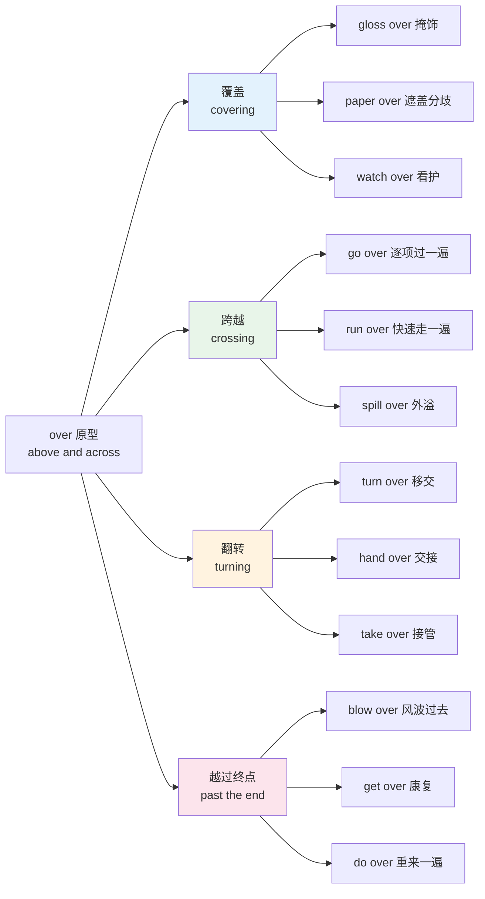
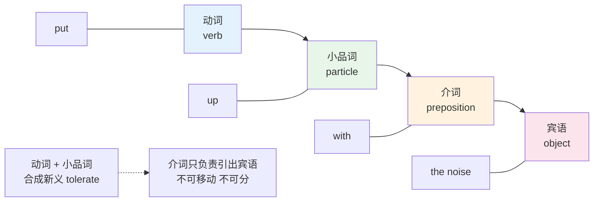
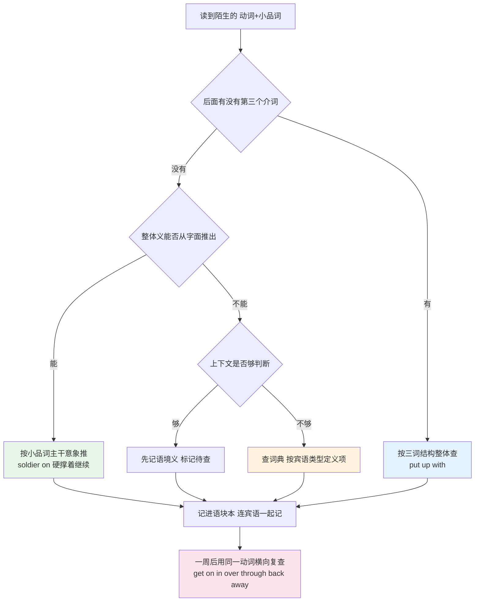
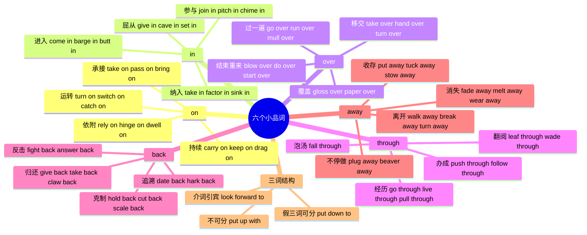

# 短语动词（下）on in over through back away

> [!info] 本篇定位
>
> 上一篇 [[16.词义辨析、搭配与短语动词/05.短语动词（上）up out off down\|短语动词（上）up out off down]] 立了一套方法：小品词不是随机附加的噪音，它自己带核心意象，动词提供动作、小品词提供方向或结果，两者相乘得到整体义。本篇用同一套方法处理剩下六个高频小品词。
>
> 六个小品词各有一条主干意象：`on` 是接触与不中断，`in` 是进入与参与，`over` 是覆盖与翻转，`through` 是从一端穿到另一端，`back` 是回到原处，`away` 是离开原处并逐渐消失。把主干抓住，大部分组合就不用逐条硬背。
>
> 本篇还收本系列唯一一批**三词短语动词**：`put up with`、`get away with`、`look forward to` 这一类「动词 + 小品词 + 介词」的三段结构，它们的可分性规则和两词的不一样，单独立一节。
>
> 分工提醒：`on`、`in`、`over`、`through` 作**纯介词**时的空间义与抽象引申（`on the wall`、`through the tunnel`），在 [[02.功能词与封闭词类速查/02.空间与路径介词：空间原型义到抽象义的引申\|空间与路径介词：空间原型义到抽象义的引申]]；由动词硬性选定介词、动词仍保持本义的组合（`depend on`、`result in`、`consist of`），在 [[17.固定搭配/06.动词+介词固定搭配：depend on、result in、consist of\|动词+介词固定搭配：depend on、result in、consist of]]。本篇只收动词义已经发生位移的那一类。

---

## 1. 本篇导读：六个小品词的意象地图

上篇处理的 `up`、`out`、`off`、`down` 有个共同点：它们都是**垂直轴或分离轴**上的词，语义辐射相对集中。本篇这六个更麻烦，因为它们各自跨了好几个语义域，而且互相之间有大量交叉：`go on`、`go in`、`go over`、`go through`、`go back`、`go away` 六个组合共用同一个动词，意思毫无关系。

先把六条主干意象摆出来。

```mermaid
flowchart TB
    A["六个小品词的核心意象<br/>core image of six particles"] --> B["on 接触不脱离<br/>contact and continuation"]
    A --> C["in 进入内部<br/>entering a container"]
    A --> D["over 覆盖与翻转<br/>covering and turning"]
    A --> E["through 一端到另一端<br/>end-to-end passage"]
    A --> F["back 回到原处<br/>return to origin"]
    A --> G["away 离开并消失<br/>departure and depletion"]

    B --> B1["持续 carry on"]
    B --> B2["依附 rely on"]
    B --> B3["运转 switch on"]

    C --> C1["加入 join in"]
    C --> C2["纳入 take in"]
    C --> C3["屈从 give in"]

    D --> D1["查看 go over"]
    D --> D2["移交 hand over"]
    D --> D3["重来 do over"]
    D --> D4["结束 blow over"]

    E --> E1["经历 go through"]
    E --> E2["读完 leaf through"]
    E --> E3["办成 push through"]

    F --> F1["归还 give back"]
    F --> F2["追溯 date back"]
    F --> F3["克制 hold back"]

    G --> G1["离开 walk away"]
    G --> G2["收存 put away"]
    G --> G3["消耗 fritter away"]

    style B fill:#e3f2fd
    style C fill:#e8f5e9
    style D fill:#fff3e0
    style E fill:#fce4ec
    style F fill:#f3e5f5
    style G fill:#e0f7fa
```



这张图不是分类目录，是**查词时的推理路径**。碰到一个没见过的组合，先看小品词落在哪条主干上，再把动词的动作套进去。`soldier on` 没学过，但 `soldier` 是「当兵」、`on` 是「不中断」，合起来就是「像士兵一样硬撑着继续」，猜得八九不离十。`whittle away` 没学过，`whittle` 是「削木头」、`away` 是「消失」，合起来是「一点点削减掉」，也对。

反过来说，主干意象覆盖不了全部。有一批组合已经彻底固化成成语，比如 `take on` 表示「呈现（某种样貌）」、`come over` 表示「给人某种印象」，从意象推不出来，只能记。这一点上篇讲过判断标准：**能不能把整体义拆回字面**，拆得回来的靠推理，拆不回来的靠记忆。

### 1.1 本篇的收词边界

不是所有「动词 + on/in/over」都算短语动词。三种情况要区分开：

| 结构类型 | 判定特征 | 例子 | 归属 |
| --- | --- | --- | --- |
| 短语动词 | 动词义发生位移，整体义不等于字面加和 | `take on a project` 承担 | 本篇 |
| 动词 + 固定介词 | 动词保持本义，介词由动词硬性选定 | `depend on the weather` 取决于 | 17.06 |
| 动词 + 自由介词短语 | 介词短语可换可删，是普通状语 | `walk on the beach` 在沙滩上走 | 不属搭配 |

中间那一档最容易和短语动词混。判据是：**去掉介词短语后，动词还能不能独立成句、意思变不变**。`He depends.` 语义不完整但 `depend` 本身没变义；`He took on.` 直接不成立，因为 `take on` 是一个整体。有少量词处在灰色地带（`rely on`、`count on`），本篇按意象归组时会收进来讲，但会标明它们同时也是固定搭配。

### 1.2 及物性与可分性速查（承上篇）

上篇建立的三类判定继续沿用，这里只做一次压缩复述，方便本篇查表时对照：

| 类型 | 代词宾语的位置 | 典型例子 |
| --- | --- | --- |
| 不及物 | 没有宾语 | `carry on`、`fall through`、`blow over` |
| 及物可分 | 代词必须放中间 | `hand it over`（不说 hand over it） |
| 及物不可分 | 代词必须放后面 | `get over it`（不说 get it over） |

判断可分性的经验规律：**小品词还带着空间义的偏向可分**（`put the book back` / `put back the book` 都行），**整体已经固化成抽象义的偏向不可分**（`get over the flu` 只能这么排）。三词短语动词一律不可分，第 8 节单独说。

---

## 2. on：接触、依附、持续、运转

`on` 的原型是**一个物体贴在另一个物体表面上，没有掉下来**。`The book is on the table.` 里面藏着两个信息：接触，以及不脱离。短语动词里的 `on` 全部从这两个信息长出来。

### 2.1 从「接触不脱离」到「时间上不中断」

物理上的「不脱离」映射到时间轴，就变成「不中断」。这是 `on` 最高频的一组义。

| 英文 | 英式音标 | 美式音标 | 词性 | 中文 | 搭配与说明 |
| --- | --- | --- | --- | --- | --- |
| **carry on** | /ˌkæri ˈɒn/ | /ˌkæri ˈɑːn/ | v. | 继续；胡闹 | carry on with sth / carry on doing；英式口语最常用的「继续」 |
| **go on** | /ˌɡəʊ ˈɒn/ | /ˌɡoʊ ˈɑːn/ | v. | 继续；发生 | What's going on? 出什么事了；go on doing 与 go on to do 意思不同 |
| **keep on** | /ˌkiːp ˈɒn/ | /ˌkiːp ˈɑːn/ | v. | 一直做（常带不耐烦） | 只接 doing，不接 to do；keep on at sb 唠叨某人 |
| **hold on** | /ˌhəʊld ˈɒn/ | /ˌhoʊld ˈɑːn/ | v. | 等一下；坚持住 | 电话用语 Hold on a second；hold on to sth 保留不放 |
| **hang on** | /ˌhæŋ ˈɒn/ | /ˌhæŋ ˈɑːn/ | v. | 稍等；抓紧 | 比 hold on 更口语；hang on in there 撑住 |
| **drag on** | /ˌdræɡ ˈɒn/ | /ˌdræɡ ˈɑːn/ | v. | 拖沓地持续 | 贬义，暗示太久；the meeting dragged on |
| **press on** | /ˌpres ˈɒn/ | /ˌpres ˈɑːn/ | v. | 顶着困难推进 | press on with the reform |
| **push on** | /ˌpʊʃ ˈɒn/ | /ˌpʊʃ ˈɑːn/ | v. | 继续赶路；继续推进 | 与 press on 近义，更偏物理行进 |
| **soldier on** | /ˌsəʊldʒər ˈɒn/ | /ˌsoʊldʒər ˈɑːn/ | v. | 硬撑着干下去 | 带一点自嘲，常用于身体不适仍工作 |
| **plod on** | /ˌplɒd ˈɒn/ | /ˌplɑːd ˈɑːn/ | v. | 慢吞吞地坚持 | plod 本义是沉重地走 |
| **live on** | /ˌlɪv ˈɒn/ | /ˌlɪv ˈɑːn/ | v. | 继续活着；靠…维生 | 两义靠有无宾语区分：His name lives on 与 live on rice |
| **move on** | /ˌmuːv ˈɒn/ | /ˌmuːv ˈɑːn/ | v. | 换话题；向前看 | move on to the next point；心理上的 move on 指放下过去 |
| **read on** | /ˌriːd ˈɒn/ | /ˌriːd ˈɑːn/ | v. | 接着往下读 | 文章里承上启下的固定说法 |
| **rattle on** | /ˌrætl ˈɒn/ | /ˌrætl ˈɑːn/ | v. | 唠叨个不停 | rattle on about sth |
| **drone on** | /ˌdrəʊn ˈɒn/ | /ˌdroʊn ˈɑːn/ | v. | 单调乏味地说个没完 | drone 本义是低频嗡嗡声，贬义很重 |
| **work on** | /ˌwɜːk ˈɒn/ | /ˌwɜːrk ˈɑːn/ | v. | 持续做（某项工作） | work on a bug 是技术文档高频；也指「做某人的思想工作」 |
| **later on** | /ˌleɪtər ˈɒn/ | /ˌleɪtər ˈɑːn/ | adv. | 稍后 | 副词短语，on 强化「时间往后延」 |
| **from now on** | /frəm ˌnaʊ ˈɒn/ | /frəm ˌnaʊ ˈɑːn/ | adv. | 从今往后 | 同上，on 表示时间线不断 |

`go on doing` 和 `go on to do` 是这一组里最容易出问题的一对，两个结构差一个 `to`，意思相反：

> [!example] go on 的两种接续
>
> - She **went on talking** for another hour.
>   - 她又接着讲了一个小时。（同一件事没停）
> - She finished the intro and **went on to talk** about the budget.
>   - 她讲完引言，接着讲了预算。（换成另一件事）

`keep on` 和 `carry on` 的差别在语气。`carry on` 中性，可以是老板说「你继续」；`keep on` 常带负面暗示，说话人觉得对方做得太多太久：`He kept on asking the same question.` 里的言外之意是烦。

### 2.2 从「贴附」到「依赖」

物理上的「贴着不掉」映射到关系层面，就是「靠着它才站得住」。这一组里有几个同时也是固定搭配，标记出来。

| 英文 | 英式音标 | 美式音标 | 词性 | 中文 | 搭配与说明 |
| --- | --- | --- | --- | --- | --- |
| **depend on** | /dɪˈpend ɒn/ | /dɪˈpend ɑːn/ | v. | 取决于；依靠 | 同时是固定搭配，见 17.06；It (all) depends 可独立成句 |
| **rely on** | /rɪˈlaɪ ɒn/ | /rɪˈlaɪ ɑːn/ | v. | 依靠；信赖 | rely on sb to do sth；比 depend on 更强调信任 |
| **count on** | /ˈkaʊnt ɒn/ | /ˈkaʊnt ɑːn/ | v. | 指望 | 口语；You can count on me 我靠得住 |
| **bank on** | /ˈbæŋk ɒn/ | /ˈbæŋk ɑːn/ | v. | 把宝押在…上 | 常用否定 Don't bank on it 别太指望 |
| **rest on** | /ˈrest ɒn/ | /ˈrest ɑːn/ | v. | 建立在…之上 | 正式；The argument rests on one assumption |
| **hinge on** | /ˈhɪndʒ ɒn/ | /ˈhɪndʒ ɑːn/ | v. | 完全取决于 | hinge 是合页，比 depend on 更强调唯一关键点 |
| **feed on** | /ˈfiːd ɒn/ | /ˈfiːd ɑːn/ | v. | 以…为食；靠…滋长 | Rumours feed on silence 谣言靠沉默壮大 |
| **prey on** | /ˈpreɪ ɒn/ | /ˈpreɪ ɑːn/ | v. | 捕食；坑害 | prey on the elderly 专坑老年人；prey on one's mind 萦绕心头 |
| **dwell on** | /ˈdwel ɒn/ | /ˈdwel ɑːn/ | v. | 老想着；详谈 | 贬义偏多；Don't dwell on it 别揪着不放 |
| **draw on** | /ˌdrɔː ˈɒn/ | /ˌdrɔː ˈɑːn/ | v. | 动用（资源）；（时间）推移 | draw on experience；as the night drew on |
| **capitalize on** | /ˈkæpɪtəlaɪz ɒn/ | /ˈkæpɪtəlaɪz ɑːn/ | v. | 利用（有利条件） | 商务正式；比 take advantage of 中性 |
| **cash in on** | /ˌkæʃ ˈɪn ɒn/ | /ˌkæʃ ˈɪn ɑːn/ | v. | 趁机捞好处 | 三词结构，略带贬义 |
| **latch on to** | /ˌlætʃ ˈɒn tə/ | /ˌlætʃ ˈɑːn tə/ | v. | 缠上；抓住（要点） | latch 是门闩，形象是「扣住不放」 |
| **build on** | /ˈbɪld ɒn/ | /ˈbɪld ɑːn/ | v. | 在…基础上发展 | build on last year's success |
| **act on** | /ˈækt ɒn/ | /ˈækt ɑːn/ | v. | 按…行动；作用于 | act on advice 照建议办 |
| **sleep on it** | /ˈsliːp ɒn ɪt/ | /ˈsliːp ɑːn ɪt/ | v. | 隔一夜再定 | 固定说法，宾语几乎只能是 it |
| **chew on** | /ˈtʃuː ɒn/ | /ˈtʃuː ɑːn/ | v. | 琢磨 | chew on the idea；比 think about 口语 |

> [!warning] depend / rely / count 后面的介词不能省
>
> 中文说「这个取决于天气」，「取决于」自带了介词的意思，很多人写英文时就把 `on` 丢了。
>
> - ❌ ~~It depends the weather.~~
> - ✅ It **depends on** the weather.
> - ❌ ~~You can rely me.~~
> - ✅ You can **rely on** me.
>
> 唯一能省的是口语里没有宾语的 `It depends.`，这是省略了整个介词短语，不是省介词。

### 2.3 从「接通」到「开启与运转」

电器的开关闭合就是电路「接上」，这条路径把 `on` 带进了设备语义域。

| 英文 | 英式音标 | 美式音标 | 词性 | 中文 | 搭配与说明 |
| --- | --- | --- | --- | --- | --- |
| **turn on** | /ˌtɜːn ˈɒn/ | /ˌtɜːrn ˈɑːn/ | v. | 打开；突然攻击；取决于 | 三义靠句型分：turn on the light / the dog turned on him / it turns on one issue |
| **switch on** | /ˌswɪtʃ ˈɒn/ | /ˌswɪtʃ ˈɑːn/ | v. | 打开（开关） | 比 turn on 更明确指开关设备；英式更常用 |
| **put on** | /ˌpʊt ˈɒn/ | /ˌpʊt ˈɑːn/ | v. | 穿上；上演；增重；装出 | 四义高频，2.4 节展开 |
| **come on** | /ˌkʌm ˈɒn/ | /ˌkʌm ˈɑːn/ | v. | 开始运行；有进展；得了吧 | The heating comes on at six；Come on! 语气词 |
| **log on** | /ˌlɒɡ ˈɒn/ | /ˌlɑːɡ ˈɑːn/ | v. | 登录 | 也写 log in，log on to a system 更偏系统层 |
| **sign on** | /ˌsaɪn ˈɒn/ | /ˌsaɪn ˈɑːn/ | v. | 签约入职；（英）登记领失业金 | 英美义项差别大，读英媒时留意 |
| **catch on** | /ˌkætʃ ˈɒn/ | /ˌkætʃ ˈɑːn/ | v. | 流行起来；开窍 | 不及物；The term never caught on |
| **egg on** | /ˌeɡ ˈɒn/ | /ˌeɡ ˈɑːn/ | v. | 怂恿 | 可分：egg him on；与「鸡蛋」无关，源自古诺尔斯语 |
| **be on to sb** | /bi ˈɒn tə/ | /bi ˈɑːn tə/ | v. | 识破某人 | The police are on to him |
| **be on about** | /bi ˈɒn əˌbaʊt/ | /bi ˈɑːn əˌbaʊt/ | v. | （英，口）在说什么 | What are you on about? 带不耐烦 |

`turn on` 的第三义「取决于」在正式书面语里出现频率不低，很多人第一次读到会误解：

> [!example] turn on 的「取决于」义
>
> - The whole case **turns on** whether the email was sent before noon.
>   - 整个案子取决于那封邮件是不是在中午之前发出的。
> - Everything **turned on** a single line of configuration.
>   - 一切都卡在一行配置上。

判别很简单：宾语是抽象事物（issue、question、whether 从句）就是「取决于」，宾语是设备就是「打开」。

### 2.4 从「加到身上」到「承接与穿戴」

`on` 表示「加到某个表面上」，衣服加到身上、角色加到肩上、信息加到下一个人手上，走的是同一条线。

| 英文 | 英式音标 | 美式音标 | 词性 | 中文 | 搭配与说明 |
| --- | --- | --- | --- | --- | --- |
| **put on** | /ˌpʊt ˈɒn/ | /ˌpʊt ˈɑːn/ | v. | 穿上（动作） | 与 wear（状态）对立：put on a coat 对 wear a coat |
| **try on** | /ˌtraɪ ˈɒn/ | /ˌtraɪ ˈɑːn/ | v. | 试穿 | 可分：try it on；英式 try it on 另有「试探底线」义 |
| **have on** | /ˌhæv ˈɒn/ | /ˌhæv ˈɑːn/ | v. | 穿着；有安排 | 状态义；I have nothing on tonight 今晚没安排 |
| **take on** | /ˌteɪk ˈɒn/ | /ˌteɪk ˈɑːn/ | v. | 承担；雇用；呈现；对抗 | 四义都高频，是本节最需要背的词条 |
| **pass on** | /ˌpɑːs ˈɒn/ | /ˌpæs ˈɑːn/ | v. | 传递；转告；婉指去世 | pass it on 传下去；pass on 单用可作 die 的委婉语 |
| **hand on** | /ˌhænd ˈɒn/ | /ˌhænd ˈɑːn/ | v. | 传给下一代 | 比 pass on 更强调代际传承 |
| **bring on** | /ˌbrɪŋ ˈɒn/ | /ˌbrɪŋ ˈɑːn/ | v. | 引发；促使成长 | Stress brought on the headache；bring on young players |
| **take it out on sb** | /ˌteɪk ɪt ˈaʊt ɒn/ | /ˌteɪk ɪt ˈaʊt ɑːn/ | v. | 拿某人出气 | 四词固定结构，it 不可换 |
| **look on** | /ˌlʊk ˈɒn/ | /ˌlʊk ˈɑːn/ | v. | 旁观 | 不及物；look on as 视为（另一结构） |
| **check on** | /ˈtʃek ɒn/ | /ˈtʃek ɑːn/ | v. | 查看情况 | check on the kids；与 check up on 近义 |
| **wait on** | /ˈweɪt ɒn/ | /ˈweɪt ɑːn/ | v. | 伺候；（美）等待 | 英式主要是「服侍」，美式口语可当 wait for |
| **hold on to** | /ˌhəʊld ˈɒn tə/ | /ˌhoʊld ˈɑːn tə/ | v. | 保留不放手 | 三词结构，物理与抽象都能用 |

`take on` 的四个义项彼此差得很远，靠宾语类型分辨：

| 宾语类型 | 义项 | 例子 |
| --- | --- | --- |
| 工作、责任、项目 | 承担 | take on extra work |
| 人 | 雇用 | The firm took on ten graduates |
| 外观、性质、意义 | 呈现出 | The word took on a new meaning |
| 实力更强的对手 | 叫板 | a small startup taking on Google |

> [!tip] 用宾语类型给多义短语动词建索引
>
> `take on`、`turn on`、`put on`、`go over` 这类四五个义项的短语动词，硬记义项列表几乎必忘。改成记「宾语是什么类型 → 哪个义项」，回忆时只需要看宾语。这个办法对 `get`、`take`、`make` 这些万能动词同样有效，义项地图在 [[13.抽象概念、评价与高频动词/01.高频万能动词义项地图 get take make do\|高频万能动词义项地图 get take make do]]。

---

## 3. in：进入、参与、纳入、屈从

`in` 的原型是**进入一个容器内部**。容器可以是房间、可以是团队、可以是一个正在进行的对话、也可以是一份表格的空白格。

### 3.1 物理进入与不请自来

| 英文 | 英式音标 | 美式音标 | 词性 | 中文 | 搭配与说明 |
| --- | --- | --- | --- | --- | --- |
| **come in** | /ˌkʌm ˈɪn/ | /ˌkʌm ˈɪn/ | v. | 进来；（潮）涨；参与 | Where do I come in? 我在这里面扮演什么角色 |
| **get in** | /ˌɡet ˈɪn/ | /ˌɡet ˈɪn/ | v. | 进入；当选；被录取 | 「被录取」义不带宾语：She applied and got in；也指抵家 What time did you get in? |
| **go in** | /ˌɡəʊ ˈɪn/ | /ˌɡoʊ ˈɪn/ | v. | 进去；（太阳）被云遮 | go in for 另有「热衷于」义，见第 8 节 |
| **move in** | /ˌmuːv ˈɪn/ | /ˌmuːv ˈɪn/ | v. | 搬进；逼近 | move in on sb 步步紧逼 |
| **break in** | /ˌbreɪk ˈɪn/ | /ˌbreɪk ˈɪn/ | v. | 破门而入；打断；驯服 | break in a new pair of shoes 把新鞋穿松 |
| **barge in** | /ˌbɑːdʒ ˈɪn/ | /ˌbɑːrdʒ ˈɪn/ | v. | 莽撞闯入 | barge 是驳船，形象是横冲直撞 |
| **butt in** | /ˌbʌt ˈɪn/ | /ˌbʌt ˈɪn/ | v. | 插嘴 | butt 本义是用头顶撞；粗鲁 |
| **cut in** | /ˌkʌt ˈɪn/ | /ˌkʌt ˈɪn/ | v. | 插话；加塞；（设备）自动接入 | cut in line 是美式「插队」 |
| **pop in** | /ˌpɒp ˈɪn/ | /ˌpɑːp ˈɪn/ | v. | 顺道进来一下 | 英式口语高频，时间很短 |
| **drop in** | /ˌdrɒp ˈɪn/ | /ˌdrɑːp ˈɪn/ | v. | 不约而至 | drop in on sb 见第 8 节 |
| **close in** | /ˌkləʊz ˈɪn/ | /ˌkloʊz ˈɪn/ | v. | 逼近；（夜色）合拢 | close in on the suspect |
| **stay in** | /ˌsteɪ ˈɪn/ | /ˌsteɪ ˈɪn/ | v. | 待在家 | 与 go out 对立 |
| **lie in** | /ˌlaɪ ˈɪn/ | /ˌlaɪ ˈɪn/ | v. | （英）睡懒觉 | 名词形式 a lie-in；美式用 sleep in |
| **sleep in** | /ˌsliːp ˈɪn/ | /ˌsliːp ˈɪn/ | v. | 睡懒觉 | 美式常用，注意与 sleep over 区分 |

### 3.2 加入与参与

| 英文 | 英式音标 | 美式音标 | 词性 | 中文 | 搭配与说明 |
| --- | --- | --- | --- | --- | --- |
| **join in** | /ˌdʒɔɪn ˈɪn/ | /ˌdʒɔɪn ˈɪn/ | v. | 加入（正在进行的活动） | join in the game；与 join a club（入会）不同 |
| **pitch in** | /ˌpɪtʃ ˈɪn/ | /ˌpɪtʃ ˈɪn/ | v. | 一起出力 | 口语，褒义；Everyone pitched in |
| **chip in** | /ˌtʃɪp ˈɪn/ | /ˌtʃɪp ˈɪn/ | v. | 凑钱；插一句 | chip in for a gift 凑份子 |
| **chime in** | /ˌtʃaɪm ˈɪn/ | /ˌtʃaɪm ˈɪn/ | v. | 附和着插话 | chime 是钟声，形象是「跟着响一声」 |
| **weigh in** | /ˌweɪ ˈɪn/ | /ˌweɪ ˈɪn/ | v. | 参与发表意见；称重 | weigh in on the debate |
| **step in** | /ˌstep ˈɪn/ | /ˌstep ˈɪn/ | v. | 介入调停 | 常指第三方出面 |
| **sit in on** | /ˌsɪt ˈɪn ɒn/ | /ˌsɪt ˈɪn ɑːn/ | v. | 旁听 | 三词结构；sit in on a meeting |
| **fit in** | /ˌfɪt ˈɪn/ | /ˌfɪt ˈɪn/ | v. | 融入；挤出时间安排 | fit in with the team；can you fit me in tomorrow? |
| **blend in** | /ˌblend ˈɪn/ | /ˌblend ˈɪn/ | v. | 融入不显眼 | blend in with the crowd |
| **settle in** | /ˌsetl ˈɪn/ | /ˌsetl ˈɪn/ | v. | 安顿下来 | 新工作新住处都能用 |
| **tune in** | /ˌtjuːn ˈɪn/ | /ˌtuːn ˈɪn/ | v. | 收看收听 | tune in to a podcast |
| **rope in** | /ˌrəʊp ˈɪn/ | /ˌroʊp ˈɪn/ | v. | 拉人入伙 | 被动多：I got roped in to help |
| **let in on** | /ˌlet ˈɪn ɒn/ | /ˌlet ˈɪn ɑːn/ | v. | 让某人知道内情 | let me in on the secret |
| **stand in for** | /ˌstænd ˈɪn fɔː/ | /ˌstænd ˈɪn fɔːr/ | v. | 临时顶替 | 名词 a stand-in 替身 |

`join in` 和 `join` 的分工经常被忽略：`join` 后面接组织（`join the army`），`join in` 后面接正在发生的活动（`join in the discussion`），后者也可以不带宾语单独用。

### 3.3 纳入、吸收与理解

容器义往里收一层，就是「把外面的东西装进来」。

| 英文 | 英式音标 | 美式音标 | 词性 | 中文 | 搭配与说明 |
| --- | --- | --- | --- | --- | --- |
| **take in** | /ˌteɪk ˈɪn/ | /ˌteɪk ˈɪn/ | v. | 理解吸收；收留；欺骗；改小衣服 | 四义常考；be taken in by 被骗 |
| **bring in** | /ˌbrɪŋ ˈɪn/ | /ˌbrɪŋ ˈɪn/ | v. | 引进；带来收入；请来（专家） | bring in new rules；bring in £2m a year |
| **draw in** | /ˌdrɔː ˈɪn/ | /ˌdrɔː ˈɪn/ | v. | 吸引进来；（白天）变短 | The nights are drawing in 天黑得早了 |
| **sink in** | /ˌsɪŋk ˈɪn/ | /ˌsɪŋk ˈɪn/ | v. | 被真正理解消化 | 不及物；It took a while to sink in |
| **factor in** | /ˈfæktər ɪn/ | /ˈfæktər ɪn/ | v. | 把…计入考虑 | 商务与技术文档高频；factor in the delay |
| **fill in** | /ˌfɪl ˈɪn/ | /ˌfɪl ˈɪn/ | v. | 填写；填补；顶替 | fill in a form（英）对 fill out（美）；fill sb in 向某人交底 |
| **hand in** | /ˌhænd ˈɪn/ | /ˌhænd ˈɪn/ | v. | 上交 | hand in an assignment；辞职 hand in one's notice |
| **turn in** | /ˌtɜːn ˈɪn/ | /ˌtɜːrn ˈɪn/ | v. | 上交（美）；就寝；举报 | 美式作业用 turn in，英式用 hand in |
| **key in** | /ˌkiː ˈɪn/ | /ˌkiː ˈɪn/ | v. | 键入 | key in the code；同义 type in |
| **plug in** | /ˌplʌɡ ˈɪn/ | /ˌplʌɡ ˈɪn/ | v. | 插上电源；接入 | 名词 a plug-in 插件 |
| **zoom in** | /ˌzuːm ˈɪn/ | /ˌzuːm ˈɪn/ | v. | 放大画面 | zoom in on a detail |
| **check in** | /ˌtʃek ˈɪn/ | /ˌtʃek ˈɪn/ | v. | 办理入住/值机；报平安 | check in with sb 跟某人对一下情况 |
| **log in** | /ˌlɒɡ ˈɪn/ | /ˌlɑːɡ ˈɪn/ | v. | 登录 | 名词写作 login，动词分写 |
| **sign in** | /ˌsaɪn ˈɪn/ | /ˌsaɪn ˈɪn/ | v. | 签到 | 与 sign up（注册）区分 |
| **pencil in** | /ˈpensl ɪn/ | /ˈpensl ɪn/ | v. | 暂定（日程） | 铅笔可擦，所以是「先记着，可能改」 |
| **phase in** | /ˌfeɪz ˈɪn/ | /ˌfeɪz ˈɪn/ | v. | 分阶段引入 | 反义 phase out；政策文本高频 |

> [!warning] fill in 与 fill out
>
> 表格填写英式说 `fill in a form`，美式说 `fill out a form`。两者在对方语区都能听懂，但 `fill in` 还有一个 `fill out` 没有的义项：
>
> - Could you **fill me in** on what happened?
>   - 你能把发生的事跟我说一遍吗？
>
> 这个「向某人补充信息」的义项只走 `fill in`，不能换成 `fill out`。

### 3.4 屈从与生效

容器义还有一条不太直观的分支：外力把你「压进」某个位置，于是有了「屈服」；一个机制「进入」运行状态，于是有了「生效」。

| 英文 | 英式音标 | 美式音标 | 词性 | 中文 | 搭配与说明 |
| --- | --- | --- | --- | --- | --- |
| **give in** | /ˌɡɪv ˈɪn/ | /ˌɡɪv ˈɪn/ | v. | 屈服；（英）交上去 | give in to pressure；注意与 give up 不同，give in 强调对抗中让步 |
| **cave in** | /ˌkeɪv ˈɪn/ | /ˌkeɪv ˈɪn/ | v. | 塌陷；顶不住而妥协 | 比 give in 语气更重，暗示崩溃式让步 |
| **kick in** | /ˌkɪk ˈɪn/ | /ˌkɪk ˈɪn/ | v. | 开始起效 | The painkiller kicked in；美式也指「凑钱」 |
| **set in** | /ˌset ˈɪn/ | /ˌset ˈɪn/ | v. | （坏情况）开始并持续 | 主语几乎全是负面词：winter、infection、doubt、rot |
| **come in for** | /ˌkʌm ˈɪn fɔː/ | /ˌkʌm ˈɪn fɔːr/ | v. | 招致（批评） | come in for criticism 是新闻高频 |
| **usher in** | /ˈʌʃər ɪn/ | /ˈʌʃər ɪn/ | v. | 开启（新时代） | 正式；usher in a new era |

`set in` 的主语限制是个容易翻车的点。它几乎只跟不好的东西搭配：

> [!example] set in 只配负面主语
>
> - Panic **set in** when the servers went down.
>   - 服务器一挂，恐慌就开始蔓延。
> - Infection **set in** within two days.
>   - 两天之内就开始感染了。
> - ❌ ~~Happiness set in after the good news.~~ —— 该说 `A sense of relief settled over the team.`

---

## 4. over：覆盖、翻越、翻转、重来

`over` 的原型是**一个东西在另一个东西上方，并且往往横跨过去**。这个原型同时含三个可延伸的要素：上方（覆盖）、跨越（越过）、以及翻转（转到另一面）。四条引申路径由此分出来。



第四条路径需要解释一下：`over` 表示「越过终点线」，越过之后事情就结束了，所以有 `The meeting is over`；而既然旧的一轮已经结束，就可以再来一轮，于是美式英语里长出了 `do it over`、`start over` 这层「重来」义。这是同一个原型分出的两个方向，看起来矛盾，其实都在「越过终点」这一点上。

### 4.1 覆盖与掩盖

| 英文 | 英式音标 | 美式音标 | 词性 | 中文 | 搭配与说明 |
| --- | --- | --- | --- | --- | --- |
| **gloss over** | /ˌɡlɒs ˈəʊvə/ | /ˌɡlɑːs ˈoʊvər/ | v. | 轻描淡写地带过 | gloss 是上光漆，形象是刷一层遮住瑕疵 |
| **paper over** | /ˌpeɪpər ˈəʊvə/ | /ˌpeɪpər ˈoʊvər/ | v. | 掩盖（分歧） | 常搭 paper over the cracks 粉饰太平 |
| **smooth over** | /ˌsmuːð ˈəʊvə/ | /ˌsmuːð ˈoʊvər/ | v. | 抚平（矛盾） | 中性偏褒，指主动化解 |
| **watch over** | /ˌwɒtʃ ˈəʊvə/ | /ˌwɑːtʃ ˈoʊvər/ | v. | 看护 | 不可分；watch over the children |
| **preside over** | /prɪˈzaɪd ˌəʊvə/ | /prɪˈzaɪd ˌoʊvər/ | v. | 主持；任内经历 | 正式；preside over a decline 带贬义 |
| **hang over** | /ˌhæŋ ˈəʊvə/ | /ˌhæŋ ˈoʊvər/ | v. | 笼罩；悬而未决 | A threat hangs over the project |
| **brood over** | /ˌbruːd ˈəʊvə/ | /ˌbruːd ˈoʊvər/ | v. | 郁郁地反复想 | brood 是母鸡孵蛋，形象是「捂着不动」 |
| **pore over** | /ˌpɔːr ˈəʊvə/ | /ˌpɔːr ˈoʊvər/ | v. | 埋头细读 | 注意拼写不是 pour；pore over the logs |

### 4.2 从头到尾过一遍

`over` 的「横跨」义用到审查上，就是「从这头扫到那头」。

| 英文 | 英式音标 | 美式音标 | 词性 | 中文 | 搭配与说明 |
| --- | --- | --- | --- | --- | --- |
| **go over** | /ˌɡəʊ ˈəʊvə/ | /ˌɡoʊ ˈoʊvər/ | v. | 复查；讲解一遍；转投 | go over the numbers；go over to the other side |
| **run over** | /ˌrʌn ˈəʊvə/ | /ˌrʌn ˈoʊvər/ | v. | 快速过一遍；碾过；超时 | 三义靠宾语分：run over the agenda / run over a cat / run over by ten minutes |
| **look over** | /ˌlʊk ˈəʊvə/ | /ˌlʊk ˈoʊvər/ | v. | 粗看一遍 | 比 go over 快而浅 |
| **read over** | /ˌriːd ˈəʊvə/ | /ˌriːd ˈoʊvər/ | v. | 通读检查 | read it over before signing |
| **check over** | /ˌtʃek ˈəʊvə/ | /ˌtʃek ˈoʊvər/ | v. | 检查一遍 | 医生也用：have yourself checked over |
| **think over** | /ˌθɪŋk ˈəʊvə/ | /ˌθɪŋk ˈoʊvər/ | v. | 仔细考虑 | 可分：think it over |
| **talk over** | /ˌtɔːk ˈəʊvə/ | /ˌtɔːk ˈoʊvər/ | v. | 商议 | talk it over with your team |
| **mull over** | /ˌmʌl ˈəʊvə/ | /ˌmʌl ˈoʊvər/ | v. | 反复琢磨 | 比 think over 时间更长 |
| **chew over** | /ˌtʃuː ˈəʊvə/ | /ˌtʃuː ˈoʊvər/ | v. | 细想 | 口语，与 chew on 近义 |
| **sleep over** | /ˈsliːp ˌəʊvə/ | /ˈsliːp ˌoʊvər/ | v. | 在别人家过夜 | 名词 a sleepover |

### 4.3 翻转与移交

物体翻个面，控制权也就换了一面。这条路径产出的词在商务与技术文档里密度极高。

| 英文 | 英式音标 | 美式音标 | 词性 | 中文 | 搭配与说明 |
| --- | --- | --- | --- | --- | --- |
| **take over** | /ˌteɪk ˈəʊvə/ | /ˌteɪk ˈoʊvər/ | v. | 接管；收购 | 名词 a takeover；take over from sb 接替某人 |
| **hand over** | /ˌhænd ˈəʊvə/ | /ˌhænd ˈoʊvər/ | v. | 交接；交出 | 名词 a handover；可分：hand it over |
| **turn over** | /ˌtɜːn ˈəʊvə/ | /ˌtɜːrn ˈoʊvər/ | v. | 翻面；移交；营业额 | 名词 turnover 兼指「营业额」与「人员流动率」 |
| **roll over** | /ˌrəʊl ˈəʊvə/ | /ˌroʊl ˈoʊvər/ | v. | 翻身；（款项）展期；屈从 | 金融义高频：roll over a loan |
| **carry over** | /ˌkæri ˈəʊvə/ | /ˌkæri ˈoʊvər/ | v. | 结转；延续到 | 假期与预算都能 carry over |
| **hold over** | /ˌhəʊld ˈəʊvə/ | /ˌhoʊld ˈoʊvər/ | v. | 延期；留任 | 名词 a holdover 遗留物 |
| **pull over** | /ˌpʊl ˈəʊvə/ | /ˌpʊl ˈoʊvər/ | v. | 靠边停车 | 交警说 Pull over 就是「靠边」 |
| **knock over** | /ˌnɒk ˈəʊvə/ | /ˌnɑːk ˈoʊvər/ | v. | 撞倒 | 可分：knock it over |
| **fall over** | /ˌfɔːl ˈəʊvə/ | /ˌfɔːl ˈoʊvər/ | v. | 摔倒；（系统）崩溃 | fall over oneself to do 抢着做 |
| **bowl over** | /ˌbəʊl ˈəʊvə/ | /ˌboʊl ˈoʊvər/ | v. | 撞倒；使惊喜 | 被动常见：I was bowled over |
| **win over** | /ˌwɪn ˈəʊvə/ | /ˌwɪn ˈoʊvər/ | v. | 争取到支持 | 可分：win them over |
| **cross over** | /ˌkrɒs ˈəʊvə/ | /ˌkrɔːs ˈoʊvər/ | v. | 跨过去；跨界 | 名词 a crossover |
| **spill over** | /ˌspɪl ˈəʊvə/ | /ˌspɪl ˈoʊvər/ | v. | 外溢；波及 | 名词 spillover effect 溢出效应 |
| **boil over** | /ˌbɔɪl ˈəʊvə/ | /ˌbɔɪl ˈoʊvər/ | v. | 溢锅；（情绪）爆发 | Tensions boiled over into violence |

### 4.4 越过终点：结束与重来

| 英文 | 英式音标 | 美式音标 | 词性 | 中文 | 搭配与说明 |
| --- | --- | --- | --- | --- | --- |
| **get over** | /ˌɡet ˈəʊvə/ | /ˌɡet ˈoʊvər/ | v. | 克服；康复 | 不可分：get over it；get over with 是另一结构 |
| **get sth over with** | /ˌɡet ˈəʊvə wɪð/ | /ˌɡet ˈoʊvər wɪð/ | v. | 把（讨厌的事）了结 | Let's get it over with 长痛不如短痛 |
| **blow over** | /ˌbləʊ ˈəʊvə/ | /ˌbloʊ ˈoʊvər/ | v. | （风波）平息 | 主语是 scandal、storm、row 这类 |
| **tide over** | /ˌtaɪd ˈəʊvə/ | /ˌtaɪd ˈoʊvər/ | v. | 帮…渡过难关 | tide sb over until payday |
| **do over** | /ˌduː ˈəʊvə/ | /ˌduː ˈoʊvər/ | v. | 重做（美） | 名词 a do-over；英式说 do it again |
| **start over** | /ˌstɑːt ˈəʊvə/ | /ˌstɑːrt ˈoʊvər/ | v. | 从头开始（美） | 英式偏用 start again / start afresh |
| **come over** | /ˌkʌm ˈəʊvə/ | /ˌkʌm ˈoʊvər/ | v. | 过来；突然袭来；给人印象 | A wave of fatigue came over me；He comes over as arrogant |
| **stop over** | /ˈstɒp ˌəʊvə/ | /ˈstɑːp ˌoʊvər/ | v. | 中途停留 | 名词 a stopover 经停 |

> [!warning] get over 与 get over with 是两个词
>
> 少一个 `with`，意思完全不同：
>
> - I need to **get over** the flu. —— 我得把流感养好。
> - I need to **get** it **over with**. —— 我得赶紧把这件（烦人的）事做完。
>
> 前者宾语是困难或病痛，不可分；后者宾语必须放在 `get` 和 `over` 之间，而且几乎总是 `it` 或 `this`。

美式的 `do over` / `start over` 在英式英语里罕见，读英美两地的技术博客时能明显感到差别。英式作者更常写 `redo the migration`、`run it again`，美式作者更常写 `do the migration over`、`start the whole thing over`。

---

## 5. through：贯穿、通读、挺过、办成

`through` 的原型是**从一端进入、从另一端出来**，中间必须有一段实际的穿越过程。这一点把它和 `over`（跨过上方，不进入内部）区分开。语义上它强调两件事：**全程走完**，以及**过程本身有阻力**。

### 5.1 经历与穿越

| 英文 | 英式音标 | 美式音标 | 词性 | 中文 | 搭配与说明 |
| --- | --- | --- | --- | --- | --- |
| **go through** | /ˌɡəʊ ˈθruː/ | /ˌɡoʊ ˈθruː/ | v. | 经历；仔细查；获通过；用完 | 四义高频；go through a rough patch 经历难关 |
| **live through** | /ˌlɪv ˈθruː/ | /ˌlɪv ˈθruː/ | v. | 亲身经历（并活下来） | 主语是人，宾语是战争、危机这类 |
| **come through** | /ˌkʌm ˈθruː/ | /ˌkʌm ˈθruː/ | v. | 传来；兑现；挺过来 | The results came through；He came through for us |
| **pull through** | /ˌpʊl ˈθruː/ | /ˌpʊl ˈθruː/ | v. | 挺过来（尤指病愈） | 常用于医疗语境；She'll pull through |
| **get through** | /ˌɡet ˈθruː/ | /ˌɡet ˈθruː/ | v. | 完成；熬过；接通；用完 | get through to sb 让某人听懂，或电话接通 |
| **break through** | /ˌbreɪk ˈθruː/ | /ˌbreɪk ˈθruː/ | v. | 突破 | 名词 a breakthrough |
| **cut through** | /ˌkʌt ˈθruː/ | /ˌkʌt ˈθruː/ | v. | 抄近路穿过；穿透（噪音、废话） | cut through the jargon 撇开行话 |
| **see through** | /ˌsiː ˈθruː/ | /ˌsiː ˈθruː/ | v. | 看穿；坚持到底 | 两义靠语序分：see through him 对 see it through |
| **sit through** | /ˌsɪt ˈθruː/ | /ˌsɪt ˈθruː/ | v. | 耐着性子坐完 | 隐含无聊：sit through a three-hour meeting |
| **sleep through** | /ˌsliːp ˈθruː/ | /ˌsliːp ˈθruː/ | v. | 睡着没被吵醒；睡过头 | sleep through the alarm |

`see through` 的两个义项靠宾语位置区分，是短语动词里少见的「同一组合，可分与不可分对应不同义项」的例子：

> [!example] see through 的可分性差异
>
> - I **saw through** his excuse right away.
>   - 我一眼就看穿了他的借口。（不可分，宾语在后，义为「识破」）
> - We're going to **see** this project **through**.
>   - 我们会把这个项目做到底。（可分，宾语在中间，义为「坚持到完成」）

### 5.2 翻阅与读完

这一组是读英文原版书时最容易碰到的一批，六个词都表示「翻书」，但速度和态度差得很远。

| 英文 | 英式音标 | 美式音标 | 词性 | 中文 | 搭配与说明 |
| --- | --- | --- | --- | --- | --- |
| **read through** | /ˌriːd ˈθruː/ | /ˌriːd ˈθruː/ | v. | 通读一遍 | 中性，从头读到尾 |
| **skim through** | /ˌskɪm ˈθruː/ | /ˌskɪm ˈθruː/ | v. | 快速略读 | 只抓大意 |
| **leaf through** | /ˌliːf ˈθruː/ | /ˌliːf ˈθruː/ | v. | 随手翻阅 | leaf 是书页；漫无目的 |
| **flick through** | /ˌflɪk ˈθruː/ | /ˌflɪk ˈθruː/ | v. | 飞快地翻 | 英式常用；美式偏 flip through |
| **thumb through** | /ˌθʌm ˈθruː/ | /ˌθʌm ˈθruː/ | v. | 用拇指翻看 | 形象是站在书店翻样书 |
| **wade through** | /ˌweɪd ˈθruː/ | /ˌweɪd ˈθruː/ | v. | 艰难地读完 | wade 是蹚水；强烈暗示枯燥 |
| **plough through** | /ˌplaʊ ˈθruː/ | /ˌplaʊ ˈθruː/ | v. | 硬啃完 | 美式拼作 plow through；比 wade 更强调毅力 |

| 表达 | 速度 | 态度 | 典型宾语 |
| --- | --- | --- | --- |
| flick / leaf / thumb through | 最快 | 随意 | a magazine, a catalogue |
| skim through | 快 | 有目的地找信息 | a report, an email thread |
| read through | 中 | 认真但不深究 | a draft, the terms |
| wade / plough through | 最慢 | 痛苦但必须完成 | a legal document, 800 pages of logs |

### 5.3 办成与落地

「从一端穿到另一端」用在流程上，就是「走完整个审批链条」。

| 英文 | 英式音标 | 美式音标 | 词性 | 中文 | 搭配与说明 |
| --- | --- | --- | --- | --- | --- |
| **push through** | /ˌpʊʃ ˈθruː/ | /ˌpʊʃ ˈθruː/ | v. | 强行推动通过 | push the bill through parliament |
| **put through** | /ˌpʊt ˈθruː/ | /ˌpʊt ˈθruː/ | v. | 接转电话；使经受；供…读书 | put me through to sales；put sb through hell |
| **follow through** | /ˌfɒləʊ ˈθruː/ | /ˌfɑːloʊ ˈθruː/ | v. | 跟进到底 | follow through on a promise |
| **carry through** | /ˌkæri ˈθruː/ | /ˌkæri ˈθruː/ | v. | 贯彻到底；支撑某人度过 | carry through the reforms |
| **fall through** | /ˌfɔːl ˈθruː/ | /ˌfɔːl ˈθruː/ | v. | 告吹 | 主语是 deal、plan、sale 这类 |
| **run through** | /ˌrʌn ˈθruː/ | /ˌrʌn ˈθruː/ | v. | 快速过一遍；贯穿；挥霍 | a run-through 是「彩排」 |
| **talk through** | /ˌtɔːk ˈθruː/ | /ˌtɔːk ˈθruː/ | v. | 逐条讲解；谈开 | talk me through the setup |
| **think through** | /ˌθɪŋk ˈθruː/ | /ˌθɪŋk ˈθruː/ | v. | 想周全 | 强调考虑到所有后果 |
| **work through** | /ˌwɜːk ˈθruː/ | /ˌwɜːrk ˈθruː/ | v. | 逐项处理；消化（情绪） | work through the backlog；work through grief |
| **go through with** | /ˌɡəʊ ˈθruː wɪð/ | /ˌɡoʊ ˈθruː wɪð/ | v. | 把（不情愿的事）做到底 | 三词结构，见第 8 节 |

> [!tip] think over 与 think through 的差别
>
> `think over` 是「多想一会儿再定」，重点在**时间**；`think through` 是「把所有环节都想到」，重点在**完整性**。
>
> - Let me **think it over** and get back to you tomorrow. —— 我考虑一晚上。
> - You clearly haven't **thought this through**. —— 你显然没把这件事想周全。
>
> 同理，`talk over`（商量一下）和 `talk through`（逐条讲透）也是同一组对立。`over` 管「覆盖一遍」，`through` 管「穿透到底」，这个对立在整个第 4、5 节都成立。

---

## 6. back：返回、归还、追溯、克制

`back` 在短语动词里既可以是副词也可以是名词方位，但作小品词时意象很统一：**回到原来的位置或状态**。原来的位置可以是空间上的、可以是所有权上的、可以是时间上的、也可以是「还没冲出去之前」的状态。

### 6.1 空间与所有权的回归

| 英文 | 英式音标 | 美式音标 | 词性 | 中文 | 搭配与说明 |
| --- | --- | --- | --- | --- | --- |
| **come back** | /ˌkʌm ˈbæk/ | /ˌkʌm ˈbæk/ | v. | 回来；重新流行 | 名词 a comeback 复出 |
| **go back** | /ˌɡəʊ ˈbæk/ | /ˌɡoʊ ˈbæk/ | v. | 回去；追溯 | go back to 1990；go back on one's word 食言 |
| **get back** | /ˌɡet ˈbæk/ | /ˌɡet ˈbæk/ | v. | 回来；取回 | get back to sb 稍后回复；get back at sb 报复 |
| **give back** | /ˌɡɪv ˈbæk/ | /ˌɡɪv ˈbæk/ | v. | 归还；回馈 | give back to the community |
| **take back** | /ˌteɪk ˈbæk/ | /ˌteɪk ˈbæk/ | v. | 收回（话）；退货；接纳回 | I take it back 我收回刚才的话 |
| **put back** | /ˌpʊt ˈbæk/ | /ˌpʊt ˈbæk/ | v. | 放回；推迟 | put the meeting back an hour（英式指推迟） |
| **bring back** | /ˌbrɪŋ ˈbæk/ | /ˌbrɪŋ ˈbæk/ | v. | 带回；使想起；恢复（制度） | The smell brings back memories |
| **send back** | /ˌsend ˈbæk/ | /ˌsend ˈbæk/ | v. | 退回 | send it back for a refund |
| **call back** | /ˌkɔːl ˈbæk/ | /ˌkɔːl ˈbæk/ | v. | 回电；叫回来 | 名词 a callback 也是编程术语 |
| **pay back** | /ˌpeɪ ˈbæk/ | /ˌpeɪ ˈbæk/ | v. | 还钱；报复 | 名词 payback 兼两义，payback period 回本周期 |
| **win back** | /ˌwɪn ˈbæk/ | /ˌwɪn ˈbæk/ | v. | 重新赢得 | win back customers |
| **claw back** | /ˌklɔː ˈbæk/ | /ˌklɔː ˈbæk/ | v. | 艰难追回 | 名词 clawback，财税与合同高频 |
| **roll back** | /ˌrəʊl ˈbæk/ | /ˌroʊl ˈbæk/ | v. | 回滚；撤销（政策） | 技术文档 roll back a deployment |
| **fall back on** | /ˌfɔːl ˈbæk ɒn/ | /ˌfɔːl ˈbæk ɑːn/ | v. | 退而依靠（备用手段） | 三词结构；a fallback 是备用方案 |

`get back to` 有两个高频义项，写邮件时都会用到：

> [!example] get back to 的两义
>
> - I'll **get back to** you by Friday.
>   - 我周五前给你答复。
> - After the break, we **got back to** the original plan.
>   - 休息之后，我们回到了原方案。

### 6.2 时间上的回溯

| 英文 | 英式音标 | 美式音标 | 词性 | 中文 | 搭配与说明 |
| --- | --- | --- | --- | --- | --- |
| **date back to** | /ˌdeɪt ˈbæk tə/ | /ˌdeɪt ˈbæk tə/ | v. | 追溯到 | 也可说 date from；主语是事物不是人 |
| **go back to** | /ˌɡəʊ ˈbæk tə/ | /ˌɡoʊ ˈbæk tə/ | v. | 可追溯到 | 与 date back to 近义，更口语 |
| **hark back to** | /ˌhɑːk ˈbæk tə/ | /ˌhɑːrk ˈbæk tə/ | v. | 令人想起旧时；老提当年 | 正式或文学；带一点怀旧或不耐烦 |
| **look back** | /ˌlʊk ˈbæk/ | /ˌlʊk ˈbæk/ | v. | 回顾 | looking back, I should have... |
| **think back** | /ˌθɪŋk ˈbæk/ | /ˌθɪŋk ˈbæk/ | v. | 回想 | think back to that summer |
| **report back** | /rɪˌpɔːt ˈbæk/ | /rɪˌpɔːrt ˈbæk/ | v. | 回来汇报 | report back to the committee |
| **flash back** | /ˌflæʃ ˈbæk/ | /ˌflæʃ ˈbæk/ | v. | 闪回 | 名词 a flashback |

### 6.3 反击与顶嘴

「回到原处」用在互动上，就是「把对方给的东西原样还回去」。

| 英文 | 英式音标 | 美式音标 | 词性 | 中文 | 搭配与说明 |
| --- | --- | --- | --- | --- | --- |
| **fight back** | /ˌfaɪt ˈbæk/ | /ˌfaɪt ˈbæk/ | v. | 反击；强忍（眼泪） | fight back tears 是固定搭配 |
| **hit back** | /ˌhɪt ˈbæk/ | /ˌhɪt ˈbæk/ | v. | 回击（尤指言语） | hit back at critics 新闻高频 |
| **answer back** | /ˌɑːnsə ˈbæk/ | /ˌænsər ˈbæk/ | v. | 顶嘴 | 多用于长辈说晚辈 |
| **talk back** | /ˌtɔːk ˈbæk/ | /ˌtɔːk ˈbæk/ | v. | 顶嘴 | 美式更常用；与 answer back 同义 |
| **bounce back** | /ˌbaʊns ˈbæk/ | /ˌbaʊns ˈbæk/ | v. | 迅速恢复 | 主语可以是人、市场、身体 |
| **snap back** | /ˌsnæp ˈbæk/ | /ˌsnæp ˈbæk/ | v. | 猛地回弹；顶回去 | snap back at sb 呛回去 |

### 6.4 克制与后撤

这条分支最不直观：`back` 表示「停在原位不往前」，于是有了「压住不发」。

| 英文 | 英式音标 | 美式音标 | 词性 | 中文 | 搭配与说明 |
| --- | --- | --- | --- | --- | --- |
| **hold back** | /ˌhəʊld ˈbæk/ | /ˌhoʊld ˈbæk/ | v. | 抑制；隐瞒；阻碍 | hold back tears / information / progress |
| **keep back** | /ˌkiːp ˈbæk/ | /ˌkiːp ˈbæk/ | v. | 保留不说；不让靠近 | Keep back! 退后 |
| **cut back** | /ˌkʌt ˈbæk/ | /ˌkʌt ˈbæk/ | v. | 削减 | cut back on spending；名词 cutbacks |
| **scale back** | /ˌskeɪl ˈbæk/ | /ˌskeɪl ˈbæk/ | v. | 缩减规模 | 商务正式；比 cut back 更中性 |
| **pull back** | /ˌpʊl ˈbæk/ | /ˌpʊl ˈbæk/ | v. | 撤退；收手 | pull back from the brink 悬崖勒马 |
| **draw back** | /ˌdrɔː ˈbæk/ | /ˌdrɔː ˈbæk/ | v. | 后退；退出 | 名词 a drawback 是「缺点」，义项已分家 |
| **step back** | /ˌstep ˈbæk/ | /ˌstep ˈbæk/ | v. | 退一步看 | step back and look at the big picture |
| **stand back** | /ˌstænd ˈbæk/ | /ˌstænd ˈbæk/ | v. | 站远点；超然旁观 | 与 step back 近义，更偏物理 |
| **sit back** | /ˌsɪt ˈbæk/ | /ˌsɪt ˈbæk/ | v. | 靠着放松；袖手旁观 | sit back and do nothing 带贬义 |
| **set back** | /ˌset ˈbæk/ | /ˌset ˈbæk/ | v. | 耽误；花掉（钱） | 名词 a setback 挫折；It set me back £200 |
| **push back** | /ˌpʊʃ ˈbæk/ | /ˌpʊʃ ˈbæk/ | v. | 反对；推迟（美式商务） | 名词 pushback 是「反对意见」 |
| **back off** | /ˌbæk ˈɒf/ | /ˌbæk ˈɔːf/ | v. | 让步；别逼我 | 这里 back 是动词、off 是小品词，结构与本节其余相反 |
| **back down** | /ˌbæk ˈdaʊn/ | /ˌbæk ˈdaʊn/ | v. | 认输让步 | 同上，back 作动词 |

> [!warning] draw back 与 drawback 不是一件事
>
> 短语动词 `draw back` 是「后退、退出」，名词 `drawback` 是「缺点、不利之处」。名词已经完全脱离了动词义，不能用「后退」去推。同类的还有 `take away`（拿走）与 `a takeaway`：后者除了英式的「外卖」，还有「会议或报告里带走的要点」这一层，从「拿走」推不到「要点」。反过来 `set back`（耽误）与 `a setback`（挫折）这一对仍然对得上。名词化之后义项走不走同一条路，得逐个查，不能默认。

---

## 7. away：离开、消失、收存、持续消耗

`away` 的原型是**从当前位置移开，并且越走越远**。这个「越来越远」的过程性，让它同时长出两条看起来矛盾的义：一条是「消失掉」，一条是「一直不停地做」。

### 7.1 离开与驱离

| 英文 | 英式音标 | 美式音标 | 词性 | 中文 | 搭配与说明 |
| --- | --- | --- | --- | --- | --- |
| **go away** | /ˌɡəʊ əˈweɪ/ | /ˌɡoʊ əˈweɪ/ | v. | 走开；（问题）消失 | The problem won't just go away |
| **run away** | /ˌrʌn əˈweɪ/ | /ˌrʌn əˈweɪ/ | v. | 逃跑；私奔 | run away from home；run away with sb |
| **get away** | /ˌɡet əˈweɪ/ | /ˌɡet əˈweɪ/ | v. | 脱身；度假 | 名词 a getaway；get away with 见第 8 节 |
| **break away** | /ˌbreɪk əˈweɪ/ | /ˌbreɪk əˈweɪ/ | v. | 挣脱；脱离（组织） | 名词 a breakaway faction 分裂派 |
| **move away** | /ˌmuːv əˈweɪ/ | /ˌmuːv əˈweɪ/ | v. | 搬走；转变（立场） | move away from fossil fuels |
| **walk away** | /ˌwɔːk əˈweɪ/ | /ˌwɔːk əˈweɪ/ | v. | 一走了之；全身而退 | walk away from a deal 退出交易 |
| **back away** | /ˌbæk əˈweɪ/ | /ˌbæk əˈweɪ/ | v. | 后退；退缩 | back away from a commitment |
| **turn away** | /ˌtɜːn əˈweɪ/ | /ˌtɜːrn əˈweɪ/ | v. | 转过脸；拒之门外 | turn away customers 把顾客挡在门外 |
| **send away** | /ˌsend əˈweɪ/ | /ˌsend əˈweɪ/ | v. | 打发走；邮购 | send away for a catalogue |
| **take away** | /ˌteɪk əˈweɪ/ | /ˌteɪk əˈweɪ/ | v. | 拿走；外带（英） | 名词 a takeaway 兼指「外卖」与「要点」 |
| **slip away** | /ˌslɪp əˈweɪ/ | /ˌslɪp əˈweɪ/ | v. | 悄悄溜走；（时间）流逝 | The years slipped away |
| **get away from it all** | /ˌɡet əˈweɪ frəm ɪt ˈɔːl/ | /ˌɡet əˈweɪ frəm ɪt ˈɔːl/ | v. | 彻底放空散心 | 五词固定说法 |

### 7.2 消失、消耗与磨损

| 英文 | 英式音标 | 美式音标 | 词性 | 中文 | 搭配与说明 |
| --- | --- | --- | --- | --- | --- |
| **fade away** | /ˌfeɪd əˈweɪ/ | /ˌfeɪd əˈweɪ/ | v. | 逐渐消失 | 光、声音、记忆、影响力都能 fade away |
| **die away** | /ˌdaɪ əˈweɪ/ | /ˌdaɪ əˈweɪ/ | v. | （声音）渐渐消失 | 主语几乎只能是声音或风 |
| **melt away** | /ˌmelt əˈweɪ/ | /ˌmelt əˈweɪ/ | v. | 消融；（人群）散去 | His anger melted away |
| **wear away** | /ˌweər əˈweɪ/ | /ˌwer əˈweɪ/ | v. | 磨损；被磨平 | 石阶被踩得 wear away |
| **wash away** | /ˌwɒʃ əˈweɪ/ | /ˌwɑːʃ əˈweɪ/ | v. | 冲走 | 洪水冲垮桥梁 |
| **waste away** | /ˌweɪst əˈweɪ/ | /ˌweɪst əˈweɪ/ | v. | 消瘦憔悴 | 主语是人或身体 |
| **pass away** | /ˌpɑːs əˈweɪ/ | /ˌpæs əˈweɪ/ | v. | 去世 | die 的委婉语，语域较正式且温和 |
| **eat away at** | /ˌiːt əˈweɪ æt/ | /ˌiːt əˈweɪ æt/ | v. | 侵蚀；折磨 | Guilt ate away at him |
| **chip away at** | /ˌtʃɪp əˈweɪ æt/ | /ˌtʃɪp əˈweɪ æt/ | v. | 一点点削弱 | chip away at the lead 一点点追分 |
| **whittle away** | /ˌwɪtl əˈweɪ/ | /ˌwɪtl əˈweɪ/ | v. | 逐步削减 | whittle away at savings |
| **fritter away** | /ˌfrɪtər əˈweɪ/ | /ˌfrɪtər əˈweɪ/ | v. | 挥霍（时间、钱） | 贬义明确 |
| **while away** | /ˌwaɪl əˈweɪ/ | /ˌwaɪl əˈweɪ/ | v. | 惬意地消磨（时间） | while away the afternoon；中性偏褒 |
| **idle away** | /ˌaɪdl əˈweɪ/ | /ˌaɪdl əˈweɪ/ | v. | 虚度 | 比 while away 贬义 |
| **explain away** | /ɪkˌspleɪn əˈweɪ/ | /ɪkˌspleɪn əˈweɪ/ | v. | 搪塞过去 | 暗示解释不成立 |
| **laugh away** | /ˌlɑːf əˈweɪ/ | /ˌlæf əˈweɪ/ | v. | 一笑置之 | laugh off 更常用 |
| **throw away** | /ˌθrəʊ əˈweɪ/ | /ˌθroʊ əˈweɪ/ | v. | 扔掉；白白错过 | throw away a chance；形容词 throwaway remark 随口一说 |
| **give away** | /ˌɡɪv əˈweɪ/ | /ˌɡɪv əˈweɪ/ | v. | 送出；泄露 | 名词 a giveaway 兼指「赠品」与「破绽」 |
| **cast away** | /ˌkɑːst əˈweɪ/ | /ˌkæst əˈweɪ/ | v. | 抛弃 | 名词 a castaway 漂流者，文学色彩重 |
| **do away with** | /ˌduː əˈweɪ wɪð/ | /ˌduː əˈweɪ wɪð/ | v. | 废除 | 三词结构，见第 8 节 |

### 7.3 收好与藏起

「拿开」用在整理上，就是「收进该在的地方」。

| 英文 | 英式音标 | 美式音标 | 词性 | 中文 | 搭配与说明 |
| --- | --- | --- | --- | --- | --- |
| **put away** | /ˌpʊt əˈweɪ/ | /ˌpʊt əˈweɪ/ | v. | 收好；吃掉很多；关起来 | put away the dishes；He put away three burgers |
| **tuck away** | /ˌtʌk əˈweɪ/ | /ˌtʌk əˈweɪ/ | v. | 藏好；（地方）隐蔽 | a village tucked away in the hills |
| **stow away** | /ˌstəʊ əˈweɪ/ | /ˌstoʊ əˈweɪ/ | v. | 妥善收纳；偷渡 | 名词 a stowaway 偷渡者 |
| **salt away** | /ˌsɔːlt əˈweɪ/ | /ˌsɔːlt əˈweɪ/ | v. | 悄悄攒钱 | 源自腌制保存的意象 |
| **lock away** | /ˌlɒk əˈweɪ/ | /ˌlɑːk əˈweɪ/ | v. | 锁起来；关押 | lock away the evidence |
| **shut away** | /ˌʃʌt əˈweɪ/ | /ˌʃʌt əˈweɪ/ | v. | 把…关起来；自我封闭 | shut oneself away 闭门不出 |
| **file away** | /ˌfaɪl əˈweɪ/ | /ˌfaɪl əˈweɪ/ | v. | 归档；记在心里 | file it away for later |
| **store away** | /ˌstɔːr əˈweɪ/ | /ˌstɔːr əˈweɪ/ | v. | 存放 | 与 put away 近义，更强调长期 |
| **clear away** | /ˌklɪər əˈweɪ/ | /ˌklɪr əˈweɪ/ | v. | 收拾干净 | clear away the plates |

### 7.4 不停地做

`away` 表示「一直往远处走」，映射到动作上就是「一直做下去」。这一组几乎全是不及物，而且带明显的口语色彩。

| 英文 | 英式音标 | 美式音标 | 词性 | 中文 | 搭配与说明 |
| --- | --- | --- | --- | --- | --- |
| **work away** | /ˌwɜːk əˈweɪ/ | /ˌwɜːrk əˈweɪ/ | v. | 埋头一直干 | work away at the problem |
| **plug away** | /ˌplʌɡ əˈweɪ/ | /ˌplʌɡ əˈweɪ/ | v. | 慢慢啃着做 | plug away at the backlog |
| **beaver away** | /ˌbiːvər əˈweɪ/ | /ˌbiːvər əˈweɪ/ | v. | 忙个不停 | 英式口语；海狸勤劳的意象 |
| **slave away** | /ˌsleɪv əˈweɪ/ | /ˌsleɪv əˈweɪ/ | v. | 苦干 | 带抱怨语气 |
| **hammer away at** | /ˌhæmər əˈweɪ æt/ | /ˌhæmər əˈweɪ æt/ | v. | 反复强调；连续攻击 | hammer away at the same point |
| **fire away** | /ˌfaɪər əˈweɪ/ | /ˌfaɪər əˈweɪ/ | v. | 尽管问 | Fire away! 是回应「我能问个问题吗」 |
| **type away** | /ˌtaɪp əˈweɪ/ | /ˌtaɪp əˈweɪ/ | v. | 一直敲键盘 | 这一构式能产，动词可换 |

> [!tip] away 的「一直做」是一个能产构式
>
> `V + away` 表示「一直不停地做 V」在英语里是活的构式，不是封闭词表：`chatter away`（一直聊）、`scribble away`（一直写）、`chop away`（一直剁）、`snore away`（一直打呼）都能临时造。读到没见过的 `V away` 而且 V 是持续性动作时，先按这个构式理解，八成不会错。
>
> 判别信号有两个：一是**不及物**（后面没有直接宾语），二是**动词本身表持续动作**。如果动词是瞬时的（arrive、explode），那就不是这个构式。

---

## 8. 三词短语动词：动词 + 小品词 + 介词

前七节的组合都是两段结构。真正让人在阅读时卡住的往往是三段结构：`put up with`、`get away with`、`look forward to`。它们的构造逻辑和句法行为都和两词的不一样。



这张图说明了三词结构的核心机制：**前两段（动词 + 小品词）先合成一个新的语义单位，第三段介词只是把宾语挂上去**。`put up` 在这里已经不表示「举起」，`with` 也不表示「和」，整体等于 `tolerate`。因为宾语是靠介词引出的，它永远不能插到前面去。

### 8.1 三条铁律

| 规则 | 内容 | 反例 |
| --- | --- | --- |
| 一律不可分 | 宾语只能放在最后，代词也不例外 | ❌ ~~put it up with~~ → ✅ put up with it |
| 三段不可拆开 | 中间不能插副词 | ❌ ~~put up quietly with~~ → ✅ quietly put up with |
| 被动可以，但整块搬 | 三段整体保留在动词位置 | The noise **was put up with** for years. |

> [!warning] 三词短语动词的宾语位置是零例外
>
> 两词结构里代词必须前移（`turn it off`，不说 turn off it），很多学习者把这条规则错误地推广到三词结构上：
>
> - ❌ ~~I can't put it up with.~~
> - ✅ I can't **put up with** it.
> - ❌ ~~She looks it forward to.~~
> - ✅ She **looks forward to** it.
>
> 记忆办法：三词结构里最后一段是**介词**不是小品词，介词后面必须紧跟宾语，中间插不进任何东西。

### 8.2 高频三词短语动词词表

| 英文 | 英式音标 | 美式音标 | 词性 | 中文 | 搭配与说明 |
| --- | --- | --- | --- | --- | --- |
| **put up with** | /ˌpʊt ˈʌp wɪð/ | /ˌpʊt ˈʌp wɪð/ | v. | 忍受 | = tolerate；宾语是让人不快的人或事 |
| **get away with** | /ˌɡet əˈweɪ wɪð/ | /ˌɡet əˈweɪ wɪð/ | v. | 干了坏事没被追究 | get away with murder 夸张说法 |
| **look forward to** | /ˌlʊk ˈfɔːwəd tə/ | /ˌlʊk ˈfɔːrwərd tə/ | v. | 期待 | to 是介词，后接名词或 doing，不接原形 |
| **come up with** | /ˌkʌm ˈʌp wɪð/ | /ˌkʌm ˈʌp wɪð/ | v. | 想出；拿出 | come up with a solution / the money |
| **catch up with** | /ˌkætʃ ˈʌp wɪð/ | /ˌkætʃ ˈʌp wɪð/ | v. | 赶上；（后果）找上门 | The lies caught up with him |
| **keep up with** | /ˌkiːp ˈʌp wɪð/ | /ˌkiːp ˈʌp wɪð/ | v. | 跟上（进度、消息） | keep up with the news |
| **get on with** | /ˌɡet ˈɒn wɪð/ | /ˌɡet ˈɑːn wɪð/ | v. | 继续做；（英）相处融洽 | Get on with it! 快点做 |
| **go along with** | /ˌɡəʊ əˈlɒŋ wɪð/ | /ˌɡoʊ əˈlɔːŋ wɪð/ | v. | 赞同；配合 | go along with the plan |
| **do away with** | /ˌduː əˈweɪ wɪð/ | /ˌduː əˈweɪ wɪð/ | v. | 废除；除掉 | 正式文本用 abolish |
| **go through with** | /ˌɡəʊ ˈθruː wɪð/ | /ˌɡoʊ ˈθruː wɪð/ | v. | 硬着头皮做完 | 宾语常是 the operation、the divorce |
| **come up against** | /ˌkʌm ˈʌp əˌɡenst/ | /ˌkʌm ˈʌp əˌɡenst/ | v. | 遭遇（困难） | come up against resistance |
| **come down with** | /ˌkʌm ˈdaʊn wɪð/ | /ˌkʌm ˈdaʊn wɪð/ | v. | 染上（小病） | come down with a cold；重病不用它 |
| **face up to** | /ˌfeɪs ˈʌp tə/ | /ˌfeɪs ˈʌp tə/ | v. | 正视（难题） | face up to the facts |
| **live up to** | /ˌlɪv ˈʌp tə/ | /ˌlɪv ˈʌp tə/ | v. | 不辜负（期望） | live up to expectations |
| **look up to** | /ˌlʊk ˈʌp tə/ | /ˌlʊk ˈʌp tə/ | v. | 敬佩 | 反义 look down on |
| **look down on** | /ˌlʊk ˈdaʊn ɒn/ | /ˌlʊk ˈdaʊn ɑːn/ | v. | 看不起 | 也说 look down upon（更正式） |
| **stand up for** | /ˌstænd ˈʌp fɔː/ | /ˌstænd ˈʌp fɔːr/ | v. | 维护；声援 | stand up for your rights |
| **stand up to** | /ˌstænd ˈʌp tə/ | /ˌstænd ˈʌp tə/ | v. | 抵抗；经得起 | stand up to scrutiny 经得起推敲 |
| **get out of** | /ˌɡet ˈaʊt əv/ | /ˌɡet ˈaʊt əv/ | v. | 逃避（义务） | get out of doing the dishes |
| **run out of** | /ˌrʌn ˈaʊt əv/ | /ˌrʌn ˈaʊt əv/ | v. | 用完 | run out of time / patience |
| **cut down on** | /ˌkʌt ˈdaʊn ɒn/ | /ˌkʌt ˈdaʊn ɑːn/ | v. | 减少（摄入） | cut down on sugar |
| **make up for** | /ˌmeɪk ˈʌp fɔː/ | /ˌmeɪk ˈʌp fɔːr/ | v. | 弥补 | make up for lost time |
| **put down to** | /ˌpʊt ˈdaʊn tə/ | /ˌpʊt ˈdaʊn tə/ | v. | 把…归因于 | 这个词可分：put it down to bad luck |
| **boil down to** | /ˌbɔɪl ˈdaʊn tə/ | /ˌbɔɪl ˈdaʊn tə/ | v. | 归根结底是 | It all boils down to money |
| **add up to** | /ˌæd ˈʌp tə/ | /ˌæd ˈʌp tə/ | v. | 加起来等于；意味着 | doesn't add up to much 没什么了不起 |
| **get down to** | /ˌɡet ˈdaʊn tə/ | /ˌɡet ˈdaʊn tə/ | v. | 着手做正事 | get down to business |
| **get round to** | /ˌɡet ˈraʊnd tə/ | /ˌɡet əˈraʊnd tə/ | v. | 终于抽出空做 | 美式写 get around to；后接 doing |
| **own up to** | /ˌəʊn ˈʌp tə/ | /ˌoʊn ˈʌp tə/ | v. | 承认（过错） | own up to a mistake |
| **talk down to** | /ˌtɔːk ˈdaʊn tə/ | /ˌtɔːk ˈdaʊn tə/ | v. | 用居高临下的口气说话 | 与 patronize 同义 |
| **walk out on** | /ˌwɔːk ˈaʊt ɒn/ | /ˌwɔːk ˈaʊt ɑːn/ | v. | 抛下（人）不管 | walk out on the family |
| **check up on** | /ˌtʃek ˈʌp ɒn/ | /ˌtʃek ˈʌp ɑːn/ | v. | 查证；盯着看 | 带一点不信任 |
| **follow up on** | /ˌfɒləʊ ˈʌp ɒn/ | /ˌfɑːloʊ ˈʌp ɑːn/ | v. | 跟进 | follow up on the request |
| **read up on** | /ˌriːd ˈʌp ɒn/ | /ˌriːd ˈʌp ɑːn/ | v. | 专门查阅补课 | read up on the API |
| **brush up on** | /ˌbrʌʃ ˈʌp ɒn/ | /ˌbrʌʃ ˈʌp ɑːn/ | v. | 温习拾起 | brush up on your French |
| **miss out on** | /ˌmɪs ˈaʊt ɒn/ | /ˌmɪs ˈaʊt ɑːn/ | v. | 错过（好机会） | 与 miss 不同，强调「错失了本可享受的」 |
| **zero in on** | /ˌzɪərəʊ ˈɪn ɒn/ | /ˌzɪroʊ ˈɪn ɑːn/ | v. | 锁定；聚焦 | 军事来源，商务与技术常用 |
| **cash in on** | /ˌkæʃ ˈɪn ɒn/ | /ˌkæʃ ˈɪn ɑːn/ | v. | 趁机牟利 | 略贬 |
| **fall back on** | /ˌfɔːl ˈbæk ɒn/ | /ˌfɔːl ˈbæk ɑːn/ | v. | 求助于（备用手段） | something to fall back on 退路 |
| **go in for** | /ˌɡəʊ ˈɪn fɔː/ | /ˌɡoʊ ˈɪn fɔːr/ | v. | 爱好；参加（比赛） | I don't go in for that sort of thing |
| **put in for** | /ˌpʊt ˈɪn fɔː/ | /ˌpʊt ˈɪn fɔːr/ | v. | 申请 | put in for a transfer |
| **team up with** | /ˌtiːm ˈʌp wɪð/ | /ˌtiːm ˈʌp wɪð/ | v. | 与…合作 | team up with a partner |
| **sit in on** | /ˌsɪt ˈɪn ɒn/ | /ˌsɪt ˈɪn ɑːn/ | v. | 旁听 | sit in on the interview |
| **drop in on** | /ˌdrɒp ˈɪn ɒn/ | /ˌdrɑːp ˈɪn ɑːn/ | v. | 顺道拜访 | drop in on a friend |
| **look in on** | /ˌlʊk ˈɪn ɒn/ | /ˌlʊk ˈɪn ɑːn/ | v. | 顺路去看看（某人） | 常用于探望病人 |
| **move on to** | /ˌmuːv ˈɒn tə/ | /ˌmuːv ˈɑːn tə/ | v. | 转到下一项 | move on to the next item |
| **get back to** | /ˌɡet ˈbæk tə/ | /ˌɡet ˈbæk tə/ | v. | 稍后答复；回到 | I'll get back to you |
| **hold on to** | /ˌhəʊld ˈɒn tə/ | /ˌhoʊld ˈɑːn tə/ | v. | 保留 | hold on to the receipt |
| **let in on** | /ˌlet ˈɪn ɒn/ | /ˌlet ˈɪn ɑːn/ | v. | 告知内情 | 这个可分：let me in on it |
| **latch on to** | /ˌlætʃ ˈɒn tə/ | /ˌlætʃ ˈɑːn tə/ | v. | 缠住；抓住（点子） | latch on to an idea |
| **date back to** | /ˌdeɪt ˈbæk tə/ | /ˌdeɪt ˈbæk tə/ | v. | 追溯到 | dates back to the 1970s |
| **hark back to** | /ˌhɑːk ˈbæk tə/ | /ˌhɑːrk ˈbæk tə/ | v. | 令人想起旧日 | 正式或文学 |
| **get away from** | /ˌɡet əˈweɪ frəm/ | /ˌɡet əˈweɪ frəm/ | v. | 摆脱；回避 | There's no getting away from it 这事躲不掉 |
| **keep away from** | /ˌkiːp əˈweɪ frəm/ | /ˌkiːp əˈweɪ frəm/ | v. | 远离 | Keep away from the edge |
| **walk away from** | /ˌwɔːk əˈweɪ frəm/ | /ˌwɔːk əˈweɪ frəm/ | v. | 抽身退出 | walk away from the negotiation |

### 8.3 少数「可分的三段式」是假三词结构

上面表里有两个词标了「可分」：`put down to`、`let in on`。它们看起来是三词，其实结构不同——中间那一段仍然是**小品词**而非合成的一部分，宾语可以插进去：

> [!example] 两类三段式的对比
>
> - I **put** the delay **down to** poor planning.
>   - 我把这次延误归因于计划不周。（宾语可插在 put 与 down to 之间）
> - I can't **put up with** the delay.
>   - 我受不了这次延误。（宾语只能在最后）

判别办法很直接：查词典时看例句里代词的位置。词典给的是 `put sth down to sth`（有 sth 占位在中间）就是可分的，给的是 `put up with sth`（没有中间占位）就是不可分的。词典标注体例的读法在 [[01.词汇入门与学习方法/04.词性与词典标注体例：词条上的缩写怎么读\|词性与词典标注体例：词条上的缩写怎么读]]。

---

## 9. 同一动词换小品词：六组横向对照

短语动词最有效的复习方式不是按小品词纵向背，而是**固定动词、横向扫小品词**。同一个动词配上六个不同小品词，六个意思之间的落差本身就是记忆钩子。

### 9.1 get 的六向辐射

| 组合 | 中文 | 例句要点 |
| --- | --- | --- |
| get on | 上车；（英）相处；进展 | How are you getting on? 进展如何 |
| get in | 进入；当选；被录取 | She applied and got in 被录取了 |
| get over | 康复；克服 | get over the breakup |
| get through | 熬过；接通；用完 | get through the winter |
| get back | 回来；取回 | get back at sb 报复 |
| get away | 脱身；度假 | get away with it 蒙混过关 |

### 9.2 put 的六向辐射

| 组合 | 中文 | 例句要点 |
| --- | --- | --- |
| put on | 穿上；上演；假装 | put on weight 长胖 |
| put in | 投入（时间）；提交 | put in the hours 花足时间 |
| put over | 传达清楚（英） | put your point over |
| put through | 接转电话；使经受 | put you through to accounts |
| put back | 放回；推迟 | put the launch back a week |
| put away | 收好；吃掉很多 | put away the tools |

### 9.3 take 的六向辐射

| 组合 | 中文 | 例句要点 |
| --- | --- | --- |
| take on | 承担；雇用；对抗 | take on more work |
| take in | 理解；收留；欺骗 | be taken in by a scam |
| take over | 接管 | take over the project |
| take back | 收回（话）；退货 | I take that back |
| take away | 拿走；外带 | 3 take away 1（英式算术读法） |
| take through | 带某人走一遍 | take you through the setup |

### 9.4 go 的六向辐射

| 组合 | 中文 | 例句要点 |
| --- | --- | --- |
| go on | 继续；发生 | What's going on? |
| go in | 进去 | go in for 热衷于 |
| go over | 复查；转投 | go over the contract |
| go through | 经历；获通过 | The bill went through |
| go back | 回去；追溯 | goes back centuries |
| go away | 走开；消失 | Make it go away |

### 9.5 come 的六向辐射

| 组合 | 中文 | 例句要点 |
| --- | --- | --- |
| come on | 开始运行；得了吧 | The lights came on |
| come in | 进来；参与 | Where do I come in? |
| come over | 过来；给人印象 | comes over as cold |
| come through | 兑现；传来 | came through for the team |
| come back | 回来；重新流行 | Flares came back |
| come away | 离开时（带着某种感受） | came away impressed |

### 9.6 hold 的六向辐射

| 组合 | 中文 | 例句要点 |
| --- | --- | --- |
| hold on | 等一下；坚持 | Hold on a sec |
| hold in | 憋住（情绪） | hold it in |
| hold over | 延期；留任 | held over until Monday |
| hold back | 抑制；隐瞒 | holding something back |
| hold away | —（不成立） | 这个格子空着本身就是信息 |
| hold through | —（不成立） | 说明组合不是任意的 |

最后两个空格值得停一下。`hold` 配 `away` 和 `through` 都不成词，说明**动词和小品词之间存在语义选择限制**，不是任意组合都能生成。`hold` 的核心动作是「保持不动」，与 `away`（移开）和 `through`（穿越）的动态方向直接冲突，所以生不出组合。碰到自己拿不准的组合，先问一句「动词的动作方向和小品词的方向是否兼容」，不兼容的多半不存在。

---

## 10. 语域：短语动词与拉丁单词的分工

短语动词绝大多数是日耳曼层的词，语域偏口语；对应的单动词往往来自拉丁法语层，语域偏正式。写技术文档、正式邮件、学术论文时选哪一个，取决于文体，不取决于「哪个更高级」。

| 短语动词（口语） | 单动词（正式） | 差别与选用建议 |
| --- | --- | --- |
| put up with | tolerate / endure | 正式文书用 tolerate；口语说 put up with 更自然 |
| get away with | escape punishment for | 单动词说法冗长，正式文本常改写句式 |
| carry on | continue / proceed | 会议纪要用 proceed，日常说 carry on |
| go over | review / examine | 代码评审写 review，同事之间说 go over |
| look into | investigate | 客服邮件常用 look into，正式报告用 investigate |
| hand over | transfer / surrender | 法律文本用 transfer |
| take over | assume control of / acquire | 财经报道用 acquire（收购义） |
| cut back on | reduce / curtail | 预算文件用 reduce |
| find out | discover / ascertain | ascertain 极正式，日常几乎不用 |
| do away with | abolish / eliminate | 政策文本用 abolish |
| bring about | cause / effect | 学术写作用 cause |
| come up with | devise / propose | 论文写 propose a method |
| set up | establish / configure | 技术文档 configure 更准确 |
| put off | postpone / defer | 商务邮件用 postpone |
| point out | note / indicate | 论文里 note that 最常见 |

> [!warning] 别把短语动词一律当成「低级表达」
>
> 有一种流行说法是写作时应该把短语动词全换成单动词，这是对语域的误读。判断标准是**文体是否匹配**，不是词的来源：
>
> - 技术博客与 README 里 `set up the environment`、`roll back the change` 是标准说法，换成 `establish the environment` 反而别扭。
> - 学术论文的方法部分写 `we carried out three experiments` 完全正常，`carry out` 是学术写作里的常规说法。
> - 反过来，正式合同里出现 `we'll put up with minor delays` 就明显不合适。
>
> 三层历史来源与语域分层的完整讨论在 [[18.语域、英美差异与习语俚语/02.语域分层与英语词汇的历史层次\|语域分层与英语词汇的历史层次]]。

### 10.1 短语动词的名词化

大量短语动词能转成名词，转的时候有两条形式规则：

| 规则 | 形式 | 例子 |
| --- | --- | --- |
| 动词 + 小品词 → 连写或加连字符 | takeover, handover, breakthrough, setback, comeback, fallback, pushback, spillover, turnover | 重音移到第一个音节 |
| 小品词 + 动词 → 连写（较少） | outbreak, income, upkeep, outcome, input, throughput | 语序颠倒，数量远少于第一类 |

名词化之后重音位置会变，这是听力上区分动词与名词的关键：

```text
动词  take OVER      /ˌteɪk ˈəʊvə/     重音在小品词
名词  TAKEover       /ˈteɪkˌəʊvə/      重音在动词
动词  break THROUGH  /ˌbreɪk ˈθruː/    重音在小品词
名词  BREAKthrough   /ˈbreɪkˌθruː/     重音在动词
```

重音移位的完整规则在 [[01.词汇入门与学习方法/03.音标、词重音与词典读音体例\|音标、词重音与词典读音体例]]，那里还讲了 `record`、`present` 这类不靠小品词的同形异重词。

---

## 11. 读到陌生短语动词时的判读流程

背两百个组合不如学会一套遇到生词时的处理办法。下面这条流程针对的是**阅读**场景，也就是本教程读者最主要的需求。



流程里最关键的是第一个岔口。很多人查 `put up` 查了半天查不到合适的义项，就是因为没注意后面还有个 `with`。三词结构必须整体查，拆开查一定错。

第二个岔口是「字面能不能推出来」。这一步不用纠结，试着推一次，推出来的意思如果放进上下文说得通就采纳，说不通就走查词典的分支。

最后一步的横向复查是本篇特有的建议：**用第 9 节的六向表格做复习模板**。自己挑一个高频动词（`run`、`break`、`turn`、`pull`、`work` 都合适），把它配六个小品词的组合各写一行，写不出来的去查。这个练习一次二十分钟，比按字母顺序背词表有效得多，因为它逼你在六个近似结构之间做区分。

### 11.1 三类常见误判

| 误判 | 症状 | 纠正 |
| --- | --- | --- |
| 把固定介词搭配当短语动词 | 以为 `depend on` 的 `depend` 变了义 | 检查动词单独用时义项是否相同 |
| 把普通状语当小品词 | 以为 `He ran on the track` 里的 `on` 是小品词 | 试着删掉介词短语，句子仍成立就是状语 |
| 漏掉第三段介词 | 查 `look forward` 查不到「期待」义 | 看后面有没有 to / with / on / for |

### 11.2 语块本的记录格式

记短语动词时只记「组合 + 中文」几乎必忘，因为丢掉了句法信息。建议的最小记录单位包含四项：

```text
组合        put up with
句法        vt. 不可分，宾语在最后
典型宾语    noise / delays / rude behaviour（让人不快的事物）
自造例句    I can't put up with the fan noise any longer.
```

「典型宾语」这一栏是关键。短语动词的多义几乎全靠宾语类型区分，把宾语一起记下来，等于顺手把义项索引也建了。语块记忆的完整方法在 [[16.词义辨析、搭配与短语动词/04.语块类型与搭配体系\|语块类型与搭配体系]]，间隔重复的参数设置在 [[01.词汇入门与学习方法/05.词汇学习方法总纲\|词汇学习方法总纲]]。

---

## 12. 本篇小结



这张思维导图按小品词分六支，每支下面挂四个语义分组，是本篇的骨架。复习时盖住第三层的具体组合，只看第二层的语义标签，试着自己填出三到四个例子，填不出来的回去看对应小节。

> [!success] 本篇核心要点回顾
>
> 1. 六个小品词各有一条主干意象：`on` 接触不脱离、`in` 进入内部、`over` 覆盖与翻转、`through` 一端穿到另一端、`back` 回到原处、`away` 离开并消失。主干能覆盖大部分组合，剩下一批固化成语只能记。
> 2. `on` 的四条支线（持续、依附、运转、承接）全部来自「贴着表面不掉下来」这一个原型。时间轴上的「不中断」和关系层面的「靠它站住」是同一意象的两次映射。
> 3. `go on doing` 是同一件事继续，`go on to do` 是换成下一件事；差一个 `to`，意思相反。
> 4. `over` 的「结束」与「重来」看似矛盾，都来自「越过终点线」：越过就结束，结束了就能再来一轮。美式的 `do over` / `start over` 走的是后一条，英式罕用。
> 5. `over` 管「覆盖一遍」，`through` 管「穿透到底」。这条对立同时解释了 `think over` 对 `think through`、`talk over` 对 `talk through` 两组差别。
> 6. `away` 的「消失」与「一直做」也来自同一原型：越走越远既可以指对象消失，也可以指动作不停。`V + away` 表持续是活的构式，动词可换。
> 7. 三词短语动词一律**不可分**，宾语只能放最后，代词也不例外。判别办法是看词典例句里有没有中间占位的 `sth`。
> 8. 短语动词偏口语、单动词偏正式，但这不等于短语动词「低级」。`set up`、`roll back`、`carry out` 在技术与学术文本里都是标准说法，替换标准是文体匹配而不是词源层次。

> [!success] 本篇练习清单
>
> - [ ] 把 `carry on`、`keep on`、`press on`、`soldier on` 四个词按「语气中性度」排序，说出各自的隐含态度
> - [ ] 用 `turn on` 造三个句子，分别落在「打开设备」「突然攻击」「取决于」三个义项上
> - [ ] 写出 `take on` 的四个义项各自的典型宾语类型，然后盖住中文自测
> - [ ] 把 `read / skim / leaf / flick / thumb / wade / plough` 七个 `through` 组合按阅读速度排成一条线
> - [ ] 对 `think over` 与 `think through` 各造一句，句中必须体现「时间长短」与「考虑完整性」的差别
> - [ ] 找出本篇所有 `away` 的「一直做」组合，再自己临时造三个不在表里的 `V away`
> - [ ] 把第 8 节表里的三词短语动词全部改写成「代词作宾语」的句子，检查有没有把代词放错位置
> - [ ] 挑 `run`、`break`、`turn`、`pull` 中的一个，仿照第 9 节做一张六向辐射表，空白格也要标出来并说明为什么不成立

### 12.1 下一篇预告

> [!info] 下一篇：从短语动词进入固定搭配
>
> 第十六章到本篇结束。短语动词讲的是「动词和小品词怎么黏在一起」，下一章把范围扩大到所有词类之间的结合：形容词和名词、副词和形容词、名词和介词。
>
> [[17.固定搭配/01.搭配强度分级与可替换边界\|搭配强度分级与可替换边界]]
>
> 会给出一条四档连续统——自由组合 `see a film`、常规搭配 `watch a film`、强搭配 `heavy rain` 与 `make a decision`、完全固定 `by and large`，以及判定档位的三项测试：同义词代入、修饰语插入、结构变形。
>
> 本篇留下的一个问题会在那里得到解答：为什么 `put up with` 三个词一个都不能换，而 `carry on` 却可以换成 `keep going`、`go on`、`continue` 好几个说法。答案是两者处在连续统的不同档位上。
